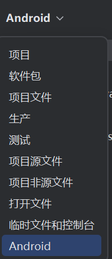

# Android 学习小记

​	笔者最近摸鱼Android，但是国内不少的资料实在是过时，这里笔者打算记录一下从2024年12.29开始的Android学习的旅程。

## 先介绍一下Android Studio

​	Android Studio 是用于 Android 应用程序开发的官方 IDE（集成开发环境），它基于 JetBrains 的 IntelliJ IDEA 软件。Android Studio 提供了许多出色的功能，可提高构建 Android 应用程序的效率，例如：

- 灵活的基于 Gradle 的构建系统

- 快速且功能丰富的模拟器

- 混合环境，可在其中为所有 Android 设备进行开发

- 应用更改以将代码和资源更改推送到正在运行的应用程序，而无需重新启动应用程序

- GitHub 和代码模板集成可帮助您开发常见的应用程序功能并导入示例代码

- 广泛的测试工具和框架

- C++ 和 NDK 支持


​	内置对 Google Cloud Platform 的支持，可轻松集成 Google Cloud Messaging 和 App Engine 等。通常，当开发人员想要在 Android Studio 中创建新项目时，他/她需要选择一个项目模板，该模板由许多Activity组成

## 看看常见的模板


他们分别是：

- No Activity
- Empty Activity
- Gemini API Starter
- Basic View Activity
- Bottom Navigation Activity
- Empty Views Activity
- Navigation Drawer Views Activity
- Responsive Views Activity
- Game Activity C++
- Native C++

#### 1. **No Activity**

​	这些则是有经验的开发者选择的架构，一般而言没有XML，也不会有任何一个Java或者是Kotlin文件，那些文件是不会自动生成的。

- **用途**：创建一个空的Android项目，不包含任何活动或UI布局。适用于那些需要完全自定义应用结构的开发者。
- **特点**：无预定义界面或元素，开发者可以从零开始构建应用的任何部分。你需要手动添加所有的活动、布局和资源文件。
- **适用场景**：适合有经验的开发者，他们已经知道自己需要什么样的架构和功能，不依赖Android Studio提供的默认模板。

#### 2. **Empty Activity**

​	这个是大部分初学者最经常选择的架构。

- **用途**：创建一个包含一个简单活动（Activity）和一个默认布局的基础模板。这个模板为你提供了一个简单的起点，开发者可以快速开始构建应用。
- **特点**：包含一个`MainActivity`和一个简单的布局文件（如`activity_main.xml`）。它是开发中最常用的模板之一，适合那些需要快速实现一些基本功能的开发者。
- **适用场景**：适用于初学者或那些想要实现简单应用的开发者，它为开发者提供了一个干净的基础，不包含过多复杂的功能。

#### 3. **Gemini API Starter**


- **特点**：包含Gemini API的基本集成代码和接口调用结构。它为开发者提供了一个与Gemini API交互的框架，简化了API调用和数据解析过程。
- **适用场景**：适用于需要使用Gemini API的开发者，如星座应用、占星应用或任何其他基于Gemini API服务的应用。

#### 4. **Basic View Activity**

- **用途**：这个模板为应用提供一个简单的UI，展示基本的视图元素，如文本框、按钮、图片等。适用于需要快速展示UI的应用。
- **特点**：它的布局文件通常包含一些基础视图组件（例如`TextView`、`Button`、`ImageView`等）。该模板重点展示如何将常见的UI元素放入活动中，简化视图的展示过程。
- **适用场景**：适用于开发简单的界面，展示静态内容或进行简单的交互操作。

#### 5. **Bottom Navigation Activity**

​	底部导航活动会创建一个带有底部导航的新活动。我们都遇到过包含底部导航栏的应用程序。一些流行的例子包括 Instagram、WhatsApp 等。当您选择底部导航活动时，会自动创建这些文件，以下是欢迎页面：

- **用途**：为开发者提供了底部导航栏的UI设计，允许在应用的不同部分之间进行快速切换。通常适用于拥有多个页面的应用。
- **特点**：该模板内置了底部导航栏（`BottomNavigationView`），用户可以点击不同的菜单项来切换不同的Fragments或活动页面。适用于需要底部导航布局的应用。
- **适用场景**：适合包含多个功能模块的应用（如社交、购物或新闻应用），用户可以通过底部导航在不同的模块之间切换。

#### 6. **Empty Views Activity**

这是一个很受欢迎的活动，我们在开始开发 Android 项目时经常选择此活动。它只是创建一个新的空活动。注意：请在无活动和空活动中标记阶段。在无活动中，它会创建一个新的空项目，在空活动中，它会创建一个新的空活动。

- **用途**：类似于“Empty Activity”，但该模板关注于提供一个空的视图框架，允许开发者自己逐步构建布局和UI组件。
- **特点**：模板创建后，除了`Activity`外不会提供任何UI元素，开发者需要手动向布局中添加`View`元素，如`TextView`、`Button`、`RecyclerView`等。它是一个完全自定义的空白视图布局。
- **适用场景**：适用于那些需要完全控制UI元素布局的开发者，或者需要创建非常个性化的界面的应用。

#### 7. **Navigation Drawer Views Activity**

- **用途**：提供一个包含侧边栏（Navigation Drawer）的UI模板，适用于需要复杂菜单导航的应用。
- **特点**：该模板包括一个滑动的侧边菜单（`NavigationView`），用户可以通过滑动或点击菜单按钮打开该侧边栏，菜单通常包含多个选项，帮助用户在不同的界面或功能间切换。
- **适用场景**：适用于多模块的应用，尤其是需要有多个页面或功能项的应用（例如设置页面、个人中心等）。常用于社交、新闻和管理类应用。

#### 8. **Responsive Views Activity**

- **用途**：该模板旨在帮助开发者创建响应式布局，确保应用在不同屏幕尺寸和设备类型（如手机、平板）上均能良好显示。
- **特点**：模板内置了一些响应式布局元素，如`ConstraintLayout`，并适配了不同屏幕尺寸的视图。它可能还包含`drawable`和`values`文件夹中的资源，以便于在不同设备和分辨率下展示不同的UI效果。
- **适用场景**：适合开发需要跨多个设备和屏幕尺寸的应用，尤其是那些需要高度适配的应用（如平板和手机通用的应用）。

#### 9. **Game Activity C++**

- **用途**：这是为游戏开发者准备的C++基础活动模板，适用于使用C++编写游戏的Android应用。
- **特点**：该模板包括C++代码支持，提供一个简易的框架来运行游戏逻辑。它可能集成了一些常见的游戏开发工具和库（如OpenGL、Cocos2d等），以便于快速启动游戏项目。
- **适用场景**：适用于使用C++进行Android游戏开发的开发者，尤其是那些有经验并希望在移动设备上开发高性能游戏的开发者。

#### 10. **Native C++**

原生 C++ 会创建一个新项目，其中的空活动配置为使用 JNI。JNI 是 Java 原生接口。JNI 描述了 Android 从用 Java 或 Kotlin 编程语言编写的执行代码编译字节码与用 C/C++ 编写的原生代码交互的方式。JNI 与供应商无关，支持从动态共享库加载代码，虽然有时很麻烦，但效率很高。

- **用途**：这是一个基础的原生C++模板，专为需要直接使用C++编写Android应用的开发者设计。与Java/Kotlin不同，这种模板使用C++直接与底层硬件和操作系统交互。
- **特点**：开发者可以在此模板中使用C++与Java/Kotlin进行交互，或者完全使用C++实现应用逻辑。通常与JNI（Java Native Interface）或NDK（Native Development Kit）一起使用。
- **适用场景**：适用于需要处理大量计算或性能要求较高的应用（如游戏、图像处理应用等），开发者熟悉C++并希望直接在Android平台上运行原生代码。

## 开始我们的第一个项目

​	可以看看下面，这是我们的工程项目，一般而言，这个是默认的视图。不太方便而且眼花缭乱，所以我们需要更改一下视图：


​	在这里，选择跟我一样的Android



​	就会得到一个非常干净的：


​	展开了来看就是这样的


​	梳理一下：

```
manifests 文件夹
kotlin+java文件夹
res（资源）文件夹
	Drawable 文件夹
	Mipmap 文件夹
	Values 文件夹
	XML文件夹
Gradle 脚本
```

## manifests文件夹

​	清单文件夹包含用于创建 android 应用程序的 AndroidManifest.xml。此文件包含有关我们应用程序的信息，例如 Android 版本、元数据、Kotlin 文件的状态包和其他应用程序组件。它充当 android 操作系统和我们的应用程序之间的中介。

```
<?xml version="1.0" encoding="utf-8"?>  <!-- XML 声明，表明使用 UTF-8 编码 -->

<manifest xmlns:android="http://schemas.android.com/apk/res/android"  <!-- Android 命名空间 -->
    xmlns:tools="http://schemas.android.com/tools">  <!-- 工具命名空间，用于辅助工具相关配置 -->

    <!-- 应用程序的基本配置 -->
    <application
        android:allowBackup="true"  <!-- 是否允许备份应用数据，true 表示允许 -->
        android:dataExtractionRules="@xml/data_extraction_rules"  <!-- 数据提取规则，指定 XML 文件用于数据恢复和备份 -->
        android:fullBackupContent="@xml/backup_rules"  <!-- 完整备份内容的规则，指定应用数据的备份规则 -->
        android:icon="@mipmap/ic_launcher"  <!-- 应用图标，引用 mipmap 文件夹中的 ic_launcher 图标 -->
        android:label="@string/app_name"  <!-- 应用名称，引用 strings.xml 中的 app_name 字符串资源 -->
        android:roundIcon="@mipmap/ic_launcher_round"  <!-- 圆形图标，通常在支持圆形图标的设备上使用 -->
        android:supportsRtl="true"  <!-- 表示应用支持从右向左的布局，适用于阿拉伯语等语言 -->
        android:theme="@style/Theme.DemoOfMyFirstApplication"  <!-- 应用主题，引用 styles.xml 中的 Theme.DemoOfMyFirstApplication 样式 -->
        tools:targetApi="31">  <!-- 工具标记的目标 API 级别为 31（Android 12） -->
        
        <!-- 定义应用程序的活动（Activity） -->
        <activity
            android:name=".MainActivity"  <!-- 活动的类名，指定主活动为 MainActivity -->
            android:exported="true"  <!-- 活动是否可以由外部组件启动，true 表示可以外部访问 -->
            android:label="@string/app_name"  <!-- 活动的标签，通常是活动的标题，引用 strings.xml 中的 app_name 字符串资源 -->
            android:theme="@style/Theme.DemoOfMyFirstApplication">  <!-- 活动使用的主题，指定与应用相同的主题 -->
            
            <!-- 活动的意图过滤器，用于定义该活动响应的 Intent 类型 -->
            <intent-filter>
                <action android:name="android.intent.action.MAIN" />  <!-- MAIN 动作，表示此活动是应用的主活动 -->
                <category android:name="android.intent.category.LAUNCHER" />  <!-- LAUNCHER 类别，表示该活动是应用的启动活动 -->
            </intent-filter>
        </activity>

    </application>

</manifest>

```

## java文件夹

java文件夹包含我们在应用开发过程中创建的所有 java 和 Kotlin 源代码 （.java） 文件，包括其他测试文件。如果我们使用 Kotlin 创建任何新项目，默认情况下，类文件 MainActivity.kt 文件将在软件包名称“com.example.demoofmyfirstapplication”下自动创建，如下所示。

```
package com.example.demoofmyfirstapplication  // 包名，定义了当前文件所在的包

// 导入必要的库和组件
import android.os.Bundle  // Bundle 类，用于传递和保存活动的状态
import androidx.activity.ComponentActivity  // 导入 ComponentActivity 类，它是 Activity 类的子类，支持 Jetpack Compose
import androidx.activity.compose.setContent  // 用于设置 Compose UI 内容
import androidx.activity.enableEdgeToEdge  // 用于启用 "Edge-to-Edge"（边缘到边缘）布局，适用于沉浸式屏幕
import androidx.compose.foundation.layout.fillMaxSize  // 用于设置视图填充最大可用空间
import androidx.compose.foundation.layout.padding  // 用于设置视图的内边距
import androidx.compose.material3.Scaffold  // Scaffold 组件，用于实现常见的 Material Design 布局结构
import androidx.compose.material3.Text  // 用于显示文本组件
import androidx.compose.runtime.Composable  // 用于定义 Compose 可组合函数
import androidx.compose.ui.Modifier  // Modifier 用于修饰 Compose 组件的外观和行为
import androidx.compose.ui.tooling.preview.Preview  // 用于预览 Compose 布局
import com.example.demoofmyfirstapplication.ui.theme.DemoOfMyFirstApplicationTheme  // 导入自定义的主题

// MainActivity 类，继承自 ComponentActivity，是应用的主活动
class MainActivity : ComponentActivity() {
    
    // onCreate 方法是 Activity 生命周期的一个重要方法，首次创建活动时调用
    override fun onCreate(savedInstanceState: Bundle?) {
        super.onCreate(savedInstanceState)
        
        // 启用 "Edge-to-Edge" 布局，消除系统 UI（如状态栏）的干扰，允许视图内容扩展到屏幕的边缘
        enableEdgeToEdge()
        
        // 使用 setContent 方法设置 Compose UI 内容
        setContent {
            // 使用应用的主题，确保 UI 按照预设的样式进行渲染
            DemoOfMyFirstApplicationTheme {
                
                // Scaffold 是一个常见的 Material Design 布局结构，通常包含顶部栏、底部栏等
                Scaffold(modifier = Modifier.fillMaxSize()) { innerPadding ->
                    
                    // 调用 Greeting 函数，在界面上显示问候语
                    // innerPadding 是 Scaffold 自动计算出的内边距，用来避免 UI 元素与屏幕边缘重叠
                    Greeting(
                        name = "Android",  // 传入一个字符串参数给 Greeting
                        modifier = Modifier.padding(innerPadding)  // 给 Greeting 添加内边距修饰符
                    )
                }
            }
        }
    }
}

// 定义一个 Composable 函数，接收一个 name 参数并显示一个问候语
@Composable
fun Greeting(name: String, modifier: Modifier = Modifier) {
    // 使用 Text 组件显示文本，text 参数是显示的内容，modifier 用来修饰组件的外观
    Text(
        text = "Hello $name!",  // 显示的问候文本
        modifier = modifier  // 应用外部传入的修饰符
    )
}

// 用于预览 Composable 函数的布局和外观
@Preview(showBackground = true)  // 设置预览时显示背景
@Composable
fun GreetingPreview() {
    // 使用应用主题包装预览组件
    DemoOfMyFirstApplicationTheme {
        // 调用 Greeting 函数进行预览，传入 "Android" 作为参数
        Greeting("Android")
    }
}
```

​	资源 (res) 文件夹 资源文件夹是最重要的文件夹，因为它包含我们 Android 应用程序的所有非代码源，如图像、XML 布局和 UI 字符串。

