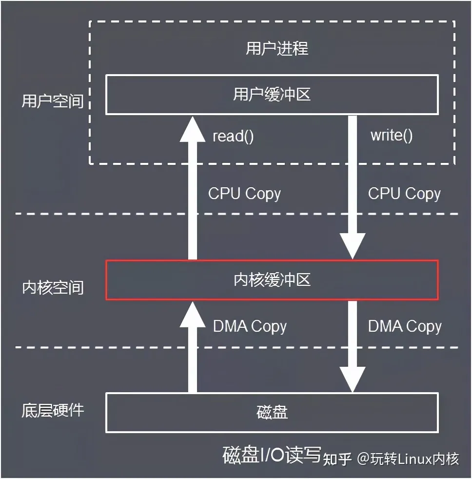
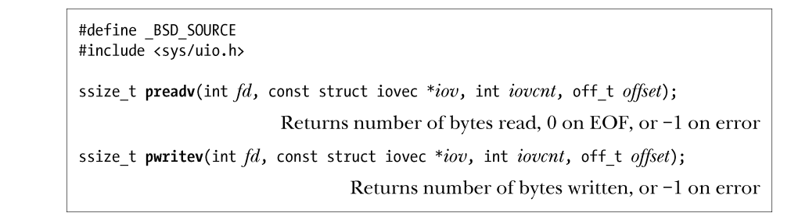
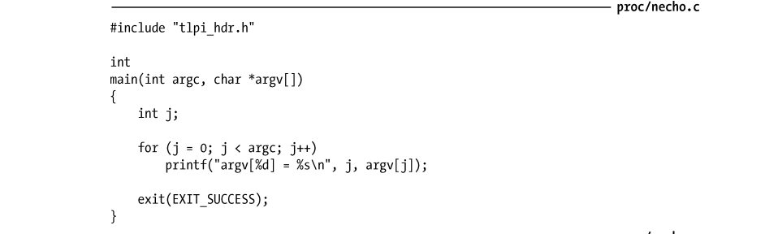
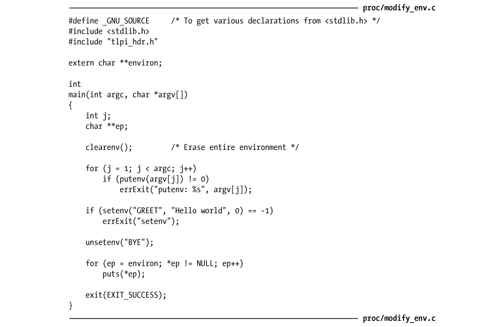

# Linux漫游

# Linux漫游导论

## Linux系统编程之旅

### Start

​		首先就要谈谈内核是什么：

​		一般的讲，也就是我们在这本书提到的那样的东西——是指管理和分配计算机资源（即CPU、RAM 和设备）的核心层软件。值得一提的是——内核让我们的程序运行更加的简单。

​		内核的职责，有六个：

- 进程调度：计算机内均配备有一个或多个 CPU（中央处理单元），以执行程序指令。

```
“多任务”意指多个进程（即运行中的程序）可同时驻留于内存，且每个进程都能获得对 CPU 的使用权。“抢占”则是指一组规则。
```

- 内存管理：内核必须以公平、高效地方式在进程间共享这一资源
- 提供了文件系统：内核在磁盘之上提供有文件系统，允许对文件执行创建、获取、更新以及删除等操作。
- 创建和终止进程：内核可将新程序载入内存，为其提供运行所需的资源（比如，CPU、内存以及对文件的访问等）。这样一个运行中的程序我们称之为“进程”。一旦进程执行完毕，内核还要确保释放其占用资源，以供后续程序重新使用。
- 对设备的访问：计算机外接设备（鼠标、键盘、磁盘和磁带驱动器等）可实现计算机与外部世界的通信，这一通信机制包括输入、输出或是两者兼而有之。内核既为程序访问设备提供了简化版的标准接口，同时还要仲裁多个进程对每一个设备的访问。
- 联网：内核以用户进程的名义收发网络消息（数据包）。该任务包括将网络数据包路由至目标系统。

​		这就是说，每个用户都可以登录进入系统，独立操作，而与其他用户大致无干。

### 内核态和用户态

​		现代CPU允许两个重要的状态即：用户态和核心态（有时也称之为监管态 supervisor mode）。执行硬件指令可使 CPU 在两种状态间来回切换。与之对应，可将虚拟内存区域划分（标记）为用户空间部分或内核空间部分。

### 以进程及内核视角检视系统

​		学习内核编程的时候，有必要注意到思维的转化，换而言之，我们需要学习从内核的角度上看待问题

## shell

​		shell 是一种具有特殊用途的程序，主要用于读取用户输入的命令，并执行相应的程序以响应命令。有时，人们也称之为命令解释器。术语登录 shell（login shell）是指用户刚登录系统时，由系统创建，用以运行 shell 的进程。

​		设计 shell 的目的不仅仅是用于人机交互，对 shell 脚本（包含 shell 命令的文本文件）进行解释也是其用途之一。为实现这一目的，每款 shell 都内置有许多通常与编程语言相关的功能，其中包括变量、循环和条件语句、I/O 命令以及函数等。

## 用户和组

​		系统会对每个用户的身份做唯一标识，**用户可隶属于多个组**。用户系统的每个用户都拥有唯一的登录名（用户名）和与之相对应的整数型用户ID（UID）。每一个用户，都会有对应的记录。这样的记录由下面的三个部分组成

- 组名：（唯一的）组名称。
- 组 ID（GID）：与组相关的整数型 ID。
- 用户列表：隶属于该组的用户登录名列表（通过密码文件记录的 group ID 字段未能标识出的该组其他成员，也在此列），以逗号分隔。

需要注意的是，超级用户的用户ID是0，登录名称是root，在一般的 UNIX 系统上，超级用户凌驾于系统的权限检查之上。因此，无论对文件施以何种访问权限限制，超级用户都可以访问系统中的任何文件，也能发送信号干预系统运行的所有用户进程。

## 单根目录层级、目录、链接及文件

​	**内核维护着一套单根目录结构，以放置系统的所有文件。**完全不同于Windows的是，Linux有一个根目录`/`，所有的文件和目录都是他的子孙。

### 文件类型

​		在文件系统内，会对文件类型进行标记，以表明其种类。其中一种用来表示普通数据文件，人们常称之为“普通文件”或“纯文本文件”，以示与其他种类的文件有所区别。于是，文件在这里就是任何形式的文件的意思了。

### 路径和链接

​		目录是一种特殊类型的文件，内容采用表格形式，数据项包括文件名以及对相应文件的引用。这一“文件名+引用”的组合被称为链接。每个文件都可以有多条链接，因而也可以有多个名称，在相同或不同的目录中出现。目录可包含指向文件或其他目录的链接。路径间的链接建立起如图 2-1 所示的目录层级。每个目录至少包含两条记录：.和..，前者是指向目录自身的链接，后者是指向其上级目录—父目录的链接。


### 符号链接

​		类似于普通链接，符号链接给文件起了一个“别号（alternative name）”。所谓“另一文件”通常被称为符号链接的目标，人们一般会说符号链接“指向”或“引用”目标文件。在多数情况下，只要系统调用用到了路径名，内核会自动解除（换言之，按照）该路径名中符号链接的引用，以符号链接所指向的文件名来替换符号链接。若符号链接的目标文件自身也是一个符号链接，那么上述过程会以递归方式重复下去。对于那些指向了一个并不存在的文件，可以视之为空连接。

​		通常，人们会分别使用**硬链接（hard link）或软链接（soft link）**这样的术语来指代正常链接和符号链接。

### 文件名

​		**在大多数 Linux 文件系统上，文件名最长可达 255 个字符。**文件名可以包含除“/”和空字符（\0）外的所有字符。但是，只建议使用字母、数字、点(“.”)、下划线（“\_”）以及连字符（“−”）。SUSv3 将这 65 个字符的集合[-.\ \_a-zA-Z0-9]称为可移植文件名字符集（portable filename character set）。

​		注意的是——为了防止出现特殊字符无法识别的问题，强烈建议避免使用上述可以指字符以外的字符作为文件名称

​		此外，还应避免以连字符（“-”）作为文件名的起始字符，因为一旦在 shell 命令中使用这种文件名，会被误认为命令行选项开关。 

### 路径名

​		**路径名是由一系列文件名组成的字符串，彼此以“/”分隔，首字符可以为“/”（非强制）1。除却最后一个文件名外，该系列文件名均为目录名称（或为指向目录的符号链接）。路径名的尾部2可标识任意类型的文件，包括目录在内。有时将该字符串中最后一个“/”字符之前的部分称为路径名的目录部分，将其之后的部分称为路径名的文件部分或基础部分。**

​		路径名应按从左至右的顺序阅读，路径名中每个文件名之前的部分，即为该文件所处目录。可在路径名中任意位置后引入字符串“..”，用以指代路径名中当前位置的父目录。路径名描述了单根目录层级下的文件位置，又可分为绝对路径名和相对路径名：

- **绝对路径名以“/”开始**，指明文件相对于根目录的位置。图 2-1 中的/home/mtk/. bashrc、/usr/include 以及/（根路径的路径名）都是绝对路径名的例子。
- 相对路径名定义了相对于进程当前工作目录（见下文）的文件位置，与绝对路径名相比，相对路径名缺少了起始的“/”。如图 2-1 所示，在目录 usr 下，可使用相对路径名include/sys/types.h 来引用文件 types.h，在目录 avr 下，可使用相对路径名../mtk/.bashrc来访问文件.bashrc。

### 当前工作目录

​		值得注意的是，每一个进程都由当前工作目录的说法！说白了就是你现在所处的文件系统的位置。

### 文件的所有权和权限

​		每个文件都有一个与之相关的用户 ID 和组 ID，分别定义文件的属主和属组。系统根据文件的所有权来判定用户对文件的访问权限。

​		为了访问文件，系统把用户分为 3 类：**文件的属主（有时，也称为文件的用户）、与文件组（group）ID 相匹配的属组成员用户以及其他用户。**可为以上 3 类用户分别设置 3 种权限（共计 9 种权限位）：只允许查看文件内容的读权限；允许修改文件内容的写权限；允许执行文件的执行权限。这里的文件要么指程序，要么是交由某种解释程序（通常指 shell 的一种，但也有例外）处理的脚本。

## 文件 I/O 模型

​			UNIX 系统 I/O 模型最为显著的特性之一是其 I/O 通用性概念。也就是说，同一套系统调用（open()、read()、write()、close()等）所执行的 I/O 操作，可施之于所有文件类型，包括设备文件在内。

​		就本质而言，内核只提供一种文件类型：**字节流序列，在处理磁盘文件、磁盘或磁带设备时，可通过 lseek()系统调用来随机访问。**

​		**UNIX 系统没有文件结束符的概念，读取文件时如无数据返回，便会认定抵达文件末尾**。

### 文件描述符

​		I/O 系统调用使用文件描述符—（往往是数值很小的）非负整数—来指代打开的文件。获取文件描述符的常用手法是调用 open()，在参数中指定 I/O 操作目标文件的路径名。通常，由 shell 启动的进程会继承 3 个已打开的文件描述符：

- 描述符 0 为标准输入，指代为进程提供输入的文件；
- 描述符 1 为标准输出，指代供进程写入输出的文件；
- 描述符 2 为标准错误，指代供进程写入错误消息或异常通告的文件。

​		在交互式 shell 或程序中，上述三者一般都指向终端。在 stdio 函数库中，这几种描述符分别与文件流 stdin、stdout 和 stderr 相对应。

## 程序

​		程序通常以两种面目示人。**其一为源码形式，由使用编程语言（比如，C 语言）写成的一系列语句组成，是人类可以阅读的文本文件**。要想执行程序，**则需将源码转换为第二种形式—计算机可以理解的二进制机器语言指令。**

### 过滤器

​		从 stdin 读取输入，加以转换，再将转换后的数据输出到 stdout，常常将拥有上述行为的程序称为过滤器，cat、grep、tr、sort、wc、sed、awk 均在其列。

### 命令行参数

​		C 语言程序可以访问命令行参数，即程序运行时在命令行中输入的内容。要访问命令行参数，程序的 main()函数需做如下声明：argc 变量包含命令行参数的总个数，argv 指针数组的成员指针则逐一指向每个命令行参数字符串。首个字符串 argv[0]，标识程序名本身。

## 2.7 进程

​			简而言之，进程是正在执行的程序实例。也就是说，一个程序被CPU执行的时候就变成了进程，并且，程序代码将会被载入虚拟内存，微程序变量分配空间，建立内核记账（bookkeeping）数据结构，以记录与进程有关的各种信息（比如，进程 ID、用户 ID、组 ID 以及终止状态等）。

​		内核会为进程分配一些资源，并且在进程的生命周期中为之分配资源。**程序终止时，内核会释放所有此类资源，供其他进程重新使用。其他资源（如 CPU、网络带宽等）都属于可再生资源，但必须在所有进程间平等共享。**

​		进程的内存布局逻辑上将一个进程划分为以下几部分（也称为段）。

- 文本：程序的指令。
- 数据：程序使用的静态变量。
- 堆：程序可从该区域动态分配额外内存。
- 栈：随函数调用、返回而增减的一片内存，用于为局部变量和函数调用链接信息分配存储空间。

### 创建进程和执行程序

​		进程可使用系统调用 fork()来创建一个新进程。调用 fork()的进程被称为父进程，新创建的进程则被称为子进程。

​		对父进程的复制来创建子进程。子进程从父进程处继承数据段、栈段以及堆段的副本后，可以修改这些内容，不会影响父进程的“原版”内容。**（在内存中被标记为只读的程序文本段则由父、子进程共享。）**

​		以 execve()为基础，C 语言库还提供了几个相关函数，接口虽然略有不同，但功能全都相同。以上所有库函数的名称均以字符串“exec”打头，在函数间差异无关宏旨的场合，本书会用符号exec()作为这些库函数的统称。

### 进程 ID 和父进程 ID

​		每一进程都有一个唯一的整数型进程标识符（PID）。此外，每一进程还具有一个父进程标识符（PPID）属性，用以标识请求内核创建自己的进程。

### 进程终止和终止状态

​		可使用以下两种方式之一来终止一个进程：

- **其一，进程可使用 \_exit()系统调用（或相关的exit()库函数）**，请求退出；
- 其二，向进程传递信号，将其“杀死”。

​		无论以何种方式退出，进程都会生成“终止状态”，一个非负小整数，可供父进程的 wait()系统调用检测。在调用 \_exit()的情况下，进程会指明自己的终止状态。若由信号来“杀死”进程，则会根据导致进程“死亡”的信号类型来设置进程的终止状态。（有时会将传递进\ \_exit()的参数称为进程的“退出状态”，以示与终止状态有所不同，后者要么指传递给 \_exit()的参数值，要么表示“杀死”进程的信号。）根据惯例，**终止状态为 0 表示进程“功成身退”，非 0 则表示有错误发生。**大多数 shell 会将前一执行程序的终止状态保存于 shell 变量$?中。

### 进程的用户和组标识符（凭证）

​		每个进程都有一组与之相关的用户 ID (UID)和组 ID (GID)，如下所示。 

- 真实用户 ID 和组 ID：用来标识进程所属的用户和组。新进程从其父进程处继承这些 ID。登录 shell 则会从系统密码文件的相应字段中获取其真实用户 ID 和组 ID。
- 有效用户 ID 和组 ID：进程在访问受保护资源（比如，文件和进程间通信对象）时，会使用这两个 ID（并结合下述的补充组 ID）来确定访问权限。一般情况下，进程的有效 ID 与相应的真实 ID 值相同。正如即将讨论的那样，改变进程的有效ID 实为一种机制，可使进程具有其他用户或组的权限。 
- 补充组 ID：用来标识进程所属的额外组。新进程从其父进程处继承补充组 ID。登录shell 则从系统组文件中获取其补充组 ID。

### 特权进程

​		在 UNIX 系统上，就传统意义而言，特权进程是指有效用户 ID 为 0（超级用户）的进程。通常由内核所施加的权限限制对此类进程无效。与之相反，术语“无特权”（或非特权）进程是指由其他用户运行的进程。此类进程的有效用户 ID 为非 0 值，且必须遵守由内核所强加的权限规则。由某一特权进程创建的进程，也可以是特权进程。例如，一个由 root（超级用户）发起的登录 shell。成为特权进程的另一方法是利用 set-user-ID 机制，该机制允许某进程的有效用户ID 等同于该进程所执行程序文件的用户 ID。

### 能力（Capabilities）

​		始于内核 2.2，Linux 把传统上赋予超级用户的权限划分为一组相互独立的单元（称之为“能力”）。每次特权操作都与特定的能力相关，仅当进程具有特定能力时，才能执行相应操作。传统意义上的超级用户进程（有效用户 ID 为 0）则相应开启了所有能力。赋予某进程部分能力，使得其既能够执行某些特权级操作，又防止其执行其他特权级操作。本书第 39 章会对能力做深入讨论。在本书后文中，当述及只能由特权进程执行的特殊操作时，一般都会在括号中标明其具体能力。能力的命名以 CAP\_为前缀，例如，CAP\_KILL。init 进程系统引导时，内核会创建一个名为 init 的特殊进程，即“所有进程之父”，该进程的相应程序文件为/sbin/init。系统的所有进程不是由 init（使用 fork()）“亲自”创建，就是由其后代进程创建。**init 进程的进程号总为 1，且总是以超级用户权限运行。**谁（哪怕是超级用户）都不能“杀死”init 进程，**只有关闭系统才能终止该进程**。init 的主要任务是创建并监控系统运行所需的一系列进程。（手册页 init(8)中包含了 init 进程的详细信息。）

### 守护进程

​		守护进程指的是具有特殊用途的进程，系统创建和处理此类进程的方式与其他进程相同，但以下特征是其所独有的： 

- “长生不老”。**守护进程通常在系统引导时启动，直至系统关闭前，会一直“健在”。** 
- 守护进程在后台运行，且无控制终端供其读取或写入数据。守护进程中的例子有 syslogd（在系统日志中记录消息）和 httpd（利用 HTTP 分发 Web 页面）。

### 环境列表

​		每个进程都有一份环境列表，即在进程用户空间内存中维护的一组环境变量。

​		由 fork()创建的新进程，会继承父进程的环境副本。这也为父子进程间通信提供了一种机制。当进程调用 exec()替换当前正在运行的程序时，新程序要么继承老程序的环境，要么在 exec()调用的参数中指定新环境并加以接收。

​		我们可以自己创建环境变量

```
export MYVAR = "Hello, World"
```

​		C 语言程序可使用外部变量（char **environ）来访问环境，而库函数也允许进程去获取或修改自己环境中的值。

​		环境变量的用途多种多样。例如，shell 定义并使用了一系列变量，供 shell 执行的脚本和程序访问。其中包括：

- 变量 HOME（明确定义了用户登录目录的路径名）、
- 变量 PATH（指明了用户输入命令后，shell 查找与之相应程序时所搜索的目录列表）。

### 资源限制

​		每个进程都会消耗诸如打开文件、内存以及 CPU 时间之类的资源。使用系统调用 setrlimit()，进程可为自己消耗的各类资源设定一个上限。

​		这样的限制分为软限制和硬限制。

​		软限制（soft limit）限制了进程可以消耗的资源总量，硬限制（hard limit）软限制的调整上限。非特权进程在针对特定资源调整软限制值时，可将其设置为 0 到相应硬限制值之间的任意值，但硬限制值则只能调低，不能调高。由 fork()创建的新进程，会继承其父进程对资源限制的设置。使用 ulimit 命令（在 C shell 中为 limit）可调整 shell 的资源限制。shell 为执行命令所创建的子进程会继承上述资源设置。

## 内存映射

调用系统函数 mmap()的进程，会在其虚拟地址空间中创建一个新的内存映射。映射分为两类。 

- 文件映射：将文件的部分区域映射入调用进程的虚拟内存。映射一旦完成，对文件映射内容的访问则转化为对相应内存区域的字节操作。映射页面会按需自动从文件中加载。 
- 相映成趣的是并无文件与之相对应的匿名映射，其映射页面的内容会被初始化为 0。

​		由某一进程所映射的内存可以与其他进程的映射共享。达成共享的方式有二：

- 其一是两个进程都针对某一文件的相同部分加以映射，
- 其二是由 fork()创建的子进程自父进程处继承映射。

​		当两个或多个进程共享的页面相同时，进程之一对页面内容的改动是否为其他进程所见呢？这取决于创建映射时所传入的标志参数。若传入标志为私有，则某进程对映射内容的修改对于其他进程是不可见的，而且这些改动也不会真地落实到文件上；若传入标志为共享，对映射内容的修改就会为其他进程所见，并且这些修改也会造成对文件的改动。内存映射用途很多，其中包括：以可执行文件的相应段来初始化进程的文本段、内存（内容填充为 0）分配、文件 I/O（即映射内存 I/O）以及进程间通信（通过共享映射）。

## 2.10 进程间通信及同步

​		Linux 系统上运行有多个进程，其中许多都是独立运行。然而，有些进程必须相互合作以达成预期目的，因此彼此间需要通信和同步机制。

​		读写磁盘文件中的信息是进程间通信的方法之一。可是，对许多程序来说，这种方法既慢又缺乏灵活性。因此，像所有现代 UNIX 实现那样，Linux 也提供了丰富的进程间通信（IPC）机制，如下所示。 

- 信号（signal），用来表示事件的发生。 
- 管道（亦即 shell 用户所熟悉的“|”操作符）和 FIFO，用于在进程间传递数据。 
- 套接字，供同一台主机或是联网的不同主机上所运行的进程之间传递数据。 
- 文件锁定，为防止其他进程读取或更新文件内容，允许某进程对文件的部分区域加以锁定。 
- 消息队列，用于在进程间交换消息（数据包）。 
- 信号量（semaphore），用来同步进程动作。 
- 共享内存，允许两个及两个以上进程共享一块内存。当某进程改变了共享内存的内容时，其他所有进程会立即了解到这一变化。

​		UNIX 系统的 IPC 机制种类如此繁多，有些功能还互有重叠，部分原因是由于各种 IPC 机制是在不同的 UNIX 实现上演变而来的，需要遵循的标准也各不相同。例如，就本质而言，FIFO和 UNIX 套接字功能相同，允许同一系统上并无关联的进程彼此交换数据。二者之所以并存于现代 UNIX 系统之中，是由于 FIFO 来自 System V，而套接字则源于 BSD。

## 2.11 信号

​		尽管上一节将信号视为 IPC 的方法之一，但其在其他方面的广泛应用则更为普遍，因此值得深入讨论。

​		人们往往将信号称为“软件中断”。进程收到信号，就意味着某一事件或异常情况的发生。信号的类型很多，每一种分别标识不同的事件或情况。采用不同的整数来标识各种信号类型，并以 SIGxxxx 形式的符号名加以定义。

​		内核、其他进程（只要具有相应的权限）或进程自身均可向进程发送信号。例如，发生下列情况之一时，内核可向进程发送信号。 

- **用户键入中断字符（通常为 Control-C）。** 
- **进程的子进程之一已经终止。** 
- 由进程设定的**定时器（告警时钟）已经到期。** 
- 进程尝试访问无效的内存地址。

​		在 shell 中，可使用 kill 命令向进程发送信号。在程序内部，系统调用 kill()可提供相同的功能。

​		收到信号时，进程会根据信号采取如下动作之一。 

- 忽略信号。 
- 被信号“杀死”。 
- 先挂起，之后再被专用信号唤醒。

​		**就大多数信号类型而言，程序可选择不采取默认的信号动作，而是忽略信号（当信号的默认处理行为并非忽略此信号时，会派上用场）或者建立自己的信号处理器。**信号处理器是由程序员定义的函数，会在进程收到信号时自动调用，根据信号的产生条件执行相应动作。（换而言之，可以自己自定义处理信号）

​		**信号从产生直至送达进程期间，一直处于挂起状态。**通常，系统会在接收进程下次获得调度时，将处于挂起状态的信号同时送达。如果接收进程正在运行，则会立即将信号送达。然而，程序可以将信号纳入所谓“信号屏蔽”1以求阻塞该信号。如果产生的信号处于“信号屏蔽”之列，那么此信号将一直保持挂起状态，直至解除对该信号的阻塞。（亦即从信号屏蔽中移除。）

## 2.12 线程

​		在现代 UNIX 实现中，**每个进程都可执行多个线程**。可将线程想象为共享同一虚拟内存及一干其他属性的进程。每个线程都会执行相同的程序代码，共享同一数据区域和堆。可是，每个线程都拥有属于自己的栈，用来装载本地变量和函数调用链接信息。线程之间可通过共享的全局变量进行通信。借助于线程 API 所提供的条件变量和互斥机制，进程所属的线程之间得以相互通信并同步行为—尤其是在对共享变量的使用方面。此外，利用 2.10 节所述的 IPC 和同步机制，线程间也能彼此通信。线程的主要优点在于协同线程之间的数据共享（通过全局变量）更为容易，而且就某些算法而论，以多线程来实现比之以多进程实现要更加自然。再者，显而易见，多线程应用能从多处理器硬件的并行处理中获益匪浅。

## 2.13 进程组和 shell 任务控制

​		shell 执行的每个程序都会在一个新进程内发起。比如，shell 创建了 3 个进程来执行以下管道命令（在当前的工作目录下，根据文件大小对文件进行排序并显示）：

```
ls -l | sort -k5n | less
```

​		除 Bourne shell 以外，几乎所有的主流 shell 都提供了一种交互式特性，名为任务控制。该特性允许用户同时执行并操纵多条命令或管道。在支持任务控制的 shell 中，会将管道内的所有进程置于一个新进程组或任务中。（如果情况很简单，shell 命令行只包含一条命令，那么就会创建一个只包含单个进程的新进程组。）**进程组中的每个进程都具有相同的进程组标识符（以整数形式），其实就是进程组中某个进程（也称为进程组组长 process group leader）的进程 ID。**内核可对进程组中的所有成员执行各种动作，尤其是信号的传递。**如下节所述，支持任务控制的 shell 会利用这一特性，以挂起或恢复执行管道中的所有进程。**

## 2.14 会话、控制终端和控制进程

​		**会话指的是一组进程组（任务）。**会话中的所有进程都具有相同的**会话标识符。会话首进程（session leader）是指创建会话的进程，其进程 ID 会成为会话 ID。**

​		使用会话最多的是**支持任务控制的 shell**，由 shell 创建的所有进程组与 shell 自身隶属于同一会话，shell 是此会话的会话首进程。

​		通常，会话都会与某个控制终端相关。控制终端建立于会话首进程初次打开终端设备之时。对于由交互式 shell 所创建的会话，这恰恰是用户的登录终端。一个终端至多只能成为一个会话的控制终端。

​		打开控制终端会致使会话首进程成为终端的控制进程。一旦断开了与终端的连接（比如，关闭了终端窗口），控制进程将会收到 SIGHUP 信号。

​		在任一时点，会话中总有一个前台进程组（前台任务），可以从终端中读取输入，向终端发送输出。如果用户在控制终端中输入了“中断”（通常是 Control-C）或“挂起”字符（通常是 Control-Z），那么终端驱动程序会发送信号以终止或挂起（亦即停止）前台进程组。一个会话可以拥有任意数量的后台进程组（后台任务），由以“&”字符结尾的行命令来创建。支持任务控制的 shell 提供如下命令：列出所有任务，向任务发送信号，以及在前后台任务之间来回切换。

## 2.15 伪终端

​		伪终端是一对相互连接的虚拟设备，也称为主从设备。在这对设备之间，设有一条 IPC信道，可供数据进行双向传递。从设备（slave device）所提供的接口，其行为方式与终端相类似**，基于这一特点，可以将某个为终端编写的程序与从设备连接起来，然后，再利用连接到主设备的另一程序来驱动这一“面向终端”的程序，这是伪终端的一个关键用途。**由“驱动程序”1所产生的输出，在经由终端驱动程序的常规输入处理（例如，默认情况下，会把回车符映射为换行符）后，会作为输入传递给与从设备相连的面向终端的程序。而由面向终端的程序向从设备写入的任何数据又作为“驱动程序”的输入来传递（在执行完所有常规的终端输入处理后）。换句话说，“驱动程序”所履行的功能，在效果上等同于用户通常在传统终端上所执行的操作。伪终端广泛应用于各种应用领域，最知名的要数 telnet 和 ssh 之类提供网络登录服务的应用，以及 X Window 系统所提供的终端窗口实现。

## 2.16 日期和时间

​		进程涉及两种类型的时间。 

- **真实时间：指的是在进程的生命期内（所经历的时间或时钟时间），以某个标准时间点（日历时间）或固定时间点（通常是进程的启动时间）为起点测量得出的时间。在UNIX 系统上，日历时间是以国际协调时间（简称 UTC）1970 年 1 月 1 日凌晨为起始点，按秒测量得出的时间，再进行时区调整（定义时区的基准点为穿过英格兰格林威治的经线) 。这一日期与 UNIX 系统的生日很接近，也被称为纪元（Epoch）。** 
- **进程时间：亦称为 CPU 时间，指的是进程自启动起来，所占用的 CPU 时间总量。可进一步将 CPU 时间划分为系统 CPU 时间和用户 CPU 时间。前者是指在内核模式中，执行代码所花费的时间（比如，执行系统调用，或代表进程执行其他的内核服务）。后者是指在用户模式中，执行代码所花费的时间（比如，执行常规的程序代码）。**

​		time 命令会显示出真实时间、系统 CPU 时间，以及为执行管道中的多个进程而花费的用户 CPU 时间。 

## 2.17 客户端/服务器架构

​		本书有多处论及客户端/服务器应用程序的设计和实现。客户端/服务器应用由两个组件进程组成。 

- 客户端：向服务器发送请求消息，请求服务器执行某些服务。 
- 服务器：分析客户端的请求，执行相应的动作，然后，向客户端回发响应消息。

​		有时，服务器与客户端之间可能需要就一次服务而进行多次交互。客户端应用通常与用户打交道，而服务器应用则提供对某些共享资源的访问。一般说来，都是众多客户端进程与为数不多的一个或几个服务器端进程进行通信。客户端和服务器既可以驻留于同一台计算机上，也可以位于联网的不同计算机上。客户端和服务器使用 2.10 节所讨论的 IPC 机制来实现彼此通信。服务器可以提供各种服务，如下所示。

- 提供对数据库或其他共享信息资源的访问。
- 提供对远程文件的跨网访问。 
- 对某些商业逻辑进行封装。 
- 提供对共享硬件资源的访问（比如，打印机）。 
- 提供 WWW 服务。

​		将某项服务封装于单独的服务器应用中，这一做法原因很多，举例如下。

- 效率：较之于在本地的每台计算上提供相同资源，在服务器应用管理之下提供资源的一份实例，则要节约许多。
- 控制、协调和安全：由于资源（尤其是信息资源）的统一存放，服务器既可以协调对资源的访问（例如，两个客户端不能同时更新同一信息），还可以保护资源安全，令其只对特定客户端开放。 
- 在异构环境中运行：在网络中，客户端和服务器应用所运行的硬件平台和操作系统可以不同。

## 2.18 实时性

​		实时性应用程序是指那些需要对输入做出及时响应的程序。此类输入往往来自于外接的传感器或某些专门的输入设备，而输出则会去控制外接硬件。具有实时性需求的应用程序示例包括自动化装配流水线、银行 ATM 机，以及飞机导航系统等。

​		虽然许多实时性应用程序都要求对输入做出快速响应，但决定性因素却在于要在事件触发后的一定时限内，保证响应的交付。要提供实时响应，特别是在短时间内加以响应，就需要底层操作系统的支持。由于实时响应的需求与多用户分时操作系统的需求存在冲突，大多数操作系统“天生”并不提供这样的支持。虽然已经设计出不少实时性的 UNIX 变体，但传统的 UNIX 实现都不是实时操作系统。Linux 的实时性变体也早已诞生，而近期的 Linux 内核正转向对实时性应用原生而全面的支持。

​		为支持实时性应用，POSIX.1b 定义了多个 POSIX.1 扩展，其中包括异步 I/O、共享内存、内存映射文件、内存锁定、实时性时钟和定时器、备选调度策略、实时性信号、消息队列，以及信号量等。虽然这些扩展还不具备严格意义上的“实时性”，但当今的大多数 UNIX 实现都支持上面提到的全部或部分扩展（本书将讲解 Linux 所支持的 POSIX.1b 特性）。本书会以术语“真实时间（real time）”来指代日历时间或经历时间的概念，而术语“实时性（realtime）”则是指操作系统或应用程序具备本节所述的响应能力。

## 2.19 /proc

 文件系统类似于其他的几种 UNIX 实现，Linux 也提供了/proc 文件系统，由一组目录和文件组成，装配（mount）于/proc 目录下。/proc 文件系统是一种虚拟文件系统，以文件系统目录和文件形式，提供一个指向内核数据结构的接口。这为查看和改变各种系统属性开启了方便之门。此外，还能通过一组以/ proc/PID 形式命名的目录（PID 即进程 ID）查看系统中运行各进程的相关信息。通常，/proc 目录下的文件内容都采取人类可读的文本形式，shell 脚本也能对其进行解析。程序可以打开、读取和写入/proc 目录下的既定文件。大多数情况下，只有特权级进程才能修改/proc 目录下的文件内容。本书在讲解各种 Linux 编程接口的同时，也会对相关的/proc 文件进行介绍。12.1 节将就该文件系统的总体信息做进一步介绍。尚无任何标准对/proc 文件系统进行过规范，书中与该文件系统相关的细节均为 Linux 专有。2.20 总结本章纵览了一系列与 Linux 系统编程相关的基本概念。对于 Linux 或 UNIX“生手”而言，理解这些基本概念将为学习系统编程提供足够的背景知识。

# 扩展

## 环境列表

更加详细的：[Linux环境变量配置全攻略 - 悠悠i - 博客园 (cnblogs.com)](https://www.cnblogs.com/youyoui/p/10680329.html)

#### Linux环境变量分类

一、按照生命周期来分，Linux环境变量可以分为两类：
1、永久的：需要用户修改相关的配置文件，变量永久生效。
2、临时的：用户利用export命令，在当前终端下声明环境变量，关闭Shell终端失效。

二、按照作用域来分，Linux环境变量可以分为：
1、系统环境变量：系统环境变量对该系统中所有用户都有效。
2、用户环境变量：顾名思义，这种类型的环境变量只对特定的用户有效。

#### Linux设置环境变量的方法

一、在`/etc/profile`文件中添加变量 **对所有用户生效（永久的）**
用vim在文件`/etc/profile`文件中增加变量，该变量将会对Linux下所有用户有效，并且是“永久的”。
例如：编辑/etc/profile文件，添加CLASSPATH变量


```bash
  vim /etc/profile    
  export CLASSPATH=./JAVA_HOME/lib;$JAVA_HOME/jre/lib
```

注：修改文件后要想马上生效还要运行`source /etc/profile`不然只能在下次重进此用户时生效。
二、在用户目录下的.bash_profile文件中增加变量 **【对单一用户生效（永久的）】**
用`vim ~/.bash_profile`文件中增加变量，改变量仅会对当前用户有效，并且是“永久的”。


```bash
vim ~/.bash.profile
export CLASSPATH=./JAVA_HOME/lib;$JAVA_HOME/jre/lib
```

注：修改文件后要想马上生效还要运行$ source ~/.bash_profile不然只能在下次重进此用户时生效。
三、直接运行export命令定义变量 **【只对当前shell（BASH）有效（临时的）】**
在shell的命令行下直接使用`export 变量名=变量值`
定义变量，该变量只在当前的shell（BASH）或其子shell（BASH）下是有效的，shell关闭了，变量也就失效了，再打开新shell时就没有这个变量，需要使用的话还需要重新定义。

#### Linux环境变量使用

一、Linux中常见的环境变量有：

- PATH：指定命令的搜索路径

> **PATH声明用法：**
> PATH=$PAHT:<PATH 1>:<PATH 2>:<PATH 3>:--------:< PATH n >
> export PATH
> 你可以自己加上指定的路径，中间用冒号隔开。环境变量更改后，在用户下次登陆时生效。
> 可以利用`echo $PATH`查看当前当前系统PATH路径。

- HOME：指定用户的主工作目录（即用户登陆到Linux系统中时，默认的目录）。
- HISTSIZE：指保存历史命令记录的条数。
- LOGNAME：指当前用户的登录名。
- HOSTNAME：指主机的名称，许多应用程序如果要用到主机名的话，通常是从这个环境变量中来取得的
- SHELL：指当前用户用的是哪种Shell。
- LANG/LANGUGE：和语言相关的环境变量，使用多种语言的用户可以修改此环境变量。
- MAIL：指当前用户的邮件存放目录。

【修改Linux环境变量的方法】

这里:arrow_right:[Linux环境变量配置全攻略 - 悠悠i - 博客园 (cnblogs.com)](https://www.cnblogs.com/youyoui/p/10680329.html)


在自定义安装软件的时候，经常需要配置环境变量，下面列举出各种对环境变量的配置方法。

下面所有例子的环境说明如下：

- 系统：Ubuntu 14.0
- 用户名：uusama
- 需要配置MySQL环境变量路径：/home/uusama/mysql/bin

### Linux读取环境变量

读取环境变量的方法：

- `export`命令显示当前系统定义的所有环境变量
- `echo $PATH`命令输出当前的`PATH`环境变量的值

这两个命令执行的效果如下

```shell
uusama@ubuntu:~$ export
declare -x HOME="/home/uusama"
declare -x LANG="en_US.UTF-8"
declare -x LANGUAGE="en_US:"
declare -x LESSCLOSE="/usr/bin/lesspipe %s %s"
declare -x LESSOPEN="| /usr/bin/lesspipe %s"
declare -x LOGNAME="uusama"
declare -x MAIL="/var/mail/uusama"
declare -x PATH="/home/uusama/bin:/home/uusama/.local/bin:/usr/local/sbin:/usr/local/bin:/usr/sbin:/usr/bin:/sbin:/bin"
declare -x SSH_TTY="/dev/pts/0"
declare -x TERM="xterm"
declare -x USER="uusama"

uusama@ubuntu:~$ echo $PATH
/home/uusama/bin:/home/uusama/.local/bin:/usr/local/sbin:/usr/local/bin:/usr/sbin:/usr/bin:/sbin:/bin
```

其中`PATH`变量定义了运行命令的查找路径，以冒号`:`分割不同的路径，使用`export`定义的时候可加双引号也可不加。

### Linux环境变量配置方法一：`export PATH`

使用`export`命令直接修改`PATH`的值，配置MySQL进入环境变量的方法:

```shell
export PATH=/home/uusama/mysql/bin:$PATH

# 或者把PATH放在前面
export PATH=$PATH:/home/uusama/mysql/bin
```

注意事项：

- 生效时间：立即生效
- 生效期限：当前终端有效，窗口关闭后无效
- 生效范围：仅对当前用户有效
- 配置的环境变量中不要忘了加上原来的配置，即`$PATH`部分，避免覆盖原来配置

### Linux环境变量配置方法二：`vim ~/.bashrc`

通过修改用户目录下的`~/.bashrc`文件进行配置：

```shell
vim ~/.bashrc

# 在最后一行加上
export PATH=$PATH:/home/uusama/mysql/bin
```

注意事项：

- 生效时间：使用相同的用户打开新的终端时生效，或者手动`source ~/.bashrc`生效
- 生效期限：永久有效
- 生效范围：仅对当前用户有效
- 如果有后续的环境变量加载文件覆盖了`PATH`定义，则可能不生效

### Linux环境变量配置方法三：`vim ~/.bash_profile`

和修改`~/.bashrc`文件类似，也是要在文件最后加上新的路径即可：

```shell
vim ~/.bash_profile

# 在最后一行加上
export PATH=$PATH:/home/uusama/mysql/bin
```

注意事项：

- 生效时间：使用相同的用户打开新的终端时生效，或者手动`source ~/.bash_profile`生效
- 生效期限：永久有效
- 生效范围：仅对当前用户有效
- 如果没有`~/.bash_profile`文件，则可以编辑`~/.profile`文件或者新建一个

### Linux环境变量配置方法四：`vim /etc/bashrc`

该方法是修改系统配置，需要管理员权限（如root）或者对该文件的写入权限：

```shell
# 如果/etc/bashrc文件不可编辑，需要修改为可编辑
chmod -v u+w /etc/bashrc

vim /etc/bashrc

# 在最后一行加上
export PATH=$PATH:/home/uusama/mysql/bin
```

注意事项：

- 生效时间：新开终端生效，或者手动`source /etc/bashrc`生效
- 生效期限：永久有效
- 生效范围：对所有用户有效

### Linux环境变量配置方法五：`vim /etc/profile`

该方法修改系统配置，需要管理员权限或者对该文件的写入权限，和`vim /etc/bashrc`类似：

```shell
# 如果/etc/profile文件不可编辑，需要修改为可编辑
chmod -v u+w /etc/profile

vim /etc/profile

# 在最后一行加上
export PATH=$PATH:/home/uusama/mysql/bin
```

注意事项：

- 生效时间：新开终端生效，或者手动`source /etc/profile`生效
- 生效期限：永久有效
- 生效范围：对所有用户有效

### Linux环境变量配置方法六：`vim /etc/environment`

该方法是修改系统环境配置文件，需要管理员权限或者对该文件的写入权限：

```shell
# 如果/etc/bashrc文件不可编辑，需要修改为可编辑
chmod -v u+w /etc/environment

vim /etc/profile

# 在最后一行加上
export PATH=$PATH:/home/uusama/mysql/bin
```

注意事项：

- 生效时间：新开终端生效，或者手动`source /etc/environment`生效
- 生效期限：永久有效
- 生效范围：对所有用户有效


上面列出了环境变量的各种配置方法，那么Linux是如何加载这些配置的呢？是以什么样的顺序加载的呢？

特定的加载顺序会导致相同名称的环境变量定义被覆盖或者不生效。

### 环境变量的分类

环境变量可以简单的分成用户自定义的环境变量以及系统级别的环境变量。

- 用户级别环境变量定义文件：`~/.bashrc`、`~/.profile`（部分系统为：`~/.bash_profile`）
- 系统级别环境变量定义文件：`/etc/bashrc`、`/etc/profile`(部分系统为：`/etc/bash_profile`）、`/etc/environment`

另外在用户环境变量中，系统会首先读取`~/.bash_profile`（或者`~/.profile`）文件，如果没有该文件则读取`~/.bash_login`，根据这些文件中内容再去读取`~/.bashrc`。

### 测试Linux环境变量加载顺序的方法

为了测试各个不同文件的环境变量加载顺序，我们在每个环境变量定义文件中的第一行都定义相同的环境变量`UU_ORDER`，该变量的值为本身的值连接上当前文件名称。

需要修改的文件如下：

- `/etc/environment`
- `/etc/profile`
- `/etc/profile.d/test.sh`，新建文件，没有文件夹可略过
- `/etc/bashrc`，或者`/etc/bash.bashrc`
- `~/.bash_profile`，或者`~/.profile`
- `~/.bashrc`

在每个文件中的第一行都加上下面这句代码，并相应的把冒号后的内容修改为当前文件的绝对文件名。

```
export UU_ORDER="$UU_ORDER:~/.bash_profile"
```

修改完之后保存，新开一个窗口，然后`echo $UU_ORDER`观察变量的值：

```shell
uusama@ubuntu:~$ echo $UU_ORDER
$UU_ORDER:/etc/environment:/etc/profile:/etc/bash.bashrc:/etc/profile.d/test.sh:~/.profile:~/.bashrc
```

可以推测出Linux加载环境变量的顺序如下：

1. `/etc/environment`
2. `/etc/profile`
3. `/etc/bash.bashrc`
4. `/etc/profile.d/test.sh`
5. `~/.profile`
6. `~/.bashrc`

### Linux环境变量文件加载详解

由上面的测试可容易得出Linux加载环境变量的顺序如下，：

系统环境变量 -> 用户自定义环境变量
`/etc/environment` -> `/etc/profile` -> `~/.profile`

打开`/etc/profile`文件你会发现，该文件的代码中会加载`/etc/bash.bashrc`文件，然后检查`/etc/profile.d/`目录下的`.sh`文件并加载。

```shell
# /etc/profile: system-wide .profile file for the Bourne shell (sh(1))
# and Bourne compatible shells (bash(1), ksh(1), ash(1), ...).

if [ "$PS1" ]; then
  if [ "$BASH" ] && [ "$BASH" != "/bin/sh" ]; then
    # The file bash.bashrc already sets the default PS1.
    # PS1='\h:\w\$ '
    if [ -f /etc/bash.bashrc ]; then
      . /etc/bash.bashrc
    fi
  else
    if [ "`id -u`" -eq 0 ]; then
      PS1='# '
    else
      PS1='$ '
    fi
  fi
fi

if [ -d /etc/profile.d ]; then
  for i in /etc/profile.d/*.sh; do
    if [ -r $i ]; then
      . $i
    fi
  done
  unset i
fi
```

其次再打开`~/.profile`文件，会发现该文件中加载了`~/.bashrc`文件。

```shell
# if running bash
if [ -n "$BASH_VERSION" ]; then
    # include .bashrc if it exists
    if [ -f "$HOME/.bashrc" ]; then
	. "$HOME/.bashrc"
    fi
fi

# set PATH so it includes user's private bin directories
PATH="$HOME/bin:$HOME/.local/bin:$PATH"
```

从`~/.profile`文件中代码不难发现，`/.profile`文件**只在用户登录的时候读取一次**，而`/.bashrc`会在每次运行`Shell`脚本的时候读取一次。

### 一些小技巧

可以自定义一个环境变量文件，比如在某个项目下定义`uusama.profile`，在这个文件中使用`export`定义一系列变量，然后在`~/.profile`文件后面加上：`sourc uusama.profile`，这样你每次登陆都可以在Shell脚本中使用自己定义的一系列变量。

也可以使用`alias`命令定义一些命令的别名，比如`alias rm="rm -i"`（双引号必须），并把这个代码加入到`~/.profile`中，这样你每次使用`rm`命令的时候，都相当于使用`rm -i`命令，非常方便。

## Linux下静态库和动态库的区别

这里：:arrow_right:[Linux静态库与共享库基础笔记 - 知乎 (zhihu.com)](https://zhuanlan.zhihu.com/p/609647309)

### **1、目标库**

编译程序的一种简单方式是简单地将每一个源文件编译成目标文件，然后将这些目标链接在一起组成可执行程序：

```text
gcc -g prog.c mod1.c mod2.c mod3.c
gcc -g prog_nolib prog.o mod1.o mod2.o mod3.o
```

链接实际上是用链接器 `ld` 来完成的，使用 `gcc` 命令链接一个程序时，编译器会再幕后调用 `ld`。

为了解决共享的问题，可以将一组目标文件组织成一个对象库，对象库分为两种：

- 静态库
- 共享库，比静态库更具优势

### **2、静态库**

静态库也称为归档文件，有点：

- 可以将一组经常被调用到的目标文件组织成单个库文件，这样避免构建多个程序时反复编译原来代码的问题
- 链接命令变得更加简单，链接时只需要指定静态库的名称即可，不需要列出一个个目标文件

#### **2.1、创建和维护静态库**

使用 `ar` 命令能够创建和维护静态库，静态库的名称一般为 `libname.a`：

```text
ar options archive object-filr...
```

- `options` 参数由一系列的字母构成，其中一个是操作码，其他是可能影响操作的执行修饰符：

- - `r` ： 替换，将一个目标文件插入到归档文件中并取代同名的目标文件
  - `t` ：目录表，显示归档中的目录表，默认情况下只会列出归档文件中目标文件的名称，添加 `v` 修饰之后可以看到记录在归档文件中的各个目标文件的其他特性
  - `d` ： 从归档文件中删除一个模块

#### **2.2、使用静态库**

程序和静态库链接起来存在的两种方式：

- 在连接命令中指定静态库的名称

```text
gcc -g -c prog.c
gcc -g -o prog prog.o libdemo.a
```

- 或者将静态库放在链接器搜索的其中一个标准目录中 ，例如`/usr/lib`，然后使用 `-l` 选项指定库名，库名需要去除 `lib` 前缀和 `.a` 后缀：

```text
gcc -g -o prog prog.o -ldemo
```

- 如果库不在链接器的搜索目录中，则需要使用 `-L` 指定额外的目录：

```text
gcc -g -o prog prog.o -Llibdir -ldemo
```

### **3、共享库概述**

多个程序使用同一个静态库时，每个程序都有自己的目标模块的副本，这种代码冗余存在的缺点：

- 存储同一个目标模块的多个副本会浪费磁盘空间，并且所浪费的空间是比较大的
- 如果使用了同一模块的程序在同一时刻执行，每个程序都有自己独立的虚拟地址空间，其中保存了一份目标代码副本，这将会提供系统中虚拟内存的整体使用量
- 如果需要修改一个静态库的一个目标模块，那么所有使用这个模块的可执行程序都必须重新进行链接合并这个变更

共享库就是为了克服静态库的诸多缺点，它还具有的优势有：

- 由于整个程序的大小变得更小了，一些情况下，程序可以完全被加载到内存中，从而能够更快的启动程序，这一点只有在大型共享库正被其他程序使用时才成立，第一个加载共享库的程序实际上会在启动时花费更长的时间，因为必须要先找到共享库并将其加载到内存中
- 目标模块修改是 ，不需要重新编译程序就可以看到变更，甚至当运行着的程序正在使用共享库的现有版本时也能够进行这样的变更

共享库的额外开销：

- 创建共享库和构建使用共享库的程序比静态库更复杂
- 共享库在编译时需要使用位置独立代码，这在大多数架构上会带来性能开销，因为它需要使用一个额外的寄存器
- 在运行时必须要执行符号重定位，符号重定位期间，需要对共享库中的每个符号(变量或函数)的引用修改成符合在虚拟内存中的实际运行时位置，这个重定位的过程需要花费一定的时间

虽然共享库的代码是多个进程共享的，但是其中的变量不是，每个使用库的进程会拥有自己的在库中定义的全局和静态变量的副本。

#### **3.1、创建和使用共享库**

##### **创建一个共享库**

```text
gcc -g -c -fPIC -Wall mod1.c mod2.c mod3.c
gcc -g -shared libfoo.so mod1.o mod2.o mod3.o
```

- 贡献库的命名方式一般为 `libname.so`
- 可以向之前构建的共享库中添加单个目标模块，也可以从中删除单个目标模块
- 也可以将编译共享库的命令放在一行：

```text
gcc -g -fPIC -Wall mod1.c mod2.c mod3.c -shared -o libfoo.so
```

##### **位置独立的代码**

**`-fPIC` 选项指定编译器应该生成位置无关代码，这会改变编译器生成执行文件特定操作的代码方式，包括访问全局、静态和外部变量，访问字符串常量，以及获取函数的地址，这些改变使得代码可以在运行时放在任意虚拟地址处，这一点对于共享库来说是必须的，因为链接的时候是无法知道共享库代码位于内存何处。**

在 linux/x86-32 上，可以使用不加 `-fPIC` 选项编译的模块来创建共享库，为了确定一个既有目标文件在编译时是否使用了 `-fPIC` 选项，可以使用检查目标文件符号表中是否存在 `_GLOBAL_OFFSET_TABLE`：

```text
nm mod1.o | grep _GLOBAL_OFFSET_TABLE
readelf -s  mod1.o | grep _GLOBAL_OFFSET_TABLE
```

下面的命令中如果产生了输出，则说明指定的共享库中至少存在一个目标模块在编译时没有指定 `-fPIC`：

```text
objdump --all-headers libfoo.so | grep TEXTREL
objdump --all-headers libfoo.so | grep TEXTREL
```

`TEXTREL` 表示存在一个目标模块，其文本段中包含需要运行时重定位的引用。

##### **使用一个共享库**

为了使用共享库需要做两件事情，而使用静态库则无需完成这两件事情：

- 可执行文件中不包含它所需要的目标文件的副本，因此需要通过某种机制找到运行时所需要的共享库：链接阶段将共享库名称嵌入可执行文件中，一个程序所依赖的所有共享库列表称为程序的动态依赖表
- 在程序运行时需要某种机制解析嵌入的库名，即找出与在可执行文件中指定的名称对应的共享库文件，如果库不再内存中的话就将库加载进内存

运行时解析内嵌库名的工作由动态链接器(也称为动态链接加载器或运行时加载器)来完成，动态链接器本身也是一个共享库，其名称为 `lib/ld-linux.so.2`，所有使用共享库的 ELF 可执行文件都会用到这个共享库。

`lib/ld-linux.so.2` 通常是指向动态链接器可执行文件的符号链接，这个文件的名称为 `ld-version.so`。

动态链接器会检查程序所需的共享库清单并使用一组预先定义好的规则来在文件系统上找出相关的库文件。其中一些规则指定了一组存放共享库的标准目录，如 `/lib`，`/usr/lib`。

**LD_LIBRARY_PATH 环境变量**

通知动态链接器一个共享库位于一个非标准目录中的一种方法是将该目录添加到 `LD_LIBRARY_PATH` 环境变量中以分号分隔的目录列表中，如果定义了 `LD_LIBRARY_PATH`，那么动态链接器在查找标准库目录前会先查找该环境变量列出的目录中的共享库。

```text
LD_LIBRARY_PATH=. ./prog # 告知动态链接器在当前工作目录中搜索共享库
```

**静态链接和动态链接的比较**

术语链接通常指的是使用链接器 `ld` 将一个或多个编译过的目标文件合成一个可执行程序，也称为静态链接。

在运行时使用共享库的可执行程序需要经历额外的动态链接阶段。

#### **3.2、共享库 soname**

嵌入到可执行程序以及动态链接器在运行时搜索的名称除了使用真实名称，还经常使用别名来创建共享库，这种别名称为 `soname`，ELF 中的 `DT_SONAME` 标签。

如果共享库拥有一个 `soname`，那么在静态链接阶段会将 `soname` 嵌入到可执行文件中，而不会使用真实名称，同时后面的动态链接器在运行时也会使用这个 `soname` 来搜索库，引入 `soname` 的目的是为了提供一个间接层，使得可执行程序能够在运行时使用与链接时使用不同的但兼容的共享库。

```text
 gcc -g -c -fPIC -Wall mod1.c mod2.c mod3.c
 gcc -g -shared -Wl,-soname,libbar.so -o libfoo.so mod1.o mod2.o mod3.o
```

- `-Wl,-soname,libbar.so` 等选项都是传给链接器的指令，以将共享库 `libfoo.so` 的 `soname` 设置为 `libbar.so`

使用一下命令中的任意一个，可以确定既有共享库的 `soname`：

```text
objdump -p libz.so | grep SONAME
  SONAME               libz.so.1
  
readelf -d libz.so | grep SONAME
0x000000000000000e (SONAME)             Library soname: [libz.so.1]
```

使用 `soname` 创建程序：

```text
gcc -g -Wall -o prog prog.c libfoo.so
```

链接器检查到库 `libfoo.so` 包含了 `soname` ： `libbar.so`，就将这个 `soname` 嵌入到可执行文件中。

使用共享库时必须要创建一个符号链接，将 `soname` 指向库的真实名称，并且必须要将这个符号链接放在动态链接器搜索的其中一个目录中。


程序载入内存以设备执行时发生的事情：


要找出一个进程当前使用的共享库则可以列出相应的 Linux 特有的 `/proc/PID/maps` 文件中的内容。

#### **4、使用共享库的有用工具**

#### **ldd**

`ldd` ： 列出动态依赖，显示一个程序运行时所需要的共享库。

`ldd` 会解析出每个库引用，使用的搜索方式与动态链接器一样，并以下面的形式显示结果：

```text
library-name => resolves-to-path
```

对于多数的 ELF 文件，`ldd` 至少会列出与 `ld-linux.so.2`、动态链接器以及标准 C 库 `lib.so.6` 相关的条目。

#### **objdump 和 readelf**

`objdump` ：用来从可执行文件、编译过的目标、以及共享库中获取各类信息，包括反汇编的二进制机器码，还可以用来显示这些文件各个 ELF 节的头部信息，当这样使用时，它就类似于 `readelf`，`readelf` 能显示类似的信息，但是格式不同。

#### **nm**

`nm` 命令会列出目标库或可执行文件中定义的一组符号，常用来寻找哪些库定义了一个符号。

#### **5、共享库版本和命名规则**

命名形式：

```text
libname.so major-id.minor-id
```

- `major-id` ：主要版本标识符，区分两个不兼容的版本
- `minor-id` ：次要版本可以是任意字符串，但是通常的形式是两个由点分隔的数字，第一个数字表示次要版本，第二个数字表示该次要版本的补丁号或者修订号

```text
 libdemo.so.1.0.1
 libdemo.so.1.0.2
 libdemo.so.2.0.0
```

共享库的 `soname` 包括相应的主版本标识符，但是不包含次要版本标识符，因此 `soname` 的命名形式为：

```text
libname.so.major-id
```

通常，会将 `soname` 创建为包含真实名称的目录的一个相对符号链接：

```text
libdemo.so.1      ->  libdemo.so.1.0.2
libdemo.so.2      ->  libdemo.so.2.0.0
```

共享库的一个主要版本可能有多个不同的次要版本，通常每个库的主要版本的 `soname` 会指向主要版本中最新的次要版本，由于静态链接阶段会将 `soname` 的副本(独立于次要版本)嵌入到可执行文件中，并且 `soname` 符号链接后面可能会被修改为指向更新的次要版本，从而确保在执行期间能够加载库的最新的次要版本。

同一个库的不同主要版本也能够同时存在，被需要它们的程序分别访问。

除了真实名称和 `soname` 之外，通常还会为每个共享库定义第三个名称：链接器名称，将可执行文件与共享库链接起来时会使用这个名称，链接器名称是一个只包含库名称不包含主要版本和次要版本标识符的符号链接，其形式为 `libname.so`，有了链接器名称之后就可以构建能够自动使用共享库最新版本的链接命令。

链接器名称一般与它所引用的文件位于同一个目录中，它既可以链接到真实名称，也可以链接到库的最新主要版本的 `soname`。通常最好使用指向 `soname` 的链接，从而对 `soname` 的修改会自动反应到链接器名称。

如果需要使用一个旧版本的共享库，就不能使用链接器名称，要使用真实名称或者 `soname` 来指示出需要的版本。


#### **5.1、使用标准规范创建一个共享库**

- 创建目标文件

```text
gcc -g -c -fPIC -Wall mod1.c mod2.c mod3.c
```

- 创建共享库，指定真实名称和 `soname`

```text
gcc -g -shared -Wl,-soname,libdemo.so.1 -o libdemo.so.1.0.1 mod1.o mod2.o mod3.o
```

- 为 `soname` 和链接器名称创建恰当的符号链接

```text
ln -s libdemo.so.1.0.1 libdemo.so.1
ln -s libdemo.so.1 libdemo.so
```

- 使用链接器名称构建可执行文件

```text
gcc -g -Wall -o prog prog.c -L. -ldemo
LD_LIBRARY_PATH=. ./prog
```

#### **5.2、安装共享库**

共享库及其关联的符号链接一般会被安装到一个标准目录中，标准目录包括：

- `/usr/lib` ：是大多数标准库安装的目录
- `/lib` ：应该将系统启动时用到的库安装到这个目录，因为系统启动时可能还没有挂载 `/usr/lib`
- `/usr/local/lib` ：应该将非标准或者实验性质的库安装到这个目录
- `/etc/ld.so.conf` 中列出的目录

安装完成后一般需要创建 `soname` 和链接器名称的符号链接：

```text
mv libdemo.so.1.0.1 /usr/lib
cd /usr/lib
ln -s libdemo.so.1.0.1 libdemo.so.1 # 创建 soname 
ln -s libdemo.so.1 libdemo.so# 创建链接器名称
```

#### **ldconfig**

`ldconfig` 解决了共享库的两个潜在问题：

- 共享库可以位于各种目录中，如果动态链接器需要通过搜索这些目录来找一个库并加载这个库，整个过程将非常慢
- 当安装了新版本的库或者删除了旧版本的库，那么 `soname` 符号链接就不是最新的

`ldconfig` 可以通过执行两个任务来解决这些问题：

- 它搜索一组标准的目录并创建或更新一个缓存文件 `/etc/ld.so.cache` 使之包含在所有这些目录中的主要版本(每个库的主要版本的最新的次要版本)列表，动态链接器在运行时解析库名称时会轮流使用这个缓存文件：

- - 为了构建这个缓存，`ldconfig` 会搜索在 `/etc/ld.so.conf` 中指定的目录，然后搜索 `/lib` 和 `/usr/lib`
  - ``/etc/ld.so.conf` 文件由一个目录路径名（应该是绝对路径名）列表构成，其中路径名之间用换行、空格、制表符、逗号或冒号分隔
  - 在一些发行版中， `/usr/local/lib` 目录也位于这个列表中
  - `ldconfig -p` 会显示 `/etc/ls.so.cache` 的当前内容

- 它检查每个库的各个主要版本的最新次要版本以找出嵌入的 `soname`，然后在同一目录中为每个 `soname` 创建（或更新）相对符号链接：

- - 为了能够正确执行这些动作，`ldconfig` 要求库的名称要根据前面介绍的规范来命名：库的真实名称包含主要和次要标识符，它们随着库的版本的更新而恰当的增长
  - 可以使用命令行选项来指定它执行其中一个动作： `-N` 选项会防止缓存的重建，`-X` 选项会阻止 `soname` 符号链接的创建。 此外， `-v`(verbose)选项会使得 `ldconfig` 输出描述其所执行的动作的信息

每当安装了一个新的库，更新或者删除一个既有库，以及 `/etc/ld.so.conf` 中的目录列表被修改后，都运行相应的 `ldconfig`。

安装一个库的两个不同主要版本：

```text
mv libdemo.so.1.0.1 libdemo.so.2.0.0 /usr/lib
```

为链接器名称创建符号链接：

```text
ln -s libdemo.so.2 libdemo.so
```

如果更新库的一个次要版本，由于链接器名称指向了最新的 `soname`，因此 `ldconfig` 还能取得保持链接器名称的最新效果：

```text
mv libdemo.so.2.0.1 /usr/lib
```

如果使用的是私有库，即没有安装在上述的标准目录中的库，那么可以使用 `-n` 选项让 `ldconfig` 创建 `soname` ，这个选项指定了只处理在命令行中列出的目录的库，无需更新缓存文件。

使用 `ldconfig` 来处理当前工作目录中的库：

```text
gcc -g -c -fPIC -Wall mod1.c mod2.c mod3.c
gcc -g -c -shared -Wl,-soname,libdemo.so.1 -o libdemo.so.1.0.1 mod1.o mod2.o mod3.o
/sbin/ldconfig -nv .
```

#### **5.3、兼容与不兼容库比较**

满足下列条件时表示修改过的库与既有版本兼容：

- 库中所有公共方法和变量的语义保持不变
- 没有删除库的公共 API 中的函数和变量，但向公共 API 中添加新函数和变量
- 每个函数分配的结构以及没和函数的返回结构保持不变

如果这些条件都满足，更新库时只需要调增既有库的次要版本号，否则就要创建新的主版本。

#### **5.4、升级共享库**

共享库的优点之一就是当一个运行着的程序正在使用共享库的一个既有版本时，也能够安装新的主要版本或者次要版本的库，需要做的是：

- 创建新的库版本，将其安装到恰当的目录
- 根据需要更新 `soname` 和链接器名称符号链接，或者使用 `ldconfig` 完成这部分工作

更新次要版本：

```text
gcc -g -c -fPIC -Wall mod1.c mod2.c mod3.c
gcc -g -c -shared -Wl,-soname,libdemo.so.1 -o libdemo.so.1.0.2 mod1.o mod2.o mod3.o
mv libdemo.so.1.0.2 /usr/lib
ldconfig -v | grep libdemo
```

更新主要版本：

```text
gcc -g -c -fPIC -Wall mod1.c mod2.c mod3.c
gcc -g -c -shared -Wl,-soname,libdemo.so.2 -o libdemo.so.2.0.0 mod1.o mod2.o mod3.o
mv libdemo.so.2.0.0 /usr/lib
ldconfig -v | grep libdemo
cd /usr/lib
ln -sf libdemo.so.2 libdemo.so
```

### **6、在目标文件中指定库搜索目录**

通知动态链接器共享库的位置的方式：

- `LD_LIBRARY_PATH` 环境变量中指定
- 将共享库安装到标准库目录：`/lib`，`/usr/lib`，`/etc/ls.so.conf` 中列出的其中一个目录

第三种方式：在静态编辑阶段可以在执行文件中插入一个在运行时搜索共享库的目录列表，这种方式对于库位于一个固定的但不属于动态链接器搜索标准位置时非常有用，在创建文件时需要增加 `-rpath` 链接器选项。

```text
gcc -g -Wall,-rpath,/home/mtk/pdir -o prog prog.c libdemo.so
```

将字符串 `/home/mtk/pdir` 复制到可执行 文件 `prog` 的运行时库路径列表中，在程序运行时，动态链接器在解析共享库引用时还会搜索这个路径。

指定多个目录：

- 多次指定 `-rpath` 选项，所有这些列出的目录会被链接成一个放到可执行文件中的有序 `-rpath` 列表
- 在一个 `-rpath` 选项中可以指定多个由分号分隔开的目录列表，运行时，动态链接器会按照 `-rpath` 选项中指定的目录顺序来搜索目录

```
-rpath` 的一个可替代方案就是使用 `LD_RUN_PARH` 环境变量，可以将由一个逗号分隔开的目录的字符串赋值给该变量，只有当构建可执行文件时没有指定 `-rpath` 选项才会使用 `LD_RUN_PATH
```

#### **6.1、在构建贡献库时使用 -rpath 链接器选项**

假设有一个库 `lib1.so` 依赖于另一个共享库 `lib2.so` ，另外再假设这些库分别位于非标准目录 `d1` 和 `d2`中：


首先在 `pdir/d2` 目录中构建 `libx2.so`，这里省略了库的版本号和 `soanme`：

```text
cd  /home/mtk/pdir/d2
gcc -g -c -fPIC -Wall modx2.c
gcc -g -shared -o libx2.so modx2.o
```

接着在 `pdir/d1` 目录中构建 `libx1.so`。由于 `libx1.so` 依赖于 `lib2.so`，并且 `libx2.so` 位于一个非标准目录中，因此在指定 `libx2.so` 的运行时位置时需要使用 `-rpath` 链接器选项。这个选项的取值与库的链接时位置可以不同：

```text
cd /home/mtk/pdir/d1
gcc -g -c -Wall modx1.c
gcc -g -shared -o libx1.so modx1.o -Wl,-rpath,/home/mtk/pdir/d2 -L/home/mtk/pdir/d2 -lx2
```

`pdir` 目录中构建主程序，由于主程序使用了 `libx1.so` 并且这个库位于一个非标准目录中，因此还需要使用 `-rpath` 链接器选项：

```text
cd /home/mtk/pdir
gcc -g -Wall -o prog prog.c -Wl,-rpath,/home/mtk/pdir/d1 -L/home/mtk/pdir/d1 -lx1
```

在链接主程序是，无需指定 `libx2.so`，由于链接器能够分析 `libx1.so` 中的 `rpath` 列表，因此它能够找到 `libx2.so`，同时在静态链接阶段解析出所有的符号。

可以通过 `readelf --dynamic` 或者等价的 `readelf -d` 命令的输出来查看 `rpath` 列表。

#### **6.2、ELF DT_RPATH 和 DT_RUNPATH 条目**

第一版 ELF 规范中，只有一种 `rpath` 列表能够被嵌入到可执行文件或共享库中，对应 ELF 文件中的 `DT_RPATH` 标签。后续的 ELF 舍弃了 `DT_RPATH` ，同时引入 `DT_RUNPATH` 来表示 `rpath` 列表，两者的差别在于动态链接器在运行时搜索共享库时它们相对于 `LD_LIBRARY_PATH` 环境变量的优先级，`DT_RPATH` 的优先级更高，`DT_RUNPATH` 的优先级更低。

默认情况下，链接器将 `rpath` 列表创建为 `DT_RPATH` 标签。为了让链接器将 `rpath` 列表创建为 `DT_RUNPATH` 条目必须使用 `--enable-new-dtags`。

#### **6.3、在 rpath 中使用 $ORIGIN**

应用程序中使用了自身的共享库，但同时不希望强制要求将这些库安装在其中一个标准目录中，可以在构建链接器的时候，增加 `$ORIGIN`，动态链接器将这个字符串解释成 "包含应用程序的目录"：

```text
gcc -Wl,-rpath,'ORIGIN'/lib ...
```

### **7、在运行时找出共享库**

在解析库依赖时，动态链接器首先会检查各个依赖字符串以确定它是否包含 `/`，如果找到了一个斜线，那么依赖字符串就会被解释成一个路径名，并且会使用该路径名加载库，否则动态链接器会使用下面的规则来搜索共享库：

- 如果可执行文件的 `DT_RPATH` 运行时库路径列表中包含目录并且不包含 `DT_RUNPATH` 列表，那么就搜索这些目录，按照链接程序时指定的目录顺序
- 如果定义了 `LD_LIBRARY_PATH` 环境变量，那么就会轮流搜索该变量值中以冒号分隔的各个目录，如果可执行文件是一个 set-user-ID 或者 set-group-ID 程序，那么就会忽略 `LD_LIBRARY_PATH` 变量。这项安全措施就是为了防止用户欺骗动态链接器让其加载一个与可执行文件所属的库的名称一样的私有库
- 如果可执行文件 `DT_RUNPATH` 运行时库路径列表中包含目录，那么就搜索这些目录，按照链接程序时指定的目录顺序
- 检查 `/etc/ld.so.cache` 文件以确认它是否包含了与库相关的条目
- 搜索 `/lib` 和 `/usr/lib` 目录

### **运行时符号解析**

假设现在有一个主程序和一个共享库，它们两个都定义了一个全局函数 `xyz()`，并且共享库中的另一个函数调用了 `xyz()`：


```text
gcc -g -c -fPIC -Wall -c foo.c
gcc -g -shared -o libfoo.so foo.o
gcc -g -o prog prog.c libfoo.so
LD_LIBRARY_PATH=.
./prog
```

- 主程序中的 `xyz()` 定义将覆盖共享库中的定义
- 如果一个全局符号在多个库中进行了定义，那么对该符号的引用会绑定在扫描库时找到的第一个定义，扫描顺序是按照这些库在静态链接命令行中列出时从左到右的顺序

如果想使用共享库中的 `xyz()` 调用，需要指定 `-Bsymbolic` 链接器选项：

```text
gcc -g -c -fPIC -Wall -c foo.c
gcc -g -shared -Wl,-Bsymbolic -o libfoo.so foo.o
gcc -g -o prog prog.c libfoo.so
LD_LIBRARY_PATH=.
./prog
```

`-Bsymbolic` 链接器选项指定了共享库中对全局符号的应用应该优先绑定到库中的相应定义(如果存在)。

#### **使用静态库取代共享库**

默认情况下，当链接器能够选择名称一样的共享库和静态库时，会优先使用共享库：

```text
-Lsomedir -ldemo
```

并且 `libdemo.so` 和 `libdemo.a` 都存在的话，会优先使用 `libdemo.a`。

如果要强制使用静态库：

- 在 gcc 命令中指定静态库的路径名，包括 `.a` 扩展
- 在 gcc 命令行中指定 `-static` 选项
- 使用 `-Wl,-Bstatic` 和 `-Wl,Bdynamic` gcc 选项来显示指定链接到静态库还是动态库

## 系统调用概念

### 3.1 系统调用

​		**系统调用是受控的内核入口，借助于这一机制，进程可以请求内核以自己的名义去执行某些动作**。以应用程序编程接口（API）的形式，内核提供有一系列服务供程序访问。

​		也就是说，我们将底层的一些操作封装起来，构成了系统函数。

​		在深入系统调用的运作方式之前，务必关注以下几点。

- **系统调用将处理器从用户态切换到核心态，以便 CPU 访问受到保护的内核内存。**
- 系统调用的组成是固定的，每个系统调用都由一个唯一的数字来标识。（程序通过名称来标识系统调用，对这一编号方案往往一无所知。）
- 每个系统调用可辅之以一套参数，对用户空间（亦即进程的虚拟地址空间）与内核空间之间（相互）传递的信息加以规范。

下面以一个具体的硬件平台—x86-32 为例，按事件发生的顺序对这些步骤加以分析。

1． **应用程序通过调用 C 语言函数库中的外壳（wrapper）函数，来发起系统调用。**

2． 对系统调用中断处理例程（稍后介绍）来说，**外壳函数必须保证所有的系统调用参数可用。通过堆栈，这些参数传入外壳函数，但内核却希望将这些参数置入特定寄存器。**因此，外壳函数会将**上述参数复制到寄存器。**

3． 由于所有系统调用进入内核的方式相同，内核需要设法区分每个系统调用。为此，外壳函数会**将系统调用编号复制到一个特殊的 CPU 寄存器（%eax）中。**

4． **外壳函数执行一条中断机器指令（int 0x80），引发处理器从用户态切换到核心态，并执行系统中断 0x80 (十进制数 128)的中断矢量所指向的代码。**

5． 为响应中断 0x80，内核会**调用 system \_call()例程**（位于汇编文件 arch/i386/entry.S 中）来处理这次中断，具体如下。

a）在内核栈中保存寄存器值（参见 6.5 节）。

b）审核系统调用编号的有效性。

c）以系统调用编号对存放所有调用服务例程的列表（内核变量 sys \_call \_table）进行索引，**发现并调用相应的系统调用服务例程。若系统调用服务例程带有参数，那么将首先检查参数的有效性。**例如，会检查地址指向用户空间的内存位置是否有效。随后，该服务例程会执行必要的任务，这可能涉及对特定参数中指定地址处的值进行修改，以及在用户内存和内核内存间传递数据（比如，在 I/O 操作中）**。最后，该服务例程会将结果状态返回给 system \_call()例程。**

d）从内核栈中恢复各寄存器值，并将系统调用返回值置于栈中。

e）返回至外壳函数，同时将处理器切换回用户态。

6． 若系统调用服务例程的返回值表明调用有误，外壳函数会使用该值来设置全局变量 errno（参见 3.4 节）。然后，外壳函数会返回到调用程序，并同时返回一个整型值，以表明系统调用是否成功。


​		我们用`execve`这个函数举个例子。可以看到上图。

### 3.2 库函数

​		设计库函数是为了提供比底层系统调用更为方便的调用接口。而库函数自己的功能也是丰富多样的。

### 3.3 标准 C 语言函数库；GNU C 语言函数库（glibc）标准 C 语言

​		GNU C 语言函数库（glibc, http://www.gnu.org/software/libc/）是 Linux 上最常用的实现。确定glibc的方法很简答——我们只需要反解析依赖库，再查看版本即可

```
dd file | grep libc
```


### 3.4 处理来自系统调用和库函数的错误

​		几乎所有的库函数都会返回状态值。要了解调用是否成功，必须坚持对状态值进行检查。若调用失败，那么必须采取相应行动。至少，程序应该显示错误消息，警示有意想不到的事件发生。

#### 处理系统调用错误

​		每个系统调用的手册页记录有调用可能的返回值，并指出了哪些值表示错误。一般的，我们指出-1是一个常见的出错值。

​		另一方面，全局的errno值就会被设置以表示当前出错的状态和原因	

​		程序应包含<errno.h>头文件，该文件提供了对 errno 的声明，以及一组针对各种错误编号而定义的常量。所有这些符号名都以字母 E 打头。

​		函数 perror()会打印出其 msg 参数所指向的字符串，紧跟一条与当前 errno 值相对应的消息。（简单的理解为前置信息——是啥引发了错误呢？）

​		函数 strerror()会针对其 errnum 参数中所给定的错误号，返回相应的错误字符串 

​		strerror()所返回的字符串可以是静态分配的，这意味着后续对 strerror()的调用可能会覆盖该字符串。对于无法找到的，则会返回未知错误。

#### 处理来自库函数的错误		

- **某些库函数返回错误信息的方式与系统调用完全相同—返回值为−1，伴之以 errno号来表示具体错误。**remove()便是其中一例，可使用该函数来删除文件（调用 unlink()系统调用）或目录（调用 rmdir()系统调用）。对此类函数所发生的错误进行诊断，其方式与系统调用完全相同。
- **某些库函数在出错时会返回−1 之外的其他值，但仍会设置 errno 来表明具体的出错情况。**例如，fopen()在出错时会返回一个 NULL 指针，还会根据出错的具体底层系统调 用来设置 errno。函数 perror()和 strerror()都可用来诊断此类错误
- **还有些函数根本不使用 errno。**对此类函数来说，确定错误存在与否及其起因的方法各不相同，可见诸于相应函数的手册页中，不应使用 errno、perror()或 strerror()来诊断错误。

​		换而言之，使用函数之前务必参考手册！

### 系统数据类型

| 数据类型     | 类型要求                       | 描述                                                         |
| ------------ | ------------------------------ | ------------------------------------------------------------ |
| blkcnt_t     | 有符号整型                     | 文件块数量                                                   |
| blksize_t    | 有符号整型                     | 文件块大小                                                   |
| cc_t         | 无符号整型                     | 终端特殊字符                                                 |
| clock_t      | 整型或者浮点型实数             | 以时钟周期计量的系统时间                                     |
| clockid_t    | 运算类型之一                   | 时钟和定时器函数的时钟标识符                                 |
| comp_t       | SUSv3未作规范                  | 经由压缩处理的时钟周期                                       |
| dev_t        | 运算类型之一                   | 设备号，包括主/次设备号                                      |
| DIR          | 无类型要求                     | 目录流                                                       |
| fd_set       | 结构类型                       | select()中的文件描述符集                                     |
| fsblkcnt_t   | 无符号整型                     | 文件系统块数量                                               |
| fsfilcnt_t   | 无符号整型                     | 文件数量                                                     |
| gid_t        | 整型                           | 数值型组标识符                                               |
| id_t         | 整型                           | 用以存放标识符的通用类型，其大小至少可放置pid_t，uid_t和gid_t类型 |
| in_addr_t    | 32位无符号整型                 | IPv4地址                                                     |
| in_port_t    | 16位无符号整型                 | IP端口号                                                     |
| ino_t        | 无符号整型                     | 文件i-node号                                                 |
| key_t        | 运算类型之一                   | System V IPC键                                               |
| mode_t       | 整型                           | 文件权限及类型                                               |
| mqd_t        | 无类型要求，但是不能为数组类型 | 消息队列描述符                                               |
| msglen_t     | 无符号整型                     | 消息队列所允许的字节数                                       |
| msgqnum_t    | 无符号整型                     | 消息队列中的消息数量                                         |
| nfds_t       | 无符号整型                     | poll()中文件描述符数量                                       |
| nlink_t      | 整型                           | 文件的（硬）连接数量                                         |
| off_t        | 有符号整型                     | 文件偏移量或大小                                             |
| pid_t        | 有符号整型                     | 进程ID，进程组ID或会话ID                                     |
| ptrdiff_t    | 有符号整型                     | 两指针差值，为有符号整型                                     |
| rlim_t       | 无符号整型                     | 资源限制                                                     |
| sa_family_t  | 无符号整型                     | 套接字地址族                                                 |
| shmatt_t     | 无符号整型                     | 与System V共享内存段相连的进程数量                           |
| sig_atomic_t | 整型                           | 可进行原子访问的数据类型                                     |
| siginfo_t    | 结构类型                       | 信号起源的相关信息                                           |
| sigset_t     | 整型或者结构类型               | 信号集合                                                     |
| size_t       | 无符号整型                     | 对象大小                                                     |
| socklen_t    | 至少32位的整型                 | 套接字地址结构大小（以字节计数）                             |
| speed_t      | 无符号整型                     | 终端线速度                                                   |
| ssize_t      | 有符号整型                     | 字节数或（为负时）标识错误                                   |
| stack_t      | 结构类型                       | 对备选信号栈的描述                                           |
| suseconds_t  | 有符号整型，范围为[-1~1000000] | 微秒级的时间间隔                                             |
| tcflag_t     | 无符号整型                     | 终端模式标志位的位掩码                                       |
| time_t       | 整型或者浮点型实数             | 自纪元开始，以秒计的日历时间                                 |
| timer_t      | 运算类型之一                   | 间隔定时器函数的定时器标识符                                 |
| uid_t        | 整型                           | 数组型用户标识符                                             |

​		注意到——我们常常需要显示他们当中的类型，这里建议查阅完typedef之前的类型，再实际使用的时候先强制转化。可以有效避免不同系统实现问题

## Summury

​		系统调用允许进程向内核请求服务。与用户空间的函数调用相比，哪怕是最简单的系统调用都会产生显著的开销，其原因是为了执行系统调用，系统需要临时性地切换到核心态，此外，内核还需验证系统调用的参数、用户内存和内核内存之间也有数据需要传递。

​		标准的 C 语言函数库提供了大量库函数，功能五花八门。有些库函数会利用系统调用来完成工作，而另一些库函数则完全在用户空间内执行任务。在 Linux 上，一般情况下，使用 glibc作为 C 语言标准库的实现。大多数系统调用和库函数都会返回一个状态值，以表明调用成功与否。对这一返回状态进行检查是一条编程铁律。为本书的程序示例还实现有一批函数。其所执行的任务包括诊断错误和解析命令行参数。

​		本章也提供了一系列指南及技术，以帮助读者编写可移植的系统程序，此类程序可在任何符合标准的系统上运行。编译应用程序时，可定义不同的特性测试宏，以控制头文件显露对特定标准的定义。当希望确保程序符合某些正式或由实现定义的标准时，上述做法可谓是非常实用。

​		利用定义于各个标准中（而非原生 C 语言类型）的系统数据类型，能够改善系统编程的可移植性。SUSv3 定义有大量系统数据类型，UNIX 实现应加以支持，应用程序应予以采用。

# Linux漫游- 文件 I/O：通用的 I/O 模型 

## 概述

​		我们下面开始正式的开启Linux系统编程之路。我们首先解决一个问题——那就是我们如何对文件进行IO操作呢？本章就是解决这个问题的。Unix-Linux由一套通用的IO操作方法，这让我们可以通用的视一切为文件进行操作

​		首先，我们需要拿到文件——在系统编程中，我们以**文件描述符**来代表文件。有三个文件描述符，总是被分配且有自己特殊的含义的。那就是标准IO流

| 文件描述符 | 用途     | POSIX名称       | stdio流  |
| ---------- | -------- | --------------- | -------- |
| 0          | 标准输入 | `STDIN_FILENO`  | `stdin`  |
| 1          | 标准输出 | `STDOUT_FILENO` | `stdout` |
| 2          | 标准错误 | `STDERR_FILENO` | `stderr` |

​		在程序中指代这些文件描述符时，可以使用数字（0、1、2）表示，或者采用<unistd.h>所定义的 POSIX 标准名称—此方法更为可取。

​		虽然 stdin、stdout 和 stderr 变量在程序初始化时用于指代进程的标准输入、标准输出和标准错误，但是调用 freopen()库函数可以使这些变量指代其他任何文件对象。作为其操作的一部分，freopen()可以在将流（stream）重新打开之际一并更换隐匿其中的文件描述符。换言之，针对 stdout 调用 freopen()函数后，无法保证 stdout 变量值仍然为 1。（不建议使用具体的数字而是预定义变量！）

## 四个主流的IO操作

​		我们操作文件，首先就是——拿到文件（open），读文件（read），写文件(write)，把文件关了（是不是很像你编写word文档那样？）

- fd = open(pathname, flags, mode) 函数打开 pathname 所标识的文件，并返回文件描述符，用以在后续函数调用中指代打开的文件。**如果文件不存在，open()函数可以创建之，这取决于对位掩码参数 flags 的设置。**flags 参数还可指定文件的打开方式：**只读、只写亦或是读写方式。mode 参数则指定了由 open()调用创建文件的访问权限，如果 open()函数并未创建文件，那么可以忽略或省略 mode 参数。**
- numread = read(fd, buffer, count) 调用从 fd 所指代的打开文件中读取至多 count 字节的数据，并存储到 buffer 中。read()调用的返回值为实际读取到的字节数。如果再无字节可读（例如：读到文件结尾符 EOF 时），则返回值为 0。
- numwritten = write(fd, buffer, count) 调用从 buffer 中读取多达 count 字节的数据写入由fd 所指代的已打开文件中。write()调用的返回值为实际写入文件中的字节数，且有可能小于 count。
- status = close(fd)在所有输入/输出操作完成后，调用 close()，释放文件描述符 fd 以及与之相关的内核资源。

​		可以使用这些操作完成一个简单的cp程序


## open

​		open()调用既能打开一个业已存在的文件，也能创建并打开一个新文件。

```
extern int open (const char *__file, int __oflag, ...) __nonnull ((1));
```

​		要打开的文件由参数 pathname 来标识。**如果 pathname 是一符号链接，会对其进行解引用。如果调用成功，open()将返回一文件描述符，用于在后续函数调用中指代该文件。**若发生错误，则返回−1，并将 errno 置为相应的错误标志。参数 flags 为位掩码，用于指定文件的访问模式

```
	早期的 UNIX 实现中使用数字 0、1、2，而非表 4-2 中所列的常量名称。大多数现代UNIX 实现将这些常量定义为上述相应数字（以期与早期系统保持兼容）。由此可见，O_RDWR 并不等同于 O_RDONLY | O_WRONLY，后者（或组合）属于逻辑错误。(请务必注意！！！)
```

​		当调用 open()创建新文件时，位掩码参数 mode 指定了文件的访问权限。（SUSv3 规定，mode的数据类型 mode_t 属于整数类型。）

​		如果 open()并未指定 O_CREAT 标志，则可以省略 mode 参数。

| 访问模式   | 描述               |
| ---------- | ------------------ |
| `O_RDONLY` | 只读方式打开文件   |
| `O_WRONLY` | 只写方式打开文件   |
| `O_RDWR`   | 以读写方式打开文件 |


​		如果调用 open()成功，必须保证其返回值为进程未用文件描述符中数值最小者。可以利用该特性以特定文件描述符打开某一文件。例如，如下代码序列就会确保使用标准输入（文件描述符 0）打开一文件。


​		由于文件描述符 0 未用，所以 open()调用势必使用此描述符打开文件。5.5 节中所论及的dup2()和 fcntl()也可实现类似功能，但对于文件描述符的控制更加灵活。

### open()调用中的 flags 参数

对于`flags`:

- 文件访问模式标志：先前描述的 O_RDONLY、O_WRONLY 和 O_RDWR 标志均在此列，调用 open()时，上述三者在 flags 参数中不能同时使用，只能指定其中一种。调用fcntl()的 F_GETFL 操作能够检索文件的访问模式（见 5.3 节）。

| 参  数   | 说  明             | 参  数 | 说  明               |
| -------- | ------------------ | ------ | -------------------- |
| O_RDONLY | 以只读方式打开文件 | O_RDWR | 以可读写方式打开文件 |
| O_WRONLY | 以只写方式打开文件 |        |                      |

- 文件创建标志：这些标志在表 4-3 中位于第二部分，其控制范围不拘于 open()调用行为的方方面面，还涉及后续 I/O 操作的各个选项。这些标志不能检索，也无法修改。

| 参  数        | 说 明                                                        |
| ------------- | ------------------------------------------------------------ |
| `O_CLOEXEC`   | 设置close-on-exec标志                                        |
| `O_CREAT`     | 若路径中的文件不存在则自动建立该文件                         |
| `O_DIRECT`    | 无缓冲的输入输出                                             |
| `O_DIRECTORY` | 如果pathname不是目录则会失败                                 |
| `O_EXCL`      | 如果与O_CREAT同时设置，此指令会去检查文件是否存在，文件若不存在则建立该文件，否则将导致打开文件错误。此外，若O_CREAT与O_EXCL同时设置，并且将要打开的文件为符号连接，则将导致打开文件失败 |
| `O_LARGEFILE` | 在32位系统上用之打开大文件                                   |
| `O_NOATIME`   | 调用read时候不修改文件最近的访问时间                         |
| `O_NOCTTY`    | 不要让pathname（所指向的终端设备）成为控制终端               |
| `O_NOFOLLOW`  | 对链接符号不予解引用                                         |
| `O_TRUNC`     | 若文件存在并且以可写的方式打开时，此标志会将文件长度清为0，而原来存于该文件的资料也会消失 |


- 已打开文件的状态标志：这些标志是表 4-3 中的剩余部分，使用 fcntl()的 F_GETFL 和F_SETFL 操作可以分别检索和修改此类标志。有时干脆将其称之为**文件状态标志**。

| 参  数       | 说 明                                                |
| ------------ | ---------------------------------------------------- |
| `O_APPEND`   | 读写文件从文件尾部开始移动，所写入的数据追加到文件尾 |
| `O_ASYNC`    | 当IO操作可行时，产生信号通知进程                     |
| `O_DSYNC`    | 提供同步的IO数据完整性                               |
| `O_NONBLOCK` | 以非阻塞的方式打开                                   |
| `O_SYNC`     | 以同步方式写入文件                                   |

#### O_APPEND 

​		总是在文件尾部追加数据，5.1 节将讨论此标志的意义。

#### O_ASYNC 

​		当对于 open()调用所返回的文件描述符可以实施 I/O 操作时，系统会产生一个信号通知进程。这一特性，也被称为信号驱动 I/O，仅对特定类型的文件有效，诸如终端、FIFOS 及 socket。（在 SUSv3 中并未规定 O_ASYNC 标志，但大多数 UNIX 实现都支持此标志或者老版本中与其等效的 FASYNC 标志。）在 Linux 中，调用 open()时指定 O_ASYNC 标志没有任何实质效果。要启用信号驱动 I/O 特性，必须调用 fcntl()的 F_SETFL 操作来设置 O_ASYNC 标志（见 5.3 节）。（其他一些 UNIX 系统的实现有类似行为。）关于 O_ASYNC 标志的更多内容请参考 63.3 节。

#### O_CLOEXEC（自 Linux 2.6.23 版本开始支持）

​		为新（创建）的文件描述符启用 close-on-flag 标志（FD_CLOEXEC）。27.4 节将描述 FD_ CLOEXEC 标志。使用 O_CLOEXEC 标志（打开文件），可以免去程序执行 fcntl()的 F_GETFD和 F_SETFD 操作来设置 close-on-exec 标志的额外工作。在多线程程序中执行 fcntl() 的 F_GETFD和 F_SETFD 操作有可能导致竞争状态，而使用 O_CLOEXEC 标志则能够避免这一点。可能引发竞争的场景是：线程某甲打开一文件描述符，尝试为该描述符标记 close-on-exec 标志，于此同时，线程某乙执行 fork()调用，然后调用 exec()执行任意一个程序。（假设在某甲打开文件描述符和调用fcntl()设置 close-on-exec 标志之间，某乙成功地执行了 fork()和 exec()操作。）此类竞争可能会在无意间将打开的文件描述符泄露给不安全的程序。（更多关于竞争状态的内容请参考 5.1 节。）

#### O_CREAT 

如果文件不存在，将创建一个新的空文件。即使文件以只读方式打开，此标志依然有效。如果在 open()调用中指定 O_CREAT 标志，那么还需要提供 mode 参数，否则，会将新文件的权限设置为栈中的某个随机值。

#### O_DIRECT 

​		无系统缓冲的文件 I/O 操作。该特性将在 13.6 节中详述。为使 O_DIRECT 标志的常量定义在<fcntl.h>中有效，必须定义\_GNU_SOURCE 功能测试宏。

#### O_DIRECTORY 

​		如果 pathname 参数并非目录，将返回错误（错误号 errno 为 ENOTDIR）。这一标志是专为实现 opendir()函数（18.8 节）而设计的扩展标志。为使 O_DIRECTORY 标志的常量定义在<fcntl.h>中有效，必须定义_GNU_SOURCE 功能测试宏. _

#### O_DSYNC（自 Linux 2.6.33 版本开始支持）

​		根据同步 I/O 数据完整性的完成要求1来执行文件写操作。参见 13.3 节中关于内核 I/O 缓冲的讨论。

#### O_EXCL 

​		此标志与 O_CREAT 标志结合使用表明如果文件已经存在，则不会打开文件，且 open()调用失败，并返回错误，错误号 errno 为 EEXIST。换言之，此标志确保了调用者（open( )的调用进程）就是创建文件的进程。检查文件存在与否和创建文件这两步属于同一原子操作。5.1 节将讨论原子操作的概念。如果在 flags 参数中同时指定了 O_CREAT 和 O_EXCL 标志，且 pathname参数是符号链接，则 open()函数调用失败（错误号 errno 为 EEXIST）。SUSv3 之所以如此规定，是要求有特权的应用程序在已知目录下创建文件，从而消除了如下安全隐患，使用符号链接打开文件会导致在另一位置创建文件（例如，系统目录）。

#### O_LARGEFILE 

​		支持以大文件方式打开文件。在 32 位操作系统中使用此标志，以支持大文件操作。尽管在 SUSv3 中没有规定这一标志，但其他一些 UNIX 实现都支持这一特性。此标志在诸如 Alpha、IA-64 之类的 64 位 Linux 实现中是无效的。更多的内容将在 5.10 节中讨论。

#### O_NOATIME（自 Linux 2.6.8 版本开始）

​		在读文件时，不更新文件的最近访问时间（15.1 节中所描述的 st_atime 属性）。要使用该标志，要么调用进程的有效用户 ID 必须与文件的拥有者相匹配，要么进程需要拥有特权（CAP_FOWNER）。否则，open()调用失败，并返回错误，错误号 errno 为 EPERM。（事实上，如 9.5 节所述，对于非特权进程，当以 O_NOATIME 标志打开文件时，与文件用户 ID 必须匹配的是进程的文件系统用户 ID，而非进程的有效用户 ID。）此标志是 Linux 特有的非标准扩展。要从<fcntl.h>中启用此标志，必须定义\_GNU_SOURCE 功能测试宏。O_NOATIME 标志的设计旨在为索引和备份程序服务。该标志的使用能够显著减少磁盘的活动量，省却了既要读取文件内容，又要更新文件 i-node 结构中最近访问时间的繁琐，进而节省了磁头在磁盘上的反复寻道时间（14.4 节）。mount()函数中 MS_ NOATIME 标志（14.8.1 节）和 FS_NOATIME_ FL 标志（15.5 节）与 O_NOATIME 标志功能相似。

#### O_NOCTTY 

​		如果正在打开的文件属于终端设备，O_NOCTTY 标志防止其成为控制终端。34.4 节将讨论控制终端。如果正在打开的文件不是终端设备，则此标志无效。

#### O_NOFOLLOW 

​		通常，如果 pathname 参数是符号链接，open()函数将对 pathname 参数进行解引用。一旦在 open()函数中指定了 O_NOFOLLOW 标志，且 pathname 参数属于符号链接，则 open()函数将返回失败（错误号 errno 为 ELOOP）。此标志在特权程序中极为有用，能够确保 open()函数不对符号链接进行解引用。为使 O_NOFOLLOW 标志在<fcntl.h>中有效，必须定义_GNU_SOURCE功能测试宏。_

#### O_NONBLOCK 

以非阻塞方式打开文件，参照 5.9 节。

#### O_SYNC 

以同步 I/O 方式打开文件，参见 13.3 节针对内核 I/O 缓冲的讨论。

#### O_TRUNC

​		如果文件已经存在且为普通文件，那么将清空文件内容，将其长度置 0。在 Linux 下使用此标志，无论以读、写方式打开文件，都可清空文件内容（在这两种情况下，都必须拥有对文件的写权限）。SUSv3 对 O_RDONLY 与 O_TRUNC 标志的组合未作规定，但多数其他 UNIX实现与 Linux 的处理方式相同。

### open可能抛出的异常

​		若打开文件时发生错误，open()将返回−1，错误号 errno 标识错误原因。以下是一些可能发生的错误（除了在上节参数描述中已经提及的错误之外）。

#### EACCES 

​		文件权限不允许调用进程以 flags 参数指定的方式打开文件。无法访问文件，其可能的原因有目录权限的限制、文件不存在并且也无法创建该文件。

#### EISDIR 

​		所指定的文件属于目录，而调用者企图打开该文件进行写操作。不允许这种用法。（另一方面，在某些场合中，打开目录进行读操作是必要的。18.11 节将举例说明。）

#### EMFILE 

​		进程已打开的文件描述符数量达到了进程资源限制所设定的上限（在 36.3 节将描述RLIMIT_NOFILE 参数）。ENFILE 文件打开数量已经达到系统允许的上限。

#### ENOENT

​		要么文件不存在且未指定 O_CREAT 标志，要么指定了 O_CREAT 标志，但 pathname 参数所指定路径的目录之一不存在，或者 pathname 参数为符号链接，而该链接指向的文件不存在（空链接）。

#### EROFS

​		所指定的文件隶属于只读文件系统，而调用者企图以写方式打开文件。

#### ETXTBSY

​		所指定的文件为可执行文件（程序），且正在运行。系统不允许修改正在运行的程序（比如以写方式打开文件）。（必须首先终止程序运行，然后方可修改可执行文件。）后续在描述其他系统调用或库函数时，一般不会再以上述方式展现可能发生的一系列错误。（每个系统调用或库函数的错误列表可从相关操作手册中查询获得。）采用上述方式原因有二，一是因为 open()是本书详细描述的首个系统调用，而上述列表表明任一原因都有可能导致系统调用或库函数的调用失败。二是 open()调用失败的具体原因列表本身就颇为值得玩味，它展示了影响文件访问的若干因素，以及访问文件时系统所执行的一系列检查。（上述错误列表并不完整，更多 open()调用失败的错误原因请查看 open(2)的操作手册。）

## read读文件

​		read()系统调用从文件描述符 fd 所指代的打开文件中读取数据。

```
extern ssize_t read (int __fd, void *__buf, size_t __nbytes) __wur;
```

​		count 参数指定最多能读取的字节数。（size_t 数据类型属于无符号整数类型。）buffer 参数提供用来存放输入数据的内存缓冲区地址。缓冲区至少应有 count 个字节。

​		**如果 read()调用成功，将返回实际读取的字节数，如果遇到文件结束（EOF）则返回 0，如果出现错误则返回-1。**ssize_t 数据类型属于有符号的整数类型，用来存放（读取的）字节数或-1（表示错误）。

​		一次 read()调用所读取的字节数可以小于请求的字节数。对于普通文件而言，这有可能是因为当前读取位置靠近文件尾部。（不难理解，一个只有10b的文件读它个20b，那么实际上就会读取10b）

​		当 read()应用于其他文件类型时，比如管道、FIFO、socket 或者终端，在不同环境下也会出现 read()调用读取的字节数小于请求字节数的情况。例如，默认情况下从终端读取字符，一遇到换行符（\n），read()调用就会结束。

​		值得注意的是：有必要在read的东西加上一个\0以示终止，因为 read()调用没有在 字符串尾部添加一个表示终止的空字符。为什么不加呢？read()无从区分这些数据，故而也无法遵从 C 语言对字符串处理的约定，在字符串尾部追加标识字符串结束的空字符。如果输入缓冲区的结尾处需要一个表示终止的空字符，必须显式追加。

## write写文件

```
extern ssize_t write (int __fd, const void *__buf, size_t __n) __wur;
```

​		write()系统调用将数据写入一个已打开的文件中。write()调用的参数含义与 read()调用相类似。buffer 参数为要写入文件中数据的内存地址，count参数为欲从 buffer 写入文件的数据字节数，fd 参数为一文件描述符，指代数据要写入的文件。

​		如果 write()调用成功，将返回实际写入文件的字节数，该返回值可能小于 count 参数值。这被称为“部分写”。对磁盘文件来说，造成“部分写”的原因可能是由于磁盘已满，或是因为进程资源对文件大小的限制。（相关的限制为 RLIMIT_FSIZE，将在 36.3 节描述。）

​		对磁盘文件执行 I/O 操作时，write()调用成功并不能保证数据已经写入磁盘。因为为了减少磁盘活动量和加快 write()系统调用，内核会缓存磁盘的 I/O 操作

## close() 关闭文件

​		close()系统调用关闭一个打开的文件描述符，并将其释放回调用进程，供该进程继续使用。

```
extern int close (int __fd);
```

​		当一进程终止时，将自动关闭其已打开的所有文件描述符。

​		显式关闭不再需要的文件描述符往往是良好的编程习惯，会使代码在后续修改时更具可读性，也更可靠。进而言之，文件描述符属于有限资源，因此文件描述符关闭失败可能会导致一个进程将文件描述符资源消耗殆尽。在编写需要长期运行并处理大量文件的程序时，比如 shell 或者网络服务器软件，需要特别加以关注。**像其他所有系统调用一样，应对 close()的调用进行错误检查**

```
if(close(fd) == -1){
	exit(-1);
}
```

​		上述代码能够捕获的错误有：**企图关闭一个未打开的文件描述符，或者两次关闭同一文件描述符，也能捕获特定文件系统在关闭操作中诊断出的错误条件**。针对特定文件系统的错误，NFS（网络文件系统）就是一例。如果 NFS 出现提交失败，这意味着数据没有抵达远程磁盘，随之将这一错误作为 close()调用失败的原因传递给应用系统。

## lseek()改变文件偏移量

​		对于每个打开的文件，系统内核会记录其文件偏移量，有时也将文件偏移量称为读写偏移量或指针。文件偏移量是指**执行下一个 read()或 write()操作的文件起始位置**，会以相对于文件头部起始点的文件当前位置来表示。**文件第一个字节的偏移量为 0。**

​		文件打开时，会将文件偏移量设置为指向文件开始，以后每次 read()或 write()调用将自动对其进行调整，以指向已读或已写数据后的下一字节。因此，连续的 read()和 write()调用将按顺序递进，对文件进行操作。

​		针对文件描述符 fd 参数所指代的已打开文件，lseek()系统调用依照 offset 和 whence 参数值调整该文件的偏移量。

```
extern __off_t lseek (int __fd, __off_t __offset, int __whence) __THROW;
```

​		offset 参数指定了一个以字节为单位的数值。（SUSv3 规定 off_t 数据类型为有符号整型数。）whence 参数则表明应参照哪个基点来解释 offset 参数，应为下列其中之一：

- SEEK_SET   将文件偏移量设置为从文件头部起始点开始的 offset 个字节。
- SEEK_CUR 相对于当前文件偏移量，将文件偏移量调整 offset 个字节1。
- SEEK_END 将文件偏移量设置为起始于文件尾部的 offset 个字节。也就是说，offset 参数应该从文件最后一个字节之后的下一个字节算起。


​		lseek()并不适用于所有类型的文件。不允许将 lseek()应用于管道、FIFO、socket 或者终端。一旦如此，调用将会失败，并将 errno 置为 ESPIPE。

​		另一方面，只要合情合理，也可以将 lseek()应用于设备。例如，在磁盘或者磁带上查找一处具体位置。lseek()调用名中的 l 源于这样一个事实：offset 参数和调用返回值的类型起初都是 long型。早期的 UNIX 系统还提供了 seek()系统调用，当时这两个值的类型为 int 型。

### 文件空洞

​		对于我们想要执行写操作——我们打算在文件偏移量已经大于文件长度的情况下去写东西会如何呢？

​		答案是——不会报错！相反，会将中间的部分填充0后再准备写想写的东西。从文件结尾后到新写入数据间的这段空间被称为文件空洞。从编程角度看，文件空洞中是存在字节的，读取空洞将返回以 0（空字节）填充的缓冲区。

​		然而，文件空洞不占用任何磁盘空间。直到后续某个时点，在文件空洞中写入了数据，文件系统才会为之分配磁盘块。文件空洞的主要优势在于，与为实际需要的空字节分配磁盘块相比，稀疏填充的文件会占用较少的磁盘空间。核心转储文件（core dump）（见 22.1 节）是包含空洞文件的常见例子。

## 4.9 总结

​		为了对普通文件执行 I/O 操作，首先必须调用 open()以获得一个文件描述符。随之使用read()和 write()执行文件的 I/O 操作，然后应使用 close()释放文件描述符及相关资源。这些系统调用可对所有类型的文件执行 I/O 操作。所有类型的文件和设备驱动都实现了相同的 I/O 接口，这保证了 I/O 操作的通用性，同时也意味着在无需针对特定文件类型编写代码的情况下，程序通常就能操作所有类型的文件。对于已打开的每个文件，内核都维护有一个文件偏移量，这决定了下一次读或写操作的起始位置。读和写操作会隐式修改文件偏移量。使用 lseek()函数可以显式地将文件偏移量置为文件中或文件结尾后的任一位置。在文件原结尾处之后的某一位置写入数据将导致文件空洞。从文件空洞处读取文件将返回全 0 字节。对于未纳入标准 I/O 模型的所有设备和文件操作而言，ioctl()系统调用是个“百宝箱”。


# 扩展：传统的 System Call I/O

[Linux系统中I/O操作的数据读写流程介绍 - 知乎 (zhihu.com)](https://zhuanlan.zhihu.com/p/435406445)

​		在 Linux 系统中，**传统的访问方式是通过 write() 和 read() 两个系统调用实现的，通过 read() 函数读取文件到到缓存区中，然后通过 write() 方法把缓存中的数据输出到网络端口**。

```text
read(file_fd, tmp_buf, len);
write(socket_fd, tmp_buf, len);
```

​		下图分别对应传统 I/O 操作的数据读写流程，整个过程涉及 2 次 CPU 拷贝、2 次 DMA 拷贝，总共 4 次拷贝，以及 4 次上下文切换。

- **CPU 拷贝**：由 CPU 直接处理数据的传送，数据拷贝时会一直占用 CPU 的资源。
- **DMA 拷贝**：由 CPU 向DMA磁盘控制器下达指令，让 DMA 控制器来处理数据的传送，数据传送完毕再把信息反馈给 CPU，从而减轻了 CPU 资源的占有率。
- **上下文切换**：当用户程序向内核发起系统调用时，CPU 将用户进程从用户态切换到内核态；当系统调用返回时，CPU 将用户进程从内核态切换回用户态。

## 读操作

​		当应用程序执行 read 系统调用读取一块数据的时候，如果这块数据已经存在于用户进程的页内存中，就直接从内存中读取数据。

​		如果数据不存在，则先将数据从磁盘加载数据到内核空间的读缓存（Read Buffer）中，再从读缓存拷贝到用户进程的页内存中。


```text
read(file_fd, tmp_buf, len);
```

​		基于传统的 I/O 读取方式，read 系统调用会触发 2 次上下文切换，1 次 DMA 拷贝和 1 次 CPU 拷贝。

**发起数据读取的流程如下：**

1. 用户进程通过 read() 函数向 Kernel 发起 System Call，上下文从 user space 切换为 kernel space。
2. CPU 利用 DMA 控制器将数据从主存或硬盘拷贝到 kernel space 的读缓冲区（Read Buffer）。
3. CPU 将读缓冲区（Read Buffer）中的数据拷贝到 user space 的用户缓冲区（User Buffer）。
4. 上下文从 kernel space 切换回用户态（User Space），read 调用执行返回。

## 写操作

​		当应用程序准备好数据，执行 write 系统调用发送网络数据时，先将数据从用户空间的页缓存拷贝到内核空间的网络缓冲区（Socket Buffer）中，然后再将写缓存中的数据拷贝到网卡设备完成数据发送。

```text
write(socket_fd, tmp_buf, len);
```

​		基于传统的 I/O 写入方式，write() 系统调用会触发 2 次上下文切换，1 次 CPU 拷贝和 1 次 DMA 拷贝。

​		**用户程序发送网络数据的流程如下：**

1. 用户进程通过 write() 函数向 kernel 发起 System Call，上下文从 user space 切换为 kernel space。
2. CPU 将用户缓冲区（User Buffer）中的数据拷贝到 kernel space 的网络缓冲区（Socket Buffer）。
3. CPU 利用 DMA 控制器将数据从网络缓冲区（Socket Buffer）拷贝到 NIC 进行数据传输。
4. 上下文从 kernel space 切换回 user space，write 系统调用执行返回。

## 网络 I/O


## 磁盘 I/O



## 高性能优化的 I/O

1. **零拷贝技术。**
2. **多路复用技术。**
3. **页缓存（PageCache）技术。**

其中，**页缓存（PageCache）**是操作系统对文件的缓存，用来减少对磁盘的 I/O 操作，以页为单位的，内容就是磁盘上的物理块，页缓存能帮助程序对文件进行顺序读写的速度几乎接近于内存的读写速度，主要原因就是由于 OS 使用 PageCache 机制对读写访问操作进行了性能优化。

**页缓存读取策略**：当进程发起一个读操作 （比如，进程发起一个 read() 系统调用），它首先会检查需要的数据是否在页缓存中：

- **如果在**，则放弃访问磁盘，而直接从页缓存中读取。
- **如果不在**，则内核调度块 I/O 操作从磁盘去读取数据，并读入紧随其后的少数几个页面（不少于一个页面，通常是三个页面），然后将数据放入页缓存中。


**页缓存写策略**：当进程发起 write 系统调用写数据到文件中，先写到页缓存，然后方法返回。此时数据还没有真正的保存到文件中去，Linux 仅仅将页缓存中的这一页数据标记为 “脏”，并且被加入到脏页链表中。

然后，由 flusher 回写线程周期性将脏页链表中的页写到磁盘，让磁盘中的数据和内存中保持一致，最后清理“脏”标识。

**在以下三种情况下，脏页会被写回磁盘：**

1. 空闲内存低于一个特定阈值。
2. 脏页在内存中驻留超过一个特定的阈值时。
3. 当用户进程调用 sync() 和 fsync() 系统调用时。

## 存储设备的 I/O 栈


**由图可见，从系统调用的接口再往下，Linux 下的 IO 栈致大致有三个层次：**

1. **文件系统层**，以 write 为例，内核拷贝了 write 参数指定的用户态数据到文件系统 Cache 中，并适时向下层同步。
2. **块层**，管理块设备的 IO 队列，对 IO 请求进行合并、排序（还记得操作系统课程学习过的 IO 调度算法吗？）。
3. **设备层**，通过 DMA 与内存直接交互，完成数据和具体设备之间的交互。

结合这个图，想想 Linux 系统编程里用到的 **Buffered IO**、**mmap**、**Direct IO**，这些机制怎么和**Linux I/O栈**联系起来呢？上面的图有点复杂，我画一幅简图，把这些机制所在的位置添加进去：


## **Linux IO系统**

​		这下一目了然了吧？**传统的 Buffered IO** 使用 read 读取文件的过程什么样的？假设要去读一个冷文件（Cache 中不存在），open 打开文件内核后建立了一系列的数据结构，接下来调用 read，到达文件系统这一层，发现 **Page Cache** 中不存在该位置的磁盘映射，然后创建相应的 Page Cache 并和相关的扇区关联。然后请求继续到达块设备层，在 IO 队列里排队，接受一系列的调度后到达设备驱动层，此时一般使用 **DMA** 方式读取相应的磁盘扇区到 Cache 中，然后 read 拷贝数据到用户提供的**用户态 buffer** 中去（read 的参数指出的）。

​		**整个过程有几次拷贝？**从磁盘到 Page Cache 算第一次的话，从 Page Cache 到用户态 buffer 就是第二次了。而 mmap 做了什么？mmap 直接把 Page Cache 映射到了用户态的地址空间里了，所以 mmap 的方式读文件是没有第二次拷贝过程的。

​		**那 Direct IO 做了什么？**这个机制更狠，直接让用户态和块 IO 层对接，直接放弃 Page Cache，从磁盘直接和用户态拷贝数据。好处是什么？写操作直接映射进程的buffer到磁盘扇区，以 DMA 的方式传输数据，减少了原本需要到 Page Cache 层的一次拷贝，提升了写的效率。对于读而言，第一次肯定也是快于传统的方式的，但是之后的读就不如传统方式了（当然也可以在用户态自己做 Cache，有些商用数据库就是这么做的）。

除了传统的 Buffered IO 可以比较自由的用偏移+长度的方式读写文件之外，**mmap** 和 Direct IO 均有数据按页对齐的要求，Direct IO 还限制读写必须是底层存储设备块大小的整数倍（甚至 Linux 2.4 还要求是文件系统逻辑块的整数倍）。所以接口越来越底层，换来表面上的效率提升的背后，需要在应用程序这一层做更多的事情。所以想用好这些高级特性，除了深刻理解其背后的机制之外，也要在系统设计上下一番功夫。

## I/O Buffering


​		如图，当程序调用各类文件操作函数后，用户数据（User Data）到达磁盘（Disk）的流程如图所示。

​		图中描述了 Linux 下文件操作函数的层级关系和内存缓存层的存在位置。中间的黑色实线是用户态和内核态的分界线。

**从上往下分析这张图：**

​		**1.** 首先是 C 语言 stdio 库定义的相关文件操作函数，这些都是用户态实现的跨平台封装函数。stdio 中实现的文件操作函数有自己的 stdio buffer，这是在用户态实现的缓存。此处使用缓存的原因很简单 — 系统调用总是昂贵的。如果用户代码以较小的 size 不断的读或写文件的话，stdio 库将多次的读或者写操作通过 buffer 进行聚合是可以提高程序运行效率的。stdio 库同时也支持 fflush 函数来主动的刷新 buffer，主动的调用底层的系统调用立即更新 buffer 里的数据。特别地，setbuf 函数可以对 stdio 库的用户态 buffer 进行设置，甚至取消 buffer 的使用。

​		**2.** **系统调用的 read/write 和真实的磁盘读写之间也存在一层 buffer**，这里用术语 Kernel buffer cache 来指代这一层缓存。在 Linux 下，文件的缓存习惯性的称之为 Page Cache，而更低一级的设备的缓存称之为 Buffer Cache。这两个概念很容易混淆，这里简单的介绍下概念上的区别：Page Cache 用于缓存文件的内容，和文件系统比较相关。文件的内容需要映射到实际的物理磁盘，这种映射关系由文件系统来完成；Buffer Cache 用于缓存存储设备块（比如磁盘扇区）的数据，而不关心是否有文件系统的存在（文件系统的元数据缓存在 Buffer Cache 中）。

# Linux漫游3 深入探究文件IO

## 原子操作和竞争条件

​		我们下面要要谈到的是高级一些的文件IO，这里，我们就需要考虑到原子操作和竞争条件.也就是说,我们现在来考虑一下多进程下的文件IO函数行为

### 举个例子:以独占方式创建一个文件

​		当同时指定 O_EXCL 与 O_CREAT 作为 open()的标志位时，如果要打开的文件已然存在，则 open()将返回一个错误。这提供了一种机制，保证进程是打开文件的创建者。

​		下面的这个程序是有问题的:


​		在多进程条件下,我们如果不加原子操作,非文件开创的进程会认为是自己开创的进程.


​		从而埋下隐患.结合 O_CREAT 和 O_EXCL 标志来一次性地调用 open()可以防止这种情况，因为这确保了检查文件和创建文件的步骤属于一个单一的原子（即不可中断的）操作。

### 再举个例子:向文件尾部追加数据

​		还有一个例子,就是多个进程同时向某一个文件追加数据

```C
if(lseek(fd, 0, SEEK_END) == -1){
    errExit(-1);
}
if(write(fd,buf,len) != len){
    fatal("Partially write or failed write!");
}
```

​		但是，这段代码存在的缺陷与前一个例子如出一辙。**如果第一个进程执行到 lseek()和 write()之间，被执行相同代码的第二个进程所中断，那么这两个进程会在写入数据前，将文件偏移量设为相同位置，而当第一个进程再次获得调度时，会覆盖第二个进程已写入的数据。此时再次出现了竞争状态，因为执行的结果依赖于内核对两个进程的调度顺序。**

​		需要将文件偏移量的移动与数据写操作纳入同一原子操作。在打开文件时加入 O_APPEND 标志就可以保证这一点。有些文件系统（例如 NFS）不支持 O_APPEND 标志。

## 文件控制操作：fcntl() 

​	fcntl()系统调用对一个打开的文件描述符执行一系列控制操作。


​		cmd 参数所支持的操作范围很广。本章随后各节会对其中的部分操作加以研讨，剩下的操作将在后续各章中进行论述。

​		fcntl()的第三个参数以省略号来表示，这意味着可以将其设置为不同的类型，或者加以省略。内核会依据 cmd 参数（如果有的话）的值来确定该参数的数据类型。

## 打开文件的状态标志

​		这个函数有一个用途:**针对打开的文件,获取或修改其访问模式和状态标志（这些值是通过指定 open()调用的 flag 参数来设置的）。要获取这些设置，应将 fcntl()的 cmd 参数设置为F_GETFL。**


​		在上述代码之后，可以以如下代码测试文件是否以同步写方式打开：


​		当然,判断访问模式就有些复杂了

​		这是因为 O_RDONLY(0)、O_WRONLY(1)和 O_RDWR(2)这 3 个常量并不与打开文件状态标志中的单个比特位对应。因此，要判定访问模式，需使用掩码 O_ACCMODE 与 flag 相与，将结果与 3 个常量进行比对，示例代码如下：


​		可以使用 fcntl()的 F_SETFL 命令来修改打开文件的某些状态标志。允许更改的标志有O_APPEND、O_NONBLOCK、O_NOATIME、O_ASYNC 和 O_DIRECT。系统将忽略对其他标志的修改操作。（有些其他的 UNIX 实现允许 fcntl()修改其他标志，如 O_SYNC。）使用 fcntl()修改文件状态标志，尤其适用于如下场景。

- 文件不是由调用程序打开的，所以程序也无法使用 open()调用来控制文件的状态标志（例如，文件是 3 个标准输入输出描述符中的一员，这些描述符在程序启动之前就被打开）。
- 文件描述符的获取是通过 open()之外的系统调用。比如 pipe()调用，该调用创建一个管道，并返回两个文件描述符分别对应管道的两端。再比如 socket()调用，该调用创建一个套接字并返回指向该套接字的文件描述符。

​		为了修改打开文件的状态标志，可以使用 fcntl()的 F_GETFL 命令来获取当前标志的副本，然后修改需要变更的比特位，最后再次调用 fcntl()函数的 F_SETFL 命令来更新此状态标志。因此，为了添加 O_APPEND 标志，可以编写如下代码：


## 文件描述符和打开文件之间的关系

​		多个文件描述符当然可以指向同一个文件

这些文件描述符可在相同或不同的进程中打开。要理解具体情况如何，需要查看由内核维护的 3 个数据结构。

- 进程级的文件描述符表。
- 系统级的打开文件表。
- 文件系统的 i-node 表。

​		针对每个进程，**内核为其维护打开文件的描述符（open file descriptor）表**。该表的每一条目都记录了单个文件描述符的相关信息，如下所示。

- **控制文件描述符操作的一组标志。（目前，此类标志仅定义了一个，即 close-on-exec 标志，将在 27.4 节予以介绍。）**
- **对打开文件句柄的引用。**

​		内核对所有打开的文件维护有一个系统级的描述表格（open file description table）。**有时，也称之为打开文件表（open file table），并将表中各条目称为打开文件句柄（open file handle）。一个打开文件句柄存储了与一个打开文件相关的全部信息，如下所示。**

- 当前文件偏移量（调用 read()和 write()时更新，或使用 lseek()直接修改）。
- 打开文件时所使用的状态标志（即，open()的 flags 参数）。
- 文件访问模式（如调用 open()时所设置的只读模式、只写模式或读写模式）。
- 与信号驱动 I/O 相关的设置（见 63.3 节）。
- 对该文件 i-node 对象的引用。

​		每个文件系统都会为驻留其上的所有文件建立一个 i-node 表。第 14 章将详细讨论 i-node 结构和文件系统的总体结构。这里只是列出每个文件的 i-node 信息，具体如下。

- 文件类型（例如，常规文件、套接字或 FIFO）和访问权限。
- 一个指针，指向该文件所持有的锁的列表。
- 文件的各种属性，包括文件大小以及与不同类型操作相关的时间戳。

​		打开的文件句柄以及 i-node 之间的关系。在下图中，两个进程拥有诸多打开的文件描述符。在进程 A 中，文件描述符 1 和 20 都指向同一个打开的文件句柄（标号为 23）。这可能是通过调用 dup()、dup2()或 fcntl()而形成的（参见 5.5 节）。进程A的文件描述符2和进程B的文件描述符2都指向同一个打开的文件句柄（标号为73）。这种情形可能在调用 fork()后出现（即，进程 A 与进程 B 之间是父子关系），或者当某进程通过UNIX 域套接字将一个打开的文件描述符传递给另一进程时，也会发生（参见 61.13.3 节）。此外，进程 A 的描述符 0 和进程 B 的描述符 3 分别指向不同的打开文件句柄，但这些句柄均指向 i-node 表中的相同条目（1976），换言之，指向同一文件。发生这种情况是因为每个进程各自对同一文件发起了 open()调用。同一个进程两次打开同一文件，也会发生类似情况。上述讨论揭示出如下要点。

- 两个不同的文件描述符，若指向同一打开文件句柄，将共享同一文件偏移量。因此，如果通过其中一个文件描述符来修改文件偏移量（由调用 read()、write()或 lseek()所致），那么从另一文件描述符中也会观察到这一变化。无论这两个文件描述符分属于不同进程，还是同属于一个进程，情况都是如此。
- 要获取和修改打开的文件标志（例如，O_APPEND、O_NONBLOCK 和 O_ASYNC），可执行 fcntl()的 F_GETFL 和 F_SETFL 操作，其对作用域的约束与上一条颇为类似。
- 相形之下，文件描述符标志（亦即，close-on-exec 标志）为进程和文件描述符所私有。对这一标志的修改将不会影响同一进程或不同进程中的其他文件描述符。


## 复制文件描述符

​		Bourne shell 的 I/O 重定向语法 2>&1，意在通知 shell 把标准错误（文件描述符 2）重定向到标准输出（文件描述符 1）。因此，下列命令将把（因为 shell 按从左至右的顺序处理 I/O 重定向语句）标准输出和标准错误写入 result.log 文件：

```
./myscript 2>&1 | less
```

​		shell 通过复制文件描述符 21实现了标准错误的重定向操作，因此文件描述符 2 与文件描述符 1 指向同一个打开文件句柄（类似于图 5-2 中进程 A 的描述符 1 和 20 指向同一打开文件句柄的情况）。可以通过调用 dup()和 dup2()来实现此功能。

​		请注意，要满足 shell 的这一要求，仅仅简单地打开 results.log 文件两次是远远不够的（第一次在描述符 1 上打开，第二次在描述符 2 上打开）。首先两个文件描述符不能共享相同的文件偏移量指针，因此有可能导致相互覆盖彼此的输出。再者打开的文件不一定就是磁盘文件。在如下命令中，标准错误就将和标准输出一起送达同一管道：


​		**dup()调用复制一个打开的文件描述符 oldfd，并返回一个新描述符，二者都指向同一打开的文件句柄。系统会保证新描述符一定是编号值最低的未用文件描述符。**


​		假设发起如下调用：

```
newfd = dup(1);
```

​		再假定在正常情况下，shell 已经代表程序打开了文件描述符 0、1 和 2，且没有其他描述符在用，dup()调用会创建文件描述符 1 的副本，返回的文件描述符编号值为 3。如果希望返回文件描述符 2，可以使用如下技术：


​		**只有当描述符 0 已经打开时，这段代码方可工作。如果想进一步简化上述代码，同时总是能获得所期望的文件描述符，可以调用 dup2()。**


​		dup2()系统调用会为 oldfd 参数所指定的文件描述符创建副本，其编号由 newfd 参数指定。**如果由 newfd 参数所指定编号的文件描述符之前已经打开，那么 dup2()会首先将其关闭。（dup2()调用会默然忽略 newfd 关闭期间出现的任何错误。**故此，编码时更为安全的做法是：**在调用dup2()之前，若 newfd 已经打开，则应显式调用 close()将其关闭。**）

​		前述调用 close()和 dup()的代码可以简化为：

```
dup2(1,2);
```

​		若调用 dup2()成功，则将返回副本的文件描述符编号（即 newfd 参数指定的值）。如果 oldfd 并非有效的文件描述符，那么 dup2()调用将失败并返回错误 EBADF，且不关闭 newfd。如果 oldfd 有效，且与 newfd 值相等，那么 dup2()将什么也不做，不关闭 newfd，并将其作为调用结果返回。

​		fcntl()的 F_DUPFD 操作是复制文件描述符的另一接口，更具灵活性。

​		该调用为 oldfd 创建一个副本，且将使用大于等于 startfd 的最小未用值作为描述符编号。该调用还能保证新描述符（newfd）编号落在特定的区间范围内。总是能将 dup()和 dup2()调用改写为对 close()和 fcntl()的调用，虽然前者更为简洁。（还需注意，正如手册页中所描述的，dup2()和 fcntl()二者返回的 errno 错误码存在一些差别。）

​		由图 5-2 可知，文件描述符的正、副本之间共享同一打开文件句柄所含的文件偏移量和状态标志。然而，新文件描述符有其自己的一套文件描述符标志，且其 close-on-exec 标志（FD_CLOEXEC）总是处于关闭状态。下面将要介绍的接口，可以直接控制新文件描述符的close-on-exec 标志。

​		**dup3()系统调用完成的工作与 dup2()相同，只是新增了一个附加参数 flag，这是一个可以修改系统调用行为的位掩码。**


​		目前，dup3()只支持一个标志 O_CLOEXEC，这将促使内核为新文件描述符设置 close-on-exec标志（FD_CLOEXEC）。设计该标志的缘由，类似于 4.3.1 节对 open()调用中 O_CLOEXEC 标志的描述。dup3()系统调用始见于 Linux 2.6.27，为 Linux 所特有。Linux 从 2.6.24 开始支持 fcntl()用于复制文件描述符的附加命令：F_DUPFD_CLOEXEC。该标志不仅实现了与 F_DUPFD 相同的功能，还为新文件描述符设置 close-on-exec 标志。同样，此命令之所以得以一显身手，其原因也类似于 open()调用中的 O_CLOEXEC 标志。SUSv3 并未论及 F_DUPFD_CLOEXEC 标志，但 SUSv4 对其作了规范。

## 在文件特定偏移量处的 I/O：pread()和 pwrite() 

​		系统调用 pread()和 pwrite()完成与 read()和 write()相类似的工作，只是前两者会在 offset 参数所指定的位置进行文件 I/O 操作，而非始于文件的当前偏移量处，且它们不会改变文件的当前偏移量。


​		pread()调用等同于将如下调用纳入同一原子操作：


​		对 pread()和 pwrite()而言，fd 所指代的文件必须是可定位的（即允许对文件描述符执行lseek()调用）。

​		多线程应用为这些系统调用提供了用武之地。正如第 29 章所述，进程下辖的所有线程将共享同一文件描述符表。这也意味着每个已打开文件的文件偏移量为所有线程所共享。当调用pread()或 pwrite()时，多个线程可同时对同一文件描述符执行 I/O 操作，且不会因其他线程修改文件偏移量而受到影响。如果还试图使用 lseek()和 read()(或 write())来代替 pread()（或pwrite()），那么将引发竞争状态，这类似于 5.1 节讨论 O_APPEND 标志时的描述（当多个进程的文件描述符指向相同的打开文件句柄时，使用 pread()和 pwrite()系统调用同样能够避免进程间出现竞争状态）。

```
	如果需要反复执行 lseek()，并伴之以文件 I/O，那么 pread()和 pwrite()系统调用在某些情况下是具有性能优势的。这是因为执行单个 pread()（或 pwrite()）系统调用的成本要低于执行 lseek()和 read()（或 write()）两个系统调用。然而，较之于执行 I/O 实际所需的时间，系统调用的开销就有些相形见绌了。
```

## 分散输入和集中输出（Scatter-Gather I/O）：readv() 和 writev() 

​		readv()和 writev()系统调用分别实现了分散输入和集中输出的功能。


​		这些系统调用并非只对单个缓冲区进行读写操作，而是一次即可传输多个缓冲区的数据。数组 iov 定义了一组用来传输数据的缓冲区。整型数 iovcnt 则指定了 iov 的成员个数。iov 中的每个成员都是如下形式的数据结构。


```
	SUSv3 标准允许系统实现对 iov 中的成员个数加以限制。系统实现可以通过定义<limits.h>文件中 IOV_MAX 来通告这一限额，程序也可以在系统运行时调用 sysconf (_SC_ IOV_MAX)来获取这一限额。（11.2 节将介绍 sysconf()。）SUSv3 要求该限额不得少于 16。Linux将 IOV_MAX 的值定义为 1024，这是与内核对该向量大小的限制（由内核常量 UIO_MAXIOV定义）相对应的。然而，glibc 对 readv()和 writev()的封装函数1还悄悄做了些额外工作。若系统调用因iovcnt 参数值过大而失败，外壳函数将临时分配一块缓冲区，其大小足以容纳 iov 参数所有成员所描述的数据缓冲区，随后再执行 read()或 write()调用（参见后文对使用 write()实现writev()功能的讨论）。
```

图 5-3 展示的是一个关于 iov、iovcnt 以及 iov 指向缓冲区之间关系的示例。


#### 分散输入

​		readv()系统调用实现了分散输入的功能：从文件描述符 fd 所指代的文件中读取一片连续的字节，然后将其散置（“分散放置”）于 iov 指定的缓冲区中。这一散置动作从 iov[0]开始，依次填满每个缓冲区。原子性是 readv()的重要属性。换言之，从调用进程的角度来看，当调用 readv()时，内核在 fd 所指代的文件与用户内存之间一次性地完成了数据转移。这意味着，假设即使有另一进程（或线程）与其共享同一文件偏移量，且在调用 readv()的同时企图修改文件偏移量，readv()所读取的数据仍将是连续的。调用 readv()成功将返回读取的字节数，若文件结束1将返回 0。调用者必须对返回值进行检查，以验证读取的字节数是否满足要求。若数据不足以填充所有缓冲区，则只会占用2部分缓冲区，其中最后一个缓冲区可能只存有部分数据。程序清单 5-2 展示了 readv()的用法。在本书中，当以函数名称冠以“t_”来命名示例程序时（例如：程序清单 5-2 中的程序t_readv.c），意在表明该程序主要用于展示单个系统调用或库函数的用法。程序清单 5-2：使用 readv()执行分散输入 _


#### 集中输出

​		writev()系统调用实现了集中输出：将 iov 所指定的所有缓冲区中的数据拼接（“集中”）起来，然后以连续的字节序列写入文件描述符 fd 指代的文件中。对缓冲区中数据的“集中”始于iov[0]所指定的缓冲区，并按数组顺序展开。像 readv()调用一样，writev()调用也属于原子操作，即所有数据将一次性地从用户内存传输到 fd 指代的文件中。因此，在向普通文件写入数据时，writev()调用会把所有的请求数据连续写入文件，而不会在其他进程（或线程）写操作的影响下1分散地写入文件2。

​		如同 write()调用，writev()调用也可能存在部分写的问题。因此，必须检查 writev()调用的返回值，以确定写入的字节数是否与要求相符。

​		readv()调用和 writev()调用的主要优势在于便捷。如下两种方案，任选其一都可替代对writev()的调用。

- 编码时，首先分配一个大缓冲区，随即再从进程地址空间的其他位置将数据复制过来，最后调用 write()输出其中的所有数据。
- 发起一系列 write()调用，逐一输出每个缓冲区中的数据。

​		尽管方案一在语义上等同于 writev()调用，但需要在用户空间内分配缓冲区，进行数据复制，很不方便（效率也低）。方案二在语义上就不同于单次的 writev()调用，因为发起多次 write()调用将无法保证原子性。更何况，执行一次 writev()调用比执行多次 write()调用开销要小（参见 3.1 节关于系统调用的讨论）。

#### 在指定的文件偏移量处执行分散输入/集中输出

​		Linux 2.6.30 版本新增了两个系统调用：preadv()、pwritev()，将分散输入/集中输出和于指定文件偏移量处的 I/O 二者集于一身。它们并非标准的系统调用，但获得了现代 BSD 的支持。 



​		preadv()和 pwritev()系统调用所执行的任务与 readv()和 writev()相同，但执行 I/O 的位置将由 offset 参数指定（类似于 pread()和 pwrite()系统调用）1。对于那些既想从分散-集中 I/O 中受益，又不愿受制于当前文件偏移量的应用程序（比如，多线程的应用程序）而言，这些系统调用恰好可以派上用场。

## 截断文件：truncate()和 ftruncate()系统调用

​		truncate()和 ftruncate()系统调用将文件大小设置为 length 参数指定的值。


​		**若文件当前长度大于参数 length，调用将丢弃超出部分，若小于参数 length，调用将在文件尾部添加一系列空字节或是一个文件空洞。**两个系统调用之间的差别在于如何指定操作文件。truncate()以路径名字符串来指定文件，并要求可访问该文件2，且对文件拥有写权限。若文件名为符号链接，那么调用将对其进行解引用。而调用 ftruncate()之前，需以可写方式打开操作文件，获取其文件描述符以指代该文件，该系统调用不会修改文件偏移量。若 ftruncate()的 length 参数值超出文件的当前大小，SUSv3 允许两种行为：要**么扩展该文件（如 Linux），要么返回错误。而符合 XSI 标准的系统则必须采取前一种行为。相同的情况，对于 truncate()系统调用，SUSv3 则要求总是能扩展文件。truncate()无需先以 open()（或是一些其他方法）来获取文件描述符，却可修改文件内容，在系统调用中可谓独树一帜。**

## 非阻塞 I/O 

​		在打开文件时指定 O_NONBLOCK 标志，目的有二。

- 若 open()调用未能立即打开文件，则返回错误，而非陷入阻塞。有一种情况属于例外，调用 open()操作 FIFO 可能会陷入阻塞（参见 44.7 节）。
- 调用 open()成功后，后续的 I/O 操作也是非阻塞的。若 I/O 系统调用未能立即完成，则可能会只传输部分数据，或者系统调用失败，并返回 EAGAIN 或 EWOULDBLOCK 错误。具体返回何种错误将依赖于系统调用。Linux 系统与许多 UNIX 实现一样，将两个错误常量视为同义。

​		管道、FIFO、套接字、设备（比如终端、伪终端）都支持非阻塞模式。（因为无法通过 open()来获取管道和套接字的文件描述符，所以要启用非阻塞标志，就必须使用 5.3 节所述 fcntl()的F_SETFL 命令。）正如 13.1 节所述，由于内核缓冲区保证了普通文件 I/O 不会陷入阻塞，故而打开普通文件时一般会忽略 O_NONBLOCK 标志。然而，当使用强制文件锁时（55.4 节），O_NONBLOCK标志对普通文件也是起作用的。更多关于非阻塞 I/O 的信息请参见 44.9 节和第 63 章。

```
	历史上，派生自 System V 的系统提供有 O_NDELAY 标志，语义上类似于 O_ NONBLOCK标志。二者主要的区别在于：在 System V 系统中，若非阻塞的 write()调用未能完成写操作，或者非阻塞的 read()调用无输入数据可读时，则两个调用将返回 0。这对于 read()调用来说会有问题，因为程序将无法区分返回 0 的 read()到底是没有可用的输入数据，还是遇到了文件结尾1。故而 POSIX.1 标准在初版中引入了 O_NONBLOCLK 标志。有些UNIX 实现一直还在支持旧语义的 O_NDELAY 标志。Linux 系统虽然也定义了 O_NDELAY常量，但其与 O_NONBLOCK 标志同义。
```


## 5.10 大文件 I/O 

​		通常将存放文件偏移量的数据类型 off_t 实现为一个有符号的长整型。（之所以采用有符号数据类型，是要以−1 来表示错误情况。）在 32 位体系架构中（比如 x86-32），这将文件大小置于 $2^{31}−1 $个字节（即 2GB）的限制之下。

​		然而，磁盘驱动器的容量早已超出这一限制，因此 32 位 UNIX 实现有处理超过 2GB 大小文件的需求，这也在情理之中。由于问题较为普遍，UNIX 厂商联盟在大型文件峰会（Large File Summit）上就此进行了协商，并针对必需的大文件访问功能，形成了对 SUSv2 规范的扩展。

​		始于内核版本 2.4，32 位 Linux 系统开始提供对 LFS 的支持（glibc 版本必须为 2.2 或更高）。另一个前提是，相应的文件系统也必须支持大文件操作。大多数“原生”Linux 文件系统提供了 LFS 支持，但一些“非原生”文件系统则未提供该功能（微软的 VFAT 和 NFSv2 系统是其中较为知名的范例，无论系统是否启用了 LFS 扩展功能，2GB 的文件大小限制都是硬杠杠）。

```
	由于 64 位系统架构（例如，Alpha、IA-64）的长整型类型长度为 64 位，故而 LFS 增强特性所要突破的限制对其而言并不是问题。然而，即便在64 位系统中，一些“原生”Linux 文件系统的实现细节还是将文件大小的理论值默认为不会超过 2^63−1 个字节。在大多数情况下，此限额远远超出了目前的磁盘容量，故而这一对文件大小的限制并无实际意义。
```

​		应用程序可使用如下两种方式之一以获得 LFS 功能。

- 使用支持大文件操作的备选 API。该 API 由 LFS 设计，意在作为 SUS 规范的“过渡型扩展”。因此，尽管大部分系统都支持这一 API，但这对于符合 SUSv2 或 SUSv3 规范的系统其实并非必须。这一方法现已过时。
- 在编译应用程序时，将宏\_FILE_OFFSET_BITS 的值定义为 64。这一方法更为可取，因为符合 SUS 规范的应用程序无需修改任何源码即可获得 LFS 功能。

#### 过渡型 LFS API 

​		要使用过渡型的 LFS API，必须在编译程序时定义\_LARGEFILE64_SOURCE 功能测试宏，该定义可以通过命令行指定，也可以定义于源文件中包含所有头文件之前的位置。该 API 所属函数具有处理 64 位文件大小和文件偏移量的能力。这些函数与其 32 位版本命名相同，只是尾部缀以 64 以示区别。其中包括：fopen64()、open64()、lseek64()、truncate64()、stat64()、mmap64()和 setrlimit64()。（针对这些函数的 32 位版本，本书前面已然讨论了一部分，还有一些将在后续章节中描述。）要访问大文件，可以使用这些函数的 64 位版本。例如，打开大文件的编码示例如下：调用 open64()，相当于在调用 open()时指定 O_LARGEFILE 标志。


​		若调用 open()时未指定此标志，且欲打开的文件大小大于 2GB，那么调用将返回错误。另外，除去上述提及的函数之外，过渡型 LFS API 还增加了一些新的数据类型，如下所示 

struct stat64：类似于 stat 结构（参见 15.1 节），支持大文件尺寸。

off64_t：64 位类型，用于表示文件偏移量。

​		如程序清单 5-3 所示，除去使用了该 API 中的其他 64 位函数之外，lseek64()就用到了数据类型 off64_t。该程序接受两个命令行参数：欲打开的文件名称和给定的文件偏移量（整型）值。程序首先打开指定的文件，然后检索至给定的文件偏移量处，随即写入一串字符。如下所示的 shell会话中，程序检索到一个超大的文件偏移量处（超过 10GB），再写入一些字节：


​		程序清单 5-3：访问大文件 


#### \_FILE_OFFSET_BITS 宏

​		要获取 LFS 功能，推荐的作法是：在编译程序时，将宏\_FILE_OFFSET_BITS 的值定义为64。做法之一是利用 C 语言编译器的命令行选项：


另外一种方法，是在 C 语言的源文件中，在包含所有头文件之前添加如下宏定义：


​		所有相关的 32 位函数和数据类型将自动转换为 64 位版本。因而，例如，实际会将 open()转换为 open64()，数据类型 off_t 的长度也将转而定义为 64 位。换言之，无需对源码进行任何修改，只要对已有程序进行重新编译，就能够实现大文件操作。

​		显然，使用宏\_FILE_OFFSET_BITS 要比采用过渡型的 LFS API 更为简单，但这也要求应用程序的代码编写必须规范（例如，声明用于放置文件偏移量的变量，应正确地使用 off_t，而不能使用“原生”的 C 语言整型）。

​		LFS 规范对于支持\_FILE_OFFSET_BITS 宏未作硬性规定，仅仅提及将该宏作为指定数据类型 off_t 大小的可选方案。一些 UNIX 实现使用不同的特性测试宏来获取此功能。

```
	若试图使用 32 位函数访问大文件（即在编译程序时，未将宏_FILE_OFFSET_BITS 的值设置为 64），调用可能会返回 EOVERFLOW 错误。例如，为获取大小超过 2G 文件的信息，若使用 stat 的 32 位版本时就会遇到这一错误。_
```


#### 向 printf()调用传递 off_t 值

​		LFS 扩展功能没有解决的问题之一是，如何向 printf()调用传递 off_t 值。3.6.2 节曾特别指出，对于预定义的系统数据类型（诸如 pid_t、uid_t），展示其值的可移植方法是将该值强制转换为 long 型，并在 printf()中使用限定符%ld。然而，一旦使用了 LFS 扩展功能，%ld 将不足以处理 off_t 数据类型，因为对该数据类型的定义可能会超出 long 类型的范围，一般为 long long类型。据此，若要显示 off_t 类型的值，则先要将其强制转换为 long long 类型，然后使用 printf()函数的%lld 限定符显示，如下所示：


​		在处理 stat 结构所使用的 blkcnt_t 数据类型时，也应予以类似关注（参见 15.1 节的描述）。如需在独立的编译模块之间传递 off_t 或 stat 类型的参数值，则需确保在所有模块中，这些数据类型的大小相同（即编译这些模块时，要么将宏_FILE_OFFSET_BITS 的值都定义为 64，要么都不做定义）。

## /dev/fd 目录

​		对于每个进程，内核都提供有一个特殊的虚拟目录/dev/fd。该目录中包含“/dev/fd/n”形式的文件名，其中 n 是与进程中的打开文件描述符相对应的编号。因此，例如，/dev/fd/0 就对应于进程的标准输入。（SUSv3 对/dev/fd 特性未做规定，但有些其他的 UNIX 实现也提供了这一特性。）

​		打开/dev/fd 目录中的一个文件等同于复制相应的文件描述符，所以下列两行代码是等价的：


​		在为 open()调用设置 flag 参数时，需要注意将其设置为与原描述符相同的访问模式。这一场景下，在 flag 标志的设置中引入其他标志，诸如 O_CREAT，是毫无意义的（系统会将其忽略）。

```
	/dev/fd 实际上是一个符号链接，链接到 Linux 所专有的/proc/self/fd 目录。后者又是 Linux特有的/proc/PID/fd 目录族的特例之一，此目录族中的每一目录都包含有符号链接，与一进程所打开的所有文件相对应。
```

​		程序中很少会使用/dev/fd 目录中的文件。其主要用途在 shell 中。许多用户级 shell 命令将文件名作为参数，有时需要将命令输出至管道，并将某个参数替换为标准输入或标准输出。出于这一目的，有些命令（例如，diff、ed、tar 和 comm）提供了一个解决方法，使用“-”符号作为命令的参数之一，用以表示标准输入或输出（视情况而定）。所以，要比较 ls 命令输出的文件名列表与之前生成的文件名列表，命令就可以写成：

```
ls | diff - oldfilelist
```

​		这种方法有不少问题。首先，该方法要求每个程序都对“-”符号做专门处理，但是许多程序并未实现这样的功能，这些命令只能处理文件，不支持将标准输入或输出作为参数。

​		其次，有些程序还将单个“-”符解释为表征命令行选项结束的分隔符。使用/dev/fd 目录，上述问题将迎刃而解，可以把标准输入、标准输出和标准错误作为文件名参数传递给任何需要它们的程序。所以，可以将前一个 shell 命令改写成如下形式：

```
ls | diff /dev/fd/0 oldfilelist
```

​		方便起见，系统还提供了 3 个符号链接：/dev/stdin、/dev/stdout 和/dev/stderr，分别链接到/dev/fd/0、/dev/fd/1 和/dev/fd/2。

## 创建临时文件

​		有些程序需要创建一些临时文件，仅供其在运行期间使用，程序终止后即行删除。例如，很多编译器程序会在编译过程中创建临时文件。GNU C 语言函数库为此而提供了一系列库函数。（之所以有“一系列”的库函数，部分原因是由于这些函数分别继承自各种 UNIX 实现。）本节将介绍其中的两个函数：mkstemp()和 tmpfile()。

​		**基于调用者提供的模板，mkstemp()函数生成一个唯一文件名并打开该文件，返回一个可用于 I/O 调用的文件描述符。**


​		模板参数采用路径名形式，其中最后 6 个字符必须为 XXXXXX。这 6 个字符将被替换，以保证文件名的唯一性，且修改后的字符串将通过 template 参数传回。因为会对传入的 template参数进行修改，所以必须将其指定为字符数组，而非字符串常量。

​		文件拥有者对 mkstemp()函数建立的文件拥有读写权限（其他用户则没有任何操作权限），且打开文件时使用了 O_EXCL 标志，以保证调用者以独占方式访问文件。

​		通常，打开临时文件不久，程序就会使用 unlink 系统调用（参见 18.3 节）将其删除。故而，mkstemp()函数的示例代码如下所示：


​		使用 tmpnam()、tempnam()和 mktemp()函数也能生成唯一的文件名。然而，由于这会导致应用程序出现安全漏洞，应当避免使用这些函数。关于这些函数的进一步细节请参考手册页。tmpfile()函数会创建一个名称唯一的临时文件，并以读写方式将其打开。（打开该文件时使用了 O_EXCL 标志，以防一个可能性极小的冲突，即另一个进程已经创建了一个同名文件。）tmpfile()函数执行成功，将返回一个文件流供 stdio 库函数使用。文件流关闭后将自动删除临时文件。为达到这一目的，tmpfile()函数会在打开文件后，从内部立即调用 unlink()来删除该文件名1。 1 译者注：进程终止时会关闭所有打开的文件描述符，关闭文件就会删除这些临时文件（参考 mkstmp 代码示例中的注释），由此可以推导出，进程退出时将自动删除临时文件。

## 总结

​		本章介绍了原子操作的概念，这对于一些系统调用的正确操作至关重要。特别是，指定O_EXCL 标志调用 open()，这确保了调用者就是文件的创建者。而指定 O_APPEND 标志来调用 open()，还确保了多个进程在对同一文件追加数据时不会覆盖彼此的输出。系统调用 fcntl()可以执行许多文件控制操作，其中包括：修改打开文件的状态标志、复制文件描述符。使用 dup()和 dup2()系统调用也能实现文件描述符的复制功能。本章接着研究了文件描述符、打开文件句柄和文件 i-node 之间的关系，并特别指出这 3个对象各自包含的不同信息。文件描述符及其副本指向同一个打开文件句柄，所以也将共享打开文件的状态标志和文件偏移量。之后描述的诸多系统调用，是对常规 read()和 write()系统调用的功能扩展。pread()和pwrite()系统调用可在文件的指定位置处执行 I/O 功能，且不会修改文件偏移量。readv()和writev()系统调用实现了分散输入和集中输出的功能。preadv()和 pwritev()系统调用则集上述两对系统调用的功能于一身。使用 truncate() 和 ftruncate()系统调用，既可以丢弃多余的字节以缩小文件大小，又能使用填充为 0 的文件空洞来增加文件大小。本章还简单介绍了非阻塞 I/O 的概念，后续章节中还将继续讨论。LFS 规范定义了一套扩展功能，允许在 32 位系统中运行的进程来操作无法以 32 位表示的大文件。运用虚拟目录/dev/fd 中的编号文件，进程就可以通过文件描述符编号来访问自己打开的文件，这在 shell 命令中尤其有用。mkstemp()和 tmpfile()函数允许应用程序去创建临时文件。

# Linux漫游4 进程

# 进 程 

## 6.1 进程和程序

​		**进程（process）是一个可执行程序（program）的实例。**本节将阐述进程定义，并澄清其与程序之间的区别。程序是包含了一系列信息的文件，这些信息描述了如何在运行时创建一个进程，所包括的内容如下所示。

 		二进制格式标识：**每个程序文件都包含用于描述可执行文件格式的元信息（metainformation）**。内核（kernel）利用此信息来解释文件中的其他信息。历史上，UNIX可执行文件曾有两种广泛使用的格式，分别为最初的 a.out（汇编程序输出）和更加复杂的 COFF（通用对象文件格式）。现在，大多数 UNIX 实现（包括 Linux）采用可执行连接格式（ELF），这一文件格式比老版本格式具有更多优点。

-  机器语言指令：**对程序算法进行编码。**
-  程序入口地址：**标识程序开始执行时的起始指令位置。**
-  数据：**程序文件包含的变量初始值和程序使用的字面常量（literal constant）值（比如字符串）。**
-  符号表及重定位表：**描述程序中函数和变量的位置及名称。这些表格有多种用途，其中包括调试和运行时的符号解析（动态链接）。**
-  共享库和动态链接信息：**程序文件所包含的一些字段，列出了程序运行时需要使用的共享库，以及加载共享库的动态链接器的路径名。**
-  其他信息：**程序文件还包含许多其他信息，用以描述如何创建进程。**

​		可以用一个程序来创建许多进程，或者反过来说，许多进程运行的可以是同一程序。在此将本节开始时给出的进程定义重新改写为，进程是由内核定义的抽象的实体，并为该实体分配用以执行程序的各项系统资源。

​		从内核角度看，进程由用户内存空间（user-space memory）和一系列内核数据结构组成，其中用户内存空间包含了程序代码及代码所使用的变量，而内核数据结构则用于维护进程状态信息。记录在内核数据结构中的信息包括许多与进程相关的标识号（IDs）、虚拟内存表、打开文件的描述符表、信号传递及处理的有关信息、进程资源使用及限制、当前工作目录和大量的其他信息。

## 6.2 进程号和父进程号

​		每个进程都有一个进程号（PID），进程号是一个正数，用以唯一标识系统中的某个进程。对各种系统调用而言，进程号有时可以作为传入参数，有时可以作为返回值。比如，系统调用 kill()（20.5 节）允许调用者向拥有特定进程号的进程发送一个信号。当需要创建一个对某进程而言唯一的标识符时，进程号就会派上用场。常见的例子是将进程号作为与进程相关文件名的一部分。

系统调用 getpid()返回调用进程的进程号。

```
#include <unistd.h>

pid_t getpid(void);
```

​		getpid()返回值的数据类型为 pid_t，该类型是由 SUSv3 所规定的整数类型，专用于存储进程号。除了少数系统进程外，比如 init 进程（进程号为 1），程序与运行该程序进程的进程号之间没有固定关系。Linux 内核限制进程号需小于等于 32767。新进程创建时，内核会按顺序将下一个可用的进程号分配给其使用。每当进程号达到 32767 的限制时，内核将重置进程号计数器，以便从小整数开始分配。

```
	一旦进程号达到 32767，会将进程号计数器重置为 300，而不是 1。之所以如此，是因为低数值的进程号为系统进程和守护进程所长期占用，在此范围内搜索尚未使用的进程号只会是浪费时间。在 Linux2.4 版本及更早版本中，进程号的上限 32767，由内核常量 PID_MAX 所定义。在 Linux 2.6 版本中，情况有所改变。尽管进程号的默认上限仍是 32767，但可以通过 Linux系统特有的/proc/sys/kernel/pid_max 文件来进行调整（其值=最大进程号+1）。在 32 位平台中，pid_max 文件的最大值为 32768，但在 64 位平台中，该文件的最大值可以高达到 222（约400 万），系统可能容纳的进程数量会非常庞大。
```

​		每个进程都有一个创建自己的父进程。使用系统调用 getppid()可以检索到父进程的进程号。

```
#include <unistd.h>

pid_t getppid(void);
```

​		实际上，每个进程的父进程号属性反映了系统上所有进程间的树状关系。每个进程的父进程又有自己的父进程，以此类推，回溯到 1 号进程—init 进程，即所有进程的始祖。使用pstree(1)命令可以查看到这一“家族树”（family tree）。

​		**如果子进程的父进程终止，则子进程就会变成“孤儿”，init 进程随即将收养该进程，子进程后续对 getppid()的调用将返回进程号 1（参照 26.2 节）。**通过查看由 Linux 系统所特有的/proc/PID/status 文件所提供的 PPid 字段，可以获知每个进程的父进程。

## 6.3 进程内存布局

​		**每个进程所分配的内存由很多部分组成，通常称之为“段（segment）”**。如下所示。y 文本段包含了进程运行的程序机器语言指令。**文本段具有只读属性，以防止进程通过错误指针意外修改自身指令。**因为多个进程可同时运行同一程序，所以又将文本段设为可共享，这样，一份程序代码的拷贝可以映射到所有这些进程的虚拟地址空间中。

-  **初始化数据段包含显式初始化的全局变量和静态变量。**当程序加载到内存时，从可执行文件中读取这些变量的值。
-  **未初始化数据段包含了未进行显式初始化的全局变量和静态变量。程序启动之前，系统将本段内所有内存初始化为 0。**出于历史原因，此段常被称为 BSS 段，这源于老版本的汇编语言助记符“block started by symbol”。将经过初始化的全局变量和静态变量与未经初始化的全局变量和静态变量分开存放，其主要原因在于程序在磁盘上存储时，没有必要为未经初始化的变量分配存储空间。相反，可执行文件只需记录未初始化数据段的位置及所需大小，直到运行时再由程序加载器来分配这一空间。
-  **栈（stack）是一个动态增长和收缩的段，由栈帧（stack frames）组成。系统会为每个当前调用的函数分配一个栈帧。栈帧中存储了函数的局部变量（所谓自动变量）、实参和返回值。**6.5 节将深入讨论栈帧。
-  堆（heap）是可在运行时（为变量）动态进行内存分配的一块区域。堆顶端称作program break。

​		**对于初始化和未初始化的数据段而言，不太常用、但表述更清晰的称谓分别是用户初始化数据段（user-initialized data segment）和零初始化数据段（zero-initialized data segment）。**size(1)命令可显示二进制可执行文件的文本段、初始化数据段、非初始化数据段（bss）的段大小。

```
	正文中使用的术语“段（segment）”不应与一些硬件体系架构，比如 x86-32 中使用的硬件分段（segmentation）相混淆。相反，本文中的段是对 UNIX 系统中进程虚拟内存的逻辑划分。有时，会使用术语“区（section）”来替代段，因为在当下风行的可执行文件格式（ELF）规范中，采用的术语与“区”更趋一致。本书会在多处涉及这种情况：库函数返回的指针指向静态分配的内存。这意味着，该内存既可在初始化数据段中分配，也可在非初始化数据段中分配。（某些情况下，库函数转而会在堆上对内存做一次性动态分配，然而，这一实现细节与这里所要表达的意思无关。）库函数有时会通过静态分配的内存来返回信息，了解这一情况至关重要，因为这片内存的存在独立于函数调用，后续对同一函数的调用可能会将其覆盖（有时，后续对相关函数的调用也有相同的效应）。使用静态分配的内存会使函数不可重入（nonreentrant）。21.1.2 节和31.1 节将深入讨论重入（reentrancy）问题。
```

​		程序清单 6-1 展示了不同类型的 C 语言变量，并以注释说明每种变量分属于哪个段。这些说明正确的前提是假定使用了非优化的编译器，且在应用程序二进制接口（ABI）中，是通过栈来传递所有参数的。实际上，优化编译器会将频繁使用的变量分配于寄存器中，或者索性将变量彻底剔除1。此外，一些 ABI 需要通过寄存器，而不是栈，来传递函数实参和结果。尽管如此，本例只是意在展示 C 语言变量和进程各段间的映射关系。

程序清单 6-1：程序变量在进程内存各段中的位置 


```
	应用程序二进制接口（ABI）是一套规则，规定了二进制可执行文件在运行时应如何与某些服务（诸如内核或函数库所提供的服务）交换信息。ABI 特别规定了使用哪些寄存器 1 译者注：例如，以寄存器取代变量。和栈地址来交换信息以及所交换值的含义，一旦针对某个特定 ABI 进行了编译，其二进制可执行文件应能在 ABI 相同的任何系统上运行。与之相反，标准化的 API（如 SUSv3）仅能通过编译源代码来保证应用程序的可移植性。
```

​		虽然 SUSv3 未作规定，但在大多数 UNIX 实现（包括 Linux）中 C 语言编程环境提供了 3个全局符号（symbol）：etext、edata 和 end，可在程序内使用这些符号以获取相应程序文本段、初始化数据段和非初始化数据段结尾处下一字节的地址。使用这些符号，必须显式声明如下：


​		图 6-1 展示了各种内存段在 x86-32 体系结构中的布局，该图的顶部标记为 argv、environ的空间用来存储程序命令行实参（通过 C 语言中 main()函数的 argv 参数获得）和进程环境列表（稍后讨论），图中十六进制的地址会因内核配置和程序链接选项差异而有所不同。图中标灰的区域表示这些范围在进程虚拟地址空间中不可用，也就是说，没有为这些区域创建页表（page table）（参考以下关于虚拟内存管理的讨论）。


​		48.5 节将更为详细地重新讨论进程内存布局的课题，还将论及共享内存和共享库在进程虚拟内存中的放置位置。

## 6.4 虚拟内存管理

​		上述关于进程内存布局的讨论忽略了一个事实：这一布局存在于虚拟内存中。因为对虚拟内存的理解将有助于后续对诸如 fork()系统调用、共享内存和映射文件之类主题的阐述，所以这里将探讨一些有关虚拟内存的详细内容。

​		Linux，像多数现代内核一样，采用了虚拟内存管理技术。该技术利用了大多数程序的一个典型特征，即访问局部性（locality of reference），以求高效使用 CPU 和 RAM（物理内存）资源。大多数程序都展现了两种类型的局部性。

-  空间局部性（Spatial locality）：**是指程序倾向于访问在最近访问过的内存地址附近的内存（由于指令是顺序执行的，且有时会按顺序处理数据结构）。**
-  时间局部性（Temporal locality）：**是指程序倾向于在不久的将来再次访问最近刚访问过的内存地址（由于循环）。**

​		正是由于访问局部性特征，使得程序即便仅有部分地址空间存在于 RAM 中，依然可能得以执行。虚拟内存的规划之一是将每个程序使用的内存切割成小型的、固定大小的“页”（page）单元。相应地，将 RAM 划分成一系列与虚存页尺寸相同的页帧。任一时刻，每个程序仅有部分页需要驻留在物理内存页帧中。这些页构成了所谓驻留集（resident set）。程序未使用的页拷贝保存在交换区（swap area）内—这是磁盘空间中的保留区域，作为计算机 RAM 的补充— 仅在需要时才会载入物理内存。若进程欲访问的页面目前并未驻留在物理内存中，将会发生页面错误（page fault），内核即刻挂起进程的执行，同时从磁盘中将该页面载入内存。

```
	在 x86-32 中，页面大小为 4096 个字节。其他一些 Linux 实现使用的页面比 4096 个字节更大。例如，Alpha 使用的页面大小为 8192 个字节，IA-64 使用的页面大小是可变的，默认为 16384 个字节。程序可调用 sysconf(_SC_PAGESIZE)来获取系统虚拟内存的页面大小，具体参见 11.2 节的描述。_
```

​		为支持这一组织方式，内核需要为每个进程维护一张页表（page table）（见图 6-2）。该页表描述了每页在进程虚拟地址空间（virtual address space）中的位置（可为进程所用的所有虚拟内存页面的集合）。页表中的每个条目要么指出一个虚拟页面在 RAM 中的所在位置，要么表明其当前驻留在磁盘上。在进程虚拟地址空间中，并非所有的地址范围都需要页表条目。通常情况下，由于可能存在大段的虚拟地址空间并未投入使用，故而也无必要为其维护相应的页表条目。若进程试图访问的地址并无页表条目与之对应，那么进程将收到一个 SIGSEGV 信号。由于内核能够为进程分配和释放页（和页表条目），所以进程的有效虚拟地址范围在其生命周期中可以发生变化。这可能会发生于如下场景。

- 由于栈向下增长超出之前曾达到的位置。
- 当在堆中分配或释放内存时，通过调用 brk()、sbrk()或 malloc 函数族（第 7 章）来提升 program break 的位置。
- 当调用 shmat()连接 System V 共享内存区时，或者当调用 shmdt()脱离共享内存区时（第48 章）。
- 当调用 mmap()创建内存映射时，或者当调用 munmap()解除内存映射时（第 49 章）。


```
	虚拟内存的实现需要硬件中分页内存管理单元（PMMU）的支持。PMMU 把要访问的每个虚拟内存地址转换成相应的物理内存地址，当特定虚拟内存地址所对应的页没有驻留于 RAM 中时，将以页面错误通知内核。
```

​		虚拟内存管理使进程的虚拟地址空间与 RAM 物理地址空间隔离开来，这带来许多优点。

-  进程与进程、进程与内核相互隔离，所以一个进程不能读取或修改另一进程或内核的内存。这是因为每个进程的页表条目指向 RAM（或交换区）中截然不同的物理页面集合。
-  适当情况下，两个或者更多进程能够共享内存。这是由于内核可以使不同进程的页表条目指向相同的 RAM 页。内存共享常发生于如下两种场景。 –执行同一程序的多个进程，可共享一份（只读的）程序代码副本。当多个程序执 行相同的程序文件（或加载相同的共享库）时，会隐式地实现这一类型的共享。 –进程可以使用 shmget()和 mmap()系统调用显式地请求与其他进程共享内存区。 这么做是出于进程间通信的目的。
-  便于实现内存保护机制；也就是说，可以对页表条目进行标记，以表示相关页面内容是可读、可写、可执行亦或是这些保护措施的组合。多个进程共享 RAM 页面时，允许每个进程对内存采取不同的保护措施。例如，一个进程可能以只读方式访问某页面，而另一进程则以读写方式访问同一页面。
-  程序员和编译器、链接器之类的工具无需关注程序在 RAM 中的物理布局。
-  因为需要驻留在内存中的仅是程序的一部分，所以程序的加载和运行都很快。而且，一个进程所占用的内存（即虚拟内存大小）能够超出 RAM 容量。

​		虚拟内存管理的最后一个优点是：由于每个进程使用的 RAM 减少了，RAM 中同时可以容纳的进程数量就增多了。这增大了如下事件的概率：在任一时刻，CPU 都可执行至少一个进程，因而往往也会提高 CPU 的利用率。

## 6.5 栈和栈帧

​		函数的调用和返回使栈的增长和收缩呈线性。X86-32 体系架构之上的 Linux（和多数其他 Linux 和 UNIX 实现），栈驻留在内存的高端并向下增长（朝堆的方向）。专用寄存器—栈指针（stack pointer），用于跟踪当前栈顶。每次调用函数时，会在栈上新分配一帧，每当函数返回时，再从栈上将此帧移去。虽然栈向下增长，但仍将栈的增长端称为栈顶，因为抽象地说来，情况本就如此。栈的实际增长方向是个（属于硬件范畴的）实现细节。在 HP PA-RISC 的 Linux 实现中，**栈的增长方向就是向上的。就虚拟内存而言，分配栈帧后，栈段的大小将会增长，**但在大多数（Linux）实现中，释放这些栈帧后，栈的大小并未减少（在分配新的栈帧时，会对这些内存重新加以利用）。当谈论栈段的增长和收缩时，只是从逻辑视角来看待栈帧在栈中的增减情况。

​		有时，会用用户栈（user stack）来表示此处所讨论的栈，以便与内核栈区分开来。内核栈是每个进程保留在内核内存中的内存区域，在执行系统调用的过程中供（内核）内部函数调用使用。（由于用户栈驻留在不受保护的用户内存中，所以内核无法利用用户栈来达成这一目的。）每个（用户）栈帧包括如下信息。

- 函数实参和局部变量：**由于这些变量都是在调用函数时自动创建的，因此在 C 语言中称其为自动变量。函数返回时将自动销毁这些变量（因为栈帧会被释放），这也是自动变量与静态（以及全局）变量主要的语义区别：后者与函数执行无关，且长期存在。**
- （函数）调用的链接信息：**每个函数都会用到一些 CPU 寄存器，比如程序计数器，其指向下一条将要执行的机器语言指令。每当一函数调用另一函数时，会在被调用函数的栈帧中保存这些寄存器的副本，以便函数返回时能为函数调用者将寄存器恢复原状。**

​		因为函数能够嵌套调用，所以栈中可能有多个栈帧。（若一函数递归调用自身，则该函数在栈中将有多个栈帧。）参考程序清单 6-1，在 square()函数执行期间，栈中包含的帧如图 6-3 所示。


## 6.6 命令行参数（argc, argv）

​		每个 C 语言程序都必须有一个称为 main()的函数，作为程序启动的起点。当执行程序时，命令行参数（command-line argument）（由 shell 逐一解析）通过两个入参提供给 main()函数。第一个参数 int argc，表示命令行参数的个数。第二个参数 char \*argv[]，是一个指向命令行参数的指针数组，每一参数又都是以空字符（null）1结尾的字符串。第一个字符串，亦即 argv[0] 指向的，（通常）是该程序的名称。argv 中的指针列表以 NULL 指针结尾（即 argv[argc]为 NULL）。argv[0]包含了调用程序的名称，可以利用这一特性玩个实用的小技巧。首先为同一程序创建多个链接（即名称不同），然后让该程序查看 argv[0]，并根据调用程序的名称来执行不同任务。gzip(1)、gunzip(1)和 zcat(1)命令是该技术应用的一个例子，这些命令链接的都是同一可执行文件。（使用该技术，必须小心处理如下情况：用户通过链接调用程序，但链接名又在该程序的意料之外。）图 6-4 展示了执行程序清单 6-2 中程序所传入参 argc 和 argv 的数据结构。该图使用 C 语言符号“\0”来表示每个字符串末尾的终止空字节。程序清单 6-2 中的程序回显了其命令行参数，逐一按行输出，前面还冠以要显示的 argv成员名称。


​		程序清单 6-2：回显命令行参数



​		因为 argv 列表以 NULL 值终止，所以可以将程序清单 6-2 中的程序主体改写如下，且每行只输出一个命令行实参：


​		argc/argv 参数机制的局限之一在于这些变量仅对 main()函数可用。**在保证可移植性的同时，为使这些命令行参数能为其他函数所用，必须把 argv 以参数形式传递给这些函数，或是设置一个指向 argv 的全局变量。**要想从程序内任一位置访问这些信息的部分或者全部内容，还有两个方法，但是会破坏程序的可移植性。

- 通过 linux 系统专有的/proc/PID/cmdline 文件可以读取任一进程的命令行参数，每个参数都以空（null）字节终止。（程序可以通过/proc/self/cmdline 文件访问自己的命令行参数。）
- GNU C 语言库提供有两个全局变量，可在程序内任一位置使用以获取调用该程序时的程序名称（即命令行的第一个参数）。第一个全局变量 program_invocation_ name，提供了用于调用该程序的完整路径名。第二个全局变量 program_invocation_ short_name，提供了不含目录的程序名称，即路径名的基本名称（basename）部分，定义_GNU_SOURCE宏后即可从<errno.h>中获得对这两个全局变量的声明。

​		正如图 6-1 所示，argv 和 environ 数组，以及这些参数最初指向的字符串，都驻留在进程栈之上的一个单一、连续的内存区域。（下一节将描述 environ 参数，该参数用于存储程序的环境列表。）此区域可存储的字节数有上限要求，SUSv3 规定使用 ARG_MAX 常量（定义于<limits.h>）或者调用sysconf（\_SC_ARG_MAX）函数以确定该上限值（将在11.2节描述sysconf()函数），并且 SUSv3 还要求 ARG_MAX 常量的下限为\_POSIX_ARG_MAX（4096）个字节，而大多数 UNIX 实现的限制都远高于此。但 SUSv3 并未规定对 ARG_MAX 限制的实现中是否要将一些开销字节计算在内（比如终止空字符、字节对齐、argv 和 environ 指针数组）。Linux 中的 ARG_MAX 参数值曾一度固定为 32 个页面（在 Linux/x86-32 中即为 131072个字节），且包含了开销字节。自内核 2.6.23 版本开始，可以通过资源限制 RLIMIT_STACK来控制 argv 和 environ 参数所使用的空间总量上限，在这种情况下，允许 argv 和 environ 参数使用的空间上限要比以前大出许多，具体限额为资源软限制 RLIMIT_ STACK 的四分之一，RLIMIT_STACK 在调用 execve()时已经生效。更多详细信息请参照 execve(2)手册页。许多程序（包括本书中的几个例子）使用 getopt()库函数解析命令行选项（即以“-”符号开头的参数）。附录（Appendix）B 将描述 getopt()函数。

## 6.7 环境列表

​		**每一个进程都有与其相关的称之为环境列表（environment list）的字符串数组，或简称为环境（environment）。其中每个字符串都以名称=值（name=value）形式定义。**因此，环境是**“名称-值”**的成对集合，可存储任何信息。常将列表中的名称称为环境变量（environment variables）。新进程在创建之时，会继承其父进程的环境副本。这是一种原始的进程间通信方式，却颇为常用。环境（environment）提供了将信息从父进程传递给子进程的方法。由于子进程只有在创建时才能获得其父进程的环境副本，所以这一信息传递是单向的、一次性的。子进程创建后，父、子进程均可更改各自的环境变量，且这些变更对对方而言不再可见。环境变量的常见用途之一是在 shell 中。**通过在自身环境中放置变量值，shell 就可确保把这些值传递给其所创建的进程，并以此来执行用户命令。**例如，环境变量 SHELL 被设置为 shell程序本身的路径名，如果程序需要执行 shell 时，大多会将此变量视为需要执行的 shell 名称。可以通过设置环境变量来改变一些库函数的行为。正因如此，用户无需修改程序代码或者重新链接相关库，就能控制调用该函数的应用程序行为。getopt()函数就是其中一例（附录 B），可通过设置 POSIXLY_CORRECT 环境变量来改变此函数的行为。**大多数 shell 使用 export 命令向环境中添加变量值。**

​				在 bash 		shell 和 Korn shell 中，可以简写为：

```
export SHELL=/bin/bash
```

​		在 C shell 中，使用的则是 setenv 命令：


​		上述命令把一个值永久地添加到 shell 环境中，此后这个 shell 创建的所有子进程都将继承此环境。在任一时刻，可以使用 unset 命令撤销一个环境变量（在 C shell 中则使用 unsetenv 命令）。在 Bourne shell 和其衍生 shell（诸如 bash shell 和 Korn shell）中，可使用下列语法向执行某应用程序的环境中添加一个变量值，而不影响其父 shell（和后续命令）：

```
NAME=value program
```

​		此命令仅向执行特定程序的子进程环境添加了一个（环境变量）定义。如果希望（多个变量对该程序有效），可以在 program 前放置多对赋值（以空格分隔）。env 命令在运行程序时使用了一份经过修改的 shell 环境列表副本。可同时为 shell 环境列表副本增加和移除环境变量定义，以修改此环境列表。


​		详细内容请参阅 env(1)手册。printenv 命令显示当前的环境列表，此处是其输出的一例：后续章节中将适时描述大多数上述环境变量的用途（也可参阅 environ(7)手册）。由以上输出可知，环境列表的排列是无序的，列表中的字符串顺序不过是最易于实现的排列形式。一般而言，无序的环境列表不是问题，因为通常都是访问单个的环境变量，而非环境列表中按序排列的一串。通过 Linux 专有的/proc/PID/environ 文件检查任一进程的环境列表，每一个“NAME=value”对都以空字节终止。

#### 从程序中访问环境

​		在 C 语言程序中，可以使用全局变量 char \*\*environ 访问环境列表。（C 运行时启动代码定义了该变量并以环境列表位置为其赋值。）environ 与 argv 参数类似，指向一个以 NULL 结尾的指针列表，每个指针又指向一个以空字节终止的字符串。图 6-5 所示为与上述 printenv 命令输出环境相对应的环境列表数据结构。


​		程序清单 6-3 中的程序通过访问 environ 变量来展示该进程环境中的所有值。该程序的输出结果与 printenv 命令的输出结果相同。程序中的循环利用指针来遍历 environ 变量。虽然可以把 environ 当成数组来使用（正如程序清单 6-2 中 argv 的用法），但这多少有些生硬，因为环境列表中各项的排列不分先后，而且也没有变量（相当于 argc）用来指定环境列表的长度。（出于同样原因，也没有对图 6-5 中的 environ 数组诸元素进行编号。）

​		程序清单 6-3：显示进程环境 


​		另外，还可以通过声明 main()函数中的第三个参数来访问环境列表：


​		该参数随即可被视为 environ 变量来使用，所不同的是，该参数的作用域在 main()函数内。虽然 UNIX 系统普遍实现了这一特性，但还是要避免使用，因为除了局限于作用域限制外，该特性也不在 SUSv3 的规范之列。

​		getenv()函数能够从进程环境中检索单个值。


​		向 getenv()函数提供环境变量名称，该函数将返回相应字符串指针。因此，就前面所示的环境（列表）示例来看，如果指定 SHELL 为参数 name，那么将返回/bin/bash。如果不存在指定名称的环境变量，那么 getenv()函数将返回 NULL。以下是使用 getenv()函数时可移植性方面的注意事项。

- SUSv3 规定应用程序不应修改 getenv()函数返回的字符串，这是由于（在大多数 UNIX实现中）该字符串实际上属于环境的一部分（即 name=value 字符串的 value 部分）。若需要改变一个环境变量的值，可以使用 setenv()函数或 putenv()函数（见下文）。
- SUSv3 允许 getenv()函数的实现使用静态分配的缓冲区返回执行结果，后续对 getenv()、setenv()、putenv()或者 unsetenv()的函数调用可以重写该缓冲区。虽然 glibc 库的 getenv()函数实现并未这样使用静态缓冲区，但具备可移植性的程序如需保留 getenv()调用返回的字符串，就应先将返回字符串复制到其他位置，之后方可对上述函数发起调用。

#### 修改环境

​		有时，对进程来说，修改其环境很有用处。原因之一是这一修改对该进程后续创建的所有子进程均可见。另一个可能的原因在于设定某一变量，以求对于将要载入进程内存的新程序（“execed”）可见。从这个意义上讲，环境不仅是一种进程间通信的形式，还是程序间通信的方法。（第 27 章将深入描述这一点，还将解释在同一进程中 exec()函数如何使当前程序被一新程序所替代。）

​		putenv()函数向调用进程的环境中添加一个新变量，或者修改一个已经存在的变量值。


​		参数 string 是一指针，指向 name=value 形式的字符串。调用 putenv()函数后，该字符串就成为环境的一部分，换言之，putenv 函数将设定 environ 变量中某一元素的指向与 string 参数的指向位置相同，而非 string 参数所指向字符串的复制副本。因此，如果随后修改 string 参数所指的内容，这将影响该进程的环境。出于这一原因，string 参数不应为自动变量（即在栈中分配的字符数组1），因为定义此变量的函数一旦返回，就有可能会重写这块内存区域。注意，putenv()函数调用失败将返回非 0 值，而非−1。putenv()函数的 glibc 库实现还提供了一个非标准扩展。如果 string 参数内容不包含一个等号（=），那么将从环境列表中移除以 string 参数命名的环境变量。

​		setenv()函数可以代替 putenv()函数，向环境中添加一个变量。


​		setenv()函数为形如 name=value 的字符串分配一块内存缓冲区，并将 name 和 value 所指向的字符串复制到此缓冲区，以此来创建一个新的环境变量。注意，不需要（实际上，是绝对不要）在 name 的结尾处或者 value 的开始处提供一个等号字符，因为 setenv()函数会在向环境添加新变量时添加等号字符。若以 name 标识的变量在环境中已经存在，且参数 overwrite 的值为 0，则 setenv()函数将不改变环境，如果参数 overwrite 的值为非 0，则 setenv()函数总是改变环境。这一事实—setenv()函数复制其参数（到环境中）—意味着与 putenv()函数不同，之后对 name 和 value 所指字符串内容的修改将不会影响环境。此外，使用自动变量作为 setenv()函数的参数也不会有任何问题。unsetenv()函数从环境中移除由 name 参数标识的变量。


​		同 setenv()函数一样，参数 name 不应包含等号字符。setenv()函数和 unsetenv()函数均来自 BSD，不如 putenv()函数使用普遍。尽管起初的POSIX.1 标准和 SUSv2 并未定义这两个函数，但 SUSv3 已将其纳入规范。在 glibc 2.2.2 之前版本中，unsetenv()函数原型的返回值为 void 类型，这与最初的 BSD实现中 unsetenv 的函数原型相同，一些 UNIX 实现目前仍然沿用 BSD 原型。有时，需要清除整个环境，然后以所选值进行重建。例如，为了以安全方式执行 set-user-ID程序（38.8 节），就需要这样做。可以通过将 environ 变量赋值为 NULL 来清除环境。

​		这也正是 clearenv()库函数的工作内容。


​		在某些情况下，**使用 setenv()函数和 clearenv()函数可能会导致程序内存泄露。**前面已然提及：setenv()函数所分配的一块内存缓冲区，随之会成为进程环境的一部分。而调用 clearenv()时则没有释放该缓冲区（clearenv()调用并不知晓该缓冲区的存在，故而也无法将其释放）。反复调用这两个函数的程序，会不断产生内存泄露。实际上，这不大可能成为一个问题，因为程序通常仅在启动时调用 clearenv()函数一次，用于移除继承自其父进程（即调用 exec()函数来启动当前程序的程序）环境中的所有条目。

```
	许多 UNIX 实现都支持 clearenv()函数，但是 SUSv3 没有对此函数进行规范。SUSv3 规定如果应用程序直接修改 environ 变量，正如 clearenv()函数所做的那样，则不对 setenv()、unsetenv()和 getenv()的行为进行定义。（这一作法的根本原因在于禁止符合 SUSv3 标准的应用程序直接修改环境，意在使 UNIX 实现能完全控制其实现环境变量时所采用的数据结构。）SUSv3 允许应用程序清空自身环境的唯一方法是首先获取所有环境变量的列表（通过environ 变量获得所有环境变量的名称），然后逐一调用 unsetenv()移除每个环境变量。
```


#### 程序示例

​		程序清单 6-4 展示了本节讨论的所有函数的用法。该应用程序首先清空环境，然后向环境中逐一添加命令行参数所提供的环境变量定义；之后，如果环境中尚无名为 GREET 的变量，就向环境中添加该变量；接着，从环境中移除名为 BYE 的变量；最后打印当前环境列表。此处为该程序运行时输出结果的一例：


​		如果将 environ 参数赋值为 NULL（正如程序清单 6-4 中 clearenv()函数调用的所作所为），那么可以预见如下形式的循环（如程序清单 6-4 中使用的循环）将失败，因为*environ 是无效的。


​		然而，如果 setenv()函数和 putenv()函数发现 environ 参数为 NULL，则会创建一个新的环境列表，并使 environ 参数指向此列表，结果上面的循环操作又将正确运行。

程序清单 6-4：修改进程环境



##  6.8 执行非局部跳转：setjmp()和 longjmp() 

​		使用库函数 setjmp()和 longjmp()可执行非局部跳转（nonlocal goto）。术语“非局部（nonlocal）”是指跳转的目标为当前执行函数之外的某个位置。C 语言，像许多其他编程语言一样，包含 goto 语句。这就好比打开了潘多拉的魔盒。若无止境的滥用，将使程序难以阅读和维护。不过偶尔也能一显身手，令程序更简单、更快速，或是兼而有之。C 语言的 goto 语句存在一个限制，即不能从当前函数跳转到另一函数。然而，偶尔还是需要这一功能的。考虑错误处理中经常出现的如下场景：**在一个深度嵌套的函数调用中发生了错误，需要放弃当前任务，从多层函数调用中返回，并在较高层级的函数中继续执行（也许甚至是在 main()中）。要做到这一点，可以让每个函数都返回一个状态值，由函数的调用者检查并做相应处理。这一方法完全有效，而且，在许多情况下，是处理这类场景的理想方法。然而，有时候如果能从嵌套函数调用中跳出，返回该函数的调用者之一（当前调用者或者调用者的调用者，等等），编码会更为简单。**setjmp()和 longjmp()就提供了这一功能。

```
	由于在 C 语言中，所有函数作用域的层级相同（即标准 C 语言不支持嵌套函数申明，尽管 gcc 将此功能作为其扩展功能），所以 goto 语句不能应用于函数间跳转。给定两个函数X 和 Y，编译器无从知晓当调用 Y 时，X 函数的栈帧是否在栈上，所以也无法判断从 Y 函数跳转（goto）到 X 函数是否可行。支持嵌套函数声明的语言，比如 Pascal 语言，允许 goto从一个嵌套函数跳转到其调用者，编译器得以根据函数的静态作用域来确定函数动态作用域的某些信息。因此，编译器若在词法解析时获悉函数 Y 嵌套于函数 X 之内1，也必然能够推断当调用 Y 时，X 函数的栈帧一定已然在栈中存在（即动态作用域），并能为函数 Y 产生 goto 代码，从 Y 中跳转到 X 函数的某处。
```

​		setjmp()调用为后续由 longjmp()调用执行的跳转确立了跳转目标。该目标正是程序发起setjmp()调用的位置。从编程角度看来，调用 longjmp()函数后，看起来就和从第二次调用 setjmp()返回时完全一样。通过查看 setjmp()返回的整数值，可以区分 setjmp 调用是初始返回还是第二次“返回”。初始调用返回值为 0，后续“伪”返回的返回值为 longjmp()调用中 val 参数所指定的任意值。通过对 val 参数使用不同值，能够区分出程序中跳转至同一目标的不同起跳位置。如果指定 longjmp()函数的 val 参数值为 0，而 longjmp 函数对此又不做检查，就会导致模拟 setjmp()时返回值为 0，如同初次调用 setjmp()函数返回时一样。出于这一原因，如果指定val 参数值为 0，则 longjmp()调用实际会将其替换为 1。

​		这两个函数的入参 env 为成功实现跳转提供了黏合剂。setjmp()函数把当前进程环境的各种信息保存到 env 参数中。调用 longjmp()时必须指定相同的 env 变量，以此来执行“伪”返回。由于对 setjmp()函数和 longjmp()函数的调用分别位于不同函数（否则，使用简单的 goto 即可），所以应该将 env 参数定义为全局变量，或者将 env 作为函数入参来传递，后一种做法较为少见。

​		调用 setjmp()时，env 除了存储当前进程的其他信息外，还保存了程序计数寄存器（指向当前正在执行的机器语言指令）和栈指针寄存器（标记栈顶）的副本。这些信息能够使后续的 longjmp()调用完成两个关键步骤的操作。

-  将发起 longjmp()调用的函数与之前调用 setjmp()的函数之间的函数栈帧从栈上剥离。有时又将此过程称为“解开栈（unwinding the stack）”，这是通过将栈指针寄存器重置为 env 参数内的保存值来实现的。
-  重置程序计数寄存器，使程序得以从初始的 setjmp()调用位置继续执行。同样，此功能是通过 env 参数中的保存值（程序计数寄存器）来实现的。

#### 程序示例

​		程序清单 6-5 展示了 setjmp()和 longjmp()函数的用法。该程序通过 setjmp()的初始调用建立 了一个跳转目标，接下来的 switch（针对 setjmp()调用的返回值）用于检测是初次从 setjmp()调用返回还是在调用 longjmp()后返回。当 setjmp()调用返回值为 0 时，亦即对 setjmp()的初始调用完成后，将调用 f1()函数，f1()函数根据 argc 参数值（即命令行参数个数）来决定是立刻调用longjmp()函数还是继续去调用 f2()函数。如果是调用 f2()函数，则 f2()函数将马上调用 longjmp()函数。两处对 longjmp()的调用都会使进程恢复到调用 setjmp()的位置。程序在两处调用中为 val参数设定了不同值，以供 main()函数的 switch 语句区分发生跳转的函数，并打印相应信息。在不带任何命令行参数的情况下运行程序清单 6-5 中的程序，结果如下所示：


​		指定命令行参数，会使程序跳转发生在函数 f2()中：


​		程序清单 6-5：展示函数 setjmp()和 longjmp()的用法 


#### 对 setjmp()函数的使用限制

​		SUSv3 和 C99 规定，对 setjmp()的调用只能在如下语境中使用。

-  构成选择或迭代语句中（if、switch、while 等）的整个控制表达式。
-  作为一元操作符!（not）的操作对象，其最终表达式构成了选择或迭代语句的整个控制表达式。
-  作为比较操作（==、!=、<等）的一部分，另一操作对象必须是一个整数常量表达式，且其最终表达式构成选择或迭代语句的整个控制表达式。
-  作为独立的函数调用，且没有嵌入到更大的表达式之中。

​		注意：C 语言赋值语句不在上述列表之列。

​		以下形式的语句是不符合标准的：


​		之所以规定这些限制，是因为作为常规函数的 setjmp()实现无法保证拥有足够信息来保存所有寄存器值和封闭表达式中用到的临时栈位置，以便于在 longjmp()调用后此类信息能得以正确恢复。因此，仅允许在足够简单且无需临时存储的表达式中调用 setjmp()。

#### 滥用 longjmp() 

​		如果将 env 缓冲区定义为全局变量，对所有函数可见（这也是通常用法），那么就可以执行如下操作序列。

1． 调用函数 x()，使用 setjmp()调用在全局变量 env 中建立一个跳转目标。

2． 从函数 x()中返回。

3． 调用函数 y()，使用 env 变量调用 longjmp()函数。

​		这是一个严重错误，因为 longjmp()调用不能跳转到一个已经返回的函数中。思考一下，在这种情况下，longjmp()函数会对栈打什么主意—尝试将栈解开，恢复到一个不存在的栈帧位置，这无疑将引起混乱。如果幸运的话，程序会一死（crash）了之。然而，取决于栈的状态，也可能会引起调用与返回间的死循环，而程序好像真地从一个当前并未执行的函数中返回了。（在多线程程序中有与之相类似的滥用，在线程某甲中调用 setjmp()函数，却在线程某乙中调用 longjmp()。）SUSv3 规定，如果从嵌套的信号处理器（signal handler）（即信号某甲的处理器正在运行时，又发起对信号某乙处理器的调用）中调用 longjmp()函数，则该程序的行为未定义。

#### 优化编译器的问题

​		优化编译器会重组程序的指令执行顺序，并在 CPU 寄存器中，而非 RAM 中存储某些变量。这种优化一般依赖于反映了程序词法结构的运行时（run-time）控制流程。由于 setjmp()和 longjmp()的跳转操作需在运行时才能得以确立和执行，并未在程序的词法结构中有所反映，故而编译器在进行优化时也无法将其考虑在内。此外，某些应用程序二进制接口（ABI）实现的语义要求 longjmp()函数恢复先前 setjmp()调用所保存的 CPU 寄存器副本。这意味着 longjmp()操作会致使经过优化的变量被赋以错误值。程序清单 6-6 中的程序行为就是其中一例。

​		程序清单 6-6：编译器的优化和 longjmp()函数相互作用的示例 


​		以常规方式编译程序清单 6-6 中的程序，输出结果符合预期。


​		然而，若以优化方式编译该程序，结果就有些出乎预料了。


​		此处，在 longjmp()调用后，nvar 和 rvar 参数被重置为 setjmp()初次调用时的值。起因是优化器对代码的重组受到 longjmp()调用的干扰。作为候选优化对象的任一局部变量可能都难免会遇到这类问题，一般包含指针变量和 char、int、float、long 等任何简单类型的变量。

​		将变量声明为 volatile，是告诉优化器不要对其进行优化，从而避免了代码重组。在上面的程序输出中，无论编译优化与否，声明为 volatile 的变量 vvar 都得到了正确处理。因为不同的优化器有着不同的优化方法，具备良好移植性的程序应在调用 setjmp()的函数中，将上述类型的所有局部变量都声明为 volatile。若在 GNU C 语言编译器中加入–Wextra（产生额外的警告信息）选项，setjmp_vars.c 程序的编译结果将显示有帮助的警告信息如下：


​		无论优化与否，查看编译 setjmp_vars.c 程序所产生的汇编语言输出都是有益的。cc –S命令产生一个以.s 为扩展名的文件，内容为程序的汇编代码。尽可能避免使用 setjmp()函数和 longjmp()函数如果说 goto 语句会使程序难以阅读，那么非局部跳转会让事情的糟糕程度增加一个数量级，因为它能在程序中任意两个函数间传递控制。因此，应当慎用 setjmp()函数和 longjmp()函数。在设计和编码时花点心思来避免使用这两个函数，这通常是值得的。程序更具可读性，可能会更具可移植性。话虽如此，但在编写信号处理器时，这些函数偶尔还会派上用场—讨论信号时将重新论及这些函数的变体（参见21.2.1节中的sigsetjmp()函数和siglongjmp()函数）。

## 6.9 总结

每个进程都有一个唯一进程标识号（process ID），并保存有对其父进程号的记录。进程的虚拟内存逻辑上被划分成许多段：文本段、（初始化和非初始化的）数据段、栈和堆。栈由一系列帧组成，随函数调用而增，随函数返回而减。每个帧都包含有函数局部变量、函数实参以及单个函数调用的调用链接信息。程序调用时，命令行参数通过 argc 和 argv 参数提供给 main()函数。通常，argv[0]包含调用程序的名称。每个进程都会获得其父进程环境列表的一个副本，即一组“名称-值”键值对。全局变量environ 和各种库函数允许进程访问和修改其环境列表中的变量。setjmp()函数和 longjmp()函数提供了从函数某甲执行非局部跳转到函数某乙（栈解开)的方法。在调用这些函数时，为避免编译器优化所引发的问题，应使用 volatile 修饰符声明变量。非局部跳转会使程序难于阅读和维护，应尽量避免使用。

# 内 存 分 配 

## 7.1 在堆上分配内存

​		进程可以通过增加堆的大小来分配内存，所谓堆是一段长度可变的连续虚拟内存，始于进程的未初始化数据段末尾，随着内存的分配和释放而增减（见图 6-1）。通常将堆的当前内存边界称为“program break”。稍后将介绍 C 语言程序分配内存所惯用的 malloc 函数族，但首先还要从 malloc 函数族所基于的 brk()和 sbrk()开始谈起。

### 7.1.1 调整 program break：brk()和 sbrk() 

​		改变堆的大小（即分配或释放内存），其实就像命令内核改变进程的 program break 位置一样简单。最初，program break 正好位于未初始化数据段末尾之后（如图 6-1 所示，与&end 位置相同）。在 program break 的位置抬升后，程序可以访问新分配区域内的任何内存地址，而此时物理内存页尚未分配。内核会在进程首次试图访问这些虚拟内存地址时自动分配新的物理内存页。传统的 UNIX 系统提供了两个操纵 program break 的系统调用：brk()和 sbrk()，在 Linux 中依然可用。虽然代码中很少直接使用这些系统调用，但了解它们有助于弄清内存分配的工作过程。


​		系统调用 brk()会将 program break 设置为参数 end_data_segment 所指定的位置。由于虚拟内存以页为单位进行分配，end_data_segment 实际会四舍五入到下一个内存页的边界处。当试图将 program break 设置为一个低于其初始值（即低于&end）的位置时，有可能会导致无法预知的行为，例如，当程序试图访问的数据位于初始化或未初始化数据段中当前尚不存在的部分时，就会引发分段内存访问错误（segmentation fault）（SIGSEGV 信号，在 20.2 节描述）。program break 可以设定的精确上限取决于一系列因素，这包括进程中对数据段大小的资源限制（36.3 节中描述的 RLIMIT_DATA），以及内存映射、共享内存段、共享库的位置。调用 sbrk()将 program break 在原有地址上增加从参数 increment 传入的大小。（在 Linux 中，sbrk()是在 brk()基础上实现的一个库函数。）用于声明 increment 的 intptr_t 类型属于整数数据类型。若调用成功，sbrk()返回前一个 program break 的地址。换言之，如果 program break 增加，那么返回值是指向这块新分配内存起始位置的指针。调用 sbrk(0)将返回 program break 的当前位置，对其不做改变。在意图跟踪堆的大小，或是监视内存分配函数包的行为时，可能会用到这一用法。SUSv2 定义了 brk()和 sbrk()，标记为 Legacy（传统）。但 SUSv3 删除了这些定义。

### 7.1.2 在堆上分配内存：malloc()和 free() 

​		一般情况下，C 程序使用 malloc 函数族在堆上分配和释放内存。较之 brk()和 sbrk()，这些函数具备不少优点，如下所示。

-  属于 C 语言标准的一部分。
-  更易于在多线程程序中使用。
-  接口简单，允许分配小块内存。
-  允许随意释放内存块，它们被维护于一张空闲内存列表中，在后续内存分配调用时循环使用。

​		malloc( )函数在堆上分配参数 size 字节大小的内存，并返回指向新分配内存起始位置处的指针，其所分配的内存未经初始化。


​		由于 malloc()的返回类型为 void\*，因而可以将其赋给任意类型的 C 指针。malloc()返回内存块所采用的字节对齐方式，总是适宜于高效访问任何类型的 C 语言数据结构。在大多数硬件架构上，这实际意味着 malloc 是基于 8 字节或 16 字节边界来分配内存的。1SUSv3 规定：调用 malloc(0)要么返回 NULL，要么是一小块可以（并且应该）用 free()释放的内存。Linux 的 malloc(0)行为遵循后者。若无法分配内存（或许是因为已经抵达 program break 所能达到的地址上限），则 malloc()返回 NULL，并设置 errno 以返回错误信息。虽然分配内存失败的可能性很小，但所有对 malloc()以及后续提及的相关函数的调用都应对返回值进行错误检查。free()函数释放 ptr 参数所指向的内存块，该参数应该是之前由 malloc()，或者本章后续描述的其他堆内存分配函数之一所返回的地址。一般情况下，free()并不降低 program break 的位置，而是将这块内存填加到空闲内存列表中，供后续的 malloc()函数循环使用。这么做是出于以下几个原因。

-  被释放的内存块通常会位于堆的中间，而非堆的顶部，因而降低 porgram break 是不可能的。
-  它最大限度地减少了程序必须执行的 sbrk()调用次数。（正如 3.1 节指出的，系统调用的开销虽小，却也颇为可观。）
-  在大多数情况下，降低 program break 的位置不会对那些分配大量内存的程序有多少帮助，因为它们通常倾向于持有已分配内存或是反复释放和重新分配内存，而非释放所有内存后再持续运行一段时间。

​		如果传给 free()的是一个空指针，那么函数将什么都不做。（换句话说，给 free()传入一个空指针并不是错误代码。）在调用 free()后对参数 ptr 的任何使用，例如将其再次传递给 free()，将产生错误，并可能导致不可预知的结果。

#### 程序示例

​		程序清单 7-1 中的程序说明了 free()函数对 program break 的影响。该程序在分配了多块内存后，根据（可选）命令行参数来释放其中的部分或全部。前两个命令行参数指定了分配内存块的数量和大小。第三个命令行参数指定了释放内存块的循环步长。如果是 1（这也是省略此参数时的默认值），那么程序将释放每块已分配的内存，如果为 2，那么每隔一块释放一块已分配内存，以此类推。第四个和第五个命令行参数指定需要释放的内存块范围。如果省略这两个参数，那么将（以第三个命令行参数所指定的步长）释放全部范围内的已分配内存。程序清单 7-1：示范释放内存时 program break 的行为 


​		用下面的命令行运行程序清单 7-1 的程序，将会分配 1000 个内存块，且每隔一个内存块释放一个内存块。

```
./free_and_sbrk 1000 10240 2
```

​		输出结果显示，释放所有内存块后，program break 的位置仍然与分配所有内存块后的水平相当。


​		下面的命令行要求除了最后一块内存块，释放所有已分配的内存块。再一次，program break保持在了“高水位线”。


​		但是，如果在堆顶部释放完整的一组连续内存块，会观察到 program break 从峰值上降下来，这表明 free()使用了 sbrk()来降低 program break。在这里，命令行释放了已分配内存的最后 500 个内存块。


​		在这种情况下，free()函数的 glibc 实现会在释放内存时将相邻的空闲内存块合并为一整块更大的内存（这样做是为了避免在空闲内存列表中包含大量的小块内存碎片，这些碎片会因空间太小而难以满足后续的 malloc()请求），因而也有能力识别出堆顶部的整个空闲区域。仅当堆顶空闲内存“足够”大的时候，free()函数的 glibc 实现会调用 sbrk()来降低 program break 的地址，至于“足够”与否则取决于 malloc 函数包行为的控制参数（128 KB 为典型值）。这减少了必须对 sbrk()发起的调用次数（亦即对 brk()系统调用的调用次数）。

#### 调用 free()还是不调用 free()

​		 当进程终止时，其占用的所有内存都会返还给操作系统，这包括在堆内存中由 malloc 函数包内一系列函数所分配的内存。基于内存的这一自动释放机制，对于那些分配了内存并在进程终止前持续使用的程序而言，通常会省略对 free()的调用。这在程序中分配了多块内存的情况下可能会特别有用，因为加入多次对 free()的调用不但会消耗大量的 CPU 时间，而且可能会使代码趋于复杂。虽然依靠终止进程来自动释放内存对大多数程序来说是可以接受的，但基于以下几个原因，最好能够在程序中显式释放所有的已分配内存。y 显式调用 free()能使程序在未来修改时更具可读性和可维护性。y 如果使用 malloc 调试库（如下所述）来查找程序的内存泄漏问题，那么会将任何未经显式释放处理的内存报告为内存泄漏。这会使发现真正内存泄漏的工作复杂化。

### 7.1.3 malloc()和 free()的实现

​		尽管 malloc()和 free()所提供的内存分配接口比之 brk()和 sbrk()要容易许多，但在使用时仍然容易犯下各种编程错误。理解 malloc()和 free()的实现，将使我们洞悉产生这些错误的原因以及如何才能避免此类错误。malloc()的实现很简单。它首先会扫描之前由 free()所释放的空闲内存块列表，以求找到尺寸大于或等于要求的一块空闲内存。（取决于具体实现，采用的扫描策略会有所不同。例如，first-fit 或 best-fito。）如果这一内存块的尺寸正好与要求相当，就把它直接返回给调用者。如果是一块较大的内存，那么将对其进行分割，在将一块大小相当的内存返回给调用者的同时，把较小的那块空闲内存块保留在空闲列表中。如果在空闲内存列表中根本找不到足够大的空闲内存块，那么 malloc()会调用 sbrk()以分配更多的内存。为减少对 sbrk()的调用次数，malloc()并未只是严格按所需字节数来分配内存，而是以更大幅度（以虚拟内存页大小的数倍）来增加 program break，并将超出部分置于空闲内存列表。至于 free()函数的实现则更为有趣。当 free()将内存块置于空闲列表之上时，是如何知晓内存块大小的？这是通过一个小技巧来实现的。当 malloc()分配内存块时，会额外分配几个字节来存放记录这块内存大小的整数值。该整数位于内存块的起始处，而实际返回给调用者的内存地址恰好位于这一长度记录字节之后，如图 7-1 所示。


​		当将内存块置于空闲内存列表（双向链表）时，free()会使用内存块本身的空间来存放链表指针，将自身添加到列表中，如图 7-2 所示。


​		随着对内存不断地释放和重新分配，空闲列表中的空闲内存会和已分配的在用内存混杂在一起，如图 7-3 所示。图 7-3：包含有已分配内存和空闲内存列表的堆应该认识到，C 语言允许程序创建指向堆中任意位置的指针，并修改其指向的数据，包括由 free()和 malloc()函数维护的内存块长度、指向前一空闲块和后一空闲块的指针。辅之以之前的描述，一旦推究起隐晦难解的编程缺陷来，这无疑形同掉进了火药桶。例如，假设经由一个错误指针，程序无意间增加了冠于一块已分配内存的长度值，并随即释放这块内存，free()因之会在空闲列表中记录下这块长度失真的内存。随后，malloc()也许会重新分配这块内存，从而导致如下场景：程序的两个指针分别指向两块它认为互不相干的已分配内存，但实际上这两块内存却相互重叠。至于其他的出错情况则数不胜数。要避免这类错误，应该遵守以下规则。

-  分配一块内存后，应当小心谨慎，不要改变这块内存范围外的任何内容。错误的指针运算，或者循环更新内存块内容时出现的“off-by-one”（一字之偏）错误，都有可能导致这一情况。
-  释放同一块已分配内存超过一次是错误的。Linux 上的 glibc 库经常报出分段错误（SIGSEGV 信号）。这是好事，因为它提醒我们犯下了一个编程错误。然而，当两次释放同一块内存时，更常见的后果是导致不可预知的行为。
-  若非经由 malloc 函数包中函数所返回的指针，绝不能在调用 free()函数时使用。
-  在编写需要长时间运行的程序（例如，shell 或网络守护进程）时，出于各种目的，如果需要反复分配内存，那么应当确保释放所有已使用完毕的内存。如若不然，堆将稳步增长，直至抵达可用虚拟内存的上限，在此之后分配内存的任何尝试都将以失败告终。这种情况被称之为“内存泄漏”。

#### malloc 调试的工具和库

​		如果不遵循上述准则，可能会在代码中引入既难以理解又难以重现的缺陷。而使用 glibc提供的 malloc 调试工具或者任何一款 malloc 调试库，都会显著降低发现这些缺陷的难度，这也是设计它们的目的所在。以下是 glibc 提供的 malloc 调试工具的部分功能。

-  mtrace()和 muntrace()函数分别在程序中打开和关闭对内存分配调用进行跟踪的功能。这些函数要与环境变量 MALLOC_TRACE 搭配使用，该变量定义了写入跟踪信息的文件名。在被调用时，mtrace()会检查是否定义了该文件，又是否可以打开文件并写入。如果一切正常，那么会在文件里跟踪和记录所有对 malloc 函数包中函数的调用。由于生成文件不易于理解，还提供有一个脚本（mtrace）用于分析文件，并生成易于理解的汇总报告。出于安全原因，设置用户 ID 和设置组 ID 的程序会忽略对 mtrace()的调用。
-  mcheck()和 mprobe()函数允许程序对已分配内存块进行一致性检查。例如，当程序试图在已分配内存之外进行写操作时，它们将捕获这个错误。这些函数提供的功能和下述 malloc 调试库有重叠之处。使用这些函数的程序，必须使用 cc-lmcheck 选项与mcheck 库链接。
-  MALLOC_CHECK_环境变量（注意结尾处的下划线）提供了类似于 mcheck()和mprobe()函数的功能。（两者之间的一个显著区别在于使用：MALLOC_CHECK_无需对程序进行修改和重新编译。）通过为此变量设置不同的整数值，可以控制程序对内存分配错误的响应方式。可能的设置有：0，意即忽略错误；1，意即在标准错误输出（stderr）中打印诊断错误；2，意即调用 abort()来终止程序。并非所有的内存分配和释放错误都是由 MALLOC_CHECK_检测出的，它所发现的只是常见错误。但是，这种技术快速、易用，较之于 malloc 调试库具有较低的运行时开销。出于安全原因，设置用户 ID 和设置组 ID 的程序将忽略 MALLOC_CHECK_设置。

​		关于以上所有功能更为详细的信息可以参考 glibc 手册。

​		而就 malloc 调试库而言，其提供了和标准 malloc 函数包相同的 API，但附加了捕获内存分配错误的功能。要使用调试库，需要在编译时链接调试库，而非标准 C 函数库的 malloc 函数包。由于调试库通常会降低运行速度，增加内存消耗，或是两者兼而有之，应当仅在调试时使用，而在正式发布产品时链接标准库的 malloc 包。这些库分别是：Electric Fence（http://www. perens.com/FreeSoftware/）、dmalloc（http://dmalloc.com/）、Valgrind（http://valgrind. org/）、Insure++（http://www.parasoft.com/）。Valgrind 和 Insure++能够发现许多堆内存分配之外的其他类型错误。可以访问其各自网站，以获取详细信息。

#### 控制和监测 malloc 函数包

​		glibc 手册介绍了一系列非标准函数，可用于监测和控制 malloc 包中函数的内存分配，其中包括如下几个函数。

- 函数 mallopt()能修改各项参数，以控制 malloc()所采用的算法。例如，此类参数之一就指定了在调用 sbrk()函数进行堆收缩之前，在空闲列表尾部必须保有的可释放内存空间的最小值。另一参数则规定了从堆中分配的内存块大小的上限，超出上限的内存块则使用 mmap()系统调用（参见 49.7 节）来分配。
- mallinfo()函数返回一个结构，其中包含由 malloc()分配内存的各种统计数据。众多 UNIX 实现提供各种版本的 mallopt()和 mallinfo()。然而，这些函数所提供的接口却随实现而不同，因而也无法移植。

### 7.1.4 在堆上分配内存的其他方法

​		除了 malloc()，C 函数库还提供了一系列在堆上分配内存的其他函数，在这里将逐一介绍。

​		用 calloc()和 realloc()分配内存

​		函数 calloc()用于给一组相同对象分配内存。


​		参数 mumitems 指定分配对象的数量，size 指定每个对象的大小。在分配了适当大小的内存块后，calloc()返回指向这块内存起始处的指针（如果无法分配内存，则返回 NULL）。与 malloc()不同，calloc()会将已分配的内存初始化为 0。下面是 calloc()的一个使用范例：


​		realloc()函数用来调整（通常是增加）一块内存的大小，而此块内存应是之前由 malloc 包中函数所分配的。参数 ptr 是指向需要调整大小的内存块的指针。参数 size 指定所需调整大小的期望值。如果成功，realloc()返回指向大小调整后内存块的指针。与调用前的指针相比，二者指向的位置可能不同。如果发生错误，realloc()返回 NULL，对 ptr 指针指向的内存块则原封不动（SUSv3 要求满足这一约定）。若 realloc()增加了已分配内存块的大小，则不会对额外分配的字节进行初始化。


​		使用 calloc()或 realloc()分配的内存应使用 free()来释放。调用 realloc(ptr,0)等效于在 free(ptr)之后调用 malloc(0)。若 ptr 为 NULL，则 realloc(NULL, size)相当于调用 malloc(size)。通常情况下，当增大已分配内存时，realloc()会试图去合并在空闲列表中紧随其后1且大小满足要求的内存块。若原内存块位于堆的顶部，那么 realloc()将对堆空间进行扩展。如果这块内存位于堆的中部，且紧邻其后的空闲内存空间大小不足，realloc()会分配一块新内存，并将原有数据复制到新内存块中。最后这种情况最为常见，还会占用大量 CPU资源。一般情况下，应尽量避免调用 realloc()。既然 realloc()可能会移动内存，对这块内存的后续引用就必须使用 realloc()的返回指针。可以用 realloc()来重新定位由变量 ptr 指向的内存块，代码如下：


​		本例并没有把 realloc()的返回值直接赋给 ptr，因为一旦调用 realloc()失败，那么 ptr 会被置为 NULL，从而无法访问现有内存块。由于 realloc()可能会移动内存块，任何指向该内存块内部的指针在调用 realloc()之后都可能不再可用。仅有一种内存块内的位置引用方法依然有效，即以指向此块内存起始处的指针再加上一个偏移量来进行定位，这将在 48.6 节中详细讨论。

#### 分配对齐的内存：memalign()和 posix_memalign()

​		 设计函数 memalign()和 posix_memalign()的目的在于分配内存时，**起始地址要与 2 的整数次幂边界对齐**，该特征对于某些应用非常有用（例如程序清单 13-1）。\


​		函数 memalign()分配 size 个字节的内存，起始地址是参数 boundary 的整数倍，而 boundary必须是 2 的整数次幂。函数返回已分配内存的地址。函数 memalign()并非在所有 UNIX 实现上都存在。大多数提供 memalign()的其他 UNIX 实现都要求引用<stdlib.h>而非<malloc.h>以获得函数声明。SUSv3 并未纳入 memalign()，而是规范了一个类似函数，名为 posix_memalign()。该函数由标准委员会于近期创制，只是出现在了少数 UNIX 实现上。


​		函数 posix_memalign()与 memalign()存在以下两方面的不同。

- 已分配的内存地址通过参数 memptr 返回。
- 内存与 alignment 参数的整数倍对齐1，alignment 必须是 sizeof（void*）（在大多数硬件架构上是 4 或 8 个字节）与 2 的整数次幂两者间的乘积。

​		还要注意该函数与众不同的返回值，出错时不是返回−1，而是直接返回一个错误号（即通常在 errno 中返回的正整数）。

​		如果 SizeOf(void *)为 4，就可以使用 posix_memalign()分配 65536 字节的内存，并与 4096字节的边界对齐，代码如下：


​		由 memalign()或 posix_memalign()分配的内存块应该调用 free()来释放。在一些 UNIX 实现中，无法通过调用 free()来释放由 memalign()分配的内存，因为此类memalign()在实现时使用 malloc()来分配内存块，然后返回一个指针，指向该块内已对齐的适当地址。glibc 的 memalign()则不受此限制。

## 7.2 在堆栈上分配内存：alloca() 

​		和 malloc 函数包中的函数功能一样，**alloca()也可以动态分配内存，不过不是从堆上分配内存，**而是通过增加栈帧的大小从堆栈上分配。根据定义，当前调用函数的栈帧位于堆栈的顶部，故而这种方法是可行的。因此，帧的上方存在扩展空间，只需修改堆栈指针值即可。

```
#include <alloca.h>
void* alloca(size_t size);
```


​		参数 size 指定在堆栈上分配的字节数。函数 alloca()将指向已分配内存块的指针作为其返回值。不需要（实际上也绝不能）调用 free()来释放由 alloca()分配的内存。同样，也不可能调用realloc()来调整由 alloca()分配的内存大小。虽然 alloca()不是 SUSv3 的一部分，但大多数 UNIX 实现都提供了此函数，因而也具备可移植性。旧版本的 glibc 和其他一些 UNIX 实现（主要是 BSD 的衍生版本），要获取 alloca()声明需引入<stdlib.h>而非<alloca.h>。若调用alloca()造成堆栈溢出，则程序的行为无法预知，特别是在没有收到一个NULL 返回值通知错误的情况下。（事实上，在此情况下，可能会收到一个SIGSEGV 信号。详情参见21.3 节。）请注意，不能在一个函数的参数列表中调用 alloca()，如下所示： 

```
func(x, alloca(size), z);
```

​		这会使 alloca()分配的堆栈空间出现在当前函数参数的空间内（函数参数都位于栈帧内的固定位置）。相反，必须采用这样的代码：

```
void* y = alloca(size);
func(x, y, z);
```

​		使用 alloca()来分配内存相对于 malloc()有一定优势。其中之一是，alloca()分配内存的速度要快于 malloc()，因为编译器将 alloca()作为内联代码处理，并通过直接调整堆栈指针来实现。此外，alloca()也不需要维护空闲内存块列表。另一个优点在于，由 alloca()分配的内存随栈帧的移除而自动释放，亦即当调用 alloca 的函数返回之时。之所以如此，是因为函数返回时所执行的代码会重置栈指针寄存器，使其指向前一帧的末尾（即，假设堆栈向下增长，则指向恰好位于当前栈帧起始处之上的地址）。由于在函数的所有返回路径中都无需确保去释放所有的已分配内存，一些函数的编码也变得简单得多。在信号处理程序中调用 longjmp()（6.8 节）或 siglongjmp()（21.2.1 节）以执行非局部跳转时，alloca()的作用尤其突出。此时，在“起跳”函数和“落地”函数之间的函数中，如果使用了 malloc()来分配内存，要想避免内存泄漏就极其困难，甚至是不可能的。与之相反，alloca()完全可以避免这一问题，因为堆栈是由这些调用展开的，所以已分配的内存会被自动释放

# Linux漫游5 用户与组，进程凭证

## 8.1 密码文件：/etc/passwd 

​		针对系统的每个用户账号，系统密码文件/etc/passwd 会专列一行进行描述。每行都包含 7个字段，之间用冒号分隔，如下所示：


​		接下来，将按顺序介绍这 7 个字段。

- 登录名：**登录系统时，用户所必须输入的唯一名称。**通常，也将其称为用户名。此外，也可将登录名视为人类可读的（符号）标识符，与数字用户标识符（稍后介绍）相对应。当使用诸如 ls(1)这样的程序去显示文件的所有权时（比如，执行 ls –l 时），会显示出登录名，而非与文件关联的数值型用户 ID。
- 经过加密的密码：**该字段包含的是经过加密处理的密码，长度为 13 个字符**，8.5 节会对此做深入讨论。如果密码字段中包含了任何其他字符串，特别是，当字符串长度超过 13 个字符时，将禁止此账户登录，原因是此类字符串不能代表一个经过加密的有效密码。不过，请注意，要是启用了 shadow 密码（这是常规做法），系统将会不解析该字段。这时，/etc/passwd 中的密码字段通常会包含字母“x”（当然，也可以是任何非空字串），而经过加密处理的密码实际上却存储到 shadow 密码文件中（参见 8.2 节）。若/etc/passwd 中密码字段为空，则该账户登录时无需密码（即便启用了 shadow 密码，也是如此）。

```
	本章假定对密码的加密算法为 DES（数据加密标准），这也是一直为 UNIX 所广泛使用的密码加密算法。还可用其他加密算法（比如，MD5）来替代 DES，针对输入生成 128 位的消息摘要（hash 的一种）。在密码（或 shadow 密码）文件中，该消息摘要会以长度为 34 字符的字符串形式存储。
```

- 用户 ID（UID）：**用户的数值型 ID。如果该字段的值为 0，那么相应账户即具有特权级权限。**这种账号一般只有一个，其登录名为 root。在 Linux 2.2 或更早的版本中，用户 ID 为 16 位值，其范围为 0～65535。而 Linux 2.4 及其以后的版本则以 32 位值来存储用户 ID，因此能够支持更多的用户数。

```
	在密码文件中，允许（但不常见）同一用户 ID 拥有多条记录，从而使得同一用户 ID拥有多个登录名。如此一来，多个用户便能以不同密码（登录）去访问相同资源（比如，文件等）。此外，不同的登录名还可以关联一系列不同的组 ID。
```

- 组 ID（GID）：用户属组中首选属组的数值型 ID。关于用户与属组之间从属关系的进一步信息，会在系统组文件中加以定义。
- 注释：该字段存放关于用户的描述性文字。诸如 finger(1)之类的各种程序会显示此信息。
- 主目录：**用户登录后所处的初始路径。会以该字段内容来设置 HOME 环境变量。**
- 登录 shell：**一旦用户登录，便交由该程序控制。通常，该程序为 shell 的一种（比如，bash），但也可以是其他任何程序。如果该字段为空，那么登录 shell 默认为/bin/sh（Bourne shell）。**会以该字段值来设置 SHELL 环境变量。

​		在单机系统中，所有密码信息都存储在/etc/passwd 文件中1。然而，如果使用了 NIS（网络信息系统）或 LDAP（轻型目录访问协议）在网络环境中分发密码，那么部分密码信息可能会由远端系统保存。只要访问密码信息的程序采用的是本章稍后描述的函数（getpwnam()、getpwuid()等），那么无论是使用 NIS 还是 LDAP，对应用程序来说都是透明的。类似论断同样适用于本章随后几节所讨论的 shadow 密码文件和组文件。

## 8.2 shadow 密码文件：/etc/shadow 

​		很久以来，UNIX 一直在/etc/passwd 中维护所有的用户信息，这其中包括经过加密处理的密码。但这一举措也带来了安全问题。由于许多非特权级别系统工具需要读取密码文件中的其他信息，密码文件因而不得不对所有用户开放可读权限。这就为密码破解工具提供了可乘之机，它们会尝试对可能成为密码的大量词汇（比如，字典中的标准单词或人名）进行加密，然后再将结果与经过加密处理的用户密码进行比对。作为防范此类攻击的手段之一，shadow密码文件/etc/shadow 应运而生。其理念是用户的所有非敏感信息存放于“人人可读”的密码文件中，而经过加密处理的密码则由 shadow 密码文件单独维护，仅供具有特权的程序读取。shadow 密码文件包含有登录名（用来匹配密码文件中的相应记录）、经过加密的密码，以及其他若干与安全性相关的字段。shadow(5)手册页对这些字段作了详细描述。本章将着重关注经过加密的密码字段，将在 8.5 节介绍 crypt()库函数时做深入讨论。SUSv3 并未对 shadow 密码作出规范，也并非所有的 UNIX 实现都提供这一特性，即使是都支持这一特性的各种实现，在关于 API 和文件位置上的细节也不尽相同。

## 8.3 组文件：/etc/group 

​		出于各种管理方面的考虑，尤其是要控制对文件和其他系统资源的访问，对用户进行编组极具实用价值。对用户所属各组信息的定义由两部分组成：一，密码文件中相应用户记录的组 ID 字段；二，组文件列出的用户所属各组。这种将信息分置于两个文件中的奇怪现状，自有其历史渊源。在早期 UNIX 实现中，一个用户同时只能从属于一个组。登录时，用户最初的属组关系由密码文件的组 ID 字段决定，在此之后，可使用 newgrp(1)命令去改变用户属组，但需要用户提供组密码（若该组处于密码的保护之下）。4.2BSD 引入了并发多属组（multiple simultaneous group memberships）的概念，POSIX.1-1990 随后对其进行了标准化。采用这种方案，组文件会列出每个用户所属的其他属组。（groups(1)命令会显示当前 shell 进程所属各组的信息，如果将一个或多个用户名作为其命令行参数，那么该命令将显示相应用户所属各组的信息。）系统中的每个组在组文件/etc/group 中都对应着一条记录。每条记录包含 4 个字段，之间以冒号分隔，如下所示：


​		本节将依次介绍这 4 个字段。

- 组名：**组的名称。与密码文件中的登录名相似，可以将其视为与数值型组标识符相对应的人类可读（符号）标识符。**
- 经过加密处理的密码：组密码属于非强制特性，对应于该字段。随着多属组的出现，当今的 UNIX 系统已经很少使用组密码。不过，依然可以为组设置密码（特权用户可使用 gpasswd 命令来设置组密码）。如果用户并非某组的成员，那么在使用 newgrp(1)启动新 shell 之前（新 shell 的属组包括该组），就需要用户提供此密码。如果启用了shadow 密码，那么系统将不解析该字段（这时，该字段通常只包含字母 x，但也允许其内容为包括空字符串在内的任何字符串），而经过加密的密码实际上则存放于shadow 组文件/etc/gshadow 中，仅供具有特权的用户和程序访问。组密码的加密方式类似于用户密码（8.5 节）。
- 组 ID（GID）：**该组的数值型 ID。正常情况下，对应于组 ID 号 0，只定义一个名为 root的组（与/etc/passwd 中用户 ID 为 0 的记录相近）。**在 Linux 2.2 或更早的版本中，组ID 为 16 位值，其范围为 0～65535；而自 Linux 2.4 以后的版本则以 32 位值来存储组 ID。
- 用户列表：属于该组的用户名列表，之间以逗号分隔。（这份列表包含的是用户名，而非用户 ID，原因在于如前所述，在密码文件的各条记录中，用户 ID 并不一定唯一。）为了证明用户 avr 是 users、staff 以及 teach 各组的成员，应能从密码文件中查看到如下记录：


​		且在组文件中应有如下记录：


​		在密码文件记录的第 4 个字段中，组 ID 为 100，这说明 avr 是 users 组的成员之一。其他属组关系，则见诸于组文件内包含 avr 的各条相关记录。

## 8.4 获取用户和组的信息

​		本节所要介绍的库函数，其功能包括从密码文件、shadow 密码文件和组文件中获取单条记录，以及扫描上述各个文件的所有记录。

### 从密码文件获取记录

​		函数 getpwnam()和 getpwuid()的作用是**从密码文件中获取记录**。


​		为 name 提供一个登录名，getpwnam()函数就会返回一个指针，指向如下类型的结构，其中包含了与密码记录相对应的信息：


​		passwd 结构的 pw_gecos 和 pw_passwd 字段虽未在 SUSv3 中定义，但获得了所有 UNIX实现的支持。仅当未启用 shadow 密码的情况下，pw_passwd 字段才会包含有效信息。要确定是否启用了 shadow 密码，最简单的编程方法是在成功调用 getpwnam()之后，紧接着调用getspnam()（稍后介绍），并观察后者是否能为同一用户名返回一条 shadow 密码记录。某些其他实现还会在该结构中定义额外的非标准字段。pw_gecos 字段，其命名源于早期的 UNIX 实现，该字段所含信息原用于与运行 GECOS（通用电器综合操作系统）的计算机进行通信。虽然这一用途早已过时，但其名称却得以沿用至今，只是将字段用途转而用于记录用户的相关信息。函数 getpwuid()的返回结果与 getpwnam()完全一致，但会使用提供给 uid 参数的数值型用户 ID 作为查询条件。getpwnam()和 getpwuid()均会返回一个指针，指向一个静态分配的结构。对此二者下文描述的 getpwent()函数）的任何一次调用都会改写该数据结构。

```
	由于 getpwnam()和 getpwuid()返回的指针指向由静态分配而成的内存，故而二者都是不可重入的（not reentrant）。实际上，情况甚至要更加复杂，因为返回的 passwd 结构还包含了指向其他信息（比如，pw_name）的指针，而这些信息同样也是由静态分配而成的。21.1.2节会解释可重入（reentrancy）概念。类似的论断同样适用于 getgrnam()和 getgrgid()函数（稍后介绍）。
	SUSv3 为该组函数定义了与之等价的一组可重入函数：getpwnam_r()、getpwuid_r()、getgrnam_r()以及 getgrgid_r()。其参数包括 passwd（或 group）结构，以及一个缓冲区。这一缓冲区专门用来保存 passwd(group)结构中各字段所指向的其他结构。可使用系统函数sysconf(_SC_GETPW_R_SIZE_MAX)（若为与组相关的函数，则使用 sysconf(_SC_GETGR_ R_SIZE_MAX)），来获得此缓冲区所需的字节数。以上函数的详细信息请查阅手册页。
```

​		SUSv3 规定，如果在 passwd 文件中未发现匹配记录，那么 getpwnam()和 getpwuid()将返回 NULL，且不会改变 errno。这意味着，可以使用如下代码，对出错和“未发现匹配记录”这两种情况加以区分：


​		然而，不少 UNIX 实现在这一点上并未遵守 SUSv3 规范。如果未能在 passwd 文件中发现一条匹配记录，那么两个函数均会返回 NULL，并将 errno 设置为非零值，比如，ENOENT 或ESRCH。针对这种情况，2.7 版本之前的 glibc 会产生 ENOENT 错误，而从 2.7 版本开始，glibc开始遵守 SUSv3 规范。实现之间之所以存在上述差异，部分原因是由于 POSIX.1-1990 不但不要求两个函数在出错时设置 errno，而且还允许它们针对“未发现匹配记录”的情况去设置errno。总而言之，在使用这两个函数时，若要区分上述这两种情况（出错和“未发现匹配记录”），实际上将无法保证代码的可移植性。

### 从组文件获取记录

​		函数 getgrnam()和 getgrgid()的作用是从组文件中获取记录。函数 getgrnam()和 getgrgid()分别通过组名和组 ID 来查找属组信息。两个函数都会返回一个指针，指向如下类型结构：


​		SUSv3 并未就 group 结构中的 gr_passwd 字段做明确定义，但大多数 UNIX 实现都支持该字段。与前述密码相关函数一样，对这两个函数的任何一次调用都会改写该结构的内容。如果未能在 group 文件中发现匹配记录，那么这两个函数的行为变化与前述 getpwnam()和 getpwuid()函数相同2。程序示例对本节所述的函数来说，最常见的用法之一是在符号型用户名和组名与数值型 ID 之间进行相互转换。程序清单 8-1 以 userNameFromId()、userIdFromName()、groupNameFromId()以及 groupIdFromName()这 4 个函数的形式，演示了上述转换。为方便调用，userIdFromName()和 groupIdFromName()还允许 name 参数接受（纯）数值的字符串形式3。对于这种情况，会直接将字符串转换为数字返回给调用者。在本书后面的一些程序实例中，还会用到这几个函数。

​		程序清单 8-1：在用户名/组名和用户 ID/组 ID 之间互相转换的函数  


### 扫描密码文件和组文件中的所有记录

​		函数 setpwent()、getpwent()和 endpwent()的作用是按顺序扫描密码文件中的记录。函数 getpwent()能够从密码文件中逐条返回记录，当不再有记录1（或出错）时，该函数返回 NULL。getpwent()一经调用，会自动打开密码文件。当密码文件处理完毕后，可调用endpwent()将其关闭。可使用以下代码遍历整个密码文件，并打印出登录名和用户 ID。


​		如果需要让后续的 getpwent()调用（也许是在程序的其他代码中，也许是在所调用的其他库函数中，该函数再次出现）再次打开密码文件并重启扫描过程，此处的 endpwent()调用就必不可少。此外，如果对该文件处理到中途时，还可以调用 setpwent()函数重返文件起始处。函数 getgrent()、setgrent()和 endgrent()针对组文件执行类似的任务。由于这 3 个函数与前述的密码文件函数功能相似，故而其函数原型也就不再列出，详细信息请参考手册页。

### 从 shadow 密码文件中获取记录

​		下列函数的作用包括从 shadow 密码文件中获取个别记录，以及扫描该文件中的所有记录。


​		由于上述函数在操作上类似于相应的密码文件函数，故而此处对它们的介绍也就点到为止。（上述函数既未在 SUSv3 中明确定义，也未获得所有 UNIX 实现的支持。）函数 getspnam()和 getspent()会返回指向 spwd 类型结构的指针。该结构的形式如下：


​		在程序清单 8-2 中，将会演示对 getspnam()的使用。

## 8.5 密码加密和用户认证

​		某些应用程序会要求用户对自身进行认证，通常会采取用户名（登录名）/密码的认证方式。出于这一目的，应用程序可能会维护其自有的用户名和密码数据库。然而，或许是由于势所必然，或许是为了方便起见，有时需要让用户输入标准的用户名/密码（定义于/etc/passwd和/etc/shadow 之中）。（本节的剩余部分将假定系统启用了 shadow 密码，经过加密处理的密码也因此存储于/etc/shadow 中。）需要登录到远程系统的网络应用程序，诸如 ssh 和 ftp，就是此类程序的典范，必须按标准的 login 程序那样，对用户名和密码加以验证。由于安全方面的原因，UNIX 系统采用单向加密算法对密码进行加密，这意味着由密码的加密形式将无法还原出原始密码。因此，验证候选密码的唯一方法是使用同一算法对其进行加密，并将加密结果与存储于/etc/shadow 中的密码进行匹配。加密算法封装于 crypt()函数之中。


​		crypt()算法会接受一个最长可达 8 字符的密钥（即密码），并施之以数据加密算法（DES）的一种变体。salt 参数指向一个两字符的字符串，用来扰动（改变）DES 算法，设计该技术，意在使得经过加密的密码更加难以破解。该函数会返回一个指针，指向长度为 13 个字符的字符串，该字符串为静态分配而成，内容即为经过加密处理的密码。DES 的详细信息请参考 http://www.itl.nist.gov/fipspubs/fip46-2.htm。如前所述，除 DES以外，也可以使用其他的加密算法。例如，使用 MD5 算法可以生成一个 34 字符的字符串，其首字符为美元符号（$），这便于让 crypt()将 DES 加密密码和 MD5 加密密码区分开来。在关于密码加密的讨论中，本书对“加密”一词的使用相对宽松。确切说来，DES 会以给定的密码字符串作为加密密钥，编码得出固定位长的字符串，而 MD5 则是一种复杂的哈希函数。以上两种方法其实殊途同归，对输入密码的加密变换既不可逆又难以破解。salt 参数和经过加密的密码，其组成成员均取自同一字符集合，范围在[a-zA-Z0-9/.]之间，共计 64 个字符。因此，两个字符的 salt 参数可使加密算法产生 4096（64×64）种不同变化。这意味着，预先对整部字典进行加密，再以其中的每个单词与经过加密处理的密码进行比对的做法并不可行，破解程序需要对照字典的 4096 种加密版本来检查密码。由 crypt()所返回的经过加密的密码中，头两个字符是对原始 salt 值的拷贝。也就是说，加密候选密码时，能够从已加密密码（存储于/etc/shadow 内）中获取 salt 值。（加密新密码时，passwd(1)这样的程序会生成一个随机 salt 值。）事实上，在 salt 字符串中，只有前两个字符对crypt()函数有意义。因此，可以直接将已加密密码指定为 salt 参数。要想在 Linux 中使用 crypt()，在编译程序时需开启–lcrypt 选项，以便程序链接 crypt 库。

### 程序示例

​		程序清单 8-2 演示了如何使用 crypt()来验证用户。该程序首先读取用户名，然后会获取相应的密码记录以及（如开启了 shadow 密码功能）shadow 密码记录。若未能发现密码记录，或程序没有权限读取 shadow 密码文件（需要超级用户权限，或具有 shadow 组成员资格），该程序会打印一条错误消息并退出。接下来，该程序会使用 getpass()函数，读取用户密码。getpass()函数首先会屏蔽回显功能，并停止对终端特殊字符的处理（诸如中断字符，一般为 Control-C）。（第 62 章将论述如何更改这些终端设置。）然后，该函数会打印出 prompt 所指向的字符串，读取一行输入，返回以 NULL 结尾的输入字符串（剥离尾部的换行符）作为函数结果。（该字符串由静态分配而成，故而后续对 getpass()的调用会覆盖其原有内容。）返回结果之前，getpass()会将终端设置还原。使用 getpass()读取密码之后，程序清单 8-2 所示程序会对密码进行验证—使用 crypt()加密密码，并将结果与 shadow 密码文件中经过加密的密码记录进行比对。若两者匹配，则显示用户 ID，如下所示：


​		程序清单 8-2 中，以调用 sysconf(_SC_LOGIN_NAME_MAX)的返回值作为存放用户名字符串数组的大小，该调用获取了主机系统上用户名字符串的最大长度。11.2 节将介绍sysconf()的使用。

​		程序清单 8-2：根据 shadow 密码文件验证用户


​		程序清单 8-2 展示了一个安全要点。读取密码的程序应立即加密密码，并尽快将密码的明文从内存中抹去。只有这样，才能基本杜绝如下事件的发生：恶意之徒借程序崩溃之机，读取内核转储文件以获取密码。仍有可能采用其他方法曝光未经加密的密码。例如，如果包含密码的虚拟内存页执行了换出操作，那么特权级程序就能交换文件中读取密码。此外，拥有足够权限的进程可通过读取/dev/mem（虚拟设备之一，将计算机物理内存表示为有序字节流），来尝试发现密码。SUSv2 将 getpass()函数标记为 LEGACY，并特别指出该函数名容易产生误导，且其所提供的功能无论在何种情况下都极易于实现。SUSv3 摒弃了 getpass()，但在大多数 UNIX实现中依然保留了对它的支持。

## 8.6 总结

​		每个用户都有一个唯一的用户名和一个与之对应的数值型用户 ID。用户可以隶属于一个或多个组，每个组都有一个唯一的名称和一个与之对应的数字标识符。这些标识符的主要用途在于确立各种系统资源（比如，文件）的所有权和访问这些资源的权限。用户名和 ID 在/etc/passwd 文件中加以定义，该文件也包含有关用户的其他信息。用户的属组则由/etc/passwd 和/etc/group 文件中的相关字段来定义。还有一个只能由特权级进程所读取的文件/etc/shadow，其作用在于将敏感的密码信息与/etc/passwd 中共用的用户信息分离开来。系统还提供有不同的库函数，用于从上述各个文件中获取信息。crypt()函数加密密码的方式与标准的 login 程序相同，这对需要认证用户的程序来说极为有用。

# 进 程 凭 证 

## 9.1 实际用户 ID 和实际组 ID 

​		**实际用户 ID 和实际组 ID 确定了进程所属的用户和组。**作为登录过程的步骤之一，登录shell 从/etc/passwd 文件中读取相应用户密码记录的第三字段和第四字段，置为其实际用户 ID和实际组 ID（8.1 节）。当创建新进程（比如，shell 执行一程序）时，将从其父进程中继承这些 ID。

## 9.2 有效用户 ID 和有效组 ID 

​		在大多数 UNIX 实现（Linux 实现略有差异，具体参见 9.5 节的说明）中，当进程尝试执行各种操作（即系统调用）时，将结合有效用户 ID、有效组 ID，连同辅助组 ID 一起来确定 1 译者注：即标识符。授予进程的权限。例如，当进程访问诸如文件、System V 进程间通信（IPC）对象之类的系统资源时，此类 ID 会决定系统授予进程的权限，而这些资源的属主则另由与之相关的用户 ID和组 ID 来决定。如 20.5 节所述，内核还会使用有效用户 ID 来决定一个进程是否能向另一个进程发送信号。**有效用户 ID 为 0（root 的用户 ID）的进程拥有超级用户的所有权限。这样的进程又称为特权级进程（privileged process）。而某些系统调用只能由特权级进程执行。**第 39 章描述了 Linux 实现的能力（capability）方案，即把授予给超级用户的特权划分为若干不同单元，且能独立启用和禁用这些单元。通常，有效用户 ID 及组 ID 与其相应的实际 ID 相等，但有两种方法能够致使二者不同。其一是使用 9.7 节中所讨论的系统调用，其二是执行 set-user-ID 和 set-group-ID 程序。

## 9.3 Set-User-ID 和 Set-Group-ID 程序

​		**set-user-ID 程序会将进程的有效用户 ID 置为可执行文件的用户 ID（属主）**，从而获得常规情况下并不具有的权限。set-group-ID 程序对进程有效组 ID 实现类似任务。（术语 set-user-ID程序和 set-group-ID 程序有时也简称为 set-UID 程序和 set-GID 程序。）与其他文件一样，可执行文件的用户 ID 和组 ID 决定了该文件的所有权。另外，可执行文件还拥有两个特别的权限位 set-user-ID 位和 set-group-ID 位。（实际上，任何文件都是如此，但此处只关注可执行文件的这两个权限位。）可使用 chmod 命令来设置这些权限位。非特权用户能够对其拥有的文件进行设置，而特权级用户（CAP_FOWNER）能够对任何文件进行设置。例如：


​		正如本例所示，也有可能对这两个权限位都进行设置，虽然这一做法并不常见。当使用ls –l 命令查看文件权限时，如果为程序设置了 set-user-ID 权限位和 set-group-ID 权限位，那么通常用来表示文件可执行权限的 x 标识会被 s 标识所替换。


​		当运行 set-user-ID 程序（即通过调用 exec()将 set-user-ID 程序载入进程的内存中）时，内核会将进程的有效用户 ID 设置为可执行文件的用户 ID。set-group-ID 程序对进程有效组 ID 的操作与之类似。通过这种方法修改进程的有效用户 ID 或者组 ID，能够使进程（换言之，执行该程序的用户）获得常规情况下所不具有的权限。例如，如果一个可执行文件的属主为 root（超级用户），且为此程序设置了 set-user-ID 权限位，那么当运行该程序时，进程会取得超级用户权限。也可以利用程序的 set-user-ID 和 set-group-ID 机制，将进程的有效 ID 修改为 root 之外的其他用户。例如，为提供对一个受保护文件（或其他系统资源）的访问， 采用如下方案就绰绰有余：创建一个具有对该文件访问权限的专用用户（组）ID，然后再创建一个 set-user-ID（set-group-ID）程序，将进程有效用户（组）ID 变更为这个专用 ID。这样，无需拥有超级用户的所有权限，程序就能访问该文件。有时会使用术语 set-user-ID-root 来表示 root 用户所拥有的 set-user-ID 程序，以示与由其他用户所拥有的 set-user-ID 程序有所区别，后者仅为进程提供其属主所具有的权限。

​		术语 privileged（特权级）有两种不同含义，其一是为早期定义而成的，有效用户 ID为 0 的进程，拥有 root 用户的所有特权。然而，当 set-user-ID 程序的属主并非 root 用户时，进程也会获得 set-user-ID 程序属主的特权。各种情况下术语 privileged 的具体含义，可通过上下文来加以辨别。出于 38.3 节所给出的理由，在 Linux 系统中，set-user-ID 和 set-group-ID 权限位对 shell脚本无效。

​		Linux 系统中经常使用的 set-user-ID 程序包括：passwd(1)，用于更改用户密码；mount(8) 和 umount(8)，用于加载和卸载文件系统；su(1)，允许用户以另一用户的身份运行 shell。set-group-ID 程序的例子之一为 wall(1)，用来向 tty 组下辖的所有终端（通常情况下，所有终端都属于该组）写入一条消息。

​		8.5 节曾特别指出，程序清单 8-2 中的程序需要以 root 用户身份运行，以便获取对/etc/shadow 文件的访问权限。欲使该程序可为任一用户执行，必须将其设置为 set-user-ID-root程序，如下所示：set-user-ID/set-group-ID 技术集实用性与强大的功能于一身，但一旦设计欠佳也可能造成安全隐患。第 38 章总结了一整套良好的编程习惯，编写 set-user-ID 和 set-group-ID 程序时应多加参考。

## 9.4 保存 set-user-ID 和保存 set-group-ID 

​		设计保存 set-user-ID（saved set-user-ID）和保存 set-group-ID (saved set-group-ID)，意在与set-user-ID 和 set-group-ID 程序结合使用。当执行程序时，将会（依次）发生如下事件（在诸多事件之中）。

1． 若可执行文件的 set-user-ID (set-group-ID)权限位已开启，则将进程的有效用户（组）ID置为可执行文件的属主。若未设置 set-user-ID (set-group-ID)权限位，则进程的有效用户（组）ID 将保持不变。

2． 保存 set-user-ID 和保存 set-group-ID 的值由对应的有效 ID 复制而来。无论正在执行的文件是否设置了 set-user-ID 或 set-group-ID 权限位，这一复制都将进行。举例说明上述操作的效果，假设某进程的实际用户 ID、有效用户 ID 和保存 set-user-ID 均为 1000，当其执行了 root 用户（用户 ID 为 0）拥有的 set-user-ID 程序后，进程的用户 ID 将发生如下变化：


​		有不少系统调用，**允许将 set-user-ID 程序的1有效用户 ID 在实际用户 ID 和保存 set-user-ID之间切换**。针对 set-group-ID 程序对其进程有效组 ID 的修改，也有与之相类似的系统调用来支持。如此一来，对于与执行文件用户（组）ID 相关的任何权限，程序能够随时 “收放自如”。（换言之，程序可以游走于两种状态之间：具备获取特权的潜力和以特权进行实际操作。）正如 38.2 节所述，只要 set-user-ID 程序和 set-group-ID 程序没有执行与特权级 ID（亦即实际 ID）相关的任何操作，就应将其置于非特权（即实际）ID 的身份之下，这是一种安全的编程手法。有时也将保存 set-user-ID 和保存 set-group-ID 称之为保存用户 ID（saved user ID）和保存组 ID（saved group ID）。保存设置 ID 由 System V 首创，后为 POSIX 所采用。4.4 之前的 BSD 版本不提供对此特性的支持。最初的 POSIX.1 标准将对这些 ID 的支持列为可选，但之后的版本（始于 1988年诞生的 FIPS 151-1 标准）则强制要求提供这一特性。

## 9.5 文件系统用户 ID 和组 ID 

​		在 Linux 系统中，要进行诸如打开文件、改变文件属主、修改文件权限之类的文件系统操作时，决定其操作权限的是文件系统用户 ID 和组 ID（结合辅助组 ID），而非有效用户 ID 和组ID。（和其他 UNIX 实现一样，有效用户 ID 和组 ID 仍在使用，其用途在前面章节已有论述。）通常，文件系统用户 ID 和组 ID 的值等同于相应的有效用户 ID 和组 ID（因而一般也等同于相应的实际用户 ID 和组 ID）。此外，只要有效用户或组 ID 发生了变化，无论是通过系统调用，还是通过执行 set-user-ID 或者 set-group-ID 程序，则相应的文件系统 ID 也将随之改变为同一值。由于文件系统 ID 对有效 ID 如此的“亦步亦趋”，这意味着在特权和权限检查方面，Linux 实际上跟其他 UNIX 实现非常类似。只有当使用 Linux 特有的两个系统调用（setfsuid() 和 setfsgid()）时，才可以刻意制造出文件系统 ID 与相应有效 ID 的不同，因而 Linux 也不同于其他的 UNIX 实现。那么，Linux 为什么要提供文件系统 ID 呢？在何种情况下，需要使有效 ID 有别于文件系统 ID 呢？这主要是由于历史原因造成的。文件系统 ID 始见于 Linux 1.2 版本。在该版本的内核中，如果进程某甲的有效用户 ID 等同于进程某乙的实际用户 ID 或者有效用户 ID，那么发送者（某甲）就可以向目标进程（某乙）发送信号。这在当时影响到了不少程序，比如 Linux NFS（网络文件系统）服务器程序，在访问文件时就好像拥有着相应客户进程的有效 ID。然而，如果 NFS 服务器真地修改了自身的有效用户 ID，面对非特权用户进程的信号攻击，又将不堪一击。为了防范这一风险，文件系统用户 ID 和组 ID 应运而生。NFS 服务器将有效 ID 保持不变，而是通过修改文件系统 ID 伪装成另一用户，这样既达到了访问文件的目的，又避免了遭受信号攻击。自内核 2.0 起，Linux 开始在信号发送权限方面遵循 SUSv3 所强制规定的规则，且这些规则不再涉及目标进程的有效用户 ID（参考 20.5 节）。因此，从严格意义上来讲，保留文件系统 ID 特性已无必要（如今，进程可以根据需要，审慎而明智地利用本章稍后介绍的系统调用，使以非特权值对有效用户 ID 的赋值来去自由，以实现预期结果），但为了与现有软件保持兼容，这一功能得以保留了下来。由于文件系统 ID 实属异类，且一般都等同于相应的有效 ID，本书后续部分在述及各种文件权限的检查，以及设置新文件的属主时，通常将根据进程有效 ID 来加以解释。即使是出于Linux 系统的目的而真地使用了进程的文件系统 ID，但在实践中，这些标识的存在与否并不会带来显著差别。

## 9.6 辅助组 ID 

​		辅助组 ID 用于标识进程所属的若干附加的组。新进程从其父进程处继承这些 ID，登录shell 从系统组文件中获取其辅助的组 ID。如前所述，将这些 ID 与有效 ID 以及文件系统 ID相结合，就能决定对文件、System V IPC 对象和其他系统资源的访问权限。

## 9.7 获取和修改进程凭证

​		为了获取和变更本章已然论及的各种用户 ID 和组 ID，Linux 提供了一系列系统调用和库函数。SUSv3 仅对这些 API 中的部分做了规范，余下部分中，有一些在其他 UNIX实现中得以广泛应用，还有少量是 Linux 所特有的。在讨论每个 API 接口时，将特别指出可移植性方面的问题。在本章结尾处，表 9-1 总结了变更进程凭证的所有接口操作。可以利用 Linux 系统特有的 proc/PID/status 文件，通过对其中 Uid、Gid 和 Groups各行信息的检查，来获取任何进程的凭证，这与下面即将介绍的系统调用有异曲同工之妙。Uid 和 Gid 各行，按实际、有效、保存设置和文件系统 ID 的顺序来展示相应标识符。在下列章节中所论及的特权级进程，其定义是基于传统意义上的，即进程的有效用户 ID为 0。然而，正如第 39 章所述，Linux 将超级用户权限划分成多种各不相同的能力（capability）。在讨论修改用户 ID 和组 ID 的所有系统调用时，将涉及其中的两种。y CAP_SETUID 能力允许进程任意修改其用户 ID。y CAP_SETGID 能力允许进程任意修改其组 ID。

### 9.7.1 获取和修改实际、有效和保存设置标识

​		下面段落将描述用于获取和修改实际、有效和保存设置 ID 的系统调用。能完成这些任务的系统调用有多个，有时彼此间的功能还相互重叠，这是由于各种系统调用分别源于不同的UNIX 实现。

#### 获取实际和有效 ID 

​		系统调用 getuid()和 getgid()分别返回调用进程的实际用户 ID 和组 ID。而系统调用geteuid()和 getegid()则对进程的有效 ID 实现类似功能。对这些系统函数的调用总会成功。


#### 修改有效 ID 

​		setuid()系统调用以给定的 uid 参数值来修改调用进程的有效用户 ID，也可能修改实际用户 ID 和保存 set-user-ID。系统调用 setgid()则对相应组 I 实现了类似功能。


​		进程使用 setuid()和 setgid()系统调用能对其凭证做哪些修改呢？其规则取决于进程是否拥有特权（即有效用户 ID 为 0）。适用于 setuid()系统调用的规则如下。

1． 当非特权进程调用 setuid()时，仅能修改进程的有效用户 ID。而且，仅能将有效用户 ID修改成相应的实际用户 ID 或保存 set-user-ID。（企图违反此约束将引发 EPERM 错误。）这意味着，对于非特权用户而言，仅当执行 set-user-ID 程序时，setuid()系统调用才起作用，因为在执行普通程序时，进程的实际用户 ID、有效用户 ID 和保存 set-user-ID 三者之值均相等。在一些派生自 BSD 的实现中，非特权进程对 setuid() 或 setgid()的调用，其语义有别于与其他 UNIX 实现：系统调用会修改实际、有效和保存设置 ID（将其改为当前的实际或有效 ID 值）。

2． 当特权进程以一个非 0 参数调用 setuid()时，其实际用户 ID、有效用户 ID 和保存 set-user-ID均被置为 uid 参数所指定的值。这一操作是单向的，一旦特权进程以此方式修改了其 ID，那么所有特权都将丢失，且之后也不能再使用 setuid()调用将有效用户 ID 重置为 0。如果不希望发生这种情况，请使用稍后介绍的 seteuid()或者 setreuid()系统调用来替代 setuid()。使用 setgid()系统调用修改组 ID 的规则与之相类似，仅需要把 setuid()替换为 setgid()，把用户替换为组。因之，规则 1 与前述完全一致，但在规则 2 中，由于对组 ID 的修改不会引起进程特权的丢失（拥有特权与否由有效用户 ID 决定），特权级程序可以使用 setgid()对组 ID进行任意修改。对 set-user-ID-root 程序（即其有效用户 ID 的当前值为 0）而言，以不可逆方式放弃进程所有特权的首选方法是使用下面的系统调用（以实际用户 ID 值来设置有效用户 ID 和保存set-user-ID）。


​		set-user-ID 程序的属主如果不是 root 用户，可使用 setuid()将有效用户 ID 在实际用户 ID和保存 set-user-ID 之间来回切换，其理由已在 9.4 节中予以阐述。然而，使用 seteuid()来达成这个目的则更为可取，因为无论 set-user-ID 程序是否属于 root 用户，seteuid()都能够实现同样的功能。进程能够使用 seteuid()来修改其有效用户 ID（改为参数 euid 所指定的值），还能使用setegid()来修改其有效组 ID（改为参数 egid 所指定的值）。进程使用 seteuid()和 setegid()来修改其有效 ID 时，会遵循以下规则。

1． 非特权级进程仅能将其有效 ID 修改为相应的实际 ID 或者保存设置 ID。（换言之，对非特权级进程而言，除去前面讨论的BSD可移植性问题，seteuid()和setegid()分别等效于setuid()和 setgid()。）

2． 特权级进程能够将其有效 ID 修改为任意值。若特权进程使用 seteuid()将其有效用户 ID 修改为非 0 值，那么此进程将不再具有特权（但可以根据规则 1 来恢复特权）。对于需要对特权“收放自如”的 set-user-ID 和 set-group-ID 程序，更推荐使用 seteuid()，

示例如下：


​		源于 BSD 系统的 seteuid() 和 setegid()，现已纳入 SUSv3 规范，并获得大多数 UNIX 系统实现的支持。

```
	在 GNU C 语言函数库的早期版本中（glibc 2.0 及其之前的版本），将 seteuid(euid)实现为 setreuid(–1, euid)。而在新版的 glibc 库中，则将 seteuid(euid)实现为 setresuid(–1，euid，−1)。（稍后将给出对 setreuid()、setresuid()及其类似函数的描述。）这两种实现都允许将 euid参数值指定为当前有效用户 ID（即保持不变）。然而，SUSv3 并未对 seteuid()的这个行为进行规范，并且其他一些 UNIX 实现对此也不支持。总的来说，这种潜在的差异在系统实现间并不明显，因为在通常情况下，有效用户 ID 要么与实际用户 ID 相同，要么与保存set-user-ID 相同。（要想使有效用户 ID 与二者均不相同，在 Linux 系统中唯一的办法是采用非标准的 setresuid()系统调用。）在 glibc 库的所有版本（包括最新版本）中，是以 setregid(–1，egid)来实现 setegid(egid)的。如同 seteuid()一样，这意味着能够将参数 egid 指定为当前有效组 ID，尽管 SUSv3 并未规范这一行为。还有一层含义是使用 setegid()时，如果对有效组 ID 值的设置不同于当前的实际组 ID，那么还将改变保存 set-group-ID。（类似结论也适用于早期使用 setreuid()来实现的 seteuid()。）同样，SUSv3 也不支持这一行为。
```


#### 修改实际 ID 和有效 ID 

setreuid()系统调用允许调用进程独立修改其实际和有效用户 ID。setregid()系统调用对实际和有效组 ID 实现了类似功能。


​		这两个系统调用的第一个参数都是新的实际 ID，第二个参数都是新的有效 ID。若只想修改其中的一个 ID，可以将另外一个参数指定为−1。目前，最初派生自 BSD 的 setreuid()和 setregid()为 SUSv3 规范所接纳，并且获得了大多数 UNIX 系统的支持。同本节介绍的其他系统调用一样，使用 setreuid()和 setregid()来作出变更也要遵循一定的规则。下面将从 setreuid()的视角来描述这些规则，除非另有说明，setregid()函数的规则也与之类似。

1． 非特权进程只能将其实际用户 ID 设置为当前实际用户 ID 值（即保持不变）或有效用户ID 值，且只能将有效用户 ID 设置为当前实际用户 ID、有效用户 ID（即无变化）或保存set-user-ID。SUSv3 声称，对于非特权进程是否能使用 setreuid()将其实际用户 ID 修改为实际用户ID、有效用户 ID 或者保存 set-user-ID 的当前值，规范不做规定。至于真正能将实际用户 ID修改成何值，这随 UNIX 实现的不同而不同。SUSv3 对 setregid()的规定稍有不同，非特权进程能够将其实际组 ID 设置为保存set-group-ID 的当前值，或者将其有效组 ID 设置为实际组 ID 或保存 set-group-ID 的当前值。但真正能对实际组 ID 做哪些修取决于具体的 UNIX 实现。

2． 特权级进程能够设置其实际用户 ID 和有效用户 ID 为任意值。

3． 不管进程拥有特权与否，只要如下条件之一成立，就能将保存 set-user-ID 设置成（新的）有效用户 ID。

a） ruid 不为-1（即设置实际用户 ID，即便是置为当前值）。

b）对有效用户 ID 所设置的值不同于系统调用之前的实际用户 ID。反过来说，如果进程使用 setreuid()仅将有效用户 ID 修改为实际用户 ID 的当前值，那么保存 set-user-ID 的值将保持不变，并且后续可调用 setreuid()（或 seteuid()）将有效用户 ID恢复为保存 set-user-ID 的值。（setreuid()和 setregid()针对保存设置 ID 的这一效果，SUSv3未做规定，但已被 SUSv4 纳入规范。）规则 3 为 set-user-ID 程序提供了一个永久放弃特权的方法，使用如下调用：


​		set-user-ID-root 进程若有意将用户凭证和组凭证改变为任意值，则应首先调用 setregid()，然后再调用 setreuid()。一旦调用顺序颠倒，那么调用 setregid()将会失败，因为调用 setreuid()后，程序将不再具有特权。若使用 setresuid()和 setresgid()（详见下述）来实现此功能，上述描述也同样适用。直至 4.3BSD，BSD 发行版都不支持保存 set-user-ID 和保存 set-group-ID（如今已为SUSv3 强制要求支持）。相反，在 BSD 中，setreuid()和 setregid()允许进程通过来回交换实际 ID 和有效 ID 来“收、放”特权。这一方式的不良副作用在于为了改变有效用户 ID 而改变实际用户 ID。

#### 获取实际、有效和保存设置 ID

​		在大多数 UNIX 实现中，进程不能直接获取（或修改）其保存 set-user-ID 和保存set-group-ID 的值。然而，Linux 提供了两个（非标准的）系统调用来实现此项功能：getresuid() 和 getresgid()。getresuid()系统调用将调用进程的当前实际用户 ID、有效用户 ID 和保存 set-user-ID 值返回至给定 3 个参数所指定的位置。getresgid()系统调用针对相应的组 ID 实现了类似功能。修改实际、有效和保存设置 ID setresuid()系统调用允许调用进程独立修改其 3 个用户 ID 的值。每个用户 ID 的新值由系统调用的 3 个参数给定。setresgid()系统调用对相应的组 ID 实现了类似功能。若不想同时修改这些 ID，则需将无意修改的 ID 参数值指定为-1。例如，下列调用等同于seteuid(x)调用：关于 setresuid()可做何种修改的规则（setresgid()与之类似）如下所示。

1． 非特权进程能够将实际用户 ID、有效用户 ID 和保存 set-user-ID 中的任一 ID 设置为实际用户 ID、有效用户 ID 或保存 set-user-ID 之中的任一当前值。

2． 特权级进程能够对其实际用户 ID、有效用户 ID 和保存 set-user-ID 做任意设置。

3． 不管系统调用是否对其他 ID 做了任何改动，总是将文件系统用户 ID 设置为与有效用户ID（可能是新值）相同。

​		setresuid()和 setresgid()调用具有 0/1 效应，即对 ID 的修改请求要么全都成功，要么全部失败。（这也适用于本章所述其他修改多个 ID 的系统调用。）

​		虽然 setresuid()和 setresgid()为修改进程凭证提供了最为直接的 API，但在应用程序中采用这些调用会带来可移植性问题。SUSv3 规范并未包括这些调用，且其他 UNIX 实现对其也鲜有支持。

### 9.7.2 获取和修改文件系统 ID 

​		前述所有修改进程有效用户 ID 或组 ID 的系统调用总是会修改相应的文件系统 ID。要想独立于有效 ID 而修改文件系统 ID，必须使用 Linux 特有的系统调用：setfsuid() 和 setfsgid()。


​		setfsuid()系统调用将进程文件系统用户 ID 修改为参数 fsuid 所指定的值。setfsgid()系统调用将文件系统组 ID 修改为参数 fsgid 所指定的值。同样，此类变更也存在一些规则。setfsgid()的规则类似于 setfsuid()，下面以 setfsuid()为例。1． 非特权进程能够将文件系统用户 ID 设置为实际用户 ID、有效用户 ID、文件系统用户 ID（即保持不变）或保存 set-user-ID 的当前值。2． 特权级进程能够将文件系统用户 ID 设置为任意值。这些系统调用的实现存在一些瑕疵。首先，没有相应的系统调用来获取当前的文件系统ID。另外，这些系统调用根本不做错误检查。一旦非特权进程试图将文件系统 ID 设置为一个非法值，这一不轨企图也只是被静默地忽略掉。无论这些调用成功与否，其返回值都是之前相关文件系统的 ID。因此，这确实也是一种获得当前文件系统 ID 的方法，但却只能是在尝试修改这些值（不管是否成功）的同时进行。在 Linux 系统中，使用 setfsuid()和 setfsgid()系统调用已不是必要的，若需要将应用程序移植到其他 UNIX 实现上，则应在设计时避免使用这两个调用。

### 9.7.3 获取和修改辅助组 ID 

​		getgroups()系统调用会将当前进程所属组的集合返回至由参数 grouplist 指向的数组中。


​		像大多数 UNIX 实现一样，Linux 中的 getgroups()仅返回调用进程的辅助组 ID。然而，SUSv3 规范还允许 UNIX 实现在返回的 grouplist 中包含调用进程的有效组 ID。调用程序必须负责为 grouplist 数组分配存储空间，并在 gidsetsize 参数中指定其长度。若调用成功，getgroups()会返回置于 grouplist 中的组 ID 数量。若进程属组的数量超出 gidsetsize，则 getgroups()将返回错误(错误号为 EINVAL)。为了避免发生这种情况，可将 grouplist 数组的大小调整为常量 NGROUPS_MAX+1（考虑到可移植性，数组中可能包含了有效组 ID），该常量（定义于<limits.h>文件中）定义了进程属组的最大数量。因此，可声明 grouplist 如下：


​		在 Linux 内核版本 2.6.4 之前，NGROUPS_MAX 的值为 32。始于内核版本 2.6.4，NGROUPS_MAX 的值为 65536。应用程序要在运行时获取 NGROUPS_MAX 的上限，还可使用如下方法。

- 调用 sysconf(_SC_NGROUPS_MAX)。（11.2 节解释了 sysconf()的用法。）
- 从 Linux 特有的/proc/sys/kernel/ngroups_max 只读文件中读取该限制。系统从内核 2.6.4开始提供该文件。

​		除此之外，应用程序还能在调用 getgroups()时将 gidtsetsize 参数指定为 0。这样一来，grouplist 数组未作修改，但调用的返回值却给出了进程属组的数量。通过上述任意一种运行时技术所获取的 NGROUPS_MAX 值，可用于为后续的 getgroups()调用动态分配 grouplist 数组。特权级进程能够使用 setgroups()和 initgroups()来修改其辅助组 ID 集合。


​		setgroups()系统调用用 grouplist 数组所指定的集合来替换调用进程的辅助组 ID。参数gidsetsize 指定了置于参数 grouplist 数组中的组 ID 数量。initgroups()函数将扫描/etc/groups 文件，为 user 创建属组列表，以此来初始化调用进程的辅助组 ID。另外，也会将参数 group 指定的组 ID 追加到进程辅助组 ID 的集合中。initgroups()函数的主要用户是创建登录会话的程序—例如 login(1)，在用户调用登录shell 之前，为进程设置各种属性。此类程序一般通过读取密码文件中用户记录的组属性来获取参数 group 的值。这稍微有点令人费解，因为密码文件中的组 ID 实际并非辅助组 ID，而是定义了登录 shell 初始的实际组 ID、有效组 ID 和保存 set-group-ID。尽管如此，这却是 initgroups()函数的常用使用方式。虽然未纳入 SUSv3，setgroups()和 initgroups()却获得了所有 UNIX 实现的支持。9.7.4 修改进程凭证的系统调用总结表 9-1 对修改进程凭证的各种系统调用及库函数的效果进行了总结。图 9-1 提供了表 9-1 中信息的概括图示。本图内容是从修改用户 ID 的角度加以展示的，但修改组 ID 的规则与之类似。


- glibc 库对 seteuid()(setresuid(–1，e，–1))和 setegid()(setregid (–1，e，–1))函数的实现方式允许将有效 ID 设置为有效 ID 的当前值，但 SUSv3 对此未作规范。此外，若将有效组 ID 设置为当前实际组 ID 之外的值，那么 setegid()的函数实现还会修改保存设置组 ID。（对于setegid()实现这一修改保存 set-group-ID 的行为，SUSv3 也未作规范。）
- 针对特权级进程和非特权进程调用 setreuid()和 setregid()的情况，若 r 的值不等于−1，或者 e 的值有别于函数调用前的实际 ID，则将保存 set-user-ID 或保存 set-group-ID 设置为（新的）有效 ID。（setreuid()和 setregid()函数对保存设置 ID 的修改未获 SUSv3 支持。）
- 只要修改了有效用户（组）ID，就会将 Linux 特有的文件系统用户（组）ID 也修改为相同值。
- 不管有效用户 ID 是否改变，setresuid()系统调用总是把文件系统用户 ID 修改为有效用户 ID， setresgid()系统调用对文件系统组 ID 的效力与之类似。

### 9.7.5 示例：显示进程凭证

​		程序清单 9-1 中的程序使用前述系统调用和库函数来获取进程的所有用户 ID 和组 ID，并显示出来。


## 9.8 总结

​		每个进程都有一干与之相关的用户 ID 和组 ID（凭证）。实际 ID 定义了进程所属1。在大多数的 UNIX 实现中，进程对诸如文件之类资源的访问，其许可权限由有效 ID 决定。然而，Linux 会使用文件系统 ID 来决定对文件的访问权限，而将有效 ID 用于检查其他权限。（因为文件系统 ID 一般等同于相应的有效 ID，所以 Linux 对文件权限的检查方式与其他 UNIX 实现相同。）进程辅助组 ID 则是出于权限检查目的而另行设立的进程属组集合。存在各种系统调用和库函数支持进程获取和修改其用户 ID 和组 ID。set-user-ID 程序运行时，会将进程有效用户 ID 置为文件属主的用户 ID。运行某个特殊程序时，这种机制支持用户“假借”其他用户的身份和特权。相应的，set-group-ID 程序会修改运行该程序的进程的有效组 ID。保存 set-user-ID 和保存 set-group-ID 允许 set-user-ID 和set-group-ID 程序临时性地放弃特权，并在之后恢复特权。0 在用户 ID 中可谓卓尔不群。通常仅为一个名为 root 的账号所有。有效用户 ID 为 0 的进程属特权级进程。换言之，对于进程发起的各种系统调用，可免于接受通常所要历经的诸多权限检查（比如那些能够随意修改进程各种用户 ID 和组 ID 的调用）。

# Linux漫游6 时间与系统限制

# 时间 

程序可能会关注两种时间类型。

- 真实时间：度量这一时间的起点有二：一为某个标准点；二为进程生命周期内的某个固定时点（通常为程序启动）。前者为日历（calendar）时间，适用于需要对数据库记录或文件打上时间戳的程序；后者则称之为流逝（elapsed）时间或挂钟（wall clock）时间，主要针对需要周期性操作或定期从外部输入设备进行度量的程序。
- 进程时间：一个进程所使用的 CPU 时间总量，适用于对程序、算法性能的检查或优化。大多数计算机体系结构都内置有硬件时钟，使内核得以计算真实时间和进程时间。本章将介绍系统调用对这两种时间的处理，以及在可读时间和机器时间之间互相转换的库函数。由于可读时间的表现形式与地理位置、语言和文化习俗有关，讨论这一话题自然引出对时区和地区的研究。

## 10.1 日历时间（Calendar Time）

​		无论地理位置如何，UNIX 系统内部对时间的表示方式均是以自 Epoch 以来的秒数来度量的，Epoch 亦即通用协调时间（UTC，以前也称为格林威治标准时间，或 GMT）的 1970 年 1月 1 日早晨零点。这也是 UNIX 系统问世的大致日期。日历时间存储于类型为 time_t 的变量中，此类型是由 SUSv3 定义的整数类型。

​		在 32 位 Linux 系统，time_t 是一个有符号整数，可以表示的日期范围从 1901 年 12 月13 日 20 时 45 分 52 秒至 2038 年 1 月 19 号 03:14:07。（SUSv3 未定义 time_t 值为负数时的含义。）因**此，当前许多 32 位 UNIX 系统都面临一个 2038 年的理论问题，如果执行的计算工作涉及未来日期，那么在 2038 年之前就会与之遭遇。事实上，到了 2038 年，可能所有的 UNIX 系统都早已升级为 64 位或更多位数的系统，这一问题也许会随之而大为缓解。**然而，32 位嵌入式系统，由于其寿命较之台式机硬件更长，故而仍然会受此问题的困扰。此外，对于依然以 32 位 time_t 格式保存时间的历史数据和应用程序，这个问题将依然存在。

​		系统调用 gettimeofday()，可于 tv 指向的缓冲区中返回日历时间。


​		参数 tv 是指向如下数据结构的一个指针：


​		虽然 tv_usec 字段能提供微秒级精度，但其返回值的准确性则由依赖于构架的具体实现来决定。tv_usec 中的 u 源于与之形似的希腊字母 μ（读音“mu”），在公制系统中表示百万分之一。在现代 X86-32 系统上，gettimeofday()的确可以提供微秒级的准确度（例如， Pentium 系统内置有时间戳计数寄存器，随每个 CPU 时钟周期而加一）。

​		gettimeofday()的参数 tz 是个历史产物。早期的 UNIX 实现用其来获取系统的时区信息，目前已遭废弃，应始终将其置为 NULL。如果提供了 tz 参数，那么将返回一个 timezone 的结构体，其内容为上次调用 settimeofday()时传入的 tz 参数（已废弃）值。该结构包含两个字段 tz_minuteswest 和 tz_dsttime。tz_minuteswest字段表示欲将本时区时间转换为 UTC 时间所必须增加的分钟数，如为负值，则表示此时区位于 UTC 以东（例如，如为欧洲中部时间，会提前 UTC 一小时，则将此字段设置为−60）。tz_dsttime 字段内为一个常量，意在表示这个时区是否强制施行夏令时（DST）制。正由于夏令时制度无法用一个简单算法加以表达，故而 tz 参数已遭废弃。（Linux 从未支持过此参数。）详情请参考 gettimeofday(2)手册页。time()系统调用返回自 Epoch 以来的秒数（和函数 gettimeofday()所返回的 tv 参数中 tv_sec字段的数值相同）。如果 timep 参数不为 NULL，那么还会将自 Epoch 以来的秒数置于 timep 所指向的位置。由于 time()会以两种方式返回相同的值，而使用时唯一可能出错的地方是赋予 timep 参数一个无效地址（EFAULT），因此往往会简单地采用如下调用（不做错误检查）：

```
t = time(NULL)
```

```
	之所以存在两个本质上目的相同的系统调用（time()和 gettimeofday()），自有其历史原因。早期的 UNIX 实现提供了 time()。而 4.3BSD 又补充了更为精确的 gettimeofday()系统调用。这时，再将 time()作为系统调用就显得多余，可以将其实现为一个调用 gettimeofday()的库函数。
```

## 10.2 时间转换函数

图 10-1 所示为用于在 time_t 值和其他时间格式之间相互转换的函数，其中包括打印输图 10-1：获取和使用日历时间的函数出。


​		这些函数屏蔽了因时区、夏令时（DST）制和本地化等问题给转换所带来的种种复杂性。10.3 节将讨论时区（timezone），10.4 节将讨论地区（locale）。

### 10.2.1 将 time_t 转换为可打印格式

​		为了将 time_t 转换为可打印格式，ctime()函数提供了一个简单方法。把一个指向 time_t 的指针作为 timep 参数传入函数 ctime()，将返回一个长达 26 字节的字符串，内含标准格式的日期和时间，如下例所示：


​		该字符串包含换行符和终止空字节各一。 ctime()函数在进行转换时，会自动对本地时区和 DST 设置加以考虑（10.3 节将解释这些设置的确定过程）。返回的字符串经由静态分配，下一次对 ctime()的调用会将其覆盖。SUSv3 规定，调用 ctime()、gmtime()、localTime()或 asctime()中的任一函数，都可能会覆盖由其他函数返回，且经静态分配的数据结构。换言之，这些函数可以共享返回的字符数组和 tm 结构体，某些版本的 glibc 也正是这样实现的。如果有意在对这些函数的多次调用间维护返回的信息，那么必须将其保存在本地副本中。ctime_r()是 ctime()的可重入版本。（21.1.2 节将解释重入。）该函数允许调用者额外指定一个指针参数，所指向的缓冲区（由调用者提供）用于返回时间字符串。本章所论及的其他函数的可重入版，其操作方式与之类似。

### 10.2.2 time_t 和分解时间之间的转换

​		函数 gmtime()和 localtime()可将一 time_t 值转换为一个所谓的分解时间（broken-down time)。分解时间被置于一个经由静态分配的结构中，其地址则作为函数结果返回。

```C 
#include <time.h>

struct tm* gmtime(const time_t *timep);
struct tm* localtime(const time_t *timep);C 
```

​		函数 gmtime()能够把日历时间转换为一个对应于 UTC 的分解时间。（字母 GM 源于格林威治标准时间）。相形之下，函数 localtime()需要考虑时区和夏令时设置，返回对应于系统本地时间的一个分解时间。gmtime_r()和 localtime_r()分别是这些函数的可重入版。在这些函数所返回的 tm 结构中，日期和时间被分解为多个独立字段，其形式如下：


​		将字段 tm_sec 的上限设为 60（而非 59）以考虑闰秒，偶尔会用其将人类日历调整至精确的天文年（所谓的回归年）。

​		如果定义了\_BSD_SOURCE 功能测试宏，那么由 glibc 定义的 tm 结构还会包含两个额外字段，以描述关于所示时间的深入信息。第一个字段 long int tm_gmtoff，包含所示时间超出UTC 以东的秒数。第二个字段 const char* tm_zone，是时区名称的缩写（例如，CEST 为欧洲中部夏令时间）。SUSv3 并未定义这些字段，它们只见诸于少数其他 UNIX 实现（主要为 BSD衍生版本）。函数 mktime() 将一个本地时区的分解时间翻译为 time_t 值，并将其作为函数结果返回。调用者将分解时间置于一个 tm 结构，再以 timeptr 指针指向该结构。这一转换会忽略输入 tm结构中的 tm_wday 和 tm_yday 字段。


​		函数 mktime()可能会修改 timeptr 所指向的结构体，至少会确保对 tm_wday 和 tm_yday 字段值的设置，会与其他输入字段的值能对应起来。此外，mktime()不要求 tm 结构体的其他字段受到前述范围的限制。任何一个字段的值超出范围，mktime()都会将其调整回有效范围之内，并适当调整其他字段。所有这些调整，均发生于 mktime()更新 tm_wday 和 tm_yday 字段并计算返回值 time_t 之前。例如，如果输入字段 tm_sec 的值为 123，那么在返回时此字段的值将为 3，且 tm_min 字段值会在其之前值的基础上加 2。（如果这一改动造成 tm_min 溢出，那么将调整 tm_min 的值，并且递增 tm_hour 字段，以此类推。）这些调整甚至适用于字段负值。例如，指定 tm_sec 为−1 即意味着前一分钟的第 59 秒。此功能允许以分解时间来计算日期和时间，故而非常有用。mktime()在进行转换时会对时区进行设置。此外，DST 设置的使用与否取决于输入字段tm_isdst 的值。

- 若 tm_isdst 为 0，则将这一时间视为标准间（即，忽略夏令时，即使实际上每年的这一时刻处于夏令时阶段）。
- 若 tm_isdst 大于 0，则将这一时间视为夏令时（即，夏令时生效，即使每年的此时不处于夏令时阶段）。
- 若 tm_isdst 小于 0，则试图判定 DTS 在每年的这一时间是否生效。这往往是众望所归的设置。

​		（无论 tm_isdst 的初始设置如何）在转换完成时，如果针对给定的时间，DST 生效，mktime()会将 tm_isdst 字段置为正值，若 DST 未生效，则将 tm_isdst 置为 0。

### 10.2.3 分解时间和打印格式之间的转换

​		本节会介绍将分解时间和打印格式相互进行转换的函数。从分解时间转换为打印格式在参数 tm 中提供一个指向分解时间结构的指针，asctime()则会返回一指针，指向经由静态分配的字符串，内含时间，格式则与 ctime ()相同。相形于 ctime()，本地时区设置对 asctime()没有影响，因为其所转换的是一个分解时间，该时间通常要么已然通过 localtime()作了本地化处理，要么早已经由 gmtime()转换成了 UTC。如同 ctime()一样，asctime()也无法控制其所生成字符串的格式。asctime()的可重入版为 asctime_r()。

​		程序清单 10-1 演示 asctime()以及直到本章结尾所述时间转换函数的用法。该程序获取当前的日历时间，随后使用各种时间转换函数并显示其结果。下例为冬季在德国慕尼黑运行此程序的结果，该地区处于欧洲中部时间这一时区，比 UTC 要早一小时。


​		程序清单 10-1：获取和转换日历时间 


​		当把一个分解时间转换成打印格式时，函数 strftime()可以提供更为精确的控制。令 timeptr指向分解时间，strftime()会将以 null 结尾、由日期和时间组成的相应字符串置于 outstr 所指向的缓冲区中。


​		outstr 中返回的字符串按照 format 参数定义的格式做了格式化。Maxsize 参数指定 outstr 的最大长度。不同于 ctime()和 asctime()，strftime()不会在字符串的结尾包括换行符（除非 format 中定义有换行符）。如果成功，strftime()返回 outstr 所指缓冲区的字节长度，且不包括终止空字节。如果结果字符串的总长度，含终止空字节，超过了 maxsize 参数，那么 strftime()会返回 0 以示出错，且此时无法确定 outstr 的内容。strftime()的 format 参数是一字符串，与赋予 printf()的参数相类似。冠以百分号（%）的字符序列是对转换的定义，函数会将百分号后的说明符字符一一替换为日期和时间的组成部分。这是一套相当丰富的转换说明符，表 10-1 中所列的是其一个子集。（完整的列表可见诸于strftime(3)手册页。）除非特别注明，所有这些转换说明符都符合 SUSv3 标准。%U 和%W 说明符都生成一年中的周数。%U 的周数按以下方法计算。含有星期日的第一周编号为 1，此周的前一周编号为 0。如果星期天恰巧是当年的第一天，那么就没有第 0 周，当年的最后一天则属于第 53 周。%W 的周数编号以同样的方式来计算，只不过计算对象是周一而非周日。通常情况下，我们希望在本书的各种示范程序中显示当前时间。为此，本书提供了函数currTime()，其返回一字符串，内含 strftime()按 format 参数格式化的当前时间。


​		函数strptime()按照参数format内的格式要求，对由日期和时间组成的字符串str加以解析，并将转换后的分解时间置于指针 timeptr 所指向的结构体中。如果成功，strptime()返回一指针，指向 str 中下一个未经处理的字符。（如果字符串中还包含有需要应用程序处理的额外信息，这一特性就能派上用场。）如果无法匹配整个格式字符串，strptime()返回 NULL，以示出现错误。strptime()的格式规范类似于 scanf(3)，包含以下类型的字符。

- 转换字符串冠以一个百分号（%）字符。
- 如包含空格字符，则意味着其可匹配零个或多个空格。
- （%之外的）非空格字符必须和输入字符串中的相同字符严格匹配。

​		转换说明类似于之前为 strftime()给出的内容（表 10-1）。主要的区别在于，此处的说明符更为通用。例如，不拘于星期名称的全称或简称，%a 和%A 都可接受，而且%d 和%e 均可用于读取月中的个位天数，无论该数字前面是否有 0。此外，不区分大小写，例如，May 和 MAY是相同的月份名称。使用字符串%%来匹配输入字符串中的百分号字符。 strptime(3)手册页提供有更多的细节。glibc 在实现 strptime()时，并不修改 tm 结构体中那些未获 format 说明符初始化的字段。这也意味着可以根据多个字符串，例如，一个日期字符串和一个时间字符串，发起多次 strptime()调用，来创建一个 tm 结构体。SUSv3 虽然允许这一行为，但并不强制要求实现，因此在其他UNIX 实现上不能对其有所依赖。要保证应用的可移植性，就必须确保，要么 str 和 format 中所含输入信息足以设置最终 tm 结构的所有字段，要么在调用 strptime()之前对 tm 结构体已经做了适当的初始化处理。在大多数情况下，用 memset()把整个结构体置为 0 也就足够了，但要留心，在 glibc 和许多其他时间转换函数的实现中，m_mday 字段值为 0，意为上月的最后一天。最后还要注意，strptime()从不设置 tm 结构体的 tm_isdst 字段。\

```
	GNU C 库还提供有与 strptime()功能类似的两个函数：getdate()（已由 SUSv3 规范，且应用广泛）及其可重入版 getdate_r()（SUSv3 中未定义，仅获少数 UNIX 实现支持）。此处将不会介绍这些函数，因为在指定用于扫描日期的格式时，它们所采用的是外部文件（由环境变量 DATEMSK 定义），这不但令其难以使用，而且会在 set-user-ID 程序中造成安全漏洞。
```

​		程序清单 10-3 演示了 strptime()和 strftime()的用法。该程序从命令行参数中接受日期和时间，然后用 strptime()将其转换为一分解时间，接着使用 strftime()执行逆向转换并显示结果。该程序接收至多 3 个参数，其中前两个为必需提供。第一个参数是包含日期和时间的字符串。第二个参数指定了 strptime()在解析第一个参数时所采用的格式。可选的第三个参数是格式字符串，用于 strftime()的逆向转换。如果省略此参数，将使用一个默认的格式字符串。（本程序中使用的 setLocale()函数将在 10.4 节中加以介绍。）以下 shell 会话日志显示了使用该程序的一些例子：以下用法与之相似，只不过这次为 strftime()明确指定了格式：


## 10.3 时区

​		不同的国家（有时甚至是同一国家内的不同地区）使用不同的时区和夏时制。对于要输入和输出时间的程序来说，必须对系统所处的时区和夏时制加以考虑。所幸的是，所有这些细节都已经由 C 语言函数库包办了。

### 时区定义

​		时区信息往往是既浩繁又多变的。出于这一原因，系统没有将其直接编码于程序或函数库中，而是以标准格式保存于文件中，并加以维护。这些文件位于目录/usr/share/zoneinfo 中。该目录下的每个文件都包含了一个特定国家或地区内时区制度的相关信息，且往往根据其所描述的时区来加以命名，诸如 EST（美国东部标准时间）、CET（欧洲中部时间）、UTC、Turkey 和 Iran。此外，可以利用子目录对相关时区进行有层次的分组。例如，Pacific 目录就可能包含文件 Auckland、Port_Moresby 和 Galapagos。在程序中指定使用的时区，实际上是指定该目录下某一时区文件的相对路径名。系统的本地时间由时区文件/etc/localtime 定义，通常链接到/usr/share/zoneinfo 下的一个文件。时区文件的格式记述于 tzfile(5)手册页，其创建可通过 zic(8)（时区信息编译器，zoone information compiler）工具来完成。zdump(8)命令可根据指定时区文件中的时区来显示当前时间。为程序指定时区为运行中的程序指定一个时区，需要将 TZ 环境变量设置为由一冒号(:)和时区名称组成的字符串，其中时区名称定义于/usr/share/zoneinfo 中。设置时区会自动影响到函数 ctime()、localtime()、mktime()和 strftime()。为了获取当前的时区设置，上述函数都会调用 tzset(3)，对如下 3 个全局变量进行了初始化：


​		函数 tzset()会首先检查环境变量 TZ。如果尚未设置该变量，那么就采用`/etc/localtime` 中定义的默认时区来初始化时区。如果 TZ 环境变量的值为空，或无法与时区文件名相匹配，那么就使用 UTC。还可将 TZDIR 环境变量（非标准的 GNU 扩展）设置为搜寻时区信息的目录名称，以替代默认的/usr/share/zoneinfo 目录。可以通过运行程序清单 10-4 中的程序来观察 TZ 变量的影响力。第一次运行输出的是相应系统的默认时区（欧洲中部时间，CET）。在第二次运行时，由于指定的时区为 New Zealand，其在每年此时已进入夏令时，时区要比 CET 提前 12 个小时。


​		程序清单 10-4：演示时区和地区的效果 


​		SUSv3 为设置 TZ 环境变量定义了两个通用方法。如前所述，可将 TZ 设置为由冒号外加字符串组成的字符序列，其中的字符串用以标识时区，并随系统实现的不同而不同，通常为时区描述文件的路径名。（在采用这种形式时，Linux 和其他一些 UNIX 实现允许将冒号省略，但 SUSv3 并未规范这一行为。为了保证代码的可移植性，应当始终包含冒号。）设置 TZ 的另一种方法在 SUSv3 中有完整的定义。使用此方法，可以将如下形式的字符串赋给 TZ：


​		为了便于阅读，在上面这行字符串中加入了空格，但实际上任何空格都不应出现在 TZ 中。方括号（[]）用来表示可选项。std 和 dst 部分是用以标识标准和 DST 时区名称的字符串。例如，CET 和 CEST 分别为欧洲中部时间和欧洲中部夏令时间。各种情况下的 offset 分别表示欲转换为 UTC，需要叠加在本地时间上的正、负调整值。最后四部分则提供了一个规则，描述何时从标准时间变更为夏令时。可以多种格式指定 date，其中之一是 Mm.n.d，意即：m(1～12)月中，第 n（1～5，每月的最后 d 天总为第 5 周）周，星期 d（0=星期一，6=星期天）。如果省略 time，则无论何种情况下均默认为 02:00:00（上午 2 点）。以下将 TZ 定义为 Central Europe ，该时区的标准时间比 UTC 提前 1 小时，且 DST 始于3 月的最后一个星期日，直至 10 月的最后一个星期日结束，提前 UTC 2 小时。


​		此处省略了对 DST 转换时间的指定，因为默认其发生于 02:00:00。显然，较之于如下的Linux 专有格式，上述形式的确缺乏可读性：


## 10.4 地区（Locale）

​		世界各地在使用数千种语言，其中在计算机系统上经常使用的占了相当比例。此外，在显示诸如数字、货币金额、日期和时间之类的信息时，不同国家的习俗也不同。例如，大多数欧洲国家使用逗号，而非小数点来分隔实数的整数和小数部分，大多数国家日期的书写格式也与美国所采用的 MM/DD/ YY 格式并不相同。SUSv3 对 locale 的定义为：用户环境中依赖于语言和文化习俗的一个子集。理想情况下，意欲在多个地理区位运行的任何程序都应处理地区（locales）概念，以期以用户的语言和格式来显示和输入信息。这也构成了一个相当复杂的课题——国际化（internationalization)。在理想情况下，程序只要一次经编写，则不论运行于何处，总会自动以正确方式来执行 I/O 操作，也就是说，完成本地化（localization)任务。尽管存在各种支持工具，程序国际化工作依然耗时不菲。诸如 glibc 之类的程序库也提供有工具，来帮助程序支持国际化。经常将术语 internationalization 写为 I18N，意即：I 加上 18 个字母再加 N。这一形式既便于快速书写，又避免了单词本身在英语和美语间拼写方式不同的问题。

### 地区定义

​		和时区信息一样，地区信息同样是既浩繁且多变的。出于这一原因，与其要求各个程序和函数库来存储地区信息，还不如由系统按标准格式将地区信息存储于文件中，并加以维护。地区信息维护于/usr/share/local（在一些发行版本中为/usr/lib/local）之下的目录层次结构中。该目录下的每个子目录都包含一特定地区的信息。这些目录的命名约定如下：language 是双字母的 ISO 语言代码。territory 是双字母的 ISO 国家代码。codeset 表示字符编码集。modifier 则提供了一种方法，用以区分多个地区目录下 language、territory 和 codeset均相同的状况。de_DE.utf-8@euro 是完整地区目录名称的例子之一，代表地区如下：德语，德国，UTF - 8 字符编码，并采用欧元作为货币单位。正如命名格式中的方括号所示，可以将地区目录名称中的相应部分省略。通常情况下，命名只包括语言和国家。因此，en_US 是（说英语的）美国的地区目录，而 fr_CH 则是瑞士法语区的地区目录。这里 CH 代表 Confoederatio Helvetica，在拉丁语（本地中性语言，locally language-neutra)中意即“瑞士”。由于有 4 门官方语言，瑞士在地区上类似于跨多个时区的国家。当在程序中指定要使用的地区时，实际上是指定了/usr /share/locale 下某个子目录的名称。如果程序指定地区不与任何子目录名称相匹配，那么 C 语言函数库将按如下顺序将各部分从指定地区（locale）中剥离，以寻求匹配：

1.codeset 

2.normalized codeset 

3.territory 

4.modifier 

​		标准化字符编码集（normalized codeset）是一个特定版本字符编码集的名称，剔除了所有非字母、非数字的字符，且将所有字母转换为小写，最终字符串前冠以 ISO 三个字符。标准化的目的，在于排除字符集名称中因大小写和标点符号（例如，额外的连字符）而发生的变化。这里是剥离过程的一个例子，假设为一程序指定的地区为 fr_CH.utf- 8，但并不存在以该名称命名的地区目录，那么如果 fr_CH 目录存在，则与之匹配。如果 fr_CH 目录也不存在，那么将采用 fr 地区目录。万一 fr 目录也不存在，那么简而言之，setLocale()函数将会报错。/user/share/locale/locale.alias 文件定义了为程序设定地区的替代方法。详见locale.aliases(5)手册页。每个地区子目录中包括有标准的一套文件，指定了此地区的约定设置，如表 10-2 所示。关于本表中的信息，还要注意以下几点。

- 文件 LC_COLLATE 定义了一套规则，描述了如何在一字符集内对字符排序（例如alphabetical“按字母顺序排列的”字符集顺序）。这些规则将决定函数 strcoll(3)和strxfrm(3)的动作。即便是同属拉丁语系的语言，其遵循的排序规则也不相同。例如，一些欧洲语言有额外字母，在某些情况下排在字母 Z 之后。另外还有特殊情况，西班牙语的双字母序列 ll，排序时位于字母 l 之后。又比如德语的元音变音字符 ä，对应于ae，并与该双字母排在相同位置。
- 目录 LC_MESSAGES 是程序显示信息迈向国际化的步骤之一。要实现更为全面的程序信息国际化，可以采用消息目录（参考 catopen(3)和 catgets(3)手册页）或是 GNU 的gettext API（参见 http://www.gnu.org/）。

```
	Glibc 的 2.2.2 版引入了一系列非标准的地区新类别。LC_ADDRESS 定义了特定于地区的邮政地址表示规则。LC_IDENTIFICATION 指定了识别地区的信息。LC_MEASUREMENT定义了地区的度量系统（例如，公制/英制）。LC_NAME 定义了特定于地区的人名及头衔表示规则。LC_PAPER 定义了该地区的标准纸张尺寸（例如，美国信纸/其他大多数国家所使用的 A4 纸）。LC_TELEPHONE 则定义了特定于地区的国内及国际电话号码表示规则，以及国际长途国家代码和国际拨号前缀。
```


​		系统中实际定义的地区可能会各有不同。除了必须定义一个名为 POSIX（与 C 同义，后者的存在是由于历史原因）的标准地区外，SUSv3 没有对此作出任何要求。POSIX 折射出 UNIX系统的历史渊源。因之，系统建立于 ASCII 字符集之上，使用英文来描述日期，并以“yes/no”来响应。该地区的货币和数字格式则处于未定义状态。

​		locale 命令显示当前地区环境（本 shell 内）的相关信息。命令 locale – a 则将列出系统上定义的整套地区。

#### 为程序设置地区

​		函数 setlocale()既可设置也可查询程序的当前地区。


​		category 参数选择设置或查询地区的哪一部分，它仅能使用表 10-2 中列出的地区类别的常量名称。因此，它可以设置地区的时间显示格式是德国，而地区的货币符号是美元。或者，更常见的是，我们可以利用 LC_ALL 来指定我们要设置的地区的所有部分的值。使用 setLocale()设置地区有两种不同的方法。locale 参数可能是一个字符串，指定系统上已定义的一个地区（例如，/usr /lib /locale 中的子目录的名称），如 de_DE 或 en_US。另外，地区可能被指定为空字符串，这意味着从环境变量取得地区的设置。我们必须这样调用才能使程序使用环境变量中的地区。如果调用被省略，这些环境变量将不会对程序生效。当运行程序调用了 setLocale(LC_ALL，" ")，我们能够使用一系列环境变量来控制地区的各部分内容，环境变量的名称也是对应于表 10-2 中列出的类型：LC_CTYPE、LC_COLLATE、LC_MONETARY、LC_NUMERIC、LC_TIME、LC_MESSAGES。另外，我们可以使用 LC_ALL或 LANG 环境变量指定整个地区的设置。如果设置了多个先前的环境变量，那么 LC_ALL会覆盖所有其他的 LC_ \*环境变量，同时 LANG 的优先级最低。因此，通常使用 LANG 为地区所有内容设置默认值，然后用单独的 LC_*变量，设置地区的各个方面内容来覆盖默认值。

​		最后，setLocale()返回一个指针指向标识这一类地区设置的字符串（通常是静态分配的）。如果我们仅需要查看地区的设置而不需要改变它，那么我们可以指定 locale 参数为NULL。

​		地区设置影响众多 GNU/ Linux 实用程序，以及 glibc 的许多函数的功能。其中有函数strftime()和 strptime()（10.2.3 节），当我们在不同的地区运行程序清单 10-4，strftime 返回的结果如下：


​		下一个运行演示 LC_TIME 比 LANG 的优先级高：


而这个运行结果表明，LC_ALL 超过 LC_TIME 的优先级：


## 10.5 更新系统时钟

​		我们现在来看两个更新系统时钟的接口：settimeofday()和 adjtime()。这些接口都很少被应用程序使用，因为系统时间通常是由工具软件维护，如网络时间协议（Network Time Protocol）守护进程，并且它们需要调用者已被授权（CAP_SYS_TIME）。系统调用 settimeofday()是 gettimeofday()的逆向操作（这是我们在 10.1 节中描述的）。它将 tv 指向 timeval 结构体里的秒数和微秒数，设置到系统的日历时间。


​		和函数 gettimeofday()一样，tz 参数已被废弃，这个参数应该始终指定为 NULL。tv.tv_usec 字段的微秒精度并不意味着我们以微秒精度来设置系统时钟，因为时钟的精度可能会低于微秒。虽然 SUSv3 没有定义 settimeofday()，但它在其他 UNIX 实现中被广泛使用。Linux 还提供了 stime()系统调用来设置系统时钟。settimeofday()和 stime()之间的区别是，后者调用允许使用秒的精度来表示新的日历时间。和函数 time()与 gettimeofday()相同，stime()和 settimeofday()的并存是由历史原因造成的：拥有更高精确度的后一个函数，是由4.3BSD 添加的。

​		settimeofday()调用所造成的那种系统时间的突然变化，可能会对依赖于系统时钟单调递增的应用造成有害的影响（例如，make(1)，数据库系统使用的时间戳或包含时间戳记的日志文件）。出于这个原因，当对时间做微小调整时（几秒钟误差），通常是推荐使用库函数 adjtime()，它将系统时钟逐步调整到正确的时间。


​		delta 参数指向一个 timeval 结构体，指定需要改变时间的秒和微秒数。如果这个值是正数，那么每秒系统时间都会额外拨快一点点，直到增加完所需的时间。如果 delta 值为负时，时钟以类似的方式减慢。Linux/x86-32 以每 2000 秒变化 1 秒（或每天 43.2 秒）的频率调整时钟。在 adjtime()函数执行的时间里，它可能无法完成时钟调整。在这种情况下，剩余未经调整的时间存放在 olddelta 指向的 timeval 结构体内。如果我们不关心这个值，我们可以指定olddelta 为 NULL。相反，如果我们只关心当前未完成时间校正的信息，而并不想改变它，我们可以指定 delta 参数为 NULL。虽然 SUSv3 未定义 adjtime()，可大多数 UNIX 实现提供了这个函数。adjtime()在 Linux 上，基于更通用和复杂的特定于 Linux 的系统调用 adjtimex()来完成功能。这个系统调用也同时被网络时间协议（NTP）守护进程调用。如需进一步信息，请参阅 Linux 的源代码，Linux adjtimex(2)帮助手册页和 NTP 规范（[Mills，1992]）。

## 10.6 软件时钟（jiffies）

​		在本书中所描述的时间相关的各种系统调用的精度是受限于系统软件时钟（software clock)的分辨率，它的度量单位被称为 jiffies。jiffies 的大小是定义在内核源代码的常量 HZ。这是内核按照 round-robin 的分时调度算法（35.1 节）分配 CPU 进程的单位。在 2.4 或以上版本的 Linux/x86-32 内核中，软件时钟速度是 100 赫兹，也就是说，一个 jiffy是 10 毫秒。自 Linux 面世以来，由于 CPU 的速度已大大增加，Linux / x86- 32 2.6.0 内核的软件时钟速度已经提高到 1000 赫兹。更高的软件时钟速率意味着定时器可以有更高的操作精度和时间可以拥有更高的测量精度。然而，这并非可以任意提高时钟频率，因为每个时钟中断会消耗少量的 CPU 时间，这部分时间 CPU 无法执行任何操作。经过内核开发人员之间的的讨论，最终导致软件时钟频率成为一个可配置的内核的选项（包括处理器类型和特性，定时器的频率）。自 2.6.13 内核，时钟频率可以设置到 100、250（默认）或 1000 赫兹，对应的 jiffy 值分别为 10、4、1 毫秒。自内核 2.6.20，增加了一个频率：300 赫兹，它可以被两种常见的视频帧速率 25 帧每秒（PAL）和 30 帧每秒（NTSC）整除。

## 10.7 进程时间

进程时间是进程创建后使用的 CPU 时间数量。出于记录的目的，内核把 CPU 时间分成以下两部分。

- 用户 CPU 时间是在用户模式下执行所花费的时间数量。有时也称为虚拟时间（virtual time），这对于程序来说，是它已经得到 CPU 的时间。
- 系统 CPU 时间是在内核模式中执行所花费的时间数量。这是内核用于执行系统调用或代表程序执行的其他任务（例如，服务页错误）的时间。

​		有时候，进程时间是指处理过程中所消耗的总 CPU 时间。当我们运行一个 shell 程序，我们可以使用的 time(1)命令，同时获得这两个部分的时间值，以及运行程序所需的实际时间。


​		系统调用 times()，检索进程时间信息，并把结果通过 buf 指向的结构体返回。


​		buf 指向的 TMS 结构体有下列格式：


​		tms 结构体的前两个字段返回调用进程到目前为止使用的用户和系统组件的 CPU 时间。最后两个字段返回的信息是：父进程（比如，times()的调用者）执行了系统调用 wait()的所有已经终止的子进程使用的 CPU 时间。数据类型 clock_t 是用时钟计时单元（clock tick）为单位度量时间的整型值，习惯用于计算 tms 结构体的 4 个字段。我们可以调用 sysconf(\_SC_CLK_TCK)来获得每秒包含的时钟计时单元数，然后用这个数字除以 clock_t 转换为秒。（我们在 11.2 节叙述 sysconf()。）在大多数 Linux 的硬件架构，sysconf(_SC_CLK_TCK)返回 100。与此对应的内核常量是 USER_HZ。然而 USER_HZ 在其他几个架构下可以被定义超过 100，如 Alpha 和 IA - 64。如果成功，times()返回自过去的任意点流逝的以时钟计时单元为单位的（真实的）时间。SUSv3特别未定义这点是什么，只是说，这将是在调用进程的生命周期内的一个固定点。因此，这个返回值唯一的用法是通过计算一对 times()调用返回的值的差，来计算进程执行消耗的时间。然而，即使是这种用法，times()的返回值仍然不可靠的，因为它可能会溢出clock_t的有效范围，这时times()的返回值将再次从 0 开始计算（也就是说，一个稍后的 times()的调用返回的数值可能会低于一个更早的 times()调用）。可靠的测量经过时间的方法是使用函数 gettimeofday()（10.1 节所述）。在 Linux 上，我们可以指定 buf 参数为 NULL。在这种情况下，times()只是简单地返回一个函数结果。然而，这是没有意义的。 SUSv3 并未定义 buf 可以使用 NULL，因此许多其他UNIX 实现需要这个参数必须为一个非 NULL 值。函数 clock()提供了一个简单的接口用于取得进程时间。它返回一个值描述了调用进程使用的总的 CPU 时间（包括用户和系统）。


​		time()的返回值的计量单位是 CLOCKS_PER_SEC，所以我们必须除以这个值来获得进程所使用的 CPU 时间秒数。在 POSIX.1，CLOCKS_PER_SEC 是常量 10000，无论底层软件时钟（10.6 节）的分辨率是多少。clock()的精度最终仍然受限于软件时钟的分辨率。虽然 clock()和 times()返回相同的数据类型 clock_t，这两个接口使用的测量单位却并不相同。这是历史原因造成了 clock_t 定义的冲突，一个是 POSIX.1 标准，而另一个是 C 编程语言标准。即使 CLOCKS_PER_SEC 是常量 10000，SUSv3 注明，这个常量在不兼容 XSI（non-XSI￾conformant)的系统上可以为整型变量，所以，我们不能简单地把它作为一个编译时常量（即，我们不能够使用＃ifdef 预处理表达式）。它可能会被定义为一个长整数（即 1000000L），我们总是将这个常量转换为 long，因此我们可以简单地用 printf() 把它打印输出（见 3.6.2 节）。SUSv3 描述 clock()应该返回“进程所使用的处理器时间”时有不同的解释。在一些 UNIX的实现中，clock()返回的时间包含所有等待子进程使用的 CPU 时间。而在 Linux 上，它不包括。

#### 示例程序

​		在程序清单 10-5 中的程序演示了如何使用本节中描述的功能。函数 displayProcessTimes()首先打印由调用者提供的信息，然后使用 clock()和 times()来获得和显示进程时间。主程序首先调用函数 displayProcessTimes()，然后执行一个循环，通过重复调用 getppid()消耗一些 CPU时间，再次调用 displayProcessTimes()来查看这个循环会消耗多少 CPU 时间。当我们使用这个程序调用 getppid()十万次，这就是我们看到的：程序清单 10-5：获取进程 CPU 时间 

## 10.8 总结

​		真实时间对应于时间定义的每一天。当真实时间通过一些标准点计算的时候，我们称它为日历时间。和经过的时间相对，它是度量一个进程生命周期中的一些点（通常是开始）。进程时间是由一个进程使用的 CPU 时间量，并划分为用户时间和系统时间。多种系统调用允许我们获取和设置系统时钟值（即日历时间，以秒为单位从 Epoch 计算），以及一系列的库函数能够完成从日历时间到其他时间格式之间的转换，包括分解时间和具有可读性字符串。描述这种转换把我们引入了地区和国际化的讨论。使用和显示时间和日期是许多应用程序的一个重要组成部分，我们会在这本书后面的章节中经常使用到本节描述的功能。我们也会在第 23 章更多地介绍时间的度量。

# 系统限制和选项 

​		但凡 UNIX 实现，无不对各种系统特性和资源加以限制，并提供（或者选择不提供）由各种标准所定义的选项，例如：

- 一个进程能同时拥有多少已打开的文件？
- 系统是否支持实时信号？
- int 类型变量可存储的最大值是多少？
- 一个程序的参数列表能有多大？
- 路径名的最大长度是多少？

​		尽管可以把假定的限制和选项硬性写入程序编码，但这将破坏程序的可移植性，因为限制和选项可能会有所不同。

- 在 UNIX 实现之间：虽然限制和选项在某个特定 UNIX 实现中可能是固定的，但在不同的 UNIX 实现之间，可能会有所不同。int 变量可存储的最大值就是此类限制的例子之一。
- 特定实现的运行环境：例如，可能重新配置了内核，改变了某个限制。又或者，在某个系统上编译的应用程序，却在另一个限制和选项有所不同的系统中运行。
- 从一个文件系统到另外一个文件系统：例如，传统的 System V 文件系统允许文件名长达 14 个字节，而传统的 BSD 文件系统和大多数“原生”Linux 文件系统则允许文件名高达 255 个字节。

​		因为系统限制和选项会影响应用程序的行为，所以可移植应用程序需要获取限制值，弄清系统对选项的支持情况。C 语言标准和 SUSv3 为此而提供了两种重要途径。y 在编译程序时能够获得一些限制和选项。例如，int 类型的最大值取决于硬件结构和编译器的设计选择。此类限制可在头文件中记录。y 另外一些限制和选项在程序运行时可能会有变化。对此，SUSv3 定义了 3 个函数sysconf()、pathconf()和 fpathconf()，供应用程序调用以检查系统实现的限制和选项。SUSv3 规定有一系列限制，要求符合规范的实现必须支持，同时还规定了一套选项，特定系统可以有选择地对其中各个选项予以支持。本章介绍了部分限制和选项，其余则会在后续章节中适时加以描述。

## 11.1 系统限制

​		SUSv3 要求，针对其所规范的每个限制，所有实现都必须支持一个最小值。在大多数情况下，会将这些最小值定义为<limits.h>文件中的常量，其命名则冠以字符串\_POSIX\_，而且（通常）还包含字符串\_MAX，因此，常量命名形如_POSIX_XXX_MAX。

​		如果应用程序将本身限制在 SUSv3 对每个限制所要求的最小值之内，那么该程序对符合标准的所有实现都具有可移植性。然而，这一做法阻碍了应用程序去利用特定实现可提供的更高限制。因此，在特定系统上获取限制，通常更为可取的方法是使用<limits.h>文件、sysconf()或 pathconf()。

​		SUSv3 将其所定义的各类限制描述为最小值，但命名却使用了字符串\_MAX，这可能颇令人疑惑。换一种思路，将此类常量中的每一个都视为对某类资源或特性的上限，且标准要求这些上限都必须拥有一个确定的最小值，这种命名的用意也就不言自明了。在某些情况下，会为某个限制提供最大值，并且在对这些值的命名中包含字符串_MIN。对于这些常量，道理正好反过来；它们代表了对某些资源的下限，按照标准规定，在符合标准的实现中，该下限不能高于某个值。例如，限制 FLT_MIN(1E-37)为某个实现中所能表征的最小浮点数定义了最大值。所有满足标准的实现至少能够表征如此之小的浮点数。

​		每个限制都有一个名称，与上述最小值的名称相对应，但缺少了_POSIX_前缀。某个实现可以在<limits.h>文件中以该名称定义一个常量，用以表示该实现的相应限制。若已然定义，则该限制值总是至少等同于前述最大值（即 XXX_MAX >= _POSIX_XXX_MAX）。SUSv3 将其规定的限制归为 3 类：运行时恒定值、路径名变量值和运行时可增加值。在下列段落中将描述这些类别并提供一些例子. 

#### 运行时恒定值（可能不确定）

​		所谓运行时恒定值是指某一限制，若已然在<limits.h>文件中定义，则对于实现而言固定不变。然而该值可能是不确定的（因为该值可能依赖于可用的内存空间），因而在<limits.h>文件中会忽略对其定义。在这种情况下（即使在<limits.h>文件中已然定义了该限制），应用程序可以使用 sysconf()来获取运行时的值。

​		MQ_PRIO_MAX 限制就是运行时恒定值的例子之一。正如 52.5.1 节所述，针对 POSIX 消息队列中的消息，存在着优先级方面的限制。SUSv3 定义了值为 32 的常量\_POSIX_MQ_ PRIO_MAX，将其作为符合规范的实现为该限制所必须提供的最小值。这意味着，所有符合规范的实现，其对消息优先级的支持至少应为从 0～31。一个 UNIX 实现可以为此限制设定更高值，并将该值在<limits.h>文件中以常量 MQ_PRIO_MAX 加以定义。例如，Linux 就将MQ_PRIO_MAX 的值定义为 32768。也可以通过下列调用在运行时获取该值：


#### 路径名变量值

​		所谓路径名变量值是指与路径名（文件、目录、终端等）相关的限制，每个限制可能是相对于某个系统实现的常量，也可能随文件系统的不同而不同。在限制可能因路径名而发生变化的情况下，应用程序可以使用 pathconf()或 fpathconf()来获取该值。NAME_MAX 限制是路径名变量值的例子之一。此限制定义了在一个特定文件系统中文件名的最大长度。SUSv3 定义了值为 14 （老版本的 System V 文件系统限制）的常量\_POSIX_NAME_MAX，作为系统实现必须支持的最小限制值。系统实现可以定义一个高于此值的 NAME_MAX 限制，并/或向应用开放如下形式的调用，以获取特定文件系统的相关信息：参数 directory_path 是目标文件系统上的目录路径名。

#### 运行时可增加值

​		运行时可增加值是指某一限制，相对于特定实现其值固定，且运行此实现的所有系统至少都应支持这一最小值。然而，特定系统在运行时可能会增加该值，应用程序可以使用 sysconf()来获得系统所支持的实际值。运行时可增加值的例子之一是 NGROUPS_MAX，该限制定义了一进程可同时从属的辅助组 ID（9.6 节）的最大数量。SUSv3 定义了相应的最小值\_POSIX_NGROUPS_MAX，其值为8。应用可在运行时通过调用 sysconf(_SC_NGROUPS_MAX)来获取此限制值。

#### 对选定 SUSv3 限制的总结

​		表 11-1 列举了与本书有关，由 SUSv3 所定义的部分限制（其他限制将在后续章节中加以介绍）。

| 限制名称(<limits.h>) | 最小值 | （sysconf() / pathconf()入参 name 名） | 描 述                                                        |
| :------------------- | :----- | :------------------------------------- | :----------------------------------------------------------- |
| ARG*MAX*             | 4096   | _SC_ARG_MAX                            | 提供给 exec()的参数(argv)与环境变量(environ)所占存储空间之和的最大字节数 |
| none                 | none   | _SC_CLK_TCK                            | 为 times()提供的度量单位                                     |
| LOGIN_NAME MAX       | 9      | _SC_LOGIN_NAME_MAX                     | 登录名的最大长度（含终止空字符）                             |
| OPEN_MAX             | 20     | _SC_OPEN_MAX                           | 进程同时可打开的文件描述符的最大数量，比可用文件描述符的最大数量多 1 个 |
| NGROUPS_MAX          | 8      | _SC_NGROUPS_MAX                        | 进程所属辅助组 ID 数量的最大值                               |
| none                 | 1      | _SC_PAGESIZE                           | 一个虚拟内存页的大小 （_SC_PAGE_SIZE 与其同义）              |
| RTSIG_MAX            | 8      | _SC_RTSIG_MAX                          | 单一实时信号的最大数量                                       |
| SIGQUEUE_MAX         | 32     | _SC_SIGQUEUE_MAX                       | 排队实时信号的最大数量                                       |
| STREAM_MAX           | 8      | _SC_STREAM_MAX                         | 同时可打开的 stdio 流的最大数量                              |
| NAME_MAX             | 14     | _PC_NAME_MAX                           | 排除终止空字符外，文件名称可达的最大字节长度                 |
| PATH_MAX             | 256    | _PC_PATH_MAX                           | 路径名称可达的最大字节长度，含尾部空字符                     |
| PIPE_BUF             | 512    | _PC_PIPE_BUF                           | 一次性（原子操作）写入管道或 FIFO中的最大字节数              |

- getdtablesize()函数是确定进程文件描述符（OPEN_MAX）限制的备选方法，已遭弃用，该函数曾一度为 SUSv2 所定义（标记为 LEGACY），但 SUSv3 将其剔除
- getpagesize()函数是确定系统页大小（＿SC_PAGESIZE）的备选方法，已然废弃。该函数一度曾为 SUSv2 所定义（标记为 LEGACY），但 SUSv3 将其剔除。
- 定义于文件中的常量 FOPEN_MAX，等同于常量 STREAM_MAX
- NAME_MAX 不包含终止空字符，而 PATH_MAX 则包括。POSIX.1 标准在定义PATH_MAX 时，对于是否包含终止空字符始终含糊不清，而上述差异则恰好弥补了这一缺陷。定义 PATH_MAX 中包含终止符也意味着，为路径名称分配了 PATH_MAX个字节的应用程序依然符合标准。

## 11.2 在运行时获取系统限制（和选项）

​		sysconf()函数允许应用程序在运行时获得系统限制值。


​		参数 name 应为定义于<unistd.h>文件中的_SC_系列常量之一，其中部分在表 11-1 中已有所罗列。限制值将作为函数结果返回。若无法确定某一限制，则 sysconf()返回−1。若调用 sysconf()函数时发生错误，也会返回−1。（唯一指定的错误是 EINVAL，表示 name 无效。）为区别上述两种情况，必须在调用函数前将 errno 设置为 0，如果调用返回−1，且调用后 errno 值不为 0，那么调用 sysconf()函数时发生了错误。由 sysconf()函数所返回的限制值类型总是（长）整型（pathconf()和 fpathconf()也是如此）。在对 sysconf()函数的原理描述中，SUSv3 特意指出，一度曾考虑将字符串作为可能的返回值，但由于实现和使用的复杂性而最终放弃了这一构想。程序清单 11-1 所示为调用 sysconf()来展示各种系统限制。在某一 Linux 2.6.31/x86-32 系统上运行该程序，将产生如下结果：


SUSv3 要求，针对特定限制，调用 sysconf()所获取的值在调用进程的生命周期内应保持不变。例如，就可以这样认定：针对_SC_PAGESIZE 限制的返回值在进程运行期间不会改变。

```
	在 Linux 系统中，对于上述要求，有一些（合理的）例外。进程能够使用 setrlimit()（见 36.2节）修改进程的各种资源限制，这会波及由 sysconf()所报告的限制值：RLIMIT_NOFILE，该限制确定进程能够打开的文件数量（_SC_OPEN_MAX）；RLIMIT_NPROC(实际并未纳入SUSv3 中 ) ，即允许进程基于每用户所创建的子进程限额（ _SC_CHILD_MAX ）；RLIMIT_STACK，始于 Linux 2.6.23 版本，该限制确定了进程的命令行参数和环境变量所占存储空间的限额（_SC_ARG_MAX，具体参见 execve(2)手册页）。
```

## 11.3 运行时获取与文件相关的限制（和选项）

​		pathconf()和 fpathconf()函数允许应用程序在运行时获取文件相关的限制值。


​		pathconf()和 fpathconf()之间唯一的区别在于对文件或目录的指定方式。pathconf()采用路径名方式来指定，而 fpathconf()则使用（之前已经打开的）文件描述符。参数 name 则是定义于<unistd.h>文件中的_PC_系列常量之一，在表 11-1 中已经列举了其中的一部分。表 11-2 又针对表 11-1 中展示的_PC_*常量，提供了更深入的细节。限制的值将作为函数结果返回。如要区分限制值不确定与发生错误的情况，应对方式与sysconf()相同。有别于 sysconf()函数，SUSv3 并不要求 pathconf()和 fpathconf()的返回值在进程的生命周期内保持恒定。这是因为，例如，在进程运行期间，可能会卸载一个文件系统，然后再以不同特性重新装载该文件系统。

| 常量         | 说明                                                         |
| :----------- | :----------------------------------------------------------- |
| _PC_NAME_MAX | 针对目录，返回该目录下文件命名的最大长度，对于其他文件类型，则未作规定 |
| _PC_PATH_MAX | 对于目录，返回该目录中相对路径名的最大长度，对于其他文件类型，则未作规定 |
| _PC_PIPE_BUF | 对于 FIFO 或者管道，返回一个应用于引用文件的值。对于目录，返回的值应用于在该目录下创建的一 FIFO。对于其他文件类型，则未作规定 |


## 不确定的限制

​		有时，系统实现并未将一些系统限制定义为限制常量（比如：PATH_MAX），并且 sysconf()或 pathconf()在返回相应限制(比如_PC_PATH_MAX)时会将其归为不确定。对此，可采用如下策略之一。

- 当编写一个可在多个 UNIX 实现间移植的应用程序时，可选择使用 SUSv3 所规定的最低限制值。此类以_POSIX_*_MAX 形式命名的常量。此方法有时并不可行，因为该限制之低已经超乎实际情况，正如_POSIX_PATH_MAX 和_POSIX_OPEN_MAX 的情况
- 在某些情况下，切实可行的解决方法是省去对限制的检查，取而代之以执行相关的系统调用或库函数。如果调用失败，且 errno 表明出错是由于超出了系统限制时，那么可以根据需要调整应用的行为，并再次尝试调用。例如，对于可发送给进程的实时信号队列长度，大多数 UNIX实现都进行了强制限制。一旦达到限额，试图进一步发送信号（使用 sigqueue()函数）将以失败告终，且会将错误号 errorno 置为 EAGAIN。这时，发送进程只需简单重试即可，或许是在等待片刻之后。与之相类似，试图打开一个文件时，若文件命名过长，将会产生 ENAMETOOLONG 错误，之后应用程序可以一个更加简短的命名进行重试。
- 自行编写程序或函数，以推断或估算限制值。无论在哪一种情况下，都会调用相关的sysconf()或pathconf()，若限制不确定，则函数将返回一合理估值。虽然有欠完美，但这种解决方案往往在实践中是可行的
- 也可以利用诸如 GNU Autoconf 之类的扩展工具，该工具能够确定各种系统特性及限制存在与否、如何设置。Autoconf 程序可基于其收集到的信息而生成头文件，并能在C 程序中将其包含在内