# Unix NetWork Program API


# Chapter 1 :简介

​		编写通过计算机网络通信的程序时，首先要发明一种协议，即这些程序怎样进行通信。在深入设计一个协议的细节前，要在更高层次决定通信由哪个程序发起以及响应在何时产生，举例来说，一般认为web服务器是一个长时间运行的程序（即所谓守护程序），它只在响应来自网络的请求时才发送网络消息。协议另一端是web客户程序，如某种浏览器，与服务器进程的通信总是由客户进程发起。

​		大多网络应用都是由客户进程发起通信请求，确定这一点有助于简化协议和程序。一些较为复杂的网络还需异步回调通信，即由服务器向客户发起请求信息。然而坚持采纳下图所示的客户/服务器模型的网络应用要更普遍：


​		通常客户每次只与一个服务器通信，不过以web浏览器为例，我们也许10分钟就与许多不同web服务器通信。一个服务器可同时处理多个客户请求。

​		可认为客户与服务器间是通过某个网络协议通信的，但实际上，这样的通信涉及多个网络协议层，本书的焦点是TCP/IP协议族，也称为网际协议族。举例来说，web客户与服务器之间使用TCP通信，TCP又转而使用IP通信，IP再通过某种形式的数据链路层通信，如果客户与服务器处于同一个以太网，会有以下通信层次：


​		客户与服务器之间的信息流在其中一端是向下通过协议栈的，跨越网络后，在另一端是向上通过协议栈的。客户和服务器通常是用户进程，而TCP和IP协议通常是内核中协议栈的一部分。

​		上图中术语IP自20世纪80年代以来一直在使用，其正式名称是IPv4（IP version 4），IPv4的新版本IPv6是在20世纪90年代中期开发出来的，将来会取代IPv4。

​		客户和服务器无需如上图一样都处于一个局域网，可通过路由器将两个局域网连接到广域网：

​		路由器是广域网的架构设备。当今最大的广域网是因特网，许多公司也构建自己的广域网，这些私用的广域网既可以连接到因特网，也可以不连接。

​		

```C
#include <stdio.h>
#include <stdlib.h>
#include <sys/socket.h>
#include <netinet/in.h>
#include <string.h>
#include <errno.h>

#define MAXLINE 512

int main(int argc, char **argv) {
    int sockfd, n;
    char recvline[MAXLINE + 1];
    struct sockaddr_in servaddr;    // 此结构位于头文件netinet/in.h

    if (argc != 2) {
        printf("usage: a.out <IPaddress>\n");
		exit(1);
    }

    // 作为一种编码风格，作者在两个左括号间加了一个空格，提示比较运算的左侧同时也是一个赋值运算
    // 这种风格借鉴自Minix源代码，下面的while语句也用了相同的格式
    if ( (sockfd = socket(AF_INET, SOCK_STREAM, 0)) < 0) {    // 创建一个网际（AF_INET）字节流（SOCK_STREAM）套接字，即TCP套接字，它返回一个小整数描述符，以后的函数调用（如connect和read函数）就用该描述符来标识这个套接字
        printf("socket error\n");
		exit(1);
    }

    bzero(&servaddr, sizeof(servaddr));    // bzero函数位于头文件string.h，把指定字节大小的地址区域都置为0字节
    servaddr.sin_family = AF_INET;    // 置地址族为AF_INET
    servaddr.sin_port = htons(13);    // daytime server的端口号为13，htons函数将短整型变量从主机字节顺序转变成网络字节顺序（高位字节存在低地址处）
    if (inet_pton(AF_INET, argv[1], &servaddr.sin_addr) <= 0) {    // inet_pton函数将点分十进制IP地址转换为二进制
                                                                   // inet_pton函数是支持IPv6的新函数，以前的代码使用inet_addr函数将ASCII点分十进制串变成正确形式，但inet_addr函数有很多局限，这些局限都在inet_pton函数中被纠正
        printf("inet_pton error for %s\n", argv[1]);
		exit(1);
    }
    
    // connect函数与它的第二个参数指向的套接字地址结构所指定的服务器建立TCP连接
    // 第三个参数是这个套接字地址结构的长度，对于网际套接字地址结构，我们总是使用C语言的sizeof操作符由编译器来计算这个长度
    // 第二个参数我们用sockaddr类型指针指向了sockaddr_in类型，因为sockaddr类型是通用套接字地址结构
    // 每当一个套接字函数需要一个指向某个套接字地址结构的指针时，这个指针必须强制类型转换成一个指向通用套接字地址结构的指针
    // 这是因为套接字函数早于ANSI C标准，20世纪80年代开发这些函数时，ANSI C的void *指针类型还不可用
    // 但转换时，struct sockaddr长达15个字符，往往造成源代码超出屏幕右边缘，因此我们可以使用#define将其简化为SA
    if (connect(sockfd, (struct sockaddr *)&servaddr, sizeof(servaddr)) < 0) {    // sockaddr结构位于头文件sys/socket.h
        printf("connect error\n");
		perror("connect");    // perror函数将其参数和errno所对应的错误一起输出到标准错误
		exit(1);
    }

    // 此处需要while循环，因为服务器可能会将TCP分节，我们一次只能读取单个分节，需要一直读取，直到read函数返回0（对端关闭连接）或负数（发生错误），此程序中，服务器关闭连接表示记录接收结束
    while ( (n = read(sockfd, recvline, MAXLINE)) > 0) {
        recvline[n] = 0;    // null terminate
        if (fputs(recvline, stdout) == EOF) {
		    printf("fputs error\n");
		    exit(1);
		}
    }
    if (n < 0) {
        printf("fputs error\n");
    }

    exit(0);    // 结束程序，内核会关闭所有打开的文件描述符，套接字就此被关闭
}
```

​		我们可以执行他，只需要带上IP就可以

​		以上程序中使用的网络API称为套接字API（socket API），如函数socket。TCP套接字是TCP端点的同义词。

以上程序中的bzero函数不是一个ANSI C函数，它起源于早期的Berkeley网络编程代码，本书使用它而不使用ANSI C的memset函数，因为bzero函数带两个参数，比带三个参数的memset函数更好记忆，且几乎所有支持套接字API的厂商都提供bzero函数。


如果把以上程序中socket函数的第一个参数改为9999，运行它：


关于这个错误的详细信息，我们可以先在sys/errno.h头文件中查找错误字符串：

EPROTONOSUPPORT是由socket函数返回的errno值。我们可以通过man手册man socket查找这个错误的额外信息。

事实上，在TCPv3一书首次印刷时，作者在10处出现memset函数的地方犯了错，互换了第二个第三个参数，C编译器发现不了这个错误，因为这两个参数的类型一个是int，一个是size_t，后者通常定义为unsigned int类型，当分别指定这两个参数的值为0和16时，这两个参数类型都可以接收这两个值。memset函数对这样的调用仍然正常，不过没做任何事，因为待初始化的字节数被指定为了0，程序仍可以正常工作是因为只有少数套接字函数要求网际套接字地址结构的最后8个字节置0。这个错误可通过bzero函数避免，因为C编译器总能发现bzero函数的两个参数被互换的情况。

TCP是一个没有记录边界的字节流协议，而daytime服务器的应答通常是如下26字节字符串：

其中\r是ASCII回车符，\n是ASCII换行符，使用字节流协议时，这26字节可以有多种返回方式，既可以是包含所有26个字节的单个TCP分节，也可以是每个分节只含1个字节的26个TCP分节，还可以是总共26个字节的任何其他组合。通常服务器返回包含26个字节的单个分节，但如果数据量很大，我们就不能确保一次read调用能返回服务器的整个应答，因此从TCP套接字读取数据时，我们总是需要把read函数编写在某个循环中，当read函数返回0（表明对端关闭连接）或负值（表明发生错误）时终止循环。

上例中，服务器关闭连接表征记录的结束，HTTP（Hypertext Transfer Protocol，超文本传送协议）的1.0版本也采用这种技术。也可用其他技术标识记录结束，如SMTP（Simple Mail Transfer Protocol，简单邮件传送协议）使用由ASCII回车符后跟换行符构成的2字节序列标记记录的结束；Sun远程过程调用和域名系统在每个要发送的记录前放置一个二进制计数值，给出这个记录的长度。这里的重要概念是TCP本身不提供记录结束标志，应用需要自己实现记录边界的确定。

以上程序是与IPv4协议相关的：我们分配并初始化了一个sockaddr_in类型的结构，把该结构的协议族成员设为AF_INET，并指定socket函数的第一个参数为AF_INET。为了让以上程序在IPv6上运行，修改以上程序，把被替换的源代码注释掉：

```
#include <stdio.h>
#include <stdlib.h>
#include <sys/socket.h>
#include <netinet/in.h>
#include <string.h>
#include <errno.h>

#define MAXLINE 512

int main(int argc, char **argv) {
    int sockfd, n;
    char recvline[MAXLINE + 1];
//  struct sockaddr_in servaddr;    
    struct sockaddr_in6 servaddr;

    if (argc != 2) {
        printf("usage: a.out <IPaddress>\n");
		exit(1);
    }

//  if ( (sockfd = socket(AF_INET, SOCK_STREAM, 0)) < 0) {
    if ( (sockfd = socket(AF_INET6, SOCK_STREAM, 0)) < 0) {   
        printf("socket error\n");
		exit(1);
    }

    bzero(&servaddr, sizeof(servaddr));
//  servaddr.sin_family = AF_INET;
    servaddr.sin6_family = AF_INET6;
//  servaddr.sin_port = htons(13);
    servaddr.sin6_port = htons(13);
//  if (inet_pton(AF_INET, argv[1], &servaddr.sin_addr) <= 0) { 
    if (inet_pton(AF_INET6, argv[1], &servaddr.sin6_addr) <= 0) {   
        printf("inet_pton error for %s\n", argv[1]);
		exit(1);
    }
    
    if (connect(sockfd, (struct sockaddr *)&servaddr, sizeof(servaddr)) < 0) {   
        printf("connect error\n");
		perror("connect");    
		exit(1);
    }

    while ( (n = read(sockfd, recvline, MAXLINE)) > 0) {
        recvline[n] = 0;    
        if (fputs(recvline, stdout) == EOF) {
		    printf("fputs error\n");
		    exit(1);
		}
    }
    if (n < 0) {
        printf("fputs error\n");
    }

    exit(0);    
}
```

我们修改了程序的5行代码，得到了另一个与协议相关的程序，这次是与IPv6协议相关的。更好的做法是编写协议无关的程序。

以上程序的另一个不足之处是，用户必须以点分十进制数格式给出服务器的IP地址，人们更习惯于用域名来代替数字。

计算机网络各层对等实体间交换的单位信息称为协议数据单元（Protocol Data Unit，PDU），以上说的分节（segment）就是对应于TCP传输层的PDU。除了最底层（物理层）外，每层的PDU通过由紧邻下层提供给本层的服务接口，作为下层的服务数据单元（Service Data Unit，SDU）传递给下层，并由下层间接完成本层的PDU交换。如果本层的PDU大小超过紧邻下层的最大SDU限制，那么本层还要事先把PDU划分成若干个合适的片段让下层分开载送，再在相反方向把这些片段重组成PDU。同一层内SDU作为PDU的净荷（payload）字段出现，因此可以说上层PDU由本层PDU（通过其SDU字段）承载。每层的PDU除用于承载紧邻上层的PDU外，也用于承载本层协议内部通信所需的控制信息。

应用层实体（如客户和服务器进程）间交换的PDU称为应用数据，其中在TCP应用进程之间交换的是没有长度限制的单个双向字节流；在UDP应用进程间交换的是其长度不超过UDP发送缓冲区大小的单个记录；在SCTP应用进程之间交换的是没有总长度限制的单个或多个双向记录流。

传输层实体间（如对应某个端口的传输层协议代码的一次运行）交换的PDU称为消息（message），其中TCP的PDU特称为分节（segment）。消息或分节的长度是有限的，在TCP传输层中，发送端TCP把来自应用进程的字节流数据（即由应用进程通过一次次输出操作写出到发送端TCP套接字中的数据）按顺序经分割后封装在各个分节中传送给接收端TCP，其中每个分节锁封装的数据可能是既可能是发送端应用进程单次输出操作的结果，也可能是连续数次输出操作的结果，而且每个分节所封装的单次输出操作的结果或多个输出操作的首尾两次输出操作的结果既可能是完整的，也可能是不完整的，具体取决于可在连接建立阶段由对端通告的最大分节大小（Maximum Segment Size，MSS）以及外出接口的最大传输单元（Maximum Transmission Unit，MTU）或外出路径的路径MTU（如果网络层有路径MTU发现功能，如IPv6）。分节除了用于承载应用数据外，也用于建立连接（SYN分节）、终止连接（FIN分节）、中止连接（RST分节）、确认数据接收（ACK分节）、刷送待发数据（PSH分节）和携带紧急数据指针（URG分节），这些功能（包括承载数据）可灵活组合。

UDP传输层很简单，发送端UDP把来自应用进程的单个记录整个封装在UDP消息中传送给接收端UDP。

SCTP引入了称为块（chunk）的数据单元，SCTP消息由一个公共首部加上一个或多个块构成。公共首部类似UDP消息的首部，仅给出源目的端口号和整个SCTP消息的校验和。块既可以承载数据（称为DATA块），也可以承载控制信息（如SACK块、INIT块、INIT ACK块、COOKIE ECHO块、COOKIE ACK块、SHUTDOWN块、SHUTDOWN ACK块、SHUTDOWN COMPLETE块、ABORT块、ERROR块、HEARTBEAT块、HEARTBEAT ACK块，总称为控制块）。发送端SCTP把来自应用进程的一个或多个记录流数据按照流内顺序和记录边界封装在各个DATA块中，并在DATA块首部记上各自的流ID。一个记录通常对应一个DATA块，对于过长的记录，发送端SCTP既可以像UDP那样拒绝发送，也可以把它们拆分到多个DATA块中以便发送，接收端SCTP收取后把它们组合成单个记录上传。作为传输层PDU的SCTP消息既可以只包含单个控制块或DATA块，也可以在接口MTU或路径MTU的限制下包含多个块（称为块的捆绑，控制块在前，DATA块在后），但INIT块、INIT ACK块、SHUTDOWN COMPLETE块不能跟其他块捆绑。SCTP收发两端均独立处理捆绑在同一个消息中的各个块，因此我们可以直接把块作为传输层PDU看待。

网络层实体间交换的PDU称为IP数据报，其长度有限，IPv4数据报最大65535字节，IPv6数据报最大65575字节。发送端IP把来自传输层的消息（或TCP分节）整个封装在IP数据报中传送。链路层实体间交换的PDU称为帧，其长度取决于具体的接口。IP数据报由IP首部和所承载的传输层数据（即网络层的SDU）构成。过长的IP数据报无法封装在单个帧中，需要先对其SDU进行分片，再把分成的各个片段冠以新的IP首部封装到多个帧中。在一个IP数据报从源端到目的端的传送过程中，分片操作既可能发生在源端，也可能发生在途中，而其逆操作重组一般只发生在目的端。SCTP为了传送过长的记录采取了类似的分片和重组措施。TCP/IP协议族为提高效率会尽可能避免IP的分片/重组操作：TCP根据MSS和MTU限定每个分节的大小；SCTP根据MTU分片/重组过长记录（SCTP的块捆绑则是为了在避免IP分片/重组操作的前提下提高块传输效率）。IPv6禁止在途中的分片操作（基于其路径MTU发现功能），IPv4也尽量避免这种操作。不论是否分片，都由IP作为链路层SDU传入链路层，由链路层封装在帧中的数据称为分组（packet，俗称包），可见分组既可能是一个完整的IP数据报，也可能是某个IP数据报的SDU的一个片段被冠以新的IP首部的结果。

MSS是应用层（TCP）与传输层之间的接口属性，MTU是网络层和链路层之间的接口属性。

以上程序中，当函数调用发生错误时，我们输出一个出错消息并终止程序运行，这是大多情况下的做法，个别情况下，我们要做的事并非简单地终止程序运行，如需要检查系统调用是否被中断了。既然大多情况下发生错误时需要终止程序，我们可以定义包裹函数来缩短程序，每个包裹函数完成实际的函数调用，检查返回值，并在发生错误时终止进程。包裹函数名一般是实际函数名的首字母大写形式，这是约定，如：

```
sockfd = Socket(AF_INET, SOCK_STREAM, 0);
其中Socket函数是socket函数的包裹函数：
int Socket(int family, int type, int protocol) {
    int n;

    if ( (n = socket(family, type, protocol)) < 0) {
        err_sys("socket error\n");
        exit(1);
    }
    return n;
}
```

​		线程函数在遇到错误是并不设置标准Unix errno变量，而是把errno的值作为函数返回值返回调用者，我们每次调用以pthread_开头的函数时，必须分配一个变量来存放函数返回值，以便在输出错误消息前把errno变量设置为该值，如：

```
int n;

if ( (n = pthread_mutex_lock(&ndone_mutex)) != 0) {
    errno = n, err_sys("pthread_mutex_lock error\n");
}
```

​		我们也可以定义一个新的错误处理函数，它接收一个errno参数，但通过将以上代码设为包裹函数Pthread_mutex_lock可以让其更易读：

```
void Pthread_mutex_lock(pthread_mutex_t *mptr) {
    int n;

    if ( (n = pthread_mutex_lock(mptr)) == 0) {
        return;
    }
    errno = n;
    err_sys("pthread_mutex_lock error");
}
```

​		如果仔细推敲C代码编写，我们可以用宏来代替包裹函数，从而稍微提高运行时效率，但包裹函数很少是性能的瓶颈。

​		还有一些其他的包裹函数命名规则，如给函数名前加一个e，或加一个_e后缀，但大写首字母看来是最少分散注意力的。包裹函数还有助于检查那些错误返回值通常被忽略的函数是否出错，如close和listen函数。

​		只要一个Unix函数中有错误发生，全局变量errno就被置为一个指明该错误类型的正值，函数本身则通常返回-1。自定义函数err_sys查看errno变量的值并输出相应的出错消息，如errno值等于ETIMEDOUT时，输出"Connection timed out"。

​		errno的值只在函数发生错误时设置，如果函数没有出错，errno的值就没有定义。errno的所有正数错误值都是常值，并有以E开头的全大写字母名，并通常在<sys/errno.h>头文件中定义。errno值0不表示任何错误。

​		以下是一个简单的TCP时间获取服务器程序，与上面的时间获取客户程序一道工作：

```
#include "unp.h"
#include <time.h>

int main(int argc, char **argv) {
    int listenfd, connfd;
    struct sockaddr_in servaddr;
    char buff[MAXLINE];
    time_t ticks;

    listenfd = Socket(AF_INET, SOCK_STREAM, 0);

    bzero(&servaddr, sizeof(servaddr));
    servaddr.sin_family = AF_INET;
    servaddr.sin_addr.s_addr = htonl(INADDR_ANY);
    servaddr.sin_port = htons(13);    /* daytime server */

    Bind(listenfd, (SA *)&servaddr, sizeof(servaddr));

    // 调用listen函数将该套接字转换成一个监听套接字，这样来自客户的外来连接就可以在该套接字上由内核接收
    // LISTENQ在头文件unp.h中定义，它指定系统内核允许在这个监听描述符上排队的最大客户连接数
    Listen(listenfd, LISTENQ);
    // socket、bind、listen这3个调用步骤是任何TCP服务器准备监听描述符的正常步骤

    for (; ; ) {
        // 通常，服务器进程在accept调用中被投入睡眠，等待某个客户连接的到达并被内核接受
        // TCP使用三路握手来建立连接，握手完毕时accept函数返回，其返回值是一个称为已连接描述符的新描述符，该描述符用于同新近连接的那个客户通信
        // accept函数为每个连接到本服务器的客户返回一个新描述符
        connfd = Accept(listenfd, (SA *)NULL, NULL);

        // time函数返回自Unix纪元（即19700101000000）以来的秒数
		ticks = time(NULL);
		// 相比于sprintf函数，snprintf函数要求其第二个参数指定目的缓冲区大小，因此可确保该缓冲区不溢出
		// snprintf函数在ISO C99版本中才加入到ANSI C标准中，但几乎所有厂商都把它作为标准C函数库的一部分提供，出于可靠性考虑，可将其改为sprintf函数
		// 但许多网络入侵是由黑客通过发送数据，导致服务器对sprintf调用使其缓冲区溢出而发生的
		// 需要小心的函数还有gets、strcat、strcpy，通常应分别改为fgets、strncat、strncpy函数，更好的替代函数是strlcat和strlcpy，它们确保结果是正确终止的字符串
		snprintf(buff, sizeof(buff), "%.24s\r\n", ctime(&ticks));    // %.24s表示最多打印24个字符，ctime函数返回一个25个字节的串，如"Wed Jun 30 21:49:08 1993\n"
		                                                             // %24s表示最少打印24个字符
		Write(connfd, buff, strlen(buff));
	
	    // 通过close调用关闭与客户的连接，该调用引发正常的TCP连接终止序列：每个方向上发送一个FIN，每个FIN又由各自的对端确认
		Close(connfd);
    }
}
```

​		以上服务器程序也是IPv4协议相关的。

​		以上服务器一次只能处理一个客户，如果多个客户连接差不多同时到达，系统内核会在某个最大数目限制下把它们排入队列，然后每次返回一个给accept函数。本服务器很快，如果服务器需用较多时间（如几秒或一分钟）服务每个客户，那么我们需要以某种方式重叠对客户的服务。以上服务器称为迭代服务器，因为它对每个客户迭代执行一次；同时能处理多个客户服务器称为并发服务器，它有多种编写技术，最简单的是调用fork，为每个客户创建一个子进程，其他技术包括使用线程代替fork函数，或在服务器启动时预先fork一定数量子进程。

​		因为服务器往往在系统工作期间一直运行，这要求我们添加一些代码，以便它能够作为Unix守护进程运行，即在后台运行且不与任何终端关联。

​		国际标准化组织（International Organization for Standardization，ISO）的开放系统互连（Open Systems Interconnection，OSI）模型，这是一个七层模型（图中还给出了它与网际协议族的近似映射）：


​		我们认为OSI模型的底下两层是随系统提供的设备驱动程序和网络硬件，通常，除需知道数据链路层的某些特性外（如1500字节的以太网MTU大小），我们不关心这两层情况。

​		上图网际协议族中，传输层的TCP和UDP中间留有空隙，表明网络应用可能绕过传输层直接使用IPv4或IPv6，这是所谓的原始套接字。我们甚至可以绕过IP层直接读写数据链路层的帧。

​		OSI模型的顶上三层在网际协议中被合并为一层，称为应用层，这是Web客户（浏览器）、Telnet客户、Web服务器、FTP服务器和其他我们使用的网络应用所在的层。对于网际协议，OSI模型的顶上三层协议几乎没有区别。

​		本书讲述的套接字编程接口是从OSI的顶上三层（即网际协议的应用层）进入传输层的接口。为什么套接字提供的是从OSI模型的顶上三层进入传输层的接口？这样设计有两个理由：一是顶上三层处理具体网络应用（如FTP、Telnet、HTTP）的所有细节，却对通信细节了解很少；底下四层对具体网络应用了解不多，却处理所有通信细节（发送数据、等待确认、给无序到达的数据排序、计算并验证校验和等）。二是顶上三层通常构成所谓用户进程，底下四层通常作为操作系统内核的一部分提供，Unix与其他现代操作系统都提供分隔用户进程与内核的机制。由以上可见，OSI模型的第4层和第5层之间的接口是构建API的自然位置。

​		套接字API起源于1983年发行的4.2 BSD操作系统，以下是各种BSD发行版本的发展史，1990年面世的4.3 BSD Reno发行版本中socket API有一些改动，此时OSI模型协议加入到了BSD内核： 

​		上图中从4.2 BSD往下到4.4 BSD的通路展示了源自Berkeley计算机系统研究组（Computer Systems Reserch Group, CSRG）的各个版本，这些版本要求获取者拥有Unix的源代码许可权。然而这些系统中的所有网络支持代码，无论是内核支持（如TCP/IP协议栈、Unix域协议栈、套接字API），还是应用程序（如Telnet和FTP客户和服务器程序），都是从起源于AT&T的代码单独地开发的，因此从1989年起，Berkeley开始提供第一个BSD网络支持release，它包含所有的网络支持代码以及不受Unix源代码许可权约束的其他BSD系统软件，这些包含网络支持代码的release任何人都可通过匿名FTP获取。

​		Berkeley的最终版本是1994年的4.4 BSD-Lite和1995年的4.4 BSD-Lite2，这两个版本是其他多个系统（包括BSD/OS、FreeBSD、NetBSD、OpenBSD）的基础。

​		许多Unix系统一开始就包含某个版本的BSD网络代码（包括套接字API），我们称这些实现为源自Berkeley的实现。许多商业版本的Unix是基于System V版本4（System V Release 4，SVR4）的，其中有一些基于SVR 4的系统使用源自Berkeley的网络支持代码（如Unix Ware 2.x），其他基于SVR 4的系统的网络支持代码却是独立起源的（如Solaris 2.x）。Linux这种免费可获得的Unix实现的网络支持代码和套接字API都是从头开始开发的。

​		以下是本书所用的各个网络和主机，其中标明了主机的操作系统和硬件类型（因为有些操作系统可运行在不止一种硬件上），方框中是主机名：


​		上图中的机器大范围地散步在因特网上，物理拓扑实际不太重要。事实上虚拟专用网络（Virtual Private Network，VPN）或安全shell（secure shell，SSH）连接提供这些机之间的连通性，无须顾及这些主机的物理位置。

​		Sun操作系统的真实名字是SunOS 5.x，而不是Solaris 2.x，大家习惯称它为Solaris，Solaris是操作系统和与之捆绑的其他软件的合称。

​		大多数UNIX都提供了用于发现某些网络细节的两个命令：netstat和ifconfig。有些厂商把这两个命令放在/sbin或/usr/sbin目录中（这些目录通常不在shell的搜索路径中，而shell的搜索路径由PATH环境变量指定），而非通常的/usr/bin目录。

​		netstat的-i选项可提供网络接口信息，下例给出了接口名和统计信息：


​		上图中的lo接口为环回接口（loopback），eth0是以太网接口。下图是在一个支持IPv6的主机上运行相同命令


​		netstat的-r选项可展示路由表：


​		ifconfig命令可获取每个接口的详细信息：


​		ifconfig给出了接口的IP地址、子网掩码、广播地址。其中的MULTICAST标志通常指明改接口所在主机支持多播。有些ifconfig的实现提供-a标志，用于输出所有已配置接口的信息。

​		针对上图中找到的本地接口的广播地址执行ping命令（-b选项可广播ping），可找出本地网络中其他主机的IP地址：


​		本书编写时最引人注目的Unix标准化活动是由Austin公共标准修订组（CSRG，The Austin Common Standards Revision Group）主持的，他们努力的结果是涵盖1700多个编程接口的约4000页内容的规范，这些规范同时带有IEEE POSIX的设计和开放团体技术标准（The Open Group’s Technical Standard）的设计。最终结果就是一个Unix标准有多个名字：ISO/IEC 9945:2002、IEEE Std 1003.1-2001、SUSv3（Single Unix Specification Version 3）都指同一个标准（我们简单地称该标准为POSIX规范）。

​		POSIX（Portable Operating System Interface，可移植操作系统接口）不是单个标准，而是由电气与电子工程师学会（IEEE，the Institute for Electrical and Electronics Engineers）开发的一系列标准。POSIX标准已被国际标准化组织ISO和国际电工委员会（IEC，the International Electrotechnical Commission）采纳为国际标准，这两个组织合称为ISO/IEC。

​		POSIX标准发展简史： 1.第一个POSIX标准是IEEE Std 1003.1-1988，它详述了进入类UNIX内核的C语言接口，包含以下领域：进程原语（fork、exec、信号和定时器）、进程环境（用户ID、进程组）、文件与目录（所有I/O函数）、终端I/O、系统数据库（口令文件和用户组文件）、tar和cpio归档格式。第一个POSIX标准在1986年称为IEEE-IX的试用版。 2.第二个POSIX标准是IEEE Std 1003.1-1990，也称为ISO/IEC 9945-1:1990，与第一个标准相比只做了少量修改。 3.下一个标准是IEEE Std 1003.2-1992，它的一部分定义了shell（基于System V的Bourne Shell）和大约100个实用程序（从shell启动执行的程序，如awk、basename、vi、yacc等），本书将该部分称为POSIX.2。 4.再下一个标准是IEEE Std 1003.1b-1993，以前称其为IEEE P1003.4，它是对1003.1-1990的更新，添加了由P1003.4工作组开发的实时扩展，它相比1990年版标准新增了文件同步、异步I/O、信号量、存储管理（mmap、共享内存）、执行调度、时钟与定时器、消息队列。 5.更下一个标准为IEEE Std 1003.1 1996年版，也称为ISO/IEC 9945-1:1996，它包括1003.1-1990（基本API）、1003.1b-1993（实时扩展）、1003.1c-1995（pthreads）、1003.li-1995（对1003.1b的技术性修订）。该标准新增了3章关于线程的内容和有关线程同步（互斥锁、条件变量）、线程调度、同步调度的各节。本书称该标准为POSIX.1。该标准有一个前言，其中声明ISO/IEC 9945由以下3部分构成： （1）Part 1: System API (C language) （2）Part 2: Shell and utilities （3）Part 3: System administration（正在开发中） 其中第一部分和第二部分就是我们所说的POSIX.1和POSIX.2。 		6.最后一个标准是2000年被认可（被认可的标准，approved standard，是成为正式标准前的一个阶段）的IEEE Std 1003.1g: Protocol-independent interfaces（PII）。它是联网API标准，它定义了两个API集，并称它们为详尽网络接口（Detailed Network Interface，DNI），分别为： （1）DNI/Socket，基于4.4 BSD的套接字API。 （2）DNI/XTI，基于X/Open的XPG4规范。 该标准的工作由P1003.12工作组（后改名为P1003.1g）起始于20世纪80年代后期。

​		开放团体（The Open Group）是由1984年成立的X/Open公司和1988年成立的开放软件基金会（Open Software Foundation，OSF）于1996年合并成的阻止，它是厂商、工业界最终用户、政府、学术机构共同参加的国际组织。

​		开放团体指定的标准的简要背景： 1.X/Open公司于1989年出版了X/Open Portability Guide（X/Open移植性指南，XPG）第三期，即XPG3。 2.XPG第4期（XPG4）出版于1992年，其第二版出版于1994年，第二版也称为Spec 1170，1170指系统接口数（926个）、头文件数（70个）、命令数（174个）的总和。这组规范最终名字是X/Open Single Unix Specification（X/Open单一Unix规范），也称为Unix95。 3.单一Unix规范第2版于1997年3月发行，符合这个规范的产品称为Unix 98，Unix 98的接口数从1170个增长到1434个，而用于工作站的接口数达到3030个，因为它包含公共桌面环境（CDE，Common Desktop Environment），而公共桌面环境又需要X Windows系统和Motif用户接口。Unix 98为套接字API和XTI API定义了网络支持服务。这个规范与POSIX.1g几乎相同。

​		X/Open称它们的网络标准为XNS（X/Open Networking Services），定义Unix98和XTI的文档版本称为XNS Issue 5（XNS第5期）。在网络界，XNS已是Xerox Network System体系结构的简称，所以我们避免使用XNS，而称这个X/Open文档为Unix 98网络API标准。

​		伴随Austin CSRG发布单一Unix规范第3版，POSIX和开放团体达成了统一的标准。CSRG促成50多家公司就单一标准达成一致意见。如今大多Unix系统都符合POSIX.1和POSIX.2的某个版本，不少系统符合单一Unix规范第3版。

​		历史上多数Unix系统或者源自Berkeley，或者源自System V，但这些差别在慢慢消失，因为大多厂商都开始采纳这些标准。但在系统管理上两者仍存在较大差别，这个领域目前还没有标准。

​		本书焦点是单一Unix规范第3版，以其中套接字API为主。

​		因特网工程任务攻坚组（IETF，Internet Engineering Task Force）是一个关心因特网体系结构的发展及其顺利运作的网络设计者、操作员、厂商、研究人员联合组成的开放的国际团体，它向任何感兴趣的个人开放。

​		因特网标准处理过程在RFC 2026中说明。因特网标准一般处理协议问题而非编程API，但RFC 3493和RFC 3542说明了IPv6的套接字API，它们是信息性的RFC，不是标准，制定它们的目的是加速部署由多家从事IPv6工作较早的厂商所开发的可移植网络应用程序。

​		20世纪90年代中期到末期开始出现向64位体系结构和64位软件发展的趋势，原因之一是每个进程内部可以使用更长的编址长度（即64位指针），从而可以寻址很大的内存空间。现有32位Unix系统上的编程模型为ILP32模型，表示整数、长整数、指针都用32位。64位Unix系统上最流行的模型为LP64模型，其长整数和指针占用64位。

​		LP64模型意味着我们不能假设一个指针能存放在一个整数中。我们还必须考虑LP64模型对现有API的影响。

​		ANSI C创造了size_t类型，它作为malloc函数的唯一参数（待分配字节数），或read和write函数的第3个参数（待读或写的字节数）。在32位系统中size_t是一个32位值，但在64位系统中它必须是一个64位值，以便发挥更大寻址模型的优势。在64位系统中也许含有一个把size_t定义为unsigned long的typedef指令。联网API有以下问题：POSIX.1g的某些草案规定，存放套接字地址结构大小的函数参数类型为size_t（如bind、connect函数的第3个参数），而某些XTI结构也含有类型为long的成员（如t_info、t_opthdr结构），如果不加以修改，当Unix系统从ILP32模型转变为LP64模型时，size_t和long都将从32位值变为64位值，而套接字地址结构长度不需要使用64位值，它的长度最多也就几百字节，而且给XTI的结构成员使用long类型则是个错误。

​		处理以上问题的方法是使用专门设计的数据类型，套接字API对套接字地址结构长度使用socklen_t类型，XTI则使用t_scalar_t和t_uscalar_t类型。不将这些值由32位改为64位的原因是为那些已在32位系统中编译的应用提供在64位系统中的二进制代码兼容性。

​		我们提供时间的服务器程序如果每次只发送一个字节，如果客户和服务器运行在同一主机上，通常客户只需要调用一次read就可以全部返回。然而如果客户运行在Solaris 2.5上而服务器运行在BSD/OS 3.0上，那么客户通常需要调用2次read，如果监视以太网上的分组，我们发现第一个字符自成一个分组发送，剩余25字节包含在下一个分组内发送（由于Nagle算法）。相反，如果客户运行在BSD/OS 3.0上而服务器运行在Solaris 2.5上，那么客户需要调用26次read，此时监视以太网上的分组，会发现每个字符自成一个分组发送。

# 传输层:TCP、UDP和SCTP

​		绝大多数客户/服务器网络应用使用TCP或UDP。SCTP（流控制传输协议，Stream Control Transmission Protocol）是一个较新的协议，最初设计用于通过因特网传输电话信令。这些传输层协议都使用网络层协议IP（IPv4或IPv6）。尽管可以绕过传输层直接使用IPv4或IPv6，但这种原始套接字极少使用。

​		UDP是一个简单的、不可靠的数据报协议，而TCP是一个复杂、可靠的字节流协议。SCTP也是一个可靠的协议，但它还提供消息边界、传输层级别的多宿支持（即一个主机同时使用多个网络接口地址（IP地址）与其他主机进行通信，多个路径通往同一服务器，提高传输的可靠性、性能和容错性）、将队头阻塞（队头阻塞是指当一个数据包在传输过程中发生丢失或延迟时，后续的数据包也会被阻塞，直到该数据包被重新传输或到达）减少到最小的方法。

​		虽然协议族被称为TCP/IP，但除了TCP和IP这两个主要协议外，还有许多其他成员：


​		从右向左看上图，最右边5个网络应用在使用IPv6协议，随后的6个网络应用使用IPv4。

​		上图最左边的tcpdump网络应用或者使用BSD分组过滤器（BPF，BSD Packet Filter），或者使用数据链路提供者接口（DLPI，DataLink Provider Interface）直接与数据链路通信。上图中的应用下面的虚线为API，它通常是套接字或XTI（X/Open Transport Interface）。访问BPF或DLPI的接口不使用套接字或XTI（但Linux是例外，它使用SOCK_PACKET特殊套接字类型提供对数据链路的访问）。

​		上图中显示traceroute程序使用两种套接字，IP套接字（用于访问IP）和ICMP套接字（用于访问ICMP）。

​		上图中的每个协议框： 		1.IPv4：网际协议版本4（Internet Protocol version 4），自20世纪80年代早期以来一直是网际协议族的主力协议。它使用32位地址。IPv4给TCP、UDP、SCTP、ICMP、IGMP提供分组递送服务。

​		2.IPv6：网际协议版本6，是在20世纪90年代中期作为IPv4的一个替代品设计的，其主要变化是使用128位地址以应对20世纪90年代因特网的爆发性增长。IPv6给TCP、UDP、SCTP、ICMPv6提供分组递送服务。

​		3.TCP：传输控制协议（Transmission Control Protocol）是面向连接的协议，为用户进程提供可靠的全双工字节流。TCP套接字是一种流套接字。TCP关心确认、超时、重传之类的细节。大多数因特网应用程序使用TCP。

​		4.UDP：用户数据报协议（User Datagram Protocol）是一个无连接协议，UDP套接字是一种数据报套接字（datagram socket）。UDP数据报不能保证最终到达它们的目的地。

​		5.SCTP：流传输控制协议（Stream Control Transmission Protocol）是一个提供可靠全双工关联的面向连接的协议，我们用关联一词指称SCTP中的连接，因为SCTP是多宿的，从而每个关联的两端均涉及一组IP地址和一个端口号。SCTP提供消息服务，即维护来自应用层的记录边界。与TCP和UDP一样，SCTP既可以使用IPv4，也可以使用IPv6，而且能在同一个关联中同时使用它们。

​		5.ICMP：网际控制消息协议（Internet Control Message Protocol）处理在路由器和主机之间流通的错误和控制消息。这些消息通常由TCP/IP网络支持软件（而非用户进程）产生和处理，但上图的ping和traceroute程序同样使用ICMP。有时我们称其为ICMPv4，以便与ICMPv6相区别。

​		6.IGMP：网际组管理协议（Internet Group Management Protocol）用于多播，它在IPv4中是可选的（但大多IPv4实现都支持多播）。

​		7.ARP：地址解析协议（Address Resolution Protocol）把一个IPv4地址映射成一个硬件地址（如以太网地址）。ARP常用于以太网、令牌环网、FDDI（Fiber Distributed Data Interface，光纤分布式数据接口）等广播网络，在点到点网络上并不需要。

​		8.RARP：反向地址解析协议（Reverse Address Resolution Protocol）把一个硬件地址映射成一个IPv4地址。它有时用于无盘节点的引导。

​		9.ICMPv6：网际控制消息协议版本6综合了ICMPv4、IGMP、ARP功能。

​		10.BPF：BSD分组过滤器，该接口提供对于数据链路层的访问能力，通常可以在源自Berkeley的内核中找到。

​		11.DLPI：数据链路提供者接口，该接口也提供对于数据链路层的访问能力，通常随SVR 4（System V Release 4）内核提供。

​		所有网际协议分别由一个或多个请求评注（Request For Comments，RFC）文档定义，这是它们的正式规范。

​		我们使用术语IPv4/IPv6主机或双栈主机表示同时支持IPv4和IPv6的主机。

​		TCP/IP协议的细节参见TCPv1（TCP/IP详解 卷一：协议），TCP/IP在4.4 BSD上的实现参见TCPv2（TCP/IP详解 卷二：实现）。

​		RFC 768中说明了UDP。应用进程往一个UDP套接字写入一个消息，该消息随后被封装到一个UDP数据报，该UDP数据报又被封装到一个IP数据报，然后发送到目的地。UDP不保证UDP数据报会到达其最终目的地，不保证各个数据报的先后顺序跨网络后保持不变，也不保证每个数据报只到达一次。

​		使用UDP进行网络编程的问题是它缺乏可靠性，如果一个数据报到达了其最终目的地，但目的主机的UDP模块校验和检测发现错误，或该数据报在网络传输途中被丢弃了，它就无法被投递给UDP套接字，也不会被源端自动重传。如想确保一个数据报到达了目的地，可以往应用中添置一些特性：来自对端的确认、本端的超时与重传等。

​		每个UDP数据报都有一个长度，如果数据报正确到达其目的地，那么该数据报的长度将随数据一道传递给接收端应用进程。这一点不同于TCP，TCP是一个字节流协议，没有任何记录边界。

​		我们说UDP提供无连接服务，因为UDP客户与服务器之间不必存在任何长期的关系，例如，一个UDP客户可以创建一个套接字并发送一个数据报给一个服务器，然后立即用同一个套接字发送另一个数据报给另一个服务器。同样，一个UDP服务器可以用同一个UDP套接字从若干不同客户接收数据报。

​		TCP在RFC 793中说明，然后由RFC 1323、RFC 2581、RFC 2988、RFC 3390加以更新。TCP提供客户与服务器之间的连接，TCP客户先与某个给定服务器建立一个连接，再跨该连接与那个服务器交换数据，最后终止这个连接。

​		TCP还提供可靠性，当TCP向另一端发送数据时，它要求对端返回一个确认，如果没有收到确认，TCP就自动重传数据并等待更长时间，在数次重传失败后，TCP才放弃，如此在尝试发送数据上所花的总时间一般是4~10分钟（取决于实现）。

​		TCP并不保证数据一定被对端接收，TCP只是尽可能把数据送到对端，如果送不到会放弃重传并中断连接来通知本端用户，这么说来，TCP也不能被描述为100%可靠的协议，它提供的是数据的可靠递送或错误的可靠通知。

​		TCP有动态估算客户和服务器之间往返时间（RTT，Round-Trip Time）的算法，以便知道等待一个确认需要多少时间。RTT在一个局域网上大约几毫秒，跨越一个广域网则可能是数秒钟。另外，由于RTT受网络流通等各种变化因素影响，TCP会持续估算一个给定连接的RTT。

​		TCP通过给其中每个字节关联一个序号对发送的数据进行排序，如果一个应用写2048字节到一个TCP套接字，导致了TCP发送2个分节，第一个分节所含数据序号为1~1024，第二个分节所含数据序列号为1025~2048（分节是TCP传递给IP的数据单元），如果这些分节非顺序到达，接收端TCP将先根据它们的序列号重新排序，再把结果数据传递给应用。如果接收端TCP接收到来自对端的重复数据（如发送端认为一个分节已丢失并因此重传，而这个分节并没有真正丢失，只是网络通信过于拥挤），它可以根据序列号发现数据是重复的，从而丢弃重复数据。

​		UDP不提供可靠性，UDP不提供确认、序列号、RTT估算、超时和重传等机制。如果一个UDP数据报在网络中被复制（可能是由于网络拓扑结构（如主机的多个接口都在同一广播域，如果收到该广播域的广播时）、网络设备的传输错误或其他网络因素引起），两份副本就可能都递送到接收端主机。如果一个UDP客户发送两个数据报到同一个目的地，它们可能被网络重新排序，颠倒顺序后到达目的地。UDP应用必须处理所有这些情况。

​		TCP还提供流量控制，TCP总是告知对端它一次能够从对端接收多少字节的数据，这称为通告窗口。该窗口指出此刻接收缓冲区当前可用空间量，从而确保发送端发送的数据不会使接收缓冲区溢出。该窗口时刻动态变化，当接收到来自发送端的数据时，窗口大小就减小，当接收端应用从缓冲区中读取数据时，窗口大小就增大。通告窗口大小减小到0是可能的：TCP对应某个套接字的接收缓冲区已满，导致它必须等待应用从该缓冲区读取数据后，才能从对端再接收数据。

​		UDP不提供流量控制，让较快的UDP发送端以一个UDP接收端难以跟上的速率发送数据报是非常容易的。

​		TCP连接是全双工的，在一个给定的连接上应用可以在任何时刻既发送数据又接收数据。因此，TCP必须为每个数据流方向跟踪诸如序列号和通告窗口大小等状态信息。建立一个全双工连接后，需要的话可以将其转换成一个单工连接。

​		UDP可以是全双工的，具体取决于应用程序，UDP允许应用程序以任意的方式发送和接收数据报。

​		SCTP在RFC 2960中详细说明，并由RFC 3309加以更新。RFC 3286给出了SCTP的简要介绍。SCTP在客户和服务器之间提供关联，并像TCP那样给应用提供可靠性、排序、流量控制、全双工的数据传送。SCTP使用关联代替连接是由于：一个连接只涉及两个IP地址之间的通信；一个关联指两个系统之间的通信，它可能因为SCTP支持多宿而涉及不止两个地址。

​		SCTP是面向消息的，它提供各个记录的按序递送服务。与UDP一样，由发送端写入的每条记录长度随数据一道传递给接收端应用。

​		SCTP能在所连接的端点之间提供多个流，每个流各自可靠地按序递送消息。一个流上某个消息的丢失不会阻塞同一关联其他流上的消息的投递。而TCP在单一字节流中任何位置的字节丢失都将阻塞该连接上其后所有数据的递送，直到该丢失被修复。

​		SCTP提供多宿特性，单个SCTP端点能支持多个IP地址，可以增强应对网络故障的健壮性。一个端点可能有多个冗余的网络连接。当一个端点与另一个端点建立一个关联后，如果它的某个网络或某个跨越因特网的通路发生故障，SCTP可以通过切换到使用已与该关联相关的另一个地址来规避发生的故障。

​		BGP（边界网关协议，Border Gateway Protocol），是一种在互联网中用于交换路由信息的协议，它被用来确定数据包在互联网上的最佳路径，以便将它们从源主机发送到目标主机。BGP主要用于连接不同的自治系统（AS）。自治系统（AS）是指一组相互连接的网络，由一个或多个网络管理实体（例如互联网服务提供商、企业或组织）组成，在互联网架构中，自治系统是将一组IP地址块（IP地址前缀）和一组路由策略（自治系统内部定义的用于控制和管理路由流量的规则和策略）组合在一起的网络集合。每个自治系统被分配一个唯一的自治系统号（ASN），用于在全球范围内唯一标识该自治系统。以下是几个自治系统的例子： 1.互联网服务提供商（ISP）Verizon的自治系统，AS号为AS701，它是一个大型的自治系统，它拥有全球范围内的网络和多个数据中心。通过该自治系统，Verizon可以连接和提供服务给各种客户，包括企业、政府机构和个人用户。AS701的存在使得Verizon能够管理其网络流量、优化路由选择，并确保高效、可靠的通信服务。

2.包含多个办公地点或多分支的机构或校园网络的中型自治系统。这些自治系统可能由中等规模的企业、学校、大学或中型互联网服务提供商管理。

3.包含单个机构或小型企业或小型组织的小型自治系统。它们可能仅包含一个办公地点或一个局域网，并且连接的设备数量相对较少。这样的自治系统可能只需要几个IP地址块，并且使用较简单的路由协议进行内部路由交换。

iBGP（内部边界网关协议，Internal Border Gateway Protocol），是BGP协议的一种变种，用于在同一个自治系统（AS）内部的不同路由器之间交换路由信息。iBGP用于将从外部BGP邻居（即与其他自治系统之间建立的BGP连接）学到的路由信息传播给本地的内部BGP邻居（即AS内部的其他路由器）。使用iBGP，自治系统内的各个边界路由器可以共享路由信息（各个边界路由器并不需要邻接，只要有路由可达即可）。例如，有3个AS，AS1与AS2相连，AS2与AS3相连，而AS1和AS3之间相隔AS2，AS2有两个边界网关G1和G3，它们分别与AS1和AS3相连，这是典型的AS1和AS3是客户，而AS2是ISP的情形，如果AS1想向AS3发送消息，就要经过AS2，由于有iBGP，G1和G3的路由信息是共享的，这样G1就知道怎样到达AS3。

以上所说的SCTP的健壮性也可以在路由协议的辅助下从TCP中获得。由iBGP实现的同一域内的BGP连接（指使用iBGP可以让所有边界路由器共享路由信息）往往把赋予路由器的某个虚拟接口的多个地址用作TCP连接的端点，该域的路由协议确保域内两个路由器之间只要存在一条路由（即虚拟接口的多个地址中有一个可用），该连接可以使用，从而保证这两个边界路由器之间的BGP连接可用；要是使用属于某个物理接口的地址来建立BGP连接，该物理接口又不工作了，就不能做到这一点。SCTP的多宿特性允许主机（而不仅仅是路由器）也多宿，而且允许多宿跨越不同的服务供应商发生，这是基于路由的TCP多宿方法无法做到的。

建立一个TCP连接时会发生： **1.服务器先准备好接受外来连接，这通常通过调用socket、bind、listen三个函数来完成，我们称其为被动打开。**

**2.客户通过调用connect发起主动打开，这导致客户TCP发送一个SYN（同步）分节，它告诉服务器客户将在待建立的连接中发送的数据的初始序列号。通常SYN分节不携带数据，其所在IP数据报只含有一个IP首部、一个TCP首部和可能有的若干个TCP选项。**

**3.服务器必须确认（ACK）客户的SYN，同时自己也得发送一个SYN分节，它含有服务器将在同一待建立连接中发送的数据的初始序列号。服务器在单个分节中发送SYN和对客户SYN的ACK。**

**4.客户必须确认服务器的SYN。**


以上过程至少需要三个分组，因此称之为TCP的三路握手：

​		如上图，客户的初始序列号为J，服务器的初始序列号为K，ACK中的确认号是发送这个ACK的一端所期待的下一个序列号。因为SYN占据一个字节的空间，所以每一个SYN的ACK中的确认号就是该SYN的初始序列号加1。类似地，每一个FIN的ACK中的确认号为该FIN的序号加1。

​		建立TCP连接就好比一个电话系统，socket函数等同于有电话可用；bind函数在告诉别人你的电话号码，这样他们可以呼叫你；listen函数是打开电话振铃，这样有一个外来呼叫时，你可以听到；connect函数要求我们知道对方的电话号码并拨打它；accept函数发生在被呼叫人应答电话时。由accept函数返回客户的标识（即客户的IP地址和端口号）类似于让电话机的呼叫者ID功能部件显示呼叫者的电话号码，然而两者不同之处在于accept函数只在连接建立后返回客户的标识，而呼叫者ID功能部件却在我们选择应答或不应答电话前显示呼叫者电话号码。域名系统DNS，提供类似于电话簿的服务，getaddrinfo函数类似于在电话簿中查找某个人的电话号码，getnameinfo则类似有一本按照电话号码而非用户名排序的电话簿，这样就能通过电话号码查找用户名。

以下是常用TCP选项： 1.MSS选项：发送SYN的TCP一端使用此选项通告对端它的最大分节大小（MSS，Maximum Segment Size），即发送的一端在本连接的每个TCP分节中愿意接受的最大数据量。发送端TCP使用接收端MSS值作为所发送分节的最大大小。可使用TCP_MAXSEG套接字选项提取和设置这个TCP选项。

2.窗口规模选项：TCP连接任何一端能通告对端的最大窗口大小是65535，因为在TCP首部中相应字段占16位。然而如今因特网上已普及高速网络连接（45Mbit/s或更快）或长延迟路径（卫星链路），要求有更大的窗口以获得尽可能大的吞吐量。这个新选项指定TCP首部中的通告窗口扩大的位数（0~14），因此提供的最大窗口为1GB（65535 * 214）。套接字选项SO_RCVBUF可影响此TCP选项。为提供与不支持此选项的较早实现的互操作性，需应用以下规则：TCP可将该选项随主动打开的SYN发送，但只有在对端也随它的SYN发送该选项时，它才扩大自己的窗口规模。类似地，服务器的TCP只有接收到随客户的SYN到达的该选项时，才能发送该选项。本逻辑假定实现忽略它们不理解的选项，大多实现都会忽略，但无法保证所有实现都忽略。

3.时间戳选项：该选项对于高速网络连接是必要的，它可以防止失而复现的分组可能造成的数据破坏（高速网络中32位序列号短时间内就可能循环一轮重新使用，如不使用该选项，可能失而复现的分节会与再次使用相同序列号的真正分节发生混淆）。它是一个较新的选项，也以类似窗口规模选项的方式协商处理。作为网络编程人员，我们无需考虑这个选项。

大多TCP实现都支持这些常用选项，后两个选项也称RFC 1323选项，因为它们是在RFC 1323中说明的。既然高带宽或长延迟的网络（时延带宽积大）被称为长胖管道，这两个选项也称为长胖管道选项。

终止一个TCP连接需4个分节： 1.某个应用进程先调用close，我们称该端为主动关闭。该端的TCP于是发送一个FIN分节，表示发送完毕。

2.接收到这个FIN的对端执行被动关闭，接收到的这个FIN由TCP确认，一个文件结束符也会传递给接收端应用进程（放在该应用进程的接收缓冲区末尾），因为FIN的接收意味着接收端应用进程在相应连接上再无额外数据可接收。

3.一段时间后，接收到这个文件结束符的应用将调用close关闭它的套接字，这导致它的TCP也发送一个FIN。

4.接收这个最终FIN的原发送端TCP确认这个FIN。

以上过程通常是4个分节，以下情况例外：步骤1的FIN随数据一起发送；步骤2和步骤3发送的分节可能被合并成一个分节。


​		在步骤2和步骤3之间，从执行被动关闭端到执行主动关闭端进行数据流动是可能的，这称为半关闭。

​		一个Unix进程无论自愿地（调用exit或从main函数返回）还是非自愿地（收到一个终止本进程的信号）终止，所有打开的描述符都会关闭，会导致仍然打开的TCP连接上发出一个FIN。

​		无论是客户还是服务器都可以执行主动关闭，通常情况下是客户执行主动关闭，但某些协议（HTTP/1.0）由服务器执行主动关闭。

​		TCP涉及连接建立和连接终止的操作可以用状态转换图说明：

​		TCP为一个连接定义了11种状态，且TCP规定了如何基于当前状态及在该状态下所接收的分节从一个状态转换为另一个状态。如某应用在CLOSED状态下执行主动打开，TCP将发送一个SYN，进入新的状态SYN_SENT，如果这个TCP接着收到一个带ACK的SYN，它将发送一个ACK，进入新状态ESTABLISHED，ESTABLISHED状态是绝大多数数据传送发生的状态。

​		自ESTABLISH状态引出的两个箭头处理连接的终止，如果某个应用进程接收到一个FIN前调用close（主动关闭），则进入FIN_WAIT_1状态；如果某个进程在ESTABLISH状态期间接收到一个FIN（被动关闭），则进入CLOSE_WAIT状态。

​		上图用粗实线表示通常的客户状态转换，用粗虚线表示通常的服务器状态转换。上图还存在两个转换：同时打开（两端几乎同时发送SYN且这两个SYN在网络中交错）和同时关闭（两端几乎同时发送FIN），它们可能发生，但非常罕见。

​		netstat命令可显示连接处于以上11种TCP状态中的哪种。

​		完整的TCP连接所发生的实际分组交换情况，包括连接建立、数据传送、连接终止三阶段：


​		如上图，客户通告了一个值为536的MSS，表明客户只实现了最小重组缓冲区大小（ipv4为576字节，减去20字节的TCP首部和20字节的IP首部），而服务器通告了一个值为1460的MSS（以太网上的典型IPv4值）。两个方向上的MSS允许不同。

​		上图我们假设客户的请求可在单个TCP分节中发送（即请求大小小于服务器通告的1460字节），服务器处理该请求并发送一个应答，我们也假设了应答的大小小于536字节，且服务器对客户请求的确认是伴随其应答发送的，这称为捎带，它通常在服务器处理请求并产生应答的时间少于延迟确认的时间时发生，如果服务器耗用更长时间，我们将看到先确认后应答。

​		执行主动关闭的一端会进入TIME_WAIT状态。

​		上图中，仅仅是发送一个单分节的请求和接收一个单分节的应答，使用TCP有8个分节的开销，如果改用UDP，只需交换两个分组。然而从TCP切换到UDP将丧失TCP提供给应用进程的全部可靠性，迫使可靠服务的细节从传输层TCP转移到UDP应用进程。TCP提供的拥塞控制也必须由UDP应用进程来处理。尽管如此，很多网络应用是用UDP的，因为这些应用交换的数据量较少，UDP避免了TCP连接建立和终止所需的开销。

​		停留在TIME_WAIT状态的时长是最长分节生命期（MSL，Maximum Segment Lifetime）的两倍，有时称之为2MSL。

​		任何TCP实现都要为MSL选择一个值，RFC 1122的建议值是2分钟，但源自Berkeley的实现取值为30秒，这意味着TIME_WAIT状态的持续时间在1分钟到4分钟之间。MSL是任何IP数据报能在因特网中存活的最长时间，这个时间是有限的，因为每个数据报都有一个称为跳限（hop limit）的8位字段，它的最大值为255，尽管这是一个跳数限制而非真正时间限制，我们仍假设具有最大跳限255的分组在网络中存在的时间不可能超过MSL秒。

​		分组在网络中迷途通常是路由异常的结果，某个路由器崩溃或两个路由器间的链路断开时，路由协议会花数秒到数分钟时间才能稳定找出另一条通路，这段时间内可能发生路由循环（路由器A把分组发给路由器B，而B又将其发给A）。假设迷途的分组是一个TCP分节，在它迷途期间，发送端TCP超时并重传该分组，而重传分组通过某条候选路径到达目的地，不久后（自迷途分组开始其旅程起最多MSL秒内）路由循环恢复，早先迷失在循环中的分组最终也被送到目的地，这个原来的分组称为迷途的重复分组或漫游的重复分组。TCP必须正确处理这些分组。

TIME_WAIT状态存在的理由： 1.可靠地实现TCP全双工连接的终止。当被动关闭的一端发送了FIN后，主动关闭端会发送最终的ACK，如果这个ACK丢失了，被动关闭端会重发这个FIN。如果主动关闭端不维护状态信息，再次收到FIN后，将响应一个RST，该分节将被被动关闭端解释为一个错误。如果TCP打算执行所有必要的工作以彻底终止某个连接上两个方向的数据流（即全双工关闭），它必须正确处理连接终止序列4个分节中任何一个丢失的情况。这也说明了为什么主动关闭的一端才需要TIME_WAIT状态，因为要重传最后一个FIN的ACK。

2.允许老的重复分节在网络中消逝。我们假设在12.106.32.254的1500端口和206.168.112.219的21端口之间有一个TCP连接，我们关闭这个连接，一段时间后在相同IP和端口间建立另一个连接。后一个连接称为前一个连接的化身，因为它们的IP和端口号都相同。TCP必须防止来自某连接的老的重复分组在该连接已终止后再现，从而被误解成属于同一连接的某个新的化身，为此，TCP将不给处于TIME_WAIT状态的连接发起新的化身。TIME_WAIT状态持续时间是MSL的2倍，这足以让某方向上的分组存活MSL秒后被丢弃，另一个方向上的应答最多存活MSL秒也被丢弃。

以上第二点有一个例外，如果处于TIME_WAIT状态时，接收到SYN序号大于前一化身的结束序列号，源自Berkeley的实现将无需等待TIME_WAIT状态结束就启动新的化身。它要求服务器执行主动关闭，因为接收第一个SYN的一端需要处于TIME_WAIT状态。

SCTP也是面向连接的，因此也有关联的建立与终止的握手过程。

SCTP关联时的过程： 1.服务器必须准备好接受外来关联，通常通过调用socket、bind、listen完成，称为被动打开。

2.客户通过调用connect或发送一个隐式打开该关联的消息进行主动打开。这使得客户SCTP发送一个INIT消息（表示初始化），该消息告诉服务器客户的IP地址清单、初始序列号（用于数据包排序和流控制）、用于识别此关联中所有数据包的初始化标签（initiation tag，每个关联都有自己唯一的初始化标签，且会用于每个SCTP包中，作用是识别前一个关联中的过期的包）、客户请求的外出流的数目、客户能够支持的外来流的数目。

3.服务器以一个INIT ACK确认客户的INIT消息，其中包含服务器的IP地址清单、初始序列号、初始化标签、服务器请求的外出流数目、服务器能支持的外来流数目、一个状态cookie。状态cookie包含服务器用于确信本关联有效所需的所有状态，它是数字化签名过的（指使用非对称加密算法对数据进行加密哈希处理以确保数据的完整性和验证身份的过程），以确保有效性。

4.客户把一个COOKIE ECHO消息发到服务器，其中包含第3步中服务器发送的状态cookie，该消息可能在同一个分组中捆绑了用户数据。

5.服务器以一个COOKIE ACK消息确认客户回射的cookie是正确的，本关联于是确立，该消息可能在同一个分组中捆绑了用户数据。


上图中，客户的INIT中包含一个验证标记Ta和一个初始序列号J以及其他众多参数，在关联有效期内，验证标记必须在服务器发送的每个分组中出现。初始序列号J用作承载用户数据的DATA块的起始序列号。服务器也在INIT ACK中承载一个验证标记Tz，关联有效期内，验证标记Tz也必须在客户发送的每个分组中出现。cookie中包含设置本SCTP关联所需的所有信息，这样服务器SCTP栈就不必保存所关联客户的有关信息。

四路握手结束时，两端会各自选择一个主目的地址，当不存在网络故障时，主目的地址将用作数据要发送到的默认目的地。

TCP中的SYN洪泛攻击是指，攻击者向目标服务器发送大量的伪造源IP地址的TCP连接请求（SYN包），但不完成握手过程，从而消耗服务器的资源，导致服务器无法处理正常的连接请求。在TCP中，SYN洪泛攻击是一种常见的DoS（Denial of Service，拒绝服务）攻击方式。

SCTP使用cookie的四路握手形成了一种防护以上TCP的拒绝服务攻击的方法，即在第一次握手过程中，服务器不会为每个收到的INIT报文都创建一个连接状态，而是生成一个Cookie作为回应，该Cookie包含了客户端的信息和服务器的状态，并且只有在客户端发送合法的COOKIE ECHO报文时，服务器才会将其解析并创建连接状态，这种Cookie机制的好处是，服务器可以在不创建连接状态的情况下，有效地抵御大规模的SYN洪泛攻击。因为服务器只需要验证COOKIE ECHO报文是否合法，而无需为每个未完成的连接请求消耗资源。TCP的许多实现也用类似的方法（SYN cookie，不是TCP标准中的内容，用的较少），区别在于，TCP中cookie状态必须编码到只有32位长的初始序列号中，SCTP为此提供了一个任意长的字段，并且要求实施基于加密的安全性以防护攻击。

SCTP不允许TCP那样的半关闭，当一端关闭某个关联时，另一端必须停止发送新数据。关联关闭请求的接收端发送完已经排队的数据（如果有）后，完成关联的关闭。

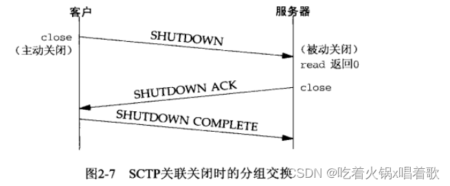

SCTP没有类似于TCP的TIME_WAIT状态，因为SCTP使用了验证标记，所有后续块所在的SCTP分组的公共首部中都有来自初始INIT块和INIT ACK块中作为起始标记交换的验证标记。来自旧连接的块所在的SCTP分组的公共首部携带的验证标记对于新连接来说是不正确的。

SCTP状态转换图：


如上图，本状态机（一个状态机由一组状态和状态之间的转换组成）中从一个状态到另一个状态的转换由SCTP规则基于当前状态及在该状态下所接收的块规定。当某个应用进程在CLOSED状态下执行主动打开时，会发送一个INIT，进入状态COOKIE_WAIT，接着如果收到一个INIT ACK，它将发送一个COOKIE ECHO，进入状态COOKIE-ECHOED，随后收到一个COOKIE ACK时，进入状态ESTABLISHED。ESTABLISHED状态是绝大多数数据传送发生的状态，有些DATA块也可以由COOKIE ECHO块或COOKIE ACK块所在消息捆绑捎带。

上图中，从ESTABLISHED状态引出两个箭头处理关联的终止。如果某应用进程在接收到一个SHUTDOWN前调用close，就转换到SHUTDOWN-PENDING状态；如果某进程在ESTABLISHED状态期间收到一个SHUTDOWN，就转换到SHUTDOWN-RECEIVED状态。


上图中，客户在COOKIE ECHO块所在分组中捎带了它的第一个DATA块，服务器在作为应答的COOKIE ACK块所在分组中捎带了数据。一般，当网络应用采用一到多接口式样时，COOKIE ECHO通常捎带一个或多个DATA块。

SCTP分组中信息的单位称为块。块是自描述的，包含一个块类型、若干个块标记、一个块长度。这样方便了多个块的绑缚，只要把它们简单地组合到一个SCTP外出消息中。

SCTP使用参数和块来方便增设可选特性，新特性通过添加这两个条目之一加以定义，并允许通常的SCTP处理规则汇报未知的参数和未知的块。参数类型和块类型的高两位指明SCTP接收端该如何处置未知的参数或未知的块。

当前如下两个对SCTP的扩展正在开发中： 1.动态地址扩展：允许协作的SCTP端点从已有的某个关联中动态增删IP地址。

2.不完全可靠性扩展：允许协作的SCTP端点在应用进程指导下限制数据的重传，当一个消息变得陈旧而无需发送时（由应用进程指导），该消息被跳过而不再被发到对端。这意味着不是所有数据都确保到达关联的另一端。

TCP、UDP、SCTP这三种协议都使用16位整数的端口号来区分进程。

TCP、UDP、SCTP定义了一组众所周知端口，用于标识众所周知的服务，如支持FTP的任何TCP/IP实现都把端口21作为众所周知端口分配给FTP服务器。分配给简单文件传送协议（FTFP，Trivial File Transfer Protocol）的UDP端口号是69。

客户通常使用短期有效的临时端口，这些端口号通常由传输层协议自动赋予客户，客户通常不关心端口的具体值，只需确认该端口在所在主机中是唯一的即可。传输协议的代码确保这种唯一性。

IANA（因特网已分配数值权威机构，the Internet Assigned Numbers Authority）维护着一个众所周知端口号分配的清单，该清单作为RFC多次发布，RFC 1700是这个系列最后一个。

端口号被划分为以下3段： 1.众所周知端口0~1023：这些端口由IANA分配和控制。可能的话，相同端口号就分配给TCP、UDP、SCTP的同一给定服务，如不论TCP还是UDP端口号80都被赋予web服务器（http服务），尽管它的目前所有实现都单纯使用TCP。端口号80分配时SCTP尚不存在，新分配的端口将针对这三种协议执行，RFC 2960声明所有现有的TCP端口号对于使用SCTP的同一服务同样有效。

2.已登记的端口1024~49151：这些端口不受IANA控制，但由IANA登记并提供它们的使用清单，可能的话，相同端口号也分配给TCP和UDP的同一给定服务，如6000~6063分配给这两种协议的X Window服务器，尽管它的所有实现当前单纯使用TCP。上限49151是为了给临时端口留出范围。

3.动态端口或私有端口49152~65535：IANA不管这些端口，它是我们所称的临时端口。49152是65536的四分之三。


对于上图需注意以下几点： 1.Unix系统保留端口（reserved port）指的是小于1024的端口，这些端口只能赋予特权用户进程的套接字。所有IANA众所周知端口都是保留端口，使用这些端口的服务器必须以超级用户特权启动。

2.由于历史原因，源自伯克利的实现从BSD 4.3开始曾在1024~5000范围内分配临时端口，这在20世纪80年代初始可行的，但如今很容易找到同时支持多于3977个连接的主机，于是许多较新系统从另外的范围分配临时端口以提供更多临时端口，它们或者使用IANA定义的临时端口范围，或者使用一个更大的其他范围（如上图的Solaris）。由于这个原因许多较早系统的临时端口上限为5000，后来发现5000这一上限是一个排版错误，本应是50000。

3.有少数客户需要一个保留端口用于客户/服务器认证，如rlogin和rsh客户，这些客户调用库函数rresvport创建一个TCP套接字，并赋予它一个在513~1023范围内未使用的端口，该函数通常先尝试绑定1023，若失败尝试1022，依次类推，直到在端口513。

BSD的保留端口和rresvport函数返回的端口都跟IANA众所周知端口有所重叠，这是因为IANA众所周知端口早先上限为255，1992年的RFC 1340开始在256~1023之间分配众所周知端口。1990年的RFC 1060称256~1023之间的端口是Unix标准服务。20世纪80年代不少源自Berkeley的服务器在512以后挑选它们的众所周知端口，留下了256~511这个空档。

一个TCP连接的套接字对指定义该连接的两个端点的四元组：本地IP地址、本地TCP端口号、外地IP地址、外地TCP端口号。套接字对唯一标识一个网络上的每个TCP连接。SCTP一个关联由一组本地IP地址、一个本地端口、一组外地IP地址、一个外地端口标识，在两个端点均非多宿的情况下，SCTP与TCP所用的四元组一致，在某个关联任何一端多宿时，同一关联需要多个四元组标识（这些四元组的多宿一端的IP各不相同，但端口号都是一样的）。

标识每个端点的两个值（IP地址和端口号）通常称为一个套接字。

我们可以把套接字的概念扩展到UDP，即使UDP是无连接的。

并发服务器中主服务器循环通过派生一个子进程来处理每个新的连接，子进程可以继续使用服务器众所周知端口来服务一个长时间请求。可能发生以下序列：首先，在主机freebsd上启动服务器，该主机是多宿的，其IP地址为12.106.32.254和192.168.42.1，服务器在众所周知端口21上执行被动打开，从而等待客户请求，如图：

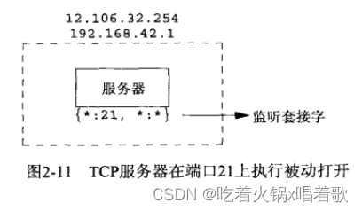

上图中*:21, *:*指出服务器的套接字对，服务器在任意本地接口的端口21上等待连接请求，外地IP地址和外地端口都没有指定。我们称它为监听套接字。

以上指定本地IP地址的星号称为通配符，如果运行服务器的主机是多宿的，服务器可以指定它只接受到达某个本地接口的外来连接，这里要么选一个接口要么选任意接口。通配地址通过将套接字地址结构中的IP地址字段设为INADDR_ANY指定。

在206.168.112.219主机上启动一个客户，它对服务器的IP地址之一12.106.32.254指定主动打开，我们假设本例的客户主机TCP选择的临时端口为1500：

当服务器接收并接受这个客户的连接时，它fork一个自身的副本，让子进程来处理该客户的请求。

至此，我们要在服务器主机上区分监听套接字和已连接套接字，这两个套接字都使用相同本地端口21。在多宿主机上，连接一旦建立，已连接套接字的本地地址12.106.32.254随即填入四元组：


下一步假设在客户主机上另有一个客户请求连接到同一服务器。客户主机的TCP为新客户的套接字分配一个未使用的临时端口，假设是1501：


上图中，服务器上这两个连接是有区别的，第一个连接的套接字对和第二个连接的套接字对不一样。

通过上例可知，TCP无法仅仅通过查看目的端口号来决定把TCP报文递交给哪个套接字，必须查看套接字对的所有4个元素才能确定由哪个端点接收某个到达的分节。上图中同一端口21存在3个套接字，如果一个分节来自206.168.112.219:1500，目的地为12.106.32.254:21，它就被递送给第一个子进程；如果一个分节来自206.168.112.219:1501，目的地为12.106.32.254:21，它就被递送给第二个子进程。所有目的端口为21的其他TCP分节都被递送给拥有监听套接字的服务器父进程。

影响IP数据报大小的限制： 1.IPv4数据报的最大大小是65535字节，包括IPv4首部，这是因为IPv4首部总长度字段是16位。

2.IPv6数据报的最大大小是65575字节，包括40字节的IPv6首部，这是因为IPv6净荷长度字段（不包括IPv6首部）是16位，加上40字节的首部，即65575字节。IPv6有一个特大净荷选项，它把净荷长度字段扩展到32位，但这个选项需要MTU（最大传输单元，Maximum Transmiision Unit）超过65535的数据链路提供支持。

3.许多网络有可由硬件规定的MTU，如以太网MTU为1500字节；一些链路（如使用PPP协议的点到点链路）其MTU可人为配置；较老的SLIP链路通常使用1006字节或296字节的MTU。IPv4要求的最小链路MTU是68字节，这允许最大的IPv4首部（包括20字节的固定长度、最多40字节选项）和最小的拼接片段（IPv4首部中片偏移字段以8个字节为单位，片偏移字段含义为每个分片相对于原始报文开头的偏移量，即每个分片的长度必须是8字节的整数倍）。IPv6要求的最小链路MTU为1280字节，IPv6可运行在MTU小于此值的链路上，不过需要链路的分片和重组功能，以使得这些链路看起来至少有1280字节。

4.两个主机之间的路径中最小的MTU称为路径MTU。1500字节的以太网MTU是当今常见的路径MTU。两个主机间相反的两个方向上路径MTU可以不一致，因为因特网中路由选择往往是不对称的。

5.当一个IP数据报从某个接口送出时，如果它的大小超过相应链路的MTU，IPv4和IPv6都将执行分片，这些片段到达最终目的地前通常不会重组。IPv4主机对其产生的数据报执行分片，IPv4路由器对其转发的数据报执行分片；然而IPv6只有主机对其产生的数据报执行分片，IPv6路由器不对其转发的数据报执行分片。一个标记为IPv6的路由器设备可能执行分片，不过只是对于由它产生的那些数据报，此时该设备实际作为主机运作，如大多路由器支持telnet协议，管理员用它来配置路由器，由路由器的telnet服务器产生的IP数据报是由路由器产生的，而不是由路由器转发的。IPv4首部有用于处理分片的字段，而IPv6首部没有类似字段，既然分片是例外而非通常情况，IPv6于是引入一个可选首部以提供分片信息。某些通常用作路由器的防火墙可能会重组分片了的分组，以便查看整个IP数据报的内容，这样使得不必在防火墙上引入额外的复杂性就能防止某些攻击，它还要求防火墙设备是进出网络的唯一路径上的设备。

6.IPv4首部的不分片位（DF位，don’t fragment）若被设置，那么无论是主机还是路由器都不允许对它分片。当路由器接收到一个超过其外出链路MTU大小且设置了DF位的IPv4数据报时，它将产生一个ICMPv4目的地不可达出错消息。由于IPv6路由器不执行分片，每个IPv6于是隐含一个DF位，当IPv6收到一个超过其外出链路MTU大小的IPv6数据报时，它产生一个ICMPv6分组太大出错消息。IPv4的DF位和IPv6的隐含DF位可用于路径MTU发现，如果基于IPv4的TCP使用该技术，那么它将在所有发送的数据报中设置DF位，如果某个中间路由器返回ICMP目的地不可达错误，TCP就减小每个数据报的数据量并重传。路径MTU发现对于IPv4是可选的，但对于IPv6的所有实现要么支持它，要么必须总使用最小的MTU发送IPv6数据报。路径MTU发现在如今的因特网上有问题，许多防火墙丢弃所有ICMP消息，这意味着TCP永远得不到要求它降低所发送数据量的信号，IETF（Internet Engineering Task Force，互联网工程任务组）已经开始尝试定义不依赖于ICMP出错消息的另一种路径MTU发现方法。

7.IPv4和IPv6都定义了最小重组缓冲区大小，它是IPv4或IPv6的任何实现都必须保证支持的最小数据报大小。其值对于IPv4为576字节，对于IPv6为1500字节。例如，就IPv4而言，我们不能判定某个给定目的地能否接受577字节的数据报，为此许多使用UDP的IPv4网络应用（如DNS、RIP、TFTP、BOOTP、SNMP（简单网络管理协议））避免产生大于这个大小的数据报。

8.TCP有一个最大分节大小（MSS，Maximum Segment Size），用于向对端TCP通告对端在每个分节中能发送的最大TCP数据量。MSS的目的是告诉对端自己的重组缓冲区大小的实际值，从而试图避免分片，如果自己的重组缓冲区大小大于外出接口MTU，MSS经常设为MTU减去IP和TCP首部的固定长度，在以太网中IPv4的MSS值为1460，IPv6的MSS值为1440（两者的TCP首部都是20个字节，但IPv4首部是20字节，IPv6首部却是40字节）。TCP的MSS选项的值是一个16位的字段，限定了其最大值为65535，这对于IPv4是合适的，因为IPv4数据报中的最大TCP数据量为65495（65535字节的IPv4数据报总长度减去20字节IPv4首部和20字节TCP首部），而对于具有特大净荷选项的IPv6，需要另一种技巧，即在用到特大净荷选项时，将65535这个MSS值视为表示无限的特殊值，如果接收到的数据报使用了特大净荷选项且收到对端通告的MSS为65535，则接收端所发送数据报的大小限制就是路径MTU，路径MTU发现功能将确定此值。如果没有特大净荷选项，IPv6数据报中的最大TCP数据量为65515（65535字节的IPv6数据报净荷减去20字节TCP首部）。

9.SCTP基于到对端的所有地址发现的最小MTU作为分片点，这个最小MTU大小用于把较大的用户消息分割成较小的能够以单个IP数据报发送的若干片段。SCTP_MAXSEG套接字选项可以使用户请求一个更小的分片点。


每个TCP套接字都有一个发送缓冲区，我们可以用套接字选项SO_SNDBUF来更改该缓冲区大小。当应用调用write时，内核从该应用的缓冲区中复制所有数据到所写套接字的发送缓冲区。如果该套接字的发送缓冲区容不下该应用进程的所有数据，该应用将被投入睡眠，这里假设了该套接字是阻塞的，它是通常的默认设置。内核将不从write系统调用返回，直到应用进程缓冲区中的所有数据都复制到套接字发送缓冲区。因此从写一个套接字的write调用成功返回仅仅表示我们可以重新使用原来的应用进程缓冲区，不代表对端TCP或应用已接收到数据。

发送端TCP提取套接字缓冲区中的数据并把它发送给对端TCP，对端TCP必须确认收到的数据，收到对端的ACK后，本端TCP才能从套接字发送缓冲区丢弃已确认的数据，因为TCP必须为已发送的数据保留一个副本，直到它被对端确认为止。

发送端TCP以MSS大小或更小的块把数据传递给IP，同时给每个数据块安上一个TCP首部以构成TCP分节，其中MSS或是对端通告的值，或是536（对端未发送MSS选项时，536是IPv4最小重组缓冲区字节数576减去20字节IPv4首部和20字节TCP首部的结果）。IP给每个TCP分节安上一个IP首部以构成IP数据报，并按照其目的IP地址查找路由表确定外出接口，然后把数据报传递给相应的数据链路。IP可能在把数据报传递给数据链路前将其分片，但之前说过MSS选项的目的之一就是试图避免分片，因此发送端没有意外的情况下IP不会在把数据报传递给链路层时进行分片，并且较新的实现还使用了路径MTU发现功能（可能会导致MSS比外出接口的MTU更小，从而更不可能导致发送端IP把数据报传递给链路层时分片）。每个数据链路都有一个输出队列，如果该队列已满，则新到的分组将被丢弃，并沿协议栈向上返回一个错误，TCP将注意到此错误，并在以后重传相应分节，应用并不知道这种暂时的情况。


如上图，用虚线展示套接字发送缓冲区，因为它实际上并不存在。任何UDP套接字都有发送缓冲区大小，可用套接字选项SO_SNDBUF更改它，但它仅仅是可以写到该套接字的UDP数据报的大小上限，如果应用进程写一个大于套接字发送缓冲区大小的数据报，内核将返回该进程一个EMSGSIZE错误。既然UDP是不可靠的，它不必保存应用进程数据的副本，因此无需一个真正的发送缓冲区。应用进程的数据在沿协议栈向下传递时，通常被复制到某种格式的一个内核缓冲区中，当该数据被发送后，这个副本就被数据链路层丢弃了。

发送端UDP简单地给来自用户的数据报安上它的8字节首部以构成UDP数据报，然后传递给IP，IPv4或IPv6给数据报安上相应IP首部以构成IP数据报，然后执行路由操作确定外出接口，然后或者直接把数据报加入数据链路层输出队列（如果MTU合适），或者分片后再把每个片段加入数据链路层的输出队列。如果某个UDP应用进程发送大数据报（如2000字节的数据报），那么相比TCP应用更可能被IP分片，因为TCP会把应用数据划分成MSS大小的块。

从写一个UDP套接字的write调用成功返回表示所写的数据报或其所有片段已被加入数据链路层的输出队列，如果该队列没有足够空间存放该数据报或它的某个片段，内核通常会返回一个ENOBUFS错误给它的应用进程，但有些UDP实现不返回这种错误，这样数据报未经发送就被丢弃的情况应用也不知道。


SCTP是与TCP类似的可靠协议，因此它的套接字也有一个发送缓冲区，而且也可以用套接字选项SO_SNDBUF更改这个缓冲区大小。当一个应用进程调用write时，内核从该应用的缓冲区中复制所有数据到所写套接字的发送缓冲区。如果该套接字的发送缓冲区容不下该应用进程的所有数据，应用进程将被投入睡眠，这里假设该套接字是阻塞的，它是通常的默认设置。内核直到应用进程缓冲区中的所有数据都复制到套接字缓冲区才从write函数返回。因此从写一个SCTP套接字的write调用成功返回仅表示我们可以重新使用原来的应用进程缓冲区，不表明对端SCTP或应用进程已接收到数据。

发送端SCTP发送完数据后，必须等待SACK，在累计确认点超过已发送的数据后，才可以从套接字缓冲区中删除该数据。


上图是TCP/IP多数实现都提供的服务，表中所有服务同时使用TCP和UDP，且这两个协议所用端口号也相同。

以上服务通常由Unix主机的inetd守护进程提供，可用telnet程序访问以上服务：

上例中，我们键入了主机名和服务名，这些服务名通过/etc/services文件映射到对应端口号。


上例中连接到daytime服务器时是服务器执行主动关闭，而连接到echo服务器时是客户执行主动关闭。主动关闭的一方会进入TIME_WAIT状态。

上例中，当输出Trying IP...时，gethostbyname函数已返回了域名对应的IP地址，客户在此之前的停顿是解析器用于查找主机名的时间。输出Connected to host时意味着connect函数已返回，这两行输出间的停顿是connect函数用来建立连接的时间。

为了应对针对以上服务的拒绝服务攻击和其他资源使用攻击，如今的系统中，这些简单的服务通常被禁用。

常见因特网应用使用的协议：


ping和traceroute是使用ICMP协议实现的网络诊断应用。traceroute自行构造UDP分组来发送并读取所引发的ICMP应答。

路由协议OSPF通过原始套接字直接使用IP，RIP使用UDP，BGP使用TCP。

TIME_WAIT状态是为了实现TCP的全双工连接终止（处理最终那个ACK丢失的情形），并允许老的重复分节从网络中消逝。

IP协议版本1~3未曾分配。版本5是网际网流协议，由Apple、NEXT和SunMicroystems为试验流式语音和视频而创建。

RFC可通过电子邮件、匿名FTP、Web（https://www.rfc-editor.org/rfc/）免费获取。

如果TCP一端没有收到对端的MSS选项，默认MSS值取536字节大小，因为IPv4的最小重组缓冲区大小是576字节，减去20字节的TCP首部和20字节的IP首部，就是536字节。

在一个以太网上的主机和一个令牌环网上的主机之间建立一个连接，其中以太网上主机的TCP通告的MSS为1460，令牌环网上主机的TCP通告的MSS为4096，两个主机都没有实现路径MTU发现功能，对于令牌环网上的主机来说，不能发送超过1460字节的数据，因为它接收到的MSS是1460，对于以太网上的主机来说，可以发送4096字节的数据，但为了避免分片，它不会超过其外出接口的MTU（即以太网的1460）。

IPv4首部有一个协议字段，对于直接使用IP层的OSPF，该字段值为IANA注册的OSPF协议号，值为89。

SCTP发送端必须等待累计确认点已经超过已发送的数据，才能从套接字缓冲区中释放该数据，假设某个选择性确认（SACK）表明累计确认点之后的数据得到了确认，这样的数据不能被释放，因为选择性确认只是表明由选择性确认消息反映的序列号所涵盖的数据已被接收，而累计确认表明由累计确认消息中的序列号指示的所有该序列号以前的数据都已被接收。

# 套接字编程简介

​		先介绍套接字地址结构，本书中几乎每个例子都会用到它们，该结构可在两个方向上传递：从进程到内核和从内核到进程。从内核到进程方向的传递是值-结果参数的例子。

​		地址转换函数在地址的文本表达和它们存放在套接字地址结构中的二进制值之间进行转换。多数现存IPv4代码使用inet_addr和inet_ntoa函数，但新函数inet_pton和inet_ntop同时适用于IPv4和IPv6代码。这些地址转换函数与它们所转换的地址类型协议相关，要考虑究竟是IPv4地址还是IPv6地址，为解决此问题，我们自己开发了一组以sock_开头的函数，它们以协议无关方式使用套接字地址结构，使得代码与协议无关。

​		大多套接字函数需要一个指向套接字地址结构的指针作为参数。每个协议族都定义它自己的套接字地址结构，这些结构的名字均以sockaddr_开头。

​		IPv4套接字地址结构通常也称为网际套接字地址结构，名字是sockaddr_in，定义在netinet/in.h头文件中，以下是它的POSIX定义：

​		长度字段sin_len是为增加对OSI协议的支持而随4.3 BSD Reno添加的，在此之前，sockaddr_in结构的第一个成员是sin_family，它是无符号短整数（unsigned short）类型。不是每个厂家都支持该字段，POSIX规范也不要求有此字段。该成员的数据类型uint8_t是典型的，符合POSIX的系统都提供这种形式的数据类型。如果长度字段sin_len随套接字API的原始版本提供了，那么现在所有套接字函数就不需要长度参数了（如bind和connect函数的第3个参数）。

长度字段sin_len简化了长度可变套接字地址结构的处理。

即使有长度字段sin_len，我们也无需设置和检查它，除非涉及路由套接字，该字段是由处理来自不同协议族的套接字地址结构的例程（如路由表处理代码）在内核中使用的。

源自Berkeley的实现中，从进程到内核传递套接字地址结构的4个套接字函数（bind、connect、sendto、sendmsg）都要调用sockargs函数，sockargs函数从进程复制套接字地址结构，并显式地把它的sin_len字段设置成作为参数传递给这4个函数的该地址结构的长度。从内核到进程传递套接字地址结构的5个套接字函数为accept、recvfrom、recvmsg、getpeername、getsockname，这5个函数均在返回前设置sin_len字段。

通常没有简单的编译时测试来确定一个实现是否为它的套接字地址结构定义了长度字段，我们的代码中通过测试HAVE_SOCKADDR_SA_LEN常值来确定，然而是否定义该常值需编译一个使用这个可选的长度字段的简单测试程序，并看是否编译成功来确定。如果套接字地址结构有长度字段，则IPv6实现需定义SIN6_LEN，一些IPv4实现（如Digital Unix）基于某个编译时选项（如_SOCKADDR_LEN）确定是否给应用提供了套接字地址结构中的长度字段，这个特性为较早的程序提供了兼容性。

符合POSIX规范只需sockaddr_in结构包含sin_family、sin_addr、sin_port三个字段。对于符合POSIX的实现来说，定义额外的字段是可以接受的，几乎所有实现都定义了sin_zero字段，所以所有的套接字地址结构大小都至少16字节。

in_addr_t类型至少是一个32位的无符号整数类型；in_port_t类型至少是一个16位的无符号整数类型；sa_family_t可以是任何无符号整数类型，在支持长度字段sin_len的实现中，sa_family_t通常是一个8位的无符号整数，在不支持长度字段sin_len的实现中，它是一个16位的无符号整数。

类型u_char、u_short、u_int、u_long都是无符号的，POSIX定义这些类型时特意标记它们为已过时，仅是为了向后兼容才提供的。

IPv4地址和端口号在套接字地址结构中以网络字节序来存储。

32位IPv4地址有两种访问方法，举例来说，如果serv定义为某个网际套接字地址结构，那么serv.sin_addr将按in_addr结构引用其中的32位IPv4地址，而serv.sin_addr.s_addr将按in_addr_t（通常是一个32位无符号整数）引用同一个32位IPv4地址。因此我们必须正确使用这两个IPv4地址，尤其是将它们作为函数的参数使用时，因为编译器对传递结构和传递整数的处理是不同的。

sin_addr字段是一个结构，而不仅仅是一个in_addr_t类型的无符号长整数，这是有历史原因的。早期的版本（4.2 BSD）把in_addr结构定义为一个union，允许访问一个32位IPv4地址中的所有4个字节，或者访问它的2个16位值，这用于地址被划分成A、B、C三类的时期，以便获取地址中的适当字节，然而随着子网划分技术和无类地址编排的出现，三种地址类正在消失，这个联合也不再需要了，如今大多系统已经废除了此联合，转而把in_addr结构定义为仅有一个in_addr_t字段的结构。

sin_zero字段未曾使用，我们总是把sin_zero字段置为0，按照惯例，我们总是在填写前把整个结构置0，而不单独将sin_zero字段置0。

套接字地址结构不在主机之间传递，仅用于主机上确定通信信息。

套接字地址结构总是以指向该结构的指针方式来传递进套接字函数，以这样的指针作为参数的套接字函数必须处理来自所支持的任何协议族的套接字地址结构。如何声明指向套接字地址结构的指针的数据类型存在一个问题，有了ANSI C后很简单，void *是通用指针类型，但套接字函数是在ANSI C前定义的，1982年采取的办法是在头文件sys/socket.h中定义一个通用的套接字地址结构：

于是套接字函数的套接字地址结构指针参数的类型是指向通用套接字地址结构的指针，如bind函数的ANSI C函数原型为int bind(int, struct sockaddr *, socklen_t);。这就要求调用这些函数时要将指向特定于协议的套接字地址结构的指针进行类型强制转换，变成指向通用套接字地址结构的指针：

```
struct sockaddr_in serv;    /* IPv4 socket address structure */

/* full in serv{} */

bind(sockfd, (struct sockaddr *)&serv, sizeof(serv));
```

如果我们不进行类型强制转换，并假设系统头文件中有bind函数的一个ANSI C原型，则C编译器会产生警告wrning: passing arg 2 of 'bind' from incompatible pointer type.（警告：把不兼容的指针类型传递给bind函数的第二个参数）。

对于应用程序开发人员，通用套接字地址结构唯一的作用是要对指向特定于协议的套接字地址结构的指针执行强制类型转换。

在我们自己的unp.h头文件中，把SA定义为struct sockaddr只是为了缩短类型强制转换这些指针所写的代码。

从内核角度看，内核取调用者传入的指针，把它类型强制转换为struct sockaddr *类型，然后检查其中sa_family字段的值来确定这个结构的真实类型。然而从开发人员角度看，使用void *类型就更简单了，因为无须显式进行类型强制转换。

IPv6套接字地址结构在头文件netinet/in.h中定义：


IPv6对于套接字API的扩展定义在RFC 3493中。

对于上图需要注意： 1.如果系统支持套接字地址结构中的长度字段sin6_len，那么必须定义SIN6_LEN。 2.IPv6的地址族是AF_INET6，而IPv4的是AF_INET4。 3.结构中字段的先后顺序做过编排，使得如果sockaddr_in6结构本身是64位对齐的（即该结构被存储在内存地址为64位的整数倍处），那么128位的sin6_addr成员也是64位对齐的。在一些64位处理机上，如果64位数据存储在某个64位边界位置，那么对它的访问将得到优化处理。 4.sin6_flowinfo字段分成两个字段：低序20位是流标；高序12位保留。 5.对于具备范围的地址，sin6_scope_id字段标识其范围，最常见的是链路局部地址的接口索引。

作为IPv6套接字API的一部分而定义的新的通用套接字地址结构克服了现有struct sockaddr的一些缺点，新的struct sockaddr_storage足以容纳系统所支持的任何套接字地址结构，新结构定义在头文件netinet/in.h中：


sockaddr_storage与sockaddr类型存在以下区别： 1.如果系统支持的任何套接字地址结构有对齐需要，sockaddr_storage能满足最苛刻的对齐要求（苛刻表示更大的对齐值，如8字节对齐比4字节对齐更苛刻，因为8字节对齐时结构能在内存中放置的位置更少，是4字节对齐的一半）。 2.sockaddr_storage足够大，能容纳系统支持的任何套接字地址结构。

除了ss_family和ss_len（如果存在）字段外，sockaddr_storage结构中的其他字段对用户来说是透明的。sockaddr_storage结构必须类型强制转换成或复制到ss_family字段对应的地址类型的套接字地址结构中，才能访问其他字段。


上图中，我们假设所有套接字地址结构都包含一个单字节的长度字段，地址族字段也占用一个字节，其他所有字段都占用其可能的最短长度。

为了处理长度可变的结构，当我们把指向某个套接字地址结构的指针作为一个参数传递给某套接字函数时，也把该结构的长度作为另一个参数传递给这个函数。

上图中每种长度固定的结构下方给出了它在4.4 BSD实现中的字节数长度。

sockaddr_un结构本身并非长度可变的，但其中的路径名长度是可变的，当传递指向此结构的指针时，必须小心处理长度字段，包括套接字地址结构中的长度字段（如果实现支持）和作为参数传给内核或从内核返回的长度。

当给一个套接字函数传递一个套接字地址结构时，总是以该结构的指针传递，该结构的长度也作为一个参数传递，该长度参数的传递方式取决于该结构的传递方向，从进程到内核或从内核到进程。

从进程到内核传递套接字地址结构的函数有bind、connect、sendto，这些函数的有一个参数是指向某套接字地址结构的指针，还有一个参数是该结构的整数大小。此时内核就知道了需要从进程复制多少数据进来：


​		表示套接字地址结构大小的数据类型是socklen_t而不是int，POSIX建议将其定义为uint32_t。

​		从内核到进程传递套接字地址结构的函数有accept、recvfrom、getsockname、getpeername。这些函数的参数中的两个是指向某个套接字地址结构的指针和指向该结构大小的整数变量的指针：

```
struct sockaddr_un cli;    /* Unix domain */
socklen_t len;

len = sizeof(cli);    /* len is a value */
getpeername(unixfd, (SA *), &cli, &len);
/* len may have changed */
```

​		将套接字地址结构大小这一参数从整数改为指向整数的指针的原因在于，当函数被调用时，结构大小是一个值，它告诉内核该结构的大小，这样内核在写该结构时不至于越界；而当函数返回时，结构大小是一个结果，它告诉进程内核在结构中存储了多少信息。这种类型的参数被称为值-结果参数：


我们说套接字地址结构在进程和内核间传递，对于如4.4 BSD之类的实现，由于所有套接字都是内核中的系统调用，因此这是正确的。但在另外的一些实现中，如System V，套接字函数只作为普通用户进程执行的库函数，这些函数与内核中的协议栈如何互动是这些实现的细节问题，对我们通常没有任何影响，为简单起见，我们说套接字地址结构在进程与内核间传递，而System V的确在进程和内核间传递套接字地址结构，但那是作为流消息的一部分传递的。

传递套接字地址结构的函数还有recvmsg和sendmsg，它们套接字地址结构的长度不是作为函数参数而是作为结构字段传递的。

使用值-结果参数作为套接字地址结构的长度时，如果套接字地址结构是固定长度的，那么从内核返回的值总是那个固定长度，如IPv4的sockaddr_in长度是16字节，IPv6的sockaddr_in6的长度是28字节。对于可变长度的套接字地址结构（如Unix域的sockaddr_un），返回值可能小于该结构的最大长度。

一些有值-结果参数的函数： 1.select函数中间的3个参数。 2.getsockopt函数的长度参数。 3.使用recvmsg函数时，msghdr中的msg_namelen和msg_controllen字段。 4.ifconf结构中的ifc_len字段。 5.sysctl函数两个长度参数中的第1个。

内存中存储一个整数有两种方法，一种是将低序字节存储在起始地址，这称为小端字节序；另一种是将高序字节存储在起始地址，这称为大端字节序：


上图中，MSB（Most Significant Bit）为最高有效位，LSB（Least Significant Bit）为最低有效位。

术语小（大）端表示多字节值的小（大）端存储在该值的起始地址。

这两种格式都有主机使用，我们把某个给定系统所用的字节序称为主机字节序，确定主机使用的字节序：

```
#include <stdio.h>
#include <stdlib.h>

int main() {
    union {
        short s;
        char c[sizeof(short)];
    } un;
    un.s = 0x0102;
    printf("%s: ", CPU_VENDOR_OS);
    if (sizeof(short) == 2) {
        if (un.c[0] == 1 && un.c[1] == 2) {
		    printf("big-endian\n");
		} else if (un.c[0] == 2 && un.c[1] == 1) {
		    printf("little-endian\n");
		} else {
		    printf("unknown\n");
		}
    } else {
        printf("sizeof(short) = %d\n", sizeof(short));
    }
    exit(0);
}
```

以上程序中，我们在一个短整型变量中存放2字节的值0x0102，然后查看它的低地址字节c[0]和高地址字节c[1]确定字节序。

以上程序中的字符串CPU_VENDOR_OS是由GNU的autoconf程序在配置时确定的，它标识CPU类型、厂家、操作系统版本。

有很多系统可以在重置时或运行时在大端字节序和小端字节序之间切换。

网际协议使用大端字节序传送32bit IPv4地址和16bit端口号。

理论上说，具体实现可以按主机字节序存储套接字地址结构中的各个字段，等需要将这些字段和协议首部中相应字段转换时，再在主机字节序和网络字节序之间互转，让我们免于关心转换的细节，但由于历史原因和POSIX规范的规定，套接字地址结构中某些字段必须按网络字节序进行维护，因此我们要关注如何在主机字节序和网络字节序之间相互转换。主机字节序和网络字节序之间转换的函数：


以上函数名中的h表示host，n表示network，s代表short，l代表long。short和long这两个称谓是出自4.2 BSD的Digital VAX实现的历史产物，如今我们把s视为一个16位的值（如TCP或UDP端口号），把l视为一个32位的值（如IPv4地址）。事实上，即使在64位的Digital Alpha中，尽管长整型占64位，htonl和ntohl函数操作的仍然是32位值。

使用这些函数时，不需关心主机字节序是大端还是小端。在那些使用大端字节序的系统中，这四个函数常定义为空宏。

几乎所有计算机都使用8位字节，我们用术语字节表示一个8位的量。大多因特网标准表示一个8位量的术语是八位组（octet）而非字节，该术语起源于TCP/IP发展的早期，当时许多早期的工作是在诸如DEC-10这样的系统上进行的，这些系统就不使用8位的字节。

因特网中一个重要的约定是位序，在许多因特网标准的RFC文档中，可以看到类似以下图示（该图取自RFC 791，是IPv4首部的前32位）：


上图表示在线缆上出现的顺序排列的4个字节，最左边是最早出现的最高有效位。位序的编号从0开始，分配给最高有效位的编号为0。熟悉以上记法，以方便阅读RFC文档中的协议定义。

20世纪80年代在网络编程上存在一个普遍的问题，在Sun工作站（Motorola 68000处理器，大端主机字节序）上开发代码时可能会忘记调用转换字节序的4个函数中的任何一个，这些代码在大端主机字节序的机器上都能运行，但当移植到小端机器（如VAX系列机）上时就不能工作。

操纵多字节字段的函数有两组，它们既不对数据作解释，也不假设数据是以空字符结束的C字符串，处理套接字地址结构时，我们需要这些函数，因为我们需要操纵诸如IP地址这样的字段，这些字段可能包含值为0的字节，却不是C字符串。以空字符结尾的C字符串是由定义在string.h头文件中、名字以str开头的函数处理的。

名字以b（表示字节）开头的第一组函数起源于4.2 BSD，几乎所有现今支持套接字函数的系统仍提供它们。名字以mem（表示内存）开头的第二组函数起源于ANSI C标准，支持ANSI C函数库的所有系统都提供它们。

首先给出源自Berkeley的操纵多字节字段的函数：


上图中的函数本书中只使用bzero函数，我们使用它是因为它只有2个参数，比3个参数的memset函数容易记。

上图中，ANSI C的限定词const对于以上三处使用来说，表示所限定的指针所指内容不会被函数更改，即函数只是读而不修改由const指针所指的单元。

bzero函数把目标字节串中指定数目的字节置0，我们常用该函数把套接字地址结构初始化为0。

bcopy函数将指定数目的字节从源字节串移到目标字节串。

bcmp函数比较两个任意字节串，如果相同返回0，否则返回非0。

然后是ANSI C的操纵多字节字段的函数：


memset函数把目标字节串指定数目的字节置为参数c的值。

memcpy函数类似于bcopy函数，但两个指针的顺序是相反的。当源字节串与目标字节串重叠时，bcopy函数能正确处理，但memcpy函数的操作结果不可知，此时应改用ANSI C的memmove函数，当目标区域和源区域有重叠时，memmove函数会在源串被覆盖之前将重叠区域的字节拷贝到目标区域中。

记住memcpy函数中两个指针参数顺序的方法之一是它们是与C中的赋值语句相同顺序从左到右书写的dest = src;。

记住memset函数中最后两个参数顺序的方法之一是认识到所有ANSI C的memxxx函数都需要一个长度参数，且它总是最后一个参数。

memcmp函数比较两个任意的字节串，若相同返回0，否则返回非0值，是大于0还是小于0取决于第一个不等的字节，如果参数ptr1所指字节串中的这个字节大于参数ptr2所指字节串中的对应字节，则大于0，否则小于0。比较操作是在假设两个不等的字节均为无符号字符（unsigned char）的前提下完成的。

下面介绍两组地址转换函数，它们在ASCII字符串（人们偏爱使用的格式）和网络字节序的二进制值（即存放在套接字地址结构中的值）之间转换网际地址。

第一组函数inet_aton、inet_addr、inet_ntoa在点分十进制数串（如206.168.112.96）与其对应的长度为32位的网络字节序二进制值键转换IPv4地址。

第二组函数是两个较新的函数inet_pton和inet_ntop，它们对于IPv4和IPv6地址都适用。


inet_aton函数将参数strptr所指C字符串转换成一个32位的网络字节序的二进制值，并通过指针参数addrptr来存储，若成功返回1，否则返回0。

inet_aton函数有一个没写入正式文档中的特征：如果参数addrptr指针为空，那么该函数仍然对输入的字符串执行有效性检查，但不存储任何结果。

inet_addr函数将参数strptr所指C字符串转换成一个32位的网络字节序的二进制值，并将该二进制值返回。该函数存在一个问题，所有232个可能的二进制值都是有效的IP地址（从0.0.0.0到255.255.255.255），但当出错时该函数返回INADDR_NONE常值，该值通常是一个32位均为1的值，这意味着点分十进制255.255.255.255（IPv4的有限广播地址）不能由该函数处理，因为它的二进制值被用来指示该函数失败。

inet_addr函数还存在一个问题，一些手册页面声明该函数出错时返回-1而非INADDR_NONE，这样对该函数的返回值（一个无符号值，in_addr_t一般定义为uint32_t）和一个负常量（-1）比较时可能会有问题，具体取决于编译器。

函数inet_addr现已被废弃，应使用函数inet_aton，或即将介绍的函数inet_pton，它同时适用于ipv4和ipv6地址。

函数inet_ntoa将32bit的网络字节序二进制IPv4地址转换成相应的点分十进制串，该函数返回值所指向的字符串驻留在静态内存，因此该函数是不可重入的。该函数罕见地以一个结构而非指向结构的指针为参数。

以下是随IPv6出现的新函数，对IPv4和IPv6都适用，函数名中的p和n分别代表表达（presentation）和数值（numeric），地址的表达格式通常是ASCII字符串，数值格式通常是存放到套接字地址结构中的二进制值：

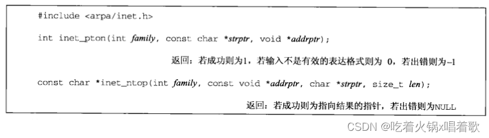

这两个函数的family参数既可以是AF_INET，也可以是AF_INET6，如果以不被支持的地址族作为family参数，这两个函数都会返回一个错误，并将errno置为EAFNOSUPPORT。

inet_pton函数尝试转换由指针参数strptr所指的字符串，并通过指针参数addrptr存放二进制结果。若成功返回1，否则如果对所指定的family参数而言输入字符串不是有效的表达形式，则返回0，如出错，返回-1。

inet_ntop函数进行相反的转换，从数值格式转换到表达格式。len参数是目标存储单元（即strptr参数所指空间）的大小，以免该函数溢出其调用者的缓冲区。为有助于指定这个大小，在头文件netinet/in.h中有如下定义：

```
#define INET_ADDRSTRLEN 16    
/* for IPv4 dotted-decimal，如255.255.255.255\n */
#define INET6_ADDRSTRLEN 46    
/* for IPv6 hex string，如0000:0000:0000:0000:0000:FFFF:111.222.212.222\n，最后的IPv4地址表示该地址是IPv4映射的IPv6地址 */
```

​		如果参数len太小，不足以容纳表达格式结果（包括结尾的空字符），那么返回一个空指针，并置errno为ENOSPC。

​		inet_ntop函数的strptr参数不能是空指针，调用者必须为目标存储单元分配内存并指定其大小，调用成功时，返回值就是指针参数strptr。

​		如果你的系统不支持IPv6，可用代码：

```
foo.sin_addr.s_addr = inet_addr(cp);
```

代替：

```
inet_pton(AF_INET, cp, &foo.sin_addr);
```

还有用代码：

```
ptr = inet_ntoa(foo.sin_addr);
```

代替：

```
char str[INET_ADDRSTRLEN];
ptr = inet_ntop(AF_INET, &foo.sin_addr, str, sizeof(str));
```

只支持IPv4的inet_pton函数的简单版本：

```
int inet_pton(int family, const char *strptr, void *addrptr) {
    if (family == AF_INET) {
        struct in_addr in_val;
	if (inet_aton(strptr, &in_val) {
        memcpy(addrptr, &in_val, sizeof(struct in_addr));
        return 1;
    }
    return 0;
}

errno = EAFNOSUPPORT;
return -1;
}
```

​     		仅支持IPv4的inet_ntop函数的简化版本：

```
const char *inet_ntop(int family, const void *addrptr, char *strptr, size_t len) {
    const u_char *p = (const u_char *)addrptr;
    if (family == AF_INET) {
        char temp[INET_ADDRSTRLEN];

        snprintf(temp, sizeof(temp), "%d.%d.%d.%d", p[0], p[1], p[2], p[3]);
        if (strlen(temp) >= len) {
            errno = ENOSPC;
            return NULL;
        }
        strcpy(strptr, temp);
        return strptr;
    }
    errno = EAFNOSUPPORT;
    return NULL;

}
```

​		inet_ntop函数的问题是，它要求调用者传递一个指向某个二进制地址的指针，而该地址通常包含在一个套接字地址结构中，这要求调用者必须知道这个套接字地址结构的格式和地址族，即为了使用inet_ntop函数，我们要为IPv4编写以下代码：

```
struct sockaddr_in addr;
inet_ntop(AF_INET, &addr.sin_addr, str, sizeof(str));
```

或为IPv6编写如下代码：

```
struct sockaddr_in6 addr6;
inet_ntop(AF_INET6, &addr6.sin6_addr, str, sizeof(str));
```

​		这就使我们的代码与协议相关了。为解决此问题，我们自行编写一个函数sock_ntop，它以指向某个套接字地址结构的指针为参数，然后查看该结构内部，然后用相应方法调用函数返回该地址的表达格式：

我们自己定义的函数（非标准系统函数）的说明形式如上：包围函数原型和返回值的方框是虚线，开头包括的头文件通常是我们自己的unp.h。

sock_ntop函数的sockaddr参数指向一个长度为addrlen参数的套接字地址结构，该函数用它自己的静态缓冲区来保存结果，指向该缓冲区的一个指针就是它的返回值。

对结果进行静态存储会导致该函数不可重入且非线程安全，sock_ntop函数这样设计是为了让本书中的简单例子更方便地调用它。

我们的表达格式是在一个IPv4地址的点分十进制数串格式后，或在一个括以方括号的IPv6地址的十六进制数串格式之后，跟一个终止符（我们用一个冒号，类似URL的语法），再跟一个十进制端口号，最后跟一个空字符。因此，缓冲区大小对于IPv4至少为INET_ADDRSTRLEN加上6个字节（16+6=22，最多6位的端口号和一个冒号），对于IPv6至少为INET6_ADDRSTRLEN加上8个字节（46+8=54，最多6位的端口号和一个冒号和两个方括号）。

以下是sock_ntop函数仅支持AF_INET情形下的代码：

```
char *sock_ntop(const struct sockaddr *sa, socklen_t salen) {
    char portstr[8];
    static char str[128];    /* Unix domain is largest */

    switch (sa->sa_family) {
    case AF_INET:
        struct sockaddr_in *sin = (struct sockaddr_in *)sa;
    
        if (inet_ntop(AF_INET, &sin->sin_addr, str, sizeof(str)) == NULL) {
            return NULL;
        }
        if (ntohs(sin->sin_port) != 0) {
            snprintf(portstr, sizeof(portstr), ":%d", ntohs(sin->sin_port));
            strcat(str, portstr);
        }
        return str;
    	}
    }
```

我们还为操作套接字地址结构定义了其他几个函数，它们将简化我们的代码在IPv4和IPv6之间的移植：

函数sock_bind_wild将通配地址和一个临时端口绑定到一个套接字。函数sock_cmp_addr比较两个套接字地址结构的地址部分。函数sock_cmp_port比较两个套接字地址结构的端口号部分（上图中第3个函数，图中函数名是错误的）。函数sock_get_port返回端口号。函数sock_ntop_host把一个套接字地址结构中的主机部分转换成表达形式（不包括端口号）。函数sock_set_addr把一个套接字地址结构中的地址部分置为ptr指针参数所指的值。函数sock_set_port设置一个套接字地址结构的端口号部分。函数sock_set_wild把一个套接字地址结构中的地址部分置为通配地址。

以上函数中，返回值不为void的函数也提供了包裹函数，它们的名字以S开头。

字节流套接字（如TCP套接字）上的read和write函数所表现的行为不同于通常的文件IO，字节流套接字上调用read或write输入或输出的字节数可能比请求的数量少，但这不是出错状态。这个现象的原因在于内核中用于套接字的缓冲区可能已达到上限，此时需要调用者再次调用read或write函数以输入或输出剩余字节。有些版本的Unix在往一个管道中写多于4096字节的数据时也会有这样的行为，这个现象在read一个字节流套接字时很常见（读完接收缓冲区的数据或读到了指定大小时就返回），但在write一个字节流套接字时只在该套接字为非阻塞的前提下才出现。因此为了不让实现返回一个不足的字节计数值，我们用writen函数代替write函数。

以下是读写一个字节流套接字时使用的函数：

以下是readn函数的实现，它从一个描述符中读n字节：

```
#include "unp.h"

ssize_t readn(int fd, void *vptr, size_t n) {    /* Read "n" bytes from a descriptor. */
    size_t nleft;
    ssize_t nread;
    char *ptr;

    ptr = vptr;
    nleft = n;
    while (nleft > 0) {
        if ((nread = read(fd, ptr, nleft)) < 0) {
            if (errno == EINTR) {
                nread = 0;    /* and call read() again */
            } else {
                return -1;
            }
        } else if (nread == 0) {
            break;    /* EOF */
        }
    
        nleft -= nread;
        ptr += nread;
    }
    return n - nleft;    /* return >= 0 */

}
```

​		以下是writen函数的实现，它往一个描述符写n字节：

```
#include "unp.h"

ssize_t writen(int fd, const void *vptr, size_t n) {    /* Write "n" bytes to a descriptor. */
    size_t nleft;
    ssize_t nwritten;
    const char *ptr;
ptr = vptr;
nleft = n;
while (nleft > 0) {
    if ((nwritten = write(fd, ptr, nleft)) <= 0) {
        if (nwritten < 0 && errno == EINTR) {
            nwritten = 0;    /* and call write() again */
        } else {
            return -1;    /* error */
        }
    }
    nleft -= nwritten;
    ptr += nwritten;
}
return n;
}
```

readn和writen函数即使已经读或写了一部分数据，如果出错，返回值还是-1。这两个函数都将参数里的void *类型指针转换为了char *指针，因为该指针需要按字节数增长，如果不转换，C不允许增长void *类型指针。

以下是readline函数的实现，它从一个描述符读文本行，一次1个字节：

```
#include "unp.h"

/* PAINFULLY SLOW VERSION -- example only */
ssize_t readline(int fd, void *vptr, size_t maxlen) {
    ssize_t n, rc;
    char c, *ptr;
ptr = vptr;
for (n = 1; n < maxlen; ++n) {
again:
    if ((rc = read(fd, &c, 1)) == 1) {
        *ptr++ = c;
        if (c == '\n') {
            break;    /* new line is stored. like fgets() */
        }
    } else if (rc == 0) {
        *ptr = 0;
        return n - 1;    /* EOF, n - 1 bytes were read() */
    } else {
        if (errno == EINTR) {
            goto again;
        }
        return -1;    /* error, errno set by read() */
    }
}
*ptr = 0;    /* null terminate like fgets() */
return n;
}
```

readline函数返回读到的字节数，它的参数maxlen含义为指针参数vptr指向的空间大小。

上述3个函数在读写错误返回时，都会检查errno是否为EINTR，这个错误表示系统调用被一个捕获的信号中断，如果发生了该错误，则继续进行读写。既然以上函数的作用是避免让调用者处理不足的字节计数值，那么我们就在函数中处理该错误，避免让调用者再次调用以上函数。

MSG_WAITALL标志可随recv函数一起使用来取代readn函数。

以上readline函数每读一个字节数据就系统调用一次read函数，这很低效，当面临从某个套接字读入文本行需求时，使用标准IO库（即stdio）非常诱人，但这是一种危险的方法，stdio缓冲机制会引发许多逻辑问题，可能导致应用程序中存在相当隐蔽的缺陷，究其原因在于stdio缓冲区的状态是不可见的。为深入解释，考虑客户和服务器之间的一个基于文本行的协议，使用该协议的多个客户程序和多个服务器可能是在一段时间内先后实现的（这很普遍，如按HTTP规范独立编写的Web浏览器程序和Web服务器程序就相当多），良好的防御性编程要求这些程序不仅能期望它们的对端程序也遵循相同的网络协议，而且能检查出来预期外的数据并加以修正（恶意企图自然也被检查出来），这样可以使网络应用能够从存在问题的网络数据传送中恢复，可能的话还会继续工作。为了提升性能而使用stdio缓冲区违背了这一目标，因为这样的应用进程不能分辨stdio缓冲区中是否有预期外的数据。

基于文本行的网络协议有SMTP、HTTP、FTP的控制连接协议、finger等，因此针对文本行操作的需求被一再提出，但我们的建议是依照缓冲区而不是文本行来考虑编程，即编写从缓冲区中读取代码，当期待一个文本行时，就查看缓冲区中是否有这行。

以下是readline函数的一个较快速版本，它使用自己的缓冲机制，其中重要的是readline内部缓冲区的状态是暴露的，使得调用者能查看缓冲区中到底收到了什么。但这个readline函数仍可能存在问题，如select等系统函数仍然不可能知道readline使用的内部缓冲区，因此编写不严谨的程序可能发现自己在select函数上等待的数据早已收到并存放在readline的缓冲区中了，因此混合调用readn和readline函数不会像预期那样工作，除非把readn函数也修改成检查readline函数的内部缓冲区。以下是使用自己缓冲机制的readline函数：

```
#include "unp.h"

static int read_cnt;
static char *read_ptr;
static char read_buf[MAXLINE];

// 每次最多读MAXLINE个字节，每次返回一个字节
static ssize_t my_read(int fd, char *ptr) {
    if (read_cnt <= 0) {
    again:
        if ((read_cnt = read(fd, read_buf, sizeof(read_buf))) < 0) {
            if (errno == EINTR) {
                goto again;
            }
            return -1;
        } else if (read_cnt == 0) {
            return 0;
        }
        read_ptr = read_buf;
    }
    
    read_cnt--;
    *ptr = *read_ptr++;
    return 1;

}

// readline函数本身唯一的变化是用my_read函数取代read函数
ssize_t readline(int fd, void *vptr, size_t maxlen) {
    ssize_t n, rc;
    char c, *ptr;
    

    ptr = vptr;
    for (n = 1; n < maxlen; ++n) {
        if ((rc = my_read(fd, &c)) == 1) {
            *ptr++ = c;
            if (c == '\n') {
                break;    /* new line is stored, like fgets() */
            }
        } else if (rc == 0) {
            *ptr = 0;
            return n - 1;    /* EOF, n - 1 bytes were read */
        } else {
            return -1;
        }
    }
    
    *ptr = 0;    /* null terminate like fgets() */
    return n;

}

// 此函数可以展露内部缓冲区的状态，便于调用者查看在当前文本行后是否收到了新数据
ssize_t readlinebuf(void **vptrptr) {
    if (read_cnt) {
        *vptrptr = read_ptr;
    }
    return read_cnt;
}
```

以上readline函数使用静态变量实现跨函数调用的状态信息维护，其结果是这些函数变得不可重入或者说非线程安全了。

# 基本TCP套接字编程

并发服务器是在同时有大量客户连接到同一服务器上时用于提供并发性的一种常用Unix技术，使用fork函数实施的是每客户单进程模型，还有每客户单线程的另一种模型。

下图给出了在一对TCP客户与服务器进程间发生的典型事件的时间表，服务器首先启动，稍后客户启动，它试图连接到服务器。我们假设客户给服务器发送一个请求，服务器处理该请求，并且给客户发回一个响应，这个过程持续到客户关闭连接，从而给服务器进程发送一个EOF通知为止。  为执行网络IO，要先调用[socket函数](https://so.csdn.net/so/search?q=socket函数&spm=1001.2101.3001.7020)指定期望的通信协议类型（如使用IPv4的TCP、使用IPv6的UDP、Unix域字节流协议等）：  family参数指明协议族，也被称为协议域：  type参数指明套接字的类型：  protocol参数应设为以下所示的某个协议类型常值：  protocol参数也可设为0，表示给定的family和type组合的系统默认值。

并非所有family和type的组合都有效，下图给出了有效的组合和其对应的协议，标为是的项也是有效的，而空白格是无效组合： 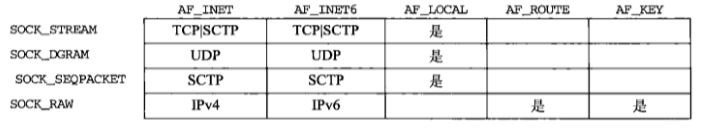 你可能也会碰到socket函数的第一个参数的相应的FP_XXX常值。也可能会碰到AF_LOCAL（POSIX名称）被AF_UNIX取代（历史上的Unix域名称）。

参数family和type还有其他值，如4.4 BSD支持的family参数值还有AF_NS（Xerox NS协议，常称为XNS）和AF_ISO（OSI协议），但现在很少有人使用这些协议。Xerox NS协议和OSI协议都实现了对SOCK_SEQPACKET这个type参数值的支持，该type参数值还可用于SCTP。TCP是一个字节流协议，仅支持SOCK_STREAM作为套接字类型（即type参数值）。

Linux支持一个新的套接字类型SOCK_PACKET，它与BPF（Berkeley Packet Filter，伯克利包过滤器）和DLPI（Data Link Provider Interface，数据链路提供者接口）类似，支持对数据链路的访问。

密钥套接字AF_KEY比较新，用于支持基于加密的安全性。跟路由套接字AF_ROUTE是内核中路由表的接口类似，密钥套接字是内核中密钥表的接口。

socket函数在成功时返回一个小的非负整数值，它与文件描述符类似，我们称它为套接字描述符，简称sockfd。为了得到这个套接字描述符，我们只是指定了协议族（IPv4、IPv6、Unix）和套接字类型（字节流、数据报、原始套接字），我们并没有指定本地协议地址和远程协议地址。

AF*前缀表示地址族，PF*前缀表示协议族，历史上的想法是：单个协议族可以支持多个地址族，PF*值用来创建套接字，而AF*值用于套接字地址结构，但实际上，支持多个地址族的协议族从来未实现过，而且头文件sys/socket.h中给定协议的PF*值总是与AF*值相等，尽管这种相等关系不一定永远成立，如果有人试图改变这种相等关系，则许多现存代码将崩溃，为与现存代码保持一致，我们本书中仅使用AF*常值，尽管在各种实现代码中，可能会碰到用PF*值调用sockset。

在BSD/OS 2.1版中调用socket的137个程序中，有143个调用指定AF*值，仅有8个调用指定PF*值。

从历史上说，AF*前缀与PF*前缀具有相似常值集的原因要追溯到4.1cBSD，是比我们正在讲述的随4.2 BSD出现的socket函数更早的版本。4.1cBSD版本的socket函数采用了4个参数，其中一个是指向sockproto结构的指针，该结构的第一个成员名为sp_family，它的值时某个PF*值，它的第二个成员sp_protocol是一个协议号，类似于现行socket函数的第3个参数，指定协议族的唯一方法是指定该结构。因此在这个早期系统中，PF*值用来在sockproto结构中指定协议族的结构标签，而AF_值用来在套接字地址结构中指定地址族的结构标签。4.4 BSD中仍有sockproto结构，但仅由内核在内部使用。在最初的定义中，对sockproto结构的sp_family成员有`protocol family`的注释，在4.4 BSD源码中已改为`address family`了。

令人更弄不清AF*常值与PF*常值之间区别的是，Berkely实现的一个内核数据结构的成员值（domain.dom_family）会与socket函数的第一个参数作比较，而domain.dom_family有这样的注释`它含有AF_值`，尽管如此还是有部分domain.dom_family被初始化为PF_值。

4.2 BSD的socket函数手册页面将该函数的第一个参数称为af，并把AF_常值作为它的可能取值列出。然而POSIX在addrinfo结构中却只定义了一个族值，既用于调用socket函数，也用于套接字地址结构中。

TCP客户用connect函数建立与TCP服务器的连接：  sockfd参数是由socket函数返回的套接字描述符，servaddr参数是指向套接字地址结构的指针（该结构中含有服务器的IP和端口），addrlen参数是该结构的大小。

客户调用connect前不必非得调用bind函数，因为此时内核会确定源IP地址，并选择一个临时端口作为源端口。

如果是TCP套接字，调用connect函数会触发TCP的三次握手过程，connect函数仅在连接建立成功或出错时才返回，出错返回的可能情况： 1.若TCP客户未收到SYN分节的响应，返回ETIMEDOUT错误。调用connect函数后，举例来说，4.4 BSD内核发送一个SYN，若无响应则等待6s后再发送一个，若还无响应则等待24s再发一个，总共等待75s后还未收到响应则返回本错误。有些系统提供对超时值的控制。 2.若客户收到的SYN响应是RST，表明该服务器主机的指定端口上没有进程在等待与之连接。这是一种硬错误，此时connect函数马上返回ECONNREFUSED错误。RST是TCP发生错误时发送的一种TCP分节，RST产生的条件如下： （1）目的地某端口上SYN到达，但该端口上没有正在监听的服务器。 （2）TCP想取消一个已有连接。 （3）TCP接收到一个根本不存在的连接上的分节。 3.若客户发出的SYN在中间某路由器上引发了目的地不可达的ICMP错误，则认为这是一种软错误，此时客户主机内核保存该消息，并按1中的时间间隔继续发送SYN（因为ICMP错误可能指示某个暂时状态，它可能是由于某个可被修复的原因引起的），若在75s后还未收到响应，则把保存的ICMP错误作为EHOSTUNREACH或ENETUNREACH返回给进程。出现该错误也可能是本机转发表没有到达远程系统的路径或connect调用不等待就返回（非阻塞）。

许多早期系统（如4.2 BSD）在收到目的地不可达ICMP错误时会不正确地放弃建立连接的尝试，这种做法不正确的原因是，该错误可能指示某个暂时状态，如它可能是可以被修复的某个路由问题导致。

即使ICMP错误指示目的网络不可达，应用进程也应该把ENETUNREACH和EHOSTUNREACH作为相同错误对待，因为网络不可达错误被认为已过时。

使用自己编写的daytime客户程序查看建立连接时不同的出错情况，首先指定服务器为本地主机（127.0.0.1），它正在运行daytime服务器程序，观察正常输出：  为了查看返回的另一种格式，我们指定另外一个主机（HP-UX主机）的IP：  接着我们指定本地子网（192.168.1/24）上主机ID为100的不存在的IP地址，这样当客户主机发出ARP请求（要求那个不存在的主机响应其硬件地址）时，它将收不到ARP响应：  我们等connect函数超时后（Solaris 9上约4分钟）才得到该错误。我们的err_sys函数以直观可读的字符串消息显示了ETIMEDOUT错误的含义。

下例指定了一个没有运行daytime服务器程序的主机（其实是一个本地路由器）：  上例中服务器主机立即响应了一个RST分节。

下例中指定一个因特网中不可到达的IP地址，如果我们用tcpdump观察分组情况，会发现6跳远的路由器返回了主机不可达ICMP错误：  上例中的connect函数也在等待了规定的一段时间后才返回EHOSTUNREACH错误。

connect函数导致TCP状态从CLOSED状态到SYN_SENT状态，若函数返回成功，则再到ESTABLISHED状态。若connect失败，则该套接字不再可用，必须关闭，我们不能再对这样的套接字再次调用connect。

bind函数把一个本地协议地址赋予一个套接字，对于网际协议，协议地址为32bit IPv4地址或128bit IPv6地址与16位TCP或UDP端口号的组合：  历史上讲述bind函数的手册页面曾说`（bind assigns a name to an unnamed socket）bind函数为一个无名的套接字命名`，使用name一次让人混淆，因为它具有如`foo.bar.com`之类域名的含义。bind函数其实与名字没有任何关系，它只是把一个协议地址赋予一个套接字，至于协议地址的含义则取决于协议本身。

第二个参数myaddr是一个指向特定于协议的地址结构的指针，第三个参数是该地址结构的长度。对于TCP，调用bind函数可以指定一个端口号，或指定一个IP地址，或两者都指定，还可以都不指定。

服务器在启动时绑定它们的众所周知端口号，如果一个TCP客户或服务器未调用bind捆绑一个端口，当调用connect或listen时，内核要为相应的套接字选择一个临时端口。让内核选择临时端口对TCP客户来说是正常的，除非应用需要预留一个端口；然而分配临时端口对于TCP服务器很罕见，因为服务器是通过它们的众所周知端口被大家认识的，但例外是远程过程调用（RPC，Remote Procedure Call）服务器，它们通常由内核为它们的监听套接字选择一个临时端口，该端口随后通过RPC端口映射器注册，客户在connect这些服务器前，需要与端口映射器联系以获取它们的临时端口。

进程可把一个特定IP捆绑到它的套接字上，该IP必须属于其所在主机的网络接口之一。对于TCP客户，这为在该套接字上发送的IP数据报指派了源IP地址；对于TCP服务器，这限定了该套接字只接收那些目的地为这个IP地址的客户连接。但TCP客户通常不把它的IP捆绑到它的套接字上，当连接套接字时，内核将根据所用的外出网络接口选择源IP，而所用的外出接口取决于到达服务器所需的路径。如果服务器没有把IP捆绑到它的套接字上，内核就把客户发送的SYN的目的IP作为服务器的源IP。

bind函数可仅指定IP（非通配地址）或仅指定端口（端口号非0）或都指定或都不指定，效果如下：  如果指定端口号为0，那么内核在调用bind时选择一个临时端口；如果指定IP地址为通配地址，那么内核将等到套接字已连接（TCP）或已在套接字上发出数据报（UDP）时才选择一个本地IP地址。

对于IPv4，通配地址由常值INADDR_ANY指定，其值一般为0，它告知内核去选择IP地址：

```c
struct sockaddr_in servaddr;
servaddr.sin_addr.s_addr = htonl(INADDR_ANY)    /* wildcard */
12
```

上例赋值对IPv4是可行的，因为其IP是一个32位的值，可用一个简单地数字常值表示。但对于IPv6，由于它的地址是存在一个结构中的，且C语言的赋值语句右边不能表示常值结构，因此不能这么做，但可以将其改写为：

```c
serv.sin6_addr = in6addr_any;    /* wildcard */
1
```

系统会分配in6addr_any变量并将其初始化为常值IN6ADDR_ANY_INIT，头文件netinet/in.h中含有in6addr_any的extern声明。

INADDR_ANY的值为全0，因此网络字节序和主机字节序是一样的，因此使用htonl并非必须，但头文件netinet/in.h中定义的所有INADDR_常值都是按主机字节序定义的，因此应该对这些常值都调用htonl。

如果让内核为套接字选择一个临时端口，bind函数并不返回其选择的值，实际上，bind函数的第2个参数有const限定词，它无法返回所选的值，只能通过getsockname函数返回协议地址来获得这个临时端口值。

进程捆绑非通配地址到套接字上的常见例子是在为多个组织提供Web服务器的主机上，每个组织有各自的域名，每个域名映射到不同的IP地址，但通常都在同一子网上，可把这些IP地址定义成单个网络接口的别名（如在4.4 BSD上使用ifconfig命令的alias选项来定义，相当于一个接口（网卡）上配置了多个IP地址），这样IP层将接收所有目的IP地址为任何一个别名IP地址的外来数据报，最后为每个组织启动一个HTTP服务器的副本，每个副本仅捆绑相应组织的IP地址。

替换上述方法的另一种技术是运行捆绑通配地址的单个服务器，当一个连接到达时，服务器调用getsockname获取客户的目的IP地址，然后服务器根据目的IP来处理请求。

绑定非通配IP地址的好处是把给定的目的IP分配给特定的服务器进程是由内核而非服务器进程完成的。

要区分一个分组的到达接口和该分组的目的IP地址。在弱端系统模型和强端系统模型中，大多实现选择前者，这意味着一个分组只要其目的IP地址是主机上某个接口的地址即可，它的到达接口地址不一定要是其目的IP地址（这里假设目的主机是多宿主机）。弱端系统模型中，绑定到非通配地址只是根据目的IP地址来确定递送到套接字的数据报，而对于到达接口未做限制，除非主机采用强端系统模型。

bind函数的一个常见返回错误是EADDRINUSE，即地址已使用。

listen函数仅由TCP服务器调用，作用为： 1.socket函数创建一个套接字时，默认它是一个主动套接字，即它是一个将调用connect发起连接的客户套接字，listen函数将一个未连接的套接字转换成一个被动套接字，指示内核应接受指向该套接字的连接请求。调用listen导致套接字从CLOSED转换成LISTEN状态。 2.该函数的第二个参数backlog规定了内核应该为相应套接字排队的最大连接个数：  listen函数通常在调用socket和bind后，accept前调用。

内核为每个监听套接字维护两个队列： 1.未完成连接队列：存放“某个客户发出SYN并到达服务器，而服务器在等待完成TCP三次握手过程”的连接。这些套接字处于SYN_RCVD状态。 2.已完成连接队列：存放已完成TCP三次握手的连接。这些套接字处于ESTABLISHED状态。  在未完成连接队列中创建一项时，监听套接字的参数（连接本端的端口、ip等）就被复制到即将建立的连接中。连接的创建是自动的，无需服务器进程插手。用上图中两个队列建立连接时所交换的分组：  当来自客户的SYN到达时，TCP在未完成连接队列中创建一个新项，然后响应三路握手的第二个分节（服务器的SYN响应+对客户SYN的ACK），这一项一直保留在未完成连接队列中，直到三路握手的第3个分节（客户对服务器SYN的ACK）到达或这一项超时为值（源自伯克利的实现为这些未完成连接的项设置的超时值为75s）。三次握手完成时，位于未完成连接队列的该项被插入到已完成连接队列的队尾。当进程调用accept时，已完成连接队列中的队头项返回给该进程，如果该队列为空，则进程将进入睡眠，直到TCP往该队列中放入一项才唤醒它。

listen函数的backlog参数曾被规定为这两个队列总和的最大值。

backlog的含义从未有过正式定义，4.2 BSD的手册页面说它是`由the maximum length the queue of pending connection may grow to（未处理连接构成的队列可能增长到的最大长度）`，许多手册页面甚至POSIX规范也逐字复制该定义，然而该定义并未解释未处理连接是处于SYN_RCVD状态的连接，还是处于ESTABLISHED状态的连接，亦或两者皆可。

源自Berkeley的实现给backlog增设了一个模糊因子，把该值乘以1.5得到未处理队列最大长度，例如，指定为5的backlog参数值实际允许最多有8项在排队。增设该模糊因子的理由已无从考证，但如果我们把backlog看成是内核能为某套接字排队的最大已完成连接数，那么增加模糊因子的理由就是把队列中的未完成连接也算在内。

不要把backlog参数设为0，因为不同实现对此有不同解释，如果不想让客户连接到监听套接字上，那就关掉该套接字。

在三路握手正常完成的前提下（没有丢失分节，从而没有重传），未完成连接队列中任何一项的留存时间为一个RTT，而RTT的值取决于特定的客户与服务器，TCPv3指出，对于一个Web服务器，许多客户与单个服务器之间的中值RTT为187ms（由于出现一些大值可能显著扭曲均值，对于该统计量通常使用中值）。

历史上，样例代码中的backlog参数值总是5，因为这是4.2 BSD支持的最大值，这个值在20世纪80年代是足够的，当时繁忙的服务器一天也就处理几百个连接。但随着万维网（WWW，World Wide Web）的发展，繁忙的服务器一天要处理几百万个连接，这个值就不够了。繁忙的HTTP服务器必须指定一个大得多的backlog值，且较新的内核必须支持较大的backlog值。当前许多系统允许管理员修改backlog参数的最大值。

既然backlog值为5往往是不够的，进程应指定多大的backlog呢？当今的HTTP服务器指定了一个较大的值，但如果这个值再源码中是一个常值，那么增长其大小需要重新编译服务器程序。另一个方法是设定一个默认值，但允许通过命令行选项或环境变量覆盖该默认值。指定一个比内核能支持的值还要打的backlog也是可接受的，因为内核应该悄然把所指定的偏大值截成自身支持的最大值，而不返回错误。通过修改listen函数的包裹函数是比较简单的解决方式，我们允许环境变量LISTENQ覆盖由调用者指定的值：

```c
void Listen(int fd, int backlog) {
    char *ptr;
    
    /* can override 2nd argument with environment variable */
    if ((ptr = getenv("LISTENQ")) != NULL) {
        backlog = atoi(ptr);
    }
    
    if (listen(fd, backlog) < 0) {
        err_sys("listen error");
    }
}
123456789101112
```

未完成连接队列和已完成连接队列中哪个队列中项多是不确定的。

一个客户的SYN到达时，如果队列是满的，TCP就忽略该分节，即不发送RST。这是因为这种情况是暂时的，客户TCP将重发SYN，我们期望不久这些队列中就有可用空间。如果服务器TCP响应以一个RST，客户的connect调用会返回一个错误，强制应用进程处理该错误，而不是让TCP正常重传机制来处理。此外，客户无法区分响应SYN段的RST究竟意味着`该端口没有服务器监听`还是`该端口有服务器监听，但它的队列满了`。

有些实现在队满时发送RST，这种做法是错误的，我们最好忽略其存在的可能性，除非客户明确要求与这样的服务器交互。处理这种情况的额外代码会降低客户程序的健壮性，并且当正常发送RST（端口确实没有服务器在监听）时，也会增加网络负载（发送端分不清是没有服务器还是服务器队列满，还会重试）。

当服务器调用accept之前，三路握手完成后，到达的数据由服务器TCP排队，且最大数据量为该已连接套接字的接收缓冲区大小。

各种操作系统下，backlog参数取不同值时，两队列中的连接数目，从下图可见对backlog的意义解释是多样的：  AIX和Mac OS用传统的Berkeley算法，Solaris也非常接近该算法，FreeBSD则是backlog值加1。

历史上曾把backlog值指定为两个队列之和的最大值。在1996年间因特网受到一种称为SYN泛滥的新型攻击，黑客编写了一个以高速率给受害主机发送SYN的程序，用以填满一个或多个TCP端口的未完成连接队列，而且该程序将每个SYN的源IP地址都置为随机数（称为IP欺骗），这样服务器的SYN/ACK就发往不知道什么地方，同时防止受攻击服务器获取黑客的真实IP地址。这样，通过伪造的SYN填满未完成连接队列，使合法的SYN排不上队，导致针对合法客户的服务被拒绝。因此backlog更好的含义是指定某个给定套接字上内核为之排队的最大已完成连接数，如果一个系统实现了这样的解释（如BSD/OS 3.0），那么应用程序就无须因为服务器进程需要处理大量客户请求或为了提供对SYN泛滥的防护而指定一个巨大的backlog值了，内核会处理大量的未完成连接，不管它们是来自合法客户还是黑客。但即使在这样的解释下，传统为5的backlog参数值不够大的情形依然发生。

accept函数由TCP服务器调用，用于从已完成连接队列的队头返回下一个已完成连接，如果已完成连接队列为空，则进程会进入睡眠（假定套接字为默认的阻塞方式）：  参数cliaddr和addrlen用来返回已连接的客户进程的协议地址，参数addrlen是值结果参数，调用accept前，参数addrlen指向的整数值为参数cliaddr所指套接字地址结构的长度，返回时，该整数为由内核存放在该套接字地址结构内的确切字节数。

accept调用成功时，返回值是由内核自动生成的一个全新描述符，代表与所返回客户的TCP连接。讨论accept函数时，称sockfd参数为监听套接字描述符，accept的返回值被称为已连接套接字描述符。一个服务器通常只创建一个监听套接字，它在该服务器的生命期内一直存在，内核为每个由服务器进程accept的客户连接创建一个已连接套接字，当服务器完成对某客户的服务时，相应的已连接套接字就被关闭。

accept函数最多返回3个值，一个既可能是新套接字描述符也可能是出错指示的整数、客户进程的协议地址（由cliaddr参数指针所指）、该地址的大小（由addrlen参数指针所指）。如果对返回的客户协议地址不感兴趣，可将cliaddr和addrlen参数置为空指针。

现在我们修改daytime服务器程序代码，以显示客户的IP和端口号：

```c
#include "unp.h"
#include <time.h>

int main(int argc, char **argv) {
    int listenfd, connfd;
    socklen_t len;    // 新定义变量，它将成为一个值-结果变量
    struct sockaddr_in servaddr, cliaddr;    // 新定义变量cliaddr，它将存放客户的协议地址
    char buff[MAXLINE];
    time_t ticks;
    
    listenfd = Socket(AF_INET, SOCK_STREAM, 0);
    
    bzero(&servaddr, sizeof(servaddr));
    servaddr.sin_family = AF_INET;
    servaddr.sin_addr.s_addr = htonl(INADDR_ANY);
    servaddr.sin_port = htons(13);    /* daytime server */
    
    Bind(listenfd, (SA *)&servaddr, sizeof(servaddr));
    
    Listen(listenfd, LISTENQ);
    
    for (; ; ) {
        len = sizeof(cliaddr);
        connfd = Accept(listenfd, (SA *)&cliaddr, &len);
        printf("connection from %s, port %d\n", 
            Inet_ntop(AF_INET, &cliaddr.sin_addr, buff, sizeof(buff)),
            ntohs(cliaddr.sin_port));
        
        ticks = time(NULL);
        snprintf(buff, sizeof(buff), "%.24s\r\n", ctime(&ticks));    // 最少打印24个字符
        Write(connfd, buff, strlen(buff));
        
        Close(connfd);
    }
}
1234567891011121314151617181920212223242526272829303132333435
```

运行以上服务器，之后在同一主机上运行两次客户程序，一次的目的IP为环回地址，一次是服务器自身的IP地址：  下面是相应的服务器输出：  可见客户IP是有变化的。我们获取时间的客户程序没有调用bind，这样的客户由内核将所用外出接口选定为源IP地址，第一次内核把源IP地址设为环回地址，第二次内核把源IP设为以太网接口的IP地址。我们还可以看到Solaris内核选择的临时端口号先是43388，后是43389。

上图可见，运行服务器脚本的shell提示符变为井号，它是超级用户的常用提示符，该服务器必须以超级用户特权运行，以便绑定保留的13号端口，如果没有超级用户特权，bind调用将失败：  Unix的fork函数（包括有些系统可能提供的它的变体）是Unix中派生新函数的唯一方法：  fork函数调用一次，返回两次，它在调用进程（父进程）中返回一次，返回值是新派生的进程（子进程）的进程ID号；在子进程中又返回一次，返回值为0。因此返回值本身告知当前进程是子进程还是父进程。

fork函数在子进程返回0而不是父进程的进程ID的原因在于，任何子进程只有一个父进程，而且子进程总是可以通过调用getppid取得父进程的进程ID；而父进程可以有许多子进程，且无法获取各个子进程的进程ID。如果父进程想跟踪所有子进程的进程ID，那么它必须记录每次调用fork的返回值。

父进程中调用fork前打开的所有描述符在fork函数返回后与子进程共享。网络服务器利用了这个特性，父进程调用accept后调用fork，所接受的已连接套接字随后在父进程和子进程之间共享。通常，子进程会接着读写这个已连接套接字，父进程则关闭这个已连接套接字。

fork函数的两个典型用法： 1.一个进程创建一个自身的副本，这样每个副本都可以在另一个副本执行其他任务的同时处理各自的某个操作。这是网络服务器的典型用法。 2.一个进程想执行另一个程序，该进程首先调用fork创建一个自身的副本，然后其中一个副本（通常为子进程）调用exec把自身替换成新程序。这是shell程序的典型用法。

存放在硬盘上的可执行程序文件能被Unix执行的唯一方法是由一个现有进程调用六个exec函数中的某一个（它们统称为exec函数）。exec函数把当前进程映像替换成新的程序文件，且新程序通常从main函数开始执行，进程ID不变。调用exec的进程被称为调用进程，新执行的程序被称为新程序。

较老的手册称新程序为新进程（new process），这是错误的，因为并没有创建新的进程。

6个exec函数之间的区别在于： 1.待执行的程序文件是由文件名（filename）还是路径名（pathname）指定。 2.新程序的参数是一一列出还是由一个指针数组来引用。 3.把调用进程的环境传递给新程序还是给新程序指定新的环境。   以上函数只有在出错时才返回到调用者，否则，控制将被传递给新程序的起始点，通常是main函数。

以上6个函数之间的关系，一般来说，只有execve函数是内核中的系统调用，其他5个函数都是调用execve的库函数：  6个函数的区别： 1.上图中上面那行的3个函数把新程序的每个参数字符串指定成一个独立参数，并以一个空指针结束可变数量的这些参数。下面那行的3个函数都有一个argv数组参数，其中含有指向新程序各个参数字符串的所有指针，这个数组中含有一个用于指定其末尾的空指针。 2.上图中左侧两个函数指定了filename参数，它们会根据当前使用的PATH环境变量把文件名参数转换为一个路径名，但如果这两个函数的filename参数中含有一个斜杠`/`，就不再使用PATH环境变量，而是将filename看做一个路径名。右两列的4个函数指定一个路径名。 3.左边两列4个函数没有环境指针参数，它们使用外部变量environ的当前值来构造一个传递给新程序的环境列表。右边两列函数显式指定一个环境列表，其envp参数指针指向的指针数组必须以一个空指针结束。

进程在调用exec前打开的描述符跨exec通常继续保持打开。除非该默认行为被fcntl函数的FD_CLOEXEC描述符标志禁止掉。

前面给出代码的daytime服务器是一个迭代服务器，对于像获取时间这样的简单服务器来说是足够的，但当服务一个客户请求可能花费较长时间时，我们不希望整个服务器被单个客户长期占用，而是希望同时服务多个客户。Unix中编写并发服务器最简单的方法是fork一个子进程来服务每个客户。以下是一个典型的并发服务器的轮廓：

```c
pid_t pid;
int listenfd, connfd;

listenfd = Socket( ... );
Bind(listenfd, ...);    /* fill in sockaddr_in{} with server's well-known port */
Listen(listenfd, LISTENQ);

for (; ; ) {
    connfd = Accept(listenfd, ...);    /* probably blocks */
    if ((pid = Fork()) == 0) {
        Close(listenfd);    /* child closes listening socket */
        doit(connfd);    /* process the request */
        Close(connfd);    /* done with this client */
        exit(0);    /* child terminates */
    }
    Close(connfd);    /* parent closes connected socket */
}
1234567891011121314151617
```

当一个连接建立时，accept函数返回，服务器接着调用fork，然后由子进程服务客户（通过已连接套接字connfd），父进程则等待另一个连接（通过监听套接字listenfd）。既然新的客户由子进程提供服务，父进程就关闭已连接套接字。

以上程序我们假设函数doit执行服务客户所需的所有操作，当该函数返回时，我们在子进程中显式地关闭已连接套接字，这一点并非必需，因为下一个语句就是调用exit，而进程终止处理的部分工作就是关闭所有由内核打开的描述符。是否显式调用close只和个人编程风格有关。

对一个TCP套接字调用close会导致发送一个FIN，随后是正常的TCP连接终止序列，但上例代码中，父进程对connfd调用close没有终止它与客户的连接，这是因为每个文件或套接字都有一个引用计数，引用计数在文件表项中维护，含义是当前打开着的引用该文件或套接字的描述符个数。上例中，socket函数返回后与listenfd关联的文件表项的引用计数为1，accpet函数返回后与connfd关联的文件表项的引用计数也为1，但当fork函数返回后，这两个描述符就在父进程与子进程间共享（即被复制），因此与这两个套接字相关联的文件表项各自的访问计数值均为2，因此，当父进程关闭connfd时，它只是把相应引用计数值从2减为1，该套接字真正的清理和资源释放要等到其引用计数值到0时才发生，即会在稍后子进程也关闭connfd时发生。

下图是服务器阻塞于accept调用时，来自客户的连接请求到达时客户和服务器的状态：  从accept函数返回后，我们就有下图所示状态，此时连接已被内核接受，新的套接字connfd被创建，这是一个已连接套接字，可由此跨连接读写数据：  并发服务器下一步调用fork，下图是从fork函数返回后的状态：  如上图，此时listenfd和connfd两个描述符都在父进程和子进程之间共享（被复制）。下一步是父进程关闭已连接套接字，子进程关闭监听套接字：  上图是这两个套接字所期望的最终状态，子进程处理与客户的连接，父进程在监听套接字上再次调用accept处理下一个客户连接。

通常的Unix close函数也用来关闭套接字，并终止TCP连接：  close一个TCP套接字的默认行为是把该套接字标记成已关闭，然后立即返回到调用进程。该套接字描述符不能再由调用进程使用，即它不能再作为read和write函数的第一个参数。TCP将尝试发送正排队等待发送到对端的数据，发送完毕后发生的是正常的TCP连接终止序列。

如果我们想在某个TCP连接上发送一个FIN（而不是调用close减少引用计数），可以改用shutdown函数。

如果父进程对每个由accept函数返回的已连接套接字都不调用close，父进程最终将耗尽可用描述符，因为进程可拥有的打开着的描述符数量通常是有限制的，且没有一个客户连接会被终止，当子进程关闭已连接套接字时，它的引用计数由2减为1且保持为1，因为父进程永不关闭任何已连接套接字，这将妨碍TCP连接终止序列的发生，导致连接一直打开着。

获取与某个套接字关联的本地协议地址的函数（getsockname函数），或获取与某个套接字关联的外地协议地址的函数（getpeername函数）：  以上两个函数的最后一个参数都是值-结果参数，这两个函数都会装填由localaddr或peeraddr指针所指的套接字地址结构。

需要以上两个函数的理由： 1.在一个没有调用bind的TCP客户上，connect函数返回成功后，getsckname可用于返回由内核赋予该连接的本地IP地址和本地端口号。 2.在以端口号0调用bind（告知内核去选择本地端口号）后，getsockname用于返回由内核赋予的本地端口号。 3.getsockname函数可用于获取某个套接字的地址族。 4.在一个以通配IP地址调用bind的TCP服务器上，与某个客户的连接一旦建立（accept成功返回），getsockname函数可用于返回由内核赋予该连接的本地IP地址（此时要用的是已连接套接字的描述符而非监听套接字的描述符）。 5.当一个服务器是由调用过accept函数的某个进程通过调用exec执行程序时，它获取客户身份的唯一途径就是调用getpeername。当inetd fork并exec某个TCP服务器时就是如此情形，如下图，inetd调用accept返回两个值（图中左上方框）：已连接套接字描述符connfd（函数返回值）和客户的IP和端口号（图中小方框表示，代表一个网际套接字地址结构），inetd随后调用fork，派生出inetd的一个子进程，既然子进程起始于父进程的内存映像的一个副本，父进程中的套接字地址结构在子进程中也可用，已连接套接字描述符也是如此（父子进程共享描述符）。但当子进程调用exec执行真正的服务器程序（如Telnet服务器程序）时，子进程的内存映像被替换成新的Telnet服务器的程序文件，此时包含对端地址的那个套接字地址结构就此丢失，但已连接套接字描述符跨exec函数继续保持开放。Telnet服务器首先调用的函数之一便是getpeername，用于获取客户IP地址和端口号。  上图中，Telnet服务器启动后需要先获取connfd的值，有两个常用方法： 1.调用exec的进程把这个描述符格式化成一个字符串，再把它作为一个命令行参数传递给新程序。 2.约定在调用exec前，总是把某个特定描述符置为已连接套接字的描述符。 inetd采用的第2种方法，它总是把描述符0、1、2置为已连接套接字的描述符。

以下函数返回某个套接字的地址族：

```c
#include "unp.h"

int sockfd_to_family(int sockfd) {
    struct sockaddr_storage ss;    // 既然不知道要分配的套接字地址结构的类型，于是采用sockaddr_storage这个通用结构，它能承载系统支持的任何套接字地址结构
    socklen_t len;
    
    len = sizeof(ss);
    // 既然POSIX允许对未绑定的套接字调用getsockname，该函数应该适合任何已打开的套接字描述符
    if (getsockname(sockfd, (SA *)&ss, &len) < 0) {
        return -1;
    }
    return ss.ss_family;
}
12345678910111213
```

大多TCP服务器是并发的，但大多数UDP服务器是迭代的。

我们说INADDR_常值是主机字节序的，但INADDR_ANY的各位全0和INADDR_NONE的各位全1是看不出来的，其他常值如D类多播地址INADDR_MAX_LOCAL_GROUP（224.0.0.255）就可以看出来是按主机字节序定义的了。

getsockname函数的值-结果参数（len）必须在调用前初始化为由第二个指针参数所指变量的大小。涉及值-结果参数的最常见编程错误就是忘记了这样的初始化。

如果没有对套接字描述符调用listen就传给accept函数，accept函数会返回EINVAL，因为它的第一个参数不是一个监听套接字描述符。

如果没有对套接字描述符调用bind就调用listen，则listen函数会赋予监听套接字一个临时端口。

# 第五章 TCP客户/服务器程序示例

本章将编写一个完整的TCP客户/服务器程序，这个简单例子是执行以下步骤的一个回射服务器： 1.客户从标准输入读入一行文本，并写给服务器；

2.服务器从网络输入读入这行文本，并回射给客户；

3.客户从网络输入读入这行回射文本，并显示在标准输出上。  如上图，我们在客户与服务器之间画了两个单向箭头，但实际上它们构成一个[全双工](https://so.csdn.net/so/search?q=全双工&spm=1001.2101.3001.7020)的TCP连接。fets和fputs函数来自标准IO函数库，writen和readline这两个函数是我们编写的。

大多数TCP/IP实现已经提供了以上这种回射服务器，有使用UDP的，也有使用TCP的。

回射输入行这样的客户/服务器程序是一个简单而有效的网络应用程序的例子，实现任何客户/服务器网络应用所需的所有基本步骤可通过本例阐明，若想把本例扩充成自己的应用程序，只需修改服务器对来自客户的输入的处理过程。

TCP回射服务器的main函数：

```c
#include "unp.h"

int main(int argc, char **argv) {
    int listenfd, connfd;
    pid_t childpid;
    socklen_t clilen;
    struct sockaddr_in cliaddr, servaddr;
    
    listenfd = Socket(AF_INET, SOCK_STREAM, 0);
    
    bzero(&servaddr, sizeof(servaddr));
    servaddr.sin_family = AF_INET;
    // 捆绑通配地址，告诉系统，如果系统是多宿主机，则接受目的地址为任何本地接口的地址
    servaddr.sin_addr.s_addr = htonl(INADDR_ANY);    
    // 在头文件unp.h中，SERV_PORT的值定义为9877
    servaddr.sin_port = htons(SERV_PORT);   

    Bind(listenfd, (SA *)&servaddr, sizeof(servaddr));
    
    Listen(listenfd, LISTENQ);
    
    for (; ; ) {
        clilen = sizeof(cliaddr);
        // 服务器阻塞于此，等待客户连接的完成
        connfd = Accept(listenfd, (SA *)&cliaddr, &clilen);    
        
        if ((childpid = Fork()) == 0) {    /* child process */
            Close(listenfd);    /* close listening socket */
            str_echo(connfd);    /* process the request */
            exit(0);
        }
        Close(connfd);    /* parent closes connected socket */
    }
}
12345678910111213141516171819202122232425262728293031323334
```

以上程序中，SERV_PORT应该比1023大，因为我们不需要一个保留端口；要比5000大，以免与许多源自Berkeley的实现分配临时端口的范围冲突；要比49152小，以免与临时端口号的正确范围冲突；还应该不和任何已注册的端口冲突。

上例中，fork函数返回后，子进程关闭监听套接字，父进程关闭已连接套接字，之后子进程调用str_echo处理客户请求。

以下是TCP回射服务器的str_echo函数，它从客户读入数据，并把它们回射给客户：

```c
#include "unp.h"

void str_echo(int sockfd) {
    ssize_t n;
    char buf[MAXLINE];
    
again:
    while ((n = read(sockfd, buf, MAXLINE)) > 0) {
        Writen(sockfd, buf, n);
    }
    
    if (n < 0 && errno == EINTR) {
        goto again;
    } else if (n < 0) {
        err_sys("str_echo: read error\n");
    }
}
1234567891011121314151617
```

以上代码中，read函数从套接字读入数据，writen函数把读到的内容回射给客户。如果客户关闭连接，那么接收到客户的FIN将导致服务器子进程的read函数返回0，这又导致str_echo函数的返回，从而在main函数中终止子进程。

以上程序中，服务器父进程大部分时间都会花在阻塞于accept的调用中，而服务器子进程大部分时间花在阻塞于read的调用中。如果服务器设置了SO_KEEPALIVE套接字选项，而且连接上没有数据在交换，如果客户主机崩溃且没有重启，会发生：保持存活选项对于监听套接字不起作用，因此父进程不受客户主机崩溃影响，而子进程的read函数将超时并返回ETIMEDOUT错误。

以下是TCP回射客户程序的main函数：

```c
#include "unp.h"

int main(int argc, char **argv) {
    int sockfd;
    struct sockaddr_in servaddr;
    
    if (argc != 2) {
        err_quit("usage: tcpcli <IPaddress>");
    }
    sockfd = Socket(AF_INET, SOCK_STREAM, 0);
    
    bzero(&servaddr, sizeof(servaddr));
    servaddr.sin_family = AF_INET;
    servaddr.sin_port = htons(SERV_PORT);
    Inet_pton(AF_INET, argv[1], &servaddr.sin_addr);
    
    Connect(sockfd, (SA *)&servaddr, sizeof(servaddr));
    
    /* do it all，完成客户剩余部分的处理工作 */
    str_cli(stdin, sockfd);    
    
    exit(0);
}
1234567891011121314151617181920212223
```

TCP回射客户程序str_cli函数：

```c
#include "unp.h"

void str_cli(FILE *fp, int sockfd) {
    char sendline[MAXLINE], recvline[MAXLINE];
    
    while (Fgets(sendline, MAXLINE, fp) != NULL) {
        Writen(sockfd, sendline, strlen(sendline));
        if (Readline(sockfd, recvline, MAXLINE) == 0) {
            err_quit("str_cli: server terminated prematurely");
        }
        Fputs(recvline, stdout);
    }
}
12345678910111213
```

客户的大部分时间会花在阻塞于fgets调用中，fgets函数本身会阻塞于标准IO函数库对于标准输入的读操作中，如果客户使用了SO_KEEPALIVE选项，且保持存活定时器超时，并且服务器崩溃且没有重启时，已连接套接字的待处理错误被设置成ETIMEDOUT，但客户阻塞于标准输入的fgets调用中，因此看不到这个错误，直到对已连接套接字执行读或写，这也是为什么后边会使用select函数。

以上代码中的fgets函数读入一行文本，它在以下情况会返回：读入了MAXLINE-1字节、遇到EOF、读到换行符（fgets函数会保留读到的换行符），然后在读到的数据末尾加一个空字符。之后writen函数把读到的该行发给服务器。

readline函数从服务器读入回射行，f[puts函数](https://so.csdn.net/so/search?q=puts函数&spm=1001.2101.3001.7020)把它写到标准输出。

当遇到文件结束符或错误时，fgets函数返回一个空指针，客户的循环于是被终止。包裹函数Fgets会检查是否发生错误，如果发生则终止进程，因此Fgets函数只会在遇到文件结束符时才返回一个空指针。

首先在linux主机上后台启动服务器：  服务器启动后，会阻塞到accept调用，在启动客户前，运行netstat检查服务器监听套接字的状态：  上图中只给出了第一行的标题和我们最关心的那行，该命令列出系统中所有套接字的状态，可能会有大量输出，我们必须指定-a（–all）选项查看所有套接字，包括监听套接字和非监听套接字，否则不会列出监听套接字。

以上输出是我们所期望的，它处于LISTEN状态，有通配的本地地址，本地端口为9877。netstat用星号表示一个为0的IP地址（INADDR_ANY）或为0的端口号。

之后在同一主机上启动客户，并指定服务器的主机IP为127.0.0.1（环回地址），当然我们也可指定该地址为主机的非环回IP地址：  客户调用connect会引起TCP的三路握手过程，当三路握手完成后，客户中的connect函数和服务器的accept函数均返回，连接于是建立。接着会发生如下步骤： 1.客户调用str_cli函数，该函数阻塞于fgets调用，因为我们还未曾键入过一行文本。

2.服务器中的accept函数返回时，服务器调用fork，再由子进程调用str_echo，该函数调用read，而read函数在等待客户送入一行文本期间阻塞。

3.服务器父进程再次调用accept并阻塞，等待下一个客户连接。

至此，我们有3个正在睡眠的进程：客户进程、服务器父进程、服务器子进程。

以上步骤中，我们先列出客户的步骤，原因在于客户收到三路握手的第2个分节时，connect函数就返回了，而服务器要直到收到三路握手的第3个分节才返回，即在connect函数返回后再过RTT的一半才返回。

既然是在同一台主机上运行客户和服务器，netstat会给出对应所建立TCP连接的两行输出：  上图中第一个ESTABLISHED行对应服务器子进程的套接字，因为它的本地端口号是9877；第二个ESTABLISHED行对应客户进程的套接字，因为它的本地端口号是42758。如果我们在不同主机上运行客户和服务器，那么客户主机就只输出客户进程的套接字，服务器主机也只输出两个父子服务器进程的套接字。

我们也可以用ps命令检查这些进程的状态和关系：  上图中使用了ps命令的特定的命令行参数限定了它只输出与本讨论相关的信息。从上图可见，客户和服务器运行在同一个窗口中（即pts/6，表示伪终端号6）。PID和PPID列给出了进程间的父子关系，子进程的PPID是父进程的PID，因此，第一个tcpserv01是父进程，第二个tcpserv01是子进程，而父进程的PPID是shell（bash）。

上图中3个网络进程的STAT列都是S，表明进程在为等待某些资源而睡眠，WCHAN（表示等待通道（Wait Channel），它显示了进程当前所处的内核等待队列或正在等待的事件）列给出了睡眠状态的进程的情况，Linux在进程阻塞于accept或connect函数时，输出wait_for_connect；进程阻塞于套接字输入或输出时，输出tcp_data_wait；进程阻塞于终端IO时，输出read_chan。

至此连接已建立，不论我们在客户的标准输入中键入什么，都会回射到它的标准输出中：  如上图，我们键入的两行都得到了回射，接着我们键入终端EOF字符（Control-D）以终止客户。然后如果立即执行netstat命令，会看到如下结果：  如上图，当前连接的客户端（它的本地端口为42758）进入了TIME_WAIT状态，而监听服务器仍在等待另一个客户连接。上图中我们让命令netstat的输出通过管道作为grep程序的输入，从而只输出与服务器的众所周知端口相关的文本行，这样做也删掉了标题行。

如果我们把客户的标准输入重定向到一个二进制文件，则以上程序可能不能正常工作。如果二进制文件的前3个字节为二进制数1、二进制数0、换行符，由于fgets函数最多读入MAXLINE-1字节，除非碰到换行符或到达文件尾而提前返回，因此fgets函数会读入3个字节，然而在计算要发送的串的长度时，strlen函数会返回1，因为第2个字节就是空字节了，客户于是只把第一个字节发送给服务器，导致服务器阻塞在readline函数上，等待一个换行符，而客户也阻塞在等待服务器的应答上，这就是所谓的死锁，两个进程都阻塞在等待因对方原因而永远不会到达的事件上。此处的问题在于，fgets函数以一个空字节表示所返回数据的结尾，因此它读入的数据不能含有空字节。

如果我们将Telnet作为客户与我们的回射服务器通信，会发生什么？Telnet把输入行转换成NVT ASCII，意味着以CR后跟LF的双字节序列终止每一行，而我们自己的客户程序只用换行符终止每一行。我们仍然可以使用Telnet客户与我们的服务器通信，因为我们的服务器回射每个字符，包括换行符前的回车符。

正常终止客户和服务器的步骤： 1.当我们键入EOF字符时，fgets函数返回一个空指针，于是str_cli函数返回。

2.当str_cli函数返回到客户的main函数后，main调用exit终止进程。

3.进程终止的部分工作是关闭所有打开的描述符，因此客户打开的套接字由内核关闭。这导致TCP发送一个FIN给服务器，服务器TCP则以ACK响应，这是TCP连接终止序列的前半部分。至此，服务器套接字处于CLOSE_WAIT状态，客户套接字处于FIN_WAIT_2状态。

4.当服务器TCP接收到FIN时，服务器子进程阻塞于readline调用，于是readline函数返回0，这会导致str_echo函数返回服务器子进程的main函数。

5.服务器子进程通过调用exit来终止。

6.服务器子进程中所有打开描述符随之关闭，子进程关闭已连接套接字会引发TCP连接终止序列的最后两个分节：一个从服务器到客户的FIN和一个从客户到服务器的ACK。至此，连接完全终止，客户套接字进入TIME_WAIT状态。

7.在服务器子进程终止时，给父进程发送一个SIGCHLD信号，但本例中我们没有在代码中捕获该信号，而该信号的默认行为是被忽略。既然父进程未加处理，子进程于是进入僵死状态：  如上图，子进程的状态是Z（僵死）。

信号是告知某个进程发生了某个事件的通知，有时也称为软件中断。信号通常是异步发生的，进程预先不知道信号的准确发生时刻。

信号可以： 1.由一个进程发给另一个进程（或自身）。

2.由内核发给某个进程。

SIGCHLD信号就是内核在任何一个进程终止时发给它的父进程的一个信号。

每个信号都有一个与之相关的处置（disposition），也称为行为（action），我们通过调用sigaction来设定一个信号的处置，有三种选择： 1.我们可以提供一个函数，只要有特定信号发生它就被调用，这样的函数称为信号处理函数，这种行为称为捕获信号。有两个信号不能捕获，它们是SIGKILL和SIGSTOP，信号处理函数的参数只有一个，且是信号值，它没有返回值，信号处理函数原型如下：

```c
void handler(int signo);
1
```

对大多信号来说，调用sigaction并指定信号发生时要调用的函数就是捕获信号所需的全部工作，但SIGIO、SIGPOLL、SIGURG信号还要求捕获它的进程做额外工作。

2.我们可以把某信号的处置设定为SIG_IGN来忽略它，SIGKILL和SIGSTOP不能被忽略。

3.我们可以把某个信号的处置设定为SIG_DFL来使用它的默认处置。默认处置通常是在收到信号后终止进程，其中某些信号还在当前工作目录产生一个核心映像（core image，也称内存影像）。有个别信号的默认处置是忽略，SIGCHLD和SIGURG（带外数据到达）就是默认处置为忽略的其中两个信号。

POSIX建立信号处置的方法是调用sigaction函数，但该函数有点复杂，简单的方法是使用signal函数，它第一个参数是信号名，第二个参数为指向函数的指针或常值SIG_IGN或常值SIG_DFL。但signal函数是早于POSIX出现的历史悠久的函数，调用它时，不同的实现提供不同的信号语义以达成向后兼容，而POSIX明确规定了调用sigaction时的信号语义。我们的解决方法是定义自己的signal函数，它只是调用POSIX的sigaction函数，这就以期望的POSIX语义提供了一个简单的接口，我们把该函数与我们早先编写的err_XXX函数和包裹函数等一起包含在自己的函数库中，后续我们使用的signal函数都是以下函数：

```c
#include "unp.h"

Sigfunc *signal(int signo, Sigfunc *func) {
    struct sigaction act, oact;
    
    act.sa_handler = func;    // 设置信号处理函数
    sigemptyset(&act.sa_mask);
    act.sa_flags = 0;
    if (signo == SIGALRM) {
#ifdef SA_INTERRUPT
        act.sa_flags |= SA_INTERRUPT;    /* SunOS 4.x */
#endif
    } else {
#ifdef SA_RESTART
        act.sa_flags |= SA_RESTART;    /* SVR4, 4.4BSD */
#endif    
    }
    if (sigaction(signo, &act, &oact) < 0) {
        return SIG_ERR;
    }
    return oact.sa_handler;
}
12345678910111213141516171819202122
```

以上程序中，函数signal的正常函数原型因层次太多显得很复杂：

```c
void (*signal(int signo, void (*func)(int)))(int);
1
```

为简化它，我们在头文件unp.h中定义了如下Sigfunc类型：

```c
typedef void Sigfunc(int);
1
```

Sigfunc类型为仅有一个整数参数且不返回值的函数类型，signal函数的原型于是变为：

```c
Sigfunc *signal(int signo, Sigfunc *func);
1
```

signal函数的第二个参数和返回值都是指向信号处理函数的指针。

POSIX允许我们指定一组信号，它们在信号处理函数被调用时阻塞，任何阻塞的信号都不能递交给进程。以上程序中，我们把sa_mask成员设为空集，意味着在该信号处理函数运行期间，不阻塞额外的信号。POSIX保证被捕获的信号在其信号处理函数运行期间总是阻塞的。

上例程序中，SA_RESTART标志是可选的，如果设置，被相应信号中断的系统调用将由内核自动重启。如果被捕获的信号不是SIGALRM且SA_RESTART有定义，我们就设置该标志，对SIGALRM进行处理的原因在于，产生SIGALRM信号的目的通常是为IO操作设置超时，此时我们希望受阻塞的IO系统调用被该信号中断掉。一些早期的系统（如SunOS 4.x）默认会自动重启被中断的系统调用，而SA_INTERRUPT标志使内核不再自动重启被中断的系统调用，如果定义了SA_INTERRUPT标志，我们就在被捕获的信号是SIGALRM时设置它。

以上代码中，我们的返回值像旧的signal函数的行为一样，返回信号处理函数或SIG_ERR。

POSIX信号语义： 1.一旦安装了信号处理函数，它就一直安装着，不像较早期的系统一样每执行一次就将其拆除。

2.在一个信号处理函数运行期间，正被处理的信号是阻塞的，且安装该处理函数时传递给sigaction函数的sigaction结构的成员sa_mask信号集中指定的额外信号也被阻塞。

3.如果一个信号在被阻塞期间产生了一次或多次，那么该信号被解阻塞后通常只递交一次，即Unix信号默认是不排队的。POSIX实时标准1003.1b定义了一些排队的可靠信号，但我们本书不使用。

4.sigprocmask函数可选择性地阻塞或解阻塞一组信号，使得我们可以在一段临界区代码执行期间，防止捕获某些信号，以此保护这段代码（防止在临界区中进入信号处理函数，导致其他线程等待过久或确保关键代码的原子性和完整性）。

设置僵死状态的目的是维护子进程信息，以便父进程在以后某个时间获取，这些信息包括子进程的进程ID、终止状态、资源利用信息（CPU时间、内存使用量等）。如果一个进程终止，而该进程有子进程处于僵死状态，那么它的所有僵死子进程的父进程ID将被重置为1（init进程），继承这些子进程的init进程将清理它们（即init进程将wait它们，从而去除它们的僵死状态）。有些Unix系统在ps命令的输出的COMMAND栏以`<defunct>`指明僵死进程。

我们不愿意留存僵死进程，因为它们会占用内核空间，最终可能导致我们耗尽进程资源。无论何时我们fork子进程后都得wait它们，以防它们变成僵死进程，为此我们建立一个俘获SIGCHLD信号的信号处理函数，在函数中我们调用wait，我们可以在服务器的listen调用后增加以下函数调用建立SIGCHLD信号的信号处理函数：

```c
Signal(SIGCHLD, sig_chld);
1
```

名为sig_chld的信号处理函数代码如下：

```c
#include "unp.h"

void sig_chld(int signo) {
    pid_t pid;
    int stat;
    
    pid = wait(&stat);
    printf("child %d terminated\n", pid);
    return;
}
12345678910
```

上例代码中，在信号处理函数中调用如printf这样的标准IO函数是不合适的，我们这里调用printf只为查看子进程何时终止。

System V和Unix 98标准下，如果一个进程把SIGCHLD的处置设为SIG_IGN，则它的子进程不会变为僵死进程，但POSIX没有明确表示要这样做，处理僵死进程的可移植方法就是捕获SIGCHLD，并调用wait或waitpid。

在回射服务器中加入信号处理函数后（使用的signal函数来自系统自带的函数库，而非我们自己编写的版本），在Solaris 9下编译该回射服务器，有如下结果：  上图经过的步骤如下： 1.我们键入EOF终止客户进程后，客户TCP发送一个FIN给服务器，服务器响应一个ACK。

2.收到客户的FIN导致服务器TCP递送一个EOF给子进程阻塞中的readline函数，从而子进程终止。

3.当SIGCHLD信号递交时，父进程阻塞于accept调用，sig_chld函数被执行，其wait函数取到子进程的PID和终止状态，然后是printf调用，最后从sig_chld函数返回。

4.服务器的SIGCHLD信号是在父进程阻塞于慢系统调用accept时由父进程捕获的，内核会使accept函数返回一个EINTR错误，而父进程accept函数的包裹函数直接输出错误内容，然后终止进程。

在以上运行于Solaris 9环境下的例子中，其标准C函数库提供的signal函数不会使内核自动重启被中断的系统调用，即SA_RESTART标志在系统函数库的signal函数中没有设置。有些系统会自动重启被中断的系统调用，如果我们在4.4 BSD环境下使用系统函数库版本的signal函数运行以上例子，内核将重启被中断的系统调用，于是accept函数不会返回错误。我们定义自己的signal函数的理由之一就是应对不同操作系统之间的这个潜在问题。

我们在本书中总是在信号处理函数中显式给出return语句，即使对于返回值类型为void的函数而言，从结尾处掉出和执行return语句效果是一样的，我们也还是使用return语句，这样在读代码时，可以提醒我们返回可能会中断一个系统调用。

术语慢系统调用适用于可能永远阻塞的系统调用，如多数网络支持函数都属于这类，例如，如果没有客户连接到服务器上，那么服务器的accept函数就不会返回；如果回射客户进程永远不发那行要求服务器回射的文本，那么服务器的read调用将永不返回。其他慢系统调用的例子是对管道和终端设备的读、写。磁盘IO不属于慢系统调用，它们一般都会返回到调用者（假设没有灾难性硬件故障）。

适用于慢系统调用的规则是：当阻塞于某个慢系统调用的一个进程捕获某个信号且相应信号处理函数返回时，该系统调用可能返回一个EINTR错误。有些内核自动重启某些被中断的系统调用，不过为了便于移植，我们编写捕获信号的程序时（如大多数的并发服务器都捕获SIGCHLD），我们需要对慢系统调用返回EINTR有所准备。可移植性问题与POSIX的SA_RESTART标志是可选的有关。有些实现尽管支持SA_RESTART标志，也不是所有被中断的系统调用都会自动重启，例如大多源自伯克利的实现都不会自动重启select函数，其中的一些实现从不会自动重启accept或recvfrom函数。

为了处理被中断的accept函数，对其做以下修改：

```c
for (; ; ) {
    clilen = sizeof(cliaddr);
    if ((connfd = accept(listenfd, (SA *)&cliaddr, &clilen)) < 0) {
        if (errno == EINTR) {
            continue;    /* back to for() */
        } else {
            err_sys("accept error");
        }
    }
}
12345678910
```

以上代码中，我们调用的是accept函数本身而非其包裹函数Accept，因为我们需要自己处理该函数失败的情况。

以上代码所做的事情就是自己重启被中断的系统调用。对于accept、read、write、select、open之类的函数来说，以上做法是合适的，但对于connect函数返回EINTR时，我们不能再次调用它，否则将立即返回一个错误（若connect失败，则该套接字不再可用，必须关闭）。如果connect函数被捕获到的信号中断后不会自动重启，我们必须调用select函数来等待连接建立成功。

以下函数用来处理已终止的子进程：  wait和waitpid函数均返回两个值：返回值是已终止子进程的进程ID；statloc参数指针返回一个表示子进程终止状态的整数。我们可以调用3个宏来检查终止状态，来辨别子进程是正常终止的，还是由某个信号杀死的，还是仅仅由作业控制停止而已。还有一些宏用于接着获取子进程的退出状态、杀死子进程的信号值、停止子进程的作业控制信号的值。

调用wait的进程如果没有已终止的子进程，但有一个或多个子进程仍在执行，则wait函数将阻塞到现有子进程某一个终止为止。

waitpid函数就等待哪个子进程以及是否阻塞给了我们更多的控制。waitpid函数的pid参数指明我们想等待的子进程ID，可以传-1表示等待第一个终止的子进程（还有一些处理进程组ID的可选值，但本书中用不到）；options参数允许我们指定选项，常用选项是WNOHANG，它告知内核在没有已终止子进程时不要阻塞。

我们现在说明函数wait和waitpid在用来清理已终止子进程时的区别，为此，我们将修改客户程序，使客户建立5个与服务器的连接，随后调用str_cli函数时仅用第一个连接发送数据，建立多个连接的目的是从并发服务器上派生多个子进程：  以下是与服务器建立了5个连接的TCP客户程序：

```c
#include "unp.h"

int main(int argc, char **argv) {
    int i, sockfd[5];
    struct sockaddr_in servaddr;
    
    if (argc != 2) {
        err_quit("usage: tcpcli <IPaddress>");
    }
    for (i = 0; i < 5; ++i) {
        sockfd[i] = Socket(AF_INET, SOCK_STREAM, 0);
        
        bzero(&servaddr, sizeof(servaddr));
        servaddr.sin_family = AF_INET;
        servaddr.sin_port = htons(SERV_PORT);
        Inet_pton(AF_INET, argv[1], &servaddr.sin_addr);
        
        Connect(sockfd[i], (SA *)&servaddr, sizeof(servaddr));
    }
    str_cli(stdin, sockfd[0]);    /* do it all */
    
    exit(0);
}
1234567891011121314151617181920212223
```

当以上客户进程终止时，所有打开的描述符由内核关闭（我们没有调用close，只调用了exit），且所有5个连接基本在同一时刻终止，这引发了5个FIN，每个连接一个，它们使服务器的5个子进程基本在同一时刻终止，这又导致差不多在同一时刻有5个SIGCHLD信号递交给父进程：  这种同一信号多个实例的递交会造成问题。我们首先在后台运行服务器（已安装SIGCHLD的信号处理函数），接着运行新客户：  我们注意到服务器只有一个输出，而我们预期所有5个子进程都终止了，运行ps命令我们将发现，其他4个子进程仍作为僵死进程存在着：  建立一个信号处理函数并在其中调用wait并不足以防止出现僵死进程，问题在于，所有5个信号都在信号处理函数执行之前产生，而信号处理函数只执行一次，因为Unix信号一般是不排队的，因此只会有一个信号会被真正处理。不过有时候，依赖于FIN到达服务器主机的时机，信号处理函数可能会执行2~5次。

以上问题的解决方法是调用waitpid而不是wait，以下是sig_chld函数的最终正确版本：

```c
#include "unp.h"

void sig_chld(int signo) {
    pid_t pid;
    int stat;
    
    while ((pid = waitpid(-1, &stat, WNOHANG)) > 0) {
        printf("child %d terminated\n", pid);
    }
    
    return;
}
123456789101112
```

以上代码中，我们在一个循环内调用waitpid，以获取所有已终止子进程的状态。我们必须指定WNOHANG选项，它告知waitpid函数在有尚未终止的子进程在运行时不要阻塞。我们不能在循环内调用wait，因为wait函数会在正运行的子进程尚未终止时阻塞。

以下是服务器程序的最终正确版本，它正确处理accept函数返回的EINTR，并建立一个调用waitpid的SIGCHLD信号处理函数：

```c
#include "unp.h"

void str_echo(int sockfd) {
    ssize_t n;
    char buf[MAXLINE];
    
again:
    while ((n = read(sockfd, buf, MAXLINE)) > 0) {
        Writen(sockfd, buf, n);
    }
    
    if (n < 0 && errno == EINTR) {
        goto again;
    } else if (n < 0) {
        err_sys("str_echo: read error\n");
    }
}

int main(int argc, char **argv) {
    int listenfd, connfd;
    pid_t childpid;
    socklen_t clilen;
    struct sockaddr_in cliaddr, servaddr;
    
    listenfd = Socket(AF_INET, SOCK_STREAM, 0);
    
    bzero(&servaddr, sizeof(servaddr));
    servaddr.sin_family = AF_INET;
    // 捆绑通配地址，告诉系统，如果系统是多宿主机，我们接受目的地址为任何本地接口的地址
    servaddr.sin_addr.s_addr = htonl(INADDR_ANY);    
    // 在头文件unp.h中，SERV_PORT的值定义为9877
    servaddr.sin_port = htons(SERV_PORT);    

    Bind(listenfd, (SA *)&servaddr, sizeof(servaddr));
    
    Listen(listenfd, LISTENQ);
 
    Signal(SIGCHLD, sig_chld);
   
    for (; ; ) {
        clilen = sizeof(cliaddr);
        if ((connfd = accept(listenfd, (SA *)&cliaddr, &clilen)) < 0) {
            if (errno = EINTR) {
                continue;    /* back to for() */
            } else {
                err_sys("accept error");
            }
        }
        
        if ((childpid = Fork()) == 0) {    /* child process */
            Close(listenfd);    /* close listening socket */
            str_echo(connfd);    /* process the request */
            exit(0);
        }
        Close(connfd);    /* parent closes connected socket */
    }
}
123456789101112131415161718192021222324252627282930313233343536373839404142434445464748495051525354555657
```

以上是为了展示我们在网络编程时可能遇到的3种情况： 1.当fork子进程时，必须捕获SIGCHLD信号。

2.当捕获信号时，必须处理被中断的系统调用。

3.SIGCHLD的信号处理函数必须正确编写，应使用waitpid函数以免留下僵死进程。

还有一种情形会导致accept函数返回一个非致命错误，此时只需再次调用accept，以下分组序列在较忙的服务器上会出现：  如上图，三路握手完成从而连接建立后，客户TCP却发送了一个RST，在服务器看来，该连接已由TCP排队，之后在服务器进程调用accept之前，RST到达。

模拟这种情况的一个简单方法是，启动服务器，调用socket、bind、listen，然后在调用accept前睡眠一小段时间。在服务器进程睡眠时，启动客户进程，调用socket、connect，一旦connect函数返回，就设置SO_LINGER套接字选项产生这个RST，然后终止。

如何处理上述这种中止的连接依赖于不同的实现。源自Berkeley的实现完全在内核中处理中止的连接，服务器进程根本看不到。大多SVR 4实现返回一个错误给服务器进程，作为accept函数的返回结果，这些SVR 4实现返回一个EPROTO（protocol error，协议错误）作为errno值，而POSIX指出返回的errno值必须是ECONNABORTED（Connection aborted）。POSIX作出修改的理由在于，流子系统中发生某些致命的协议相关事件时，也会返回EPROTO，要是对于由客户引起的一个已建立连接的非致命终止也返回同样的错误，服务器就不知道该不该再次调用accept，换成ECONNABORTED错误后，服务器就可以忽略它，再次调用accept就行。

源自Berkeley的内核不把该错误传递给进程的做法的步骤在TCPv2中有阐述。

现在我们启动客户和服务器，然后杀死服务器子进程，这是在模拟服务器进程崩溃的情形，然后查看客户将发生什么，步骤如下： 1.在同一主机上启动客户和服务器，并在客户上键入一行文本，验证一切正常。

2.找到服务器子进程的进程ID，执行kill命令杀死它。作为进程终止处理的部分工作，子进程中所有打开着的描述符都被关闭，这导致向客户发送一个FIN，而客户TCP会响应一个ACK。这是TCP连接终止工作的前半部分。

3.SIGCHLD信号被发送给服务器父进程，并得到处理。

4.客户TCP接收来自服务器TCP的FIN并响应一个ACK，但客户进程还阻塞在fgets调用上，等待从终端接收一行文本。

5.此时，在另一个窗口上运行stat命令，观察套接字状态，我们会发现TCP连接终止序列的前半部分已经完成（FIN_WAIT2是主动发起连接关闭的一方在收到对于FIN的ACK后进入的状态）：  6.在客户上再键入一行文本：  如上图，我们键入another line时，str_cli函数调用writen，客户TCP接着把数据发送给服务器，TCP允许这么做，因为客户TCP接收到FIN只是表示服务器进程不再发送任何数据，FIN的接收并没有告知客户TCP服务器进程已终止（但本例中，它确实是终止了）。当服务器TCP接收到来自客户的数据时，既然先前打开那个套接字的进程已经终止，于是响应一个RST，该RST可通过tcpdump观察到。此时，连接被终止，连接终止序列的最后两个分节不再发送，并且该RST使得服务器端（主动执行连接关闭的一端）不再经历TIME_WAIT状态。

7.但客户进程看不到这个RST，因为它在调用writen后立即调用了readline，RST还没到，并且由于第2步中接收到的FIN，readline函数返回0（表示EOF），我们的客户未预期收到EOF，于是打印出错信息server terminated prematurely（服务器过早终止）并退出。

8.当客户终止时，它所有打开着的描述符都被关闭。

上述讨论还取决于客户调用readline既可能发生在服务器的RST被客户收到之前，也可能发生在收到之后，如果readline调用发生在收到RST之前（如上所述），那么结果是客户得到一个预期外的EOF，否则结果是由readline函数返回一个ECONNRESET（connection reset by peer，对方复位连接错误）。

上例的问题在于，当FIN到达套接字时，客户正阻塞在fgets调用上，客户实际上在应对两个描述符，即套接字和用户输入，它不能单纯阻塞在这两个源中某个特定源的输入上，而是应该阻塞在任何一个源的输入上，这正是select和poll函数的目的之一。

如果客户不理会readline函数返回的错误，继续写更多数据到服务器上，这种情况是可能的，如客户可能在读回数据前执行两次对服务器的写操作，而RST由第一次写操作引发时。当一个进程向某个已收到RST的套接字执行写操作时，内核向该进程发送一个SIGPIPE信号，该信号的默认行为是终止进程，因此进程必须捕获它以免被终止。不论该进程是捕获了该信号并从其信号处理函数返回，还是简单地忽略该信号，写操作都将返回EPIPE错误。

一个在usenet上的FAQ（Frequently Asked Question，经常问及的问题）是如何在第一次写操作时而非第二次写操作时捕获SIGPIPE信号，这是不可能的，按上述讨论，第一次写操作引发RST，第二次写引发SIGPIPE信号。写一个已接收了FIN的套接字没问题，但写一个已接收了RST的套接字则是一个错误。

为了看有了SIGPIPE信号会发生什么，我们修改客户程序：

```c
void str_cli(FILE *fp, int sockfd) {
    char readline[MAXLINE], recvline[MAXLINE];
    while (Fgets(sendline, MAXLINE, fp) != NULL) {
        Writen(sockfd, sendline, 1);
        sleep(1);
        Writen(sockfd, sendline + 1, strlen(sendline) - 1);
        if (Readline(sockfd, recvline, MAXLINE) == 0) {
            err_quit("str_cli: server terminated prematurely");
        }
        Fputs(recvline, strout);
    }
}
123456789101112
```

我们做的修改就是调用writen两次，第一次把文本行数据的第1个字节写入套接字，暂停1秒后，第二次把同一文本行中剩余字节写入套接字，目的是让第一次writen调用引发一个RST，再让第二个writen调用产生SIGPIPE。  我们启动客户，键入一行文本，看到它被正确回射后，在服务器主机上终止服务器子进程，接着键入另一行文本bye，结果是没有任何回射，而shell告诉我们客户进程因为SIGPIPE信号死亡了，当前台进程未执行core dump就死亡时，有些shell不显示任何信息。处理SIGPIPE的建议方法取决于它发生时应用进程想做什么，如果没有特殊的事情要做，则将信号处理办法直接设置为SIG_IGN，并且在写失败后查看errno是否是EPIPE错误，如果是则停止写入；如果信号出现时需采取特殊措施（可能需要在日志中登记），则要捕获该信号，以便在信号处理函数中执行所期望的动作，但如果使用了多个套接字，该信号的递交无法告诉我们哪个套接字出了错，如果我们确实需要知道哪个write函数出了错，需要在write函数失败后查看errno是否是EPIPE。

为了查看当服务器主机崩溃后会发生什么，我们必须在不同主机上运行客户和服务器，我们先启动服务器，再启动客户，接着在客户上键入一行文本以确认连接工作正常，然后从网络上断开服务器主机，然后在客户上键入另一行文本，这样同时也模拟了当客户发送数据时服务器主机不可达情形（即建立连接后某些中间路由器又不工作了）。步骤如下： 1.当服务器主机崩溃时，服务器进程不会在已有的网络连接上发出任何东西。这里我们假设的是主机崩溃，而不是执行命令关机。

2.在客户上键入一行文本，它由writen函数写入内核，再由客户TCP作为一个数据分节送出。客户随后阻塞于readline调用，等待回射应答。

3.用tcpdump观察网络会发现，客户TCP持续重传数据分节，试图从服务器上接收一个ACK。TCPv2给出了TCP重传的一个典型模式：源自Berkeley的实现重传该分节12次，共等待约9分钟才放弃重传。当客户TCP最后终于放弃时（假设客户TCP持续重传期间，服务器主机没有重新启动；或服务器主机没有崩溃过，且中间路由在客户TCP持续重传期间一直不可用），给客户进程返回一个错误，既然客户阻塞在readline调用上，该调用将返回一个错误。假设服务器主机已崩溃，从而对客户的数据分节没有响应，那么readline函数返回的错误是ETIMEDOUT；如果某个中间路由器判定服务器主机已不可达，该路由器从而响应一个destination unreachable（目的不可达）ICMP消息，那么readline函数返回的错误是EHOSTUNREACH或ENETUNREACH。

尽管客户最终会发现对端主机已崩溃或不可达，但有时我们需要比9分钟更快地检测出这种情况，此时可对readline调用设置一个超时。

以上讨论的情形只有在我们向服务器主机发送数据时才能检测出它已崩溃，如果我们想不主动发送数据就检测出服务器主机的崩溃，需要SO_KEEPALIVE套接字选项。

在以上讨论中，我们发送数据时，服务器主机仍处于崩溃状态，我们将模拟服务器主机在客户TCP持续重传期间重启。模拟这种情形的最简单方法是：先建立连接，再从网络上断开服务器主机，将它关机后再重启，最后把它重新连接到网络中（我们不想客户知道服务器主机的关机）。

假设没有使用SO_KEEPALIVE选项，所发生的步骤如下： 1.启动服务器和客户，并在客户键入一行文本以确认连接已建立。

2.服务器主机崩溃并重启。

3.在客户上键入一行文本，它将作为一个TCP数据分节发送到服务器主机。

4.当服务器主机崩溃并重启后，它的TCP丢失了崩溃前所有连接信息，因此服务器TCP对所收到的来自客户的数据分节响应一个RST。

5.当客户TCP收到该RST时，客户正阻塞于readline调用，导致该调用返回ECONNRESET错误。

以上过程中，如果服务器进程在服务器主机重启后又启动了，那么服务器TCP在收到消息后还是会返回一个RST。

如果对客户而言检测服务器主机是否崩溃很重要，即使客户不主动发送数据也要能检测出来，就需要使用其他技术（如SO_KEEPALIVE套接字选项或某些客户/服务器心博函数）。

当服务器进程正在运行时，如果服务器被关机，如果是Unix系统被关机，init进程通常先给所有进程发送SIGTERM信号（该信号可被捕获），等待一段固定时间（通常在5到20秒之间），然后给所有仍在运行的进程发送SIGKILL信号（该信号不可被捕获）。这样给所有运行的进程一小段时间来清除和终止，如果我们捕获SIGTERM信号后没有终止，我们的服务器将由SIGKILL信号终止。当服务器子进程终止时，它的所有打开着的描述符都被关闭，随后发送FIN给客户。对于客户，需要使用select或poll函数，使服务器进程的终止一经发生（收到服务器的FIN），客户机就能检测到。

在TCP客户和服务器可以彼此通信前，每一端都得指定连接的套接字对：本地IP地址、本地端口、外地IP地址、外地端口，下图中使用粗圆点标出了这4个值：  上图处于客户的角度，因为只调用了socket和connect，外地IP地址和外地端口在客户调用connect时指定，两个本地值通常由内核作为connect函数的一部分来选定。客户也可在调用connect前，通过调用bind来指定其中一个或全部两个本地值，但这种做法并不常见。

上图中客户的IP地址是基于路由选定的，它的前提是套接字尚未绑定某本地IP地址，当发送第一个SYN建立连接时，IP路由功能会查看目的IP地址（服务器的IP地址），搜索路由表来确定外出接口和下一跳，这个外出接口的主IP地址用作源IP地址。

客户建立连接后可用getsockname函数获取由内核指定的两个本地值。

下图是服务器角度的上图：  本地端口（服务器的众所周知端口）由bind函数指定，bind函数中指定的服务器本地IP地址通常是通配IP地址，如果服务器在一个多宿主机上绑定通配IP地址，那么它可以在连接建立后通过getsockname函数获取本地IP地址。另外两个外地值由accept函数返回给服务器。如果服务器调用accept后又调用了exec，则可通过getpeername函数获取客户IP地址和端口号。

如上图，如果客户在connect调用中指定的服务器主机IP地址是与服务器右侧的数据链路关联的IP地址，会发生什么？假设服务器主机支持弱端系统模型，那么一切正常，目的IP地址是右端数据链路的IP地址的数据报，到达左端数据链路时也能被服务器主机接受。

修改服务器程序，它仍从客户读入一行文本，但新服务器期望该文本行包含由空格分开的两个整数，服务器将返回两个整数的和，只需要修改服务器的str_echo函数：

```c
void str_echo(int sockfd) {
    long arg1, arg2;
    ssize_t n;
    char line[MAXLINE];

    for (; ; ) {
        if ((n = Readline(sockfd, line, MAXLINE)) == 0) {
            return;    /* connection closed by other end */
        }
        // 读取以如下内容为开头的串：由一个或多个空格、tab分隔的两个数字
        if (sscanf(line, "%ld%ld", &arg1, &arg2) == 2) {
            snprintf(line, sizeof(line), "%ld\n", arg1 + arg2);
        } else {
            snprintf(line, sizeof(line), "input error\n");
        }
        n = strlen(line);
        Writen(sockfd, line, n);
    }
}
12345678910111213141516171819
```

不论客户和服务器的主机字节序如何，以上程序都正常工作。

现在将客户和服务器程序修改为通过套接字传递二进制结构，当这样的客户和服务器运行在主机字节序不同或所支持的长整数大小不一致的两个主机上时，不能正常工作。

还是求两数之和，如果我们将两个数字放在一个结构中，将结果放在另一个结构中：

```c
struct args {
    long arg1;
    long arg2;
};

struct result {
    long sum;
};
12345678
```

为此我们需要修改客户的str_cli函数：

```c
void str_cli(FILE *fp, int sockfd) {
    char sendlline[MAXLINE];
    struct args args;
    struct result result;
    
    while (Fgets(sendline, MAXLINE, fp) != NULL) {
        if (sscanf(sendline, "%ld%ld", &args.arg1, &args.arg2) != 2) {
            printf("invalid input: %s", sendline);
            continue;
        }
        Writen(sockfd, &args, sizeof(args));
        if (Readn(sockfd, &result, sizeof(result)) == 0) {
            err_quit("str_cli: server terminated prematurely");
        }
        printf("%ld\n", result.sum);
    }
}
1234567891011121314151617
```

同时还要修改服务器的str_echo函数：

```c
void str_echo(int sockfd) {
    ssize_t n;
    struct args args;
    struct result result;
    for (; ; ) {
        if ((n = Readn(sockfd, &args, sizeof(args)) == 0) {
            return;    /* connection closed by other end */
        }
        result.sum = args.arg1 + args.arg2;
        Writen(sockfd, &result, sizeof(result));
    }
}
123456789101112
```

在具有相同体系结构的两个主机上运行客户和服务器程序，可以正常工作：  但如果在具有不同体系结构的两个主机上运行同样的客户和服务器程序，如服务器运行在SPARC架构的freebsd系统上（大端字节序），客户运行在Intel的linux系统上（小端字节序），则不能正常工作：   问题在于客户以小端字节序格式通过套接字送出两个二进制整数，却被服务器解释成了大端字节序整数。我们看到这对客户和服务器对于正整数，看起来工作正常，但对于负整数则工作失常了。由于客户运行在小端字节序的主机上，32位的整数1按下图格式存放： 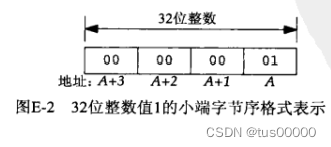 上图4个字节按A、A+1、A+2、A+3的顺序通过套接字发送，大端字节序的服务器这样存放这4个字节：  对于服务器来说，值0x01000000是16777216。类似地，由客户发送的整数2将被服务器解释成0x02000000，即33554432，这两个整数的和为50331648，即0x03000000，服务器把这个和发给客户后，客户将它解释为了3。

而32位的整数-22在客户的小端字节序主机上如下图所示，采用的是负数的二进制补码表示：  它在大端字节序的服务器上被解释成0xeaffffff，即-352321537；类似地，-77在大端字节序上被表示成0xb3ffffff，即-1275068417。服务器上这两个整数相加的结果为0x9efffffe，即-1627389954。这个大端字节序的和发送给客户后以小端字节序解释的值是0xfeffff9e，即-16777314。

如果我们在把两个数字传给服务器前对每个参数调用htonl，再让服务器做加法前对每个参数调用ntohl，则在32位机器上可以正常工作。虽然这两个函数中的l曾经表意long（长整数），但它们只能操作32位整数，在64位系统上一个长整数可能占64位，这两个函数就不能工作了。

如果客户运行在以32位存储长整数的主机上，而服务器在以64位存储长整数的主机上，则在上例中，服务器会永远阻塞在readn函数，因为客户发送的是2个32位值，而服务器等待的是2个64位值（通过sizeof函数获取args结构的大小为128位）。如果客户和服务器所在主机对调，则客户会发送两个64位值，但服务器只读入第一个64位值，并把它解释为2个32位值，第二个64位值仍在服务器套接字的接收缓存中，之后服务器向客户发送1个32位值，但客户会等待读入1个64位值，因此客户会永远阻塞在readn函数。

上例中存在3个问题： 1.不同实现以不同格式存储二进制数，最常见的格式是大端字节序和小端字节序。

2.不同实现在存储相同的C数据类型时可能存在差异，大多32位UNIX系统使用32位表示长整型，而64位系统使用64位表示同样的数据类型。对于short、int、long等整数类型，它们的大小不确定。

3.不同实现给结构打包的方式存在差异，取决于各种数据类型所用位数以及机器对齐限制。因此，通过套接字传二进制结构不明智。

解决数据格式问题的常用方法： 1.把所有数值数据作为文本串传递，这里假设客户和服务器具有相同字符集。

2.显式定义所支持数据类型的二进制格式（位数、大端或小端字节序），并以这样的格式在客户与服务器间传递所有数据。RPC软件包通常使用这种技术。

验证向收到RST的套接字继续写会产生SIGPIPE信号：编写一个SIGPIPE信号处理函数，它显示一条消息后就返回，调用connect前建立该信号处理函数，把服务器的端口号改为13，即daytime服务器，连接建立后，调用sleep睡眠2秒，然后调用write向套接字中写若干字节，之后再调用sleep睡眠2秒，再往套接字中write若干字节。第一次睡眠2秒用于让daytime服务器发送应答并关闭它的连接所在端，第一次write导致发送一个数据分节到服务器，服务器则响应以RST（因为daytime服务器已关闭了它的套接字），第二个sleep函数让客户收到服务器的RST，于是第二个write函数引发SIGPIPE信号，由于信号处理函数返回主控制流，write函数于是返回EPIPE错误。以下是引发SIGPIPE信号的客户进程代码：

```c
#include "unp.h"

void sig_pipe(int signo) {
    printf("SIGPIPE received\n");
    return;
}

int main(int argc, char **argv) {
    int sockfd; 
    struct sockaddr_in servaddr;
    
    if (argc != 2) {
        err_quit("usage: tsigpipe <IPaddress>");
    }

    sockfd = Socket(AF_INET, SOCK_STREAM, 0);

    bzero(&servaddr, sizeof(servaddr));
    servaddr.sin_family = AF_INET;
    servaddr.sin_port = htons(13);    /* daytime server */
    Inet_pton(AF_INET, argv[1], &servaddr.sin_addr);

    Signal(SIGPIPE, sig_pipe);

    Connect(sockfd, (SA *)&servaddr, sizeof(servaddr));

    sleep(2);
    Write(sockfd, "hello", 5);
    sleep(2);
    Write(sockfd, "world", 5);

    exit(0);
}
123456789101112131415161718192021222324252627282930313233
```

运行它： 

# 第六章 I/O复用:select和poll函数

上一章中，TCP客户同时处理两个输入：标准输入和TCP[套接字](https://so.csdn.net/so/search?q=套接字&spm=1001.2101.3001.7020)，我们遇到的问题是客户阻塞于标准输入上的fgets调用期间，服务器进程被杀死时，虽然服务器TCP正确地给客户TCP发送了一个FIN，但客户进程正阻塞于从标准输入读的过程，它将看不到这个EOF，直到从套接字读时（可能已经过了很长时间）才看到。客户进程需要内核一旦发现进程指定的一个或多个IO条件就绪（即输入已准备好被读取，或描述符能承接更多输出），就通知客户进程，这称为IO复用，可由select和poll函数支持，前者还有较新的POSIX变种函数pselect。

有些系统提供了更先进的让进程在一串事件上等待的机制，轮询设备（poll device）就是这样的机制之一，但不同厂家提供的方式不同。

IO复用使用场合： 1.客户处理多个描述符（通常是交互式输入和网络套接字）时。 2.客户同时处理多个套接字时。这种情况比较少见。 3.服务器既要处理监听套接字，又要处理已连接套接字时。 4.服务器既要处理TCP，又要处理UDP时。 5.服务器要处理多个服务或多个协议时（如inetd守护进程）时。

IO复用并非只限于网络编程。

Unix下的5种IO模型： 1.阻塞式IO。 2.非阻塞式IO。 3.IO复用（select、poll函数）。 4.信号驱动式IO（SIGIO）。 5.异步IO（POSIX的aio_系列函数）。

一个输入操作通常包含两个阶段： 1.等待数据准备好。 2.从内核向进程复制数据。 对于一个套接字上的输入操作，第一步通常涉及等待数据从网络中到达，当所等待分组到达时，它被复制到内核中的某个缓冲区；第二步是把数据从内核缓冲区复制到应用进程缓冲区。

默认所有套接字都是阻塞的，以数据报套接字为例，阻塞式IO模型如下图：  我们使用UDP（数据报）而非TCP作为例子的原因在于，对于UDP，数据准备好读取的概念简单，要么整个数据报已收到，要么还没有。对于TCP，诸如套接字低水位标记（low-water mark）等额外变量导致数据准备好的概念变得复杂。

我们把recvfrom函数视为系统调用，不论它如何实现，因为我们正在区分应用进程和内核。源自Berkeley的内核上recvfrom函数是系统调用，在System V内核上recvfrom函数是调用了系统调用getmsg的函数，无论如何，recvfrom函数都会运行在内核空间一段时间。

上图中，recvfrom函数直到数据报到达且被复制到应用进程的缓冲区中，或发生错误，才会返回，最常见的错误是系统调用被信号中断。进程在从调用recvfrom开始到它返回的整段时间内是被阻塞的，recvfrom函数成功返回后，应用进程开始处理数据报。

进程可把一个套接字设置成非阻塞的，即通知内核，当所请求的IO操作要把本进程投入睡眠才能完成时，不要将本进程投入睡眠，而是返回一个错误：  上图中，前三次recvfrom调用没有数据可返回，因此内核立即返回一个EWOULDBLOCK错误。第四次调用recvfrom时已有一个数据报准备好，该数据报被复制到应用进程缓冲区，于是recvfrom函数成功返回，我们接着可以处理数据。

当一个应用进程像上图一样对一个非阻塞描述符循环调用recvfrom时，我们称之为轮询。应用进程持续轮询内核，以查看某个操作是否就绪，这么做往往会消耗大量CPU时间。

可用select或poll函数实现IO复用，阻塞在这两个系统调用上，而不是阻塞在真正的IO系统调用上：  如上图，我们阻塞于select调用，等待数据报套接字变为可读，当select函数返回套接字可读条件时，我们调用recvfrom把要读的数据报复制到应用进程缓冲区。

与阻塞式IO模型相比，IO复用模型优势在于可以等待多个描述符就绪。

与IO复用类似的另一种IO模型是在多线程中使用阻塞式IO，但它没有使用select函数阻塞在多个文件描述符上，而是使用多个线程（每个文件描述符一个线程），这样每个线程都能自由地调用诸如recvfrom函数之类的阻塞式IO系统调用了。

我们可以让内核在描述符就绪时发送SIGIO信号通知我们，称这种模型为信号驱动式IO：  上图过程需要我们先开启套接字的信号驱动式IO功能，并通过sigaction系统调用安装一个信号处理函数，此系统调用将立即返回，我们的进程不会在此被阻塞。当数据报准备好读取时，内核为该进程产生一个SIGIO信号，我们既可以在信号处理函数中调用recvfrom读取数据报，并通知主循环已准备好数据待处理，也可以立即通知主循环，让它读取数据报。

无论如何处理SIGIO信号，信号驱动式IO模型的优势在于等待数据报到达期间进程不被阻塞，主循环可以继续执行，只要等待来自信号处理函数的通知，既可以是数据已准备好被处理，也可以是数据报已准备好被读取。

异步IO由POSIX规范定义，各种早期标准所定义的实时函数中存在的差异已取得一致，演变成了当前的POSIX规范。一般这些实时函数的工作机制是，告知内核启动某个操作，并让内核在整个操作（包括将数据从内核复制到我们自己的缓冲区）完成后通知我们。异步IO模型与信号驱动IO模型主要区别在于，信号驱动式IO是由内核通知我们何时启动一个IO操作，而异步IO模型是由内核通知我们IO操作何时完成。  上图中，我们调用aio_read函数（POSIX异步IO函数以aio*或lio*开头），给内核传递描述符、缓冲区指针、缓冲区大小（与read函数相同的3个参数）、文件偏移（与lseek函数类似），并告诉内核当整个操作完成时如何通知我们。aio_read系统调用立即返回，且在等待IO完成期间，进程不被阻塞。本例中我们要求内核在操作完成时产生某个信号，该信号在数据已复制到应用进程缓冲区才产生，这一点不同于信号驱动式IO模型。

POSIX对同\异步IO的定义： 1.同步IO操作导致请求进程阻塞，直到IO操作完成。 2.异步IO操作不导致请求进程阻塞。  根据POSIX对同\异步IO的定义，阻塞式IO模型、非阻塞式IO模型、IO复用模型、信号驱动式IO模型都是同步IO模型，因为其真正的IO操作将阻塞进程。只有异步IO模型与POSIX定义的异步IO相匹配。

select函数允许进程指示内核等待多个事件中的任何一个发生，并只在有一个或多个事件发生，或经历一段时间后才唤醒它。例如，我们可以调用select，告知内核仅在下列情况发生时才返回： 1.集合{1,4,5}中任何描述符准备好读； 2.集合{2,7}中的任何描述符准备好写； 3.集合{1,4}中任何描述符有异常条件待处理； 4.已经历了10.2秒。 即我们调用select告知内核对哪些描述符（就写、读、异常条件）感兴趣以及等待多长时间。我们感兴趣的描述符不局限于套接字，任何描述符都能用于select函数。

源自Berkeley的实现已允许任何描述符的IO复用，SVR 3最初把IO复用限制于对应流设备的描述符，SVR 4去除了这个限制。  select函数的timeout参数告知内核等待所指定描述符中的任何一个就绪可花多长时间，timeval结构用于指定这段时间的秒数和微秒数：

```c
struct timeval {
    long tv_sec;    /* seconds */
    long tv_usec;    /* microseconds */
};
1234
```

timeout参数有三种可能： 1.空指针：永远等待，仅在有描述符准备好IO时才返回。 2.timeval结构中有一个值不为0：等待timeval结构指定的时间，或有描述符准备好IO时返回。 3.timeval结构中两个值均为0：不等待，检查描述符后立即返回，这称为轮询。

select函数在等待时会被捕获的信号中断，从信号处理函数返回时：源自Berkeley的内核不自动重启被中断的select函数，SVR 4可以自动重启被中断的select函数，条件是在安装信号处理函数时指定SA_RESTART标志，从可移植性角度考虑，如果我们捕获信号，那么必须做好select函数返回EINTR错误的准备。

尽管timeval结构允许我们指定一个微秒级的分辨率，但内核支持的真实分辨率往往更粗糙，例如，许多Unix内核把超时值向上舍入成10ms的倍数，另外还涉及调度延迟，即定时器时间到后，内核还需花一点时间调度相应进程运行。

如果timeout参数所指的timeval结构中的tv_sec成员值超过1亿秒，则有些系统的select还是将以EINVAL错误失败返回，这是一个非常大的超时值（超过3年），不大可能有用。就此指出：timeval结构能够表达select还是不支持的值。

timeout参数有const限定词，表示它不会被select函数修改，例如，如果我们指定一个10s的限定值，但在定时器超时前就返回了（可能是有一个或多个描述符就绪，也可能是得到EINTR错误），那么timeout参数所指的timeval结构不会被更新成该函数返回时剩余的秒数，如果我们需要这个值，则必须在调用select前获取系统时间，select函数返回后再获取系统时间，两者相减（健壮的程序需要考虑系统时间可能在这段时间内被管理员或ntpd之类的守护进程调整）。

有些Linux版本会在select函数返回时修改timeval结构，因此从移植性考虑，我们应该假设该timeval结构在select函数返回后已被修改，并在每次调用select函数前都初始化timeval结构。POSIX规定对该结构使用const限定词。

参数readset、writeset、exceptset指定我们要让内核测试读、写、异常条件的描述符。目前支持的异常条件为： 1.某个套接字上有带外数据到达。 2.某个已置为分组模式（packet mode）的伪终端存在可从其主端读取的控制状态信息。

select函数使用描述符集为readset、writeset、exceptset参数指定一个或多个描述符值，每个描述符集通常是一个整数数组，其中每个整数中的每一位对应一个描述符，假设使用32位整数，则该数组的第一个元素对应于描述符0~31，第二个元素对应描述符32~63，以此类推。描述符集的实现细节与应用程序无关，它们隐藏在数据类型fd_set和以下4个宏中：  我们分配一个fd_set类型的描述符集后，可以用以上宏设置或测试该集合中的每一位，也可用C语言赋值语句把它赋值成另一个描述符集。

以上我们讨论的每个描述符占整数数组中一位的方法仅仅是select函数的可能实现之一，但把描述符集中的每个描述符称为位是常见的，如打开读集合中表示监听描述符的位。

以下代码用于定义一个fd_set类型的变量，然后打开描述符1、4、5的对应位：

```c
fd_set rset;

FD_ZERO(&rset);    /* initialize the set: all bits off */
FD_SET(1, &rset);    /* turn on bit for fd 1 */
FD_SET(4, &rset);    /* turn on bit for fd 4 */
FD_SET(5, &rset);    /* turn on bit for fd 5 */
123456
```

描述符集需要初始化，因为作为自动变量（即局部作用域变量，在控制流进入变量作用域时系统自动为其分配存储空间，并在离开作用域时释放空间）分配的一个描述符集如果没有初始化，会发生不可预期的后果。

如果我们对select函数的readset、writeset、exceptset参数中的某一个条件不感兴趣，可将其设为空指针。如果这3个指针都为空，我们就有了一个比sleep函数更精确的定时器（sleep函数以秒为睡眠最小单位）。poll函数也提供类似功能。

maxfdp1参数指定待测试的描述符个数，它的值是待测试的最大描述符加1，描述符0、1、2···直到maxfdp1-1都将被测试，也就是说，即使我们只想监测描述符5、6，内核同时还会监测描述符0~4，因此，如果要监测描述符5时第一个参数填成5，那么内核将不会监测到我们想要监测的描述符5。maxfdp1是最大待测试描述符加1的原因在于，我们指定的是描述符个数而非最大值，而描述符是从0开始的。

头文件sys/select.h中定义的FD_SETSIZE常值是fd_set类型的变量中描述符总数，其值通常为1024（默认，为了避免单个进程消耗过多资源，进程只能打开1024个文件描述符），但很少有程序能用到这么多描述符。maxfdp1参数迫使我们计算出所关心的最大描述符并告知内核，存在该参数纯粹是为了效率原因，每个fd_set都有表示大量描述符的空间（典型值1024），但一个普通进程所用的数量却少得多，内核通过在进程与内核间只复制描述符集中的必要部分，从而不测试总为0的那些位来提高效率。

select函数会修改指针参数readset、writeset、exceptset所指向的描述符集，因此这三个参数都是值-结果参数，调用select函数时，我们指定所关心的描述符的值，select函数返回时，结果将指示哪些描述符已就绪。select函数返回后，我们用FD_ISSET宏测试fd_set数据类型中的描述符，描述符集内任何与未就绪描述符对应的位返回时均被清0，因此，每次重新调用select函数时，我们需要把所有描述符集内所关心的位置1。

select函数的返回值表示所有描述符集中已就绪的总位数，如果在任何描述符就绪前定时器超时，则返回0。返回-1表示出错，如被所捕获的信号中断时。

SVR 4的早期版本中，select函数有一个缺陷，如果返回时多个描述符集内的同一位为1（如某描述符既准备好读又准备好写的情况），那么在函数返回值中只计一次。当前版本已修正此缺陷。

满足以下条件之一时，一个套接字准备好读： 1.该套接字接收缓冲区中的数据字节数大于等于套接字接收缓冲区当前的低水位标记的字节数大小。我们可以使用SO_RCVLOWAT套接字选项设置该套接字的低水位标记，对于TCP和UDP套接字，低水位标记默认值为1字节。 2.该连接的读半部关闭（接收到了[FIN](https://so.csdn.net/so/search?q=FIN&spm=1001.2101.3001.7020)后），对这样的套接字的读操作将不阻塞并返回0（即返回EOF）。 3.该套接字是一个监听套接字且已完成的连接数不为0，对这样的套接字调用accept通常不会阻塞。 4.套接字上有一个套接字错误待处理。对这样的套接字的读操作将不阻塞并返回-1，同时把errno设为确切的错误条件。这些待处理错误也可以通过指定SO_ERROR套接字选项来调用getsockopt获取并清除。

满足以下条件之一时，一个套接字准备好写： 1.该套接字发送缓冲区中的可用空间字节数大于等于套接字发送缓冲区当前的低水位标记大小，并且该套接字是已连接的（除非该套接字不需要连接，如UDP）。如果我们把这样的套接字设置成非阻塞，写操作将不阻塞并返回一个正值（由传输层接受的字节数）。我们可以用SO_SNDLOWAT套接字选项来设置该套接字的低水位标记，对TCP和UDP来说，默认值通常为2048。 2.该连接的写半部关闭。对这样的套接字的写操作将产生SIGPIPE信号。 3.非阻塞调用connect时，当套接字成功建立连接或connect函数已经失败。 4.套接字上有一个套接字错误待处理。对这样的套接字的写操作将不阻塞并返回-1，同时把errno设置成确切的错误条件。这些待处理错误也可通过指定SO_ERROR套接字选项调用getsockopt获取并清除。

对以上描述符准备好写的讨论中，我们限定套接字是非阻塞的，这是由于，如果select函数告诉我们某套接字可写，假设该套接字的发送缓冲区有8192字节可用，当我们要写8193字节时，write函数将阻塞，等待最后1个字节的可用空间，因此我们需要将该描述符设为非阻塞以避免阻塞。但对于可读条件，由于对阻塞式套接字的读操作只要有数据可读总会返回。

如果一个套接字存在带外数据或仍处于带外标记，则它异常条件就绪。

以上读可读性、可写性、异常条件的定义取自内核的soreadable宏、sowriteable宏、soo_select函数。

当某个套接字上发生错误时，它将被select函数标记为既可读又可写。

接收低水位标记和发送低水位标记的目的在于：允许应用进程控制在select返回可读或可写条件前有多少数据可读或有多大空间可用于写。例如，除非至少有64个字节的数据，我们的应用进程才能有有效工作可做，我们就可以把接收低水位标记设为64，以防少于64字节的数据准备好读时select函数就唤醒我们。

任何UDP套接字只要其发送低水位标记小于等于发送缓冲区大小（总是有这种关系）就总是可写的，因为UDP套接字不需要连接。  最初设计select函数时，操作系统通常对每个进程可用的最大描述符数设置了上限（4.2 BSD的限制为31），select函数就使用了相同的上限值。但当今Unix版本允许每个进程使用事实上无限数目的描述符（往往仅受限于内存总量和管理性限制），这对select函数会产生影响。

许多select函数实现有类似下面的声明，它取自4.4 BSD的sys/types.h头文件： 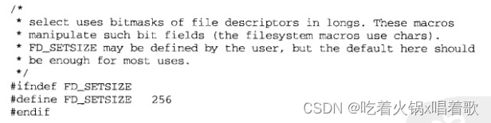 这使我们想到是否可以在包括该头文件前把FD_SETSIZE定义为更大的值以增加select函数所用描述符集的大小，但这样是行不通的，因为内核中使用的描述符集使用内核的FD_SETSIZE定义作为上限使用，因此增大描述符集大小的唯一方法是先增加FD_SETSIZE的值，再重新编译内核，不重新编译内核而重新改变其值是不够的。

有些厂家正在将select函数的实现修改为允许进程将FD_SETSIZE定义为比默认值更大的某个值，BSD/OS已改变了内核以允许更大的描述符集，并定义了4个新的FD_xxx宏用于动态分配并操纵这样的描述符集，但从可移植性考虑，小心使用大描述符集。

使用select函数重写str_cli函数，这样服务器进程一终止，客户就能马上得到通知，早先的版本问题在于：当套接字上发生某些事件时，客户可能阻塞于[fgets](https://so.csdn.net/so/search?q=fgets&spm=1001.2101.3001.7020)调用。新版本改为阻塞于select调用，或是等待标准输入可读，或是等待套接字可读。  客户的套接字上处理如下： 1.如果对端TCP发送数据，那么该套接字变为可读，且read函数返回一个大于0的值（即读入数据的字节数）。 2.如果对端TCP发送一个FIN（对端进程终止），那么该套接字变为可读，且read函数返回0（EOF）。 3.如果对端TCP发送一个RST（对端主机崩溃并重新启动，对我们前一个报文段的回复），那么该套接字变为可读，且read函数返回-1，errno中含有确切错误码。

使用select函数的str_cli函数实现：

```c
void str_cli(FILE *fp, int sockfd) {
    int maxfdp1;
    fd_set rset;
    char sendline[MAXLINE], recvline[MAXLINE];

    FD_ZERO(&rset);
    for (; ; ) {
        FD_SET(fileno(fp), &rset);
		FD_SET(sockfd, &rset);
		maxfdp1 = max(fileno(fp), sockfd) + 1;
		Select(maxfdp1, &rset, NULL, NULL, NULL);    // 我们将写集合指针、异常集合指针设为空指针，同时将最后一个参数时间限制设为空指针，因为我们希望本调用阻塞到某个描述符就绪为止
	
		if (FD_ISSET(sockfd, &rset)) {    /* socket is readable */
		    if (Readline(sockfd, recvline, MAXLINE) == 0) {
		        err_quit("str_cli: server terminated prematurely");
		    }
		    Fputs(recvline, stdout);
		}
	    // 不要在这个if前加else，否则当两个描述符都可读时，只会从套接字描述符读，然后再调用select，才发现标准输入可读
	    // 但这么做不会导致客户不能工作，只是降低了效率
		if (FD_ISSET(fileno(fp), &rset)) {    /* input is readable */
		    if (Fgets(sendline, MAXLINE, fp) == NULL) {
		        return;    /* all done */
		    }
		    Writen(sockfd, sendline, strlen(sendline));
		}
    }
}
12345678910111213141516171819202122232425262728
```

但以上函数仍然不正确，在最初版本中，它以停-等方式工作，这对交互式使用是合适的：发送一行文本给服务器，然后等待应答，等待时间是往返时间RTT加上服务器处理的时间（对简单的回射服务器而言，处理时间几乎为0），如果知道了客户与服务器之间的RTT，我们就可估计出回射固定数目的行所需时间。

ping程序可用于测量RTT，ping测量所用的是长度为84字节的IP数据报。如果有一个2000行的文件，平均每行49字节，加上IP首部的20字节和TCP首部的20字节，那么每行对应的分组大小为89字节，基本与ping分组的大小一致。我们通过执行ping命令，得到两个主机之间平均30次的RTT为175ms，因此可以估算出这2000行文本的客户处理时间大约为2000*0.175秒（350秒），实际上真实时间为354秒，与我们的估计很接近。

如果我们把客户和服务器之间的网络作为全双工管道来考虑，请求是从客户向服务器发送，应答从服务器向客户发送的：  客户在时刻0发出请求，我们假设RTT为8个时间单位，其应答在时刻4发出并在时刻7接收到，我们还假设没有服务器处理时间且请求大小与应答大小相同。上图只展示了客户与服务器之间的数据分组，忽略了同样穿越网络的TCP确认。

既然一个分组从管道的一端发出到到达管道的另一端存在延迟，而管道是全双工的，就上例而言，我们仅使用了管道的1/8。这种停-等方式对于交互式输入是合适的，但如果我们把标准输入重定向到文件，从而以批量方式运行，但这样做会发现我们从服务器收到的内容少于发往服务器的内容，对于回射服务器而言，它们理应相等。

在批量方式下，客户以网络可接受的最快速度持续发送请求，这会导致时刻7时管道充满：  这里我们假设发出第一个请求后，立即发出下一个。我们还假设客户能够以网络可以接受的速度持续发送请求，且能够以网络可提供给它的速度处理应答。

以上我们忽略了涉及TCP批量处理数据流时的许多问题，如限制数据在一个全新的或空闲的连接上的发送速率的慢启动算法、返回的ACK。

我们假设批量处理的数据只有9行，最后一行在时刻8发出，写完这个请求后，我们不能立即关闭连接，因为管道中还有其他请求和应答。问题在于我们对EOF的处理：收到EOF后，str_cli函数会返回到main函数，而main函数随后终止，在批量方式下，标准输入中的EOF并不意味着我们同时也完成了从套接字的读入。

我们需要一种关闭TCP连接其中一半的方法，即，我们想给服务器发送一个FIN，告诉它我们已经完成了数据发送，但仍保持套接字描述符打开以便读取。

一般，为提升性能而引入缓冲机制增加了网络应用程序的复杂性。考虑有多个来自标准输入的文本行可用的情况，select函数将使用fgets函数读取输入，这使得所有可用的文本行被读入stdio所用的缓冲区，但fgets函数只返回stdio缓冲区里的第一行，其余输入行仍在stdio缓冲区中。之后把fgets函数返回的单行输入写给服务器，随后select函数被再次调用以等待新工作，而不管stdio缓冲区中还有额外的输入行待消费，其原因在于select函数不知道stdio使用了缓冲区，它只是从read系统调用的角度指出是否有数据可读，而不是从fgets之类的函数角度考虑，因此，混合使用stdio和select函数被认为是非常容易出错的，这样做时需要极其小心。

同样的问题存在于readline调用中，这次select函数不可见的数据不是隐藏在stdio缓冲区中，而是隐藏在readline函数自己的缓冲区中，我们同时提供了一个可以看到readline函数缓冲区的函数，因此可能的解决方法之一是修改代码，调用select前使用查看缓冲区的函数，以查看是否存在已经读入而未消费的数据。但为了处理readline函数的缓冲区中可能的不完整输入行和可能有一个或多个完整输入行（我们可直接消费）这两种情况，引入的复杂性会迅速增长到难以控制的地步。

终止网络连接的通常方法是调用close函数，但它有两个限制： 1.close函数把描述符的引用计数-1，仅在计数变为0时才关闭套接字，shutdown函数不管引用计数就激发TCP的正常连接终止序列。 2.close函数终止读和写两个方向上的数据传送，shutdown函数可关闭一个方向上的数据传送。TCP是全双工的，有时需要告知对端我们已完成了数据发送，即使对端仍有数据要发送给我们。   howto参数的值： 1.SHUT_RD：关闭连接的读这一半，套接字接收缓冲区中的现有数据被丢弃。进程不能再对这样的套接字调用任何读函数。对一个TCP套接字这样调用shutdown后，由该套接字接收的来自对端的任何数据都被确认，然后丢弃这些数据。默认，写入到一个路由套接字的所有数据都作为输入回送给主机上的所有路由套接字，有些程序把第二个参数指定为SHUT_RD来调用shutdown以防止环回复制，防止环回复制的另一个方法是关闭SO_USELOOPBACK套接字选项。 2.SHUT_WR：关闭连接的写这一半，对于TCP套接字，这称为半关闭，当前留在套接字发送缓冲区中的数据将被发送，后跟TCP的正常连接终止序列。进程不能再对这样的套接字调用任何写函数。 3.SHUT_RDWR：连接的读半部和写半部都被关闭，等效于用以上两个参数调用两次shuwdown。

以上3个howto参数值由POSIX规范定义，它的典型值为0（SHUT_RD）、1（SHUT_WR）、2（SHUT_RDWR）。

str_cli函数的改进后的正确版本，使用了shutdown函数正确地处理批量输入，且废弃了以文本行为中心的代码，转而对缓冲区操作：

```c
void str_cli(FILE *fp, int sockfd) {
    int maxfdp1, stdineof;
    fd_set rset;
    char buf[MAXLINE];
    int n;

    stdineof = 0;    // 只要该标志为0，我们就在主循环内用select函数检查标准输入的可读性
    FD_ZERO(&rset);
    for (; ; ) {
        if (stdineof == 0) {
		    FD_SET(fileno(fp), &rset);
		}
		FD_SET(sockfd, &rset);
		maxfdp1 = max(fileno(fp), sockfd) + 1;
		Select(maxfdp1, &rset, NULL, NULL, NULL);
	
		if (FD_ISSET(sockfd, &rset)) {    /* socket is readable */
		    if ((n = Read(sockfd, buf, MAXLINE)) == 0) {
		        // 当我们在套接字上读到EOF时，如果我们已在标准输入上遇到EOF，那就是正常终止，否则就是服务器过早终止
		        if (stdineof == 1) {
				    return;    /* normal termination */
				} else {
				    err_quit("strcli: server terminated prematurely");
				}
		    }
		    Write(fileno(stdout), buf, n);
		}
	
		if (FD_ISSET(fileno(fp), &rset)) {    /* input is readable */
		    if ((n = Read(fileno(fp), buf, MAXLINE)) == 0) {
		        stdineof = 1;
				Shutdown(sockfd, SHUT_WR);    /* send FIN */
				FD_CLR(fileno(fp), &rset);
				continue;
		    }
		    Writen(sockfd, buf, n);
		}
    }
}
123456789101112131415161718192021222324252627282930313233343536373839
```

以上程序客户大部分时间花在阻塞于select调用中，一旦待处理错误被设置成ETIMEDOUT，select函数就立即返回套接字的可读条件。

我们可以用select函数把回射服务器改成处理多个客户的单进程程序，而不是为每个客户派生一个子进程。以下是服务器在第一个客户建立连接前的状态：  如上图，服务器有单个监听描述符，用一个圆点表示。

服务器只维护一个读描述符集：  假设服务器是在前台启动的，则描述符0、1、2分别被设置为标准输入、标准输出、标准错误输出，因此监听套接字的第一个可用描述符是3,。上图还有一个名为client的整型数组，它包含每个客户的已连接套接字描述符，该数组的所有元素都被初始化为-1。上图中描述符集中唯一的非0项表示的是监听套接字，因此select函数的第一个参数为4。

当第一个客户与服务器建立连接时，监听描述符变为可读，我们的服务器于是调用accept。本例中，accept函数返回的新已连接描述符将是4： 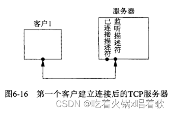 我们的服务器在client数组中记住每个新的已连接描述符，并把它加到描述符集中去：  稍后，第二个客户与服务器建立连接：  新的已连接描述符是5，将其存入服务器的client数组中：  假设第一个客户终止它的连接，该客户的TCP发送一个FIN，使得服务器中的描述符4变为可读。当服务器读这个已连接套接字时，read函数返回0，我们于是关闭该套接字并相应地更新数据结构：把client[0]的值置为-1，把描述符集中描述符4的位设为0:，但maxfd的值没有变：  总之，当有客户到达时，我们在client数组中的第一个可用项中记录其已连接套接字的描述符，我们还要把这个已连接描述符加到读描述符集中。变量maxi是client数组当前使用项的最大下标，变量maxfd加1后是select函数的第一个参数值。本服务器所能处理的最大客户数限制是以下两个值的较小者：FD_SETSIZE和内核允许本进程打开的最大描述符数。

单进程版本的服务器程序：

```c
#include "unp.h"

int main(int argc, char **argv) {
    int i, maxi, maxfd, listenfd, connfd, sockfd;
    int nready, client[FD_SETSIZE];
    ssize_t n;
    fd_set rset, allset;
    char buf[MAXLINE];
    socklen_t clilen;
    struct sockaddr_in cliaddr, servaddr;

    listenfd = Socket(AF_INET, SOCK_STREAM, 0);

    bzero(&servaddr, sizeof(servaddr));
    servaddr.sin_family = AF_INET;
    servaddr.sin_addr.s_addr = htonl(INADDR_ANY);
    servaddr.sin_port = htons(SERV_PORT);

    Bind(listenfd, (SA *)&servaddr, sizeof(servaddr));

    Listen(listenfd, LISTENQ);

    maxfd = listenfd;    /* initialize */
    maxi = -1;    /* index into client[] array */
    for (i = 0; i < FD_SETSIZE; ++i) {
        client[i] = -1;    /* -1 indicates available entry */
    }
    FD_ZERO(&allset);
    FD_SET(listenfd, &allset);

    for (; ; ) {
        rset = allset;    /* structure assignment */
        // 阻塞于select函数，等待新客户连接的建立、数据、FIN、RST的到达
		nready = Select(maxfd + 1, &rset, NULL, NULL, NULL);
	
		if (FD_ISSET(listenfd, &rset)) {    /* new client connection */
		    clilen = sizeof(cliaddr);
		    connfd = Accept(listenfd, (SA *)&cliaddr, &clilen);
	
		    for (i = 0; i < FD_SETSIZE; ++i) {
		        if (client[i] < 0) {
				    client[i] = connfd;    /* save descriptor */
				    break;
				}
		    }
		    if (i == FD_SETSIZE) {
		        err_quit("too many clients");
		    }
	
		    FD_SET(connfd, &allset);    /* add new descriptor to set */
		    if (connfd > maxfd) {
		        maxfd = connfd;    /* for select */
		    }
		    if (i > maxi) {
		        maxi = i;    /* max index in client[] array */
		    }
	
		    if (--nready <= 0) {
		        continue;    /* no more readable descriptors */
		    }
		}
	
		for (i = 0; i <= maxi; ++i) {    /* check all clients for data */
		    if ((sockfd = client[i]) < 0) {
		        continue;
		    }
		    if (FD_ISSET(sockfd, &rset)) {
		        // 如果客户发来RST触发的可读条件，那么read函数会出错，包裹函数Read会直接终止进程，这样的服务器过于脆弱
		        // 但如果使用的是一个子进程服务一个客户的方式，那么终止行为不会影响到父进程和其他子进程
		        if ((n = Read(sockfd, buf, MAXLINE)) == 0) {
				    /* connection closed by client */
				    Close(sockfd);
				    FD_CLR(sockfd, &allset);
				    client[i] = -i;
				    // 我们不减少maxi的值，但在此处可以减少它
				} else {
				    Writen(sockfd, buf, n);
				}
	
				if (--nready <= 0) {
				    break;    /* no more readable descriptors */
				}
		    }
		}
    }
}
1234567891011121314151617181920212223242526272829303132333435363738394041424344454647484950515253545556575859606162636465666768697071727374757677787980818283848586
```

以上服务器代码比多进程版本的复杂，但它避免了为每个客户创建一个新进程的开销。

以上服务器代码如果将读客户数据的read函数换成readline函数就会有问题，如果有一个恶意客户连接到服务器，发送1个字节数据（不是换行符）后进入睡眠，服务器调用readline时，在readline函数内部，会先调用一次read函数，由于readline函数只有在读到换行符或EOF时才会返回，因此服务器会一直阻塞在第二次read调用，此时服务器不能再为其他客户提供服务，不论是接受新的客户连接还是读取现有客户数据，直到恶意客户发出换行符或终止为止。

这里的一个基本概念是：服务器在处理多个客户时，绝对不能阻塞于只与单个客户相关的某个函数调用，否则可能导致服务器被挂起，拒绝为所有客户提供服务，这就是拒绝服务型攻击，即对服务器做些工作，导致服务器不能为其他合法客户提供服务。解决办法有：使用非阻塞式IO、让每个客户由单独控制线程提供服务（如创建一个子进程或一个线程来服务每个客户）、对IO操作设置超时。

pselect函数由POSIX发明：  pselect函数相比于select函数有两个变化： 1.pselect函数使用timespec结构，而非timeval结构，timespec结构是POSIX的另一个发明：  这两个结构的区别在于第二个成员，timespec结构的该成员tv_nsec指定纳秒数，而旧结构的tv_usec指定微秒数。另外，timeval结构的第一个成员是有符号的长整数，而timespec结构的第一个成员类型为time_t，timeval结构里的有符号长整数也应该改为time_t，但为了防止破坏已有代码，没有做这样的修改，而新的timespec结构可以将第一个成员类型定义为time_t。 2.pselect函数增加了第6个参数，一个指向信号掩码的指针，该参数允许程序做以下步骤：先禁止某些信号的递送，然后检查被禁止信号的信号处理函数中设置的全局变量，然后调用pselect，pselect函数会重置信号掩码，以允许刚刚被禁止递送的信号的递送。它的用处如下：如果某程序的SIGINT信号处理函数仅仅设置全局变量intr_flag并返回，如果我们的进程在SIGINT信号递送时正阻塞于select函数，那么从信号处理函数返回将导致select函数返回EINTR错误，以上描述的代码：

```c
if (intr_flag) {
    handle_intr();    /* handle the signal */
}
if ((nready = select( ... )) < 0) {
    if (errno == EINTR) {
        if (intr_flag) {
            handle_intr();
        }
    }
}
12345678910
```

以上代码有一个问题，如果在测试intr_flag后，调用select前有信号发生，如果select函数一直阻塞，那么该信号会一直不被处理，有了pselect函数后，我们可以按以下方式可靠地编写上例代码：

```c
sigset_t newmask, oldmask, zeromask;

sigemptyset(&zeromask);
sigemptyset(&newmask);
sigaddset(&newmask, SIGINT);

sigprocmask(SIG_BLOCK, &newmask, &oldmask);    /* block SIGINT */
if (intr_flag) {
    handle_intr();    /* handle the signal */
}
if ((nready = pselect( ... , &zeromask)) < 0) {
    if (errno == EINTR) {
        if (intr_flag) {
            handle_intr();
        }
    }
}
1234567891011121314151617
```

以上代码中，在测试intr_flag变量前，先阻塞SIGINT，当pselect函数被调用时，pselect函数先以空集替代进程的信号掩码，然后再检查描述符是否准备好，并可能进入睡眠，然后当pselect函数返回时，进程的信号掩码又被重置为调用pselect之前的值（即SIGINT又被阻塞）。

poll函数起源于SVR 3，最初局限于流设备，SVR 4取消了这种限制，允许poll工作在任何描述符上，poll函数与select函数类似，但在处理流设备时，poll函数能提供额外的信息。  poll函数的参数fdarray是指向一个结构数组第一个元素的指针，每个数组元素都是一个pollfd结构，用于指定对于给定描述符测试哪些条件：  要测试的条件由events成员指定，函数在相应的revents成员中返回该描述符哪些条件出现了，这样避免使用值-结果参数，select函数的中间3个参数都是值-结果参数。下图是pollfd.events和pollfd.revents的可能取值：  上图分为3部分，第1部分是处理输入的4个常值，第2部分是处理输出的3个常值，第3部分是处理错误的3个常值。

poll识别3类数据：普通（normal）、优先级带（priority band）、高优先级（high priority），这些术语出自基于流的实现。

POLLIN被定义为POLLRDNORM和POLLRDBAND的逻辑或。POLLIN自SVR 3就存在，早于SVR 4中的优先级带，为了向后兼容，保留了POLLIN常值（虽然能被POLLRDNORM和POLLRDBAND用逻辑或替代）。类似地，POLLOUT等同于POLLWRNORM，前者早于后者。

就TCP和UDP，以下条件引起poll函数返回特定的revent，但POSIX在poll函数的定义中规定，多种情况会返回相同的条件： 1.所有正常TCP和UDP数据被认为是普通数据。 2.TCP的带外数据被认为是优先级带数据。 3.当TCP连接的读半部关闭（如收到了一个来自对端的FIN），也被认为是普通数据，随后的读操作将返回0。 4.TCP连接存在错误既可认为是普通数据，也可认为是错误（POLLERR），随后的读操作将返回-1，并把errno设为合适的值。这可用于处理收到RST或发生超时等条件。 5.在监听套接字上有新连接可用既可认为是普通数据，也可认为是优先级数据，大多实现视之为普通数据。 6.非阻塞式connect的完成被认为是使相应套接字可写（可对监听套接字调用accept获取已连接套接字）。

fdarray参数数组中元素的个数由nfds参数指定。历史上这个参数曾被定义为unsigned long，有些过分大了，定义为unsigned int可能就够了。Unix 98为该参数定义了名为nfds_t的新数据类型。

timeout参数指定poll函数返回前等待多长时间，它的单位是毫秒，以下是该参数的取值含义：  INFTIM常值被定义为一个负值。如果系统不能提供毫秒级精度的定时器，该值就向上舍入到最接近的支持值。与select函数一样，给poll函数指定的任何超时值都受限于实际系统实现的时钟分辨率（通常是10ms）。

POSIX规范要求在头文件poll.h中定义INFTIM，但许多系统仍将它定义在头文件sys/stropts.h中。

发生错误时，poll函数返回-1；若定时器到时前没有任何描述符准备就绪，poll函数返回0；否则poll函数返回就绪描述符的个数，即revents成员值非0的描述符个数。

如果我们不再关心某个特定描述符，可以把与它对应的pollfd结构的fd成员设为一个负值，poll函数将忽略这样的pollfd结构的events成员，并在返回时将它的revents成员值置为0。

poll函数不会有select函数的最大描述符数目的问题，因为分配pollfd结构的数组并把数组中元素数通知内核就成了调用者的责任。

POSIX规范对select函数和poll函数都有规范，但从可移植性考虑，支持select函数的系统更多。另外POSIX还定义了pselect函数，它能够处理信号阻塞并提供了更高的时间分辨率，而POSIX没有为poll函数定义类似的东西。

用poll函数代替select函数重写TCP回射服务器程序，使用select函数的版本中，我们需要分配一个client数组和一个名为rset的描述符集，改用poll函数后，我们只需分配一个pollfd结构的数组维护客户信息。当某项未用，我们将pollfd结构数组中对应元素的fd成员设为-1，否则设为描述符值：

```c
#include "unp.h"
#include <limits.h>    /* for OPEN_MAX */

// 有些系统已经删去了OPEN_MAX的定义，这里简单重新定义了该宏
#ifndef OPEN_MAX
#define OPEN_MAX 1024
#endif

int main(int argc, char **argv) {
    int i, maxi, listenfd, connfd, sockfd;
    int nready;
    ssize_t n;
    char buf[MAXLINE];
    socklen_t clilen;
    // 我们声明在pollfd结构数组中存在OPEN_MAX个元素（该值运行时是不变的）
    // 确定一个进程在某一时刻能打开的最大描述符数量的方法之一是以参数_SC_OPEN_MAX调用POSIX函数sysconf（运行时限制值），然后动态分配一个合适大小的数组
    // 但sysconf函数可能返回该值不确定，这意味着我们需要猜一个值，这里我们就用了POSIX的OPEN_MAX常值
    struct pollfd client[OPEN_MAX];
    struct sockaddr_in cliaddr, servaddr;

    listenfd = Socket(AF_INET, SOCK_STREAM, 0);

    bzero(&servaddr, sizeof(servaddr));
    servaddr.sin_family = AF_INET;
    servaddr.sin_addr.s_addr = htonl(INADDR_ANY);
    servaddr.sin_port = htons(SERV_PORT);

    Bind(listenfd, (SA *)&servaddr, sizeof(servaddr));

    Listen(listenfd, LISTENQ);

    client[0].fd = listenfd;
    client[0].events = POLLRDNORM;
    for (i = 1; i < OPEN_MAX; ++i) {
        client[i].fd = -1;    /* -1 indicated available entry */
    }
    maxi = 0;    /* max index into client[] array */

    for (; ; ) {
        nready = Poll(client, maxi + 1, INFTIM);

		if (client[0].revents & POLLRDNORM) {    /* new client connection */
		    clilen = sizeof(cliaddr);
		    connfd = Accept(listenfd, (SA *)&cliaddr, &clilen);
	
		    for (i = 1; i < OPEN_MAX; ++i) {
		        if (client[i].fd < 0) {
				    client[i].fd = connfd;    /* save descriptor */
				    break;
				}
		    }
		    if (i == OPEN_MAX) {
		        err_quit("too many clients");
		    }
	
		    client[i].events = POLLRDNORM;
		    if (i > maxi) {
		        maxi = i;    /* max index in client[] array */
		    }
	
		    if (--nready <= 0) {
		        continue;    /* no more readable descriptors */
		    }
		}
	
		for (i = 1; i <= maxi; ++i) {    /* check all clients for data */
		    if ((sockfd = client[i].fd) < 0) {
		        continue;
		    }
		    // 我们此处还检查了POLLERR事件，该事件并没有设置到events成员中
		    // 检查POLLERR的原因在于，有些实现在一个连接上收到RST时返回POLLERR事件，而有些实现返回POLLRDNORM事件
		    // 无论返回什么，我们都调用read，有错误发生时，read函数会返回这个错误
		    if (client[i].revents & (POLLRDNORM | POLLERR)) {
		        if ((n = read(sockfd, buf, MAXLINE)) < 0) {
				    if (errno == ECONNRESET) {
				        /* connection reset by client */
						Close(sockfd);
						client[i].fd = -1;
				    } else {
				        err_sys("read error");
				    }
				} else if (n == 0) {
				    /* connection closed by client */
				    Close(sockfd);
				    client[i].fd = -1;
				} else {
				    Writen(sockfd, buf, n);
				}
		
				if (--nready <= 0) {
				    break;    /* no more readable descriptors */
				}
		    }
		}
    }
}
123456789101112131415161718192021222324252627282930313233343536373839404142434445464748495051525354555657585960616263646566676869707172737475767778798081828384858687888990919293949596
```

以上代码中，我们使用了MAX_OPEN常值作为打开描述符的最大数量，如果我们想使用内核允许的最大的打开描述符数量，我们可以使用getrlimit函数，获取RLIMIT_NOFILE资源的当前值，然后调用setrlimit把当前的软限制rlim_cur设为硬限制rlim_max的值，如Solaris 2.5上最大打开描述符数量的软限制是64，但任何进程都能将其增长到默认的硬限制1024。getrlimit和setrlimit函数不属于POSIX.1，但它们在UNIX 98中是必需的。

如果描述符集是一个整数数组，怎样使用赋值语句将其赋值给另一描述符集？可以将这个整数数组包含在一个结构中，而C允许使用等号赋值结构。

# 第七章 套接字选项

有很多方法可以获取和设置[套接字选项](https://so.csdn.net/so/search?q=套接字选项&spm=1001.2101.3001.7020)： 1.getsockopt和[setsockopt函数](https://so.csdn.net/so/search?q=setsockopt函数&spm=1001.2101.3001.7020)。 2.fcntl函数。 3.ioctl函数。

fcntl函数是将套接字设为非阻塞式IO型、设为信号驱动式IO型、设置套接字属主的POSIX方法。

这两个函数只用于套接字：  以上函数用于获取或设置套接字选项。参数sockfd必须指向一个打开的套接字描述符。setsockopt函数从参数optval指向的内存中取得要设置的新值；getsockopt把要获取的选项当前值存放到参数optval指向的内存中。参数optval指向的内存的大小由最后一个参数指定，它对于函数setsockopt是一个值参数，对于函数getsockopt是一个值-结果参数。

一对level参数和optname参数组成一个我们可由getsockopt函数获取或由setsockopt函数设置的选项，这两个参数的可选值如下，数据类型列是对应的optval参数必须指向的数据类型。套接字选项分为两大基本类型，一是启动或禁止某个特性的二元选项（称为标志选项，下图中标志列中有`·`的即是，此时*optval是一个整数，0表示相应选项被禁止，非0表示被启用）；二是我们可以设置或获取值的选项（称为值选项）：    检查上图中的选项是否得到支持，如果支持，则输出它们的默认值：

```c
#include "unp.h"
#include <netinet/tcp.h>    /* for TCP_xxx defines */

// 对于getsockopt函数的每个可能的返回值，union类型中都有一个成员
union val {
    int i_val;
    long l_val;
    struct linger linger_opt_val_strval;
    struct timeval timeval_val;
} val;

// 用于输出给定类型的套接字选项的值
static char *sock_str_flag(union val *, int);
static char *sock_str_int(union val *, int);
static char *sock_str_linger(union val *, int);
static char *sock_str_timeval(union val *, int);

struct sock_opts {
    const char *opt_str;
    int opt_level;
    int opt_name;
    char *(*opt_val_str)(union val *, int);
} sock_opts[] = {
    {"SO_BROADCAST", SOL_SOCKET, SO_BROADCAST, sock_str_flag},
    {"SO_DEBUG", SOL_SOCKET, SO_DEBUG, sock_str_flag},
    {"SO_DONTROUTE", SOL_SOCKET, SO_DONTROUTE, sock_str_flag},
    {"SO_ERROR", SOL_SOCKET, SO_ERROR, sock_str_int},
    {"SO_KEEPALIVE", SOL_SOCKET, SO_KEEPALIVE, sock_str_flag},
    {"SO_LINGER", SOL_SOCKET, SO_LINGER, sock_str_linger},
    {"SO_OOBINLINE", SOL_SOCKET, SO_OOBINLINE, sock_str_flag},
    {"SO_RCVBUF", SOL_SOCKET, SO_RCVBUF, sock_str_int},
    {"SO_SNDBUF", SOL_SOCKET, SO_SNDBUF, sock_str_int},
    {"SO_RCVLOWAT", SOL_SOCKET, SO_RCVLOWAT, sock_str_int},
    {"SO_SNDLOWAT", SOL_SOCKET, SO_SNDLOWAT, sock_str_int},
    {"SO_RCVTIMEO", SOL_SOCKET, SO_RCVTIMEO, sock_str_timeval},
    {"SO_SNDTIMEO", SOL_SOCKET, SO_SNDTIMEO, sock_str_timeval},
    {"SO_REUSEADDR", SOL_SOCKET, SO_REUSEADDR, sock_str_flag},
// 我们应该对每个套接字选项都用ifdef测试一下，因为并非所有实现都支持所有套接字选项，为使测试代码简短，只有此处进行了测试
#ifdef SO_REUSEPORT
    {"SO_REUSEPORT", SOL_SOCKET, SO_REUSEPORT, sock_str_flag},
#else
    {"SO_REUSEPORT", 0, 0, NULL},
#endif
    {"SO_TYPE", SOL_SOCKET, SO_TYPE, sock_str_int},
    {"SO_USELOOPBACK", SOL_SOCKET, SO_USELOOPBACK, sock_str_flag},
    {"IP_TOS", IPPROTO_IP, IP_TOS, sock_str_int},
    {"IP_TTL", IPPROTO_IP, IP_TTL, sock_str_int},
    {"IPV6_DONTFRAG", IPPROTO_IPV6, IPV6_DONTFRAG, sock_str_flag},
    {"IPV6_UNICAST_HOPS", IPPROTO_IPV6, IPV6_UNICAST_HOPS, sock_str_int},
    {"IPV6_V6ONLY", IPPROTO_IPV6, IPV6_V6ONLY, sock_str_flag},
    {"TCP_MAXSEG", IPPROTO_TCP, TCP_MAXSEG, sock_str_int},
    {"TCP_NODELAY", IPPROTO_TCP, TCP_NODELAY, sock_str_flag},
    {"SCTP_AUTOCLOSE", IPPROTO_SCTP, SCTP_AUTOCLOSE, sock_str_int},
    {"SCTP_MAXBURST", IPPROTO_SCTP, SCTP_MAXBURST, sock_str_int},
    {"SCTP_MAXSEG", IPPROTO_SCTP, SCTP_MAXSEG, sock_str_int},
    {"SCTP_NODELAY", IPPROTO_SCTP, SCTP_NODELAY, sock_str_flag},
    {NULL, 0, 0, NULL}
};

int main(int argc, char **argv) {
    int fd;
    socklen_t len;
    struct sock_opts *ptr;

    for (ptr = sock_opts; ptr->opt_str != NULL; ++ptr) {
        printf("%s: ", ptr->opt_str);
		if (ptr->opt_val_str == NULL) {
		    printf("(undefined)\n");
		} else {
		    switch (ptr->opt_level) {
		    case SOL_SOCKET:
		    case IPPROTO_IP:
	            case IPPROTO_TCP:
	            // IPv4的TCP套接字
		        fd = Socket(AF_INET, SOCK_STREAM, 0);
				break;
#ifdef IPV6
            case IPPROTO_IPV6:
                // IPv6的TCP套接字
		        fd = Socket(AF_INET6, SOCK_STREAM, 0);
				break;
#endif
#ifdef IPPROTO_SCTP
            case IPPROTO_SCTP:
                // IPv4的SCTP套接字
		        fd = Socket(AF_INET, SOCK_SEQPACKET, IPPROTO_SCTP);
				break;
#endif
            default:
	        	err_quit("Can't create fd for level %d\n", ptr->opt_level);
		    }
	
		    len = sizeof(val);
		    // getsockopt出错时不终止进程，许多实现会定义一些不支持的套接字选项，这些不支持的套接字选项会引发ENOPROTOOPT错误
		    if (getsockopt(fd, ptr->opt_level, ptr->opt_name, &val, &len) == -1) {
		        err_ret("getsockopt error");
		    } else {
				printf("default = %s\n", (*ptr->opt_val_str)(&val, len));
		    }
		    close(fd);
		}
    }
    exit(0);
}

static char strres[128];
// 每个类型的选项值都有一个输出函数，sock_str_flag函数输出标志类型选项的值，我们只给出了其中1个函数，其他3个函数与之类似
// 本函数返回的字符串为off或on，取决于标志是否打开
static char *sock_str_flag(union val *ptr, int len) {
    // 由于getsockopt函数的最后一个参数是值-结果参数，因此我们所做的第一个检查是看getsockopt函数返回值的大小是否是期望的大小
    if (len != sizeof(int)) {
        snprintf(strres, sizeof(strres), "size (%d) not sizeof(int)", len);
    } else {
        snprintf(strres, sizeof(strres), "%s", (ptr->i_val == 0) ? "off" : "on");
    }
    return strres;
}
123456789101112131415161718192021222324252627282930313233343536373839404142434445464748495051525354555657585960616263646566676869707172737475767778798081828384858687888990919293949596979899100101102103104105106107108109110111112113114115116117
```

在安装了KAME SCTP补丁的FreeBSD 4.8上运行以上程序的输出：   以上输出结果中，SO_TYPE选项（套接字类型）的值为1，对应于该实现的SOCK_STREAM。

以下套接字选项会在创建已连接套接字时从监听套接字继承过来：SO_DEBUG、SO_DONTROUTE、SO_KEEPALIVE、SO_LINGER、SO_OOBINLINE、SO_RCVBUF、SO_RCVLOWAT、SO_SNDBUF、SO_SNDLOWAT、TCP_MAXSEG、TCP_NODELAY。

以下是与协议无关的通用套接字选项，但其中某些选项只能用到特定类型的套接字中，如尽管我们称SO_BROADCAST套接字是通用的，但它只能应用于数据报套接字： 1.`SO_BROADCAST`：本选项开启或禁止进程发送广播消息的能力。只有数据报套接字支持广播，并且还必须在支持广播的网络上（如以太网、令牌环网等）。我们不能在点对点链路上进行广播，也不能在基于连接的传输协议（如TCP和SCTP）上进行广播。应用在发送广播数据报前必须设置本套接字选项，因此它能防止一个进程在其应用程序没有设计成可广播时发送广播数据报，例如，一个UDP应用可能以命令行参数的形式获取IP地址，但不期望用户键入一个广播地址，这样不会让应用来确定一个给定地址是否是广播地址，而是在内核中进行测试，如果要发送的数据报的目的地址是一个广播地址且本套接字选项没有设置，则返回EACCES错误。 2.`SO_DEBUG`：仅TCP支持，当给一个TCP套接字选项开启本选项时，内核将为TCP在该套接字上发送和接收的所有分组保留详细跟踪信息。这些信息保存在内核的某个环形缓冲区中，并可用trpt程序进行检查。 3.`SO_DONTROUTE`：开启时，外出的分组将绕过底层协议的正常路由机制。正常情况下，IPv4的外出分组将根据其目的地址的网络和子网被定向到适当的本地接口，如果这样的本地接口无法确定（如目的地主机不在点对点链路的另一端，也不在一个共享网络上），会返回ENETUNREACH。以MSG_DONTROUTE参数调用send、sendto、sendmsg也能在单个数据报上取得与本选项相同的效果。路由守护进程（routed、gated）常用本选项来绕过路由表（在路由表不正确时），以强制将分组从特定接口送出。 4.`SO_ERROR`：当一个套接字上发生错误时，源自Berkeley的内核中的协议模块将该套接字的名为so_error的变量设为标准Unix Exxx值中的一个，称其为该套接字的待处理错误。内核能通过以下方式立即通知进程这个错误： （1）如果进程阻塞在对该套接字的select函数上，那么select函数会返回可读和可写条件准备好（如果检查读或写条件）。 （2）如果进程使用信号驱动式IO模型，给进程或进程组产生一个SIGIO信号。 进程之后可通过访问套接字选项SO_ERROR获取so_error的值，so_error随后被复位为0。如果so_error为非零值，当进程调用read且没有数据返回时，则read函数返回-1且errno被置为so_error的值，so_error随后被复位为0；如果so_error为非0值，调用read时套接字上有数据在排队等待读取，则read函数不返回错误条件。如果so_error为非0值，则调用write时会返回-1，且errno被设为so_error的值，随后so_error被复位为0。SO_ERROR只能获取不能设置。 5.`SO_KEEPALIVE`：给一个TCP套接字设置保持存活（keep-alive）选项后，如果2小时内该套接字的任一方向上都没有数据交换，TCP会自动给对端发送一个保持存活探测分节，对端必须对其响应，它会导致一下情况之一： （1）对端以期望的ACK响应，一切正常，应用进程感知不到。又经过无动静的2小时后，TCP将发出另一个探测分节。 （2）对端以RST响应，它告知本端TCP：对端已崩溃且已重新启动，该套接字的待处理错误被置为ECONNRESET，套接字本身被关闭。 （3）对端对保持存活探测分节没有任何响应，源自Berkeley的实现将发送另外8个探测分节，两两相隔75秒，试图得到一个响应。TCP若在发出第一个探测分节后11分15秒内没有得到任何响应，则放弃。HP-UX以处理数据的方式来处理保持存活探测分节，即在重传超时后发送第二个探测分节，并把超时值加倍，这样一直重传，直到预配置的最大时间间隔为止，默认最大间隔时间为10分钟。如果没有对TCP的探测分节的响应，该套接字待处理错误被置为ETIMEOUT，套接字本身被关闭。即使任何保持存活探测分节均无响应，也不能肯定对端主机已经崩溃，因此TCP可能会终止一个有效连接。如某中间路由器崩溃了15分钟，而这段时间完全与主机的11分15秒的保持存活探测周期完全重叠。 如果套接字收到一个ICMP错误作为某个探测分节的响应，则返回相应的错误，套接字本身被关闭，这种情形下一个常见的ICMP错误是`host unreachable（主机不可达）`，说明对端主机可能并没有崩溃，只是不可达，此时待处理错误被置为EHOSTUNREACH，发生这种情况的原因可能是发生网络故障，可能是对端主机已经崩溃，而最后一条的路由器也已经检测到它的崩溃。对于本选项，如果想把2小时的无活动周期改变，可修改内核中的对应参数，但对大多内核，该参数是基于整个内核，而非每个套接字的，因此如果把无活动周期改变，将影响到该主机上所有开启了本选项的套接字。本选项的作用是检测对端主机是否崩溃或变得不可达（如拨号调制解调器连接掉线，电源发生故障等）。如果对端进程崩溃，它的TCP将跨连接发送一个FIN，这可通过select函数检测到。本选项一般由服务器使用，但客户也能使用，服务器使用本选项是由于它们花大量时间阻塞在等待客户请求上，然而如果客户主机连接掉线、电源掉电、系统崩溃，服务器进程永远不会知道，并继续等待永远不会到达的输入，我们称这种情况为半开连接，保持存活选项能检测出半开连接并终止它们。有些服务器（如FTP服务器）提供一个分钟量级的应用层超时，这是应用本身完成的，一般用于读客户请求的read函数，这个超时值与本选项无关，这通常是清理通向不可达客户的半开连接的较好办法，因为超时是由应用自己实现的，应用进程具备完全的控制能力。SCTP有与TCP保持存活机制类似的心博机制，心博机制通过SCTP_SET_PEER_ADDR_PARAMS套接字选项控制，对SCTP套接字设置本套接字会被忽略，它不影响SCTP的心博机制。以下是TCP连接的另一端发生某些事件时我们能采用的各种检测方法如下：  6.`SO_LINGER`：该选项指定close函数对面向连接的协议（如TCP、SCTP）如何操作，默认close函数立即返回，如果有数据残留在套接字发送缓冲区中，系统会试着把这些数据发送到对端，SO_LINGER套接字选项使得我们可以改变这个默认设置。本选项要求在用户进程与内核间传递如下结构，它定义在头文件sys/socket.h中：  该结构的两个成员根据取值不同形成以下情况： （1）如果成员l_onoff为0，则关闭本选项，成员l_linger的值被忽略，close函数立即返回； （2）如果成员l_onoff为非0值且成员l_linger为0，则当调用close时将终止该连接，即TCP丢弃保留在套接字发送缓冲区中的数据，并发送一个RST给对端，而没有通常的四分组连接终止序列，这么一来避免了TCP的TIME_WAIT状态，但存在了以下可能性：在2MSL（最大报文段寿命）秒内创建该连接的另一个化身，导致来自刚被终止的连接上的旧的重复分节被不正确地递送到新的化身上。这种情形下SCTP也发送一个ABORT块给对端而中止性地关闭连接。有些人提倡使用本特性，目的是避免TIME_WAIT状态，从而可以重启监听服务器，但这么做可能导致数据被破坏，我们可以用其他方式实现该效果，即在服务器调用bind前开启SO_REUSEADDR选项，TIME_WAIT状态让旧的重复分节在网络中超时消失。个别环境下使用本特性执行中止性关闭是合理的，一个例子是在使用RS-232接口的服务器上，可能在尝试传送数据到一个卡住的端口，从而永远停留在CLOSE_WAIT状态，如果服务器之后调用close时，如果发送一个RST，则会重置卡住的端口且丢弃待发送的数据； （3）如果l_onoff非0，且l_linger也非0，则调用close关闭套接字时，内核将拖延一段时间，即如果套接字发送缓冲区中仍有数据，那么进程将睡眠，直到：（1）所有数据都已发完且均被对方确认，或（2）延滞时间到。使用SO_LINGER套接字选项的该特性时，应检查close函数的返回值，如果在数据发送完并被确认前延滞时间到的话，close函数将返回-1，errno会被置为EWOULDBLOCK，且套接字缓冲区中任何残留数据都被丢弃。当套接字被设置为非阻塞型，那么它将不等待close函数完成，即使延滞时间非0时也如此。  假设在客户数据到达时，服务器暂时处于忙状态，那么这些数据由TCP加入到服务器的套接字接收缓冲区中，下一个FIN分节也加入到套接字接收缓冲区中，默认，客户的close函数立即返回。如上图，客户的close调用可能在服务器读接收缓冲区中的剩余数据前就返回，并且服务器可能在读这些剩余数据之前就崩溃，且客户端不会知道。  如上图，此时，问题仍然存在：在服务器进程读取接收缓冲区中剩余数据之前，服务器可能崩溃，且客户不会知道。并且当l_linger为较小的正值时，可能客户的发送缓冲区还有数据就超时了：  设置了SO_LINGER套接字选项后，close函数的成功返回只是告诉我们先前发送的数据和FIN已由对端TCP确认，而不能告诉我们对端应用进程是否已读取数据。 让客户知道服务器进程已读取数据的一个方法是调用shutdown，并将其第二个参数设置为SHUT_WR，并等待对端close调用：  根据调用close还是shutdown以及是否设置了SO_LINGER套接字选项，可在以下三个时机返回： 1.close调用后立即返回，不等待。（图7-7） 2.close调用后一直拖延到接收了客户端对于FIN的ACK后才返回。（图7-8） 3.shutdown调用后跟一个read函数，一直等待到接收了对端的FIN后read函数再返回。（图7-10） 获知对端应用是否已读取我们的数据的另一个方法是使用应用级确认，简称应用ACK，如客户在向服务器发送数据后调用read来读取一个字节的数据：   当客户的read函数返回时，可以保证服务器进程已读完了我们发送的数据（假设服务器端知道我们要发多少数据，或者定义了某个记录结束标志）。上例的应用级ACK是值为0的1个字节。   7.`SO_OOBINLINE`：开启时，带外数据被留在正常的输入队列中，此时recv函数的MSG_OOB标志不能用来读带外数据。 8.`SO_REVBUF`、`SO_SNDBUF`：每个套接字都有一个发送缓冲区和一个接收缓冲区。接收缓冲区被TCP、UDP、SCTP保存接收到的数据，直到应用进程来读取，对TCP来说，套接字接收缓冲区可用空间大小限定了TCP通告对端的窗口大小。TCP套接字的接收缓冲区不可能溢出，因为不允许对端发出超过本端所通告窗口大小的数据，这就是TCP的流量控制，如果对端无视窗口大小发出了超过该窗口大小的数据，本端TCP将丢弃它们。对UDP来说，当接收到的数据报装不进套接字接收缓冲区时，该数据报就被丢弃，而UDP是没有流量控制的，较快的发送端很容易淹没较慢的接收端，导致接收端UDP丢弃数据报，较快的发送端甚至可以淹没本机的网络接口，导致数据报被本机丢弃。这两个套接字选项允许我们改变这两个缓冲区的默认大小，对不同实现，默认值的大小不同，较早期的源自Berkeley的实现将TCP发送和接收缓冲区的大小均默认为4096字节，而较新的系统使用较大的值，可以是8192~61440字节间的任何值。如果主机支持NFS，那么UDP发送缓冲区的大小经常默认为9000字节左右的一个值，而UDP接收缓冲区的大小常默认为40000字节左右的一个值。设置TCP套接字接收缓冲区大小时，函数调用顺序很重要，因为TCP的窗口大小选项是在建立连接时用SYN分节与对端互换得到的，对于客户，SO_RECVBUF选项必须在调用connect前设置，对于服务器，SO_RECVBUF选项必须在调用listen前给监听套接字设置（会继承给已连接套接字）。给已连接套接字设置该选项对于可能支持的窗口扩大选项没有任何影响，因为accept函数直到TCP的三路握手完成才会创建并返回已连接套接字，而窗口扩大选项只能出现在SYN报文中，这也是为什么需要给监听套接字设置该选项。TCP套接字缓冲区的大小至少应该是相应连接的MSS的四倍，对于单向的数据传输（如单个方向的文件传送），我们说套接字缓冲区大小时，我们指的是发送端主机上的套接字发送缓冲区大小和接收端主机上的套接字接收缓冲区大小，对于双向数据传输，在发送端指的是收发两个套接字缓冲区大小，在接收端也是值收发两个套接字缓冲区大小。典型的缓冲区大小默认值是8192字节，典型的MSS值为512或1460字节，此要求一般都能满足。TCP套接字缓冲区大小至少为MSS 4倍的依据是TCP快速恢复算法的工作机制，TCP发送端使用是否收到3个重复的确认来检测某个分节是否丢失，发现某目标分节没有到时，接收端给新收到的每个非目标分节发送一个重复的确认，如果窗口大小不足以存放4个这样的非目标分节，就不能连发三个重复的确认，从而无法激活快速恢复算法。为避免潜在的缓冲区空间浪费，TCP套接字缓冲区大小最好是相应连接的MSS值的偶数倍，有些实现替应用进程处理这个细节问题，在连接建立时将套接字缓冲区大小向上舍入，这是在建立连接前设置这两个套接字的另一个原因，例如，使用默认套接字缓冲区大小为8192字节的4.4 BSD，假设以太网的MSS为1460字节，在连接建立时收发套接字缓冲区的大小都将被向上舍入成8760（6*1460）字节，但这个要求并非必需，只不过套接字缓冲区中MSS整数倍大小以外的空间不会被使用。  上图中，上方有4个数据分节，下方有4个ACK，客户端需要至少8个分节容量的发送缓冲区，因为客户TCP必须为每个分节保留一个副本，直到收到来自服务器的相应ACK，上图中有8个ACK客户还未收到。上图忽略了一些细节，首先，TCP的慢启动算法限制了在一个空闲连接上最初发送分节的速度，其次，TCP通常每两个分节确认一次，而非上图中每个分节确认一次。管道的容量称为带宽-时延积，它是带宽（bit/s）和RTT（秒）相乘，再将结果由位转换成字节计算得到，RTT可以由ping程序测得。带宽取决于两个端点之间最慢的链路。在RTT为60ms的一条T1链路（1536000bit/s）的带宽-延迟积为11520字节，如果套接字缓冲区大小小于该值，管道将不会处于满状态，性能也将低于期望值，当带宽变大（如45Mbit/s的T3链路）或RTT变大（如RTT约为500ms的卫星链路）时，套接字缓冲区也需要增长。当带宽-延迟积超过TCP的最大正常窗口大小（65535字节）时，两端需要设置TCP长胖管道相关选项（窗口扩大选项、时间戳选项）。大多实现对套接字发送缓冲区和接收缓冲区的大小都设有上限，有时这个上限可以由管理员修改，较早期的源自Berkeley的实现有一个约52000字节的硬上限，而较新实现将默认值增加为256000字节甚至更大，且通常可由管理员继续增加，对应用来说，没有简单的方法来确定这个极限，POSIX定义了函数fpathconf（大多实现都支持），用_PC_SOCK_MAXBUF常值作为第二个参数调用fpathconf，就能获取套接字缓冲区的最大大小，应用也可以先尝试把套接字缓冲区设置成预期的大小，若失败则减半继续尝试直到成功。应用在设置套接字缓冲区大小时，应确保缓冲区不会变小，因此最好一开始就调用getsockopt获取系统的默认值并判断是否已经够大。 9.`SO_REVLOWAT`、`SO_SND_LOWAT`：每个套接字都有一个接收低水位标记和一个发送低水位标记，它们由select函数使用，这两个套接字选项允许我们修改这两个低水位标记。接收低水位标记是让select函数返回可读时套接字接收缓冲区中所需的数据量，对于TCP、UDP、SCTP套接字，其默认值为1；发送低水位标记是让select函数返回可写时套接字发送缓冲区中所需的可用空间，对于TCP，其默认值通常为2048字节，UDP也使用发送低水位标记，但UDP套接字的发送缓冲区中可用空间字节数不改变（因为UDP不为数据报保留副本），只要一个UDP套接字的发送缓冲区大小大于该套接字的低水位标记，该UDP套接字就总是可写。UDP没有发送缓冲区，只有发送缓冲区大小这个属性。 10.`SO_RCVTIMEO`、`SO_SNDTIMEO`：这两个选项允许我们给套接字的接收和发送设置一个超时值，访问它们的getsockopt和setsockopt函数的参数是指向timeval结构的指针，与select函数所用参数相同，这可让我们用秒数和微秒数来规定超时，我们通过设置其值为0s和0μs来禁止超时，默认这两个超时都是禁止的。接收超时影响的5个函数：read、readv、recv、recvfrom、recvmsg；发送超时影响的5个函数：write、writev、send、sendto、sendmsg。这两个套接字选项和套接字接收超时和发送超时的概念是在4.3 BSD Reno中增加的。源自Berkeley的实现中，这两个值实现为inactivity timer而非absolute timer。

11.`SO_REUSEADDR`、`SO_REUSEPORT`：SO_REUSEADDR有以下作用： （1）允许启动一个监听服务器并捆绑其众所周知端口，即使以前建立的将该端口用作它们的本地端口的连接仍存在，这个条件通常是这样碰到的： （a）启动一个监听服务器。 （b）连接请求到达，派生一个子进程处理此客户。 （c）监听服务器终止，但子进程继续为现有连接上的客户提供服务。 （d）重启监听服务器。

默认，当监听服务器在步骤d通过socket、bind、listen函数重新启动时，由于它试图绑定一个现有连接（由早先派生的子进程处理着的连接）上的端口，从而bind函数会失败，如果设置了SO_REUSEADDR选项，则bind函数会成功。所有TCP服务器都应指定此套接字选项，以允许这种情况下服务器重新启动。

（2）SO_REUSEADDR允许同一端口上启动同一服务器的多个实例，每个实例只要捆绑一个不同的本地IP即可。这对于使用IP别名（一个网卡配多个IP）且托管多个HTTP服务器的机器很常见，例如，假设本地主机的主IP是198.69.10.2，它的两个别名是198.69.10.128和198.69.10.129，在其上启动三个HTTP服务器，第一个HTTP服务器以本地通配IP地址INADDR_ANY和本地端口号80（HTTP的众所周知端口）调用bind；第二个HTTP服务器以本地IP为198.69.10.128和本地端口号80调用bind，这次bind调用将失败，除非在调用前设置了SO_REUSEADDR套接字选项；第三个HTTP服务器以本地地址198.69.10.129和本地端口号80调用bind，这次调用bind成功的先决条件也是预先设置SO_REUSEADDR选项。假设SO_REUSEADDR均已设置，3个服务器都将启动成功，此时，目的地址为198.69.10.128、目的端口号为80的外来TCP连接请求被递送到第2个服务器，目的地址为198.69.10.129、目的端口号为80的外来TCP连接请求将被递送给第3个服务器，目的端口号为80的所有其他TCP连接请求都将递送给第1个服务器。第一个服务器配置的是通配IP地址，通配的含义是没有更好的（更明确的）匹配的任何地址。

上述一台主机上多个设置了SO_REUSEADDR选项的相同服务的连接请求的处理是自动完成的，这种情况下建议设置该选项。对于TCP，我们不能同时启动捆绑了同一IP和同一端口号的多个服务器，即使设置了SO_REUSEADDR选项。为安全起见，有些操作系统不允许对已经绑定了通配地址的端口再捆绑任何更明确的地址，在这样的系统上，执行通配地址捆绑的服务器进程必须最后一个启动，这么做是为了防止把恶意的服务器捆绑到某个系统服务正在使用的IP和端口上，造成合法请求被截取，这一点对于NFS更成问题，因为NFS通常不使用特权端口。

（3）SO_REUSEADDR允许单个进程捆绑同一端口到多个套接字上，只要每次捆绑指定不同的本地IP即可。在不支持IP_RECVDSTADDR套接字选项的系统上，这对于要求知道客户请求的目的IP地址的UDP服务器来说非常普遍，TCP服务器通常不使用这种方法，因为TCP服务器在建立连接后总能通过调用getsockname来确定客户请求的目的IP地址，然而对于希望在一个多目的主机的若干个（而非全部）本地IP地址上服务的TCP服务器进程来说，仍需采用这种方式。

（4）SO_REUSEADDR允许完全重复的捆绑，只要传输协议支持，当一个IP地址和端口已绑定到某个套接字上时，同样的IP地址和端口还可以捆绑到另一套接字上，一般本特性仅支持UDP套接字。本特性用于多播时，允许在同一主机上同时运行同一应用程序的多个副本，当一个UDP数据报需要被这些重复绑定的套接字中的每一个接收时，如果该数据报的目的地址是一个广播地址或多播地址，则给每个匹配的套接字递送一个该数据报的副本，但如果该数据报的目的地址是一个单播地址，则它只递送给单个套接字，由哪个套接字接收它取决于实现。

4.4 BSD随多播支持的添加引入了SO_REUSEPORT套接字选项，它的语义为： （1）本选项允许完全重复的捆绑，只要想要捆绑同一IP地址和端口的每个套接字都指定了SO_REUSEPORT才行。 （2）如果被捆绑的IP地址是一个多播地址，则SO_REUSEADDR和SO_REUSEPORT是等效的。 SO_REUSEPORT的问题在于并非所有系统都支持它，在不支持此选项但支持多播的系统上，我们使用SO_REUSEADDR以允许合理的完全重复的捆绑（即同一时刻、同一主机上可运行多次某个期待接收相同多播或广播的UDP服务器）。

对SO_REUSERADDR有以下建议： （1）所有TCP服务器在调用bind前设置SO_REUSEADDR套接字选项。 （2）当编写一个可在同一时刻、同一主机上运行多次的多播应用时，设置SO_REUSEADDR套接字选项，并将其所参加的多播组的地址作为本地IP地址捆绑。

SO_REUSEADDR有一个潜在安全问题，假设存在一个绑定了通配地址和端口5555的套接字，如果指定SO_REUSEADDR，我们就可以把相同端口捆绑到不同IP地址上，如所在主机的主IP地址，此后目的地为5555及新绑定IP地址的数据报将被递送到新的套接字，而不是绑定了通配地址的已有套接字，这些IP数据报可以是TCP的SYN分节、SCTP的INIT块、UDP数据报，对于大多众所周知的服务，如HTTP、FTP、Telnet来说这不成问题，因为这些服务器绑定的是保留端口，后来的试图捆绑这些端口的更为明确的实例（即盗用这些端口）的进程需要超级用户特权，但对于NFS可能是一个问题，因为它的通常端口2049不是保留端口。 套接字API的一个问题是，套接字对的设置由两个函数调用bind和connect而不是一个来完成的，[Torek 1994]为解决本问题提议了如下单个函数：  其中laddr参数指定本地IP地址和本地端口号，faddr参数指定外地IP地址和外地端口号，listen函数指定是客户（值传0）还是服务器（值传非0，与listen函数的backlog参数相同）。bind函数相当于将空指针传给faddr参数、将0传给faddrlen参数来调用bind_connect_listen；connect函数相当于将空指针传给laddr参数，将0传给laddrlen参数来调用bind_connect_listen。有些应用需要同时指定连接的本地地址对和外地地址对，它们就可以直接调用bind_connect_listen。有了此函数就不需要SO_REUSEADDR了，除非是明确要求允许完全重复地捆绑相同IP地址和端口的多播UDP服务器。使用此函数时，对于TCP服务器，可以限定自己仅为来自特定IP地址和端口的连接请求提供服务，这是RFC 793规定的，但对于现有套接字API来说是无法实现的。

12.`SO_TYPE`：返回套接字的类型，返回值是一个诸如SOCK_STREAM或SOCK_DGRAM之类的值，通常由启动时继承了套接字的进程使用。 13.`SO_USELOOPBACK`：仅用于路由域AF_ROUTE的套接字，对于这些套接字，该选项的默认设置为打开（这是唯一一个默认值为打开的SO_xxx二元套接字选项），本选项打开时，相应套接字将接收在其上发送的任何数据报的一个副本。禁止这些环回副本的另一个方法是调用shutdown，并将其第二个参数设为SHUT_RD。

以下套接字选项由IPv4处理，它们的级别（即getsockopt和setsockopt函数的第二个参数）为IPPROTO_IP： 1.`IP_HDRINCL`：如果本选项设置给一个原始IP套接字，那么我们必须为所有在该原始套接字上发送的数据报构造自己的IP首部，一般情况下，在原始套接字上发送的IP数据报其首部是由内核构造的，但有些程序（如traceroute）需要构造自己的IP首部。开启本选项时，IP首部中以下字段内核会处理： （1）IP总是计算并存储IP首部校验和。 （2）如果我们将IP标志字段置为0，内核将设置该字段（该字段唯一地标识主机发送的每一份数据报，通常每发送一份报文它的值就加1）。 （3）如果源IP地址是INADDR_ANY，IP将把它设为外出接口的主IP地址。 （4）如果设置IP选项取决于实现，有些实现取出我们预先使用IP_OPTIONS套接字选项设置的IP选项，把它们添加到我们构造的首部中，而其他实现要求我们亲自在首部指定任何期望的IP选项。 （5）IP首部中有些字段必须以主机字节序填写，有些必须由网络字节序填写，具体取决于实现，这使得代码不便于移植。 2.`IP_OPTIONS`：设置此选项后，会将设置的IP选项设置到IPv4首部中。 3.`IP_RECVDSTADDR`：设置本选项后，所收到的UDP数据报的目的IP地址由recvmsg函数作为辅助数据返回。 4.`IP_RECVIF`：设置本选项后，所收到的UDP数据报的接收接口的索引由recvmsg函数作为辅助数据返回。 5.`IP_TOS`：本选项允许我们为TCP、UDP、SCTP套接字设置IP首部中的服务类型字段，如下图：  历史上的TOS（Type Of Service，服务类型）字段（首部长度字段后，总长度字段前的部分）已被替换为两个字段：6位区分服务码点（Differentiated Services Code Point，DSCP）和2位显式拥塞通知（Explicit Congestion Notification，ECN）。我们用IP_TOS套接字选项设置该值时，内核可能为了实施Diffserv策略或实现ECN而覆盖设置的值。 如果我们用IP_TOS套接字选项调用getsockopt，会获得用于放入外出IP数据报首部的DSCP和ECN字段中的TOS当前值（默认为0），我们没有办法从接收到的IP数据报中取得该值。 应用可把DSCP设置成用户和网络业务供应商预先协商好的某个值，以便接受预定的服务，如对IP电话的低延迟服务、对海量数据传送的高吞吐量服务。由RFC 2474定义的区分服务（diffserv）体系结构只是有限向后兼容历史上的TOS字段定义，把IP_TOS设置成头文件netinet/ip.h中定义的某个常值（如IPTOS_LOWDELAY、IPTOS_THROUGHPUT）的应用应改为使用由用户指定的某个DSCP值。区分服务还保留的TOS值只有优先级6（internetwork control，网间控制）和7（network control，网内控制），这意味着把IP_TOS设置成IPTOS_PREC_NETCONTROL或IPTOS_PREC_INTERNETCONTROL的应用在区分服务网络中可以继续工作。 RFC 3168中有ECN字段的定义，应用通常应该把ECN字段的设置留给内核，即把由IP_TOS设置的值中的低两位设为0。 6.`IP_TTL`：可用本选项设置或获取某个特定套接字发送的单播分组上的默认TTL。多播TTL值使用IP_MULTICAST_TTL套接字选项设置。4.4 BSD对TCP和UDP套接字使用的默认值都是64（由“IANA的IP Option Numbers注册处”规定），对原始套接字使用的默认值是255。与TOS字段一样，调用getsockopt返回的是系统将用于外出数据报的字段的默认值，我们没有办法从接收到的IP数据报中取得该值。traceroute程序中会设置该选项。

ICMPv6套接字选项只有一个，它的级别为IPPROTO_ICMPV6： 1.`ICMP6_FILTER`：允许我们获取或设置icmp6_filter结构，该结构指出256个ICMPv6消息类型中哪些将由某个原始套接字传递给所在进程。

以下选项由IPv6处理，它们的级别是IPPROTO_IPV6： 1.`IPV6_CHECKSUN`：本选项指定用户数据中校验和所处位置的字节偏移。如果该值非负，那么内核将： （1）给所有外出分组计算并存储校验和； （2）验证外来分组的校验和，丢弃所有校验和无效的分组。 本选项影响除ICMPv6原始套接字外的所有IPv6原始套接字，内核总是给ICMPv6原始套接字计算并存储校验和。如果指定本选项值为-1（默认值），则内核不会在相应的原始套接字上计算并存储外出分组的校验和，也不会验证外来分组的校验和。 所有使用IPv6的协议在它们各自的协议首部都应该有一个校验和，这些校验和计算时也包含伪首部（如UDP伪首部，它是一个虚拟的数据结构，为计算校验和存在，其中的信息来自IPv4首部，如源IP和目的IP），伪首部中会包含作为校验和计算的一部分的源IPv6地址（这一点不同于通常使用IPv4原始套接字实现的其他协议），这样不必让使用原始套接字的应用进行源地址选择，而是由内核这么做，并由内核计算并存储包含标准IPv6伪首部的检验和。 2.`IPV6_DONTFRAG`：开启本选项会禁止为UDP套接字或原始套接字自动插入分片首部，外出分组中大小超过发送接口MTU的那些分组将被丢弃。发送分组的系统调用不会为此返回错误，因为已发送出去仍在途中的分组也可能因为超过路径MTU而被丢弃。应用应开启IPV6_RECVPATHMTU选项以获悉路径MTU的变动。 3.`IPV6_NEXTHOP`：本选项将外出数据报的下一跳地址指定为一个套接字地址结构，这是一个特权操作。 4.`IPV6_PATHMTU`：本选项只能获取，不能设置，返回值为路径MTU发现功能确定的当前MTU。 5.`IPV6_RECVDSTOPTS`：开启本选项时，任何接收到的IPv6目的地选项都由recvmsg函数作为辅助数据返回，本选项默认关闭。 6.`IPV6_RECVHOPLIMIT`：开启本选项时，任何接收到的TTL字段都将由recvmsg函数作为辅助数据返回，本选项默认关闭。对IPv4而言，没有办法获取到接收到的TTL字段。 7.`IPV6_RECVHOPOPTS`：开启本选项时，接收到的IPv6 hop-by-hop选项将由recvmsg函数作为辅助函数返回，本选项默认关闭。 8.`IPV6_RECVPATHMTU`：开启本选项时，某条路径的路径MTU在变化时将由recvmsg函数作为辅助数据返回（不伴随任何数据）。 9.`IPV6_RECVPKTINFO`：开启本选项时，接收到的IPv6数据报的IPv6地址和到达接口索引将由recvmsg函数作为辅助数据返回。 10.`IPV6_RECVRTHDR`：开启本选项时，接收到的IPv6路由首部将作为recvmsg函数的辅助数据返回，本选项默认关闭。 11.`IPV6_RECVTCLASS`：开启本选项时，接收到的流通类别（包含DSCP和ECN字段）字段（traffic class，相当于IPv4的TOS字段）将由recvmsg函数作为辅助数据返回。 12.`IPV6_UNICAST_HOPS`：类似于IPv4的IP_TTL选项，设置本选项会给在相应套接字上发送的外出数据报指定默认跳限，获取本选项会返回内核用于相应套接字的跳限值。traceroute程序会设置该选项。 13.`IPV6_USE_MIN_MTU`：把本选项设为1表示，路径MTU发现功能不必执行，为避免分片，分组就使用IPv6的最小MTU发送。把本选项设为0表示，路径发现功能对于所有目的地都要执行。把本选项设为-1表示，路径MTU发现功能仅对单播目的地执行，对于多播目的地使用最小MTU。本选项默认值为-1。 14.`IPV6_V6ONLY`：在一个AF_INET6套接字上开启本选项将限制它只执行IPv6通信。本选项默认关闭，但有些系统上存在默认开启此选项的手段。 15.`IPV6_XXX`：修改IPv6的大部分首部选项时假定，UDP套接字使用recvmsg和sendmsg函数的辅助数据在内核和应用间传递信息；TCP套接字使用getsockopt和setsockopt函数获取和存储这些值。套接字选项（TCP）的类型与辅助数据（UDP）的类型相同，且套接字选项（TCP）缓冲区中包含的信息也与辅助数据（UDP）缓冲区中的相同。

TCP有两个套接字选项，它们的级别为IPPROTO_TCP： 1.`TCP_MAXSEG`：本选项可获取或设置TCP连接的最大分节大小（MSS）。返回值是TCP可以一次发送给对端的最大数据量，它通常是由对端使用SYN分节通告的MSS，除非我们的TCP实现选择使用一个比对端通告的MSS小些的值。如果该值在相应套接字的连接建立前获取，则返回值是未从对端收到MSS选项的情况下的默认值。另外，可能连接使用的MSS值比返回值小，譬如使用了时间戳选项时，因为这个选项在每个TCP段的TCP选项字段中存放12字节数据（时间戳选项实际占10字节，再补2字节使TCP首部长度为4字节的倍数）。如果TCP支持路径MTU发现功能，那么它发送的每个分节的最大数据量可能在连接存在期内改变，如果到对端的路径发生变动，该值可能就有调整。本套接字也可由应用设置，但并非所有系统都支持，毕竟本选项原本是只读的。4.4 BSD限制应用只能减少其值，这是明智的，一旦连接建立，本选项的值就是对端通告的MSS选项值，TCP不能发送超过该值的分节，而TCP总是可以发送数据量少于对端通告的MSS的分节。 2.`TCP_NODELAY`：开启本选项将禁用TCP的Nagle算法，默认该算法是启动的。Nagle算法目的是为了减少广域网（WAN）上小分组的数目，该算法指出：如果某个给定连接上有待确认数据，那么用户写的小分组将不会发出，直到现有数据被确认，小分组的定义是小于MSS的分组。TCP总是尽可能发送最大大小的分组，Nagle算法目的是防止一个连接上在某一时刻有多个小分组待确认。Rlogin和Telnet的客户端是常见的产生小分组的进程，它们通常把每次击键作为单个分组发送，在快速的局域网（LAN）上，我们通常不会见到Nagle算法对这些客户进程的影响，因为收到确认的时间一般就几毫秒，远小于我们相继键入两个字符的间隔时间，但在广域网上，收到确认的时间可能长达1秒，我们就会注意到字符回显的延迟，且该延迟往往被Nagle算法进一步放大，如以下例子：我们在Rlogin或Telnet客户端键入6个字符`hello!`，每个字符间的间隔正好是250ms，到服务器端的RTT是600ms，且服务器立即发回每个字符的回显，我们假设对客户端字符的ACK和字符回显是一同发回给客户端的，且忽略客户发送的对服务器端回显的ACK，此时如果Nagle算法是禁止的，我们会得到下图12个分组：  上图中每个字符都在各自的分组中发送，数据分节从左到右，ACK从右到左。如果Nagle算法是开启的（默认情形），我们会得到下图8个分组：  上图中，第一个字符独自作为一个分组发送，但下两个字符没有没有立即发送，因为该连接上有一个待确认的小分组，在时刻600ms处收到对第一个分组的ACK后（该ACK由第一个字符的回显捎带），这两个字符才被发送，在第2个分组在时刻1200ms处被确认前，不会发送其他小分组。Nagle算法常与另一个TCP算法联合使用：ACK延滞算法，该算法使得TCP接收到数据后不立即发送ACK，而是等待一段时间（典型值为50~200ms），然后才发送ACK，TCP期待在等待时间内自身有数据发送回对端，被延滞的ACK就可由这些数据捎带，从而省掉一个TCP分节，这对于Rlogin和Telnet客户来说可行，因为它们的服务器一般都回显客户发送来的每个字符，这样对客户字符的ACK完全可以在服务器对该字符的回显中捎带返回。但对于服务器不产生数据以便携带ACK的客户来说，ACK延滞算法有问题，这些客户可能觉察到明显的延迟，因为客户TCP要等到服务器的ACK延滞定时器超时并收到ACK后才继续给服务器发送数据，这些客户可通过TCP_NODELAY选项禁止Nagle算法。另一类不适合使用Nagle算法和TCP延滞算法的客户时以若干小片数据向服务器发送单个逻辑请求的客户，如某客户向它的服务器发送一个400字节的请求，该请求由一个4字节的请求类型和后跟396字节的请求数据构成，如果客户先执行一个4字节write调用，在执行一个396字节的write调用，那么第2个写操作的数据将一直等到服务器的TCP确认了第一个写操作的4字节数据后才由客户TCP发送出去，而且，由于服务器进程难以在收到其余396字节前对先收到的4字节数据进行操作，服务器的TCP将延滞这4字节的ACK直到延滞定时器超时，有3种方式修改这类客户： （1）使用writev函数而不是两次调用write，单个writev调用最终导致调用一次TCP输出功能，结果是产生一个TCP分节，这是首选办法。 （2）把前4字节的数据和后396字节的数据复制到单个缓冲区中，然后对该缓冲区调用一次write。 （3）设置TCP_NODELAY套接字选项，继续调用write两次，这是最不可取的方法，且有损于网络，通常不应该考虑。

SCTP套接字数目较多，反映出SCTP为应用开发人员提供了较细粒度的控制能力，它们的级别为IPPROTO_SCTP。

若干用于获取SCTP相关信息的选项要求把一些数据（如关联ID、对端地址）传递进内核，尽管getsockopt函数的一些实现支持进程与内核间的双向数据传递，但并非所有实现都能做到，SCTP的API为此定义了sctp_opt_info函数来隐藏这个差异。在getsockopt函数支持双向数据传递的系统上，sctp_opt_info函数只是getsockopt函数的一个简单外包，其他系统上，它执行所需的操作，其中可能用到定制的ioctl函数或某个新的系统调用。当获取SCTP选项时，建议使用sctp_opt_info函数以便移植。图7-2中，这些选项的get列是一个匕首符号。

SCTP套接字选项： 1.`SCTP_ADAPTION_LAYER`：在关联初始化期间，两端都可能会指定一个适配层指示，它是一个32位无符号整数，可被两端的应用用来协调任何本地应用的适配层。这个选项允许获取或设置将会提供给对端的适配层指示。获取本选项的值时，调用者得到的是本地套接字会提供给对端的值，要获取对端的适配层指示，应用进程必须订阅适配层事件。 2.`SCTP_ASSOCINFO`：该套接字选项可用于： （1）获取关于某个现有关联的信息。 （2）改变某个已有关联的参数。 （3）为未来的关联设置默认信息。

在获取关于某个现有关联的信息时，应使用sctp_opt_info函数而非getsockopt函数，本选项对应的参数是sctp_assocparams结构：  以上结构中各个字段的含义： （1）`sasoc_assoc_id`：存放待访问关联的标识（即关联ID），如果调用setsockopt时置0本字段，则该套接字上的sasoc_asocmaxrxt和sasoc_cookie_life字段描述的值会被设为默认值。调用getsockopt时，如果提供此关联ID，返回的是特定于该关联的信息；如果置0此字段，返回的是默认的端点设置信息。 （2）`sasoc_asocmaxrxt`：存放某个关联在已发送数据没有得到确认的情况下尝试重传的最大次数，达到这个次数后SCTP放弃重传，报告用户对端不可用，然后关闭该关联。 （3）`sasoc_number_peer_destinations`：存放对端目的地址数，它不能设置，只能获取。 （4）`sasoc_peer_rwnd`：存放对端的当前接收窗口，该值表示还能发送给对端的数据字节总数，本字段是动态的，本地端点发送数据时其值减小，外地应用进程读取已经收到的数据时其值增大，它不能设置，只能获取。 （5）`sasoc_local_rwnd`：存放本地SCTP协议栈当前通告对端的接收窗口，本字段也是动态的，并受SO_SNDBUF套接字选项的影响，它不能设置，只能获取。 （6）`sasoc_cookie_life`：存放送给对端的状态cookie以毫秒为单位的有效期。为了防止重放攻击，每个INIT-ACK块送给对端的状态cookie都关联有一个生命期。原本为60000毫秒的生命期默认值可以通过置sasoc_assoc_id为0并设置本选项加以修改。该值可以降低，从而更好地防护重放攻击，但如果这样做，在关联发起期间会降低网络延迟的稳定性。 3.`SCTP_AUTOCLOSE`：本选项允许我们获取或设置一个SCTP端点的自动关闭时间，自动关闭时间是一个SCTP关联在空闲时保持打开的秒数，SCTP协议把空闲定义为一个关联的两个端点都没有在发送或接收用户数据的状态。自动关闭功能默认是未启用的。

自动关闭选项只能用于一到多式SCTP接口，设置本选项时，传递给它的整数值为某空闲关联被自动关闭前的持续秒数，值为0表示不会自动关闭。本选项仅影响由相应本地端点将来创建的关联，已有关联保持现行设置不变。

自动关闭功能可由服务器用来强制关闭空闲关联，服务器无需为此维护额外的状态，使用本特性的服务器进程应估算其关联最长空闲时间。 4.`SCTP_DEFAULT_SEND_PARAM`：SCTP有许多可选的发送参数，它们通常作为辅助数据传递，或由sctp_sendmsg函数调用发送（sctp_sendmsg函数通常实现为库函数，可替用户传递辅助数据）。希望发送大量消息且所有消息具有相同发送参数的应用可使用本选项设置默认参数，从而避免使用辅助数据或调用sctp_sendmsg。本选项对应的参数类型为sctp_sndrcvinfo结构：  sctp_sndrcvinfo结构中的字段含义： （1）`sinfo_stream`：指定新的默认流，所有外出消息将被发送到该流中。 （2）`sinfo_ssn`：设置默认发送参数时该字段被忽略；使用recvmsg或sctp_recvmsg函数接收消息时，本字段将存放由对端置于SCTP DATA块流序列号（Stream Sequence Number，SSN）字段中的值。 （3）`sinfo_flags`：指定新的默认标志，它将应用于所有消息发送，以下是该字段允许的SCTP标志值：  （4）`sinfo_ppid`：外出消息使用的是什么协议（即对方收到此值就知道该如何解释外出消息，该值由用户定义，可传任意用户想传的值），可被对方接收并理解。 （5）`sinfo_context`：该字段中存放一个默认值，该默认值在检索到无法发送到对端的消息时作为一个标记。当发送无法被满足时，通常用户程序可以用这个值来索引应用的某些特定数据结构。 （6）`sinfo_timetolive`：指定新的默认生命期，它将应用于所有消息发送，SCTP协议栈使用本字段判定何时丢弃尚未执行首次传送就因过度拖延而失效的外出消息。如果同一关联的两个端点都支持部分可靠性（partial reliablility）选项，那么本生命期也用于指定完成首次传送后的消息的有效期。 （7）`sinfo_tsn`：如果是在设置默认发送参数，则此字段被忽略。当使用recvmsg或sctp_recvmsg函数接收消息时，本字段存放由对端置于SCTP DATA块的传输序号（Transport Sequence Number，TSN）字段中的值。 （8）`sinfo_cumtsn`：如果是在设置默认发送参数，则此字段被忽略。当使用recvmsg或sctp_recvmsg函数接收消息时，本字段存放本地SCTP协议栈与它的对端相关联的当前TSN累积值。 （9）`sinfo_assoc_id`：指定请求者希望设置的关联标识的默认值。对于一对一式套接字，忽略本字段。

以上所有默认设置只影响没有指定sctp_sndrcvinfo结构的消息发送，指定了该结构的消息发送（如带辅助数据的sctp_sendmsg或sendmsg函数）将覆盖默认设置。也可以本选项为参数通过sctp_opt_info函数获取当前的默认设置。 5.`SCTP_DISABLE_FRAGMENTS`：SCTP通常把太大而不适合置于单个SCTP分组中的用户消息分割成多个DATA块，开启本选项将在发送端禁止这种行为。被禁止后，SCTP将为此向用户返回EMSGSIZE错误，且不会发送用户消息。SCTP的默认行为是会对用户消息执行分片。

希望自己控制消息大小的应用可使用本选项，以确保每个用户应用消息都适合置于单个IP分组中。开启本选项的应用要准备好处理出错情况（消息过大），消息过大时，这些应用可以提供应用层的消息分片机制或改用较小消息。 6.`SCTP_EVENTS`：该选项允许调用者获取、开启、禁用SCTP通知。SCTP通知是由SCTP协议栈发送给应用进程的消息，这种消息就像普通消息那样读取，只需把recvmsg函数的msghdr结构参数中的msg_flags字段设置为MSG_NOTIFICATION。不使用recvmsg或sctp_recvmsg函数的应用不应开启事件通知功能。使用本选项可传递一个sctp_event_subscribe结构就可预定8类事件的通知，该结构格式如下，其中各个字段值为0表示不预定，为1表示预定：   以下是sctp_event_subscribe结构中字段的含义：  7.`SCTP_GET_PEER_ADDR_INFO`：本选项用于获取某个给定对端地址的信息，如拥塞窗口、平滑后的RTT、MTU等。本选项对应的是sctp_paddrinfo结构，调用者在其中的spinfo_address字段填入待查询的对端地址，且为了便于移植，应使用sctp_opt_info函数而非getsockopt函数。sctp_paddrinfo结构如下：  返回给调用者的sctp_paddrinfo结构中各个字段的含义： （1）`spinfo_assoc_id`：存放关联标识，它和communication up（SCTP_COMM_UP）通知中提供的信息一致。几乎所有SCTP操作都能用这个唯一的值作为相应关联的标识。 （2）`spinfo_address`：由调用者设置，用于告知SCTP套接字想要获取哪一个对端地址的信息，调用返回时该值不变。 （3）`spinfo_state`：存放SCTP对端地址状态，可选值如下：  上图中的未证实地址是一个对端已作为有效地址列出，但本地SCTP尚未证实对端确实持有该地址。当送往某个地址的心博或用户数据得到对端确认时，本地SCTP端点就可以证实该地址确实为对端所持有了。未证实的地址没有有效的重传超时值（Retransmission TimeOut，RTO）。活跃地址被认为是可用的地址。 （4）`spinfo_cwnd`：所指定的对端地址维护的当前拥塞窗口。 （5）`spinfo_srtt`：所指定的对端地址的平滑后RTT的当前估计值。 （6）`spinfo_rto`：所指定的对端地址的当前重传超时值。 （7）`spinfo_mtu`：由路径MTU发现功能发现的通往所指定对端地址的路径MTU当前值。

本选项的一个用途是，把一个IP地址结构转换成一个可用于其它调用的关联标识。另一个用途是，由应用进程跟踪一个多宿对端主机每个地址的性能，并把相关联的主目的地址更新为其中性能最佳的一个。这些值也有利于日志记录和程序调试。 8.`SCTP_I_WANT_MAPPED_V4_ADDR`：用于为AF_INET6类型套接字开启或禁用IPv4映射地址，默认为开启。开启本选项时，所有IPv4地址在送往应用进程前将被映射为一个IPv6地址；禁止本选项时，SCTP套接字不会对IPv4地址进行映射，而是作为sockaddr_in结构直接传递。 9.`SCTP_INITMSG`：用于获取或设置某个SCTP套接字在发送INIT消息时所用的默认初始参数，本选项对应的参数是sctp_initmsg结构，定义如下： 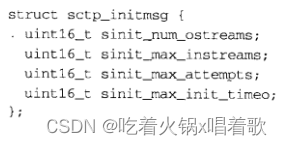 sctp_initmsg结构中字段含义如下： （1）`sinit_num_ostreams`：表示应用想要请求的外出SCTP流的数目，该值要等到相应关联完成初始握手后才得到确认，且可能因为对端的限制而向下协调。 （2）`sinit_max_instreams`：表示应用准备允许的外来SCTP流的最大数目，如果该值大于SCTP协议栈支持的最大允许流数，则它将被改为这个最大值。 （3）`sinit_max_attempts`：表示SCTP协议栈重传多少次INIT消息才认为对端不可达。 （4）`sinit_max_init_timeo`：表示用于INIT定时器的最大RTO值，在初始定时器进行指数退避期间，该值将替代RTO.max作为重传RTO极限，该值以毫秒为单位。

当设置以上字段时，SCTP将忽略其中的0值。一对多式套接字的用户在关联隐性建立期间也可能在辅助数据中传递一个sctp_initmsg结构。 10.`SCTP_MAXBURST`：用于获取或设置用于分组发送的最大猝发大小（maximum burst size），当SCTP向对端发送数据时，一次不能发送多于这个数目的分组，以免网络被分组淹没。具体SCTP实现有两种方式： （1）把拥塞窗口（cwnd，congestion window，发送端任何时刻发送的数据的序号不能超过当前已确认的最大数据序号和cwnd之和）缩减为当前飞行大小（flight size，已发送但还未收到ack的数据大小）加上最大猝发大小与路径MTU的乘积。 （2）把该值作为一个独立的控制量，在任意一个发送机会最多只发送这个数目的分组。 11.`SCTP_MAXSEG`：用于获取或设置SCTP分片的最大片段大小，与TCP的TCP_MAXSEG选项类似。当SCTP发送端从其应用进程收到一个大于这个大小的消息时，它将把该消息分割成多个块，以便分别传送到对端。 SCTP可能以比本选项所请求的值更小的值来分割消息，当通往对端的某条路径的PMTU（路径MTU，每条路径对应一个对端地址）变得比本选项所请求的值还要小时，这种更小的分割就会发生。此选项关联的数据类型是int，该选项的默认值为0，含义为用户不限制分片，只有PMTU会影响到SCTP的分片大小选择。 12：`SCTP_NODELAY`：开启本选项将禁止SCTP的Nagle算法，本选项默认关闭。SCTP的Nagle算法与TCP的Nagle算法工作原理相同，开启后意味着数据包会尽可能快地发送，不会引入不必要的延迟，代价是网络中的数据包会变多。 13：`SCTP_PEER_ADDR_PARAMS`：用于获取或设置关于某个关联的对端的各种参数，本选项关联的数据结构是sctp_paddrparams：  sctp_paddrparams结构中的字段含义： （1）`spp_assoc_id`：关联标识，如果该值为0，则访问的是对对端端点的默认参数，而非特定于关联的参数。 （2）`spp_address`：对端IP地址，如果spp_assoc_id字段为0，则忽略本字段。 （3）`spp_hbinterval`：心博间隔时间，将该值设为SCTP_NO_HB将禁止心博，设为SCTP_ISSUR_HB将强制发送一次心博，设为其他值则将该值以毫秒为单位设为新的心博间隔。设置对对端端点的默认参数时，不能使用SCTP_ISSUE_HB。 （4）`spp_pathmaxrxt`：在声明对端地址为不活跃前，尝试的重传次数。当主目的地址被声明为不活跃时，另一个对端地址将被选为主地址。 14：`SCTP_PRIMARY_ADDR`：用于获取或设置主目的地址，主目的地址是本端发送给对端的所有消息的默认目的地址，与本选项关联的结构为sctp_setprim：  sctp_setprim结构中字段含义： （1）`ssp_assoc_id`：关联标识，对于一到一式套接字，本字段被忽略。 （2）`ssp_addr`：要指定的主目的地址（必须是一个属于对端的地址），使用setsockopt函数设置此选项时，本地端为请求者填入的要求设置的主目的地址的新值，使用getsockopt函数获取本选项时，本字段返回当前所用主目的地址的值。

在只有一个本地地址与之关联的一到一式套接字上获取本选项的值跟直接调用getsockname（获取对端ip和端口）是一样的。 15：`SCTP_RTOINFO`：用于获取或设置各种RTO信息，它们既可以是关于某个给定关联的设置，也可以是用于本地端点的默认设置，为便于移植，应使用sctp_opt_info函数而非getsockopt函数，本选项关联的数据结构是sctp_rtoinfo：  sctp_rtoinfo结构中字段的含义： （1）`srto_assoc_id`：关联标识或0，若值为0，当前函数调用针对的是系统默认参数。 （2）`srto_initial`：存放初始RTO值，该值以毫秒为单位，默认值为3000。 （3）`srto_max`：存放最大RTO值，该值以毫秒为单位，默认值为60000。 （4）`srto_min`：存放最小RTO值，该值以毫秒为单位，默认值为1000。

如果设置该选项时，以上后三个字段中传的是0值，则表示不改变此值。 16.`SCTP_SET_PEER_PRIMARY_ADDR`：设置本套接字将发送一个消息，请求对端更改主目的地址为所提供的地址，该选项关联的数据结构是sctp_setpeerprim，该结构中所提供的的本地地址必须已经绑定在本地端点：  sctp_setpeerprim结构中字段含义： （1）`sspp_assoc_id`：关联标识，对于一到一式套接字，本字段被忽略。 （2）`sspp_ddr`：存放想要对端设置为主目的地址的本地地址。

本选项是可选的，需要两端均支持才能运作。如果本地端点不支持本特性，会给调用者返回EOPNOTSUPP错误，如果远程端点不支持本特性，会返回给调用者EINVAL错误。该套接字选项只能设置，不能获取。 17.`SCTP_STATUS`：用于获取某个SCTP关联的状态，为了便于移植，调用者应该使用sctp_opt_info函数而非getsockopt函数。本选项关联的数据结构是sctp_status，调用者必须填写关联标识，关于这个关联的信息将在返回时填写到该结构的其他字段中。sctp_status结构如下：  sctp_status结构的字段含义： （1）`sstat_assoc_id`：存放关联标识。 （2）`sstat_state`：存放下图中的常值之一，指出关联的状态：  （3）`sstat_rwnd`：存放本地端点对于对端接收窗口的当前估计。 （4）`sstat_unackdata`：存放未确认的DATA块数目。 （5）`sstat_penddata`：存放本地端点暂存并等待应用读取的未读DATA块数目。 （6）`sstat_instrms`：存放对端用于向本端发送数据的流的数目。 （7）`sstat_outstrms`：存放本端可用于向对端发送数据的流的数目。 （8）`sstat_fragmentation_point`：本地SCTP端点将其用作用户消息分割点，该值通常是所有目的地址的最小MTU，或是由本地应用进程使用SCTP_MAXSEG套接字选项设置的更小值。 （9）`sstat_primary`：存放当前主目的地址。

以上字段可用于诊断或确定会话的特征，如sctp_get_no_strms函数将用sstat_outstrms成员确定有多少外出流可用；偏低的sstat_rwnd字段值或偏高的stat_unackdata字段值可用于判断对端的接收套接字缓冲区正变满，这一点是让应用尽可能降低发送速率的信号；有些应用使用stat_fragmentation_point字段值减少SCTP的分片数量，方法是发送较小的应用消息。

fcntl（file control，文件控制）函数可执行各种描述符控制操作，以下是fcntl、ioctl、路由套接字所能做的操作总结：  上图中前六个操作可由任何进程用于套接字，后两个操作由诸如ifconfig或route之类的管理程序执行。

执行前四个操作的方法不止一种，最后一列指出POSIX规定fcntl函数是首选的。最后一列还指出，POSIX提供sockatmark函数作为测试是否处于带外标志的首选方法。最后一列中的空白表示该操作没有被POSIX标准化。

对于前两个操作，历史上使用fcntl函数的FNDELAY和FASYNC命令执行，但POSIX定义的是使用FSETFL命令的O_xxx常值来执行。

fcntl函数提供与网络编程相关的以下特性： 1.非阻塞式IO：通过使用F_SETFL命令设置O_NONBLOCK文件状态标志，把一个套接字设置为非阻塞型。 2.信号驱动式IO：通过使用F_SETFL命令设置O_ASYNC文件状态标志，把一个套接字设置为一旦其状态发生变化，内核就产生一个SIGIO信号。 3.F_SETOWN命令允许我们指定用于接收SIGIO和SIGURG信号的套接字属主（进程ID或进程组ID），其中SIGIO信号是套接字被设置为信号驱动式IO型后产生的；SIGURG信号是在新的带外数据到达套接字时产生的。F_GETOWN命令返回套接字的当前属主。术语`套接字属主`由POSIX定义，历史上源自Berkeley的实现称之为套接字的进程组ID，因为存放该ID的变量是socket结构的so_pgid成员。  每种描述符（如套接字描述符）都有一组由F_GETFL命令获取或由F_SETFL命令设置的文件标志，其中影响套接字描述符的两个标志是O_NONBLOCK（非阻塞式IO）和O_ASYNC（信号驱动式IO）。

使用fcntl函数开启非阻塞式IO的典型代码：

```c
int flags;

/* Set a socket as nonblocking */
if ((flags = fcntl(fd, F_GETFL, 0)) < 0) {
    err_sys("F_GETFL error");
}
flags |= O_NONBLOCK;
if (fcntl(fd, F_SETFL, flags) < 0) {
    err_sys("F_SETFL error");
}
12345678910
```

以下是错误地设置所期望标志的代码：

```c
/* Wrong way to set a socket as nonblocking */
if (fcntl(fd, F_SETFL, O_NOBLOCK) < 0) {
    err_sys("F_SETFL error");
}
1234
```

以上代码在设置非阻塞标志的同时也清除了所有其他文件状态标志，正确方式应该是先取得当前标志，与新标志逻辑或后再设置标志。

以下代码关闭非阻塞标志，其中flags是由上面所示的fcntl调用设置的：

```c
flags &= ~O_NONBLOCK;
if (fcntl(fd, F_SETFL, flags) < 0) {
    err_sys("F_SETFL error");
}
1234
```

信号SIGIO和SIGURG与其他信号的不同之处在于，这两个信号仅在已使用F_SETOWN命令给相关套接字指派了属主后才产生。F_SETOWN命令的整数类型arg参数既可以是一个正整数，用来指出接收信号的进程ID，也可以是一个负整数，其绝对值指出接收信号的进程组ID。F_GETOWN命令把套接字属主作为fcntl函数的返回值返回，它既可以是一个进程ID（一个正的返回值），也可以是进程组ID（除-1以外的负值）。指定接收信号的套接字属主为一个进程时，仅单个进程接收信号；指定套接字属主为一个进程组时，整个进程组中所有进程都接收到信号。

使用socket函数创建的套接字没有属主，如果一个新套接字是从一个监听套接字创建而来，则已连接套接字属主会从监听套接字继承而来。

每个TCP和SCTP套接字都有一个发送缓冲区和一个接收缓冲区，每个UDP套接字都有一个接收缓冲区。

在连接建立前后显示套接字接收缓冲区大小和MSS值：

```c
#include "unp.h"
#include <netinet/tcp.h>    /* for TCP_MAXSEG */

int main(int argc, char **argv) {
    int sockfd, rcvbuf, mss;
    socklen_t len;
    struct sockaddr_in servaddr;

    if (argc != 2) {
        err_quit("usage: rcvbuf <IPaddress>");
    }

    sockfd = Socket(AF_INET, SOCK_STREAM, 0);

    len = sizeof(rcvbuf);
    Getsockopt(sockfd, SOL_SOCKET, SO_RCVBUF, &rcvbuf, &len);
    len = sizeof(mss);
    Getsockopt(sockfd, IPPROTO_TCP, TCP_MAXSEG, &mss, &len);
    printf("defaults: SO_RCVBUF = %d, MSS = %d\n", rcvbuf, mss);

    bzero(&servaddr, sizeof(servaddr));
    servaddr.sin_family = AF_INET;
    servaddr.sin_port = htons(SERV_PORT);  
    Inet_pton(AF_INET, argv[1], &servaddr.sin_addr);

    Connect(sockfd, (SA *)&servaddr, sizeof(servaddr));
	
    len = sizeof(rcvbuf);
    Getsockopt(sockfd, SOL_SOCKET, SO_RCVBUF, &rcvbuf, &len);
    len = sizeof(mss);
    Getsockopt(sockfd, IPPROTO_TCP, TCP_MAXSEG, &mss, &len);
    printf("after connect: SO_RCVBUF = %d, MSS = %d\n", rcvbuf, mss); 

    exit(0);
}
1234567891011121314151617181920212223242526272829303132333435
```

以上代码的输出结果随系统而变化，有些系统（如Solaris 2.5.1及更早版本）的套接字缓冲区大小总是返回0，使得我们无法查看套接字缓冲区大小在连接前后有什么变化。

对于MSS，在调用connect前显示的是实现的默认值（通常是536或512），调用connect后显示的值取决于可能有的来自对端的MSS，本地以太网上调用connect后的值可能是1460，然而调用connect连接某远程网络的一台服务器主机后显示的MSS值可能类似默认值，除非你的系统支持路径MTU发现功能。还可通过tcpdump程序查看来自对端的SYN分节中真正的MSS选线值。

对于套接字缓冲区大小，许多实现在建立连接后把它向上舍入成MSS的倍数。还可通过tcpdump程序观察TCP的通告窗口来查看连接建立后的套接字缓冲区大小。

设置SO_LINGER套接字选项：

```c
str_cli(stdin, sockfd);

struct linger ling;
ling.l_onoff = 1;
ling.l_linger = 0;
Setsockopt(sockfd, SOL_SOCKET, SO_LINGER, &ling, sizeof(ling));

exit(0);
12345678
```

以上代码会发送一个RST而非正常的TCP连接终止序列，此时服务器的读操作会返回ECONNRESET错误，对应消息为`Connection reset by peer`。

如果有两个TCP客户同时启动，都设置了SO_REUSEADDR套接字选项，且以相同的本地IP地址和相同的端口号调用bind，但一个客户连接到198.69.10.2的端口7000，另一个客户连接到198.69.10.2（相同IP地址）的端口8000，会发生什么？第一个客户的函数调用顺序为setsockopt、bind、connect，如果第二个客户在第一个客户调用bind和connect之间调用bind，那第二个客户将返回EADDRINUSE错误，然而一旦第一个客户已连接到对端，第二个客户的bind就正常工作，因为第一个客户的套接字当时已处于连接状态，处理这种竞争状态的唯一办法是让第二个客户在调用bind返回EADDRINUSE错误时再多次尝试调用bind，而非返回该错误后就放弃。

使用sock程序作为TCP服务器（-s选项），分别捆绑通配地址、主机的某个接口地址、环回地址，看是否需要指定SO_REUSEADDR（-A选项），以下是在一个支持多播的主机MacOS X 10.2.6上的运行结果：  以下是在一个不支持多播的主机Unix Ware 2.1.2上的运行结果：  继续前面的例子，这次启动UDP服务器（-u选项）的两个实例，捆绑相同的本地IP和端口号，如果实现支持SO_REUSEPORT，试着使用它（-T选项）。我们首先在支持多播，但不支持SO_REUSEPORT选项的主机Solaris 9上尝试：  在这个系统上，第一个bind调用不必指定SO_REUSEADDR，但第二个起必须指定。

在既支持多播也支持SO_REUSEPORT选项的主机MacOS X 10.2.6上尝试，我们首先启动两个指定了SO_REUSEADDR选项的服务器：  发现SO_REUSEADDR选项不起作用。接着我们只给第二个服务器使用SO_REUSEPORT选项，而第一个服务器不使用：  发现SO_REUSEPORT选项也不起作用，这是因为完全重复的捆绑要求共享同一捆绑的所有套接字都使用SO_REUSEPORT选项： 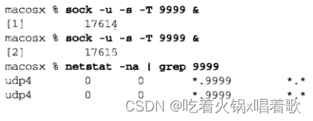 有些ping程序的版本有一个-d选项用于开启SO_DEBUG套接字选项，它没有任何作用，因为ping使用ICMP套接字，而SO_DEBUG套接字选项只影响TCP套接字。该选项的描述为：这个选项开启相应协议层中的调试，但实现该选项的唯一协议层一直是TCP。

在开启TCP_NODELAY的情况下，如果客户为一个请求执行了两个write调用，第一个写4字节，第二个写396字节，假设服务器的ACK延滞时间为100ms，客户与服务器之间的RTT为100ms，服务器处理客户请求的时间为50ms，以下是时间线图：  当关闭了TCP_NODELAY时：  但如果我们不想关闭TCP_NODELAY时，可以用writev函数一次性处理4字节缓冲区和396字节缓冲区，这样可以减少分组个数：  RFC 1122 [Barden 1989]中建议，ACK的延滞时间必须低于0.5秒，当对端发来的全是满大小的段时，至少每第二个段就应该发一次ACK。Berkeley的实现将ACK的延滞时间设为最多200ms。

如果客户和服务器都设置了SO_KEEPALIVE套接字选项，连接后没有交换任何数据，当保持存活定时器每2小时到期时，会发生什么？会交换2个而非4个TCP分节，因为两个系统的保持存活定时器精确同步的可能性非常低，一端的保持存活定时器会比另一端略早一点超时，首先超时的一端发送保持存活侦探分组，另一端会确认这个分组，然后保持存活侦探分组的接收会导致时钟略慢的主机把保持存活定时器重置成2小时。

几乎所有实现都在头文件sys/socket.h中定义了SO_ACCEPTCON常值，此常值的作用为，在最初的socket API中，没有listen函数，且socket函数拥有第4个参数用来指定套接字选项，SO_ACCEPTCON常值就是用来指定监听套接字的，加了listen函数后，这个选项还是保留着，现在由内核来设置这个选项。

# 第八章 基本UDP套接字编程

UDP是无连接[不可靠的](https://so.csdn.net/so/search?q=不可靠的&spm=1001.2101.3001.7020)数据报协议，不同于TCP提供的面向连接的可靠字节流。使用UDP编写的常见程序有：DNS、NFS、SNMP。

以下是典型的UDP客户/服务器程序的函数调用，客户不与服务器建立连接，而是只使用sendto函数给服务器发送数据报，发送时必须指定目的地的地址作为参数。服务器也不接受来自客户的连接，而是直接调用recvfrom函数，等待某个客户的数据到达，recvfrom函数将返回所接收的数据和客户的协议地址，从而服务器可以把响应发给正确的客户：  这两个函数类似标准的read、write函数，但需要3个额外参数：   前三个参数sockfd、buff、nbytes等同于read和write函数的三个参数，分别是描述符、指向读入或写出缓冲区的指针和读写字节数。

flags参数后面介绍，在这之前该参数使用时总是置0。

sendto函数的to参数指向一个含有数据报接收者的协议地址（如IP地址、端口号）的套接字地址结构，其大小由addrlen参数指定。recvfrom函数的from参数指向由该函数在返回时填写的数据报发送者的协议地址的套接字地址结构，该套接字地址结构的字节数放在addrlen参数所指的整数中返回给调用者。

recvfrom函数的最后两个参数类似于accept函数的最后两个参数，返回时套接字地址结构中的内容告诉我们是谁发送了数据报（recvfrom函数）或是谁发起了连接（accept函数）。sendto函数的最后两个参数类似于connect函数的最后两个参数：调用时其中套接字地址结构内容含义是，被我们填入的数据报将发往该地址（sendto函数）或与之建立连接（connect函数）的协议地址。

这两个函数的返回值都是所读写的数据长度，recvfrom函数用于数据报协议时，返回值就是所接收数据报中的用户数据量。

可以写一个长度为0的数据报，在UDP情况下，这会形成一个只包含一个IP首部（IPv4通常为20字节，IPv6通常为40字节）和一个8字节UDP首部而没有数据的IP数据报。这意味着对于数据报协议，recvfrom函数返回0是可接受的，它不像TCP套接字上read函数返回0值表示对端关闭连接。

如果recvfrom函数的from函数是一个空指针，则相应的长度参数也必须是一个空指针，表示我们不关心发送者的协议地址。

recvfrom和sendto函数都可用于TCP，但通常没有理由这么做。  以下是上图中的UDP服务器程序：

```c
#include "unp.h"

int main(int argc, char **argv) {
    int sockfd;
    struct sockaddr_in servaddr, cliaddr;

    // 通过将第二个参数指定为SOCK_DGRAM（IPv4协议中的数据报套接字）创建一个UDP套接字
    sockfd = Socket(AF_INET, SOCK_DGRAM, 0);

    bzero(&servaddr, sizeof(servaddr));
    servaddr.sin_family = AF_INET;
    servaddr.sin_addr.s_addr = htonl(INADDR_ANY);
    servaddr.sin_port = htons(SERV_PORT);

    Bind(sockfd, (SA *)&servaddr, sizeof(servaddr));

    dg_echo(sockfd, (SA *)&cliaddr, sizeof(cliaddr));
}
123456789101112131415161718
```

服务器调用dg_echo函数执行服务器的处理工作：

```c
void dg_echo(int sockfd, SA *pcliaddr, socklen_t clilen) {
    int n;
    socklen_t len;
    char mesg[MAXLINE];

    for (; ; ) {
        len = clilen;
		n = Recvfrom(sockfd, mesg, MAXLINE, 0, pcliaddr, &len);

        // 此处最后一个参数使用len而非clilen
        // 因为如果协议使用的是变长套接字地址结构
        // 可能clilen会太大，应使用recvfrom函数返回的真正长度
		Sendto(sockfd, mesg, n, 0, pcliaddr, len);
    }
}
123456789101112131415
```

UDP是一个无连接协议，它没有像TCP中EOF之类的东西。

dg_echo函数是一个迭代服务器（iterative server），其中没有对fork的调用，因此单个服务器进程就得处理所有客户。一般来说，大多TCP服务器是并发的，大多UDP服务器是迭代的。

对于UDP套接字，UDP层中隐含有排队发生，事实上每个UDP套接字都有一个接收缓冲区，到达该套接字的每个数据报都进入这个套接字接收缓冲区，当进程调用recvfrom时，缓冲区中的下一个数据报以FIFO顺序返回给进程。但这个缓冲区大小是有限的，可用SO_RCVBUF套接字选项增大它。

下图是第5章中，TCP服务器在两个客户与之建立连接的情形：  其中服务器主机上有两个已连接套接字，其中每个都有各自的套接字接收缓冲区。

两个客户发送数据报到UDP服务器的情形：  其中只有一个服务器进程，它用单个套接字接收所有到达的数据报并发回所有响应。该套接字有一个接收缓冲区存放所有到达数据。

以上服务器代码中，main函数是协议相关的，它创建一个AF_INET协议套接字，分配并初始化一个IPv4套接字地址结构），而dg_echo函数是协议无关的，dg_echo函数不查看这个协议相关结构的内容，而是简单地把一个指向该套接字结构的指针传递给recvfrom和sendto函数，即，recvfrom函数返回时把客户的IP地址和端口号填入该结构，而随后该结构又作为目的地址传递给sendto函数。

UDP回射客户程序：

```c
#include "unp.h"

// 协议无关的函数
void dg_cli(FILE *fp, int sockfd, const SA *pservaddr, socklen_t servlen) {
    int n;
    char sendline[MAXLINE], recvline[MAXLINE + 1];

    while (Fgets(sendline, MAXLINE, fp) != NULL) {
        Sendto(sockfd, sendline, strlen(sendline), 0, pservaddr, servlen);

        // 最后两个参数都是空指针，这告知内核我们不关心应答数据报由谁发送
        // 这存在一个风险，任何进程都可以向本客户的IP和端口发送数据报
        // 这些数据报被客户读入并被认为是服务器的应答
		n = Recvfrom(sockfd, recvline, MAXLINE, 0, NULL, NULL);
	
		recvline[n] = 0;    /* null terminate */
		Fputs(recvline, stdout);
    }
}

// 协议相关的函数
int main(int argc, char **argv) {
    int sockfd;
    struct sockaddr_in servaddr;

    if (argc != 2) {
        err_quit("usage: udpcli <IPaddress>");
    }

    bzero(&servaddr, sizeof(servaddr));
    servaddr.sin_family = AF_INET;
    servaddr.sin_port = htons(SERV_PORT);
    Inet_pton(AF_INET, argv[1], &servaddr.sin_addr);

    sockfd = Socket(AF_INET, SOCK_DGRAM, 0);

    dg_cli(stdin, sockfd, (SA *)&servaddr, sizeof(servaddr));

    exit(0);
}
12345678910111213141516171819202122232425262728293031323334353637383940
```

以上客户没有请求内核给它的套接字指派一个临时端口，对于TCP客户，这发生在connect调用处，对一个UDP套接字，如果其进程首次调用sendto时没有绑定一个本地端口，内核在此时会为它选择一个临时端口并绑定。与TCP一样，UDP客户也可以显式地调用bind，但很少这么做。

以上UDP客户和服务器是不可靠的，如果一个客户数据报丢失（如被客户主机和服务器主机之间的某个路由器丢弃），客户将永远阻塞于recvfrom调用，等待一个永远不会到达的服务器应答。防止永久阻塞的方法是给客户的recvfrom调用设置一个超时，但这并不是完整的解决办法，如果确实超时了，我们无从判定超时原因是我们的数据报没有到达服务器，还是服务器的应答没有回到客户，如果客户请求是从账户A往账户B转一定数目的钱，而不是我们的简单回射，则请求丢失和应答丢失是不同的。

UDP客户验证接收到的数据报是否是服务器的回射：

```c
void dg_cli1(FILE *fp, int sockfd, SA *pservaddr, socklen_t servlen) {
    int n;
    char sendline[MAXLINE], recvline[MAXLINE + 1];
    socklen_t len;
    struct sockaddr *preply_addr;

    preply_addr = Malloc(servlen);

    while (Fgets(sendline, MAXLINE, fp) != NULL) {
        Sendto(sockfd, sendline, strlen(sendline), 0, pservaddr, servlen);

		len = servlen;
		n = Recvfrom(sockfd, recvline, MAXLINE, 0, pservaddr, &len);
		if (len != servlen || memcmp(pservaddr, preply_addr, len) != 0) {
		    printf("reply from %s (ignored)\n", Sock_ntop(preply_addr, len));
		    continue;
		}
	
		recvline[n] = 0;    /* null terminate */
		Fputs(recvline, stdout);
    }
}
12345678910111213141516171819202122
```

以上函数中，我们通知内核返回数据报发送者的地址，我们首先比较由recvfrom函数在值-结果参数中返回的长度，然后用memcpy函数比较套接字地址结构本身。

即使套接字地址结构包含一个长度字段，我们一般也不必设置或检查它，但以上函数中memcmp函数比较两个套接字地址结构中的每个数据字节，而内核返回套接字地址结构时，其中长度字段是设置的，因此对于上例，与之比较的另一个套接字地址结构也必须预先设置其长度，否则memcmp函数会比较一个值为0的字节（因为没有设置长度字段）和一个值为16的字节（sockaddr_in结构的长度），会不匹配。

如果服务器运行在一个只有单个IP地址的主机上，则以上代码可以正常工作，但如果服务器主机是多宿的，该客户就可能失败。我们在有两个接口和两个IP地址的主机freebsd4上运行以上客户：   上图中，我们指定的服务器IP地址不与客户主机共享一个子网。

大多IP实现接受目的地址为本机任一IP地址的数据报，而不管数据报到达的接口，RFC 1122称之为弱端系统模型，如果一个系统实现的是强端系统模型，则它将只接受到达接口与目的地址一致的数据报。

上例中，服务器发送应答时，服务器选择的外出IP是172.24.37.94，这是服务器主机内核中的路由选择功能决定的，由于服务器没有在其套接字上绑定一个实际IP地址（服务器绑定的是一个通配IP地址，可通过在服务器上运行netstat来验证），因此服务器端内核将为封装这些应答的IP数据报选择源地址，选择的源地址会是外出接口的主IP地址，既然它是外出接口的主IP地址，如果我们在客户端指定发送数据报到该服务器接口的某个非主IP地址（即一个IP别名），也将导致上例失败。

上例的解决方法： 1.得到由recvfrom函数返回的IP地址后，客户通过DNS查找服务器主机的域名，然后验证域名而非IP地址。

2.UDP服务器为本机上配置的每个IP地址都创建一个套接字，用bind函数绑定每个IP地址到各自的套接字，然后在所有套接字上使用select函数，等待其中任何一个变为可读，再从可读的套接字上给出应答，这就保证了应答的源地址与请求的目的地址相同。

在多宿Solaris系统上，服务器应答的源IP地址就是客户请求的目的IP地址，但源自Berkeley的实现是以上情形（基于外出接口选择源IP地址）。

如果服务器进程未运行，启动客户后键入一行文本，那将什么也不发生，客户永远阻塞于它的recvfrom调用，等待一个永不出现的服务器应答。模拟以上情况，我们在主机macosx上启动tcpdump，然后在同一主机上启动客户，然后指定freebsd4为服务器主机（该主机上没有启动服务器进程），接着我们键入一行文本，该文本不会被回射：  以下是tcpdump的输出：  客户主机在往服务器主机发UDP数据报前，需要一次ARP请求和应答的交换。

第三行客户数据报发出，长度为13，包含12个字符和1个换行符。第四行服务器主机响应的是一个端口不可达ICMP消息，但这个ICMP错误不返回给客户进程，客户将永远阻塞于recvfrom调用。ICMPv6也有端口不可达错误，因此此处的讨论对IPv6也类似。

我们称以上ICMP错误为异步错误，该错误由sendto函数引起，但sendto函数本身却成功返回。UDP输出操作成功返回仅仅表示在接口输出队列中有存放所形成的IP数据报的空间。

对于UDP套接字，由它引发的异步错误不会返回给它，除非它已连接（给UDP套接字调用connect）。

如果我们在单个UDP套接字上发送3个数据报给3个不同的服务器（3个不同的IP地址），该客户随后进入一个调用recvfrom读取应答的循环，其中有两个UDP数据报将被正确递送，但第三个主机上没有运行服务器，于是第三个主机响应一个ICMP端口不可达错误，这个ICMP出错消息包含引起错误的数据报的IP首部和UDP首部（ICMPv4和ICMPv6出错消息总是包含IP首部和所有UDP首部或部分TCP首部，以便接收者确定由哪个套接字引发该错误），但recvfrom函数可返回的信息仅有errno值，没有办法返回出错数据报的目的IP地址和目的UDP端口号，因此有以下规定：仅在进程已将其UDP套接字连接到唯一一个对端后，这些异步错误才返回给进程。

只要SO_BSDCOMPAT套接字选项没有开启，Linux甚至对未连接的UDP套接字也返回大多数ICMP目的地不可达错误。  客户必须给sendto函数指定服务器的IP地址和端口号；而客户的IP地址和端口号都由内核自动选择，尽管客户也可以调用bind指定它们。客户的这两个值由内核选择时，客户的临时端口是在第一次调用sendto时选定的，不能改变，而客户的IP地址可以随着客户发送的每个UDP数据报而变动（假设客户没有捆绑一个具体的IP地址到套接字上）。

如果客户捆绑了一个IP地址到其套接字上，但内核决定将数据报从另一个数据链路发出，此时，IP数据报将包含一个不同于外出链路IP地址的源IP地址。我们在多宿主机freebsd上指定`-u`选项（使用UDP）和`-l`选项（指定本地IP地址和端口）运行sock程序：  上图中指定的本地IP地址不能到达目的地，必须从另一个接口出去，使用tcpdump查看：  可见源IP地址确实是由客户绑定的那个地址，而非外出接口的地址。  对于UDP服务器，可能想从到达的IP数据报上取得至少四条信息：源IP地址、目的IP地址、源端口号、目的端口号。这些信息可从下图所示途径获取：  TCP服务器总是能便捷地访问已连接套接字的这四条信息，且这四个值在连接的整个生命期内保持不变。对于UDP套接字，目的IP地址只能通过为IPv4设置IP_RECVDSTADDR套接字选项或为IPv6设置IPV6_PKTINFO套接字选项，然后调用recvmsg函数取得。由于UDP是无连接的，因此目的IP地址可随发送到服务器的每个数据报而改变。UDP服务器也可接收目的地址为服务器主机的某个广播地址或多播地址的数据报。

我们可以给UDP套接字调用connect，这样做不会导致三路握手过程，内核只检查是否存在立即可知的错误（如一个显然不可达的目的地），记录对端IP和端口号（取自传给connect函数的套接字地址结构），然后立即返回调用进程。

给connect函数重载UDP套接字容易让人混淆，如果约定sockname表示本地协议地址，peername表示外地协议地址，则对于UDP来说，connect函数更好的名字是setpeername，类似地，bind函数的更好名字是setsockname。

我们需要区分： 1.未连接UDP套接字，新创建UDP套接字默认如此。

2.已连接UDP套接字，对UDP套接字调用connect的结果。

已连接UDP套接字与未连接UDP套接字相比，有以下变化： 1.我们不能再给输出操作指定目的IP地址和端口号，即使用write、send函数代替sendto函数。写到已连接UDP套接字上的内容都自动发到由connect函数指定的协议地址。

其实我们可以给已连接套接字调用sendto，但不能指定目的地址，第5个参数（指向目的地址的套接字地址结构的指针）必须为空指针，第6个参数（该套接字地址结构的大小）应为0。POSIX指出，当第5个参数为空指针时，第6个参数的取值被忽略。

对于4.4 BSD的写操作：  2.我们不必使用recvfrom函数获取数据报发送者，而改用read、recv、recvmsg函数，在一个已连接UDP套接字上，由内核为读操作返回的数据报只有那些来自先前connect函数所指定协议地址的数据报。目的地为该已连接UDP套接字的本地协议地址、发源地却不是该套接字早先调用connect的协议地址的数据报，不会投递到该套接字，这样就限制一个已连接UDP套接字能且仅能与一个对端交换数据报。确切地说，一个已连接UDP套接字能且仅能与一个IP地址交换数据报，因为可以connect到一个多播或广播地址。

3.由已连接UDP套接字引发的异步错误会返回给它们所在的进程，未连接UDP套接字不接收任何异步错误。  如上图，应用进程先调用connect指定对端IP和端口号，然后使用read和write函数与对端交换数据。

来自其他IP地址或端口的数据报（上图中用???表示）不投递给这个已连接套接字，因为它们的源IP地址或源UDP端口不与该套接字connect到的协议地址相匹配。这些数据报可能投递给同一主机上的其他某UDP套接字，如果没有相匹配的套接字，UDP将丢弃它们，并返回ICMP端口不可达错误。

作为小结，我们可以说UDP客户进程或服务器进程只有在自己的UDP套接字与确定的唯一端进行通信时，才调用connect。调用connect的通常是UDP客户，但有些网络应用中UDP服务器会与单个客户长时间通信（如TFTP），此时客户和服务器都可能调用connect。  通常通过在/etc/resolv.conf文件中列出DNS服务器主机的IP地址，一个DNS客户主机能被配置成使用一个或多个DNS服务器，如果列出的是单个服务器主机，客户进程就能调用connect，但如果列出的是多个服务器主机，客户进程就不能调用connect。DNS服务器通常可处理任意客户的请求，因此DNS服务器进程不能调用connet。

可对一个已连接UDP套接字再次调用connect，目的通常为： 1.指定新的IP地址和端口号。

2.断开套接字。

UDP套接字不同于TCP套接字，对于TCP套接字，connect函数只能调用一次。

为断开一个已连接UDP套接字的连接，可再次调用connect时把套接字地址结构的地址族成员（IPv4的sin_family、IPv6的sin6_family）设为AF_UNSPEC，这么做可能返回一个EAFNOSUPPORT错误，但这是可接受的，调用connect的过程仍会使UDP套接字断开。

各种UNIX变体断开UDP套接字上连接的方式存在差异，例如，以NULL作为套接字地址结构指针调用connect的方法仅仅适合某些系统，在另一些系统上，还要求第三个参数即套接字地址结构长度为非0。POSIX规范和BSD手册只是提到必须用一个NULL地址，而没有提到出错返回值（甚至没有提到成功返回值）。最便于移植的方法是清零一个地址结构，然后把它的地址族成员设为AF_UNSPEC，再把它传递给connect函数。

另一个存在差异的地方是断开连接前后套接字本地绑定的地址的取值，AIX保留被选中的本地IP和端口号，即使它们是隐式捆绑的。FreeBSD和Linux把本地IP地址设置回全0，即使早先调用过bind，但端口号保持不变。Solaris在隐式捆绑时把本地IP设置回全0，在显式调用过bind时保持IP地址不变。

应用进程在一个未连接UDP套接字上调用sendto时，源自Berkeley的内核暂时连接该套接字，发送数据报，然后断开该连接，因此在一个未连接的UDP套接字上用sendto函数发送两个数据报会使内核执行以下6个步骤： 1.连接套接字。

2.输出第一个数据报。

3.断开套接字连接。

4.连接套接字。

5.输出第二个数据报。

6.断开套接字连接。

对于搜索路由表的次数，第一次需为目的IP地址搜索路由表并高速缓存这条信息。假设第二次连接到相同的目的地址，此时会注意到目的地址等于已高速缓存的路由表信息中的其中一个目的地，于是就不必再次查找路由表。

当应用进程知道自己要给同一目的地址发送多个数据报时，显式连接效率更高，调用connect后调用两次write涉及内核执行以下步骤： 1.连接套接字。

2.输出第一个数据报。

3.输出第二个数据报。

此时内核只复制一次含有目的IP地址和端口号的套接字地址结构，而调用两次sendto时，需复制两次。

修改dg_cli函数，把它重写成调用connect的版本：

```c
void dg_cli1(FILE *fp, int sockfd, SA *pservaddr, socklen_t servlen) {
    int n;
    char sendline[MAXLINE], recvline[MAXLINE + 1];

    Connect(sockfd, (SA *)pservaddr, servlen);

    while (Fgets(sendline, MAXLINE, fp) != NULL) {
        Write(sockfd, sendline, strlen(sendline));

		n = Read(sockfd, recvline, MAXLINE);
	
		recvline[n] = 0;    /* null terminate */
		Fputs(recvline, stdout);
    }
}
123456789101112131415
```

所做的修改是调用connect，并用read和write函数代替sendto和recvfrom函数。该函数不查看传递给connect函数的套接字地址结构的内容，因此它仍然是协议无关的。

在主机macosx上运行该程序，并指定主机freebsd4的IP地址，但freebsd4上没有运行相应的服务器程序，有如下输出：  我们注意到，当启动客户进程时我们没有收到这个错误，该错误在我们发送第一个数据报给服务器后才发生，该数据报引发了来自服务器主机的ICMP错误。但当TCP客户进程调用connect，指定一个没有运行指定服务器的主机时，connect函数就会返回错误，因为调用connect会造成TCP三路握手，其中第一个分节会导致服务器主机TCP返回RST。

以下是上图的tcpdump输出：  该ICMP错误由内核映射成ECONNREFUSED错误，对应于err_sys函数输出的“Connection refused”。

并非所有内核都像上例一样把ICMP消息返回给已连接UDP套接字，一般源自Berkeley的内核返回这种错误，而System V不会。如果在Solaris 2.4主机上，客户的read调用永不返回（可用tcpdump观察到服务器主机返回了ICMP端口不可达错误），这个问题在Solaris 2.5中被修复。UnixWare不返回这种错误，而AIX、Digital Unix、HP-UX、Linux都返回这种错误。

现在我们查看无任何流量控制的UDP对数据报传输的影响，我们修改dg_cli函数为发送固定数目的数据报，且不从标准输入读，而是直接写2000个1400字节的UDP数据报给服务器：

```c
#define NDG 2000   /* datagrams to send */
#define DGLEN 1400    /* length of each datagram */

void dg_cli1(FILE *fp, int sockfd, SA *pservaddr, socklen_t servlen) {
    int i;
    char sendline[DGLEN];

    for (i = 0; i < NDG; ++i) {
        Sendto(sockfd, sendline, DGLEN, 0, pservaddr, servlen);
    }
}
1234567891011
```

然后修改服务器程序，改为对其接收到的数据报计数，并不再把数据报回射给客户。以下是新的dg_echo函数，当我们用终端中断键终止服务器时（发送SIGINT信号），服务器会显示接收到的数据报数目并终止：

```c
static int count;

static void recvfrom_int(int signo) {
    printf("\nreceived %d datagrams\n", count);
    exit(0);
}

void dg_echo(int sockfd, SA *pcliaddr, socklen_t clilen) {
    socklen_t len;
    char mesg[MAXLINE];

    Signal(SIGINT, recvfrom_int);

    for (; ; ) {
        len = clilen;
		Recvfrom(sockfd, mesg, MAXLINE, 0, pcliaddr, &len);
	        
		++count;
    }
}
1234567891011121314151617181920
```

我们在主机freebsd上运行服务器，它是一个慢速的SPARC（它是Sun Microsystems于1980年代开发的产品）工作站；在RS/6000（它是IBM在1990年代初推出的产品，使用POSIX接口和AIX操作系统）上运行客户。两个主机间以100Mbit/s的以太网相连。另外，我们在服务器上运行netstat命令，在服务器启动前和结束后各运行一次，用来统计丢失了多少数据报。以下是服务器主机上的输出：  客户发出了2000个数据报，但服务器只收到其中30个，丢失率为98%，但服务器进程和客户进程都没有给出任何指示来说明这些数据报已丢失。UDP没有流量控制且是不可靠的，UDP发送端淹没其接收端是轻而易举之事。

检查netstat的输出，可看到服务器主机接收到的数据报总数是2000（73208-71208）。“dropped due to full socket buffers”（因套接字缓冲区满而丢弃）的值表示已被UDP接收，但因为接收套接字的接收队列已满而被丢弃的数据报的数目，该值为1970（3491-1971），它加上由服务器进程输出的计数值（30）等于服务器主机接收到的2000个数据报。netstat的输出中，计数是全系统范围的值，没有办法确定具体影响到哪些进程。

上例中，由服务器进程接收的数据报数目是不确定的，它依赖于很多因素，如网络负载、客户主机的处理负载、服务器主机的处理负载。

如果我们再次运行相同的客户和服务器，但让客户运行在慢速的Sun主机上，让服务器运行在较快的RS/6000主机上，这次不会丢失数据报：  由UDP给某个特定套接字排队的UDP数据报数目受限于该套接字接收缓冲区的大小，我们可以使用SO_RCVBUF套接字选项修改该值，FreeBSD下UDP套接字接收缓冲区的默认大小为42080字节，即30个1400字节数据报的容纳空间，如果我们增大套接字接收缓冲区的大小，那么服务器有望接收更多数据报。修改dg_echo函数，把套接字接收缓冲区设置为220KB：

```c
void dg_echo(int sockfd, SA *pcliaddr, socklen_t clilen) {
    socklen_t len;
    char mesg[MAXLINE];
    int n;

    Signal(SIGINT, recvfrom_int);

	// FreeBSD 5.1中，一个套接字接收缓冲区的最大大小默认为256*1024=262144字节
	// 但由于缓冲区分配策略，真实的限制是233016字节
	// 所以此处将套接字接收缓冲区大小设为220*1024=225280字节，略小于最大上限
    n = 220 * 1024;
    Setsockopt(sockfd, SOL_SOCKET, SO_RCVBUF, &n, sizeof(n));

    for (; ; ) {
        len = clilen;
		Recvfrom(sockfd, mesg, MAXLINE, 0, pcliaddr, &len);
	        
		++count;
    }
}
1234567891011121314151617181920
```

然后再次在更慢的Sun主机上运行服务器程序，在更快的RS/6000主机上运行客户程序，这次接收到的数据报计数变为103，比之前使用默认套接字接收缓冲区大小的例子稍有改善，但不能根本解决问题。

如果上例中，我们在客户程序发送每个数据报前调用printf输出一下数据报的内容，则由于在每个数据报间引入了一个延迟，服务器会接收到更多数据报；在服务器程序接收到每个数据报后调用printf则会导致服务器丢失更多数据报。

已连接UDP套接字可用来确定某个特定目的IP地址的外出接口，这是connect函数应用到UDP套接字时的一个副作用造成的，内核会选择本地IP地址（假设进程没有使用bind函数显式指派它），这个本地IP地址是通过为目的IP地址搜索路由表得到的外出接口，然后选用该接口的主IP地址。

以下UDP程序connect到一个指定IP地址后调用getsockname得到本地IP和端口号并输出：

```c
#include "unp.h"

int main(int argc, char **argv) {
    int sockfd;
    socklen_t len;
    struct sockaddr_in cliaddr, servaddr;

    if (argc != 2) {
        err_quit("usage: udpcli <IPadress>");
    }

    sockfd = Socket(AF_INET, SOCK_DGRAM, 0);

    bzero(&servaddr, sizeof(servaddr));
    servaddr.sin_family = AF_INET;
    servaddr.sin_port = htons(SERV_PORT);
    Inet_pton(AF_INET, argv[1], &servaddr.sin_addr);

    Connect(sockfd, (SA *)&servaddr, sizeof(servaddr));

    len = sizeof(cliaddr);
    Getsockname(sockfd, (SA *)&cliaddr, &len);
    printf("local address %s\n", Sock_ntop((SA *)&cliaddr, len));

    exit(0);
}
1234567891011121314151617181920212223242526
```

在多宿主机freebsd上运行以上程序： 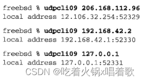 在UDP套接字上调用connect不给对端主机发送任何消息，它完全是一个本地操作，只是保存对端的IP地址和端口号。从上图还看到，在一个未绑定端口号的UDP套接字上调用connect会给该套接字指派一个临时端口。

以上操作并非对所有实现都有效，尤其是源自SVR 4的内核，举例来说，它对Solaris 2.5无效（Solaris仅指基于SVR 4的SunOS 5.0及其以后的版本）；对以下实现有效：AIX、HP-UX 11、MacOS X、FreeBSD、Linux、Solaris 2.6及其以后的版本。

把第5章中的并发TCP回射服务器程序和本章中的迭代UDP回射服务器程序组合成一个使用select函数来复用TCP和UDP套接字的服务器程序：

```c
#include "unp.h"

int main(int argc, char **argv) {
    int listenfd, connfd, udpfd, nready, maxfdp1;
    char mesg[MAXLINE];
    pid_t childpid;
    fd_set rset;
    ssize_t n;
    socklen_t len;
    const int on = 1;
    struct sockaddr_in cliaddr, servaddr;
    void sig_chld(int);

    /* create listening TCP socket */
    listenfd = Socket(AF_INET, SOCK_STREAM, 0);

    bzero(&servaddr, sizeof(servaddr));
    servaddr.sin_family = AF_INET;
    servaddr.sin_addr.s_addr = htonl(INADDR_ANY);
    servaddr.sin_port = htons(SERV_PORT);

    // 设置SO_REUSEADDR，防止该端口上已有连接存在
    Setsockopt(listenfd, SOL_SOCKET, SO_REUSEADDR, &on, sizeof(on));
    Bind(listenfd, (SA *)&servaddr, sizeof(servaddr));

    Listen(listenfd, LISTENQ);

    /* create UDP socket */
    // 此处不用设置SO_REUSEADDR选项，因为UDP端口和TCP端口是相互独立的
    udpfd = Socket(AF_INET, SOCK_DGRAM, 0);

    bzero(&servaddr, sizeof(servaddr));
    servaddr.sin_family = AF_INET;
    servaddr.sin_addr.s_addr = htonl(INADDR_ANY);
    servaddr.sin_port = htons(SERV_PORT);

    Bind(udpfd, (SA *)&servaddr, sizeof(servaddr));

    Signal(SIGCHLD, sig_chld);    /* must call waitpid */

    FD_ZERO(&rset);
    maxfdp1 = max(listenfd, udpfd) + 1;
    for (; ;) {
        FD_SET(listenfd, &rset);
		FD_SET(udpfd, &rset);
		if ((nready = select(maxfdp1, &rset, NULL, NULL, NULL)) < 0) {
		    // 对SIGCHLD信号的处理可能会中断select函数
		    if (errno == EINTR) {
		        continue;
		    } else {
		        err_sys("select error");
		    }
		}
	
		if (FD_ISSET(listenfd, &rset)) {
		    len = sizeof(cliaddr);
		    connfd = Accept(listenfd, (SA *)&cliaddr, &len);
	
		    if ((childpid = Fork()) == 0) {    /* child process */
		        Close(listenfd);    /* close listening socket */
				str_echo(connfd);    /* process the request */
				exit(0);
		    }
		    Close(connfd);    /* parten closes connected socket */
		}
	
		if (FD_ISSET(udpfd, &rset)) {
		    len = sizeof(cliaddr);
		    n = Recvfrom(udpfd, mesg, MAXLINE, 0, (SA *)&cliaddr, &len);
	
		    Sendto(udpfd, mesg, n, 0, (SA *)&cliaddr, len);
		}
    }
}
1234567891011121314151617181920212223242526272829303132333435363738394041424344454647484950515253545556575859606162636465666768697071727374
```

如果有两个应用程序，一个使用TCP，另一个使用UDP，TCP套接字的接收缓冲区中有4096字节数据，UDP套接字的接收缓冲区中有两个2048字节的数据报，TCP进程调用read，指定其第3个参数为4096，UDP进程调用recvfrom，指定其第3个参数也是4096，则read调用会返回4096字节的数据，而recvfrom调用返回2048字节（2个数据报中的第1个），不管应用读请求有多大，recvfrom函数不会返回多余1个数据报。

如果读一个大小为1024字节的UDP数据报时，提供的缓冲区大小只有100字节，则只能读到该数据报的前100字节，然后接收缓冲区中本UDP数据报就会被删除，后924字节永远都读不到了。

为了观察由服务器主机返回的端口不可达ICMP错误，我们这样运行ping程序：使用`-i 60`选项把分组发送频率由通常的1秒/次减低到60秒/次以减少输出量（有些系统上用`-I`而非`-i`）；使用`-v`选项开启详细输出模式，以输出接收到的ICMP错误（但有些ping实现即使指定了-v选项，也不显示接收到的ICMP错误）。如果在主机aix上运行我们的UDP回射客户程序，所指定的服务器IP为192.168.42.1，但此服务器主机上没有运行相应服务器，同时在客户主机上运行ping，会得到以下输出：  监听TCP套接字也有一个套接字缓冲区大小，但它不会接收数据，大多实现不会给套接字预先分配发送缓冲区或接收缓冲区的空间，SO_SNDBUF和SO_REVBUF套接字选项指定的套接字缓冲区大小仅仅是设定了一个上限。

IPv4数据报最大为65535字节，这是IP首部中16位的总长度字段限定的，IPv4首部需要20字节，UDP首部需要8字节，留给UDP用户数据最大为65507字节。对于没有jumbogram（巨型数据报）支持的IPv6，IPv6首部占40字节，留下了65487字节给用户数据。

以下是dg_cli函数的新版本，写一个大数据报给服务器：

```c
#undef MAXLINE 
#define MAXLINE 65507

void dg_cli1(FILE *fp, int sockfd, SA *pservaddr, socklen_t servlen) {
    int size;
    char sendline[MAXLINE], recvline[MAXLINE + 1];
    ssize_t n;

    size = 70000;
    Setsockopt(sockfd, SOL_SOCKET, SO_SNDBUF, &size, sizeof(size));
    Setsockopt(sockfd, SOL_SOCKET, SO_RCVBUF, &size, sizeof(size));

    Sendto(sockfd, sendline, MAXLINE, 0, pservaddr, servlen);

    n = Recvfrom(sockfd, recvline, MAXLINE, 0, NULL, NULL);

    printf("received %d bytes\n", n);
}
123456789101112131415161718
```

如果以上代码中没有调用setsockopt函数预先设置发送缓冲区大小，源自Berkeley的内核会给sendto调用返回EMSGSIZE错误，因为其套接字发送缓冲区的默认大小不足以暂存最大的UDP数据报（65507字节）。如果我们运行以上程序时，服务器的套接字接收缓冲区小于我们发送的数据报大小，则服务器不返回任何数据报，我们可以运行tcpdump验证客户的数据报发送到了服务器上，但如果在服务器程序中放一个printf调用，就会发现它的recvfrom函数没有返回这个数据报，该数据报被直接丢弃了。在FreeBSD系统上我们可以运行`netstat -s`命令并查看接收这个大数据报前后“dropped due to full socket buffers”计数器值的变化加以验证，解决方法是修改服务器程序，预先设置它的套接字发送缓冲区与接收缓冲区的大小。

大多数网络上，65535字节的IP数据报需要分片，IP层必须支持的重组缓冲区大小只有576字节，因此可能目的主机无法接收最大大小的数据报（无法重组该IP数据报）。源自Berkeley的许多实现（包括4.4 BSD-Lite 2）有一个正负号bug，导致UDP不能接收大于32767字节的数据报。

# 第九章 基本SCTP套接字编程

[SCTP](https://so.csdn.net/so/search?q=SCTP&spm=1001.2101.3001.7020)是一个较新的传输协议，于2000年在IETF（Internet Engineering Task Force，互联网工程任务组）得到标准化（而TCP是在1981年标准化的）。它最初是为满足不断增长的IP电话市场而设计，即穿越因特网传输电话信令。它设计实现的需求在RFC 2719中说明。SCTP是一个可靠的面向消息的协议，在端点之间提供多个流，并为多宿提供传输级支持。作为一个新协议，它没有TCP和UDP那样无处不在，但它提供了一些可能简化特定应用程序设计的新特性。

尽管SCTP和TCP之间存在一些本质性区别，但SCTP的一到一接口与TCP提供的应用接口很接近，这一点可以轻易地从TCP到SCTP移植应用程序，但不能使用SCTP的某些高级特性。SCTP的一到多接口提供了这些特性的完全支持，但可能需要费时费力地重新编写已有应用。对大多数使用SCTP开发的新应用而言，推荐使用一到多接口。

用SCTP开发的应用如果想在各种平台上使用，需要同时考虑使用TCP，以应对SCTP不可用的系统。

SCTP套接字分为一到一套接字和一到多套接字。一到一套接字对应一个单独的SCTP关联，一个SCTP关联是两个系统之间的连接，但可能由于多宿原因，每个端点涉及不止一个IP地址，类似于TCP套接字和TCP连接的对应关系。对于一到多套接字，一个给定套接字上可以同时有多个活跃的SCTP关联，类似于绑定了特定端口的UDP套接字能从若干个同时在发送数据的远程UDP端点接收数据报。

决定使用哪种接口形式时，需考虑的因素： 1.所编写的服务器是迭代的还是并发的。

2.服务器希望管理多少套接字描述符。

3.优化关联建立的四路握手过程，使其能在第三个或第四个分组交换用户数据是否是重要的。

4.应用希望维护多少个连接状态。

开发SCTP的套接字API期间，这两种形式的套接字曾用过别的称谓，有时可能会碰到旧名称，一到一套接字曾被称为TCP风格套接字，一到多套接字曾被称为UDP风格套接字。

这些旧的名字被取消了，因为它们会造成混淆，即SCTP可能被误解成其行为更像TCP或UDP，事实上这些旧名字仅仅说明了TCP套接字和UDP套接字在一个方面的差异（即一个套接字是否支持多个并发的传输层关联）。它们目前的名字（一到一、一到多）集中体现了这两种套接字形式之间的关键差异。有些人用多到一代替一到多，两者可以互换。

一到一形式的目的是方便将现有TCP应用移植到SCTP上，以下是一到一形式的SCTP和TCP的差异： 1.任何TCP套接字选项必须转换成等效的SCTP套接字选项，较常见的选项是TCP_NODELAY和TCP_MAXSEG，它们应映射成SCTP_NODELAY和SCTP_MAXSEG。

2.SCTP保存消息边界，因此应用层消息边界非必需。例如，基于TCP的某应用协议可能先执行一个双字节write调用，给出消息长度x，再调用一个x字节的write系统调用，读出数据本身。改用SCTP后，接收端SCTP将收到两个独立的消息，需要两次read系统调用才能返回全部数据：第一次返回一个双字节数据，第二次返回一个x字节的消息。

3.有些TCP应用使用半关闭来告知对端去往它的数据流已经结束，由于SCTP不支持半关闭，这样的应用移植到SCTP需要额外重写应用层协议，让应用在应用数据流中告知对端传输数据流已结束。

4.对于SCTP，send函数能以普通TCP方式使用（send函数相比write函数，多了flags参数，如果不使用flags，send函数等同于write函数）。SCTP使用sendto或sendmsg函数时，会往调用时指定的地址发数据（即会覆盖原目的地址）。  一到一式SCTP套接字是一个类型为SOCK_STREAM，协议为IPPROTO_SCTP的网际网套接字（即协议族为AF_INET或AF_INET6）。

一到多形式编写的服务器程序无需管理大量的套接字描述符，单个套接字描述符将代表多个关联，就像一个UDP套接字能从多个客户接收消息那样。一到多式套接字上，用于标识单个关联的是一个关联标识，关联标识是一个类型为sctp_assoc_t的值，通常是一个整数，它是一个不透明的值（不透明的含义为，我们不清楚该值的内部表示和实现方式，其值的含义对应用来说是隐藏的），应用不应使用不是由内核先前给予的任何关联标识。

一到多式套接字用户应掌握： 1.当一个客户关闭其关联时，其服务器也将自动关闭同一个关联，服务器主机内核中不再有该关联的状态。

2.只有一到多式套接字才能在四路握手的第三个或第四个分组中捎带用户数据。这是因为一到一式套接字客户使用connect函数显式建立关联，但该函数没有指定要发送数据的参数，因此无法在四路握手的第三个分组中随COOKIE ECHO消息携带数据。而一到多式套接字客户不必先建立连接再发送数据，而是可以调用sctp_sendto函数同时完成两者，这样发送的数据会随COOKIE ECHO消息送到对端，这样的关联是隐式建立的。对于第四次握手中的数据，需要对端在连接建立前就准备好要发送的数据，即两端都使用一到多式套接字几乎同时发送数据隐式建立连接，这种关联建立称为INIT冲突。

3.对于一个还没有与其进行关联的IP地址，任何以它为目的地的sendto、sendmsg、sctp_sendmsg调用将导致对主动打开关联的尝试，如果成功的话，会建立一个与该地址的新关联。即使应用已经调用过listen函数来请求被动打开，主动调用send也会出现此行为。

4.用户必须使用sendto、sendmsg、sctp_sendmsg这三个分组发送函数（这三个函数可指定对端地址），而不能使用send或write这两个分组发送函数，除非已经使用sctp_peeloff函数从一个一到多式套接字剥离出一个一到一式套接字。

5.调用分组发送函数时，所用的目的地址是由系统在关联建立阶段选定的主目的地址（在建立关联时，系统会从对端提供的地址列表中选择一个主目的地址），除非调用者在所提供的sctp_sndrcvinfo结构中设置了MSG_ADDR_OVER标志（此标志的作用是允许在发送数据报时覆盖套接字地址），为提供这个标志，调用者必须使用伴随辅助数据的sendmsg函数或sctp_sendmsg函数，将sctp_sndrcvinfo结构作为辅助数据。

6.关联事件（众多SCTP通知之一）可能被启用，如果应用进程不希望收到这些事件，得使用SCTP_EVENTS套接字选项显式禁止它们。默认情况启用的唯一事件是sctp_data_io_event，它给recvmsg和sctp_recvmsg函数提供辅助数据，这个默认设置同时适用于一到一式和一到多式套接字。

最初开发SCTP的套接字API时，一到多式接口被定义成默认情况下开启所有关联事件通知，后续版本禁止了一到一式和一到多式接口除sctp_data_io_event外的所有事件通知。并非所有实现都具有这样的行为，最好显式禁止或启用不想要的或想要的通知，以确保良好的移植性。  上图中，服务器调用listen以允许客户建立关联，然后服务器就调用sctp_recvmsg阻塞于等待消息到达，客户启动后也打开一个套接字，并调用sctp_sendto，它导致隐式建立关联，而用户请求数据由四路握手的第三个分组捎带给服务器，服务器收到请求后进行处理，然后向该客户发回一个应答。客户收到应答后关闭其套接字，从而终止其上的关联。然后服务器循环等待接收下一个消息。

上图是一个迭代服务器，来自许多关联（即客户）的可能交错的消息由单个控制线程处理。一个一到多套接字也能结合sctp_peeloff函数以允许组合迭代服务器模型和并发服务器模型，两个服务器模型的关系如下： 1.sctp_peeloff函数用于从一个一到多套接字剥离出某个特定关联（如一个长期持续的会话），独自构成一个一到一式套接字。

2.剥离出的关联所在的一到一套接字可以送给它自己的线程，或为它派生一个进程。

3.此时，主线程继续在原来的套接字上以迭代方式处理剩余关联。

一到多式SCTP套接字是一个类型为SOCK_SEQPACKET，协议为IPPROTO_SCTP的网际网套接字（即协议族为AF_INET或AF_INET6）。

SCTP服务器可能希望捆绑所在主机所有IP地址的一个子集（TCP或UDP服务器要么捆绑所在主机的某个地址，要么捆绑所有地址，而不能捆绑这些地址的一个子集），这种情况发生在： 1.某些情况下并非所有绑定的地址都可传递到对端端点，如某个应用进程绑定的IP地址中既有公用的又有私用的，可能只有公用地址可以与对端共享。

2.IPv6的链路局部地址（仅在本地链路内有效的地址）不一定能与对端共享。

sctp_bindx函数允许SCTP套接字捆绑一个特定地址子集：  sockfd参数是由socket函数返回的套接字描述符。addrs参数是一个指向紧凑的地址列表的指针，其中每个套接字地址结构紧跟在前一个套接字地址结构之后，中间没有填充字节：  addrcnt参数指定传递给sctp_bindx函数的地址个数。

flags参数指定是添加操作还是删除操作：  sctp_bindx函数既可用于已绑定套接字，也可用于未绑定套接字。对于未绑定的套接字，sctp_bindx函数将把给定的地址集合捆绑到其上；对于已绑定套接字，若指定SCTP_BINDX_ADD_ADDR则把额外的地址加入到套接字描述符，若指定SCTP_BIND_REM_ADDR则从套接字描述符的已加入地址中移除给定地址。如果在一个监听套接字上调用sctp_bindx，那么将来产生的关联将使用新的地址配置，已经存在的关联不受影响。传递给sctp_bindx函数的两个标志是互斥的，如果同时指定，调用会失败，返回的错误码是EINVAL。所有套接字地址结构的端口号必须相同，且必须与已经绑定的端口号相匹配，否则调用会失败，返回EINVAL错误码。

如果一个端点支持动态地址特性，指定SCTP_BINDX_ADD_ADDR或SCTP_BINDX_REM_ADDR标志调用sctp_bindx会导致该端点向对端发送一个消息，以修改对端的地址列表。增减一个已连接关联的地址只是一个可选功能，因此不支持本功能的实现将返回EOPNOTSUPP，本功能要求两端都支持这个特性。本特性对于支持动态接口供给的系统可能有用，如果启用了一个新的以太网接口，则应用进程可以指定SCTP_BINDX_ADD_ADDR标志在已经存在的连接上启动这个接口。  sctp_connectx函数用于连接到一个多宿对端主机，该函数在addrs参数中指定addrcnt参数个全部属于同一对端的地址。addrs参数是一个紧凑的地址列表。SCTP栈使用其中一个或多个地址建立关联，在addrs参数中的所有地址都被SCTP认为是有效的经过证实的地址。

getpeername函数不是为支持多宿概念的传输协议设计的，当用于SCTP时，它仅返回主目的地址，如果要知道对端的所有地址，需要使用sctp_getpaddrs函数：  sockfd参数是由socket函数返回的套接字描述符。id参数是一到多式套接字的关联标识，函数会忽略一到一式套接字的此字段。addrs参数是一个地址指针，地址内容是由本函数动态分配、填入并返回的紧凑的地址列表，用完addrs参数返回的地址后，调用者应使用sctp_freepaddrs函数释放所分配的资源。  addrs参数是通过sctp_getpaddrs函数的addrs参数返回的指针指向的指针。

sctp_getladdrs函数用于获取属于某个关联的所有本地地址： 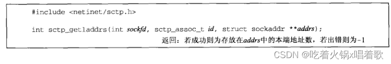 sockfd参数是由socket函数返回的套接字描述符。id参数是一到多式套接字的关联标识，函数会忽略一到一式套接字的此参数。addrs参数是一个地址指针，地址内容是由本函数动态分配、填入并返回的紧凑的地址列表，用完addrs参数返回的地址后，调用者应调用sctp_freeladdr释放所分配的资源。  addrs参数是通过sctp_getladdrs函数的addrs参数返回的指针指向的指针。

通过使用带有辅助数据的sendmsg函数，应用进程能控制SCTP的各种特性，但使用辅助数据不太方便，许多SCTP实现提供了一个辅助的函数库调用（有可能作为系统调用实现），以方便使用SCTP的高级特性：  sctp_sendmsg函数以指定更多参数为代价简化了发送方法。sockfd参数是由socket函数返回的套接字描述符。msg参数指向一个长度为msgsz参数字节的缓冲区，其中的内容会发送给对端端点，对端端点地址用参数to来表示，tolen参数指定存放在参数to中的地址长度。ppid参数会与消息一起传递到远端，用于指定消息的协议类型或其他应用定义的含义。flags参数将传给SCTP栈，用以标识SCTP选项。

调用者需要在stream参数中指定一个SCTP流号，流是SCTP关联中的逻辑通道，可以保证同一流中的消息按序到达。可以在timetolive参数中以毫秒为单位指定消息的生命期，0表示无限生命期。context参数用于指定可能有的用户上下文，用户上下文可通过消息通知机制获取某次发送失败的消息的该上下文值，以确定是什么消息发送失败了。

如果要发送一个消息到流号1，发送标志设为MSG_PR_SCTP_TTL（启用SCTP的TTL策略），生命期设为1000毫秒（如果消息在timetolive时间内未成功发送，此处为1000毫秒，将被丢弃），消息净荷协议标识符为24，上下文为52，则调用格式为：  这种方法比分配辅助数据空间并在msghdr结构中设置合适的结构要简单。如果实现把sctp_sendmsg函数映射为sendmsg函数，则sendmsg函数的flags参数被设为0。

与sctp_sendmsg函数一样，sctp_recvmsg函数也为SCTP的高级特性提供了一个更方便的用户接口，用此函数不仅能获取对端地址，也能获取通常伴随recvmsg函数返回的msg_flags参数（如MSG_NOTIFICATION、MSG_EOR等）。本函数也能获取已读入消息缓冲区中的伴随所接收消息的sctp_sndrcvinfo结构（要想获取sctp_sndrcvinfo结构，必须使用SCTP_EVENTS套接字选项开启sctp_data_io_event事件通知，默认情况下是开启的）。  sctp_recvmsg函数返回时，msg参数所指缓冲区中最多填入msgsz参数字节的数据。消息发送者的地址存在from参数中，发送者的地址结构大小存放在fromlen参数中。msg_flags参数存放可能有的消息标志。如果sctp_data_io_event事件通知被启用（默认情形），则会填充sctp_sndrcvinfo结构。如果实现把sctp_recvmsg函数映射为recvmsg函数，则recvmsg的flags参数被设为0。

sctp_opt_info函数是为无法对SCTP套接字使用getsockopt函数的那些实现提供的，getsockopt函数不支持SCTP的原因在于，有些SCTP套接字选项（如SCTP_STATUS，它用于获取SCTP连接的当前状态信息）需要一个入出变量（in_out variable，是一个指针或引用，可以既接收又返回值）传递关联标识，对于无法为getsockopt函数提供入出变量的系统来说，只能用sctp_opt_info函数，对于FreeBSD之类允许在套接字选项中使用入出变量的系统来说，sctp_opt_info函数是一个调用getsockopt函数的库函数，从可移植性考虑，应用应对需要入出变量的所有SCTP选项使用sctp_opt_info函数。  sockfd参数是要操作套接字选项的套接字描述符。assoc_id参数给出可能存在的关联标识。opt参数是SCTP套接字选项。arg参数给出套接字选项参数，siz参数用于存放参数大小。sctp_opt_info函数的arg参数是一个入出变量，而getsockopt函数的选项值参数是一个出变量。

从一个一到多式套接字中抽取一个关联，构成一个一到一式套接字，调用者需要把一到多式套接字的sockfd和要抽取的关联标识id传给sctp_peeloff函数，它将返回一个新的套接字描述符，该描述符是与所请求关联对应的一到一式套接字描述符。  shutdown函数可用于一到一式接口的SCTP端点，对于一到一式接口： 由于SCTP不提供半关闭状态，SCTP端点对shutdown函数的反应不同于TCP端点。当相互通信的两个SCTP端点中任何一个发起关联终止序列时，这两个端点都要把已排队的所有数据发送掉，然后关闭关联。关联主动打开的端点使用shutdown函数而非close函数的原因可能是：本端可能想要连接到一个新的对端端点。与TCP不同，SCTP允许一个端点调用shutdown后，再重用原套接字连接到一个新的对端，但如果这个端点没有等到SCTP关联终止序列结束，新的连接会失败。  上图中标出了用户接收MSG_NOTIFICATION事件的时间点，如果用户不预定接收这些事件，则read函数返回0。对于一到一式SCTP接口，shutdown函数的howto参数语义如下： 1.SHUT_RD：与用于TCP的语义相同，没有任何SCTP协议行为发生。

2.SHUT_WR：禁止后续发送操作，激活SCTP关联终止过程，允许本地端点读取已经排队的数据，这些数据是对端在收到SCTP的SHUTDOWN消息前发送给本端的。

3.SHUT_RDWR：禁止所有read和write操作，激活SCTP关联终止过程，传送到本地端点的排队数据都将得到确认，然后悄然丢弃。

SCTP为应用程序提供了多种通知，SCTP用户可经由这些通知追踪相关关联的状态。通知传递的是传输级事件，包括网络状态变动、关联启动、远程操作错误、消息不可递送。不论是一到一式接口还是一到多式接口，默认情况下除sctp_data_io_event外的所有事件都是被禁止的。

使用SCTP_EVENTS套接字选项可以预定8个事件，除默认就预订的sctp_data_io_event事件，其它7个会产生额外数据，这个额外数据的术语是通知，在调用sctp_recvmsg时，产生额外数据的7个事件会从sctp_recvmsg函数的第2个参数，即用户提供的读缓冲区返回其对应的通知，而对于默认就预订的sctp_data_io_event事件，在调用sctp_recvmsg读消息时，消息会从第2个参数，即用户提供的读缓冲区返回，而sctp_data_io_event事件对应的通知会从sctp_recvmsg函数的第6个参数返回，因此我们说除sctp_data_io_event事件外，其他7个事件会产生额外数据。通知本身可通过普通的套接字描述符获取。当产生额外数据（即通知）的事件发生时，用户数据和通知将在套接字缓冲区中交错出现。为了区分来自对端的数据和事件产生的通知，用户应使用recvmsg或sctp_recvmsg函数，如果返回的数据（返回到用户提供的缓冲区中）是一个通知，那么sctp_recvmsg函数返回的msg_flags参数或recvmsg函数返回的msghdr参数中的msg_flags成员将含有MSG_NOTIFICATION标志，这个标志告知应用进程刚刚读入的消息不是来自对端的数据，而是本地SCTP栈的通知。

每种通知都采用标签-长度-值（tag-length-value）格式，其中前8个字节给出通知的类型和总长度。开启sctp_data_io_event事件将导致每次读入用户数据都收到一个sctp_sndrcvinfo结构，此结构可通过recvmsg函数的辅助数据获取，也可通过sctp_recvmsg函数的sinfo指针参数获取。

有两个通知中含有SCTP错误起因代码字段（具体通知为SCTP_ASSOC_CHANGE和SCTP_REMOTE_ERROR），错误起因代码字段的值列在RFC 2960中。

SCTP通知格式：  sctp_tlv.sn_header字段用来告诉我们怎样解释接下来的值，从而解码发送的通知结构，下图是sn_header.sn_type字段的取值与SCTP_EVENTS套接字选项要预定的消息值字段之间对应关系： 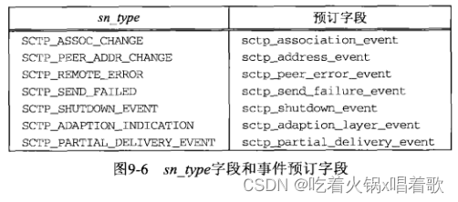 每种通知都有各自对应的结构。

1.SCTP_ASSOC_CHANGE：本通知告知应用进程关联本身发生变动，如已开始一个新关联，或已结束一个现有关联。本事件提供的信息结构为： 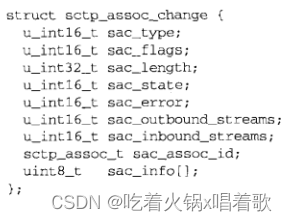 sctp_assoc_change.sac_state字段给出关联上发生的事件类型，它的取值如下： （1）SCTP_COMM_UP：某个新的关联刚启动，sac_out_bound_streams和sac_inbound_streams字段指出每个方向有多少可用流的数量。sac_assoc_id字段是新关联在本地SCTP栈的唯一访问标识。

（2）SCTP_COMM_LOST：由sac_assoc_id关联标识字段给出的关联因以下原因被关闭：可能是触发了某个不可达门限（如本地SCTP端点多次超时，触及门限表明对端不再可达），或是对端执行了对该关联的中止性关闭（abortive close，通常用SO_LINGER套接字选项将l_onoff设为非0值且把l_linger设为0或以MSG_ABORT标志调用sendmsg函数以发出中止性关闭）。特定于用户的信息存放在sac_info字段。

（3）SCTP_RESTART：指示对端已重启，本通知出现的原因最可能是对端主机崩溃并重新启动了。应用进程应验证每个方向流的数目，因为这些值可能在重启后发生变动。

（4）SCTP_SHUTDOWN_COMP：指示本地端点的主动关联终止过程已经结束（可通过调用shutdown或以MSG_EOF标志调用sendmsg）。对于一到一式接口，收到本通知后，相应套接字描述符可再次用于连接到另一个对端。

（5）SCTP_CANT_STR_ASSOC：指示对端对于本端尝试建立关联（如INIT消息）未给出响应。

sac_error字段存放导致本关联变动的SCTP错误起因代码。sac_outbound_streams和sac_inbound_streams字段存放本关联上每个方向协定的流数目。sac_assoc_id字段存放本关联的唯一句柄，用它可在套接字选项或以后的通知中关联此关联。sac_info字段存放用户可用的其他信息，如某个关联被对端某个用户自定义错误中止，该错误会存放在该字段中。

2.SCTP_PEER_ADDR_CHANGE：本通知告知对端的某个地址经历了状态变动，这种变动可能是失败性质（如目的地不对所发送的消息作出响应），也可以是恢复性质（如早先处于故障状态的某个目的地恢复正常），伴随地址变动的结构如下：  spc_addr字段存放本事件所影响的对端地址。spc_state字段存放下图中的值：  当一个地址被声明为SCTP_ADDR_UNREACHABLE时，发送到该地址的数据将被重新路由到一个候选地址。上图中的一些状态仅适用于支持动态地址选项的SCTP实现（如SCTP_ADDR_ADDED、SCTP_ADDR_REMOVED）。

spc_error字段存放通知错误代码，用来提供关于事件的更详细信息。spc_assoc_id存放关联标识。

3.SCTP_REMOTE_ERROR：远程端点可能给本地端点发送一个错误信息，这个信息可以指示有关此关联的错误情形，整个错误消息以wire format（网络通信中wire format指的是在网络上的二进制格式，也就是实际在线传输的数据的格式）形式传递给应用进程（即将错误消息以二进制格式存放在以下格式中的sre_date字段，应用收到后需要解释该二进制格式，将其转换为应用数据）。消息格式如下：  其中sre_error字段存放SCTP错误起因代码。sre_assoc_id字段存放关联标识。sre_data字段以wire format存放完整的错误。

4.SCTP_SEND_FAILED：无法递送到对端的消息通过本通知送回用户，本通知之后不久通常跟有一个关联故障通知，大多数情况下一个消息不能被递送的原因是关联已经失效。关联有效前提下消息递送失败的唯一情况是使用了SCTP的`部分可靠性`扩展。本通知提供的结构如下：  其中ssf_flags字段可取以下两个值之一： （1）SCTP_DATA_UNSENT：指示相应消息无法发送到对端（如流量控制导致该消息无法在其生命期终止前送出），对端不可能收到该消息。

（2）SCTP_DATA_SENT：指示相应消息已经至少发送到对端一次，但对端一直没有确认，这种情况下，对端可能收到了消息，但无法给出确认。

以上两种取值的区分对于事务性协议可能比较重要，因为这样的协议可能在broken的连接恢复时需要基于对端是否可能收到消息执行不同的恢复操作。

ssf_error字段若不为0，则存放一个特定于本通知的错误代码。

ssf_info字段若有，则提供的是发送数据时传递给内核的信息，如流数目、上下文等。

ssf_assoc_id字段存放关联标识。

ssf_data字段存放未能递送的消息本身。

5.SCTP_SHUTDOWN_EVENT：当对端发送一个SHUTDOWN块到本端点时，本通知被传递给应用进程。本通知告知应用进程在相应套接字上不再接受新的要发送的数据，所有当前已排队的数据将发送出去，发送完毕后关联就被终止。本通知格式：  其中sse_assoc_id存放在正在关闭中，不再接受数据的那个关联的关联标识。

6.SCTP_ADAPTION_INDICATION：有些实现支持适应层指示参数，该参数在INIT和INIT-ACK块中交换，用于通知对端将执行什么类型的应用适用行为。本通知格式如下：  其中sai_assoc_id字段给出关联标识。

sai_adaption_ind字段给出对端在INIT或INIT-ACK消息中传递给本地主机的32位整数。可用SCTP_ADAPTION_LAYER套接字选项设置发送给对端的适配层指示。

7.SCTP_PARTIAL_DELIVERY_EVENT：有些应用会经由套接字缓冲区向用户传送大消息，如一个用户写一个大小为4MB的消息，可能会耗尽系统资源，如果SCTP实现不能在整个消息都写入前就开始把已写入部分递送给对端的机制，就无法处理这样的大消息，能够这样递送消息的机制称为部分递送API，部分递送API由SCTP这样调用：置空msg_flags字段发送一个消息的除最后一部分数据外的各部分数据，发送最后一部分数据时把msg_flags字段设为MSG_EOR。如果应用进程准备接收大消息，就应该使用recvmsg或sctp_recvmsg函数，以便查看msg_flgas字段的值。

有时部分递送API需要向接收的对端传递状态信息，如需要中止一次部分递送API调用，SCTP_PARTIAL_DELIVERTY_EVENT通知就要送给接收应用进程。本通知格式如下：  其中pdapi_assoc_id字段标识部分递送API事件发生的关联标识。

pdapi_indication字段存放发生的事件，目前该字段的唯一有效值是SCTP_PARTIAL_DELIVERY_ABORTED，它指出正在进行的部分递送已被终止。

以下情形可能使用sctp_peeloff函数：大多接受短期请求但偶尔需要长期会话的应用可以用此函数，一旦长期会话请求到来时，可用该函数把长期会话请求剥离出来给专门的线程或进程处理。

当客户关闭关联时，服务器也关闭该关联，这是因为SCTP不支持半关闭状态，客户调用close时，关联终止序列把来自服务器的已排队但未处理的数据冲刷掉，达到关闭关联的目的。

# SCTP客户/服务器

编写一个一到多式[SCTP](https://so.csdn.net/so/search?q=SCTP&spm=1001.2101.3001.7020)回射客户/服务器程序，执行如下步骤： 1.客户从标准输入读入一行文本，并发送给服务器，该文本行遵循[#]text格式，方括号中的数字表示要在这个流号上发送该文本消息。

2.服务器从网络接收这个文本消息，并将接收消息的流号加1，然后把这个文本消息从新的流号上发回。

3.客户读到回射的行，然后将其打印在标准输出上，并列出流号、流序列号（用于标识一个数据块在它所在流中的序号）和新流号。  上图中我们在客户与服务器之间画了两个代表单向流的箭头，但整个关联是[全双工](https://so.csdn.net/so/search?q=全双工&spm=1001.2101.3001.7020)的。

本例中我们使用一到多式接口。基于TCP的回射客户/服务器程序略作修改就能运行于SCTP上：把[socket函数](https://so.csdn.net/so/search?q=socket函数&spm=1001.2101.3001.7020)的第三个参数由IPPROTO_TCP改为IPPROTO_SCTP。但这样简单地改动无法发挥SCTP提供的除多宿外的特性，而一到多式接口允许使用SCTP的所有特性。

以下是SCTP回射服务器代码：

```c
#include "unp.h"

int main(int argc, char **argv) {
    int sock_fd, msg_flags;
    char readbuf[BUFFSIZE];
    struct sockaddr_in servaddr, cliaddr;
    struct sctp_sndrcvinfo sri;
    struct sctp_event_subscribe events;
    int stream_increment = 1;    // 是否每次把流号增加1
    socklen_t len;
    size_t rd_sz;

    if (argc == 2) {
        stream_increment = atoi(argv[1]);
    }
    sock_fd = Socket(AF_INET, SOCK_SEQPACKET, IPPROTO_SCTP):
    bzero(&servaddr, sizeof(servaddr));
    servaddr.sin_family = AF_INET;
    // 对多宿主机而言，捆绑通配地址意味着一个远程端点能与任何本地可路由地址建立关联
    servaddr.sin_addr.s_addr = htonl(INADDR_ANY);
    servaddr.sin_port = htons(SERV_PORT);

    Bind(sock_fd, (SA *)&servaddr, sizeof(servaddr));

    bzero(&evnts, sizeof(evnts));
    // 仅预定sctp_data_io_event，从而允许服务器查看sctp_sndrcvinfo结构
    // 服务器可从该结构确定消息到达所在的流号
    evnts.sctp_data_io_event = 1;
    Setsockopt(sock_fd, IPPROTO_SCTP, SCTP_EVENTS, &evnts, sizeof(evnts));

    Listen(sock_fd, LISTENQ);
    for (; ;) {
        len = sizeof(struct sockaddr_in);
		rd_sz = Sctp_recvmsg(sock_fd, readbuf, sizeof(readbuf), (SA *)&cliaddr, &len, &sri, &msg_flags);
		// 如果需要增长流号
		if (stream_increment) {
		    sri.sinfo_stream++;
		    // 如果增长到最大流号，重置流号为0
		    // sctp_get_no_strms函数通过SCTP_STATUS套接字选项找出商定的流数目
		    if (sri.sinfo_stream >= sctp_get_no_strms(sock_fd, (SA *)&cliaddr, len)) {
		        sri.sinfo_stream = 0;
		    }
		}
		Sctp_sendmsg(sock_fd, readbuf, rd_sz, (SA *)&cliaddr, len, sri.sinfo_ppid, sri.sinfo_flags, sri.sinfo_stream, 0, 0);
    }
}
12345678910111213141516171819202122232425262728293031323334353637383940414243444546
```

以上程序运行到用户以外部信号杀掉服务器进程为止。

以下是SCTP客户程序的main函数：

```cpp
#include "unp.h"

int main(int argc, char **argv) {
    int sock_fd;
    struct sockaddr_in servaddr;
    struct sctp_event_subscribe evnts;
    int echo_to_all = 0;

    if (argc < 2) {
        err_quit("Missing host argument - use '%s host [echo]'\n", argv[0]);
    }
    if (argc > 2) {
        printf("Echoint messages to all streams\n");
		echo_to_all = 1;
    }

    sock_fd = Socket(AF_INET, SOCK_SEQPACKET, IPPROTO_SCTP);
    bzero(&servaddr, sizeof(servaddr));
    servaddr.sin_family = AF_INET;
    servaddr.sin_port = htons(SERV_PORT);
    Inet_pton(AF_INET, argv[1], &servaddr.sin_addr);

    bzero(&evnts, sizeof(evnts));
    evnts.sctp_data_io_event = 1;
    Setsockopt(sock_fd, IPPROTO_SCTP, SCTP_EVENTS, &evnts, sizeof(evnts));
    if (echo_to_all == 0) {
        sctpstr_cli(stdin, sock_fd, (SA *)&servaddr, sizeof(servaddr));
    } else {
        sctpstr_cli_echoall(stdin, sock_fd, (SA *)&servaddr, sizeof(servaddr));
    }

    Close(sock_fd);
    return 0;
}
12345678910111213141516171819202122232425262728293031323334
```

客户的sctpstr_cli函数：

```c
void sctpstr_cli(FILE *fp, int sock_fd, struct sockaddr *to, socklen_t tolen) {
    struct sockaddr_in peeraddr;
    struct sctp_sndrcvinfo sri;
    char sendline[MAXLINE], recvline[MAXLINE];
    socklen_t len;
    int out_sz, rd_sz;
    int msg_flags;

    bzero(&sri, sizeof(sri));
    // 循环读入用户输入并处理，直到客户键入终端EOF字符Control-D
    while (fgets(sendline, MAXLINE, fp) != NULL) {
        // 检查客户输入是否符合[#]text格式
        if (sendline[0] != '[') {
		    printf("Error, line must be of the form '[streamnum]text\n");
		    continue;
		}
		// 把客户输入的流号转换成sri结构的sinfo_stream字段
		sri.sinfo_stream(strtol(&sendline[1], NULL, 0));
		out_sz = strlen(sendline);
		Sctp_sendmsg(sock_fd, sendline, out_sz, to, tolen, 0, 0, sri.sinfo_stream, 0, 0);
	
		len = sizeof(peeraddr);
		rd_sz = Sctp_recvmsg(sock_fd, recvline, sizeof(recvline), (SA *)&peeraddr, &len, &sri, &msg_flags);
		printf("From str: %d seq:%d (assoc:0x%x):", sri.sinfo_stream, sri.sinfo_ssn, (u_int)sri.sinfo_assoc_id);
		printf("%.*s", rd_sz, recvline);
    }
}
123456789101112131415161718192021222324252627
```

运行SCTP回射程序：  以上程序中，如果客户的sctp_sendmsg调用返回错误，那么就不会发送任何消息，客户进程于是阻塞在sctp_recvmsg调用中，等待永远不会回来的响应，解决办法是检查这个函数的返回值，如果消息发送出错，那就不再接收。

如果客户的sctp_recvmsg调用返回错误，那么不会收到响应消息，客户进程接着循环发送消息，可能导致建立新的关联，解决办法是检查这个函数的返回值，根据情况报告错误或关闭套接字，从而让服务器也收到一个错误，或若错误是暂时的则重新尝试sctp_recvmsg调用。

如果服务器在收到一个请求后退出，客户将被永远挂起，等待决不会到来的消息，客户检测这种情况的方法之一是开启关联事件，这样当服务器退出时客户将收到一个消息，告知客户该关联已不复存在。方法二是客户启动一个定时器，一段时间收不到响应就取消关联。

SCTP中的流不同于TCP的字节流，它是关联内部具有先后顺序的一个消息序列。这种以流而不是以关联为单位进行消息排序的做法用于避免仅使用单个TCP字节流导致的头端阻塞现象。

头端阻塞发生在一个TCP分节丢失，导致其后续分节到达接收端的时候接收端认为到达的分节是失序的。这些后续分节将被接收端一直缓存直到丢失的分节被发送端重传并到达接收端为止。这些后续分节的延迟递送确保接收应用进程能按顺序得到由发送进程发送的数据，但也有不好之处，假如在单个TCP连接上发送语义上独立的消息，如服务器可能发送3幅不同的图像供web浏览器显示，为了营造这几幅图像在用户屏幕上并行显示的效果，服务器先发送第一幅图片的一个断片，再发送第二幅图像的一个断片，然后再发送第三幅图像的一个断片，服务器重复此过程，直到3幅图像全部成功发送到浏览器。如果第一幅图像的某个断片内容的TCP分节丢失了，客户将缓存不按序到达所有数据，直到丢失的分节被重传并成功到达，这样不仅延缓了第一幅图像的递送，也延缓了第二幅和第三幅图像数据的递送：  尽管可为每幅图像创建一个TCP连接（HTTP客户通常这么做）避免了头端阻塞问题，但每个连接不得不独立发现RTT和可用带宽，这将导致拥塞网络上较低的整体利用率。

理想情况下，只有第一幅图像的后续断片会被延缓，而按顺序到达的第二幅和第三幅图像的各个断片将被立即递送给用户。

SCTP的多流特性能尽可能减少头端阻塞：  以下是sctpstr_cli_echoall函数，展示了SCTP如何把头端阻塞减到最小：

```c
#define SCTP_MAXLINE 800

void sctpstr_cli_echoall(FILE *fp, int sock_fd, struct sockaddr *to, socklen_t tolen) {
    struct sockaddr_in peeraddr;
    struct sctp_sndrcvinfo sri;
    char sendline[SCTP_MAXLINE], recvline[SCTP_MAXLINE];
    socklen_t len;
    int rd_sz, i, strsz;
    int msg_flags;

    bzero(sendline, sizeof(sendline));
    bzero(&sri, sizeof(sri));
    // 每次最多读800字节，原因是我们想让每个SCTP块处于单个分组中
    // 更好的方法是通过SCTP_MAXSEG套接字选项确定适合一个SCTP块的大小
    while (fgets(sendline, SCTP_MAXLINE - 9, fp) != NULL) {
        strsz = strlen(sendline);
		if (sendline[strsz - 1] == '\n') {
		    sendline[strsz - 1] = '\0';
		    --strsz;
		}
		// 客户只是把消息发送到固定数目的流中，如果对端向下商定流数，则客户发送的一些消息可能会失败
		for (i = 0; i < SERV_MAX_SCTP_STRM; ++i) {
		    // 在消息末尾加上发送的流号，从而在后面接收时查看响应消息到达的顺序
		    snprintf(sendline + strsz, sizeof(sendline) - strsz, ".msg.%d", i);
		    Sctp_sendmsg(sock_fd, sendline, sizeof(sendline), to, tolen, 0, 0, i, 0, 0);
		}
		for (i = 0; i < SERV_MAX_SCTP_STRM; ++i) {
		    len = sizeof(peeraddr);
		    rd_sz = Sctp_recvmsg(sock_fd, recvline, sizeof(recvline), (SA *)&peeraddr, &len, &sri, &msg_flags);
		    printf("From str:%d seq:%d (assoc:0x%x):", sri.sinfo_stream, sri.sinfo_ssn, (u_int)sri.sinfo_assoc_id);
		    printf("%.*s\n", rd_sz, recvline);
		}
    }
}
12345678910111213141516171819202122232425262728293031323334
```

以上函数类似于sctpstr_cli函数，但客户不再需要指出每个文本消息的流号，本函数把用户输入的文本发送到SERV_MAX_SCTP_STRM个流中，发送完消息后，客户等待来自服务器的所有响应到达。运行服务器时，我们传递一个额外的命令行参数，使服务器在接收到消息的流上给出响应。

以上程序每次发送800字节的数据，而Nagle算法会在较小的数据传送大小前提下导致延迟，如果发送的数据较小，会暂缓发送后面的数据以等待来自对端的SACK，如果发送的数据量较小，最好禁止Nagle算法。

如果服务器的发送或接收缓冲区过小，以上程序可能会失败，由于客户只有在发送完所有消息后才会读消息，因此如果服务器要发送的消息全放到发送缓冲区放不下（此时客户的接收缓冲区已满），且服务器的接收缓冲区也放不下当前接收的消息时，会发生死锁，此时客户会等服务器接收所有消息，服务器在等客户读取消息。

我们在两个不同的FreeBSD主机上执行客户和服务器程序，这两个主机由一个可配置的路由器分开，路由器能配置成插入延迟和丢失，我们先在路由器不丢失的前提下执行。  我们以一个额外参数0启动服务器，使服务器不增长应答所用流号。接着启动客户，通过命令行传入服务器主机的地址和一个额外参数，使客户把消息发送到每个流。  在没有丢失的前提下，客户的收到的响应消息按它们发送的顺序到达，之后把路由器参数改为两个方向的分组丢失率均为10%：  让客户往每个流中发送两条消息，就能验证同一个流内消息会保持顺序，以下是客户程序的改动：

```c
for (i = 0; i < SERV_MAX_SCTP_STRM; ++i) {
    // 在每个消息后还增添了一个消息序号，以便标识同一个流内的两个消息
    snprintf(sendline + strsz, sizeof(sendline) - strsz, ".msg.%d 1", i);
    Sctp_sendmsg(sock_fd, sendline, sizeof(sendline), to, tolen, 0, 0, i, 0, 0);
    snprintf(sendline + strsz, sizeof(sendline) - strsz, ".msg.%d 2", i);
    Sctp_sendmsg(sock_fd, sendline, sizeof(sendline), to, tolen, 0, 0, i, 0, 0);
}
for (i = 0; i < SERV_MAX_SCTP_STRM * 2; ++i) {
    len = sizeof(peeraddr);
123456789
```

运行改动过的代码：  可见，消息存在丢失现象，但只有一个流内的消息才因此延缓。SCTP流可以说是一个既能避免头端阻塞又能在相关的消息之间保持顺序的有效机制。

我们以上例子使用的是外出流数目的默认值，对于FreeBSD上的SCTP的KAME实现而言，这个默认值为10，如果客户和服务器想用多于10个的流，我们可以把服务器修改为允许在关联启动阶段增加端点请求的流数目，这个改动必须针对尚未建立关联的套接字进行，已建立关联的流数不会受到影响：

```c
if (argc == 2) {
    stream_increment = atoi(argv[1]);
}
sock_fd = Socket(AF_INET, SOCK_SEQPACKET, IPPROTO_SCTP);
// 清零sctp_initmsg结构
bzero(&initm, sizeof(initm));
// SERV_MORE_STRMS_SCTP是服务器期望请求的流数目
initm.sinit_num_ostreams = SERV_MORE_STRMS_SCTP;
Socketopt(sock_fd, IPPROTO_SCTP, SCTP_INITMSG, &initm, sizeof(initm));
123456789
```

也可使用sendmsg函数并提供辅助数据以请求不同于默认设置的流参数，但这种类型的辅助数据仅适用于一到多式套接字，因为辅助数据必须随消息一起发送，而一到一式套接字使用write函数，没有参数来发送辅助数据。

以上例子中，我们依赖于客户关闭套接字来终止关联，但客户并不总是愿意关闭套接字，服务器也可能不愿意在发送了应答消息后继续保持关联开放，此时我们有终止关联的另外两个机制，对于一到多式接口，这两个方法都适用，一个是优雅的，一个是破坏性的。

如果服务器希望在发送完一个消息后终止一个关联，则可以在与该消息对应的sctp_sndrcvinfo结构的sinfo_flags字段中设置MSG_EOF字段，该标志使所发送的消息被客户确认后，相应关联也被终止。另一个方法是把MSG_ABORT标志应用于sinfo_flags字段，该标志会以ABORT块立即终止关联，SCTP的ABORT块类似TCP的RST分节，能无延迟地中止任何关联，尚未发送的数据被丢弃。SCTP没有类似TCP的TIME_WAIT状态，因为SCTP使用了验证标签（SCTP数据包中的一个字段，用作关联标识符），当SCTP建立连接时，双方会交换INIT数据块，其中包含了各自的验证标签，之后每个发送的数据块都要带上接收方的验证标签，防止旧连接或恶意连接的干扰。

修改服务器程序，使其在应答同时优雅地终止关联：

```c
Sctp_sendmsg(sock_fd, readbuf, rd_sz, (SA *)&cliaddr, len, sri.sinfo_ppid, (sri.sinfo_flags | MSG_EOF), sri.sinfo_stream, 0, 0);
1
```

修改客户程序，使其在调用close前abort关联：

```c
strcpy(byemsg, "goodbye");
Sctp_sendmsg(sock_fd, byemsg, strlen(byemsg), (SA *)&servaddr, sizeof(servaddr), 0, MSG_ABORT, 0, 0, 0);
// 即使关联已经中止，仍需关闭套接字描述符以释放与之关联的系统资源
Close(sock_fd);
1234
```

客户以MSG_ABORT调用sctp_sendmsg函数，该标志导致发送一个ABORT块，从而立即终止当前关联，这个ABORT块中包含用户发起的错误（即ABORT块）的起因代码，上层原因字段的消息为goodbye。

# 第十一章 名字与地址转换

到目前为止，本书中所有例子都用数值地址表示主机（如206.6.226.33），用数值端口号来标识服务器（如端口13代表daytime服务器）。但出于某些理由，我们应使用名字而非数值：名字比较容易记住；数值地址可以变动而名字保持不变；随着往[IPv6](https://so.csdn.net/so/search?q=IPv6&spm=1001.2101.3001.7020)上转移，数值地址变得非常长，手工键入数值地址更易出错。

域名系统（Domain Name System，DNS）主要用于主机名和IP地址之间的映射。主机名既可以是一个简单名字（simple name），如solaris或bsdi，也可以是一个全限定域名（[FQDN](https://so.csdn.net/so/search?q=FQDN&spm=1001.2101.3001.7020)，Fully Qualified Domain Name），如solaris.unpbook.com。

严格来说，FQDN也称为绝对名字（absolute name），且必须以一个点号来结尾，但用户往往省略结尾的点号，这个点号告知[DNS解析](https://so.csdn.net/so/search?q=DNS解析&spm=1001.2101.3001.7020)器该名字是全限定的，从而不必搜索解析器自己维护的可能域名列表。

DNS中的条目称为资源记录（RR，Resource Record），一些RR类型： 1.A记录把一个主机名映射成一个32位的IPv4地址，例如，以下是unpbook.com域中关于主机freebsd的4个DNS记录，其中第一个是一个A记录：  2.AAAA称为四A（quad A）记录，把一个主机名映射成一个128位的IPv6地址。称其为四A是因为128位地址是32位地址的四倍。

3.PTR指针记录，用于把IP地址映射成主机名。对于IPv4地址，32位地址的4个字节先反转顺序，每个字节都转换成各自的十进制ASCII值（0~255）后，再在后面加上`.in-addr.arpa`，结果字符串用于PTR查询。

对于IPv6地址，128位地址中的32个四位组先反转顺序，每个四位组都被转换成相应的16进制ASCII值（0~9，a~f），后面再加上`.ip6.arpa`。

例如，上例主机freebsd的两个PRT记录分别为`254.32.106.12.in-addr.arpa`和`b.6.8.6.7.a.e.f.f.f.0.2.0.0.a.0.1.0.0.0.d.8.f.1.0.8.b.0.e.f.f.3.ip6.arpa`。

早期标准指定在ip6.int域中反向查找IPv6地址，现IPv6的反向查找域已改为ip6.arpa，以与IPv4保持一致。存在一个过渡期，期间两者都可以使用。

4.MX把一个主机指定为给定主机的邮件交换器，上例中主机freebsd有2个MX记录，第一个优先级为5，第二个优先级为10，值越小优先级越高。

5.CNAME表示规范名字（Canonical Name），它的常见用法是为常用服务（如ftp和www）指派CNAME记录，如果人们用的是服务名而非真实的主机名，那么相应的服务挪到另一个主机时用户也不用知道，例如我们的linux主机有以下2个CNAME记录：  目前处于IPv6部署的极早期，系统管理员们会给同时支持IPv4和IPv6的主机使用什么样的命名约定尚不清楚。一种可能的约定是：把A记录和AAAA记录都置于主机名之下；再创建一个以`主机名-4`为主机名，含有A记录的RR；再创建一个以`主机名-6`结尾，含有AAAA记录的RR；再创建一个以`主机名-611`结尾，含有指向链路本地地址的AAAA记录（为了便于调试）。以下aix主机有这些记录：  每个组织机构往往运行一个或多个名字服务器，他们通常是所谓的BIND（Berkeley Internet Name Domain）程序。客户和服务器通过调用称为解析器的函数库中的函数接触DNS服务器。常见的解析器函数是gethostbyname和gethostbyaddr函数，前者把主机名映射为IPv4地址，后者执行相反的映射。  解析器代码通常包含在一个系统函数库中，在构造应用程序时被link-editing（即把多个目标文件链接成可执行文件的过程）到程序中。还有些系统提供一个由全体应用进程共享的集中式解析器守护进程，并提供向这个守护进程执行RPC的系统函数库代码。

解析器代码通过读取其系统相关配置文件确定本组织机构的名字服务器们（出于可靠可冗余的目的，必须要设置多个名字服务器）所在位置。文件/etc/resolv.conf通常包含本地名字服务器主机的IP地址。

既然名字比地址好记易配，如果能在/etc/resolv.conf文件中也使用名字服务器主机的名字该多好，但这样做名字服务器主机自身的名字到地址转换由谁执行呢。

解析器使用UDP向本地名字服务器发出查询，如果本地名字服务器不知道答案，它通常会使用UDP在整个因特网上查询其他名字服务器，如果答案太长，超出UDP消息的最大大小，本地名字服务器和解析器会自动切换到TCP。

不使用DNS也可能获取名字和地址信息，常用的替代方法有静态主机文件（/etc/hosts）、网络信息系统（NIS，Network Information System）、轻权目录访问协议（LDAP，Lightweight Directory Access Protocol）。但系统管理员如何配置主机使用哪种类型的名字服务是实现相关的，Solaris 2.x、HP-UX 10及之后版本、FreeBSD 5.x及之后版本使用文件/etc/nsswitch.conf；AIX使用文件/etc/netsvc.conf；BIND 9.2.2提供了自己的名为信息检索服务（IRS，Information Retrival Sevice）的版本，使用文件/etc/irs.conf。如果使用名字服务器，那么所有这些系统使用文件/etc/resolv.conf指定名字服务器的地址。但这些差异对应用开发人员是透明的，我们只需调用诸如gethostbyname和gethostbyaddr这样的解析器函数。

大多应用应处理名字而非地址，尤其是往IPv6转移时，因为IPv6地址（十六进制数串）比IPv4点分十进制数串长得多。

gethostbyname函数返回一个指向hostent结构的指针，该结构含有所查主机的所有IPv4地址。此函数的局限是只能返回IPv4地址，而后面要说的getaddrinfo函数能同时处理IPv4和IPv6地址。POSIX规范预警可能会在将来版本中撤销gethostbyname函数。

gethostname函数不大可能真正消失，除非整个因特网改为使用IPv6，那可能在遥遥无期的将来，从POSIX规范中撤销该函数意在声明新的程序不该再使用它，鼓励在新程序中改用getaddrinfo函数。  hostent结构：  gethostbyname函数执行的是对A记录的查询，它只能返回IPv4地址。  上图中，假设所查的主机名有2个别名和3个IPv4地址，所查询主机的正式主机名和所有别名都是以空字符结尾的C字符串。

h_name字段称为所查询主机的规范（canonical）名字。以上面我们的CNAME例子为例，主机ftp.unpbook.com的规范名字是linux.unpbook.com。如果我们在主机aix上以一个非限定主机名（如solaris）调用gethostbyname，则作为规范名返回的是它的FQDN（即solaris.unpbook.com）。

有些版本的gethostbyname函数实现允许hostname参数是一个点分十进制数串。POSIX规范允许但不强求如此处理hostname函数，因此考虑可移植性的程序不能依赖这个特性。

gethostbyname函数在发生错误时，不设置errno变量，而是将全局变量h_errno设为以下常值之一（这些常值定义在头文件netdb.h中）： 1.HOST_NOT_FOUND 2.TRY_AGAIN 3.NO_RECOVERY 4.NO_DATA（等同于NO_ADDRESS）

NO_DATA错误表示指定的名字有效，但它没有A记录，只有MX记录的主机就是这样的例子。

多数解析器提供名为hstrerror的函数，它以某个h_errno值作为唯一参数，返回一个const char *指针，指向响应错误的说明。

调用gethostbyname函数，并显示返回的所有信息（代码11-3）：

```c
#include "unp.h"

int main(int argc, char **argv) {
    char *ptr, **pptr;
    char str[INET_ADDRSTRLEN];
    struct hostent *hptr;

    while (--argc > 0) {
        ptr = *++argv;
		if ((hptr = gethostbyname(ptr)) == NULL) {
		    err_msg("gethostbyname error for host: %s: %s", ptr, hstrerror(h_errno));
		    continue;
		}
		printf("official hostname: %s\n", hptr->h_name);
	
		for (pptr = hptr->h_aliases; *pptr != NULL; ++pptr) {
		    printf("\talias: %s\n", *pptr);
		}
		switch (hptr->h_addrtype) {
		case AF_INET:
		    pptr = hptr->h_addr_list;
		    for (; *pptr != NULL; ++pptr) {
		        printf("\taddress: %s\n", Inet_ntop(hptr->h_addrtype, *pptr, str, sizeof(str)));
		    }
		    break;
		
		default:
		    err_ret("unknown address type");
		    break;
		}
    }
    exit(0);
}
123456789101112131415161718192021222324252627282930313233
```

以主机aix的名字作为参数运行该程序，该主机只有一个IPv4地址：  正式主机名（official host）就是FQDN。即使主机aix有IPv6地址，返回的也只有IPv4地址。

有多个IPv4地址的Web服务器主机的输出：  下例中有一个CNAME记录：   为了查看由hstrerror函数返回的错误信息串，我们先指定一个不存在的主机名，再指定一个仅有MX记录的名字：  gethostbyaddr函数试图由一个二进制IP地址找到相应主机名，与gethostbyname函数的行为刚好相反：  gethostbyaddr函数返回一个指向hostent结构的指针，对于该结构，我们感兴趣的通常是存放规范主机名的h_name字段。

addr参数实际上不是char *类型，而是一个指向存放IPv4地址的某个in_addr结构的指针。len参数是这个结构的大小，对于IPv4地址为4。family参数为AF_INET。

gethostbyaddr函数在in_addr.arpa域中向一个名字服务器查询PTR记录。

像主机一样，服务器也通常靠名字来认知，如果我们在代码中通过其名字而非其端口号来指代一个服务，且从名字到端口号的映射保存在一个文件中（通常是/etc/services），那么即使端口号发生变动，我们需修改的仅仅是/etc/services文件中的某一行，而不用重新编译应用程序。getservbyname函数根据给定名字查找相应服务。

赋予各个服务的端口号规范列表由IANA维护，/etc/services文件通常包含由IANA维护的规范赋值列表的某个子集。  getservbyname函数返回的非空指针指向如下的servent结构：   servname参数必须指定，如果同时指定了协议（protoname参数为非空指针），那么指定服务必须有匹配的协议。有些因特网服务既用TCP也用UDP提供（如DNS），有些因特网服务则仅支持单个协议（如FTP要求使用TCP）。如果protoname参数未指定而servname参数指定的服务支持多个协议，那么返回哪个端口号取决于实现，通常这是无关紧要的，因为支持多个协议的服务往往使用相同的TCP和UDP端口号，但这点并没有保证。

servent结构中我们关心的主要字段是端口号，端口号是以网络字节序返回的，把它存到套接字地址结构时不用再调用htons。

getservbyname函数的典型调用： 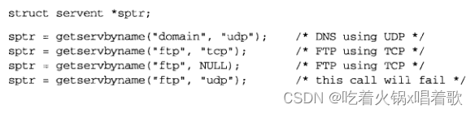 以下是/etc/services文件中的典型行：  getservbyport函数根据给定端口号和可选协议查找相应服务：  port参数的值必须是网络字节序。getservbyport函数的典型调用如下：  有些端口号在TCP上用于一种服务，在UDP上用于另一种服务： 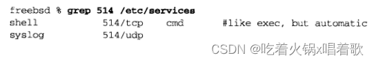 端口514在TCP上由rsh命令使用，在UDP上由syslog守护进程使用。512~514范围内的端口都有这个特性。

把TCP的daytime客户程序改为使用gethostbyname和getservbyname函数，并改用2个命令行参数：主机名和服务名，以下是改动后的程序，它还会尝试连接到多宿服务器主机的每个IP地址，直到有一个连接成功或所有地址尝试完毕，以下是程序11-4：

```cpp
#include "unp.h"

int main(int argc, char **argv) {
    int sockfd, n;
    char recvline[MAXLINE + 1];
    struct sockaddr_in servaddr;
    struct in_addr **pptr;
    struct in_addr *inetaddrp[2];
    struct in_addr inetaddr;
    struct hostent *hp;
    struct servent *sp;

    if (argc != 3) {
        err_quit("usage: daytimetcp <hostname> <service>");
    }

    if ((hp = gethostbyname(argv[1])) == NULL) {
        // 如果gethostbyname函数失效，则直接尝试使用inet_aton函数，确定该参数是否已经是ASCII格式地址
        if (inet_aton(argv[1], &inetaddr) == 0) {
		    err_quit("hostname error for %s: %s", argv[1], hstrerror(h_errno));
		} else {
		    inetaddrp[0] = &inetaddr;
		    inetaddrp[1] = NULL;
		    pptr = inetaddrp;
		}
    } else {
        pptr = (struct in_addr **)hp->h_addr_list;
    }

    if ((sp = getservbyname(argv[2], "tcp")) == NULL) {
        err_quit("getservbyname error for %s", argv[2]);
    }

    // 该循环为服务器主机的每个地址执行一次
    for (; *pptr != NULL; ++pptr) {
        sockfd = Socket(AF_INET, SOCK_STREAM, 0);

        // 我们可以把bzero调用和后面两个赋值语句置于循环体外提高执行效率，但这样更易读
		bzero(&servaddr, sizeof(servaddr));
		servaddr.sin_family = AF_INET;
		servaddr.sin_port = sp->s_port;
		memcpy(&servaddr.sin_addr, *pptr, sizeof(struct in_addr));
		printf("trying %s\n", Sock_ntop((SA *)&servaddr, sizeof(servaddr)));
	
		if (connect(sockfd, (SA *)&servaddr, sizeof(servaddr)) == 0) {
		    break;    /* success */
		}
		// err_ret函数打印消息并记入系统日志，然后返回
	    err_ret("connect error");
	    // connect调用失败的套接字描述符必须关闭，不能再用
		close(sockfd);
	}
	    
	if (*pptr == NULL) {
	    err_quit("unable to connect");
	}
	
	while ((n = Read(sockfd, recvline, MAXLINE)) > 0) {
	    recvline[n] = 0;    /* null terminate */
    	Fputs(recvline, stdout);
	}
    exit(0);
}
123456789101112131415161718192021222324252627282930313233343536373839404142434445464748495051525354555657585960616263
```

运行以上客户程序：  对一个没有运行标准daytime服务器的多宿系统运行以上程序：  11-4程序中，如果把主机名换成点分十进制数串，只有某些较新版本的BIND（一套与域名系统DNS交互的软件套件）才支持，但POSIX没有规定如何处理这种情况，可移植程序中不能依赖它。我们可以修改以上程序为支持点分十进制数串形式的地址和数字形式的服务：

```c
#include "unp.h"

int main(int argc, char **argv) {
    int sockfd, n;
    char recvline[MAXLINE + 1];
    struct sockaddr_in servaddr;
    struct in_addr **pptr, *addrs[2];
    struct hostent *hp;
    struct servent *sp;

    if (argc != 3) {
        err_quit("usage: daytimetcpcli2 <hostname> <service>");
    }

    bzero(&servaddr, sizeof(servaddr));
    servaddr.sin_family = AF_INET;

    if (inet_pton(AF_INET, argv[1], &servaddr.sin_addr) == 1) {
        addrs[0] = &servaddr.sin_addr;
		addrs[1] = NULL;
    } else if ((hp = gethostbyname(argv[1])) != NULL) {
        pptr = (struct in_addr **)hp->h_addr_list;
    } else {
        err_quit("hostname error for %s: %s", argv[1], hstrerror(h_errno));
    }

    if ((n = atoi(argv[2])) > 0) {
        servaddr.sin_port = htons(n);
    } else if ((sp = getservbyname(argv[2], "tcp")) != NULL) {
        servaddr.sin_port = sp->s_port;
    } else {
        err_quit("getservbyname error for %s", argv[2]);
    }

    for (; *pptr != NULL; ++pptr) {
        sockfd = Socket(AF_INET, SOCK_STREAM, 0);
        // 此处将memcpy函数改为memmove函数，两者功能相同，但后者能正确处理源、目的内存重叠的情形
        // 如果主机名字符串是一个点分十进制IP地址，则此时调用memmove的源和目的地址是相同的
		memmove(&servaddr.sin_addr, *pptr, sizeof(struct in_addr));
		printf("trying %s\n", Sock_ntop((SA *)&servaddr, sizeof(servaddr)));
	
		if (connect(sockfd, (SA *)&servaddr, sizeof(servaddr)) == 0) {
		    break;    /* success */
		}
		err_ret("connect error");
		close(sockfd);
    }
    if (*pptr == NULL) {
        err_quit("unable to connect");
    }

    while ((n = Read(sockfd, recvline, MAXLINE)) > 0) {
        recvline[n] = 0;    /* null terminate */
		Fputs(recvline, stdout);
    }
    exit(0);
}
123456789101112131415161718192021222324252627282930313233343536373839404142434445464748495051525354555657
```

以上代码中，我们先调用了inet_pton检查是否是点分十进制数串，然后再调用gethostbyname，这是因为inet_pton函数会在本地判定主机名字符串是否是一个有效的点分十进制地址，只有当这种测试失效时我们才调用gethostbyname，后者往往涉及某些网络资源，因此需要花一些时间。

11-4程序只支持IPv4，以下修改使得它同时支持IPv4和IPv6，有些gethostbyname函数的实现支持IPv6，但标准只说支持IPv4：

```c
#include "unp.h"

int main(int argc, char **argv) {
    int sockfd, n;
    char recvline[MAXLINE + 1];
    struct sockaddr_in servaddr;
    struct sockaddr_in6 servaddr6;
    struct sockaddr *sa;
    socklen_t salen;
    struct in_addr **pptr;
    struct hostent *hp;
    struct servent *sp;

    if (argc != 3) {
        err_quit("usage: daytimetcpcli3 <hostname> <service>");
    }

    if ((hp = gethostbyname(argv[1])) == NULL) {
        err_quit("hostname error for %s: %s", argv[1], hstrerror(h_errno));
    }

    if ((sp = getservbyname(argv[2], "tcp")) == NULL) {
        err_quit("getservbyname error for %s", argv[2]);
    }

    pptr = (struct in_addr **)hp->h_addr_list;
    for (; *pptr != NULL; ++pptr) {
        sockfd = Socket(hp->h_addrtype, SOCK_STREAM, 0);

		if (hp->h_addrtype == AF_INET) {
		    sa = (SA *)&servaddr;
		    salen = sizeof(servaddr);
		} else if (hp->h_addrtype == AF_INET6) {
		    sa = (SA *)&servaddr6;
		    salen = sizeof(servaddr6);
		} else {
		    err_quit("unknown addrtype %d", hp->h_addrtype);
		}
	
		bzero(sa, salen);
		sa->sa_family = hp->h_addrtype;
		sock_set_port(sa, salen, sp->s_port);
		sock_set_addr(sa, salen, *pptr);
	
		printf("trying %s\n", Sock_ntop(sa, salen));
	
		if (connect(sockfd, sa, salen) == 0) {
		    break;    /* success */
		}
		err_ret("connect error");
		close(sockfd);
    }
    if (*pptr == NULL) {
        err_quit("unable to connect");
    }

    while ((n = Read(sockfd, recvline, MAXLINE)) > 0) {
        recvline[n] = 0;    /* null terminate */
		Fputs(recvline, stdout);
    }
    exit(0);
}
1234567891011121314151617181920212223242526272829303132333435363738394041424344454647484950515253545556575859606162
```

以上程序使用gethostbyname函数返回的h_addrtype字段判断地址类型，并使用我们自编写的sock_set_port和sock_set_addr函数用合适的方式（IPv4地址用IPv4的方式，IPv6同理）设置套接字地址结构中的端口和地址两个字段。

以上程序虽然能工作，但有两个局限：一是我们要处理IPv4和IPv6的所有差异，在查看h_addrtype字段后再设置合适的sa和salen，更好的方式是由某个库函数完成整个套接字地址结构的填写（如getaddrinfo函数）；二是以上程序只在支持IPv6的主机上编译，如果要在仅支持IPv4的主机上编译，就要加很多#ifdef，从而使代码变得很复杂。

gethostbyname和gethostbyaddr函数只支持IPv4。getaddrinfo函数能处理名字到地址以及服务到端口的转换，且支持IPv6，它返回的是一个addrinfo结构的列表，这些addrinfo结构中的sockaddr结构可由套接字函数直接使用，这样getaddrinfo函数就把协议相关性完全隐藏在此库函数内部，该函数在POSIX中定义。  getaddrinfo函数通过result指针参数返回一个指向addrinfo结构链表的指针，addrinfo结构定义在头文件netdb.h中：  hostname参数是一个主机名或地址串（IPv4的点分十进制串或IPv6的十六进制串）。service参数是一个服务名或十进制端口号数串。

hints参数可以是一个空指针，也可以是一个指向addrinfo结构的指针，调用者在该结构中填入期望返回的信息类型，例如，如果指定的服务既支持TCP也支持UDP（如某DNS服务器的domain服务），那么调用者可以把hints结构中的ai_socktype成员设为SOCK_DGRAM，使得返回的仅仅适用于数据报套接字的信息。

hints参数指针指向的结构中，调用者可设置的成员： 1.ai_flags：0个或多个被OR在一起的AI_XXX值。可用值及含义如下： （1）AI_PASSIVE：套接字将用于被动打开。

（2）AI_CANONNAME：告知getaddrinfo函数返回主机的规范名字。

（3）AI_NUMERICHOST：限定hostname参数必须是一个地址串而不能是名字。

（4）AI_NUMERICSERV：限定service参数必须是一个十进制端口号而不能是服务名。

（5）AI_V4MAPPED：如果同时指定ai_family成员为AF_INET6，则如果没有可用的AAAA记录，就返回A记录对应的IPv4地址映射的IPv6地址（即将IPv4地址放在IPv6地址的低32位，高96位用0:0:0:0:0:FFFF填充，这样可以用通用格式保存IPv4和IPv6地址）。

（6）AI_ALL：如果同时指定AI_V4MAPPED标志，那么除返回与AAAA记录对应的IPv6地址外，还返回与A记录对应的IPv4映射的IPv6地址。

（7）AI_ADDRCONFIG：按所在主机的配置选择返回的地址类型，只有某非环回接口配置了给定版本的IP地址时，才会查找该给定版本的IP地址。

2.ai_family：某个AF_XXX值。

3.ai_socktype：某个SOCK_XXX值。

4.ai_protocol。

如果hints参数是一个空指针，getaddrinfo函数假设ai_flag、ai_socktype、ai_protocol的值为0，ai_family的值为AF_UNSPEC。

如果getaddrinfo函数返回成功（0），那么由result函数指向的变量已被填入一个指针，该指针指向由其中的ai_next成员串接起来的addrinfo结构链表。以下情形会返回多个addrinfo结构： 1.与hostname参数关联的地址有多个，则所请求地址族（通过hints结构的ai_family成员设置）的每个地址都返回一个对应结构。

2.service参数指定的服务支持多个套接字类型，则每个套接字类型都可能返回一个对应结构，具体取决于ai_socktype成员。多数getaddrinfo函数实现只返回ai_socktype成员请求的套接字类型的信息，如果没有这个成员，就返回一个错误。

一个例子，如果没有任何hints信息，请求查找有两个IP地址的某主机上的domain服务，将返回4个addrinfo结构： 1.第一个IP+SOCK_STREAM套接字类型。

2.第一个IP+SOCK_DGRAM套接字类型。

3.第二个IP+SOCK_STREAM套接字类型。

4.第二个IP+SOCK_DGRAM套接字类型。

上例返回的信息如下图，addrinfo结构的先后顺序没有保证：  上图是以下代码的执行返回：

```c
struct addrinfo hints, *res;

bzero(&hints, sizeof(hints));
hints.ai_flags = AI_CANONNAME;
hints.ai_family = AF_INET;

getaddrinfo("freebsd4", "domain", &hints, &res);
1234567
```

除res变量外的内容都是由getaddrinfo函数动态分配的空间（如来自malloc调用）。

上图中，端口53用于domain服务，这个端口号在套接字地址结构中按网络字节序存放。getaddrinfo函数返回的ai_protocol值为IPPROTO_TCP或IPPROTO_UDP。如果ai_family和ai_socktype组合能完全指定TCP或UDP协议，则返回的ai_protocol为0也可接受，即如果这个组合足以指定TCP（例如，如果系统实现了SCTP，则不足），则getaddrinfo函数返回的ai_protocol值为0也是可以接受的；如果系统不实现IP栈中的任何SOCK_DGRAM协议（截至本文撰写时，尚未标准化任何SOCK_DGRAM协议，但IETF正在开发两个这类协议），则getaddrinfo函数返回的ai_protocol为0也是可以接受的。最安全的做法是getaddrinfo函数始终明确返回特定协议。

尽管没有保证，但一个getaddrinfo函数的应该按DNS返回顺序返回各个IP地址。有些解析器允许系统管理员在/etc/resolv.conf文件中指定地址的排序顺序。IPv6在RFC中指定了地址选择规则（这些规则确定了源地址的选择顺序，以及在选择源地址时考虑的因素），可能会影响到getaddrinfo函数返回地址的顺序。

addrinfo结构中的信息可直接用于socket调用，以及之后的connect、sendto函数（客户端）和bind函数（服务器）。socket函数的参数就是addrinfo结构中的ai_family、ai_socktype、ai_addr成员；connect或bind函数的第二个和第三个参数就是该结构中的ai_addr（一个指向适当类型套接字地址结构的指针，地址结构的内容由getaddrinfo函数填写）和ai_addrlen（这个套接字地址结构的大小）成员。

如果hints结构中设置了AI_CANONNAME，getaddrinfo函数返回的第一个addrinfo结构的ai_canonname成员指向所查找主机的规范名字。规范名字通常是FQDN。telnet之类的程序使用此标志显示所连接到主机的规范名字，这样即使用户给定的是一个简单名字或别名，也能知道真正查找的名字。  如上图，在不考虑SCTP的前提下，只有在未提供ai_socktype暗示信息且该服务支持多个运输层协议时才可能为每个IP地址返回多个addrinfo结构。

以下是getaddrinfo函数常见的输入： 1.指定hostname和service参数。TCP客户可在一个循环中针对每个返回的IP地址，逐一调用socket和connect，直到有一个连接成功，或所有地址尝试完毕。UDP客户可将由getaddrinfo函数填入的套接字地址结构用于调用sendto和connect，如果客户能判定第一个地址看起来不工作（如已连接UDP套接字上收到出错消息、未连接套接字上接收消息超时），则可以尝试其余地址。

如果客户只处理一种类型的套接字（如Telnet和FTP客户只处理TCP，TFTP客户只处理UDP），则应设置hints参数结构的ai_socktype成员。

2.典型的服务器进程只指定service参数，不指定hostname参数，同时在hints结构中指定AI_PASSIVE标志。返回的套接字地址结构中应该只有一个值为INADDR_ANY或INADDR6_ANY_INIT的IP地址。TCP服务器随后调用socket、bind、listen。如果服务器想malloc另一个套接字地址结构以从accept函数获取客户地址，则返回的ai_addrlen的值给出了这个套接字地址结构的大小。

如果服务器只处理一种类型的套接字，则应设置hints参数结构中的ai_socktype成员，可避免返回不需要的结构。

3.之前的例子中，TCP服务器仅创建一个监听套接字，UDP服务器也只创建一个数据报套接字，但服务器可能会使用select或poll函数让服务器进程处理多个套接字，此时，服务器应遍历getaddrinfo函数返回的所有addrinfo结构链表，并为每个结构创建一个套接字，再使用select或poll函数。

但这样做的技术问题在于，getaddrinfo函数返回多个结构的原因之一是有服务可同时由IPv4和IPv6处理，这两个版本的IP协议并非完全独立，如果我们为某给定端口创建了一个IPv6监听套接字，则没有必要再为同一个端口再创建一个IPv4套接字，因为来自IPv4客户的连接将由协议栈和IPv6监听套接字处理（假设IPV6_V6ONLY套接字选项未设置且系统配置正确（如Linux中，要将net.ipv6.bindv6only设为0））。

getaddrinfo函数可方便我们编写协议无关的代码，它的反义函数为getnameinfo，把套接字地址结构转换成主机名和服务名。  gai_strerror函数以getaddrinfo函数返回的非0错误值为参数，返回一个指向对应的出错信息串的指针： 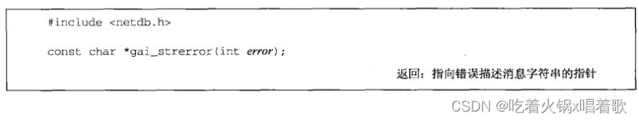 getaddrinfo函数返回的所有空间都是动态获取的，包括addrinfo结构、ai_addr结构、ai_canonname字符串，这些空间通过freeaddrinfo函数还给系统： 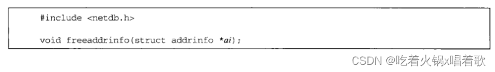 ai参数应指向由getaddrinfo函数返回的第一个addrinfo结构，这个链表中的所有结构及它们指向的动态存储空间都被释放掉。

假设我们调用getaddrinfo，遍历返回的addrinfo结构链表后找到了所需结构，如果我们为保存所需结构而仅仅复制了这个addrinfo结构，然后调用freeaddrinfo，就出现了错误，因为addrinfo结构本身指向动态分配的内存空间，因此我们复制的结构指向的内存已被还给系统。

只复制这个addrinfo结构而不复制由它指向的其他结构称为浅复制，既复制这个addrinfo结构又复制由它指向的所有其他结构称为深复制。

POSIX规范定义了getaddrinfo函数以及该函数为IPv4和IPv6返回的信息： 1.getaddrinfo函数进行两种处理：调用者想要的套接字地址结构、对DNS或其他数据库进行的记录查询。

2.由调用者在hints结构中提供的地址族来指定调用者期待返回的套接字地址结构的类型，如果调用者指定的是AF_INET，getaddrinfo函数就不能返回sockaddr_in6结构；如果调用者指定AF_INET6，getaddrinfo函数就不能返回sockaddr_in结构。

3.如果调用者指定的地址族为AF_UNSPEC，则getaddrinfo函数返回适用于指定主机名和服务名的任意协议族的地址。如果某个主机既有AAAA记录，又有A记录，则AAAA记录将作为sockaddr_in6结构返回，A记录将作为sockaddr_in结构返回。但不会为IPv4地址返回sockaddr_in6结构（IPv4映射的IPv6地址），因为这么做没有提供额外信息，这些地址已经在sockaddr_in结构中返回过了。

4.如果设置了AI_PASSIVE标志但没有指定主机名，则IPv6通配地址（IN6ADDR_ANY_INIT或0::0）会作为sockaddr_in6结构返回，IPv4通配地址（INADDR_ANY或0.0.0.0）会作为sockaddr_in结构返回。且会先返回IPv6通配地址，因为双栈主机上IPv6服务器能同时处理IPv6客户和IPv4客户。

IPv6通配地址的缩写规则： （1）在每个四位组中，删除开头和连续的0（0001 -> 1，0000 -> 0，0092 -> 92）。

（2）如果有两个或多个连续的全0四位组，则用双冒号(::)替换它，但在单个地址中只能使用一次双冒号。

因此0::0表示全0的IPv6地址，也可直接用::表示。

5.hints结构中的ai_family成员指定的地址族和ai_flags成员指定的AI_V4MAPPED、AI_ALL标志决定了在DNS中查找的资源记录类型（A、AAAA），也决定了返回地址的类型（IPv4、IPv6、IPv4映射的IPv6）。

6.主机名参数也可以是IPv6的十六进制数串或IPv4的点分十进制数串，如果指定AF_INET，就不会接受IPv6的十六进制数串；如果指定AF_INET6，就不会接受IPv4的点分十进制数串；如果指定的是AF_UNSPEC，则两种数串都能接受，返回的是数串相应类型的套接字地址结构。

可能有人会争论说，如果指定了AF_INET6，则点分十进制数串会作为IPv4映射的IPv6地址在sockaddr_in6结构中返回，这是正确的，但另一个方法也可获得同样的结果，就是在点分十进制数串前加上0::ffff:，并指定AF_INET6。  上图中，结果列是在给定前三列后，该函数返回给调用者的结果，行为列说明函数如何获取这些结果。

使用一个测试程序展示getaddrinfo函数，该程序允许我们输入：主机名、服务名、地址族、套接字类型、AI_CANONNAME、AI_PASSIVE。该程序输出getaddrinfo函数返回的addrinfo结构中的信息，以及用该结构中信息如何调用socket，以下是与图11-5同样的例子：  如上图，-f指定地址族，-c表示返回规范主机名，-h指定主机名，-s指定服务名。

通常的客户情景会查询地址族、套接字类型（-t选项）、主机名、服务名，以下是对一个有3个IPv4地址的多宿主机查询这些：  指定主机为aix，它有1个AAAA记录和1个A记录，不指定地址族，但指定服务名为ftp，此服务仅在TCP上提供：  最后我们指定AI_PASSIVE标志（-p选项），但不指定地址族，也不指定主机名（即使用通配地址），指定端口号为8888，指定套接字类型为SOCK_STREAM：  上图返回了2个结构（分别是IPv4和IPv6的通配地址，且IPv6地址结构早于IPv4地址结构返回，因为双栈主机上IPv6既能与IPv6对端通信，也能与IPv4对端通信），因为我们是在一个同时支持IPv6和IPv4的主机上运行此例，且没有指定地址族。

可以自定义一个getaddrinfo函数的接口函数，使得我们每次调用getaddrinfo时不用再分配并填写hints结构，而是将我们感兴趣的两个字段（地址族和套接字类型）作为该函数的参数：  以下是该函数的源码：

```c
#include "unp.h"

struct addrinfo *host_serv(const char *host, const char *serv, int family, int socktype) {
    int n;
    struct addrinfo hints, *res;

    bzero(&hints, sizeof(struct addrinfo));
    hints.ai_flags = AI_CANONNAME;    /* always return canonical name */
    hints.ai_family = family;    /* AF_UNSPEC, AF_INET, AF_INET6, etc. */
    hints.ai_socktype = socktype;    /* 0, SOCK_STREAM, SOCK_DGRAM, etc. */

    if ((n = getaddrinfo(host, serv, &hints, &res)) != 0) {
        return NULL;
    }
    
    return res;    /* return pointer to first on linked list */
}
1234567891011121314151617
```

编写一个使用getaddrinfo函数的函数，用于创建一个TCP套接字并连接到一个服务器：  以下是该函数的源码：

```c
#include "unp.h"

int tcp_connect(const char *host, const char *serv) {
    int sockfd, n;
    struct addrinfo hints, *res, *ressave;

    bzero(&hints, sizeof(struct addrinfo));
    hints.ai_family = AF_UNSPEC;
    hints.ai_socktype = SOCK_STREAM;

    if ((n = getaddrinfo(host, serv, &hints, &res)) != 0) {
        err_quit("tcp_connect error for %s, %s: %s", host, serv, gai_strerror(n));
    }
    ressave = res;
    
    do {
        sockfd = socket(res->ai_family, res->ai_socktype, res->ai_protocol);
        // socket函数失败不是致命错误，如果返回地址中有IPv6地址而主机内核不支持IPv6，这种失败就可能发生
        if (sockfd < 0) {
            continue;    /* ignore this one */
        }
        
        if (connect(sockfd, res->ai_addr, res->ai_addrlen) == 0) {
            break;    /* success */
        }
        
        Close(sockfd);    /* ignore this one */
    } while ((res = res->ai_next) != NULL);
    
    if (res == NULL) {    /* errno set from final connect() */
        err_sys("tcp_connect error for %s, %s", host, serv);
    }
    
    freeaddrinfo(ressave);
    
    return sockfd;
}
12345678910111213141516171819202122232425262728293031323334353637
```

以上函数和其他我们自己编写的getaddrinfo函数的接口函数都没有返回getaddrinfo函数返回的错误码（某EAI_xxx常值），这意味着它们的包裹函数什么都没做：

```c
int Tcp_connect(const char *host, const char *serv) {
    return tcp_connect(host, serv);
}
123
```

尽管如此，为保持全书一致性，我们照样使用包裹函数。

以上问题在于tcp_connect函数返回的描述符是非负的，但我们不清楚EAI_xxx是正的还是负的，如果这些值也是正的，那么我们可以在getaddrinfo函数失败时返回这些值的负值，但我们还需要某个负值还表明所有结构都尝试完毕，但无一成功。

把获取时间的客户程序改写成使用tcp_connect函数：

```c
#include "unp.h"

int main(int argc, char **argv) {
    int sockfd, n;
    char recvline[MAXLINE + 1];
    socklen_t len;
    struct sockaddr_storage ss;
    if (argc != 3) {
       err_quit("usage: daytimetcpconnect <hostname/IPaddress> <service/port#>");
    }
    sockfd = Tcp_connect(argv[1], argv[2]);
    len = sizeof(ss);
    Getpeername(sockfd, (SA *)&ss, &len);
    printf("connected to %s\n", Sock_ntop_host ((SA *)&ss, len));      
    while ((n = Read(sockfd, recvline, MAXLINE)) > 0) {
        recvline [n] = 0; /* null terminate */
        Fputs (recvline, stdout);
    }
    exit(0);
}
1234567891011121314151617181920
```

tcp_connect函数只返回了连接后的套接字，而我们不知道具体套接字地址结构的大小，因此我们调用getpeername函数时使用了sockaddr_storage类型的套接字地址结构，它足以存放系统支持的任何套接字地址类型，又能满足它们的对齐限制。

以上版本的客户程序同时支持IPv4和IPv6。

运行以上程序，指定一个只支持IPv4的主机名： 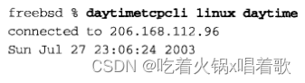 再次运行该程序，指定一个同时支持IPv4和IPv6的主机名：  上图使用IPv6的原因在于，该主机同时有1个AAAA记录和一个A记录，且tcp_connect函数把地址族设为AF_UNSPEC，getaddrinfo函数会先搜索AAAA记录，再搜索A记录，connect顺序靠前的IPv6地址成功后，就不再尝试顺序靠后的IPv4地址。

下例中，我们指定带-4后缀的主机名强制使用IPv4地址，这是一个约定，这样的主机名只有A记录： 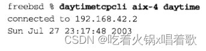 recv函数的MSG_PEEK标志可读出接收缓冲区中的数据，但并不从接收缓冲区中移除读到的数据；以FIONREAD参数调用ioctl函数可获取套接字缓冲区中的字节数。修改以上程序，先指定MSG_PEEK标志调用recv，然后以FIONREAD为参数调用ioctl，最后再调用read真正读入数据，以下是修改后的循环：

```c
for (; ; ) {
    if ((n = Recv(sockfd, recvline, MAXLINE, MSG_PEEK)) == 0) {
        break;
    }
    
    Ioctl(sockfd, FIONREAD, npend);
    printf("%d bytes from PEEK, %d bytes pending\n", n, npend);
    
    n = Read(sockfd, recvline, MAXLINE);
    recvline[n] = 0;    /* null terminate */
    Fputs(recvline, stdout);
}
123456789101112
```

下一个我们自己编写的函数会执行TCP服务器的通常步骤：创建一个TCP套接字，给它绑定服务器的众所周知端口，并允许接受外来请求：  以下是它的源码：

```c
#include "unp.h"

int tcp_listen(const char *host, const char *serv, socklen_t *addrlenp) {
    int listenfd, n;
    const int on = 1;
    struct addrinfo hints, *res, *ressave;
    
    bzero(&hints, sizeof(struct addrinfo));
    hints.ai_flags = AI_PASSIVE;    // 本函数供服务器使用
    hints.ai_family = AF_UNSPEC;
    hints.ai_socktype = SOCK_STREAM;

    // 如果不指定主机名，则返回的地址为通配地址
    // 对于AI_PASSIVE和AI_UNSPEC暗示，IPv4和IPv6的地址都会返回（假定运行在双栈主机上）
    if ((n = getaddrinfo(host, serv, &hints, &res)) != 0) {
        err_quit("tcp_listen error for %s, %s: %s", host, serv, gai_strerror(n));
    }
    ressave = res;

    do {
        listenfd = socket(res->ai_family, res->ai_socktype, res->ai_protocol);
        if (listenfd < 0) {
            continue;    /* error, try next one */
        }
        
        Setsockopt(listenfd, SOL_SOCKET, SO_REUSEADDR, &on, sizeof(on));
        if (bind(listenfd, res->ai_addr, res->ai_addrlen) == 0) {
            break;    /* success */
        }
        
        Close(listenfd);    /* bind error, close and try next one */
    } while ((res = res->ai_next) != NULL);
    
    // 如果每个地址结构的socket调用或bind调用都失败，显示一个出错消息并终止
    if (res == NULL) {    /* errno from final socket() or bind() */
        err_sys("tcp_listen error for %s, %s", host, serv);
    }
    
    Listen(listenfd, LISTENQ);
    
    // 返回协议地址大小，此值允许调用者在调用accept获取客户协议地址时分配一个套接字地址结构的内存空间
    if (addrlenp) {
        *addrlenp = res->ai_addrlen;    /* return sizeof protocol address */
    }
    
    freeaddrinfo(ressave);
    
    return listenfd;
}
12345678910111213141516171819202122232425262728293031323334353637383940414243444546474849
```

在tcp_listen函数中，调用者必须传一个addrlenp参数来获取协议地址的大小，如果调用者传一个空指针，调用者如果想知道协议地址的大小，可以分配一个比任何套接字地址结构都要大的大缓冲区并调用getsockname，getsockname函数的第三个参数是值-结果参数，它会返回协议地址真正的大小。

使用tcp_listen函数改写时间获取服务器：

```c
#include "unp.h"
#include <time.h>

int main(int argc, char **argv) {
    int listenfd, connfd;
    socklen_t len;
    char buff[MAXLINE];
    time_t ticks;
    struct sockaddr_storage cliaddr;
    
    // 我们用一个命令行参数来指定服务名或端口号，便于测试，因为daytime服务器捆绑端口13，需要超级用户特权
    if (argc != 2) {
        err_quit("usage:daytimetcpsrv1 <service or port#>");
    }
    
    // 我们将使用sockaddr_storage，因此第3个参数填空指针，我们不关心当前地址族使用多大的地址结构
    listenfd = Tcp_listen(NULL, argv[1], NULL);
    
    for (; ; ) {
        len = sizeof(cliaddr);
        connfd = Accept(listenfd, (SA *)&cliaddr, &len);
        // sock_ntop函数是自定义函数，它输出客户的地址，无论是IPv4还是IPv6地址，都会输出IP地址和端口号
        printf("connection from %s\n", Sock_ntop((SA *)&cliaddr, len));
        // 此处我们也可输出客户的主机名，我们可用getnameinfo函数尝试获取客户主机的主机名
        // 但这会涉及DNS的PTR记录查询，需要花一段时间，特别是在查询失败时
        // 且TCPv3指出，与web服务器建立连接的所有客户主机中，25%没有PTR记录
        // 因为我们不想让服务器（特别是迭代服务器）为PTR查询等待数秒，我们就不显示客户的主机名了，只显示客户的IP和端口号
        
        ticks = time(NULL);
        snprintf(buff, sizeof(buff), "%.24s\r\n", ctime(&ticks));
        Write(connfd, buff, strlen(buff));
        
        Close(connfd);
    }
}
1234567891011121314151617181920212223242526272829303132333435
```

上例中，我们可以改用getnameinfo函数替代sock_ntop函数，具体做法可以是先分配存放主机名和服务名的数组：

```c
char host[NI_MAXHOST], serv[NI_MAXSERV];
1
```

然后在accept函数返回后改为调用getnameinfo以取代sock_ntop函数：

```c
if (getnameinfo(cliaddr, len, host, NI_MAXHOST, serv, NI_MAXSERV, NI_NUMERICHOST | NI_NUMERICSERV) == 0) {
    printf("connection from %s.%s", host, serv);
}
123
```

由于这是服务器程序，我们指定NI_NUMERICHOST和NI_NUMERICSERV标志以避免查询DNS和查找/etc/services文件。

NI_MAXHOST和NI_MAXSERV常量定义在netdb.h头文件中，分别代表主机名和服务名的最大长度，用于动态分配足够的缓冲区来存储主机名和服务名。

上例中，我们调用tcp_listen时第一个参数是NULL，且我们指定的地址族为AF_UNSPEC，这在双栈主机上返回的第一个套接字地址结构将是IPv6的，但我们可能希望服务器仅处理IPv4。

对于客户主机没有这种问题，因为客户需要输入一个IP地址或主机名，因此客户可以输入一个与特定类型的IP地址关联的主机名（-4或-6后缀的主机名），要么直接输入IPv4的点分十进制串或IPv6的十六进制数串以强制使用IPv4或IPv6。

有一个技巧可以让我们强制服务器使用某个给定协议，我们可以让用户输入一个IP地址，getaddrinfo函数获取到的每个地址结构，对其套接字地址字段调用inet_pton，下图指明调用是否会成功：  因此我们可以把服务器程序改为接收一个可选参数，如果键入：

```
% server
1
```

在双栈主机上就默认使用IPv6，如果键入：

```
% server 0.0.0.0
1
```

则显式指定使用IPv4，键入：

```
% server 0::0
1
```

则显式指定IPv6。

以下是获取时间服务器的最终版本：

```c
#include "unp.h"
#include <time.h>

int main(int argc, char **argv) {
    int listenfd, connfd;
    socklen_t len, addrlen;
    char buff[MAXLINE];
    time_t ticks;
    struct sockaddr_storage cliaddr;

    if (argc == 2) {
        listenfd = Tcp_listen(NULL, argv[1], &addrlen);
    } else if (argc == 3) {
        listenfd = Tcp_listen(argv[1], argv[2], &addrlen);
    } else {
        err_quit("usage: daytimetcpser2 [<host>] | <service or port>");
    }

    for (; ; ) {
        len = sizeof(cliaddr);
		connfd = Accept(listenfd, (SA *)&cliaddr, &len);
		printf("connection from %s\n", Sock_ntop((SA *)&cliaddr, len));
	
		ticks = time(NULL);
		snprintf(buff, sizeof(buff), "%.24s\r\n", ctime(&ticks));
		Write(connfd, buff, strlen(buff));
	
		Close(connfd);
    }
}
123456789101112131415161718192021222324252627282930
```

运行以上程序，以IPv4套接字启动服务器：  以IPv6套接字启动服务器：  如上图，后两个连接使用的是IPv4映射的IPv6地址，这展示了运行在双栈主机上的IPv6服务器既能处理IPv4客户，又能处理IPv6客户。

自编写的使用getaddrinfo函数创建未连接UDP套接字的函数：  以上函数创建一个未连接UDP套接字，并返回3项数据，首先，返回值是该套接字的描述符；其次，saptr参数是指向某个由udp_client函数动态分配的套接字地址结构的指针的地址，本函数把目的IP和端口存放在这个结构中，用于稍后调用sendto；最后，这个套接字地址结构的大小在lenp参数指向的变量中返回，此参数不能是空指针，因为sendto和recvfrom调用都需要知道套接字地址结构的长度。

以下是udp_client函数的源码：

```c
#include "unp.h"

int udp_client(const char *host, const char * serv, SA **saptr, socklen_t *lenp) {
    int sockfd, n;
    struct addrinfo hints, *res, *ressave;

    bzero(&hints, sizeof(struct addrinfo));
    hints.ai_family = AF_UNSPEC;
    hints.ai_socktype = SOCK_DGRAM;

    if ((n = getaddrinfo(host, serv, &hints, &res)) != 0) {
        err_quit("udp_client error for %s, %s: %s", host, serv, gai_strerror(n));
    }
    ressave = res;

    do {
        sockfd = socket(res->ai_family, res->ai_socktype, res->ai_protocol);
		if (sockfd >= 0) {
		    break;    /* success */
		}
    } while ((res = res->ai_next) != NULL);

    if (res == NULL) {    /* errno set from final socket() */
        err_sys("udp_client error for %s, %s", host, serv);
    }

    *saptr = Malloc(res->ai_addrlen);
    memcpy(*saptr, res->ai_addr, res->ai_addrlen);
    *lenp = res->ai_addrlen;

    freeaddrinfo(ressave);

    return sockfd;
}
12345678910111213141516171819202122232425262728293031323334
```

把获取时间的客户程序改为使用UDP和udp_client函数：

```c
#include "unp.h"

int main(int argc, char **argv) {
    int sockfd, n;
    char recvline[MAXLINE + 1];
    socklen_t salen;
    struct sockaddr *sa;

    if (argc != 3) {
        err_quit("usage: daytimeudpcli1 <hostname/IPaddress> <service/port#>");
    }

    sockfd = Udp_client(argv[1], argv[2], (void **)&sa, &salen);

    printf("sending to %s\n", Sock_ntop_host(sa, salen));

    Sendto(sockfd, "", 1, 0, sa, salen);    /* send 1-byte datagram */

    n = Recvfrom(sockfd, recvline, MAXLINE, 0, NULL, NULL);
    recvline[n] = '\0';    /* null terminate */
    Fputs(recvline, stdout);

    exit(0);
}
123456789101112131415161718192021222324
```

运行以上程序，我们先指定一个拥有AAAA记录和A记录各1个的主机名，由于getaddrinfo函数首先返回的是对应AAAA记录的结构，所以应该创建一个IPv6套接字：  接着我们指定一个点分十进制地址：  我们自编写的创建一个已连接UDP套接字的函数：  由于udp_connect函数创建的是已连接UDP套接字，因此相比于udp_connect函数，udp_client函数结尾的两个参数就不需要了，调用者可用write函数代替sendto函数。

以下是udp_connect函数的源码：

```c
#include "unp.h"

int udp_connect(const char *host, const char *serv) {
    int sockfd, n;
    struct addrinfo hints, *res, *ressave;

    bzero(&hints, sizeof(struct addrinfo));
    hints.ai_family = AF_UNSPEC;
    hints.ai_socktype = SOCK_DGRAM;

    if ((n = getaddrinfo(host, serv, &hints, &res)) != 0) {
        err_quit("udp_connect error for %s, %s: %s", host, serv, gai_strerror(n));
    }
    ressave = res;

    do {
        sockfd = socket(res->ai_family, res->ai_socktype, res->ai_protocol);
		if (sockfd < 0) {
		    continue;    /* ignore this one */
		}
	
		if (connect(sockfd, res->ai_addr, res->ai_addrlen) == 0) {
		    break;    /* success */
		}
	
		Close(sockfd);    /* ignore this one */
    } while ((res = res->ai_next) != NULL);

    if (res == NULL) {    /* errno set from final connect() */
        err_sys("udp_connect error for %s, %s", host, serv);
    }

    freeaddrinfo(ressave);

    return sockfd;
}
123456789101112131415161718192021222324252627282930313233343536
```

以上函数几乎与tcp_connect函数相同，两者差别之一是UDP套接字上的connect调用不会发送任何东西到对端，如果存在错误（如对端不可达或指定端口上没有服务器），调用者就得等到向对端发送一个数据报后才能发现。

自编写的调用getaddrinfo的UDP接口函数udp_server：  此函数的参数与tcp_listen函数一样，有一个可选的hostname参数和一个必选的service参数，以及一个可选的指向某个socklen_t类型变量的指针，用于返回套接字地址结构的大小。

udp_server函数的源码：

```c
#include "unp.h"

int udp_server(const char *host, const char *serv, socklen_t *addrlenp) {
    int sockfd, n;
    struct addrinfo hints, *res, *ressave;

    bzero(&hints, sizeof(struct addrinfo));
    hints.ai_flags = AI_PASSIVE;
    hints.ai_family = AF_UNSPEC;
    hints.ai_socktype = SOCK_DGRAM;

    if ((n = getaddrinfo(host, serv, &hints, &res)) != 0) {
        err_quit("udp_server error for %s, %s: %s", host, serv, gai_strerror(n));
    }
    ressave = res;

    do {
        sockfd = socket(res->ai_family, res->ai_socktype, res->ai_protocol);
		if (sockfd < 0) {
		    continue;    /* error - try next one */
		}
	
		if (bind(sockfd, res->ai_addr, res->ai_addrlen) == 0) {
		    break;    /* success */
		}
	
		Close(sockfd);    /* bind error - close and try next one */
    } while ((res = res->ai_next) != NULL);

    if (res == NULL) {    /* errno from final socket() or bind() */
        err_sys("udp_server error for %s, %s", host, serv);
    }

    if (addrlenp) {
        *addrlenp = res->ai_addrlen;    /* return size of protocol address */
    }

    freeaddrinfo(ressave);

    return sockfd;
}
1234567891011121314151617181920212223242526272829303132333435363738394041
```

除了没有调用listen外，以上函数几乎等同于tcp_listen函数，我们把地址族设置成AF_UNSPEC，但调用者可用前面说到的技巧强制使用IPv4或IPv6。

以上代码中，对于UDP套接字我们不设置SO_REUSEADDR选项，本套接字选项允许在支持多播的主机上把同一UDP端口捆绑到多个套接字上。既然UDP套接字没有类似于TCP的TIME_WAIT的状态，所以启动服务器时就没有设置这个套接字选项的必要。

修改时间获取服务器程序，使其使用udp_server函数：

```c
#include "unp.h"
#include <time.h>

int main(int argc, char **argv) {
    int sockfd;
    ssize_t n;
    char buff[MAXLINE];
    time_t ticks;
    socklen_t len;
    struct sockaddr_storage cliaddr;

    if (argc == 2) {
        sockfd = Udp_server(NULL, argv[1], NULL);
    } else if (argc == 3) {
        sockfd = Udp_server(argv[1], argv[2], NULL);
    } else {
        err_quit("usage: daytimeudpsrv [<host>] <service or port>");
    }

    for (; ; ) {
        len = sizeof(cliaddr);
		n = Recvfrom(sockfd, buff, MAXLINE, 0, (SA *)&cliaddr, &len);
		printf("datagram from %s\n", Sock_ntop((SA *)&cliaddr, len));
	
		ticks = time(NULL);
		snprintf(buff, sizeof(buff), "%.24s\r\n", ctime(&ticks));
		Sendto(sockfd, buff, strlen(buff), 0, (SA *)&cliaddr, len);
    }
}
1234567891011121314151617181920212223242526272829
```

对于以上程序，如果我们在一个窗口中启动该服务器的一个实例，给它捆绑通配地址和某个端口；然后在另一窗口中启动一个客户，验证服务器可以正常处理客户请求（服务器会进行printf调用）；然后在第三个窗口中启动服务器的另一个实例，给它绑定该主机的一个单播地址和与第一个服务器相同的端口，此时会无法绑定与第一个服务器相同的端口，这是因为没有设置SO_REUSEADDR套接字选项，最容易的解决办法是复制一份udp_server函数，把它命名为udp_server_reuseaddr，然后由它设置这个套接字选项，再让服务器调用这个新函数。修复该问题后，重新启动第二个服务器，启动一个客户，可以验证第二个服务器已盗用了第一个服务器的端口。然后关闭第二个服务器，然后使用一个不同的账号登录，并再次启动第二个服务器，看能否继续成功盗用，有些厂商只允许用户ID相同的进程再次捆绑之前某个进程捆绑过的端口。

getnameinfo函数是getaddrinfo函数的互补函数，它以一个套接字地址为参数，返回描述其中主机的字符串和描述其中服务的另一字符串，本函数以协议无关方式提供这些信息：  sockaddr参数指向一个套接字地址结构，其中包含待转换成直观可读字符串的协议地址，addrlen参数是这个结构的长度。该结构及其长度通常由accept、recvfrom、getsockname、getpeername函数返回。

待返回的2个直观可读字符串由调用者预先分配空间，host和hostlen参数指定主机名字符串，serv和servlen参数指定服务名字符串。如果不想返回某个串，需要将其对应的len参数设为0。

sock_ntop函数和getnameinfo函数的差别在于，前者不涉及DNS，只返回IP地址和端口号的一个可显示版本，而后者尝试获取主机和服务的名字。

以下标志可改变getnameinfo函数的操作：  当知道处理的套接字地址结构是用于数据报时，调用者应设置NI_DGRAM标志，因为套接字地址结构中只有IP地址和端口号，getnameinfo函数无法确定所用协议是TCP还是UDP。有很多端口号在TCP上用于某服务，但在UDP上用于另一个服务，如端口514，它在TCP上提供rsh服务，在UDP上提供syslog服务。

如果无法使用DNS反向解析出主机名，NI_NAMEREQD标志将导致返回一个错误。有些服务器需要把客户的IP地址映射为主机名，然后以返回的主机名调用gethostbyname，来验证得到的地址与调用getnameinfo函数指定的套接字地址结构中的地址确实是相同的。

NI_NOFQDN标志导致返回的主机名第一个点号之后的内容被截去，如gethostbyaddr返回的某IP地址的主机名是aix.unpbook.com，则设置此标志的getnameinfo函数返回的主机名是aix。

NI_NUMERICHOST标志告知getnameinfo函数不要调用DNS，因为调用DNS可能耗时，而是以数值字符串形式返回IP地址（可能通过inet_ntop函数实现）。NI_NUMERICSERV标志指定以十进制数字符串返回端口号。NI_NUMERICSCOPE标志指定以数值字符串返回范围标识，只有IPv6使用它有意义，它将数值形式的IPv6地址范围返回给调用方，如IPv6地址`fe80::1%eth0`，其中`%eth0`就是范围标识符，如果指定了此标志，会返回接口索引的数值形式。对于客户的端口（临时端口），应设置NI_NUMERICSERV标志。

我们可以把以上标志中有意义的组合逻辑或在一起。

gethostbyname和gethostbyaddr函数是不可重入的，函数的源码大体如下：  上图显示，3个函数共用一个static的host变量（gethostbyname2函数是gethostbyname函数的进化版本，它是在BIND 4.9.4中为支持IPv6引入的，现已被淘汰）。

在一个UNIX进程中发生重入问题的条件是，它的主控制流和某信号处理函数中同时调用gethostbyname或gethostbyaddr：  如果主控制流被SIGALRM信号暂停时正处于执行gethostbyname函数期间，如该函数已填写好host变量并即将返回，且信号处理函数随后会调用gethostbyname，那么host变量将被重用，因为该进程中只存在该变量的单个副本。这样原来由主控制流计算出的值被重写成了由信号处理函数计算出的值。

关于重入问题注意以下几点： 1.在过去，gethostbyname、gethostbyaddr、getservbyname、getservbyport函数不可重入，因为它们返回指向一个静态结构的指针。

支持线程的一些实现（如Solaris 2.x）还提供者4个函数的可重入版本，它们的名字以_r结尾。

支持线程的另一些实现（如HP-UX 10.30及以后版本）使用线程特定数据提供这些函数的可重入版本。

2.inet_pton、inet_ntop函数总是可重入的。

3.在过去，inet_ntoa函数是不可重入的，但支持线程的一些实现提供了使用线程特定数据的可重入版本。

4.getaddrinfo函数可重入的前提是它调用的函数都可重入，即它应该调用可重入版本的gethostbyname函数以解析主机名，调用可重入版本的getservbyname函数以解析服务名。getaddrinfo函数动态分配结果结构的原因是令该函数变得可重入。

5.getnameinfo函数可重入的前提是它调用的函数都可重入，即它应该调用gethostbyaddr函数以反向解析主机名，调用可重入版本的getservbyport函数以反向解析服务名。getnameinfo函数的2个结果字符串由调用者分配存储空间，从而使它可重入。

errno变量也有同样问题，这个整型变量在过去每个进程各有一个副本，如果一个进程执行的某个系统调用返回错误，该进程的errno就被存入一个整数错误码，例如，当调用C标准库的close函数时，进程可能执行如下伪代码： 1.把系统调用的参数（一个整数描述符）置于一个寄存器。

2.把一个值置于另一个寄存器，以指出close系统调用将被调用。

3.调用该系统调用（用一条特殊指令切换到内核态）。

4.测试一个寄存器的值以判定是否发生过某个错误。

5.如果没有错误则执行return 0。

6.否则把另外某个寄存器的值存入errno。

7.执行return -1。

我们注意到如果没有错误发生，则errno的值不会变，因此除非发生了错误（通常由函数返回-1指示），否则不应查看errno的值。

如果一个程序先测试close函数的返回值，判定发生了错误后，再显示errno的值：

```c
if (close(fd) < 0) {
    fprintf("stderr, "close error, errno = %d\n", errno);
    exit(1);
}
1234
```

从系统调用返回时把错误码存入errno到稍后程序显示errno值之间存在一个时间窗口，期间同一个进程内的另一个线程（如信号处理函数的某次调用）可能改变了errno的值。

上述gethostbyname函数的问题可以不在信号处理函数中调用不可重入的函数来解决。上述errno问题可在信号处理函数中预先保存并事后恢复errno值来解决：

```c
void sig_alrm(int signo) {
    int errno_save;
    
    errno_save = errno;    /* save its value on entry */
    if (write( ... ) != nbytes) {
        fprintf(stderr, "write error, errno = %d\n", errno);
    }
    errno = errno_save;    /* restore its value on return */
}
123456789
```

上例代码中，在信号处理函数中还调用了fprintf函数，它引入了另一个重入问题。许多版本的标准IO库函数是不可重入的，即我们不应该从信号处理函数中调用标准IO函数。

有两种方法可以把gethostbyname函数这类不可重入的函数改为可重入函数： 1.把由不可重入函数填写并返回静态接收的做法改为由调用者分配再有可重入函数填写结构。这就是把不可重入的gethostbyname函数改为可重入的gethostbyname_r函数所用的技巧。但这种方法比较复杂，因为不仅调用者必须提供待填写的hostent结构，还要提供一个存放该结构指向的信息（如规范名字、别名指针数组、各个别名字符串、地址指针数组及该指针指向的各个in_addr结构）的大缓冲区，函数填写的内容包括多个指向这个大缓冲区的指针。这样函数至少要增设3个参数：指向待填写的hostent结构的指针、指向大缓冲区的指针、该大缓冲区的大小，gethostbyname_r函数还增加了第四个额外参数，用于存放错误码的某整型变量的指针，这第四个额外参数也是必要的，因为全局变量h_errno也不可用了（与errno一样，有可重入性问题）。

getnameinfo和inet_ntop函数也用这种方法。

2.直接由可重入函数调用malloc以动态分配空间。这是getaddrinfo函数所用的技巧。这种方法的问题是调用该函数的进程必须调用freeaddrinfo来释放动态分配的空间，如果不这么做会导致内存泄漏，即进程每调用一次动态分配内存空间的函数，所用内存量就相应增长，如果进程长时间运行（网络服务器的特性之一），那么内存耗用量会不断增加。

以下讨论Solaris 2.x用于从名字到地址和从地址到名字解析的可重入函数：  每个函数都需要4个额外参数： 1.result参数指向由调用者分配并由被调用函数填写的hostent结构，成功返回时本指针同时作为函数的返回值返回；

2、3.buf参数指向由调用者分配且大小为buflen的缓冲区。该缓冲区用于存放规范主机名、别名指针数组、各个别名字符串、地址（in_addr结构）指针数组、各个实际地址（in_addr结构）。由result参数指向的hostent机构中所有指针都指向该缓冲区内部。但对于该缓冲区大小，大多手册页面只是含糊地说“该缓冲区必须足够大以存放于hostent结构关联的所有数据”。gethostbyname函数当前的实现最多能返回35个别名指针和35个地址指针，且内部用了8192字节的缓冲区存放这些别名和地址，因此大小为8192字节的缓冲区应该足够了。

4.如果出错，错误码通过h_errnop指针参数返回，而非全局变量h_errno。

但重入问题比表面看更严重，首先，关于gethostbyname和gethostbyaddr函数的重入问题无标准可循，POSIX声明这两个函数不必是可重入的，Unix98只说这两个函数不必是线程安全的。

其次，关于*r函数也没有标准可循。上例的*r函数由Solaris 2.x提供。Linux也提供类似的*r函数，但函数会通过其倒数第二个值-结果参数返回一个hostent结构，该函数将查找操作的成功与否作为函数的返回值，同时也将是否成功保存在h_errno参数中。Digital Unix 4.0和HP-UX 10.30也提供这两个函数的*r版本，只是参数不同，它们的版本与Solaris版本有同样的前2个参数，但Solaris版本的后3个参数在前者中组合成一个新hostent_data结构（它由调用者分配空间），指向该hostent_data结构的指针组成本函数的第三个兼最后一个参数。Digital Unix 4.0和HP-UX 10.30中普通的gethostbyname和gethostbyaddr函数通过使用线程特定数据，也是可重入的。

最后，虽然gethostbyname函数的可重入版本可能会在不同的线程同时调用时提供安全性，但这并不意味着底层解析器函数（用于进行主机名解析的函数）也具有可重入性。

开发IPv6期间，用于查找IPv6地址的API经历了多次反复，这些早期API既复杂又没有足够灵活性，于是在RFC 2553中被淘汰掉。RFC 2553又引入了新函数，它们最终在RFC 3493中被简单替换成getaddrinfo和getnameinfo函数。以下介绍一些早期API，以便转换已经使用它们的程序。

gethostbyname函数没有像getaddrinfo函数的hints.ai_family这种指定我们所关心的地址族的参数，因此第一版gethostbyname函数API的修改使用RES_USE_INET6常值，此常量必须使用一个内部私有的接口将其添加到解析器标志中。这个API不便于移植，因为使用不同内部解析器接口的系统需要模仿BIND解析器接口。

启用RES_USE_INET6会使gethostbyname函数先查找AAAA记录，若找不到AAAA记录，则接着查找A记录。因为hostent结构只有一个地址长度字段，因此gethostbyname函数要么只返回IPv6地址，要么只返回IPv4地址，不能同时返回这两种地址。

启用RES_USE_INET6还会使gethostbyname2函数以IPv4映射的IPv6地址形式返回IPv4地址。

gethostbyname2函数给gethostbyname函数增加了一个地址族参数：  当af参数为AF_INET时，gethostbyname2函数的行为与gethostbyname函数一样，即查找并返回IPv4地址。当af参数为AF_INET6时，gethostbyname2函数只查找AAAA记录并返回IPv6地址。

RFC 2553因为RES_USE_INET6标志的全局特性以及想对返回信息进行更多控制而废除了RES_USE_INET6和gethostbyname2函数，并引入了getipnodebyname函数：  af和flags参数直接映射到getaddrinfo的hints.ai_family和hints.ai_flags参数。为了线程安全，返回值是动态分配的，因此必须使用freehostent函数释放：  getipnodebyname和getipnodebyaddr函数被RFC 3493废除，并代之以getaddrinfo和getnameinfo函数。

进程可能想查找四类与网络相关的信息：主机、网络、协议、服务。大多查找针对的是主机（gethostbyname和gethostbyaddr函数），一小部分查找针对的是服务（getservbyname和getservbyport函数），更小一部分查找针对的是网络和协议。

这四类信息可存放在文件中，每类信息都定义了三个访问函数： 1.函数getXXXent读出文件中的下一个表项，如文件未打开，则会先打开文件。

2.函数setXXXent打开文件（如尚未打开），并rewind文件。

3.函数endXXXent关闭文件。

每类信息都定义了各自的结构，包括hostent、netent、protoent、servent，这些定义通常在头文件netdb.h中。

除了用于顺序处理文件的get、set、end三个函数外，每类信息还提供一些键值查找函数。这些函数顺序遍历整个文件（如通过getXXXent函数读出每一行），但只把某个参数匹配的表项返回调用者。这些键值查找函数具有getXXXbyYYY的名字。例如，针对主机信息的两个键值查找函数为gethostbyname（查找匹配某个主机名的表项）和gethostbyaddr（查找匹配某个IP地址的表项）。  只有主机和网络信息可通过DNS获取，协议和服务信息总是从相应文件中读取。不同实现有不同方法供系统管理员指定是使用DNS还是使用文件来查找主机和网络信息。

如果使用DNS来查找主机和网络信息，则只有键值查找函数有意义，你不能使用gethostent函数并期待顺序遍历DNS中所有表项。调用gethostent时，它仅读取/etc/hosts文件，不会访问DNS。

虽然网络信息可以做成通过DNS访问到，但很少有人这么做。典型的做法是，系统管理员创建并维护一个/etc/networks文件，网络信息通过它而非DNS获取。如果存在这个文件，指定-i选项的netstat程序就使用它显示每个网络的名字。但无类寻址使得获取网络信息的函数几近无用，且这些函数也不支持IPv6，因此新的网络应用应避免使用网络名字。

应用把主机名转换成IP地址或做相反转换的一组函数称为解析器，gethostbyname和gethostbyaddr函数是解析器曾经常用的入口。随着向IPv6和线程化编程模型的转移，getaddrinfo和getnameinfo函数更为有用，因为它们既能解析IPv6地址，又符合线程安全调用约定。

处理服务名和端口号的常用函数是getservbyname，它接受一个服务名作为参数，并返回一个包含相应端口号的结构。这种映射关系通常包含在一个文本文件中。还有用于把协议名映射成协议号、把网络名映射为网络号的函数，但很少使用。

有一种代替gethostbyname和gethostbyaddr函数的方法我们没有提到，即直接调用解析器函数。这样直接使用DNS的程序之一是sendmail，因为它需要搜索MX资源记录，这是gethostbyxxx函数无法做到的。解析器函数都有以res_开头的名字，如res_init函数，可执行`man resolver`命令得到这些函数的手册页面。

getaddrinfo函数可允许我们编写协议无关的代码，但直接调用它要花很多步骤，且对于不同情形仍有反复出现的细节要处理，如遍历所有返回的结构、忽略socket函数返回的错误、为TCP服务器设置SO_REUSEADDR套接字选项等，因此我们编写了5个访问getaddrinfo函数的接口函数tcp_connect、tcp_listen、udp_client、udp_connect、udp_server，以简化这些细节。

gethostbyname和gethostbyaddr函数通常是不可重入的，这两个函数使用同一个静态的结果结构，这意味着如果先后调用这两个函数各一次，后一次调用会覆盖前一次调用的结果。因此一些厂商提供这两个函数的_r版本，但需要对调用这些函数的应用加以修改。

修改11-3中的程序，为每个返回的地址调用gethostbyaddr，然后显示由它返回的h_name：

```c
#include "unp.h"

int main(int argc, char **argv) {
    char *ptr, **pptr;
    char str[INET6_ADDRSTRLEN];
    struct hostent *hptr;

    while (--argc > 0) {
        ptr = *++argv;
		if ((hptr = gethostbyname(ptr)) == NULL) {
		    err_msg("gethostbyname error for host: %s: %s", ptr, hstrerror(h_errno));
		    continue;
		}
		printf("official hostname: %s\n", hptr->h_name);
	
		for (pptr = hptr->h_aliases; *pptr != NULL; ++pptr) {
		    printf("    alias: %s\n", *pptr);
		}
	
		switch (hptr->h_addrtype) {
		case AF_INET:
#ifdef AF_INET6
		case AF_INET6:
#endif
	        pptr = hptr->h_addr_list;
		    for (; *pptr != NULL; ++pptr) {
		        printf("\taddress: %s\n", Inet_ntop(hptr->h_addrtype, *pptr, str, sizeof(str)));
	            // 与11-3中代码相比，多了以下if-else语句
				if ((hptr = gethostbyaddr(*pptr, hptr->h_length, hptr->h_addrtype)) == NULL) {
				    printf("\t(gethostbyaddr failed)\n");
				} else if (hptr->h_name != NULL) {
				    printf("\tname = %s\n", hptr->h_name);
				} else {
				    printf("\t(no hostname returned by gethostbyaddr)\n");
				}
		    }
		    break;
	
		default:
		    err_ret("unknown address type");
		    break;
		}
    }
    exit(0);
}
123456789101112131415161718192021222324252627282930313233343536373839404142434445
```

以上程序针对只有一个IP地址的主机没有问题，如果针对拥有8个IP地址的主机调用11-3中的程序：  但如果我们对该主机运行上图中的程序，则它只会输出一个IP地址：  问题在于gethostbyname和gethostbyaddr两个函数共享同一个hostent结构，当以上程序调用gethostbyname后，再次调用gethostbyaddr时，它重用了这个结构以及它指向的存储区（即h_addr_list指针数组及由该数组指向的数据），结果冲掉了其余7个地址。

在我的机器上（`Linux rh 2.6.39-400.17.1.el6uek.x86_64 #1 SMP Fri Feb 22 18:16:18 PST 2013 x86_64 x86_64 x86_64 GNU/Linux`）运行以上程序时，会出现段错误，应该是指针已失效：  有两种方法可以修复上例问题： 1.如果系统支持，可使用可重入版本的gethostbyaddr和gethostbyname函数。

2.在调用gethostbyaddr前复制由gethostbyname返回的指针数组及该数组中元素指向的数据。

chargen服务器一直向客户发送数据，直到客户关闭连接为止。


# 第十二章 IPv4与IPv6的互操作性

未来数年内，因特网也许会逐渐从[IPv4](https://so.csdn.net/so/search?q=IPv4&spm=1001.2101.3001.7020)过渡到IPv6，在过渡阶段，基于IPv4的现有应用能与基于IPv6的全新应用协同工作非常重要。例如，厂商不应只提供仅能与IPv6 telnet服务器程序协同工作的telnet客户程序，而应该提供既能与IPv4服务器协同工作的客户程序，又能与IPv6服务器协同工作的客户程序。更理想的情形是，一个IPv6或IPv4 telnet客户程序既能与IPv4服务器程序协同工作，也能与IPv6服务器协同工作。

本章假设主机运行着双栈，即一个IPv4[协议栈](https://so.csdn.net/so/search?q=协议栈&spm=1001.2101.3001.7020)和一个IPv6协议栈。在向IPv6转换的漫长过渡期内，主机和路由器会这样运行很多年。某个时间点后，许多系统可以关闭它们的IPv4协议栈，但只有时间才能告诉我们这种情况何时（以及是否）会发生。

双栈主机的一个基本特性是其上的[IPv6](https://so.csdn.net/so/search?q=IPv6&spm=1001.2101.3001.7020)服务器既能处理IPv4客户，又能处理IPv6客户，这是通过IPv4映射的IPv6地址实现的：  上图中，左侧有一个IPv4客户和一个IPv6客户，右侧的服务器程序使用IPv6编写，该服务器创建了一个绑定在IPv6通配地址和TCP端口9999上的IPv6监听TCP套接字。

上图我们假设客户和服务器主机处于同一个以太网，它们也能通过路由器连接，只要通过的所有路由器都同时支持IPv4和IPv6，但这对我们的讨论没有影响。

我们假设这两个客户都发送SYN分节建立与服务器的连接。IPv4客户主机在一个IPv4数据报中载送SYN，IPv6客户主机在一个IPv6数据报中载送SYN。

来自IPv4客户的TCP分节在以太网线上表现为一个以太网首部后跟一个IPv4首部、一个TCP首部、TCP数据，以太网首部中包含的类型字段值为0x0800，即把本以太网帧标识为一个IPv4帧，TCP首部中包含的目的端口为9999，IPv4首部中包含的IP地址为206.62.226.42。

来自IPv6客户的TCP分节在以太网线上表现为一个以太网首部后跟一个IPv6首部、一个TCP首部、TCP数据。以太网首部中的类型字段值为0x86dd，即把本以太网帧标识为一个IPv6帧。这个TCP首部和IPv6数据报中的TCP首部格式完全一样，也包含值为9999的目的端口。IPv6首部中包含的目的IP地址为5f1b:df00:ce3e:e200:20:800:2b37:6426。

接收数据链路通过查看以太网类型字段把每个帧传递给相应的IP模块。IPv4模块结合其上的TCP模块检测到IPv4数据报的目的端口对应一个IPv6套接字，于是把该数据报IPv4首部中的源IPv4地址转换成一个等价的IPv4地址映射的IPv6地址。当accept系统调用把这个已经接受的IPv4客户连接返回给服务器进程时，这个映射后的地址将作为客户的IPv6地址返回到服务器的IPv6套接字。该连接上的其余数据报同样都是IPv4数据报。

当accept系统调用把接受的IPv6客户连接返回给服务器进程时，客户的IPv6地址就是IPv6首部中的源地址，该连接上其余数据报都是IPv6数据报。

总结以上一个IPv4客户和一个IPv6服务器通信的步骤： 1.IPv6服务器启动后创建一个IPv6监听套接字，假定服务器把通配地址捆绑到该套接字。

2.IPv4客户调用gethostbyname找到服务器主机的一个A记录。服务器主机既有一个A记录，又有一个AAAA记录，因为它同时支持IPv4和IPv6，但IPv4客户只需要A记录。

3.客户调用connect，导致客户主机发送一个IPv4 SYN到服务器。

4.服务器主机接收这个目的地为IPv6监听套接字的IPv4 SYN，设置一个标志指示本连接应使用IPv4映射的IPv6地址，然后响应一个IPv4 SYN/ACK。该连接建立后，由accept函数返回给服务器进程的地址就是这个IPv4映射的IPv6地址。

5.当服务器主机往这个IPv4映射的IPv6地址发送TCP分节时，其IP栈产生目的地址为该IPv6地址对应的IPv4地址，因此客户和服务器之间都使用IPv4载送数据报。

6.除非服务器显式检查这个IPv6地址是不是一个IPv4映射的IPv6地址（可用IN6_IS_ADDR_V4MAPPED宏检查），否则它永远不知道自己是在与一个IPv4客户通信。这个细节由双协议栈处理，同样地，IPv4客户也不知道自己是在与一个IPv6服务器通信。

IPv6的UDP服务器也类似。

 对上图的解释： 1.如果收到一个目的地为某个IPv4套接字的IPv4数据报，则无需任何特殊处理。它们是上图标有IPv4的两个箭头，一个到TCP，一个到UDP。服务器和客户之间交换的是IPv4数据报。

2.如果收到一个目的地为某个IPv6套接字的IPv6数据报，则无需任何特殊处理。它们是上图标有IPv6的两个箭头，一个到TCP，一个到UDP。服务器和客户之间交换的是IPv6数据报。

3.如果收到一个目的地为某个IPv6套接字的IPv4数据报，则内核把该数据报的源IPv4地址映射的IPv6地址作为accept（TCP）或recvfrom（UDP）函数返回的对端IPv6地址。它们是上图中的两个虚线箭头。任何一个IPv4地址总能表示成一个IPv6地址。客户和服务器之间交换的是IPv4数据报。

4.一般，一个IPv6地址无法表示成一个IPv4地址，因此图中没有从IPv6协议框到IPv4套接字的箭头。

大多双栈主机使用以下规则处理监听套接字： 1.IPv4监听套接字只接受来自IPv4客户的外来连接。

2.如果服务器有绑定了通配地址的IPv6监听套接字，且该套接字没有设置IPV6_V6ONLY套接字选项，则该套接字既能接受来自IPv4客户的外来连接，又能接受来自IPv6客户的外来连接。对于来自IPv4客户的连接，其服务器端的对端IP地址是客户IPv4地址映射的IPv6地址。

3.如果服务器有一个IPv6监听套接字，且绑定在其上的是除IPv4映射的IPv6地址之外的某个非通配IPv6地址，或另一种情况，即绑定在其上的是IPv6通配地址，但设置了IPV6_V6ONLY套接字选项，则该套接字只能接受来自IPv6客户的外来连接。

对换一下上例中的客户和服务器使用的协议，考虑运行在双栈主机上的IPv6的TCP客户和运行在只支持IPv4上的TCP服务器： 1.一个IPv4服务器在只支持IPv4的一个主机上启动后创建一个IPv4监听套接字。

2.IPv6客户启动后调用getaddrinfo查找IPv6地址（通过请求AF_INET6地址，在hints结构中设置了AI_V4MAPPED标志）。由于只支持IPv4的那个服务器主机只有A记录，因此返回给客户的是一个IPv4映射的IPv6地址。

3.IPv6客户在IPv6套接字地址结构中设置这个IPv4映射的IPv6地址，然后用该地址结构调用connect。内核检测到此地址是IPv4映射的IPv6地址后自动发送一个IPv4 SYN到服务器。

4.服务器响应一个IPv4 SYN/ACK，连接于是通过使用IPv4数据报建立。

用下图汇总以上通信步骤：  对于上图的解释： 1.如果一个IPv4的TCP客户指定一个IPv4地址以调用connect，或一个IPv4的UDP客户指定一个IPv4地址以调用sendto，则无需任何处理。这指的是图中标有IPv4的两个箭头。

2.如果一个IPv6的TCP客户指定一个IPv6地址以调用connect，或一个IPv6的UDP客户指定一个IPv6地址以调用sendto，则无需任何处理。这指的是图中标有IPv6的两个箭头。

3.如果一个IPv6的TCP客户指定一个IPv4映射的IPv6地址以调用connect，或一个IPv6的UDP客户指定一个IPv4映射的IPv6地址以调用sendto，则内核检测到这个映射地址后，改为发送一个IPv4数据报而非IPv6数据报。这指的是图中两个虚线箭头。

4.不论是调用connect还是sendto，IPv4客户都不能指定一个IPv6地址，因为16字节的IPv6地址超出了IPv4的sockaddr_in结构中in_addr成员结构的4字节长度。因此上图中没有从IPv4套接字到IPv6协议框的箭头。

IPv4数据报发送到某个IPv6套接字的情形中，由IPv6套接字端的内核把收到的IPv4地址转换成IPv4映射的IPv6地址，并通过accept或recvfrom函数把映射后的IPv6地址透明地返回给应用进程；而通过某个IPv6套接字发送IPv4数据报的情形中，从IPv4地址到IPv4映射的IPv6地址之间的转换由解析器（如getaddrinfo函数）完成，映射后的IPv6地址随后由应用进程透明地传给connect或sendto函数。  上图中填有IPv4或IPv6的栏目表示相应的组合有效，并指出了实际使用的协议，标有`（无）`的栏目表示相应的组合无效。最后一行第三列标了星号，因为该栏目的互操作性取决于客户选择的地址，如果选择AAAA记录从而发送IPv6数据报，就不能工作；如果选择A记录，这个A记录实际作为IPv4映射的IPv6地址返回给客户，使得客户发送的是IPv4数据报，那就能工作。

尽管以上表格中有四分之一的组合不能互操作，但在可预见的将来，IPv6的多数实现都运行在双栈主机上，而不是IPv6单栈实现，因此，我们如果删去上表中第二行和第二列，则所有不能互操作的栏目都消失了，只剩下标了星号的栏目。

有些IPv6应用必须要清楚与其通信的对端是不是IPv4对端，头文件netinet/in.h中定义了以下12个宏用于测试一个IPv6地址的类型：  前7个宏测试IPv6地址的基本类型，后5个宏测试IPv6多播地址的范围。

IPv4兼容的IPv6地址用于不被看好的某个过渡机制，不太可能实际看到这类地址，没有测试它的必要（IN6_IS_ADDR_V4COMPAT）。

IPv6客户可用IN6_IS_ADDR_V4MAPPED宏测试由解析器返回的IPv6地址，IPv6服务器可用该宏测试由accept或recvfrom函数返回的IPv6地址。

FTP的PORT指令是需要使用IN6_IS_ADDR_V4MAPPED宏的例子，如果启动一个FTP客户，登录到一个FTP服务器，然后发出FTP的dir命令，则FTP客户将通过控制连接向FTP服务器发送一个PORT指令，这条指令把客户的IP地址和端口号告知服务器，服务器随后据此建立一个数据连接。但IPv6的FTP客户必须清楚对端是IPv4服务器还是IPv6服务器，因为两者所需的PORT指令格式不同，如果对端是IPv4服务器，PORT的格式类似`PORT a1,a2,a3,a4,P1,P2`，前4个数字（每个都在0~255之间）构成一个4字节IPv4地址，后2个数字构成2字节的端口号；如果对端是IPv6服务器，则需要一个EPRT指令，其中包含一个地址族、文本格式的地址、文本格式的端口号。

大多现有的网络应用是为IPv4编写的，这些应用填写一个或多个sockaddr_in结构，并且调用socket时第一个参数总是AF_INET。大多IPv4应用转换成IPv6应用并不费劲，有许多修改操作可用编辑脚本自动执行，较为依赖IPv4的程序转换起来比较麻烦，因为它们使用了诸如多播、IP首部选项字段、原始套接字等特性。

如果在源码上把一个应用转换成用IPv6的并发布它，我们还需考虑使用者的系统是否支持IPv6。这个考虑的典型处理方法是在代码中到处使用#ifdef伪代码，以尽可能使用IPv6（IPv6客户仍能与IPv4服务器通信，反之亦然）。这种方法在代码中插入许多#ifdef伪代码，在代码理解和维护上造成困难。

更好的方法是把程序向IPv6的转换视为促成程序变得协议无关的一个机会。首先去除所有gethostbyname和gethostbyaddr函数，改用getaddrinfo和getnameinfo函数，这使得我们能把套接字地址结构作为不透明对象来处理，就像bind、connect、recvfrom函数所做的那样，用一个指针及大小来引用它们。第三章中的sock_XXX函数中含有#ifdef伪代码以处理IPv4和IPv6的不同，这样将所有协议相关的内容隐藏在函数中将简化我们的代码。

另一点需要考虑的是，如果我们在一个同时支持IPv4和IPv6的系统上编译源代码，然后发布其可执行代码或目标文件（而不是源码），但某个使用者却在不支持IPv6的系统上执行我们的程序，会发生什么？有一种可能：本地名字服务器支持AAAA记录，能够为应用尝试连接的对端主机返回AAAA记录和A记录，当应用调用socket创建IPv6套接字时，如果本地主机不支持IPv6，则socket函数将失败。我们可以忽略socket函数的错误，继续尝试由名字服务器返回的地址列表中的下一个地址，这些细节可由第十一章中的getaddrinfo函数的接口函数来处理。假如对端主机有一个A记录，名字服务器在返回所有的AAAA记录后还返回了这个A记录，就有可能成功创建IPv4套接字。这类功能应由某个库函数提供，而不应出现在每个应用程序的源码中。

IPV6_ADDRFROM套接字选项可使服务器程序只收到IPv4或IPv6地址的套接字描述符，它可以返回特定地址族的套接字或潜在地修改套接字关联的地址的地址族，但其语义从未被完整描述，且它仅在特定情况下才有用，因此后来把它删除了。

双栈主机上的IPv6服务器既能服务IPv4客户，又能服务IPv6客户。IPv4客户发送给这种服务器的仍然是IPv4数据报，但服务器的协议栈会把客户主机的地址转换成IPv4映射的IPv6地址，因为IPv6服务器仅处理IPv6套接字地址结构。

双栈主机上的IPv6客户能和IPv4服务器通信，客户的解析器会把服务器主机所有的A记录作为IPv4映射的IPv6地址返回给客户，而客户指定这些地址之一调用connect将会使双栈发送一个IPv4 SYN分节。只有少量特殊客户和服务器需要知道对端使用的协议（如FTP），可在使用IPv6的程序中使用IN6_IS_ADDR_V4MAPPED宏判定对端是否在使用IPv4。

在一个运行IPv4和IPv6的双栈主机上启动一个IPv6的FTP客户，连接到一个IPv4的FTP服务器，确保客户处于主动模式（可能需要发出passive命令使服务器进入被动模式），发出debug命令，然后是dir命令。然后对一个IPv6的FTP服务器执行同样操作，比较由dir命令引发的两个PORT指令。以下是相关的摘录片段，省掉了登录和列目录等内容，主机freebsd上的FTP客户不论服务器使用IPv4还是IPv6，总是先尝试EPRT命令，若不工作则退回到PORT命令：   passive命令的作用是要进行数据传送从而要建立数据连接时，让服务器给出一个端口，然后客户主动连接到服务器的端口，passive是指服务器进入被动模式，FTP的主动模式指的是服务器进入主动模式，此时如果要建立数据连接，服务器会使数据连接的发起方。

如果FTP通信的双方的端口都是开放的，那么使用主动模式和被动模式都可以通信。而如果FTP的客户有防火墙，在FTP的主动模式下，FTP服务器会尝试连接FTP客户端的数据端口，但是由于客户端可能会有防火墙等网络安全设备的限制，导致连接失败。使用被动模式可以避免这个问题，因为在被动模式下，FTP服务器会监听一个端口（在passive命令的应答中返回），等待客户端连接然后发送给客户端数据。

# 第十三章 守护进程和inetd超级服务器

[守护进程](https://so.csdn.net/so/search?q=守护进程&spm=1001.2101.3001.7020)是在后台运行且不与任何控制终端关联的进程。Unix系统通常有很多守护进程在后台运行（约20到50个的量级），执行不同的管理任务。

守护进程由系统初始化脚本（在开机时运行）启动，而没有控制终端是系统初始化脚本中启动进程的副作用。但守护进程也能在某个终端由用户在shell提示符下键入命令行命令启动，这样的守护进程必须亲自脱离与控制终端的关联，从而避免与作业控制、终端会话管理、终端产生的信号等发生不期望的交互，也能避免在后台运行的守护进程非预期地输出内容到终端。

守护进程有多种启动方法： 1.在系统启动阶段，许多守护进程由系统初始化脚本启动。这些脚本通常位于/etc目录，或以/etc/rc开头的某个目录中，它们的具体位置和内容是实现相关的。由这些脚本启动的守护进程一开始就拥有超级用户特权。

有若干网络服务器通常从这些脚本中启动：inetd超级服务器、Web服务器、[邮件服务器](https://so.csdn.net/so/search?q=邮件服务器&spm=1001.2101.3001.7020)（通常是sendmail）。syslogd守护进程通常也由某个系统初始化脚本启动。

2.许多网络服务器由稍后介绍的inetd超级服务器启动。inetd监听网络请求（Telnet、FTP等），每当有一个请求到达，启动相应的实际服务器（Telnet服务器、TCP服务器等）。

3.[cron](https://so.csdn.net/so/search?q=cron&spm=1001.2101.3001.7020)守护进程按规则定期执行一些程序，由它启动执行的程序同样作为守护进程运行。cron自身由1中的某个脚本启动。

4.at命令用于指定将来某个时刻指定程序，当这些程序的执行时刻到来时，通常由cron守护进程启动执行它们，因此这些程序也作为守护进程运行。

5.守护进程还能从用户终端启动（不论是前台还是后台），这么做往往是为了测试守护程序或重启因某种原因而终止的某个守护进程。

因为守护进程没有控制终端，所以发生某些事时它们需要有输出消息的方法，这些消息可能是通告性消息，也可能是需要系统管理员处理的紧急事件消息。syslog函数是输出这些消息的标准方法，该函数把消息发送给syslogd守护进程。

Unix中的syslogd守护进程通常由某个系统初始化脚本启动，且在系统工作期间一直运行。源自Berkeley的syslogd实现在启动时执行以下步骤： 1.读取配置文件，通常为/etc/syslog.conf，其中指定本守护进程收取的各种日志消息应怎样处理。这些消息可能被添加到一个文件（/dev/console文件是一个特例，它把消息写到控制台上），或写到指定用户的登录窗口（若用户已登录），或转发给另一个主机上的syslogd进程。

2.创建一个Unix域套接字，给它捆绑路径名/var/run/log（有些系统上是/dev/log）。

3.创建一个UDP套接字，给它捆绑端口514（syslog服务使用的端口号）。

4.打开文件/dev/klog，内核中的任何错误消息都会作为该设备的输入。

此后syslogd守护进程在一个无限循环中运行：调用select等待它的3个描述符之一变得可读，读入日志消息，并按配置文件进行处理。如果守护进程收到SIGHUP信号，就重新读取配置文件。

通过创建一个Unix域套接字，我们就可以在自己的守护进程中通过syslogd绑定的路径名发送我们的消息，以达到发送日志消息的目的，但更简单的接口是下面要介绍的syslog函数。我们也可以创建一个UDP套接字，通过往环回地址和端口514发送消息达到发送日志消息的目的。

较新的syslogd实现除非管理员明确要求，否则不创建UDP套接字，这么改变的原因在于：允许任何进程往这个套接字发送UDP数据报可能会让系统遭到拒绝服务攻击，其文件系统可能被填满（通过填满日志文件），来自合法进程的日志消息可能被排挤掉（如通过溢出syslogd的套接字接收缓冲区达到目的）。

syslogd的各种实现间存在差异，例如，源自Berkeley的实现使用Unix域套接字，而System V的实现使用基于流的日志驱动程序。源自Berkeley的各种不同实现给Unix域套接字使用的路径名也不相同。如果使用syslog函数，就可以忽略这些细节。

既然守护进程没有控制终端，它们就不能把消息fprintf到stderr上，从守护进程中记录消息的常用技巧是调用syslog：  syslog函数最初是为BSD系统开发的，但如今几乎所有Unix厂商都提供它。RFC 3164给出了BSD上syslog协议的文档。

priority参数是级别（level）和设施（facility）两者的结合：  如上图所示，日志消息的level从0到7是从高到低排列的，如果发送者未指定level，就默认为LOG_NOTICE。  facility标识发送消息的进程的类型，如发送者未指定facility，则默认为LOG_USER。

RFC 3164中还有关于priority参数的额外细节。

message参数类似printf函数的格式穿，但增加了%m规范，它会被替换为当前errno值对应的出错消息。此参数末尾可有换行符，但并非必需。

举例来说，当rename函数意外失败时，守护进程可执行以下调用：

```c
syslog(LOG_INFO | LOG_LOCAL2, "rename(%s, %s): %m", file1, file2);
1
```

facility和level的目的在于，允许在/etc/syslog.conf文件中统一配置来自同一给定设施的所有消息，或统一配置具有相同级别的所有消息。例如，可在该配置文件中配置以下2行：

```bash
kern.*         /dev/console
local7.debug   /var/log/cisco.log
12
```

第一行指定所有内核消息登记到控制台；第二行指定来自local7设施的所有debug消息添加到文件/var/log/cisco.log的末尾。

当syslog函数被应用进程首次调用时，它创建一个Unix域套接字，然后调用connect连接到由syslogd守护进程创建的Unix域数据报套接字的众所周知路径名（如/var/run/log），这个套接字一直保持打开，直到进程终止。或者，进程也可调用openlog和closelog函数来控制该套接字的打开和关闭：  openlog函数可在首次调用syslog前调用，closelog函数可在应用不再需要发送日志消息时调用。

ident参数是一个由syslog函数冠于每个日志消息之前的字符串，它的值通常是程序名。

options参数由以下一个或多个常值的逻辑或构成：  openlog函数被调用时，通常不立即创建Unix域套接字，该套接字直到首次调用syslog时才打开。LOG_NDELAY选项使该套接字在openlog被调用时就创建。

openlog函数的facility参数为没有指定设施的后续syslog调用指定一个默认值。有些守护进程通过调用openlog指定一个设施（对于一个给定守护进程，设施通常不变），然后每次调用syslog时只指定级别（因为级别可随错误性质改变）。

日志消息也可由logger命令产生，它可在shell脚本中向syslogd发送消息。

以下是自编写的daemon_init函数，通过调用它，我们能把一个普通进程转变为守护进程，该函数在所有Unix变体上都适用，但有些Unix变体（如BSD何Linux）提供名为daemon的C库函数，也可实现类似的功能：

```c
#include "unp.h"
#include <syslog.h>

#define MAXFD 64

extern int daemon_proc;    /* defined in error.c */

int daemon_init(const char *pname, int facility) {
    int i;
    pid_t pid;

    // 首先调用fork，然后终止父进程，留下子进程继续运行
    // 如果本进程是从前台作为shell命令启动的，当父进程终止时，shell就认为该命令已执行完毕，这样进程就自动在后台运行
    // 此时子进程继承了父进程的进程组ID，它也有自己的进程ID，不同于进程组ID，这保证了子进程不是一个进程组的首进程，这是调用setsid的必要条件
    if ((pid = Fork()) < 0) {
        return -1;
    } else if (pid) {
        _exit(0);    /* parent terminates */
    }

    /* child 1 continues... */

    // setsid是一个POSIX函数，用于创建新会话，当前进程会变成新会话的会话首进程和进进程组的进程组首进程，且不再有控制终端
    if (setsid() < 0) {    /* become session leader */
        return -1;
    }

    // 忽略SIGHUP信号并再次调用fork，fork函数返回时，父进程是上一次调用fork产生的子进程，它被终止掉，留下新的子进程运行
    // 再次调用fork的目的是确保本守护进程将来即使打开了一个终端设备，也不会自动获得控制终端
    // 当没有控制终端的会话头进程打开一个终端设备时（该终端当前不是其他会话的控制终端），该终端自动成为这个会话头进程的控制终端
    // 再次调用fork后，我们确保新的子进程不再是一个会话头进程，从而不能自动获得控制终端
    // 忽略SIGHUP信号的原因是，当会话头进程（即首次调用fork产生的子进程）终止时，其会话中的所有进程都将收到SIGHUP信号
    Signal(SIGHUP, SIG_IGN);
    if ((pid = Fork()) < 0) {
        return -1;
    } else if (pid) {
        _exit(0);    /* child 1 terminates */
    }

    /* child 2 continues... */

    // 此外部变量由我们自定义的err_XXX函数定义，其值非0是告知这些函数调用syslog，而非fprintf到标准错误
    // 此变量省得我们修改程序代码，在服务器不作为守护进程运行时（如在测试服务器程序时），调用某个错误处理函数；在服务器作为守护进程运行时调用syslog
    daemon_proc = 1;    /* for err_XXX() functions */

    // 把工作目录改为根目录
    // 有些守护进程另有原因需改到其他某个目录，如打印机守护进程可能改到打印机的假脱机处理目录，那里是它做全部工作的地方
    // 如果守护进程产生了某个core文件，该文件就存在当前工作目录中
    // 改变工作目录的另一个理由是，如果守护进程在某个文件系统中启动，则该文件系统无法卸载，除非使用破坏性的强制措施
    // 卸载文件系统需要确保该文件系统上的所有文件都已关闭
    chdir("/");    /* change working directory */

    // 关闭本守护进程从执行它的进程（通常是shell）继承来的所有打开着的描述符
    // 问题是怎样检测正在使用的最大描述符，没有现成的Unix函数提供该值
    // 我们可以检测当前进程能够打开的最大描述符，但这个限制可以是无限的，我们的做法是直接关闭前64个描述符，即使其中大部分可能没有打开
    // Solaris提供了closefrom函数，可用于解决守护进程的这个问题，它接收一个文件描述符，然后关闭大于等于它的所有描述符
    /* close off file descriptors */
    for (i = 0; i < MAXFD; ++i) {
        close(i);
    }

    /* redirect stdin, stdout, and stderr to /dev/null */
    open("/dev/null", O_RDONLY);
    open("/dev/null", O_RDWR);
    open("/dev/null", O_RDWR);
    // 重定向stdin、stdout、stderr到/dev/null，确保这些常用描述符是打开的
    // 针对它们的read调用返回0；write调用会由内核丢弃所写数据
    // 打开这些描述符的原因在于，守护进程调用的那些假设能从stdin读或往stdout、stderr写的库函数不会因这些描述符未打开而失败
    // 这种失败是一种隐患，如果一个守护进程未打开这些描述符，而服务器守护进程却打开了与某客户关联的一个套接字，则此套接字可能会占用stdin、stdout、stderr
    // 此时如果守护进程调用如perror之类的函数，会把非预期的数据发送给那个客户

    // 第一个参数通常是程序的名字，如argv[0]
    // 第二个参数表示把进程ID加到每个日志消息中
    openlog(pname, LOG_PID, facility);

    return 0;    /* success */
}
1234567891011121314151617181920212223242526272829303132333435363738394041424344454647484950515253545556575859606162636465666768697071727374757677
```

既然守护进程在没有控制终端的环境运行，它绝不会收到SIGHUP信号，因此许多守护进程把此信号作为来自系统管理员的一个通知，表示其配置文件已发生改动，守护进程应重读配置文件。守护进程同样也不会收到SIGINT和SIGWINCH信号，因此这些信号也能安全地用作系统管理员的通知手段。

修改协议无关的时间获取服务器程序，它调用daemon_init函数以作为守护进程运行：

```c
#include "unp.h"
#include <time.h>

int main(int argc, char **argv) {
    int listenfd, connfd;
    socklen_t addrlen, len;
    struct sockaddr *cliaddr;
    char buff[MAXLINE];
    time_t ticks;

    if (argc < 2 || argc > 3) {
        err_quit("usage: daytimetcpser2 [ <host> ] <service or port>");
    }

    daemon_init(argv[0], 0);

    if (argc == 2) {
        listenfd = Tcp_listen(NULL, argv[1], &addrlen);
    } else {
        listenfd = Tcp_listen(argv[1], argv[2], &addrlen);
    }

    cliaddr = Malloc(addrlen);

    for (; ; ) {
        len = addrlen;
		connfd = Accept(listenfd, cliaddr, &len);
		err_msg("connection from %s", Sock_ntop(cliaddr, len));
	
		ticks = time(NULL);
		snprintf(buff, sizeof(buff), "%.24s\r\n", ctime(&ticks));
		Write(connfd, buff, strlen(buff));
	
		Close(connfd);
    }
}
123456789101112131415161718192021222324252627282930313233343536
```

以上程序的改动只有两个地方： 1.程序开始尽早调用我们的daemon_init。

2.把printf调用改为我们的err_msg函数。

我们在调用daemon_init前检查argc，并输出合适用法的消息，这么做使得启动本守护进程的用户一旦提供数目不正确的命令行参数就能立即得到反馈。调用daemon_init后，所有的后续出错消息进入syslog，不再有座位标准错误输出的控制终端可用。

以上程序中，如果我们把daemon_init调用移到检查命令行参数前，会使检查命令行参数无效时的输出输出到syslog函数。

如果先在主机linux上运行以上程序，再从同一个主机进行连接（如连接到localhost），然后检查/var/adm/messages文件（设施为LOG_USER的消息都发到该文件），可能找到类似下面的日志消息：  其中日期、时间、主机名由syslogd守护进程自动冠于日志消息之前。

典型的Unix系统上可能存在许多服务器，它们等待客户请求的到达，如FTP、Telnet、Rlogin、TFTP等。4.3 BSD面世前的系统中，所有这些服务都有对应的一个进程，这些进程都是在系统自举阶段从/etc/rc文件中启动，且每个进程执行几乎相同的任务：创建一个套接字、把本服务器的众所周知端口捆绑到该套接字、等待一个连接（TCP）或一个数据报（UDP）、派生子进程为客户服务而父进程继续等待下一个客户请求。这个模型有两个问题： 1.所有这些守护进程含有几乎相同的启动代码，如创建套接字、变成守护进程。

2.每个守护进程在进程表中占一个表项，但它们大多时间处于睡眠状态。

4.3 BSD通过提供一个因特网超级服务器inetd守护进程使上述问题得到简化，基于TCP或UDP的服务器都可以使用这个守护进程，它这样解决问题： 1.守护进程的大多数启动细节由inetd处理，简化了守护进程的编写。这使得这些服务器不用再调用类似我们的daemon_init函数。

2.inetd单个进程就能为多个服务等待外来的客户请求，以此取代一个服务一个进程的做法，减少了系统中进程总数。

inetd进程使用daemon_init函数中的技巧把自己变成一个守护进程，之后它读入并处理自己的配置文件，通常是/etc/inetd.conf，其中指定了处理哪些服务以及当一个服务请求到达时该怎么做。该配置文件中每行包含的字段如下图：  下面是inetd.conf文件中内容的例子：  当inetd调用exec执行某服务器程序时，该服务器的名字总是作为程序的第一个参数传递。

以上有关inetd.conf的内容只是一个例子，许多厂商为inetd自行增设了新特性，如在TCP和UDP服务器之外，添加了处理RPC服务器的能力；或者在TCP和UDP协议外，添加了处理其他协议的能力。并且上例中调用exec指定的路径名和服务器的命令行参数也是实现相关的。

wait-flag字段指定由inetd启动的守护进程是否有意接管与之关联的监听套接字，UDP没有监听套接字和接收套接字之分，因此几乎总配置成wait。TCP既支持wait也支持nowait，具体取决于守护进程的开发人员，但nowait更常见。配置成wait时，表示inetd等子进程退出后再接受新连接请求（对于UDP服务器来说，inetd和由inetd启动的服务器进程使用的是同一个套接字，因此需要由inetd启动的服务器进程接管该套接字，直到服务结束），而nowait表示inetd不等子进程退出就接受新连接请求（相当于监听套接字没有被由inetd启动的守护进程接管）。

IPv6与/etc/inetd.conf的交互也取决于各个厂商的实现，有些厂商使用名为tcp6或udp6的protocol字段表示为相应服务创建一个IPv6套接字，有些厂商使用名为tcp64或udp64的protocol字段表示应为相应服务创建同时支持IPv6和IPv4客户的套接字，这些特殊协议名通常不出现在/etc/protocols文件中。  解释上图： 1.在启动阶段，读入/etc/inetd.conf，并给文件中指定的每个服务创建一个适当类型的套接字（如字节流或数据报）。inetd能处理的服务器的最大数目取决于inetd能够创建的描述符的最大数目。新创建的每个套接字都被加入到后面select调用所使用的描述符集中。

2.为每个套接字调用bind，捆绑相应服务器的众所周知端口和通配地址。这个TCP或UDP端口号通过调用getservbyname获得，参数是相应服务器在配置文件中的service-name字段和protocol字段。

3.对于每个TCP套接字，调用listen以接受外来连接请求。对数据报套接字不执行本步骤。

4.创建完所有套接字后，调用select等待其中任何一个套接字变得可读。TCP监听套接字会在有一个新连接准备好可被接受时变为可读；UDP套接字将在有一个数据报到达时变为可读。inetd大部分时间阻塞在select调用内部，等待某套接字变得可读。

5.当select函数返回，指出某个套接字可读后，如果该套接字是TCP套接字，且其服务器的wait-flag值为nowait，就调用accept函数接受这个新连接。

6.inetd守护进程调用fork派生进程，并有子进程处理服务器请求。

子进程关闭除了要处理的套接字描述符之外的所有描述符，对TCP服务器来说，这个套接字是由accept函数返回的新的已连接套接字；对UDP服务器来说，这个套接字时父进程最初创建的UDP套接字。之后子进程调用dup2三次，把待处理的套接字描述符复制到描述符0、1、2，然后关闭原套接字描述符。子进程打开的描述符于是只有0、1、2。子进程从标准输入读实际是从所处理的套接字读，往标准输出或标准错误写实际是往所处理的套接字写。子进程根据它在配置文件中的login-name字段值，调用getpwnam获取对应的password文件表项。如果login-name不是root，子进程就调用setgid和setuid把自身改为指定用户（inetd进程以uid为0的用户运行，其子进程会继承此uid，因此能变成任何用户）。

子进程然后调用exec执行由相应的server-program字段指定的程序处理请求，相应的server-program-arguments字段值则作为命令行参数传给该程序。

7.如果第5步中，select函数返回的是一个字节流套接字，则父进程需要关闭已连接套接字，就像标准并发服务器那样。父进程再次调用select，等待下一个变为可读的套接字。  如上图，连接请求指向TCP端口21，accept函数为它创建了一个新的已连接套接字。

调用fork后，子进程会关闭除这个已连接套接字外的所有描述符：  之后子进程把这个已连接套接字复制到描述符0、1、2，然后关闭原描述符：  子进程接着调用exec，通常情况下，所有描述符跨exec保持打开，因此exec加载的服务器程序使用描述符0、1、2与客户通信，且服务器中应只打开这些描述符。

以上情形是配置文件中指定了nowait的服务器，对于TCP服务器这是典型的设置，意味着inetd不必等待某个子进程终止就可以接受该子进程所提供服务的另一个连接。如果对于某子进程所提供服务的另一个连接在该子进程终止前到达，则一旦父进程再次调用select，这个连接就立即返回给父进程，然后再执行前面列出的4、5、6步骤，于是派生出另一个子进程处理这个新请求。

给一个数据报服务指定wait标志导致父进程执行的步骤发生变化，wait标志要求inetd在当前服务的子进程终止后，才能将该服务的套接字加入select函数的候选套接字集。发生的变化如下： 1.fork函数返回到父进程时，父进程保存子进程的PID，这使得父进程能通过查看waitpid函数返回的值确定这个子进程的终止时间。

2.父进程通过FD_CLR宏关闭这个套接字在select函数所用描述符集中对应的位，从而在将来的select函数调用中忽略这个套接字。这意味着子进程将接管该套接字，直到自身终止为止。

3.当子进程终止时，父进程被通知一个SIGCHLD信号，而父进程的信号处理函数将取得这个子进程的PID，然后父进程打开相应套接字在select函数所用描述符集中的位，使该套接字重新成为select函数的候选套接字。

数据报服务器必须接管其套接字直至自身终止，inetd在此期间让select不检查该套接字的可读性，这是因为每个数据报服务器只有一个套接字，而不像TCP服务器那样既有一个监听套接字，对每个客户又有一个已连接套接字。如果inetd不关闭某个数据报套接字的可读条件检查，且父进程先于服务该套接字的子进程执行，则引发本次fork的数据报仍在套接字接收缓冲区中，会导致select函数再次返回可读条件，致使inetd再次fork另一个不必要的子进程。inetd通过接收表明该子进程已终止的SIGCHLD信号来得知子进程已不再使用该套接字。

既然替一个TCP服务器调用accept函数的进程是inetd，inetd启动的服务器通常通过调用getpeername获取客户的IP和端口号。fork+exec后，服务器获取客户身份的唯一方法就是getpeername函数。

inetd通常不适用于服务密集型服务器，如邮件服务器和web服务器。sendmail通常每个客户连接的进程控制开销只是fork，而由inetd启动的TCP服务器的开销是fork+exec。而web服务器会使用多种技术把每个客户连接的进程控制开销降到最小。

在Linux等系统上，扩展式因特网服务守护进程xinetd已很常见，它提供与inetd一样的基本服务，还提供其他特性，如根据客户的地址登记、接受或拒绝连接的选项、每个服务一个配置文件等。

以下daemon_inetd函数可用于由inetd启动的服务器程序中：

```c
#include "unp.h"
#include <syslog.h>

extern int daemon_proc;    /* defined in error.c */

void daemon_inetd(const char *pname, int facility) {
    daemon_proc = 1;
    openlog(pname, LOG_PID, facility);
}
123456789
```

以上函数比daemon_init函数简单很多，因为所有守护进程化的工作已由inetd在其启动时执行。以上函数的任务只是为错误处理函数设置daemon_proc标志，并调用openlog。

以下是可以由inetd作为守护进程启动的时间获取服务器程序：

```c
#include "unp.h"
#include <time.h>

int main(int argc, char **argv) {
    socklen_t len;
    struct sockaddr *cliaddr;
    char buff[MAXLINE];
    time_t ticks;

    daemon_inetd(argv[0], 0);

    cliaddr = Malloc(sizeof(struct sockaddr_storage));
    len = sizeof(struct sockaddr_storage);
    // 既然未曾调用tcp_listen，我们不知道客户套接字地址结构大小，且由于未曾调用accept，我们也不知道客户的协议地址
    // 我们于是使用sockaddr_storage给套接字地址结构分配一个缓冲区，并以描述符0作为第一个参数调用getpeername
    Getpeername(0, cliaddr, &len);
    err_msg("connection from %s", Sock_ntop(cliaddr, len));

    ticks = time(NULL);
    snprintf(buff, sizeof(buff), "%.24s\r\n", ctime(&ticks));
    Write(0, buff, strlen(buff));

    Close(0);    /* close TCP connection */
    exit(0);
}
12345678910111213141516171819202122232425
```

以上程序有两个较大改动。首先所有套接字创建代码（对tcp_listen和accept的调用都消失了）消失了，这些步骤由inetd执行，此时我们使用描述符0指代已由inetd接受的TCP链接。其次，无限的for循环也消失了，因为本服务器每次客户连接启动一次，服务器当前客户后就终止。

为了在Solaris系统上运行上例程序，我们首先赋予本服务一个名字和一个端口，将其加入/etc/services文件中：

```bash
mydaytime         9999/tcp
1
```

然后把以下行加入/etc/inetd.conf文件：

```bash
mydaytime stream tcp nowait andy /home/andy/daytimetcpsrv3 daytimetcpsrv3
1
```

把可执行文件放到指定位置后，我们给inetd发送一个SIGHUP信号，让它重新读入配置文件，接着执行netstat命令验证inetd已在TCP端口9999上创建了一个套接字：  然后从另一个主机上访问这个服务器：  /var/adm/messages文件（根据/etc/syslog.conf文件，将LOG_USER设施的消息登记到该文件）中有如下日志消息： 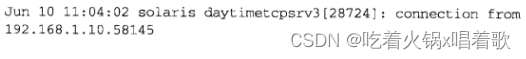 守护进程是在后台运行并没有控制终端的进程。许多网络服务器作为守护进程运行。守护进程产生的所有输出通常通过调用syslog函数发送给syslogd守护进程。系统管理员可根据发送消息的守护进程以及消息的严重级别，选择处理方式。

任意启动一个程序并让它成为守护进程需要以下步骤：调用fork转到后台运行，调用setsid建立一个新的POSIX会话并成为会话首进程，再次调用fork避免无意中获得新的控制终端，改变工作目录和文件创建模式掩码，关闭所有非必要描述符。我们的daemon_init函数处理这些细节。

许多Unix服务器由inetd守护进程启动，inetd处理所有守护进程化所需步骤，当启动真正的服务器时，套接字已在标准输入、标准输出、标准错误打开。这样我们无需调用socket、bind、listen、accept，这些步骤已由inetd处理。

实际上，对于inetd内部处理的5个服务（echo、discard、chargen、time、daytime），每个服务各有1个TCP版本和1个UDP版本，这样总共10个服务器的实现中，其中TCP版本的echo、discard、chargen服务器由inetd派生出来后作为子进程运行，它们需要运行到客户终止连接为止；TCP版的time和daytime服务器不需要inetd派生子进程，因为它们的服务极易实现（即取得当前时间和日期，把它格式化后写出，再关闭连接），于是inetd直接处理。所有5个UDP服务都不需要inetd派生子进程，因为每个服务对客户的返回最多只有一个数据报，因此这5个服务由inetd直接处理。

如果我们创建一个UDP套接字，把端口7（echo服务）捆绑其上，然后在这个服务器上把一个UDP数据报发送到chargen服务器，会导致chargen服务器发送回一个数据报到端口7，这个数据报又会被echo服务器回射到chargen服务器，从而一直循环下去，这是一个有名的拒绝服务攻击。FreeBSD上实现的解决办法是拒绝源端口和目的端口都是内部服务的外来数据报。另一个常用的解决办法是通过inetd禁止这些内部服务，可以在主机上这么做，也可以在一个组织机构接入因特网的路由器上这么做。

Solaris 2.x的inetd有一个-t标志，它会使inetd调用syslog（所用设施为LOG_DAEMON，级别为LOG_NOTICE）登记所处理的TCP请求的客户的IP地址和端口号，该客户的IP地址和端口号是inetd通过accept函数获取的。但不能获取UDP客户的IP和端口号，原因是读入数据报的recvfrom函数是由fork+exec执行的真正服务器调用的，对于inetd，一个解决办法是使用MSG_PEEK标志获取客户IP和端口号，被窥读的数据报保持不动，留待真正的服务器读入。

# 高级IO函数

有3种方式可在涉及[套接字](https://so.csdn.net/so/search?q=套接字&spm=1001.2101.3001.7020)的IO操作上设置超时方法： 1.调用[alarm](https://so.csdn.net/so/search?q=alarm&spm=1001.2101.3001.7020)，它在指定超时期满时产生SIGALRM信号。此方法涉及信号处理，而信号处理在不同的实现上存在差异，且此方法可能干扰进程中已经执行过的alarm调用，可能使之前已经设置的超时时间被覆盖或者被忽略。

2.在select函数中阻塞等待IO（select函数有内置的时间限制），以此代替直接阻塞在read或write调用上。

3.使用较新的SO_RCVTIMEO和SO_SNDTIMEO套接字选项，但并非所有实现都支持这两个套接字选项。

以上3个技术只适用于输入输出操作（如read、write，及诸如recvfrom、sendto之类的变体），我们期待用于connect函数的技术，因为TCP内置的connect函数超时相当长的时间（典型值为75s）。select函数可用来在connect函数上设置超时的条件是相应套接字处于非阻塞模式，而SO_RCVTIMEO和SO_SNDTIMEO套接字选项不适用于connect函数。以上前两个技术适用于所有描述符，而第三个技术只适用于套接字描述符。

以下connect_timeo函数由调用者指定的超时上限调用connect，它的前3个参数用于调用connect，第4个参数是等待的秒数：

```c
#include "unp.h"

static void connect_alarm(int);

int connect_timeo(int sockfd, const SA *saptr, socklen_t salen, int nsec) {
    Sigfunc *sigfunc;
    int n;

    // 为SIGALRM建立一个信号处理函数，同时保存现有信号处理函数（如果有），以便在函数结束时恢复它
    // 此处的signal函数是我们在第五章中自定义的（图5-6）
    sigfunc = Signal(SIGALRM, connect_alarm);
    // 设置本进程的报警时钟，如果之前已设置过报警时钟，则alarm函数会返回这个报警时钟的剩余秒数，否则返回0
    // 如果是前一种情况，我们显示一条警告信息，因为我们覆盖了先前设置的报警时钟
    if (alarm(nsec) != 0) {
        err_msg("connect_timeo: alarm was already set");
    }

    if ((n = connect(sockfd, saptr, salen)) < 0) {
         // 如果connect调用被中断，把errno值改为ETIMEOUT，同时关闭套接字，以防三路握手继续进行
        close(sockfd);
		if (errno == EINTR) {
		    errno = ETIMEDOUT;
		}
    }
    // 关闭本进程报警时钟，同时恢复原来的信号处理函数（如果有）
    // 如果调用本函数前未曾建立过SIGALRM的信号处理函数，则第一个signal调用将返回SIG_DFL，此处会把它设置回默认设置
    alarm(0);    /* turn off the alarm */
    Signal(SIGALRM, sigfunc);    /* restore previous signal handler */

    return n;
}

// 我们期望本函数中断进程主控制流中的未决的connect函数，使它返回EINTR
// 我们的signal函数在被捕获的信号是SIGALRM时，不设置SA_RESTART标志
static void connect_alarm(int signo) {
    return;    /* just interrupt the connect() */
}
12345678910111213141516171819202122232425262728293031323334353637
```

以上程序： 1.本技术只能减少connect函数的超时期限，但无法延长内核现有的超时时长。源自Berkeley的内核的connect函数的超时值通常为75s。

2.使用了系统调用connect的可中断能力，即在内核超时（通常75s）发生前就能返回，我们于是能处理由它返回的EINTR错误。有些库函数执行系统调用时，如果系统调用返回EINTR，这些库函数会重新执行该系统调用，此时也可以使用alarm函数，但还需要使用sigsetjmp和siglongjum（在[信号处理](https://so.csdn.net/so/search?q=信号处理&spm=1001.2101.3001.7020)函数中调用）函数绕过库函数对EINTR的忽略。

在多线程程序中正确使用信号很困难，因此只建议在未线程化或单线程化的程序中使用以上技术。

改写第八章（图8-8）中的dg_cli函数，新dg_cli函数调用alarm使得5秒内收不到应答就中断recvfrom函数：

```c
#include "unp.h"

static void sig_alrm(int);

void dg_cli(FILE *fp, int sockfd, const SA *pservaddr, socklen_t servlen) {
    int n;
    char sendline[MAXLINE], recvline[MAXLINE + 1];

    Signal(SIGALRM, sig_alrm);

    while (Fgets(sendline, MAXLINE, fp) != NULL) {
        Sendto(sockfd, sendline, strlen(sendline), 0, pservaddr, servlen);

		alarm(5);
		if ((n = recvfrom(sockfd, recvline, MAXLINE, 0, NULL, NULL)) < 0) {
		    if (errno == EINTR) {
		        fprintf(stderr, "socket timeout\n");
		    } else {
		        err_sys("recvfrom error");
		    }
		} else {
		    alarm(0);
		    recvline[n] = 0;    /* null terminate */
		    Fputs(recvline, stdout);
		}
    }
}

static void sig_alrm(int signo) {
    return;    /* just interrupt the recvfrom() */
}
12345678910111213141516171819202122232425262728293031
```

以下readable_timeo函数使用select函数实现读超时：

```c
#include "unp.h"

int readable_timeo(int fd, int sec) {
    fd_set rset;
    struct timeval tv;

    FD_ZERO(&rset);
    FD_SET(fd, &rset);

    tv.tv_sec = sec;
    tv.tv_usec = 0;

    return select(fd + 1, &rset, NULL, NULL, &tv);
    /* > 0 if descriptor is readable */
}
123456789101112131415
```

以上函数的返回值就是select函数的返回值，出错返回-1，超时返回0，否则返回已就绪描述符的数目。

以上函数不执行读操作，它只是等待给定描述符变得可读，适用于任何类型套接字。

改写第八章（图8-8）中的dg_cli函数，新dg_cli函数调用readable_timeo，只有readable_timeo函数返回正数时才调用recvfrom：

```c
#include "unp.h"

void dg_cli(FILE *fp, int sockfd, const SA *pservaddr, socklen_t servlen) {
    int n;
    char sendline[MAXLINE], recvline[MAXLINE + 1];

    while (Fgets(sendline, MAXLINE, fp) != NULL) {
        Sendto(sockfd, sendline, strlen(sendline), 0, pservaddr, servlen);

		if (Readable_timeo(sockfd, 5) == 0) {
		    fprintf(stderr, "socket timeout\n");
		} else {
		    // 假设select函数不会出错返回，此时sockfd已变为可读，recvfrom函数一定不会阻塞
		    n = Recvfrom(sockfd, recvline, MAXLINE, 0, NULL, NULL);
		    recvline[n] = 0;    /* null terminate */
		    Fputs(recvline, stdout);
		}
    }
}
12345678910111213141516171819
```

使用SO_RCVTIMEO套接字选项实现读超时，一旦本选项设置到某描述符上（指定了超时值），将应用于该描述符上所有读操作。本方法的优势在于只需设置一次，前两个方法要求在每次会超时的读操作前都做一些工作。SO_RCVTIMEO仅适用于读操作，SO_SNDTIMEO选项仅适用于写操作，两者都不能为connect函数设置超时。

以下是使用SO_RCVTIMEO套接字选项的dg_cli函数：

```c
#include "unp.h"

void dg_cli(FILE *fp, int sockfd, const SA *pservaddr, socklen_t servlen) {
    int n;
    char sendline[MAXLINE], recvline[MAXLINE + 1];
    struct timeval tv;

    tv.tv_sec = 5;
    tv.tv_usec = 0;
    Setsockopt(sockfd, SOL_SOCKET, SO_RCVTIMEO, &tv, sizeof(tv));

    while (Fgets(sendline, MAXLINE, fp) != NULL) {
        Sendto(sockfd, sendline, strlen(sendline), 0, pservaddr, servlen); 

		n = recvfrom(sockfd, recvline, MAXLINE, 0, NULL, NULL);
		if (n < 0) {
		    // 如果IO操作超时，recvfrom函数返回EWOULDBLOCK
		    if (errno == EWOULDBLOCK) {
		        fprintf(stderr, "socket timeout\n");
			continue;
		    } else {
		        err_sys("recvfrom error");
		    }
		}
	
		recvline[n] = 0;    /* null terminate */
		Fputs(recvline, stdout);
    }
}
1234567891011121314151617181920212223242526272829
```

有两个类似read和write函数的函数，它们需要一个额外参数：  recv和send函数的前3个参数等同于read和write函数的前3个参数。flags参数的值或为0，或为以下一个或多个常值的逻辑或：  1.MSG_DONTROUTE：告知内核目的主机在某个直接连接的本地网络上，因此无需执行路由表查找。该特性既可以使用MSG_DONTROUTE标志针对单个输出操作开启，也可以使用SO_DONTROUTE套接字选项针对某套接字上的所有输出操作开启。

2.MSG_DONTWAIT：本标志无需打开相应套接字的非阻塞标志，就可把单个IO操作临时指定为非阻塞的。此标志是随Net/3新增设的，可能有些系统不支持它。

3.MSG_OOB：对于send函数，本标志指明要发送带外数据。TCP连接上只有一个字节可以作为带外数据发送。对于recv函数，本标志指明即将读入带外数据而非普通数据。

4.MSG_PEEK：本标志适用于recv和recvfrom函数，它允许我们查看可读取的数据，系统不在recv或recvfrom函数返回后丢弃这些数据。

5.MSG_WAITALL：随4.3 BSD Reno引入，它告知内核尚未读入所请求的字节数前不要让读操作返回。如果系统支持此标志，可代替readn函数，可用以下宏代替readn函数：

```c
#define readn(fd, ptr, n) recv(fd, ptr, n, MSG_WAITALL)
1
```

即使指定了MSG_WAITALL标志，下列情况读函数仍可能返回比所请求字节数少的数据： （1）捕获一个信号。

（2）连接被终止。

（3）套接字发生错误。

还有一些标志适用于TCP/IP以外的协议族，如OSI的传输层是基于记录的（不像TCP那样是一个字节流），其输出操作支持MSG_EOR标志，指示逻辑记录的结束。

recv和send函数的flags参数是按值传递的，而不是一个值-结果参数，因此它只能用于从进程向内核传递标志，内核无法向进程传回标志。对于TCP/IP协议这不是问题，因为TCP/IP几乎不需要从内核向进程传回标志，但随着OSI协议被加到4.3 BSD Reno中，提出了随输入操作向进程传回MSG_EOR标志的需求，4.3 BSD Reno决定保持其他常用输入函数（recv、recvfrom函数）的参数不变，而改变recvmsg和sendmsg函数所用的msghdr结构，该结构新增了一个msg_flags成员，由于该结构按引用传递，内核就能在返回时修改这些标志，这一决定意味着如果一个进程需要由进程更新标志，就必须调用recvmsg，而不是recv或recvfrom函数。

readv和writev函数类似于read和write函数，但readv和writev函数允许单个系统调用读入或写出一个或多个缓冲区，这些操作称为分散读和集中写，因为来自读操作的输入数据被分散到多个应用缓冲区中，而来自多个应用缓冲区的输出数据被集中提供给单个写操作。  这两个函数的第二个参数都是指向某iovec结构数组的指针，iovec结构定义在sys/uio.h头文件中：  这里给出的iovec结构的各个成员的数据类型符合POSIX规范，但你可能碰到把iovec_base成员定义为char *，把iov_len成员定义为int的实现。

iovec结构数组中元素数量存在限制，具体取决于实现。4.3 BSD和Linux最多允许1024个，而HP-UX最多允许2100个。POSIX要求在头文件sys/uio.h中定义IOV_MAX常值，且其值至少为16。

readv和writev函数可用于任何描述符，不仅限于套接字。writev函数是一个原子操作，这意味着对于一个基于纪录的协议（如UDP）来说，一次writev调用只产生一个UDP数据报。

第七章中提过，可能一个4字节的write后跟一个396字节的write会触发Nagle算法，首选办法之一就是对这两个缓冲区调用writev。

recvmsg和sendmsg函数是最通用的IO函数，我们可以把所有read、readv、recv、recvfrom函数替换成recvmsg函数，类似地，各种输出函数也能替换成sendmsg函数。  这两个函数把大部分参数封装在msghdr结构中：  这里的msghdr结构符合POSIX规范，有些系统仍使用源自4.2 BSD的本结构的较旧版本，这个较旧的结构没有msg_flags成员，而msg_control和msg_contrllen成员分别被称为msg_accrights和msg_accrightslen，这个较旧结构唯一支持的辅助数据形式用于传递文件描述符（称为访问权限）。

msg_name和msg_namelen成员用于套接字未连接的场合（如未连接的UDP套接字）。msg_name指向一个套接字地址结构，调用者在其中存放接收者（对于sendmsg函数）或发送者（对于recvmsg函数）的协议地址。如果无需指明协议地址（如TCP套接字或已连接UDP套接字），msg_name应置为空指针。msg_namelen对于sendmsg函数是一个值参数，对于recvmsg函数是一个值-结果参数，含义是地址结构的大小。

msg_iov和msg_iovlen成员用于指定输入或输出缓冲区数组（iovec结构数组）。msg_control和msg_controllen成员指定可选的辅助数据及其大小。msg_controllen对于recvmsg函数是一个值-结果参数。

对于recvmsg和sendmsg函数，我们需要区分标志变量，一个是值传递的flags参数，一个是引用传递的msghdr.msg_flags成员。

只有recvmsg函数使用msg_flags成员，recvmsg被调用时，flags参数被复制到msg_flags成员，之后由内核使用其值处理接收过程，内核还依据recvmsg调用结果更新msg_flags成员值。

sendmsg函数忽略msg_flags成员，因为它使用flags参数处理发送过程。

以下是内核为输入输出函数检查的标志，表中没有sendmsg函数的msg_flags成员，因为它被忽略：  以上标志中，内核只检查而不返回前4个标志；既检查又返回接下来2个标志；不检查只返回后4个标志。recvmsg函数返回的7个标志的解释： 1.MSG_BCAST：随BSD/OS引入，相对较新，它的返回条件是，本数据报作为链路层广播或其目的IP地址是一个广播地址。与IP_RECVDSTADDR套接字相比（把接收到的UDP数据报的目的IP地址由recvmsg函数作为辅助数据返回），本标志是用于判断一个UDP数据报的目的地址是否是广播地址的更好方法。

2.MSG_MCAST：随BSD/OS引入，相对较新，它的返回条件是，本数据报作为链路层多播收取。

3.MSG_TRUNC：本标志的返回条件是本数据报被截断，即内核预备返回的数据超过进程事先分配的空间（所有iov_len成员之和）。

4.MSG_CTRUNC：本标志的返回条件是本数据报的辅助数据被截断，即内核预备返回的辅助数据超过进程事先分配的空间（msg_controllen）。

5.MSG_EOR：本标志的返回条件是返回数据是一个逻辑记录的结束。TCP不使用本标志，因为它是字节流协议。

6.MSG_OOB：本标志不会随TCP带外数据返回，它用于其他协议族（如OSI协议族）。

7.MSG_NOTIFICATION：本标志由SCTP接收者返回，指示读入的消息是一个事件通知，而非数据消息。

具体实现肯能会在msg_flags成员中返回一些flags参数的值，因此我们应只检查感兴趣的标志。  上图给协议地址分配了16个字节；给辅助数据分配了20个字节；为缓冲数据初始化了一个由3个iovec结构构成的数组：第一个指定一个100字节的缓冲区，第二个指定一个60字节的缓冲区，第三个指定一个80字节的缓冲区。我们还假设为上图UDP套接字设置了IP_RECVDSTADDR套接字选项，以接收读取到的UDP数据报的目的IP地址。

接着我们假设从源IP 198.6.38.100，源端口2000发过来一个170字节的UDP数据报，它的目的是上图中的UDP套接字，目的IP地址为206.168.112.96。下图是recvmsg函数返回时msghdr结构中的信息： 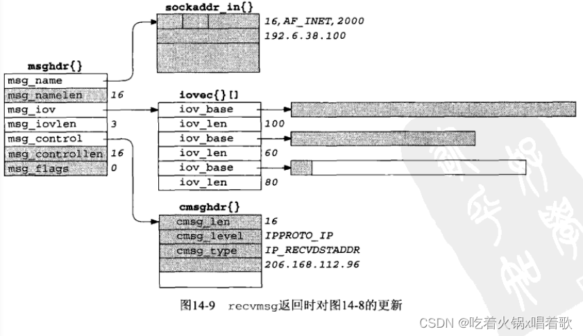 上图中阴影字段表示被修改过，包括以下几点： 1.由msg_name成员指向的缓冲区被填以一个网际套接字地址结构，其中是所收到数据报的源IP和源UDP端口号。

2.msg_namelen成员（值-结果参数）被更新为存放在msg_name成员所指缓冲区中的数据量。本成员实际无变化，recvmsg函数返回前后其值均为16。

3.所收取数据的前100字节存在第一个缓冲区，中60字节存在第二个缓冲区，后10字节存放在第三个缓冲区。最后那个缓冲区中后70字节没有改动，recvmsg函数返回值为170，即该数据报大小。

4.由msg_control成员指向的缓冲区被填以一个cmsghdr结构，该cmsghdr结构中，cmsg_len成员值为16，cmsg_level成员只为IPPROTO_IP，cmsg_type成员值为IP_RECVDSTADDR，随后4个字节存放收到的UDP数据报的目的IP地址。这个20字节缓冲区的后4个字节没有改动。

5.msg_controllen成员被更新为所存放辅助数据的实际数据量，本成员也是值-结果参数，recvmsg函数返回时其结果为16。

6.msg_flags成员同样被recvmsg函数更新，但没有要返回给进程的标志。  辅助数据可通过调用sendmsg和recvmsg函数，使用msghdr结构中的msg_control和msg_controllen成员发送和接收。辅助数据的另一个名字是控制信息。  上图是我们将在本书中讨论的辅助数据的各种用途。OSI协议族也使用辅助数据，但本书不做讨论。

辅助数据由一个或多个辅助数据对象构成，每个对象都以定义在头文件sys/socket.h中的cmsghdr结构开头：  msg_control所指向的辅助数据必须对于cmsghdr结构适当地进行对齐。  由上图，msg_control指向第一个辅助数据对象，辅助数据的总长度由msg_controllen指定。每个辅助数据对象的开头都是描述该对象的cmsghdr结构。在cmsg_type成员和实际数据之间可以有填充字节，从辅助数据结尾到下一个辅助数据对象之前也可以有填充字节。

不是所有实现都支持单个控制缓冲区中存放多个辅助数据对象。

通过一个Unix域套接字传递描述符或凭证时所用的cmsghdr结构：  上图我们假设cmsghdr结构的每个成员（共3个）都占4字节，且cmsghdr结构和实际数据间没有填充字节。当传递描述符时，cmsg_data数组的内容是描述符值，上图只展示了1个待传递描述符，但一般可以传递多个描述符（此时cmsg_len的值为12加4乘描述符数目，这里假设每个描述符占4字节）。

既然由recvmsg函数返回的辅助数据可含有任意数目的辅助数据对象，为了对应用程序屏蔽可能出现的填充字节，在头文件sys/socket.h中定义了5个宏，以简化对辅助数据的处理：  POSIX定义了前3个宏，RFC 3542定义了后2个宏。

这些宏能以如下伪代码形式使用：

```c
struct msghdr msg;
struct cmsghdr *cmsgptr;

/* fill in msg structures */
/* call recvmsg() */
for (cmsgptr = CMSG_FIRSTHDR(&msg); cmsgptr != NULL; cmsgptr = CMSG_NXTHDR(&msg, cmsgptr)) {
    if (cmsgptr->cmsg_level == ... && cmsgptr- >cmsg_type == ...) {
        u_char *ptr;

        ptr = CMSG_DATA(cmsgptr);
        /* ptocess data pointed to by ptr */
    }
}
12345678910111213
```

CMSG_FIRSTHDR返回指向第一个辅助数据对象的指针，但如果msghdr结构中没有辅助数据（msg_control为一个空指针），或cmsg_len小于一个cmsghdr结构的大小，则返回一个空指针。当控制缓冲区中不再有下一个辅助数据对象时，CMSG_NXTHDR也返回一个空指针。

CMSG_FIRSTHDR的许多实现不检查msg_controllen是否等于控制缓冲区的大小，而是直接返回cmsg_control的值，最好在调用该宏前测试msg_controllen的值。

CMSG_LEN不计辅助数据对象中数据部分之后可能的填充字节，因此返回的是存放在cmsg_len成员中的值；CMSG_SPACE计上结尾处可能的填充字节，因此返回的是为辅助数据对象动态分配空间的值。

以下3个技术可在不真正读取数据的前提下直到一个套接字上已有多少数据排队等着读： 1.如果获悉已排队数据量的目的在于避免读操作阻塞在内核，则可用非阻塞式IO。

2.如果我们既想查看数据，又想数据仍留在接收队列中以供本进程其他部分稍后读取，则可用MSG_PEEK标志。如果我们不能确定是否有数据可读，可结合非阻塞套接字使用该标志，或组合使用MSG_DONTWAIT和MSG_PEEK标志。就一个字节流套接字而言，其接收队列中的数据量可能在两次相继的recv调用之间发生变化，例如，指定MSG_PEEK标志以一个长为1024字节的缓冲区对一个TCP套接字调用recv，其返回值为100，如果再次调用同一个recv，返回值就可能超过100（假设接收缓冲区长度大于100），因为这两次recv调用之间TCP可能又收到一些数据。

就一个UDP套接字而言，假设其接收队列中已有一个数据报，如果我们指定MSG_PEEK标志调用recvfrom一次，稍后不指定MSG_PEEK再调用recvfrom一次，那么即使另有数据报在这两次调用之间加入该套接字的接收队列，这两个调用的返回值（数据报大小、内容、发送者地址）也完全相同（这里假设没有其他进程共享该套接字并从中读数据）。

3.一些实现支持ioctl的FIONREAD命令，该命令的第3个ioctl参数是指向某整数的指针，内核通过该整数返回套接字接收队列的当前字节数，该值是已排队字节的总和，对于UDP套接字而言包含所有已排队的数据报。源自Berkeley的实现中，为UDP返回的值还包括一个套接字地址结构的空间（此空间会含IP地址和端口号等信息，对IPv4为16字节，对IPv6为24字节）。

上例都是使用称为Unix IO的函数执行IO，它们围绕描述符工作，通常作为Unix内核中的系统调用实现。

执行IO的另一个方法是使用标准IO函数库，这个函数库由ANSI C标准规范，意在便于移植到支持ANSI C的非Unix系统上。标准IO函数库处理我们直接使用IO函数时要考虑的一些细节，如自动缓冲输入流和输出流，但它对于流的缓冲处理导致了一组新的问题。

标准IO函数库也使用流（stream）这一称谓，如打开一个输入流或刷写输出流，不要将其和流（STREAMS）子系统相混淆。

标准IO函数库可用于套接字： 1.通过调用fdopen，可从任何描述符创建出一个标准IO流。通过调用fileno，可获取一个给定标准IO流对应的描述符。第六章（6-9）中，我们当时想在一个标准IO流上调用select，select只能用于描述符，因此我们获取了那个标准IO流的描述符。

2.TCP和UDP套接字是全双工的，标准IO流也是全双工的（只要以r+打开流即可，r+意味着读写），但在这样的流上，我们必须在调用一个输出函数后调用一次fflush、fseek、fsetpos、rewind才能调用一个输入函数；类似地，调用一个输入函数后也要调用一次fseek、fsetpos、rewind才能调用一个输出函数，除非输入函数遇到一个EOF。fseek、fsetpos、rewind这3个函数都调用lseek，而lseek用在套接字上只会失败。在输入输出切换的时候，要保证缓冲区中的数据已被读入或已被写出，否则下次输出输入会覆盖缓冲区中的数据，或者我们要调用fseek、fsetpos、rewind函数调整偏移量，以确保下一次读写操作可以从正确的位置开始。

3.解决2中读写问题的最简单方法是为一个给定套接字打开两个IO流，一个用于读，一个用于写。

使用标准IO代替read和writen函数重新编写第五章（5-3）中TCP回射服务器程序：

```c
#include "unp.h"

void str_echo(int sockfd) {
    char line[MAXLINE];
    FILE *fpin, *fpout;

    fpin = Fdopen(sockfd, "r");
    fpout = Fdopen(sockfd, "w");

    while (Fgets(line, MAXLINE, fpin) != NULL) {
        Fputs(line, fpout);
    }
}
12345678910111213
```

以上函数调用fdopen创建两个标准IO流，一个用于输入，一个用于输出，然后把原来的read和writen函数换为fgets和fputs函数。

运行使用以上版本str_echo函数的服务器，然后运行其用户：   如上图，服务器直到我们键入EOF字符才回射所有文本行，原因在于这里存在一个缓冲问题，以下是实际发生的步骤： 1.我们键入第一行文本，它被发送到服务器。

2.服务器用fgets函数读入本行，在用fputs函数回射本行。

3.服务器的标准IO流被标准IO函数库完全缓冲，这意味着函数库把回射行复制到输出流的标准IO缓冲区，但不把该缓冲区中内容写到描述符，因为该缓冲区未满。

4.我们键入第二行文本，它被发送到服务器。

5.服务器用fgets函数读入本行，再用fputs函数回射本行。

6.服务器的标准IO函数库再次把回射行复制到输出流的标准IO缓冲区，但不把该缓冲区中内容写到描述符，因为该缓冲区未满。

7.同样的情形发生在我们键入的第三行文本上。

8.我们键入EOF字符，致使客户的str_cli函数（第六章6-13）调用shutdown，从而发送一个FIN到服务器。

9.服务器TCP收取这个FIN，它被fgets函数滴入，致使fgets函数返回一个空指针。

10.str_echo函数返回到服务器的main函数（第五章5-12），子进程通过调用exit终止。

11.C库函数exit调用标准IO清理函数，之前由fputs函数填充的输出缓冲区中的未满内容被输出。

12.服务器子进程终止，致使它的已连接套接字被关闭，从而发送一个FIN到客户，完成TCP的四分组终止序列。

13.str_cli函数接收并输出由服务器回射的三行文本。

14.str_cli接着在其套接字上收到一个EOF，客户于是终止。

这里的问题出在服务器中由标准IO函数库自动执行的缓冲上，标准IO函数库执行以下三类缓冲： 1.完全缓冲：只在下列情况才发生IO：缓冲区满、进程显式调用fflush、进程调用exit终止自身。标准IO缓冲区大小通常为8192字节。

2.行缓冲：只在下列情况才发生IO：碰到换行符、进程调用fflush、进程调用exit终止自身。

3.不缓冲：每次调用标准IO输出函数都发生IO。

标准IO函数库的大多Unix实现使用如下规则： 1.标准错误输出总不缓冲。

2.标准输入和标准输出完全缓冲，除非它们指代终端设备（此时是行缓冲）。

3.其他IO流都是完全缓冲，除非它们指代终端设备（此时是行缓冲）。

套接字不是终端设备，因此以上str_echo函数的问题就出在输出流是完全缓冲的。解决方法有两个：一是通过调用setvbuf使这个流变为行缓冲；二是每次调用fputs后通过fflush函数强制输出每个回射行。现实使用中，这两种方法都容易犯错，与Nagle算法的交互可能也成问题。大多情况下，最好不在套接字上使用标准IO函数库，且像3.9节所述在缓冲区而非文本行上执行操作。当标准IO流的便利性大过对缓冲带来的bug的担忧时，也可在套接字上使用标准IO流，但这很罕见。

标准IO库的某些实现在描述符大于255时会有问题，这对于需要处理大量描述符的网络服务器是一个问题，可检查stdio.h头文件中定义的FILE结构，看存放描述符的变量是什么类型。

许多操作系统提供其他为套接字设置IO等待时间限制的方法，它们有select和poll函数的特性，这些方法未被POSIX采纳，且在不同实现上存在差异，使用这些机制的代码应被认为是不可移植的。

Solaris上名为/dev/poll的特殊文件提供了一个可扩展的轮询大量描述符的方法。select和poll函数的问题是，每次调用它们都要传递待查询的文件描述符。轮询设备能在调用之间维持状态，因此轮询进程可预先设置好待查询描述符列表，然后进入一个循环等待事件发生，每次循环回来时不必再次设置待查询描述符列表。

打开/dev/poll后，轮询进程必须先初始化一个pollfd结构（poll函数使用的结构，但本机制不使用其中的revents成员）数组，再调用write往/dev/poll设备上写这个结构数组以把它传给内核，然后执行ioctl函数的DP_POLL命令阻塞自身等待事件发生。传递给ioctl函数的结构如下：  dp_fds成员指向一个缓冲区，供ioctl函数返回时存放pollfd结构数组，dp_nfds成员指定该缓冲区中有几个pollfd结构。ioctl函数将一直阻塞到一个被轮询描述符上发生所关心的事件，或流逝时间超过dp_timeout成员指定的毫秒数。dp_timeout指定为0将导致ioctl函数立即返回，从而提供了使用本接口的非阻塞手段。dp_timeout设为-1表示没有超时限制。

把第六章（6-13）中的str_cli函数改为使用/dev/poll的版本：

```c
#include "unp.h"
#include <sys/devpoll.h>

void str_cli(FILE *fp, int sockfd) {
    int stdineof;
    char buf[MAXLINE];
    int n;
    int wfd;
    // 我们只需要使用2个描述符，因此此处静态分配了2个元素的数组
    // 实际可能要监视成百上千个描述符，可能这些程序的这个数组是动态分配的
    struct pollfd pollfd[2];
    struct dvpoll dopoll;
    int i;
    int result;

    wfd = Open("/dev/poll", O_REWR, 0);

    pollfd[0].fd = fileno(fp);
    pollfd[0].events = POLLIN;
    pollfd[0].revents = 0;

    pollfd[1].fd = sockfd;
    pollfd[1].events = POLLIN;
    pollfd[1].revents = 0;

    Write(wfd, pollfd, sizeof(struct pollfd) * 2);

    stdineof = 0;
    for (; ; ) {
        /* block until /dev/poll says something is ready */
		dopoll.dp_timeout = -1;
		dopoll.dp_nfds = 2;
		dopoll.dp_fds = pollfd;
		// ioctl函数返回值是已就绪描述符个数
		result = Ioctl(wfd, DP_POLL, &dopoll);
	
		/* loop through ready file descriptors */
		for (i = 0; i < result; ++i) {
		    if (dopoll.dp_fds[i].fd == sockfd) {
		        /* socket is readable */
				if ((n = Read(sockfd, buf, MAXLINE)) == 0) {
				    if (stdineof == 1) {
				        return;    /* normal termination */
				    } else {
				        err_quit("str_cli: server terminated permaturely");
				    }
	
	                Write(fileno(stdout), buf, n);
	            }
            // 我们知道就绪的描述符不外乎sockfd和输入文件描述服
            // 规模较大的程序描述符遍历工作比较复杂，可能涉及往线程派遣任务
		    } else {
		        /* input is readable */
				if ((n = Read(fileno(fp), buf, MAXLINE)) == 0) {
				    stdineof = 1;
				    Shutdown(sockfd, SHUT_WR);    /* send FIN */
				    continue;
				}
		
				Writen(sockfd, buf, n);
		    }
		}
    }
}
12345678910111213141516171819202122232425262728293031323334353637383940414243444546474849505152535455565758596061626364
```

FreeBSD随4.1版本引入了kqueue接口，允许向内核注册描述所关注kqueue事件的事件过滤器。事件除了关注与select函数类似的文件IO和超时外，还有异步IO、文件修改通知（如文件被删除或修改时发出的通知）、进程跟踪（如进程调用exit或fork时发出的通知）、信号处理。kqueue接口包含以下2个函数和1个宏：  kqueue函数返回一个新的kqueue描述符，用于后续的kevent函数。kevent函数既用于注册所关注的事件，也用于确定是否有所关注的事件发生。changelist和nchanges参数给出对所关注事件作出的更改，若无更改则分别取值为NULL和0。条件触发的事件（包括刚在changelist参数中增设的事件）由kevent函数的eventlist参数返回，它指向一个由参数nevents个元素构成的kevent结构数组。kevent函数在eventlist参数中返回的事件数目作为函数返回值返回，0表示超时。超时通过timeout参数设置，其处理类似select函数：NULL阻塞进程、非0值timespec指定明确的超时值、0值的timespec执行非阻塞事件检查。kevent函数使用的timespec结构不同于select函数使用的timeval结构，前者分辨率为纳秒，后者分辨率为微秒。

kevent结构在头文件sys/event.h中定义：  flags成员在调用kevent时改变过滤器行为的值和返回时被设置的值如下： 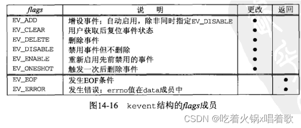 filter成员指定的过滤器类型：  把第六章（6-13）中使用select函数的str_cli函数改为使用kqueue的版本：

```c
#include "unp.h"

void str_cli(FILE *fp, int sockfd) {
    int kq, i,  n, nev, stdineof = 0, isfile;
    char buf[MAXLINE];
    struct kevent kev[2];
    struct timespec ts;
    struct stat st;

    // 文件描述符关联的是否是文件
    isfile = ((fstat(fileno(fp), &st) == 0) && (st.st_mode & S_IFMT) == S_IFREG);

    EV_SET(&kev[0], fileno(fp), EVFILT_READ, EV_ADD, 0, 0, NULL);
    EV_SET(&kev[1], sockfd, EVFILT_READ, EV_ADD, 0, 0, NULL);

    // 调用Kqueue取得一个kqueue描述符
    kq = Kqueue();
    // 设置超时值为0以便非阻塞地调用kevent
    ts.tv_sec = ts.tv_nsec = 0;
    // 以设置好的kevent结构数组作为过滤器更改请求调用kevent
    Kevent(kq, kev, 2, NULL, 0, &ts);

    for (; ; ) {
        // 每次调用kevent指定的过滤器更改列表为NULL（我们仅关注已注册过的事件），超时参数为NULL（永远阻塞）
        nev = Kevent(kq, NULL, 0, kev, 2, NULL);

		for (i = 0; i < nev; ++i) {
		    if (kev[i].ident == sockfd) {    /* socket is readable */
		        if ((n = Read(sockfd, buf, MAXLINE)) == 0) {
				    if (stdineof == 1) {
				        return;    /* normal termination */
				    } else {
				        err_quit("str_cli: server terminated prematurely");
				    }
				}
		
				Write(fileno(stdout), buf, n);
		    }
	
		    if (kev[i].ident == fileno(fp)) {    /* input is readable */
		        n = Read(fileno(fp), buf, MAXLINE);
				if (n > 0) {
				    Writen(sockfd, buf, n);
				}
		         
		        // kqueue函数在报告EOF时，对于管道和终端，kqueue函数和select函数一样
		        // 对于文件，kqueue函数每次返回把文件中剩余字节数存到kevent.data，如果我们读到的字节数和该值一样，就说明读到了EOF
				if (n == 0 || (isfile && n == kev[i].data)) {
				    stdineof = 1;
				    Shutdown(sockfd, SHUT_WR);    /* send FIN */
				    kev[i].flags = EV_DELETE;
				    Kevent(kq, &kev[i], 1, NULL, 0, &ts);    /* remove kevent */
				    continue;
				}
		    }
		}
    }
}
12345678910111213141516171819202122232425262728293031323334353637383940414243444546474849505152535455565758
```

对新近发展中的接口而言，阅读它们特定于操作系统具体版本的文档时要小心，这些接口在不同版本间往往存在细微差别，因为操作系统厂家仍在推敲它们该如何工作的细节。

尽管应避免编写不可移植的代码，但对于一个任务繁重的网络应用而言，使用各种可能的方式为它在特定主机系统上进行优化也很常见。

T/TCP（事务TCP）是对TCP进行修改的版本，能避免近来彼此通信过的主机之间的三路握手。

T/TCP最广为流传的实现是FreeBSD的实现。

T/TCP能把SYN、FIN和数据组合到一个分节中，前提是数据大小小于MSS。  如上图，第一个分节是由客户的单个sendto调用产生的SYN、FIN和数据，该分节组合了connect、write、shutdown三个函数的功能。而服务器会执行通常的套接字函数调用步骤：socket、bind、listen、accept，accept函数在客户的分节到达时返回。服务器用send函数发回应答并关闭套接字。服务器在同一分节中向客户发出SYN、FIN和应答。可见T/TCP可减少网络中传输的分节（TCP需10个，UDP需2个），且客户从初始化连接到发送一个请求再到读取相应应答所花时间也减少了一个RTT。

T/TCP的优势在于TCP的所有可靠性（序列号、超时、重传等）得以保留，而不像UDP那样把可靠性推给应用去实现。T/TCP同样维持TCP的慢启动和拥塞避免措施。

客户与服务器第一次通信时三路握手是需要的，不过将来只要两端各自高速缓冲的一些信息没过时，且没有一端的主机崩溃并重启过，就可以避免三路握手。上图的3个分节构成最少请求-应答交换，如果请求或应答超过一个分节的承载量，就需要额外的分节。

术语“事务”的含义是客户的请求与服务器的应答，常见的事务的例子有DNS请求与服务器的应答、HTTP请求与服务器的应答。该术语并非指代两阶段提交协议（two-phase commit protocol），两阶段提交协议是一种分布式系统中用于协调多个参与者（进程或节点）的一致性的协议，它旨在确保在分布式环境中进行的事务操作的原子性和一致性。在分布式系统中，如果涉及多个参与者的操作需要保持一致性，那么在提交（commit）这些操作之前，必须确保所有参与者都同意执行操作，并且在所有参与者都成功执行后，再统一提交或回滚操作。 Two-Phase Commit Protocol提供了一种机制来实现这种协调和一致性。该协议由两个阶段组成： 1.Prepare Phase（准备阶段）：在这个阶段，协调者（coordinator）向所有参与者发送一个准备请求，询问它们是否可以执行事务操作。每个参与者会根据自身的状态来决定是否可以执行。如果所有参与者都同意执行，它们将准备好并发送准备完成的消息给协调者。

2.Commit Phase（提交阶段）：在准备阶段完成后，协调者将向所有参与者发送一个提交请求。如果所有参与者在准备阶段都准备好了，它们将执行事务的提交操作。一旦所有参与者完成提交操作，它们将向协调者发送确认消息。

这个协议的关键在于所有参与者必须遵循协议的执行流程，并且在故障发生时有适当的恢复机制。如果所有参与者都成功执行并确认提交，那么协调者将通知应用程序事务已成功提交。如果任何一个参与者无法执行或者在提交阶段发生故障，协调者将通知应用程序事务失败，需要进行回滚操作。

Two-Phase Commit Protocol通过协调者与参与者之间的消息交换，确保了分布式环境中的事务一致性，但也因为需要所有参与者的同意和网络通信的开销，导致了协议的复杂性和性能上的一定开销。

为处理T/TCP，套接字API需作出一些改动，但在提供T/TCP的系统上的TCP应用无需任何改动，除非要使用T/TCP特性。有关T/TCP： 1.客户调用sendto，以便把数据的发送结合到连接的建立中，该调用替换单独的connect和write调用，服务器的协议地址传递给sendto函数而非connect函数。

2.sendto函数的flags参数新增标志MSG_EOF，用于指示本套接字上不再有数据待发送。该标志允许我们把shutdown调用结合到输出操作，给一个sendto调用同时指定本标志和服务器的协议地址可能导致发送单个含有SYN、FIN、数据的分节。图14-9指出服务器发送应答使用的是send函数而非write函数，是为了指定MSG_EOF标志，以便随应答一起发送FIN。

3.新定义一个级别为IPPROTO_TCP的套接字选项TCP_NOPUSH，本选项阻止发送方将小数据块发送出去，直到达到一定的条件。具体条件的实现可能因操作系统而异，但一般情况下，当发送缓冲区中的数据块大小达到一定阈值、发送方收到确认或发送缓冲区被填满时，数据才会被发送。

4.想跟服务器建立连接并使用T/TCP发送请求的客户应调用socket、setsockopt（开启TCP_NOPUSH选项）、sendto（若只有一个请求待发送则指定MSG_EOF标志）。如果setsockopt函数返回ENOPROTOOPT或sendto函数返回ENOTCONN错误，则本主机不支持T/TCP，此时客户只能调用connect和write，后跟shutdown函数（如果只有一个请求待发送）。

5.服务器所需的唯一变动是，如果想随应答一起发送FIN，就指定MSG_EOF标志调用send函数发送应答，而不是调用write函数。

6.可用条件编译指令`#ifdef MSG_EOF`进行编译时测试MSG_EOF是否定义。

在套接字操作上设置时间限制的方法： 1.使用alarm函数和SIGALRM信号。

2.使用由select函数提供的时间限制。

3.使用较新的SO_RCVTIMEO和SO_SNDTIMEO套接字选项。

第一个方法易于使用，但涉及信号处理，信号处理可能存在竞争条件。使用select函数意味着我们阻塞在指定了时间限制的该函数上，而非read、write、connect函数上。第三个方法易于使用，但并非所有实现都支持。

recvmsg和sendmsg函数是5组IO函数中最通用的，它们有以下能力：指定MSG_xxx标志（来自recv和send函数）、返回或指定对端协议地址（来自recvfrom和sendto函数）、使用多个缓冲区（来自readv和writev函数），另外一组IO函数是read和write。此外还新增了两个新特性：给进程返回标志、接受或发送辅助数据。

辅助数据由一个或多个辅助数据对象构成，每个对象都以一个cmsghdr结构打头，它指定数据的长度、协议级别、类型。

C标准IO库也可用在套接字上，但这么做将在已经由TCP提供的缓冲级别上新增一级缓冲。事实上，对由标准IO函数库执行的缓冲缺乏了解是使用该函数库的最常见问题，该问题的重用解决方法是把标准IO流设置成不缓冲，或不要在套接字上使用标准IO。

许多厂家提供轮询大量事件却没有select和poll函数所需开销的高级方法，尽管应避免编写不可移植的代码，有时性能改善的收益会重于不可移植造成的风险。

T/TCP是对TCP增强版本，能在客户和服务器最近彼此通信过的前提下避免三路握手，使得服务器对客户的请求更快给出应答。从编程角度看，客户通过调用sendto而非通常的connect、write、shutdown调用序列来发挥T/TCP的优势。

如果main函数末尾没有调用exit，标准IO缓冲区中尚未输出的数据也会输出，因为main函数末尾未调用exit等同于从main函数返回，而main函数又是由C启动例程如下调用的：

```c
exit(main(argc, argv));
1
```

因此exit函数仍被调用，标准IO清扫例程也同样被调用。

# 第十五章 Unix域协议

本书中，作者说Unix域数据报[套接字](https://so.csdn.net/so/search?q=套接字&spm=1001.2101.3001.7020)是不可靠的，这一说法已经过时，当前大多实现中，Unix域套接字都是可靠的，不论是数据报套接字还是字节流套接字。

Unix域协议不是一个实际的协议族，而是单个主机上执行客户/服务器通信的方法，所用API是套接字API。Unix域协议可视为[IPC](https://so.csdn.net/so/search?q=IPC&spm=1001.2101.3001.7020)（进程间通信）方法之一。

Unix域提供两类套接字：[字节流](https://so.csdn.net/so/search?q=字节流&spm=1001.2101.3001.7020)套接字和数据报套接字。

使用Unix域套接字的理由： 1.在源自Berkeley的实现中，Unix域套接字往往比通信两端位于同一主机上的TCP套接字快出一倍。X Window System发挥了Unix域套接字的这个优势，当一个X11客户启动并打开到X11服务器的连接时，客户检查DISPLAY环境变量的值，该值中包含服务器主机名，如果服务器与客户处于同一主机，客户就打开到服务器的Unix域字节流连接，否则打开到服务器的TCP连接。

2.Unix域套接字可在同一主机上的不同进程间传递描述符。

3.Unix域套接字较新的实现可把客户的凭证（uid、gid）提供给服务器，从而提供额外的安全检查措施。

Unix域中用于标识客户和服务器的协议地址是文件系统中的路径名，这些路径名不是普通Unix文件，除非把它们和Unix域套接字关联起来，否则无法读写这些文件。

头文件sys/un.h中定义了Unix域套接字的地址结构：  BSD早期版本定义sun_path数组的大小为108字节，而非上图中的104字节。POSIX规范没有定义sun_path数组的大小，且明确警示应用不应假设一个特定长度，而是应运行时使用sizeof运算符得出本结构长度，再看路径名是否能存到其中的sun_path数组，数组长度很可能在92到108之间，而非足以存放任意路径名的值。存在路径名长度限制源于4.2 BSD的实现细节，要求本结构能装入128字节的mbuf（一种内核内存缓冲区）。

存在sun_path数组中的路径名必须以空字符结尾。SUN_LEN宏接受一个指向sockaddr_un结构的指针，返回该结构大小，返回的大小中不包括pathname的空字符，该宏的定义为：

```c
#define SUN_LEN(ptr) ((size_t)(((struct sockaddr_un *)0)->sun_path) + strlen((ptr)->sun_path))
1
```

当sockaddr_un.sun_path只有一个空字符时，即`sum[0] = 0`时，相当于IPv4的INADDR_ANY和IPv6的IN6ADDR_ANY_INIT常量。

POSIX把Unix域协议重新命名为本地IPC，以消除它对Unix操作系统的依赖，常值AF_UNIX变为AF_LOCAL，但我们仍使用Unix域套接字这个称谓，因为这已成为它约定俗成的名字，与支持它的操作系统无关。尽管POSIX努力使它独立于操作系统，但它的套接字地址结构仍保留_un后缀。AF_UNIX和AF_LOCAL实际上是等价的，它们都表示使用Unix域套接字的本地通信，在大多数Unix-like操作系统中，这两个常量被定义为相同的值。

创建一个Unix域套接字，往其上bind一个路径名，在调用getsockname输出这个绑定的路径名：

```c
#include "unp.h"

int main(int argc, char **argv) {
    int sockfd;
    socklen_t len;
    struct sockaddr_un addr1, addr2;

    if (argc != 2) {
        err_quit("usage: unixbind <pathname>");
    }

    sockfd = Socket(AF_LOCAL, SOCK_STREAM, 0);

    // 如果文件系统中已存在该路径名，bind函数会失败，因此先删除它
    // 如果该路径不存在，unlink函数会返回-1，并将errno设为ENOENT（No such file or directory）
    unlink(argv[1]);    /* OK if this fails */

    bzero(&addr1, sizeof(addr1));
    addr1.sun_family = AF_LOCAL;
    // 使用strncpy函数复制命令行参数，防止路径名过长导致其溢出结构
    // 我们已把addr1结构初始化为0，且从sun_path数组的大小减去1，因此该路径名肯定会以空字符结尾
    strncpy(addr1.sun_path, argv[1], sizeof(addr1.sun_path) - 1);
    Bind(sockfd, (SA *)&addr1, SUN_LEN(&addr1));

    len = sizeof(addr2);
    Getsockname(sockfd, (SA *)&addr2, &len);
    printf("bound name = %s, returned len = %d\n", addr2.sun_path, len);

    exit(0);
}
123456789101112131415161718192021222324252627282930
```

在Solaris系统上运行以上程序：  由上图，我们先输出umask的值，POSIX规定创建的文件访问权限应根据该值修正，022的文件模式掩码表示关闭组用户和其他用户写位。之后运行unixbind，可见getsockname函数返回的长度为13：sun_family占2字节，路径名占11字节。getsockname函数的len参数是一个值-结果参数，函数返回时的结果不同于调用该函数时的值。我们可用printf函数的%s格式输出路径名，因为sun_path成员中的路径名是以空字符结尾的。之后我们再次运行unixbind，以验证unlink函数删除了该路径名。

我们运行ls -l命令查看文件权限和类型，在Solaris及大多Unix变体上，该路径名的文件类型为s（套接字）。我们看到权限位已正确地根据umask值修正。最后指定ls的-F选项，它在套接字路径名后添加一个等号，该选项使文件列表更具可读性和可识别性。

历史上umask值未被应用于Unix域套接字文件，但大多Unix厂商已修复了这一点，使umask如期地工作，但文件权限位（不论umask为何值）全部设置或全不设置的系统仍存在。有些系统把Unix域套接字文件视为FIFO，从而将文件类型显示为p。

socketpair函数创建两个连接起来的Unix域套接字：  family参数必须是AF_LOCAL，protocol参数必须是0。type参数可以是SOCK_STREAM或SOCK_DGRAM。新创建的两个套接字描述符作为sockfd[0]和sockfd[1]返回。

socketpair函数类似pipe函数，会返回两个彼此连接的描述符，事实上，源自Berkeley的实现通过执行与socketpair函数一样的操作给出pipe接口。

socketpair函数创建的两个套接字不曾命名，其中没有涉及隐式的bind调用。

type参数为SOCK_STREAM时，socketpair函数得到的结果称为流管道，它与pipe函数创建的普通Unix管道类似，差别在于流管道是全双工的，两个描述符都是既可读又可写，而pipe创建的管道是半双工的。

POSIX不要求pipe函数返回全双工管道，但SVR 4上pipe函数会返回两个全双工描述符，但源自Berkeley的内核传统地返回两个半双工描述符。

当用于Unix域套接字时，套接字函数存在一些差异和限制，我们列出POSIX的要求，但并非所有实现都已达到这个级别： 1.由bind函数创建的路径名默认访问权限应为0777，并按当前umask值修正。

2.与Unix域套接字关联的路径名应该是一个绝对路径名，避免使用相对路径名的原因是它的解析取决于调用者的当前工作目录，即如果服务器绑定一个相对路径名，客户就得在与服务器相同的目录（即客户必须知道这个目录）中才能成功调用connect或sendto。

POSIX声明给Unix域套接字捆绑相对路径名将导致不可预计的后果。

3.connect调用中指定的路径名必须是当前绑定在某个打开的Unix域套接字上的路径名，且它们的套接字类型（字节流或数据报）也必须一致。出错条件包括： （1）该路径名已存在但不是一个套接字。

（2）该路径名已存在，且是一个套接字，但没有与之关联的打开描述符。

（3）该路径名已存在，且是一个打开的套接字，但套接字类型不符。

4.调用connect连接到Unix域套接字涉及的权限测试等同于调用open以只写方式访问相应路径名。

5.Unix域字节流套接字类似TCP套接字，它们都为进程提供一个无记录边界的字节流接口。

6.如果某Unix域字节流套接字的connect调用发现这个监听套接字的队列已满，就立即返回一个ECONNREFUSED错误。这不同于TCP，如果TCP监听套接字队列已满，TCP监听端就忽略新到达的SYN，而TCP连接发起端将数次发送SYN进行重试。

7.Unix域数据报套接字类似UDP套接字，它们都提供一个保留记录边界的数据报服务。但Unix域数据报套接字提供的服务是可靠的。

8.在一个未绑定的Unix数据包域套接字上发送数据或不会给这个套接字自动捆绑一个路径名，而UDP和TCP套接字发送数据会给这样的套接字捆绑一个临时端口。这意味着发送端如果不绑定一个路径名，数据报类型的Unix域套接字无法发回应答数据报。类似地，不像TCP或UDP，对Unix域数据报套接字调用connect也不会绑定一个路径名。

把第五章中的TCP回射客户/服务器重新编写为使用Unix域字节流套接字的。以下是将TCP回射服务器（5-12）改写为使用Unix域字节流套接字后的结果：

```c
#include "unp.h"

int main(int argc, char **argv) {
    int listenfd, connfd;
    pid_t childpid;
    socklen_t clilen;
    struct sockaddr_un cliaddr, servaddr;
    void sig_chld(int);

    listenfd = Socket(AF_LOCAL, SOCK_STREAM, 0);

    // UNIXSTR_PATH是/tmp/unix.str
    // 首先unlink该路径，防止早先某次运行导致该路径存在
    unlink(UNIXSTR_PATH);
    bzero(&servaddr, sizeof(servaddr));
    servaddr.sun_family = AF_LOCAL;
    strcpy(servaddr.sun_path, UNIXSTR_PATH);

    // 此处第三个参数不同于上例中使用SUN_LEN函数
    // 这里指定的套接字地址结构大小是servaddr结构的总大小（在我的机器上是110）
    // 如果用SUN_LEN(&servaddr)，在我的机器上是15
    // 这两个长度都是有效的，路径名都以null结尾
    Bind(listenfd, (SA *)&servaddr, sizeof(servaddr));

    Listen(listenfd, LISTENQ);

    Signal(SIGCHLD, sig_chld);

    for (; ; ) {
        clilen = sizeof(cliaddr);
		if ((connfd = accept(listenfd, (SA *)&cliaddr, &clilen)) < 0) {
		    if (errno == EINTR) {
		        continue;    /* back to for() */
		    } else {
		        err_sys("accept error");
		    }
		}
	
		if ((childpid = Fork()) == 0) {    /* child process */
		    Close(listenfd);    /* close listening socket */
		    str_echo(connfd);    /* process request */
		    exit(0);
		}
		Close(connfd);    /* parent closes connected socket */
    }
}
12345678910111213141516171819202122232425262728293031323334353637383940414243444546
```

以下是将TCP回射客户（5-4）改写为使用Unix域字节流套接字的结果：

```c
#include "unp.h"

int main(int argc, char **argv) {
    int sockfd;
    struct sockaddr_un servaddr;

    sockfd = Socket(AF_LOCAL, SOCK_STREAM, 0);

    bzero(&servaddr, sizeof(servaddr));
    servaddr.sun_family = AF_LOCAL;
    strcpy(servaddr.sun_path, UNIXSTR_PATH);

    Connect(sockfd, (SA *)&servaddr, sizeof(servaddr));

    str_cli(stdin, sockfd);    /* do it all */

    exit(0);
}
123456789101112131415161718
```

把第八章中的UDP回射客户/服务器重新编写为使用Unix域数据报套接字的。以下是将UDP回射服务器（8-3）改写为使用Unix域数据报套接字后的结果：

```c
#include "unp.h"

int main(int argc, char **argv) {
    int sockfd;
    struct sockaddr_un servaddr, cliaddr;

    sockfd = Socket(AF_LOCAL, SOCK_DGRAM, 0);

    // // UNIXSTR_PATH是/tmp/unix.dg
    unlink(UNIXDG_PATH);
    bzero(&servaddr, sizeof(servaddr));
    servaddr.sun_family = AF_LOCAL;
    strcpy(servaddr.sun_path, UNIXDG_PATH);

    Bind(sockfd, (SA *)&servaddr, sizeof(servaddr));

    dg_echo(sockfd, (SA *)&cliaddr, sizeof(cliaddr));
}
123456789101112131415161718
```

以下是将UDP回射客户（8-7）改写为使用Unix域数据报套接字的结果：

```c
#include "unp.h"

int main(int argc, char **argv) {
    int sockfd;
    struct sockaddr_un cliaddr, servaddr;

    sockfd = Socket(AF_LOCAL, SOCK_DGRAM, 0);

    bzero(&cliaddr, sizeof(cliaddr));    /* bind an address for us */
    cliaddr.sun_family = AF_LOCAL;
    // 使用Unix域数据报协议时，我们必须显式bind一个路径名，这样服务器才有能回射应答的路径名
    // 我们调用tmpnam函数生成一个临时文件名，把它bind到此套接字
    // 由于一个未绑定的Unix域数据报套接字发送数据报不会隐式给这个套接字绑定一个路径名
    // 如果我们省略这一步，服务器的dg_echo函数中的recvfrom函数将返回一个空路径名，从而导致服务器在调用sendto时发生错误
    strcpy(cliaddr.sun_path, tmpnam(NULL));

    Bind(sockfd, (SA *)&cliaddr, sizeof(cliaddr));

    bzero(&servaddr, sizeof(servaddr));    /* fill in server's address */
    servaddr.sun_family = AF_LOCAL;
    strcpy(servaddr.sun_path, UNIXDG_PATH);

    dg_cli(stdin, sockfd, (SA *)&servaddr, sizeof(servaddr));

    exit(0);
}
1234567891011121314151617181920212223242526
```

一个进程到另一个进程传递打开描述符的情况： 1.fork函数返回后，子进程共享父进程的所有打开描述符。

2.exec函数执行后，所有描述符保持打开状态。

第一个例子中，进程先打开一个描述符，在调用fork，然后父进程关闭这个描述符，子进程则处理这个描述符。这样一个打开描述符就从父进程传递到子进程。但我们可能也想让子进程打开一个描述符并把它传递给父进程。

Unix系统提供了从一个进程向任一其他进程传递任一打开描述符的方法，这两个进程无需存在亲缘关系。这种技术要求首先在这两个进程间创建一个Unix域套接字，然后调用sendmsg跨这个套接字发送一个特殊消息，这个消息由内核处理，会把打开的描述符从发送进程传递到接收进程。

SVR 4内核使用另一种技术传递打开描述符，即以I_SENDFD和I_RECVFD为参数调用ioctl函数，但进程仍可使用Unix域套接字访问这个内核特性，Unix域套接字传递描述符的方法是最便于移植的，这种技术不论是在源自Berkeley的内核上，还是SVR 4内核上都能工作。

4.4 BSD的技术允许单个sendmsg调用传递多个描述符，而SVR 4的技术一次只能传递单个描述符，我们接下来的例子每次只传递一个描述符。

两个进程间传递描述符涉及的步骤： 1.创建一个字节流或数据报Unix域套接字。

如果我们想让子进程把待传递描述符传回父进程，则父进程可在fork前先调用socketpair创建一个可用于在父子进程间交换描述符的fd管道。

如果进程间没有亲缘关系，则服务器进程必须创建一个Unix域套接字，然后bind一个路径名到该套接字，以允许客户进程connect到该套接字。然后客户可以向服务器发送一个打开某描述符的请求，服务器再把该描述符通过Unix域套接字传递回客户。

2.发送进程通过调用返回描述符的任一Unix函数打开一个描述符，如open、pipe、mkfifo、socket、accept函数，任何类型的描述符都能在进程间传递。

3.发送进程创建一个msghdr结构，其中含有待传递描述符。POSIX规定描述符作为辅助数据（msghdr结构的msg_control成员）发送，但较老的实现使用msg_accrights成员。发送进程调用sendmsg跨步骤1中的Unix域套接字发送该描述符，至此我们说这个描述符在飞行中（in flight）。即使发送进程调用sendmsg后，接收进程调用recvmsg前关闭了描述符，对于接收进程来说它仍保持打开状态，发送一个描述符会使该描述符的引用计数加1。

4.接收进程调用recvmsg在步骤1中的Unix域套接字上接收这个描述符，这个描述符在接收进程中的描述符号可能不同于它在发送进程中的描述符号，传递一个描述符并不是传递一个描述符号，而是在接收进程中创建一个新描述符，这个新描述符和发送进程发送的描述符指向内核中相同的文件表项。

客户和服务器之间必须存在某种应用协议，以便描述符的接收进程预先知道何时期待接收。如果接收进程调用recvmsg时没有分配用于接收描述符的空间，且当前有一个描述符被传递并等待被接收，那么这个未被接收的描述符就会被关闭。在期待接收描述符的recvmsg调用中应避免使用MSG_PEEK标志，否则后果不可预料。

先给出一个描述符传递的程序，名为mycat，它通过命令行参数获取一个路径名，打开这个文件，再把文件内容复制到标准输出，但该程序不是调用普通的open函数打开文件，而是调用我们的my_open函数，my_open创建一个流管道，并调用fork和exec执行另一个程序，该程序打开文件，并把打开描述符通过流管道传回父进程。

下图是调用socketpair创建一个流管道后的mycat进程，以[0]和[1]标识socketpair函数返回的两个描述符：  mycat接着调用fork，子进程再调用exec执行openfile，父进程关闭[1]描述符，子进程关闭[0]描述符（也可以父进程关闭[0]描述符，子进程关闭[1]描述符）：  父进程必须给openfile程序传递三条信息： 1.待打开文件的路径名。

2.打开方式（只读、读写、只写）。

3.流管道[1]对应的描述符号。

我们选择将这三条信息通过命令行参数在调用exec时传递，当然也可以通过流管道将这三条信息作为数据发送。openfile程序在发送完打开描述符后便终止，该程序的退出状态告知父进程文件能否打开，若不能则同时告知发生了什么类型错误。

通过执行另一个程序来打开文件的优势在于，另一个程序可以是setuid到root的程序，能打开我们没有权限打开的文件，该程序能把通常的Unix权限（用户、组、其他用户）扩展到它想要的任何形式的检查。

mycat程序：

```c
#include "unp.h"

int my_open(const char *, int);

int main(int argc, char **argv) {
    int fd, n;
    char buff[BUFFSIZE];

    if (argc != 2) {
        err_quit("usage: mycat <pathname>");
    }

    if ((fd = my_open(argv[1], O_RDONLY)) < 0) {
        err_sys("cannot open %s", argv[1]);
    }

    while ((n = Read(fd, buff, BUFFSIZE)) > 0) {
        Write(STDOUT_FILENO, buff, n);
    }

    exit(0);
}
12345678910111213141516171819202122
```

如果把以上程序中的my_open函数换为open函数，则就只是把一个文件复制到标准输出。

my_open函数的参数与open函数的一致，它打开文件，并返回一个描述符：

```c
#include "unp.h"

int my_open(const char *pathname, int mode) {
    int fd, sockfd[2], status;
    pid_t childpid;
    char c, argsockfd[10], argmode[10];

    Socketpair(AF_LOCAL, SOCK_STREAM, 0, sockfd);

    if ((childpid = Fork()) == 0) {    /* child process */
        Close(sockfd[0]);
        // exec函数的参数必须是字符串
		snprintf(argsockfd, sizeof(argsockfd), "%d", sockfd[1]);
		snprintf(argmode, sizeof(argmode), "%d", mode);
		execl("./openfile", "openfile", argsockfd, pathname, argmode, (char *)NULL);
		err_sys("execl error");
    }

    /* parent process - wait for the child to terminate */
    Close(sockfd[1]);    /* close the end we don't use */

    Waitpid(childpid, &status, 0);
    // 子进程是否正常终止（是否是被某信号终止）
    if (WIFEXITED(status) == 0) {
        err_quit("child did not terminate");
    }
    // 如果子进程正常结束，获取子进程的退出状态码（exit status）
    // WEXITSTATUS宏把终止状态转换为退出状态，退出状态的取值在0~255之间
    // 子进程调用的openfile程序如果遇到错误，它将以errno值作为退出状态终止自身
    if ((status = WEXITSTATUS(status)) == 0) {
        // 通过流管道接收描述符，除描述符外，还读取1个字节数据，但不进行任何处理
        // 如果不读1个字节数据，接收进程就难以分辨read_fd函数返回0是意味着没有数据但可能有一个描述符还是文件已结束
        Read_fd(sockfd[0], &c, 1, &fd);
    } else {
        errno = status;    /* set errno value from child's status */
		fd = -1;
    }

    Close(sockfd[0]);
    return fd;
}
1234567891011121314151617181920212223242526272829303132333435363738394041
```

read_fd函数如下，它调用recvmsg在一个Unix域套接字上接收数据和描述符，它的前3个函数和read函数一样，第四个参数是指向某个整数的指针，用来返回收到的描述符：

```c
#include "unp.h"

ssize_t read_fd(int fd, void *ptr, size_t nbytes, int *recvfd) {
    struct msghdr msg;
    struct iovec iov[1];
    ssize_t n;

// 本函数需要处理两个版本的recvmsg函数，一个使用msg_control成员，一个使用msg_accrights成员
// 如果是msg_control版本，则我们的config.h头文件就会定义常量HAVE_MSGHDR_MSG_CONTROL
#ifdef HAVE_MSGHDR_MSG_CONTROL
    // msg_control成员指向的缓冲区必须为cmsghdr结构适当地对齐，单纯分配一个字符数组是不够的
    // 此处声明了由一个cmsghdr结构和一个字符数组构成的联合，此联合确保字符数组正确对齐
    // 确保对齐的另一个方法是调用malloc，但需要再函数返回前释放所分配的内存
    union {
        struct cmsghdr cm;
		char control[CMSG_SPACE(sizeof(int))];
    } control_un;
    struct cmsghdr *cmptr;

    msg.msg_control = control_un.control;
    msg.msg_controllen = sizeof(control_un.control);
#else
    int newfd;

    msg.msg_accrights = (caddr_t)&newfd;
    msg.msg_accrightslen = sizeof(int);
#endif

    msg.msg_name = NULL;
    msg.msg_namelen = 0;

    iov[0].iov_base = ptr;
    iov[0].iov_len = nbytes;
    msg.msg_iov = iov;
    msg.msg_iovlen = 1;

    if ((n = recvmsg(fd, &msg, 0)) <= 0) {
        return n;
    }

#ifdef HAVE_MSGHDR_MSG_CONTROL
    if ((cmptr = CMSG_FIRSTHDR(&msg)) != NULL && cmptr->cmsg_len == CMSG_LEN(sizeof(int))) {
        if (cmptr->cmsg_level != SOL_SOCKET) {
		    err_quit("control level != SOL_SOCKET");
		}
		if (cmptr->cmsg_type != SCM_RIGHTS) {
		    err_quit("control type != SCM_RIGHTS");
		}
		*recvfd = *((int *)CMSG_DATA(cmptr));
	} else {
        *recvfd = -1;    /* descriptor was not passed */
    }
#else
    if (msg.msg_accrightslen == sizeof(int)) {
        *recvfd = newfd;
    } else {
        *recvfd = -1;    /* descriptor was not passed */
    }
#endif

    return n;
}
1234567891011121314151617181920212223242526272829303132333435363738394041424344454647484950515253545556575859606162
```

以下是openfile程序：

```c
#include "unp.h"

int main(int argc, char **argv) {
    int fd;

    if (argc != 4) {
        err_quit("openfile <sockfd#> <filename> <mode>");
    }

    if ((fd = open(argv[2], atoi(argv[3]))) < 0) {
        exit((errno > 0) ? errno : 255);
    }

    if (write_fd(atoi(argv[1]), "", 1, fd) < 0) {
        exit((errno > 0) ? errno : 255);
    }

    // 发送完直接退出，内核会保持发送的描述符的打开状态
    exit(0);
}
1234567891011121314151617181920
```

退出状态（exit函数的参数）必须在0到255之间，目前最大的errno值约150。如果将错误码作为sendmsg函数的普通数据传递，则不要求错误码的值必须小于256。

以下是write_fd函数，它调用sendmsg跨一个Unix域套接字发送一个描述符：

```c
#include "unp.h"

ssize_t write_fd(int fd, void *ptr, size_t nbytes, int sendfd) {
    struct msghdr msg;
    struct iovec iov[1];

#ifdef HAVE_MSGHDR_MSG_CONTROL
    union {
        struct cmsghdr cm;
		char control[CMSG_SPACE(sizeof(int))];
    } control_un;
    struct cmsghdr *cmptr;

    msg.msg_control = control_un.control;
    msg.msg_controllen = sizeof(control_un.control);

    cmptr = CMSG_FIRSTHDR(&msg);
    cmptr->cmsg_len = CMSG_LEN(sizeof(int));
    cmptr->cmsg_level = SOL_SOCKET;
    cmptr->cmsg_type = SCM_RIGHTS;
    *((int *)CMSG_DATA(cmptr)) = sendfd;
#else
    msg.msg_accrights = (caddr_t)&sendfd;
    msg.msg_accrightslen = sizeof(int);
#endif

    msg.msg_name = NULL;
    msg.msg_namelen = 0;

    iov[0].iov_base = ptr;
    iov[0].iov_len = nbytes;
    msg.msg_iov = iov;
    msg.msg_iovlen = 1;

    return (sendmsg(fd, &msg, 0));
}
123456789101112131415161718192021222324252627282930313233343536
```

可通过Unix域套接字的辅助数据传递的另一种数据是用户凭证，但其具体封装方式和发送方式特定于操作系统，以下讨论FreeBSD的凭证传递。凭证传递仍是一个无统一规范的特性。当客户和服务器通信时，服务器通常需要获悉客户的身份，以便验证客户是否有权限请求相应服务。

FreeBSD使用cmsgcred结构传递凭证，它定义在头文件sys/socket.h中：  CMGROUP_MAX常值通常为16。cmcred_ngroups至少为1，且cmcred_ngroups数组的第一个元素是有效组id。

发送进程发送凭证信息时需要做特殊的封装处理，接收进程接收时也要做特殊的接收处理（如打开套接字选项）。FreeBSD中，接收进程只需在调用recvmsg时提供一个足以存放凭证的辅助数据空间即可；而发送进程需要在辅助数据中包含一个cmsgcred结构才能传递凭证，尽管FreeBSD要求凭证发送进程必须提供一个cmsgcred结构，但其内容是由内核填写的，发送进程无法伪造，这使Unix域套接字传递的凭证成为服务器验证客户身份的可靠手段。

以下read_cred函数与read函数类似，但它同时返回一个含有发送进程凭证的cmsgcred结构：

```c
#include "unp.h"

#define CONTROL_LEN (sizeof(struct cmsghdr) + sizeof(struct cmsgcred))

// 前3个参数与read函数一样
ssize_t read_cred(int fd, void *ptr, size_t nbytes, struct cmsgcred *cmsgcredptr) {
    struct msghdr msg;
    struct iovec iov[1];
    char control[CONTROL_LEN];
    int n;

    msg.msg_name = NULL;
    msg.msg_namelen = 0;
    iov[0].iov_base = ptr;
    iov[0].iov_len = nbytes;
    msg.msg_iov = iov;
    msg.msg_iovlen = 1;
    msg.msg_control = control;
    msg.msg_controllen = sizeof(control);
    msg.msg_flags = 0;

    if ((n = recvmsg(fd, &msg, 0)) < 0) {
        return n;
    }

    cmsgcredptr->cmcred_ngroups = 0;    /* indicates no credentials returned */
    if (cmsgcredptr && msg.msg_controllen > 0) {
        struct cmsghdr *cmptr = (struct cmsghdr *)control;

		if (cmptr->cmsg_len < CONTROL_LEN) {
		    err_quit("control length = %d", cmptr->cmsg_len);
		}
		if (cmptr->cmsg_level != SOL_SOCKET) {
		    err_quit("coontrol level != SOL_SOCKET");
		}
		if (cmptr->cmsg_type != SCM_CREDS) {
		    err_quit("control type != SCM_CREDS");
		}
		memcpy(cmsgcredptr, CMSG_DATA(cmptr), sizeof(struct cmsgcred));
    }

    return n;
}
12345678910111213141516171819202122232425262728293031323334353637383940414243
```

修改第五章（5-3）的回射服务器的str_echo函数，它接收到客户发送的凭证时就显示它们：

```c
#include "unp.h"

ssize_t read_cred(int, void *, size_t, struct cmsgcred *);

void str_echo(int sockfd) {
    ssize_t n;
    int i;
    char buf[MAXLINE];
    struct cmsgcred cred;

again:
    while ((n = read_cred(sockfd, buf, MAXLINE, &cred)) > 0) {
        if (cred.cmcred_ngroups == 0) {
		    printf("(no credentials returned)\n");
		} else {
		    printf("PID of sender = %d\n", cred.cmcred_pid);
		    printf("read use ID = %d\n", cred.cmcred_uid);
		    printf("read group ID = %d\n", cred.cmcred_gid);
		    printf("effective user ID = %d\n", cred.cmcred_euid);
		    printf("%d groups:", cred.cmcred_ngroups - 1);
		    for (i = 1; i < cred.cmcred_ngroups; ++i) {
		        printf(" %d", cred.cmcred_groups[i]);
		    }
		    printf("\n");
		}
		Writen(sockfd, buf, n);
    }

    if (n < 0 && errno == EINTR) {
        goto again;
    } else if (n < 0) {
        err_sys("str_echo: read error");
    }
}
12345678910111213141516171819202122232425262728293031323334
```

运行使用以上版本str_echo函数的TCP回射服务器，在运行对应客户前，先使用id命令查看个人当前凭证：  再运行对应客户，运行的客户在调用sendmsg时传入一个空cmsgcred结构（内核会填写它）：  上图信息与id命令给出的结果匹配。

Unix域套接字是客户和服务器在同一主机上的IPC方法之一，与其他同一主机上的IPC方法相比，Unix域套接字的优势在于其API几乎等同于网络客户/服务器使用的API；与客户和服务器在同一主机上的TCP相比，Unix域字节流套接字的优势体现在性能上。

我们把TCP和UDP回射客户和服务器程序改成了使用Unix域协议的版本，其中唯一的差别在于，使用Unix域数据报套接字时客户必须bind一个路径名到套接字，以使UDP服务器有发送应答的目的地。

如果一个Unix域套接字服务器调用bind后调用unlink，由于unlink函数从文件系统中删除了路径名，此后客户调用connect会失败，服务器的监听套接字不受影响，但调用unlink后没有客户能成功connect到其上。

即使一个Unix域套接字服务器终止时没有unlink它的众所周知路径名（即路径名仍存在），客户也无法connect到服务器，因为connect调用成功要求当前有一个打开着的绑定了该路径的Unix域套接字。

对于第十一章中的TCP时间获取客户（11-11）和服务器（11-14）程序，如果客户在建立连接后sleep 5秒，之后在每次read函数返回一个正数时都显示读到的字节数（时间获取服务器在建立连接后立即给客户发表示时间的26个字节）；而服务器对于要发送给客户的字符串中的每个字节分别调用write。尽管我们使服务器为它的26字节应答逐个字节调用write，客户程序中的sleep调用还是保证一次调用read就收到26个字节，这说明了TCP是一个没有内在记录边界的字节流。如果该服务器和客户使用Unix域套接字，情况也没有变化，每次运行客户由read函数返回的都是26字节。

如果使用Unix域套接字的获取时间客户和服务器程序中，服务器使用send函数代替write函数，且每次发送字节时都指定MSG_EOR标志，这使得每个发送的字节都被认为是一个逻辑记录，客户每次调用read返回的也将是1字节，这是源自伯克利的MSG_EOR标志的实现，这一点没有写到文档中，生产性代码中不应使用。从实现角度看，每个输出操作都进入一个内存缓冲区（mbuf）且MSG_EOR标志被内核保持，在客户接收数据后，数据和MSG_EOR在客户的接收套接字上是一样的。之后客户调用read时（read函数支持MSG_EOR标志，因为某些协议使用它），read函数每次返回一个字节，如果我们使用recvmsg函数代替read函数，还会在每个返回的字节时在msg_flags成员中返回MSG_EOR标志。但这一特性不适用于TCP，因为发送端TCP从不看MSG_EOR标志，即使它看了，TCP首部中也无法把这个标志传递给接收端TCP。

编写一个程序测试给定backlog值的连接队列大小，方法是先创建一个流管道，再fork一个子进程，父进程进入一个循环，把backlog从0递增到14，每次循环中，父进程先把backlog的值写入流管道。子进程读入该backlog值，然后创建一个套接字，捆绑环回地址到其上，指定backlog为所读入的值调用listen，从而得到一个监听套接字，子进程通过写流管道告知父进程自己已准备好，父进程将尝试建立尽可能多的连接，以检测何时connect函数阻塞（击中了backlog的极限），父进程可以设置一个2秒的alarm报警时钟以检测阻塞的connect函数。子进程从不调用accept，这样内核将排队来自父进程的所有连接。当父进程alarm时钟报警时，就可以从循环计数器获悉击中backlog极限的值，父进程随后关闭所有用于连接尝试的套接字，并把backlog的下个值写入流管道供子进程读取。子进程读到这个新值后，关闭原来的套接字，创建一个新套接字，重新开始上述过程：

```c
#include "unp.h"

#define PORT 9999
#define ADDR "127.0.0.1"
#define MAXBACKLOG 100

/* globals */
struct sockaddr_in serv;
pid_t pid;    /* of child */

int pipefd[2];
#define pfd pipefd[1]    /* parent's end */
#define cfd pipefd[0]    /* childs end */

/* function prototypes */
void do_parent(void);
void do_child(void);

int main(int argc, char **argv) {
    if (argc != 1) {
        err_quit("usage: backlog");
    }

    Socketpair(AF_UNIX, SOCK_STREAM, 0, pipefd);

    bzero(&serv, sizeof(serv));
    serv.sin_family = AF_INET;
    serv.sin_port = htons(PORT);
    Inet_pton(AF_INET, ADDR, &serv.sin_addr);

    if ((pid = Fork()) == 0) {
        do_child();
    } else {
        do_parent();
    }

    exit(0);
}

void parent_alrm(int signo) {
    return;    /* just interrupt blocked connect() */
}

void do_parent(void) {
    int backlog, j, k, junk, fd[MAXBACKLOG + 1];

    Close(cfd);
    Signal(SIGALRM, parent_alrm);

    for (backlog = 0; backlog <= 14; ++backlog) {
        printf("backlog = %d: ", backlog);
		Write(pfd, &backlog, sizeof(int));    /* tell child value */
		Read(pfd, &junk, sizeof(int));    /* wait for child */
	
		for (j = 1; j <= MAXBACKLOG; ++j) {
		    fd[j] = Socket(AF_INET, SOCK_STREAM, 0);
		    alarm(2);
		    if (connect(fd[j], (SA *)&serv, sizeof(serv)) < 0) {
		        if (errno != EINTR) {
				    err_sys("connect error, j = %d", j);
				}
				printf("timeout, %d connections completed\n", j - 1);
				for (k = 1; k <= j; ++k) {
				    Close(fd[k]);
				}
				break;    /* next value of backlog */
		    }
		}
		if (j > MAXBACKLOG) {
		    printf("%d connections?\n", MAXBACKLOG);
		}
    }

    backlog = -1;    /* tell child we're all done */
    Write(pfd, &backlog, sizeof(int));
}

void do_child(void) {
    int listenfd, backlog, junk;
    const int on = 1;

    Close(pfd);

    Read(cfd, &backlog, sizeof(int));    /* wait for parent */
    while (backlog >= 0) {
        listenfd = Socket(AF_INET, SOCK_STREAM, 0);
		Setsockopt(listenfd, SOL_SOCKET, SO_REUSEADDR, &on, sizeof(on));
		Bind(listenfd, (SA *)&serv, sizeof(serv));
		Listen(listenfd, backlog);    /* start the listen */
	
		Write(cfd, &junk, sizeof(int));    /* tell parent */
	
		Read(cfd, &backlog, sizeof(int));    /* just wait for parent */
		Close(listenfd);    /* closes all queued connections too */
    }
}
123456789101112131415161718192021222324252627282930313233343536373839404142434445464748495051525354555657585960616263646566676869707172737475767778798081828384858687888990919293949596
```

运行以上程序： 

# 第十六章 非阻塞式IO

[套接字](https://so.csdn.net/so/search?q=套接字&spm=1001.2101.3001.7020)的默认状态是阻塞的，当发出一个不能立即完成的套接字调用时，进程将被投入睡眠，等待相应操作完成。可能阻塞的套接字调用有以下四类： 1.输入操作：包括read、readv、[recv](https://so.csdn.net/so/search?q=recv&spm=1001.2101.3001.7020)、recvfrom、recvmsg函数。如果进程对一个阻塞的TCP套接字调用这些函数，且该套接字的接收缓存中没有数据可读，该进程将投入睡眠，直到有数据到达。既然TCP是字节流协议，该进程的唤醒条件是一些数据到达，可能是单个字节，也可能是一个完整的TCP分节中的数据。如果想等固定数目的数据可读为止，可用我们的readn函数或指定MSG_WAITALL标志。

既然UDP是数据报协议，如果一个阻塞的UDP套接字的接收缓冲区为空，对它调用输入函数的进程将被投入睡眠，直到有UDP数据报到达。

对于非阻塞套接字，如果输入操作不能被满足（对TCP即至少有1个字节数据可读；对UDP即有1个完整数据报可读），相应调用会返回EWOULDBLOCK错误。

2.输出操作：包括write、writev、send、sendto、sendmsg函数。对于一个TCP套接字，内核将从应用进程缓冲区复制数据到该套接字的发送缓冲区，对于阻塞的套接字，如果其发送缓冲区没有空间，输出函数将被投入睡眠，直到有空间为止。

对于一个非阻塞TCP套接字，如果其发送缓冲区没有空间，输出函数将立即返回一个EWOULDBLOCK错误，如果其发送缓冲区中有一些空间，返回值是内核你能复制到该缓冲区中的字节数，这个字节数也称为不足计数。

UDP套接字不存在真正的发送缓冲区，内核只是复制应用进程数据并将其沿协议栈向下传送，渐次冠以UDP首部和IP首部。因此对于一个阻塞的UDP套接字，输出函数将不会因发送缓冲区空间不足而阻塞，但可能因其他原因阻塞。

3.接受外来连接（accept函数）。如果对一个阻塞的套接字调用accept，且没有新连接到达，调用进程将被投入睡眠。

如果对一个非阻塞套接字调用accept函数，且尚无新连接到达，accept函数立即返回EWOULDBLOCK错误。

4.发起外出连接（connect函数）。connect函数可用于UDP，但这样不会真正建立一个连接，只是使内核保存对端的IP地址和端口号。TCP连接的建立需要三次握手，且connect函数直到客户收到对于自己的SYN的ACK才返回，这意味着TCP的每个connect函数总会阻塞其调用进程至少一个到服务器的RTT时间。

如果对非阻塞的TCP套接字调用connect，并且连接不能立即建立，则连接照样会发起（仍会送出三路握手过程的第一个分组），但会返回EINPROGRESS错误，有些连接可以立即建立，通常发生在服务器和客户在同一主机上的情况下，因此对于非阻塞的connect函数，我们也要准备connect函数成功返回的情况发生。

按照传统，对于不能被满足的非阻塞式IO操作，System V会返回EAGAIN错误，而源自Berkeley的实现返回EWOULDBLOCK错误。由于历史原因，POSIX规定这种情况下这两个错误码都可以返回。当前大多系统把这两个错误码定义为相同的值（可检查sys/errno.h头文件），因此具体使用哪个关系不大。

我们之前str_cli函数使用的是阻塞式IO，如果标准输入有一行文本可读，我们调用read读入它，再调用writen把它发送给服务器，然而如果套接字发送缓冲区已满，writen调用将会阻塞，在阻塞于writen函数期间，可能来自套接字接收缓冲区的数据可读。我们的目标是开发这个函数的使用非阻塞IO的版本，可防止进程做有效工作期间发生阻塞。

非阻塞式IO的加入使str_cli函数的缓冲区管理显著复杂化了，使用标准IO的潜在问题和困难在非阻塞式IO操作中更为突出，我们避免使用标准IO。

我们维护两个缓冲区：to容纳从标准输入到服务器去的数据，fr容纳从服务器到标准输出来的数据。  上图中，toiptr指针指向从标准输入读入的数据可以存放的下一字节；tooptr指向下一个写到套接字的字节。有`toiptr-tooptr`个字节需要写到套接字。可从标准输入读入的字节数是`&to[MAXLINE] - toiptr`。一旦tooptr移动到toiptr，两个指针就一起恢复到缓冲区开始处。 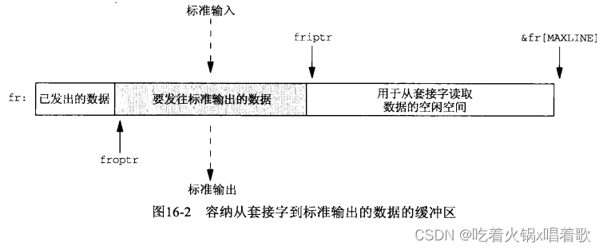 以下是str_cli函数：

```c
#include "unp.h"

void str_cli(FILE *fp, int sockfd) {
    int maxfdp1, val, stdineof;
    ssize_t n, nwritten;
    fd_set rset, wset;
    char to[MAXLINE], fr[MAXLINE];
    char *toiptr, *tooptr, *friptr, *froptr;

    // 把连接到服务器的套接字、标准输入、标准输出设为非阻塞
    val = Fcntl(sockfd, F_GETFL, 0);
    Fcntl(sockfd, F_SETFL, val | O_NONBLOCK);

    val = Fcntl(STDIN_FILENO, F_GETFL, 0);
    Fcntl(STDIN_FILENO, F_SETFL, val | O_NONBLOCK);

    val = Fcntl(STDOUT_FILENO, F_GETFL, 0);
    Fcntl(STDOUT_FILENO, F_SETFL, val | O_NONBLOCK);

    toiptr = tooptr = to;    /* initialize buffer pointers */
    friptr = froptr = fr;
    stdineof = 0;

    maxfdp1 = max(max(STDIN_FILENO, STDOUT_FILENO), sockfd) + 1;
    for (; ; ) {
        FD_ZERO(&rset);
		FD_ZERO(&wset);
		// 未读到EOF且to缓冲区有可用空间，则打开读描述符集中的标准输入位
		if (stdineof == 0 && toiptr < &to[MAXLINE]) {
		    FD_SET(STDIN_FILENO, &rset);    /* read from stdin */
		}
		// fr缓冲区有空间可用，则打开读描述符集中的套接字位
		if (friptr < &fr[MAXLINE]) {
		    FD_SET(sockfd, &rset);    /* read from socket */
		}
		// to缓冲区中有要写到套接字的数据，则打开写描述符集中的套接字位
		if (tooptr != toiptr) {
		    FD_SET(sockfd, &wset);    /* data to write to socket */
		}
		// fr缓冲区中有要写到标准输出的数据，则打开写描述符集中的标准输出位
		if (froptr != friptr) {
		    FD_SET(STDOUT_FILENO, &wset);    /* data to write to stdout */
		}
	
	    // 没有为select函数设置超时
		Select(maxfdp1, &rset, &wset, NULL, NULL);
		
		if (FD_ISSET(STDIN_FILENO, &rset)) {
		    if ((n = read(STDIN_FILENO, toiptr, &to[MAXLINE] - toiptr)) < 0) {
		        // 忽略发生的EWOULDBLOCK错误，此错误不应该发生，因为select函数告知我们描述符可读，但read函数却返回该描述符不可读
		        if (errno != EWOULDBLOCK) {
				    err_sys("read error on stdin");
				}
			} else if (n == 0) {
			    // 输出一行标准错误以表示EOF，同时输出当前时间
		        fprintf(stderr, "%s: EOF on stdin\n", gf_time());
				stdineof = 1;    /* all done with stdin */
				// 如果没有数据要发送了，调用shuwdown发送FIN到服务器
				if (tooptr == toiptr) {
				    Shutdown(sockfd, SHUT_WR);    /* send FIN */
				}
		    } else {
		        fprintf(stderr, "%s: read %d bytes from stdin\n", gf_time(), n);
				toiptr += n;    /* # just read */
				// 读到数据，打开写描述符集中的套接字位，使得后面在当前循环中对该位的测试为真，从而把数据write到套接字
				FD_SET(sockfd, &wset);    /* try and write to socket below */
		    }
		}
	
		if (FD_ISSET(sockfd, &rset)) {
		    if ((n = read(sockfd, friptr, &fr[MAXLINE] - friptr)) < 0) {
		        if (errno != EWOULDBLOCK) {
				    err_sys("read error on socket");
				}
		    } else if (n == 0) {
		        fprintf(stderr, "%s: EOF on socket\n", gf_time());
				if (stdineof) {
				    return;    /* normal termination */
				} else {
				    err_quit("str_cli: server terminated prematurely");
				}
		    } else {
		        fprintf(stderr, "%s: read %d bytes from socket\n", gf_time(), n);
				friptr += n;    /* # just read */
				FD_SET(STDOUT_FILENO, &wset);    /* try and write below */
		    }
		}

        // 如果标准输出可写且有要写的数据
        if (FD_ISSET(STDOUT_FILENO, &wset) && ((n = friptr - froptr) > 0)) {
            // 这种情况会发生，因为上边我们在不清楚write函数是否会成功的前提下手动打开了写描述符集中与标准输出对应的位
            if ((nwritten = write(STDOUT_FILENO, froptr, n)) < 0) {
			    if (errno != EWOULDBLOCK) {
			        err_sys("write error to stdout");
			    }
		    } else {
			    fprintf(stderr, "%s: wrote %d bytes to stdout\n", gf_time(), nwritten);
			    froptr += nwritten;    /* # just written */
			    if (froptr == friptr) {
			        froptr = friptr = fr;    /* back to beginning of buffer */
			    }
            }
        }

        if (FD_ISSET(sockfd, &wset) && ((n = toiptr - tooptr) > 0)) {
            if ((nwritten = write(sockfd, tooptr, n)) > 0) {
		        if (errno != EWOULDBLOCK) {
		            err_sys("write error to socket");
		        }
            } else {
		        fprintf(stderr, "%s: wrote %d bytes to socket\n", gf_time(), nwritten);
		        tooptr += nwritten;    /* # just written */
		        if (tooptr == toiptr) {
		            toiptr = tooptr = to;    /* back to beginning of buffer */
		            // 如果消息已经发完且输入也已经完成，发送FIN到服务器
				    if (stdineof) {
				        Shutdown(sockfd, SHUT_WR);    /* send FIN */
			        }
		        }
	        }
        }
    }
}
123456789101112131415161718192021222324252627282930313233343536373839404142434445464748495051525354555657585960616263646566676869707172737475767778798081828384858687888990919293949596979899100101102103104105106107108109110111112113114115116117118119120121122123
```

以上代码中，我们从标准输入读到数据后，立即打开写描述符集中的套接字位，这里有多个手段可供选择，我们可以什么都不做，这样下次循环中会打开写描述符集中的套接字位，并调用slelect，但这样做是在已知有数据要写到套接字的情况下，还要进入下一轮循环以调用select。另一个手段是把写套接字的代码复制至此，但这可能造成错误（万一被复制的代码存在bug，而我们只在其中某个位置修复了，却忘了另一个位置）。再一个手段是创建一个写到套接字的函数，并调用此函数代替代码复制，但这要求该函数共享str_cli的某些局部变量，可能要让这些变量成为全局变量。

以上代码调用了gf_time函数，它返回指向时间字符串的指针：

```c
#include "unp.h"
#include <time.h>

char *gf_time(void) {
    struct timeval tv;
    static char str[30];
    char *ptr;

    if (gettimeofday(&tv, NULL) < 0) {
        err_sys("gettimeofday error");
    }

    ptr = ctime(&tv.tv_sec);
    strcpy(str, &ptr[11]);
    /* Fri Sep 13 00:00:00 1986\n\0 */
    /* 01234567890123456789012345 */
    snprintf(str + 8, sizeof(str) - 8, ".%06ld", tv.tv_usec);

    return str;
}
1234567891011121314151617181920
```

gf_time函数的输出格式为`12:35:56.123456`。这里特意采用与tcpdump的时间戳一致的格式。str_cli函数中所有frprintf函数都写到标准错误，这使我们能与标准输出（服务器回射的文本行）分开（通过重定向标准输出和标准错误到不同的文件）。这样我们可以同时运行使用以上函数的TCP回射客户程序和tcpdump，并把得到的诊断输出与tcpdump输出放在一起按时间排序，从而使程序中发生的事件和TCP行为关联起来。

我们首先在主机solaris上运行tcpdump，指定捕获端口7（回射服务器）上的TCP分节，并将程序输出存在文件tcpd中：  然后在同一主机上运行我们的TCP客户，连接到主机linux上的标准echo服务器：  标准输入是文件2000.lines，标准输出发送到out，标准错误发送到diag。之后运行以下命令：  以验证回射文本行等同于输出文本行。最后中断tcpdump，然后整合tcpdump和diag文件的输出，对它们一起排序，以下是排序结果的一部分（tcpdump -N选项是以数字显示IP和端口）：  上图中对包含SYN的过长的行进行了折行处理。我们还删掉了Solaris分节的DF（不可分片）位。

根据上图，可把发生的事件以时间线图描绘出来，如下图，时间按向下方向递增：  上图中没有画出ACK分节。当程序输出`wrote N bytes to stdout `时，写标准输出的write函数已经返回，从而导致fr缓冲区空出空间，然后就可以从套接字接收缓冲区读数据到to缓冲区，从而可能导致对方TCP发送一个或多个分节的数据。

从以上时间线图可看出客户/服务器数据交换的动态性，使用非阻塞式IO使程序发挥出动态性的优势，只要IO操作可能发生，就执行合适的读写操作。通过select合适，可以让内核通知我们何时某个IO操作可以发生。

我们测试出非阻塞版客户程序完成以上操作的时间为6.9s，而阻塞版本使用相同的2000行文件、相同的客户和服务器主机（RTT为175ms）时，用时为12.3s。

以上str_cli函数的非阻塞版本较复杂，约135行代码；而使用select函数和阻塞式IO的版本有40行代码；最初的停等版本只有20行代码。我们从20行提升到40行的努力是值得的，因为批量模式下执行速度提高了几乎30倍。考虑到代码的复杂性，把应用编写为使用非阻塞IO是不值得的，更简单的方法是把任务划分到多个进程或多个线程中。

以下是str_cli函数的另一版本，它使用fork函数：

```c
#include "unp.h"

void str_cli(FILE *fp, int sockfd) {
    pid_t pid;
    char sendline[MAXLINE], recvline[MAXLINE];

    if ((pid = Fork()) == 0) {    /* child: server -> stdout */
        while (Readline(sockfd, recvline, MAXLINE) > 0) {
		    Fputs(recvline, stdout);
		}
	
		kill(getppid(), SIGTERM);    /* in case parent still running */
		exit(0);
    }

    /* parent: stdin -> server */
    while (Fgets(sendline, MAXLINE, fp) != NULL) {
        Writen(sockfd, sendline, strlen(sendline));
    }

    // 此处需要使用shutdown函数而非close函数，因为close函数只是将描述符引用计数减1，子进程仍然引用着这个描述符，从而不发送FIN
    // 这就是使用shutdown函数的另一个理由，即使描述符的引用计数仍大于0，FIN也会被发送
    Shutdown(sockfd, SHUT_WR);    /* EOF on stdin, send FIN */
    pause();
    return;
}
1234567891011121314151617181920212223242526
```

以上程序中，子进程把来自服务器的文本行复制到标准输出，父进程把来自标准输入的文本行复制到服务器：  上图指出TCP连接是全双工的，且父子进程共享同一套接字。尽管套接字只有一个，其接收缓冲区和发送缓冲区也分别只有一个，但这个套接字由两个描述符在引用它。

考虑进程终止序列，正常的终止序列是从在标准输入上遇到EOF开始的，父进程读入来自标准输入的EOF后，调用shutdown发送FIN，之后，子进程仍需继续从服务器到标准输出执行数据复制，直到在套接字上读到EOF。

服务器进程过早终止也可能发生，此时子进程将在套接字上读到EOF，然后子进程需要告知父进程停止从标准输入到套接字复制数据，上例中子进程向父进程发送一个SIGTERM信号，以防父进程仍在运行。另一个处理手段是子进程无为地终止，父进程会捕获到SIGCHLD信号。如果子进程不通知父进程停止从标准输入到套接字复制数据，父进程将继续写出到已经接收FIN的套接字，它送给服务器的第一个分节会引发RST，而收到RST之后再写会导致内核向父进程发送SIGPIPE信号。

以上代码中，如果父进程在子进程前意外死亡，而子进程随后从套接字中读到EOF，会向进程ID为1的init进程发送SIGTERM信号，init进程是所有孤儿进程的继父，但子进程没有足够的权限向init进程发送该信号，如果子进程以超级用户特权运行，那么在发送信号前应检查getppid函数的返回值。

父进程完成数据复制后调用pause使自己进入睡眠状态，直到捕获一个信号（子进程来的SIGTERM信号），SIGTERM信号默认行为是终止进程。我们让父进程等待子进程的目的在于精确测量调用此版str_cli函数的TCP回射客户程序的执行时钟时间。正常情况下子进程在父进程之后结束，但我们用于测量时钟时间的是shell命令time，它要求父进程持续到测量结束时刻。

fork版比非阻塞版更简单，非阻塞版同时管理4个不同IO流，且由于这4个流都是非阻塞的，我们不得不考虑4个流的部分读和部分写问题。但fork版本中，每个进程只处理2个IO流，这里不需要非阻塞式IO，因为如果输入流没有数据可读，就没有数据往相应输出流写。

以下是所有str_cli函数的版本的TCP回射客户程序执行时钟时间，测试环境是从一个Solaris主机上向RTT为175ms的服务器上复制2000行文本：  考虑到非阻塞版本比fork版本代码的复杂性，推荐使用更简单的fork版本。

在一个非阻塞TCP套接字上调用conenct时，connect函数立即返回EINPROGRESS错误，但已经发起的TCP三路握手继续进行，之后我们使用select函数检测连接成功、失败的条件。非阻塞connect函数的用途： 1.把三路握手叠加在其他处理上，完成一个connect调用要花1个RTT时间，而RTT波动范围很大，从局域网的几ms到几百ms甚至广域网上的几s，这段时间我们可能有其他工作可执行。

2.同时建立多个连接。

3.既然使用select函数等待连接建立，可给select函数指定一个时间限制，使得我们能缩短connect函数的超时时间。许多实现有着从75s到数min的connect函数超时时间，应用有时想要一个更短的超时时间。

非阻塞connect要处理的细节： 1.尽管套接字是非阻塞的，如果连接到的服务器在同一主机上，当调用connect时连接通常立刻建立，我们需要处理这种情形。

2.源自Berkeley的实现和POSIX有关于select函数和非阻塞connect函数的两个规则： （1）当连接成功建立，描述符变为可写。

（2）当连接建立遇到错误，描述符变为既可读又可写。

connect_nonb函数执行非阻塞connect调用，它的前3个参数与connect函数的一样，第四个参数是等待连接完成的秒数，0表示不设置超时（内核将使用通常的TCP连接超时）：

```c
#include "unp.h"

int connect_nonb(int sockfd, const SA *saptr, socklen_t salen, int nsec) {
    int flags, n, error;
    socklen_t len;
    fd_set rset, wset;
    struct timeval tval;

    flags = Fcntl(sockfd, F_GETFL, 0);
    Fcntl(sockfd, F_SETFL, flags | O_NONBLOCK);

    error = 0;
    // 发起非阻塞connect，期望的错误是EINPROGRESS，表示连接正在建立尚未完成
    if ((n = connect(sockfd, saptr, salen)) < 0) {
        if (errno != EINPROGRESS) {
		    return -1;
		}
    }

    /* Do whatever we want while the connect is taking place. */

    // 如果connect函数返回0，说明连接已经建立
    if (n == 0) {
        // 如果没有此处的goto语句，下面的select函数会被调用，但select函数会立即返回，因为连接建立后套接字是可写的
        // 此处加goto语句是为了避免不必要地调用select
        goto done;    /* connect completed immediately */
    }
    FD_ZERO(&rset);
    FD_SET(sockfd, &rset);
    // 描述符集的赋值可能是结构赋值，因为描述符集通常作为结构表示
    wset = rset;
    tval.tv_sec = nsec;
    tval.tv_usec = 0;

    if ((n = Select(sockfd + 1, &rset, &wset, NULL, nsec ? &tval : NULL)) == 0) {
        // 如果已超时，关闭sockfd，防止三路握手继续进行
        close(sockfd);
        // 返回ETIMEDOUT给调用者
		errno = ETIMEDOUT;
		return -1;
    }

    if (FD_ISSET(sockfd, &rset) || FD_ISSET(sockfd, &wset)) {
        len = sizeof(error);
        // 取得待处理错误，如果连接成功建立，error值为0
        // 如果连接建立发生错误，error值就是对应连接的errno值，如ECONNREFUSED、ETIMEDOUT等
        // 此处我们遇到可移植性问题，如果发生错误，源自Berkeley的实现将在error中返回待处理错误，getsockopt函数本身返回0
        // 而Solaris此时会让getsockopt函数返回-1，并把errno置为待处理错误
        // 我们的程序能处理这两种情形
		if (getsockopt(sockfd, SOL_SOCKET, SO_ERROR, &error, &len) < 0) {
		    return -1;    /* Solaris pending error */
		}
    } else {
        err_quit("select error: sockfd not set");
    }

done:
    Fcntl(sockfd, F_SETFL, flags);    /* restore file status flags */

    // 如果从getsockopt函数返回的error变量值非0，就把该值存入errno
    if (error) {
        close(sockfd);    /* just in case */
		errno = error;
		return -1;
    }
    return 0;
}
12345678910111213141516171819202122232425262728293031323334353637383940414243444546474849505152535455565758596061626364656667
```

连接建立成功时，select函数返回套接字可写，连接建立失败时，select函数返回套接字既可读又可写。

套接字的各种实现和非阻塞connect会带来移植性问题。首先，调用select前可能连接已经建立并有来自对端的数据到达，此时即使套接字不发生错误，也是可读可写的，这和建立连接失败的情况下套接字的读写条件一样，上例代码通过调用getsockopt并检查套接字上是否存在待处理错误来处理这种情形。

其次，既然我们不能通过套接字的可写条件判断连接建立是否成功，有以下方法可取代getsockopt函数： （1）调用getpeername代替getsockopt函数，如果getpeername函数返回ENOTCONN错误，则连接建立失败，我们需要接着以SO_ERROR调用getsockopt取得套接字上待处理错误。

（2）以值为0的长度调用read，如果read调用失败，则连接建立失败，read函数返回的errno给出了连接失败的原因。如果连接建立成功，read函数应返回0。

（3）再次调用connect，它应该失败，如果errno是EISCONN，则套接字已连接。

非阻塞connect是网络编程中最不易移植的部分，避免该问题的一个较简单方法是为每个连接创建一个处理线程。

对于一个正常的阻塞式套接字，如果其上的connect调用在TCP三路握手前被中断（如捕获了某信号），假设被中断的connect函数不由内核重启，则它将返回EINTR。此时我们不能再次调用connect等待未完成连接继续完成，这样做会导致EADDRINUSE错误。此时我们只能用select函数，像上述那样判断。

以下非阻塞connect的例子出自Netscape（一款早期的网络浏览器）的Web客户程序，客户先建立一个与某个Web服务器的HTTP连接，再获取一个主页，该主页往往含有多个对其他网页的引用，客户可以使用非阻塞connect同时获取多个网页，以此取代每次只能获取一个网页的串行获取手段。下图是并行建立多个连接的例子：  上图中，最左边表示串行执行3个连接，总计使用29个时间单位。

中间情形并行执行2个连接。在时刻0启动前2个连接，当其中之一结束时，启动第三个连接。总计耗时差不多减半，为15个时间单位，但这是理想情况下，如果并行执行的连接共享同一个低速链路（如客户主机通过一个拨号调制解调器链路接入因特网），那么每个连接可能彼此竞用有限的资源，使得每个连接耗用更长时间，例如，10个时间单位的连接可能变为15，15个时间单位的可能变成20，4个时间单位的可能变为6，即使这样，总计耗时将是21，仍短于串行执行。

最右边情形并行执行所有3个连接，假设这3个连接之间没有干扰，就上例而言，本情形和中间情形耗时一样。

在处理Web客户时，第一个连接独立执行，来自该连接的页面含有多个其他网页的引用，随后并行访问包含的其他网页：  为进一步优化连接执行序列，客户可在第一个连接尚未完成前就开始分析从中陆续返回的数据，以便尽早获取其中含有的引用，并尽快启动相应的额外连接。

既然准备同时处理多个非阻塞connect，就不能使用上面的connect_nonb函数，因为它直到连接已经建立才返回，我们需要自行管理这些连接。

我们的程序最多读20个来自Web服务器的文件，最大并行连接数、服务器的主机名、要从服务器获取的每个文件的文件名都作为命令行参数指定，执行本程序的一个典型例子：  以上命名的参数指定并行执行最多3个连接、服务器的主机名、主页的文件名（/是服务器根网页）及随后读入的7个文件（本例中都是GIF图像），这7个文件在指定主页中被引用，现实的Web客户将读取指定主页，然后通过分析获取这些文件名，我们不想因加入HTML分析使本例复杂化，因此直接在命令行上指定了这些文件名。

以下是本例中每个文件都包含了web.h头文件：

```c
#include "unp.h"

#define MAXFILES 20
#define SERV "80"    /* port number or service name */

// 最多读MAXFILES个来自Web服务器的文件
// file结构中包含每个文件的信息，包括文件名、文件所在服务器主机名或IP、用于读取该文件的描述符、准备对文件执行什么操作
struct file {
    char *f_name;    /* filename */
    char *f_host;    /* hostname or IPv4/IPv6 address */
    int f_fd;    /* descriptor */
    int f_flags;    /* F_xxx below */
} file[MAXFILES];

#define F_CONNECTING 1    /* connect() in progress */
#define F_READING 2    /* connect() complete; now reading */
#define F_DONE 4    /* all done */

#define GET_CMD "GET %s HTTP/1.0\r\n\r\n"

/* globals */
int nconn, nfiles, nlefttoconn, nlefttoread, maxfd;
fd_set rset, wset;

/* function prototypes */
void home_page(const char *, const char *);
void start_connect(struct file *);
void write_get_cmd(struct file *);
12345678910111213141516171819202122232425262728
```

home_page函数创建一个TCP连接，发出一个命令到服务器，然后读取主页，这是第一个连接，需要在我们并行建立多个连接前独立完成：

```c
#include "web.h"

void home_page(const char *host, const char *fname) {
    int fd, n;
    char line[MAXLINE];

    // 与服务器建立连接
    fd = Tcp_connect(host, SERV);    /* blocking connect() */

    // 发送HTTP GET命令获取主页
    n = snprintf(line, sizeof(line), GET_CMD, fname);
    Writen(fd, line, n);

    for (; ; ) {
       if ((n = Read(fd, line, MAXLINE)) == 0) {
           break;    /* server closed connection */
       }

       printf("read %d bytes of home page\n", n);
       /* do whatever with data */
    }
    printf("end-of-file on home page\n");
    Close(fd);
}
123456789101112131415161718192021222324
```

以上home_page函数读取应答后，不做任何操作，然后关闭连接。

start_connect函数发起非阻塞connect：

```c
#include "web.h"

void start_connect(struct file *fptr) {
    int fd, flags, n;
    struct addrinfo *ai;

    // host_serv函数查找指定主机名和服务名，返回指向addrinfo结构的指针
    ai = Host_serv(fptr->f_host, SERV, 0, SOCK_STREAM);

    // 我们只使用获取的addrinfo结构数组中的第一个结构
    fd = Socket(ai->ai_family, ai->ai_socktype, ai->ai_protocol);
    fptr->f_fd = fd;
    printf("start_connect for %s, fd %d\n", fptr->f_name, fd);

    /* Set socket nonblocking */
    flags = Fcntl(fd, F_GETFL, 0);
    Fcntl(fd, F_SETFL, flags | O_NONBLOCK);

    /* Initiate nonblocking connect to the server */
    if ((n = connect(fd, ai->ai_addr, ai->ai_addrlen)) < 0) {
        if (errno != EINPROGRESS) {
		    err_sys("nonblocking connect error");
		}
		fptr->f_flags = F_CONNECTING;
		// 把select函数检测到该描述符可读或可写当做连接建立完毕的指示
		FD_SET(fd, &rset);    /* select for reading and writing */
		FD_SET(fd, &wset);
		if (fd > maxfd) {
		    maxfd = fd;
		}
    // 如果connect函数成功返回，说明连接已建立
    } else if (n >= 0) {    /* connect is already done */
        write_get_cmd(fptr);    /* write() the GET command to server */
    }
}
1234567891011121314151617181920212223242526272829303132333435
```

以下是write_get_cmd函数，它发送一个HTTP GET命令到服务器：

```c
#include "web.h"

void write_get_cmd(struct file *fptr) {
    int n;
    char line[MAXLINE];

    // 构造命令并写入套接字
    n = snprintf(line, sizeof(line), GET_CMD, fptr->f_name);
    Writen(fptr->f_fd, line, n);
    printf("wrote %d bytes for %s\n", n, fptr->f_name);

    // 设置F_READING标志，同时它清除F_CONNECTING标志（如果设置了）
    fptr->f_flags = F_READING;    /* clears F_CONNECTING */

    FD_SET(fptr->f_fd, &rset);    /* will read server's reply */
    if (fptr->f_fd > maxfd) {
        maxfd = fptr->f_fd;
    }
}
12345678910111213141516171819
```

start_connect函数中，我们把套接字设为非阻塞后，没有把它重置回默认的阻塞模式，这没有问题，因为我们在write_get_cmd函数只往套接字中写入少量数据（一个GET命令）比套接字发送缓冲区小得多。即使write_get_cmd函数中写数据时因为非阻塞标志导致已发送数据量小于要发送的数据量，我们的writen函数也能对此进行处理。套接字处于非阻塞模式对后续的读也没有影响，因为我们总是在select函数返回该套接字可读后才对读它。

以下是Web客户程序的main函数：

```c
#include "web.h"

int main(int argc, char **argv) {
    int i, fd, n, maxnconn, flags, error;
    char buf[MAXLINE];
    fd_set rs, ws;

    if (argc < 5) {
        err_quit("usage: web <#conns> <hostname> <homepage> <file1> ...");
    }
    maxnconn = atoi(argv[1]);

    nfiles = min(argc - 4, MAXFILES);
    for (i = 0; i < nfiles; ++i) {
        file[i].f_name = argv[i + 4];
		file[i].f_host = argv[2];
		file[i].f_flags = 0;
    }
    printf("nfiles = %d\n", nfiles);

    home_page(argv[2], argv[3]);

    FD_ZERO(&rset);
    FD_ZERO(&wset);
    maxfd = -1;
    nlefttoread = nlefttoconn = nfiles;
    nconn = 0;

    while (nlefttoread > 0) {
        while (nconn < maxnconn && nlefttoconn > 0) {
		    /* find a file to read */
		    for (i = 0; i < nfiles; ++i) {
		        if (file[i].f_flags == 0) {
			   		break;
				}
	    	}
		    if (i == nfiles) {
		        err_quit("nlefttoconn = %d but nothing found", nlefttoconn);
		    }
		    start_connect(&file[i]);
		    ++nconn;
		    --nlefttoconn;
		}
	
		rs = rset;
		ws = wset;
		n = Select(maxfd + 1, &rs, &ws, NULL, NULL);
	
		for (i = 0; i < nfiles; ++i) {
		    flags = file[i].f_flags;
		    if (flags == 0 || flags & F_DONE) {
		        continue;
		    }
		    fd = file[i].f_fd;
		    if ((flags & F_CONNECTING) && (FD_ISSET(fd, &rs) || FD_ISSET(fd, &ws))) {
		        n = sizeof(error);
				if (getsockopt(fd, SOL_SOCKET, SO_ERROR, &error, &n) < 0 || error != 0) {
				    err_ret("nonblocking connect failed for %s", file[i].f_name);
				}
		
				/* connection established */
				printf("connection established for %s\n", file[i].f_name);
				FD_CLR(fd, &wset);    /* no more writeability test */
				write_get_cmd(&file[i]);    /* write() the GET command */
		    } else if ((flags & F_READING) && FD_ISSET(fd, &rs)) {
		        if ((n = Read(fd, buf, sizeof(buf))) == 0) {
				    printf("end-of-file on %s\n", file[i].f_name);
				    Close(fd);
				    file[i].f_flags = F_DONE;    /* clears F_READING */
				    FD_CLR(fd, &rset);
				    --nconn;
				    --nlefttoread;
				} else {
				    printf("read %d bytes from %s\n", n, file[i].f_name);
				}
	    	}
		}
    }
    exit(0);
}
1234567891011121314151617181920212223242526272829303132333435363738394041424344454647484950515253545556575859606162636465666768697071727374757677787980
```

以上程序中有两个优化没有执行，以避免使程序更复杂。首先，select函数告知已经就绪的描述符数量n，当我们已经处理了n个描述符后，就不用再检查其他描述符了。其次，我们可以减少maxfd的值，省得select函数检查那些不再设置的位，但以上程序处理的描述符数很可能都小于10，相比额外造成的复杂性，这些优化是否值得添加令人怀疑。

下图给出了获取某个Web服务器的主页并后跟来自该服务器的9个图像文件所需的时钟时间，到该服务器的RTT约150ms，主页大小为4017字节，9个图像文件的平均大小为1621字节，TCP分节大小为512字节，为便于比较，下图还包含了二十六章中线程版本web客户的数据：  主要的性能改善是在同时连接数为3时取得的，同时连接数为4或更多时性能增长要少。

如果网络中存在拥塞，上例技术就会有缺陷，，当一个客户到一个服务器建立多个连接时，这些连接在TCP层并无通信，即使其中一个连接遇到分组丢失（隐含网络已经拥塞的信息），IP地址对相同的其他连接也不会得到通知，此时这些连接很可能马上遇到分组丢失（不会共享慢启动和拥塞避免算法），这些额外连接是在往已经拥塞的网络中发送更多分组，这个技术还会增加服务器主机的负荷。

当有一个已完成的连接准备好被accept时，select函数将返回该连接的监听套接字的可读条件，因此，当使用select函数在某个监听套接字上等待外来连接时，就没有必要把监听套接字设为非阻塞，因为如果select函数告诉我们监听套接字可读，那么随后的accept函数不应该阻塞。

但这里有一个可能让我们掉入陷阱的定时问题，我们使用下例代码来说明它，该代码中，TCP回射客户程序改写为建立连接后发送一个RST到服务器：

```c
#include "unp.h"

int main(int argc, char **argv) {
    int sockfd;
    struct linger ling;
    struct sockaddr_in servaddr;

    if (argc != 2) {
        err_quit("usage: tcpcli <IPaddress>");
    }

    sockfd = Socket(AF_INET, SOCK_STREAM, 0);

    bzero(&servaddr, sizeof(servaddr));
    servaddr.sin_family = AF_INET;
    servaddr.sin_port = htons(SERV_PORT);
    Inet_pton(AF_INET, argv[1], &servaddr.sin_addr);

    Connect(sockfd, (SA *)&servaddr, sizeof(servaddr));

    ling.l_onoff = 1;    /* cause RST to be sent on close() */
    ling.l_linger = 0;
    Setsockopt(sockfd, SOL_SOCKET, SO_LINGER, &ling, sizeof(ling));
    Close(sockfd);

    exit(0);
}
123456789101112131415161718192021222324252627
```

之后我们修改TCP回射服务器程序，在select函数返回监听套接字可读条件后，调用accept前暂停：

```c
	if (FD_ISSET(listenfd, &rset)) {    /* new client connection */
+	    printf("listening socket readable\n");
+	    sleep(5);
	    clilen = sizeof(cliaddr);
	    connfd = Accept(listenfd, (SA *)&cliaddr, &clilen);
	}
123456
```

以上代码中，以加号开头的两行是新加的。

这里我们在模拟一个繁忙的服务器，它无法在select函数返回监听套接字的可读条件后就马上调用accept。通常情况下服务器的这种迟钝没有问题（实际这就是要维护一个已完成连接队列的原因），但结合上连接建立后到来客户的RST，就出现问题了。

当客户在服务器调用accept前中止某个连接时，源自Berkeley的实现不把这个中止的连接返回服务器，而其他实现应该返回ECONNABORTED错误，但往往代之以EPROTO错误。考虑一个源自Berkeley实现上的例子： 1.客户建立一个连接并随后中止它。

2.select函数向服务器进程返回可读条件，但服务器要过一小段时间才调用accept。

3.服务器从select函数返回到调用accept期间，服务器TCP收到来自客户的RST。

4.这个已完成的连接被服务器TCP驱出队列，假设队列中此时没有其他已完成连接。

5.服务器调用accept，但由于没有任何已完成连接，服务器于是阻塞。

服务器会一直阻塞在accept调用上，直到某个其他客户建立一个连接。在此期间，就上例而言，服务器就单纯阻塞在accept调用上，无法处理其他已就绪描述符。

本问题和拒绝服务攻击有些类似，但本缺陷在有客户建立连接时，服务器就能脱出阻塞中的accept函数。

本问题的解决方法： 1.当select函数返回监听套接字上的可读条件时（有已完成连接准备好被accept），总是把该监听套接字设为非阻塞。

2.后续accept调用中忽略以下错误：EWOULDBLOCK（源自Berkeley的实现，在客户终止连接时非阻塞accept函数会产生此错误）、ECONNABORTED（POSIX实现，客户中止连接时）、EPROTO（SVR 4实现，客户中止连接时）、EINTR（如果有信号被捕获）。

select函数通常结合非阻塞式IO一起使用，以便判断描述符何时可写或可读。使用非阻塞式IO的版本是所有TCP回射客户版本中执行最快的，尽管其代码修改起来比较复杂。之后我们展示的fork版本把客户程序划分为两部分由不同进程分别执行要简单得多。

非阻塞connect使我们能在TCP三路握手期间做其他处理，而不是光阻塞在connect函数上，但非阻塞connect不可移植，不同实现有不同方法指示连接已成功建立或已碰上错误。我们使用非阻塞connect开发了一个Web客户程序，它同时打开多个TCP连接以减少从单个服务器取得多个文件所需时钟时间，但考虑到TCP的拥塞避免机制，它是对网络不利的。

来自对端的数据可能在本端connect调用返回前到达套接字，这是可能的，服务器在accept函数返回后立即发送数据，而三路握手中的第二个分节到达时客户却比较忙，那么来自服务器的数据可能在客户的connect调用前到达。

# 第十七章 ioctl操作

ioctl函数传统上一直作为那些不适合归入现有已定义类别的特性的系统接口。[POSIX](https://so.csdn.net/so/search?q=POSIX&spm=1001.2101.3001.7020)正在通过创建特定的包装函数来代替ioctl函数的某些功能，以取而代之的是那些已被POSIX标准化的函数。例如，Unix终端接口传统上使用ioctl函数访问，而POSIX为终端创造了12个新函数，如tcgetattr函数获取终端属性、tcflush函数用于丢弃待处理输入和输出。类似地，POSIX替换了一个用于网络的ioctl函数请求：新的sockatmark函数取代ioctl的SIOCATMARK参数。但与网络编程相关且依赖于实现的特性保留的ioctl函数请求仍然很多，它们用于获取接口信息、访问路由表、访问ARP高速缓存等。

ioctl函数影响由fd参数引用的打开文件描述符：  第三个参数总是一个指针，其类型依赖于request参数。

4.4 BSD把第二个参数定义为unsigned long而非int，这不成问题，因为用作这个参数的常值由头文件定义，只要这些常值在作用域内（如使用了ioctl函数的程序include了unistd.h头文件），那么用的就是正确类型的常值。

只写实现把第三个参数指定为void *，而非ANSI C省略号记法。ANSI C中，省略号表示参数列表中的可变部分。

POSIX未对定义iotcl函数原型的头文件进行标准化，许多系统在unistd.h头文件中定义它，但传统的BSD系统在sys/ioctl.h头文件中定义它。

我们可以把和网络相关的请求分为6类： 1.套接字操作。

2.文件操作。

3.接口操作。

4.ARP高速缓存操作。

5.路由表操作。

6.流系统。

某些ioctl函数操作和某些fcntl函数操作功能重叠（如把套接字设置为非阻塞），而且某些操作可用ioctl函数以多种方式指定（如设置套接字的进程组属主）。

以下是request参数的取值及其对应的arg指针参数指向的类型：  明确用于套接字操作的request参数： 1.SIOCATMARK：如果套接字的读指针位于带外标记，就通过第三个参数指向的整数返回一个非0值，否则返回0值。POSIX用sockatmark函数替换本请求。

2.SIOCGPGRP：通过第三个参数指向的整数返回本套接字的进程ID或进程组ID，该ID指定对本套接字的SIGIO或SIGURG信号的接收进程。本请求和fcntl函数的F_GETOWN命令等效，且POSIX标准化的是fcntl操作。

3.SIOCSPGRP：把本套接字的进程ID或进程组ID设置成由第三个参数指向的整数，该ID指定本套接字的SIGIO或SIGURG信号的接收进程。本请求和fcntl函数的F_SETOWN命令等效，且POSIX标准化的是fcntl操作。

用于套接字操作，且可能还适用于某些特定类型文件的request参数： 1.FIONBIO：根据iotcl函数的第三个参数指向一个0值或非0值，可清除或设置本套接字的非阻塞式IO标志。本请求和O_NONBLOCK文件状态标志等效，可通过fcntl函数的F_SETFL命令清除或设置O_NONBLOCK标志。

2.FIOASYNC：根据ioctl函数的第三个参数指向一个0值或非0值，可清除或设置本套接字的信号驱动异步IO标志。本请求决定是否会接收针对本套接字的异步IO信号（SIGIO）。本请求和O_ASYNC文件状态标志等效，可通过fcntl函数的F_SETFL命令清除或设置O_ASYNC标志。

3.FIONREAD：通过由ioctl函数的第三个参数指向的整数返回当前在本套接字接收缓冲区中的字节数。本特性也适用于文件、管道、终端。

4.FIOSETOWN：对于套接字等价于SIOCSPGRP。

5.FIOGETOWN：对于套接字等价于SIOCGPGRP。

需要处理网络接口的许多程序首先就要从内核获取配置在系统中的所有接口，本任务由SIOCGIFCONF请求完成，它使用ifconf结构，ifconf结构中包含ifreq结构，以下是这两个结构的定义：  调用ioctl前我们要先分配一个缓冲区和一个ifconf结构，然后初始化ifconf结构，下图是初始化ifconf结构的结果，其中假设缓冲区大小为1024字节，ioctl函数的第三个参数指向该结构：  假设内核返回2个ifreq结构，在ioctl函数返回时该ifconf结构的值如下：  如上图，阴影区域是被ioctl函数修改过的部分，缓冲区中天赋了2个ifreq结构，ifconf结构的ifc_len成员也被更新，以指示存放在缓冲区中的信息量，上图假设每个ifreq结构占32字节。

ifreq结构中含有一个联合，而#define隐藏了这些字段是联合的成员这一事实。有些系统往ifr_ifru联合中增添了许多依赖于实现的成员。

我们开发一个名为get_ifi_info的函数，它返回一个结构链表，其中每个结构对应当前处于up状态的接口，我们将使用ioctl函数的SIOCGIFCONF参数实现这个函数。

FreeBSD提供了一个实现类似功能的函数，名为getifaddrs。

但搜索FreeBSD 4.8的整个源代码树（指在软件开发中，代码文件和目录组织结构形成的一种层次化的树状结构），发现有12个程序使用SIOCGIFCONF参数调用ioctl函数以确定存在的接口。

为开发get_ifi_info函数，我们先编写一个名为为unpifi.h的头文件，其中定义一些结构：

```c
/* Our own header for the programs that need interface configuration info.
   Include this file, instead of "unp.h". */

#ifndef __unp_ifi_h
#define __unp_ifi_h

#include "unp.h"
#include <net/if.h>

#define IFI_NAME 16    /* same as IFNAMSIZ in <net/if.h> */
#define IFI_HADDR 8    /* allow for 64-bit EUI-64 in future */

struct ifi_info {
    char ifi_name[IFI_NAME];    /* inter face name, null-terminated */
    short ifi_index;    /* interface index */
    short ifi_mtu;    /* interface MTU */
    u_char ifi_haddr[IFI_HADDR];    /* hardware address（如以太网地址） */
    u_short ifi_hlen;    /* # bytes in hardware address: 0, 6, 8 */
    short ifi_flags;    /* IFF_xxx constants from <net/if.h>（用来判断接口是否支持广播或多播、是否是一个点到点接口） */
    short ifi_myflags;    /* our own IFI_xxx flags */
    struct sockaddr *ifi_addr;    /* primary address */
    struct sockaddr *ifi_brdaddr;    /* broadcast address */
    struct sockaddr *ifi_dstaddr;    /* destination address（点到点链路的目的地址） */
    struct ifi_info *ifi_next;    /* next of these structures */
};

#define IFI_ALIAS 1    /* ifi_addr is an alias */

/* function prototypes */
// 此函数获取一个ifi_info结构组成的链表
struct ifi_info *get_ifi_info(int, int);
struct ifi_info *Get_ifi_info(int, int);
// 用于存放ifi_info结构和其中所含套接字地址结构的内存空间都是动态获取的，此函数用来释放动态获取的内存空间
void free_ifi_info(struct ifi_info *);

#endif /* __unp_ifi_h */
123456789101112131415161718192021222324252627282930313233343536
```

在给出get_ini_info函数的实现前，先给出一个调用该函数并输出所有信息的程序，该程序是ifconfig程序的微型版本：

```c
#include "unpifi.h"

int main(int argc, char **argv) {
    struct ifi_info *ifi, *ifihead;
    struct sockaddr *sa;
    u_char *ptr;
    int i, family, doaliases;

    if (argc != 3) {
        err_quit("usage: prifinfo <inet4|inet6> <doaliases>");
    }

    if (strcmp(argv[1], "inet4") == 0) {
        family = AF_INET;
    } else if (strcmp(argv[1], "inet6") == 0) {
        family = AF_INET6;
    } else {
        err_quit("invalid <address-family>");
    }
    doaliases = atoi(argv[2]);

    for (ifihead = ifi = Get_ifi_info(family, doaliases); ifi != NULL; ifi = ifi->ifi_next) {
        printf("%s: ", ifi->ifi_name);
		if (ifi->ifi_index != 0) {
		    printf("(%d) ", ifi->ifi_index);
		}
		printf("<");
		if (ifi->ifi_flags & IFF_UP) {
		    printf("UP ");
		}
		if (ifi->ifi_flags & IFF_BROADCAST) {
		    printf("BCAST ");
		}
		if (ifi->ifi_flags & IFF_MULTICAST) {
		    printf("MCAST ");
		}
		if (ifi->ifi_flags & IFF_LOOPBACK) {
		    printf("LOOP ");
		}
		if (ifi->ifi_flags & IFF_POINTOPOINT) {
		    printf("P2P ");
		}
		printf(">\n");
	
	    // 如果无法得到硬件地址，则ifi_hlen成员值为0
		if ((i = ifi->ifi_hlen) > 0) {
		    ptr = ifi->ifi_haddr;
		    do {
		        // 将硬件地址显示为16进制数形式，每个十六进制数用冒号分隔
		        printf("%s%x", (i == ifi->ifi_hlen) ? "  " : ":", *ptr++);
		    } while (--i > 0);
		    printf("\n");
		}
		if (ifi->ifi_mtu != 0) {
		    printf("  MTU: %d\n", ifi->ifi_mtu);
		}
	
		if ((sa = ifi->ifi_addr) != NULL) {
		    printf("  IP addr: %s\n", Sock_ntop_host(sa, sizeof(*sa)));
		}
		if ((sa = ifi->ifi_brdaddr) != NULL) {
		    printf("  broadcast addr: %s\n", Sock_ntop_host(sa, sizeof(*sa)));
		}
		if ((sa = ifi->ifi_dstaddr) != NULL) {
		    printf("  destination addr: %s\n", Sock_ntop_host(sa, sizeof(*sa)));
		}
		free_ifi_info(ifihead);
		exit(0);
    }
}
12345678910111213141516171819202122232425262728293031323334353637383940414243444546474849505152535455565758596061626364656667686970
```

在主机macosx上执行以上代码：  上图中，第一个命令行参数inet4指定IPv4地址，第二个命令行参数0指定不返回地址别名。在MacOS X系统上，我们用这种方法无法得到以太网接口的硬件地址。

多宿主机的传统定义是具有多个接口的主机，如两个以太网链路或一个以太网链路加一个点到点链路。每个接口必须有唯一的一个IPv4地址。计量一个主机的接口数是否大于1个以确定它是否是多宿主机时，环回接口不计在内。

按照约定，地址127.0.0.1赋予环回接口，任何发送到这个IP地址的分组在内部被环送回来作为IP模块的输入，因此这个分组不会出现在网络上。我们在同一主机上测试客户和服务器程序时常用该地址。该地址为人所知的名字是INADDR_LOOPBACK。

网络127.0.0.1/8上任何地址都可以赋予环回接口，但127.0.0.1是最常用的，往往由系统自动配置。

路由器按照定义是多宿的，因为它把到达某个接口的分组转发到另一个接口。而多宿主机不必是一个路由器，除非它转发分组。一个多宿主机不应仅仅因为拥有多个接口而认定是一个路由器，除非它被配置成作为路由器（通常由系统管理员开启某个配置选项）。

但多宿这一说法已变得更一般化，包括两种情形： 1.拥有多个接口的主机是多宿的，每个接口必须有各自的IP地址，未指定网络地址的接口允许出现在点到点链路上。这是传统的定义。

2.较新的主机具备把多个IP地址赋予单个物理接口的能力。除第一个IP地址（主地址）外的每个额外IP地址称为该接口的一个别名地址或逻辑接口地址。通常别名地址与主地址共享同一个子网地址，主机主机ID不同。但别名地址也可能具有完全不同于主地址的网络地址或子网地址。

可见多宿主机的定义是具有多个IP层可见接口（除了环回接口）的主机，不关心这些接口是物理的还是逻辑的。

网桥是一种用于连接多个局域网（LAN）的设备（数据链路层设备），它基于MAC地址来转发数据帧。网桥的主要功能是将数据帧从一个接口转发到另一个接口，以便在不同的局域网之间实现通信。以太网交换机在数据链路层上工作，它可以被视为一种高级形式的网桥，它在功能上类似于网桥，但通常具有更多的接口和更高的性能。

给予网络负荷极高的某个服务器主机到同一个以太网交换机的多个物理连接，并把这些连接汇聚成一个更高带宽的逻辑连接是常见的，但这样的主机不能因为拥有多个物理接口而被认为是多宿的，因为在IP层看来它们的单个逻辑接口。

在另一个上下文中，有多个连接通达因特网的网络也称为多宿的，例如有些网点有两个而非一个通达因特网的连接，以此提供因特网接入的备份能力。SCTP协议能通过多宿网点获益。

如果给以太网接口en1增设3个别名地址（它们的主机ID分别为79、80、81），并且把第二个命令行参数改为1，会得到以下结果：  在第十八章（18-16）中，我们会给出另一个get_ifi_info函数的实现，该实现可以很容易地获取硬件地址，在FreeBSD上运行该版本程序，可得到以下结果：  上图中我们指示程序输出别名地址，发现以太网接口de1定义了一个主机ID为93的别名。

以下是以SIOCGIFCONF为参数调用ioctl版本的get_ifi_info函数，它从内核获取接口配置：

```c
#include "unpifi.h"

struct ifi_info *get_ifi_info(int family, int doaliases) {
    struct ifi_info *ifi, *ifihead, **ifipnext;
    int sockfd, len, lastlen, flags, myflags, idx = 0, hlen = 0;
    char *ptr, *buf, lastname[IFNAMSIZ], *cptr, *haddr, *sdlname;
    struct ifconf ifc;
    struct ifreq *ifr, ifrcopy;
    struct sockaddr_in *sinptr;
    struct sockaddr_in *sin6ptr;

    // 创建一个用于ioctl函数的UDP套接字，也可用TCP套接字
    sockfd = Socket(AF_INET, SOCK_DGRAM, 0);

    lastlen = 0;
    len = 100 * sizeof(struct ifreq);    /* initial buffer size guess */
    for (; ; ) {
        buf = Malloc(len);
		ifc.ifc_len = len;
		ifc.ifc_buf = buf;
		
		if (ioctl(sockfd, SIOCGIFCONF, &ifc) < 0) {
		    if (errno != EINVAL || lastlen != 0) {
		        err_sys("ioctl error");
		    }
		} else {
		    if (ifc.ifc_len == lastlen) {
		        break;    /* success, len has not changed */
		    }
		    lastlen = ifc.ifc_len;
		}
		len += 10 * sizeof(struct ifreq);    /* increment */
		free(buf);
    }
    ifihead = NULL;
    ifipnext = &ifihead;
    lastname[0] = 0;
    sdlname = NULL;

    for (ptr = buf; ptr < buf + ifc.ifc_len; ) {
        ifr = (struct ifreq *)ptr;
        
// 处理为套接字地址结构提供长度字段的较新系统
#ifdef HAVE_SOCKADDR_SA_LEN
        len = max(sizeof(struct sockaddr), ifr->ifr_addr.sa_len);
// 处理不提供套接字地址结构长度字段的较老系统
// 图17-2指出ifreq结构中包含的套接字地址结构是一个通用套接字地址结构
// 但在较新系统中它可以是任何类型的套接字地址结构
// 事实上，4.4 BSD还会为每个接口返回一个数据链路套接字地址结构
#else
        switch (ifr->ifr_addr.sa_family) {
// ifreq结构中的联合把返回地址定义为通用的16字节sockaddr结构
// 它对于IPv4的16字节sockaddr_in结构是够了
// 对于IPv6的24字节sockaddr_in6结构却太小
// 因此，如果套接字地址结构中有长度成员，就使用该成员，就像以上使用max函数的语句
#ifdef IPV6
        case AF_INET6:
	    	len = sizeof(struct sockaddr_in6);
	    break;
#endif
        case AF_INET:
		default:
		    len = sizeof(struct sockaddr);
		    break;
		}
#endif /* HAVE_SOCKADDR_SA_LEN */
        ptr += sizeof(ifr->ifr_name) + len;    /* for next one in buffer */

#ifdef HAVE_SOCKADDR_DL_STRUCT
        /* assumes that AF_LINK precedes AF_INET or AF_INET6 */
		if (ifr->ifr_addr.sa_family == AF_LINK) {
		    struct sockaddr_dl *sdl = (struct sockaddr_dl *)&ifr->ifr_addr;
		    sdlname = ifr->ifr_name;
		    idx = sdl->sdl_index;
		    haddr = sdl->sdl_data + sdl->sdl_nlen;
		    hlen = sdl->sdl_alen;
		}
#endif

        if (ifr->ifr_addr.sa_family != family) {
		    continue;    /* ignore if not desired address family */
		}
	
	    // 处理别名地址
		myflags = 0;
		// Solaris用于别名地址的接口名中有一个冒号
		// 而4.4 BSD不在名字上区分别名地址和主地址
		if ((cptr = strchr(ifr->ifr_name, ':')) != NULL) {
		    *cptr = 0;    /* replace colon with null */
		}
		// 把最近处理过的接口名存入lastname
		// 在与当前遍历到的接口名字比较时，若有冒号则只比较到冒号
		if (strncmp(lastname, ifr->ifr_name, IFNAMSIZ) == 0) {
		    if (doaliases == 0) {
		        continue;    /* already processed this interface */
		    }
		    myflags = IFI_ALIAS;
		}
		memcpy(lastname, ifr->ifr_name, IFNAMSIZ);
	
	    // 获取接口标志
	    // 不能用当前遍历到的ifreq结构调用ioctl
	    // 因为接口标志和IP地址在ifreq结构中是同一个联合的不同成员
		ifrcopy = *ifr;    // 这里ifrcopy结构中的接口名字段就被赋值为当前遍历到的接口名
		                   // 之后其他ioctl函数的接口操作请求都对应该接口名关联的接口
		Ioctl(sockfd, SIOCGIFFLAGS, &ifrcopy);
		flags = ifrcopy.ifr_flags;
		if ((flags & IFF_UP) == 0) {
		    continue;    /* ignore if interface not up */
		}
		
		// 动态分配一个ifi_info结构，并将它加到链表末尾
		ifi = Calloc(1, sizeof(struct ifi_info));
        *ifipnext = ifi;    /* prev points to this new one */ 
		ifipnext = &ifi->ifi_next;    /* pointer to next one goes here */
	        
	    // 把接口标志复制到当前ifi_info结构中
		ifi->ifi_flags = flags;    /* IFF_xxx values */
		ifi->ifi_myflags = myflags;    /* IFI_xxx values */

// 把MTU复制到当前ifi_info结构中
#if defined(SIOCGIFMTU) && defined(HAVESTRUCT_IFREQ_IFR_MTU)
        Ioctl(sockfd, SIOCGIFMTU, &ifrcopy);
		ifi->ifi_mtu = ifrcopy.ifr_mtu;
#else
        ifi->ifi_mtu = 0;
#endif

        // 把接口名复制到当前ifi_info结构中
        memcpy(ifi->ifi_name, ifr->ifr_name, IFI_NAME);
        ifi->ifi_name[IFI_NAME - 1] = '\0';
		/* If the sockaddr_dl is from a different interface, ignore it */
		if (sdlname == NULL || strcmp(sdlname, ifr->ifr_name) != 0) {
		    idx = hlen = 0;
		}
		// 把接口索引和硬件地址长度复制到当前ifi_info结构中
		ifi->ifi_index = idx;
		ifi->ifi_hlen = hlen;
		if (ifi->ifi_hlen > IFI_HADDR) {
		    ifi->ifi_hlen = IFI_HADDR;
		}
		// 如果有硬件地址，把接口硬件地址复制到当前ifi_info结构中
		if (hlen) {
		    memcpy(ifi->ifi_haddr, haddr, ifi->ifi_hlen);
		}
		
		switch (ifr->ifr_addr.sa_family) {
		case AF_INET:
		    // 把由最初的SIOCGIFCONF请求返回的IP复制到当前ifi_info结构
            sinptr = (struct sockaddr_in *)&ifr->ifr_addr;
		    ifi->ifi_addr = Calloc(1, sizeof(struct sockaddr_in));
		    memcpy(ifi->ifi_addr, sinptr, sizeof(struct sockaddr_in));

// 如果当前接口支持广播，用SIOCGIFBRDADDR调用ioctl获取它的广播地址
#ifdef SIOCGIFBRDADDR
            if (flags & IFF_BROADCAST) {
		        Ioctl(sockfd, SIOCGIFBRDADDR, &ifrcopy);
				sinptr = (struct sockaddr_in *)&ifrcopy.ifr_broadaddr;
				ifi->ifi_brdaddr = Calloc(1, sizeof(struct sockaddr_in));
				memcpy(ifi->ifi_brdaddr, sinptr, sizeof(struct sockaddr_in));
		    }
#endif

#ifdef SIOCGIFDSTADDR
            if (flags & IFF_POINTOPOINT) {
	        	Ioctl(sockfd, SIOCGIFDSTADDR, &ifrcopy);
				sinptr = (struct sockaddr_in *)&ifrcopy.ifr_dstaddr;
				ifi->ifi_dstaddr = Calloc(1, sizeof(struct sockaddr_in));
				memcpy(ifi->ifi_dstaddr, sinptr, sizeof(struct sockaddr_in));
		    }
#endif
            break;

        // IPv6与IPv4情况类似，但IPv6不支持广播
		case AF_INET6:
		    sin6ptr = (struct sockaddr_in6 *)&ifr->ifr_addr;
		    ifi->ifi_addr = Calloc(1, sizeof(struct sockaddr_in6));
		    memcpy(ifi->ifi_addr, sin6ptr, sizeof(struct sockaddr_in6));

#ifdef SIOCGIFDSTADDR
            if (flags & IFF_POINTOPOINT) {
		        Ioctl(sockfd, SIOCGIFDSTADDR, &ifrcopy);
				sin6ptr = (struct sockaddr_in6 *)&ifrcopy.ifr_dstaddr;
				ifi->ifi_dstaddr = Calloc(1, sizeof(struct sockaddr_in6));
				memcpy(ifi->ifi_dstaddr, sin6ptr, sizeof(struct sockaddr_in6));
		    }
#endif
            break;

		default:
	 	    break;
		}
    }
    free(buf);
    return ifihead;    /* pointer to first structure in linked list */
}

void free_ifi_info(struct ifi_info *ifihead) {
    struct ifi_info *ifi, *ifinext;

    for (ifi = ifihead; ifi != NULL; ifi = ifinext) {
        if (ifi->ifi_addr != NULL) {
		    free(ifi->ifi_addr);
		}
		if (ifi->ifi_brdaddr != NULL) {
		    free(ifi->ifi_brdaddr);
		}
		if (ifi->ifi_dstaddr != NULL) {
		    free(ifi->ifi_dstaddr);
		}
		ifinext = ifi->ifi_next;    /* can't fetch ifi_next after free */
		free(ifi);    /* the ifi_info{} itself */
    }
}
123456789101112131415161718192021222324252627282930313233343536373839404142434445464748495051525354555657585960616263646566676869707172737475767778798081828384858687888990919293949596979899100101102103104105106107108109110111112113114115116117118119120121122123124125126127128129130131132133134135136137138139140141142143144145146147148149150151152153154155156157158159160161162163164165166167168169170171172173174175176177178179180181182183184185186187188189190191192193194195196197198199200201202203204205206207208209210211212213214
```

以上程序中获取SIOCGIFCONF请求的结果时使用的是循环，这是因为，对于SIOCGIFOCNF请求，有些实现在缓冲区大小不足以存放结果时不返回错误，而是截断并返回成功，这意味着要知道缓冲区是否足够大的唯一方法是：发出请求，记下返回的长度，用更大的缓冲区发出请求，比较返回的长度和刚记下的长度，如果相同，我们的缓冲区才足够大。源自Berkeley的实现在缓冲区太小时不返回错误，结果会被截断成缓冲区的可用大小，即使返回的长度小于缓冲区大小时，我们也不能肯定成功，因为源自Berkeley的实现在剩下的空间装不下另一个结构时返回的长度会小于缓冲区长度。Solaris 2.5在返回长度将大于等于缓冲区长度时返回EINVAL错误。

有些实现提供了用于返回接口数目的名为SIOCGIFNUM的请求，它使应用能在发出SIOCGIFCONF请求前分配足够的缓冲区，但这个新请求尚未被广泛实现。

随着Web的增长，为SIOCGIFCONF请求返回的结果预分配一个固定长度的缓冲区这一做法也成了问题，因为大的Web服务器把越来越多的别名地址赋予单个接口，例如，Solaris 2.5对于每个接口可赋予的别名地址数限制为256，Solaris 2.6则把该限制增加到8192。使用大量别名地址的网站已经发现使用固定大小缓冲区获取接口信息的程序开始工作失常。尽管Solaris在缓冲区太小时返回错误，但很多程序只是分配固定大小的缓冲区，发出ioctl请求，却不处理可能返回的错误，导致进程可能意外死亡。

ioctl函数的SIOCGIFOCNF请求为每个已配置接口返回其名字及一个套接字地址结构，我们接着可以发出其他接口类请求设置或获取每个接口的其他特征，这些请求的get版本（SIOCGxxx）通常由netstat程序发出，set版本（SIOCSxxx）通常由ifconfig程序发出。任何用户都能获取接口信息，但设置接口信息需要超级用户权限。

这些接口操作请求接受或返回一个ifreq结构中的信息，而这个结构的地址则作为ioctl函数的第三个参数指定。接口总是以其名字标识，在ifreq结构的ifr_name成员中指定，如le0、lo0、ppp0等。

这些接口操作请求中许多使用套接字地址结构在应用进程和内核间指定或返回具体接口的IP地址或地址掩码，对于IPv4，这个地址或掩码存放在一个网际网套接字地址结构的sin_addr成员中；对于IPv6，它存放在IPv6套接字地址结构的sin6_addr成员中。

ioctl函数的通用接口请求，许多实现中还加入了其他请求： 1.SIOCGIFADDR：在ifr_addr成员中返回单播地址。

2.SIOCSIFADDR：用ifr_addr成员设置接口地址，这个接口的初始化函数也被调用。

3.SIOCGIFFLAGS：在ifr_flags成员中返回接口标志，这些标志的名字格式为IFF_xxx，它们定义在头文件net/if.h中。这些标志指示接口是否处于在工状态（IFF_UP）、是否是一个点到点接口（IFF_POINTOPOINT）、是否支持广播（IFF_BROADCAST）等。

4.SIOCSIFFLAGS：用ifr_flags成员设置接口标志。

5.SIOCGIFDSTADDR：在ifr_dstaddr成员中返回点到点地址。

6.SIOCSIFDSTADDR：用ifr_dstaddr成员设置点到点地址。

7.SIOCGIFBRDADDR：在ifr_broadaddr成员中返回广播地址。应用必须先获取接口标志，然后发出正确请求：广播接口发出本请求，点对点接口应发出SIOCGIFDSTADDR请求。

8.SIOCSIFBRDADDR：用ifr_broadaddr成员设置广播地址。

9.SIOCGIFNETMASK：在ifr_addr成员中返回子网掩码。

10.SIOCSIFNETMASK：用ifr_addr成员设置子网掩码。

11.SIOCGIFMETRIC：在ifr_metric成员返回接口测度。接口测度由内核为每个接口维护，使用它的是路由守护进程，接口测度被routed加到跳数上（使得某接口更不被看好，RIP使用跳数（Hop Count）作为度量（Metric）来衡量到达目的网络的距离）。

12.SIOCSIFMETRIC：用ifr_metric成员设置接口的路由测度。

ARP高速缓存也通过ioctl函数操纵，但使用路由域套接字的系统往往改用路由套接字访问ARP高速缓存。ioctl函数的ARP高速缓存请求使用arpreq结构，它定义在头文件net/if_arp.h中：  ioctl函数的ARP高速缓存请求： 1.SIOCSARP：把一个新表项加入ARP高速缓存，或修改其中已经存在的一个表项。arp_pa成员是一个含有IP地址的网际套接字地址结构；arp_ha成员是一个通用套接字地址结构，它的sa_family值为AF_UNSPEC，sa_data中含有硬件地址（如6字节以太网地址）。应用可指定ATF_PERM和ATF_PUBL标志，但另外两个标志由内核设置。

2.SIOCDARP：从ARP高速缓存中删除一个表项。调用者指定要删除表项的网际网地址。

3.SIOCGARP：从ARP高速缓存中获取一个表项。调用者指定网际网地址，相应的硬件地址随标志一起返回。

只有超级用户才能增加或删除ARP高速缓存表项。以上3个请求通常由arp程序发出。

一些较新系统不支持与ARP相关的ioctl函数请求，而改用路由套接字执行这些ARP操作。

ioctl函数没办法列出ARP高速缓存中的所有表项，当指定-a选项执行arp命令（列出ARP高速缓存中所有表项）时，大多版本的arp程序通过读取内核的内存（通过/dev/kmem文件，在许多UNIX系统中，该文件被用于访问系统内核的虚拟地址空间）获得ARP高速缓存的当前内容。

使用get_ifi_info函数返回一个主机的所有IP地址，然后对每个IP地址发出一个SIOCGARP请求获取它的硬件地址：

```c
#include "unpifi.h"
#include <net/if_arp.h>

int main(int argc, char **argv) {
    int sockfd;
    struct ifi_info *ifi;
    unsigned char *ptr;
    struct arpreq arpreq;
    struct sockaddr_in *sin;

    sockfd = Socket(AF_INET, SOCK_DGRAM, 0);
    // 调用get_ifi_info获取本机所有IPv4地址
    for (ifi = get_ifi_info(AF_INET, 0); ifi != NULL; ifi = ifi->ifi_next) {
        printf("%s: ", Sock_ntop(ifi->ifi_addr, sizeof(struct sockaddr_in)));

		sin = (struct sockaddr_in *)&arpreq.arp_pa;
		memcpy(sin, ifi->ifi_addr, sizeof(struct sockaddr_in));
	
		if (ioctl(sockfd, SIOCGARP, &arpreq) < 0) {
		    err_ret("ioctl SIOCGARP");
		    continue;
		}
	
		ptr = &arpreq.arp_ha.sa_data[0];
		printf("%x:%x:%x:%x:%x:%x\n", *ptr, *(ptr + 1), *(ptr + 2), *(ptr + 3),
		    *(ptr + 4), *(ptr + 5));
    }
    exit(0);
}
1234567891011121314151617181920212223242526272829
```

在hpux主机上运行以上程序：  有些系统提供用于操纵路由表的ioctl函数请求，这些请求的第3个ioctl函数参数是指向rtentry结构的指针，该结构定义在net/route.h头文件中，这些请求通常由route程序发出，只有超级用户才能发出这些请求。在支持路由套接字的系统中，这些请求改由路由套接字执行。

操纵路由表的ioctl函数请求： 1.SIOCADDRT：往路由表中增加一个表项。

2.SIOCDELRT：从路由表中删除一个表项。

ioctl函数不能列出路由表中所有表项，这个操作通常由netstat程序在指定-r选项时执行，netstat程序通过读取内核的内存（/dev/kmem）获得整个路由表。

上面说过，由SIOCGIFBRDADDR请求返回的广播地址是通过ifreq结构的ifr_broadaddr成员返回的，但TCPv2一书的173页中，我们注意到该广播地址是在ifr_dstaddr成员中返回的，这里没有问题，因为union的前3个成员都是套接字地址结构。

# 第十八章 路由套接字

内核中的Unix[路由表](https://so.csdn.net/so/search?q=路由表&spm=1001.2101.3001.7020)传统上一直使用ioctl函数访问，但没有ioctl函数请求能获取整个路由表，而netstat等程序通过读取内核的内存获取路由表内容。诸如gated等路由守护进程需要监视由内核收取的ICMP重定向消息（用于在IP网络中通知主机或路由器更优的路径，当路由器检测到数据包正在通过不是最佳路径的网关发送时，它可以发送ICMP重定向报文给源主机，以提供更好的路由选择），它们通常创建一个原始ICMP套接字，再在这个套接字上监听所有收到的ICMP消息。

4.3 BSD Reno对内核的路由子系统接口进行了整理，做法是创建了AF_ROUTE域访问内核路由子系统。路由域中唯一支持的套接字是原始套接字。路由套接字上支持三种操作： 1.进程可以写出到路由套接字而往内核发送消息。路径的增加和删除通过这种操作实现。

2.进程可通过从路由套接字读出而接收内核消息。内核采用这种操作通知进程已收到并处理一个ICMP重定向消息，或请求外部路由进程解析一个路径（当内核需要确定特定目标的最佳路由时，它可以向外部的路由进程发送请求以获取解析）。

以上两种操作可使用同一个路由套接字，如进程通过写一个路由套接字往内核发送一个消息，请求内核提供关于某个给定路径的信息，又通过读这个路由套接字接收内核的应答。

3.进程可以使用sysctl函数获取所有路由表或已配置接口。

前两种操作需要超级用户权限，最后一种操作任何进程都可执行。

一些较新操作系统版本取消了打开路由套接字的超级用户权限要求，而只限制改动路由表的消息需要超级用户权限，这样任何进程都可以使用RTM_GET之类的消息来查找路径。

技术上说，第三种操作并非使用路由套接字执行的，而是使用通用的sysctl函数，但sysctl函数的输入参数之一是地址族，对于第三种操作来说这个参数为AF_ROUTE，且sysctl函数返回的信息与内核通过路由套接字返回的信息有相同格式。事实上，在4.4 BSD内核中，sysctl函数对AF_ROUTE地址族的处理是路由套接字代码的一部分。

sysctl函数首次出现在4.4 BSD中，但并非所有支持路由套接字的实现都提供sysctl函数，如AIX 5.1和Solaris 9。

通过路由套接字可返回数据链路套接字地址结构sockaddr_dl，它定义在头文件net/if_dl.h中：  每个接口都有一个唯一的正值索引，可返回该索引的方法：if_nametoindex函数和if_nameindex函数、第二十一章中的IPv6多播套接字选项、第二十七章中的IPv4和IPv6的一些高级套接字选项。

sdl_data成员含有名字和链路层地址（如以太网接口的48位MAC地址），名字从sdl_data[0]开始，且不以空字符结尾；链路层地址从sdl_data[sdl_nlen]开始。定义本结构的头文件net/if_dl.h中还定义了以下宏返回指向链路层地址的指针：

```c
#define LLADDR(s) ((caddr_t)((s)->sdl_data + (s)->sal_nlen))
1
```

数据链路套接字地址结构是长度可变的，如果链路层地址和名字总长超出12字节，结构将大于20字节，在32位系统上，这个大小通常向上舍入到下一个4字节的倍数。在第二十二章中我们会看到，IP_RECVIF套接字选项返回的sockaddr_dl结构中，所有3个长度成员都为0，从而根本没有sda_data成员。

创建一个路由套接字后，进程可通过写到该套接字向内核发送命令，通过读该套接字从内核接收信息。下图是路由域套接字的路由消息，其中5个可由进程发出，这些消息定义在头文件net/route.h中：   上图中的所有结构类型定义如下：  以上所有结构有相同的前3个成员：本消息的长度、版本、消息类型。长度成员允许应用跳过不理解的消息类型。消息类型成员是图18-2第一列中的常值之一。

rtm_addrs、ifm_addrs、ifam_addrs这三个成员是数位掩码（bit mask），指明本消息后跟的套接字地址结构是下图中8个可能的地址选择中的哪几个，下图中的常值定义在头文件net/route.h中：  当路由消息中存在多个套接字地址结构时，它们总是按上图所示顺序排列。

以下给出一个使用路由套接字的例子，该getrt程序从命令行参数取得一个IPv4点分十进制地址，并以这个地址向内核发送一个RTM_GET消息，内核在它的IPv4路由表中查找这个目的地址，并作为一个RTM_GET消息返回相应路由表项信息。如在主机freebsd上执行以下命令：  可以看到目的地址使用默认路径（默认路径在路由表中的目的IP地址为0.0.0.0，掩码为0.0.0.0）。下一跳路由器是12.106.32.1，即主机freebsd接入因特网的网关。

如果指定主机freebsd的第二个以太网接口所在子网为目的地址执行以下命令：  则目的地址就是网络本身。网关是外出接口，它作为一个sockaddr_dl结构返回，接口索引为2。

在给出getrt程序的源码前，我们先展示写到路由套接字的信息以及由内核返回的信息：  如上图，我们构造一个缓冲区，以一个rt_msghdr结构开头，后跟一个含有要查找的目的地址的套接字地址结构。rtm_type成员值为RTM_GET，rtm_addrs成员值为RTA_DST（表示套接字地址结构中含有目的地址）。getrt程序可用于任何内核为之提供路由表的协议族，因为待查找地址的协议族包含在套接字地址结构中。

把消息发送给内核后，我们读回应答，应答格式如右侧所示：一个rt_msghdr结构后跟最多4个套接字地址结构，这4个套接字地址结构中哪些会返回取决于路由表项，我们通过检查返回的rt_msghdr结构中rtm_addrs成员的值得悉返回了哪些套接字地址结构。每个套接字地址结构的协议族可通过sa_family成员获得，如上例中第一个网关是一个IPv4套接字地址结构，第二个网关是一个数据链路套接字地址结构。

以下是我们的getrt程序要用到的头文件unproute.h：

```c
#include "unp.h"
#include <net/if.h>	    /* if_msghdr{} */
#include <net/if_dl.h>    /* sockaddr_sdl{} */
#include <net/route.h>    /* RTA_xxx constants */
#include <sys/param.h>

#ifdef HAVE_SYS_SYSCTL_H
#include <sys/sysctl.h>    /* sysctl() */
#endif

/* function prototypes */
void get_rtaddrs(int, struct sockaddr *, struct sockaddr **);
char *net_rt_iflist(int, int, size_t *);
char *net_rt_dump(int, int, size_t *);
char *sock_masktop(struct sockaddr *, socklen_t);

/* wrapper functions */
char *Net_rt_iflist(int, int, size_t *);
char *Net_rt_dump(int, int, size_t *);
#define	Sock_masktop(a,b) sock_masktop((a), (b))
1234567891011121314151617181920
```

以下是getrt程序的源码：

```c
#include "unproute.h"

/* sizeof (struct sockaddr_in6) * 8 = 224 */
// 该缓冲区能存放一个rt_msghdr结构和可能多达8个的套接字地址结构
// 既然1个IPv6套接字地址结构的大小是28字节，512字节足以存放这么多套接字地址结构
#define BUFLEN (sizeof(struct rt_msghdr) + 512)
#define SEQ 9999

int main(int argc, char **argv) {
    int sockfd;
    char *buf;
    pid_t pid;
    ssize_t n;
    struct rt_msghdr *rtm;
    struct sockaddr *sa, *rti_info[RTAX_MAX];
    struct sockaddr_in *sin;

    if (argc != 2) {
        err_quit("usage: getrt <IPaddress>");
    }

    sockfd = Socket(AF_ROUTE, SOCK_RAW, 0);    /* need superuser privileges */

    buf = Calloc(1, BUFLEN);    /* and initialized to 0 */

    rtm = (struct rt_msghdr *)buf;
    rtm->rtm_msglen = sizeof(struct rt_msghdr) + sizeof(struct sockaddr_in);
    rtm->rtm_version = RTM_VERSION;
    rtm->rtm_type = RTM_GET;
    rtm->rtm_addrs = RTA_DST;
    // 存放我们的进程ID和自选的序列号，我们会在读取的应答中匹配这些值，以寻找正确的应答
    rtm->rtm_pid = pid = getpid();
    rtm->rtm_seq = SEQ;

    // 紧跟rt_msghdr结构，我们构造一个sockaddr_in结构
    // 其中只包含要查找的目的IPv4地址、地址结构长度、地址族
    sin = (struct sockaddr_in *)(rtm + 1);
    sin->sin_len = sizeof(struct sockaddr_in);
    sin->sin_family = AF_INET;
    Inet_pton(AF_INET, argv[1], &sin->sin_addr);

    // 如果在write调用前禁止SO_USELOOPBACK套接字选项
    // 则内核不会把应答发给发送进程，它的默认设置是开启
    Write(sockfd, rtm, rtm->rtm_msglen);

    // 其他进程也可能打开路由套接字，且内核给所有路由套接字都传送一个消息副本
    // 因此我们需要检查消息的类型、序列号、进程ID，确保收到的是我们所期待的应答
    do {
        n = Read(sockfd, rtm, BUFLEN);
    }  while (rtm->rtm_type != RTM_GET || rtm->rtm_seq != SEQ ||
              rtm->rtm_pid != pid);

    rtm = (struct rt_msghdr *)buf;
    sa = (struct sockaddr *)(rtm + 1);
    // rtm->rtm_addrs是数位掩码，指出在rt_msghdr结构后的是8个可能的套接字地址结构中的哪些
    // get_rtaddrs函数稍后给出，它在rti_info表示的数组中填入指向相应套接字地址结构的指针
    get_rtaddrs(rtm->rtm_addrs, sa, rti_info);
    // 目的地址使用sock_ntop_host函数显示
    if ((sa = rti_info[RTAX_DST]) != NULL) {
        printf("dest: %s\n", Sock_ntop_host(sa, sa->sa_len));
    }
 
    // 网关地址使用sock_ntop_host函数显示
    if ((sa = rti_info[RTAX_GATEWAY]) != NULL) {
        printf("gateway: %s\n", Sock_ntop_host(sa, sa->sa_len));
    }

    // 以下两个掩码用sock_masktop函数显示
    if ((sa = rti_info[RTAX_NETMASK]) != NULL) {
        printf("netmask: %s\n", Sock_masktop(sa, sa->sa_len));
    }

    if ((sa = rti_info[RTAX_GENMASK]) != NULL) {
        printf("genmask: %s\n", Sock_masktop(sa, sa->sa_len));
    }

    exit(0);
}
123456789101112131415161718192021222324252627282930313233343536373839404142434445464748495051525354555657585960616263646566676869707172737475767778
```

如果图18-5中所有4个套接字地址结构都被内核返回，结果rti_info数组将如下图所示：  get_rtaddrs函数如下：

```c
#include "unproute.h"

/*
 * Round up 'a' to next multiple of 'size', 'size' must be a power of 2
 * 只有size为2的幂次方时，size - 1的结果才是全1，才能用此宏把a向上舍入到size的整倍数
 * (a) & ((size) - 1))在size为2的幂时相当于计算a % size，如果余数为0，则直接返回a
 * 如果余数不为0，如果size - 1表示n个1，则把a的最右边n个2进制位全改为1，然后再加1
 */
#define ROUNDUP(a, size) (((a) & ((size) - 1)) ? (1 + ((a) | ((size) - 1)) : (a))

/*
 * Step to next socket address structure;
 * if sa_len is 0, assume it is sizeof(u_long).
 */
// 套接字地址结构是可变长度的，此处假设每个结构都有一个指明自身长度sa_len成员
// 问题在于，网络掩码和克隆掩码也可当作ap参数传入宏，此时sa_len成员的值可能为0
// 但掩码实际只占用一个unsigned long大小，这种sa_len为0的掩码值表示掩码每位都是0
// 每个套接字地址结构可在末尾填充字节，使得下一个结构从特定的边界开始
// 对于本例就是要在unsigned long的整倍数边界处开始（即如果在32位体系结构中，就是4字节边界）
// 尽管sockaddr_in结构大小为16字节不需填充，掩码往往会在末尾填充字节
#define NEXT_SA(ap) ap = (SA *) \
    ((caddr_t)ap + (ap->sa_len ? ROUNDUP(ap->sa_len, sizeof(u_long)) : \
                                     sizeof(u_long)))
// caddr_t是一个已经过时的类型，在较早的C语言标准中使用
// 它是一个用于表示字符指针的类型，可以用于指向任意类型的字符数据
// 现代的C标准中不再定义或推荐使用caddr_t类型
// 应该使用更明确的指针类型，如char *或void *，来表示字符数据的指针

void get_rtaddrs(int addrs, SA *sa, SA **rti_info) {
    int i;

    // RTAX_MAX是内核在单个路由消息中能返回的套接字地址结构的最大数目
    // 本循环查看图18-4中8个RTA_xxx数位掩码常值中的每一个
    for (i = 0; i < RTAX_MAX; ++i) {
        // 如果某位被置，则rti_info数组中对应的元素就被设置为指向相应套接字地址结构的指针
        if (addrs & (1 << i)) {
		    rti_info[i] = sa;
		    NEXT_SA(sa);
		// 否则rti_info数组中对应元素被设置为空指针
		} else {
		    rti_info[i] = NULL;
		}
    }
}
1234567891011121314151617181920212223242526272829303132333435363738394041424344
```

sock_masktop函数返回通过路由套接字获取的那两种掩码的表达字符串，掩码存放在套接字地址结构中，掩码的套接字地址结构的sa_family成员没有定义，但对于32位的IPv4掩码其sa_len成员值可能取0、5、6、7、8，当这个长度大于0时，真正的掩码离起点的偏移和IPv4地址在在sockaddr_in结构中离起点的偏移一样，都是4字节，即通用套接字地址结构的s_data[2]成员：

```c
#include "unproute.h"

const char *sock_masktop(SA *sa, socklen_t salen) {
    static char str[INET6_ADDRSTRLEN];
    unsigned char *ptr = &sa->sa_data[2];

    // 如果长度为0，隐含着掩码的值为0.0.0.0
    if (sa->sa_len == 0) {
        // 返回指向静态存储区的字符串的指针
        return "0.0.0.0";
    // 如果长度为5，由于真正的掩码离起点的偏移为4字节，因此只有1字节表示掩码，隐含着剩下3字节为0
    } else if (sa->sa_len == 5) {
        snprintf(str, sizeof(str), "%d.0.0.0", *ptr);
    } else if (sa->sa_len == 6) {
        snprintf(str, sizeof(str), "%d.%d.0.0", *ptr, *(ptr + 1));
    } else if (sa->sa_len == 7) {
        snprintf(str, sizeof(str), "%d.%d.%d.0", *ptr, *(ptr + 1), *(ptr + 2));
    } else if (sa->sa_len == 8) {
        snprintf(str, sizeof(str), "%d.%d.%d.%d", *ptr, *(ptr + 1),
	          *(ptr + 2), *(ptr + 3));
    } else {
        snprintf(str, sizeof(str), "(unknown mask, len = %d, family = %d)",
	          sa->sa_len, sa->sa_family);
    }

    return str;
}
123456789101112131415161718192021222324252627
```

通常write函数发送到路由套接字的返回值会告诉我们发送给内核的命令是否执行成功，如果我们只需要知道命令是否执行成功，可在打开路由套接字后先立即以SHUT_RD为第二个参数调用shutdown，防止内核发送应答。如果我们是在删除一个路由表项，write函数返回0表示删除成功，返回ESRCH错误说明内核找不到这个路径。当增加一个路由表项时，write函数返回EEXIST错误说明该表项已存在。在上例中，如果我们要查找的目的地址的路由表项不存在，write函数将返回ESRCH错误。

创建路由套接字（AF_ROUTE域的原始套接字）需要超级用户权限，但使用sysctl函数检查路由表和接口列表却不限用户权限：  sysctl函数使用看起来像SNMP（Simple Network Management Protocol，简单网络管理协议）中的管理信息库（MIB）的名字，这些名字是分层结构的。

name参数是指定名字的一个整数数组，namelen参数指定该数组中的元素数目，该数组中第一个元素指定本请求定向到内核的哪个子系统，第二个及其后元素逐次细化指定该子系统的某个部分。下图展示前3级使用的常值：  为了获取某个值，oldp参数指向一个供内核存放该值的缓冲区。oldlenp参数是一个值-结果参数：函数被调用时，oldlenp指向oldp参数指向的缓冲区的大小；函数返回时，该值给出内核存放在该缓冲区中的数据量。如果缓冲区太小，sysctl函数返回ENOMEM错误。oldp参数可以是空指针且oldlenp为非空指针，内核会确定这样的调用应返回的数据量，并通过oldlenp参数返回这个大小。

为了设置某个值，newp参数指向一个大小为newlen参数值的缓冲区。如果不准备设置值，则newp应为空指针，newlen应为0。

sysctl的手册页面描述了该函数可获取的系统信息，有文件系统、虚拟内存、内核限制、硬件等各方面信息，我们感兴趣的是网络子系统，通过把name数组的第一个元素设为CTL_NET来指定网络子系统。CTL_xxx常值定义在sys/sysctl.h头文件中。name数组的第一个元素为CTL_NET时，第二个元素可以是以下几种： 1.AF_INET：获取或设置影响网际网协议的变量，下一级使用IPPROTO_xxx常值指定具体协议。FreeBSD 5.0在AF_INET级下提供了大约75个变量，用于控制诸如内核是否应产生ICMP重定向、TCP是否应使用RFC 1323选项（RFC 1323主要介绍了一些TCP协议的扩展机制，旨在提高TCP协议在高速、高延迟网络环境下的性能和效率，如TCP窗口扩展、RTT测量、时间戳选项、SACK选项（SACK通过允许接收方向发送方提供有关已接收和未接收数据块的详细确认信息，这样发送方就可以准确知道哪些数据块需要重传，而不是重传已经成功接收的数据块，从而提高传输效率））、UDP校验和是否应发送等特性。

2.AF_LINK：获取或设置链路层信息，如PPP接口数目。

3.AF_ROUTE：返回路由表和接口列表信息。

4.AF_UNSPEC：获取或设置一些套接字层变量，如套接字发送或接收缓冲区的最大大小。

当name数组的第二个元素为AF_ROUTE时，第三个元素是协议号，协议号总是为0，因为AF_ROUTE族不像AF_INET族那样其中有协议；第四个元素是一个地址族，第五和第六个元素指定做什么：  sysctl函数的路由域指定3种操作，由name[4]指定（NET_RT_xxx常值定义在头文件sys/socket.h中），这三种操作返回的信息通过sysctl函数的oldp指针返回。oldp指向的缓冲区中会有可变数目的RTM_xxx消息。这3种操作如下： 1.NET_RT_DUMP：返回由name[3]指定的地址族的路由表，如果指定的地址族为0，则返回所有地址族的路由表。

路由表作为可变数目的RTM_GET消息返回，每个消息后面最多4个套接字地址结构：本路由表项的目的地址、网关、网络掩码、克隆掩码。相比直接读写路由套接字只能获取一个RTM_GET消息，sysctl函数可返回一个或多个RTM_GET消息。

2.NET_RT_FLAGS：返回由name[3]指定的地址族的路由表，但仅限于所带标志（若干个RTF_xxx常值的逻辑或）与name[5]指定的标志相匹配的路由表项。路由表中所有ARP高速缓存表项都设置了RTF_LLINFO标志位。

本操作返回的信息格式与1中的相同。

3.NET_RT_IFLIST：返回所有已配置接口的信息，如果name[5]不为0，则它就是接口的索引号，于是仅仅返回该接口的信息。赋予接口的所有地址都要返回，但如果name[3]不为0，则仅返回指定地址族的地址。

每个接口的返回信息包括一个RTM_IFINFO消息和后跟的零个或多个RTM_NEWADDR消息，其中每个RTM_NEWADDR消息对应一个赋予该接口的地址。跟在RTM_IFINFO消息首部之后的是一个数据链路套接字地址结构，接在每个RTM_NEWADDR消息首部之后的是最多3个套接字地址结构：接口地址、网络掩码、广播地址：  以下是使用sysctl函数判断UDP校验和是否开启，有些UDP应用（如BIND，它是一个开源的、常用的域名系统（DNS）软件套件）在启动时检查UDP校验和是否开启，若没有则尝试开启（开启需要超级用户权限），但本例中只检查该特性是否开启：

```c
#include "unproute.h"
#include <netinet/udp.h>
#include <netinet/ip_var.h>
#include <netinet/udp_var.h>    /* fror UDPCTL_xxx constants */

int main(int argc, char **argv) {
    int mib[4], val;
    size_t len;
    mib[0] = CTL_NET;
    mib[1] = AF_INET;
    mib[2] = IPPROTO_UDP;
    mid[3] = UDPCTL_CHECKSUM;
    len = sizeof(val);
    Sysctl(mib, 4, &val, &len, NULL, 0);
    // 获取的val为0（未开启）或1（开启）
    printf("udp checksum flag: %d\n", val);
    exit(0);
}
123456789101112131415161718
```

第十七章中我们编写了使用[ioctl函数](https://so.csdn.net/so/search?q=ioctl函数&spm=1001.2101.3001.7020)的SIOCGIFCONF请求实现的get_ifi_info函数，该函数返回所有up状态的接口，下面给出使用sysctl函数实现的get_ifi_info函数。

首先给出函数net_rt_iflist，该函数以NET_RT_IFLIST命令调用sysctl获取指定地址族的接口列表：

```c
#include "unproute.h"

char *net_rt_iflist(int family, int flags, size_t *lenp) {
    int mib[6];
    char *buf;

    mib[0] = CTL_NET;
    mib[1] = AF_ROUTE;
    mib[2] = 0;
    mib[3] = family;    /* only addresses of this family */
    mib[4] = NET_RT_IFLIST;
    mib[5] = flags;    /* interface index or 0 */
    // 第一次调用sysctl，目的是获取存放所有接口信息所需缓冲区大小
    if (sysctl(mib, 6, NULL, lenp, NULL, 0) < 0) {
        return NULL;
    }

    if ((buf = malloc(*lenp)) == NULL) {
        return NULL;
    }
    // 第二次调用sysctl，由于路由表的大小和数目可能在两次sysctl
    // 调用之间发生变化，第一次调用返回的缓冲区大小实际含有10%的余量因子
    if (sysctl(mib, 6, buf, lenp, NULL, 0) < 0) {
        free(buf);
		return NULL;
    }

    return buf;
}
1234567891011121314151617181920212223242526272829
```

以下是使用sysctl函数实现的get_ifi_info函数：

```c
#include "unpifi.h"
#include "unproute.h"

struct ifi_info *get_ifi_info(int family, int doaliases) {
    int flags;
    char *buf, *next, *lim;
    size_t len;
    struct if_msghdr *ifm;
    struct ifa_msghdr *ifam;;
    struct sockaddr *sa, *rti_info[RTAX_MAX];
    struct sockaddr_dl *sdl;
    struct ifi_info *ifi, *ifisave, *ifihead, **ifipnext;

    buf = Net_rt_iflist(family, 0, &len);

    ifihead = NULL;
    ifipnext = &ifihead;

    lim = buf + len;
    // 遍历由sysctl函数填写到缓冲区中的每个路由消息
    for (next = buf; next < lim; next += ifm->ifm_msglen) {
        ifm = (struct if_msghdr *)next;
        // sysctl函数为每个接口返回一个RTM_IFINFO结构
	    if (ifm->ifm_type == RTM_IFINFO) {
			if (((flags = ifm->ifm_flags) & IFF_UP) == 0) {
			    continue;    /* ignore if interface not up */
			}
		
		    // sa指向if_msghdr结构后的第一个套接字地址结构
			sa = (struct sockaddr *)(ifm + 1);
			// 初始化rti_info数组，该数组结构如图18-8
			get_rtaddrs(ifm->ifm_addrs, sa, rti_info);
			if ((sa = rti_info[RTAX_IFP]) != NULL) {
			    ifi = Calloc(1, sizeof(struct ifi_info));
			    *ifipnext = ifi;    /* prev points to this new one */
		        ifipnext = &ifi->ifi_next;    /* ptr to next one goes here */
		
		        ifi->ifi_flags = flags;
		        // 我们期望套接字地址结构的地址族为AF_LINK
				if (sa->sa_family == AF_LINK) {
				    sdl = (struct sockaddr_dl *)sa;
				    // 把接口索引保存到ifi_index成员
				    ifi->ifi_index = sdl->sdl_index;
				    // 如果有接口名，把接口名复制到ifi_name成员
		            if (sdl->sdl_nlen > 0) {
		                snprintf(ifi->ifi_name, IFI_NAME, "%*s", 
		                sdl->sdl_nlen, &sdl->sdl_data[0]);
		            // 否则将接口索引字符串作为接口名
		            } else {
		                snprintf(ifi->ifi_name, IFI_NAME, "index %d", 
		                sdl->sdl_index);
		            }   
		    
		            // 如果有硬件地址，则将其复制到ifi_haddr成员
		            if ((ifi->ifi_hlen = sdl->sdl_alen) > 0) {
		                memcpy(ifi->ifi_haddr, LLADDR(sdl),
		                	   min(IFI_HADDR, sdl->sdl_alen));
		            }   
				}
		    }
		// sysctl函数为当前接口的每个已配置地址返回一个RTM_NEWADDR消息
		// 该消息中包含主地址和所有别名地址
		} else if (ifm->ifm_type == RTM_NEWADDR) {
		    // 如果当前接口在其ifi_info结构中的IP地址已经填写
		    // 我们就知道当前处理的是别名地址
		    if (ifi->ifi_addr) {    /* already have an IP addr for i/f */
		        if (doaliases == 0) {
				    continue;
				}
	
				/* we have a new IP addr for existing interface */
				// 到此调用者想要得到别名地址
				ifisave = ifi;
				// 为别名地址分配一个ifi_info结构
				ifi = Calloc(1, sizeof(struct ifi_info));
				*ifipnext = ifi;    /* prev points to this new one */
				ifipnext = &ifi->ifi_next;    /* ptr to next one goes here */
				// 复制已经填写的字段
				ifi->ifi_flags = ifisave->ifi_flags;
				fif->ifi_index = ifisave->ifi_index;
				ifi->ifi_hlen = ifisave->ifi_hlen;
				memcpy(ifi->ifi_name, ifisave->ifi_name, IF_NAME);
				memcpy(ifi->ifi_haddr, ifisave->ifi_haddr, IFI_HADDR);
		    }
	
		    ifam = (struct ifa_msghdr *)next;
		    sa = (struct sockaddr *)(ifam + 1);
		    get_rtaddrs(ifam->ifam_addrs, sa, rti_info);
	
	        // 填入当前处理的别名地址
		    if ((sa = rti_info[RTAX_IFA]) != NULL) {
		        ifi->ifi_addr = Calloc(1, sa->sa_len,);
				memcpy(ifi->ifi_addr, sa, sa->sa_len);
		    }
	
		    if ((flags & IFF_BROADCAST) && (sa = rti_info[RTAX_BRD]) != NULL) {
		        ifi->ifi_braddr = Calloc(1, sa->sa_len);
				memcpy(ifi->ifi_brdaddr, sa, sa->sa_len);
		    }
	
		    if ((flags & IFF_POINTOPOINT) && 
		        (sa = rti_info[RTAX_BRD]) != NULL) {
		        ifi->ifi_dstaddr = Calloc(1, sa->sa_len);
				memcpy(ifi->ifi_dstaddr, sa, sa->sa_len);
	        }
		} else {
		    err_quit("unexpected message type %d", ifm->ifm_type);
		}
    }

    /* "ifihead" points to the first structure in the linked list */
    return ifihead;    /* ptr to first structure in linked list */
}
123456789101112131415161718192021222324252627282930313233343536373839404142434445464748495051525354555657585960616263646566676869707172737475767778798081828384858687888990919293949596979899100101102103104105106107108109110111112113
```

RFC 3493中定义了4个处理接口名和接口索引的函数，它们是为IPv6 API引入的，但也适用于IPv4 API。每个接口都有一个唯一的名字和一个唯一的正值索引。以下是这4个函数：  if_nametoindex函数返回名字为ifname参数的接口的索引。if_indextoname函数返回索引为参数ifindex的接口的名字，ifname参数指向一个大小为IFNAMSIZ（该常值定义在net/if.h头文件中）的缓冲区，调用者必须分配这个缓冲区以保存结果，调用成功时该缓冲区指针也是函数的返回值。

if_nameindex函数返回一个指向if_nameindex结构数组的指针，该结构定义如下：  该数组最后一个元素的if_index成员为0，if_name成员为空指针。该数组本身及数组中各个元素指向的名字所用内存由该函数动态获取，然后由if_freenameindex函数归还给系统。

下面使用路由套接字给出这4个函数的一个实现。首先是if_nametoindex函数：

```c
#include "unpihi.h"
#include "unproute.h"

unsigned int if_nametoindex(const char *name) {
    unsigned int idx, namelen;
    char *buf, *next, *lim;
    size_t len;
    struct if_msghdr *ifm;
    struct sockaddr *sa, *rti_info[RTAX_MAX];
    struct sockaddr_dl *sdl;

    // 获取接口列表
    if ((buf = net_rt_iflist(0, 0, &len)) == NULL) {
        return 0;
    }

    namelen = strlen(name);
    lim = buf + len;
    for (next = buf; next < lim; next += ifm->ifm_msglen) {
        ifm = (struct if_msghdr *)next;
        // 仅查找RTM_IFINFO信息
		if (ifm->ifm_type = RTM_IFINFO) {
		    sa = (struct sockaddr *)(ifm + 1);
		    get_rtaddrs(ifm->ifm_addrs, sa, rti_info);
		    if ((sa = rti_info[RTAX_IFP]) != NULL) {
		        if (sa->sa_family == AF_LINK) {
				    sdl = (struct sockaddr_dl *)sa;
				    if (sdl->sdl_nlen == namelen
				        && strncmp(&sdl->sdl_data[0], name, 
					           sdl->sdl_nlen) == 0) {
				        idx = sdl->sdl_index;    /* save before free() */
						free(buf);
						return idx;
			        }
				}
		    }
		}
    }

    free(buf);
    return 0;
}
123456789101112131415161718192021222324252627282930313233343536373839404142
```

以下是if_indextoname函数：

```c
#include "unpifi.h"
#include "unproute.h"

char *if_indextoname(unsigned int idx, char *name) {
    char *buf, *next, *lim;
    size_t len;
    struct if_msghdr *ifm;
    struct sockaddr *sa, *rti_info[RTAX_MAX];
    struct sockaddr_dl *sdl;

    // net_rt_iflist函数的第二个参数为期望的索引
    // 因此buf中应该只含有期望接口的信息
    if ((buf = net_rt_iflist(0, idx, &len)) == NULL) {
        return NULL;
    }

    lim = buf + len;
    for (next = buf; next < lim; next += ifm->ifm_msglen) {
        ifm = (struct if_msghdr *)next;
		if (ifm->ifm_type == RTM_IFINFO) {
		    sa = (struct sockaddr *)(ifm + 1);
		    get_rtaddrs(ifm->ifm_addrs, sa, rti_info);
		    if ((sa = rti_info[RTAX_IFP]) != NULL) {
		        if (sa->sa_family == AF_LINK) {
				    sdl = (struct sockaddr_dl *)sa;
				    if (sdl->sdl_index == idx) {
				        int slen = min(IFNAMSIZ - 1, sdl->sdl_nlen);
						strncpy(name, sdl->sdl_data, slen);
						name[slen] = 0;    /* null terminate */
						free(buf);
						return name;
				    }
				}
		    }
		}
    }

    free(buf);
    return NULL;    /* no match for index */
}
12345678910111213141516171819202122232425262728293031323334353637383940
```

以下是if_nameindex函数：

```c
#include "unpifi.h"
#include "unproute.h"

struct if_nameindex *if_nameindex(void) {
    char *buf, *next, *lim;
    size_t len;
    struct if_msghdr *ifm;
    struct sockaddr *sa, *rti_info[RTAX_MAX];
    struct sockaddr_dl *sdl;
    struct if_nameindex *result, *ifptr;
    char *nameptr;

    if ((buf = net_rt_iflist(0, 0, &len)) == NULL) {
        return NULL;
    }

    // result用于存放将返回给调用者的if_nameindex结构数组
    // 此处分配的内存大小是一个过高的估计
    // 这样比遍历两次接口列表简单：一次统计接口数和名字总大小，另一次为了填写信息
    // 我们在该缓冲区的开头正向构建if_nameindex数组，从末尾反向存放接口名
    if ((result = malloc(len)) == NULL) {    /* overestimate */
        return NULL;
    }
    ifptr = result;
    namptr = (char *)result + len;    /* names start at end of buffer */

    lim = buf + len;
    for (next = buf; next < lim; next += ifm->ifm_msglen) {
        ifm = (struct if_msghdr *)next;
		if (ifm->ifm_type == RTM_IFINFO) {
		    sa = (struct sockaddr *)(ifm + 1);
		    get_rtaddrs(ifm->ifm_addrs, sa, rti_info);
		    if ((sa = rti_info[RTAX_IFP]) != NULL) {
		        if (sa->sa_family == AF_LINK) {
				    sdl = (struct sockaddr_dl *)sa;
				    namptr -= sdl->sdl_nlen + 1;
				    strncpy(namptr, &sdl->sdl_data[0], sdl->sdl_nlen);
				    namptr[sdl->sdl_nlen] = 0;    /* null terminate */
				    ifptr->if_name = namptr;
				    ifptr->if_index = sdl->sdl_index;
				    ++ifptr;
				}
		    }
		}
    }

    ifptr->if_name = NULL;    /* mark end of array of structs */
    ifptr->if_index = 0;
    free(buf);
    return result;    /* caller must free() this when done */
}
123456789101112131415161718192021222324252627282930313233343536373839404142434445464748495051
```

以下是if_freenameindex函数：

```c
void if_freenameindex(struct if_nameindex *ptr) {
    // 由于我们在if_nameindex函数中把结构数组和名字都存在同一缓冲区，只需一次free调用
    // 如果我们在if_nameindex函数中对每个名字都调用malloc
    // 那么为了释放空间，我们需要遍历整个数组，先释放每个名字的内存，再释放数组本身内存
    free(ptr);
}
123456
```

sockaddr_dl结构（数据链路套接字地址结构）是可变长度的。

对于一个名为eth10且链路层地址是一个IEEE EUI-64地址的接口而言，它的数据链路套接字地址结构中的sdl_nlen成员将是5，sdl_alen成员将是8，整个sockaddr_dl结构需要21字节（sdl_data成员中含有接口名和链路层地址，共13字节），在32位体系结构上会向上舍入成24字节。

# 第十九章 密钥管理套接字

​		随着IP安全体系结构（IPsec）的引入，密钥加密和认证密钥的管理越来越需要一套标准机制。RFC 2367介绍了一个通用密钥管理API，可用于IPsec和其他网络安全服务，该API创建了一个新协议族，即PF_KEY域，这这个密钥管理域中，只支持原始套接字。

在大多系统上，常值AF_KEY被定义成与PF_KEY有相同的值，但RFC 2367明确密钥管理套接字必须用PF_KEY常值。

打开原始密钥管理套接字需要权限，在权限按需分割的系统上，对于打开密钥管理套接字这样的操作会有一个单独的权限，在普通Unix系统上，密钥管理套接字只有超级用户能打开。

IPsec基于安全关联（SA，Security Association）为分组提供安全服务。SA描述了源地址与目的地址（加上可选的传输协议和端口）、机制（如认证）、密钥素材的组合。一个流上可以有多个SA（如一个用于认证、一个用于加密）。存放在系统中的所有SA构成的集合称为安全关联数据库（SADB，Security Association DataBase）。

一个系统的SADB可能用于IPsec以外的场合，如OSPFv2、RIPv2、RSVP、Mobile-IP等在SADB中也可能有各自的表项。因此PF_KEY套接字不仅限IPsec使用。

IPsec还需要一个安全策略数据库（SPDB，Security Policy DataBase），SPDB描述分组流通的需求，如主机A和主机B之间的分组流通必须通过IPsec AH认证，未经认证的一律丢弃。SADB描述如何执行所需的安全步骤，如主机A和主机B之间的分组流通按照策略在使用IPsec AH，SADB就含有所用的算法和密钥。但SPDB没有标准的维护机制，尽管PF_KEY可以维护SADB，但对SPDB无能为力。KAME的IPsec实现使用PF_KEY的扩展来维护SPDB，但它没有标准可循。

密钥管理套接字上支持3种操作： 1.通过写到密钥管理套接字，进程可以往内核和打开着密钥管理套接字的其他进程发消息。SADB表项的增加和删除也采用这种操作实现，如OSPFv2等自行进行安全检查的进程也采用这种方式从某个密钥管理守护进程请求密钥。

2.通过读密钥管理套接字，进程可以从内核或其他进程接收消息。内核可以采用这种操作请求某个密钥管理守护进程为依照策略需要受到保护的新TCP会话安装一个SA。

3.进程可以往内核发送一个倾泻（dumping）请求，内核作为应答倾泻出当前SADB，这是一个调试功能，并非所有系统都可用。

所有密钥管理套接字的消息都有同样的首部，每个消息后跟各种扩展，取决于可提供的或所请求的信息。所有相关结构都定义在头文件net/pfkeyv2.h中。每个消息和扩展都是64位对齐的，消息长度是8字节的整数倍；所有长度字段都是64位的；每个消息如果不足64位的整数倍，必须填充到下一个64位边界，填充字节的具体值没有定义。以下是密钥管理消息首部：  sadb_msg_type成员的值确定密钥管理消息类型，可选值如下：  每个sadb_msg首部后跟零个或多个扩展，大多消息类型都有必需和可选的扩展，以下是所有扩展类型：   进程使用SADB_DUMP消息倾泻当前SADB，它是最简单的密钥管理消息，不需要任何扩展，单纯是16字节的sadb_msg首部。一个进程通过某个密钥管理套接字发送一个SADB_DUMP消息到内核后，内核通过同一个套接字响应一系列SADB_DUMP消息，每个消息对应一个SADB表项，这个列表的末尾由成员sadb_msg_seq值为0来指示。

通过把SADB_DUMP请求消息的sadb_msg_satype成员设为下图中的某个值，进程可限制返回的SA的类型，若该成员的值为SADB_SATYPE_UNSPEC常值，则SADB中所有SA都会返回：  并非所有系统都支持所有SA类型，KAME实现仅支持IPsec的两类SA（SADB_SATYPE_AH和SADB_SATYPE_ESP），因此如果试图倾泻SADB_SATYPE_RIPV2类型的SA，将返回EINVAL错误。如果SADB中没有所请求类型的SA，将返回ENOENT错误。

以下是用于倾泻SADB的程序：

```c
void sadb_dump(int type) {
    int s;
    char buf[4096];
    struct sadb_msg msg;
    int goteof;

    // 需要特定系统权限，因为它允许访问敏感的密钥素材
    s = Socket(PF_KEY, SOCK_RAW, PF_KEY_V2);

    /* Build and write SADB_DUMP request */
    bzero(&msg, sizeof(msg));
    // 调用socket时第三个参数为PF_KEY_V2，因此此处的版本也设为该值
    msg.sadb_msg_version = PF_KEY_V2;
    msg.sadb_msg_type = SADB_DUMP;
    msg.sadb_msg_satype = type;
    // sadb_msg_len的单位是8字节块
    msg.sadb_msg_len = sizeof(msg) / 8;
    // 将sadb_msg_pid设置为自己的进程id
    // 从进程到内核的所有消息都要以发送者的PID来标识
    msg.sadb_msg_pid = getpid();
    printf("Sending dump message:\n");
    // 使用我们的print_sadb_msg函数显示本消息
    // 我们不给出该冗长无味的函数的源码，它以直观可读方式
    // 显示正写到或已读自密钥管理套接字的某个消息
    print_sadb_msg(&msg, sizeof(msg));
    Write(s, &msg, sizeof(msg));
    printf("\nMessages returned:\n");
    /* Read and print SADB_DUMP replies until done */
    goteof = 0;
    while (goteof == 0) {
        int msglen;
		struct sadb_msg *msgp;
		msglen = Read(s, &buf, sizeof(buf));
		msgp = (struct sadb_msg *)&buf;
		print_sadb_msg(msgp, msglen);
		if (msgp->sadb_msg_seq == 0) {
		    goteof = 1;
		}
    }
    close(s);
}

int main(int argc, char **argv) {
    int satype = SADB_SATYPE_UNSPEC;
    int c;

    opterr = 0;    /* don't want getopt() writing to stderr */
    // POSIX的getopt函数的第三个参数指定允许出现的命令行选项字符
    // 本例中t字符后跟一个冒号，表示这个选项需要一个参数
    // 如果该参数为Oi:l:v，则表明程序接受4个选项
    // i和l需要参数O和v不需要参数
    // getopt函数与在unistd.h头文件中定义的一下4个全局变量协同工作
    // extern char *optarg;
    // extern int optind, opterr, optopt;
    // 在调用getopt前把opterr设为0，表示发生命令行参数与第3个参数不
    // 匹配等错误时该函数不把出错消息写到标准错误，因为我们想自行处理错误
    // POSIX声称第3个参数以“:”打头也能阻止函数写出到标准错误，但有些实现不支持
    while ((c = getopt(argc, argv, "t:")) != -1) {
        switch (c) {
		case 't':
		    // 使用我们的getsatypebyname函数从文本串得到类型值
		    // 用于指定倾泻指定的SA类型
		    if ((satype = getsatypebyname(optarg)) == -1) {
		        err_quit("invalid -t option %s", optarg);
		    }
		    break;
		default:
		    err_quit("unrecognized option: %c", c);
		}
    }
    sadb_dump(satype);
}
123456789101112131415161718192021222324252627282930313233343536373839404142434445464748495051525354555657585960616263646566676869707172
```

在一个具有2个静态SA（预先配置和固定的安全关联）的系统上运行本倾泻程序的输出： 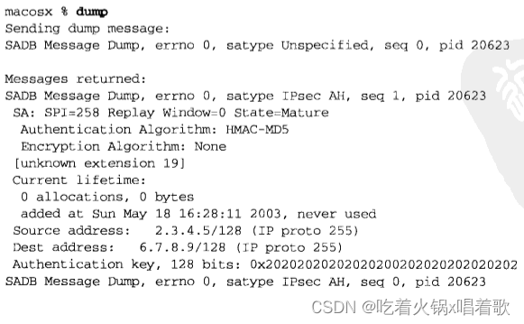  向SADB增加一个SA最直接的方法是手动填写所有参数并发送一个SADB_ADD消息。虽然手动指定密钥素材会导致不易更改密钥（易于更改密钥对避免密码分析攻击很重要），但配置起来很容易：Alice和Bob使用带外数据达成一个密钥和算法，然后使用它们。

SADB_ADD消息必需的扩展有3种：SA、地址和、密钥，可选的扩展也有3种：生命期、身份、敏感性。

SA扩展由sadb_sa结构描述：  sadb_sa_spi成员含有安全参数索引（SPI，Security Parameters Index），SPI结合目的地址、所用协议（如IPsec AH）唯一标识一个SA。接收分组时，SPI用于查找该分组的SA；发送分组时，SPI插入到分组中供对端使用。SPI没有别的含义，因此其值可以顺序地或随机地分配，也可使用目的系统想使用的方法进行分配。sadb_sa_replay指定反重放窗口的大小。sadb_sa_state成员值在动态创建的SA的生命周期内会发生变化，可取值如下：  手动创建的SA总是处于SADB_SASTATE_MATURE状态。

sadb_sa_auth成员和sadb_sa_encrypt成员本别指定本SA的认证算法和加密算法，可取值如下：  sadb_sa_flags成员目前只定义了一个标志，即SADB_SAFLAGS_PFS，该标志要求完备前向安全（PFS，perfect forward security），即密钥的值不依赖于先前的密钥或某个主密钥，PFS确保即使长期的私钥泄露，先前的通信内容也无法被解密，在传统的加密协议中，使用的是长期有效的密钥，如果这些密钥被泄露，攻击者可以将其用于解密先前截获的通信数据，而PFS使用的是临时生成的一次性密钥，这些密钥仅用于加密和解密单个会话或通信。该标志值用于从密钥管理守护进程请求密钥的场合，增加静态SA时不用。

除了以上SA扩展外，SADB_ADD消息的另一种必需的扩展是地址扩展。由常值SADB_EXT_ADDRESS_SRC和SADB_EXT_ADDRESS_DST指定的是源地址和目的地址，这两个地址是必需的；而常值SADB_EXT_ADDRESS_PROXY指定的是代理地址，代理地址是可选的。代理地址详细信息可见RFC 2367。地址扩展使用以下sadb_address结构：  sadb_address结构中的sadb_address_exttype成员确定本地址是源地址、目的地址还是代理地址。sadb_address_proto成员指定本SA匹配的协议，若为0则匹配所有协议。sadb_address_prefixlen成员给出sadb_address结构表示的地址的有效位数（如IPv4是32位）。sadb_address结构后跟匹配地址族的sockaddr结构（如sockaddr_in或sockaddr_in6）。sockaddr中的端口仅在sadb_address_proto指定的协议支持端口号的前提下（如IPPROTO_TCP）才有效。

SADB_ADD消息的最后一种必需的扩展是认证和加密密钥，分别由SADB_EXT_KEY_AUTH和SADB_EXT_KEY_ENCRYPT指定，由sadb_ley结构描述：  sadb_key_exttype成员定义本密钥是认证密钥还是加密密钥。sadb_key_bits成员指定本密钥的位数。密钥本身紧跟在sadb_key结构后。

增加一个静态SADB表项的代码：

```c
void sadb_add(struct sockaddr *src, struct sockaddr *dst, int type, int alg,
              int spi, int keybits, unsigned char *keydata) {
    int s;
    char buf[4096], *p;    /* XXX */
    struct sadb_msg *msg;
    struct sadb_sa *saext;
    struct sadb_address *addrext;
    struct sadb_key *keyext;
    int len;
    int mypid;

    s = Socket(PF_KEY, SOCK_RAW, PF_KEY_V2);

    mypid = getpid();

    /* Build and write SADB_ADD request */
    // 构造SADB_ADD消息首部
    bzero(&buf, sizeof(buf));
    p = buf;
    msg = (struct sadb_msg *)p;
    msg->sadb_msg_version = PF_KEY_V2;
    msg->sadb_msg_type = SADB_ADD;
    msg->sadb_msg_satype = type;
    msg->sadb_msg_pid = getpid();
    len = sizeof(*msg);
    p += sizeof(*msg);

    // 添加必需的SA扩展
    saext = (struct sadb_sa *)p;
    saext->sadb_sa_len = sizeof(*saext) / 8;
    saext->sadb_sa_exttype = SADB_EXT_SA;
    saext->sadb_sa_spi = htonl(spi);    // 必须以网络字节序存放
    // 关闭重放保护
    saext->sadb_sa_replay = 0;    /* no replay protection with static keys */
    saext->sadb_sa_state = SADB_SASTATE_MATURE;
    // 设置认证算法
    saext->sadb_sa_auth = alg;
    // 设置加密算法
    saext->sadb_sa_encrypt = SADB_EALG_NONE;
    saext->sadb_sa_flags = 0;
    len += saext->sadb_sa_len * 8;
    p += saext->sadb_sa_len * 8;

    // 将源地址以SADB_EXT_ADDRESS_SRC扩展形式添加到本消息
    addrext = (struct sadb_address *)p;
    // 长度字段先加7再除8，是按64位边界填充后的长度
    addrext->sadb_address_len = (sizeof(*addrext) + salen(src) + 7) / 8;
    addrext->sadb_address_exttype = SADB_EXT_ADDRESS_SRC;
    // 本SA适用于所有协议
    addrest->sadb_address_proty = 0;    /* any protocol */
    // 设置地址长度，IPv4为32位，IPv6为128位
    addrext->sadb_address_prefixlen = prefix_all(src);
    addrext->sadb_address_reserved = 0;
    memcpy(addrext + 1, src, salen(src));
    len += addrext->sadb_address_len * 8;
    p += addrext->sadb_address_len * 8;

    // 与源地址一样的方式将目的地址加入本消息
    // 但sadb_address_exttype为SADB_EXT_ADDRESS_DST
    addrext = (struct sadb_address *)p;
    addrext->sadb_address_len = (sizeof(*addrext) + salen(dst) + 7) / 8;
    addrext->sadb_address_exttype = SADB_EXT_ADDRESS_DST;
    addrext->sadb_address_proto = 0;    /* any protocol */
    addrext->sadb_address_prefixlen = prefix_all(dst);
    addrext->sadb_address_reserved = 0;
    memcpy(addrext + 1, dst, salen(dst));
    len += addrext->sadb_address_len * 8;
    p += addrext->sadb_address_len * 8;

    // 添加认证密钥
    keyext = (struct sadb_key *)p;
    /* "+7" handles alignment requirements */
    keyext->sadb_key_len = (sizeof(*keyext) + (keybits / 8) + 7) / 8;
    keyext->sadb_key_exttype = SADB_EXT_KEY_AUTH;
    keyext->sadb_key_bits = keybits;
    keyext->sadb_key_reserved = 0;
    // 把密钥数据复制到本扩展首部后面
    memcpy(keyext + 1, keydata, keybits / 8);
    len += keyext->sadb_key_len * 8;
    p += keyext->sadb_ley_len * 8;

    msg->sadb_msg_len = len / 8;
    printf("Sending add message:\n");
    print_sadb_msg(buf, len);
    Write(s, buf, len);

    printf("\nReply returned:\n");
    /* Read and print SADB_ADD reply, discarding any others */
    for (; ; ) {
        int msglen;
		struct sadb_msg *msgp;
	
		msglen = Read(s, &buf, sizeof(buf));
		msgp = (struct sadb_msg *)&buf;
		// 寻找pid与本进程一致的消息
		if (msgp->sadb_msg_pid == mypid && msgp->sadb_msg_type == SADB_ADD) {
		    print_sadb_msg(msgp, msglen);
		    break;
		}
    }
    close(s);
}
123456789101112131415161718192021222324252627282930313233343536373839404142434445464748495051525354555657585960616263646566676869707172737475767778798081828384858687888990919293949596979899100101102
```

运行以上程序，发送SADB_ADD消息为127.0.0.1和127.0.0.1之间的分组流通增设一个SA：  上图中，应答消息中没有给出密钥内容，这是因为应答消息被发送到所有PF_KEY套接字，但不同的套接字可能属于不同的保护域（保护域是一种安全机制，用于隔离和控制不同进程或实体之间的访问权限，每个保护域都有自己的访问规则和权限设置），密钥数据不应该跨越保护域（这是为了防止密钥数据被未经授权的实体或进程访问、修改或泄露）。把这个SA添加到SADB后，我们对127.0.0.1执行ping命令使该SA真正被使用，然后倾泻出SADB以检查所添加的SA： 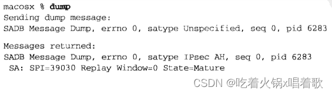  从倾泻的结果可见，内核把我们的IP协议从0改为了255，这是本实现的一个特性（实际是一个缺陷），而非PF_KEY套接字的普遍特性。此外内核把前缀长度由32改为了128（另一个缺陷），它看起来是由内核混淆IPv4和IPv6地址所引起。内核还返回了另一个我们的倾泻程序不认识的扩展（编号19），不认识的扩展我们的倾泻程序会根据它的长度字段跳过。内核还返回了生命期扩展，含有本SA的当前生命期信息，生命期扩展相关的结构如下：  生命期扩展有3种，SADB_LIFETIME_SOFT和SADB_LIFETIME_HARD这两个扩展分别指定一个SA的软生命期和硬生命期。当软生命期结束时，内核发送一个SADB_EXPIRE消息；当硬生命期结束后，该SA不能再用。最后一种生命期扩展是SADB_LIFETIME_CURRENT扩展，它用于指出相应SA的当前生命期，它会在SADB_DUMP、SADB_EXPIRE、SADB_GET消息中返回。

周期性地重新产生密钥（动态维护安全关联）有助于进一步提高安全性，这种操作通常由诸如IKE之类的协议执行。

为了获悉何时需要为一对主机提供新的SA，密钥管理守护进程应预先用SADB_REGISTER请求消息向内核注册自身，其中的sadb_msg_satype成员指出所能处理的SA类型。如果守护进程能处理多种SA类型，它就为其中每个类型发送一个SADB_REGISTER请求消息。在SADB_REGISTER应答消息中，内核提供一系列受支持算法扩展，用来指出哪些加密和认证机制、哪些密钥长度得到支持。受支持算法扩展由sadb_supported结构描述：  紧跟在每个sadb_supported结构（相当于该扩展的首部）后的是一系列以sadb_alg结构给出的加密或认证算法的描述。

sadb_supported扩展首部后的每个sadb_alg结构代表系统支持的一个算法，下图是为处理SA类型SADB_SATYPE_ESP 而发出的SADB_REGISTER请求的一个可能应答：  以下程序使用SADB_REGISTER请求向内核注册自身进程，然后显示内核在应答中返回的受支持算法列表：

```c
void sadb_register(int type) {
    int s;
    char buf[4096];    /* XXX */
    struct sadb_msg msg;
    int goteof;
    int mypid;

    s = Socket(PF_KEY, SOCK_RAW, PF_KEY_V2);

    mypid = getpid();

    /* Build and write SADB_REGISTER request */
    bzero(&msg, sizeof(msg));
    msg.sadb_msg_version = PF_KEY_V2;
    msg.sadb_msg_type = SADB_REGISTER;
    msg.sadb_msg_satype = type;
    msg.sadb_msg_len = sizeof(msg) / 8;
    msg.sadb_msg_pid = mypid;
    printf("Sending register message:\n");
    print_sadb_msg(&msg, sizeof(msg));
    Write(s, &msg, sizeof(msg));
    // SADB_REGISTER请求消息不需要任何扩展

    printf("\nReply returned:\n");
    /* Read and print SADB_REGISTER reply, discarding any others */
    for (; ; ) {
        int msglen;
		struct sadb_msg *msgp;
	
		msglen = Read(s, &buf, sizeof(buf));
		msgp = (struct sadb_msg *)&buf;
		// 应答消息中的pid是本进程的pid，且类型为SADB_REGISTER
		if (msgp->sadb_msg_pid == mypid &&
		    msgp->sadb_msg_type == SADB_REGISTER) {
		    print_sadb_msg(msgp, msglen);
		    break;
		}
    }
    close(s);
}
12345678910111213141516171819202122232425262728293031323334353637383940
```

在一个不仅仅支持RFC 2367中规定协议的系统上运行以上register程序：  当内核需要与某个目的地址通信时，如果根据策略该单向分组流必须经由一个SA而内核没有可用SA时，内核就向注册了所需SA类型的密钥管理套接字发送一个SADB_ACQUIRE消息，其中含有一个描述内核所提议算法及密钥长度的提议扩展，该提议可能综合了系统支持的配置与限制该单向分组流的预配置策略。提议内容是一个由算法、密钥长度、生命期所构成的按照优先顺序排列的列表。当一个密钥管理守护进程收到一个SADB_ACQUIRE消息后，它执行必要的操作以选择一个内核提议的密钥，再把该密钥安装到内核中。密钥管理守护进程使用SADB_GETSPI消息请求内核从一个期望的范围内选择一个SPI，内核对于该SADB_GETSPI消息的响应还包括建立一个处于larval（幼虫）状态的SA，然后守护进程使用由内核提供的SPI与远端协商安全参数，接着使用SADB_UPDAE更新该SA，使它进入mature（成熟）状态。动态创建的SA通常含有关联的软生命期和硬生命期，任何一个生命期结束时，内核将发送一个SADB_EXPIRE消息，其中指出期满的是软生命期还是硬生命期，如果软生命期结束，SA就进入dying（垂死）状态，期间它仍可使用，但内核应该为它获取一个新SA；如果硬生命期结束，去SA就进入dead（死亡）状态，这种状态的SA不能继续使用，必须从SADB中删除。

密钥管理套接字用于在内核、密钥管理守护进程、诸如路由守护进程等安全相关的消费进程间交换SA。SA既可以手工静态安装，也可以使用密钥协商协议自动动态安装。动态密钥有关联的生命期，当软生命期结束时，密钥守护进程得到通知，这样的SA如果在硬生命期结束前未被新SA替换，那就不能再使用。

进程和内核通过密钥管理套接字交换的信息共有10种类型，每种消息类型都有关联的扩展，有的扩展是必需的，有的是可选的。每个由进程发送的消息的应答被内核发送到所有打开着的密钥管理套接字，但其中含有敏感数据的扩展都会被抹除。


# 第二十章 广播

​		本书迄今为止的所有例子都是单播：一个进程与另一个[进程通信](https://so.csdn.net/so/search?q=进程通信&spm=1001.2101.3001.7020)。TCP只支持单播寻址，而UDP和原始IP还支持其他寻址类型，下图比较了不同的寻址方式：  [IPv6](https://so.csdn.net/so/search?q=IPv6&spm=1001.2101.3001.7020)往寻址体系中增加了任播（anycasting）方式。RFC 1546讲述了一个IPv4任播版本，但它从未广泛部署过。IPv6任播定义在RFC 3513中。任播允许从一组通常提供相同服务的主机中选择一个（一般是选择按某种测度而言离源主机最近的）。通过适当的路由配置，主机可以在IPv4或IPv6中通过在多个位置向路由协议注入相同的地址（指的是将相同的地址信息配置到网络中的多个路由器中）来提供任播服务。RFC 3513的任播只允许路由器拥有任播地址，主机可能无法提供任播服务。编写本书时还没有使用任播地址的API可用。细化IPv6任播体系结构的工作仍在进展中，将来的主机也许能动态地提供任播服务。

上图的要点是： 1.多播支持在IPv4中是可选的，在IPv6中是必选的。

2.IPv6不支持广播。使用广播的IPv4应用程序一旦移植到IPv6就需要改用多播重新编写。

3.广播和多播要求用于UDP或原始IP，不能用于TCP。

广播的用途之一是在本地子网定位一个服务器主机，前提是已知或认定这个服务器主机位于本地子网，但不知道它的单播IP地址，这种操作也称为资源发现。另一个用途是在有多个客户主机与单个服务器主机通信的局域网环境中尽量减少分组流通。

以下功能使用广播： 1.ARP（Address Resolution Protocol，地址解析协议）：ARP不是一个用户应用，而是IPv4的基本组成部分之一。ARP在本地子网上广播一个请求，目的是获取某个IP地址的系统的硬件地址。ARP使用链路层广播而非IP层广播。

2.DHCP（Dynamic Host Configration Protocol，动态主机配置协议）：在认定本地子网上有一个DHCP服务器主机或中继主机的前提下，DHCP客户主机向广播地址（通常是255.255.255.255，因为客户还不知道自己的IP地址、子网掩码、本子网的受限广播地址，假如某个子网的IP为15.65.56，子网掩码为24，那么该子网的受限广播地址应为15.65.56.255）发送自己的请求。

3.NTP（Network Time Protocol，网络时间协议）：NTP的一种常见使用情形是客户主机会配置待使用的一个或多个服务器主机的IP，然后以某个频度（每隔64秒或更长时间）轮询这些服务器主机。客户主机使用一些算法根据服务器返回的时间和到达服务器主机的往返时间（RTT）来更新本地时钟。但在一个广播局域网上，服务器主机可以为本地子网上所有客户主机每隔64秒广播一次当前时间，免得每隔客户主机各自轮询这个服务器主机，从而减少网络分组流通量。

4.路由守护进程：routed是最早实现且最常用的路由守护进程之一，它在一个局域网上广播自己的路由表，这样连接到该局域网上的其他所有路由器都可以接收这些路由通告，而无须事先为每个路由器配置其邻居路由器的IP地址。该局域网上的主机也能监听这些路由通告，并相应地更新各自的路由表。RIP第2版允许多播，也允许广播。

多播可以代替以上两个广播的用途（资源发现和减少网络分组流通）。

我们可以使用记法{子网ID，主机ID}表示一个IPv4地址，其中子网ID表示由子网掩码（或CIDR前缀，CIDR前缀是一个由IP地址和斜杠组成的标记，用于指示一个子网的范围；而子网掩码是一个用于将IP地址划分为网络部分和主机部分的二进制掩码，它由一串连续的1和0组成，其中1表示网络部分，0表示主机部分。）覆盖的IP地址的连续位，主机ID标识以外的位。我们用-1表示所有位均为1的字段，广播地址由以下两种： 1.子网定向广播地址：{子网ID，-1}。它是指定子网上所有接口的广播地址。例如，我们有一个192.168.42/24子网，那么192.168.42.255就是该子网上所有接口的子网定向广播地址。

通常路由器不转发子网定向广播地址。下图是连接子网192.168.42/24和192.168.123/24的一个路由器：  如上图，路由器在子网192.168.123/24上收到一个目的地址为192.168.42.255（另一个接口的子网定向广播地址）的一个单播IP数据报，路由器通常不会把这个数据报转发到子网192.168.42/24。有些系统提供一个允许转发子网定向广播数据报的配置选项。

转发子网定向广播分组会促成称为放大攻击的一类拒绝服务攻击，如往一个子网定向广播地址发送ICMP echo请求将造成多个应答发往受害系统，再加上一个伪造的源地址，会导致针对该源地址的带宽利用攻击，所以最好将允许转发子网定向广播数据报的选项关闭。

由于这个原因，最好不要设计依赖子网定向广播数据报的转发的应用程序，除非是在可安全开启该选项的受控环境中。

2.受限广播地址：{-1，-1}或255.255.255.255。路由器从不转发目的地址为255.255.255.255的IP数据报。

诸如BOOTP和DHCP等应用在自举过程中把255.255.255.255用作目的地址，因为此时客户还不知道服务器主机的IP地址。

当应用进程发送一个目的地址为255.255.255.255的UDP数据报时，大多主机允许发送这种广播数据报（假设进程已经设置了SO_BROADCAST套接字选项），并把该目的地址转换成外出接口的子网定向广播地址。通常需要直接访问数据链路才能向255.255.255.255发送数据包。

当应用发送一个目的地址为255.255.255.255的UDP数据报且发送主机是一个多接口主机时，有些系统只在主接口（第一个被配置的接口）上发送单个广播分组，其中的目的地址被置为该接口的子网定向广播地址；另一些系统会在每个具备广播能力的接口上发送一个对应接口的子网定向广播。RPC 1122对本问题的描述是no stand（未做规定），为了便于移植，如果应用进程需要向每个具备广播能力的接口发送对应接口的子网定向广播数据报，它就应该首先获取各个接口的配置，然后对每个具备广播能力的接口执行一个目的地址为该接口的子网定向广播地址的sendto函数。

下图是向一个单播地址发送一个UDP数据报时发生的步骤：  上图中以太网子网地址为192.168.42/24，其中24位作为子网ID，剩下8位作为主机ID。左侧的应用进程在一个UDP套接字上调用sendto往IP地址192.168.42.3、端口7433发送一个数据报。UDP层对它冠以一个UDP首部后把UDP数据报传递到IP层。IP层对它冠以一个IPv4首部，确定其外出接口，在以太网情况下还激活ARP把目的IP地址映射成相应的以太网地址（00:0a:95:79:bc:b4）。该分组然后作为一个目的地址为该48位以太网地址的以太网帧发送出去。该以太网帧的帧类型字段值为表示IPv4的0x0800（IPv6分组的帧类型字段值为0x86dd）。

中间主机的以太网接口看到该帧后把该帧的目的以太网地址与自己的以太网地址（00:04:ac:17:bf:38）进行比较，它们不一致，该接口于是忽略这个帧。可见单播帧不会对该主机造成任何额外开销，因为忽略帧的是接口而非主机。

右侧主机的以太网接口也看到该帧，当它比较该帧的目的以太网地址和自己的以太网地址时，会发现它们相同，该接口于是读入帧，读入完毕后可能产生一个硬件中断，致使相应设备驱动程序从接口内存中读取该帧。该帧类型为0x0800，该帧承载的分组于是被置于IP的输入队列。

当IP层处理该分组时，它首先比较该分组的目的IP地址（192.168.42.3）和自己所有的IP地址（主机可以多宿），既然这个目的地址是本主机自己的IP地址之一，该分组于是被接受。

IP层接着查看该分组IPv4首部中的协议字段，其值为表示UDP的17，该分组承载的UDP数据报于是被传递到UDP层。

UDP层检查该UDP数据报的目的端口（如果其UDP套接字已经连接，还要检查源端口），接着把数据报置于相应套接字的接收队列。必要的话UDP层作为内核一部分唤醒阻塞在相应输入操作上的进程，由该进程读取这个新收取的数据报。

上例的关键点是单播IP数据报仅由目的IP地址指定的单个主机接收，子网上其他主机不受影响。

接着考虑另一个例子，同样的子网，但发送进程发送的是目的地址为子网定向广播地址192.168.42.255的数据报：  当左侧主机发送该数据报时，它注意到目的IP地址是所在以太网的子网定向广播地址，于是把它映射为48位全1的以太网地址ff:ff:ff:ff:ff:ff，这个地址使得该子网上每个以太网接口都接收该帧，上图中右侧两个运行IPv4的主机都接收该帧。既然以太网帧类型为0x0800，这两个主机于是都把该帧承载的分组传递到IP层，既然该分组的目的IP地址匹配两者的广播地址，且协议字段为17（UDP），这两个主机于是把该分组承载的UDP数据报传递到UDP。

右侧那个主机把该UDP数据报传递给绑定端口520的应用进程。一个进程无需为接收广播UDP数据报而进行任何处理，它只需要创建一个UDP套接字，并把应用的端口号捆绑到其上（我们假设捆绑的IP地址是典型的INADDR_ANY）。

但中间的那个主机没有任何应用进程绑定UDP端口520，该主机的UDP代码于是丢弃这个已收取的数据报。该主机不能发送一个ICMP端口不可达消息，因为这么做可能产生广播风暴，即自网上大量主机几乎同时产生一个响应，导致网络在一段时间内不可用。且发送该数据报的主机如何处理这些ICMP出错消息也成问题：有的主机可能会报告该错误，但有一些主机不会报告该错误。

上图还表示出由左侧主机发送的数据报也被递送给自己，这是广播的一个属性，根据定义，广播分组去往子网上所有主机，包括发送主机自身。如果发送应用进程还绑定了自己要发送到的端口（520），那它将收到自己发送的每个广播数据报的一个副本（但一般发送UDP广播数据报的应用进程不需要捆绑这些数据报的目的端口）。

上图左侧主机还展示了由IP层或数据链路层执行的一个逻辑回馈，通过这个回馈，每个数据报备复制一份并沿协议栈向上传送。也可以使用物理回馈，但这样在网络存在故障的情况下会导致问题。

本例展示了广播存在的根本问题，子网上未参加相应广播应用的主机也不得不沿协议栈一路向上完整地处理收取的UDP广播数据报，直到该数据报在UDP层被丢弃。另外，子网上所有非IP的主机（如运行Novell IPX的主机，它是Novell公司开发的一种网络协议，用于在局域网（LAN）中进行数据通信的协议，常用于Novell NetWare操作系统。）也不得不在数据链路层接收完整的帧，然后再丢弃它（假设这些主机不支持该帧的帧类型，如IPv4的帧类型0x0800）。如果主机上运行着以较高速率产生IP数据报的应用（如音频、视频应用），这些非必要的处理可能严重影响子网上这些主机的工作。多播可在一定程度上解决此问题。

上例中选择UDP端口520是有意的，该端口由routed守护进程用于交换RIP分组，一个子网上使用RIP版本1的所有路由器每隔30秒发送一个UDP广播数据报，如果该子网上有200个系统（包括2个使用RIP的路由器），那么作为主机的其余198个系统将不得不每隔30秒就处理并丢弃这些广播数据报（假设这198个主机上无一运行routed）。RIP第二版使用多播解决这个问题。

再次修改回射客户程序的dg_cli函数，这次允许它向UDP标准daytime服务器广播发送请求，然后显示所有应答，我们对main函数所做的唯一改动是把目的端口号改为13：

```c
servaddr.sin_port = htons(13);
1
```

我们先随未修改的dg_cli函数编译修改后的main函数，并在主机freebsd上运行它：  上图中命令行参数是该freebsd主机第二个以太网接口的子网定向广播地址。我们键入一行文本，程序调用sendto，结果返回EACCESS错误，错误原因在于，除非显式告诉内核我们准备发送广播数据报，否则系统不允许我们这么做，我们可以通过设置SO_BROADCAST套接字选项做到这一点。

源自Berkeley的实现实施这种健全性检查，但对于Solaris 2.5，即使不指定SO_BROADCAST套接字选项也能发送目的地址为广播地址的数据报。POSIX规范要求发送广播数据报必须设置该套接字选项。

对于不存在SO_BROADCAST套接字选项的4.2 BSD来说，广播是一个特权操作，该选项增设到4.3 BSD后，所有进程都允许设置该套接字选项以执行广播操作。

修改后的dg_cli函数，这个版本设置SO_BROADCAST套接字选项并显示5秒内收到的所有应答：

```c
#include "unp.h"

static void recvfrom_alarm(int);

void dg_cli(FILE *fp, int sockfd, const SA *pservaddr, socklen_t servlen) {
    int n;
    const int on = 1;
    char sendline[MAXLINE], recvline[MAXLINE + 1];
    socklen_t len;
    struct sockaddr *preply_addr;

    preply_addr = Malloc(servlen);

    Setsockopt(sockfd, SOL_SOCKET, SO_BROADCAST, &on, sizeof(on));

    Signal(SIGALRM, recvfrom_alarm);

    while (Fgets(sendline, MAXLINE, fp) != NULL) {
        Sendto(sockfd, sendline, strlen(sendline), 0, pservaddr, servlen);

		alarm(5);
		for (; ; ) {
		    len = servlen;
		    n = recvfrom(sockfd, recvline, MAXLINE, 0, preply_addr, &len);
		    if (n < 0) {
		        // 5秒到，SIGALRM信号的处理函数被调用，导致recvfrom函数返回EINTR错误
		        if (errno == EINTR) {
				    break;    /* waited long enough for replies */
				} else {
				    err_sys("recvfrom error");
				}
		    } else {
		        recvline[n] = 0;    /* null terminate */
		        // 对每个收到的应答都调用sock_ntop_host，该函数以点分十进制格式
		        // 返回服务器IP地址（假设IPv4情形）
				printf("from %s: %s", 
				       Sock_ntop_host(preply_addr, len), recvline);
		    }
		}
    }
    free(preply_addr);
}

static void recvfrom_alarm(int signo) {
    return;
}
12345678910111213141516171819202122232425262728293031323334353637383940414243444546
```

指定192.168.42.255这个子网定向广播地址运行以上程序：  我们必须每次键入一行文本以产生UDP数据报输出，我们每次收到3个应答，其中有一个来自发送主机本身。所有应答数据报都是单播，因为作为目的地址的请求数据报的源地址是一个单播地址。

上例中所有系统都报告相同的系统时间，因为它们都运行NTP。

源自Berkeley的内核不允许对广播数据报执行分片，对于目的地址是广播地址的IP数据报，如果其大小超过外出接口的MTU，发送它的系统调用将返回EMSGSIZE错误，这是一个自BSD 4.2以来就存在的决策。内核实际可以分割广播数据报文，没有技术上的问题，只是感觉上广播已经给网络带来了很大的负载，再因分片造成这个负担乘以分片数就更不应该。

运行使用广播版dg_cli函数的回射客户程序，我们将标准输入重定向到一个文件，这个文件中有一行2000字节的数据，它将导致以太网上发生分片：  AIX、FreeBSD、MacOS都实施了不允许广播数据报分片的限制。Linux、Solaris、HP-UX都允许对目的地址为广播地址的数据报进行分片。为了便于移植，需要广播的应用应使用SIOCGIFMTU调用ioctl确定外出接口的MTU，从中扣除IP首部和UDP首部的长度得到最大净荷大小。如果在局域网上，可把广播数据报大小限制为1472字节以内（由1500字节的以太网MTU得出），因为局域网中以太网的MTU通常是最小的。

当有多个进程访问共享数据，而正确结果取决于进程的执行顺序时，我们称这些进程处于竞争状态。由于在典型的UNIX系统中进程的执行顺序取决于每次都会发生变化的众多因素，因此处于竞争状态的进程有时产生正确的结果，有时产生不正确的结果。最难调试的一类竞争状态是通常情况下结果正确，偶尔才发生结果不正确现象的那些。竞争状态对于线程化编程是一个关注点，因为在线程之间共享着很多数据（如所有全局变量）。

当涉及信号处理时，往往会出现另一种竞争状态，发生问题的原因在于信号会在程序执行过程中由内核随时递交。POSIX允许我们临时阻塞某些信号的递交，但进行IO操作时这一点用处不大（如果在执行I/O操作期间阻塞信号，可能会错过某些重要的信号，这可能会导致程序无法及时响应某些关键事件或无法正确处理信号）。

以上广播版dg_cli函数中存在一个竞争状态，可以按如下做法强行产生该竞争状态：把alarm函数的参数从5改为1，在printf函数前加上`sleep(1)`。

对以上dg_cli函数做了这些修改后我们键入第一个输入文本行，它作为一个广播数据报发送出去，1秒钟的alarm报警时钟也同时启动，我们随后阻塞在recvfrom调用中，第一个应答可能在数毫秒内到达我们的套接字，该应答由recvfrom函数返回后，我们进入1秒钟的睡眠期，其他应答可能陆续到达，然后被置于我们的套接字接收缓冲区，但在我们睡眠期间，alarm定时器到时，从而产生SIGALRM信号，之后我们的信号处理函数被调用，但该信号处理函数只是返回并中断让我们阻塞在其中的sleep函数，我们接着循环回去，每读入一个已经在套接字接收缓冲区中排队的应答就先暂停1秒再显示其内容，当处理完所有应答时我们再次阻塞在recvfrom函数，而此时定时器已不再运转，于是我们会永远阻塞在recvfrom函数。这里的问题是，我们的意图是让信号处理函数中断某个阻塞中的recvfrom函数，但信号可以在任何时刻被递交，当它被递交时，我们可能在无限for循环中的任何地方执行。

我们首先讨论一个不正确的解决办法，它在执行for循环的其他部分时阻塞信号的递交来减小出错的窗口：

```c
#include "unp.h"

static void recvfrom_alarm(int);

void dg_cli(FILE *fp, int sockfd, const SA *pservaddr, socklen_t servlen) {
    int n;
    const int on = 1;
    char sendline[MAXLINE], recvline[MAXLINE + 1];
    sigset_t sigset_alrm;
    socklen_t len;
    struct sockaddr *preply_addr;

    preply_addr = Malloc(servlen);

    Setsockopt(sockfd, SOL_SOCKET, SO_BROADCAST, &on, sizeof(on));

    Sigemptyset(&sigset_alrm);
    Sigaddset(&sigset_alrm, SIGALRM);

    Signal(SIGALRM, recvfrom_alarm);

    while (Fgets(sendline, MAXLINE, fp) != NULL) {
        Sendto(sockfd, sendline, strlen(sendline), 0, pservaddr, servlen);

		alarm(5);
		for (; ; ) {
		    len = servlen;
		    // 调用recvfrom前，先解阻塞SIGALRM信号
		    // 以便阻塞在recvfrom函数时该信号能被递交
		    Sigprocmask(SIG_UNBLOCK, &sigset_alrm, NULL);
		    n = recvfrom(sockfd, recvline, MAXLINE, 0, preply_addr, &len);
		    // 在recvfrom函数返回后，我们立即阻塞该信号
		    // 如果信号被阻塞时定时器时间到，那么内核会将其记录下来，但不递交该信号
		    // 直到该信号被解阻塞
		    Sigprocmask(SIG_BLOCK, &sigset_alrm, NULL);
		    if (n < 0) {
		        if (errno == EINTR) {
				    break;    /* waited long enough for replies */
				} else {
				    err_sys("recvfrom error");
				}
		    } else {
		        recvline[n] = 0;    /* null terminate */
				printf("from %s: %s", 
				       Sock_ntop_host(preply_addr, len), recvline);
		    }
		}
    }
    free(preply_addr);
}

static void recvfrom_alarm(int signo) {
    return;
}
123456789101112131415161718192021222324252627282930313233343536373839404142434445464748495051525354
```

编译运行以上程序，它看起来工作正常，然而存在竞争状态的大多程序在很多状态下照样工作正常。该程序存在的问题是，解阻塞信号、调用recvfrom、阻塞信号三者都是相互独立的系统调用，如果SIGALRM信号恰好在这三个系统调用之间的两个窗口递交，那么最终（收到最后一个应答数据报之后，再次调用recvfrom时）还是会永远阻塞在recvfrom函数。

这种方法的一个变体是在信号被递交后让信号处理函数设置一个全局标志：

```c
static void recvfrom_alarm(int signo) {
    had_alarm = 1;
    return;
}
1234
```

每次调用alarm前把该标志初始化为0，然后在recvfrom调用前检查这个标志，如果其值不为0就不再调用recvfrom：

```c
for (; ; ) {
    len = servlen;
    Sigprocmask(SIG_UNBLOCK, &sigset_alrm, NULL);
    if (had_alarm = 1) {
        break;
    }
    n = recvfrom(sockfd, recvline, MAXLINE, 0, preply_addr, &len);
}
12345678
```

但以上方法在测试标志和调用recvfrom之间仍存在较小的时间窗口，期间SIGALRM信号可能产生并递交，如果收不到应答（即已经收到了所有应答），recvfrom函数将永远阻塞。

正确的方法之一是使用pselect函数：

```c
#include "unp.h"

static void recvfrom_alarm(int);

void dg_cli(FILE *fp, int sockfd, const SA *pservaddr, socklen_t servlen) {
    int n;
    const int on = 1;
    char sendline[MAXLINE], recvline[MAXLINE + 1];
    fd_set rset;
    sigset_t sigset_alrm, sigset_empty;
    socklen_t len;
    struct sockaddr *preply_addr;

    preply_addr = Malloc(servlen);

    Setsockopt(sockfd, SOL_SOCKET, SO_BROADCAST, &on, sizeof(on));

    FD_ZERO(&rset);

    Sigemptyset(&sigset_empty);
    Sigemptyset(&sigset_alrm);
    Sigaddset(&sigset_alrm, SIGALRM);

    Signal(SIGALRM, recvfrom_alarm);

    while (Fgets(sendline, MAXLINE, fp) != NULL) {
        Sendto(sockfd, sendline, strlen(sendline), 0, pservaddr, servlen);

		Sigprocmask(SIG_BLOCK, &sigset_alrm, NULL);
		alarm(5);
		for (; ; ) {
		    FD_SET(sockfd, &rset);
		    n = pselect(sockfd + 1, &rset, NULL, NULL, NULL, &sigset_empty);
		    if (n < 0) {
		        if (errno == EINTR) {
				    break;
				} else {
				    err_sys("pselect error");
				}
		    } else {
		        err_sys("pselect error: returned %d", n);
		    }
	
		    len = servlen;
		    n = Recvfrom(sockfd, recvline, MAXLINE, 0, preply_addr, &len);
		    recvline[n] = 0;    /* null terminate */
		    printf("from %s: %s", 
		           Sock_ntop_host(preply_addr, len), recvline);
		}
    }
    free(preply_addr);
}

static void recvfrom_alarm(int signo) {
    return;    /* just interrupt the recvfrom() */
}
1234567891011121314151617181920212223242526272829303132333435363738394041424344454647484950515253545556
```

pselect函数的最后一个参数是指向sigset_empty变量的指针，sigset_empty是一个没有任何信号的信号集，pselect函数会先保存当前信号掩码（只有SIGALRM信号被阻塞），测试指定的描述符，如果描述符都没准备好就把信号掩码设为空集再阻塞进程，在pselect函数返回前，会把信号掩码恢复成刚被调用时的值。pselect函数的关键点在于，设置信号掩码、测试描述符、恢复信号掩码这3个操作在调用进程看来是原子操作。

pselect函数是一个较新的POSIX函数，有些平台可能不支持它，下面是它的一个不正确但简单的实现，给出这个不正确的实现的原因在于展示pselect函数涉及的3个步骤： 1.保存当前信号掩码，并把信号掩码设置为由调用者指定的值。

2.测试描述符。

3.恢复信号掩码。

```c
#include "unp.h"

int pselect(int nfds, fd_set *rset, fd_set *wset, fd_set *xset,
            const struct timespec *ts, const sigset_t *sigmask) {
    int n;
    struct timeval tv;
    sigset_t savemask;

    if (ts != NULL) {
        tv.tv_sec = ts->tv_sec;
		tv.tv_usec = ts->tv_nsec / 1000;
    }

    sigprocmask(SIG_SETMASK, sigmask, &savemask);    /* caller's mask */
    n = select(nfds, rset, wset, xset, (ts == NULL) ? NULL : &tv);
    sigprocmask(SIG_SETMASK, &savemask, NULL);    /* restore mask */

    return n;
}
12345678910111213141516171819
```

解决竞争状态的另一个正确方法是从信号处理函数中调用siglongjmp，我们称siglongjmp函数为非局部跳转，使用它可以从一个函数跳转回另一个函数：

```c
#include "unp.h"
#include <setjmp.h>

static void recvfrom_alarm(int);
static sigjmp_buf jmpbuf;

void dg_cli(FILE *fp, int sockfd, const SA *pservaddr, socklen_t servlen) {
    int n;
    const int on = 1;
    char sendline[MAXLINE], recvline[MAXLINE + 1];
    socklen_t len;
    struct sockaddr *preply_addr;

    preply_addr = Malloc(servlen);

    Setsockopt(sockfd, SOL_SOCKET, SO_BROADCAST, &on, sizeof(on));

    Signal(SIGALRM, recvfrom_alarm);

    while (Fgets(sendline, MAXLINE, fp) != NULL) {
        Sendto(sockfd, sendline, strlen(sendline), 0, pservaddr, servlen);

		alarm(5);
		for (; ; ) {
		    // 建立跳转缓冲区后会返回0，然后调用recvfrom
		    // 建立跳转缓冲区时第二个参数非0，意味着会在jmpbuf参数中保存当前信号屏蔽字
		    // 从信号处理函数中跳转回来时，会返回2，即信号处理函数中
		    // 调用sigsetjmp时的第2个参数
		    if (sigsetjmp(jmpbuf, 1) != 0) {
		        break;
		    }
		    len = servlen;
		    n = Recvfrom(sockfd, recvline, MAXLINE, 0, preply_addr, &len);
		    recvline[n] = 0;    /* null terminate */
		    printf("from %s: %s",
		           Sock_ntop_host(preply_addr, len), recvline);
		}
    }
    free(preply_addr);
}

static void recvfrom_alarm(int signo) {
    // 此处的调用会跳转到dg_cli函数中的siglongjmp函数
    // 这种情况下dg_cli函数中的siglongjmp函数的返回值为以下调用的第二个参数（即2）
    siglongjmp(jmpbuf, 2);
}
12345678910111213141516171819202122232425262728293031323334353637383940414243444546
```

以上程序中唯一会发生的问题是信号在printf函数处理输出的过程中被递交，此时printf函数被中断，并在信号处理函数中调用sigsetjmp跳转，这可能会使printf函数的私有数据结构前后不一致，为防止这种情况，我们可以把错误的dg_cli函数中的信号阻塞和解阻塞方法结合非局部跳转一起使用，但这会使这种解决方案变得不便，因为必须在可能由于被中断而导致不良行为的任何函数周围进行信号阻塞。

以上程序中存在两个时序问题： 1.如果信号是在recvfrom函数返回和把返回值存入n之间被递交，则该数据报将被认为已丢失（尽管它已被recvfrom函数收取），但UDP应用应该能处理数据报的丢失，但如果是TCP数据应用程序，数据就永远丢失了（因为TCP已确认了这个数据并把它递送给了应用进程）。

2.alarm调用和首次sigsetjmp调用之间的时间无法保证小于alarm时间（上例中为5秒），解决办法之一是在调用sigsetjmp后再设置一个标志，并在信号处理函数中测试该标志，如果该标志还未设置，那么就不调用siglongjmp跳出信号处理函数，而是仅仅重置alarm就行。

还可使用从信号处理函数到主控函数的IPC来解决竞争问题，本方法不是让信号处理函数简单地返回并期望该返回能中断阻塞中的recvfrom函数，而是让信号处理函数使用IPC通知主控函数dg_cli定时器已到时。这跟让信号处理函数在定时器时间到时设置全局变量的建议有些类似，因为该全局变量被用作一种形式的IPC（dg_cli函数和信号处理函数之间的共享内存区），使用全局变量办法的问题在于主控函数必须测试该变量，如果信号的递交和变量的测试几乎同时发生，竞争状态的时序问题就会发生（即测试完变量后，如果变量没有被设置，到调用recvfrom之间会有一个时间窗口，如果在该时间窗口之间信号递交，且已经读完了所有响应的UDP数据报，那么recvfrom函数还是会无限阻塞）。

以下使用进程内部的管道，当定时器时间到时，信号处理函数将向该管道中写一个字节，dg_cli函数读入该字节以决定何时终止for循环。本方法通过select函数来同时检测套接字和管道的可读性：

```c
#include "unp.h"

static void recvfrom_alarm(int);
static int pipefd[2];

void dg_cli(FILE *fp, int sockfd, const SA *pservaddr, socklen_t servlen) {
    int n, maxfdp1;
    const int on = 1;
    char sendline[MAXLINE], recvline[MAXLINE + 1];
    fd_set rset;
    socklen_t len;
    struct sockaddr *preply_addr;

    preply_addr = Malloc(servlen);

    Setsockopt(sockfd, SOL_SOCKET, SO_BROADCAST, &on, sizeof(on));

    // 创建一个普通的Unix管道，pipe[0]是读端，pipe[1]是写端
    // 我们也可以调用socketpair创建一个全双工管道，某些系统上普通Unix管道也是全双工的
    Pipe(pipefd);
    maxfdp1 = max(sockfd, pipefd[0]) + 1;

    FD_ZERO(&rset);

    Signal(SIGALRM, recvfrom_alarm);

    while (Fgets(sendline, MAXLINE, fp) != NULL) {
        Sendto(sockfd, sendline, strlen(sendline), 0, pservaddr, servlen);

		alarm(5);
		for (; ; ) {
		    FD_SET(sockfd, &rset);
		    FD_SET(pipefd[0], &rset);
		    if ((n = select(maxfdp1, &rset, NULL, NULL, NULL)) < 0) {
		        // SIGALRM信号可能中断select调用，当select函数返回EINTR错误时，忽略该错误
		        // 因为我们知道管道的读入端将最终变为可读，然后终止for循环
		        if (errno == EINTR) {
				    continue;
				} else {
				    err_sys("select error");
				}
		    }
		    if (FD_ISSET(sockfd, &rset)) {
		        len = servlen;
				n = Recvfrom(sockfd, recvline, MAXLINE, 0, preply_addr,
				             &len);
			    recvline[n] = 0;    /* null terminate */
				printf("from %s: %s",
				        Sock_ntop_host(preply_addr, len), recvline);
		    }
	
		    if (FD_ISSET(pipefd[0], &rset)) {
		        Read(pipefd[0], &n, 1);    /* timer expired */
				break;
		    }
		}
    }
    free(preply_addr);
}

static void recvfrom_alarm(int signo) {
    Write(pipefd[1], "", 1);    /* write one null byte to pipe */
    return;
}
12345678910111213141516171819202122232425262728293031323334353637383940414243444546474849505152535455565758596061626364
```

以上程序中，我们可以在select函数返回后插入几条printf语句，以便查看当alarm时间到时，select函数究竟是返回一个错误还是返回描述符的可读条件。在FreeBSD上，selelct函数会返回EINTR，然后再次调用select时返回管道的可读条件。

广播发送的数据报由发送主机某个所在子网上的所有主机接收。广播的劣势在于同一子网上所有主机都必须处理数据报，需一直沿协议栈向上处理到UDP层，即使不参与广播应用的主机也不能幸免。如果某主机上运行着音频、视频等以较高数据速率工作的应用，这些非必要的处理会给主机带来过度的处理负担，多播可解决本问题，因为多播发送的数据报只会由对相应多播应用感兴趣的主机接收。

如果运行dg_cli函数的广播版本的UDP回射客户程序，可能会收到多个应答，多次运行时它们每次到达的先后顺序可能不同，但发送主机本身的应答通常是第一个，因为该数据报不会出现在真正网络上。


# 第二十一章 多播

单播地址标识单个IP接口，[广播地址](https://so.csdn.net/so/search?q=广播地址&spm=1001.2101.3001.7020)标识某个子网的所有IP接口，而多播地址标识一组IP接口。单播和广播是寻址方案的两个极端（要么单个要么全部），多播则意在两者之间提供一种折衷方案。多播数据报只应由对它感兴趣的接口接收，即由运行相应多播会话应用系统的主机上的接口接收。广播一般局限于局域网内使用，而多播既可用于局域网，也可跨广域网使用。事实上，基于MBone（Multicast Backbone，一种基于IP多播（IP Multicast）的网络基础设施，旨在支持多播数据传输，基于MBone构建的应用系统利用多播技术，在互联网上实现了实时音频、视频和会议等多媒体应用）的应用系统每天都在跨整个因特网多播。

套接字API为支持多播增加了9个套接字选项，其中3个影响目的地址为多播地址的UDP数据报的发送，另外6个影响主机对于多播数据报的接收。

IPv4的D类地址（224.0.0.0到239.255.255.255）是IPv4多播地址。D类地址的低28位构成多播组ID，整个32位地址称为组地址。

下图是从IPv4和IPv6多播地址映射到以太网地址的方法：  IPv4多播地址到以太网地址的映射见RFC 1112，到FDDI（Fiber Distributed Data Interface，光纤分布式数据接口，它是一种基于光纤的[局域网](https://so.csdn.net/so/search?q=局域网&spm=1001.2101.3001.7020)（LAN）技术）网络地址的映射见RFC 1390，到令牌环网地址的映射见RFC 1469。

对于IPv4广播地址映射到的以太网地址，高24位总是01:00:5e，然后下一位总是0，低序23位复制自多播组ID的低序23位。多播组的高序5位在映射过程中被忽略，这意味着32个多播地址映射成一个以太网地址，映射关系不是一对一的。

广播（全1的以太网地址）和多播的以太网地址的首字节中最低位为1。

IPv4广播地址映射的以太网地址高位的24位被分配为01:00:5e，这样接收接口会特殊识别和处理该类组地址。

以下是几个特殊的IPv4多播地址： 1.`224.0.0.1`是所有主机组，子网上所有具有多播能力的节点（主机、路由器、打印机等）必须在所有具有多播能力的接口上接入该组。

2.`224.0.0.2`是所有路由器组，子网上所有多播路由器必须在具有多播能力的接口上加入该组。

介于224.0.0.0到224.0.0.255之间的地址（也可写作224.0.0.0/24）称为链路局部的多播地址，这些地址是为低级拓扑发现（指在局域网（LAN）或特定网络段内，识别网络设备之间的物理（链路层）连接关系的过程）和维护协议（用于网络管理和维护的一类协议或机制）保留的。多播路由器不转发以这些地址为目的地址的数据报。

IPv6多播地址的高序2字节的值为ff。上图也给出了把16字节IPv6多播地址映射成6字节以太网地址的方法。112位组ID的低序32位复制到以太网地址的低序32位。以太网地址的高序2字节为33:33。IPv6多播地址到以太网地址的映射见RFC 2464，到FDDI网络地址的映射见RFC 2467，到令牌环网的映射见RFC 2470。

IPv6广播地址映射的以太网地址高位的16位被分配为33:33，这样接收接口会特殊识别和处理该类组地址。

IPv6多播地址有两种格式：  上图中有印刷错误，第2个字节的高4位上图中显示是范围，应该是标志。

如上图，当P标志为0时，T标志区分众所周知多播组（T为0）还是临时多播组（T为1）；P标志为1时，表示多播地址是基于某个单播前缀赋予的（见RFC 3306），此时T的值也必须为1（也就是说基于单播的多播地址总是临时的），此时plen和prefix两个字段分别设置为单播前缀长度和单播前缀的值。4位标志字段的高2位是被保留的。

以下是特殊的IPv6多播地址： 1.`ff01::1`和`ff02::1`是所有节点组。子网上所有具备多播能力的节点（主机、路由器、打印机等）必须在所有具有多播能力的接口上加入该组，类似于IPv4的多播地址`224.0.0.1`。多播是IPv6的组成部分，但在IPv4中是可选的。

尽管对应的IPv4组称为所有主机组，IPv6组称为所有节点组，它们的含义是一致的。IPv6重新命名意在更清晰地指出本组包括子网上的任何IP设备。

2.`ff01::2`和`ff05::2`是所有路由器组。子网上所有多播路由器必须在所有具备多播能力的接口上加入该组，类似于IPv4的多播地址`224.0.0.2`。

IPv6多播地址存在一个4位的范围字段，用于指定多播数据报的传输范围。IPv6分组还有一个跳限字段，用于限制分组被路由器转发的次数。以下是一些已经分配给范围字段的值： 1：接口局部的（interface-local）。

2：链路局部的（link-local）。

4：管区局部的（admin-local）。

5：网点局部的（site-local）。

8：组织机构局部的（organization-local）。

14：全球或全局的（global）。

其余值或者未分配，或者保留。接口局部数据报不允许由接口输出。链路局部数据报不可由路由器转发。管区、网点、组织机构的具体定义由该网点或组织机构的多播路由器管理员决定。仅仅是范围字段不同的IPv6多播地址代表不同的组（每个范围都可以代表一个独立的组）。

IPv4多播数据报没有单独的范围字段，因历史沿用关系，IPv4首部的TTL字段兼用作多播范围字段：0表示接口局部，1表示链路局部，2~32表示网点局部，33~64表示地区局部（region-lcoal），65~128表示大洲局部（continent-local），129~255表示无范围限制。

TTL字段的这种双重用途已经导致一些困难，RFC 2365对此有详细描述。

尽管把IPv4的TTL字段用作多播范围控制已被接受且是受推荐的做法，但如果可能的话，可管理的范围划分更为可取，这样做会把`239.0.0.0`~`239.255.255.255`之间的地址定义为可管理的划分范围的IP多播空间（administratively scoped IPv4 multicast space，RFC 2365），它占据多播地址空间的高端，该范围内的地址由组织机构内部分配，不保证跨组织机构边界的唯一性。组织机构需要把它的边界多播路由器配置成禁止转发以这些地址为目的地址的多播数据报。

可管理的划分范围的IPv4多播地址空间被进一步划分为本地范围（local scope）和组织机构局部范围（organization-local scope）： 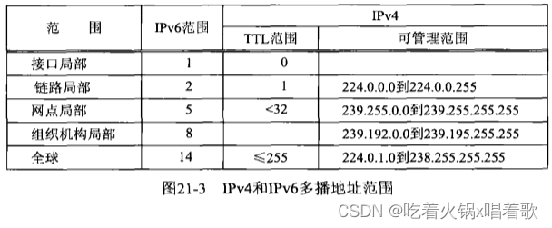 特别是在流式多媒体应用中，一个多播地址（IPv4或IPv6）和一个传输层端口（通常是UDP端口）的组合称为一个会话。例如，一个视频电话会议可能由两个会话构成，一个用于音频，一个用于视频。这些会话几乎总是使用不同端口，有时还使用不同多播组，以便接收时灵活地选取，例如有的用户可能选择只接收音频会话，而有的客户可能选择同时接收音频和视频会话，如果不同会话选择相同的组地址，这种选择就不大可能做到。

局域网上的IPv4多播情形如下，IPv6涉及的步骤与之类似：  上图中，右侧主机上接收应用进程启动，并创建一个UDP套接字，捆绑端口123到该套接字上，然后加入多播组224.0.1.1，这种加入操作是通过调用setsockopt完成的。上述操作完成后，IPv4层内部保存这些信息，并告知合适的数据链路接收目的以太网地址为`01:00:5e:00:01:01`的以太网帧，该地址是接收应用进程刚加入的多播地址对应的以太网地址。

接下来左侧主机上的发送应用进程创建一个UDP套接字，往IP地址224.0.1.1的123端口发送一个数据报。发送多播数据报无需任何特殊处理，发送应用进程不必为此加入多播组。发送主机把该IP地址转换成相应的以太网目的地址，再发送承载该数据报的以太网帧，该帧中同时含有目的以太网地址和目的IP地址。

我们假设中间主机不具备IPv4多播能力（因为IPv4多播支持是可选的），它将完全忽略该帧，因为： 1.该帧的目的以太网地址不匹配该主机的接口地址。

2.该帧的目的以太网地址不是以太网广播地址。

3.该主机的接口未被告知接收组地址（组地址是以太网地址的第一个字节的最低位为1的地址）。

该帧基于我们所称的不完备过滤被右侧主机的数据链路接收，其中的过滤操作由相应接口使用该帧的以太网目的地址执行。我们称其为不完备过滤是因为尽管我们告知该接口接收以某个以太网组地址为目的地址的帧，通常它也会接收以其他以太网组地址为目的地址的帧。

当我们告知一个以太网接口接收目的地址为某个特定以太网组地址的帧时，许多当前的以太网接口卡对这个地址应用某个散列函数，计算出一个介于0~511之间的值，然后把该值在一个512个数位的数组中对应的位置1。当有一个目的地为某个组地址的帧在线缆上经过时，接口对其目的地址应用同样的散列函数，也计算出一个0~511之间的值，如果该值在数组中对应的位为1，就接收这个帧，否则就忽略这个帧。较老的网络接口卡所用数位数组仅有64位，把它增加到512位可以减少接口接收非关注帧的可能性。随着时间推移，越来越多的应用使用多播，数位数组的大小可能进一步增加，当今有些接口已经实现完备过滤。有些接口卡没有多播过滤，当告知它们接收某个特定组地址时，它们必须接收所有广播帧（有时称为多播混杂模式，multicast promiscuous）。有一款流行的接口卡既具备容量为16个组地址的完备过滤能力，又有一个512位的散列结果数位数组作为补充（当要接收的组地址超过16个时）。另有一款接口卡能为80个组地址执行完备过滤，但超出容量后只能进入多播混杂模式。即使接口执行完备过滤，IP层的完备软件过滤也是必需的，因为从IP多播地址到硬件地址的映射不是一对一的（如32个IPv4多播地址对应1个以太网地址）。

右侧主机的数据链路收取该帧后，把由该帧承载的分组传递到IP层，因为该以太网帧的类型为IPv4。既然收到的分组以某个多播IP地址作为目的地址，IP层于是比较该地址和本级的接收应用进程已经加入的所有多播地址，如果都不匹配则丢弃该分组，我们称这个操作为完备过滤，因为它基于IPv4报头中完整的32位D类地址执行。上例中，右侧主机IP层接受该分组并把承载在其中的UDP数据报传递到UDP层，UDP层再把承载在UDP数据报中的应用数据报传递到绑定了端口123的套接字。

上图没有展示的情形： 1.运行加入了多播地址为225.0.1.1的某个应用进程的一个主机。既然IPv4多播地址组ID的高5位在到以太网地址的映射中被忽略，该主机的接口也将接收目的以太网地址为`01:00:5e:00:01:01`的帧，此时由该帧承载的分组将由IP层中的完备过滤丢弃。

2.运行所加入多播地址符合以下条件的某个应用的一个主机：由这个多播地址映射成的以太网地址恰好和`01:00:5e:00:01:01`一样被该主机执行非完备过滤的接口散列到同一个结果，该接口也将接收该帧。该帧会由数据链路层（执行完备过滤的接口）或IP层（执行非完备过滤的接口）丢弃。

3.目的地为相同多播组（`224.0.1.1`）但端口不同的数据报，上图中右侧主机仍将接收该数据报，并由IP层接收并传递给UDP层，但UDP层会丢弃它（假设绑定该端口的套接字不存在）。

让一个进程接收某个多播数据报的先决条件是该进程加入相应多播组并绑定相应端口。

以上是单个局域网上的多播，广域网也可进行多播，如下图，5个局域网通过5个多播路由器互连：  假如在其中5个主机上启动了某个程序，而这5个进程加入了一个给定多播组，另外假设每个多播路由器与其邻居多播路由器采用某个多播路由协议（MRP，Multicast Routing Protocol）：  当某个主机上的一个进程加入一个多播组时，该主机向所有直接连接的多播路由器发送一个IGMP消息，告知它们本主机已加入了那个广播组。多播路由器通过MRP交换这些信息，这样每个多播路由器就知道收到目的地为所加入多播地址的分组时该如何处理。

多播路由仍是一个活跃的研究课题，单纯讨论它就可能耗费一本书的容量。

接着假设左上方主机上的一个进程开始发送目的地为那个给定多播地址的分组，假如该进程发送的是那些多播进程正等着接收的音频分组：  我们可以跟踪这些多播分组从发送进程传输到所有接收进程所经历的步骤： 1.这些分组在左上方局域网上由发送进程多播发送。接收主机H1接收这些分组（因为它加入了给定多播组），多播路由器MR1也接收这些分组（因为多播路由器必须接收所有多播分组）。

2.MR1把这些多播分组转发到MR2，因为MRP已经通告了MR1需要把接收目的地为给定多播组的分组传给MR2。

3.MR2在直接连接的局域网上多播发送这些分组，因为该局域网上的H2和H3属于该多播组。此外，MR2还向MR3发送这些分组的一个副本。

4.像步骤3中的那样（MR2对分组进行复制）是多播转发特有的，单播分组在被路由器转发时从不被复制。

5.MR3把这些多播分组发送到MR4，但不在直接连接的局域网上多播这些分组，因为该局域网上没有主机加入该多播组。

6.MR4在直接连接的局域网上多播这些分组，因为该局域网上主机H4和H5属于该多播组。它不向MR5发送这些分组的一个副本，因为直接连接MR5的局域网上没有主机属于该多播组，MR4已经根据与MR5交换的多播路由信息知道了这一点。

广域网上有两个不太好的方法可以替代多播： 1.广播泛滥（broadcast flooding）：分组由发送进程广播发送，每个路由器在除分组到达接口外的所有其他接口广播发送这些分组，这个方法会增加对这些分组不感兴趣的主机和路由器的数目。路由器可配置成转发广播的，如果我们的多播目标都在一个网络，就可对这个网络进行广播来替代多播。

2.给每个接收者发送单个副本：发送进程必须知道所有接收进程的IP地址，且需要给每个接收进程发送一个副本。

广域网上的多播难以部署，原因如下： 1.最大的问题是运行MRP要求每个多播路由器接收来自所有本地接收主机的多播组的加入或其他请求，并在所有多播路由器之间交换这些信息。多播路由器的转发功能要求把来自网络中任何发送主机的多播数据报复制并发送到网络中的任何接收主机上（只要网络中有主机加入了对应多播组）。

2.另一个大问题是多播地址的分配，IPv4没有足够的多播地址可以静态地分配给想用的多播应用系统，要在广域范围发送多播分组而又不与其他多播发送进程冲突，多播应用系统就得使用唯一的地址，但全球性的多播地址分配机制尚未出现。

源特定多播（SSM，Source-Specific multicast）给出了在有限程度上解决以上问题的方法，SSM把应用系统的源地址结合到组地址上： 1.接收进程向多播路由器提供发送进程的源地址作为多播组加入操作的一部分，从而消除了网络中的约会问题，因为每个接收进程都必须知道源地址。“rendezvous problem”（约会问题）指的是在进行多播通信时，发送者和接收者需要在某个地方"约会"，以便建立连接并进行通信。这个约会点通常被称为"rendezvous point"（约会点）。传统的多播通信中，发送者和接收者需要在约会点相遇，以便进行数据传输。这种约会点通常是网络中的特定设备或节点。发送者需要知道约会点的位置，并向其发送数据。接收者也需要知道约会点的位置，并从约会点接收数据。

2.把多播组的标识从单纯多播组地址细化为单播源地址和多播目的地址的组合（SSM称之为通道（channel）），这意味着发送进程可以挑选任何多播地址，因为源地址和目的地址的组合是唯一的，只要在源端范围内多播地址唯一即可。SSM会话由源地址、目的地址、端口三者的组合标识。

SSM还提供一定的反窃听能力，因为源端2在源端1上的通道发送较为困难，因为源端1上的通道包含了源端1的地址。当然窃听还是有可能的，不过要困难得多。

传统意义的多播API只需要5个套接字选项，SSM所需的源过滤额外要求多播API支持新增4个套接字选项。以下是与组成员无关（与组无关的，如加入组、离开组等）的3个套接字选项：  以下是与组成员相关的6个套接字：  IPv4的TTL和回馈（loopback）选项对应u_char类型参数，而IPv6的跳限和回馈选项分别对应int和u_int类型参数。所有套接字选项中，大多都取int作为参数，因此使用IPv4多播选项的一个常见错误是使用int参数指定TTL或回馈选项的值来调用setsockopt，这是不允许的。IPv6所做的改动使它们与其他选项更为一致。

以下是多播相关选项的详细信息： 1.`IP_ADD_MEMBERSHIP`、`IPV6_JOIN_GROUP`、`MCAST_JOIN_GROUP`：在一个指定的本地接口上加入一个不限源的多播组。对于IPv4版本，本地接口使用某个单播地址指定；对于IPv6和与协议无关的API，本地接口使用某个接口索引指定。以下是这3个选项对应的参数结构：  如果本地接口指定为IPv4通配地址INADDR_ANY或IPv6的值为0的接口索引，就由内核选择一个本地接口。

一个主机在某个给定接口上属于一个给定多播组的前提是该主机上当前有一个或多个进程在那个接口上属于该组。

一个给定套接字上可以多次加入多播组，但每次加入的必须是不同多播地址，或是在不同接口上的同一个多播地址。多次加入多播组可用于多宿主机，如创建一个套接字后对一个给定多播地址在每个接口上执行一次加入。

NTP的工作方式有两种，NTP客户端可通过向其所选时间源发送时间同步请求来获取响应，NTP服务器也可进行多播或广播来同步时间。

IPv6多播地址显式存在一个范围字段，仅仅范围有差异的IPv6多播地址代表不同的多播组。因此如果某个NTP实现想要不论范围接收所有NTP分组，它就必须加入`ff01::101`（接口局部）、`ff02::101`（链路局部）、`ff05::101`（网点局部）、`ff08::101`（组织机构局部）、`ff0e::101`（全球）。所有这些加入都可以在单个套接字上执行，且可以通过设置IPV6_PKTINFO套接字选项让recvmsg函数返回每个数据报的目的地址。

IP协议无关的套接字选项（`MCAST_JOIN_GROUP`）与IPv6版本几乎相同，差别只是改用一个sockaddr_storage结构代替in6_addr结构传递多播组地址。sockaddr_storage结构足以存放系统支持的任何类型的地址。

大多数实现对于每个套接字上允许执行加入的次数有一个限制，IPv4的该限制通常由常值IP_MAX_MEMBERSHIPS指定，源自Berkeley的实现该值通常是20。

当不指定在套接字上执行加入的接口时，源自Berkeley的内核在普通的IP路由表中查找给定多播地址并使用找出的接口。为处理此情形，有些系统在初始化阶段为所有多播地址安装一个路径（对于IPv4就是目的地址为`224.0.0.0/4`的路径）。

IPv6和协议无关版本改用接口索引指定接口，以取代IPv4版本使用本地单播地址指定接口的做法，意图在于允许在未指定网络地址的接口或隧道端点（通常是点对点链路端点）上执行加入。

原始的IPv6多播API使用IPV6_ADD_MEMBERSHIP而非IPV6_JOIN_GROUP。后面的mcast_join函数隐藏了这两个版本的差异。

2.`IP_DROP_MEMBERSHIP`、`IPV6_LEAVE_GROUP`、`MCAST_LEAVE_GROUP`：离开指定的本地接口上不限源的多播组，1中给出的参数结构同样适用于本套接字选项的各种版本，如果未指定本地接口（对于IPv4指定INADDR_ANY，对于IPv6指定值为0的接口索引），就抹除首个匹配的多播组成员关系。

如果一个进程加入某个多播组后不显式离开该组，当套接字关闭时，该成员关系也自动抹除。单个主机上可能有多个套接字各自加入相同多播组，此时单个套接字成员关系的抹除不影响该主机继续作为该多播组的成员，直到最后一个套接字也离开该多播组。

原始的IPv6多播API使用IPV6_DROP_MEMBERSHIP而不是IPV6_LEAVE_GROUP。后面的mcast_leave函数隐藏了这两个版本的差异。

3.`IP_BLOCK_SOURCE`、`MCAST_BLOCK_SOURCE`：对于一个本地接口上已存在的一个不限源的多播组，在本套接字上阻塞接收来自某个源的分组。如果加入同一个多播组的所有套接字都阻塞了相同的源，那么主机系统可以通知多播路由器这种分组流通不再需要，并可能由此影响网络中的多播路由。该套接字选项可用于忽略来自无赖发送进程的分组流通。对于IPv4版本，本地接口由某个单播地址指定；对于与IP协议无关的API，本地接口由某个接口索引指定。这两个套接字选项对应的参数结构：  如果本地接口指定为IPv4的INADDR_ANY或与协议无关的API的值为0的接口索引，就由内核选择与首个匹配的多播组成员关系对应的本地接口。

源阻塞请求修改已存在的组成员关系，因此必须已经使用IP_ADD_MEMBERSHIP、IPV6_JOIN_GROUP、MCAST_JOIN_GROUP在对应接口上加入对应的多播组。

4.`IP_UNBLOCK`、`MCAST_UNBLOCK_SOURCE`：开通一个先前被阻塞的源，3中给出的参数接口同样适用于本选项的各种版本。

如果未指定本地地址（IPv4的INADDR_ANY或与协议无关的API的值为0的接口索引），那么开通首个匹配的被阻塞源。

5.`IP_ADD_SOURCE_MEMBERSHIP`、`MCAST_JOIN_SOURCE_GROUP`：在一个指定的本地接口上加入一个特定于源的多播组。3中给出的参数接口同样适用于本选项的各种版本。加入该特定于源的组之前或之后，不能加入不限源的该多播组（使用1中的套接字选项）。

如果本地接口指定为IPv4的INADDR_ANY或与协议无关的API的值为0的接口索引，就由内核选择一个本地接口。

6.`IP_DROP_SOURCE_MEMBERSHIP`、`MCAST_LEAVE_SOURCE_GROUP`：在一个指定的本地接口上离开一个特定于源的多播组。3中给出的参数接口同样适用于本选项的各种版本。如果本地接口指定为IPv4的INADDR_ANY或与协议无关的API的值为0的接口索引，就抹除首个匹配的特定于源的多播组成员关系。

如果一个进程加入某个特定于源的多播组后不显式离开该组，当相应套接字关闭时，该成员关系自动抹除。单个主机上可能有多个套接字各自加入相同的源特定多播组，此时单个套接字上成员抹除不影响该主机继续作为该多播组的成员，直到最后一个套接字也离开该多播组。

7.`IP_MULTICAST_IF`、`IPV6_MULTICAST_IF`：指定通过本套接字发送的多播数据报的外出接口。对于IPv4，该接口由某个in_addr结构指定；对于IPv6，该接口由某个接口索引指定。如果其值对于IPv4为INADDR_ANY，对于IPv6为值为0的接口索引，那么先前通过本套接字选项指派的外出接口将被抹除，改为每次由系统选择外出接口。

源自Berkeley的内核通过在普通的IP路由表中查找通往目的多播地址的路径来选择多播数据报的默认外出接口。选择接收接口时也通过查找多播数据报的源地址在路由表中的项来决定，前提是进程加入多播组时未指定接口。这里假定存在通往某个多播地址的一个路径（可能是路由表中的默认路径），那么该路径对应接口既用于输出，也用于输入。

8.`IP_MULTICAST_TTL`、`IPV6_MULTICAST_HOPS`：给外出的多播数据报设置IPv4的TTL或IPv6的跳限。如不指定，默认值为1，从而把多播数据报限制在本地子网。

9.`IP_MULTICAST_LOOP`、`IPV6_MULTICAST_LOOP`：开启或禁止多播数据报的本地环回（回馈），默认情况下回馈开启：如果一个主机在某个外出接口上属于某个多播组，那么该主机上由某个进程发送的目的地为该多播组的每个数据报都有一个副本回馈，被该主机作为一个收取的数据报处理。

这类似于广播，但对广播而言，这种回馈无法禁止。这一点意味着如果一个进程同时属于它自己发送数据报的目的多播组，默认它就会收到自己发送的数据报。

此处讨论的回馈是在IP层或更高层进行的内部回馈，如果接口监听到了自己发送的比特位流，RFC 1112要求驱动程序丢弃这些副本。该RFC同时声明本回馈套接字选项默认是开启的原因为：对主机上只能有一个进程属于该组的上层协议（如路由协议）进行性能优化。

以上9个套接字选项中，前6个影响多播数据报的接收，后3个影响多播数据报的发送（外出接口、TTL、回馈）。多播数据报的发送无需任何特殊处理，如果发送多播数据报前没有指定影响发送的多播套接字选项，那么数据报的外出接口将由内核选择，TTL或跳限为1，并有一个副本自环回来。

为了接收目的地址为某个组地址且目的端口为某个端口的多播数据报，进程必须加入该多播组，并捆绑该端口到某个套接字。这是两个不同的操作，但都是必需的。多播组加入操作告知所在主机的IP层和数据链路层接收发往该组的多播数据报。端口捆绑操作是应用进程告知UDP它想接收发往该端口的数据报。有些应用进程除端口外还把多播地址也捆绑到某个套接字，从而防止所在主机IP层把为该端口收取的目的地址为其他单播、广播、多播地址的数据报递送到该套接字。

为了接收目的地址为某个多播组，目的端口为某个端口的数据报，历史上源自Berkeley的实现曾只要求某个套接字加入该多播组，而这个套接字不必进行捆绑端口操作。但这些实现存在把多播数据报递送到不参与多播的应用进程的潜在可能性。新的多播内核要求进程为接收多播数据报的套接字捆绑到相应端口并任意设置一个多播套接字选项，设置一个多播套接字选项的作用是指示该应用进程参与多播，最常设置的多播套接字选项是多播组的加入。Solaris的做法不同，它把收到的多播数据报递送到既加入了多播组又绑定了相应端口的套接字。为便于移植，所有多播应用都应加入组并捆绑端口。

较新的多播API，IP层只把多播数据报递送给已经加入相应多播组和单播源的套接字。这个做法是随着IGMPv3（RFC 3376）而引入的，意在允许源过滤和源特定多播。它强调加入组这个需求，而放松捆绑组地址的需求（该需求本来就是非必要的），但为了便于移植，多播应用应加入组并捆绑端口和组地址。

有些较老的具备多播能力的主机不允许把多播地址捆绑到套接字，为了便于移植，应用可忽略bind多播地址时返回的错误，并用INADDR_ANY或in6addr_any再次尝试bind函数。

多播套接字选项的IPv4和IPv6版本很相似，但还是有差别，会造成使用多播的协议无关代码因插入大量`#ifdef`而变得凌乱不堪，一个较好的解决方式是编写以下函数隐藏这些区别：   mcast_join函数加入一个不限源的多播组，该组的IP地址存放在由grp参数指向的长度为grplen的套接字地址结构中。通过使用接口名字（通过非空的ifname参数）或使用非0的接口索引（通过ifindex参数），我们可以指定加入该组的接口，如果两者都没有指定，则由内核选择这个接口。对于IPv6，指定接口时需要接口索引，如果给的是接口名，可通过if_nametoindex函数获取对应索引。对于IPv4，指定接口时需要接口单播IP地址，如果给定的是接口名，可以SIOCGIFADDR为参数调用ioctl来获取对应单播地址；如果给定的是接口索引，就先调用if_indextoname函数获取接口名，再以SIOCGIFADDR为参数调用ioctl来获取对应单播地址。

用户通常会指定接口的名字（如le0、ether0），而不是接口的IP地址或索引。tcpdump程序允许用户指定接口，它的-i选项以一个接口名作为参数。

mcast_leave函数离开一个不限源的多播组，该组的IP地址存放在由grp参数指定的长度为grplen参数的套接字地址结构中。mcast_leave函数不能指定接口，它总是抹除首个匹配的多播组成员关系，这样做简化了库函数接口，需要针对接口控制组成员关系的程序需要直接使用setsockopt函数。

mcast_block_source函数阻塞从给定单播源到给定多播组数据报，单播源和多播组分别由src和grp参数指向的长度分别为参数srclen和grplen的两个套接字地址结构给出。套接字参数fd上必须已为给定多播组调用过mcast_join。

mcast_unblock_source函数解阻塞从给定单播源到给定多播组的数据报接收，所指定的参数必须与早先某个mcast_block_source调用一致。

mcast_join_source_group函数加入一个特定于源的多播，该源和该组分别由参数src和grp指向的长度分别为参数srclen和grplen的两个套接字地址结构给出。在给定接口上加入该特定于源的多播组，该接口由一个接口名（非空的ifname参数）或非0的接口索引（ifindex）指定，若两者都未指定则由内核选择接口。

mcast_leave_source_group函数离开一个特定于源的多播组，该源和该组分别由参数src和grp指向的长度分别为参数srclen或grplen的两个套接字地址结构给出。与mcast_leave函数一样，它总是抹除首个匹配的多播组成员关系。

mcast_set_if函数设置外出多播数据报的默认接口索引，如果ifname参数非空，则由它指定接口名，否则如果ifindex参数大于0，那么由它指定接口索引。对于IPv6，接口从名字到索引的映射由if_nametoindex函数完成。对于IPv4，指定接口时需要接口单播IP地址，如果给定的是接口名，可以SIOCGIFADDR为参数调用ioctl来获取对应单播地址；如果给定的是接口索引，就先调用if_indextoname函数获取接口名，再以SIOCGIFADDR为参数调用ioctl来获取对应单播地址。

mcast_set_loop函数把回馈套接字选项设为1或0，mcast_set_ttl函数设置IPv4的TTL或IPv6的跳限。3个mcast_get_XXX函数返回相应值。

以下是mcast_join函数：

```c
#include "unp.h"
#include <net/if.h>

int mcast_join(int sockfd, const SA *grp, socklen_t grplen,
               const char *ifname, u_int ifindex) {
#ifdef MCAST_JOIN_GROUP
    struct group_req req;
    // 如果给定了索引，就直接使用它
    if (ifindex > 0) {
        req.gr_interface = ifindex;
    // 否则如果调用者给了接口名，就将其转换成索引
    } else if (ifname != NULL) {
        if ((req.gr_interface = if_nametoindex(ifname)) == 0) {
            // ENXIO错误含义为“没有该设备或地址”
		    errno = ENXIO;    /* i/f name not found */
		    return -1;
		}
    // 否则置0接口索引，让内核选择
    } else {
        req.gr_interface = 0;
    }
    // req.gr_group是一个sockaddr_storage结构，理论上能存放系统支持的
    // 任何地址结构，但为了防止因代码编写不慎引起的缓冲区溢出，我们仍检查
    // 调用者给定的套接字地址结构大小
    if (grplen > sizeof(req.gr_group)) {
        errno = EINVAL;
		return -1;
    }
    memcpy(&req.gr_group, grp, grplen);
    // 执行加入组操作，setsockopt函数的level参数由我们自己编写的family_to_level函数
    // 根据组地址的地址族确定。有些系统支持level参数与套接字地址族的不匹配，如为AF_INET6
    // 的套接字使用的level参数为IPPROTO_IP，但并非全部实现都支持这样
    return setsockopt(sockfd, family_to_level(grp->sa_family),
                      MCAST_JOIN_GROUP, &req, sizeof(req));
// 以上是协议无关套接字API加入多播组过程
#else
    switch (grp->sa_family) {
    case AF_INET:
        struct ip_mreq mreq;
        struct ifreq ifreq;

        // 复制IPv4多播地址结构（in_addr结构）到ip_mreq.imr_multiaddr
        memcpy(&mreq.imr_multiaddr,
               &((const struct sockaddr_in *)grp)->sin_addr,
	           sizeof(struct in_addr));
        
        // 获取IPv4本地单播地址，用它指定特定接口
        // 如果调用者给出接口索引，用接口索引获取接口名存入ifreq结构，然后直接跳到ioctl函数
        if (ifindex > 0) {
		    if (if_indextoname(ifindex, ifreq.ifr_name) == NULL) {
		        errno = ENXIO;    /* i/f index not found */
				return -1;
	    	}
	    	goto doioctl;
	    // 如果调用者给出了接口名，直接将其复制到ifreq结构
		} else if (ifname != NULL) {
		    strncpy(ifreq.ifr_name, ifname, IFNAMSIZ);
		doioctl:
		    // 通过接口名获取接口IP地址
		    if (ioctl(sockfd, SIOCGIFADDR, &ifreq) < 0) {
		        return -1;
		    }
		    memcpy(&mreq.imr_interface, 
		           &((struct sockaddr_in *)&ifreq.ifr_addr)->sin_addr,
			   	   sizeof(struct in_addr));
	    // 否则把接口设置为通配地址，让内核选择接口
		} else {
		    mreq.imr_interface.s_addr = htonl(INADDR_ANY);
		}
	
		return setsockopt(sockfd, IPPROTO_IP, IP_ADD_MEMBERSHIP,
		                  &mreq, sizeof(mreq));
	}
// 以上是IPv4套接字加入多播组过程
#ifdef IPV6
    case AF_INET6:
        struct ipv6_mreq mreq6;
  
        // 把IPv6多播地址结构复制到ipv6_mreq.ipv6mr_multiaddr
		memcpy(&mreq6.ipv6mr_multiaddr,
		       &((const struct sockaddr_in6 *)grp)->sin6_addr,
		       sizeof(struct in6_addr));
	    
	    // 如果调用者给定索引，则使用该索引
		if (ifindex > 0) {
		    mreq6.ipv6mr_interface = ifindex;
		// 否则如果调用者给定了接口名，调用if_nametoindex取得对应索引
		} else if (ifname != NULL) {
		    if ((mreq6.ipv6mr_interface = if_nametoindex(ifname)) == 0) {
		        errno = ENXIO;    /* i/f not found */
				return -1;
		    }
		// 否则把接口索引置0，由内核选择接口
		} else {
		    mreq6.ipv6mr_interface = 0;
		}
	
		return setsockopt(sockfd, IPPROTO_IPV6, IPV6_JOIN_GROUP,
	                      &mreq6, sizeof(mreq6));
#endif 
    default:
        errno = EAFNOSUPPORT;
		return -1;
    }
#endif
// 以上是IPv6套接字加入多播组过程
}
123456789101112131415161718192021222324252627282930313233343536373839404142434445464748495051525354555657585960616263646566676869707172737475767778798081828384858687888990919293949596979899100101102103104105106107
```

mcast_set_loop函数：

```c
#include "unp.h"

int mcast_set_loop(int sockfd, int onoff) {
    switch (sockfd_to_family(sockfd)) {
    case AF_INET:
        u_char flag;
	
		flag = onoff;
		return setsockopt(sockfd, IPPROTO_IP, IP_MULTICAST_LOOP,
		                  &flag, sizeof(flag));
#ifdef IPV6
    case AF_INET6:
        u_int flag;

		flag = onoff;
		return setsockopt(sockfd, IPPROTO_IPV6, IPV6_MULTICAST_LOOP,
		                  &flag, sizeof(flag));
#endif
    default:
        errno = EAFNOSUPPORT;
		return -1;
    }
}
1234567891011121314151617181920212223
```

对于使用多播的dg_cli函数，如果外出接口、TTL、回馈选项的默认设置可以接受，则发送多播数据报无需设置任何多播套接字选项，多播版dg_cli函数可以通过单纯地去掉广播版dg_cli函数的setsockopt函数来实现，我们指定所有主机组为服务器地址运行使用多播版dg_cli函数的回射客户程序：  所在子网中有两个主机响应，它们具备多播能力，从而都加入了所有主机组，且都运行了多播的回射服务器。每个应答数据报都是单播的，因为请求数据报的单播源地址被每个服务器用作应答数据报的目的地址。

大多系统不允许对广播数据报执行分片，但可对多播数据报进行分片，我们可以发送一个含有2000字节的一个文本行的文件来验证：  IP多播基础设施是具有跨域组播功能的互联网部分。组播并未在整个互联网上启用。IP多播基础设施的前身是作为一个层叠网络从1992年开始的MBone（层叠网络指在互联网基础设施之上建立的一种多播网络，MBone使用了一套自己的协议和软件，通过覆盖在现有的互联网之上，为用户提供了跨越不同域的多播功能），到1998年变成了作为因特网基础设施的一部分而部署的多播基础设施。多播在企业范围内部部署较广，但很少是域间IP多播基础设施的构成部分。

为了在IP多播基础设施上接收一个多媒体会议，站点只需要知道该会议的多播地址以及会议数据流（音频、视频等）所用的UDP端口。会话声明协议（SAP，Session Announcement Protocol，见RFC 2974）描述了如何让站点知道某会议的多播地址和所用UDP端口（用于在IP网络上传输会话信息的协议）；会话描述协议（Session Description Protocol，SDP，见RFC 2327）是用于描述多媒体会话的文本格式协议，通过使用SDP，参与者可以建立、协商和管理多媒体会话，并确保各方在会话中使用一致的参数和属性。希望在IP组播基础设施上宣布会话的站点定期发送一个包含会话描述的组播数据报到一个众所周知的组播组和UDP端口。在IP组播基础设施上的站点运行一个名为sdr的程序来接收这些通告，这个程序功能强大：它不仅接收会话通告，还提供一个交互式用户界面来显示信息或让用户发送会话通告。

以下是接收定期多播的SAP/SDP声明的程序：

```c
#include "unp.h"

// SAP通告使用的组播地址是224.2.127.254，其名称为sap.mcast.net
// 所有众所周知的组播地址（参见http://www.iana.org/assignments/multicast-addresses）
// 都在DNS中以mcast.net层次结构出现
#define SAP_NAME "sap.mcast.net"    /* default group name and port */
// 默认组多地址对应的众所周知的UDP端口号是9875
#define SAP_PORT "9875"

void loop(int, socklen_t);

int main(int argc, char **argv) {
    int sockfd;
    const int on = 1;
    socklen_t salen;
    struct sockaddr *sa;

    // 调用自己编写的udp_client函数查找名字和端口
    // 该函数会把结果填到合适的套接字地址结构中
    // 如果命令行参数未指定，就用默认名字和端口
    if (argc == 1) {
        sockfd = Udp_client(SAP_NAME, SAP_PORT, (void **)&sa, &salen);
    // 否则从命令行参数中取得多播地址、端口号
    } else if (argc == 4) {
        sockfd = Udp_client(argv[1], argv[2], (void **)&sa, &salen);
    } else {
        err_quit("usage: mysdr <mcast-addr> <port#> <interface-name>");
    }

    // 设置SO_REUSEADDR套接字选项以允许在单个主机上运行本程序的多个实例
    Setsockopt(sockfd, SOL_SOCKET, SO_REUSEADDR, &on, sizeof(on));
    // 通过将特定多播地址绑定到该套接字，防止该套接字接收目的端口为当前监听的多播端口的其他UDP数据报
    // 多播地址的捆绑并非必须，但这样是由内核过滤非所关注分组，而不用我们再过滤
    Bind(sockfd, sa, salen);

    // 加入多播组
    Mcast_join(sockfd, sa, salen, (argc == 4) ? argv[3] : NULL, 0);

    loop(sockfd, salen);    /* recvive and print */

    exit(0);
}

void loop(int sockfd, socklen_t salen) {
    socklen_t len;
    ssize_t n;
    char *p;
    struct sockaddr *sa;
    // sap_packet结构描述SAP分组：一个32位SAP首部，后跟一个32位源地址
    // 再跟真正的声明，声明是若干行OSI 8859-1文本，不得超过1024字节
    // 每个UDP数据报只能承载一个会话声明
    struct sap_packet {
        uint32_t sap_header;
		uint32_t sap_src;
		uint32_t sap_data[BUFFSIZE];
    } buf;

    sa = Malloc(salen);

    for (; ; ) {
        len = salen;
		n = Recvfrom(sockfd, &buf, sizeof(buf) - 1, 0, sa, &len);
		((char *)&buf)[n] = 0;
		// 修正首部字段的字节序
		buf.sap_header = ntohl(buf.sap_header);
	
	    // 显示发送者的IP地址、端口号、SAP散列值
		printf("From %s hash 0x%04x\n", Sock_ntop(sa, len),
		        buf.sap_header & SAP_HASH_MASK);
		// 是否是我们要处理的SAP版本
		if (((buf.sap_header & SAP_VERSION_MASK) >> SAP_VERSION_SHIFT) > 1) {
		    err_msg("... version field not 1 (0x%08x)", buf.sap_header);
		    continue;
		}
		// 不处理使用IPv6地址的SAP
		if (buf.sap_header & SAP_IPV6) {
		    err_msg("... IPv6");
		    continue;
		}
		// 不处理压缩或加密的分组
		if (buf.sap_header & (SAP_DELETE | SAP_ENCRYPTED | SAP_COMPRESSED)) {
		    err_msg("... can't parse this packet type (0x%08x)",
		            buf.sap_header);
		    continue;
		}
		p = buf.sap_data + ((buf.sap_header & SAP_AUTHLEN_MASK) 
		                   >> SAP_AUTHLEN_SHIFT);
	    if (strcmp(p, "application/sdp") == 0) {
			p += 16;
		}
		printf("%s\n", p);
    }
}
123456789101112131415161718192021222324252627282930313233343536373839404142434445464748495051525354555657585960616263646566676869707172737475767778798081828384858687888990919293
```

以下是以上程序的一些典型输出：  以上声明描述的是NASA在IP多播基础设施上关于某次航天飞机任务的报道。SDP会话描述由多个`type=value`格式的文本行构成，其中type总是单个字符并区分大小写，value是一个依赖于type的结构化的文本串（指按照一定规则和格式组织的文本），等号两边不允许有空格。

`v=0`是版本。

`o=`是来源，上例中，-表示无确切用户名，60345是会话ID，0是这个声明的版本号，IN是网络类型，IP4是地址类型，128.223.214.198是地址。由用户名、会话ID、网络类型、地址类型、地址构成的五元组是本会话的一个全球唯一标识。

`s=`定义会话名字。

`i=`给出关于会话的信息，上例中，我们按每80字节一次作了折行处理。

`u=`给出一个统一资源标识（URI，Uniform Resource Identifier），其上提供关于本会话的更详细信息。

`e=`提供会议负责人的电子邮件地址。

`p=`提供会议负责人的电话号码。

`b=`提供本会话预期带宽的测算值。

`t=`提供开始时间和结束时间，这两个时间都使用NTP单位，即1900年1月1日UTC时间以来经过的秒数。上例会话是永久的，因此起止时间都是0。

`a=`是属性行，出现在`m=`行之前的`a=`行是会话属性，出现在某个`m=`行之后则为相应媒体的属性。

`m=`是媒体声明，上例中有两个，第一个指明视频在端口63096上，格式为实时传输协议（RTP，Real-time Transport Protocol），使用AVP（Audio/Video Profile，指音频/视频配置文件，它是特定的音频或视频编码参数和配置集合），可能的净荷类型为32（MPEG）、31（H.261）、96（WBIH）。

`c=`行提供本媒体连接信息，上例中指明该连接基于IP，使用IPv4，多播地址为224.2.245.25，TTL为127。虽然`224.2.245.25/127`像CIDR前缀，但这不是用来表示前缀或掩码的。

第二个`m=`行指明音频在31954端口，可能的净荷类型有多个，其中有些是标准的，有些由随后的`a=rtpmap`进一步说明。紧接的`c=`行提供本媒体的连接信息，上例中指明该连接基于IP，使用IPv4，多播地址为224.2.216.85，TTL为127。

以上IP多播基础设施会话声明程序只接收多播数据报，接下来开发一个既发送又接收多播数据报的简单程序，该程序包含两部分，第一部分每5秒发送一个目的地为指定组的多播数据报，其中含有发送进程的主机名和进程ID，第二部分是一个无限循环，先加入由第一部分发往的多播组，再显示接收到的每个数据报（其中含有发送进程的主机名和进程ID）。这样的程序使得我们可以在一个局域网内的多个主机上启动该程序，以便查看哪个主机在接收来自哪些发送进程的数据报。

我们创建两个套接字，一个用于发送，一个用于接收。我们想给套接字捆绑多播组和端口，如239.255.1.2和8888（我们也可以只捆绑通配IP地址和端口8888，但同时捆绑多播地址可以防止目的端口同为8888的其他数据报到达本套接字）。我们还想把接收套接字加入多播组。发送套接字将发送数据报到同一个多播地址和端口，即239.255.1.2和8888。如果我们试图用单个套接字进行发送和接收，则所收到数据报的源协议地址将是bind调用时的239.255.1.2:8888（netstat记法），目的协议地址也同样会是239.255.1.2:8888，而RFC 1122禁止出现源IP地址是广播地址或多播地址的IP数据报，因此我们必须创建两个套接字，一个用于发送，一个用于接收。

以下是该既发送又接收多播数据报的程序代码：

```c
#include "unp.h"

void recv_all(int, socklen_t);
void send_all(int, SA *, socklen_t);

int main(int argc, char **argv) {
    int sendfd, recvfd;
    const int on = 1;
    socklen_t salen;
    struct sockaddr *sasend, *sarecv;

    if (argc != 3) {
        err_quit("usage: sendrecv <IP-multicast-address> <port#>");
    }

    // udp_client函数创建发送套接字且返回可用于sendto函数的一个套接字地址结构及其长度
    sendfd = Udp_client(argv[1], argv[2], (void **)&sasend, &salen);

    // 创建接收套接字，所用地址族与创建发送套接字所用的一样
    recvfd = Socket(sasend->sa_family, SOCK_DGRAM, 0);

    // 设置SO_REUSEADDR套接字选项以允许此程序的多个实例同时在单一主机上运行
    Setsockopt(recvfd, SOL_SOCKET, SO_REUSEADDR, &on, sizeof(on));

    // 给接收套接字分配一个套接字地址结构的空间
    sarecv = Malloc(salen);
    // 把发送套接字地址结构复制到接收套接字地址结构
    memcpy(sarecv, sasend, salen);
    // 把多播地址和端口bind在接收套接字上
    Bind(recvfd, sarecv, salen);

    // 在接收套接字上加入多播组，接口由内核选择
    Mcast_join(recvfd, sasend, salen, NULL, 0);
    // 禁止发送套接字的回馈特性
    Mcast_set_loop(sendfd, 0);

    if (Fork() == 0) {
        recv_all(recvfd, salen);    /* child -> recvives */
    }

    send_all(sendfd, sasend, salen);    /* parent -> sends */
}

#define SENDRATE 5    /* send one datagram every five seconds */

void send_all(int sendfd, SA *sadest, socklen_t salen) {
    char line[MAXLINE];    /* hostname and process ID */
    struct utsname myname;
    
    // uname函数返回主机名
    if (uname(&myname) < 0) {
        err_sys("uname error");
    }
    // 构造包含一个主机名和进程ID的输出行
    snprintf(line, sizeof(line), "%s, %d\n", myname.nodename, getpid());

    for (; ; ) {
        Sendto(sendfd, line, strlen(line), 0, sadest, salen);

		sleep(SENDRATE);
    }
}

void recv_all(int recvfd, socklen_t salen) {
    int n;
    char line[MAXLINE + 1];
    socklen_t len;
    struct sockaddr *safrom;

    safrom = Malloc(salen);

    for (; ; ) {
        len = salen;
		n = Recvfrom(recvfd, line, MAXLINE, 0, safrom, &len);
	
		line[n] = 0;    /* null terminate */
		printf("from %s: %s", Sock_ntop(safrom, len), line);
    }
}
12345678910111213141516171819202122232425262728293031323334353637383940414243444546474849505152535455565758596061626364656667686970717273747576777879
```

分别在freebsd4和macosx系统上运行以上程序：  网络时间协议NTP是一个用于跨广域网或局域网同步时钟的复杂协议，往往能达到毫秒级精度。RFC 1305叙述了NTP协议。RFC 2030叙述了NTP的一个简化版本SNTP，用于不需要完整的NTP实现的复杂性的主机，SNTP的通常做法是，让局域网内少数几个主机跨因特网与其他NTP主机同步时钟，然后由这些主机在局域网使用广播或多播重新发布时间。

接下来开发一个SNTP客户程序，它在与本地主机直接连接的所有网络上听取NTP广播或多播分组，然后输出各个NTP分组与本地主机当前时间差，我们不试图修正当前时间，因为这样做需要超级用户权限。

以下是头文件ntp.h，其中包含关于NTP分组格式的一些基本定义：

```c
#define JAN_1970 2208988800UL /* 1970 - 1900 in seconds */

// 定义NTP用于时间戳的64位定点值
struct l_fixedpt {    /* 64-bit fixed-point */
    uint32_t int_part;
    uint32_t fraction;
};

// 定义NTP用于时间戳的32位定点值
struct s_fixedpt {    /* 32-bit fixed-point */
    uint16_t int_part;
    uint16_t fraction;
};

// 48字节的NTP数据报格式
struct ntpdata {    /* NTP header */
    u_char status;
    u_char stratum;
    u_char ppoll;
    int precision:8;    // 占8位
    struct s_fixedpt distance;
    struct s_fixedpt dispersion;
    uint32_t refid;
    struct l_fixedpt reftime;
    struct l_fixedpt org;
    struct l_fixedpt rec;
    struct l_fixedpt xmt;
};

#define VERSION_MASK 0x38
#define MODE_MASK 0x07

#define MODE_CLIENT 3
#define MODE_SERVER 4
#define MODE_BROADCAST 5
1234567891011121314151617181920212223242526272829303132333435
```

以下是SNTP客户程序：

```c
#include "sntp.h"

int main(int argc, char **argv) {
    int sockfd;
    char buf[MAXLINE];
    ssize_t n;
    socklen_t salen, len;
    struct ifi_info *ifi;
    struct sockaddr *mcastsa, *wild, *from;
    struct timeval now;

    // 必须指定要加入的多播地址，可以是IPv4或IPv6地址
    if (argc != 2) {
        err_quit("usage: ssntp <IPaddress>");
    }

    // 如果主机不支持多播，argv[1]可以是任意IP地址
    // 因为不支持多播时，本程序只使用mcastsa的地址族和端口号信息
    // udp_client函数并不把地址捆绑到套接字上，它只是创建套接字并填写套接字地址结构
    sockfd = Udp_client(argv[1], "ntp", (void **)&mcastsa, &salen);

    wild = Malloc(salen);
    memcpy(wild, mcastsa, salen);    /* copy family and port */
    sock_set_wild(wild, salen);    // 设置该结构的IP地址字段为通配地址
    Bind(sockfd, wild, salen);    /* bind wildcard */

#ifdef MCAST
    /* obtain interface list and process each one */
    // get_ifi_info函数获取的接口列表的地址族取自
    // udp_client函数基于命令行参数填写的套接字地址结构
    for (ifi = Get_ifi_info(mcastsa->sa_family, 1); ifi != NULL;
         ifi = ifi->ifi_next) {
        // 在每个具备多播能力的接口上都加入由命令行指定的多播组
        if (ifi->ifi_falgs & IFF_MULTICAST) {
            // 所有加入多播组的操作都在sockfd套接字上执行
            // 通常每个套接字最多有IP_MAX_MEMBERSHIPS（一般为20）次加入操作限制
            // 但很少有这么多接口的多宿主机
		    Mcast_join(sockfd, mcastsa, salen, ifi->ifi_name, 0);
		    printf("joined %s on %s\n",
		           Sock_ntop(mcastsa, salen), ifi->ifi_name);
		}	 
    }
#endif

    from = Malloc(salen);
    for (; ; ) {
        len = salen;
        // 接收所有NTP分组
        // 本套接字绑定的是通配地址，且在所有具备多播能力的接口上都加入了给定多播组
        // 因此本套接字应接收本主机收到的任何单播、广播、多播NTP分组
		n = Recvfrom(sockfd, buf, sizeof(buf), 0, from, &len);
		Gettimeofday(&now, NULL);
		// 处理每个分组
		sntp_proc(buf, n, &now);
    }
}

void sntp_proc(char *buf, ssize_t n, struct timeval *nowptr) {
    int version, mode;
    uint32_t nsec, useci;
    double usecf;
    struct timeval diff;
    struct ntpdata *ntp;

    if (n < (ssize_t)sizeof(struct ntpdata)) {
        printf("\npacket toot small: %d bytes\n", n);
		return;
    }

    // 获取分组的大小、版本、模式、服务器层次（server stratum）
    // server stratum表示时间服务器（time server）与真实时间源（reference clock）之间的层级
    // 更高的Stratum值表示时间服务器与真实时间源之间有更多中间层级，因此可能存在更多的时钟延迟和不确定性
    ntp = (struct ntpdata *)buf;
    version = (ntp->status & VERSION_MASK) >> 3;
    mode = ntp->status & MODE_MASK;
    printf("\nv%d, mode %d, strat %d, ", version, mode, ntp->stratum);
    // 如果本分组是一个客户请求而非服务器应答，则丢弃它
    if (mode == MODE_CLIENT) {
        printf("client\n");
		return;
    }

    // 我们关心xmt，它是服务器发送本分组的时刻的64位定点时间
    // 由于NTP时间戳从1900年开始计数，而Unix时间戳从1970年开始计数
    // 于是我们先从xmt的整数部分中减去JAN_1970（1900到1970经过的秒数）
    nsec = ntohl(ntp->xmt.int_part) - JAN_1970;
    // xmt的小数部分是一个32位无符号整数，其值介于0~4294967295（含边界值）
    useci = ntohl(ntp->xmt.fraction);    /* 32-bit integer fraction */
    // 把小数部分赋值给一个双精度浮点变量
    usecf = useci;    /* integer fraction -> double */
    // 除以可能的最大值，得出一个[0, 1)的数
    usecf /= 4294967296.0;    /* devide by 2**32 -> [0, 1.0) */
    // 对该[0, 1)的数乘以1秒钟的微秒数，并把结果存在32位整数中，这是一个介于0~999999的微秒数
    useci = usecf * 10000000.0;    /* fraction -> parts per million */

    // 计算并显示主机的当前时间与NTP服务器当前时间之间以微秒为单位的时间差
    diff.tv_sec = nowptr->tv_sec - nsec;
    if ((diff.tv_usec = nowptr->tv_usec - useci) < 0) {
        diff.tv_usec += 1000000;
		--diff.tv_sec;
    }
    useci = (diff.tv_sec * 1000000) + diff.tv_usec;    /* diff in microsec */
    printf("clock difference = %d usec\n", useci);
}
123456789101112131415161718192021222324252627282930313233343536373839404142434445464748495051525354555657585960616263646566676869707172737475767778798081828384858687888990919293949596979899100101102103104
```

以上程序没有考虑服务器和客户之间的网络延迟，我们假设在局域网内NTP分组通常作为广播或多播数据报接收，这种情况下网络延迟应该只有几毫秒。

在macosx上运行以上程序，运行在freebsd4上的NTP服务器每隔64秒多播NTP分组一次到所在以太网，于是得到以下输出：  以上程序中，如果收到的xmt的小数部分值为1073741824（1/4*232 ^{32}32），将其转换为浮点数然后除以4294967296得到0.25，再乘以1000000得到250000，即1/4秒。

xmt的小数部分最大值为4294967295，它除以4294967296得到0.99999999976716935634，再乘以1000000并截成整数得到999999，它就是最大微秒数。

我们先终止运行在macosx上的NTP服务器再运行以上程序，这样当本程序启动时macosx的时间非常接近NTP服务器主机的时间，我们看到本主机在384秒内相差了约9181微秒，即每24小时约差2秒。

多播应用进程一开始就通过设置套接字选项请求加入特定多播组，该请求告知IP层加入给定组，IP层再告知数据链路层接收发往相应硬件层多播地址的多播帧。多播利用多数接口卡都提供的硬件过滤减少非期望分组的接收，且过滤质量越好非期望分组接收量也越少。这种硬件过滤降低了不参与多播应用系统的其他主机的负荷。

广域网上的多播需要具备多播能力的路由器和多播路由协议，在因特网上所有路由器都具备多播能力之前，多播仅仅在因特网的某些孤岛上可用，这些孤岛联接起来构成所谓IP多播基础设施。

如果某非多播UDP应用进程在某接口上监听，为防止该进程接收到并非期待的多播数据报，内核不会把接收到的多播数据报递送给未曾在其上执行过多播操作（如加入某个组）的目的套接字。如果多播数据报的目的地址是224.0.0.1（所有具备多播能力的节点都必须参加的所有主机组），该UDP数据报作为一个多播以太网帧发送，因而所有具备多播能力的都接收到它，因为它们都属于这个组，但内核会丢弃接收到的数据报，因为目的套接字未曾设置任何多播选项。

将UDP回射客户程序改为捆绑IP 224.0.0.1和端口0到它的套接字：

```c
#include "unp.h"

int main(int argc, char **argv) {
    int sockfd;
    socklen_t salen;
    struct sockaddr *cli, *serv;
    
    if (argc != 2) {
        err_quit("usage: udpcli06 <IPaddress>");
    }
    
    sockfd = Udp_client(argv[1], "daytime", (void **)&serv, &salen);
    
    cli = Malloc(salen);
    memcpy(cli, serv, salen);    /* copy socket address struct */
    sock_set_port(cli, salen, 0);    /* and set port to 0 */
    Bind(sockfd, cli, salen);
    
    dg_cli(stdin, sockfd, serv, salen);
    
    exit(0);
}
12345678910111213141516171819202122
```

运行以上程序的FreeBSD 4.8、MacOS X、Linux 2.4.7都允许这样的bind调用，用tcpdump程序看到随后发送的UDP数据报的源地址为多播源地址。

获悉子网上哪些主机具备多播能力的一个方法是ping所有主机组224.0.0.1，在支持多播的主机aix上这么做的输出如下：  为了防护特定拒绝服务攻击，某些系统默认对于广播或多播ping不给出响应，为了让主机freebsd给出响应（上图中第二个响应），要使用以下命令进行配置： 

# 第二十二章 高级UDP套接字编程

TCP是一个[字节流](https://so.csdn.net/so/search?q=字节流&spm=1001.2101.3001.7020)协议，又使用滑动窗口，因此没有记录边界或发送者数据发送能力超过接收者接受能力之类的事情，但对于UDP，每个输入操作对应一个UDP数据报（一个记录），因此当收取的数据报大于引用的输入缓冲区时就有问题。

UDP是不可靠协议，但有些应用确实有理由使用UDP而非TCP，在这些UDP应用中，我们必须包含一些特性弥补UDP的不可靠性，如超时和重传（用于处理丢失的数据报）、序列号（用于匹配应答与请求）。

如果实现不支持IP_RECVDSTADDR[套接字](https://so.csdn.net/so/search?q=套接字&spm=1001.2101.3001.7020)选项，那么确定外来UDP数据报目的IP地址的方法之一是绑定所有接口地址并使用select函数。

多数UDP服务器程序是迭代运行的，但有些应用系统在客户和服务器之间交换多个UDP数据报，因此需要某种形式的并发，如TFTP。我们将讨论有inetd和无inetd参与两种情况下如何做到这些。

历史上sendmsg和recvmsg函数一直用于通过Unix域套接字传递描述符，甚至这种用途也不多见，但因为以下原因，这两个函数用的变多： 1.随4.3 BSD Reno加到msghdr结构的msg_flags成员返回标志给应用进程。

2.辅助数据被用于在应用进程和内核之间传递越来越多的信息。

我们将编写一个recvfrom_flags函数，它类似recvfrom函数，但还返回： 1.msg_flags值。

2.所收取数据报的目的地址（通过IP_RECVDSTADDR套接字选项获取）。

3.所收取数据报接口的索引（通过IP_RECVIF套接字选项获取）。

为返回以上后两项，在unp.h头文件中定义如下结构：  我们的recvfrom_flags函数将接受指向某个in_pktinfo结构的指针作为参数，如果该指针不为空，本函数就通过该指针所指结构返回信息。

如果实现不支持IP_RECVDSTADDR套接字选项，则recvfrom_flags函数返回的接口索引为0（表示索引不可知），但IP地址的所有32位都是有效的，我们的做法是，当实际值不可得时，返回一个全0值作为目的地址，尽管它是一个有效IP地址，但不允许作为目的IP地址，它只有作为源IP地址才有效，且必须是在主机正在引导，还不知道自己IP地址时。

但源自Berkeley的内核接受目的地址为0.0.0.0的IP数据报，这样的数据报是由源自4.2 BSD的内核生成的过时广播。

以下是recvfrom_flags函数：

```c
#include "unp.h"
#include <sys/param.h>    /* ALIGN macro for CMSG_NXTHDR() macro */

// flagsp参数可返回由recvmsg函数返回的标志
// pktp参数返回所接受数据报的目的IPv4地址和接收接口索引
ssize_t recvfrom_flags(int fd, void *ptr, size_t nbytes, int *flagsp,
                       SA *sa, socklen_t *salenptr, struct unp_in_pktinfo *pktp) {
    struct msghdr msg;
    struct iovec iov[1];
    ssize_t n;

// 如果支持msg_control成员，就分配空间存放将由套接字选项IP_RECVDSTADDR和IP_RECVIF返回的值
// 并适当初始化成员
#ifdef HAVE_MSGHDR_MSG_CONTROL
    struct cmsghdr *cmptr;
    union {
        struct cmsghdr cm;
		char control[CMSG_SPACE(sizeof(struct in_addr)) + 
	        	     CMSG_SPACE(sizeof(struct unp_in_pktinfo))];
    } control_un;

    msg.msg_control = control_un.control;
    msg.msg_controllen = sizeof(control_un.control);
    msg.msg_flags = 0;
#else
    bzero(&msg, sizeof(msg));    /* make certain msg_accrightslen = 0 */
#endif

    msg.msg_name = sa;
    msg.msg_namelen = *salenptr;
    iov[0].iov_base = ptr;
    iov[0].iov_len = nbytes;
    msg.msg_iov = iov;
    msg.msg_iovlen = 1;

    if ((n = recvmsg(fd, &msg, *flagsp)) < 0) {
        return n;
    }

    // 把套接字地址结构长度msg_namelen返回给调用者
    *salenptr = msg.msg_namelen;    /* pass back results */
    // 初始化调用者的in_pktinfo结构
    if (pktp) {
        bzero(pktp, sizeof(struct unp_in_pktinfo));    /* 0.0.0.0, i/f = 0 */
    }

// 如果不支持msg_control成员，把待返回标志设为0并返回
#ifndef HAVE_MSGHDR_MSG_CONTROL
    *flagsp = 0;    /* pass back results */
    return n;
// 以下部分处理msg_control信息
#else
    // 把收到的数据报的标志返回给调用者
    *flagsp = msg.msg_flags;    /* pass back results */
    // 如果没有控制信息、控制信息被截断、调用者不想返回一个in_pktinfo结构，就只返回msg_flags成员值
    if (msg.msg_controllen < sizeof(struct cmsghdr) ||
        (msg.msg_flags & MSG_CTRUNC) || pktp == NULL) {
        return n;	
    }

    // 处理任意数目的辅助数据对象
    for (cmptr = CMSG_FIRSTHDR(&msg); cmptr != NULL;
         cmptr = CMSG_NXTHDR(&msg, cmptr)) {
// 如果目的IP地址作为控制信息返回，就把它返回给调用者
#ifdef IP_RECVDSTADDR
        if (cmptr->cmsg_level == IPPROTO_IP &&
	    	cmptr->type = IP_RECVDSTADDR) {
		    memcpy(&pktp->ipi_addr, CMSG_DATA(cmptr),
		           sizeof(struct in_addr));
		    continue;
		}
#endif

// 如果接收数据报的接口的索引作为控制信息返回，就把它返回给调用者
#ifdef IP_RECVIF
        if (cmptr->cmsg_level == IPPROTO_IP && cmptr->cmsg_type == IP_RECVIF) {
		    struct sockaddr_dl *sdl;
	
		    sdl = (struct sockaddr_dl *)CMSG_DATA(cmptr);
		    pktp->ipi_ifindex = sdl->sdl_index;
		    continue;
		}
#endif
        err_quit("unknown anciliary data, len = %d, level = %d, type = %d",
	         cmptr->cmsg_len, cmptr->cmsg_level, cmptr->cmsg_type);
    }
    return n;
#endif    /* HAVE_MSGHDR_MSG_CONTROL */
}
1234567891011121314151617181920212223242526272829303132333435363738394041424344454647484950515253545556575859606162636465666768697071727374757677787980818283848586878889
```

以上程序中，IP_RECVIF返回的辅助数据对象结构如下：  上图中，名字长度、地址长度、选择符（link-layer seletor，是在网络通信中选择和识别特定链路层的标识符或标志，某些情况下，需要选择特定的链路层或与特定链路层相关的协议、设备或功能。这时就可以使用link-layer selector来标识所需的链路层）长度都是0，因此选择符长度后面要跟的数据为空，所以整个sockaddr_dl结构（第十八章）长度为8，而非加上后面数据后的20字节。

为了测试recvfrom_flags函数，我们把回射服务器的dg_echo函数改为调用recvfrom_flags而非recvfrom的：

```c
#include "unpifi.h"

#undef MAXLINE
// 减小MAXLINE，为了看收到一个比传递给读函数（本例中是recvmsg函数）的
// 缓冲区更大的UDP数据报时会发生什么
#define MAXLINE 20    /* to see datagram truncation */

void dg_echo(int sockfd, SA *pcliaddr, socklen_t clilen) {
    int flags;
    const int on = 1;
    socklen_t len;
    ssize_t n;
    char mesg[MAXLINE], str[INET6_ADDRSTRLEN], ifname[IFNAMSIZ];
    struct in_addr in_zero;
    struct unp_in_pktinfo pktinfo;

#ifdef IP_RECVDSTADDR
    if (setsockopt(sockfd, IPPROTO_IP, IP_RECVDSTADDR, &on, sizeof(on)) < 0) {
        err_ret("setsockopt of IP_RECVDSTADDR");
    }
#endif
#ifdef IP_RECVIF
    if (setsockopt(sockfd, IPPROTO_IP, IP_RECVIF, &on, sizeof(on)) < 0) {
        err_ret("setsockopt of IP_RECVIF");
    }
#endif
    bzero(&in_zero, sizeof(struct in_addr));    /* all 0 IPv4 address */

    for (; ; ) {
        len = clilen;
		flags = 0;
		n = Recvfrom_flags(sockfd, mesg, MAXLINE, &flags,
		                   pcliaddr, &len, &pktinfo);
		// 把收到的数据报的源IP和端口用sock_ntop函数转换为可读的形式
		printf("%d-byte datagram from %s", n, Sock_ntop(pcliaddr, len));
		// 如果返回了收到数据报的接口的本地IP，就用inet_ntop函数把它转换为可读形式
		if (memcmp(&pktinfo.ipi_addr, &in_zero, sizeof(in_zero)) != 0) {
		    printf(", to %s", Inet_ntop(AF_INET, &pktinfo.ipi_addr,
		                                str, sizeof(str)));
		}
		// 如果返回了收到数据报的接口的索引，就用if_indextoname函数获取接口名字
		if (pktinfo.ipi_ifindex > 0) {
		    printf(", recv i/f = %s",
		            If_indextoname(pktinfo.ipi_ifindex, ifname));
		}
#ifdef MSG_TRUNC
        if (flags & MSG_TRUNC) {
		    printf(" (datagram truncated)");
		}
#endif
#ifdef MAX_CTRUNC
        if (flags & MSG_CTRUNC) {
		    printf(" (control info truncated)");
		}
#endif
#ifdef MSG_BCAST
        if (flags & MSG_BCAST) {
		    printf(" (broadcast)");
		}
#endif
#ifdef MSG_MCAST
        if (flags & MSG_MCAST) {
		    printf(" (multicast)");
		}
#endif
		printf("\n");
	
		Sendto(sockfd, mesg, n, 0, pcliaddr, len);
    }
}
12345678910111213141516171819202122232425262728293031323334353637383940414243444546474849505152535455565758596061626364656667686970
```

在源自Berkeley的系统上，当到达的UDP数据报超过应用进程提供的缓冲区容量时，recvmsg函数在其msghdr结构的msg_flags成员上设置MSG_TRUNC标志。

MSG_TRUNC是从内核返回到进程的标志之一，函数recv和recvfrom存在的一个设计问题是它们的flags参数是一个整数，因而只允许从进程到内核传递标志，而不能反方向返回标志。

但并非所有实现都像源自Berkeley的系统那样处理超过预期长度的UDP数据报，所有实现的可能的处理方式如下： 1.丢弃超出部分的字节并向应用进程返回MSG_TRUNC标志。本处理方式要求应用进程调用recvmsg以接收这个标志。

2.丢弃超出部分的字节但不告知应用进程这个事实。

3.保留超出部分的字节并在同一套接字的后续读操作中返回它们。

POSIX采纳第一种处理行为。早期的SVR 4版本采用的第三种处理行为。

既然不同的实现在处理超过应用进程接收缓冲区大小的数据报时存在以上差异，一个有效应对方法是：总是分配比应用进程预期接收的最大数据报还多1个字节的应用进程缓冲区，如果收到长度等于该缓冲区的数据报，就认定它是一个过长数据报。

以下是UDP的优势： 1.UDP支持广播和多播，如果应用要用广播或多播，就必须用UDP。

2.UDP没有连接建立和拆除，UDP只需两个分组就能交换一个请求和一个应答（假设两者长度都小于两个端系统之间的最小MTU），而TCP大约需要10个分组（假设每次请求-应答都要建立一个新TCP连接）。

单个UDP请求-应答的最小事务处理时间为RTT（Round-Trip Time，表示客户与服务器时间的往返时间）+SPT（Server Processing Time，服务器处理时间），对TCP而言，如果同样的请求-应答要用一个新TCP连接，那么最小事务处理时间为2*RTT+SPT，比UDP时间多一个RTT。

如果单个TCP连接用于多个请求-应答，那么连接的建立和拆除开销就由所有请求和应答分担，这样的设计通常比每个请求-应答都使用一个新连接要好。但有些应用系统还是为每个请求-应答使用一个新TCP连接（如较早版本的HTTP），而有些应用会在客户和服务器交换一个请求-应答后，可能数小时或数天不再通信（如DNS）。

以下是UDP无法提供的TCP特性，如果这些特性对于某些应用系统是必需的，那么该应用系统必须自行提供它们，但不是所有应用都需要TCP的所有这些特性，如对于实时音频应用程序而言，如果接收进程能通过插值弥补遗失数据，那么丢失的分节也许不必重传，同样，对于简单的请求-应答事务处理而言，如果两端事先协定最大的请求和应答大小，就不需要窗口式流量控制： 1.数据确认，丢失分组重传，重复分组检测，给被网络打乱次序的分组排序。TCP会确认所有数据，以便检测出丢失的分组。这些特性的实现要求每个TCP数据分节都包含一个能被对端确认的序列号。这些特性还要求TCP为每个连接估算重传超时值，该值会随两个端系统之间的分组流通的变化持续更新。

2.窗口式流量控制。接收端TCP告知发送端自己已为接收数据分配了多大的缓冲区空间，发送端不能发送超过这个大小的数据。即发送端的未确认数据量不能超过接收端告知的窗口。

3.慢启动和拥塞避免。这是由发送端实施的一种流量控制形式，它通过检测当前的网络容量来应对阵发的阻塞。所有TCP必须支持这两个特性，我们根据20世纪80年代后期这些算法实现之前的经验知道，那些面临拥塞而不back off的协议只会使拥塞变得更糟。

对于UDP的使用，有如下建议： 1.对于广播或多播应用必须使用UDP。任何形式的错误控制必须加到客户和服务器程序中，但这样的应用系统往往是在可以接受一定量的错误的前提下（如音频或视频分组丢失）使用多播和广播。要求可靠递送的多播应用系统（如多播文件传输）是有的，但我们必须衡量使用多播的性能收益（发送单个分组到N个目的地，对比跨N个TCP连接发送该分组的N歌副本），看为提供可靠通信而增添到应用程序中的复杂性是否值得。

2.对于简单的请求-应答应用可以使用UDP，但错误检测功能需要加到应用中。错误检测至少涉及确认、超时、重传。流量控制对于合理大小的请求和应答往往不成问题。这种情况下是否使用UDP要考虑的因素包括客户和服务器通信的频率（是否能在相继的通信之间保持所用的TCP连接）以及交换的数据量（如果通常要多个分组，那么TCP连接的建立和拆除开销将变得不大重要）。

3.对于海量数据传输（如文件传输）不应使用UDP，因为这除了需要2中所需的特性外，还要把窗口式流量控制、拥塞避免、慢启动这些特性也加到应用中，相当于我们在应用中再造TCP。我们应让厂商来关注更好的TCP性能，而自己应致力于提升应用程序本身。

以上建议存在例外，如TFTP用UDP传送海量数据，TFTP选用UDP的原因在于，在系统自举引导代码中使用UDP比使用TCP易于实现（TCPv2中使用UDP的C代码约800行，使用TCP的代码约4500行），而且TFTP只用于在局域网上引导系统，而不是跨广域网传送海量数据。但使用UDP就要求TFTP自含用于确认的序列号字段，并具备超时和重传能力。

NFS是以上建议的另一个例外，它也用UDP传送海量数据（但有人可能声称它实际上是请求-应答系统，只不过使用较大的请求和应答）。这样的选择部分出于历史原因，在20世纪80年代中期设计NFS时，UDP的实现要比TCP快，且NFS只用于局域网，分组丢失率往往比在广域网上少几个数量级。但随着NFS从20世纪90年代早期开始被用于跨广域网范围，且TCP实现在海量数据传送性能上开始超过UDP的实现，NFS第3版被设计成支持TCP，大多厂商已改为同时在UDP和TCP上提供NFS。同样的理由也导致DCE（Distributed Computing Environment）远程过程调用的前身软件包（Apollo NCS（Network Computing System）包，它是一种用于远程过程调用的软件包，提供了一种在分布式系统中进行通信和交互的机制）也选择UDP而非TCP，但如今的实现同时支持UDP和TCP。

如今良好的TCP实现能充分发挥网络的带宽容量，越来越少的应用系统设计人员愿意在自己的UDP应用中再造TCP，相比TCP，UDP的用途在递减。但多媒体应用领域的增长会促成UDP使用的增加，因为多媒体通常意味着需要UDP的多播。

如果想让请求-应答式应用使用UDP，需要在程序中增加以下特性： 1.超时和重传，用于处理丢失的数据报。

2.序列号，供客户验证一个应答是否匹配相应的请求。

这两个特性是使用简单的请求-应答范式的大多现有UDP应用的一部分，如DNS解析器、SNMP（Simple Network Management Protocol，它被设计用于监控和管理网络设备、服务器、路由器、交换机和其他网络设备）代理、TFTP、RPC。我们不打算使用UDP传送海量数据，而是要剖析发送一个请求并等待一个应答的应用程序。

数据报是不可靠的，因此我们不把增加了以上可靠性的UDP称为可靠的数据报服务。事实上，可靠的数据报是一个自相矛盾的说法，我们将展示的是在不可靠的数据报服务（UDP）之上加入可靠性的一个应用程序。

增加序列号比较简单，客户为每个请求冠以一个序列号，服务器必须在返回给客户的应答中回射这个序列号，这样客户就可以验证某个应答是否匹配早先发出的请求。

超时和重传的老式方法是先发送一个请求并等待N秒，如果期间没有收到应答，就重新发送同一个请求并再等待N秒，如此重复几次后放弃发送。这是线性重传定时器的例子，许多TFTP客户程序仍使用此方法。

这个方法的问题在于数据报在网络上的往返时间可以从局域网的远不到1秒变化到广域网的好几秒。影响往返时间的因素包括距离、网络速度、拥塞。客户和服务器之间的RTT也会因网络条件的变化而随时间快速变化。我们必须采用一个把实测到的RTT及其随时间的变化考虑在内的超时和重传算法。这个领域已有不少研究工作，大多涉及TCP，但同样的想法适用于所有网络应用。

我们想要计算用于每个分组的重传超时（RTO，Retransmission TimeOut），为此先测量每个分组的实际往返时间RTT，每测得一个RTT，我们就更新两个统计估算因子：srtt（Smoothed RTT estimator，平滑化RTT估算因子）和rttvar（平滑化平均偏差估算因子，smoothed mean deviation estimator），后者是标准偏差的一个不涉及开方而易于计算的较好近似。待用RTO的计算方法就是srtt加上4倍rttvar。[Jacobson 1988]（它是Van Jacobson发表于1988年的一篇论文，题目为“Congestion Avoidance and Control“，这篇论文提出了TCP/IP协议中的拥塞控制算法，是计算机网络领域中的经典论文之一）给出了这些计算的细节，我们用以下方程加以总结：

delta是测得RTT和当前平滑化RTT估算因子（srtt）之差。g是施加在RTT估算因子上的增益，值为1/8。h是施加在平均偏差估算因子上的增益，值为1/4。

RTO计算中的两个增益和乘数4都特意选为2的指数，这样使用移位运算而非乘除运算就能计算相关值。事实上TCP内核实现为了速度起见通常使用定点算数运算进行计算，但为了简便，后续代码中使用浮点计算。

[Jacobson 1988]指出，当重传定时器期满时，必须对下一个RTO应用某个指数回退（exponential backoff），例如，如果第一个RTO是2秒，期间未收到应答，则下一个RTO是4秒，如果仍未收到应答，那么再下一个RTO是8秒、16秒，依此类推。

Jacobson的算法告诉我们测得一个RTT后如何计算RTO以及重传时如何增加RTO。但当我们不得不重传一个分组并随后收到一个应答时，重传二义性问题（retransmission ambiguity problem）出现了，下图是重传定时器期满时可能出现的3种情形：

当客户收到重传过的某个请求的一个应答时，它不能区分该应答对应哪次请求。上图中右侧例子中，该应答对应初始的请求；对于另两个例子，该应答对应重传的请求。

Karn算法[Karm and Partridge 1987]可以解决重传二义性问题，即一旦收到重传过的某个请求的一个应答，就应用以下规则：

1.即使测得一个RTT，也不用它更新估算因子，因为我们不知道其中的应答对应哪次重传的请求。

2.既然应答在重传定时器期满前到达，当前RTO（可能是指数退避过的）将继续用于下一个分组，直到我们收到未重传过的某个请求的一个应答时，我们才更新RTT估算因子并重新计算RTO。

在编写我们的RTT函数时采用Karn的算法并不困难，但还有更精妙的解决办法，这个办法来自TCP用于应对长胖管道（有较高带宽或有较长RTT，抑或两者都有的网络）的扩展（RFC 1323）。本方法除了为每个请求冠以一个服务器必须回射的序列号外，还在请求中加入发送时的时间戳，而服务器会像对待序列号一样，在应答中回射该时间戳值，当收到一个应答时，我们用当前时间减去由服务器在其应答中回射的时间戳（也是该应答对应的请求发出时的时间戳）就能算出RTT，这样我们可以计算出每个应答的RTT，从而不再有二义性。此外，既然服务器只是回射一下客户发来的时间戳，因此客户可以给时间戳使用任何想用的时间单位，且客户和服务器不需要为此拥有同步的时钟。

通过一个例子实现所有上述内容，首先把UDP回射客户程序的main函数所用端口号改为7（标准回射服务器），下图是该程序所用的dg_cli函数，仅有的改动是把sendto和recvfrom函数替换为调用我们的新函数dg_send_recv：

```c
#include "unp.h"

ssize_t Dg_send_recv(int, const void *, size_t, void *, size_t,
                     const SA *, socklen_t);

void dg_cli(FILE *fp, int sockfd, const SA *pservaddr, socklen_t servlen) {
    ssize_t n;
    char sendline[MAXLINE], recvline[MAXLINE + 1];

    while (Fgets(sendline, MAXLINE, fp) != NULL) {
        n = Dg_send_recv(sockfd, sendline, strlen(sendline),
                         recvline, MAXLINE, pservaddr, servlen);

        recvline[n] = 0;    /* null terminate */
        Fputs(recvline, stdout);
    }
}
1234567891011121314151617
```

在给出dg_send_recv函数和它调用的RTT函数前，我们先通过以下伪代码给出如何给一个UDP客户程序增加可靠性的轮廓，所有以rtt_打头的函数随后给出：

```c
static sigjmp_buf jmpbuf;

{
    /* ... */
    // 构造请求
    signal(SIGALRM, sig_alrm);    /* establish signal handler */
    rtt_newpack();    /* initialize rexmt conter to 0 */
sendagain:
    sendto();

    alarm(rtt_start());    /* set alarm for RTO seconds */
    if (sigsetjmp(jmpbuf, 1) != 0) {
        if (rtt_timeout()) {    /* double RTO, retransmitted enough? */
            // 放弃
        }
        goto sendagain;    /* retransmit */
    }
    do {
        recvfrom();
    } while (序列号错误);

    alarm(0);    /* turn off alarm */
    rtt_stop();    /* calculate RTT and update estimators */
    // 处理应答
    /* ... */
}

void sig_alrm(int signo) {
    siglongjmp(jmpbuf, 1);
}
123456789101112131415161718192021222324252627282930
```

当收到一个序列号非期望值的应答时，我们再次调用recvfrom，但不重传请求，也不重启运行中的重传定时器，这样在图22-5右侧的例子中，与重传的那个请求对应的最后一个应答将在客户下一次发送一个新请求时出现在套接字接收缓冲区中，它就不会引起问题，因为客户将读入这个应答，注意到它的序列号非期望值，于是丢弃它并再次调用recvfrom。

之后我们调用sigsetjmp和siglongjmp来避免第二十章中讨论过的由SIGALRM信号引起的竞争状态。

以下是dg_send_recv函数：

```c
// unprtt.h稍后给出，其中定义了用于为客户维护RTT信息的rtt_info结构
#include "unprtt.h"
#include <setjmp.h>

#define RTT_DEBUG

static struct rtt_info rttinfo;
static int rttinit = 0;
// 我们希望向dg_send_recv函数的调用者隐藏我们为每个分组冠以一个
// 序列号和一个时间戳这一事实
// 最简单的方法是使用writev函数，作为单个UDP数据报先写我们的首部hdr结构
// 再写调用者的数据，writev函数在数据报套接字上输出的是单个数据报
// 该方法比我们强迫调用者在其缓冲区前预留供我们使用的空间简单
// 也比把我们的首部和调用者的数据复制到一个还需分配空间的缓冲区中，
// 以便调用单个sendto来得迅速
// 又由于我们使用的是UDP，必须指定目的地址，因此我们必须使用sendmsg和recvmsg函数
// 的iovec能力来代替sendto和recvfrom函数
// 就辅助数据而言，有些系统定义的msghdr结构比较新，较老的系统定义的该结构末尾
// 仍然是访问权限成员（msg_accrights成员），为了避免因插入用来处理这些差别的#ifdef而
// 把代码搞复杂，我们把两个msghdr结构变量声明为static全局变量，从而按C语言规范使它们
// 被初始化为全0，以后只需要简单地忽略这两个结构末尾没有用到的成员
static struct msghdr msgsend, msgrecv;    /* assumed init to 0 */
static struct hdr {
    uint32_t seq;    /* sequence # */
    uint32_t ts;    /* timestamp when sent */
} sendhdr, recvhdr;

static void sig_alrm(int signo);
static sigjmp_buf jmpbuf;

ssize_t dg_send_recv(int fd, const void *outbuff, size_t outbytes,
                     void *inbuff, size_t inbytes,
                     const SA *destaddr, socklen_t destlen) {
    ssize_t n;
    struct iovec iovsend[2], iovrecv[2];

    // 函数首次被调用时，调用rtt_init进行初始化
    if (rttinit == 0) {
        rtt_init(&rttinfo);    /* first time we're called */
        rttinit = 1;
        rtt_d_flag = 1;
    }

    // 填写用于输出的msghdr结构，给当前分组递增发送序列号，但直到发送前
    // 暂不设置发送时间戳，因为该分组有可能被重传，而每次重传都要设置当前时间戳
    ++sendhdr.seq;
    msgsend.msg_name = destaddr;
    msgsend.msg_namelen = destlen;
    msgsend.msg_iov = iovsend;
    msgsend.msg_iovlen = 2;
    iovsend[0].iov_base = &sendhdr;
    iovsend[0].iov_len = sizeof(struct hdr);
    iovsend[1].iov_base = outbuff;
    iovsend[1].iov_len = outbytes;

    // 填写用于输入的msghdr结构
    msgrecv.msg_name = NULL;
    msgrecv.msg_namelen = 0;
    msgrecv.msg_iov = iovrecv;
    iovrecv[0].iov_base = &recvhdr;
    iovrecv[0].iov_len = sizeof(struct hdr);
    iovrecv[1].iov_base = inbuff;
    iovrecv[1].iov_len = inbytes;

    // 建立SIGALRM信号处理函数
    Signal(SIGALRM, sig_alrm);
    // 调用rtt_newpack把重传计数器设为0
    rtt_newpack(&rttinfo);    /* initialize for this packet */

sendagain:
    // 调用rtt_ts获取当前时间戳，并把它存入用户数据之前的hdr结构中
    sendhdr.ts = rtt_ts(&rttinfo);
    // 发送单个UDP数据报
    Sendmsg(fd, &msgsend, 0);
    
    // rtt_start函数返回以秒为单位的本次超时值，我们以此值调用alarm以调度SIGALRM
    alarm(rtt_start(&rttinfo));    /* calc timeout value & start timer */

    // 建立跳转缓冲区，sigsetjmp函数的第2个参数为1，表示保存当前的信号屏蔽字在jmpbuf中
    // 以便在跳转回来时，恢复保存的信号屏蔽字
    // sigsetjmp函数返回值非0时，说明是跳转回来的
    if (sigsetjmp(jmpbuf, 1) != 0) {
        // 如运行到此处，说明是跳转回来的，超时已发生，此时调用rtt_timeout用于计算下一个RTO（即指数回退后的RTO）
        // 当应该放弃时，rtt_timeout函数返回-1，若应重传，则返回0
        if (rtt_timeout(&rttinfo) < 0) {
            err_msg("dg_send_recv: no response from server, giving up");
            rttinit = 0;    /* reinit in case we're called again */
            // 如果放弃，把errno设为ETIMEDOUT并返回给调用者
            errno = ETIMEDOUT;
            return -1;
        }
        goto sendagain;
    }

    do {
        n = Recvmsg(fd, &msgrecv, 0);
    // 所接收的数据报长度至少应该是hdr结构的大小，且其序列号必须等于所发送数据报的序列号
    // 如果有一个比较失败，就再次调用recvmsg
    } while (n < sizeof(struct hdr) || recvhdr.seq != sendhdr.seq);

    // 此处有一个非致命的竞争状态：
    // 收到期待的应答后，关闭尚未期满的alarm前，可能SIGALRM信号到来，从而导致一次非必要的重传
    alarm(0);    /* stop SIGALRM timer */
    /* calculate & store new RTT estimator values */
    // 调用rtt_stop更新RTT估算因子，rtt_ts函数返回当前时间戳，从中减去所接收数据报的时间戳得到RTT
    rtt_stop(&rttinfo, rtt_ts(&rttinfo) - recvhdr.ts);

    // 当返回中只有一个hdr结构时返回值为0
    return n - sizeof(struct hdr);    // return sizeof received datagram
}

static void sig_alrm(int signo) {
    // 跳转回dg_send_recv函数中的sigsetjmp函数，并使其返回2
    siglongjmp(jmpbuf, 2);
}
123456789101112131415161718192021222324252627282930313233343536373839404142434445464748495051525354555657585960616263646566676869707172737475767778798081828384858687888990919293949596979899100101102103104105106107108109110111112113114115
```

以下是dg_send_recv函数使用的头文件unprtt.h：

```c
#ifndef __unp_rtt_h
#define __unp_rtt_h

#include "unp.h"

// rtt_info结构用于在客户和服务器间计时，前4个变量是之前给出的方程式中的变量
struct rtt_info {
    float rtt_rtt;    /* most recent measured RTT, in seconds */
    float rtt_srtt;    /* smoothed RTT estimator, in seconds */
    float rtt_rttvar;    /* smoothed mean deviation, in seconds */
    float rtt_rto;    /* current RTO to use, in seconds */
    int rtt_nrexmt;    /* # times retransmitted: 0, 1, 2, ... */
    uint32_t rtt_base;    /* # sec since 1/1/1970 at start */
};

// 定义最小和最大重传超时值、最大重传次数
#define RTT_RXTMIN 2    /* min retransmit timeout value, in seconds */
#define RTT_RXTMAX 60    /* max retransmit timeout value, in seconds */
#define RTT_MAXNREXMT 3    /* max # times to retransmit */

/* function prototypes */
void rtt_debug(struct rtt_info *);
void rtt_init(struct rtt_info *);
void rtt_newpack(struct rtt_info *);
int rtt_start(struct rtt_info *);
void rtt_stop(struct rtt_info *, uint32_t);
int rtt_timeout(struct rtt_info *);
uint32_t rtt_ts(struct rtt_info *);

extern int rtt_d_flag;    /* can be set to nonzero for addl info */

#endif    /* __unp_rtt_h */
1234567891011121314151617181920212223242526272829303132
```

以下是以`rtt_`开头的函数的实现：

```c
#include "unprtt.h"

int rtt_d_flag = 0;    /* debug flag; can be set by caller */

/*
 * Calculate the RTO value based on current estimators:
 *     smoothed RTT plus four times the deviation
 */
// RTT_RTOCALC宏用于计算RTO
#define RTT_RTOCALC(ptr) ((ptr)->rtt_srtt + (4.0 * (ptr)->rtt_rttvar))

// 确保RTO在unprtt.h头文件中定义的上下界之间
static float rtt_minmax(float rto) {
    if (rto < RTT_RXTMIN) {
        rto = RTT_RXTMIN;
    } else if (rto > RTT_RXTMAX) {
        rto = RTT_RXTMAX;
    }
    return rto;
}

// 在首次发送一个分组时调用
void rtt_init(struct rtt_info *ptr) {
    struct timeval tv;

    // 获取当前时间，存放在timeval结构中（此结构select函数也使用），只保留从1/1/1970（Unix纪元）以来的秒数
    Gettimeofday(&tv, NULL);
    ptr->rtt_base = tv.tv_sec;    /* # sec since 1/1/1970 at start */

    // RTT初始置为0
    ptr->rtt_rtt = 0;
    // 平滑化RTT估算因子初始置为0
    ptr->rtt_srtt = 0;
    // 平滑化平均偏差估算因子初始置为0.75
    ptr->rtt_rttvar = 0.75;
    // 初始RTO算出来会是3秒
    ptr->rtt_rto = rtt_minmax(RTT_RTOCALC(ptr));
    /* first RTO at (srtt + (4 * rttvar)) = 3 seconds */
}

// 返回当前时间戳，供调用者作为一个无符号32位整数存放在待发送数据报中
uint32_t rtt_ts(struct rtt_info *ptr) {
    uint32_t ts;
    struct timeval tv;

    // 获取当前时间，从中减去rtt_init时的秒钟数，然后将这个差转换为毫秒数
    // 再把gettimeofday函数返回的微秒值转换成毫秒数，时间戳就是这两个毫秒值之和
    // 两次rtt_ts调用返回值之差就是这两次调用之间的毫秒数
    Gettimeofday(&tv, NULL);
    ts = ((tv.tv_sec - ptr->rtt_base) * 1000) + (tv.tv_usec / 1000);
    return ts;
}

// 把重传计数器置为0，每当第一次发送一个新分组时，都要调用该函数
void rtt_newpack(struct rtt_info *ptr) {
    ptr->rtt_nrexmt = 0;
}

// 返回以秒为单位的当前RTO，返回值随后会作为alarm函数的参数
int rtt_start(struct rtt_info *ptr) {
    return (int)(ptr->rtt_rto + 0.5);    /* round float to int */
    /* return value can be used as: alarm(rtt_start(&foo)) */
}

// 本函数应用前面给出的方程式，在rtt_srtt、rtt_rttval、rtt_rto三个成员中存放新值
// 第二个参数是测得的RTT，由调用者通过从当前时间戳（rtt_ts函数获取）中减去收到的应答中的时间戳得到
void rtt_stop(struct rtt_info *ptr, uint32_t ms) {
    double delta;

    ptr->rtt_rtt = ms / 1000.0;    /* measured RTT in seconds */

    /*
     * Update our estimators of RTT and mean deviation of RTT.
     * See Jacobson's SIGCOMM '88 papre, Appendix A, for the details.
     * We use floating point here for simplicity.
     */

    delta = ptr->rtt_rtt - ptr->rtt_srtt;
    ptr->rtt_srtt += delta / 8;    /* g = 1/8 */

    if (delta < 0.0) {
        delta = -delta;    /* |delta| */
    }

    ptr->rtt_rttvar += (delta - ptr->rtt_rttvar) / 4;    /* h = 1/4 */

    ptr->rtt_rto = rtt_minmax(RTT_RTOCALC(ptr));
}

// 在重传定时器期满时调用
int rtt_timeout(struct rtt_info *ptr) {
    // 当前RTO加倍，这就是指数回退
    ptr->rtt_rto *= 2;    /* next RTO */

    // 如果已经达到了最大重传次数，就返回-1，告知调用者放弃
    if (++ptr->rtt_nrexmt > RTT_MAXNREXMT) {
        return -1;    /* time to give up for this packet */
    }
    return 0;
}
123456789101112131415161718192021222324252627282930313233343536373839404142434445464748495051525354555657585960616263646566676869707172737475767778798081828384858687888990919293949596979899100
```

测试以上程序的一个例子：我们的客户程序在某个工作日早上针对2个跨因特网的不同echo服务器各发送一次，每次发送给服务器的都是500行文本。去往第一个服务器的分组有8个丢失，去往第二个服务器的分组有16个丢失。去往第二个服务器的丢失分组中，有一个连续丢失两次，即在收到该分组的某个应答前，客户重传了该分组两次。其他所有丢失分组都只需要一次重传处理。我们可以通过打印每个收到分组的序列号来验证这些分组确实丢失了，如果一个分组仅被延迟而没有丢失，那么重传后客户会收到两个应答。当重传分组时，我们无法区分被丢弃的分组时客户的请求还是服务器的应答。

为测试本客户程序，本书第一版中作者编写了一个随机丢弃分组的UDP服务器程序，我们不再需要该程序，我们只需要针对一个跨因特网的服务器执行客户程序就行，几乎可以保证总有些分组会丢失。

我们编写的get_ifi_info函数的常见用途之一是监视本地主机所有接口以便获悉某个数据报在何时及哪个接口上到达的UDP程序（通过获取每个接口的地址，对每个接口都创建一个监听套接字）。这允许接收程序获悉该UDP数据报的目的地址，即使主机不支持IP_RECVDSTADDR套接字选项。

如果主机使用普通的弱端系统模型，那么目的IP地址可能不同于接收接口的IP地址，此时为每个接口创建一个接收套接字的方法只能确定数据报的目的地址，它可能不是接收该数据报接口的某个地址。为确定接收接口，需要IP_RECVIF（使用原始套接字编程时，启用该套接字选项后可从recvmsg函数的控制信息中获取通过该套接字接收到的数据包的接口信息）或IPV6_PKTINFO（用于在IPv6套接字编程中获取接收到的数据包的接口信息）这两个套接字选项之一。

以下是为每个接口捆绑一个地址的例子，它捆绑所有单播地址、广播地址、通配地址：

```c
#include "unpifi.h"

void mydg_echo(int, SA *, socklen_t, SA *);

int main(int argc, char **argv) {
    int sockfd;
    const int on = 1;
    pid_t pid;
    struct ifi_info *ifi, *ifihead;
    struct sockaddr_in *sa, cliaddr, wiladdr;

    // 调用get_ifi_info获取所有接口的所有IPv4地址，第2个参数为1表示也返回别名地址
    for (ifihead = ifi = Get_ifi_info(AF_INET, 1);
         ifi != NULL; ifi = ifi->ifi_next) {
        /* bind unicast address（绑定单播地址） */
        sockfd = Socket(AF_INET, SOCK_DGRAM, 0);

        // 设置SO_REUSEADDR套接字选项，因为我们要给所有IP地址捆绑同一个端口
        // 并非所有实现都要设置此套接字选项，源自Berkeley的实现不需要该选项就允许重新bind
        // 一个已经绑定的端口，只要新绑定的IP地址：不是通配地址、不同于已经绑定在该端口上任何一个地址
        Setsockopt(sockfd, SOL_SOCKET, SO_REUSEADDR, &on, sizeof(on));

        sa = (struct sockaddr_in *)ifi->ifi_addr;
        sa->sin_family = AF_INET;
        sa->sin_port = htons(SERV_PORT);
        Bind(sockfd, (SA *)sa, sizeof(*sa));
        printf("bound %s\n", Sock_ntop((SA *)sa, sizeof(*sa)));

        if ((pid = Fork()) == 0) {    /* child */
            // mydg_echo函数等待任意数据报到达这个套接字，然后把它回射给发送者
            mydg_echo(sockfd, (SA *)&cliaddr, sizeof(cliaddr), (SA *)sa);
            exit(0);    /* never executed */
        }

        // 如果当前接口支持广播
        if (ifi->ifi_flags & IFF_BROADCAST) {
            /* try to bind broadcast address */
            sockfd = Socket(AF_INET, SOCK_DGRAM, 0);
            Setsockopt(sockfd, SOL_SOCKET, SO_REUSEADDR, &on, sizeof(on));

            // 在刚创建的UDP套接字上绑定广播地址
            sa = (struct sockaddr_in *)ifi->ifi_brdaddr;
            sa->sin_family = AF_INET;
            if (bind(sockfd, (SA *)sa, sizeof(*sa)) < 0) {
                // 我们允许bind函数返回EADDRINUSE错误，因为如果某个接口由多个处于同一子网
                // 的地址（别名），那么这些单播地址会对应同一广播地址，此时只有第一次bind调用能成功
                if (errno == EADDRINUSE) {
                    printf("EADDRINUSE: %s\n", Sock_ntop((SA *)sa, sizeof(*sa)));
                    Close(sockfd);
                    continue;
                } else {
                    err_sys("bind error for %s", Sock_ntop((SA *)sa, sizeof(*sa)));
                }
            }
            printf("bound %s\n", Sock_ntop((SA *)sa, sizeof(sa)));

            if ((pid = Fork()) == 0) {    /* child */
                mydg_echo(sockfd, (SA *)&cliaddr, sizeof(cliaddr), (SA *)sa);
                exit(0);    /* never executed */
            }
        }
    }

    /* bind wildcard address */
    sockfd = Socket(AF_INET, SOCK_DGRAM, 0);
    // 设置SO_REUSEADDR套接字选项，以绑定通配IP地址
    Setsockopt(sockfd, SOL_SOCKET, SO_REUSEADDR, &on, sizeof(on));

    // bind通配地址，以处理除已经绑定的单播和广播地址外的任何目的地址
    // 能够到达此套接字的数据报应该只有目的地为受限广播地址（255.255.255.255）的数据报
    bzero(&wildaddr, sizeof(wildaddr));
    wildaddr.sin_family = AF_INET;
    wildaddr.sin_addr.s_addr = htonl(INADDR_ANY);
    wildaddr.sin_port = htons(SERV_PORT);
    Bind(sockfd, (SA *)&wildaddr, sizeof(wildaddr));
    printf("bound %s\n", Sock_ntop((SA *)&wildaddr, sizeof(wildaddr)));

    if ((pid = Fork()) == 0) {    /* child */
        mydg_echo(sockfd, (SA *)&cliaddr, sizeof(cliaddr), (SA *)sa);
        exit(0);    /* never executed */
    }
    // main函数终止，服务器父进程结束，但已派生的所有子进程继续运行
    exit(0);
}
123456789101112131415161718192021222324252627282930313233343536373839404142434445464748495051525354555657585960616263646566676869707172737475767778798081828384
```

以上代码是IPv4协议相关的，将其改成协议无关的版本，要求指定一个或两个命令行参数，第一个是可选的IP地址（用于指定IPv4还是IPv6），第二个是必需的端口号：

```c
#include "unpifi.h"

void mydg_echo(int, SA *, socklen_t);

int main(int argc, char **argv) {
    int sockfd, family, port;
    const int on = 1;
    pid_t pid;
    socklen_t salen;
    struct sockaddr *sa, *wild;
    struct ifi_info *ifi, *ifihead;

    if (argc == 2) {
        // udp_client函数没有给getaddrinfo函数指定AI_PASSIVE，这种情况下
        // 如果不给出主机IP，会导致getaddrinfo函数获取本地主机地址0::1（IPv6）或127.0.0.1（IPv4）
        // 此时，如果是双栈主机，getaddrinfo函数会先于IPv4套接字地址结构返回IPv6套接字地址结构
        // 然后udp_client函数将先尝试地址族为AF_INET6的socket调用并成功，然后返回一个IPv6的套接字
        sockfd = Udp_client(NULL, argv[1], (void **)&sa, &salen);
    } else if (argc == 3) {
        // 如果指定了主机IP，如果指定的是IPv4地址，则返回一个IPv4套接字，IPv6地址同理
        sockfd = Udp_client(argv[1], argv[2], (void **)&sa, &salen);
    } else {
        err_quit("usage: udpserv04 [ <host> ] <service or port>");
    }
    family = sa->sa_family;
    // 协议无关地获取套接字地址结构sa中的端口号，sock_get_port函数中处理各个协议差异
    port = sock_get_port(sa, salen);
    Close(sockfd);    /* we just want family, port, salen */

    for (ifihead = ifi = Get_ifi_info(family, 1);
         ifi != NULL; ifi = ifi->ifi_next) {
        /* bind unicast address */
        sockfd = Socket(family, SOCK_DGRAM, 0);
        Setsockopt(sockfd, SOL_SOCKET, SO_REUSEADDR, &on, sizeof(on));

        sock_set_port(ifi->ifi_addr, salen, port);
        Bind(sockfd, ifi->ifi_addr, salen);
        printf("bound %s\n", Sock_ntop(ifi->ifi_addr, salen));

        if ((pid = Fork()) == 0) {    /* child */
            mydg_echo(sockfd, ifi->ifi_addr, salen);
            exit(0);    /* never executed */
        }

        if (ifi->ifi_flags & IFF_BROADCAST) {
            /* try to bind broadcast address */
            sockfd = Socket(family, SOCK_DGRAM, 0);
            Setsockopt(sockfd, SOL_SOCKET, SO_REUSEADDR, &on, sizeof(on));

            sock_set_port(ifi->ifi_brdaddr, salen, port);
            if (bind(sockfd, ifi->ifi_brdaddr, salen) < 0) {
                if (errno == EADDRINUSE) {
                    printf("EADDRINUSE: %s\n", Sock_ntop(ifi->ifi_brdaddr, salen));
                    Close(sockfd);
                    continue;
                } else {
                    err_sys("bind error for %s", Sock_ntop(ifi->ifi_brdaddr, salen));
                }
            }
            printf("bound %s\n", Sock_ntop(ifi->ifi_brdaddr, salen));

            if ((pid = Fork()) == 0) {    /* child */
                mydg_echo(sockfd, ifi->ifi_brdaddr, salen);
                exit(0);    /* never executed */
            }
        }
    }

    /* bind wildcard address */
    sockfd = Socket(family, SOCK_DGRAM, 0);
    Setsockopt(sockfd, SOL_SOCKET, SO_REUSEADDR, &on, sizeof(on));

    wild = Malloc(salen);
    memcpy(wild, sa, salen);    /* copy family and port */
    // 协议无关地设置套接字地址结构wild中的地址为通配地址，Sock_set_wild函数中处理各个协议差异
    Sock_set_wild(wild, salen);

    Bind(sockfd, wild, salen);
    printf("bound %s\n", Sock_ntop(wild, salen));

    if ((pid = Fork()) == 0) {    /* child */
        mydg_echo(sockfd, wild, salen);
        exit(0);    /* never execuuted */
    }
    exit(0);
}
1234567891011121314151617181920212223242526272829303132333435363738394041424344454647484950515253545556575859606162636465666768697071727374757677787980818283848586
```

以下是所有子进程都执行的mydg_echo函数：

```c
// 第4个参数是绑定在sockfd参数指定的套接字上的IP地址，本套接字应该只接收目的地址为该IP地址的数据报
// 如果该IP地址是通配地址，则它应该只接收与绑定到同一端口的其他套接字都不匹配的数据报
void mydg_echo(int sockfd, SA *pcliaddr, socklen_t clilen, SA *myaddr) {
    int n;
    char mesg[MAXLINE];
    socklen_t len;

    for (; ; ) {
        len = clilen;
        n = Recvfrom(sockfd, mesg, MAXLINE, 0, pcliaddr, &len);
        // 此处的输出要分成两个printf调用，因为sock_ntop函数使用静态缓冲区存放结果
        // 如果我们在同一个printf函数中调用它两次，第二次会覆写第一次的结果
        printf("child %d, datagram from %s", getpid(), Sock_ntop(pcliaddr, len));
        printf(", to %s\n", Sock_ntop(myaddr, clilen));

        Sendto(sockfd, mesg, n, 0, pcliaddr, len);
    }
}
123456789101112131415161718
```

在主机solaris上为hme0以太网接口设置一个别名地址，再运行本程序，该别名地址为10.0.0.200/24：  用netstat命令检查所有套接字确实绑定了对应的IP地址和端口号：  上例中我们为每个套接字派生一个子进程的设计只是为简单起见，也可采用其他设计，例如，为减少进程数目，程序可用select函数管理所有描述符，而不必调用fork，该设计的代码复杂性高，尽管使用select函数可以容易地检测所有描述符的可访问条件，我们还要维护从每个描述符到它的绑定IP地址的映射，这样从某个套接字读入一个数据报时，我们能显示它的目的地址。

大多UDP服务器是迭代运行的，服务器等待一个客户请求，读入并处理这个请求，送回其应答，接着等待下一个客户请求，但当客户请求的处理需耗用过长时间时，我们期望UDP服务器程序具有某种形式的并发性。

过长时间指的是另一个客户因服务器正在服务当前客户而被迫等待的被认为是太长的时间，如两个客户请求在10ms内相继到达，且每个客户平均服务时间为5秒，那第二个客户不得不等待约10秒才能收到应答，而非请求一到达就处理情形下的约5秒。

对于TCP服务器，并发处理只是简单地fork一个新进程或创建一个新线程，并让子进程处理新客户，使用TCP时服务器的并发处理简单的原因在于每个客户连接都是唯一的（标识每个客户连接的是唯一的TCP套接字对），但对于UDP，我们需要应对两种不同服务器： 1.第一种UDP服务器比较简单，读入一个客户请求并发送一个应答后，与这个客户就不再相关了，此时，读入客户请求的服务器可以fork一个子进程并让子进程去处理该请求。该请求通过fork函数复制的内存映像传递给子进程，然后子进程把它的应答发送给客户。

2.第二种UDP服务器与客户交换多个数据报，问题是客户知道的端口只有服务器的一个众所周知端口，一个客户发送一个数据报到这个端口，但服务器应如何区分这是来自该客户的同一个请求的后续数据报还是来自其他客户请求的数据报呢？这个问题的典型解决方法是让服务器为每个客户创建一个新套接字，在其上bind一个临时端口，然后使用该套接字发送对该客户的所有应答，这个方法要求客户查看服务器第一个应答中的源端口号，并把本请求的后续数据报发送到该端口。

第二种类型UDP服务器的一个例子是TFTP，使用TFTP传送一个文件通常需要许多数据报，因为该协议每个数据报的大小是512字节，客户往服务器的众所周知端口（69）发送一个数据报，指定要发送或接收的文件，服务器读入该请求，但是从另一个由服务器创建并绑定某个临时端口的套接字发送它的应答，客户与服务器之间传送该文件的所有后续数据报都使用这个新的套接字，这样允许主TFTP服务器在文件传送发生时继续处理到达端口69的其他客户请求。

对于一个独立的TFTP服务器（不是由inetd调用的），有下图情形，我们假设子进程捆绑到新套接字上的临时端口是2134：  对于由inetd调用的TFTP服务器，我们知道大多UDP服务器把inetd配置文本行中的wait-flag字段指定为wait，该值导致inetd停止在相应套接字继续接收请求，直到相应子进程终止为止，从而允许该子进程读入到达该套接字的数据报：  作为inetd子进程的TFTP服务器调用recvfrom读入客户请求，然后fork一个自己的进程，并由该子进程处理该客户请求，TFTP服务器然后调用exit，以便给inetd发送SIGCHLD信号，告知inetd重新在绑定UDP端口69的套接字上接收请求。

IPv6允许应用为每个外出数据报指定最多5条信息： 1.源IPv6地址。

2.外出接口索引。

3.外出跳限。

4.下一跳地址。

5.外出流通类别。流通类别由两个字段组成： （1）6位的区分服务码点（Differentiated Services Code Point，DSCP）。用于区分不同类型的服务。这些服务可以是网络提供商或应用程序定义的，它们的优先级和延迟要求不同。DSCP字段用于指定不同的数据包优先级，以便网络根据这些优先级为它们提供不同的服务。

（2）2位的显式拥塞通知（Explicit Congestion Notification，ECN）。用于指示网络是否出现拥塞。ECN允许端到端的通信在不丢失数据包的情况下，通知源主机网络拥塞的传送容量是否饱和，让源主机根据拥塞情况适当地调整自己的传输速率。

这些信息会作为辅助数据使用sendmsg函数发送，它们还有对应的套接字粘附选项，用于对所发送的每个分组隐式指定这些信息。IPv6还会为每个接收分组返回4条类似信息，它们同样作为辅助数据由recvmsg函数返回： 1.目的IPv6地址。

2.到达接口索引。

3.到达跳限。

4.到达流通类别。

以下是这些辅助数据：  in6_pktinfo结构对于外出数据报含有源IPv6地址和外出接口索引，对接收数据报含有目的IPv6地址和到达接口索引：  in6_pktinfo结构定义在头文件netinet/in.h中，包含本辅助数据的cmsghdr结构中，cmsg_level成员值为IPPROTO_IPV6，cmsg_type成员值为IPV6_PKTINFO，数据的第一个字节是in6_pktinfo结构的第一个字节，在图22-21中，对于in6_pktinfo辅助数据，我们假定cmsghdr结构与数据之间没有填充字节，且整数大小为4字节。

in6_pktinfo辅助数据有两个指定途径：如果针对单个数据报，就作为辅助数据调用sendmsg；如果针对通过某套接字发送的所有数据报，就设置IPV6_PKTINFO套接字选项，该套接字选项对应的值的类型为in6_pktinfo。该辅助数据只有在开启IPV6_RECVPKTINFO套接字选项的时候才会作为recvmsg函数的辅助数据返回。

IPv6节点的接口由正整数标识，任何接口都不会被赋予0值索引。指定外出接口时，如果ipi6_ifndex成员值为0，就由内核选择外出接口。如果应用为某多播数据报指定了外出接口，但就这个数据报而言，由辅助数据指定的接口将覆写由IPV6_MULTICAST_IF套接字选项指定的接口。

源IPv6地址通常通过调用bind指定，但连同数据一起指定源地址可能并不需要多少开销，后者还允许服务器确保所发送应答的源地址等于相应客户请求的目的地址，这是某些客户需要且IPv4难以提供的特性。

当作为辅助数据指定源IPv6地址时，如果in6_pktinfo结构的ipi6_addr成员是IN6ADDR_ANY_INIT，那么： 1.如果该套接字上已经绑定某个地址，就把它用作源地址。

2.如果该套接字上没有绑定任何地址，就由内核选择源地址。

如果ipi6_addr成员非IN6ADDR_ANY_INIT，且该套接字上已经绑定某个源地址，那么就本次输出而言，ipi_addr值将覆写已经绑定的源地址。内核将验证所请求的源地址是否是本机上某个单播地址。

当in6_pktinfo结构由recvmsg函数作为辅助数据返回时，其ipi6_addr成员含有取自所接收分组的目的IPv6地址，这类似于IPv4的IP_RECVDSTADDR套接字选项（该选项开启时，将目标IP地址作为控制信息返回应用）。

对于单播数据报，外出跳限通常使用IPV6_UNICAST_HOPS套接字选项指定，对于多播数据报，外出跳限通常使用IPV6_MULTICAST_HOPS套接字选项指定。不论目的地址为单播还是多播地址，作为辅助数据指定跳限允许我们单就某次输出操作覆写内核的默认值或早先指定的普适值。对于如traceroute之类的程序以及需验证接收跳限为255（表示分组未被转发过）的一类IPv6应用来说，返回接收跳限是有用的。

只有开启了IPV6_RECVHOPLIMIT套接字选项，接收跳限才能由recvmsg函数作为辅助数据返回。包含跳限的辅助数据的cmsghdr结构中，cmsg_level成员值为IPPROTO_IPV6，cmsg_type成员值为IPV6_HOPLIMIT，数据的第一个字节是4字节整数跳限的第一个字节。作为辅助数据返回的值是来自所接收数据报的真实值，而由getsockopt函数返回的IPV6_UNICAST_HOPS套接字选项值是内核将用于该套接字上外出数据报的默认跳限值。

要控制某分组的外出跳限，只要把控制信息指定为sendmsg函数的辅助数据。跳限的正常值为0~255（含），若为-1则告知内核使用默认值。

跳限没有包含在in6_pktinfo结构中原因在于，一些UDP服务器希望使用以下方式响应客户请求：从请求的接收接口发送应答，且所用IPv6源地址就是相应请求的IPv6目的地址。为了做到这一点，应用可以只开启IPV6_RECVPKTINFO套接字选项，然后把recvmsg函数接收到的控制信息用作sendmsg函数的外出控制信息，这样应用就不必检查或修改in6_pktinfo结构，如果把跳限包含在该结构中，那么应用需要分析接收到的控制信息，并修改跳限成员，因为接收跳限不是外出分组期望的跳限值。

IPV6_NEXTHOP辅助数据对象将数据报的下一跳指定为一个套接字地址结构。在包含下一跳辅助数据的cmsghdr结构中，cmsg_level成员值为IPPROTO_IPV6，cmsg_type成员值为IPV6_NEXTHOP，数据的第一字节是套接字地址结构的第一个字节。

图22-21中展示了下一跳辅助数据对象的一个例子，其中假设套接字地址结构是28字节的sockaddr_in6结构。下一跳地址标识的必须是发送主机的一个邻居。如果该地址等于数据报的目的IPv6地址，那么相当于已有的SO_DONTROUTE套接字选项。下一条地址也可对通过某套接字发送的所有数据报设置，方法是以一个sockaddr_in6结构设置IPV6_NEXTHOP套接字选项，设置该套接字选项需要超级用户权限。

IPV6_TCLASS辅助数据对象指定数据报的流通类别，包含流通类别辅助数据的cmsghdr结构中，cmsg_level成员值为IPPROTO_IPV6，cmsg_type成员值为IPV6_TCLASS，数据的第一个字节是4字节整数流通类别的第一个字节。流通类别由DSCP和ECN两个字段构成，它们必须一起设置，如果内核有必要控制这些值，它就屏蔽或忽略用户指定的值（如内核实现了ECN，它可能就不顾应用进程通过IPV6_TCLASS套接字选项设置的ECN值而自行设置ECN）。流通类别的正常值范围为0~255（含），若为-1则告知内核使用默认值。

如果为某一个给定分组指定流通类别，那么只需包含辅助数据；如果为通过某套接字的所有分组指定流通类别，就以一个整数选项值设置IPV6_TCLASS套接字选项。只有应用进程已开启IPV6_RECVTCLASS套接字选项时，流通类别才作为辅助数据由recvmsg函数返回。

IPv6为应用提供了若干路径MTU发现控制手段，默认设置对于大多数应用是合适的，但特殊目的程序可能想修改路径MTU发现行为，IPv6为此提供了4个套接字选项。

执行路径MTU发现时，IP数据报通常按照外出接口的MTU或路径MTU二者中较小值进行分片，IPv6定义了值为1280字节的最小MTU，该值必须被所有的链路支持。按照这个最小MTU进行分片可能丧失一些发送较大分组的机会，但避免了路径MTU发现的缺点（MTU发现期间的分组丢失和数据发送延迟）。

有两类应用可能会想使用最小MTU：使用多播的应用（为避免ICMP `packet too big`消息的爆发），以及向许多目的地执行短事务的应用（如DNS）。了解多播会话的MTU成本过高，还不如直接接收和处理数百万个ICMP `packet too big`消息，而DNS等应用通常不会经常与同一服务器通信，因此为了不经常出现的通信的丢包而去了解路径MTU也不值得。

使用最小MTU由IPV6_USE_MIN_MTU套接字选项控制。该选型有3个已定义的值：默认值-1表示对多播目的地使用最小MTU，对单播目的地执行路径MTU发现；0表示对所有目的地都执行路径MTU发现；1表示对所有目的地都使用最小MTU。

IPV6_USER_MIN_MTU选项值也可作为辅助数据发送，包含本辅助数据的cmsghdr结构中，cmsg_level成员值为IPPROTO_IPV6，cmsg_type成员值为IPV6_USE_MIN_MTU，数据的第一个字节是4字节整数的本选项值的第一个字节。

应用可开启IPV6_RECVPATHMTU套接字选项以接收路径MTU变动通知，本选项使路径MTU发生变化时，作为辅助数据由recvmsg函数返回变动后的路径MTU，此时recvmsg函数可能会返回0长度的数据报，但含有指示路径MTU的辅助数据，包含本辅助数据的cmsghdr结构中，cmsg_level成员值为IPPROTO_IPV6，cmsg_type成员值为IPV6_PATHMTU，数据的第一个字节是ip6_mtuinfo结构的第一个字节，该结构含有路径MTU发生变动的目的地和以字节为单位的新路径MTU值，它定义在头文件netinet/in.h中：  如果应用没有使用IPV6_RECVPATHMTU套接字选项跟踪路径MTU的变化，可用IPV6_PATHMTU套接字选项确定某个已连接套接字的当前路径MTU。该选项只能获取，选项值为ip6_mtuinfo结构。如果未能确定路径MTU，就返回外出接口的MTU。该选项返回的地址值没有定义。

默认IPv6协议栈将按照路径MTU对外出IP数据报执行分片，诸如traceroute之类程序可能不希望有自动分片特性，而是自行发现路径MTU。IPV6_DONTFRAG套接字选项用于关闭自动分片特性：默认0值表示允许自动分片，1值关闭自动分片。

关闭自动分片后，发送需要分片的分组时会返回EMSGSIZE错误，但实现并非必须有错误提示。确定某分组是否需要分片的唯一有效方式是使用IPV6_RECVPATHMTU套接字选项。

IPV6_DONTFRAG选项的值也可作为辅助数据发送，发送本辅助数据的cmsghdr结构中，cmsg_level成员值为IPPROTO_IPV6，cmsg_type成员值为IPV6_DONTFRAG，数据的第1个字节是4字节整数选项值的第一个字节。

有些应用需要知道某个UDP数据报的目的IPv4地址和接收接口，开启IP_RECVDSTADDR和IP_RECVIF套接字选项可以作为辅助数据随每个数据报返回这些信息。

尽管UDP无法提供TCP提供的众多特性，需要使用UDP的场合仍很多，广播或多播应用必须使用UDP。简单的请求-应答情形也可使用UDP，但需要在应用中增加某种形式的可靠性。UDP不应用于海量数据的传送。

# 第二十三章 高级SCTP套接字编程

[SCTP](https://so.csdn.net/so/search?q=SCTP&spm=1001.2101.3001.7020)是一个面向消息的协议，递送给用户的是部分的或完整的消息。只有当发送大消息时，在对端才会递送部分的消息。部分消息被递送给应用后，多个部分消息组合成单个完整消息不由SCTP负责。在SCTP应用进程看来，一个消息既可由单个输入操作接收，也可由多个连续的输入操作接收。

SCTP[服务器](https://so.csdn.net/so/search?q=服务器&spm=1001.2101.3001.7020)既可以迭代运行，也可以并发运行，取决于应用开发人员选择的套接字式样。SCTP还提供了从一到多式套接字抽取某个关联，使其成为一到一式套接字的方法。

第十章中编写的一到多式SCTP回射服务器程序不保持任何关联状态，它只是像UDP一样，调用sctp_recvmsg获取消息，然后调用sctp_sendmsg回射消息，这样设计依赖于客户关闭关联，如果客户打开一个关联后不发送任何数据，服务器还是会给这些客户分配资源，虽然这些客户不会使用这些资源，这些空闲的客户会无意造成对于SCTP的拒绝服务攻击，因此SCTP增设了自动关闭特性。

自动关闭允许SCTP端点指定某个关联可以保持空闲的最大秒数，关联在任何方向上都没有用户数据就认为它是空闲的。如果关联的空闲时间超过它的最大允许时间，该关联就由SCTP实现自动关闭。

使用自动关闭套接字选项应仔细选择其值，若服务器选择太小的值，服务器收到消息后，处理消息的过程中关联就关闭了，然后发送时发现关联已关闭，会重新打开关联再发，这样会有重新打开关联的额外开销，且客户不太可能已经调用过listan以允许外来关联。以下是第十章中的服务器程序的改进部分，其中插入了必要的调用以避免出现长期空闲的关联，自动关闭特性默认是禁止的，需要显式通过SCTP_AUTOCLOSE套接字选项开启：

```c
if (argc == 2) {
    // 是否每次回射都把流号增加1
    stream_increment = atoi(argv[1]);
}
sock_fd = Socket(AF_INET, SOCK_SEQPACKET, IPPROTO_SCTP);
// 120秒的空闲关联自动关闭时间
close_time = 120;
Setsockopt(sock_fd, IPPROTO_SCTP, SCTP_AUTOCLOSE, &close_time, sizeof(close_time));

bzero(&servaddr, sizeof(servaddr);
servaddr.sin_family = AF_INET;
servaddr.sin_addr.s_addr = htonl(INADDR_ANY);
servaddr.sin_port = htons(SERV_PORT);
12345678910111213
```

当应用要求SCTP传输过大消息时，SCTP可能采取部分递送措施，这里的过大指的是SCTP栈认为没有足够资源专用于这样的消息。接收端SCTP的实现开启部分递送API需要考虑以下几点： 1.所接收消息的缓冲区空间使用量必须满足或超过某个门槛。

2.SCTP栈最多只能从该消息处顺序递送到首个缺失断片。

3.一旦激发，其他消息必须等到当前消息已被完整接收并递送给接收端应用后才能被递送。即过大的消息会阻塞其他所有消息的递送，包括其他流中的消息。

对于第1点，SCTP的KAME实现使用的门槛是套接字接收缓冲区的一半大小，编写本书时此SCTP栈的默认接收缓冲区大小为131072字节，因此如果不修改SO_RCVBUF套接字选项的值，单个消息必须超过65535字节才会激起部分递送API。为了将第十章中的服务器程序改为使用部分递送，我们先编写一个包裹sctp_recvmsg函数的函数，再在新服务器程序中使用该包裹函数：

```c
#include "unp.h"

static uint8_t *sctp_pdapi_readbuf = NULL;
static int sctp_pdapi_rdbuf_sz = 0;

uint8_t *pdapi_recvmsg(int sock_fd, int *rdlen, SA *from, int *from_len, 
                       struct sctp_sndrcvinfo *sri, int *msg_flags) {
    int rdsz, left, at_in_buf;
    int frmlen = 0;

    // 如果接收缓冲区尚未分配，则动态分配其空间并设置与它关联的状态
    if (sctp_pdapi_readbuf == NULL) {
        sctp_pdapi_readbuf = (uint8_t *)Malloc(SCTP_PDAPI_INCR_SZ);
        sctp_pdapi_rdbuf_sz = SCTP_PDAPI_INCR_SZ;
    }
    // 读入消息，它可能是某个消息的一个断片
    at_in_buf = Sctp_recvmsg(sock_fd, sctp_pdapi_readbuf, sctp_pdapi_rdbuf_sz,
                             from, from_len, sri, msg_flags);
    // 如果sctp_recvmsg函数返回错误或EOF，直接返回到调用者
    if (at_in_buf < 1) {
        *rdlen = at_in_buf;
        return NULL;
    }
    // 如果收取的不是一个完整消息，则继续收集其余断片
    while ((*msg_flags & MSG_EOR) == 0) {
        // 首先计算接收缓冲区中剩余空间
        left = sctp_pdapi_rdbuf_sz - at_in_buf;
        // 当接收缓冲区中剩余空间小于某阈值时，调用realloc增长缓冲区大小
        if (left < SCTP_PDAPI_NEED_MORE_THRESHOLD) {
            sctp_pdapi_readbuf = realloc(sctp_pdapi_readbuf, 
                                         sctp_pdapi_rdbuf_sz + SCTP_PDAPI_INCR_SZ);
            if (sctp_pdapi_readbuf == NULL) {
                err_quit("sctp_pdapi ran out of memory");
            }
            sctp_pdapi_rdbuf_sz += SCTP_PDAPI_INCR_SZ;
            left = sctp_pdapi_rdbuf_sz - at_in_buf;
        }
        // 继续读入本消息其余断片
        rdsz = Sctp_recvmsg(sock_fd, &sctp_pdapi_readbuf(at_in_buf),
                            left, NULL, &frmlen, NULL, msg_flags);
        // 增加缓冲区索引
        at_in_buf += rdsz;
    }
    // 把读入的字节数复制到调用者提供的rdlen参数指针所指的整型变量中
    *rdlen = at_in_buf;
    // 返回指向所分配缓冲区的指针
    return sctp_pdapi_readbuf;
}
123456789101112131415161718192021222324252627282930313233343536373839404142434445464748
```

使用以上函数的服务器程序例子：

```c
for (; ; ) {
    len = sizeof(struct sockaddr_in);
    // 每次调用pdapi_recvmsg前，清理掉可能占据sri变量的旧数据
    // sri是一个sctp_sndrcvinfo结构，如果预订了sctp_data_io_event事件（默认预订）
    // 则在调用sctp_recvmsg接收消息时，会收到伴随消息的sctp_sndrcvinfo结构
    bzero(&sri, sizeof(sri));
    readbuf = pdapi_recvmsg(sock_fd, &rd_sz, (SA *)&cliaddr, &len, &sri, &msg_flags);
    // 如果读入EOF或发生错误，则继续
    if (readbuf == NULL) {
        continue;
    }
}
123456789101112
```

以下函数用于显示来自SCTP的通知，如果想显示所有通知，需要预定所有事件，然后当收到一个通知时调用该函数：

```c
#include "unp.h"

void print_notification(char *notify_buf) {
    union sctp_notification *snp;
    struct sctp_assoc_change *sac;
    struct sctp_paddr_change *spc;
    struct sctp_remote_error *sre;
    struct sctp_send_failed *ssf;
    struct sctp_shutdown_event *sse;
    struct sctp_adaption_event *ae;
    struct sctp_pdapi_event *pdapi;
    const char *str;

    snp = (union sctp_notification *)notify_buf;
    switch (snp->sn_header.sn_type) {
    case SCTP_ASSOC_CHANGE:
        sac = &snp->sn_assoc_change;
        switch (sac->sac_state) {
        case SCTP_COMM_UP:
            str = "COMMUNICATION UP";
            break;
        case SCTP_COMM_LOST:
            str = "COMMUNICATION LOST";
            break;
        case SCTP_RESTART:
            str = "RESTART";
            break;
        case SCTP_SHUTDOWN_COMP:
            str = "SHUTDOWN COMPLETE";
            break;
        case SCTP_CANT_STR_ASSOC:
            str = "CAN'T START ASSOC";
            break;
        default:
            str = "UNKNOWN";
            break;
        }    /* end switch(sac->sac_state) */
        // 如果是关联改变通知，显示发生关联改变的类型描述
        printf("SCTP_ASSOC_CHANGE: %s, assoc = 0x%x\n", str, (uint32_t)sac->sac_assoc_id);
        break;
    case SCTP_PEER_ADDR_CHANGE:
        spc = &snp->sn_paddr_change;
        switch (spc->spc_state) {
        case SCTP_ADDR_AVALIABLE:
            str = "ADDRESS AVAILABLE";
            break;
        case SCTP_ADDR_UNREACHABLE:
            str = "ADDRESS UNREACHABLE";
            break;
        case SCTP_ADDR_REMOVED:
            str = "ADDRESS REMOVED";
            break;
        case SCTP_ADDR_ADDED:
            str = "ADDRESS ADDED";
            break;
        case SCTP_ADDR_MADE_PRIM:
            str = "ADDRESS MADE PRIMARY";
            break;
        default:
            str = "UNKNOWN";
            break;
        }    /* end switch(spc->spc_state) */
        // 如果是对端地址通知，显示地址的可读形式和变动后的地址
        printf("SCTP_PEER_ADDR_CHANGE: %s, addr = %s, assoc = 0x%x\n", str, 
                Sock_ntop((SA *)&spc->spc_aaddr, sizeof(spc->spc_aaddr)), 
                (uint32_t)spc->spc_assoc_idi);
        break;
    case SCTP_REMOTE_ERROR:
        sre = &snp->sn_remote_error;
        // 如果是远程错误，则显示错误和发生该错误的关联id
        // 此处不试图获取并显示由远程对端所报告的真正错误
        // 真正错误信息可从sctp_remote_error.sre_data成员获得
        printf("SCTP_REMORE_ERROR: assoc = 0x%x, error = %d\n", 
                (uint32_t)sre->sre_assoc_id, sre->sre_error);
        break;
    case SCTP_SEND_FAILED:
        ssf = &snp->sn_send_failed;
        // 消息发送失败，这意味着：
        // (1)关联正在关闭，马上会得到一个关联通知
        // (2)服务器在使用部分递送扩展，并有一个消息未成功发送（由传输上设置的限制造成）
        // 待发送的数据存在ssf_data成员中
        printf("SCTP_SEND_FAILED: assoc = 0x%x, error = %d\n", (uint32_t)ssf->ssf_assoc_id,
                ssf->ssf_error);
        break;
    case SCTP_ADAPTION_INDICATION:
        ae = &snp->sn_adaption_event;
        // 适配层指示通知，打印出在关联建立消息（INIT或INIT-ACK）中传递的32位值
        printf("SCTP_ADAPTION_INDICATION: 0x%x\n", (u_int)ae->sai_adaption_ind);
        break;
    case SCTP_PARTIAL_DELIVERY_EVENT:
        pdapi = &snp->sn_pdapi_event;
        // 部分递送通知，目前唯一的事件是部分递送被取消
        if (pdapi->pdapi_indication == SCTP_PARTIAL_DELIVERY_ABORTED) {
            printf("SCTP_PARTIAL_DELIEVERY_ABORTED\n");
        } else {
            printf("UNKNOWN SCTP_PARTIAL_DELIVERY_EVENT 0x%x\n", pdapi->pdapi_indication);
        }
        break;
    case SCTP_SHUTDOWN_EVENT:
        sse = &snp->sn_shutdown_event;
        // 对方已发送SHUTDOWN消息，到关联终止序列完成时，通常还会得到一个关联变动通知
        printf("SCTP_SHUTDOWN_EVENT: assoc = 0x%x\n", (uint32_t)sse->sse_assoc_id);
        break;
    default:
        printf("Unknown notification event type = 0x%x\n", snp->sn_header.sn_type);
    }
}
123456789101112131415161718192021222324252627282930313233343536373839404142434445464748495051525354555657585960616263646566676869707172737475767778798081828384858687888990919293949596979899100101102103104105106107
```

以上代码中的sctp_notification联合如下，它是所有可能事件对应结构的联合：  如上图，除了所有可能的事件外，还有一个名为sn_header的sctp_tlv结构，它用于标识当前联合中存放的事件类型，每个事件对应的结构的前3个字段都与sctp_tlv结构中的前3个字段相同。

使用以上打印事件通知函数的服务器程序：

```c
// 接收所有通知
struct sctp_event_subscribe evnts;
bzero(&evnts, sizeof(evnts));
evnts.sctp_data_io_event = 1;
evnts.sctp_association_event = 1;
evnts.sctp_address_event = 1;
evnts.sctp_send_failure_event = 1;
evnts.sctp_peer_error_event = 1;
evnts.sctp_shutdown_event = 1;
evnts.sctp_partial_delivery_event = 1;
evnts.sctp_adaption_layer_event = 1;
Setsockopt(sock_fd, IPPROTO_SCTP, SCTP_EVENTS, &evnts, sizeof(evnts));

Listen(sock_fd, LISTENQ);
for (; ; ) {
    len = sizeof(struct sockaddr_in);
    rd_sz = Sctp_recvmsg(sock_fd, readbuf, sizeof(readbuf),
                         (SA *)&cliaddr, &len, &sri, &msg_flags);
    // 如果读到的是通知，就显示它，然后去读下一个消息
    if (msg_flags & MSG_NOTIFICATION) {
        print_notification(readbuf);
        continue;
    }
}
123456789101112131415161718192021222324
```

如果我们启动SCTP回射客户程序，并发送一个消息：  在接收关联建立消息、用户消息、关联终止消息时，服务器输出以下事件：  SCTP通常提供可靠的有序数据传输服务，但也可提供可靠的无需数据传输服务，指定MSG_UNORDERED标志发送的消息没有顺序限制，一到达对端就能被递送，即使同一个SCTP流上早先发送的其他无序数据尚未到达。无序的数据可以在任何SCTP流中发送，不用赋予流序列号。以下是为了使用无序数据服务向回射服务器发送请求而对客户程序做的修改：

```c
out_sz = strlen(sendline);
Sctp_sendmsg(sock_fd, sendline, out_sz, to, tolen, 0, MSG_UNORDERED, sri.sinfo_stream, 0, 0);
12
```

通常，一个给定SCTP流中的所有数据都标以序列号以便排序，该标志使相应数据以无序方式发送，即不标以序列号。

有些应用想把主机的全体IP地址的某个子集捆绑到单个套接字，TCP和UDP只能通过bind函数捆绑到单个地址或通配地址，不能捆绑一个地址子集。由SCTP提供的sctp_bindx函数允许应用捆绑不止一个地址，这些地址必须使用相同端口，如果调用sctp_bindx前已经调用过bind，那么所用端口必须是调用bind时指定的端口，否则sctp_bindx调用将失败。以下实用函数可将参数提供的地址子集捆绑到给定套接字：

```c
#include "unp.h"

int sctp_bind_arg_list(int sock_fd, char **argv, int argc) {
    struct addrinfo *addr;
    char *bindbuf, *p, portbuf[10];
    int addrcnt = 0;
    int i;

    // 先分配sctp_bindx调用的地址列表参数所需的空间，sctp_bindx函数能混合接受IPv4和IPv6地址
    // 我们为每个地址分配一个sockaddr_storage结构，它足以装下任何套接字地址结构
    // 而地址列表参数是多个套接字地址结构的紧凑列表，这么做会导致一定的内存空间浪费
    // 但比先处理一遍参数以计算出精确的内存空间要简单
    bindbuf = (char *)Calloc(argc, sizeof(struct sockaddr_storage));
    p = bindbuf;
    // 把端口转换为ASCII表示形式，以便调用getaddrinfo函数的包裹函数host_serv
    sprintf(portbuf, "%d", SERV_PORT);
    for (i = 0; i < argc; ++i) {
        // 把每个地址和端口传给host_serv函数，同时传递AF_UNSPEC作为地址族以允许IPv4和IPv6地址
        // 传递SOCK_SEQPACKET作为套接字类型指明使用SCTP
        addr = Host_serv(argv[1], portbuf, AF_UNSPEC, SOCK_SEQPACKET);
        // 我们仅复制host_serv函数返回的第一个套接字地址结构，因为我们传给host_serv函数的是
        // 一个地址而非主机名（对于主机名，getaddrinfo函数返回所有A记录和AAAA记录），因此这么做是安全的
        memcpy(p, addr->ai_addr, addr->ai_addrlen);
        freeaddrinfo(addr);
        ++addrcnt;
        p += addr->ai_addrlen;
    }
    Sctp_bindx(sock_fd, (SA *)bindbuf, addrcnt, SCTP_BINDX_ADD_ADDR);
    free(bindbuf);
    return 0;
}
12345678910111213141516171819202122232425262728293031
```

使用以上函数的服务器程序：

```c
if (argc < 2) {
    err_quit("Error, use %s (list of addresses to bind)\n", argv[0]);
}
// 创建IPv6套接字，因此IPv4和IPv6都能用
sock_fd = Socket(AF_INET6, SOCK_SEQPACKET, IPPROTO_SCTP);

if (sctp_bind_arg_list(sock_fd, argv + 1, argc - 1)) {
    err_sys("Can't bind the address set");
}

bzero(&evnts, sizeof(evnts));
evnts.sctp_data_io_event = 1;
123456789101112
```

SCTP是一个多宿协议，找出一个关联的本地端点或远程端点所用地址需要不同于单宿协议的机制。以下我们把SCTP回射客户程序修改为接收通信开工（communication up）通知，然后使用该通知显示关联的本端和对端地址。以下是客户main函数的修改：

```c
// 显式预定关联变动通知，通信开工通知属于该通知类型
bzero(&evnts, sizeof(evnts));
evnts.sctp_data_io_event = 1;
evnts.sctp_association_event = 1;
Setsockopt(sock_fd, IPPROTO_SCTP, SCTP_EVENTS, &evnts, sizeof(evnts));

sctpstr_cli(stdin, sock_fd, (SA *)&servaddr, sizeof(servaddr));
1234567
```

以下是sctp_strcli函数的改动，它使用即将介绍的新通信处理实用函数check_notification：

```c
do {
    // 客户会设置套接字地址长度变量，用于接收函数sctp_recvmsg获取由服务器回射的应答消息
    len = sizeof(peeraddr);
    rd_sz = Sctp_recvmsg(sock_fd, recvline, sizeof(recvline),
                         (SA *)&peeraddr, &len, &sri, &msg_flags);
    // 查看接收到的消息是否是一个通知
    if (msg_flags & MSG_NOTIFICATION) {
        check_notification(sock_fd, recvline, rd_sz);
    }
// 如果读入的是一个通知，则再次循环读取
} while (msg_flags & MSG_NOTIFICATION);
// 显示读取到的真正数据
printf("From str: %d seq: %d (assoc:0x%x):", 
        sri.sinfo_stream, sri.sinfo_ssn, (u_int)sri.sinfo_assoc_id);
printf("%.*s", rd_sz, recvline);
123456789101112131415
```

以下是check_notification函数，它在关联通知到达后显示本地和远程两个端点的地址：

```c
#include "unp.h"

void check_notification(int sock_fd, char *recvline, int rd_len) {
    union sctp_notification *snp;
    struct sctp_assoc_change *sac;
    struct sockaddr_storage *sal, *sar;
    int num_rem, num_loc;

    snp = (union sctp_notification *)recvline;
    // 如果是关联变动类通知
    if (snp->sn_header.sn_type == SCTP_ASSOC_CHANGE) {
        sac = &snp->sn_assoc_change;
        // 如果是新关联或重新激活的关联的事件通知
        if ((sac->sac_state == SCTP_COMM_UP) ||
            (sac->sac_state == SCTP_RESTART)) {
            // sctp_paddrs系统调用获取远程地址列表，并返回地址数目
            num_rem = sctp_getpaddrs(sock_fd, sac->sac_assoc_id, &sar);
            printf("There are %d remote addresses and they are:\n", num_rem);
            // 打印各个远程地址
            sctp_print_addresses(sar, num_rem);
            // 释放由sctp_getpaddrs函数分配的资源
            sctp_freepaddrs(sar);

            // sctp_getladdrs系统调用获取本地地址列表
            num_loc = sctp_getladdrs(sock_fd, sac->sac_assoc_id, &sal);
            printf("There are %d local addresses and they are:\n", num_loc);
            // 打印各个本地地址
            sctp_print_addresses(sal, num_loc);
            // 释放由sctp_getladdrs函数分配的资源
            sctp_freeladdrs(sal);
        }
    }
}
123456789101112131415161718192021222324252627282930313233
```

以下是打印地址列表的函数：

```c
#include "unp.h"

// 用于显示由sctp_getpaddrs或sctp_getladdrs系统调用返回的地址列表
void sctp_print_addresses(struct sockaddr_storage *addrs, int num) {
    struct sockaddr_storage *ss;
    int i, salen;

    ss = addrs;
    for (i = 0; i < num; ++i) {
        // 调用自编写的sock_ntop函数显示地址，使用该函数能协议无关地显示地址
        printf("%s\n", Sock_ntop((SA *)ss, salen));
// 地址列表式紧凑的套接字地址结构数组，而非sockaddr_storage结构数组
// sockaddr_storage结构太大，用它在内核和进程之间传递地址过于浪费内存
// 如果套接字地址结构自带长度成员，就直接使用该值作为本结构长度
#ifdef HAVE_SOCKADDR_SA_LEN
        salen = ss->sslen;
// 如果套接字地址结构没有长度成员，则根据地址族选择长度
#else
        switch (ss->ss_family) {
        case AF_INET:
            salen = sizeof(struct sockaddr_in);
            break;
#ifdef IPV6
        case AF_INET6:
            salen = sizeof(struct sockaddr_in6);
            break;
#endif
        default:
            err_quit("sctp_print_addresses: unknown AF");
            break;
        }
#endif
        // 令ss指向下一个待处理地址
        ss = (struct sockaddr_storage *)((char *)ss + salen);
    }
}
123456789101112131415161718192021222324252627282930313233343536
```

我们按以下方式启动SCTP回射客户并发送一个消息：  上例中，客户使用关联通知事件收到的结构中的sac_assoc_id成员获取发生事件的关联的标识，从而调用sctp_getpaddrs和sctp_getladdrs获取关联对应的IP。但如果应用没有在跟踪关联标识，只知道一个对端地址，可由以下函数获取它的关联ID：

```c
#include "unp.h"

sctp_assoc_t sctp_address_to_associd(int sock_fd, struct sockaddr *sa, socklen_t salen) {
    struct sctp_paddrparams sp;
    int siz;

    siz = sizeof(struct sctp_paddrparams);
    bzero(&sp, siz);
    memcpy(&sp.spp_address, sa, salen);
    // 通过SCTP_PEER_ADDR_PARAMS套接字选项获取对端地址
    // 该套接字选项既往内核复制数据，又需要从内核获取数据，因此不用getsockopt函数，改用sctp_opt_info函数
    // 该调用返回当前心博间隔、SCTP实现认定对端地址不可达所需的最大重传次数、关联ID
    sctp_opt_info(sock_fd, 0, SCTP_PEER_ADDR_PARAMS, &sp, &siz);
    // 我们不检查sctp_opt_info函数是否调用成功，如果失败，此处会返回0
    // 而关联ID不允许为0，就将0值关联ID作为没有关联的指示
    return sp.spp_assoc_id;
}
1234567891011121314151617
```

SCTP提供类似TCP的保持存活选项的心博机制，SCTP的心博机制默认开启。应用可用SCTP_PEER_ADDR_PARAMS套接字选项设置某个对端地址的心博间隔和出错门限，出错门限是认定这个对端地址不可达前必须发生的心博遗失次数。由心博检测到该对端地址再次变为可达时，该地址重新开始活跃。

应用可以禁止心博，但如果没有心博，SCTP就无法检测一个被认定不可达的对端地址再次变为可达，没有用户干预，这些地址就不能回到活跃状态。

sctp_paddrparams结构中的心博间隔字段为spp_hbinterval，其值为SCTP_NO_HB（0值）时表示禁止心博；其值为SCTP_ISSUE_HB（0xffffffff值）时表示立即进行一次心博；其他值以毫秒为单位设置心博间隔，该值加上当前重传计时器的值（确保在发送下一个心跳之前，已经完成了可能存在的数据重传），再加上一个随机的抖动值就构成了心博的间隔时间。

以下函数可用于针对某个对端地址设置心博间隔，或请求立即心博一次，或禁止心博：

```c
#include "unp.h"

int heartbeat_action(int sock_fd, struct sockaddr *sa, socklen_t salen, uint value) {
    struct sctp_paddrparams sp;
    int siz;

    // 把sctp_paddrparams.spp_pathmaxrxt设为0表示保持其当前值不变
    bzero(&sp, sizeof(sp));
    sp.spp_hbinterval = value;
    // 把要实施心博的对端地址复制到sctp_paddrparams结构中，以指定某个对端地址
    // caddr_t是一个历史遗留问题，许多早期的UNIX系统中用它表示任意类型的字符指针
    // 在现代的UNIX系统中，caddr_t通常被定义为char *
    // sp.spp_address的类型为通用套接字结构类型sockaddr，而memcpy函数要求参数类型为void *
    // 因此需要将其转换为caddr_t类型的指针，以便传递给memcpy函数
    // 这种类型转换在现代的编程实践中不再推荐使用，推荐用void *类型的指针来进行通用的指针操作
    memcpy((caddr_t)&sp.spp_address, sa, salen);
    Setsockopt(sock_fd, IPPROTO_SCTP, SCTP_PEER_ADDR_PARAMS, &sp, sizeof(sp));

    return 0;
}
1234567891011121314151617181920
```

SCTP一到多式接口相比一到一式接口有以下优势： 1.只需维护单个描述符。

2.允许编写简单的迭代服务器程序。

3.允许应用在四路握手的第三个和第四个分组发送数据，方法是直接用sendmsg或sctp_sendmsg函数隐式建立关联。

4.无需跟踪传输状态，即应用只需在套接字描述符上执行一个接收调用就可接收消息，之前不必执行传统的connect或accept调用。

但一到多式接口的缺陷在于难以编写并发服务器程序（用线程或子进程），该缺陷促成sctp_peeloff函数的增设，该函数参数为一个一到多式套接字描述符和一个关联ID，返回值为一个新的该关联的一到一式套接字描述符（通过该描述符可获取排队在该关联上的通知和数据）。原始的一到多式套接字继续开放，其他关联不受此影响。

剥离出的一对一式套接字随后可以递交给某个专门的线程或子进程加以处理，从而实现并发服务器。我们把SCTP回射服务器程序改为：先处理某个客户的第一个请求，再使用sctp_peeloff函数剥离出该客户的一个套接字，然后派生一个子进程，子进程中调用str_echo，派生子进程后，服务器父进程循环回去处理下一个客户的请求：

```c
for (; ; ) {
    len = sizeof(struct sockaddr_in);
    // 接收并处理某客户发送的第一个消息
    rd_sz = Sctp_recvmsg(sock_fd, readbuf, sizeof(readbuf), (SA *)&cliaddr, &len, &sri, &msg_flags);
    Sctp_sendmsg(sock_fd, readbuf, rd_sz, (SA *)&cliaddr, len, sri.sinfo_ppid, sri.sinfo_flags,
                 sri.sinfo_stream, 0, 0);
    // 把接收消息的源地址转换为关联id
    // 此关联id也出现在sri.sinfo_assoc_id中，这么转换只为演示从IP地址确定关联ID的方法
    assoc = sctp_address_to_associd(sock_fd, (SA *)&cliaddr, len);
    if ((int)assoc == 0) {
        err_ret("Can't get association id");
        continue;
    }
    // 把该客户的关联剥离到一个一到一式套接字中
    // 获取的一到一式套接字connfd可被传递到先前TCP版的str_echo函数中
    connfd = sctp_peeloff(sock_fd, assoc);
    if (connfd == -1) {
        err_ret("sctp_peeloff fails");
        continue;
    }
    // 派生一个子进程，让子进程执行新套接字上的所有后续工作
    if ((childpid = fork()) == 0) {
        Close(sock_fd);
        str_echo(connfd);
        exit(0);
    } else {
        Close(connfd);
    }
}
1234567891011121314151617181920212223242526272829
```

SCTP有一些定时控制量，它们影响SCTP端点需要多久才能声称某关联或某对端地址已经失效。SCTP有7个确定失效检测的定时控制量：  我们先看以下两种情形： 1.一个SCTP端点视图打开与某个对端的关联，而对端主机已经断开与网络的物理连接。

2.两个多宿SCTP端点在交换数据，其中之一在通信过程中关机，由于防火墙过滤，对端没有收到任何ICMP消息。

第一种情形下，试图打开关联的系统首先把RTO定时器设为srto_initial的值（3000毫秒），发生一次超时后，它会重传INIT消息并把RTO定时器倍增成6000毫秒，这样的行为将持续到已经发送了sinit_max_attempts（8）次INIT消息，且每次传送都发生超时为止。RTO定时器的倍增以sinit_max_init_timeo（60000毫秒）为上限，因此SCTP从开始发送INIT消息到宣告潜在对端主机不可达所花的总时间为3+6+12+24+48+60+60+60=273秒。

我们可以改变一些定时控制量来缩短或延长这个时间，如果我们减少sinit_max_attempts规定的重传次数到4，则失效检测时间将缩短到45秒，约默认设置给出的时间的1/6，但这样做增加了以下情况发生的概率：对端主机可达，但由于网络丢失或对端主机过载等原因，我们声称它不可达。

我们还可以减少sinit_max_init_timeo的值，如果将其减少到20秒（最大RTO降低到20s），失效检测时间将缩短到121秒，不到原值的一半，但这样做的缺点是可能导致过密地重传INIT消息。

第二种情形下，假设一个端点有2个地址IP-A和IP-B，另一个端点也有2个地址IP-X和IP-Y。如果其中一个端点因关机变得不可达，假设数据由现未关机发送，发送端对于每个对端地址将相继发生超时，开始的超时值为srto_min（1秒），以后对每个对端地址都倍增到上限的srto_max（60秒），且重传次数为sasoc_asocmaxrxt（10）次。

发送端经理的超时时间总和为1（IP-A）+1（IP-B）+2（IP-A）+2（IP-B）+4（IP-A）+4（IP-B）+8（IP-A）+8（IP-B）+16（IP-A）+16（IP-B）=62秒，srto_max没有起上限作用，因为在它起作用前关联重传次数已经达到sasoc_asocmaxrxt。如果我们把srto_max减少到10秒，检测时间就能减少12秒到50秒；如果把重传次数sasoc_asocmaxrxt减少到8，检测时间就会缩短到30秒。但这样减少检测时间同样有缺陷：持续时间较短的可恢复网络故障或远程系统过载可能导致关联被自动拆除。

对于以上定时控制量，不建议降低最小RTO（srto_min），跨因特网通信时降低该值会导致以更短的间隔重传消息，从而过度消耗因特网基础设施资源。在私用网络上降低该值尚可接受，但对大多应用来说，该值不宜减少。

在修改以上定时控制量前需要考虑以下因素： 1.应用需要以多快的速度检测失效。

2.关联的整个端对端路径是否在比因特网更稳定的私用网络上。

3.虚假的失效检测会有什么后果。

SCTP最初开发目的是跨因特网传输电话呼叫控制信令，但在其开发过程中，其适用范围被扩展到一个通用传输协议的程度，它提供TCP的大多数特性，又增设了很多的新传输层服务。何时值得改用SCTP代替TCP，需要先看下SCTP的益处： 1.SCTP直接支持多宿。一个端点可以利用它的多个直接连接的网络获得额外的可靠性。除了移植到SCTP外，应用无需采取其他行为就能自动使用SCTP的多宿服务。

2.消除头端阻塞。应用可用单个SCTP关联并行传输多个数据队列，同一关联内，一个流中的数据丢失不影响其他流中的数据流动。

3.保持应用层消息边界。许多应用发送的并不是字节流，而是消息，SCTP保持应用进程发送的消息边界，从而略微简化了应用程序开发人员的任务。使用SCTP无需在字节流中标记消息边界，也无需提供从字节流中重构出消息的特殊处理代码。

4.提供无需消息服务。对于某些应用，消息的到达顺序无关紧要，这样的应用可能出于可靠性要求而使用TCP，但这样没有顺序要求的消息还是将按发送端发送顺序递送到接收端，其中任何一个消息的丢失将导致头端阻塞，即后续消息即使到达也不能提前无序递送。SCTP的无序服务可用于避免该问题，使得应用需求与传输服务相匹配。

5.有些SCTP实现提供部分可靠服务。该特性允许SCTP发送端为每个消息指定一个生命期，通过sctp_sndrcvinfo.sinfo_timetolive来指定，这个生命期不同于IPv4的TTL或IPv6的跳限，它是真正的时间长度。当源端点和目的端点都支持本特性时，时间敏感的过期数据可由传输层而非应用进程丢弃，该字段用于控制消息在网络中存在的时间限制，类似IPv4的TTL，从而在面临网络阻塞时优化数据传输。

6.SCTP以一到一式接口提供了从TCP到SCTP的简易移植手段。一到一式接口类似典型的TCP接口，因此稍加修改，一个TCP应用程序就能移植成SCTP应用程序。

7.SCTP提供TCP的许多特性，如确认、重传丢失数据、重排数据、窗口式流量控制、慢启动、拥塞避免、选择性确认，但SCTP没有提供半关闭状态和紧急数据。

8.SCTP提供许多可供应用调整的配置，为应用提供了TCP难以企及的控制能力，以便匹配其需求，且SCTP提供配合良好的默认设置供不进行调整配置的应用使用。

SCTP不提供TCP的半关闭状态，当一个应用关闭了TCP连接的一半却仍然允许对端发送数据时，该TCP连接进入半关闭状态，同时还会告知对端本端已经发送完数据。使用半关闭特性的应用不是很多，因此在SCTP开发阶段，本特性被认为不值得增加到SCTP中。确实需要本特性的TCP应用移植到SCTP时必须修改应用层协议，在应用数据中提供这个告知EOF的手段，但有些程序这么修改应用层协议并非轻而易举之事。

SCTP还不提供TCP的紧急数据，用一个单独的SCTP流传输数据（将该数据当作紧急数据）类似TCP的紧急数据的语义，但该语义并不准确。

不能从SCTP中真正获益的是那些必须使用面向字节流传输服务的应用，如telnet、rlogin、rsh、ssh等，对于这样的应用，TCP比SCTP更高效地把字节流分装到TCP分节中。SCTP忠实地保持消息边界，而当每个消息的长度仅仅是1字节时，SCTP封装这样的消息到数据块会导致过多的开销，效率非常低。

许多应用可以考虑改用SCTP重新实现，但前提是SCTP能在Unix平台上得到普及。

# 第二十四章 信号驱动式IO

信号驱动式IO指进程预先告知内核，当某个描述符上发生某事时，内核使用信号通知相关进程，它在历史上曾被称为[异步IO](https://so.csdn.net/so/search?q=异步IO&spm=1001.2101.3001.7020)，但信号驱动式IO不是真正的异步IO，真正的异步IO通常定义为进程执行IO系统调用告知内核启动某个IO操作，内核启动IO操作后立即返回到进程，进程在IO操作发生期间继续执行，当操作完成或遇到错误时，内核以进程在IO系统调用中指定的某种方式通知进程。

非阻塞式IO也不是真正的异步IO，对于非阻塞式IO，内核一旦启动[IO操作](https://so.csdn.net/so/search?q=IO操作&spm=1001.2101.3001.7020)就不像异步IO那样立即返回，而是等IO操作完成或遇到错误再返回。非阻塞式IO中，内核立即返回的唯一条件是IO操作的完成需要把进程投入睡眠，这种情况内核不启动IO操作。

POSIX通过aio_XXX函数提供真正的异步IO，这些函数允许进程指定IO操作完成时是否产生信号，以及产生什么信号。

源自Berkeley的实现使用SIGIO信号支持套接字和终端设备上的信号驱动式IO，SVR 4使用SIGPOLL信号支持流设备上的信号驱动式IO，且SIGPOLL与SIGIO值相同。

针对一个套接字使用信号驱动式IO要求进程执行以下步骤： 1.建立SIGIO信号的信号处理函数。

2.设置该套接字的属主，通常使用fcntl函数的F_SETOWN命令设置。

3.开启该套接字的信号驱动式IO，通常通过fcntl函数的F_SETFL命令打开O_ASYNC标志来完成。

O_ASYNC标志是相对较晚加入到POSIX规范中的，支持该标志的系统不多见，因此我们也可用ioctl函数的FIOASYNC请求开启信号驱动式IO。POSIX选用的名字并不恰当，使用O_SIGIO作为此标志名更好。

我们应在设置套接字属主前建立信号处理函数，在源自Berkeley的实现中，这两个步骤的调用顺序无关紧要，因为SIGIO的默认行为是忽略该信号，即使颠倒调用顺序，在调用fcntl后，调用signal前有较小机会产生SIGIO信号，此时信号只是被丢弃。但在SVR 4中，头文件sys/signal.h把SIGIO定义为SIGPOLL，而SIGPOLL的默认行为是终止进程，因此在SVR 4中，我们必须先安装信号处理函数，再设置套接字属主。

很容易把一个套接字设置成以信号驱动式IO模式工作，但哪些条件导致内核产生递交给套接字属主的SIGIO信号取决于具体协议。

对于UDP，SIGIO信号在发生以下事件时内核通过调用sorwakeup产生： 1.数据报到达套接字。

2.套接字上发生异步错误。

当捕获对于某UDP套接字的SIGIO信号时，我们调用recvfrom读入到达的数据或获取发生的异步错误。UDP发生异步错误的前提是UDP套接字已连接。

不幸的是，信号驱动式IO对TCP套接字近乎无用，因为该信号产生得过于频繁，且它的出现并没有告诉我们发生了什么事件，以下情况均导致对于一个TCP套接字产生SIGIO信号（假设该套接字的信号驱动式IO已开启）： 1.监听套接字上某连接请求已完成。

2.某个断联请求已发起。

3.某个断联请求已完成。

4.某个连接已关闭一半。

5.数据到达套接字。

6.数据已从套接字发送走（即收到了已发送数据的确认，输出缓冲区有了空闲空间）。

7.发生某异步错误。

例如，如果一个进程读写同一套接字，那么当有数据到达或以前写的数据得到确认时，SIGIO信号均会产生，且信号处理函数中无法区分这两种情况，如果SIGIO用于这种情形，则TCP套接字应设为非阻塞式，以防read或write函数发生阻塞。我们应考虑只对监听TCP套接字使用SIGIO，因为对于监听套接字，产生SIGIO的唯一条件是某个新连接完成。

作者能找到的信号驱动式IO的唯一现实用途是基于UDP的NTP服务器程序，服务器主循环接收来自客户的一个请求数据报并发送回一个应答数据报，但对于每个客户请求，其工作量不能忽略，对服务器而言，重要的是为每个收到的数据报记录到达时间戳，该值将返回给客户，由客户计算到服务器的RTT。以下是构建这样的UDP服务器的两种方式： 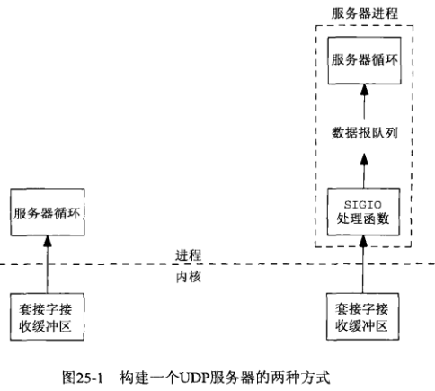 大多UDP服务器都设计成上图左侧所示方式（包括我们的UDP回射服务器），但NTP服务器采用上图右侧所示的方式，当一个新数据报到达时，SIGIO信号处理函数读入该数据报，同时记录它的到达时刻，然后将它置于进程内的另一队列中，以便服务器主循环移走并处理。尽管这样做使服务器代码变复杂了，但可以精确获取数据报达到的时间戳。

进程可通过设置IP_RECVDSTADDR套接字选项获取所收取UDP数据报的目的地址，有人认为，对于所接收UDP数据报还应返回另两个信息：接收接口（如果主机采用普遍的弱端系统模型，则接收接口和目的地址可能不一致）和数据报到达时刻。

对于IPv6，IPV6_PKTINFO套接字选项返回接收接口，对于IPv4，IP_RECVIF套接字选项也返回接收接口。

FreeBSD还提供SO_TIMESTAMP套接字选项，它在一个timeval结构中以辅助数据的形式返回数据报的接收时刻。Linux则提供SIOCGSTAMP ioctl，它返回一个含有数据报接收时刻的timeval结构。

现给出一个类似上图右侧的例子，使用SIGIO信号接收到达数据报的UDP回射服务器程序，客户程序不用改动，服务器的main函数也不用改动，只需改动dg_echo函数。以下是UDP回射服务器的全局声明：

```c
#include "unp.h"

static int sockfd;

#define QSIZE 8    /* size of input queue */
#define MAXDG 4096    /* max datagram size */

// SIGIO信号处理函数把到达的数据报放入一个队列，该队列是一个DG结构数组，我们把它作为一个环形缓冲区处理
// 每个DG结构包含指向所收取数据报的指针、该数据报长度、指向含有客户协议地址的套接字地址结构的指针、该协议地址的大小
typedef struct {
    void *dg_data;    /* ptr to actual datagram */
    size_t dg_len;    /* length of datagram */
    struct sockaddr *dg_sa;    /* ptr to sockaddr{} w/client's address */
    socklen_t dg_salen;    /* length of sockaddr{} */
} DG;
// 静态分配QSIZE个DG结构
static DG dg[QSIZE];    /* queue of datagrams to process */
static long cntread[QSIZE + 1];    /* diagnostic counter */

static int iget;    /* next one for main loop to process，主循环将处理的下一个数组元素下标 */
static int iput;    /* next one for signal handler to read into，信号处理函数将存放到的下一个数组元素下标 */
static int nqueue;    /* # on queue for main loop to process，队列中供主循环处理的数据报总数 */
static socklen_t clilen;    /* max length of sockaddr{} */

static void sig_io(int);
static void sig_hup(int);
1234567891011121314151617181920212223242526
```

下图是DG数组的一个例子，其中第一个元素指向一个150字节的数据报，与它关联的套接字地址长度为16：  以下是dg_echo函数，该函数与以上全局声明放在同一文件中：

```c
void dg_echo(int sockfd_arg, SA *pcliaddr, socklen_t clilen_arg) {
    int i;
    const int on = 1;
    sigset_t zeromask, newmask, oldmask;

    // 把套接字保存在一个全局变量中，因为信号处理函数里也要用到它
    sockfd = sockfd_arg;
    clilen = clilen_arg;

    // 初始化已接收数据报队列
    for (i = 0; i < QSIZE; ++i) {    /* init queue of buffers */
        dg[i].dg_data = Malloc(MAXDG);
        dg[i].dg_sa = Malloc(clilen);
        dg[i].dg_salen = clilen;
    }
    iget = iput = nqueue = 0;

    // 为SIGHUP（用于诊断目的）和SIGIO建立信号处理函数
    Signal(SIGHUP, sig_hup);
    Signal(SIGIO, sig_io);
    // 设置套接字属主
    Fcntl(sockfd, F_SETOWN, getpid());
    // 设置信号驱动IO，上面提到过，fcntl的O_ASYNC标志是POSIX设置信号驱动式IO的方式
    // 但由于大多系统还不支持它，我们改用ioctl函数
    Ioctl(sockfd, FIOASYNC, &on);
    // 设置非阻塞式IO，尽管大多系统支持使用fcntl函数O_NONBLOCK标志设置非阻塞式IO
    // 但此处我们仍使用ioctl函数
    Ioctl(sockfd, FIONBIO, &on);

    Sigemptyset(&zeromask);    /* init three signal sets */
    // oldmask用来记录阻塞SIGIO时，原来的信号掩码
    Sigemptyset(&oldmask);
    Sigemptyset(&newmask);
    Sigaddset(&newmask, SIGIO);    /* signal we want to block */

    // 把进程的当前信号掩码保存到oldmask中，然后把newmask逻辑或到当前信号掩码
    Sigprocmask(SIG_BLOCK, &newmask, &oldmask);
    for (; ; ) {
        while (nqueue == 0) {
            // sigsuspend函数先保存当前信号掩码，再把当前掩码设置为其参数，此例中是zeromask
            // 即不阻塞任何信号，sigsuspend函数在进程捕获一个信号且从该信号的处理函数返回后才返回
            // sigsuspend函数总是返回EINTR错误，在返回前它总是会把当前信号掩码恢复为调用时的值
            // 在本例中就是恢复为newmask的值，从而确保sigsuspend函数返回后SIGIO继续被阻塞
            // 如果sigsuspend函数返回后SIGIO信号未被阻塞，我们会进入下一次while循环的条件判断
            // 可能在测试时我们发现nqueue为0，但刚测试完SIGIO信号就被递交了，导致nqueue为1
            // 然后我们才调用sigsuspend进入睡眠，这样就错过了这个信号，除非另有信号发生
            // 否则我们将永远阻塞在sigsuspend函数处
            sigsuspend(&zeromask);    /* wait for datagram to process */
        }

        /* unblock SIGIO */
        Sigprocmask(SIG_SETMASK, &oldmask, NULL);

        Sendto(sockfd, dg[iget].dg_data, dg[iget].dg_len, 0, dg[iget].dg_sa, dg[iget].dg_salen);

        // 修改iget时不用阻塞SIGIO，因为只有主循环使用iget，信号处理函数不改动它
        if (++iget >= QSIZE) {
            iget = 0;
        }

        /* block SIGIO */
        // 修改nqueue前必须阻塞SIGIO，因为主循环和信号处理函数都会改变它
        // 另外我们在循环顶部测试nqueue时也需要SIGIO阻塞着
        // 我们也可以去掉主循环中的两个sigprocmask函数，省得解阻塞SIGIO后又再阻塞它
        // 但这么做会导致整个循环期间SIGIO一直阻塞着，从而降低了信号处理函数的及时性
        // 这么做不会导致数据报的丢失（假设套接字接收缓冲区足够大），但SIGIO信号的递送在阻塞期间一直被拖延
        // 编写执行信号处理的应用时，我们应尽可能减少阻塞信号的时间
        Sigprocmask(SIG_BLOCK, &newmask, &oldmask);
        nqueue--;
    }
}
1234567891011121314151617181920212223242526272829303132333435363738394041424344454647484950515253545556575859606162636465666768697071
```

以下是SIGIO的信号处理函数，它也应和全局声明放到同一文件中：

```c
static void sig_io(int signo) {
    ssize_t len;
    int nread;
    DG *ptr;

    for (nread = 0; ; ) {
        // 如果DG结构数组队列已满，进程就终止，处理这种情况有更合适的方法，如分配额外缓冲区
        // 但就我们的简单例子而言不如直接终止进程
        if (nqueue >= QSIZE) {
            err_quit("receive overflow");
        }

        ptr = &dg[iput];
        ptr->dg_salen = clilen;
        len = recvfrom(sockfd, ptr->dg_data, MAXDG, 0, ptr->dg_sa, &ptr->dg_salen);
        if (len < 0) {
            if (errno == EWOULDBLOCK) {
                break;    /* all done; no more queued to read */
            } else {
                err_sys("recvfrom error");
            }
        }
        ptr->dg_len = len;

        ++nread;
        ++nqueue;
        if (++iput >= QSIZE) {
            iput = 0;
        }
    }
    // cntread是每次SIGIO信号读入的数据报数量直方图
    // SIGHUP信号被递交时，在其信号处理函数中将其显示为诊断信息
    cntread[nread]++;    /* histogram of # datagrams read per signal */
}
12345678910111213141516171819202122232425262728293031323334
```

编写以上SIGIO信号处理函数遇到的问题是POSIX信号通常不排队，如果我们正在执行信号处理函数，期间SIGIO信号会被阻塞，如果期间SIGIO信号又发生了2次，则期间发生的这两次SIGIO信号之后只会再递送一次。

POSIX提供一些排队的实时信号，但SIGIO等信号通常不排队。

考虑以下情形：一个数据报到达导致SIGIO被递交，它的信号处理函数读入该数据报并把它放到供主循环读取的队列中，但在信号处理函数执行期间，又有两个数据报到达，导致SIGIO再产生2次，由于SIGIO被阻塞，当它的信号处理函数返回时，该处理函数仅再被调用一次，该信号处理函数的第二次执行读入第二个数据报，第三个数据报仍会留在套接字接收队列，第三个数据报被读入的条件是第四个数据报到达，当第四个数据报到达时，被读入并放到供主循环读取的队列中的是第三个而非第四个数据报。

既然信号是不排队的，开启信号驱动式IO的描述符通常也被设为非阻塞式，这样我们就可以把SIGIO信号的处理函数编写成在一个循环中执行读入操作，直到该操作返回EWOULDBLOCK。

主循环有另一种有问题的写法：

```c
for (; ; ) {
    Sigprocmask(SIG_BLOCK, &newmask, &oldmask);
    while (nqueue == 0) {
        sigsuspend(&zeromask);    /* wait for datagram to process */
    }
    --nqueue;

    /* unblock SIGIO */
    Sigprocmask(SIG_SETMASK, &oldmask, NULL);
    
    Sendto(sockfd, dg[iget].dg_data, dg[iget].dg_len, 0, dg[iget].dg_sa, dg[iget].dg_salen);
    
    if (++iget >= QSIZE) {
        iget = 0;
    }
}
12345678910111213141516
```

以上写法的错误在于，nqueue是在回射数组元素dg[iget]前递减的，这可能导致信号处理回射把新的数据报从套接字读出来并存到这个数组元素。如当前DG数组已满，iget和iput指向同一元素，此时信号处理函数中nqueue的值为`QSIZE-1`，从而不会分配更多空间存放数据报，而是在当前iput处存放收到的套接字，导致iget指向的元素还未使用就被覆盖。

以下是SIGHUP的信号处理函数，它显示cntread数组内容，该函数也应和全局声明放在一个文件中：

```c
static void sig_hup(int signo) {
    int i;

    for (i = 0; i <= QSIZE; ++i) {
        printf("cntread[%d] = %ld\n", i, cntread[i]);
    }
}
1234567
```

为了说明信号是不排队的，且除了设置套接字的信号驱动式IO标志外，还必须把套接字设置为非阻塞式，我们与6个客户一起运行以上回射服务器，每个客户发送3645行让服务器回射的文本（即3645个数据报，每个数据报是一行），且每个客户都从同一个shell脚本以后台方式启动，从而使所有客户几乎在同一时刻启动。所有客户终止后，我们向服务器发送SIGHUP信号，显示cntread数组内容：  大多情况下信号处理函数每次被调用只读入一个数据报，但有些情况会读入多个数据报。cntread[0]计数器不为0是可能的：SIGIO信号在其信号处理函数执行时产生，且在信号处理函数的本次执行中就预先读入了这些信号对应的数据报，当信号处理函数因这些信号的再次递交而被调用时，已经没有剩余的数据报可读了。最后我们验证该数组元素的加权总和等于6个客户发送的文本行数：`15899*1+2099*2+515*3+57+4=6*3645=21870`。

信号驱动式IO就是让内核在套接字上发生某事时使用SIGIO信号通知进程： 1.对于已连接TCP套接字，有很多情况都会导致该通知，反而使这个特性几近无用。

2.对于监听TCP套接字，这种通知发生在有一个新连接准备好被接受时。

3.对于UDP套接字，这种通知意味着一个数据报或异步错误到达，这两种情况我们都调用recvfrom。

# 卷二

# 简介

进程间信息共享的方式

  

  （1）两个进程共享文件系统中的文件。访问时需要穿越内核，可能需要某种形式的同步。

  （2）两个进程共享内核中的某些信息。管道就是一个这种共享方式的例子。

  （3）两个进程有一个双方都能访问的共享内存区。访问时不需要穿越内核，但需要某种形式的同步。


IPC对象的持续性

  我们把任意类型的IPC对象的持续性定义成该类型的一个对象在系统中一直存在多长时间。

  

  各种类型的IPC对象的持续性如下表所示：

  

IPC对象的名字空间

  当两个或多个无亲缘关系的进程使用某种类型的IPC对象来交换信息时，该IPC对象必须有一个某种形式的名字或标识符，这样一个进程创建IPC对象时，其他的进程就可以指定同一个IPC对象。对于一个给定类型的IPC对象，其可能的名字的集合称为它的名字空间。各种类型的IPC对象的名字空间如下表所示：

  

fork、exec和exit对IPC对象的影响

  

# 使用内存映射I/O实现信号量

之前这一节我们讲述了如何使用FIFO实现有名信号量。在介绍完共享内存区后，本节我们将使用内存映射I/O（mmap和munmap函数）来实现它。具体思想是：将表示信号量的mysem_t结构体写入一个文件，然后使用mmap函数映射该文件实现信号量在多个进程间共享。在这种实现中，信号量就相当于一个文件。

该实现中mysem_t结构体的定义如下：

```
typedef struct {
	pthread_mutex_t sem_mutex;
	pthread_cond_t sem_cond;
	unsigned int sem_count; /*信号量的值*/
	int sem_magic;
} mysem_t;
 
#define SEM_MAGIC 	0x67458923
#define MYSEM_FAILED 	((mysem_t *)(-1))
```

它包含了一个互斥锁和一个条件变量，用于进程间的同步。

创建或打开一个有名信号量的实现函数如下：

```cpp
#define MAX_TRIES     10
 
mysem_t* mysem_open(const char *pathname, int oflag, ...)
{
    int fd, i, created, save_errno;
    va_list ap;
    mode_t mode;
    unsigned int value;
    mysem_t *sem, seminit;
    struct stat statbuff;
    pthread_mutexattr_t mattr;
    pthread_condattr_t cattr;
 
    created = 0;
    sem = MAP_FAILED;
again:
    if (oflag & O_CREAT) {
        va_start(ap, oflag);
        mode = va_arg(ap, mode_t) & ~S_IXUSR;
        value = va_arg(ap, unsigned int);
        va_end(ap);
        /*打开或创建一个文件*/
        fd = open(pathname, oflag | O_EXCL | O_RDWR, mode | S_IXUSR);
        if (fd < 0) {
            if (errno == EEXIST && (oflag & O_EXCL) == 0)
                goto exists;
            else
                return MYSEM_FAILED;
        }
        created = 1;
        bzero(&seminit, sizeof(seminit));
        if (write(fd, &seminit, sizeof(seminit)) != sizeof(seminit))
            goto err;
 
        /*映射文件*/
        sem = mmap(NULL, sizeof(mysem_t), PROT_READ | PROT_WRITE, 
                        MAP_SHARED, fd ,0);
        if (sem == MAP_FAILED)
            goto err;
 
        /*初始化互斥锁*/
        if ((i = pthread_mutexattr_init(&mattr)) != 0)
            goto pthreaderr;
        pthread_mutexattr_setpshared(&mattr, PTHREAD_PROCESS_SHARED);
        i = pthread_mutex_init(&sem->sem_mutex, &mattr);
        pthread_mutexattr_destroy(&mattr);
        if (i != 0)
            goto pthreaderr;
 
        /*初始化信号量*/
        if ((i = pthread_condattr_init(&cattr)) != 0)
            goto pthreaderr;
        pthread_condattr_setpshared(&cattr, PTHREAD_PROCESS_SHARED);
        i = pthread_cond_init(&sem->sem_cond, &cattr);
        pthread_condattr_destroy(&cattr);
        if (i != 0)
            goto pthreaderr;
 
        /*初始化信号量的值*/
        if ((sem->sem_count = value) > sysconf(_SC_SEM_VALUE_MAX)) {
            errno = EINVAL;
            goto err;
        }
 
        /*取消文件S_IXUSR权限位，指示信号量已经初始化完毕*/
        if (fchmod(fd, mode) == -1)
            goto err;
        close(fd);
        sem->sem_magic = SEM_MAGIC;
        return sem;
        
    }
exists:
    /*文件存在，直接打开*/
    if ((fd = open(pathname, O_RDWR)) < 0) {
        if (errno == ENOENT && (oflag & O_CREAT))
            goto again;
        goto err;
    }
    /*映射文件*/
    sem = mmap(NULL, sizeof(mysem_t), PROT_READ | PROT_WRITE, 
                    MAP_SHARED, fd, 0);
    if (sem == MAP_FAILED)
        goto err;
 
    /*等待信号量完成初始化*/
    for (i = 0; i < MAX_TRIES; i++) {
        if (stat(pathname, &statbuff) == -1) {
            if (errno == ENOENT && (oflag & O_CREAT)) {
                close(fd);
                goto again;
            }
            goto err;
        }
        /*文件S_IXUSR权限位未置位，说明信号量初始化完成*/
        if ((statbuff.st_mode & S_IXUSR) == 0) {
            close(fd);
            sem->sem_magic = SEM_MAGIC;
            return sem;
        }
        sleep(1);
    }
    errno = ETIMEDOUT;
    goto err;
 
pthreaderr:
    errno = i;
err:
    save_errno = errno;
    /*删除文件*/
    if (created)
        unlink(pathname);
    /*解除映射*/
    if (sem != MAP_FAILED)
        munmap(sem, sizeof(mysem_t));
    close(fd);
    errno = save_errno;
    return MYSEM_FAILED;
}
 
/*包裹函数*/
mysem_t* MySem_open(const char *pathname, int oflag, ...)
{
    va_list ap;
    mode_t mode;
    unsigned int value;
    mysem_t *sem;
    
    va_start(ap, oflag);
    mode = va_arg(ap, mode_t);
    value = va_arg(ap, unsigned int);
    va_end(ap);
    
    if ((sem = mysem_open(pathname, oflag, mode, value)) == MYSEM_FAILED)
        err_sys("mysem_open error");
 
    return sem;
} 
```

上段代码有两个很关键的地方：

  \1. 第23行调用open函数打开或创建文件时我们额外指定了O_EXCL标志和S_IXUSR文件权限位。这是因为如果有两个进程几乎同时创建一个信号量，则后打开该信号量的进程必须等待直到先打开该信号量的进程完成信号量的初始化。我们在创建文件时指定S_IXUSR权限位，在信号量完成初始化时取消S_IXUSR权限位，这样其他进程就可以通过判断文件的该权限位来确定信号量是否已完成初始化。我们还额外指定了O_EXCL标志，这样后打开该文件的进程会返回EEXIST错误从而进入73行的处理流程。

  \2. 初始化互斥锁和条件变量时，我们设置它们的进程间共享属性（PTHREAD_PROCESS_SHARED），这样互斥锁和条件变量才能在多个进程间共享。

关闭有名信号量和删除有名信号量的实现函数如下：

```cpp
int mysem_close(mysem_t *sem)
{
	if (sem->sem_magic != SEM_MAGIC) {
		errno = EINVAL;
		return -1;
	}
	/*解除映射关系*/
	if (munmap(sem, sizeof(mysem_t)) == -1)
		return -1;
 
	return 0;
}
 
int mysem_unlink(const char *pathname)
{
	if (unlink(pathname) == -1)
		return -1;
	return 0;
}
```

挂起一个有名信号量的实现函数如下：


```
int mysem_post(mysem_t *sem)
{
	int n;
	
	if (sem->sem_magic != SEM_MAGIC) {
		errno = EINVAL;
		return -1;
	}
	if ((n = pthread_mutex_lock(&sem->sem_mutex)) != 0) {
		errno = n;
		return -1;
	}
	if (sem->sem_count== 0)
		pthread_cond_signal(&sem->sem_cond);
	sem->sem_count++;
	pthread_mutex_unlock(&sem->sem_mutex);
	return 0;
}
```

如果信号量的值为0，我们唤醒一个在等待条件变量的进程。然后将该信号量的值加1。

等待一个有名信号量的实现函数如下：

```
int mysem_wait(mysem_t *sem)
{
	int n;
	
	if (sem->sem_magic != SEM_MAGIC) {
		errno = EINVAL;
		return -1;
	}
	if ((n = pthread_mutex_lock(&sem->sem_mutex)) != 0) {
		errno = n;
		return -1;
	}
	while (sem->sem_count == 0)
		pthread_cond_wait(&sem->sem_cond, &sem->sem_mutex);
	sem->sem_count--;
	pthread_mutex_unlock(&sem->sem_mutex);
	return 0;
}
 
int mysem_trywait(mysem_t *sem)
{
	int n, rc;
	
	if (sem->sem_magic != SEM_MAGIC) {
		errno = EINVAL;
		return -1;
	}
	if ((n = pthread_mutex_lock(&sem->sem_mutex)) != 0) {
		errno = n;
		return -1;
	}
	if (sem->sem_count > 0) {
		sem->sem_count--;
		rc = 0;
	} else {
		rc = -1;
		errno = EAGAIN;
	}
	pthread_mutex_unlock(&sem->sem_mutex);
	return rc;
}
```

mysem_wait函数等待一个信号量。如果该信号量的值为0，则在条件变量上等待直到信号量的值不为0，然后将信号量的值减1。 mysem_trywait函数非阻塞地等待一个信号量。

获取一个有名信号量的值的实现函数如下：

```cpp
int mysem_getvalue(mysem_t *sem, int *pvalue)
{
	int n;
	
	if (sem->sem_magic != SEM_MAGIC) {
		errno = EINVAL;
		return -1;
	}
	if ((n = pthread_mutex_lock(&sem->sem_mutex)) != 0) {
		errno = n;
		return -1;
	}
	*pvalue = sem->sem_count;
	pthread_mutex_unlock(&sem->sem_mutex);
	return 0;
}
```

# 共享内存区介绍

共享内存区是所有IPC形式中最快的。一旦这样的内存区映射到共享它的进程的地址空间，这些进程间的数据传递就不再涉及到内核。但是这些进程间通常需要使用某种形式的同步（前几节介绍的互斥锁、条件变量、读写锁、记录锁和信号量）。

回想一下我们曾在[管道](http://blog.csdn.net/woay2008/article/details/77825231)这一节讲述了如下一个例子：


其中从服务器到客户的数据流如下图所示：

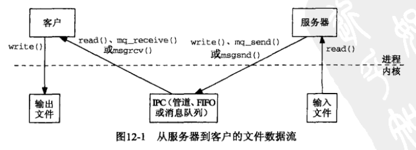

可以看到数据流共穿越内核四次，每次都是开销比较大的复制操作（从内核空间复制数据到用户空间或从用户空间复制数据到内核空间）。

当两个进程间使用共享内存区后，服务器到客户的数据流如下图所示：


可以看到使用共享内存区后，数据流只穿越内核两次：一次从输入文件到共享内存区，一次从共享内存区到输出文件。

进一步讨论前，我们先看一个例子。在这个例子中，父子进程都对同一个全局变量count进行加1操作。代码如下：


```cpp
#include "unpipc.h"
 
#define SEM_NAME	"/mysem"
 
/*全局变量*/
int count = 0;
 
int main(int argc, char **argv)
{
	int i, nloop;
	sem_t *mutex;
 
	if (argc != 2)
		err_quit("usage: incr1 <#loops>");
	nloop = atoi(argv[1]);
 
	mutex = Sem_open(SEM_NAME, O_CREAT | O_EXCL, FILE_MODE, 1);
	Sem_unlink(SEM_NAME);
 
	/*将标准输出设置为非缓冲模式*/
	setbuf(stdout, NULL);
	if (Fork() == 0) { /*子进程*/
		for (i = 0; i < nloop; i++) {
			Sem_wait(mutex);
			printf("child: %d\n", count++);
			Sem_post(mutex);
		}
		exit(0);
	}
	for (i = 0; i < nloop; i++) { /*父进程*/
		Sem_wait(mutex);
		printf("parent: %d\n", count++);
		Sem_post(mutex);
	}
	exit(0);
}
```

该程序其中一次执行结果如下：

liu@ubuntu:~/work$ ./incr1 10 parent: 0 parent: 1 parent: 2 parent: 3 parent: 4 parent: 5 parent: 6 parent: 7 parent: 8 parent: 9 child: 0 child: 1 child: 2 child: 3 child: 4 child: 5 child: 6 child: 7 child: 8 child: 9

从结果我们可以看出全局变量count并不是父子进程间共享的。实际上由于Linux的写时复制机制的存在，子进程修改的是count变量一个副本。

mmap函数可以把一个文件或一个Posix共享内存区对象映射到调用进程的地址空间（也即创建地址空间的一个内存映射关系）。munmap函数则删除进程地址空间的一个映射关系。它们的定义如下：


```cpp
#include <sys/mman.h>
 
void *mmap(void *addr, size_t len, int prot, int flags,
		  int fd, off_t offset);
int munmap(void *addr, size_t length);
```


下图很清楚地说明了mmap函数的功能：


参数offset和len分别表示参数fd指向的文件中要映射到进程地址空间的数据的偏移地址和长度。参数addr指定这块数据被映射到进程地址空间的起始地址。它的值通常为NULL，指示让内核选择起始地址。

参数prot指定内存映射区的访问权限。PROT_READ表示数据可读，PROT_WRITE表示数据可写，PROT_EXEC表示数据可执行，PROT_NONE表示数据不可访问。

参数flag的值通常为MAP_SHARED或MAP_PRIVATE。前者表示调用进程对内存映射区的修改对其他共享该映射区的进程都可见，而且确实改变了其底层支撑对象（文件对象或Posix共享内存区对象）。后者表示调用进程对内存映射区的修改只对该进程可见，而不改变其底层支撑对象。

介绍完mmap函数后，我们可以对上面的例子进行修改，使得父子进程间共享一个全局变量。代码如下：


```cpp
#include "unpipc.h"
 
#define SEM_NAME	"/mysem"
 
int main(int argc, char **argv)
{
	int fd, i, nloop, zero = 0;
	int *ptr; /*父子间共享内存区的起始地址*/
	sem_t *mutex;
 
	if (argc != 3)
		err_quit("usage: incr2 <pathname> <#loops>");
	nloop = atoi(argv[2]);
 
	/*创建一个文件，写入32位数据0*/
	fd = Open(argv[1], O_RDWR | O_CREAT, FILE_MODE);
	Write(fd, &zero, sizeof(int));
	/*映射文件到进程地址空间*/
	ptr = Mmap(NULL, sizeof(int), PROT_READ | PROT_WRITE, MAP_SHARED, fd, 0);
	Close(fd);
	/*创建一个二值信号量*/
	mutex = Sem_open(SEM_NAME, O_CREAT | O_EXCL, FILE_MODE, 1);
	Sem_unlink(SEM_NAME);
 
	/*将标准输出设置为非缓冲模式*/
	setbuf(stdout, NULL);
	
	if (Fork() == 0) {
		for (i = 0; i < nloop; i++) { /*子进程*/
			Sem_wait(mutex);
			printf("child: %d\n", (*ptr)++);
			Sem_post(mutex);
		}
		exit(0);
	}
	
	for (i = 0; i < nloop; i++) { /*父进程*/
		Sem_wait(mutex);
		printf("parent: %d\n", (*ptr)++);
		Sem_post(mutex);
	}
	exit(0);
}
```

父进程调用fork之前先调用mmap函数并指定MAP_SHARED标志映射一个文件中4字节大小的数据（值为0）到它的地址空间，这块映射区的起始地址为ptr。然后调用fork创建了子进程。关键是使用MAP_SHARED标志创建的内存映射关系会存留到子进程中，所以这块4字节大小的映射区实际上是父子进程间的共享内存区。如下图所示：


使用共享内存区后，父子进程就能对同一数据（变量）进行操作。运行该程序，执行结果如下：

liu@ubuntu:~/work$ ./incr2 /tmp/123 10 parent: 0 parent: 1 parent: 2 parent: 3 parent: 4 parent: 5 parent: 6 parent: 7 parent: 8 parent: 9 child: 10 child: 11 child: 12 child: 13 child: 14 child: 15 child: 16 child: 17 child: 18 child: 19

我们还可以将有名信号量改为基于内存的信号量，并将它存放到共享内存区中。代码如下：


```cpp
#include "unpipc.h"
 
struct shared {
	sem_t mutex;
	int count;
} shared;
 
int main(int argc, char **argv)
{
	int fd, i, nloop;
	struct shared *ptr;
 
	if (argc != 3)
		err_quit("usage: incr3 <pathname> <#loops>");
	nloop = atoi(argv[2]);
 
	fd = Open(argv[1], O_RDWR | O_CREAT, FILE_MODE);
	Write(fd, &shared, sizeof(struct shared));
	/*映射文件*/
	ptr = Mmap(NULL, sizeof(struct shared), PROT_READ | PROT_WRITE, 
				MAP_SHARED, fd, 0);
	Close(fd);
	
	Sem_init(&ptr->mutex, 1, 1);
	/*将标准输出设置为非缓冲模式*/
	setbuf(stdout, NULL);
	if (Fork() == 0) { /*子进程*/
		for (i = 0; i < nloop; i++) {
			Sem_wait(&ptr->mutex);
			printf("child: %d\n", ptr->count++);
			Sem_post(&ptr->mutex);
		}
		exit(0);
	}
	/*父进程*/
	for (i = 0; i < nloop; i++) {
		Sem_wait(&ptr->mutex);
		printf("parent: %d\n", ptr->count++);
		Sem_post(&ptr->mutex);
	}
	exit(0);
}
```

此时程序示意图如下图所示:


上面给出的例子我们都需要先创建一个文件，然后调用mmap创建内存映射关系。更简单的一种方法是直接映射/dev/zero这个特殊的设备文件。读该设备返回的字节全是0，写往该设备的任何字节都被丢弃。我们只需把上例17行开始的几行代码改为如下：

```cpp
fd = Open("/dev/zero", O_RDWR);
ptr = Mmap(NULL, sizeof(struct shared), PROT_READ | PROT_WRITE, 
			MAP_SHARED, fd, 0);
Close(fd);
```

# POSIX信号量

信号量是另一种用于不同进程间或一个给定进程的不同线程间同步的IPC对象。对一个[信号量](https://so.csdn.net/so/search?q=信号量&spm=1001.2101.3001.7020)可以执行3种操作：

  \1. 创建（create）一个信号量。要求调用者指定初始值。通常初始值为0或1的称作二值信号量，初始值为N（N>=0）的称作计数信号量，N指示可用的资源数（比如说缓冲区个数）。

  \2. 等待（wait）一个信号量。该操作测试信号量的值。如果它的值大于0，则将值减1；如果它的值小于或等于0，则阻塞等待其值变为大于0，然后将值减1。

  \3. 挂起（post）一个信号量。该操作将信号量的值加1。

Posix信号量的数据类型是sem_t， 它有两种类型：有名信号量和基于内存的信号量。Linux提供的信号量API如下：

 

```cpp
#include <fcntl.h>           /* For O_* constants */
#include <sys/stat.h>        /* For mode constants */
#include <semaphore.h>
 
/*创建或打开一个有名信号量*/
sem_t *sem_open(const char *name, int oflag);
sem_t *sem_open(const char *name, int oflag,
			   mode_t mode, unsigned int value);
/*关闭一个有名信号量*/
int sem_close(sem_t *sem);
/*删除一个有名信号量*/
int sem_unlink(const char *name);
 
/*初始化一个基于内存的信号量*/
int sem_init(sem_t *sem, int pshared, unsigned int value);
/*销毁一个基于内存的信号量*/
int sem_destroy(sem_t *sem);
 
/*等待一个信号量*/
int sem_wait(sem_t *sem);
int sem_trywait(sem_t *sem);
/*挂起一个信号量*/
int sem_post(sem_t *sem);
/*获取信号量的值*/
int sem_getvalue(sem_t *sem, int *sval);
```

 

它们之间的关系如下图所示：


注意基于内存的信号量初始化函数sem_init的pshared参数是如何使用的。如果pshared参数为0，那么该信号量是在同一进程的各个线程间共享的。否则该信号量是在进程间共享的，它必须存放在某种类型的共享内存区。

 

二值信号量可用于互斥目的，就像互斥锁一样。下图给出了一个例子：


 

信号量有一个互斥锁不具备的特性：互斥锁必须总是由锁住它的线程解锁，而信号量的挂起操作却不必由执行它的等待操作的同一线程执行。信号量的这种特性可用于线程间行为同步。先来看一个在[互斥锁](http://blog.csdn.net/woay2008/article/details/77870412)这一节讲述的生产者-消费者问题的简单模型。


 

在这个模型中，只有一个生产者和消费者线程，而且它们只共享一个缓冲区。它们之间的行为被彼此约束： 生产者只有在缓冲区中的数据被消费者处理后（缓冲区为空）才能放入新的数据。消费者只有在缓冲区已被生产者放入数据后（缓冲区不为空）才能处理数据。对生产者而言，缓冲区为空表示有资源可用。对消费者而言，缓冲区不为空表示有资源可用。

为了解决这个问题，我们需要使用两个信号量get和put，因为初始缓冲区为空，所以我们把put的初始值置为1表示生产者的可用资源数为1，把get的初始值置为0表示消费者的初始可用资源数为0，程序伪代码如下图所示：


 

这个模型非常重要！！！

回过头来再看看我们[之前](http://blog.csdn.net/woay2008/article/details/77870412)讲述的一个生产者-消费者问题。


现在我们要对这个问题进行扩展，把共享缓冲区（数组）用作一个环形缓冲区，大小定为10。生产者在数组最后一项放入数据后又重新在数组第一项放入数据，消费者在验证数组最后一项数据后又从数组第一项开始验证数据。这个问题根据生产者和消费者的数量有如下三种情形。

一、单个生产者和单个消费者

这种情形下，该问题与上述共享一个缓冲区的问题很类似。我们需要两个信号量nempty和nstored，nempty初始值为10表示生产者可用资源数，nstored初始值为0表示消费者可用资源数。代码如下：

 

```cpp
#include "unpipc.h"
 
#define NBUFF 10
 
int nitems;
struct {
	int buff[NBUFF];
	sem_t mutex, nempty, nstored;
} shared;
 
void *produce(void *);
void *consume(void *);
 
int main(int argc, char **argv)
{
	pthread_t tid_produce, tid_consume;
 
	if (argc != 2)
		err_quit("usgae: prodcons1 <#items>");
	nitems = atoi(argv[1]);
 
	/*信号量初始化*/
	//Sem_init(&shared.mutex, 0, 1);
	Sem_init(&shared.nempty, 0, NBUFF);
	Sem_init(&shared.nstored, 0, 0);
 
	Pthread_setconcurrency(2);
	Pthread_create(&tid_produce, NULL, produce, NULL);
	Pthread_create(&tid_consume, NULL, consume, NULL);
 
	Pthread_join(tid_produce, NULL);
	Pthread_join(tid_consume, NULL);
 
	//Sem_destroy(&shared.mutex);
	Sem_destroy(&shared.nempty);
	Sem_destroy(&shared.nstored);
 
	exit(0);
}
 
void* produce(void *arg)
{
	int i;
 
	for (i = 0; i < nitems; i++) {
		/*等待直到有空闲的缓冲区*/
		Sem_wait(&shared.nempty); //A
		//Sem_wait(&shared.mutex);
		shared.buff[i % NBUFF] = i;
		//Sem_post(&shared.mutex);
		Sem_post(&shared.nstored); //B
	}
	
	return NULL;
}
 
void* consume(void *arg)
{
	int i;
 
	for (i = 0; i < nitems; i++) {
		/*等待直到有缓冲区被放入数据*/
		Sem_wait(&shared.nstored); //B
		//Sem_wait(&shared.mutex);
		if (shared.buff[i % NBUFF] != i)
			printf("buff[%d] = %d\n", i, shared.buff[i % NBUFF]);
		//Sem_post(&shared.mutex);
		Sem_post(&shared.nempty); //A
	}
	
	return NULL;
}
```

 

 

注意：我注释掉了书中展示的代码中二值信号量mutex的使用。因为数组下标i的值不是共享的，而且生产者和消费者不可能同时使用相同的i值，所以不需要使用互斥。

 

二、多个生产者和单个消费者

在有多个生产者的情形下，生产者使用的数组下标和放入的数据值都变成共享的了，需要互斥锁保护。为此代码为生产者新增了4个变量nput、nputval、mutex和nproducers。mutex是一个二值信号量，作为互斥锁使用。nproducers表示生产者线程的数量。代码如下：

 

```cpp
#include "unpipc.h"
 
#define NBUFF 			10
#define MAXNTHREADS 	100
 
int nitems, nproducers;
 
struct {
	int buff[NBUFF];
	int nput;
	int nputval;
	sem_t mutex, nempty, nstored;
} shared;
 
void *produce(void *);
void *consume(void *);
 
int main(int argc, char **argv)
{
	int i, count[MAXNTHREADS];
	pthread_t tid_produce[MAXNTHREADS], tid_consume;
 
	if (argc != 3)
		err_quit("usgae: prodcons3 <#items> <#producers>");
	nitems = atoi(argv[1]);
	nproducers = min(atoi(argv[2]), MAXNTHREADS); /*生产者线程数量*/
 
	Sem_init(&shared.mutex, 0, 1);
	Sem_init(&shared.nempty, 0, NBUFF);
	Sem_init(&shared.nstored, 0, 0);
 
	Pthread_setconcurrency(nproducers + 1);
	for (i = 0; i < nproducers; i++) {
		count[i] = 0;
		Pthread_create(&tid_produce[i], NULL, produce, &count[i]);
	}
	Pthread_create(&tid_consume, NULL, consume, NULL);
 
	for (i = 0; i < nproducers; i++) {
		Pthread_join(tid_produce[i], NULL);
		printf("count[%d] = %d\n", i, count[i]);
	}
	Pthread_join(tid_consume, NULL);
	
	Sem_destroy(&shared.mutex);
	Sem_destroy(&shared.nempty);
	Sem_destroy(&shared.nstored);
 
	exit(0);
}
 
void* produce(void *arg)
{
	int i;
 
	for ( ; ; ) {
		Sem_wait(&shared.nempty); //A
		Sem_wait(&shared.mutex);
		if (shared.nput >= nitems) {
			Sem_post(&shared.nempty); // 重要！
			Sem_post(&shared.mutex);
			return NULL;
		}
		shared.buff[shared.nput % NBUFF] = shared.nputval;
		shared.nput++;
		shared.nputval++;
		Sem_post(&shared.mutex);
		Sem_post(&shared.nstored); //B
		*((int *)arg) += 1;
	}
	
}
 
void* consume(void *arg)
{
	int i;
 
	for (i = 0; i < nitems; i++) {
		Sem_wait(&shared.nstored); //B
		if (shared.buff[i % NBUFF] != i)
			printf("buff[%d] = %d\n", i, shared.buff[i % NBUFF]);
		Sem_post(&shared.nempty); //A
	}
	
	return NULL;
}
```

 

 

我们必须小心地处理生产者线程终止时的行为，在终止时它必须挂起nempty和mutex信号量。如果不执行挂起nempty信号量的操作，那么当生产者线程数N大于缓冲区个数10时，N-10个线程会永远阻塞。

 

三、多个生产者和多个消费者

在有多个消费者的情形下，消费者验证数据使用的数组下标和数据值都变成共享的，需要使用互斥锁保护。为了方便，我们还是只使用一个互斥锁mutex。为消费者我们新增了3个变量nget、ngetval和nconsumers。代码如下：

```cpp
#include "unpipc.h"
 
#define NBUFF 			10
#define MAXNTHREADS 	100
 
int nitems, nproducers, nconsumers; 
 
struct {
	int buff[NBUFF];
	int nput;
	int nputval;
	int nget;
	int ngetval;
	sem_t mutex, nempty, nstored;
} shared;
 
void *produce(void *);
void *consume(void *);
 
int main(int argc, char **argv)
{
	int i, prodcount[MAXNTHREADS], conscount[MAXNTHREADS];
	pthread_t tid_produce[MAXNTHREADS], tid_consume[MAXNTHREADS];
 
	if (argc != 4)
		err_quit("usgae: prodcons4 <#items> <#producers> <#consumers>");
 
	nitems = atoi(argv[1]);
	nproducers = min(atoi(argv[2]), MAXNTHREADS);
	nconsumers = min(atoi(argv[3]), MAXNTHREADS);
 
	Sem_init(&shared.mutex, 0, 1);
	Sem_init(&shared.nempty, 0, NBUFF);
	Sem_init(&shared.nstored, 0, 0);
 
	Pthread_setconcurrency(nproducers + nconsumers);
	for (i = 0; i < nproducers; i++) {
		prodcount[i] = 0;
		Pthread_create(&tid_produce[i], NULL, produce, &prodcount[i]);
	}
	for (i = 0; i < nconsumers; i++) {
		conscount[i] = 0;
		Pthread_create(&tid_consume[i], NULL, consume, &conscount[i]);
	}
 
	for (i = 0; i < nproducers; i++) {
		Pthread_join(tid_produce[i], NULL);
		printf("producer count[%d] = %d\n", i, prodcount[i]);
	}
	for (i = 0; i < nconsumers; i++) {
		Pthread_join(tid_consume[i], NULL);
		printf("consumer count[%d] = %d\n", i, conscount[i]);
	}
	
	Sem_destroy(&shared.mutex);
	Sem_destroy(&shared.nempty);
	Sem_destroy(&shared.nstored);
 
	exit(0);
}
 
void* produce(void *arg)
{
	int i;
	
	for ( ; ; ) {
		Sem_wait(&shared.nempty); //A
		Sem_wait(&shared.mutex);
		if (shared.nput >= nitems) {
			Sem_post(&shared.nstored); //重要！
			Sem_post(&shared.nempty); //A
			Sem_post(&shared.mutex);
			return NULL;
		}
		
		shared.buff[shared.nput % NBUFF] = shared.nputval;
		shared.nput++;
		shared.nputval++;
		Sem_post(&shared.mutex);
		Sem_post(&shared.nstored); //B
		*((int *)arg) += 1;
	}
	
}
 
void* consume(void *arg)
{
	int i;
 
	for ( ; ; ) {
		Sem_wait(&shared.nstored); //B
		Sem_wait(&shared.mutex);
		if (shared.nget >= nitems) {
			Sem_post(&shared.nstored); //B
			Sem_post(&shared.mutex);
			return NULL;
		}
		
		i = shared.nget % NBUFF;
		if (shared.buff[i] != shared.ngetval)
			printf("error: buff[%d] = %d\n", i, shared.buff[i]);
		shared.nget++;
		shared.ngetval++;
		Sem_post(&shared.mutex);
		Sem_post(&shared.nempty); //A
		*((int *)arg) += 1;
	}
	
}
```

 

要注意的还是生产者线程终止时的行为，我们新增了一个挂起nstored信号量的操作。因为所有的数据都验证完时nstored值为0，所有的消费者线程都在阻塞等待nstored信号量，如果不挂起nstored信号量，那么所有的消费者线程都会永远阻塞。

# 使用FIFO实现信号量

上节我们给出的例子使用的都是基于内存的信号量，还有一种信号量是有名信号量。两者的关系就像管道和FIFO一样。有趣的是，有名信号量可以使用FIFO来实现。具体思想是：每个有名信号量和一个FIFO关联，FIFO中数据的字节数代表该信号量的值。sem_post函数往该FIFO中写入一个字节，sem_wait函数从FIFO中读出一个字节。

我们自己实现的信号量类型mysem_t定义如下：

```cpp
typedef struct {
	/*FIFO读和写描述符*/
	int sem_fd[2];
	int sem_magic;
} mysem_t;
 
#define SEM_MAGIC	0x89674532
#define MYSEM_FAILED ((mysem_t *)(-1))
```

它包含FIFO读写端描述符和一个表示信号量的魔数。

创建或打开一个有名信号量的实现函数如下：

```cpp
mysem_t* mysem_open(const char *pathname, int oflag, ...)
{
	int i, flags, save_errno;
	char c;
	va_list ap;
	mode_t mode;
	unsigned int value;
	mysem_t *sem;
 
	if (oflag & O_CREAT) { /*如果指定O_CREAT标志，文件不存在则会创建文件*/
		va_start(ap, oflag);
		mode = va_arg(ap, mode_t);
		value = va_arg(ap, unsigned int);
		va_end(ap);
 
		/*创建FIFO*/
		if (mkfifo(pathname, mode) < 0) {
			/*如果返回EEXIST错误，但没有指定O_EXCL标志，忽略该错误*/
			if (errno == EEXIST && (oflag & O_EXCL) == 0)
				oflag &= ~O_CREAT;
			else
				return MYSEM_FAILED;
		}
	}
	/*分配内存*/
	if ((sem = malloc(sizeof(mysem_t))) == NULL)
		return MYSEM_FAILED;
	sem->sem_fd[0] = sem->sem_fd[1] = -1;
 
	/*以非阻塞读的方式打开FIFO*/
	if ((sem->sem_fd[0] = open(pathname, O_RDONLY | O_NONBLOCK)) < 0)
		goto error;
	/*以非阻塞写的方式打开FIFO*/
	if ((sem->sem_fd[1] = open(pathname, O_WRONLY | O_NONBLOCK)) < 0)
		goto error;
 
	/*将FIFO读描述符改为阻塞*/
	if ((flags = fcntl(sem->sem_fd[0], F_GETFL, 0)) < 0)
		goto error;
	flags &= ~O_NONBLOCK;
	if (fcntl(sem->sem_fd[0], F_SETFL, flags) < 0)
		goto error;
 
	if (oflag & O_CREAT) {
		/*写入value字节数据*/
		for (i = 0; i < value; i++)
			if (write(sem->sem_fd[1], &c, 1) != 1)
				goto error;
	}
	sem->sem_magic = SEM_MAGIC;
 
	return sem;
 
error:
	/*保存出错时的errno*/
	save_errno = errno;
	if (oflag & O_CREAT)
		unlink(pathname);
	close(sem->sem_fd[0]);
	close(sem->sem_fd[1]);
	free(sem);
	errno = save_errno;
	
	return MYSEM_FAILED;
}
 
/*包裹函数*/
mysem_t* MySem_open(const char *pathname, int oflag, ...)
{
    va_list ap;
    mode_t mode;
    unsigned int value;
    mysem_t *sem;
    
    va_start(ap, oflag);
    mode = va_arg(ap, mode_t);
    value = va_arg(ap, unsigned int);
    va_end(ap);
    
    if ((sem = mysem_open(pathname, oflag, mode, value)) == MYSEM_FAILED)
        err_sys("mysem_open error");
 
    return sem;
}
```

每次打开一个有名信号量，我们打开它关联的FIFO两次，一次是为了读，一次是为了写。第一次我们使用非阻塞读的方式打开该FIFO是为了避免进程被阻塞（详见FIFO[这一节](http://blog.csdn.net/woay2008/article/details/77827083) 图4-21），后面我们又调用fcntl将打开的读描述符设置为阻塞的方式。

出错处理时我们先保存errno的值，因为后面的系统调用可能改变它的值。

关闭有名信号量和删除有名信号量的实现函数如下：

```cpp
int mysem_close(mysem_t *sem)
{
	if (sem->sem_magic != SEM_MAGIC) {
		errno = EINVAL;
		return -1;
	}
	sem->sem_magic = 0;
	/*关闭FIFO*/
	if (close(sem->sem_fd[0]) == -1 || close(sem->sem_fd[1]) == -1) {
		free(sem);
		return -1;
	}
	free(sem);
	return 0;
}
 
int mysem_unlink(const char *pathname)
{
	/*删除FIFO*/
	return unlink(pathname);
}
```

挂起一个有名信号量和等待一个有名信号量的实现函数如下：

```cpp
int mysem_post(mysem_t *sem)
{
	char c;
 
	if (sem->sem_magic != SEM_MAGIC) {
		errno = EINVAL;
		return -1;
	}
	if (write(sem->sem_fd[1], &c, 1) == 1)
		return 0;
	return -1;
}
 
int mysem_wait(mysem_t *sem)
{
	char c;
 
	if (sem->sem_magic != SEM_MAGIC) {
		errno = EINVAL;
		return -1;
	}
	if (read(sem->sem_fd[0], &c, 1) == 1)
		return 0;
	return -1;
}
```

mysem_post函数往FIFO中写入1字节数据，给信号量的值加1。它不会阻塞。

mysem_wait函数从FIFO中读出1字节数据，给信号量的值减1。当信号量的值为0（FIFO中没有数据）时，它就会阻塞直到信号量的值大于0（FIFO中有数据）。

# 记录上锁

本节讲述记录上锁，它是读写锁的一种扩展类型，它可用于有亲缘关系或无亲缘关系的进程之间共享某个文件的读与写。使用记录上锁，应用可以指定文件中需要上锁或解锁的字节范围。Posix记录上锁定义了一个特殊的字节范围以指定整个文件，这就是文件上锁，它只是记录上锁的一个特例。

Linux提供的记录上锁功能的函数是fcntl。

```cpp
#include <unistd.h>
#include <fcntl.h>
 
int fcntl(int fd, int cmd, ... /* arg */ );
```

如果该函数用于记录上锁，那么它要求第三个参数arg是一个指向flock结构体的指针。flock结构体定义如下：

```cpp
struct flock {
   ...
   short l_type;    /* Type of lock: F_RDLCK,
					   F_WRLCK, F_UNLCK */
   short l_whence;  /* How to interpret l_start:
					   SEEK_SET, SEEK_CUR, SEEK_END */
   off_t l_start;   /* Starting offset for lock */
   off_t l_len;     /* Number of bytes to lock */
   pid_t l_pid;     /* PID of process blocking our lock
					   (set by F_GETLK and F_OFD_GETLK) */
   ...
};
```


它描述锁的类型（读出锁或写入锁）以及待锁住的字节范围。指定l_whence为SEEK_SET，l_start为0，l_len为0可锁住整个文件。

用于记录上锁功能的参数cmd的三个值如下：

  F_SETLK：获取（l_type成员为F_RDLCK或F_WRLCK）或释放（l_type成员为F_UNLCK）由arg指向的flock结构描述的锁。

  F_SETLKW：与上个命令类似，区别是获取不到锁进程会阻塞。

  F_GETLK：检查由arg参数指向的锁是否被进程占用。如果锁被进程占用，可获取该进程的PID和锁的类型。

我们先看一个例子，看看如果没有记录上锁，多个进程间共享文件可能会出现什么现象。

在这个例子中，我们首先创建一个名为“sqeno”的ASCII文件，文件只有一行，包含一个字符“1”，表示初始的序列号。然后写一个名为locknone的小程序，这个程序做如下的工作：

（1）读序列号文件

（2）打印进程PID和文件中的序列号

（3）给序列号加1并写回文件中

其中步骤（2）和步骤（3）重复20遍。

程序代码如下：


```cpp
#include "unpipc.h"
 
#define SEQFILE "seqno"
 
void my_lock(int);
void my_unlock(int);
 
int main(int argc, char **argv)
{
	int fd;
	long i, seqno;
	pid_t pid;
	ssize_t n;
	char line[MAXLINE + 1];
 
	pid = getpid();
	fd = Open(SEQFILE, O_RDWR, FILE_MODE);
 
	for (i = 0; i < 20; i++) {
		my_lock(fd);
 
		Lseek(fd, 0L, SEEK_SET);
		/*读出序列号字符串形式*/
		n = Read(fd, line, MAXLINE);
		line[n] = '\0';
		/*转成数值形式*/
		n = sscanf(line, "%ld\n", &seqno);
		printf("%s: pid = %ld, seq# = %ld\n", argv[0], (long)pid, seqno);
		/*序列号加1*/
		seqno++;
		/*转成字符串形式*/
		snprintf(line, sizeof(line), "%ld\n", seqno);
		Lseek(fd, 0L, SEEK_SET);
		/*写入文件中*/
		Write(fd, line, strlen(line));
 
		my_unlock(fd);
	}
	exit(0);
}
```

my_lock和my_unlock是给文件上锁的函数，现在为空函数。


然后几乎同时执行同一个程序两次，那么可能会出现如下的情况：

liu@ubuntu:~/work$ ./locknone: pid = 93426, seq# = 1 ./locknone: pid = 93426, seq# = 2 ./locknone: pid = 93426, seq# = 3 ./locknone: pid = 93426, seq# = 4 ./locknone: pid = 93426, seq# = 5 ./locknone: pid = 93426, seq# = 6 ./locknone: pid = 93426, seq# = 7 ./locknone: pid = 93426, seq# = 8 ./locknone: pid = 93426, seq# = 9 ./locknone: pid = 93426, seq# = 10 ./locknone: pid = 93426, seq# = 11 ./locknone: pid = 93426, seq# = 12 ./locknone: pid = 93426, seq# = 13 ./locknone: pid = 93426, seq# = 14 ./locknone: pid = 93426, seq# = 15 ./locknone: pid = 93426, seq# = 16 ./locknone: pid = 93426, seq# = 17 ./locknone: pid = 93426, seq# = 18 ./locknone: pid = 93426, seq# = 19 ./locknone: pid = 93426, seq# = 20 ./locknone: pid = 93425, seq# = 1 ./locknone: pid = 93425, seq# = 2 ./locknone: pid = 93425, seq# = 3 ./locknone: pid = 93425, seq# = 4 ./locknone: pid = 93425, seq# = 5 ./locknone: pid = 93425, seq# = 6 ./locknone: pid = 93425, seq# = 7 ./locknone: pid = 93425, seq# = 8 ./locknone: pid = 93425, seq# = 9 ./locknone: pid = 93425, seq# = 10 ./locknone: pid = 93425, seq# = 11 ./locknone: pid = 93425, seq# = 12 ./locknone: pid = 93425, seq# = 13 ./locknone: pid = 93425, seq# = 14 ./locknone: pid = 93425, seq# = 15 ./locknone: pid = 93425, seq# = 16 ./locknone: pid = 93425, seq# = 17 ./locknone: pid = 93425, seq# = 18 ./locknone: pid = 93425, seq# = 19 ./locknone: pid = 93425, seq# = 20

可以看到，当发生进程切换后，第二个进程读取到的序列号是1而不是21，它好像完全不知道另一个进程也在修改该文件。

现在我们把my_lock和my_unlock函数功能修改为文件上锁和解锁，代码如下：


```cpp
void my_lock(int fd)
{
	struct flock lock;
 
	/*写入锁*/
	lock.l_type = F_WRLCK;
	/*整个文件范围*/
	lock.l_whence = SEEK_SET;
	lock.l_start = 0;
	lock.l_len = 0;
	Fcntl(fd, F_SETLKW, &lock);
	return;
}
 
void my_unlock(int fd)
{
	struct flock lock;
 
	/*释放锁*/
	lock.l_type = F_UNLCK;
	/*整个文件范围*/
	lock.l_whence = SEEK_SET;
	lock.l_start = 0;
	lock.l_len = 0;
	Fcntl(fd, F_SETLK, &lock);
	return;
}
```


我们把修改后的程序改名为lockfcntl，再同时执行这个程序两次，结果如下：

liu@ubuntu:~/work/unpipc/lock$ ./lockfcntl: pid = 93474, seq# = 1 ./lockfcntl: pid = 93474, seq# = 2 ./lockfcntl: pid = 93474, seq# = 3 ./lockfcntl: pid = 93474, seq# = 4 ./lockfcntl: pid = 93474, seq# = 5 ./lockfcntl: pid = 93474, seq# = 6 ./lockfcntl: pid = 93474, seq# = 7 ./lockfcntl: pid = 93474, seq# = 8 ./lockfcntl: pid = 93474, seq# = 9 ./lockfcntl: pid = 93474, seq# = 10 ./lockfcntl: pid = 93474, seq# = 11 ./lockfcntl: pid = 93474, seq# = 12 ./lockfcntl: pid = 93474, seq# = 13 ./lockfcntl: pid = 93474, seq# = 14 ./lockfcntl: pid = 93474, seq# = 15 ./lockfcntl: pid = 93474, seq# = 16 ./lockfcntl: pid = 93474, seq# = 17 ./lockfcntl: pid = 93474, seq# = 18 ./lockfcntl: pid = 93474, seq# = 19 ./lockfcntl: pid = 93474, seq# = 20 ./lockfcntl: pid = 93475, seq# = 21 ./lockfcntl: pid = 93475, seq# = 22 ./lockfcntl: pid = 93475, seq# = 23 ./lockfcntl: pid = 93475, seq# = 24 ./lockfcntl: pid = 93475, seq# = 25 ./lockfcntl: pid = 93475, seq# = 26 ./lockfcntl: pid = 93475, seq# = 27 ./lockfcntl: pid = 93475, seq# = 28 ./lockfcntl: pid = 93475, seq# = 29 ./lockfcntl: pid = 93475, seq# = 30 ./lockfcntl: pid = 93475, seq# = 31 ./lockfcntl: pid = 93475, seq# = 32 ./lockfcntl: pid = 93475, seq# = 33 ./lockfcntl: pid = 93475, seq# = 34 ./lockfcntl: pid = 93475, seq# = 35 ./lockfcntl: pid = 93475, seq# = 36 ./lockfcntl: pid = 93475, seq# = 37 ./lockfcntl: pid = 93475, seq# = 38 ./lockfcntl: pid = 93475, seq# = 39 ./lockfcntl: pid = 93475, seq# = 40

可以看到，发生进程切换后，第二个进程读取到的序列号是21，这正是两个进程使用文件锁进行同步后的结果。

Posix记录上锁也称为劝告性上锁。其含义是内核维护着已由各个进程上锁的所有文件的正确信息，但是它不能防止一个进程写已由另一个进程读锁定的某个文件，也不能防止一个进程读已由另一个进程写锁定的某个文件。所以，劝告性锁都在协作进程间使用。执行如下命令后的一个输出结果就能说明Posix记录上锁是劝告性的。

liu@ubuntu:~/work$ ./lockfcntl & ./locknone &

liu@ubuntu:~/work$ ./lockfcntl: pid = 62641, seq# = 1 ./lockfcntl: pid = 62641, seq# = 2 ./lockfcntl: pid = 62641, seq# = 3 ./lockfcntl: pid = 62641, seq# = 4 ./locknone: pid = 62642, seq# = 1 ./locknone: pid = 62642, seq# = 2 ./locknone: pid = 62642, seq# = 3 ./locknone: pid = 62642, seq# = 4 ./locknone: pid = 62642, seq# = 5 ./locknone: pid = 62642, seq# = 6 ./locknone: pid = 62642, seq# = 7 ./locknone: pid = 62642, seq# = 8 ./lockfcntl: pid = 62641, seq# = 5 ./lockfcntl: pid = 62641, seq# = 6 ./locknone: pid = 62642, seq# = 9 ./locknone: pid = 62642, seq# = 10 ./lockfcntl: pid = 62641, seq# = 7 ./lockfcntl: pid = 62641, seq# = 8 ./locknone: pid = 62642, seq# = 11 ./locknone: pid = 62642, seq# = 12 ./lockfcntl: pid = 62641, seq# = 9 ./lockfcntl: pid = 62641, seq# = 10 ./locknone: pid = 62642, seq# = 13 ./locknone: pid = 62642, seq# = 14 ./locknone: pid = 62642, seq# = 15 ./lockfcntl: pid = 62641, seq# = 11 ./lockfcntl: pid = 62641, seq# = 12 ./lockfcntl: pid = 62641, seq# = 13 ./locknone: pid = 62642, seq# = 16 ./locknone: pid = 62642, seq# = 17 ./locknone: pid = 62642, seq# = 18 ./locknone: pid = 62642, seq# = 19 ./lockfcntl: pid = 62641, seq# = 14 ./lockfcntl: pid = 62641, seq# = 15 ./locknone: pid = 62642, seq# = 20 ./lockfcntl: pid = 62641, seq# = 16 ./lockfcntl: pid = 62641, seq# = 17 ./lockfcntl: pid = 62641, seq# = 18 ./lockfcntl: pid = 62641, seq# = 19 ./lockfcntl: pid = 62641, seq# = 20

可以看到发生进程切换时，locknone进程获取到的序列号不是lockfcntl进程写入到文件中的序列号，说明lockfcntl进程持有的劝告性记录锁对locknone进程没有影响。

从上述my_lock和my_unlock函数可以看到请求或释放一个锁都需要填充flock结构体，我们可以使用如下的宏简化程序：


```cpp
/*以非阻塞的方式获取读出锁*/
#define read_lock(fd, offset, whence, len) \
					lock_reg(fd, F_SETLK, F_RDLCK, offset, whence, len)
/*以阻塞的方式获取读出锁*/
#define readw_lock(fd, offset, whence, len) \
						lock_reg(fd, F_SETLKW, F_RDLCK, offset, whence, len)
/*以非阻塞的方式获取写入锁*/
#define write_lock(fd, offset, whence, len) \
						lock_reg(fd, F_SETLK, F_WRLCK, offset, whence, len)
/*以阻塞的方式获取写入锁*/
#define writew_lock(fd, offset, whence, len) \
						lock_reg(fd, F_SETLKW, F_WRLCK, offset, whence, len)
/*释放锁*/
#define un_lock(fd, offset, whence, len) \
						lock_reg(fd, F_SETLK, F_UNLCK, offset, whence, len)
/*判断读出锁是否被进程占用*/
#define is_read_lockable(fd, offset, whence, len) \
						!lock_test(fd, F_RDLCK, offset, whence, len)
/*判断写入锁是否被进程占用*/
#define is_write_lockable(fd, offset, whence, len) \
						!lock_test(fd, F_WRLCK, offset, whence, len)
 
int lock_reg(int fd, int cmd, int type, off_t offset, int whence, off_t len)
{
	struct flock lock;
 
	lock.l_type = type;
	lock.l_start = offset;
	lock.l_whence = whence;
	lock.l_len = len;
 
	return fcntl(fd, cmd, &lock);
}
 
pid_t lock_test(int fd, int type, off_t offset, int whence, off_t len)
{
	struct flock lock;
 
	lock.l_type = type;
	lock.l_start = offset;
	lock.l_whence = whence;
	lock.l_len = len;
 
	if (fcntl(fd, F_GETLK, &lock) == -1)
		return -1;
 
	/*没有进程占有该文件锁*/
	if (lock.l_type == F_UNLCK)
		return 0;
 
	/*有进程占用该文件锁*/
	return lock.l_pid;
}
```

记录上锁的一个常见用途是确保某个守护程序在任何时刻只有一个副本在运行，一个例子如下：


```cpp
#include "unpipc.h"
 
#define PATH_PIDFILE	"pidfile"
 
int main(int argc, char **argv)
{
	int pidfd;
	char line[MAXLINE];
 
	/*打开或创建一个pid文件*/
	pidfd = Open(PATH_PIDFILE, O_RDWR | O_CREAT, FILE_MODE);
 
	if (write_lock(pidfd, 0, SEEK_SET, 0) < 0) {
		if (errno == EACCES || errno == EAGAIN)
			err_quit("unable to lock %s, is %s already running?",
				PATH_PIDFILE, argv[0]);
		else
			err_sys("unable to lock %s", PATH_PIDFILE);
	}
 
	/*将进程pid写入文件*/
	snprintf(line, sizeof(line), "%ld\n", (long)getpid());
	Ftruncate(pidfd, 0);
	Write(pidfd, line, strlen(line));
 
	pause();
}
```

最后，关于读出锁和写入锁的优先级，我们还需知道如下两点：

  \1. 如果某个资源已经被读锁定，那么后续请求获取读出锁的进程优先级比请求获取写入锁的进程优先级高。  \2. 如果某个资源已经被写锁定，那么后续先发起锁请求的进程先获得锁，而不区分锁请求是读出锁还是写入锁。

# 读写锁及其实现

如果已经有一个线程进入临界区，互斥锁会将所有试图访问临界区的其他线程阻塞。线程对临界区共享的数据有两种操作：读取和修改。互斥锁不区分这两种操作，而读写锁区分这两种操作。读写锁的规则如下：

  \1. 只要没有线程持有某个给定的读写锁用于写，那么任意数目的线程可以持有该读写锁用于读。

  \2. 仅当没有线程持有某个给定的读写锁用于读或写时，该读写锁才能用于写。

换一种说法是，只要没有线程在修改某个特定的数据，任意数目的线程都可以读取该数据。仅当没有线程在读取或修改该数据时，当前线程才能修改它。

读写锁有三种状态：

  \1. 未被任何线程占用

  \2. 作为写入锁（被一个线程占用用于写）

  \3. 作为读出锁（被一个或多个线程占用用于读）

在某些应用中，如果数据的读取比修改操作更频繁，那么可以使用读写锁来替代互斥锁提高性能。读写锁的数据类型是pthread_rwlock_t，如果读写锁变量是静态分配的，那么可以用PTHREAD_RWLOCK_INITIALIZER来初始化。

linux提供的读写锁API如下：


```cpp
#include <pthread.h>
 
/*初始化读写锁*/
int pthread_rwlock_init(pthread_rwlock_t *restrict rwlock,
const pthread_rwlockattr_t *restrict attr); 
/*销毁读写锁*/
int pthread_rwlock_destroy(pthread_rwlock_t *rwlock);
 
/*获取读写锁用于读*/
int pthread_rwlock_rdlock(pthread_rwlock_t *rwlock);
int pthread_rwlock_tryrdlock(pthread_rwlock_t *rwlock); 
/*获取读写锁用于写*/
int pthread_rwlock_wrlock(pthread_rwlock_t *rwlock); 
int pthread_rwlock_trywrlock(pthread_rwlock_t *rwlock);
/*释放读写锁*/
int pthread_rwlock_unlock(pthread_rwlock_t *rwlock); 
 
/*读写锁属性初始化*/
int pthread_rwlockattr_init(pthread_rwlockattr_t *attr); 
/*销毁读写锁属性*/
int pthread_rwlockattr_destroy(pthread_rwlockattr_t *attr);
/*获取读写锁进程共享属性*/
int pthread_rwlockattr_getpshared(const pthread_rwlockattr_t *
restrict attr, int *restrict pshared);
/*设置读写锁进程共享属性*/
int pthread_rwlockattr_setpshared(pthread_rwlockattr_t *attr,
int pshared); 
```

读写锁可以使用互斥锁和条件变量来实现，如下所示是我们自己实现的读写锁结构mypthread_rwlock_t。


```cpp
typedef struct {
	pthread_mutex_t rw_mutex; /*互斥锁*/
	pthread_cond_t rw_condreaders;
	pthread_cond_t rw_condwriters;
	int rw_magic;
	int rw_nwaitreaders;
	int rw_nwaitwriters;
	int rw_refcount; /*读写锁状态*/
} mypthread_rwlock_t;
 
/*表示读写锁的魔数*/
#define RW_MAGIC 0x19283746
 
/*静态读写锁变量初始化宏*/
#define MYPTHREAD_RWLOCK_INITIALIZER {PTHREAD_MUTEX_INITIALIZER, \
			PTHREAD_COND_INITIALIZER, PTHREAD_COND_INITIALIZER, \
			RW_MAGIC, 0, 0, 0}
/*读写锁属性*/
typedef int mypthread_rwlockattr_t;
```

rw_magic是一个表示读写锁的魔数，值为0x19283746。rw_nwaitreaders为等待获得读出锁的线程个数。rw_nwaitwriters为等待获得写入锁的线程个数。rw_refcount表示读写锁的状态，为0表示该锁没有被占用，为-1表示作为写入锁，大于0表示作为读取锁且有多少个线程占有该读出锁。

我们自己实现的读写锁函数名字都是在原生函数名前面添加“my”前缀。


读写锁初始化和销毁函数实现如下：


```cpp
int mypthread_rwlock_init(mypthread_rwlock_t *rw, mypthread_rwlockattr_t *attr)
{
	int result;
 
	if (attr != NULL)
		return errno = EINVAL; /*不支持设置属性*/
 
	if ((result = pthread_mutex_init(&rw->rw_mutex, NULL)) != 0)
		goto err1;
	if ((result = pthread_cond_init(&rw->rw_condreaders, NULL)) != 0)
		goto err2;
	if ((result = pthread_cond_init(&rw->rw_condwriters, NULL)) != 0)
		goto err3;
	
	rw->rw_nwaitreaders = 0;
	rw->rw_nwaitwriters = 0;
	rw->rw_magic = RW_MAGIC;
 
	return 0;
 
	err3:
		pthread_cond_destroy(&rw->rw_condreaders);
	err2:
		pthread_mutex_destroy(&rw->rw_mutex);
	err1:
		return result;
 
}
 
int mypthread_rwlock_destroy(mypthread_rwlock_t *rw)
{
	if (rw->rw_magic != RW_MAGIC)
		return errno = EINVAL;
 
	if (rw->rw_refcount != 0 || 
		rw->rw_nwaitreaders!= 0 || rw->rw_nwaitwriters!= 0)
		return errno = EBUSY;
	
	pthread_mutex_destroy(&rw->rw_mutex);
	pthread_cond_destroy(&rw->rw_condreaders);
	pthread_cond_destroy(&rw->rw_condwriters);
	rw->rw_magic = 0;
 
	return 0;
}
```

尝试获取读写锁用于读数据（读出锁）的函数实现如下：


```cpp
/*尝试获取读出锁*/
int mypthread_rwlock_tryrdlock(mypthread_rwlock_t *rw)
{
	int result;
 
	if (rw->rw_magic != RW_MAGIC)
		return errno = EINVAL;
 
	if ((result = pthread_mutex_lock(&rw->rw_mutex)) != 0)
		return result;
	/*如果当前读写锁是写入锁或者有线程在等待获取写入锁，则返回失败*/
	if (rw->rw_refcount < 0 || rw->rw_nwaitwriters > 0)
		result = errno = EBUSY;
	else
		rw->rw_refcount++;
	pthread_mutex_unlock(&rw->rw_mutex);
	return result;
 
}
```

获取读出锁的函数实现如下：


```cpp
static void rwlock_cancelrdwait(void *arg)
{
	mypthread_rwlock_t *rw;
 
	rw = arg;
	rw->rw_nwaitreaders--;
	/*被取消时，由于占用了互斥锁，所以要解锁*/
	pthread_mutex_unlock(&rw->rw_mutex);
}
 
/*获取读出锁*/
int mypthread_rwlock_rdlock(mypthread_rwlock_t *rw)
{
	int result;
 
	if (rw->rw_magic != RW_MAGIC)
		return errno = EINVAL;
 
	if ((result = pthread_mutex_lock(&rw->rw_mutex)) != 0)
		return result;
 
	/*当读写锁状态不是写入锁并且没有线程在等待获取写入锁时才能获取读出锁*/
	while (rw->rw_refcount < 0 || rw->rw_nwaitwriters > 0) {
		rw->rw_nwaitreaders++;
		pthread_cleanup_push(rwlock_cancelrdwait, (void *)rw);
		result = pthread_cond_wait(&rw->rw_condreaders, &rw->rw_mutex);
		pthread_cleanup_pop(0);
		rw->rw_nwaitreaders--;
		if (result != 0)
			break;
	}
	if (result == 0)
		rw->rw_refcount++;
 
	pthread_mutex_unlock(&rw->rw_mutex);
	return result;
 }
 
```

pthread_cleanup_push函数的作用是：如果调用mypthread_rwlock_rdlock的线程在阻塞于pthread_cond_wait函数期间被取消，它就不会从该函数返回，而是会调用函数rwlock_cancelrdwait。这个函数的作用是递减rw_nwaitreaders的值并释放线程占用的互斥锁。


pthread_cleanup_pop函数的作用是：如果线程从pthread_cond_wait函数返回，就删除这个清理函数（传入的参数为0）。

尝试获取读写锁用于写数据（写入锁）的函数实现如下：


```cpp
int mypthread_rwlock_trywrlock(mypthread_rwlock_t *rw)
{
	int result;
 
	if (rw->rw_magic != RW_MAGIC)
		return errno = EINVAL;
 
	if ((result = pthread_mutex_lock(&rw->rw_mutex)) != 0)
		return result;
	/*如果当前锁被占用，则返回失败*/
	if (rw->rw_refcount != 0)
		result = errno = EBUSY;
	else
		rw->rw_refcount = -1;
	pthread_mutex_unlock(&rw->rw_mutex);
	return result;
}
```

获取写入锁的函数实现如下：


```cpp
static void rwlock_cancelwrwait(void *arg)
{
	mypthread_rwlock_t *rw;
 
	rw = arg;
	rw->rw_nwaitwriters--;
	pthread_mutex_unlock(&rw->rw_mutex);
}
 
int mypthread_rwlock_wrlock(mypthread_rwlock_t *rw)
{
	int result;
 
	if (rw->rw_magic != RW_MAGIC)
		return errno = EINVAL;
 
	if ((result = pthread_mutex_lock(&rw->rw_mutex)) != 0)
		return result;
 
	/*当读写锁状态不是写入锁并且没有进程在等待获取读出锁时才能获取写入锁*/
	while (rw->rw_refcount != 0) {
		rw->rw_nwaitwriters++;
		/**/
		pthread_cleanup_push(rwlock_cancelwrwait, (void *)rw);
		result = pthread_cond_wait(&rw->rw_condwriters, &rw->rw_mutex);
		/**/
		pthread_cleanup_pop(0);
		rw->rw_nwaitwriters--;
		if (result != 0)
			break;
	}
	if (result == 0)
		rw->rw_refcount = -1;
 
	pthread_mutex_unlock(&rw->rw_mutex);
	return result;
		
}
```

释放读写锁的函数实现如下：


```cpp
int mypthread_rwlock_unlock(mypthread_rwlock_t *rw)
{
	int result;
 
	if (rw->rw_magic != RW_MAGIC)
		return errno = EINVAL;
 
	if ((result = pthread_mutex_lock(&rw->rw_mutex)) != 0)
		return result;
 
	/*如果当前读写锁是读出锁*/
	if (rw->rw_refcount > 0)
		rw->rw_refcount--;
	/*如果当前读写锁是写入锁*/
	else if (rw->rw_refcount == -1)
		rw->rw_refcount = 0;
	/*如果当前锁可用*/
	else
		err_dump("rw_refcount = %d", rw->rw_refcount);
 
	/*如果有线程在等待获取写入锁，并且当前锁可用时，唤醒一个等待写入锁的进程*/
	if (rw->rw_nwaitwriters> 0) {
		if (rw->rw_refcount == 0)
			result = pthread_cond_signal(&rw->rw_condwriters);
	/*如果有线程在等待获取读出锁，则唤醒所有等待获取读出锁的进程*/
	} else if (rw->rw_nwaitreaders> 0) {
		result = pthread_cond_broadcast(&rw->rw_condreaders);
	}
	
	pthread_mutex_unlock(&rw->rw_mutex);
	return result;
}
```

# 互斥锁与条件变量

从本节开始后续文章都讨论同步，本节主要讨论互斥锁与条件变量。互斥锁与条件变量之前在 《UNIX网络编程 卷1》笔记[这一节](http://blog.csdn.net/woay2008/article/details/72836233)有介绍，然而那一节并没有讲到临界区的概念。临界区是指被互斥锁保护的一段代码，同一时刻只能有一个线程或进程执行这段代码。我们常说互斥锁保护临界区，实际上是说保护临界区中被多个线程或进程共享的数据。

同步中有一个称为生产者-消费者（producer-consumer）的经典问题。一个或多个生产者（线程或进程）产生一个个数据条目，这些条目由一个或多个消费者（线程或进程）处理。数据条目在生产者和消费者之间通过某种类型的IPC传递。

本节我们讨论多个生产者和单个消费者的问题，对于该问题，书中给出的一个模型如下：

整数数组buff含有被生产者和消费者共享的数据。生产者只是把数据0放入buff[0]，把数据1放入buff[1]，如此等等，表明生产了数据。消费者只是从数组开始，验证每个数组元素的正确性，表明消费了数据。对于这个模型，生产者-消费者问题有如下两个要求：

  \1. 生产者生产出的数据是正确的。也就是说每个数据都必须被放到数组正确的位置。

  \2. 消费者验证数据的结果是正确的。也就是说已放到正确位置的数据不能被认为是错误的数据。

为解决该问题，我们实现了第一个程序，代码如下：


```cpp
#include "unpipc.h"
 
#define MAXNITEMS 1000000
#define MAXNTHREADS 100
 
int nitems;
 
struct {
	pthread_mutex_t mutex; /*互斥锁*/
	int buff[MAXNITEMS];
	int nput; /*buff数组索引*/
	int nval; /*放入buff[nput]的值*/
} shared = {
	PTHREAD_MUTEX_INITIALIZER
};
 
void *produce(void *);
void *consume(void *);
 
int main(int argc, char **argv)
{
	int i, nthreadas, count[MAXNTHREADS];
	pthread_t tid_produce[MAXNITEMS], tid_consume;
 
	if (argc != 3)
		err_quit("usage: prodcons2 <#items> <#threads>");
	nitems = min(atoi(argv[1]), MAXNITEMS);
	nthreadas = min(atoi(argv[2]), MAXNTHREADS);
 
	Pthread_setconcurrency(nthreadas);
 
	/*创建nthreadas个生产者线程*/
	for (i = 0; i < nthreadas; i++) {
		count[i] = 0;
		Pthread_create(&tid_produce[i], NULL, produce, &count[i]);
	}
 
	/*等待所有生产者线程完成*/
	for (i = 0; i < nthreadas; i++) {
		Pthread_join(tid_produce[i], NULL);
		printf("count[%d] = %d\n", i, count[i]);
	}
 
	/*创建消费者线程*/
	Pthread_create(&tid_consume, NULL, consume, NULL);
	Pthread_join(tid_consume, NULL);
 
	exit(0);
}
 
/*生产者线程*/
void *produce(void *arg)
{
	for ( ; ; ) {
		/*修改共享的数据之前必须加锁*/
		Pthread_mutex_lock(&shared.mutex);
		if (shared.nput >= nitems) {
			Pthread_mutex_unlock(&shared.mutex);
			return NULL;
		}
		shared.buff[shared.nput] = shared.nval;
		shared.nput++;
		shared.nval++;
		/*数据修改完后解锁*/
		Pthread_mutex_unlock(&shared.mutex);
		*((int*)arg) += 1;
	}
}
 
/*消费者线程*/
void *consume(void *arg)
{
	int i;
	for (i = 0; i < nitems; i++) {
		if (shared.buff[i] != i)
			printf("buff[%d] = %d\n", i, shared.buff[i]);
	}
	return NULL;
}
```

共享的数据和变量都放在名为shared的变量中。主程序先创建多个生产者线程，每个线程之间使用互斥锁进行同步，这样可确保生产者生产出的数据的正确性。等所有生产者线程退出后再创建消费者线程，这样可确保验证数据结果的正确性。

该程序还对每个生产者线程生产的数据量进行了统计，其中一次输出的结果如下：


liu@ubuntu:~/work$ ./prodcons2 1000000 4 count[0] = 203549 count[1] = 1253 count[2] = 1310 count[3] = 793888

可看到每个生产者线程生产的数据量不同，多执行几次就会发现该程序每次输出的统计结果都不同。这说明了线程的执行顺序和执行时间的随机性。

上个程序是先创建所有的生产者线程，等生产者线程执行完成后再创建消费者线程，这样比较浪费时间。我们现在作些修改让所有生产者线程启动完成后立即启动消费者线程，这样在生产者线程生产完数据后，消费者线程就立即验证。修改后的代码如下：


```cpp
#include "unpipc.h"
 
#define MAXNITEMS 1000000
#define MAXNTHREADS 100
 
int nitems;
 
struct {
	pthread_mutex_t mutex;
	int buff[MAXNITEMS];
	int nput; /*生产者生产数据的索引*/
	int nval; /*放入buff[nput]的值*/
} shared = {
	PTHREAD_MUTEX_INITIALIZER
};
 
void *produce(void *);
void *consume(void *);
 
int main(int argc, char **argv)
{
	int i, nthreadas, count[MAXNTHREADS];
	pthread_t tid_produce[MAXNITEMS], tid_consume;
 
	if (argc != 3)
		err_quit("usage: prodcons2 <#items> <#threads>");
	nitems = min(atoi(argv[1]), MAXNITEMS);
	nthreadas = min(atoi(argv[2]), MAXNTHREADS);
 
	Pthread_setconcurrency(nthreadas);
 
	/*创建nthreadas个生产者线程*/
	for (i = 0; i < nthreadas; i++) {
		count[i] = 0;
		Pthread_create(&tid_produce[i], NULL, produce, &count[i]);
	}
	/*创建消费者线程*/
	Pthread_create(&tid_consume, NULL, consume, NULL);
	
	/*等待所有线程完成*/
	for (i = 0; i < nthreadas; i++) {
		Pthread_join(tid_produce[i], NULL);
		printf("count[%d] = %d\n", i, count[i]);
	}
	Pthread_join(tid_consume, NULL);
 
	exit(0);
}
 
/*生产者线程*/
void *produce(void *arg)
{
	for ( ; ; ) {
		Pthread_mutex_lock(&shared.mutex);
		if (shared.nput >= nitems) {
			Pthread_mutex_unlock(&shared.mutex);
			return NULL;
		}
		shared.buff[shared.nput] = shared.nval;
		shared.nput++;
		shared.nval++;
		Pthread_mutex_unlock(&shared.mutex);
		*((int*)arg) += 1;
	}
}
 
void consume_wait(int i)
{
	/*轮询直到数据生成*/
	for ( ; ; ) {
		Pthread_mutex_lock(&shared.mutex);
		if (i < shared.nput) {
			Pthread_mutex_unlock(&shared.mutex);
			return;
		}
		Pthread_mutex_unlock(&shared.mutex);
	}
}
 
/*消费者线程*/
void *consume(void *arg)
{
	int i;
	
	for (i = 0; i < nitems; i++) {
		consume_wait(i);
		/*必须要等生产者线程生成数据后再验证*/
		if (shared.buff[i] != i)
			printf("buff[%d] = %d\n", i, shared.buff[i]);
	}
	return NULL;
}
```

现在，由于生产者线程和消费者线程同时执行，为了保证消费者线程验证数据的正确性，它必须要等待验证的数据被生产出来。于是我们添加了一个consume_wait函数，该函数一直轮询直到数据生成（比较要验证的数据和nput变量）。这种轮询的方式显然很浪费CPU资源，于是我们想到可以使用条件变量。修改后的代码如下：


```cpp
#include "unpipc.h"
 
#define MAXNITEMS 1000000
#define MAXNTHREADS 100
 
int nitems;
int buff[MAXNITEMS];
 
struct {
	pthread_mutex_t mutex;
	int nput; /*生产者生产数据的索引*/
	int nval; /*放入buff[nput]的值*/
} put = {
	PTHREAD_MUTEX_INITIALIZER
};
 
/*使用条件变量，条件变量都和一个互斥锁一起使用*/
struct {
	pthread_mutex_t mutex;
	pthread_cond_t cond;
	int nready;
} nready = {
	PTHREAD_MUTEX_INITIALIZER, PTHREAD_COND_INITIALIZER
};
 
void *produce(void *);
void *consume(void *);
 
int main(int argc, char **argv)
{
	int i, nthreadas, count[MAXNTHREADS];
	pthread_t tid_produce[MAXNITEMS], tid_consume;
	int counts = 0;
	
	if (argc != 3)
		err_quit("usage: prodcons2 <#items> <#threads>");
	nitems = min(atoi(argv[1]), MAXNITEMS);
	nthreadas = min(atoi(argv[2]), MAXNTHREADS);
 
	Pthread_setconcurrency(nthreadas);
 
	/*创建nthreads个生产者线程*/
	for (i = 0; i < nthreadas; i++) {
		count[i] = 0;
		Pthread_create(&tid_produce[i], NULL, produce, &count[i]);
	}
	/*创建消费者线程*/
	Pthread_create(&tid_consume, NULL, consume, NULL);
	
	/*等待所有线程完成*/
	for (i = 0; i < nthreadas; i++) {
		Pthread_join(tid_produce[i], NULL);
		printf("count[%d] = %d\n", i, count[i]);
		counts += count[i];
	}
	Pthread_join(tid_consume, NULL);
	printf("count = %d\n", counts);
 
	exit(0);
}
 
/*生产者线程*/
void *produce(void *arg)
{
	for ( ; ; ) {
		/*先放入数据*/
		Pthread_mutex_lock(&put.mutex);
		if (put.nput >= nitems) {
			Pthread_mutex_unlock(&put.mutex);
			return NULL;
		}
		buff[put.nput] = put.nval;
		put.nput++;
		put.nval++;
		Pthread_mutex_unlock(&put.mutex);
		Pthread_mutex_lock(&nready.mutex);
		/*如果nready.nready为0，则唤醒消费者线程*/
		if (nready.nready == 0)
			Pthread_cond_signal(&nready.cond);
		/*nready++表示新生产一个数据*/
		nready.nready++;
		Pthread_mutex_unlock(&nready.mutex);
		*((int*)arg) += 1;
	}
}
 
/*消费者线程*/
void *consume(void *arg)
{
	int i;
 
	for (i = 0; i < nitems; i++) {
		Pthread_mutex_lock(&nready.mutex);
		/*nready.nready为0，表示还未生产出新数据，此时睡眠等待生产者线程生产数据后唤醒*/
		while (nready.nready == 0)
			Pthread_cond_wait(&nready.cond, &nready.mutex);
		/*nready--表示消费了一个数据*/
		nready.nready--;
		Pthread_mutex_unlock(&nready.mutex);
		if (buff[i] != i)
			printf("buff[%d] = %d\n", i, buff[i]);
	}
	return NULL;
}
```


使用条件变量后，消费者线程在数据没有生成时阻塞，在数据生成后被生产者线程唤醒。这样就不会浪费CPU资源，同时也能保证验证数据的正确性。

# Posix消息队列(1)

消息队列可认为是由多个消息组成的链表，每个消息被赋予了优先级，它具有随内核的持续性（持续性的定义见[简介](http://blog.csdn.net/woay2008/article/details/77659252)）。有权限的进程可以放置消息到消息队列中，也可以从消息队列中取消息，取出的消息是放置时间最早且优先级最高的。

POSIX表示可移植操作系统接口（Portable Operating System Interface of UNIX），POSIX标准定义了操作系统应该为应用程序提供的接口标准。本系列文章关注的都是POSIX标准的IPC，不关注书中讲述的System V IPC。

下图展示了一个Posix消息队列的可能布局。


链表头中含有当前队列的两个属性：队列中允许的最大消息数和每个消息的最大字节数。

Posix定义的消息队列的接口如下：


```cpp
#include <fcntl.h>           /* For O_* constants */
#include <sys/stat.h>        /* For mode constants */
#include <mqueue.h>
 
/*打开或创建一个消息队列*/
mqd_t mq_open(const char *name, int oflag);
mqd_t mq_open(const char *name, int oflag, mode_t mode,
			 struct mq_attr *attr);
/*关闭一个消息队列*/
int mq_close(mqd_t mqdes);
/*销毁一个消息队列*/
int mq_unlink(const char *name);
 
/*获取一个消息队列的属性*/
int mq_getattr(mqd_t mqdes, struct mq_attr *attr);
/*设置一个消息队列的属性*/
int mq_setattr(mqd_t mqdes, const struct mq_attr *newattr,
				struct mq_attr *oldattr);
				
/*放置一个消息到消息队列中*/
int mq_send(mqd_t mqdes, const char *msg_ptr,
			 size_t msg_len, unsigned int msg_prio);
/*从消息队列中取出一个消息*/			 
ssize_t mq_receive(mqd_t mqdes, char *msg_ptr,
				  size_t msg_len, unsigned int *msg_prio);
				  
/*为进程注册一个消息队列通知*/				  
int mq_notify(mqd_t mqdes, const struct sigevent *sevp);
```

下面给出几个使用这些接口的小程序的代码。

\1. mqcreate1：创建一个默认属性的消息队列，用法为 mqcreate1 [-e] <name>。如果指定-e参数，消息队列存在时会报错。


```cpp
#include "unpipc.h"
 
int main(int argc, char **argv)
{
	int c, flags;
	mqd_t mqd;
	
	flags = O_RDWR | O_CREAT;
	while ((c = getopt(argc, argv, "e")) != -1) {
		switch (c) {
		case 'e':
			flags |= O_EXCL;
			break;
		}
	}
	if (optind != argc - 1)
		err_quit("usage: mqcreate1 [-e] <name>");
	/*创建一个消息队列*/
	mqd = Mq_open(argv[optind], flags, FILE_MODE, NULL);
	Mq_close(mqd);
	
	exit(0);
}
```

执行如下的命令创建一个消息队列。（Ubuntu16.04环境下）

liu@ubuntu:~/work$ ./mqcreate1 /tmp.123 liu@ubuntu:~/work$ ls -l /dev/mqueue/tmp.123 -rw-r--r-- 1 liu liu 80 Sep 4 07:45 /dev/mqueue/tmp.123

注意：mq_open函数的name字符串参数必须以‘/’字符开头，后面是消息队列真正的名字“tmp.123”，名字中不能再包含‘/’字符，否则会报错。可以看到创建后的消息队列实际是/dev/mqueue目录下的一个文件。


\2. mqcreate：创建一个指定属性的消息队列，用法为 mqcreate [-e] [-m maxmsg -z msgsize] <name>。name为消息队列的名字，maxmsg为该消息队列的最大消息数，magsize为一个消息的最大字节数。


```cpp
int main(int argc, char **argv)
{
	int c, flags;
	mqd_t mqd;
 
	/*可读可写，创建*/
	flags = O_RDWR | O_CREAT;
	/*"em:z:"表示选项m和z后面跟着参数，选项e后面没有参数*/
	while ((c = getopt(argc, argv, "em:z:")) != -1) {
		switch (c) {
		case 'e':
			/*同时指定了O_CREAT和O_EXCL选项，文件存在时就会报错*/
			flags |= O_EXCL;
			break;
		case 'm':
			attr.mq_maxmsg = atol(optarg);
			break;
		case 'z':
			attr.mq_msgsize = atol(optarg);
			break;
		}
	}
	if (optind != argc - 1)
		err_quit("usage: mqcreate [-e] [-m maxmsg -z msgsize] <name>");
	if ((attr.mq_maxmsg != 0 && attr.mq_msgsize == 0) || 
		(attr.mq_maxmsg == 0 && attr.mq_msgsize != 0))
		err_quit("must specify both -m maxmsg and -z msgsize");
	/*创建一个指定属性的消息队列*/	
	mqd = Mq_open(argv[optind], flags, FILE_MODE, (attr.mq_maxmsg != 0) ? &attr : NULL);
	Mq_close(mqd);
	
	exit(0);
}
```


\3. mqgetattr：获取一个消息队列的属性，用法为mqgetattr <name>。


```cpp
#include "unpipc.h"
 
int main(int argc, char **argv)
{
	mqd_t mqd;
	struct mq_attr attr;
	
	if (argc != 2)
		err_quit("usage: mqgetattr <name>");
	
	mqd = Mq_open(argv[1], O_RDONLY);
	Mq_getattr(mqd, &attr);
	printf("max #mesgs = %ld, max #bytes/msg = %ld,"
			"#currently on queue = %ld\n", 
			attr.mq_maxmsg, attr.mq_msgsize, attr.mq_curmsgs);
	Mq_close(mqd);
	
	exit(0);
}
```

我们执行如下命令获取我们刚创建的消息队列的属性。

liu@ubuntu:~/work$ ./mqgetattr /tmp.123      max #mesgs = 10, max #bytes/msg = 8192,#currently on queue = 0

可以看到，ubuntu16.04环境下，消息队列的最大长度是10，每个消息最大的字节数是8192。


\4. mqsend：放置一个消息到消息队列，用法为mqsend <name> <#bytes> <priority>。bytes为消息字节数，priority为消息优先级。


```cpp
#include "unpipc.h"
 
int main(int argc, char **argv)
{
	mqd_t mqd;
	void *ptr;
	size_t len;
	unsigned int prio;
	
	if (argc != 4)
		err_quit("usage: mqsend <name> <#bytes> <priority>");
	len = atoi(argv[2]);
	prio = atoi(argv[3]);
	/*以写的方式打开消息队列*/
	mqd = Mq_open(argv[1], O_WRONLY);
	ptr = Calloc(len, sizeof(char));
	/*发送消息，如果消息队列满，则会阻塞*/
	Mq_send(mqd, ptr, len, prio);
	
	exit(0);
}
```

执行如下的命令放置消息到我们创建的消息队列。

liu@ubuntu:~/work$ ./mqsend /tmp.123 100 10 liu@ubuntu:~/work$ ./mqsend /tmp.123 100 20 liu@ubuntu:~/work$ ./mqsend /tmp.123 100 30 liu@ubuntu:~/work$ ./mqsend /tmp.123 200 30 liu@ubuntu:~/work$ ./mqgetattr /tmp.123 max #mesgs = 10, max #bytes/msg = 8192,#currently on queue = 4

可以看到该消息队列里已经有了4条消息。


\5. mqreceive：从消息队里中获取一个消息，用法为mqreceive [-n] <name>。如果指定-n参数，则以非阻塞的方式打开消息队列。


```cpp
int main(int argc, char **argv)
{
	int c, flags;
	mqd_t mqd;
	ssize_t n;
	unsigned int prio;
	void *buff;
	struct mq_attr attr;
	
	flags = O_RDONLY;
	while ((c = getopt(argc, argv, "n")) != -1) {
		switch (c) {
		case 'n':
			flags |= O_NONBLOCK;
			break;
		}
	}
	if (optind != argc - 1)
		err_quit("usage: mqreceive [-n] <name>");
	/*打开消息队列*/
	mqd = Mq_open(argv[optind], flags);
	Mq_getattr(mqd, &attr);
	buff = Malloc(attr.mq_msgsize);
	/*读取消息，如果消息队列为空，则会阻塞以非阻塞方式打开，则会立即返回*/
	n = Mq_receive(mqd, buff, attr.mq_msgsize, &prio);
	printf("read %ld bytes, priority = %u\n", (long)n, prio);
	
	exit(0);
}
```

执行如下命令读取消息队列中的消息。 liu@ubuntu:~/work$ ./mqreceive /tmp.123    read 100 bytes, priority = 30 liu@ubuntu:~/work$ ./mqreceive /tmp.123 read 200 bytes, priority = 30 liu@ubuntu:~/work$ ./mqreceive /tmp.123 read 100 bytes, priority = 20 liu@ubuntu:~/work$ ./mqreceive /tmp.123 read 100 bytes, priority = 10 liu@ubuntu:~/work$ ./mqreceive /tmp.123

^C

可以看到首先获取的是放置时间最早的优先级最高的消息，然后是优先级低的消息。当消息队列为空时，mq_receive一直阻塞等待一个消息。

# Posix消息队列(2)

Posix消息队列允许异步事件通知，以告知何时有一个消息放入到了某个空消息队列中。有两种通知的方式可供进程选择：

  \1. 产生一个信号

  \2. 创建一个线程处理

这种通知是通过mq_notify函数建立的。


```cpp
int mq_notify(mqd_t mqdes, const struct sigevent *sevp);
```

下面的例子演示进程怎样注册为接收一个信号通知。


```cpp
#include "unpipc.h"
 
mqd_t mqd;
void *buff;
struct mq_attr attr;
struct sigevent sigev;
 
static void sig_usr1(int signo);
 
int main(int argc, char **argv)
{
	if (argc != 2)
		err_quit("usage: mqnotifysig1 <name>");
	
	mqd = Mq_open(argv[1], O_RDONLY);
	Mq_getattr(mqd, &attr);
	buff = Malloc(attr.mq_msgsize);
 
	/*注册信号处理函数*/
	Signal(SIGUSR1, sig_usr1);
	/*产生一个SIGUSR1 信号通知*/
	sigev.sigev_notify = SIGEV_SIGNAL;
	sigev.sigev_signo = SIGUSR1;
	/*将进程注册为接收该消息队列的异步事件通知*/
	Mq_notify(mqd, &sigev);
 
	for ( ; ; )
		pause();
	exit(0);
}
 
static void sig_usr1(int signo)
{
	ssize_t n;
 
	/*重新注册*/
	Mq_notify(mqd, &sigev);
	n = Mq_receive(mqd, buff, attr.mq_msgsize, NULL);
	printf("SIGUSR1 received read %ld bytes\n", (long)n);
	return;
}
```

当有一个消息放到空队列时，进程就会接收到一个指定的信号，信号处理函数从队列中获取消息。


上面的程序有个隐含的错误是在信号处理函数中调用了mq_notify、mq_receive、printf等非异步信号安全函数。

异步信号安全函数是POSIX定义的可以在信号处理函数中安全调用的函数，下表所示的都是异步信号安全函数：


mq_notify、mq_receive和printf函数都不在表中，所以上面的程序是不正确的。

为了避免在信号处理函数中调用非异步信号安全函数，我们可以只让信号处理函数处理一个标志，然后进程检查标志以确定何时收到一个消息。改进后的代码如下：


```cpp
#include "unpipc.h"
 
volatile sig_atomic_t mqflag;
static void sig_usr1(int);
 
int main(int argc, char **argv)
{
	mqd_t mqd;
	void *buff;
	ssize_t n;
	sigset_t zeromask, newmask, oldmask;
	struct mq_attr attr;
	struct sigevent sigev;
 
	if (argc != 2)
		err_quit("usage: mqnotifysig2 <name>");
 
	mqd = Mq_open(argv[1], O_RDONLY);
	Mq_getattr(mqd, &attr);
	buff = Malloc(attr.mq_msgsize);
 
	Sigemptyset(&zeromask);
	Sigemptyset(&newmask);
	Sigemptyset(&oldmask);
	Sigaddset(&newmask, SIGUSR1);
	/*注册信号处理函数*/
	Signal(SIGUSR1, sig_usr1);
	/*将进程注册为接收该消息队列的异步事件通知*/
	sigev.sigev_notify = SIGEV_SIGNAL;
	sigev.sigev_signo = SIGUSR1;
	Mq_notify(mqd, &sigev);
 
	for ( ; ; ) {
		/*阻塞SIGUSR1信号*/
		Sigprocmask(SIG_BLOCK, &newmask, &oldmask);
		while (mqflag == 0)
			/*该函数原子性地将进程投入睡眠，并把它的信号
			掩码复位成zeromask，直到某个信号发生，直到该信号
			的信号处理函数返回之后才返回，并将信号掩码恢复
			成调用该函数之前的信号掩码*/
			sigsuspend(&zeromask);
		mqflag = 0;
		/*重新注册*/
		Mq_notify(mqd, &sigev);
		/*接收消息*/
		n = Mq_receive(mqd, buff, attr.mq_msgsize, NULL);
		printf("read %ld bytes\n", (long)n);
		/*解阻塞SIGUSR1信号*/
		Sigprocmask(SIG_UNBLOCK, &newmask, NULL);
	}
	exit(0);
}
 
static void
sig_usr1(int signo)
{
	mqflag = 1;
	return;
}
```

主程序for循环先屏蔽SIGUSR1信号，然后在变量mqflag为0时调用sigsuspend函数等待信号发生。当一个消息被放置到空队列时，进程接收到SIGUSR1信号，mqflag被置1，sigsuspend函数返回。然后mqflag被复位，消息从队列中被取出。


值得注意的是为什么要屏蔽SIGUSR1信号！因为信号处理函数和进程共享变量mqflag，如果不屏蔽该信号，那么可能程序刚执行完while(mqflag == 0)语句之后和执行sigsuspend函数之间产生了SIGUSR1信号，这样sigsuspend函数就等待不到该信号了，就好像该信号丢失了！for循环最后再解除SIGUSR1信号的屏蔽是为了避免信号打断mq_receive函数的执行。

然而上面的程序也还存在一个问题:通知只是在有一个消息被放置到某个空消息队列时才发出。如果在能够读出第一个消息前有两个消息到达，那么只有一个通知被发出。我们调用mq_receive只读出第一个消息，而其他的消息被我们忽略了。

解决这个问题的办法是当接收到信号时，总是以非阻塞模式读消息队列。代码如下：


```cpp
#include "unpipc.h"
 
volatile sig_atomic_t mqflag;
static void sig_usr1(int);
 
int main(int argc, char **argv)
{
	mqd_t mqd;
	void *buff;
	ssize_t n;
	sigset_t zeromask, newmask, oldmask;
	struct mq_attr attr;
	struct sigevent sigev;
 
	if (argc != 2)
		err_quit("usage: mqnotifysig3 <name>");
 
	/*!!!以非阻塞方式打开消息队列*/
	mqd = Mq_open(argv[1], O_RDONLY | O_NONBLOCK);
	Mq_getattr(mqd, &attr);
	buff = Malloc(attr.mq_msgsize);
 
	Sigemptyset(&zeromask);
	Sigemptyset(&newmask);
	Sigemptyset(&oldmask);
	Sigaddset(&newmask, SIGUSR1);
	/*注册信号处理函数*/
	Signal(SIGUSR1, sig_usr1);
	/*将进程注册为接收该消息队列的异步事件通知*/
	sigev.sigev_notify = SIGEV_SIGNAL;
	sigev.sigev_signo = SIGUSR1;
	Mq_notify(mqd, &sigev);
	
	for ( ; ; ) {
		/*阻塞SIGUSR1信号*/
		Sigprocmask(SIG_BLOCK, &newmask, &oldmask);
		while (mqflag == 0)
			sigsuspend(&zeromask);
		mqflag = 0;
		/*重新注册*/
		Mq_notify(mqd, &sigev);
		
		/*!!!接收消息，不要使用Mq_receive*/
		while ((n = mq_receive(mqd, buff, attr.mq_msgsize, NULL)) >= 0)
			printf("read %ld bytes\n", (long)n);
		if (errno != EAGAIN)
			err_sys("mq_receive error");
		/*解阻塞SIGUSR1信号*/
		Sigprocmask(SIG_UNBLOCK, &newmask, NULL);
	}
	
	exit(0);
}
 
static void
sig_usr1(int signo)
{
	mqflag = 1;
	return;
}
```

比上个程序更为高效的办法之一是阻塞在某个函数中，仅仅等待该信号的递交，而不是让内核执行一个只为设置一个标志的信号处理程序。sigwait函数提供了这种能力。改进后的代码如下：


```cpp
#include "unpipc.h"
 
int main(int argc, char **argv)
{
	int signo;
	mqd_t mqd;
	void *buff;
	ssize_t n;
	sigset_t newmask;
	struct mq_attr attr;
	struct sigevent sigev;
 
	if (argc != 2)
		err_quit("usage: mqnotifysig4 <name>");
 
	/*!!!以非阻塞方式打开消息队列*/
	mqd = Mq_open(argv[1], O_RDONLY | O_NONBLOCK);
	Mq_getattr(mqd, &attr);
	buff = Malloc(attr.mq_msgsize);
 
	Sigemptyset(&newmask);
	Sigaddset(&newmask, SIGUSR1);
	/*阻塞SIGUSR1信号*/
	Sigprocmask(SIG_BLOCK, &newmask, NULL);
	/*将进程注册为接收该消息队列的异步事件通知*/
	sigev.sigev_notify = SIGEV_SIGNAL;
	sigev.sigev_signo = SIGUSR1;
	Mq_notify(mqd, &sigev);
	
	for ( ; ; ) {
		/*调用sigwait前，先阻塞某个信号集，sigwait一直阻塞到这些信号中
		有一个或多个待处理，这时它返回其中的一个信号。*/
		Sigwait(&newmask, &signo);
		if (signo == SIGUSR1) {
			/*重新注册*/
			Mq_notify(mqd, &sigev);
			
			/*!!!接收消息，不要使用Mq_receive，因为非阻塞，Mq_receive会
			返回EAGAIN，直接退出程序，而我们要忽略EAGAIN*/
			while ((n = mq_receive(mqd, buff, attr.mq_msgsize, NULL)) >= 0)
				printf("read %ld bytes\n", (long)n);
			if (errno != EAGAIN)
				err_sys("mq_receive error");
		}
	}
	exit(0);
}
```

Posix消息队列描述符不是普通的描述符，我们不能在select和poll函数中使用它们，但我们可以伴随一个管道和mq_notify函数使用它们。代码如下：


```cpp
#include "unpipc.h"
 
int pipefd[2];
static void sig_usr1(int);
 
int main(int argc, char **argv)
{
	int nfds;
	char c;
	fd_set rset;
	mqd_t mqd;
	void *buff;
	ssize_t n;
	struct mq_attr attr;
	struct sigevent sigev;
 
	if (argc != 2)
		err_quit("usage: mqnotifysig5 <name>");
 
	/*!!!以非阻塞方式打开消息队列*/
	mqd = Mq_open(argv[1], O_RDONLY | O_NONBLOCK);
	Mq_getattr(mqd, &attr);
	buff = Malloc(attr.mq_msgsize);
 
	Pipe(pipefd);
 
	Signal(SIGUSR1, sig_usr1);
	/*将进程注册为接收该消息队列的异步事件通知*/
	sigev.sigev_notify = SIGEV_SIGNAL;
	sigev.sigev_signo = SIGUSR1;
	Mq_notify(mqd, &sigev);
 
	FD_ZERO(&rset);
	for ( ; ; ) {
		FD_SET(pipefd[0], &rset);
		/*Select函数没有处理被write系统调用中断的情形，不要调用*/
		nfds = select(pipefd[0] + 1, &rset, NULL, NULL, NULL);
		if (FD_ISSET(pipefd[0], &rset)) {
			/*从管道读出1字节数据*/
			Read(pipefd[0], &c, 1);
			
			/*重新注册*/
			Mq_notify(mqd, &sigev);
			
			/*!!!接收消息，不要使用Mq_receive*/
			while ((n = mq_receive(mqd, buff, attr.mq_msgsize, NULL)) >= 0)
				printf("read %ld bytes\n", (long)n);
			if (errno != EAGAIN)
				err_sys("mq_receive error");
		}
	}
	exit(0);
}
 
static void
sig_usr1(int signo)
{
	/*写1字节数据到管道，这样select可以监听到管道描述符可读*/
	Write(pipefd[1], "", 1);
	return;
}
 
```


select函数监听管道读描述符，当信号产生时，信号处理函数往管道写入1字节数据。这样select函数就可以监听到一个读事件，这个读事件就表明了有消息放入了消息队列。

# 字节流与消息

目前我们给出的管道和FIFO的例子通信双方使用的都是字节流I/O模型，程序不对它作任何解释。举个例子，如果一个进程从FIFO收到100字节数据，它不知道这100字节数据是一个进程发送的还是多个进程发送的。

如何区分字节流是哪个进程发送的？

有种常用的技巧就是将数据封装在一条消息（可以理解为带边界信息的字节流）里。消息包括消息头和数据，通信双方事先约定好消息的格式，就可以通过消息通信了。比如为解决上面的问题，双方可以约定在消息头里包含进程ID号，这样就可以区分字节流是哪个进程发送的了。

下面我们修改[管道](http://blog.csdn.net/woay2008/article/details/77825231)这一节中的代码，使得客户和服务器使用消息通信。

首先，我们需要定义一个消息的格式。


```cpp
#define PIPE_BUF 5120
 
/*消息包含的最大数据量*/
#define MAXMESGDATA (PIPE_BUF - 2 * sizeof(long))
 
/*消息头的长度*/
#define MESGHDRSIZE (sizeof(struct mymesg) - MAXMESGDATA)
 
struct mymesg {
	long mesg_len; /*数据长度*/
	long mesg_type; /*消息类型*/
	char mesg_data[MAXMESGDATA]; /*数据*/
};
```

本例中，我们定义一个消息的消息头包含消息类型和数据长度，整个消息的最大长度为5120字节。消息里的数据长度为0表明本次通信结束，为1表示正常的数据。本例实际用不到消息类型，所以代码中消息类型一直为1，这样使用主要是告诉读者这种包含数据长度和消息类型的消息头是非常通用的。


读消息和发送消息的函数代码如下：


```cpp
ssize_t
mesg_send(int fd, struct mymesg *mptr)
{
	return (write(fd, mptr, MESGHDRSIZE + mptr->mesg_len));
}
 
ssize_t
mesg_recv(int fd, struct mymesg *mptr)
{
	size_t len;
	ssize_t n;
	
	/*读消息头*/
	if ((n = Read(fd, mptr, MESGHDRSIZE)) == 0)
		return 0;
	else if (n != MESGHDRSIZE)
		err_quit("message header: expected %d, got %d", MESGHDRSIZE, n);
	/*读消息里的数据*/
	if ((len = mptr->mesg_len) > 0)
		if ((n = Read(fd, mptr->mesg_data, len)) != len)
			err_quit("message data: expected %d, got %d", len, n);
	return len;
}
/*包裹函数*/
ssize_t
Mesg_send(int fd, struct mymesg *mptr)
{
	ssize_t n;
	
	if ((n = mesg_send(fd, mptr)) == -1)
		return -1;
	return n;
}
 
ssize_t
Mesg_recv(int fd, struct mymesg *mptr)
{
	return mesg_recv(fd, mptr);
}
```

发送消息时，我们填充消息类型和数据长度，添加数据，然后调用Mesg_send发送。


修改后的client函数代码如下：


```cpp
void client(int readfd, int writefd)
{
	size_t len;
	ssize_t n;
	struct mymesg mesg;
	
	/*从标准输入读入文件路径*/
	Fgets(mesg.mesg_data, MAXMESGDATA, stdin);
	len = strlen(mesg.mesg_data);
	/*删除结尾的'\n'*/
	if (mesg.mesg_data[len - 1] == '\n')
		len--;
	/*封装成消息发送到服务器*/
	mesg.mesg_len = len;
	mesg.mesg_type = 1;
	Mesg_send(writefd, &mesg);
	/*从管道2读入文件内容，一次读取一行*/
	while ((n = Mesg_recv(readfd, &mesg)) > 0)
		Write(STDOUT_FILENO, mesg.mesg_data, n);
}
```

修改后的server函数代码如下：

```
void server(int readfd, int writefd)
{
	FILE *fp;
	ssize_t n;
	struct mymesg mesg;
	
	mesg.mesg_type = 1;
	/*获取文件路径名*/
	if ((n = Mesg_recv(readfd, &mesg)) == 0)
		err_quit("pathname missing");
	mesg.mesg_data[n] = '\0';
	
	/*打开文件*/
	if ((fp = fopen(mesg.mesg_data, "r")) == NULL) {
		snprintf(mesg.mesg_data + n, sizeof(mesg.mesg_data) - n,
				": can't open, %s\n", strerror(errno));
		mesg.mesg_len = strlen(mesg.mesg_data);
		Mesg_send(writefd, &mesg);
	} else {
		/*从文件一行一行读取内容，封装成消息发送*/
		while (Fgets(mesg.mesg_data, MAXMESGDATA, fp) != NULL) {
			mesg.mesg_len = strlen(mesg.mesg_data);
			Mesg_send(writefd, &mesg);
		}
		Fclose(fp);
	}
	/*发送一个数据长度为0的消息，表示发送结束*/
	mesg.mesg_len = 0;
	Mesg_send(writefd, &mesg);
}
```

# FIFO

FIFO本意是指先进先出（first in,first out），在本系列文章中，FIFO指的是有名管道。与管道不同的是，FIFO有一个路径名与之关联，从而允许无亲缘关系的进程访问同一个FIFO。


```cpp
#include <sys/types.h>
#include <sys/stat.h>
int mkfifo(const char *pathname, mode_t mode);
```

FIFO由mkfifo函数创建，pathname表示路径名，mode类似open函数的mode参数，指定文件权限位。在本系列文章中，mode参数的值如下：


```cpp
/*默认的文件权限，文件创建者用户可读可写，用户组只读，其他用户只读*/
#define FILE_MODE (S_IRUSR | S_IWUSR | S_IRGRP | S_IROTH)
```

如果该FIFO已经存在，则函数返回失败。在这种情况下，可以使用open函数打开FIFO。


本节我们使用FIFO代替管道来实现[上节](http://blog.csdn.net/woay2008/article/details/77659252)的客户-服务器程序，如下图所示：


client和server函数的实现与上节相同，main函数代码如下：


```cpp
#include "unpipc.h"
 
/*两个FIFO的路径名*/
#define FIFO1 "/tmp/fifo.1"
#define FIFO2 "/tmp/fifo.2"
 
void client(int, int), server(int, int);
 
int main(int argc, char **argv)
{
	int readfd, writefd;
	pid_t childpid;
 
	/*创建两个FIFO*/
	if ((mkfifo(FIFO1, FILE_MODE)) < 0 && (errno != EEXIST))
		err_sys("can't create %s", FIFO1);
	if ((mkfifo(FIFO2, FILE_MODE)) < 0 && (errno != EEXIST)) {
		unlink(FIFO1);
		err_sys("can't create %s", FIFO2);
	}
	if ((childpid = Fork()) == 0) {
		/*服务器以读的方式打开FIFO1，以写的方式打开FIFO2*/
		readfd = Open(FIFO1, O_RDONLY, 0);
		writefd = Open(FIFO2, O_WRONLY, 0);
		server(readfd, writefd);
		exit(0);
	}
	/*客户以写的方式打开FIFO1，以读的方式打开FIFO2*/
	writefd = Open(FIFO1, O_WRONLY, 0);
	readfd = Open(FIFO2, O_RDONLY, 0);
	client(readfd, writefd);
	Waitpid(childpid, NULL, 0);
	Close(readfd);
	Close(writefd);
	/*删除两个FIFO*/
	Unlink(FIFO1);
	Unlink(FIFO2);
	exit(0);
	
}
```

在这里，我们需要就管道和FIFO的打开、读出和写入更为详细地描述它们的某些属性。

首先，一个描述符能以两种方式被设置成非阻塞。

  \1. 调用open时指定O_NONBLOCK标志。

  \2. 如果一个描述符已经打开，可以调用fcntl函数指定O_NONBLOCK标志。

阻塞（默认设置）和O_NONBLOCK标志设置时对管道和FIFO的打开，读出和写入的影响如下表所示：


管道或FIFO的读出与写入还有如下的规则：

\1. 如果请求读出的数据量多于管道或FIFO中当前的数据量，那么只返回这些数据量。

\2. 如果请求写入的数据量小于或等于PIPE_BUF（内核中定义为4096），那么write操作保证是原子的。

\3. O_NONBLOCK标志对write操作的原子性没有影响，它影响write函数的返回值。

  如果设置了O_NONBLOCK标志

​    如果写入的字节数小于或等于PIPE_BUF

​      如果该管道或FIFO有足够的空间容纳数据

​        所有的数据立即写入成功，write返回成功写入的字节数

​      否则

​        write返回EAGAIN错误

​    否则（如果写入的字节数大于PIPE_BUF）

​      如果该管道或FIFO至少有1字节空间

​        写入管道或FIFO能容纳的字节数，该数目作为write的返回值。

​      否则

​        write返回EAGAIN错误。

\4. 如果向一个没有为读打开着的管道或FIFO写入，内核将产生一个SIGPIPE信号。

下面给出一个使用FIFO的单个服务器进程和多个客户进程通信的例子。


服务器创建一个名为/tmp/fifo.serv的FIFO。客户创建一个名为/tmp/fifo.pid的FIFO（pid为进程ID号），然后打开服务器FIFO，将进程pid和一个从标准输入读取的文件路径写入服务器FIFO。服务器从自己的FIFO读取到数据后，解析出pid（根据pid知道客户FIFO的名字）和文件路径，打开客户FIFO，读取文件内容写入客户FIFO。最后客户从自己的FIFO读取文件内容（或出错信息）输出到标准输出。

服务器的代码如下：


```cpp
#include "unpipc.h"
 
#define SERV_FIFO "/tmp/fifo.serv"
 
int main(int argc, char **argv)
{
	int readinfo, writeinfo, dummyfd, fd;
	char *ptr, buff[MAXLINE], fifoname[MAXLINE];
	pid_t pid;
	ssize_t n;
	
	/*创建服务器FIFO*/
	if ((mkfifo(SERV_FIFO, FILE_MODE) < 0) && errno != EEXIST)
		err_sys("can't create %s", SERV_FIFO);
	
	/*以读的方式打开FIFO,阻塞直到有客户以写的方式打开该FIFO*/
	readinfo = Open(SERV_FIFO, O_RDONLY, 0);
	printf("client connect\n");
	/*以写的方式打开FIFO*/
	writeinfo = Open(SERV_FIFO, O_WRONLY, 0);
	
	/*从FIFO读取内容*/
	while ((n = Readline(readinfo, buff, MAXLINE)) > 0) {
		printf("get request: %s\n", buff);
		/*去掉换行符*/
		if (buff[n - 1] == '\n')
			n--;
		buff[n] = '\0';
		
		/*解析出pid*/
		if ((ptr = strchr(buff, ' ')) == NULL) {
			err_msg("bogus request: %s", buff);
			continue;
		}
		*ptr++ = 0;
		pid = atol(buff);
		snprintf(fifoname, sizeof(fifoname), "/tmp/fifo.%ld", (long)pid);
		
		/*以写的方式打开客户FIFO， 阻塞直到客户以读的方式打开该FIFO*/
		if ((writeinfo = open(fifoname, O_WRONLY)) < 0) {
			err_msg("cannot open: %s", fifoname);
			continue;
		}
		/*打开客户请求的文件，发生错误通知客户*/
		if ((fd = open(ptr, O_RDONLY)) < 0) {
			snprintf(buff + n, sizeof(buff) - n, ":can't open, %s", strerror(errno));
			n = strlen(ptr);
			Write(writeinfo, buff, n);
			Close(writeinfo);
		} else {
			/*读取文件内容发送给客户*/
			while ((n = Read(fd, buff, MAXLINE)) > 0)
				Write(writeinfo, buff, n);
			Close(fd);
			/*关闭客户FIFO*/
			Close(writeinfo);
		}
	}
	exit(0);
}
```

注意到服务器在创建FIFO后，一次以读的方式打开，又再一次以写的方式打开。为什么还要再以写的方式打开？这是因为当客户关闭服务器的FIFO时，如果此时FIFO不是打开来写，根据上图4-21，读FIFO会返回0，这会导致服务器程序退出。代码中Readline函数在[这里](http://blog.csdn.net/woay2008/article/details/72670161)实现。


客户程序的代码如下：


```cpp
#include "unpipc.h"
 
#define SERV_FIFO "/tmp/fifo.serv"
 
int main(int argc, char **argv)
{
	int readinfo, writeinfo;
	size_t len;
	ssize_t n;
	char *ptr, fifoname[MAXLINE], buff[MAXLINE];
	pid_t pid;
 
	/*创建一个与进程PID关联的FIFO*/
	pid = getpid();
	snprintf(fifoname, sizeof(fifoname), "/tmp/fifo.%ld", (long)pid);
	if ((mkfifo(fifoname, FILE_MODE) < 0) && (errno != EEXIST))
		err_sys("can't create %s", fifoname);
	
	snprintf(buff, sizeof(buff), "%ld ", (long)pid);
	len = strlen(buff);
	ptr = buff + len;
	/*从标准输入获取文件路径*/
	Fgets(ptr, MAXLINE - len, stdin);
	len = strlen(buff);
	
	/*写入进程pid和文件路径到服务器FIFO*/
	writeinfo = Open(SERV_FIFO, O_WRONLY, 0);
	Write(writeinfo, buff, len);
	
	/*以读的方式打开FIFO，阻塞直到服务器以写的方式打开该FIFO*/
	readinfo = Open(fifoname, O_RDONLY, 0);
	/*读取文件内容*/
	while ((n = Read(readinfo, buff, MAXLINE)) > 0)
		Write(STDOUT_FILENO, buff, n);
	Close(readinfo);
	Unlink(fifoname);
	exit(0);
}
```

# 管道

管道是最初的UNIX IPC形式，它的局限性在于没有名字，只能在有亲缘关系的进程间使用。后来，FIFO出现了，FIFO也称为有名管道。管道和FIFO都使用read和write函数访问。


```cpp
#include <unistd.h>
int pipe(int fd[2]);
```

管道由pipe函数创建，返回两个描述符：fd[0]用来读，fd[1]用来写。


单个进程创建管道后，进程、内核和管道之间的关系如下：


通常情况下，单个进程创建管道后，会调用fork创建一个子进程，然后父子进程之间使用管道通信。如下图所示：


如果父进程要向子进程传递消息，则父进程关闭管道的读一端，子进程关闭管道的写一端。如下图所示：


然而，只创建一个管道，父子进程间只有从父进程到子进程的单向数据流。为了父子进程间传递双向的数据流，父进程在fork之前需要创建两个管道。在fork后，父进程关闭管道1的读出端和管道2的写入端，子进程关闭管道1的写入端和管道2的读出端。如下图所示：


下面给出一个用管道实现客户-服务器之间通信的例子。


在这个例子中，客户从标准输入读入文件路径，将路径名发送给服务器。服务器根据客户发送的路径名打开文件，然后将文件内容（或错误信息）发送给客户。客户则读取文件内容（或错误信息）到标准输出。

如上图4-6所示，为实现这个例子，我们使用两个管道，客户作为父进程，服务器作为子进程。第一个管道用于客户向服务器发送路径名，第二个管道用于服务器向客户发送文件内容（或错误信息）。代码如下：


```cpp
#include "unpipc.h"
 
void client(int, int);
void server(int, int);
 
int main(int argc, char **argv)
{
	int pipe1[2], pipe2[2];
	pid_t childpid;
 
	/*创建两个管道*/
	Pipe(pipe1);
	Pipe(pipe2);
	
	/*子进程*/
	if ((childpid = fork()) == 0) {
		Close(pipe1[1]); /*关闭管道1的写入端*/
		Close(pipe2[0]); /*关闭管道2的读出端*/
		
		server(pipe1[0], pipe2[1]);
		exit(0);
	}
	
	/*父进程*/
	Close(pipe1[0]); /*关闭管道1的读出端*/
	Close(pipe2[1]); /*关闭管道2的写入端*/
	
	client(pipe2[0], pipe1[1]);
	/*等待子进程结束*/
	Waitpid(childpid, NULL, 0);
	exit(0);
}
 
void client(int readfd, int writefd)
{
	size_t len;
	ssize_t n;
	char buff[MAXLINE];
	
	/*从标准输入读入文件路径*/
	Fgets(buff, MAXLINE, stdin);
	len = strlen(buff);
	if(buff[len-1] == '\n')
		len--;
	
	/*写入文件名到管道1*/
	write(writefd, buff, len);
	
	/*从管道2读入文件内容到标准输出*/
	while((n = Read(readfd, buff, MAXLINE)) > 0)
		Write(STDOUT_FILENO, buff, n);
}
 
void server(int readfd, int writefd)
{
	int fd;
	ssize_t n;
	char buff[MAXLINE+1];
	
	/*从管道1读入文件路径*/
	if ((n = Read(readfd, buff, MAXLINE)) == 0) {
		printf("end-of-file while reading pathname\n");
		exit(1);
	}
	buff[n] = '\0';
	
	if ((fd = open(buff, O_RDONLY)) < 0) {
		/*发生错误，通知客户错误信息*/
		snprintf(buff + n, sizeof(buff) - n, ": can't open, %s\n", strerror(errno));
		n = strlen(buff);
		Write(writefd, buff, n);
	} else {
		/*写入文件内容到管道2*/
		while((n = Read(fd, buff, MAXLINE)) > 0)
			Write(writefd, buff, n);
		Close(fd);
	}
}
```

熟悉shell的朋友会知道，shell中符号‘|’用于在两个命令（程序）间创建管道，将一个命令的标准输出写入到另一个命令的标准输入。这样可以将多个命令关联起来，提供更强大的功能。标准库里面就提供了popen函数实现这样功能，使用它可以读取一个程序的标准输出或写入内容到它的标准输入。


```cpp
#include <stdio.h>
FILE *popen(const char *command, const char *type);
int pclose(FILE *stream);
```

参数command是一个命令行，这个命令由shell执行。返回值是一个文件流。如果参数type为“r”，则读这个文件流返回命令行的标准输出。如果参数type是“w”，写这个文件流即写入内容到命令行的标准输入。

下面给出一个popen的例子。

```cpp
#include "unpipc.h"
 
int main(int argc, char **argv)
{
	size_t n;
	char buff[MAXLINE], command[MAXLINE];
	FILE *fp;
	int cnt = 0;
	
	/*从标准输入读入文件路径*/
	Fgets(buff, MAXLINE, stdin);
	n = strlen(buff);
	if (buff[n - 1] == '\n')
		n--;
	snprintf(command, sizeof(command), "cat %s", buff);
	
	fp = Popen(command, "r");
	
	/*读取cat命令的输出*/
	while (Fgets(buff, MAXLINE, fp) != NULL) {
		Fputs(buff, stdout);
		printf("%d\n", cnt++);
	}
	
	pclose(fp);
	exit(0);
}
```

在这个例子中，我们从标准输入读入文件路径，传递给cat程序，然后调用popen获取cat程序的标准输出（文件的内容或出错信息），输出到标准输出。

# 使用内存映射I/O实现消息队列

本节是[《UNIX网络编程 卷2》 笔记](http://blog.csdn.net/woay2008/article/category/7145706) 的最后一节，我们使用内存映射I/O实现Posix消息队列。之所以将这节内容放到最后是因为这个实现比较复杂，要完全弄清楚它的原理除需要掌握之前讲述的一些内容外还要有链表这种数据结构的知识储备。这个实现的具体思想和上节实现信号量类似：把消息队列写入一个文件中，然后使用mmap函数映射该文件实现消息队列在多个进程间共享。下图是用这种方法实现的一个消息队列（该消息队列中有4个消息，每个消息的长度是7字节）使用的各种数据结构布局：  从上图我们可以看到一个消息队列包含消息队列头和多个消息。消息队列头（mq_hdr结构）中包含消息队列属性（mymq_attr结构）、互斥锁、条件变量和其他维护队列中消息的信息。每个消息中包含消息头（msg_hdr结构）和数据。每次创建或打开一个消息队列时，我们返回一个mq_info结构，这个结构中包含一个指向消息队列的指针。

初始时，消息队列中所有的消息都是空闲状态，也就是说这个消息中不包含有效数据。当放置一个消息到消息队列中时，我们挑选一个空闲状态的消息，把数据放入，这条消息的状态就变成非空闲的了。上图各个数据结构的定义如下：


```cpp
#define MQI_MAGIC	0x98765432
#define MSGSIZE(i) ((((i) + sizeof(long)-1) / sizeof(long)) * sizeof(long))
 
typedef struct mq_info *mymqd_t;
 
/*消息队列属性*/
struct mymq_attr {
	long mq_flags; /*标志，O_NONBLOCK等*/
	long mq_maxmsg; /*最大消息数*/
	long mq_msgsize; /*一个消息最大长度*/
	long mq_curmsgs; /*队列中当前消息的数量*/
};
 
/*消息队列头结构*/
struct mq_hdr {
	struct mymq_attr mqh_attr; /*消息队列属性*/
	long mqh_head; /*第一个非空闲消息的偏移*/
	long mqh_free; /*第一个空闲消息的偏移*/
	long mqh_nwait; /*等待获取消息的线程数量*/
	pid_t mqh_pid; /*注册接收消息队列异步事件通知的进程ID*/
	struct sigevent mqh_event; 
	pthread_mutex_t mqh_lock;
	pthread_cond_t mqh_wait;
};
 
/*消息头结构*/
struct msg_hdr {
	long msg_next; /*下一个消息的偏移*/
	ssize_t msg_len; /*长度*/
	unsigned int msg_prio; /*优先级*/
};
 
/*消息队列结构*/
struct mq_info {
	struct mq_hdr *mqi_hdr;
	long mqi_magic;
	int mqi_flags;
};
```

MSGSIZE宏保证消息的长度按长字对齐。

创建或打开一个消息队列的实现函数如下：


```cpp
#define MAX_TRIES 	10
 
struct mymq_attr defattr = {0, 128, 1024, 0};
 
mymqd_t mymq_open(const char *pathname, int oflag, ...)
{
	int i, fd, nonblock, created, save_errno;
	long msgsize, filesize, index;
	va_list ap;
	mode_t mode;
	char *mptr;
	struct stat statbuff;
	struct mq_hdr *mqhdr;
	struct msg_hdr *msghdr;
	struct mymq_attr *attr;
	struct mq_info *mqinfo;
	pthread_mutexattr_t mattr;
	pthread_condattr_t cattr;
 
	created = 0;
	nonblock = oflag & O_NONBLOCK;
	oflag &= ~O_NONBLOCK;
	mptr = (char *)MAP_FAILED;
	mqinfo = NULL;
again:
	if (oflag & O_CREAT) {
		va_start(ap, oflag);
		mode = va_arg(ap, mode_t) & ~S_IXUSR;
		attr = va_arg(ap, struct mymq_attr *);
		va_end(ap);
		fd = open(pathname, oflag | O_EXCL | O_RDWR, mode | S_IXUSR);
		if (fd < 0) {
			if (errno == EEXIST && (oflag & O_EXCL) == 0)
				goto exists;
			else
				return (mymqd_t)-1;
		}
		created = 1;
		if (attr == NULL)
			attr = &defattr;
		else {
			/*参数错误*/
			if (attr->mq_maxmsg <= 0 || attr->mq_msgsize <= 0) {
				errno = EINVAL;
				goto err;
			}
		}
		/*消息大小对齐*/
		msgsize = MSGSIZE(attr->mq_msgsize);
		filesize = sizeof(struct mq_hdr) + (attr->mq_maxmsg * (sizeof(struct msg_hdr) + msgsize));
		/*设置文件大小*/
		if (lseek(fd, filesize - 1, SEEK_SET) == -1)
			goto err;
		if (write(fd, "", 1) == -1)
			goto err;
 
		/*映射文件到共享内存*/
		mptr = mmap(NULL, filesize, PROT_READ | PROT_WRITE, MAP_SHARED, fd, 0);
		if (mptr == MAP_FAILED)
			goto err;
		if ((mqinfo = malloc(sizeof(struct mq_info))) == NULL)
			goto err;
		/**/
		mqinfo->mqi_hdr = mqhdr = (struct mq_hdr *)mptr;
		mqinfo->mqi_magic = MQI_MAGIC;
		mqinfo->mqi_flags = nonblock;
 
		/*初始化消息队列头*/
		mqhdr->mqh_attr.mq_flags = 0;
		mqhdr->mqh_attr.mq_maxmsg = attr->mq_maxmsg;
		mqhdr->mqh_attr.mq_msgsize= attr->mq_msgsize;
		mqhdr->mqh_attr.mq_curmsgs = 0;
		mqhdr->mqh_nwait = 0;
		mqhdr->mqh_pid = 0;
		/*第一个非空闲消息的偏移*/
		mqhdr->mqh_head = 0;
		index = sizeof(struct mq_hdr);
		/*第一个空闲消息的偏移*/
		mqhdr->mqh_free = index;
		/*初始化所有的消息头*/
		for (i = 0; i < attr->mq_maxmsg - 1; i++) {
			msghdr = (struct msg_hdr *)&mptr[index];
			index += sizeof(struct msg_hdr) + msgsize;
			/*下一个消息头在文件中的偏移*/
			msghdr->msg_next = index;
		}
		/*最后一个消息头*/
		msghdr = (struct msg_hdr *)&mptr[index];
		msghdr->msg_next = 0;
 
		/*初始化互斥锁*/
		if ((i = pthread_mutexattr_init(&mattr)) != 0)
			goto pthreaderr;
		pthread_mutexattr_setpshared(&mattr, PTHREAD_PROCESS_SHARED);
		i = pthread_mutex_init(&mqhdr->mqh_lock, &mattr);
		pthread_mutexattr_destroy(&mattr);
		if (i != 0)
			goto pthreaderr;
		/*初始化条件变量*/
		if ((i = pthread_condattr_init(&cattr)) != 0)
			goto pthreaderr;
		pthread_condattr_setpshared(&cattr, PTHREAD_PROCESS_SHARED);
		i = pthread_cond_init(&mqhdr->mqh_wait, &cattr);
		pthread_condattr_destroy(&cattr);
		if (i != 0)
			goto pthreaderr;
		/*取消文件S_IXUSR位，表明完成初始化*/
		if (fchmod(fd, mode) == -1)
			goto err;
		close(fd);
		return (mymqd_t)mqinfo;
	}
exists:
	if ((fd = open(pathname, O_RDWR)) < 0) {
		if (errno == ENOENT && (oflag & O_CREAT))
			goto again;
		goto err;
	}
 
	/*等待消息队列完成初始化*/
	for (i = 0; i < MAX_TRIES; i++) {
		if (stat(pathname, &statbuff) == -1) {
			if (errno == ENOENT && (oflag & O_CREAT)) {
				close(fd);
				goto again;
			}
			goto err;
		}
		if ((statbuff.st_mode & S_IXUSR) == 0)
			break;
		sleep(1);
	}
	if (i == MAX_TRIES) {
		errno = ETIMEDOUT;
		goto err;
	}
	/*映射文件到共享内存*/
	filesize = statbuff.st_size;
	mptr = mmap(NULL, filesize, PROT_READ | PROT_WRITE, MAP_SHARED, fd, 0);
	if (mptr == MAP_FAILED)
		goto err;
	close(fd);
	/*初始化*/
	if ((mqinfo = malloc(sizeof(struct mq_info))) == NULL)
		goto err;
	mqinfo->mqi_hdr = mqhdr = (struct mq_hdr *)mptr;
	mqinfo->mqi_magic = MQI_MAGIC;
	mqinfo->mqi_flags = nonblock;
	
	return (mymqd_t)mqinfo;
 
pthreaderr:
	errno = i;
err:
	save_errno = errno;
	if (created)
		unlink(pathname);
	if (mptr != MAP_FAILED)
		munmap(mptr, filesize);
	if (mqinfo != NULL)
		free(mqinfo);
	close(fd);
	errno = save_errno;
	
	return (mymqd_t)-1;
}
 
/*包裹函数*/
mymqd_t Mymq_open(const char *pathname, int oflag, ...)
{
    va_list ap;
    mode_t mode;
    struct mymq_attr *attr;
    
    va_start(ap, oflag);
    mode = va_arg(ap, mode_t);
    attr = va_arg(ap, struct mymq_attr *);
    va_end(ap);
    if (mymq_open(pathname, oflag, mode, attr) == (mymqd_t)-1)
        err_sys("mymq_open error");
}
```

这个函数的流程与[上节](http://blog.csdn.net/woay2008/article/details/78195588)mysem_open函数类似。初始化完成后：

  所有的空闲消息被组织成链表的形式。

  第一个空闲消息的偏移是消息队列头的大小（sizeof(struct mq_hdr)）。

  第一个非空闲消息的偏移是0表示队列中没有非空闲消息。

  如果没有指定消息队列属性，则默认的消息队列最多放置128个消息，每个消息的最大长度是1024字节。

关闭消息队列和删除消息队列的实现函数如下：


```cpp
int mymq_close(mymqd_t mqd)
{
	long msgsize, filesize;
	struct mq_hdr *mqhdr;
	struct mymq_attr *attr;
	struct mq_info *mqinfo;
 
	mqinfo = mqd;
	if (mqinfo->mqi_magic != MQI_MAGIC) {
		errno = EBADF;
		return -1;
	}
	mqhdr = mqinfo->mqi_hdr;
	attr = &mqhdr->mqh_attr;
 
	/*解除进程注册的消息通知*/
	if (mymq_notify(mqd, NULL) != 0)
		return -1;
 
	msgsize = MSGSIZE(attr->mq_msgsize);
	filesize = sizeof(struct mq_hdr) + (attr->mq_maxmsg * (sizeof(struct msg_hdr) + msgsize));
	/*解除文件映射*/
	if (munmap(mqinfo->mqi_hdr, filesize) == -1)
		return -1;
 
	mqinfo->mqi_magic = 0;
	/*释放内存*/
	free(mqinfo);
 
	return 0;
}
 
int mymq_unlink(const char *pathname)
{
	if (unlink(pathname) == -1)
		return -1;
 
	return 0;
}
```

获取消息队列的属性和设置消息队列的属性的实现函数如下：


```cpp
int mymq_getattr(mymqd_t mqd, struct mymq_attr *mqstat)
{
	int n;
	struct mq_hdr *mqhdr;
	struct mymq_attr *attr;
	struct mq_info *mqinfo;
	
	mqinfo = mqd;
	if (mqinfo->mqi_magic != MQI_MAGIC) {
		errno = EBADF;
		return -1;
	}
	mqhdr = mqinfo->mqi_hdr;
	attr = &mqhdr->mqh_attr;
	if ((n = pthread_mutex_lock(&mqhdr->mqh_lock)) != 0) {
		errno = n;
		return -1;
	}
	mqstat->mq_flags = mqinfo->mqi_flags;
	mqstat->mq_maxmsg = attr->mq_maxmsg;
	mqstat->mq_msgsize = attr->mq_msgsize;
	mqstat->mq_curmsgs = attr->mq_curmsgs;
	pthread_mutex_unlock(&mqhdr->mqh_lock);
 
	return 0;
}
 
int mymq_setattr(mymqd_t mqd, const struct mymq_attr *mqstat, 
				struct mymq_attr *omqstat)
{
	int n;
	struct mq_hdr *mqhdr;
	struct mymq_attr *attr;
	struct mq_info *mqinfo;
	
	mqinfo = mqd;
	if (mqinfo->mqi_magic != MQI_MAGIC) {
		errno = EBADF;
		return -1;
	}
	mqhdr = mqinfo->mqi_hdr;
	attr = &mqhdr->mqh_attr;
	if ((n = pthread_mutex_lock(&mqhdr->mqh_lock)) != 0) {
		errno = n;
		return -1;
	}
	if (omqstat != NULL) {
		omqstat->mq_flags = mqinfo->mqi_flags;
		omqstat->mq_maxmsg = attr->mq_maxmsg;
		omqstat->mq_msgsize = attr->mq_msgsize;
		omqstat->mq_curmsgs = attr->mq_curmsgs;
	}
	if (mqstat->mq_flags & O_NONBLOCK)
		mqinfo->mqi_flags |= O_NONBLOCK;
	else
		mqinfo->mqi_flags &= ~O_NONBLOCK;
	
	pthread_mutex_unlock(&mqhdr->mqh_lock);
 
	return 0;
}
```

mq_info结构中的mqi_flags成员表示是以阻塞还是非阻塞的方式访问消息队列。 消息队列实现异步通知机制的函数如下 ：


```cpp
int mymq_notify(mymqd_t mqd, const struct sigevent *notification)
{
	int n;
	pid_t pid;
	struct mq_hdr *mqhdr;
	struct mq_info *mqinfo;
	
	mqinfo = mqd;
	if (mqinfo->mqi_magic != MQI_MAGIC) {
		errno = EBADF;
		return -1;
	}
	mqhdr = mqinfo->mqi_hdr;
	if ((n = pthread_mutex_lock(&mqhdr->mqh_lock)) != 0) {
		errno = n;
		return -1;
	}
	pid = getpid();
	if (notification == NULL) {
		if (mqhdr->mqh_pid == pid)
			mqhdr->mqh_pid = 0;
	} else {
		if (mqhdr->mqh_pid != 0) {
			if (kill(mqhdr->mqh_pid, 0) != -1 || errno != ESRCH) {
				errno = EBUSY;
				goto err;
			}
		}
		mqhdr->mqh_pid = pid;
		mqhdr->mqh_event = *notification;
	}
	pthread_mutex_unlock(&mqhdr->mqh_lock);
 
	return 0;
err:	
	pthread_mutex_unlock(&mqhdr->mqh_lock);
 
	return -1;
}
```

放置一个消息到消息队列中的实现函数如下：


```cpp
int mymq_send(mymqd_t mqd, const char *ptr, size_t len, unsigned int prio)
{
	int n;
	long index, freeindex;
	char *mptr;
	struct sigevent *sigev;
	struct mq_hdr *mqhdr;
	struct mymq_attr *attr;
	struct msg_hdr *msghdr, *nmsghdr, *pmsghdr;
	struct mq_info *mqinfo;
 
	mqinfo = mqd;
	if (mqinfo->mqi_magic != MQI_MAGIC) {
		errno = EBADF;
		return -1;
	}
	mqhdr = mqinfo->mqi_hdr;
	mptr = (char *)mqhdr;
	attr = &mqhdr->mqh_attr;
	if ((n = pthread_mutex_lock(&mqhdr->mqh_lock)) != 0) {
		errno = n;
		return -1;
	}
	if (len > attr->mq_msgsize) {
		errno = EMSGSIZE;
		goto err;
	}
	if (attr->mq_curmsgs == 0) { /*消息队列为空*/
		if (mqhdr->mqh_pid != 0 && mqhdr->mqh_nwait == 0) {
			sigev = &mqhdr->mqh_event;
			/*给注册接收异步信号通知的进程发送信号*/
			if (sigev->sigev_notify == SIGEV_SIGNAL) {
				sigqueue(mqhdr->mqh_pid, sigev->sigev_signo, 
						sigev->sigev_value);
			}
			mqhdr->mqh_pid = 0;
		}
	} else if (attr->mq_curmsgs >= attr->mq_maxmsg) { /*消息队列已满*/
		/*非阻塞*/
		if (mqinfo->mqi_flags & O_NONBLOCK) {
			errno = EAGAIN;
			goto err;
		}
		/*阻塞，睡眠等待*/
		while (attr->mq_curmsgs >= attr->mq_maxmsg)
			pthread_cond_wait(&mqhdr->mqh_wait, &mqhdr->mqh_lock);
	}
	if ((freeindex = mqhdr->mqh_free) == 0)
		err_dump("mq_send: curmsgs = %ld; free = 0", attr->mq_curmsgs);
 
	/*放置消息*/
	nmsghdr = (struct msg_hdr *)&mptr[freeindex];
	nmsghdr->msg_prio = prio;
	nmsghdr->msg_len = len;
	memcpy(nmsghdr + 1, ptr, len);
	/*更新空闲消息头偏移*/
	mqhdr->mqh_free = nmsghdr->msg_next;
	/*根据优先级将该消息放置正确的位置*/
	index = mqhdr->mqh_head;
	/*这里如果队列为空，那么pmsghdr->msg_next = freeindx;
	相当于mqhdr->mqh_head = freeindx*/
	pmsghdr = (struct msg_hdr *)&(mqhdr->mqh_head);
	while (index != 0) {
		msghdr = (struct msg_hdr *)&mptr[index];
		if (prio > msghdr->msg_prio) {
			nmsghdr->msg_next = index;
			pmsghdr->msg_next = freeindex;
			break;
		}
		index = msghdr->msg_next;
		pmsghdr = msghdr;
	}
	/*消息队列为空或者该消息放在队列尾部*/
	if (index == 0) {
		pmsghdr->msg_next = freeindex;
		nmsghdr->msg_next = 0;
	}
	/*唤醒等待接收消息的进程*/
	if (attr->mq_curmsgs == 0)
		pthread_cond_signal(&mqhdr->mqh_wait);
	attr->mq_curmsgs++;
	pthread_mutex_unlock(&mqhdr->mqh_lock);
	return 0;
err:
	pthread_mutex_unlock(&mqhdr->mqh_lock);
	return -1;
}
```

比较关键的是第59行到第77行的代码，它根据消息的优先级把消息插入非空闲消息链表中合适的位置。

从消息队列中取出一个消息的实现函数如下：


```cpp
ssize_t mymq_receive(mymqd_t mqd, char *ptr, size_t maxlen, unsigned int *priop)
{
	int n;
	long index;
	char *mptr;
	ssize_t len;
	struct mq_hdr *mqhdr;
	struct mymq_attr *attr;
	struct msg_hdr *msghdr;
	struct mq_info *mqinfo;
	
	mqinfo = mqd;
	if (mqinfo->mqi_magic != MQI_MAGIC) {
		errno = EBADF;
		return -1;
	}
	mqhdr = mqinfo->mqi_hdr;
	mptr = (char *)mqhdr;
	attr = &mqhdr->mqh_attr;
	if ((n = pthread_mutex_lock(&mqhdr->mqh_lock)) != 0) {
		errno = n;
		return -1;
	}
	if (maxlen < attr->mq_msgsize) {
		errno = EMSGSIZE;
		goto err;
	}
	if (attr->mq_curmsgs == 0) { /*消息队列为空*/
		/*非阻塞*/
		if (mqinfo->mqi_flags & O_NONBLOCK) {
			errno = EAGAIN;
			goto err;
		}
		/*阻塞等待消息*/
		mqhdr->mqh_nwait++;
		while (attr->mq_curmsgs == 0)
			pthread_cond_wait(&mqhdr->mqh_wait, &mqhdr->mqh_lock);
		mqhdr->mqh_nwait--;
	}
	if ((index = mqhdr->mqh_head) == 0)
		err_dump("mq_receive: curmsgs = %ld; head = 0", attr->mq_curmsgs);
 
	msghdr = (struct msg_hdr *)&mptr[index];
	/*更新消息队列头*/
	mqhdr->mqh_head = msghdr->msg_next;
	/*获取消息*/
	len = msghdr->msg_len;
	memcpy(ptr, msghdr + 1, len);
	if (priop != NULL)
		*priop = msghdr->msg_prio;
	
	/*该消息(已经变成空闲)msg_next指向下一个空闲消息头*/
	msghdr->msg_next = mqhdr->mqh_free;
	/*更新空闲消息队列头*/
	mqhdr->mqh_free = index;
 
	/*唤醒等待发送消息的进程*/
	if (attr->mq_curmsgs == attr->mq_maxmsg)
		pthread_cond_signal(&mqhdr->mqh_wait);
	attr->mq_curmsgs--;
 
	pthread_mutex_unlock(&mqhdr->mqh_lock);
	return len;
err:
	pthread_mutex_unlock(&mqhdr->mqh_lock);
	return -1;
}
```


可以看到取出的消息是第一个非空闲消息，也就是放置时间最早优先级最高的消息。

# Unix Advanced And Net Programming

# Unix基础知识

## 登录名

​		登录 UNIX 系统时，先键入登录名，然后键入口令。系统在其口令文件，通常是`/etc/passwd`文件中查看登录名。口令文件中的登录项由 7个以冒号分隔的字段组成：（1）登录名，（2）加密口令，（3）数字用户I D ( 224 )，（4）数字组ID (2 )，（5）注释字段，（6）起始目录(`/home/stevens`)，以及（7）`shell`程序( `/bin/ksh` )。


​		这是我的Linux的`passwd`文件。

## shell

​		我们登录后，系统就会显示一个典型信息，然后就可以使用shell来跟计算机进行对话。

#### 		什么是Shell

​		Shell 是一个用 C 语言编写的程序，它是用户使用 Linux 的桥梁。Shell 既是一种命令语言，又是一种程序设计语言。

​		Shell 是指一种应用程序，这个应用程序提供了一个界面，用户通过这个界面访问操作系统内核的服务。

​		Ken Thompson 的 sh 是第一种 Unix Shell，Windows Explorer 是一个典型的图形界面 Shell。

------

## Shell 脚本

​		Shell 脚本（shell script），是一种为 shell 编写的脚本程序。

​		业界所说的 shell 通常都是指 shell 脚本，但读者朋友要知道，shell 和 shell script 是两个不同的概念。

​		由于习惯的原因，简洁起见，本文出现的 "shell编程" 都是指 shell 脚本编程，不是指开发 shell 自身。

------

## Shell 环境

​		**Shell 编程跟 JavaScript、php 编程一样，只要有一个能编写代码的文本编辑器和一个能解释执行的脚本解释器就可以了。**

Linux 的 Shell 种类众多，常见的有：

- Bourne Shell（/usr/bin/sh或/bin/sh）
- Bourne Again Shell（/bin/bash）
- C Shell（/usr/bin/csh）
- K Shell（/usr/bin/ksh）
- Shell for Root（/sbin/sh）
- ……

​		他们都是常见的shell，我们这里关注的是 Bash，也就是 Bourne Again Shell，由于易用和免费，Bash 在日常工作中被广泛使用。同时，Bash 也是大多数Linux 系统默认的 Shell。

​		在一般情况下，人们并不区分 Bourne Shell 和 Bourne Again Shell，所以，像 **#!/bin/sh**，它同样也可以改为 **#!/bin/bash**。

**#!** 告诉系统其后路径所指定的程序即是解释此脚本文件的 Shell 程序。

------

## 第一个shell脚本

打开文本编辑器(可以使用 vi/vim 命令来创建文件)，新建一个文件 test.sh，扩展名为 sh（sh代表shell），扩展名并不影响脚本执行，见名知意就好，如果你用 php 写 shell 脚本，扩展名就用 php 好了。

输入一些代码，第一行一般是这样：

## 实例

*#!/bin/bash*
**echo** "Hello World !"

**#!** 是一个约定的标记，它告诉系统这个脚本需要什么解释器来执行，即使用哪一种 Shell。

echo 命令用于向窗口输出文本。

#### 运行 Shell 脚本有两种方法：

**1、作为可执行程序**

将上面的代码保存为 test.sh，并 cd 到相应目录：

```
chmod +x ./test.sh  #使脚本具有执行权限
./test.sh  #执行脚本
```

​		注意，一定要写成 **./test.sh**，而不是 **test.sh**，运行其它二进制的程序也一样，直接写 test.sh，linux 系统会去 PATH 里寻找有没有叫 test.sh 的，而只有 /bin, /sbin, /usr/bin，/usr/sbin 等在 PATH 里，你的当前目录通常不在 PATH 里，所以写成 test.sh 是会找不到命令的，要用 ./test.sh 告诉系统说，就在当前目录找。

**2、作为解释器参数**

​		这种运行方式是，直接运行解释器，其参数就是 shell 脚本的文件名，如：

```
/bin/sh test.sh
/bin/php test.php
```

​		这种方式运行的脚本，不需要在第一行指定解释器信息，写了也没用。

## 文件和目录的概念

### 文件系统

​		UNIX文件系统是目录和文件的一种层次安排，目录的起点称为根 ( `root` )，其名字是一个字符`/`。(嗯，让人想起来树这个概念了，是不是？)

​		目录（`directory`）是一个包含目录项的文件，在逻辑上，可以认为每个目录项都包含一个文件名，同时还包含说明该文件属性的信息。文件属性是：文件类型，文件长度，文件所有者，文件的许可权（例如，其他用户能否能访问该文件），文件最后的修改时间等。 `stat`和`fstat`函数返回一个包含所有文件属性的信息结构。

### 文件名

​		目录中的各个名字称为文件名（`filename`）。不能出现在文件名中的字符只有两个，斜线 ( `/` )和空操作符（`null`）。斜线分隔构成路径名(在下面说明)的各文件名，空操作符则终止一个路径名。尽管如此，好的习惯是只使用印刷字符的一个子集作为文件名字符 (只使用子集的理由是：如果在文件名中使用了某些`shell`特殊字符，则必须使用s h e l l的引号机制来引用文件名)。

​		当创建一个新目录时，自动创建了两个文件名：. (称为点)和..(称为点-点)。点引用当前目录，点-点则引用父目录。在最高层次的根目录中，点 -点与点相同。

​		某些`UNIX`文件系统限制文件名的最大长度为 1 4个字符，B S D版本则将这种限制扩展为`255`个字符

### 路径名称

​		我们使用整数多个（包括0个的）以斜线分割的文件名序列构成路径名(`pathname`)，以斜线开头的路径名称为绝对路径名（`absolute pathname`），否则称为相对路径名（`relative pathname`）

​		绝对路径名称之所以成为绝对路径是因为他是相对于根目录来阐述的，反之，那些相对路径名称则是因为他是相对于一个路径文件夹阐述的路径。

​		下面，我们设计一个程序来阐述一下

```C++
#include "apue.h"

#include <dirent.h>
int main(int argc, char* argv[])
{
    /*                  */
    DIR                 *dp;
    struct dirent       *dirp;

    if(argc != 2)
        err_quit("Hey! use in this way: ls dirName");
    
    if((dp = opendir(argv[1])) == NULL)
    {
        err_sys("Can not open %s",argv[1]);
    }

    while((dirp = readdir(dp)) != NULL)
        printf("%s\n",dirp->d_name);

    closedir(dp);

    exit(0);
}
```

​		对了，这个程序可以在我的github上间接获取。这个程序包因为时代久远，有不少的对于现在的Linux和C是错误的。我依照其他人做了修改。是可以通过GCC编译使用makefile安装的

```C++
cd apue.3e/
make
```

​		然后手动的

```shell
cp ./include/apue.h /usr/include/
cp ./lib/error.c /usr/include/
cp ./lib/libapue.a /usr/local/lib/
```

​		完事。

​		这个程序我们编译一下，拿到了一个可执行文件。我这里是Debug编译。

​		**注意，我们有必要警示一点：命令行程序是不可以直接运行的，拿到可执行文件，开Teminal输入想要查看的文件夹，比如说**

```
./outDebug /
```

​		我们的程序就会扔回给我这个结果：


​		这正是文件夹下的内容。

​		其实，我们模仿的，就是Linux里一个相当常见的命令：ls。我们可以使用Uni联机手册来查看用法：

```
man l ls
```

```
LS(1)															       User Commands															      LS(1)

NAME
       ls - list directory contents

SYNOPSIS
       ls [OPTION]... [FILE]...

DESCRIPTION
       List information about the FILEs (the current directory by default).  Sort entries alphabetically if none of -cftuvSUX nor --sort is specified.

       Mandatory arguments to long options are mandatory for short options too.

       -a, --all
	      do not ignore entries starting with .

       -A, --almost-all
	      do not list implied . and ..

       --author
	      with -l, print the author of each file

       -b, --escape
	      print C-style escapes for nongraphic characters

       --block-size=SIZE
	      with -l, scale sizes by SIZE when printing them; e.g., '--block-size=M'; see SIZE format below

       -B, --ignore-backups
	      do not list implied entries ending with ~

       -c     with -lt: sort by, and show, ctime (time of last modification of file status information); with -l: show ctime and sort by name; otherwise: sort by ctime, newest first

       -C     list entries by columns

       --color[=WHEN]
	      colorize the output; WHEN can be 'always' (default if omitted), 'auto', or 'never'; more info below

       -d, --directory
	      list directories themselves, not their contents

       -D, --dired
	      generate output designed for Emacs' dired mode

       -f     do not sort, enable -aU, disable -ls --color

       -F, --classify
	      append indicator (one of */=>@|) to entries

       --file-type
	      likewise, except do not append '*'

       --format=WORD
	      across -x, commas -m, horizontal -x, long -l, single-column -1, verbose -l, vertical -C

       --full-time
	      like -l --time-style=full-iso

       -g     like -l, but do not list owner

       --group-directories-first
	      group directories before files;

	      can be augmented with a --sort option, but any use of --sort=none (-U) disables grouping

       -G, --no-group
	      in a long listing, don't print group names

       -h, --human-readable
	      with -l and -s, print sizes like 1K 234M 2G etc.

       --si   likewise, but use powers of 1000 not 1024

       -H, --dereference-command-line
	      follow symbolic links listed on the command line

       --dereference-command-line-symlink-to-dir
	      follow each command line symbolic link

	      that points to a directory

       --hide=PATTERN
	      do not list implied entries matching shell PATTERN (overridden by -a or -A)

       --hyperlink[=WHEN]
	      hyperlink file names; WHEN can be 'always' (default if omitted), 'auto', or 'never'

       --indicator-style=WORD
	      append indicator with style WORD to entry names: none (default), slash (-p), file-type (--file-type), classify (-F)

       -i, --inode
	      print the index number of each file

       -I, --ignore=PATTERN
	      do not list implied entries matching shell PATTERN

       -k, --kibibytes
	      default to 1024-byte blocks for disk usage; used only with -s and per directory totals

       -l     use a long listing format

       -L, --dereference
	      when showing file information for a symbolic link, show information for the file the link references rather than for the link itself

       -m     fill width with a comma separated list of entries

       -n, --numeric-uid-gid
	      like -l, but list numeric user and group IDs

       -N, --literal
	      print entry names without quoting

       -o     like -l, but do not list group information

       -p, --indicator-style=slash
	      append / indicator to directories

       -q, --hide-control-chars
	      print ? instead of nongraphic characters

       --show-control-chars
	      show nongraphic characters as-is (the default, unless program is 'ls' and output is a terminal)

       -Q, --quote-name
	      enclose entry names in double quotes

       --quoting-style=WORD
	      use quoting style WORD for entry names: literal, locale, shell, shell-always, shell-escape, shell-escape-always, c, escape (overrides QUOTING_STYLE environment variable)

       -r, --reverse
	      reverse order while sorting

       -R, --recursive
	      list subdirectories recursively

       -s, --size
	      print the allocated size of each file, in blocks

       -S     sort by file size, largest first

       --sort=WORD
	      sort by WORD instead of name: none (-U), size (-S), time (-t), version (-v), extension (-X)

       --time=WORD
	      with -l, show time as WORD instead of default modification time: atime or access or use (-u); ctime or status (-c); also use specified time as sort key if --sort=time (newest first)

       --time-style=TIME_STYLE
	      time/date format with -l; see TIME_STYLE below

       -t     sort by modification time, newest first

       -T, --tabsize=COLS
	      assume tab stops at each COLS instead of 8

       -u     with -lt: sort by, and show, access time; with -l: show access time and sort by name; otherwise: sort by access time, newest first

       -U     do not sort; list entries in directory order

       -v     natural sort of (version) numbers within text

       -w, --width=COLS
	      set output width to COLS.  0 means no limit

       -x     list entries by lines instead of by columns

       -X     sort alphabetically by entry extension

       -Z, --context
	      print any security context of each file

       -1     list one file per line.  Avoid '\n' with -q or -b

       --help display this help and exit

       --version
	      output version information and exit

       The SIZE argument is an integer and optional unit (example: 10K is 10*1024).  Units are K,M,G,T,P,E,Z,Y (powers of 1024) or KB,MB,... (powers of 1000).

       The  TIME_STYLE argument can be full-iso, long-iso, iso, locale, or +FORMAT.  FORMAT is interpreted like in date(1).  If FORMAT is FORMAT1<newline>FORMAT2, then FORMAT1 applies to non-recent files and FORMAT2 to recent files.  TIME_STYLE prefixed with 'posix-'
       takes effect only outside the POSIX locale.  Also the TIME_STYLE environment variable sets the default style to use.

       Using color to distinguish file types is disabled both by default and with --color=never.  With --color=auto, ls emits color codes only when standard output is connected to a terminal.  The LS_COLORS environment variable can change the settings.  Use the  dir‐
       colors command to set it.

   Exit status:
       0      if OK,

       1      if minor problems (e.g., cannot access subdirectory),

       2      if serious trouble (e.g., cannot access command-line argument).

AUTHOR
       Written by Richard M. Stallman and David MacKenzie.

REPORTING BUGS
       GNU coreutils online help: <https://www.gnu.org/software/coreutils/>
       Report ls translation bugs to <https://translationproject.org/team/>

COPYRIGHT
       Copyright © 2018 Free Software Foundation, Inc.	License GPLv3+: GNU GPL version 3 or later <https://gnu.org/licenses/gpl.html>.
       This is free software: you are free to change and redistribute it.  There is NO WARRANTY, to the extent permitted by law.

SEE ALSO
       Full documentation at: <https://www.gnu.org/software/coreutils/ls>
       or available locally via: info '(coreutils) ls invocation'

GNU coreutils 8.30													       September 2019															      LS(1)
```

​		PS：想要把它复制下来成为文本文件可以使用这个指令：

```
man 1 ls | col -b > file
```

​		回到程序里来：

- main函数的说明使用了ANSI C标准所支持的新风格。
- 取命令行的第1个参数`argr[1]`作为列出的目录名。第7章将说明`main`函数如何被调用，程序如何存取命令行参数和环境变量。
- 因为各种不同`UNIX`系统的目录项的实际格式是不一样的，所以使用函数 `opendir, readdir` 和`closedir`处理目录。 `opendir`函数返回指向`DIR`结构的指针，并将该指针传向 `readdir`函数。我们并不关心 `DIR`结构中包含了什么。然后，在循环中调用 `readdir`来读每个目录项。它返回一个指向`dirent`结构的指针，而当目录中已无目录项可读时则返回`NULL`指针。在 `dirent`结构中取出的只是每个目录项的名字 (`d_name`)。使用该名字，此后就可调用`stat`函数以决定该文件的所有属性。
- 调用了两个自编的函数来对错误进行处理：`err_sys`和`err_quit`。从上面的输出中可以看到，`err_sys`函数打印一条消息（`“Permission denied(许可权拒绝)”`或`“Not a directory(不是一个目录)”`)，说明遇到了什么类型的错误。这两个出错处理函数在附录 B中说明，
- 当程序将结束时，它以参数 0调用函数e x i t。函数e x i t终止程序。按惯例，参数0的意思是正常结束，参数值1～2 5 5则表示出错。

### 工作目录

​		每个进程都有一个工作目录 (`working directory`，有时称为当前工作目录 (`current working directory` ) )。所有相对路径名都从工作目录开始解释。进程可以用`chdir`函数更改其工作目录。例如，相对路径名`doc/memo/joe`指的是文件`joe`，它在目录`memo`中，而`memo`又在目录`doc`中，`doc`则应是工作目录中的一个目录项。从该路径名可以看出， `doc`和`memo`都应当是目录，但是却不清楚`joe`是文件还是目录。路径名` /usr/lib/lint`是一个绝对路径名，它指的是文件 (或目录) `lint`，而`lint`在目录`lib`中，`lib`则在目录`usr`中，`urs`则在根目录中。

### 1.3.5 起始目录

​		登录时，工作目录设置为起始目录(home directory)，该起始目录从口令文件中的登录项中取得

## 输入和输出

### 文件描述符

​		文字描述符是一个小的非负整数，内核用以标识一个特定进程正在存访的文件。当内核打开一个现存文件或创建一个新文件时，它就返回一个文件描述符。当读、写文件时，就可使用它。

### 标准输入、标准输出和标准出错

​		按惯例，每当运行一个新程序时，所有的shell都为其打开三个文件描述符：标准输入、标准输出以及标准出错。如果像简单命令ls那样没有做什么特殊处理，则这三个描述符都连向终端。大多数shell都提供一种方法，使任何一个或所有这三个描述符都能重新定向到某一个文件，

​		例如：

```
ls > file.list
```

​		执行`ls`命令，其标准输出重新定向到名为`file.list`的文件上。

### 不涉及缓存的`I/O`

​		函数`open,write,lseek`以及`close`提供了不用缓存的`I / O`。这些函数都用文件描述符进行工作。

​		如果愿意从标准输入读，并写向标准输出，这个程序可用于复制任一UNIX文件

```C++
#include"apue.h"
#define BUFFSIZE 8192

int main(void)
{
    int n;
    char buf[BUFFSIZE];

    while(
        (n = read(STDIN_FILENO,buf,BUFFSIZE)) > 0
    )
    {
        if(write(STDOUT_FILENO,buf,n) != n)
        {
            err_sys("Write Error!");
        }
        
    }

    exit(0);
}
```

​		头文件`<unistd.h>` （`ourhdr.h`中包含了此头文件 )及两个常数 `STDIN_FILENO`和`STDOUT_FILENO`是`POSIX`标准的一部分（下一章将对此作更多的说明）。很多UNIX系统服务的函数原型，例如我们调用的read和write都在此头文件中。函数原型也是ANSI C标准的一部分

​		两个常数`STDIN_FILENO`和`STDOUT_FILENO`定义在`<unistd.h>`头文件中，它们指定了标准输入和标准输出的文件描述符。它们的典型值是0和1，但是为了可移植性，我们将使用这些新名字。

​		read函数返回读得的字节数，此值用作要写的字节数。当到达文件的尾端时，read返回0，程序停止执行。如果发生了一个读错误，read返回－1。出错时大多数系统函数返回－1。如果编译该程序，其结果送入标准的a.out文件，并以下列方式执行它：

```
a.out > data
```

​		那么，标准输入是终端，标准输出则重新定向至文件data，标准出错也是终端。如果此输出文件并不存在，则shell创建它

### 标准`I / O`

​	标准`I/O`函数提供一种对不用缓存的`I/O`函数的带缓存的界面。使用标准I/O可无需担心如何选取最佳的缓存长度，例如`BUFFSIZE`常数。另一个使用标准I/O函数的优点与处理输入行有关(常常发生在`UNIX`的应用中)。例如，`fgets`函数读一完整的行，而另一方面，read函数读指定字节数。我们最熟悉的标准I/O函数是printf。在调用printf的程序中，总是包括<stdio.h>(通常包括在ourhdr.h中)，因为此头文件包括了所有标准I/O函数的原型

​		下面这个类似于调用 read和write的前一个程序，它将标准输入复制到标准输出，于是也就能复制任一UNIX文件。

```C++
#include"apue.h"

int main(void)
{
    int c;

    while(
        (c = getc(stdin)) != EOF
    )
    {
        if(putc(c,stdout) == EOF)
        {
            err_sys("output error!");
        }
    }

    if(ferror(stdin))
    {
        err_sys("input error!");
    }

    exit(0);
}
```

​		函数getc一次读1个字符，然后putc将此字符写到标准输出。读到输入的最后1个字节时，getc返回常数EOF。标准输入、输出常数stdin和stdout定义在头文件<stdio.h>中，它们分别表示标准输入和标准输出文件

## 程序和进程

### 程序

​		程序（program）是存放在磁盘文件中的可执行文件。使用6个exec函数中的一个由内核将程序读入存储器，并使其执行。

### 进程和进程ID

​		程序的执行实例被称为进程（process）。本书的每一页几乎都会使用这一术语。某些操作系统用任务表示正被执行的程序。

​		每个UNIX进程都一定有一个唯一的数字标识符，称为进程ID（processID）。进程ID总是一非负整数。

​		这个小程序可以查看他自己的PID号

```C 
#include "apue.h"

int main()
{
    printf("This executable file has now benn a process! with an PID %d\n",(long)getpid());
    exit(0);
}
```


​		值得我们注意的是：这个函数返回的类型是`pid_t`类型，我们并不会知道它实际是什么——标准指出它可以被保存在一个长整型中——笔者的环境下，是int类型！

### 进程控制

​		有三个用于进程控制的主要函数：fork、exec和waitpid（exec函数有六种变体，但经常把它们统称为exec函数）。

```C
#include"apue.h"
#include <sys/wait.h>
int main(void)
{
    char    BUF[MAXLINE];
    pid_t   pid;
    int     status;

    printf("%% ");  /* be aware that we need to use %% to print out a %! */
    while(
        fgets(BUF,MAXLINE,stdin) != NULL
    )
    {
            if(BUF[strlen(BUF) - 1] == '\n')
            {
                BUF[strlen(BUF) - 1] = '\0'; /* a typical process to get a usable string*/
            }
    

        if(
            (pid = fork()) < 0
        )
        {
            err_sys("Catch a fatal error from fork");
        }
        else if (pid == 0)
        {
            execlp(BUF,BUF,(char*)0);
            err_ret("could not executae the %s",BUF);
            exit(127);
        }

        /* parent */
        if(
            (pid = waitpid(pid,&status,0)) < 0 
        ){
            err_sys("waitpid error");
        }
        printf("%% ");
    }
    exit(0);
}
```

- 用标准I/O函数fgets从标准输入一次读一行，**当键入文件结束字符（通常是Ctrl-D）作为行的第1个字符时**，fgets返回一个null指针，于是循环终止，进程也就终止。
- 因为fgets返回的每一行都以新行符终止，后随一个null字节，故用标准C函数strlen计算此字符串的长度，然后用一个null字节替换新行符。这一操作的 目的是因为execlp函数要求的是以null结束的参数 ，而不是以新行符结束的参数。
- 调用fork创建一个新进程。新进程是调用进程的复 制品，故称调用进程为父进程，新创建的进程为子 进程。fork对父进程返回新子进程的非负进程ID， 对子进程则返回0。因为fork创建一新进程，所以说它被调用一次(由父进程)，但返回两次(在父进程中和在子进程中)。
- 在子进程中，调用execlp以执行从标准输入读入的命令。这就用新的程序文件替换了子进程。fork和跟随其后的exec的组合是某些操作系统所称的产生 一个新进程。在UNIX中，这两个部分分成两个函数
- 子进程调用execlp执行新程序文件，而父进程希望 等待子进程终止，这一要求由调用waitpid实现，其参数指定要等待的进程(在这里，pid参数是子进程ID)。waitpid函数也返回子进程的终止状态(status 变量)。在此简单程序中，没有使用该值。如果需要，可以用此值精确地确定子进程是如何终止的。
- 该程序的最主要限制是不能向执行的命令传递参数 。例如不能指定列出的目录名，只能对工作目录执 行ls命令。为了传递参数，先要分析输入行，然后 用某种约定把参数分开(很可能使用空格或制表符) ，然后将分隔后的各个参数传递给execlp函数。尽 管如此，此程序仍可用来说明UNIX的进程控制功能 。如果运行此程序，则得到下列结果。注意，该程 序使用了一个不同的提示符(%)。

### 线程和线程ID

​		通常，我们的一个进程只有一个控制线程（thread）。但是对于一些问题，弱国有多个控制线程分别作用在不同的部分，那么问题的解决就会容易的多。

### 扩展

#### 进程ID和线程ID的问题

​		进程是计算机操作系统对执行的任务（运行中的程序的实体）的一个抽象，操作系统使用进程控制块（Process Control Block，PCB）对进程的整个生命周期进行标识和管理。Linux系统通过task_struct结构体来管理进程，它就是通常意义上的进程控制块，或者称为进程描述符。每个进程都有一个唯一的进程标识符（Process ID，PID），操作系统根据这个PID来识别不同的进程，而PID是保存在task_struct结构体中的。PID是进程创建时操作系统分配的，在进程的生命周期内是不会改变的，进程结束时，PID就会被操作系统回收，以后可能会分配给新创建的进程。

​		PID就像身份证一样标识一个进程，它是一个无符号整型（非负整型）的类型别名，类型是pid_t，我们可以打印该类型的字节大小：

```text
std::cout << sizeof(pid_t) << std::endl;
```

​		在终端下使用命令 ps -e 来查看所有进程的 ID，第一列PID就是进程的ID。进程的名字就是对应的程序的名字，可以重复，但是PID不会重复。

​		在Linux系统的/var/run目录下，一般会看到许多*.pid文件，而且往往新安装的程序在运行后也会在/var/run目录下产生自己的PID文件。PID文件是文本文件，内容就是该进程的ID。我们可以使用cat命令来查看PID文件的内容。PID文件的作用是防止进程启动多个副本。只有获得相应PID文件写入权限的进程才能正常启动，并把自身PID写入该文件中。

​		Linux系统对PID的范围是有限制的。

​		在代码中我们可以使用封装好的函数getpid获取当前进程的ID，该函数声明如下：

```text
#include <unistd.h>
pid_t getpid(void);
```

​		不同的进程有不同的PID，验证如下：

```text
pid_t fpid = fork();
if (fpid < 0)
{
    std::cout << "failed to fork!" << std::endl;
}
else if (fpid == 0)
{
    std::cout << "I am the child process, my pid is " << getpid() << std::endl;
}
else
{
    std::cout << "I am the parent process, my pid is " << getpid() << std::endl;
    std::cout << "fpid = " << fpid << std::endl;
}
```

​		就像每个进程有一个进程ID一样，每个线程也有一个线程ID。进程ID在整个系统中是唯一的，但线程ID只有在它所属的进程上下文中才有意义。线程ID的数据类型是pthread_t，为了可移植性，请不要随便将它视作整数，因为有的实现（FreeBSD）是作为一个结构体来代表pthread_t数据类型的。必须使用标准函数pthread_equal来比较两个线程ID：

```text
#include <pthread.h>
int pthread_equal(pthread_t tid1, pthread_t tid2);
返回值：若相同，返回非0数值；否则，返回0
```

​		线程可以调用pthread_self函数来获得自身的线程ID：

```text
#include <pthread.h>
pthread_t pthread_self(void);
```

​		没有可移植的打印线程ID的方法。

​		这种线程ID是线程库后续用来操作该线程的依据。

​		对于Linux系统来说，Linux 2.4和Linux 2.6在线程的实现上是不同的。Linux 2.4使用单独的进程实现每个线程的，这使得它很难与POSIX线程标准相融合。Linux 2.6中，对Linux内核和线程库进行了很大修改，采用了一个称为Native POSIX 线程库（Native POSIX Thread Library，NPTL）的新线程实现。它支持单个进程中有多个线程的模型，也更加符合POSIX线程语义。

​		在NPLT的实现下，线程被称为轻量级进程（Light Weighted Process），每一个用户态的线程，在内核之中都对应一个调度实体，也拥有自己的进程描述符（task_struct结构体）。这样就出现了一个不同于上面我们提到的pthread_t类型的线程ID，而是出现了一个在task_struct结构体中的线程ID，该线程ID是存在于系统中的，和进程ID一样，属于系统级别的数据，并且也是pid_t类型的。

​		在这种情况下，POSIX标准要求进程内的所有线程调用getpid函数时返回相同的进程ID，如何做到呢？

​		内核有一个线程组（Thread Group）的概念。

​		先看看task_struct结构体的大致结构：

```text
struct task_struct {
    ...
    pid_t pid;
    pid_t tgid;
    ...
    struct task_struct *group_leader;
    ...
    struct list_head thread_group;
    ...
}
```

​		属于同一个进程的线程，又被称为线程组，线程组内的每一个线程在内核之中都存在一个进程描述符（task_struct)与之对应。进程描述符结构体中的pid。表面上看对应的是进程ID，其实不然，它对应的是线程ID；进程描述符中的tgid，含义是Thread Group ID（线程组ID），该值对应的是用户层面的进程ID：

| 用户态（用户视角） | 系统调用            | 内核进程描述符中对应的部位 |
| ------------------ | ------------------- | -------------------------- |
| 线程ID             | pid_t gettid(void); | pid_t pid                  |
| 进程ID             | pid_t getpid(void); | pid_t tgid                 |

​		可以在终端输入 ps -eLf 来查看线程ID。其中LWP就是线程ID，即gettid()系统调用的返回值。NLWP是线程组内线程的个数。

​		已知某进程的进程ID，怎么查看该进程内的线程数量及其线程ID呢？可以通过/proc/PID/task/目录下的子目录来查看。子目录的名字就是线程ID。

​		线程组内的第一个线程，在用户态被称为主线程（main thread），在内核中被称为Group Leader。内核创建第一个线程时，会将线程组ID的值设置成第一个线程的线程ID，group_leader指针指向自身，即主线程的进程描述符，如下：

```text
p->tgid = p->pid;
p->group_leader = p;
INIT_LIST_HEAD(&p->group_leader);
```

​		所以，线程组内存在一个线程ID等于进程ID，而该线程就是线程组的主线程。至于线程组其他线程的ID则由内核负责分配，其线程组ID总是和主线程的线程组ID一致。

​		通过group_leader指针，每个线程都能找到主线程。主线程存在一个链表头，后面创建的每一个线程都会加入该双向链表中。

​		利用task_struct结构，每个线程都能找到主线程（通过group_leader指针），另一方面，通过主线程，我们可以遍历该线程组的所有线程（通过双向链表）。

​		谨记：进程有父子进程的关系，而线程组内的线程都是对等的关系，无论是怎么创建的。

## 出错处理

​		当UNIX函数出错时，往常返回一个负值，而且整型变量errno通常设置为具有特定信息的一个值。例如，open函数如成功执行则返回一个非负文件描述符 ，如出错则返回－1。在open出错时，有大约15种不同的errno值(文件不存在，许可权问题等)。某些函数并不返回负值而是使用另一种约定。例如，返回 一个指向对象的指针的大多数函数，在出错时，将 返回一个null指针。

​		文件<errno.h>中定义了变量errno以及可以赋与它 的各种常数。这些常数都以E开头，另外，UNIX手册第2部分的第1页，intro(2)列出了所有这些出错常 数。例如，若errno等于常数EACCES，这表示产生了权限问题(例如，没有打开所要求文件的权限)。POSIX定义errno为：

```
extern int errno;
```

​		POSIX.1中errno的定义较C标准中的定义更为苛刻。C标准允许errno是一个宏，它扩充成可修改的整型 左值(lvalue)(例如返回一个指向出错数的指针的函数)。对于errno应当知道两条规则。第一条规则是 ：如果没有出错，则其值不会被一个例程清除。因 此，仅当函数的返回值指明出错时，才检验其值。 第二条是：任一函数都不会将errno值设置为0，在<errno.h>中定义的所有常数都不为0

​		C标准定义了两个函数，它们帮助打印出错信息

```
#include <string.h>
char *strerror(int errnum)
```

​		此函数将*errnum*(它通常就是errno值) 映射为一个出错信息字符串，并且返回此字符串的指针。

​		perror函数在标准出错上产生一条出错消息(基于errno的当前值)，然后返回.

```
#include <stdio.h>

void perror(const char msg);
```

​		它首先输出由*msg*指向的字符串，然后是一个冒号，一个空格，然后是对应于 errno值的出错信息，然后是一个新行符。

```c 
#include <error.h>
#include "apue.h"

int main(int argc, char* argv[])
{
    fprintf(stderr,"EACCES:%s\n",strerror(EACCES));

    errno = ENOENT;

    perror(argv[0]);

    exit(0);
}
```


​		注意，我们将程序名(argv[0]，其值是a.out)作为参数传递给perror。这是一个标准的UNIX惯例。使用这种方法，如程序作为管道线的一部分执行，如：

```
prog1 < inputfile | prog2 | prog3 > outputfile
```

​		则我们就能分清三个程序中的哪一个产生了一条特定的出错消息。本书中的所有实例基本上都不直接 调用strerror或perror，而是使用附录B中的出错函数。该附录中的出错函数使用了ANSIC的可变参数表设施，用一条C语句就可处理出错条件

## 用户表示

### 用户ID

​		口令文件登录项中的用户ID（userID）是个数值，它向系统标识各个不同的用户。系统管理员在确定 一个用户的登录名的同时，确定其用户ID。用户不 能更改其用户ID。通常每个用户有一个唯一的用户ID。下面将介绍内核如何使用用户ID以检验该用户是否有执行某些操作的适当许可权。用户ID为0的用户为根(root)或超级用户(superuser)。

​		在口令文件中，通常有一个登录项，其登录名为root，我们称这种用户的特权为超级用户特权。我们将在第4章中看到，如果一个进程具有超级用户特权，则大多数文 件许可权检查都不再进行。某些操作系统功能只限 于向超级用户提供，超级用户对系统有自由的支配权

​		我们可以设计一个程序,来查看当前我们的UID和GID

```C 
#include "apue.h"

int main()
{
    printf("Current UID is %d, gid is %d\n",getuid(),getgid());
    exit(0);
}
```


### 组ID

​		口令文件登录项也包括用户的组 ID（group ID），它也是一个数值。组 I D也是由系统管理员在确定用户登录名时分配的。一般来说，在口令文件中有多个记录项具有相同的组 ID。在UNIX下，组被用于将若干用户集合到课题或部门中去。这种机制允许同组的各个成员之间共享资源(例如文件)。可以设置文件的许可权使组内所有成员都能存取该文件，而组外用户则不能。

​		组文件将组名映射为数字组ID，它通常是/etc/group。

​		对于许可权使用数值用户I D和数值组I D是历史上形成的。系统中每个文件的目录项包含该文件所有者的用户I D和组I D。在目录项中存放这两个值只需4个字节(假定每个都以双字节的整型值存放)。如果使用8字节的登录名和8字节的组名，则需较多的磁盘空间。但是对于用户而言，使用名字比使用数值方便，所以口令文件包含了登录名和用户 I D之间的映射关系，而组文件则包含了组名和组 I D之间的映射关系。例如 UNIX ls-l命令使用口令文件将数值用户 I D映射为登录名，从而打印文件所有者的登录名。

### 添加组I D

​		除了在口令文件中对一个登录名指定一个组ID外，某些UNIX版本还允许一个用户属于另外一些组。这是从4.2BSD开始的，它允许一个用户属于多至16个 另外的组。登录时，读文件/etc/group，寻找列有 该用户作为其成员的前16个登记项就可得到该用户 的添加组ID(supplementarygroupID）。

## 信号

​		信号是通知进程已发生某种条件的一种技术。例如，若某一进程执行除法操作，其除数为0，则将名为SIGFPE的信号发送给该进程。进程如何处理信号有三种选择：

​		(1) 忽略该信号。有些信号表示硬件异常，例如，除以0或访问进程地址空间以外的单元等，因为这些异常产生的后果不确定，所以不推荐使用这种处理方式。

​		(2) 按系统默认方式处理。对于0除，系统默认方式是终止该进程。

​		(3) 提供一个函数，信号发生时则调用该函数。使用这种方式，我们将能知道什么时候产生了信号，并按所希望的方式处理它。很多条件会产生信号。有两种键盘方式，分别称为中断键(interruptkey，通常是Delete键或Ctrl-C)和退出键(quitkey，通常是Ctrl-\)，它们被用于中断当前运行进程。另一种产生信号的方法是调用名为kill的函数。在一个进程中 调用此函数就可向另一个进程发送一个信号。当然 这样做也有些限制：当向一个进程发送信号时，我 们必需是该进程的所有者。

实例

​		回忆一下基本shell程序。如果调用此程序，然后键入中断键，则执行此程序的进程终止。产生这种后 果的原因是：对于此信号(SIGINT)的系统默认动作 是终止此进程。该进程没有告诉系统核对此信号作 何处理，所以系统按默认方式终止该进程。为了更 改此程序使其能捕捉到该信号，它需要调用signal 函数，指定当产生SIGINT信号时要调用的函数名。 因此编写了名为sig_int的函数，当其被调用时，它只是打印一条消息，然后打印一个新提示符。

```C
#include"apue.h"
#include<signal.h>
#include <sys/wait.h>

static void sig_int(int);   /*duel this*/

int main(void)
{
    char    BUF[MAXLINE];
    pid_t   pid;
    int     status;

    if(signal(SIGINT,sig_int) == SIG_ERR)
    {
        err_sys("signal error");
    }

    printf("%% ");  /* be aware that we need to use %% to print out a %! */
    while(
        fgets(BUF,MAXLINE,stdin) != NULL
    )
    {
            if(BUF[strlen(BUF) - 1] == '\n')
            {
                BUF[strlen(BUF) - 1] = '\0'; /* a typical process to get a usable string*/
            }
    

        if(
            (pid = fork()) < 0
        )
        {
            err_sys("Catch a fatal error from fork");
        }
        else if (pid == 0)
        {
            execlp(BUF,BUF,(char*)0);
            err_ret("could not executae the %s",BUF);
            exit(127);
        }

        /* parent */
        if(
            (pid = waitpid(pid,&status,0)) < 0 
        ){
            err_sys("waitpid error");
        }
        printf("%% ");
    }
    exit(0);
}

void sig_int(int signo)
{
    printf("Interrupt!\n%%");
}
```


### 系统时间

​		长期以来，UNIX系统一直使用两种不同的时间值：

(1) 日历时间。该值是自1970年1月1日00:00:00以来国际标准时间（UTC）所经过的秒数累计值（早期的手册称UTC为格林尼治标准时间）。这些时间值可用于记录文件最近一次的修改时间等。

(2) 进程时间。这也被称为CPU时间，用以度量进程使用的中央处理机资源。进程时间以时钟滴答计算，多 年来，每秒钟取为50、60或100个滴答。系统基本数据类型clock_t保存这种时间值。另外，POSIX定义 常数CLK_TCK，用其说明每秒滴答数。（常数CLK_TCK现在已不再使用。2.5.4节将说明如何用sysconf函数得到每秒时钟滴答数。）当度量一个进程的执行 时间时（见3.9节），UNIX系统使用三个进程时间值：

• 时钟时间。

• 用户CPU时间。

• 系统CPU时间。

​		时钟时间又称为墙上时钟时间（wallclocktime）。它是进程运行的时间总量，其值与系统中同时运行 的进程数有关。在我们报告时钟时间时，都是在系 统中没有其他活动时进行度量的。用户CPU时间是执行用户指令所用的时间量。系统CPUU时间是为该进 程执行内核所经历的时间。例如，只要一个进程执 行一个系统服务，例如read或write，则在内核内执行该服务所花费的时间就计入该进程的系统CPU时间。用户CPU时间和系统CPU时间的和常被称为CPU时间。要取得任一进程的时钟时间、用户时间和系统时 间很容易——只要执行命令time(1)，其参数是要度量其执行时间的命令，例如

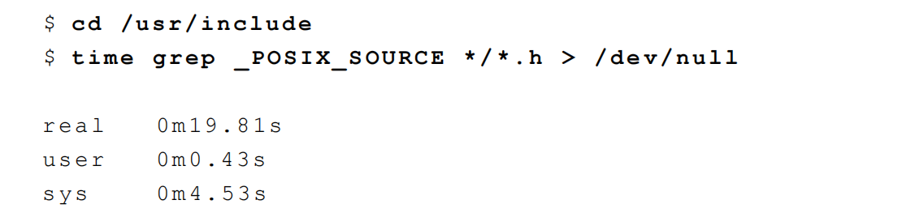

## 系统调用和库函数

​	所有的操作系统都提供多种服务的入口点，由此程序向内核请求服务。各种版本的UNIX都提供经良好定义的有限数目的入口点，经过这些入口点进入内 核，这些入口点被称为系统调用(systemcall)。系 统调用是不能更改的一种UNIX特征。UNIX第7版提供了约50个系统调用，4.3+BSD提供了约110个，而SVR4则提供了约120个。

​		系统调用界面总是在《 UNIX程序员手册 》的第 2部分中说明。其定义也包括在 C语言中。这与很多早期的操作系统不同，这些系统按传统方式在机器的汇编语言中定义内核入口点。

​		UNIX所使用的技术是为每个系统调用在标准C库中设置一个具有同样名字的函数。用户进程用标准C调用序列来调用这些函数，然后，函数又用系统所要求的技术调用相应的内核服务。

​		例如函数可将一个或多个C参数送入通用寄存器，然后执行某个产生软中断进入内核的机器指令。从应用角度考虑，可将系统调用视作为C函数。

​		《UNIX程序员手册》的第3部分定义了程序员可以使用的通用函数。虽然这些函数可能会调用一个或多个内核的系统调用，但是它们并不是内核的入口点。例如，printf函数会调用write系统调用以进行输出操作，但函数strcpy(复制一字符串)和atoi(变换ASCII为整数)并不使用任何系统调用。

​		从执行者的角度来看，系统调用和库函数之间有重 大区别，但从用户角度来看，其区别并不非常重要 。在本书中系统调用和库函数都以C函数的形式出现，两者都对应用程序提供服务，但是，我们应当理 解，如果希望的话，我们可以替换库函数，但是通 常却不能替换系统调用。以存储器分配函数malloc 为例。有多种方法可以进行存储器分配及与其相关 的无用区收集操作(最佳适应，首次适应等)，并不 存在对所有程序都最佳的一种技术。UNIX系统调用 中处理存储器分配的是sbrk(2)，它不是一个通用的存储器管理器。它增加或减少指定字节数的进程地 址空间。如何管理该地址空间却取决于进程。存储 器分配函数malloc(3)实现一种特定类型的分配。如果我们不喜欢其操作方式，则可以定义自己的malloc函数，它可能将使用sbrk系统调用。事实上，有很多软件包，它们实现自己的存储器分配算法，但仍 使用sbrk系统调用。


​		图1-1显示了应用程序、malloc函数以及sbrk系统调用之间的关系。从中可见，两者职责不同，相互分开，内核中的系统调用分配另外一块空间给进程，而库函数malloc则管理这一空间。另一个可说明系统调用和库函数之间的差别的例子是，UNIX提供决定当前时间和日期的界面。某些操作系统提供一个系统调用以返回时间，而另一个则返回日期。

​		任何特殊的处理，例如正常时制和夏时制之间的转换，由内核处理或要求人为干预。 U N I X则不同，它只提供一条系统调用，该系统调用返回国际标准时间 1 9 7 0年1月1日零点以来所经过的秒数。对该值的任何解释，例如将其变换成人们可读的，使用本地时区的时间和日期，都留给用户进程运行。在标准C库中，提供了若干例程以处理大多数情况。这些库函数处理各种细节，例如各种夏时制算法。


​		应用程序可以调用系统调用或者库函数，而很多库函数则会调用系统调用。这在图1-2中显示。系统调用和库函数之间的另一个差别是：系统调用通常提 供一种最小界面，而库函数通常提供比较复杂的功 能。我们从sbrk系统调用和malloc库函数之间的差 别中可以看到这一点，在以后当比较不带缓存的I/O函数（见第3章）以及标准I/O函数（见第5章）时，还将看到这种差别。进程控制系统调用（fork,exec和wait）通常由用户的应用程序直接调用（请回忆 程序1-5中的基本shell）。但是为了简化某些常见 的情况，UNIX系统也提供了一些库函数；例如system和popen。8.12节将说明system函数的一种实现， 它使用基本的进程控制系统调用。10.18节还将强化这一实例以正确地处理信号。为使读者了解大多数 程序员应用的UNIX系统界面，我们不得不既说明系 统调用，只介绍某些库函数。例如若只说明sbrk系 统调用，那么就会忽略很多应用程序使用的malloc 库函数。本书除了必须要区分两者时，都将使用术 语函数（function）来指代系统调用和库函数两者

# UNIX标准化

## 1.1.ISO C

​		1989 年后期，C程序设计语言的ANSI（American National Standards Institute） 标准X3. 15 9-1989得到批准( ANSI 1989) 。此标准已被采用为国际 标准 ISO/IEC 9899:1990。1999年，ISO C给根性为ISO/IEC 9899:1999。按照ISO C标准定义了各个头文件（header），可将ISO C库分成24个区。下表列出了C标准定义的各个头文件。


## 1.2.IEEE POSIX

POSIX是一系列由IEEE（Institute of Electrical and Electronics Engineers）制定的标准，POSIX（Portable Operating System
Interface）是指可移植的操作系统接口。
POSIX标准通常被称为POSIX.1，下面各表总结了POSIX.1指定的必需和可选的头文件。因为POSIX.1包含ISO C标准库函数，所
以还需要ISO C中列出的头文件。
POSIX标准定义的必需的头文件

 


POSIX标准定义的XSI扩展头文件

 


POSIX标准定义的可选头文件

 

POSIX接口可以分为必需接口和可选接口，可选接口按功能又进一步分成50个区，下表总结了没有被弃用的编程接口。


## 1.3.Single UNIX Specification

​		Single UNIX Specification（单一UNIX规范）是POSIX.1标准的一个超集，它定义了一些附加的接口，这些接口扩展了POSIX.1,规范所提供的功能。相应的系统接口全集被称为X/open系统接口（XSI，X/Open System Interface）。__XOPEN_UNIX符号常量标识了XSI扩展的接口。
​		XSI还定义了必须支持POSIX.1中的哪些可选部分才能认为是遵循XSI的（表中的SUS强制要求），只有遵循XSI的实现才能成为UNIX
系统。

## 1.4.FIPS

​		FIPS的含义是联邦信息处理标准（Federal Information Processing Standard），它是由美国政府出版，用于计算机系统的采购，
​		因为FIPS的影响正逐步减退，所以在本书中不再进一步考虑它。

## UNIX主要有三个分支：

1.AT&T分支，导出了系统Ⅲ和系统Ⅴ（UNIX商用版本）
2.加州大学伯克利分校分支，导出了4.xBSD实现。
3.AT&T贝尔实验室的计算机科学研究中心开发的UNIX研究版本，导出UNIX分时系统第8,9版以及于1990年发布的最后一版第10版。


UNIX系统主要有：
SVR4：UNIX SystemⅤ release 4.
4.4BSD：加州大学伯克利分校的计算机系统研究组研究开发和分发的。
FreeBSD：加州大学伯克利分校的计算机系统研究组决定终止其在UNIX操作系统的BSD版本上的研发中作后，设立了FreeBSD项目。
LINUX：其实不是UNIX，linux使用的是linux内核，只是提供了UNIX编程环境
Mac OS X：核心操作系统成为Darwin，基于Mach内核和FreeBSD系统的组合。
Solaris：由Sun公司开发的UNIX系统版本。
AIX：IBM版的UNIX。
HP-UX：HP版的UNIX。
IRIX：Silicon Graphics版的UNIX。
Unix Ware：SVR4派生的UNIX系统。


3.限制
UNIX系统实现定义了很多变量和常量，而且每个实现可能都不一样，为了能够促进标准化（有助于软件的可移植性），使用以下两种
类型的限制：
1.编译时限制（例如：短整型最大值是多少？）
2.运行时限制（例如：文件名可以有多少个字符？）
对于上面的2种限制具体是怎么实现的呢：
1.编译是限制（使用头文件）
2.不与文件或目录相关联的运行时限制（使用sysconf函数）
3.与文件或目录相关联的运行时限制（使用pathconf函数和fpathconf函数）

## 3.1.ISO C限制

ISO C定义的限制都是编译时限制。限制的常量都定义在头文件中，而且在一个系统中不会改变，例如在linux系统的/usr/include/limits.h
文件中定义了ISO C限制。

## 3.2.POSIX限制

POSIX.1的限制和常量被分成下列5类。
1.不变的最小值，如下图所示：


2.不变值：SSIZE_MAX
3.运行时可以增加的值：

​		CHARCLASS_NAME_MAX

​		COLL_WEIGHTS_MAX

​		LINE_MAX

​		NGROUPS_MAX

​		RE_DUP_MAX。
4.运行时不变的值（可能不确定）：

| ARG_MAX       | CHILD_MAX      |
| ------------- | -------------- |
| HOST_NAME_MAX | LOGIN_NAME_MAX |
| OPEN_MAX      | PAGE_SIZE      |
| RE_DUP_MAX    | STREAM_MAXS    |
| SYMLOOP_MAX   | TTY_NAME_MAX   |
| TZNAME_MAX    |                |

5.路径名可变值（可能不确定）：

| FILESIZEBITS | LINK_MAX    |
| ------------ | ----------- |
| MAX_CANON    | MAX_INPUT   |
| NAME_MAX     | PATH_MAX    |
| PIPE_BUFF    | SYMLINK_MAX |

## 3.3.XSI限制

XSI还定义了处理实现限制的下面几个常量：
1.不变最小值。


2.数值限制：LONG_BIT和WORD_BIT.
3.运行时不变值（可能不确定）：ATEXIT_MAX，IOV_MAX和PAGE_SIZE。
3.4.sysconf函数，pathconf函数和fpathconf函数
这3个函数都是获取运行时限制时取得的。定义如下：

```C
#include <unistd>  
long sysconf( int name );  
long pathconf( const char *pathname, int name  );  
long fpathconf( int fd, int name );
```

sysconf函数的限制及name参数如下：


pathconf函数和fpathconf函数的限制及name参数如下：


这3个函数返回值代表的含义如下：
1.如果name不在上面的2个表中，则函数返回-1.并将errno设置为EINVAL。
2.有些name返回-1，这表示该值是不确定的，此时并不改变errno的值。
可以使用下面的代码判断函数返回值：

```
long val;
errno = 0;
if((val = sysconf(name)) < 0){
	if(errno != 0){
		if(errno == EINVAL){
			printf("not supported.\n");
		}else{
			printf("sysconf error");
		}
	} else {
		printf("no limit\n");	
	}
}else{
	printf("%ld\n",val);
}
```

## 4.选项

​		在介绍POSIX标准是讲到了POSIX的选项（可选接口），如果我们程序与选项相关，需要确定系统是否支持该选项。

​		XSI定义了3种处理方法：

1.编译时预定义在<unistd.h>中。

2.与文件或目录无关的选项用sysconf函数确定。（name参数前缀_POSIX必须替换为_SC）

3.与文件或目录相关的选项用pathconf或fpathconf函数确定。（name参数前缀`_POSIX`必须替换为`_PC`）

​		如果符号常量未定义，则必须调用sysconf，pathconf或fpathconf以确定相应的选项是否受到支持。

​		如果该平台定义了符号常量，则有3种可能：

1.如果符号常量定义为-1，那么该平台不支持相应的选项。

2.如果符号常量定义大于0，那么该平台支持相应的选项。

3.如果符号常量定义为0，则必须调用sysconf，pathconf或fpathconf以确定相应的选项是否受到支持。

## 基本系统数据类型

​		我们在`sys/types.h`中已经定义了一些常见的数据类型


# 文件I/O(I)

## Introduction

​		下面。我们将会从打开文件、读文件、写文件等等。

​		大多数UNIX文件I/O只需用到5个函数：open、read、write、lseek以及close。然后说明不同缓存器长度对read和write函数的影响。

​		本章所说明的函数经常被称之为不带缓存的I/O（unbufferedI/O，与将在第5章中说明的标准I/O函数相对照）。术语——不带缓存指的是每个read和write都调用内核中的一个系统调用。这些不带缓存的I/O函数不是ANSIC的组成部分，但是是POSIX.1和XPG3的组成部分。只要涉及在多个进程间共享资源，原子操作的概念就变成非常重要。我们将通过文件I/O和传送给open函数的参数来讨论此概念。并进一步讨论在多个进程间如何共享文件，并涉及内核的有关数据结构。在讨论了这些特征后，将说明dup、fcntl和ioctl函数。

## 文件描述符

​		现在，对于内核而言，所有打开文件都由文件描述符引用。文件描述符是一个非负整数。当打开一个现存文件或创建一个新文件时，内核向进程返回一个文件描述符。当读、写一个文件时，用open或creat返回的文件描述符标识该文件，将其作为参数传送给read或write。

​		UNIX shell使文件描述符0与进程的标准输入相结合，文件描述符 1与标准输出相结合，文件描述符2与标准出错输出相结合。这是UNIX shell以及很多应用程序使用的惯例，而与内核无关。尽管如此，如果不遵照这种惯例，那么很多 U N I X应用程序就不能工作。

​		在POSIX.1应用程序中，幻数0、1、2应被代换成符号常数STDIN_FILENO、STDOUT_FILENO和STDERR_FILENO。这些常数都定义在头文件<unistd.h>中。

### 扩展

#### **前情概要**

通过上一篇 **Go IO 的姿势**， 我们看到有两种文件读写的方式，一种是系统调用的方式，接受和操作的对象是一个整数 fd，另一种是 Go 标准库自己封装的标准库 IO ，操作对象是 Go 封装的 `file` 结构体，但其内部还是针对整数 fd 的操作。所以一切的本源是通过 fd 来操作的，那么，这个 fd 究竟是什么？就这个点我们深入剖析。

#### **`fd` 是什么？**

`fd` 是 `File descriptor` 的缩写，中文名叫做：**文件描述符**。**文件描述符**是一个非负整数，**本质上是一个索引值**（这句话非常重要）。

**什么时候拿到的 `fd` ？**

当打开一个文件时，内核向进程返回一个文件描述符（ `open` 系统调用得到 ），后续 `read`、`write` 这个文件时，则只需要用这个**文件描述符**来标识该文件，将其作为参数传入 `read`、`write` 。

**fd 的值范围是什么？**

在 POSIX 语义中，0，1，2 这三个 fd 值已经被赋予特殊含义，分别是标准输入（ STDIN_FILENO ），标准输出（ STDOUT_FILENO ），标准错误（ STDERR_FILENO ）。

文件描述符是有一个范围的：0 ～ OPEN_MAX-1 ，最早期的 UNIX 系统中范围很小，现在的主流系统单就这个值来说，变化范围是几乎不受限制的，只受到系统硬件配置和系统管理员配置的约束。

你可以通过 `ulimit` 命令查看当前系统的配置：

```text
➜  ulimit -n
4864
```

如上，我们系统上进程默认最多打开 4864 文件。

```
ulimit: ulimit [-SHabcdefiklmnpqrstuvxPT] [limit]
    Modify shell resource limits.
    
    Provides control over the resources available to the shell and processes
    it creates, on systems that allow such control.
    
    Options:
      -S	use the `soft' resource limit
      -H	use the `hard' resource limit
      -a	all current limits are reported
      -b	the socket buffer size
      -c	the maximum size of core files created
      -d	the maximum size of a process's data segment
      -e	the maximum scheduling priority (`nice')
      -f	the maximum size of files written by the shell and its children
      -i	the maximum number of pending signals
      -k	the maximum number of kqueues allocated for this process
      -l	the maximum size a process may lock into memory
      -m	the maximum resident set size
      -n	the maximum number of open file descriptors
      -p	the pipe buffer size
      -q	the maximum number of bytes in POSIX message queues
      -r	the maximum real-time scheduling priority
      -s	the maximum stack size
      -t	the maximum amount of cpu time in seconds
      -u	the maximum number of user processes
      -v	the size of virtual memory
      -x	the maximum number of file locks
      -P	the maximum number of pseudoterminals
      -T	the maximum number of threads
    
    Not all options are available on all platforms.
    
    If LIMIT is given, it is the new value of the specified resource; the
    special LIMIT values `soft', `hard', and `unlimited' stand for the
    current soft limit, the current hard limit, and no limit, respectively.
    Otherwise, the current value of the specified resource is printed.  If
    no option is given, then -f is assumed.
    
    Values are in 1024-byte increments, except for -t, which is in seconds,
    -p, which is in increments of 512 bytes, and -u, which is an unscaled
    number of processes.
    
    Exit Status:
    Returns success unless an invalid option is supplied or an error occurs.
```


#### **窥探 Linux 内核**

`fd` 究竟是什么？必须去 Linux 内核看一眼。

用户使用系统调用 `open` 或者 `creat` 来打开或创建一个文件，用户态得到的结果值就是 `fd` ，后续的 `IO` 操作全都是用 `fd` 来标识这个文件，可想而知内核做的操作并不简单，我们接下来就是要揭开这层面纱。

#### **`task_struct`**

首先，我们知道进程的抽象是基于 `struct task_struct` 结构体，这是 Linux 里面最复杂的结构体之一 ，成员字段非常多，我们今天不需要详解这个结构体，我稍微简化一下，只提取我们今天需要理解的字段如下：

```text
struct task_struct {
    // ...
    /* Open file information: */
    struct files_struct     *files;
    // ...
}
```

**`files;` 这个字段就是今天的主角之一**，`files` 是一个指针，指向一个为 `struct files_struct` 的结构体。这个结构体就是用来管理该进程**打开的所有文件**的管理结构。

**重点理解一个概念：**

**`struct task_struct` 是进程的抽象封装**，标识一个进程，在 Linux 里面的进程各种抽象视角，都是这个结构体给到你的。当创建一个进程，其实也就是 `new` 一个 `struct task_struct` 出来；

#### **`files_struct`**

好，上面通过进程结构体引出了 `struct files_struct` 这个结构体。**这个结构体管理某进程打开的所有文件的管理结构**，这个结构体本身是比较简单的：

```C
/*
 * Open file table structure
 */
struct files_struct {
    // 读相关字段
    atomic_t count;
    bool resize_in_progress;
    wait_queue_head_t resize_wait;

    // 打开的文件管理结构
    struct fdtable __rcu *fdt;
    struct fdtable fdtab;

    // 写相关字段
    unsigned int next_fd;
    unsigned long close_on_exec_init[1];
    unsigned long open_fds_init[1];
    unsigned long full_fds_bits_init[1];
    struct file * fd_array[NR_OPEN_DEFAULT];
};
```

`files_struct` 这个结构体我们说是用来管理所有打开的文件的。怎么管理？本质上就是数组管理的方式，所有打开的文件结构都在一个数组里。这可能会让你疑惑，数组在那里？有两个地方：

1. `struct file * fd_array[NR_OPEN_DEFAULT]` 是一个静态数组，随着 `files_struct` 结构体分配出来的，在 64 位系统上，静态数组大小为 64；
2. `struct fdtable` 也是个数组管理结构，只不过这个是一个动态数组，数组边界是用字段描述的；

**思考：为什么会有这种静态 + 动态的方式？**

性能和资源的权衡 ！大部分进程只会打开少量的文件，所以静态数组就够了，这样就不用另外分配内存。如果超过了静态数组的阈值，那么就动态扩展。

可以回忆下，这个是不是跟 `inode` 的直接索引，一级索引的优化思路类似。

#### **`fdtable`**

简单介绍下 `fdtable` 结构体，这个结构体就是封装用来管理 `fd` 的结构体，`fd` 的秘密就在这个里面。简化结构体如下：

```text
struct fdtable {
    unsigned int max_fds;
    struct file __rcu **fd;      /* current fd array */
};
```

注意到 `fdtable.fd` 这个字段是一个二级指针，什么意思？

就是指向 `fdtable.fd` 是一个指针字段，指向的内存地址还是存储指针的（元素指针类型为 `struct file *` ）。换句话说，`fdtable.fd` 指向一个数组，数组元素为指针（指针类型为 `struct file *`）。

其中 `max_fds` 指明数组边界。

#### **`files_struct` 小结**

`file_struct` 本质上是用来管理所有打开的文件的，内部的核心是由一个**静态数组**和**动态数组**管理结构实现。

**还记得上面我们说文件描述符 `fd` 本质上就是索引吗？这里就把概念接上了，`fd` 就是这个数组的索引，也就是数组的槽位编号而已。** 通过非负数 `fd` 就能拿到对应的 `struct file` 结构体的地址。

我们把概念串起来（注意，这里为了突出 `fd` 的本质,把 `fdtable` 管理简化掉）：


- `fd` 真的就是 `files` 这个字段指向的指针数组的索引而已（仅此而已）。通过 `fd` 能够找到对应文件的 `struct file` 结构体；

#### **`file`**

现在我们知道了 `fd` 本质是数组索引，数组元素是 `struct file` 结构体的指针。那么这里就引出了一个 `struct file` 的结构体。这个结构体又是用来干什么的呢？

这个结构体是用来表征进程打开的文件的。简化结构如下：

```text
struct file {
    // ...
    struct path                     f_path;
    struct inode                    *f_inode;
    const struct file_operations    *f_op;

    atomic_long_t                    f_count;
    unsigned int                     f_flags;
    fmode_t                          f_mode;
    struct mutex                     f_pos_lock;
    loff_t                           f_pos;
    struct fown_struct               f_owner;
    // ...
}
```

这个结构体非常重要，它标识一个进程打开的文件，下面解释 IO 相关的几个最重要的字段：

- `f_path` ：标识文件名
- `f_inode` ：非常重要的一个字段，`inode` 这个是 vfs 的 `inode` 类型，是基于具体文件系统之上的抽象封装；
- `f_pos` ： 这个字段非常重要，偏移，对，**就是当前文件偏移**。还记得上一篇 IO 基础里也提过偏移对吧，指的就是这个，`f_pos` 在 `open` 的时候会设置成默认值，`seek` 的时候可以更改，从而影响到 `write/read` 的位置；

#### **思考问题**

**思考问题一：`files_struct` 结构体只会属于一个进程，那么`struct file` 这个结构体呢，是只会属于某一个进程？还是可能被多个进程共享？**

**划重点：`struct file` 是属于系统级别的结构，换句话说是可以共享与多个不同的进程。**

**思考问题二：什么时候会出现多个进程的 `fd` 指向同一个 `file` 结构体？**

比如 `fork` 的时候，父进程打开了文件，后面 `fork` 出一个子进程。这种情况就会出现共享 `file` 的场景。如图：


**思考问题三：在同一个进程中，多个 `fd` 可能指向同一个 file 结构吗？**

可以。`dup` 函数就是做这个的。

```text
#include <unistd.h>
int dup(int oldfd);
int dup2(int oldfd, int newfd);
```

#### **inode**

我们看到 `struct file` 结构体里面有一个 inode 的指针，也就自然引出了 inode 的概念。这个指向的 inode 并没有直接指向具体文件系统的 inode ，而是操作系统抽象出来的一层虚拟文件系统，叫做 **VFS （ Virtual File System ）**，然后在 VFS 之下才是真正的文件系统，比如 ext4 之类的。

完整架构图如下：


**思考：为什么会有这一层封装呢？**

其实很容里理解，就是解耦。如果让 `struct file` 直接和 `struct ext4_inode` 这样的文件系统对接，那么会导致 `struct file` 的处理逻辑非常复杂，因为每对接一个具体的文件系统，就要考虑一种实现。所以操作系统必须把底下文件系统屏蔽掉，对外提供统一的 `inode` 概念，对下定义好接口进行**回调注册**。这样让 `inode` 的概念得以统一，Unix 一切皆文件的基础就来源于此。

再来看一样 VFS 的 `inode` 的结构：

```text
struct inode {
    // 文件相关的基本信息（权限，模式，uid，gid等）
    umode_t             i_mode;
    unsigned short      i_opflags;
    kuid_t              i_uid;
    kgid_t              i_gid;
    unsigned int        i_flags;
    // 回调函数
    const struct inode_operations   *i_op;
    struct super_block              *i_sb;
    struct address_space            *i_mapping;
    // 文件大小，atime，ctime，mtime等
    loff_t              i_size;
    struct timespec64   i_atime;
    struct timespec64   i_mtime;
    struct timespec64   i_ctime;
    // 回调函数
    const struct file_operations    *i_fop;
    struct address_space            i_data;
    // 指向后端具体文件系统的特殊数据
    void    *i_private;     /* fs or device private pointer */
};
```

其中包括了一些基本的文件信息，包括 uid，gid，大小，模式，类型，时间等等。

一个 vfs 和 后端具体文件系统的纽带：`i_private` 字段。**用来传递一些具体文件系统使用的数据结构。

至于 `i_op` 回调函数在构造 `inode` 的时候，就注册成了后端的文件系统函数，比如 ext4 等等。

**思考问题：通用的 VFS 层，定义了所有文件系统通用的 inode，叫做 vfs inode，而后端文件系统也有自身特殊的 inode 格式，该格式是在 vfs inode 之上进行扩展的，怎么通过 vfs inode 怎么得到具体文件系统的 inode 呢？**

下面以 ext4 文件系统举例（因为所有的文件系统套路一样），ext4 的 inode 类型是 `struct ext4_inode_info` 。

**划重点**：方法其实很简单，这个是属于 c 语言一种常见的（也是特有）编程手法：强转类型。**vfs inode 出生就和 `ext4_inode_info` 结构体分配在一起的，直接通过 vfs inode 结构体的地址强转类型就能得到 `ext4_inode_info` 结构体**。

```text
struct ext4_inode_info {
    // ext4 inode 特色字段
    // ...
    
    // 重要！！！
    struct inode    vfs_inode;  
};
```

举个例子，现已知 inode 地址和 vfs_inode 字段的内偏移如下：

- inode 的地址为 0xa89be0；
- `ext4_inode_info` 里有个内嵌字段 vfs_inode，类型为 `struct inode` ，该字段在结构体内偏移为 64 字节；

则可以得到：

`ext4_inode_info` 的地址为

```text
(struct ext4_inode_info *)(0xa89be0 - 64)
```

强转方法使用了一个叫做 `container_of` 的宏，如下：

```text
// 强转函数
static inline struct ext4_inode_info *EXT4_I(struct inode *inode)
{
   return container_of(inode, struct ext4_inode_info, vfs_inode);
}

// 强转实际封装
#define container_of(ptr, type, member) \
    (type *)((char *)(ptr) - (char *) &((type *)0)->member)
#endif
```

所以，你懂了吗？

分配 inode 的时候，其实分配的是 `ext4_inode_info` 结构体，包含了 vfs inode，然后对外给出去 vfs_inode 字段的地址即可。VFS 层拿 inode 的地址使用，底下文件系统强转类型后，取外层的 inode 地址使用。

举个 ext4 文件系统的例子：

```text
static struct inode *ext4_alloc_inode(struct super_block *sb)
{
    struct ext4_inode_info *ei;

    // 内存分配，分配 ext4_inode_info 的地址
    ei = kmem_cache_alloc(ext4_inode_cachep, GFP_NOFS);

    // ext4_inode_info 结构体初始化

    // 返回 vfs_inode 字段的地址
    return &ei->vfs_inode;
}
```

vfs 拿到的就是这个 inode 地址。


**划重点：inode 的内存由后端文件系统分配，vfs inode 结构体内嵌在不同的文件系统的 inode 之中。不同的层次用不同的地址，ext4 文件系统用 `ext4_inode_info` 的结构体的地址，vfs 层用 `ext4_inode_info.vfs_inode` 字段的地址。**

这种用法在 C 语言编程中很常见，算是 C 的特色了（仔细想想，这种用法和**面向对象的多态**的实现异曲同工）。

**思考问题：怎么理解 vfs `inode` 和 `ext2_inode_info`，`ext4_inode_info` 等结构体的区别？**

所有文件系统共性的东西抽象到 vfs `inode` ，不同文件系统差异的东西放在各自的 `inode` 结构体中。

#### **小结梳理**

当用户打开一个文件，用户只得到了一个 `fd` 句柄，但内核做了很多事情，梳理下来，我们得到几个关键的数据结构，这几个数据结构是有层次递进关系的，我们简单梳理下：

1. 进程结构 `task_struct` ：表征进程实体，每一个进程都和一个 `task_struct` 结构体对应，其中 `task_struct.files` 指向一个管理打开文件的结构体 `fiels_struct` ；
2. 文件表项管理结构 `files_struct` ：用于管理进程打开的 open 文件列表，内部以数组的方式实现（静态数组和动态数组结合）。返回给用户的 `fd` 就是这个数组的**编号索引**而已，索引元素为 `file` 结构；

- `files_struct` 只从属于某进程；

1. 文件 `file` 结构：表征一个打开的文件，内部包含关键的字段有：**当前文件偏移，inode 结构地址**；

- 该结构虽然由进程触发创建，但是 `file` 结构可以在进程间共享；

1. vfs `inode` 结构体：文件 `file` 结构指向 的是 vfs 的 `inode` ，这个是操作系统抽象出来的一层，用于屏蔽后端各种各样的文件系统的 `inode` 差异；

- inode 这个具体进程无关，是文件系统级别的资源；

1. ext4 `inode` 结构体（指代具体文件系统 inode ）：后端文件系统的 `inode` 结构，不同文件系统自定义的结构体，ext2 有 `ext2_inode_info`，ext4 有`ext4_inode_info`，minix 有 `minix_inode_info`，这些结构里都是内嵌了一个 vfs `inode` 结构体，原理相同；

**完整的架构图：**


#### **思考实验**

现在我们已经彻底了解 fd 这个所谓的非负整数代表的深层含义了，我们可以准备一些 IO 的思考举一反三。

文件读写（ IO ）的时候会发生什么？

- 在完成 write 操作后，在文件 `file` 中的当前文件偏移量会增加所写入的字节数，如果这导致当前文件偏移量超处了当前文件长度，则会把 inode 的当前长度设置为当前文件偏移量（也就是文件变长）
- `O_APPEND` 标志打开一个文件，则相应的标识会被设置到文件 `file` 状态的标识中，每次对这种具有追加写标识的文件执行 `write` 操作的时候，`file` 的当前文件偏移量首先会被设置成 `inode` 结构体中的文件长度，这就使得每次写入的数据都追加到文件的当前尾端处（该操作对用户态提供原子语义）；
- 若一个文件 `seek` 定位到文件当前的尾端，则 `file` 中的当前文件偏移量设置成 `inode` 的当前文件长度；
- `seek` 函数值修改 `file` 中的当前文件偏移量，不进行任何 `I/O` 操作；
- 每个进程对有它自己的 `file`，其中包含了当前文件偏移，当多个进程写同一个文件的时候，由于一个文件最终是落到全局唯一的一个 `inode` 上，这种并发场景则可能产生用户不可预期的结果；

#### **总结**

**回到初心，理解 fd 的概念有什么用？**

一切 IO 的行为到系统层面都是以 `fd` 的形式进行。无论是 C/C++，Go，Python，JAVA 都是一样，任何语言都是一样，这cai是最本源的东西，理解了 `fd` 关联的一系列结构，你才能对 IO 游刃有余。

下面做个简要的总结：

1. 从姿势上来讲，用户 `open` 文件得到一个非负数句柄 `fd`，之后针对该文件的 IO 操作都是基于这个 `fd` ；
2. 文件描述符 `fd` 本质上来讲就是数组索引，`fd` 等于 5 ，那对应数组的第 5 个元素而已，该数组是进程打开的所有文件的数组，数组元素类型为 `struct file`；
3. 结构体 `task_struct` 对应一个抽象的进程，`files_struct` 是这个进程管理**该进程打开的文件**数组管理器。`fd` 则对应了这个数组的编号，每一个打开的文件用 `file` 结构体表示，内含当前偏移等信息；
4. `file` 结构体可以为进程间共享，属于系统级资源，同一个文件可能对应多个 `file` 结构体，`file` 内部有个 `inode` 指针，指向文件系统的 `inode`；
5. `inode` 是文件系统级别的概念，只由文件系统管理维护，不因进程改变（ `file` 是进程出发创建的，进程 `open` 同一个文件会导致多个 `file` ，指向同一个 `inode` ）；

## open函数

​		调用open函数可以打开或创建一个文件。

​		我们将第三个参数写为 . . .，这是ANSI C说明余下参数的数目和类型可以变化的方法。对于open函数而言，仅当创建新文件时才使用第三个参数。（我们将在稍后对此进行说明。）在函数原型中此参数放置在注释中。

​		*pathname*是要打开或创建的文件的名字。*oflag*参数可用来说明此函数的多个选择项。用下列一个或多个常数进行或运算构成*oflag*参数(这些常数定义在<fcntl.h>头文件中)：

• O_RDONLY 只读打开。

• O_WRONLY 只写打开。

• O_RDWR 读、写打开。

在这三个常数中应当只指定一个。下列常数则是可选择的：

| 参数       | 说明                                                         |
| ---------- | ------------------------------------------------------------ |
| O_APPEND   | 每次写时都加到文件的尾端。(正如这个单词APPEND的意思)         |
| O_CREAT    | 若此文件不存在则创建它。使用此选择项时，需同时说明第三个参数 *mode*,用其说明该新文件的存取许可权位。（CREATE） |
| O_EXCL     | 如果同时指定了O_CREAT，而文件已经存在，则出错。这可测试一个文件是否存在，如果不存在则创建此文件成为一个原子操作。 |
| O_TRUNC    | 如果此文件存在，而且为只读或只写成功打开，则将其长度截短为 0。 |
| O_NOCTTY   | 如果*pathname*指的是终端设备，则不将此设备分配作为此进程的控制终端。 |
| O_NONBLOCK | 如果*pathname*指的是一个FIFO、一个块特殊文件或一个字符特殊文件，则此选择项为此文件的本 次打开操作和后续的I/O操作设置非阻塞方式。<br>[扩展]：`{`较早的系统V版本引入了O_NDELAY（不延迟）标志，它与O_NONBLOCK（不阻塞）选择项类似，但在读操作的返回值中具有两义性。如果不能从管道、FIFO或设备读得数据，则不延迟选择项使read返回0，这与表示已读到文件尾端的返回值0相冲突。SVR4仍支持这种语义的不延迟选择项，但是新的应用程序应当使用不阻塞选择项以代替之。`}` |
| O_SYNC     | 使每次write都等到物理I / O操作完成。<br/>[扩展]`{` O_SYNC选择项不是POSIX.1的组成部分，但SVR4支持此选择项。`}` |

​		由open返回的文件描述符一定是最小的未用描述符数字。这一点被很多应用程序用来在标准输入、 标准输出或标准出错输出上打开一个新的文件。例如，一个应用程序可以先关闭标准输出(通常是文件描述符1)，然后打开另一个文件，事先就能了解到该文件一定会在文件描述符1上打开。

​		如果NAME_MAX是14，而我们却试图在当前目录中创建一个其文件名包含15个字符的新文件，此时会 发生什么呢?按照传统，**早期的系统V版本，允许这种使用方法，但是总是将文件名截短为14个字符 ，而BSD类的系统则返回出错ENAMETOOLONG。**这一问题不仅仅与创建新文件有关。如果NAME_MAX是14，而存在一个其文件名恰恰就是14个字符的文件，那么以*pathname*作为其参数的任一函数(open,stat等)都会遇到这一问题。在POSIX.1中，常数_POSIX_NO_TRUNC决定了是否要截短过长的文件名或 路径名，或者返回一个出错。

​		FIPS 151-1要求返回出错。

​		SVR4对传统的系统V文件系统(S5)并不保证返回出错(见表2-6)，但是对BSD风格的文件系统(UFS)，SVR4保证返回出错，4.3+BSD总是返回出错。

​		若`_POSIX_NO_TRUNC`有效，则在整个路径名超过`PATH_MAX`，或路径名中的任一文件名超过`NAME_MAX`时，返回出错`ENAMETOOLONG。`

### create函数

```C
#include <sys/types.h>
#include <sys/stat.h>
#include <fcntl.h>
int creat(const char *pathname, mode_t mode);
// 返回：若成功为只写打开的文件描述符，若出错为-1
```

​		注意，此函数等效于：

```
open(pathname,O_WRONL｜YO_CREAT｜O_TRUNC,mode)
```

​		在早期的UNIX版本中，open的第二个参数只能是0、1或2。没有办法打开一个尚未存在的文件，因此需要另一个系统调用creat以创建新文件。现在，open函数提供了选择项O_CREAT和O_TRUNC，于是也就不再需要creat函数了。

​		creat的一个不足之处是它以只写方式打开所创建的文件。在提供open的新版本之前，如果 要创建一个临时文件，并要先写该文件，然后又读该文件，则必须先调用creat，close，然后再调用open。现在则可用下列方式调用open：

```C++
open(pathname,O_RDWR｜O_CREAT｜O_TRUNC,mode)
```

### close函数

​		可用`close`函数关闭一个打开文件：

```C++
#include<unistd.h>

int close(int filedes);
```

​		关闭一个文件时也释放该进程加在该文件上的所有记录锁。

​		当一个进程终止时，它所有的打开文件都由内核自动关闭。很多程序都使用这一功能而不显式地用c l o s e关闭打开的文件。

​		每个打开文件都有一个与其相关联的“当前文件位移量”。它是一个非负整数，用以度量从文件开始处计算的字节数。(本节稍后将对“非负”这一修饰词的某些例外进行说明。 )通常，读、写操作都从当前文件位移量处开始，并使位移量增加所读或写的字节数。按系统默认，当打开一个文件时，除非指定`O_APPEND`选择项，否则该位移量被设置为0。也就是从头开始编写

​		可以调用lseek显式地定位一个打开文件。

```
#include <sys/types.h>
#include <unistd.h>

off_t lseek(intfiledes, off_toffset, intwhence);
```

​		对参数*offset* 的解释与参数*whence*的值有关。

​		• 若*whence*是SEEK_SET，则将该文件的位移量设置为距文件开始处*offset* 个字节。

​		• 若*whence*是SEEK_CUR，则将该文件的位移量设置为其当前值加*offset, offset*可正或负。

​		• 若*whence*是SEEK_END，则将该文件的位移量设置为文件长度加*offset, offset*可为正或负。

​		若lseek成功执行，则返回新的文件位移量，为此可以用下列方式确定一个打开文件的当前位移量：

```
off_t currpos;
currpos = lseek(fd, 0, SEEK_CUR);
```

​		这种方法也可用来确定所涉及的文件是否可以设置位移量。如果文件描述符引用的是一个管道或FIFO，则lseek返回－1，并将errno设置为EPIPE。

​		三个符号常数SEEK_SET，SEEK_CUR和SEEK_END是由系统V引进的。在系统V之前，whence被指定为0(绝对位移量)，1(相对于当前位置的位移量)或2(相对文件尾端的位移量)。很多软件 仍直接使用这些数字进行编码。在lseek中的字符l表示长整型。在引入off_t数据类型之前 ，*offset*参数和返回值是长整型的。lseek是由V7引进的，当时C语言中增加了长整型。( 在V6中，用函数seek和tell提供类似功能。)

```C
#include<sys/types.h>
#include "apue.h"

int main(void)
{
    if(lseek(STDIN_FILENO,0,SEEK_CUR) == -1)
        printf("Failed seeking!");
    else
        printf("seek able!");

    exit(0);
}
```


​		通常，文件的当前位移量应当是一个非负整数，但是，某些设备也可能允许负的位移量。但对于普通文件，则其位移量必须是非负值。因为位移量可能是负值，所以在比较 l s e e k的返回值时应当谨慎，不要测试它是否小于0，而要测试它是否等于－1。

​		注意：在80386上运行的SVR4支持/dev/kmem设备，它可以具有负的位移量。因为位移量（off_t）是带符号数据类型，所以文件最大长度减少一半。例如，若off_t是32位整型，则文件最大长度是$2^{31}$字节。

​		l s e e k仅将当前的文件位移量记录在内核内，它并不引起任何 I / O操作。然后，该位移量用于下一个读或写操作。

​		文件位移量可以大于文件的当前长度，在这种情况下，对该文件的下一次写将延长该文件，并在文件中构成一个空调，这一点是允许的。位于文件中但没有写过的字节都被读为 0

​		我们看看是不是这样

```C
#include "apue.h"
#include<fcntl.h>

char buf1[] = "abcdefghij";
char buf2[] = "ABCDEFGHIJ";

int main(void)
{
    int fd;
    if(
        (fd = creat("file.hole",FILE_MODE)) < 0
    ){
        err_sys("create error\n");
    }

    if(
        write(fd,buf1,10) != 10
        ){
            err_sys("Fetch error in writing buf1\n");
        }
    /*Caution for offset now == 10*/

    if(
        lseek(fd,40,SEEK_SET) == -1
    ){
        err_sys("lseek error");
    }

    if(write(fd,buf2,10) != 10){
        err_sys("Fetch error in writing buf2\n");
    }
    /*Caution for offset now == 10*/
    /* NOW IS 50 */
    exit(0);
}   
```

​		这是我在bash得到的结果——

```
charliechen114514@ubuntu:~/LinuxAdvancedProgram/10.createVOIDFile/output$ ls -l file.hole 
-rw-r--r-- 1 charliechen114514 charliechen114514 50 7月  17 07:47 file.hole
charliechen114514@ubuntu:~/LinuxAdvancedProgram/10.createVOIDFile/output$ od -c file.hole 
0000000   a   b   c   d   e   f   g   h   i   j  \0  \0  \0  \0  \0  \0
0000020  \0  \0  \0  \0  \0  \0  \0  \0  \0  \0  \0  \0  \0  \0  \0  \0
0000040  \0  \0  \0  \0  \0  \0  \0  \0   A   B   C   D   E   F   G   H
0000060   I   J
```

​		使用od(1)命令观察该文件的实际内容。命令行中的-c标志表示以字符方式打印文件容。从中可以看到，文件中间的30个未写字节都被读成为0。每一行开始的一个七位数是以八进制 形式表示的字节位移量。

### read函数

​		用read函数从打开文件中读数据。

```C++
#include<unistd.h>

ssize_t read(int filedes, void buff, sise_t nbytes);
```

​		如read成功，则返回读到的字节数。如已到达文件的尾端，则返回 0。有多种情况可使实际读到的字节数少于要求读字节数：

​		• 读普通文件时，在读到要求字节数之前已到达了文件尾端。例如，若在到达文件尾端之前还有3 0个字节，而要求读1 0 0个字节，则r e a d返回3 0，下一次再调用r e a d时，它将返回0 (文件尾端)。

​		• 当从终端设备读时，通常一次最多读一行

​		• 当从网络读时，网络中的缓冲机构可能造成返回值小于所要求读的字节数。

​		• 某些面向记录的设备，例如磁带，一次最多返回一个记录。

​		读操作从文件的当前位移量处开始，在成功返回之前，该位移量增加实际读得的字节数。

​		POSIX.1在几个方面对此函数的原型作了更改。其经典定义是：

```
int read(intfiledes,charbuff,unsignednbytes);
```

​		首先，为了与ANSIC一致，其第二个参数由char*改为void*。在ANSIC中，类型void*用于表示类属指针。其次，其返回值必须是一个带符号整数（ssize_t），以返回正字节数、0（表示文件尾端）或－1（出错）。最后，第三个参数在历史上是一个不带符号整数，以允许一 个16位的实现可以一次读或写至65534个字节。在1990POSIX.1标准中，引进了新的基本系统数据类型ssize_t 以提供带符号的返回值，size_t则被用于第三个参数.

### write函数

​		用write函数向打开文件写数据。

```
#include <unistd.h>
ssize_t write(int filedes,const void* buff,size_t nbytes);
// 返回：若成功为已写的字节数，若出错为- 1
```

​		其返回值通常与参数*nbytes*的值不同，否则表示出错。write出错的一个常见原因是：磁 盘已写满，或者超过了对一个给定进程的文件长度限制。对于普通文件，写操作从文件的当前位移量处开始。如果在打开该文件时，指定了O_APPEND选择项，则在每次写操作之前，将文件位移量设置在文件的当前结尾处。在一次成功写之后，该文件位移量增加实际写的字节数。

​		下面的这个程序只使用read和write函数来复制一个文件。关于该程序应注意下列各点：

​		• 它从标准输入读，写至标准输出，这就假定在执行本程序之前，这些标准输入、输出已由shell安排好。确实，所有常用的UNIX shell都提供一种方法，它在标准输入上打开一个文件用于读，在标准输出上创建(或重写)一个文件。

​		• 很多应用程序假定标准输入是文件描述符0，标准输出是文件描述符1。本例中则用两个在<unistd.h>中定义的名字STDIN_FILENO和STDOUT_FILENO。

​		• 考虑到进程终止时，UNIX会关闭所有打开文件描述符，所以此程序并不关闭输入和输出文件。

​		• 本程序对文本文件和二进制代码文件都能工作，因为对UNIX内核而言，这两种文件并无区别。

```C 
#include"apue.h"

#define BUFFSIZE 8192

int main(void)
{
    int     n;
    char    buf[BUFFSIZE];

    while(
        (n = read(STDIN_FILENO,buf,BUFFSIZE)) > 0
    )
    {
        if(write(STDOUT_FILENO, buf, n) != 0)
            err_sys("Write Error");
    }

    if( n < 0 )
    {
        err_sys("read error");
    }

    exit(0);
}
```

​		我们没有回答的一个问题是如何选取BUFFSIZE值。在回答此问题之前，让我们先用各种不同的BUFFSIZE值来运行此程序。下表显示了用18种不同的缓存长度，读1468802字节文件所得到的结果。


###  文件共享

​		UNIX支持在不同进程间共享打开文件。在介绍dup函数之间，需要先说明这种共享。为此先说明内核用于所有I/O的数据结构。内核使用了三种数据结构，它们之间的关系决定了在文件共享方面一个进程对另一个进程可能产生的影响。

​		(1) 每个进程在进程表中都有一个记录项，每个记录项中有一张打开文件描述符表，可将其视为一个矢量，每个描述符占用一项。与每个文件描述符相关联的是：

​			(a) 文件描述符标志。

​			(b) 指向一个文件表项的指针。

​	(2) 内核为所有打开文件维持一张文件表。每个文件表项包含：

​		(a) 文件状态标志(读、写、增写、同步、非阻塞等)。

​		(b) 当前文件位移量。

​		(c) 指向该文件v节点表项的指针。

​	(3) 每个打开文件（或设备）都有一个 v节点结构。 v节点包含了文件类型和对此文件进行各种操作的函数的指针信息。对于大多数文件， v节点还包含了该文件的 i节点（索引节点）。这些信息是在打开文件时从盘上读入内存的，所以所有关于文件的信息都是快速可供使用的。例如， i节点包含了文件的所有者、文件长度、文件所在的设备、指向文件在盘上所使用的实际数据块的指针等等。

​		我们忽略了某些并不影响我们讨论的实现细节。例如，打开文件描述符表通常在用户区而不在进程表中。在SVR4中，此数据结构是一个链接表结构。文件表可以用多种方法实现——不一定是文件表项数组。在4.3+BSD中，v节点包含了实际i节点。SVR4对于大多数文件系统类型 ，将v节点存放在i节点中。这些实现细节并不影响我们对文件共享的讨论。

​		下图显示了进程的三张表之间的关系。该进程有两个不同的打开文件——一个文件打开为标准输入（文件描述符0），另一个打开为标准输出（文件描述符为1）。


​		从UNIX的早期版本〔Thompson1978〕以来，这三张表之间的基本关系一直保持至今。这种安排对于在不同进程之间共享文件的方式非常重要。在以后的章节中述及其他的文件共享方式时还会回到这张图上来。

​		v节点结构是近来增设的。当在一个给定的系统上对多种文件系统类型提供支持时，就需要这种结构，这一工作是由PeterWeinberger（贝尔实验室）和BillJoy（Sun公司）分别独立完成的。Sun称此种文件系统为虚拟文件系统（VirtualFileSystem），称与文件系统类型无关的i节点部分为v节点〔Kleiman1986〕。当各个制造商的实现增加了对Sun的网络文件系统(NFS)的支持时，它们都广泛采用了v节点结构。在SVR4中，v节点代换了SVR3中的与文件系统类型无关的i节点结构

​		如果两个独立进程各自打开了同一文件，则有下图中所示的安排。我们假定第一个进程使该文件在文件描述符 3上打开，而另一个进程则使此文件在文件描述符 4上打开。打开此文件的每个进程都得到一个文件表项，但对一个给定的文件只有一个 v节点表项。每个进程都有自己的文件表项的一个理由是：这种安排使每个进程都有它自己的对该文件的当前位移量。


​		给出了这些数据结构后，现在对前面所述的操作作进一步说明。

​		• 在完成每个write后，在文件表项中的当前文件位移量即增加所写的字节数。如果这使当前文件位移量超过了当前文件长度，则在 i节点表项中的当前文件长度被设置为当前文件位移量（也就是该文件加长了）。

​		• 如果用O_APPEND标志打开了一个文件，则相应标志也被设置到文件表项的文件状态标志中。每次对这种具有添写标志的文件执行写操作时，在文件表项中的当前文件位移量首先被设置为i节点表项中的文件长度。这就使得每次写的数据都添加到文件的当前尾端处。

​		• lseek函数只修改文件表项中的当前文件位移量，没有进行任何 I / O操作。

​		• 若一个文件用lseek被定位到文件当前的尾端，则文件表项中的当前文件位移量被设置为i节点表项中的当前文件长度。可能有多个文件描述符项指向同一文件表项。在讨论dup函数时，我们就能看到这一点。在fork后也发生同样的情况，此时父、子进程对于每一个打开的文件描述符共享同一个文件表项。

​		注意，文件描述符标志和文件状态标志在作用范围方面的区别，前者只用于一个进程的一个描述符，而后者则适用于指向该给定文件表项的任何进程中的所有描述符。说明f c n t l函数时，我们将会了解如何存取和修改文件描述符标志和文件状态标志。上述的一切对于多个进程读同一文件都能正确工作。每个进程都有它自己的文件表项，其中也有它自己的当前文件位移量。但是，当多个进程写同一文件时，则可能产生预期不到的结果。为了说明如何避免这种情况，需要理解原子操作的概念

### 原子操作

#### 添加至一个文件

​		考虑一个进程，它要将数据添加到一个文件尾端。早期的UNIX版本并不支持open的O_APPEND选择项，所以程序被编写成下列形式：

```
if (lseek(fd, 0L, 2) < 0) /*position to EOF*/
	err_sys("lseek error");

if (write(fd, buff, 100) != 100) /*and write*/
	err_sys("write error");
```

​		对单个进程而言，这段程序能正常工作，但若有多个进程时，则会产生问题。 (如果此程序由多个进程同时执行，各自将消息添加到一个日记文件中，就会产生这种情况.)

​		假定有两个独立的进程A和B，都对同一文件进行添加操作。每个进程都已打开了该文件，但未使用O_APPEND标志。此时各数据结构之间的关系如图3-2中所示一样。每个进程都有它自 己的文件表项，但是共享一个v节点表项。假定进程A调用了lseek，它将对于进程A的该文件的当前位移量设置为1500字节(当前文件尾端处)。然后内核切换进程使进程B运行。进程B执行lseek，也将其对该文件的当前位移量设置为1500字节(当前文件尾端处)。然后B调用write，它将B的该文件的当前文件位移量增至1600。因为该文件的长度已经增加了，所以内核对v节点中的当前文件长度更新为1600。然后，内核又进行进程切换使进程A恢复运行。当A调 用write时，就从其当前文件位移量(1500)处将数据写到文件中去。这样也就代换了进程B刚写到该文件中的数据。

​		这里的问题出在逻辑操作定位档到文件尾端处，然后写使用了两个分开的函数调用。解决问题的方法是使这两个操作对于其他进程而言成为一个原子操作。任何一个要求多于1个函数 调用的操作都不能成为原子操作，因为在两个函数调用之间，内核有可能会临时挂起该进程(正如我们前面所假定的)。UNIX提供了一种方法使这种操作成为原子操作，其方法就是在打开文件时设置O_APPEND标志。正如前一节中所述，这就使内核每次对这种文件进行写之前，都将进程的当前位移量设置到该文件的尾端处，于是在每次写之前就不再需要调用lseek。

### 创建一个文件

​		在对open函数的O_CREAT和O_EXCL选择项进行说明时，我们已见到了另一个有关原子操作的例子。当同时指定这两个选择项，而该文件又已经存在时，open将失败。我们曾提及检查该文件是否存在以及创建该文件这两个操作是作为一个原子操作执行的。如果没有这样一个原子操作，那么可能会编写下列程序段：

```
if ((fd = open(pathname, O_WRONLY)) <0)
	if (errno == ENOENT) {
		if ((fd = creat(pathname, mode)) < 0)
			err_sys("creat error");
	} 
else
	err_sys("open error");
```

​		如果在打开和创建之间，另一个进程创建了该文件，那么就会发生问题。如果在这两个函数调用之间，另一个进程创建了该文件，而且又向该文件写进了一些数据，那么执行这段程序中的creat时，刚写上去的数据就会被擦去。将这两者合并在一个原子操作中，此种问题也 就不会产生。**一般而言，原子操作（atomicoperation）指的是由多步组成的操作。如果该 操作原子地执行，则或者执行完所有步，或者一步也不执行，不可能只执行所有步的一个子集。**

### dup和dup2函数

​		下面两个函数都可用来复制一个现存的文件描述符：

```C
#include <unistd.h>
int dup(int filedes) ;
int dup2(int filedes,int filedes2) ;
// 两函数的返回：若成功为新的文件描述符，若出错为- 1
```

​		由dup返回的新文件描述符一定是当前可用文件描述符中的最小数值。用dup2则可以用*filedes2*参数指定新描述符的数值。如果*filedes2*已经打开，则先将其关闭。如若*filedes*等于*filedes2*，则dup2返回*filedes2*，而不关闭它。

​		这些函数返回的新文件描述符与参数*filedes*共享同一个文件表项。下图显示了这种情况。


​		在此图中，我们假定进程执行了：

```
newfd = dup(1);
```

​		当此函数开始执行时，假定下一个可用的描述符是3(这是非常有可能的，因为0，1和2由shell打开)。因为两个描述符指向同一文件表项，所以它们共享同一文件状态标志(读、写、添写等)以及同一当前文件位移量。

​		每个文件描述符都有它自己的一套文件描述符标志。正如我们将在下一节中说明的那样，新描述符的执行时关闭(close-on-exec)文件描述符标志总是由dup函数清除。

​		复制一个描述符的另一种方法是使用 fcntl函数，下一节将对该函数进行说明。实际上，调用：`dup(filedes);`

​		等效于：`fcntl (filedes, F_DUPFD, 0);`

​		而调用：`dup2(filedes, filedes2);`

​		等效于：

​		`close(filedes2);`

​		`fcntl(filedes, F_DUPFD, filedes2);`

​		在最后一种情况下，dup2并不完全等同于close加上fcntl。它们之间的区别是：

​		(1) dup2是一个原子操作，而close及fcntl则包括两个函数调用。有可能在close和fcntl之间插入执行信号捕获函数，它可能修改文件描述符。

​		(2) 在dup2和fcntl之间有某些不同的errno。

```
	dup2系统调用起源于V7，然后传播至所有BSD版本。而复制文件描述符的fcntl方法则首先由系统III使用，系统V继续采用。SVR3.2选用了dup2函数，4.2BSD则选用了fcntl函数及F_DUPFD功能。POSIX.1要求dup2及fcntl的F_DUPFD功能二者兼有。
```

### fcntl函数

​		fcntl函数**可以改变已经打开文件的性质。**

```
#include <sys/types.h>
#include <unistd.h>
#include <fcntl.h>
int fcntl(int filedes, int cmd,.../* int arg * / ) ;
// 返回：若成功则依赖于cmd(见下)，若出错为-1
```

​		fcntl函数有五种功能：

​		• 复制一个现存的描述符（cmd＝F_DUPFD）。

​		• 获得/设置文件描述符标记（cmd=F_GETFD或F_SETFD）。

​		• 获得/设置文件状态标志（cmd=F_GETFL或F_SETFL）。

​		• 获得/设置异步I / O有权（cmd=F_GETOWN或F_SETOWN）。

​		• 获得/设置记录锁。（cmd=F_GETLK,F_SETLK或F_SETLKW）

​		我们先说明这十种命令值中的前七种,我们将涉及与进程表项中各文件描述符相关联的文件描述符标志，以及每个文件表项中的文件状态标志，

​		•F_DUPFD复制文件描述符*filedes*，新文件描述符作为函数值返回。它是尚未打开的各描述符中大于或等于第三个参数值（取为整型值）中各值的最小值。新描述符与*filedes*共享 同一文件表项（见图3-3）。但是，新描述符有它自己的一套文件描述符标志，其FD_CLOEXEC文件描述符标志则被清除（这表示该描述符在exec时仍保持开放)

​		• F_GETFD对应于*filedes*的文件描述符标志作为函数值返回。当前只定义了一个文件描述符标志FD_CLOEXEC。

​		• F_SETFD 对于*filedes* 设置文件描述符标志。新标志值按第三个参数 (取为整型值)设置。应当了解很多现存的涉及文件描述符标志的程序并不使用常数 F D _ C L O E X E C，而是将此标志设置为0 (系统默认，在e x e c时不关闭)或1 (在e x e c时关闭)。

​		• F_GETFL 对应于*filedes* 的文件状态标志作为函数值返回。在说明o p e n函数时，已说明了文件状态标志。它们列于表3 - 2中。

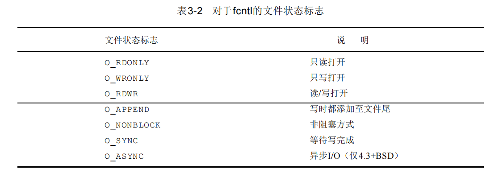

​		不幸的是，三个存取方式标志(O_RDONLY,O_WRONLY,以及O_RDWR)并不各占1位。(正如前述，这三种标志的值各是0、1和2，由于历史原因。这三种值互斥—一个文件只能有这三种值之一。)因此首先必须用屏蔽字O_ACCMODE取得存取方式位，然后将结果与这三种值相比较。

​		• F_SETFL将文件状态标志设置为第三个参数的值(取为整型值)。可以更改的几个标志是：O_APPEND，O_NONBLOCK，O_SYNC和O_ASYNC。

​		• F_GETOWN取当前接收SIGIO和SIGURG信号的进程ID或进程组ID。

​		•F_SETOWN设置接收SIGIO和SIGURG信号的进程ID或进程组ID。正的*arg*指定一个进程ID，负的*arg*表示等于*arg*绝对值的一个进程组ID。

​		fcntl的返回值与命令有关。如果出错，所有命令都返回－1，如果成功则返回某个其他值下列三个命令有特定返回值：F_DUPFD,F_GETFD,F_GETFL以及F_GETOWN。第一个返回新的文件 描述符，第二个返回相应标志，最后一个返回一个正的进程ID或负的进程组ID。

```C++
#include"apue.h"
#include<fcntl.h>

int main(int argc, char* argv[])
{
    int         val;

    if(argc != 2)
    {
        err_quit("usage: fileName <descriptor>");
    }

    if(
        (val = fcntl(atoi(argv[1]), F_GETFL,0)) < 0
    ){
        err_sys("fcntl error for fd %d", atoi(argv[1]));
    }

    switch (val & O_ACCMODE)
    {
    case O_RDONLY:
        printf("read only\n");
        break;
    case O_WRONLY:
        printf("write only\n");
        break;
    case O_RDWR:
        printf("read write is both accessible");
        break;
    default:
        err_dump("unknown access mode!");
        break;
    }

    if( val & O_APPEND)
        printf("the write can be appended");
    
    if(val & O_NONBLOCK)
        printf("the write can be nonblocking");

    if(val & O_SYNC)
    {
        printf("the write can be synchronous");
    }

    #if !defined(_POSIX_C_SOURCE) && defined(O_FSYNC) && (O_FSYNC != O_SYNC)
        if(val & O_FSYNC)
            printf("the write can be synchronous");
    #endif

    putchar('\n');

    exit(0);
}
```

### 扩展

#### if( A & B)

​		这个比较常用来比较被抽象成若干属性的二进制数。举个例子：

```C 
#define PRO1 0b00000001
#define PRO2 0b00000010
#define PRO3 0b00000100
...
#define PRO8 0b10000000
```

​		现在，我们有一个数check,它的二进制形式为：

```C
0b10010011
```

​		我们马上看到,check应当具有属性 `1, 2, 5, 8`为什么呢，我们与一下看看

```
if( PRO2 & check)
```

​		这个时候，计算机展开二进制形式：

```
	00000010
&	10010011
------------
	00000010
```

​		嘿！我说啥！在C语言中，一切非0的数都可以被视作真！这不就是真嘛！说明它带有属性2！

#### `#if,#ifdef,#ifndef`

​		假如现在要开发一个C语言程序，让它输出红色的文字，并且要求跨平台，在 Windows 和 Linux 下都能运行，怎么办呢？

​		这个程序的难点在于，不同平台下控制文字颜色的代码不一样，我们必须要能够识别出不同的平台。

​		Windows 有专有的宏`_WIN32`，Linux 有专有的宏`__linux__`，以现有的知识，我们很容易就想到了 `if else`，请看下面的代码：

```C 
#include <stdio.h>
int main(){
    if(_WIN32){
        system("color 0c");
        printf("http://c.biancheng.net\n");
    }else if(__linux__){
        printf("\033[22;31mhttp://c.biancheng.net\n\033[22;30m");
    }else{
        printf("http://c.biancheng.net\n");
    }

    return 0;
}
```

​		但这段代码是错误的，在 Windows 下提示 __linux__ 是未定义的标识符，在 Linux 下提示 _Win32 是未定义的标识符。对上面的代码进行改进：

```C 
#include <stdio.h>
int main(){
    #if _WIN32
        system("color 0c");
        printf("http://c.biancheng.net\n");
    #elif __linux__
        printf("\033[22;31mhttp://c.biancheng.net\n\033[22;30m");
    #else
        printf("http://c.biancheng.net\n");
    #endif

    return 0;
}
```

​		`#if、#elif、#else` 和 `#endif` 都是预处理命令，整段代码的意思是：如果宏 _WIN32 的值为真，就保留第 4、5 行代码，删除第 7、9 行代码；如果宏 __linux__ 的值为真，就保留第 7 行代码；如果所有的宏都为假，就保留第 9 行代码。

​		这些操作都是在预处理阶段完成的，多余的代码以及所有的宏都不会参与编译，不仅保证了代码的正确性，还减小了编译后文件的体积。

​		这种能够根据不同情况编译不同代码、产生不同目标文件的机制，称为条件编译。条件编译是预处理程序的功能，不是编译器的功能。

​		条件编译需要多个预处理命令的支持，下面一一讲解。

##### #if 的用法

\#if 用法的一般格式为：

```
#if 整型常量表达式1
  程序段1
#elif 整型常量表达式2
  程序段2
#elif 整型常量表达式3
  程序段3
#else
  程序段4
#endif
```

​		它的意思是：如常“表达式1”的值为真（非0），就对“程序段1”进行编译，否则就计算“表达式2”，结果为真的话就对“程序段2”进行编译，为假的话就继续往下匹配，直到遇到值为真的表达式，或者遇到 #else。这一点和 if else 非常类似。

​		需要注意的是，#if 命令要求判断条件为“整型常量表达式”，也就是说，表达式中不能包含变量，而且结果必须是整数；而 if 后面的表达式没有限制，只要符合语法就行。这是 #if 和 if 的一个重要区别。

\#elif 和 #else 也可以省略，如下所示：

```C
#include <stdio.h>
int main(){
    #if _WIN32
        printf("This is Windows!\n");
    #else
        printf("Unknown platform!\n");
    #endif
   
    #if __linux__
        printf("This is Linux!\n");
    #endif

    return 0;
}
```

##### #ifdef 的用法

\#ifdef 用法的一般格式为：

```
#ifdef  宏名
  程序段1
#else
  程序段2
#endif
```

​		它的意思是，如果当前的宏已被定义过，则对“程序段1”进行编译，否则对“程序段2”进行编译。

​		也可以省略 #else：

```
\#ifdef  宏名
  程序段
\#endif
```


​		**VS/VC 有两种编译模式，Debug 和 Release。在学习过程中，我们通常使用 Debug 模式，这样便于程序的调试；而最终发布的程序，要使用 Release 模式，这样编译器会进行很多优化，提高程序运行效率，删除冗余信息。**

​		为了能够清楚地看到当前程序的编译模式，我们不妨在程序中增加提示，请看下面的代码：

```C
#include <stdio.h>
#include <stdlib.h>
int main(){
    #ifdef _DEBUG
        printf("正在使用 Debug 模式编译程序...\n");
    #else
        printf("正在使用 Release 模式编译程序...\n");
    #endif

    system("pause");
    return 0;
}
```

​		当以 Debug 模式编译程序时，宏 _DEBUG 会被定义，预处器会保留第 5 行代码，删除第 7 行代码。反之会删除第 5 行，保留第 7 行。

##### #ifndef 的用法

\#ifndef 用法的一般格式为：

```
#ifndef 宏名
  程序段1 
#else 
  程序段2 
#endif
```

​		与 #ifdef 相比，仅仅是将 #ifdef 改为了 #ifndef。它的意思是，如果当前的宏未被定义，则对“程序段1”进行编译，否则对“程序段2”进行编译，这与 #ifdef 的功能正好相反。

##### 三者之间的区别

​		最后需要注意的是，#if 后面跟的是“整型常量表达式”，而 #ifdef 和 #ifndef 后面跟的只能是一个宏名，不能是其他的。

​		例如，下面的形式只能用于 #if：

```
#include <stdio.h>
#define NUM 10
int main(){
    #if NUM == 10 || NUM == 20
        printf("NUM: %d\n", NUM);
    #else
        printf("NUM Error\n");
    #endif
    return 0;
}
```

运行结果：
NUM: 10

再如，两个宏都存在时编译代码A，否则编译代码B：

```C 
#include <stdio.h>
#define NUM1 10
#define NUM2 20
int main(){
    #if (defined NUM1 && defined NUM2)
        //代码A
        printf("NUM1: %d, NUM2: %d\n", NUM1, NUM2);
    #else
        //代码B
        printf("Error\n");
    #endif
    return 0;
}
```

运行结果：
NUM1: 10, NUM2: 20

​		#ifdef 可以认为是 #if defined 的缩写。

### 扩展结束

​		对了，我们可以设计如下的函数来设置flag

```C 
#include "apue.h"
#include <fcntl.h>

void set_flag(int fd, int flags) /*flags are file status flags to turn on*/
{
	int 	val;
	if (
		(val = fcntl(fd, F_GETFL, 0)) < 0
	){
		err_sys("fcntl F_GETFL error!");
	}
	
	val |= flags;
	
	if( fcntl(fd, F_SETFL, val) < 0)
	{
		err_sys("fcntl F_SETFL error");
	}
}
```

​		或者，更改该一下：

```
#include "apue.h"
#include <fcntl.h>

void set_flag(int fd, int flags) /*flags are file status flags to turn on*/
{
	int 	val;
	if (
		(val = fcntl(fd, F_GETFL, 0)) < 0
	){
		err_sys("fcntl F_GETFL error!");
	}
	
	val &= ~flags;	/* inverse the operator*/
	
	if( fcntl(fd, F_SETFL, val) < 0)
	{
		err_sys("fcntl F_SETFL error");
	}
}
```

​		如果在程序的开始处，加上下面一行以调用s e t _ f l，则打开了同步写标志。

```
set_fl(STDOUT_FILENO, O_SYNC);
```

​	这就造成每次write都要等待，直至数据已写到磁盘上再返回。在UNIX中，通常write只是将数据排入队列，而实际的I/O操作则可能在以后的某个时刻进行。数据库系统很可能需要使用O_SYNC，这样一来，在系统崩溃情况下，它从write返回时就知道数据已确实写到了磁盘上。程序运行时，设置O_SYNC标志会增加时钟时间。为了测试这一点，运行程序3-3，它从磁盘上的一个文件中将1.5M字节复制到另一个文件中。然后，在此程序中设置O_SYNC标志，使其完成上述同样的工作，将两者的结果进行比较，

| 操 作                   | 用户C P U（秒） | 系统C P U（秒） | 时钟时间（秒） |
| :---------------------- | --------------- | --------------- | -------------- |
| BUFFSIZE=8192的读时间   | 0.0             | 0.3             | 0.3            |
| 盘文件的正常write       | 0.0             | 1.0             | 2.3            |
| O_SYNC设置的盘文件write | 0.0             | 1.4             | 13.4           |

​		这些都是在BUFFSIZE为8192的情况下测量得到的。之前的一个表中的结果所测量的情况是读一个磁盘文件，然后写到/dev/null，所以没有磁盘输出。第2行对应于读一个磁盘文件，然后写到另一个磁盘文件中。这就是为什么表中第1，2行有差别的原因。在写磁盘文件时，系统时间增加了，其原因是内核需要从进程中复制数据，并将数据排入队列以便由磁盘驱动器将其写到磁盘上。当写至磁盘文件时，时钟时间也增加了。当进行同步写时，系统时间稍稍增加，而时钟时间则增加为6倍。

​		从本例子中，我们看到了fcntl的必要性。我们的程序在一个描述符(标准输出)上进行操作，但是根本不知道由shell打开的相应文件的文件名。因为这是shell打开的，于是不能在打开时，按我们的要求设置O_SYNC标志。fcntl则允许当仅知道打开文件的描述符时可以修改其性质。在说明非阻塞管道时，我们还将了解到，由于我们对pipe所具有的标识只是其描述符，所以也需要使用fcntl的功能。

# 文件I/O(II)

## 引言

术语不带缓冲指的是每个read和write都调用内核中的一个系统调用。这些不带缓冲的I/O函数不是ISO C的组成部分，但是，它们是POSIX.1和Single UNIX Specification的组成部分。

## 文件描述符

- 对于内核而言，所有打开的文件都通过文件描述符引用。文件描述符是一个非负整数。
- 按照惯例，UNIX系统shell把文件描述符0与进程的标准输入关联，文件描述符1与标准输出关联，文件描述符2与标准错误关联。这是各种 shell以及很多应用程序使用的惯例，与UNIX内核无关。
- 在符合POSIX.1的应用程序中，幻数0、1、2虽然已被标准化，但应当把它们替换成符号常量STDIN_FILENO、STDOUT_FILENO和STDERR_FILENO以提高可读性。这些常量都在头文件中定义。
- 文件描述符的变化范围是0～OPEN_MAX-1

## 函数open和openat

```c
#include <fcntl.h>
int open(const char *path, int oflag,... /* mode_t mode */);
int openat(int f d, const char *path, int oflag, ... /* mode_t mode */ );
```

- 打开或创建一个文件

- openat函数是POSIX.1新增的一类函数之一，希望解决两个问题。

- - 让线程可以使用相对路径名打开目录中的文件，而不再只能打开当前工作目录
  - 避免time-of-check-to-time-of-use(TOCTTOU)错误

- TOCTTOU错误的基本思想是：如果有两个基于文件的函数调用，其中第二个调用依赖于第一个调用的结果，那么程序是脆弱的。因为两个调用并不是原子操作，在两个函数调用之间文件可能改变了，这样也就造成了第一个调用的结果就不再有效，使得程序最终的结果是错误的。

## 函数creat

```c
#include <fcntl.h>
int creat(const char *path, mode_t mode);
```

- 创建一个新文件，等效于open(path, O_WRONLY｜O_CREAT｜O_TRUNC, mode);

## 函数close

```c
#include <unistd.h>
int close (int fd)；
```

- 关闭一个文件时还会释放该进程加在该文件上的所有记录锁。
- 当一个进程终止时，内核自动关闭它所有的打开文件。很多程序都利用了这一功能而不显式地用close关闭打开文件。

## 函数lseek

```c
#include <unistd.h>
off_t lseek(int fd, off_t offset, int whence);
```

- 显式地为一个打开文件设置偏移量。返回值：若成功，返回新的文件偏移量；若出错，返回为−1
- 每个打开文件都有一个与其相关联的“当前文件偏移量”（current file offset）。它通常是一个非负整数，用于度量从文件开始处计算的字节数。通常，读、写操作都从当前文件偏移量处开始，并使偏移量增加所读写的字节数。按系统默认的情况，当打开一个文件时，除非指定O_APPEND选项，否则该偏移量被设置为0。
- 在lseek中的字符l表示长整型。在引入off_t数据类型之前，offset参数和返回值是长整型的。
- 因为偏移量可能是负值，所以在比较 lseek 的返回值时应当谨慎，不要测试它是否小于0，而要测试它是否等于−1。
- lseek仅将当前的文件偏移量记录在内核中，它并不引起任何I/O操作。
- 文件偏移量可以大于文件的当前长度，在这种情况下，对该文件的下一次写将加长该文件，并在文件中构成一个空洞，这一点是允许的。位于文件中但没有写过的字节都被读为0。
- 文件中的空洞并不要求在磁盘上占用存储区。具体处理方式与文件系统的实现有关，当定位到超出文件尾端之后写时，对于新写的数据需要分配磁盘块，但是对于原文件尾端和新开始写位置之间的部分则不需要分配磁盘块。
- 注意：尽管可以实现64位文件偏移量，但是能否创建一个大于2 GB（231－1字节）的文件则依赖于底层文件系统的类型。
- 使用od(1)命令观察该文件的实际内容。命令行中的-c标志表示以字符方式打印文件内容。

## 函数read

```c
#include <unistd.h>
ssize_t read(int fd, void *buf, size_t nbytes);
```

- 从打开文件中读数据。返回值：读到的字节数，若已到文件尾，返回0；若出错，返回−1

## 函数write

```c
#include <unistd.h>
ssize_t write(int fd, const void *buf, size_t nbytes);
```

- 向打开文件写数据。返回值：若成功，返回已写的字节数；若出错，返回−1
- write出错的一个常见原因是磁盘已写满，或者超过了一个给定进程的文件长度限制。

## I/O的效率

- 大多数文件系统为改善性能都采用某种预读（read ahead）技术。当检测到正进行顺序读取时，系统就试图读入比应用所要求的更多数据，并假想应用很快就会读这些数据。
- 操作系统试图用高速缓存技术将相关文件放置在主存中，所以如若重复度量程序性能，那么后续运行该程序所得到的计时很可能好于第一次。其原因是，第一次运行使得文件进入系统高速缓存，后续各次运行一般从系统高速缓存访问文件，无需读、写磁盘。

## 文件共享

- 内核使用3种数据结构表示打开文件

- - 每个进程在进程表中都有一个记录项，记录项中包含一张打开文件描述符表，可以将其视为一个矢量，每个描述符占用一项
  - 内核为所有打开文件维护一张文件表
  - 每个打开文件（或设备）都有一个 v 节点（v-node）结构。v 节点包含了文件类型和对此文件进行各种操作函数的指针。对于大多数文件，v节点还包含了该文件的i节点（i-node，索引节点）。这些信息是在打开文件时从磁盘上读入内存的，所以，文件的所有相关信息都是随时可用的。


- 创建 v 节点结构的目的是对在一个计算机系统上的多文件系统类型提供支持。
- 注意，文件描述符标志和文件状态标志在作用范围方面的区别，前者只用于一个进程的一个描述符，而后者则应用于指向该给定文件表项的任何进程中的所有描述符。

## 原子操作

```c
#include <unistd.h>
ssize_t pread(int fd, void *buf, size_t nbytes, off_t offset);
ssize_t pwrite(int fd, const void *buf, size_t nbytes, off_t offset);
```

- 返回值：读/写到的字节数，若已到文件尾，返回0；若出错，返回−1
- 一般而言，原子操作（atomic operation）指的是由多步组成的一个操作。如果该操作原子地执行，则要么执行完所有步骤，要么一步也不执行，不可能只执行所有步骤的一个子集。

## 函数dup和dup2

```c
#include <unistd.h>
int dup(int fd);
int dup2(int fd, int fd2);
```

- 复制一个现有的文件描述符。返回值：若成功，返回新的文件描述符；若出错，返回−1
- 由dup返回的新文件描述符一定是当前可用文件描述符中的最小数值。
- **返回的新文件描述符与参数fd共享同一个文件表项**

## 函数sync、fsync和fdatasync

- 传统的UNIX系统实现在内核中设有缓冲区高速缓存或页高速缓存，大多数磁盘I/O都通过缓冲区进行。当我们向文件写入数据时，内核通常先将数据复制到缓冲区中，然后排入队列，晚些时候再写入磁盘。这种方式被称为延迟写（delayed write）
- 通常，当内核需要重用缓冲区来存放其他磁盘块数据时，它会把所有延迟写数据块写入磁盘。为了保证磁盘上实际文件系统与缓冲区中内容的一致性，UNIX 系统提供了 sync、fsync 和fdatasync三个函数。

```c
#include<unistd.h>
int fsync(int fd);
int fdatasync(int fd);
void sync(void);
```

- sync只是将所有修改过的块缓冲区排入写队列，然后就返回，它并不等待实际写磁盘操作结束。通常，称为update的系统守护进程周期性地调用（一般每隔30秒）sync函数。这就保证了定期冲洗（flush）内核的块缓冲区。命令sync(1)也调用sync函数。
- fsync函数只对由文件描述符fd指定的一个文件起作用，并且等待写磁盘操作结束才返回。fsync可用于数据库这样的应用程序，这种应用程序需要确保修改过的块立即写到磁盘上。
- fdatasync函数类似于fsync，但它只影响文件的数据部分。而除数据外，fsync还会同步更新文件的属性。
- 返回值：若成功，返回0；若出错，返回−1。sync无返回值。

## 函数fcntl

```c
#include<fcntl.h>
int fcntl(int fd, int cmd, ... /* int arg */);
```

- fcntl函数可以改变已经打开文件的属性。返回值：若成功，则依赖于cmd；若出错，返回−1

- fcntl函数有以下5种功能

- - 复制一个已有的描述符（cmd=F_DUPFD或F_DUPFD_CLOEXEC）
  - 获取/设置文件描述符标志（cmd=F_GETFD或F_SETFD）
  - 获取/设置文件状态标志（cmd=F_GETFL或F_SETFL）
  - 获取/设置异步I/O所有权（cmd=F_GETOWN或F_SETOWN）
  - 获取/设置记录锁（cmd=F_GETLK、F_SETLK或F_SETLKW）

- 在修改文件描述符标志或文件状态标志时必须谨慎，先要获得现在的标志值，然后按照期望修改它，最后设置新标志值。不能只是执行F_SETFD或F_SETFL命令，这样会关闭以前设置的标志位。

- 在UNIX系统中，通常write只是将数据排入队列，而实际的写磁盘操作则可能在以后的某个时刻进行。而数据库系统则需要使用 O_SYNC，这样一来，当它从 write 返回时就知道数据已确实写到了磁盘上，以免在系统异常时产生数据丢失。

## 函数ioctl

```c
#include <unistd.h>　　/* System V */
#include <sys/ioctl.h> /* BSD and Linux */
int ioctl(int fd, int request, ...);
```

- I/O操作的杂物箱。返回值：若出错，返回−1；若成功，返回其他值
- 对于ISO C原型，它用省略号表示其余参数。但是，通常只有另外一个参数，它常常是指向一个变量或结构的指针。
- 在此原型中，我们表示的只是ioctl函数本身所要求的头文件。通常，还要求另外的设备专用头文件。例如，除POSIX.1所说明的基本操作之外，终端I/O的ioctl命令都需要头文件。
- 每个设备驱动程序可以定义它自己专用的一组 ioctl 命令，系统则为不同种类的设备提供通用的ioctl命令。

## /dev/fd

- 较新的系统都提供名为/dev/fd 的目录，其目录项是名为 0、1、2 等的文件。打开文件/dev/fd/n等效于复制描述符n（假定描述符n是打开的）。
- Linux实现中的/dev/fd是个例外。它把文件描述符映射成指向底层物理文件的符号链接。例如，当打开/dev/fd/0时，事实上正在打开与标准输入关联的文件，因此返回的新文件描述符的模式与/dev/fd文件描述符的模式其实并不相关。
- 作为命令行参数的“-”特指标准输入或标准输出，这已由很多程序采用。但是这会带来一些问题，例如，如果用“-”指定第一个文件，那么看来就像指定了命令行的一个选项。/dev/fd则提高了文件名参数的一致性，也更加清晰。

# 文件和目录(I)

​		上一章我们说明了执行I/O操作的基本函数。其讨论围绕普通文件的I/O进行——打开一个文件，读或写一个文件。本章将观察文件系统的其他特征和文件的性质。我们将从stat函数开始，逐个说明stat结构的每一个成员以了解文件的所有属性。在此过程中，我们将说明修改这些属性的各个函数(更改所有者，更改许可权等)，还将更详细地察看UNIX文件系统的结构以及符号连接。本章结束部分介绍对目录进行操作的各个函数，并且开发了一个以降序遍历目录层次结构的函数。

## stat、fstat 和lstat 函数

```C
#include <sys/types.h>
#include <sys/stat.h>
int stat(const char * pathname, struct stat* buf) ;
int fstat(int filedes,struct stat* buf) ;
int lstat(const char * pathname*, struct stat* buf) ;
```

​		三个函数的返回：若成功则为 0，若出错则为-1

​		给定一个*pathname*，stat函数返回一个与此命名文件有关的信息结构，fstat函数获得已在描述符*filedes*上打开的文件的有关信息。lstat函数类似于stat，但是当命名的文件是一个符号连接时，lstat返回该符号连接的有关信息，而不是由该符号连接引用的文件的信息。 

​		第二个参数是一个指向已经被定义好的一个结构——

```C
struct stat
  {
    __dev_t st_dev;		/* Device.  */
#ifndef __x86_64__
    unsigned short int __pad1;
#endif
#if defined __x86_64__ || !defined __USE_FILE_OFFSET64
    __ino_t st_ino;		/* File serial number.	*/
#else
    __ino_t __st_ino;			/* 32bit file serial number.	*/
#endif
#ifndef __x86_64__
    __mode_t st_mode;			/* File mode.  */
    __nlink_t st_nlink;			/* Link count.  */
#else
    __nlink_t st_nlink;		/* Link count.  */
    __mode_t st_mode;		/* File mode.  */
#endif
    __uid_t st_uid;		/* User ID of the file's owner.	*/
    __gid_t st_gid;		/* Group ID of the file's group.*/
#ifdef __x86_64__
    int __pad0;
#endif
    __dev_t st_rdev;		/* Device number, if device.  */
#ifndef __x86_64__
    unsigned short int __pad2;
#endif
#if defined __x86_64__ || !defined __USE_FILE_OFFSET64
    __off_t st_size;			/* Size of file, in bytes.  */
#else
    __off64_t st_size;			/* Size of file, in bytes.  */
#endif
    __blksize_t st_blksize;	/* Optimal block size for I/O.  */
#if defined __x86_64__  || !defined __USE_FILE_OFFSET64
    __blkcnt_t st_blocks;		/* Number 512-byte blocks allocated. */
#else
    __blkcnt64_t st_blocks;		/* Number 512-byte blocks allocated. */
#endif
#ifdef __USE_XOPEN2K8
    /* Nanosecond resolution timestamps are stored in a format
       equivalent to 'struct timespec'.  This is the type used
       whenever possible but the Unix namespace rules do not allow the
       identifier 'timespec' to appear in the <sys/stat.h> header.
       Therefore we have to handle the use of this header in strictly
       standard-compliant sources special.  */
    struct timespec st_atim;		/* Time of last access.  */
    struct timespec st_mtim;		/* Time of last modification.  */
    struct timespec st_ctim;		/* Time of last status change.  */
# define st_atime st_atim.tv_sec	/* Backward compatibility.  */
# define st_mtime st_mtim.tv_sec
# define st_ctime st_ctim.tv_sec
#else
    __time_t st_atime;			/* Time of last access.  */
    __syscall_ulong_t st_atimensec;	/* Nscecs of last access.  */
    __time_t st_mtime;			/* Time of last modification.  */
    __syscall_ulong_t st_mtimensec;	/* Nsecs of last modification.  */
    __time_t st_ctime;			/* Time of last status change.  */
    __syscall_ulong_t st_ctimensec;	/* Nsecs of last status change.  */
#endif
#ifdef __x86_64__
    __syscall_slong_t __glibc_reserved[3];
#else
# ifndef __USE_FILE_OFFSET64
    unsigned long int __glibc_reserved4;
    unsigned long int __glibc_reserved5;
# else
    __ino64_t st_ino;			/* File serial number.	*/
# endif
#endif
  };
```

## 文件类型

​		至今我们已介绍了两种不同的文件类型—普通文件和目录。U N I X系统的大多数文件是普通文件或目录，但是也有另外一些文件类型：

​		(1) **普通文件(regular file)。**这是最常见的文件类型，这种文件包含了某种形式的数据。至于这种数据是文本还是二进制数据对于内核而言并无区别。对普通文件内容的解释由处理该文件的应用程序进行。

​		(2) **目录文件(directory file)。**这种文件包含了其他文件的名字以及指向与这些文件有关信息的指针。对一个目录文件具有读许可权的任一进程都可以读该目录的内容，但只有内核可以写目录文件。

​		(3) **字符特殊文件(character special file)。**这种文件用于系统中某些类型的设备。

​		(4) **块特殊文件(block special file)。**这种文件典型地用于磁盘设备。系统中的所有设备或者是字符特殊文件，或者是块特殊文件。

​		(5) **FIFO**。这种文件用于进程间的通信，有时也将其称为命名管道。

​		(6) **套接口(socket)**。这种文件用于进程间的网络通信。套接口也可用于在一台宿主机上的进程之间的非网络通信。第1 5章将用套接口进行进程间的通信。

​		(7) **符号连接(symboliclink)。**这种文件指向另一个文件。文件类型信息包含在stat结构的st_mode成员中。可以用表4-1中的宏确定文件类型。这些宏的参数都是stat结构中的st_mode成员。

| 宏          | 说明                              |
| ----------- | --------------------------------- |
| `S_ISREG()` | 普通文件                          |
| `S_ISDIR()` | 目录文件                          |
| `S_ISCHR`   | 字符特殊文件                      |
| `S_ISBLK`   | 块特殊文件                        |
| `S_ISFIFO`  | 管道或FIFO                        |
| `S_ISLNK`   | 符号连接（POSIX.1或SVR4无此类型） |
| `S_ISSOCK`  | 套接字（POSIX.1或SVR4无此类型）   |

​		早期的UNIX版本并不提供S_ISxxx宏，于是就需要将st_mode与屏蔽字S_IFMT逻辑与，然后与名为S_IFxxx的常数相比较。SVR4和4.3+BSD在文件<sys/stat.h>中定义了此屏蔽字和相关的常数。如若查看此文件，则可找到S_ISDIR宏定义为：

```
#define S_ISDIR (mode) (((mode) & S_IFMT) == S_IFDIR)
```

​		我们说过，普通文件是最主要的文件类型，但是观察一下在一个给定的系统中各种文件的比例是很有意思的。


## 设置-用户- ID和设置-组- ID

​		与一个进程相关联的I D有六个或更多:


• 实际用户I D和实际组I D标识我们究竟是谁。这两个字段在登录时取自口令文件中的登录项。通常，在一个登录会话期间这些值并不改变，但是超级用户进程有方法改变它们

• 有效用户I D，有效组I D以及添加组I D决定了我们的文件访问权，下一节将对此进行说明

• 保存的设置-用户- I D和设置-组- I D在执行一个程序时包含了有效用户 I D和有效组I D的副本通常，有效用户I D等于实际用户I D，有效组I D等于实际组I D。每个文件有一个所有者和组所有者，所有者由stat结构中的st_uid表示，组所有者则由st_gid成员表示。

​		当执行一个程序文件时，进程的有效用户ID通常就是实际用户ID，有效组ID通常是实际组ID。但是可以在文件方式字(st_mode)中设置一个特殊标志，其定义是**当执行此文件时，将进程的有效用户ID设置为文件的所有者(st_uid)。与此相类似，在文件方式字中可以设置另一位，它使得执行此文件的进程的有效组ID设置为文件的组所有者(st_gid)。**在文件方式字中的这两位被称之为设置-用户-ID(set-user-ID)位和设置-组-ID(set-group-ID)位。

​		例如，若文件所有者是超级用户，而且设置了该文件的设置-用户-ID位，然后当该程序由一个进程运行时，则该进程具有超级用户优先权。不管执行此文件的进程的实际用户ID是什么，都作这种处理。作为一个例子，UNIX程序passwd(1)允许任一用户改变其口令，该程序是 一个设置-用户-ID程序。因为该程序应能将用户的新口令写入口令文件中(一般是/etc/passwd或/etc/shadow),而只有超级用户才具有对 该文件的写许可权，所以需要使用设置-用户-ID特征。因为运行设置-用户-ID程序的进程通常得到额外的许可权，所以编写这种程序时要特别谨慎。

​		再返回到stat函数，设置-用户-ID位及设置-组-ID位都包含在st_mode值中。这两位可用常数S_ISUID和S_ISGID测试

## 文件存取许可权

​		st_mode值也包含了对文件的存取许可权位。当提及文件时，指的是前面所提到的任何类型的文件。所有文件类型 (目录，字符特别文件等)都有存取许可权。很多人认为只有普通文件有存取许可权，这是一种误解。每个文件有9个存取许可权位，可将它们分成三类，见表:


​		在表开头三行中，术语用户指的是文件所有者。chmod(1)命令用于修改这9个许可权位。该命令允许我们用u表示用户(所有者)，用g表示组，用o表示其他。有些书把这三种用户类型分别称之为所有者，组和世界。这会造成混乱，因为chmod命令用o表示其他，而不是所有者 。我们将使用术语用户、组和其他，以便与chmod命令一致。

​		图中的三类存取许可权——读、写及执行——以各种方式由不同的函数使用。我们将这些不同的使用方法列在下面，当说明这些函数时，再进一步作讨论。

• **第一个规则是，我们用名字打开任一类型的文件时，对该名字中包含的每一个目录，包括它可能隐含的当前工作目录都应具有执行许可权。这就是为什么对于目录其执行许可权位常被称为搜索位的原因。**

​	例如，为了打开文件/usr/dict/words，需要具有对目录/,/usr,/usr/dict的执行许可权。然后，需要对该文件本身的适当许可权，这取决于以何种方式打开它(只读，读-写等)。如果当前目录是/usr/dict,那么为了打开文件words，需要有对该目录的执行许可。如在指定打开文件words时，可以隐含当前目录，而不用显式地提及/usr/dict，也可使用./words。

​		注意，对于目录的读许可权和执行许可权的意义不相同。**读许可权允许我们读目录，获得在该目录中所有文件名的列表。当一个目录是我们要存取文件的路径名的一个分量时，对该目录的执行许可权使我们可通过该目录(也就是搜索该目录，寻找一个特定的文件名)。引用隐含目录的另一个例子是，如果 PATH环境变量( 8 . 4节将说明)指定了一个我们不具有执行许可权的目录，那么shell决不会在该目录下找到可执行文件。**

• 对于一个文件的读许可权决定了我们是否能够打开该文件进行读操作。这对应于 open函数的O_RDONLY和O_RDWR标志。

• 对于一个文件的写许可权决定了我们是否能够打开该文件进行写操作。这对应于 open函数的O _WRONLY和O_RDWR标志。

•为了在open函数中对一个文件指定O_TRUNC标志，必须对该文件具有写许可权。

• 为了在一个目录中创建一个新文件，必须对该目录具有写许可权和执行许可权。

• 为了删除一个文件，必须对包含该文件的目录具有写许可权和执行许可权。对该文件本身则不需要有读、写许可权。

• 如果用6个exec函数中的任何一个执行某个文件，都必须对该文件具有执行许可权。进程每次打开、创建或删除一个文件时，内核就进行文件存取许可权测试，而这种测试可能涉及文件的所有者(st_uid和st_gid)，进程的有效ID (有效用户I D和有效组I D )以及进程的添加组ID (若支持的话)。两个所有者I D是文件的性质，而有效 I D和添加组I D则是进程的性质。内核进行的测试是：

(1) 若进程的有效用户I D是0 (超级用户)，则允许存取。这给予了超级用户对文件系统进行处理的最充分的自由。

(2) 若进程的有效用户I D等于文件的所有者I D (也就是该进程拥有此文件)：

(a) 若适当的所有者存取许可权位被设置，则允许存取。

(b) 否则拒绝存取。

​		适当的存取许可权位指的是，若进程为读而打开该文件，则用户 -读位应为1；若进程为写而打开该文件，则用户-写位应为1；若进程将执行该文件，则用户-执行位应为1。

(3) 若进程的有效组I D或进程的添加组I D之一等于文件的组I D：

(a) 若适当的组存取许可权位被设置，则允许存取。

(b) 否则拒绝存取。

(4) 若适当的其他用户存取许可权位被设置，则允许存取，否则拒绝存取。

​		按顺序执行这四步。注意，如若进程拥有此文件 (第( 2 )步)，则按用户存取许可权批准或拒绝该进程对文件的存取——不查看组存取许可权。相类似，若进程并不拥有该文件。但进程属于某个适当的组，则按组存取许可权批准或拒绝该进程对文件的存取——不查看其他用户的存取许可权。

## 新文件和目录的所有权

​		当说明用open或creat创建新文件时，没有说明赋予新文件的用户 I D和组I D的值是什么。关于新目录的所有权的规则与本节将说明的新文件的所有权的规则相同。

​		新文件的用户I D设置为进程的有效用户I D。关于组I D，POSIX.1允许选择下列之一作为新文件的组I D。

(1) 新文件的组I D可以是进程的有效组I D。

(2) 新文件的组I D可以是它所在目录的组I D。

​		使用POSIX.1所允许的第二种方法 (继承目录的组I D )使得在某个目录下创建的文件和目录都具有该目录的组 I D。于是文件和目录的组所有权从该点向下传递。例如，在 /var/spool目录中就使用这种方法。

## access函数

​		正如前面所说，当用open函数打开一个文件时，内核以进程的有效用户ID和有效组ID为基础执行其存取许可权测试。有时，进程也希望按其实际用户ID和实际组ID来测试其存取能力。例如当一个进程使用设置-用户-ID，或设置-组-ID特征作为另一个用户(或组)运行时，这就可能需要。即使一个进程可能已经设置-用户-ID为根，它仍可能想验证实际用户能否存取一个给定的文件。access函数是按实际用户ID和实际组ID进行存取许可权测试的。

```C
#include <unistd.h>
int access(const char *pathname, int mode);
```


```C 
#include "apue.h"
#include <fcntl.h>
int main(int argc, char* agrv[])
{
    if(argc != 2)
    {
        err_quit("usage: a.out <pathname>");
    }

    if(access(agrv[1],R_OK) < 0)
    {
        err_ret("access error for %s",agrv[1]);
    }
    else{
        printf("read access OK\n");
    }

    if(open(agrv[1],O_RDONLY) < 0)
        err_ret("open error for %s",agrv[1]);
    else
        printf("open for reading is OK\n");

    exit(0);
}
```

​		还有另一个有趣的函数就是`faccessat`这个函数，这个函数的声明如下：

```
int faccessat(int fd, const char *pathname, int mode, int flag);
```

​		通常，当打开一个文件时，内核是以进程的有效用户 ID 和有效组 ID 为基础执行其访问权限测试。不过，有时进程也希望按其实际用户 ID 和实际组 ID 来测试其访问能力。例如，当一个进程使用设置用户 ID 或设置组 ID 功能作为另一个用户（或组）运行时，就可能会有这种需要。即使一个进程可能已经通过设置用户 ID 以超级用户权限运行，它仍然可能想验证其实际用户能否访问一个给定的文件。access 和 faccessat 函数就是按实际用户 ID 和实际组 ID 来进行权限测试的。

​		其中，如果要测试文件是否已经存在，mode 就为 F_OK；否则 mode 就是下表中的常量的按位或（这些常量均位于头文件 <unistd.h>）：

| mode | 说明         |
| ---- | ------------ |
| R_OK | 测试读权限   |
| W_OK | 测试写权限   |
| X_OK | 测试执行权限 |

​		faccessat 函数与 access 函数在下列两种情况下是相同的：
1、pathname 参数为绝对路径。
2、fd 参数为 AT_FDCWD，而 pathname 为相对路径。否则，faccessat 计算相对于打开目录（由 fd 指向）的 pathname。flag 参数可以用于改变 faccessat 的行为，如果 flag 设置为 AT_EACCESS，那么访问检查用的将是进程的有效用户 ID 和有效组 ID，而非实际用户 ID 和实际组 ID。
下面是一个 access 函数示例：

```C
#include <stdio.h>
#include <stdlib.h>
#include <unistd.h>
#include <fcntl.h>i
nt main(int argc, char *argv[])
{	
    if(argc != 2){		
        printf("Usage: %s <pathname>\n", argv[0]);		
        exit(1);	
    }	
    if(access(argv[1], R_OK) < 0)		
        printf("access error for %s\n", argv[1]);	
    else		
        printf("read access OK\n");	
    if(open(argv[1], O_RDONLY) < 0)		
        printf("open error for %s\n", argv[1]);	
    else		
        printf("open for reading OK\n");	exit(0);
}
```

​		尽管打开了 accessDemo.out 的设置用户 ID 位（改变了进程的有效用户 ID），使 open 函数能打开该文件，但因为进程的实际用户 ID 并不等于有效 ID，所以 access 函数不能正常打开 /etc/shadow 文件。

## umask函数

​		我们可以在文件模式上创建屏蔽字，并且返回之前的值。

```
#include<sys/stat.h>

mode_t umask(mode_t cmask);
```

​		其中，参数*cmask*由表4-4中的9个常数(S_IRUSR,S_IWUSR等)逐位“或”构成的。

​		在进程创建一个新文件或新目录时，就一定会使用文件方式创建屏蔽字在创建一个新目录，在文件方式创建屏蔽字中为1的位，在文件*mode*中的相应位则一定被转成0。

​		常见的几个umask值：002，022，027！

​		002：阻止其他用户写入你的文件；

​		022：阻止同组用户和其他用户写入你的文件；

​		027：阻止同组用户写文件以及其他用户读，写入，或者执行你的文件；

## chmod和fchmod函数

​		这两个函数使我们可以更改现存文件的存取许可权。

```
#include <sys/types.h>
#include <sys/stat.h>
int chmod(const char* pathname,mode_t mode) ;
int fchmod(int filedes,mode_t mode);
```

​		chmod函数在指定的文件上进行操作，而fchmod函数则对已打开的文件进行操作。

​		为了改变一个文件的许可权位，进程的有效用户 I D必须等于文件的所有者，或者该进程必须具有超级用户许可权。


​		现在，我们相对于foo的当前状态设置其许可权。为此，先调用stat获得其当前许可权，然后修改它。我们已显式地打开了设置-组-ID位关闭了组-执行位。对普通文件这样做的结果是对该文件可以加强制性记录。注意，ls命令将组-执行许可权表示为l，它表示对该文件可以加强制性记录锁。对文件bar，不管其当前许可权位如何，我们将其许可权设置为一绝对值。

```C
#include"apue.h"

int main(void)
{
    struct stat statBuf;
    /*turn on Set gid and turn off group-exe*/
    if(stat("./foo",&statBuf) < 0){
        err_sys("stat error for foo");
    }

    if(chmod("foo", (statBuf.st_mode & ~S_IXGRP) | S_ISGID) < 0){
         err_sys("chomd error forcd foo");
    }

    if(chmod("bar",S_IRUSR | S_IWUSR| S_IRGRP | S_IROTH) < 0)
    {
        err_sys("chomd error for bar");
    }
    exit(0);
}
```

​		最后也要注意到，在我们运行程序后，l s命令列出的时间和日期并不改变。按系统默认方式， ls -l列出的是最后修改文件内容的时间。

​		chmod函数在下列条件下自动清除两个许可权位。

• 如果我们试图设置普通文件的粘住位 ( S _ I S V T X )，而且又没有超级用户优先权，那么m o d e*中的粘住位自动被关闭(我们将在下一节说明粘住位)。这意味着只有超级用户才能设置普通文件的粘住位。这样做的理由是可以防止不怀好意的用户设置粘住位，并试图以此方式填满交换区(如果系统支持保存-正文特征的话)。（当然这是给FreeBSD 8.0  和 Solaris的，对linux则没有，没有意义）

• 新创建文件的组I D可能不是调用进程所属的组。新文件的组I D可能是父目录的组I D。特别地，如果新文件的组I D不等于进程的有效组I D或者进程添加组I D中的一个，以及进程没有超级用户优先数，那么设置 -组- I D位自动被关闭。这就防止了用户创建一个设置 -组- I D文件，而该文件是由并非该用户所属的组拥有的。

## 粘住位

​		S_ISVTX位有一段有趣的历史。在UNIX的早期版本中，有一位被称为粘住位（stickybit）。**如果一个可执行程序文件的这一位被设置了，那么在该程序第一次执行并结束时，该程序正文的一个文本被保存在交换区。**(程序的正文部分是机器指令部分。)这使得下次执行该程序时能较快地将其装入内存区。其原因是：在交换区，该文件是被连续存放的，而在一般的UNIX文件系统中，文件的各数据块很可能是随机存放的。对于常用的应用程序，例如文本编辑程序和编译程序的各部分常常设置它们所在文件的粘住位。自然，对交换区中可以同时存放的设置了粘住位的文件数有一定限制，以免过多占用交换区空间，但无论如何这是一个有用的技术。因为在系统再次自举前，文件的正文部分总是在交换区中，所以使用了名字粘住。后来的UNIX版本称之为保存-正文位（saved-textbit），因此也就有了常数S_ISVTX。现今 较新的UNIX系统大多数都具有虚存系统以及快速文件系统，所以不再需要使用这种技术。

​		S V R 4和4 . 3 + B S D中粘住位的主要针对目录。如果对一个目录设置了粘住位，则只有对该目录具有写许可权的用户并且满足下列条件之一，才能删除或更名该目录下的文件：

• 拥有此文件。

• 拥有此目录。

• 是超级用户。

​	目录/tmp和/var/spool/uucppublic是设置粘住位的候选者—这两个目录是任何用户都可在其中创建文件的目录。这两个目录对任一用户(用户、组和其他)的许可权通常都是读、写和执行。但是用户不应能删除或更名属于其他人的文件，为此在这两个目录的文件方式中都设置了粘住位


## chown, fchown和lchown函数

​		chown函数可用于更改文件的用户I D和组I D

```
#include <sys/types.h>
#include <unistd.h>
int chown(const char *pathname, uid_t owner, gid_t group) ;
int fchown(int filedes, uid_t owner, gid_t group) ;
int lchown(const char *pathname, uid_t owner, gid_t group)
```

​		这4个函数可用于更改文件的用户ID和组ID，如果参数owner或group中的任意一个是-1,则对应的ID不变。

​		除了所引用的文件是符号连接以外，这4个函数的操作类似。在符号链接情况下，lchown和fchownat（设置了AT_SYMLINK_NOFOLLOW标志）更改符号链接本身的所有者，而不是该符号链接所指向的文件的所有者。

​		fchown函数与chown或者lchown函数在下面两种情况下是相同的：一种是pathname参数为绝对路径，另一种是fd参数取值为AT_FDCWD而pathname参数为相对路径。在这两种情况下，如果flag参数中设置了AT_SYMLINK_NOFOLLOW标志，fchownat与lchown行为相同，如果flag参数中清除了AT_SYMLINK_NOFOLLOW标志，则fchownat与chown行为相同。如果fd参数设置为打开目录的文件描述符，并且pathname参数是一个相对路径名，fchownat函数计算相对于打开目录的pathname。

​		函数参数中的owner和group可以从/etc/passwd中找到，比如我的系统中/etc/passwd文件内容第一行为：


​		可知root用户的用户ID和组ID都是0。

​		另一个用户的用户ID和组ID为：


​		可知eagle用户的用户ID和组ID都是1000。

​		知道了用户ID和组ID之后就可以调用相应的函数修改文件的用户ID或者组ID了。

## 文件长度

​		stat结构的成员st_size包含了以字节为单位的该文件的长度。此字段只对普通文件、目录文件和符号连接有意义。

​		对于普通文件，其文件长度可以是0，在读这种文件时，将得到文件结束指示。

​		对于目录，文件长度通常是一个数，例如16或512的整倍数，

​		对于符号连接，文件长度是在文件名中的实际字节数。例如，

```
lrwxrwxrwx 1 root 7 Sep 25 07:14 lib -> usr/lib
```

​		其中，文件长度7就是路径名usr/lib的长度(注意，因为符号连接文件长度总是由st_size指示，所以符号连接并不包含通常C语言用作名字结尾的null字符)。

​		SVR4和4.3+BSD也提供字段st_blksize和st_blocks。第一个是对文件I/O较好的块长度，第二个是所分配的实际512字节块块数。当我们将st_blksize用于读操作时，读一个文件所需的最少时间量。为了效率的缘故，标准I/O库(我们将在第5章中说明)也试图一次读、写st_blksize字节

```
要知道，不同的UNIX版本其st-blocks所用的单位可能不是 5 1 2字节块。使用此值并不是可移植的
```

​		先前我们提及普通文件可以包含空洞。空洞是由超过文件结尾端的位移量设置，并写了某些数据后造成的。作为一个例子，考虑下列情况：

```
$ ls -1 core

-rw-r--r-- 1 stevens 8483248 Nov 18 12:18 core

$ du -s core

272 core
```

​		文件core的长度超过8M字节，而du命令则报告该文件所使用的磁盘空间总量是272个512字节块(139264字节)(在很多伯克利类的系统上，du命令报告1024字节块块数，SVR4则报告512字

## 文件截短

​		有时我们需要在文件尾端处截去一些数据以缩短文件。将一个文件的长度截短为0是一个特例，用O_TRUNC标志可以做到这一点。为了截短文件可以调用函数truncate和ftruncate。

```C
#include <sys/types.h>
#include <unistd.h>
int truncate(const char *pathname, off_t length) ;
int ftruncate(int filedes, off_t length)
```

​		这两个函数将由路径名*pathname*或打开文件描述符*filedes*指定的一个现存文件的长度截短为*length*。如果该文件以前的长度大于*length*，则超过*length*以外的数据就不再能存取。如果以前的长度短于*length*，则其后果与系统有关。如果某个实现的处理是扩展 该文件，则在以前的文件尾端和新的文件尾端之间的数据将读作0(也就是在文件中创建了一个空洞)。

## 文件系统


​		• 在图中有两个目录项指向同一 i节点。每个i节点中都有一个连接计数，其值是指向该 i节点的目录项数。只有当连接计数减少为 0时，才可删除该文件(也就是可以释放该文件占用的数据块)。这就是为什么“解除对一个文件的连接”操作并不总是意味着“释放该文件占用的磁盘块”的原因。这也就是为什么删除一个目录项的函数被称之为unlink而不是delete的原因。在stat结构中，连接计数包含在st_nlink成员中，其基本系统数据类型是nlink_t。这种连接类型称之为硬连接。 

​		• 另外一种连接类型称之为符号连接（ symbolic link）。对于这种连接，该文件的实际内容(在数据块中)包含了该符号连接所指向的文件的名字。在下例中：

lrwxrwxrwx 1 root 7 Sep 25 07:14 lib -> urs/lib

该目录项中的文件名是lib，而在该文件中包含了7个数据字节usr/lib。该i节点中的文件类型是S_IFLNK，于是系统知道这是一个符号连接。

​		• i节点包含了所有与文件有关的信息：文件类型、文件存取许可权位、文件长度和指向该文件所占用的数据块的指针等等。 stat结构中的大多数信息都取自 i节点。只有两项数据存放在目录项中：文件名和i节点编号数。i节点编号数的数据类型是ino_t。

​		• 因为目录项中的i节点编号数指向同一文件系统中的 i节点，所以不能使一个目录项指向另一个文件系统的 i节点。这就是为什么ln(1)命令（构造一个指向一个现存文件的新目录项），不能跨越文件系统的原因。我们将在下一节说明 link函数。

​		• 当在不更改文件系统的情况下为一个文件更名时，该文件的实际内容并未移动，只需构造一个指向现存i节点的新目录项，并删除老的目 录项。例如，为将文件/usr/lib/foo更名为/usr/foo，如果目录/usr/lib和/usr在同一文件系统上，则文件foo的内容无需移动。这就是mv(1)命令的通常操作方式。我们说明了普通文件的连接计数的概念，但是对于目录文件的连接计数字段又如何呢?假定我们在工作目录中构造了一个新目录：

```
$ mkdir testdir
```

​		下图显示了其结果。注意，该图显式地显示了. 和.. 目录项。


​		编号为2549的i节点，其类型字段表示它是一个目录，而连接计数为2。任何一个叶目录(不包含任何其他目录，也就是子目录的目录)其连接计数总是2，数值2来自于命名该目录（testdir）的目录项以及在该目录中的.项。编号为1267的i节点，其类型字段表示它是一个目录，而其连接计数则大于或等于3。它大于或等于3的原因是，至少有由三个目录项指向它：一个是命名它的目录项(在图4-3中没有表示出来)，第二个是在该目录中的.项，第三个是在其子目录testdir中的..项。注意，在工作目录中的每个子目录都使该工作目录的连接计数增1。

## link,unlink,remove和linkat,unlinkat

​		任何一个文件可以有多个目录项指向其i节点。创建一个指向现有文件的链接的方法是使用link函数或linkat函数。

```
#include <unistd.h>
int link(const char *existingpath, const char * newpath); 
int linkat(int efd, const char *existingpath, int nfd, const char * newpath, int flag); 
// 两个函数的返回值：若成功，返回0；若出错，返回-1
```

​		这两个函数创建一个新目录项newpath，它引用现有文件existingpath。如果newpath已经存在，则返回出错。只创建newpath中的最后一个分量，路径中的其他部分应当已经存在。

​		对于linkat函数，现有文件时通过efd和existingpath参数指定的，新的路径名是同过nfd和newpath参数指定的。默认情况下，如果两个路径名中的任何一个是相对路径，那么它需要通过相对应于对应的文件描述符进行计算。如果两个文件描述符中任一个设置为AT_FDCWD，那么相应的路径名（如果它是相对路径）就通过相对于当前目录进行计算。如果任一路径名是绝对路径，相应的文件描述符参数就会被忽略。

​		当现有文件时符号链接时，由flag参数来控制linkat函数是创建指向现有符号链接的链接还是创建指向现有符号链接所指向的文件的链接。如果在flag参数中设置了AT_SYMLINK_FOLLOW标志，就创建指向符号链接目标的链接。如果这个标志被清除了，则创建一个指向符号链接本身的链接。

​		创建新目录项和增加链接计数应当是一个原子操作。

​		虽然POSIX.1允许实现支持跨越文件系统的链接，但是大多数实现要求现有的和新建的两个路径名在同一个文件系统中。如果实现支持创建指向一个目录的硬链接，那么也仅限于超级用户才可以这样做。其理由是这样做可能在文件系统中形成循环，大多数处理文件系统的实用程序都不能处理这种情况。因此，很多系统实现不允许对于目录的硬链接。

### 测试程序

```C 
#include<stdio.h>
#include<unistd.h>
int main(int argc, char *argv[])
{
    if(3 != argc)
    {
        printf("reference error!\n");
        exit(0);
    }
    int res;
    res = link(argv[1], argv[2]);
    if(res)
    {
        printf("link error!\n");
    }
    return 0;
}
```


​		为了删除一个现有的目录项，可以调用unlink函数。

```C
#include <unistd.h>
int unlink(const char *pathname);
int unlinkat(int fd, const char *pathname, int flag);
// 两个函数的返回值：若成功，返回0；若出错，返回-1
```

​		这两个函数删除目录项，并将由pathname所引用文件的链接计数减1.如果对该文件还有其他链接，则仍通过其他链接访问该文件的数据。如果出错，则不对该文件做任何更改。

​		我们前面已经提及，为了解除对文件的链接，必须对包含该目录项的目录具有写和执行权限。正如4.10节所述，如果对该目录设置了粘着位，则对该目录必须具有写权限，并且具备下面三个条件之一：

- 拥有该文件； 

- 拥有该目录；

- 具有超级用户权限。


​		只有当链接计数达到0时，该文件的内容才可被删除。另一个条件也会阻止删除文件的内容—只要有进程打开该文件，其内容也不能删除。关闭一个文件时，内核首先检查打开该文件的进程个数：如果这个计数达到0，内核再去检查其链接计数；如果计数也是0，那么就删除该文件的内容。

​		如果pathname参数是相对路径名，那么unlinkat函数计算相对于由fd文件描述符参数代表的目录的路径名。如果fd参数设置为AT_FDCWD，那么通过相对于调用进程的当前工作目录来计算路径名。如果pathname参数是绝对路径名，那么fd参数被忽略。

​		flag参数给出了一个方法，使函数进程可以改变unlinkat函数的默认行为。当AT_REMOVEDIR标志被设置时，unlinkat函数可以类似于rmdir一样删除目录。如果这个标志被清除，unlinkat和unlink执行同样的操作。

### 测试程序

```C 
#include<stdio.h> 
#include<unistd.h> 
int main(int argc, char *argv[]) 
{   
    if(2 != argc)   
    {
        printf("reference error!\n");     
        exit(0);   
    }   
    int res;  
    res = unlink(argv[1]);   
    if(res)   
    {   
        printf("unlink error!\n");   
    }  
    return 0;
}
```

## rename renameat

​		我们也可以用remove函数解除一个文件或目录的链接。对于文件，remove功能与unlink相同。对于目录，remove功能与rmdir相同

```
#include<stdio.h> 
int remove(const char *pathname);
```

​		unlink是系统调用,而remove是库函数。

​		重命名函数rename和renameat

```
#include<stdio.h>
int rename(const char *oldname, const char *newname);
int renameat(int oldfd, const char *oldname, int newfd, const char *newname);
```

​		两个函数的返回值：若成功， 返回 0； 若出错， 返回 -1。
​		上面两个函数分为五种情形：

​		oldname是普通文件非目录，若newname已经存在且非目录时， 则先将newname文件删除再将oldname重命名为newname

```
void test_file()                                                               
{                                                                             
     if(rename("oldfile","newfile") < 0)                                       
         err_sys("rename failed");                                             
     printf("rename success!\n");
} 
```

结果图如下：

### **重命名函数rename和renameat**


```cpp
#include<stdio.h>
int rename(const char *oldname, const char *newname);
int renameat(int oldfd, const char *oldname, int newfd, const char *newname);
// 两个函数的返回值：若成功， 返回 0； 若出错， 返回 -1。
```


上面两个函数分为五种情形：

**`oldname`是普通文件非目录，若`newname`已经存在且非目录时， 则先将`newname`文件删除再将`oldname`重命名为`newname`**

```cpp
void test_file()                                                                
{                                                                               
     if(rename("oldfile","newfile") < 0)                                         
         err_sys("rename failed");                                               
     printf("rename success!\n");
} 
```

结果图如下：


由上图可知原本存在的newfile文件被删除，再重命名oldfile为newfile文件的。

**如若`oldname`指的是一个目录，且`newname`是目录并已存在，则会先将已存在的`newname`目录删除后再将`oldname`目录重命名为`newname`**

```bash
void test_directory()                                                           
{                                                                               
     if(rename("olddir", "newdir") < 0)                                          
         err_sys("rename failed");                                               
     printf("rename success!\n");
}  
```

结果图如下：


​		由上图可知，newdir已存在，当执行之后newdir先被删除再重命名olddir为newdir。

​		**如若`oldname`或`newname`为引用符号链接，则处理符号链接本身并非它所引用的文件**


```cpp
void test_symbollink()                                                          
{                                                                               
     if(rename("oldfilep", "newfilep") < 0)                                      
        err_sys("rename failed");                                               
     printf("rename success!\n");
} 
```

结果图如下：

**如若`oldname`指的是一个目录，且`newname`是目录并已存在，则会先将已存在的`newname`目录删除后再将`oldname`目录重命名为`newname`**

```C 
void test_directory()                                                        
{                                                                             
     if(rename("olddir", "newdir") < 0)                                       
         err_sys("rename failed");                                             
     printf("rename success!\n");
}  
```


**如果`oldname`和`newname`引用同一文件，则函数不做任何更改而成功返回**

由上图可知原本存在的newfile文件被删除，再重命名oldfile为newfile文件的。

如若oldname指的是一个目录，且newname是目录并已存在，则会先将已存在的newname目录删除后再将oldname目录重命名为newname

```
void test_directory()                                                         
{                                                                             
     if(rename("olddir", "newdir") < 0)                                       
         err_sys("rename failed");                                             
     printf("rename success!\n");
}  
```

结果图如下：


由上图可知，newdir已存在，当执行之后newdir先被删除再重命名olddir为newdir。

如若oldname或newname为引用符号链接，则处理符号链接本身并非它所引用的文件

```
void test_symbollink()                                                        
{                                                                             
     if(rename("oldfilep", "newfilep") < 0)                                   
        err_sys("rename failed");                                             
     printf("rename success!\n");
} 
```

结果图如下：


由上图可知oldfilep符号链接被重命名为newfilep。

不能对. 和..重命名

如果oldname和newname引用同一文件，则函数不做任何更改而成功返回


## 符号连接

​		符号连接是对一个文件的间接指针，它与上一节所述的硬连接有所不同，硬连接直接指向文件的i节点。引进符号连接的原因是为了避免硬连接的一些限制： ( a )硬连接通常要求连接和文件位于同一文件系统中， ( b )只有超级用户才能创建到目录的硬连接。对符号连接以及它指向什么没有文件系统限制，任何用户都可创建指向目录的符号连接。符号连接一般用于将一个文件或整个目录结构移到系统中其他某个位置。

​		当使用以名字引用一个文件的函数时，应当了解该函数是否处理符号连接功能。也就是是否跟随符号连接到达它所连接的文件。如若该函数处理符号连接功能，则该函数的路径名参数引用由符号连接指向的文件。否则，一个路径名参数引用连接本身，而不是由该连接指向的文件。表4 - 7列出了本章中所说明的各个函数是否处理符号连接功能。因为 r m d i r并不是针对符号连接进行定义的（若p a t h是符号连接则返回出错），所以在表4 - 7中没有列出这一函数。因为对符号连接的处理是由返回文件描述符的函数进行的（通常是 o p e n），所以以文件描述符作为参数的函数（如fstat, fchmod等）也未列出。c h o w n是否跟随符号连接取决于实现


​		使用符号连接可能在文件系统中引入循环。大多数查找路径名的函数在这种情况发生时都返回值为ELOOP的errno。考虑下列命令序列：


​		这创建了一个目录f o o，它包含了一个名为a的文件以及一个指向f o o的符号连接。在图4 - 4中显示了这种结果，图中以圆表示目录，以正方形表示一个文件。如果我们写一段简单的程序，使用标准函数ftw(3) 以降序遍历文件结构，打印每个遇到的路径名，则其输出是：


​		这样一个连接很容易被删除——因为unlink并不跟随符号连接，所以可以unlink文件foo/testdir。但是如果创建了一个构成这种循环的硬连接，那么就很难删除它。这就是为什么link函数不允许构造指向目录的硬连接的原因。（除非进程具有超级用户优先权。）用open打开文件时，如果传递给open函数的路径名指定了一个符号连接，那么open跟随此连接到指定的文件。若此符号连接所指向的文件并不存在，则open返回出错，表示它不能打开该文件。这可能会使不熟悉符号连接的用户感到迷惑，

例如：


​		文件myfile存在，但cat却称没有这一文件。其原因是myfile是个符号连接，由该符号连接所指向的文件并不存在。l s命令的- l选择项给我们两个提示：第一个字符是 l，它表示这是一个符号连接，而－> 表示这是一个符号连接。 l s命令还有另一个选择项 - F，它在是符号连接的文件名后加一个@符号，在未使用- l选择项时，这可以帮助识别出符号连接。

## symlink和readlink函数

​		symlink函数创建一个符号连接。

​		symlink函数用于创建一个符号链接文件。函数原型：

```
#include <unistd.h> 

int symlink(const char actualpath, const char sympath); 
```


​		返回值：如果创建成功则返回0，否则返回-1

参数：

***actualpath\*** 要指向的路径

***sympath\*** 被创建的新目录项路径

​		symlink的本质是相当于creat一个文件***sympath\***，并把***actualpath\***的值（字符串）写进文件***sympath\***，同时把文件标识为符号连接类型。

​		可见，symlink和link函数虽然都产生一个叫作链接的东西，但二者完全是两码事。

```
#include <stdio.h>
#include <unistd.h>
 
int main(void)
{
    char     actualpath[] = "/tmp/myfile";
    char     sympath[] = "/tmp/mysymlink";
 
    if (symlink(actualpath, sympath) == -1)
        printf("symlink error for %s\n", sympath); 
    else
        printf("symlink succeed for %s\n", sympath); 
 
    return 0;
 
}
```

编译与执行：

```
[root@localhost unixc]# rm -f /tmp/myfile /tmp/mysymlink
[root@localhost unixc]# ls -l /tmp/myfile /tmp/mysymlink
ls: cannot access /tmp/myfile: No such file or directory
ls: cannot access /tmp/mysymlink: No such file or directory
[root@localhost unixc]# echo "123456789" > /tmp/myfile
[root@localhost unixc]# ls -l /tmp/myfile /tmp/mysymlink
ls: cannot access /tmp/mysymlink: No such file or directory
-rw-r--r--. 1 root root 10 Nov 5 02:36 /tmp/myfile
[root@localhost unixc]# cc x.4.17.1.c
[root@localhost unixc]# ./a.out
symlink succeed for /tmp/mysymlink
[root@localhost unixc]# ls -l /tmp/myfile /tmp/mysymlink
-rw-r--r--. 1 root root 10 Nov 5 02:36 /tmp/myfile
lrwxrwxrwx. 1 root root 11 Nov 5 02:36 /tmp/mysymlink -> /tmp/myfile
[root@localhost unixc]# rm -f /tmp/myfile /tmp/mysymlink
[root@localhost unixc]# ls -l /tmp/myfile /tmp/mysymlink
ls: cannot access /tmp/myfile: No such file or directory
ls: cannot access /tmp/mysymlink: No such file or directory
[root@localhost unixc]# ./a.out
symlink succeed for /tmp/mysymlink
[root@localhost unixc]# ls -l /tmp/myfile /tmp/mysymlink
ls: cannot access /tmp/myfile: No such file or directory
lrwxrwxrwx. 1 root root 11 Nov 5 02:37 /tmp/mysymlink -> /tmp/myfile
[root@localhost unixc]# 

分析：
```

（1）先删除掉/tmp/myfile和/tmp/mysymlink

（2）echo一个/tmp/myfile

（3）编辑执行，成功执行并创建了一个符号链接：lrwxrwxrwx. 1 root root 11 Nov 5 02:36 /tmp/mysymlink -> /tmp/myfile

（4）再删除掉/tmp/myfile和/tmp/mysymlink，让/tmp/myfile的情况下symlink看看

（5）结果在/tmp/myfile不存在的情况下symlink成功了。

二、readlink函数

readlink函数用于读取符号链接文件本身数据（一个字符串，用来表达要指向的文件的路径），而不是指向的文件的数据。也就是取出调用symlink函数时写入的***actualpath\***。

函数原型：

```C 
#include <unistd.h>
ssize_t readlink(const char* restrict pathname, char *restrict buf, size_t bufsize);
```

返回值：如果读取成功则返回实际读到的字节数，否则返回-1


参数：

***pathname*** 符合链接文件的路径

***buf*** 存放取出数据的指针

***bufsize*** 要取出的数据的字节数

readlink函数实际上组合了open、read和close的所有操作。函数不会在buf的最后自动加null字符终止符，所以调用printf输出之前要添上去。

```C 
#include <stdio.h>
#include <unistd.h>
 
#define BUFFSIZE 1024
 
int main(void)
{
    char     sympath[] = "/tmp/mysymlink";
    ssize_t  size;
    char     buf[BUFFSIZE];
 
    if ((size = readlink(sympath, buf, BUFFSIZE)) < 0) {
        printf("readlink error for %s", sympath);
        return 1;
    } else {
        buf[size] = '\0';
        printf("%s\n",buf);
    }
    
    return 0;
 
}
```


编译与执行：

[root@localhost unixc]# rm -f /tmp/mysymlink
[root@localhost unixc]# cc x.4.17.1.c -o mysyml
[root@localhost unixc]# ./mysyml
symlink succeed for /tmp/mysymlink
[root@localhost unixc]# ls -l /tmp/mysymlink
lrwxrwxrwx. 1 root root 11 Nov 5 03:05 /tmp/mysymlink -> /tmp/myfile
[root@localhost unixc]# cc x.4.17.2.c
[root@localhost unixc]# ./a.out
/tmp/myfile
[root@localhost unixc]#

分析：

（1）把实例 x.4.17.1.c编译为 mysyml，然后调用./mysyml创建一个符号链接

（2）编译本例，执行./a.out

## 文件的时间

​		对每个文件保持有三个时间字段，

| 字段       | 说明                    | 例子           | ls( l )选择 |
| ---------- | ----------------------- | -------------- | ----------- |
| `st_atime` | 文件数据的最后存取时间  | `read`         | `-u`        |
| `st_mtime` | 文件数据的最后修改时间  | `write`        | 缺省        |
| `st_ctime` | i节点状态的最后更改时间 | `chomd, chown` | `-c`        |

​		注意修改时间(st_mtime)和更改状态时间(st_ctime)之间的区别。修改时间是文件内容最后一次被修改的时间。更改状态时间是该文件的 i节点最后一次被修改的时间。在本章中我们已说明了很多操作，它们影响到i节点，但并没有更改文件的实际内容：文件的存取许可权、用户 I D、连接数等等。因为 i节点中的所有信息都是与文件的实际内容分开存放的，所以，除了文件数据修改时间以外，还需要更改状态时间。

​		注意，系统并不保存对一个 i节点的最后一次存取时间，所以access和stat函数并不更改这三个时间中的任一个。

​		系统管理员常常使用存取时间来删除在一定的时间范围内没有存取过的文件。典型的例子是删除在过去一周内没有存取过的名为 a . o u t或c o r e的文件。f i n d ( 1 )命令常被用来进行这种操作。

​		修改时间和更改状态时间可被用来归档其内容已经被修改或其 i节点已经被更改的那些文件。

​		l s命令按这三个时间值中的一个排序进行显示。按系统默认 (用- l或- t选择项调用时)，它按文件的修改时间的先后排序显示。 - u选择项使其用存取时间排序， - c选择项则使其用更改状态时间排序。

​		表4 - 9列出了我们已说明过的各种函数对这三个时间的作用。回忆 4 . 1 4节中所述，目录是包含目录项（文件名和相关的 i节点编号）的文件，增加、删除或修改目录项会影响到与其所在目录相关的三个时间。这就是在表4 - 9中包含两列的原因，其中一列是与该文件 (或目录)相关的三个时间，另一列是与所引用的文件（或目录）的父目录相关的三个时间。例如，创建一个新文件影响到包含此新文件的目录，也影响该新文件的 i节点。但是，读或写一个文件只影响该文件的i节点，而对父目录则无影响.


## utime函数

​		一个文件的存取和修改时间可以用utime函数更改


此函数所使用的结构是：

```C 
struct utimbuf {

	time_t actime; /*access time*/

	time_t modtime; /*modification time*/

}
```

​		此结构中的两个时间值是日历时间。这是自1970年1月1日，00:00:00以来国际标准时间所经过的秒数。此函数的操作以及执行它所要求的优先权取决于*times*参数是否是NULL。

​		(1)如果*times*是一个空指针，则存取时间和修改时间两者都设置为当前时间。为了执行此操作必须满足下列两条件之一：

(a)进程的有效用户ID必须等于该文件的所有者ID，

(b)进程对该文件必须具有写许可权。

(2) 	如果*times*是非空指针，则存取时间和修改时间被设置为*times*所指向的结构中的值。此时，进程的有效用户ID必须等于该文件的所有者ID，或者进程必须是一个超级用户进程。对文件只具有写许可权是不够的。

​		注意，我们不能对更改状态时间st_ctime指定一个值，当调用utime函数时，此字段被自动更新。在某些UNIX版本中，touch(1)命令使用 此函数。另外，标准归档程序tar(1)和cpio(1)可选地调用utime,以便将一个文件的时间值设置为将它归档时的值。

​		下面的程序使用带O_TRUNC选择项的open函数将文件长度截短为0，但并不更改其存取时间及修改时间。为了做到这一点，首先用stat函数得到这些时间，然后截短文件，最后再用utime函数重置这两个时间。

```C
#include<apue.h>
#include<utime.h>
#include<fcntl.h>

int main(int argc, char* argv[])
{
    int             i;
    struct stat     statbuf;
    struct utimbuf  timebuf;

    for(i = 1; i < argc; i++){
        if(stat(argv[i], &statbuf) < 0)
        {
            err_ret("%s:stat error",argv[i]);
            continue;
        }

        if(open(argv[i], O_RDWR | O_TRUNC) < 0)
        {
            err_ret("%s : open failed",argv[i]);
        }

        timebuf.actime = statbuf.st_atime;
        timebuf.modtime = statbuf.st_mtime;

        if(utime(argv[i] , &timebuf) < 0)
        {
            err_ret("%s : utime failed",argv[i]);
            continue;
        }


    }

    exit(0);
}
```

## mkdir和rmdir函数

​		**用mkdir函数创建目录，用rmdir函数删除目录。**

​		mkdir创建一个新的空目录。 . 和.. 目录项是自动创建的。所指定的文件存取许可权 *mode*由进程的文件方式创建屏蔽字修改。常见的错误是指定与文件相同的*mode* (只指定读、写许可权)。但是，对于目录通常至少要设置1个执行许可权位，以允许存取该目录中的文件名（见习题 4 . 1 8）。

​		用rmdir函数可以删除一个空目录,如果此调用使目录的连接计数成为 0，并且也没有其他进程打开此目录，则释放由此目录占用的空间。如果在连接计数达到 0时，有一个或几个进程打开了此目录，则在此函数返回前删除最后一个连接及. 和.. 项。另外，在此目录中不能再创建新文件。但是在最后一个进程关闭它之前并不释放此目录（即使某些进程打开该目录，它们在此目录下，也不能执行其他操作，因为为使rmdir函数成功执行，该目录必须是空的.

## 读目录

​		对某个目录具有存取许可权的任一用户都可读该目录，但是只有内核才能写目录（防止文件系统发生混乱）。目录的实际格式依赖于UNIX的具体实现。早期的系统，例如V7，有一个比较简单的结构：每个目录项是16个字节，其中14个字节是文件名，2个字节是i节点编号数。而对于4.2BSD而言，由于它允许相当长的文件名，所以每个目录项的长度是可变的。这就意味着读目录的程序与系统相关。为了简化这种情况，UNIX现在包含了一套与读目录有关的例程，它们是POSIX.1的一部分

## chdir, fchdir 和getcwd 函数

​		每个进程都有一个当前工作目录，此目录是搜索所有相对路径名的起点 (不以斜线开始的路径名为相对路径名 )。当用户登录到 U N I X系统时，其当前工作目录通常是口令文件( /etc/passwd)中该用户登录项的第6个字段—用户的起始目录。当前工作目录是进程的一个属性，起始目录则是登录名的一个属性。进程调用 c h d i r或f c h d i r函数可以更改当前工作目录。

​		因为当前工作目录是一个进程的属性，所以它只影响调用 c h d i r的进程本身，而不影响其他进程。这就意味着程序 并不会产生我们希望得到的后果。如果编译程序4 - 8，并且调用其可执行目标代码文件，则可以得到下列结果：

$ **p w d**

/ u s r / l i b

$ **m y c d**

chdir to /tmp succeeded

$ **p w d**

/ u s r / l i b

​		从中可以看出，执行m y c d程序的s h e l l的当前工作目录并没有改变。由此可见，s h e l l应当直接调用c h d i r函数，所以c d命令的执行程序直接包含在s h e l l程序中。

​		因为内核保持有当前工作目录的信息，所以我们应能取其当前值。不幸的是，内核为每个进程只保存其当前工作目录的i节点编号以及设备标识，并不保存该目录的完整路径名。

​		我们需要一个函数，它从当前工作目录开始，找到其上一级的目录，然后读其目录项，直到该目录项中的i节点编号数与工作目录i节点编号数相同，这样地就找到了其对应的文件。按照这种方法，逐层上移，直到遇到根，这样就得到了当前工作目录的绝对路径名。很幸运，函数getcwd就是提供这种功能的。我们需要一个函数，它从当前工作目录开始，找到其上一级的目录，然后读其目录项，直到该目录项中的i节点编号数与工作目录i节点编号数相同，这样地就找到了其对应的文件。按照这种方法，逐层上移，直到遇到根，这样就得到了当前工作目录的绝对路径名。很幸运，函数getcwd就是提供这种功能的。

​		`st_dev`和`st_rdev`两个字段的有关规则：

- 每个文件系统所在的存储设备都由其主、次设备号表示。设备号所用的数据类型是基本系统数据类型`dev_t`。主设备号标识设备驱动程序，有时编码为与其通信的外设板；次设备号标识特定的子设备。一个磁盘驱动器经常包含若干个文件系统。在同一磁盘驱动器上的各文件系统通常具有相同的主设备号，但是次设备号却不同
- 通常使用两个宏：**major**和**minor**来访问主、次设备号，大多数实现都定义这两个宏
- 系统中与每个文件名关联的`st_dev`值是文件系统的设备号，该文件系统包含了这一文件名以及与其对应的inode
- 只有字符特殊文件和块特殊文件才有`st_rdev`值。此值包含实际设备的设备号

​		可以使用`cat /proc/devices`查看系统上的字符设备和块设备号：


​		传递给该程序的头两个参数是目录（根和/home/stevens），后两个是设备名/dev/tty[ab]，这两个设备是字符特殊设备。从程序的输出可见，根目录和/home/stevens目录的设备号不同，这表示它们位于不同的文件系统中。运行mount(1)命令证明了这一点。然后用ls命令 察看由mount命令报告的两个磁盘设备和两个终端设备。这两个磁盘设备是块特殊设备，而两个终端设备则是字符特殊设备。（通常，只 有块特殊设备才能包含随机存取文件系统，它们是：硬、软盘驱动器和CD-ROM等。UNIX的早期版本支持磁带存放文件系统，但这从未广泛使用过。）注意，两个终端设备（st_dev）的文件名和i节点在设备7/0上（根文件系统，它包含了/dev文件系统），但是它们的实际设备号是：12/0和12/1

## sync和fsync函数

​		传统的UNIX实现在内核中设有缓冲存储器，大多数磁盘I/O都通过缓存进行。当将数据写到文件上时，通常该数据先由内核复制到缓存中，如果该缓存尚未写满，则并不将其排入输出队列，而是等待其写满或者当内核需要重用该缓存以便存放其他磁盘块数据时，再将该缓存排入输出队列，然后待其到达队首时，才进行实际的I/O操作。这种输出方式被称之为延迟写（delayedwrite）。延迟写减少了磁盘读写 次数，但是却降低了文件内容的更新速度，使得欲写到文件中的数据在一段时间内并没有写到磁盘上。当系统发生故障时，这种延迟可能造成文件更新内容的丢失。为了保证磁盘上实际文件系统与缓存中内容的一致性，UNIX系统提供了sync和fsync两个系统调用函数。

​		sync只是将所有修改过的块的缓存排入写队列，然后就返回，它并不等待实际I/O操作结束。系统精灵进程(通常称为update)一般每隔30秒调用一次sync函数。这就保证了定期刷新内核的块缓存。命令sync(1)也调用sync函数。

​		函数fsync只引用单个文件(由文件描述符filedes指定)，它等待I/O结束，然后返回。fsync可用于数据库这样的应用程序，它确保修改过的块立即写到磁盘上。比较一下fsync和O_SYNC标志。当调用fsync时，它更新文件的内容，而对于O_SYNC，则每次对文件调用write函数时就更新文件的内容

# 文件和目录(II)

## 函数stat、fstat、fstatat和lstat

```c
#include <sys/stat.h>
int stat(const char *restrict pathname, struct stat *restrict buf);
int fstat(int fd, struct stat *buf);
int lstat(const char *restrict pathname, struct stat *restrict buf);
int fstatat(int fd, const char *restrict pathname, struct stat *restrict buf, int flag);
```

- 所有4个函数的返回值：若成功；返回0；若出错，返回-1。
- stat函数将返回与此命名文件有关的信息结构。
- fstat函数获得已在描述符fd上打开文件的有关信息。
- lstat函数类似于stat，但是当命名的文件是一个符号链接时，lstat返回该符号链接的有关信息，而不是由该符号链接引用的文件的信息。
- fstatat函数为一个相对于当前打开目录（由fd参数指向）的路径名返回文件统计信息。
- 第2个参数buf是一个指针，它指向一个我们必须提供的结构。函数来填充由buf指向的结构。

```c
struct stat {
    mode_t　　　　　　　 st_mode;　　 /* file type & mode (permissions) */
    ino_t　　　　　　　　st_ino;　　　 /* i-node number (serial number)*/
    dev_t　　　　　　　　st_dev;　　　 /* device number (file system) */
    dev_t　　　　　　　　st_rdev;　　 /* device number for special files */
    nlink_t　　　　　　　st_nlink;　　/* number of links */
    uid_t　　　　　　　　st_uid;　　　 /* user ID of owner */
    gid_t　　　　　　　　st_gid;　　　 /* group ID of owner */
    off_t　　　　　　　　st_size;　　 /* size in bytes, for regular files */
    struct timespec　　 st_atime;　　/* time of last access */
    struct timespec　　 st_mtime;　　/* time of last modification */
    struct timespec　　 st_ctime;　　/* time of last file status change */
    blksize_t　　　　　　st_blksize;　/* best I/O block size */
    blkcnt_t　　　　　　 st_blocks;　 /* number of disk blocks allocated */
};
```

- timespec结构类型按照秒和纳秒定义了时间，至少包括下面两个字段：time_t tv_sec;long tv_nsec;
- 在2008年版以前的标准中，时间字段定义成st_atime、st_mtime以及st_ctime，它们都是time_t类型的（以秒来表示）。timespec结构提供了更高精度的时间戳。

## 文件类型

- UNIX系统的大多数文件是普通文件或目录，但是也有另外一些文件类型：

- - 普通文件（regular file）
  - 目录文件（directory file）
  - 块特殊文件（block special file）：这种类型的文件提供了对设备（如磁盘）带缓冲的访问，每次访问以固定的长度进行
  - 字符特殊文件（character special file）：这种类型的文件提供了对设备不带缓冲的访问，每次访问长度可变。**系统中的所有设备要么是字符特殊文件，要么是块特殊文件**
  - FIFO：这种类型的文件用于进程间通信，有时也成为命名管道（named pipe）
  - 套接字（socket）：这种类型的文件用于进程间的网络通信。也可用于在一台宿主机上进程之间的非网络通信
  - 符号链接（symbolic link）：这种类型的文件指向另一个文件。

- 文件类型信息包含在stat结构的st_mode成员中。可以使用中的宏来确定文件类型，这些宏的参数都是stat结构中的st_mode成员。

- - S_ISREG：普通文件
  - S_ISDIR：目录文件
  - S_ISCHR：字符特殊文件
  - S_ISBLK：块特殊文件
  - S_ISFIFO：FIFO
  - S_ISLNK：符号链接
  - S_ISSOCK：套接字

- POSIX.1允许实现将进程间通信（IPC）对象（如消息队列、信号量、共享存储对象等）说明为文件。同样使用中的宏来确定IPC对象的类型，不过宏的参数是指向stat结构的指针

- - S_TYPEISMQ：消息队列
  - S_TYPEISSEM：信号量
  - S_TYPEISSHM：共享存储对象

- 早期的UNIX版本并不提供S_ISxxx宏，于是就需要将st_mode与屏蔽字S_IFMT进行逻辑“与”运算，然后与名为S_IFxxx的常量相比较

## 设置用户ID和设置组ID

- 与一个进程相关联的ID有6个或更多

- - 实际用户ID、实际组ID：口令文件中的登录项
  - 有效用户ID、有效组ID、附属组ID：用于文件访问权限检查
  - 保存的设置用户ID、保存的设置组ID：由exec函数保存

- 通常，有效用户ID等于实际用户ID，有效组ID等于实际组ID。

- 每个文件有一个所有者和组所有者，所有者由stat结构中的st_uid指定，组所有者则由st_gid指定。

## 文件访问权限

- 每个文件有9个访问权限位

- - S_IRUSR：用户读
  - S_IWUSR：用户写
  - S_IXUSR：用户执行
  - S_IRGRP：组读
  - S_IWGRP：组写
  - S_IXGRP：组执行
  - S_IROTH：其他读
  - S_IWOTH：其他写
  - S_IXOTH：其他执行

- 使用方式

- - 我们用名字打开任一类型的文件时，对该名字中包含的每一个目录，包括它可能隐含的当前工作目录都应具有执行权限。这就是为什么对于目录其执行权限位常被称为搜索位的原因。
  - 对于一个文件的读权限决定了我们是否能够打开现有文件进行读操作。这与open函数的O_RDONLY和O_RDWR标志相关。
  - 对于一个文件的写权限决定了我们是否能够打开现有文件进行写操作。这与open函数的O_WRONLY和O_RDWR标志相关。
  - 为了在open函数中对一个文件指定O_TRUNC标志，必须对该文件具有写权限。
  - 为了在一个目录创建一个新文件，必须对该目录具有写权限和执行权限。
  - 为了删除一个现有文件，必须对该目录具有写权限和执行权限。对该文件本身则不需要有读、写权限。
  - 如果要用exec函数执行一个文件，则必须对该文件具有执行权限。

- **进程每次打开、创建或删除一个文件时，内核就进行文件访问权限测试，而这种测试可能涉及文件的所有者（st_uid和st_gid）、进程的有效ID（有效用户ID和有效组ID）以及进程的附属组ID（如果支持的话）。两个所有者ID是文件的性质，而两个有效ID和附属组ID则是进程的性质。**

- - 若进程的有效用户ID是0（超级用户），则允许访问。这给予了超级用户对整个文件系统进行处理的最充分的自由。
  - 若进程的有效用户ID等于文件的所有者ID（也就是进程拥有此文件），那么如果所有者适当的访问权限位被设置，则允许访问；否则拒绝访问。适当的访问权限位指的是，若进程为读而打开该文件，则用户读位应为1；若进程为写而打开该文件，则用户写位应为1；若进程将执行该文件，则用户执行位应为1。
  - 若进程的有效组ID或进程的附属组ID之一等于文件的组ID，那么如果组适当的访问权限位被设置，则允许访问；否则拒绝访问。
  - 若其他用户适当的访问权限位被设置，则允许访问；否则拒绝访问。

- 按顺序执行这 4 步。注意，如果进程拥有此文件（第 2 步），则按用户访问权限批准或拒绝该进程对文件的访问—不查看组访问权限。类似地，若进程并不拥有该文件。但进程属于某个适当的组，则按组访问权限批准或拒绝该进程对文件的访问—不查看其他用户的访问权限。

## 新文件和目录的所有权

- 新文件的用户ID设置为进程的有效用户ID。关于组ID，POSIX.1允许实现选择下列之一作为新文件的组ID。

- - 新文件的组ID可以是进程的有效组ID。
  - 新文件的组ID可以是它所在目录的组ID。

## 函数access和faccessat

```c
#include <unistd.h>
int access(const char *pathname, int mode);
int faccessat(int fd, const char *pathname, int mode, int flag);
```

- 两个函数的返回值：若成功，返回0；若出错，返回-1

- access和faccessat函数是按实际用户ID和实际组ID进行访问权限测试的。其中，如果测试文件是否已经存在，mode就为F_OK；否则mode是以下常量的按位或。

- - R_OK：测试读权限
  - W_OK：测试写权限
  - X_OK：测试执行权限

- faccessat函数与access函数在下面两种情况下是相同的，否则，faccessat计算相对于打开目录（由fd参数指向）的pathname。

- - pathname参数为绝对路径
  - fd参数取值为AT_FDCWD而pathname参数为相对路径

- **flag参数可以用于改变faccessat的行为，如果flag设置为AT_EACCESS，访问检查用的是调用进程的有效用户ID和有效组ID，而不是实际用户ID和实际组ID。**

## 函数umask

```c
#include <sys/stat.h>
mode_t umask(mode_t cmask);
```

- 返回值：之前的文件模式创建屏蔽字

- **umask 函数为进程设置文件模式创建屏蔽字，并返回之前的值。（这是少数几个没有出错返回函数中的一个。）**

- cmask就是由文件访问权限中的9个访问权限符中的若干位或运算

- 用户可以设置umask值以控制他们所创建文件的默认权限。该值表示成**八进制数**，一位代表一种要屏蔽的权限。设置了相应位后，它所对应的权限就会被拒绝。

- - 0400：用户读
  - 0200：用户写
  - 0100：用户执行
  - 0040：组读
  - 0020：组写
  - 0010：组执行
  - 0004：其他读
  - 0002：其他写
  - 0001：其他执行

```c
/* Protection bits.  */

#define S_ISUID __S_ISUID       /* Set user ID on execution.  */
#define S_ISGID __S_ISGID       /* Set group ID on execution.  */

#if defined __USE_BSD || defined __USE_MISC || defined __USE_XOPEN
/* Save swapped text after use (sticky bit).  This is pretty well obsolete.  */
# define S_ISVTX        __S_ISVTX
#endif

#define __S_IREAD       0400    /* Read by owner.  */
#define __S_IWRITE      0200    /* Write by owner.  */
#define __S_IEXEC       0100    /* Execute by owner.  */

# define S_IRUSR        __S_IREAD       /* Read by owner.  */
# define S_IWUSR        __S_IWRITE      /* Write by owner.  */
# define S_IXUSR        __S_IEXEC       /* Execute by owner.  */
/* Read, write, and execute by owner.  */
# define S_IRWXU        (__S_IREAD|__S_IWRITE|__S_IEXEC)

# define S_IRGRP        (S_IRUSR >> 3)  /* Read by group.  */
# define S_IWGRP        (S_IWUSR >> 3)  /* Write by group.  */
# define S_IXGRP        (S_IXUSR >> 3)  /* Execute by group.  */
/* Read, write, and execute by group.  */
# define S_IRWXG        (S_IRWXU >> 3)

# define S_IROTH        (S_IRGRP >> 3)  /* Read by others.  */
# define S_IWOTH        (S_IWGRP >> 3)  /* Write by others.  */
# define S_IXOTH        (S_IXGRP >> 3)  /* Execute by others.  */
/* Read, write, and execute by others.  */
# define S_IRWXO        (S_IRWXG >> 3)
```

- Single UNIX Specification要求shell应该支持符号形式的umask命令。与八进制格式不同，符号格式指定许可的权限（即在文件创建屏蔽字中为0的位）而非拒绝的权限（即在文件创建屏蔽字中为1的位）。

## 函数chmod、fchmod和fchmodat

```c
#include <sys/stat.h>
int chmod(const char *pathname, mode_t mode);
int fchmod(int fd, mode_t mode);
int fchmodat(int fd, const char *pathname, mode_t mode, int flag);
```

- 返回值：若成功，返回0；若出错，返回−1

- 为了改变一个文件的权限位，进程的有效用户ID必须等于文件的所有者ID，或者该进程必须具有超级用户权限。

- mode是常量（参考中的宏定义）的按位与，除了9个文件访问权限位以外，还有另外6个：

- - 2个设置ID常量（S_ISUID和S_ISGID）
  - 保存正文常量（S_ISVTX）
  - 3个组合常量（S_IRWXU、S_IRWXG、S_IRWXO）

- chmod函数更新的只是 i 节点最近一次被更改的时间。按系统默认方式，ls -l列出的是最后修改文件内容的时间。

- chmod函数在下列条件下自动清除两个权限位。

- - Solaris 等系统对用于普通文件的粘着位赋予了特殊含义，在这些系统上如果我们试图设置普通文件的粘着位（S_ISVTX），而且又没有超级用户权限，那么mode中的粘着位自动被关闭（我们将在下一节说明粘着位）。这意味着只有超级用户才能设置普通文件的粘着位。这样做的理由是防止恶意用户设置粘着位，由此影响系统性能。
  - 新创建文件的组 ID 可能不是调用进程所属的组。

## 粘着位

- 在UNIX尚未使用请求分页式技术的早期版本中，S_ISVTX位被称为粘着位（sticky bit）。如果一个可执行程序文件的这一位被设置了，那么当该程序第一次被执行，在其终止时，程序正文部分的一个副本仍被保存在交换区（程序的正文部分是机器指令）。这使得下次执行该程序时能较快地将其装载入内存。其原因是：通常的UNIX文件系统中，文件的各数据块很可能是随机存放的，相比较而言，交换区是被作为一个连续文件来处理的。对于通用的应用程序，如文本编辑程序和C语言编译器，我们常常设置它们所在文件的粘着位。自然地，对于在交换区中可以同时存放的设置了粘着位的文件数是有限制的，以免过多占用交换区空间，但无论如何这是一个有用的技术。现今较新的UNIX系统大多数都配置了虚拟存储系统以及快速文件系统，所以不再需要使用这种技术。

- 现今的系统扩展了粘着位的使用范围，Single UNIX Specification允许针对目录设置粘着位。如果对一个目录设置了粘着位，只有对该目录具有写权限的用户并且满足下列条件之一，才能删除或重命名该目录下的文件：

- - 拥有此文件
  - 拥有此目录
  - 超级用户

## 函数chown、fchown、fchownat和lchown

```c
#include <unistd.h>
int chown(const char *pathname, uid_t owner, gid_t group);
int fchown(int fd, uid_t owner, gid_t group);
int fchownat(int fd, const char *pathname, uid_t owner, gid_t group, int flag);
int lchown(const char *pathname, uid_t owner, gid_t group);
```

- 返回值：若成功，返回0；若出错，返回-1
- 如果两个参数owner或group中的任意一个是-1，则对应的ID不变。

## 文件长度

- stat结构成员st_size表示以字节为单位的文件的长度。此字段只对普通文件、目录文件和符号链接有意义。

- - 对于普通文件，其文件长度可以是0，在开始读这种文件时，将得到文件结束（end-of-file）指示
  - 对于目录，文件长度通常是一个数（如16或512）的整倍数
  - 对于符号链接，文件长度是在文件名中的实际字节数

- 现今，大多数现代的UNIX系统提供字段st_blksize和st_blocks。其中，第一个是对文件I/O较合适的块长度，第二个是所分配的实际512字节块块数。

## 文件截断

```c
#include <unistd.h>
int truncate(const char *pathname, off_t length);
int ftruncate(int fd, off_t length);
```

- 返回值：若成功，返回0；若出错，返回-1
- 这两个函数将一个现有文件长度截断为 length。如果该文件以前的长度大于length，则超过length 以外的数据就不再能访问。如果以前的长度小于 length，文件长度将增加，在以前的文件尾端和新的文件尾端之间的数据将读作0（也就是可能在文件中创建了一个空洞）。

## 文件系统


- 我们可以把一个磁盘分成一个或多个分区。每个分区可以包含一个文件系统
- 每个i节点中都有一个链接计数，其值是指向该i节点的目录项数。只有当链接计数减少至0时，才可删除该文件（也就是可以释放该文件占用的数据块）。这就是为什么“解除对一个文件的链接”操作并不总是意味着“释放该文件占用的磁盘块”的原因。这也是为什么删除一个目录项的函数被称之为 unlink而不是delete的原因。在stat结构中，链接计数包含在st_nlink成员中，其基本系统数据类型是nlink_t。这种链接类型称为硬链接。
- 另外一种链接类型称为符号链接（symbolic link）。符号链接文件的实际内容（在数据块中）包含了该符号链接所指向的文件的名字。
- 因为目录项中的i节点编号指向同一文件系统中的相应i节点，一个目录项不能指向另一个文件系统的i节点。这就是为什么ln(1)命令（构造一个指向一个现有文件的新目录项）不能跨越文件系统的原因。
- 当在不更换文件系统的情况下为一个文件重命名时，该文件的实际内容并未移动，只需构造一个指向现有i节点的新目录项，并删除老的目录项。链接计数不会改变。
- 任何一个叶目录（不包含任何其他目录的目录）的链接计数总是2，数值2来自于命名该目录（testdir）的目录项以及在该目录中的.项。

## 函数link、linkat、unlink、unlinkat和remove

```c
#include <unistd.h>
int link(const char *existingpath, const char *newpath);
int linkat(int efd, const char *existingpath, int nfd, const char *newpath, int flag);
```

- 任何一个文件可以有多个目录项指向其i节点。创建一个指向现有文件的链接的方法是使用link函数或linkat函数。
- 返回值：若成功，返回0；若出错，返回-1
- 两个函数创建一个新目录项newpath，它引用现有文件existingpath。如果newpath已经存在，则返回出错。只创建newpath中的最后一个分量，路径中的其他部分应当已经存在。
- 创建新目录项和增加链接计数应当是一个原子操作

```c
#include <unistd.h>
int unlink(const char *pathname);
int unlinkat(int fd, const char *pathname, int flag);
```

- 删除目录项，并将由pathname所引用文件的链接计数减1。返回值：若成功，返回0；若出错，返回-1
- unlink的这种特性经常被程序用来确保即使是在程序崩溃时，它所创建的临时文件也不会遗留下来。进程用open或creat创建一个文件，然后立即调用unlink，因为该文件仍旧是打开的，所以不会将其内容删除。只有当进程关闭该文件或终止时（在这种情况下，内核关闭该进程所打开的全部文件），该文件的内容才被删除。
- 也可以用 remove 函数解除对一个文件或目录的链接。对于文件，remove 的功能与unlink相同。对于目录，remove的功能与rmdir相同。

```c
#include <stdio.h>
int remove(const char *pathname); 
```

## 函数rename、renameat

```c
#include <stdio.h>
int rename(const char *oldname, const char *newname);
int renameat(int oldfd, const char *oldname, int newfd, const char *newname);
```

- 返回值：若成功，返回0；若出错，返回-1

### 符号链接


- 符号链接是对一个文件的间接指针，而硬链接直接指向文件的i节点。引入符号链接的原因是为了避开硬链接的一些限制:

- - 硬链接通常要求链接和文件位于同一文件系统中。
  - 只有超级用户才能创建指向目录的硬链接（在底层文件系统支持的情况下）。

- 对符号链接以及它指向何种对象并无任何文件系统限制，任何用户都可以创建指向目录的符号链接。符号链接一般用于将一个文件或整个目录结构移到系统中另一个位置。

- 使用符号链接可能在文件系统中引入循环。大多数查找路径名的函数在这种情况发生时都将出错返回，errno值为ELOOP。

- 对目录的硬链接的需求由来已久，但是使用符号链接和mkdir函数，用户就不再需要创建指向目录的硬链接了。

## 创建和读取符号链接

```c
#include <unistd.h>
int symlink(const char *actualpath, const char *sympath);
int symlinkat(const char *actualpath, int fd, const char *sympath);
```

- 返回值：若成功，返回0；若出错，返回-1
- 函数创建了一个指向actualpath的新目录项sympath。在创建此符号链接时，并不要求actualpath已经存在，并且，actualpath和sympath并不需要位于同一文件系统中。
- 因为open函数跟随符号链接，所以需要有一种方法打开该链接本身，并读该链接中的名字。readlink和readlinkat函数提供了这种功能。

```c
#include <unistd.h>
ssize_t readlink(const char *restrict pathname, char *restrict buf,size_t bufsize);
ssize_t readlinkat(int fd, const char* restrict pathname,char *restrict buf, size_t bufsize); 
```

- 返回值：若成功，返回读取的字节数；若出错，返回-1
- 两个函数组合了 open、read 和 close 的所有操作。如果函数成功执行，则返回读入buf的字节数。在buf中返回的符号链接的内容不以null字节终止。

## 文件的时间

| 字段    | 说明                    | 例子         |
| ------- | ----------------------- | ------------ |
| st_atim | 文件数据的最后访问时间  | read         |
| st_mtim | 文件数据的最后修改时间  | write        |
| st_ctim | i节点状态的最后修改时间 | chmod、chown |

- 修改时间是文件内容最后一次被修改的时间。状态更改时间是该文件的i节点最后一次被修改的时间。

## 函数futimens、utimensat和utimes

```c
#include <sys/stat.h>
int futimens(int fd, const struct timespec times[2]);
int utimensat(int fd, const char *path, const struct timespec times[2], int flag);
```

- 更改文件的访问和修改时间，返回值：若成功，返回0；若出错，返回-1
- 使用timespec结构，可以指定纳米级精度的时间戳
- times数组参数的第一个元素包含访问时间，第二元素包含修改时间。这两个时间值是日历时间
- 函数utimes 包含在Single UNIX Specification的XSI扩展选项中。

```c
#include <sys/time.h>
int utimes(const char *pathname, const struct timeval times[2]);

struct timeval {
    time_t tv_sec; /* seconds */
    long tv_usec; /* microseconds */
};
```

- times参数是指向包含两个时间戳（访问时间和修改时间）元素的数组的指针，两个时间戳是用秒和微妙表示的。

## 函数mkdir、mkdirat和rmdir

```c
#include <sys/stat.h>
int mkdir(const char *pathname, mode_t mode);
int mkdirat(int fd, const char *pathname, mode_t mode);
int rmdir(const char *pathname);
```

- 用mkdir和mkdirat函数创建目录，用rmdir函数删除目录。返回值：若成功，返回0；若出错，返回-1
- 空目录是只包含.和..这两项的目录
- rmdir目录的链接计数成为 0，并且也没有其他进程打开此目录，则释放由此目录占用的空间。如果在链接计数达到0时，有一个或多个进程打开此目录，则在此函数返回前删除最后一个链接及.和..项。另外，在此目录中不能再创建新文件。但是在最后一个进程关闭它之前并不释放此目录。

## 读目录

```c
#include <dirent.h>
// 返回值：若成功，返回指针；若出错，返回NULL
DIR *opendir(const char *pathname);
DIR *fdopendir(int fd);
// 返回值：若成功，返回指针；若在目录尾或出错，返回NULL
struct dirent *readdir(DIR *dp);
// 返回值：若成功，返回0；若出错，返回-1
void rewinddir(DIR *dp);
int closedir(DIR *dp);
// 返回值：与dp关联的目录中的当前位置
long telldir(DIR *dp);
void seekdir(DIR *dp, long loc);
```

## 函数chdir、fchdir和getcwd

```c
#include <unistd.h>
int chdir(const char *pathname);
int fchdir(int fd);
```

- 进程调用chdir或fchdir函数可以更改当前工作目录。返回值：若成功，返回0；若出错，返回-1。
- 每个进程都有一个当前工作目录，此目录是搜索所有相对路径名的起点（不以斜线开始的路径名为相对路径名）。当用户登录到 UNIX 系统时，其当前工作目录通常是口令文件（/etc/passwd）中该用户登录项的第6个字段—用户的起始目录（home directory）。当前工作目录是进程的一个属性，起始目录则是登录名的一个属性。
- 因为当前工作目录是进程的一个属性，所以它只影响调用 chdir 的进程本身，而不影响其他进程。
- 因为内核必须维护当前工作目录的信息，所以我们应能获取其当前值。遗憾的是，内核为每个进程只保存指向该目录 v 节点的指针等目录本身的信息，并不保存该目录的完整路径名。
- Linux内核可以确定完整路径名。完整路径名的各个组成部分分布在mount表和dcache表中，然后进行重新组装，比如在读取/proc/self/cwd符号链接时。
- 我们需要一个函数，它从当前工作目录（.）开始，用..找到其上一级目录，然后读其目录项，直到该目录项中的i节点编号与工作目录i节点编号相同，这样地就找到了其对应的文件名。按照这种方法，逐层上移，直到遇到根，这样就得到了当前工作目录完整的绝对路径名。

```c
#include <unistd.h>
char *getcwd(char *buf, s i z e_t size);
```

- 返回值：若成功，返回buf；若出错，返回NULL
- 当一个应用程序需要在文件系统中返回到它工作的出发点时，getcwd 函数是有用的。在更换工作目录之前，我们可以调用getcwd函数先将其保存起来。在完成了处理后，就可将所保存的原工作目录路径名作为调用参数传送给chdir，这样就返回到了文件系统中的出发点。
- fchdir函数向我们提供了一种完成此任务的便捷方法。在更换到文件系统中的不同位置前，无需调用getcwd函数，而是使用open打开当前工作目录，然后保存其返回的文件描述符。当希望回到原工作目录时，只要简单地将该文件描述符传送给fchdir。

## 设备特殊文件

- 每个文件系统所在的存储设备都由其主、次设备号表示。设备号所用的数据类型是基本系统数据类型dev_t。主设备号标识设备驱动程序，有时编码为与其通信的外设板；次设备号标识特定的子设备。一个磁盘驱动器经常包含若干个文件系统。在同一磁盘驱动器上的各文件系统通常具有相同的主设备号，但是次设备号却不同。
- 我们通常可以使用两个宏：major和minor来访问主、次设备号，大多数实现都定义这两个宏。这就意味着我们无需关心这两个数是如何存放在dev_t对象中的。
- 系统中与每个文件名关联的 st_dev 值是文件系统的设备号，该文件系统包含了这一文件名以及与其对应的i节点。
- 只有字符特殊文件和块特殊文件才有st_rdev值。此值包含实际设备的设备号。

## 文件访问权限位小结


最后9个常量还可以分成如下3组：

- S_IRWXU = S_IRUSR｜S_IWUSR｜S_IXUSR
- S_IRWXG = S_IRGRP｜S_IWGRP｜S_IXGRP
- S_IRWXO = S_IROTH｜S_IWOTH｜S_IXOTH


#  标准 I/O库(I)

​		本章说明标准 I / O库。因为不仅在 U N I X而且在很多操作系统上都实现此库，所以它由ANSI C标准说明。标准I / O库处理很多细节，例如缓存分配，以优化长度执行 I / O等。这样使用户不必担心如何选择使用正确的块长度。标准I / O库是在系统调用函数基础上构造的，它便于用户使用，但是如果不较深入地了解库的操作，也会带来一些问题。

## 流和FILE对象

​		先前，所有I/O函数都是针对文件描述符的。当打开一个文件时，即返回一个文件描述符，然后该文件描述符就用于后读的I/O操作。而对于标准I/O库，它们的操作则是围绕流（stream）进行的（请勿将标准I/O术语流与系统V的STREAMSI/O系统相混淆）。当用标准I/O库打开或创建一个文件时，我们已使一个流与一个文件相结合。当打开一个流时，标准I/O函数fopen返回一个指向FILE对象的指针。该对象通常是一个结构，它包含了I/O库为管理该流所需要的所有信息：用于实际I/O的文件描述符，指向流缓存的指针，缓存的长度，当前在缓存中的字符数，出错标志等等。应用程序没有必要检验FILE对象。为了引用一个流，需将FILE指针作为参数传递给每个标准I/O函数。在本书中，我们称指向FILE对象的指针(类型为FILE*)为文件指针。

## 标准输入、标准输出和标准出错

​		对一个进程预定义了三个流，它们自动地可为进程使用：标准输入、标准输出和标准出错。在3.2节中我们曾用文件描述符STDIN_FILENO,STDOUT_FILENO和STDERR_FILENO分别表示它们。这三个标准I/O流通过预定义文件指针stdin,stdout和stderr加以引用。这三个文件指针同样定义在头文件<stdio.h>中

## 缓存

​		标准I/O提供缓存的目的是尽可能减少使用read和write调用的数量（见表3-1，其中显示了在不同缓存长度情况下，为执行I/O所需的CPU时间量）。它也对每个I/O流自动地进行缓存管理，避免了应用程序需要考虑这一点所带来的麻烦。不幸的是，标准I/O库令人最感迷惑的也是它的缓存。

​		标准I / O提供了三种类型的缓存：

​		(1) 全缓存。在这种情况下，当填满标准I/O缓存后才进行实际I/O操作。对于驻在磁盘上的文件通常是由标准I/O库实施全缓存的。在一个流上执行第一次I/O操作时，相关标准I/O函数通常调用malloc（见7.8节）获得需使用的缓存。

​		术语刷新（flush）说明标准I/O缓存的写操作。缓存可由标准I/O例程自 动地刷新（例如当填满一个缓存时），或者可以调用函数fflush刷新一个流。值得引起注意的是在UNIX环境中，刷新有两种意思。在标准I/O库方 面，刷新意味着将缓存中的内容写到磁盘上（该缓存可以只是局部填写的）。在终端驱动程序方面（例如在第11章中所述的tcflush函数），刷新 表示丢弃已存在缓存中的数据。

​		(2) 行缓存。在这种情况下，当在输入和输出中遇到新行符时，标准 I / O库执行I / O操作。这允许我们一次输出一个字符（用标准 I/O fputc函数），但只有在写了一行之后才进行实际 I / O操作。当流涉及一个终端时（例如标准输入和标准输出），典型地使用行缓存。对于行缓存有两个限制。第一个是：因为标准 I / O库用来收集每一行的缓存的长度是固定的，所以只要填满了缓存，那么即使还没有写一个新行符，也进行 I / O操作。第二个是：任何时候只要通过标准输入输出库要求从 ( a )一个不带缓存的流，或者 ( b )一个行缓存的流（它预先要求从内核得到数据）得到输入数据，那么就会造成刷新所有行缓存输出流。在 ( b )中带了一个在括号中的说明的理由是，所需的数据可能已在该缓存中，它并不要求内核在需要该数据时才进行该操作。很明显，从不带缓存的一个流中进行输入（ ( a )项）要求当时从内核得到数据。

​		(3) 不带缓存。标准I / O库不对字符进行缓存。如果用标准 I / O函数写若干字符到不带缓存的流中，则相当于用 w r i t e系统调用函数将这些字符写至相关联的打开文件上。标准出错流s t d e r r通常是不带缓存的，这就使得出错信息可以尽快显示出来，而不管它们是否含有一个新行字符。

ANSI C要求下列缓存特征：

(1) 当且仅当标准输入和标准输出并不涉及交互作用设备时，它们才是全缓存的。

(2) 标准出错决不会是全缓存的。

​		但是，这并没有告诉我们如果标准输入和输出涉及交互作用设备时，它们是不带缓存的还

是行缓存的，以及标准输出是不带缓存的，还是行缓存的。 SVR4和4.3+BSD的系统默认使用下列类型的缓存：

​		• 标准出错是不带缓存的。

​		• 如若是涉及终端设备的其他流，则它们是行缓存的；否则是全缓存的。

​		对任何一个给定的流，如果我们并不喜欢这些系统默认，则可调用下列两个函数中的一个

更改缓存类型：

```
#include <stdio.h>

void setbuf(FILE* fp, char* buf ) ;

int setvbuf(FILE *fp, char* buf, int mode, size_t size) ;
```

返回：若成功则为0，若出错则为非0

​		这些函数一定要在流已被打开后调用（这是十分明显的，因为每个函数都要求一个有效的文件指针作为它们的第一个参数），而且也应在对该流执行任何一个其他操作之前调用。

​		可以使用setbuf函数打开或关闭缓存机制。为了带缓存进行I/O，参数*buf*必须指向一个长度为BUFSIZ的缓存（该常数定义在<stdio.h>中）。通 常在此之后该流就是全缓存的，但是如果该流与一个终端设备相关，那么某些系统也可将其设置为行缓存的。为了关闭缓存，将*buf*设置为NULL 。使用setvbuf，我们可以精确地说明所需的缓存类型。这是依靠*mode*参数实现的：

```
_IOFBF 全缓存
_IOLBF 行缓存
_IONBF 不带缓存
```

​		如果指定一个不带缓存的流，则忽略*buf*和*size*参数。如果指定全缓 存或行缓存，则*buf*和*size*可以可选择地指定一个缓存及其长度。如 果该流是带缓存的，而*buf*是NULL，则标准I/O库将自动地为该流分配适当长度的缓存。适当长度指的是由struct结构中的成员st_blksize所指定的值（见4.2节）。如果系统不能为该流决定此值（例如若此流涉及一个 设备或一个管道），则分配长度为BUFSIZ的缓存。


​		要了解，如果在一个函数中分配一个自动变量类的标准 I / O缓存，则从该函数返回之前，必须关闭该流。（7 . 8节将对此作更多讨论。）另外，S V R 4将缓存的一部分用于它自己的管理操作，所以可以存放在缓存中的实际数据字节数少于 *s i z e*。一般而言，应由系统选择缓存的长度，并自动分配缓存。在这样处理时，标准I / O库在关闭此流时将自动释放此缓存。

​		任何时候，我们都可强制刷新一个流。

```C
# include<stdio.h>
int fflush(FILE *fp) ;
// 返回：若成功则为0，若出错则为E O F
```

​		此函数使该流所有未写的数据都被传递至内核。作为一种特殊情形，如若 f p是N U L L，则此函数刷新所有输出流。

## 打开流

​		下列三个函数可用于打开一个标准I / O流。


​		这三个函数的区别是：

​		(1) fopen打开路径名由*pathname* 指示的一个文件。

​		(2) freopen在一个特定的流上(由*fp*指示)打开一个指定的文件（其路径名由*pathname* 指示），如若该流已经打开，则先关闭该流。此函数一般用于将一个指定的文件打开为一个预定义的流：标准输入、标准输出或标准出错。

​		(3) fdopen取一个现存的文件描述符（我们可能从open,dup,dup2,fcntl或pipe函数得到此文件描述符），并使一个标准的I/O流与该描述符相结合。此函数常用于由创建管道和网络通信通道函数获得的插述符。因为这些特殊类型的文件不能用标准I/Ofopen函数打开，首先必须先调用设备专用函数以获得一个文件描述符，然后用fdopen使一个标准I/O流与该描述符相结合。


​		使用字符b作为*type*的一部分，使得标准I/O系统可以区分文本文件和二进制文件。因为UNIX内核并不对这两种文件进行区分，所以在UNIX系统环境下指定字符b作为*type*的一部分实际上并无作用。对于fdopen，*type*参数的意义则稍有区别。因为该描述符已被打开，所以fdopen为写而打 开并不截短该文件。(例如，若该描述符原来是由open函数打开的，该文 件那时已经存在，则其O_TRUNC标志将决定是否截短该文件。fdopen函数 不能截短它为写而打开的任一文件。）另外，标准I/O添加方式也不能用 于创建该文件（因为如若一个描述符引用一个文件，则该文件一定已经存在）。

​		当用添加类型打开一文件后，则每次写都将数据写到文件的当前尾端处。如若有多个进程用标准I / O添加方式打开了同一文件，那么来自每个进程的数据都将正确地写到文件中

​		当以读和写类型打开一文件时（*t y p e*中+号），具有下列限制：

• 如果中间没有fflush、fseek、fsetpos或rewind，则在输出的后面不能直接跟随输入。

• 如果中间没有fseek、fsetpos或rewind ,或者一个输出操作没有到达文件尾端，则在输入操作之后不能直接跟随输出。


​		注意，在指定w或a类型创建一个新文件时，我们无法说明该文件的存取许可权位（第3章中所述的open函数和creat函数则能做到这一点）。POSIX.1要求以这种方式创建的文件具有下列存取许可权：

```
S_IRUSR｜S_IWUSR｜S_IRGRP｜S_IWGRP｜S_IROTH｜S_IWOTH
```

​		除非流引用终端设备，否则按系统默认，它被打开时是全缓存的。若流引用终端设备，则该流是行缓存的。一旦打开了流，那么在对该流执行任何操作之前，如果希望，则可使用前节所述的setbuf和setvbuf改变缓存的类型。调用fclose关闭一个打开的流


​		在该文件被关闭之前，刷新缓存中的输出数据。缓存中的输入数据被丢弃。如果标准 I / O库已经为该流自动分配了一个缓存，则释放此缓存。

​		当一个进程正常终止时（直接调用exit函数，或从main函数返回），则所有带未写缓存数据的标准I / O流都被刷新，所有打开的标准I / O流都被关闭。

## 读和写流

​		一旦打开了流，则可在三种不同类型的非格式化 I / O中进行选择，对其进行读、写操作

​		(1)每次一个字符的I/O。一次读或写一个字符，如果流是带缓存的，则标准I/O函数处理所有缓存。

​		(2)每次一行的I/O。使用fgets和fputs一次读 或写一行。每行都以一个新行符终止。当调用fgets时，应说明能处理的 最大行长。5.7节将说明这两个函数。

​		(3)直接I/O。fread和fwrite函数支持这种类型的I/O。每次I/O操作读或写某种数量的对象，而每个对象具有指定的长度。这两个函数常用于从二进制文件中读或写一个结构。5.9节 将说明这两个函数。

​		直接I/O(directI/O)这个术语来自ANSIC标准，有时 也被称为：二进制I/O、一次一个对象I/O、面向记录的I/O或面向结构的I/O。

### 输入函数


​		函数getchar等同于getc(stdin)。前两个函数的区别是getc可被实现为宏，而fgetc则不能实现为宏。这意味着：

​		(1)getc的参数不应当是具有副作用的表达式。

​		(2)因为fgetc一定是个函数，所以可以得到其地址。这就允许将fgetc的地址作为一个参数传送给另一个函数。

​		(3)调用fgetc所需时 间很可能长于调用getc,因为调用函数通常所需的时间长于调用宏。检验 一下<stdio.h>头文件的大多数实现，从中可见getc是一个宏，其编码具有较高的工作效率。这三个函数以unsignedchar类型转换为int的方式返 回下一个字符。说明为不带符号的理由是，如果最高位为1也不会使返回 值为负。要求整型返回值的理由是，这样就可以返回所有可能的字符值再加上一个已发生错误或已到达文件尾端的指示值。在<stdio.h>中的常数EOF被要求是一个负值，其值经常是－1。这就意味着不能将这三个函数的 返回值存放在一个字符变量中，以后还要将这些函数的返回值与常数EOF相比较。

​		注意，不管是出错还是到达文件尾端，这三个函数都返回同样的值。为了区分这两种不同的情况，必须调用ferror或feof。


​		在大多数实现的 FILE 对象中，为每个流保持了两个标志：

​		• 出错标志。

​		• 文件结束标志。

​		调用clearerr则清除这两个标志。从一个流读之后，可以调用ungetc将字符再送回流中.


​		送回到流中的字符以后又可从流中读出，但读出字符的顺序与送回的顺序相反。应当了解，虽然ANSI C允许支持任何数量的字符回送的实现，但是它要求任何一种实现都要支持一个字符的回送功能。

​		回送的字符，不一定必须是上一次读到的字符。 E O F不能回送。但是当已经到达文件尾端时，仍可以回送一字符。下次读将返回该字符，再次读则返回 E O F。之所以能这样做的原因是一次成功的ungetc调用会清除该流的文件结束指示。

​		当正在读一个输入流，并进行某种形式的分字或分记号操作时，会经常用到回送字符操作。有时需要先看一看下一个字符，以决定如何处理当前字符。然后就需要方便地将刚查看的字符送回，以便下一次调用g e t c时返回该字符。如果标准I / O库不提供回送能力，就需将该字符存放到一个我们自己的变量中，并设置一个标志以便判别在下一次需要一个字符时是调用 g e t c，还是从我们自己的变量中取用。

###  输出函数

```
#include<stdio.h>
int putc(int c, FILE fp);
int fputc(int c, FILE fp);
int putchar(int c);
```

​		与输入函数一样，putchar(c) 等同于putc (c, stdout)，putc 可被实现为宏，而fputc 则不能实现为宏。

## 每次一行I / O


​		这两个函数都指定了缓存地址，读入的行将送入其中。gets从标准输入读，而fgets则从指定的流读。

​		对于fgets，必须指定缓存的长度*n*。此函 数一直读到下一个新行符为止，但是不超过*n*－1个字符，读入的字符被送入缓存。该缓存以null字符结尾。如若该行，包括最后一个新行符的字符数超过*n*－1，则只返回一个不完整的行，而且缓存总是以null字符结尾。对fgets的下一次调用会继续读该行。

​		gets是一个不推荐使用的函数 。问题是调用者在使用gets时不能指定缓存的长度。这样就可能造成缓存越界（如若该行长于缓存长度），写到缓存之后的存储空间中，从而产生不可预料的后果。这种缺陷曾被利用，造成1988年的因特网蠕虫事件。


​		函数fputs将一个以null符终止的字符串写到指定的流，终止符null不写出。注意，这并不一定是每次输出一行，因为它并不要求在null符之前一定是新行符。通常，在null符之前是一个新行符，但并不要求总是如此。

​		puts将一个以null符终止的字符串写到标准输出，终止符不写出。但是，puts然后又将一个新行符写到标准输出,puts并不像它所对应的gets那样不安全。但是我们还是应避免使用它，以免需要记住它在最后又加上了一个新行符。如果总是使用fgets和fputs,那么就会熟知在每行终止处我们必须自己加一个新行符。

## 标准I / O的效率

​		使用前面所述的函数，我们应该对标准I/O系统的效率有所了解。程序5-1类似于程序3-3，它使用getc和putc将标准输入复制到标准输出。这两个函数可以实现为宏。

```
#include<apue.h>

int main(void)
{
    int c;

    while(
        (c = getc(stdin)) != EOF
    ){
        if(putc(c,stdout) == EOF)
        {
            err_sys("output error");
        }
    }

    if(ferror(stdin)){
        err_sys("input error");
    }
}
```

​		也可以使用fgets和fputs实现，这里不这样重复劳动了

​		注意，在程序5 - 1中，没有显式地关闭标准 I / O流。我们知道e x i t函数将会刷新任何未写的数据，然后关闭所有打开的流（我们将在 8 . 5节讨论这一点）。将这三个程序的时间与表3 - 1中的时间进行比较是很有趣的。表 5 - 4中显示了对同一文件（ 1 . 5 M字节, 30,000行）进行操作所得的数据。

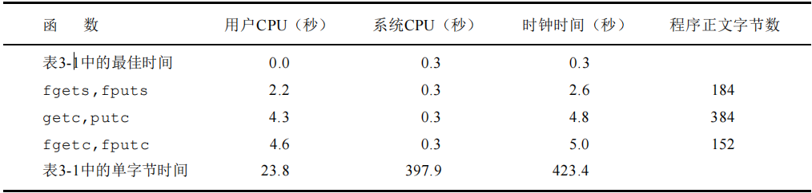

​		对于这三个标准I/O版本的每一个，其用户CPU时间都大于表3-1中的最佳read版本，因为每次读一个字符版本中有一个要执行150万次的循环，而在每次读一行的版本中有一个要执行30000次的循环。在read版本中，其循 环只需执行180次（对于缓存长度为8192字节）。因为系统CPU时间都相同，所以用户CPU时间的差别造成了时钟时间的差别。

​		系统CPU时间相同的原因是因为所有这些程序对内核提出的读、写请求数相同。注意，使用标准I/O例程的一个优点是无需考虑缓存及最佳I/O长度的选择。在使用fgets时需要考虑最大行长，但是最佳I/O长度的选择要方便得多。表5-4中的最后一列是每个main函数的文本空间字节数（由C编译产生的机器指令）。从中可见，使用getc的版本在文本空间中作了getc和putc的宏代换，所以它所需使用的指令数超过了调用fgetc和fputc函数所需指令数。观察getc版本和fgetc版本在用户CPU时间方面的差别，可以看到在程序中作宏代换和调用两个函数在进行本测试的系统上并没有造成多大差别。使用每次一行I/O版本其速度大约是每次一个字符版本的两倍（包括用户CPU时间和时钟时间）。如果fgets和fputs函数用getc和putc实现，那么，可以预期fgets版本的时间会与getc版本相接近。实际上，可以预料每次一行的版本会更慢一些，因为除了现已存在的60000次函数调用外还需增加3百万次宏调用。而在本测试中所用的每次一行函数是用memccpy(3)实现的。

​		通常，为了提高效率，memccpy函数用汇编语言而非C语言编写。这些时间数字的最后一个有趣之处在于：fgetc版本较表3-1中BUFFSIZE＝1的版本要快得多。两者都使用了约3百万次的函数调用，而fgetc版本的速度在用户CPU时间方面，大约是后者的5倍，而在时钟时间方面则几乎是100倍。造成这种差别的原因是：使用read的版本执行了3百万次函数调用，这也就引起3百万次系统调用。而对于fgetc版本，它也执行3百万次函数调用，但是这只引起360次系统调用。系统调用与普通的函数调用相比是很花费时间的。需要声明的是这些时间结果只在某些系统上才有效。这种时间结果依赖于很多实现的特征，而这种特征对于不同的UNIX系统却可能是不同的。尽管如此，使这样一组数据，并对各种版本的差别作出解释，这有助于我们更好地了解系统。在本节及3.9节中我们学到的基本事实是：标 准I/O库与直接调用read和write函数相比并不慢很多。我们观察到使用getc和putc复制1M字节数据大约需3.0秒CPU时间。对于大多数比较复杂的应用程序，最主要的用户CPU时间是由应用本身的各种处理花费的，而不是 由标准I/O例程消耗的。

## 二进制I / O

​		5 . 6节中的函数以一次一个字符或一次一行的方式进行操作。如果为二进制 I / O，那么我们更愿意一次读或写整个结构。为了使用 g e t c或p u t c做到这一点，必须循环通过整个结构，一次读或写一个字节。因为 f p u t s在遇到n u l l字节时就停止，而在结构中可能含有 n u l l字节，所以不能使用每次一行函数实现这种要求。相类似，如果输入数据中包含有 n u l l字节或新行符，则f g e t s也不能正确工作。因此，提供了下列两个函数以执行二进制 I / O操作。


​		这些函数有两个常见的用法：

​		(1) 读或写一个二进制数组。例如，将一个浮点数组的第 2至第5个元素写至一个文件上，

可以写作：

```C 
float data[10];
if (fwrite(&data[2], sizeof(float), 4, fp) != 4)
	err_sys("fwrite error");
```

​		其中，指定*size*为每个数组元素的长度，*nobj*为欲写的元素数。

(2) 读或写一个结构。例如，可以写作：

```C 
struct {

	short count;

	long total;

	char name［N A M E S I Z E］；

} item;
if (fwrite(&item, sizeof(item), 1, fp) != 1)
	err_sys("fwrite error");
```

​		其中，指定*size*为结构的长度，*nobj*为1（要写的对象数）。将这两个例子结合起来就可读或写一个结构数组。为了做到这一点，*size*应当是该结构的sizeof,*nobj*应是该数组中的元素数。fread和fwrite返回读或写的对象数。对于读，如果出错或到达文件尾端，则此数字可以少于*nobj*。在这种情况，应调用ferror或feof以判断究竟是那一种情况。对于写，如果返回值少于所要求的*nobj*，则出错。

​		使用二进制I / O的基本问题是，它只能用于读已写在同一系统上的数据。多年之前，这并无问题（那时，所有 U N I X系统都运行于P D P - 11上），而现在，很多异构系统通过网络相互连接起来，而且，这种情况已经非常普遍。常常有这种情形，在一个系统上写的数据，在另一个系统上处理。在这种环境下，这两个函数可能就不能正常工作，其原因是：

​		(1) 在一个结构中，同一成员的位移量可能随编译程序和系统的不同而异（由于不同的对准要求）。确实，某些编译程序有一选择项，它允许紧密包装结构（节省存储空间，而运行性能则可能有所下降）或准确对齐，以便在运行时易于存取结构中的各成员。这意味着即使在单一系统上，一个结构的二进制存放方式也可能因编译程序的选择项而不同。

​		(2) 用来存储多字节整数和浮点值的二进制格式在不同的系统结构间也可能不同。在不同系统之间交换二进制数据的实际解决方法是使用较高层次的协议。

## 定位流

​		有两种方法定位标准I / O流。

​		(1)ftell和fseek。这两个函数自V7以来就存在了，但是它们都假定文件的位置可以存放在一个长整型中。

​		(2)fgetpos和fsetpos。这两个函数是新由ANSIC引入的。它们引进了一个新的抽象数据类型fpos_t，它记录文件的位置。在非UNIX系统中，这种数据类型可以定义为记录一个文件的位置所需的长度。需要移植到非UNIX系统上运行的应用程序应当使用fgetpos和fsetpos。


​	

​		f g e t p o s将文件位置指示器的当前值存入由 *p o s*指向的对象中。在以后调用 f s e t p o s时，可以使用此值将流重新定位至该位置。

​		对于一个二进制文件，其位置指示器是从文件起始位置开始度量，并以 字节为计量单位的。ftell用于二进制文件时，其返回值就是这种字节位 置。为了用fseek定位一个二进制文件，必须指定一个字节*offset*，以 及解释这种位移量的方式。*whence*的值与3.6节中lseek函数的相同：SEEK_SET表示从文件的起始位置开始，SEEK_CUR表示从当前文件位置，SEEK_END表示从文件的尾端。ANSIC并不要求一个实现对二进制文件支持SEEK_END规格说明，其原因是某些系统要求二进制文件的长度是某个幻数的整 数倍，非实际内容部分则充填为0。但是在UNIX中，对于二进制文件SEEK_END是得到支持的。

​		对于文本文件，它们的文件当前位置可能不以简单的 字节位移量来度量。再一次，这主要也是在非UNIX系统中，它们可能以不同的格式存放文本文件。为了定位一个文本文件，*whence*一定要是SEEK_SET，而且*offset*只能有两种值：0（表示反绕文件至其起始位置）， 或是对该文件的ftell所返回的值。使用rewind函数也可将一个流设置到 文件的起始位置。正如我们已提及的，下列两个函数是C标准新引进的。


## 格式化I / O

### 格式化输出


### 格式化输入


## 临时文件

​		标准I / O库提供了两个函数以帮助创建临时文件

```
#include<stdio.h>

char* tmpnam(char* ptr);
FILE* tmpfile(void);
```

​		tmpnam产生一个与现在文件名不同的一个有效路径名字符串。每次调用它时，它都产生一个不同的路径名，最多调用次数是TMP_MAX。TMP_MAX定义在<stdio.h>中若*ptr*是NULL，则所产生的路径名存放在一个静态区中，指向该静态区的指针作为函数值返回。下一次再调用tmpnam时，会重写该静态区。（这意味着，如果我们调用此函数多次，而且想保存路径名，则我们应当保存该路径名的副本，而不是指针的副本。）如若*ptr*不是NULL，则认为它指向长度至少是L_tmpnam个字符的数组。（常数L_tmpnam定 义在头文件<stdio.h>中。）所产生的路径名存放在该数组中，*ptr*也作为函数值返回。tmpfile创建一个临时二进制文件（类型wb+），在关闭该文件或程序结束时将自动删除这种文件。注意，UNIX对二进制文件不作特殊区分。

​		对于目录有四种不同的选择，并且使用第一个为真的作为目录：

​		(1)如果定义了环境变量TMPDIR，则用其作为目录。（在7.9节中将说明环境变量。）

​		(2)如果参数*directory*非NULL，则用其作为目录。

​		(3)将<stdio.h>中的字符串P_tmpdir用作为目录。

​		(4)将本地目录，通常是/tmp,用作为目录。如果*prefix*非NULL，则它应该是最多包含5个字符的字符串，用其作为文件名的头几个字符。该函数调用malloc函数分配动态存储区，用其存放所构造的路径名。当不再使用此路径名时就可释放此存储区（7.8节将说明malloc和fiee函数)

# 标准I/O库(II)

## 流与FILE对象

对于ASCII字符集，一个字符用一个字节表示。对于国际字符集，一个字符可用多个字节表示。标准I/O文件流可用于单字节或多字节（“宽”）字符集。流的定向（stream's orientation）决定了所读、写的字符是单字节还是多字节的。当一个流最初被创建时，它并没有定向。如若在未定向的流上使用一个多字节 I/O 函数（见），则将该流的定向设置为宽定向的。若在未定向的流上使用一个单字节I/O函数，则将该流的定向设为字节定向的。

```text
#include <stdio.h>
#include <wchar.h>
int fwide(FILE *fp, int mode);
```

- fwide函数可用于设置流的定向。返回值：若流是宽定向的，返回正值；若流是字节定向的，返回负值；若流是未定向的，返回0
- 注意，fwide 并不改变已定向流的定向。还应注意的是，fwide 无出错返回。试想，如若流是无效的，那么将发生什么呢？我们唯一可依靠的是，在调用 fwide 前先清除 errno，从fwide返回时检查errno的值。

## 标准输入、标准输出和标准错误

- 对一个进程预定义了 3 个流，并且这 3 个流可以自动地被进程使用，它们是：标准输入、标准输出和标准错误。这些流引用的文件与文件描述符STDIN_FILENO、STDOUT_FILENO 和STDERR_FILENO所引用的相同。
- 这3个标准I/O流通过预定义文件指针stdin、stdout和stderr加以引用。这3个文件指针定义在头文件中。

## 缓冲

- 标准I/O库提供缓冲的目的就是尽可能减少read和write调用的次数。它对每个I/O流自动地进行缓冲管理，从而避免了应用程序需要考虑这一点所带来的麻烦。
- 标准I/O提供了以下3种类型的缓冲：
- 全缓冲：在这种情况下，在填满标准I/O缓冲区后才进行实际的I/O操作。
- 对于驻留在磁盘上的文件通常是由标准I/O库实施全缓冲的。
- 在一个流上执行第一次I/O操作时，相关标准I/O函数通常调用malloc获得需使用的缓冲区。
- 术语冲洗（flush）说明标准I/O缓冲区的写操作。缓冲区可由标准I/O例程自动地冲洗（例如，当填满一个缓冲区时），或者可以调用函数 fflush 冲洗一个流。
- 在 UNIX环境中，flush有两种意思。**在标准I/O库方面，flush（冲洗）意味着将缓冲区中的内容写到磁盘上（该缓冲区可能只是部分填满的）。在终端驱动程序方面（例如，在第18章中所述的tcflush函数），flush（刷清）表示丢弃已存储在缓冲区中的数据。**
- 行缓冲：在这种情况下，当在输入和输出中遇到换行符时，标准I/O库执行I/O操作。
- 这允许我们一次输出一个字符（用标准I/O函数fputc），但只有在写了一行之后才进行实际I/O操作。当流涉及一个终端时（如标准输入和标准输出），通常使用行缓冲。
- 行缓冲有两个限制：
- 因为标准I/O库用来收集每一行的缓冲区的长度是固定的，所以只要填满了缓冲区，那么即使还没有写一个换行符，也进行I/O操作。
- 任何时候只要通过标准I/O 库要求从（a）一个不带缓冲的流，或者（b）一个行缓冲的流（它从内核请求需要数据）得到输入数据，那么就会冲洗所有行缓冲输出流。（所需的数据可能已在该缓冲区中，它并不要求一定从内核读数据）
- 不带缓冲：标准I/O库不对字符进行缓冲存储。
- 标准错误流stderr通常是不带缓冲的，这就使得出错信息可以尽快显示出来，而不管它们是否含有一个换行符。
- ISO C要求下列缓冲特征。
- 当且仅当标准输入和标准输出并不指向交互式设备时，它们才是全缓冲的。
- 标准错误决不会是全缓冲的。
- 很多系统默认使用下列类型的缓冲：
- 标准错误是不带缓冲的。
- 若是指向终端设备的流，则是行缓冲的；否则是全缓冲的。

```text
#include <stdio.h>
void setbuf(FILE *restrict fp, char *restrict buf);
int setvbuf(FILE *restrict fp, char *restrict buf, int mode, size_t size);
```

- 对任何一个给定的流，如果我们并不喜欢这些系统默认，则可调用两个函数中的一个更改缓冲类型。返回值：若成功，返回0；若出错，返回非0
- 可以使用setbuf 函数打开或关闭缓冲机制。为了带缓冲进行 I/O，参数buf必须指向一个长度为BUFSIZ的缓冲区（该常量定义在中）。通常在此之后该流就是全缓冲的，但是如果该流与一个终端设备相关，那么某些系统也可将其设置为行缓冲的。为了关闭缓冲，将buf设置为NULL。
- setbuf()和setvbuf()函数的实际意义在于：用户打开一个文件后，可以建立自己的文件缓冲区，而不必使用fopen()函数打开文件时设定的默认缓冲区。这样就可以让用户自己来控制缓冲区，包括改变缓冲区大小、定时刷新缓冲区、改变缓冲区类型、删除流中默认的缓冲区、为不带缓冲区的流开辟缓冲区等。
- 使用setvbuf，我们可以精确地说明所需的缓冲类型。这是用mode参数实现的：
- _IOFBF 全缓冲
- _IOLBF 行缓冲
- _IONBF 不带缓冲


- 如果在一个函数内分配一个自动变量类的标准I/O缓冲区，则从该函数返回之前，必须关闭该流（7.8节将对此做更多讨论）。另外，其些实现将缓冲区的一部分用于存放它自己的管理操作信息，所以可以存放在缓冲区中的实际数据字节数少于 size。一般而言，应由系统选择缓冲区的长度，并自动分配缓冲区。在这种情况下关闭此流时，标准I/O库将自动释放缓冲区。
- 任何时候，我们都可强制冲洗一个流。

```text
#include<stdio.h>
int fflush(FILE *fp); 
```

- 返回值：若成功，返回0；若出错，返回EOF
- 此函数使该流所有未写的数据都被传送至内核。作为一种特殊情形，如若fp是NULL，则此函数将导致所有输出流被冲洗。

## 打开流

```text
#include <stdio.h>
FILE *fopen(const char *restrict pathname, const char *restrict type);
FILE *freopen(const char *restrict pathname, const char *restrict type, FILE *restrict fp);
FILE *fdopen(int fd, const char *type);
```

- 3个函数的返回值：若成功，返回文件指针；若出错，返回NULL

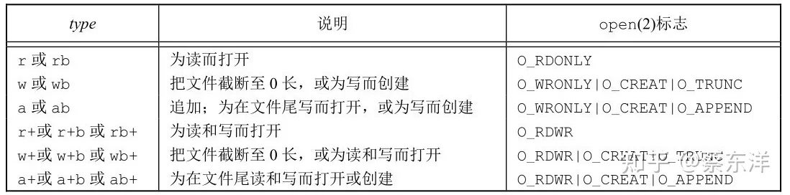

- 使用字符b作为type的一部分，这使得标准I/O系统可以区分文本文件和二进制文件。因为UNIX内核并不对这两种文件进行区分，所以在UNIX系统环境下指定字符b作为type的一部分实际上并无作用。
- 对于fdopen，type参数的意义稍有区别。因为该描述符已被打开，所以fdopen为写而打开并不截断该文件。
- 当以读和写类型打开一个文件时（type中+号），具有下列限制。
- 如果中间没有fflush、fseek、fsetpos或rewind，则在输出的后面不能直接跟随输入。
- 如果中间没有fseek、fsetpos或rewind，或者一个输入操作没有到达文件尾端，则在输入操作之后不能直接跟随输出。

```text
#include <stdio.h>
int fclose(FILE *fp); 
```

- 调用fclose关闭一个打开的流。返回值：若成功，返回0；若出错，返回EOF
- 在该文件被关闭之前，冲洗缓冲中的输出数据。缓冲区中的任何输入数据被丢弃。如果标准I/O库已经为该流自动分配了一个缓冲区，则释放此缓冲区。
- 当一个进程正常终止时（直接调用exit函数，或从main函数返回），则所有带未写缓冲数据的标准I/O流都被冲洗，所有打开的标准I/O流都被关闭。

## 读和写流

**输入函数：**

- 一旦打开了流，则可在3种不同类型的非格式化I/O中进行选择，对其进行读、写操作：
- 每次一个字符的I/O。一次读或写一个字符，如果流是带缓冲的，则标准I/O函数处理所有缓冲。
- 每次一行的I/O。如果想要一次读或写一行，则使用fgets和fputs。每行都以一个换行符终止。当调用fgets时，应说明能处理的最大行长。
- 直接 I/O。fread和fwrite函数支持这种类型的I/O。每次 I/O操作读或写某种数量的对象，而每个对象具有指定的长度。这两个函数常用于从二进制文件中每次读或写一个结构。

```text
#include <stdio.h>
int getc(FILE *fp);
int fgetc(FILE *fp);
int getchar(void);
```

- 用于一次读一个字符。3个函数的返回值：若成功，返回下一个字符；若已到达文件尾端或出错，返回EOF
- 函数getchar等同于getc(stdin)。前两个函数的区别是，getc可被实现为宏，而fgetc不能实现为宏。这意味着
- **getc的参数不应当是具有副作用的表达式，因为它可能会被计算多次。**
- 因为fgetc一定是个函数，所以可以得到其地址。这就允许将fgetc的地址作为一个参数传送给另一个函数。
- 调用fgetc所需时间很可能比调用getc要长，因为调用函数所需的时间通常长于调用宏。
- 这3个函数在返回下一个字符时，将其unsigned char类型转换为int类型。说明为无符号的理由是，如果最高位为1也不会使返回值为负。要求整型返回值的理由是，这样就可以返回所有可能的字符值再加上一个已出错或已到达文件尾端的指示值。在中的常量EOF被要求是一个负值，其值经常是−1。
- 不管是出错还是到达文件尾端，这3个函数都返回同样的值。为了区分这两种不同的情况，必须调用ferror或feof

```text
#include <stdio.h>
int ferror(FILE *fp);
int feof(FILE *fp);

void clearerr(FILE *fp);
```

- 返回值：若条件为真，返回非0（真）；否则，返回0（假）
- 在大多数实现中，为每个流在FILE对象中维护了两个标志：
- 出错标志
- 文件结束标志
- 调用clearerr可以清除这两个标志

```text
#include <stdio.h>
int ungetc(int c, FILE *fp); 
```

- 从流中读取数据以后，可以调用ungetc将字符再压送回流中。返回值：若成功，返回c；若出错，返回EOF

**输出函数:**

```text
#include <stdio.h>
int putc(int c, FILE *fp);
int fputc(int c, FILE *fp);
int putchar(int c);
```

- 对应于上面所述的每个输入函数都有一个输出函数。
- 3个函数返回值：若成功，返回c；若出错，返回EOF
- 与输入函数一样，putchar(c)等同于putc(c, stdout)，putc可被实现为宏，而fputc不能实现为宏。

## 每次一行IO

```text
#include <stdio.h>
char *fgets(char *restrict buf, int n，FILE *restrict fp);
char *gets(char *buf);
```

- 每次输入一行的功能。返回值：若成功，返回buf；若已到达文件尾端或出错，返回NULL

```text
#include <stdio.h>
int fputs(const char *restrict str, FILE *restrict fp);
int puts(const char *str); 
```

- 每次输出一行的功能。返回值：若成功，返回非负值；若出错，返回EOF
- puts 并不像它所对应的 gets 那样不安全。但是我们还是应避免使用它，以免需要记住它在最后是否添加了一个换行符。如果总是使用 fgets 和 fputs, 那么就会熟知在每行终止处我们必须自己处理换行符。

## 标准IO的效率

- 标准I/O的例程效率差异在于用户CPU时间的差别以及等待I/O结束所消耗时间的差别
- 系统CPU时间几乎相同，原因是因为所有这些程序对内核提出的读、写请求数基本相同。注意，使用标准I/O例程的一个优点是无需考虑缓冲及最佳I/O长度的选择。在使用fgets时需要考虑最大行长，但是与选择最佳I/O长度比较，这要方便得多。
- 系统调用与普通的函数调用相比需要花费更多的时间。
- 标准I/O库与直接调用read和write函数相比并不慢很多。对于大多数比较复杂的应用程序，最主要的用户CPU时间是由应用本身的各种处理消耗的，而不是由标准I/O例程消耗的。

## 二进制IO

```text
#include <stdio.h>
size_t fread(void *restrict ptr, size_t size, size_t nobj, FILE *restrict fp);
size_t fwrite(const void *restrict ptr, size_t size, size_t nobj, FILE *restrict fp);
```

- 返回值：读或写的对象数
- 两种常见的用法
- 读或写一个二进制数组
- 读或写一个结构
- 使用二进制I/O的基本问题是，它只能用于读同一个系统上已写的数据。
- 在一个结构中，同一成员的偏移量可能随编译程序和系统的不同而不同（由于不同的对齐要求）。
- 用来存储多字节整数和浮点数的二进制格式在不同的系统结构间也可能不同。

## 定位流

- 有三种方法定位标准流：
- ftell 和fseek 函数。这两个函数自 V7 以来就存在了，但是它们都假定文件的位置可以存放在一个长整型中。
- ftello和fseeko函数。Single UNIX Specification引入了这两个函数，使文件偏移量可以不必一定使用长整型。它们使用off_t数据类型代替了长整型。
- fgetpos和fsetpos函数。这两个函数是由ISO C引入的。它们使用一个抽象数据类型fpos_t记录文件的位置。这种数据类型可以根据需要定义为一个足够大的数，用以记录文件位置。（需要移植到非UNIX系统上运行的应用程序应当使用fgetpos和fsetpos。）

```text
#include <stdio.h>
long ftell(FILE *fp);
int fseek(FILE *fp, long offset, int whence);
void rewind(FILE *fp);
off_t ftello(FILE *fp);
int fseeko(FILE *fp, off_t offset, int whence);
int fgetpos(FILE *restrict fp, fpos_t *restrict pos);
int fsetpos(FILE *fp, const fpos_t *pos); 
```

- ftell返回值：若成功，返回当前文件位置指示；若出错，返回-1L
- fseek返回值：若成功，返回0；若出错，返回−1
- rewind函数可将一个流设置到文件的起始位置。
- 对于一个二进制文件，其文件位置指示器是从文件起始位置开始度量，并以字节为度量单位的。ftell用于二进制文件时，其返回值就是这种字节位置。为了用fseek定位一个二进制文件，必须指定一个字节offset，以及解释这种偏移量的方式。whence的值与3.6节中lseek函数的相同：SEEK_SET表示从文件的起始位置开始，SEEK_CUR表示从当前文件位置开始，SEEK_END表示从文件的尾端开始。
- 对于文本文件，它们的文件当前位置可能不以简单的字节偏移量来度量。这主要也是在非UNIX系统中，它们可能以不同的格式存放文本文件。为了定位一个文本文件，whence一定要是SEEK_SET，而且offset只能有两种值：0（后退到文件的起始位置），或是对该文件的ftell所返回的值。
- 除了偏移量的类型是off_t而非long以外，ftello函数与ftell相同，fseeko函数与fseek相同。
- fgetpos，fsetpos返回值：若成功，返回0；若出错，返回非0
- fgetpos将文件位置指示器的当前值存入由pos指向的对象中。在以后调用fsetpos时，可以使用此值将流重新定位至该位置。

## 格式化IO

**格式化输出**

```text
#include <stdio.h>
int printf(const char *restrict format, ...);
int fprintf(FILE *restrict fp, const char *restrict format, ...);
int dprintf(int fd, const char *restrict format, ...);
int sprintf(char *restrict buf, const char *restrict format, ...);
int snprintf(char *restrict buf, size_t n, const char *restrict format, ...);
```

- printf、fprintf、dprintf返回值：若成功，返回输出字符数；若输出出错，返回负值
- sprintf返回值：若成功，返回存入数组的字符数；若编码出错，返回负值
- snprintf返回值：若缓冲区足够大，返回将要存入数组的字符数；若编码出错，返回负值
- 格式说明控制其余参数如何编写，以后又如何显示。每个参数按照转换说明编写，转换说明以百分号%开始，除转换说明外，格式字符串中的其他字符将按原样，不经任何修改被复制输出。一个转换说明有4个可选择的部分：

```text
%[flags][fldwidth][precision][lenmodifier]convtype
```


flags

- fldwidth说明最小字段宽度。转换后参数字符数若小于宽度，则多余字符位置用空格填充。字段宽度是一个非负十进制数，或是一个星号（*）。
- precision 说明整型转换后最少输出数字位数、浮点数转换后小数点后的最少位数、字符串转换后最大字节数。精度是一个点（.），其后跟随一个可选的非负十进制数或一个星号（*）。
- lenmodifier说明参数长度：


- convtype不是可选的。它控制如何解释参数：

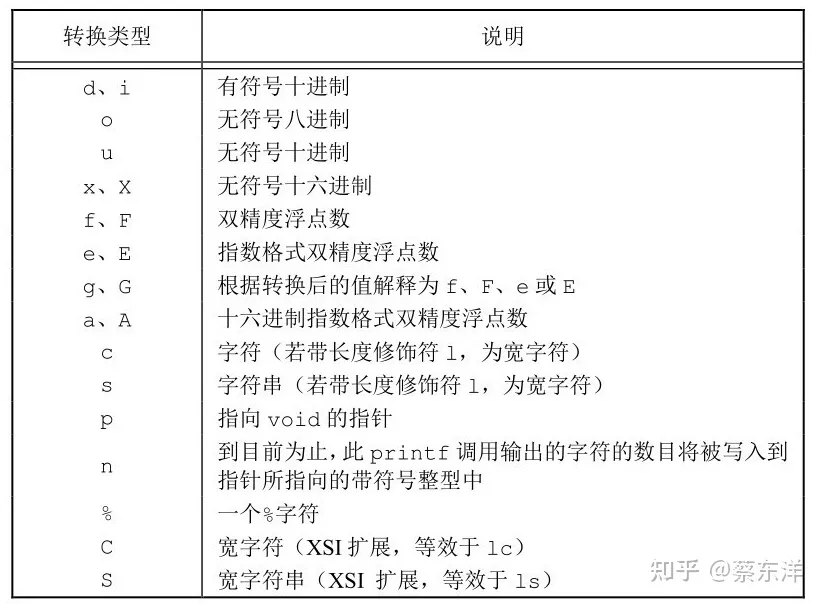

**格式化输入**

```text
#include <stdio.h>
int scanf(const char *restrict format, ...);
int fscanf(FILE *restrict fp, const char *restrict format, ...);
int sscanf(const char *restrict buf, const char *restrict format, ...);
```

- 返回值：赋值的输入项数；若输入出错或在任一转换前已到达文件尾端，返回EOF

## 实现细节

```text
#include <stdio.h>
int fileno(FILE *fp);
```

- 每个标准I/O流都有一个与其相关联的文件描述符，可以对一个流调用fileno函数以获得其描述符。
- fileno不是ISO C标准部分，而是POSIX.1支持的扩展。

## Tips

在本章和之前的章节里，我们在接口中接触到了restrict，是C语言中的一种类型限定符（Type Qualifiers），用于告诉编译器，对象已经被指针所引用，不能通过除该指针外所有其他直接或间接的方式修改该对象的内容。这样做的好处是,能帮助编译器进行更好的优化代码,生成更有效率的汇编代码.如 int *restrict ptr, ptr 指向的内存单元只能被 ptr 访问到，任何同样指向这个内存单元的其他指针都是未定义的，直白点就是无效指针。

# 系统数据文件和信息(I)

​		有很多操作需要使用一些与系统有关的数据文件，例如，口令文件/etc/passwd和组文件/etc/group就是经常由多种程序使用的两个文件。用户每次登录入UNIX系统，以及每次执行lsl命令时都要使用口令文件。

​		由于历史原因，这些数据文件都是A S C I I文本文件，并且使用标准I / O库读这些文件。但是，对于较大的系统，顺序扫描口令文件变得很花费时间，我们想以非 A S C I I文本格式存放这些文件，但仍向应用程序提供一个可以处理任何一种文件格式的界面。对于这些数据文件的可移植界面是本章的主题。本章也包括了系统标识函数、时间和日期函数


​		

关于这些登录项请注意下列各点：

​		• 通常有一个登录项，其用户名为r o o t，其用户I D是0 (超级用户)。

​		•加密口令字段包含了经单向密码算法处理过的用户口令副本。因为此算法是单向的，所以不能从加密口令猜测到原来的口令。当前使用的算法(见Morris和Thompson〔1979〕）总是产生13个可打印字符(在64字符集〔a-zA-Z0-9./〕中)。因为用户名nobody的加密口令字段只包含一个字符(*)，所以加密口令决不会与此值相匹配。此用户名可用于网络服务器，这些服务器允许我们登录到一个系统，但其用户ID和组ID(65534)并不提供优先权。用此用户ID和组ID可存取的文件只是大家都可读、写的文件。(这假 定用户ID65534和组ID65534并不拥有任何文件。)在本节稍后部分我们将 讨论对口令文件最近所作的更改(阴影口令)。

​		• 口令文件中的某些字段可能是空。如果密码口令字段为空，这通常就意味着该用户没有口令(不推荐这样做)。nobody有两个空白字段：注释字段和初始 shell字段。空白注释字段不产生任何影响。空白shell字段则表示取系统默认值，通常是/bin/sh。

​		• 支持f i n g e r ( 1 )命令的某些U N I X系统支持注释字段中的附加信息。其中，各部分之间都用逗号分隔：用户姓名，办公室地点，办公室电话号码，家庭电话号码。另外，如果注释字段中的用户姓名是一个&，则它被代换为登录名。例如，可以有下列记录：


​		g e t p w u i d由l s ( 1 )程序使用，以便将包含在一个 i节点中的数值用户 I D映照为用户登录名。

​		g e t p w n a m在键入登录名时由l o g i n ( 1 )程序使用。

​		这两个函数都返回一个指向p a s s w d结构的指针，该结构已由这两个函数在执行时填入了所需的信息。该结构通常是在相关函数内的静态变量，只要调用相关函数，其内容就会被重写。

​		如果要查看的只是一个登录名或用户 I D，那么这两个P O S I X . 1函数能满足要求，但是也有些程序要查看整个口令文件。下列三个函数则可用于此


​		调用getpwent时，它返回口令文件中的下一个记录。如同上面所述的两个POSIX.1函数一样，它返回一个由它填写好的password结构的指针。每次调用此函数时都重写该结构。在第一次调用该函数时，它打开它所使用的各个文件。在使用本函数时，对口令文件中各个记录安排的顺序并无要求。

​		函数setpwent反绕它所使用的文件，endpwent则关闭这些文件。在使用getpwent查看完口令文件后，一定要调用endpwent关闭这些文件。getpwent知道什么时间它应当打开它所使用的文件(第一次被调用时)，但是它并不能知道何时关闭这些文件。

## 组文件


​		字段gr_mem是一个指针数组，其中的指针各指向一个属于该组的用户名。该数组以null结尾。


​		如同对口令文件进行操作的函数一样，这两个函数通常也返回指向一个静态变量的指针，在每次调用时都重写该静态变量。

​		如果需要搜索整个组文件，则须使用另外几个函数。下列三个函数类似于针对口令文件的三个函数。


## 添加组I D

​		在U N I X中，对组的使用已经作了些更改。在 V 7中，每个用户任何时候都只属于一个组。当用户登录时，系统就按与口令文件相关的数字组 I D，赋给他实际组I D。可以在任何时候执行newgrp(1)以更改组I D。如果newgrp命令执行成功(关于许可权规则，请参阅手册)，则实际组I D就更改为新的组I D，它将被用于后续的文件存取许可权检查。执行不带任何参数的 n e w g r p，则可返回到原来的组。

​		这种组的成员关系一直维持到 1 9 8 3年左右。此时，4 . 2 B S D引入了添加组I D的概念。我们不仅可以属于口令记录中组I D所对应的组，也可属于多至1 6个另外的组。文件存取许可权检查相应被修改为：不仅将进程的有效组 I D与文件的组I D相比较，而且也将所有添加组 I D与文件的组I D进行比较。

​		使用添加组I D的优点是不必再显式地经常更改组。一个用户常常会参加多个项目，因此也就要同时属于多个组。为了存取和设置添加组I D提供了下列三个函数：


​		getgroups将进程所属用户的各添加组ID填写到数组*grouplist*中，填写入该数组的添加组,ID数最多为*gidsetsize*个。实际填写到数组中的添加组ID数由函数返回。如果系统常数NGROUPS_MAX为0，则返回0，这并不 表示出错。作为一种特殊情况，如若*gidsetsize*为0，则函数只返回添 加组ID数，而对数组*grouplist*则不作修改。(这使调用者可以确定*grouplist*数组的长度，以便进行分配。)*setgroups*可由超级用户调用以 便为调用进程设置添加组ID表。*grouplist*是组ID数组，而*ngroups*说明了数组中的元素数。

​		通常,只有initgroups函数调用setgroups,initgroups读整个组文件(用函数getgrent,setgrent和endgrent)，然后对*username*确定其组的成员关系。然后，它调用setgroups,以便为该用户初始 化添加组ID表。因为initgroups调用setgroups,所以只有超级用户才能调用initgroups。除了在组文件中找到*username*是成员的组，initgroups也在添加组ID表中包括了*basegid*。*basegid*是*username*在口令文件中的组ID。initgroups只有少数几个程序调用，例如login(1)程序在用户登录时调用该函数

## 其他数据文件

​		至此已讨论了两个系统数据文件——口令文件和组文件。在日常事务操作中，U N I X系统还使用很多其他文件。例如， B S D网络软件有一个记录各网络服务器所提供的服务的数据文件( / e t c / s e r v i c e s )，有一个记录协议信息的数据文件( / e t c / p r o t o c o l s )，还有一个则是记录网络信息的数据文件( / e t c / n e t w o r k s )。幸运的是，对于这些数据文件的界面都与上述对口令文件和组文件的相似。

一般情况下每个数据文件至少有三个函数：

(1) get函数：读下一个记录，如果需要还打开该文件。此种函数通常返回指向一个结构的指针。当已达到文件尾端时返回空指针。大多数 g e t函数返回指向一个静态存储类结构的指针，如果要保存其内容，则需复制它。

(2) set函数：打开相应数据文件 (如果尚末打开)，然后反绕该文件。如果希望在相应文件起始处开始处理，则调用此函数。

(3) end函数：关闭相应数据文件。正如前述，在结束了对相应数据文件的读、写操作后，总应调用此函数以关闭所有相关文件。另外，如果数据文件支持某种形式的关键字搜索，则也提供搜索具有指定关键字的记录的例程。例如，对于口令文件提供了两个按关键字进行搜索的程序： getpwnam寻找具有指定用户名的记录；getpwuid寻找具有指定用户I D的记录。

​		表6 - 3中列出了一些这样的例程，这些都是 S V R 4和4 . 3 + B S D所支持的。在表中列出了针对口令文件和组文件的函数，这些已在上面说明过。表中也列出了一些与网络有关的函数。表中列出的所有数据文件都有get, set和end函数。

## 登录会计

​		大多数UNIX系统都提供下列两个数据文件： utmp文件，它记录当前登录进系统的各个用户；wtmp文件，它跟踪各个登录和注销事件。

​		在V7中，包含下列结构的一个二进制记录写入这两个文件中

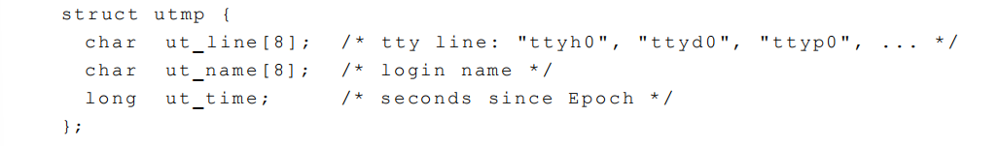

​		字节登录时，login程序填写这样一个结构，然后将其写入到utmp文件中，同时也将其添写到wtmp文件中。注销时，init进程将utmp文件中相应的记录擦除(每个字节都填以0)，并将一个新记录添写到wtmp文件中。读wtmp文件中的该注销记录，其ut_name字段清除为0。在系统再启动时，以及更改系统时间和日期的前后，都在wtmp文件中添写特殊的记录项。who(1)程序读utmp文件，并以可读格式打印其内容。后来的UNIX版本提供last(1)命令，它读wtmp文件并打印所选择的记录。大多数UNIX版本仍提供utmp和wtmp文件，但其中的信息量却增加了。V7中20字节的结构在SVR2中已扩充为36字节，而在SVR4中，utmp结构已扩充为350字节.

# 系统数据文件和信息(II)

## 口令文件


/etc/passwd文件中的字段

由于历史原因，口令文件是/etc/passwd，而且是一个 ASCII 文件。

关于这些登录项，请注意下列各点：

- 通常有一个用户名为root的登录项，其用户ID是0（超级用户）。
- 加密口令字段包含了一个占位符。较早期的UNIX系统版本中，该字段存放加密口令字。将加密口令字存放在一个人人可读的文件中是一个安全性漏洞，所以现在将加密口令字存放在另一个文件中。
- 口令文件项中的某些字段可能是空。如果加密口令字段为空，这通常就意味着该用户没有口令（不推荐这样做）。
- 空白注释字段不产生任何影响。
- shell字段包含了一个可执行程序名，它被用作该用户的登录shell。若该字段为空，则取系统默认值，通常是/bin/sh。注意，squid登录项的该字段为/dev/null。显然，这是一个设备，不是可执行文件，将其用于此处的目的是，阻止任何人以用户squid的名义登录到该系统。
- 为了阻止一个特定用户登录系统，除使用/dev/null外，还有若干种替代方法。常见的一种方法是，将/bin/false 用作登录 shell。它简单地以不成功（非 0）状态终止，该shell将此种终止状态判断为假。另一种常见方法是，用/bin/true禁止一个账户。它所做的一切是以成功（0）状态终止。某些系统提供 nologin 命令，它打印可定制的出错信息，然后以非0状态终止。
- 使用nobody用户名的一个目的是，使任何人都可登录至系统，但其用户ID（65534）和组ID（65534）不提供任何特权。该用户ID和组ID只能访问人人皆可读、写的文件。（假定用户ID 65534和组ID 65534并不拥有任何文件，而实际情况就应如此。）

POSIX.1定义了两个获取口令文件项的函数。在给出用户登录名或数值用户ID后，这两个函数就能查看相关项。

```c
#include<pwd.h>
struct passwd *getpwuid(uid_t uid);
struct passwd *getpwnam(const char *name);
// 两个函数返回值：若成功，返回指针；若出错，返回NULL
```

**getpwuid函数由ls(1)程序使用，它将i节点中的数字用户ID映射为用户登录名。在键入登录名时，getpwnam函数由login(1)程序使用。** 这两个函数都返回一个指向passwd结构的指针，该结构已由这两个函数在执行时填入信息。

```c
#include <pwd.h>
struct passwd *getpwent(void);
// 返回值：若成功，返回指针；若出错或到达文件尾端，返回NULL
void setpwent(void);
void endpwent(void);
```

调用getpwent时，它返回口令文件中的下一个记录项。如同上面所述的两个POSIX.1函数一样，它返回一个由它填写好的 passwd 结构的指针。每次调用此函数时都重写该结构。在第一次调用该函数时，它打开它所使用的各个文件。在使用本函数时，对口令文件中各个记录项的安排顺序并无要求。某些系统采用散列算法对/etc/passwd 文件中各项排序。

函数setpwent反绕它所使用的文件，endpwent则关闭这些文件。在使用getpwent查看完口令文件后，一定要调用endpwent关闭这些文件。getpwent知道什么时间应当打开它所使用的文件（第一次被调用时），但是它并不知道何时关闭这些文件。

**在函数开始处调用setpwent是自我保护性的措施，以便确保如果调用者在此之前已经调用getpwent打开了有关文件情况下，反绕有关文件使它们定位到文件开始处。**

## 阴影口令

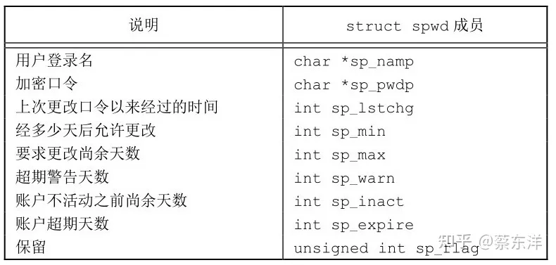

/etc/shadow文件中的字段

加密口令是经单向加密算法处理过的用户口令副本。因为此算法是单向的，所以不能从加密口令猜测到原来的口令。

只有用户登录名和加密口令这两个字段是必须的。其他的字段控制口令更改的频率，或者说口令的衰老以及账户仍然处于活动状态的时间。

阴影口令文件不应是一般用户可以读取的。仅有少数几个程序需要访问加密口令，如login(1)和 passwd(1)，这些程序常常是设置用户 ID 为 root 的程序。有了阴影口令后，普通口令文件/etc/passwd可由各用户自由读取。

在FreeBSD 8.0和Mac OS X 10.6.8中，没有阴影口令结构。附加的账户信息存放在口令文件中

```text
#include <shadow.h>
struct spwd *getspnam(const char *name);
struct spwd *getspent(void);
// 两个函数返回值：若成功，返回指针；若出错，返回NULL
void setspent(void);
void endspent(void);
```

## 组文件


/etc/group文件中的字段

字段gr_mem是一个指针数组，其中每个指针指向一个属于该组的用户名。该数组以null指针结尾。可以用下列两个由POSIX.1定义的函数来查看组名或数值组ID。

```text
#include <grp.h>
struct group *getgrgid(gid_t gid);
struct group *getgrnam(const char *name);
```

两个函数返回值：若成功，返回指针；若出错，返回NULL 搜索整个组文件:

```text
#include <grp.h>
struct group *getgrent(void);
// 返回值：若成功，返回指针；若出错或到达文件尾端，返回NULL
void setgrent(void);
void endgrent(void);
```

## 附属组ID

在UNIX系统中，对组的使用已经做了些更改。在V7中，每个用户任何时候都只属于一个组。当用户登录时，系统就按口令文件记录项中的数值组 ID，赋给他实际组 ID。可以在任何时候执行newgrp(1)以更改组ID。如果newgrp命令执行成功（关于权限规则，请参阅手册），则实际组 ID 就更改为新的组 ID，它将被用于后续的文件访问权限检查。执行不带任何参数的newgrp，则可返回到原来的组。

**附属组ID的概念用户不仅可以属于口令文件记录项中组ID所对应的组，也可属于多至16个另外的组。文件访问权限检查相应被修改为：不仅将进程的有效组ID与文件的组ID相比较，而且也将所有附属组ID与文件的组ID进行比较。**

附属组 ID 是 POSIX.1 要求的特性。（在较早的 POSIX.1 版本中，该特性是可选的。）常量NGROUPS_MAX（见图2-11）规定了附属组ID的数量，其常用值是16。

使用附属组 ID 的优点是不必再显式地经常更改组。一个用户会参与多个项目，因此也就要同时属于多个组，此类情况是常有的。 为了获取和设置附属组ID，提供了下列3个函数：

```text
#include <unistd.h>
int getgroups(int gidsetsize, gid_t grouplist[]);
// 返回值：若成功，返回附属组ID数量；若出错，返回-1
#include <grp.h> /* on Linux */
#include <unistd.h> /* on FreeBSD, Mac OS X, and Solaris */
int setgroups(int ngroups, const gid_t grouplist[]);
#include <grp.h> /* on Linux and Solaris */
#include <unistd.h> /* on FreeBSD and Mac OS X */
int initgroups(const char *username, gid_t basegid);
// 两个函数的返回值：若成功，返回0；若出错，返回-1
```

在这3个函数中，POSIX.1只说明了getgroups。因为setgroups和initgroups是特权操作，所以它们并非POSIX.1的组成部分。

getgroups将进程所属用户的各附属组ID填写到数组grouplist中，填写入该数组的附属组ID数最多为gidsetsize个。实际填写到数组中的附属组ID数由函数返回。作为一种特殊情况，如若gidsetsize为0，则函数只返回附属组ID数，而对数组grouplist则不做修改。（这使调用者可以确定grouplist数组的长度，以便进行分配。）

## 实现区别


账户实现的区别

我们已讨论了Linux和Solaris支持的阴影口令文件。FreeBSD和Mac OS X则以不同方式存储加密口令字。

在很多系统中，用户和组数据库是用网络信息服务（Network Information Service，NIS）实现的。这使管理人员可编辑数据库的主副本，然后将它自动分发到组织中的所有服务器上。客户端系统联系服务器以查看用户和组的有关信息。NIS+和轻量级目录访问协议（Lightweight Directory Access Protocol，LDAP）提供了类似功能。很多系统通过配置文件/etc/nsswitch.conf控制用于管理每一类信息的方法。

## 其他数据文件

除了口令文件和组文件。在日常操作中，UNIX系统还使用很多其他文件。例如，BSD网络软件有一个记录各网络服务器所提供服务的数据文件（/etc/services），有一个记录协议信息的数据文件（/etc/protocols），还有一个则是记录网络信息的数据文件（/etc/networks）。对于这些数据文件的接口都与上述对口令文件和组文件的相似。

一般情况下，对于每个数据文件至少有3个函数。

- get函数：读下一个记录，如果需要，还会打开该文件。此种函数通常返回指向一个结构的指针。当已达到文件尾端时返回空指针。大多数get函数返回指向一个静态存储类结构的指针，如果要保存其内容，则需复制它。
- set 函数：打开相应数据文件（如果尚末打开），然后反绕该文件。如果希望在相应文件起始处开始处理，则调用此函数。
- end函数：关闭相应数据文件。如前所述，在结束了对相应数据文件的读、写操作后，总应调用此函数以关闭所有相关文件。


访问系统数据文件的一些例程

## 登录账户记录

大多数UNIX系统都提供下列两个数据文件：utmp文件记录当前登录到系统的各个用户；wtmp文件跟踪各个登录和注销事件。在V7中，每次写入这两个文件中的是包含下列结构的一个二进制记录：

```text
struct utmp {
    char ut_line[8]; /* tty line: "ttyh0", "ttyd0", "ttyp0", ... */
    char ut_name[8]; /* login name */
    long　ut_time;　　/* seconds since Epoch */
};
```

## 系统标识

POSIX.1定义了uname函数，它返回与主机和操作系统有关的信息。

```text
#include <sys/utsname.h>
int uname(struct utsname *name);
// 返回值：若成功，返回非负值；若出错，返回-1

struct utsname {
    char sysname[ ]; /* name of the operating system */
    char nodename[ ]; /* name of this node */
    char release[ ]; /* current release of operating system */
    char version[ ]; /* current version of this release */
    char machine[ ]; /* name of hardware type */
};
```

历史上，BSD派生的系统提供gethostname函数，它只返回主机名，该名字通常就是TCP/IP网络上主机的名字。

```text
#include <unistd.h>
int gethostname(char *name, i n t namelen);
```

## 时间和日期例程

**由UNIX内核提供的基本时间服务是计算自协调世界时（Coordinated Universal Time，UTC）公元1970年1月1日00:00:00这一特定时间以来经过的秒数。这种秒数是以数据类型time_t表示的，我们称它们为日历时间。日历时间包括时间和日期。**

UNIX在这方面与其他操作系统的区别是：

- 以协调统一时间而非本地时间计时；
- 可自动进行转换，如变换到夏令时；
- 将时间和日期作为一个量值保存。

time函数返回当前时间和日期。

```text
#include <time.h>
time_t time(time_t *calptr);
// 返回值：若成功，返回时间值；若出错，返回-1
```


时钟类型标识符

clock_gettime函数可用于获取指定时钟的时间，返回的时间在timespec结构中，它把时间表示为秒和纳秒。

```text
#include <sys/time.h>
int clock_gettime(clockid_t clock_id, struct timespec *tsp);
// 返回值：若成功，返回0；若出错，返回-1
```

**当时钟ID设置为CLOCK_REALTIME时，clock_gettime函数提供了与time函数类似的功能，不过在系统支持高精度时间值的情况下，clock_gettime可能比time函数得到更高精度的时间值。**

```text
#include <sys/time.h>
int clock_getres(clockid_t clock_id, struct timespec *tsp);
// 返回值：若成功，返回0；若出错，返回-1
```

clock_getres函数把参数tsp指向的timespec结构初始化为与clock_id参数对应的时钟精度。

要对特定的时钟设置时间，可以调用clock_settime函数。

```text
#include <sys/time.h>
int clock_settime(clockid_t clock_id, const struct timespec *tsp);
// 返回值：若成功，返回0；若出错，返回-1
```

SUSv4指定gettimeofday函数现在已弃用。然而，一些程序仍然使用这个函数，因为与time函数相比，gettimeofday提供了更高的精度（可到微秒级）。

```text
#include <sys/time.h>
int gettimeofday(struct timeval *restrict tp, void *restrict tzp);
// 返回值：总是返回0
```

tzp的唯一合法值是NULL，其他值将产生不确定的结果。gettimeofday函数以距特定时间（1970年1月1日00 : 00 : 00）的秒数的方式将当前时间存放在tp指向的timeval结构中，而该结构将当前时间表示为秒和微秒。

一旦取得这种从上述特定时间经过的秒数的整型时间值后，通常要调用函数将其转换为分解的时间结构，然后调用另一个函数生成人们可读的时间和日期。


各个时间函数之间的关系

图中以虚线表示的3个函数localtime、mktime和strftime都受到环境变量TZ的影响。

两个函数localtime和gmtime将日历时间转换成分解的时间，并将这些存放在一个tm结构中。

```text
struct　 tm {　　　　 /* a broken-down time */
    int　　tm_sec;　　　 /* seconds after the minute: [0 - 60] */
    int　　tm_min;　　　 /* minutes after the hour: [0 - 59] */
    int　　tm_hour;　　 /* hours after midnight: [0 - 23] */
    int　　tm_mday;　　 /* day of the month: [1 - 31] */
    int　　tm_mon;　　　 /* months since January: [0 - 11] */
    int　　tm_year;　　 /* years since 1900 */
    int　　tm_wday;　　 /* days since Sunday: [0 - 6] */
    int　　tm_yday;　　 /* days since January 1: [0 - 365] */
    int　　tm_isdst;　　/* daylight saving time flag: <0, 0, >0 */
};
```

如果夏令时生效，则夏令时标志值为正；如果为非夏令时时间，则该标志值为0；如果此信息不可用，则其值为负。

Single UNIX Specification的以前版本允许双润秒，于是，tm_sec值的有效范围是0～61。UTC的正式定义不允许双润秒，所以，现在tm_sec值的有效范围定义为0～60。

```text
#include <time.h>
struct tm *gmtime(const time_t *calptr);
struct tm *localtime(const time_t *calptr);
// 两个函数的返回值：指向分解的tm结构的指针；若出错，返回NULL
```

**localtime和gmtime之间的区别是：localtime将日历时间转换成本地时间（考虑到本地时区和夏令时标志），而 gmtime 则将日历时间转换成协调统一时间的年、月、日、时、分、秒、周日分解结构。**

函数mktime以本地时间的年、月、日等作为参数，将其变换成time_t值。

```text
#include <time.h>
time_t mktime(struct tm *tmptr);
// 返回值：若成功，返回日历时间；若出错，返回-1
```

函数strftime是一个类似于printf的时间值函数。它非常复杂，可以通过可用的多个参数来定制产生的字符串。

```text
#include <time.h>
size_t strftime(char *restrict buf, size_t maxsize,const char *restrict format,const struct tm *restrict tmptr);
size_t strftime_l(char *restrict buf, size_t maxsize,const char *restrict format,const struct tm *restrict tmptr, locale_t locale);
// 两个函数的返回值：若有空间，返回存入数组的字符数；否则，返回0
```

strftime_l允许调用者将区域指定为参数，除此之外，strftime和strftime_l函数是相同的。strftime使用通过TZ环境变量指定的区域。

tmptr参数是要格式化的时间值，由一个指向分解时间值tm结构的指针说明。格式化结果存放在一个长度为maxsize个字符的buf数组中，如果buf长度足以存放格式化结果及一个null终止符，则该函数返回在buf中存放的字符数（不包括null终止符）；否则该函数返回0。

format参数控制时间值的格式。如同printf函数一样，转换说明的形式是百分号之后跟一个特定字符。format中的其他字符则按原样输出。

strptime函数是strftime的反过来版本，把字符串时间转换成分解时间。

```text
#include <time.h>
char *strptime(const char *restrict buf, const char *restrict format,struct tm *restrict tmptr);
// 返回值：指向上次解析的字符的下一个字符的指针；否则，返回NULL
```

localtime、mktime和strftime受到环境变量TZ的影响，如果定义了TZ，则这些函数将使用其值代替系统默认时区。如果 TZ定义为空串（即TZ=），则使用协调统一时间UTC。TZ的值常常类似于TZ=EST5EDT。


# UNIX进程的环境(I)

​		这里我们将介绍进程控制原语，在此之前需先了解进程的环境。本章中将学习：当执行程序时，其main函数是如何被调用的，命令行参数是如何传送给执行程序的；典型的存储器布局是什么样式；如何分配另外的存储空间；进程如何使用环境变量；进程终止的不同方式等。另外，还将说明longjmp和setjmp函数以及它们与栈的交互作用。本章结束之前，还将查看进程的资源限制

## main函数

​		**C程序总是从main函数开始执行。**main函数的原型是：

```
int main(int argc, char* agrv[]);
```

​		**其中，*argc*是命令行参数的数目，*argv*是指向参数的各个指针所构成的数组。当内核起动C程序时(使用一个exec函数，8.9节将说明exec函数)，在调用main前先调用一个特殊的起动例程。**可执行程序文件将此起动例程指定为程序的起始地址——这是由连接编辑程序设置的，而连接编辑程序则由C编译程序(通常是cc)调用。起动例程从内核取得命令行参数和环境变量值，然后为调用main函数作好安排

## 进程终止

​		有五种方式使进程终止：

1. 正常终止:
   1. 从main返回。
   2. 调用exit。
   3. 调用_exit。
2. 异常终止：
   1. 调用abort;
   2. 由一个信号终止

​		上节提及的起动例程是这样编写的，使得从 m a i n返回后立即调用e x i t函数。如果将起动例程以C代码形式表示(实际上该例程常常用汇编语言编写)，则它调用m a i n函数的形式可能是：

```
exit( main(argc, argv) )
```

### exit和_exit函数

​		**exit和\_exit函数用于正常终止一个程序：_exit立即进入内核，exit则先执行一些清除处理(包括调用执行各终止处理程序，关闭所有标准I/O流等)，然后进入内核。**(区别)

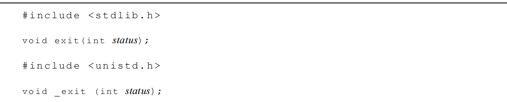


​		由于历史原因，exit函数总是执行一个标准I/O库的清除关闭操作：对于所有打开流调用fclose函数。回忆5.5节，这造成缓存中的所有数据都被刷新(写到文件上)。exit和_exit都带一个整型参数，称之为终止状态（exitstatus）。大多数UNIXshell都提供检查一个进程终止状态的方法。如果(a)若调用这些函数时不带终止状态，或(b)main执行了一个无返回值的return语句，或(c)main执行隐式返回，则该进 程的终止状态是末定义的。这就意味着，下列经典性的C语言程序：

```C 
#include <stdio.h>
main ()
{
	printf ("hello, world \n");
}
```

​		是不完整的，因为main函数没有使用return语句返回(隐式返回)，它在返回到C的起动例程时并没有返回一个值(终止状态)。另外，若使用：return(0);或者exit(0)；则向执行此程序的进程(常常是一个shell进程)返回终止状态0。另外，main函数的说明实际上应当是：

```
int main(void)
```

​		下一章将了解进程如何使程序执行，如何等待执行该程序的进程完成，然后取得其终止状态。

```
将main说明为返回一个整型以及用exit代替return，对某些C编译程序和UNIX lint(1)程序而言会产生不必要的警告信息，因为这些编译程序并不了解main中的exit与return语句的作用相同。警告信息可能是"control reaches end of nonvoid function"（控制到达非void函数的结束处）。避开这种警告信息的一种方法是：在main中使用return语句而不是exit。但是这样做的结果是不能用UNIX的grep公用程序来找出程序中所有的exit调用。另外一个解决方法是将main说明为返回void而不是int，然后仍旧调用exit。这也避开了编译程序的警告，但从程序设计角度看却并不正确。本章将main表示 为返回一个整型，因为这是ANSIC和POSIX.1所定义的。我们将不理会编译程序不必要的警告。
```

### atexit函数

​		按照ANSI C的规定，一个进程可以登记多至32个函数，这些函数将由exit自动调用。我们称这些函数为终止处理程序（exit handler），并用atexit函数来登记这些函数。


​		其中，atexit的参数是一个函数地址，当调用此函数时无需向它传送任何参数，也不期望它返回一个值。 exit以登记这些函数的相反顺序调用它们。同一函数如若登记多次，则也被调用多次。

​		根据ANSIC和POSIX.1，exit首先调用各终止处理程序，然后按需多次调用fclose，关闭所有打开流。图7-1显示了一个C程序是如何起动的，以及它终止的各种方式。


​		注意，内核使程序执行的唯一方法是调用一个exec函数。进程自愿终止的唯一方法是显式或隐式地(调用exit)调用_exit。进程也可非自愿地由一个信号使其终止(图7-1中没有显示)。

```C
#include<apue.h>

static void my_exit1(void), my_exit2(void);
int main(void)
{
    if(atexit(my_exit2) != 0)
        err_sys("can't register my_exit2");
    if(atexit(my_exit1) != 0)
        err_sys("can't register my_exit1");
    if(atexit(my_exit1) != 0)
        err_sys("can't register my_exit1");
    printf("main is done\n");
    return 0;
}

static void my_exit1(void)
{
    printf("first exit handler\n");
}

static void my_exit2(void)
{
    printf("second exit handler\n");
}
```

## 命令行参数

​		当执行一个程序时，调用e x e c的进程可将命令行参数传递给该新程序。这是 UNIX shell的一部分常规操作。在前几章的很多实例中，我们已经看到了这一点。

实例

​		程序7 - 2将其所有命令行参数都回送到标准输出上 (UNIX echo(1)程序不回送第0个参数)。编译此程序，并将其可执行代码文件定名为 echoarg，则：

```C 
#include<apue.h>

void solution1(int argc, char *argv[])
{
    int i;
    for(int i = 0; i < argc; i++)
        printf("argv[%d]: %s\n", i, argv[i]);
    return;
}

void solution2(int argc, char *argv[])
{
    while(--argc > 0)
        printf("%s%s", *++argv, (argc > 1) ? " " : "");
    printf("\n");
    return;
}


void solution4(int argc, char *argv[])
{
   for(int i = 0; argv[i] != NULL; i++)
       printf("argv[%d]: %s\n", i, argv[i]);
}

int main(int argc, char *argv[])
{
    printf("\nSolution 1:\n");
    solution1(argc, argv);
    printf("\nSolution 2:\n");
    solution2(argc, argv);
    printf("\nSolution 4:\n");
    solution4(argc, argv);
    return 0;
}
```

## 环境表

​		每个程序都接收到一张环境表。与参数表一样，环境表也是一个字符指针数组，其中每个指针包含一个以null结束的字符串的地址。全局变量environ则包含了该指针数组的地址。

```
extern char **environ;
```

​		例如：如果该环境包含五个字符串，那么它看起来可能如图 7 - 2中所示。


​		其中，每个字符串的结束处都有一个null字符。我们称environ为环境指针，指针数组为环境表，其中各指针指向的字符串为环境字符串。

​		按照惯例，环境由：

```
name = value
```

​		这样的字符串组成，这与图 7 - 2中所示相同。大多数预定义名完全由大写字母组成，但这只是一个惯例。

​		在历史上，大多数U N I X系统对m a i n函数提供了第三个参数，它就是环境表地址：

```
int main(int argc, char* argv[], char* envp [] );
```

​		因为ANSIC规定main函数只有两个参数，而且第三个参数与全局变量environ相比也没有带来更多益处，所以POSIX.1也规定应使用environ而不使用第三个参数。通常用getenv和putenv函数(7.9节将说明)来存取特定的环境变量，而不是用environ变量。但是，如果要查看整个环境，则必须使用environ指针。

## C程序的存储空间布局

​		由于历史原因，C程序一直由下列几部分组成：

​		• **正文段。这是由CPU执行的机器指令部分**。通常，正文段是可共享的，所以即使是经常执行的程序(如文本编辑程序、C编译程序、shell等)在存储器中也只需有一个副本，另外，正文段常常是只读的，以防止程序由于意外事故而修改其自身的指令。

​		• 初始化数据段。通常将此段称为数据段，它包含了程序中需赋初值的变量。例如， C程序中任何函数之外的说明：

```
int maxcount = 99;
```

​		使此变量以初值存放在初始化数据段中。

• **非初始化数据段。通常将此段称为bss段，这一名称来源于早期汇编程序的一个操作符，意思是“block started by symbol（由符号开始的块）”，在程序开始执行之前，内核将此段初始化为0。函数外的说明：**

```
long sum[1000] ;
```

​		使此变量存放在非初始化数据段中。

​		• 栈。自动变量以及每次函数调用时所需保存的信息都存放在此段中。每次函数调用时，其返回地址、以及调用者的环境信息（例如某些机器寄存器）都存放在栈中。然后，新被调用的函数在栈上为其自动和临时变量分配存储空间。通过以这种方式使用栈， C函数可以递归调用。

​		• 堆。通常在堆中进行动态存储分配。由于历史上形成的惯例，堆位于非初始化数据段顶和栈底之间。

### 扩展

#### **1 目标文件的构成**

编译器编译源码后生成的文件叫目标文件（Object File）。目标文件从结构上讲，它是已编译后的可执行文件格式，只是还没有经过链接过程，其中有些符号或有些地址还没有调整。

目标文件本身就是按照可执行文件格式存储的，只是跟真正的可执行文件在结构上稍有不同。


##### **1.1 格式**

目标文件就是源代码编译之后但未进行链接的哪些中间文件（Windows 下 是 .obj，linux 下是.o）。它与可执行文件的内容和结构基本相同。

目标文件和可执行文件一般采用同一种格式，这种存储格式为 ELF（linux Executable Linkable Format），window 下 是 PE（Portable Executable）

在 linux 下 除了目标文件和可执行文件采用 ELF 格式外，静态库文件、动态库文件也都按照可执行文件 ELF 的格式存储。

| ELF 文件类型                    | 说明                                                         | 实例                                            |
| ------------------------------- | ------------------------------------------------------------ | ----------------------------------------------- |
| 可重定位文件(Relocatable File)  | 此类文件包含代码和数据、可被链接为可执行文件或共享目标文件，静态链接库被归为此类 | Linux 下的 .o：hello.o                          |
| 可执行文件(Executable File)     | 此类文件包含了可以直接执行的文件                             | /bin/bash等                                     |
| 共享目标文件(Share Object File) | 此类文件包含了可以直接执行的文件                             | linux 的.so、/lib/x86_64-linux-gnu/libc-2.23.so |
| 核心转储文件(Core Dump File)    | 当进程意外终止，系统生成的核心转储文件                       | Linux 下的 core dump文件                        |


linux 可以通过 file 命令查看。目标文件和可执行文件跟操作系统和编译器密切相关，不同平台下的格式会有些差异。

**目标文件：**

- 文件格式：ELF 64bit
- LSB：小端
- x86-64：平台 (和工具链有关)
- relocatable：可重定位
- not stripped：没有 stripped


**可执行程序：**

- 文件格式：ELF 64bit
- LSB：小端
- executable：可执行
- x86-64：平台
- statically linked：静态链接
- not stripped：没有 stripped


**动态库：**

- 文件格式：ELF 64bit
- LSB：小端
- share object：共享文件
- x86-64：平台
- dynamically linked：动态链接


#### **1.2 组成**

目前文件中的内容至少有编译后的机器指令代码和数据，除了这些，目标文件中还包含了链接时所必须的一些信息，比如符号表、调试信息、字符串等。

一般目标文件将这些信息按照不同的属性，以段（segment）的形式存储。


- 代码段（.text）：源代码编译过后的机器指令。
- 数据段（.data）：全局变量和局部静态变量被放在数据段。
- 只读数据段（.rodata）：const 修饰的变量和其他字符串常量。
- bss 段：为未初始化的符号，预留足够的空间。未初始化的变量在 bss 段。
- 其他段。

##### **2. 目标文件的分析**

下面我们根据一段代码来分析目标文件的内部结构（以 MIPS 平台为例）：


##### **2.1 ELF 文件头**

ELF 文件开头是一个头文件，它描述的是整个文件的属性，包括：文件的类型、目标硬件、目标操作系统等信息。

readelf -h 可读取 elf 文件头。头文件包含如下：

- ELF 魔数。
- 文件机器字节长度。
- 数据存储方式。
- 版本。
- 运行平台。
- ABI 版本。
- ELF 重定位类型。
- 硬件平台。
- 硬件平台版本。
- 入口地址（目标文件入口地址为 0，只有相对位置）。
- 程序的入口和长度。
- 段表的位置和长度。


**目标文件 ELF 头**


**可执行程序 ELF 头**


##### **2.2 段表**

头文件之后，紧接着是一个段表，段表是一个描述文件各个段的数组。描述了文件中各个段在文件中的偏移位置以及段的属性。（readelf -S, objdump -h）

主要的段如下：

- 代码段(.text)。
- 数据段(.data)。
- bss 段。
- 只读数据段(.rodata)。
- .comment
- （符号表段）.symtab
- 符号表(.shstrtab)：Section String table
- （重定位代码段）.rel.text
- 等


各段详细信息及字节对齐：


最终组成结构如下。中间Section Table 和 其他某些段因为对齐原因，会有若干字节的间隔。整个目标文件的大小刚好是 1588 字节。


**代码段**

C 语言编译后的机器指令，都保存在代码段（.text）。我们可以通过 objdump 来查看段的信息。-s 可以将所有段以 16 进制打印出来。-d 可以将所有包含指令的段反汇编。

可以看到代码段保存的是 f 和 main 的指令。


**数据段**

数据段（.data）保存的是哪些已经初始化（非零）的全局变量（静态变量和非静态变量）和局部静态变量。

gint_val 和 static_val 存在数据段。0x64 和 0x65 刚好对应 100 和 101（ASCII d 和 e）

数据段是 16 字节对齐所以刚好占 16 个字节大小。对齐和平台有关。


**只读数据段**

只读数据段（.rodata）,保存的是只读数据。一般是程序中 const 修饰的只读变量 和字符串常量（包括 printf 函数中的格式化字符串%d）。可以看到，我们可以通过优化.rodata 段的大小，进而优化程序的大小。


**bss 段**

bss 段（.bss），用来记录所有未初始化的全局变量（或者零初始化）和局部静态变量大小总和，然后为其预留位置。

未初始化的全局变量（或者零初始化）和局部静态变量，因为都是 0，所以在.data 段开辟存储空间存储 0 是没有必要的。

**符号表段**

符号表（.symtab），以数组结构的形式保存符号信息（函数和变量），对于函数和变量符号值就是他们的地址。(readelf -s)


- f 和 main 函数的 Ndx 对应的值是 1，表示在.text 段（.text 段在段表中的索引是 1）,类似是 FUNC，value 分别是 0x00000000 和 0x00000040，表明两个函数指令字节码的首字节分别在.text 的 0x00000000 和 0x00000040 偏移处。
- printf 的 Ndx 是 UND，表明这个符号在 object_file.o 里面没有被定义，仅仅是引用。
- static_val.1843 和 gint_val 两个符号的 Ndx 都是 3，说明他们都被定义在数据段。value 分别是 0x00000000 和 0x00000004，表明两个函数指令字节码的首字节分别在.data 的 0x00000000 和 0x00000004 偏移处。

**重定位段表**

重定位表也是一个段，用于描述在重定位时连接器如何修改相应段里的内容。对于.text，对应的重定位表是.rel.text。使用objdump -r 查看重定位表。


**自定义段表**

正常情况下，GCC 编译出来的目标文件会被放到.text 段，全局变量和静态变量会被放到.data 和.bss 段。

但是有些时候我们希望有些变量或者代码可以放到我们指定的段中去，以实现某些特定的功能。GCC 提供了一种扩展机制，可以指定段。

变量：

```c
__attribute__((section("start_var_init"))) int init_status = 1;
```


函数：

```c
__attribute__((section("start_fun_init"))) void start_func()
{    
    //init code    
    return ;
}
```


在全局变量或者函数前加入 _*attribute_*((section("name"))) 属性就可以把相应的变量或者函数放入到”name“段里。

示例：


#### **3 总结**

本文主要介绍了，ELF 文件组成结构，通过分析目标文件的组成，来理解程序的具体分布。了解目标文件的各段内容和作用，有助于我们提高对程序的掌控力。比如优化程序对应用程序进行加解密、调试等等。

##### **3.1 相关命令**

| 命令       | 说明                             |
| ---------- | -------------------------------- |
| readelf -h | 读取ELF文件头                    |
| readelf -S | 查看段的属性                     |
| readelf -s | 查看符号表                       |
| objdump -h | 查看段的属性                     |
| objdump -s | 将所有段的内容以十六进制打印出来 |
| objdump -d | 将所有包含的指令反汇编           |
| objdump -r | 查看重定位段                     |

**3.2 分段说明**

| 段名      | 说明                                                         |
| --------- | ------------------------------------------------------------ |
| .text     | 代码段。存放可执行文件的指令，这部分区域在程序运行前就已经确定。通过 objdump -s -d 查看 |
| .data     | 数据段。保存已经初始化（非零初始化）的全局变量和静态局部变量 |
| .bss      | bss段。未初始化（零初始化）的全局变量和静态局部变量保存在bss段，准确来说.bss段为他们预留了位置，等到最终链接时在分配到.bss段（具体和编译器有关） |
| .rodata   | 只读数据段。存放的是只读数据，一般是程序里面的只读变量(const修饰的变量)和字符串变量（printf 的格式化字符也算） |
| .comment  | 存放的是编译器的版本信息                                     |
| .symtab   | 符号表段。用来定位、重定位程序中符号定义和引用的信息，简单的理解就是符号表记录了该文件中的所有符号，所谓的符号就是经过修饰了的函数名或者变量名，不同的编译器有不同的修饰规则。 |
| .shstrtab | 字符串表段。存放着所有符号的名称字符串                       |
| .dynamic  | 动态链接信息。                                               |
| ...       | 其他                                                         |


我们知道 ELF 文件包含三种类型：可重定位文件（*.o）、可执行文件、以及共享库（share library）。

三种文件格式从结构上来说基本一致，只是具体到每一个结构不同。

代码段（.text）是可执行指令的集合；数据段(.data)和 BSS 段(.bss)是数据的集合，其中.data 表示已经初始化的数据，.bss 表示未初始化的数据。

从可执行程序的角度来说，如果一个数据未被初始化，就不需要为其分配空间，所以.data 和.bss 的区别就是 .bss 并不占用可执行文件的大小，仅仅记录需要用多少空间来存储这些未初始化的数据，而不分配实际空间。

#### **2 应用程序的组成**

##### **2.1 组成**

从汇编语言角度，一个程序分为：

- 数据段
- 堆栈段
- 代码段
- 扩展段

站在高级语言，如 C 语言，一个程序分为如下段（当然还有其他段，这里列举主要的段）：

- 代码段
- 数据段
- BSS 段
- 栈
- 堆

我们可以看到一个可执行程序至少包含：**代码段 + 数据段 + BSS 段**

一般情况下，一个可执行二进制程序（在 linux 下为一个进程单元），在存储时（**没有加载到内存运行**），至少拥有三个部分，分别是代码段(text)、数据段(data)、和BSS 段。

这三个部分一起组成了可执行程序（可能还有其他的段，和平台相关）

当应用程序运行时（**运行态**），此时需要另外两个域：堆和栈。正在运行的程序：**代码段 + 数据段 + BSS 段 + 堆 + 栈**。

如图所示为可执行应用程序**存储态**和**运行态**的结构对照图。一个正在运行的 C 程序占用的内存区域分为代码段、数据段（初始化数据）、BSS 段（未初始化数据）、堆和栈 5 部分


##### **2.2 内存管理**

在将应用程序加载到内存空间执行时，操作系统负责代码段、数据段和 BSS 段的加载，并在内存中为这些段分配空间。栈也由操作系统管理，不需要程序员显示的管理；堆段需要程序员自己管理，显示的申请和释放。

**动态分配**

在运行时执行动态分配。需要程序员显示管理，通过 malloc 申请，并且需要手动 free 掉，否则会造成内存泄漏。

**静态分配**

在编译时就已经决定好了分配多少 Text+Data+Bss+Stack（静态分配）。

静态分配的内存在进程结束后由系统释放（Text+Data）,Stack 上的数据则在退出函数后立即被销毁。

#### **3 各段说明**

##### **3.1 代码段**

代码段在内存中被映射为只读。它是由编译器在编译链接时自动计算的。通常是用来存放程序执行的指令。代码段输入静态内存分配。

##### **3.2 数据段**

通常用来存放程序中已初始化的（非 0）全局变量和静态局部变量。数据段的起始位置由链接定位文件确认，大小在编译链接时自动分配。数据段属于静态内存分配

##### **3.3 BSS 段**

bss 是英文 Block by Symbol 的简称。通常用来存放程序中未初始化和初始化为 0的全局变量的一块内存区域，在程序载入时由内核清零。数据段属于静态内存分配

##### **3.4 堆**

堆保存函数内部动态分配（malloc 或 new）的内存，是另外一种用来保存程序信息的数据结构。

堆是先进先出（FIFO）数据结构。堆的地址空间是向上增加，即当堆上保存的数据越多，堆的地址越高。动态内存分配

注意：堆内存需要程序员手动管理内存，通常适用于较大的内存分配，如频繁的分配较小的内存，容易导致内存碎片化。

##### **3.5 栈**

栈保存函数的局部变量（不包括 static 修饰的变量），参数以及返回值。是一种后进先出（LIFO）的数据结构。

在调用函数或过程后，系统会清除栈上保存的局部变量、函数调用信息及其他信息。

栈的另外一个重要特征是，它的地址空间 向下减少，即当栈上保存的数据越多，栈的地址越低。静态内存分配

注意，由于栈的空间通常比较小，一般 linux 程序只有几 M，故局部变量，函数入参应该避免出现超大栈内存使用，比如超大结构体，数组等，避免出现 stack overflow

#### **4 总结**

事实上，运行态严格来说不是真正的物理存储结构，而是linux 为每个进程虚拟的地址空间（32位 操作系统对进程而且是虚拟的4G地址空间）。如有错误，欢迎指正！

相关段总结如下。

| 段名         | 存储属性                                                     | 内存分配 |
| ------------ | ------------------------------------------------------------ | -------- |
| 代码段 .text | 存放可执行程序的指令，存储态和运行态都有                     | 静态     |
| 数据段 .data | 存放已初始化（非零初始化的全局变量和静态局部变量）的数据，存储态和运行态都有 | 静态     |
| bss段 .bss   | 存放未初始化（未初始化或者0初始化的全局变量和静态局部变量）的数据，存储态和运行态都有 | 静态     |
| 堆 heap      | 动态分配内存，需要通过malloc手动申请，free手动释放，适合大块内存。容易造成内存泄漏和内存碎片。运行态才有。 | 动态     |
| 栈 stack     | 存放函数局部变量和参数以及返回值，函数返回后，由操作系统立即回收。栈空间不大，使用不当容易栈溢出。运行态才有 | 静态     |

### 扩展结束

​		图7-3显示了这些段的一种典型安排方式。这是程序的逻辑布局—虽然并不要求一个具体实现一定以这种方式安排其存储空间。尽管如此，这给出了一个我们便于作有关说明的一种典型安排。对于VAX上的4.3+BSD，正文段从0位置开始，栈顶则在0x7fffffff之下开始。在VAX机器上，堆顶和栈底之间未用的虚地址空间很大。从图7-3还可注意到末初始化数据段的内容并不存放在磁盘程序文件中。需要存放在磁盘程序文件中的段只有正文段和初始化数据段。size(1)命令报告正文段、数据段和bss段的长度(单位：字节)。例如：

```
$ size /bin/cc /bin/sh
text data bss dec hex
81920 16384 664 98968 18298 /bin/cc
90112 16384 0 106496 1a000 /bin/sh
```

第4和第5列是分别以十进制和十六进制表示的总长度


​		现在，很多UNIX系统支持共享库。Arnold[1986]说明了系统V上共享库的一个早期实现，Gingell等[1987]则说明了SunOS上的另一个实现。共享库使得可执行文件中不再需要包含常用的库函数，而只需在所有进程都可存取的存储区中保存这种库例程的一个副本。程序第一次执行或者第一次调用某个库函数时，用动态连接方法将程序与共享库函数相连接。这减少了每个可执行文件的长度，但增加了一些运行时间开销。共享库的另一个优点是可以用库函数的新版本代替老版本而无需对使用该库的程序重新连接编辑。(假定参数的数目和类型都没 有发生改变。)

​		不同的系统使用不同的方法使说明程序是否要使用共享库。比较典型的有cc(1)和ld(1)命令的可选项。作为长度方面发生变化的例子，下列可执行文件(典型的hello.c程序)先用无共享库方式创建：


## 存储器分配

​		ANSI C说明了三个用于存储空间动态分配的函数。

​		(1) malloc。分配指定字节数的存储区。此存储区中的初始值不确定。

​		(2) calloc。为指定长度的对象，分配能容纳其指定个数的存储空间。该空间中的每一位( b i t )都初始化为0。

​		(3) realloc。更改以前分配区的长度(增加或减少)。当增加长度时，可能需将以前分配区的内容移到另一个足够大的区域，而新增区域内的初始值则不确定。

```
#include <stdlib.h>
void *malloc(size_t size);
void *calloc(size_t* nobj, size_t size) ;
void *realloc(void *ptr, size_t newsize) ;
三个函数返回：若成功则为非空指针，若出错则为 N U L L
void free(void *ptr)
```

​		这三个分配函数所返回的指针一定是适当对齐的，使其可用于任何数据对象。例如，在一个特定的系统上，如果最苛刻的对齐要求是 d o u b l e，则对齐必须在8的倍数的地址单元处，那么这三个函数返回的指针都应这样对齐。

​		回忆1.6节中对类属void\*指针和函数原型的讨论。因为这三个alloc函数都返回类属指针，如果在程序中包括了<stdlib.h>(包含了函数原型)，那么当我们将这些函数返回的指针赋与一个不同类型的指针时，不需要作类型强制转换。函数free释放*ptr*指向的存储空间。被释放的空间通常被送入可用存储区池，以后可在调用分配函数时再分配。

​		realloc使我们可以增、减以前分配区的长度(最常见的用法是增加该区)。例如，如果先分配一个可容纳长度为512的数组的空间，并在运行时填充它，但又发现空间不够，则可调用realloc扩充该存储空间。如果在该存储区后有足够的空间可供扩充，则可在原存储区位置上向高地址方向扩充，并返回传送给它的同样的指针值。如果在原存储区后没有足够的空间，则realloc分配另一个足够大的存储区，将现 存的512个元素数组的内容复制到新分配的存储区。因为这种存储区可能会移动位置，所以不应当使用任何指针指在该区中。习题4.18显 示了在getcwd中如何使用realloc，以处理任何长度的路径名。程序15-27是使用realloc的另一个例子，用其可以避免使用编译时固定长度的数组。

​		注意，realloc的最后一个参数是存储区的*newsize*(新长度)，不是新、旧长度之差。作为一个特例，若*ptr*是一个空指针，则realloc的功能与malloc相同，用于分配一个指定长度*newsize*的存储区。

​		此功能是由ANSIC新引进的。如果传送一个null指针，realloc的早期版本会失败。早期版本允许realloc自上次malloc,realloc或calloc以来所释放的块。这种技巧可回溯到V7，它利用malloc实现存储器紧缩的搜索策略。4.3+BSD仍支持这一功能，而SVR4则不支持。这种功能不应再使用。

​		这些分配例程通常通过sbrk(2)系统调用实现。该系统调用扩充(或缩小)进程的堆(见图7-3)。malloc和free的一个样本实现请见Kernighan和Ritchie[1988]的8.7节。虽然sbrk可以扩充或缩小一个进程的存储空间，但是大多数malloc和free的实现都不减小进程的存储空间。 释放的空间可供以后再分配，但将它们保持在malloc池中而不返回给内核。应当注意的是，大多数实现所分配的存储空间比所要求的要稍大一些，额外的空间用来记录管理信息——分配块的长度，指向下一个分配块的指针等等。这就意味着如果写过一个已分配区的尾端，则会改写后一块的管理信息。这种类型的错误是灾难性的，但是因为这种错误不会很快就暴露出来，所以也就很难发现。将指向分配块的指针向后移动也可能会改写本块的管理信息。

​		其他可能产生的致命性的错误是：释放一个已经释放了的块；调用free时所用的指针不是三个alloc函数的返回值等。因为存储器分配出 错很难跟踪，所以某些系统提供了这些函数的另一种实现方法。每次调用这三个分配函数中的任意一个或free时都进行附加的出错检验。在调用连接编辑程序时指定一个专用库，则在程序中就可使用这种版本的函数。此外还有公共可用的资源（例如由4.3+BSD所提供的）， 在对其进行编译时使用一个特殊标志就会使附加的运行时间检查生效。因为存储空间分配程序的操作对某些应用程序的运行时间性能非常重要，所以某些系统提供了附加能力。例如，SVR4提供了名为mallopt的函数，它使进程可以设置一些变量，并用它们来控制存储空间分 配程序的操作。还可使用另一个名为mallinfo的函数，以对存储空间分配程序的操作进行统计。请查看所使用系统的malloc(3)手册页， 弄清楚这些功能是否可用。

### `alloca`函数

​		还有一个函数也值得一提，这就是 alloca。其调用序列与malloc相同，但是它是在当前函数的栈帧上分配存储空间，而不是在堆中。其优点是：当函数返回时，自动释放它所使用的栈帧，所以不必再为释放空间而费心。其缺点是：某些系统在函数已被调用后不能增加栈帧长度，于是也就不能支持alloca函数。尽管如此，很多软件包还是使用alloca函数，也有很多系统支持它。

## 环境变量

​		如同前述，环境字符串的形式是：

```
name = value
```

​		UNIX内核并不关心这种字符串的意义，它们的解释完全取决于各个应用程序。例如，shell使用了大量的环境变量。其中某一些在登录时自动设置（如HOME，USER等），有些则由用户设置。我们通常在一个shell起动文件中设置环境变量以控制shell的动作。例如，若设置了环境变量MAILPATH，则它告诉Bourneshell和KornShell到哪里去查看邮件。

​		ANSI C定义了一个函数getenv，可以用其取环境变量值，但是该标准又称环境的内容是由实现定义的。

```
#include <stdlib.h>
char *getenv(const char *name) ;
```

​		返回：指向与*name*关联的*value*的指针，若未找到则为N U L L

​		注意，此函数返回一个指针，它指向 *name = value*字符串中的*value*。我们应当使用getenv从环境中取一个环境变量的值，而不是直接存取environ。

​		POSIX.1和XPG3定义了某些环境变量。表7-1列出了由这两个标准定义并受到SVR4和4.3+BSD支持的环境变量。SVR4和4.3+BSD还使用了很多依赖于实现的环境变量。


​		除了取环境变量值，有时也需要设置环境变量，或者是改变现有变量的值，或者是增加新的环境变量。（在下一章将会了解到，我们能影响的是当前进程及其后生成的子进程的环境，但不能影响父进程的环境，这通常是一个 s h e l l进程。尽管如此，修改环境表的能力仍然是很有用的。）不幸的是，并不是所有系统都支持这种能力。表 7 - 2列出了由不同的标准及实现支持的各种函数


在表7 - 2中，中间三个函数的原型是：

```
#include <stdlib.h>
int putenv(const char *str) ;
int setenv(const char *name, const char* value, int rewrite);
// 两个函数返回：若成功则为 0，若出错则为非0
void unsetenv(const char *name) ;
```

这三个函数的操作是：

​		 putenv取形式为*n a m e = v a l u e*的字符串，将其放到环境表中。如果 *n a m e*已经存在，则先删除其原来的定义

​		setenv将*n a m e*设置为*v a l u e*。如果在环境中*n a m e*已经存在，那么( a )若*re w r i t e*非0，则首先删除其现存的定义；( b )若*re w r i t e*为0，则不删除其现存定义（*n a m e*不设置为新的*v a l u e*，而且也不出错）。

​		unsetenv删除*n a m e*的定义。即使不存在这种定义也不算出错。这些函数在修改环境表时是如何进行操作的呢？回忆一下图 7 - 3，其中，环境表（指向实际*n a m e = v a l u e*字符串的指针数组）和环境字符串典型地存放在进程存储空间的顶部（栈之上）。删除一个字符串很简单——只要先找到该指针，然后将所有后续指针都向下移一个位置。但是增加一个字符串或修改一个现存的字符串就比较困难。栈以上的空间因为已处于进程存储空间的顶部，所以无法扩充，即无法向上扩充，也无法向下扩充。

​		(1)如果修改一个现存的*name*:

​			(a)如果新*value*的长度少于或等于现存*value*的长度，则只要在原字符串所用空间中写(b)如果新*value*的长度大于原长度，则必须调用malloc为新字符串分配空间，然后将新字符写入该空间中，然后使环境表中针对*name*的指针指向新 分配区。

​		(2)如果要增加一个新的*name*，则操作就更加复杂。首先，调用malloc为*name=value*分配空间，然后将该字符串写入此空间 中。

​			(a)然后，如果这是第一次增加一个新*name*，则必须调用malloc为新的指针表分配空间。将原来的环境表复制到新分配区，并将指 向新*name=value*的指针存在该指针表的表尾，然后又将一个空指针存在其后。最后使environ指向新指针表。再看一下图7-3，如果原来的环境表位于栈顶之上(这是一种常见情况)，那么必须将此表移至堆中。但是，此表中的大多数指针仍指向栈顶之上的各*name=value*字符串。

​			(b)如果这不是第一次增加一个新*name*，则可知以前已调用malloc在堆中为环境表分配了空间，所以只要调用realloc，以分配比原空间多存放一个指针的空间。然后将该指向新*name=value*字符串的指针存放在该表表尾，后面跟着一个空指针。

## setjmp和longjmp函数

​		在C中，不允许使用跳越函数的goto语句。而执行这种跳转功能的是函数setjmp和longjmp。这两个函数对于处理发生在很深的嵌套函数调用中的出错情况非常有用。考虑一下程序7-3的骨干部分。其主循环是从标准输入读1行，然后调用do_line处理每一输入行。该函数然后调用get_token从该输入行中取下一个记号。一行中的第一个记号假定是某种形式的一条命令，于是switch语句就实现命令选择。我们的程序只处理一条命令，对此命令调用cmd_add函数。

```C
#include"apue.h"

#define TOK_ADD 5

void do_line(char *);
void cmd_add(void);
int get_token(void);

int main(void)
{
    char line[MAXLINE];

    while(fgets(line, MAXLINE, stdin) != NULL)
        do_line(line);
    exit(0);
}

char *tok_ptr;  // global pointer for get_token()

void do_line(char *ptr) // process one line of input
{
    int cmd;

    tok_ptr = ptr;
    while((cmd = get_token()) > 0)
    {
        switch(cmd)
        {
            case TOK_ADD:
                cmd_add();
                break;
        }
    }
}

void cmd_add(void)
{
    int token;

    token = get_token();
    // rest of processing for this command
}

int get_token(void)
{
    // fetch next token from line pointed to by tok_ptr
}
```

​		程序7-3在读命令、确定命令的类型、然后调用相应函数处理每一条命令这类程序中是非常典型的。图7-4显示了调用了cmd_add之后栈的大致使用情况。

​		自动变量的存储单元在每个函数的栈桢中。数组line在main的 栈帧中，整型cmd在do_line的栈帧中，整型token在cmd_add的栈帧中。

​		如上所述，这种形式的栈安排是非常典型的，但并不要求非如此不可。栈并不一定要向低地址方向扩充。某些系统对栈并没有提供特殊的硬件支持，此时一个C实现可能要用连接表实现栈帧。

​		在编写如程序7-3这样的程序中经常会遇到的一个问题是，如何处理非致命性的错误。例如，若cmd_add函数发现一个错误，譬如说一个无效的数，那么它可能先打印一 个出错消息，然后希望忽略输入行的余下部分，返回main函数并读下一输入行。用C语言比较难做到这一点 。(在本例中，cmd_add函数只比main低两个层次，在有些程序中往往低五或更多层次。）如果我们不得不以检查返回值的方法逐层返回，那就会变得很麻烦。解决这种问题的方法就是使用非局部跳转——setjmp和longjmp函数。非局部表示这不是在一个函数内的普通的C语言goto语句，而是在栈上跳过若干调用帧，返回到当前函数调用路径上的一个函数中。

```
#include <setjmp.h>
int setjmp(jmp_buf env) ;
// 返回：若直接调用则为0，若从longjmp返回则为非0
void longjmp(jmp_buf env, int val);
```

​		在希望返回到的位置调用setjmp，在本例中，此位置在main函数中。因为我们直接调用该函数，所以其返回值为0。setjmp的参数*env*是一个特殊类型jmp_buf。这一数据类型是某种形式的数组，其中存放在调用longjmp时能用来恢复栈状态的所有信息。一般，*env*变量是个全局变量，因为需从另一个函数中引用它。

​		当检查到一个错误时，例如在cmd_add函数中，则以两个参数调用longjmp函数。第一个就是在调用setjmp时所用的*env*；第二个*val*，是个非0值，它成为从setjmp处返回的值。使用第二个参数的原因是对于一个setjmp可以有多个longjmp。例如，可以在cmd_add中以*val*为1调用longjmp，也可在get_token中以*val*为2调用longjmp。在main函数中，setjmp的返回值就会是1或2，通过测试返回值就可判断是从cmd_add还是从get_token来的longjmp。再回到程序实例中，表7-1中给出了经修改过后的main和cmd_add函数(其他两个函数，do_line和get_token未经更改)。

```C
#include<apue.h>
#include<setjmp.h>
#define TOK_ADD 5

jmp_buf jmpbuffer;

int main(void)
{
    char line[MAXLINE];
    int n;
    
    if(setjmp(jmpbuffer) != 0)
        printf("error");
    while((n = read(STDIN_FILENO, line, MAXLINE)) > 0)
        if(write(STDOUT_FILENO, line, n) != n)
            err_sys("write error");
    if(n < 0)
        err_sys("read error");
    exit(0);
}

void cmd_add(void)
{
    int token;
    
    token = get_token();
    if(token < 0)
        longjmp(jmpbuffer, 1);
    /* rest of processing for this command */
}
```

​		执行main时，调用setjmp，它将所需的信息记入变量jmpbuffer中并返回0。然后调用do_line，它又调用cm_add，假定在其中检测到一个错误。在cmd_add中调用longjmp之前，栈的形式如图7-4中所示。但是longjmp使栈反绕到执行main函数时的情况，也就是抛弃了cmd_add和do_line的栈帧。调用longjmp造成main中setjmp的返回，但是，这一次的返回值是1(longjmp的第二个参数)

### 自动、寄存器和易失变量

​		下一个问题是：在main函数中，自动变量和寄存器变量的状态如何?当longjmp返回到main函数时，这些变量的值是否能恢复到以前调用setjmp时的值（即滚回原先值），或者这些变量的值保持为调用do_line时的值(do_line调用cmd_add，cmd_add又调用longjmp)?不幸的是，对此问题的回答是:看情况。大多数实现并不滚回这些自动变量和寄存器变量的值，而所有标准则说它们的值是不确定的。如果你有一个自动变量，而又不想使其值滚回，则可定义其为具有volatile属性。说明为全局和静态变量的值在执行longjmp时保持不变。

​		下面我们通过程序7 - 5说明在调用longjmp后，自动变量、寄存器变量和易失变量的不同情况。如果以不带优化和带优化对此程序分别进行编译，然后运行它们，则得到的结果是不同的：


​		注意，易失变量(sum)不受优化的影响，在longjmp之后的值，是它在调用f1时的值。在我们所使用的setjmp(3)手册页上说明存放在存储器中的变量将具有longjmp时的值，而在CPU和浮点寄存器中的变量则恢复为调 用setjmp时的值。这确实就是在运行程序7-5时所观察到的值。不进行优化时，所有这三个变量都存放在存 储器中(亦即对val的寄存器存储类被忽略)。而进行优化时，count和val都存放在寄存器中(即使count并末 说明为register),volatile变量则仍存放在存储器中。通过这一例子要理解的是，如果要编写一个使用非局部跳转的可移植程序，则必须使用volatile属性。

```C
#include<setjmp.h>
#include<apue.h>

static void f1(int, int, int);
static void f2(void);

static jmp_buf jmpbuffer;

int main(void)
{
    int count;
    register int val;
    volatile int sum;

    count = 2;
    val = 3;
    sum = 4;

    if (setjmp(jmpbuffer) != 0)
    {
        printf("after longjmp:\n");
        printf("count = %d, val = %d, sum = %d\n", count, val, sum);
        exit(0);
    }

    count = 97;
    val = 98;
    sum = 99;
    f1(count, val, sum);
}

static void f1(int i, int j, int k)
{
    printf("in f1():\n");
    printf("count = %d, val = %d, sum = %d\n", i, j, k);
    f2();
}

static void f2(void)
{
    longjmp(jmpbuffer, 1);
}
```

### 自动变量的潜在问题

​		前面已经说明了处理栈帧的一般方式，与此相关我们现在可以分析一下自动变量的一个潜在出错情况。基本规则是说明自动变量的函数已经返回后，就不能再引用这些自动变量。在整个U N I X手册中，关于这一点有很多警告。

​		程序7 - 6是一个名为open_data的函数，它打开了一个标准I / O流，然后为该流设置缓存。

```
#include<stdio.h>
#define DATAFILE "datafile"

FILE* opendata(void)
{
    FILE* fp;
    char* databuf[BUFSIZ];

    if(
        (fp = fopen(DATAFILE, "r")) == NULL
    )
    {
        fprintf(stderr, "Error: Can't open datafile %s\n", DATAFILE);
        return NULL;
    }

    if(
        setvbuf(fp, databuf, _IOLBF, BUFSIZ) != 0
    )
    {
        fprintf(stderr, "Error: Can't create buffer\n");
        return NULL;
    }

    return fp;
}
```

​		问题是：当open_data返回时，它在栈上所使用的空间将由下一个被调用函数的栈帧使用。但是，标准I/O库函数仍将使用原先为databuf在栈上分配的存储空间作为该流的缓存。这就产生了冲突和混乱。为了改正这一问题，应在全局存储空间静态地(如static或extern)，或者动态地(使用一种alloc函数)为数组databuf分配空间。

## getrlimit和setrlimit函数


​		在更改资源限制时，须遵循下列三条规则：

​		(1) 任何一个进程都可将一个软限制更改为小于或等于其硬限制。

​		(2) 任何一个进程都可降低其硬限制值，但它必须大于或等于其软限制值。这种降低，对普通用户而言是不可逆反的。

​		(3) 只有超级用户可以提高硬限制。

​		一个无限量的限制由常数R L I M _ I N F I N I T Y指定。这两个函数的*re s o u rc e*参数取下列值之一。注意并非所有资源限制都受到 S V R 4和4 . 3 + B S D的支持。

​		• RLIMIT_CORE （S V R 4及4 . 3 + B S D）c o r e文件的最大字节数，若其值为 0则阻止创建c o r e文件。

• RLIMIT_CPU （S V R 4及4 . 3 + B S D）C P U时间的最大量值(秒)，当超过此软限制时，向该进程发送SIGXCPU信号。

• RLIMIT_DATA （S V R 4及4 . 3 + B S D）数据段的最大字节长度。这是图7 - 3中初始化数据、非初始化数据以及堆的总和。

• RLIMIT_FSIZE （S V R 4及4 . 3 + B S D）可以创建的文件的最大字节长度。当超过此软限制时，则向该进程发送S I G X F S Z信号。

• RLIMIT_MEMLOCK （4 . 3 + B S D）锁定在存储器地址空间(尚未实现)。

• RLIMIT_NOFILE （S V R 4）每个进程能打开的最多文件数。更改此限制将影响到sysconf函数在参数_SC_OPEN_MAX中返回的值（见2 . 5 . 4节）。见程序2 - 3。

• RLIMIT_NPROC （4 . 3 + B S D）每个实际用户I D所拥有的最大子进程数。更改此限制将

影响到sysconf函数在参数_SC_CHILD_MAX中返回的值。

• RLIMIT_OFILE （4 . 3 + B S D）与S V R 4的RLIMIT_NOFILE相同。

• RLIMIT_RSS （4 . 3 + B S D）最大驻内存集字节长度（R S S）。如果物理存储器供不应求，

则内核将从进程处取回超过RSS的部分。

• RLIMIT_STACK （S V R 4及4 . 3 + B S D）栈的最大字节长度。见图7 - 3。

• RLIMIT_VMEM （S V R 4）可映照地址空间的最大字节长度。这影响到mmap函数

​		资源限制影响到调用进程并由其子进程继承。这就意味着为了影响一个用户的所有后续进程，需将资源限制设置构造在 s h e l l之中。确实，Bourne shell和Korn shell具有内部ulimit命令，

​		Cshell具有内部limit命令。(umask和chdir函数也必须是shell内部的。)

```C
#include<apue.h>
#include<sys/time.h>
#include<sys/resource.h>

#define doit(name) pr_limits(#name,name)
static void pr_limits(char *,int);

int main(void)
{
    doit(RLIMIT_CORE);
    doit(RLIMIT_CPU);
    doit(RLIMIT_DATA);
    doit(RLIMIT_FSIZE);

#ifdef RLIMIT_MEMLOCK
    doit(RLIMIT_MEMLOCK);
#endif

#ifdef RLIMIT_MSGQUEUE
    doit(RLIMIT_MSGQUEUE);
#endif

#ifdef RLIMIT_NICE
    doit(RLIMIT_NICE);

#endif

#ifdef RLIMIT_NPROC
    doit(RLIMIT_NPROC);
#endif

#ifdef RLIMIT_NPTS
    doit(RLIMIT_NPTS);
#endif

#ifdef RLIMIT_RSS
    doit(RLIMIT_RSS);
#endif

#ifdef RLIMIT_SBSIZE
    doit(RLIMIT_SBSIZE);
#endif

#ifdef RLIMIT_SIGPENDING
    doit(RLIMIT_SIGPENDING);
#endif

#ifdef RLIMIT_SWAP
    doit(RLIMIT_SWAP);

#endif

#ifdef RLIMIT_VMEM
    doit(RLIMIT_VMEM);
#endif

    exit(0);
}

static void pr_limits(char *name,int resource)
{
    struct rlimit limit;
    unsigned long long lim;

    if(getrlimit(resource,&limit)<0)
        err_sys("getrlimit error for %s",name);
    printf("%-14s ",name);
    if(limit.rlim_cur==RLIM_INFINITY)
        printf("(infinite) ");
    else
    {
        lim=limit.rlim_cur;
        printf("%10lld ",lim);
    }
    if(limit.rlim_max==RLIM_INFINITY)
        printf("(infinite) ");
    else
    {
        lim=limit.rlim_max;
        printf("%10lld ",lim);
    }
    putchar((int)'\n');
}
```

```
RLIMIT_CORE             0 (infinite) 
RLIMIT_CPU     (infinite) (infinite) 
RLIMIT_DATA    (infinite) (infinite) 
RLIMIT_FSIZE   (infinite) (infinite) 
RLIMIT_MEMLOCK   67108864   67108864 
RLIMIT_MSGQUEUE     819200     819200 
RLIMIT_NICE             0          0 
RLIMIT_NPROC        31298      31298 
RLIMIT_RSS     (infinite) (infinite) 
RLIMIT_SIGPENDING      31298      31298 
```

# UNIX进程的环境(II)

## main函数

C程序总是从main函数开始执行。main函数的原型是：

```c
int main(int argc, char *argv[]);
```

**其中，argc是命令行参数的数目，argv是指向参数的各个指针所构成的数组。**

当内核执行C程序时（使用一个exec函数），在调用main前先调用一个特殊的启动例程。可执行程序文件将此启动例程指定为程序的起始地址——这是由连接编辑器设置的，而连接编辑器则由C编译器调用。启动例程从内核取得命令行参数和环境变量值，然后为按上述方式调用main函数做好安排。

## 进程终止

有8种方式使进程终止（termination），其中 5种为正常终止，它们是：

- 从main返回；
- 调用exit；
- 调用_exit或_Exit；
- 最后一个线程从其启动例程返回；
- 从最后一个线程调用pthread_exit；

异常终止有3种方式，它们是：

- 调用abort；
- 接到一个信号；
- 最后一个线程对取消请求做出响应。

**退出函数**

3个函数用于正常终止一个程序：_exit和_Exit立即进入内核，exit则先执行一些清理处理，然后返回内核。

```c
#include <stdlib.h>
void exit(int status);
void _Exit(int status);
#include <unistd.h>
void _exit(int status);
```

由于历史原因，exit 函数总是执行一个标准 I/O 库的清理关闭操作：对于所有打开流调用fclose函数。

**函数atexit**

一个进程可以登记多至32个函数，这些函数将由exit自动调用。我们称这些函数为终止处理程序（exit handler），并调用atexit函数来登记这些函数。

```c
#include <stdlib.h>
int atexit(void (*func)(void));
//返回值：若成功，返回0；若出错，返回非0
```

atexit 的参数是一个函数地址，当调用此函数时无需向它传递任何参数，也不期望它返回一个值。exit调用这些函数的顺序与它们登记时候的顺序相反。同一函数如若登记多次，也会被调用多次。


一个C程序是如何启动和终止的

## 命令行参数

当执行一个程序时，调用exec的进程可将命令行参数传递给该新程序。

## 环境表

每个程序都接收到一张环境表。与参数表一样，环境表也是一个字符指针数组，其中每个指针包含一个以null结束的C字符串的地址。全局变量environ则包含了该指针数组的地址：

```c
extern char **environ;
```

environ为环境指针（environment pointer），指针数组为环境表，其中各指针指向的字符串为环境字符串。

通常用 getenv 和putenv函数来访问特定的环境变量，而不是用environ变量。但是，如果要查看整个环境，则必须使用environ指针。

## C程序的存储空间布局

历史沿袭至今，C程序一直由下列几部分组成：

- **正文段**。这是由CPU执行的机器指令部分。通常，正文段是可共享的，所以即使是频繁执行的程序（如文本编辑器、C编译器和shell等）在存储器中也只需有一个副本，另外，正文段常常是只读的，以防止程序由于意外而修改其指令。
- **初始化数据段**。通常将此段称为数据段，它包含了程序中需明确地赋初值的变量。
- **未初始化数据段**。通常将此段称为**bss段**，这一名称来源于早期汇编程序一个操作符，意思是“由符号开始的块”（block started by symbol），在程序开始执行之前，内核将此段中的数据初始化为0或空指针。
- **栈**。自动变量以及每次函数调用时所需保存的信息都存放在此段中。每次函数调用时，其返回地址以及调用者的环境信息（如某些机器寄存器的值）都存放在栈中。然后，最近被调用的函数在栈上为其自动和临时变量分配存储空间。通过以这种方式使用栈，C递归函数可以工作。递归函数每次调用自身时，就用一个新的栈帧，因此一次函数调用实例中的变量集不会影响另一次函数调用实例中的变量。
- **堆**。通常在堆中进行动态存储分配。由于历史上形成的惯例，堆位于未初始化数据段和栈之间。


典型的存储空间安排

在这种特定结构中，栈从高地址向低地址方向增长。堆顶和栈顶之间未用的虚地址空间很大。

a.out中还有若干其他类型的段，如包含符号表的段、包含调试信息的段以及包含动态共享库链接表的段等。这些部分并不装载到进程执行的程序映像中。

未初始化数据段的内容并不存放在磁盘程序文件中。其原因是，内核在程序开始运行前将它们都设置为 0。需要存放在磁盘程序文件中的段只有正文段和初始化数据段。

## 共享库

​		共享库使得可执行文件中不再需要包含公用的库函数，而只需在所有进程都可引用的存储区中保存这种库例程的一个副本。程序第一次执行或者第一次调用某个库函数时，用动态链接方法将程序与共享库函数相链接。**这减少了每个可执行文件的长度，但增加了一些运行时间开销**。这种时间开销发生在该程序第一次被执行时，或者每个共享库函数第一次被调用时。

​		共享库的另一个优点是**可以用库函数的新版本代替老版本而无需对使用该库的程序重新连接编辑（假定参数的数目和类型都没有发生改变）**。

## 存储空间分配

ISO C说明了3个用于存储空间动态分配的函数。

- malloc，分配指定字节数的存储区。此存储区中的初始值不确定。
- calloc，为指定数量指定长度的对象分配存储空间。该空间中的每一位（bit）都初始化为0。
- realloc，增加或减少以前分配区的长度。当增加长度时，可能需将以前分配区的内容移到另一个足够大的区域，以便在尾端提供增加的存储区，而新增区域内的初始值则不确定。

```c
#include <stdlib.h>
void *malloc(size_t size);
void *calloc(size_t nobj, size_t size);
void *realloc(void *ptr, size_t newsize);
//3个函数返回值：若成功，返回非空指针；若出错，返回NULL
void free(void *ptr);
```

**这3个分配函数所返回的指针一定是适当对齐的，使其可用于任何数据对象。**例如，在一个特定的系统上，如果最苛刻的对齐要求是，double必须在8的倍数地址单元处开始，那么这3个函数返回的指针都应这样对齐。

因为这 3 个 alloc 函数都返回通用指针 void *，所以如果在程序中包括了#include（以获得函数原型），那么当我们将这些函数返回的指针赋予一个不同类型的指针时，就不需要显式地执行强制类型转换。**未声明函数的默认返回值为int，所以使用没有正确函数声明的强制类型转换可能会隐藏系统错误，因为int类型的长度与函数返回类型值的长度不同（本例中是指针）。**

函数free 释放ptr指向的存储空间。被释放的空间通常被送入可用存储区池，以后，可在调用上述3个分配函数时再分配。

虽然sbrk可以扩充或缩小进程的存储空间，但是大多数malloc和free的实现都不减小进程的存储空间。释放的空间可供以后再分配，但将它们保持在malloc池中而不返回给内核。

FreeBSD、Mac OS X以及Linux通过设置环境变量支持附加的调试功能。另外，通过符号链接/etc/malloc.conf可将选项传递给FreeBSD函数库。

**替代的存储空间分配程序**

- libmalloc
- vmalloc
- quick-fit
- jemalloc
- TCMalloc
- 函数alloca：它的调用序列与malloc相同，但是它是在当前函数的栈帧上分配存储空间，而不是在堆中。其优点是：当函数返回时，自动释放它所使用的栈帧，所以不必再为释放空间而费心。其缺点是：alloca 函数增加了栈帧的长度，而某些系统在函数已被调用后不能增加栈帧长度，于是也就不能支持alloca函数。

## 环境变量

ISO C定义了一个函数getenv，可以用其取环境变量值，但是该标准又称环境的内容是由实现定义的。

```c
#include <stdlib.h>
char *getenv(const char *name);
//返回值：指向与name关联的value的指针；若未找到，返回NULL
```


Single UNIX Specification定义的环境变量

注意，ISO C没有定义任何环境变量。


对于各种环境表函数的支持

```c
#include <stdlib.h>
int putenv(char *str);
//函数返回值：若成功，返回0；若出错，返回非0
int setenv(const char *name, const char *value, int rewrite);
int unsetenv(const char *name);
//两个函数返回值：若成功，返回0；若出错，返回−1
```

**注意，putenv和setenv之间的差别。setenv必须分配存储空间，以便依据其参数创建name=value字符串。putenv可以自由地将传递给它的参数字符串直接放到环境中。确实，许多实现就是这么做的，因此，将存放在栈中的字符串作为参数传递给putenv就会发生错误，其原因是，从当前函数返回时，其栈帧占用的存储区可能将被重用。**

环境表（指向实际name=value字符串的指针数组）和环境字符串通常存放在进程存储空间的顶部（栈之上）。删除一个字符串很简单——只要先在环境表中找到该指针，然后将所有后续指针都向环境表首部顺次移动一个位置。但是增加一个字符串或修改一个现有的字符串就困难得多。环境表和环境字符串通常占用的是进程地址空间的顶部，所以它不能再向高地址方向（向上）扩展：同时也不能移动在它之下的各栈帧，所以它也不能向低地址方向（向下）扩展。两者组合使得该空间的长度不能再增加。

## 函数setjmp和longjmp

在C中，goto语句是不能跨越函数的，而执行这种类型跳转功能的是非局部goto（函数setjmp和longjmp）。**非局部指的是，这不是由普通的C语言goto语句在一个函数内实施的跳转，而是在栈上跳过若干调用帧，返回到当前函数调用路径上的某一个函数中。**这两个函数对于处理发生在很深层嵌套函数调用中的出错情况是非常有用的。

```c
#include <setjmp.h>
int setjmp(jmp_buf env);
//返回值：若直接调用，返回0；若从longjmp返回，则为非0
void longjmp(jmp_buf env, int val);
```

**在希望返回到的位置调用setjmp，setjmp参数env的类型是一个特殊类型jmp_buf。这一数据类型是某种形式的数组，其中存放在调用 longjmp 时能用来恢复栈状态的所有信息。因为需在另一个函数中引用env变量，所以通常将env变量定义为全局变量。**

**大多数实现并不回滚这些自动变量和寄存器变量的值，而所有标准则称它们的值是不确定的。如果你有一个自动变量，而又不想使其值回滚，则可定义其为具有volatile属性。声明为全局变量或静态变量的值在执行longjmp时保持不变。**

注意，全局变量、静态变量和易失变量不受优化的影响，在 longjmp 之后，它们的值是最近所呈现的值。在某个系统的setjmp(3)手册页上说明，存放在存储器中的变量将具有longjmp时的值，而在CPU和浮点寄存器中的变量则恢复为调用setjmp时的值。不进行优化时，所有这5个变量都存放在存储器中（即忽略了对regival变量的register存储类说明）。而进行了优化后，autoval和regival都存放在寄存器中（即使autoval并未说明为register），volatile变量则仍存放在存储器中。通过这一实例我们可以理解到，如果要编写一个使用非局部跳转的可移植程序，则必须使用volatile属性。但是从一个系统移植到另一个系统，其他任何事情都可能改变。

自动变量的一个潜在出错情况：基本规则是声明自动变量的函数已经返回后，不能再引用这些自动变量。

## 函数getrlimit和setrlimit

每个进程都有一组资源限制，其中一些可以用getrlimit和setrlimit函数查询和更改。

```c
#include <sys/resource.h>
int getrlimit(int resource, struct rlimit *rlptr);
int setrlimit(int resource, const struct rlimit *rlptr);
//两个函数返回值：若成功，返回0；若出错，返回非0

struct rlimit {
    rlim_t rlim_cur; /* soft limit: current limit */
    rlim_t rlim_max; /* hard limit: maximum value for rlim_cur */
};
```

进程的资源限制通常是在系统初始化时由0进程建立的，然后由后续进程继承。每种实现都可以用自己的方法对资源限制做出调整。

在更改资源限制时，须遵循下列3条规则。

- 任何一个进程都可将一个软限制值更改为小于或等于其硬限制值。
- 任何一个进程都可降低其硬限制值，但它必须大于或等于其软限制值。这种降低，对普通用户而言是不可逆的。
- 只有超级用户进程可以提高硬限制值。

常量RLIM_INFINITY指定了一个无限量的限制。


对资源限制的支持

资源限制影响到调用进程并由其子进程继承。这就意味着，为了影响一个用户的所有后续进程，需将资源限制的设置构造在shell之中。确实，Bourne shell、GNU Bourne-again shell和Korn shell具有内置的ulimit命令，C shell具有内置limit命令。（umask和chdir函数也必须是shell内置的。）

注意，有些平台定义rlim_t为unsigned long long 而非 unsigned long。在同一系统中这个定义可能也会变动，这取决于我们在编译程序候是否支持 64 位文件。有些限制作用于文件大小，因此 rlim_t 类型必须足够大才能表示文件大小限制。

的功能是将其后面的宏参数进行字符串化操作（Stringfication），简单说就是在对它所引用的宏变量通过替换后在其左右各加上一个双引号。而##被称为连接符（concatenator），用来将两个Token连接为一个Token。

# 进程控制(I)

## 进程标识

​		每个进程都有一个非负整型的唯一进程ID。因为进程ID标识符总是唯一的，常将其用做其他标识符的一部分以保证其唯一性。5.13节中的tmpnam函数将进程ID作为名字的一部分创建一个唯一的路径名。有某些专用的进程：进程ID0是调度进程，常常被称为交换进程(swapper)。该进程并不执行任何磁盘上的程序—它是内核的一部分，因此也被称为系统进程。进程ID1通常是init进程，在自举过程结束时由内核调用。该进程的程序文件在UNIX的早期版本中是/etc/init，在较新版本中是/sbin/init。此进程负责在内核自举后起动一个UNIX系统。init通常读与系统有关的初始化文件(/etc/rc*文件)，并将系统引导到一个状态(例如多用户)。init进程决不会终止。它是一个普通的用户进程(与交换进程不同，它不是内核中的系统进程)，但是它以超级用户特权运行。本章稍后部分会说明init如何成为所有孤儿进程的父进程。

​		在某些U N I X的虚存实现中，进程ID 2是页精灵进程(pagedaemon )。此进程负责支持虚存系统的请页操作。与交换进程一样，页精灵进程也是内核进程。

​		除了进程I D，每个进程还有一些其他标识符。下列函数返回这些标识符。


​		注意，这些函数都没有出错返回，在下一节中讨论 f o r k函数时，将进一步讨论父进程I D。

## fork函数

​		**一个现存进程调用fork函数是U N I X内核创建一个新进程的唯一方法** (这并不适用于前节提及的交换进程、i n i t进程和页精灵进程。这些进程是由内核作为自举过程的一部分以特殊方式创建的)。

```C
#include <sys/types.h>
#include <unistd.h>

pid_t fork(void)
```

​		由fork创建的新进程被称为子进程（child process）。该函数被调用一次，但返回两次。两次返回的区别是子进程的返回值是0，而父进程的返回值则是新子进程的进程ID。将子进程ID返回给父进程的理由是：因为一个进程的子进程可以多于一个，所以没有一个函数使一个进程可以获得其所有子进程的进程ID。fork使子进程得到返回值0的理由是：一个进程只会有一个父进程，所以子进程总是可以调用getppid以获得其父进程的进程ID(进程ID0总是由交换进程使用，所以一个子进程的进程ID不可能为0)。

​		子进程和父进程继续执行fork之后的指令。子进程是父进程的复制品。例如，子进程获得父进程数据空间、堆和栈的复制品。注意，这是子进程所拥有的拷贝。父、子进程并不共享这些存储空间部 分。如果正文段是只读的，则父、子进程共享正文段(见7.6节)。

​		现在很多的实现并不做一个父进程数据段和堆的完全拷贝，因为在fork之后经常跟随着exec。作为替代，使用了在写时复制(Copy-On-Write,COW)的技术。这些区域由父、子进程共享，而且内核将它们的存取许可权改变为只读的。如 果有进程试图修改这些区域，则内核为有关部分，典型的是虚存系统中的页，做一个拷贝。Bach〔1986〕的9.2节和Leffler等〔1989〕的5.7节对这种特征做了更详细的说明。

​		一般来说，在f o r k之后是父进程先执行还是子进程先执行是不确定的。这取决于内核所使用的调度算法。如果要求父、子进程之间相互同步，则要求某种形式的进程间通信。在程序 8 - 1中，父进程使自己睡眠 2秒钟，以此使子进程先执行。但并不保证 2秒钟已经足够，在 8 . 8节说明竟争条件时，还将谈及这一问题及其他类型的同步方法。在 1 0 . 6节中，在f o r k之后将用信号使父、子进程同步。

​		注意，程序8-1中fork与I/O函数之间的关系。回忆第3章中所述，write函数是不带缓存的。因为在fork之前调用write，所以其数据写到标准输出一次。但是，标准I/O库是带缓存的。回忆一下5.12节，如果标准输出连到终端设备，则它是行缓存的，否则它是全缓存的。当以交互方式运行该程序时 ，只得到printf输出的行一次，其原因是标准输出缓存由新行符刷新。但是当将标准输出重新定向 到一个文件时，却得到printf输出行两次。其原因是，在fork之前调用了printf一次，但当调用fork时，该行数据仍在缓存中，然后在父进程数据空间复制到子进程中时，该缓存数据也被复制到子进程中。于是那时父、子进程各自有了带该行内容的缓存。在exit之前的第二个printf将其数据添加 到现存的缓存中。当每个进程终止时，其缓存中的内容被写到相应文件中

```
#include<apue.h>
int globvar = 6;
char buf[] = "a write to stdout\n";

int main(void)
{
    int var;
    pid_t pid;
    var = 88;
    if(write(STDOUT_FILENO, buf, sizeof(buf)-1) != sizeof(buf)-1)
        err_sys("write error");
    printf("before fork\n");
    if((pid = fork()) < 0)
        err_sys("fork error");
    else if(pid == 0)
    {
        globvar++;
        var++;
    }
    else
        sleep(2);
    printf("pid = %ld, glob = %d, var = %d\n", (long)getpid(), globvar, var);
    exit(0);
}
```

```
a write to stdout
before fork
pid = 3805, glob = 7, var = 89
pid = 3804, glob = 6, var = 88
```

​		对程序8 - 1需注意的另一点是：在重新定向父进程的标准输出时，子进程的标准输出也被重新定向。实际上， f o r k的一个特性是所有由父进程打开的描述符都被复制到子进程中。父、子进程每个相同的打开描述符共享一个文件表项 (见图3 - 3 )。考虑下述情况，一个进程打开了三个不同文件，它们是：标准输入、标准输出和标准出错。在从f o r k返回时，我们有了如图8 - 1中所示的安排。这种共享文件的方式使父、子进程对同一文件使用了一个文件位移量。考虑下述情况：一个进程f o r k了一个子进程，然后等待子进程终止。假定，作为普通处理的一部分，父、子进程都向标准输出执行写操作。如果父进程使其标准输出重新定向 (很可能是由s h e l l实现的)，那么子进程写到该标准输出时，它将更新与父进程共享的该文件的位移量。在我们所考虑的例子中，当父进程等待子进程时，子进程写到标准输出；而在子进程终止后，父进程也写到标准输出上，并且知道其输出会添加在子进程所写数据之后。如果父、子进程不共享同一文件位移量，这种形式的交互就很难实现。


程），那么它们的输出就会相互混合（假定所用的描述符是在 f o r k之前打开的）。虽然这种情况是可能发生的（见程序8 - 1），但这并不是常用的操作方式。在f o r k之后处理文件描述符有两种常见的情况：

​		(1) 父进程等待子进程完成。在这种情况下，父进程无需对其描述符做任何处理。当子进程终止后，它曾进行过读、写操作的任一共享描述符的文件位移量已做了相应更新。

​		(2) 父、子进程各自执行不同的程序段。在这种情况下，在 f o r k之后，父、子进程各自关闭它们不需使用的文件描述符，并且不干扰对方使用的文件描述符。这种方法是网络服务进程中经常使用的。

​		除了打开文件之外，很多父进程的其他性质也由子进程继承：

​		• 实际用户I D、实际组I D、有效用户I D、有效组I D。

​		• 添加组I D。

​		• 进程组I D。

​		• 对话期I D。

​		• 控制终端。

​		• 设置-用户- I D标志和设置-组- I D标志。

​		• 当前工作目录

​		• 根目录。

​		• 文件方式创建屏蔽字。

​		• 信号屏蔽和排列。

​		• 对任一打开文件描述符的在执行时关闭标志。

​		• 环境。

​		• 连接的共享存储段。

​		• 资源限制。

父、子进程之间的区别是：

​		• fork的返回值。

​		• 进程I D。

​		• 不同的父进程I D。

​		• 子进程的tms_utime , tms_stime , tms_cutime以及tms_ustime设置为0。

​		• 父进程设置的锁，子进程不继承。

​		• 子进程的未决告警被清除。

​		• 子进程的未决信号集设置为空集。

​		其中很多特性至今尚末讨论过，我们将在以后几章中对它们进行说明。

​		使fork失败的两个主要原因是：(a)系统中已经有了太多的进程(通常意味着某个方面出了问题)，或者(b)该实际用户ID的进程总数超过了系统限制。回忆表2-7，其中CHILD_MAX规定了每个实际用户ID在任一时刻可具有的最大进程数。

​		fork有两种用法：

​		(1) 一个父进程希望复制自己，使父、子进程同时执行不同的代码段。这在网络服务进程中是常见的——父进程等待委托者的服务请求。当这种请求到达时，父进程调用 fork，使子进程处理此请求。父进程则继续等待下一个服务请求。

​		(2) 一个进程要执行一个不同的程序。这对shell是常见的情况。在这种情况下，子进程在从fork返回后立即调用exec(我们将在8.9节说明exec)。某些操作系统将(2)中的两个操作(fork之后执行exec)组 合成一个，并称其为spawn。UNIX将这两个操作分开，因为在很多场合需要单独使用fork，其后并不跟随exec。另外，将这两个操作分开，使得子进程在fork和exec之间可以更改自己的属性。例如I/O重新定向、用户ID、信号排列等。在第14章中有很多这方面的例子。

## vfork函数

​		**vfork函数的调用序列和返回值与fork相同，但两者的语义不同。vfork起源于较早的4BSD虚存版本 。**在Leffler等〔1989〕的5.7节中指出：虽然它是特别有效率的，但是vfork的语义很奇特，通常认为它具有结构上的缺陷。尽管如此SVR4和4.3+BSD仍支持vfork。某些系统具有头文件<vfork.h>，当调用vfork时，应当包括该头文件。vfork用于创建一个新进程，而该新进程的目的是exec一个新程 序(如上节(2)中一样)。程序1-5中的shell基本部分就是这种类型程序的一个例子。vfork与fork一 样都创建一个子进程，但是它并不将父进程的地址空间完全复制到子进程中，因为子进程会立即调 用exec(或exit)，于是也就不会存访该地址空间。不过在子进程调用exec或exit之前，它在父进程 的空间中运行。这种工作方式在某些UNIX的页式虚存实现中提高了效率（与上节中提及的，在fork 之后跟随exec，并采用在写时复制技术相类似）。

​		vfork和fork之间的另一个区别是：vfork保证子进程先运行，在它调用exec或exit之后父进程才可能被调度运行。（如果在调用这两个函数之前子进程依赖于父进程的进一步动作，则会导致死锁。

实例

在程序8 - 1中使用vfork代替fork，并做其他相应修改得到程序8 - 2

```C 
#include<apue.h>

int globvar = 6;

int main(void)
{
    int var;
    pid_t pid;

    var = 88;
    printf("before vfork\n");
    if((pid = vfork()) < 0)
        err_sys("vfork error");
    else if(pid == 0)
    {
        globvar++;
        var++;
        _exit(0);
    }

    printf("pid = %ld, glob = %d, var = %d\n", (long)getpid(), globvar, var);
    exit(0);
}
```

```
before vfork
pid = 4287, glob = 7, var = 89
```

​		子进程对变量glob和var做增1操作，结果改变了父进程中的变量值。因为子进程在父进程的地址空间中运行，所以这并不令人惊讶。但是其作用的确与fork不同。

​		注意，在程序8-2中，调用了\_exit而不是exit。正如8.5节所述，\_exit并不执行标准I/O缓存的刷新操作。如果用exit而不是_exit，则该程序的输出是：


​		从中可见，父进程printf的输出消失了。其原因是子进程调用了 exit，它刷新开关闭了所有标准I/O流，这包括标准输出。虽然这是由子进程执行的，但却是在父进程的地址空间中进行的，所以所有受到影响的标准I/O FILE对象都是在父进程中的。当父进程调用printf时，标准输出已被关闭了，于是printf返回- 1.

## exit函数

​		如同7 . 3节所述，进程有三种正常终止法及两种异常终止法。

(1) 正常终止：

(a) 在main函数内执行return语句。如在7 . 3节中所述，这等效于调用e x i t。

(b) 调用exit函数。此函数由ANSIC定义，其操作包括调用各终止处理程序（终止处理程序在调用atexit函数时登录），然后关闭所有标准I/O流等。因为ANSIC并不处理文件描述符、多进程（父、子进程）以及作业控制，所以这一定义对UNIX系统而言是不完整的。

(c) 调用\_exit系统调用函数。此函数由exit调用，它处理UNIX特定的细节。_exit是由POSIX.1说明的。

(2) 异常终止：

(a) 调用abort。它产生SIGABRT信号，所以是下一种异常终止的一种特例。

(b) 当进程接收到某个信号时。（第10章将较详细地说明信号。）进程本身（例如调用abort函数）、其他进程和内核都能产生传送到某一进程的信号。例如，进程越出其地址空间访问存储单元，或者除以0，内核就会为该进程产生相应的信号。不管进程如何终止，最后都会执行内核中的同一段代码。这段代码为相应进程关闭所有打开描述符，释放它所使用的存储器等等。对上述任意一种终止情形 ，我们都希望终止进程能够通知其父进程它是如何终止的。对于exit和_exit，这是依靠传递给它们的退出状态（exitstatus）参数来实现的。在异常终止情况，内核（不是进程本身）产生一个指示 其异常终止原因的终止状态（terminationstatus）。在任意一种情况下，该终止进程的父进程都能用wait或waitpid函数(在下一节说明)取得其终止状态。

​		注意，这里使用了退出状态（它是传向exit或\_exit的参数，或main的返回值）和终状态两个术语，以表示有所区别。在最后调用_exit时内核将其退出状态转换成终止状态（回忆图7-1）。下一节中的表8-1说明了父进程检查子进程的终止状态的不同方法。如果子进程正常终止，则父进程可以获得子进程的退出状态。在说明fork函数时，一定是一个父进程生成一个子进程。上面又说明了子进程将其终止状态返回给父进程。但是如果父进程在子进程之前终止，则将如何呢?其回答是对于其父进程已经终止的所有进程，它们的父进程都改变为init进程。我们称这些进程由init进程领养。其操作过程大致是：在一个进程终止时，内核逐个检查所有活动进程，以判断它是否是正要终止的进程 的子进程，如果是，则该进程的父进程ID就更改为1(init进程的ID)。这种处理方法保证了每个进程有一个父进程。另一个我们关心的情况是如果子进程在父进程之前终止，那么父进程又如何能在做 相应检查时得到子进程的终止状态呢？对此问题的回答是内核为每个终止子进程保存了一定量的信 息，所以当终止进程的父进程调用wait或waitpid时，可以得到有关信息。这种信息至少包括进程ID、该进程的终止状态、以反该进程使用的CPU时间总量。内核可以释放终止进程所使用的所有存储器，关闭其所有打开文件。在UNIX术语中，一个已经终止、但是其父进程尚未对其进行善后处理（获取终止子进程的有关信息、释放它仍占用的资源）的进程被称为僵死进程（zombie）。ps(1)命令将僵死进程的状态打印为Z。如果编写一个长期运行的程序，它fork了很多子进程，那么除非父进程等待取得子进程的终止状态，否则这些子进程就会变成僵死进程

​		最后一个要考虑的问题是：一个由init进程领养的进程终止时会发生什么?它会不会变成一个僵死进程？对此问题的回答是否，因为init被编写成只要有一个子进程终止，init就会调用一个wait函数取得其终止状态。这样也就防止了在系统中有很多僵死进程。当提及一个init的子进程时，这指的是init直接产生的进程(例如，将在9.2节说明的getty进程)，或者是其父进程已终止，由init领养的进程

## wait和waitpid函数

​		当一个进程正常或异常终止时，内核就向其父进程发送SIGCHLD信号。因为子进程终止是个异步事件(这可以在父进程运行的任何时候发生 )，所以这种信号也是内核向父进程发的异步通知。父进程可以忽略该信号，或者提供一个该信号发生时即被调用执行的函数 (信号处理程序)。对于这种信号的系统默认动作是忽略它。第 1 0章将说明这些选择项。现在需要知道的是调用wait或waitpid的进程可能会：

• 阻塞(如果其所有子进程都还在运行)。

• 带子进程的终止状态立即返回(如果一个子进程已终止，正等待父进程存取其终止状态 )。

• 出错立即返回(如果它没有任何子进程)。

​		如果进程由于接收到SIGCHLD信号而调用wait，则可期望wait会立即返回。但是如果在一

个任一时刻调用wait，则进程可能会阻塞。

```
#include <sys/types.h>

#include <sys/wait.h>
pid_t wait(int *statloc) ;
pid_t waitpid(pid_t pid, int *statloc, int options) ;
```

​		两个函数返回：若成功则为进程 I D，若出错则为-1

​		这两个函数的区别是：

• 在一个子进程终止前， wait 使其调用者阻塞，而 waitpid 有一选择项，可使调用者不阻塞。

• waitpid并不等待第一个终止的子进程—它有若干个选择项，可以控制它所等待的进程。如果一个子进程已经终止，是一个僵死进程，则 wait立即返回并取得该子进程的状态，否则wait使其调用者阻塞直到一个子进程终止。如调用者阻塞而且它有多个子进程，则在其一个子进程终止时，wait就立即返回。因为wait返回终止子进程的进程ID，所以它总能了解是哪一个子进程终止了。这两个函数的参数*statloc*是一个整型指针。如果*statloc*不是一个空指针，则终止进程的终止状态就存放在它所指向的单元内。如果不关心终止状态，则可将该参数指定为空指针。依据传统，这两个函数返回的整型状态字是由实现定义的。其中某些位表示退出状态（正常返回），其他位则指示信号编号（异常返回），有一位指示是否产生了一个core文件等等。POSIX.1规定终止状态用定义在<sys/wait.h>中的各个宏来查看。有三个互斥的宏可用来取得进程终止的原因，它们的名字都以WIF开始。基于这三个宏中哪一个值是真，就可选用其他宏来取得终止状态、信号编号等。这些都在表8-1中给出。在8.9节中讨论作业控制时，将说明如何停止一个进程。


​		下面的程序打印exit的状态

```C 
#include<apue.h>
#include<sys/wait.h>

void pr_exit(int status)
{
    if(WIFEXITED(status))
        printf("normal termination, exit status = %d\n", WEXITSTATUS(status));
    else if(WIFSIGNALED(status))
        printf("abnormal termination, signal number = %d%s\n", WTERMSIG(status),
#ifdef WCOREDUMP    
    WCOREDUMP(status) ? " (core file generated)" : "");
#else
    "");
#endif
    else if(WIFSTOPPED(status))
        printf("child stopped, signal number = %d\n", WSTOPSIG(status));
}
```

​		下面的程序显式了终止状态的不同值

```C 
#include<apue.h>
#include<sys/wait.h>

int main(void)
{
    pid_t pid;
    int status;

    if ((pid = fork()) < 0)
        err_sys("fork error");
    else if (pid == 0)  // child
        exit(7);

    if (wait(&status) != pid)  // wait for child
        err_sys("wait error");
    pr_exit(status);  // and print its status

    if ((pid = fork()) < 0)
        err_sys("fork error");
    else if (pid == 0)  // child
        abort();  // generates SIGABRT

    if (wait(&status) != pid)  // wait for child
        err_sys("wait error");
    pr_exit(status);  // and print its status

    if ((pid = fork()) < 0)
        err_sys("fork error");
    else if (pid == 0)  // child
        status /= 0;  // divide by 0 generates SIGFPE

    if (wait(&status) != pid)  // wait for child
        err_sys("wait error");
    pr_exit(status);  // and print its status

    exit(0);
}
```

​		不幸的是，没有一种可移植的方法将 W T E R M S I G得到的信号编号映射为说明性的名字。( 1 0 . 2 1节中说明了一种方法。 )我们必须查看 < s i g n a l . h >头文件才能知道 S I G A B RT的值是6，S I G F P E的值是8。正如前面所述，如果一个进程有几个子进程，那么只要有一个子进程终止， w a i t就返回。如果要等待一个指定的进程终止 (如果知道要等待进程的I D )，那么该如何做呢?在早期的U N I X版本中，必须调用w a i t，然后将其返回的进程I D和所期望的进程I D相比较。如果终止进程不是所期望的，则将该进程I D和终止状态保存起来，然后再次调用 w a i t。反复这样做直到所期望的进程终止。下一次又想等待一个特定进程时，先查看已终止的进程表，若其中已有要等待的进程，则取有关信息，否则调用 w a i t。其实，我们需要的是等待一个特定进程的函数。 P O S I X . 1定义了w a i t p i d函数以提供这种功能(以及其他一些功能)


对于w a i t p i d的*p i d*参数的解释与其值有关：

​		• *pid* == -1 等待任一子进程。于是在这一功能方面w a i t p i d与w a i t等效。

​		• *pid* > 0 等待其进程I D与*p i d*相等的子进程。

​		• *pid* == 0 等待其组I D等于调用进程的组I D的任一子进程。

​		• *pid* < -1 等待其组I D等于*p i d*的绝对值的任一子进程。

( 9 . 4节将说明进程组。) w a i t p i d返回终止子进程的进程I D，而该子进程的终止状态则通过 *s t a t l o c*

返回。对于w a i t，其唯一的出错是调用进程没有子进程(函数调用被一个信号中断时，也可能返

回另一种出错。第1 0章将对此进行讨论)。但是对于w a i t p i d，如果指定的进程或进程组不存在，

或者调用进程没有子进程都能出错。

*o p t i o n s*参数使我们能进一步控制w a i t p i d的操作。此参数或者是0，或者是表8 - 2中常数的逐位或运算。


waitpid函数提供了wait函数没有提供的三个功能：

​		(1) waitpid等待一个特定的进程(而wait则返回任一终止子进程的状态 )。在讨论popen函数时会再说明这一功能。

(2) waitpid提供了一个wait的非阻塞版本。有时希望取得一个子进程的状态，但不想阻塞。

(3) waitpid支持作业控制（以WUNTRACED选择项）。

​		回忆一下8.5节中有关僵死进程的讨论。如果一个进程要fork一个子进程，但不要求它等待子进程终止，也不希望子进程处于僵死状态直到父进程终止，实现这一要求的诀窍是调用fork两次。程序8-5实现了这一点。在第二个子进程中调用sleep以保证在打印父进程ID时第一个子进程已终止。在fork之后，父、子进程都可继续执行——我们无法预知哪一个会先执行。如果不使第二个子进程睡眠，则在fork之后，它可能比其父进程先执行，于是它打印的父进程ID将是创建它的父进程，而不是init进程（进程ID1）

```C 
#include<apue.h>
#include<sys/wait.h>
int main()
{
    pid_t pid;
    if((pid = fork()) < 0)
        err_sys("fork error");
    else if(pid == 0)
    {
        if((pid = fork()) < 0)
            err_sys("fork error");
        else if(pid > 0)
            exit(0);
        sleep(2);
        printf("second child, parent pid = %ld\n", (long)getppid());
        exit(0);
    }
    if(waitpid(pid, NULL, 0) != pid)
        err_sys("waitpid error");
    exit(0);
}
```

```
second child, parent pid = 17
```

​		注意，当原先的进程(也就是e x e c本程序的进程)终止时，s h e l l打印其指示符，这在第二个子进程打印其父进程I D之前。

## wait3和wait4函数

​		4.3+BSD提供了两个附加函数wait3和wait4。这两个函数提供的功能比POSIX.1函数wait和waitpid所提供的分别要多一个，这与附加参数*rusage*有关。该参数要求内核返回由终止进程及其所有子进程使用的资源摘要。

```
#include <sys/types.h>

\#include <sys/wait.h>

\#include <sys/time.h>

\#include <sys/resource.h>

pid_t wait3(int statloc,int options,struct rusage* rusage) ;

pid_t wait4(pid_t pid,int statloc,int options,struct rusage* rusage) ;
```

​		两个函数返回：若成功则为进程ID，若出错则为-1资源信息包括用户CPU时间总量、系统CPU时间总量、缺页次数、接收到信号的次数等。有关细节请参阅getrusage(2)手册页。这些资源信息只包括终止子进程，并不包括处于停止状态的子进程（这种资源信息与7.11节中所述的资源限制不同）。表8-3中列出了各个wait函数所支 持的不同的参数


## 竞态条件

​		从本书的目的出发，当多个进程都企图对共享数据进行某种处理，而最后的结果又取决于进程运行的顺序时，则我们认为这发生了竞态条件（racecondition）。如果在fork之后的某种逻辑显式或隐式地依赖于在fork之 后是父进程先运行还是子进程先运行，那么fork函数就会是竞态条件活跃的孳生地。通常，我们不能预料哪一个进程先运行。即使知道哪一个进程先运行，那么在该进程开始运行后，所发生的事情也依赖于系统负载以及内核的调度算法。在程序8-5中，当第二个子进程打印其父进程ID时，我们看到了一个潜在的竞态条件。如果 第二个子进程在第一个子进程之前运行，则其父进程将会是第一个子进程。但是，如果第一个子进程先运行，并有足够的时间到达并执行exit，则第二个子进程的父进程就是init。即使在程序中调用sleep，这也不保证 什么。如果系统负担很重，那么在第二个子进程从sleep返回时，可能第一个子进程还没有得到机会运行。这 种形式的问题很难排除，因为在大部分时间，这种问题并不出现。

​		如果一个进程希望等待一个子进程终止，则它必须调用 w a i t函数。如果一个进程要等待其父进程终止(如程序8 - 5中一样)，则可使用下列形式的循环：

```
while(getppid() !=1)
	sleep (1) ;
```

这种形式的循环，称为定期询问（polling）的问题是它浪费了C P U时间，因为调用者每隔1秒都被唤醒，然后进行条件测试。

​		为了避免竞态条件和定期询问，在多个进程之间需要有某种形式的信号机制。在 U N I X中可以使用信号机制，在 1 0 . 1 6节将说明它的一种用法。各种形式的进程间通信 ( I P C )也可使用，在第1 4、1 5章将对此进行讨论。在父、子进程的关系中，常常出现下述情况。在 f o r k之后，父、子进程都有一些事情要做。例如，父进程可能以子进程I D更新日志文件中的一个记录，而子进程则可能要为父进程创建一个文件。在本例中，要求每个进程在执行完它的一套初始化操作后要通知对方，并且在继续运行之前，要等待另一方完成其初始化操作。这种情况可以描述如下

```
#include<apue.h>

int main(int argc, char *argv[])
{
    pid_t pid;
    int status;

    if((pid = fork()) < 0)
        err_sys("fork error");
    else if(pid == 0)
    {
        printf("child pid = %d\n", getpid());
        TELL_PARENT(getppid());
        exit(0);
    }
    else
    {
        printf("parent pid = %d\n", getpid());
        WAIT_CHILD();
        exit(0);
    }
}
```

​		假定在头文件ourhdr.h中定义了各个需要使用的变量。五个例程TELL_WAIT、TELL_PARENT、TELL_CHILD、WAIT_PARENT以及WAIT_CHILD可以是宏，也可以是函数。在后面的一些章中会说明实现这些TELL和WAIT例程的不同方法：10.16节中说明用信号的一种实现，程序14-3中 说明用流管道的一种实现。下面先看一个使用这五个例程的实例。

实例

程序8 - 6输出两个字符串：一个由子进程输出，一个由父进程输出。因为输出依赖于内核使进程运行的顺序及每个进程运行的时间长度，所以该程序包含了一个竞态条件

```C 
#include<apue.h>

static void charatatime(char *);

int main(void)
{
    pid_t pid;

    if ((pid = fork()) < 0)
    {
        err_sys("fork error");
    }
    else if (pid == 0)
    {
        charatatime("output from child\n");
    }
    else
    {
        charatatime("output from parent\n");
    }
    exit(0);
}

static void charatatime(char *str)
{
    char *ptr;
    int c;

    setbuf(stdout, NULL); // set unbuffered
    for (ptr = str; (c = *ptr++) != 0; )
    {
        putc(c, stdout);
    }
}
```

​		在程序中将标准输出设置为不带缓存的，于是每个字符输出都需调用一次 w r i t e。本例的目的是使内核能尽可能多次地在两个进程之间进行切换，以例示竞态条件。 (如果不这样做，可能也就决不会见到下面所示的输出。没有看到具有错误的输出并不意味着竞态条件不存在，这只是意味着在此特定的系统上未能见到它。 )下面的实际输出说明该程序的运行结果是会改变的。

```
#include<apue.h>
static void charatatime(char *);

int main(void)
{
    pid_t pid;
    TELL_WAIT();

    if ((pid = fork()) < 0)
    {
        err_sys("fork error");
    }
    else if (pid == 0)
    {
        WAIT_PARENT(); // parent goes first
        charatatime("output from child\n");
    }
    else
    {
        charatatime("output from parent\n");
        TELL_CHILD(pid);
    }
}
```

```C
else if (pid == 0) {
	charatatime("output from child\n");
	TELL_PARENT(getppid()) ;
} else {
	WAIT_CHILD(); /* child goes first */
	charatatime("output from parent\n");
}
```

## exec函数

​		8.3节曾提及用fork函数创建子进程后，子进程往往要调用一种exec函数以执行另一个程序。当进程调用一种exec函数时，该进程完全由新程序代换，而新程序则从其main函数开始执行。因为调用exec并不创建新进程，所以前后的进程ID并未改变。exec只是用另一个新程序替换了当前进程的正文、数据、堆和栈段。

​		有六种不同的exec函数可供使用，它们常常被统称为exec函数。这些exec函数都是UNIX进程控制原 语。用fork可以创建新进程，用exec可以执行新的程序。exit函数和两个wait函数处理终止和等待 终止。这些是我们需要的基本的进程控制原语。在后面各节中将使用这些原语构造另外一些如popen和system之类的函数。


​		这些函数之间的第一个区别是前四个取路径名作为参数，后两个则取文件名作为参数。当指定*filename*作为参数时：

• 如果*filename*中包含/，则就将其视为路径名。

• 否则就按PAT H环境变量，在有关目录中搜寻可执行文件。

​		PATH变量包含了一张目录表(称为路径前缀)，目录之间用冒号(:)分隔。例如下列*name=value*环境字符串：PATH=/bin:/usr/bin:/usr/local/bin:.指定在四个目录中进行搜索。（零长前缀也表示当前目录。在*value*的开始处可用：表示，在行中间则要用：：表示，在行尾以：表示

​		如果execlp和execvp中的任意一个使用路径前缀中的一个找到了一个可执行文件，但是该文件不是 由连接编辑程序产生的机器可执行代码文件，则就认为该文件是一个shell脚本，于是试着调用/bin/sh，并以该*filename*作为shell的输入。第二个区别与参数表的传递有关(l表示表(list)，v表示矢量(vector))。函数execl、execlp和execle要求将新程序的每个命令行参数都说明为一个单独的 参数。这种参数表以空指针结尾。对于另外三个函数(execv,execvp和execve)，则应先构造一个指 向各参数的指针数组，然后将该数组地址作为这三个函数的参数。在使用ANSIC原型之前，对execl,execle和execlp三个函数表示命令行参数的一般方法是：

```
char* arg0, char* arg1, ..., char** argn, (char *) 0,
```

​		应当特别指出的是：在最后一个命令行参数之后跟了一个空指针。如果用常数0来表示一个空指针，则必须将它强制转换为一个字符指针，否则它将被解释为整型参数。如果一个整型数的长度与char*的长度不同，exec函数实际参数就将出错。最后一个区别与向新程序传递环境表相关。以e结尾的两个函数（execle和execve）可以传递一个指向环境字符串指针数组的指针。其他四个函数则使用调 用进程中的environ变量为新程序复制现存的环境。（回忆7.9节及表7-2中对环境字符串的讨论。其中曾提及如果系统支持setenv和putenv这样的函数，则可更改当前环境和后面生成的子进程的环境 ，但不能影响父进程的环境。）通常，一个进程允许将其环境传播给其子进程，但有时也有这种情 况，进程想要为子进程指定一个确定的环境。例如，在初始化一个新登录的shell时，login程序创 建一个只定义少数几个变量的特殊环境，而在我们登录时，可以通过shell起动文件，将其他变量加到环境中。在使用ANSIC原型之前，execle的参数是：

```
char* pathname,char arg0*,…,char argn*,(char*)0,char* envp[]
```

从中可见，最后一个参数是指向环境字符串的各字符指针构成的数组的指针。而在ANSIC原型中，所有命令行参数，包括空指针，*envp*指针都用省略号(…)表示。这六个exec函数的参数很难记忆。函数名中的字符会给我们一些帮助。字母p表示该函数取*filename*作为参数，并且用PATH环境变量寻找可执行文件。字母l表示该函数取一个参数表，它与字母v互斥。v表示该函数取一个*argv*[]。最后，字母e表示该函数取*envp*[]数组，而不使用当前环境。表8-4显示了这六个函数之间的区别。


 		POSIX.1系统中，此值至少是4096字节。当使用shell的文件名扩充功能产生一个文件名表时，可能会受到此值的限制。例如，命令

```
grep _POSIX_SOURCE /usr/include/*.h
```

​		在某些系统上可能产生下列形式的shell错误：

```
arg list too long
```

​		前面曾提及在执行e x e c后，进程I D没有改变。除此之外，执行新程序的进程还保持了原进程的下列特征：

• 进程I D和父进程I D。

• 实际用户I D和实际组I D。

• 添加组I D。

• 进程组I D。

• 对话期I D。

• 控制终端。

• 闹钟尚余留的时间。

• 当前工作目录。

• 根目录。

• 文件方式创建屏蔽字。

• 文件锁。

• 进程信号屏蔽。

• 未决信号。

• 资源限制。

• tms_utime, tms_stime, tms_cutime以及tms_ustime值。

​		对打开文件的处理与每个描述符的exec关闭标志值有关。见图3-1以及3.13节中对FD_CLOEXEC的说明，进程中每个打开描述符都有一个exec关闭标志。若此标志设置，则在执行exec时关闭该描述符， 否则该描述符仍打开。除非特地用fcntl设置了该标志，否则系统的默认操作是在exec后仍保持这种描述符打开。POSIX.1明确要求在exec时关闭打开目录流（见4.21节中所述的opendir函数）。这通 常是由opendir函数实现的，它调用fcntl函数为对应于打开目录流的描述符设置exec关闭标志。注 意，在exec前后实际用户ID和实际组ID保持不变，而有效ID是否改变则取决于所执行程序的文件的 设置-用户-ID位和设置-组-ID位是否设置。如果新程序的设置-用户-ID位已设置，则有效用户ID变 成程序文件所有者的ID，否则有效用户ID不变。对组ID的处理方式与此相同。在很多UNIX实现中， 这六个函数中只有一个execve是内核的系统调用。另外五个只是库函数，它们最终都要调用系统调 用。这六个函数之间的关系示于图8-2中。在这种安排中，库函数execlp和execvp使用PATH环境变量查找第一个包含名为*filename*的可执行文件的路径名前缀


```C 
#include<apue.h>
#include<sys/wait.h>

char* env_init[] = {"USER=unknown", "PATH=/tmp", NULL};

int main(void)
{
    pid_t pid;
    if((pid = fork()) < 0)
        err_sys("fork error");
    else if(pid == 0)
    {
        if(execle("/home/chen/桌面/UNIX/8章/echoall", "echoall", "myarg1", "MY ARG2", (char*)0, env_init) < 0)
            err_sys("execle error");
    }
    if(waitpid(pid, NULL, 0) < 0)
        err_sys("wait error");
    if((pid = fork()) < 0)
        err_sys("fork error");
    else if(pid == 0)
    {
        if(execlp("echoall", "echoall", "only 1 arg", (char*)0) < 0)
            err_sys("execlp error");
    }
    exit(0);
}
```

​		在该程序中先调用execle，它要求一个路径名和一个特定的环境。下一个调用的是execlp，它用一个文件名，并将调用者的环境传送给新程序。execlp在这里能够工作的原因是因为目录/home/stevens/bin是当前路径前缀之一。注意，我们将第一个参数（新程序中的argv[0]）设置为路径名的文件名分量。某些shell将此参数设置为完全的路径名。在程序8-8中要执行两次的程序echoall示于程序8-9中。这是一个普通程序，它回送其所有命令行参数及其全部环境表。

```
#include<apue.h>

int main(int argc,char* argv[])
{
    int i;
    char ** ptr;
    extern char ** environ;

    for(i=0;i<argc;i++)
        printf("argv[%d]: %s\n",i,argv[i]);

    for(ptr=environ;*ptr!=0;ptr++)
        printf("%s\n",*ptr);

    exit(0);
}
```

## 更改用户ID和组ID

​		可以用setuid函数设置实际用户I D和有效用户I D。与此类似，可以用setgid函数设置实际组ID和有效组ID。

```
#include <sys/types.h>
#include <unistd.h>
int setuid(uid_t uid);
int setgid(gid_t gid);
```

关于谁能更改I D有若干规则。现在先考虑有关改变用户 I D的规则（在这里关于用户 I D所说明的一切都适用于组I D）。

​		(1)若进程具有超级用户特权，则setuid函数将实际用户ID、有效用户ID，以及保存的设置-用户-ID设置为uid。

​		(2)若进程没有超级用户特权，但是*uid*等于实际用户ID或保存的设置-用户-ID，则setuid只将有 效用户ID设置为*uid*。不改变实际用户ID和保存的设置-用户-ID。

​		(3)如果上面两个条件都不满足 ，则errno设置为EPERM，并返回出错。在这里假定_POSIX_SAVED_IDS为真。如果没有提供这种功能 ，则上面所说的关于保存的设置-用户-ID部分都无效关于内核所维护的三个用户ID，还要注意下列几点：

​		(1)只有超级用户进程可以更改实际用户ID。通常，实际用户ID是在用户登录时，由login(1)程序设置的，而且决不会改变它。因为login是一个超级用户进程，当它调用setuid时，设置所有三个用户ID。

​		(2)仅当对程序文件设置了设置-用户-ID位时，exec函数设置有效用户ID。如果设置-用户-ID位没有设置，则exec函数不会改变有效用户ID，而将其维持为原先值。任何时候都可以调用setuid， 将有效用户ID设置为实际用户ID或保存的设置-用户-ID。自然，不能将有效用户ID设置为任一随机值。

​		(3)保存的设置-用户-ID是由exec从有效用户ID复制的。在exec按文件用户ID设置了有效用户ID后，即进行这种复制，并将此副本保存起来。表8-5列出了改变这三个用户ID的不同方法

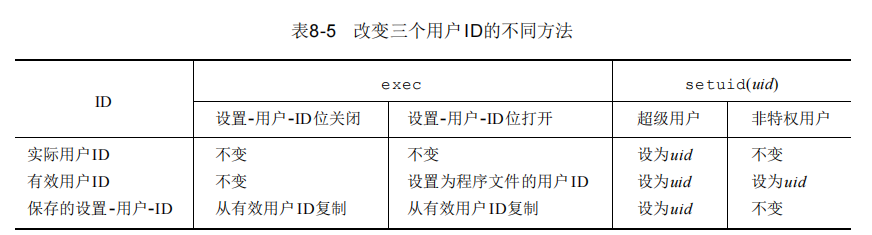

​		注意，用8 . 2节中所述的g e t u i d和g e t e u i d函数只能获得实际用户 I D和有效用户I D的当前值。我们不能获得所保存的设置-用户- I D的当前值。

​		为了说明保存的设置-用户- I D特征的用法，先观察一个使用该特征的程序。我们所观察的是伯克利t i p ( 1 )程序(系统V的c u ( 1 )程序与此类似)。这两个程序都连接到一个远程系统，或者是直接连接，或者是拨号一个调制解调器。当 t i p使用调制解调器时，它必须通过使用锁文件来独占使用它。此锁文件与U U C P程序共享，因为这两个程序可能要同时使用同一调制解调器。对其工作步骤说明如下：

​		(1)tip程序文件是由用户uucp拥有的，并且其设置-用户-ID位已设置。当exec此程序时，则关于用 户ID得到下列结果：

- 实际用户ID＝我们的用户ID
- 有效用户ID＝uucp
- 保存设置-用户-ID＝uucp

​		(2)tip 存取所要求的锁文件。这些锁文件是由名为uucp的用户所拥有的，因为有效用户ID是uucp，所以tip可以存取这些锁文件。

​		(3)tip执行setuid(getuid())。因为tip不是超级用户进程，所以这仅仅改变有效用户ID。此时得到：

- 实际用户ID＝我们的用户ID(未改变)
- 有效用户-ID＝我们的用户ID(未改变)
- 保存设置-用户-ID＝uucp(未改变)

​		现在，tip进程是以我们的用户ID作为其有效用户ID而运行的。这就意味着能存取的只有我们通常可以存取的，没有额外的许可权。

​		(4)当执行完所需的操作后，tip执行setuid（*uucpuid*），其中*uucpuid*是用户uucp的数值用户ID（tip很可能在起动时调用geteuid，得到uucp的用户ID，然后将其保存起来，我们并不认为tip会 搜索口令文件以得到这一数值用户ID）。因为setuid的参数等于保存的设置-用户-ID，所以这种调 用是许可的（这就是为什么需要保存的设置-用户-ID的原因）。现在得到：

- 实际用户ID=我们的用户ID（未改变）
- 有效用户ID=uucp
- 保存设置-用户-ID=uucp（未改变）

​		(5)tip现在可对其锁文件进行操 作以释放它们，因为tip的有效用户ID是uucp。以这种方法使用保存的设置-用户-ID，在进程的开始和结束部分就可以使用由于程序文件的设置用户ID而得到的额外优先权。但是，进程在其运行的大 部分时间只具有普通的许可权。如果进程不能在其结束部分切换回保存的设置-用户-ID，那么就不得不在全部运行时间都保持额外的许可权(这可能会造成麻烦)。

​		下面来看一看如果在tip运行时为我们生成一个shell进程(先fork，然后exec)将发生什么。因为实际用户ID和有效用户ID都是我们的普通用户ID(上面的第(3)步)，所以该shell没有额外的许可权。它不能存取tip运行时设置成uucp的保存的设置-用户-ID，因为该shell所保存的设置-用户-ID是由exec复制有效用户ID而得到的。所以在执行exec的子进程中，所有三个用户ID都是我们的普通用户ID。如果程序是设置-用户-ID为root,那么我们关于tip如何使用setuid所做的说明是不正确的。因为 以超级用户特权调用setuid就会设置所有三个用户ID。使上述实例按我们所说明的进行工作，只需setuid设置有效用户ID。

##  setreuid和setregid函数

​		4 . 3 + B S D支持setreuid函数，其功能是交换实际用户I D和有效用户I D的值

```
#include <sys/types.h>
#include <unistd.h>
int setreuid(uid_t ruid, uid_t euid) ;
int setregid(gid_t rgid, gid_t egid)
```

​		其作用很简单：一个非特权用户总能交换实际用户ID和有效用户ID。这就允许一个设置-用户-ID程序转换成只具有用户的普通许可权，以后又可再次转换回设置-用户-ID所得到的额外许可权。POSIX.1引进了保存的设置-用户-ID特征后，其作用也相应加强，它也允许一个非特权用户将其有效用户ID设置为保存的设置-用户-ID

## seteuid和setegid函数

 

```
#include <sys/types.h>
#include <unistd.h>
int seteuid(uid_t uid) ;
int setegid(gid_t gid	) ;
```

​		两个函数返回：若成功则为0，若出错则为-1一个非特权用户可将其有效用户 I D设置为其实际用户I D或其保存的设置-用户- I D。对于一个特权用户则可将有效用户I D设置为*u i d*。(这区别于s e t u i d函数，它更改三个用户I D。)这一建议更改也要求支持保存的设置-用户- I D。

## 组I D

​		本章中所说明的一切都以类似方式适用于各个组I D。添加组I D不受s e t g i d函数的影响


## 解释器文件

​		S V R 4和4 . 3 + B S D都支持解释器文件。这种文件是文本文件，其起始行的形式是

```
#！ pathname [optional-argument] 
```

​		在惊叹号和*pathname*之间的空格是可任选的。最常见的是以下列行开始

```
#! /bin/sh
```

​		*pathname*通常是个绝对路径名，对它不进行什么特殊的处理(不使用PATH进行路径搜索)。对这种 文件的识别是由内核作为exec系统调用处理的一部分来完成的。内核使调用exec函数的进程实际执 行的文件并不是该解释器文件，而是在该解释器文件的第一行中*pathname*所指定的文件。一定要 将解释器文件（文本文件，它以#！开头）和解释器（由该解释器文件第一行中的*pathname*指定）区分开来。很多系统对解释器文件第一行有长度限制(32个字符)。这包括#！、*pathname*、可选参数以及空格数。

​		让我们观察一个实例，从中了解当被执行的文件是个解释器文件时，内核对 e x e c函数的参数及该解释器文件第一行的可选参数做何种处理。程序 8 - 1 0调用e x e c执行一个解释器文件

```
#include <sys/wait.h>
#include <apue.h>

int main(void)
{
    pid_t pid;

    if( (pid = fork() ) < 0)
        err_sys("fork error");
    else if(pid == 0)
        if(execl("/home/stevens/bin/testinterp","testinterp","myarg1","MY ARG2",(char *)0) < 0)
            err_sys("execl error");
    if(waitpid(pid,NULL,0) < 0)
        err_sys("waitpid error");

    exit(0);
}
```

​		程序echoarg(解释器)回送每一个命令行参数(它就是程序7-2)。注意，当内核exec该解释器(/home/stevens/bin/echoarg)时，argv[0]是该解释器的*pathname*，argv[1]是解释器文件中的可选参数 ，其余参数是*pathname*(/home/stevens/bin/testinterp)，以及程序8-10中调用execl的第二和第三个参数(myarg1和MYARG2)。调用execl时的argv[1]和argv[2]已右移了两个位置。注意，内核取execl中的*pathname*代替第一个参数(testinterp)，因为一般*pathname*包含了较第一个参数更多的信息。

​		在解释器p a t h n a m e后可跟随可选参数，它们常用于为支持 - f选择项的程序指定该选择项。例如，可以以下列方式执行a w k ( 1 )程序：

```
awk -f myfile
```

​		它告诉a w k从文件m y f i l e中读a w k程序


​		因为在这种情况下命令行参数是：

```
/bin/awk /usr/local/bin/awkexample file1 FILENAME2 f3
```

​		于是awk企图将字符串/usr/local/bin/awkexample解释为一个awk程序。如果不能向解释器传递至少一个可选参数（在本例中是-f），那么这些解释器文件只有对shell才是有用的。是否一定需要解释器文件呢?那也不完全如此。但是它们确实使用户得到效率方面的好处，其代价是内核的额外开销（因为内核需要识别解释器文件）。由于下述理由，解释器文件是有用的：

​		(1) 某些程序是用某种语言写的脚本，这一事实可以隐藏起来。例如，为了执行程序 8 - 11，只需使用下列命令行：

```
awkexample *optional-arguments*
```

​		而并不需要知道该程序实际上是一个a w k脚本，否则就要以下列方式执行该程序：

```
awk -f awkexample optional-arguments
```

​		(2) 解释器脚本在效率方面也提供了好处。再考虑一下前面的例子。仍旧隐藏该程序是一个a w k脚本的事实，但是将其放在一个shell脚本中：

```
awk 'BEGIN {
	for (i = 0; i < ARGC; i++)
		printf "ARGV[%d] = %s\n", i, ARGV[i] 
	exit
}' $*
```

​		这种解决方法的问题是要求做更多的工作。首先，shell读此命令，然后试图execlp此文件名。因为shell脚本是一个可执行文件，但却不是机器可执行的，于是返回一个错误，execlp就认为该文件是一个shell脚本(它实际上就是这种文件)。然后执行/bin/sh，并以该shell脚本的路径名作为其参数。shell正确地执行我们的shell脚本，但是为了运行awk程序，它调用fork,exec和wait。用一个shell脚本代替解释器脚本需要更多的开销。(3)解释器脚本使我们可以使用除/bin/sh以外的其他shell来编写shell脚本。当execlp找到一个非机器可执行的可执行文件时，它总是调用/bin/sh来解释执 行该文件。但是，用解释器脚本，则可编写成：

```
#!/bin/csh
```

​		(在解释器文件中后随*C shell*脚本)再一次，我们也可将此放在一个/ b i n / s h脚本中(然后由其调用C shell)，但是要有更多的开销。如果三个shell和awk没有用#作为注释符，则上面所说的都无效。

## system函数

​		在程序中执行一个命令字符串很方便。例如，假定要将时间和日期放到一个文件中，则可使用6.9节中的函数实现这一点。调用time得到当前日历时间，接着调用localtime将日历时间变换为年、月、日、时、分、秒、周日形式，然后调用strftime对上面的结果进行格式化处理，最后将结果写到文件中。但是用下面的system函数则更容易做到这一点。

```
system("date > file");
```


​		如果*cmdstring*是一个空指针，则仅当命令处理程序可用时，system返回非0值，这一特征可以决定在一个给定的操作系统上是否支持system函数。在UNIX中，system总是可用的。因为system在其实现中调用了fork、exec和waitpid，因此有三种返回值：

(1) 如果fork失败或者waitpid返回除EINTR之外的出错，则system返回－1，而且errno中设置了错误类型。

(2) 如果exec失败(表示不能执行shell)，则其返回值如同shell执行了exit(127)一样。

(3) 否则所有三个函数(fork,exec和waitpid)都成功，并且system的返回值是shell的终止状态，其格式已在waitpid中说明。如果waitpid由一个捕捉到的信号中断，则system很多当前的实现都返回一个错误(EINTR)，在这种情况下system不返回一个错误的要求已被加到POSIX.2的最近草案中。(10.5节中将讨论被中断的系统调用。)程序8-12是system函数的一种实现。它对信号没有进行处理。10.18节中将修改此函数使其进行信号处理。shell的-c选择项告诉shell程序取下一个命令行参数(在这里是*cmdstring*)作为命令输入(而不是从标准输入或从一个给定的文件中读命令)。shell对以null字符终止的命令字符串进行语法分析，将它们分成分隔开的命令行参数。传递给shell的实际命令串可以包含任一有效的shell命令。例如，可以用<和>对输入和输出重新定向。如果不使用shell执行此命令，而是试图由我们自己去执行它，那么将相当困难。首先，我们必须用execlp而不是execl，像shell那样使用PATH变量。我们必须将null符结尾的命令字符串分成各个命令行参数，以便调用execlp。最后，我们也不能使用任何一个shell元字符。注意，我们调用_exit而不是exit。这是为了防止任一标准I/O缓存(这些缓存会在fork中由父进程复制到子进程)在子进程中被刷新。

```C 
#include<apue.h>
#include<sys/wait.h>
#include<unistd.h>

int system(const char *cmdstring);
{
    pid_t pid;
    int status;

    if((pid = fork()) < 0)
        status = -1;
    else if(pid == 0){
        execl("/bin/sh", "sh", "-c", cmdstring, (char *)0);
        _exit(127);
    }else{
        while(waitpid(pid, &status, 0) < 0)
            if(errno != EINTR){
                status = -1;
                break;
            }
    }
    return(status);
}

int main(void)
{
    int status;

    if((status = system("date")) < 0)
        err_sys("system() error");

    pr_exit(status);

    if((status = system("nosuchcommand")) < 0)
        err_sys("system() error");

    pr_exit(status);

    if((status = system("who; exit 44")) < 0)
        err_sys("system() error");

    pr_exit(status);

    exit(0);
}
```

​		使用system而不是直接使用fork和exec的优点是：system进行了所需的各种出错处理，以及各种信号处理(在10.18节中的下一个版本system函数中)。在UNIX的早期版本中，包括SVR3.2和4.3BSD，都没有waitpid函数，于是父进程用下列形式的语句等待子进程：

```
while ((lastpid = wait(&status)) != pid && lastpid != -1)
	;
```

​		如果调用system的进程在调用它之前已经生成一个子进程（并执行一个程序），那么将引起问题。因为上面的while语句一直循环执行，直到由system产生的子进程终止才停止，如果其任意一个不是用pid标识的子进程在此之前终止，则它们的进程ID和终止状态都被while语句丢弃。实际上，由于wait不能等待一个指定的进程，POSIX.1才为此及其他一些原因定义了waitpid函数。如果不提供waitpid，对于popen和pclose函数也会发生同样的问题。

## 设置-用户-ID程序

​		如果在一个设置-用户-ID程序中调用system，那么发生什么呢?这是一个安全性方面的漏洞，决不应当这样做。程序8-14是一个简单程序，它只是对其命令行参数调用system函数


​		我们给予tsys程序的超级用户许可权在system中执行了fork和exec之后仍被保持下来，也就是说执 行system中shell命令的进程也具有了超级用户许可权。如果一个进程正以特殊的许可权(设置-用户-ID或设置-组-ID)运行，它又想生成另一个进程执行另一个程序，则它应当直接使用fork和exec， 而且在fork之后、exec之前要改回到普通许可权。设置-用户-ID或设置-组-ID程序决不应调用system函数。这种警告的一个理由是：system调用shell对命令字符串进行语法分析，而shell则使用IFS 变量作为其输入字段分隔符。早期的shell版本在被调用时不将此变量恢复为普通字符集。这就允许一个不怀好意的用户在调用system之前设置IFS，造成system执行一个不同的程序

## 进程会计

​		很多UNIX系统提供了一个选择项以进行进程会计事务处理。当取了这种选择项后，每当进程结束时内核就写一个会计记录。典型的会计记录是32字节长的二进制数据，包括命令名、所使用的CPU时间总量、用户ID和组ID、起动时间等。本节将比较译细地说明这种会计记录，这样也使我们得到了一 个再次观察进程的机会，得到了使用5.9节中所介绍的fread函数的机会。任一标准都没有对进程会 计进行过说明。本节的说明依据SVR4和4.3+BSD实现。SVR4提供了很多程序处理这种原始的会计数据——例如runacct和acctcom。

​		4.3+BSD提供sa(8)命令处理并总结原始会计数据。一个至今没有说明过的函数(acct)起动和终止进程会计。唯一使用这一函数的是SVR4和4.3+BSD的accton(8)命令。超级用户执行一个带路径名参数的accton命令起动会计处理。该路径名通常是/var/adm/pacct（早期系统中为/usr/adm/acct）。执行不带任何参数的accton命令则停止会计处理。会计记录结构定义在头文件<sys/acct.h>中，其样 式如下：

```C 
/* Copyright (C) 1996-2020 Free Software Foundation, Inc.
   This file is part of the GNU C Library.

   The GNU C Library is free software; you can redistribute it and/or
   modify it under the terms of the GNU Lesser General Public
   License as published by the Free Software Foundation; either
   version 2.1 of the License, or (at your option) any later version.

   The GNU C Library is distributed in the hope that it will be useful,
   but WITHOUT ANY WARRANTY; without even the implied warranty of
   MERCHANTABILITY or FITNESS FOR A PARTICULAR PURPOSE.  See the GNU
   Lesser General Public License for more details.

   You should have received a copy of the GNU Lesser General Public
   License along with the GNU C Library; if not, see
   <https://www.gnu.org/licenses/>.  */

#ifndef _SYS_ACCT_H
#define _SYS_ACCT_H	1

#include <sys/types.h>
#include <stdint.h>
#include <bits/endian.h>
#include <bits/types/time_t.h>

__BEGIN_DECLS

#define ACCT_COMM 16

/*
  comp_t is a 16-bit "floating" point number with a 3-bit base 8
  exponent and a 13-bit fraction. See linux/kernel/acct.c for the
  specific encoding system used.
*/

typedef uint16_t comp_t;

struct acct
{
  char ac_flag;			/* Flags.  */
  uint16_t ac_uid;		/* Real user ID.  */
  uint16_t ac_gid;		/* Real group ID.  */
  uint16_t ac_tty;		/* Controlling terminal.  */
  uint32_t ac_btime;		/* Beginning time.  */
  comp_t ac_utime;		/* User time.  */
  comp_t ac_stime;		/* System time.  */
  comp_t ac_etime;		/* Elapsed time.  */
  comp_t ac_mem;		/* Average memory usage.  */
  comp_t ac_io;			/* Chars transferred.  */
  comp_t ac_rw;			/* Blocks read or written.  */
  comp_t ac_minflt;		/* Minor pagefaults.  */
  comp_t ac_majflt;		/* Major pagefaults.  */
  comp_t ac_swaps;		/* Number of swaps.  */
  uint32_t ac_exitcode;		/* Process exitcode.  */
  char ac_comm[ACCT_COMM+1];	/* Command name.  */
  char ac_pad[10];		/* Padding bytes.  */
};


struct acct_v3
{
  char ac_flag;			/* Flags */
  char ac_version;		/* Always set to ACCT_VERSION */
  uint16_t ac_tty;		/* Control Terminal */
  uint32_t ac_exitcode;		/* Exitcode */
  uint32_t ac_uid;		/* Real User ID */
  uint32_t ac_gid;		/* Real Group ID */
  uint32_t ac_pid;		/* Process ID */
  uint32_t ac_ppid;		/* Parent Process ID */
  uint32_t ac_btime;		/* Process Creation Time */
  float ac_etime;		/* Elapsed Time */
  comp_t ac_utime;		/* User Time */
  comp_t ac_stime;		/* System Time */
  comp_t ac_mem;		/* Average Memory Usage */
  comp_t ac_io;			/* Chars Transferred */
  comp_t ac_rw;			/* Blocks Read or Written */
  comp_t ac_minflt;		/* Minor Pagefaults */
  comp_t ac_majflt;		/* Major Pagefaults */
  comp_t ac_swaps;		/* Number of Swaps */
  char ac_comm[ACCT_COMM];	/* Command Name */
};


enum
  {
    AFORK = 0x01,		/* Has executed fork, but no exec.  */
    ASU = 0x02,			/* Used super-user privileges.  */
    ACORE = 0x08,		/* Dumped core.  */
    AXSIG = 0x10		/* Killed by a signal.  */
  };

#if __BYTE_ORDER == __BIG_ENDIAN
# define ACCT_BYTEORDER 0x80	/* Accounting file is big endian.  */
#else
# define ACCT_BYTEORDER 0x00	/* Accounting file is little endian.  */
#endif

#define AHZ     100


/* Switch process accounting on and off.  */
extern int acct (const char *__filename) __THROW;

__END_DECLS

#endif	/* sys/acct.h */
```


​		会计记录所需的各个数据（各C P U时间、传输的字符数等）都由内核保存在进程表中，并在一个新进程被创建时置初值 (例如f o r k之后在子进程中)。进程终止时写一个会计记录。这就意味着在会计文件中记录的顺序对应于进程终止的顺序，而不是它们起动的顺序。为了确定起动顺序，需要读全部会计文件，并按起动日历时间进行排序。这不是一种很完善的方法，因为日历时间的单位是秒（见 1 . 1 0节），在一个给定的秒中可能起动了多个进程。而墙上时钟时间的单位是时钟滴答（通常，每秒滴答数在50～100之间）。但是我们并不知道进程的终止时间，所知道的只是起动时间和终止顺序。这就意味着，即使墙上时间比起动时间要精确得多，但是仍不能按照会计文件中的数 据重构各进程的精确起动顺序。会计记录对应于进程而不是程序。在fork之后，内核为子进程初始 化一个记录，而不是在一个新程序被执行时。虽然exec并不创建一个新的会计记录，但相应记录中 的命令名改变了，AFORK标志则被清除。这意味着，如果一个进程顺序执行了三个程序(AexecB,BexecC,最后Cexit)，但只写一个会计记录。在该记录中的命令名对应于程序C，但CPU时间是程序A、B、C之和。

实例

​		为了得到某些会计数据以便查看，运行程序 8 - 1 6，它调用f o r k四次。每个子进程做不同的事情，然后终止。此程序所做的基本工作示于图 8 - 4中。

程序8 - 1 7则从会计记录中选择一些字段并打印出来

```C 
#include<signal.h>
#include<apue.h>

int main(void)
{
    pid_t pid;

    if ((pid = fork()) < 0)
        err_sys("fork error");
    else if (pid == 0) {
        sleep(2);
        exit(2);
    }

    if((pid = fork()) < 0)
        err_sys("fork error");
    else if (pid == 0) {
        sleep(4);
        abort();
    }

    if((pid = fork()) < 0)
        err_sys("fork error");
    else if (pid == 0) {
        execl("/usr/bin/dd", "dd", "if=/boot", "of=/dev/null", NULL);
        exit(7);
    }

    if((pid = fork()) < 0)
        err_sys("fork error");
    else if (pid == 0) {
        sleep(8);
        exit(0);
    }

    sleep(6);
    kill(getpid(), SIGKILL);
    exit(6);
}
```


然后，执行下列操作步骤：

(1) 成为超级用户，用a c c t o n命令起动会计事务处理。注意，当此命令结束时，会计事务处理已经起动，因此在会计文件中的第一个记录应来自这一命令。

(2) 运行程序8 - 1 6。这会加五个记录到会计文件中(父进程一个，四个子进程各一个)。在第二个子进程中，e x e c l并不创建一个新进程，所以对第二个进程只有一个会计记录。

(3) 成为超级用户，停止会计事务处理。因为在 a c c t o n命令终止时已停止处理会计事务，所以不会在会计文件中增加一个记录。

(4) 运行程序8 - 1 7，从打印文件中选出字段并打印。第( 4 )步的输出如下面所示。在每一行中都对进程加了说明，以便后面讨论


```C 
#include<apue.h>
#include<sys/acct.h>

#define ACCTFILE "/var/adm/pacct"
static unsigned long compt2ulong(comp_t);

int main(void)
{
    struct acct acdata;
    FILE *fp;

    if ((fp = fopen(ACCTFILE, "r")) == NULL)
        err_sys("can't open %s", ACCTFILE);
    while (fread(&acdata, sizeof(acdata), 1, fp) == 1) {
        printf("command = %-*.*s\n", (int)sizeof(acdata.ac_comm),
          (int)sizeof(acdata.ac_comm), acdata.ac_comm);
        printf("user = %-*.*s\n", (int)sizeof(acdata.ac_comm),
          (int)sizeof(acdata.ac_comm), acdata.ac_comm);
        printf("uid = %d\n", acdata.ac_uid);
        printf("gid = %d\n", acdata.ac_gid);
        printf("real = %ld\n", compt2ulong(acdata.ac_etime));
        printf("cpu = %ld\n", compt2ulong(acdata.ac_etime));
        printf("mem = %ld\n", compt2ulong(acdata.ac_mem));
        printf("io = %ld\n", compt2ulong(acdata.ac_io));
        printf("rw = %ld\n", compt2ulong(acdata.ac_rw));
        printf("minflt = %ld\n", compt2ulong(acdata.ac_minflt));
        printf("majflt = %ld\n", compt2ulong(acdata.ac_majflt));
        printf("swaps = %ld\n", compt2ulong(acdata.ac_swaps));
    }
    if (ferror(fp))
        err_sys("read error");
    exit(0);
}

static unsigned long compt2ulong(comp_t comptime)
{
    unsigned long val;
    int exp;

    val = comptime & 0x1fff;    /* 13-bit fraction */
    exp = (comptime >> 13) & 7; /* 3-bit exponent (0-7) */
    while (exp-- > 0)
        val *= 8;
    return(val);
}
```

​		墙上日历时间值的单位是CLK_TCK。从表2-6中可见，本系统的值是60。例如，在父进程中的sleep(2)对应于墙上日历时间128个时钟滴答。对于第一个子进程，sleep(4)变成274时钟滴答。注意，一个进程睡眠的时间总量并不精确。（第10章将返回到sleep函数。）调用fork和exit也要一些时间。注意，ac_stat并不是进程的真正终止状态。它只是8.6节中讨论的终止状态的一部分。如果进程异常 终止，则此字节中的信息只是core标志位(一般是最高位)以及信号编号数(一般是低7位)。如果进程正常终止，则从会计文件不能得到进程的退出(exit)状态。对于第一个进程，此值是128+6。128是core标志位，6是此系统上信号SIGABRT的值（它是由调用abort产生的）。

​		第四个子进程的值是 9，它对应于S I G K I L L的值。从会计文件的数据中不能了解到，父进程在退出时所用的参数值是2，三个子进程退出时所用的参数值是0。d d进程复制到第二个子进程中的文件 / b o o t的长度是110 888字节。而I / O字符数是此值的二倍，因为读了110 888字节，然后又写了110 888字节。即使输出到n u l l设备，仍对I / O字符数进行计算。

​		ac_flag值与我们所预料的相同。除调用了execl的第二个子进程以外，其他子进程都设置了F标志。父进程没有设置F标志，其原因是交互式shell曾调用过fork生成父进程，然后执行a.out文件。调用了abort的第一个子进程的core转储标志(D)打开。因为abort产生信号SIGABRT以产生core转储。该 进程的X标志也打开，因为它是由信号终止的。第四个子进程的X标志也打开，但是SIGKILL信号并不产生core转储，它只是终止该进程。最后要说明的是：第一个子进程的I/O字符数为0，但是该进程 产生了一个core文件。其原因是写core文件所需的I/O并不由该进程负担。

## 用户标识

​		任一进程都可以得到其实际和有效用户ID及组ID。但是有时希望找到运行该程序的用户的登录名。我们可以调用getpwuid(getuid())，但是如果一个用户有多个登录名，这些登录名又对应着同一个用户ID，那么又将如何呢?（一个人在口令文件中可以有多个登录项，它们的用户ID相同，但登录shell则不同。）系统通常保存用户的登录名（见6.7节），用getlogin函数可以存取此登录名。

```
#include <unistd.h>
char *getlogin(void);
```

​		返回：若成功则为指向登录名字符串的指针，若出错则为NULL如果调用此函数的进程没有连接到用 户登录时所用的终端，则本函数会失败。通常称这些进程为精灵进程（daemon），第13章将对这种 进程专门进行讨论。得到了登录名，就可用getpwnam在口令文件中查找相应记录以确定其登录shell等。为了找到登录名，UNIX系统在历史上一直是调用ttyname函数（见11.9节），然后在utmp文件（见6.7节）中找匹配项。4.3+BSD将登录名存放在进程表项中，并提供系统调用存取该登录名。系统V提供cuserid函数返回登录名。此函数先调用getlogin函数，如果失败则再调用getpwuid(getuid())。IEEEStd.1003.1-1988说明了cuserid，但是它以有效用户ID而不是实际用户ID来调用。POSIX.1的1990最后版本删除了cuserid函数。FIPS151-1要求登录shell定义一个环境变量LOGNAME,其值为用户的登录名。在4.3+BSD中，此变量由login设置，并由登录shell继承。但是，用户可以改变环境变量，所以不能使用LOGNAME来确认用户，而应当使用getlogin函数

## 进程时间

​		在1 . 1 0节中说明了墙上时钟时间、用户 C P U时间和系统C P U时间。任一进程都可调用t i m e s函数以获得它自己及终止子进程的上述值。

```
#include <sys/times.h>
clock_t times(struct tms* buf)  ;
```

​		返回：若成功则为经过的墙上时钟时间（单位：滴答），若出错则为-1

​		此函数填写由*b u f*指向的t m s结构，该结构定义如下：

```C 
/* Copyright (C) 1991-2020 Free Software Foundation, Inc.
   This file is part of the GNU C Library.

   The GNU C Library is free software; you can redistribute it and/or
   modify it under the terms of the GNU Lesser General Public
   License as published by the Free Software Foundation; either
   version 2.1 of the License, or (at your option) any later version.

   The GNU C Library is distributed in the hope that it will be useful,
   but WITHOUT ANY WARRANTY; without even the implied warranty of
   MERCHANTABILITY or FITNESS FOR A PARTICULAR PURPOSE.  See the GNU
   Lesser General Public License for more details.

   You should have received a copy of the GNU Lesser General Public
   License along with the GNU C Library; if not, see
   <https://www.gnu.org/licenses/>.  */

#ifndef _SYS_TIME_H
#define _SYS_TIME_H	1

#include <features.h>

#include <bits/types.h>
#include <bits/types/time_t.h>
#include <bits/types/struct_timeval.h>

#ifndef __suseconds_t_defined
typedef __suseconds_t suseconds_t;
# define __suseconds_t_defined
#endif

#include <sys/select.h>

__BEGIN_DECLS

#ifdef __USE_GNU
/* Macros for converting between `struct timeval' and `struct timespec'.  */
# define TIMEVAL_TO_TIMESPEC(tv, ts) {                                   \
	(ts)->tv_sec = (tv)->tv_sec;                                    \
	(ts)->tv_nsec = (tv)->tv_usec * 1000;                           \
}
# define TIMESPEC_TO_TIMEVAL(tv, ts) {                                   \
	(tv)->tv_sec = (ts)->tv_sec;                                    \
	(tv)->tv_usec = (ts)->tv_nsec / 1000;                           \
}
#endif


#ifdef __USE_MISC
/* Structure crudely representing a timezone.
   This is obsolete and should never be used.  */
struct timezone
  {
    int tz_minuteswest;		/* Minutes west of GMT.  */
    int tz_dsttime;		/* Nonzero if DST is ever in effect.  */
  };
#endif

/* Get the current time of day, putting it into *TV.
   If TZ is not null, *TZ must be a struct timezone, and both fields
   will be set to zero.
   Calling this function with a non-null TZ is obsolete;
   use localtime etc. instead.
   This function itself is semi-obsolete;
   most callers should use time or clock_gettime instead. */
extern int gettimeofday (struct timeval *__restrict __tv,
			 void *__restrict __tz) __THROW __nonnull ((1));

#ifdef __USE_MISC
/* Set the current time of day and timezone information.
   This call is restricted to the super-user.
   Setting the timezone in this way is obsolete, but we don't yet
   warn about it because it still has some uses for which there is
   no alternative.  */
extern int settimeofday (const struct timeval *__tv,
			 const struct timezone *__tz)
     __THROW;

/* Adjust the current time of day by the amount in DELTA.
   If OLDDELTA is not NULL, it is filled in with the amount
   of time adjustment remaining to be done from the last `adjtime' call.
   This call is restricted to the super-user.  */
extern int adjtime (const struct timeval *__delta,
		    struct timeval *__olddelta) __THROW;
#endif


/* Values for the first argument to `getitimer' and `setitimer'.  */
enum __itimer_which
  {
    /* Timers run in real time.  */
    ITIMER_REAL = 0,
#define ITIMER_REAL ITIMER_REAL
    /* Timers run only when the process is executing.  */
    ITIMER_VIRTUAL = 1,
#define ITIMER_VIRTUAL ITIMER_VIRTUAL
    /* Timers run when the process is executing and when
       the system is executing on behalf of the process.  */
    ITIMER_PROF = 2
#define ITIMER_PROF ITIMER_PROF
  };

/* Type of the second argument to `getitimer' and
   the second and third arguments `setitimer'.  */
struct itimerval
  {
    /* Value to put into `it_value' when the timer expires.  */
    struct timeval it_interval;
    /* Time to the next timer expiration.  */
    struct timeval it_value;
  };

#if defined __USE_GNU && !defined __cplusplus
/* Use the nicer parameter type only in GNU mode and not for C++ since the
   strict C++ rules prevent the automatic promotion.  */
typedef enum __itimer_which __itimer_which_t;
#else
typedef int __itimer_which_t;
#endif

/* Set *VALUE to the current setting of timer WHICH.
   Return 0 on success, -1 on errors.  */
extern int getitimer (__itimer_which_t __which,
		      struct itimerval *__value) __THROW;

/* Set the timer WHICH to *NEW.  If OLD is not NULL,
   set *OLD to the old value of timer WHICH.
   Returns 0 on success, -1 on errors.  */
extern int setitimer (__itimer_which_t __which,
		      const struct itimerval *__restrict __new,
		      struct itimerval *__restrict __old) __THROW;

/* Change the access time of FILE to TVP[0] and the modification time of
   FILE to TVP[1].  If TVP is a null pointer, use the current time instead.
   Returns 0 on success, -1 on errors.  */
extern int utimes (const char *__file, const struct timeval __tvp[2])
     __THROW __nonnull ((1));

#ifdef __USE_MISC
/* Same as `utimes', but does not follow symbolic links.  */
extern int lutimes (const char *__file, const struct timeval __tvp[2])
     __THROW __nonnull ((1));

/* Same as `utimes', but takes an open file descriptor instead of a name.  */
extern int futimes (int __fd, const struct timeval __tvp[2]) __THROW;
#endif

#ifdef __USE_GNU
/* Change the access time of FILE relative to FD to TVP[0] and the
   modification time of FILE to TVP[1].  If TVP is a null pointer, use
   the current time instead.  Returns 0 on success, -1 on errors.  */
extern int futimesat (int __fd, const char *__file,
		      const struct timeval __tvp[2]) __THROW;
#endif


#ifdef __USE_MISC
/* Convenience macros for operations on timevals.
   NOTE: `timercmp' does not work for >= or <=.  */
# define timerisset(tvp)	((tvp)->tv_sec || (tvp)->tv_usec)
# define timerclear(tvp)	((tvp)->tv_sec = (tvp)->tv_usec = 0)
# define timercmp(a, b, CMP) 						      \
  (((a)->tv_sec == (b)->tv_sec) 					      \
   ? ((a)->tv_usec CMP (b)->tv_usec) 					      \
   : ((a)->tv_sec CMP (b)->tv_sec))
# define timeradd(a, b, result)						      \
  do {									      \
    (result)->tv_sec = (a)->tv_sec + (b)->tv_sec;			      \
    (result)->tv_usec = (a)->tv_usec + (b)->tv_usec;			      \
    if ((result)->tv_usec >= 1000000)					      \
      {									      \
	++(result)->tv_sec;						      \
	(result)->tv_usec -= 1000000;					      \
      }									      \
  } while (0)
# define timersub(a, b, result)						      \
  do {									      \
    (result)->tv_sec = (a)->tv_sec - (b)->tv_sec;			      \
    (result)->tv_usec = (a)->tv_usec - (b)->tv_usec;			      \
    if ((result)->tv_usec < 0) {					      \
      --(result)->tv_sec;						      \
      (result)->tv_usec += 1000000;					      \
    }									      \
  } while (0)
#endif	/* Misc.  */

__END_DECLS

#endif /* sys/time.h */
```

​		注意，此结构没有包含墙上时钟时间。作为代替，times函数返回墙上时钟时间作为函数值。此值是相对于过去的某一时刻度量的，所以不能用其绝对值而必须使用其相对值。例如，调用times，保存其返回值。在以后某个时间再次调用times，从新返回的值中减去以前返回的值，此差值就是墙上时钟时间。（一个长期运行的进程可能其墙上时钟时间会溢出，当然这种可能性极小。）结构中两个针对子进程的字段包含了此进程已等待到的各子进程的值。所有由此函数返回的clock_t值都用_SC_CLK_TCK(由sysconf函数返回的每秒时钟滴答数，见2.5.4节)变换成秒数。


​		程序8 - 1 8将每个命令行参数作为 s h e l l命令串执行，对每个命令计时，并打印从 t m s结构取得的值。按下列方式运行此程序，得到：


​		在这个实例中，在 child user和child sys行中显示的时间是执行 s h e l l和命令的子进程所使用的C P U时间。

```
#include<sys/times.h>
#include<apue.h>

static void pr_times(clock_t, struct tms *, struct tms *);
static void do_cmd(char *);

int main(int argc, char *argv[])
{
    int i;
    setbuf(stdout, NULL);
    for (i = 1; i < argc; i++)
        do_cmd(argv[i]);
    exit(0);
}

static void do_cmd(char *cmd)
{
    struct tms tmsstart, tmsend;
    clock_t start, end;
    int status;
    printf("\ncommand: %s\n", cmd);
    if ((start = times(&tmsstart)) == -1)
        err_sys("times error");
    if ((status = system(cmd)) < 0)
        err_sys("system() error");
    if ((end = times(&tmsend)) == -1)
        err_sys("times error");
    pr_times(end - start, &tmsstart, &tmsend);
    pr_exit(status);
}

static void pr_times(clock_t real, struct tms *tmsstart, struct tms *tmsend)
{
    static long clktck = 0;
    if (clktck == 0)
        if ((clktck = sysconf(_SC_CLK_TCK)) < 0)
            err_sys("sysconf error");
    printf(" real: %7.2f\n", real / (double)clktck);
    printf(" user: %7.2f\n", (tmsend->tms_utime - tmsstart->tms_utime) / (double)clktck);
    printf(" sys: %7.2f\n", (tmsend->tms_stime - tmsstart->tms_stime) / (double)clktck);
    printf(" child user: %7.2f\n", (tmsend->tms_cutime - tmsstart->tms_cutime) / (double)clktck);
    printf(" child sys: %7.2f\n", (tmsend->tms_cstime - tmsstart->tms_cstime) / (double)clktck);
}
```

# 进程控制(II)

## 进程标识

​		每个进程都有一个非负整型表示的唯一进程ID。因为进程ID标识符总是唯一的，常将其用作其他标识符的一部分以保证其唯一性。

​		虽然是唯一的，但是进程ID是可复用的。当一个进程终止后，其进程ID就成为复用的候选者。大多数UNIX 系统实现延迟复用算法，使得赋予新建进程的 ID 不同于最近终止进程所使用的ID。这防止了将新进程误认为是使用同一ID的某个已终止的先前进程。

​		**系统中有一些专用进程，但具体细节随实现而不同。ID为 0的进程通常是调度进程，常常被称为交换进程（swapper）。该进程是内核的一部分，它并不执行任何磁盘上的程序，因此也被称为系统进程。进程ID 1通常是init进程，在自举过程结束时由内核调用。该进程的程序文件在UNIX的早期版本中是/etc/init，在较新版本中是/sbin/init。此进程负责在自举内核后启动一个UNIX系统。init通常读取与系统有关的初始化文件（/etc/rc\*文件或/etc/inittab文件，以及在/etc/init.d中的文件），并将系统引导到一个状态（如多用户）。init 进程决不会终止。它是一个普通的用户进程（与交换进程不同，它不是内核中的系统进程），但是它以超级用户特权运行。**

在Mac OS X 10.4中，init进程被launchd进程替代，执行的任务集与init相同，但扩展了功能。

每个UNIX系统实现都有它自己的一套提供操作系统服务的内核进程，例如，在某些UNIX的虚拟存储器实现中，进程ID 2是页守护进程（page daemon），此进程负责支持虚拟存储器系统的分页操作。

除了进程ID，每个进程还有一些其他标识符。下列函数返回这些标识符。（注意，这些函数都没有出错返回）

```c
#include <unistd.h>
pid_t getpid(void);
//返回值：调用进程的进程ID
pid_t getppid(void);
//返回值：调用进程的父进程ID
uid_t getuid(void);
//返回值：调用进程的实际用户ID
uid_t geteuid(void);
//返回值：调用进程的有效用户ID
gid_t getgid(void);
//返回值：调用进程的实际组ID
//gid_t getegid(void);
//返回值：调用进程的有效组ID
```

## 函数fork

一个现有的进程可以调用fork函数创建一个新进程。

```c
#include <unistd.h>
pid_t fork(void);
//返回值：子进程返回0，父进程返回子进程ID；若出错，返回−1
```

fork函数被调用一次，但返回两次。两次返回的区别是子进程的返回值是0，而父进程的返回值则是新建子进程的进程ID。

子进程是父进程的副本。例如，子进程获得父进程数据空间、堆和栈的副本。注意，这是子进程所拥有的副本。父进程和子进程并不共享这些存储空间部分。父进程和子进程共享正文段。

**由于在fork之后经常跟随着exec，所以现在的很多实现并不执行一个父进程数据段、栈和堆的完全副本。作为替代，使用了写时复制（Copy-On-Write，COW）技术。这些区域由父进程和子进程共享，而且内核将它们的访问权限改变为只读。如果父进程和子进程中的任一个试图修改这些区域，则内核只为修改区域的那块内存制作一个副本，通常是虚拟存储系统中的一“页”。**

某些平台提供 fork 函数的几种变体：

- Linux 3.2.0 提供了另一种新进程创建函数—clone(2)系统调用。这是一种fork的推广形式，它允许调用者控制哪些部分由父进程和子进程共享。
- FreeBSD 8.0提供了rfork(2)系统调用，它类似于Linux的clone系统调用。rfork调用是从Plan 9操作系统（Pike等[1995]）派生出来的。
- Solaris 10提供了两个线程库：一个用于POSIX线程（pthreads），另一个用于Solaris线程。在这两个线程库中，fork 的行为有所不同。

当写标准输出时，我们将buf长度减去1作为输出字节数，这是为了避免将终止null字节写出。**strlen 计算不包含终止 null 字节的字符串长度，而 sizeof 则计算包括终止 null字节的缓冲区长度。两者之间的另一个差别是，使用 strlen 需进行一次函数调用，而对于sizeof 而言，因为缓冲区已用已知字符串进行初始化，其长度是固定的，所以 sizeof 是在编译时计算缓冲区长度。**

一般来说，在fork之后是父进程先执行还是子进程先执行是不确定的，这取决于内核所使用的调度算法。如果要求父进程和子进程之间相互同步，则要求某种形式的进程间通信。

实际上，fork的一个特性是父进程的所有打开文件描述符都被复制到子进程中。我们说“复制”是因为对每个文件描述符来说，就好像执行了dup函数。父进程和子进程每个相同的打开描述符共享一个文件表项。


fork之后父进程和子进程之间对打开文件的共享

在fork之后处理文件描述符有以下两种常见的情况。

- 父进程等待子进程完成。
- 父进程和子进程各自执行不同的程序段。在这种情况下，在fork之后，父进程和子进程各自关闭它们不需使用的文件描述符，这样就不会干扰对方使用的文件描述符。这种方法是网络服务进程经常使用的。

除了打开文件之外，父进程的很多其他属性也由子进程继承，包括：

- 实际用户ID、实际组ID、有效用户ID、有效组ID
- 附属组ID
- 进程组ID
- 会话ID
- 控制终端
- 设置用户ID标志和设置组ID标志
- 当前工作目录
- 根目录
- 文件模式创建屏蔽字
- 信号屏蔽和安排
- 对任一打开文件描述符的执行时关闭（close-on-exec）标志
- 环境
- 连接的共享存储段
- 存储映像
- 资源限制

父进程和子进程之间的区别具体如下。

- fork的返回值不同。
- 进程ID不同。
- 这两个进程的父进程ID不同：子进程的父进程ID是创建它的进程的ID，而父进程的父进程ID则不变。
- 子进程的tms_utime、tms_stime、tms_cutime和tms_ustime的值设置为0。
- 子进程不继承父进程设置的文件锁。
- 子进程的未处理闹钟被清除。
- 子进程的未处理信号集设置为空集。

fork失败的两个主要原因：

- 系统中已经有了太多的进程。
- 该实际用户ID的进程总数超过了系统限制。

fork有以下两种用法：

- **一个父进程希望复制自己，使父进程和子进程同时执行不同的代码段。**这在网络服务进程中是常见的—父进程等待客户端的服务请求。当这种请求到达时，父进程调用fork，使子进程处理此请求。父进程则继续等待下一个服务请求。
- **一个进程要执行一个不同的程序。**这对 shell 是常见的情况。在这种情况下，子进程从fork返回后立即调用exec。

## 函数vfork

**可移植的应用程序不应该使用这个函数。**

vfork函数用于创建一个新进程，而该新进程的目的是exec一个新程序。vfork与fork一样都创建一个子进程，但是它并不将父进程的地址空间完全复制到子进程中，因为子进程会立即调用exec（或exit），于是也就不会引用该地址空间。不过在子进程调用exec或exit之前，它在父进程的空间中运行。这种优化工作方式在某些UNIX系统的实现中提高了效率，但如果子进程修改数据（除了用于存放vfork返回值的变量）、进行函数调用、或者没有调用 exec 或 exit 就返回都可能会带来未知的结果。

**vfork和fork之间的另一个区别是：vfork保证子进程先运行，在它调用exec或exit之后父进程才可能被调度运行，当子进程调用这两个函数中的任意一个时，父进程会恢复运行。（如果在调用这两个函数之前子进程依赖于父进程的进一步动作，则会导致死锁。）**

## 函数exit

线程的返回值不用作进程的返回值。当最后一个线程从其启动例程返回时，该进程以终止状态0返回。

不管进程如何终止，最后都会执行内核中的同一段代码。这段代码为相应进程关闭所有打开描述符，释放它所使用的存储器等。

对上述任意一种终止情形，我们都希望终止进程能够通知其父进程它是如何终止的。对于 3个终止函数（exit、_exit和_Exit），实现这一点的方法是，将其退出状态（exit status）作为参数传送给函数。在异常终止情况，内核（不是进程本身）产生一个指示其异常终止原因的终止状态（termination status）。在任意一种情况下，该终止进程的父进程都能用wait或waitpid函数取得其终止状态。

注意，这里使用了“退出状态”（它是传递给向3个终止函数的参数，或main的返回值）和“终止状态”两个术语，以表示有所区别。在最后调用_exit时，内核将退出状态转换成终止状态。如果子进程正常终止，则父进程可以获得子进程的退出状态。

对于父进程已经终止的所有进程，它们的父进程都改变为 init 进程。我们称这些进程由 init进程收养。其操作过程大致是：在一个进程终止时，内核逐个检查所有活动进程，以判断它是否是正要终止进程的子进程，如果是，则该进程的父进程ID就更改为1（init进程的ID）。这种处理方法保证了每个进程有一个父进程。

内核为每个终止子进程保存了一定量的信息，所以当终止进程的父进程调用wait或waitpid时，可以得到这些信息。这些信息至少包括进程ID、该进程的终止状态以及该进程使用的CPU时间总量。内核可以释放终止进程所使用的所有存储区，关闭其所有打开文件。在UNIX 术语中，一个已经终止、但是其父进程尚未对其进行善后处理（获取终止子进程的有关信息、释放它仍占用的资源）的进程被称为僵死进程（zombie）。ps命令将僵死进程的状态打印为Z。如果编写一个长期运行的程序，它fork了很多子进程，那么除非父进程等待取得子进程的终止状态，不然这些子进程终止后就会变成僵死进程。

init被编写成无论何时只要有一个子进程终止， init 就会调用一个 wait 函数取得其终止状态。这样也就防止了在系统中塞满僵死进程。当提及“一个init的子进程”时，这指的可能是init直接产生的进程，也可能是其父进程已终止，由init收养的进程。

## 函数wait和waitpid

当一个进程正常或异常终止时，内核就向其父进程发送 SIGCHLD 信号。因为子进程终止是个异步事件（这可以在父进程运行的任何时候发生），所以这种信号也是内核向父进程发的异步通知。父进程可以选择忽略该信号，或者提供一个该信号发生时即被调用执行的函数（信号处理程序）。对于这种信号的系统默认动作是忽略它。

调用wait或waitpid的进程可能会发生什么。

- 如果其所有子进程都还在运行，则阻塞。
- 如果一个子进程已终止，正等待父进程获取其终止状态，则取得该子进程的终止状态立即返回。
- 如果它没有任何子进程，则立即出错返回。

如果进程由于接收到SIGCHLD信号而调用wait，我们期望wait会立即返回。但是如果在随机时间点调用wait，则进程可能会阻塞。

```c
#include <sys/wait.h>
pid_t wait(int *statloc);
pid_t waitpid(pid_t pid, int *statloc, int options);
//两个函数返回值：若成功，返回进程ID；若出错，返回0（见后面的说明）或−1
```

这两个函数有以下区别：

- 在一个子进程终止前，wait使其调用者阻塞，而waitpid有一选项，可使调用者不阻塞。
- waitpid并不等待在其调用之后的第一个终止子进程，它有若干个选项，可以控制它所等待的进程。

如果子进程已经终止，并且是一个僵死进程，则wait立即返回并取得该子进程的状态；否则wait使其调用者阻塞，直到一个子进程终止。如调用者阻塞而且它有多个子进程，则在其某一子进程终止时，wait就立即返回。因为wait返回终止子进程的进程ID，所以它总能了解是哪一个子进程终止了。

这两个函数的参数**statloc是一个整型指针。如果statloc不是一个空指针，则终止进程的终止状态就存放在它所指向的单元内。如果不关心终止状态，则可将该参数指定为空指针。**

依据传统，这两个函数返回的整型状态字是由实现定义的。其中某些位表示退出状态（正常返回），其他位则指示信号编号（异常返回），有一位指示是否产生了core文件等。POSIX.1规定，终止状态用定义在中的各个宏来查看。有4个互斥的宏可用来取得进程终止的原因，它们的名字都以WIF开始。基于这4个宏中哪一个值为真，就可选用其他宏来取得退出状态、信号编号等。


检查wait和waitpid所返回的终止状态的宏

对于waitpid函数中pid参数的作用解释如下。

- pid ==−1 等待任一子进程。此种情况下，waitpid与wait等效。
- pid > 0 等待进程ID与pid相等的子进程。
- pid == 0 等待组ID等于调用进程组ID的任一子进程。
- pid <−1 等待组ID等于pid绝对值的任一子进程。


waitpid的options常量

## 函数waitid

Single UNIX Specification包括了另一个取得进程终止状态的函数—waitid，此函数类似于waitpid，但提供了更多的灵活性。

```c
#include <sys/wait.h>
int waitid(idtype_t idtype, id_t id, siginfo_t *infop, int options);
//返回值：若成功，返回0；若出错，返回−1
```

与 waitpid 相似，waitid 允许一个进程指定要等待的子进程。但它使用两个单独的参数表示要等待的子进程所属的类型，而不是将此与进程ID或进程组ID组合成一个参数。id参数的作用与idtype的值相关。


waitid的options常量

infop参数是指向siginfo结构的指针。该结构包含了造成子进程状态改变有关信号的详细信息。

## 函数wait3和wait4

提供的功能比POSIX.1函数wait、waitpid和waitid所提供功能的要多一个，这与附加参数有关。该参数允许内核返回由终止进程及其所有子进程使用的资源概况。

```c
#include <sys/types.h>
#include <sys/wait.h>
#include <sys/time.h>
#include <sys/resource.h>
pid_t wait3(int *statloc, int options, struct rusage *rusage);
pid_t wait4(pid_t pid, int *statloc, int options, struct rusage *rusage);
//两个函数返回值：若成功，返回进程ID；若出错，返回−1
```

资源统计信息包括用户CPU时间总量、系统CPU时间总量、缺页次数、接收到信号的次数等。

## 竞争条件

当多个进程都企图对共享数据进行某种处理，而最后的结果又取决于进程运行的顺序时，我们认为发生了竞争条件（race condition）。

## 函数exec

**当进程调用一种exec函数时，该进程执行的程序完全替换为新程序，而新程序则从其main函数开始执行。因为调用exec并不创建新进程，所以前后的进程ID并未改变。exec只是用磁盘上的一个新程序替换了当前进程的正文段、数据段、堆段和栈段。**

```c
#include <unistd.h>
int execl(const char *pathname, const char *arg0, ... /* (char *)0 */ );
int execv(const char *pathname, char *const argv[]);
int execle(const char *pathname, const char *arg0, .../* (char *)0, char *const envp[] */ );
int execve(const char *pathname, char *const argv[], char *const envp[]);
int execlp(const char *filename, const char *arg0, ... /* (char *)0 */ );
int execvp(const char *filename, char *const argv[]);
int fexecve(int fd, char *const argv[], char *const envp[]);
//7个函数返回值：若出错，返回−1；若成功，不返回
```

参数表的传递（l表示列表list，v表示矢量vector）。

如果execlp或execvp使用路径前缀中的一个找到了一个可执行文件，但是该文件不是由连接编辑器产生的机器可执行文件，则就认为该文件是一个shell脚本，于是试着调用/bin/sh，并以该filename作为shell的输入。

在使用ISO C原型之前，对execl、execle和execlp三个函数表示命令行参数的一般方法是：

```c
char *arg0, char *arg1, ..., char *argn, (char *)0
```

以e结尾的3个函数（execle、execve和fexecve）可以传递一个指向环境字符串指针数组的指针。其他4个函数则使用调用进程中的environ变量为新程序复制现有的环境。

在使用ISO C原型之前，execle的参数是：

```c
char *pathname, char *arg0, ..., char *argn, (char *)0, char *envp[]
```

对打开文件的处理与每个描述符的执行时关闭（close-on-exec）标志值有关。进程中每个打开描述符都有一个执行时关闭标志。若设置了此标志，则在执行exec 时关闭该描述符；否则该描述符仍打开。除非特地用fcntl设置了该执行时关闭标志，否则系统的默认操作是在exec后仍保持这种描述符打开。

POSIX.1明确要求在exec时关闭打开目录流。这通常是由 opendir 函数实现的，它调用 fcntl 函数为对应于打开目录流的描述符设置执行时关闭标志。

注意，在exec前后实际用户ID和实际组ID保持不变，而有效ID是否改变则取决于所执行程序文件的设置用户ID位和设置组ID位是否设置。如果新程序的设置用户ID位已设置，则有效用户ID变成程序文件所有者的ID；否则有效用户ID不变。对组ID的处理方式与此相同。

在很多UNIX实现中，这7个函数中只有execve是内核的系统调用。另外6个只是库函数，它们最终都要调用该系统调用。


7个exec函数之间的关系

注意，我们将第一个参数（新程序中的 argv[0]）设置为路径名的文件名分量。某些shell将此参数设置为完全的路径名。这只是一个惯例。我们可将argv[0]设置为任何字符串。当login命令执行shell时就是这样做的。在执行shell之前，login在argv[0]之前加一个/作为前缀，这向shell指明它是作为登录shell被调用的。登录shell将执行启动配置文件（start-up profile）命令，而非登录shell则不会执行这些命令。

## 更改用户ID和更改组ID

在UNIX系统中，特权（如能改变当前日期的表示法）以及访问控制（如能否读、写一个特定文件），是基于用户ID和组ID的。当程序需要增加特权，或需要访问当前并不允许访问的资源时，我们需要更换自己的用户ID或组ID，使得新ID具有合适的特权或访问权限。与此类似，当程序需要降低其特权或阻止对某些资源的访问时，也需要更换用户ID或组ID，新ID不具有相应特权或访问这些资源的能力。

可以用setuid函数设置实际用户ID和有效用户ID。与此类似，可以用setgid函数设置实际组ID和有效组ID。

```c
#include <unistd.h>
int setuid(uid_t uid);
int setgid(gid_t gid);
// 两个函数返回值：若成功，返回0；若出错，返回−1
```


更改3个用户ID的不同方法

FreeBSD 8.0和LINUX 3.2.0提供了getresuid和getresgid函数，它们可以分别用于获取保存的设置用户ID和保存的设置组ID。

历史上，BSD支持setreuid函数，其功能是交换实际用户ID和有效用户ID的值。

```c
#include <unistd.h>
int setreuid(uid_t ruid, uid_t euid);
int setregid(gid_t rgid, gid_t egid);
//两个函数返回值：若成功，返回0；若出错，返回-1
```

如若其中任一参数的值为−1，则表示相应的ID应当保持不变。

POIX.1包含了两个函数seteuid和setegid。它们类似于setuid和setgid，但只更改有效用户ID和有效组ID。

```c
#include <unistd.h>
int seteuid(uid_t uid);
int setegid(gid_t gid);
//两个函数返回值：若成功，返回0；若出错，返回−1
```


设置不同用户ID的各函数

**附属组 ID 不受 setgid、setregid和setegid函数的影响。**

为了防止被欺骗而运行不被允许的命令或读、写没有访问权限的文件，at命令和最终代表用户运行命令的守护进程必须在两种特权之间切换：用户特权和守护进程特权。

## 解释器文件

所有现今的UNIX系统都支持解释器文件（interpreter file）。这种文件是文本文件，其起始行的形式是：

```powershell
#! pathname [ optional-argument ]
```

内核使调用 exec函数的进程实际执行的并不是该解释器文件，而是在该解释器文件第一行中pathname所指定的文件。一定要将解释器文件（文本文件，它以#!开头）和解释器（由该解释器文件第一行中的pathname指定）区分开来。

解释器文件的用法：

- 有些程序是用某种语言写的脚本，解释器文件可将这一事实隐藏起来。
- 提高了效率，用一个shell脚本代替解释器脚本需要更多的开销。例如execlp执行的filename为一个shell脚本时，因为可不是机器可执行，会先返回错误，再执行/bin/sh。
- 解释器脚本使我们可以使用除/bin/sh以外的其他shell来编写shell脚本。当execlp找到一个非机器可执行的可执行文件时，它总是调用/bin/sh来解释执行该文件。

## 函数system

ISO C定义了system函数，但是其操作对系统的依赖性很强。POSIX.1包括了system接口，它扩展了ISO C定义，描述了system在POSIX.1环境中的运行行为。

```c
#include <stdlib.h>
int system(const char *cmdstring);
```

如果cmdstring是一个空指针，则仅当命令处理程序可用时，system返回非0值，这一特征可以确定在一个给定的操作系统上是否支持system函数。在UNIX中，system总是可用的。 因为system在其实现中调用了fork、exec和waitpid，因此有3种返回值。

- fork失败或者waitpid返回除EINTR之外的出错，则system返回−1，并且设置errno以指示错误类型。
- 如果 exec失败（表示不能执行 shell），则其返回值如同 shell执行了 exit(127)一样。
- 否则所有3个函数（fork、exec和waitpid）都成功，那么system的返回值是shell的终止状态，其格式已在waitpid中说明。

**shell的-c选项告诉shell程序取下一个命令行参数（在这里是cmdstring）作为命令输入（而不是从标准输入或从一个给定的文件中读命令）。**shell对以null字节终止的命令字符串进行语法分析，将它们分成命令行参数。传递给shell的实际命令字符串可以包含任一有效的shell命令。例如，可以用<和>对输入和输出重定向。

**使用system而不是直接使用fork和exec的优点是：system进行了所需的各种出错处理以及各种信号处理。**

如果一个进程正以特殊的权限（设置用户ID或设置组ID）运行，它又想生成另一个进程执行另一个程序，则它应当直接使用fork和exec，而且在fork之后、exec之前要更改回普通权限。设置用户ID或设置组ID程序决不应调用system函数。

这种警告的一个理由是：system调用shell对命令字符串进行语法分析，而shell使用IFS变量作为其输入字段分隔符。早期的shell版本在被调用时不将此变量重置为普通字符集。这就允许一个恶意的用户在调用system之前设置IFS，造成system执行一个不同的程序。

## 进程会计

大多数UNIX系统提供了一个选项以进行进程会计（process accounting）处理。启用该选项后，每当进程结束时内核就写一个会计记录。

会计记录结构定义在头文件中，虽然每种系统的实现各不相同，但会计记录样式基本如下：

```c
typedef　u_short comp_t;　　　　/* 3-bit base 8 exponent; 13-bit fraction*/
struct acct
{
    char　 ac_flag;　　　　　　　 /* flag (see Figure 8.26)*/
    char　 ac_stat;　　　　　　　 /* termination status(signal & core flag only)*//* (Solaris only)*/
    uid_t　ac_uid;　　　　　　　　/* real user ID*/
    gid_t　ac_gid;　　　　　　　　/* real group ID*/
    dev_t　ac_tty;　　　　　　　　/* controlling terminal*/
    time_t ac_btime;　　　　　　　/* starting calendar time*/
    comp_t ac_utime;　　　　　　　/* user CPU time*/
    comp_t ac_stime;　　　　　　　/* system CPU time*/
    comp_t ac_etime;　　　　　　　/* elapsed time*/
    comp_t ac_mem;　　　　　　　　/* average memory usage*/
    comp_t ac_io;　　　　　　　　 /* bytes transferred (by read and write)*/
    comp_t ac_rw;　　　　　　　　 /* blocks read or written*/
    char　 ac_comm[8];　　　　　　/* command name: [8] for Solaris,*/
    /* "blocks" on BSD systems*/
    /* (not present on BSD systems)*/
    /* [10] for Mac OS X, [16] for FreeBSD, and*/
    /* [17] for Linux*/
};
```

在大多数的平台上，时间是以时钟滴答数记录的，但FreeBSD以微秒进行记录的。ac_flag成员记录了进程执行期间的某些事件。


会计记录中的ac_flag值

会计记录所需的各个数据（各CPU时间、传输的字符数等）都由内核保存在进程表中，并在一个新进程被创建时初始化（如fork之后在子进程中）。进程终止时写一个会计记录。这产生两个后果。

- 第一，我们不能获取永远不终止的进程的会计记录。像init这样的进程在系统生命周期中一直在运行，并不产生会计记录。这也同样适合于内核守护进程，它们通常不会终止。
- 第二，在会计文件中记录的顺序对应于进程终止的顺序，而不是它们启动的顺序。为了确定启动顺序，需要读全部会计文件，并按启动日历时间进行排序。

注意，ac_stat成员并不是进程的真正终止状态。它只是终止状态的一部分。如果进程异常终止，则此字节包含的信息只是core标志位（一般是最高位）以及信号编号数（一般是低7位）。如果进程正常终止，则从会计文件不能得到进程的退出（exit）状态。

## 用户标识

如果一个用户有多个登录名，这些登录名又对应着同一个用户ID，又将如何呢？（一个人在口令文件中可以有多个登录项，它们的用户 ID 相同，但登录 shell 不同。）系统通常记录用户登录时使用的名字，用getlogin函数可以获取此登录名。

```c
#include <unistd.h>
char *getlogin(void);
// 返回值：若成功，返回指向登录名字符串的指针；若出错，返回NULL
```

如果调用此函数的进程没有连接到用户登录时所用的终端，则函数会失败。通常称这些进程为守护进程（daemon）

## 进程调度

UNIX 系统历史上对进程提供的只是基于调度优先级的粗粒度的控制。调度策略和调度优先级是由内核确定的。进程可以通过调整nice值选择以更低优先级运行（通过调整nice值降低它对CPU的占有，因此该进程是“友好的”）。只有特权进程允许提高调度权限。

Single UNIX Specification 中 nice 值的范围在 0～(2 * NZERO)-1 之间，有些实现支持 0～(2 * NZERO)。nice值越小，优先级越高。虽然这看起来有点倒退，但实际上是有道理的：你越友好，你的调度优先级就越低。NZERO是系统默认的nice值。

进程可以通过nice函数获取或更改它的nice值。使用这个函数，进程只能影响自己的nice值，不能影响任何其他进程的nice值。

```c
#include <unistd.h>
int nice(int incr);
//返回值：若成功，返回新的nice值NZERO；若出错，返回−1
```

setpriority函数可用于为进程、进程组和属于特定用户ID的所有进程设置优先级。

```c
#include <sys/resource.h>
int setpriority(int which, id_t who, int value);
//返回值：若成功，返回0；若出错，返回−1
```

## 进程时间

任一进程都可调用times函数获得它自己以及已终止子进程的进程时间。

```c
#include <sys/times.h>
clock_t times(struct tms *buf));
// 返回值：若成功，返回流逝的时钟时间（以时钟滴答数为单位）；若出错，返回-1

struct tms {
    clock_t tms_utime; /* user CPU time */
    clock_t tms_stime; /* system CPU time */
    clock_t tms_cutime; /* user CPU time,terminated children */
    clock_t tms_cstime; /* system CPU time,terminated children */
};
```

# 进程关系(I)

## 终端登录

​		先看一看登录到UNIX系统时所执行的各个程序。在早期的UNIX系统中，例如V7，用户用哑终端(通过RS-232连到主机)进行登录。终端或者是本地的（直接连接）或者是远程的（通过调制解调器连接）。在这两种情况下，登录都经由内核中的终端设备驱动程序。例如，在PDP-11上常用的设备是DH-11和DZ-11。因为连到主机上的终端设备数已经确定，所以同时的登录数也就有了已知的上限。下面说明的登录过程适用于使用一个RS-232终端登录到UNIX系统中。

​		登录过程在过去15年中并没有多少改变。系统管理者创建一个通常名为/etc/ttys的文件，其中，每个终端设备有一行，每一行说明设备名和传到getty程序的参数，这些参数说明了终端的波特率等。当系统自举时，内核创建进程ID1，也就是init进程。init进程使系统进入多用户状态。init读文件/etc/ttys,对每一个允许登录的终端设备，init调用一次fork，它所生成的子进程则执行程序getty。这种情况示于图9-1中。图9-1中各个进程的实际用户ID和有效用户ID都是0(也就是它们都具有超级用户特权)。init以空环境执行getty程序。getty对终端设备调用open函数，以读、写方式将终端打开。如果设备是调制解调器，则open可能会在设备驱动程序中滞留，直到用户拨号调制解调器，并且线路被接通。一旦设备被打开，则文件描述符0、1、2就被设置到该设备。然后getty输出login：之类的信息，并等待用户键入用户名。如果终端支持多种速度，则getty可以测试特殊字符以便适当地更改终端速度(波特率)。关于getty程序以及有关数据文件的细节，请参阅UNIX手册


​		当用户键入了用户名后，g e t t y就完成了。然后它以类似于下列的方式调用 l o g i n程序：

```
execle("/usr/bin/login", "login", "-p", username, (char *) 0, envp);
```

​	（在gettytab文件中可能会有一些选择项使其调用其他程序，但系统默认是login程序）。init以一个空环境调用getty。getty以终端名（例如TERM=foo,其中终端foo的类型取自gettytab文件）和在gettytab中的环境字符串为login创建一个环境（envp参数）。-p标志通知login保留传给它的环境，也可将其他环境字符串加到该环境中，但是不要替换它。图9-2显示了login刚被调用后这些进程的状态。因为最初的init进程具有超级用户优先权，所以图9-2中的所有进程都有超级用户优先权。图9-2中底部三个进程的进程ID相同，因为进程ID不会因执行exec而改变。并且，除了最初的init进程，所有的进程均有一个父进程ID。login能处理多项工作。因为它得到了用户名，所以能调用getpwnam取得相应用户的口令文件登录项。然后调用getpass（3）显示提示Password：接着读用户键入的口令(自然，禁止回送用户键入的口令）。它调用crypt（3）将用户键入的口令加密，并与该用户口令文件中登录项的pw_passwd字段相比较。如果用户几次键入的口令都无效，则login以参数1调用exit表示登录过程失败。父进程（init）了解到子进程的终止情况后，将再次调用fork，其后又跟随着执行getty，对此终端重复上述过程。如果用户正确登录，login就将当前工作目录更改为该用户的起始目录(chdir)。它也调用chown改变该终端的所有权，使该用户成为所有者和组所有者。将对该终端设备的存取许可权改变成：用户读、写和组写。调用setgid及initgroups设置进程的组ID。然后用login所得到的所有信息初始化环境：起始目录(HOME)、shell(SHELL)、用户名(USER和LOGNAME)，以及一个系统默认路径(PATH)。最后，login进程改变为登录用户的用户ID(setuid)并调用该用户的登录shell，其方式类似于：

```
execl("/bin/sh", "-sh", (char *) 0);
```

​		argv[0]的第一个字符－是一个标志，表示该shell被调用为登录shell。shell可以查看此字符，并相应地修改其起动过程。


​		login所做的比上面说的要多。它可选地打印message-of-the-day文件，检查新邮件以及其他一些功能。但是考虑到本书的内容，我们主要关心上面所说的功能。回忆在8.10节中对setuid函数的讨论，因为setuid是由超级用户调用的，它更改所有三个用户ID：实际、有效和保存的用户ID。login在较早时间调用的setgid对所有三个组ID也有同样效果。到此为止，登录用户的登录shell开始运行。其父进程ID是init进程ID(进程ID1)，所以当此登录shell终止时，init会得到通知(接到SIGCHLD信 号)，它会对该终端重复全部上述过程。登录shell的文件描述符0，1和2设置为终端设备。图9-3显 示了这种安排。现在，登录shell读其起动文件(Bourneshell和KornShell是.profile,Cshell是.cshrc和.login)。这些起动文件通常改变某些环境变量，加上一些环境变量。例如，很多用户设置他们自己的PATH，常常提示实际终端类型(TERM)。当执行完起动文件后，用户最后得到shell的提示符，并能键入命令。

9.2.2 SVR4终端登录

​		SVR4支持两种形成的终端登录：(a)getty方式，这与上面对4.3+BSD所说明的一样，(b)ttymon登录，这是SVR4的一种新功能。通常，getty用于控制台，ttymon则用于其他终端的登录。ttymon是名为服务存取设施（ServiceAccessFacility,SAF）的一部分。按照本书的目的，我们只简单说明从init到登录shell之间工作过程，最后结果与图9-3中所示相似。init是sac（服务存取控制器）的父进程，sac调用fork，然后其子进程执行ttymon程序，此时系统进入多用户状态。ttymon监视列于配置文件中的所有终端端口，当用户键入登录名时，它调用一次fork。在此之后该子进程又执行登录用户 的登录shell，于是到达了图9-3中所示的位置。一个区别是登录shell的父进程现在是ttymon，而在getty登录中，登录shell的父进程是inity进程。但是，对网络登录则情况有所不同，所有登录都经由内核的网络界面驱动程序（例如：以太网驱动程序），事先并不知道将会有多少这样的登录。不 是使一个进程等待每一个可能的登录，而是必须等待一个网络连接请求的到达。在4.3+BSD中，有一个称为inetd的进程(有时称为Internetsuperserver），它等待大多数网络连接。本书将说明4.3+BSD的网络登录中所涉及的进程序列。关于这些进程的网络程序设计方面的细节请参阅Stevens〔1990〕。作为系统起动的一部分，init调用一个shell，使其执行shell脚本etc/rc。由此shell脚本起动一个精灵进程inetd。一旦此shell脚本终止，inetd的父进程就变成init。inetd等待TCP/IP连接请求到达主机，而当一个连接请求到达时，它执行一次fork，然后该子进程执行适当的程序。我们假定到达了一个对于TELNET服务器的TCP连接请求。TELNET是使用TCP协议的远程登录应用程序。 在另一个主机(它通过某种形式的网络，连接到服务器主机上)上的用户，或在同一个主机上的一个 用户籍起动TELNET客户进程(client)起动登录过程：

```
telnet hostname
```

​		该客户进程打开一个到名为*hostname*的主机的TCP连接，在*hostname*主机上起动的程序被称为TELNET服务器。然后，客户进程和服务器进程之间使用TELNET应用协议通过TCP连接交换数据。所发生的是起动客户进程的用户现在登录到了服务器进程所在的主机。（自然，用户需要在服务器进程主机上有一个有效的账号）。图9-4显示了在执行TELNET服务器进程(称为telnetd)中所涉及的进程序 列。然后，telnetd进程打开一个伪终端设备，并用fork生成一个子进程（第19章将详细说明伪终端）。父进程处理通过网络连接的通信，子进程则执行login程序。父、子进程通过伪终端相连接。在调用exec之前，子进程使其文件描述符0,1,2与伪终端相连。如果登录正确，login就执行9.2节中所述的同样步骤—更改当前工作目录为起始目录，设置登录用户的组ID和用户ID，以及登录用户的初始环境。然后login用exec将其自身替换为登录用户的登录shell。图9-5显示了到达这一点时的进程安排。


​		很明显，在伪终端设备驱动程序和终端实际用户之间有很多事情在进行着。第 1 9章详细说明伪终端时，我们会介绍与这种安排相关的所有进程。需要理解的重点是：当通过终端（见图 9 - 3）或网络（见图9 - 5）登录时，我们得到一个登录s h e l l，其标准输入、输出和标准出错连接到一个终端设备或者伪终端设备上。在下一节中我们会了解到这一登录s h e l l是一个P O S I X . 1对话期的开始，而此终端或伪终端则是会话期的控制终端。

###  SVR4网络登录

​		SVR4中网络登录的情况与4.3+BSD中的几乎一样。同样使用了inetd服务器进程，但是在SVR4中inetd是作为一种服务由服务存取控制器sac调用的，其父进程不是init。最后得到的结果与图9-5中一样

## 进程组

​		每个进程除了有一进程I D之外，还属于一个进程组，第1 0章讨论信号时还会涉及进程组。进程组是一个或多个进程的集合。每个进程组有一个唯一的进程组 I D。进程组I D类似于进程I D——它是一个正整数，并可存放在 p i d _ t数据类型中。函数g e t p g r p返回调用进程的进程组I D

```
#include <sys/types.h>
#include <unistd.h>
pid_t getpgrp(void);
```

​		每个进程组有一个组长进程。组长进程的标识是，其进程组 I D等于其进程I D。进程组组长可以创建一个进程组，创建该组中的进程，然后终止。只要在某个进程组中有一个进程存在，则该进程组就存在，这与其组长进程是否终止无关。从进程组创建开始到其中最后一个进程离开为止的时间区间称为进程组的生命期。某个进程组中的最后一个进程可以终止，也可以参加另一个进程组。进程调用s e t p g i d可以参加一个现存的组或者创建一个新的进程组）

```
#include <sys/types.h>
#include <unistd.h>
int setpgid(pid_t pid, pid_t pgid);
```

​		这将*pid* 进程的进程组I D设置为*pgid*。如果这两个参数相等，则由 *pid* 指定的进程变成进程组组长。一个进程只能为它自己或它的子进程设置进程组 I D。在它的子进程调用了exec后，它就不再能改变该子进程的进程组I D。如果*pid*是0，则使用调用者的进程ID。另外，如果*pgid*是0，则由*pid*指定的进程I D被用作为进程组I D。

​		如果系统不支持作业控制(9.8节将说明作业控制)，那么就不定义_POSIX_JOB_CONTROL，在这种情况下，此函数返回出错，errno设置为ENOSYS。在大多数作业控制shell中，在fork之后调用此函数，使父进程设置其子进程的进程组ID，然后使子进程设置其自己的进程组ID。这些调用中有一个是冗"余的，但这样做可以保证父、子进程在进一步操作之前，子进程都进入了该进程组。如果不这样做的话，那么就产生一个竞态条件，因为它依赖于哪一个进程先执行。在讨论信号时，将说明如何将 一个信号送给一个进程(由其进程ID标识)或送给一个进程组(由进程组ID标识)。同样，waitpid则可被用来等待一个进程或者指定进程组中的一个进程。

## 对话期

​		在一个对话期中有三个进程组。通常是由 s h e l l的管道线将几个进程编成一组的。例如，图 9 - 6中的安排可能是由下列形式的s h e l l命令形成的：

procl | proc2 &

proc3 | proc4 | proc5


​		如果调用此函数的进程不是一个进程组的组长，则此函数创建一个新对话期，结果为：

​		(1) 此进程变成该新对话期的对话期首进程（session leader，对话期首进程是创建该对话期的进程）。此进程是该新对话期中的唯一进程。

​		(2) 此进程成为一个新进程组的组长进程。新进程组I D是此调用进程的进程I D。

​		(3) 此进程没有控制终端（下一节讨论控制终端）。如果在调用s e t s i d之前此进程有一个控制终端，那么这种联系也被解除。

​		如果此调用进程已经是一个进程组的组长，则此函数返回出错。为了保证不处于这种情况，通常先调用fork，然后使其父进程终止，而子进程则继续。因为子进程继承了父进程的进程组ID，而其进程ID则是新分配的，两者不可能相等，所以这就保证了子进程不是一个进程组的组长。


• 一个对话期可以有一个单独的控制终端（ controlling terminal）。这通常是我们在其上登录的终端设备（终端登录情况）或伪终端设备（网络登录情况）。

• 建立与控制终端连接的对话期首进程，被称之为控制进程（ controlling process）。

• 一个对话期中的几个进程组可被分成一个前台进程组（ foreground process group）以及一个或几个后台进程组（background process group）。

• 如果一个对话期有一个控制终端，则它有一个前台进程组，其他进程组则为后台进程组。

• 无论何时键入中断键（常常是D E L E T E或C t r l - C）或退出键（常常是C t r l - \），就会造成将中断信号或退出信号送至前台进程组的所有进程。

• 如果终端界面检测到调制解调器已经脱开连接，则将挂断信号送至控制进程（对话期首进程。）这些特性示于图9 - 7中


​		典型的例子是用于读口令的 getpass ( 3 )函数（终端回送被关闭）。这一函数由crypt(1) 程序调用，而此程序则可用于管通线中。例如：

```
crypt < salaries | lpr
```

它将文件salariess解密，然后经由管道将输出送至打印假脱机程序。因为crypt从其标准输入读输入文件，所以标准输入不能用于输入口令。但是，crypt的一个设计特征是每次运行此程序时，都应输入加密口令，这样也就不需要将口令存放在文件中。已经知道有一些方法可以破译 crypt程序使用的密码。

## tcgetpgrp和tcsetpgrp函数

​		需要有一种方法来通知内核哪一个进程组是前台进程组，这样，终端设备驱动程序就能了解将终端输入和终端产生的信号送到何处（见图 9 - 7）。

```
#include <sys/types.h>
#include <unistd.h>
pid_t tcgetpgrp(int filedes);
int tcsetpgrp(int filedes,pid_t pgrpid);
```

​		函数tcgetpgrp返回前台进程组ID，它与在*filedes*上打开的终端相关。如果进程有一个控制终端，则该进程可以调用tcsetpgrp将前台进程组ID设置为*pgrpid*。*pgrpid*值应当是在同一对话期中的一个进程组的ID。*filedes*必须引用该对话期的控制终端。大多数应用程序并不直接调用这两个函数。它们通常由作业控制shell调用。只有定义了_POSIX_JOB_CONTROL，这两个函数才被定义了。否则它们返回出错

## 作业控制

​		作业控制是伯克利在1 9 8 0年左右加到U N I X的一个新特性。它允许在一个终端上起动多个作业(进程组)，控制哪一个作业可以存取该终端，以及哪些作业在后台运行。作业控制要求三种形式的支持：

(1) 支持作业控制的shell。

(2) 内核中的终端驱动程序必须支持作业控制。

(3) 必须提供对某些作业控制信号的支持

从shell使用作业控制功能角度观察，可以在前台或后台起动一个作业。一个作业只是几个

进程的集合，通常是一个进程管道。例如：

```
vi main.c
```

​		在前台起动了只有一个进程的一个作业。下面的命令：

pr *.c | lpr &

make all &

​		在后台起动了两个作业。这两个后台作业所调用的进程都在后台运行。正如前述，我们需要一个支 持作业控制的shell以使用由作业控制提供的功能。对于早期的系统，shell是否支持作业控制比较 易于说明。Cshell支持作业控制，Bourneshell则不支持，而KornShell能否支持作业控制取决于主 机是否支持作业控制。但是现在Cshell已被移植到并不支持作业控制的系统上(例如系统V的早期版 本)，而SVR4Bourneshell当用名字jsh而不是sh调用时则支持作业控制。如果主机支持作业控制，则KornShell继续支持作业控制。各种shell之间的差别并不显著时，我们将只是一般地说明支持作业 控制的shell和不支持作控制的shell。当起动一个后台作业时，shell赋与它一个作业标识，并打印一个或几个进程ID。下面的操作过程显示了KornShell是如何处理这一点的。

$ **make all > Make.out &**

[1] 1475

$ **pr \*.c | lpr &**

[2] 1490

$ 

键入回车

[2] + Done pr *.c | lpr &

[1] + Done make all > Make.out &

​		make是作业号1，所起动的进程ID是1475。下一个管道线是作业号2，其第一个进程的进程ID是1490 。当作业已完成而且键入回车时，shell通知我们作业已经完成。键入回车是为了让shell打印其提 示符。shell并不在任何随意的时间打印后台作业的状态改变——它只在打印其提示符之前这样做。如果不这样处理，则当我们正输入一行时，它也可能输出。我们可以键入一个影响前台作业的特殊字 符——挂起键（一般采用Ctrl-Z）与终端进行交互作用。键入此字符使终端驱动程序将信号SIGTSTP送至前台进程组中的所有进程，后台进程组作业则不受影响。实际上有三个特殊字符可使终端驱动程 序产生信号，并将它们送至前台进程组，它们是：

- ​		中断字符（一般采用DELETE或Ctrl-C）产生SIGINT。
- ​		退出字符（一般采用Ctrl-\）产生SIGQUIT。
- ​		挂起字符（一般采用Ctrl-Z）产生SIGTSTP。

​		终端驱动程序必须处理与作业控制有关的另一种情况。我们可以有一个前台作业，若干个后台作业，这些作业中哪一个接收我们在终端上键入的字符呢 ?只有前台作业接收终端输入。如果后台作业试图读终端，那么这并不是一个错误，但是终端驱动程序检测这种情况，并且发送一个特定信号S I G T T I N给后台作业。这通常会停止此后台作业，而有关用户则会得到这种情况的通知，然后就可将此作业转为前台作业运行，于是它就可读终端。下列操作过程显示了这一点：


​		shell在后台起动cat进程，但是当cat试图读其标准输入（控制终端）时，终端驱动程序知道它是个后台作业，于是将SIGTTIN信号送至该后台作业。shell检测到其子进程的状态改变（回忆8.6节中对wait和waitpid的讨论），并通知我们该作业已被停止。然后，用shell的fg命令将此停止的作业送 入前台运行（关于作业控制命令，例如fg和bg的详细情况，以及标识不同作业的各种方法请参阅有 关shell的手册页）。这样做使shell将此作业转为前台进程组（tcsetpgrp），并将继续信号(SIGCONT)送给该进程组。因为该作业现在前台进程组中，所以它可以读控制终端。如果后台作业输出到控制终端又将发生什么呢?这是一个我们可以允许或禁止的选择项。通常，可以用stty(1)命令改变这 一选择项（第11章将说明在程序中如何改变这一选择项）。下面显示了这种操作过程：


​		图9 - 8摘录了我们已说明的作业控制的某些功能。穿过终端驱动程序框的实线表示：终端I / O和终端产生的信号总是从前台进程组连接到实际终端。对应于 SIGTTOU信号的虚线表示，后台进程组进程的输出是否出现在终端是可选择的。是否需要作业控制是一个有很多争论的问题。作业控制是在窗口终端广泛得到应用之前设计和实现的。很多人认为设计得好的窗口系统已经免除了对作业控制的需要。某些人抱怨作业控制的实现要求得到内核、终端驱动程序、 s h e l l以及某些应用程序的支持，是吃力不讨好的事情。某些人在窗口系统中使用作业控制，他们认为两者都需要。不管你的意见如何，作业控制是P O S I X . 1以及FIPS 151-1的组成部分，它还将继续存在。

## shell执行程序

​		让我们检验一下shell是如何执行程序的，以及这与进程组、控制终端和对话期等概念的关系。为此，要再次使用ps命令


​		首先使用不支持作业控制的经典的Bourne shell。如果执行：

```
ps -xj
```

​		则其输出为：


​		其中，删除了一些我们现在不感兴趣的列—终端名、用户ID、CPU时间等。shell和ps命令两者位于同一对话期和前台进程组(163)中。因为163是在TPGID列中显示的进程组，所以称其为前台进程组。ps的父进程是shell，这正是我们所期望的。注意，登录shell是由login以—作为其第一个字符调用的.注意，说进程与终端进程组ID(TPGID列)相关联是用词不当。进程并没有终端进程控制组。进程属于一个进程组，而进程组属于一个对话期。对话期可能有，也可能没有控制终端。如果它确有一个控 制终端，则此终端设备知道其前台进程的进程组ID。这一值可以用tcsetpgrp函数在终端驱动程序中设置（见图9-8）。前台进程组ID是终端的一个属性，而不是进程的属性。取自终端设备驱动程序的该值是ps在TPGID列中打印的值。如果ps发现此对话期没有控制终端，则它在该列打印－1。如果在 后台执行该命令：

```
ps -xj &
```

​		则唯一改变的值是命令的进程ID


​		（程序c a t 1只是标准c a t程序的一个副本，但名字不同。本节还将使用 c a t的另一个名为c a t 2的副本。在一个管道线中使用两个 c a t时，不同的名字可使我们将它们区分开来。）注意，管道中的最后一个进程是s h e l l的子进程，该管道中的第一个进程则是最后一个进程的子进程。从中可以看出，shell fork一个它的副本，然后此副本再为管道线中的每条命令各 f o r k一个进程。如果在后台执行此管道线：

```
ps -xj | cat1 &
```

​		则只有进程I D改变了。因为s h e l l并不处理作业控制，后台进程的进程组 I D仍是1 6 3，如同终端进程组I D一样。如果一个后台进程试图读其控制终端，则会发生什么呢 ?例如，若执行：

```
cat > temp.foo &
```

​		在有作业控制时，后台作业被放在后台进程组，如果后台作业试图读控制终端，则会产生信号S I G T T I N。在没有作业控制时，其处理方法是：如果该进程自己不重新定向标准输入，则 s h e l l自动将后台进程的标准输入重新定向到 / d e v / n u l l。读/ d e v / n u l l则产生一个文件结束。这就意味着后台c a t进程立即读到文件尾，并正常结束。上面说明了对后台进程通过其标准输入存取控制终端的适当的处理方法，但是，如果一个后台进程打开/ d e v / t t y并且读该控制终端，又将怎样呢?对此问题的回答是“看情况”。但是这很可能不是我们所要的。例如：

```
crypt < salaries | lpr &
```

​		就是这样的一条管道线。我们在后台运行它，但是crypt程序打开/dev/tty，更改终端的特性（禁止回送），然后从该设备读，最后复置该终端特性。当执行这条后台管道时，crypt在终端上打印提示符Password:，但是shell读取了我们所输入的加密码口令，并企图执行其中一条命令。我们输送给shell的下一行，则被crypt进程取为口令行，于是salaries也就不能正确地被译码，结果将一堆没有用的信息送到了打印机。在这里，我们有了两个进程，它们试图同时读同一设备，其结果则依赖于 系统。前面说明的作业控制以较好的方式处理一个终端在多个进程间的转接。

​		返回到Bourne shell实例，在一条管道中执行三个进程：

```
ps -xj | cat1 | cat2
```

​		下面看一看s h e l l所用的进程控制：


​		因为该道通线中的最后一个进程是登录shell的子进程，当该进程(cat2)终止时，shell得到通知。现在让我们用作业控制shell来检验一下同一个例子。这将显示这些shell处理后台作业的方法。在本例中将使用KornShell——用Cshell得到的结果几乎是一样的。


​		两个进程ps和cat1都在一个新进程组(710)中，这是一个前台进程组。在本例和类似的Bourneshell 实例之间能看到另一个区别。Bourneshell首先创建将执行管道线中最后一条命令的进程，而此进程是第一个进程的父进程。在这里，KornShell是两个进程的父进程。但是，如果在后台执行此管道线：

```
ps -xj | cat1 &
```

​		其结果显示现在K o r n S h e l l以与Bourne shell相同的方式产生进程。


​		两个进程712和713都处在后台进程组712中。

## 孤儿进程组

​		一个父进程已终止的进程称为孤儿进程(orphanprocess)，这种进程由init进程收养。现在我们要说明整个进程组也可成为孤儿，以及POSIX.1如何处理它。考虑一个进程，它fork了一个子进程然后终止。这在系统中是经常发生的，并无异常之处，但是在父进程终止时，如果该子进程停止（用作业 控制）又将如何呢？子进程如何继续，以及子进程是否知道它已经是孤儿进程？程序9-1是这种情况的一个例子。下面要说明该程序的某些新特征。图9-10显示了程序9-1已经起动，父进程已经fork了子进程后的情况。这里，假定使用了一个作业控制shell。回忆前面所述，shell将前台进程放在一 个进程组中(本例中是512)，shell则留在自己的组内(442)。子进程继承其父进程(512)的进程组。 在fork之后：

- 父进程睡眠5秒钟，这是一种让子进程在父进程终止之前运行的一种权宜之计。
- 子进程为挂断信号（SIGHUP）建立信号处理程序。这样就能观察到SIGHUP信号是否已送到子进程。
- 子进程用kill函数向其自身发送停止信号（SIGTSTP）。这停止了子进程，类似于用终端挂起字符（Ctrl-Z）停止一个前台作业。
- 当父进程终止时，该子进程成为孤儿进程，共父进程ID成为1，也就是init进程ID。
- 现在，子进程成为一个孤儿进程组的成员。POSIX.1将孤儿进程组（orphanedprocessgroup）定义为：该组中每个成员的父进程或者是该组的一个成员，或者不是该组所属对话期的成员。对孤儿进程组的另一种描述可以是：一个进程组不是孤儿进程组的条件是：该组中有一个进程，其父进程在属于同一对话期的另一个组中。如果进程组不是孤儿进程组，那么在属于同一对话期的另一个组中 的父进程就有机会重新起动该组中停止的进程。在这里，进程组中所有进程的进程（如进程513的父进程1)属于另一个对话期。所以此进程组是孤儿进程组。
- 因为在父进程终止后，进程组成为孤儿进程组，POSIX.1要求向新孤儿进程组中处于停止状态的每一个进程发送挂断信号（SIGHUP），接着又向其发送继续信号（SIGCONT）。
- 在处理了挂断信号后，子进程继续。对挂断信号的系统默认动作 是终止该进程，为此必须提供一个信号处理程序以捕捉该信号。因此，我们期望sig_hup函数中的printf会在pr_ids函数中的printf之前执行


```C 
#include<apue.h>
#include<fcntl.h>
#include<errno.h>
#include<signal.h>

static void sig_hub(int);
static void pr_ids(char *);

int main(void)
{
    char c;
    pid_t pid;

    pr_ids("parent");
    if((pid = fork()) < 0)
        err_sys("fork error");
    else if(pid > 0)
    {
        sleep(5);
        exit(0);
    }
    else
    {
        pr_ids("child");
        signal(SIGHUP, sig_hub);
        kill(getpid(), SIGTSTP);
        pr_ids("child");
        if(read(STDIN_FILENO, &c, 1) != 1)
            printf("read error %d on controlling TTY\n", errno);
        exit(0);
    }
}

static void sig_hub(int signo)
{
    printf("SIGHUP received, pid = %ld\n", (long)getpid());
}

static void pr_ids(char *name)
{
    printf("%s: pid = %ld, ppid = %ld, pgrp = %ld, tpgrp = %ld\n",
            name, (long)getpid(), (long)getppid(), (long)getpgrp(),
            (long)tcgetpgrp(STDIN_FILENO));
    fflush(stdout);
}
```

```
parent: pid = 6412, ppid = 6393, pgrp = 6412, tpgrp = 6412
child: pid = 6413, ppid = 6412, pgrp = 6412, tpgrp = 6412
SIGHUP received, pid = 6413
child: pid = 6413, ppid = 1730, pgrp = 6412, tpgrp = 6393
read error 5 on controlling TTY
```

​		注意，因为两个进程，登录shell和子进程都写向终端，所以shell提示符和子进程的输出一起出现。正如我们所期望的那样，子进程的父进程ID变成1。注意，在子进程中调用pr_ids后，程序企图读标准输入。正如前述，当后台进程组试图读控制终端时，则对该后台进程组产生SIGTTIN。但在这里，这是一个孤儿进程组，如果内核用此信号停止它，则此进程组中的进程就再也不会继续。POSIX.1规定，read返回出错，其errno设置为EIO（在作者所用的系统中其值是5）。最后，要注意的是父进程终止时，子进程变成后台进程组，因为父进程是由shell作为前台作业执行的。在19.5节的pty程序中将会看到孤儿进程组的另一个例子

## 4.3+BSD实现

​		上面说明了进程、进程组、对话期和控制终端的各种属性，值得观察一下所有这些是如何实现的。下面简要说明 4 . 3 + B S D的实现。


​		下面说明图中的各个字段。从s e s s i o n结构开始。每个对话期都分配了这样一种结构（例如，每次调用s e t s i d时）。

• s_count是该对话期中的进程组数。当此计数器减至0时，则可释放此结构。

• s_leader是指向对话期首进程p r o c结构的指针。如上所述，4 . 3 + B S D不保持对话期I D字段，

而S V R 4则保持此字段。

• s_ttyvp是指向控制终端v n o d e结构的指针。

• s_ttyp是指向控制终端t t y结构的指针。

​		在调用setsid时，在内核中分配一个新的对话期结构。s_count设置为1，s_leader设置为调用进程的proc结构的指针，因为新对话期没有控制终端，所以s_ttyvp和s_ttyp设置为空指针。接看说明tty结构。每个终端设备和每个伪终端设备均在内核中分配这样一种结构（第19章将对伪终端作更多说明。）

• t_session指向将此终端作为控制终端的s e s s i o n结构（注意，t t y结构指向s e s s i o n结构，结构也指向tty结构）。终端在失去载波信号（见图9-7）时使用此指针将挂起信号送给对话期首进程。

• t_pgrp指向前台进程组的p g r p结构。终端驱动程序用此字段将信号送向前台进程组。由输入特殊字符(中断、退出和挂起)而产生的三个信号被送至前台进程组。

• t_termios是包含所有这些特殊字符和与该终端有关信息（例如，波特率、回送打开或关闭等）的结构。第11章将再说明此结构。

• t_winsize是包含终端窗口当前尺寸的 w i n s i z e结构。当终端窗口尺寸改变时，信号SIGWINCH被送至前台进程组。11 . 1 2节将说明如何设置和存取终端当前窗口尺寸。

​		注意，为了找到特定对话期的前台进程组，内核从 s e s s i o n结构开始，然后用s _ t t y p得到控制终端的t t y结构，然后用t _ p g r p得到前台进程组的p g r p结构。p g r p结构包含一个进程组的信息。

• pg_id是进程组I D。

• pg_session指向此进程组所属的s e s s i o n结构。

• pg_mem是指向此进程组第一个进程p r o c结构的指针。p r o c结构中的p _ p g r p n x t指向此组中

的下一个进程，进程组中最后一个进程p r o c中的p _ p g r p n x t则为空指针。

p r o c结构包含一个进程的所有信息。

• p_pid包含进程I D。

• p_pptr是指向父进程p r o c结构的指针。

• p_pgrp指向本进程所属的进程组的p g r p结构。

• p_pgrpnxt是指向进程组中下一个进程的指针。

最后还有一个v n o d e结构。在打开控制终端设备时分配此结构。进程对 / d e v / t t y的所有访问都通过v n o d e结构。在图9 - 11中，实际i节点是v节点的一部分。3 . 1 0节曾提及这是4 . 3 + B S D的实现方法，而S V R 4则将v节点存在i节点中

# 进程关系(II)

## 终端登录

**BSD登录**

系统管理者创建通常名为/etc/ttys的文件，其中，每个终端设备都有一行，每一行说明设备名和传到 getty 程序的参数。例如，其中一个参数说明了终端的波特率等。当系统自举时，内核创建进程ID 为1 的进程，也就是init进程。init进程使系统进入多用户模式。init读取文件/etc/ttys，对每一个允许登录的终端设备，init调用一次fork，它所生成的子进程则exec getty程序。getty 对终端设备调用 open 函数，以读、写方式将终端打开。如果设备是调制解调器，则open 可能会在设备驱动程序中滞留，直到用户拨号调制解调器，并且线路被接通。一旦设备被打开，则文件描述符0、1、2就被设置到该设备。然后getty输出“login: ”之类的信息，并等待用户键入用户名。如果终端支持多种速度，则 getty 可以测试特殊字符以便适当地更改终端速度（波特率）。

当用户键入了用户名后，getty的工作就完成了。然后它以类似于下列的方式调用login程序：

```c
execle("/bin/login", "login", "-p", username, (char *)0, envp);
```

（在gettytab文件中可能会有一些选项使其调用其他程序，但系统默认是login程序）。init以一个空环境调用getty。getty以终端名（如TERM=foo，其中终端foo的类型取自gettytab文件）和在gettytab中说明的环境字符串为login创建一个环境（envp参数）。-p标志通知login保留传递给它的环境，也可将其他环境字符串加到该环境中，但是不要替换它。


login调用后进程的状态

login 能处理多项工作。因为它得到了用户名，所以能调用 getpwnam 取得相应用户的口令文件登录项。然后调用getpass以显示提示“Password: ”，接着读用户键入的口令（自然，禁止回显用户键入的口令）。它调用crypt将用户键入的口令加密，并与该用户在阴影口令文件中登录项的pw_passwd字段相比较。如果用户几次键入的口令都无效，则login以参数1调用exit表示登录过程失败。父进程（init）了解到子进程的终止情况后，将再次调用fork，其后又执行了getty，对此终端重复上述过程。

这是UNIX系统传统的用户身份验证过程。现代UNIX系统已发展到支持多个身份验证过程。例如，FreeBSD、Linux、Mac OS X 以及 Solaris 都支持被称为 PAM（Pluggable Authentication Modules，可插入的身份验证模块）的更加灵活的方案。PAM 允许管理人员配置使用何种身份验证方法来访问那些使用PAM库编写的服务。

如果用户正确登录，login就将完成如下工作。

- 将当前工作目录更改为该用户的起始目录（chdir）。
- 调用chown更改该终端的所有权，使登录用户成为它的所有者。
- 将对该终端设备的访问权限改变成“用户读和写”。
- 调用setgid及initgroups设置进程的组ID。
- 用login得到的所有信息初始化环境：起始目录（HOME）、shell（SHELL）、用户名（USER和LOGNAME）以及一个系统默认路径（PATH）。
- login进程更改为登录用户的用户ID（setuid）并调用该用户的登录shell，其方式类似于：execl("/bin/sh", "-sh", (char *)0);

**argv[0]的第一个字符负号“−”是一个标志，表示该shell被作为登录shell调用。shell可以查看此字符，并相应地修改其启动过程。**

现在，登录 shell 读取其启动文件（Bourne shell和Korn shell是.profile，GNU Bourne-again shell是.bash_profile、.bash_login或.profile， C shell是.cshrc和.login）。这些启动文件通常更改某些环境变量并增加很多环境变量。

**Mac OS X终端登录**

Mac OS X部分地基于FreeBSD，所以其终端登录进程与BSD终端登录进程的工作步骤基本相同。但是，Mac OS X有些不同之处。

- init的工作是由launchd完成的。
- 一开始提供的就是图形终端。

**Linux终端登录**

BSD登录过程与Linux登录过程的主要区别在于说明终端配置的方式。

在System V的init文件格式之后，有些Linux发行版的init程序使用了管理文件方式。在这些系统中，/etc/inittab包含配置信息，指定了init应当为之启动getty进程的各终端设备。

其他Linux发行版本，如最近的Ubuntu发行版，配有称为“Upstart”的init程序。使用存放在/etc/init目录的*.conf命名的配置文件。例如，运行/dev/tty1上的getty需要的说明可能放在/etc/init/tty1.conf文件中。

根据所使用的getty版本的不同，终端的特征要么在命令行中说明（如agetty），要么在/etc/gettydefs文件中说明（如mgetty）。

**Solaris终端登录**

Solaris支持两种形式的终端登录：

- getty方式，这与前面对BSD终端登录的说明一样；
- ttymon登录，这是SVR4引入的一种新特性。通常，getty用于控制台，ttymon则用于其他终端的登录。

ttymon命令是服务访问设施（Service Access Facility，SAF）的一部分。SAF的目的是用一致的方式对提供系统访问的服务进行管理。init是sac（service access controller，服务访问控制器）的父进程，sac调用fork，然后，当系统进入多用户状态时，其子进程执行ttymon程序。ttymon监控在配置文件中列出的所有终端端口，当用户键入登录名时，它调用一次 fork。在此之后 ttymon 的子进程执行login，它向用户发出提示，要求输入口令字。一旦完成这一处理，login执行登录用户的登录shell。一个区别是用户登录shell的父进程现在是ttymon，而在getty登录中，登录shell的父进程是init。

## 网络登录

通过串行终端登录至系统和经由网络登录至系统两者之间的主要（物理上的）区别是：**网络登录时，在终端和计算机之间的连接不再是点到点的。在网络登录情况下，login仅仅是一种可用的服务，这与其他网络服务（如FTP或SMTP）的性质相同。**

在上节所述的终端登录中，init知道哪些终端设备可用来进行登录，并为每个设备生成一个getty进程。但是，对网络登录情况则有所不同，所有登录都经由内核的网络接口驱动程序（如以太网驱动程序），而且事先并不知道将会有多少这样的登录。因此必须等待一个网络连接请求的到达，而不是使一个进程等待每一个可能的登录。

**为使同一个软件既能处理终端登录，又能处理网络登录，系统使用了一种称为伪终端（pseudo terminal）的软件驱动程序，它仿真串行终端的运行行为，并将终端操作映射为网络操作，反之亦然。**

**BSD网络登录**

在BSD中，有一个inetd进程（有时称为因特网超级服务器），它等待大多数网络连接。作为系统启动的一部分，init调用一个shell，使其执行shell脚本/etc/rc。由此shell脚本启动一个守护进程inetd。一旦此shell脚本终止，inetd的父进程就变成init。inetd等待TCP/IP连接请求到达主机，而当一个连接请求到达时，它执行一次fork，然后生成的子进程exec适当的程序。

假定一个对于TELNET服务进程的TCP连接请求到达。TELNET是使用TCP协议的远程登录应用程序。在另一台主机（它通过某种形式的网络与服务进程主机相连接）上的用户，或在同一个主机上的一个用户启动TELNET客户进程，由此启动登录过程：

```powershell
telnet hostname
```

该客户进程打开一个到hostname主机的TCP连接，在hostname主机上启动的程序被称为TELNET服务进程。然后，客户进程和服务进程之间使用TELNET应用协议通过TCP连接交换数据。启动客户进程的用户现在登录到了服务进程所在的主机（当然，假定用户在服务进程主机上有一个有效的账号）。

然后，telnetd进程打开一个伪终端设备，并用fork分成两个进程。父进程处理通过网络连接的通信，子进程则执行login程序。父进程和子进程通过伪终端相连接。在调用exec之前，子进程使其文件描述符0、1、2与伪终端相连。

需要理解的重点是：当通过终端或网络登录时，我们得到一个登录shell，其标准输入、标准输出和标准错误要么连接到一个终端设备，要么连接到一个伪终端设备上。在后面我们会了解到这一**登录shell是一个POSIX.1会话的开始，而此终端或伪终端则是会话的控制终端。**

**Mac OS X网络登录**

Mac OS X是部分地基于FreeBSD的，所以其网络登录与BSD网络登录基本相同。但Mac OS X上telnet守护进程是从launchd运行的。

telnet守护进程在Mac OS X中默认是禁用的（虽然可以通过launchctl命令启用）。Mac OS X上执行网络登录的更好办法是用使ssh（安全shell命令）。

**Linux网络登录**

除了有些版本使用扩展的因特网服务守护进程xinetd代替inetd进程外，Linux网络登录的其他方面与BSD网络登录相同。

**Solaris网络登录**

Solaris中网络登录的工作过程与BSD和Linux中的步骤几乎一样。同样使用了类似于BSD版的inetd服务进程，但是在Solaris中，inetd服务进程在服务管理设施（Service Management Facility，SMF）下作为restarter运行。这个restarter是守护进程，它负责启动和监视其他守护进程，如果其他守护进程失败的话，restarter重启这些失效进程。虽然inetd 服务程序由SMF中的主restarter启动，但实际上主restarter是由init程序启动的。Solaris服务管理设施是管理和监视系统服务的框架，提供了一种从影响系统服务的故障中恢复的途径。

## 进程组

每个进程除了有一进程ID之外，还属于一个进程组，进程组是一个或多个进程的集合。通常，它们是在同一作业中结合起来的，同一进程组中的各进程接收来自同一终端的各种信号。每个进程组有一个唯一的进程组ID。进程组ID类似于进程ID——它是一个正整数，并可存放在pid_t数据类型中。函数getpgrp返回调用进程的进程组ID。

```c
#include <unistd.h>
pid_t getpgrp(void);
//返回值：调用进程的进程组ID
```

在早期 BSD 派生的系统中，该函数的参数是 pid，返回该进程的进程组 ID。Single UNIX Specification定义了getpgid函数模仿此种运行行为。

```c
#include <unistd.h>
pid_t getpgid(pid_t pid);
//返回值：若成功，返回进程组ID；若出错，返回−1
```

若pid是0，返回调用进程的进程组ID，于是，getpgid(0)等价于getpgrp()。

每个进程组有一个组长进程。组长进程的进程组ID等于其进程ID。

进程组组长可以创建一个进程组、创建该组中的进程，然后终止。只要在某个进程组中有一个进程存在，则该进程组就存在，这与其组长进程是否终止无关。从进程组创建开始到其中最后一个进程离开为止的时间区间称为进程组的生命期。某个进程组中的最后一个进程可以终止，也可以转移到另一个进程组。

进程调用 setpgid 可以加入一个现有的进程组或者创建一个新进程组（下一节中将说明用setsid也可以创建一个新的进程组）。

```c
#include <unistd.h>
int setpgid(pid_t pid, pid_t pgid);
//返回值：若成功，返回0；若出错，返回−1
```

setpgid函数将pid进程的进程组ID设置为pgid。如果这两个参数相等，则由pid指定的进程变成进程组组长。如果pid是0，则使用调用者的进程ID。另外，如果pgid是0，则由pid指定的进程ID用作进程组ID。

一个进程只能为它自己或它的子进程设置进程组ID。在它的子进程调用了exec后，它就不再更改该子进程的进程组ID。

在大多数作业控制shell中，在fork之后调用此函数，使父进程设置其子进程的进程组ID，并且也使子进程设置其自己的进程组ID。这两个调用中有一个是冗余的，但让父进程和子进程都这样做可以保证，在父进程和子进程认为子进程已进入了该进程组之前，这确实已经发生了。如果不这样做，在fork之后，由于父进程和子进程运行的先后次序不确定，会因为子进程的组员身份取决于哪个进程首先执行而产生竞争条件。

## 会话

**会话（session）是一个或多个进程组的集合。**

进程调用setsid函数建立一个新会话。

```c
#include <unistd.h>
pid_t setsid(void);
// 返回值：若成功，返回进程组ID；若出错，返回-1
```

如果调用此函数的进程不是一个进程组的组长，则此函数创建一个新会话。具体会发生以下3件事。

- 该进程变成新会话的会话首进程（session leader，会话首进程是创建该会话的进程）。此时，该进程是新会话中的唯一进程。
- 该进程成为一个新进程组的组长进程。新进程组ID是该调用进程的进程ID。
- 该进程没有控制终端。如果在调用 setsid 之前该进程有一个控制终端，那么这种联系也被切断。

如果该调用进程已经是一个进程组的组长，则此函数返回出错。为了保证不处于这种情况，通常先调用fork，然后使其父进程终止，而子进程则继续。因为子进程继承了父进程的进程组ID，而其进程ID则是新分配的，两者不可能相等，这就保证了子进程不是一个进程组的组长。

一些实现（如Solaris）与Single UNIX Specification保持一致，在实践中避免使用“会话ID”这一短语，而是将此称为“会话首进程的进程组 ID”。会话首进程总是一个进程组的组长进程，所以两者是等价的。

```c
#include <unistd.h>
pid_t getsid(pid_t pid);
//返回值：若成功，返回会话首进程的进程组ID；若出错，返回-1
```

## 控制终端

会话和进程组还有一些其他特性。

- 一个会话可以有一个控制终端（controlling terminal）。这通常是终端设备（在终端登录情况下）或伪终端设备（在网络登录情况下）。
- 建立与控制终端连接的会话首进程被称为控制进程（controlling process）。
- 一个会话中的几个进程组可被分成一个前台进程组（foreground process group）以及一个或多个后台进程组（background process group）。
- 如果一个会话有一个控制终端，则它有一个前台进程组，其他进程组为后台进程组。
- 无论何时键入终端的中断键（常常是Delete或Ctrl+C），都会将中断信号发送至前台进程组的所有进程。
- 无论何时键入终端的退出键（常常是Ctrl+\），都会将退出信号发送至前台进程组的所有进程。
- 如果终端接口检测到调制解调器（或网络）已经断开连接，则将挂断信号发送至控制进程（会话首进程）。


进程组、会话和控制终端

当会话首进程打开第一个尚未与一个会话相关联的终端设备时，只要在调用 open 时没有指定O_NOCTTY标志，System V派生的系统将此作为控制终端分配给此会话。

当会话首进程用TIOCSCTTY作为request参数（第三个参数是空指针）调用ioctl时，基于BSD的系统为会话分配控制终端。为使此调用成功执行，此会话不能已经有一个控制终端（通常ioctl调用紧跟在setsid调用之后，setsid保证此进程是一个没有控制终端的会话首进程）。除了以兼容模式支持其他系统以外，基于BSD的系统不使用POSIX.1中对open函数所说明的O_NOCTTY标志。

## 函数tcgetpgrp、tcsetpgrp和tcgetsid

需要有一种方法来通知内核哪一个进程组是前台进程组，这样，终端设备驱动程序就能知道将终端输入和终端产生的信号发送到何处。

```c
#include <unistd.h>
pid_t tcgetpgrp(int fd);
//返回值：若成功，返回前台进程组ID；若出错，返回−1
int tcsetpgrp(int fd, pid_t pgrpid);
//返回值：若成功，返回0；若出错，返回−1
```

函数tcgetpgrp返回前台进程组ID，它与在fd上打开的终端相关联。

如果进程有一个控制终端，则该进程可以调用tcsetpgrp将前台进程组ID设置为pgrpid。pgrpid值应当是在同一会话中的一个进程组的ID。fd必须引用该会话的控制终端。

大多数应用程序并不直接调用这两个函数。它们通常由作业控制shell调用。

给出控制TTY的文件描述符，通过tcgetsid函数，应用程序就能获得会话首进程的进程组ID。

```c
#include <termios.h>
pid_t tcgetsid(int fd);
//返回值：若成功，返回会话首进程的进程组ID；若出错，返回−1
```

需要管理控制终端的应用程序可以调用 tcgetsid 函数识别出控制终端的会话首进程的会话ID（它等价于会话首进程的进程组ID）。

## 作业控制

作业控制是BSD在1980年左右增加的一个特性。它允许在一个终端上启动多个作业（进程组），它控制哪一个作业可以访问该终端以及哪些作业在后台运行。作业控制要求以下3种形式的支持。

- 支持作业控制的shell。
- 内核中的终端驱动程序必须支持作业控制。
- 内核必须提供对某些作业控制信号的支持。

当作业完成而且键入回车时，shell通知作业已经完成。键入回车是为了让shell打印其提示符。shell并不在任意时刻打印后台作业的状态改变——它只在打印其提示符让用户输入新的命令行之前才这样做。如果不这样处理，则当我们正输入一行时，它也可能输出，于是，就会引起混乱。

我们可以键入一个影响前台作业的特殊字符——挂起键（通常采用 Ctrl+Z），与终端驱动程序进行交互作用。键入此字符使终端驱动程序将信号SIGTSTP发送至前台进程组中的所有进程，后台进程组作业则不受影响。实际上有3个特殊字符可使终端驱动程序产生信号，并将它们发送至前台进程组，它们是：

- 中断字符（一般采用Delete或Ctrl+C）产生SIGINT；
- 退出字符（一般采用Ctrl+\）产生SIGQUIT；
- 挂起字符（一般采用Ctrl+Z）产生SIGTSTP。

如果后台作业试图读终端，这并不是一个错误，但是终端驱动程序将检测这种情况，并且向后台作业发送一个特定信号SIGTTIN。该信号通常会停止此后台作业，而shell则向有关用户发出这种情况的通知，然后用户就可用shell命令将此作业转为前台作业运行，于是它就可读终端。


对于前台、后台作业以及终端驱动程序的作业控制功能总结

## shell执行程序

注意，管道中的最后一个进程是 shell 的子进程，该管道中的第一个进程则是最后一个进程的子进程。从中可以看出，shell fork一个它自身的副本，然后此副本再为管道中的每条命令各fork一个进程。

在有作业控制时，后台作业被放在后台进程组，如果后台作业试图读控制终端，则会产生信号SIGTTIN。在没有作业控制时，其处理方法是：如果该进程自己没有重定向标准输入，则 shell自动将后台进程的标准输入重定向到/dev/null。读/dev/null则产生一个文件结束。

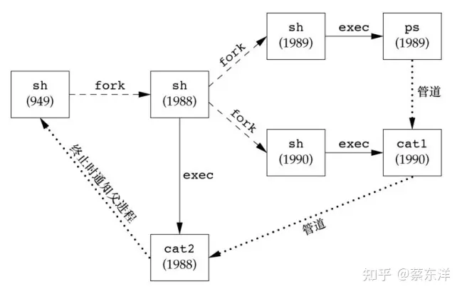

Bourne shell执行管道ps | cat1 | cat2时的进程

## 孤儿进程组

POSIX.1将孤儿进程组（orphaned process group）定义为：该组中每个成员的父进程要么是该组的一个成员，要么不是该组所属会话的成员。

## FreeBSD实现

每个会话都分配一个session结构（例如，每次调用setsid时）。

- s_count是该会话中的进程组数。当此计数器减至0时，则可释放此结构。
- s_leader是指向会话首进程proc结构的指针。
- s_ttyvp是指向控制终端vnode结构的指针。
- s_ttyp是指向控制终端tty结构的指针。
- s_sid是会话ID。请记住会话ID这一概念并非Single UNIX Specification的组成部分。

在调用setsid时，在内核中分配一个新的session结构。s_count设置为1，s_leader设置为调用进程 proc 结构的指针，s_sid 设置为进程 ID，因为新会话没有控制终端，所以s_ttyvp和s_ttyp设置为空指针。

接着说明 tty 结构。每个终端设备和每个伪终端设备均在内核中分配这样一种结构。

- t_session指向将此终端作为控制终端的session结构（注意，tty结构指向session结构，session结构也指向tty结构）。终端在失去载波信号时使用此指针将挂起信号发送给会话首进程。
- t_pgrp指向前台进程组的pgrp结构。终端驱动程序用此字段将信号发送给前台进程组。由输入特殊字符（中断、退出和挂起）而产生的3个信号被发送至前台进程组。
- t_termios是包含所有这些特殊字符和与该终端有关信息（如波特率、回显打开或关闭等）的结构。
- t_winsize是包含终端窗口当前大小的winsize型结构。当终端窗口大小改变时，信号SIGWINCH被发送至前台进程组。


会话和进程组的FreeBSD实现

为了找到特定会话的前台进程组，内核从session结构开始，然后用s_ttyp得到控制终端的tty结构，再用t_pgrp得到前台进程组的pgrp结构。

pgrp结构包含一个特定进程组的信息。其中各相关字段具体如下。

- pg_id是进程组ID。
- pg_session指向此进程组所属会话的session结构。
- pg_members 是指向此进程组 proc 结构表的指针，该 proc 结构代表进程组的成员。proc结构中p_pglist结构是双向链表，指向该组中的下一个进程和上一个进程。直到遇到进程组中的最后一个进程，它的proc结构中p_pglist结构为空指针。

最后还有一个vnode结构。在打开控制终端设备时分配此结构。进程对/dev/tty的所有访问都通过vnode结构。

# 线程

## 线程概念

线程的优点：

- 通过为每种事件类型分配单独的处理线程，可以简化处理异步事件的代码。每个线程在进行事件处理时可以采用同步编程模式，同步编程模式要比异步编程模式简单得多。
- 多个进程必须使用操作系统提供的复杂机制才能实现内存和文件描述符的共享。而多个线程自动地可以访问相同的存储地址空间和文件描述符。
- 有些问题可以分解从而提高整个程序的吞吐量。在只有一个控制线程的情况下，一个单线程进程要完成多个任务，只需要把这些任务串行化。但有多个控制线程时，相互独立的任务的处理就可以交叉进行，此时只需要为每个任务分配一个单独的线程。当然只有在两个任务的处理过程互不依赖的情况下，两个任务才可以交叉执行。
- 交互的程序同样可以通过使用多线程来改善响应时间，多线程可以把程序中处理用户输入输出的部分与其他部分分开。

每个线程都包含有表示执行环境所必需的信息，其中包括进程中标识线程的线程ID、一组寄存器值、栈、调度优先级和策略、信号屏蔽字、errno变量以及线程私有数据。一个进程的所有信息对该进程的所有线程都是共享的，包括可执行程序的代码、程序的全局内存和堆内存、栈以及文件描述符。

线程接口也称为“pthread”或“POSIX线程”，原来在POSIX.1-2001中是一个可选功能，但后来SUSv4把它们放入了基本功能。**POSIX线程的功能测试宏是_POSIX_THREADS。应用程序可以把这个宏用于#ifdef测试，从而在编译时确定是否支持线程；也可以把_SC_THREADS常数用于调用sysconf函数，进而在运行时确定是否支持线程。**

## 线程标识

线程ID是用pthread_t数据类型来表示的，实现的时候可以用一个结构来代表pthread_t数据类型，所以可移植的操作系统实现不能把它作为整数处理。因此必须使用一个函数来对两个线程ID进行比较。

```c
#include <pthread.h>
int pthread_equal(pthread_t tid1, pthread_t tid2);
//返回值：若相等，返回非0数值；否则，返回0
```

线程可以通过调用pthread_self函数获得自身的线程ID。

```c
#include <pthread.h>
pthread_t pthread_self(void);
//返回值：调用线程的线程ID
```

## 线程创建

在POSIX线程（pthread）的情况下，程序开始运行时，它也是以单进程中的单个控制线程启动的。在创建多个控制线程以前，程序的行为与传统的进程并没有什么区别。新增的线程可以通过调用pthread_create函数创建。

```c
#include <pthread.h>
int pthread_create(pthread_t *restrict tidp, const pthread_attr_t *restrict attr, void *(*start_rtn)(void *), void *restrict arg);
//返回值：若成功，返回0；否则，返回错误编号
```

当pthread_create成功返回时，新创建线程的线程ID会被设置成tidp指向的内存单元。attr参数用于定制各种不同的线程属性。后面会讨论线程属性，但现在我们把它置为NULL，创建一个具有默认属性的线程。

新创建的线程从start_rtn函数的地址开始运行，该函数只有一个无类型指针参数arg。如果需要向start_rtn函数传递的参数有一个以上，那么需要把这些参数放到一个结构中，然后把这个结构的地址作为arg参数传入。

线程创建时并不能保证哪个线程会先运行：是新创建的线程，还是调用线程。新创建的线程可以访问进程的地址空间，并且继承调用线程的浮点环境和信号屏蔽字，但是该线程的挂起信号集会被清除。

注意，pthread 函数在调用失败时通常会返回错误码，它们并不像其他的 POSIX 函数一样设置errno。每个线程都提供errno的副本，这只是为了与使用errno的现有函数兼容。在线程中，从函数中返回错误码更为清晰整洁，不需要依赖那些随着函数执行不断变化的全局状态，这样可以把错误的范围限制在引起出错的函数中。

## 线程终止

单个线程可以通过3种方式退出，因此可以在不终止整个进程的情况下，停止它的控制流。

- 线程可以简单地从启动例程中返回，返回值是线程的退出码。
- 线程可以被同一进程中的其他线程取消。
- 线程调用pthread_exit。
  include
  void pthread_exit(void *rval_ptr);

rval_ptr 参数是一个无类型指针，与传给启动例程的单个参数类似。进程中的其他线程也可以通过调用pthread_join函数访问到这个指针。

```c
#include <pthread.h>
int pthread_join(pthread_t thread, void **rval_ptr);
//返回值：若成功，返回0；否则，返回错误编号
```

调用线程将一直阻塞，直到指定的线程调用pthread_exit、从启动例程中返回或者被取消。如果线程简单地从它的启动例程返回，rval_ptr就包含返回码。如果线程被取消，由rval_ptr指定的内存单元就设置为PTHREAD_CANCELED。

可以通过调用pthread_join自动把线程置于分离状态，这样资源就可以恢复。如果线程已经处于分离状态，pthread_join调用就会失败，返回EINVAL，尽管这种行为是与具体实现相关的。

如果对线程的返回值并不感兴趣，那么可以把rval_ptr设置为 NULL。在这种情况下，调用pthread_join函数可以等待指定的线程终止，但并不获取线程的终止状态。

线程可以通过调用pthread_cancel函数来请求取消同一进程中的其他线程。

```c
#include <pthread.h>
int pthread_cancel(pthread_t tid);
// 返回值：若成功，返回0；否则，返回错误编号
```

在默认情况下，pthread_cancel 函数会使得由tid标识的线程的行为表现为如同调用了参数为PTHREAD_ CANCELED 的pthread_exit 函数，但是，线程可以选择忽略取消或者控制如何被取消。

线程可以安排它退出时需要调用的函数，这与进程在退出时可以用atexit函数安排退出是类似的。这样的函数称为线程清理处理程序（thread cleanup handler）。一个线程可以建立多个清理处理程序。处理程序记录在栈中，也就是说，它们的执行顺序与它们注册时相反。

```c
#include <pthread.h>
void pthread_cleanup_push(void (*rtn)(void *), void *arg);
void pthread_cleanup_pop(int execute);
```

如果 execute 参数设置为 0，清理函数将不被调用。不管发生上述哪种情况，pthread_cleanup_pop都将删除上次pthread_cleanup_push调用建立的清理处理程序。

这些函数有一个限制，由于它们可以实现为宏，所以必须在与线程相同的作用域中以匹配对的形式使用。pthread_cleanup_push 的宏定义可以包含字符{，这种情况下，在 pthread_cleanup_pop的定义中要有对应的匹配字符}。


进程和线程原语的比较

**在默认情况下，线程的终止状态会保存直到对该线程调用pthread_join。**如果线程已经被分离，线程的底层存储资源可以在线程终止时立即被收回。在线程被分离后，我们不能用pthread_join函数等待它的终止状态，因为对分离状态的线程调用pthread_join会产生未定义行为。可以调用pthread_detach分离线程。

```c
#include <pthread.h>
int pthread_detach(pthread_t tid);
// 返回值：若成功，返回0；否则，返回错误编号
```

## 线程同步

当多个控制线程共享相同的内存时，需要确保每个线程看到一致的数据视图。如果每个线程使用的变量都是其他线程不会读取和修改的，那么就不存在一致性问题。同样，如果变量是只读的，多个线程同时读取该变量也不会有一致性问题。但是，当一个线程可以修改的变量，其他线程也可以读取或者修改的时候，我们就需要对这些线程进行同步，确保它们在访问变量的存储内容时不会访问到无效的值。

## 互斥量

互斥量（mutex）从本质上说是一把锁，在访问共享资源前对互斥量进行设置（加锁），在访问完成后释放（解锁）互斥量。对互斥量进行加锁以后，任何其他试图再次对互斥量加锁的线程都会被阻塞直到当前线程释放该互斥锁。如果释放互斥量时有一个以上的线程阻塞，那么所有该锁上的阻塞线程都会变成可运行状态，第一个变为运行的线程就可以对互斥量加锁，其他线程就会看到互斥量依然是锁着的，只能回去再次等待它重新变为可用。在这种方式下，每次只有一个线程可以向前执行。

互斥变量是用pthread_mutex_t数据类型表示的。在使用互斥变量以前，必须首先对它进行初始化，可以把它设置为常量PTHREAD_MUTEX_INITIALIZER（只适用于静态分配的互斥量），也可以通过调用pthread_mutex_init函数进行初始化。如果动态分配互斥量（例如，通过调用malloc函数），在释放内存前需要调用pthread_mutex_destroy。

```c
#include <pthread.h>
int pthread_mutex_init(pthread_mutex_t *restrict mutex, const pthread_mutexattr_t *restrict attr);
int pthread_mutex_destroy(pthread_mutex_t *mutex);
// 两个函数的返回值：若成功，返回0；否则，返回错误编号
```

要用默认的属性初始化互斥量，只需把attr设为NULL。

对互斥量进行加锁，需要调用 pthread_mutex_lock。如果互斥量已经上锁，调用线程将阻塞直到互斥量被解锁。对互斥量解锁，需要调用pthread_mutex_unlock。

```c
#include <pthread.h>
int pthread_mutex_lock(pthread_mutex_t *mutex);
int pthread_mutex_trylock(pthread_mutex_t *mutex);
int pthread_mutex_unlock(pthread_mutex_t *mutex);
// 所有函数的返回值：若成功，返回0；否则，返回错误编号
```

如果线程不希望被阻塞，它可以使用pthread_mutex_trylock尝试对互斥量进行加锁。如果调用 pthread_mutex_trylock 时互斥量处于未锁住状态，那么 pthread_mutex_trylock将锁住互斥量，不会出现阻塞直接返回0，否则pthread_mutex_trylock 就会失败，不能锁住互斥量，返回EBUSY。

## 避免死锁

如果线程试图对同一个互斥量加锁两次，那么它自身就会陷入死锁状态。

## 函数pthread_mutex_timedlock

```c
#include <pthread.h>
#include <time.h>
int pthread_mutex_timedlock(pthread_mutex_t *restrict mutex, const struct timespec *restrict tsptr);
// 返回值：若成功，返回0；否则，返回错误编号
```

超时指定愿意等待的绝对时间（与相对时间对比而言，指定在时间X之前可以阻塞等待，而不是说愿意阻塞Y秒）。这个超时时间是用timespec结构来表示的，它用秒和纳秒来描述时间。

## 读写锁

读写锁（reader-writer lock）与互斥量类似，不过读写锁允许更高的并行性。互斥量要么是锁住状态，要么就是不加锁状态，而且一次只有一个线程可以对其加锁。读写锁可以有3种状态：读模式下加锁状态，写模式下加锁状态，不加锁状态。一次只有一个线程可以占有写模式的读写锁，但是多个线程可以同时占有读模式的读写锁。

当读写锁是写加锁状态时，在这个锁被解锁之前，所有试图对这个锁加锁的线程都会被阻塞。当读写锁在读加锁状态时，所有试图以读模式对它进行加锁的线程都可以得到访问权，但是任何希望以写模式对此锁进行加锁的线程都会阻塞，直到所有的线程释放它们的读锁为止。

读写锁也叫做共享互斥锁（shared-exclusive lock）。当读写锁是读模式锁住时，就可以说成是以共享模式锁住的。当它是写模式锁住的时候，就可以说成是以互斥模式锁住的。

与互斥量相比，读写锁在使用之前必须初始化，在释放它们底层的内存之前必须销毁。

```c
#include <pthread.h>
int pthread_rwlock_init(pthread_rwlock_t *restrict rwlock, const pthread_rwlockattr_t *restrict attr);
int pthread_rwlock_destroy(pthread_rwlock_t *rwlock);
// 两个函数的返回值：若成功，返回0；否则，返回错误编号
```

要在读模式下锁定读写锁，需要调用pthread_rwlock_rdlock。要在写模式下锁定读写锁，需要调用pthread_rwlock_wrlock。不管以何种方式锁住读写锁，都可以调用pthread_rwlock_unlock进行解锁。

```c
#include <pthread.h>
int pthread_rwlock_rdlock(pthread_rwlock_t *rwlock);
int pthread_rwlock_wrlock(pthread_rwlock_t *rwlock);
int pthread_rwlock_unlock(pthread_rwlock_t *rwlock);
// 所有函数的返回值：若成功，返回0；否则，返回错误编号
```

Single UNIX Specification还定义了读写锁原语的条件版本。

```c
#include <pthread.h>
int pthread_rwlock_tryrdlock(pthread_rwlock_t *rwlock);
int pthread_rwlock_trywrlock(pthread_rwlock_t *rwlock);
// 两个函数的返回值：若成功，返回0；否则，返回错误编号
```

可以获取锁时，这两个函数返回0。否则，它们返回错误EBUSY。这两个函数可以用于我们前面讨论的遵守某种锁层次但还不能完全避免死锁的情况。

## 带有超时的读写锁

与互斥量一样，Single UNIX Specification提供了带有超时的读写锁加锁函数，使应用程序在获取读写锁时避免陷入永久阻塞状态。这两个函数是 pthread_rwlock_timedrdlock 和 pthread_rwlock_timedwrlock。

```c
#include <pthread.h>
#include <time.h>
int pthread_rwlock_timedrdlock(pthread_rwlock_t *restrict rwlock, const struct timespec *restrict tsptr);
int pthread_rwlock_timedwrlock(pthread_rwlock_t *restrict rwlock, const struct timespec *restrict tsptr);
// 两个函数的返回值：若成功，返回0；否则，返回错误编号
```

tsptr参数指向timespec结构，指定线程应该停止阻塞的时间。如果它们不能获取锁，那么超时到期时，这两个函数将返回 ETIMEDOUT错误。

## 条件变量

条件变量是线程可用的另一种同步机制。条件变量给多个线程提供了一个会合的场所。条件变量与互斥量一起使用时，允许线程以无竞争的方式等待特定的条件发生。

条件本身是由互斥量保护的。线程在改变条件状态之前必须首先锁住互斥量。其他线程在获得互斥量之前不会察觉到这种改变，因为互斥量必须在锁定以后才能计算条件。

在使用条件变量之前，必须先对它进行初始化。由pthread_cond_t数据类型表示的条件变量可以用两种方式进行初始化，可以把常量PTHREAD_COND_INITIALIZER赋给静态分配的条件变量，但是如果条件变量是动态分配的，则需要使用pthread_cond_init函数对它进行初始化。

在释放条件变量底层的内存空间之前，可以使用pthread_cond_destroy函数对条件变量进行反初始化（deinitialize）。

```c
#include <pthread.h>
int pthread_cond_init(pthread_cond_t *restrict cond, const pthread_condattr_t *restrict attr);
int pthread_cond_destroy(pthread_cond_t *cond);
// 两个函数的返回值：若成功，返回0；否则，返回错误编号
```

使用pthread_cond_wait等待条件变量变为真。如果在给定的时间内条件不能满足，那么会生成一个返回错误码的变量。

```c
#include <pthread.h>
int pthread_cond_wait(pthread_cond_t *restrict cond, pthread_mutex_t *restrict mutex);
int pthread_cond_timedwait(pthread_cond_t *restrict cond, pthread_mutex_t *restrict mutex, const struct timespec *restrict tsptr);
// 两个函数的返回值：若成功，返回0；否则，返回错误编号
```

**传递给pthread_cond_wait的互斥量对条件进行保护。调用者把锁住的互斥量传给函数，函数然后自动把调用线程放到等待条件的线程列表上，对互斥量解锁。这就关闭了条件检查和线程进入休眠状态等待条件改变这两个操作之间的时间通道，这样线程就不会错过条件的任何变化。pthread_cond_wait返回时，互斥量再次被锁住。**

pthread_cond_timedwait函数的功能与pthread_cond_wait函数相似，只是多了一个超时（tsptr）。超时值指定了我们愿意等待多长时间，它是通过timespec结构指定的。如果超时到期时条件还是没有出现，pthread_cond_timewait 将重新获取互斥量，然后返回错误ETIMEDOUT。

```c
#include <sys/time.h>
#include <stdlib.h>

void maketimeout(struct timespec* tsp, long minutes)
{
    struct timeval now;
    gettimeofday(&now, NULL);
    tsp->tv_sec = now.tv_sec;
    tsp->tv_nsec = now.tv_usec * 1000;
    tsp->tv_sec += minutes * 60;
}
```

有两个函数可以用于通知线程条件已经满足。pthread_cond_signal函数至少能唤醒一个等待该条件的线程，而pthread_cond_broadcast函数则能唤醒等待该条件的所有线程。

POSIX 规范为了简化 pthread_cond_signal 的实现，允许它在实现的时候唤醒一个以上的线程。

```c
#include <pthread.h>
int pthread_cond_signal(pthread_cond_t *cond);
int pthread_cond_broadcast(pthread_cond_t *cond);
// 两个函数的返回值：若成功，返回0；否则，返回错误编号
```

在调用pthread_cond_signal或者pthread_cond_broadcast时，我们说这是在给线程或者条件发信号。必须注意，一定要在改变条件状态以后再给线程发信号。

## 自旋锁

自旋锁与互斥量类似，但它不是通过休眠使进程阻塞，而是在获取锁之前一直处于忙等（自旋）阻塞状态。自旋锁可用于以下情况：锁被持有的时间短，而且线程并不希望在重新调度上花费太多的成本。

当自旋锁用在非抢占式内核中时是非常有用的：除了提供互斥机制以外，它们会阻塞中断，这样中断处理程序就不会让系统陷入死锁状态，因为它需要获取已被加锁的自旋锁（把中断想成是另一种抢占）。在这种类型的内核中，中断处理程序不能休眠，因此它们能用的同步原语只能是自旋锁。

但是，在用户层，自旋锁并不是非常有用，除非运行在不允许抢占的实时调度类中。运行在分时调度类中的用户层线程在两种情况下可以被取消调度：当它们的时间片到期时，或者具有更高调度优先级的线程就绪变成可运行时。在这些情况下，如果线程拥有自旋锁，它就会进入休眠状态，阻塞在锁上的其他线程自旋的时间可能会比预期的时间更长。

很多互斥量的实现非常高效，以至于应用程序采用互斥锁的性能与曾经采用过自旋锁的性能基本是相同的。事实上，有些互斥量的实现在试图获取互斥量的时候会自旋一小段时间，只有在自旋计数到达某一阈值的时候才会休眠。这些因素，加上现代处理器的进步，使得上下文切换越来越快，也使得自旋锁只在某些特定的情况下有用。

自旋锁的接口与互斥量的接口类似，这使得它可以比较容易地从一个替换为另一个。可以用pthread_spin_init 函数对自旋锁进行初始化。用 pthread_spin_destroy 函数进行自旋锁的反初始化。

```c
#include <pthread.h>
int pthread_spin_init(pthread_spinlock_t *lock, int pshared);
int pthread_spin_destroy(pthread_spinlock_t *lock);
// 两个函数的返回值：若成功，返回0；否则，返回错误编号
```

pshared 参数表示进程共享属性，表明自旋锁是如何获取的。如果它设为 PTHREAD_PROCESS_SHARED，则自旋锁能被可以访问锁底层内存的线程所获取，即便那些线程属于不同的进程，情况也是如此。否则pshared参数设为 PTHREAD_PROCESS_PRIVATE，自旋锁就只能被初始化该锁的进程内部的线程所访问。

可以用pthread_spin_lock或pthread_spin_trylock对自旋锁进行加锁，前者在获取锁之前一直自旋，后者如果不能获取锁，就立即返回EBUSY 错误。注意，pthread_spin_trylock不能自旋。不管以何种方式加锁，自旋锁都可以调用pthread_spin_unlock函数解锁。

```c
#include <pthread.h>
int pthread_spin_lock(pthread_spinlock_t *lock);
int pthread_spin_trylock(pthread_spinlock_t *lock);
int pthread_spin_unlock(pthread_spinlock_t *lock);
// 所有函数的返回值：若成功，返回0；否则，返回错误编号
```

注意，如果自旋锁当前在解锁状态的话，pthread_spin_lock函数不要自旋就可以对它加锁。如果线程已经对它加锁了，结果就是未定义的。调用pthread_spin_lock会返回EDEADLK错误（或其他错误），或者调用可能会永久自旋。具体行为依赖于实际的实现。试图对没有加锁的自旋锁进行解锁，结果也是未定义的。

不管是pthread_spin_lock还是pthread_spin_trylock，返回值为0的话就表示自旋锁被加锁。需要注意，不要调用在持有自旋锁情况下可能会进入休眠状态的函数。如果调用了这些函数，会浪费CPU资源，因为其他线程需要获取自旋锁需要等待的时间就延长了。

## 屏障

屏障（barrier）是用户协调多个线程并行工作的同步机制。屏障允许每个线程等待，直到所有的合作线程都到达某一点，然后从该点继续执行。我们已经看到一种屏障，pthread_join函数就是一种屏障，允许一个线程等待，直到另一个线程退出。

可以使用 pthread_barrier_init 函数对屏障进行初始化，用 thread_barrier_destroy函数反初始化。

```c
#include <pthread.h>
int pthread_barrier_init(pthread_barrier_t *restrict barrier, const pthread_barrierattr_t *restrict attr, unsigned int count);
int pthread_barrier_destroy(pthread_barrier_t *barrier);
// 两个函数的返回值：若成功，返回0；否则，返回错误编号
```

初始化屏障时，可以使用count参数指定，在允许所有线程继续运行之前，必须到达屏障的线程数目。

可以使用pthread_barrier_wait函数来表明，线程已完成工作，准备等所有其他线程赶上来。

```c
#include <pthread.h>
int pthread_barrier_wait(pthread_barrier_t *barrier);
// 返回值：若成功，返回0或者PTHREAD_BARRIER_SERIAL_THREAD；否则，返回错误编号
```

调用pthread_barrier_wait的线程在屏障计数（调用pthread_barrier_init时设定）未满足条件时，会进入休眠状态。如果该线程是最后一个调用pthread_barrier_wait的线程，就满足了屏障计数，所有的线程都被唤醒。

对于一个任意线程，pthread_barrier_wait函数返回了PTHREAD_BARRIER_SERIAL_THREAD。剩下的线程看到的返回值是0。这使得一个线程可以作为主线程，它可以工作在其他所有线程已完成的工作结果上。

一旦达到屏障计数值，而且线程处于非阻塞状态，屏障就可以被重用。但是除非在调用了pthread_barrier_destroy函数之后，又调用了pthread_barrier_init函数对计数用另外的数进行初始化，否则屏障计数不会改变。


# 线程控制


## 信号线程限制

### 线程属性

pthread 接口允许我们通过设置每个对象关联的不同属性来细调线程和同步对象的行为。通常，管理这些属性的函数都遵循相同的模式。

- 每个对象与它自己类型的属性对象进行关联（线程与线程属性关联，互斥量与互斥量属性关联，等等）。一个属性对象可以代表多个属性。属性对象对应用程序来说是不透明的。这意味着应用程序并不需要了解有关属性对象内部结构的详细细节，这样可以增强应用程序的可移植性。取而代之的是，需要提供相应的函数来管理这些属性对象。
- 有一个初始化函数，把属性设置为默认值。
- 还有一个销毁属性对象的函数。如果初始化函数分配了与属性对象关联的资源，销毁函数负责释放这些资源。
- 每个属性都有一个从属性对象中获取属性值的函数。由于函数成功时会返回0，失败时会返回错误编号，所以可以通过把属性值存储在函数的某一个参数指定的内存单元中，把属性值返回给调用者。
- 每个属性都有一个设置属性值的函数。在这种情况下，属性值作为参数按值传递。

可以使用pthread_attr_t结构修改线程默认属性，并把这些属性与创建的线程联系起来。可以使用pthread_attr_init函数初始化pthread_attr_t结构。在调用pthread_attr_init以后，pthread_attr_t结构所包含的就是操作系统实现支持的所有线程属性的默认值。

```c
#include <pthread.h>
int pthread_attr_init(pthread_attr_t *attr);
int pthread_attr_destroy(pthread_attr_t *attr);
// 两个函数的返回值：若成功，返回0；否则，返回错误编号
```


POSIX.1线程属性

如果对现有的某个线程的终止状态不感兴趣的话，可以使用pthread_detach函数让操作系统在线程退出时收回它所占用的资源。

如果在创建线程时就知道不需要了解线程的终止状态，就可以修改 pthread_attr_t 结构中的detachstate线程属性，让线程一开始就处于分离状态。可以使用pthread_attr_setdetachstate函数把线程属性detachstate设置成以下两个合法值之一：PTHREAD_CREATE_DETACHED，以分离状态启动线程；或者PTHREAD_CREATE_JOINABLE，正常启动线程，应用程序可以获取线程的终止状态。

```c
#include <pthread.h>
int pthread_attr_getdetachstate(const pthread_attr_t *restrict attr,int *detachstate);
int pthread_attr_setdetachstate(pthread_attr_t *attr, int *detachstate);
// 两个函数的返回值：若成功，返回0；否则，返回错误编号
```

对于遵循POSIX标准的操作系统来说，并不一定要支持线程栈属性，但是对于遵循Single UNIX Specification 中 XSI 选项的系统来说，支持线程栈属性就是必需的。

```c
#include <pthread.h>
int pthread_attr_getstack(const pthread_attr_t *restrict attr,void **restrict stackaddr,size_t *restrict stacksize);
int pthread_attr_setstack(pthread_attr_t *attr,void *stackaddr, size_t stacksize);
// 两个函数的返回值：若成功，返回0；否则，返回错误编号
```

**对于进程来说，虚地址空间的大小是固定的。因为进程中只有一个栈，所以它的大小通常不是问题。但对于线程来说，同样大小的虚地址空间必须被所有的线程栈共享。如果应用程序使用了许多线程，以致这些线程栈的累计大小超过了可用的虚地址空间，就需要减少默认的线程栈大小。另一方面，如果线程调用的函数分配了大量的自动变量，或者调用的函数涉及许多很深的栈帧（stack frame），那么需要的栈大小可能要比默认的大。**

如果线程栈的虚地址空间都用完了，那可以使用malloc或者mmap来为可替代的栈分配空间，并用pthread_attr_setstack函数来改变新建线程的栈位置。由stackaddr参数指定的地址可以用作线程栈的内存范围中的最低可寻址地址，该地址与处理器结构相应的边界应对齐。当然，这要假设malloc和mmap所用的虚地址范围与线程栈当前使用的虚地址范围不同。

**stackaddr线程属性被定义为栈的最低内存地址，但这并不一定是栈的开始位置。**对于一个给定的处理器结构来说，如果栈是从高地址向低地址方向增长的，那么stackaddr线程属性将是栈的结尾位置，而不是开始位置。

应用程序也可以通过pthread_attr_getstacksize和pthread_attr_setstacksize函数读取或设置线程属性stacksize。

```c
#include <pthread.h>
int pthread_attr_getstacksize(const pthread_attr_t *restrict attr,size_t *restrict stacksize);
int pthread_attr_setstacksize(pthread_attr_t *attr, size_t stacksize);
// 两个函数的返回值：若成功，返回0；否则，返回错误编号
```

如果希望改变默认的栈大小，但又不想自己处理线程栈的分配问题，这时使用pthread_attr_setstacksize函数就非常有用。设置stacksize属性时，选择的stacksize不能小于PTHREAD_STACK_MIN。

线程属性guardsize控制着线程栈末尾之后用以避免栈溢出的扩展内存的大小。这个属性默认值是由具体实现来定义的，但常用值是系统页大小。可以把guardsize线程属性设置为0，不允许属性的这种特征行为发生：在这种情况下，不会提供警戒缓冲区。同样，如果修改了线程属性stackaddr，系统就认为我们将自己管理栈，进而使栈警戒缓冲区机制无效，这等同于把guardsize线程属性设置为0。

```c
#include <pthread.h>
int pthread_attr_getguardsize(const pthread_attr_t *restrict attr,size_t *restrict guardsize);
int pthread_attr_setguardsize(pthread_attr_t *attr, size_t guardsize);
// 两个函数的返回值：若成功，返回0；否则，返回错误编号
```

如果guardsize线程属性被修改了，操作系统可能会把它取为页大小的整数倍。如果线程的栈指针溢出到警戒区域，应用程序就可能通过信号接收到出错信息。

### 同步属性

### 互斥量属性

互斥量属性是用pthread_mutexattr_t结构表示的。之前每次对互斥量进行初始化时，都是通过使用PTHREAD_MUTEX_INITIALIZER常量或者用指向互斥量属性结构的空指针作为参数调用pthread_mutex_init函数，得到互斥量的默认属性。

对于非默认属性，可以用pthread_mutexattr_init初始化pthread_mutexattr_t结构，用pthread_mutexattr_destroy来反初始化。

```c
#include <pthread.h>
int pthread_mutexattr_init(pthread_mutexattr_t *attr);
int pthread_mutexattr_destroy(pthread_mutexattr_t *attr);
// 两个函数的返回值：若成功，返回0；否则，返回错误编号
```

pthread_mutexattr_init 函数将用默认的互斥量属性初始化 pthread_mutexattr_t 结构。值得注意的3个属性是：**进程共享属性、健壮属性以及类型属性。**

在进程中，多个线程可以访问同一个同步对象，这是默认的行为。在这种情况下，进程共享互斥量属性需设置为PTHREAD_PROCESS_PRIVATE。

存在这样的机制：允许相互独立的多个进程把同一个内存数据块映射到它们各自独立的地址空间中。就像多个线程访问共享数据一样，多个进程访问共享数据通常也需要同步。如果进程共享互斥量属性设置为PTHREAD_PROCESS_SHARED，从多个进程彼此之间共享的内存数据块中分配的互斥量就可以用于这些进程的同步。

可以使用pthread_mutexattr_getpshared函数查询pthread_mutexattr_t结构，得到它的进程共享属性，使用pthread_mutexattr_setpshared函数修改进程共享属性。

```c
#include <pthread.h>
int pthread_mutexattr_getpshared(const pthread_mutexattr_t *restrict attr, int *restrict pshared);
int pthread_mutexattr_setpshared(pthread_mutexattr_t *attr, int pshared);
// 两个函数的返回值：若成功，返回0；否则，返回错误编号
```

进程共享互斥量属性设置为PTHREAD_PROCESS_PRIVATE时，允许pthread线程库提供更有效的互斥量实现，这在多线程应用程序中是默认的情况。在多个进程共享多个互斥量的情况下， pthread线程库可以限制开销较大的互斥量实现。

互斥量健壮属性与在多个进程间共享的互斥量有关。这意味着，当持有互斥量的进程终止时，需要解决互斥量状态恢复的问题。这种情况发生时，互斥量处于锁定状态，恢复起来很困难。其他阻塞在这个锁的进程将会一直阻塞下去。

可以使用 pthread_mutexattr_getrobust 函数获取健壮的互斥量属性的值。可以调用 pthread_mutexattr_setrobust函数设置健壮的互斥量属性的值。

```c
#include <pthread.h>
int pthread_mutexattr_getrobust(const pthread_mutexattr_t *restrict attr, int *restrict robust);
int pthread_mutexattr_setrobust(pthread_mutexattr_t *attr, int robust);
// 两个函数的返回值：若成功，返回0；否则，返回错误编号
```

健壮属性取值有两种可能的情况。默认值是 PTHREAD_MUTEX_STALLED，这意味着持有互斥量的进程终止时不需要采取特别的动作。这种情况下，使用互斥量后的行为是未定义的，等待该互斥量解锁的应用程序会被有效地“拖住”。另一个取值是PTHREAD_MUTEX_ROBUST。这个值将导致线程调用pthread_mutex_lock获取锁，而该锁被另一个进程持有，但它终止时并没有对该锁进行解锁，此时线程会阻塞，从pthread_mutex_lock返回的值为EOWNERDEAD而不是0。应用程序可以通过这个特殊的返回值获知，若有可能（要保护状态的细节以及如何进行恢复会因不同的应用程序而异），不管它们保护的互斥量状态如何，都需要进行恢复。

使用健壮的互斥量改变了我们使用pthread_mutex_lock的方式，因为现在必须检查3个返回值而不是之前的两个：不需要恢复的成功、需要恢复的成功以及失败。但是，即使不用健壮的互斥量，也可以只检查成功或者失败。

如果应用状态无法恢复，在线程对互斥量解锁以后，该互斥量将处于永久不可用状态。为了避免这样的问题，线程可以调用 pthread_mutex_consistent 函数，指明与该互斥量相关的状态在互斥量解锁之前是一致的。

```c
#include <pthread.h>
int pthread_mutex_consistent(pthread_mutex_t *mutex);
// 返回值：若成功，返回0；否则，返回错误编号
```

如果线程没有先调用 pthread_mutex_consistent 就对互斥量进行了解锁，那么其他试图获取该互斥量的阻塞线程就会得到错误码ENOTRECOVERABLE。如果发生这种情况，互斥量将不再可用。线程通过提前调用pthread_mutex_consistent，能让互斥量正常工作，这样它就可以持续被使用。

类型互斥量属性控制着互斥量的锁定特性。POSIX.1定义了4种类型。

- PTHREAD_MUTEX_NORMAL 一种标准互斥量类型，不做任何特殊的错误检查或死锁检测。
- PTHREAD_MUTEX_ERRORCHECK 此互斥量类型提供错误检查。
- PTHREAD_MUTEX_RECURSIVE 此互斥量类型允许同一线程在互斥量解锁之前对该互斥量进行多次加锁。递归互斥量维护锁的计数，在解锁次数和加锁次数不相同的情况下，不会释放锁。所以，如果对一个递归互斥量加锁两次，然后解锁一次，那么这个互斥量将依然处于加锁状态，对它再次解锁以前不能释放该锁。
- PTHREAD_MUTEX_DEFAULT 此互斥量类型可以提供默认特性和行为。操作系统在实现它的时候可以把这种类型自由地映射到其他互斥量类型中的一种。


互斥量类型行为

可以用pthread_mutexattr_gettype函数得到互斥量类型属性，用pthread_mutexattr_settype函数修改互斥量类型属性。

```c
#include <pthread.h>
int pthread_mutexattr_gettype(const pthread_mutexattr_t*restrict attr,int*restrict type);
int pthread_mutexattr_settype(pthread_mutexattr_t *attr, int type);
// 两个函数的返回值: 若成功，返回0；否则，返回错误编号
```

### 读写锁属性

读写锁与互斥量类似，也是有属性的。可以用 pthread_rwlockattr_init 初始化pthread_rwlockattr_t结构，用pthread_rwlockattr_destroy反初始化该结构。

```c
#include <pthread.h>
int pthread_rwlockattr_init(pthread_rwlockattr_t *attr);
int pthread_rwlockattr_destroy(pthread_rwlockattr_t *attr);
// 两个函数的返回值：若成功，返回0；否则，返回错误编号
```

读写锁支持的唯一属性是进程共享属性。它与互斥量的进程共享属性是相同的。就像互斥量的进程共享属性一样，有一对函数用于读取和设置读写锁的进程共享属性。

```c
#include <pthread.h>
int pthread_rwlockattr_getpshared(const pthread_rwlockattr_t *
restrict attr,int *restrict pshared);
int pthread_rwlockattr_setpshared(pthread_rwlockattr_t *attr,
int pshared);
// 两个函数的返回值：若成功，返回0；否则，返回错误编号
```

### 条件变量属性

Single UNIX Specification目前定义了条件变量的两个属性：进程共享属性和时钟属性。与其他的属性对象一样，有一对函数用于初始化和反初始化条件变量属性。

```c
#include <pthread.h>
int pthread_condattr_init(pthread_condattr_t *attr);
int pthread_condattr_destroy(pthread_condattr_t *attr);
// 两个函数的返回值：若成功，返回0；否则，返回错误编号
```

与其他的同步属性一样，条件变量支持进程共享属性。它控制着条件变量是可以被单进程的多个线程使用，还是可以被多进程的线程使用。要获取进程共享属性的当前值，可以用 pthread_condattr_getpshared函数。设置该值可以用pthread_condattr_setpshared函数。

```c
#include <pthread.h>
int pthread_condattr_getpshared(const pthread_condattr_t *restrict attr, int *restrict pshared);
int pthread_condattr_setpshared(pthread_condattr_t *attr, int pshared);
// 两个函数的返回值：若成功，返回0；否则，返回错误编号
```

时钟属性控制计算pthread_cond_timedwait函数的超时参数（tsptr）时采用的是哪个时钟。可以使用 pthread_condattr_getclock 函数获取可被用于pthread_cond_timedwait 函数的时钟 ID，在使用 pthread_cond_timedwait 函数前需要用pthread_condattr_t对象对条件变量进行初始化。可以用pthread_condattr_setclock函数对时钟ID进行修改。

```c
#include <pthread.h>
int pthread_condattr_getclock(const pthread_condattr_t *restrict attr, clockid_t *restrict clock_id);
int pthread_condattr_setclock(pthread_condattr_t *attr, clockid_t clock_id);
// 两个函数的返回值:若成功，返回0；否则，返回错误编号
```

### 屏障属性

屏障也有属性。可以使用pthread_barrierattr_init函数对屏障属性对象进行初始化，用pthread_barrierattr_destroy函数对屏障属性对象进行反初始化。

```c
#include <pthread.h>
int pthread_barrierattr_init(pthread_barrierattr_t *attr);
int pthread_barrierattr_destroy(pthread_barrierattr_t *attr);
// 两个函数的返回值：若成功，返回0；否则，返回错误编号
```

目前定义的屏障属性只有进程共享属性，它控制着屏障是可以被多进程的线程使用，还是只能被初始化屏障的进程内的多线程使用。与其他属性对象一样，有一个获取属性值的函数（pthread_barrierattr_getpshared）和一个设置属性值的函数（pthread_barrierattr_ setpshared）。

```c
#include <pthread.h>
int pthread_barrierattr_getpshared(const pthread_barrierattr_t *restrict attr, int *restrict pshared);
int pthread_barrierattr_setpshared(pthread_barrierattr_t *attr, int pshared);
// 两个函数的返回值：若成功，返回0；否则，返回错误编号
```

进程共享属性的值可以是 PTHREAD_PROCESS_SHARED（多进程中的多个线程可用），也可以是PTHREAD_PROCESS_PRIVATE（只有初始化屏障的那个进程内的多个线程可用）。

## 重入

线程在遇到重入问题时与信号处理程序是类似的。在这两种情况下，多个控制线程在相同的时间有可能调用相同的函数。

如果一个函数在相同的时间点可以被多个线程安全地调用，就称该函数是线程安全的。

支持线程安全函数的操作系统实现会在中定义符号_POSIX_THREAD_SAFE_FUNCTIONS。应用程序也可以在sysconf函数中传入_SC_THREAD_SAFE_FUNCTIONS参数在运行时检查是否支持线程安全函数。在SUSv4之前，要求所有遵循XSI的实现都必须支持线程安全函数，但是在SUSv4中，线程安全函数支持这个需求已经要求具体实现考虑遵循POSIX。


替代的线程安全函数

操作系统实现支持线程安全函数这个特性时，对POSIX.1中的一些非线程安全函数，它会提供可替代的线程安全版本。上图列出了这些函数的线程安全版本。这些函数的命名方式与它们的非线程安全版本的名字相似，只不过在名字最后加了_r，表明这些版本是可重入的。**很多函数并不是线程安全的，因为它们返回的数据存放在静态的内存缓冲区中。通过修改接口，要求调用者自己提供缓冲区可以使函数变为线程安全。**

如果一个函数对多个线程来说是可重入的，就说这个函数就是线程安全的。但这并不能说明对信号处理程序来说该函数也是可重入的。如果函数对异步信号处理程序的重入是安全的，那么就可以说函数是异步信号安全的。

POSIX.1还提供了以线程安全的方式管理FILE对象的方法。可以使用flockfile和ftrylockfile获取给定FILE对象关联的锁。这个锁是递归的：当你占有这把锁的时候，还是可以再次获取该锁，而且不会导致死锁。虽然这种锁的具体实现并无规定，但要求所有操作 FILE 对象的标准 I/O 例程的动作行为必须看起来就像它们内部调用了flockfile和funlockfile。

```c
#include <stdio.h>
int ftrylockfile(FILE *fp);
// 返回值：若成功，返回0；若不能获取锁，返回非0数值
void flockfile(FILE *fp);
void funlockfile(FILE *fp);
```

虽然标准的I/O例程可能从它们各自的内部数据结构的角度出发，是以线程安全的方式实现的，但有时把锁开放给应用程序也是非常有用的。这允许应用程序把多个对标准I/O函数的调用组合成原子序列。当然，在处理多个FILE对象时，需要注意潜在的死锁，需要对所有的锁仔细地排序。

如果标准I/O例程都获取它们各自的锁，那么在做一次一个字符的I/O时就会出现严重的性能下降。在这种情况下，需要对每一个字符的读写操作进行获取锁和释放锁的动作。为了避免这种开销，出现了不加锁版本的基于字符的标准I/O例程。

```c
#include <stdio.h>
int getchar_unlocked(void);
int getc_unlocked(FILE *fp);
// 两个函数的返回值: 若成功，返回下一个字符；若遇到文件尾或者出错，返回EOF
int putchar_unlocked(int c);
int putc_unlocked(int c, FILE *fp);
// 两个函数的返回值：若成功，返回c；若出错，返回EOF
```

除非被flockfile（或ftrylockfile）和funlockfile的调用包围，否则尽量不要调用这4个函数，因为它们会导致不可预期的结果（比如，由于多个控制线程非同步访问数据引起的种种问题）。

一旦对FILE对象进行加锁，就可以在释放锁之前对这些函数进行多次调用。这样就可以在多次的数据读写上分摊总的加解锁的开销。

## 线程特定数据

线程特定数据（thread-specific data），也称为线程私有数据（thread-private data），是存储和查询某个特定线程相关数据的一种机制。我们把这种数据称为线程特定数据或线程私有数据的原因是，我们希望每个线程可以访问它自己单独的数据副本，而不需要担心与其他线程的同步访问问题。

线程模型促进了进程中数据和属性的共享，许多人在设计线程模型时会遇到各种麻烦。那么为什么有人想在这样的模型中促进阻止共享的接口呢？这其中有两个原因。

- 有时候需要维护基于每线程（per-thread）的数据。因为线程ID并不能保证是小而连续的整数，所以就不能简单地分配一个每线程数据数组，用线程ID作为数组的索引。即使线程ID确实是小而连续的整数，我们可能还希望有一些额外的保护，防止某个线程的数据与其他线程的数据相混淆。
- 提供了让基于进程的接口适应多线程环境的机制。一个很明显的实例就是errno。以前的接口（线程出现以前）把errno 定义为进程上下文中全局可访问的整数。系统调用和库例程在调用或执行失败时设置errno，把它作为操作失败时的附属结果。为了让线程也能够使用那些原本基于进程的系统调用和库例程，errno被重新定义为线程私有数据。这样，一个线程做了重置errno的操作也不会影响进程中其他线程的errno值。

一个进程中的所有线程都可以访问这个进程的整个地址空间。除了使用寄存器以外，一个线程没有办法阻止另一个线程访问它的数据。线程特定数据也不例外。

在分配线程特定数据之前，需要创建与该数据关联的键。这个键将用于获取对线程特定数据的访问。使用pthread_key_create创建一个键。

```c
#include <pthread.h>
int pthread_key_create(pthread_key_t *keyp, void (*destructor)(void *));
// 返回值：若成功，返回0；否则，返回错误编号
```

创建的键存储在keyp指向的内存单元中，这个键可以被进程中的所有线程使用，但每个线程把这个键与不同的线程特定数据地址进行关联。创建新键时，每个线程的数据地址设为空值。

除了创建键以外，pthread_key_create 可以为该键关联一个可选择的析构函数。当这个线程退出时，如果数据地址已经被置为非空值，那么析构函数就会被调用，它唯一的参数就是该数据地址。如果传入的析构函数为空，就表明没有析构函数与这个键关联。当线程调用pthread_exit或者线程执行返回，正常退出时，析构函数就会被调用。同样，线程取消时，只有在最后的清理处理程序返回之后，析构函数才会被调用。如果线程调用了exit、_exit、_Exit或abort，或者出现其他非正常的退出时，就不会调用析构函数。

线程通常使用malloc为线程特定数据分配内存。析构函数通常释放已分配的内存。如果线程在没有释放内存之前就退出了，那么这块内存就会丢失，即线程所属进程就出现了内存泄漏。

线程可以为线程特定数据分配多个键，每个键都可以有一个析构函数与它关联。每个键的析构函数可以互不相同，当然所有键也可以使用相同的析构函数。每个操作系统实现可以对进程可分配的键的数量进行限制（PTHREAD_KEYS_MAX）。

对所有的线程，我们都可以通过调用pthread_key_delete来取消键与线程特定数据值之间的关联关系。

```c
#include <pthread.h>
int pthread_key_delete(pthread_key_t key);
// 返回值：若成功，返回0；否则，返回错误编号
```

需要确保分配的键并不会由于在初始化阶段的竞争而发生变动。下面的代码会导致两个线程都调用pthread_key_create。

```c
void destructor(void *);
pthread_key_t key;
int init_done = 0;
int threadfunc(void *arg)
{
    if (!init_done) {
        init_done = 1;
        err = pthread_key_create(&key, destructor);
    }
}
```

有些线程可能看到一个键值，而其他的线程看到的可能是另一个不同的键值，这取决于系统是如何调度线程的，解决这种竞争的办法是使用pthread_once。

```c
#include <pthread.h>
pthread_once_t initflag = PTHREAD_ONCE_INIT;
int pthread_once(pthread_once_t *initflag, void (*initfn)(void));
// 返回值：若成功，返回0；否则，返回错误编号
```

**initflag 必须是一个非本地变量（如全局变量或静态变量），而且必须初始化为 PTHREAD_ONCE_INIT。**

如果每个线程都调用pthread_once，系统就能保证初始化例程initfn只被调用一次，即系统首次调用pthread_once时。创建键时避免出现冲突的一个正确方法如下：

```c
void destructor(void *);
pthread_key_t key;
pthread_once_t init_done = PTHREAD_ONCE_INIT;
void thread_init(void)
{
    err = pthread_key_create(&key, destructor);
}
int threadfunc(void *arg) {}
pthread_once(&init_done, thread_init);
```

键一旦创建以后，就可以通过调用pthread_setspecific函数把键和线程特定数据关联起来。可以通过pthread_getspecific函数获得线程特定数据的地址。

```c
#include <pthread.h>
void *pthread_getspecific(pthread_key_t key);
// 返回值：线程特定数据值；若没有值与该键关联，返回NULL
int pthread_setspecific(pthread_key_t key, const void *value);
// 返回值：若成功，返回0；否则，返回错误编号
```

如果没有线程特定数据值与键关联，pthread_getspecific将返回一个空指针，我们可以用这个返回值来确定是否需要调用pthread_setspecific。

## 取消选项

有两个线程属性并没有包含在pthread_attr_t结构中，它们是可取消状态和可取消类型。这两个属性影响着线程在响应pthread_cancel函数调用时所呈现的行为。

可取消状态属性可以是PTHREAD_CANCEL_ENABLE，也可以是PTHREAD_CANCEL_DISABLE。线程可以通过调用pthread_setcancelstate修改它的可取消状态。

```c
#include <pthread.h>
int pthread_setcancelstate(int state, int *oldstate);
// 返回值：若成功，返回0；否则，返回错误编号
```

pthread_setcancelstate把当前的可取消状态设置为state，把原来的可取消状态存储在由oldstate指向的内存单元，这两步是一个原子操作。

pthread_cancel调用并不等待线程终止。在默认情况下，线程在取消请求发出以后还是继续运行，直到线程到达某个取消点。取消点是线程检查它是否被取消的一个位置，如果取消了，则按照请求行事。POSIX.1保证在线程调用下图中列出的任何函数时，取消点都会出现。除此之外，还指定了可选的取消点。


POSIX.1定义的取消点

线程启动时默认的可取消状态是 PTHREAD_CANCEL_ENABLE。当状态设为 PTHREAD_CANCEL_DISABLE时，对pthread_cancel的调用并不会杀死线程。相反，取消请求对这个线程来说还处于挂起状态，当取消状态再次变为PTHREAD_CANCEL_ENABLE时，线程将在下一个取消点上对所有挂起的取消请求进行处理。

也可以调用pthread_testcancel函数在程序中添加自己的取消点。

默认的取消类型也称为推迟取消。调用pthread_cancel以后，在线程到达取消点之前，并不会出现真正的取消。可以通过调用pthread_setcanceltype来修改取消类型。

```c
#include <pthread.h>
int pthread_setcanceltype(int type, int *oldtype);
//返回值：若成功，返回0；否则，返回错误编号
```

pthread_setcanceltype函数把取消类型设置为type（类型参数可以是PTHREADCANCEL_DEFERRED，也可以是 PTHREAD_CANCEL_ASYNCHRONOUS），把原来的取消类型返回到oldtype指向的整型单元。

异步取消与推迟取消不同，因为使用异步取消时，线程可以在任意时间撤消，不是非得遇到取消点才能被取消。

## 线程和信号

即使是在基于进程的编程范型中，信号的处理有时候也是很复杂的。把线程引入编程范型，就使信号的处理变得更加复杂。

每个线程都有自己的信号屏蔽字，但是信号的处理是进程中所有线程共享的。这意味着单个线程可以阻止某些信号，但当某个线程修改了与某个给定信号相关的处理行为以后，所有的线程都必须共享这个处理行为的改变。这样，如果一个线程选择忽略某个给定信号，那么另一个线程就可以通过以下两种方式撤消上述线程的信号选择：恢复信号的默认处理行为，或者为信号设置一个新的信号处理程序。

进程中的信号是递送到单个线程的。如果一个信号与硬件故障相关，那么该信号一般会被发送到引起该事件的线程中去，而其他的信号则被发送到任意一个线程。

进程使用 sigprocmask 函数来阻止信号发送。然而，sigprocmask的行为在多线程的进程中并没有定义，线程必须使用pthread_sigmask。

```c
#include <signal.h>
int pthread_sigmask(int how, const sigset_t *restrict set, sigset_t *restrict oset);
// 返回值：若成功，返回0；否则，返回错误编号
```

pthread_sigmask函数与sigprocmask函数基本相同，不过pthread_sigmask工作在线程中，而且失败时返回错误码，不再像sigprocmask中那样设置errno并返回−1。set参数包含线程用于修改信号屏蔽字的信号集。how参数可以取下列3个值之一：SIG_BLOCK，把信号集添加到线程信号屏蔽字中，SIG_SETMASK，用信号集替换线程的信号屏蔽字；SIG_UNBLOCK，从线程信号屏蔽字中移除信号集。如果oset参数不为空，线程之前的信号屏蔽字就存储在它指向的sigset_t结构中。线程可以通过把set参数设置为NULL，并把oset参数设置为sigset_t结构的地址，来获取当前的信号屏蔽字。这种情况中的how参数会被忽略。

线程可以通过调用sigwait等待一个或多个信号的出现。

```c
#include <signal.h>
int sigwait(const sigset_t *restrict set, int *restrict signop);
// 返回值：若成功，返回0；否则，返回错误编号
```

set参数指定了线程等待的信号集。返回时，signop指向的整数将包含发送信号的数量。

如果信号集中的某个信号在sigwait调用的时候处于挂起状态，那么sigwait将无阻塞地返回。在返回之前，sigwait 将从进程中移除那些处于挂起等待状态的信号。如果具体实现支持排队信号，并且信号的多个实例被挂起，那么sigwait将会移除该信号的一个实例，其他的实例还要继续排队。

为了避免错误行为发生，线程在调用 sigwait 之前，必须阻塞那些它正在等待的信号。sigwait函数会原子地取消信号集的阻塞状态，直到有新的信号被递送。在返回之前，sigwait将恢复线程的信号屏蔽字。如果信号在 sigwait 被调用的时候没有被阻塞，那么在线程完成对sigwait的调用之前会出现一个时间窗，在这个时间窗中，信号就可以被发送给线程。

使用sigwait的好处在于它可以简化信号处理，允许把异步产生的信号用同步的方式处理。为了防止信号中断线程，可以把信号加到每个线程的信号屏蔽字中。然后可以安排专用线程处理信号。这些专用线程可以进行函数调用，不需要担心在信号处理程序中调用哪些函数是安全的，因为这些函数调用来自正常的线程上下文，而非会中断线程正常执行的传统信号处理程序。

如果多个线程在 sigwait 的调用中因等待同一个信号而阻塞，那么在信号递送的时候，就只有一个线程可以从 sigwait 中返回。如果一个信号被捕获（例如进程通过使用 sigaction建立了一个信号处理程序），而且一个线程正在sigwait调用中等待同一信号，那么这时将由操作系统实现来决定以何种方式递送信号。操作系统实现可以让 sigwait 返回，也可以激活信号处理程序，但这两种情况不会同时发生。

要把信号发送给进程，可以调用kill。要把信号发送给线程，可以调用pthread_kill。

```c
#include <signal.h>
int pthread_kill(pthread_t thread, int signo);
// 返回值：若成功，返回0；否则，返回错误编号
```

可以传一个0值的signo来检查线程是否存在。如果信号的默认处理动作是终止该进程，那么把信号传递给某个线程仍然会杀死整个进程。

注意，闹钟定时器是进程资源，并且所有的线程共享相同的闹钟。所以，进程中的多个线程不可能互不干扰（或互不合作）地使用闹钟定时器。

## 线程和fork

当线程调用fork时，就为子进程创建了整个进程地址空间的副本。子进程通过继承整个地址空间的副本，还从父进程那儿继承了每个互斥量、读写锁和条件变量的状态。如果父进程包含一个以上的线程，子进程在fork返回以后，如果紧接着不是马上调用exec的话，就需要清理锁状态。

在子进程内部，只存在一个线程，它是由父进程中调用fork的线程的副本构成的。如果父进程中的线程占有锁，子进程将同样占有这些锁。问题是子进程并不包含占有锁的线程的副本，所以子进程没有办法知道它占有了哪些锁、需要释放哪些锁。

如果子进程从fork返回以后马上调用其中一个exec函数，就可以避免这样的问题。这种情况下，旧的地址空间就被丢弃，所以锁的状态无关紧要。但如果子进程需要继续做处理工作的话，这种策略就行不通，还需要使用其他的策略。

在多线程的进程中，为了避免不一致状态的问题，POSIX.1声明，在fork返回和子进程调用其中一个exec函数之间，子进程只能调用异步信号安全的函数。这就限制了在调用exec之前子进程能做什么，但不涉及子进程中锁状态的问题。

要清除锁状态，可以通过调用pthread_atfork函数建立fork处理程序。

```c
#include <pthread.h>
int pthread_atfork(void (*prepare)(void), void (*parent)(void), void (*child)(void));
// 返回值：若成功，返回0；否则，返回错误编号
```

用pthread_atfork函数最多可以安装3个帮助清理锁的函数。prepare fork处理程序由父进程在fork创建子进程前调用。这个fork处理程序的任务是获取父进程定义的所有锁。parent fork处理程序是在fork 创建子进程以后、返回之前在父进程上下文中调用的。这个fork处理程序的任务是对prepare fork处理程序获取的所有锁进行解锁。child fork处理程序在fork返回之前在子进程上下文中调用。与parent fork处理程序一样，child fork处理程序也必须释放prepare fork处理程序获取的所有锁。

## 线程和IO

pread和pwrite函数在多线程环境下是非常有用的，因为进程中的所有线程共享相同的文件描述符。

# 信号的概念

​		

​		很多条件可以产生一个信号。首先，每个信号都有一个名字。这些名字都以三个字符SIG开头。例如，SIGABRT是夭折信号，当进程调用abort函数时产生这种信号。SIGALRM是闹钟信号，当由alarm函数设置的时间已经超过后产生此信号。V7有15种不同的信号，SVR4和4.3+BSD均有31种不同的信号。在头文件<signal.h>中，这些信号都被定义为正整数（信号编号）。没有一个信号其编号为0。在10.9节中将会看到kill函数，对信号编号0有特殊的应用。POSIX.1将此种信号编号值称为空信号。

• 当用户按某些终端键时，产生信号。在终端上按D E L E T E键通常产生中断信号（S I G I N T）。这是停止一个已失去控制程序的方法。（第11章将说明此信号可被映射为终端上的任一字符。）

• 硬件异常产生信号：除数为0、无效的存储访问等等。这些条件通常由硬件检测到，并将其通知内核。然后内核为该条件发生时正在运行的进程产生适当的信号。例如，对执行一个无效存储访问的进程产生一个S I G S E G V。

• 进程用k i l l ( 2 )函数可将信号发送给另一个进程或进程组。自然，有些限制：接收信号进程和发送信号进程的所有者必须相同，或发送信号进程的所有者必须是超级用户。

• 用户可用k i l l ( 1 )命令将信号发送给其他进程。此程序是 k i l l函数的界面。常用此命令终止一个失控的后台进程。

• 当检测到某种软件条件已经发生，并将其通知有关进程时也产生信号。这里并不是指硬件产生条件（如被 0除），而是软件条件。例如 S I G U R G (在网络连接上传来非规定波特率的数据)、S I G P I P E (在管道的读进程已终止后一个进程写此管道 )，以及S I G A L R M (进程所设置的闹钟时间已经超时)。信号是异步事件的经典实例。产生信号的事件对进程而言是随机出现的。进程不能只是测试一个变量(例如e r r n o )来判别是否发生了一个信号，而是必须告诉内核“在此信号发生时，请执行下列操作”。可以要求系统在某个信号出现时按照下列三种方式中的一种进行操作。

(1) 忽略此信号。大多数信号都可使用这种方式进行处理，但有两种信号却决不能被忽略。它们是：S I G K I L L和S I G S TO P。这两种信号不能被忽略的原因是：它们向超级用户提供一种使进程终止或停止的可靠方法。另外，如果忽略某些由硬件异常产生的信号（例如非法存储访问或除以0），则进程的行为是未定义的。

(2) 捕捉信号。为了做到这一点要通知内核在某种信号发生时，调用一个用户函数。在用户函数中，可执行用户希望对这种事件进行的处理。例如，若编写一个命令解释器，当用户用键盘产生中断信号时，很可能希望返回到程序的主循环，终止系统正在为该用户执行的命令。如果捕捉到SIGCHLD信号，则表示子进程已经终止，所以此信号的捕捉函数可以调用 waitpid以取得该子进程的进程ID以及它的终止状态。又例如，如果进程创建了临时文件，那么可能要为SIGTERM信号编写一个信号捕捉函数以清除临时文件（kill命令传送的系统默认信号是终止信号）。

(3) 执行系统默认动作。表 1 0 - 1给出了对每一种信号的系统默认动作。注意，对大多数信号的系统默认动作是终止该进程。表1 0 - 1列出所有信号的名字，哪些系统支持此信号以及对于信号的系统默认动作。在P O S I X . 1列中，表示要求此种信号。j o b表示这是作业控制信号（仅当支持作业控制时，才要求此种信号）。


​		在系统默认动作列，终止w/core表示在进程当前工作目录的core文件中复制了该进程的存储图像（该文件名为core，由此可以看出这种功能很久之前就是UNIX功能的一部分）。大多数UNIX调试程序都使用core文件以检查进程在终止时的状态。在下列条件下不产生core文件：

​	( a )进程是设置-用户-ID，而且当前用户并非程序文件的所有者，或者(b)进程是设置-组-ID，而且当前用户并非该程序文件的组所有者，或者(c)用户没有写当前工作目录的许可权，或者(d)文件太大(回忆7.11节中的RLIMIT_CORE)。core文件的许可权(假定该文件在此之前并不存在)通常是用户读／写，组读和其他读。下面比较详细地说明这些信号。

• SIGABRT 调用a b o r t函数时（见1 0 . 1 7节）产生此信号。进程异常终止。

• SIGALRM 超过用a l a r m函数设置的时间时产生此信号。详细情况见 1 0 . 1 0节。若由s e t i t i m e r ( 2 )函数设置的间隔时间已经过时，那么也产生此信号。

• SIGBUS 指示一个实现定义的硬件故障。

• SIGCHLD 在一个进程终止或停止时，SIGCHLD信号被送给其父进程。按系统默认，将忽略此信号。如果父进程希望了解其子进程的这种状态改变，则应捕捉此信号。信号捕捉 函数中通常要调用wait函数以取得子进程ID和其终止状态。系统V的早期版本有一个名为SIGCLD(无H)的类似信号。这一信号具有非标准的语义，SVR2的手册页警告在新的程序中尽量不要使用这种信号。应用程序应当使用标准的SIGCHLD信号。

• SIGCONT 此作业控制信号送给需要继续运行的处于停止状态的进程。如果接收到此信号的进程处于停止状态，则系统默认动作是使该进程继续运行，否则默认动作是忽略此信号。例如，v i编辑程序在捕捉到此信号后，重新绘制终端屏幕。关于进一步的情况见 1 0 . 2 0节。

• SIGEMT 指示一个实现定义的硬件故障。

• SIGFPE 此信号表示一个算术运算异常，例如除以0，浮点溢出等。

• SIGHUP如果终端界面检测到一个连接断开，则将此信号送给与该终端相关的控制进程（对话期首进程）。见图9-11，此信号被送给session结构中s_leader字段所指向的进程。仅当终端的CLOCAL标志没有设置时，在上述条件下才产生此信号。（如果所连接的终端是本地的， 才设置该终端的CLOCAL标志。它告诉终端驱动程序忽略所有调制解调器的状态行。第11章将说明如何设置此标志。）注意，接到此信号的对话期首进程可能在后台，作为一个例子见图9-7。这区别于通常由终端产生的信号(中断、退出和挂起)，这些信号总是传递给前台进程 组。如果对话期前进程终止，则也产生此信号。在这种情况，此信号送给前台进程组中的每一个进程。通常用此信号通知精灵进程（见第13章）以再读它们的配置文件。选用SIGHUP的理由是，因为一个精灵进程不会有一个控制终端，而且通常决不会接收到这种信号。

• SIGILL 此信号指示进程已执行一条非法硬件指令。

• SIGINFO 这是一种4 . 3 + B S D信号，当用户按状态键（一般采用C t r l - T）时，终端驱动程序产生此信号并送至前台进程组中的每一个进程（见图 9 - 8）。此信号通常造成在终端上显示前台进程组中各进程的状态信息。

• SIGINT 当用户按中断键（一般采用D E L E T E或C t r l - C）时，终端驱动程序产生此信号并送至前台进程组中的每一个进程(见图9 - 8 )。当一个进程在运行时失控，特别是它正在屏幕上产生大量不需要的输出时，常用此信号终止它。

• SIGIO 此信号指示一个异步I / O事件。在1 2 . 6 . 2节中将对此进行讨论。

• SIGIOT 这指示一个实现定义的硬件故障。

 SIGKILL 这是两个不能被捕捉或忽略信号中的一个。它向系统管理员提供了一种可以杀死任一进程的可靠方法。

• SIGPIPE 如果在读进程已终止时写管道，则产生此信号。 1 4 . 2节将说明管道。当套接口的一端已经终止时，若进程写该套接口也产生此信号。

• SIGPOLL这是一种SVR4信号，当在一个可轮询设备上发生一特定事件时产生此信号。12.5.2节将说明poll函数和此信号。它与4.3+BSD的SIGIO和SIGURG信号接近。

• SIGPROF 当setitimer( 2 )函数设置的梗概统计间隔时间已经超过时产生此信号。

•SIGPWR这是一种SVR4信号，它依赖于系统。它主要用于具有不间断电源(UPS)的系统上。如果电源失效，则UPS起作用，而且通常软件会接到通知。在这种情况下，系统依靠蓄电池电源继续运行，所以无须作任何处理。但是如果蓄电池也将不能支持工作，则软件通常会再次接到通知，此时，它在15～30秒内使系统各部分都停止运行。此时应当传递SIGPWR信号。在大多数系统中使接到蓄电池电压过低的进程将信号SIGPWR发送给init进程，然后由init处理停机操作。很多系统V的init实现在inittab文件中提供了两个记录项用于此种目的；powerfail以及powerwait。目前已能获得低价格的UPS系统，它用RS-232串行连接能够很容易地将蓄电池电压过低的条件通知系统，于是这种信号 也就更加重要了。

• SIGQUIT 当用户在终端上按退出键（一般采用C t r l - \）时，产生此信号，并送至前台进程组中的所有进程（见图 9 - 8）。此信号不仅终止前台进程组（如 S I G I N T所做的那样），同时产生一个c o r e文件。

• SIGSEGV 指示进程进行了一次无效的存储访问

• SIGSTOP 这是一个作业控制信号，它停止一个进程。它类似于交互停止信号( S I G T S T P )，但是S I G S TO P不能被捕捉或忽略。

• SIGSYS 指示一个无效的系统调用。由于某种未知原因，进程执行了一条系统调用指令，但其指示系统调用类型的参数却是无效的。

• SIGTERM 这是由k i l l ( 1 )命令发送的系统默认终止信号。

• SIGTRAP 指示一个实现定义的硬件故障序产生此信号。

• SIGTTIN 当一个后台进程组进程试图读其控制终端时，终端驱动程序产生此信号。（见9 . 8节中对此问题的讨论。）在下列例外情形下不产生此信号，此时读操作返回出错， e r r n o设置为E I O：( a )读进程忽略或阻塞此信号，或( b )读进程所属的进程组是孤儿进程组。

• SIGTTOU 当一个后台进程组进程试图写其控制终端时产生此信号。（见9 . 8节对此问题的讨论。）与上面所述的 S I G T T I N信号不同，一个进程可以选择为允许后台进程写控制终端。

​		如果不允许后台进程写，则与SIGTTIN相似也有两种特殊情况：(a)写进程忽略或阻塞此信号，或(b)写进程所属进程组是孤儿进程组。在这两种情况下不产生此信号，写操作返回出错，errno设置为EIO。不论是否允许后台进程写，某些除写以外的下列终端操作也能产生此信号：tcsetattr,tcsendbreak,tcdrain,tcflush,tcflow以及tcsetpgrp。第11章将说明这些终端操作

• SIGURG 此信号通知进程已经发生一个紧急情况。在网络连接上，接到非规定波特率的数据时，此信号可选择地产生。

• SIGUSR1 这是一个用户定义的信号，可用于应用程序。

• SIGUSR2 这是一个用户定义的信号，可用于应用程序。

• SIGVTALRM 当一个由s e t i t i m e r ( 2 )函数设置的虚拟间隔时间已经超过时产生此信号。

• SIGWINCH SVR4和4 . 3 + B S D内核保持与每个终端或伪终端相关联的窗口的大小。一个进程可以用i o c t l函数(见11 . 1 2节)得到或设置窗口的大小。如果一个进程用 i o c t l的设置-窗口-大小命令更改了窗口大小，则内核将S I G W I N C H信号送至前台进程组。

• SIGXCPU SVR4和4 . 3 + B S D支持资源限制的概念（见 7 . 11节）。如果进程超过了其软C P U时间限制，则产生此信号。

• SIGXFSZ 如果进程超过了其软文件长度限制（见 7 . 11节），则S V R 4和4 . 3 + B S D产生此信号

## signal函数


​		*signo*参数是表10-1中的信号名。*func*的值是：(a)常数SIG_IGN，或(b)常数SIG_DFL，或(c)当接到此信号后要调用的函数的地址。如果指定SIG_IGN，则向内核表示忽略此信号。（记住有两个信号SIGKILL和SIGSTOP不能忽略。）如果指定SIG_DFL，则表示接到此信号后的动作是系统默认动作（见表10-1中的最后1列）。当指定函数地址时，我们称此为捕捉此信号。我们称此函数为信号处理程序（signalhandler）或信号捕捉函数（signal-catchingfunction）signal函数的原型说明此函数要求两个参数，返回一个函数指针，而该指针所指向 的函数无返回值(void)。第一个参数*signo*是一个整型数，第二个参数是函数指针，它所指向的函数需要一个整型参数，无返回值。用 一般语言来描述也就是要向信号处理程序传送一个整型参数，而它却无返回值。当调用signal设置信号处理程序时，第二个参数是指向该函数(也就是信号处理程序)的指针。signal的返回值则是指向以前的信号处理程序的指针


​	我们已将此typedef包括在ourhdr.h文件中（见附录B），并随本章中的函数一起使用。如果查看系统的头文件<signal.h>,则可能会找到下列形式的说明：

```
#define SIG_ERR (void (*)())-1
#define SIG_DFL (void (*)())0
#define SIG_IGN (void (*)())1
```

​		这些常数可用于表示“指向函数的指针，该函数要一个整型参数，而且无返回值”。s i g n a l的第二个参数及其返回值就可用它们表示。这些常数所使用的三个值不一定要是－ 1，0和1。它们必须是三个值而决不能是任一可说明函数的地址。大多数 U N I X系统使用上面所示的值。

实例

程序1 0 - 1显示了一个简单的信号处理程序，它捕捉两个用户定义的信号并打印信号编号。1 0 . 1 0节将说明pause函数，它使调用进程睡眠

```
#include<signal.h>
#include<apue.h>

static void sig_usr(int);

int main(void)
{
    if(signal(SIGUSR1, sig_usr) == SIG_ERR)
        err_sys("can't catch SIGUSR1");
    if(signal(SIGUSR2, sig_usr) == SIG_ERR)
        err_sys("can't catch SIGUSR2");
    for( ; ; )
        pause();
}

static void sig_usr(int signo)
{
    if(signo == SIGUSR1)
        printf("received SIGUSR1\n");
    else if(signo == SIGUSR2)
        printf("received SIGUSR2\n");
    else
        err_dump("received signal %d\n", signo);
}
```


### 程序起动

​		当执行一个程序时，所有信号的状态都是系统默认或忽略。通常所有信号都被设置为系统默认动作，除非调用e x e c的进程忽略该信号。比较特殊的是，e x e c函数将原先设置为要捕捉的信号都更改为默认动作，其他信号的状态则不变（一个进程原先要捕捉的信号，当其执行一个新程序后，就自然地不能再捕捉了，因为信号捕捉函数的地址很可能在所执行的新程序文件中已无意义）。我们经常会碰到的一个具体例子是一个交互 s h e l l如何处理对后台进程的中断和退出信号。对于一个非作业控shell，当在后台执行一个进程时，例如：

cc main.c &

​		s h e l l自动将后台进程中对中断和退出信号的处理方式设置为忽略。于是，当按中断键时就不会影响到后台进程。如果没有这样的处理，那么当按中断键时，它不但终止前台进程，也终止所有后台进程。很多捕捉这两个信号的交互程序具有下列形式的代码：


​		这样处理后，仅当S I G I N T和S I G Q U I T当前并不忽略，进程才捕捉它们。从s i g n a l的这两个调用中也可以看到这种函数的限制：不改变信号的处理方式就不能确定信号的当前处理方式。我们将在本章的稍后部分说明使用 s i g a c t i o n函数可以确定一个信号的处理方式，而无需改变它。

### 进程创建

​		当一个进程调用f o r k时，其子进程继承父进程的信号处理方式。因为子进程在开始时复制了父进程存储图像，所以信号捕捉函数的地址在子进程中是有意义的。

## 不可靠的信号

​		在早期的U N I X版本中（例如V 7），信号是不可靠的。不可靠在这里指的是，信号可能会被丢失——一个信号发生了，但进程却决不会知道这一点。那时，进程对信号的控制能力也很低，它能捕捉信号或忽略它，但有些很需要的功能它却并不具备。例如，有时用户希望通知内核阻塞一信号——不要忽略该信号，在其发生时记住它，然后在进程作好了准备时再通知它。这种阻塞信号的能力当时并不具备。早期版本中的一个问题是在进程每次处理信号时，随即将信号动作复置为默认值 (在前面运行程序1 0 - 1时，我们通过只捕捉每种信号各一次避免了这一点）。以下是早期版本中关于如何处理中断信号的经典实例的代码：


​		由于早期的C语言版本不支持ANSI C的v o i d数据类型，所以将信号处理程序说明为i n t类型。这种代码段的一个问题是：在信号发生之后到信号处理程序中调用 s i g n a l函数之间有一个时间窗口。在此段时间中，可能发生另一次中断信号。第二个信号会造成执行默认动作，而对中断信号则是终止该进程。这种类型的程序段在大多数情况下会正常工作，使得我们认为它们正确，而实际上却并不是如此。这些早期版本的另一个问题是：在进程不希望某种信号发生时，它不能关闭该信号。进程能做的就是忽略该信号。有时希望通知系统“阻止下列信号发生，如果它们确实产生了，请记住它们。”这种问题的一个经典实例是下列程序段，它捕捉一个信号，然后设置一个表示该信号已发生的标志：


​		其中，进程调用pause函数使自己睡眠，直到捕捉到一个信号。当信号被捕捉到后，信号处理程序将标志sig_int_flag设置为非0。在信号处理程序返回之后，内核将该进程唤醒，它检测到该标志为非0，然后执行它所需做的。但是这里也有一个时间窗口，可能使操作错误。 如果在测试sig_int_flag之后，调用paust之前发生信号，则此进程可能会一直睡眠（假定此信号不再次产生）。于是，这次发生的信号 也就丢失了。还有另一个例子，某段代码并不正确，但是大多数时间却能正常工作。要查找并排除这种类型的问题很困难。

## 中断的系统调用

​		早期U N I X系统的一个特性是：如果在进程执行一个低速系统调用而阻塞期间捕捉到一个信号，则该系统调用就被中断不再继续执行。该系统调用返回出错，其 e r r n o设置为E I N T R。这样处理的理由是：因为一个信号发生了，进程捕捉到了它，这意味着已经发生了某种事情，所以是个好机会应当唤醒阻塞的系统调用是可能会使进程永远阻塞的一类系统调用，它们包括：

• 在读某些类型的文件时，如果数据并不存在则可能会使调用者永远阻塞（管道、终端设备以及网络设备）。

• 在写这些类型的文件时，如果不能立即接受这些数据，则也可能会使调用者永远阻塞。

• 打开文件，在某种条件发生之前也可能会使调用者阻塞（例如，打开终端设备，它要等待直到所连接的调制解调器回答了电话）。

• pause(按照定义，它使调用进程睡眠直至捕捉到一个信号 )和w a i t。

• 某种ioctl操作。

• 某些进程间通信函数（见第1 4章）。

​		在这些低速系统调用中一个值得注意的例外是与磁盘 I / O有关的系统调用。虽然读、写一个磁盘文件可能暂时阻塞调用者（在磁盘驱动程序将请求排入队列，然后在适当时间执行请求期间），但是除非发生硬件错误，I / O操作总会很快返回，并使调用者不再处于阻塞状态。可以用中断系统调用这种方法来处理的一种情况是：一个进程起动了读终端操作，而使用该终端设备的用户却离开该终端很长时间。在这种情况下进程可能处于阻塞状态几个小时甚至数天，除非系统停机，否则一直如此。与被中断的系统调用相关的问题是必须用显式方法处理出错返回。典型的代码序列 (假定


​		为了帮助应用程序使其不必处理被中断的系统调用，4.2BSD引进了某些被中断的系统调用的自动再起动。自动再起动的系统调用包括：ioctl、read、readv、write、writev、wait和waitpid。正如前述，其中前五个函数只有对低速设备进行操作时才会被信号中断。而wait和waitpid在捕捉到信号时总是被中断。某些应用程序并不希望这些函数被中断后再起动，因为这种自动再起动的处理方式也会带来问题， 为此4.3BSD允许进程在每个信号各别处理的基础上不使用此功能。

​		4 . 2 B S D引进自动再起动功能的一个理由是：有时用户并不知道所使用的输入、输出设备是否是低速设备。如果我们编写的程序可以用交互方式运行，则它可能读、写终端低速设备。如果在程序中捕捉信号，而系统却不提供再起动功能，则对每次读、写系统调用就要进行是否出错返回的测试，如果是被中断的，则再进行读、写。

表1 0 - 2列出了几种实现所提供的信号功能及它们的语义


​		应当了解，其他厂商提供的 U N I X系统可能会有不同于表 1 0 - 2中所示的处理情况。例如SunOS 4.1.2中的s i g a c t i o n其默认方式是再起动被中断的系统调用，这与 S V R 4和4 . 3 + B S D都不同。

​		程序1 0 - 1 2提供了我们自己的signal函数版本，它试图重新起动被中断的系统调用（除S I G A L R M信号外）。程序10-13则提供了另一个函数signal_intr，它不进行再起动。在所有程序实例中，我们都有目的地显示了信号处理程序的返回 (如果它返回的话)，这种返回可能会中断一个系统调用。

##  可再入函数

​		进程捕捉到信号并继续执行时，它首先执行该信号处理程序中的指令。如果从信号处理程序返回（例如没有调用 e x i t或l o n g j m p），则继续执行在捕捉到信号时进程正在执行的正常指令序列（这类似于硬件中断发生时所做的）。但在信号处理程序中，不能判断捕捉到信号时进程执行到何处。如果进程正在执行 m a l l o c，在其堆中分配另外的存储空间，而此时由于捕捉到信号插入执行该信号处理程序，其中又调用 m a l l o c，这时会发生什么 ?又例如若进程正在执行g e t p w n a m（见6 . 2节）这种将其结果存放在静态存储单元中的函数，而插入执行的信号处理程序中又调用这样的函数，这时又会发生什么呢 ? 在m a l l o c例中子，可能会对进程造成破坏，因为m a l l o c通常为它所分配的存储区保持一个连接表，而插入执行信号处理程序时，进程可能正在更改此连接表。在 g e t p w n a m的例子中，正常返回给调用者的信息可能由返回至信号处理程序的信息覆盖。

​		P O S I X . 1说明了保证可再入的函数。表1 0 - 3列出了这些可再入函数。图中四个带*号的函数并没有按P O S I X . 1说明为是可再入的，但SVR4 SVID 〔AT&T 1989〕则将它们列为是可再入的。


​		没有列入表1 0 - 3中的大多数函数是不可再入的，其原因为： ( a )已知它们使用静态数据结构，或

​		(b)它们调用malloc或free，或(c)它们是标准I/O函数。标准I/O库的很多实现都以不可再入方式使用全局数据结构。要了解在信号处理程序中即使调用列于表10-3中的函数，因为每个进程只有一个errno变量，所以我们可能修改了其原先的值。考虑一个信号处理程序，它恰 好在main刚设置errno之后被调用。如果该信号处理程序调用read，则它可能更改errno的值，从而取代了刚由main设置的值。因此，作为一个通用的规则，当在信号处理程序中调用表10-3中列出的函数时，应当在其前保存，在其后恢复errno。(要了解经常被捕捉到的信号是SIGCHLD，其信号处理程序通常要调用一种wait函数，而各种wait函数都能改变errno。)POSIX.1没有包括表10-3中的longjmp和siglongjmp（10.15节将说明siglongjmp函数）。这是因为在主例程以非再入方式正在更新一数据结构时可能产生信号。不是从信号处理程序返回而是调用siglongjmp，可能使该数据结构是部分更新的。如果应用程序将要做更新全局数据结构这样的事情，而同时规定要捕捉某些信号，而这些信号的处理程序又会引起执行sigsetjmp，则在更新这种数据结构时要阻塞此信号。

实例

​		在程序10-2中，信号处理程序my_alarm调用不可再入函数getpwnam,而my_alarm每秒钟被调用一次。10.10节中将说明alarm函数。在程序10-2中用其每秒产生一次SIGALRM信号。运行此程序时，其结果具有随意性。通常，在信号处理程序第一次返回时，该程序将由SIGSEGV信号终止。检查core文件，从中可以看到main函数已调用getpwnam，而且当信号处理程序调用此同一函数时，某些内部指针出了问题。偶然，此程序会运行若干秒，然后因产生SIGSEGV信号而终止。在捕捉到信号后，若main函数仍正确运行，其返回值却有时错误，有时正确。 有时在信号处理程序中调用getpwnam会出错返回，其出错值为EBADF（无效文件描述符）。从此实例中可以看出，若在信号处理程序中调 用一个不可再入函数，则其结果是不可预见的。

```
#include<apue.h>
#include<signal.h>
#include<pwd.h>

static void my_alarm(int signo)
{
    struct passwd *rootptr;
    printf("in signal handler\n");
    if((rootptr = getpwnam("root")) == NULL)
        err_sys("getpwnam(root) error");
    alarm(1);
}

int main(void)
{
    struct passwd *ptr;
    signal(SIGALRM, my_alarm);
    alarm(1);
    for(;;)
    {
        if((ptr = getpwnam("zhangsan")) == NULL)
            err_sys("getpwnam error");
        if(strcmp(ptr->pw_name, "zhangsan") != 0)
            printf("return value corrupted!, pw_name = %s\n", ptr->pw_name);
    }
}
```

## SIGCLD语义

​		SIGCLD和SIGCHLD这两个信号经常易于混淆。SIGCLD是系统V的一个信号名，其语义与名为SIGCHLD的BSD信号不同。POSIX.1则采用BSD的SIGCHLD信号。BSD的SIGCHLD信号的语义与其他信号的语义相类似。子进程状态改变后产生此信号，父进程需要调用一个wait函数以检测发生了什么。由于历史原因，系统V处理SIGCLD信号的方式不同于其他信号。如果用signal或sigset（设置信号配置的早期的与SRV3兼容性
函数）设置信号配置，则SVR4继续了这一具有问题色彩的传统（即兼容性限制）。对于SIGCLD早期的处理方式是：

(1)如果进程特地指定对该信号的配置为SIG_IGN，则调用进程的子进程将不产生僵死进程。注意，这与其默认动作（SIG_DFL）忽略（见
表10-1）不同。代之以，在子进程终止时，将其状态丢弃。如果调用进程最后调用一个wait函数，那么它将阻塞到所有子进程都终止，然后该wait会返回-1，其errno则设置为ECHILD。(此信号的默认配置是忽略，但这不会造成上述语义。代之以我们必须特地指定其配置为SIG_IGN。)这样，则调用SIGCLD处理程序。

第( 2 )项改变了为此信号编写处理程序的方法。

实例

​		10.4节曾提到进入信号处理程序后，首先要调用signal函数以再设置此信号处理程序。（在信号被复置为其默认值时，它可能被丢失，立即重新设置可以减少此窗口时间。）程序10-3显示了这一点。但此程序不能正常工作。如果在SVR2下编译并运行此程序，则其输出是一行行地不断重复SIGCLDreceived。最后进程用完其栈空间并异常终止。此程序的问题是：在信号处理程序的开始处调用signal，按照上述第(2)项，内核检查是否有需要等待的子进程（因为我们正在处理一个SIGCLD，所以确实有这种子进程）所以它产生另一个对信号处理程序 的调用。信号处理程序调用signal，整个过程再次重复。

​		为了解决这一问题，应当在调用 w a i t取到子进程的终止状态后再调用 s i g n a l。此时仅当其他子进程终止，内核才会再次产生此种信号务必了解你所用的系统中S I G C H L D信号的语义。也应了解在某些系统中#define SIGCHLD为S I G C L D或反之。更改这种信号的名字使你可以编译为另一个系统编写的程序，但是如果该程序使用该信号的另一种语义，则这样的程序也不能工作


## 可靠信号术语和语义

​	我们需要定义一些在讨论信号时会用到的术语。首先，当造成信号的事件发生时，为进程产生一个信号（或向一个进程发送一个信号）。事件可以是硬件异常（例如除以 0）、软件条件（例如，闹钟时间超过）、程产生了一个选择为阻塞的信号，终端产生的信号或调用kill函数。在产生了信号时，内核通常在进程表中设置某种形式的一个标志。当对信号做了这种动作时，我们说向一个进程递送了一个信号。在信号产生（generation）和递送（delivery）之间的时间间隔内，称信号未决（pending）。进程可以选用信号递送阻塞。如果为进程产生了一个选择为阻塞的信号，而且对该信号的动作是系统默认动作或捕捉该信号，则为该进程将此信号保持为未决状态，直到该进程

( a )对此信号解除了阻塞，或者 ( b )将对此信号的动作更改为忽略。当递送一个原来被阻塞的信号给进程时，而不是在产生该信号时，内核才决定对它的处理方式。于是进程在信号递送给它之前仍可改变对它的动作。进程调用 sigpending函数（见10.13节）将指定的信号设置为阻塞和未决。如果在进程解除对某个信号的阻塞之前，这种信号发生了多次，那么将如何呢?POSIX.1允许系统递送该信号一次或多次。如果递送该信号多次，则称这些信号排了队。但是大多数UNIX并不对信号排队。代之以，UNIX内核只递送这种信号一次。系统V早期版本的手册页称SIGCLD信号是用排队方式处理的，但实际并非如此。代之以，内核按10.7节 中所述方式产生此信号。AT&T〔1990e〕的sigaction(2)手册页称SA-SIGINFO标志（见表10-5）使信号可靠地排队，这也不正确。表面上 此功能存在于内核中，但在SVR4中并不起作用。如果有多个信号要递送给一个进程，那么将如何呢?POSIX.1并没有规定这些信号的递送顺序。但是POSIX.1建议：与进程当前状态有关的信号，例如SIGSEGV在其他信号之前递送。每个进程都有一个信号屏蔽字，它规定了当前要阻塞递送到该进程的信号集。对于每种可能的信号，该屏蔽字中都有一位与之对应。对于某种信号，若其对应位已设置，则它当前是被阻塞的。进程可以调用sigprocmask（在1 0 . 1 2节中说明）来检测和更改其当前信号屏蔽字。

​		信号数可能会超过一个整型数所包含的二进制位数，因此 P O S I X . 1定义了一个新数据类型s i g s e t _ t，它保持一个信号集。例如，信号屏蔽字就保存在这些信号集的一个中。 1 0 . 11节将说明对信号集进行操作的五个函数。

## kill和raise函数

​		kill函数将信号发送给进程或进程组。raise函数则允许进程向自身发送信号。

​		raise是由ANSI C而非POSIX . 1定义的。因为ANSI C并不涉及多进程，所以它

不能定义如kill这样要有一个进程I D作为其参数的函数。

```
#include <sys/types.h>
#include <signal.h>
int kill(pid_t pid, int signo)
int raise(int signo) ;
```

k i l l的*p i d*参数有四种不同的情况：

• *p i d* > 0 将信号发送给进程I D为*p i d*的进程。

• *p i d* == 0 将信号发送给其进程组I D等于发送进程的进程组I D，而且发送进程有许可权向其发送信号的所有进程。这里用的术语“所有进程”不包括实现定义的系统进程集。对于大多数 U N I X系统，系统进程集包括：交换进程(pid 0)，init (pid 1)以及页精灵进程(pid 2)。

• *pid* < 0 将信号发送给其进程组I D等于*p i d*绝对值，而且发送进程有许可权向其发送信号的所有进程。如上所述一样，“所有进程”并不包括系统进程集中的进程。

• *pid* == -1 POSIX.1未定义此种情况。S V R 4和4 . 3 + B S D用此广播信号（ broadcast signal）。在广播信号时，并不把信号发送给上述系统进程集。 4 . 3 + B S D也不将广播信号发送给发送进程自身。若调用者是超级用户，则将信号发送给所有进程。如果调用者不是超级用户，则将信号发送给其实际用户 I D或保存的设置-用户- I D等于调用者的实际或有效用户 I D的所有进程。广播信号只能用于管理方面（例如一个超级用户进程使该系统停止运行）。

​		上面曾提及，进程将信号发送给其他进程需要许可权。超级用户可将信号发送给另一个进程。对于非超级用户，其基本规则是发送者的实际或有效用户ID必须等于接收者的实际或有效用户ID。如果实现支持_POSIX_SAVED_IDS（如SVR4所做的那样），则用保存的设置-用户-ID代替有效用户ID。在对许可权进行测试时也有一个特例：如果被发送的信号是SIGCONT，则进程可将它发送给属于同一对话期的任一其他 进程。POSIX.1将信号编号0定义为空信号。如果signo参数是0，则kill仍执行正常的错误检查，但不发送信号。这常被用来确定一个特定进程是否仍旧存在。如果向一个并不存在的进程发送空信号，则kill返回-1，errno则被设置为ESRCH。但是，应当了解，UNIX系统在经过一定时间后会重新使用进程ID，所以一个现存的具有所给定进程ID的进程并不一定就是你所想要的进程。如果调用kill为调用进程产生信号，而且此信号是不被阻塞的，那么在kill返回之前，*signo*或者某个其他未决的、非阻塞信号被传送至该进程

## alarm和pause函数

​		使用alarm函数可以设置一个时间值(闹钟时间)，在将来的某个时刻该时间值会被超过。当所设置的时间值被超过后，产生 SIGALRM信号。如果不忽略或不捕捉此信号，则其默认动作是终止该进程。

```
#include <unistd.h>
unsigned int alarm(unsigned int seconds) ;
```

​		其中，参数*seconds*的值是秒数，经过了指定的*seconds*秒后会产生信号SIGALRM。要了解的是，经过了指定秒后，信号由内核产生，由于进程调度的延迟，进程得到控制能够处理该信号还需一段时间。早期的UNIX版本曾提出警告，这种信号可能比预定值提前1秒发送。POSIX.1则不允许这样做。每个进程只能有一个闹钟时间。如果在调用alarm时，以前已为该进程设置过闹钟时间，而且它还没有超时，则该闹钟时间的余留值作为本次alarm函数调用的值返回。以前登记的闹钟时间则被新值代换。如果有以前登记的尚未超过的闹钟时间，而 且*seconds*值是0，则取消以前的闹钟时间，其余留值仍作为函数的返回值。虽然SIGALRM的默认动作是终止进程，但是大多数使用闹钟 的进程捕捉此信号。如果此时进程要终止，则在终止之前它可以执行所需的清除操作。pause函数使调用进程挂起直至捕捉到一个信号

```
#include <unistd.h>
int pause(void);
```

​		只有执行了一个信号处理程序并从其返回时，pause才返回。在这种情况下，pause返回-1，errno设置为EINTR。

实例

​		使用a l a r m和p a u s e，进程可使自己睡眠一段指定的时间。程序1 0 - 4中的s l e e p 1函数提供这种

功能。


​		(1)如果调用者已设置了闹钟，则它被sleep1函数中的第一次alarm调用擦去。可用下列方法更正这一点：检查第一次调用alarm的返回值 ，如其小于本次调用alarm的参数值，则只应等到该前次设置的闹钟时间超时。如果前次设置闹钟时间的超时时刻后于本次设置值，则在sleep1函数返回之前，再次设置闹钟时间，使其在预定时间再发生超时。

​		(2)该程序中修改了对SIGALRM的配置。如果编写了一个函数供其 他函数调用，则在该函数被调用时先要保存原配置，在该函数返回前再恢复原配置。更改这一点的方法是：保存signal函数的返回值，在返回前恢复设置原配置。

​		(3)在调用alarm和pause之间有一个竞态条件。在一个繁忙的系统中，可能alarm在调用pause之前超时，并调用了信号处理程序。如果发生了这种情况，则在调用pause后，如果没有捕捉到其他信号，则调用者将永远被挂起。sleep早期的实现与程序10-4类似，但更正了问题(1)和(2)。有两种方法可以更正问题(3)。第一种方法是使用setjmp，下面立即说明这种方法。另一种方法是使用sigprocmask和sigsuspend，10.19节将说明这种方法。

实例


​		sleep2函数中有另一个难于察觉的问题，它涉及到与其他信号的相互作用。如果SIGALRM中断了某个其他信号处理程序，则调用longjmp会提早终止该信号处理程序。程序10-6显示了这种情况。SIGINT处理程序中的for循环语句的执行时间在作者所用的系统上超过5秒钟，也就是大于sleep2的参数值，这正是我们想要的。整型变量j说明为volatile，这样就阻止了优化编译程序除去循环语句。执行程序10-6得到


​		从中可见sleep2函数所引起的longjmp使另一个信号处理程序sig_int提早终止。如果将SVR2的sleep函数与其他信号处理程序一起使用，就可能碰到这种情况。见习题10.3。sleep1和sleep2函数这两个实例的目的是告诉我们在涉及到信号时需要有精细而周到的考虑。下面几节将说明解决这些问题的方法，使我们能够可靠地，在不影响其他代码段的情况下处理信号。

实例

除了用来实现s l e e p函数外，a l a r m还常用于对可能阻塞的操作设置一个时间上限值。例如，程序中有一个读低速设备的会阻塞的操作（见 1 0 . 5节），我们希望它超过一定时间量后就一定终止。程序1 0 - 7实现了这一点，它从标准输入读一行，然后将其写到标准输出上

```
#include<signal.h>
#include<apue.h>

static void sig_alrm(int);

int main(void)
{
    int n;
    char line[MAXLINE];

    if(signal(SIGALRM, sig_alrm) == SIG_ERR)
        err_sys("signal(SIGALRM) error");
    alarm(10);
    if((n = read(STDIN_FILENO, line, MAXLINE)) < 0)
        err_sys("read error");
    alarm(0);
    write(STDOUT_FILENO, line, n);
    exit(0);
}

static void sig_alrm(int signo)
{
    // nothing to do, just return to interrupt the read
}
```

​		这种代码序列在很多U N I X应用程序中都能见到，但是这种程序有两个问题：

​		(1) 程序1 0 - 7有与程序1 0 - 4同样的问题：在第一次 alarm调用和read调用之间有一个竞态条件。如果内核在这两个函数调用之间使进程不能占用处理机运行，而其时间长度又超过闹钟时间，则r e a d可能永远阻塞。大多数这种类型的操作使用较长的闹钟时间，例如 1分钟或更长一点，使这种问题不会发生，但无论如何这是一个竞态条件。

​		(2) 如果系统调用是自动再起动的，则当从 SIGALRM信号处理程序返回时，read并不被终止。在这种情形下，设置时间限制不会起作用。在这里我们确实需要终止慢速系统调用。但是， POSIX.1并未提供一种可移植的方法实现这一点。

实例

​		让我们用longjmp再实现前面的实例(见程序1 0 - 8 )。使用这种方法则无需担心一个慢速的系统调用是否被中断

```
#include<apue.h>
#include<signal.h>

static void sig_alrm(int);
static jmp_buf env_alrm;

int main(void)
{
    int n;
    char line[MAXLINE];

    if(signal(SIGALRM,sig_alrm) == SIG_ERR)
        err_sys("signal(SIGALRM) error");
    if(setjmp(env_alrm) != 0)
        err_quit("read timeout");

    alarm(10);
    if((n = read(STDIN_FILENO,line,MAXLINE)) < 0)
        err_sys("read error");
    alarm(0);

    write(STDOUT_FILENO,line,n);
    exit(0);
}

static void sig_alrm(int signo)
{
    longjmp(env_alrm,1);
}
```

​		不管系统是否重新起动系统调用，该程序都会如所预期的那样工作。但是要知道，该程序仍旧有与程序1 0 - 5相同的与其他信号处理程序相互作用的问题。如果要对I / O操作设置时间限制，则如上所示可以使用 l o n g j m p，当然也要清楚它可能有与其他信号处理程序相互作用的问题。另一种选择是使用 s e l e c t或p o l l函数，1 2 . 5 . 1节和1 2 . 5 . 2节将对它们进行说明。

## 信号集

​		我们需要有一个能表示多个信号——信号集（ signal set）的数据类型。将在 s i g p r o c m a s k（下一节中说明）这样的函数中使用这种数据类型，以告诉内核不允许发生该信号集中的信号。如前所述，信号种类数目可能超过一个整型量所包含的位数，所以一般而言，不能用整型量中的一位代表一种信号。P O S I X . 1定义数据类型s i g s e t _ t以包含一个信号集，并且定义了下列五个处理信号集的函数

```
#include <signal.h>
int sigemptyset(sigset_t *set) ;
int sigfillset(sigset_t *set) ;
int sigaddset(sigset_t *set, int signo) ;
int sigdelset(sigset_t *set, int signo) ;
四个函数返回：若成功则为0，若出错则为-1
int sigismember(const sigset_t *set, int signo) ;
返回：若真则为1，若假则为0
```

​		函数sigemptyset初始化由*set*指向的信号集，使排除其中所有信号。函数sigfillset初始化由*set*指向的信号集，使其包括所有信号 。所有应用程序在使用信号集前，要对该信号集调用sigemptyset或sigfillset一次。这是因为C编译程序将不赋初值的外部和静态度量都初始化为0，而这是否与给定系统上信号集的实现相对应并不清楚。一旦已经初始化了一个信号集，以后就可在该信号集中增、删特定的 信号。函数sigaddset将一个信号添加到现存集中，sigdelset则从信号集中删除一个信号。对所有以信号集作为参数的函数，都向其传送信号集地址。

实例

​		如果实现的信号数目少于一个整型量所包含的位数，则可用一位代表一个信号的方法实现信号集。例如，大多数 4 . 3 + B S D实现中有3 1种信号和3 2位整型。s i g e m p t y s e t和s i g f i l l s e t这两个函数可以在< s i g n a l . h >头文件中实现为宏：

```
#define sigemptyset(ptr) ( *(ptr) = 0)
#define sigfillset(ptr) ( *(ptr) = ˜(sigset_t)0, 0 )
```

​		注意，除了设置对应信号集中各信号的位外， s i g f i l l s e t必须返回0，所以使用逗号算符，它将逗号算符后的值作为表达式的值返回。使用这种实现，s i g a d d s e t打开一位，s i g d e l s e t则关闭一位，s i g i s m e m b e r测试一指定位。因为没有信号编号值为0，所以从信号编号中减1以得到要处理的位的位编号数。程序 1 0 - 9可实现这些功能。

```
#include<signal.h>
#include<errno.h>
#include<apue.h>
#define SIGBAD(signo) ((signo) <= 0 || (signo) >= NSIG)

int sigaddset(sigset_t *set, int signo)
{
    if (SIGBAD(signo)) {
        errno = EINVAL;
        return -1;
    }
    *set |= 1 << (signo - 1);
    return 0;
}

int sigdelset(sigset_t *set, int signo)
{
    if (SIGBAD(signo)) {
        errno = EINVAL;
        return -1;
    }
    *set &= ~(1 << (signo - 1));
    return 0;
}\

int sigismember(const sigset_t *set, int signo)
{
    if (SIGBAD(signo)) {
        errno = EINVAL;
        return -1;
    }
    return ((*set & (1 << (signo - 1))) != 0);
}
```

## sigprocmask函数

​		1 0 . 8节曾说明一个进程的信号屏蔽字规定了当前阻塞而不能递送给该进程的信号集。调用函数s i g p r o c m a s k可以检测或更改(或两者)进程的信号屏蔽字。

```
# include <signal.h>
int sigprocmask(int how, const sigset_t * set, sigset_t *oset) ;
```

​		首先，*oset*是非空指针，进程的当前信号屏蔽字通过 *oset*返回。其次，若 *set*是一个非空指针，

​		则参数*how*指示如何修改当前信号屏蔽字。表10-4说明了*how*可选用的值。SIG_BLOCK是或操作，而SIG_SETMASK则是赋值操作。


​		如果*set*是个空指针，则不改变该进程的信号屏蔽字，*how*的值也无意义。如果在调用sigprocmask后有任何未决的、不再阻塞的信号，则在sigprocmask返回前，至少将其中之一递送给该进程。

实例


## sigpending函数

​		sigpending返回对于调用进程被阻塞不能递送和当前未决的信号集。该信号集通过 *s e t*参数返回。

```
#include <signal.h>
int sigpending(sigset_t * set)
```

​		程序1 0 - 11使用了很多前面说明过的信号功能。进程阻塞了SIGQUIT信号，保存了当前信号屏蔽字（以便以后恢复），然后睡眠5秒钟。在此期间所产生的退出信号都被阻塞，不递送至该进程，直到该信号不再被阻塞。在5秒睡眠结束后，检查是否有信号未决，然后将SIGQUIT设置为不再阻塞。注意，在设置SIGQUIT为阻塞时，我们保 存了老的屏蔽字。为了解除对该信号的阻塞，用老的屏蔽字重新设置了进程信号屏蔽字（SIG_SETMASK）。另一种方法是用SIG_UNBLOCK使阻塞的信号不再阻塞。但是，应当了解如果编写一个可能由其他人使用的函数，而且需要在函数中阻塞一个信号，则不能用SIG_UNBLOCK 解除对此信号的阻塞，这是因为此函数的调用者在调用本函数之前可能也阻塞了此信号。在这种情况下必须使用SIG_SETMASK将信号屏蔽 字恢复为原先值。10.18节的system函数部分有这样的一个例子。在睡眠期间如果产生了退出信号，那么此时该信号是未决的，但是不再 受阻塞，所以在sigprocmask返回之前，它被递送到本进程。从程序的输出中可以看到这一点：SIGQUIT处理程序（sig_quit）中的printf语句先执行，然后再执行sigprocmask之后的printf语句。

```
#include <signal.h>
#include <apue.h>

static void sig_quit(int);

int main(void)
{
    sigset_t newmask, oldmask, pendmask;

    if (signal(SIGQUIT, sig_quit) == SIG_ERR)
        err_sys("can't catch SIGQUIT");

    sigemptyset(&newmask);
    sigaddset(&newmask, SIGQUIT);

    if (sigprocmask(SIG_BLOCK, &newmask, &oldmask) < 0)
        err_sys("SIG_BLOCK error");

    sleep(5);

    if (sigpending(&pendmask) < 0)
        err_sys("sigpending error");

    if (sigismember(&pendmask, SIGQUIT))
        printf("\nSIGQUIT pending\n");

    if (sigprocmask(SIG_SETMASK, &oldmask, NULL) < 0)
        err_sys("SIG_SETMASK error");

    printf("SIGQUIT unblocked\n");

    sleep(5);

    exit(0);
}

static void sig_quit(int signo)
{
    printf("caught SIGQUIT\n");

    if (signal(SIGQUIT, SIG_DFL) == SIG_ERR)
        err_sys("can't reset SIGQUIT");
}
```

​		然后该进程再睡眠5秒钟。如果在此期间再产生退出信号，那么它就会使该进程终止，因为在上次捕捉到该信号时，已将其处理方式设置为默认动作。此时如果键入终端退出字符Ctrl-\，则输出QUIT(coredump)信息，表示进程因接到SIGQUIT而终止，但是在core文件中保存了与进程有关的信息(该信息是由shell发现其子进程异常终止时打印的)。注意，在第二次运行该程序时，在进程睡眠期间使SIGQUIT信号产生了10次，但是解除了对该信号的阻塞后，只向进程传送一次SIGQUIT。从中可以看出在此系统上没有将信号进行排队。

## sigaction函数

​		sigaction函数的功能是检查或修改 (或两者)与指定信号相关联的处理动作。此函数取代了U N I X早期版本使用的s i g n a l函数。在本书末尾用s i g a c t i o n函数实现了s i g n a l

```
#include <signal.h>
int sigaction(intsigno, const struct sigaction* act,struct sigaction *oact);
```

​		其中，参数*s i g n o*是要检测或修改具体动作的信号的编号数。若 *a c t*指针非空，则要修改其动作。如果*o a c t*指针非空，则系统返回该信号的原先动作。此函数使用下列结构：


​		当更改信号动作时，如果sa_handler指向一个信号捕捉函数(不是常数SIG_IGN或SIG_DFL)，则sa_mask字段说明了一个信号集，在调用信 号捕捉函数之前，该信号集要加到进程的信号屏蔽字中。仅当从信号捕捉函数返回时再将进程的信号屏蔽字恢复为原先值。这样，在调用信号处理程序时就能阻塞某些信号。在信号处理程序被调用时，系统建立的新信号屏蔽字会自动包括正被递送的信号。因此保证了在处理一个给定的信号时，如果这种信号再次发生，那么它会被阻塞到对前一个信号的处理结束为止。回忆10.8节，若同一种信号多次发生，通常并不将它们排队，所以如果在某种信号被阻塞时，它发生了五次，那么对这种信号解除阻塞后，其信号处理函数通常只会被调用一次。一旦对给定的信号设置了一个动作，那么在用sigaction改变它之前，该设置就一直有效。这与早期的不可靠信号机制不同，而符合了POSIX.1在这方面的要求。*act*结构的sa_flags字段包含了对信号进行处理的各个选择项。表10-5详细列出了这些可选项的意义


实例——signal函数

​		现在用sigaction实现signal函数。4.3+BSD也是这样做的(POSIX.1的原理阐述部分也说明这是POSIX所希望的)。SVR4则提供老的不可靠信号语义的signal函数。除非为了向后兼容而使用老的语义，在SVR4之下，也应使用下面的signal实现，或者直接调用sigaction(在SVR4下，可以在调用sigaction时指定SA_RESETHAND和SA_NODEFER选择项以实现老的语义的signal函数）。本书中所有调用signal的实例均调用 程序10-12中所实现的该函数。


​		注意，必须用sigemptyset函数初始化*act*结构的成员。不能保证：act.sa_mask=0;会做同样的事情。我们对除SIGALRM以外的所有信号 都企图设置SA_RESTART标志，于是被这些信号中断的系统调用都能再起动。不希望再起动由SIGALRM信号中断的系统调用的原因是：我们 希望对I/O操作可以设置时间限制。（请回忆与程序10-7有关的讨论。）某些系统（如SunOS）定义了SA_INTERRUPT标志。这些系统的默认方式是重新起动被中断的系统调用，而指定此标志则使系统调用被中断后不再重起动。

​		实例——signal_intr函数

​		程序1 0 - 1 3是s i g n a l函数的另一种版本，它阻止被中断的系统调用再起动


​		如果系统定义了SA_INTERRUPT，则在sa_flags中增加该标志，这样也就阻止了被中断的系统调用的再起动。

## sigsetjmp和siglongjmp函数

​		7.10节说明了用于非局部转移的setjmp和longjmp函数。在信号处理程序中经常调用longjmp函数以返回到程序的主循环中，而不是从该处理程序返回。确实，ANSIC标准说明一个信号处理程序可以返回或者调用abort、exit或longjmp。程序10-5和10-8中已经有了这种情况。调用longjmp时有一个问题。当捕捉到一个信号时，进入信号捕捉函数，此时当前信号被自动地加到进程的信号屏蔽字中。这阻止了后来 产生的这种信号中断此信号处理程序。如果用longjmp跳出此信号处理程序，则对此进程的信号屏蔽字会发生什么呢?为了允许两种形式并存，POSIX.1并没有说明setjmp和longjmp对信号屏蔽字的作用，而是定义了两个新函数sigsetjmp和siglongjmp。在信号处理程序中作非 局部转移时应当使用这两个函数

```
#include <setjmp.h>
int sigsetjmp(sigjmp_buf env, int savemask) ;
void siglongjmp(sigjmp_buf env, int val)；
```

​		这两个函数和setjmp，longjmp之间的唯一区别是sigsetjmp增加了一个参数。如果*savemask*非0，则sigsetjmp在*env*中保存进程的当前信号屏蔽字。调用siglongjmp时，如果带非0*savemask*的sigsetjmp调用已经保存了*env*,则siglongjmp从其中恢复保存的信号屏蔽字

实例

​		程序1 0 - 1 4显示了在信号处理程序被调用时，系统所设置的信号屏蔽字如何自动地包括刚被捕捉到的信号。它也例示了如何使用setjmp，longjmp函数。

```
#include<signal.h>
#include<setjmp>
#include<time.h>
#include<apue.h>

static void sig_usr1(int), sig_alrm(int);
static sigjmp_buf jmpbuf;
static volatile sig_atomic_t canjump;

int main(void)
{
    if(signal(SIGUSR1, sig_usr1) == SIG_ERR)
        err_sys("signal(SIGUSR1) error");
    if(signal(SIGALRM, sig_alrm) == SIG_ERR)
        err_sys("signal(SIGALRM) error");
    pr_mask("starting main: ");

    if(sigsetjmp(jmpbuf, 1))
    {
        pr_mask("ending main: ");
        exit(0);
    }
    canjump = 1;
    for(;;)
        pause();
}

static void sig_usr1(int signo)
{
    time_t starttime;
    if(canjump == 0)
        return;
    pr_mask("starting sig_usr1: ");
    alarm(3);
    starttime = time(NULL);
    for(;;)
        if(time(NULL) > starttime + 5)
            break;
    pr_mask("finishing sig_usr1: ");
    canjump = 0;
    siglongjmp(jmpbuf, 1);
}

static void sig_alrm(int signo)
{
    pr_mask("in sig_alrm: ");
}
```

​		此程序例示了另一种技术，只要在信号处理程序中调用 siglongjmp就应使用这种技术。在调用sigsetjmp之后将变量canjump设置为非0。在信号处理程序中检测此变量，仅当它为非0值时才调用siglongjmp。这提供了一种保护机制，使得若在jmpbuf(跳转缓存)尚未由sigsetjmp初始化时调用信号处理程序，则不执行其处理动作就返回（在本程序中，siglongjmp之后程序很快就结束，但是在较大的程序中，在siglongjmp之后，信号处理程序可能仍旧被设置）。在一般的C代码中（不是信号处理程序），对于longjmp并不需要这种保护措施。但是，因为信号可能在任何时候发生，所以在信号处理程序中，需要这种保护措施。在程序中使用了数据类型sig_atomic_t，它是由ANSI C定义的在写时不会被中断的变量类型。它意味着这种变量在具有虚存的系统上不会跨越页的边界，可以用一条机器指令对其进行存取。对于这种类型的变量总是包括ANSI类型修饰符volatile，其原因是：该变量将由两个不同的控制线——main函数和异步执行的信号处理程序存取。图10-1显示了此程序的执行时间顺序。可将图10-1分成三部分：左面部分(对应于main)，中间部分(sig_usr1)和右面部分(sig_alrm)。在进程执行左面部分时，信号屏蔽字是0(没有信号是阻塞的)。而执行中间部分时，其信号屏蔽字是SIGUSR1。执行右面部分时，信号屏蔽字是SIGUSR1｜SIGALRM。 


​		该输出与我们所期望的相同：当调用一个信号处理程序时，被捕捉到的信号加到进程的当前信号屏蔽字。当从信号处理程序返回时，原来的屏蔽字被恢复。另外，siglongjmp恢复了由sigsetjmp所保存的信号屏蔽字。如果将程序10-14中的sigsetjmp和siglongjmp分别代换成_setjmp和_longjmp，则在4.3+BSD下运行此程序，最后一行输出变成：

```
endingmain:SIGUSR1
```

​		这意味着在调用_setjmp之后执行main函数时，其SIGUSR1是阻塞的。这多半不是我们所希望的

## sigsuspend函数

​		上面已经说明，更改进程的信号屏蔽字可以阻塞或解除阻塞所选择的信号。使用这种技术可以保护不希望由信号中断的代码临界区。如果希望对一个信号解除阻塞，然后 p a u s e以等待以前被阻塞的信号发生，则又将如何呢? 假定信号是S I G I N T，实现这一点的一种不正确的方法是：


​		如果在解除对SIGINT的阻塞和pause之间发生了SIGINT信号，则此信号被丢失。这是早期的不可靠信号机制的另一个问题。为了纠正此问题，需要在一个原子操作中实现恢复信号屏蔽字，然后使进程睡眠，这种功能是由sigsuspend函数所提供的。

```
#include <signal.h>
int sigsuspend(const sigset_t *s i g m a s k) ;
返回：-1, errno设置为E I N T R
```

​		进程的信号屏蔽字设置为由 s i g m a s k指向的值。在捕捉到一个信号或发生了一个会终止该进程的信号之前，该进程也被挂起。如果捕捉到一个信号而且从该信号处理程序返回，则s i g s u s p e n d返回，并且该进程的信号屏蔽字设置为调用s i g s u s p e n d之前的值。注意，此函数没有成功返回值。如果它返回到调用者，则总是返回－ 1，并且e r r n o设置为E I N T R (表示一个被中断的系统调用)

```C 
#include<signal.h>
#include<apue.h>

static void sig_int(int);

int main(void)
{
    sigset_t newmask, oldmask, waitmask;

    pr_mask("program start: ");

    if(signal(SIGINT, sig_int) == SIG_ERR)
        err_sys("signal(SIGINT) error");

    sigemptyset(&waitmask);
    sigaddset(&waitmask, SIGUSR1);
    sigemptyset(&newmask);
    sigaddset(&newmask, SIGINT);

    // block SIGINT and save current signal mask
    if(sigprocmask(SIG_BLOCK, &newmask, &oldmask) < 0)
        err_sys("SIG_BLOCK error");

    // critical region of code
    pr_mask("in critical region: ");

    // pause, allowing all signals except SIGUSR1
    if(sigsuspend(&waitmask) != -1)
        err_sys("sigsuspend error");

    pr_mask("after return from sigsuspend: ");

    // reset signal mask which unblocks SIGINT
    if(sigprocmask(SIG_SETMASK, &oldmask, NULL) < 0)
        err_sys("SIG_SETMASK error");

    // and continue processing
    pr_mask("program exit: ");

    exit(0);
}

static void sig_int(int signo)
{
    pr_mask("\nin sig_int: ");
}
```

​		注意，当s i g s u s p e n d返回时，它将信号屏蔽字设置为调用它之前的值。在本例中， S I G I N T信号将被阻塞。因此将信号屏蔽复置为早先保存的值 ( o l d m a s k )。

​		s i g s u s p e n d的另一种应用是等待一个信号处理程序设置一个全局变量。程序 1 0 - 1 6用于捕捉中断信号和退出信号，但是希望只有在捕捉到退出信号时再继续执行 m a i n程序。此程序的样本输出是：


```
#include<signal.h>
#include<apue.h>

volatile sig_atomic_t quitflag;

static void sig_int(int signo)
{
    if(signo == SIGINT)
        printf("\ninterrupt\n");
    else if(signo == SIGQUIT)
        quitflag = 1;
}

int main(void)
{
    void    sig_int(int);
    sigset_t newmask, oldmask, zeromask;

    if(signal(SIGINT, sig_int) == SIG_ERR)
        err_sys("signal(SIGINT) error");
    if(signal(SIGQUIT, sig_int) == SIG_ERR)
        err_sys("signal(SIGQUIT) error");

    sigemptyset(&zeromask);
    sigemptyset(&newmask);
    sigaddset(&newmask, SIGQUIT);

    // Block SIGQUIT and save current signal mask
    if(sigprocmask(SIG_BLOCK, &newmask, &oldmask) < 0)
        err_sys("SIG_BLOCK error");

    while(quitflag == 0)
        sigsuspend(&zeromask);

    // SIGQUIT has been caught and is now blocked; do whatever
    quitflag = 0;

    // Reset signal mask which unblocks SIGQUIT
    if(sigprocmask(SIG_SETMASK, &oldmask, NULL) < 0)
        err_sys("SIG_SETMASK error");

    exit(0);
}

void sig_int(int signo)
{
    if(signo == SIGINT)
        printf("\ninterrupt\n");
    else if(signo == SIGQUIT)
        quitflag = 1;
}
```

​		可以用信号实现父子进程之间的同步，这是信号应用的另一个实例。程序10-17实现了8.8节中提到的五个例程：TELL_WAIT、TELL_PARENT、TELL_CHILD、WAIT_PARENT和WAIT_CHILD。其中使用了两个用户定义的信号：SIGUSR1由父进程发送给子进程，SIGUSR2由子进程发送给父进程。程序14-3说明了使用管道的这五个函数的另一种实现

```
#include<apue.h>
#include<signal.h>

sattic volatile sig_atomic_t sigflag;
static sigset_t newmask, oldmask, zeromask;

static void sig_usr(int signo)
{
    sigflag = 1;
}

void TELL_WAIT(void)
{
    if(signal(SIGUSR1, sig_usr) == SIG_ERR)
        err_sys("signal(SIGUSR1) error");
    if(signal(SIGUSR2, sig_usr) == SIG_ERR)
        err_sys("signal(SIGUSR2) error");
    sigemptyset(&zeromask);
    sigemptyset(&newmask);
    sigaddset(&newmask, SIGUSR1);
    sigaddset(&newmask, SIGUSR2);
    
    if(sigprocmask(SIG_BLOCK, &newmask, &oldmask) < 0)
        err_sys("SIG_BLOCK error");
}

void TELL_PARENT(pid_t pid)
{
    kill(pid, SIGUSR2);
}


void WAIT_PARENT(void)
{
    while(sigflag == 0)
        sigsuspend(&zeromask);
    sigflag = 0;
    if(sigprocmask(SIG_SETMASK, &oldmask, NULL) < 0)
        err_sys("SIG_SETMASK error");
}

void TELL_CHILD(pid_t pid)
{
    kill(pid, SIGUSR1);
}

void WAIT_CHILD(void)
{
    while(sigflag == 0)
        sigsuspend(&zeromask);
    sigflag = 0;
    if(sigprocmask(SIG_SETMASK, &oldmask, NULL) < 0)
        err_sys("SIG_SETMASK error");
}

int main(void)
{
    pid_t pid;
    TELL_WAIT();
    if((pid = fork()) < 0)
        err_sys("fork error");
    else if(pid == 0)
    {
        WAIT_PARENT();
        printf("child\n");
    }
    else
    {
        printf("parent\n");
        TELL_CHILD(pid);
    }
    exit(0);
}
```

​		如果在等待信号发生时希望去睡眠，则sigsuspend函数可以满足此种要求(正如在前面两个例子中所示)，但是如果在等待信号期间希望调用其他系统函数则将如何呢?不幸的是对此问题没有可靠的解决方法。在程序17-13中我们遇到了这种情况。我们捕捉SIGINT和SIGALRM这 两种信号，在信号发生时，这两个信号处理程序都设置一个全局变量。用signal-intr函数设置这两个信号处理程序，使得它们中断任一 被阻塞的慢速系统调用。当阻塞在select函数调用(见12.5.1节)，等待慢速设备的输入时很可能发生这两种信号（因为设置闹钟以阻止永远等待输入，所以这对SIGALRM是特别真实的）。我们能尽力做到的是：


​		如果在前两个if语句和后随的select调用之间捕捉到两个信号中的任意一个，则问题就发生了。正如代码中的注释所指出的，在此处发生的信号丢失了。调用相应的信号处理程序，它们设置了相应的全局变量，但是select决不会返回(除非某些数据已准备好可读)。我们想要能够做的是下列步骤序列：(1)阻塞SIGINT和SIGALRM。(2)测试两个全局变量以判别是否发生了一个信号，如果已发生则处理此条件。(3)调用select(或任何其他系统调用，例如read)并解除对这两个信号的阻塞，这两个操作要作为一个原子操作sigsuspend函数仅当第(3)步 是一个pause操作时才帮助我们。

##  abort函数

​		前面已提及abort函数的功能是使程序异常终止。

```
#include <stdlib.h>
void abort(void);
```

​		abort仍不会返回到其调用者。如果捕捉到此信号，则信号处理程序不能返回的唯一方法是它调用exit、_exit、longjmp或siglongjmp。(10.15节讨论了longjmp和siglongjmp之间的区别。）POSIX.1也说明abort覆盖了进程对此信号的阻塞和忽略。让进程捕捉SIGABRT的意图 是：在进程终止之前由其执行所需的清除操作。如果进程并不在信号处理程序中终止自己，POSIX.1说明当信号处理程序返回时，abort终止该进程。ANSIC对此函数的规格说明将这一问题留由实现决定，而不管输出流是否刷新以及不管临时文件（见5.13节)是否删除。POSIX.1的要求则进了一步，它要求如果abort调用终止进程，则它应该有对所有打开的标准I/O流调用fclose的效果。但是如果abort调用并不终止进程，则它对打开流也不应有影响。

​		此函数将S I G A B RT信号发送给调用进程。进程不应忽略此信号。ANSI C要求若捕捉到此信号而且相应信号处理程序返回，正如我们将在后面所看到的，这种要求很难实现。程序1 0 - 1 8按P O S I X . 1的说明实现了a b o r t函数。对处理打开的标准 I / O流的要求是难于实现的。首先查看是否执行了默认动作，并刷新了所有标准 I / O流。这并不等价于对所有打开的流调用f c l o s e（因为只刷新，并不关闭它们），但是当进程终止时，系统会关闭所有打开文件。如果进程捕捉此信号并返回，则刷新所有的流。（如果进程捕捉此信号，并且不返回，则不会触及标准I / O流。）没有处理的唯一条件是如果进程捕捉此信号，然后调用 _ e x i t。在这种情况下，任何未刷新的存储器中的标准 I / O缓存都被丢弃。我们假定捕捉此信号，并特地调用 _ e x i t的调用者并不想要刷新缓存。

​		回忆1 0 . 9节，如果调用k i l l使其为调用者产生信号，并且如果该信号是不被阻塞的（程序1 0 - 1 8保证做到了这一点），则在k i l l返回前该信号就被传送给了该进程。这样就可确知如果对k i l l的调用返回了，则该进程一定已捕捉到该信号，并且也从该信号处理程序返回

```
#include<sys/signal.h>
#include<stdio.h>
#include<stdlib.h>
#include<unistd.h>

void abort()
{
    sigset_t mask;
    struct sigaction action;

    // Caller can't ignore SIGABRT, if so reset to default

    sigaction(SIGABRT, NULL, &action);
    if(action.sa_handler == SIG_IGN)
    {
        action.sa_handler = SIG_DFL;
        sigaction(SIGABRT, &action, NULL);
    }

    if(action.sa_handler == SIG_DFL)
        fflush(NULL); // flush all open stdio streams

    // Caller can't block SIGABRT; make sure it's unblocked

    sigfillset(&mask);

    sigdelset(&mask, SIGABRT); // mask has only SIGABRT turned off

    sigprocmask(SIG_SETMASK, &mask, NULL);

    kill(getpid(), SIGABRT); // send the signal

    // If we're here, process caught SIGABRT and returned

    fflush(NULL); // flush all open stdio streams

    action.sa_handler = SIG_DFL;

    sigaction(SIGABRT, &action, NULL); // reset to default

    sigprocmask(SIG_SETMASK, &mask, NULL); // just in case ...

    kill(getpid(), SIGABRT); // and one more time

    exit(1); // this should never be executed ...

}
```

## system函数

​		 sy s t e m忽略S I G I N T和S I G Q U I T，阻塞S I G C H L D。在给出一个正确地处理这些信号的一个版本之前，先说明为什么要考虑信号处理。

​		程序1 0 - 1 9使用8 . 1 2节中的s y s t e m版本，用其调用e d ( 1 )编辑程序。( e d很久以来就是U N I X的组成部分。在这里使用它的原因是：它是一个交互式的捕捉中断和退出信号的程序。若从 s h e l l调用e d，并键入中断字符，则它捕捉中断信号并打印问号。它也将对退出符的处理方式设置为忽略。)

```
#include<signal.h>
#include<apue.h>

static void sig_int(int), sig_chld(int);


int main(void)
{
    if(signal(SIGINT, sig_int) == SIG_ERR)
        err_sys("signal(SIGINT) error");
    if(signal(SIGCHLD, sig_chld) == SIG_ERR)
        err_sys("signal(SIGCHLD) error");
    if(system("/bin/ed") < 0)
        err_sys("system() error");
    exit(0);
}

static void sig_int(int signo)
{
    printf("caught SIGINT\n");
}

static void sig_chld(int signo)
{
    printf("caught SIGCHLD\n");
}
```

​		当编辑程序终止时，对父进程(a.out进程)产生SIGCHLD信号。父进程捕捉它，执行其处理程序sig-chid，然后从其返回。但是若父进程正捕捉SIGCHLD信号，那么在system函数执行时，父进程中该信号的递送应当阻塞。实际上，这就是POSIX.2所说明的。否则，当system创建的子进程结束时，system的调用者可能错误地认为，它自己的一个子进程结束了。如果再次执行该程序，在这次运行时将一个中断信号传送给编辑程序，则可得：


​		在这一实例中，SIGINT被送给三个前台进程。（shell进程忽略此信号。）从输出中可见，a.out进程和ed进程捕捉该信号。但是，当用system运行另一个程序(例如ed)时，不应使父、子进程两者都捕捉终端产生的两个信号：中断和退出。这两个信号只应送给正在运行的程序：子进程。因为由system执行的命令可能是交互作用命令（如本例中的ed)，以及因为system的调用者在程序执行时放弃了控制，等待该 执行程序的结束，所以system的调用者就不应接收这两个终端产生的信号。这就是为什么POSIX.2规定system的调用者应当忽略这两个信 号的原因。

实例

​		程序1 0 - 2 0是s y s t e m函数的另一个实现，它进行了所要求的信号处理

```
#include<sys/types.h>
#include<sys/wait.h>
#include<unistd.h>
#include<errno.h>
#include<signal.h>

int system(const char* cmdstring)
{
    pid_t pid;
    int status;
    struct sigaction ignore, saveintr, savequit;
    sigset_t chldmask, savemask;

    if(cmdstring == NULL)
        return 1;

    ignore.sa_handler = SIG_IGN;

    sigemptyset(&ignore.sa_mask);

    ignore.sa_flags = 0;

    if(sigaction(SIGINT, &ignore, &saveintr) < 0)
        return -1;

    if(sigaction(SIGQUIT, &ignore, &savequit) < 0)
        return -1;

    sigemptyset(&chldmask);

    sigaddset(&chldmask, SIGCHLD);

    if(sigprocmask(SIG_BLOCK, &chldmask, &savemask) < 0)
        return -1;

    if((pid = fork()) < 0)
        status = -1;
    else if(pid == 0)
    {
        sigaction(SIGINT, &saveintr, NULL);
        sigaction(SIGQUIT, &savequit, NULL);
        sigprocmask(SIG_SETMASK, &savemask, NULL);

        execl("/bin/sh", "sh", "-c", cmdstring, (char*)0);

        _exit(127);
    }
    else
    {
        while(waitpid(pid, &status, 0) < 0)
        {
            if(errno != EINTR)
            {
                status = -1;
                break;
            }
        }
    }

    if(sigaction(SIGINT, &saveintr, NULL) < 0)
        return -1;

    if(sigaction(SIGQUIT, &savequit, NULL) < 0)
        return -1;

    if(sigprocmask(SIG_SETMASK, &savemask, NULL) < 0)
        return -1;
    return status;

}
```


​		execl可将它们的配置更改为默认值。system的返回值system的返回值是shell的终止状态，它不总是执行命令字符串进程的终止状态。程序8-13中有一些例子，其结果正是我们所期望的。如果执行一条如date那样的简单命令，则其终止状态是0。执行shell命令exit44，则得终止状态44。在信号方面又如何呢?运行程序8-14，并向正在执行的命令发送一些信号。

$ **tsys "sleep 30"**

**ˆ ?**normal termination, exit status = 130 

键入中断符

$ **tsys "sleep 30"**

**ˆ \ s h**: 946 Quit 

键入退出符

normal termination, exit status = 131

​		当用中断信号终止s l e e p时，p r _ e x i t函数（见程序8 - 3）认为它正常终止。当用退出键杀死 s l e e p进程时，发生同样的事情。终止状态 1 3 0、1 3 1又是怎样得到的呢?原来Bourne shell有一个在其文档中没有清楚说明的特性，其终止状态是 1 2 8加上它所执行的命令由一个信号终止时的该信号编号数。用交互方式使用s h e l l可以看到这一点


​		从中可见仅当s h e l l本身异常终止时，s y s t e m的返回值才报告一个异常终止。在编写使用s y s t e m函数的程序时，一定要正确地解释返回值。如果直接调用 f o r k、e x e c和w a i t，则终止状态与调用s y s t e m是不同的。

## sleep函数

```
#include <unistd.h>
unsigned int sleep(unsigned int seconds);
返回：0或未睡的秒数
```

此函数使调用进程被挂起直到：

(1) 已经过了*seconds*所指定的墙上时钟时间，或者

(2) 该进程捕捉到一个信号并从信号处理程序返回。如同alarm信号一样，由于某些系统活动，实际返回时间比所要求的会迟一些。在第(1)种情形，返回值是0。当由于捕捉到某个信号sleep提早返回时（第(2)种情形），返回值是未睡足的秒数(所要求的时间减实际睡眠时间)。sleep可以用alarm函数（见10.10节）实现，但这并不是必需的。如果使用alarm，则这两个函数之间可以有交互作用。POSIX.1标准对这些交互作用并未作任何说明。例如，若先调用alarm(10)，过了3秒后又调用sleep(5)，那么将如何呢?sleep将在5秒后返回（假定在这段时 间内没有捕捉到另一个信号)，但是否在2秒后又产生另一个SIGALRM信号呢?这种细节依赖于实现:一个可靠的sleep实现：

```
#include<signal.h>
#include<stddef.h>
#include<apue.h>

static void sig_alrm(int signo)
{
    // nothing to do, just return to wake up the pause
}

unsigned int sleep(unsigned int seconds)
{
    struct sigaction newact, oldact;
    sigset_t newmask, oldmask, suspmask;
    unsigned int unslept;

    newact.sa_handler = sig_alrm;
    sigemptyset(&newact.sa_mask);
    newact.sa_flags = 0;
    sigaction(SIGALRM, &newact, &oldact);

    // block SIGALRM and save current signal mask

    sigemptyset(&newmask);
    sigaddset(&newmask, SIGALRM);
    sigprocmask(SIG_BLOCK, &newmask, &oldmask);

    alarm(seconds);

    suspmask = oldmask;
    sigdelset(&suspmask, SIGALRM);
    
    // make sure SIGALRM isn't blocked
    sigsuspend(&suspmask);
    
    // some signal has been caught, SIGALRM is now blocked

    unslept = alarm(0);
    sigaction(SIGALRM, &oldact, NULL);

    // reset signal mask, which unblocks SIGALRM

    sigprocmask(SIG_SETMASK, &oldmask, NULL);

    return(unslept);
}
```


## 作业控制信号

• SIGCHLD 子进程已停止或终止。

• SIGCONT 如果进程已停止，则使其继续运行。

• SIGSTOP 停止信号（不能被捕捉或忽略）。

• SIGTSTP 交互停止信号。

• SIGTTIN 后台进程组的成员读控制终端。

• SIGTTOU 后台进程组的成员写控制终端。

​		大多数应用程序并不处理这些信号——交互式shell通常做处理这些信号的所有工作。当键入挂起字符（通常是Ctrl-Z）时，SIGTSTP被送至后台进程组的所有进程。当通知shell在前台或后台恢复一个作业时，shell向作业中的所有进程发送SIGCONT信号。与之类似的有，如果 向一个进程递送了SIGTTIN或SIGTTOU信号，则根据系统默认，此进程停止，作业控制shell了解到这一点后就通知我们。一个例外是管理 终端的进程——例如，vi(1)编辑程序。当用户要挂起它时，它需要能了解到这一点，这样就能将终端状态恢复到vi起动时的情况。另外， 当在前台恢复它时，它需要将终端状态设置回所希望的状态，并需要重新绘制终端屏幕。可以在下面的例子中观察到类似vi这样的程序是如何处理这种情况的。在作业控制信号间有某种相互作用。当对一个进程产生四种停止信号(SIGTSTP，SIGSTOP，SIGTTIN或SIGTTOU）中 的任意一种时，对该进程的任一未决的SIGCONT信号就被丢弃。与之类似的是，当对一个进程产生SIGCONT信号时，对同一进程的任一未决的停止信号被丢弃。注意，如果进程是停止的，SIGCONT的默认动作是继续一个进程，否则忽略此信号。通常，对该信号无需做任何事情。当对一个停止的进程产生一个SIGCONT信号时，该进程就继续，即使该信号是被阻塞或忽略的也是如此。程序10-22例示了当一个程序处理作业控制时所使用的通常的代码序列。该程序只是将其标准输入复制到其标准输出，但是在信号处理 程序中以注释形式给出了管理屏幕的程序所执行的典型操作。当程序10-22起动时，仅当SIGTSTP信号的配置是SIG_DFL，它才安排捕捉该 信号。其理由是：当此程序由不支持作业控制的shell(例如/bin/sh)所起动时，此信号的配置应当设置为SIG_IGN。实际上，shell并不显式地忽略此信号，而是init将这三个作业控制信号SIGTSTP、SIGTTIN和SIGTTOU设置为SIG_IGN。然后，这种配置由所有登录shell继承。 只有作业控制shell才应将这三个信号重新设置为SIG_DFL。当键入挂起字符时，进程接到SIGTSTP信号，然后该信号处理被调用。在此点 上，应当进行与终端有关的处理：将光标移到左下角，恢复终端工作方式，等等。在将SIGTSTP重新设置为默认值(停止该进程)，并且解 除了对此信号的阻塞之后，进程向自己发送同一信号SIGTSTP。因为正在处理SIGTSTP信号，而在捕捉到该信号期间系统自动地阻塞它，所以应当解除对此信号的阻塞。仅当某个进程（通常是正响应一个交互式fg命令的作业控制shell）向该进程发送一个SIGCONT信号时，该进程才继续。我们不捕捉SIGCONT信号。该信号的默认配置是继续停止的进程，当此发生时，此程序如同从kill函数返回一样继续运行。当此程序继续运行时，将SIGTSTP信号再设置为捕捉，并且做我们所希望做的终端处理（例
如重新绘制屏幕）。


# 信号

## 引言

信号是软件中断。很多比较重要的应用程序都需处理信号。信号提供了一种处理异步事件的方法，例如，终端用户键入中断键，会通过信号机制停止一个程序，或及早终止管道中的下一个程序。

## 信号的概念

不存在编号为 0 的信号。kill 函数对信号编号 0 有特殊的应用。POSIX.1将此种信号编号值称为空信号。

很多条件可以产生信号。

- 当用户按某些终端键时，引发终端产生的信号。在终端上按 Delete 键（或者很多系统中的Ctrl+C键）通常产生中断信号（SIGINT）。这是停止一个已失去控制程序的方法。
- 硬件异常产生信号：除数为0、无效的内存引用等。这些条件通常由硬件检测到，并通知内核。然后内核为该条件发生时正在运行的进程产生适当的信号。例如，对执行一个无效内存引用的进程产生SIGSEGV信号。
- 进程调用kill函数可将任意信号发送给另一个进程或进程组。自然，对此有所限制：接收信号进程和发送信号进程的所有者必须相同，或发送信号进程的所有者必须是超级用户。
- 用户可用kill命令将信号发送给其他进程。此命令只是kill函数的接口。常用此命令终止一个失控的后台进程。
- 当检测到某种软件条件已经发生，并应将其通知有关进程时也产生信号。这里指的不是硬件产生条件（如除以 0），而是软件条件。例如 SIGURG（在网络连接上传来带外的数据）、SIGPIPE（在管道的读进程已终止后，一个进程写此管道）以及 SIGALRM（进程所设置的定时器已经超时）。

在某个信号出现时，可以告诉内核按下列3种方式之一进行处理，我们称之为信号的处理或与信号相关的动作。

- 忽略此信号。大多数信号都可使用这种方式进行处理，但有两种信号却决不能被忽略。它们是SIGKILL和SIGSTOP。这两种信号不能被忽略的原因是：它们向内核和超级用户提供了使进程终止或停止的可靠方法。另外，如果忽略某些由硬件异常产生的信号（如非法内存引用或除以0），则进程的运行行为是未定义的。
- 捕捉信号。为了做到这一点，要通知内核在某种信号发生时，调用一个用户函数。在用户函数中，可执行用户希望对这种事件进行的处理。注意，不能捕捉SIGKILL和SIGSTOP信号。
- 执行系统默认动作。注意，对大多数信号的系统默认动作是终止该进程。


UNIX系统信号


CentOS信号宏定义

Linux: <signal.h>

```C 
/* Copyright (C) 1991-2020 Free Software Foundation, Inc.
   This file is part of the GNU C Library.

   The GNU C Library is free software; you can redistribute it and/or
   modify it under the terms of the GNU Lesser General Public
   License as published by the Free Software Foundation; either
   version 2.1 of the License, or (at your option) any later version.

   The GNU C Library is distributed in the hope that it will be useful,
   but WITHOUT ANY WARRANTY; without even the implied warranty of
   MERCHANTABILITY or FITNESS FOR A PARTICULAR PURPOSE.  See the GNU
   Lesser General Public License for more details.

   You should have received a copy of the GNU Lesser General Public
   License along with the GNU C Library; if not, see
   <https://www.gnu.org/licenses/>.  */

/*
 *	ISO C99 Standard: 7.14 Signal handling <signal.h>
 */

#ifndef	_SIGNAL_H
#define _SIGNAL_H

#include <features.h>

__BEGIN_DECLS

#include <bits/types.h>
#include <bits/signum.h>

#include <bits/types/sig_atomic_t.h>

#if defined __USE_POSIX
#include <bits/types/sigset_t.h>
#endif

#if defined __USE_XOPEN || defined __USE_XOPEN2K
# ifndef __pid_t_defined
typedef __pid_t pid_t;
#  define __pid_t_defined
#endif
#ifdef __USE_XOPEN
# endif
# ifndef __uid_t_defined
typedef __uid_t uid_t;
#  define __uid_t_defined
# endif
#endif	/* Unix98 */

#ifdef __USE_POSIX199309
/* We need `struct timespec' later on.  */
# include <bits/types/struct_timespec.h>
#endif

#if defined __USE_POSIX199309 || defined __USE_XOPEN_EXTENDED
# include <bits/types/siginfo_t.h>
# include <bits/siginfo-consts.h>
#endif

#ifdef __USE_MISC
# include <bits/types/sigval_t.h>
#endif

#ifdef __USE_POSIX199309
# include <bits/types/sigevent_t.h>
# include <bits/sigevent-consts.h>
#endif


/* Type of a signal handler.  */
typedef void (*__sighandler_t) (int);

/* The X/Open definition of `signal' specifies the SVID semantic.  Use
   the additional function `sysv_signal' when X/Open compatibility is
   requested.  */
extern __sighandler_t __sysv_signal (int __sig, __sighandler_t __handler)
     __THROW;
#ifdef __USE_GNU
extern __sighandler_t sysv_signal (int __sig, __sighandler_t __handler)
     __THROW;
#endif

/* Set the handler for the signal SIG to HANDLER, returning the old
   handler, or SIG_ERR on error.
   By default `signal' has the BSD semantic.  */
#ifdef __USE_MISC
extern __sighandler_t signal (int __sig, __sighandler_t __handler)
     __THROW;
#else
/* Make sure the used `signal' implementation is the SVID version. */
# ifdef __REDIRECT_NTH
extern __sighandler_t __REDIRECT_NTH (signal,
				      (int __sig, __sighandler_t __handler),
				      __sysv_signal);
# else
#  define signal __sysv_signal
# endif
#endif

#if defined __USE_XOPEN_EXTENDED && !defined __USE_XOPEN2K8
/* The X/Open definition of `signal' conflicts with the BSD version.
   So they defined another function `bsd_signal'.  */
extern __sighandler_t bsd_signal (int __sig, __sighandler_t __handler)
     __THROW;
#endif

/* Send signal SIG to process number PID.  If PID is zero,
   send SIG to all processes in the current process's process group.
   If PID is < -1, send SIG to all processes in process group - PID.  */
#ifdef __USE_POSIX
extern int kill (__pid_t __pid, int __sig) __THROW;
#endif /* Use POSIX.  */

#if defined __USE_MISC || defined __USE_XOPEN_EXTENDED
/* Send SIG to all processes in process group PGRP.
   If PGRP is zero, send SIG to all processes in
   the current process's process group.  */
extern int killpg (__pid_t __pgrp, int __sig) __THROW;
#endif /* Use misc || X/Open Unix.  */

/* Raise signal SIG, i.e., send SIG to yourself.  */
extern int raise (int __sig) __THROW;

#ifdef __USE_MISC
/* SVID names for the same things.  */
extern __sighandler_t ssignal (int __sig, __sighandler_t __handler)
     __THROW;
extern int gsignal (int __sig) __THROW;
#endif /* Use misc.  */

#ifdef __USE_XOPEN2K8
/* Print a message describing the meaning of the given signal number.  */
extern void psignal (int __sig, const char *__s);

/* Print a message describing the meaning of the given signal information.  */
extern void psiginfo (const siginfo_t *__pinfo, const char *__s);
#endif /* POSIX 2008.  */


/* The `sigpause' function in X/Open defines the argument as the
   signal number.  This requires redirecting to another function
   because the default version in glibc uses an old BSD interface.

   This function is a cancellation point and therefore not marked with
   __THROW.  */

#ifdef __USE_XOPEN_EXTENDED
# ifdef __GNUC__
extern int sigpause (int __sig) __asm__ ("__xpg_sigpause");
# else
extern int __sigpause (int __sig_or_mask, int __is_sig);
/* Remove a signal from the signal mask and suspend the process.  */
#  define sigpause(sig) __sigpause ((sig), 1)
# endif
#endif


#ifdef __USE_MISC
/* None of the following functions should be used anymore.  They are here
   only for compatibility.  A single word (`int') is not guaranteed to be
   enough to hold a complete signal mask and therefore these functions
   simply do not work in many situations.  Use `sigprocmask' instead.  */

/* Compute mask for signal SIG.  */
# define sigmask(sig) ((int)(1u << ((sig) - 1)))

/* Block signals in MASK, returning the old mask.  */
extern int sigblock (int __mask) __THROW __attribute_deprecated__;

/* Set the mask of blocked signals to MASK, returning the old mask.  */
extern int sigsetmask (int __mask) __THROW __attribute_deprecated__;

/* Return currently selected signal mask.  */
extern int siggetmask (void) __THROW __attribute_deprecated__;
#endif /* Use misc.  */


#ifdef __USE_MISC
# define NSIG	_NSIG
#endif

#ifdef __USE_GNU
typedef __sighandler_t sighandler_t;
#endif

/* 4.4 BSD uses the name `sig_t' for this.  */
#ifdef __USE_MISC
typedef __sighandler_t sig_t;
#endif

#ifdef __USE_POSIX

/* Clear all signals from SET.  */
extern int sigemptyset (sigset_t *__set) __THROW __nonnull ((1));

/* Set all signals in SET.  */
extern int sigfillset (sigset_t *__set) __THROW __nonnull ((1));

/* Add SIGNO to SET.  */
extern int sigaddset (sigset_t *__set, int __signo) __THROW __nonnull ((1));

/* Remove SIGNO from SET.  */
extern int sigdelset (sigset_t *__set, int __signo) __THROW __nonnull ((1));

/* Return 1 if SIGNO is in SET, 0 if not.  */
extern int sigismember (const sigset_t *__set, int __signo)
     __THROW __nonnull ((1));

# ifdef __USE_GNU
/* Return non-empty value is SET is not empty.  */
extern int sigisemptyset (const sigset_t *__set) __THROW __nonnull ((1));

/* Build new signal set by combining the two inputs set using logical AND.  */
extern int sigandset (sigset_t *__set, const sigset_t *__left,
		      const sigset_t *__right) __THROW __nonnull ((1, 2, 3));

/* Build new signal set by combining the two inputs set using logical OR.  */
extern int sigorset (sigset_t *__set, const sigset_t *__left,
		     const sigset_t *__right) __THROW __nonnull ((1, 2, 3));
# endif /* GNU */

/* Get the system-specific definitions of `struct sigaction'
   and the `SA_*' and `SIG_*'. constants.  */
# include <bits/sigaction.h>

/* Get and/or change the set of blocked signals.  */
extern int sigprocmask (int __how, const sigset_t *__restrict __set,
			sigset_t *__restrict __oset) __THROW;

/* Change the set of blocked signals to SET,
   wait until a signal arrives, and restore the set of blocked signals.

   This function is a cancellation point and therefore not marked with
   __THROW.  */
extern int sigsuspend (const sigset_t *__set) __nonnull ((1));

/* Get and/or set the action for signal SIG.  */
extern int sigaction (int __sig, const struct sigaction *__restrict __act,
		      struct sigaction *__restrict __oact) __THROW;

/* Put in SET all signals that are blocked and waiting to be delivered.  */
extern int sigpending (sigset_t *__set) __THROW __nonnull ((1));


# ifdef __USE_POSIX199506
/* Select any of pending signals from SET or wait for any to arrive.

   This function is a cancellation point and therefore not marked with
   __THROW.  */
extern int sigwait (const sigset_t *__restrict __set, int *__restrict __sig)
     __nonnull ((1, 2));
# endif /* Use POSIX 1995.  */

# ifdef __USE_POSIX199309
/* Select any of pending signals from SET and place information in INFO.

   This function is a cancellation point and therefore not marked with
   __THROW.  */
extern int sigwaitinfo (const sigset_t *__restrict __set,
			siginfo_t *__restrict __info) __nonnull ((1));

/* Select any of pending signals from SET and place information in INFO.
   Wait the time specified by TIMEOUT if no signal is pending.

   This function is a cancellation point and therefore not marked with
   __THROW.  */
extern int sigtimedwait (const sigset_t *__restrict __set,
			 siginfo_t *__restrict __info,
			 const struct timespec *__restrict __timeout)
     __nonnull ((1));

/* Send signal SIG to the process PID.  Associate data in VAL with the
   signal.  */
extern int sigqueue (__pid_t __pid, int __sig, const union sigval __val)
     __THROW;
# endif	/* Use POSIX 199306.  */

#endif /* Use POSIX.  */

#ifdef __USE_MISC

/* Names of the signals.  This variable exists only for compatibility.
   Use `strsignal' instead (see <string.h>).  */
extern const char *const _sys_siglist[_NSIG];
extern const char *const sys_siglist[_NSIG];


/* Get machine-dependent `struct sigcontext' and signal subcodes.  */
# include <bits/sigcontext.h>

/* Restore the state saved in SCP.  */
extern int sigreturn (struct sigcontext *__scp) __THROW;

#endif /* Use misc.  */


#if defined __USE_XOPEN_EXTENDED || defined __USE_XOPEN2K8
# define __need_size_t
# include <stddef.h>

# include <bits/types/stack_t.h>
# if defined __USE_XOPEN || defined __USE_XOPEN2K8
/* This will define `ucontext_t' and `mcontext_t'.  */
#  include <sys/ucontext.h>
# endif
#endif /* Use POSIX.1-2008 or X/Open Unix.  */

#if defined __USE_XOPEN_EXTENDED || defined __USE_MISC
/* If INTERRUPT is nonzero, make signal SIG interrupt system calls
   (causing them to fail with EINTR); if INTERRUPT is zero, make system
   calls be restarted after signal SIG.  */
extern int siginterrupt (int __sig, int __interrupt) __THROW;

# include <bits/sigstack.h>
# include <bits/ss_flags.h>

/* Alternate signal handler stack interface.
   This interface should always be preferred over `sigstack'.  */
extern int sigaltstack (const stack_t *__restrict __ss,
			stack_t *__restrict __oss) __THROW;
#endif /* __USE_XOPEN_EXTENDED || __USE_MISC */

#if ((defined __USE_XOPEN_EXTENDED && !defined __USE_XOPEN2K8)	\
     || defined __USE_MISC)
# include <bits/types/struct_sigstack.h>
#endif

#if ((defined __USE_XOPEN_EXTENDED && !defined __USE_XOPEN2K)	\
     || defined __USE_MISC)
/* Run signals handlers on the stack specified by SS (if not NULL).
   If OSS is not NULL, it is filled in with the old signal stack status.
   This interface is obsolete and on many platform not implemented.  */
extern int sigstack (struct sigstack *__ss, struct sigstack *__oss)
     __THROW __attribute_deprecated__;
#endif

#ifdef __USE_XOPEN_EXTENDED
/* Simplified interface for signal management.  */

/* Add SIG to the calling process' signal mask.  */
extern int sighold (int __sig) __THROW;

/* Remove SIG from the calling process' signal mask.  */
extern int sigrelse (int __sig) __THROW;

/* Set the disposition of SIG to SIG_IGN.  */
extern int sigignore (int __sig) __THROW;

/* Set the disposition of SIG.  */
extern __sighandler_t sigset (int __sig, __sighandler_t __disp) __THROW;
#endif

#if defined __USE_POSIX199506 || defined __USE_UNIX98
/* Some of the functions for handling signals in threaded programs must
   be defined here.  */
# include <bits/pthreadtypes.h>
# include <bits/sigthread.h>
#endif /* use Unix98 */

/* The following functions are used internally in the C library and in
   other code which need deep insights.  */

/* Return number of available real-time signal with highest priority.  */
extern int __libc_current_sigrtmin (void) __THROW;
/* Return number of available real-time signal with lowest priority.  */
extern int __libc_current_sigrtmax (void) __THROW;

#define SIGRTMIN        (__libc_current_sigrtmin ())
#define SIGRTMAX        (__libc_current_sigrtmax ())

/* System-specific extensions.  */
#include <bits/signal_ext.h>

__END_DECLS

#endif /* not signal.h */
```


**在系统默认动作列，“终止+core”表示在进程当前工作目录的core文件中复制了该进程的内存映像（该文件名为core，由此可以看出这种功能很久之前就是UNIX的一部分）。大多数UNIX系统调试程序都使用core文件检查进程终止时的状态。**

在下列条件下不产生core文件：

- 进程是设置用户ID的，而且当前用户并非程序文件的所有者；
- 进程是设置组ID的，而且当前用户并非该程序文件的组所有者；
- 用户没有写当前工作目录的权限；
- 文件已存在，而且用户对该文件设有写权限；
- 文件太大（回忆RLIMIT_CORE限制）。

core文件的权限（假定该文件在此之前并不存在）通常是用户读/写，但Mac OS X只设置为用户读。

下面较详细地逐一说明这些信号。

- SIGABRT 调用abort函数时产生此信号。进程异常终止。
- SIGALRM 当用alarm函数设置的定时器超时时，产生此信号。
- SIGBUS 指示一个实现定义的硬件故障。
- SIGCANCEL 这是Solaris线程库内部使用的信号。它不适用于一般应用。
- SIGCHLD 在一个进程终止或停止时，SIGCHLD信号被送给其父进程。按系统默认，将忽略此信号。
- SIGCONT 此作业控制信号发送给需要继续运行，但当前处于停止状态的进程。如果接收到此信号的进程处于停止状态，则系统默认动作是使该进程继续运行；否则默认动作是忽略此信号。
- SIGEMT 指示一个实现定义的硬件故障。
- SIGFPE 此信号表示一个算术运算异常，如除以0、浮点溢出等。
- SIGFREEZE 此信号仅由Solaris定义。它用于通知进程在冻结系统状态之前需要采取特定动作，例如当系统进入休眠或挂起状态时可能需要做这种处理。
- SIGHUP 如果终端接口检测到一个连接断开，则将此信号送给与该终端相关的控制进程（会话首进程）。
- SIGILL 此信号表示进程已执行一条非法硬件指令。
- SIGINFO 这是一种BSD信号，当用户按状态键（一般采用Ctrl+T）时，终端驱动程序产生此信号并发送至前台进程组中的每一个进程。此信号通常造成在终端上显示前台进程组中各进程的状态信息。
- SIGINT 当用户按中断键（一般采用 Delete 或 Ctrl+C）时，终端驱动程序产生此信号并发送至前台进程组中的每一个进程。
- SIGIO 此信号指示一个异步I/O事件。
- SIGIOT 这指示一个实现定义的硬件故障。
- SIGJVM1 Solaris上为Java虚拟机预留的一个信号。
- SIGJVM2 Solaris上为Java虚拟机预留的另一个信号。
- SIGKILL 这是两个不能被捕捉或忽略信号中的一个。它向系统管理员提供了一种可以杀死任一进程的可靠方法。
- SIGLOST 运行在Solaris NFSv4客户端系统中的进程，恢复阶段不能重新获得锁，此时将由这个信号通知该进程。
- SIGLWP 此信号由Solaris线程库内部使用，并不做一般使用。在FreeBSD中，SIGLWP是SIGTHR的别名。
- SIGPIPE 如果在管道的读进程已终止时写管道，则产生此信号。当类型为 SOCK_STREAM 的套接字已不再连接时，进程写该套接字也产生此信号。
- SIGPOLL 这个信号在SUSv4中已被标记为弃用，将来的标准可能会将此信号移除。当在一个可轮询设备上发生一个特定事件时产生此信号。
- SIGPROF 这个信号在SUSv4中已被标记为弃用，将来的标准可能会将此信号移除。当setitimer(2)函数设置的梗概统计间隔定时器（profiling interval timer）已经超时时产生此信号。
- SIGPWR 这是一种依赖于系统的信号。它主要用于具有不间断电源（UPS）的系统。在大多数系统中，接到蓄电池电压过低信息的进程将信号SIGPWR发送给init进程，然后由init处理停机操作。
- SIGQUIT 当用户在终端上按退出键（一般采用Ctrl+\）时，中断驱动程序产生此信号，并发送给前台进程组中的所有进程。此信号不仅终止前台进程组（如SIGINT所做的那样），同时产生一个core文件。
- SIGSEGV 指示进程进行了一次无效的内存引用（通常说明程序有错，比如访问了一个未经初始化的指针）。名字SEGV代表“段违例”（segmentation violation）。
- SIGSTKFLT 此信号仅由Linux定义。它出现在Linux的早期版本，企图用于数学协处理器的栈故障。该信号并非由内核产生，但仍保留以向后兼容。
- SIGSTOP 这是一个作业控制信号，它停止一个进程。它类似于交互停止信号（SIGTSTP），但是SIGSTOP不能被捕捉或忽略。
- SIGSYS 该信号指示一个无效的系统调用。由于某种未知原因，进程执行了一条机器指令，内核认为这是一条系统调用，但该指令指示系统调用类型的参数却是无效的。
- SIGTERM 这是由kill命令发送的系统默认终止信号。由于该信号是由应用程序捕获的，使用SIGTERM也让程序有机会在退出之前做好清理工作，从而优雅地终止（相对于SIGKILL而言。SIGKILL不能被捕捉或者忽略）。
- SIGTHAW 此信号仅由Solaris定义。在被挂起的系统恢复时，该信号用于通知相关进程，它们需要采取特定的动作。
- SIGTHR FreeBSD线程库预留的信号，它的值定义或与SIGLWP相同。
- SIGTRAP 指示一个实现定义的硬件故障。
- SIGTSTP 交互停止信号，当用户在终端上按挂起键（一般采用 Ctrl+Z）时，终端驱动程序产生此信号。该信号发送至前台进程组中的所有进程
- SIGTTIN当一个后台进程组进程试图读其控制终端时，终端驱动程序产生此信号。在下列例外情形下不产生此信号：
- 读进程忽略或阻塞此信号；
- 读进程所属的进程组是孤儿进程组，此时读操作返回出错，errno设置为EIO。
- SIGTTOU 当一个后台进程组进程试图写其控制终端时，终端驱动程序产生此信号。与上面所述的SIGTTIN信号不同，一个进程可以选择允许后台进程写控制终端。如果不允许后台进程写，则与SIGTTIN相似，也有两种特殊情况：
- 写进程忽略或阻塞此信号；
- 写进程所属进程组是孤儿进程组。在这种情况下不产生此信号，写操作返回出错，errno设置为EIO。
- SIGURG 此信号通知进程已经发生一个紧急情况。在网络连接上接到带外的数据时，可选择地产生此信号。
- SIGUSR1 这是一个用户定义的信号，可用于应用程序。
- SIGUSR2 这是另一个用户定义的信号，与SIGUSR1相似，可用于应用程序。
- SIGVTALRM 当一个由setitimer函数设置的虚拟间隔时间已经超时时，产生此信号。
- SIGWAITING 此信号由Solaris线程库内部使用，不做他用。
- SIGWINCH 内核维持与每个终端或伪终端相关联窗口的大小。进程可以用ioctl函数得到或设置窗口的大小。如果进程用 ioctl 的设置窗口大小命令更改了窗口大小，则内核将SIGWINCH信号发送至前台进程组。
- SIGXCPU Single UNIX Specification的XSI扩展支持资源限制的概念。如果进程超过了其软CPU时间限制，则产生此信号。
- SIGXFSZ 如果进程超过了其软文件长度限制，则产生此信号。
- SIGXRES 此信号仅由Solaris定义。可选择地使用此信号以通知进程超过了预配置的资源值。Solaris资源限制机制是一种通用设施，用于控制在独立应用集之间共享资源的使用。

## 函数signal

UNIX系统信号机制最简单的接口是signal函数。

```c
#include <signal.h>
void (*signal(int signo, void (*func)(int)))(int);
// 返回值：若成功，返回以前的信号处理配置；若出错，返回SIG_ERR
```

signal函数由ISO C定义。因为ISO C不涉及多进程、进程组以及终端I/O等，所以它对信号的定义非常含糊，以致于对UNIX系统而言几乎毫无用处。

signo参数是信号名。func的值是常量SIG_IGN、常量SIG_DFL或当接到此信号后要调用的函数的地址。如果指定SIG_IGN，则向内核表示忽略此信号（记住有两个信号SIGKILL和SIGSTOP不能忽略）。如果指定SIG_DFL，则表示接到此信号后的动作是系统默认动作。当指定函数地址时，则在信号发生时，调用该函数，我们称这种处理为捕捉该信号，称此函数为信号处理程序（signal handler）或信号捕捉函数（signal-catching function）。

signal 函数原型说明此函数要求两个参数，返回一个函数指针，而该指针所指向的函数无返回值（void）。第一个参数signo 是一个整型数，第二个参数是函数指针，它所指向的函数需要一个整型参数，无返回值。signal 的返回值是一个函数地址，该函数有一个整型参数（即最后的(int)）。用自然语言来描述也就是要向信号处理程序传送一个整型参数，而它却无返回值。当调用signal设置信号处理程序时，第二个参数是指向该函数（也就是信号处理程序）的指针。signal的返回值则是指向在此之前的信号处理程序的指针。

```c
typedef void Sigfunc(int);
Sigfunc *signal(int, Sigfunc *);

#define SIG_ERR (void (*)())-1
#define SIG_DFL (void (*)())0
#define SIG_IGN (void (*)())1
```

当一个进程调用fork时，其子进程继承父进程的信号处理方式。因为子进程在开始时复制了父进程内存映像，所以信号捕捉函数的地址在子进程中是有意义的。

## 不可靠的信号

**在进程每次接到信号对其进行处理时，随即将该信号动作重置为默认值。**

## 中断的系统调用

早期UNIX系统的一个特性是：如果进程在执行一个低速系统调用而阻塞期间捕捉到一个信号，则该系统调用就被中断不再继续执行。该系统调用返回出错，其errno设置为EINTR。这样处理是因为一个信号发生了，进程捕捉到它，这意味着已经发生了某种事情，所以是个好机会应当唤醒阻塞的系统调用。

在这里，我们必须区分系统调用和函数。当捕捉到某个信号时，被中断的是内核中执行的系统调用。

为了支持这种特性，将系统调用分成两类：低速系统调用和其他系统调用。低速系统调用是可能会使进程永远阻塞的一类系统调用，包括：

- 如果某些类型文件（如读管道、终端设备和网络设备）的数据不存在，则读操作可能会使调用者永远阻塞；
- 如果这些数据不能被相同的类型文件立即接受，则写操作可能会使调用者永远阻塞；
- 在某种条件发生之前打开某些类型文件，可能会发生阻塞（例如要打开一个终端设备，需要先等待与之连接的调制解调器应答）；
- pause函数（按照定义，它使调用进程休眠直至捕捉到一个信号）和wait函数；
- 某些ioctl操作；
- 某些进程间通信函数。

与被中断的系统调用相关的问题是必须显式地处理出错返回。

POSIX.1 要求只有中断信号的SA_RESTART标志有效时，实现才重启动系统调用。

4.2BSD引入自动重启动功能的一个理由是：有时用户并不知道所使用的输入、输出设备是否是低速设备。如果我们编写的程序可以用交互方式运行，则它可能读、写终端低速设备。如果在程序中捕捉信号，而且系统并不提供重启动功能，则对每次读、写系统调用就要进行是否出错返回的测试，如果是被中断的，则再调用读、写系统调用。

## 可重入函数

进程捕捉到信号并对其进行处理时，进程正在执行的正常指令序列就被信号处理程序临时中断，它首先执行该信号处理程序中的指令。如果从信号处理程序返回（例如没有调用 exit 或longjmp），则继续执行在捕捉到信号时进程正在执行的正常指令序列（这类似于发生硬件中断时所做的）。


信号处理程序可以调用的可重入函数

Single UNIX Specification说明了在信号处理程序中保证调用安全的函数。这些函数是可重入的并被称为是异步信号安全的（async-signal safe）。除了可重入以外，在信号处理操作期间，它会阻塞任何会引起不一致的信号发送。。没有列入图中的大多数函数是不可重入的，因为

- 已知它们使用静态数据结构；
- 它们调用 malloc 或free；
- 它们是标准I/O函数。标准I/O库的很多实现都以不可重入方式使用全局数据结构。

**即使信号调用的是可重入函数，但是由于每个线程只有一个errno变量，所以信号处理程序可能会修改其原先值。因此，作为一个通用的规则，在信号处理程序调用可重入函数时，应当在调用前保存errno，在调用后恢复errno。（经常被捕捉到的信号是SIGCHLD，其信号处理程序通常要调用一种wait函数，而各种wait函数都能改变errno。）**

**注意，图中没有包括longjmp和siglongjmp。这是因为主例程以非可重入方式正在更新一个数据结构时可能产生信号。如果不是从信号处理程序返回而是调用siglongjmp，那么该数据结构可能是部分更新的。如果应用程序将要做更新全局数据结构这样的事情，而同时要捕捉某些信号，而这些信号的处理程序又会引起执行siglongjmp，则在更新这种数据结构时要阻塞此类信号。**

## SIGCLD语义

对SIGCLD的早期处理方式是：

- 如果进程明确地将信号的配置设置为SIG_IGN，则调用进程的子进程将不产生僵死进程。注意，这与其默认动作（SIG_DFL）“忽略”不同。子进程在终止时，将其状态丢弃。如果调用进程随后调用一个wait函数，那么它将阻塞直到所有子进程都终止，然后该wait会返回−1，并将其errno设置为ECHILD。
- 如果将SIGCLD的配置设置为捕捉，则内核立即检查是否有子进程准备好被等待，如果是这样，则调用SIGCLD处理程序。

## 可靠信号术语与语义

- 首先，当造成信号的事件发生时，为进程产生一个信号（或向一个进程发送一个信号）。事件可以是硬件异常（如除以 0）、软件条件（如alarm 定时器超时）、终端产生的信号或调用kill 函数。当一个信号产生时，内核通常在进程表中以某种形式设置一个标志。
- 当对信号采取了这种动作时，我们说向进程递送了一个信号。在信号产生（generation）和递送（delivery）之间的时间间隔内，称信号是未决的（pending）。
- 进程可以选用“阻塞信号递送”。如果为进程产生了一个阻塞的信号，而且对该信号的动作是系统默认动作或捕捉该信号，则为该进程将此信号保持为未决状态，直到该进程对此信号解除了阻塞，或者将对此信号的动作更改为忽略。内核在递送一个原来被阻塞的信号给进程时（而不是在产生该信号时），才决定对它的处理方式。于是进程在信号递送给它之前仍可改变对该信号的动作。进程调用sigpending函数来判定哪些信号是设置为阻塞并处于未决状态的。

POSIX.1允许系统递送该信号一次或多次。如果递送该信号多次，则称这些信号进行了排队。但是除非支持POSIX.1实时扩展，否则大多数UNIX并不对信号排队，而是只递送这种信号一次。

POSIX.1并没有规定这些信号的递送顺序。但是POSIX.1基础部分建议：在其他信号之前递送与进程当前状态有关的信号，如SIGSEGV。

每个进程都有一个信号屏蔽字（signal mask），它规定了当前要阻塞递送到该进程的信号集。对于每种可能的信号，该屏蔽字中都有一位与之对应。对于某种信号，若其对应位已设置，则它当前是被阻塞的。进程可以调用sigprocmask来检测和更改其当前信号屏蔽字。

信号编号可能会超过一个整型所包含的二进制位数，因此 POSIX.1 定义了一个新数据类型sigset_t，它可以容纳一个信号集。例如，信号屏蔽字就存放在其中一个信号集中。

## 函数kill和raise

kill函数将信号发送给进程或进程组。raise函数则允许进程向自身发送信号。

```c
#include <signal.h>
int kill(pid_t pid, int signo);
int raise(int signo);
// 两个函数返回值：若成功，返回0；若出错，返回−1
```

kill的pid参数有以下4种不同的情况。

- pid > 0 将该信号发送给进程ID为pid的进程。
- pid == 0 将该信号发送给与发送进程属于同一进程组的所有进程（这些进程的进程组 ID等于发送进程的进程组 ID），而且发送进程具有权限向这些进程发送信号。这里用的术语“所有进程”不包括实现定义的系统进程集。对于大多数UNIX系统，系统进程集包括内核进程和init（pid为1）。
- pid < 0 将该信号发送给其进程组ID等于pid绝对值，而且发送进程具有权限向其发送信号的所有进程。如前所述，所有进程并不包括系统进程集中的进程。
- pid == −1 将该信号发送给发送进程有权限向它们发送信号的所有进程。如前所述，所有进程不包括系统进程集中的进程。

POSIX.1将信号编号0定义为空信号。如果signo参数是0，则kill仍执行正常的错误检查，但不发送信号。这常被用来确定一个特定进程是否仍然存在。如果向一个并不存在的进程发送空信号，则kill返回−1，errno被设置为ESRCH。但是，应当注意，UNIX系统在经过一定时间后会重新使用进程ID，所以一个现有的具有所给定进程ID的进程并不一定就是你所想要的进程。

## 函数alarm和pause

使用alarm函数可以设置一个定时器（闹钟时间），在将来的某个时刻该定时器会超时。当定时器超时时，产生 SIGALRM 信号。如果忽略或不捕捉此信号，则其默认动作是终止调用该alarm函数的进程。

```c
#include <unistd.h>
unsigned int alarm(unsigned int seconds);
// 返回值：0或以前设置的闹钟时间的余留秒数
```

每个进程只能有一个闹钟时间。如果在调用alarm时，之前已为该进程注册的闹钟时间还没有超时，则该闹钟时间的余留值作为本次alarm函数调用的值返回。以前注册的闹钟时间则被新值代替。

如果有以前注册的尚未超过的闹钟时间，而且本次调用的seconds值是0，则取消以前的闹钟时间，其余留值仍作为alarm函数的返回值。

**pause函数使调用进程挂起直至捕捉到一个信号。**

```c
#include <unistd.h>
int pause(void);
返回值：−1，errno设置为EINTR
```

只有执行了一个信号处理程序并从其返回时，pause才返回。在这种情况下，pause返回−1， errno设置为EINTR。

除了用来实现sleep函数外，alarm还常用于对可能阻塞的操作设置时间上限值。

## 信号集

OSIX.1定义数据类型sigset_t以包含一个信号集，并且定义了下列5个处理信号集的函数。

```c
#include <signal.h>
int sigemptyset(sigset_t *set);
int sigfillset(sigset_t *set);
int sigaddset(sigset_t *set, int signo);
int sigdelset(sigset_t *set, int signo);
// 4个函数返回值：若成功，返回0；若出错，返回−1
int sigismember(const sigset_t *set, int signo);
// 返回值：若真，返回1；若假，返回0

#define sigemptyset(ptr) (*(ptr) = 0)
#define sigfillset(ptr) (*(ptr) = ~(sigset_t)0, 0)
```

注意，除了设置信号集中各位为1外，sigfillset必须返回0，所以使用C语言的逗号算符，它将逗号算符后的值作为表达式的值返回。

## 函数sigprocmask

一个进程的信号屏蔽字规定了当前阻塞而不能递送给该进程的信号集。调用函数sigprocmask可以检测或更改，或同时进行检测和更改进程的信号屏蔽字。

```c
#include <signal.h>
int sigprocmask(int how, const sigset_t *restrict set, sigset_t *restrict oset);
// 返回值：若成功，返回0；若出错，返回−1
```

首先，若oset是非空指针，那么进程的当前信号屏蔽字通过oset返回。

其次，若set是一个非空指针，则参数how指示如何修改当前信号屏蔽字。


how的可选值

在调用sigprocmask后如果有任何未决的、不再阻塞的信号，则在sigprocmask返回前，至少将其中之一递送给该进程。

sigprocmask 是仅为单线程进程定义的。处理多线程进程中信号的屏蔽使用另一个函数。

## 函数sigpending

sigpending函数返回一信号集，对于调用进程而言，其中的各信号是阻塞不能递送的，因而也一定是当前未决的。该信号集通过set参数返回。

```c
#include <signal.h>
int sigpending(sigset_t *set);
// 返回值：若成功，返回0；若出错，返回−1
```

## 函数sigaction

sigaction函数的功能是检查或修改（或检查并修改）与指定信号相关联的处理动作。此函数取代了UNIX早期版本使用的signal函数。

```c
#include <signal.h>
int sigaction(int signo, const struct sigaction *restrict act,
struct sigaction *restrict oact);
//返回值：若成功，返回0；若出错，返回−1

struct sigaction {
    void　　 (*sa_handler)(int); /* addr of signal handler, or SIG_IGN, or SIG_DFL*/
    sigset_t sa_mask;　　　　　　 /* additional signals to block */
    int　　　sa_flags;　　　　　　/* signal options, Figure 10.16 */
    /* alternate handler */
    void　　(*sa_sigaction)(int, siginfo_t *, void *);
};
```

其中，参数signo是要检测或修改其具体动作的信号编号。若act指针非空，则要修改其动作。如果oact指针非空，则系统经由oact指针返回该信号的上一个动作。

当更改信号动作时，如果 sa_handler 字段包含一个信号捕捉函数的地址（不是常量SIG_IGN或SIG_DFL），则sa_mask字段说明了一个信号集，在调用该信号捕捉函数之前，这一信号集要加到进程的信号屏蔽字中。仅当从信号捕捉函数返回时再将进程的信号屏蔽字恢复为原先值。

act结构的sa_flags字段指定对信号进行处理的各个选项。

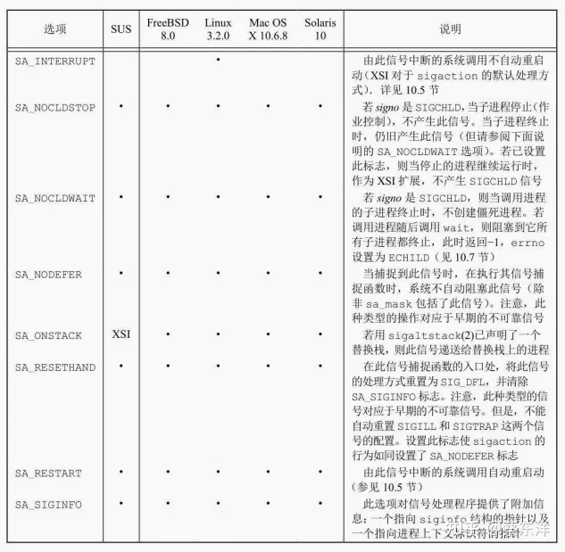

处理每个信号的可选标志（sa_flags）

sa_sigaction字段是一个替代的信号处理程序，在sigaction结构中使用了SA_SIGINFO标志时，使用该信号处理程序。对于sa_sigaction字段和sa_handler字段两者，实现可能使用同一存储区，所以应用只能一次使用这两个字段中的一个。

通常，按下列方式调用信号处理程序：

```text
void handler(int signo);
```

但是，如果设置了SA_SIGINFO标志，那么按下列方式调用信号处理程序：

```text
void handler(int signo, siginfo_t *info, void *context);
```

siginfo结构包含了信号产生原因的有关信息。该结构的大致样式如下所示。符合POSIX.1的所有实现必须至少包括si_signo和si_code成员。另外，符合XSI的实现至少应包含下列字段：

```text
struct siginfo {
    int　　　　　 si_signo;　/* signal number */
    int　　　　　 si_errno;　/* if nonzero, errno value from <errno.h> */
    int　　　　　 si_code;　 /* additional info (depends on signal) */
    pid_t　　　　 si_pid;　　 /* sending process ID */
    uid_t　　　　 si_uid;　　 /* sending process real user ID */
    void　　　　*si_addr;　　/* address that caused the fault */
    int　　　　　 si_status; /* exit value or signal number */
    union sigval si_value; /* application-specific value */
    /* possibly other fields also */
```

};

sigval联合包含下列字段：

```text
int sival_int;
void *sival_ptr;
```

应用程序在递送信号时，在si_value.sival_int中传递一个整型数或者在si_value.sival_ptr中传递一个指针值。


siginfo_t代码值

信号处理程序的context参数是无类型指针，它可被强制类型转换为ucontext_t结构类型，该结构标识信号传递时进程的上下文。该结构至少包含下列字段：

```c
ucontext_t *uc_link;　　　 /* pointer to context resumed when */
sigset_t　　uc_sigmask;　　/* signals blocked when this context */
stack_t　　 uc_stack;　　　/* stack used by this context */
/* this context returns */
/* is active */
mcontext_t uc_mcontext; /* machine-specific representation of */
/* saved context */
```

uc_stack字段描述了当前上下文使用的栈，至少包括下列成员：

```c
void　*ss_sp;　　　　　　　/* stack base or pointer */
size_t ss_size;　　　　　　/* stack size */
int　　ss_flags;　　　　　 /* flags */
```

当实现支持实时信号扩展时，用SA_SIGINFO标志建立的信号处理程序将造成信号可靠地排队。一些保留信号可由实时应用使用。如果信号由sigqueue函数产生，那么siginfo结构能包含应用特有的数据。

## 函数sigsetjmp和siglongjmp

```c
#include <setjmp.h>
int sigsetjmp(sigjmp_buf env, int savemask);
//返回值：若直接调用，返回0；若从siglongjmp调用返回，则返回非0
void siglongjmp(sigjmp_buf env, int val);
```

这两个函数和 setjmp、longjmp 之间的唯一区别是 sigsetjmp 增加了一个参数。如果savemask非0，则sigsetjmp在env中保存进程的当前信号屏蔽字。调用siglongjmp时，如果带非0 savemask的sigsetjmp调用已经保存了env，则siglongjmp从其中恢复保存的信号屏蔽字。

在程序中使用了数据类型sig_atomic_t，这是由ISO C标准定义的变量类型，在写这种类型变量时不会被中断。这意味着在具有虚拟存储器的系统上，这种变量不会跨越页边界，可以用一条机器指令对其进行访问。这种类型的变量总是包括ISO类型修饰符volatile，其原因是：该变量将由两个不同的控制线程——main 函数和异步执行的信号处理程序访问。

## 函数sigsuspend

```c
#include <signal.h>
int sigsuspend(const sigset_t *sigmask);
// 返回值：−1，并将errno设置为EINTR
```

进程的信号屏蔽字设置为由sigmask指向的值。在捕捉到一个信号或发生了一个会终止该进程的信号之前，该进程被挂起。如果捕捉到一个信号而且从该信号处理程序返回，则sigsuspend返回，并且该进程的信号屏蔽字设置为调用sigsuspend之前的值。

注意，此函数没有成功返回值。如果它返回到调用者，则总是返回−1，并将 errno 设置为EINTR（表示一个被中断的系统调用）。

## 函数abort

abort函数的功能是使程序异常终止。

```c
#include <stdlib.h>
void abort(void);
// 此函数不返回值
```

此函数将SIGABRT信号发送给调用进程（进程不应忽略此信号）。ISO C规定，调用abort将向主机环境递送一个未成功终止的通知，其方法是调用raise(SIGABRT)函数。

ISO C要求若捕捉到此信号而且相应信号处理程序返回，abort仍不会返回到其调用者。如果捕捉到此信号，则信号处理程序不能返回的唯一方法是它调用exit、_exit、_Exit、longjmp或siglongjmp。POSIX.1也说明abort并不理会进程对此信号的阻塞和忽略。

**让进程捕捉 SIGABRT 的意图是：在进程终止之前由其执行所需的清理操作。如果进程并不在信号处理程序中终止自己，POSIX.1声明当信号处理程序返回时，abort终止该进程。**

注意system的返回值，它是shell的终止状态，但shell的终止状态并不总是执行命令字符串进程的终止状态。

**Bourne shell有一个特性，其终止状态是128加上一个信号编号。**

其他的shell在处理终端产生的信号（如SIGINT和SIGQUIT）时表现出来的行为各不相同。例如在bash和dash中，键入中断或退出符会导致带有对应信号编号的表示异常终止的退出状态。但是，如果发现正在执行sleep的进程并直接给它发送信号，这样信号只会到达单个进程而不是整个前台进程组。这些shell与Bourne shell类似，以正常终止状态128加上信号编号退出。

## 函数sleep、nanosleep和clock_nanosleep

```c
#include <unistd.h>
unsigned int sleep(unsigned int seconds);
// 返回值：0或未休眠完的秒数
```

此函数使调用进程被挂起直到满足下面两个条件之一。

- 已经过了seconds所指定的墙上时钟时间。
- 调用进程捕捉到一个信号并从信号处理程序返回。

nanosleep函数与sleep函数类似，但提供了纳秒级的精度。

```c
#include <time.h>
int nanosleep(const struct timespec *reqtp, struct timespec *remtp);
// 返回值：若休眠到要求的时间，返回0；若出错，返回−1
```

这个函数挂起调用进程，直到要求的时间已经超时或者某个信号中断了该函数。reqtp参数用秒和纳秒指定了需要休眠的时间长度。如果某个信号中断了休眠间隔，进程并没有终止，remtp参数指向的 timespec 结构就会被设置为未休眠完的时间长度。如果对未休眠完的时间并不感兴趣，可以把该参数置为NULL。

随着多个系统时钟的引入，需要使用相对于特定时钟的延迟时间来挂起调用线程。clock_nanosleep函数提供了这种功能。

```c
#include <time.h>
int clock_nanosleep(clockid_t clock_id, int flags,
const struct timespec *reqtp, struct timespec *remtp);
// 返回值：若休眠要求的时间，返回0；若出错，返回错误码
```

**使用相对休眠的问题是有些应用对休眠长度有精度要求，相对休眠时间会导致实际休眠时间比要求的长。例如，某个应用程序希望按固定的时间间隔执行任务，就必须获取当前时间，计算下次执行任务的时间，然后调用nanosleep。在获取当前时间和调用nanosleep之间，处理器调度和抢占可能会导致相对休眠时间超过实际需要的时间间隔。即便分时进程调度程序对休眠时间结束后是否会马上执行用户任务并没有给出保证，使用绝对时间还是改善了精度。**

## 函数sigqueue

通常一个信号带有一个位信息：信号本身。除了对信号排队以外，这些扩展允许应用程序在递交信号时传递更多的信息。这些信息嵌入在siginfo结构中。除了系统提供的信息，应用程序还可以向信号处理程序传递整数或者指向包含更多信息的缓冲区指针。

使用排队信号必须做以下几个操作。

- 使用sigaction函数安装信号处理程序时指定SA_SIGINFO标志。如果没有给出这个标志，信号会延迟，但信号是否进入队列要取决于具体实现。
- 在sigaction结构的sa_sigaction成员中（而不是通常的sa_handler字段）提供信号处理程序。实现可能允许用户使用sa_handler字段，但不能获取sigqueue函数发送出来的额外信息。
- 使用sigqueue函数发送信号。
  include
  int sigqueue(pid_t pid, int signo, const union sigval value); // 返回值：若成功，返回0；若出错，返回−1

sigqueue函数只能把信号发送给单个进程，可以使用value参数向信号处理程序传递整数和指针值，除此之外，sigqueue函数与kill函数类似。

信号不能被无限排队。到达相应的限制以后，sigqueue就会失败，将errno设为EAGAIN。

随着实时信号的增强，引入了用于应用程序的独立信号集。这些信号的编号在SIGRTMIN～SIGRTMAX之间，包括这两个限制值。注意，这些信号的默认行为是终止进程。

## 作业控制信号

POSIX.1认为有以下6个与作业控制有关。

- SIGCHLD 子进程已停止或终止。
- SIGCONT 如果进程已停止，则使其继续运行。
- SIGSTOP 停止信号（不能被捕捉或忽略）。
- SIGTSTP 交互式停止信号。
- SIGTTIN 后台进程组成员读控制终端。
- SIGTTOU 后台进程组成员写控制终端。

除SIGCHLD以外，大多数应用程序并不处理这些信号，交互式shell则通常会处理这些信号的所有工作。

在作业控制信号间有某些交互。当对一个进程产生 4 种停止信号（SIGTSTP、SIGSTOP、SIGTTIN或SIGTTOU）中的任意一种时，对该进程的任一未决SIGCONT信号就被丢弃。与此类似，当对一个进程产生SIGCONT信号时，对同一进程的任一未决停止信号被丢弃。

注意，如果进程是停止的，则SIGCONT的默认动作是继续该进程；否则忽略此信号。通常，对该信号无需做任何事情。当对一个停止的进程产生一个 SIGCONT 信号时，该进程就继续，即使该信号是被阻塞或忽略的也是如此。

## 信号名和编号

某些系统提供数组

```c
extern char *sys_siglist[];
```

数组下标是信号编号，数组中的元素是指向信号名符串的指针。

可以使用psignal函数可移植地打印与信号编号对应的字符串。

```c
#include <signal.h>
void psignal(int signo, const char *msg);
```

字符串msg（通常是程序名）输出到标准错误文件，后面跟随一个冒号和一个空格，再后面对该信号的说明，最后是一个换行符。如果msg为NULL，只有信号说明部分输出到标准错误文件，该函数类似于perror。

如果在sigaction信号处理程序中有siginfo结构，可以使用psiginfo函数打印信号信息。

```c
#include <signal.h>
void psiginfo(const siginfo_t *info, const char *msg);
```

如果只需要信号的字符描述部分，也不需要把它写到标准错误文件中（如可以写到日志文件中），可以使用strsignal函数，它类似于strerror。

```c
#include <string.h>
char *strsignal(int signo);
返回值：指向描述该信号的字符串的指针
```

给出一个信号编号，strsignal 将返回描述该信号的字符串。应用程序可用该字符串打印关于接收到信号的出错消息。


# 终端IO

## 引言

​		无论在哪种操作系统中，终端 I/O 的处理都是非常繁琐的一部分，UNIX 系统也不例外。在大多数版本的编程手册中，终端I/O手册页常常是最长的几个部分之一。

​		在20世纪70年代后期，系统Ⅲ在V7的基础上发展出一套不同的终端例程，由此使得UNIX终端 I/O 处理分立为两种不同的风格。**一种是系统Ⅲ的风格**，由 System V 沿续下来，**另一种是V7 的风格**，它成为BSD派生的系统终端I/O处理的标准。如同信号一样，POSIX.1在这两种风格的基础上制定了终端I/O标准。终端I/O系统之所以如此复杂，部分原因是人们将其应用在众多的事物上：终端、计算机之间的直接连接、调制解调器以及打印机等。

## 综述

终端I/O有两种不同的工作模式。

- 规范模式输入处理。在这种模式中，对终端输入以行为单位进行处理。对于每个读请求，终端驱动程序最多返回一行。
- 非规范模式输入处理。输入字符不装配成行。

如果不做特殊处理，则默认模式是规范模式。

V7和较早的BSD风格类的终端驱动程序支持3种终端输入模式：

- 精细加工模式（输入装配成行，并对特殊字符进行处理）；
- 原始模式（输入不装配成行，也不对特殊字符进行处理）；
- cbreak模式（输入不装配成行，但对某些特殊字符进行处理）。

POSIX.1定义了11个特殊输入字符，其中9个可以更改。本书已经用到了其中几个，例如文件结束符（通常是Ctrl+D）和挂起字符（通常是Ctrl+Z）。

可以认为终端设备是由通常位于内核中的终端驱动程序控制的。每个终端设备都有一个输入队列和一个输出队列，如图18-1所示。


图18-1 终端设备的输入、输出队列的逻辑结构

- 如果打开了回显功能，则在输入队列和输出队列之间有一个隐含的连接。
- 输入队列的长度MAX_INPUT是有限值。当一个特定设备的输入队列已经填满时，系统的行为将依赖于实现。这种情况发生时大多数UNIX系统回显响铃字符。
- 另一个输入限制 MAX_CANON。这个限制是一个规范输入行的最大字节数。
- 虽然输出队列的长度通常也是有限的，但是程序并不能获得这个定义其长度的常量，因为当输出队列将要填满时，内核便直接使写进程休眠，直至写队列中有可用的空间。
- 我们将说明如何使用冲洗函数 tcflush 冲洗输入或输出队列。与此类似，在说明 tcsetattr 函数时，将会了解到如何通知系统只有在输出队列为空时，才能改变一个终端的属性。（例如，想要改变输出属性时就要这样做。）也可以通知系统，让它在改变终端属性时丢弃输入队列中的所有东西。（如果正在改变输入属性，或者在规范模式和非规范模式之间进行转换，就需要这样做，以免以错误的模式对以前输入的字符进行解释。）

大多数 UNIX 系统在一个称为终端行规程（terminal line discipline）的模块中进行全部的规范处理。可以将这个模块设想成一个盒子，位于内核通用读、写函数和实际设备驱动程序之间（见图18-2）。


图18-2 终端行规程

​		由于将规范处理分离为单独的模块，所有的终端驱动程序都能够一致地支持规范处理。

​		所有可以检测和更改的终端设备特性都包含在 termios 结构中。该结构定义在头文件中。

```c
cc_t　　 c_cc[NCCS];　　 /* control characters */
tcflag_t　c_lflag;　　　 /* local flags */
tcflag_t　c_cflag;　　　 /* control flags */
tcflag_t　c_oflag;　　　 /* output flags */
tcflag_t　c_iflag;　　　 /* input flags */
struct termios {
};
```

​		粗略地说，输入标志通过终端设备驱动程序控制字符的输入（例如，剥除输入字节的第8位，允许输入奇偶校验），输出标志则控制驱动程序输出（例如，执行输出处理、将换行符转换为CR/LF），控制标志影响RS-232串行线（例如，忽略调制解调器的状态线、每个字符的一个或两个停止位），本地标志影响驱动程序和用户之间的接口（例如，回显打开或关闭、可视地擦除字符、允许终端产生的信号以及对后台输出的作业控制停止信号）。

​		类型tcflag_t的长度足以保存每个标志值，它经常被定义为unsigned int或者unsigned long。c_cc数组包含了所有可以更改的特殊字符。NCCS是该数组中元素的数量，其典型值在15～20（因为大多数UNIX实现支持的特殊字符都比POSIX.1所定义的11个要多）。cc_t类型的长度足以保存每个特殊字符，典型的是unsigned char。

​		POSIX标准之前的System V版本有一个名为的头文件和一个名为termio的数据结构。为了与先前版本有所区别，POSIX.1在这些名字后加了一个s。


图18-3 c_cflag终端标志


图18-4 c_iflag终端标志


图18-5 c_lflag终端标志


图18-6 c_oflag终端标志


图18-7 终端I/O函数汇总

​		虽然在终端设备上进行操作的只有13个函数，但是图18-7中的前两个函数（tcgetattr和tcsetattr）能处理大约 70种不同的标志（见图 18-3至图 18-6）。终端设备有大量选项可供使用，此外，对于某个特定设备（假设其为终端、调制解调器、打印机或任何其他设备），决定其需要哪些选项对我们来说也是一种挑战，这些都使得对终端设备的处理变得异常复杂。


​		图18-8 与终端有关的各函数之间的关系

## 特殊输入字符

​		POSIX.1 定义了 11 个在输入时要特殊处理的字符。实现定义了另外一些特殊字符。


​		图18-9 终端特殊输入字符汇总


​		图18-9 终端特殊输入字符汇总（续）

​		在POSIX.1的11个特殊字符中，其中有9个字符的值可以任意更改。不能更改的两个特殊字符是换行符和回车符（分别是\n和\r），也可能是STOP和START字符（依赖于实现）。为了更改，只需要修改 termios 结构中 c_cc 数组的相应项。该数组中的元素都用名字作为下标进行引用，每个名字都以字母V开头（见图18-9中的第3列）。

​		POSIX.1允许禁止使用这些字符。若将c_cc数组中的某项设置为_POSIX_VDISABLE的值，则禁止使用相应特殊字符。

​		下面较详细地说明各个特殊字符。我们称这些字符为特殊输入字符，但是其中有两个字符—STOP 和 START（Ctrl+S和Ctrl+Q），在输出时也要进行特殊处理。注意，这些字符中的大多数在被终端驱动程序识别并进行特殊处理后会被丢弃，并不将它们返回给执行读终端操作的进程。返回给读进程的例外字符是换行符（NL、EOL、EOL2）和回车符（CR）。

- CR 回车符。不能更改此字符。以规范模式进行输入时识别此字符。在已设置ICANON （规范模式）和ICRNL（将CR映射为NL）但并未设置IGNCR（忽略CR）时，CR字符会被转换成 NL，并具有与 NL 字符相同的作用。此字符返回给读进程（很可能是在转换为NL之后）。
- DISCARD 丢弃符。在扩充模式（IEXTEN）下进行输入时识别此字符。在输入另一个DISCARD字符之前或在丢弃条件被清除之前（见FLUSHO 选项），此字符使后续输出都被丢弃。此字符在处理后即被丢弃（即不传送给读进程）。
- DSUSP 延迟挂起作业控制字符（delayed-suspend job-control character）。在扩充模式（IEXTEN）下，若支持作业控制，并且已设置ISIG标志，则在输入时识别此字符。与SUSP字符的相同之处是：延迟挂起字符产生SIGTSTP信号，该信号被发送至前台进程组中的所有进程（见图9-7）。但是，信号产生的时间并不是在键入延迟挂起字符之时，而是在某个进程从控制终端读到此字符时才产生。此字符在处理后即被丢弃（即不传送给读进程）。
- EOF 文件结束符。以规范模式（ICANON）进行输入时识别此字符。当键入此字符时，等待被读的所有字节都被立即传送给读进程。如果没有字节等待读，则返回0。在行首输入一个 EOF 字符是向程序指示文件结束的正常方式。此字符在规范模式下处理后即被丢弃（即不传送给读进程）。
- EOL 附加的行定界符，与 NL 作用相同。以规范模式（ICANON）进行输入时识别此字符，并将此字符返回给读进程。但是此字符不常用。
- EOL2 另一个行定界符，与NL作用相同。对此字符的处理方式与EOL字符相同。
- ERASE 向前擦除字符（退格）。以规范模式（ICANON）输入时识别此字符。它擦除行中的前一个字符，但不会超越行首字符擦除上一行中的字符。此字符在规范模式下处理后即被丢弃（即不传送给读进程）。
- ERASE2 供替换的向前擦除字符（退格）。对此字符的处理与向前擦除字符（ERASE）完全相同。
- INTR 中断字符。若已设置ISIG标志，则在输入中识别此字符。它产生SIGINT信号，该信号被送至前台进程组中的所有进程（见图9-7）。此字符在处理后即被丢弃（即不传送给读进程）。
- KILL 杀死字符。（名字“杀死”在这里又一次被误用，kill函数是用来将某一信号发送给进程的，而此字符应被称为行擦除符，它与信号毫无关系。）以规范模式（ICANON）输入时识别此字符。它擦除一整行，并在处理后即被丢弃（即不传送给读进程）。
- LNEXT 下一个字符的字面值（literal-next character）。以扩充方式（IEXTEN）输入时识别此字符，它使下一个字符的任何特殊含意都被忽略。这对本节提及的所有特殊字符都起作用。使用这一字符可向程序键入任何字符。LNEXT字符在处理后即被丢弃，但输入的下一个字符被传送给读进程。
- NL 换行字符，也被称为行定界符。不能更改此字符。以规范模式（ICANON）输入时识别此字符。此字符返回给读进程。
- QUIT 退出字符。若已设置ISIG标志，则在输入中识别此字符。它产生SIGQUIT信号，该信号又被送至前台进程组中的所有进程（见图9-7）。此字符在处理后即被丢弃（即不传送给读进程）。
- INTR和QUIT的区别是：QUIT字符不仅按默认规则终止进程，而且还产生一个core文件。
- REPRINT 再打印字符。以扩充规范模式（设置了 IEXTEN和ICANON标志）进行输入时识别此字符。它使所有未读的输入被输出（再回显）。此字符在处理后即被丢弃（即不传送给读进程）。
- START 启动字符。若已设置IXON标志，则在输入中识别此字符。若已设置IXOFF标志，则自动产生此字符作为输出。已设置IXON时，接收到的START 字符使停止的输出（由以前输入的STOP字符造成）重新启动。在此情形下，此字符在处理后即被丢弃（即不传送给读进程）。
- STATUS BSD 的状态请求字符。以扩充规范模式（设置了 IEXTEN 和 ICANON 标志）进行输入时识别此字符。它产生 SIGINFO信号，该信号又被送至前台进程组中的所有进程（见图 9-7）。另外，如果没有设置NOKERNINFO标志，则有关前台进程组的状态信息也显示在终端上。此字符在处理后即被丢弃（即不传送给读进程）。
- STOP 停止字符。若已设置IXON标志，则在输入中识别此字符。若已设置IXOFF标志，则自动产生此字符作为输出。已设置IXON时，接收到STOP字符则停止输出。在此情形下，此字符在处理后即被丢弃（即不传送给读进程）。当输入一个START字符后，被停止的输出重新启动。
- SUSP 挂起作业控制字符。
- 若支持作业控制并且已设置ISIG标志，则在输入中识别此字符。它产生SIGTSTP信号，该信号又被送至前台进程组的所有进程（见图9-7）。此字符在处理后即被丢弃（即不传送给读进程）。
- 已设置 IXOFF 标志时，若新的输入不会使输入缓冲区溢出，则终端驱动程序自动产生一个START字符来恢复以前被停止的输入。
- 已设置IXOFF时，终端驱动程序自动产生一个STOP字符以防止输入缓冲区溢出。
- WERASE 字擦除字符。以扩充规范模式（设置了IEXTEN和ICANON标志）进行输入时识别此字符。它使前一个字被擦除。首先，它向前跳过任意一个空白字符（空格或制表符），然后再向前跃过前一记号，使光标处在前一个记号的第一个字符位置上。通常，前一个记号在碰到一个空白字符时即终止。但是，可通过设置ALTWERASE标志来改变这个行为。此标志使前一个记号在碰到第一个非字母、非数字字符时即终止。此字符在处理后即被丢弃（即不传送给读进程）。
- 需要为终端设备定义的另一个“字符”是 BREAK 字符。BREAK 实际上并不是一个字符，而是在异步串行数据传送时发生的一个条件。根据串行接口的不同，可以有多种方式通知设备驱动程序发生了BREAK条件。
- 大多数早期的串行终端都有一个标记为BREAK的键，用其可以产生BREAK条件，这就是为什么大多数人认为BREAK就是一个字符的原因。某些较新的终端键盘没有BREAK键。在PC上，BREAK键可能有其他用途。例如，键入Ctrl+BREAK可中断Windows命令解释器。
- 对于异步串行数据传送，BREAK是一个0值的位序列，其持续时间长于要求发送一个字节的时间。整个0值位序列被视为是一个BREAK。

## 获得和设置终端属性

​		为了获得和设置termios结构，可以调用tcgetattr和tcsetattr函数。这样就可以检测和修改各种终端选项标志和特殊字符，使终端按我们所希望的方式进行操作。

```c
#include <termios.h>
int tcgetattr(int fd, struct termios *termptr);
int tcsetattr(int fd, int opt, const struct termios *termptr);
// 两个函数的返回值：若成功，返回0；若出错，返回-1
```

​		这两个函数都有一个指向termios结构的指针作为其参数，它们或者返回当前终端的属性，或者设置该终端的属性。**因为这两个函数只对终端设备进行操作，所以若fd没有引用终端设备则出错返回-1，errno设置为ENOTTY。**

​		tcsetattr的参数opt使我们可以指定在什么时候新的终端属性才起作用。opt可以指定为下列常量中的一个。

- TCSANOW 更改立即发生。
- TCSADRAIN 发送了所有输出后更改才发生。若更改输出参数则应使用此选项。
- TCSAFLUSH 发送了所有输出后更改才发生。更进一步，在更改发生时未读的所有输入数据都被丢弃（冲洗）。

​		Tcsetattr 函数的返回状态在使用时易产生混淆。如果它执行了任意一种所要求的动作，即使未能执行所有要求的动作，它也返回OK（表示成功）。如果该函数返回OK，则我们有责任检查该函数是否执行了所有要求的动作。这就意味着，在调用tcsetattr设置所希望的属性后，需调用tcgetattr，然后将实际终端属性与所希望的属性相比较，以检测两者是否有区别。

## 终端选项标志

​		列出的所有选项标志（除所谓的屏蔽字标志外）都用一位或多位（设置或清除）表示。屏蔽字标志定义多个位，它们组合在一起，可以定义一组值。屏蔽字标志有一个定义名，每个值也有一个名字。例如，为了设置字符长度，首先用字符长度屏蔽字标志 CSIZE 将表示字符长度的位清0，然后设置下列值之一：CS5、CS6、CS7或CS8。

```
#include<termios.h>
#include<apue.h>

int main()
{
    struct termios term;
    int size;

    if(tcgetattr(STDIN_FILENO, &term) < 0)
        err_sys("tcgetattr error");
    size = term.c_cflag & CSIZE;
    switch(size)
    {
        case CS5:
            printf("5 bits/byte\n");
            break;
        case CS6:
            printf("6 bits/byte\n");
            break;
        case CS7:
            printf("7 bits/byte\n");
            break;
        case CS8:
            printf("8 bits/byte\n");
            break;
        default:
            printf("unknown bits/byte\n");
    }
    if(tcsetattr(STDIN_FILENO,TCSANOW,&term) < 0)
        err_sys("tcsetattr error");

    exit(0);
}
```

​		下面说明各选项标志。

- ALTWERASE （c_lflag，FreeBSD、Mac OS X）已设置此标志时，若输入WERASE字符，则使用一个替换的字擦除算法。它不是向前移动到前一个空白字符为止，而是向前移动到第一个非字母、非数字字符为止。
- BRKINT （c_iflag，POSIX.1、FreeBSD、Linux、Mac OS X、Solaris）若已设置此标志，而未设置 IGNBRK，则在接到 BREAK 时，冲洗输入、输出队列，并产生一个SIGINT 信号。如果此终端设备是一个控制终端，则此信号就是为前台进程组产生的。
- 若未设置IGNBRK和BRKINT，但是设置了PARMRK，则BREAK被读作一个3字节序列\377、\0和\0；若也未设置PARMRK，则BREAK被读作单个字符\0。
- BSDLY （c_oflag，XSI、Linux、Solaris）退格延迟屏蔽字。此屏蔽字的值是BS0或BS1。（c_cflag，Solaris）扩充的波特率。用于允许大于 B38400 的波特率。
- CCAR_OFLOW （c_cflag，FreeBSD、Mac OS X）使用 RS-232调制解调器DCD（Data-Carrier-Detect，数据载波检测）信号打开输出的硬件流控制。这与早期的MDMBUF标志相同。
- CCTS_OFLOW （c_cflag，FreeBSD、Mac OS X、Solaris）使用RS-232 CTS（Clear-To-Send，清除发送）信号打开输出的硬件流控制。
- CDSR_OFLOW （c_cflag，FreeBSD、Mac OS X）根据RS-232 DSR（Data-Set-Ready，数据准备就绪）信号进行输出的流控制。
- CDTR_IFLOW （c_cflag，FreeBSD，Mac OS X）根据RS-232 DTR（Data-Terminal-Ready，数据终端就绪）信号进行输入的流控制。
- CIBAUDEXT （c_cflag，Solaris）扩充的输入波特率。用于允许大于B38400的输入波特率。
- CIGNORE （c_cflag，FreeBSD、Mac OS X）忽略控制标志。
- CLOCAL （c_cflag，POSIX.1、FreeBSD、Linux、Mac OS X、Solaris）若设置，则忽略调制解调器状态线。这通常意味着该设备是直接连接的。例如，若未设置此标志，则打开一个终端设备常常会遭遇阻塞，直到调制解调器回应呼叫并建立连接。
- CMSPAR （c_oflag，Linux）选择标记或空奇偶校验。若已设置 PARODD，则奇偶校验位总是1（标记奇偶校验）。否则奇偶校验位总是0（空奇偶校验）。
- CRDLY （c_oflag，XSI、Linux、Solaris）回车延迟屏蔽字。此屏蔽字的可能值是CR0、CR1、CR2和CR3。
- CREAD （c_cflag，POSIX.1、FreeBSD、Linux、Mac OS X、Solaris）若设置，则接收者被启用，可以接收字符。
- CRTSCTS （c_cflag，FreeBSD、Linux、Mac OS X、Solaris）其行为依赖于平台。对于Solaris，若设置该标志，则允许带外硬件流控制。在另外 3 个平台上，则既允许带内硬件流控制，又允许带外硬件流控制（等价于 CCTS_OFLOW|CRTS_IFLOW）。
- CRTS_IFLOW （c_cflag，FreeBSD、Mac OS X、Solaris）输入的RTS（Request-To-Send，请求发送）流控制。
- CRTSXOFF （c_cflag，Solaris）若设置，则允许带内硬件流控制，RS-232 RTS信号的状态控制了流控制。
- CSIZE （c_cflag，POSIX.1、FreeBSD、Linux、Mac OS X、Solaris）此字段是一个屏蔽字标志，它指定发送和接收的每个字节的位数。此长度不包括可能有的奇偶校验位。由此屏蔽字定义的字段值是 CS5、CS6、CS7 和CS8，分别表示每个字节包含5位、6位、7位和8位。
- CSTOPB （c_cflag，POSIX.1、FreeBSD、Linux、Mac OS X、Solaris）若设置，则使用两个停止位，否则只使用一个停止位。
- ECHO （c_lflag，POSIX.1、FreeBSD、Linux、Mac OS X、Solaris）若设置，则将输入字符回显到终端设备。在规范模式和非规范模式下都可以回显输入字符。
- ECHOCTL （c_lflag，FreeBSD、Linux、Mac OS X、Solaris）若设置并且也设置ECHO，则除ASCII TAB、ASCII NL以及START和STOP字符外，其他ASCII控制字符（ASCII字符集中0至八进制37对应的字符）都被回显为^X，其中，X是相应控制字符加上八进制100所构成的字符。例如，ASCII Ctrl+A字符（八进制1）被回显为^A。ASCII DELETE字符（八进制177）则回显为^?。若未设置此标志，则ASCII控制字符按其原样回显。如同ECHO标志，在规范模式和非规范模式下，此标志对控制字符回显都起作用。
- 应当了解的是，某些系统以不同方式回显EOF字符，因为EOF的典型值是Ctrl+D （而Ctrl+D是ASCII EOT字符，它可能使某些终端挂断）。请查看有关手册。
- ECHOE （c_lflag，POSIX.1、FreeBSD、Linux、Mac OS X、Solaris）若设置并且也设置ICANON，则ERASE字符从显示中擦除当前行中的最后一个字符。这通常是在终端驱动程序中写一个3字符序列实现的，该序列是：退格、空格、退格。若支持WERASE字符，则ECHOE用一个或若干个上述3字符序列擦除前一个字。若支持 ECHOPRT 标志，则这里说明的关于 ECHOE 的动作是在假定未设置ECHOPRT标志的条件下得出的。
- ECHOK （c_lflag，POSIX.1、FreeBSD、Linux、Mac OS X、Solaris）若设置并且也设置ICANON，则KILL字符从显示中擦除当前行，或者输出NL字符（用以强调已擦除整个行）。 若支持ECHOKE标志，则关于ECHOK的说明是在假定未设置ECHOKE标志的条件下得出的。
- ECHOKE （c_lflag，FreeBSD、Linux、Mac OS X、Solaris）若设置并且也设置ICANON，则回显 KILL 字符的方式是擦除行中的每一个字符。擦除每个字符的方法则由ECHOE和ECHOPRT标志选择。
- ECHONL （c_lflag，POSIX.1、FreeBSD、Linux、Mac OS X、Solaris）若设置并且也设置ICANON，即使没有设置ECHO，也回显NL字符。
- ECHOPRT （c_lflag，FreeBSD、Linux、Mac OS X、Solaris）若设置并且也设置ICANON和ECHO，则ERASE字符（以及WERASE字符，若受到支持）使所有正被擦除的字符按它们被擦除的方式被打印。这一方法常在硬拷贝终端上显示其作用，它可以使我们确切地看到哪些字符正被刪除。
- EXTPROC （c_lflag，FreeBSD、Linux、Mac OS X）若设置，规范字符处理在操作系统之外执行。如果串行通信外设卡能够通过执行某些行规程处理减轻主机处理器负载，那么就可以这样设置。在使用伪终端时（见第19章），也可以这样设置。
- FFDLY （c_oflag，XSI、Linux、Solaris）换页延迟屏蔽字。此屏蔽字标志值是FF0或FF1。
- FLUSHO （c_lflag，FreeBSD、Linux、Mac OS X、Solaris）若设置，则冲洗输出。当键入 DISCARD 字符时设置此标志。当键入另一个 DISCARD 字符时，此标志被清除。可以通过设置或清除此终端标志来设置或清除此条件。
- HUPCL （c_cflag，POSIX.1、FreeBSD、Linux、Mac OS X、Solaris）若设置，则当最后一个进程关闭设备时，调制解调器控制线降至低电平（也就是调制解调器的连接断开）。
- ICANON （c_lflag，POSIX.1、FreeBSD、Linux、Mac OS X、Solaris）若设置，则按规范模式工作（见18.10节）。这使下列字符起作用：EOF、EOL、EOL2、ERASE、KILL、REPRINT、STATUS和WERASE。输入字符被装配成行。
- ICRNL （c_iflag，POSIX.1、FreeBSD、Linux、Mac OS X、Solaris）若设置并且未设置IGNCR，则将接收到的CR字符转换成NL字符。
- IEXTEN （c_lflag，POSIX.1、FreeBSD、Linux、Mac OS X、Solaris）若设置，则识别并处理扩展的、由实现定义的特殊字符。
- IGNBRK （c_iflag，POSIX.1、FreeBSD、Linux、Mac OS X、Solaris）在已设置时，忽略输入中的BREAK条件。关于BREAK条件是产生SIGINT信号还是被作为数据读取，见BRKINT。
- IGNCR （c_iflag，POSIX.1、FreeBSD、Linux、Mac OS X、Solaris）若设置，则忽略接收到的CR字符。若未设置此标志，而设置了ICRNL标志，则有可能将接收到的CR字符转换成NL字符。
- IGNPAR （c_iflag，POSIX.1、FreeBSD、Linux、Mac OS X、Solaris）在已设置时，忽略带有结构出错（非BREAK）或奇偶出错的输入字节。
- IMAXBEL （c_iflag，FreeBSD、Linux、Mac OS X、Solaris）当输入队列满时响铃。
- INLCR （c_iflag，POSIX.1、FreeBSD、Linux、Mac OS X、Solaris）若设置，则将接收到的NL字符转换成CR字符。
- 如果不以规范模式工作，则读请求直接从输入队列取字符。在至少接到MIN个字节或两个字节之间的超时值TIME到期时，read才返回。
- INPCK （c_iflag，POSIX.1、FreeBSD、Linux、Mac OS X、Solaris）在已设置时，使输入奇偶校验起作用。若未设置INPCK，则使输入奇偶校验不起作用。
- 奇偶“产生和检测”和“输入奇偶校验”是两件不同的事。奇偶位的产生和检测是由PARENB标志控制的。设置该标志后通常会使串行接口的设备驱动程序对输出字符产生奇偶位，对输入字符则验证其奇偶性。PARODD 标志决定该奇偶性应当是奇还是偶。如果一个其奇偶性错误的输入字符到来，则检查INPCK标志的状态。若已设置此标志，则检查IGNPAR标志（以决定是否应忽略带奇偶出错的输入字节）；若不应忽略此输入字节，则检查PARMRK标志以决定应该向读进程传送哪些字符。
- ISIG （c_lflag，POSIX.1、FreeBSD、Linux、Mac OS X、Solaris）若设置，则判别输入字符是否是要产生终端信号的特殊字符（INTR、QUIT、SUSP和DSUSP）；若是，则产生相应信号。
- ISTRIP （c_iflag，POSIX.1、FreeBSD、Linux、Mac OS X、Solaris）在已设置此标志时，有效输入字节被剥离为7位。在未设置时，则处理全部8位。
- IUCLC （c_iflag，Linux、Solaris）将输入的大写字符转换成小写字符。
- IUTF8 （c_iflag，Linux、Mac OS X）允许使用UTF-8多字节字符进行字符擦除处理。
- IXANY （c_iflag，XSI、FreeBSD、Linux、Mac OS X、Solaris）使任何字符都能重新启动输出。
- IXOFF （c_iflag，POSIX.1、FreeBSD、Linux、Mac OS X、Solaris）若设置，则使启动-停止输入控制起作用。当终端驱动程序发现输入队列将要填满时，输出一个STOP字符。此字符应当由发送数据的设备识别，并使该设备停止。此后，当把输入队列中的字符处理完毕之后，终端驱动程序将输出一个START字符，使该设备恢复发送数据。
- IXON （c_iflag，POSIX.1、FreeBSD、Linux、Mac OS X、Solaris）若设置，则使启动-停止输出控制起作用。当终端驱动程序接收到一个STOP字符时，输出停止。在输出停止时，下一个START字符恢复输出。若未设置此标志，则START和STOP字符由进程作为一般字符读取。
- MDMBUF （c_cflag，FreeBSD、Mac OS X）按照调制解调器的载波标志进行输出流控制。这是CCAR_OFLOW标志的曾用名。
- NLDLY （c_oflag，XSI、Linux、Solaris）换行延迟屏蔽字。此屏蔽字的值是NL0或NL1。
- NOFLSH （c_lflag，POSIX.1、FreeBSD、Linux、Mac OS X、Solaris）按系统默认，当终端驱动程序产生 SIGINT 和 SIGQUIT 信号时，输入和输出队列都被冲洗。另外，当它产生SIGSUSP信号时，输入队列被冲洗。若已设置NOFLSH标志，则在这些信号产生时，不对输入、输出队列进行常规冲洗。
- NOKERNINFO （c_lflag，FreeBSD、Mac OS X）在已设置时，此标志阻止STATUS字符打印前台进程组的信息。但是无论是否设置此标志，STATUS 字符都会使 SIGINFO信号被发送至前台进程组。
- OCRNL （c_oflag，XSI、FreeBSD、Linux、Solaris）若设置，则将输出的 CR 字符转换成NL字符。
- OFDEL （c_oflag，XSI、Linux、Solaris）若设置，则输出填充字符是ASCII DEL；否则是ASCII NUL。见OFILL标志。
- OFILL （c_oflag，XSI、Linux、Solaris）若设置，则传递填充字符（ASCII DEL 或ASCII NUL，见OFDEL标志）以实现延迟，而不使用时间延迟。见6个延迟屏蔽字标志：BSDLY、CRDLY、FFDLY、NLDLY、TABDLY和VTDLY。
- OLCUC （c_oflag，Linux、Solaris）若设置，则将小写字符转换成大写字符。
- NLCR （c_oflag，XSI、FreeBSD、Linux、Mac OS X、Solaris）若设置，将输出的NL字符转换成CR-NL字符。
- ONLRET （c_oflag，XSI、FreeBSD、Linux、Solaris）若设置，则假定输出的 NL 字符执行回车功能。
- ONOCR （c_oflag，XSI、FreeBSD、Linux、Solaris）若设置，则在0列不输出CR字符。
- ONOEOT （c_oflag，FreeBSD、Mac OS X）若设置，则在输出中丢弃EOT（^D）字符。在某些将Ctrl+D解释为挂断的终端上，设置此标志可能是必需的。
- OPOST （c_oflag，POSIX.1、FreeBSD、Linux、Mac OS X、Solaris）若设置，则进行实现定义的输出处理。关于c_oflag字段的各种实现定义标志，见图18-6。
- OXTABS （c_oflag，FreeBSD、Mac OS X）若设置，则制表符在输出中被扩展为空格。这与将水平制表符延迟（TABDLY）设置为XTABS或TAB3所产生的效果相同。
- PARENB （c_cflag，POSIX.1、FreeBSD、Linux、Mac OS X、Solaris）若设置，则对输出字符产生奇偶位，对输入字符执行奇偶校验。若已设置PARODD，则奇偶校验是奇校验；否则是偶校验。另见对INPCK、IGNPAR和PARMRK标志的讨论。
- PAREXT （c_cflag，Solaris）选择标记或空奇偶性。若PARODD设置，则奇偶位总是1 （标记奇偶性）；否则，奇偶位总是0（空奇偶性）。
- PARMRK （c_iflag，POSIX.1、FreeBSD、Linux、Mac OS X、Solaris）在已设置时，若未设置IGNPAR，则带有结构出错（非BREAK）的字节或带有奇偶出错的字节将被进程读作一个3字符序列\377、\0和X，其中X是接收到的出错字节。若未设置ISTRIP，则一个有效的\377被传送给进程时为\377, \377。若未设置IGNPAR和PARMRK，则带有结构出错误或奇偶出错的字节都被读作一个字符\0。
- PARODD （c_cflag，POSIX.1、FreeBSD、Linux、Mac OS X、Solaris）若设置，则输出和输入字符的奇偶性都是奇，否则为偶。注意，PARENB 标志控制奇偶性的产生和检测。
- PENDIN （c_lflag，FreeBSD、Linux、Mac OS X、Solaris）若设置，则在下一个字符输入时，尚未读的任何输入都由系统重新打印。这一动作与键入REPRINT字符时的作用相类似。
- TABDLY （c_oflag，XSI、Linux、Mac OS X、Solaris）水平制表符延迟屏蔽字。此屏蔽字的值是TAB0、TAB1、TAB2或TAB3。
- 在已设置CMSPAR或PAREXT标志时，PARODD标志也控制是否使用标记或空奇偶性。
- XTABS 的值等于 TAB3。此值使系统将制表符扩展成空格。系统假定制表符的长度为8个空格，不能更改此假定。
- TOSTOP （c_lflag，POSIX.1、FreeBSD、Linux、Mac OS X、Solaris）若设置，并且该实现支持作业控制，则将信号SIGTTOU 送到试图写控制终端的一个后台进程的进程组。按默认，此信号暂停该进程组中所有进程。如果写控制终端的后台进程忽略或阻塞此信号，则终端驱动程序不产生此信号。
- VTDLY （c_oflag，XSI、Linux、Solaris）垂直制表延迟屏蔽字。此屏蔽字的值是VT0和VT1。
- XCASE （c_lflag，Linux、Solaris）若设置，并且也设置ICANON，则终端被假定为只支持大写字符，全部输入转换为小写字符。要想输入一个大写字符，要在其前面加一个反斜杠。与之类似，系统输出大写字符时，也要在其前面加一个反斜杠。（如今这个选项标志已弃用，因为只支持大写字符的终端即使不是全部，也是绝大部分都已经不存在了。）

## stty命令

​		在命令行（或shell脚本）中用stty命令进行检查和更改。简单地说，stty命令就是图18-7中所列的前6个函数的接口。如果以-a选项执行此命令，则显示终端的所有选项：

## 波特率函数

​		术语波特率（baud rate）是一个历史沿用的术语，现在它指的是“位/秒”（bit per second）。虽然大多数终端设备对输入和输出使用同一波特率，但是只要硬件许可，可以将它们设置为两个不同值。

```c
#include <termios.h>
speed_t cfgetispeed(const struct termios *termptr);
speed_t cfgetospeed(const struct termios *termptr);
// 两个函数的返回值：波特率值
int cfsetispeed(struct termios *termptr, speed_t speed);
int cfsetospeed(struct termios *termptr, speed_t speed);
// 两个函数的返回值：若成功，返回0；出错，返回-1
```

​		两个cfget函数的返回值，以及两个cfset函数的speed参数都是下列常量之一：B50、B75、B110、B134、B150、B200、B300、B600、B1200、B1800、B2400、B4800、B9600、B19200或B38400。**常量B0表示“挂断”。**在调用tcsetattr时，如若将输出波特率指定为B0，则调制解调器的控制线就不再起作用。

​		大多数系统定义了另外的波特率值，如B57600以及B115250。

​		使用这些函数时，必须认识到输入、输出波特率是存储在设备的termios结构中的，如图18-8所示。在调用两个cfget函数中的任意一个之前，要先用tcgetattr获得设备的termios结构。与此类似，在调用两个cfset函数中的任意一个之后，要做的就是在termios结构中设置波特率。为使这种更改影响到设备，应当调用tcsetattr函数。即使所设置的两个波特率中的任意一个出错，在调用tcsetattr之前可能也不会发现这个错误。

## 行控制函数

​		下列4个函数提供了终端设备的行控制能力。4个函数都要求参数fd引用一个终端设备，否则出错返回-1，errno设置为ENOTTY。

```c
#include <termios.h>
int tcdrain(int fd);
int tcflow(int fd, int action);
int tcflush(int fd, int queue);
int tcsendbreak(int fd, int duration);
// 4个函数的返回值：若成功，返回0；若出错，返回-1
```

​		tcdrain 函数等待所有输出都被传递。tcflow 函数用于对输入和输出流控制进行控制。action参数必定是下列4个值之一。

- TCOOFF 输出被挂起。
- TCOON 重新启动以前被挂起的输出。
- TCIOFF 系统发送一个STOP字符，这将使终端设备停止发送数据。
- TCION 系统发送一个START字符，这将使终端设备恢复发送数据。

​		tcflush函数冲洗（抛弃）输入缓冲区（其中的数据是终端驱动程序已接收到，但用户程序尚未读取的）或输出缓冲区（其中的数据是用户程序已经写入，但尚未被传递的）。queue参数必定是下列3个常量之一。

- TCIFLUSH 冲洗输入队列。
- TCOFLUSH 冲洗输出队列。
- TCIOFLUSH 冲洗输入队列和输出队列。

​		tcsendbreak函数在一个指定的时间区间内发送连续的0值位流。若duration参数为0，则此种传递延续0.25～0.5秒。POSIX.1说明若duration非0，则传递时间依赖于实现。

## 行控制函数

​		下列四个函数提供了终端设备的行控制能力。其中，参数 *f i l e d e s*引用一个终端设备，否则出错返回，e r r n o设置为E N O T T Y。

```
#include <termios.h>
int tcdrain(int filedes) ;
int tcflow(int filedes, int action) ;
int tcflush(int filedes, int queue) ;
int tcsendbreak(int filedes, int duration);
```

​		tcdrain函数等待所有输出都被发送。tcflow用于对输入和输出流控制进行控制。 *action*参数应当是下列四个值之一。

• TCOOFF 输出被挂起。

• TCOON 以前被挂起的输出被重新起动。

• TCIOFF 系统发送一个STOP字符。这将使终端设备暂停发送数据。

• TCION 系统发送一个START字符。这将使终端恢复发送数据。

​		tcflush函数刷清（抛弃）输入缓存（终端驱动程序已接收到，但用户程序尚未读）或输出缓存（用户程序已经写，但尚未发送）。*queue*参数应当是下列三个常数之一：

• TCIFLUSH 刷清输入队列。

• TCOFLUSH 刷清输出队列。

• TCIOFLUSH 刷清输入、输出队列。

​		tcsendbreak函数在一个指定的时间区间内发送连续的0位流。若*duration*参数为0，则此种发送延续0.25~0.5秒之间。POSIX.1说明若*duration*非0，则发送时间依赖于实现。


## 终端标识

​		历史上，在大多数UNIX系统版本中，控制终端的名字一直是/dev/tty。POSIX.1提供了一个运行时函数，可用来确定控制终端的名字。

```c
#include <stdio.h>
char *ctermid(char *ptr);
// 返回值：若成功，返回指向控制终端名的指针；若出错，返回指向空字符串的指针
```

​		如果ptr非空，则被认为是一个指针，指向长度至少为 L_ctermid 字节的数组，进程的控制终端名存储在该数组中。常量L_ctermid被定义在中。若ptr是一个空指针，则该函数为数组（通常作为静态变量）分配空间。同样，进程的控制终端名存储在该数组中。

​		在这两种情况中，该数组的起始地址都被作为函数值返回。因为大多数 UNIX 系统都使用/dev/tty作为控制终端名，所以此函数的主要作用是改善向其他操作系统的可移植性。

​		另外还有两个UNIX 系统比较感兴趣的函数：isatty 和ttyname。如果文件描述符引用一个终端设备，则isatty返回真。ttyname返回的是在该文件描述符上打开的终端设备的路径名。

```c
#include <unistd.h>
int isatty(int fd);
// 返回值：若为终端设备，返回1（真）；否则，返回0（假）
char *ttyname(int fd);
// 返回值：指向终端路径名的指针；若出错，返回NULL
```

## 规范模式

​		规范模式很简单：发一个读请求，当一行已经输入后，终端驱动程序即返回。以下几个条件造成读返回。

- 所请求的字节数已读到时，读返回。无需读一个完整的行。如果读了部分行，那么也不会丢失任何信息，下一次读从前一次读的停止处开始。
- 当读到一个行定界符时，读返回。在规范模式中，下列字符被解释为“行结束”：NL、EOL、EOL2和EOF。另外，如若已设置ICRNL，但未设置IGNCR，则CR字符的作用与NL字符一样，也终止一行。在这5个行界定符中，只有一个EOF符在终端驱动程序对其进行处理后即被丢弃。其他4个字符则作为其所处行的最后一个字符返回给调用者。
- 如果捕捉到信号，并且该函数不再自动重启，则读也返回。

## 非规范模式

​		可以通过关闭termios结构中c_lflag字段的ICANON标志来指定非规范模式。在非规范模式中，输入数据不装配成行，不处理下列特殊字符：ERASE、KILL、EOF、NL、EOL、EOL2、CR、REPRINT、STATUS和WERASE。

​		在非规范模式下，系统如何知道在什么时候将数据返回给我们呢？解决方法是，当已读了指定量的数据后，或者已经超过了给定量的时间后，即通知系统返回。这种技术使用了termios结构中c_cc数组的两个变量：**MIN和TIME。c_cc数组中的这两个元素的下标名为VMIN和VTIME。**

​		MIN指定一个read返回前的最小字节数。TIME指定等待数据到达的分秒数（分秒为秒的1/10）。有下列4种情形。

- 情形A：MIN>0，TIME>0
- TIME指定一个字节间定时器（interbyte timer），它只在第一个字节被接收时启动。在该定时器超时之前，若已接到MIN个字节，则read返回MIN个字节。如果在接到MIN 个字节之前，该定时器已超时，则read返回已接收到的字节。（因为定时器是在第一个字节被接收后启动的，所以在定时器超时时，read 至少会返回一个字节。）在这种情形中，第一个字节被接收之前，调用者会一直阻塞。如果在调用read时数据已经可用，则就如同在read后数据被立即接收了一样。
- 情形B：MIN>0，TIME==0
- read在接收到MIN个字节之前不返回。这会造成read无限期阻塞。
- 情形C：MIN==0，TIME>0
- TIME指定一个调用read时启动的读定时器。（与情形A相比较，两者是不同的。在情形A中，非0 TIME表示字节间定时器，该定时器要等到第一个字节被接收时才启动。）在接到一个字节或者该定时器超时时，read即返回。如果是定时器超时，则read返回0。
- 情形D：`MIN==0，TIME==0`
- 如果有数据可用，则 read 最多返回所要求的字节数。如果无数据可用，则 read立即返回0。

​		在所有这些情形中，MIN 只是最小值。如果程序要求的数据多于 MIN 个字节，那么它或许能接收到所要求的字节数。这也适用于MIN==0的情形C和情形D。


图18-19 非规范输入的4种情形

“cbreak模式的定义如下。

- 非规范模式。如本节开始处所述，这种模式关闭了对某些输入字符的处理。这种模式没有关闭对信号的处理，所以用户始终可以键入一个能够触发终端产生信号的字符。请注意，调用者应当捕捉这些信号，否则这种信号就有可能终止程序，并且使终端保持在cbreak模式。**作为一般规则，在编写更改终端模式的程序时，应当捕捉大多数信号，以便在程序终止前恢复终端模式。**
- 关闭回显。
- 每次输入一个字节。为此，将MIN设置为1，将TIME设置为0。

对原始模式的定义如下。

- 非规范模式。也关闭了对信号产生字符（ISIG）和扩充输入字符（IEXTEN）的处理。 另外还禁用了BRKINT字符，使BREAK字符不再产生信号。
- 关闭回显。
- 禁止输入中的CR到NL映射（ICRNL）、输入奇偶检测（INPCK）、剥离输入字节的第[…]”

## 终端窗口大小

​		大多数UNIX系统都提供了一种跟踪当前终端窗口大小的方法，在窗口大小发生变化时，使内核通知前台进程组。内核为每个终端和伪终端都维护了一个winsize结构：

```c
struct winsize {
  unsigned short ws_row;　　　 /* rows, in characters */
  unsigned short ws_col;　　　 /* columns, in characters */
  unsigned short ws_xpixel;　　/* horizontal size, pixels (unused) */
  unsigned short ws_ypixel;　　/* vertical size, pixels (unused) */
};
```

此结构的规则如下。

- 用ioctl的TIOCGWINSZ命令可以取此结构的当前值。
- 用ioctl的TIOCSWINSZ命令可以将此结构的新值存储到内核中。如果此新值与存储在内核中的当前值不同，则前台进程组会收到SIGWINCH信号。（注意，从图10-1中可以看出，此信号的系统默认动作是被忽略。）
- 除了存储此结构的当前值以及在此值改变时产生一个信号以外，内核对该结构不进行任何其他操作。对结构中的值进行解释完全是应用程序的工作。

​		提供这种功能的目的是，当窗口大小发生变化时应用程序能够得到通知（如vi编辑器）。应用程序接收此信号后，可以获取窗口大小的新值，然后重绘屏幕。

## termcap、terminfo和curses

​		termcap 的意思是终端能力（terminal capability），它涉及文本文件/etc/termcap 和一套读此文件的例程。

​		termcap这种技术并不是很完善。当越来越多的终端被加到数据文件中时，为找到一个特定的终端，需要花费更长的时间扫描此数据文件。这个数据文件还用两个字符的名字来标识不同的终端属性。这些缺陷迫使开发人员开发出了 terminfo 以及与其相关的curses库。在terminfo中，终端说明基本上都是文本说明的编译版本，在运行时易于被快速定位。

# 高级IO

## 非阻塞I/O

​		系统调用分成两类：“低速”系统调用和其他。低速系统调用是可能会使进程永远阻塞的一类系统调用，包括：

- 如果某些文件类型（如读管道、终端设备和网络设备）的数据并不存在，读操作可能会使调用者永远阻塞；
- 如果数据不能被相同的文件类型立即接受（如管道中无空间、网络流控制），写操作可能会使调用者永远阻塞；
- 在某种条件发生之前打开某些文件类型可能会发生阻塞（如要打开一个终端设备，需要先等待与之连接的调制解调器应答，又如若以只写模式打开FIFO，那么在没有其他进程已用读模式打开该FIFO时也要等待）；
- 对已经加上强制性记录锁的文件进行读写；
- 某些ioctl操作；
- 某些进程间通信函数。

​		虽然读写磁盘文件会暂时阻塞调用者，但并不能将与磁盘I/O有关的系统调用视为“低速”。

​		非阻塞I/O使我们可以发出open、read和write这样的I/O操作，并使这些操作不会永远阻塞。如果这种操作不能完成，则调用立即出错返回，表示该操作如继续执行将阻塞。

​		对于一个给定的描述符，有两种为其指定非阻塞I/O的方法。

- 如果调用open获得描述符，则可指定O_NONBLOCK标志。
- 对于已经打开的一个描述符，则可调用fcntl，由该函数打开 O_NONBLOCK 文件状态标志。

​		基于BSD的系统提供POSIX.1的O_NONBLOCK标志，并且将EWOULDBLOCK定义为与POSIX.1的EAGAIN相同。这些系统提供与其他POSIX兼容系统相一致的非阻塞语义：**文件状态标志的更改影响同一文件表项的所有用户，但与通过其他文件表项对同一设备的访问无关。**

## 记录锁

​		记录锁（record locking）的功能是：当第一个进程正在读或修改文件的某个部分时，使用记录锁可以阻止其他进程修改同一文件区。对于 UNIX 系统而言，“记录”这个词是一种误用，因为 UNIX 系统内核根本没有使用文件记录这种概念。一个更适合的术语可能是字节范围锁（byte-range locking），因为它锁定的只是文件中的一个区域（也可能是整个文件）。

​		fcntl记录锁：

```c
#include <fcntl.h>
int fcntl(int fd, int cmd, .../* struct flock *flockptr */);
// 返回值：若成功，依赖于cmd（见下），否则，返回−1
```

​		对于记录锁，cmd是F_GETLK、F_SETLK或F_SETLKW。第三个参数（我们将调用flockptr）是一个指向flock结构的指针。

```c
struct flock {
    short l_type;　　　 /* F_RDLCK, F_WRLCK, or F_UNLCK */
    short l_whence;　　 /* SEEK_SET, SEEK_CUR, or SEEK_END */
    off_t l_start;　　　 /* offset in bytes, relative to l_whence */
    off_t l_len;　　　　 /* length, in bytes; 0 means lock to EOF */
    pid_t l_pid;　　　　 /* returned with F_GETLK */
};
```

​		对flock结构说明如下。

- 所希望的锁类型：F_RDLCK（共享读锁）、F_WRLCK（独占性写锁）或 F_UNLCK（解锁一个区域）。
- 要加锁或解锁区域的起始字节偏移量（l_start和l_whence）。
- 区域的字节长度（l_len）。
- 进程的ID（l_pid）持有的锁能阻塞当前进程（仅由F_GETLK返回）。

​		关于加锁或解锁区域的说明还要注意下列几项规则。

- 指定区域起始偏移量的两个元素与lseek函数中最后两个参数类似。l_whence可选用的值是SEEK_SET、SEEK_CUR或SEEK_END。
- 如若l_len 为0，则表示锁的范围可以扩展到最大可能偏移量。这意味着不管向该文件中追加写了多少数据，它们都可以处于锁的范围内（不必猜测会有多少字节被追加写到了文件之后），而且起始位置可以是文件中的任意一个位置。
- 为了对整个文件加锁，我们设置l_start和l_whence指向文件的起始位置，并且指定长度（l_len）为0。（有多种方法可以指定文件起始处，但常用的方法是将l_start指定为0，l_whence指定为SEEK_SET。）

​		上面提到了两种类型的锁：共享读锁（l_type为L_RDLCK）和独占性写锁（L_WRLCK）。基本规则是：任意多个进程在一个给定的字节上可以有一把共享的读锁，但是在一个给定字节上只能有一个进程有一把独占写锁。进一步而言，如果在一个给定字节上已经有一把或多把读锁，则不能在该字节上再加写锁；如果在一个字节上已经有一把独占性写锁，则不能再对它加任何读锁。


​		不同类型锁彼此之间的兼容性

​		上面说明的兼容性规则适用于不同进程提出的锁请求，并不适用于单个进程提出的多个锁请求。如果一个进程对一个文件区间已经有了一把锁，后来该进程又企图在同一文件区间再加一把锁，那么新锁将替换已有锁。因此，若一进程在某文件的16～32 字节区间有一把写锁，然后又试图在 16～32 字节区间加一把读锁，那么该请求将成功执行，原来的写锁会被替换为读锁。

​		加读锁时，该描述符必须是读打开。加写锁时，该描述符必须是写打开。

fcntl函数的3种命令。

- F_GETLK 判断由flockptr所描述的锁是否会被另外一把锁所排斥（阻塞）。如果存在一把锁，它阻止创建由flockptr所描述的锁，则该现有锁的信息将重写flockptr指向的信息。如果不存在这种情况，则除了将l_type设置为F_UNLCK之外， flockptr所指向结构中的其他信息保持不变。
- F_SETLK 设置由 flockptr 所描述的锁。如果我们试图获得一把读锁（l_type 为F_RDLCK）或写锁（l_type为F_WRLCK），而兼容性规则阻止系统给我们这把锁，那么fcntl会立即出错返回，此时errno设置为EACCES或EAGAIN。此命令也用来清除由flockptr指定的锁（l_type为F_UNLCK）。
- F_SETLKW 这个命令是F_SETLK的阻塞版本（命令名中的W表示等待（wait））。如果所请求的读锁或写锁因另一个进程当前已经对所请求区域的某部分进行了加锁而不能被授予，那么调用进程会被置为休眠。如果请求创建的锁已经可用，或者休眠由信号中断，则该进程被唤醒。

注意，POSIX.1 并没有说明在下列情况下将发生什么：一个进程在某个文件的一个区间上设置了一把读锁，第二个进程在试图对同一文件区间加一把写锁时阻塞，然后第三个进程则试图在同一文件区间上得到另一把读锁。如果第三个进程只是因为读区间已有一把读锁，而被允许在该区间放置另一把读锁，那么这种实现就可能会使希望加写锁的进程饿死。因此，当对同一区间加另一把读锁的请求到达时，提出加写锁而阻塞的进程需等待的时间延长了。如果加读锁的请求来得很频繁，使得该文件区间始终存在一把或几把读锁，那么欲加写锁的进程就将等待很长时间。

在设置或释放文件上的一把锁时，系统按要求组合或分裂相邻区。例如，若第 100～199 字节是加锁的区，需解锁第 150 字节，则内核将维持两把锁，一把用于第 100～149 字节，另一把用于第151～199字节。假定我们又对第150字节加锁，那么系统将会再把3个相邻的加锁区合并成一个区（第100～199字节）。

因为大多数锁调用是加锁或解锁一个文件区域（命令F_GETLK很少使用），故通常使用下列5个宏中的一个。

```c
#define read_lock(fd,offset,whence,len) \
lock_reg((fd), F_SETLK, F_RDLCK, (offset), (whence), (len))
#define readw_lock(fd,offset,whence,len) \
lock_reg((fd), F_SETLKW, F_RDLCK, (offset), (whence), (len))
#define write_lock(fd,offset,whence,len) \
lock_reg((fd), F_SETLK, F_WRLCK, (offset), (whence), (len))
#define writew_lock(fd,offset,whence,len) \
lock_reg((fd), F_SETLKW, F_WRLCK, (offset), (whence), (len))
#define un_lock(fd,offset,whence,len) \
lock_reg((fd), F_SETLK, F_UNLCK, (offset), (whence), (len))
```

​		如果存在一把锁，它阻塞由参数指定的锁请求，则此函数返回持有这把现有锁的进程的进程ID，否则此函数返回0。通常用下面两个宏来调用此函数。

```c
#define is_read_lockable(fd, offset, whence, len) \
(lock_test((fd), F_RDLCK, (offset), (whence), (len)) == 0)
#define is_write_lockable(fd, offset, whence, len) \
(lock_test((fd), F_WRLCK, (offset), (whence), (len)) == 0)
```

​		注意，进程不能使用 lock_test 函数测试它自己是否在文件的某一部分持有一把锁。F_GETLK 命令的定义说明，返回信息指示是否有现有的锁阻止调用进程设置它自己的锁。因为F_SETLK和F_SETLKW命令总是替换调用进程现有的锁（若已存在），所以调用进程决不会阻塞在自己持有的锁上，于是，F_GETLK命令决不会报告调用进程自己持有的锁。

### 死锁

​		**如果两个进程相互等待对方持有并且不释放（锁定）的资源时，则这两个进程就处于死锁状态。如果一个进程已经控制了文件中的一个加锁区域，然后它又试图对另一个进程控制的区域加锁，那么它就会休眠，在这种情况下，有发生死锁的可能性。**

### 锁的隐含继承和释放

关于记录锁的自动继承和释放有3条规则。

- 锁与进程和文件两者相关联。这有两重含义：第一重很明显，当一个进程终止时，它所建立的锁全部释放；第二重则不太明显，无论一个描述符何时关闭，该进程通过这一描述符引用的文件上的任何一把锁都会释放（这些锁都是该进程设置的）。
- 由fork产生的子进程不继承父进程所设置的锁。这意味着，若一个进程得到一把锁，然后调用 fork，那么对于父进程获得的锁而言，子进程被视为另一个进程。对于通过 fork 从父进程处继承过来的描述符，子进程需要调用 fcntl 才能获得它自己的锁。这个约束是有道理的，因为锁的作用是阻止多个进程同时写同一个文件。如果子进程通过fork继承父进程的锁，则父进程和子进程就可以同时写同一个文件。
- 在执行exec后，新程序可以继承原执行程序的锁。但是注意，如果对一个文件描述符设置了执行时关闭标志，那么当作为exec的一部分关闭该文件描述符时，将释放相应文件的所有锁。

### FreeBSD实现

```c
fd1 = open(pathname, ...);
write_lock(fd1, 0, SEEK_SET, 1);　　/* parent write locks byte 0 */
if ((pid = fork()) > 0) {　　　　　 /* parent */
    fd2 = dup(fd1);
    fd3 = open(pathname, ...);
} else if (pid == 0) {
    read_lock(fd1, 1, SEEK_SET, 1); /* child read locks byte 1 */
}
pause();
```


关于记录锁的FreeBSD数据结构

有了记录锁后，在原来的这些图上新加了lockf结构，它们由i节点结构开始相互链接起来。每个lockf结构描述了一个给定进程的一个加锁区域（由偏移量和长度定义的）。图中显示了两个lockf结构，一个是由父进程调用write_lock形成的，另一个则是由子进程调用read_lock形成的。每一个结构都包含了相应的进程ID。

在父进程中，关闭fd1、fd2或fd3中的任意一个都将释放由父进程设置的写锁。在关闭这3个描述符中的任意一个时，内核会从该描述符所关联的i节点开始，逐个检查lockf链接表中的各项，并释放由调用进程持有的各把锁。内核并不清楚（也不关心）父进程是用这3个描述中的哪一个来设置这把锁的。

### 在文件末端加速

在对相对于文件尾端的字节范围加锁或解锁时需要特别小心。大多数实现按照 l_whence的SEEK_CUR或SEEK_END值，用l_start以及文件当前位置或当前长度得到绝对文件偏移量。但是，常常需要相对于文件的当前长度指定一把锁，但又不能调用fstat来得到当前文件长度，因为我们在该文件上没有锁。（在 fstat和锁调用之间，可能会有另一个进程改变该文件长度。）

当对文件的一部分加锁时，内核将指定的偏移量变换成绝对文件偏移量。另外，除了指定一个绝对偏移量（SEEK_SET）之外，fcntl还允许我们相对于文件中的某个点指定该偏移量，这个点是指当前偏移量（SEEK_CUR）或文件尾端（SEEK_END）。当前偏移量和文件尾端可能会不断变化，而这种变化又不应影响现有锁的状态，所以内核必须独立于当前文件偏移量或文件尾端而记住锁。

如果想解除的锁中包括第一次write 所写的1 个字节，那么应指定长度为−1。负的长度值表示在指定偏移量之前的字节数。

### 建议性锁和强制性锁

考虑数据库访问例程库。**如果该库中所有函数都以一致的方法处理记录锁，则称使用这些函数访问数据库的进程集为合作进程（cooperating process）。如果这些函数是唯一地用来访问数据库的函数，那么它们使用建议性锁是可行的。但是建议性锁并不能阻止对数据库文件有写权限的任何其他进程写这个数据库文件。不使用数据库访问例程库协同一致的方法来访问数据库的进程是非合作进程。**

强制性锁会让内核检查每一个 open、read 和 write，验证调用进程是否违背了正在访问的文件上的某一把锁。强制性锁有时也称为强迫方式锁（enforcement-mode locking）。

对一个特定文件打开其设置组ID位、关闭其组执行位便开启了对该文件的强制性锁机制。因为当组执行位关闭时，设置组ID位不再有意义，所以SVR3的设计者借用两者的这种组合来指定对一个文件的锁是强制性的而非建议性的。

如果一个进程试图读（read）或写（write）一个强制性锁起作用的文件，而欲读、写的部分又由其他进程加上了锁，此时会发生什么呢？对这一问题的回答取决于3方面的因素：

- 操作类型（read或write）
- 其他进程持有的锁的类型（读锁或写锁）
- read或write的描述符是阻塞还是非阻塞的。


强制性锁对其他进程的read和write的影响

另一个进程持有的强制性锁也会对open函数产生影响。通常，即使正在打开的文件具有强制性记录锁，该open也会成功。但是，如果欲打开的文件具有强制性记录锁（读锁或写锁），而且open调用中的标志指定为O_TRUNC或O_CREAT，则不论是否指定O_NONBLOCK，open都立即出错返回，errno设置为EAGAIN。

对O_TRUNC标志产生open出错是有意义的，因为对于一个文件来讲，若另一个进程持有它的读锁或写锁，那么它就不能被截短为0。但是对O_CREAT标志在返回时设置出错就没什么意义了，因为该标志表示，只有在该文件不存在时才创建，但由于另一个进程持有该文件的记录锁，所以该文件肯定是存在的。

这种open的锁冲突处理方式可能会导致令人惊异的结果。在开发本节习题的时候，我们曾编写过一个测试程序，它打开一个文件（其模式指定为强制性锁），对该文件整体设置一把读锁，然后休眠一段时间。（回忆图 14-11，读锁应当阻止其他进程写该文件。）在这段休眠时间内，用某些典型的UNIX系统程序和操作符对该文件进行处理，发现下列情况。

一个恶意用户可以使用强制性记录锁，对大家都可读的文件加一把读锁，这样就能阻止任何人写该文件（当然，该文件应当是强制性锁机制起作用的，这可能要求该用户能够更改该文件的权限位）。考虑一个数据库文件，它是大家都可读的，并且是强制性锁机制起作用的。如果一个恶意用户要对整个这个文件持有一把读锁，其他进程就不能再写该文件。

让我们回到第一个问题：当两个人同时编辑同一个文件时将会怎样呢？一般的 UNIX系统文本编辑器并不使用记录锁，所以对此问题的回答仍然是：该文件的最后结果取决于写该文件的最后一个进程。

### I/O多路转接

I/O多路转接（I/O multiplexing），先构造一张我们感兴趣的描述符（通常都不止一个）的列表，然后调用一个函数，直到这些描述符中的一个已准备好进行I/O时，该函数才返回。poll、pselect和select这3个函数使我们能够执行I/O多路转接。在从这些函数返回时，进程会被告知哪些描述符已准备好可以进行I/O。

POSIX指定，为了在程序中使用select，必须包括。但较老的系统还要求包括、和。

### 函数select和pselect

在所有POSIX兼容的平台上，select函数使我们可以执行I/O多路转接。传给select的参数告诉内核：

- 我们所关心的描述符；
- 对于每个描述符我们所关心的条件（是否想从一个给定的描述符读，是否想写一个给定的描述符，是否关心一个给定描述符的异常条件）；
- 愿意等待多长时间（可以永远等待、等待一个固定的时间或者根本不等待）。

从select返回时，内核告诉我们：

- 已准备好的描述符的总数量；
- 对于读、写或异常这3个条件中的每一个，哪些描述符已准备好。

使用这种返回信息，就可调用相应的I/O 函数（一般是read 或write），并且确知该函数不会阻塞。

```c
#include <sys/select.h>
int select(int maxfdp1, fd_set *restrict readfds, fd_set *restrict writefds, fd_set *restrict exceptfds, struct timeval *restrict tvptr);
// 返回值：准备就绪的描述符数目；若超时，返回0；若出错，返回−1
```

先来说明最后一个参数，它指定愿意等待的时间长度，单位为秒和微秒。有以下3种情况。

- tvptr == NULL，永远等待。如果捕捉到一个信号则中断此无限期等待。当所指定的描述符中的一个已准备好或捕捉到一个信号则返回。如果捕捉到一个信号，则select返回-1，errno设置为EINTR。
- tvptr->tv_sec == 0 && tvptr->tv_usec == 0，根本不等待。测试所有指定的描述符并立即返回。这是轮询系统找到多个描述符状态而不阻塞select函数的方法。
- tvptr->tv_sec != 0 || tvptr->tv_usec != 0，等待指定的秒数和微秒数。当指定的描述符之一已准备好，或当指定的时间值已经超过时立即返回。如果在超时到期时还没有一个描述符准备好，则返回值是 0。（如果系统不提供微秒级的精度，则tvptr->tv_usec值取整到最近的支持值。）与第一种情况一样，这种等待可被捕捉到的信号中断。

中间3个参数readfds、writefds和exceptfds是指向描述符集的指针。这3个描述符集说明了我们关心的可读、可写或处于异常条件的描述符集合。每个描述符集存储在一个fd_set数据类型中。这个数据类型是由实现选择的，它可以为每一个可能的描述符保持一位。

对于fd_set数据类型，唯一可以进行的处理是：分配一个这种类型的变量，将这种类型的一个变量值赋给同类型的另一个变量，或对这种类型的变量使用下列4个函数中的一个。

```c
#include <sys/select.h>
int FD_ISSET(int fd, fd_set *fdset);
// 返回值：若fd在描述符集中，返回非0值；否则，返回0
void FD_CLR(int fd, fd_set *fdset);
void FD_SET(int fd, fd_set *fdset);
void FD_ZERO(fd_set *fdset);
```

这些接口可实现为宏或函数。调用FD_ZERO将一个fd_set变量的所有位设置为0。要开启描述符集中的一位，可以调用FD_SET。调用 FD_CLR可以清除一位。最后，可以调用FD_ISSET测试描述符集中的一个指定位是否已打开。

在声明了一个描述符集之后，必须用FD_ZERO将这个描述符集置为0，然后在其中设置我们关心的各个描述符的位。具体操作如下所示：

```c
fd_set rset;
int　　fd;
FD_ZERO(&rset);
FD_SET(fd, &rset);
FD_SET(STDIN_FILENO, &rset);
```

从select返回时，可以用FD_ISSET测试该集中的一个给定位是否仍处于打开状态：

```c
if (FD_ISSET(fd, &rset)) {
}
```

select的中间3个参数（指向描述符集的指针）中的任意一个（或全部）可以是空指针，这表示对相应条件并不关心。如果所有3个指针都是NULL，则select提供了比sleep更精确的定时器。

select第一个参数maxfdp1的意思是“最大文件描述符编号值加1”。考虑所有3个描述符集，在3个描述符集中找出最大描述符编号值，然后加1，这就是第一个参数值。也可将第一个参数设置为FD_SETSIZE，这是中的一个常量，它指定最大描述符数（经常是1 024），但是对大多数应用程序而言，此值太大了。

select有3个可能的返回值。

- 返回值-1表示出错。这是可能发生的，例如，在所指定的描述符一个都没准备好时捕捉到一个信号。在此种情况下，一个描述符集都不修改。
- 返回值0表示没有描述符准备好。若指定的描述符一个都没准备好，指定的时间就过了，那么就会发生这种情况。此时，所有描述符集都会置0。
- 一个正返回值说明了已经准备好的描述符数。该值是3个描述符集中已准备好的描述符数之和，所以如果同一描述符已准备好读和写，那么在返回值中会对其计两次数。在这种情况下，3个描述符集中仍旧打开的位对应于已准备好的描述符。

对于“准备好”的含义要作一些更具体的说明。

- 若对读集（readfds）中的一个描述符进行的read操作不会阻塞，则认为此描述符是准备好的。
- 若对写集（writefds）中的一个描述符进行的write操作不会阻塞，则认为此描述符是准备好的。
- 若对异常条件集（exceptfds）中的一个描述符有一个未决异常条件，则认为此描述符是准备好的。现在，异常条件包括：在网络连接上到达带外的数据，或者在处于数据包模式的伪终端上发生了某些条件。
- 对于读、写和异常条件，普通文件的文件描述符总是返回准备好。

一个描述符阻塞与否并不影响select是否阻塞，理解这一点很重要。也就是说，如果希望读一个非阻塞描述符，并且以超时值为5秒调用select，则select最多阻塞5s。相类似，如果指定一个无限的超时值，则在该描述符数据准备好，或捕捉到一个信号之前，select会一直阻塞。

如果在一个描述符上碰到了文件尾端，则select会认为该描述符是可读的。然后调用read，它返回0，这是UNIX系统指示到达文件尾端的方法。（很多人错误地认为，当到达文件尾端时， select会指示一个异常条件。）

POSIX.1也定义了一个select的变体，称为pselect。

```c
#include <sys/select.h>
int pselect(int maxfdp1, fd_set *restrict readfds, fd_set *restrict writefds, fd_set *restrict exceptfds, const struct timespec *restrict tsptr, const sigset_t *restrict sigmask);
// 返回值：准备就绪的描述符数目；若超时，返回0；若出错，返回−1
```

除下列几点外，pselect与select相同。

- select的超时值用timeval结构指定，但pselect使用timespec结构。timespec结构以秒和纳秒表示超时值，而非秒和微秒。如果平台支持这样的时间精度，那么timespec就能提供更精准的超时时间。
- pselect的超时值被声明为const，这保证了调用pselect不会改变此值。
- pselect 可使用可选信号屏蔽字。若 sigmask 为 NULL，那么在与信号有关的方面， pselect 的运行状况和 select 相同。否则，sigmask 指向一信号屏蔽字，在调用pselect时，以原子操作的方式安装该信号屏蔽字。在返回时，恢复以前的信号屏蔽字。

## 函数poll

poll函数类似于select，但是接口有所不同。虽然poll函数是System V引入进来支持STREAMS子系统的，但是poll函数可用于任何类型的文件描述符。

```c
#include <poll.h>
int poll(struct pollfd fdarray[], nfds_t nfds, int timeout);
// 返回值：准备就绪的描述符数目；若超时，返回0；若出错，返回-1
```

与select不同，poll不是为每个条件（可读性、可写性和异常条件）构造一个描述符集，而是构造一个pollfd结构的数组，每个数组元素指定一个描述符编号以及我们对该描述符感兴趣的条件。

```c
struct pollfd {
    int　 fd;　　　 /* file descriptor to check, or < 0 to ignore */
    short events; /* events of interest on fd */
    short revents; /* events that occurred on fd */
};
```

fdarray数组中的元素数由nfds指定。


poll的events和revents标志

每个数组元素的events成员设置如上图所示，通过这些值告诉内核我们关心的是每个描述符的哪些事件。返回时，revents 成员由内核设置，用于说明每个描述符发生了哪些事件。（注意，poll没有更改events成员。这与select不同，select修改其参数以指示哪一个描述符已准备好了。）

有些poll事件的名字中包含BAND，它指的是STREAMS当中的优先级波段。

当一个描述符被挂断（POLLHUP）后，就不能再写该描述符，但是有可能仍然可以从该描述符读取到数据。

poll的最后一个参数指定的是我们愿意等待多长时间。如同select一样，有3种不同的情形。

- timeout == -1，永远等待。（某些系统在中定义了常量INFTIM，其值通常是-1。）当所指定的描述符中的一个已准备好，或捕捉到一个信号时返回。如果捕捉到一个信号，则poll返回-1，errno设置为EINTR。
- timeout == 0，不等待。测试所有描述符并立即返回。这是一种轮询系统的方法，可以找到多个描述符的状态而不阻塞poll函数。
- timeout > 0，等待timeout毫秒。当指定的描述符之一已准备好，或timeout到期时立即返回。如果timeout到期时还没有一个描述符准备好，则返回值是0。（如果系统不提供毫秒级精度，则timeout值取整到最近的支持值。）

理解文件尾端与挂断之间的区别是很重要的。如果我们正从终端输入数据，并键入文件结束符，那么就会打开POLLIN，于是我们就可以读文件结束指示（read返回0）。revents中的POLLHUP没有打开。如果正在读调制解调器，并且电话线已挂断，我们将接到POLLHUP通知。

与select一样，一个描述符是否阻塞不会影响poll是否阻塞。

## 异步I/O

使用POSIX异步I/O接口，会带来下列麻烦。

- 每个异步操作有 3 处可能产生错误的地方：一处在操作提交的部分，一处在操作本身的结果，还有一处在用于决定异步操作状态的函数中。
- 与POSIX异步I/O接口的传统方法相比，它们本身涉及大量的额外设置和处理规则。事实上，并不能把非异步I/O函数称作“同步”的，因为尽管它们相对于程序流来说是同步的，但相对于I/O来说并非如此。回忆第3章中关于同步写的讨论。当从write函数的调用返回时，写的数据是持久的，我们称这个写操作为“同步”的。也不能依靠把传统的调用归类为“标准”的I/O调用来区别传统的I/O函数和异步I/O函数，因为这样会使它们和标准I/O库中的函数调用相混淆。为了避免产生这种混淆，本节中我们把read和write函数归类为“传统”的I/O函数。
- 从错误中恢复可能会比较困难。

## System V异步I/O

在System V中，异步 I/O是STREAMS系统的一部分，它只对STREAMS设备和STREAMS管道起作用。System V的异步I/O信号是SIGPOLL。


产生SIGPOLL信号的条件

为了对一个STREAMS设备启动异步I/O，需要调用ioctl，将它的第二个参数（request）设置成I_SETSIG。第三个参数是由上图中一个或多个常量构成的整型值。这些常量是在中定义的。

除了调用ioctl指定产生SIGPOLL信号的条件以外，还应为该信号建立信号处理程序。对于SIGPOLL的默认动作是终止该进程，所以应当在调用ioctl之前建立信号处理程序。

## BSD异步I/O

在BSD派生的系统中，异步I/O是信号SIGIO和SIGURG的组合。SIGIO是通用异步I/O信号，SIGURG则只用来通知进程网络连接上的带外数据已经到达。

为了接收SIGIO信号，需执行以下3步。

- 调用signal或sigaction为SIGIO信号建立信号处理程序。
- 以命令F_SETOWN调用fcntl来设置进程ID或进程组ID，用于接收对于该描述符的信号。
- 以命令F_SETFL调用fcntl设置O_ASYNC文件状态标志，使在该描述符上可以进行异步I/O。

第3步仅能对指向终端或网络的描述符执行，这是BSD异步I/O设施的一个基本限制。

对于SIGURG信号，只需执行第1步和第2步。该信号仅对引用支持带外数据的网络连接描述符而产生，如TCP连接。

## POSIX异步I/O

POSIX异步I/O接口为对不同类型的文件进行异步I/O提供了一套一致的方法。这些异步I/O接口使用AIO控制块来描述I/O操作。aiocb结构定义了AIO控制块。该结构至少包括下面这些字段（具体的实现可能还包含有额外的字段）：

```c
struct aiocb {
    int　　　　　　　　　aio_fildes;　　　 /* file descriptor */
    off_t　　　　　　　　aio_offset;　　　 /* file offset for I/O */
    volatile　 void　　*aio_buf;　　　　　/* buffer for I/O */
    size_t　　　　　　　 aio_nbytes;　　　 /* number of bytes to transfer */
    int　　　　　　　　　aio_reqprio;　　　/* priority */
    struct sigevent　　 aio_sigevent;　　 /* signal information */
    int　　　　　　　　　aio_lio_opcode;　 /* operation for list I/O */
};
```

aio_fildes 字段表示被打开用来读或写的文件描述符。读或写操作从 aio_offset 指定的偏移量开始。对于读操作，数据会复制到缓冲区中，该缓冲区从 aio_buf 指定的地址开始。对于写操作，数据会从这个缓冲区中复制出来。aio_nbytes字段包含了要读或写的字节数。

注意，异步I/O操作必须显式地指定偏移量。异步I/O接口并不影响由操作系统维护的文件偏移量。只要不在同一个进程里把异步I/O函数和传统I/O函数混在一起用在同一个文件上，就不会导致什么问题。同时值得注意的是，如果使用异步I/O接口向一个以追加模式（使用O_APPEND）打开的文件中写入数据，AIO控制块中的aio_offset字段会被系统忽略。

其他字段和传统I/O函数中的不一致。应用程序使用aio_reqprio字段为异步I/O请求提示顺序。然而，系统对于该顺序只有有限的控制能力，因此不一定能遵循该提示。aio_lio_opcode字段只能用于基于列表的异步I/O。aio_sigevent字段控制，在I/O事件完成后，如何通知应用程序。这个字段通过sigevent结构来描述。

```c
struct sigevent {
    int　　　　　　　　　sigev_notify;　　　　　　　　　/* notify type */
    int　　　　　　　　　sigev_signo;　　　　　　　　　 /* signal number */
    union sigval　　　　 sigev_value;　　　　　　　　　 /* notify argument */
    void (*sigev_notify_function)(union sigval);　　　 /* notify function */
    pthread_attr_t *sigev_notify_attributes;　　　　　　/* notify attrs */
};
```

sigev_notify字段控制通知的类型。取值可能是以下3个中的一个。

- SIGEV_NONE 异步I/O请求完成后，不通知进程。
- SIGEV_SIGNAL 异步I/O请求完成后，产生由sigev_signo字段指定的信号。如果应用程序已选择捕捉信号，且在建立信号处理程序的时候指定了 SA_SIGINFO 标志，那么该信号将被入队（如果实现支持排队信号）。信号处理程序会传送给一个siginfo结构，该结构的si_value字段被设置为sigev_value （如果使用了SA_SIGINFO标志）。
- SIGEV_THREAD 当异步I/O请求完成时，由sigev_notify_function字段指定的函数被调用。sigev_value字段被传入作为它的唯一参数。除非sigev_notify_attributes 字段被设定为pthread 属性结构的地址，且该结构指定了一个另外的线程属性，否则该函数将在分离状态下的一个单独的线程中执行。

​		在进行异步I/O之前需要先初始化AIO控制块，调用aio_read函数来进行异步读操作，或调用aio_write函数来进行异步写操作。

```c
#include <aio.h>
int aio_read(struct aiocb *aiocb);
int aio_write(struct aiocb *aiocb);
// 两个函数的返回值：若成功，返回0；若出错，返回−1
```

​		当这些函数返回成功时，异步I/O请求便已经被操作系统放入等待处理的队列中了。这些返回值与实际I/O操作的结果没有任何关系。I/O操作在等待时，必须注意确保AIO控制块和数据库缓冲区保持稳定；它们下面对应的内存必须始终是合法的，除非I/O操作完成，否则不能被复用。

​		要想强制所有等待中的异步操作不等待而写入持久化的存储中，可以设立一个 AIO 控制块并调用aio_fsync函数。

```c
#include <aio.h>
int aio_fsync(int op, struct aiocb *aiocb);
// 返回值：若成功，返回0；若出错，返回−1
```

​		AIO控制块中的aio_fildes字段指定了其异步写操作被同步的文件。如果op参数设定为O_DSYNC，那么操作执行起来就会像调用了fdatasync一样。否则，如果op参数设定为O_SYNC，那么操作执行起来就会像调用了fsync一样。

​		像aio_read和aio_write函数一样，在安排了同步时，aio_fsync操作返回。在异步同步操作完成之前，数据不会被持久化。AIO 控制块控制我们如何被通知，就像 aio_read 和aio_write函数一样。

​		为了获知一个异步读、写或者同步操作的完成状态，需要调用aio_error函数。

```c
#include <aio.h>
int aio_error(const struct aiocb *aiocb);
```

返回值为下面4种情况中的一种。

- 0，异步操作成功完成。需要调用aio_return函数获取操作返回值。
- 对aio_error的调用失败。这种情况下，errno会告诉我们为什么。
- −1，EINPROGRESS 异步读、写或同步操作仍在等待。
- 其他情况 其他任何返回值是相关的异步操作失败返回的错误码。

​		如果异步操作成功，可以调用aio_return函数来获取异步操作的返回值。

```c
#include <aio.h>
ssize_t aio_return(const struct aiocb *aiocb);
```

​		直到异步操作完成之前，都需要小心不要调用aio_return函数。操作完成之前的结果是未定义的。还需要小心对每个异步操作只调用一次aio_return。一旦调用了该函数，操作系统就可以释放掉包含了I/O操作返回值的记录。

- 如果aio_return函数本身失败，会返回−1，并设置errno。
- 其他情况下，它将返回异步操作的结果，即会返回read、write或者fsync在被成功调用时可能返回的结果。

​		执行I/O操作时，如果还有其他事务要处理而不想被I/O操作阻塞，就可以使用异步I/O。然而，如果在完成了所有事务时，还有异步操作未完成时，可以调用aio_suspend函数来阻塞进程，直到操作完成。

```c
#include <aio.h>
int aio_suspend(const struct aiocb *const list[], int nent, const struct timespec *timeout);
返回值：若成功，返回0；若出错，返回−1
```

​		aio_suspend 可能会返回几种情况中的一种。

- 如果我们被一个信号中断，它将会返回-1，并将errno设置为EINTR。
- 如果在没有任何I/O操作完成的情况下，阻塞的时间超过了函数中可选的 timeout 参数所指定的时间限制，那么 aio_suspend 将返回-1，并将 errno 设置为EAGAIN（不想设置任何时间限制的话，可以把空指针传给timeout参数）。
- 如果有任何I/O操作完成，aio_suspend将返回0。
- 如果在我们调用aio_suspend操作时，所有的异步I/O操作都已完成，那么aio_suspend将在不阻塞的情况下直接返回。

​		list参数是一个指向AIO控制块数组的指针，nent参数表明了数组中的条目数。数组中的空指针会被跳过，其他条目都必须指向已用于初始化异步I/O操作的AIO控制块。

​		当还有我们不想再完成的等待中的异步I/O操作时，可以尝试使用aio_cancel函数来取消它们。

```c
#include <aio.h>
int aio_cancel(int fd, struct aiocb *aiocb);
```

​		fd参数指定了那个未完成的异步I/O操作的文件描述符。如果aiocb参数为NULL，系统将会尝试取消所有该文件上未完成的异步I/O操作。其他情况下，系统将尝试取消由AIO控制块描述的单个异步I/O操作。我们之所以说系统“尝试”取消操作，是因为无法保证系统能够取消正在进程中的任何操作。

​		aio_cancel函数可能会返回以下4个值中的一个。

- AIO_ALLDONE，所有操作在尝试取消它们之前已经完成。
- AIO_CANCELED，所有要求的操作已被取消。
- AIO_NOTCANCELED，至少有一个要求的操作没有被取消。
- -1，对aio_cancel的调用失败，错误码将被存储在errno中。

​		如果异步I/O操作被成功取消，对相应的AIO控制块调用aio_error函数将会返回错误ECANCELED。如果操作不能被取消，那么相应的AIO控制块不会因为对aio_cancel的调用而被修改。

​		还有一个函数也被包含在异步I/O接口当中，尽管它既能以同步的方式来使用，又能以异步的方式来使用，这个函数就是lio_listio。该函数提交一系列由一个AIO控制块列表描述的I/O请求。

```c
#include <aio.h>
int lio_listio(int mode, struct aiocb *restrict const list[restrict],
int nent, struct sigevent *restrict sigev);
// 返回值：若成功，返回0；若出错，返回−1
```

​		mode参数决定了I/O是否真的是异步的。如果该参数被设定为LIO_WAIT，lio_listio函数将在所有由列表指定的I/O 操作完成后返回。在这种情况下，sigev参数将被忽略。如果mode参数被设定为LIO_NOWAIT，lio_listio函数将在I/O请求入队后立即返回。进程将在所有I/O操作完成后，按照sigev参数指定的，被异步地通知。如果不想被通知，可以把sigev设定为NULL。注意，每个AIO控制块本身也可能启用了在各自操作完成时的异步通知。被sigev参数指定的异步通知是在此之外另加的，并且只会在所有的I/O操作完成后发送。

​		list参数指向AIO控制块列表，该列表指定了要运行的I/O操作的。nent参数指定了数组中的元素个数。AIO控制块列表可以包含NULL指针，这些条目将被忽略。

​		在每一个AIO控制块中，aio_lio_opcode字段指定了该操作是一个读操作（LIO_READ）、写操作（LIO_WRITE），还是将被忽略的空操作（LIO_NOP）。读操作会按照对应的 AIO 控制块被传给了aio_read函数来处理。类似地，写操作会按照对应的AIO控制块被传给了aio_write函数来处理。

​		实现会限制我们不想完成的异步 I/O 操作的数量。这些限制都是运行时不变量，如下图所示。


POSIX.1中的异步I/O运行时不变量的值

​		可以通过调用 sysconf 函数并把 name 参数设置为_SC_IO_LISTIO_MAX 来设定 AIO_LISTIO_MAX的值。类似地，可以通过调用sysconf并把name参数设置为_SC_AIO_MAX来设定 AIO_MAX 的值，通过调用 sysconf 并把其参数设置为_SC_AIO_PRIO_DELTA_MAX 来设定AIO_PRIO_DELTA_MAX的值。

​		引入POSIX异步操作I/O接口的初衷是为实时应用提供一种方法，避免在执行I/O操作时阻塞进程。

## 函数readv和writev

​		readv和writev函数用于在一次函数调用中读、写多个非连续缓冲区。有时也将这两个函数称为散布读（scatter read）和聚集写（gather write）。

```c
#include <sys/uio.h>
ssize_t readv(int fd, const struct iovec *iov, int iovcnt);
ssize_t writev(int fd, const struct iovec *iov, int iovcnt);
```

​		两个函数的返回值：已读或已写的字节数；若出错，返回−1

​		这两个函数的第二个参数是指向iovec结构数组的一个指针：

```c
struct iovec {
    void *iov_base; /* starting address of buffer */size_t iov_len; /* size of buffer */
};
```

​		iov数组中的元素数由iovcnt指定，其最大值受限于IOV_MAX。


​		readv和writev的iovec结构

​		writev 函数从缓冲区中聚集输出数据的顺序是：iov[0]、iov[1]直至 iov[iovcnt-1]。writev返回输出的字节总数，通常应等于所有缓冲区长度之和。

​		readv 函数则将读入的数据按上述同样顺序散布到缓冲区中。readv 总是先填满一个缓冲区，然后再填写下一个。readv返回读到的字节总数。如果遇到文件尾端，已无数据可读，则返回0。

## 函数readn和writen

​		管道、FIFO以及某些设备（特别是终端和网络）有下列两种性质。

- 一次read操作所返回的数据可能少于所要求的数据，即使还没达到文件尾端也可能是这样。这不是一个错误，应当继续读该设备。
- 一次write操作的返回值也可能少于指定输出的字节数。这可能是由某个因素造成的，例如，内核输出缓冲区变满。这也不是错误，应当继续写余下的数据。（通常，只有非阻塞描述符，或捕捉到一个信号时，才发生这种write的中途返回。）

​		在读、写磁盘文件时从未见到过这种情况，除非文件系统用完了空间，或者接近了配额限制，不能将要求写的数据全部写出。

## 存储映射I/O

​		存储映射I/O（memory-mapped I/O）能将一个磁盘文件映射到存储空间中的一个缓冲区上，于是，当从缓冲区中取数据时，就相当于读文件中的相应字节。与此类似，将数据存入缓冲区时，相应字节就自动写入文件。这样，就可以在不使用read和write的情况下执行I/O。

​		为了使用这种功能，应首先告诉内核将一个给定的文件映射到一个存储区域中。这是由mmap函数实现的。

```c
#include <sys/mman.h>
void *mmap(void *addr, size_t len, int prot, int flag, int fd, off_t off);
// 返回值：若成功，返回映射区的起始地址；若出错，返回MAP_FAILED
```

​		addr参数用于指定映射存储区的起始地址。通常将其设置为0，这表示由系统选择该映射区的起始地址。此函数的返回值是该映射区的起始地址。

​		fd参数是指定要被映射文件的描述符。在文件映射到地址空间之前，必须先打开该文件。len参数是映射的字节数，off是要映射字节在文件中的起始偏移量（有关off值的一些限制将在后面说明）。

​		prot参数指定了映射存储区的保护要求。


​		映射存储区的保护要求

​		可将prot参数指定为PROT_NONE，也可指定为PROT_READ、PROT_WRITE和PROT_EXEC的任意组合的按位或。对指定映射存储区的保护要求不能超过文件open模式访问权限。例如，若该文件是只读打开的，那么对映射存储区就不能指定PROT_WRITE。


​		存储映射文件的例子

​		下面是flag参数影响映射存储区的多种属性。

​		MAP_FIXED 返回值必须等于addr。因为这不利于可移植性，所以不鼓励使用此标志。如果未指定此标志，而且addr非0，则内核只把addr视为在何处设置映射区的一种建议，但是不保证会使用所要求的地址。将addr指定为0可获得最大可移植性。

​		在遵循POSIX的系统中，对MAP_FIXED标志的支持是可选择的，但遵循XSI的系统则要求支持MAP_FIXED。

​		MAP_SHARED 这一标志描述了本进程对映射区所进行的存储操作的配置。此标志指定存储操作修改映射文件，也就是，存储操作相当于对该文件的 write。必须指定本标志或下一个标志（MAP_PRIVATE），但不能同时指定两者。

​		MAP_PRIVATE 本标志说明，对映射区的存储操作导致创建该映射文件的一个私有副本。所有后来对该映射区的引用都是引用该副本。（此标志的一种用途是用于调试程序，它将程序文件的正文部分映射至存储区，但允许用户修改其中的指令。任何修改只影响程序文件的副本，而不影响原文件。）

​		off的值和addr的值（如果指定了MAP_FIXED）通常被要求是系统虚拟存储页长度的倍数。虚拟存储页长可用带参数_SC_PAGESIZE或_SC_PAGE_SIZE的sysconf函数得到。因为off和addr常常指定为0，所以这种要求一般并不重要。

​		**与映射区相关的信号有SIGSEGV和SIGBUS。信号 SIGSEGV通常用于指示进程试图访问对它不可用的存储区。如果映射存储区被mmap指定成了只读的，那么进程试图将数据存入这个映射存储区的时候，也会产生此信号。如果映射区的某个部分在访问时已不存在，则产生 SIGBUS信号。例如，假设用文件长度映射了一个文件，但在引用该映射区之前，另一个进程已将该文件截断。此时，如果进程试图访问对应于该文件已截去部分的映射区，将会接收到SIGBUS信号。**

​		子进程能通过fork继承存储映射区（因为子进程复制父进程地址空间，而存储映射区是该地址空间中的一部分），但是由于同样的原因，新程序则不能通过exec继承存储映射区。

​		调用mprotect可以更改一个现有映射的权限。

```c
#include <sys/mman.h>
int mprotect(void *addr, size_t len, int prot);
// 返回值：若成功，返回0；若出错，返回-1
```

​		prot的合法值与mmap中prot参数的一样。请注意，地址参数addr的值必须是系统页长的整数倍。

​		如果修改的页是通过MAP_SHARED标志映射到地址空间的，那么修改并不会立即写回到文件中。相反，何时写回脏页由内核的守护进程决定，决定的依据是系统负载和用来限制在系统失败事件中的数据损失的配置参数。因此，如果只修改了一页中的一个字节，当修改被写回到文件中时，整个页都会被写回。

​		如果共享映射中的页已修改，那么可以调用 msync 将该页冲洗到被映射的文件中。msync函数类似于fsync，但作用于存储映射区。

```c
#include <sys/mman.h>
int msync(void *addr, size_t len, int flags);
// 返回值：若成功，返回0；若出错，返回-1
```

​		如果映射是私有的，那么不修改被映射的文件。与其他存储映射函数一样，地址必须与页边界对齐。

​		flags参数使我们对如何冲洗存储区有某种程度的控制。

- 可以指定 MS_ASYNC 标志来简单地调试要写的页。
- 如果希望在返回之前等待写操作完成，则可指定 MS_SYNC 标志。一定要指定MS_ASYNC和MS_SYNC中的一个。
- MS_INVALIDATE是一个可选标志，允许我们通知操作系统丢弃那些与底层存储器没有同步的页。若使用了此标志，某些实现将丢弃指定范围中的所有页，但这种行为并不是必需的。

​		当进程终止时，会自动解除存储映射区的映射，或者直接调用munmap函数也可以解除映射区。关闭映射存储区时使用的文件描述符并不解除映射区。

```c
#include <sys/mman.h>
int munmap(void *addr, size_t len);
// 返回值：若成功，返回0；若出错，返回−1
```

​		munmap并不影响被映射的对象，也就是说，调用munmap并不会使映射区的内容写到磁盘文件上。对于MAP_SHARED区磁盘文件的更新，会在我们将数据写到存储映射区后的某个时刻，按内核虚拟存储算法自动进行。在存储区解除映射后，对MAP_PRIVATE存储区的修改会被丢弃。

​		数据被写到文件的确切时间依赖于系统的页管理算法。某些系统设置了守护进程，在系统运行期间，它慢条斯理地将改写过的页写到磁盘上。如果想要确保数据安全地写到文件中，则需在进程终止前以MS_SYNC标志调用msync。

​		二者的主要区别在于，与mmap和memcpy相比，read和write执行了更多的系统调用，并做了更多的复制。read和write将数据从内核缓冲区中复制到应用缓冲区（read），然后再把数据从应用缓冲区复制到内核缓冲区（write）。而mmap和memcpy则直接把数据从映射到地址空间的一个内核缓冲区复制到另一个内核缓冲区。当引用尚不存在的内存页时，这样的复制过程就会作为处理页错误的结果而出现（每次错页读发生一次错误，每次错页写发生一次错误）。如果系统调用和额外的复制操作的开销和页错误的开销不同，那么这两种方法中就会有一种比另一种表现更好。

​		从存储映射I/O中得益的一个例子是对帧缓冲设备的操作，该设备引用位图式显示（bit-mapped display）。

# 守护进程

​		守护进程（daemon）是生存期长的一种进程。它们常常在系统引导装入时启动，仅在系统关闭时才终止。因为它们没有控制终端，所以说它们是在后台运行的。UNIX系统有很多守护进程，它们执行日常事务活动。

### 守护进程的特征

系统进程依赖于操作系统实现。父进程ID 为0 的各进程通常是内核进程，它们作为系统引导装入过程的一部分而启动。（init是个例外，它是一个由内核在引导装入时启动的用户层次的命令。）内核进程是特殊的，通常存在于系统的整个生命期中。它们以超级用户特权运行，无控制终端，无命令行。的服务。rsyslogd守护进程可以被由管理员启用的将系统消息记入日志的任何程序使用。可以在一台rpcbind守护进程提供将远程过程调用（Remote Procedure Call，RPC）程序号映射为网络端口号。

对于需要在进程上下文执行工作但却不被用户层进程上下文调用的每一个内核组件，通常有它自己的内核守护进程。例如，在Linux中：

- kswapd守护进程也称为内存换页守护进程。它支持虚拟内存子系统在经过一段时间后将脏页面慢慢地写回磁盘来回收这些页面。
- flush守护进程在可用内存达到设置的最小阈值时将脏页面冲洗至磁盘。它也定期地将脏页面冲洗回磁盘来减少在系统出现故障时发生的数据丢失。多个冲洗守护进程可以同时存在，每个写回的设备都有一个冲洗守护进程。
- sync_supers守护进程定期将文件系统元数据冲洗至磁盘。
- jbd守护进程帮助实现了ext4文件系统中的日志功能。
- init（Mac OS X中是launchd），是一个系统守护进程，除了其他工作外，主要负责启动各运行层次特定的系统服务。这些服务通常是在它们自己拥有的守护进程的帮助下实现的。
- inetd守护进程。它侦听系统网络接口，以便取得来自网络的对各种网络服务进程的请求。nfsd、nfsiod、lockd、rpciod、rpc.idmapd、rpc.statd和rpc.mountd守护进程提供对网络文件系统（Network File System，NFS）的支持。注意，前4个是内核守护进程，后3个是用户级守护进程。
- cron守护进程在定期安排的日期和时间执行命令。许多系统管理任务是通过cron每隔一段固定的时间就运行相关程序而得以实现的。
- atd守护进程与cron类似，它允许用户在指定的时间执行任务，但是每个任务它只执行一次，而非在定期安排的时间反复执行。
- cupsd 守护进程是个打印假脱机进程，它处理对系统提出的各个打印请求。
- sshd守护进程提供了安全的远程登录和执行设施。

大多数守护进程都以超级用户（root）特权运行。所有的守护进程都没有控制终端，其终端名设置为问号。内核守护进程以无控制终端方式启动。用户层守护进程缺少控制终端可能是守护进程调用了setsid的结果。大多数用户层守护进程都是进程组的组长进程以及会话的首进程，而且是这些进程组和会话中的唯一进程（rsyslogd 是一个例外）。最后，应当引起注意的是**用户层守护进程的父进程是init进程**。

### 编程规则

在编写守护进程程序时需遵循一些基本规则

- 首先要做的是调用umask将文件模式创建屏蔽字设置为一个已知值（通常是0）。由继承得来的文件模式创建屏蔽字可能会被设置为拒绝某些权限。如果守护进程要创建文件，那么它可能要设置特定的权限。
- 调用fork，然后使父进程exit。这样做实现了下面几点。第一，如果该守护进程是作为一条简单的shell命令启动的，那么父进程终止会让shell认为这条命令已经执行完毕。第二，虽然子进程继承了父进程的进程组 ID，但获得了一个新的进程 ID，这就保证了子进程不是一个进程组的组长进程。这是下面将要进行的setsid调用的先决条件。
- 调用setsid创建一个新会话。然后执行9.5节中列出的3个步骤，使调用进程：（a）成为新会话的首进程，（b）成为一个新进程组的组长进程，（c）没有控制终端。
- 将当前工作目录更改为根目录。从父进程处继承过来的当前工作目录可能在一个挂载的文件系统中。因为守护进程通常在系统再引导之前是一直存在的，所以如果守护进程的当前工作目录在一个挂载文件系统中，那么该文件系统就不能被卸载。或者，某些守护进程还可能会把当前工作目录更改到某个指定位置，并在此位置进行它们的全部工作。
- 关闭不再需要的文件描述符。这使守护进程不再持有从其父进程继承来的任何文件描述符（父进程可能是 shell 进程，或某个其他进程）。可以使用 open_max 函数或getrlimit函数来判定最高文件描述符值，并关闭直到该值的所有描述符。
- 某些守护进程打开/dev/null使其具有文件描述符0、1和2，这样，任何一个试图读标准输入、写标准输出或标准错误的库例程都不会产生任何效果。因为守护进程并不与终端设备相关联，所以其输出无处显示，也无处从交互式用户那里接收输入。即使守护进程是从交互式会话启动的，但是守护进程是在后台运行的，所以登录会话的终止并不影响守护进程。如果其他用户在同一终端设备上登录，我们不希望在该终端上见到守护进程的输出，用户也不期望他们在终端上的输入被守护进程读取。

### 出错记录


BSD的syslog设施

有以下3种产生日志消息的方法。

- 内核例程可以调用 log 函数。任何一个用户进程都可以通过打开（open）并读取（read）/dev/klog设备来读取这些消息。因为我们无意编写内核例程，所以不再进一步说明此函数。
- 大多数用户进程（守护进程）调用syslog(3)函数来产生日志消息。我们将在下面说明其调用序列。这使消息被发送至UNIX域数据报套接字/dev/log。
- 无论一个用户进程是在此主机上，还是在通过TCP/IP网络连接到此主机的其他主机上，都可将日志消息发向UDP端口514。注意，syslog函数从不产生这些UDP数据报，它们要求产生此日志消息的进程进行显式的网络编程。

通常，syslogd守护进程读取所有3种格式的日志消息。此守护进程在启动时读一个配置文件，其文件名一般为/etc/syslog.conf，该文件决定了不同种类的消息应送向何处。例如，紧急消息可发送至系统管理员（若已登录），并在控制台上打印，而警告消息则可记录到一个文件中。

```c
#include <syslog.h>
void openlog(const char *ident, int option, int facility);
void syslog(int priority, const char *format, ...);
void closelog(void);
int setlogmask(int maskpri);
// 返回值：前日志记录优先级屏蔽字值
```

调用openlog是可选择的。如果不调用openlog，则在第一次调用syslog时，自动调用openlog。调用 closelog也是可选择的，因为它只是关闭曾被用于与syslogd守护进程进行通信的描述符。

调用openlog 使我们可以指定一个ident，以后，此ident将被加至每则日志消息中。ident一般是程序的名称（如cron、inetd）。option参数是指定各种选项的位屏蔽。

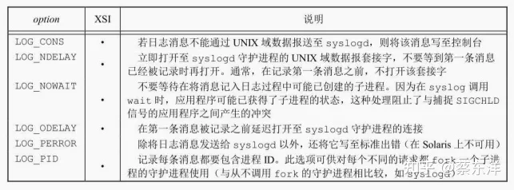

openlog的option参数

设置facility参数的目的是可以让配置文件说明，来自不同设施的消息将以不同的方式进行处理。如果不调用openlog，或者以facility为0来调用它，那么在调用syslog时，可将facility作为priority参数的一个部分进行说明。

调用syslog产生一个日志消息。其priority参数是facility和level的组合。level值按优先级从最高到最低依次排列。


openlog的facility参数


syslog中的level（按序排列）

将format参数以及其他所有参数传至vsprintf函数以便进行格式化。在format中，每个出现的%m字符都先被代换成与errno值对应的出错消息字符串（strerror）。

setlogmask函数用于设置进程的记录优先级屏蔽字。它返回调用它之前的屏蔽字。当设置了记录优先级屏蔽字时，各条消息除非已在记录优先级屏蔽字中进行了设置，否则将不被记录。注意，试图将记录优先级屏蔽字设置为0并不会有什么作用。

### 单实例守护进程

为了正常运作，某些守护进程会实现为，在任一时刻只运行该守护进程的一个副本。例如，这种守护进程可能需要排它地访问一个设备。对cron守护进程而言，如果同时有多个实例运行，那么每个副本都可能试图开始某个预定的操作，于是造成该操作的重复执行，这很可能导致出错。

如果守护进程需要访问一个设备，而该设备驱动程序有时会阻止想要多次打开/dev 目录下相应设备节点的尝试。这就限制了在一个时刻只能运行守护进程的一个副本。但是如果没有这种设备可供使用，那么我们就需要自行处理。

文件和记录锁机制为一种方法提供了基础，该方法保证一个守护进程只有一个副本在运行。如果每一个守护进程创建一个有固定名字的文件，并在该文件的整体上加一把写锁，那么只允许创建一把这样的写锁。在此之后创建写锁的尝试都会失败，这向后续守护进程副本指明已有一个副本正在运行。

文件和记录锁提供了一种方便的互斥机制。如果守护进程在一个文件的整体上得到一把写锁，那么在该守护进程终止时，这把锁将被自动删除。这就简化了复原所需的处理，去除了对以前的守护进程实例需要进行清理的有关操作。

### 守护进程的惯例

在UNIX系统中，守护进程遵循下列通用惯例。

- 若守护进程使用锁文件，那么该文件通常存储在/var/run目录中。然而需要注意的是，守护进程可能需要具有超级用户权限才能在此目录下创建文件。锁文件的名字通常是name.pid，其中，name是该守护进程或服务的名字。例如，cron守护进程锁文件的名字是/var/run/crond.pid。
- 若守护进程支持配置选项，那么配置文件通常存放在/etc目录中。配置文件的名字通常是name.conf，其中，name是该守护进程或服务的名字。例如，syslogd守护进程的配置文件通常是/etc/syslog.conf。
- 守护进程可用命令行启动，但通常它们是由系统初始化脚本之一（/etc/rc*或/etc/init.d/*）启动的。如果在守护进程终止时，应当自动地重新启动它，则我们可在/etc/inittab中为该守护进程包括respawn记录项，这样，init就将重新启动该守护进程。（假定系统使用System V风格的init命令。）
- 若一个守护进程有一个配置文件，那么当该守护进程启动时会读该文件，但在此之后一般就不会再查看它。若某个管理员更改了配置文件，那么该守护进程可能需要被停止，然后再启动，以使配置文件的更改生效。为避免此种麻烦，某些守护进程将捕捉SIGHUP信号，当它们接收到该信号时，重新读配置文件。因为守护进程并不与终端相结合，它们或者是无控制终端的会话首进程，或者是孤儿进程组的成员，所以守护进程没有理由期望接收SIGHUP。于是，守护进程可以安全地重复使用SIGHUP。

### 客户进程-服务器进程模型

在服务器进程中调用fork然后exec另一个程序来向客户进程提供服务是很常见的。这些服务器进程通常管理着多个文件描述符：通信端点、配置文件、日志文件和类似的文件。最好的情况下，让子进程中的这些文件描述符保持打开状态并无大碍，因为它们很可能不会被在子进程中执行的程序所使用，尤其是那些与服务器端无关的程序。最坏情况下，保持它们的打开状态会导致安全问题——被执行的程序可能有一些恶意行为，如更改服务器端配置文件或欺骗客户端程序使其认为正在与服务器端通信，从而获取未授权的信息。

解决此问题的一个简单方法是对所有被执行程序不需要的文件描述符设置执行时关闭（close-on-exec）标志。

# 进程间通信

过去，UNIX系统IPC是各种进程通信方式的统称，但是，这些通信方式中极少有能在所有UNIX系统实现中进行移植的。随着POSIX和The Open Group（以前是X/Open）标准化的推进和影响的扩大，情况已得到改善，但差别仍然存在。


UNIX系统IPC摘要

注意，虽然Single UNIX Specification（“SUS”列）要求的是半双工管道，但允许实现支持全双工管道。即使应用程序在编写时假定基础操作系统只支持半双工管道，支持全双工管道的实现也能用这种应用程序正常工作。图中使用“（全）”表示用全双工管道支持半双工管道的实现。

在图中，我们在支持基本功能的位置处标注了一个黑点。对于全双工管道，如果该特征是经由UNIX域套接字（UNIX domain socket）支持的，则在相应列中标注“UDS”。某些实现用管道和UNIX域套接字来支持该特征，所以这些位置上标有“•、UDS”。

图中前10种IPC形式通常限于同一台主机的两个进程之间的IPC。最后两行（套接字和STREAMS）是仅有的支持不同主机上两个进程之间IPC的两种形式。

## 管道

管道是UNIX系统IPC的最古老形式，所有UNIX系统都提供此种通信机制。管道有以下两种局限性。

- 历史上，它们是半双工的（即数据只能在一个方向上流动）。现在，某些系统提供全双工管道，但是为了最佳的可移植性，我们决不应预先假定系统支持全双工管道。
- 管道只能在具有公共祖先的两个进程之间使用。通常，一个管道由一个进程创建，在进程调用fork之后，这个管道就能在父进程和子进程之间使用了。

FIFO没有第二种局限性，UNIX域套接字没有这两种局限性。

尽管有这两种局限性，半双工管道仍是最常用的IPC形式。每当在管道中键入一个命令序列，让 shell 执行时，shell 都会为每一条命令单独创建一个进程，然后用管道将前一条命令进程的标准输出与后一条命令的标准输入相连接。

管道是通过调用pipe函数创建的。

```c
#include <unistd.h>
int pipe(int fd[2]);
// 返回值：若成功，返回0，若出错，返回-1
```

经由参数 fd 返回两个文件描述符：fd[0]为读而打开，fd[1]为写而打开。fd[1]的输出是fd[0]的输入。

最初在4.3BSD和4.4BSD中，管道是用UNIX域套接字实现的。虽然UNIX域套接字默认是全双工的，但这些操作系统阻碍了用于管道的套接字，以至于这些管道只能以半双工模式操作。

POSIX.1允许实现支持全双工管道。对于这些实现，fd[0]和fd[1]以读/写方式打开。


描绘半双工管道的两种方法

上图给出了两种描绘半双工管道的方法。左图显示管道的两端在一个进程中相互连接，右图则强调数据需要通过内核在管道中流动。

fstat函数对管道的每一端都返回一个FIFO类型的文件描述符。可以用S_ISFIFO宏来测试管道。

POSIX.1规定stat结构的st_size成员对于管道是未定义的。但是当fstat函数应用于管道读端的文件描述符时，很多系统在st_size中存储管道中可用于读的字节数。但是，这是不可移植的。

单个进程中的管道几乎没有任何用处。通常，进程会先调用pipe，接着调用fork，从而创建从父进程到子进程的IPC通道。


fork之后的半双工管道

fork 之后做什么取决于我们想要的数据流的方向。对于从父进程到子进程的管道，父进程关闭管道的读端（fd[0]），子进程关闭写端（fd[1]）。


从父进程到子进程的管道

对于一个从子进程到父进程的管道，父进程关闭fd[1]，子进程关闭fd[0]。

当管道的一端被关闭后，下列两条规则起作用。

- 当读（read）一个写端已被关闭的管道时，在所有数据都被读取后，read返回0，表示文件结束。（从技术上来讲，如果管道的写端还有进程，就不会产生文件的结束。可以复制一个管道的描述符，使得有多个进程对它具有写打开文件描述符。但是，通常一个管道只有一个读进程和一个写进程。介绍FIFO时，会看到对于单个的FIFO常常有多个写进程。）
- 如果写（write）一个读端已被关闭的管道，则产生信号SIGPIPE。如果忽略该信号或者捕捉该信号并从其处理程序返回，则write返回−1，errno设置为EPIPE。

在写管道（或 FIFO）时，常量 PIPE_BUF 规定了内核的管道缓冲区大小。如果对管道调用write，而且要求写的字节数小于等于 PIPE_BUF，则此操作不会与其他进程对同一管道（或FIFO）的 write 操作交叉进行。但是，若有多个进程同时写一个管道（或 FIFO），而且我们要求写的字节数超过PIPE_BUF，那么我们所写的数据可能会与其他进程所写的数据相互交叉。用pathconf或fpathconf函数可以确定PIPE_BUF的值。

## 函数popen和pclose

常见的操作是创建一个连接到另一个进程的管道，然后读其输出或向其输入端发送数据，为此，标准I/O库提供了两个函数popen和pclose。这两个函数实现的操作是：创建一个管道， fork一个子进程，关闭未使用的管道端，执行一个shell运行命令，然后等待命令终止。

```c
#include <stdio.h>
FILE *popen(const char *cmdstring, const char *type);
// 返回值：若成功，返回文件指针；若出错，返回NULL
int pclose(FILE *fp);
// 返回值：若成功，返回cmdstring的终止状态；若出错，返回-1
```

函数popen先执行fork，然后调用exec执行cmdstring，并且返回一个标准I/O文件指针。如果type是"r"，则文件指针连接到cmdstring的标准输出。如果type是"w"，则文件指针连接到cmdstring的标准输入。

pclose函数关闭标准I/O流，等待命令终止，然后返回shell的终止状态。如果 shell 不能被执行，则pclose返回的终止状态与shell已执行exit(127)一样。

cmdstring由Bourne shell以下列方式执行：

```powershell
sh -c cmdstring
```

这表示shell将扩展cmdstring中的任何特殊字符。例如，可以使用：

```text
fp = popen("ls *.c" , "r")；
```

或者

```text
fp = popen("cmd 2>&1" , "r");
```

## 协同进程

UNIX系统过滤程序从标准输入读取数据，向标准输出写数据。几个过滤程序通常在shell管道中线性连接。当一个过滤程序既产生某个过滤程序的输入，又读取该过滤程序的输出时，它就变成了协同进程（coprocess）。

协同进程通常在shell的后台运行，其标准输入和标准输出通过管道连接到另一个程序。虽然初始化一个协同进程，并将其输入和输出连接到另一个进程的shell语法是十分奇特的，但是协同进程的工作方式在C程序中也是非常有用的。

popen 只提供连接到另一个进程的标准输入或标准输出的一个单向管道，而协同进程则有连接到另一个进程的两个单向管道：一个接到其标准输入，另一个则来自其标准输出。我们想将数据写到其标准输入，经其处理后，再从其标准输出读取数据。


通过写协同进程的标准输入和读取它的标准输出来驱动协同进程

## FIFO

FIFO有时被称为命名管道。未命名的管道只能在两个相关的进程之间使用，而且这两个相关的进程还要有一个共同的创建了它们的祖先进程。但是，通过FIFO，不相关的进程也能交换数据。

FIFO是一种文件类型。通过stat结构的st_mode成员的编码可以知道文件是否是FIFO类型。可以用S_ISFIFO宏对此进行测试。

创建FIFO类似于创建文件。确实，FIFO的路径名存在于文件系统中。

```c
#include <sys/stat.h>
int mkfifo(const char *path, mode_t mode);
int mkfifoat(int fd, const char *path, mode_t mode);
// 两个函数的返回值：若成功，返回0；若出错，返回−1
```

mkfifo函数中mode参数的规格说明与open函数中mode的相同。

mkfifoat函数和mkfifo函数相似，但是mkfifoat函数可以被用来在fd文件描述符表示的目录相关的位置创建一个FIFO。像其他*at函数一样，这里有3种情形：

- 如果path参数指定的是绝对路径名，则fd参数会被忽略掉，并且mkfifoat函数的行为和mkfifo类似。
- 如果path参数指定的是相对路径名，则fd参数是一个打开目录的有效文件描述符，路径名和目录有关。
- 如果path参数指定的是相对路径名，并且fd参数有一个特殊值AT_FDCWD，则路径名以当前目录开始，mkfifoat和mkfifo类似。

当我们用mkfifo或者mkfifoat创建FIFO时，要用open来打开它。确实，正常的文件I/O函数（如close、read、write和unlink）都需要FIFO。

当open一个FIFO时，非阻塞标志（O_NONBLOCK）会产生下列影响。

- 在一般情况下（没有指定O_NONBLOCK），只读 open要阻塞到某个其他进程为写而打开这个FIFO为止。类似地，只写open要阻塞到某个其他进程为读而打开它为止。
- 如果指定了 O_NONBLOCK，则只读 open 立即返回。但是，如果没有进程为读而打开一个FIFO，那么只写open将返回−1，并将errno设置成ENXIO。

类似于管道，若 write 一个尚无进程为读而打开的 FIFO，则产生信号 SIGPIPE。若某个FIFO的最后一个写进程关闭了该FIFO，则将为该FIFO的读进程产生一个文件结束标志。

一个给定的 FIFO 有多个写进程是常见的。这就意味着，如果不希望多个进程所写的数据交叉，则必须考虑原子写操作。和管道一样，常量PIPE_BUF说明了可被原子地写到FIFO的最大数据量。

FIFO有以下两种用途。

- shell命令使用FIFO将数据从一条管道传送到另一条时，无需创建中间临时文件。
- 客户进程-服务器进程应用程序中，FIFO 用作汇聚点，在客户进程和服务器进程二者之间传递数据。

FIFO可用于复制一系列sell命令中的输出流。这就防止了将数据写向中间磁盘文件（类似于使用管道来避免中间磁盘文件）。但是不同的是，管道只能用于两个进程之间的线性连接，而FIFO是有名字的，因此它可用于非线性连接。

## XSI IPC

有3种称作XSI IPC的IPC：**消息队列、信号量以及共享存储器。**

## 标识符和键

每个内核中的 IPC 结构（消息队列、信号量或共享存储段）都用一个非负整数的标识符（identifier）加以引用。例如，要向一个消息队列发送消息或者从一个消息队列取消息，只需要知道其队列标识符。与文件描述符不同，IPC标识符不是小的整数。当一个IPC结构被创建，然后又被删除时，与这种结构相关的标识符连续加1，直至达到一个整型数的最大正值，然后又回转到0。

标识符是IPC对象的内部名。为使多个合作进程能够在同一IPC对象上汇聚，需要提供一个外部命名方案。为此，每个IPC对象都与一个键（key）相关联，将这个键作为该对象的外部名。

无论何时创建IPC结构（通过调用msgget、semget或shmget创建），都应指定一个键。这个键的数据类型是基本系统数据类型key_t，通常在头文件中被定义为长整型。这个键由内核变换成标识符。

有多种方法使客户进程和服务器进程在同一IPC结构上汇聚。

- 服务器进程可以指定键IPC_PRIVATE创建一个新IPC结构，将返回的标识符存放在某处（如一个文件）以便客户进程取用。键IPC_PRIVATE保证服务器进程创建一个新IPC结构。这种技术的缺点是：文件系统操作需要服务器进程将整型标识符写到文件中，此后客户进程又要读这个文件取得此标识符。IPC_PRIVATE键也可用于父进程子关系。父进程指定IPC_PRIVATE创建一个新IPC结构，所返回的标识符可供fork后的子进程使用。接着，子进程又可将此标识符作为exec函数的一个参数传给一个新程序。
- 可以在一个公用头文件中定义一个客户进程和服务器进程都认可的键。然后服务器进程指定此键创建一个新的IPC结构。这种方法的问题是该键可能已与一个IPC结构相结合，在此情况下，get函数（msgget、semget或shmget）出错返回。服务器进程必须处理这一错误，删除已存在的IPC结构，然后试着再创建它。
- 客户进程和服务器进程认同一个路径名和项目ID（项目ID是0～255之间的字符值），接着，调用函数ftok将这两个值变换为一个键。然后在方法2中使用此键。ftok提供的唯一服务就是由一个路径名和项目ID产生一个键。

```c
#include <sys/ipc.h>
key_t ftok(const char *path, int id);
// 返回值：若成功，返回键；若出错，返回(key_t)−1
```

path参数必须引用一个现有的文件。当产生键时，只使用id参数的低8位。

ftok创建的键通常是用下列方式构成的：按给定的路径名取得其stat结构中的部分st_dev和st_ino字段，然后再将它们与项目ID组合起来。如果两个路径名引用的是两个不同的文件，那么ftok通常会为这两个路径名返回不同的键。但是，因为i节点编号和键通常都存放在长整型中，所以创建键时可能会丢失信息。这意味着，对于不同文件的两个路径名，如果使用同一项目ID，那么可能产生相同的键。

3个get函数（msgget、semget和shmget）都有两个类似的参数：一个key和一个整型flag。在创建新的IPC结构（通常由服务器进程创建）时，如果key是IPC_PRIVATE或者和当前某种类型的IPC结构无关，则需要指明flag的IPC_CREAT标志位。为了引用一个现有队列（通常由客户进程创建），key必须等于队列创建时指明的key的值，并且IPC_CREAT必须不被指明。

注意，决不能指定 IPC_PRIVATE 作为键来引用一个现有队列，因为这个特殊的键值总是用于创建一个新队列。为了引用一个用 IPC_PRIVATE 键创建的现有队列，一定要知道这个相关的标识符，然后在其他 IPC 调用中（如 msgsnd、msgrcv）使用该标识符，这样可以绕过get函数。

如果希望创建一个新的IPC结构，而且要确保没有引用具有同一标识符的一个现有IPC结构，那么必须在flag中同时指定IPC_CREAT和IPC_EXCL位。这样做了以后，如果IPC结构已经存在就会造成出错，返回EEXIST（这与指定了O_CREAT和O_EXCL标志的open相类似）。

## 权限结构

XSI IPC为每一个IPC结构关联了一个ipc_perm结构。该结构规定了权限和所有者，它至少包括下列成员：

```c
struct ipc_perm {
    uid_t uid; /* owner's effective user id */
    gid_t gid; /* owner's effective group id */
    uid_t cuid; /* creator's effective user id */
    gid_t cgid; /* creator's effective group id */
    mode_t mode; /* access modes */
};
```

在创建IPC结构时，对所有字段都赋初值。以后，可以调用msgctl、semctl或shmctl修改uid、gid和mode字段。为了修改这些值，调用进程必须是IPC结构的创建者或超级用户。修改这些字段类似于对文件调用chown和chmod。

mode字段的值类似于文件权限中的值，但是对于任何IPC结构都不存在执行权限。另外，消息队列和共享存储使用术语“读”和“写”，而信号量则用术语“读”和“更改”（alter）。


XSI IPC权限

## 结构限制

所有3种形式的XSI IPC都有内置限制。大多数限制可以通过重新配置内核来改变。在对这3种形式的IPC中的每一种进行描述时，我们都会指出它的限制。

在报告和修改限制方面，每种平台都有自己的方法。FreeBSD 8.0、Linux 3.2.0和Mac OS X 10.6.8提供了sysctl命令来观察和修改内核配置参数。在Solaris 10中，可以用prctl命令来改变内核IPC的限制。

在Linux中，可以运行ipcs –l来显示IPC相关的限制。在FreeBSD中，等效的命令是ipcs-T。在Solaris中，可以通过运行sysdef –y来找到可调节参数。

## 优点和缺点

**XSI IPC 的一个基本问题是：IPC 结构是在系统范围内起作用的，没有引用计数。例如，如果进程创建了一个消息队列，并且在该队列中放入了几则消息，然后终止，那么该消息队列及其内容不会被删除。它们会一直留在系统中直至发生下列动作为止：由某个进程调用 msgrcv 或msgctl读消息或删除消息队列；或某个进程执行ipcrm(1)命令删除消息队列；或正在自举的系统删除消息队列。将此与管道相比，当最后一个引用管道的进程终止时，管道就被完全地删除了。对于FIFO而言，在最后一个引用FIFO的进程终止时，虽然FIFO的名字仍保留在系统中，直至被显式地删除，但是留在FIFO中的数据已被删除了。**

XSI IPC的另一个问题是：这些IPC结构在文件系统中没有名字。我们不能用文件系统部分所述的函数来访问它们或修改它们的属性。为了支持这些IPC对象，内核中增加了十几个全新的系统调用（msgget、semop、shmat等）。我们不能用ls命令查看IPC对象，不能用rm命令删除它们，也不能用chmod命令修改它们的访问权限。于是，又增加了两个新命令ipcs(1)和ipcrm(1)。

因为这些形式的 IPC 不使用文件描述符，所以不能对它们使用多路转接 I/O 函数（select和poll）。这使得它很难一次使用一个以上这样的IPC结构，或者在文件或设备I/O中使用这样的IPC结构。例如，如果没有某种形式的忙等循环（busy-wait loop），就不能使一个服务器进程等待将要放在两个消息队列中任意一个中的消息。

消息队列的其他优点是：它们是可靠的、流控制的以及面向记录的；它们可以用非先进先出次序处理。


不同形式IPC之间的特征比较

“无连接”指的是无需先调用某种形式的打开函数就能发送消息的能力。如前所述，因为需要有某种技术来获得队列标识符，所以我们并不认为消息队列是无连接的。因为所有这些形式的IPC 被限制在一台主机上，所以它们都是可靠的。当消息通过网络传送时，就要考虑丢失消息的可能性。“流控制”的意思是：如果系统资源（缓冲区）短缺，或者如果接收进程不能再接收更多消息，则发送进程就要休眠。当流控制条件消失时，发送进程应自动唤醒。

图中没有显示的一个特征是：IPC 设施能否自动地为每个客户进程创建一个到服务器进程的唯一连接。UNIX流套接字可以提供这种能力。

## 消息队列

消息队列是消息的链接表，存储在内核中，由消息队列标识符标识。

msgget 用于创建一个新队列或打开一个现有队列。msgsnd 将新消息添加到队列尾端。每个消息包含一个正的长整型类型的字段、一个非负的长度以及实际数据字节数（对应于长度），所有这些都在将消息添加到队列时，传送给 msgsnd。msgrcv 用于从队列中取消息。我们并不一定要以先进先出次序取消息，也可以按消息的类型字段取消息。

每个队列都有一个msqid_ds结构与其相关联：

```c
struct msqid_ds {
    struct ipc_perm　　 msg_perm;　　　　 /* see Section 15.6.2 */
    msgqnum_t　　　　　　msg_qnum;　　　　 /* # of messages on queue */
    msglen_t　　　　　　 msg_qbytes;　　　 /* max # of bytes on queue */
    pid_t　　　　　　　　msg_lspid;　　　　/* pid of last msgsnd() */
    pid_t　　　　　　　　msg_lrpid;　　　　/* pid of last msgrcv() */
    time_t　　　　　　　 msg_stime;　　　　/* last-msgsnd() time */
    time_t　　　　　　　 msg_rtime;　　　　/* last-msgrcv() time */
    time_t　　　　　　　 msg_ctime;　　　　/* last-change time */
};
```

调用的第一个函数通常是msgget，其功能是打开一个现有队列或创建一个新队列。

```c
#include <sys/msg.h>
int msgget(key_t key, int flag);
// 返回值：若成功，返回消息队列ID；若出错，返回−1
```

在创建新队列时，要初始化msqid_ds结构的下列成员。

- ipc_perm结构中的mode成员按flag中的相应权限位设置。
- msg_qnum、msg_lspid、msg_lrpid、msg_stime和msg_rtime都设置为0。
- msg_ctime设置为当前时间。
- msg_qbytes设置为系统限制值。

若执行成功，msgget返回非负队列ID。此后，该值就可被用于其他3个消息队列函数。

**msgctl函数对队列执行多种操作。它和另外两个与信号量及共享存储有关的函数（semctl和shmctl）都是XSI IPC的类似于ioctl的函数（亦即垃圾桶函数）。**

```c
#include <sys/msg.h>
int msgctl(int msqid, int cmd, struct msqid_ds *buf);
// 返回值：若成功，返回0；若出错，返回−1
```

cmd参数指定对msqid指定的队列要执行的命令。

- IPC_STAT 取此队列的msqid_ds结构，并将它存放在buf指向的结构中。
- IPC_SET 将字段 msg_perm.uid、msg_perm.gid、msg_perm.mode 和 msg_qbytes从buf指向的结构复制到与这个队列相关的msqid_ds结构中。此命令只能由下列两种进程执行：一种是其有效用户ID等于msg_perm.cuid或msg_perm.uid，另一种是具有超级用户特权的进程。只有超级用户才能增加msg_qbytes的值。
- IPC_RMID 从系统中删除该消息队列以及仍在该队列中的所有数据。这种删除立即生效。仍在使用这一消息队列的其他进程在它们下一次试图对此队列进行操作时，将得到EIDRM错误。此命令只能由下列两种进程执行：一种是其有效用户ID等于msg_perm.cuid或msg_perm.uid；另一种是具有超级用户特权的进程。

这3条命令（IPC_STAT、IPC_SET和IPC_RMID）也可用于信号量和共享存储。

**调用msgsnd将数据放到消息队列中。**

```c
#include <sys/msg.h>
int msgsnd(int msqid, const void *ptr, size_t nbytes, int flag);
// 返回值：若成功，返回0；若出错，返回−1
```

正如前面提及的，每个消息都由3部分组成：一个正的长整型类型的字段、一个非负的长度（nbytes）以及实际数据字节数（对应于长度）。消息总是放在队列尾端。

ptr参数指向一个长整型数，它包含了正的整型消息类型，其后紧接着的是消息数据（若nbytes是0，则无消息数据）。若发送的最长消息是512字节的，则可定义下列结构：

```c
struct mymesg {
    long mtype;　　　 /* positive message type */
    char mtext[512]; /* message data, of length nbytes */
};
```

ptr就是一个指向mymesg结构的指针。接收者可以使用消息类型以非先进先出的次序取消息。

参数flag的值可以指定为IPC_NOWAIT。这类似于文件I/O的非阻塞I/O标志。若消息队列已满（或者是队列中的消息总数等于系统限制值，或队列中的字节总数等于系统限制值），则指定IPC_NOWAIT使得msgsnd立即出错返回EAGAIN。如果没有指定IPC_NOWAIT，则进程会一直阻塞到：有空间可以容纳要发送的消息；或者从系统中删除了此队列；或者捕捉到一个信号，并从信号处理程序返回。在第二种情况下，会返回EIDRM错误（“标识符被删除”）。最后一种情况则返回EINTR错误。

注意，对删除消息队列的处理不是很完善。因为每个消息队列没有维护引用计数器（打开文件有这种计数器），所以在队列被删除以后，仍在使用这一队列的进程在下次对队列进行操作时会出错返回。信号量机构也以同样方式处理其删除。相反，删除一个文件时，要等到使用该文件的最后一个进程关闭了它的文件描述符以后，才能删除文件中的内容。

当msgsnd返回成功时，消息队列相关的msqid_ds结构会随之更新，表明调用的进程ID （msg_lspid）、调用的时间（msg_stime）以及队列中新增的消息（msg_qnum）。

**msgrcv从队列中取用消息。**

```c
#include <sys/msg.h>
ssize_t msgrcv(int msqid, void *ptr, size_t nbytes, long type, int flag);
// 返回值：若成功，返回消息数据部分的长度；若出错，返回-1
```

和msgsnd一样，ptr参数指向一个长整型数（其中存储的是返回的消息类型），其后跟随的是存储实际消息数据的缓冲区。nbytes 指定数据缓冲区的长度。若返回的消息长度大于 nbytes，而且在flag中设置了MSG_NOERROR位，则该消息会被截断（在这种情况下，没有通知告诉我们消息截断了，消息被截去的部分被丢弃）。如果没有设置这一标志，而消息又太长，则出错返回E2BIG（消息仍留在队列中）。

参数type可以指定想要哪一种消息。

- type == 0 返回队列中的第一个消息。
- type > 0 返回队列中消息类型为type的第一个消息。
- type < 0 返回队列中消息类型值小于等于 type 绝对值的消息，如果这种消息有若干个，则取类型值最小的消息。

type值非0用于以非先进先出次序读消息。例如，若应用程序对消息赋予优先权，那么type就可以是优先权值。如果一个消息队列由多个客户进程和一个服务器进程使用，那么type字段可以用来包含客户进程的进程ID（只要进程ID可以存放在长整型中）。

可以将flag值指定为IPC_NOWAIT，使操作不阻塞，这样，如果没有所指定类型的消息可用，则msgrcv返回−1，error设置为ENOMSG。如果没有指定IPC_NOWAIT，则进程会一直阻塞到有了指定类型的消息可用，或者从系统中删除了此队列（返回−1，error设置为EIDRM），或 者捕捉到一个信号并从信号处理程序返回（这会导致msgrcv返回−1，errno设置为EINTR）。

msgrcv成功执行时，内核会更新与该消息队列相关联的msgid_ds结构，以指示调用者的进程ID（msg_lrpid）和调用时间（msg_rtime），并指示队列中的消息数减少了1个（msg_qnum）。

## 信号量

信号量与已经介绍过的 IPC 机构（管道、FIFO 以及消息列队）不同。它是一个计数器，用于为多个进程提供对共享数据对象的访问。

为了获得共享资源，进程需要执行下列操作。

- 测试控制该资源的信号量。
- 若此信号量的值为正，则进程可以使用该资源。在这种情况下，进程会将信号量值减1，表示它使用了一个资源单位。
- 否则，若此信号量的值为 0，则进程进入休眠状态，直至信号量值大于 0。进程被唤醒后，它返回至步骤（1）。

当进程不再使用由一个信号量控制的共享资源时，该信号量值增 1。如果有进程正在休眠等待此信号量，则唤醒它们。

为了正确地实现信号量，信号量值的测试及减1操作应当是原子操作。为此，信号量通常是在内核中实现的。

常用的信号量形式被称为二元信号量（binary semaphore）。它控制单个资源，其初始值为1。但是，一般而言，信号量的初值可以是任意一个正值，该值表明有多少个共享资源单位可供共享应用。

遗憾的是，XSI信号量与此相比要复杂得多。以下3种特性造成了这种不必要的复杂性。

- 信号量并非是单个非负值，而必需定义为含有一个或多个信号量值的集合。当创建信号量时，要指定集合中信号量值的数量。
- 信号量的创建（semget）是独立于它的初始化（semctl）的。这是一个致命的缺点，因为不能原子地创建一个信号量集合，并且对该集合中的各个信号量值赋初值。
- 即使没有进程正在使用各种形式的XSI IPC，它们仍然是存在的。有的程序在终止时并没有释放已经分配给它的信号量，所以我们不得不为这种程序担心。后面将要说明的 undo 功能就是处理这种情况的。

内核为每个信号量集合维护着一个semid_ds结构：

```c
struct semid_ds {
    struct ipc_perm　sem_perm;　　/* see Section 15.6.2 */
    unsigned short sem_nsems; /* # of semaphores in set */
    time_t　　　　　 sem_otime;　/* last-semop() time */
    time_t　　　　　 sem_ctime;　/* last-change time */
};
```

每个信号量由一个无名结构表示，它至少包含下列成员：

```c
struct {
    unsigned short　semval;　　　/* semaphore value, always >= 0 */
    pid_t　　　　　 sempid;　　　/* pid for last operation */
    unsigned short　semncnt;　　 /* # processes awaiting semval>curval */
    unsigned short　semzcnt;　　 /* # processes awaiting semval==0 */
};
```

当我们想使用XSI信号量时，首先需要通过调用函数semget来获得一个信号量ID。

```c
#include <sys/sem.h>
int semget(key_t key, int nsems, int flag);
// 返回值：若成功，返回信号量ID；若出错，返回−1
```

创建一个新集合时，要对semid_ds结构的下列成员赋初值。

- 初始化ipc_perm结构。该结构中的mode成员被设置为flag中的相应权限位。
- sem_otime设置为0。
- sem_ctime设置为当前时间。
- sem_nsems设置为nsems。

nsems是该集合中的信号量数。如果是创建新集合（一般在服务器进程中），则必须指定nsems。如果是引用现有集合（一个客户进程），则将nsems指定为0。

**semctl函数包含了多种信号量操作。**

```c
#include <sys/sem.h>
int semctl(int semid, int semnum, int cmd, ... /* union semun arg */);
```

第4个参数是可选的，是否使用取决于所请求的命令，如果使用该参数，则其类型是semun，它是多个命令特定参数的联合（union）：

```c
union semun {
    int　　　　　　　val;　　/* for SETVAL */
    struct semid_ds *buf; /* for IPC_STAT and IPC_SET */
    unsigned short *array; /* for GETALL and SETALL */
};
```

注意，这个选项参数是一个联合，而非指向联合的指针。

cmd参数指定下列10种命令中的一种，这些命令是运行在semid指定的信号量集合上的。其中有5种命令是针对一个特定的信号量值的，它们用semnum指定该信号量集合中的一个成员。semnum值在0和nsems−1之间，包括0和nsems−1。

- IPC_STAT 对此集合取semid_ds结构，并存储在由arg.buf指向的结构中。
- IPC_SET 按arg.buf指向的结构中的值，设置与此集合相关的结构中的sem_perm.uid、sem_perm.gid和sem_perm.mode字段。此命令只能由两种进程执行：一种是其有效用户ID等于sem_perm.cuid或sem_perm.uid的进程；另一种是具有超级用户特权的进程。
- IPC_RMID 从系统中删除该信号量集合。这种删除是立即发生的。删除时仍在使用此信号量集合的其他进程，在它们下次试图对此信号量集合进行操作时，将出错返回EIDRM。此命令只能由两种进程执行：一种是其有效用户ID等于sem_perm.cuid或sem_perm.uid的进程；另一种是具有超级用户特权的进程。
- GETVAL 返回成员semnum的semval值。
- SETVAL 设置成员semnum的semval值。该值由arg.val指定。
- GETPID 返回成员semnum的sempid值。
- GETNCNT 返回成员semnum的semncnt值。
- GETZCNT 返回成员semnum的semzcnt值。
- GETALL 取该集合中所有的信号量值。这些值存储在arg.array指向的数组中。
- SETALL 将该集合中所有的信号量值设置成arg.array指向的数组中的值。

对于除GETALL以外的所有GET命令，semctl函数都返回相应值。对于其他命令，若成功则返回值为0，若出错，则设置errno并返回−1。

函数semop自动执行信号量集合上的操作数组。

```c
#include <sys/sem.h>
int semop(int semid, struct sembuf semoparray[], size_t nops);
// 返回值：若成功，返回0；若出错，返回−1
```

参数semoparray是一个指针，它指向一个由sembuf结构表示的信号量操作数组：

```c
struct sembuf {
    unsigned short　　　sem_num;　　 /* member # in set (0, 1, ..., nsems-1) */
    short　　　　　　　　sem_op;　　　 /* operation(negative, 0,or pasitive) */
    short　　　　　　　　sem_flg;　　 /* IPC_NOWAIT, SEM_UNDO */
};
```

参数nops规定该数组中操作的数量（元素数）。

对集合中每个成员的操作由相应的 sem_op 值规定。此值可以是负值、0或正值。（信号量的“undo”标志对应于相应的sem_flg成员的SEM_UNDO位。）

- 最易于处理的情况是 sem_op 为正值。这对应于进程释放的占用的资源数。sem_op 值会加到信号量的值上。如果指定了undo标志，则也从该进程的此信号量调整值中减去sem_op。
- 若sem_op为负值，则表示要获取由该信号量控制的资源。

如若该信号量的值大于等于 sem_op 的绝对值（具有所需的资源），则从信号量值中减去 sem_op的绝对值。这能保证信号量的结果值大于等于0。如果指定了 undo 标志，则 sem_op 的绝对值也加到该进程的此信号量调整值上。

如果信号量值小于sem_op的绝对值（资源不能满足要求），则适用下列条件。

- 若指定了IPC_NOWAIT，则semop出错返回EAGAIN。
- 若未指定IPC_NOWAIT，则该信号量的semncnt值加1（因为调用进程将进入休眠状态），然后调用进程被挂起直至下列事件之一发生。
- 此信号量值变成大于等于sem_op的绝对值（即某个进程已释放了某些资源）。此信号量的semncnt值减1（因为已结束等待），并且从信号量值中减去sem_op的绝对值。如果指定了undo标志，则sem_op的绝对值也加到该进程的此信号量调整值上。
- 从系统中删除了此信号量。在这种情况下，函数出错返回EIDRM。
- 进程捕捉到一个信号，并从信号处理程序返回，在这种情况下，此信号量的semncnt值减1（因为调用进程不再等待），并且函数出错返回EINTR。
- 若sem_op为0，这表示调用进程希望等待到该信号量值变成0。

如果信号量值当前是0，则此函数立即返回。

如果信号量值非0，则适用下列条件。

- 若指定了 IPC_NOWAIT，则出错返回EAGAIN。
- 若未指定 IPC_NOWAIT，则该信号量的 semzcnt 值加 1（因为调用进程将进入休眠状态），然后调用进程被挂起，直至下列的一个事件发生。
- 此信号量值变成0。此信号量的semzcnt值减1（因为调用进程已结束等待）。
- 从系统中删除了此信号量。在这种情况下，函数出错返回EIDRM。
- 进程捕捉到一个信号，并从信号处理程序返回。在这种情况下，此信号量的semzcnt值减1（因为调用进程不再等待），并且函数出错返回EINTR。

semop函数具有原子性，它或者执行数组中的所有操作，或者一个也不做。

如果在进程终止时，它占用了经由信号量分配的资源，那么就会成为一个问题。无论何时只要为信号量操作指定了SEM_UNDO标志，然后分配资源（sem_op值小于0），那么内核就会记住对于该特定信号量，分配给调用进程多少资源（sem_op的绝对值）。当该进程终止时，不论自愿或者不自愿，内核都将检验该进程是否还有尚未处理的信号量调整值，如果有，则按调整值对相应信号量值进行处理。

如果用带SETVAL或SETALL命令的semctl设置一个信号量的值，则在所有进程中，该信号量的调整值都将设置为0。

如果在多个进程间共享一个资源，则可使用这3种技术中的一种来协调访问。我们可以使用映射到两个进程地址空间中的**信号量、记录锁或者互斥量**。

- 若使用信号量，则先创建一个包含一个成员的信号量集合，然后将该信号量值初始化为 1。为了分配资源，以 sem_op 为−1调用 semop。为了释放资源，以sem_op为+1调用semop。对每个操作都指定SEM_UNDO，以处理在未释放资源条件下进程终止的情况。
- 若使用记录锁，则先创建一个空文件，并且用该文件的第一个字节（无需存在）作为锁字节。为了分配资源，先对该字节获得一个写锁。释放该资源时，则对该字节解锁。记录锁的性质确保了当一个锁的持有者进程终止时，内核会自动释放该锁。
- 若使用互斥量，需要所有的进程将相同的文件映射到它们的地址空间里，并且使用 PTHREAD_PROCESS_SHARED互斥量属性在文件的相同偏移处初始化互斥量。为了分配资源，我们对互斥量加锁。为了释放锁，我们解锁互斥量。如果一个进程没有释放互斥量而终止，恢复将是非常困难的，除非我们使用鲁棒互斥量（pthread_mutex_consistent函数）。

在Linux上，记录锁比信号量快，但是共享存储中的互斥量的性能比信号量和记录锁的都要优越。如果我们能单一资源加锁，并且不需要XSI信号量的所有花哨功能，那么记录锁将比信号量要好。原因是它使用起来更简单、速度更快（在这个平台上），当进程终止时系统会管理遗留下来的锁。尽管对于Linux来说，在共享存储中使用互斥量是一个更快的选择，但是我们依然喜欢使用记录锁，除非要特别考虑性能。这样做有两个原因。首先，在多个进程间共享的内存中使用互斥量来恢复一个终止的进程更难。其次，进程共享的互斥量属性还没有得到普遍支持。

## 共享存储

共享存储允许两个或多个进程共享一个给定的存储区。因为数据不需要在客户进程和服务器进程之间复制，所以这是最快的一种 IPC。使用共享存储时要掌握的唯一窍门是，在多个进程之间同步访问一个给定的存储区。若服务器进程正在将数据放入共享存储区，则在它做完这一操作之前，客户进程不应当去取这些数据。通常，信号量用于同步共享存储访问。（不过正如前节最后部分所述，也可以用记录锁或互斥量。）

我们已经看到了共享存储的一种形式，就是在多个进程将同一个文件映射到它们的地址空间的时候。XSI 共享存储和内存映射的文件的不同之处在于，前者没有相关的文件。XSI 共享存储段是内存的匿名段。

内核为每个共享存储段维护着一个结构，该结构至少要为每个共享存储段包含以下成员：

```c
struct shmid_ds {
    struct ipc_perm shm_perm; /* see Section 15.6.2 */
    size_t　　　　　shm_segsz;　 /* size of segment in bytes */
    pid_t　　　　　 shm_lpid;　 /* pid of last shmop() */
    pid_t　　　　　 shm_cpid;　 /* pid of creator */
    shmatt_t　　　　shm_nattch;　/* number of current attaches */
    time_t　　　　　shm_atime;　 /* last-attach time */
    time_t　　　　　shm_dtime;　 /* last-detach time */
    time_t　　　　　shm_ctime;　 /* last-change time */┇
};
```

（按照支持共享存储段的需要，每种实现会增加其他结构成员。）

shmatt_t类型定义为无符号整型，它至少与unsigned short一样大。

调用的第一个函数通常是shmget，它获得一个共享存储标识符。

```c
#include <sys/shm.h>
int shmget(key_t key, size_t size, int flag);
// 返回值：若成功，返回共享存储ID；若出错，返回−1
```

当创建一个新段时，初始化shmid_ds结构的下列成员。

- ipc_perm结构初始化。该结构中的mode按flag中的相应权限位设置。
- shm_lpid、shm_nattch、shm_atime和shm_dtime都设置为0。
- shm_ctime设置为当前时间。
- shm_segsz设置为请求的size。

参数size是该共享存储段的长度，以字节为单位。实现通常将其向上取为系统页长的整倍数。但是，若应用指定的size值并非系统页长的整倍数，那么最后一页的余下部分是不可使用的。如果正在创建一个新段（通常在服务器进程中），则必须指定其size。如果正在引用一个现存的段（一个客户进程），则将size指定为0。当创建一个新段时，段内的内容初始化为0。

shmctl函数对共享存储段执行多种操作。

```c
#include <sys/shm.h>
int shmctl(int shmid, int cmd, struct shmid_ds *buf);
// 返回值：若成功，返回0；若出错，返回−1
```

cmd参数指定下列5种命令中的一种，使其在shmid指定的段上执行。

- IPC_STAT 取此段的shmid_ds结构，并将它存储在由buf指向的结构中。
- IPC_SET 按buf指向的结构中的值设置与此共享存储段相关的shmid_ds 结构中的下列3个字段：shm_perm.uid、shm_perm.gid和shm_perm.mode。此命令只能由下列两种进程执行：一种是其有效用户ID等于shm_perm.cuid或shm_perm.uid的进程；另一种是具有超级用户特权的进程。
- IPC_RMID 从系统中删除该共享存储段。因为每个共享存储段维护着一个连接计数（shmid_ds结构中的shm_nattch字段），所以除非使用该段的最后一个进程终止或与该段分离，否则不会实际上删除该存储段。不管此段是否仍在使用，该段标识符都会被立即删除，所以不能再用 shmat 与该段连接。此命令只能由下列两种进程执行：一种是其有效用户 ID 等于 shm_perm.cuid 或shm_perm.uid的进程；另一种是具有超级用户特权的进程。

Linux和Solaris提供了另外两种命令，但它们并非Single UNIX Specification的组成部分。

- SHM_LOCK 在内存中对共享存储段加锁。此命令只能由超级用户执行。
- SHM_UNLOCK 解锁共享存储段。此命令只能由超级用户执行。

一旦创建了一个共享存储段，进程就可调用shmat将其连接到它的地址空间中。

```c
#include <sys/shm.h>
void *shmat(int shmid, const void *addr, int flag);
// 返回值：若成功，返回指向共享存储段的指针；若出错，返回-1
```

共享存储段连接到调用进程的哪个地址上与addr参数以及flag中是否指定SHM_RND位有关。

- 如果addr为0，则此段连接到由内核选择的第一个可用地址上。这是推荐的使用方式。
- 如果addr非0，并且没有指定SHM_RND，则此段连接到addr所指定的地址上。
- 如果addr非0，并且指定了SHM_RND，则此段连接到（addr−(addr mod SHMLBA)）所表示的地址上。

SHM_RND命令的意思是“取整”。SHMLBA的意思是“低边界地址倍数”，它总是2的乘方。该算式是将地址向下取最近1个SHMLBA的倍数。

**除非只计划在一种硬件上运行应用程序（这在当今是不大可能的），否则不应指定共享存储段所连接到的地址。而是应当指定addr为0，以便由系统选择地址。**

如果在flag中指定了SHM_RDONLY位，则以只读方式连接此段，否则以读写方式连接此段。

shmat的返回值是该段所连接的实际地址，如果出错则返回−1。**如果shmat成功执行，那么内核将使与该共享存储段相关的shmid_ds结构中的shm_nattch计数器值加1**。

当对共享存储段的操作已经结束时，则调用 shmdt 与该段分离。注意，这并不从系统中删除其标识符以及其相关的数据结构。该标识符仍然存在，直至某个进程（一般是服务器进程）带IPC_RMID命令的调用shmctl特地删除它为止。

```c
#include <sys/shm.h>
int shmdt(const void *addr);
// 返回值：若成功，返回0；若出错，返回-1
```

addr参数是以前调用shmat时的返回值。如果成功，shmdt将使相关shmid_ds结构中的shm_nattch计数器值减1。


在基于Intel的Linux系统上的存储区布局

在读设备/dev/zero时，该设备是0字节的无限资源。它也接收写向它的任何数据，但又忽略这些数据。我们对此设备作为 IPC 的兴趣在于，当对其进行存储映射时，它具有一些特殊性质。

- 创建一个未命名的存储区，其长度是mmap的第二个参数，将其向上取整为系统的最近页长。
- 存储区都初始化为0。
- 如果多个进程的共同祖先进程对mmap指定了MAP_SHARED标志，则这些进程可共享此存储区。

**很多实现提供了一种类似于/dev/zero 的设施，称为匿名存储映射。为了使用这种功能，要在调用mmap时指定MAP_ANON标志，并将文件描述符指定为−1。结果得到的区域是匿名的（因为它并不通过一个文件描述符与一个路径名相结合），并且创建了一个可与后代进程共享的存储区。**

注意，Linux 为此设备定义了 MAP_ANONYMOUS标志，并将MAP_ANON标志定义为与它相同的值以改善应用的可移植性。

如果在两个无关进程之间要使用共享存储段，那么有两种替代的方法。一种是应用程序使用XSI共享存储函数，另一种是使用mmap将同一文件映射至它们的地址空间，为此使用MAP_SHARED标志。

## POSIX信号量

POSIX信号量接口意在解决XSI信号量接口的几个缺陷。

- 相比于XSI接口，POSIX信号量接口考虑到了更高性能的实现。
- POSIX 信号量接口使用更简单：没有信号量集，在熟悉的文件系统操作后一些接口被模式化了。
- POSIX信号量在删除时表现更完美。当一个XSI信号量被删除时，使用这个信号量标识符的操作会失败，并将errno设置成EIDRM。使用POSIX信号量时，操作能继续正常工作直到该信号量的最后一次引用被释放。

**POSIX信号量有两种形式：命名的和未命名的。它们的差异在于创建和销毁的形式上，但其他工作一样。未命名信号量只存在于内存中，并要求能使用信号量的进程必须可以访问内存。这意味着它们只能应用在同一进程中的线程，或者不同进程中已经映射相同内存内容到它们的地址空间中的线程。相反，命名信号量可以通过名字访问，因此可以被任何已知它们名字的进程中的线程使用。**

我们可以调用sem_open函数来创建一个新的命名信号量或者使用一个现有信号量。

```c
#include <semaphore.h>
sem_t *sem_open(const char *name, int oflag, ... /* mode_t mode, unsigned int value */ );
// 返回值：若成功，返回指向信号量的指针；若出错，返回SEM_FAILED
```

当使用一个现有的命名信号量时，我们仅仅指定两个参数：信号量的名字和 oflag 参数的 0值。当这个oflag参数有O_CREAT标志集时，如果命名信号量不存在，则创建一个新的。如果它已经存在，则会被使用，但是不会有额外的初始化发生。

当我们指定O_CREAT标志时，需要提供两个额外的参数。mode参数指定谁可以访问信号量。mode的取值和打开文件的权限位相同：用户读、用户写、用户执行、组读、组写、组执行、其他读、其他写和其他执行。赋值给信号量的权限可以被调用者的文件创建屏蔽字修改。注意，只有读和写访问要紧，但是当我们打开一个现有信号量时接口不允许指定模式。实现经常为读和写打开信号量。

在创建信号量时，value参数用来指定信号量的初始值。它的取值是0～SEM_VALUE_MAX。

如果我们想确保创建的是信号量，可以设置oflag参数为O_CREAT|O_EXCL。如果信号量已经存在，会导致sem_open失败。

为了增加可移植性，在选择信号量命名时必须遵循一定的规则。

- 名字的第一个字符应该为斜杠（/）。尽管没有要求POSIX信号量的实现要使用文件系统，但是如果使用了文件系统，我们就要在名字被解释时消除二义性。
- 名字不应包含其他斜杠以此避免实现定义的行为。例如，如果文件系统被使用了，那么名字/mysem和//mysem会被认定为是同一个文件名，但是如果实现没有使用文件系统，那么这两种命名可以被认为是不同的（考虑下如果实现把名字哈希运算转换成一个用来识别信号量的整数值会发生什么）。
- 信号量名字的最大长度是实现定义的。名字不应该长于_POSIX_NAME_MAX个字符长度。因为这是使用文件系统的实现能允许的最大名字长度的限制。

如果想在信号量上进行操作，sem_open函数会为我们返回一个信号量指针，用于传递到其他信号量函数上。当完成信号量操作时，可以调用sem_close函数来释放任何信号量相关的资源。

```c
#include <semaphore.h>
int sem_close(sem_t *sem);
// 返回值：若成功，返回0；若出错，返回-1
```

如果进程没有首先调用sem_close而退出，那么内核将自动关闭任何打开的信号量。注意，这不会影响信号量值的状态—如果已经对它进行了增1操作，这并不会仅因为退出而改变。类似地，如果调用sem_close，信号量值也不会受到影响。在XSI信号量中没有类似SEM_UNDO标志的机制。

可以使用sem_unlink函数来销毁一个命名信号量。

```c
#include <semaphore.h>
int sem_unlink(const char *name);
// 返回值：若成功，返回0；若出错，返回-1
```

sem_unlink函数删除信号量的名字。如果没有打开的信号量引用，则该信号量会被销毁。否则，销毁将延迟到最后一个打开的引用关闭。

不像XSI信号量，我们只能通过一个函数调用来调节POSIX信号量的值。计数减1和对一个二进制信号量加锁或者获取计数信号量的相关资源是相类似的。

注意，信号量和POSIX信号量之间是没有差别的。是采用二进制信号量还是用计数信号量取决于如何初始化和使用信号量。如果一个信号量只是有值 0 或者 1，那么它就是二进制信号量。当二进制信号量是1时，它就是“解锁的”，如果它的值是0，那就是“加锁的”。

可以使用sem_wait或者sem_trywait函数来实现信号量的减1操作。

```c
#include <semaphore.h>
int sem_trywait(sem_t *sem);
int sem_wait(sem_t *sem);
// 两个函数的返回值：若成功，返回0；若出错则，返回−1
```

使用sem_wait函数时，如果信号量计数是0就会发生阻塞。直到成功使信号量减1或者被信号中断时才返回。可以使用sem_trywait函数来避免阻塞。调用sem_trywait时，如果信号量是0，则不会阻塞，而是会返回−1并且将errno置为EAGAIN。

第三个选择是阻塞一段确定的时间。为此，可以使用sem_timewait函数。

```c
#include <semaphore.h>
#include <time.h>
int sem_timedwait(sem_t *restrict sem, const struct timespec *restrict tsptr);
// 返回值：若成功，返回0；若出错，返回−1
```

想要放弃等待信号量的时候，可以用tsptr参数指定绝对时间。超时是基于CLOCK_REALTIME时钟的。如果信号量可以立即减1，那么超时值就不重要了，尽管指定的可能是过去的某个时间，信号量的减 1 操作依然会成功。如果超时到期并且信号量计数没能减 1， sem_timedwait将返回-1且将errno设置为ETIMEDOUT。

可以调用sem_post函数使信号量值增1。这和解锁一个二进制信号量或者释放一个计数信号量相关的资源的过程是类似的。

```c
#include <semaphore.h>
int sem_post(sem_t *sem);
// 返回值：若成功，返回0；若出错，返回−1
```

调用sem_post时，如果在调用sem_wait（或者sem_timedwait）中发生进程阻塞，那么进程会被唤醒并且被sem_post增1的信号量计数会再次被sem_wait（或者sem_timedwait）减1。

当我们想在单个进程中使用POSIX信号量时，使用未命名信号量更容易。这仅仅改变创建和销毁信号量的方式。可以调用sem_init函数来创建一个未命名的信号量。

```c
#include <semaphore.h>
int sem_init(sem_t *sem, int pshared, unsigned int value);
// 返回值：若成功，返回0；若出错，返回−1
```

pshared参数表明是否在多个进程中使用信号量。如果是，将其设置成一个非0值。value参数指定了信号量的初始值。

需要声明一个sem_t类型的变量并把它的地址传递给sem_init来实现初始化，而不是像sem_open函数那样返回一个指向信号量的指针。如果要在两个进程之间使用信号量，需要确保sem参数指向两个进程之间共享的内存范围。

对未命名信号量的使用已经完成时，可以调用sem_destroy函数丢弃它。

```c
#include <semaphore.h>
int sem_destroy(sem_t *sem);
// 返回值：若成功，返回0；若出错，返回−1
```

调用sem_destroy后，不能再使用任何带有 sem 的信号量函数，除非通过调用 sem_init重新初始化它。

sem_getvalue函数可以用来检索信号量值。

```c
#include <semaphore.h>
int sem_getvalue(sem_t *restrict sem, int *restrict valp);
// 返回值：若成功，返回0；若出错，返回−1
```

成功后，valp指向的整数值将包含信号量值。但是请注意，我们试图要使用我们刚读出来的值的时候，信号量的值可能已经变了。除非使用额外的同步机制来避免这种竞争，否则 sem_getvalue函数只能用于调试。

## 客户进度-服务端进程属性

下面详细说明客户进程和服务器进程的某些属性，这些属性受到它们之间所使用的各种 IPC类型的影响。

最简单的关系类型是使客户进程 fork 然后 exec 所希望的服务器进程。如下图所示，在 fork之前先创建两个半双工管道使数据可在两个方向传输。所执行的服务器进程可能是一个设置用户 ID 的程序，这使它具有了特权。另外，服务器进程查看客户进程的实际用户ID就可以决定客户进程的真实身份。（回忆8.10节，从中可了解到在exec前后实际用户ID和实际组ID并没有改变。）


通过写协同进程的标准输入和读取它的标准输出来驱动协同进程

在这种安排下，可以构建一个open服务器进程（open server）。（17.5节提供了这种客户进程-服务器进程机制的一种实现。）它为客户进程打开文件而不是客户进程自己调用 open 函数。这样就可以在正常的UNIX用户权限、组权限以及其他权限之上或之外，增加附加的权限检查。假定服务器进程执行的是设置用户ID程序，这给予了它附加的权限（很可能是root权限）。服务器进程用客户进程的实际用户 ID 来决定是否给予它对所请求文件的访问权限。使用这种方式，可以构建一个服务器进程，它允许某些用户获得通常没有的访问权限。

在此例子中，因为服务器进程是父进程的子进程，所以它所能做的就是将文件内容传送给父进程。尽管这种方式对普通文件工作得很好，但是对有些文件却不能工作，如特殊设备文件。我们希望能做的是使服务器进程打开所要求的文件，并传回文件描述符。但是实际情况却是父进程可向子进程传送打开文件描述符，而子进程却不能向父进程传回文件描述符（除非使用专门的编程技术，这将在第17章介绍）。

下图展示了另一种类型的服务器进程。这种服务器进程是一个守护进程，所有客户进程用某种形式的 IPC 与其联系。对于这种形式的客户进程-服务器进程关系，不能使用管道。需要使用一种形式的命名IPC，如FIFO或消息队列。使用FIFO时，如果服务器进程必需将数据送回客户进程，则对每个客户进程都要有单独使用的 FIFO。如果客户进程-服务器进程应用程序只有客户进程向服务器进程发送数据，则只需要一个众所周知的FIFO。（System V行式打印机假脱机程序使用这种形式的客户进程-服务器进程。客户进程是 lp(1)命令，服务器进程是 lpsched守护进程。因为只有从客户进程到服务器进程的数据流，所有只需使用一个FIFO。没有需要送回客户进程的数据。）


用FIFO进行客户进程-服务器进程通信

使用消息队列则存在多种可能性。

- 在服务器进程和所有客户进程之间只使用一个队列，使用每个消息的类型字段指明谁是消息的接受者。例如，客户进程可以用设置为1的类型字段来发送它们的消息。在请求之中应包括客户进程的进程ID。此后，服务器进程在发送响应消息时，将类型字段设置为客户进程的进程ID。服务器进程只接受类型字段为1的消息（msgrcv的第4个参数），客户进程则只接受类型字段等于它们进程ID的消息。
- 另一种方法是每个客户进程使用一个单独的消息队列。在向服务器进程发送第一个请求之前，每个客户进程先使用键IPC_PRIVATE创建它自己的消息队列。服务器进程也有它自己的队列，其键或标识符是所有客户进程都知道的。客户进程将其第一个请求发送到服务器进程的众所周知的队列上，该请求中应包含其客户进程消息队列的队列ID。服务器进程将其第一个响应发送到此客户进程队列，此后的所有请求和响应都在此队列上交换。

使用消息队列的这两种技术都可以用共享内存段和同步方法（信号量或记录锁）来实现。

使用这种类型的客户进程-服务器进程关系（客户进程和服务器进程是无关进程）的问题是服务器进程如何准确地标识客户进程。除非服务器进程正在执行一种非特权操作，否则服务器进程知道客户进程的身份是很重要的。例如，若服务器进程是一个设置用户 ID 程序，就有这种要求。虽然所有这几种形式的IPC都经由内核，但是它们并未提供任何设施使内核能够标识发送者。

对于消息队列，如果在客户进程和服务器进程之间使用一个专用队列（于是一次只有一个消息在该队列上），那么队列的 msg_lspid 包含了对方进程的进程 ID。但是当客户进程将请求发送给服务器进程时，我们想要的是客户进程的有效用户 ID，而不是它的进程 ID。现在还没有一种可移植的方法，在已知进程ID情况下可以得到有效用户ID。（自然地，内核在进程表项中保持有这两种值，但是除非彻底检查内核存储空间，否则已知一个，无法得到另一个。）

我们将在17.2节中使用下列技术，使服务器进程可以标识客户进程。这一技术可使用FIFO、消息队列、信号量以及共享存储。在下面的说明中假定使用了FIFO。客户进程必须创建它自己的FIFO，并且设置该FIFO的文件访问权限，使得只允许用户读和用户写。假定服务器进程具有超级用户特权（或者它很可能并不关心客户进程的真实标识），那么服务器进程仍可读、写此FIFO。当服务器进程在众所周知的FIFO上接收到客户进程的第一个请求时（它应当包含客户进程专用FIFO的标识），服务器进程调用针对客户进程专用FIFO的stat或fstat。服务器进程假设：客户进程的有效用户ID是FIFO的所有者（stat结构的st_uid字段）。服务器进程验证该FIFO只有用户读和用户写权限。服务器进程还应检查与该 FIFO 有关的 3 个时间量（stat 结构的 st_atime、st_mtime和st_ctime字段），要检查它们与当前时间是否很接近（如不早于当前时间15秒或30秒）。如果一个恶意客户进程可以创建一个FIFO，使另一个用户成为其所有者，并且设置该文件的权限位为用户读和用户写，那么在系统中就存在了其他基础性的安全问题。

为了用XSI IPC实现这种技术，回想一下与每个消息队列、信号量以及共享存储段相关的ipc_perm结构，它标识了IPC结构的创建者（cuid和cgid字段）。和使用FIFO的实例一样，服务器进程应当要求客户进程创建该IPC结构，并使客户进程将访问权设置为只允许用户读和用户写。服务器进程也应检验与该IPC相关的时间值与当前时间是否很接近（因为这些IPC结构在显式地删除之前一直存在）。

在17.3节中，将会看到进行这种身份验证的一种更好的方法，就是内核提供客户进程的有效用户ID和有效组ID。套接字子系统在两个进程之间传送文件描述符时可以做到这一点。

## 小结

经过分别对消息队列与全双工管道的时间以及信号量与记录锁的时间进行比较，提出了下列建议：要学会使用管道和FIFO，因为这两种基本技术仍可有效地应用于大量的应用程序。在新的应用程序中，要尽可能避免使用消息队列以及信号量，而应当考虑全双工管道和记录锁，它们使用起来会简单得多。共享存储仍然有它的用途，虽然通过mmap函数也能提供同样的功能。

# 高级进程间通信

## UNIX域套接字

UNIX 域套接字用于在同一台计算机上运行的进程之间的通信。虽然因特网域套接字可用于同一目的，但 UNIX 域套接字的效率更高。UNIX 域套接字仅仅复制数据，它们并不执行协议处理，不需要添加或删除网络报头，无需计算校验和，不要产生顺序号，无需发送确认报文。

UNIX 域套接字提供流和数据报两种接口。UNIX 域数据报服务是可靠的，既不会丢失报文也不会传递出错。UNIX 域套接字就像是套接字和管道的混合。**可以使用它们面向网络的域套接字接口或者使用socketpair函数来创建一对无命名的、相互连接的UNIX域套接字。**

```c
#include <sys/socket.h>
int socketpair(int domain, int type, int protocol, int sockfd[2]);
// 返回值：若成功，返回0；若出错，返回-1
```

虽然接口足够通用，允许socketpair用于其他域，但一般来说操作系统仅对UNIX域提供支持。

一对相互连接的UNIX域套接字可以起到全双工管道的作用：两端对读和写开放（见图17-1）。我们将其称为 fd 管道（fd-pipe），以便与普通的半双工管道区分开来。


图17-1 套接字对

**命名UNIX域套接字**

虽然 socketpair 函数能创建一对相互连接的套接字，但是每一个套接字都没有名字。这意味着无关进程不能使用它们。

UNIX 域套接字的地址由sockaddr_un结构表示。在Linux 3.2.0和Solaris 10中，sockaddr_un结构在头文件中的定义如下：

```c
struct sockaddr_un {
    sa_family_t　sun_family;　　　　　 /* AF_UNIX */
    char　　　　 sun_path[108];　　　　/* pathname */
};
```

但是在FreeBSD 8.0和Mac OS X 10.6.8中，sockaddr_un结构的定义如下：

```c
struct sockaddr_un {
    unsigned char　sun_len;　　　　　　/* sockaddr length */
    sa_family_t　　sun_family;　　　　 /* AF_UNIX */
    char　　　　　 sun_path[104];　　　/* pathname */
};
```

sockaddr_un结构的sun_path成员包含一个路径名。当我们将一个地址绑定到一个UNIX域套接字时，系统会用该路径名创建一个S_IFSOCK类型的文件。

该文件仅用于向客户进程告示套接字名字。该文件无法打开，也不能由应用程序用于通信。

如果我们试图绑定同一地址时，该文件已经存在，那么bind请求会失败。当关闭套接字时，并不自动删除该文件，所以必须确保在应用程序退出前，对该文件执行解除链接操作。

确定绑定地址长度的方法是，先计算sun_path成员在sockaddr_un结构中的偏移量，然后将结果与路径名长度（不包括终止null字符）相加。因为sockaddr_un结构中sun_path之前的成员与实现相关，所以我们使用头文件（包括在apue.h中）中的offsetof宏计算sun_path成员从结构开始处的偏移量。如果查看，则可见到类似于下列形式的定义：

```c
#define offsetof(TYPE, MEMBER) ((int)&((TYPE *)0)->MEMBER)
```

假定该结构从地址0开始，此表达式求得成员起始地址的整型值。

## 唯一连接

服务器进程可以使用标准bind、listen和accept函数，为客户进程安排一个唯一UNIX域连接。客户进程使用connect与服务器进程联系。在服务器进程接受了connect请求后，在服务器进程和客户进程之间就存在了唯一连接。

## 传送文件描述符

在两个进程之间传送打开文件描述符的技术是非常有用的。因此可以对客户进程-服务器进程应用进行不同的设计。它使一个进程（通常是服务器进程）能够处理打开一个文件所要做的一切操作（包括将网络名翻译为网络地址、拨号调制解调器、协商文件锁等）以及向调用进程送回一个描述符，该描述符可被用于以后的所有I/O函数。涉及打开文件或设备的所有细节对客户进程而言都是透明的。

在技术上，我们是将指向一个打开文件表项的指针从一个进程发送到另外一个进程。该指针被分配存放在接收进程的第一个可用描述符项中。（注意，不要造成错觉，以为发送进程和接收进程中的描述符编号是相同的，它们通常是不同的。）两个进程共享同一个打开文件表，这与fork之后的父进程和子进程共享打开文件表的情况完全相同。

当发送进程将描述符传送给接收进程后，通常会关闭该描述符。发送进程关闭该描述符并不会真的关闭该文件或设备，其原因是该描述符仍被视为由接收进程打开（即使接收进程尚未接收到该描述符）。

```c
struct msghdr {
    void　　　　　　*msg_name;　　　　　　/* optional address */
    socklen_t　　　 msg_namelen;　　　　 /* address size in bytes */
    struct iovec　 *msg_iov;　　　　　　 /* array of I/O buffers */
    int　　　　　　　msg_iovlen;　　　　　/* number of elements in array */
    void　　　　　　*msg_control;　　　　/* ancillary data */
    socklen_t　　　 msg_controllen;　　　/* number of ancillary bytes */
    int　　　　　　 msg_flags;　　　　　 /* flags for received message */
};
```

前两个元素通常用于在网络连接上发送数据报，其中目的地址可以由每个数据报指定。接下来的两个元素使我们可以指定一个由多个缓冲区构成的数组（散布读和聚集写），这与对 readv和writev函数（见14.6节）的说明一样。 msg_flags字段包含了描述接收到的消息的标志，图16-15总结了这些标志。

两个元素处理控制信息的传送和接收。msg_control字段指向cmsghdr（控制信息头）结构，msg_controllen字段包含控制信息的字节数。

```c
struct cmsghdr {
    socklen_t　 cmsg_len;　　　 /* data byte count, including header */
    int　　　　 cmsg_level;　　 /* originating protocol */
    int　　　　 cmsg_type;　　　/* protocol-specific type */
    /* followed by the actual control message data */
};
```

为了发送文件描述符，将cmsg_len设置为cmsghdr结构的长度加一个整型的长度（描述符的长度），cmg_level字段设置为SOL_SOCKET，cmsg_type字段设置为SCM_RIGHTS，用以表明在传送访问权。（SCM是Socket-level Control Message的缩写，即套接字级控制消息。）访问权仅能通过UNIX域套接字传送。描述符紧随cmsg_type字段之后存储，用CMSG_DATA宏获得该整型量的指针。

在此定义3个宏，用于访问控制数据，一个宏用于帮助计算cmsg_len所使用的值。

```c
#include <sys/socket.h>
unsigned char *CMSG_DATA(struct cmsghdr *cp);
// 返回值：返回一个指针，指向与cmsghdr结构相关联的数据
struct cmsghdr *CMSG_FIRSTHDR(struct msghdr *mp);
// 返回值：返回一个指针，指向与msghdr结构相关联的第一个cmsghdr结构；若无这样的结构，返回NULL
struct cmsghdr *CMSG_NXTHDR(struct msghdr *mp, struct cmsghdr *cp);
// 返回值：返回一个指针，指向与msghdr结构相关联的下一个cmsghdr结构，该msghdr结构给出了当前的cmsghdr结构；若当前cmsghdr结构已是最后一个，返回NULL
unsigned int CMSG_LEN(unsigned int nbytes);
// 返回值：返回为nbytes长的数据对象分配的长度
```

Single UNIX Specification定义了前3个宏，但没有定义CMSG_LEN。

CMSG_LEN宏返回存储nbytes长的数据对象所需的字节数，它先将nbytes加上cmsghdr结构的长度，然后按处理器体系结构的对齐要求进行调整，最后再向上取整。

在FreeBSD中，将证书作为cmsgcred结构传送。

```c
#define CMGROUP_MAX 16
struct cmsgcred {
    pid_t cmcred_pid;　　　　　　　　　　/* sender's process ID */
    uid_t cmcred_uid;　　　　　　　　　　/* sender's real UID */
    uid_t cmcred_euid;　　　　　　　　　/* sender's effective UID */
    gid_t cmcred_gid;　　　　　　　　　　/* sender's real GID */
    short cmcred_ngroups; /* number of groups */
    gid_t cmcred_groups[CMGROUP_MAX]; /* groups */
};
```

在传送证书时，仅需为cmsgcred结构保留存储空间。内核将填充该结构以防止应用程序伪装成具有另一种身份。

在Linux中，将证书作为ucred结构传送。

```c
struct ucred {
    pid_t pid;　　/* sender's process ID */
    uid_t uid;　　/* sender's user ID */
    gid_t gid;    /* sender's group ID */
};
```

与FreeBSD不同，Linux需要在传输前初始化这个结构。内核会确保应用程序要么能够使用对应调用者的值，要么有使用其他值的合适权限。

在FreeBSD中，指定SCM_CREDS表示要传送证书。在Linux中，则使用SCM_CREDENTIALS。

## open服务器进程第1版

使用文件描述符传送技术开发一个 open 服务器进程—一个由一个进程执行以打开一个或多个文件。该服务器进程不是将文件内容送回调用进程，而是送回一个打开文件描述符。这使该服务器进程对任何类型的文件（如设备或套接字）而不单是普通文件都能起作用。客户进程和服务器进程用IPC交换最小量的信息：从客户进程到服务器进程传送文件名和打开模式，而从服务器进程到客户进程返回描述符。文件内容不需通过IPC交换。

将服务器进程设计成一个单独的可执行程序有很多优点。

- 任何客户进程都能很容易地和服务器进程联系，这类似于客户进程调用一个库函数。我们没有将特定服务硬编码在应用程序中，而是设计了一种可供重用的设施。
- 如若需要更改服务器进程，那么也只影响一个程序。相反，更新一个库函数可能需要更新调用此库函数的所有程序（即用连接编辑器重新连接）。共享库函数可以简化这种更新。
- 服务器进程可以是一个设置用户ID 程序，于是使其具有客户进程没有的附加权限。注意，库函数（或共享库函数）不能提供这种能力。

客户进程创建一个fd管道，然后调用fork和exec来调用服务器进程。客户进程使用一端经fd管道发送请求，服务器进程使用另一端经fd管道回送响应。

定义客户进程和服务器进程间的应用程序协议如下。

1. 客户进程通过fd管道向服务器进程发送“open \0”形式的请求。是数值，以ASCII十进制数表示，是open函数的第二个参数。该请求字符串以null字符终止。
2. 服务器进程调用send_fd或send_err回送打开描述符或出错消息。

# 数据库函数库


dbm(3)是一个在UNIX系统中很流行的数据库函数库，它由Ken Thompson开发，使用了动态散列结构。最初，它与V7一起提供，并出现在所有BSD版本中，也包含在SVR4的BSD兼容函数库中[AT&T 1990c]。BSD的开发者扩充了dbm函数库，并将它称为ndbm。ndbm函数库包括在BSD和SVR4中。ndbm函数是Single UNIX Specification的XSI扩展标准的一部分。

Seltzer和Yigit[1991]中详细介绍了dbm函数库使用的动态散列算法的历史，以及这个库的其他实现方法，如dbm函数库的GNU版本gdbm。但是，这些实现的一个根本限制是它们都不支持多个进程对数据库的并发更新。它们都没有提供并发控制（如记录锁机制）。

4.4BSD提供了一个新的库——db(3)，该库支持3种不同的访问模式：面向记录、散列和B树。同样，db也没有提供并发控制（这一点在db(3)手册页的BUGS部分说得很清楚）。

Oracle（[http://www.oracle.com](https://link.zhihu.com/?target=http%3A//www.oracle.com)）提供了几个版本的 db 函数库，它们支持并发访问、锁机制和事务。

大部分商用数据库函数库提供多进程同时更新数据库所需要的并发控制。这些系统一般都使用14.3节中介绍的建议记录锁机制，但是，它们也常常实现自己的锁原语，以避免为获得一把无竞争锁而需的系统调用开销。这些商用系统通常用B+树[Comer 1979]或某种动态散列技术，如线性散列[Litwin 1980]或者可扩展的散列[Fagin et al. 1979]来实现数据库。

图20-1列出了本书说明的4种操作系统常用的数据库函数库。注意在Linux上，gdbm库既支持dbm函数库，又支持ndbm函数库。


图20-1 多种平台支持的数据库函数库

## 函数库

本章开发的函数库类似于ndbm函数库，但增加了并发控制机制，从而允许多进程同时更新同一数据库。本节将首先描述数据库函数库的C语言接口，下一节再讨论其实现。

当打开一个数据库时，通过返回值得到一个代表数据库的句柄（一个不透明指针）。将用此句柄作为参数来调用其他数据库函数。

```c
#include "apue_db.h"
DBHANDLE db_open(const char *pathname, int oflag, ... /* int mode */);
// 返回值：若成功，返回数据库句柄；若失败，返回NULL
void db_close(DBHANDLE db);
```

如果db_open成功返回，则将建立两个文件：pathname.idx和pathname.dat，pathname.idx是索引文件，pathname.dat是数据文件。参数oflag作为传递给open（见3.3节）的第二个参数，来指定这些文件的打开模式（只读、读/写或如果文件不存在则创建等）。如果需要建立新的数据库，mode将作为第三个参数传递给open（文件访问权限）。

当不再使用数据库时，调用db_close来关闭数据库。db_close将关闭索引文件和数据文件，并释放数据库使用过程中分配到的所有用于内部缓冲区的存储空间。

当向数据库中存入一条新的记录时，必须提供一个此记录的键，以及与此键相关联的数据。如果此数据库存储的是人事信息，键可以是员工ID，数据可以是此员工的姓名、地址、电话号码以及受聘日期等。实现要求每条记录的键必须是唯一的（例如，不会有两个员工记录有同样的员工ID）。

```c
#include "apue_db.h"
int db_store(DBHANDLE db, const char *key, const char *data, int flag);
// 返回值：若成功，返回0；若出错，返回非0值（见下）
```

key和data是由null字符终止的字符串。它们可以包含除了null字符外的任何字符，如换行符。

flag参数只能是DB_INSERT（插入一条新记录）、DB_REPLACE（替换一条已有的记录）或DB_STORE（插入一条新记录或替換一条已有的记录，只要合适无论哪一种都可以）。这3个常数定义在apue_db.h 头文件中。如果使用 DB_INSERT 或DB_STORE，并且记录并不存在，则插入一条新记录。如果使用DB_REPLACE或DB_STORE，并且该记录已经存在，则用新记录替换已有记录。如果使用DB_REPLACE，而记录不存在，则将errno设置为ENOENT，返回值为−1，并且不加入新记录。如果使用 DB_INSERT，而记录已经存在，则不插入新记录，返回值为 1。在这里，返回1以区别于一般的出错返回（−1）。

通过指定键key可以从数据库中获取一条记录。

```c
#include "apue_db.h"
char *db_fetch(DBHANDLE db, const char *key);
// 返回值：若成功，返回指向数据的指针；若没有找到记录，返回NULL
```

如果找到了记录，返回指向通过key存放的数据的指针。通过指定key，也可以在数据库中删除一条记录。

```c
#include "apue_db.h"
int db_delete(DBHANDLE db, const char *key);
// 返回值：若成功，返回0；若没有找到记录，返回−1
```

除了通过指定key获取记录外，还可以逐条记录地访问数据库。为此，首先调用db_rewind回滚到数据库的第一条记录，然后在每一次循环中调用db_nextrec，顺序地读每条记录。

```c
#include "apue_db.h"
void db_rewind(DBHANDLE db);
char *db_nextrec(DBHANDLE db, char *key);
// 返回值：若成功，返回指向数据的指针；若到达数据库文件的尾端，返回NULL
```

如果key是非空指针，db_nextrec将这个指针复制到存储区域开始的内存位置，然后返回这个指针。

db_nextrec不保证其返回记录的顺序，只保证对数据库中的每一条记录只读取一次。如果顺序存储3条键分别为A、B、C的记录，则无法确定db_nextrec将按什么顺序返回这3条记录。它可能按B、A、C的顺序返回，也可能按其他顺序。实际的顺序由数据库的实现决定。

这7个函数提供了数据库函数库的接口。接下来介绍实现。

## 实现概述

访问数据库的函数库通常使用两个文件来存储信息：**一个索引文件和一个数据文件**。索引文件包括实际的索引值（键）和一个指向数据文件中对应数据记录的指针。有许多技术可用来组织索引文件以提高按键查询的速度和效率，**散列表和 B+树**是两种常用的技术。我们采用固定大小的散列表来组织索引文件结构，并采用链表法解决散列冲突。在介绍 db_open 时，曾提到将创建两个文件：一个以.idx为后缀的索引文件和一个以.dat为后缀的数据文件。

我们将键和索引以null结尾的字符串形式存储，它们不能包含任意的二进制数据。有些数据库系统用二进制形式存储数值数据（如用1个、2个或4个字节存储一个整数）以节省存储空间，这样一来使函数复杂化，也使数据库文件在不同的平台间移植比较困难。例如，网络上有两个系统使用不同的二进制格式存储整数，如果想要这两个系统都能够访问数据库，就必须解决不同存储格式的问题（今天不同体系结构的系统在网络上共享文件已经很常见了）。按照字符串形式存储所有的记录，包括键和数据，能使这一切变得简单。这确实需要使用更多的磁盘空间，但降低了获得可移植性需要付出的代价。

db_store要求对于每个键，只有一条对应的记录。有些数据库系统允许多条记录使用同样的键，并提供方法访问与一个键相关的所有记录。另外，我们只有一个索引文件，这意味着每个数据记录只能有一个键（我们不支持次键）。有些数据库允许一条记录拥有多个键，并且索引文件由3部分组成：**空闲链表指针、散列表和索引记录**。图20-2中，所有指针字段中实际存储的是ASCII码数字形式的文件偏移量。


图20-2 索引文件和数据文件结构

当给定一个键，要在数据库中寻找一条记录时，db_fetch根据该键计算散列值，由此散列值可确定一条散列链（链表指针字段可以为0，表示一条空的散列链）。沿着这条散列链，可以找到所有具有这一散列值的索引记录。当遇到一个索引记录的链表指针字段为0时，表示到达了此散列链的末尾。

## 集中式或非集中式

当有多个进程访问同一数据库时，有两种方法可实现库函数。

- 集中式。由一个进程作为数据库管理者，所有的数据库访问工作由此进程完成。其他进程通过IPC机制与此中心进程进行联系。
- 非集中式。每个库函数使用要求的并发控制（加锁），然后发起自己的I/O函数调用。

使用这两种技术的数据库系统都有。如果有适当的加锁例程，因为避免了使用 IPC，那么非集中式方法一般要快一些。

图中特意表示出IPC像绝大多数UNIX系统的消息传递一样需要经过操作系统内核（15.9节中说明的共享存储不需要这种经过内核的复制）。在集中方式下，中心控制进程将记录读出，然后通过IPC机制将数据传递给请求进程。这是这种设计的不足之处。注意，集中式数据库管理进程是唯一对数据库文件进行I/O操作的进程。

集中式的优点：

- 能够根据需要来对操作模式进行调整。例如，可以通过中心进程给不同的进程赋予不同的优先级，这会影响到中心进程对I/O操作的调度。而用非集中式方法则很难做到这一点。在这种情况下，只能依赖于操作系统内核的磁盘I/O调度策略和加锁策略（例如，当3个进程同时等待一个即将可用的锁时，我们无法确定哪个进程将得到这个锁）。
- 恢复要比非集中式方法容易。在集中式方法中，所有状态信息都集中存放在一处，所以如若杀死了数据库进程，只需在该处查看以识别出需要解决的未完成事务，然后将数据库恢复到一致状态。


集中式数据库访问


非集中式数据库访问

调用数据库库函数执行I/O的用户进程是合作进程，它们使用字节范围记录锁机制来实现并发控制。

## 并发

由于很多系统的实现都采用两个文件（一个索引文件和一个数据文件）的方法，所以在此也使用这种方法，这要求能够控制对两个文件的加锁。有很多方法可用来对两个文件进行加锁。

- 粗粒度锁
  最简单的加锁方法是将这两个文件中的一个作为整个数据库的锁，并要求调用者在对数据库进行操作前必须获得这个锁。这种加锁方式称为粗粒度锁（coarse-grained locking）。例如，可以认为一个进程对索引文件的0字节加了读锁后，才能读整个数据库；一个进程对索引文件的0字节加了写锁后，就能写整个数据库。可以使用UNIX系统的字节范围锁机制来控制每次可以有多个读进程，而只能有一个写进程。db_fetch和db_nextrec函数要求具有读锁，而db_delete、db_store和db_open则要求具有写锁。（db_open要求写锁的原因是如果要创建新文件的话，要在索引文件前端建立空闲区链表以及散列链表。）
  粗粒度锁的问题是它限制了并发。用粗粒度锁时，当一个进程向一条散列链中添加一条记录时，其他进程无法访问另一条散列链上的记录。
- 细粒度锁
  细粒度锁（fine-grained locking）的方法改进了粗粒度锁，提供了更高的并发性。一个读进程或写进程在操作一条记录前必须先获得此记录所在散列链的读锁或写锁。一条散列链允许同时有多个读进程，但只能有一个写进程。其次，一个写进程在访问空闲区链表（如 db_delete 或db_store）前，必须获得空闲区链表的写锁。最后，当db_store向索引文件或数据文件末尾追加一条新记录时，必须获得对应文件相应区域的写锁。

#  与PostScript 打印机通信

### 网络打印协议

网络打印协议（IPP）为建立基于网络的打印系统指定了通信规则。通过将一个IPP服务器嵌入到带网卡的打印机中，打印机就能够对许多计算机系统的请求加以服务。这些计算机系统实际上并不需要在同一个物理网络中。因为IPP是建立在标准的因特网协议上的，所以任何一台能够与打印机建立TCP/IP连接的计算机都能向打印机提交打印作业。

IPP 由一系列 IETF 标准文档（Requests For Comment，RFC）说明，这些文档可以在[http://www.ietf](https://link.zhihu.com/?target=http%3A//www.ietf). org/rfc.html 上获得。IEEE 相关的打印机工作组（Printer Working Group）制定的标准草案也可以在[http://www.pwg.org/ipp](https://link.zhihu.com/?target=http%3A//www.pwg.org/ipp)上获得。

候选标准5100.12-2100指明实现提供的所有功能都要能够支持符合不同的IPP标准版本。有许多建议性的IPP协议扩展（具体的功能在IPP相关文档中定义）。将这些功能分组创建出不同的一致性分级；每一级是一个不同的协议版本。对于兼容性，每个更高的一致性级别要符合低版本定义的大多数要求。本章的示例中使用的是IPP 1.1版本。

IPP建立在超文本传输协议（Hypertext Transfer Protocol，HTTP）之上。HTTP又建立在TCP/IP之上。IPP报文的结构如图21-2所示。


IPP报文结构

IPP是请求响应协议。客户端发送请求到服务器，服务器用响应报文回答这个请求。IPP首部包含一个域来指示所需操作，这些操作可以定义成提交打印作业、取消打印作业、获取作业属性、获取打印机属性、暂停和重启打印机、挂起一个作业和释放一个挂起的作业。

图21-3显示了一个IPP首部的结构。前两个字节表示IPP版本号，对于1.1版本协议，每个字节的值是 1。对于一个请求协议，接下来两个字节包含一个值来指示请求操作的类型。对于一个响应协议，这两个字节包含一个状态码。


图21-3 IPP首部结构

接下来4字节包含一个整数以标识请求，使得请求和响应相匹配。接着是可选的属性，然后用属性结束标志终止。紧接着属性结束标志之后是任何与请求相关联的数据。

在首部，整数以有符号二进制补码以及大端字节序（即网络字节序）方式存储。属性按照组来存储。每个组都以标识该组的一个字节开始。在每一个组中，属性通常表示为：1字节的标志，然后是2字节属性名长度，接着是属性名，然后是2字节属性值长度，最后是属性值本身。属性值可以编码成字符串、二进制整数或者更为复杂的结构，如日期/时间戳。

图21-4显示了attributes-charset属性是如何编码成utf-8类型的值的。


图21-4 IPP属性编码样例


图21-5 打印作业请求的属性

IPP首部包含了文本和二进制混合数据。属性名存储为文本，而数据大小存储为二进制整数。这使得构建和分析首部的过程变得复杂，因为需要考虑诸如网络字节序、主机处理器是否在任意字节边界编址对齐之类的问题。一个较好的可选方案是将首部设计成仅包含文本。这样以稍微膨胀一些协议报文为代价简化处理过程。

### 超文本传输协议HTTP

HTTP V1.1由RFC 2616说明。HTTP也是请求响应协议。请求报文包含的一个开始行，跟着是首部行，接着是空白行，然后是一个可选的实体主体。在我们这种情况，实体主体包含IPP首部和数据。

**HTTP首部是ASCII码，每行以回车（\r）和换行符（\n）结束。开始行包含一个method来指示客户端请求的操作、一个统一资源定位符（Uniform Resource Locator，URL）来描述服务器和协议、一个字符串来表示HTTP版本。IPP所用的方法仅为POST，用于将数据发送到服务器。**

首部行指定属性，如实体主体的格式和长度。一个首部行包含一个属性名，后紧随一个冒号，接着是可选的空格符，然后是属性值，最后以回车和换行符结束。例如，为了指定实体主体包含IPP报文，应包含如下的首部行：

```json
Content-Type: application/ipp
```

下面是对于作者使用的Xerox Phaser 8560打印机的打印请求的HTTP首部样例。

```json
POST /ipp HTTP/1.1^M
Content-Length: 21931^M
Content-Type: application/ipp^M
Host: phaser8560:631^M
^M
```

Content-Length行指明了HTTP报文中数据的字节大小。这个长度不包含了HTTP首部的大小，但包括IPP首部的大小。Host行指明了要发送报文的服务器主机名称和端口号。

每行后面的^M是换行符前的回车符。换行符不能被显示成可打印字符。注意，首部的最后一行是空的，只有回车和换行符。

HTTP 响应报文的起始行包含了版本字符串，紧接着的是一个数字状态码和状态信息，最后以一个回车和换行结束。HTTP 响应报文的剩余部分和请求报文的格式一样：首部之后是一个空白行和可选的实体主体。

打印机需要发送给我们如下的报文作为打印请求的回应：

```json
HTTP/1.1 200 OKˆM
Content-Type: application/ippˆM
Cache-Control: no-cache, no-store, must-revalidateˆM
Expires: THU, 26 OCT 1995 00:00:00 GMTˆM
Content-Length: 215ˆM
Server: Allegro-Software-RomPager/4.34ˆM
ˆM
```

对于打印假脱机守护进程，我们只关心报文的第一行：它说明了请求成功或者用数字错误码以及一个短字符串表示请求失败。剩下的报文包含了附加信息，可以通过在客户端和服务器间的节点来控制缓存以及表明运行在服务器上的软件版本号。

### 打印假脱机技术

本章中我们开发的程序是一个基本的打印假脱机守护进程。一个简单的用户命令发送一个文件到打印假脱机守护进程；假脱机守护进程将其保存到磁盘，将请求送入队列，最终将文件发送到打印机。

所有的UNIX系统至少提供一个打印假脱机系统。FreeBSD安装的是BSD的打印假脱机系统LPD（参见lpd(8)和Stevens [1990]第13章）。Linux和Mac OS X包括CUPS，即Common UNIX Printing System（参见cupsd(8)）。Solaris提供标准的System V打印假脱机守护进程（参见lp(1)和lpsched(1M)）。在本章中，我们的兴趣不在于这些假脱机系统本身，而是如何与网络打印机通信。我们需要开发一个假脱机系统能够解决多用户访问单一资源（打印机）问题。

我们使用一个简单的命令行程序读取一个文件，将其送到打印假脱机守护进程。这个命令行程序由一个选项来强制将文件按照文本来处理（默认是PostScript文件）。这个命令行程序是print。

在我们的打印假脱机守护进程printd中，使用多线程将任务分解给守护进程来完成。

- 一个线程在套接字上监听从运行print的客户端发来的新打印请求。
- 对于每个客户端产生一个独立的线程，将要打印的文件复制到假脱机区域。
- 一个线程与打印机通信，一次发送一个队列中的作业。
- 一个线程处理信号。

图21-6显示如何将这些组件整合在一起。


图21-6 打印假脱机组件

打印配置文件是/etc/printer.conf。这个文件标识了运行打印假脱机守护进程的服务器主机名和网络打印机的主机名。以 printserver 关键字开始的行标识了假脱机守护进程。以printer关键字开始的行标识了打印机，空格符之后跟着打印机的主机名。

一个打印机配置文件样例可能包含下列行：

```json
printserver fujin
printer　　　 phaser8560
```

其中fujin是运行打印假脱机守护进程的计算机系统主机名，phaser8560是网络打印机的主机名。我们假设这些名字已经在/etc/hosts中列出或者已经通过正在使用的任意服务进行了注册，这样我们就可以将这些名字转换成网络地址。

可以在运行打印假脱机守护进程的同一台机器上运行 print 命令，也可以在同一个网络中的任意机器上运行它。我们只需配置在/etc/printer.conf 中的 printserver 字段即可，因为只有守护进程需要知道打印机名称。

# 伪终端

### 引言

终端登录是经由自动提供终端语义的终端设备进行的。在终端和运行程序之间有一个终端行规程，通过该规程我们能够设置终端的特殊字符（如退格、行删除、中断等）。但是，当一个登录请求到达网络连接时，终端行规程并不是自动被加载到网络连接和登录shell之间的。伪终端（pseudo terminal）设备驱动程序，用于提供终端语义。伪终端除了用于网络登录，还有其他用途。

### 概述

伪终端这个术语是指，对于一个应用程序而言，它看上去像一个终端，但事实上它并不是一个真正的终端。


图19-1 使用伪终端的相关进程的典型结构

- 通常，一个进程打开伪终端主设备，然后调用 fork。子进程建立一个新的会话，打开一个相应的伪终端从设备，将其文件描述符复制到标准输入、标准输出和标准错误，然后调用exec。伪终端从设备成为子进程的控制终端。
- 对于伪终端从设备上的用户进程来说，其标准输入、标准输出和标准错误都是终端设备。通过这些描述符，用户进程能够处理所有终端 I/O 函数。但是因为伪终端从设备不是真正的终端设备，所以无意义的函数调用（例如，改变波特率、发送中断符、设置奇偶校验）将被忽略。
- 任何写到伪终端主设备的都会作为从设备的输入，反之亦然。事实上，所有从设备端的输入都来自于伪终端主设备上的用户进程。这看起来就像一个双向管道，但从设备上的终端行规程使我们拥有普通管道没有的其他处理能力。

现在，我们来考察伪终端的某些典型用途。

- 网络登录服务器
  **伪终端可用于构造提供网络登录的服务器。典型的例子是 telnetd 和 rlogind 服务器。**Stevens[1990]中的第15章详细讨论了提供rlogin服务的步骤。一旦登录shell运行在远端主机上，即可得到图19-3中所示的安排。telnetd服务器使用类似的安排。


图19-3 rlogind服务器的进程安排


在rlogind服务器和登录shell之间有两个exec调用，这是因为login程序通常是在两个exec之间检验用户是否合法。
图19-3的一个关键点是，驱动PTY主设备的进程通常同时在读写另一个I/O流。本例中另一个I/O流是TCP/IP框。这表示该进程必然使用了某种形式的诸如select或poll这样的I/O多路转接（见14.4节），或者被分成两个进程或线程。

- 窗口系统终端模拟
  窗口系统通常提供一个终端模拟器，这样我们就能在熟悉的命令行环境中通过 shell 来运行程序。终端模拟器作为shell和窗口管理器之间的媒介。每个shell在自己的窗口中执行。这个安排（两个shell运行在不同窗口）如图19-4所示。


图19-4 窗口系统的进程安排


shell将自己的标准输入、标准输出、标准错误连接到PTY的从设备端。终端模拟器程序打开PTY的主设备。终端模拟器除了作为窗口子系统的接口，还要负责模拟一种特殊的终端，这意味着它需要根据它所模拟的设备类型来响应返回码。这些码列在termcap和terminfo数据库中。
当用户改变终端模拟器窗口的大小时，窗口管理器会通知终端模拟器。终端模拟器在PTY的主设备端发出TIOCSWINSZ ioctl命令来设置从设备的窗口大小。如果新的窗口大小和当前的不同，内核会发送一个SIGWINCH信号给前台PTY从设备的进程组。如果应用程序在窗口大小改变时需要重绘屏幕，它就会捕捉这个SIGWINCH信号，然后发出TIOCSWINSZ ioctl命令获得新的屏幕尺寸并重绘屏幕。

- script程序
  script(1)程序是随大多数 UNIX 系统提供的，它将终端会话期间的所有输入和输出信息复制到一个文件中。为完成此工作，该程序将自己置于终端和一个新调用的登录shell之间。图19-5详细描述了script程序有关的交互。这里要特别指出，script程序通常是从登录shell启动的，该shell还要等待script程序的终止。


图19-5 script程序


script程序运行时，位于PTY从设备上的终端行规程的所有输出都将复制到脚本文件中（通常称为typescript）。因为击键通常由该行规程模块回显，所以该脚本文件也包括了输入的内容。但是，因为键入的口令不会回显，所以该脚本文件不会包含口令。

- expect程序
  伪终端可以用来在非交互模式中驱动交互式程序的运行。许多硬连线程序需要一个终端才能运行，passwd(1)命令就是一个例子，它要求用户在系统提示后输入口令。
  为了支持批处理操作模式而修改所有交互式程序是非常麻烦的，与这种处理相比，一个更好的解决方法是通过一个脚本来驱动交互式程序。expect程序[Libes 1990, 1991, 1994]提供了这样的方法。类似于19.5节的pty程序，它使用伪终端来运行其他程序。并且，expect还提供了一种编程语言用于检查运行程序的输出，以确定用什么作为输入发送给该程序。当一个源自脚本的交互式的程序正在运行时，不能仅仅是将脚本中的所有内容复制到程序中去，或者将程序的输出送至脚本，而是必须要向程序发送某个输入，检查它的输出，并决定下一步发送给程序的内容。
- 运行协同进程
  在图15-19所示的协同进程的例子中，我们不能调用使用标准I/O库进行输入、输出的协同进程，这是因为当通过管道与协同进程进行通信时，标准I/O库会完全缓冲标准输入和标准输出，从而引起死锁。如果协同进程是一个已经编译的程序而我们又没有源程序，则无法在源程序中加入fflush语句来解决这个问题。图15-16显示了一个进程驱动协同进程的情况。我们需要做的是将一个伪终端放到两个进程之间（如图19-6所示），诱使协同进程认为它是由终端驱动的，而非另一个进程。


图19-6 用伪终端驱动一个协同进程


现在协同进程的标准输入和标准输出就像终端设备一样，所以标准I/O库会将这两个流设置成行缓冲。
父进程有两种方法在自身和协同进程之间获得伪终端。（这种情况下的父进程可以类似图15-18中的程序，使用两个管道和协同进程进行通信。）一个方法是，父进程直接调用pty_fork函数（见19.4节）而不是调用fork。另一种方法是，exec该pty程序（见19.5节），将协同进程作为参数。

- 观看长时间运行程序的输出
  使用任何一个标准shell，可以将一个需要长时间运行的程序放到后台运行。但是，如果将该程序的标准输出重定向到一个文件，并且它产生的输出又不多，那么我们就不能方便地监控程序的进展，因为标准I/O库将完全缓冲它的标准输出。我们看到的将只是标准I/O库函数写到输出文件中的成块输出，有时甚至可能是长度为8192字节的数据块。
  如果有源程序，则可以加入fflush调用强制标准I/O缓冲区在某些节点冲洗或者把缓冲模式改成使用setvbuf的行缓冲。然而，如果没有源程序，可以在pty程序下运行该程序，让标准I/O库认为标准输出是终端。图19-7显示了这个安排，我们将这个缓慢输出的程序称为slowout。从登录shell到pty进程的fort/exec箭头是用虚线表示的，为的是强调pty进程是作为后台任务运行的。

  


图19-7 使用伪终端运行一个缓慢输出的程序

### 打开伪终端设备

各种平台打开伪终端设备的方法有所不同。posix_openpt函数提供了一种可移植的方法来打开下一个可用伪终端主设备。

```c
#include <stdlib.h>
#include <fcntl.h>
int posix_openpt(int oflag);
// 返回值：若成功，返回下一个可用的PTY主设备文件描述符；若出错，返回-1
```

参数oflag是一个位屏蔽字，指定如何打开主设备，它类似于open(2)的oflag参数，但是并不支持所有打开标志。对于posix_openpt，可以指定O_RDWR来打开主设备进行读、写，指定O_NOCTTY来防止主设备成为调用者的控制终端。其他打开标志都会导致未定义的行为。

在伪终端从设备可用之前，它的权限必须设置，以便应用程序可以访问它。grantpt 函数提供这样的功能：它把从设备节点的用户ID设置为调用者的实际用户ID，设置其组ID为一非指定值，通常是可以访问该终端设备的组。权限被设置为：对个体所有者是读/写，对组所有者是写（0620）。

实现通常将PTY从设备的组所有者设置为tty组。把那些要对系统中所有活动终端具有写权限的程序（如wall(1)和write(1)）的设置组ID设置为tty组。因为在PTY从设备上tty组的写权限是被允许的，所以这些程序就可以向活动终端写入。

```c
#include <stdlib.h>
int grantpt(int fd);
int unlockpt(int fd);
// 两个函数的返回值：若成功，返回0；若出错，返回-1
```

为了更改从设备节点的权限，grantpt可能需要fork并exec一个设置用户ID程序（如在Solaris中是/usr/lib/pt_chmod）。于是，如果调用者捕捉到 SIGCHLD 信号，那么其行为是未说明的。

unlockpt 函数用于准予对伪终端从设备的访问，从而允许应用程序打开该设备。阻止其他进程打开从设备后，建立该设备的应用程序有机会在使用主、从设备之前正确地初始化这些设备。

注意，在grantpt和unlockpt这两个函数中，文件描述符参数是与伪终端主设备关联的文件描述符。

如果给定了伪终端主设备的文件描述符，那么可以用 ptsname 函数找到伪终端从设备的路径名。这使应用程序可以独立于给定平台的某种特定约定而标识从设备。注意，该函数返回的名字可能存储在静态存储中，因此后续的调用可能会覆盖它。

```c
#include <stdlib.h>
char *ptsname(int fd);
// 返回值：若成功，返回指向PTY从设备名的指针；若出错，返回NULL
```

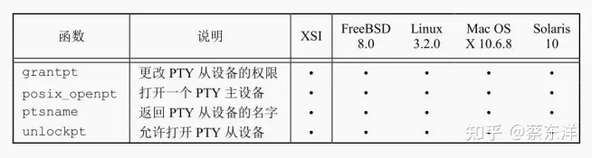

图19-8 XSI伪终端函数

ptym_open和ptys_open。ptym_open打开下一个可用的PTY主设备，ptys_open打开相应的从设备。

```c
#include "apue.h"
int ptym_open(char *pts_name, int pts_namesz);
// 返回值：若成功，返回PTY主设备文件描述符；若出错，返回-1
int ptys_open(char *pts_name);
// 返回值：若成功，返回PTY从设备文件描述符；若出错，返回-1
```

通常，不直接调用这两个函数，而是由函数 pty_fork（见 19.4 节）调用它们，并且还会fork出一个子进程。

ptym_open函数打开下一个可用的PTY主设备。调用者必须分配一个数组来存放主设备或从设备的名字，并且如果调用成功，相应的从设备名会通过pts_name返回。然后，这个名字传给用来打开该从设备的ptys_open函数。缓冲区的字节长度由pts_namesz传送，使得ptym_open函数不会复制比该缓冲区长的字符串。

在说明pty_fork函数之后，提供两个函数来打开这两个设备的原因将会很明显。通常，一个进程调用ptym_open来打开一个主设备并且得到从设备名。该进程然后fork子进程，子进程在调用setsid建立新的会话后调用ptys_open打开从设备。这就是从设备如何成为子进程控制终端的过程。

在Solaris中，打开从设备后，我们可能需要将3个STREAMS模块压入从设备的流中。伪终端仿真模块（ptem）和终端行规程模块（ldterm）合在一起像一个真正的终端一样工作。ttcompat提供了对早期系统（如V7、4BSD和Xenix）的ioctl调用的兼容性。这是一个可选的模块，但是因为对于网络登录，它是自动压入的，所以我们将它压入到从设备的流中。

也可能并不需要压入这3个模块，其原因是，它们可能已经位于流中。STREAMS系统支持一种称为autopush（自动压入）的工具，它允许系统管理员配置一张模块列表，只要打开一个特定设备，就将这些模块压入流中（详见Rago[1993]）。使用I_FIND ioctl命令观察ldterm是否已在流中。如果是，则认为该流已用autopush机制配置，这样就无需再压入相应模块。

Linux、Mac OS X和Solaris都遵循历史上System V的行为：如果调用者是一个还没有控制终端的会话首进程，这个打开（open）的调用会分配一个PTY从设备作为控制终端。如果不想让这种情况发生，可以在打开（open）时设置O_NOCTTY标志。然而，在FreeBSD中，打开PTY从设备不会产生分配其作为控制终端的副作用。

### 函数pty_fork

现在使用上一节介绍的两个函数ptym_open 和ptys_open来编写一个新函数，我们称之为pty_fork。这个新函数具有如下功能：用fork调用打开主设备和从设备，创建作为会话首进程的子进程并使其具有控制终端。

```c
#include "apue.h"
#include <termios.h>
pid_t pty_fork(int *ptrfdm, char *slave_name, int slave_namesz, const struct termios *slave_termios,const struct winsize *slave_winsize);
// 返回值：子进程中返回0；父进程中返回子进程的进程ID；若出错，返回−1
```

PTY主设备的文件描述符通过ptrfdm指针返回。

如果slave_name不为空，从设备名被存储在该指针指向的存储区中。调用者必须为该存储区分配空间。

如果指针slave_termios不为空，则系统使用该指针所引用的结构初始化从设备的终端行规程。如果该指针为空，那么系统将会把从设备的termios结构设置成实现定义的初始状态。类似地，如果slave_winsize指针不为空，那么按该指针所引用的结构初始化从设备的窗口大小。如果该指针为空，winsize结构通常被初始化为0。

### pty程序

编写pty程序的目的是用

```powershell
pty prog arg1 arg2
```

来代替

```powershell
prog arg1 arg2
```

当用pty来执行另一个程序时，那个程序在一个它自己的会话中执行，并和一个伪终端连接。

### 使用pty程序

- utmp文件
  除非utmp文件允许其他用户的写权限（这被认为是一个安全漏洞），否则一般使用伪终端的程序将不能对utmp文件进行写操作。
- 作业控制交互
  当我们使用pty来运行作业控制shell时，被这个新shell调用的作业决不会是任何孤儿进程组的成员，这是因为作业控制shell总是属于同一个会话。在这种情况下，键入的Ctrl+Z被发送到由shell调用的进程，而不是shell本身。
  让pty调用的进程能够处理作业控制信号的唯一的方法是：另外增加一个pty命令行标志，使pty子进程自己能够识别作业挂起字符（在pty子进程中），而不是让该字符穿越所有路程而到达另一个行规程模块。
- 检查长时间运行程序的输出
- script程序
- 运行协同进程
- 非交互地驱动交互式程序

### 高级特性

- 打包模式
  打包模式（packet mode）能够使PTY主设备了解到PTY从设备的状态变化。在Solaris系统中，可以通过将STREAMS模块pckt压入PTY主设备端来设置这种模式。图19-2显示了这种可选模块。在FreeBSD、Linux和Mac OS X中，可以用TIOCPKT ioctl命令来设置这种模式。 无论实现细节如何，打包模式的目的是，当PTY从设备上的行规程模块出现以下事件时，通知进程从PTY主设备读取数据：读队列被冲洗；写队列被冲洗，输出被停止（如Ctrl+S），输出重新开始，XON/XOFF 流控制被禁用后重新启用，XON/XOFF 流控制被启用后重新禁用。这些事件由rlogin客户进程和rlogind服务器进程使用。
- 远程模式
  PTY主设备可以用TIOCREMOTE ioctl命令将PTY从设备设置成远程模式。虽然FreeBSD、Mac OS X 10.6.8和Solaris 10使用同样的命令来启用或禁用这个特性，但是在Solaris中，ioctl的第三个参数是一个整型数，而在Mac OS X中则是一个指向整型数的指针。（FreeBSD 8.0和Linux 3.2.0不支持这一命令。）当PTY主设备将PTY从设备设置成这种模式时，它通知PTY从设备上的行规程模块对从主设备接收到的任何数据都不进行任何处理，不管从设备 termios 结构中的规范或非规范标志是否设置，都是这样。远程模式适用于窗口管理器这种进行自己的行编辑的应用程序。
- 窗口大小变化
  PTY主设备上的进程可以用TIOCSWINSZ ioctl命令来设置从设备的窗口大小。如果新的大小和当前的大小不同，SIGWINCH信号将被发送到PTY从设备的前台进程组。
- 信号发生
  读、写PTY主设备的进程可以向PTY从设备的进程组发送信号。在Solaris 10中，可以用TIOCSIGNAL ioctl命令做到这一点。在FreeBSD 8.0、Linux 3.2.0和 Mac OS X 10.6.8中，用TIOCSIG ioctl来做到这一点。在这两种情况下，第三个参数都是信号编号值。