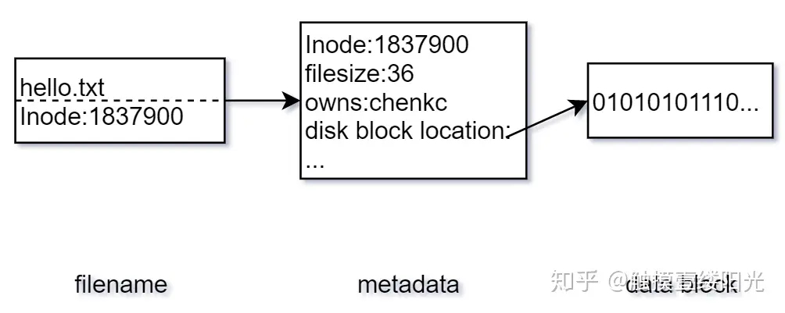
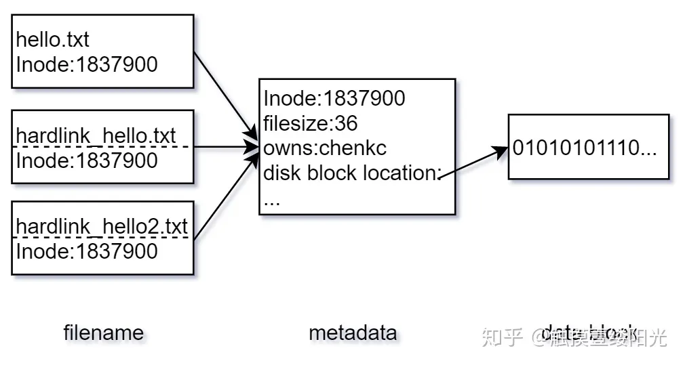
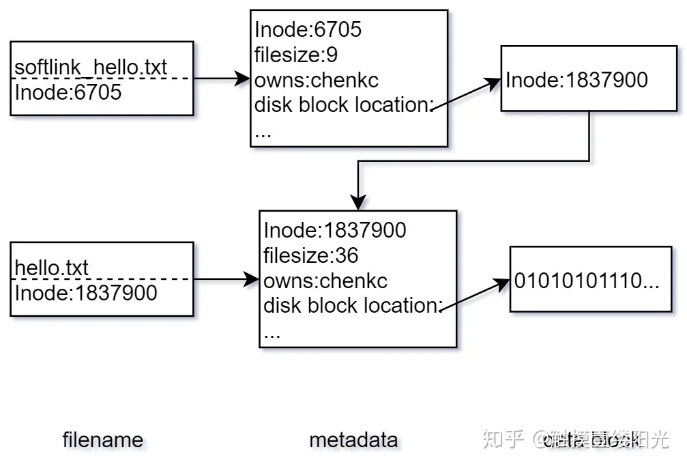
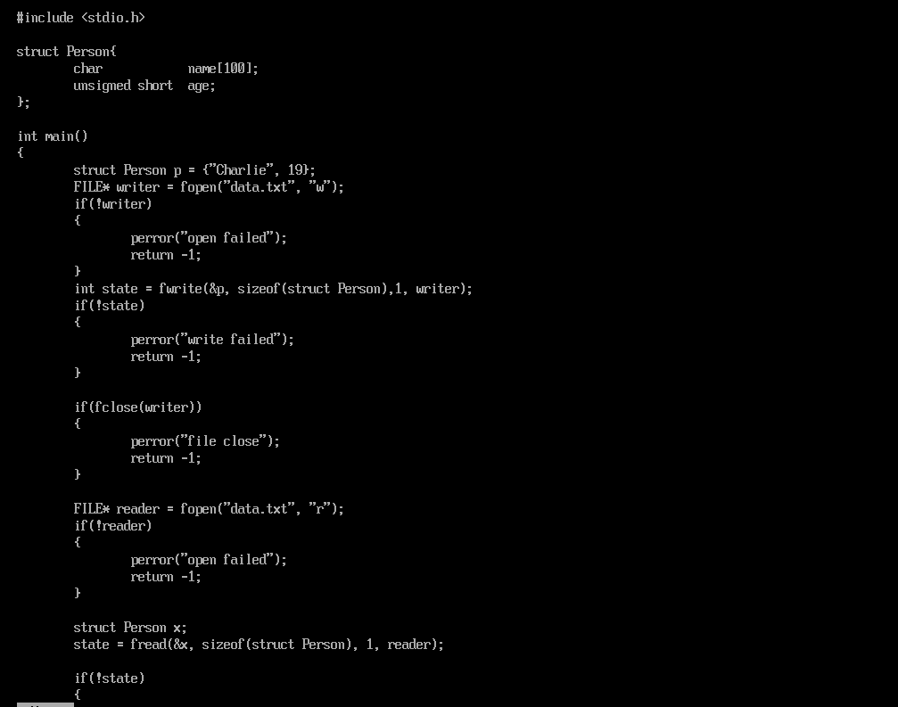
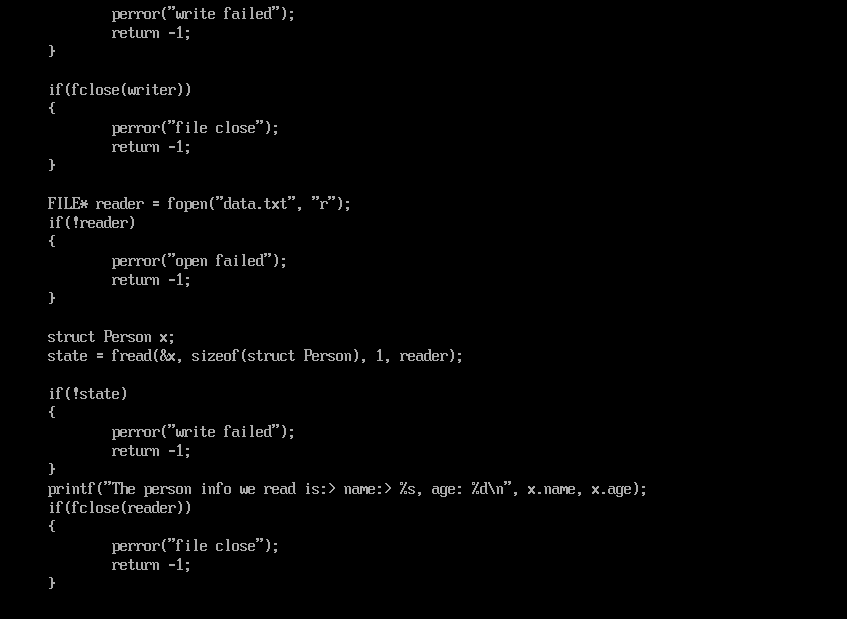
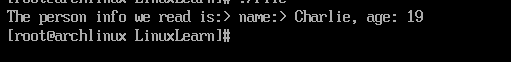

# 重新学习Linux系统1

​		这是一个回顾性质的博客，目的是重新更加系统的认识Linux操作系统，为后续的学习打下基础

## 文件，文件系统

​		文件是Linux下最重要，最基础的一个抽象：事实上，我们都知道一个名言：

> 一切皆文件

​		也就是说，我们在Linux系统层面上，往往都是将**内存块或者是设备等对象当成文件来进行处理和操作**。

​		文件必须要打开才能操作，打开文件的API是大多数人接触的第一个正式的API：`open`，我们看看man手册的说法：

```
int open(const char *pathname, ...);
```

​		文件的常见打开方式是：只读，只写，读写。在文件操作下分别对应了：

> O_RDONLY, 
>
> O_WRONLY, 
>
> O_RDWR

​		我们意识到, open这里返回的是一个整数。事实上，他就是我们的文件操作HANDLE，也就是说，一个句柄，我们使用这个整数来代表一个文件。文件描述符在用户空间内共享，我们就是使用一个文件描述符来完成对文件的操作。

### 经典普通文件

​		我们最常打交道的就是普通文件。其本质是**一串线性组织的字节流**。在Linux下，我们可以在合法的文件的任意的位置上开始读写，对文件的操作势必要从某一个字节开始，我们这下就认为这是文件的地址所在。

​		对于第一次打开文件，偏移量都是0。

​		**文件的偏移可以超出文件的大小！**这很重要，事实上，当我们给予OFFSET一个大于文件长度的值时，总是会在文件的后面补上0.当然，文件的最大长度是存在的，这个可以参考系统手册进行查询。

​		文件的长度是按照字节作为基本单位进行计算的——这个是任何熟悉Windows操作系统都应该感到熟悉的。我们可以使用`O_TRUNC`这样的Flag来截断文件的大小，注意——仍然可以超出文件的大小，这还是会在后面填补0.

​		文件可以被一个或者是多个线程同时打开！这点务必注意。同样的，也会返回在每个线程下的对应的文件ID。**用户对文件的访问顺序需要自己保证**，这点务必注意。

​		文件在高层的抽象上，是通过文件名称访问的。但是事实上标识文件的是——inode。也就是索引节点。inode是文件系统为文件分配的唯一的整数值。事实上，我们文件的抽象就是使用“映射”这个基本的思路，将文件与整数值进行标记匹配，整个文件系统是一颗大树。当我们想要解析一个路径的时候（无论是文件名还是怎样的），都是一层一层的抛开路径寻找一级一级的inode，最后将符合条件的文件句柄返回给我们用户。Linux系统自然遵循时间局部性原理，总是缓存路径。

### 目录和链接

​		我们有的时候不希望总是通过链接访问文件，而是希望像Windows快捷方式那样，使用链接的方式跳转。在Linux系统上显然可行。

​		我们先知道，可以将一系列文件关联在一个目录下构成一颗树。这样看，目录就是一个含有子节点的结点（子树），普通文件就是简单的叶子节点。

​		于是，诸如这种经典的目录：

```
/home/charliechen114514/Desktop
```

> PS: 可以使用realpath file.txt的方式查一个文件或者是目录的绝对路径

​		这个路径，是一个以`/`开头的路径，这就是一个绝对路径，而：

```
~/Desktop
./
../sth/Out.txt
```

​		这就是一个相对路径，因为他从当前出发，相对于自身而不是根的寻找其他文件。

#### 软硬连接

​		在 Linux 文件系统中，一个文件被分成两个部分：元数据（metadata）与用户数据（user data）。元数据为文件的附加属性，如索引节点（Inode）、文件大小、文件创建时间、文件所有者等。**元数据中并不包含文件名，文件名仅仅是为了方便用户使用。Linux 文件系统为每一个保存在磁盘分区中的文件（无论什么类型）都分配一个索引节点号（Inode Number），索引节点号是文件在一个文件系统中的唯一标识，不同文件所对应的索引节点号是不相同的；**用户数据，即文件数据块（data block），文件数据块中以二进制的形式记录着文件的真实内容。



如果想要查看对应文件的索引节点号可以使用`ls -i`指令：

```shell
(base) charliechen114514@charliechen114514-virtual-machine:~/Desktop$ echo "hello!" > hello.txt
(base) charliechen114514@charliechen114514-virtual-machine:~/Desktop$ cat hello.txt 
hello!
(base) charliechen114514@charliechen114514-virtual-machine:~/Desktop$ ls -i hello.txt 
7144359 hello.txt
```

#### **1. 硬链接**

在 Linux 中允许多个文件名指向同一个索引节点号，而硬链接（hard link, 也称链接）指的是通过索引节点号进行的链接。可以通过`ln`指令为文件创建硬链接：

```shell
ln 源文件 链接文件
```

我们下面马上试试看为 hello.txt 文件创建两个硬链接：

```shell
(base) charliechen114514@charliechen114514-virtual-machine:~/Desktop$ ln hello.txt hd_hello.txt
(base) charliechen114514@charliechen114514-virtual-machine:~/Desktop$ ln hello.txt hd_hello2.txt
(base) charliechen114514@charliechen114514-virtual-machine:~/Desktop$ ls -a
.  ..  hd_hello2.txt  hd_hello.txt  hello.txt  open.txt  scripts
(base) charliechen114514@charliechen114514-virtual-machine:~/Desktop$ ls -il 
总计 64
7144359 -rw-rw-r-- 3 charliechen114514 charliechen114514     7  1月  4 18:32 hd_hello2.txt
7144359 -rw-rw-r-- 3 charliechen114514 charliechen114514     7  1月  4 18:32 hd_hello.txt
7144359 -rw-rw-r-- 3 charliechen114514 charliechen114514     7  1月  4 18:32 hello.txt
```

​		索引节点号为文件的唯一标识，**因此源文件和硬链接文件是仅文件名不同的相同文件，创建文件的硬链接相当于为文件又起了一个新的文件名。**



```shell
(base) charliechen114514@charliechen114514-virtual-machine:~/Desktop$ cat hello.txt 
hello!
(base) charliechen114514@charliechen114514-virtual-machine:~/Desktop$ cat hd_hello.txt 
hello!
(base) charliechen114514@charliechen114514-virtual-machine:~/Desktop$ cat hd_hello2.txt 
hello!
```

​		执行`ls -il`指令后发现在表示文件类型以及权限的 10 个字符之后有一个数字 3，对于文件来说 3 表示硬链接数，每一个硬链接数都可以看成是文件的一个文件名

​		假设我们现在删除硬链接对应的源文件 hello.txt：

```shell
(base) charliechen114514@charliechen114514-virtual-machine:~/Desktop$ rm hello.txt 
(base) charliechen114514@charliechen114514-virtual-machine:~/Desktop$ cat hd_hello.txt 
hello!
(base) charliechen114514@charliechen114514-virtual-machine:~/Desktop$ cat hd_hello2.txt 
hello!
```

​		**如果删除硬链接对应的源文件，硬链接文件仍然存在，这是因为硬链接是有着相同索引节点号仅文件名不同的文件，因此，删除一个硬链接文件并不影响其他有相同索引节点号的文件。我们可以为重要的文件创建硬链接，这样即使错误操作误删了文件，也不会重要文件造成影响。**

​		当文件没有任何文件名指向的时候，文件也会被删除，也就是此时的硬链接数为 0。硬链接相当于为文件创建了一个新的文件名，当删除其中一个链接的时候并不影响索引节点本身以及其它链接到该索引节点的文件名，**所以这些链接是相对独立的，这也是为什么 Linux 中仅仅标识文件硬链接的数目，并没有显示的标识文件是否为硬链接文件的原因。**

#### **2. 软链接**

软链接（也称符号链接）可以看成是一个普通的文件，**只不过这个文件中的数据块存放的是源文件的索引节点号。**可以通过为`ln`指令添加`-s`（s: soft 的意思）选项创建软链接：

```shell
ln -s 源文件 链接文件
```

为 hello.txt 文件创建一个软链接：

```shell
(base) charliechen114514@charliechen114514-virtual-machine:~/Desktop$ echo "hello!" > hello.txt
(base) charliechen114514@charliechen114514-virtual-machine:~/Desktop$ ln -s hello.txt sl_hello.txt
(base) charliechen114514@charliechen114514-virtual-machine:~/Desktop$ ls -il
总计 8
7144355 -rw-rw-r-- 1 charliechen114514 charliechen114514    7  1月  4 18:40 hello.txt
7144356 lrwxrwxrwx 1 charliechen114514 charliechen114514    9  1月  4 18:40 sl_hello.txt -> hello.txt
```

​		源文件的索引节点号为 1837900，而软链接文件的索引节点号为 6705，显然源文件和软链接文件并不是同一个文件，其实从两个文件的大小也可以看出来，其中源文件大小为 36 个字节，而软链接文件大小仅仅为 9 个字节。



​		软链接文件的数据块中仅仅存放着源文件的索引节点号，这也是为什么源文件为 36 个字节，而软链接文件却有 9 个字节的原因。**由于软链接只不过是数据块中存放了源文件的索引节点号，因此删除软链接文件并不会影响源文件。但是如果删除源文件，由于软链接文件中指向的索引节点号对应的文件没有了，所以会导致软链接文件失效。**

```shell
(base) charliechen114514@charliechen114514-virtual-machine:~/Desktop$ rm sl_hello.txt 
(base) charliechen114514@charliechen114514-virtual-machine:~/Desktop$ cat hello.txt 
hello!
(base) charliechen114514@charliechen114514-virtual-machine:~/Desktop$ ln -s hello.txt sl_hello.txt
(base) charliechen114514@charliechen114514-virtual-machine:~/Desktop$ rm hello.txt 
(base) charliechen114514@charliechen114514-virtual-machine:~/Desktop$ cat sl_hello.txt 
cat: sl_hello.txt: 没有那个文件或目录
```

​		软链接不同于硬链接，在软链接中删除源文件会影响到软链接的使用，因此在 Linux 中会有很多地方标识文件是否为软链接：

- `ls -l`指令输出的文件，其中十个字符中的第一个字符代表文件类型，如果文件为软链接文件则为`l`；
- Linux 会使用特殊的颜色将软链接文件与其它文件进行区分，如果删除了源文件，软链接失效则软链接文件也会呈现失效的颜色；

​		注意：如果软链接文件和源文件不在同一个目录，源文件要使用绝对路径，不能使用相对路径。

#### **3. 硬链接和软链接的区别**

最后来简单总结一下硬链接和软链接的区别：


### 特殊文件

​		我们下面就是要将到的是特殊文件，事实上他们是内核对象的一种以文件形式表达的抽象——或者说，我们以文件的视角来看待这些内核对象。

​		常见的是一些设备，我们可以对设备进行IO流处理。

> 经典的UNIX设备分为两大组：字符设备和块设备。

​		字符设备的代表可以是键盘。我们敲击键盘向计算机系统发送字符。这就是字符设备。对于那些没有发出字符时，设备返回EOF。在计算机的抽象层面上，不存在字符的漏读和乱序的阅读。

​		块设备指代的是字符数组块来进行阅读。设备驱动会把字节映射到可以寻址的设备上，这样用户就可以按照任意的顺序访问设备。

​		管道，或者说是FIFO，是一个常用于进程通讯的文件。一个普通的管道总是将一个程序的输出作为另一个程序的输入：

```
echo "What about pipes in Linux?" > communication.txt
```

​		这个例子就是使用了管道的功能。他会把我们的字符串送到`communication.txt`里去。现在就可以试试：

```
cat communication.txt
What about pipes in Linux?
```

​		Socket，也就是套接字，我自己首次接触是在unix网络编程那里，学习到的第一个API就是`socket`，当然和我们这里讨论的socket不是一个层级的东西。当然，事实上在广义层面上是进程间的高级形式。

### 文件系统和命名空间

> ​		定义文件系统是一个合理有效的层次结构组织的文件和目录的集合。当我们给全局的命名空间下添加与删除文件系统的时候，实质上就是叫“挂载”和“卸载”文件系统`(mount and unmount)`，如你所见，这就是Linux的挂载和卸载文件系统的经典指令。

​		我们一般认为文件系统都是客观存在的物理介质的抽象。但实际上Linux支持虚拟文件系统，比如说其他的网络文件系统等。

​		块设备的最小寻址单元被称为扇区。扇区是设备的一个物理属性。一般而言是2的整数次方，最常见的取到的是512字节。

​		而文件系统的最小逻辑单元是块：大小是2的整数次方个扇区大小。Linux中必须保证块的大小小于页的大小（否则没法单次映射进入MMU导致操作次数不对等）

## 进程

​		这里是OS的概念了。《现代操作系统》认为进程是正在活动的程序。或者说是正在被中央处理器执行代码段。这里我们袭用这样的概念。

​		进程的生命周期是从可执行的目标代码开始。在Linux下一般是ELF格式构成。这样的文件为了方便运行需要文件内分段（早在产生文件的时候就分好了，无需你的操心）。一般的——这些可执行文件包含

> 文本段：.text
>
> 数据段：.data
>
> BSS段：.bss（现代编译器将那些未被初始化的全局变量存放到这里，当被初始化时将会动态的移除插入到数据段中）

​		进程作为运行的代码和机器指令的抽象，其切换由OS组织完成，由硬件执行，让每一个进程都感觉自己在独一无二的占用CPU（这里在内存上采用虚拟内存分配，将虚拟内存通过页表解析拿到虚拟地址，其结果交给MMU内存管理单元处理映射得到正确的，进程切换上可能交给tss处理，也可能时操作系统代之在系统软件层面上完成切换时的备份）

### 线程

​		现代计算机下：进程退化为系统分配给打算运行或者是正在运行的程序的资源分配的最小单元。那些只有一个线程的程序是单线程程序，而多线程程序的定义那就显而易见了。

​		Linux下则是复用了进程的资源定义，在内存资源上尽可能少的做必要的拷贝。所以Linux对系统级的线程本质上是复用了进程的API。

### 进程层次结构

​		Linux的进程组成了一颗进程树，也就是说，我们可以通过封装经典B树的API来封装产生交流子进程和父进程的API。这也就使得我们可以管理每一个进程，对于第一个进程init，他是一切进程的父进程（看看main.c的代码就知道了，其余的console等进程都是派生自init进程），那些孤儿进程当无人收养时则会被拉近init进程当孩子。

## 用户和组

​		Linux通过用户和组来进行权限认证，每一个用户都会使用唯一一个正整树进行标识。每一个进程都会与一个uid相联。也就是说，我们认为这个进程就是由这个uid发起的请求而运行的。

​		root权限的uid是0。root作为超级用户可以执行几乎所有的权限。

### 权限问题

​		我们使用一个九位的二进制数描述一个文件的权限：

```
_ _ _ _ _ _ _ _ _
| | | | | | | | |---针对所有用户可执行否？ 
| | | | | | | |-----针对所有用户可写否?	
| | | | | | |-------针对所有用户可读否?
| | | | | |---------针对用户所在组可执行否?
| | | | |-----------针对用户所在组可写否？
| | | |-------------针对用户所在组可读否?
| | |---------------针对用户本身可执行否？
| |-----------------针对用户本身可写否？
| ------------------针对用户本身可写否？
```

​		1标识的是真，0标识的是假。所以我们就会使用一个三位的数字：_ _ _来标识权限：

```
-rw------- (600)    只有拥有者有读写权限。
-rw-r--r-- (644)    只有拥有者有读写权限；而属组用户和其他用户只有读权限。
-rwx------ (700)    只有拥有者有读、写、执行权限。
-rwxr-xr-x (755)    拥有者有读、写、执行权限；而属组用户和其他用户只有读、执行权限。
-rwx--x--x (711)    拥有者有读、写、执行权限；而属组用户和其他用户只有执行权限。
-rw-rw-rw- (666)    所有用户都有文件读、写权限。
-rwxrwxrwx (777)    所有用户都有读、写、执行权限。
```

## 信号

​		信号是一个单向的异步通知——也就是说，只有接收方可以知道接受了什么信号，但是不知道发出方从何而来。当进程受到信号时会立即停下手中事情，转向处理信号。SIGKILL就是这样终止一个进程的！

## 错误处理和常见的错误预定义

​		参见附录的errno

​		我们这里给出一些重要的函数：

```C++
#include <stdio.h>
/* 立即向stderr发出输出错误信息 */
void perror (const char* str);
/* 返回由errnum给出的人可读的错误信息 */
char* strerror(int errnum);
/* 返回由errnum给出的人可读的错误信息，这个函数是线程安全的 */
char* strerror_r(int errnum, char* buf, size_t len);
```

​	由于errno的全局性，请务必保证自己获取errno的时候马上要拷贝一份值而不是不做备份直接使用！

## 附录

### open

> ```shell
> man 2 open
> ```

```text
OPEN(2)                    Linux Programmer's Manual                   OPEN(2)

NAME
       open, openat, creat - open and possibly create a file

SYNOPSIS
       #include <sys/types.h>
       #include <sys/stat.h>
       #include <fcntl.h>

       int open(const char *pathname, int flags);
       int open(const char *pathname, int flags, mode_t mode);

       int creat(const char *pathname, mode_t mode);

       int openat(int dirfd, const char *pathname, int flags);
       int openat(int dirfd, const char *pathname, int flags, mode_t mode);

       /* Documented separately, in openat2(2): */
       int openat2(int dirfd, const char *pathname,
                   const struct open_how *how, size_t size);

   Feature Test Macro Requirements for glibc (see feature_test_macros(7)):

       openat():
           Since glibc 2.10:
               _POSIX_C_SOURCE >= 200809L
           Before glibc 2.10:
               _ATFILE_SOURCE

DESCRIPTION
       The  open()  system  call opens the file specified by pathname.  If the
       specified file does not exist, it may optionally (if O_CREAT is  speci‐
       fied in flags) be created by open().

       The  return  value of open() is a file descriptor, a small, nonnegative
       integer that is used in subsequent  system  calls  (read(2),  write(2),
       lseek(2), fcntl(2), etc.) to refer to the open file.  The file descrip‐
       tor returned by a successful call will be the lowest-numbered file  de‐
       scriptor not currently open for the process.

       By default, the new file descriptor is set to remain open across an ex‐
       ecve(2) (i.e., the FD_CLOEXEC file descriptor  flag  described  in  fc‐
       ntl(2) is initially disabled); the O_CLOEXEC flag, described below, can
       be used to change this default.  The file offset is set to  the  begin‐
       ning of the file (see lseek(2)).

       A  call  to open() creates a new open file description, an entry in the
       system-wide table of open files.  The open file description records the
       file  offset  and the file status flags (see below).  A file descriptor
       is a reference to an open file description;  this  reference  is  unaf‐
       fected  if  pathname  is subsequently removed or modified to refer to a
       different file.  For further details on  open  file  descriptions,  see
       NOTES.

       The  argument  flags  must  include  one of the following access modes:
       O_RDONLY, O_WRONLY, or O_RDWR.  These request opening  the  file  read-
       only, write-only, or read/write, respectively.

       In addition, zero or more file creation flags and file status flags can
       be bitwise-or'd in flags.   The  file  creation  flags  are  O_CLOEXEC,
       O_CREAT,  O_DIRECTORY,  O_EXCL,  O_NOCTTY,  O_NOFOLLOW,  O_TMPFILE, and
       O_TRUNC.  The file status flags are all of the remaining  flags  listed
       below.   The  distinction between these two groups of flags is that the
       file creation flags affect the semantics of the open operation  itself,
       while  the file status flags affect the semantics of subsequent I/O op‐
       erations.  The file status flags can be retrieved and (in  some  cases)
       modified; see fcntl(2) for details.

       The  full  list of file creation flags and file status flags is as fol‐
       lows:

       O_APPEND
              The file is opened in append mode.  Before  each  write(2),  the
              file  offset  is  positioned  at the end of the file, as if with
              lseek(2).  The modification of the file offset and the write op‐
              eration are performed as a single atomic step.

              O_APPEND  may lead to corrupted files on NFS filesystems if more
              than one process appends data to a file at once.   This  is  be‐
              cause  NFS  does  not support appending to a file, so the client
              kernel has to simulate it, which can't be done  without  a  race
              condition.

       O_ASYNC
              Enable  signal-driven  I/O: generate a signal (SIGIO by default,
              but this can be changed via fcntl(2)) when input or  output  be‐
              comes  possible on this file descriptor.  This feature is avail‐
              able only for terminals, pseudoterminals,  sockets,  and  (since
              Linux  2.6)  pipes and FIFOs.  See fcntl(2) for further details.
              See also BUGS, below.

       O_CLOEXEC (since Linux 2.6.23)
              Enable the close-on-exec  flag  for  the  new  file  descriptor.
              Specifying  this  flag permits a program to avoid additional fc‐
              ntl(2) F_SETFD operations to set the FD_CLOEXEC flag.

              Note that the use of this  flag  is  essential  in  some  multi‐
              threaded programs, because using a separate fcntl(2) F_SETFD op‐
              eration to set the FD_CLOEXEC flag does  not  suffice  to  avoid
              race conditions where one thread opens a file descriptor and at‐
              tempts to set its close-on-exec flag using fcntl(2) at the  same
              time as another thread does a fork(2) plus execve(2).  Depending
              on the order of execution, the race may lead  to  the  file  de‐
              scriptor  returned by open() being unintentionally leaked to the
              program executed by the child process created by fork(2).  (This
              kind  of  race is in principle possible for any system call that
              creates a file descriptor whose  close-on-exec  flag  should  be
              set,  and various other Linux system calls provide an equivalent
              of the O_CLOEXEC flag to deal with this problem.)

       O_CREAT
              If pathname does not exist, create it as a regular file.

              The owner (user ID) of the new file is set to the effective user
              ID of the process.

              The  group ownership (group ID) of the new file is set either to
              the effective group ID of the process (System V semantics) or to
              the group ID of the parent directory (BSD semantics).  On Linux,
              the behavior depends on whether the set-group-ID mode bit is set
              on  the parent directory: if that bit is set, then BSD semantics
              apply; otherwise, System V semantics apply.  For  some  filesys‐
              tems,  the behavior also depends on the bsdgroups and sysvgroups
              mount options described in mount(8).

              The mode argument specifies the file mode  bits  to  be  applied
              when a new file is created.  If neither O_CREAT nor O_TMPFILE is
              specified in flags, then mode is ignored (and can thus be speci‐
              fied  as  0, or simply omitted).  The mode argument must be sup‐
              plied if O_CREAT or O_TMPFILE is specified in flags;  if  it  is
              not  supplied,  some  arbitrary bytes from the stack will be ap‐
              plied as the file mode.

              The effective mode is modified by the  process's  umask  in  the
              usual way: in the absence of a default ACL, the mode of the cre‐
              ated file is (mode & ~umask).

              Note that mode applies only to future accesses of the newly cre‐
              ated  file;  the  open()  call that creates a read-only file may
              well return a read/write file descriptor.

              The following symbolic constants are provided for mode:

              S_IRWXU  00700 user (file owner) has read,  write,  and  execute
                       permission

              S_IRUSR  00400 user has read permission

              S_IWUSR  00200 user has write permission

              S_IXUSR  00100 user has execute permission

              S_IRWXG  00070 group has read, write, and execute permission

              S_IRGRP  00040 group has read permission

              S_IWGRP  00020 group has write permission

              S_IXGRP  00010 group has execute permission

              S_IRWXO  00007 others have read, write, and execute permission

              S_IROTH  00004 others have read permission

              S_IWOTH  00002 others have write permission

              S_IXOTH  00001 others have execute permission

              According  to  POSIX, the effect when other bits are set in mode
              is unspecified.  On Linux, the following bits are  also  honored
              in mode:

              S_ISUID  0004000 set-user-ID bit

              S_ISGID  0002000 set-group-ID bit (see inode(7)).

              S_ISVTX  0001000 sticky bit (see inode(7)).

       O_DIRECT (since Linux 2.4.10)
              Try  to minimize cache effects of the I/O to and from this file.
              In general this will degrade performance, but it  is  useful  in
              special  situations,  such  as  when  applications  do their own
              caching.  File I/O is done directly to/from user-space  buffers.
              The  O_DIRECT  flag  on its own makes an effort to transfer data
              synchronously, but does not give the guarantees  of  the  O_SYNC
              flag that data and necessary metadata are transferred.  To guar‐
              antee synchronous I/O, O_SYNC must be used in addition to  O_DI‐
              RECT.  See NOTES below for further discussion.

              A  semantically similar (but deprecated) interface for block de‐
              vices is described in raw(8).

       O_DIRECTORY
              If pathname is not a directory, cause the open  to  fail.   This
              flag  was  added  in kernel version 2.1.126, to avoid denial-of-
              service problems if opendir(3) is called on a FIFO or  tape  de‐
              vice.

       O_DSYNC
              Write  operations on the file will complete according to the re‐
              quirements of synchronized I/O data integrity completion.

              By the time write(2) (and similar) return, the output  data  has
              been transferred to the underlying hardware, along with any file
              metadata that would be required to retrieve that data (i.e.,  as
              though  each  write(2)  was followed by a call to fdatasync(2)).
              See NOTES below.

       O_EXCL Ensure that this call creates the file: if this flag  is  speci‐
              fied  in  conjunction with O_CREAT, and pathname already exists,
              then open() fails with the error EEXIST.

              When these two flags are specified, symbolic links are not  fol‐
              lowed: if pathname is a symbolic link, then open() fails regard‐
              less of where the symbolic link points.

              In general, the behavior of O_EXCL is undefined if  it  is  used
              without  O_CREAT.   There  is  one  exception:  on Linux 2.6 and
              later, O_EXCL can be used without O_CREAT if pathname refers  to
              a  block  device.   If  the block device is in use by the system
              (e.g., mounted), open() fails with the error EBUSY.

              On NFS, O_EXCL is supported only when using NFSv3  or  later  on
              kernel  2.6  or later.  In NFS environments where O_EXCL support
              is not provided, programs that rely on it for performing locking
              tasks  will  contain  a  race condition.  Portable programs that
              want to perform atomic file locking using a lockfile,  and  need
              to avoid reliance on NFS support for O_EXCL, can create a unique
              file on the same filesystem (e.g.,  incorporating  hostname  and
              PID),  and  use  link(2)  to  make  a  link to the lockfile.  If
              link(2) returns 0,  the  lock  is  successful.   Otherwise,  use
              stat(2)  on  the  unique file to check if its link count has in‐
              creased to 2, in which case the lock is also successful.

       O_LARGEFILE
              (LFS) Allow files whose sizes cannot be represented in an  off_t
              (but  can  be  represented  in  an  off64_t)  to be opened.  The
              _LARGEFILE64_SOURCE macro must be defined (before including  any
              header  files)  in order to obtain this definition.  Setting the
              _FILE_OFFSET_BITS feature test macro to 64  (rather  than  using
              O_LARGEFILE) is the preferred method of accessing large files on
              32-bit systems (see feature_test_macros(7)).

       O_NOATIME (since Linux 2.6.8)
              Do not update the file last access time (st_atime in the  inode)
              when the file is read(2).

              This  flag  can  be employed only if one of the following condi‐
              tions is true:

              *  The effective UID of the process matches the owner UID of the
                 file.

              *  The calling process has the CAP_FOWNER capability in its user
                 namespace and the owner UID of the file has a mapping in  the
                 namespace.

              This  flag  is  intended for use by indexing or backup programs,
              where its use can significantly reduce the amount of disk activ‐
              ity.   This  flag  may not be effective on all filesystems.  One
              example is NFS, where the server maintains the access time.

       O_NOCTTY
              If pathname refers to a terminal device—see tty(4)—it  will  not
              become  the  process's  controlling terminal even if the process
              does not have one.

       O_NOFOLLOW
              If the trailing component (i.e., basename) of pathname is a sym‐
              bolic link, then the open fails, with the error ELOOP.  Symbolic
              links in earlier components of the pathname will still  be  fol‐
              lowed.   (Note  that the ELOOP error that can occur in this case
              is indistinguishable from the case where an open  fails  because
              there  are  too many symbolic links found while resolving compo‐
              nents in the prefix part of the pathname.)

              This flag is a FreeBSD extension, which was added  to  Linux  in
              version  2.1.126,  and  has  subsequently  been  standardized in
              POSIX.1-2008.

              See also O_PATH below.

       O_NONBLOCK or O_NDELAY
              When possible, the file is opened in nonblocking mode.   Neither
              the  open()  nor  any  subsequent I/O operations on the file de‐
              scriptor which is returned will cause  the  calling  process  to
              wait.

              Note  that  the setting of this flag has no effect on the opera‐
              tion of poll(2), select(2), epoll(7), and similar,  since  those
              interfaces  merely  inform  the  caller about whether a file de‐
              scriptor is "ready", meaning that an I/O operation performed  on
              the  file  descriptor  with  the O_NONBLOCK flag clear would not
              block.

              Note that this flag has no effect for regular  files  and  block
              devices;  that  is, I/O operations will (briefly) block when de‐
              vice activity is required, regardless of whether  O_NONBLOCK  is
              set.   Since  O_NONBLOCK  semantics  might  eventually be imple‐
              mented, applications should not depend  upon  blocking  behavior
              when specifying this flag for regular files and block devices.

              For  the handling of FIFOs (named pipes), see also fifo(7).  For
              a discussion of the effect of  O_NONBLOCK  in  conjunction  with
              mandatory file locks and with file leases, see fcntl(2).

       O_PATH (since Linux 2.6.39)
              Obtain  a  file descriptor that can be used for two purposes: to
              indicate a location in the filesystem tree and to perform opera‐
              tions  that  act  purely at the file descriptor level.  The file
              itself is not opened, and other file operations (e.g.,  read(2),
              write(2), fchmod(2), fchown(2), fgetxattr(2), ioctl(2), mmap(2))
              fail with the error EBADF.

              The following operations can be performed on the resulting  file
              descriptor:

              *  close(2).

              *  fchdir(2),  if  the  file  descriptor  refers  to a directory
                 (since Linux 3.5).

              *  fstat(2) (since Linux 3.6).

              *  fstatfs(2) (since Linux 3.12).

              *  Duplicating the file descriptor  (dup(2),  fcntl(2)  F_DUPFD,
                 etc.).

              *  Getting  and  setting file descriptor flags (fcntl(2) F_GETFD
                 and F_SETFD).

              *  Retrieving open file status flags using the fcntl(2)  F_GETFL
                 operation: the returned flags will include the bit O_PATH.

              *  Passing the file descriptor as the dirfd argument of openat()
                 and the other "*at()" system calls.  This includes  linkat(2)
                 with  AT_EMPTY_PATH  (or  via procfs using AT_SYMLINK_FOLLOW)
                 even if the file is not a directory.

              *  Passing the file descriptor to another process via a UNIX do‐
                 main socket (see SCM_RIGHTS in unix(7)).

              When  O_PATH  is  specified  in  flags,  flag  bits  other  than
              O_CLOEXEC, O_DIRECTORY, and O_NOFOLLOW are ignored.

              Opening a file or directory with the  O_PATH  flag  requires  no
              permissions  on the object itself (but does require execute per‐
              mission on the directories in the path  prefix).   Depending  on
              the  subsequent operation, a check for suitable file permissions
              may be performed (e.g., fchdir(2) requires execute permission on
              the  directory referred to by its file descriptor argument).  By
              contrast, obtaining a reference to a filesystem object by  open‐
              ing it with the O_RDONLY flag requires that the caller have read
              permission on the object, even  when  the  subsequent  operation
              (e.g.,  fchdir(2), fstat(2)) does not require read permission on
              the object.

              If pathname is a symbolic link and the O_NOFOLLOW flag  is  also
              specified,  then the call returns a file descriptor referring to
              the symbolic link.  This file descriptor  can  be  used  as  the
              dirfd  argument  in calls to fchownat(2), fstatat(2), linkat(2),
              and readlinkat(2) with an empty pathname to have the calls oper‐
              ate on the symbolic link.

              If  pathname  refers to an automount point that has not yet been
              triggered, so no other filesystem is mounted  on  it,  then  the
              call returns a file descriptor referring to the automount direc‐
              tory without triggering a mount.  fstatfs(2) can then be used to
              determine  if  it  is,  in  fact, an untriggered automount point
              (.f_type == AUTOFS_SUPER_MAGIC).

              One use of O_PATH for regular files is to provide the equivalent
              of  POSIX.1's  O_EXEC  functionality.  This permits us to open a
              file for which we have execute permission but not  read  permis‐
              sion,  and then execute that file, with steps something like the
              following:

                  char buf[PATH_MAX];
                  fd = open("some_prog", O_PATH);
                  snprintf(buf, PATH_MAX, "/proc/self/fd/%d", fd);
                  execl(buf, "some_prog", (char *) NULL);

              An O_PATH file descriptor can also be passed as the argument  of
              fexecve(3).

       O_SYNC Write  operations on the file will complete according to the re‐
              quirements of synchronized I/O  file  integrity  completion  (by
              contrast  with  the  synchronized  I/O data integrity completion
              provided by O_DSYNC.)

              By the time write(2) (or similar) returns, the output  data  and
              associated file metadata have been transferred to the underlying
              hardware (i.e., as though each write(2) was followed by  a  call
              to fsync(2)).  See NOTES below.

       O_TMPFILE (since Linux 3.11)
              Create an unnamed temporary regular file.  The pathname argument
              specifies a directory; an unnamed inode will be created in  that
              directory's  filesystem.  Anything written to the resulting file
              will be lost when the last file descriptor is closed, unless the
              file is given a name.

              O_TMPFILE  must be specified with one of O_RDWR or O_WRONLY and,
              optionally, O_EXCL.  If O_EXCL is not specified, then  linkat(2)
              can be used to link the temporary file into the filesystem, mak‐
              ing it permanent, using code like the following:

                  char path[PATH_MAX];
                  fd = open("/path/to/dir", O_TMPFILE | O_RDWR,
                                          S_IRUSR | S_IWUSR);

                  /* File I/O on 'fd'... */

                  linkat(fd, NULL, AT_FDCWD, "/path/for/file", AT_EMPTY_PATH);

                  /* If the caller doesn't have the CAP_DAC_READ_SEARCH
                     capability (needed to use AT_EMPTY_PATH with linkat(2)),
                     and there is a proc(5) filesystem mounted, then the
                     linkat(2) call above can be replaced with:

                  snprintf(path, PATH_MAX,  "/proc/self/fd/%d", fd);
                  linkat(AT_FDCWD, path, AT_FDCWD, "/path/for/file",
                                          AT_SYMLINK_FOLLOW);
                  */

              In this case, the open() mode argument determines the file  per‐
              mission mode, as with O_CREAT.

              Specifying  O_EXCL in conjunction with O_TMPFILE prevents a tem‐
              porary file from being linked into the filesystem in  the  above
              manner.   (Note  that the meaning of O_EXCL in this case is dif‐
              ferent from the meaning of O_EXCL otherwise.)

              There are two main use cases for O_TMPFILE:

              *  Improved tmpfile(3) functionality: race-free creation of tem‐
                 porary  files that (1) are automatically deleted when closed;
                 (2) can never be reached via any pathname; (3) are  not  sub‐
                 ject to symlink attacks; and (4) do not require the caller to
                 devise unique names.

              *  Creating a file that is initially invisible,  which  is  then
                 populated with data and adjusted to have appropriate filesys‐
                 tem attributes  (fchown(2),  fchmod(2),  fsetxattr(2),  etc.)
                 before being atomically linked into the filesystem in a fully
                 formed state (using linkat(2) as described above).

              O_TMPFILE requires support by the underlying filesystem; only  a
              subset  of  Linux filesystems provide that support.  In the ini‐
              tial implementation, support was provided  in  the  ext2,  ext3,
              ext4,  UDF,  Minix,  and  shmem  filesystems.  Support for other
              filesystems has subsequently been added as follows:  XFS  (Linux
              3.15);  Btrfs  (Linux 3.16); F2FS (Linux 3.16); and ubifs (Linux
              4.9)

       O_TRUNC
              If the file already exists and is a regular file and the  access
              mode  allows  writing  (i.e.,  is O_RDWR or O_WRONLY) it will be
              truncated to length 0.  If the file is a FIFO or terminal device
              file,  the  O_TRUNC  flag  is ignored.  Otherwise, the effect of
              O_TRUNC is unspecified.

   creat()
       A call to creat() is equivalent to calling open() with flags  equal  to
       O_CREAT|O_WRONLY|O_TRUNC.

   openat()
       The  openat()  system  call operates in exactly the same way as open(),
       except for the differences described here.

       If the pathname given in pathname is relative, then it  is  interpreted
       relative  to  the  directory  referred  to by the file descriptor dirfd
       (rather than relative to the current working directory of  the  calling
       process, as is done by open() for a relative pathname).

       If  pathname  is relative and dirfd is the special value AT_FDCWD, then
       pathname is interpreted relative to the current  working  directory  of
       the calling process (like open()).

       If pathname is absolute, then dirfd is ignored.

   openat2(2)
       The  openat2(2) system call is an extension of openat(), and provides a
       superset of the features of openat().  It is documented separately,  in
       openat2(2).

RETURN VALUE
       open(), openat(), and creat() return the new file descriptor (a nonneg‐
       ative integer), or -1 if an error occurred (in which case, errno is set
       appropriately).

ERRORS
       open(), openat(), and creat() can fail with the following errors:

       EACCES The  requested access to the file is not allowed, or search per‐
              mission is denied for one of the directories in the path  prefix
              of  pathname,  or the file did not exist yet and write access to
              the parent directory is not  allowed.   (See  also  path_resolu‐
              tion(7).)

       EACCES Where   O_CREAT   is  specified,  the  protected_fifos  or  pro‐
              tected_regular sysctl is enabled, the file already exists and is
              a  FIFO  or  regular  file, the owner of the file is neither the
              current user nor the owner of the containing directory, and  the
              containing  directory  is  both  world-  or  group-writable  and
              sticky.  For details, see the descriptions of  /proc/sys/fs/pro‐
              tected_fifos and /proc/sys/fs/protected_regular in proc(5).

       EBUSY  O_EXCL was specified in flags and pathname refers to a block de‐
              vice that is in use by the system (e.g., it is mounted).

       EDQUOT Where O_CREAT is specified, the file does  not  exist,  and  the
              user's quota of disk blocks or inodes on the filesystem has been
              exhausted.

       EEXIST pathname already exists and O_CREAT and O_EXCL were used.

       EFAULT pathname points outside your accessible address space.

       EFBIG  See EOVERFLOW.

       EINTR  While blocked waiting to complete  an  open  of  a  slow  device
              (e.g.,  a FIFO; see fifo(7)), the call was interrupted by a sig‐
              nal handler; see signal(7).

       EINVAL The filesystem does not support the O_DIRECT  flag.   See  NOTES
              for more information.

       EINVAL Invalid value in flags.

       EINVAL O_TMPFILE  was  specified  in  flags,  but  neither O_WRONLY nor
              O_RDWR was specified.

       EINVAL O_CREAT was specified in flags and the final  component  ("base‐
              name")  of the new file's pathname is invalid (e.g., it contains
              characters not permitted by the underlying filesystem).

       EINVAL The final component ("basename") of pathname is  invalid  (e.g.,
              it  contains characters not permitted by the underlying filesys‐
              tem).

       EISDIR pathname refers to a directory and the access requested involved
              writing (that is, O_WRONLY or O_RDWR is set).

       EISDIR pathname  refers  to an existing directory, O_TMPFILE and one of
              O_WRONLY or O_RDWR were specified in flags, but this kernel ver‐
              sion does not provide the O_TMPFILE functionality.

       ELOOP  Too many symbolic links were encountered in resolving pathname.

       ELOOP  pathname was a symbolic link, and flags specified O_NOFOLLOW but
              not O_PATH.

       EMFILE The per-process limit on the number of open file descriptors has
              been  reached  (see  the  description  of RLIMIT_NOFILE in getr‐
              limit(2)).

       ENAMETOOLONG
              pathname was too long.

       ENFILE The system-wide limit on the total number of open files has been
              reached.

       ENODEV pathname  refers  to  a device special file and no corresponding
              device exists.  (This is a Linux kernel bug; in  this  situation
              ENXIO must be returned.)

       ENOENT O_CREAT is not set and the named file does not exist.

       ENOENT A  directory  component  in pathname does not exist or is a dan‐
              gling symbolic link.

       ENOENT pathname refers to a nonexistent directory, O_TMPFILE and one of
              O_WRONLY or O_RDWR were specified in flags, but this kernel ver‐
              sion does not provide the O_TMPFILE functionality.

       ENOMEM The named file is a FIFO, but memory for the FIFO  buffer  can't
              be  allocated  because the per-user hard limit on memory alloca‐
              tion for pipes has been reached and the  caller  is  not  privi‐
              leged; see pipe(7).

       ENOMEM Insufficient kernel memory was available.

       ENOSPC pathname  was  to  be created but the device containing pathname
              has no room for the new file.

       ENOTDIR
              A component used as a directory in pathname is not, in  fact,  a
              directory,  or  O_DIRECTORY was specified and pathname was not a
              directory.

       ENXIO  O_NONBLOCK | O_WRONLY is set, the named file is a FIFO,  and  no
              process has the FIFO open for reading.

       ENXIO  The  file  is  a device special file and no corresponding device
              exists.

       ENXIO  The file is a UNIX domain socket.

       EOPNOTSUPP
              The filesystem containing pathname does not support O_TMPFILE.

       EOVERFLOW
              pathname refers to a regular  file  that  is  too  large  to  be
              opened.  The usual scenario here is that an application compiled
              on a 32-bit platform  without  -D_FILE_OFFSET_BITS=64  tried  to
              open  a  file  whose  size  exceeds  (1<<31)-1  bytes;  see also
              O_LARGEFILE above.  This is the error specified by  POSIX.1;  in
              kernels before 2.6.24, Linux gave the error EFBIG for this case.

       EPERM  The  O_NOATIME  flag was specified, but the effective user ID of
              the caller did not match the owner of the file  and  the  caller
              was not privileged.

       EPERM  The operation was prevented by a file seal; see fcntl(2).

       EROFS  pathname  refers  to  a file on a read-only filesystem and write
              access was requested.

       ETXTBSY
              pathname refers to an executable image which is currently  being
              executed and write access was requested.

       ETXTBSY
              pathname  refers  to  a  file that is currently in use as a swap
              file, and the O_TRUNC flag was specified.

       ETXTBSY
              pathname refers to a file that is currently being  read  by  the
              kernel (e.g., for module/firmware loading), and write access was
              requested.

       EWOULDBLOCK
              The O_NONBLOCK flag was specified, and an incompatible lease was
              held on the file (see fcntl(2)).

       The following additional errors can occur for openat():

       EBADF  dirfd is not a valid file descriptor.

       ENOTDIR
              pathname  is  a relative pathname and dirfd is a file descriptor
              referring to a file other than a directory.

VERSIONS
       openat() was added to Linux in kernel 2.6.16; library support was added
       to glibc in version 2.4.

CONFORMING TO
       open(), creat() SVr4, 4.3BSD, POSIX.1-2001, POSIX.1-2008.

       openat(): POSIX.1-2008.

       openat2(2) is Linux-specific.

       The  O_DIRECT,  O_NOATIME,  O_PATH,  and O_TMPFILE flags are Linux-spe‐
       cific.  One must define _GNU_SOURCE to obtain their definitions.

       The O_CLOEXEC, O_DIRECTORY, and O_NOFOLLOW flags are not  specified  in
       POSIX.1-2001, but are specified in POSIX.1-2008.  Since glibc 2.12, one
       can obtain their definitions by defining either _POSIX_C_SOURCE with  a
       value  greater  than  or equal to 200809L or _XOPEN_SOURCE with a value
       greater than or equal to 700.  In glibc 2.11 and earlier,  one  obtains
       the definitions by defining _GNU_SOURCE.

       As  noted  in  feature_test_macros(7),  feature  test  macros  such  as
       _POSIX_C_SOURCE, _XOPEN_SOURCE, and _GNU_SOURCE must be defined  before
       including any header files.

NOTES
       Under  Linux,  the O_NONBLOCK flag is sometimes used in cases where one
       wants to open but does not necessarily have the intention  to  read  or
       write.   For example, this may be used to open a device in order to get
       a file descriptor for use with ioctl(2).

       The (undefined) effect of O_RDONLY | O_TRUNC varies  among  implementa‐
       tions.  On many systems the file is actually truncated.

       Note that open() can open device special files, but creat() cannot cre‐
       ate them; use mknod(2) instead.

       If the file is newly created, its st_atime, st_ctime,  st_mtime  fields
       (respectively,  time  of  last  access, time of last status change, and
       time of last modification; see stat(2)) are set to  the  current  time,
       and  so  are  the st_ctime and st_mtime fields of the parent directory.
       Otherwise, if the file is modified because of  the  O_TRUNC  flag,  its
       st_ctime and st_mtime fields are set to the current time.

       The  files  in the /proc/[pid]/fd directory show the open file descrip‐
       tors of the process with the PID pid.  The files in the /proc/[pid]/fd‐
       info directory show even more information about these file descriptors.
       See proc(5) for further details of both of these directories.

       The Linux header file <asm/fcntl.h> doesn't define O_ASYNC;  the  (BSD-
       derived) FASYNC synonym is defined instead.

   Open file descriptions
       The term open file description is the one used by POSIX to refer to the
       entries in the system-wide table of open  files.   In  other  contexts,
       this  object  is  variously  also called an "open file object", a "file
       handle", an "open file table entry", or—in kernel-developer  parlance—a
       struct file.

       When a file descriptor is duplicated (using dup(2) or similar), the du‐
       plicate refers to the same open file description as the  original  file
       descriptor,  and  the  two file descriptors consequently share the file
       offset and file status flags.  Such sharing can also occur between pro‐
       cesses:  a child process created via fork(2) inherits duplicates of its
       parent's file descriptors, and those duplicates refer to the same  open
       file descriptions.

       Each  open() of a file creates a new open file description; thus, there
       may be multiple open file descriptions corresponding to a file inode.

       On Linux, one can use the kcmp(2) KCMP_FILE operation to  test  whether
       two  file  descriptors  (in  the  same process or in two different pro‐
       cesses) refer to the same open file description.

   Synchronized I/O
       The POSIX.1-2008 "synchronized I/O" option specifies different variants
       of  synchronized  I/O,  and specifies the open() flags O_SYNC, O_DSYNC,
       and O_RSYNC for controlling the behavior.  Regardless of whether an im‐
       plementation  supports this option, it must at least support the use of
       O_SYNC for regular files.

       Linux implements O_SYNC and O_DSYNC, but not O_RSYNC.  Somewhat  incor‐
       rectly,  glibc  defines  O_RSYNC  to  have  the  same  value as O_SYNC.
       (O_RSYNC is defined in the Linux header file <asm/fcntl.h>  on  HP  PA-
       RISC, but it is not used.)

       O_SYNC  provides  synchronized  I/O  file integrity completion, meaning
       write operations will flush data and all associated metadata to the un‐
       derlying  hardware.   O_DSYNC  provides synchronized I/O data integrity
       completion, meaning write operations will flush data to the  underlying
       hardware, but will only flush metadata updates that are required to al‐
       low a subsequent read operation to complete successfully.  Data  integ‐
       rity  completion  can reduce the number of disk operations that are re‐
       quired for applications that don't need the guarantees of  file  integ‐
       rity completion.

       To  understand the difference between the two types of completion, con‐
       sider two pieces of file metadata: the file last modification timestamp
       (st_mtime)  and  the file length.  All write operations will update the
       last file modification timestamp, but only writes that add data to  the
       end  of  the  file  will change the file length.  The last modification
       timestamp is not needed to ensure that a read  completes  successfully,
       but  the  file  length is.  Thus, O_DSYNC would only guarantee to flush
       updates to the file length metadata (whereas O_SYNC would  also  always
       flush the last modification timestamp metadata).

       Before Linux 2.6.33, Linux implemented only the O_SYNC flag for open().
       However, when that flag was specified, most filesystems  actually  pro‐
       vided  the  equivalent  of  synchronized  I/O data integrity completion
       (i.e., O_SYNC was actually implemented as the equivalent of O_DSYNC).

       Since Linux 2.6.33, proper O_SYNC support is provided.  However, to en‐
       sure  backward  binary compatibility, O_DSYNC was defined with the same
       value as the historical O_SYNC, and O_SYNC was defined as a  new  (two-
       bit)  flag  value  that  includes the O_DSYNC flag value.  This ensures
       that applications compiled against new headers get at least O_DSYNC se‐
       mantics on pre-2.6.33 kernels.

   C library/kernel differences
       Since  version  2.26, the glibc wrapper function for open() employs the
       openat() system call, rather than the kernel's open() system call.  For
       certain architectures, this is also true in glibc versions before 2.26.

   NFS
       There  are  many infelicities in the protocol underlying NFS, affecting
       amongst others O_SYNC and O_NDELAY.

       On NFS filesystems with UID mapping enabled, open() may return  a  file
       descriptor  but,  for example, read(2) requests are denied with EACCES.
       This is because the client performs open() by checking the permissions,
       but  UID  mapping  is  performed  by the server upon read and write re‐
       quests.

   FIFOs
       Opening the read or write end of a FIFO blocks until the other  end  is
       also  opened  (by  another process or thread).  See fifo(7) for further
       details.

   File access mode
       Unlike the other values that can be specified in flags, the access mode
       values  O_RDONLY,  O_WRONLY, and O_RDWR do not specify individual bits.
       Rather, they define the low order two bits of flags,  and  are  defined
       respectively  as 0, 1, and 2.  In other words, the combination O_RDONLY
       | O_WRONLY is a logical error, and certainly does  not  have  the  same
       meaning as O_RDWR.

       Linux  reserves  the  special, nonstandard access mode 3 (binary 11) in
       flags to mean: check for read and write permission on the file and  re‐
       turn a file descriptor that can't be used for reading or writing.  This
       nonstandard access mode is used by some Linux drivers to return a  file
       descriptor  that is to be used only for device-specific ioctl(2) opera‐
       tions.

   Rationale for openat() and other directory file descriptor APIs
       openat() and the other system calls and library functions that  take  a
       directory  file  descriptor  argument (i.e., execveat(2), faccessat(2),
       fanotify_mark(2), fchmodat(2), fchownat(2), fspick(2), fstatat(2),  fu‐
       timesat(2),    linkat(2),    mkdirat(2),   move_mount(2),   mknodat(2),
       name_to_handle_at(2),  open_tree(2),  openat2(2),  readlinkat(2),   re‐
       nameat(2),  statx(2),  symlinkat(2),  unlinkat(2),  utimensat(2), mkfi‐
       foat(3), and scandirat(3)) address two problems with the  older  inter‐
       faces  that  preceded  them.   Here, the explanation is in terms of the
       openat() call, but the rationale is analogous for the other interfaces.

       First, openat() allows an application to  avoid  race  conditions  that
       could  occur  when using open() to open files in directories other than
       the current working directory.  These race conditions result  from  the
       fact  that some component of the directory prefix given to open() could
       be changed in parallel with the call to open().  Suppose, for  example,
       that  we  wish  to  create  the  file  dir1/dir2/xxx.dep  if  the  file
       dir1/dir2/xxx exists.  The problem is that between the existence  check
       and  the  file-creation  step,  dir1  or  dir2 (which might be symbolic
       links) could be modified to point to a different location.  Such  races
       can  be  avoided by opening a file descriptor for the target directory,
       and then specifying that file descriptor as the dirfd argument of (say)
       fstatat(2) and openat().  The use of the dirfd file descriptor also has
       other benefits:

       *  the file descriptor is a stable reference to the directory, even  if
          the directory is renamed; and

       *  the open file descriptor prevents the underlying filesystem from be‐
          ing dismounted, just as when a process has a current working  direc‐
          tory on a filesystem.

       Second,  openat()  allows  the  implementation of a per-thread "current
       working directory", via file descriptor(s) maintained by  the  applica‐
       tion.   (This functionality can also be obtained by tricks based on the
       use of /proc/self/fd/dirfd, but less efficiently.)

       The dirfd argument for these APIs can be obtained by  using  open()  or
       openat()  to  open  a directory (with either the O_RDONLY or the O_PATH
       flag).  Alternatively, such a file descriptor can be obtained by apply‐
       ing dirfd(3) to a directory stream created using opendir(3).

       When these APIs are given a dirfd argument of AT_FDCWD or the specified
       pathname is absolute, then they handle their pathname argument  in  the
       same  way  as  the  corresponding  conventional APIs.  However, in this
       case, several of the APIs have a flags argument that provides access to
       functionality that is not available with the corresponding conventional
       APIs.

   O_DIRECT
       The O_DIRECT flag may impose alignment restrictions on the  length  and
       address  of  user-space  buffers and the file offset of I/Os.  In Linux
       alignment restrictions vary by filesystem and kernel version and  might
       be  absent entirely.  However there is currently no filesystem-indepen‐
       dent interface for an application to discover these restrictions for  a
       given  file  or  filesystem.  Some filesystems provide their own inter‐
       faces for doing so, for example the XFS_IOC_DIOINFO  operation  in  xf‐
       sctl(3).

       Under  Linux  2.4, transfer sizes, and the alignment of the user buffer
       and the file offset must all be multiples of the logical block size  of
       the filesystem.  Since Linux 2.6.0, alignment to the logical block size
       of the underlying storage (typically 512 bytes) suffices.  The  logical
       block  size can be determined using the ioctl(2) BLKSSZGET operation or
       from the shell using the command:

           blockdev --getss

       O_DIRECT I/Os should never be run concurrently with the fork(2)  system
       call, if the memory buffer is a private mapping (i.e., any mapping cre‐
       ated with the mmap(2) MAP_PRIVATE flag; this includes memory  allocated
       on  the heap and statically allocated buffers).  Any such I/Os, whether
       submitted via an asynchronous I/O interface or from another  thread  in
       the  process, should be completed before fork(2) is called.  Failure to
       do so can result in data corruption and undefined  behavior  in  parent
       and  child  processes.  This restriction does not apply when the memory
       buffer for the O_DIRECT I/Os was created using shmat(2) or mmap(2) with
       the  MAP_SHARED  flag.  Nor does this restriction apply when the memory
       buffer has been advised as MADV_DONTFORK with madvise(2), ensuring that
       it will not be available to the child after fork(2).

       The  O_DIRECT  flag  was introduced in SGI IRIX, where it has alignment
       restrictions similar to those of Linux 2.4.  IRIX has also  a  fcntl(2)
       call  to  query  appropriate alignments, and sizes.  FreeBSD 4.x intro‐
       duced a flag of the same name, but without alignment restrictions.

       O_DIRECT support was added under Linux in kernel version 2.4.10.  Older
       Linux kernels simply ignore this flag.  Some filesystems may not imple‐
       ment the flag, in which case open() fails with the error EINVAL  if  it
       is used.

       Applications  should  avoid  mixing O_DIRECT and normal I/O to the same
       file, and especially to overlapping byte  regions  in  the  same  file.
       Even when the filesystem correctly handles the coherency issues in this
       situation, overall I/O throughput is likely to be slower than using ei‐
       ther mode alone.  Likewise, applications should avoid mixing mmap(2) of
       files with direct I/O to the same files.

       The behavior of O_DIRECT with NFS will differ from  local  filesystems.
       Older  kernels,  or kernels configured in certain ways, may not support
       this combination.  The NFS protocol does not support passing  the  flag
       to  the  server, so O_DIRECT I/O will bypass the page cache only on the
       client; the server may still cache the I/O.  The client asks the server
       to  make  the  I/O synchronous to preserve the synchronous semantics of
       O_DIRECT.  Some servers will perform poorly under these  circumstances,
       especially  if the I/O size is small.  Some servers may also be config‐
       ured to lie to clients about the I/O  having  reached  stable  storage;
       this  will avoid the performance penalty at some risk to data integrity
       in the event of server power failure.  The Linux NFS client  places  no
       alignment restrictions on O_DIRECT I/O.

       In summary, O_DIRECT is a potentially powerful tool that should be used
       with caution.  It is recommended that applications treat use  of  O_DI‐
       RECT as a performance option which is disabled by default.

BUGS
       Currently, it is not possible to enable signal-driven I/O by specifying
       O_ASYNC when calling open(); use fcntl(2) to enable this flag.

       One must check for two different error codes, EISDIR and  ENOENT,  when
       trying  to  determine whether the kernel supports O_TMPFILE functional‐
       ity.

       When both O_CREAT and O_DIRECTORY are specified in flags and  the  file
       specified by pathname does not exist, open() will create a regular file
       (i.e., O_DIRECTORY is ignored).

SEE ALSO
       chmod(2), chown(2),  close(2),  dup(2),  fcntl(2),  link(2),  lseek(2),
       mknod(2), mmap(2), mount(2), open_by_handle_at(2), openat2(2), read(2),
       socket(2), stat(2), umask(2), unlink(2),  write(2),  fopen(3),  acl(5),
       fifo(7), inode(7), path_resolution(7), symlink(7)

COLOPHON
       This  page  is  part of release 5.10 of the Linux man-pages project.  A
       description of the project, information about reporting bugs,  and  the
       latest     version     of     this    page,    can    be    found    at
       https://www.kernel.org/doc/man-pages/.

Linux                             2020-11-01                           OPEN(2)
```

### mount

> ```shell
> man 2 mount
> ```

```text
MOUNT(2)                   Linux Programmer's Manual                  MOUNT(2)

NAME
       mount - mount filesystem

SYNOPSIS
       #include <sys/mount.h>

       int mount(const char *source, const char *target,
                 const char *filesystemtype, unsigned long mountflags,
                 const void *data);

DESCRIPTION
       mount()  attaches  the filesystem specified by source (which is often a
       pathname referring to a device, but can also be the pathname of  a  di‐
       rectory  or  file,  or  a dummy string) to the location (a directory or
       file) specified by the pathname in target.

       Appropriate privilege (Linux: the CAP_SYS_ADMIN capability) is required
       to mount filesystems.

       Values  for  the  filesystemtype  argument  supported by the kernel are
       listed in  /proc/filesystems  (e.g.,  "btrfs",  "ext4",  "jfs",  "xfs",
       "vfat",  "fuse",  "tmpfs",  "cgroup",  "proc", "mqueue", "nfs", "cifs",
       "iso9660").  Further types may become available  when  the  appropriate
       modules are loaded.

       The  data  argument is interpreted by the different filesystems.  Typi‐
       cally it is a string of  comma-separated  options  understood  by  this
       filesystem.  See mount(8) for details of the options available for each
       filesystem type.

       A call to mount() performs one of a number of general types  of  opera‐
       tion,  depending  on  the  bits specified in mountflags.  The choice of
       which operation to perform is determined by testing  the  bits  set  in
       mountflags, with the tests being conducted in the order listed here:

       *  Remount an existing mount: mountflags includes MS_REMOUNT.

       *  Create a bind mount: mountflags includes MS_BIND.

       *  Change  the  propagation  type  of an existing mount: mountflags in‐
          cludes one of MS_SHARED, MS_PRIVATE, MS_SLAVE, or MS_UNBINDABLE.

       *  Move an existing  mount  to  a  new  location:  mountflags  includes
          MS_MOVE.

       *  Create a new mount: mountflags includes none of the above flags.

       Each of these operations is detailed later in this page.  Further flags
       may be specified in mountflags to modify the behavior  of  mount(),  as
       described below.

   Additional mount flags
       The  list below describes the additional flags that can be specified in
       mountflags.  Note that some operation types ignore some or all of these
       flags, as described later in this page.

       MS_DIRSYNC (since Linux 2.5.19)
              Make  directory  changes  on this filesystem synchronous.  (This
              property can be obtained for individual directories or  subtrees
              using chattr(1).)

       MS_LAZYTIME (since Linux 4.0)
              Reduce on-disk updates of inode timestamps (atime, mtime, ctime)
              by maintaining these changes only in memory.  The on-disk  time‐
              stamps are updated only when:

              (a)  the  inode needs to be updated for some change unrelated to
                   file timestamps;

              (b)  the application employs fsync(2), syncfs(2), or sync(2);

              (c)  an undeleted inode is evicted from memory; or

              (d)  more than 24 hours have passed since the inode was  written
                   to disk.

              This  mount option significantly reduces writes needed to update
              the inode's timestamps, especially mtime and atime.  However, in
              the  event of a system crash, the atime and mtime fields on disk
              might be out of date by up to 24 hours.

              Examples of workloads where this option could be of  significant
              benefit include frequent random writes to preallocated files, as
              well as cases where the MS_STRICTATIME mount option is also  en‐
              abled.   (The advantage of combining MS_STRICTATIME and MS_LAZY‐
              TIME is that stat(2) will return the  correctly  updated  atime,
              but  the atime updates will be flushed to disk only in the cases
              listed above.)

       MS_MANDLOCK
              Permit mandatory locking on files in this  filesystem.   (Manda‐
              tory  locking  must still be enabled on a per-file basis, as de‐
              scribed in fcntl(2).)  Since Linux 4.5, this  mount  option  re‐
              quires the CAP_SYS_ADMIN capability and a kernel configured with
              the CONFIG_MANDATORY_FILE_LOCKING option.

       MS_NOATIME
              Do not update access times for (all  types  of)  files  on  this
              filesystem.

       MS_NODEV
              Do  not allow access to devices (special files) on this filesys‐
              tem.

       MS_NODIRATIME
              Do not update access times for directories on  this  filesystem.
              This  flag  provides  a  subset of the functionality provided by
              MS_NOATIME; that is, MS_NOATIME implies MS_NODIRATIME.

       MS_NOEXEC
              Do not allow programs to be executed from this filesystem.

       MS_NOSUID
              Do not honor set-user-ID and set-group-ID bits or file capabili‐
              ties when executing programs from this filesystem.

       MS_RDONLY
              Mount filesystem read-only.

       MS_REC (since Linux 2.4.11)
              Used  in  conjunction  with  MS_BIND  to create a recursive bind
              mount, and in conjunction with the propagation type flags to re‐
              cursively  change the propagation type of all of the mounts in a
              subtree.  See below for further details.

       MS_RELATIME (since Linux 2.6.20)
              When a file on this filesystem is accessed,  update  the  file's
              last  access  time (atime) only if the current value of atime is
              less than or equal to the file's last modification time  (mtime)
              or  last  status change time (ctime).  This option is useful for
              programs, such as mutt(1), that need to know  when  a  file  has
              been  read  since it was last modified.  Since Linux 2.6.30, the
              kernel defaults to the behavior provided by  this  flag  (unless
              MS_NOATIME  was  specified),  and the MS_STRICTATIME flag is re‐
              quired to obtain  traditional  semantics.   In  addition,  since
              Linux  2.6.30,  the file's last access time is always updated if
              it is more than 1 day old.

       MS_SILENT (since Linux 2.6.17)
              Suppress the display of certain (printk()) warning  messages  in
              the  kernel log.  This flag supersedes the misnamed and obsolete
              MS_VERBOSE flag (available since Linux 2.4.12),  which  has  the
              same meaning.

       MS_STRICTATIME (since Linux 2.6.30)
              Always  update  the  last access time (atime) when files on this
              filesystem are accessed.  (This was the default behavior  before
              Linux  2.6.30.)   Specifying  this  flag overrides the effect of
              setting the MS_NOATIME and MS_RELATIME flags.

       MS_SYNCHRONOUS
              Make writes on this filesystem synchronous (as though the O_SYNC
              flag  to  open(2)  was  specified  for  all  file  opens to this
              filesystem).

       MS_NOSYMFOLLOW (since Linux 5.10)
              Do not follow symbolic links  when  resolving  paths.   Symbolic
              links  can still be created, and readlink(1), readlink(2), real‐
              path(1), and realpath(3) all still work properly.

       From Linux 2.4 onward, some of the above flags are settable on  a  per-
       mount  basis,  while  others  apply  to  the  superblock of the mounted
       filesystem, meaning that all mounts of the same filesystem share  those
       flags.  (Previously, all of the flags were per-superblock.)

       The per-mount-point flags are as follows:

       *  Since  Linux  2.4: MS_NODEV, MS_NOEXEC, and MS_NOSUID flags are set‐
          table on a per-mount-point basis.

       *  Additionally, since Linux 2.6.16: MS_NOATIME and MS_NODIRATIME.

       *  Additionally, since Linux 2.6.20: MS_RELATIME.

       The  following  flags  are  per-superblock:  MS_DIRSYNC,   MS_LAZYTIME,
       MS_MANDLOCK,  MS_SILENT,  and  MS_SYNCHRONOUS.  The initial settings of
       these flags are determined on the first mount of  the  filesystem,  and
       will be shared by all subsequent mounts of the same filesystem.  Subse‐
       quently, the settings of the flags can be changed via a remount  opera‐
       tion  (see  below).   Such changes will be visible via all mount points
       associated with the filesystem.

       Since Linux 2.6.16, MS_RDONLY can be set or  cleared  on  a  per-mount-
       point  basis  as  well as on the underlying filesystem superblock.  The
       mounted filesystem will be writable only if neither the filesystem  nor
       the mountpoint are flagged as read-only.

   Remounting an existing mount
       An  existing  mount may be remounted by specifying MS_REMOUNT in mount‐
       flags.  This allows you to change the mountflags and data of an  exist‐
       ing mount without having to unmount and remount the filesystem.  target
       should be the same value specified in the initial mount() call.

       The source and filesystemtype arguments are ignored.

       The mountflags and data arguments should match the values used  in  the
       original  mount()  call, except for those parameters that are being de‐
       liberately changed.

       The following mountflags  can  be  changed:  MS_LAZYTIME,  MS_MANDLOCK,
       MS_NOATIME, MS_NODEV, MS_NODIRATIME, MS_NOEXEC, MS_NOSUID, MS_RELATIME,
       MS_RDONLY, MS_STRICTATIME (whose effect is to clear the MS_NOATIME  and
       MS_RELATIME flags), and MS_SYNCHRONOUS.  Attempts to change the setting
       of the MS_DIRSYNC and MS_SILENT flags during a remount are silently ig‐
       nored.   Note  that changes to per-superblock flags are visible via all
       mount points of the associated filesystem (because  the  per-superblock
       flags are shared by all mount points).

       Since Linux 3.17, if none of MS_NOATIME, MS_NODIRATIME, MS_RELATIME, or
       MS_STRICTATIME is specified in mountflags, then the  remount  operation
       preserves the existing values of these flags (rather than defaulting to
       MS_RELATIME).

       Since Linux 2.6.26, the MS_REMOUNT flag can be  used  with  MS_BIND  to
       modify only the per-mount-point flags.  This is particularly useful for
       setting or clearing the "read-only"  flag  on  a  mount  point  without
       changing the underlying filesystem.  Specifying mountflags as:

           MS_REMOUNT | MS_BIND | MS_RDONLY

       will  make  access through this mountpoint read-only, without affecting
       other mount points.

   Creating a bind mount
       If mountflags includes MS_BIND (available since Linux 2.4),  then  per‐
       form  a  bind  mount.  A bind mount makes a file or a directory subtree
       visible at another point within the single directory  hierarchy.   Bind
       mounts may cross filesystem boundaries and span chroot(2) jails.

       The filesystemtype and data arguments are ignored.

       The  remaining  bits (other than MS_REC, described below) in the mount‐
       flags argument are also ignored.  (The bind mount has  the  same  mount
       options as the underlying mount point.)  However, see the discussion of
       remounting above, for a method of making an existing bind  mount  read-
       only.

       By  default,  when  a directory is bind mounted, only that directory is
       mounted; if there are any submounts under the directory tree, they  are
       not  bind mounted.  If the MS_REC flag is also specified, then a recur‐
       sive bind mount operation is performed: all submounts under the  source
       subtree  (other  than  unbindable  mounts) are also bind mounted at the
       corresponding location in the target subtree.

   Changing the propagation type of an existing mount
       If mountflags includes  one  of  MS_SHARED,  MS_PRIVATE,  MS_SLAVE,  or
       MS_UNBINDABLE  (all available since Linux 2.6.15), then the propagation
       type of an existing mount is changed.  If more than one of these  flags
       is specified, an error results.

       The  only other flags that can be specified while changing the propaga‐
       tion type are MS_REC (described below)  and  MS_SILENT  (which  is  ig‐
       nored).

       The source, filesystemtype, and data arguments are ignored.

       The meanings of the propagation type flags are as follows:

       MS_SHARED
              Make  this mount point shared.  Mount and unmount events immedi‐
              ately under this mount point will propagate to the  other  mount
              points that are members of this mount's peer group.  Propagation
              here means that the same mount or unmount will automatically oc‐
              cur under all of the other mount points in the peer group.  Con‐
              versely, mount and unmount events that  take  place  under  peer
              mount points will propagate to this mount point.

       MS_PRIVATE
              Make  this mount point private.  Mount and unmount events do not
              propagate into or out of this mount point.

       MS_SLAVE
              If this is a shared mount point that is a member of a peer group
              that  contains  other  members, convert it to a slave mount.  If
              this is a shared mount point that is a member of  a  peer  group
              that  contains  no other members, convert it to a private mount.
              Otherwise, the propagation type of the mount point is  left  un‐
              changed.

              When  a  mount point is a slave, mount and unmount events propa‐
              gate into this mount point from the (master) shared  peer  group
              of which it was formerly a member.  Mount and unmount events un‐
              der this mount point do not propagate to any peer.

              A mount point can be the slave of another peer  group  while  at
              the same time sharing mount and unmount events with a peer group
              of which it is a member.

       MS_UNBINDABLE
              Make this mount unbindable.  This is like a private  mount,  and
              in  addition this mount can't be bind mounted.  When a recursive
              bind mount (mount() with the MS_BIND and MS_REC flags)  is  per‐
              formed  on a directory subtree, any unbindable mounts within the
              subtree are automatically pruned  (i.e.,  not  replicated)  when
              replicating that subtree to produce the target subtree.

       By default, changing the propagation type affects only the target mount
       point.  If the MS_REC flag is also specified in  mountflags,  then  the
       propagation type of all mount points under target is also changed.

       For  further  details  regarding mount propagation types (including the
       default propagation type  assigned  to  new  mounts),  see  mount_name‐
       spaces(7).

   Moving a mount
       If mountflags contains the flag MS_MOVE (available since Linux 2.4.18),
       then move a subtree: source specifies an existing mount point and  tar‐
       get specifies the new location to which that mount point is to be relo‐
       cated.  The move is atomic: at no point is the subtree unmounted.

       The remaining bits in the mountflags argument are ignored, as  are  the
       filesystemtype and data arguments.

   Creating a new mount point
       If   none  of  MS_REMOUNT,  MS_BIND,  MS_MOVE,  MS_SHARED,  MS_PRIVATE,
       MS_SLAVE, or MS_UNBINDABLE is specified  in  mountflags,  then  mount()
       performs its default action: creating a new mount point.  source speci‐
       fies the source for the new mount point, and target specifies  the  di‐
       rectory at which to create the mount point.

       The  filesystemtype  and  data arguments are employed, and further bits
       may be specified in mountflags to modify the behavior of the call.

RETURN VALUE
       On success, zero is returned.  On error, -1 is returned, and  errno  is
       set appropriately.

ERRORS
       The  error  values  given below result from filesystem type independent
       errors.  Each filesystem type may have its own special errors  and  its
       own special behavior.  See the Linux kernel source code for details.

       EACCES A  component of a path was not searchable.  (See also path_reso‐
              lution(7).)

       EACCES Mounting a read-only filesystem was attempted without giving the
              MS_RDONLY flag.

              The  filesystem may be read-only for various reasons, including:
              it resides on a read-only optical disk; it is resides on  a  de‐
              vice with a physical switch that has been set to mark the device
              read-only; the filesystem implementation was compiled with read-
              only  support;  or  errors were detected when initially mounting
              the filesystem, so that it was marked read-only and can't be re‐
              mounted as read-write (until the errors are fixed).

              Some filesystems instead return the error EROFS on an attempt to
              mount a read-only filesystem.

       EACCES The block device source is located on a filesystem mounted  with
              the MS_NODEV option.

       EBUSY  An  attempt  was made to stack a new mount directly on top of an
              existing mount point that was created in  this  mount  namespace
              with the same source and target.

       EBUSY  source  cannot  be  remounted  read-only, because it still holds
              files open for writing.

       EFAULT One of the pointer arguments points  outside  the  user  address
              space.

       EINVAL source had an invalid superblock.

       EINVAL A  remount  operation (MS_REMOUNT) was attempted, but source was
              not already mounted on target.

       EINVAL A move operation (MS_MOVE) was attempted, but the mount tree un‐
              der  source  includes  unbindable  mounts  and target is a mount
              point that has propagation type MS_SHARED.

       EINVAL A move operation (MS_MOVE) was attempted, but the  parent  mount
              of source mount has propagation type MS_SHARED.

       EINVAL A  move  operation (MS_MOVE) was attempted, but source was not a
              mount point, or was '/'.

       EINVAL A bind operation (MS_BIND) was requested where source referred a
              mount  namespace  magic  link  (i.e., a /proc/[pid]/ns/mnt magic
              link or a bind mount to such a link) and the propagation type of
              the parent mount of target was MS_SHARED, but propagation of the
              requested bind mount could lead to a  circular  dependency  that
              might prevent the mount namespace from ever being freed.

       EINVAL mountflags  includes  more  than  one  of MS_SHARED, MS_PRIVATE,
              MS_SLAVE, or MS_UNBINDABLE.

       EINVAL mountflags includes MS_SHARED, MS_PRIVATE, MS_SLAVE,  or  MS_UN‐
              BINDABLE   and  also  includes  a  flag  other  than  MS_REC  or
              MS_SILENT.

       EINVAL An attempt was made to bind mount an unbindable mount.

       EINVAL In an unprivileged mount  namespace  (i.e.,  a  mount  namespace
              owned  by  a  user namespace that was created by an unprivileged
              user), a bind mount operation (MS_BIND)  was  attempted  without
              specifying  (MS_REC),  which  would have revealed the filesystem
              tree underneath one of the  submounts  of  the  directory  being
              bound.

       ELOOP  Too many links encountered during pathname resolution.

       ELOOP  A  move  operation  was attempted, and target is a descendant of
              source.

       EMFILE (In case no block device is required:) Table of dummy devices is
              full.

       ENAMETOOLONG
              A pathname was longer than MAXPATHLEN.

       ENODEV filesystemtype not configured in the kernel.

       ENOENT A pathname was empty or had a nonexistent component.

       ENOMEM The  kernel  could not allocate a free page to copy filenames or
              data into.

       ENOTBLK
              source is not a block device (and a device was required).

       ENOTDIR
              target, or a prefix of source, is not a directory.

       ENXIO  The major number of the block device source is out of range.

       EPERM  The caller does not have the required privileges.

       EROFS  Mounting a read-only filesystem was attempted without giving the
              MS_RDONLY flag.  See EACCES, above.

VERSIONS
       The  definitions  of  MS_DIRSYNC, MS_MOVE, MS_PRIVATE, MS_REC, MS_RELA‐
       TIME, MS_SHARED, MS_SLAVE, MS_STRICTATIME, and MS_UNBINDABLE were added
       to glibc headers in version 2.12.

CONFORMING TO
       This  function is Linux-specific and should not be used in programs in‐
       tended to be portable.

NOTES
       Since Linux 2.4 a single filesystem can be mounted  at  multiple  mount
       points, and multiple mounts can be stacked on the same mount point.

       The  mountflags  argument may have the magic number 0xC0ED (MS_MGC_VAL)
       in the top 16 bits.  (All of the other flags discussed  in  DESCRIPTION
       occupy the low order 16 bits of mountflags.)  Specifying MS_MGC_VAL was
       required in kernel versions prior to 2.4, but since  Linux  2.4  is  no
       longer required and is ignored if specified.

       The  original  MS_SYNC flag was renamed MS_SYNCHRONOUS in 1.1.69 when a
       different MS_SYNC was added to <mman.h>.

       Before Linux 2.4 an attempt to execute a  set-user-ID  or  set-group-ID
       program  on  a filesystem mounted with MS_NOSUID would fail with EPERM.
       Since Linux 2.4 the set-user-ID and set-group-ID bits are just silently
       ignored in this case.

   Mount namespaces
       Starting  with kernel 2.4.19, Linux provides mount namespaces.  A mount
       namespace is the set  of  filesystem  mounts  that  are  visible  to  a
       process.  Mount namespaces can be (and usually are) shared between mul‐
       tiple processes, and changes to the namespace  (i.e.,  mounts  and  un‐
       mounts)  by  one process are visible to all other processes sharing the
       same namespace.  (The pre-2.4.19 Linux situation can be  considered  as
       one in which a single namespace was shared by every process on the sys‐
       tem.)

       A child process created by fork(2) shares its parent's mount namespace;
       the mount namespace is preserved across an execve(2).

       A process can obtain a private mount namespace if: it was created using
       the clone(2) CLONE_NEWNS flag, in which case its new namespace is  ini‐
       tialized  to  be  a  copy  of  the namespace of the process that called
       clone(2); or it calls  unshare(2)  with  the  CLONE_NEWNS  flag,  which
       causes  the  caller's  mount  namespace to obtain a private copy of the
       namespace that it was previously sharing with other processes, so  that
       future  mounts  and  unmounts by the caller are invisible to other pro‐
       cesses (except child processes that the  caller  subsequently  creates)
       and vice versa.

       For further details on mount namespaces, see mount_namespaces(7).

   Parental relationship between mount points
       Each  mount point has a parent mount point.  The overall parental rela‐
       tionship of all mount points defines  the  single  directory  hierarchy
       seen by the processes within a mount namespace.

       The parent of a new mount point is defined when the mount point is cre‐
       ated.  In the usual case, the parent of a new mount is the mount  point
       of  the  filesystem  containing  the directory or file at which the new
       mount is attached.  In the case where a new mount is stacked on top  of
       an  existing  mount,  the parent of the new mount is the previous mount
       that was stacked at that location.

       The parental relationship between mount points can  be  discovered  via
       the /proc/[pid]/mountinfo file (see below).

   /proc/[pid]/mounts and /proc/[pid]/mountinfo
       The  Linux-specific  /proc/[pid]/mounts  file exposes the list of mount
       points in the mount namespace of the process  with  the  specified  ID.
       The  /proc/[pid]/mountinfo  file  exposes  even  more information about
       mount points, including the propagation type and mount  ID  information
       that  makes  it  possible to discover the parental relationship between
       mount points.  See proc(5) and mount_namespaces(7) for details of  this
       file.

SEE ALSO
       mountpoint(1),  chroot(2),  ioctl_iflags(2),  pivot_root(2), umount(2),
       mount_namespaces(7),    path_resolution(7),    findmnt(8),    lsblk(8),
       mount(8), umount(8)

COLOPHON
       This  page  is  part of release 5.10 of the Linux man-pages project.  A
       description of the project, information about reporting bugs,  and  the
       latest     version     of     this    page,    can    be    found    at
       https://www.kernel.org/doc/man-pages/.

Linux                             2020-12-21                          MOUNT(2)
```

### errno

>```
>man errno
>```

```
ERRNO(3)                   Linux Programmer's Manual                  ERRNO(3)

NAME
       errno - number of last error

SYNOPSIS
       #include <errno.h>

DESCRIPTION
       The  <errno.h> header file defines the integer variable errno, which is
       set by system calls and some library functions in the event of an error
       to indicate what went wrong.

   errno
       The  value  in  errno  is significant only when the return value of the
       call indicated an error (i.e., -1 from most system calls;  -1  or  NULL
       from  most  library  functions); a function that succeeds is allowed to
       change errno.  The value of errno is never set to zero  by  any  system
       call or library function.

       For  some system calls and library functions (e.g., getpriority(2)), -1
       is a valid return on success.  In such cases, a successful  return  can
       be  distinguished  from an error return by setting errno to zero before
       the call, and then, if the call returns a status that indicates that an
       error may have occurred, checking to see if errno has a nonzero value.

       errno  is  defined  by  the ISO C standard to be a modifiable lvalue of
       type int, and must not be explicitly declared; errno may  be  a  macro.
       errno  is  thread-local;  setting  it in one thread does not affect its
       value in any other thread.

   Error numbers and names
       Valid error numbers are all positive  numbers.   The  <errno.h>  header
       file defines symbolic names for each of the possible error numbers that
       may appear in errno.

       All the error names specified by POSIX.1  must  have  distinct  values,
       with  the  exception  of EAGAIN and EWOULDBLOCK, which may be the same.
       On Linux, these two have the same value on all architectures.

       The error numbers that correspond to each  symbolic  name  vary  across
       UNIX systems, and even across different architectures on Linux.  There‐
       fore, numeric values are not included as part  of  the  list  of  error
       names  below.   The  perror(3) and strerror(3) functions can be used to
       convert these names to corresponding textual error messages.

       On any particular Linux system, one can obtain a list of  all  symbolic
       error names and the corresponding error numbers using the errno(1) com‐
       mand (part of the moreutils package):

           $ errno -l
           EPERM 1 Operation not permitted
           ENOENT 2 No such file or directory
           ESRCH 3 No such process
           EINTR 4 Interrupted system call
           EIO 5 Input/output error
           ...

       The errno(1) command can also be used to look up individual error  num‐
       bers  and  names, and to search for errors using strings from the error
       description, as in the following examples:

           $ errno 2
           ENOENT 2 No such file or directory
           $ errno ESRCH
           ESRCH 3 No such process
           $ errno -s permission
           EACCES 13 Permission denied

   List of error names
       In the list of the symbolic error names below, various names are marked
       as follows:

       *  POSIX.1-2001: The name is defined by POSIX.1-2001, and is defined in
          later POSIX.1 versions, unless otherwise indicated.

       *  POSIX.1-2008: The name is  defined  in  POSIX.1-2008,  but  was  not
          present in earlier POSIX.1 standards.

       *  C99: The name is defined by C99.

       Below is a list of the symbolic error names that are defined on Linux:

       E2BIG           Argument list too long (POSIX.1-2001).

       EACCES          Permission denied (POSIX.1-2001).

       EADDRINUSE      Address already in use (POSIX.1-2001).

       EADDRNOTAVAIL   Address not available (POSIX.1-2001).

       EAFNOSUPPORT    Address family not supported (POSIX.1-2001).

       EAGAIN          Resource temporarily unavailable (may be the same value
                       as EWOULDBLOCK) (POSIX.1-2001).

       EALREADY        Connection already in progress (POSIX.1-2001).

       EBADE           Invalid exchange.

       EBADF           Bad file descriptor (POSIX.1-2001).

       EBADFD          File descriptor in bad state.

       EBADMSG         Bad message (POSIX.1-2001).

       EBADR           Invalid request descriptor.

       EBADRQC         Invalid request code.

       EBADSLT         Invalid slot.

       EBUSY           Device or resource busy (POSIX.1-2001).

       ECANCELED       Operation canceled (POSIX.1-2001).

       ECHILD          No child processes (POSIX.1-2001).

       ECHRNG          Channel number out of range.

       ECOMM           Communication error on send.

       ECONNABORTED    Connection aborted (POSIX.1-2001).

       ECONNREFUSED    Connection refused (POSIX.1-2001).

       ECONNRESET      Connection reset (POSIX.1-2001).

       EDEADLK         Resource deadlock avoided (POSIX.1-2001).

       EDEADLOCK       On most architectures, a synonym for EDEADLK.  On  some
                       architectures (e.g., Linux MIPS, PowerPC, SPARC), it is
                       a separate error code "File locking deadlock error".

       EDESTADDRREQ    Destination address required (POSIX.1-2001).

       EDOM            Mathematics  argument  out  of   domain   of   function
                       (POSIX.1, C99).

       EDQUOT          Disk quota exceeded (POSIX.1-2001).

       EEXIST          File exists (POSIX.1-2001).

       EFAULT          Bad address (POSIX.1-2001).

       EFBIG           File too large (POSIX.1-2001).

       EHOSTDOWN       Host is down.

       EHOSTUNREACH    Host is unreachable (POSIX.1-2001).

       EHWPOISON       Memory page has hardware error.

       EIDRM           Identifier removed (POSIX.1-2001).

       EILSEQ          Invalid  or  incomplete  multibyte  or  wide  character
                       (POSIX.1, C99).

                       The text shown here is the glibc error description;  in
                       POSIX.1,  this  error is described as "Illegal byte se‐
                       quence".

       EINPROGRESS     Operation in progress (POSIX.1-2001).

       EINTR           Interrupted  function  call  (POSIX.1-2001);  see  sig‐
                       nal(7).

       EINVAL          Invalid argument (POSIX.1-2001).

       EIO             Input/output error (POSIX.1-2001).

       EISCONN         Socket is connected (POSIX.1-2001).

       EISDIR          Is a directory (POSIX.1-2001).

       EISNAM          Is a named type file.

       EKEYEXPIRED     Key has expired.

       EKEYREJECTED    Key was rejected by service.

       EKEYREVOKED     Key has been revoked.

       EL2HLT          Level 2 halted.

       EL2NSYNC        Level 2 not synchronized.

       EL3HLT          Level 3 halted.

       EL3RST          Level 3 reset.

       ELIBACC         Cannot access a needed shared library.

       ELIBBAD         Accessing a corrupted shared library.

       ELIBMAX         Attempting to link in too many shared libraries.

       ELIBSCN         .lib section in a.out corrupted

       ELIBEXEC        Cannot exec a shared library directly.

       ELNRANGE        Link number out of range.

       ELOOP           Too many levels of symbolic links (POSIX.1-2001).

       EMEDIUMTYPE     Wrong medium type.

       EMFILE          Too many open files (POSIX.1-2001).  Commonly caused by
                       exceeding the RLIMIT_NOFILE resource limit described in
                       getrlimit(2).   Can  also  be  caused  by exceeding the
                       limit specified in /proc/sys/fs/nr_open.

       EMLINK          Too many links (POSIX.1-2001).

       EMSGSIZE        Message too long (POSIX.1-2001).

       EMULTIHOP       Multihop attempted (POSIX.1-2001).

       ENAMETOOLONG    Filename too long (POSIX.1-2001).

       ENETDOWN        Network is down (POSIX.1-2001).

       ENETRESET       Connection aborted by network (POSIX.1-2001).

       ENETUNREACH     Network unreachable (POSIX.1-2001).

       ENFILE          Too many  open  files  in  system  (POSIX.1-2001).   On
                       Linux,  this  is  probably a result of encountering the
                       /proc/sys/fs/file-max limit (see proc(5)).

       ENOANO          No anode.

       ENOBUFS         No buffer space available  (POSIX.1  (XSI  STREAMS  op‐
                       tion)).

       ENODATA         No  message  is available on the STREAM head read queue
                       (POSIX.1-2001).

       ENODEV          No such device (POSIX.1-2001).

       ENOENT          No such file or directory (POSIX.1-2001).

                       Typically, this error results when a specified pathname
                       does  not exist, or one of the components in the direc‐
                       tory prefix of a pathname does not exist, or the speci‐
                       fied pathname is a dangling symbolic link.

       ENOEXEC         Exec format error (POSIX.1-2001).

       ENOKEY          Required key not available.

       ENOLCK          No locks available (POSIX.1-2001).

       ENOLINK         Link has been severed (POSIX.1-2001).

       ENOMEDIUM       No medium found.

       ENOMEM          Not enough space/cannot allocate memory (POSIX.1-2001).

       ENOMSG          No message of the desired type (POSIX.1-2001).

       ENONET          Machine is not on the network.

       ENOPKG          Package not installed.

       ENOPROTOOPT     Protocol not available (POSIX.1-2001).

       ENOSPC          No space left on device (POSIX.1-2001).

       ENOSR           No STREAM resources (POSIX.1 (XSI STREAMS option)).

       ENOSTR          Not a STREAM (POSIX.1 (XSI STREAMS option)).

       ENOSYS          Function not implemented (POSIX.1-2001).

       ENOTBLK         Block device required.

       ENOTCONN        The socket is not connected (POSIX.1-2001).

       ENOTDIR         Not a directory (POSIX.1-2001).

       ENOTEMPTY       Directory not empty (POSIX.1-2001).

       ENOTRECOVERABLE State not recoverable (POSIX.1-2008).

       ENOTSOCK        Not a socket (POSIX.1-2001).

       ENOTSUP         Operation not supported (POSIX.1-2001).

       ENOTTY          Inappropriate I/O control operation (POSIX.1-2001).

       ENOTUNIQ        Name not unique on network.

       ENXIO           No such device or address (POSIX.1-2001).

       EOPNOTSUPP      Operation not supported on socket (POSIX.1-2001).

                       (ENOTSUP  and  EOPNOTSUPP have the same value on Linux,
                       but according to POSIX.1 these error values  should  be
                       distinct.)

       EOVERFLOW       Value   too   large   to   be   stored   in  data  type
                       (POSIX.1-2001).

       EOWNERDEAD      Owner died (POSIX.1-2008).

       EPERM           Operation not permitted (POSIX.1-2001).

       EPFNOSUPPORT    Protocol family not supported.

       EPIPE           Broken pipe (POSIX.1-2001).

       EPROTO          Protocol error (POSIX.1-2001).

       EPROTONOSUPPORT Protocol not supported (POSIX.1-2001).

       EPROTOTYPE      Protocol wrong type for socket (POSIX.1-2001).

       ERANGE          Result too large (POSIX.1, C99).

       EREMCHG         Remote address changed.

       EREMOTE         Object is remote.

       EREMOTEIO       Remote I/O error.

       ERESTART        Interrupted system call should be restarted.

       ERFKILL         Operation not possible due to RF-kill.

       EROFS           Read-only filesystem (POSIX.1-2001).

       ESHUTDOWN       Cannot send after transport endpoint shutdown.

       ESPIPE          Invalid seek (POSIX.1-2001).

       ESOCKTNOSUPPORT Socket type not supported.

       ESRCH           No such process (POSIX.1-2001).

       ESTALE          Stale file handle (POSIX.1-2001).

                       This error can occur for NFS and for other filesystems.

       ESTRPIPE        Streams pipe error.

       ETIME           Timer expired (POSIX.1 (XSI STREAMS option)).

                       (POSIX.1 says "STREAM ioctl(2) timeout".)

       ETIMEDOUT       Connection timed out (POSIX.1-2001).

       ETOOMANYREFS    Too many references: cannot splice.

       ETXTBSY         Text file busy (POSIX.1-2001).

       EUCLEAN         Structure needs cleaning.

       EUNATCH         Protocol driver not attached.

       EUSERS          Too many users.

       EWOULDBLOCK     Operation would block (may be  same  value  as  EAGAIN)
                       (POSIX.1-2001).

       EXDEV           Improper link (POSIX.1-2001).

       EXFULL          Exchange full.

NOTES
       A common mistake is to do

           if (somecall() == -1) {
               printf("somecall() failed\n");
               if (errno == ...) { ... }
           }

       where  errno  no longer needs to have the value it had upon return from
       somecall() (i.e., it may have been changed by the printf(3)).   If  the
       value  of  errno  should be preserved across a library call, it must be
       saved:

           if (somecall() == -1) {
               int errsv = errno;
               printf("somecall() failed\n");
               if (errsv == ...) { ... }
           }

       Note that the POSIX threads APIs do not set errno on  error.   Instead,
       on  failure  they return an error number as the function result.  These
       error numbers have the same meanings as the error numbers  returned  in
       errno by other APIs.

       On  some  ancient systems, <errno.h> was not present or did not declare
       errno, so that it was necessary to declare errno manually (i.e., extern
       int  errno).   Do not do this.  It long ago ceased to be necessary, and
       it will cause problems with modern versions of the C library.

SEE ALSO
       errno(1), err(3), error(3), perror(3), strerror(3)

COLOPHON
       This page is part of release 5.10 of the Linux  man-pages  project.   A
       description  of  the project, information about reporting bugs, and the
       latest    version    of    this    page,    can     be     found     at
       https://www.kernel.org/doc/man-pages/.

                                  2020-11-01                          ERRNO(3)
```

# 重新学习Linux系统2

## 文件IO

​		对于文件操作，我们首先要打开文件。内核会为每一个打开的文件维护一个文件列表，这个就是一个普通的非负整数数组，这些非负的整数就是文件的描述符。用户和内核空间都会把文件描述丰富作为唯一的cookies记载。

​		对于出错的文件操作状态，会返回一个-1表示无法为文件分配文件描述符。

​		按照惯例：每一个进程都会有三个默认的文件描述符：

> 0：标准输入
>
> 1：标准输出
>
> 2：标准错误

​		在Linux下，所有的可以读写的设备等都可以被看作是文件，因而可以使用文件描述符代表描述之。

​		对于多进程的情况下，我们需要注意的是：子进程会持有一个与父进程相同的文件列表副本。但是区别在于——子进程的文件关闭不会影响到父进程

### 打开文件

​		我们使用系统调用open来打开一个文件，返回一个文件句柄：

```C
#include <sys/types.h>
#include <sys/stat.h>
#include <fcntl.h>

int open(const char* name, int flags);
int open(const char* name, int flags, mode_t mode);
```

​		`flags`参数是由一个或者是多个标志位组合而成。它只支持三种访问方式：

> `O_RDONLY`，`O_WRONLY`，`O_RDWR`

​		分别表示的是只读，只写，和读写均可。注意，我们必须严格的遵守模式来操作。比如说不可以对只读文件做写操作，反之亦然。

​		如果我们想要文件进行读写操作，不可以简单的`O_RDONLY | O_WRONLY`，会报错。而是`O_RDWR`

​		还有其他的模式：

| 参数        | 说明                                                         |
| ----------- | ------------------------------------------------------------ |
| O_APPEND    | 追加模式，实际上就是将文件指针移动到文件末尾                 |
| O_ASYNC     | 当指定的文件可读或者是可写的时候，发出信号SIGIO。适用于FIFO，管道，socket和终端，不适合普通文件 |
| O_CLOEXEC   | 当执行新的进程的时候，会自动关闭文件                         |
| O_CREAT     | 当name指定的文件不存在的时候，内核会自动创建                 |
| O_DIRECT    | 直接IO                                                       |
| O_DIRECTORY | 当目标不是文件夹时调用失败，内部实际上调用的是opendir        |
| O_EXCL      | 根O_CREAT一起使用，实际上说明的是如果文件创建时存在了会返回失败，单独使用没有任何意义 |
| O_LARGEFILE | 现在是默认参数，不理会                                       |
| O_NOATIME+  | 再读文件的时候，不会更新文件的最后访问时间，适用于那些频繁的进行读写操作的文件 |
| O_NOCTTY    | 不是成为这个进程的终端，很少使用                             |
| O_NOFOLLOW  | 指向符号链接的时候会调用失败，正常情况下指向符号链接时候会解析之并且打开 |
| O_NONBLOCK  | 不以阻塞方式打开，这个只是用于FIFO                           |
| O_SYNC      | 打开文件用于同步IO，在数据从物理上写到磁盘之前，写操作都不会完成 |
| O_TRUNC     | 如果文件存在，且是普通文件，还是具有写权限者，这个标志会把文件长度截断为0 |

​		这个文件的所有者是进程的有效uid

​		mode参数实际上指代的是文件对于创建者，同组者，所有人的权限如何。这里不赘述具体的mode有哪些，可以自行man。

​		creat函数可以被认为是特殊的open,它实际上就是创建一个新文件：

```c
int creat(const char* name, mode_t mode)
{
	return open(mame, O_WRONLY | O_CREAT | O_TRUNC, mode);
}
```

​		当然，如果出错了，fd会返回-1，同时errno会被设置为相应的错误码。

### read读取文件

​		下面就是讨论系统调用read:

```
#include<unistd.h>

ssize_t read(int fd, void* buf, size_t len);
```

​		每一次调用read函数的时候，会从fd指向文件的当前偏移量读取len字节到buf所指向的内存中去。

```c
unsigned long word;
ssize_t nr;
nr = read(fd, &word, sizeof(unsigned long));
if(nr == -1)
    // Error occurred!
```

​		我们下面分析read的返回结果：

> 调用值返回len: 结果和预期的完全一致
>
> 小于len但是大于0：没读完，可能发生了信号中断或者是其他错误，，再次执行read可以把剩下的字节读完或者是给出错误信息
>
> 返回0：表示EOF。没有数据可读了
>
> 调用返回-1，且errno == EINTR:受到了阻塞，调用可以恢复（再次调用即可）
>
> 调用返回-1，且errno === EAGAIN：表示的是再次调用会发生阻塞，没有可读的东西，可以稍后尝试
>
> 调用返回-1,且errno被设置为其他的值，说明调用确实不可以回复。

​		我们还可以去非阻塞的读：意味着只要读到数据就立即返回，这里我们需要检查的是EAGAIN，他表示的是我们的数据有没有读全

```c
char buf[SIZE];
ssize_t nr;

start:
nr = read(fd, buf, SIZE);
if(nr == -1)
{
    if(errno == EINTR)
        goto start;
    if(errno == EAGAIN)
        // DO STH LATER
    else
        // Handle Error
}
```

### 调用write写

​		写文件最常见的是

```
#include <unistd.h>

ssize_t write(int fd, const void* buf, size_t size);
```

​		总是会从当前位置开始写，对于不支持“seek“的设备则是会从起始位置开始写。

​		当然，写操作中，返回的是写了多少字节。返回的是-1的时候表示出错了，基本的判断方式仍然可以沿用read的方式，这里不再赘述

### Append追加

​		我们将会从文件的尾端开始操作。在多线程中他总是保证文件指针总是指向文件的末尾

### 同步IO

​	为了保证我们的IO是同步的，系统提供一些API保证数据会被真正刷新到磁盘上去

```
#include <unistd.h>

int fsync(int fd);
int fdatasync(int fd);
```

​		这个调用是原子性的，保证在没有写到磁盘结束之前是不会返回的。

### O_SYNC标志位

​		可以认为是在写操作执行完毕之后，隐式的调用了`fsync()`，这样就是同步IO的语义

### 关闭文件

```
#include <unistd.h>
int close(int fd);
```

​		系统调用`close()`会取消当前的fd和文件的映射关系。注意，关闭文件并不意味着它的写操作会全部的执行，如果需要保证，则需要进行同步IO操作。

​		当我们关闭文件的最后一个文件的描述符的时候，内核会认为这个关于这个文件的数据结构已经被释放掉了。

### 使用lseek来查找

​		lseek只是更新文件指针，不会做出其他任何的其他操作

```
#include <sys/types.h>
#include <unistd.h>

off_t lseek(int fd, off_t pos, int origin);
```

​		origin参数可以有以下这几种取值：

> SEEK_CUR：设置为当前的位置加上偏移量
>
> SEEK_END：设置为文件长度加上POS的偏移
>
> SEEK_SET：设置成pos的位置

### 使用pread && pwrite来进行位置操作的文件读写

​		也就是说，这两个API支持在调用读写之前进行`lseek()`，并且还有这些优势：

> 更加容易使用：反向或者是随机的进行反向或者是查找定位
>
> 调用结束之前不会改变文件指针
>
> 不会在使用lseek的时候有竞争

### 文件截断

```
#include <sys/types.h>
#include <unistd.h>

int ftruncate(int fd, off_t len);
int truncate(const char* path, off_t len);
```

​		对文件进行截断处理

### 多路IO设计

> 对任何组内的IO准备就绪的时候进行通知
>
> 不可用的情况下就处于睡眠状态
>
> 在文件准备好的时候进行唤醒
>
> 没有阻塞的处理所有的文件IO
>
> 返回第一步

```c
#include <sys/select.h>

int select(
	fd_set* readfds,
    fd_set* writefds,
    fd_set* exceptfds,
    
    struct timeval* timeout
)
```

### 虚拟文件系统

​		这是一种有效的抽象机制，使得Linux系统可以在根本不需要了解其他文件系统的底层的时候就可以对之进行操作。实际上就是在底层的时候结合判断调用对应的底层API

### 页缓存和页回写

​		页缓存和页回写是一种基于“时间局部性”原理的技术，也就是说，刚被写不久的内存可能会在稍后再次被写，这样我们可以先将之在内存中常驻一会，从而提升IO速度。

### 附录

> ```
> man read
> ```

```text
READ(2)                    Linux Programmer's Manual                   READ(2)

NAME
       read - read from a file descriptor

SYNOPSIS
       #include <unistd.h>

       ssize_t read(int fd, void *buf, size_t count);

DESCRIPTION
       read()  attempts to read up to count bytes from file descriptor fd into
       the buffer starting at buf.

       On files that support seeking, the read operation commences at the file
       offset, and the file offset is incremented by the number of bytes read.
       If the file offset is at or past the end of file, no  bytes  are  read,
       and read() returns zero.

       If count is zero, read() may detect the errors described below.  In the
       absence of any errors, or if read() does not check for errors, a read()
       with a count of 0 returns zero and has no other effects.

       According to POSIX.1, if count is greater than SSIZE_MAX, the result is
       implementation-defined; see NOTES for the upper limit on Linux.

RETURN VALUE
       On success, the number of bytes read is returned (zero indicates end of
       file),  and the file position is advanced by this number.  It is not an
       error if this number is smaller than the  number  of  bytes  requested;
       this  may happen for example because fewer bytes are actually available
       right now (maybe because we were close to end-of-file,  or  because  we
       are reading from a pipe, or from a terminal), or because read() was in‐
       terrupted by a signal.  See also NOTES.

       On error, -1 is returned, and errno  is  set  appropriately.   In  this
       case,  it  is  left  unspecified  whether  the  file  position (if any)
       changes.

ERRORS
       EAGAIN The file descriptor fd refers to a file other than a socket  and
              has  been  marked  nonblocking  (O_NONBLOCK), and the read would
              block.  See open(2) for further details on the O_NONBLOCK flag.

       EAGAIN or EWOULDBLOCK
              The file descriptor fd refers to a socket and  has  been  marked
              nonblocking    (O_NONBLOCK),   and   the   read   would   block.
              POSIX.1-2001 allows either error to be returned for  this  case,
              and  does not require these constants to have the same value, so
              a portable application should check for both possibilities.

       EBADF  fd is not a valid file descriptor or is not open for reading.

       EFAULT buf is outside your accessible address space.

       EINTR  The call was interrupted by a signal before any data  was  read;
              see signal(7).

       EINVAL fd  is attached to an object which is unsuitable for reading; or
              the file was opened with the O_DIRECT flag, and either  the  ad‐
              dress  specified  in  buf,  the value specified in count, or the
              file offset is not suitably aligned.

       EINVAL fd was created via a call to  timerfd_create(2)  and  the  wrong
              size  buffer was given to read(); see timerfd_create(2) for fur‐
              ther information.

       EIO    I/O error.  This will happen for example when the process is  in
              a  background  process group, tries to read from its controlling
              terminal, and either it is ignoring or blocking SIGTTIN  or  its
              process  group  is  orphaned.  It may also occur when there is a
              low-level I/O error while reading from a disk or tape.   A  fur‐
              ther  possible  cause of EIO on networked filesystems is when an
              advisory lock had been taken out on the file descriptor and this
              lock  has been lost.  See the Lost locks section of fcntl(2) for
              further details.

       EISDIR fd refers to a directory.

       Other errors may occur, depending on the object connected to fd.

CONFORMING TO
       SVr4, 4.3BSD, POSIX.1-2001.

NOTES
       The types size_t and ssize_t are, respectively, unsigned and signed in‐
       teger data types specified by POSIX.1.

       On  Linux,  read()  (and  similar  system  calls) will transfer at most
       0x7ffff000 (2,147,479,552) bytes, returning the number of  bytes  actu‐
       ally transferred.  (This is true on both 32-bit and 64-bit systems.)

       On NFS filesystems, reading small amounts of data will update the time‐
       stamp only the first time, subsequent calls may not  do  so.   This  is
       caused  by  client  side attribute caching, because most if not all NFS
       clients leave st_atime (last file access time) updates to  the  server,
       and  client side reads satisfied from the client's cache will not cause
       st_atime updates on the server as there are no server-side reads.  UNIX
       semantics  can  be obtained by disabling client-side attribute caching,
       but in most situations this will substantially increase server load and
       decrease performance.

BUGS
       According to POSIX.1-2008/SUSv4 Section XSI 2.9.7 ("Thread Interactions
       with Regular File Operations"):

           All of the following functions shall be atomic with respect to each
           other in the effects specified in POSIX.1-2008 when they operate on
           regular files or symbolic links: ...

       Among the APIs subsequently listed are read() and readv(2).  And  among
       the  effects  that  should be atomic across threads (and processes) are
       updates of the file offset.  However, on  Linux  before  version  3.14,
       this  was  not  the  case: if two processes that share an open file de‐
       scription (see open(2)) perform a read()  (or  readv(2))  at  the  same
       time, then the I/O operations were not atomic with respect updating the
       file offset, with the result that the reads in the two processes  might
       (incorrectly)  overlap  in the blocks of data that they obtained.  This
       problem was fixed in Linux 3.14.

SEE ALSO
       close(2), fcntl(2), ioctl(2), lseek(2), open(2), pread(2),  readdir(2),
       readlink(2), readv(2), select(2), write(2), fread(3)

COLOPHON
       This  page  is  part of release 5.10 of the Linux man-pages project.  A
       description of the project, information about reporting bugs,  and  the
       latest     version     of     this    page,    can    be    found    at
       https://www.kernel.org/doc/man-pages/.

Linux                             2018-02-02                           READ(2)
```

> ```
> man 2 write
> ```

```
WRITE(2)                   Linux Programmer's Manual                  WRITE(2)

NAME
       write - write to a file descriptor

SYNOPSIS
       #include <unistd.h>

       ssize_t write(int fd, const void *buf, size_t count);

DESCRIPTION
       write() writes up to count bytes from the buffer starting at buf to the
       file referred to by the file descriptor fd.

       The number of bytes written may be less than  count  if,  for  example,
       there  is  insufficient space on the underlying physical medium, or the
       RLIMIT_FSIZE resource limit is encountered (see setrlimit(2)),  or  the
       call was interrupted by a signal handler after having written less than
       count bytes.  (See also pipe(7).)

       For a seekable file (i.e., one to which lseek(2) may  be  applied,  for
       example,  a  regular  file) writing takes place at the file offset, and
       the file offset is incremented by the number of bytes actually written.
       If  the  file was open(2)ed with O_APPEND, the file offset is first set
       to the end of the file before writing.  The adjustment of the file off‐
       set and the write operation are performed as an atomic step.

       POSIX  requires  that  a  read(2)  that  can be proved to occur after a
       write() has returned will return the  new  data.   Note  that  not  all
       filesystems are POSIX conforming.

       According to POSIX.1, if count is greater than SSIZE_MAX, the result is
       implementation-defined; see NOTES for the upper limit on Linux.

RETURN VALUE
       On success, the number of bytes written is returned.  On error,  -1  is
       returned, and errno is set to indicate the cause of the error.

       Note  that  a  successful  write() may transfer fewer than count bytes.
       Such partial writes can occur for various reasons; for example, because
       there was insufficient space on the disk device to write all of the re‐
       quested bytes, or because a blocked write() to a socket, pipe, or simi‐
       lar  was interrupted by a signal handler after it had transferred some,
       but before it had transferred all of the requested bytes.  In the event
       of  a partial write, the caller can make another write() call to trans‐
       fer the remaining bytes.  The subsequent call will either transfer fur‐
       ther bytes or may result in an error (e.g., if the disk is now full).

       If  count is zero and fd refers to a regular file, then write() may re‐
       turn a failure status if one of the errors below is  detected.   If  no
       errors are detected, or error detection is not performed, 0 will be re‐
       turned without causing any other effect.   If  count  is  zero  and  fd
       refers  to a file other than a regular file, the results are not speci‐
       fied.

ERRORS
       EAGAIN The file descriptor fd refers to a file other than a socket  and
              has  been  marked  nonblocking (O_NONBLOCK), and the write would
              block.  See open(2) for further details on the O_NONBLOCK flag.

       EAGAIN or EWOULDBLOCK
              The file descriptor fd refers to a socket and  has  been  marked
              nonblocking   (O_NONBLOCK),   and   the   write   would   block.
              POSIX.1-2001 allows either error to be returned for  this  case,
              and  does not require these constants to have the same value, so
              a portable application should check for both possibilities.

       EBADF  fd is not a valid file descriptor or is not open for writing.

       EDESTADDRREQ
              fd refers to a datagram socket for which a peer address has  not
              been set using connect(2).

       EDQUOT The user's quota of disk blocks on the filesystem containing the
              file referred to by fd has been exhausted.

       EFAULT buf is outside your accessible address space.

       EFBIG  An attempt was made to write a file that exceeds the implementa‐
              tion-defined maximum file size or the process's file size limit,
              or to write at a position past the maximum allowed offset.

       EINTR  The call was interrupted by a signal before any data  was  writ‐
              ten; see signal(7).

       EINVAL fd  is attached to an object which is unsuitable for writing; or
              the file was opened with the O_DIRECT flag, and either  the  ad‐
              dress  specified  in  buf,  the value specified in count, or the
              file offset is not suitably aligned.

       EIO    A low-level I/O error occurred while modifying the inode.   This
              error may relate to the write-back of data written by an earlier
              write(), which may have been issued to a different file descrip‐
              tor  on the same file.  Since Linux 4.13, errors from write-back
              come with a promise that they may  be  reported  by  subsequent.
              write()  requests, and will be reported by a subsequent fsync(2)
              (whether or not they were also reported by write()).  An  alter‐
              nate  cause  of EIO on networked filesystems is when an advisory
              lock had been taken out on the file descriptor and this lock has
              been  lost.   See the Lost locks section of fcntl(2) for further
              details.

       ENOSPC The device containing the file referred to by fd has no room for
              the data.

       EPERM  The operation was prevented by a file seal; see fcntl(2).

       EPIPE  fd is connected to a pipe or socket whose reading end is closed.
              When this happens the writing process will also receive  a  SIG‐
              PIPE  signal.  (Thus, the write return value is seen only if the
              program catches, blocks or ignores this signal.)

       Other errors may occur, depending on the object connected to fd.

CONFORMING TO
       SVr4, 4.3BSD, POSIX.1-2001.

       Under SVr4 a write may be interrupted and return EINTR  at  any  point,
       not just before any data is written.

NOTES
       The types size_t and ssize_t are, respectively, unsigned and signed in‐
       teger data types specified by POSIX.1.

       A successful return from write() does not make any guarantee that  data
       has  been  committed  to  disk.  On some filesystems, including NFS, it
       does not even guarantee that space has successfully been  reserved  for
       the  data.   In  this case, some errors might be delayed until a future
       write(), fsync(2), or even close(2).  The only way to  be  sure  is  to
       call fsync(2) after you are done writing all your data.

       If  a  write()  is interrupted by a signal handler before any bytes are
       written, then the call fails with the error EINTR; if it is interrupted
       after  at  least  one byte has been written, the call succeeds, and re‐
       turns the number of bytes written.

       On Linux, write() (and similar system  calls)  will  transfer  at  most
       0x7ffff000  (2,147,479,552)  bytes, returning the number of bytes actu‐
       ally transferred.  (This is true on both 32-bit and 64-bit systems.)

       An error return value while performing write() using  direct  I/O  does
       not  mean  the entire write has failed. Partial data may be written and
       the data at the file offset on which the write() was  attempted  should
       be considered inconsistent.

BUGS
       According to POSIX.1-2008/SUSv4 Section XSI 2.9.7 ("Thread Interactions
       with Regular File Operations"):

           All of the following functions shall be atomic with respect to each
           other in the effects specified in POSIX.1-2008 when they operate on
           regular files or symbolic links: ...

       Among the APIs subsequently listed  are  write()  and  writev(2).   And
       among  the effects that should be atomic across threads (and processes)
       are updates of the file offset.  However, on Linux before version 3.14,
       this  was  not  the  case: if two processes that share an open file de‐
       scription (see open(2)) perform a write() (or writev(2))  at  the  same
       time, then the I/O operations were not atomic with respect updating the
       file offset, with the result that the blocks of data output by the  two
       processes might (incorrectly) overlap.  This problem was fixed in Linux
       3.14.

SEE ALSO
       close(2), fcntl(2), fsync(2), ioctl(2), lseek(2),  open(2),  pwrite(2),
       read(2), select(2), writev(2), fwrite(3)

COLOPHON
       This  page  is  part of release 5.10 of the Linux man-pages project.  A
       description of the project, information about reporting bugs,  and  the
       latest     version     of     this    page,    can    be    found    at
       https://www.kernel.org/doc/man-pages/.

Linux                             2019-10-10                          WRITE(2)
```

>```
>man 2 lseek
>```

```
LSEEK(2)                   Linux Programmer's Manual                  LSEEK(2)

NAME
       lseek - reposition read/write file offset

SYNOPSIS
       #include <sys/types.h>
       #include <unistd.h>

       off_t lseek(int fd, off_t offset, int whence);

DESCRIPTION
       lseek()  repositions the file offset of the open file description asso‐
       ciated with the file descriptor fd to the argument offset according  to
       the directive whence as follows:

       SEEK_SET
              The file offset is set to offset bytes.

       SEEK_CUR
              The  file  offset  is  set  to  its current location plus offset
              bytes.

       SEEK_END
              The file offset is set to the  size  of  the  file  plus  offset
              bytes.

       lseek()  allows  the  file  offset to be set beyond the end of the file
       (but this does not change the size of the  file).   If  data  is  later
       written  at  this  point,  subsequent  reads  of the data in the gap (a
       "hole") return null bytes ('\0') until data is  actually  written  into
       the gap.

   Seeking file data and holes
       Since  version  3.1, Linux supports the following additional values for
       whence:

       SEEK_DATA
              Adjust the file offset to the next location in the file  greater
              than  or  equal  to offset containing data.  If offset points to
              data, then the file offset is set to offset.

       SEEK_HOLE
              Adjust the file offset to the next hole in the file greater than
              or equal to offset.  If offset points into the middle of a hole,
              then the file offset is set to offset.  If there is no hole past
              offset,  then the file offset is adjusted to the end of the file
              (i.e., there is an implicit hole at the end of any file).

       In both of the above cases, lseek() fails if offset points past the end
       of the file.

       These  operations  allow  applications to map holes in a sparsely allo‐
       cated file.  This can be useful for applications such  as  file  backup
       tools,  which  can save space when creating backups and preserve holes,
       if they have a mechanism for discovering holes.

       For the purposes of these operations, a hole is  a  sequence  of  zeros
       that  (normally) has not been allocated in the underlying file storage.
       However, a filesystem is not obliged to report holes, so  these  opera‐
       tions  are not a guaranteed mechanism for mapping the storage space ac‐
       tually allocated to a file.  (Furthermore, a sequence of zeros that ac‐
       tually  has  been written to the underlying storage may not be reported
       as a hole.)  In the simplest implementation, a filesystem  can  support
       the  operations by making SEEK_HOLE always return the offset of the end
       of the file, and making SEEK_DATA always return offset (i.e.,  even  if
       the  location  referred to by offset is a hole, it can be considered to
       consist of data that is a sequence of zeros).

       The _GNU_SOURCE feature test macro must be defined in order  to  obtain
       the definitions of SEEK_DATA and SEEK_HOLE from <unistd.h>.

       The  SEEK_HOLE and SEEK_DATA operations are supported for the following
       filesystems:

       *  Btrfs (since Linux 3.1)

       *  OCFS (since Linux 3.2)

       *  XFS (since Linux 3.5)

       *  ext4 (since Linux 3.8)

       *  tmpfs(5) (since Linux 3.8)

       *  NFS (since Linux 3.18)

       *  FUSE (since Linux 4.5)

       *  GFS2 (since Linux 4.15)

RETURN VALUE
       Upon successful completion, lseek() returns the resulting offset  loca‐
       tion  as  measured  in bytes from the beginning of the file.  On error,
       the value (off_t) -1 is returned and errno is set to indicate  the  er‐
       ror.

ERRORS
       EBADF  fd is not an open file descriptor.

       EINVAL whence  is  not  valid.   Or: the resulting file offset would be
              negative, or beyond the end of a seekable device.

       ENXIO  whence is SEEK_DATA or SEEK_HOLE, and offset is beyond  the  end
              of  the file, or whence is SEEK_DATA and offset is within a hole
              at the end of the file.

       EOVERFLOW
              The resulting file offset cannot be represented in an off_t.

       ESPIPE fd is associated with a pipe, socket, or FIFO.

CONFORMING TO
       POSIX.1-2001, POSIX.1-2008, SVr4, 4.3BSD.

       SEEK_DATA and SEEK_HOLE are nonstandard extensions also present in  So‐
       laris,  FreeBSD,  and DragonFly BSD; they are proposed for inclusion in
       the next POSIX revision (Issue 8).

NOTES
       See open(2) for a discussion of the relationship between file  descrip‐
       tors, open file descriptions, and files.

       If  the  O_APPEND file status flag is set on the open file description,
       then a write(2) always moves the file offset to the end  of  the  file,
       regardless of the use of lseek().

       The off_t data type is a signed integer data type specified by POSIX.1.

       Some  devices are incapable of seeking and POSIX does not specify which
       devices must support lseek().

       On Linux, using lseek() on a terminal device fails with the  error  ES‐
       PIPE.

SEE ALSO
       dup(2),   fallocate(2),   fork(2),   open(2),   fseek(3),   lseek64(3),
       posix_fallocate(3)

COLOPHON
       This page is part of release 5.10 of the Linux  man-pages  project.   A
       description  of  the project, information about reporting bugs, and the
       latest    version    of    this    page,    can     be     found     at
       https://www.kernel.org/doc/man-pages/.

Linux                             2020-08-13                          LSEEK(2)
```

# 重新学习Linux系统3

## 缓冲IO

​		我们已经提到过了：块是文件系统中最小的存储单元的抽象，所有的文件操作都是基于块的大小进行操作的，所以更细粒度的内存操作往往可能会带来内存访问效率的降低，举个例子，想要访问1B的数据，我们必须拿到一个块的大小的buffer然后再去取出。这使得我们的调用十分的浪费，于是缓存IO应运而生。

​		顺带一提的是：块的大小一般是1024的倍数。我们的标准IO就是基于缓存技术+块状访问组合得到的。

​		在标准IO中，我们的文件变成了文件流，也就是使用一个结构体`FILE`来表示

### 打开文件

```C
#include <stdio.h>
FILE* fopen(const char* path, const char* mode);
```

| 模式 | 描述                                                         |
| :--- | :----------------------------------------------------------- |
| "r"  | 打开一个用于读取的文件。该文件必须存在。                     |
| "w"  | 创建一个用于写入的空文件。如果文件名称与已存在的文件相同，则会删除已有文件的内容，文件被视为一个新的空文件。 |
| "a"  | 追加到一个文件。写操作向文件末尾追加数据。如果文件不存在，则创建文件。 |
| "r+" | 打开一个用于更新的文件，可读取也可写入。该文件必须存在。     |
| "w+" | 创建一个用于读写的空文件。                                   |
| "a+" | 打开一个用于读取和追加的文件。                               |

​		上面阐述了mode可以的取值。

​		还可以通过文件描述符打开文件：

```c
#include <stdio.h>
FILE* fdopen(int handle,char* type);
```

**功能**：将流与文件句柄连接

**参数**： int handle 为要操作的文件句柄 ，char *type 指定流打开方式

**返回值**： 返回指向该流的文件指针，出错了返回空

### 关闭流

```c
#include <stdio.h>
int fclose(FILE *stream); // close the target
int fcloseall();		// close all in the current process
```

### 从流中读取数据

#### 读取一个字节

```c
#include <stdio.h>
int fgetc(FILE* stream)
```

​		我们必须用一个int来接受字符，防止漏掉EOF

```c
int c = fgetc(stream);
if(c == EOF)
	// HANDLE ERROR
else
	printf("c=%%c\n", (char)c);
```

#### 放回一个字节

```
#include <stdio.h>
int ungetc(int c, FILE* stream);
```

​		把c放回到队首去，下一次读取的时候就会读取到上一次放回的内容。

#### 读取一行

```c
#include <stdio.h>
char* fgets(char* str, int size, FILE* file);
```

​		我们将会读取size - 1个字节的内容，最后一个字节插入`\0`。当我们读到\n的时候就会把它放到字符串里然后结束读取。

​		函数失败返回NULL。

​		对于自定义的结束读取需要我们自己使用fgetc手动实现！

#### 读取二进制

​		我们可以读取二进制数据，使用API

```c
#include <stdio.h>
size_t fread(void *ptr, size_t size, size_t nmemb, FILE *stream)
```

- **ptr** -- 这是指向带有最小尺寸 *size\*nmemb* 字节的内存块的指针。
- **size** -- 这是要读取的每个元素的大小，以字节为单位。
- **nmemb** -- 这是元素的个数，每个元素的大小为 size 字节。
- **stream** -- 这是指向 FILE 对象的指针，该 FILE 对象指定了一个输入流。

​		返回值： 成功读取的元素总数会以 size_t 对象返回，size_t 对象是一个整型数据类型。如果总数与 nmemb 参数不同，则可能发生了一个错误或者到达了文件末尾。

### 写数据

#### 写入单个字符

​		把参数 **char** 指定的字符（一个无符号字符）写入到指定的流 stream 中，并把位置标识符往前移动。

```c
#include <stdio.h>
int fputc(int char, FILE *stream)
```

- **char** -- 这是要被写入的字符。该字符以其对应的 int 值进行传递。
- **stream** -- 这是指向 FILE 对象的指针，该 FILE 对象标识了要被写入字符的流。

​		如果没有发生错误，则返回被写入的字符。如果发生错误，则返回 EOF，并设置错误标识符。

#### 写入单个字符串

​		把字符串写入到指定的流 stream 中，但不包括空字符。

```c
#include <stdio.h>
int fputs(const char *str, FILE *stream)
```

- **str** -- 这是一个数组，包含了要写入的以空字符终止的字符序列。
- **stream** -- 这是指向 FILE 对象的指针，该 FILE 对象标识了要被写入字符串的流。

​		该函数返回一个非负值，如果发生错误则返回 EOF。

#### 写入二进制数据

​		把 **ptr** 所指向的数组中的数据写入到给定流 **stream** 中。

```c
#include <stdio.h>
size_t fwrite(const void *ptr, size_t size, size_t nmemb, FILE *stream)
```

- **ptr** -- 这是指向要被写入的元素数组的指针。
- **size** -- 这是要被写入的每个元素的大小，以字节为单位。
- **nmemb** -- 这是元素的个数，每个元素的大小为 size 字节。
- **stream** -- 这是指向 FILE 对象的指针，该 FILE 对象指定了一个输出流。

​		如果成功，该函数返回一个 size_t 对象，表示元素的总数，该对象是一个整型数据类型。如果该数字与 nmemb 参数不同，则会显示一个错误。

### 定位流

​		我们可以像Linux系统API那样对文件进行定位。

​		fseek函数设置流 **stream** 的文件位置为给定的偏移 **offset**，参数 offset 意味着从给定的 **whence** 位置查找的字节数。

```c
#include <stdio.h>
int fseek(FILE *stream, long int offset, int whence)
```

- **stream** -- 这是指向 FILE 对象的指针，该 FILE 对象标识了流。
- **offset** -- 这是相对 whence 的偏移量，以字节为单位。
- **whence** -- 这是表示开始添加偏移 offset 的位置。它一般指定为下列常量之一：

| 常量     | 描述               |
| :------- | :----------------- |
| SEEK_SET | 文件的开头         |
| SEEK_CUR | 文件指针的当前位置 |
| SEEK_END | 文件的末尾         |

​		如果成功，则该函数返回零，否则返回非零值

​		另一个函数是fsetpos函数：设置给定流 **stream** 的文件位置为给定的位置。参数 **pos** 是由函数 fgetpos 给定的位置。

```c
#include <stdio.h>
int fsetpos(FILE *stream, const fpos_t *pos)
```

- **stream** -- 这是指向 FILE 对象的指针，该 FILE 对象标识了流。
- **pos** -- 这是指向 fpos_t 对象的指针，该对象包含了之前通过 fgetpos 获得的位置。

​		如果成功，该函数返回零值，否则返回非零值，并设置全局变量 **errno** 为一个正值，该值可通过 perror 来解释。

​		当然，我们也可以获取流的位置：

​	ftell返回给定流 stream 的当前文件位置。

```c
long int ftell(FILE *stream)
```

- **stream** -- 这是指向 FILE 对象的指针，该 FILE 对象标识了流。

​		该函数返回位置标识符的当前值。如果发生错误，则返回 -1L，全局变量 errno 被设置为一个正值。

​		或者是使用fgetpos函数：获取流 **stream** 的当前文件位置，并把它写入到 **pos**。

```c
int fgetpos(FILE *stream, fpos_t *pos)
```

- **stream** -- 这是指向 FILE 对象的指针，该 FILE 对象标识了流。
- **pos** -- 这是指向 fpos_t 对象的指针。

​		如果成功，该函数返回零。如果发生错误，则返回非零值。

### 刷新缓冲区

​		*fflush*刷新流 stream 的输出缓冲区。

```c
int fflush(FILE *stream)
```

​		如果成功，该函数返回零值。如果发生错误，则返回 EOF，且设置错误标识符（即 feof）。

### 文件错误和文件结束判断

​		分别是`ferror`和`feof`，这几个函数判断了我们的文件到底是因为读取结束还是读取错误。

​		`ferror`测试给定流 stream 的错误标识符。

```
int ferror(FILE *stream)
```

​		如果设置了与流关联的错误标识符，该函数返回一个非零值，否则返回一个零值。

​		`feof`测试给定流 stream 的文件结束标识符。

```c
int feof(FILE *stream)
```

- **stream** -- 这是指向 FILE 对象的指针，该 FILE 对象标识了流。

当设置了与流关联的文件结束标识符时，该函数返回一个非零值，否则返回零。

###    控制缓冲区buffer

​		**setvbuf**定义流 stream 应如何缓冲。定义流 stream 应如何缓冲。

```
int setvbuf(FILE *stream, char *buffer, int mode, size_t size)
```

- **stream** -- 这是指向 FILE 对象的指针，该 FILE 对象标识了一个打开的流。
- **buffer** -- 这是分配给用户的缓冲。如果设置为 NULL，该函数会自动分配一个指定大小的缓冲。
- **mode** -- 这指定了文件缓冲的模式：

| 模式   | 描述                                                         |
| :----- | :----------------------------------------------------------- |
| _IOFBF | **全缓冲**：对于输出，数据在缓冲填满时被一次性写入。对于输入，缓冲会在请求输入且缓冲为空时被填充。 |
| _IOLBF | **行缓冲**：对于输出，数据在遇到换行符或者在缓冲填满时被写入，具体视情况而定。对于输入，缓冲会在请求输入且缓冲为空时被填充，直到遇到下一个换行符。 |
| _IONBF | **无缓冲**：不使用缓冲。每个 I/O 操作都被即时写入。buffer 和 size 参数被忽略。 |

- **size** --这是缓冲的大小，以字节为单位。

如果成功，则该函数返回 0，否则返回非零值。

### 其他

​		标准IO库是线程安全的，里面总是维护了一把锁来守护自己的流。所以无需担心多线程的问题。

## 例子





​		我们试试看：

```
gcc file.c -o file
./file
```



# 重新学习Linux系统 4

## 高级文件IO

### 分散/集聚 IO

​		它指的是单次的系统调用中对多个缓冲区输入输出的办法，可以把多个缓冲区的数据写入单个数据流中

​		与线性的相比，分散IO具有这些有时

1. 编码格式更加自然：对于那些数据本身分段的，向量IO提供了更加直观的数据处理
2. 效率更高：向量IO可以看作是按照一定方式集成的多个线性IO
3. 性能更好：处理减少发起的系统调用的次数以外，还可以由于内部的优化二有更好的性能
4. 支持原子操作

#### readv && writev

​		也就是readVector和writeVector的意思，API接口如下所示：

```c
#include <sys/uio.h>
ssize_t readv(int fd, const struct iovec *iov, int iovcnt);
ssize_t writev(int fd, const struct iovec *iov, int iovcnt);
```

​		每一个iovec都是这样的一个结构体：

```c
#include <sys/uio.h>

struct iovec{
    void* 	iov_base;
    size_t 	iov_len;
};
```

​		我们count这个字段就是说明要处理多少个数据段。

​		这两个函数就是返回的处理的字节数目。

#### epoll

​		**`epoll`**是[Linux](https://zh.wikipedia.org/wiki/Linux)内核的可扩展I/O事件通知机制，让需要大量操作[文件描述符](https://zh.wikipedia.org/wiki/檔案描述子)的程序得以发挥更优异的性能（举例来说：旧有的系统函数所花费的时间复杂度为O(n)，`epoll`的时间复杂度O(log n)）。epoll 实现的功能与 poll 类似，都是监听多个文件描述符上的事件。

​		`epoll`与[FreeBSD](https://zh.wikipedia.org/wiki/FreeBSD)的[`kqueue`](https://zh.wikipedia.org/wiki/Kqueue)类似，底层都是由可配置的操作系统内核对象建构而成，并以文件描述符(file descriptor)的形式呈现于[用户空间](https://zh.wikipedia.org/wiki/使用者空間)。`epoll` 通过使用[红黑树](https://zh.wikipedia.org/wiki/红黑树)(RB-tree)搜索被监控的文件描述符(file descriptor)。

​		在 epoll 实例上注册事件时，epoll 会将该事件添加到 epoll 实例的红黑树上并注册一个回调函数，当事件发生时会将事件添加到就绪链表中。

#### 创建epoll

```
int epoll_create(int size);
```

​		在内核中创建`epoll`实例并返回一个`epoll`文件描述符。 在最初的实现中，调用者通过 `size` 参数告知内核需要监听的文件描述符数量。如果监听的文件描述符数量超过 size, 则内核会自动扩容。而现在 size 已经没有这种语义了，但是调用者调用时 size 依然必须大于 0，以保证后向兼容性。

#### 操作epoll

```
int epoll_ctl(int epfd, int op, int fd, struct epoll_event *event);
```

​		向 epfd 对应的内核`epoll` 实例添加、修改或删除对 fd 上事件 event 的监听。op 可以为 `EPOLL_CTL_ADD`, `EPOLL_CTL_MOD`, `EPOLL_CTL_DEL` 分别对应的是添加新的事件，修改文件描述符上监听的事件类型，从实例上删除一个事件。如果 event 的 events 属性设置了 `EPOLLET` flag，那么监听该事件的方式是边缘触发。

#### 等待epoll事件

```
int epoll_wait(int epfd, struct epoll_event *events, int maxevents, int timeout);
```

​		当 timeout 为 0 时，epoll_wait 永远会立即返回。而 timeout 为 -1 时，epoll_wait 会一直阻塞直到任一已注册的事件变为就绪。当 timeout 为一正整数时，epoll 会阻塞直到计时 timeout 毫秒终了或已注册的事件变为就绪。因为内核调度延迟，阻塞的时间可能会略微超过 timeout 毫秒。

#### 触发模式

`		epoll`提供[边沿触发](https://zh.wikipedia.org/wiki/中断#边沿触发)及[状态触发](https://zh.wikipedia.org/wiki/中断#状态触发)模式。在边沿触发模式中，`epoll_wait`仅会在新的事件首次被加入`epoll`队列时返回；于level-triggered模式下，`epoll_wait`在事件状态未变更前将不断被触发。状态触发模式是默认的模式。

​		状态触发模式与边沿触发模式有读和写两种情况，我们先来考虑读的情况。假设我们注册了一个读事件到`epoll`实例上，`epoll`实例会通过`epoll_wait`返回值的形式通知我们哪些读事件已经就绪。简单地来说，在状态触发模式下，如果读事件未被处理，该事件对应的内核读缓冲器非空，则每次调用 `epoll_wait` 时返回的事件列表都会包含该事件。直到该事件对应的内核读缓冲器为空为止。而在边沿触发模式下，读事件就绪后只会通知一次，不会反复通知。

​		然后我们再考虑写的情况。水平触发模式下，只要文件描述符对应的内核写缓冲器未满，就会一直通知可写事件。而在边沿触发模式下，内核写缓冲器由满变为未满后，只会通知一次可写事件。

​		举例来说，倘若有一个已经于`epoll`注册之[流水线](https://zh.wikipedia.org/wiki/Anonymous_pipe)接获资料，`epoll_wait`将返回，并发出资料读取的信号。现假设缓冲器的资料仅有部分被读取并处理，在level-triggered模式下，任何对`epoll_wait`之调用都将即刻返回，直到缓冲器中的资料全部被读取；然而，在edge-triggered的情境下，`epoll_wait`仅会于再次接收到新资料(亦即，新资料被写入流水线)时返回。

### 边沿触发模式[[编辑](https://zh.wikipedia.org/w/index.php?title=Epoll&action=edit&section=3)]

边沿触发模式使得程序有可能在用户态缓存 IO 状态。nginx 使用的是边沿触发模式。

文件描述符有两种情况是推荐使用边沿触发模式的。

1. read 或者 write 系统调用返回了 EAGAIN。
2. 非阻塞的文件描述符。

可能的缺陷：

1. 如果 IO 空间很大，你要花很多时间才能把它一次读完，这可能会导致饥饿。举个例子，假设你在监听一个文件描述符列表，而某个文件描述符上有大量的输入（不间断的输入流），那么你在读完它的过程中就没空处理其他就绪的文件描述符。（因为边沿触发模式只会通知一次可读事件，所以你往往会想一次把它读完。）一种解决方案是，程序维护一个就绪队列，当 `epoll` 实例通知某文件描述符就绪时将它在就绪队列数据结构中标记为就绪，这样程序就会记得哪些文件描述符等待处理。Round-Robin 循环处理就绪队列中就绪的文件描述符即可。
2. 如果你缓存了所有事件，那么一种可能的情况是 A 事件的发生让程序关闭了另一个文件描述符 B。但是内核的 `epoll` 实例并不知道这件事，需要你从 `epoll` 删除掉。

## 存储映射

​		我们想要说的就是mmap函数系列。

```
#include <sys/mman.h>

void *mmap(void addr[.length], size_t length, int prot, int flags,int fd, off_t offset);
```

​		mmap的参数说明如下：

> 1. addr告诉我内核映射文件的最佳地址，一般而言传递的是0
>
> 2. prot描述了我们的访问权限：PROT_NONE就是无法访问（不用）。其余的参数看下面：
>
>    ```
>           PROT_EXEC
>                  Pages may be executed.
>    
>           PROT_READ
>                  Pages may be read.
>    
>           PROT_WRITE
>                  Pages may be written.
>    
>           PROT_NONE
>                  Pages may not be accessed.
>    ```
>
>    ​		下面说说flag参数：
>
>    ```
>           MAP_SHARED
>                  Share this mapping.  Updates to the mapping are visible to
>                  other processes mapping the same region, and (in the case
>                  of file-backed mappings) are carried through to the
>                  underlying file.  (To precisely control when updates are
>                  carried through to the underlying file requires the use of
>                  msync(2).)
>    
>           MAP_SHARED_VALIDATE (since Linux 4.15)
>                  This flag provides the same behavior as MAP_SHARED except
>                  that MAP_SHARED mappings ignore unknown flags in flags.
>                  By contrast, when creating a mapping using
>                  MAP_SHARED_VALIDATE, the kernel verifies all passed flags
>                  are known and fails the mapping with the error EOPNOTSUPP
>                  for unknown flags.  This mapping type is also required to
>                  be able to use some mapping flags (e.g., MAP_SYNC).
>    
>           MAP_PRIVATE
>                  Create a private copy-on-write mapping.  Updates to the
>                  mapping are not visible to other processes mapping the
>                  same file, and are not carried through to the underlying
>                  file.  It is unspecified whether changes made to the file
>                  after the mmap() call are visible in the mapped region.
>    ```

​		这个函数实际上就是把文件的读写映射到了内存里——访问内存读写速度显然比访问文件要快。

​		但是我们不能滥用mmap，正确使用才会让他的效率最大化，这里我们先介绍页的概念：

​		页是MMU的粒度单元，mmap的基本块就是页。所以，我们映射的大小就是页的整数倍。查看当前页的方法是调用sysconf函数而不是直接使用暴露的宏`PAGE_SIZE`

#### munmap

```
int munmap(void addr[.length], size_t length);
```

​		取消我们的映射。

#### 优缺点分析

##### 优点

> 我们可以直接减少数据的拷贝操作（比起来向用户缓冲区读写然后拷贝到磁盘）
>
> 1. 减少潜在的页错误，我们直接操作内存
> 2. 搜索对象直接用指针偏移而不用lseek
> 3. 当多个进程把同一个对象映射到内存时，数据会在所有进程间共享，只读和写共享的映射在群体中都是共享的。私有可写的映射对尚未进行写时拷贝的也是共享的 

#### 缺点

> 由于映射区域的大小总是页大小的整倍数所以文件大小与叶大小倍数之间存在空间浪费，所以这种使用方式不适合用于小文件
>
> 其次存储映射区域必须在进程地址空间内，对于32位的地址空间大量的，大小不同的映射会导致生成大量的碎片，使得难以找到连续的大片空内存
>
> 创建和维护映射以及相关的内核数据结构是有一定开销的，不过如上所示，由于这个调用消除了读写时的不必要拷贝，这样的开销几乎可以忽略。对于大文件和频繁访问的文件更是如此 

#### mremap

```c
#include <sys/mman.h>

void *mremap(void old_address[.old_size], size_t old_size,size_t new_size, int flags, ... /* void *new_address */);
```

​		也就是动态调整映射区域的大小

#### posix_fadvise()系统调用

```cpp
#include <fcntl.h>
int posix_fadvise(int fd, off_t offset, off_t len, int advice);
```

对posix_fadvise()的调用为内核提供了文件描述符fd上的对于[offset, offset+len)这一段的建议。如果len为0，则建议将应用于范围[offset，length of file]。
可供选择的advice参数有：

- POSIX_FADV_NORMAL
  应用程序没有关于此文件范围的特定通知。它应该被视为正常。
  内核像往常一样运行，执行适量的readahead操作。
- POSIX_FADV_RANDOM
  应用程序打算访问特定的数据以随机的方式。
  内核禁用readahead，只读取每个物理读取操作的最小数据量。
- POSIX_FADV_SEQUENTIAL
  应用程序打算顺序地访问指定范围内的数据，从低地址到高地址。
  内核执行积极的readahead，使readahead读取窗口的大小加倍。
- POSIX_FADV_WILLNEED
  应用程序打算在不久的将来访问指定范围内的数据。
  内核启动readahead，开始读取给定页面的内存。
- POSIX_FADV_NOREUSE
  应用程序打算在不久的将来访问指定范围内的数据，但只访问 就一次。
  -POSIX_FADV_DONTNEED
  应用程序不打算在不久的将来访问指定范围内的页面。
  当前，该行为与POSIX_FADV_WILLNEED相同；未来的内核可能会执行额外的优化来利用“一次性使用”行为。
  内核从页面缓存中删除给定范围内的任何缓存数据。

```cpp
//example
int ret;
ret = posix_fadvise(fd, 0,0, POSIX_FADV_RANDOM);
if(ret == -1){
    perror("posix_fadvise");    
}
```

成功后，返回0。如果失败，则返回−1，并设置errno。

#### readahead()系统调用

posix_fadvise()系统调用对于2.6Linux内核来说是新的。readahead()系统调用以前就有了，与POSIX_FADV_WILLNEED提示有相同的行为。
**与posix_fadvise()不同的是, readahead() 是linux专属接口。**


```cpp
#define _GNU_SOURCE
#include <fcntl.h>
ssize_t readahead(int fd, off64_t offset, size_t count);
```

对readahead()的调用将从文件描述符fd中的区域[offset，偏offset+count)填充到页面缓存中。
成功后，readahead()返回0。如果失败，则返回−1，并设置errno。

​		一些常见的应用程序工作负载可以很容易地受益于对内核的一些善意的建议。这样的建议可以大大减轻I/O的负担。在读取文件块之前，进程可以提供POSIX_FADV_WILLNEED提示，指示内核将文件读入页缓存。I/O将在后台异步发生。 当应用程序最终访问文件时，操作可以没有阻塞的完成。

​		相反，在读取或写入大量数据(例如，将视频连续流写到磁盘时)，进程可以提供POSIX_FADV_DONTNEED提示，指示内核排除页缓存中给定的文件块。一个大的流操作可以持续地填充页面缓存.如果应用程序不再打算访问数据，这意味着页面缓存将充满多余的数据。 以牺牲潜在更有用的数据为代价。因此，流视频应用程序定期请求将流数据从缓存中清除是有意义的。

​		打算读取整个文件的进程可以提供POSIX_FADV_SEQUENTIAL提示，指示内核执行积极的readahead。相反的，一个进程知道自己会随机处理一个文件，寻求来回，可以提供POSIX_FADV_RANDOM提示，指示内核readahead将是毫无价值的开销。

### 常见的IO调度器

​		为什么会有IO调度器呢？原因是处理速度和磁盘访问速度的不匹配。它实际上就是将多次访问合并，按照区块号码排列，这样我们的磁头就不会乱序的访问而是顺序的访问得到数据。

1. #### Noop调度器

   ：Noop（No Operation）调度器是最简单的IO调度器，它实际上不做任何调度，只是按照请求的顺序将IO请求传递给硬件。这种调度器适用于具有自身硬件级IO调度机制的设备，如SSD。

   

2. #### CFQ调度器

   （Completely Fair Queuing）：CFQ调度器的目标是为所有进程提供公平的IO服务。它将每个进程的IO请求放入单独的队列中，并按时间片分配IO服务。这样可以保证每个进程都能得到一定的IO带宽，提高系统的整体响应

   

   

3. #### Deadline调度器

   ：Deadline调度器旨在保证IO请求的延迟。它为每个IO请求设置一个截止时间，优先处理接近截止时间的请求。此外，它还区分同步和异步请求，确保同步请求（通常是交互式操作）能得到及时处理。

   

4. #### **Anticipatory调度器**：

   Anticipatory调度器是在CFQ调度器基础上的一种优化。它的基本思想是，在处理完一个IO请求后，故意延迟一段时间再处理下一个请求。这个延迟的时间预期用户在读取数据后可能会有新的读取请求，这样可以减少磁头的寻道次数，提高磁盘的效率。然而，这种调度器对于随机写入操作或者SSD等无寻道延迟的设备来说效果不佳。

5. #### **MQ-Deadline和MQ-None**：

   这两种调度器是为多队列硬盘驱动器设计的。MQ-Deadline与普通的Deadline调度器类似，但每个硬件队列都有自己的调度策略。MQ-None则类似于Noop调度器，不对IO请求做任何调度，直接将请求发送到硬件队列。

​		选择哪种IO调度器取决于具体的硬件特性和工作负载需求。例如，对于SSD等高速存储设备，通常推荐使用Noop或Deadline调度器，因为这些设备的内部已经具有高效的硬件级调度机制。而对于传统的机械硬盘，CFQ或Deadline调度器可能更适合，因为他们能够更好地管理磁头的寻道和旋转延迟。

# 进程管理

## 程序，进程和线程的基本概念

​		程序指的是编译过后的，，可以执行的二进制程序，一般而言，他们被保存在磁盘介质上

​		进程则是指代的正在运行程序，他们被加载到进程上被CPU选中执行，线程就是进程内的活动单元。

### pid

​		pid是标识进程的一个标识符，是一个整数：第一个进程也就是线程他自己是0号进程，初始化的init进程是1号进程，其他派生的进程号就有其自己对应的进程号。

​		进程分配上一般是达到上限后才会重用之前的pid号，否则只会递增不会递减。其pid的类型是pid_t。我们这样获取pid号：

```
#include <sys/types.h>
#include <unistd.h>

pid_t getpid(); // 得到当前进程的pid号
```

### 运行新的进程

​		我们现在要运行全新的进程，使用的就是exec类的系统调用。

```C
 #include <unistd.h>

       extern char **environ;

       int execl(const char *pathname, const char *arg, ...
                       /*, (char *) NULL */);
       int execlp(const char *file, const char *arg, ...
                       /*, (char *) NULL */);
       int execle(const char *pathname, const char *arg, ...
                       /*, (char *) NULL, char *const envp[] */);
       int execv(const char *pathname, char *const argv[]);
       int execvp(const char *file, char *const argv[]);
       int execvpe(const char *file, char *const argv[], char *const envp[]);
```

​		我们重点看看execl，他会把path指向的映像加载到内存，替换当前的进程，一个合适的例子是：

```c
int ret;

ret = execl("/bin/vi", "vi", NULL);
if(ret == -1)
	perror("execl");
```

​		execl一般会跳转到新的程序不会返回，我们就可以在这句话的后面加上这个调用来查看是否存在出错。他会改变线程的一些属性：

> 1. 所有挂起的信号都会丢失
> 2. 捕捉到的所有信号都会还原为默认处理方，式因为信号处理函数已经不再地址空间中
> 3. 丢失所有内存锁
> 4. 大多数线程的属性会还原成默认值
> 5. 重置刷新大多数进程相关的统计信息
> 6. 清空和进程内存地址空间相关的所有数据，包括所有映射的文件
> 7. 清空所有只存在于内存空间的数据包括c库的一些功能

​		下面是他可能返回的错误：

```
Errors
E2BIG
The total number of bytes in the environment (envp) and argument list (argv) is too large.

EACCES

Search permission is denied on a component of the path prefix of filename or the name of a script interpreter. (See also path_resolution(7).)

EACCES

The file or a script interpreter is not a regular file.

EACCES

Execute permission is denied for the file or a script or ELF interpreter.

EACCES

The file system is mounted noexec.

EFAULT

filename points outside your accessible address space.

EINVAL

An ELF executable had more than one PT_INTERP segment (i.e., tried to name more than one interpreter).

EIO

An I/O error occurred.

EISDIR

An ELF interpreter was a directory.

ELIBBAD
An ELF interpreter was not in a recognized format.
ELOOP
Too many symbolic links were encountered in resolving filename or the name of a script or ELF interpreter.

EMFILE

The process has the maximum number of files open.

ENAMETOOLONG
filename is too long.
ENFILE
The system limit on the total number of open files has been reached.

ENOENT

The file filename or a script or ELF interpreter does not exist, or a shared library needed for file or interpreter cannot be found.

ENOEXEC
An executable is not in a recognized format, is for the wrong architecture, or has some other format error that means it cannot be executed.
ENOMEM
Insufficient kernel memory was available.

ENOTDIR
A component of the path prefix of filename or a script or ELF interpreter is not a directory.
EPERM
The file system is mounted nosuid, the user is not the superuser, and the file has the set-user-ID or set-group-ID bit set.

EPERM

The process is being traced, the user is not the superuser and the file has the set-user-ID or set-group-ID bit set.

ETXTBSY
Executable was open for writing by one or more processes.
```

### fork

```c
#include <unistd.h>
pid_t fork(void);
```

​		这个系统调用将会发起一个新的进程，对于父进程，他返回的是子进程的pid，对于子进程来看，则是0（可以认为是从这里开始分叉产生父子进程的说法），所以一个经典的使用案例是：

```c
pid_t pid = fork();
if(pid > 0)
	printf("Father!");
else if(pid == 0)
    printf("Child process!");
else
    perror("fork");
```

​		现代的fork调用都是采用的写时复制的操作，也就是说在没有发生写操作的时候是共享父进程的页的，直到发生写操作的时候才会触发拷贝操作。

### exit

```c
#include<stdlib.h>
void exit(int status)
```

​		这个函数执行退出操作，C库总是会执行以下几个经典的操作：

> 任何由`atexit()`或`on_exit`注册的函数，和在系统中注册时顺序相反。
>
> 清空所有已打开的标准io流
>
> 删除由`tmpfile()`函数创建的所有临时文件

### atexit

```c
 #include <stdlib.h>

 int atexit(void (*function)(void));
```

​		当触发exit函数的时候会回调function函数

### SIGCHILD

​		子进程终止的时候就会发出这个信号，提示自己已经完成任务。

### wait && waitpid

​		wait系统调用指代的是等待阻塞直到子进程运行结束。

```
       #include <sys/wait.h>

       pid_t wait(int *_Nullable wstatus);
       pid_t waitpid(pid_t pid, int *_Nullable wstatus, int options);
```

​		关于wait，返回值和错误值的描述：

```
       The value of pid can be:

       < -1   meaning wait for any child process whose process group ID
              is equal to the absolute value of pid.

       -1     meaning wait for any child process.

       0      meaning wait for any child process whose process group ID
              is equal to that of the calling process at the time of the
              call to waitpid().

       > 0    meaning wait for the child whose process ID is equal to
              the value of pid.

       The value of options is an OR of zero or more of the following
       constants:

       WNOHANG
              return immediately if no child has exited.

       WUNTRACED
              also return if a child has stopped (but not traced via
              ptrace(2)).  Status for traced children which have stopped
              is provided even if this option is not specified.

       WCONTINUED (since Linux 2.6.10)
              also return if a stopped child has been resumed by
              delivery of SIGCONT.
```

​			wait系统调用等待的是所有的子进程，waitpid则是等待特定的子进程。在参数内指定我们希望等待的进程，下面是可能的错误值和返回值说明：

```
       < -1   meaning wait for any child process whose process group ID
              is equal to the absolute value of pid.

       -1     meaning wait for any child process.

       0      meaning wait for any child process whose process group ID
              is equal to that of the calling process at the time of the
              call to waitpid().

       > 0    meaning wait for the child whose process ID is equal to
              the value of pid.
```

```
       WIFEXITED(wstatus)
              returns true if the child terminated normally, that is, by
              calling exit(3) or _exit(2), or by returning from main().

       WEXITSTATUS(wstatus)
              returns the exit status of the child.  This consists of
              the least significant 8 bits of the status argument that
              the child specified in a call to exit(3) or _exit(2) or as
              the argument for a return statement in main().  This macro
              should be employed only if WIFEXITED returned true.

       WIFSIGNALED(wstatus)
              returns true if the child process was terminated by a
              signal.

       WTERMSIG(wstatus)
              returns the number of the signal that caused the child
              process to terminate.  This macro should be employed only
              if WIFSIGNALED returned true.

       WCOREDUMP(wstatus)
              returns true if the child produced a core dump (see
              core(5)).  This macro should be employed only if
              WIFSIGNALED returned true.

              This macro is not specified in POSIX.1-2001 and is not
              available on some UNIX implementations (e.g., AIX, SunOS).
              Therefore, enclose its use inside #ifdef WCOREDUMP ...
              #endif.

       WIFSTOPPED(wstatus)
              returns true if the child process was stopped by delivery
              of a signal; this is possible only if the call was done
              using WUNTRACED or when the child is being traced (see
              ptrace(2)).

       WSTOPSIG(wstatus)
              returns the number of the signal which caused the child to
              stop.  This macro should be employed only if WIFSTOPPED
              returned true.

       WIFCONTINUED(wstatus)
              (since Linux 2.6.10) returns true if the child process was
              resumed by delivery of SIGCONT.
```

### 僵尸进程

​		对于那些开辟了子进程的父进程在对没有任何子进程处理之下的子进程被称为僵尸进程，他们将会被init进程管理，过长的事件则会被kill掉。

### 进程 进程组 会话

​		传统上，Unix操作系统下运行的应用程序、 服务器以及其他程序都被称为进程，而Linux也继承了来自unix进程的概念。必须要理解下，程序是指的存储在存储设备上（如磁盘）包含了可执行机器指 令（二进制代码）和数据的静态实体；而进程可以认为是已经被OS从磁盘加载到内存上的、动态的、可运行的指令与数据的集合，是在运行的动态实体。这里指的 指令和数据的集合可以理解为Linux上ELF文件格式中的.text .data数据段。

#### 进程组

　　每个进程除了有一个进程ID之外，还属于一个进程组，那什么是进程组呢？

　　顾名思义，进程组就是一个或多个进程的集合。这些进程并不是孤立的，他们彼此之间或者存在父子、兄弟关系，或者在功能上有相近的联系。**每个进程都有父进程，而所有的进程以init进程为根，形成一个树状结构**。

　　那为啥Linux里要有进程组呢？其实，提供进程组就是为了方便对进程进行管理。假设要完成一个任务，需要同时并发100个进程。当用户处于某种原因要终止 这个任务时，要是没有进程组，就需要手动的一个个去杀死这100个进程，并且必须要严格按照进程间父子兄弟关系顺序，否则会扰乱进程树。有了进程组，就可以将这100个进程设置为一个进程组，它们共有1个组号（pgrp），并且有选取一个进程作为组长（通常是“辈分”最高的那个，通常该进程的ID也就作为进程组的ID）。现在就可以通过杀死整个进程组，来关闭这100个进程，并且是严格有序的。组长进程可以创建一个进程组，创建该组中的进程，然后终止。只要在某个进程组中一个进程存在，则该进程组就存在，这与其组长进程是否终止无关。

　　 进程必定属于一个进程组，也只能属于一个进程组。 一个进程组中可以包含多个进程。 进程组的生命周期从被创建开始，到其内所有进程终止或离开该组。

　　内核中，sys_getpgrp()系统调用用来获取当前进程所在进程组号；sys_setpgid(int pid, int pgid)调用用来设置置顶进程pid的进程组号为pgid。

#### 作业

　　Shell分前后台来控制的不是进程而是作业（Job）或者进程组（Process Group）。一个前台作业可以由多个进程组成，一个后台也可以由多个进程组成，Shell可以运行**一个前台作业**和**任意多个后台作业**，这称为作业控制。

　　作业与进程组的区别：如果作业中的某个进程又创建了子进程，则子进程不属于作业。一旦作业运行结束，Shell就把自己提到前台，如果原来的前台进程还存在（如果这个子进程还没终止），它自动变为后台进程组。

四、会话

　　再看下会话。由于Linux是多用户多任务的分时系统，所以必须要支持多个用户同时使用一个操作系统。当一个用户登录一次系统就形成一次会话 。一个会话可包含多个进程组，但只能有一个前台进程组。每个会话都有一个会话首领（leader），即创建会话的进程。 sys_setsid()调用能创建一个会话。必须注意的是，只有当前进程不是进程组的组长时，才能创建一个新的会话。调用setsid 之后，该进程成为新会话的leader。

　　一个会话可以有一个控制终端。这通常是登陆到其上的终端设备（在终端登陆情况下）或伪终端设备（在网络登陆情况下）。建立与控制终端连接的会话首进程被称为控制进程。一个会话中的几个进程组可被分为一个前台进程组以及一个或多个后台进程组。所以一个会话中，应该包括控制进程（会话首进程），一个前台进程组和任意后台进程组。 

　　**一次登录形成一个会话**

　　**一个会话可包含多个进程组，但只能有一个前台进程组**

#### 控制终端

　　会话的领头进程打开一个终端之后, 该终端就成为该会话的控制终端 (SVR4/Linux) 

　　与控制终端建立连接的会话领头进程称为控制进程 (session leader) 

　　一个会话只能有一个控制终端 

　　产生在控制终端上的输入和信号将发送给会话的前台进程组中的所有进程 

　　终端上的连接断开时 (比如网络断开或 Modem 断开), 挂起信号将发送到控制进程(session leader）

　　进程属于一个进程组，进程组属于一个会话，会话可能有也可能没有控制终端。一般而言，当用户在某个终端上登录时，一个新的会话就开始了。进程组由组中的领头进程标识，领头进程的进程标识符就是进程组的组标识符。类似地，每个会话也对应有一个领头进程。

　　同一会话中的进程通过该会话的领头进程和一个终端相连，该终端作为这个会话的控制终端。一个会话只能有一个控制终端，而一个控制终端只能控制一个会话。用户通过控制终端，可以向该控制终端所控制的会话中的进程发送键盘信号。

　　 同一会话中只能有一个前台进程组，属于前台进程组的进程可从控制终端获得输入，而其他进程均是后台进程，可能分属于不同的后台进程组。

 　当我们打开多个终端窗口时，实际上就创建了多个终端会话。每个会话都会有自己的前台工作和后台工作。

### 守护进程

​		这些步骤坐下来将会构成一个守护进程

> 1.调用fork创建新的进程，该进程将会成为守护进程。
>
> 在守护进程的父进程中调用`exit()`这会确保父进程的父进程，也就是守护进程的祖父进程在其子进程结束时会退出保证了，这确保了守护进程的父进程不再继续运行，而且守护进程不是首进程最后一点是成功完成下一步的前提
>
> 调用`setsid()`使得守护进程有一个新的进程组合，新的会话，并作为两者的首要进程。这也保证不存在和守护进程相关联的控制终端通过
>
> 调用`chdir()`将该当前工作目录改为根目录，因为守护进程是调用fork创建来创建的它，继承来的当前工作目录可能在文件系统的任何地方，而守护进程往往会在系统开机状态下一直运行。我们不希望这些随机目录一直处于打开状态，，导致管理员无法卸载守护工作进程的工作目录所在的文件系统。
>
> 关闭所有的文件描述符，我们不希望继承任何打开的描述符，不希望这些描述符一直处于打开状态，而自己没有发现。
>
> 重定位文件描述符0，1，2，也就是标准输入，标准输出，和标准错误，并把它们重定向到`/dev/null` 

# 高级进程管理

## 进程调度

​		进程调度是一个高级话题，他决定了CPU在何时执行哪个程序，跑哪个进程。多任务的操作系统分为协同式和抢占式两类。Linux是后一种，当前的进程调度器是CFS调度器，也就是完全公平的调度器。

### 时间片

​		时间片指代的是系统分配给进程的时间长短。时间片的分配就涉及到了分配算法的问题。在Linux里是不使用时间片这个概念的。

### IO约束进程和处理器约束进程

​		那些一直消耗所有的可用的时间片的进程是处理器约束进程，特点就是几乎不阻塞，老老实实的使用时间片完成任务。另一方面，IO约束进程就是经常发生等待（文件，网络等），他们一般不会消耗CPU计算力但是却是耗时的

### 抢占式调度

​		这指代的是进程存在优先级，那些优先级高的程序将有权力剥夺低权限的进程的CPU。这样所有的进程都可以通过调整优先级的方式都获得运行。

## CFS

​		CFS（Completely Fair Scheduler，完全公平调度器)用于Linux系统中普通进程的调度。它给cfs_rq（cfs的run queue）中的每一个进程设置一个虚拟时钟，vruntime。如果一个进程得以执行，随着时间的增长（一个个tick的到来），其vruntime将不断增大。没有得到执行的进程vruntime不变。调度器总是选择vruntime跑得最慢的那个进程来执行。这就是所谓的“完全公平”。为了区别不同优先级的进程，优先级高的进程vruntime增长得慢，以至于它可能得到更多的运行机会。

​		CFS不区分具体的cpu算力消耗型进程，还是io消耗型进程，统一采用红黑树算法来管理所有的调度实体sched_entity，算法效率为O(log(n))。每个进程都由一个struct task_struct来表示，为什么这里又定义了一个sched_entity？

​		这是由于调度需要一些更详细的信息，比如当前运行时间或上次运行时间，因此就搞出了一个sched_entity的概念，为了存储一些调度相关的信息，给调度器用。CFS跟踪调度实体sched_entity的虚拟运行时间vruntime，平等对待运行队列中的调度实体sched_entity，将执行时间少的调度实体sched_entity排列到红黑树的最左边。调度实体sched_entity通过enqueue_entity()和dequeue_entity()来进行红黑树的出队入队。

### 调整优先级的办法

```c
#include <unistd.h>
int nice(int inc);
```

​		第一个就是使用nice，**nice值越高，进程优先度越低！**事实上，这里的inc值指代的是增加的量，默认的进程的nice值已经是非root下的最高值了，用回户进程调用只会降低优先级

```c
#include <sys/resource.h>
int getpriority(int which, id_t who);
int setpriority(int which, id_t who, int prio);
```

​		更加好的API是这个

```
       The scheduling priority of the process, process group, or user,
       as indicated by which and who is obtained with the getpriority()
       call and set with the setpriority() call.  The process attribute
       dealt with by these system calls is the same attribute (also
       known as the "nice" value) that is dealt with by nice(2).

       The value which is one of PRIO_PROCESS, PRIO_PGRP, or PRIO_USER,
       and who is interpreted relative to which (a process identifier
       for PRIO_PROCESS, process group identifier for PRIO_PGRP, and a
       user ID for PRIO_USER).  A zero value for who denotes
       (respectively) the calling process, the process group of the
       calling process, or the real user ID of the calling process.

       The prio argument is a value in the range -20 to 19 (but see
       NOTES below), with -20 being the highest priority and 19 being
       the lowest priority.  Attempts to set a priority outside this
       range are silently clamped to the range.  The default priority is
       0; lower values give a process a higher scheduling priority.

       The getpriority() call returns the highest priority (lowest
       numerical value) enjoyed by any of the specified processes.  The
       setpriority() call sets the priorities of all of the specified
       processes to the specified value.

       Traditionally, only a privileged process could lower the nice
       value (i.e., set a higher priority).  However, since Linux
       2.6.12, an unprivileged process can decrease the nice value of a
       target process that has a suitable RLIMIT_NICE soft limit; see
       getrlimit(2) for details.
```

​		我们还可以调整IO响应优先级：

```
       #include <linux/ioprio.h>    /* Definition of IOPRIO_* constants */
       #include <sys/syscall.h>     /* Definition of SYS_* constants */
       #include <unistd.h>

       int syscall(SYS_ioprio_get, int which, int who);
       int syscall(SYS_ioprio_set, int which, int who, int ioprio);

       Note: glibc provides no wrappers for these system calls,
       necessitating the use of syscall(2).
```

## 处理器的亲和性

​		我们知道，为了防止处理器的缓存无效，我们往往会让进程进程可能的在一个处理器上跑。有多大的努力系统会让进程在一个处理器上跑就说明了亲和性是如何的

```
      #define _GNU_SOURCE             /* See feature_test_macros(7) */
       #include <sched.h>

       int sched_setaffinity(pid_t pid, size_t cpusetsize,
                             const cpu_set_t *mask);
       int sched_getaffinity(pid_t pid, size_t cpusetsize,
                             cpu_set_t *mask);
DESCRIPTION         top
       A thread's CPU affinity mask determines the set of CPUs on which
       it is eligible to run.  On a multiprocessor system, setting the
       CPU affinity mask can be used to obtain performance benefits.
       For example, by dedicating one CPU to a particular thread (i.e.,
       setting the affinity mask of that thread to specify a single CPU,
       and setting the affinity mask of all other threads to exclude
       that CPU), it is possible to ensure maximum execution speed for
       that thread.  Restricting a thread to run on a single CPU also
       avoids the performance cost caused by the cache invalidation that
       occurs when a thread ceases to execute on one CPU and then
       recommences execution on a different CPU.

       A CPU affinity mask is represented by the cpu_set_t structure, a
       "CPU set", pointed to by mask.  A set of macros for manipulating
       CPU sets is described in CPU_SET(3).

       sched_setaffinity() sets the CPU affinity mask of the thread
       whose ID is pid to the value specified by mask.  If pid is zero,
       then the calling thread is used.  The argument cpusetsize is the
       length (in bytes) of the data pointed to by mask.  Normally this
       argument would be specified as sizeof(cpu_set_t).

       If the thread specified by pid is not currently running on one of
       the CPUs specified in mask, then that thread is migrated to one
       of the CPUs specified in mask.

       sched_getaffinity() writes the affinity mask of the thread whose
       ID is pid into the cpu_set_t structure pointed to by mask.  The
       cpusetsize argument specifies the size (in bytes) of mask.  If
       pid is zero, then the mask of the calling thread is returned.
RETURN VALUE         top
       On success, sched_setaffinity() and sched_getaffinity() return 0
       (but see "C library/kernel differences" below, which notes that
       the underlying sched_getaffinity() differs in its return value).
       On failure, -1 is returned, and errno is set to indicate the
       error.
ERRORS         top
       EFAULT A supplied memory address was invalid.

       EINVAL The affinity bit mask mask contains no processors that are
              currently physically on the system and permitted to the
              thread according to any restrictions that may be imposed
              by cpuset cgroups or the "cpuset" mechanism described in
              cpuset(7).

       EINVAL (sched_getaffinity() and, before Linux 2.6.9,
              sched_setaffinity()) cpusetsize is smaller than the size
              of the affinity mask used by the kernel.

       EPERM  (sched_setaffinity()) The calling thread does not have
              appropriate privileges.  The caller needs an effective
              user ID equal to the real user ID or effective user ID of
              the thread identified by pid, or it must possess the
              CAP_SYS_NICE capability in the user namespace of the
              thread pid.

       ESRCH  The thread whose ID is pid could not be found.
```

## 资源限制

​		使用下面的系统调用获取对应的资源限制数目：

```
       #include <sys/resource.h>

       int getrlimit(int resource, struct rlimit *rlim);
       int setrlimit(int resource, const struct rlimit *rlim);

       int prlimit(pid_t pid, int resource,
                   const struct rlimit *_Nullable new_limit,
                   struct rlimit *_Nullable old_limit);

   Feature Test Macro Requirements for glibc (see
   feature_test_macros(7)):

       prlimit():
           _GNU_SOURCE
DESCRIPTION         top
       The getrlimit() and setrlimit() system calls get and set resource
       limits.  Each resource has an associated soft and hard limit, as
       defined by the rlimit structure:

           struct rlimit {
               rlim_t rlim_cur;  /* Soft limit */
               rlim_t rlim_max;  /* Hard limit (ceiling for rlim_cur) */
           };

       The soft limit is the value that the kernel enforces for the
       corresponding resource.  The hard limit acts as a ceiling for the
       soft limit: an unprivileged process may set only its soft limit
       to a value in the range from 0 up to the hard limit, and
       (irreversibly) lower its hard limit.  A privileged process (under
       Linux: one with the CAP_SYS_RESOURCE capability in the initial
       user namespace) may make arbitrary changes to either limit value.

       The value RLIM_INFINITY denotes no limit on a resource (both in
       the structure returned by getrlimit() and in the structure passed
       to setrlimit()).

       The resource argument must be one of:

       RLIMIT_AS
              This is the maximum size of the process's virtual memory
              (address space).  The limit is specified in bytes, and is
              rounded down to the system page size.  This limit affects
              calls to brk(2), mmap(2), and mremap(2), which fail with
              the error ENOMEM upon exceeding this limit.  In addition,
              automatic stack expansion fails (and generates a SIGSEGV
              that kills the process if no alternate stack has been made
              available via sigaltstack(2)).  Since the value is a long,
              on machines with a 32-bit long either this limit is at
              most 2 GiB, or this resource is unlimited.

       RLIMIT_CORE
              This is the maximum size of a core file (see core(5)) in
              bytes that the process may dump.  When 0 no core dump
              files are created.  When nonzero, larger dumps are
              truncated to this size.

       RLIMIT_CPU
              This is a limit, in seconds, on the amount of CPU time
              that the process can consume.  When the process reaches
              the soft limit, it is sent a SIGXCPU signal.  The default
              action for this signal is to terminate the process.
              However, the signal can be caught, and the handler can
              return control to the main program.  If the process
              continues to consume CPU time, it will be sent SIGXCPU
              once per second until the hard limit is reached, at which
              time it is sent SIGKILL.  (This latter point describes
              Linux behavior.  Implementations vary in how they treat
              processes which continue to consume CPU time after
              reaching the soft limit.  Portable applications that need
              to catch this signal should perform an orderly termination
              upon first receipt of SIGXCPU.)

       RLIMIT_DATA
              This is the maximum size of the process's data segment
              (initialized data, uninitialized data, and heap).  The
              limit is specified in bytes, and is rounded down to the
              system page size.  This limit affects calls to brk(2),
              sbrk(2), and (since Linux 4.7) mmap(2), which fail with
              the error ENOMEM upon encountering the soft limit of this
              resource.

       RLIMIT_FSIZE
              This is the maximum size in bytes of files that the
              process may create.  Attempts to extend a file beyond this
              limit result in delivery of a SIGXFSZ signal.  By default,
              this signal terminates a process, but a process can catch
              this signal instead, in which case the relevant system
              call (e.g., write(2), truncate(2)) fails with the error
              EFBIG.

       RLIMIT_LOCKS (Linux 2.4.0 to Linux 2.4.24)
              This is a limit on the combined number of flock(2) locks
              and fcntl(2) leases that this process may establish.

       RLIMIT_MEMLOCK
              This is the maximum number of bytes of memory that may be
              locked into RAM.  This limit is in effect rounded down to
              the nearest multiple of the system page size.  This limit
              affects mlock(2), mlockall(2), and the mmap(2) MAP_LOCKED
              operation.  Since Linux 2.6.9, it also affects the
              shmctl(2) SHM_LOCK operation, where it sets a maximum on
              the total bytes in shared memory segments (see shmget(2))
              that may be locked by the real user ID of the calling
              process.  The shmctl(2) SHM_LOCK locks are accounted for
              separately from the per-process memory locks established
              by mlock(2), mlockall(2), and mmap(2) MAP_LOCKED; a
              process can lock bytes up to this limit in each of these
              two categories.

              Before Linux 2.6.9, this limit controlled the amount of
              memory that could be locked by a privileged process.
              Since Linux 2.6.9, no limits are placed on the amount of
              memory that a privileged process may lock, and this limit
              instead governs the amount of memory that an unprivileged
              process may lock.

       RLIMIT_MSGQUEUE (since Linux 2.6.8)
              This is a limit on the number of bytes that can be
              allocated for POSIX message queues for the real user ID of
              the calling process.  This limit is enforced for
              mq_open(3).  Each message queue that the user creates
              counts (until it is removed) against this limit according
              to the formula:

                  Since Linux 3.5:

                      bytes = attr.mq_maxmsg * sizeof(struct msg_msg) +
                              MIN(attr.mq_maxmsg, MQ_PRIO_MAX) *
                                    sizeof(struct posix_msg_tree_node)+
                                              /* For overhead */
                              attr.mq_maxmsg * attr.mq_msgsize;
                                              /* For message data */

                  Linux 3.4 and earlier:

                      bytes = attr.mq_maxmsg * sizeof(struct msg_msg *) +
                                              /* For overhead */
                              attr.mq_maxmsg * attr.mq_msgsize;
                                              /* For message data */

              where attr is the mq_attr structure specified as the
              fourth argument to mq_open(3), and the msg_msg and
              posix_msg_tree_node structures are kernel-internal
              structures.

              The "overhead" addend in the formula accounts for overhead
              bytes required by the implementation and ensures that the
              user cannot create an unlimited number of zero-length
              messages (such messages nevertheless each consume some
              system memory for bookkeeping overhead).

       RLIMIT_NICE (since Linux 2.6.12, but see BUGS below)
              This specifies a ceiling to which the process's nice value
              can be raised using setpriority(2) or nice(2).  The actual
              ceiling for the nice value is calculated as 20 - rlim_cur.
              The useful range for this limit is thus from 1
              (corresponding to a nice value of 19) to 40 (corresponding
              to a nice value of -20).  This unusual choice of range was
              necessary because negative numbers cannot be specified as
              resource limit values, since they typically have special
              meanings.  For example, RLIM_INFINITY typically is the
              same as -1.  For more detail on the nice value, see
              sched(7).

       RLIMIT_NOFILE
              This specifies a value one greater than the maximum file
              descriptor number that can be opened by this process.
              Attempts (open(2), pipe(2), dup(2), etc.)  to exceed this
              limit yield the error EMFILE.  (Historically, this limit
              was named RLIMIT_OFILE on BSD.)

              Since Linux 4.5, this limit also defines the maximum
              number of file descriptors that an unprivileged process
              (one without the CAP_SYS_RESOURCE capability) may have "in
              flight" to other processes, by being passed across UNIX
              domain sockets.  This limit applies to the sendmsg(2)
              system call.  For further details, see unix(7).

       RLIMIT_NPROC
              This is a limit on the number of extant process (or, more
              precisely on Linux, threads) for the real user ID of the
              calling process.  So long as the current number of
              processes belonging to this process's real user ID is
              greater than or equal to this limit, fork(2) fails with
              the error EAGAIN.

              The RLIMIT_NPROC limit is not enforced for processes that
              have either the CAP_SYS_ADMIN or the CAP_SYS_RESOURCE
              capability, or run with real user ID 0.

       RLIMIT_RSS
              This is a limit (in bytes) on the process's resident set
              (the number of virtual pages resident in RAM).  This limit
              has effect only in Linux 2.4.x, x < 30, and there affects
              only calls to madvise(2) specifying MADV_WILLNEED.

       RLIMIT_RTPRIO (since Linux 2.6.12, but see BUGS)
              This specifies a ceiling on the real-time priority that
              may be set for this process using sched_setscheduler(2)
              and sched_setparam(2).

              For further details on real-time scheduling policies, see
              sched(7)

       RLIMIT_RTTIME (since Linux 2.6.25)
              This is a limit (in microseconds) on the amount of CPU
              time that a process scheduled under a real-time scheduling
              policy may consume without making a blocking system call.
              For the purpose of this limit, each time a process makes a
              blocking system call, the count of its consumed CPU time
              is reset to zero.  The CPU time count is not reset if the
              process continues trying to use the CPU but is preempted,
              its time slice expires, or it calls sched_yield(2).

              Upon reaching the soft limit, the process is sent a
              SIGXCPU signal.  If the process catches or ignores this
              signal and continues consuming CPU time, then SIGXCPU will
              be generated once each second until the hard limit is
              reached, at which point the process is sent a SIGKILL
              signal.

              The intended use of this limit is to stop a runaway real-
              time process from locking up the system.

              For further details on real-time scheduling policies, see
              sched(7)

       RLIMIT_SIGPENDING (since Linux 2.6.8)
              This is a limit on the number of signals that may be
              queued for the real user ID of the calling process.  Both
              standard and real-time signals are counted for the purpose
              of checking this limit.  However, the limit is enforced
              only for sigqueue(3); it is always possible to use kill(2)
              to queue one instance of any of the signals that are not
              already queued to the process.

       RLIMIT_STACK
              This is the maximum size of the process stack, in bytes.
              Upon reaching this limit, a SIGSEGV signal is generated.
              To handle this signal, a process must employ an alternate
              signal stack (sigaltstack(2)).

              Since Linux 2.6.23, this limit also determines the amount
              of space used for the process's command-line arguments and
              environment variables; for details, see execve(2).

   prlimit()
       The Linux-specific prlimit() system call combines and extends the
       functionality of setrlimit() and getrlimit().  It can be used to
       both set and get the resource limits of an arbitrary process.

       The resource argument has the same meaning as for setrlimit() and
       getrlimit().

       If the new_limit argument is not NULL, then the rlimit structure
       to which it points is used to set new values for the soft and
       hard limits for resource.  If the old_limit argument is not NULL,
       then a successful call to prlimit() places the previous soft and
       hard limits for resource in the rlimit structure pointed to by
       old_limit.

       The pid argument specifies the ID of the process on which the
       call is to operate.  If pid is 0, then the call applies to the
       calling process.  To set or get the resources of a process other
       than itself, the caller must have the CAP_SYS_RESOURCE capability
       in the user namespace of the process whose resource limits are
       being changed, or the real, effective, and saved set user IDs of
       the target process must match the real user ID of the caller and
       the real, effective, and saved set group IDs of the target
       process must match the real group ID of the caller.
RETURN VALUE         top
       On success, these system calls return 0.  On error, -1 is
       returned, and errno is set to indicate the error.
ERRORS         top
       EFAULT A pointer argument points to a location outside the
              accessible address space.

       EINVAL The value specified in resource is not valid; or, for
              setrlimit() or prlimit(): rlim->rlim_cur was greater than
              rlim->rlim_max.

       EPERM  An unprivileged process tried to raise the hard limit; the
              CAP_SYS_RESOURCE capability is required to do this.

       EPERM  The caller tried to increase the hard RLIMIT_NOFILE limit
              above the maximum defined by /proc/sys/fs/nr_open (see
              proc(5))

       EPERM  (prlimit()) The calling process did not have permission to
              set limits for the process specified by pid.

       ESRCH  Could not find a process with the ID specified in pid.
```

常见的参数：

```
RLIMIT_AS/RLIMIT_VMEM: 这两个资源表示的是同一个含义，都是只address space限制，可用内存用户地址空间最大长度，会影响到sbrk和mmap函数。
RLIMIT_STACK：栈的长度，默认一般是8K
RLIMIT_CORE：程序crash后生成的core dump文件的大小，如果为0将不生成对应的core文件。
RLIMIT_NOFILE：进程能够打开的最多文件数目，此限制会影响到sysconf的_SC_OPEN_MAX的返回值。
RLIMIT_NPROC：每个用户ID能够拥有的最大子进程数目，此限制会影响到sysconf的_SC_CHILD_MAX的返回值。
RLIMIT_NICE:对应进程的优先级nice值。
RLIMIT_SWAP：进程能够消耗的最大swap空间。
RLIMIT_CPU：CPU时间的最大值（秒单位），超过此限制后会发送SIGXCPU信号给进程。
RLIMIT_DATA：数据段的最大长度。默认为unlimited
RLIMIT_FSIZE：创建文件的最大字节长度。默认为ulimited
RLIMIT_MSGQUEUE：为posix消息队列可分配的最大存储字节数
RLIMIT_SIGPENDING：可排队的信号最大数量
RLIMIT_NPTS：可同时打开的伪终端数目
RLIMIT_RSS：最大可驻内存字节长度
RLIMIT_SBSIZE：单个用户所有套接字缓冲区的最大长度
RLIMIT_MEMLOCK：一个进程使用mlock能够锁定存储空间中的最大字节长度

```

# 线程

## 二进制程序，进程和线程之间的区别

​		我们说二进制程序是静态的，他是存储在磁盘上的静态代码，进程则是被处理器选中执行的代码片段，构成一个正在运行的二进制程序的一个抽象。线程是进程内的执行单元，具体包括虚拟处理器，堆栈程序状态。换而言之，进程是一个正在运行的二进制程序，而线程是操作系统调度器可以调度的最小执行单元 

## 多线程的好处

多线程机制提供六大好处

>1. 编程抽象
>2. 并发性
>3. 提高响应能力
>4. IO阻塞
>5. 上下文切换
>6. 内存保存 

​		线程模型分为用户级线程和混合式线程模型。这取决于线程的实现是在何处进行的。

## 并发，并行与竞争

​		并发性：两个或者是多个进程在重叠的时间周期内运行。

​		并行性两可以同时的运行多个进程。

​		并发不意味着并行，比如说单处理器上存在并发但是不存在并行

​		竞争则是指代的是对于公共变量的访问具有抢先性，可能会导致不一样的出乎预期的行为。

## Pthread库

### 线程创建：pthread_create

```c
#include <pthread.h>
int pthread_create(pthread_t *thread, const pthread_attr_t *attr,
				   void *(*start_routine) (void *), void *arg);
```

**参数解析**

| 参数          | 说明                               |
| ------------- | ---------------------------------- |
| thread        | 传出参数，用于获得线程的ID         |
| attr          | 设置线程的属性，通常为默认属性NULL |
| start_routine | 函数指针，线程开始执行的函数       |
| arg           | 传递给线程的参数                   |

看下例子就明白了：

```c
#include <pthread.h>
#include <stdio.h>
#include <unistd.h>
#include <stdlib.h>


struct test{
	int i;
};

void *mypthreadFunction1(void *pvoid)
{
	int i = 0;
	
	while(1)
	{
		printf("thread function 1, i: %d\n", i++);
		sleep(1);
	}
}

void *mypthreadFunction2(void *pvoid)
{
	int i = *((int*)pvoid); // 只是把这个地址的值读出来，后面操作并没有改变该地址上的值
	
	while(1)
	{
		printf("thread function 2, i: %d\n", i++);
		sleep(1);
	}
}

void *mypthreadFunction3(void *pvoid)
{
	int j = (int)pvoid;
	
	while(1)
	{
		printf("thread function 3, j: %d\n", j++);
		sleep(1);
	}
}

void *mypthreadFunction4(void *pvoid)
{
	struct test *pt = (struct test *)pvoid;
	
	while(1)
	{
		printf("thread function 4, i: %d\n", (pt->i)++);
		sleep(1);
	}
}


int main()
{
	int i = 10;
	int j = 100;
	struct test *pt = malloc(sizeof(struct test));
	pt->i = 1000;
	pthread_t tid[4];

	pthread_create(&tid[0], NULL, mypthreadFunction1, NULL);
	pthread_create(&tid[1], NULL, mypthreadFunction2, (void *)&i);// 传变量的地址（危险！！！见下方说明）
	pthread_create(&tid[2], NULL, mypthreadFunction3, (void *)j); // 传变量的值
    pthread_create(&tid[3], NULL, mypthreadFunction4, (void *)pt);// 传结构体地址，还可以传函数地址等


	while(1)
	{
		sleep(1);
	}

    free(pt);

	return 0;
}
12345678910111213141516171819202122232425262728293031323334353637383940414243444546474849505152535455565758596061626364656667686970717273747576777879
```

`gcc main.c -pthread -m32`编译之后达到`a.out`，程序运行输出结果：

```powershell
thread function 2, i: 10
thread function 1, i: 0
thread function 3, j: 100
thread function 4, i: 1000
thread function 1, i: 1
thread function 4, i: 1001
thread function 3, j: 101
thread function 2, i: 11
thread function 2, i: 12
thread function 4, i: 1002
thread function 1, i: 2
thread function 3, j: 102
thread function 1, i: 3
thread function 3, j: 103
thread function 4, i: 1003
thread function 2, i: 13
thread function 2, i: 14
thread function 3, j: 104
thread function 4, i: 1004
thread function 1, i: 4
thread function 4, i: 1005
thread function 1, i: 5
thread function 3, j: 105
thread function 2, i: 15
^C
```

可以看到，线程不是严格按顺序打印的，并且每次运行的打印顺序都不一定相同，是因为线程之间存在资源竞争调度等，不过可以使用[**线程同步**](https://blog.csdn.net/weixin_44498318/category_10209458.html)实现顺序输出。


### 线程传参注意事项

  《UNIX环境高级编程》第三版中说到线程：**一个进程的所有信息对该进程的所有线程都是共享的，包括可执行程序的代码、程序的全局内存和堆内存、栈以及文件描述符**。现在我们回到上面创建第2个线程的这里，由于前面说**栈是共享的，但栈帧是独立的**呀，也就是说函数之间不能直接访问内部的变量，所以我们需要把main函数里面的局部自动变量 i **的地址**作为线程2的参数传递进去，线程2再读出该地址上的值。上面示例中只是读取它的值就没有使用其他操作了，读取它的值倒不会造成严重的影响，问题就在于如果我们在线程2使用它的**地址**进行一些操作又会是怎样的呢？看以下例子：

```c
#include <pthread.h>
#include <stdio.h>
#include <unistd.h>
#include <stdlib.h>


void *mypthreadFunction(void *pvoid)
{
        int *i = (int*)pvoid;  // 危险！！！线程里用指针指向main函数里变量的地址，后续改写操作会影响到main函数该地址上的值
        int j = 0;

        // 此时i指向的main函数的栈帧
        printf("thread i addr: %p, val: %d\n", i, *i);

        while(j < 10)
        {
                printf("thread function, i: %d\n", (*i)++);
                j++;
                sleep(1);
        }
}

int main()
{
        int i = 10;
        int j = 0;
        pthread_t tid;

        printf("-main- i addr: %p, val: %d\n", &i, i);
        pthread_create(&tid, NULL, mypthreadFunction, (void *)&i); // 传局部自动变量地址

        while(j < 6)
        {
                printf("-main- function, i: %d\n", i);
                j++;
                sleep(1);
        }
        printf("-main- function exit!\n");
        pthread_exit(NULL);
}
```

输出结果：

```c
-main- i addr: 0x7fff81066ab8, val: 10
-main- function, i: 10
thread i addr: 0x7fff81066ab8, val: 10
thread function, i: 10
-main- function, i: 11
thread function, i: 11
-main- function, i: 12
thread function, i: 12
-main- function, i: 13
thread function, i: 13
-main- function, i: 14
thread function, i: 14
-main- function, i: 15
thread function, i: 15
-main- function exit!
thread function, i: 16
thread function, i: 0
thread function, i: 1
thread function, i: 2
```

  可以看到，线程函数里面可以操作到main函数的栈帧喔。需要知道线程函数和main函数不是调用关系，他们是同级别的线程函数。把栈地址传递是很危险的，可以看到上面的例子，线程里面改变了 i 的值，main函数里面也跟着改变，而main函数结束之后 i 被释放了（值变为0），而线程还在操作刚才的地址，而且如果下一次其他函数分配的变量又是在这个地址呢？是不是很危险、很难把握这个地址的值什么时候被改变了？这种情况可以概括为：**在C/C++中，使用指针能够做到把线程A的栈地址传递给线程B去操作**。这种做法其实是很危险的，**给线程传参的时候需要考虑到栈内存的特殊性**。


### 线程退出：pthread_exit

```c
void pthread_exit(void *value_ptr);
```

  线程内部调用该函数用于退出当前线程，参数value_ptr是用于存储线程的退出值传递出去，也可以设为NULL，调用接下来的pthread_join回收线程就可以传出到参数void **value_ptr中。

**区分**

| 函数/关键字  | 作用                       |
| ------------ | -------------------------- |
| continue     | 退出本次循环进入下一轮循环 |
| break        | 退出该层循环               |
| exit         | 退出当前进程               |
| return       | 结束函数，返回到调用者     |
| pthread_exit | 退出当前线程               |


### 线程回收：pthread_join

```c
int pthread_join(pthread_t thread, void **value_ptr);
```

  阻塞等待id为thread的线程退出，并且可以通过传出参数value_ptr获取线程退出状态，如果不需要查看线程退出状态也可以设为NULL，可以类比于进程中的wait/waitpid()函数，这里用于回收线程资源。

结合线程退出与回收查看例子：

```c
#include <pthread.h>
#include <stdio.h>
#include <unistd.h>

void *mypthreadFunction1(void *pvoid)
{
	pthread_exit("mypthreadFunction1 exit!");
}

void *mypthreadFunction2(void *pvoid)
{
	static int i = 0;

	while(1)
	{
		printf("thread function 2, i: %d\n", i++);
		sleep(1);
		if(i == 2)
		{
			pthread_exit((void*)&i);
		}
	}
}

int main()
{
	int *reVal;
	char *str;
	pthread_t tid1;
	pthread_t tid2;

	pthread_create(&tid1, NULL, mypthreadFunction1, NULL);
	pthread_create(&tid2, NULL, mypthreadFunction2, NULL);

	pthread_join(tid1, (void **)&str);
	printf("thread1 return a str: %s\n", str);

	pthread_join(tid2, (void **)&reVal);
	printf("thread2 return a value: %d\n",  *reVal);

	return 0;
}
```

输出结果：

```powershell
thread function 2, i: 0
thread1 return a str: mypthreadFunction1 exit!
thread function 2, i: 1
thread2 return a value: 2
1234
```


### 线程分离：pthread_detach

```c
int pthread_detach(pthread_t thread);
```

  POSIX线程的一个特点是：除非线程是被分离了的，否则在线程退出时，它的资源是不会被释放的，需要调用pthread_join回收（注意：进程结束后，占用的资源全部会被释放的）。

  调用该函数分离线程，子线程主动与主线程断开关系，线程结束后，其退出状态不能由其他线程获取，而自己自动释放资源，多用于网络、多线程服务器。

  返回值为0成功或非零错误码。


### 线程取消：pthread_cancel

```c
int pthread_cancel(pthread_t thread);
```

  参数 thread 是要取消的目标线程的线程 ID。该函数并不阻塞调用线程，它发出取消请求后就返回了。类比于进程的kill函数，但是不同的是，调用函数时，并非一定能取消掉该线程，因为这个函数需要线程进到内核时才会被杀掉，所以线程如果一直运行于用户空间，就没有契机进入内核也就无法取消（例while(1){}空循环），此时可以使用pthread_testcancel();进入内核。

  如果成功，pthread_cancel 返回 0，如果不成功，pthread_cancel 返回一个非零的错误码。

  如果线程处于PTHREAD_CANCEL_ENABLE 状态，它就接受取消请求，如果线程处于 PTHREAD_CANCEL_DISABLE状态，取消请求就会被保持在挂起状态。默认情况下，线程处于 PTHREAD_CANCEL_ENABLE状态。

结合线程分离和取消查看例子：

```c
#include <pthread.h>
#include <stdio.h>
#include <unistd.h>


void *mypthreadFunction(void *pvoid)
{
	int i = 0;

	while(1)
	{
		printf("thread function, i: %d\n", i++);
		sleep(1);
	}
}


int main()
{
	pthread_t tid;

	pthread_create(&tid, NULL, mypthreadFunction, NULL);
	pthread_detach(tid);	// 将线程分离

	// 2秒钟之后取消线程
	sleep(2);
	pthread_cancel(tid);
	printf("had cancel the thread!\n");

	return 0;
}
```

运行结果：

```c
thread function, i: 0
thread function, i: 1
had cancel the thread!
```


### 线程其他函数

**8.1 获得线程自身ID**

```c
pthread_t pthread_self(void);
```

**8.2 线程属性初始化与关闭**

```c
int pthread_attr_init(pthread_attr_t *attr);
int pthread_attr_destroy(pthread_attr_t *attr);
```

  函数 pthread_attr_init 用默认值对一个线程属性对象进行初始化。
  函数pthread_attr_destroy函数将属性对象的值设为无效的。被设为无效的属性对象可以再次被初始化为一个新的属性对象。
  pthread_attr_init 和 pthread_attr_destroy 都只有一个参数，即一个指向属性对象的指针。

**8.3 线程属性状态**

```c
int pthread_attr_getdetachstate(const pthread_attr_t *attr, int *detachstate);
int pthread_attr_setdetachstate(pthread_attr_t *attr, int detachstate);
```

  线程状态的可能取值为PTHREAD_CREATE_JOINABLE和PTHREAD_CREATE_DETACHED 。pthread_attr_getdetachstate函数用来查看一个属性对象中的线程状态。而pthread_attr_setdetachstate函数用来设置一个属性对象中的线程状态。

**8.4 线程id比较**

```c
int pthread_equal(pthread_t t1, pthread_t t2);
```

  两个参数 t1 和 t2 是两个线程 ID，如果它们相等，pthread_equal 就返回一个非零值，如果不相等，则返回 0。

**8.5 改变线程取消状态**

```c
int pthread_setcancelstate(int state, int *oldstate);
```

  参数 state 表示要设置的新状态，参数 oldstate 为一个指向整形的指针，用于保存线程以前的状态。如果成功，该函数返回 0，如果不成功，它返回一个非 0 的错误码。

**8.6 改变线程取消类型**

```c
int pthread_setcanceltype(int type, int *oldtype);
```

  当线程将退出作为对取消请求的响应时，取消类型允许线程控制它在什么地方退出。当它的取消类型为 PTHREAD_CANCEL_ASYNCHRONOUS 时，线程在任何时候都可以响应取消请求。当它的取消类型为 PTHREAD_CANCEL_DEFERRED 时，线程只能在特定的几个取消点上响应取消请求。在默认情况下，线程的类型为 PTHREAD_CANCEL_DEFERRED。

  参数 type 指定线程的取消类型，参数 oldtype 用来指定保存原来的取消类型的地址。如果成功，该函数返回 0，如果不成功，它返回一个非 0 的错误码。

  线程还有很多其他函数，这里不一一列举。


### 线程注意事项

1. 其他线程保留，主线程退出用pthread_exit；
2. 避免僵尸线程考虑使用：
   pthread_join
        pthread_detach
        pthread_create指定分离属性；
3. malloc和mmap的内存其他线程可以使用；
4. 应多避免多线程调用fork，除非马上exec，子进程中只有调用fork的线程存在，其他线程都已退出；
5. 信号的复杂语义很难和多线程共存，应避免多线程引入信号机制，因为信号来了哪个线程先抢到就是它处理，各线程有独立的mask屏蔽字，处理方式是共享的，很难指定哪个线程处理。

# 文件和目录管理

## 文件和元数据

​		我们知道文件对应一个inode（可以使用ls -i）查看文件的inode

### stat函数

```
       #include <sys/stat.h>

       int stat(const char *restrict pathname,
                struct stat *restrict statbuf);
       int fstat(int fd, struct stat *statbuf);
       int lstat(const char *restrict pathname,
                struct stat *restrict statbuf);
```

​		这是stat结构体的分布。

```
struct stat {
        mode_t     st_mode;       //文件对应的模式，文件，目录等
        ino_t      st_ino;       //inode节点号
        dev_t      st_dev;        //设备号码
        dev_t      st_rdev;       //特殊设备号码
        nlink_t    st_nlink;      //文件的连接数
        uid_t      st_uid;        //文件所有者
        gid_t      st_gid;        //文件所有者对应的组
        off_t      st_size;       //普通文件，对应的文件字节数
        time_t     st_atime;      //文件最后被访问的时间
        time_t     st_mtime;      //文件内容最后被修改的时间
        time_t     st_ctime;      //文件状态改变时间
        blksize_t st_blksize;    //文件内容对应的块大小
        blkcnt_t   st_blocks;     //伟建内容对应的块数量
      };

```

​		看看返回值：

```
       EACCES Search permission is denied for one of the directories in
              the path prefix of pathname.  (See also
              path_resolution(7).)

       EBADF  fd is not a valid open file descriptor.

       EBADF  (fstatat()) pathname is relative but dirfd is neither
              AT_FDCWD nor a valid file descriptor.

       EFAULT Bad address.

       EINVAL (fstatat()) Invalid flag specified in flags.

       ELOOP  Too many symbolic links encountered while traversing the
              path.

       ENAMETOOLONG
              pathname is too long.

       ENOENT A component of pathname does not exist or is a dangling
              symbolic link.

       ENOENT pathname is an empty string and AT_EMPTY_PATH was not
              specified in flags.

       ENOMEM Out of memory (i.e., kernel memory).

       ENOTDIR
              A component of the path prefix of pathname is not a
              directory.

       ENOTDIR
              (fstatat()) pathname is relative and dirfd is a file
              descriptor referring to a file other than a directory.

       EOVERFLOW
              pathname or fd refers to a file whose size, inode number,
              or number of blocks cannot be represented in,
              respectively, the types off_t, ino_t, or blkcnt_t.  This
              error can occur when, for example, an application compiled
              on a 32-bit platform without -D_FILE_OFFSET_BITS=64 calls
              stat() on a file whose size exceeds (1<<31)-1 bytes.
```

### 修改权限

​		修改权限指代的是修改文件权限，使用这些API接口：

```
       #include <sys/stat.h>

       int chmod(const char *pathname, mode_t mode);
       int fchmod(int fd, mode_t mode);
```

​		他们都设置指向的文件为mode参数的权限：

```
EACCES Search permission is denied on a component of the path
              prefix.  (See also path_resolution(7).)

       EBADF  (fchmod()) The file descriptor fd is not valid.

       EBADF  (fchmodat()) pathname is relative but dirfd is neither
              AT_FDCWD nor a valid file descriptor.

       EFAULT pathname points outside your accessible address space.

       EINVAL (fchmodat()) Invalid flag specified in flags.

       EIO    An I/O error occurred.

       ELOOP  Too many symbolic links were encountered in resolving
              pathname.

       ENAMETOOLONG
              pathname is too long.

       ENOENT The file does not exist.

       ENOMEM Insufficient kernel memory was available.

       ENOTDIR
              A component of the path prefix is not a directory.

       ENOTDIR
              (fchmodat()) pathname is relative and dirfd is a file
              descriptor referring to a file other than a directory.

       ENOTSUP
              (fchmodat()) flags specified AT_SYMLINK_NOFOLLOW, which is
              not supported.

       EPERM  The effective UID does not match the owner of the file,
              and the process is not privileged (Linux: it does not have
              the CAP_FOWNER capability).

       EPERM  The file is marked immutable or append-only.  (See
              ioctl_iflags(2).)

       EROFS  The named file resides on a read-only filesystem.
```

### 所有权

​		更改文件的所有者

```
       #include <unistd.h>

       int chown(const char *pathname, uid_t owner, gid_t group);
       int fchown(int fd, uid_t owner, gid_t group);
       int lchown(const char *pathname, uid_t owner, gid_t group);
```

​		这里也是一些常见的错误：

```
     EACCES Search permission is denied on a component of the path
              prefix.  (See also path_resolution(7).)

       EBADF  (fchown()) fd is not a valid open file descriptor.

       EBADF  (fchownat()) pathname is relative but dirfd is neither
              AT_FDCWD nor a valid file descriptor.

       EFAULT pathname points outside your accessible address space.

       EINVAL (fchownat()) Invalid flag specified in flags.

       EIO    (fchown()) A low-level I/O error occurred while modifying
              the inode.

       ELOOP  Too many symbolic links were encountered in resolving
              pathname.

       ENAMETOOLONG
              pathname is too long.

       ENOENT The file does not exist.

       ENOMEM Insufficient kernel memory was available.

       ENOTDIR
              A component of the path prefix is not a directory.

       ENOTDIR
              (fchownat()) pathname is relative and dirfd is a file
              descriptor referring to a file other than a directory.

       EPERM  The calling process did not have the required permissions
              (see above) to change owner and/or group.

       EPERM  The file is marked immutable or append-only.  (See
              ioctl_iflags(2).)

       EROFS  The named file resides on a read-only filesystem.
```

## 目录

​		下面讨论的是目录

​		目录可以以认为是包含一个文件名列表的inode编号，每一个文件名称为目录项。目录当然可以递归的包含其他目录，子目录就是这些下属的目录。

​		路径名称就是描述文件或者是目录的位置的字符串。每一个进程都有当前目录这个概念。也就是cwd

### 获取当前的工作目录

```
      #include <unistd.h>

      char *getcwd(char buf[.size], size_t size);
```

​		调用成功则会把目录名称拷贝到buf里去，当然这里的缓冲区需要我们自己准备。也可以传递NULL让系统帮助我们拷贝一份，然后自己手动释放掉。对于其他平台，则是需要注意可能行为没有定义

```
       EACCES Permission to read or search a component of the filename
              was denied.

       EFAULT buf points to a bad address.

       EINVAL The size argument is zero and buf is not a null pointer.

       EINVAL getwd(): buf is NULL.

       ENAMETOOLONG
              getwd(): The size of the null-terminated absolute pathname
              string exceeds PATH_MAX bytes.

       ENOENT The current working directory has been unlinked.

       ENOMEM Out of memory.

       ERANGE The size argument is less than the length of the absolute
              pathname of the working directory, including the
              terminating null byte.  You need to allocate a bigger
              array and try again.
```

​		改变当前的工作目录也很简单：

```
       #include <unistd.h>

       int chdir(const char *path);
       int fchdir(int fd);
```

​		

```
       Depending on the filesystem, other errors can be returned.  The
       more general errors for chdir() are listed below:

       EACCES Search permission is denied for one of the components of
              path.  (See also path_resolution(7).)

       EFAULT path points outside your accessible address space.

       EIO    An I/O error occurred.

       ELOOP  Too many symbolic links were encountered in resolving
              path.

       ENAMETOOLONG
              path is too long.

       ENOENT The directory specified in path does not exist.

       ENOMEM Insufficient kernel memory was available.

       ENOTDIR
              A component of path is not a directory.

       The general errors for fchdir() are listed below:

       EACCES Search permission was denied on the directory open on fd.

       EBADF  fd is not a valid file descriptor.

       ENOTDIR
              fd does not refer to a directory.
```

### 创建目录

​		实际上使用的是POSIX定义的接口：

```
       #include <sys/stat.h>

       int mkdir(const char *pathname, mode_t mode);
```

```
EACCES The parent directory does not allow write permission to
              the process, or one of the directories in pathname did not
              allow search permission.  (See also path_resolution(7).)

       EBADF  (mkdirat()) pathname is relative but dirfd is neither
              AT_FDCWD nor a valid file descriptor.

       EDQUOT The user's quota of disk blocks or inodes on the
              filesystem has been exhausted.

       EEXIST pathname already exists (not necessarily as a directory).
              This includes the case where pathname is a symbolic link,
              dangling or not.

       EFAULT pathname points outside your accessible address space.

       EINVAL The final component ("basename") of the new directory's
              pathname is invalid (e.g., it contains characters not
              permitted by the underlying filesystem).

       ELOOP  Too many symbolic links were encountered in resolving
              pathname.

       EMLINK The number of links to the parent directory would exceed
              LINK_MAX.

       ENAMETOOLONG
              pathname was too long.

       ENOENT A directory component in pathname does not exist or is a
              dangling symbolic link.

       ENOMEM Insufficient kernel memory was available.

       ENOSPC The device containing pathname has no room for the new
              directory.

       ENOSPC The new directory cannot be created because the user's
              disk quota is exhausted.

       ENOTDIR
              A component used as a directory in pathname is not, in
              fact, a directory.

       ENOTDIR
              (mkdirat()) pathname is relative and dirfd is a file
              descriptor referring to a file other than a directory.

       EPERM  The filesystem containing pathname does not support the
              creation of directories.

       EROFS  pathname refers to a file on a read-only filesystem.
```

​		删除目录是：

```
       #include <unistd.h>

       int rmdir(const char *pathname);
```

```
       EACCES Write access to the directory containing pathname was not
              allowed, or one of the directories in the path prefix of
              pathname did not allow search permission.  (See also
              path_resolution(7).)

       EBUSY  pathname is currently in use by the system or some process
              that prevents its removal.  On Linux, this means pathname
              is currently used as a mount point or is the root
              directory of the calling process.

       EFAULT pathname points outside your accessible address space.

       EINVAL pathname has .  as last component.

       ELOOP  Too many symbolic links were encountered in resolving
              pathname.

       ENAMETOOLONG
              pathname was too long.

       ENOENT A directory component in pathname does not exist or is a
              dangling symbolic link.

       ENOMEM Insufficient kernel memory was available.

       ENOTDIR
              pathname, or a component used as a directory in pathname,
              is not, in fact, a directory.

       ENOTEMPTY
              pathname contains entries other than . and .. ; or,
              pathname has ..  as its final component.  POSIX.1 also
              allows EEXIST for this condition.

       EPERM  The directory containing pathname has the sticky bit
              (S_ISVTX) set and the process's effective user ID is
              neither the user ID of the file to be deleted nor that of
              the directory containing it, and the process is not
              privileged (Linux: does not have the CAP_FOWNER
              capability).

       EPERM  The filesystem containing pathname does not support the
              removal of directories.

       EROFS  pathname refers to a directory on a read-only filesystem.
```

### 读取解析目录

​		我们可以去解析一个目录：

```
       #include <sys/types.h>
       #include <dirent.h>

       DIR *opendir(const char *name);
       DIR *fdopendir(int fd);
```

​		DIR结构体我们一般不是直接用，而是马上传递给

```
#include <dirent.h>
struct dirent *readdir(DIR *dirp);
```

​		进行解析

### 从目录流里读取

​		struct dirent结构体用于表示一个目录项。其定义如下：

```
struct dirent
{
   long d_ino; /* inode number 索引节点号 */
   off_t d_off; /* offset to this dirent 在目录文件中的偏移 */
   unsigned short d_reclen; /* length of this d_name 文件名长 */
   unsigned char d_type; /* the type of d_name 文件类型 */
   char d_name [NAME_MAX+1]; /* file name (null-terminated) 文件名，最长255字符 */
}
```

>d_ino: Inode number（Inode编号）
>d_off: Offset（偏移量）
>d_reclen: Length of this record（该记录的长度）
>d_type: Type of file（文件类型）
>d_name: Null-terminated filename（以null结尾的文件名）

### 		关闭一个目录流

```
       #include <sys/types.h>
       #include <dirent.h>

       int closedir(DIR *dirp);
```

## 链接

​		下一个话题就是链接：每一个实际指向inode的映射都可以叫做链接，链接分为两种：

（1）软链接
		软链接是Linux中常用的命令，它的功能是某一文件在另外一个位置建立一个同步的链接，相当于C语言中的指针，建立的链接直接指向源文件所在的地址，软链接不会另外占用资源，当同一文件需要在多个位置被用到的时候，就会使用到软连接。

（2）硬链接
		硬链接在是另外一个位置创建源文件的链接文件，相当于复制了一份，占用资源会倍增。硬链接一旦创建，源文件和链接文件任何一方修改文件都会同步修改。

​		实质上我们使用的是引用计数来查看文件有没有删掉。如果没有任何进程打开这些文件，我们认为文件就已经消失了。

```
       #include <unistd.h>

       int link(const char *oldpath, const char *newpath);
```

​		这是一些常见的错误：

```
EACCES Write access to the directory containing newpath is
              denied, or search permission is denied for one of the
              directories in the path prefix of oldpath or newpath.
              (See also path_resolution(7).)

       EDQUOT The user's quota of disk blocks on the filesystem has been
              exhausted.

       EEXIST newpath already exists.

       EFAULT oldpath or newpath points outside your accessible address
              space.

       EIO    An I/O error occurred.

       ELOOP  Too many symbolic links were encountered in resolving
              oldpath or newpath.

       EMLINK The file referred to by oldpath already has the maximum
              number of links to it.  For example, on an ext4(5)
              filesystem that does not employ the dir_index feature, the
              limit on the number of hard links to a file is 65,000; on
              btrfs(5), the limit is 65,535 links.

       ENAMETOOLONG
              oldpath or newpath was too long.

       ENOENT A directory component in oldpath or newpath does not exist
              or is a dangling symbolic link.

       ENOMEM Insufficient kernel memory was available.

       ENOSPC The device containing the file has no room for the new
              directory entry.

       ENOTDIR
              A component used as a directory in oldpath or newpath is
              not, in fact, a directory.

       EPERM  oldpath is a directory.

       EPERM  The filesystem containing oldpath and newpath does not
              support the creation of hard links.

       EPERM (since Linux 3.6)
              The caller does not have permission to create a hard link
              to this file (see the description of
              /proc/sys/fs/protected_hardlinks in proc(5)).

       EPERM  oldpath is marked immutable or append-only.  (See
              ioctl_iflags(2).)

       EROFS  The file is on a read-only filesystem.

       EXDEV  oldpath and newpath are not on the same mounted
              filesystem.  (Linux permits a filesystem to be mounted at
              multiple points, but link() does not work across different
              mounts, even if the same filesystem is mounted on both.)

       The following additional errors can occur for linkat():

       EBADF  oldpath (newpath) is relative but olddirfd (newdirfd) is
              neither AT_FDCWD nor a valid file descriptor.

       EINVAL An invalid flag value was specified in flags.

       ENOENT AT_EMPTY_PATH was specified in flags, but the caller did
              not have the CAP_DAC_READ_SEARCH capability.

       ENOENT An attempt was made to link to the /proc/self/fd/NN file
              corresponding to a file descriptor created with

                  open(path, O_TMPFILE | O_EXCL, mode);

              See open(2).

       ENOENT An attempt was made to link to a /proc/self/fd/NN file
              corresponding to a file that has been deleted.

       ENOENT oldpath is a relative pathname and olddirfd refers to a
              directory that has been deleted, or newpath is a relative
              pathname and newdirfd refers to a directory that has been
              deleted.

       ENOTDIR
              oldpath is relative and olddirfd is a file descriptor
              referring to a file other than a directory; or similar for
              newpath and newdirfd

       EPERM  AT_EMPTY_PATH was specified in flags, oldpath is an empty
              string, and olddirfd refers to a directory.
```

​		对于软连接：

```
       #include <unistd.h>

       int symlink(const char *target, const char *linkpath);
```

```
 EACCES Write access to the directory containing linkpath is
              denied, or one of the directories in the path prefix of
              linkpath did not allow search permission.  (See also
              path_resolution(7).)

       EBADF  (symlinkat()) linkpath is relative but newdirfd is neither
              AT_FDCWD nor a valid file descriptor.

       EDQUOT The user's quota of resources on the filesystem has been
              exhausted.  The resources could be inodes or disk blocks,
              depending on the filesystem implementation.

       EEXIST linkpath already exists.

       EFAULT target or linkpath points outside your accessible address
              space.

       EIO    An I/O error occurred.

       ELOOP  Too many symbolic links were encountered in resolving
              linkpath.

       ENAMETOOLONG
              target or linkpath was too long.

       ENOENT A directory component in linkpath does not exist or is a
              dangling symbolic link, or target or linkpath is an empty
              string.

       ENOENT (symlinkat()) linkpath is a relative pathname and newdirfd
              refers to a directory that has been deleted.

       ENOMEM Insufficient kernel memory was available.

       ENOSPC The device containing the file has no room for the new
              directory entry.

       ENOTDIR
              A component used as a directory in linkpath is not, in
              fact, a directory.

       ENOTDIR
              (symlinkat()) linkpath is relative and newdirfd is a file
              descriptor referring to a file other than a directory.

       EPERM  The filesystem containing linkpath does not support the
              creation of symbolic links.

       EROFS  linkpath is on a read-only filesystem.
```

​		解除链接：

```
       #include <unistd.h>

       int unlink(const char *pathname);
```

```
       EACCES Write access to the directory containing pathname is not
              allowed for the process's effective UID, or one of the
              directories in pathname did not allow search permission.
              (See also path_resolution(7).)

       EBUSY  The file pathname cannot be unlinked because it is being
              used by the system or another process; for example, it is
              a mount point or the NFS client software created it to
              represent an active but otherwise nameless inode ("NFS
              silly renamed").

       EFAULT pathname points outside your accessible address space.

       EIO    An I/O error occurred.

       EISDIR pathname refers to a directory.  (This is the non-POSIX
              value returned since Linux 2.1.132.)

       ELOOP  Too many symbolic links were encountered in translating
              pathname.

       ENAMETOOLONG
              pathname was too long.

       ENOENT A component in pathname does not exist or is a dangling
              symbolic link, or pathname is empty.

       ENOMEM Insufficient kernel memory was available.

       ENOTDIR
              A component used as a directory in pathname is not, in
              fact, a directory.

       EPERM  The system does not allow unlinking of directories, or
              unlinking of directories requires privileges that the
              calling process doesn't have.  (This is the POSIX
              prescribed error return; as noted above, Linux returns
              EISDIR for this case.)

       EPERM (Linux only)
              The filesystem does not allow unlinking of files.

       EPERM or EACCES
              The directory containing pathname has the sticky bit
              (S_ISVTX) set and the process's effective UID is neither
              the UID of the file to be deleted nor that of the
              directory containing it, and the process is not privileged
              (Linux: does not have the CAP_FOWNER capability).

       EPERM  The file to be unlinked is marked immutable or append-
              only.  (See ioctl_iflags(2).)

       EROFS  pathname refers to a file on a read-only filesystem.

       The same errors that occur for unlink() and rmdir(2) can also
       occur for unlinkat().  The following additional errors can occur
       for unlinkat():

       EBADF  pathname is relative but dirfd is neither AT_FDCWD nor a
              valid file descriptor.

       EINVAL An invalid flag value was specified in flags.

       EISDIR pathname refers to a directory, and AT_REMOVEDIR was not
              specified in flags.

       ENOTDIR
              pathname is relative and dirfd is a file descriptor
              referring to a file other than a directory.
```

## 拷贝和移动文件

​		对于拷贝，没有提供API，需要我们自己设计

> 1. 打开src
> 2. 打开dst，如果为空需要我们自己创建，存在就需要截断为0
> 3. 把src内容读到内存中
> 4. 写入dst直到写完
> 5. 关闭dst. src

​		拷贝的是目录的话就需要我们自己创建目录递归操作了

​		移动会提供API：rename

```
       #include <stdio.h>

       int rename(const char *oldpath, const char *newpath);
```

```
       EACCES Write permission is denied for the directory containing
              oldpath or newpath, or, search permission is denied for
              one of the directories in the path prefix of oldpath or
              newpath, or oldpath is a directory and does not allow
              write permission (needed to update the ..  entry).  (See
              also path_resolution(7).)

       EBUSY  The rename fails because oldpath or newpath is a directory
              that is in use by some process (perhaps as current working
              directory, or as root directory, or because it was open
              for reading) or is in use by the system (for example as a
              mount point), while the system considers this an error.
              (Note that there is no requirement to return EBUSY in such
              cases—there is nothing wrong with doing the rename anyway—
              but it is allowed to return EBUSY if the system cannot
              otherwise handle such situations.)

       EDQUOT The user's quota of disk blocks on the filesystem has been
              exhausted.

       EFAULT oldpath or newpath points outside your accessible address
              space.

       EINVAL The new pathname contained a path prefix of the old, or,
              more generally, an attempt was made to make a directory a
              subdirectory of itself.

       EISDIR newpath is an existing directory, but oldpath is not a
              directory.

       ELOOP  Too many symbolic links were encountered in resolving
              oldpath or newpath.

       EMLINK oldpath already has the maximum number of links to it, or
              it was a directory and the directory containing newpath
              has the maximum number of links.

       ENAMETOOLONG
              oldpath or newpath was too long.

       ENOENT The link named by oldpath does not exist; or, a directory
              component in newpath does not exist; or, oldpath or
              newpath is an empty string.

       ENOMEM Insufficient kernel memory was available.

       ENOSPC The device containing the file has no room for the new
              directory entry.

       ENOTDIR
              A component used as a directory in oldpath or newpath is
              not, in fact, a directory.  Or, oldpath is a directory,
              and newpath exists but is not a directory.

       ENOTEMPTY or EEXIST
              newpath is a nonempty directory, that is, contains entries
              other than "." and "..".

       EPERM or EACCES
              The directory containing oldpath has the sticky bit
              (S_ISVTX) set and the process's effective user ID is
              neither the user ID of the file to be deleted nor that of
              the directory containing it, and the process is not
              privileged (Linux: does not have the CAP_FOWNER
              capability); or newpath is an existing file and the
              directory containing it has the sticky bit set and the
              process's effective user ID is neither the user ID of the
              file to be replaced nor that of the directory containing
              it, and the process is not privileged (Linux: does not
              have the CAP_FOWNER capability); or the filesystem
              containing oldpath does not support renaming of the type
              requested.

       EROFS  The file is on a read-only filesystem.

       EXDEV  oldpath and newpath are not on the same mounted
              filesystem.  (Linux permits a filesystem to be mounted at
              multiple points, but rename() does not work across
              different mount points, even if the same filesystem is
              mounted on both.)

       The following additional errors can occur for renameat() and
       renameat2():

       EBADF  oldpath (newpath) is relative but olddirfd (newdirfd) is
              not a valid file descriptor.

       ENOTDIR
              oldpath is relative and olddirfd is a file descriptor
              referring to a file other than a directory; or similar for
              newpath and newdirfd

       The following additional errors can occur for renameat2():

       EEXIST flags contains RENAME_NOREPLACE and newpath already
              exists.

       EINVAL An invalid flag was specified in flags.

       EINVAL Both RENAME_NOREPLACE and RENAME_EXCHANGE were specified
              in flags.

       EINVAL Both RENAME_WHITEOUT and RENAME_EXCHANGE were specified in
              flags.

       EINVAL The filesystem does not support one of the flags in flags.

       ENOENT flags contains RENAME_EXCHANGE and newpath does not exist.

       EPERM  RENAME_WHITEOUT was specified in flags, but the caller
              does not have the CAP_MKNOD capability.
```

## 设备节点

​		设备节点是应用程序和驱动设备交互的特殊文件。下面介绍几个经典的特殊设备：

> null_devide：也就是`/dev/null`可以接受所有的读写但是读从来返回EOF
>
> zero_device:也就是`/dev/zero`设备，忽略所有的写请求，读取的话总来都是0
>
> full_devide:`/dev/full`，读请求返回null，写请求触发满设备错误。

​		内核也有一个随机数生成器：`/dev/random`，可以生成随机数。

## 带外通信

​		使用带外通信的函数时：

```
       #include <sys/ioctl.h>

       int ioctl(int fd, unsigned long request, ...);
```

​		它可以控制IO流的状态。

## 监视文件事件

​		inotify调用可以实现文件监视，当文件发生我们监视项目的改变的时候会通知对象进行改变。

### 初始化

```
       #include <sys/inotify.h>

       int inotify_init(void);
       int inotify_init1(int flags);
```

```
       EINVAL (inotify_init1()) An invalid value was specified in flags.

       EMFILE The user limit on the total number of inotify instances
              has been reached.

       EMFILE The per-process limit on the number of open file
              descriptors has been reached.

       ENFILE The system-wide limit on the total number of open files
              has been reached.

       ENOMEM Insufficient kernel memory is available.
```

​		一般而言flags是0就行。

### 监视

​		下面这个调用就是添加监视：

```
       #include <sys/inotify.h>

       int inotify_add_watch(int fd, const char *pathname, uint32_t mask);
```

​		掩码参数可以是：

```
    IN_ACCESS (+)
                  File was accessed (e.g., read(2), execve(2)).

           IN_ATTRIB (*)
                  Metadata changed—for example, permissions (e.g.,
                  chmod(2)), timestamps (e.g., utimensat(2)), extended
                  attributes (setxattr(2)), link count (since Linux
                  2.6.25; e.g., for the target of link(2) and for
                  unlink(2)), and user/group ID (e.g., chown(2)).

           IN_CLOSE_WRITE (+)
                  File opened for writing was closed.

           IN_CLOSE_NOWRITE (*)
                  File or directory not opened for writing was closed.

           IN_CREATE (+)
                  File/directory created in watched directory (e.g.,
                  open(2) O_CREAT, mkdir(2), link(2), symlink(2),
                  bind(2) on a UNIX domain socket).

           IN_DELETE (+)
                  File/directory deleted from watched directory.

           IN_DELETE_SELF
                  Watched file/directory was itself deleted.  (This
                  event also occurs if an object is moved to another
                  filesystem, since mv(1) in effect copies the file to
                  the other filesystem and then deletes it from the
                  original filesystem.)  In addition, an IN_IGNORED
                  event will subsequently be generated for the watch
                  descriptor.

           IN_MODIFY (+)
                  File was modified (e.g., write(2), truncate(2)).

           IN_MOVE_SELF
                  Watched file/directory was itself moved.

           IN_MOVED_FROM (+)
                  Generated for the directory containing the old
                  filename when a file is renamed.

           IN_MOVED_TO (+)
                  Generated for the directory containing the new
                  filename when a file is renamed.

           IN_OPEN (*)
                  File or directory was opened.
```

```
       EACCES Read access to the given file is not permitted.

       EBADF  The given file descriptor is not valid.

       EEXIST mask contains IN_MASK_CREATE and pathname refers to a file
              already being watched by the same fd.

       EFAULT pathname points outside of the process's accessible
              address space.

       EINVAL The given event mask contains no valid events; or mask
              contains both IN_MASK_ADD and IN_MASK_CREATE; or fd is not
              an inotify file descriptor.

       ENAMETOOLONG
              pathname is too long.

       ENOENT A directory component in pathname does not exist or is a
              dangling symbolic link.

       ENOMEM Insufficient kernel memory was available.

       ENOSPC The user limit on the total number of inotify watches was
              reached or the kernel failed to allocate a needed
              resource.

       ENOTDIR
              mask contains IN_ONLYDIR and pathname is not a directory.
```

### 事件

​		inotify_event刻画了事件：

```
           struct inotify_event {
               int      wd;       /* Watch descriptor */
               uint32_t mask;     /* Mask describing event */
               uint32_t cookie;   /* Unique cookie associating related
                                     events (for rename(2)) */
               uint32_t len;      /* Size of name field */
               char     name[];   /* Optional null-terminated name */
           };

```

### 销毁

```
       #include <sys/inotify.h>

       int inotify_rm_watch(int fd, int wd);
```

​		可以移除监视。

# 内存管理

## 进程的地址空间

​		我们下面要说的是内存管理。

### 页和页面调度

​		内存是由比特位组成，8比特一个字节。字节构成字，又上构成页：页是MMU管理的最小可访问单位。一些页可能是有效的，一些不是，一个无效的页访问会引发段错误。

​		内存不可能装下所有的页，所以当我们访问一个本来可以访问但是不存在于内存的页的时候，内核就会介入然后切换出这个页，随后程序继续运行。

​		内存区域也分段：文本段，堆栈段和数据段，以及BSS段，我们这里不会具体说明这些段是在做什么的。

## 动态分配

​		malloc函数分配堆上的内存：

```
void* malloc(size_t sz)
```

​		失败返回NULL，于是存在常见的封装：

```c
void* xmalloc(size_t sz)
{
	void* p = malloc(sz);
    if(!p)
    {
        perror("malloc");
        exit(EXIT_FAILURE);
    }
    
    return p;
}
```

​		数组类的分配是：

```
void* calloc(size_t nr, size_t size)
```

​		成功的时候返回一个大小为nr * size的地址。

​		调整大小则是：

```
void* realloc(void* ptr, size_t new_size);
```

​		成功的时候会返回新的可用的地址，失败返回NULL。

### 对齐

​		为了加快内存的访问速度，我们常常使用对齐。对于内存地址A是$2^n$整数倍，我们就说他是N字节对齐的。当然，在强制类型转换的时候会我们往往需要注意的是可能存在内存对齐破坏的行为，很可能会导致程序崩溃，所以小心使用是合理的。

# 信号

​		信号是一个异步事件的处理机制，作为一个IPC的基本形式，可以让一个进程向另一个进程发送信号。

​		信号zoo那个是以SIG打头，常见的SIG这里列举一下：

```
 Standard signals
       Linux supports the standard signals listed below.  The second
       column of the table indicates which standard (if any) specified
       the signal: "P1990" indicates that the signal is described in the
       original POSIX.1-1990 standard; "P2001" indicates that the signal
       was added in SUSv2 and POSIX.1-2001.
       Signal      Standard   Action   Comment
       ────────────────────────────────────────────────────────────────────────
       SIGABRT      P1990      Core    Abort signal from abort(3)
       SIGALRM      P1990      Term    Timer signal from alarm(2)
       SIGBUS       P2001      Core    Bus error (bad memory access)
       SIGCHLD      P1990      Ign     Child stopped or terminated
       SIGCLD         -        Ign     A synonym for SIGCHLD
       SIGCONT      P1990      Cont    Continue if stopped
       SIGEMT         -        Term    Emulator trap
       SIGFPE       P1990      Core    Floating-point exception
       SIGHUP       P1990      Term    Hangup detected on controlling terminal
                                       or death of controlling process
       SIGILL       P1990      Core    Illegal Instruction
       SIGINFO        -                A synonym for SIGPWR
       SIGINT       P1990      Term    Interrupt from keyboard
       SIGIO          -        Term    I/O now possible (4.2BSD)
       SIGIOT         -        Core    IOT trap. A synonym for SIGABRT
       SIGKILL      P1990      Term    Kill signal
       SIGLOST        -        Term    File lock lost (unused)
       SIGPIPE      P1990      Term    Broken pipe: write to pipe with no
                                       readers; see pipe(7)
       SIGPOLL      P2001      Term    Pollable event (Sys V);
                                       synonym for SIGIO
       SIGPROF      P2001      Term    Profiling timer expired
       SIGPWR         -        Term    Power failure (System V)
       SIGQUIT      P1990      Core    Quit from keyboard
       SIGSEGV      P1990      Core    Invalid memory reference
       SIGSTKFLT      -        Term    Stack fault on coprocessor (unused)
       SIGSTOP      P1990      Stop    Stop process
       SIGTSTP      P1990      Stop    Stop typed at terminal
       SIGSYS       P2001      Core    Bad system call (SVr4);
                                       see also seccomp(2)
       SIGTERM      P1990      Term    Termination signal
       SIGTRAP      P2001      Core    Trace/breakpoint trap
       SIGTTIN      P1990      Stop    Terminal input for background process
       SIGTTOU      P1990      Stop    Terminal output for background process
       SIGUNUSED      -        Core    Synonymous with SIGSYS
       SIGURG       P2001      Ign     Urgent condition on socket (4.2BSD)
       SIGUSR1      P1990      Term    User-defined signal 1
       SIGUSR2      P1990      Term    User-defined signal 2
       SIGVTALRM    P2001      Term    Virtual alarm clock (4.2BSD)
       SIGXCPU      P2001      Core    CPU time limit exceeded (4.2BSD);
                                       see setrlimit(2)
       SIGXFSZ      P2001      Core    File size limit exceeded (4.2BSD);
                                       see setrlimit(2)
       SIGWINCH       -        Ign     Window resize signal (4.3BSD, Sun)
```

## 基本的信号处理

```
       #include <signal.h>

       typedef void (*sighandler_t)(int);

       sighandler_t signal(int signum, sighandler_t handler);
```

​		这里就是为信号处理注册处理函数。

### 等待信号

```c
#include <unistd>
int pause();
```

​		pause会在接受到可以捕获的信号时方才返回。

### 把信号编号映射成字符串

```
extern const char* const sys_siglist[]
```

​		我们可以使用sig偏移直接拿到字符串。

### 给进程自己发信号

```
int raise(int signo)
```

# GNU C 扩展一览

### **1.零长度和变量长度数组**

GNU C允许使用零长度数组，在定义变长对象的头结构时，这个特性非常有用。例如：

```text
struct var_data { 
    int len; 
    char data[0]; 
};
```

char data[0]仅仅意味着程序中通过var_data结构体实例的data[index]成员可以访问len之后的第index个地址，它并 没有为data[]数组分配内存，因此sizeof（struct var_data）=sizeof（int）。

假设struct var_data的数据域就保存在struct var_data紧接着的内存区域中，则通过如下代码可以遍历这些数据：

```text
struct var_data s; 
... 
for (i = 0; i < s.len; i++) 
    printf("%02x", s.data[i]);
```

GNU C中也可以使用1个变量定义数组，例如如下代码中定义的“double x[n]”：

```text
int main (int argc, char *argv[]) 
{ 
    int i, n = argc; 
    double x[n]; 
    for (i = 0; i < n; i++) 
        x[i] = i; 
    return 0; 
}
```

### **2.case范围**

GNU C支持case x…y这样的语法，区间[x，y]中的数都会满足这个case的条件，请看下面的代码：

```text
switch (ch) { 
case '0'... '9': c -= '0'; 
    break;
case 'a'... 'f': c -= 'a' - 10; 
    break; 
case 'A'... 'F': c -= 'A' - 10; 
    break; 
}
```

代码中的case'0'...'9'等价于标准C中的：

```text
case '0': case '1': case '2': case '3': case '4': 
case '5': case '6': case '7': case '8': case '9':
```

### **3.语句表达式**

GNU C把包含在括号中的复合语句看成是一个表达式，称为语句表达式，它可以出现在任何允许表达式的地 方。我们可以在语句表达式中使用原本只能在复合语句中使用的循环、局部变量等，例如：

```text
#define min_t(type,x,y) \ 
( ｛ type _ _x =(x);type _ _y = (y); _ _x<_ _y _ _x: _ _y; }) 
int ia, ib, mini; 
float fa, fb, minf; 
mini = min_t(int, ia, ib); 
minf = min_t(float, fa, fb);
```

因为重新定义了__xx和__y这两个局部变量，所以用上述方式定义的宏将不会有副作用。在标准C中，对应的如 下宏则会产生副作用：

```text
#define min(x,y) ((x) < (y) (x) : (y))
```

代码min（++ia，++ib）会展开为（（++ia）<（++ib）（++ia）：（++ib）），传入宏的“参数”增加两次。

### **4.typeof关键字**

typeof（x）语句可以获得x的类型，因此，可以借助typeof重新定义min这个宏：

```text
#define min(x,y) ({ \ 
const typeof(x) _x = (x); \ 
const typeof(y) _y = (y); \ 
(void) (&_x == &_y); \ 
_x < _y _x : _y; })
```

我们不需要像min_t（type，x，y）那个宏那样把type传入，因为通过typeof（x）、typeof（y）可以获得type。代 码行（void）（&_x==&_y）的作用是检查_x和_y的类型是否一致。

### **5.可变参数宏**

标准C就支持可变参数函数，意味着函数的参数是不固定的，例如printf（）函数的原型为：

```text
int printf( const char *format [, argument]... );
```

而在GNU C中，宏也可以接受可变数目的参数，例如：

```text
#define pr_debug(fmt,arg...) \ 
printk(fmt,##arg)
```

这里arg表示其余的参数，可以有零个或多个参数，这些参数以及参数之间的逗号构成arg的值，在宏扩展时替换 arg，如下列代码：

```text
pr_debug("%s:%d",filename,line)
```

会被扩展为：

```text
printk("%s:%d", filename, line)
```

使用“##”是为了处理arg不代表任何参数的情况，这时候，前面的逗号就变得多余了。使用“##”之后，GNU C预 处理器会丢弃前面的逗号，这样，下列代码：

```text
pr_debug("success!\n")
```

会被正确地扩展为：

```text
printk("success!\n")
```

而不是：

```text
printk("success!\n",)
```

### **6.标号元素**

标准C要求数组或结构体的初始化值必须以固定的顺序出现，在GNU C中，通过指定索引或结构体成员名，允许 初始化值以任意顺序出现。

指定数组索引的方法是在初始化值前添加“[INDEX]=”，当然也可以用“[FIRST...LAST]=”的形式指定一个范围。例如，下面的代码定义了一个数组，并把其中的所有元素赋值为0：

```text
unsigned char data[MAX] = { [0 ... MAX-1] = 0 };
```

下面的代码借助结构体成员名初始化结构体：

```text
struct file_operations ext2_file_operations = { 
    llseek: generic_file_llseek, 
    read: generic_file_read, 
    write: generic_file_write, 
    ioctl: ext2_ioctl, 
    mmap: generic_file_mmap, 
    open: generic_file_open, 
    release: ext2_release_file, 
    fsync: ext2_sync_file, 
};
```

但是，Linux 2.6推荐类似的代码应该尽量采用标准C的方式：

```text
struct file_operations ext2_file_operations = { 
    .llseek     = generic_file_llseek, 
    .read       = generic_file_read, 
    .write      = generic_file_write, 
    .aio_read   = generic_file_aio_read, 
    .aio_write  = generic_file_aio_write, 
    .ioct       = ext2_ioctl, 
    .mmap       = generic_file_mmap, 
    .open       = generic_file_open, 
    .release    = ext2_release_file, 
    .fsync      = ext2_sync_file, 
    .readv      = generic_file_readv, 
    .writev     = generic_file_writev, 
    .sendfile   = generic_file_sendfile, 
};
```

### **7.当前函数名**

GNU C预定义了两个标识符保存当前函数的名字，__FUNCTION__保存函数在源码中的名字，__PRETTY_FUNCTION__保存带语言特色的名字。在C函数中，这两个名字是相同的。

```text
void example() 
{ 
    printf("This is function:%s", __FUNCTION__); 
}
```

代码中的__FUNCTION__意味着字符串“example”。C99已经支持__func__宏，因此建议在Linux编程中不再使用__FUNCTION__，而转而使用__func__：

```text
void example(void) 
{ 
    printf("This is function:%s", __func__); 
}
```

### **8.特殊属性声明**

GNU C允许声明函数、变量和类型的特殊属性，以便手动优化代码和定制代码检查的方法。要指定一个声明的 属性，只需要在声明后添加__attribute__（（ATTRIBUTE））。其中ATTRIBUTE为属性说明，如果存在多个属 性，则以逗号分隔。GNU C支持noreturn、format、section、aligned、packed等十多个属性。

noreturn属性作用于函数，表示该函数从不返回。这会让编译器优化代码，并消除不必要的警告信息。例如：

```text
# define ATTRIB_NORET __attribute__((noreturn)) .... 
asmlinkage NORET_TYPE void do_exit(long error_code) ATTRIB_NORET;
```

format属性也用于函数，表示该函数使用printf、scanf或strftime风格的参数，指定format属性可以让编译器根据格 式串检查参数类型。例如：

```text
asmlinkage int printk(const char * fmt, ...) __attribute__ ((format (printf, 1, 2)));
```

上述代码中的第1个参数是格式串，从第2个参数开始都会根据printf（）函数的格式串规则检查参数。

unused属性作用于函数和变量，表示该函数或变量可能不会用到，这个属性可以避免编译器产生警告信息。

aligned属性用于变量、结构体或联合体，指定变量、结构体或联合体的对齐方式，以字节为单位，例如：

```text
struct example_struct { 
    char a; 
    int b; 
    long c; 
} __attribute__((aligned(4)));
```

表示该结构类型的变量以4字节对齐。

packed属性作用于变量和类型，用于变量或结构体成员时表示使用最小可能的对齐，用于枚举、结构体或联合体类型时表示该类型使用最小的内存。例如：

```text
struct example_struct { 
    char a; 
    int b; 
    long c __attribute__((packed)); 
};
```

编译器对结构体成员及变量对齐的目的是为了更快地访问结构体成员及变量占据的内存。例如，对 于一个32位的整型变量，若以4字节方式存放（即低两位地址为00），则CPU在一个总线周期内就可以读取32 位；否则，CPU需要两个总线周期才能读取32位。

### **9.内建函数**

GNU C提供了大量内建函数，其中大部分是标准C库函数的GNU C编译器内建版本，例如memcpy（）等，它们与对应的标准C库函数功能相同。

不属于库函数的其他内建函数的命名通常以__builtin开始，如下所示。

内建函数__builtin_return_address（LEVEL）返回当前函数或其调用者的返回地址，参数LEVEL指定调用栈的级数，如0表示当前函数的返回地址，1表示当前函数的调用者的返回地址。

内建函数__builtin_constant_p（EXP）用于判断一个值是否为编译时常数，如果参数EXP的值是常数，函数返回1，否则返回0。例如，下面的代码可检测第1个参数是否为编译时常数以确定采用参数版本还是非参数版本：

```text
#define test_bit(nr,addr) \ 
(__builtin_constant_p(nr) \ 
constant_test_bit((nr),(addr)) : \ 
variable_test_bit((nr),(addr)))
```

内建函数__builtin_expect（EXP，C）用于为编译器提供分支预测信息，其返回值是整数表达式EXP的值，C的 值必须是编译时常数。

Linux内核编程时常用的likely（）和unlikely（）底层调用的likely_notrace（）、unlikely_notrace（）就是基于 __builtin_expect（EXP，C）实现的。

```text
#define likely_notrace(x) __builtin_expect(!!(x), 1) 
#define unlikely_notrace(x) __builtin_expect(!!(x), 0)
```

若代码中出现分支，则即可能中断流水线，我们可以通过likely（）和unlikely（）暗示分支容易成立还是不容易 成立，例如：

```text
if (likely(!IN_DEV_ROUTE_LOCALNET(in_dev)))
if (ipv4_is_loopback(saddr)) 
goto e_inval;
```

在使用gcc编译C程序的时候，如果使用“-ansi–pedantic”编译选项，则会告诉编译器不使用GNU扩展语法。例如对 于如下C程序test.c：

```text
struct var_data { 
    int len; 
    char data[0]; 
};
struct var_data a;
```

直接编译可以通过：

```text
gcc -c test.c
```

如果使用“-ansi–pedantic”编译选项，编译会报警：

```text
gcc -ansi -pedantic -c test.c 
test.c:3: warning: ISO C forbids zero-size array 'data'
```

