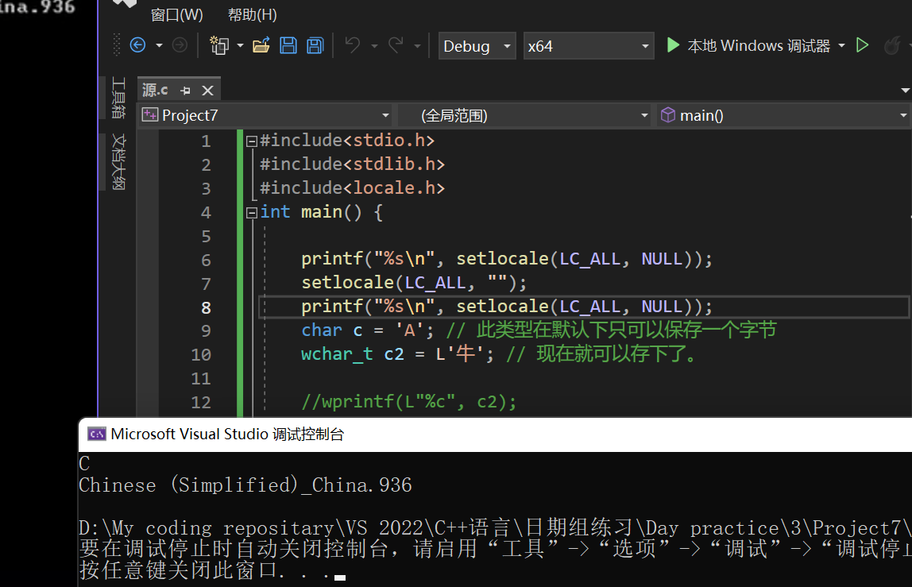
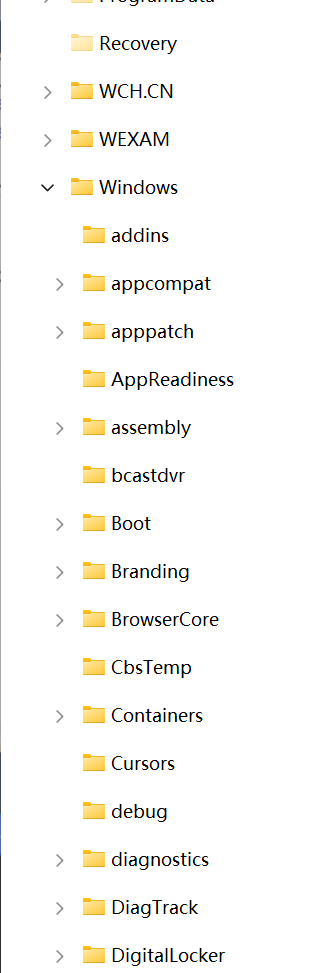
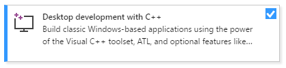
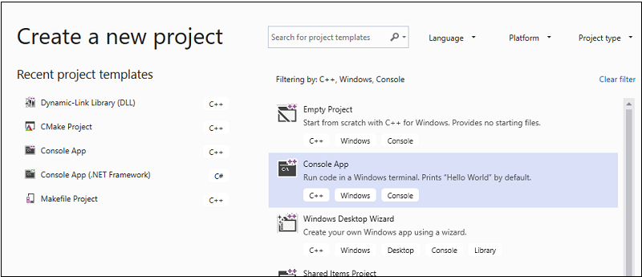
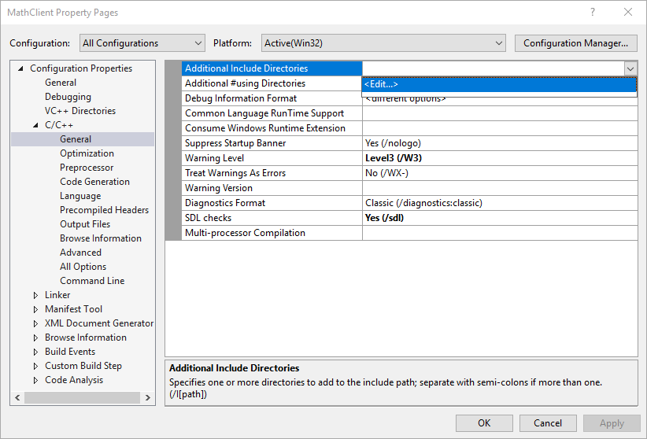

# Windows API 编程初探1

​		写在前面：这是本菜鸟首次对一个大的topic有巨大的兴趣，正好，本人对桌面应用开发有动力研究，这里就以Windows API　编程作为自己串起来操作系统，并发编程，C++基本程序设计应用，以及底层QT开发的一个Application demo了！

## 前导

​		还记得你在实验课上使用老古董 VS2010，当你选择了空项目开发后必须手动使用

```C++
system("pause");
```

​		这个函数嘛？不错，他就是我们Windows API的一个。目的是让程序暂停在此句！我们应用的头文件是：

```C++
#include<Windows.h>
```

​		我们的主角来了哈哈哈

## 小试一手

​		创建你的一个项目，不够今天，我们创建的是一个桌面向导项目，随后，我们选择空项目创建，将：


改成：


​	以及转到：（右键项目选择属性）

​	把控制台改成窗口输出！不然编译器会在下面的程序中报错！


​		我们书写一个简单的C++程序！

```C++
#include<Windows.h>

int WINAPI WinMain(HINSTANCE hInstance, HINSTANCE hPrevInstance, LPSTR ipCmdLine, int nCmdShow)
{
	MessageBox(NULL, TEXT("Hello, World"), TEXT("Captions"), MB_OKCANCEL | MB_ICONINFORMATION | MB_DEFBUTTON2);

	return 0;

}
```

​		F5一下：


​		6！

## 逐一解释

### #include< Windows.h >

​		我们老规矩，先来看看Windows.h装了啥：


​		反正一大堆，但是核心就这些，这是我们需要注意的！

### int WINAPI WinMain(HINSTANCE hInstance, HINSTANCE hPrevInstance, LPSTR ipCmdLine, int nCmdShow)

​		

​		一个函数！有些人奇怪了，什么玩意？C++程序没有int main(), 就像西方没有耶路撒冷一样！不是的！

​		在Windows桌面开发下，他就是我们的main函数。在Microsoft API Platform SDK下，我们查阅到：

```C++
int WINAPI WinMain(  
HINSTANCE hInstance,      
// handle to current instance   
HINSTANCE hPrevInstance,  
// handle to previous instance   
LPSTR lpCmdLine,        
// command line  
int nCmdShow        
//  show stat
)
```


#### What is WINAPI

​		光标移动到上面： __stdcall 这是啥呢？标准调用！

​		被这个关键字修饰的函数，其参数都是从右向左通过堆栈传递的(__fastcall 的前面部分由ecx,edx传)， 函数调用在返回前要由被调用者清理堆栈。

​		啥？你不相信？反汇编我们产生的EXE文件就OK了：在MessageW处打一个断点，运行之找到


​		大多数电脑采用的是大端法，也就是说可以理解为：参数在右边的，先被推送进函数里去

#### 批注？


​		什么是批注呢请看我们函数和头文件下的：


​		看看_ In _这个宏，他就是一个说明参数性质的宏！

```C++
 // from sal.h
_In_     : input parameter to a function, unmodified by called function
      _Out_    : output parameter, written to by called function, pointed-to
                 location not expected to be initialized prior to call
      _Outptr_ : like _Out_ when returned variable is a pointer type
                 (so param is pointer-to-pointer type). Called function
                 provides/allocated space.
      _Outref_ : like _Outptr_, except param is reference-to-pointer type.
      _Inout_  : inout parameter, read from and potentially modified by
                 called function.
      _Ret_    : for return values
      _Field_  : class/struct field invariants
```

​		In 表明他是一个输入参数，有点像const 一样，函数读取值但是不可以修改它！

​		InOut就是表示这是一个这样的值：传入又传出，值会被修改

​		Out表示这个值会被这个函数设置

​		OutPtr 表示返回这个值的指针

​		Microsoft对参数合理性做出了更多的解释：类似于main函数一样

```
[in] hInstance

类型： HINSTANCE

应用程序的当前实例的句柄。

[in] hPrevInstance

类型： HINSTANCE

应用程序的上一个实例的句柄。 此参数始终为 NULL。 如果需要检测另一个实例是否已存在，请使用 CreateMutex 函数创建唯一命名的互斥体。 即使互斥体已存在，CreateMutex 也会成功，但函数将返回ERROR_ALREADY_EXISTS。 这表示应用程序的另一个实例存在，因为它首先创建了互斥体。 但是，恶意用户可以在执行之前创建此互斥体，并阻止应用程序启动。 为防止这种情况，请创建一个随机命名的互斥体并存储名称，以便它只能由授权用户获取。 或者，可以使用文件进行此目的。 若要将应用程序限制为每个用户的一个实例，请在用户配置文件目录中创建锁定的文件。

[in] lpCmdLine

类型： LPSTR

应用程序的命令行，不包括程序名称。 若要检索整个命令行，请使用 GetCommandLine 函数。

[in] nShowCmd

类型： int

控制窗口的显示方式。 此参数可以是可在 ShowWindow 函数的 nCmdShow 参数中指定的任何值。
```

显示一个模式对话框，其中包含系统图标、一组按钮和一条简短的应用程序特定消息，例如状态或错误信息。 消息框返回一个整数值，该值指示用户单击的按钮。

### MessageBox函数


#### 语法

```cpp
int MessageBox(
  [in, optional] HWND    hWnd,
  [in, optional] LPCTSTR lpText,
  [in, optional] LPCTSTR lpCaption,
  [in]           UINT    uType
);
```


#### 参数

```
[in, optional] hWnd
```

类型：**HWND**

要创建的消息框的所有者窗口的句柄。 如果此参数为 **NULL**，则消息框没有所有者窗口。

```
[in, optional] lpText
```

类型： **LPCTSTR**

要显示的消息。 如果字符串包含多个行，则可以使用回车符和/或换行符分隔每行之间的行。

```
[in, optional] lpCaption
```

类型： **LPCTSTR**

对话框标题。 如果此参数为 **NULL**，则默认标题为 **Error**。

```
[in] uType
```

类型： **UINT**

对话框的内容和行为。 此参数可以是以下标志组中的标志的组合。

若要指示消息框中显示的按钮，请指定以下值之一。

| Value                               | 含义                                                         |
| :---------------------------------- | :----------------------------------------------------------- |
| **MB_ABORTRETRYIGNORE**0x00000002L  | 消息框包含三个推送按钮： **中止**、 **重试**和 **忽略**。    |
| **MB_CANCELTRYCONTINUE**0x00000006L | 消息框包含三个按下按钮： **“取消**”、“ **重试**”、“ **继续**”。 使用此消息框类型，而不是MB_ABORTRETRYIGNORE。 |
| **MB_HELP**0x00004000L              | 向消息框添加 **“帮助** ”按钮。 当用户单击 **“帮助** ”按钮或按 F1 时，系统会向所有者发送 [WM_HELP](https://learn.microsoft.com/zh-cn/windows/desktop/shell/wm-help) 消息。 |
| **MB_OK**0x00000000L                | 消息框包含一个按钮： **确定**。 这是默认值。                 |
| **MB_OKCANCEL**0x00000001L          | 消息框包含两个推送按钮： **“确定** ”和 **“取消**”。          |
| **MB_RETRYCANCEL**0x00000005L       | 消息框包含两个按下按钮： **重试** 和 **取消**。              |
| **MB_YESNO**0x00000004L             | 消息框包含两个按下按钮： **是** 和 **否**。                  |
| **MB_YESNOCANCEL**0x00000003L       | 消息框包含三个按钮： **是**、 **否**和 **取消**。            |

 

若要在消息框中显示图标，请指定以下值之一。

| Value                             | 含义                                                         |
| :-------------------------------- | :----------------------------------------------------------- |
| **MB_ICONEXCLAMATION**0x00000030L | 消息框中会显示一个感叹号图标。                               |
| **MB_ICONWARNING**0x00000030L     | 消息框中会显示一个感叹号图标。                               |
| **MB_ICONINFORMATION**0x00000040L | 图标由圆圈中的小写字母 *i* 组成，显示在消息框中。            |
| **MB_ICONASTERISK**0x00000040L    | 图标由圆圈中的小写字母 *i* 组成，显示在消息框中。            |
| **MB_ICONQUESTION**0x00000020L    | 消息框中会显示一个问号图标。 不再建议使用问号消息图标，因为这种图标无法清楚地表示特定类型的消息，并且作为问题的消息表述可应用于任何消息类型。 此外，用户可能会将问号消息符号与帮助信息混淆。 因此，不要在消息框中使用问号消息符号。 系统继续支持它包含的内容，只为满足反向兼容性。 |
| **MB_ICONSTOP**0x00000010L        | 消息框中会显示一个停止符号图标。                             |
| **MB_ICONERROR**0x00000010L       | 消息框中会显示一个停止符号图标。                             |
| **MB_ICONHAND**0x00000010L        | 消息框中会显示一个停止符号图标。                             |

 

若要指示默认按钮，请指定以下值之一。

| Value                        | 含义                                                         |
| :--------------------------- | :----------------------------------------------------------- |
| **MB_DEFBUTTON1**0x00000000L | 第一个按钮是默认按钮。除非指定**了MB_DEFBUTTON2**、MB_DEFBUTTON3或**MB_DEFBUTTON4**，**否则**MB_DEFBUTTON1**是默认值**。 |
| **MB_DEFBUTTON2**0x00000100L | 第二个按钮是默认按钮。                                       |
| **MB_DEFBUTTON3**0x00000200L | 第三个按钮是默认按钮。                                       |
| **MB_DEFBUTTON4**0x00000300L | 第四个按钮是默认按钮。                                       |

 

若要指示对话框的形式，请指定以下值之一。

| Value                         | 含义                                                         |
| :---------------------------- | :----------------------------------------------------------- |
| **MB_APPLMODAL**0x00000000L   | 在 *hWnd* 参数标识的窗口中继续工作之前，用户必须响应消息框。 但是，用户可以移动到其他线程的窗口，并在这些窗口中工作。根据应用程序中的窗口层次结构，用户可能能够移动到线程中的其他窗口。 消息框父级的所有子窗口都将自动禁用，但弹出窗口不是。如果未指定**MB_SYSTEMMODAL**或**MB_TASKMODAL**，**则MB_APPLMODAL**为默认值。 |
| **MB_SYSTEMMODAL**0x00001000L | 与MB_APPLMODAL相同，消息框具有 **WS_EX_TOPMOST** 样式。 使用系统模式消息框通知用户严重、潜在的破坏性错误，例如， (立即引起注意，) 内存不足。 此标志不会影响用户与 *与 hWnd* 关联的窗口以外的窗口交互的能力。 |
| **MB_TASKMODAL**0x00002000L   | 与 **MB_APPLMODAL** 相同，如果 *hWnd* 参数为 **NULL**，则禁用属于当前线程的所有顶级窗口。 当调用应用程序或库没有可用的窗口句柄时，请使用此标志，但仍需要防止输入到调用线程中的其他窗口，而不会挂起其他线程。 |

 

若要指定其他选项，请使用以下一个或多个值。

| Value                                  | 含义                                                         |
| :------------------------------------- | :----------------------------------------------------------- |
| **MB_DEFAULT_DESKTOP_ONLY**0x00020000L | 与交互式窗口工作站的桌面相同。 有关详细信息，请参阅 [窗口工作站](https://learn.microsoft.com/zh-cn/windows/desktop/winstation/window-stations)。如果当前输入桌面不是默认桌面，则在用户切换到默认桌面之前， **MessageBox** 不会返回。 |
| **MB_RIGHT**0x00080000L                | 文本是右对齐的。                                             |
| **MB_RTLREADING**0x00100000L           | 在希伯来语和阿拉伯语系统上使用从右到左阅读顺序显示消息和标题文本。 |
| **MB_SETFOREGROUND**0x00010000L        | 消息框将成为前台窗口。 在内部，系统调用消息框的 [SetForegroundWindow](https://learn.microsoft.com/zh-cn/windows/desktop/api/winuser/nf-winuser-setforegroundwindow) 函数。 |
| **MB_TOPMOST**0x00040000L              | 消息框是使用 **WS_EX_TOPMOST** 窗口样式创建的。              |
| **MB_SERVICE_NOTIFICATION**0x00200000L | 调用方是通知用户某个事件的服务。 该函数在当前活动桌面上显示一个消息框，即使没有用户登录到计算机也是如此。**终端服务：** 如果调用线程具有模拟令牌，该函数会将消息框定向到模拟令牌中指定的会话。如果设置了此标志， *则 hWnd* 参数必须为 **NULL**。 这样，消息框可以出现在桌面上，而不是与 *hWnd* 对应的桌面。有关使用此标志的安全注意事项的信息，请参阅 [Interactive Services](https://learn.microsoft.com/zh-cn/windows/desktop/Services/interactive-services)。 具体而言，请注意，此标志可以在锁定的桌面上生成交互式内容，因此应仅用于一组非常有限的方案，例如资源耗尽。 |


## 返回值

类型： **int**

如果消息框有 **“取消** ”按钮，则函数返回 **IDCANCEL** 值（如果按下 ESC 键或选中 **“取消** ”按钮）。 如果消息框没有 **“取消** ”按钮，则按 ESC 将不起作用 -除非存在MB_OK按钮。 如果显示MB_OK按钮，并且用户按 ESC，则返回值为 **IDOK**。

如果函数失败，则返回值为零。 要获得更多的错误信息，请调用 GetLastError。

如果函数成功，则返回值为以下菜单项值之一。

| 返回代码/值      | 说明                     |
| :--------------- | :----------------------- |
| **IDABORT**3     | 已选择 **“中止** ”按钮。 |
| **IDCANCEL**2    | 已选择“ **取消** ”按钮。 |
| **IDCONTINUE**11 | 已选择 **“继续** ”按钮。 |
| **IDIGNORE**5    | 已选择 **“忽略** ”按钮。 |
| **IDNO**7        | 已选择 **“无** ”按钮。   |
| **IDOK**1        | 已选择 **“确定** ”按钮。 |
| **IDRETRY**4     | 已选择 **“重试** ”按钮。 |
| **IDTRYAGAIN**10 | 已选择 **“重试** ”按钮。 |
| **IDYES**6       | 已选择 **“是** ”按钮。   |


## 注解

通过将 *uType* 参数设置为相应的标志值，可以在消息框中使用以下系统图标。

| 图标                                                         | 标志值                                               |
| :----------------------------------------------------------- | :--------------------------------------------------- |
|  | **MB_ICONHAND**、 **MB_ICONSTOP**或 **MB_ICONERROR** |
|  | **MB_ICONQUESTION**                                  |
|  | **MB_ICONEXCLAMATION** 或 **MB_ICONWARNING**         |
|  | **MB_ICONASTERISK** 或 **MB_ICONINFORMATION**        |

 

在 MessageBox 显示字符串开头的 Unicode 格式字符 U+200F 表示 (RL) M 添加两个从右到左标记，以便使 MessageBox 的读取顺序呈现为从右到左 (RTL) 。

使用系统模式消息框指示系统内存不足时， *lpText* 和 *lpCaption* 参数指向的字符串不应从资源文件中获取，因为尝试加载资源可能会失败。

如果在对话框存在时创建消息框，请使用对话框的句柄作为 *hWnd* 参数。 *hWnd* 参数不应标识子窗口，如对话框中的控件。


#### 示例

在以下示例中，应用程序显示一个消息框，该消息框在出现错误条件后提示用户执行操作。 消息框显示描述错误条件以及如何解决错误条件的消息。 **MB_CANCELTRYCONTINUE**样式指示 **MessageBox** 提供三个按钮，用户可以选择如何继续操作。 **MB_DEFBUTTON2**样式将默认焦点设置为消息框的第二个按钮，在本例中为**“重试”**按钮。

```cpp
#include<Windows.h>

void WINAPI doSomethingHalt() {

	int usrChoice = MessageBox(NULL, TEXT("Are you sure to move forward? That is supposed to be invalid... I convinced!")\
	,TEXT("Warning"),MB_ICONWARNING|MB_CANCELTRYCONTINUE|MB_DEFBUTTON2);

	switch (usrChoice)
	{
	case IDCANCEL:
		MessageBox(NULL, TEXT("good"), TEXT("afterWard"), MB_OKCANCEL | MB_ICONINFORMATION | MB_DEFBUTTON2);
		break;
	case IDRETRY:
		MessageBox(NULL, TEXT("I mean: that is not good!"), TEXT("afterWard"), MB_OKCANCEL | MB_ICONINFORMATION | MB_DEFBUTTON2);
		break;
	case IDCONTINUE:
		MessageBox(NULL, TEXT("I mean: that is not good!"), TEXT("afterWard"), MB_OKCANCEL | MB_ICONINFORMATION | MB_DEFBUTTON2);
		break;
	default:
		break;
	}

	return;
}

int WINAPI WinMain(HINSTANCE hInstance, HINSTANCE hPrevInstance, LPSTR ipCmdLine, int nCmdShow)
{
	//MessageBox(NULL, TEXT("Hello, World"), TEXT("Captions"), MB_OKCANCEL | MB_ICONINFORMATION | MB_DEFBUTTON2);
	doSomethingHalt();
	return 0;

}

// design by CharlieChen
```

# Windows API 编程初探2

## 字符串主题

### 入门

​		下面我们开始入门简单的字符串主题：啥意思呢？回顾我们C语言的API。我们是如下声明一个char类型或基于char类型的数组

```
char typicalChar = 'A';
char* TCPtr = "Hello!My friend~";
char arrayCPtr = "hello,my frined~";
```

​		我们马上可以看到，char是一份字节大小，那么下面的arrayCPtr就指明需要17个字节来存储。

### wchar_t类型

​		可是，仅仅使用char可能存储不下如今丰富的字符。所以，转向扩展char是必要的，wchar,也就是widechar应运而生。在Windows 2000之后所有的Windows系统都在底层上支持Unicode字符集。

​		我们这样声明与初始化一个wchar变量：

```C++
wchar_t wideChar = L'A'
```


​		类似的：

```
wchar* ptrW = "Hello";
wchar ptr[7] = "Hello!";
```

​		但是注意：如果我们还是选择

```C++
	printf("%s", ptrW);
	printf("%s", ptr);
```

​		则只会打印首元素，这是因为字符串类型不匹配，人话讲就是：wchar字符串不用%s打印，而是ls

```C++
printf("%ls", ptrW);
printf("%ls", ptr);
```

​		或者是

```C++
wchar_t* WPTR = {'a','\0'}; 
wprintf("%s",WPTR);
```

​		或是直接调用setlocal函数做默认的设置！

```C++
#include <stdio.h>
#include <string.h>
#include <locale.h>
int main()
{
	//使用系统默认的设置调用setlocale(LC_ALL, "");
	setlocale(LC_ALL, "");
	const wchar_t * chWord = L"疯狂程序人—码农哈哥";
	printf("%s",chWord);
}
```

### Windows下的字符和宽字符

​		Windows整理自己的活：他们定义了他们自己的字符类型：在winnt.h文件下可以找到：

```C++
//
// Basics
//

#ifndef VOID
#define VOID void
typedef char CHAR;
typedef short SHORT;
typedef long LONG;
#if !defined(MIDL_PASS)
typedef int INT;
#endif
#endif

//
// UNICODE (Wide Character) types
//

#ifndef _MAC
typedef wchar_t WCHAR;    // wc,   16-bit UNICODE character
#else
// some Macintosh compilers don't define wchar_t in a convenient location, or define it as a char
typedef unsigned short WCHAR;    // wc,   16-bit UNICODE character
#endif

typedef WCHAR *PWCHAR, *LPWCH, *PWCH;
typedef CONST WCHAR *LPCWCH, *PCWCH;

typedef _Null_terminated_ WCHAR *NWPSTR, *LPWSTR, *PWSTR;
typedef _Null_terminated_ PWSTR *PZPWSTR;
typedef _Null_terminated_ CONST PWSTR *PCZPWSTR;
typedef _Null_terminated_ WCHAR UNALIGNED *LPUWSTR, *PUWSTR;
typedef _Null_terminated_ CONST WCHAR *LPCWSTR, *PCWSTR;
typedef _Null_terminated_ PCWSTR *PZPCWSTR;
typedef _Null_terminated_ CONST PCWSTR *PCZPCWSTR;
typedef _Null_terminated_ CONST WCHAR UNALIGNED *LPCUWSTR, *PCUWSTR;

typedef _NullNull_terminated_ WCHAR *PZZWSTR;
typedef _NullNull_terminated_ CONST WCHAR *PCZZWSTR;
typedef _NullNull_terminated_ WCHAR UNALIGNED *PUZZWSTR;
typedef _NullNull_terminated_ CONST WCHAR UNALIGNED *PCUZZWSTR;

typedef  WCHAR *PNZWCH;
typedef  CONST WCHAR *PCNZWCH;
typedef  WCHAR UNALIGNED *PUNZWCH;
typedef  CONST WCHAR UNALIGNED *PCUNZWCH;

#if _WIN32_WINNT >= 0x0600 || (defined(__cplusplus) && defined(WINDOWS_ENABLE_CPLUSPLUS))

typedef CONST WCHAR *LPCWCHAR, *PCWCHAR;
typedef CONST WCHAR UNALIGNED *LPCUWCHAR, *PCUWCHAR;

//
//  UCS (Universal Character Set) types
//

typedef unsigned long UCSCHAR;

//
//  Even pre-Unicode agreement, UCS values are always in the
//  range U+00000000 to U+7FFFFFFF, so we'll pick an obvious
//  value.

#define UCSCHAR_INVALID_CHARACTER (0xffffffff)

#define MIN_UCSCHAR (0)

//
//  We'll assume here that the ISO-10646 / Unicode agreement
//  not to assign code points after U+0010FFFF holds so that
//  we do not have to have separate "UCSCHAR" and "UNICODECHAR"
//  types.
//

#define MAX_UCSCHAR (0x0010FFFF)

typedef UCSCHAR *PUCSCHAR;
typedef const UCSCHAR *PCUCSCHAR;

typedef UCSCHAR *PUCSSTR;
typedef UCSCHAR UNALIGNED *PUUCSSTR;

typedef const UCSCHAR *PCUCSSTR;
typedef const UCSCHAR UNALIGNED *PCUUCSSTR;

typedef UCSCHAR UNALIGNED *PUUCSCHAR;
typedef const UCSCHAR UNALIGNED *PCUUCSCHAR;

#endif // _WIN32_WINNT >= 0x0600


//
// ANSI (Multi-byte Character) types
//
typedef CHAR *PCHAR, *LPCH, *PCH;
typedef CONST CHAR *LPCCH, *PCCH;

typedef _Null_terminated_ CHAR *NPSTR, *LPSTR, *PSTR;
typedef _Null_terminated_ PSTR *PZPSTR;
typedef _Null_terminated_ CONST PSTR *PCZPSTR;
typedef _Null_terminated_ CONST CHAR *LPCSTR, *PCSTR;
typedef _Null_terminated_ PCSTR *PZPCSTR;
typedef _Null_terminated_ CONST PCSTR *PCZPCSTR;

typedef _NullNull_terminated_ CHAR *PZZSTR;
typedef _NullNull_terminated_ CONST CHAR *PCZZSTR;

typedef  CHAR *PNZCH;
typedef  CONST CHAR *PCNZCH;

//
// Neutral ANSI/UNICODE types and macros
//
#ifdef  UNICODE                     // r_winnt

#ifndef _TCHAR_DEFINED
typedef WCHAR TCHAR, *PTCHAR;
typedef WCHAR TBYTE , *PTBYTE ;
#define _TCHAR_DEFINED
#endif /* !_TCHAR_DEFINED */

typedef LPWCH LPTCH, PTCH;
typedef LPCWCH LPCTCH, PCTCH;
typedef LPWSTR PTSTR, LPTSTR;
typedef LPCWSTR PCTSTR, LPCTSTR;
typedef LPUWSTR PUTSTR, LPUTSTR;
typedef LPCUWSTR PCUTSTR, LPCUTSTR;
typedef LPWSTR LP;
typedef PZZWSTR PZZTSTR;
typedef PCZZWSTR PCZZTSTR;
typedef PUZZWSTR PUZZTSTR;
typedef PCUZZWSTR PCUZZTSTR;
typedef PZPWSTR PZPTSTR;
typedef PNZWCH PNZTCH;
typedef PCNZWCH PCNZTCH;
typedef PUNZWCH PUNZTCH;
typedef PCUNZWCH PCUNZTCH;
#define __TEXT(quote) L##quote      // r_winnt

#else   /* UNICODE */               // r_winnt

#ifndef _TCHAR_DEFINED
typedef char TCHAR, *PTCHAR;
typedef unsigned char TBYTE , *PTBYTE ;
#define _TCHAR_DEFINED
#endif /* !_TCHAR_DEFINED */

typedef LPCH LPTCH, PTCH;
typedef LPCCH LPCTCH, PCTCH;
typedef LPSTR PTSTR, LPTSTR, PUTSTR, LPUTSTR;
typedef LPCSTR PCTSTR, LPCTSTR, PCUTSTR, LPCUTSTR;
typedef PZZSTR PZZTSTR, PUZZTSTR;
typedef PCZZSTR PCZZTSTR, PCUZZTSTR;
typedef PZPSTR PZPTSTR;
typedef PNZCH PNZTCH, PUNZTCH;
typedef PCNZCH PCNZTCH, PCUNZTCH;
#define __TEXT(quote) quote         // r_winnt

#endif /* UNICODE */                // r_winnt
#define TEXT(quote) __TEXT(quote)   // r_winnt


typedef SHORT *PSHORT;  
typedef LONG *PLONG;    

#define ALL_PROCESSOR_GROUPS        0xffff
```

​		在这里我们找到了两个东西：

```C++
#ifndef _MAC
typedef wchar_t WCHAR;    // wc,   16-bit UNICODE character
#else
// some Macintosh compilers don't define wchar_t in a convenient location, or define it as a char
typedef unsigned short WCHAR;    // wc,   16-bit UNICODE character
#endif
```

​		首先是wchar_t被重写位WCHAR。对于一些甚至没有wchar的编译器直接对unsigned short起别名。

​		其次是TEXT宏，这个宏便捷的帮助我们直接将普通的字符串升级为宽字符串，其做法不是强制转换，而是：

```C++
#define __TEXT(quote) L##quote
#define TEXT(quote) __TEXT(quote)    
```

​		##是令牌粘贴，就是直接把L和字符串连接在一起返回，比若说：

```C++
TEXT("Hello")--- Compiler----> L"Hello"
```

​		我们看到，上面的定义给出了：PSTR和LPSTR的小东西。他们都是CHAR（本质上就是Char），而P C STR 和 LP C STR则是Const类型的字符串。也就是常字符串！

​		那对于TCHAR这样Windows自己给出了字符串，我们应该怎么处理呢了，答案是万能的WIndows又帮我们干好了。使用P T STR和LP T STR就可以胜任这些工作！

## 常见的字符串处理工作

### 获取字符串的长度

​		下面我们要说的是如何获取字符串的长度，请看strlen和wstrlen.

```
size_t strlen(const char* str);
size_t wstrlen(const wchar_t* str);
```

​		size_t，如其所说的那样，衡量的是大小的类型。其定义查看建议自行搜索，这里做阐述。因为不是重点我想说的！

​		来试试看：

```C++
#include<Windows.h>
#include<stdio.h>
#include<tchar.h>
int main() {

	CHAR str[] = "C语言\0"; // 这个函数返回占比字节的大小
	WCHAR wstr[] = L"C语言"; // 这个函数返回的是宽字符的个数

	_tprintf(TEXT("strlen(str) = %d\n wcslen(wstr) = %d"), strlen(str), wcslen(wstr));

}
```

​		


​		注意到_tprintf是一个随系统环境而改变的宏函数，在支持UNICODE字符集的情况下，系统将会自动的转化之成为wprintf！

​		类似的：我们还有一个叫做tcslen这个函数，他是这样被定义的：


​		好鸡肋啊，那如果我们改一下不支持Unicode子集呢？仍然是右键项目——属性，转到这个地方：


​		改成


​		发现变灰了！转向再看发现跳转到了：>


# Windows API 编程初探3

## 1.认识Windows窗口

windows窗口的组成有：

（1）标题栏。窗口上方的蓝条区域，标题栏左边有控制菜单图表和窗口中程序的名称。

显示当前应用程序名、文件名等，在许多窗口中，标题栏也包含程序图标、“最小化”、“最大化”、“还原”和“关闭”按钮以及“帮助”的按钮，可以简单地对窗口进行操作。工程制图中，为方便读图及查询相关信息，图纸中一般会配置标题栏，其位置一般位于图纸的右下角，看图方向一般应与标题栏的方向一致。

（2）菜单栏。位于标题栏的下边，包含很多菜单。

菜单栏实际是一种树型结构，为软件的大多数功能提供功能入口。点击以后，即可显示出菜单项。

（3）工具栏。顾名思义，就是在一个软件程序中，综合各种工具，让用户方便使用的一个区域。

工具栏位于菜单栏下方，它以按扭的形式给出了用户最经常使用的一些命令，比如，复制，粘贴等。

（4）工作区域。窗口中间的区域，窗口的输入输出都在它里面进行。

（5）状态栏。位于窗口底部，显示运行程序的当前状态，通过它用户可以了解到程序运行的情况。

（6）滚动条。如果窗口中显示的内容过多，当前可见的部分不够显示时，窗口就会出现滚动条，分为水平与垂直两种。

（7）窗口缩放按纽。即最大化、最小化、关闭按纽。

## demo

```C++ 
#include<Windows.h>
#include<iostream>
#include<tchar.h>
#pragma comment(lib,"Winmm.lib")
LRESULT CALLBACK WindowsProc(HWND hwd, UINT uMsg, WPARAM wParam, LPARAM lParam);

WNDCLASSEX& WINAPI getWindowsHandle(HINSTANCE hInstance,TCHAR name[]) {

	WNDCLASSEX wndclass;

	wndclass.cbSize = sizeof(WNDCLASSEX);

	wndclass.style = CS_HREDRAW | CS_VREDRAW;

	wndclass.lpfnWndProc = WindowsProc;

	wndclass.cbClsExtra = 0;
	wndclass.cbWndExtra = 0;
	wndclass.hInstance = hInstance;
	wndclass.hIcon = LoadIcon(NULL, IDI_APPLICATION);
	wndclass.hCursor = LoadCursor(NULL, IDC_ARROW);
	wndclass.hbrBackground = static_cast<HBRUSH>(GetStockObject(WHITE_BRUSH));
	wndclass.lpszMenuName = NULL;
	wndclass.lpszClassName = name;
	wndclass.hIconSm = NULL;

	return wndclass;
}

int WINAPI WinMain(HINSTANCE hInstance,HINSTANCE hPrevInstance, LPSTR lpCmdLine,int nCmdShow) {
	TCHAR szName[] = L"MyWindows";
	TCHAR szAppName[] = L"HelloWindows";
	HWND hwnd;
	MSG msg;

	WNDCLASSEX wndclass = getWindowsHandle(hInstance,szName);
	RegisterClassEx(&wndclass);

	hwnd = CreateWindowEx(0, szName, szAppName, WS_OVERLAPPEDWINDOW,
		CW_USEDEFAULT, CW_USEDEFAULT, 600, 360, NULL, NULL, hInstance, NULL);

	ShowWindow(hwnd, nCmdShow);
	UpdateWindow(hwnd);

	while (GetMessage(&msg, NULL, 0, 0) != 0) {
		TranslateMessage(&msg);
		DispatchMessage(&msg);
	}


	return msg.wParam;
}

LRESULT CALLBACK WindowsProc(HWND hwd, UINT uMsg, WPARAM wParam, LPARAM lParam) {
	HDC hdc;
	PAINTSTRUCT ps;
	TCHAR szStr[] = TEXT("hello windows");

	switch (uMsg) {
	case WM_CREATE:
		PlaySound(TEXT("666.wav"), NULL, SND_FILENAME | SND_ASYNC);
		return 0;
	case WM_PAINT:
		hdc = BeginPaint(hwd, &ps);
		TextOut(hdc, 10, 10, szStr, _tcslen(szStr));
		EndPaint(hwd, &ps);
		return 0;

	case WM_DESTROY:
		PostQuitMessage(0);
		return 0;
	}

	return DefWindowProc(hwd, uMsg, wParam, lParam);
}
```

​		我们摁下Ctrl + F5允许程序即可。

## 窗口的显示流程

1）注册窗口类，当然，在注册之前就需要我们填写类内的基本信息

2）创建窗口

3）显示窗口并更新

4）静茹无线的信息获取，分发的循环：获取，转换，并将消息发送到`WindowProc`回调函数集中处理。

### 注册窗口类

​		RegisterClassEx，见名字知含义。也就是说，我们是为了注册一个窗口，需要调用这个函数：

​		注册一个窗口类，以便在对 [CreateWindow 或 CreateWindowEx](https://learn.microsoft.com/zh-cn/windows/desktop/api/winuser/nf-winuser-createwindowa) 函数的调用中随后使用。


#### 语法

```cpp
ATOM RegisterClassExA(
  [in] const WNDCLASSEXA *unnamedParam1
);
```

#### 参数

```
[in] unnamedParam1
```

​		类型： **const WNDCLASSEX\***

​		指向 [WNDCLASSEX](https://learn.microsoft.com/zh-cn/windows/desktop/api/winuser/ns-winuser-wndclassexa) 结构的指针。 在将结构传递给函数之前，必须用相应的类属性填充结构。


#### 返回值

​		类型： **ATOM**

​		如果函数成功，则返回值是唯一标识所注册类的类原子。 此原子只能由 [CreateWindow、CreateWindowEx](https://learn.microsoft.com/zh-cn/windows/desktop/api/winuser/nf-winuser-createwindowexa)、[GetClassInfo、GetClassInfoEx](https://learn.microsoft.com/zh-cn/windows/desktop/api/winuser/nf-winuser-getclassinfoexa)、[FindWindow、FindWindowEx](https://learn.microsoft.com/zh-cn/windows/desktop/api/winuser/nf-winuser-findwindowa) 和 [UnregisterClass](https://learn.microsoft.com/zh-cn/windows/desktop/api/winuser/nf-winuser-unregisterclassa) 函数和 **IActiveIMMap：：FilterClientWindows** 方法使用。

​		如果函数失败，则返回值为零。 要获得更多的错误信息，请调用 GetLastError。


#### 注解

​		如果使用 **RegisterClassExA** 注册窗口类，应用程序会告知系统所创建的类的窗口需要具有文本或字符参数的消息才能使用 ANSI 字符集;如果使用 **RegisterClassExW** 注册它，应用程序会请求系统将消息的文本参数作为 Unicode 传递。 [IsWindowUnicode](https://learn.microsoft.com/zh-cn/windows/desktop/api/winuser/nf-winuser-iswindowunicode) 函数使应用程序能够查询每个窗口的性质。 有关 ANSI 和 Unicode 函数的详细信息，请参阅 [函数原型约定](https://learn.microsoft.com/zh-cn/windows/desktop/Intl/conventions-for-function-prototypes)。

​		应用程序注册的所有窗口类在终止时将取消注册。

​		卸载 DLL 时，不会取消注册 DLL 注册的窗口类。 卸载 DLL 时，必须显式取消注册其类。

### wNDCLASSEXA 结构 (winuser.h)

​		包含窗口类信息。 它与 [RegisterClassEx](https://learn.microsoft.com/zh-cn/windows/desktop/api/winuser/nf-winuser-registerclassexa) 和 [GetClassInfoEx](https://learn.microsoft.com/zh-cn/windows/desktop/api/winuser/nf-winuser-getclassinfoexa) 函数一起使用。

​		**WNDCLASSEX** 结构类似于 [WNDCLASS](https://learn.microsoft.com/zh-cn/windows/desktop/api/winuser/ns-winuser-wndclassa) 结构。 有两个区别。 **WNDCLASSEX** 包括 **cbSize** 成员（指定结构的大小）和 **hIconSm** 成员，该成员包含与窗口类关联的小图标的句柄。


#### 语法

```cpp
typedef struct tagWNDCLASSEXA {
  UINT      cbSize;								//结构大小，以字节为单位
  UINT      style;
  WNDPROC   lpfnWndProc;
  int       cbClsExtra;
  int       cbWndExtra;
  HINSTANCE hInstance;
  HICON     hIcon;
  HCURSOR   hCursor;
  HBRUSH    hbrBackground;
  LPCSTR    lpszMenuName;
  LPCSTR    lpszClassName;
  HICON     hIconSm;
} WNDCLASSEXA, *PWNDCLASSEXA, *NPWNDCLASSEXA, *LPWNDCLASSEXA;
```


#### 成员

```
cbSize
```

​		类型： **UINT**

​		此结构的大小（以字节为单位）。 将此成员设置为 `sizeof(WNDCLASSEX)`。 在调用 [GetClassInfoEx](https://learn.microsoft.com/zh-cn/windows/desktop/api/winuser/nf-winuser-getclassinfoexa) 函数之前，请务必设置此成员。

```
style
```

​		类型： **UINT**

​		类样式 () 。 此成员可以是 [类样式](https://learn.microsoft.com/zh-cn/windows/win32/winmsg/window-class-styles)的任意组合。

```
lpfnWndProc
```

​		类型： **WNDPROC**

​		指向窗口过程的指针。 必须使用 [CallWindowProc](https://learn.microsoft.com/zh-cn/windows/desktop/api/winuser/nf-winuser-callwindowproca) 函数调用窗口过程。 有关详细信息，请参阅 [WindowProc](https://learn.microsoft.com/zh-cn/previous-versions/windows/desktop/legacy/ms633573(v=vs.85))。

```
cbClsExtra
```

​		类型： **int**

​		要根据窗口类结构分配的额外字节数。 系统将字节初始化为零。

```
cbWndExtra
```

​		类型： **int**

​		在窗口实例之后分配的额外字节数。 系统将字节初始化为零。 如果应用程序使用 **WNDCLASSEX** 注册使用资源文件中的 **CLASS** 指令创建的对话框，则必须将此成员设置为 **DLGWINDOWEXTRA**。

```
hInstance
```

​		类型： **HINSTANCE**

​		实例的句柄，该实例包含类的窗口过程。

```
hIcon
```

​		类型： **HICON**

​		类图标的句柄。 此成员必须是图标资源的句柄。 如果此成员为 **NULL**，则系统会提供默认图标。

```
hCursor
```

​		类型： **HCURSOR**

​		类游标的句柄。 此成员必须是游标资源的句柄。 如果此成员为 **NULL**，则每当鼠标移动到应用程序的窗口中时，应用程序都必须显式设置光标形状。

```
hbrBackground
```

​		类型： **HBRUSH**

​		类背景画笔的句柄。 此成员可以是用于绘制背景的画笔的句柄，也可以是颜色值。 颜色值必须是以下标准系统颜色之一， (值 1 必须添加到所选颜色) 。 如果提供了颜色值，则必须将其转换为以下 **HBRUSH** 类型之一：

| Enum  Colors          |
| --------------------- |
| COLOR_ACTIVEBORDER    |
| COLOR_ACTIVECAPTION   |
| COLOR_APPWORKSPACE    |
| COLOR_BACKGROUND      |
| COLOR_BTNFACE         |
| COLOR_BTNSHADOW       |
| COLOR_BTNTEXT         |
| COLOR_CAPTIONTEXT     |
| COLOR_GRAYTEXT        |
| COLOR_HIGHLIGHT       |
| COLOR_HIGHLIGHTTEXT   |
| COLOR_INACTIVEBORDER  |
| COLOR_INACTIVECAPTION |
| COLOR_MENU            |
| COLOR_MENUTEXT        |
| COLOR_SCROLLBAR       |
| COLOR_WINDOW          |
| COLOR_WINDOWFRAME     |
| COLOR_WINDOWTEXT      |

​		使用 [UnregisterClass](https://learn.microsoft.com/zh-cn/windows/desktop/api/winuser/nf-winuser-unregisterclassa) 注销类时，系统会自动删除类背景画笔。 应用程序不应删除这些画笔。

​		如果此成员为 **NULL**，则每当请求应用程序在其工作区中绘制时，都必须绘制自己的背景。 若要确定是否必须绘制背景，应用程序可以处理[WM_ERASEBKGND](https://learn.microsoft.com/zh-cn/windows/desktop/winmsg/wm-erasebkgnd)消息或测试 [BeginPaint](https://learn.microsoft.com/zh-cn/windows/desktop/api/winuser/nf-winuser-beginpaint) 函数填充的 [PAINTSTRUCT](https://learn.microsoft.com/zh-cn/windows/desktop/api/winuser/ns-winuser-paintstruct) 结构的 **fErase** 成员。

```
lpszMenuName
```

类型： **LPCTSTR**

​		指向以 null 结尾的字符串的指针，该字符串指定类菜单的资源名称，因为名称显示在资源文件中。 如果使用整数来标识菜单，请使用 [MAKEINTRESOURCE](https://learn.microsoft.com/zh-cn/windows/desktop/api/winuser/nf-winuser-makeintresourcea) 宏。 如果此成员为 **NULL**，则属于此类的窗口没有默认菜单。

```
lpszClassName
```

类型： **LPCTSTR**

​		指向以 null 结尾的字符串或 的指针是原子。 如果此参数是 atom，则它必须是先前调用 [RegisterClass 或 RegisterClassEx](https://learn.microsoft.com/zh-cn/windows/desktop/api/winuser/nf-winuser-registerclassa) 函数创建的类 atom。 原子必须位于 **lpszClassName** 的低序字中;高序字必须为零。

​		如果 **lpszClassName** 是字符串，则指定窗口类名。 类名可以是使用 [RegisterClass](https://learn.microsoft.com/zh-cn/windows/desktop/api/winuser/nf-winuser-registerclassa) 或 [RegisterClassEx](https://learn.microsoft.com/zh-cn/windows/desktop/api/winuser/nf-winuser-registerclassexa) 注册的任何名称，也可以是任何预定义的控件类名称。

**lpszClassName** 的最大长度为 256。 如果 **lpszClassName** 大于最大长度， [则 RegisterClassEx](https://learn.microsoft.com/zh-cn/windows/desktop/api/winuser/nf-winuser-registerclassexa) 函数将失败。

```
hIconSm
```

​		类型： **HICON**

​		与窗口类关联的小图标的句柄。 如果此成员为 **NULL**，系统会在 **hIcon** 成员指定的图标资源中搜索要用作小图标的适当大小的图标。

​		下面是一些Windows窗口或者光标图样：

| 值                                              | 含义                                                |
| :---------------------------------------------- | :-------------------------------------------------- |
| **IDC_APPSTARTING**     MAKEINTRESOURCE (32650) | 标准箭头和小沙漏光标。                              |
| **IDC_ARROW**      MAKEINTRESOURCE (32512)      | 标准箭头光标。                                      |
| **IDC_CROSS **       MAKEINTRESOURCE (32515)    | 十字准线光标。                                      |
| **IDC_HAND **        MAKEINTRESOURCE (32649)    | 手光标。                                            |
| **IDC_HELP**         MAKEINTRESOURCE (32651)    | 箭头和问号光标。                                    |
| **IDC_IBEAM **      MAKEINTRESOURCE (32513)     | I 型光标。                                          |
| **IDC_NO **     MAKEINTRESOURCE (32648)         | 斜线圆光标。                                        |
| **IDC_SIZEALL **    MAKEINTRESOURCE (32646)     | 指向北部、南部、东部和西部的四角箭头光标。          |
| **IDC_SIZENESW **    MAKEINTRESOURCE (32643)    | 指向东北和西南的双尖箭头光标。                      |
| **IDC_SIZENS**   MAKEINTRESOURCE (32645)        | 指向南北的双尖箭头光标。                            |
| **IDC_SIZENWSE **  MAKEINTRESOURCE (32642)      | 指向西北和东南部的双尖箭头光标。                    |
| **IDC_SIZEWE **  MAKEINTRESOURCE (32644)        | 指向西部和东部的双尖箭头光标。                      |
| **IDC_UPARROW**   MAKEINTRESOURCE (32516)       | 垂直箭头光标。                                      |
| **IDC_WAIT**  MAKEINTRESOURCE (32514)           | 沙漏光标。                                          |
| **IDI_APPLICATION ** MAKEINTRESOURCE (32512)    | 应用程序图标。                                      |
| **IDI_ASTERISK ** MAKEINTRESOURCE (32516)       | 星号图标。                                          |
| **IDI_EXCLAMATION**  MAKEINTRESOURCE (32515)    | 感叹号图标。                                        |
| **IDI_HAND**  MAKEINTRESOURCE (32513)           | 停止标记图标。                                      |
| **IDI_QUESTION ** MAKEINTRESOURCE (32514)       | 问号图标。                                          |
| **IDI_WINLOGO ** MAKEINTRESOURCE (32517)        | 应用程序图标。**Windows 2000：** Windows 徽标图标。 |

### 创建窗口

​		之后，我们就准备创建窗口：

### CreateWindowExW 函数 (winuser.h)

​		创建具有扩展窗口样式的重叠窗口、弹出窗口窗口或子窗口;否则，此函数与 [CreateWindow](https://learn.microsoft.com/zh-cn/windows/desktop/api/winuser/nf-winuser-createwindowa) 函数相同。 有关创建窗口的详细信息以及 **CreateWindowEx** 的其他参数的完整说明，请参阅 **CreateWindow**。


#### 语法

C++复制

```cpp
HWND CreateWindowExW(
  [in]           DWORD     dwExStyle,
  [in, optional] LPCWSTR   lpClassName,
  [in, optional] LPCWSTR   lpWindowName,
  [in]           DWORD     dwStyle,
  [in]           int       X,
  [in]           int       Y,
  [in]           int       nWidth,
  [in]           int       nHeight,
  [in, optional] HWND      hWndParent,
  [in, optional] HMENU     hMenu,
  [in, optional] HINSTANCE hInstance,
  [in, optional] LPVOID    lpParam
);
```


#### parameters

```
[in] dwExStyle
```

​		类型：DWORD

​		正在创建的窗口的扩展窗口样式。 有关可能值的列表，请参阅 [扩展窗口样式](https://learn.microsoft.com/zh-cn/windows/desktop/winmsg/extended-window-styles)。

```
[in, optional] lpClassName
```

类型： **LPCTSTR**

​		由上一次调用 [RegisterClass 或 RegisterClassEx](https://learn.microsoft.com/zh-cn/windows/desktop/api/winuser/nf-winuser-registerclassa) 函数创建的**以 null** 结尾的字符串或类原子。 原子必须位于 *lpClassName* 的低序字中;高序字必须为零。 如果 *lpClassName* 是字符串，则指定窗口类名称。 类名可以是使用 **RegisterClass** 或 **RegisterClassEx** 注册的任何名称，前提是注册该类的模块也是创建窗口的模块。 类名也可以是任何预定义 [的系统类](https://learn.microsoft.com/zh-cn/windows/desktop/winmsg/about-window-classes) 名称。

```
[in, optional] lpWindowName
```

类型： **LPCTSTR**

​		窗口名称。 如果窗口样式指定标题栏，则 *lpWindowName* 指向的窗口标题将显示在标题栏中。 使用 [CreateWindow](https://learn.microsoft.com/zh-cn/windows/desktop/api/winuser/nf-winuser-createwindowa) 创建控件（如按钮、检查框和静态控件）时，请使用 *lpWindowName* 指定控件的文本。 使用 **SS_ICON** 样式创建静态控件时，请使用 *lpWindowName* 指定图标名称或标识符。 若要指定标识符，请使用语法“#*num*”。

```
[in] dwStyle
```

类型：DWORD

​		正在创建的窗口的样式。 此参数可以是 [窗口样式值](https://learn.microsoft.com/zh-cn/windows/desktop/winmsg/window-styles)以及“备注”部分中指示的控件样式的组合。

```
[in] X
```

类型： **int**

​		窗口的初始水平位置。 对于重叠或弹出窗口， *x* 参数是窗口左上角的初始 x 坐标（以屏幕坐标表示）。 对于子窗口， *x* 是窗口左上角相对于父窗口工作区左上角的 x 坐标。 如果 *x* 设置为 **CW_USEDEFAULT**，则系统会选择窗口左上角的默认位置，并忽略 *y* 参数。 **CW_USEDEFAULT** 仅对重叠窗口有效;如果为弹出窗口或子窗口指定，则 *x* 和 *y* 参数设置为零。

```
[in] Y
```

类型： **int**

​		窗口的初始垂直位置。 对于重叠或弹出窗口， *y* 参数是窗口左上角的初始 y 坐标（以屏幕坐标表示）。 对于子窗口， *y* 是子窗口左上角相对于父窗口工作区左上角的初始 y 坐标。 对于列表框 *，y* 是列表框工作区左上角相对于父窗口工作区左上角的初始 y 坐标。

​		如果使用 **WS_VISIBLE** 样式位创建重叠窗口，并且 *x* 参数设置为 **CW_USEDEFAULT**，则 *y* 参数确定窗口的显示方式。 如果 *y* 参数**CW_USEDEFAULT**，则窗口管理器在创建窗口后使用**SW_SHOW**标志调用 [ShowWindow](https://learn.microsoft.com/zh-cn/windows/desktop/api/winuser/nf-winuser-showwindow)。 如果 *y* 参数是其他某个值，则窗口管理器调用 **ShowWindow** ，该值作为 *nCmdShow* 参数。

```
[in] nWidth
```

​		类型： **int**

​		窗口的宽度（以设备单位为单位）。 对于重叠窗口， *nWidth* 是窗口的宽度、屏幕坐标或 **CW_USEDEFAULT**。 如果 *nWidth***CW_USEDEFAULT**，系统将为窗口选择默认宽度和高度;默认宽度从初始 x 坐标扩展到屏幕的右边缘;默认高度从初始 y 坐标扩展到图标区域的顶部。 **CW_USEDEFAULT** 仅对重叠窗口有效;如果为弹出窗口或子窗口指定 **了CW_USEDEFAULT** ，则 *nWidth* 和 *nHeight* 参数设置为零。

```
[in] nHeight
```

类型： **int**

​		窗口的高度（以设备单位为单位）。 对于重叠窗口， *nHeight* 是窗口的高度（以屏幕坐标为单位）。 如果 *nWidth* 参数设置为 **CW_USEDEFAULT**，则系统将忽略 *nHeight*。

```
[in, optional] hWndParent
```

类型：**HWND**

​		正在创建的窗口的父窗口或所有者窗口的句柄。 若要创建子窗口或拥有的窗口，请提供有效的窗口句柄。 此参数对于弹出窗口是可选的。

​		若要创建 [仅消息窗口](https://learn.microsoft.com/zh-cn/windows/desktop/winmsg/window-features)，请向现有仅消息窗口提供 **HWND_MESSAGE** 或句柄。

```
[in, optional] hMenu
```

类型： **HMENU**

​		菜单句柄，或指定子窗口标识符，具体取决于窗口样式。 对于重叠或弹出窗口， *hMenu* 标识要与窗口一起使用的菜单;如果要使用类菜单，则它可以为 **NULL** 。 对于子窗口， *hMenu* 指定子窗口标识符，即对话框控件用于通知其父级事件的整数值。 应用程序确定子窗口标识符;对于具有相同父窗口的所有子窗口，它必须是唯一的。

```
[in, optional] hInstance
```

类型： **HINSTANCE**

​		要与窗口关联的模块实例的句柄。

```
[in, optional] lpParam
```

类型： **LPVOID**

​		指向要通过 [CREATESTRUCT](https://learn.microsoft.com/zh-cn/windows/desktop/api/winuser/ns-winuser-createstructa) 结构传递到窗口的值的指针， (WM_CREATE消息的 *lParam* 参数指向的 **lpCreateParams** 成员**)** 。 此消息在返回之前由此函数发送到创建的窗口。

​		如果应用程序调用 [CreateWindow](https://learn.microsoft.com/zh-cn/windows/desktop/api/winuser/nf-winuser-createwindowa) 来创建 MDI 客户端窗口， *lpParam* 应指向 [CLIENTCREATESTRUCT](https://learn.microsoft.com/zh-cn/windows/desktop/api/winuser/ns-winuser-clientcreatestruct) 结构。 如果 MDI 客户端窗口调用 **CreateWindow** 来创建 MDI 子窗口， *lpParam* 应指向 [MDICREATESTRUCT](https://learn.microsoft.com/zh-cn/windows/desktop/api/winuser/ns-winuser-mdicreatestructa) 结构。 如果不需要其他数据，*lpParam* 可能为 **NULL**。


#### 返回值

​		类型：**HWND**

​		如果函数成功，则返回值是新窗口的句柄。

​		如果函数失败，则返回值为 **NULL**。 要获得更多的错误信息，请调用 GetLastError。

​		此函数通常由于以下原因之一而失败：

- 参数值无效
- 系统类由其他模块注册
- **安装WH_CBT**挂钩并返回失败代码
- 如果对话框模板中的某个控件未注册，或者其窗口窗口过程 [WM_CREATE](https://learn.microsoft.com/zh-cn/windows/desktop/winmsg/wm-create) 失败或 [WM_NCCREATE](https://learn.microsoft.com/zh-cn/windows/desktop/winmsg/wm-nccreate)


#### 注解

**CreateWindowEx** 函数将[WM_NCCREATE](https://learn.microsoft.com/zh-cn/windows/desktop/winmsg/wm-nccreate)、[WM_NCCALCSIZE](https://learn.microsoft.com/zh-cn/windows/desktop/winmsg/wm-nccalcsize)和[WM_CREATE](https://learn.microsoft.com/zh-cn/windows/desktop/winmsg/wm-create)消息发送到正在创建的窗口。

如果创建的窗口是子窗口，则其默认位置位于 Z 顺序的底部。 如果创建的窗口是顶级窗口，则其默认位置位于 Z 顺序 (的顶部，但位于所有最顶层窗口下方，除非创建的窗口本身是最顶层) 。

有关控制任务栏是否显示已创建窗口按钮的信息，请参阅 [管理任务栏按钮](https://learn.microsoft.com/zh-cn/windows/desktop/shell/taskbar)。

有关删除窗口的信息，请参阅 [DestroyWindow](https://learn.microsoft.com/zh-cn/windows/desktop/api/winuser/nf-winuser-destroywindow) 函数。

可以在 *lpClassName* 参数中指定以下预定义控件类。 请注意可在 *dwStyle* 参数中使用的相应控件样式。

| 类                 | 含义                                                         |
| :----------------- | :----------------------------------------------------------- |
| **BUTTON**         | 指定一个小矩形子窗口，该窗口表示用户可以单击以将其打开或关闭的按钮。 按钮控件可以单独使用，也可以成组使用，并且可以不带文本标记或显示。 当用户单击按钮控件时，按钮控件通常会更改外观。 有关详细信息，请参阅 [按钮](https://learn.microsoft.com/zh-cn/windows/desktop/Controls/buttons)。有关可在 *dwStyle* 参数中指定的按钮样式表，请参阅 [按钮样式](https://learn.microsoft.com/zh-cn/windows/desktop/Controls/button-styles)。 |
| **COMBOBOX**       | 指定由列表框和类似于编辑控件的选择字段组成的控件。 使用此样式时，应用程序应随时显示列表框或启用下拉列表框。 如果列表框可见，在选择字段中键入字符会突出显示与键入的字符匹配的第一个列表框条目。 相反，选择列表框中的项会在选择字段中显示所选文本。 有关详细信息，请参阅 [组合框](https://learn.microsoft.com/zh-cn/windows/desktop/Controls/combo-boxes)。有关可以在 *dwStyle* 参数中指定的组合框样式表，请参阅 [组合框样式](https://learn.microsoft.com/zh-cn/windows/desktop/Controls/combo-box-styles)。 |
| **EDIT**           | 指定一个矩形子窗口，用户可以从键盘键入文本。 用户选择控件，并通过单击控件或通过按 TAB 键移动到控件来为它提供键盘焦点。 编辑控件显示闪烁的插入点时，用户可以键入文本;使用鼠标移动光标，选择要替换的字符，或定位光标以插入字符：或使用 键删除字符。 有关详细信息，请参阅 [编辑控件](https://learn.microsoft.com/zh-cn/windows/desktop/Controls/edit-controls)。有关可在 *dwStyle* 参数中指定的编辑控件样式的表，请参阅 [编辑控件样式](https://learn.microsoft.com/zh-cn/windows/desktop/Controls/edit-control-styles)。 |
| **LISTBOX**        | 指定字符串列表。 每当应用程序必须提供用户可从中选择的名称列表（如文件名）时，请指定此控件。 用户可以通过单击来选择字符串。 突出显示所选字符串，并将通知消息传递到父窗口。 有关详细信息，请参阅 [列表框](https://learn.microsoft.com/zh-cn/windows/desktop/uxguide/ctrl-list-boxes)。有关可在 *dwStyle* 参数中指定的列表框样式表，请参阅 [列表框样式](https://learn.microsoft.com/zh-cn/windows/desktop/Controls/list-box-styles)。 |
| **MDICLIENT**      | 指定 MDI 客户端窗口。 此窗口接收控制 MDI 应用程序的子窗口的消息。 建议的样式位是 **WS_CLIPCHILDREN** 和 **WS_CHILD**。 指定 **WS_HSCROLL** 和 **WS_VSCROLL** 样式以创建允许用户将 MDI 子窗口滚动到视图中的 MDI 客户端窗口。 有关详细信息，请参阅 [多文档接口](https://learn.microsoft.com/zh-cn/windows/desktop/winmsg/multiple-document-interface)。 |
| **RichEdit**       | 指定 Microsoft Rich Edit 1.0 控件。 此窗口允许用户使用字符和段落格式查看和编辑文本，并且可以将嵌入式组件对象模型 (COM) 对象。 有关详细信息，请参阅 [Rich Edit 控件](https://learn.microsoft.com/zh-cn/windows/desktop/Controls/rich-edit-controls)。有关可以在 *dwStyle* 参数中指定的丰富编辑控件样式的表，请参阅 [Rich Edit 控件样式](https://learn.microsoft.com/zh-cn/windows/desktop/Controls/rich-edit-control-styles)。 |
| **RICHEDIT_CLASS** | 指定 Microsoft Rich Edit 2.0 控件。 此控件允许用户使用字符和段落格式查看和编辑文本，并且可以包含嵌入的 COM 对象。 有关详细信息，请参阅 [Rich Edit 控件](https://learn.microsoft.com/zh-cn/windows/desktop/Controls/rich-edit-controls)。有关可以在 *dwStyle* 参数中指定的丰富编辑控件样式的表，请参阅 [Rich Edit 控件样式](https://learn.microsoft.com/zh-cn/windows/desktop/Controls/rich-edit-control-styles)。 |
| **SCROLLBAR**      | 指定一个矩形，该矩形包含一个滚动框，两端都有方向箭头。 每当用户单击控件时，滚动条就会向其父窗口发送通知消息。 如有必要，父窗口负责更新滚动框的位置。 有关详细信息，请参阅 [滚动条](https://learn.microsoft.com/zh-cn/windows/desktop/Controls/scroll-bars)。有关可在 *dwStyle* 参数中指定的滚动条控件样式的表，请参阅 [滚动条控件样式](https://learn.microsoft.com/zh-cn/windows/desktop/Controls/scroll-bar-control-styles)。 |
| **STATIC**         | 指定用于标记、框或分隔其他控件的简单文本字段、框或矩形。 静态控件不采用任何输入，也不提供任何输出。 有关详细信息，请参阅 [静态控件](https://learn.microsoft.com/zh-cn/windows/desktop/Controls/static-controls)。有关可在 *dwStyle* 参数中指定的静态控件样式表，请参阅 [静态控件样式](https://learn.microsoft.com/zh-cn/windows/desktop/Controls/static-control-styles)。 |

​		 dwExStyle的WS_EX_NOACTIVATE值阻止系统进行前台激活。 若要防止在用户单击窗口时激活队列，必须正确处理 [WM_MOUSEACTIVATE](https://learn.microsoft.com/zh-cn/windows/desktop/inputdev/wm-mouseactivate) 消息。 若要将窗口带到前台或以编程方式激活它，请使用 [SetForegroundWindow](https://learn.microsoft.com/zh-cn/windows/desktop/api/winuser/nf-winuser-setforegroundwindow) 或 [SetActiveWindow](https://learn.microsoft.com/zh-cn/windows/desktop/api/winuser/nf-winuser-setactivewindow)。 将 **FALSE** 返回到 [WM_NCACTIVATE](https://learn.microsoft.com/zh-cn/windows/desktop/winmsg/wm-ncactivate) 可防止窗口丢失队列激活。 但是，在激活时将忽略返回值。

​		设置 **WS_EX_COMPOSITED** 后，窗口的所有后代使用双缓冲获取从下到上绘制顺序。 从下到上绘制顺序允许后代窗口具有半透明 (alpha) 和透明度 (颜色键) 效果，但前提是后代窗口还设置了 **WS_EX_TRANSPARENT** 位。 通过双重缓冲，可以在不闪烁的情况下绘制窗口及其后代。


#### 示例

​		以下示例代码演示 CreateWindowEx的用法。

```cpp
BOOL Create(
        PCWSTR lpWindowName,
        DWORD dwStyle,
        DWORD dwExStyle = 0,
        int x = CW_USEDEFAULT,
        int y = CW_USEDEFAULT,
        int nWidth = CW_USEDEFAULT,
        int nHeight = CW_USEDEFAULT,
        HWND hWndParent = 0,
        HMENU hMenu = 0
        )
    {
        WNDCLASS wc = {0};

        wc.lpfnWndProc   = DERIVED_TYPE::WindowProc;
        wc.hInstance     = GetModuleHandle(NULL);
        wc.lpszClassName = ClassName();

        RegisterClass(&wc);

        m_hwnd = CreateWindowEx(
            dwExStyle, ClassName(), lpWindowName, dwStyle, x, y,
            nWidth, nHeight, hWndParent, hMenu, GetModuleHandle(NULL), this
            );

        return (m_hwnd ? TRUE : FALSE);
    }
```

# 系统学习Windows API

## 		数据类型一看

​		原生C数据类型

```C
int float double ...
```

​		Windows自己的：

```
BOOL BYTE CHAR CONST DWORD DOWRD32 DWORD64 FLOAT HANDLE HICON HINSTANCE
HKEY HMODULE HWND INT INT_PTR INT32 INT64
```

​		看看这个：

```
LPSTR szString = L"this is a long pointer to string.";
```

​		跳转得到：

```C
//
// ANSI (Multi-byte Character) types
//
typedef CHAR *PCHAR, *LPCH, *PCH;
typedef CONST CHAR *LPCCH, *PCCH;

typedef _Null_terminated_ CHAR *NPSTR, *LPSTR, *PSTR;
```

​		进一步针对CHAR类型跳转

```C
typedef char CHAR;
```

​		微软搞那么多宏，一方面是历史遗留，另一方面是方便他们的工程师更容易区分

​		Dword是这个东西：一个四个字节的数据类型

```C
DWORD dwMax = 0xFFFFFFFF
```

```C 
typedef unsigned long       DWORD;
```

​		于是INT就是有符号的，DWORD是无符号的。

```C
#include<stdio.h>
#include<Windows.h>

int main()
{

	LPSTR szString = L"this is a long pointer to string.";

	INT a = 10;

	DWORD dwMax = 0xFFFFFFFF;

	MessageBox(NULL, szString, TEXT("LPSTR"), MB_OK);
}
```

​		在C中我们有：memcpy

​		在Windows下，有一个函数叫CopyMemory()

```C
CopyMemory(IpStr, szString, lstrlen(szString) + 1); // add one to include the \0.
```

```C
#define CopyMemory RtlCopyMemory
```

```C 
#define RtlCopyMemory(Destination,Source,Length) memcpy((Destination),(Source),(Length))
```

​		Handle,也就是句柄，是这样被定义的：

​		他有如下的句柄：

```C
typedef void *HANDLE;
```

​		HICON图标

```X
DECLARE_HANDLE(HICON);
#define DECLARE_HANDLE(name) struct name##__{int unused;}; typedef struct name##__ *name
```

​		HInstance实例句柄

```
DECLARE_HANDLE(HINSTANCE);
```

​		HKey注册表的句柄

```
DECLARE_HANDLE(HKEY);
```

​		Hmodule模块句柄

```
typedef HINSTANCE HMODULE;      /* HMODULEs can be used in place of HINSTANCEs */
```

​		HWND窗口句柄

```
DECLARE_HANDLE            (HWND);
```

## API基础函数

​		WindowAPI大量的使用了Windows的数据类型！所有的API都有W版和A版，分别表示的是支持Unicode字符集和ASCII多字节字符集。下面我们来看一个Windows自己创建的demo，选择Win32项目创建。看到主文件下：

```C++
// WindowsProject1.cpp : 定义应用程序的入口点。
//

#include "framework.h"
#include "WindowsProject1.h"

#define MAX_LOADSTRING 100

// 全局变量:
HINSTANCE hInst;                                // 当前实例
WCHAR szTitle[MAX_LOADSTRING];                  // 标题栏文本
WCHAR szWindowClass[MAX_LOADSTRING];            // 主窗口类名

// 此代码模块中包含的函数的前向声明:
ATOM                MyRegisterClass(HINSTANCE hInstance);
BOOL                InitInstance(HINSTANCE, int);
LRESULT CALLBACK    WndProc(HWND, UINT, WPARAM, LPARAM);
INT_PTR CALLBACK    About(HWND, UINT, WPARAM, LPARAM);

int APIENTRY wWinMain(_In_ HINSTANCE hInstance,
                     _In_opt_ HINSTANCE hPrevInstance,
                     _In_ LPWSTR    lpCmdLine,
                     _In_ int       nCmdShow)
{
    UNREFERENCED_PARAMETER(hPrevInstance);
    UNREFERENCED_PARAMETER(lpCmdLine);

    // TODO: 在此处放置代码。

    // 初始化全局字符串
    LoadStringW(hInstance, IDS_APP_TITLE, szTitle, MAX_LOADSTRING);
    LoadStringW(hInstance, IDC_WINDOWSPROJECT1, szWindowClass, MAX_LOADSTRING);
    MyRegisterClass(hInstance);

    // 执行应用程序初始化:
    if (!InitInstance (hInstance, nCmdShow))
    {
        return FALSE;
    }

    HACCEL hAccelTable = LoadAccelerators(hInstance, MAKEINTRESOURCE(IDC_WINDOWSPROJECT1));

    MSG msg;

    // 主消息循环:
    while (GetMessage(&msg, nullptr, 0, 0))
    {
        if (!TranslateAccelerator(msg.hwnd, hAccelTable, &msg))
        {
            TranslateMessage(&msg);
            DispatchMessage(&msg);
        }
    }

    return (int) msg.wParam;
}


//
//  函数: MyRegisterClass()
//
//  目标: 注册窗口类。
//
ATOM MyRegisterClass(HINSTANCE hInstance)
{
    WNDCLASSEXW wcex;

    wcex.cbSize = sizeof(WNDCLASSEX);

    wcex.style          = CS_HREDRAW | CS_VREDRAW;
    wcex.lpfnWndProc    = WndProc;
    wcex.cbClsExtra     = 0;
    wcex.cbWndExtra     = 0;
    wcex.hInstance      = hInstance;
    wcex.hIcon          = LoadIcon(hInstance, MAKEINTRESOURCE(IDI_WINDOWSPROJECT1));
    wcex.hCursor        = LoadCursor(nullptr, IDC_ARROW);
    wcex.hbrBackground  = (HBRUSH)(COLOR_WINDOW+1);
    wcex.lpszMenuName   = MAKEINTRESOURCEW(IDC_WINDOWSPROJECT1);
    wcex.lpszClassName  = szWindowClass;
    wcex.hIconSm        = LoadIcon(wcex.hInstance, MAKEINTRESOURCE(IDI_SMALL));

    return RegisterClassExW(&wcex);
}

//
//   函数: InitInstance(HINSTANCE, int)
//
//   目标: 保存实例句柄并创建主窗口
//
//   注释:
//
//        在此函数中，我们在全局变量中保存实例句柄并
//        创建和显示主程序窗口。
//
BOOL InitInstance(HINSTANCE hInstance, int nCmdShow)
{
   hInst = hInstance; // 将实例句柄存储在全局变量中

   HWND hWnd = CreateWindowW(szWindowClass, szTitle, WS_OVERLAPPEDWINDOW,
      CW_USEDEFAULT, 0, CW_USEDEFAULT, 0, nullptr, nullptr, hInstance, nullptr);

   if (!hWnd)
   {
      return FALSE;
   }

   ShowWindow(hWnd, nCmdShow);
   UpdateWindow(hWnd);

   return TRUE;
}

//
//  函数: WndProc(HWND, UINT, WPARAM, LPARAM)
//
//  目标: 处理主窗口的消息。
//
//  WM_COMMAND  - 处理应用程序菜单
//  WM_PAINT    - 绘制主窗口
//  WM_DESTROY  - 发送退出消息并返回
//
//
LRESULT CALLBACK WndProc(HWND hWnd, UINT message, WPARAM wParam, LPARAM lParam)
{
    switch (message)
    {
    case WM_COMMAND:
        {
            int wmId = LOWORD(wParam);
            // 分析菜单选择:
            switch (wmId)
            {
            case IDM_ABOUT:
                DialogBox(hInst, MAKEINTRESOURCE(IDD_ABOUTBOX), hWnd, About);
                break;
            case IDM_EXIT:
                DestroyWindow(hWnd);
                break;
            default:
                return DefWindowProc(hWnd, message, wParam, lParam);
            }
        }
        break;
    case WM_PAINT:
        {
            PAINTSTRUCT ps;
            HDC hdc = BeginPaint(hWnd, &ps);
            // TODO: 在此处添加使用 hdc 的任何绘图代码...
            EndPaint(hWnd, &ps);
        }
        break;
    case WM_DESTROY:
        PostQuitMessage(0);
        break;
    
    default:
        return DefWindowProc(hWnd, message, wParam, lParam);
    }
    return 0;
}

// “关于”框的消息处理程序。
INT_PTR CALLBACK About(HWND hDlg, UINT message, WPARAM wParam, LPARAM lParam)
{
    UNREFERENCED_PARAMETER(lParam);
    switch (message)
    {
    case WM_INITDIALOG:
        return (INT_PTR)TRUE;

    case WM_COMMAND:
        if (LOWORD(wParam) == IDOK || LOWORD(wParam) == IDCANCEL)
        {
            EndDialog(hDlg, LOWORD(wParam));
            return (INT_PTR)TRUE;
        }
        break;
    }
    return (INT_PTR)FALSE;
}
```

​		我们尝试加点东西，留心到

```C++
LRESULT CALLBACK WndProc(HWND hWnd, UINT message, WPARAM wParam, LPARAM lParam)
```

​		在switch语句下面添加点东西（有注释//）:

```C++
LRESULT CALLBACK WndProc(HWND hWnd, UINT message, WPARAM wParam, LPARAM lParam)
{

    LPCWSTR msg_str1 = L"你单击了左键（乐）";//
    LPCWSTR msg_str2 = L"你单击了右键（乐）";//
    LPCWSTR title_str = L"这是一个标题";//

    switch (message)
    {
    case WM_COMMAND:
        {
            int wmId = LOWORD(wParam);
            // 分析菜单选择:
            switch (wmId)
            {
            case IDM_ABOUT:
                DialogBox(hInst, MAKEINTRESOURCE(IDD_ABOUTBOX), hWnd, About);
                break;
            case IDM_EXIT:
                DestroyWindow(hWnd);
                break;
            default:
                return DefWindowProc(hWnd, message, wParam, lParam);
            }
        }
        break;
    case WM_PAINT:
        {
            PAINTSTRUCT ps;
            HDC hdc = BeginPaint(hWnd, &ps);
            // TODO: 在此处添加使用 hdc 的任何绘图代码...
            EndPaint(hWnd, &ps);
        }
        break;
    case WM_DESTROY:
        PostQuitMessage(0);
        break;
    case WM_LBUTTONDOWN://
        MessageBoxW(NULL,msg_str1,title_str, MB_OKCANCEL);//
        break;//
    case WM_RBUTTONDOWN://
        MessageBoxW(NULL, msg_str2, title_str, MB_OKCANCEL);//
        break;//
    default:
        return DefWindowProc(hWnd, message, wParam, lParam);
    }
    return 0;
}
```

​		但是我们频繁点击会产生大量的窗口！那就更改父窗口就好了，传入一个句柄！

```C++
case WM_LBUTTONDOWN:
    MessageBoxW(hWnd,msg_str1,title_str, MB_OKCANCEL);
    break;
case WM_RBUTTONDOWN:
    MessageBoxW(hWnd, msg_str2, title_str, MB_OKCANCEL);
    break;
```

​		现在就好了！


## 读取文件demo

​		在Windows下，使用

```
CreateFile
```

​		宏来打开并创建一个文件句柄！

> from Microsoft API

## read file

​		我们使用readFile来读取文件：

```C++
#include<Windows.h>
#include<stdio.h>
#include<iostream>
#define BUFSIZE 256
#include<tchar.h>11

int main()
{
	setlocale(LC_ALL, "zh_CN.UTF-8"); // 设置正确的编码环境，防止读取乱码！

	HANDLE hFileRead;
	// 创建文件句柄
	hFileRead = CreateFile(L"1.txt", GENERIC_READ, FILE_SHARE_READ, \
		NULL, OPEN_EXISTING, FILE_ATTRIBUTE_NORMAL, NULL);

	if (hFileRead == INVALID_HANDLE_VALUE) {

		printf("Error in open the file:%x",GetLastError());

	}

	DWORD nIn = 0;

	CHAR buffer[BUFSIZE];

	while (ReadFile(hFileRead, buffer, BUFSIZE, &nIn, NULL) && nIn > 0) {
		printf("%s\n", buffer);
	}

	CloseHandle(hFileRead);
	
}

```


### createFileW 函数 (fileapi.h)


​		创建或打开文件或 I/O 设备。 最常用的 I/O 设备如下所示：文件、文件流、目录、物理磁盘、卷、控制台缓冲区、磁带驱动器、通信资源、mailslot 和管道。 该函数返回一个句柄，该句柄可用于访问不同类型的 I/O 的文件或设备，具体取决于文件或设备以及指定的标志和属性。

若要将此操作作为事务处理操作执行，这会导致可用于事务处理 I/O 的句柄，请使用 CreateFileTransacted 函数。

```C++
HANDLE CreateFileW(
  [in]           LPCWSTR               lpFileName,
  [in]           DWORD                 dwDesiredAccess,
  [in]           DWORD                 dwShareMode,
  [in, optional] LPSECURITY_ATTRIBUTES lpSecurityAttributes,
  [in]           DWORD                 dwCreationDisposition,
  [in]           DWORD                 dwFlagsAndAttributes,
  [in, optional] HANDLE                hTemplateFile
);
```

参数
		[in] lpFileName

​		要创建或打开的文件或设备的名称。 可以在此名称中使用正斜杠 (/) 或反斜杠 (\) 。

​		在此函数的 ANSI 版本中，名称限制为 MAX_PATH 个字符。 若要将此限制扩展到 32，767 宽字符，请使用此 Unicode 版本的函数，并将“\\？\”前面附加到路径。 有关详细信息，请参阅命名文件、路径和命名空间。

​		有关特殊设备名称的信息，请参阅 定义 MS-DOS 设备名称。

​		若要创建文件流，请指定文件的名称、冒号，然后指定流的名称。 有关详细信息，请参阅 文件流。

​		提示从Windows 10版本 1607 开始，对于此函数的 unicode 版本 (CreateFileW) ，你可以选择加入以删除MAX_PATH限制，而无需附加“\\？\”。 有关详细信息，请参阅 命名文件、路径和命名空间 的“最大路径长度限制”部分。
[in] dwDesiredAccess

​		请求对文件或设备的访问权限，可汇总为读取、写入或两者均不) 。

​		最常用的值是 GENERIC_READ、 GENERIC_WRITE或两者 () GENERIC_READ | GENERIC_WRITE 。 有关详细信息，请参阅 通用访问权限、 文件安全性和访问权限、 文件访问权限常量和 ACCESS_MASK。

​		如果此参数为零，则应用程序可以在不访问该文件或设备的情况下查询某些元数据，例如文件、目录或设备属性，即使 拒绝了GENERIC_READ 访问。

​		不能请求与已打开句柄的打开请求中 dwShareMode 参数指定的共享模式冲突的访问模式。

​		有关详细信息，请参阅本主题的“备注”部分和 “创建和打开文件”。

​		[in] dwShareMode

​		文件或设备请求的共享模式，可以读取、写入、删除、所有这些或无 (引用下表) 。 对属性或扩展属性的访问请求不受此标志的影响。

​		如果此参数为零且 CreateFile 成功，则文件或设备无法共享，并且无法在文件或设备的句柄关闭之前再次打开。 有关详细信息，请参见“备注”部分。

​		无法请求与具有打开句柄的现有请求中指定的访问模式冲突的共享模式。 CreateFile 将失败， GetLastError 函数将返回 ERROR_SHARING_VIOLATION。

​		若要启用进程在打开文件或设备时共享文件或设备，请使用以下一个或多个值的兼容组合。 有关此参数与 dwDesiredAccess 参数的有效组合的详细信息，请参阅 创建和打开文件。

​		**注意** 无论进程上下文如何，每个打开句柄的共享选项都将有效，直到该句柄关闭。

| Value                           | 含义                                                         |
| :------------------------------ | :----------------------------------------------------------- |
| **0**0x00000000                 | 如果文件或设备请求删除、读取或写入访问权限，则阻止对文件或设备上的后续打开操作。 |
| **FILE_SHARE_DELETE**0x00000004 | 在文件或设备上启用后续打开操作以请求删除访问权限。否则，如果文件或设备请求删除访问权限，则无法打开该文件或设备。如果未指定此标志，但文件或设备已打开以删除访问权限，则函数将失败。**注意** 删除访问权限允许删除和重命名操作。 |
| **FILE_SHARE_READ**0x00000001   | 在文件或设备上启用后续打开操作以请求读取访问权限。否则，如果文件或设备请求读取访问权限，则无法打开该文件或设备。如果未指定此标志，但文件或设备已打开以供读取访问，则函数将失败。 |
| **FILE_SHARE_WRITE**0x00000002  | 在文件或设备上启用后续打开操作以请求写入访问权限。否则，如果文件或设备请求写入访问权限，则无法打开该文件或设备。如果未指定此标志，但文件或设备已打开进行写入访问或具有写入访问权限的文件映射，则函数将失败。 |

```
[in, optional] lpSecurityAttributes
```

​		指向包含两个独立但相关数据成员的 [SECURITY_ATTRIBUTES](https://learn.microsoft.com/zh-cn/previous-versions/windows/desktop/legacy/aa379560(v=vs.85)) 结构的指针：可选的安全描述符，以及一个布尔值，该值确定返回的句柄是否可以由子进程继承。

​		此参数可以为 NULL。

​		如果此参数为 **NULL**，则 **由 CreateFile** 返回的句柄不能由应用程序可能创建的任何子进程继承，并且与返回的句柄关联的文件或设备获取默认的安全描述符。

​		结构的 **lpSecurityDescriptor** 成员指定文件或设备的 [SECURITY_DESCRIPTOR](https://learn.microsoft.com/zh-cn/windows/desktop/api/winnt/ns-winnt-security_descriptor) 。 如果此成员为 **NULL**，则会为与返回的句柄关联的文件或设备分配一个默认的安全描述符。

​		**CreateFile** 在打开现有文件或设备时忽略 **lpSecurityDescriptor** 成员，但继续使用 **bInheritHandle** 成员。

​		结构的 **bInheritHandle** 成员指定是否可以继承返回的句柄。

​		有关详细信息，请参见“备注”部分。

```
[in] dwCreationDisposition
```

​		对存在或不存在的文件或设备执行的操作。

​		对于文件以外的设备，此参数通常设置为 **OPEN_EXISTING**。

​		有关详细信息，请参见“备注”部分。

​		此参数必须是以下值之一，不能合并：

| Value                  | 含义                                                         |
| :--------------------- | :----------------------------------------------------------- |
| **CREATE_ALWAYS**2     | 始终创建新文件。如果指定的文件存在且可写，则函数将覆盖文件、函数成功，最后错误代码设置为 **ERROR_ALREADY_EXISTS** (183) 。如果指定的文件不存在且路径有效，则会创建一个新文件，该函数成功，最后一个错误代码设置为零。有关详细信息，请参阅本主题的“备注”部分。 |
| **CREATE_NEW**1        | 仅当该文件尚不存在时才创建一个新文件。如果指定的文件存在，函数将失败，最后一个错误代码设置为 **ERROR_FILE_EXISTS (** 80) 。如果指定的文件不存在并且是可写位置的有效路径，则会创建新文件。 |
| **OPEN_ALWAYS**4       | 始终打开文件。如果指定文件存在，则函数成功，最后一个错误代码设置为 **ERROR_ALREADY_EXISTS (** 183) 。如果指定的文件不存在并且是可写位置的有效路径，则函数将创建一个文件，最后一个错误代码设置为零。 |
| **OPEN_EXISTING**3     | 仅当文件或设备存在时，才打开该文件或设备。如果指定的文件或设备不存在，函数将失败，最后一个错误代码设置为 **ERROR_FILE_NOT_FOUND (** 2) 。有关设备的详细信息，请参阅“备注”部分。 |
| **TRUNCATE_EXISTING**5 | 打开文件并截断该文件，使其大小为零字节，仅当它存在时。如果指定的文件不存在，函数将失败，最后一个错误代码设置为 **ERROR_FILE_NOT_FOUND** (2) 。调用过程必须打开文件，并将 **GENERIC_WRITE** 位设置为 *dwDesiredAccess* 参数的一部分。 |

```
[in] dwFlagsAndAttributes
```

​		文件或设备属性和标志， **FILE_ATTRIBUTE_NORMAL** 是文件最常见的默认值。

​		此参数可以包含可用文件属性的任意组合， **(FILE_ATTRIBUTE_\***) 。 所有其他文件属性都替代 **FILE_ATTRIBUTE_NORMAL**。

​		此参数还可以包含标志组合 **， (FILE_FLAG_)** *来控制文件或设备缓存行为、访问模式和其他特殊用途标志。 这些值与任何 **FILE_ATTRIBUTE_*** 值结合使用。

​		此参数还可以通过指定 **SECURITY_SQOS_PRESENT** 标志来包含安全服务质量 (SQOS) 信息。 下表显示了其他与 SQOS 相关的标志信息，这些属性和标志表如下。

​		**注意当CreateFile** 打开现有文件时，它通常将文件标志与现有文件的文件属性组合在一起，并忽略作为 *dwFlagsAndAttributes* 的一部分提供的任何文件属性。 [“创建和打开文件](https://learn.microsoft.com/zh-cn/windows/desktop/FileIO/creating-and-opening-files)”中详细介绍了特殊情况。

​		以下某些文件属性和标志只能应用于文件，不一定是 **CreateFile** 可以打开的所有其他类型的设备。 有关详细信息，请参阅本主题的“备注”部分和 [“创建和打开文件](https://learn.microsoft.com/zh-cn/windows/desktop/FileIO/creating-and-opening-files)”。	

​		有关对文件属性的更高级访问，请参阅 [SetFileAttributes](https://learn.microsoft.com/zh-cn/windows/desktop/api/fileapi/nf-fileapi-setfileattributesa)。 有关所有文件属性及其值和说明的完整列表，请参阅 [文件属性常量](https://learn.microsoft.com/zh-cn/windows/desktop/FileIO/file-attribute-constants)。

| Attribute                                  | 含义                                                         |
| :----------------------------------------- | :----------------------------------------------------------- |
| **FILE_ATTRIBUTE_ARCHIVE**32 (0x20)        | 该文件应存档。 应用程序使用此属性来标记要备份或删除的文件。  |
| **FILE_ATTRIBUTE_ENCRYPTED**16384 (0x4000) | 此文件或目录已加密。 对于文件来说，表示文件中的所有数据都是加密的。 对于目录，这意味着加密是新创建的文件和子目录的默认值。 有关详细信息，请参阅 [文件加密](https://learn.microsoft.com/zh-cn/windows/desktop/FileIO/file-encryption)。如果还指定 **了FILE_ATTRIBUTE_SYSTEM** ，则此标志无效。家庭版、家庭高级版、初学者版或 ARM 版 Windows 不支持此标志。 |
| **FILE_ATTRIBUTE_HIDDEN**2 (0x2)           | 文件被隐藏。 不要将其包含在普通目录列表中。                  |
| **FILE_ATTRIBUTE_NORMAL**128 (0x80)        | 该文件没有设置其他属性。 此属性仅在单独使用时有效。          |
| **FILE_ATTRIBUTE_OFFLINE**4096 (0x1000)    | 文件的数据不能立即可用。 此属性指示文件数据以物理方式移动到脱机存储。 此属性由远程存储（分层存储管理软件）使用。 应用程序不应随意更改此属性。 |
| **FILE_ATTRIBUTE_READONLY**1 (0x1)         | 文件为只读文件。 应用程序可以读取文件，但无法写入或删除该文件。 |
| **FILE_ATTRIBUTE_SYSTEM**4 (0x4)           | 该文件是操作系统的一部分或完全使用的文件。                   |
| **FILE_ATTRIBUTE_TEMPORARY**256 (0x100)    | 该文件用于临时存储。有关详细信息，请参阅本主题的 [“缓存行为](https://learn.microsoft.com/zh-cn/windows/win32/api/fileapi/nf-fileapi-createfilew#caching_behavior) ”部分。 |

| 标志                                       | 含义                                                         |
| :----------------------------------------- | :----------------------------------------------------------- |
| **FILE_FLAG_BACKUP_SEMANTICS**0x02000000   | 正在为备份或还原操作打开或创建该文件。 系统确保调用进程在进程具有 **SE_BACKUP_NAME** 和 **SE_RESTORE_NAME** 特权时替代文件安全检查。 有关详细信息，请参阅 [更改令牌中的特权](https://learn.microsoft.com/zh-cn/windows/desktop/SecBP/changing-privileges-in-a-token)。必须设置此标志才能获取目录的句柄。 目录句柄可以传递给某些函数，而不是文件句柄。 有关详细信息，请参见“备注”部分。 |
| **FILE_FLAG_DELETE_ON_CLOSE**0x04000000    | 文件在其所有句柄都关闭后立即被删除，其中包括指定的句柄和任何其他打开或重复的句柄。如果文件存在现有的打开句柄，则调用会失败，除非这些句柄都使用 **FILE_SHARE_DELETE** 共享模式打开。针对文件的后续打开请求将失败，除非指定 FILE_SHARE_DELETE 共享模式。 |
| **FILE_FLAG_NO_BUFFERING**0x20000000       | 文件或设备正在打开，没有系统缓存来读取和写入数据。 此标志不会影响硬盘缓存或内存映射文件。使用 **FILE_FLAG_NO_BUFFERING** 标志成功使用 **CreateFile** 打开的文件有严格的要求，有关详细信息，请参阅[文件缓冲](https://learn.microsoft.com/zh-cn/windows/desktop/FileIO/file-buffering)。 |
| **FILE_FLAG_OPEN_NO_RECALL**0x00100000     | 请求文件数据，但它应继续位于远程存储中。 不应将其传输回本地存储。 此标志供远程存储系统使用。 |
| **FILE_FLAG_OPEN_REPARSE_POINT**0x00200000 | 不会进行正常的 [重新分析点](https://learn.microsoft.com/zh-cn/windows/desktop/FileIO/reparse-points) 处理; **CreateFile** 将尝试打开重新分析点。 打开文件时，将返回文件句柄，无论控制重新分析点的筛选器是否正常运行。此标志不能与 **CREATE_ALWAYS** 标志一起使用。如果文件不是重新分析点，则忽略此标志。有关详细信息，请参见“备注”部分。 |
| **FILE_FLAG_OVERLAPPED**0x40000000         | 文件或设备正在为异步 I/O 打开或创建。在此句柄上完成后续 I/O 操作时， [在 OVERLAPPED](https://learn.microsoft.com/zh-cn/windows/desktop/api/minwinbase/ns-minwinbase-overlapped) 结构中指定的事件将设置为信号状态。如果指定了此标志，则该文件可用于同时读取和写入操作。如果未指定此标志，则即使对读取和写入函数的调用指定 [了 OVERLAPPED](https://learn.microsoft.com/zh-cn/windows/desktop/api/minwinbase/ns-minwinbase-overlapped) 结构，I/O 操作也会序列化。有关使用此标志创建的文件句柄时的注意事项，请参阅本主题的 [同步和异步 I/O 句柄](https://learn.microsoft.com/zh-cn/windows/win32/api/fileapi/nf-fileapi-createfilew#synchronous_and_asynchronous_i_o_handles) 部分。 |
| **FILE_FLAG_POSIX_SEMANTICS**0x01000000    | 访问将根据 POSIX 规则进行。 这包括允许具有名称的多个文件，仅在支持该命名的文件系统时有所不同。 使用此选项时应小心，因为使用此标志创建的文件可能无法由为 MS-DOS 或 16 位 Windows 编写的应用程序访问。 |
| **FILE_FLAG_RANDOM_ACCESS**0x10000000      | 访问是随机的。 系统可将此选项用作优化文件缓存的提示。如果文件系统不支持缓存的 I/O 和 **FILE_FLAG_NO_BUFFERING**，则此标志无效。有关详细信息，请参阅本主题的 [“缓存行为](https://learn.microsoft.com/zh-cn/windows/win32/api/fileapi/nf-fileapi-createfilew#caching_behavior) ”部分。 |
| **FILE_FLAG_SESSION_AWARE**0x00800000      | 文件或设备正在使用会话感知打开。 如果未指定此标志，则会话中的每个会话设备 (（例如使用 RemoteFX USB 重定向的设备) ）无法由会话 0 中运行的进程打开。 对于不在会话 0 中的调用方，此标志无效。 此标志仅在 Windows 的服务器版本上受支持。**Windows Server 2008 R2 和 Windows Server 2008：** Windows Server 2012之前不支持此标志。 |
| **FILE_FLAG_SEQUENTIAL_SCAN**0x08000000    | 访问旨在从头到尾的顺序。 系统可将此选项用作优化文件缓存的提示。如果读取隐藏 (（即使用反向扫描) ），则不应使用此标志。如果文件系统不支持缓存的 I/O 和 **FILE_FLAG_NO_BUFFERING**，则此标志无效。有关详细信息，请参阅本主题的 [“缓存行为](https://learn.microsoft.com/zh-cn/windows/win32/api/fileapi/nf-fileapi-createfilew#caching_behavior) ”部分。 |
| **FILE_FLAG_WRITE_THROUGH**0x80000000      | 写入操作不会经历任何中间缓存，它们将直接转到磁盘。有关详细信息，请参阅本主题的 [“缓存行为](https://learn.microsoft.com/zh-cn/windows/win32/api/fileapi/nf-fileapi-createfilew#caching_behavior) ”部分。 |

*dwFlagsAndAttributes* 参数还可以指定 SQOS 信息。 有关详细信息，请参阅 [模拟级别](https://learn.microsoft.com/zh-cn/windows/desktop/SecAuthZ/impersonation-levels)。 当调用应用程序将 **SECURITY_SQOS_PRESENT** 标志指定为 *dwFlagsAndAttributes* 的一部分时，它还可以包含以下一个或多个值。

| 安全标志                      | 含义                                                         |
| :---------------------------- | :----------------------------------------------------------- |
| **SECURITY_ANONYMOUS**        | 模拟匿名模拟级别的客户端。                                   |
| **SECURITY_CONTEXT_TRACKING** | 安全跟踪模式是动态的。 如果未指定此标志，则安全跟踪模式是静态的。 |
| **SECURITY_DELEGATION**       | 模拟委托模拟级别的客户端。                                   |
| **SECURITY_EFFECTIVE_ONLY**   | 只有客户端安全上下文的已启用方面可供服务器使用。 如果未指定此标志，则客户端安全上下文的所有方面都可用。这允许客户端限制服务器在模拟客户端时可以使用的组和特权。 |
| **SECURITY_IDENTIFICATION**   | 模拟标识模拟级别的客户端。                                   |
| **SECURITY_IMPERSONATION**    | 模拟模拟级别的客户端。 如果未指定其他标志以及 **SECURITY_SQOS_PRESENT** 标志，则这是默认行为。 |

```
[in, optional] hTemplateFile
```

​		具有 **GENERIC_READ** 访问权限的模板文件的有效句柄。 模板文件为正在创建的文件提供文件属性和扩展属性。

​		此参数可以为 NULL。

​		打开现有文件时， **CreateFile** 将忽略此参数。

​		打开新的加密文件时，该文件将从其父目录继承任意访问控制列表。 有关详细信息，请参阅 [文件加密](https://learn.microsoft.com/zh-cn/windows/desktop/FileIO/file-encryption)。


#### 返回值

​		如果函数成功，则返回值是指定文件、设备、命名管道或邮件槽的打开句柄。

​		如果函数失败，则返回值为 INVALID_HANDLE_VALUE。 要获得更多的错误信息，请调用 GetLastError。


#### 注解

​		**CreateFile** 最初专为文件交互而开发，但此后已扩展和增强，以包括 Windows 开发人员可用的大多数其他类型的 I/O 设备和机制。 本部分尝试介绍开发人员在不同上下文中使用不同的 I/O 类型使用 **CreateFile** 时可能遇到的各种问题。 仅当专门引用存储在文件系统上实际文件中的数据时，文本才会尝试使用单词 *文件* 。 但是，某些文件用法可能更普遍地引用支持类似 *文件的* I/O 对象。 由于前面提到的历史原因，这种自由使用术语 *文件* 在常量名称和参数名称中尤其普遍。

​		使用 **CreateFile** 返回的对象句柄完成应用程序后，请使用 [CloseHandle](https://learn.microsoft.com/zh-cn/windows/desktop/api/handleapi/nf-handleapi-closehandle) 函数关闭句柄。 这不仅释放了系统资源，而且可以对共享文件或设备以及将数据提交到磁盘等内容产生更广泛的影响。 本主题中会相应地说明具体内容。

​		**Windows Server 2003 和 Windows XP：** 如果尝试打开文件或目录以在远程计算机上删除，则发生共享冲突，当 *dwDesiredAccess* 参数的值是使用任何其他访问标志 (0x00010000) **OR'ed** 的 **DELETE** 访问标志，并且远程文件或目录尚未使用**FILE_SHARE_DELETE**打开。 为了避免此方案中的共享冲突，请仅打开具有 **DELETE** 访问权限的远程文件或目录，或者调用 [DeleteFile](https://learn.microsoft.com/zh-cn/windows/desktop/api/fileapi/nf-fileapi-deletefilea) ，而无需首先打开文件或目录进行删除。

​		某些文件系统（如 NTFS 文件系统）支持单个文件和目录的压缩或加密。 对于具有此支持的装载文件系统的卷，新文件继承其目录的压缩和加密属性。

​		不能使用 **CreateFile** 来控制文件或目录上的压缩、解压缩或解密。 有关详细信息，请参阅 [创建和打开文件](https://learn.microsoft.com/zh-cn/windows/desktop/FileIO/creating-and-opening-files)、 [文件压缩和解压缩](https://learn.microsoft.com/zh-cn/windows/desktop/FileIO/file-compression-and-decompression)以及 [文件加密](https://learn.microsoft.com/zh-cn/windows/desktop/FileIO/file-encryption)。

​		**Windows Server 2003 和 Windows XP：** 出于向后兼容性目的，在 *lpSecurityAttributes* 中指定安全描述符时，**CreateFile** 不会应用继承规则。 为了支持继承，以后查询此文件的安全描述符的函数可能会启发性地确定并报告继承是否有效。 有关详细信息，请参阅 [可继承 ACE 的自动传播](https://learn.microsoft.com/zh-cn/windows/desktop/SecAuthZ/automatic-propagation-of-inheritable-aces)。

​		如前所述，如果 *lpSecurityAttributes* 参数为 **NULL**，则应用程序可能创建的任何子进程都无法继承 **CreateFile** 返回的句柄。 有关此参数的以下信息也适用：

- 如果 **bInheritHandle** 成员变量不是 **FALSE**，这是任何非零值，则可以继承句柄。 因此，如果不希望句柄可继承，则此结构成员必须正确初始化为 **FALSE** 。
- 访问控制列表 (文件或目录的默认安全描述符中的 ACL) 继承自其父目录。
- 目标文件系统必须支持 **lpSecurityDescriptor** 成员对文件和目录的安全性，才能对其产生影响，这可以通过 [使用 GetVolumeInformation](https://learn.microsoft.com/zh-cn/windows/desktop/api/fileapi/nf-fileapi-getvolumeinformationa) 来确定。

​		在Windows 8和Windows Server 2012中，以下技术支持此函数。

| 技术                                | 支持       |
| :---------------------------------- | :--------- |
| 服务器消息块 (SMB) 3.0 协议         | 是         |
| SMB 3.0 透明故障转移 (TFO)          | 请参阅备注 |
| 具有横向扩展文件共享的 SMB 3.0 (SO) | 请参阅备注 |
| 群集共享卷文件系统 (CsvFS)          | 是         |
| 弹性文件系统 (ReFS)                 | 是         |

​		请注意，如果对已打开的备用数据流的文件执行，具有取代处置的 **CreateFile** 将失败。


#### 符号链接行为

​		如果对此函数的调用创建文件，则行为没有变化。 此外，请考虑有关 **FILE_FLAG_OPEN_REPARSE_POINT**的以下信息：

- 如果指定了FILE_FLAG_OPEN_REPARSE_POINT
  - 如果打开现有文件并且它是符号链接，则返回的句柄是符号链接的句柄。
  - 如果指定 **了TRUNCATE_EXISTING** 或 **FILE_FLAG_DELETE_ON_CLOSE** ，则受影响的文件是符号链接。
- 如果未指定FILE_FLAG_OPEN_REPARSE_POINT：
  - 如果打开现有文件并且它是符号链接，则返回的句柄是目标句柄。
  - 如果指定 **CREATE_ALWAYS**、 **TRUNCATE_EXISTING**或 **FILE_FLAG_DELETE_ON_CLOSE** ，则受影响的文件是目标。


#### 缓存行为

**CreateFile** 使用 *dwFlagsAndAttributes* 参数的多个可能值来控制或影响系统缓存与句柄关联的数据的方式。 它们是：

- **FILE_FLAG_NO_BUFFERING**
- **FILE_FLAG_RANDOM_ACCESS**
- **FILE_FLAG_SEQUENTIAL_SCAN**
- **FILE_FLAG_WRITE_THROUGH**
- **FILE_ATTRIBUTE_TEMPORARY**

如果未指定这些标志，系统将使用默认的常规用途缓存方案。 否则，系统缓存的行为与为每个标志指定。

不应合并其中一些标志。 例如，将 **FILE_FLAG_RANDOM_ACCESS** 与 **FILE_FLAG_SEQUENTIAL_SCAN** 相结合是自败。

指定 **FILE_FLAG_SEQUENTIAL_SCAN** 标志可以提高使用顺序访问读取大型文件的应用程序的性能。 对于主要按顺序读取大型文件的应用程序，性能提升可能更加明显，但偶尔会跳过小范围的字节。 如果应用程序移动文件指针进行随机访问，则很可能不会发生最佳缓存性能。 但是，仍可以保证正确的操作。

**标志FILE_FLAG_WRITE_THROUGH**和**FILE_FLAG_NO_BUFFERING**是独立的，可以组合在一起。

如果使用 **FILE_FLAG_WRITE_THROUGH** 但 **未指定FILE_FLAG_NO_BUFFERING** ，以便系统缓存生效，则数据会写入系统缓存，但不会延迟地刷新到磁盘。

如果 **同时指定了FILE_FLAG_WRITE_THROUGH** 和 **FILE_FLAG_NO_BUFFERING** ，以便系统缓存无效，则数据会立即刷新到磁盘，而无需通过 Windows 系统缓存。 操作系统还会向永久性媒体请求硬盘本地硬件缓存的写入。

**注意** 并非所有硬盘硬件都支持此写通功能。

正确使用 **FILE_FLAG_NO_BUFFERING** 标志需要特殊的应用程序注意事项。 有关详细信息，请参阅 [文件缓冲](https://learn.microsoft.com/zh-cn/windows/desktop/FileIO/file-buffering)。

通过 **FILE_FLAG_WRITE_THROUGH** 的写通请求还会导致 NTFS 刷新任何元数据更改，例如时间戳更新或重命名操作，这会导致处理请求。 因此， **FILE_FLAG_WRITE_THROUGH** 标志通常与 **FILE_FLAG_NO_BUFFERING** 标志一起使用，作为每次写入后调用 [FlushFileBuffers](https://learn.microsoft.com/zh-cn/windows/desktop/api/fileapi/nf-fileapi-flushfilebuffers) 函数的替代项，这可能会导致不必要的性能损失。 将这些标志一起使用可避免这些处罚。 有关文件和元数据缓存的一般信息，请参阅 [文件缓存](https://learn.microsoft.com/zh-cn/windows/desktop/FileIO/file-caching)。

**当FILE_FLAG_NO_BUFFERING**与**FILE_FLAG_OVERLAPPED**结合使用时，标志提供最大的异步性能，因为 I/O 不依赖于内存管理器的同步操作。 但是，某些 I/O 操作需要更多时间，因为缓存中未保留数据。 此外，在创建空文件) 时，文件元数据仍可能 (缓存。 若要确保元数据刷新到磁盘，请使用 [FlushFileBuffers](https://learn.microsoft.com/zh-cn/windows/desktop/api/fileapi/nf-fileapi-flushfilebuffers) 函数。

如果有足够的缓存内存可用，则指定 **FILE_ATTRIBUTE_TEMPORARY** 属性会导致文件系统避免将数据写回到大容量存储，因为应用程序在关闭句柄后删除临时文件。 在这种情况下，系统可以完全避免写入数据。 尽管它不直接控制数据缓存的方式与前面提到的标志相同， **但FILE_ATTRIBUTE_TEMPORARY** 属性确实会告知系统在系统缓存中尽可能多地保留，而无需写入，因此可能对某些应用程序感到担忧。


#### 文件

如果重命名或删除文件，然后在不久后还原该文件，系统将在缓存中搜索要还原的文件信息。 缓存信息包括其短/长名称对和创建时间。

如果在之前调用 [DeleteFile](https://learn.microsoft.com/zh-cn/windows/desktop/api/fileapi/nf-fileapi-deletefilea) 时挂起删除的文件上调用 **CreateFile**，该函数将失败。 操作系统会延迟文件删除，直到文件的所有句柄都关闭。 [GetLastError](https://learn.microsoft.com/zh-cn/windows/desktop/api/errhandlingapi/nf-errhandlingapi-getlasterror) 返回 **ERROR_ACCESS_DENIED**。

*dwDesiredAccess* 参数可以是零，允许应用程序在不访问文件的情况下查询文件属性（如果应用程序正在运行且具有足够的安全设置）。 这可用于测试文件是否存在，而无需打开该文件进行读取和/或写入访问，或获取有关文件或目录的其他统计信息。 请参阅 [获取和设置文件信息和](https://learn.microsoft.com/zh-cn/windows/desktop/FileIO/obtaining-and-setting-file-information)[GetFileInformationByHandle](https://learn.microsoft.com/zh-cn/windows/desktop/api/fileapi/nf-fileapi-getfileinformationbyhandle)。

如果指定 **了CREATE_ALWAYS** 和 **FILE_ATTRIBUTE_NORMAL** ， **则 CreateFile** 将失败，并将最后一个错误设置为 **ERROR_ACCESS_DENIED** （如果文件存在并且具有 **FILE_ATTRIBUTE_HIDDEN** 或 **FILE_ATTRIBUTE_SYSTEM** 属性）。 若要避免此错误，请指定与现有文件相同的属性。

当应用程序跨网络创建文件时，最好将 *dwDesiredAccess 用于 dwDesiredAccess*，而不是单独使用 **GENERIC_WRITE**。`GENERIC_READ | GENERIC_WRITE` 生成的代码速度更快，因为重定向程序可以使用缓存管理器，并发送更少的 SMB 和更多数据。 这种组合还避免了写入网络中的文件偶尔会返回 **ERROR_ACCESS_DENIED**的问题。

有关详细信息，请参阅 [“创建和打开文件](https://learn.microsoft.com/zh-cn/windows/desktop/FileIO/creating-and-opening-files)”。


#### 同步和异步 I/O 句柄

**CreateFile** 用于创建同步或异步的文件或设备句柄。 同步句柄的行为使使用该句柄的 I/O 函数调用被阻止，直到它们完成，而异步文件句柄使系统能够立即从 I/O 函数调用返回，无论它们是否完成了 I/O 操作。 如前所述，此同步与异步行为通过指定 *dwFlagsAndAttributes* 参数中的**FILE_FLAG_OVERLAPPED**来确定。 使用异步 I/O 时存在多种复杂性和潜在缺陷;有关详细信息，请参阅 [同步和异步 I/O](https://learn.microsoft.com/zh-cn/windows/desktop/FileIO/synchronous-and-asynchronous-i-o)。


#### 文件流

在 NTFS 文件系统上，可以使用 **CreateFile** 在文件中创建单独的流。 有关详细信息，请参阅 [文件流](https://learn.microsoft.com/zh-cn/windows/desktop/FileIO/file-streams)。


#### 目录

应用程序无法使用 **CreateFile** 创建目录，因此对于此用例，只有 **OPEN_EXISTING** 值对 *dwCreationDisposition* 有效。 若要创建目录，应用程序必须调用 [CreateDirectory](https://learn.microsoft.com/zh-cn/windows/desktop/api/fileapi/nf-fileapi-createdirectorya) 或 [CreateDirectoryEx](https://learn.microsoft.com/zh-cn/windows/desktop/api/winbase/nf-winbase-createdirectoryexa)。

若要使用 **CreateFile** 打开目录，请将 **FILE_FLAG_BACKUP_SEMANTICS** 标志指定为 *dwFlagsAndAttributes* 的一部分。 在没有 **SE_BACKUP_NAME** 和 **SE_RESTORE_NAME** 特权的情况下使用此标志时，仍适用适当的安全检查。

使用 **CreateFile** 在对 FAT 或 FAT32 文件系统卷进行碎片整理期间打开目录时，请不要指定 **MAXIMUM_ALLOWED** 访问权限。 如果这样做，则拒绝对目录的访问。 请改为指定 **GENERIC_READ** 访问权限。

有关详细信息，请参阅 [“关于目录管理](https://learn.microsoft.com/zh-cn/windows/desktop/FileIO/about-directory-management)”。


#### 物理磁盘和卷

对磁盘或卷的直接访问受到限制。

**Windows Server 2003 和 Windows XP：** 以这种方式不限制对磁盘或卷的直接访问。

可以使用 **CreateFile** 函数打开物理磁盘驱动器或卷，该驱动器返回直接访问存储设备 (DASD) 句柄，该句柄可与 [DeviceIoControl](https://learn.microsoft.com/zh-cn/windows/desktop/api/ioapiset/nf-ioapiset-deviceiocontrol) 函数一起使用。 这样，便可以直接访问磁盘或卷，例如分区表等磁盘元数据。 但是，这种类型的访问也会向潜在的数据丢失公开磁盘驱动器或卷，因为使用此机制对磁盘进行不正确的写入可能会使其内容无法访问操作系统。 为了确保数据完整性，请务必熟悉 **DeviceIoControl** ，以及其他 API 的行为方式与直接访问句柄不同，而不是文件系统句柄。

必须满足以下要求才能成功进行此类调用：

- 调用方必须具有管理权限。 有关详细信息，请参阅 [使用特殊特权运行](https://learn.microsoft.com/zh-cn/windows/desktop/SecBP/running-with-special-privileges)。
- *dwCreationDisposition* 参数必须具有**OPEN_EXISTING**标志。
- 打开卷或软盘时， *dwShareMode* 参数必须具有 **FILE_SHARE_WRITE** 标志。

**注意***dwDesiredAccess* 参数可以是零，允许应用程序在不访问设备的情况下查询设备属性。 这适用于应用程序来确定软盘驱动器的大小及其支持的格式，而无需驱动器中的软盘磁盘，例如。 它还可用于读取统计信息，而无需更高级别的数据读取/写入权限。

打开物理驱动器 *x*：时， *lpFileName* 字符串应采用以下形式：“\.\PhysicalDrive*X*”。 硬盘编号从零开始。 下表显示了物理驱动器字符串的一些示例。

| String               | 含义                   |
| :------------------- | :--------------------- |
| “\\.\PhysicalDrive0” | 打开第一个物理驱动器。 |
| “\\.\PhysicalDrive2” | 打开第三个物理驱动器。 |

若要获取卷的物理驱动器标识符，请打开卷的句柄，并使用 [IOCTL_VOLUME_GET_VOLUME_DISK_EXTENTS](https://learn.microsoft.com/zh-cn/windows/desktop/api/winioctl/ni-winioctl-ioctl_volume_get_volume_disk_extents) 调用 [DeviceIoControl](https://learn.microsoft.com/zh-cn/windows/desktop/api/ioapiset/nf-ioapiset-deviceiocontrol) 函数。 此控制代码返回每个卷的一个或多个盘区的磁盘数和偏移量;卷可以跨越多个物理磁盘。

有关打开物理驱动器的示例，请参阅 [调用 DeviceIoControl](https://learn.microsoft.com/zh-cn/windows/desktop/DevIO/calling-deviceiocontrol)。

例如，打开卷或可移动媒体驱动器 (时，软盘驱动器或闪存内存拇指驱动器) ， *lpFileName* 字符串应采用以下形式：“\.\*X*：”。 请勿使用尾随反斜杠 (\) ，指示驱动器的根目录。 下表显示了驱动器字符串的一些示例。

| String     | 含义                    |
| :--------- | :---------------------- |
| “\\.\A：”  | 打开软盘驱动器 A。      |
| “\\.\C：”  | 打开 C： 卷。           |
| “\\.\C：\” | 打开 C： 卷的文件系统。 |

还可以通过引用其卷名称打开卷。 有关详细信息，请参阅 [命名卷](https://learn.microsoft.com/zh-cn/windows/desktop/FileIO/naming-a-volume)。

卷包含一个或多个装载的文件系统。 即使 **CreateFile** 中未指定非缓存选项，也可以按特定文件系统的任意方式打开卷句柄。 应假定所有 Microsoft 文件系统都以非缓存的形式打开卷句柄。 对文件的非缓存 I/O 的限制也适用于卷。

即使数据未缓存，文件系统也可能不需要缓冲区对齐。 但是，如果在打开卷时指定了非缓存选项，则会强制实施缓冲区对齐方式，而不管卷上的文件系统如何。 建议在所有文件系统上以非缓存方式打开卷句柄，并遵循非缓存 I/O 限制。

**注意** 若要读取或写入卷的最后几个扇区，必须调用 [DeviceIoControl](https://learn.microsoft.com/zh-cn/windows/desktop/api/ioapiset/nf-ioapiset-deviceiocontrol) 并指定 [FSCTL_ALLOW_EXTENDED_DASD_IO](https://learn.microsoft.com/zh-cn/windows/desktop/api/winioctl/ni-winioctl-fsctl_allow_extended_dasd_io)。 这表示文件系统驱动程序不会对分区读取或写入调用执行任何 I/O 边界检查。 相反，边界检查由设备驱动程序执行。


#### 更改器设备

[DeviceIoControl](https://learn.microsoft.com/zh-cn/windows/desktop/api/ioapiset/nf-ioapiset-deviceiocontrol) 的 **IOCTL_CHANGER_\*** 控制代码接受变更器设备的句柄。 若要打开变更器设备，请使用以下格式的文件名：“\\.\Changer*x*”，其中 *x* 是一个数字，指示要打开的设备，从零开始。 若要在用 C 或 C++ 编写的应用程序中打开变更器设备零，请使用以下文件名：“\\\.\\Changer0”。


#### 磁带驱动器

可以使用以下格式的文件名打开磁带驱动器：“\\.\TAPE*x*”，其中 *x* 是一个数字，指示要打开的驱动器，从磁带驱动器零开始。 若要在以 C 或 C++ 编写的应用程序中打开磁带驱动器零，请使用以下文件名：“\\\.\\TAPE0”。

有关详细信息，请参阅 [备份](https://learn.microsoft.com/zh-cn/windows/desktop/Backup/backup)。


#### 通信资源

**CreateFile** 函数可以创建通信资源的句柄，例如串行端口 COM1。 对于通信资源， *dwCreationDisposition* 参数必须 **OPEN_EXISTING**， *dwShareMode* 参数必须是零 (独占访问) ， *并且 hTemplateFile* 参数必须为 **NULL**。 可以指定读取、写入或读/写访问权限，并且可以为重叠 I/O 打开句柄。

若要指定大于 9 的 COM 端口号，请使用以下语法：“\.\COM10”。 此语法适用于允许指定 COM 端口号的所有端口号和硬件。

有关通信的详细信息，请参阅 [通信](https://learn.microsoft.com/zh-cn/windows/desktop/DevIO/communications-resources)。


#### 机

**CreateFile** 函数可以创建控制台输入 (CONIN\$) 句柄。 如果进程由于继承或重复而具有打开的句柄，则它还可以创建活动屏幕缓冲区 (CONOUT$) 的句柄。 调用进程必须附加到继承的控制台或 [由 AllocConsole](https://learn.microsoft.com/zh-cn/windows/console/allocconsole) 函数分配的控制台。 对于控制台句柄，请按如下所示设置 **CreateFile** 参数。

| 参数                  | 值                                                           |
| :-------------------- | :----------------------------------------------------------- |
| lpFileName            | 使用 CONIN$ 值指定控制台输入。使用 CONOUT$ 值指定控制台输出。CONIN$ 获取控制台输入缓冲区的句柄，即使 [SetStdHandle](https://learn.microsoft.com/zh-cn/windows/console/setstdhandle) 函数重定向标准输入句柄。 若要获取标准输入句柄，请使用 [GetStdHandle](https://learn.microsoft.com/zh-cn/windows/console/getstdhandle) 函数。CONOUT$ 获取活动屏幕缓冲区的句柄，即使 [SetStdHandle](https://learn.microsoft.com/zh-cn/windows/console/setstdhandle) 重定向标准输出句柄。 若要获取标准输出句柄，请使用 [GetStdHandle](https://learn.microsoft.com/zh-cn/windows/console/getstdhandle)。 |
| dwDesiredAccess       | `GENERIC_READ | GENERIC_WRITE` 首选，但任一限制访问。        |
| dwShareMode           | 打开 CONIN$时，请指定 **FILE_SHARE_READ**。 打开 CONOUT$时，请指定 **FILE_SHARE_WRITE**。如果调用进程继承控制台，或者子进程应能够访问控制台，则必须是 `FILE_SHARE_READ | FILE_SHARE_WRITE`此参数。 |
| lpSecurityAttributes  | 如果希望继承控制台，[SECURITY_ATTRIBUTES结构的](https://learn.microsoft.com/zh-cn/previous-versions/windows/desktop/legacy/aa379560(v=vs.85))**bInheritHandle** 成员必须为 **TRUE**。 |
| dwCreationDisposition | 使用 **CreateFile** 打开控制台时，应指定**OPEN_EXISTING**。  |
| dwFlagsAndAttributes  | 已忽略。                                                     |
| hTemplateFile         | 已忽略。                                                     |

下表显示了 *dwDesiredAccess* 和 *lpFileName* 的各种设置。

| lpFileName | dwDesiredAccess                | 结果                                                         |
| :--------- | :----------------------------- | :----------------------------------------------------------- |
| “CON”      | **GENERIC_READ**               | 打开用于输入的控制台。                                       |
| “CON”      | **GENERIC_WRITE**              | 打开用于输出的控制台。                                       |
| “CON”      | `GENERIC_READ | GENERIC_WRITE` | 导致 **CreateFile** 失败; [GetLastError](https://learn.microsoft.com/zh-cn/windows/desktop/api/errhandlingapi/nf-errhandlingapi-getlasterror) 返回 **ERROR_FILE_NOT_FOUND**。 |


#### Mailslots

如果 **CreateFile** 打开 mailslot 的客户端端，则函数将返回 **INVALID_HANDLE_VALUE** 如果 mailslot 客户端尝试在 mailslot 服务器使用 [CreateMailSlot 函数创建本地 mailslot 之前打开本地 mailslot](https://learn.microsoft.com/zh-cn/windows/desktop/api/winbase/nf-winbase-createmailslota) 。

有关详细信息，请参阅 [Mailslots](https://learn.microsoft.com/zh-cn/windows/desktop/ipc/mailslots)。


#### 管道

如果 **CreateFile** 打开命名管道的客户端端，该函数将使用处于侦听状态的命名管道的任何实例。 打开过程可以根据需要多次复制句柄，但在打开该句柄之后，另一个客户端无法打开命名管道实例。 打开管道时指定的访问必须与 [CreateNamedPipe](https://learn.microsoft.com/zh-cn/windows/desktop/api/winbase/nf-winbase-createnamedpipea) 函数的 *dwOpenMode* 参数中指定的访问兼容。

如果在此操作之前未在服务器上成功调用 [CreateNamedPipe](https://learn.microsoft.com/zh-cn/windows/desktop/api/winbase/nf-winbase-createnamedpipea) 函数，则管道将不存在， **并且 CreateFile** 将失败 **并出现ERROR_FILE_NOT_FOUND**。

如果至少有一个活动管道实例，但服务器上没有可用的侦听器管道，这意味着所有管道实例当前都已连接， **则 CreateFile** 会失败 **并ERROR_PIPE_BUSY**。

有关详细信息，请参阅 [管道](https://learn.microsoft.com/zh-cn/windows/desktop/ipc/pipes)。

### ReadFile 函数 (fileapi.h)

从指定的文件或输入/输出 (I/O) 设备读取数据。 如果设备支持，则读取发生在文件指针指定的位置。

此函数适用于同步操作和异步操作。 有关专为异步操作设计的类似函数，请参阅 [ReadFileEx](https://learn.microsoft.com/zh-cn/windows/desktop/api/fileapi/nf-fileapi-readfileex)。


#### 语法

```cpp
BOOL ReadFile(
  [in]                HANDLE       hFile,
  [out]               LPVOID       lpBuffer,
  [in]                DWORD        nNumberOfBytesToRead,
  [out, optional]     LPDWORD      lpNumberOfBytesRead,
  [in, out, optional] LPOVERLAPPED lpOverlapped
);
```


#### 参数

```
[in] hFile
```

设备句柄 (例如文件、文件流、物理磁盘、卷、控制台缓冲区、磁带驱动器、套接字、通信资源、mailslot 或管道) 。

必须使用读取访问权限创建 *hFile* 参数。 有关详细信息，请参阅 [通用访问权限](https://learn.microsoft.com/zh-cn/windows/desktop/SecAuthZ/generic-access-rights) 和 [文件安全性和访问权限](https://learn.microsoft.com/zh-cn/windows/desktop/FileIO/file-security-and-access-rights)。

对于异步读取操作，*hFile* 可以是使用 [CreateFile](https://learn.microsoft.com/zh-cn/windows/desktop/api/fileapi/nf-fileapi-createfilea) 函数的**FILE_FLAG_OVERLAPPED**标志打开的任何句柄，也可以是套接字或 [accept](https://learn.microsoft.com/zh-cn/windows/desktop/api/winsock2/nf-winsock2-accept) 函数返回的[套接字](https://learn.microsoft.com/zh-cn/windows/desktop/api/winsock2/nf-winsock2-socket)句柄。

```
[out] lpBuffer
```

指向接收从文件或设备读取数据的缓冲区的指针。

此缓冲区必须在读取操作期间保持有效。 在读取操作完成之前，调用方不得使用此缓冲区。

```
[in] nNumberOfBytesToRead
```

要读取的最多字节数。

```
[out, optional] lpNumberOfBytesRead
```

指向使用同步 *hFile* 参数时接收读取的字节数的变量的指针。 **ReadFile** 将此值设置为零，然后再执行任何工作或错误检查。 如果这是一个异步操作，请对此参数使用 **NULL** ，以避免潜在的错误结果。

仅当 *lpOverlapped* 参数不为 **NULL** 时，此参数才可为 **NULL**。

**Windows 7：** 此参数不能为 **NULL**。

有关详细信息，请参见“备注”部分。

```
[in, out, optional] lpOverlapped
```

如果使用 **FILE_FLAG_OVERLAPPED** 打开 *hFile* 参数，则需要指向 [OVERLAPPED](https://learn.microsoft.com/zh-cn/windows/desktop/api/minwinbase/ns-minwinbase-overlapped) 结构的指针，否则可为 **NULL**。

如果使用 **FILE_FLAG_OVERLAPPED**打开 *hFile*，*则 lpOverlapped* 参数必须指向有效且唯一的 [OVERLAPPED](https://learn.microsoft.com/zh-cn/windows/desktop/api/minwinbase/ns-minwinbase-overlapped) 结构，否则该函数无法错误地报告读取操作已完成。

对于支持字节偏移量的 *hFile* ，如果使用此参数，则必须指定从文件或设备开始读取的字节偏移量。 通过设置 [OVERLAPPED](https://learn.microsoft.com/zh-cn/windows/desktop/api/minwinbase/ns-minwinbase-overlapped) 结构的 **Offset** 和 **OffsetHigh** 成员来指定此偏移量。 对于不支持字节偏移量的 *hFile*，将忽略 **Offset 和 OffsetHigh**。

有关 *lpOverlapped* 和 **FILE_FLAG_OVERLAPPED**的不同组合的详细信息，请参阅“备注”部分和 **“同步和文件位置** ”部分。


#### 返回值

如果函数成功，则返回值为非零 (**TRUE**) 。

如果函数失败或异步完成，则返回值为零， (**FALSE**) 。 若要获取扩展的错误信息，请调用 [GetLastError](https://learn.microsoft.com/zh-cn/windows/desktop/api/errhandlingapi/nf-errhandlingapi-getlasterror) 函数。

**注意**[GetLastError](https://learn.microsoft.com/zh-cn/windows/desktop/api/errhandlingapi/nf-errhandlingapi-getlasterror) 代码**ERROR_IO_PENDING**不是失败;它指定读取操作正在异步等待完成。 有关详细信息，请参阅“备注”。


 


#### 注解

发生以下情况之一时， **ReadFile** 函数将返回：

- 

- 读取请求的字节数。
- 写入操作在管道的写入端完成。
- 正在使用异步句柄，读取正在异步发生。
- 发生错误。

每当有过多未完成的异步 I/O 请求时，**ReadFile** 函数可能会失败**，****ERROR_INVALID_USER_BUFFER或ERROR_NOT_ENOUGH_MEMORY**。

若要取消所有挂起的异步 I/O 操作，请使用以下任一操作：

- 

- [CancelIo](https://learn.microsoft.com/zh-cn/windows/desktop/FileIO/cancelio) - 此函数仅取消由指定文件句柄的调用线程发出的操作。
- [CancelIoEx](https://learn.microsoft.com/zh-cn/windows/desktop/FileIO/cancelioex-func) - 此函数取消指定文件句柄的线程发出的所有操作。

使用 [CancelSynchronousIo](https://learn.microsoft.com/zh-cn/windows/desktop/FileIO/cancelsynchronousio-func) 取消挂起的同步 I/O 操作。

取消的 I/O 操作已完成，错误 **ERROR_OPERATION_ABORTED**。

**ReadFile** 函数可能会失败**，ERROR_NOT_ENOUGH_QUOTA**，这意味着调用进程的缓冲区无法锁定页。 有关详细信息，请参阅 [SetProcessWorkingSetSize](https://learn.microsoft.com/zh-cn/windows/win32/api/memoryapi/nf-memoryapi-setprocessworkingsetsize)。

如果某个文件的一部分被另一个进程锁定，并且读取操作与锁定部分重叠，则此函数将失败。

读取操作使用缓冲区时访问输入缓冲区可能会导致读取到该缓冲区的数据损坏。 在读取操作完成之前，应用程序不得读取、写入、重新分配或释放读取操作使用的输入缓冲区。 使用异步文件句柄时，这尤其有问题。 有关同步与异步文件句柄的其他信息，可以在 [“同步和文件位置](https://learn.microsoft.com/zh-cn/) ”部分以及 [CreateFile](https://learn.microsoft.com/zh-cn/windows/desktop/api/fileapi/nf-fileapi-createfilea) 参考主题中找到。

可以使用具有控制台输入句柄的 **ReadFile** 从控制台输入缓冲区读取字符。 控制台模式确定 **ReadFile** 函数的确切行为。 默认情况下，控制台模式 **ENABLE_LINE_INPUT**，指示 **ReadFile** 应在到达回车前读取。 如果按 Ctrl+C，则调用成功，但 [GetLastError](https://learn.microsoft.com/zh-cn/windows/desktop/api/errhandlingapi/nf-errhandlingapi-getlasterror) 返回 **ERROR_OPERATION_ABORTED**。 有关详细信息，请参阅 [CreateFile](https://learn.microsoft.com/zh-cn/windows/desktop/api/fileapi/nf-fileapi-createfilea)。

从通信设备读取时， **ReadFile** 的行为由当前通信超时确定为集，并使用 [SetCommTimeouts](https://learn.microsoft.com/zh-cn/windows/desktop/api/winbase/nf-winbase-setcommtimeouts) 和 [GetCommTimeouts](https://learn.microsoft.com/zh-cn/windows/desktop/api/winbase/nf-winbase-getcommtimeouts) 函数进行检索。 如果无法设置超时值，则可能会出现不可预知的结果。 有关通信超时的详细信息，请参阅 [COMMTIMEOUTS](https://learn.microsoft.com/zh-cn/windows/desktop/api/winbase/ns-winbase-commtimeouts)。

如果 **ReadFile** 尝试从具有太小缓冲区的邮件图中读取，则函数返回 **FALSE** ， [GetLastError](https://learn.microsoft.com/zh-cn/windows/desktop/api/errhandlingapi/nf-errhandlingapi-getlasterror) 返回 **ERROR_INSUFFICIENT_BUFFER**。

使用 **FILE_FLAG_NO_BUFFERING** 标志成功使用 [CreateFile](https://learn.microsoft.com/zh-cn/windows/desktop/api/fileapi/nf-fileapi-createfilea) 打开的文件有严格的要求。 有关详细信息，请参阅 [文件缓冲](https://learn.microsoft.com/zh-cn/windows/desktop/FileIO/file-buffering)。

如果使用 **FILE_FLAG_OVERLAPPED** 打开 *hFile*，则以下条件有效：

- 

- *lpOverlapped* 参数必须指向有效且唯一的 [OVERLAPPED](https://learn.microsoft.com/zh-cn/windows/desktop/api/minwinbase/ns-minwinbase-overlapped) 结构，否则该函数可以错误地报告读取操作已完成。
- *lpNumberOfBytesRead* 参数应设置为 **NULL**。 使用 [GetOverlappedResult](https://learn.microsoft.com/zh-cn/windows/desktop/api/ioapiset/nf-ioapiset-getoverlappedresult) 函数获取读取的实际字节数。 如果 *hFile* 参数与 I/O 完成端口相关联，则还可以通过调用 [GetQueuedCompletionStatus](https://learn.microsoft.com/zh-cn/windows/desktop/api/ioapiset/nf-ioapiset-getqueuedcompletionstatus) 函数获取读取的字节数。


#### 同步和文件位置

如果使用 **FILE_FLAG_OVERLAPPED**打开 *hFile*，则它是异步文件句柄;否则为同步。 使用 [OVERLAPPED](https://learn.microsoft.com/zh-cn/windows/desktop/api/minwinbase/ns-minwinbase-overlapped) 结构的规则对每个结构略有不同，如前所述。

**注意** 如果为异步 I/O 打开文件或设备，则使用该句柄对 **ReadFile** 等函数的后续调用通常会立即返回，但对于被阻止的执行，也可以同步执行。 有关更多信息，请参见[http://support.microsoft.com/kb/156932](https://support.microsoft.com/kb/156932)。

 

使用异步文件句柄的注意事项：

- **ReadFile** 可能会在读取操作完成之前返回。 在此方案中， **ReadFile** 返回 **FALSE** ， [GetLastError](https://learn.microsoft.com/zh-cn/windows/desktop/api/errhandlingapi/nf-errhandlingapi-getlasterror) 函数返回 **ERROR_IO_PENDING**，这允许调用进程在系统完成读取操作时继续。

- lpOverlapped

   

  参数不得为

   

  NULL

  ，应与以下事实一起使用：

  - 尽管 [在 OVERLAPPED](https://learn.microsoft.com/zh-cn/windows/desktop/api/minwinbase/ns-minwinbase-overlapped) 结构中指定的事件由系统自动设置和重置，但 **在 OVERLAPPED** 结构中指定的偏移量不会自动更新。
  - **ReadFile** 在开始 I/O 操作时将事件重置为非对齐状态。
  - 在 READ 操作完成时， [在 OVERLAPPED](https://learn.microsoft.com/zh-cn/windows/desktop/api/minwinbase/ns-minwinbase-overlapped) 结构中指定的事件设置为信号状态;直到该时间，读取操作被视为挂起。
  - 由于读取操作从 [在 OVERLAPPED](https://learn.microsoft.com/zh-cn/windows/desktop/api/minwinbase/ns-minwinbase-overlapped) 结构中指定的偏移量开始，并且 **ReadFile** 可能会在系统级读取操作完成 (读取挂起) 之前返回，因此，应用程序不应修改、释放或重用结构的任何其他部分，直到向事件发出信号 (（即） 读取完成) 。
  - 如果在异步操作期间检测到文件结束 (EOF) ，则对该操作的 [GetOverlappedResult](https://learn.microsoft.com/zh-cn/windows/desktop/api/ioapiset/nf-ioapiset-getoverlappedresult) 的调用将返回 **FALSE** ， [GetLastError](https://learn.microsoft.com/zh-cn/windows/desktop/api/errhandlingapi/nf-errhandlingapi-getlasterror) 返回 **ERROR_HANDLE_EOF**。

使用同步文件句柄的注意事项：

- 如果 *lpOverlapped* 为 **NULL**，则读取操作从当前文件位置开始， **ReadFile** 在操作完成之前不会返回，并且系统会在 **ReadFile** 返回之前更新文件指针。
- 如果 *lpOverlapped* 不是 **NULL**，则读取操作从 [在 OVERLAPPED](https://learn.microsoft.com/zh-cn/windows/desktop/api/minwinbase/ns-minwinbase-overlapped) 结构中指定的偏移量开始， **ReadFile** 在读取操作完成之前不会返回。 系统在 **ReadFile** 返回之前更新 **OVERLAPPED** 偏移量和文件指针。
- 如果 *lpOverlapped* 为 **NULL**，则当同步读取操作到达文件末尾时， **ReadFile** 将返回 **TRUE** 并将设置为 `*lpNumberOfBytesRead` 零。
- 如果 *lpOverlapped* 不是 **NULL**，则当同步读取操作到达文件末尾时， **ReadFile** 将返回 **FALSE** ， [GetLastError](https://learn.microsoft.com/zh-cn/windows/desktop/api/errhandlingapi/nf-errhandlingapi-getlasterror) 返回 **ERROR_HANDLE_EOF**。

有关详细信息，请参阅 [CreateFile](https://learn.microsoft.com/zh-cn/windows/desktop/api/fileapi/nf-fileapi-createfilea) 和 [同步和异步 I/O](https://learn.microsoft.com/zh-cn/windows/desktop/FileIO/synchronous-and-asynchronous-i-o)。


#### 管道

如果使用匿名管道并且写入句柄已关闭，则 **当 ReadFile** 尝试使用管道的相应读取句柄进行读取时，函数将返回 **FALSE** ， [GetLastError](https://learn.microsoft.com/zh-cn/windows/desktop/api/errhandlingapi/nf-errhandlingapi-getlasterror) 返回 **ERROR_BROKEN_PIPE**。

如果在消息模式下读取命名管道，并且下一条消息的长度超过 *nNumberOfBytesToRead* 参数指定， **ReadFile** 将返回 **FALSE** ， [GetLastError](https://learn.microsoft.com/zh-cn/windows/desktop/api/errhandlingapi/nf-errhandlingapi-getlasterror) 返回 **ERROR_MORE_DATA**。 后续调用 **ReadFile** 或 [PeekNamedPipe](https://learn.microsoft.com/zh-cn/windows/desktop/api/namedpipeapi/nf-namedpipeapi-peeknamedpipe) 函数可以读取消息的其余部分。

如果 **ReadFile** 在管道上返回 **TRUE** 时*，lpNumberOfBytesRead* 参数为零，则管道的另一端称为 [WriteFile](https://learn.microsoft.com/zh-cn/windows/desktop/api/fileapi/nf-fileapi-writefile) 函数，*nNumberOfBytesToWrite* 设置为零。

有关管道的详细信息，请参阅 [管道](https://learn.microsoft.com/zh-cn/windows/desktop/ipc/pipes)。


#### 事务处理的操作

如果存在绑定到文件句柄的事务，则该函数将从文件的事务处理视图中返回数据。 保证事务处理读取句柄在句柄期间显示文件的相同视图。 有关详细信息，请参阅 [关于事务 NTFS](https://learn.microsoft.com/zh-cn/windows/desktop/FileIO/about-transactional-ntfs)。

在Windows 8和Windows Server 2012中，以下技术支持此函数。

# 系统学习Windows API 2

## Windows数据结构

​		这里的数据结构指的是Windows文件体系的结构。

​		这里的结构是用老式的C定义与实现的，为了与之对应，我们采取打开一个文件的属性查看作为可视化的理解。

```C++
typedef struct _WIN32_FILE_ATTRIBUTE_DATA {
    DWORD dwFileAttributes;// 文件属性
    FILETIME ftCreationTime;// 创建时间
    FILETIME ftLastAccessTime;// 最后访问时间
    FILETIME ftLastWriteTime;// 最后修改
    DWORD nFileSizeHigh;// 文件长度
    DWORD nFileSizeLow; // 文件长度
} WIN32_FILE_ATTRIBUTE_DATA, *LPWIN32_FILE_ATTRIBUTE_DATA;
```


​		下面我们来看怎样使用这样的结构. 

## 一些函数的讲解

​		我们获取文件属性使用Windows的`GetFileAttributesEx`函数宏,他需要参数文件地址,获取方式和`WIN32_FILE_ATTRIBUTE_DATA`结构体.这个函数跟我们熟悉的C变成一样,以参数的参数进入返回初始化后的参数.

### GetFileAttributesEx()

#### GetFileAttributesExW 函数 (fileapi.h)

反馈

检索指定文件或目录的属性。

若要将此操作作为事务处理操作执行，请使用 [GetFileAttributesTransacted](https://learn.microsoft.com/zh-cn/windows/desktop/api/winbase/nf-winbase-getfileattributestransacteda) 函数。

##### 语法

```cpp
BOOL GetFileAttributesExW(
  [in]  LPCWSTR                lpFileName,
  [in]  GET_FILEEX_INFO_LEVELS fInfoLevelId,
  [out] LPVOID                 lpFileInformation
);
```


##### 参数

```
[in] lpFileName
```

​		文件或目录的名称。

​		在此函数的 ANSI 版本中，名称限制为 **MAX_PATH** 个字符。 若要将此限制扩展到 32，767 宽字符，请调用函数的 Unicode 版本 (**GetFileAttributesExW**) ，并将“\\？\”追加到路径。 有关详细信息，请参阅 [命名文件](https://learn.microsoft.com/zh-cn/windows/desktop/FileIO/naming-a-file)。

**提示**

从 Windows 10 版本 1607 开始，对于此函数的 unicode 版本， (**GetFileAttributesExW**) ，可以选择加入以删除**MAX_PATH**字符限制，而无需追加“\\？\”。 有关详细信息，请参阅 [命名文件、路径和命名空间](https://learn.microsoft.com/zh-cn/windows/desktop/FileIO/naming-a-file) 的“最大路径限制”部分。

 

```
[in] fInfoLevelId
```

​		要检索的属性信息的类。

​		此参数可以是 [GET_FILEEX_INFO_LEVELS](https://learn.microsoft.com/zh-cn/windows/desktop/api/minwinbase/ne-minwinbase-get_fileex_info_levels) 枚举中的以下值。

| Value                     | 含义                                                         |
| :------------------------ | :----------------------------------------------------------- |
| **GetFileExInfoStandard** | *lpFileInformation* 参数是[一个WIN32_FILE_ATTRIBUTE_DATA](https://learn.microsoft.com/zh-cn/windows/desktop/api/fileapi/ns-fileapi-win32_file_attribute_data)结构。 |

```
[out] lpFileInformation
```

​		指向接收属性信息的缓冲区的指针。

​		存储在此缓冲区中的属性信息类型由 fInfoLevelId 的值决定。


## 返回值

​		如果函数成功，则返回值为非零值。

​		如果函数失败，则返回值为 0 (0) 。 要获得更多的错误信息，请调用 GetLastError。

## 获取时间

​		现在我们拿到了初始化结束的结构体,我们想看看时间.要知道,显示时间是可以多样化的,意味着微软希望我们自己书写函数来展示之.

​		为了提高效率,时间被压缩在几个字节,需要我们自己来转化.这个也是一个结构体`FileTime`.

```C++
void showFileTime(PFILETIME aTime)
{

}
```

```C++
#include<Windows.h>
#include<iostream>
using namespace std;

void showFileTime(PFILETIME aTime)
{
	FILETIME filetimeLocal;
	SYSTEMTIME sysFileTime;
	FileTimeToLocalFileTime(aTime, &filetimeLocal);// 转换成系统时区时间
	FileTimeToSystemTime(&filetimeLocal, &sysFileTime);

	cout << sysFileTime.wYear << " 年 " << sysFileTime.wMonth << " 月 " << \
		sysFileTime.wDay << " 日 " << sysFileTime.wHour<<"时" << sysFileTime.wMinute << " 分 " << sysFileTime.wSecond << " 秒" << endl;

	return;
}


void showInfo(LPWIN32_FILE_ATTRIBUTE_DATA pWfad)
{
	if (pWfad == NULL) {
		cout << "Failed to get the file";
		return;
	}

	showFileTime(&pWfad->ftCreationTime);
	showFileTime(&pWfad->ftLastAccessTime);
}


int main(){

	WIN32_FILE_ATTRIBUTE_DATA wfad;

	if (!GetFileAttributesEx(L"1.cpp", GetFileExInfoStandard, &wfad))
	{

		cout << "Failed to get the file";
		return 1;
	}

	
	showInfo(&wfad);

}
```


## 获取系统目录

​		为了获取系统目录信息，需要使用函数来完成这项工作！这个函数是`GetSystemDirectory()`

​		使用它很简单：

```C++
#include<Windows.h>
#include<stdio.h>
#include<locale.h>
int main() {

	setlocale(LC_ALL,"");

	TCHAR szSystemDir[MAX_PATH];

	GetSystemDirectory(szSystemDir, MAX_PATH);

	printf("%ls", szSystemDir);

}
```

### GetSystemDirectoryW 函数 (sysinfoapi.h)

​		检索系统目录的路径。 系统目录包含系统文件，如动态链接库和驱动程序。

​		此函数主要用于兼容性。 应用程序应将代码存储在 Program Files 文件夹中，并将持久数据存储在用户配置文件的 Application Data 文件夹中。 有关详细信息，请参阅 [ShGetFolderPath](https://learn.microsoft.com/zh-cn/windows/desktop/api/shlobj_core/nf-shlobj_core-shgetfolderpatha)。


#### 		语法

```cpp
UINT GetSystemDirectoryW(
  [out] LPWSTR lpBuffer,
  [in]  UINT   uSize
);
```

#### 参数

```
[out] lpBuffer
```

​		指向要接收路径的缓冲区的指针。 除非系统目录是根目录，否则此路径不会以反斜杠结尾。 例如，如果系统目录在驱动器 C 上命名为 Windows\System32，则此函数检索的系统目录的路径为 C：\Windows\System32。

```
[in] uSize
```

​		缓冲区的最大大小（以 **TCHAR** 为单位）。


#### 返回值

​		如果函数成功，则返回值为复制到缓冲区的字符串的长度（以 **TCHAR** 为单位），不包括终止 null 字符。 如果长度大于缓冲区的大小，则返回值是保存路径所需的缓冲区大小，包括终止 null 字符。

​		如果函数失败，则返回值为零。 要获得更多的错误信息，请调用 GetLastError。

​		


​		下面写之进入一个文件！

```C++
#include<Windows.h>
#include<stdio.h>
#include<locale.h>
int main() {

	setlocale(LC_ALL,"");

	TCHAR szSystemDir[MAX_PATH];

	GetSystemDirectory(szSystemDir, MAX_PATH);

	printf("%ls", szSystemDir);
	DWORD dwWritten;
	HANDLE hFile;
	hFile = CreateFile(L"SystemRoot.txt", GENERIC_WRITE, 0, NULL, CREATE_ALWAYS, FILE_ATTRIBUTE_NORMAL, NULL);

	if (hFile != INVALID_HANDLE_VALUE) {
		if (!WriteFile(hFile, szSystemDir, 2*lstrlen(szSystemDir), &dwWritten, NULL)) {
			return GetLastError();
		}
	}

	CloseHandle(hFile);
	printf("OK");
}
```

## 创建窗口和消息处理

​		两大方法：使用向导来创建窗口，或者是手写代码自己来写

​		我们来创建一个Windows应用程序。

```C++
// WindowsProject1.cpp : 定义应用程序的入口点。
//

#include "framework.h"
#include "WindowsProject1.h"

#define MAX_LOADSTRING 100

// 全局变量:
HINSTANCE hInst;                                // 当前实例
WCHAR szTitle[MAX_LOADSTRING];                  // 标题栏文本
WCHAR szWindowClass[MAX_LOADSTRING];            // 主窗口类名

// 此代码模块中包含的函数的前向声明:
ATOM                MyRegisterClass(HINSTANCE hInstance);
BOOL                InitInstance(HINSTANCE, int);
LRESULT CALLBACK    WndProc(HWND, UINT, WPARAM, LPARAM);
INT_PTR CALLBACK    About(HWND, UINT, WPARAM, LPARAM);

int APIENTRY wWinMain(_In_ HINSTANCE hInstance,
                     _In_opt_ HINSTANCE hPrevInstance,
                     _In_ LPWSTR    lpCmdLine,
                     _In_ int       nCmdShow)
{
    UNREFERENCED_PARAMETER(hPrevInstance);
    UNREFERENCED_PARAMETER(lpCmdLine);

    // TODO: 在此处放置代码。

    // 初始化全局字符串
    LoadStringW(hInstance, IDS_APP_TITLE, szTitle, MAX_LOADSTRING);
    LoadStringW(hInstance, IDC_WINDOWSPROJECT1, szWindowClass, MAX_LOADSTRING);
    MyRegisterClass(hInstance);

    // 执行应用程序初始化:
    if (!InitInstance (hInstance, nCmdShow))
    {
        return FALSE;
    }

    HACCEL hAccelTable = LoadAccelerators(hInstance, MAKEINTRESOURCE(IDC_WINDOWSPROJECT1));

    MSG msg;

    // 主消息循环:
    while (GetMessage(&msg, nullptr, 0, 0))
    {
        if (!TranslateAccelerator(msg.hwnd, hAccelTable, &msg))
        {
            TranslateMessage(&msg);
            DispatchMessage(&msg);
        }
    }

    return (int) msg.wParam;
}


//
//  函数: MyRegisterClass()
//
//  目标: 注册窗口类。
//
ATOM MyRegisterClass(HINSTANCE hInstance)
{
    WNDCLASSEXW wcex;

    wcex.cbSize = sizeof(WNDCLASSEX);

    wcex.style          = CS_HREDRAW | CS_VREDRAW;
    wcex.lpfnWndProc    = WndProc;
    wcex.cbClsExtra     = 0;
    wcex.cbWndExtra     = 0;
    wcex.hInstance      = hInstance;
    wcex.hIcon          = LoadIcon(hInstance, MAKEINTRESOURCE(IDI_WINDOWSPROJECT1));
    wcex.hCursor        = LoadCursor(nullptr, IDC_ARROW);
    wcex.hbrBackground  = (HBRUSH)(COLOR_WINDOW+1);
    wcex.lpszMenuName   = MAKEINTRESOURCEW(IDC_WINDOWSPROJECT1);
    wcex.lpszClassName  = szWindowClass;
    wcex.hIconSm        = LoadIcon(wcex.hInstance, MAKEINTRESOURCE(IDI_SMALL));

    return RegisterClassExW(&wcex);
}

//
//   函数: InitInstance(HINSTANCE, int)
//
//   目标: 保存实例句柄并创建主窗口
//
//   注释:
//
//        在此函数中，我们在全局变量中保存实例句柄并
//        创建和显示主程序窗口。
//
BOOL InitInstance(HINSTANCE hInstance, int nCmdShow)
{
   hInst = hInstance; // 将实例句柄存储在全局变量中

   HWND hWnd = CreateWindowW(szWindowClass, szTitle, WS_OVERLAPPEDWINDOW,
      CW_USEDEFAULT, 0, CW_USEDEFAULT, 0, nullptr, nullptr, hInstance, nullptr);

   if (!hWnd)
   {
      return FALSE;
   }

   ShowWindow(hWnd, nCmdShow);
   UpdateWindow(hWnd);

   return TRUE;
}

//
//  函数: WndProc(HWND, UINT, WPARAM, LPARAM)
//
//  目标: 处理主窗口的消息。
//
//  WM_COMMAND  - 处理应用程序菜单
//  WM_PAINT    - 绘制主窗口
//  WM_DESTROY  - 发送退出消息并返回
//
//
LRESULT CALLBACK WndProc(HWND hWnd, UINT message, WPARAM wParam, LPARAM lParam)
{
    switch (message)
    {
    case WM_COMMAND:
        {
            int wmId = LOWORD(wParam);
            // 分析菜单选择:
            switch (wmId)
            {
            case IDM_ABOUT:
                DialogBox(hInst, MAKEINTRESOURCE(IDD_ABOUTBOX), hWnd, About);
                break;
            case IDM_EXIT:
                DestroyWindow(hWnd);
                break;
            default:
                return DefWindowProc(hWnd, message, wParam, lParam);
            }
        }
        break;
    case WM_PAINT:
        {
            PAINTSTRUCT ps;
            HDC hdc = BeginPaint(hWnd, &ps);
            // TODO: 在此处添加使用 hdc 的任何绘图代码...
            EndPaint(hWnd, &ps);
        }
        break;
    case WM_DESTROY:
        PostQuitMessage(0);
        break;
    default:
        return DefWindowProc(hWnd, message, wParam, lParam);
    }
    return 0;
}

// “关于”框的消息处理程序。
INT_PTR CALLBACK About(HWND hDlg, UINT message, WPARAM wParam, LPARAM lParam)
{
    UNREFERENCED_PARAMETER(lParam);
    switch (message)
    {
    case WM_INITDIALOG:
        return (INT_PTR)TRUE;

    case WM_COMMAND:
        if (LOWORD(wParam) == IDOK || LOWORD(wParam) == IDCANCEL)
        {
            EndDialog(hDlg, LOWORD(wParam));
            return (INT_PTR)TRUE;
        }
        break;
    }
    return (INT_PTR)FALSE;
}
```

​		这就是一个demo,下面我们使用手写的办法来写一个超级简化版本


​		基本原理

​		先看窗口：

```C++
typedef struct tagWNDCLASSEXW {
    UINT        cbSize;
    /* Win 3.x */
    UINT        style;
    WNDPROC     lpfnWndProc;
    int         cbClsExtra;
    int         cbWndExtra;
    HINSTANCE   hInstance;
    HICON       hIcon;
    HCURSOR     hCursor;
    HBRUSH      hbrBackground;
    LPCWSTR     lpszMenuName;
    LPCWSTR     lpszClassName;
    /* Win 4.0 */
    HICON       hIconSm;
} WNDCLASSEXW, *PWNDCLASSEXW, NEAR *NPWNDCLASSEXW, FAR *LPWNDCLASSEXW;
```

```C
#include<Windows.h>
#include<tchar.h>
HWND hwnd;
HINSTANCE hInst;
LRESULT CALLBACK MainWndProc(HWND hwnd, UINT uMsg, WPARAM wParam, LPARAM lParam);
int WINAPI WinMain(HINSTANCE hInstance, HINSTANCE hPrevInstance, LPSTR lpCmdLine, int nCmdShow) {

	//窗口
	WNDCLASSEX wcx;
	
	//消息
	MSG msg;
	BOOL fGotMsg;
	wcx.cbSize = sizeof(wcx);
	wcx.style = CS_HREDRAW | CS_VREDRAW; // 发生大小改变时再次绘制窗口
	wcx.lpszClassName = L"MainWndProc";
	wcx.lpfnWndProc = MainWndProc;
	wcx.cbClsExtra = 0;// 不使用额外内存
	wcx.cbWndExtra = 0;
	wcx.hInstance = hInstance;
	wcx.hIcon = LoadIcon(NULL,IDI_APPLICATION);
	wcx.hCursor = LoadCursor(NULL, IDC_ARROW);
	wcx.hbrBackground = (HBRUSH)GetStockObject(WHITE_BRUSH);
	wcx.lpszMenuName = NULL;
	wcx.hIconSm = (HICON)LoadImage(hInstance, 
		MAKEINTRESOURCE(5),
		IMAGE_ICON, 
		GetSystemMetrics(SM_CXSMICON),
		GetSystemMetrics(SM_CXSMICON),
		LR_DEFAULTCOLOR
	);
	// 注册！在创建
	if (!RegisterClassEx(&wcx)) {
		return -1;
	}
	TCHAR h1[] = L"hello";
	TCHAR h2[] = L"hello";
	hwnd = CreateWindowEx(0, h1, h2, WS_OVERLAPPEDWINDOW, CW_USEDEFAULT, \
		CW_USEDEFAULT, 300, 180, NULL, NULL, hInstance, NULL);

	if (!hwnd) {
		return GetLastError();
	}

	ShowWindow(hwnd, nCmdShow);
	UpdateWindow(hwnd);//提升优先级到最先

	// 消息队列取消息
	while ((fGotMsg = GetMessage(&msg, (HWND)NULL, 0, 0))!=0) {
		TranslateMessage(&msg); // 一些消息需要翻译
		DispatchMessage(&msg); //转发消息给窗口过程
	}

	return msg.wParam;
}


//
LRESULT CALLBACK MainWndProc(HWND hwnd, UINT uMsg, WPARAM wParam, LPARAM lParam) 
{

	switch (uMsg) {

	case WM_DESTROY:
		PostQuitMessage(0); // 退出线程
		return 0;

	case WM_LBUTTONDOWN:
		MessageBox(hwnd, L"hello", L"hello", MB_OK);
		return 0;
	default:
		return DefWindowProc(hwnd, uMsg, wParam, lParam);
	}

}
```

# 系统学习Windows API 3

​		在QT中，我们已经看到了生成一个对话框是容易的——但是现在，让我们把目光聚焦在基于Windows API的MFC下如何召唤一个对话框。

​		跟QT类似的——我们找到资源文件 》添加新建项 》 对话框，添加即可。

​		我们随后设计也界面 


​		随便整点。

​		现在看看你的resource.h，多了四个宏：

```C++
//{{NO_DEPENDENCIES}}
// Microsoft Visual C++ 生成的包含文件。
// 供 Project2.rc 使用
//
#define IDD_DIALOG1                     101
#define IDC_BUTTON1                     1001
#define IDC_BUTTON2                     1002
#define IDC_BUTTON3                     1003
```

​		他们是我们操作之的接口。

​		下面开始写主函数的代码：

```C++
int APIENTRY WinMain(_In_ HINSTANCE hInstance,
    _In_opt_ HINSTANCE hPrevInstance,
    _In_ LPSTR lpCmdLine,
    _In_ int nShowCmd) 
{
    DialogBox(hInstance, MAKEINTRESOURCE(IDD_DIALOG1), NULL, MainDlgProc);
}
```

## 		APIEntry:

```
APIENTRY	系统函数的调用约定。
此类型在 WinDef.h 中声明，如下所示：
#define APIENTRY WINAPI
```

​		也就是说，它本质上时WINAPI的重定义与重命名。

## 		DialogBox

​		从对话框模板资源创建模式对话框。 在指定的回调函数通过调用 [EndDialog](https://learn.microsoft.com/zh-cn/windows/desktop/api/winuser/nf-winuser-enddialog) 函数终止模式对话框之前，**DialogBox** 不会返回控件。


### 语法

```cpp
void DialogBoxA(
  [in, optional]  hInstance,
  [in]            lpTemplate,
  [in, optional]  hWndParent,
  [in, optional]  lpDialogFunc
);
```


### 参数

```
[in, optional] hInstance
```

类型： **HINSTANCE**

包含对话框模板的模块的句柄。 如果此参数为 NULL，则使用当前可执行文件。

```
[in] lpTemplate
```

类型： **LPCTSTR**

对话框模板。 此参数是指向指定对话框模板名称的以空字符结尾的字符串的指针，或者是指定对话框模板的资源标识符的整数值。 如果参数指定了资源标识符，则其高位字必须为零，其低位字必须包含该标识符。 你可以使用 [MAKEINTRESOURCE](https://learn.microsoft.com/zh-cn/windows/desktop/api/winuser/nf-winuser-makeintresourcea) 宏来创建此值。

```
[in, optional] hWndParent
```

类型：**HWND**

拥有对话框的窗口的句柄。

```
[in, optional] lpDialogFunc
```

类型： **DLGPROC**

指向对话框过程的指针。 有关对话框过程的详细信息，请参阅 [DialogProc](https://learn.microsoft.com/zh-cn/windows/desktop/api/winuser/nc-winuser-dlgproc)。

### 备注

**DialogBox** 宏使用 [CreateWindowEx](https://learn.microsoft.com/zh-cn/windows/desktop/api/winuser/nf-winuser-createwindowexa) 函数创建对话框。 然后，如果模板指定对话框过程DS_SETFONT[或DS_SHELLFONT](https://learn.microsoft.com/zh-cn/windows/desktop/dlgbox/about-dialog-boxes)样式) ，**则 DialogBox** 会发送[WM_INITDIALOG](https://learn.microsoft.com/zh-cn/windows/desktop/dlgbox/wm-initdialog)[消息 (](https://learn.microsoft.com/zh-cn/windows/desktop/winmsg/wm-setfont)和WM_SETFONT消息。 该函数显示对话框 (，无论模板是否指定 **WS_VISIBLE** 样式) ，禁用所有者窗口，并启动其自己的消息循环来检索和调度对话框的消息。

当对话框过程调用 [EndDialog](https://learn.microsoft.com/zh-cn/windows/desktop/api/winuser/nf-winuser-enddialog) 函数时，**DialogBox** 将销毁对话框，结束消息循环，如果以前启用) ，则启用所有者窗口 (，并在调用 **EndDialog** 时返回对话框过程指定的 *nResult* 参数。

## MAKEINTERSOURCE

VC的定义是(winuser.h):

```
#define MAKEINTRESOURCEA(i) ([LPSTR](https://baike.baidu.com/item/LPSTR/9782867?fromModule=lemma_inlink))((ULONG_PTR)((WORD)(i)))

#define MAKEINTRESOURCEW(i) (LPWSTR)((ULONG_PTR)((WORD)(i)))

#define MAKEINTRESOURCE MAKEINTRESOURCEW

#else

#define MAKEINTRESOURCE MAKEINTRESOURCEA

[#endif](https://baike.baidu.com/item/%23endif/2834688?fromModule=lemma_inlink) // 
```

用这个宏的主要原因是有的资源是用序号定义的,而不是字符串.所以要把数字转换成字符串[指针](https://baike.baidu.com/item/指针?fromModule=lemma_inlink),然后再传递给[LoadResource](https://baike.baidu.com/item/LoadResource/530202?fromModule=lemma_inlink)之类的函数,这样才加载了资源.

要释放资源(用LoadResource加载的)可以调用FreeResource函数把LoadResource返回的指针传递给FreeResource.

## 作用

​		是把一个"数字形ID",转化为"字符串".但是执行前后,输入的数据的内容和长度是不变的!它只不过就是C语言里面"[强制类型转换](https://baike.baidu.com/item/强制类型转换/1580197?fromModule=lemma_inlink)"而已.

​		请看 Winuser.h 代码:

```
#define MAKEINTRESOURCEA(i) ([LPSTR](https://baike.baidu.com/item/LPSTR/9782867?fromModule=lemma_inlink))(([DWORD](https://baike.baidu.com/item/DWORD/5043783?fromModule=lemma_inlink))((WORD)(i)))

#define MAKEINTRESOURCEW(i) (LPWSTR)((DWORD)((WORD)(i)))

#define MAKEINTRESOURCE MAKEINTRESOURCEW

#else

#define MAKEINTRESOURCE MAKEINTRESOURCEA

[#endif](https://baike.baidu.com/item/%23endif/2834688?fromModule=lemma_inlink) // 
```

​		的用法.就用[FindResource](https://baike.baidu.com/item/FindResource/6375062?fromModule=lemma_inlink)来说明.

```
HRSRC FindResource(

HMODULE hModule, // module handle

LPCTSTR lpName, // resource name

LPCTSTR lpType // resource type

);
```

​		就是lpName参数需要使用MAKEINTRESOURCE ,因为它需要[LPCTSTR](https://baike.baidu.com/item/LPCTSTR/6495202?fromModule=lemma_inlink)类型的参数输入.那么,情况就很清楚了.凡涉及"资源"的API或者MFC类,在参数类型为LPCTSTR时,就应该使用 MAKEINTRESOURCE.这是针对"资源名字"为"数字类型"时的情况.

```C++ 
#include<iostream>
#include<Windows.h>
#include"resource.h"

INT_PTR CALLBACK MainDlgProc(HWND hDlg, UINT uMsg, WPARAM wParam, LPARAM lParam) {
    BOOL bRet = TRUE;
    int usrChoice;
    switch (uMsg)
    {

    case WM_LBUTTONDOWN:
        MessageBox(hDlg, L"Hello!", L"A Greeting", MB_OK);
    case WM_COMMAND:
        switch (LOWORD(wParam)) {
        case IDC_BUTTON1:
            usrChoice = MessageBox(hDlg, L"I convinced that you push the button1", L"A greeting", MB_OK);
            if (usrChoice == MB_OK) {
                bRet = FALSE;
                break;
            }
            break;

        case IDC_BUTTON2:
            usrChoice = MessageBox(hDlg, L"I convinced that you push the button2", L"A greeting", MB_OK);
            if (usrChoice == MB_OK) {
                bRet = FALSE;
                break;
            }
            break;
        case IDC_BUTTON3:
            EndDialog(hDlg, 0);
            bRet = FALSE;
            break;
        default:
            bRet = FALSE;
            break;
        }
        break;
    default:
        bRet = FALSE;
        break;
    }


    return bRet;
}

int APIENTRY WinMain(_In_ HINSTANCE hInstance,
    _In_opt_ HINSTANCE hPrevInstance,
    _In_ LPSTR lpCmdLine,
    _In_ int nShowCmd) 
{
    DialogBox(hInstance, MAKEINTRESOURCE(IDD_DIALOG1), NULL, MainDlgProc);
}
```

​		这个demo生成一个有趣的对话框，可以试试看。

# 系统学习Windows API 4

​		下面专门讲授`wchar_t`，他是宽字符的意思。

​		因为我们需要大量的输出中文，为了适配，我们常常使用`wchar_t`

```C++
#include<stdio.h>

int main() {

	char c = 'A'; // 此类型在默认下只可以保存一个字节
	wchar_t c2 = L'牛'; // 现在就可以存下了。
}
```

​		但是这样还是会不认识，原因在于。。。

```C++
#include<stdio.h>
#include<stdlib.h>
#include<locale.h>
int main() {
	setlocale(LC_ALL, ""); // 设置windows本地的编码

	char c = 'A'; // 此类型在默认下只可以保存一个字节
	wchar_t c2 = L'牛'; // 现在就可以存下了。

	wprintf(L"%c", c2);
}
```


​		那如何查看当前的地域呢？

```C++ 
	printf("%s\n", setlocale(LC_ALL, NULL));
	setlocale(LC_ALL, "");
	printf("%s\n", setlocale(LC_ALL, NULL));
```



​		对于宽字符，我们有跟char一样配饰的各式各样的函数。这里不再做什么介绍了！

## 三大版本的char类型

​		在微软中，有三大类型——CHAR , WCHAR, TCHAR（ASCII，Unicode和通用版本）

​		随后还有字符串版本的PSTR PWSTR, PTSTR, PC(onst)STR PCWSTR, PCTSTR...

```C++ 
#include<Windows.h>

int WINAPI WinMain(
    _In_ HINSTANCE hInstance,
    _In_opt_ HINSTANCE hPrevInstance,
    _In_ LPSTR lpCmdLine,
    _In_ int nShowCmd
) 
{
    CHAR a = 'a';
    WCHAR b = 'b';
    TCHAR c = 'c';

}
```

​		看到TCHAR是根据平台的字符集选择而发生变动！建议我们的编程使用Unicode字符集。

## 字符转换

​		下面来看字符转换——将多字节字符和宽字符。为了使得转换方便，我们需要使用：

### MultiByteToWideChar();

​		这个函数将字符串映射到 UTF-16 (宽字符) 字符串。 字符串不一定来自多字节字符集。

​		注意！错误地使用 **MultiByteToWideChar** 函数可能会损害应用程序的安全性。 调用此函数很容易导致缓冲区溢出，因为 *lpMultiByteStr* 指示的输入缓冲区的大小等于字符串中的字节数，而 *lpWideCharStr* 指示的输出缓冲区的大小等于字符数。 为了避免缓冲区溢出，应用程序必须指定适合缓冲区接收的数据类型的缓冲区大小。

​		ANSI 代码页在不同计算机上可能不同，也可以更改单个计算机，从而导致数据损坏。 为了获得最一致的结果，应用程序应使用 Unicode（如 UTF-8 或 UTF-16），而不是特定代码页，除非旧标准或数据格式阻止使用 Unicode。 如果无法使用 Unicode，应用程序应在协议允许时使用适当的编码名称标记数据流。 HTML 和 XML 文件允许标记，但文本文件不会。

 


#### 语法

```cpp
int MultiByteToWideChar(
  [in]            UINT                              CodePage,
  [in]            DWORD                             dwFlags,
  [in]            _In_NLS_string_(cbMultiByte)LPCCH lpMultiByteStr,
  [in]            int                               cbMultiByte,
  [out, optional] LPWSTR                            lpWideCharStr,
  [in]            int                               cchWideChar
);
```


#### 参数

```
[in] CodePage
```

​		用于执行转换的代码页。 此参数可以设置为在操作系统中安装或可用的任何代码页的值。 有关代码页的列表，请参阅 [代码页标识符](https://learn.microsoft.com/zh-cn/windows/desktop/Intl/code-page-identifiers)。 应用程序还可以指定下表中显示的值之一。

| Value             | 含义                                                         |
| :---------------- | :----------------------------------------------------------- |
| **CP_ACP**        | 系统默认的 Windows ANSI 代码页。**注意** 此值在不同计算机上可能不同，即使在同一网络上也是如此。 它可以在同一台计算机上更改，从而导致存储的数据变得不可恢复损坏。 此值仅用于临时使用，永久存储应尽可能使用 UTF-16 或 UTF-8。 |
| **CP_MACCP**      | 当前系统 Macintosh 代码页。**注意** 此值在不同计算机上可能不同，即使在同一网络上也是如此。 它可以在同一台计算机上更改，从而导致存储的数据变得不可恢复损坏。 此值仅用于临时使用，永久存储应尽可能使用 UTF-16 或 UTF-8。 **注意** 此值主要用于旧代码，通常不需要，因为新式 Macintosh 计算机使用 Unicode 进行编码。 |
| **CP_OEMCP**      | 当前系统 OEM 代码页。**注意** 此值在不同计算机上可能不同，即使在同一网络上也是如此。 它可以在同一台计算机上更改，从而导致存储的数据变得不可恢复损坏。 此值仅用于临时使用，永久存储应尽可能使用 UTF-16 或 UTF-8。 |
| **CP_SYMBOL**     | 符号代码页 (42) 。                                           |
| **CP_THREAD_ACP** | 当前线程的 Windows ANSI 代码页。**注意** 此值在不同计算机上可能不同，即使在同一网络上也是如此。 它可以在同一台计算机上更改，从而导致存储的数据变得不可恢复损坏。 此值仅用于临时使用，永久存储应尽可能使用 UTF-16 或 UTF-8。 |
| **CP_UTF7**       | UTF-7。 仅当 7 位传输机制强制使用此值。 首选使用 UTF-8。     |
| **CP_UTF8**       | UTF-8。                                                      |

```
[in] dwFlags
```

​		指示转换类型的标志。 应用程序可以指定以下值的组合，MB_PRECOMPOSED为默认值。 MB_PRECOMPOSED和MB_COMPOSITE互斥。 无论其他标志的状态如何，都可以设置MB_USEGLYPHCHARS和MB_ERR_INVALID_CHARS。

| Value                    | 含义                                                         |
| :----------------------- | :----------------------------------------------------------- |
| **MB_COMPOSITE**         | 始终使用分解字符，即基字符和一个或多个非分步字符各具有不同的代码点值。 例如，Ä 由 A + ー 表示：拉丁文大写字母 A (U+0041) + 组合 DIAERESIS (U+0308) 。 请注意，此标志不能与MB_PRECOMPOSED一起使用。 |
| **MB_ERR_INVALID_CHARS** | 如果遇到无效的输入字符，则失败。从 Windows Vista 开始，如果应用程序未设置此标志，函数不会删除非法代码点，而是将非法序列替换为根据指定的代码页) 编码的 U+FFFD (。**Windows 2000 SP4 及更高版本，Windows XP：** 如果未设置此标志，函数将无提示删除非法代码点。 对 [GetLastError](https://learn.microsoft.com/zh-cn/windows/desktop/api/errhandlingapi/nf-errhandlingapi-getlasterror) 的调用返回ERROR_NO_UNICODE_TRANSLATION。 |
| **MB_PRECOMPOSED**       | 默认;请勿与MB_COMPOSITE一起使用。 始终使用预编译字符，即具有基字符或非加速度字符组合的单个字符值。 例如，在字符 è 中，e 是基字符，重音符严重标记是非节奏字符。 如果为字符定义了单个 Unicode 码位，则应用程序应使用它而不是单独的基字符和非节奏字符。 例如，Ä 由单一 Unicode 码位 LATIN 大写字母 A WITH DIAERESIS (U+00C4) 表示。 |
| **MB_USEGLYPHCHARS**     | 使用字形字符而不是控制字符。                                 |

 

​		对于下面列出的代码页， *dwFlags* 必须设置为 0。 否则，函数将失败并ERROR_INVALID_FLAGS。50220，50221，50222，50225，50227，，50229，57002 到 57011，65000 (UTF-7)，42 (符号)

​		对于 UTF-8 或代码页 54936 (GB18030，从 Windows Vista) 开始， *dwFlags* 必须设置为 0 或MB_ERR_INVALID_CHARS。 否则，函数将失败并ERROR_INVALID_FLAGS。

```
[in] lpMultiByteStr
```

​		指向要转换的字符串的指针。

```
[in] cbMultiByte
```

​		*lpMultiByteStr* 参数指示的字符串的大小（以字节为单位）。 或者，如果字符串以 null 结尾，则可以将此参数设置为 -1。 请注意，如果 *cbMultiByte* 为 0，函数将失败。

​		如果此参数为 -1，则该函数将处理整个输入字符串，包括终止 null 字符。 因此，生成的 Unicode 字符串具有终止 null 字符，函数返回的长度包括此字符。

​		如果此参数设置为正整数，则函数将完全处理指定的字节数。 如果提供的大小不包括终止 null 字符，则生成的 Unicode 字符串不会以 null 结尾，并且返回的长度不包括此字符。

```
[out, optional] lpWideCharStr
```

​		指向接收转换后的字符串的缓冲区的指针。

```
[in] cchWideChar
```

​		*lpWideCharStr* 指示的缓冲区的大小（以字符为单位）。 如果此值为 0，则该函数将返回所需的缓冲区大小（以字符为单位，包括任何终止 null 字符）并且不使用 *lpWideCharStr* 缓冲区。


#### 返回值

​		返回写入缓冲区的字符数，如果成功，则返回 *由 lpWideCharStr* 指示的字符数。 如果函数成功且 *cchWideChar* 为 0，则返回值是 *lpWideCharStr* 指示的缓冲区所需的大小（以字符为单位）。 另请参阅 *dwFlags* ，了解输入无效序列时MB_ERR_INVALID_CHARS标志如何影响返回值的信息。

​		如果函数不成功，则返回 0。 若要获取扩展的错误信息，应用程序可以调用 [GetLastError](https://learn.microsoft.com/zh-cn/windows/desktop/api/errhandlingapi/nf-errhandlingapi-getlasterror)，后者可以返回以下错误代码之一：

- ERROR_INSUFFICIENT_BUFFER。 提供的缓冲区大小不够大，或者错误地设置为 **NULL**。
- ERROR_INVALID_FLAGS。 为标志提供的值无效。
- ERROR_INVALID_PARAMETER。 任何参数值都无效。
- ERROR_NO_UNICODE_TRANSLATION。 在字符串中找到无效的 Unicode。


#### 注解

​		此函数的默认行为是转换为输入字符串的预编译形式。 如果预编译的窗体不存在，该函数将尝试转换为复合窗体。

​		使用MB_PRECOMPOSED标志对大多数代码页的影响很小，因为大多数输入数据已经组成。 考虑使用 **MultiByteToWideChar** 进行转换后调用 [NormalizeString](https://learn.microsoft.com/zh-cn/windows/desktop/api/winnls/nf-winnls-normalizestring)。 **NormalizeString** 提供更准确、标准和一致的数据，还可以更快。 请注意，对于传递给 **NormalizeString**[的NORM_FORM](https://learn.microsoft.com/zh-cn/windows/desktop/api/winnls/ne-winnls-norm_form)枚举，NormalizationC 对应于MB_PRECOMPOSED，NormalizationD 对应于MB_COMPOSITE。

​		如上述警告中所述，如果未首先使用 *cchWideChar* 设置为 0 调用此函数，则输出缓冲区很容易溢出，以获取所需的大小。 如果使用MB_COMPOSITE标志，则每个输入字符的输出长度可以为三个或多个字符。

​		*lpMultiByteStr* 和 *lpWideCharStr* 指针不能相同。 如果它们相同，函数将失败， [GetLastError](https://learn.microsoft.com/zh-cn/windows/desktop/api/errhandlingapi/nf-errhandlingapi-getlasterror) 返回值ERROR_INVALID_PARAMETER。

​		如果显式指定输入字符串长度而不终止 null 字符，**则 MultiByteToWideChar** 不会终止输出字符串。 若要为此函数终止输出字符串，应用程序应传入 -1 或显式计算输入字符串的终止 null 字符。

​		如果设置了MB_ERR_INVALID_CHARS并且源字符串中遇到无效字符，则函数将失败。 无效字符为下列字符之一：

- 不是源字符串中默认字符的字符，但在未设置MB_ERR_INVALID_CHARS时转换为默认字符
- 对于 DBCS 字符串，具有前导字节但没有有效尾随字节的字符

​		从 Windows Vista 开始，此函数完全符合 UTF-8 和 UTF-16 的 Unicode 4.1 规范。 在早期操作系统上使用的函数编码或解码孤独 [代理项半](https://learn.microsoft.com/zh-cn/windows/desktop/Intl/surrogates-and-supplementary-characters) 部分或不匹配的代理项对。 在早期版本的 Windows 中编写的代码，这些代码依赖于此行为对随机非文本二进制数据进行编码可能会遇到问题。 但是，在有效的 UTF-8 字符串上使用此函数的代码的行为方式与早期 Windows 操作系统相同。

​		**Windowsxp：** 为了防止 UTF-8 字符的非最短格式版本的安全问题， **MultiByteToWideChar** 会删除这些字符。

​		**从 Windows 8 开始：**MultiByteToWideChar 在 Stringapiset.h 中声明。 在Windows 8之前，它在 Winnls.h 中声明。

#### 代码示例

```cpp
catch (std::exception e)
{
    // Save in-memory logging buffer to a log file on error.

    ::std::wstring wideWhat;
    if (e.what() != nullptr)
    {
        int convertResult = MultiByteToWideChar(CP_UTF8, 0, e.what(), (int)strlen(e.what()), NULL, 0);
        if (convertResult <= 0)
        {
            wideWhat = L"Exception occurred: Failure to convert its message text using MultiByteToWideChar: convertResult=";
            wideWhat += convertResult.ToString()->Data();
            wideWhat += L"  GetLastError()=";
            wideWhat += GetLastError().ToString()->Data();
        }
        else
        {
            wideWhat.resize(convertResult + 10);
            convertResult = MultiByteToWideChar(CP_UTF8, 0, e.what(), (int)strlen(e.what()), &wideWhat[0], (int)wideWhat.size());
            if (convertResult <= 0)
            {
                wideWhat = L"Exception occurred: Failure to convert its message text using MultiByteToWideChar: convertResult=";
                wideWhat += convertResult.ToString()->Data();
                wideWhat += L"  GetLastError()=";
                wideWhat += GetLastError().ToString()->Data();
            }
            else
            {
                wideWhat.insert(0, L"Exception occurred: ");
            }
        }
    }
    else
    {
        wideWhat = L"Exception occurred: Unknown.";
    }

    Platform::String^ errorMessage = ref new Platform::String(wideWhat.c_str());
    // The session added the channel at level Warning. Log the message at
    // level Error which is above (more critical than) Warning, which
    // means it will actually get logged.
    _channel->LogMessage(errorMessage, LoggingLevel::Error);
    SaveLogInMemoryToFileAsync().then([=](StorageFile^ logFile) {
        _logFileGeneratedCount++;
        StatusChanged(this, ref new LoggingScenarioEventArgs(LoggingScenarioEventType::LogFileGenerated, logFile->Path->Data()));
    }).wait();
}
```

### WideCharToMultiByte

传送门：[函数WideCharToMultiByte（） 详解 - vranger - 博客园 (cnblogs.com)](https://www.cnblogs.com/vranger/p/3793123.html)

#### 函数声明

```
int WideCharToMultiByte( 

UINT CodePage,  

DWORD dwFlags,  

LPWSTR lpWideCharStr,  

int cchWideChar,  

LPCSTR lpMultiByteStr,  

int cchMultiByte,  

LPCSTR lpDefaultChar,  

PBOOL pfUsedDefaultChar 

);  
```

**函数功能：**

此函数把宽字符串转换成指定的新的字符串，如ANSI，UTF8等，新字符串不必是多字节字符集。 

(---Unicode 转 ANSI(GB2312)，UTF8) 

 

**参数：**

- CodePage：指定执行转换的代码页，这个参数可以为系统已安装或有效的任何代码页所给定的值。

你也可以指定其为下面的任意一值：

 (我想最常用的应该是CP_ACP和CP_UTF8了，前者将宽字符转 换为ANSI，后者转换为UTF8。 ) 

 

| CP_ACP        | 当前系统ANSI代码页                              |
| ------------- | ----------------------------------------------- |
| CP_MACCP      | 当前系统Macintosh代码页                         |
| CP_OEMCP      | 当前系统OEM代码页，一种原始设备制造商硬件扫描码 |
| CP_SYMBOL     | 符号代码页（42）                                |
| CP_THREAD_ACP | 当前线程ANSI代码页                              |

- dwFlags：指定如何处理没有转换的字符，但不设此参数函数会运行的更快一些，我都是把它设为0。

可设的值如下表所示：

```
WC_NO_BEST_FIT_CHARS 
把不能直接转换成相应多字节字符的Unicode字符转换成lpDefaultChar指定的默认字符。也就是说，如果把Unicode转换成多字节字符，然后再转换回来，你并不一定得到相同的Unicode字符，因为这期间可能使用了默认字符。此选项可以单独使用，也可以和其他选项一起使用。

WC_COMPOSITECHECK 
把合成字符转换成预制的字符。它可以与后三个选项中的任何一个组合使用，如果没有与他们中的任何一个组合，则与选项WC_SEPCHARS相同。

WC_ERR_INVALID_CHARS 
此选项会致使函数遇到无效字符时失败返回，并且GetLastError会返回错误码ERROR_NO_UNICODE_TRANSLATION。否则函数会自动丢弃非法字符。此选项只能用于UTF8。

WC_DISCARDNS    
  转换时丢弃不占空间的字符，与WC_COMPOSITECHECK 一起使用

WC_SEPCHARS
 转换时产生单独的字符，此是默认转换选项，WC_COMPOSITECHECK一起使用

WC_DEFAULTCHAR
 转换时使用默认字符代替例外的字符，(最常见的如’?’)，与WC_COMPOSITECHECK一起使用。
```

​		*注意：当指定WC_COMPOSITECHECK时，函数会将合成字符转换成预制字符。合成字符由一个基字符和一个不占空间的字符(如欧洲国家及汉语拼音的音标)组成，*

*每一个都有不同的字符值。预制字符有一个用于表示基字符和不占空间字符的合成体的单一的字符值。*

*当指定WC_COMPOSITECHECK选项时，也可以使用上表列出的最后3个选项来定制预制字符的转换规则。这些选项决定了函数在遇到宽字符串的合成字符没有对*

*应的预制字符时的行为，他们与WC_COMPOSITECHECK一起使用，如果都没有指定，函数默认WC_SEPCHARS。*
*对于下列代码页，dwFlags必须为0，否则函数返回错误码ERROR_INVALID_FLAGS。*
*50220 50221 50222 50225 50227 50229 52936 54936 57002到57011 65000(UTF7) 42(Symbol)*
*对于UTF8，dwFlags必须为0或WC_ERR_INVALID_CHARS，否则函数都将失败返回并设置错误码ERROR_INVALID_FLAGS，你可以调用GetLastError获得。*

 

- lpWideCharStr： 待转换的宽字符串。

 

- cchWideChar： 待转换宽字符串的长度，-1表示转换到字符串结尾。

 

- lpMultiByteStr： 接收转换后输出新串的缓冲区。

 

- cbMultiByte：输出缓冲区大小，如果为0，lpMultiByteStr将被忽略，函数将返回所需缓冲区大小而不使用lpMultiByteStr。

 

- lpDefaultChar： 指向字符的指针， 在指定编码里找不到相应字符时使用此字符作为默认字符代替。如果为NULL则使用系统默认字符。对于要求此参数为NULL的dwFlags而使用此参数，函数将失败返回并设置错误码ERROR_INVALID_PARAMETER。

 

- lpUsedDefaultChar：开关变量的指针，用以表明是否使用过默认字符。对于要求此参数为NULL的dwFlags而使用此参数，函数将失败返回并设置错误码ERROR_INVALID_PARAMETER。lpDefaultChar和lpUsedDefaultChar都设为NULL，函数会更快一些。

 

- 返回值：如果函数成功，且cbMultiByte非0，返回写入lpMultiByteStr的字节数(包括字符串结尾的null)；cbMultiByte为0，则返回转换所需字节数。函数失败，返回0。

​		注意：函数WideCharToMultiByte使用不当，会给影响程序的安全。调用此函数会很容易导致内存泄漏，因为lpWideCharStr指向的输入缓冲区大小是宽字符数，而lpMultiByteStr指向的输出缓冲区大小是字节数。为了避免内存泄漏，应确保为输出缓冲区指定合适的大小。我的方法是先使cbMultiByte为0调用WideCharToMultiByte一次以获得所需缓冲区大小，为缓冲区分配空间，然后再次调用WideCharToMultiByte填充缓冲区，详见下面的代码。另外，从Unicode UTF16向非Unicode字符集转换可能会导致数据丢失，因为该字符集可能无法找到表示特定Unicode数据的字符。

#### 范例

```
wchar_t* pwszUnicode = L"Holle, word! 你好，中国！ ";
int iSize;
char* pszMultiByte;

iSize = WideCharToMultiByte(CP_ACP, 0, pwszUnicode, -1, NULL, 0, NULL, NULL);
pszMultiByte = (char*)malloc(iSize*sizeof(char));
WideCharToMultiByte(CP_ACP, 0, pwszUnicode, -1, pszMultiByte, iSize, NULL, NULL);
```

```C++
#include<stdio.h>
#include<Windows.h>
#include<locale.h>

int main() {

	DWORD dwNum = 0;

	setlocale(LC_ALL, "");

	char sText[] = "多字节转换为宽字符";

	// 问题来了，我们给多少空间呢？
	/*1. from ASCII 2. a control flag, we usually have no need of that3.what str 4. transform ALL 5.to where(here we don't want to get result), final: tha space that contain*/
	dwNum = MultiByteToWideChar(CP_ACP, 0, sText, -1, NULL, 0);

	WCHAR* pwText = (WCHAR)malloc(sizeof(WCHAR) * dwNum*2);
	if (pwText == NULL) {
		free(pwText);
		return 1;
	}
	MultiByteToWideChar(CP_ACP, 0, sText, -1, pwText, dwNum);
	wprintf(L"M->W:%s", pwText);
```

# 系统学习WindowsAPI 5函数

## 遍历卷 GetLogicalDriveStrings

​		一个卷也叫做逻辑驱动器，或者叫盘！这是一个基本的概念。

​		注意到它一次性返回的是若干的字字符串：


```C
#include<Windows.h>
#include<stdio.h>
#include<stdlib.h>
#define BFSIZE 1024

int main()
{
	WCHAR szLogicalDriveString[BFSIZE];
	PWCHAR szDrive;
	ZeroMemory(szLogicalDriveString, BFSIZE);//清空内存
	szDrive = szLogicalDriveString;
	GetLogicalDriveStrings(BFSIZE - 1, szLogicalDriveString);

	do {
		printf("%s\n", szDrive);
		szDrive += (lstrlen(szDrive)+1);
	} while (*szDrive != '\0');

}
```

## 查看第一个卷

​		我们可以使用`FindFirstVolume`这个函数的设备名称

```C++
TCHAR buf[BFSIZE];
	HANDLE hVol;
	BOOL bFlag; // as to see if the function work well
	hVol = FindFirstVolume(buf, BFSIZE);
	if (hVol == INVALID_HANDLE_VALUE) {
		wprintf(TEXT("NO... Volumn has't been find!"));
		return -1;
	}

printf("%ls\n", buf);
```


​		这是驱动设备的真正名称，他是唯一的标识符。

​		使用`FindNextVolume`来找到下一个：

```C++
	TCHAR buf[BFSIZE];
	HANDLE hVol;
	BOOL bFlag; // as to see if the function work well
	hVol = FindFirstVolume(buf, BFSIZE);
	if (hVol == INVALID_HANDLE_VALUE) {
		wprintf(TEXT("NO... Volumn has't been find!"));
		return -1;
	}
	printf("%ls\n", buf);
	while (FindNextVolume(hVol, buf, BFSIZE)) {
		printf("%ls\n", buf);
	}

	bFlag = FindVolumeClose(hVol);

	return bFlag;
```


## Extensive Reading for Microsoft API

### ZeroMemory 宏 (wdm.h)

​		**ZeroMemory** 例程使用零填充内存块，给定指向块的指针和要填充的长度（以字节为单位）。


#### 语法

```cpp
void RtlZeroMemory(
   void*  Destination,
   size_t Length
);
```

#### 参数

```
[out] Destination
```

指向要用零填充的内存块的指针。

```
[in] Length
```

要用零填充的字节数。


#### 返回值

无


#### 备注

​		若要将内存缓冲区归零以擦除安全敏感数据，请改用SecureZeroMemory

​		如果目标内存块位于非分页系统内存中， **ZeroMemory** 的调用方可以在任何 IRQL 上运行。 否则，调用方必须在 IRQL <= APC_LEVEL 运行。

#### 本质上

```C++
memset((Destination),0,(Length))
```

### getLogicalDriveStrings函数 (fileapi.h)

​		用指定系统中有效驱动器的字符串填充缓冲区。

#### 语法

```cpp
DWORD GetLogicalDriveStrings(
  [in]  DWORD  nBufferLength,
  [out] LPWSTR lpBuffer
);
```


#### 参数

```
[in] nBufferLength
```

​		**TCHAR** 中*由 lpBuffer* 指向的缓冲区的最大大小。 此大小不包括终止 null 字符。 如果此参数为零，则不使用 *lpBuffer* 。

```
[out] lpBuffer
```

​		指向一个缓冲区的指针，该缓冲区接收一系列以 null 结尾的字符串，一个用于系统中每个有效驱动器，另外还有一个 null 字符。 每个字符串都是设备名称。

#### 返回值

​		如果函数成功，则返回值是复制到缓冲区的字符串的长度（以字符为单位），不包括终止 null 字符。 请注意，ANSI-ASCII null 字符使用一个字节，但 Unicode (UTF-16) null 字符使用两个字节。

​		如果缓冲区不够大，则返回值大于 *nBufferLength*。 它是保存驱动器字符串所需的缓冲区大小。

​		如果函数失败，则返回值为零。 若要获取扩展的错误信息，请使用 [GetLastError](https://learn.microsoft.com/zh-cn/windows/desktop/api/errhandlingapi/nf-errhandlingapi-getlasterror) 函数。


## 注解

​		无论需要根目录（例如 [GetDriveType](https://learn.microsoft.com/zh-cn/windows/desktop/api/fileapi/nf-fileapi-getdrivetypea) 和 [GetDiskFreeSpace](https://learn.microsoft.com/zh-cn/windows/desktop/api/fileapi/nf-fileapi-getdiskfreespacea) 函数），缓冲区中的每个字符串都可以使用。

​		此函数返回全局和本地 MS-DOS 设备命名空间中的驱动器串联。 如果这两个命名空间中都存在驱动器，此函数将返回本地 MS-DOS 设备命名空间中的条目。 有关详细信息，请参阅 [定义 MS DOS 设备名称](https://learn.microsoft.com/zh-cn/windows/desktop/FileIO/defining-an-ms-dos-device-name)。

​		在Windows 8和Windows Server 2012中，以下技术支持此函数。

| 技术                                | 支持 |
| :---------------------------------- | :--- |
| 服务器消息块 (SMB) 3.0 协议         | 否   |
| SMB 3.0 透明故障转移 (TFO)          | 否   |
| 具有横向扩展文件共享的 SMB 3.0 (SO) | 否   |
| 群集共享卷文件系统 (CsvFS)          | 是   |
| 弹性文件系统 (ReFS)                 | 是   |

 

​		SMB 不支持卷管理功能。

### FindFirstVolume 函数 (fileapi.h)

​		检索计算机上的卷的名称。 **FindFirstVolume** 用于开始扫描计算机的卷。


#### 语法

```cpp
HANDLE FindFirstVolume(
  [out] LPWSTR lpszVolumeName,
  [in]  DWORD  cchBufferLength
);
```

#### 参数

```
[out] lpszVolumeName
```

​		指向接收空终止字符串的缓冲区的指针，该字符串指定找到的第一个卷的卷 **GUID** 路径。

```
[in] cchBufferLength
```

​		要在 **TCHAR** 中接收卷 **GUID** 路径的缓冲区的长度。


#### 返回值

​		如果函数成功，则返回值是随后调用 [FindNextVolume](https://learn.microsoft.com/zh-cn/windows/desktop/api/fileapi/nf-fileapi-findnextvolumew) 和 [FindVolumeClose](https://learn.microsoft.com/zh-cn/windows/desktop/api/fileapi/nf-fileapi-findvolumeclose) 函数时使用的搜索句柄。

​		如果函数找不到任何卷，则返回值为 **INVALID_HANDLE_VALUE** 错误代码。 要获得更多的错误信息，请调用 GetLastError。


#### 注解

​		**FindFirstVolume** 函数打开卷搜索句柄，并返回有关计算机上找到的第一个卷的信息。 建立搜索句柄后，可以使用 [FindNextVolume](https://learn.microsoft.com/zh-cn/windows/desktop/api/fileapi/nf-fileapi-findnextvolumew) 函数搜索其他卷。 不再需要搜索句柄时，请使用 [FindVolumeClose](https://learn.microsoft.com/zh-cn/windows/desktop/api/fileapi/nf-fileapi-findvolumeclose) 函数将其关闭。

​		不应假定这些函数返回的卷的顺序与计算机上的卷顺序之间存在任何关联。 具体而言，如果) 或磁盘管理员，则不要假定由 BIOS (分配的卷顺序和驱动器号之间的任何关联。

​		在Windows 8和Windows Server 2012中，以下技术支持此函数。

| 技术                                | 支持 |
| :---------------------------------- | :--- |
| 服务器消息块 (SMB) 3.0 协议         | 否   |
| SMB 3.0 透明故障转移 (TFO)          | 否   |
| 具有横向扩展文件共享的 SMB 3.0 (SO) | 否   |
| 群集共享卷文件系统 (CsvFS)          | 是   |
| 弹性文件系统 (ReFS)                 | 是   |

 

​		SMB 不支持卷管理功能。

### FindNextVolume 函数 (fileapi.h)

继续通过调用 [FindFirstVolume](https://learn.microsoft.com/zh-cn/windows/desktop/api/fileapi/nf-fileapi-findfirstvolumew) 函数开始的卷搜索。 **FindNextVolume** 为每个调用查找一个卷。


#### 语法

```cpp
BOOL FindNextVolume(
  [in]  HANDLE hFindVolume,
  [out] LPWSTR lpszVolumeName,
  [in]  DWORD  cchBufferLength
);
```

#### 参数

```
[in] hFindVolume
```

​		上一次调用 [FindFirstVolume](https://learn.microsoft.com/zh-cn/windows/desktop/api/fileapi/nf-fileapi-findfirstvolumew) 函数返回的卷搜索句柄。

```
[out] lpszVolumeName
```

​		指向接收找到的卷 **GUID** 路径的字符串的指针。

```
[in] cchBufferLength
```

​		接收卷 **GUID** 路径的缓冲区的长度（以 **TCHAR** 为单位）。


#### 返回值

​		如果该函数成功，则返回值为非零值。

​		如果函数失败，则返回值为零。 要获得更多的错误信息，请调用 GetLastError。 如果未找到匹配的文件， **GetLastError** 函数将返回 **ERROR_NO_MORE_FILES** 错误代码。 在这种情况下，请使用 [FindVolumeClose](https://learn.microsoft.com/zh-cn/windows/desktop/api/fileapi/nf-fileapi-findvolumeclose) 函数关闭搜索。


#### 注解

​		通过调用 [FindFirstVolume](https://learn.microsoft.com/zh-cn/windows/desktop/api/fileapi/nf-fileapi-findfirstvolumew) 建立搜索句柄后，可以使用 **FindNextVolume** 函数搜索其他卷。

​		不应假定这些函数返回的卷的顺序与计算机上的卷顺序之间存在任何关联。 具体而言，如果存在任何) 或磁盘管理员，则不要假定 BIOS (分配的卷顺序和驱动器号之间的任何关联。

​		在Windows 8和Windows Server 2012中，以下技术支持此函数。

| 技术                                | 支持 |
| :---------------------------------- | :--- |
| 服务器消息块 (SMB) 3.0 协议         | 否   |
| SMB 3.0 透明故障转移 (TFO)          | 否   |
| 具有横向扩展文件共享的 SMB 3.0 (SO) | 否   |
| 群集共享卷文件系统 (CsvFS)          | 是   |
| 弹性文件系统 (ReFS)                 | 是   |

 

​		SMB 不支持卷管理功能。

## 查看驱动器属性 GetDriverType && GetVolumeInformation

​		我们在盘上右键查看属性。


```C 
#include<Windows.h>
#include<stdio.h>
BOOL GetDriverInfo(LPSTR szDriver) {

	UINT uDriverType = GetDriveType(szDriver);
	printf("%u", uDriverType);

	return TRUE;
}

int main()
{
	GetDriverInfo(TEXT("c:\\"));
}
```


​		有自己的特殊含义！在`WinBase.h`文件下


```C
#define DRIVE_UNKNOWN     0
#define DRIVE_NO_ROOT_DIR 1
#define DRIVE_REMOVABLE   2
#define DRIVE_FIXED       3
#define DRIVE_REMOTE      4
#define DRIVE_CDROM       5
#define DRIVE_RAMDISK     6
```

 		正是如此！

​		下面是给出详细信息的：

```C
#include<Windows.h>
#include<stdio.h>

BOOL GetDriverInfo(LPSTR szDriver) {

	UINT uDriverType = GetDriveType(szDriver);
	printf("%ls,the type is %u\n",szDriver, uDriverType);
	switch (uDriverType) {
	case DRIVE_UNKNOWN: {
		printf("can't get the driver type");
		break;
	}
	case DRIVE_NO_ROOT_DIR: {
		printf("the root path is invalid");
		break;
	}
	case DRIVE_REMOVABLE:
	{
		printf("the driver can be removed!");
		break;
	}
	case DRIVE_FIXED :
	{
		printf("this is a type that cannot move!");
		break;
	}
	case DRIVE_REMOTE:
	{
		printf("the driver is a remote drive!");
		break;
	}
	case DRIVE_CDROM:
	{
		printf("the driver is a CD-ROM!");
		break;
	}
	case DRIVE_RAMDISK:
	{
		printf("The driver is a RAM disk!");
		break;
	}
	default:
		break;
	}
	printf("\n");

	// For more Information
	// 
	// need to get Some val
	WCHAR szDriverName[MAX_PATH];
	DWORD dwVolumeSerialNumber;
	DWORD dwMaxComponentLength;
	DWORD dwFileSystemFlags;
	WCHAR szFileSystemNameBuffer[MAX_PATH];
	if (!GetVolumeInformation(
		szDriver,
		szDriverName,
		MAX_PATH,
		&dwVolumeSerialNumber,
		&dwMaxComponentLength,
		&dwFileSystemFlags,
		szFileSystemNameBuffer,
		MAX_PATH
	)) {
		return FALSE;
	}

	if (lstrlen(szDriverName)) {
		printf("\nDriverName is %ls\n", szDriverName);
	}

	printf("Volumn Serial Number is %u\n", dwVolumeSerialNumber);
	printf("Maxinum Component Length is %u", dwMaxComponentLength);
	printf("Systems Type:%ls", szFileSystemNameBuffer);
	if (dwFileSystemFlags & FILE_VOLUME_QUOTAS) {// 可以看到这是要求位判断
		printf("the file system does support the QUOTAS");
	}
	//...
	return TRUE;
}


int main()
{
	GetDriverInfo(TEXT("c:\\"));
}
```

## Extensive Reading for Microsoft API

### getDriveType 函数 (fileapi.h)

​		确定磁盘驱动器是可移动的、固定的、CD-ROM、RAM 磁盘还是网络驱动器。

​		若要确定驱动器是否为 USB 类型驱动器，请调用 [SetupDiGetDeviceRegistryProperty](https://learn.microsoft.com/zh-cn/windows/desktop/api/setupapi/nf-setupapi-setupdigetdeviceregistrypropertya) 并指定 **SPDRP_REMOVAL_POLICY** 属性。


#### 语法

```cpp
UINT GetDriveTypeW(
  [in, optional] LPCWSTR lpRootPathName
);
```


#### 参数

```
[in, optional] lpRootPathName
```

​		驱动器的根目录。

​		需要尾随反斜杠。 如果此参数为 **NULL**，则该函数使用当前目录的根目录。


#### 返回值

​		返回值指定驱动器的类型，可以是下列值之一。

| 返回代码/值            | 描述                                                         |
| :--------------------- | :----------------------------------------------------------- |
| **DRIVE_UNKNOWN**0     | 无法确定驱动器类型。                                         |
| **DRIVE_NO_ROOT_DIR**1 | 根路径无效;例如，在指定路径上没有装载卷。                    |
| **DRIVE_REMOVABLE**2   | 驱动器具有可移动媒体;例如，软盘驱动器、拇指驱动器或闪存卡读取器。 |
| **DRIVE_FIXED**3       | 驱动器具有固定媒体;例如，硬盘驱动器或闪存驱动器。            |
| **DRIVE_REMOTE**4      | 驱动器是远程 (网络) 驱动器。                                 |
| **DRIVE_CDROM**5       | 驱动器是 CD-ROM 驱动器。                                     |
| **DRIVE_RAMDISK**6     | 驱动器是一个 RAM 磁盘。                                      |

### getVolumeInformationW 函数 (fileapi.h)

​		检索与指定根目录关联的文件系统和卷的相关信息。

​		若要在检索此信息时指定句柄，请使用 [GetVolumeInformationByHandleW](https://learn.microsoft.com/zh-cn/windows/win32/api/fileapi/nf-fileapi-getvolumeinformationbyhandlew) 函数。

​		若要检索文件或目录的当前压缩状态，请使用 [FSCTL_GET_COMPRESSION](https://learn.microsoft.com/zh-cn/windows/win32/api/winioctl/ni-winioctl-fsctl_get_compression)。


#### 语法

```cpp
BOOL GetVolumeInformationW(
  [in, optional]  LPCWSTR lpRootPathName,
  [out, optional] LPWSTR  lpVolumeNameBuffer,
  [in]            DWORD   nVolumeNameSize,
  [out, optional] LPDWORD lpVolumeSerialNumber,
  [out, optional] LPDWORD lpMaximumComponentLength,
  [out, optional] LPDWORD lpFileSystemFlags,
  [out, optional] LPWSTR  lpFileSystemNameBuffer,
  [in]            DWORD   nFileSystemNameSize
);
```


#### 参数

```
[in, optional] lpRootPathName
```

​		指向包含要描述的卷的根目录的字符串的指针。

​		如果此参数为 **NULL**，则使用当前目录的根目录。 尾随反斜杠是必需的。 例如，将 \\MyServer\MyShare 指定为“\\MyServer\MyShare\”，或将 C 驱动器指定为“C：\”。

```
[out, optional] lpVolumeNameBuffer
```

​		指向接收指定卷名称的缓冲区的指针。 缓冲区大小由 *nVolumeNameSize* 参数指定。

```
[in] nVolumeNameSize
```

​		卷名称缓冲区的长度（以 **TCHAR 为单位**）。 最大缓冲区大小为 **MAX_PATH**+1。

​		如果未提供卷名缓冲区，则忽略此参数。

```
[out, optional] lpVolumeSerialNumber
```

​		指向接收卷序列号的变量的指针。

​		如果不需要序列号，此参数可以为 **NULL** 。

​		此函数返回格式化硬盘时操作系统分配的卷序列号。 若要以编程方式获取制造商分配的硬盘序列号，请使用 Windows Management Instrumentation (WMI) [Win32_PhysicalMedia](https://learn.microsoft.com/zh-cn/previous-versions/windows/desktop/cimwin32a/win32-physicalmedia) 属性 **SerialNumber**。

```
[out, optional] lpMaximumComponentLength
```

​		指向变量的指针，该变量接收指定文件系统支持的文件名组件的最大长度（以 **TCHAR 为单位**）。

​		文件名组件是文件名在反斜杠之间的部分。

​		存储在 **lpMaximumComponentLength* 指向的变量中的值用于指示指定的文件系统支持长名称。 例如，对于支持长名称的 FAT 文件系统，函数存储值 255，而不是以前的 8.3 指示器。 使用 NTFS 文件系统的系统上也支持长名称。

```
[out, optional] lpFileSystemFlags
```

​		指向接收与指定文件系统关联的标志的变量的指针。

​		此参数可以是以下一个或多个标志。 但是， **FILE_FILE_COMPRESSION** 和 **FILE_VOL_IS_COMPRESSED** 是相互排斥的。

| 值                                               | 含义                                                         |
| :----------------------------------------------- | :----------------------------------------------------------- |
| **FILE_CASE_SENSITIVE_SEARCH** 0x00000001        | 指定的卷支持区分大小写的文件名。                             |
| **FILE_CASE_PRESERVED_NAMES** 0x00000002         | 指定的卷支持在磁盘上放置名称时保留文件名大小写。             |
| **FILE_UNICODE_ON_DISK** 0x00000004              | 指定的卷支持在磁盘上显示的文件名中的 Unicode。               |
| **FILE_PERSISTENT_ACLS** 0x00000008              | 指定的卷保留并强制实施访问控制列表 (ACL) 。 例如，NTFS 文件系统保留并强制实施 ACL，而 FAT 文件系统则不这样做。 |
| **FILE_FILE_COMPRESSION** 0x00000010             | 指定的卷支持基于文件的压缩。                                 |
| **FILE_VOLUME_QUOTAS** 0x00000020                | 指定的卷支持磁盘配额。                                       |
| **FILE_SUPPORTS_SPARSE_FILES** 0x00000040        | 指定的卷支持稀疏文件。                                       |
| **FILE_SUPPORTS_REPARSE_POINTS** 0x00000080      | 指定的卷支持重新分析点。  **裁判：** ReFS 支持重新分析点，但不对其进行索引，因此 [FindFirstVolumeMountPoint](https://learn.microsoft.com/zh-cn/windows/win32/api/winbase/nf-winbase-findfirstvolumemountpointa) 和 [FindNextVolumeMountPoint](https://learn.microsoft.com/zh-cn/windows/win32/api/winbase/nf-winbase-findnextvolumemountpointa) 将无法按预期工作。 |
| **FILE_SUPPORTS_REMOTE_STORAGE** 0x00000100      | 文件系统支持远程存储。                                       |
| **FILE_RETURNS_CLEANUP_RESULT_INFO** 0x00000200  | 成功执行清理操作后，文件系统将返回描述清理期间执行的其他操作的信息，例如删除文件。 文件系统筛选器可以在清理后回调中检查此信息。 |
| **FILE_SUPPORTS_POSIX_UNLINK_RENAME** 0x00000400 | 文件系统支持 POSIX 样式的删除和重命名操作。                  |
| **FILE_VOLUME_IS_COMPRESSED** 0x00008000         | 指定的卷是压缩卷，例如 DoubleSpace 卷。                      |
| **FILE_SUPPORTS_OBJECT_IDS** 0x00010000          | 指定的卷支持对象标识符。                                     |
| **FILE_SUPPORTS_ENCRYPTION** 0x00020000          | 指定的卷支持 EFS) 加密文件系统 (。 有关详细信息，请参阅 [文件加密](https://learn.microsoft.com/zh-cn/windows/win32/FileIO/file-encryption)。 |
| **FILE_NAMED_STREAMS** 0x00040000                | 指定的卷支持命名流。                                         |
| **FILE_READ_ONLY_VOLUME** 0x00080000             | 指定的卷是只读的。                                           |
| **FILE_SEQUENTIAL_WRITE_ONCE** 0x00100000        | 指定的卷支持单个顺序写入。                                   |
| **FILE_SUPPORTS_TRANSACTIONS** 0x00200000        | 指定的卷支持事务。 有关详细信息，请参阅 [关于 KTM](https://learn.microsoft.com/zh-cn/windows/win32/Ktm/about-ktm)。 |
| **FILE_SUPPORTS_HARD_LINKS** 0x00400000          | 指定的卷支持硬链接。 有关详细信息，请参阅 [硬链接和交接点](https://learn.microsoft.com/zh-cn/windows/desktop/FileIO/hard-links-and-junctions)。  **Windows Server 2008、Windows Vista、Windows Server 2003 和 Windows XP：** 在 Windows Server 2008 R2 和 Windows 7 之前不支持此值。 |
| **FILE_SUPPORTS_EXTENDED_ATTRIBUTES** 0x00800000 | 指定的卷支持扩展属性。 扩展属性是应用程序特定的元数据片段，应用程序可与文件关联，并且不属于文件数据。  **Windows Server 2008、Windows Vista、Windows Server 2003 和 Windows XP：** 在 Windows Server 2008 R2 和 Windows 7 之前，不支持此值。 |
| **FILE_SUPPORTS_OPEN_BY_FILE_ID** 0x01000000     | 文件系统支持通过 FileID 打开。 有关详细信息，请参阅 [FILE_ID_BOTH_DIR_INFO](https://learn.microsoft.com/zh-cn/windows/win32/api/winbase/ns-winbase-file_id_both_dir_info)。  **Windows Server 2008、Windows Vista、Windows Server 2003 和 Windows XP：** 在 Windows Server 2008 R2 和 Windows 7 之前，不支持此值。 |
| **FILE_SUPPORTS_USN_JOURNAL** 0x02000000         | 指定的卷支持更新序列号 (USN) 日志。 有关详细信息，请参阅 [更改日记记录](https://learn.microsoft.com/zh-cn/windows/win32/FileIO/change-journal-records)。  **Windows Server 2008、Windows Vista、Windows Server 2003 和 Windows XP：** 在 Windows Server 2008 R2 和 Windows 7 之前，不支持此值。 |
| **FILE_SUPPORTS_INTEGRITY_STREAMS** 0x04000000   | 文件系统支持 [完整性流](https://learn.microsoft.com/zh-cn/windows-server/storage/refs/integrity-streams)。 |
| **FILE_SUPPORTS_BLOCK_REFCOUNTING** 0x08000000   | 指定的卷支持在同一卷上的文件之间共享逻辑群集。 文件系统在写入共享群集时重新分配。 指示 **FSCTL_DUPLICATE_EXTENTS_TO_FILE** 是受支持的操作。 |
| **FILE_SUPPORTS_SPARSE_VDL** 0x10000000          | 文件系统跟踪文件的每个群集是否包含来自显式文件写入或自动零的有效数据 () 或无效数据 (尚未写入或归零) 。 使用稀疏的有效数据长度 (VDL) 的文件系统不会存储有效的数据长度，也不需要有效数据在文件中连续。 |
| **FILE_DAX_VOLUME** 0x20000000                   | 指定的卷是 DAX) 卷 (直接访问。  **注意：**此标志是在 Windows 10 版本 1607 中引入的。 |
| **FILE_SUPPORTS_GHOSTING** 0x40000000            | 文件系统支持重影。                                           |

```
[out, optional] lpFileSystemNameBuffer
```

​		指向接收文件系统名称的缓冲区的指针，例如 FAT 文件系统或 NTFS 文件系统。 缓冲区大小由 *nFileSystemNameSize* 参数指定。

```
[in] nFileSystemNameSize
```

​		文件系统名称缓冲区的长度（以 **TCHAR 为单位**）。 最大缓冲区大小为 **MAX_PATH**+1。

​		如果未提供文件系统名称缓冲区，则忽略此参数。


#### 返回值

​		如果检索了所有请求的信息，则返回值为非零值。

​		如果未检索所有请求的信息，则返回值为零。 要获得更多的错误信息，请调用 GetLastError。


#### 注解

​		当用户尝试获取有关没有软盘的软盘驱动器或没有光盘的 CD-ROM 驱动器的信息时，系统会显示一个消息框，供用户分别插入软盘或光盘。 若要防止系统显示此消息框，请使用 **SEM_FAILCRITICALERRORS**调用 [SetErrorMode](https://learn.microsoft.com/zh-cn/windows/win32/api/errhandlingapi/nf-errhandlingapi-seterrormode) 函数。

​		**FILE_VOL_IS_COMPRESSED**标志是基于卷的压缩的唯一指示器。 文件系统名称不会更改以指示压缩，例如，此标志在 DoubleSpace 卷上返回设置。 如果压缩是基于卷的，则会压缩或未压缩整个卷。

​		**FILE_FILE_COMPRESSION**标志指示文件系统是否支持基于文件的压缩。 当压缩基于文件时，可以压缩或不压缩单个文件。

​		**FILE_FILE_COMPRESSION**和**FILE_VOL_IS_COMPRESSED**标志互斥。 不能设置这两个位。

​		*存储在 lpMaximumComponentLength* 中的最大组件长度值是唯一指示卷支持长于正常 FAT 文件系统 (或其他文件系统) 文件名。 不会更改文件系统名称以指示对长文件名的支持。

​		[GetCompressedFileSize](https://learn.microsoft.com/zh-cn/windows/win32/api/fileapi/nf-fileapi-getcompressedfilesizea) 函数获取文件的压缩大小。 [GetFileAttributes](https://learn.microsoft.com/zh-cn/windows/win32/api/fileapi/nf-fileapi-getfileattributesa) 函数可以确定是否压缩单个文件。


#### 符号链接行为

​		如果路径指向符号链接，则 函数将返回目标的卷信息。

​		从Windows 8和Windows Server 2012开始，以下技术支持此函数。

| 技术                                | 支持 |
| :---------------------------------- | :--- |
| 服务器消息块 (SMB) 3.0 协议         | 否   |
| SMB 3.0 透明故障转移 (TFO)          | 否   |
| 具有横向扩展文件共享的 SMB 3.0 (SO) | 否   |
| 群集共享卷文件系统 (CsvFS)          | 是   |
| 弹性文件系统 (ReFS)                 | 是   |

​		SMB 不支持卷管理功能。


#### 事务处理操作

​		如果卷支持文件系统事务，则函数返回 *lpFileSystemFlags* 中的**FILE_SUPPORTS_TRANSACTIONS**。

#####  备注

​		标头 `fileapi.h` 将 **GetVolumeInformation** 定义为别名，该别名根据 UNICODE 预处理器常量的定义自动选择此函数的 ANSI 或 Unicode 版本。 将非特定编码别名的使用与非非特定编码的代码混合使用可能会导致不匹配，从而导致编译或运行时错误。 有关详细信息，请参阅 [函数原型的约定](https://learn.microsoft.com/zh-cn/windows/win32/intl/conventions-for-function-prototypes)

# 系统学习Windows API 6

## 查看磁盘容量

### GetDiskFreeSpace && GetDiskFreeSpaceEx

​		我们使用这些函数来得到我们想要的信息：

```C++
#include<Windows.h>
#include<stdio.h>


int main() {
	BOOL isFine;

	// 蔟
	DWORD dwTotlaClusters;
	DWORD dwFreeCluster;
	// 扇区
	DWORD dwSectPerClust;
	//字节
	DWORD dwBytesPerSect;

	isFine = GetDiskFreeSpace(
		TEXT("C:/"),
		&dwSectPerClust,
		&dwBytesPerSect,
		&dwFreeCluster,
		&dwTotlaClusters
	);
	if (!isFine) {
		printf("Error");
		return GetLastError();
	}

	printf("\nGet:>\n");
	printf("总蔟：%d\t每一蔟的扇区数:%d\t空闲的数量：%d\t每个扇区的字节数：%d\t", dwTotlaClusters, dwSectPerClust, dwFreeCluster, dwBytesPerSect);

	return 0;
}
```

​		

​		OK的！

​		那这个Ex版本的是啥呢：精简的版本的：

```C
	DWORD64 qwFreeBytes, qwFreeBytesToCaller, qwTotalBytes;
	isFine = GetDiskFreeSpaceEx(
		TEXT("C:"), 
		(PULARGE_INTEGER)& qwFreeBytesToCaller,
		(PULARGE_INTEGER)&qwTotalBytes, 
		(PULARGE_INTEGER)&qwFreeBytes
	);
	if(!isFine) {
		printf("Error");
		return GetLastError();
	}
	printf("磁盘的总容量：%I64d\t磁盘的总空闲容量：%I64d\t", 
		qwTotalBytes, qwFreeBytes);
```


### getDiskFreeSpace 函数 (fileapi.h)

​		本文内容[语法](https://learn.microsoft.com/zh-cn/windows/win32/api/fileapi/nf-fileapi-getdiskfreespacea#syntax)[参数](https://learn.microsoft.com/zh-cn/windows/win32/api/fileapi/nf-fileapi-getdiskfreespacea#parameters)[返回值](https://learn.microsoft.com/zh-cn/windows/win32/api/fileapi/nf-fileapi-getdiskfreespacea#return-value)[注解](https://learn.microsoft.com/zh-cn/windows/win32/api/fileapi/nf-fileapi-getdiskfreespacea#remarks)[要求](https://learn.microsoft.com/zh-cn/windows/win32/api/fileapi/nf-fileapi-getdiskfreespacea#requirements)[另请参阅](https://learn.microsoft.com/zh-cn/windows/win32/api/fileapi/nf-fileapi-getdiskfreespacea#see-also)

​		检索有关指定磁盘的信息，包括磁盘上的可用空间量。

#### 语法

```cpp
BOOL GetDiskFreeSpace(
  [in]  LPCSTR  lpRootPathName,
  [out] LPDWORD lpSectorsPerCluster,
  [out] LPDWORD lpBytesPerSector,
  [out] LPDWORD lpNumberOfFreeClusters,
  [out] LPDWORD lpTotalNumberOfClusters
);
```


#### 参数

```
[in] lpRootPathName
```

​		要为其返回信息的磁盘的根目录。 如果此参数为 **NULL**，则该函数使用当前磁盘的根目录。 如果此参数是 UNC 名称，则必须包含尾随反斜杠 (，例如“\\MyServer\MyShare\”) 。 此外，驱动器规范必须具有尾随反斜杠 (，例如“C：\”) 。 调用应用程序必须具有此目录 **FILE_LIST_DIRECTORY** 访问权限。

```
[out] lpSectorsPerCluster
```

​		指向接收每个群集扇区数的变量的指针。

```
[out] lpBytesPerSector
```

​		指向接收每个扇区字节数的变量的指针。

```
[out] lpNumberOfFreeClusters
```

​		指向接收磁盘上可用可用群集总数的变量的指针，该群集可供与调用线程关联的用户使用。

​		如果使用每用户磁盘配额，此值可能小于磁盘上的可用群集总数。

```
[out] lpTotalNumberOfClusters
```

​		指向一个变量的指针，该变量接收磁盘上可用于与调用线程关联的用户的群集总数。

​		如果使用每用户磁盘配额，此值可能小于磁盘上的群集总数。


#### 返回值

​		如果该函数成功，则返回值为非零值。

​		如果函数失败，则返回值为零。 要获得更多的错误信息，请调用 GetLastError。


#### 注解

[		GetDiskFreeSpaceEx](https://learn.microsoft.com/zh-cn/windows/desktop/api/fileapi/nf-fileapi-getdiskfreespaceexa) 函数可避免 **GetDiskFreeSpace** 函数所需的一些算术。

​		符号链接行为 - 如果路径指向符号链接，则会对目标执行操作。

 备注

​		fileapi.h 标头将 GetDiskFreeSpace 定义为别名，该别名根据 UNICODE 预处理器常量的定义自动选择此函数的 ANSI 或 Unicode 版本。 将非中性编码别名与非非编码的代码混合使用可能会导致编译或运行时错误不匹配。 有关详细信息，请参阅 [函数原型的约定](https://learn.microsoft.com/zh-cn/windows/win32/intl/conventions-for-function-prototypes)。

### getDiskFreeSpaceEx函数 (fileapi.h)

​		本文内容[语法](https://learn.microsoft.com/zh-cn/windows/win32/api/fileapi/nf-fileapi-getdiskfreespaceexa#syntax)[参数](https://learn.microsoft.com/zh-cn/windows/win32/api/fileapi/nf-fileapi-getdiskfreespaceexa#parameters)[返回值](https://learn.microsoft.com/zh-cn/windows/win32/api/fileapi/nf-fileapi-getdiskfreespaceexa#return-value)[注解](https://learn.microsoft.com/zh-cn/windows/win32/api/fileapi/nf-fileapi-getdiskfreespaceexa#remarks)[要求](https://learn.microsoft.com/zh-cn/windows/win32/api/fileapi/nf-fileapi-getdiskfreespaceexa#requirements)[另请参阅](https://learn.microsoft.com/zh-cn/windows/win32/api/fileapi/nf-fileapi-getdiskfreespaceexa#see-also)

​		检索有关磁盘卷上可用空间量的信息，即总空间量、可用空间总量以及与调用线程关联的用户可用的可用空间总量。


#### 语法

```cpp
BOOL GetDiskFreeSpaceEx(
  [in, optional]  LPCSTR          lpDirectoryName,
  [out, optional] PULARGE_INTEGER lpFreeBytesAvailableToCaller,
  [out, optional] PULARGE_INTEGER lpTotalNumberOfBytes,
  [out, optional] PULARGE_INTEGER lpTotalNumberOfFreeBytes
);
```


#### 参数

```
[in, optional] lpDirectoryName
```

​		磁盘上的目录。

​		如果此参数为 **NULL**，则该函数使用当前磁盘的根目录。

​		如果此参数是 UNC 名称，则必须包含尾随反斜杠，例如“\\MyServer\MyShare\”。

​		此参数不必在磁盘上指定根目录。 该函数接受磁盘上的任何目录。

​		调用应用程序必须对此具有 **FILE_LIST_DIRECTORY** 访问权限
"sample"目录中。

```
[out, optional] lpFreeBytesAvailableToCaller
```

​		指向一个变量的指针，该变量接收磁盘上的可用字节总数，这些字节可供与调用线程关联的用户使用。

​		此参数可以为 NULL。

​		如果使用每用户配额，此值可能小于磁盘上的可用字节总数。

```
[out, optional] lpTotalNumberOfBytes
```

​		指向一个变量的指针，该变量接收磁盘上可用于与调用线程关联的用户的字节总数。

​		此参数可以为 NULL。

​		如果使用每用户配额，此值可能小于磁盘上的字节总数。

​		若要确定磁盘或卷上的字节总数，请使用 [IOCTL_DISK_GET_LENGTH_INFO](https://learn.microsoft.com/zh-cn/windows/desktop/api/winioctl/ni-winioctl-ioctl_disk_get_length_info)。

```
[out, optional] lpTotalNumberOfFreeBytes
```

​		指向接收磁盘上可用字节总数的变量的指针。

​		此参数可以为 NULL。


#### 返回值

​		如果该函数成功，则返回值为非零值。

​		如果函数失败，则返回值为 0 (0) 。 要获得更多的错误信息，请调用 GetLastError。


#### 注解

​		此函数获取的值的类型 [为ULARGE_INTEGER](https://learn.microsoft.com/zh-cn/windows/win32/api/winnt/ns-winnt-ularge_integer~r1)。 不要将这些值截断为 32 位。

​		**GetDiskFreeSpaceEx** 函数返回 *lpTotalNumberOfFreeBytes* 和 *lpFreeBytesAvailable* 的所有 CD 请求的零 (0) ，除非磁盘是 CD-RW 驱动器中的未写入 CD。

​		符号链接行为 - 如果路径指向符号链接，则会对目标执行操作。

### ULARGE_INTEGER union (winnt.h)

​		本文内容[语法](https://learn.microsoft.com/zh-cn/windows/win32/api/winnt/ns-winnt-ularge_integer-r1#syntax)[成员](https://learn.microsoft.com/zh-cn/windows/win32/api/winnt/ns-winnt-ularge_integer-r1#members)[备注](https://learn.microsoft.com/zh-cn/windows/win32/api/winnt/ns-winnt-ularge_integer-r1#remarks)[要求](https://learn.microsoft.com/zh-cn/windows/win32/api/winnt/ns-winnt-ularge_integer-r1#requirements)[另请参阅](https://learn.microsoft.com/zh-cn/windows/win32/api/winnt/ns-winnt-ularge_integer-r1#see-also)

表示 64 位无符号整数值。

**注意** C 编译器可能本机支持 64 位整数。 例如，Microsoft Visual C++支持[__int64](https://learn.microsoft.com/zh-cn/windows/desktop/Midl/--int64)大小的整数类型。 有关详细信息，请参阅 C 编译器随附的文档。

 


#### 语法

```cpp
typedef union _ULARGE_INTEGER {
  struct {
    DWORD LowPart;
    DWORD HighPart;
  } DUMMYSTRUCTNAME;
  struct {
    DWORD LowPart;
    DWORD HighPart;
  } u;
  ULONGLONG QuadPart;
} ULARGE_INTEGER;
```


#### 成员

```
DUMMYSTRUCTNAME
DUMMYSTRUCTNAME.LowPart
DUMMYSTRUCTNAME.HighPart
u
u.LowPart
u.HighPart
QuadPart
```

64 位无符号整数。


#### 备注

**ULARGE_INTEGER**结构实

际上是一个联合体。 如果编译器内置了对 64 位整数的支持，请使用 **QuadPart** 成员存储 64 位整数。 否则，请使用 **LowPart** 和 **HighPart** 成员存储 64 位整数。

# 系统学习Windows API 7

## 文件操作的四种方法

​		我们学习到现在，实质上有四种方法进行文件操作。`C++, C, Windows API, Windows MFC`

​		合适的选取方法是十分重要的。下面，为了能够更好的演示，我们选择在Windows MFC下演示之。

## 创建MFC

​		如果先前并没有勾选过VS桌面开发者，可以前往安装之。这里就不再多述了，创建一个MFC的基于对话框的应用程序即可！

​		用MFC工具集，我搭建一个演示平台：


​		其中，事先准备好一个文本（我这里是随意的一个1.txt）放到工程文件目录下面去了。

## clear按钮

​		介绍一下函数：`SetDlgItemText`

### 语法

```cpp
BOOL SetDlgItemTextW(
  [in] HWND    hDlg,
  [in] int     nIDDlgItem,
  [in] LPCWSTR lpString
);
```

### 参数

```
[in] hDlg
```

类型：**HWND**

包含控件的对话框的句柄。

```
[in] nIDDlgItem
```

类型： **int**

具有要设置的标题或文本的控件。

```
[in] lpString
```

类型： **LPCTSTR**

要复制到控件的文本。


### 返回值

类型： **BOOL**

如果该函数成功，则返回值为非零值。

如果函数失败，则返回值为零。 要获得更多的错误信息，请调用 GetLastError。


### 注解

**SetDlgItemText** 函数将[WM_SETTEXT](https://learn.microsoft.com/zh-cn/windows/desktop/winmsg/wm-settext)消息发送到指定的控件。

​		而在MFC中，只需要给定指定的控件编号和文本即可：

```C++
void CMFCApplication1Dlg::OnBnClickedButton5()
{
	// TODO: 在此添加控件通知处理程序代码
	SetDlgItemText(IDC_EDIT1, TEXT(""));
}
```

## C  方式

​		点击第一个按钮，书写响应函数：

```C++
void CMFCApplication1Dlg::OnBnClickedButton1()
{
	// TODO: 在此添加控件通知处理程序代码
	CString s = TEXT("************C*************\r\n"); //一个MFC类
	FILE* pF; // 声明文件指针
	char line[256]; //准备字符空间
	fopen_s(&pF,"1.txt", "r"); // 阅读内容
	while (fgets(line, 256, pF) != NULL) {
		s += line;			// 使用Cstring的函数
		s += TEXT("\r\n");
	}
	fclose(pF);
	SetDlgItemText(IDC_EDIT1, s);
}
```


## C++ 方式

```C++
void CMFCApplication1Dlg::OnBnClickedButton2()
{
	// TODO: 在此添加控件通知处理程序代码
	CString s = TEXT("************C++*************\r\n");
	char line[256];
	std::ifstream ifs("1.txt");
	while (ifs.getline(line, 256)) {
		s += line;
		s += TEXT("\r\n");
	}

	ifs.close();
	SetDlgItemText(IDC_EDIT1, s);
}
```

## Windows API

```C++ 
void CMFCApplication1Dlg::OnBnClickedButton3()
{
	// TODO: 在此添加控件通知处理程序代码
	CString c = TEXT("*****************API********************\r\n");
	CHAR lpFileDataBuffer[4096];
	ZeroMemory(lpFileDataBuffer, 4096);
	DWORD dwReadSize;
	HANDLE hfile;
	hfile = CreateFile(
		TEXT("1.txt"),
		GENERIC_READ, 
		FILE_SHARE_READ,
		NULL, 
		OPEN_EXISTING,
		FILE_ATTRIBUTE_NORMAL,
		NULL
	);
	ReadFile(hfile, lpFileDataBuffer, 4096, &dwReadSize, NULL);
	CloseHandle(hfile);
	c += lpFileDataBuffer;
	SetDlgItemText(IDC_EDIT1,c);
}
```

## Windows MFC

```C++ 
void CMFCApplication1Dlg::OnBnClickedButton4()
{
	// TODO: 在此添加控件通知处理程序代码
	CString s = TEXT("******************MFC*******************\r\n");
	CString line;
	CStdioFile file(TEXT("1.txt"),CFile::modeRead);
	while (file.ReadString(line))
	{
		s += line;
		s += TEXT("\r\n");
	}
	SetDlgItemText(IDC_EDIT1, s);
}
```

# 系统学习Windows API 8

## 前导

​		首先，熟悉一下这个形式的main函数：

```C++
int main(int argc, char* argv[]){
	//...
}
```

​				在这里，`argc`指出了命令行有几个，`argv`给出了具体的参数是什么，来个demo:

```C++ 
#include<Windows.h>
#include<stdio.h>

int main(int argc, char* argv[]) {
	printf("个数：%d\n", argc);
	printf("第一个:%s\n", argv[0]);
	printf("第二个:%s\n", argv[1]);
	printf("第三个:%s\n", argv[2]);
}
```

​		现在只是`生成工程`！随后，使用`PowerShell`切换到工程的debug目录下面，找到这个自己的可执行文件。由于此时`int main(int argc, char* argv[])`带上了命令行参数，它可以接受命令！

```shell
./mu.exe -d a.txt
```


​		这就是运行的结果。

## DeleteFile

​		删除现有文件。

若要以事务处理操作的形式执行此操作，请使用 [DeleteFileTransacted](https://learn.microsoft.com/zh-cn/windows/desktop/api/winbase/nf-winbase-deletefiletransacteda) 函数。


### 语法

```cpp
BOOL DeleteFile(
  [in] LPCTSTR lpFileName
);
```


### 参数

```
[in] lpFileName
```

​		要删除的文件的名称。

​		默认情况下，名称限制为MAX_PATH个字符。 若要将此限制扩展到 32，767 个宽字符，请在路径前面添加“\\？\”。 有关详细信息，请参阅[命名文件、路径和命名空间](https://learn.microsoft.com/zh-cn/windows/win32/fileio/naming-a-file)。

​		从 Windows 10 版本 1607 开始，可以选择删除MAX_PATH限制，而无需在前面添加“\\？\”。 有关详细信息，请参阅 [命名文件、路径和命名空间](https://learn.microsoft.com/zh-cn/windows/win32/fileio/naming-a-file) 的“最大路径长度限制”部分。


## 返回值

​		如果该函数成功，则返回值为非零值。

​		如果函数失败，则返回值为零 (0) 。 要获得更多的错误信息，请调用 GetLastError。


## 注解

​		如果应用程序尝试删除不存在的文件， **DeleteFile** 函数将失败并 **ERROR_FILE_NOT_FOUND**。 如果文件是只读文件，则函数将失败并 **ERROR_ACCESS_DENIED**。

​		以下列表标识了删除、删除或关闭文件的一些提示：

- 若要删除只读文件，首先必须删除只读属性。
- 若要删除或重命名文件，必须对文件具有删除权限，或者具有父目录中的删除子权限。
- 若要以递归方式删除目录中的文件，请使用 [SHFileOperation](https://learn.microsoft.com/zh-cn/windows/desktop/api/shellapi/nf-shellapi-shfileoperationa) 函数。
- 若要删除空目录，请使用 [RemoveDirectory](https://learn.microsoft.com/zh-cn/windows/desktop/api/fileapi/nf-fileapi-removedirectorya) 函数。
- 若要关闭打开的文件，请使用 [CloseHandle](https://learn.microsoft.com/zh-cn/windows/desktop/api/handleapi/nf-handleapi-closehandle) 函数。

​		如果设置了除 delete 和 delete child 以外的所有访问权限的目录，并且访问控制列表 (ACL) 继承了新文件，则可以创建一个文件，但无法将其删除。 但是，你可以创建一个文件，然后获取在创建文件时返回给你的句柄上请求的所有访问权限。

​		如果在创建文件时请求删除权限，则可以使用该句柄删除或重命名文件，但不能使用任何其他句柄。 有关详细信息，请参阅 [文件安全和访问权限](https://learn.microsoft.com/zh-cn/windows/desktop/FileIO/file-security-and-access-rights)。

​		如果应用程序尝试删除具有打开正常 I/O 的其他句柄的文件或作为内存映射文件的文件 (**FILE_SHARE_DELETE**必须在打开其他句柄) 时指定，**DeleteFile** 函数将失败。

​		**DeleteFile** 函数在关闭时标记要删除的文件。 因此，在关闭文件的最后一个句柄之前，不会删除文件。 后续调用 [CreateFile](https://learn.microsoft.com/zh-cn/windows/desktop/api/fileapi/nf-fileapi-createfilea) 以打开文件失败， **并显示ERROR_ACCESS_DENIED**。

​		符号链接行为 —

​		如果路径指向符号链接，则删除符号链接，而不是目标。 若要删除目标，必须调用 [CreateFile](https://learn.microsoft.com/zh-cn/windows/desktop/api/fileapi/nf-fileapi-createfilea) 并指定 **FILE_FLAG_DELETE_ON_CLOSE**。

## CopyFile

​		将现有文件复制到新文件。

​		[CopyFileEx](https://learn.microsoft.com/zh-cn/windows/desktop/api/winbase/nf-winbase-copyfileexa) 函数提供两个附加功能。 每次完成复制操作的一部分时，**CopyFileEx** 都可以调用指定的回调函数，并且可以在复制操作期间取消 **CopyFileEx**。

​		若要以事务处理操作的形式执行此操作，请使用 [CopyFileTransacted](https://learn.microsoft.com/zh-cn/windows/desktop/api/winbase/nf-winbase-copyfiletransacteda) 函数。


### 语法

```cpp
BOOL CopyFile(
  [in] LPCTSTR lpExistingFileName,
  [in] LPCTSTR lpNewFileName,
  [in] BOOL    bFailIfExists
);
```


## 参数

```
[in] lpExistingFileName
```

​		现有文件的名称。

​		默认情况下，名称限制为MAX_PATH个字符。 若要将此限制扩展到 32，767 个宽字符，请在路径前面添加“\？\”。 有关详细信息，请参阅[命名文件、路径和命名空间](https://learn.microsoft.com/zh-cn/windows/win32/fileio/naming-a-file)。

 提示

​		从 Windows 10 版本 1607 开始，可以选择删除MAX_PATH限制，而无需在前面添加“\\？\”。 有关详细信息，请参阅 [命名文件、路径和命名空间](https://learn.microsoft.com/zh-cn/windows/win32/fileio/naming-a-file) 的“最大路径长度限制”部分。

​		如果 *lpExistingFileName* 不存在， **则 CopyFile** 将失败， [GetLastError](https://learn.microsoft.com/zh-cn/windows/desktop/api/errhandlingapi/nf-errhandlingapi-getlasterror) 将返回 **ERROR_FILE_NOT_FOUND**。

```
[in] lpNewFileName
```

​		新文件的名称。

​		默认情况下，名称限制为MAX_PATH个字符。 若要将此限制扩展到 32，767 个宽字符，请在路径前面添加“\？\”。 有关详细信息，请参阅[命名文件、路径和命名空间](https://learn.microsoft.com/zh-cn/windows/win32/fileio/naming-a-file)。

 提示

​		从 Windows 10 版本 1607 开始，可以选择删除MAX_PATH限制，而无需在前面添加“\\？\”。 有关详细信息，请参阅 [命名文件、路径和命名空间](https://learn.microsoft.com/zh-cn/windows/win32/fileio/naming-a-file) 的“最大路径长度限制”部分。

```
[in] bFailIfExists
```

​		如果此参数为 **TRUE** 并且 *lpNewFileName* 指定的新文件已存在，则函数将失败。 如果此参数为 **FALSE** 且新文件已存在，则函数将覆盖现有文件并成功。


## 返回值

​		如果该函数成功，则返回值为非零值。

​		如果函数失败，则返回值为零。 要获得更多的错误信息，请调用 GetLastError。


## 注解

​		现有文件 (**ATTRIBUTE_SECURITY_INFORMATION**) 的安全资源属性将复制到新文件。

​		**Windows 7、Windows Server 2008 R2、Windows Server 2008、Windows Vista、Windows Server 2003 和 Windows XP：** 在Windows 8和Windows Server 2012之前，现有文件的安全资源属性不会复制到新文件。

​		现有文件的文件属性将复制到新文件。 例如，如果现有文件具有 **FILE_ATTRIBUTE_READONLY** 文件属性，则通过调用 **CopyFile** 创建的副本也将具有 **FILE_ATTRIBUTE_READONLY** 文件属性。 有关详细信息，请参阅 [检索和更改文件属性](https://learn.microsoft.com/zh-cn/windows/desktop/FileIO/retrieving-and-changing-file-attributes)。

​		如果目标文件已存在并且设置了**FILE_ATTRIBUTE_HIDDEN或FILE_ATTRIBUTE_READONLY**属性，则此函数将失败**并ERROR_ACCESS_DENIED**。

​		当 **CopyFile** 用于复制加密的文件时，它会尝试使用源文件加密中使用的密钥来加密目标文件。 如果无法执行此操作，此函数将尝试使用默认密钥加密目标文件。 如果这两种方法都无法完成， **则 CopyFile** 将失败并 **显示ERROR_ENCRYPTION_FAILED** 错误代码。

​		符号链接行为 - 如果源文件是符号链接，则复制的实际文件是符号链接的目标。

​		如果目标文件已存在并且是符号链接，则符号链接的目标将被源文件覆盖。

## MoveFile

​		移动现有文件或目录，包括其子级。

​		若要指定如何移动文件，请使用 [MoveFileEx](https://learn.microsoft.com/zh-cn/windows/desktop/api/winbase/nf-winbase-movefileexa) 或 [MoveFileWithProgress](https://learn.microsoft.com/zh-cn/windows/desktop/api/winbase/nf-winbase-movefilewithprogressa) 函数。

​		若要以事务处理操作的形式执行此操作，请使用 [MoveFileTransacted](https://learn.microsoft.com/zh-cn/windows/desktop/api/winbase/nf-winbase-movefiletransacteda) 函数。


### 语法

```cpp
BOOL MoveFile(
  [in] LPCTSTR lpExistingFileName,
  [in] LPCTSTR lpNewFileName
);
```


## 参数

```
[in] lpExistingFileName
```

​		本地计算机上文件或目录的当前名称。

​		默认情况下，名称限制为MAX_PATH个字符。 若要将此限制扩展到 32，767 个宽字符，请在路径前面添加“\\？\”。 有关详细信息，请参阅[命名文件、路径和命名空间](https://learn.microsoft.com/zh-cn/windows/win32/fileio/naming-a-file)。

 提示

​		从 Windows 10 版本 1607 开始，可以选择删除MAX_PATH限制，而无需在前面添加“\\？\”。 有关详细信息，请参阅 [命名文件、路径和命名空间](https://learn.microsoft.com/zh-cn/windows/win32/fileio/naming-a-file) 的“最大路径长度限制”部分。

```
[in] lpNewFileName
```

​		文件或目录的新名称。 新名称不得已存在。 新文件可能位于不同的文件系统或驱动器上。 新目录必须位于同一驱动器上。

​		默认情况下，名称限制为MAX_PATH个字符。 若要将此限制扩展到 32，767 个宽字符，请在路径前面添加“\\？\”。 有关详细信息，请参阅[命名文件、路径和命名空间](https://learn.microsoft.com/zh-cn/windows/win32/fileio/naming-a-file)。

 提示

​		从 Windows 10 版本 1607 开始，可以选择删除MAX_PATH限制，而无需在前面添加“\\？\”。 有关详细信息，请参阅 [命名文件、路径和命名空间](https://learn.microsoft.com/zh-cn/windows/win32/fileio/naming-a-file) 的“最大路径长度限制”部分。


## 返回值

​		如果该函数成功，则返回值为非零值。

​		如果函数失败，则返回值为零。 要获得更多的错误信息，请调用 GetLastError。


## 注解

​		**MoveFile** 函数将移动 (重命名) 文件或目录 (包括其子级) 在同一目录中或跨目录。 需要注意的是，当目标位于其他卷上时，移动目录时 **，MoveFile** 函数将失败。

​		如果文件跨卷移动， **MoveFile** 不会随文件一起移动安全描述符。 将为文件分配目标目录中的默认安全描述符。

​		**MoveFile** 函数将其操作与链接跟踪服务协调，因此可以在移动链接源时对其进行跟踪。

# 系统学习Windows API9

## 文件复制

### C语言方法

​		我们是用命令行来完成相关任务

```C++
#define _CRT_SECURE_NO_WARNINGS 1
#include<stdio.h>
#include<errno.h>

#define BUF_SIZE 256

int main(int argc, char* argv[])
{
	

	FILE* inFile, * outFile;
	char rec[BUF_SIZE];
	size_t bytesIn, bytesOut;

	if (argc != 3) {
		printf("Usage: cpc file1 file2 for futher usage");
		return 1;
	}

	inFile = fopen(argv[1], "rb");
	if (inFile == NULL) {
		perror(argv[1]);
		return 2;
	}

	outFile = fopen(argv[2], "wb");
	if (outFile == NULL)
	{
		perror(argv[2]);
		return 3;
	}

	while ((bytesIn = fread(rec, 1, BUF_SIZE, inFile)) > 0) {
		bytesOut = fwrite(rec, 1, bytesIn, outFile);
		if (bytesIn != bytesOut) {
			perror("Fatal Error! something stops copy completely");
			return 4;
		}
	}

	fclose(inFile);
	fclose(outFile);
}
```

​		简单来讲，正是通过准备缓冲区，到输入文件输入到缓冲区，再到缓冲区输入到输出文件去的一个过程。

### Windows API

```C++ 
#include"Windows.h"
#include<stdio.h>

#define BUF_SIZE 256

int main(int argc, LPTSTR argv[])
{
	HANDLE hInFile, hOut;
	DWORD nIn, nOut;
	CHAR buffer[BUF_SIZE];
	if (argc != 3) {
		printf("Usage: 1.txt 2.txt");
	}

	hInFile = CreateFile(argv[1], GENERIC_READ, FILE_SHARE_READ, NULL, \
		OPEN_EXISTING, FILE_ATTRIBUTE_NORMAL, NULL);
	if (hInFile == INVALID_HANDLE_VALUE)
	{
		printf("Unable to open the file,Error Code:>%x\n", GetLastError());
		return 2;
	}

	hOut = CreateFile(argv[1], GENERIC_READ, 0, NULL, \
		OPEN_EXISTING, FILE_ATTRIBUTE_NORMAL, NULL);
	if (hInFile == INVALID_HANDLE_VALUE)
	{
		printf("Unable to open the file,Error Code:>%x\n", GetLastError());
		return 3;
	}

	while (ReadFile(hInFile, buffer, BUF_SIZE, &nIn, NULL) && nIn > 0) {
		WriteFile(hOut, buffer, nIn, &nOut, NULL);
		if (nIn != nOut) {
			printf("Error in copying files,Error Code:>%x\n", GetLastError());
			return 4;
		}
	}

	CloseHandle(hInFile);
	CloseHandle(hOut);

	return 0;
}
```

​		可以看到是结构一致，函数不一样而已！

## 对目录操作的几个API函数

​		我们下面学习简单的目录操作的API函数。

​		我们创建一个MFC程序，设计出一个如下的界面


​		中间有一个`Static Text`注意到我们已经删除了`Caption`和使之文本居中，而且重置了文本框ID尾`IDC_Display`


​		当我们双击了按钮之后跳出了函数：

```C++
void CMFCApplication1Dlg::OnBnClickedButton1()
{
	LPTSTR szDirPath = TEXT(".\\dog");
	if (!CreateDirectory(szDirPath, NULL)) {
		MessageBox(TEXT("Can not create dir"));
		return;
	}

	SetDlgItemText(IDC_Display, TEXT("成功创建目录！"));
}
```


​		成功创建！

​		我们创建文件夹是分为：指定绝对路径，在当前目录创建！

​		下面获取文件夹信息：

```C++
void CMFCApplication1Dlg::OnBnClickedButton3()
{
	// TODO: 在此添加控件通知处理程序代码
	WCHAR szCurrentDirectory[MAX_PATH];
	DWORD dwCurDirPathLen;
	dwCurDirPathLen = GetCurrentDirectory(MAX_PATH, szCurrentDirectory);
	if (dwCurDirPathLen == 0) {
		MessageBox(TEXT("Can not get the currentFile information"));
		return;
	}

	SetDlgItemText(IDC_Display, szCurrentDirectory);
}
```

​		

​		也可以更改当下的文件夹至一个新的文件夹：

```C++
void CMFCApplication1Dlg::OnBnClickedButton4()
{
	// TODO: 在此添加控件通知处理程序代码
	if (!SetCurrentDirectory(TEXT("C:\\"))) {
		MessageBox(TEXT("设置当前目录失败！"));
		return;
	}
	SetDlgItemText(IDC_Display, TEXT("设置当前目录:C:\\"));
}
```


​		我们还可以获得模块的名称:

```C++
void CMFCApplication1Dlg::OnBnClickedButton5()
{
	// TODO: 在此添加控件通知处理程序代码
	TCHAR szModulePath[MAX_PATH];
	if(!GetModuleFileName(NULL, szModulePath, MAX_PATH)) 
	{
		MessageBox(TEXT("无法获取模块路径"));
		return;
	}
	SetDlgItemText(IDC_Display, szModulePath);
}
```


​		实际上是可执行文件,或者是`dll`.

​		比如说:我们尝试访问一个WindowsDLL:

```C++
void CMFCApplication1Dlg::OnBnClickedButton5()
{
	// TODO: 在此添加控件通知处理程序代码
	HMODULE hKernel;
	TCHAR szModulePath[MAX_PATH];

	hKernel = LoadLibrary(TEXT("kernel32.dll"));

	if(!GetModuleFileName(hKernel, szModulePath, MAX_PATH))
	{
		MessageBox(TEXT("无法获取模块路径"));
		return;
	}
	SetDlgItemText(IDC_Display, szModulePath);
}C++
```


### Extensive Reading:

​		*映像*是 Windows 作为用户模式进程或内核的一部分加载的可执行文件、DLL 或驱动程序。 从中加载映像的文件称为其 *映像文件*。

​		[调试器引擎](https://learn.microsoft.com/zh-cn/windows-hardware/drivers/debugger/introduction#debugger-engine)缓存每个进程的*模块*列表， (或内核模式下的虚拟进程) 。 通常，此列表中的每个模块都表示进程中的一个映像。 该引擎的模块列表可以使用 **reload.sql**与目标同步。

​		**注意** 在内核模式调试中，虚拟进程的引擎模块列表同时包含系统范围内的内核模式模块和当前进程的用户模式模块。

​		可以通过目标的虚拟地址空间中的基址或由引擎为目标维护的模块列表中的索引来指定模块。 模块的索引等于其在模块列表中的位置，因此，如果卸载具有较低索引的模块，则此索引会发生更改。 所有已卸载的模块都有索引;它们始终高于已加载模块的索引。 只要模块的基址仍处于加载，模块的基址就不会更改;在某些情况下，如果卸载并重新加载模块，则可能会更改。

​		索引为介于零和目标中的模块数减1之间的数字。 可以通过调用 [**GetNumberModules**](https://learn.microsoft.com/zh-cn/windows-hardware/drivers/ddi/dbgeng/nf-dbgeng-idebugsymbols3-getnumbermodules)找到当前进程中的模块数。

​		索引可用于通过调用 [**GetModuleByIndex**](https://learn.microsoft.com/zh-cn/windows-hardware/drivers/ddi/dbgeng/nf-dbgeng-idebugsymbols3-getmodulebyindex)查找基址。 可以使用 [**GetSymbolModule**](https://learn.microsoft.com/zh-cn/windows-hardware/drivers/ddi/dbgeng/nf-dbgeng-idebugsymbols3-getsymbolmodule)查找拥有具有给定名称的符号的模块的基址。

​		以下方法返回指定模块的索引和基址：

- 若要查找具有给定模块名称的模块，请使用 [**GetModuleByModuleName**](https://learn.microsoft.com/zh-cn/windows-hardware/drivers/ddi/dbgeng/nf-dbgeng-idebugsymbols3-getmodulebymodulename)。
- [**GetModuleByOffset**](https://learn.microsoft.com/zh-cn/windows-hardware/drivers/ddi/dbgeng/nf-dbgeng-idebugsymbols3-getmodulebyoffset)返回其虚拟地址范围包含给定地址的模块。 此方法可用于在给定模块基址的情况下查找模块索引。

​		以下方法返回通过基址或索引指定的模块的相关信息：

- 模块的名称由 [**GetModuleNames**](https://learn.microsoft.com/zh-cn/windows-hardware/drivers/ddi/dbgeng/nf-dbgeng-idebugsymbols3-getmodulenames) 和 [**GetModuleNameString**](https://learn.microsoft.com/zh-cn/windows-hardware/drivers/ddi/dbgeng/nf-dbgeng-idebugsymbols3-getmodulenamestring)返回。
- [**GetModuleVersionInformation**](https://learn.microsoft.com/zh-cn/windows-hardware/drivers/ddi/dbgeng/nf-dbgeng-idebugsymbols3-getmoduleversioninformation)返回模块的版本信息。
- 用于描述模块的某些参数由 [**GetModuleParameters**](https://learn.microsoft.com/zh-cn/windows-hardware/drivers/ddi/dbgeng/nf-dbgeng-idebugsymbols3-getmoduleparameters)返回。 有关此方法返回的参数的详细信息，请参阅 [**DEBUG_MODULE_PARAMETERS**](https://learn.microsoft.com/zh-cn/windows-hardware/drivers/ddi/dbgeng/ns-dbgeng-_debug_module_parameters)。


#### 卸载的模块

​		在用户模式调试过程中，仅在 Windows 的 Windows Server 2003 和更高版本中跟踪卸载的模块。 的早期版本只 Windows 在内核模式下跟踪的已卸载模块。 跟踪这些标记后，它们会在加载的模块之后进行索引。 因此，任何搜索目标模块的方法都将搜索所有已加载的模块，然后搜索已卸载的模块。 卸载的模块可用于分析尝试调用已卸载代码时导致的失败。


#### 综合模块

​		可以通过创建*合成模块*来标记内存区域。 这些模块不能包含实符号，但是它们可以包含合成符号。 方法 [**AddSyntheticModule**](https://learn.microsoft.com/zh-cn/windows-hardware/drivers/ddi/dbgeng/nf-dbgeng-idebugsymbols3-addsyntheticmodule) 创建新的合成模块。 可以使用 [**RemoveSyntheticModule**](https://learn.microsoft.com/zh-cn/windows-hardware/drivers/ddi/dbgeng/nf-dbgeng-idebugsymbols3-removesyntheticmodule)删除综合模块。 重新加载目标中的所有模块将删除所有综合模块。


#### 映像路径

​		搜索可执行映像时，引擎将使用该 *可执行图像路径* 。

​		可执行映像路径可以包含由分号分隔的多个目录 (**;**) 。 将按顺序搜索这些目录。

​		有关可执行映像路径的概述，请参阅可执行映像路径。

​		若要将目录添加到可执行映像路径，请使用方法 [**AppendImagePath**](https://learn.microsoft.com/zh-cn/windows-hardware/drivers/ddi/dbgeng/nf-dbgeng-idebugsymbols3-appendimagepath)。 整个可执行图像路径由 [**GetImagePath**](https://learn.microsoft.com/zh-cn/windows-hardware/drivers/ddi/dbgeng/nf-dbgeng-idebugsymbols3-getimagepath) 返回，可使用 [**SetImagePath**](https://learn.microsoft.com/zh-cn/windows-hardware/drivers/ddi/dbgeng/nf-dbgeng-idebugsymbols3-setimagepath)进行更改。

### createDirectory 函数 (winbase.h)

​		新建目录。 如果基础文件系统支持文件和目录的安全性，该函数会将指定的安全描述符应用于新目录。

​		若要指定模板目录，请使用 [CreateDirectoryEx](https://learn.microsoft.com/zh-cn/windows/desktop/api/winbase/nf-winbase-createdirectoryexa) 函数。

​		若要将此操作作为事务处理操作执行，请使用 [CreateDirectoryTransacted](https://learn.microsoft.com/zh-cn/windows/desktop/api/winbase/nf-winbase-createdirectorytransacteda) 函数。


#### 语法

```cpp
BOOL CreateDirectory(
  [in]           LPCTSTR               lpPathName,
  [in, optional] LPSECURITY_ATTRIBUTES lpSecurityAttributes
);
```


#### 参数

```
[in] lpPathName
```

​		要创建的目录的路径。

​		对于此函数的 ANSI 版本，路径的默认字符串大小限制为 248 个字符， (**MAX_PATH** - 8.3 文件名) 足够空间。 若要将此限制扩展到 32，767 宽字符，请调用函数的 Unicode 版本，并将“\？”追加到路径。 有关详细信息，请参阅 [命名文件](https://learn.microsoft.com/zh-cn/windows/desktop/FileIO/naming-a-file)

​		**提示**从Windows 10版本 1607 开始，对于此函数的 unicode 版本 (**CreateDirectoryW**) ，你可以选择加入以删除 248 个字符限制，而无需附加“\\？\”。 每个路径段的 255 个字符限制仍适用。 有关详细信息，请参阅 [命名文件、路径和命名空间](https://learn.microsoft.com/zh-cn/windows/desktop/FileIO/naming-a-file) 的“最大路径长度限制”部分。

```
[in, optional] lpSecurityAttributes
```

​		指向 [SECURITY_ATTRIBUTES](https://learn.microsoft.com/zh-cn/previous-versions/windows/desktop/legacy/aa379560(v=vs.85)) 结构的指针。 结构的 **lpSecurityDescriptor** 成员为新目录指定安全描述符。 如果 *lpSecurityAttributes* 为 **NULL**，则目录将获取默认的安全描述符。 目录的默认安全描述符中的 ACL 继承自其父目录。

​		目标文件系统必须支持对文件和目录的安全性，才能使此参数生效。 (当 [GetVolumeInformation](https://learn.microsoft.com/zh-cn/windows/desktop/api/fileapi/nf-fileapi-getvolumeinformationa) 返回 **FS_PERSISTENT_ACLS**.) 时，指示此项


#### 返回值

​		如果该函数成功，则返回值为非零值。

​		如果函数失败，则返回值为零。 要获得更多的错误信息，请调用 GetLastError。 可能的错误包括以下内容。

| 返回代码                 | 描述                                                      |
| :----------------------- | :-------------------------------------------------------- |
| **ERROR_ALREADY_EXISTS** | 指定的目录已存在。                                        |
| **ERROR_PATH_NOT_FOUND** | 不存在一个或多个中间目录;此函数只会在路径中创建最终目录。 |


#### 注解

​		某些文件系统（如 NTFS 文件系统）支持单个文件和目录的压缩或加密。 在格式化为此类文件系统的卷上，新目录继承其父目录的压缩和加密属性。

​		应用程序可以通过调用具有**FILE_FLAG_BACKUP_SEMANTICS**标志集的 [CreateFile](https://learn.microsoft.com/zh-cn/windows/desktop/api/fileapi/nf-fileapi-createfilea) 来获取目录的句柄。 有关代码示例，请参阅 **CreateFile**。

​		若要支持查询此对象的安全描述符的继承函数，可以启发式确定并报告继承是否有效。 有关详细信息，请参阅 [可继承 ACE 的自动传播](https://learn.microsoft.com/zh-cn/windows/desktop/SecAuthZ/automatic-propagation-of-inheritable-aces) 。

### getCurrentDirectory 函数 (winbase.h)

​		检索当前进程的当前目录。


#### 语法

```cpp
DWORD GetCurrentDirectory(
  [in]  DWORD  nBufferLength,
  [out] LPTSTR lpBuffer
);
```


#### 参数

```
[in] nBufferLength
```

​		当前目录字符串的缓冲区长度（以 **TCHAR** 为单位）。 缓冲区长度必须包含终止 null 字符的空间。

```
[out] lpBuffer
```

​		指向接收当前目录字符串的缓冲区的指针。 此以 null 结尾的字符串指定当前目录的绝对路径。

​		若要确定所需的缓冲区大小，请将此参数设置为 **NULL** ， *并将 nBufferLength* 参数设置为 0。


#### 返回值

​		如果函数成功，则返回值指定写入缓冲区的字符数，不包括终止 null 字符。

​		如果函数失败，则返回值为零。 要获得更多的错误信息，请调用 GetLastError。

​		如果 *lpBuffer* 指向的缓冲区不够大，则返回值以字符为单位指定缓冲区的所需大小，包括 null 终止字符。


#### 注解

​		每个进程都有一个包含两个部分的当前目录：

- 磁盘设计器，是驱动器号后跟冒号，或服务器名称后跟共享名称 (\\*servername*\*sharename*)
- 磁盘设计器上的目录

​		若要设置当前目录，请使用 [SetCurrentDirectory](https://learn.microsoft.com/zh-cn/windows/desktop/api/winbase/nf-winbase-setcurrentdirectory) 函数。

​		多线程应用程序和共享库代码不应使用**GetCurrentDirectory** 函数，应避免使用相对路径名称。 [SetCurrentDirectory](https://learn.microsoft.com/zh-cn/windows/desktop/api/winbase/nf-winbase-setcurrentdirectory) 函数编写的当前目录状态存储在每个进程中作为全局变量，因此多线程应用程序无法可靠地使用此值，而其他线程也可能正在读取或设置此值的数据损坏。 此限制也适用于 **SetCurrentDirectory** 和 [GetFullPathName](https://learn.microsoft.com/zh-cn/windows/desktop/api/fileapi/nf-fileapi-getfullpathnamea) 函数。 异常是在保证应用程序在单个线程中运行时，例如，在创建任何其他线程之前，从主线程中的命令行参数字符串分析文件名。 在多线程应用程序或共享库代码中使用相对路径名称可能会产生不可预知的结果，并且不受支持。

### setCurrentDirectory 函数 (winbase.h)

​		更改当前进程的当前目录。


## 语法

```cpp
BOOL SetCurrentDirectory(
  [in] LPCTSTR lpPathName
);
```


## 参数

```
[in] lpPathName
```

​		新的当前目录的路径。 此参数可以指定相对路径或完整路径。 在任一情况下，指定目录的完整路径都计算并存储为当前目录。

​		有关详细信息，请参阅 [文件名、路径和命名空间](https://learn.microsoft.com/zh-cn/windows/desktop/FileIO/naming-a-file)。

​		默认情况下，名称限制为MAX_PATH个字符。 若要将此限制扩展到 32，767 个宽字符，请在路径前面添加“\\？\”。 有关详细信息，请参阅[命名文件、路径和命名空间](https://learn.microsoft.com/zh-cn/windows/win32/fileio/naming-a-file)。

 提示

​		从 Windows 10 版本 1607 开始，可以选择删除MAX_PATH限制，而无需在前面添加“\\？\”。 有关详细信息，请参阅 [命名文件、路径和命名空间](https://learn.microsoft.com/zh-cn/windows/win32/fileio/naming-a-file) 的“最大路径长度限制”部分。

​		null 字符之前的最后一个字符必须是反斜杠 ('\') 。 如果未指定反斜杠，则会为你添加反斜杠;因此，请为路径指定 **MAX_PATH-2** 个字符，除非包含尾随反斜杠，在这种情况下，请为路径指定 **MAX_PATH-1** 个字符。


## 返回值

​		如果该函数成功，则返回值为非零值。

​		如果函数失败，则返回值为零。 要获得更多的错误信息，请调用 GetLastError。


## 注解

​		每个进程都有一个当前目录，由两个部分组成：

- 磁盘指示符，后跟冒号的驱动器号，或服务器名称和共享名称 (\\*servername*\*sharename*)
- 磁盘指示符上的目录

​		当前目录由进程的所有线程共享：如果一个线程更改当前目录，它将影响进程中的所有线程。 多线程应用程序和共享库代码应避免调用 **SetCurrentDirectory** 函数，因为存在影响其他线程执行的相对路径计算的风险。 相反，多线程应用程序和共享库代码应避免使用相对路径，以便它们不受其他线程对当前目录的更改影响。

​		**请注意，进程正在执行时，进程的当前目录处于锁定状态。 这将阻止删除、移动或重命名目录。**

### getModuleFileNameExW 函数 (psapi.h)

检索包含指定模块的文件的完全限定路径。


## 语法

```cpp
DWORD GetModuleFileNameExW(
  [in]           HANDLE  hProcess,
  [in, optional] HMODULE hModule,
  [out]          LPWSTR  lpFilename,
  [in]           DWORD   nSize
);
```


#### 参数

```
[in] hProcess
```

​		包含模块的进程句柄。

​		句柄必须具有 **PROCESS_QUERY_INFORMATION** 和 **PROCESS_VM_READ** 访问权限。 有关详细信息，请参阅 [进程安全性和访问权限](https://learn.microsoft.com/zh-cn/windows/desktop/ProcThread/process-security-and-access-rights)。

​		**Windows 10及更高版本，Windows Server 2016及更高版本**：如果 *hModule* 参数为 NULL，则句柄只需要**PROCESS_QUERY_LIMITED_INFORMATION**访问权限。

​		**GetModuleFileNameEx** 函数不会检索使用 **LOAD_LIBRARY_AS_DATAFILE** 标志加载的模块的路径。 有关详细信息，请参阅 [LoadLibraryEx](https://learn.microsoft.com/zh-cn/windows/desktop/api/libloaderapi/nf-libloaderapi-loadlibraryexw)。

```
[in, optional] hModule
```

模块的句柄。 如果此参数为 NULL， **则 GetModuleFileNameEx** 返回 *hProcess* 中指定的进程的可执行文件的路径。

```
[out] lpFilename
```

​		指向接收模块的完全限定路径的缓冲区的指针。 如果文件名的大小大于 *nSize* 参数的值，则函数会成功，但文件名将被截断并用 null 结尾。

```
[in] nSize
```

​		*lpFilename* 缓冲区的大小（以字符为单位）。


#### 返回值

如果函数成功，则返回值指定复制到缓冲区的字符串的长度。

如果函数失败，则返回值为零。 要获得更多的错误信息，请调用 GetLastError。


#### 注解

​		**GetModuleFileNameEx** 函数主要用于调试器和类似应用程序，这些应用程序必须从另一个进程中提取模块信息。 如果目标进程中的模块列表已损坏或尚未初始化，或者模块列表在函数调用期间由于加载或卸载 DLL 而更改， **则 GetModuleFileNameEx** 可能会失败或返回不正确的信息。

​		若要检索当前进程中模块的名称，请使用 [GetModuleFileName](https://learn.microsoft.com/zh-cn/windows/desktop/api/libloaderapi/nf-libloaderapi-getmodulefilenamew) 函数。 这比使用当前进程的句柄调用 **GetModuleFileNameEx** 更高效、更可靠。

​		若要检索远程进程的 main 可执行模块的名称，请使用 [GetProcessImageFileName](https://learn.microsoft.com/zh-cn/windows/desktop/api/psapi/nf-psapi-getprocessimagefilenamew) 或 [QueryFullProcessImageName](https://learn.microsoft.com/zh-cn/windows/desktop/api/winbase/nf-winbase-queryfullprocessimagenamew) 函数。 这比使用 NULL 模块句柄调用 **GetModuleFileNameEx** 函数更高效、更可靠。

​		从 Windows 7 和 Windows Server 2008 R2 开始，Psapi.h 为 PSAPI 函数建立版本号。 PSAPI 版本号会影响用于调用函数的名称以及程序必须加载的库。

​		如果 **PSAPI_VERSION** 为 2 或更大，则此函数在 Psapi.h 中定义为 **K32GetModuleFileNameEx** ，并在 Kernel32.lib 和 Kernel32.dll 中导出。 如果 **PSAPI_VERSION** 为 1，则此函数在 Psapi.h 中定义为 **GetModuleFileNameEx** ，并在 Psapi.lib 中导出，Psapi.dll为调用 **K32GetModuleFileNameEx** 的包装器。

​		必须在早期版本的 Windows 以及 Windows 7 及更高版本上运行的程序应始终将此函数称为 **GetModuleFileNameEx**。 为了确保正确解析符号，请将 Psapi.lib 添加到 **TARGETLIBS** 宏，并使用 **-DPSAPI_VERSION=1** 编译程序。 若要使用运行时动态链接，请加载Psapi.dll。

​		`psapi.h` 标头将 GetModuleFileNameEx 定义为别名，该别名根据 UNICODE 预处理器常量的定义自动选择此函数的 ANSI 或 Unicode 版本。 将非特定编码别名的使用与非非特定编码的代码混合使用可能会导致不匹配，从而导致编译或运行时错误。 有关详细信息，请参阅 [函数原型的约定](https://learn.microsoft.com/zh-cn/windows/win32/intl/conventions-for-function-prototypes)。

## 遍历目录

​		我们现在了解一下遍历目录的几个基本函数:

​		首先了解一下查询的结构体:

```C
typedef struct _WIN32_FIND_DATAW {
    DWORD dwFileAttributes;
    FILETIME ftCreationTime;
    FILETIME ftLastAccessTime;
    FILETIME ftLastWriteTime;
    DWORD nFileSizeHigh;
    DWORD nFileSizeLow;
    DWORD dwReserved0;
    DWORD dwReserved1;
    _Field_z_ WCHAR  cFileName[ MAX_PATH ];
    _Field_z_ WCHAR  cAlternateFileName[ 14 ];
#ifdef _MAC
    DWORD dwFileType;
    DWORD dwCreatorType;
    WORD  wFinderFlags;
#endif
} WIN32_FIND_DATAW, *PWIN32_FIND_DATAW, *LPWIN32_FIND_DATAW;
```

​		现在我们设计一个函数来接受处理之:

```C++
DWORD EnumerateFilesInDirectory(LPTSTR szPath)
{
	WIN32_FIND_DATA findFileData;
	HANDLE hListFile;
	TCHAR szFilePath[MAX_PATH];
	lstrcpy(szFilePath, szPath);
	lstrcat(szFilePath, TEXT("\\*"));

	hListFile = FindFirstFile(szFilePath, &findFileData);
	if (hListFile == INVALID_HANDLE_VALUE) {
		printf("Error occured :%d", GetLastError());
		return 1;
	}
	do {
		printf("%ls\n", findFileData.cFileName);
	} while (FindNextFile(hListFile, &findFileData));
}

int main()
{
	EnumerateFilesInDirectory(TEXT("D:\\Windows11"));
}
```


​		看,成功了.

​		当然,文件也有访问级别:为了复合判断我们需要用`&`运算符!

### FindFirstFile

​		如果在) 使用通配符，则搜索目录中具有与特定名称 (或部分名称匹配的名称的文件或子目录。

​		若要指定要在搜索中使用的其他属性，请使用 [FindFirstFileEx](https://learn.microsoft.com/zh-cn/windows/desktop/api/fileapi/nf-fileapi-findfirstfileexa) 函数。

​		若要以事务处理操作的形式执行此操作，请使用 [FindFirstFileTransacted](https://learn.microsoft.com/zh-cn/windows/desktop/api/winbase/nf-winbase-findfirstfiletransacteda) 函数。


#### 语法

```cpp
HANDLE FindFirstFileA(
  [in]  LPCSTR             lpFileName,
  [out] LPWIN32_FIND_DATAA lpFindFileData
);
```


#### 参数

```
[in] lpFileName
```

​		目录或路径，以及文件名。 文件名可以包含通配符，例如星号 (*) 或问号 (？) 。

​			此参数不应为 **NULL**、无效字符串 (例如，空字符串或缺少终止 null 字符的字符串) ，或以尾随反斜杠 (\) 结尾。

​		如果字符串以通配符、句点 (.) 或目录名称结尾，则用户必须对路径上的根目录和所有子目录具有访问权限。

​		默认情况下，名称限制为MAX_PATH个字符。 若要将此限制扩展到 32，767 个宽字符，请在路径前面添加“\\？\”。 有关详细信息，请参阅[命名文件、路径和命名空间](https://learn.microsoft.com/zh-cn/windows/win32/fileio/naming-a-file)。

 提示

​		从 Windows 10 版本 1607 开始，可以选择删除MAX_PATH限制，而无需在前面添加“\\？\”。 有关详细信息，请参阅 [命名文件、路径和命名空间](https://learn.microsoft.com/zh-cn/windows/win32/fileio/naming-a-file) 的“最大路径长度限制”部分。

```
[out] lpFindFileData
```

指向 [WIN32_FIND_DATA](https://learn.microsoft.com/zh-cn/windows/desktop/api/minwinbase/ns-minwinbase-win32_find_dataa) 结构的指针，该结构接收有关找到的文件或目录的信息。


#### 返回值

​		如果函数成功，则返回值是后续调用 [FindNextFile](https://learn.microsoft.com/zh-cn/windows/desktop/api/fileapi/nf-fileapi-findnextfilea) 或 [FindClose](https://learn.microsoft.com/zh-cn/windows/desktop/api/fileapi/nf-fileapi-findclose) 中使用的搜索句柄， *lpFindFileData* 参数包含有关找到的第一个文件或目录的信息。

​		如果函数失败或未能从 *lpFileName* 参数中的搜索字符串中找到文件，则返回值 **INVALID_HANDLE_VALUE** 且 *lpFindFileData* 的内容不确定。 若要获取扩展的错误信息，请调用 [GetLastError](https://learn.microsoft.com/zh-cn/windows/desktop/api/errhandlingapi/nf-errhandlingapi-getlasterror) 函数。

​		如果函数因找不到匹配文件而失败， [则 GetLastError](https://learn.microsoft.com/zh-cn/windows/desktop/api/errhandlingapi/nf-errhandlingapi-getlasterror) 函数将返回 **ERROR_FILE_NOT_FOUND**。


#### 备注

​		**FindFirstFile** 函数打开一个搜索句柄，并返回有关文件系统使用与指定模式匹配的名称查找的第一个文件的信息。 当给定相同的文件名字符串模式时，这可以是也可能不是目录列表应用程序中出现的第一个文件或目录， (例如 dir 命令) 。 这是因为 **FindFirstFile** 不对搜索结果进行排序。 有关详细信息，请参阅 [FindNextFile](https://learn.microsoft.com/zh-cn/windows/desktop/api/fileapi/nf-fileapi-findnextfilea)。

​		以下列表标识了一些其他搜索特征：

- 搜索严格根据文件名执行，而不对日期或文件类型等任何属性执行， (其他选项，请参阅 [FindFirstFileEx](https://learn.microsoft.com/zh-cn/windows/desktop/api/fileapi/nf-fileapi-findfirstfileexa)) 。
- 搜索包括长文件名和短文件名。
- 尝试使用尾随反斜杠打开搜索始终失败。
- 为 *lpFileName* 参数传递无效的字符串、**NULL** 或空字符串不是此函数的有效用法。 在这种情况下，结果未定义。

​		**注意** 在极少数情况下或在负载较重的系统上，在调用此函数时，NTFS 文件系统上的文件属性信息可能不是最新的。 若要确保获取当前 NTFS 文件系统文件属性，请调用 [GetFileInformationByHandle](https://learn.microsoft.com/zh-cn/windows/desktop/api/fileapi/nf-fileapi-getfileinformationbyhandle) 函数。

 

​		建立搜索句柄后，可以使用它通过 [FindNextFile](https://learn.microsoft.com/zh-cn/windows/desktop/api/fileapi/nf-fileapi-findnextfilea) 函数搜索与相同模式匹配的其他文件。

​		如果不再需要搜索句柄，请使用 [FindClose](https://learn.microsoft.com/zh-cn/windows/desktop/api/fileapi/nf-fileapi-findclose) 函数（而不是 [CloseHandle](https://learn.microsoft.com/zh-cn/windows/desktop/api/handleapi/nf-handleapi-closehandle)）将其关闭。

​		如前所述，不能在 **FindFirstFile** 的 *lpFileName* 输入字符串中使用尾随反斜杠 (\) ，因此搜索根目录的方式可能并不明显。 如果要查看文件或获取根目录的属性，将应用以下选项：

- 若要检查根目录中的文件，可以使用“C：\*”并使用 [FindNextFile](https://learn.microsoft.com/zh-cn/windows/desktop/api/fileapi/nf-fileapi-findnextfilea) 单步执行目录。
- 若要获取根目录的属性，请使用 [GetFileAttributes](https://learn.microsoft.com/zh-cn/windows/desktop/api/fileapi/nf-fileapi-getfileattributesa) 函数。

```
注意: 在字符串“\\？\”前面添加不允许访问根目录。
```

​		在网络共享上，可以使用格式为“\\Server\Share\*”的 *lpFileName* 。 但是，不能使用指向共享本身的 *lpFileName* ;例如，“\\Server\Share”无效。

​		若要检查不是根目录的目录，请使用该目录的路径，而不使用尾随反斜杠。 例如，“C：\Windows”的参数返回有关目录“C：\Windows”的信息，而不是有关“C：\Windows”中的目录或文件的信息。 若要检查“C：\Windows”中的文件和目录，请使用“C：\Windows\*”的 *lpFileName* 。

​		请注意，在查询结果和处理信息的时间之间，其他线程或进程可能会创建或删除具有此名称的文件。 如果这是应用程序的潜在问题，一种可能的解决方案是将 [CreateFile](https://learn.microsoft.com/zh-cn/windows/desktop/api/fileapi/nf-fileapi-createfilea) 函数与 **CREATE_NEW** (如果文件存在 **) ，则** OPEN_EXISTING (如果该文件不存在) ，则 (失败。

​		如果要编写一个 32 位应用程序以列出目录中的所有文件，并且该应用程序可能在 64 位计算机上运行，则应在调用 **FindFirstFile** 之前调用 [Wow64DisableWow64FsRedirection](https://learn.microsoft.com/zh-cn/windows/desktop/api/wow64apiset/nf-wow64apiset-wow64disablewow64fsredirection) 函数，并在最后一次调用 [FindNextFile](https://learn.microsoft.com/zh-cn/windows/desktop/api/fileapi/nf-fileapi-findnextfilea) 后调用 [Wow64RevertWow64FsRedirection](https://learn.microsoft.com/zh-cn/windows/desktop/api/wow64apiset/nf-wow64apiset-wow64revertwow64fsredirection)。 有关详细信息，请参阅 [文件系统重定向程序](https://learn.microsoft.com/zh-cn/windows/desktop/WinProg64/file-system-redirector)。

​		如果路径指向符号链接， [则WIN32_FIND_DATA](https://learn.microsoft.com/zh-cn/windows/desktop/api/minwinbase/ns-minwinbase-win32_find_dataa) 缓冲区包含有关符号链接的信息，而不是目标。

### FindNextFile

​		继续对 [FindFirstFile](https://learn.microsoft.com/zh-cn/windows/desktop/api/fileapi/nf-fileapi-findfirstfilea)、[FindFirstFileEx 或 FindFirstFileTransacted](https://learn.microsoft.com/zh-cn/windows/desktop/api/winbase/nf-winbase-findfirstfiletransacteda) 函数的上一次调用中的文件搜索。


#### 语法

```cpp
BOOL FindNextFileA(
  [in]  HANDLE             hFindFile,
  [out] LPWIN32_FIND_DATAA lpFindFileData
);
```


#### 参数

```
[in] hFindFile
```

​		前一次调用 [FindFirstFile](https://learn.microsoft.com/zh-cn/windows/desktop/api/fileapi/nf-fileapi-findfirstfilea) 或 [FindFirstFileEx](https://learn.microsoft.com/zh-cn/windows/desktop/api/fileapi/nf-fileapi-findfirstfileexa) 函数返回的搜索句柄。

```
[out] lpFindFileData
```

​		指向 [WIN32_FIND_DATA结构的指针](https://learn.microsoft.com/zh-cn/windows/desktop/api/minwinbase/ns-minwinbase-win32_find_dataa) ，该结构接收有关找到的文件或子目录的信息。


#### 返回值

​		如果函数成功，则返回值为非零值， *lpFindFileData* 参数包含有关找到的下一个文件或目录的信息。

​		如果函数失败，则返回值为零， *lpFindFileData* 的内容不确定。 若要获取扩展的错误信息，请调用 [GetLastError](https://learn.microsoft.com/zh-cn/windows/desktop/api/errhandlingapi/nf-errhandlingapi-getlasterror) 函数。

​		如果函数失败，因为找不到更多匹配的文件， [GetLastError](https://learn.microsoft.com/zh-cn/windows/desktop/api/errhandlingapi/nf-errhandlingapi-getlasterror) 函数将返回 **ERROR_NO_MORE_FILES**。


#### 注解

​		此函数使用用于创建在 *hFindFile* 参数中传递的搜索句柄的相同搜索筛选器。 有关详细信息，请参阅 [FindFirstFile](https://learn.microsoft.com/zh-cn/windows/desktop/api/fileapi/nf-fileapi-findfirstfilea) 和 [FindFirstFileEx](https://learn.microsoft.com/zh-cn/windows/desktop/api/fileapi/nf-fileapi-findfirstfileexa)。

​		不保证搜索返回文件的顺序（如字母顺序），并且依赖于文件系统。 如果必须对数据进行排序，则应用程序必须在获取所有结果后执行排序。

​		**注意** 在极少数情况下或重载的系统上，在调用此函数时，NTFS 文件系统上的文件属性信息可能不是最新的。 若要确保获取当前的 NTFS 文件系统文件属性，请调用 [GetFileInformationByHandle](https://learn.microsoft.com/zh-cn/windows/desktop/api/fileapi/nf-fileapi-getfileinformationbyhandle) 函数。

 

​		此函数返回文件名的顺序取决于文件系统类型。 使用 NTFS 文件系统和 CDFS 文件系统时，名称通常按字母顺序返回。 使用 FAT 文件系统时，通常会按文件写入磁盘的顺序返回名称，这些顺序可能不是字母顺序。 但是，如前所述，无法保证这些行为。

​		如果路径指向符号链接， [则WIN32_FIND_DATA](https://learn.microsoft.com/zh-cn/windows/desktop/api/minwinbase/ns-minwinbase-win32_find_dataa) 缓冲区包含有关符号链接的信息，而不是目标。

### 	WIN_32_FIND_DATA

#### 语法

```C
typedef struct _WIN32_FIND_DATAW {
  DWORD    dwFileAttributes;
  FILETIME ftCreationTime;
  FILETIME ftLastAccessTime;
  FILETIME ftLastWriteTime;
  DWORD    nFileSizeHigh;
  DWORD    nFileSizeLow;
  DWORD    dwReserved0;
  DWORD    dwReserved1;
  WCHAR    cFileName[MAX_PATH];
  WCHAR    cAlternateFileName[14];
  DWORD    dwFileType; // Obsolete. Do not use.
  DWORD    dwCreatorType; // Obsolete. Do not use
  WORD     wFinderFlags; // Obsolete. Do not use
} WIN32_FIND_DATAW, *PWIN32_FIND_DATAW, *LPWIN32_FIND_DATAW;
```

#### 成员

```
dwFileAttributes
```

​		文件的文件属性。

​		有关可能的值及其说明，请参阅 [文件属性常量](https://learn.microsoft.com/zh-cn/windows/desktop/FileIO/file-attribute-constants)。

​		如果文件的任何流曾经稀疏，则设置文件上的 **FILE_ATTRIBUTE_SPARSE_FILE** 属性。

```
ftCreationTime
```

​		[FILETIME](https://learn.microsoft.com/zh-cn/windows/desktop/api/minwinbase/ns-minwinbase-filetime) 结构，指定创建文件或目录的时间。

​		如果基础文件系统不支持创建时间，则此成员为零。

```
ftLastAccessTime
```

​		[FILETIME](https://learn.microsoft.com/zh-cn/windows/desktop/api/minwinbase/ns-minwinbase-filetime) 结构。

​		对于文件，结构指定上次从中读取、写入文件或运行可执行文件的运行时间。

​		对于目录，结构指定何时创建目录。 如果基础文件系统不支持上次访问时间，则此成员为零。

​		在 FAT 文件系统上，文件和目录的指定日期是正确的，但一天中的时间始终设置为午夜。

```
ftLastWriteTime
```

​		[FILETIME](https://learn.microsoft.com/zh-cn/windows/desktop/api/minwinbase/ns-minwinbase-filetime) 结构。

​		对于文件，结构指定文件的上次写入、截断或覆盖时间，例如，何时使用 [WriteFile](https://learn.microsoft.com/zh-cn/windows/desktop/api/fileapi/nf-fileapi-writefile) 或 [SetEndOfFile](https://learn.microsoft.com/zh-cn/windows/desktop/api/fileapi/nf-fileapi-setendoffile) 。 更改文件属性或安全描述符时，不会更新日期和时间。

​		对于目录，结构指定何时创建目录。 如果基础文件系统不支持上次写入时间，则此成员为零。

```
nFileSizeHigh
```

​		文件大小的高阶 **DWORD** 值（以字节为单位）。

​		此值为零，除非文件大小大于 **MAXDWORD**。

​		文件大小等于 (**nFileSizeHigh** * (**MAXDWORD**+1) ) + **nFileSizeLow**。

```
nFileSizeLow
```

​		文件大小的低序 **DWORD** 值（以字节为单位）。

```
dwReserved0
```

​		如果 **dwFileAttributes** 成员包含 **FILE_ATTRIBUTE_REPARSE_POINT** 属性，则此成员指定重分析点标记。

​		否则，此值未定义，不应使用。

​		有关详细信息，请参阅 [重新分析点标记](https://learn.microsoft.com/zh-cn/windows/desktop/FileIO/reparse-point-tags)。

| FLAGS                      | Code         |
| -------------------------- | ------------ |
| IO_REPARSE_TAG_CSV         | (0x80000009) |
| IO_REPARSE_TAG_DEDUP       | (0x80000013) |
| IO_REPARSE_TAG_DFS         | (0x8000000A) |
| IO_REPARSE_TAG_DFSR        | (0x80000012) |
| IO_REPARSE_TAG_HSM         | (0xC0000004) |
| IO_REPARSE_TAG_HSM2        | (0x80000006) |
| IO_REPARSE_TAG_MOUNT_POINT | (0xA0000003) |
| IO_REPARSE_TAG_NFS         | (0x80000014) |
| IO_REPARSE_TAG_SIS         | (0x80000007) |
| IO_REPARSE_TAG_SYMLINK     | (0xA000000C) |
| IO_REPARSE_TAG_WIM         | (0x80000008) |

```
dwReserved1
```

​		保留供将来使用。

```
cFileName[MAX_PATH]
```

​		文件的名称。

```
cAlternateFileName[14]
```

​		文件的可选名称。

​		此名称采用经典 8.3 文件名格式。


#### 注解

​		如果文件具有长文件名，则完整名称将显示在 **cFileName** 成员中，并且名称的 8.3 格式截断版本将显示在 **cAlternateFileName** 成员中。 否则， **cAlternateFileName** 为空。 如果在 [fInfoLevelId](https://learn.microsoft.com/zh-cn/windows/desktop/api/fileapi/nf-fileapi-findfirstfileexa) 参数中使用 **FindExInfoBasic** 值调用 FindFirstFileEx，**则 cAlternateFileName** 成员将始终包含 **NULL** 字符串值。 对于 [对 FindNextFile](https://learn.microsoft.com/zh-cn/windows/desktop/api/fileapi/nf-fileapi-findnextfilea) 函数的所有后续调用，这一点保持不变。 作为检索文件名的 8.3 格式版本的替代方法，可以使用 [GetShortPathName](https://learn.microsoft.com/zh-cn/windows/desktop/api/fileapi/nf-fileapi-getshortpathnamew) 函数。 有关文件名的详细信息，请参阅 [文件名、路径和命名空间](https://learn.microsoft.com/zh-cn/windows/desktop/FileIO/naming-a-file)。

​		并非所有文件系统都可以记录创建和上次访问时间，并非所有文件系统都以相同的方式记录它们。 例如，在 FAT 文件系统上，创建时间的分辨率为 10 毫秒，写入时间的分辨率为 2 秒，访问时间的分辨率为 1 天。 NTFS 文件系统在上次访问后最多 1 小时延迟对文件的上次访问时间的更新。 有关详细信息，请参阅 [文件时间](https://learn.microsoft.com/zh-cn/windows/desktop/SysInfo/file-times)。

 备注

​		minwinbase.h 标头将 WIN32_FIND_DATA 定义为别名，该别名根据 UNICODE 预处理器常量的定义自动选择此函数的 ANSI 或 Unicode 版本。 将非特定编码别名的使用与非非特定编码的代码混合使用可能会导致不匹配，从而导致编译或运行时错误。 有关详细信息，请参阅 [函数原型的约定](https://learn.microsoft.com/zh-cn/windows/win32/intl/conventions-for-function-prototypes)。

## 递归目录

​		我们使用WindowsAPI 函数（也就是上面两个API函数）来递归展示一个目录结构。什么是递归目录呢？请看：



​		如下，是一个树形的结构

​		可以使用递归来查看目录：

```C
#include<Windows.h>
#include<stdio.h>
DWORD dwTotalFileNum = 0;
DWORD ListAllFileInDir(LPTSTR szPath)
{
	WIN32_FIND_DATA FindFileData;
	HANDLE hListFile;
	TCHAR szFilePath[MAX_PATH];	
	TCHAR szFullPath[MAX_PATH];
	lstrcpy(szFilePath, szPath);
	lstrcat(szFilePath, TEXT("\\*"));


	hListFile = FindFirstFile(szFilePath, &FindFileData);
	if (hListFile == INVALID_HANDLE_VALUE) {
		printf("Get Error :%d\n", GetLastError());
		return 1;
	}
	else
	{
		
		do {
			if (lstrcmp(FindFileData.cFileName, TEXT(".")) == 0 || 
				lstrcmp(FindFileData.cFileName, TEXT("..")) == 0) 
			{
				continue;
			}
			lstrcpy(szFullPath,szPath);
			lstrcat(szFullPath, FindFileData.cFileName);
			dwTotalFileNum++;
			printf("\n%d\t%ls\t", dwTotalFileNum, szFullPath);
			if (FindFileData.dwFileAttributes & FILE_ATTRIBUTE_DIRECTORY) {
				printf("<DIR>");
				ListAllFileInDir(szFullPath);
			}
		} while (FindNextFile(hListFile, &FindFileData));
	}

	return 0;
}

int main()
{
	ListAllFileInDir(L"D:\\My coding repositary\\learn WINAPI\\9");
}
```

# 系统学习WindowsAPI 10　

## 文件属性与时间

​		下面我们要阐述的是查看我们文件的属性查看

​		我们是使用一个叫做：

```
GetFileAttributesEx
```

​		这个函数完成查看属性的。

​		首先我们需要一个`WIN32_FILE_ATTRIBUTE_DATA`的结构体：

```C
typedef struct _WIN32_FILE_ATTRIBUTE_DATA {
    DWORD dwFileAttributes;
    FILETIME ftCreationTime;
    FILETIME ftLastAccessTime;
    FILETIME ftLastWriteTime;
    DWORD nFileSizeHigh;
    DWORD nFileSizeLow;
} WIN32_FILE_ATTRIBUTE_DATA, *LPWIN32_FILE_ATTRIBUTE_DATA;
```

​		下面，我们来一 一读取：

​		首先，拿到时间，我们需要转换之：

```C
DWORD ShowFileTime(PFILETIME lptime) {
	FILETIME ftLocal;
	SYSTEMTIME st;
	FileTimeToLocalFileTime(lptime, &ftLocal);
	FileTimeToSystemTime(&ftLocal, &st);
	printf("%4d年%#02d月%#02d日, %#02d:%#02d:%#02d\n", \
		st.wYear, st.wMonth, st.wDay, st.wHour, st.wMinute, st.wSecond);
}
```

​		然后，让我们来看看获取文件大小：

```C
DWORD ShowFileSize(DWORD dwFileSizeHigh, DWORD dwFileSizeLow)
{
	ULONGLONG liFileSize;
	liFileSize = dwFileSizeHigh;
	liFileSize <<= 32;
	liFileSize += dwFileSizeLow;

	printf("文件大小:>\t%I64u 字节\n", liFileSize);
	return 0;
}
```

​		以及文件的属性问题：

```C
DWORD ShowFileAttrInfo(DWORD dwAttr)
{
	printf("文件属性:>\t");

	if (dwAttr & FILE_ATTRIBUTE_ARCHIVE) {
		printf("<ARCHIEVE>");
	}

	if (dwAttr & FILE_ATTRIBUTE_COMPRESSED) {
		printf("<COMPRESS>");
	}

	if (dwAttr & FILE_ATTRIBUTE_READONLY) {
		printf("<READONLY>");
	}

	if (dwAttr & FILE_ATTRIBUTE_OFFLINE) {
		printf("<OFFLINE>");
	}

	if (dwAttr & FILE_ATTRIBUTE_NORMAL) {
		printf("<NORMAL>"); /*只选择若干*/
	}
	return 0;
}
```

​		我们也可以手动设置之：

```C
#include<Windows.h>
#include<stdio.h>

DWORD SetFileHiddenAndReadOnly(LPTSTR str)
{
	DWORD dwFileAttr = GetFileAttributes(str);
	dwFileAttr |= FILE_ATTRIBUTE_HIDDEN;
	dwFileAttr |= FILE_ATTRIBUTE_READONLY;
	if (SetFileAttributes(str, dwFileAttr)) {
		printf("Good");
	}
}

int main()
{
	SetFileHiddenAndReadOnly(L"D:\\My coding repositary\\learn WINAPI\\11\\11\\1.txt");
}
```

### Extensive reading

#### fileapi.h () WIN32_FILE_ATTRIBUTE_DATA 结构

​		包含文件或目录的属性信息。 [GetFileAttributesEx](https://learn.microsoft.com/zh-cn/windows/desktop/api/fileapi/nf-fileapi-getfileattributesexa) 函数使用此结构。


##### 语法

```cpp
typedef struct _WIN32_FILE_ATTRIBUTE_DATA {
  DWORD    dwFileAttributes;
  FILETIME ftCreationTime;
  FILETIME ftLastAccessTime;
  FILETIME ftLastWriteTime;
  DWORD    nFileSizeHigh;
  DWORD    nFileSizeLow;
} WIN32_FILE_ATTRIBUTE_DATA, *LPWIN32_FILE_ATTRIBUTE_DATA;
```


##### 成员

```
dwFileAttributes
```

​		文件或目录的文件系统属性信息。

​		有关可能的值及其说明，请参阅 [文件属性常量](https://learn.microsoft.com/zh-cn/windows/desktop/FileIO/file-attribute-constants)。如下

| 常量/值                                                      | 说明                                                         |
| :----------------------------------------------------------- | :----------------------------------------------------------- |
| **FILE_ATTRIBUTE_READONLY**1 (0x00000001)                    | 只读文件。 应用程序可以读取文件，但不能写入或删除该文件。 在目录上不遵循此属性。 有关详细信息，请参阅 [无法在 Windows Server 2003、Windows XP、Windows Vista 或 Windows 7 中查看或更改文件夹的只读或系统属性](https://support.microsoft.com/kb/326549)。 |
| **FILE_ATTRIBUTE_HIDDEN**2 (0x00000002)                      | 文件或目录处于隐藏状态。 它不包括在普通目录列表中。          |
| **FILE_ATTRIBUTE_SYSTEM**4 (0x00000004)                      | 操作系统使用其中的一部分或独占使用的文件或目录。             |
| **FILE_ATTRIBUTE_DIRECTORY**16 (0x00000010)                  | 标识目录的句柄。                                             |
| **FILE_ATTRIBUTE_ARCHIVE**32 (0x00000020)                    | 作为存档文件或目录的文件或目录。 应用程序通常使用此属性来标记要备份或删除的文件。 |
| **FILE_ATTRIBUTE_DEVICE**64 (0x00000040)                     | 此值保留供系统使用。                                         |
| **FILE_ATTRIBUTE_NORMAL**128 (0x00000080)                    | 未设置其他属性的文件。 此属性仅在单独使用时才有效。          |
| **FILE_ATTRIBUTE_TEMPORARY**256 (0x00000100)                 | 用于临时存储的文件。 如果有足够的缓存内存可用，文件系统会避免将数据写回到大容量存储，因为通常情况下，应用程序在句柄关闭后会删除临时文件。 在这种情况下，系统可以完全避免写入数据。 否则，在句柄关闭后写入数据。 |
| **FILE_ATTRIBUTE_SPARSE_FILE**512 (0x00000200)               | 是稀疏文件的文件。                                           |
| **FILE_ATTRIBUTE_REPARSE_POINT**1024 (0x00000400)            | 具有关联的重新分析点的文件或目录，或作为符号链接的文件。     |
| **FILE_ATTRIBUTE_COMPRESSED**2048 (0x00000800)               | 压缩的文件或目录。 对于文件，将压缩该文件中的所有数据。 对于目录，压缩是新建文件和子目录的默认设置。 |
| **FILE_ATTRIBUTE_OFFLINE**4096 (0x00001000)                  | 文件的数据不会立即可用。 此属性指示文件数据以物理方式移动到脱机存储。 此属性由远程存储（分层存储管理软件）使用。 应用程序不应随意更改此属性。 |
| **FILE_ATTRIBUTE_NOT_CONTENT_INDEXED**8192 (0x00002000)      | 内容索引服务不会为文件或目录编制索引。                       |
| **FILE_ATTRIBUTE_ENCRYPTED**16384 (0x00004000)               | 加密的文件或目录。 对于文件，文件中的所有数据流都已加密。 对于目录，加密是新创建的文件和子目录的默认加密。 |
| **FILE_ATTRIBUTE_INTEGRITY_STREAM**32768 (0x00008000)        | 目录或用户数据流配置了完整性 (仅在 ReFS 卷) 上受支持。 它不包括在普通目录列表中。 如果文件已重命名，完整性设置将一直保留。 如果复制了某个文件，则如果源文件或目标目录设置了完整性，则目标文件将具有完整性设置。 **Windows Server 2008 R2、Windows 7、Windows Server 2008、Windows Vista、Windows Server 2003 和 Windows XP：**在Windows Server 2012之前，不支持此标志。 |
| **FILE_ATTRIBUTE_VIRTUAL**65536 (0x00010000)                 | 此值保留供系统使用。                                         |
| **FILE_ATTRIBUTE_NO_SCRUB_DATA**131072 (0x00020000)          | 后台数据完整性扫描程序不读取的用户数据流 (AKA 清理器) 。 在目录上设置时，它仅提供继承。 此标志仅在 存储空间 和 ReFS 卷上受支持。 它不包括在普通目录列表中。 **Windows Server 2008 R2、Windows 7、Windows Server 2008、Windows Vista、Windows Server 2003 和 Windows XP：**在Windows 8和Windows Server 2012之前，不支持此标志。 |
| **FILE_ATTRIBUTE_EA**262144 (0x00040000)                     | 具有扩展属性的文件或目录。  **重要：** 此常量仅供内部使用。  |
| **FILE_ATTRIBUTE_PINNED**524288 (0x00080000)                 | 此属性指示用户意图，即即使未主动访问文件或目录，也应在本地保持完全存在。 此属性用于分层存储管理软件。 |
| **FILE_ATTRIBUTE_UNPINNED**1048576 (0x00100000)              | 此属性指示，除非主动访问文件或目录，否则不应在本地完全存在。 此属性用于分层存储管理软件。 |
| **FILE_ATTRIBUTE_RECALL_ON_OPEN**262144 (0x00040000)         | 此属性仅出现在目录枚举类 (FILE_DIRECTORY_INFORMATION、FILE_BOTH_DIR_INFORMATION等) 中。 设置此属性时，这意味着文件或目录在本地系统上没有物理表示形式;项是虚拟的。 打开该项目的成本将比平常要高，例如，它会导致至少从远程存储中提取其中一部分。 |
| **FILE_ATTRIBUTE_RECALL_ON_DATA_ACCESS**4194304 (0x00400000) | 如果设置了此属性，则意味着文件或目录在本地未完全存在。 对于表示并非所有数据都位于本地存储 (的文件，例如，它可能稀疏，某些数据仍位于远程存储) 中。 对于目录，这意味着某些目录内容正在从另一个位置虚拟化。 读取文件/枚举目录的成本将比平常要高，例如，这会导致至少从远程存储中提取一些文件/目录内容。 只有内核模式调用方可以设置此位。  文件系统微型筛选器低于 180000 – 189999高度范围 (FSFilter HSM 加载顺序组) 不得对设置了此属性的文件发出目标缓存读取或写入。 这可能会导致缓存污染和潜在的文件损坏。 有关详细信息，请参阅 [处理占位符](https://learn.microsoft.com/zh-cn/windows-hardware/drivers/ifs/placeholders_guidance)。 |

```
ftCreationTime
```

​		一个 [FILETIME](https://learn.microsoft.com/zh-cn/windows/desktop/api/minwinbase/ns-minwinbase-filetime) 结构，指定何时创建文件或目录。

​		如果基础文件系统不支持创建时间，则此成员为零。

```
ftLastAccessTime
```

​		[FILETIME](https://learn.microsoft.com/zh-cn/windows/desktop/api/minwinbase/ns-minwinbase-filetime) 结构。

​		对于文件，结构指定上次读取或写入文件时。

​		对于目录，结构指定创建目录时。

​		对于文件和目录，指定的日期是正确的，但一天的时间始终设置为午夜。 如果基础文件系统不支持上次访问时间，则此成员为零。

```
ftLastWriteTime
```

​		[FILETIME](https://learn.microsoft.com/zh-cn/windows/desktop/api/minwinbase/ns-minwinbase-filetime) 结构。

​		对于文件，结构指定上次写入文件时。

​		对于目录，结构指定创建目录时。

​		如果基础文件系统不支持上次写入时间，则此成员为零。

```
nFileSizeHigh
```

​		文件大小的高阶 **DWORD** 。

​		此成员对目录没有意义。

```
nFileSizeLow
```

​		文件大小的低序 **DWORD** 。

​		此成员对目录没有意义。


##### 注解

并非所有文件系统都可以记录创建和上次访问时间，并非所有文件系统都以相同的方式记录它们。 例如，在 FAT 文件系统上，创建时间分辨率为 10 毫秒，写入时间分辨率为 2 秒，访问时间分辨率为 1 天。 在 NTFS 文件系统上，访问时间的分辨率为 1 小时。 有关详细信息，请参阅 [文件时间](https://learn.microsoft.com/zh-cn/windows/desktop/SysInfo/file-times)。

#### FILETIME

​		包含一个 64 位值，该值表示自 1601 年 1 月 1 日以来的 100 纳秒间隔数 (UTC) 。


##### 语法

```cpp
typedef struct _FILETIME {
  DWORD dwLowDateTime;
  DWORD dwHighDateTime;
} FILETIME, *PFILETIME, *LPFILETIME;
```


##### 成员

```
dwLowDateTime
```

​		文件时间的低序部分。

```
dwHighDateTime
```

​		文件时间的高阶部分。


##### 注解

​		若要将 **FILETIME** 结构转换为易于向用户显示的时间，请使用 [FileTimeToSystemTime](https://learn.microsoft.com/zh-cn/windows/desktop/api/timezoneapi/nf-timezoneapi-filetimetosystemtime) 函数。

​		不建议从 **FILETIME** 结构中添加和减去值以获取相对时间。 相反，应将文件时间的低阶和高阶部分复制到[ULARGE_INTEGER](https://learn.microsoft.com/zh-cn/windows/win32/api/winnt/ns-winnt-ularge_integer-r1)结构，对 **QuadPart** 成员执行 64 位算术，并将 **LowPart 和 HighPart** 成员复制到 **FILETIME** 结构中。

​		不要将指向 **FILETIME** 结构的指针强制转换为 **ULARGE_INTEGER\*** 或 **__int64\*** 值，因为它可能会导致 64 位 Windows 上的对齐错误。

​		并非所有文件系统都可以记录创建时间和上次访问时间，并非所有文件系统都以相同的方式记录它们。 例如，在 NT FAT 上，创建时间的分辨率为 10 毫秒，写入时间的分辨率为 2 秒，访问时间的分辨率为 1 天， (实际上访问日期) 。 在 NTFS 上，访问时间的分辨率为 1 小时。 因此， [GetFileTime](https://learn.microsoft.com/zh-cn/windows/desktop/api/fileapi/nf-fileapi-getfiletime) 函数可能不会使用 [SetFileTime](https://learn.microsoft.com/zh-cn/windows/desktop/api/fileapi/nf-fileapi-setfiletime) 函数返回相同的文件时间信息集。 此外，FAT 在本地时间记录磁盘上的时间。 但是，NTFS 以 UTC 记录磁盘上的时间。 有关详细信息，请参阅 [文件时间](https://learn.microsoft.com/zh-cn/windows/desktop/SysInfo/file-times)。

​		使用 **FILETIME** 结构的函数可以允许在 **通常由 dwLowDateTime** 和 **dwHighDateTime** 成员指定的零值或正值之外的值。 例如， [SetFileTime](https://learn.microsoft.com/zh-cn/windows/desktop/api/fileapi/nf-fileapi-setfiletime) 函数使用0xFFFFFFFF指定应保留文件的先前访问时间。 有关详细信息，请参阅要调用的函数的主题。

#### GetFileAttributesExA

检索指定文件或目录的属性。

若要以事务处理操作的形式执行此操作，请使用 [GetFileAttributesTransacted](https://learn.microsoft.com/zh-cn/windows/desktop/api/winbase/nf-winbase-getfileattributestransacteda) 函数。


##### 语法

```cpp
BOOL GetFileAttributesExA(
  [in]  LPCSTR                 lpFileName,
  [in]  GET_FILEEX_INFO_LEVELS fInfoLevelId,
  [out] LPVOID                 lpFileInformation
);
```


##### 参数

```
[in] lpFileName
```

文件或目录的名称。

默认情况下，名称限制为MAX_PATH个字符。 若要将此限制扩展到 32，767 个宽字符，请在路径前面添加“\？\”。 有关详细信息，请参阅[命名文件、路径和命名空间](https://learn.microsoft.com/zh-cn/windows/win32/fileio/naming-a-file)。

 提示

从 Windows 10 版本 1607 开始，可以选择删除MAX_PATH限制，而无需在前面添加“\\？\”。 有关详细信息，请参阅 [命名文件、路径和命名空间](https://learn.microsoft.com/zh-cn/windows/win32/fileio/naming-a-file) 的“最大路径长度限制”部分。

```
[in] fInfoLevelId
```

要检索的属性信息的类。

此参数可以是 [GET_FILEEX_INFO_LEVELS](https://learn.microsoft.com/zh-cn/windows/desktop/api/minwinbase/ne-minwinbase-get_fileex_info_levels) 枚举中的以下值。

| 值                        | 含义                                                         |
| :------------------------ | :----------------------------------------------------------- |
| **GetFileExInfoStandard** | *lpFileInformation* 参数是[WIN32_FILE_ATTRIBUTE_DATA](https://learn.microsoft.com/zh-cn/windows/desktop/api/fileapi/ns-fileapi-win32_file_attribute_data)结构。 |

```
[out] lpFileInformation
```

指向接收属性信息的缓冲区的指针。

存储在此缓冲区中的属性信息类型由 fInfoLevelId 的值决定。


##### 返回值

​		如果函数成功，则返回值为非零值。

​		如果函数失败，则返回值为零 (0) 。 要获得更多的错误信息，请调用 GetLastError。


##### 注解

​		[GetFileAttributes](https://learn.microsoft.com/zh-cn/windows/desktop/api/fileapi/nf-fileapi-getfileattributesa) 函数检索文件系统属性信息。 **GetFileAttributesEx** 可以获取其他一组文件或目录属性信息。 目前， **GetFileAttributesEx** 检索一组标准属性，该属性是文件系统属性信息的超集。

​		在装载文件夹的目录上调用 **GetFileAttributesEx** 函数时，它将返回目录的属性，而不是装载的文件夹与目录关联的卷中根目录的属性。 若要获取关联卷的属性，请调用 [GetVolumeNameForVolumeMountPoint](https://learn.microsoft.com/zh-cn/windows/desktop/api/fileapi/nf-fileapi-getvolumenameforvolumemountpointw) 以获取关联卷的名称。 然后在调用 **GetFileAttributesEx** 时使用生成的名称。 结果是关联卷上根目录的属性。

​		在Windows 8和Windows Server 2012中，以下技术支持此功能。

| 技术                                | 支持 |
| :---------------------------------- | :--- |
| 服务器消息块 (SMB) 3.0 协议         | 是   |
| SMB 3.0 透明故障转移 (TFO)          | 是   |
| 具有横向扩展文件共享的 SMB 3.0 (SO) | 是   |
| 群集共享卷文件系统 (CsvFS)          | 是   |
| 弹性文件系统 (ReFS)                 | 是   |

 

​		符号链接行为 - 如果路径指向符号链接，函数将返回符号链接的属性。


### 事务处理操作

​		如果文件在事务中打开进行修改，则在提交事务之前，任何其他线程都不能打开该文件进行修改。 因此，如果事务处理线程首先打开文件，则尝试在提交事务之前修改文件的任何后续线程都会收到共享冲突。 如果非事务处理线程在事务处理线程之前修改了文件，并且当事务尝试打开该文件时文件仍然打开，则事务会收到 **错误ERROR_TRANSACTIONAL_CONFLICT**。

 备注

​		fileapi.h 标头将 GetFileAttributesEx 定义为别名，该别名根据 UNICODE 预处理器常量的定义自动选择此函数的 ANSI 或 Unicode 版本。 将非特定编码别名的使用与非非特定编码的代码混合使用可能会导致不匹配，从而导致编译或运行时错误。 有关详细信息，请参阅 [函数原型的约定](https://learn.microsoft.com/zh-cn/windows/win32/intl/conventions-for-function-prototypes)。

#### FileTimeToLocalFileTime

​		将文件时间转换为本地文件时间。


##### 语法

```cpp
BOOL FileTimeToLocalFileTime(
  [in]  const FILETIME *lpFileTime,
  [out] LPFILETIME     lpLocalFileTime
);
```


##### 参数

```
[in] lpFileTime
```

​		指向 [FILETIME](https://learn.microsoft.com/zh-cn/windows/desktop/api/minwinbase/ns-minwinbase-filetime) 结构的指针，其中包含要转换为本地文件时间的基于 UTC 的文件时间。

```
[out] lpLocalFileTime
```

​		指向 [FILETIME](https://learn.microsoft.com/zh-cn/windows/desktop/api/minwinbase/ns-minwinbase-filetime) 结构的指针，用于接收转换的本地文件时间。 此参数不能与 *lpFileTime* 参数相同。


##### 返回值

​		如果该函数成功，则返回值为非零值。

​		如果函数失败，则返回值为零。 要获得更多的错误信息，请调用 GetLastError。

将文件时间转换为本地文件时间。


##### 语法

```cpp
BOOL FileTimeToLocalFileTime(
  [in]  const FILETIME *lpFileTime,
  [out] LPFILETIME     lpLocalFileTime
);
```


##### 参数

```
[in] lpFileTime
```

指向 [FILETIME](https://learn.microsoft.com/zh-cn/windows/desktop/api/minwinbase/ns-minwinbase-filetime) 结构的指针，其中包含要转换为本地文件时间的基于 UTC 的文件时间。

```
[out] lpLocalFileTime
```

指向 [FILETIME](https://learn.microsoft.com/zh-cn/windows/desktop/api/minwinbase/ns-minwinbase-filetime) 结构的指针，用于接收转换的本地文件时间。 此参数不能与 *lpFileTime* 参数相同。


##### 返回值

如果该函数成功，则返回值为非零值。

如果函数失败，则返回值为零。 要获得更多的错误信息，请调用 GetLastError。

将文件时间转换为本地文件时间。


##### 语法

C++复制

```cpp
BOOL FileTimeToLocalFileTime(
  [in]  const FILETIME *lpFileTime,
  [out] LPFILETIME     lpLocalFileTime
);
```


##### 参数

```
[in] lpFileTime
```

指向 [FILETIME](https://learn.microsoft.com/zh-cn/windows/desktop/api/minwinbase/ns-minwinbase-filetime) 结构的指针，其中包含要转换为本地文件时间的基于 UTC 的文件时间。

```
[out] lpLocalFileTime
```

指向 [FILETIME](https://learn.microsoft.com/zh-cn/windows/desktop/api/minwinbase/ns-minwinbase-filetime) 结构的指针，用于接收转换的本地文件时间。 此参数不能与 *lpFileTime* 参数相同。


##### 返回值

如果该函数成功，则返回值为非零值。

如果函数失败，则返回值为零。 要获得更多的错误信息，请调用 GetLastError。

将文件时间转换为本地文件时间。


##### 语法

C++复制

```cpp
BOOL FileTimeToLocalFileTime(
  [in]  const FILETIME *lpFileTime,
  [out] LPFILETIME     lpLocalFileTime
);
```


##### 参数

```
[in] lpFileTime
```

指向 [FILETIME](https://learn.microsoft.com/zh-cn/windows/desktop/api/minwinbase/ns-minwinbase-filetime) 结构的指针，其中包含要转换为本地文件时间的基于 UTC 的文件时间。

```
[out] lpLocalFileTime
```

指向 [FILETIME](https://learn.microsoft.com/zh-cn/windows/desktop/api/minwinbase/ns-minwinbase-filetime) 结构的指针，用于接收转换的本地文件时间。 此参数不能与 *lpFileTime* 参数相同。


##### 返回值

如果该函数成功，则返回值为非零值。

如果函数失败，则返回值为零。 要获得更多的错误信息，请调用 GetLastError。

#### FileTimeToSystemTime

​		将文件时间转换为系统时间格式。 系统时间基于协调世界时 (UTC) 。


##### 语法

```cpp
BOOL FileTimeToSystemTime(
  [in]  const FILETIME *lpFileTime,
  [out] LPSYSTEMTIME   lpSystemTime
);
```


##### 参数

```
[in] lpFileTime
```

​		指向 [FILETIME](https://learn.microsoft.com/zh-cn/windows/desktop/api/minwinbase/ns-minwinbase-filetime) 结构的指针，其中包含要转换为系统 (UTC) 日期和时间格式的文件时间。

​		此值必须小于0x8000000000000000。 否则，该函数将失败。

```
[out] lpSystemTime
```

​		指向 [SYSTEMTIME](https://learn.microsoft.com/zh-cn/windows/desktop/api/minwinbase/ns-minwinbase-systemtime) 结构的指针，用于接收转换的文件时间。


##### 返回值

​		如果该函数成功，则返回值为非零值。

​		如果函数失败，则返回值为零。 要获得更多的错误信息，请调用 GetLastError。

# 系统学习WindowsAPI函数11

​		我们使用`GetVersionEx`返回`OSVERSIONINFO`来此查看我们的系统版本，使用`GetSystemInfo`返回`SYSTEM_INFO`得到我们电脑的硬件信息。

```C
typedef struct _OSVERSIONINFOW {
    DWORD dwOSVersionInfoSize;
    DWORD dwMajorVersion;
    DWORD dwMinorVersion;
    DWORD dwBuildNumber;
    DWORD dwPlatformId;
    WCHAR  szCSDVersion[ 128 ];     // Maintenance string for PSS usage
} OSVERSIONINFOW, *POSVERSIONINFOW, *LPOSVERSIONINFOW, RTL_OSVERSIONINFOW, *PRTL_OSVERSIONINFOW;
#ifdef UNICODE
typedef OSVERSIONINFOW OSVERSIONINFO;
typedef POSVERSIONINFOW POSVERSIONINFO;
typedef LPOSVERSIONINFOW LPOSVERSIONINFO;
...
```

```C 
void showVersionInfo()
{
	OSVERSIONINFO ovex;
	if (!GetVersionEx(&ovex)) {
		return;
	}

	printf("主版本号:%d", ovex.dwMajorVersion);
	printf(" 小版本号:%d", ovex.dwMinorVersion);
	printf(" BuildNumber:%d ", ovex.dwBuildNumber);
	printf("\n%s", ovex.szCSDVersion);
}
```

```C 
typedef struct _SYSTEM_INFO {
    union {
        DWORD dwOemId;          // Obsolete field...do not use
        struct {
            WORD wProcessorArchitecture;
            WORD wReserved;
        } DUMMYSTRUCTNAME;
    } DUMMYUNIONNAME;
    DWORD dwPageSize;
    LPVOID lpMinimumApplicationAddress;
    LPVOID lpMaximumApplicationAddress;
    DWORD_PTR dwActiveProcessorMask;
    DWORD dwNumberOfProcessors;
    DWORD dwProcessorType;
    DWORD dwAllocationGranularity;
    WORD wProcessorLevel;
    WORD wProcessorRevision;
} SYSTEM_INFO, *LPSYSTEM_INFO;
```

```C 
void showSystemInfo()
{
	SYSTEM_INFO si;
	GetSystemInfo(&si);
	printf("\n内存分页大小:0x%.8X,可用内存起始0x%.8X,可用内存结束:0x%.8X\n", 
		si.dwPageSize,si.lpMinimumApplicationAddress,si.lpMaximumApplicationAddress);
	printf("处理器个数: %d", si.dwNumberOfProcessors);
	printf("处理器类型: %d", si.dwProcessorType);
	printf("处理器架构: %d", si.wProcessorArchitecture);
}
```


## GetVersionEx

​		[Windows 8.1后，可能会更改或不可用 **GetVersionEx**。 请改用 [版本帮助程序函数](https://learn.microsoft.com/zh-cn/windows/desktop/SysInfo/version-helper-apis)]

​		随着Windows 8.1的发布，**GetVersionEx** API 的行为在它将为操作系统版本返回的值中发生了更改。 **GetVersionEx** 函数返回的值现在取决于应用程序的清单方式。

​		未为Windows 8.1或Windows 10清单的应用程序将返回 (6.2) Windows 8 OS 版本值。 为给定的操作系统版本清单应用程序后， **GetVersionEx** 将始终返回应用程序在将来版本中所显示的版本。 若要为应用程序清单Windows 8.1或Windows 10，请参阅[面向 Windows 的应用程序](https://learn.microsoft.com/zh-cn/windows/desktop/SysInfo/targeting-your-application-at-windows-8-1)。

```C 
NOT_BUILD_WINDOWS_DEPRECATE BOOL GetVersionExW(
  [in, out] LPOSVERSIONINFOW lpVersionInformation
);
```

### 参数

```
[in, out] lpVersionInformation
```

​		接收操作系统信息的 [OSVERSIONINFO](https://learn.microsoft.com/zh-cn/windows/desktop/api/winnt/ns-winnt-osversioninfoa) 或 [OSVERSIONINFOEX](https://learn.microsoft.com/zh-cn/windows/desktop/api/winnt/ns-winnt-osversioninfoexa) 结构。

​		在调用 **GetVersionEx** 函数之前，请根据需要设置结构的 **dwOSVersionInfoSize** 成员，以指示要传递给此函数的数据结构。


### 返回值

​		如果函数成功，则返回值为非零值。

​		如果函数失败，则返回值为零。 要获得更多的错误信息，请调用 GetLastError。 如果为 [OSVERSIONINFO](https://learn.microsoft.com/zh-cn/windows/desktop/api/winnt/ns-winnt-osversioninfoa) 或 [OSVERSIONINFOEX](https://learn.microsoft.com/zh-cn/windows/desktop/api/winnt/ns-winnt-osversioninfoexa) 结构的 **dwOSVersionInfoSize** 成员指定无效值，则函数将失败。


### 注解

​		确定当前操作系统通常不是确定是否存在特定操作系统功能的最佳方法。 这是因为操作系统可能在可再发行 DLL 中添加了新功能。 测试功能本身是否存在，而不是使用 **GetVersionEx** 来确定操作系统平台或版本号。 有关详细信息，请参阅 [操作系统版本](https://learn.microsoft.com/zh-cn/windows/desktop/SysInfo/operating-system-version)。

# 系统学习Windows API 11

## 内存映射文件

​		我们可以使用内存映射文件来读写文件，或者，在我们的应用程序压到操作系统进程的时候就需要内存映射文件，或者通过内存映射文件在多个进程中交换数据。


​		我们后三步就是对前三步的映射反转操作。我们下面来试试！

```C
// MFCApplication1Dlg.cpp: 实现文件
//

#include "pch.h"
#include "framework.h"
#include "MFCApplication1.h"
#include "MFCApplication1Dlg.h"
#include "afxdialogex.h"

#ifdef _DEBUG
#define new DEBUG_NEW
#endif


// 用于应用程序“关于”菜单项的 CAboutDlg 对话框

class CAboutDlg : public CDialogEx
{
public:
	CAboutDlg();

// 对话框数据
#ifdef AFX_DESIGN_TIME
	enum { IDD = IDD_ABOUTBOX };
#endif

	protected:
	virtual void DoDataExchange(CDataExchange* pDX);    // DDX/DDV 支持

// 实现
protected:
	DECLARE_MESSAGE_MAP()
};

CAboutDlg::CAboutDlg() : CDialogEx(IDD_ABOUTBOX)
{
}

void CAboutDlg::DoDataExchange(CDataExchange* pDX)
{
	CDialogEx::DoDataExchange(pDX);
}

BEGIN_MESSAGE_MAP(CAboutDlg, CDialogEx)
END_MESSAGE_MAP()


// CMFCApplication1Dlg 对话框


CMFCApplication1Dlg::CMFCApplication1Dlg(CWnd* pParent /*=nullptr*/)
	: CDialogEx(IDD_MFCAPPLICATION1_DIALOG, pParent)
{
	m_hIcon = AfxGetApp()->LoadIcon(IDR_MAINFRAME);
}

void CMFCApplication1Dlg::DoDataExchange(CDataExchange* pDX)
{
	CDialogEx::DoDataExchange(pDX);
}

BEGIN_MESSAGE_MAP(CMFCApplication1Dlg, CDialogEx)
	ON_WM_SYSCOMMAND()
	ON_WM_PAINT()
	ON_WM_QUERYDRAGICON()
END_MESSAGE_MAP()


// CMFCApplication1Dlg 消息处理程序
// 代码在这里书写
BOOL CMFCApplication1Dlg::LoadFile(CString strFileName)
{
	HANDLE hFile, hMapping;
	void* basePointer;
	hFile = CreateFile(strFileName, GENERIC_READ,
		FILE_SHARE_READ, 0, OPEN_EXISTING, FILE_FLAG_SEQUENTIAL_SCAN, 0);
	if (hFile == INVALID_HANDLE_VALUE) {
		AfxMessageBox(TEXT("Can't open the file :("));
		return FALSE;
	}

	hMapping = CreateFileMapping(hFile, 0, PAGE_READONLY, 0, 0, NULL);

	if (hFile == INVALID_HANDLE_VALUE) {
		AfxMessageBox(TEXT("Maping failed :("));
		CloseHandle(hFile);
		return FALSE;
	}


	basePointer = MapViewOfFile(hMapping, FILE_MAP_READ, 0, 0, 0);

	if (basePointer == NULL) {
		AfxMessageBox(TEXT("viewingFailed failed :("));
		CloseHandle(hMapping);
		CloseHandle(hFile);
		return FALSE;
	}

	m_stringText = (LPTSTR)basePointer;
	UnmapViewOfFile(basePointer);
	CloseHandle(hMapping);
	CloseHandle(hFile);
	return TRUE;
}

BOOL CMFCApplication1Dlg::OnInitDialog()
{
	CDialogEx::OnInitDialog();

	// 将“关于...”菜单项添加到系统菜单中。

	// IDM_ABOUTBOX 必须在系统命令范围内。
	ASSERT((IDM_ABOUTBOX & 0xFFF0) == IDM_ABOUTBOX);
	ASSERT(IDM_ABOUTBOX < 0xF000);

	CMenu* pSysMenu = GetSystemMenu(FALSE);
	if (pSysMenu != nullptr)
	{
		BOOL bNameValid;
		CString strAboutMenu;
		bNameValid = strAboutMenu.LoadString(IDS_ABOUTBOX);
		ASSERT(bNameValid);
		if (!strAboutMenu.IsEmpty())
		{
			pSysMenu->AppendMenu(MF_SEPARATOR);
			pSysMenu->AppendMenu(MF_STRING, IDM_ABOUTBOX, strAboutMenu);
		}
	}

	// 设置此对话框的图标。  当应用程序主窗口不是对话框时，框架将自动
	//  执行此操作
	SetIcon(m_hIcon, TRUE);			// 设置大图标
	SetIcon(m_hIcon, FALSE);		// 设置小图标

	// TODO: 在此添加额外的初始化代码


	LoadFile(TEXT("./test.txt"));
	UpdateData(FALSE);
	return TRUE;  // 除非将焦点设置到控件，否则返回 TRUE
}

void CMFCApplication1Dlg::OnSysCommand(UINT nID, LPARAM lParam)
{
	if ((nID & 0xFFF0) == IDM_ABOUTBOX)
	{
		CAboutDlg dlgAbout;
		dlgAbout.DoModal();
	}
	else
	{
		CDialogEx::OnSysCommand(nID, lParam);
	}
}

// 如果向对话框添加最小化按钮，则需要下面的代码
//  来绘制该图标。  对于使用文档/视图模型的 MFC 应用程序，
//  这将由框架自动完成。

void CMFCApplication1Dlg::OnPaint()
{
	if (IsIconic())
	{
		CPaintDC dc(this); // 用于绘制的设备上下文

		SendMessage(WM_ICONERASEBKGND, reinterpret_cast<WPARAM>(dc.GetSafeHdc()), 0);

		// 使图标在工作区矩形中居中
		int cxIcon = GetSystemMetrics(SM_CXICON);
		int cyIcon = GetSystemMetrics(SM_CYICON);
		CRect rect;
		GetClientRect(&rect);
		int x = (rect.Width() - cxIcon + 1) / 2;
		int y = (rect.Height() - cyIcon + 1) / 2;

		// 绘制图标
		dc.DrawIcon(x, y, m_hIcon);
	}
	else
	{
		CDialogEx::OnPaint();
	}
}

//当用户拖动最小化窗口时系统调用此函数取得光标
//显示。
HCURSOR CMFCApplication1Dlg::OnQueryDragIcon()
{
	return static_cast<HCURSOR>(m_hIcon);
}
```

内存映射文件主要用于以下三种情况：

​		系统使用内存映射文件，以便加载和执行. exe和DLL文件。这可以大大节省页文件空间和应用程序启动运行所需的时间。

​		可以使用内存映射文件来访问磁盘上的数据文件。这使你可以不必对文件执行I/O操作，并且可以不必对文件内容进行缓存。

​		可以使用内存映射文件，使同一台计算机上运行的多个进程能够相互之间共享数据。Windows确实提供了其他一些方法，以便在进程之间进行数据通信，但是这些方法都是使用内存映射文件来实现的，这使得内存映射文件成为单个计算机上的多个进程互相进行通信的最有效的方法。

​		使用内存映射文件，需要执行下面三个步骤。

​		 创建或打开一个文件内核对象，该对象标识了我们想要用作内存映射文件的那个磁盘文件。

​		创建一个文件映射内核对象，告诉系统该文件的大小和你打算如何访问该文件。

​		告诉系统把文件映射对象的部分或全部映射到进程的地址空间中。

​		当完成对内存映射文件的使用时，必须执行下面这些步骤将它清除：

​		告诉系统从你的进程的地址空间中撤消文件映射内核对象的映射。
​		关闭文件映射内核对象。
​		关闭文件内核对象。

## CreateFileMapping

​		为指定文件创建或打开命名或未命名的文件映射对象。

​		若要为物理内存指定 NUMA 节点，请参阅 [CreateFileMappingNuma](https://learn.microsoft.com/zh-cn/windows/desktop/api/winbase/nf-winbase-createfilemappingnumaa)。


### 语法

```cpp
HANDLE CreateFileMappingA(
  [in]           HANDLE                hFile,
  [in, optional] LPSECURITY_ATTRIBUTES lpFileMappingAttributes,
  [in]           DWORD                 flProtect,
  [in]           DWORD                 dwMaximumSizeHigh,
  [in]           DWORD                 dwMaximumSizeLow,
  [in, optional] LPCSTR                lpName
);
```


## 参数

```
[in] hFile
```

​		要从中创建文件映射对象的文件的句柄。

​		必须使用与 *flProtect* 参数指定的保护标志兼容的访问权限打开该文件。 这不是必需的，但建议打开要映射的文件进行独占访问。 有关详细信息，请参阅 [文件安全性和访问权限](https://learn.microsoft.com/zh-cn/windows/desktop/FileIO/file-security-and-access-rights)。

​		如果 *hFile*是`INVALID_HANDLE_VALUE`**，则调用过程还必须为 *`dwMaximumSizeHigh`* 和 *`dwMaximumSizeLow`* 参数中的文件映射对象指定大小。 在此方案中， **`CreateFileMapping` 创建指定大小的文件映射对象，该对象由系统分页文件而不是文件系统中的文件提供支持。

```
[in, optional] lpFileMappingAttributes
```

​		指向 [SECURITY_ATTRIBUTES](https://learn.microsoft.com/zh-cn/previous-versions/windows/desktop/legacy/aa379560(v=vs.85)) 结构的指针，该结构确定返回的句柄是否可以由子进程继承。 **SECURITY_ATTRIBUTES**结构的 **lpSecurityDescriptor** 成员为新的文件映射对象指定安全描述符。

​		如果 *lpFileMappingAttributes* 为 **NULL**，则无法继承句柄，并且文件映射对象获取默认的安全描述符。 访问控制列出了文件映射对象的默认安全描述符中的 ACL () 来自创建者的主要或模拟令牌。 有关详细信息，请参阅 [文件映射安全性和访问权限](https://learn.microsoft.com/zh-cn/windows/desktop/Memory/file-mapping-security-and-access-rights)。

```
[in] flProtect
```

​		指定文件映射对象的页面保护。 对象的所有映射视图必须与此保护兼容。

此参数的取值可为下列值之一：

| 值                             | 含义                                                         |
| :----------------------------- | :----------------------------------------------------------- |
| **PAGE_EXECUTE_READ**0x20      | 允许对视图进行映射，以便进行只读、写入复制或执行访问。必须使用**GENERIC_READ**和**GENERIC_EXECUTE**访问权限创建 *hFile* 参数指定的文件句柄。**Windows Server 2003 和 Windows XP：** 在具有 SP2 和 Windows Server 2003 SP1 的 Windows XP 之前，此值不可用。 |
| **PAGE_EXECUTE_READWRITE**0x40 | 允许对视图进行映射，以便进行只读、写入复制、读/写或执行访问。*hFile* 参数指定的文件句柄必须使用**GENERIC_READ**、**GENERIC_WRITE**和**GENERIC_EXECUTE**访问权限创建。**Windows Server 2003 和 Windows XP：** 在具有 SP2 和 Windows Server 2003 SP1 的 Windows XP 之前，此值不可用。 |
| **PAGE_EXECUTE_WRITECOPY**0x80 | 允许对视图进行映射，以便进行只读、写入复制或执行访问。 此值等效于 **PAGE_EXECUTE_READ**。*hFile* 参数指定的文件句柄必须使用**GENERIC_READ**和**GENERIC_EXECUTE**访问权限创建。**Windows Vista：** 此值在 Windows Vista 与 SP1 之前不可用。**Windows Server 2003 和 Windows XP：** 不支持此值。 |
| **PAGE_READONLY**0x02          | 允许映射视图以便进行只读或写入时复制访问。 尝试写入特定区域会导致访问冲突。*hFile* 参数指定的文件句柄必须使用**GENERIC_READ**访问权限创建。 |
| **PAGE_READWRITE**0x04         | 允许对视图进行映射，以便进行只读、写入复制或读/写访问。*hFile* 参数指定的文件句柄必须使用**GENERIC_READ**和**GENERIC_WRITE**访问权限创建。 |
| **PAGE_WRITECOPY**0x08         | 允许映射视图以便进行只读或写入时复制访问。 此值等效于 **PAGE_READONLY**。*hFile* 参数指定的文件句柄必须使用**GENERIC_READ**访问权限创建。 |

 

​		应用程序可以将文件映射对象的以下一个或多个属性与前面的页面保护值之一组合在一起。

| Value                              | 含义                                                         |
| :--------------------------------- | :----------------------------------------------------------- |
| **SEC_COMMIT**0x8000000            | 如果文件映射对象由操作系统分页文件提供支持， (*hfile* 参数 **INVALID_HANDLE_VALUE**) ，则指定当文件视图映射到进程地址空间时，将提交整个页面范围而不是保留。 系统必须有足够的可提交页面来保存整个映射。 否则， **CreateFileMapping** 将失败。此属性对可执行文件或数据文件支持的文件映射对象无效， (*hfile* 参数是文件) 句柄。**无法将SEC_COMMIT** 与 **SEC_RESERVE**结合使用。如果未指定任何属性，则假定 **SEC_COMMIT** 。 |
| **SEC_IMAGE**0x1000000             | 指定 *hFile* 参数指定的文件是可执行映像文件。**SEC_IMAGE**属性必须与页面保护值（如**PAGE_READONLY**）组合在一起。 但是，此页面保护值对可执行文件的视图没有影响。 可执行文件本身确定可执行文件视图的页面保护。没有其他属性对 **SEC_IMAGE**有效。 |
| **SEC_IMAGE_NO_EXECUTE**0x11000000 | 指定 *hFile* 参数指定的文件是不会执行的可执行映像文件，并且加载的图像文件不会运行强制完整性检查。 此外，使用 **SEC_IMAGE_NO_EXECUTE** 属性创建的文件映射对象的视图不会调用使用 [PsSetLoadImageNotifyRoutine](https://learn.microsoft.com/zh-cn/windows-hardware/drivers/ddi/content/ntddk/nf-ntddk-pssetloadimagenotifyroutine) 内核 API 注册的驱动程序回调。**SEC_IMAGE_NO_EXECUTE**属性必须与**PAGE_READONLY**页保护值组合在一起。 没有其他属性对 **SEC_IMAGE_NO_EXECUTE**有效。**Windows Server 2008 R2、Windows 7、Windows Server 2008、Windows Vista、Windows Server 2003 和 Windows XP：** 在Windows Server 2012和Windows 8之前不支持此值。 |
| **SEC_LARGE_PAGES**0x80000000      | 使大型页面可用于操作系统分页文件 (*hfile* 参数 **INVALID_HANDLE_VALUE) 支持** 的文件映射对象。 (*hFile* 参数是可执行文件或数据文件) 可执行映像或数据文件支持的文件映射对象不支持此属性。文件映射对象的最大大小必须是 [GetLargePageMinimum](https://learn.microsoft.com/zh-cn/windows/desktop/api/memoryapi/nf-memoryapi-getlargepageminimum) 函数返回的大页的最小大小的倍数。 如果不是， **CreateFileMapping** 将失败。 映射使用 **SEC_LARGE_PAGES**创建的文件映射对象的视图时，基址和视图大小也必须是最小大页面大小的倍数。**SEC_LARGE_PAGES** 要求在调用方令牌中启用 [SeLockMemoryPrivilege](https://learn.microsoft.com/zh-cn/windows/desktop/SecAuthZ/authorization-constants) 特权。如果指定 **了SEC_LARGE_PAGES** ，还必须指定 **SEC_COMMIT** 。**Windows Server 2003：** 在具有 SP1 的 Windows Server 2003 之前不支持此值。**Windowsxp：** 不支持此值。 |
| **SEC_NOCACHE**0x10000000          | 将所有页面设置为不可缓存。应用程序不应使用此属性，除非设备显式需要。 将互锁函数与与 **SEC_NOCACHE** 映射的内存配合使用可能会导致 **EXCEPTION_ILLEGAL_INSTRUCTION** 异常。**SEC_NOCACHE** 需要设置 **SEC_RESERVE** 或 **SEC_COMMIT** 属性。 |
| **SEC_RESERVE**0x4000000           | 如果文件映射对象由操作系统分页文件支持， (*hfile* 参数 **INVALID_HANDLE_VALUE**) ，则指定当文件视图映射到进程地址空间时，将保留整个页面范围供进程稍后使用，而不是提交。在对 [VirtualAlloc](https://learn.microsoft.com/zh-cn/windows/desktop/api/memoryapi/nf-memoryapi-virtualalloc) 函数的后续调用中，可以提交保留页。 提交页面后，无法使用 [VirtualFree](https://learn.microsoft.com/zh-cn/windows/desktop/api/memoryapi/nf-memoryapi-virtualfree) 函数释放或取消提交这些页面。此属性对可执行文件或数据文件支持的文件映射对象无效， (*hfile* 参数是文件) 句柄。**无法将SEC_RESERVE** 与 **SEC_COMMIT**结合使用。 |
| **SEC_WRITECOMBINE**0x40000000     | 设置要组合的所有页面。应用程序不应使用此属性，除非设备显式需要。 将互锁函数与与 **SEC_WRITECOMBINE** 映射的内存配合使用可能会导致 **EXCEPTION_ILLEGAL_INSTRUCTION** 异常。**SEC_WRITECOMBINE** 需要设置 **SEC_RESERVE** 或 **SEC_COMMIT** 属性。**Windows Server 2003 和 Windows XP：** 在 Windows Vista 之前不支持此标志。 |

```
[in] dwMaximumSizeHigh
```

​		文件映射对象最大大小的高阶 **DWORD** 。

```
[in] dwMaximumSizeLow
```

​		文件映射对象最大大小的低序 **DWORD** 。

​		如果此参数和 *dwMaximumSizeHigh* 为 0 (零) ，则文件映射对象的最大大小等于 *hFile* 标识的文件的当前大小。

​		尝试映射长度为 0 (零的文件) 失败，错误代码 **为 ERROR_FILE_INVALID**。 应用程序应测试长度为 0 (零的文件) 并拒绝这些文件。

```
[in, optional] lpName
```

文件映射对象的名称。

​		如果此参数与现有映射对象的名称匹配，函数会请求访问具有 *flProtect* 指定的保护的对象。

​		如果此参数为 **NULL**，则创建文件映射对象时没有名称。

​		如果 *lpName* 与现有事件、信号灯、互斥体、可等待计时器或作业对象的名称匹配，则函数将失败， [GetLastError](https://learn.microsoft.com/zh-cn/windows/desktop/api/errhandlingapi/nf-errhandlingapi-getlasterror) 函数返回 **ERROR_INVALID_HANDLE**。 发生这种情况是因为这些对象共享相同的命名空间。

​		该名称可以具有“全局”或“本地”前缀，以在全局或会话命名空间中显式创建对象。 名称的其余部分可以包含除反斜杠字符 (\) 以外的任何字符。 从会话零以外的会话创建全局命名空间中的文件映射对象需要 [SeCreateGlobalPrivilege](https://learn.microsoft.com/zh-cn/windows/win32/secauthz/privilege-constants#constants) 特权。 有关详细信息，请参阅 [内核对象命名空间](https://learn.microsoft.com/zh-cn/windows/desktop/TermServ/kernel-object-namespaces)。

​		使用终端服务会话实现快速用户切换。 第一个登录用户使用会话 0 (零) ，下一个登录的用户使用会话 1 (一个) 等。 内核对象名称必须遵循终端服务概述的准则，以便应用程序可以支持多个用户。


## 返回值

如果函数成功，则返回值是新创建的文件映射对象的句柄。

如果在函数调用之前存在该对象，该函数将返回具有当前大小的现有对象的句柄 (，而不是指定的大小) ， [而 GetLastError](https://learn.microsoft.com/zh-cn/windows/desktop/api/errhandlingapi/nf-errhandlingapi-getlasterror) 返回 **ERROR_ALREADY_EXISTS**。

如果函数失败，则返回值为 **NULL**。 要获得更多的错误信息，请调用 GetLastError。


## 注解

创建文件映射对象后，文件的大小不得超过文件映射对象的大小;如果存在，则并非所有文件内容都可用于共享。

如果应用程序指定的文件映射对象的大小大于磁盘上实际命名文件的大小，并且页面保护允许写入访问 (（即， *flProtect* 参数指定 **PAGE_READWRITE** 或 **PAGE_EXECUTE_READWRITE)** ，则磁盘上的文件将增加，以匹配文件映射对象的指定大小。 如果文件已扩展，则文件旧端与文件新端之间的内容不保证为零：行为由文件系统定义。 如果磁盘上的文件无法增加， **CreateFileMapping** 将失败， [GetLastError](https://learn.microsoft.com/zh-cn/windows/desktop/api/errhandlingapi/nf-errhandlingapi-getlasterror) 将返回 **ERROR_DISK_FULL**。

操作系统分页文件支持的文件映射对象中页面的初始内容为 0 (零) 。

**CreateFileMapping** 返回的句柄对新的文件映射对象具有完全访问权限，并且可以与需要文件映射对象的句柄的任何函数一起使用。

多个进程可以使用单个共享文件映射对象或创建由同一文件支持的单独文件映射对象来共享同一文件的视图。 单个文件映射对象可以通过继承进程创建时的句柄、复制句柄或按名称打开文件映射对象，由多个进程共享。 有关详细信息，请参阅 [CreateProcess](https://learn.microsoft.com/zh-cn/windows/desktop/api/processthreadsapi/nf-processthreadsapi-createprocessa)、 [DuplicateHandle](https://learn.microsoft.com/zh-cn/windows/desktop/api/handleapi/nf-handleapi-duplicatehandle) 和 [OpenFileMapping](https://learn.microsoft.com/zh-cn/windows/desktop/api/winbase/nf-winbase-openfilemappinga) 函数。

创建文件映射对象实际上不会将视图映射到进程地址空间。 [MapViewOfFile](https://learn.microsoft.com/zh-cn/windows/desktop/api/memoryapi/nf-memoryapi-mapviewoffile) 和 [MapViewOfFileEx](https://learn.microsoft.com/zh-cn/windows/desktop/api/memoryapi/nf-memoryapi-mapviewoffileex) 函数将文件的视图映射到进程地址空间。

有一个重要例外，从由同一文件支持的任何文件映射对象派生的文件视图在特定时间是一致的或相同的。 对于进程内的视图和由不同进程映射的视图，可保证一致性。

异常与远程文件相关。 尽管 **CreateFileMapping** 适用于远程文件，但它不会使它们保持一致。 例如，如果两台计算机都将文件映射为可写文件，并且两台计算机都更改了同一页，则每台计算机只看到自己对页面的写入。 当数据在磁盘上更新时，它不会合并。

使用输入和输出 (I/O) 函数访问的映射文件和文件 ([ReadFile](https://learn.microsoft.com/zh-cn/windows/desktop/api/fileapi/nf-fileapi-readfile) 和 [WriteFile](https://learn.microsoft.com/zh-cn/windows/desktop/api/fileapi/nf-fileapi-writefile)) 不一定是一致的。

文件映射对象的映射视图维护对该对象的内部引用，并且文件映射对象在释放对对象的所有引用之前不会关闭。 因此，若要完全关闭文件映射对象，应用程序必须通过调用 [UnmapViewOfFile](https://learn.microsoft.com/zh-cn/windows/desktop/api/memoryapi/nf-memoryapi-unmapviewoffile) 取消映射文件映射对象的所有映射视图，并通过调用 [CloseHandle](https://learn.microsoft.com/zh-cn/windows/desktop/api/handleapi/nf-handleapi-closehandle) 关闭文件映射对象句柄。 可以按任意顺序调用这些函数。

通过映射视图修改文件时，可能不会自动更新上次修改时间戳。 如果需要，调用方应使用 [SetFileTime](https://learn.microsoft.com/zh-cn/windows/desktop/api/fileapi/nf-fileapi-setfiletime) 设置时间戳。

从会话零以外的会话创建全局命名空间中的文件映射对象需要 [SeCreateGlobalPrivilege](https://learn.microsoft.com/zh-cn/windows/desktop/SecAuthZ/authorization-constants) 特权。 请注意，此特权检查仅限于创建文件映射对象，不适用于打开现有对象。 例如，如果服务或系统在全局命名空间中创建文件映射对象，则任何会话中运行的任何进程都可以访问该文件映射对象，前提是调用方具有所需的访问权限。

**Windowsxp：** 上一段中所述的要求是 Windows Server 2003 和带有 SP2 的 Windows XP 引入的

​		使用结构化异常处理来保护写入或读取文件视图的任何代码。 有关详细信息，请参阅 [从文件视图读取和写入](https://learn.microsoft.com/zh-cn/windows/desktop/Memory/reading-and-writing-from-a-file-view)。

​		若要具有可执行权限的映射，应用程序必须使用**PAGE_EXECUTE_READWRITE**或**PAGE_EXECUTE_READ**调用 **CreateFileMapping**，然后使用或调用 [MapViewOfFile](https://learn.microsoft.com/zh-cn/windows/desktop/api/memoryapi/nf-memoryapi-mapviewoffile)`FILE_MAP_EXECUTE | FILE_MAP_WRITE`。`FILE_MAP_EXECUTE | FILE_MAP_READ`

将文件映射的视图映射到调用进程的地址空间。

若要为视图指定建议的基址，请使用 [MapViewOfFileEx](https://learn.microsoft.com/zh-cn/windows/desktop/api/memoryapi/nf-memoryapi-mapviewoffileex) 函数。 但是，不建议这样做。


## mapViewOfFile

### 语法

```cpp
LPVOID MapViewOfFile(
  [in] HANDLE hFileMappingObject,
  [in] DWORD  dwDesiredAccess,
  [in] DWORD  dwFileOffsetHigh,
  [in] DWORD  dwFileOffsetLow,
  [in] SIZE_T dwNumberOfBytesToMap
);
```


### 参数

```
[in] hFileMappingObject
```

​		文件映射对象的句柄。 [CreateFileMapping](https://learn.microsoft.com/zh-cn/windows/desktop/api/winbase/nf-winbase-createfilemappinga) 和 [OpenFileMapping](https://learn.microsoft.com/zh-cn/windows/desktop/api/winbase/nf-winbase-openfilemappinga) 函数返回此句柄。

```
[in] dwDesiredAccess
```

​		对文件映射对象的访问类型，用于确定页面的页面保护。 此参数可以是下列值之一，也可以是适当情况下多个值的按位 OR 组合。

| Value                   | 含义                                                         |
| :---------------------- | :----------------------------------------------------------- |
| **FILE_MAP_ALL_ACCESS** | 映射文件的读/写视图。 必须使用 **PAGE_READWRITE** 或 **PAGE_EXECUTE_READWRITE** 保护创建文件映射对象。与 **MapViewOfFile** 函数一起使用时， **FILE_MAP_ALL_ACCESS** 等效于 **FILE_MAP_WRITE**。 |
| **FILE_MAP_READ**       | 映射文件的只读视图。 尝试写入文件视图会导致访问冲突。必须使用 **PAGE_READONLY**、 **PAGE_READWRITE**、 **PAGE_EXECUTE_READ**或 **PAGE_EXECUTE_READWRITE** 保护创建文件映射对象。 |
| **FILE_MAP_WRITE**      | 映射文件的读/写视图。 必须使用 **PAGE_READWRITE** 或 **PAGE_EXECUTE_READWRITE** 保护创建文件映射对象。与 **MapViewOfFile** 一起使用时， (**FILE_MAP_WRITE** \| **FILE_MAP_READ)** 和 **FILE_MAP_ALL_ACCESS** 等效于 **FILE_MAP_WRITE**。 |

 

​		使用按位 OR，可以将上述值与这些值组合在一起。

| Value                        | 含义                                                         |
| :--------------------------- | :----------------------------------------------------------- |
| **FILE_MAP_COPY**            | 映射文件的复制写入视图。 必须使用**PAGE_READONLY**、**PAGE_READ_EXECUTE、PAGE_WRITECOPY**、**PAGE_EXECUTE_WRITECOPY**、**PAGE_READWRITE**或**PAGE_EXECUTE_READWRITE**保护创建文件映射对象。当进程写入到写入时，系统会将原始页面复制到一个新页面，该页面专用于该进程。 新页面由分页文件提供支持。 新页面的保护从写入复制更改为读/写。指定复制时写入访问权限时，系统和进程提交费用将用于整个视图，因为调用过程可能会写入视图中的每一页，使所有页面都成为私有页面。 新页面的内容永远不会写回原始文件，在取消映射视图时丢失。 |
| **FILE_MAP_EXECUTE**         | 文件可执行文件的映射视图 (映射内存可以作为代码) 运行。 必须使用 **PAGE_EXECUTE_READ**、 **PAGE_EXECUTE_WRITECOPY**或 **PAGE_EXECUTE_READWRITE** 保护创建文件映射对象。**Windows Server 2003 和 Windows XP：** 此值从具有 SP2 的 Windows XP 和 SP1 的 Windows Server 2003 开始可用。 |
| **FILE_MAP_LARGE_PAGES**     | 从版本 1703 Windows 10开始，此标志指定应使用[大型页面支持](https://learn.microsoft.com/zh-cn/windows/desktop/Memory/large-page-support)映射视图。 视图的大小必须是 [GetLargePageMinimum](https://learn.microsoft.com/zh-cn/windows/desktop/api/memoryapi/nf-memoryapi-getlargepageminimum) 函数报告的大型页面大小的倍数，并且必须使用 **SEC_LARGE_PAGES** 选项创建文件映射对象。 如果为 *lpBaseAddress* 提供非 null 值，则该值必须是 **GetLargePageMinimum** 的倍数。  **注意：** 在Windows 10版本 1703 之前的 OS 版本上，**FILE_MAP_LARGE_PAGES**标志不起作用。 在这些版本中，如果在创建节时设置了 **SEC_LARGE_PAGES** 标志，则视图会自动使用大型页面进行映射。 |
| **FILE_MAP_TARGETS_INVALID** | 将映射文件中的所有位置设置为控制流防护 (CFG) 的无效目标。 此标志类似于 **PAGE_TARGETS_INVALID**。 将此标志与执行 **访问权限FILE_MAP_EXECUTE结合使用**。 对这些页面中位置的任何间接调用都将失败 CFG 检查，该过程将终止。 分配的可执行页面的默认行为是标记为 CFG 的有效调用目标。 |

 

​		对于使用 **SEC_IMAGE** 属性创建的文件映射对象， *dwDesiredAccess* 参数不起作用，应设置为任何有效值，如 **FILE_MAP_READ**。

​		有关访问文件映射对象的详细信息，请参阅 [文件映射安全和访问权限](https://learn.microsoft.com/zh-cn/windows/desktop/Memory/file-mapping-security-and-access-rights)。

```
[in] dwFileOffsetHigh
```

​		视图开始位置的文件偏移量的高顺序 **DWORD** 。

```
[in] dwFileOffsetLow
```

​		要开始视图的文件偏移量低序 **DWORD** 。 高偏移量和低偏移量的组合必须在文件映射中指定偏移量。 它们还必须匹配系统的内存分配粒度。 也就是说，偏移量必须是分配粒度的倍数。 若要获取系统的内存分配粒度，请使用 [GetSystemInfo](https://learn.microsoft.com/zh-cn/windows/desktop/api/sysinfoapi/nf-sysinfoapi-getsysteminfo) 函数，该函数填充 [SYSTEM_INFO](https://learn.microsoft.com/zh-cn/windows/desktop/api/sysinfoapi/ns-sysinfoapi-system_info) 结构的成员。

```
[in] dwNumberOfBytesToMap
```

​		要映射到视图的文件映射的字节数。 所有字节必须位于 [CreateFileMapping](https://learn.microsoft.com/zh-cn/windows/desktop/api/winbase/nf-winbase-createfilemappinga) 指定的最大大小范围内。 如果此参数为 0 (零) ，则映射将从指定的偏移量扩展到文件映射的末尾。


### 返回值

​		如果函数成功，则返回值为映射视图的起始地址。

​		如果函数失败，则返回值为 **NULL**。 要获得更多的错误信息，请调用 GetLastError。


### 注解

​		映射文件会使文件的指定部分在调用进程的地址空间中可见。

​		对于大于地址空间的文件，一次只能映射一小部分文件数据。 第一个视图完成后，可以取消映射并映射新视图。

​		若要获取视图的大小，请使用 [VirtualQuery](https://learn.microsoft.com/zh-cn/windows/desktop/api/memoryapi/nf-memoryapi-virtualquery) 函数。

​		文件 (或文件映射对象的多个视图及其映射文件) 在指定时间包含相同数据时 *是一致的* 。 如果文件视图派生自同一文件支持的任何文件映射对象，则会发生此情况。 进程可以使用 [DuplicateHandle](https://learn.microsoft.com/zh-cn/windows/desktop/api/handleapi/nf-handleapi-duplicatehandle) 函数将文件映射对象句柄复制到另一个进程，或者另一个进程可以使用 [OpenFileMapping](https://learn.microsoft.com/zh-cn/windows/desktop/api/winbase/nf-winbase-openfilemappinga) 函数按名称打开文件映射对象。

​		有一个重要例外，从由同一文件支持的任何文件映射对象派生的文件视图在特定时间是一致的或相同的。 对于进程内的视图和由不同进程映射的视图，可保证一致性。

​		异常与远程文件相关。 尽管 **MapViewOfFile** 适用于远程文件，但它不会使它们保持一致。 例如，如果两台计算机都将文件映射为可写文件，并且两台计算机都更改了同一页，则每台计算机只看到自己对页面的写入。 当数据在磁盘上更新时，它不会合并。

​		不能保证文件的映射视图与 [ReadFile](https://learn.microsoft.com/zh-cn/windows/desktop/api/fileapi/nf-fileapi-readfile) 或 [WriteFile](https://learn.microsoft.com/zh-cn/windows/desktop/api/fileapi/nf-fileapi-writefile) 函数正在访问的文件一致。

​		不要将指针存储在内存映射文件中;存储与文件映射基础的偏移量，以便可以在任何地址使用映射。

​		若要防范 **EXCEPTION_IN_PAGE_ERROR** 异常，请使用结构化异常处理来保护写入或读取除页面文件以外的文件的内存映射视图中的任何代码。 有关详细信息，请参阅 [从文件视图读取和写入](https://learn.microsoft.com/zh-cn/windows/desktop/Memory/reading-and-writing-from-a-file-view)。

​		通过映射视图修改文件时，可能不会自动更新上次修改时间戳。 如果需要，调用方应使用 [SetFileTime](https://learn.microsoft.com/zh-cn/windows/desktop/api/fileapi/nf-fileapi-setfiletime) 设置时间戳。

​		如果在 [CreateFileMapping (创建FileMapping](https://learn.microsoft.com/zh-cn/windows/desktop/api/winbase/nf-winbase-createfilemappinga) 的分页文件支持文件映射对象，则会将 *hFile* 参数设置为 **INVALID_HANDLE_VALUE**) ，则分页文件必须足够大，才能容纳整个映射。 如果不是， **MapViewOfFile** 将失败。 分页文件支持的文件映射对象中页面的初始内容为 0 (零) 。

​		创建由分页文件支持的文件映射对象时，调用方可以指定 **MapViewOfFile** 是否应同时保留和提交页面， (**SEC_COMMIT**) ，或者仅保留 **页面 (SEC_RESERVE)** 。 映射文件使整个映射的虚拟地址范围无法应用于进程中的其他分配。 提交保留范围中的页面后，无法通过调用 [VirtualFree](https://learn.microsoft.com/zh-cn/windows/desktop/api/memoryapi/nf-memoryapi-virtualfree) 来释放或取消提交该页面。 取消映射视图并关闭文件映射对象时，将释放保留和提交的页面。 有关详细信息，请参阅 [UnmapViewOfFile](https://learn.microsoft.com/zh-cn/windows/desktop/api/memoryapi/nf-memoryapi-unmapviewoffile) 和 [CloseHandle](https://learn.microsoft.com/zh-cn/windows/desktop/api/handleapi/nf-handleapi-closehandle) 函数。

​		若要具有可执行权限的文件，应用程序必须使用 PAGE_EXECUTE_READWRITE 或 PAGE_EXECUTE_READ 调用 [CreateFileMapping](https://learn.microsoft.com/zh-cn/windows/desktop/api/winbase/nf-winbase-createfilemappinga)，然后使用 **FILE_MAP_EXECUTE** FILE_MAP_WRITE**或****FILE_MAP_EXECUTE** | **FILE_MAP_READ** 调用 **MapViewOfFile**。 |

## UnmapViewOfFile

​		从调用进程的地址空间取消映射文件的映射视图。

```cpp
BOOL UnmapViewOfFile(
  [in] LPCVOID lpBaseAddress
);
```

### 参数

```
[in] lpBaseAddress
```

​		指向要取消映射的文件的映射视图基址的指针。 此值必须与上一次调用 [MapViewOfFile](https://learn.microsoft.com/zh-cn/windows/desktop/api/memoryapi/nf-memoryapi-mapviewoffile) 或 [MapViewOfFileEx](https://learn.microsoft.com/zh-cn/windows/desktop/api/memoryapi/nf-memoryapi-mapviewoffileex) 函数返回的值相同。


### 返回值

​		如果该函数成功，则返回值为非零值。

​		如果函数失败，则返回值为零。 要获得更多的错误信息，请调用 GetLastError。


### 注解

​		取消映射文件的映射视图会使进程地址空间中视图占用的范围失效，并使范围可用于其他分配。 它删除属于进程工作集工作集的每个未映射虚拟页的工作集条目，并减小进程的工作集大小。 它还会减少相应物理页的共享计数。

​		未映射视图中修改的页面不会写入磁盘，直到共享计数达到零，或者换句话说，直到从共享页面的所有进程的工作集中取消映射或剪裁这些页面。 即便如此，修改的页面也会“懒散”地写入磁盘：也就是说，修改可能缓存在内存中，稍后写入磁盘。 为了尽量减少在发生电源故障或系统崩溃时数据丢失的风险，应用程序应使用 [FlushViewOfFile](https://learn.microsoft.com/zh-cn/windows/desktop/api/memoryapi/nf-memoryapi-flushviewoffile) 函数显式刷新修改的页面。

​		尽管应用程序可能会关闭用于创建文件映射对象的文件句柄，但系统将保留相应的文件打开状态，直到文件的最后一个视图未映射。 尚未取消映射最后一个视图的文件处于打开状态，且没有共享限制。

# 系统学习WindowsAPI 12

## 查看系统目录


```C++
#include<Windows.h>
#include<stdio.h>
int main()
{
	TCHAR szSystemDir[MAX_PATH];
	GetSystemDirectory(szSystemDir, MAX_PATH);

	printf("%ls", szSystemDir);
}
```

## 查看Windows安装目录


```C++
#include<Windows.h>
#include<stdio.h>
int main()
{	
	TCHAR szWindowsDir[MAX_PATH];
	GetWindowsDirectory(szWindowsDir, MAX_PATH);
	printf("%ls", szWindowsDir);
}
```

## 查看计算机名称


```C++
#include<Windows.h>
#include<stdio.h>
int main()
{	
	TCHAR szComputerNameDir[MAX_COMPUTERNAME_LENGTH + 1];
	DWORD dwComputerNameLen = MAX_COMPUTERNAME_LENGTH + 1;
	GetComputerName(szComputerNameDir, &dwComputerNameLen);
	printf("%ls", szComputerNameDir);
}
```

## 查看用户名


```C++
#include<Windows.h>
#include<stdio.h>
#include<locale.h>
int main()
{	
	setlocale(LC_ALL, "");
	DWORD dwUsrNameLen = 64;
	TCHAR szUsrName[64];
	GetUserName(szUsrName, &dwUsrNameLen);
	printf("%ls", szUsrName);
}
```

## 查看与更改外设

```C++
#include<Windows.h>
#include<stdio.h>
#include<locale.h>
int main()
{	
	setlocale(LC_ALL, "");
	BOOL fResult;
	int aMouseInfo[3];

	fResult = SystemParametersInfo(SPI_GETMOUSE, 0, &aMouseInfo, 0);

	if (fResult)
	{
		aMouseInfo[2] = 2 * aMouseInfo[2];
		SystemParametersInfo(SPI_SETMOUSE, 0, aMouseInfo, 0);
	}
}
```

## 获得系统时间


```c++
#include<Windows.h>
#include<stdio.h>
#include<locale.h>
int main()
{	
	SYSTEMTIME st;
	GetLocalTime(&st);
	printf("Now:%d-%d-%d,%d:%d:%d\n",
	st.wYear,st.wMonth,st.wDay,st.wHour,st.wMinute,st.wSecond);

}
```

## 获取开机时间

```
	DWORD c1 = GetTickCount();
	printf("%d", c1);
```

## 计算程运行时间

​		本质上即是利用开机运行时间计算的

```C++
#include<Windows.h>
#include<stdio.h>
#include<locale.h>

#define tol 10000000LL
int comp(const void* e1, const void* e2)
{
	return *(int*)e1 > *(int*)e2;
}
int main()
{	
	srand(GetTickCount());
	int* num = (int*)malloc(sizeof(int) * tol);
	for (long long i = 0; i < tol; i++)
	{
		num[i] = rand();
	}
	int stTime = GetTickCount();
	qsort(num, tol, sizeof(num[0]), comp);
	int endTime = GetTickCount();

	printf("%d", endTime - stTime);

	free(num);
}
```

## 注册表编程

​		注册表本身就是一个巨大的树状的数据库：有概念：key-subkey-value这些概念。

```C++
// in MFC
void CMFCApplication2Dlg::OnBnClickedButton1()
{
	long lRet;
	HKEY hKey;
	TCHAR tchData[64];
	DWORD dwSize;

	lRet = RegOpenKeyEx
	(
		HKEY_LOCAL_MACHINE,
		_T("Hardware\\Description\\System\\CentralProcessor\\0"),
		0,
		KEY_QUERY_VALUE,
		&hKey
	);
	dwSize = sizeof(tchData);
	if (lRet == ERROR_SUCCESS)
	{
		lRet = RegQueryValueEx(hKey,
			_T("ProcessorNameString"),
			NULL,
			NULL,
			(LPBYTE)tchData,
			&dwSize
		);
		if (lRet == ERROR_SUCCESS)
		{
			SetDlgItemText(IDC_STATIC_CPU, tchData);
		}
		else
		{
			AfxMessageBox(_T("Failed to query the key!"));
		}
	}
	else
	{
		AfxMessageBox(_T("Failed to open the key!"));
	}
	RegCloseKey(hKey);
}
```


```C++
void CMFCApplication2Dlg::OnBnClickedButtonWrite()
{
	HKEY newKey;
	long lret;
	lret = RegCreateKey(
		HKEY_LOCAL_MACHINE,
		_T("Software\\MyAppTest"),
		&newKey
	);
	if (lret != ERROR_SUCCESS)
	{
		
		AfxMessageBox(_T("Error"));
	}
	RegSetValue(newKey, NULL, REG_SZ, _T("CharlieChen"), 12);

	RegCloseKey(newKey);

	AfxMessageBox(_T("Set Success!"));
}
```

## 扩展：注册表

### 什么是注册表

注册表是系统定义的数据库，应用程序和系统组件在其中存储和检索配置数据。存储在注册表中的数据因Microsoft Windows 的版本而异。应用程序使用注册表API来检索、修改或删除注册表数据。

> PS：API 是应用程序编程接口（Application Programming Interface）的缩写，是一组预定义的函数和规范，用于在软件应用程序之间进行通信和交互。API 使得不同的应用程序可以共享数据和服务，从而实现更加高效、灵活和可扩展的软件开发。

除非绝对必要，否则不应编辑不属于您的应用程序的注册表数据。如果注册表中有错误，您的系统可能无法正常运行。如果发生这种情况，您可以将注册表恢复到上次成功启动计算机时的状态。

### 关于注册表

以下小节描述了注册表以及您可以调用以检索的修改存储在其中的数据的函数。

#### 注册表结构

​		注册表是一个分层数据库，其中包含对Windows的操作以及在Windows上运行的应用程序和服务至关重要额数据。数据以树格式结构化。树中的每个阶段称为键。每个键都可以包含**子键**和称为**值**的数据条目。有时，密钥的存在就是应用程序所需的所有数据；其他时候，应用程序打开一个键并使用与该键关联的值。一个键可以有任意数量的值，值可以是任意形式。

​		每个键都有一个由一个或多个可打印字符组成的名称。键名不区分大小写。键名不能包含反斜杠字符 (\)，但可以使用任何其他可打印字符。值名称和数据可以包含反斜杠字符。

​		每个子项的名称相对于层次结构中紧靠其上方的项而言是唯一的。键名未本地化为其他语言，但值可能是。

​		下图是[注册表编辑器](https://so.csdn.net/so/search?q=注册表编辑器&spm=1001.2101.3001.7020)显示的示例注册表项结构。


​		**我的电脑**下的每棵树都是一把钥匙。HKEY_LOCAL_MACHINE键具有以下子键：**HARDWARE**、**SAM**、**SECURITY**、**SOFTWARE**和**SYSTEM**。这些键中的每一个依次具有子键。例如，**HARDWARE**键有子键**DESCRIPTION**、**DEVICEMAP**和**RESOURCEMAP**；**DEVICEMAP**键有几个子键，包括**VIDEO**。

每个值都包含一个值名称及其关联数据（如果有）。**MaxObjectNumber**和**VgaCompatible**是包含**VIDEO**子项下数据的值。

注册表树可以有 512 层深。您可以通过单个注册表 API 调用一次最多创建 32 个级别。

#### 存储空间

​		尽管对于应用程序可以存储在注册表中的数据类型和大小几乎没有技术限制，但是存在一些实用指南来提高系统效率。应用程序应将配置和初始化数据存储在注册表中，并将其他类型的数据存储在其他地方。

​		通常，超过一或两千字节（K）的数据应存储为文件并通过在注册表中使用键来引用，而不是存储为值。应用程序不应在注册表中复制大量数据，而应将数据保存为文件并引用该文件。可执行的二进制代码不应该存储在注册表中。

​		值条目使用的注册表空间比键少得多。为了节省空间，应用程序应该将相似的数据组合在一起作为一个结构并将该结构存储为一个值，而不是将每个结构成员存储为一个单独的键。（以二进制形式存储数据允许应用程序将数据存储在一个值中，否则该值将由多个不兼容的类型组成。）

​		例如，如果一个应用程序需要存储一个包含多个字段的结构，它可以将这些字段组合在一起，并将它们存储在一个值中。这将比将每个字段存储在不同的键中更有效率，因为每个键都需要一定的空间来存储键名，而值只需要一个键名。


#### 预定义键

​		应用程序必须先打开一个密钥，然后才能将数据添加到注册表中。要打开一个注册表项，应用程序必须提供注册表中另一个已打开的注册表项的[句柄](https://so.csdn.net/so/search?q=句柄&spm=1001.2101.3001.7020)。系统定义了始终打开的预定义键。预定义键帮助应用程序在注册表中导航，并使开发允许系统管理员操作数据类型的工具成为可能。将数据添加到注册表的应用程序始终在预定义键的框架内工作，以便管理工具可以找到并使用新数据。

​		应用程序可以使用这些键的句柄作为注册表的入口点。这些句柄对注册表的所有实现都有效，尽管句柄的使用可能因平台而异。此外，还为特别平台定义了其它预定义句柄。以下是预定义键的句柄。

| 处理                                 | 描述                                                         |
| ------------------------------------ | ------------------------------------------------------------ |
| **HKEY_CLASSES_ROOT**                | 属于此键的注册表项定义文档的类型（或类）以及与这些类型关联的属性。Shell 和 COM 应用程序使用存储在该键下的信息。 此密钥还通过存储 DDE 和 OLE 支持信息提供与 Windows 3.1 注册数据库的向后兼容性。文件查看器和用户界面扩展将它们的 OLE 类标识符存储在**HKEY_CLASSES_ROOT**中，进程内服务器在该键中注册。 此句柄不应在模拟不同用户的服务或应用程序中使用。 |
| **HKEY_CURRENT_CONFIG**              | 包含有关本地计算机系统当前硬件配置文件的信息。**HKEY_CURRENT_CONFIG**下的信息仅描述了当前硬件配置与标准配置之间的差异。有关标准硬件配置的信息存储在**HKEY_LOCAL_MACHINE**的**软件**和**系统**键下。**HKEY_CURRENT_CONFIG是****HKEY_LOCAL_MACHINE\System\CurrentControlSet\Hardware Profiles\Current**的别名。 |
| **HKEY_CURRENT_USER**                | 从属于该键的注册表条目定义了当前用户的首选项。这些首选项包括环境变量的设置、有关程序组、颜色、打印机、网络连接和应用程序首选项的数据。这个键可以更容易地建立当前用户的设置；**该键映射到HKEY_USERS**中当前用户的分支。在**HKEY_CURRENT_USER**中，软件供应商存储当前用户特定的首选项以在其应用程序中使用。例如，Microsoft 创建了**HKEY_CURRENT_USER\Software\Microsoft**键供其应用程序使用，每个应用程序都在**Microsoft**键下创建自己的子键。**HKEY_CURRENT_USER** 之间的映射并且**HKEY_USERS**是每个进程，并且是在进程第一次引用**HKEY_CURRENT_USER**时建立的。该映射基于引用**HKEY_CURRENT_USER**的第一个线程的安全上下文。如果此安全上下文没有在**HKEY_USERS中加载注册表配置单元，则使用****HKEY_USERS\.Default**建立映射。建立此映射后，它会持续存在，即使线程的安全上下文发生变化也是如此。**HKEY_CURRENT_USER**中除**HKEY_CURRENT_USER\Software\Classes** 下的所有注册表项包含在漫游用户配置文件的每个用户注册表部分中。要从漫游用户配置文件中排除其他条目，请将它们存储在**HKEY_CURRENT_USER_LOCAL_SETTINGS**中。 此句柄不应在模拟不同用户的服务或应用程序中使用。 |
| **HKEY_CURRENT_USER_LOCAL_SETTINGS** | 从属于该键的注册表条目定义了当前用户在机器本地的首选项。这些条目不包含在漫游用户配置文件的每个用户注册表部分中。**Windows Server 2008、Windows Vista、Windows Server 2003 和 Windows XP/2000：**从 Windows 7 和 Windows Server 2008 R2 开始支持此密钥。 |
| **HKEY_LOCAL_MACHINE**               | 从属于此项的注册表条目定义了计算机的物理状态，包括有关总线类型、系统内存以及已安装的硬件和软件的数据。它包含保存当前配置数据的子项，包括即插即用信息（枚举分支**，**包括系统上所有硬件的完整列表）、网络登录首选项、网络安全信息、软件相关信息（例如作为服务器名称和服务器的位置），以及其他系统信息。 |
| **HKEY_PERFORMANCE_DATA**            | 从属于此键的注册表项允许您访问性能数据。数据实际上并未存储在注册表中；注册表功能使系统从其来源收集数据。 |
| **HKEY_PERFORMANCE_NLSTEXT**         | 从属于该键的注册表条目引用以计算机系统运行区域的本地语言描述计数器的文本字符串。这些条目不可用于 Regedit.exe 和 Regedt32.exe。**Windows 2000：**不支持该键。 |
| **HKEY_PERFORMANCE_TEXT**            | 从属于该键的注册表项引用了描述美式英语计数器的文本字符串。这些条目不可用于 Regedit.exe 和 Regedt32.exe。**Windows 2000：**不支持该键。 |
| **HKEY_USERS**                       | 从属于此项的注册表项定义了本地计算机上新用户的默认用户配置和当前用户的用户配置。 |

​		RegOverridePredefKey函数使您能够将预定义的注册表项映射[到](https://learn.microsoft.com/en-us/windows/desktop/api/Winreg/nf-winreg-regoverridepredefkey)注册表中的指定项。例如，软件安装程序可以在安装 DLL 组件之前重新映射预定义的键。这使安装程序能够轻松检查 DLL 的安装过程写入预定义密钥的信息。

​		RegDisablePredefinedCache和[RegDisablePredefinedCacheEx函数禁用预定义](https://learn.microsoft.com/en-us/windows/desktop/api/Winreg/nf-winreg-regdisablepredefinedcacheex)[注册表](https://learn.microsoft.com/en-us/windows/desktop/api/Winreg/nf-winreg-regdisablepredefinedcache)句柄的句柄缓存。使用模拟的服务应在使用预定义注册表句柄之前调用**RegDisablePredefinedCacheEx 。**

​		预定义句柄不是线程安全的。在一个线程中关闭预定义句柄会影响正在使用该句柄的任何其他线程。


### HKEY_CLASSES_ROOT密钥

​		HKEY_CLASSES_ROOT ( **HKCR ) 键包含文件扩展名关联和 COM 类注册信息****，**例如[ProgID](https://learn.microsoft.com/en-us/windows/win32/com/-progid--key)、[CLSID](https://learn.microsoft.com/en-us/windows/win32/com/clsid-key-hklm)和[IID](https://learn.microsoft.com/en-us/windows/win32/com/interface-key)。它主要用于与 16 位 Windows 中的注册表兼容。

​		类注册和文件扩展名信息存储在**HKEY_LOCAL_MACHINE**和**HKEY_CURRENT_USER**键下。HKEY_LOCAL_MACHINE **\Software\Classes**项包含可应用于本地计算机上所有用户的默认设置。HKEY_CURRENT_USER **\Software\Classes**项包含仅适用于交互式用户的设置。**HKEY_CLASSES_ROOT**键提供了合并来自这两个来源的信息的注册表视图。**HKEY_CLASSES_ROOT**还为为以前版本的 Windows 设计的应用程序提供此合并视图。

​		用户特定设置优先于默认设置。例如，默认设置可能会指定一个特定的应用程序来处理 .doc 文件。但是用户可以通过在注册表中指定不同的应用程序来覆盖此设置。

​		[RegOpenKeyEx](https://learn.microsoft.com/en-us/windows/desktop/api/Winreg/nf-winreg-regopenkeyexa)或[RegQueryValueEx](https://learn.microsoft.com/en-us/windows/desktop/api/Winreg/nf-winreg-regqueryvalueexa)等注册表函数允许您指定**HKEY_CLASSES_ROOT**键。**当您从交互式用户帐户中运行的进程调用这些函数时，系统会将HKEY_LOCAL_MACHINE\Software\Classes**中的默认设置与**HKEY_CURRENT_USER\Software\Classes**中的交互式用户设置合并。

​		要更改交互式用户的设置，请将更改存储在**HKEY_CURRENT_USER\Software\Classes**而不是**HKEY_CLASSES_ROOT**下。

​		要更改默认设置，请将更改存储在**HKEY_LOCAL_MACHINE\Software\Classes**下。如果您将密钥写入**HKEY_CLASSES_ROOT**下的密钥，系统会将信息存储在**HKEY_LOCAL_MACHINE\Software\Classes**下。如果您将值写入**HKEY_CLASSES_ROOT**下的某个键，并且该键已存在于**HKEY_CURRENT_USER\Software\Classes**下，系统会将信息存储在那里而不是在**HKEY_LOCAL_MACHINE\Software\Classes**下。

​		在交互式用户以外的安全上下文中运行的进程不应将**HKEY_CLASSES_ROOT**键与注册表函数一起使用。相反，此类进程可以显式打开**HKEY_LOCAL_MACHINE\Software\Classes**键以访问默认设置。**要打开将HKEY_LOCAL_MACHINE\Software\Classes**的内容与指定用户的设置合并的注册表项，这些进程可以调用[RegOpenUserClassesRoot](https://learn.microsoft.com/en-us/windows/desktop/api/Winreg/nf-winreg-regopenuserclassesroot)函数。[例如，如果正在模拟](https://learn.microsoft.com/en-us/windows/desktop/SecAuthZ/client-impersonation)客户端的线程需要为被模拟的客户端检索合并视图，则它可以调用**RegOpenUserClassesRoot 。**请注意，**RegOpenUserClassesRoot**如果尚未加载指定用户的用户配置文件，则失败。系统在登录时自动加载交互式用户的配置文件。对于其他用户，您需要调用[LoadUserProfile](https://learn.microsoft.com/en-us/windows/win32/api/userenv/nf-userenv-loaduserprofilea)函数来显式加载用户的配置文件。

​		如果应用程序以管理员权限运行并且禁用了用户帐户控制，则 COM 运行时将忽略每个用户的 COM 配置并仅访问每个机器的 COM 配置。需要管理员权限的应用程序应在安装期间将依赖的 COM 对象注册到每台计算机的 COM 配置存储 ( **HKEY_LOCAL_MACHINE\Software\Classes** )。


#### 注册表蜂窝

​		*配置单元*是注册表中键、子键和值的逻辑组，当操作系统启动或用户登录时，它具有一组加载到内存中的支持文件。

​		每次新用户登录到计算机时，都会为该用户创建一个新的配置单元，并为用户配置文件创建一个单独的文件。这称为*用户配置文件配置单元*。用户的配置单元包含与用户的应用程序设置、桌面、环境、网络连接和打印机有关的特定注册表信息。用户配置文件配置单元位于**HKEY_USERS**项下。

​		注册表文件有以下两种格式：标准格式和最新格式。标准格式是 Windows 2000 唯一支持的格式。为了向后兼容，更高版本的 Windows 也支持它。从 Windows XP 开始支持最新格式。在支持最新格式的 Windows 版本上，以下配置单元仍使用标准格式：**HKEY_CURRENT_USER**、**HKEY_LOCAL_MACHINE\SAM**、**HKEY_LOCAL_MACHINE\Security**和**HKEY_USERS\.DEFAULT**；所有其他配置单元都使用最新格式。

​		配置单元的大部分支持文件都在 %SystemRoot%\System32\Config 目录中。每次用户登录时都会更新这些文件。这些目录中文件的文件扩展名，或者在某些情况下缺少扩展名，表明它们包含的数据类型。下表列出了这些扩展名以及文件中数据的描述。


#### 数据类别

​		在将数据放入注册表之前，应用程序应将数据分为两类：特定于计算机的数据和特定于用户的数据。通过进行这种区分，应用程序可以支持多个用户，并且还可以通过网络定位用户特定数据并在不同位置使用该数据，从而允许与位置无关的用户配置文件数据。（用户配置文件是为每个用户保存的一组配置数据。）

​		**安装应用程序时，它应该在HKEY_LOCAL_MACHINE**键下记录计算机特定的数据。特别是，它应该为公司名称、产品名称和版本号创建键，如以下示例所示：

​		**HKEY_LOCAL_MACHINE\Software\***我的公司\我的产品\1.0*

​		如果应用程序支持 COM，它应该将该数据记录在**HKEY_LOCAL_MACHINE\Software\Classes**下。

​		应用程序应在**HKEY_CURRENT_USER**键下记录用户特定的数据，如以下示例所示：

​		**HKEY_CURRENT_USER\Software\***我的公司\我的产品\1.0*


#### 打开、创建和关闭键

​		在应用程序可以将数据添加到注册表之前，它必须创建或打开一个键。要创建或打开密钥，应用程序总是将该密钥称为当前打开的密钥的子密钥。以下预定义键始终打开：**HKEY_LOCAL_MACHINE**、**HKEY_CLASSES_ROOT**、**HKEY_USERS**和**HKEY_CURRENT_USER**。应用程序使用[RegOpenKeyEx](https://learn.microsoft.com/en-us/windows/desktop/api/Winreg/nf-winreg-regopenkeyexa)函数打开密钥，使用[RegCreateKeyEx](https://learn.microsoft.com/en-us/windows/desktop/api/Winreg/nf-winreg-regcreatekeyexa)函数创建密钥。注册表树可以有 512 层深。您可以通过单个注册表 API 调用一次最多创建 32 个级别。

​		应用程序可以使用[RegCloseKey](https://learn.microsoft.com/en-us/windows/desktop/api/Winreg/nf-winreg-regclosekey)函数关闭一个键并将它包含的数据写入注册表。**RegCloseKey**在返回前不一定将数据写入注册表；将缓存刷新到硬盘可能需要几秒钟的时间。如果应用程序必须显式地将注册表数据写入硬盘，则可以使用[RegFlushKey](https://learn.microsoft.com/en-us/windows/desktop/api/Winreg/nf-winreg-regflushkey)函数。**但是， RegFlushKey**使用许多系统资源，应仅在绝对必要时才调用。


#### 写入和删除注册表

​		应用程序可以使用[RegSetValueEx](https://learn.microsoft.com/en-us/windows/desktop/api/Winreg/nf-winreg-regsetvalueexa)函数将值及其数据与键相关联。

​		要从键中删除值，应用程序可以使用[RegDeleteValue](https://learn.microsoft.com/en-us/windows/desktop/api/Winreg/nf-winreg-regdeletevaluea)函数。要删除一个键，可以使用[RegDeleteKey](https://learn.microsoft.com/en-us/windows/desktop/api/Winreg/nf-winreg-regdeletekeya)函数。已删除的密钥在其最后一个句柄关闭之前不会被删除。不能在已删除的键下创建子键和值。

​		在写入操作期间无法锁定注册表项以同步对数据的访问。但是，您可以使用安全属性控制对注册表项的访问。

​		可以在单个事务中执行多个注册表操作。要将注册表项与事务相关联，应用程序可以使用[RegCreateKeyTransacted](https://learn.microsoft.com/en-us/windows/desktop/api/Winreg/nf-winreg-regcreatekeytransacteda)或[RegOpenKeyTransacted](https://learn.microsoft.com/en-us/windows/desktop/api/Winreg/nf-winreg-regopenkeytransacteda)函数。


#### 数据从注册表中检索数据

​		要从注册表中检索数据，应用程序通常会枚举键的子键，直到它找到一个特定的子键，然后从与其关联的一个或多个值中检索数据。应用程序可以调用[RegEnumKeyEx](https://learn.microsoft.com/en-us/windows/desktop/api/Winreg/nf-winreg-regenumkeyexa)函数来枚举给定键的子键。

​		要检索有关特定子项的详细数据，应用程序可以调用[RegQueryInfoKey](https://learn.microsoft.com/en-us/windows/desktop/api/Winreg/nf-winreg-regqueryinfokeya)函数。RegGetKeySecurity函数检索保护密钥的安全描述符的副本[。](https://learn.microsoft.com/en-us/windows/desktop/api/winreg/nf-winreg-reggetkeysecurity)

​		应用程序可以使用[RegEnumValue](https://learn.microsoft.com/en-us/windows/desktop/api/Winreg/nf-winreg-regenumvaluea)函数枚举给定键的值，并使用[RegQueryValueEx](https://learn.microsoft.com/en-us/windows/desktop/api/Winreg/nf-winreg-regqueryvalueexa)函数检索键的特定值。应用程序通常调用**RegEnumValue**来确定值名称，然后**调用 RegQueryValueEx**来检索名称的数据。

​		RegQueryMultipleValues函数检索与打开的注册表项关联的值名称列表的类型和数据[。](https://learn.microsoft.com/en-us/windows/desktop/api/Winreg/nf-winreg-regquerymultiplevaluesa)此函数对动态密钥提供程序很有用，因为它通过在原子操作中检索多个值来确保数据的一致性。

​		因为其他应用程序可以在您的应用程序可以读取值和使用它之间更改注册表值中的数据，所以您可能需要确保您的应用程序具有最新数据。当注册表项的属性或内容发生更改，或者注册表项被删除时，您可以使用[RegNotifyChangeKeyValue函数通知调用线程。](https://learn.microsoft.com/en-us/windows/desktop/api/Winreg/nf-winreg-regnotifychangekeyvalue)该函数向事件对象发出信号以通知调用者。**如果调用RegNotifyChangeKeyValue**的线程退出，则会发出事件信号并停止对注册表项的监视。

​		您可以通过使用通知过滤器或标志来控制或指定应报告哪些更改。通常，通过向函数发出您指定的事件信号来报告更改。请注意，[RegNotifyChangeKeyValue](https://learn.microsoft.com/en-us/windows/desktop/api/Winreg/nf-winreg-regnotifychangekeyvalue)函数不适用于远程句柄。


#### 注册表文件

​		应用程序可以将注册表的一部分保存在一个文件中，然后将文件的内容加载回注册表中。当正在处理大量数据、在注册表中创建许多条目或数据是暂时的并且必须加载然后再次卸载时，注册表文件很有用。备份和恢复部分注册表的应用程序可能会使用注册表文件。

​		要将键及其子键和值保存到注册表文件，应用程序可以调用[RegSaveKey](https://learn.microsoft.com/en-us/windows/desktop/api/Winreg/nf-winreg-regsavekeya)或[RegSaveKeyEx](https://learn.microsoft.com/en-us/windows/desktop/api/Winreg/nf-winreg-regsavekeyexa)函数。

​		[RegSaveKey](https://learn.microsoft.com/en-us/windows/desktop/api/Winreg/nf-winreg-regsavekeya)和[RegSaveKeyEx](https://learn.microsoft.com/en-us/windows/desktop/api/Winreg/nf-winreg-regsavekeyexa)创建具有存档属性的文件。该文件是在进程的当前目录中为本地密钥创建的，在 %systemroot%\system32 目录中为远程密钥创建的。

​		注册表文件有以下两种格式：标准格式和最新格式。标准格式是 Windows 2000 唯一支持的格式。为了向后兼容，更高版本的 Windows 也支持它。[RegSaveKey](https://learn.microsoft.com/en-us/windows/desktop/api/Winreg/nf-winreg-regsavekeya)以标准格式创建文件。

​		从 Windows XP 开始支持最新格式。以这种格式创建的注册表文件无法在 Windows 2000 上加载[。RegSaveKeyEx](https://learn.microsoft.com/en-us/windows/desktop/api/Winreg/nf-winreg-regsavekeyexa)可以通过指定 REG_STANDARD_FORMAT 或 REG_LATEST_FORMAT 以任一格式保存注册表文件。因此，它可用于将使用标准格式的注册表文件转换为最新格式。

​		要将注册表文件写回注册表，应用程序可以使用[RegLoadKey](https://learn.microsoft.com/en-us/windows/desktop/api/Winreg/nf-winreg-regloadkeya)、[RegReplaceKey](https://learn.microsoft.com/en-us/windows/desktop/api/Winreg/nf-winreg-regreplacekeya)或[RegRestoreKey](https://learn.microsoft.com/en-us/windows/desktop/api/Winreg/nf-winreg-regrestorekeya)函数，如下所示。

- **RegLoadKey**将注册表数据从指定文件加载到调用应用程序计算机或远程计算机上**HKEY_USERS**或**HKEY_LOCAL_MACHINE**下的指定子项中。如果指定的子项不存在，该函数将创建它。调用此函数后，应用程序可以使用[RegUnLoadKey](https://learn.microsoft.com/en-us/windows/desktop/api/Winreg/nf-winreg-regunloadkeya)函数将注册表恢复到以前的状态。
- [RegReplaceKey 用](https://learn.microsoft.com/en-us/windows/desktop/api/Winreg/nf-winreg-regreplacekeya)指定文件中包含的数据替换注册表中的键及其所有子键和值。新数据在系统下次启动时生效。
- [RegRestoreKey](https://learn.microsoft.com/en-us/windows/desktop/api/Winreg/nf-winreg-regrestorekeya)将指定文件中的注册表数据加载到调用应用程序计算机或远程计算机上的指定键中。此函数用文件中顶级键后面的子键和值替换指定键下面的子键和值。

​		RegConnectRegistry函数建立到另一台计算机上预定义注册表句柄[的](https://learn.microsoft.com/en-us/windows/desktop/api/Winreg/nf-winreg-regconnectregistrya)连接。应用程序主要使用此功能来访问网络环境中其他计算机上的远程注册表中的信息，您也可以使用注册表编辑器来执行此操作。您可能想要访问远程注册表以备份注册表或调节对它的网络访问。请注意，您必须具有适当的权限才能使用此功能访问远程注册表。

#### 注册表键安全和访问权限

​		Windows 安全模型使您能够控制对注册表项的访问。

​		您可以在调用[RegCreateKeyEx](https://learn.microsoft.com/en-us/windows/desktop/api/Winreg/nf-winreg-regcreatekeyexa)或[RegSetKeySecurity](https://learn.microsoft.com/en-us/windows/desktop/api/winreg/nf-winreg-regsetkeysecurity)函数时为注册表项指定[安全描述符](https://learn.microsoft.com/en-us/windows/desktop/SecAuthZ/security-descriptors)。如果您指定**NULL**，密钥将获得默认的安全描述符。密钥的默认安全描述符中的 ACL 是从其直接父密钥继承的。

​		要获取注册表项的安全描述符，请调用[RegGetKeySecurity](https://learn.microsoft.com/en-us/windows/desktop/api/winreg/nf-winreg-reggetkeysecurity)、[GetNamedSecurityInfo](https://learn.microsoft.com/en-us/windows/desktop/api/aclapi/nf-aclapi-getnamedsecurityinfoa)或[GetSecurityInfo](https://learn.microsoft.com/en-us/windows/desktop/api/aclapi/nf-aclapi-getsecurityinfo)函数。

​		注册表项的有效访问权限包括 DELETE、READ_CONTROL、WRITE_DAC 和 WRITE_OWNER[标准访问权限](https://learn.microsoft.com/en-us/windows/desktop/SecAuthZ/standard-access-rights)。注册表项不支持 SYNCHRONIZE 标准访问权限。

​		下表列出了注册表项对象的特定访问权限。

| value                           | 含义                                                         |
| ------------------------------- | ------------------------------------------------------------ |
| KEY_ALL_ACCESS (0xF003F)        | 结合了 STANDARD_RIGHTS_REQUIRED、KEY_QUERY_VALUE、KEY_SET_VALUE、KEY_CREATE_SUB_KEY、KEY_ENUMERATE_SUB_KEYS、KEY_NOTIFY 和 KEY_CREATE_LINK 访问权限。 |
| KEY_CREATE_LINK (0x0020)        | 保留供系统使用。                                             |
| KEY_CREATE_SUB_KEY (0x0004)     | 创建注册表项的子项时需要。                                   |
| KEY_ENUMERATE_SUB_KEYS (0x0008) | 需要枚举注册表项的子项。                                     |
| KEY_EXECUTE (0x20019)           | 相当于 KEY_READ。                                            |
| KEY_NOTIFY (0x0010)             | 请求注册表项或注册表项的子项的更改通知时需要。               |
| KEY_QUERY_VALUE (0x0001)        | 需要查询注册表项的值。                                       |
| KEY_READ (0x20019)              | 结合了 STANDARD_RIGHTS_READ、KEY_QUERY_VALUE、KEY_ENUMERATE_SUB_KEYS 和 KEY_NOTIFY 值。 |
| KEY_SET_VALUE (0x0002)          | 创建、删除或设置注册表值时需要。                             |
| KEY_WOW64_32KEY (0x0200）       | 指示 64 位 Windows 上的应用程序应在 32 位注册表视图上运行。32 位 Windows 忽略此标志。有关详细信息，请参阅[访问备用注册表视图](https://learn.microsoft.com/en-us/windows/desktop/WinProg64/accessing-an-alternate-registry-view)。 此标志必须使用 OR 运算符与此表中查询或访问注册表值的其他标志组合。 **Windows 2000：**不支持此标志。 |
| KEY_WOW64_64KEY (0x0100)        | 指示 64 位 Windows 上的应用程序应在 64 位注册表视图上运行。32 位 Windows 忽略此标志。有关详细信息，请参阅[访问备用注册表视图](https://learn.microsoft.com/en-us/windows/desktop/WinProg64/accessing-an-alternate-registry-view)。 此标志必须使用 OR 运算符与此表中查询或访问注册表值的其他标志组合。 **Windows 2000：**不支持该标志。 |
| KEY_WRITE (0x20006)             | 组合了 STANDARD_RIGHTS_WRITE、KEY_SET_VALUE 和 KEY_CREATE_SUB_KEY 访问权限。 |

​		当您调用[RegOpenKeyEx](https://learn.microsoft.com/en-us/windows/desktop/api/Winreg/nf-winreg-regopenkeyexa)函数时，系统会根据密钥的安全描述符检查请求的访问权限。如果用户对注册表项没有正确的访问权限，则打开操作将失败。如果管理员需要访问密钥，解决方案是启用 SE_TAKE_OWNERSHIP_NAME 权限并使用 WRITE_OWNER 访问权限打开注册表项。有关详细信息，请参阅[启用和禁用权限](https://learn.microsoft.com/en-us/windows/desktop/SecAuthZ/enabling-and-disabling-privileges-in-c--)。

​		如果要读取或写入注册表项的系统访问控制列表 (SACL)，您可以请求对注册表项的 ACCESS_SYSTEM_SECURITY 访问权限。有关详细信息，请参阅[访问控制列表 (ACL)](https://learn.microsoft.com/en-us/windows/desktop/SecAuthZ/access-control-lists)和[SACL 访问权限](https://learn.microsoft.com/en-us/windows/desktop/SecAuthZ/sacl-access-right)。

​		要查看某个键（包括预定义键）的当前访问权限，请使用注册表编辑器 (Regedt32.exe)。导航到所需的密钥后，转到**“编辑”**菜单并选择**“权限”**。

#### 32位和64位应用程序数据注册表

​		在 64 位 Windows 上，部分注册表条目分别为 32 位应用程序和 64 位应用程序存储，并使用注册表重定向器和[注册表](https://learn.microsoft.com/en-us/windows/desktop/WinProg64/registry-redirector)反射[映射](https://learn.microsoft.com/en-us/windows/desktop/WinProg64/registry-reflection)到单独的逻辑注册表视图，因为 64 位版本的应用程序可能使用与 32 位版本不同的注册表项和值。还有未重定向或反映的[共享注册表项。](https://learn.microsoft.com/en-us/windows/desktop/WinProg64/shared-registry-keys)

​		每个 64 位注册表节点的父节点是映像特定节点或 ISN。注册表重定向器透明地将应用程序的注册表访问定向到适当的 ISN 子节点。**注册表树中的重定向子节点由 WOW64 组件使用名称Wow6432Node**自动创建。因此，重要的是不要命名您创建的任何注册表项**Wow6432Node**。

​		KEY_WOW64_64KEY 和 KEY_WOW64_32KEY 标志分别启用对 64 位注册表视图和 32 位视图的显式访问。有关详细信息，请参阅[访问备用注册表视图](https://learn.microsoft.com/en-us/windows/desktop/WinProg64/accessing-an-alternate-registry-view)。

​		要为特定键禁用和启用注册表反射，请使用[RegDisableReflectionKey](https://learn.microsoft.com/en-us/windows/desktop/api/Winreg/nf-winreg-regdisablereflectionkey)和[RegEnableReflectionKey](https://learn.microsoft.com/en-us/windows/desktop/api/Winreg/nf-winreg-regenablereflectionkey)函数。应用程序应仅针对它们创建的注册表项禁用反射，而不应尝试禁用预定义键（例如**HKEY_LOCAL_MACHINE**或**HKEY_CURRENT_USER）**的反射。要确定哪些键在反射列表中，请使用[RegQueryReflectionKey](https://learn.microsoft.com/en-us/windows/desktop/api/WinReg/nf-winreg-regqueryreflectionkey)函数。

#### 虚拟化

​		*注册表虚拟化*是一种应用程序兼容性技术，可以将具有全局影响的注册表写入操作重定向到每个用户的位置。此重定向对于读取或写入注册表的应用程序是透明的。从 Windows Vista 开始支持它。

​		这种形式的虚拟化是一种临时的应用程序兼容技术；随着越来越多的应用程序与 Windows Vista 和更高版本的 Windows 兼容，Microsoft 打算将其从未来版本的 Windows 操作系统中删除。因此，重要的是您的应用程序不依赖于系统中注册表虚拟化的行为。

​		虚拟化仅旨在为现有应用程序提供兼容性。为 Windows Vista 和更高版本的 Windows 设计的应用程序不应写入敏感的系统区域，也不应依赖虚拟化来解决任何问题。更新现有代码以在 Windows Vista 和更高版本的 Windows 上运行时，开发人员应确保应用程序仅将数据存储在每个用户位置或 %alluserprofile% 中正确使用访问控制列表 (ACL) 的计算机位置。

**虚拟化概述**

​		在 Windows Vista 之前，应用程序通常由管理员运行。因此，应用程序可以自由访问系统文件和注册表项。如果这些应用程序由标准用户运行，它们将因访问权限不足而失败。Windows Vista 和更高版本的 Windows 通过自动重定向这些操作提高了这些应用程序的应用程序兼容性。例如，对全局存储 ( **HKEY_LOCAL_MACHINE\Software** ) 的注册表操作被重定向到用户配置文件中的每个用户位置，称为*虚拟存储*( **HKEY_USERS\<User SID>_Classes\VirtualStore\Machine\Software** )。

​		注册表虚拟化大致可分为以下类型：

（1）开放注册表虚拟化

​		如果调用者没有对密钥的写入权限并尝试打开该密钥，则该密钥将以该调用者允许的最大访问权限打开。

​		如果为密钥设置了 REG_KEY_DONT_SILENT_FAIL 标志，则操作失败并且不会打开密钥。有关详细信息，请参阅本主题后面的“控制注册表虚拟化”。

（2）写注册表虚拟化

​		如果调用者没有对键的写入权限并尝试向其写入值或创建子键，则该值将写入虚拟存储。

​		例如，如果受限用户尝试将值写入以下键：**HKEY_LOCAL_MACHINE\Software** \ *AppKey1*，虚拟化会将写入操作重定向到**HKEY_USERS\<User SID>_Classes\VirtualStore\Machine\Software** \ *AppKey1*。

（3）读取注册表虚拟化

​		如果调用者从虚拟化的键中读取，注册表会向调用者呈现虚拟化值（来自虚拟存储）和非虚拟值（来自全局存储）的合并视图。

​		例如，假设**HKEY_LOCAL_MACHINE\Software** \ *AppKey1*包含两个值 V1 和 V2，并且受限用户将值 V3 写入密钥。当用户尝试从此键读取值时，合并视图包括来自全局存储的值 V1 和 V2 以及来自虚拟存储的值 V3。

​		请注意，虚拟值在存在时优先于全局值。在上面的例子中，即使全局存储在这个键下有值 V3，值 V3 仍然会从虚拟存储返回给调用者。如果要从虚拟存储中删除 V3，则将从全局存储中返回 V3。换句话说，如果要从**HKEY_USERS\<User SID>_Classes\VirtualStore\Machine\Software** \ *AppKey1*中删除 V3 ，但**HKEY_LOCAL_MACHINE\Software** \ *AppKey1*具有值 V3，则将从全局存储返回该值。


**注册表虚拟化范围**

仅为以下启用注册表虚拟化：

- 32 位交互式进程。
- 键入**HKEY_LOCAL_MACHINE\Software**。
- 管理员可以写入的密钥。（如果管理员无法写入密钥，那么即使该应用程序由管理员运行，它在以前版本的 Windows 上也会失败。）

注册表虚拟化在以下情况下被禁用：

- 64 位进程。

- 非交互式进程，例如服务。

  请注意，如果密钥被虚拟化，将注册表用作服务（或任何其他未启用虚拟化的进程）和应用程序之间的进程间通信 (IPC) 机制将无法正常工作。例如，如果防病毒服务根据应用程序设置的值更新其签名文件，则该服务将永远不会更新其签名文件，因为该服务从全局存储读取但应用程序写入虚拟存储。

- 模拟用户的进程。如果进程在模拟用户时尝试执行操作，则该操作将不会被虚拟化。

- 内核模式进程，例如驱动程序。

- 在其清单中指定了**requestedExecutionLevel 的**进程。

- **HKEY_LOCAL_MACHINE\Software\Classes**、**HKEY_LOCAL_MACHINE\Software\Microsoft\Windows**和**HKEY_LOCAL_MACHINE\Software\Microsoft\Windows NT**的键和子键。


**控制注册表虚拟化**

除了通过使用清单中的**requestedExecutionLevel在应用程序级别控制虚拟化之外，管理员还可以针对****HKEY_LOCAL_MACHINE\Software**中的键在每个键的基础上启用或禁用虚拟化。为此，请使用 Reg.exe 命令行实用程序 FLAGS 选项和下表中列出的标志。

| 值                       | 意义                                                         |
| ------------------------ | ------------------------------------------------------------ |
| REG_KEY_DONT_SILENT_FAIL | 此标志禁用开放注册表虚拟化。如果设置了此标志并且在启用了虚拟化的密钥上打开操作失败，则注册表不会尝试重新打开该密钥。如果清除此标志，则注册表会尝试使用 MAXIMUM_ALLOWED 访问权限而不是请求的访问权限重新打开密钥。 |
| REG_KEY_DONT_VIRTUALIZE  | 此标志禁用写入注册表虚拟化。如果设置了此标志并且创建键或设置值操作失败，因为调用者对父键没有足够的访问权限，则注册表将失败操作。如果此标志清除，注册表将尝试在虚拟存储中写入键或值。调用者必须对父键具有 KEY_READ 权限。 |
| REG_KEY_RECURSE_FLAG     | 如果设置了此标志，注册表虚拟化标志将从父项传播。如果清除此标志，则不会传播注册表虚拟化标志。更改此标志仅影响在更改标志后创建的新后代键。它不会为现有的后代键设置或清除这些标志。 |

# 系统学习WindowsAPI 13

## Main函数


## 简单的DLL

​		我们现在可以考虑简单的dll了。

​		这是`.h`文件里的！

```C++ 
#pragma once
#ifdef __cplusplus
#define EXPORT extern "C" __declspec(dllexport)
#else
#define  EXPORT __declspec(dllexport)
#endif // !__cplusplus
EXPORT BOOL CALLBACK EdrCenterTextA(HDC hdc, PRECT prc, PCSTR pString);
EXPORT BOOL CALLBACK EdrCenterTextW(HDC hdc, PRECT prc, PCWSTR pString);

#ifdef UNICODE
#define EdrCenterText EdrCenterTextW
#else
#define EdrCenterText EdrCenterTextA
#endif
```

​		我们在`.c`文件里写实现

```C++
#include<Windows.h>
#include"edr.h"

int WINAPI DllMain(HINSTANCE hInstance, DWORD fdwReason, PVOID pvReserved)
{
	return TRUE;
}

// 没有__declspec(dllexport)意味着没法在dll外部使用！

EXPORT BOOL CALLBACK EdrCenterTextA(HDC hdc, PRECT prc, PCSTR pString)
{
	int iLength;
	SIZE size;
	iLength = lstrlenA(pString);
	GetTextExtentPoint32A(hdc, pString,iLength, &size);
	return TextOutA(
		hdc,
		(prc->right - prc->left - size.cx) / 2,
		(prc->bottom - prc->top - size.cy) / 2,
		pString,
		iLength
	);
}

EXPORT BOOL CALLBACK EdrCenterTextW(HDC hdc, PRECT prc, PCWSTR pString)
{
	int iLength;
	SIZE size;
	iLength = lstrlenW(pString);
	GetTextExtentPoint32W(hdc, pString, iLength, &size);
	return TextOutW(
		hdc,
		(prc->right - prc->left - size.cx) / 2,
		(prc->bottom - prc->top - size.cy) / 2,
		pString,
		iLength
	);
}
```

​		然后编译生成dll文件，随后拷贝到项目中去，记得在连接器中添加外部依赖即可。

### 扩展：

此分布演练演示如何使用 Visual Studio IDE 通过 Microsoft C++ (MSVC) 编写自己的动态链接库 (DLL)。 然后，该演练演示如何从其他 C++ 应用中使用 DLL。 DLL（在基于 UNIX 的操作系统中也称为“共享库”）是最有用的 Windows 组件类型之一 。 可以将其用作共享代码和资源、缩小应用大小的一种方法。 DLL 甚至可使应用更易于维护和扩展。

在本演练中，你将创建一个 DLL 并实现一些数学函数。 然后再创建一个控制台应用来使用 DLL 中的这些函数。 你还将了解 Windows DLL 中使用的一些编程技术和约定。

本演练涵盖以下任务：

- 在 Visual Studio 中创建 DLL 项目。
- 将导出的函数和变量添加到该 DLL。
- 在 Visual Studio 中创建一个控制台应用项目。
- 在该控制台应用中使用从 DLL 导入的函数和变量。
- 运行已完成的应用。

与静态链接库一样，DLL 也是按名称导出变量、函数和资源 。 客户端应用导入名称以使用这些变量、函数和资源 。 与静态链接库不同的是，Windows 在加载时或在运行时将应用中的导入连接到 DLL 中的导出，而不是在链接时连接它们。 Windows 需要不属于标准 C++ 编译模型的额外信息才能建立这些连接。 MSVC 编译器实现了一些 Microsoft 专用 C++ 扩展，以提供此额外信息。 接下来我们将介绍这些扩展。

本演练将创建两个 Visual Studio 解决方案；一个生成 DLL，另一个生成客户端应用。 DLL 使用 C 调用约定。 只要平台、调用约定和链接约定匹配，便可从采用其他编程语言编写的应用中进行调用。 客户端应用使用隐式链接 ，其中 Windows 在加载时将应用链接到 DLL。 此链接允许应用调用 DLL 提供的函数，就像调用静态链接库中的函数一样。

本演练并不涵盖一些常见的情况。 此代码不会演示其他编程语言对 C++ DLL 的使用。 它不会演示如何[创建纯资源 DLL](https://learn.microsoft.com/zh-cn/cpp/build/creating-a-resource-only-dll?view=msvc-170)，也不会演示如何使用[显式链接](https://learn.microsoft.com/zh-cn/cpp/build/linking-an-executable-to-a-dll?view=msvc-170#linking-explicitly)在运行时（而不是在加载时）加载 DLL。 请放心，可以使用 MSVC 和 Visual Studio 来执行所有这些操作。

尽管 DLL 的代码是用 C++ 编写的，但我们还是为导出的函数使用了 C 样式接口。 有两个主要原因：首先，许多其他语言支持导入 C 样式函数。 不必用 C++ 编写客户端应用。 其次，这样可避免一些与导出的类和成员函数相关的常见缺陷。 导出类时很容易产生难以诊断的错误，因为类声明中引用的所有内容都必须具有同样被导出的实例化。 此限制适用于 DLL，但不适用于静态库。 如果类是纯旧式数据样式，则不应遇到此问题。

有关 DLL 的详细信息的链接，请参阅[在 Visual Studio 中创建 C/C++ DLL](https://learn.microsoft.com/zh-cn/cpp/build/dlls-in-visual-cpp?view=msvc-170)。 有关隐式链接和显式链接的详细信息，请参阅[确定要使用的链接方法](https://learn.microsoft.com/zh-cn/cpp/build/linking-an-executable-to-a-dll?view=msvc-170#determining-which-linking-method-to-use)。 有关创建用于使用 C 语言链接约定的编程语言的 C++ DLL 的信息，请参阅[导出 C++ 函数以用于 C 语言可执行文件](https://learn.microsoft.com/zh-cn/cpp/build/exporting-cpp-functions-for-use-in-c-language-executables?view=msvc-170)。 有关如何创建用于 .NET 语言的 DLL 的信息，请参阅[从 Visual Basic 应用程序调用 DLL 函数](https://learn.microsoft.com/zh-cn/cpp/build/calling-dll-functions-from-visual-basic-applications?view=msvc-170)。


## 先决条件

- 运行 Microsoft Windows 7 或更高版本的计算机。 建议使用最新版本的 Windows 获得最佳开发体验。

- Visual Studio 的副本。 有关如何下载和安装 Visual Studio 的信息，请参阅[安装 Visual Studio](https://learn.microsoft.com/zh-cn/visualstudio/install/install-visual-studio)。 运行安装程序时，请务必选中“使用 C++ 的桌面开发” 工作负载。 如果在安装 Visual Studio 时未安装此工作负载，请不要担心。 可以再次运行安装程序并立即安装。

  

- 了解使用 Visual Studio IDE 的基础知识。 如果你之前使用过 Windows 桌面应用，可能具备一定的相关知识。 有关简介，请参阅 [Visual Studio IDE 功能导览](https://learn.microsoft.com/zh-cn/visualstudio/ide/visual-studio-ide)。

- 了解足够的 C++ 语言基础知识以供继续操作。 别担心，我们不会执行过于复杂的操作。


## 创建 DLL 项目

在本系列的任务中，将创建一个 DLL 项目，添加代码，并生成它。 首先，启动 Visual Studio IDE，并在需要时登录。 根据使用的 Visual Studio 版本，操作说明会略有不同。 请确保在本页左上角的控件中选择了正确的版本。


### 在 Visual Studio 2019 中创建 DLL 项目

1. 在菜单栏上，选择“文件”>“新建”>“项目”，打开“创建新项目”对话框 。

   

2. 在对话框顶部，将“语言”设置为“C++”，将“平台”设置为“Windows”，并将“项目类型”设置为“库”。

3. 从经过筛选的项目类型列表中，选择“动态链接库(DLL)”，然后选择“下一步” 。

4. 在“配置新项目”页面，在“项目名称”框中输入“MathLibrary”，以指定项目的名称 。 保留默认“位置”和“解决方案名称”值 。 将“解决方案”设置为“创建新解决方案” 。 如果“将解决方案和项目放在同一目录中”已选中，则取消选中 。

5. 选择“创建” 按钮创建项目。

创建解决方案后，就可以在 Visual Studio 中的“解决方案资源管理器”窗口中看到生成的项目和源文件了 。


目前，此 DLL 并没有起到很大的作用。 接下来，创建一个头文件来声明 DLL 导出的函数，然后将函数定义添加到 DLL，使其具备更强大的功能。


### 将头文件添加到 DLL

1. 若要为函数创建头文件，请在菜单栏上选择“项目”>“添加新项” 。

2. 在“添加新项”对话框的左窗格中，选择“Visual C++” 。 在中间窗格中，选择 **“头文件(.h)”** 。 指定 MathLibrary.h 作为头文件的名称 。

   

3. 选择“添加” 按钮以生成一个空白头文件，该文件显示在新的编辑器窗口中。

   

4. 将头文件的内容替换为以下代码：

   C++复制

   ```cpp
   // MathLibrary.h - Contains declarations of math functions
   #pragma once
   
   #ifdef MATHLIBRARY_EXPORTS
   #define MATHLIBRARY_API __declspec(dllexport)
   #else
   #define MATHLIBRARY_API __declspec(dllimport)
   #endif
   
   // The Fibonacci recurrence relation describes a sequence F
   // where F(n) is { n = 0, a
   //               { n = 1, b
   //               { n > 1, F(n-2) + F(n-1)
   // for some initial integral values a and b.
   // If the sequence is initialized F(0) = 1, F(1) = 1,
   // then this relation produces the well-known Fibonacci
   // sequence: 1, 1, 2, 3, 5, 8, 13, 21, 34, ...
   
   // Initialize a Fibonacci relation sequence
   // such that F(0) = a, F(1) = b.
   // This function must be called before any other function.
   extern "C" MATHLIBRARY_API void fibonacci_init(
       const unsigned long long a, const unsigned long long b);
   
   // Produce the next value in the sequence.
   // Returns true on success and updates current value and index;
   // false on overflow, leaves current value and index unchanged.
   extern "C" MATHLIBRARY_API bool fibonacci_next();
   
   // Get the current value in the sequence.
   extern "C" MATHLIBRARY_API unsigned long long fibonacci_current();
   
   // Get the position of the current value in the sequence.
   extern "C" MATHLIBRARY_API unsigned fibonacci_index();
   ```

此头文件声明一些函数以生成通用 Fibonacci 序列，给定了两个初始值。 调用 `fibonacci_init(1, 1)` 会生成熟悉的 Fibonacci 数字序列。

请注意文件顶部的预处理器语句。 DLL 项目的新项目模板会将 `<PROJECTNAME>_EXPORTS` 添加到定义预处理器宏。 在此示例中，Visual Studio 在生成 MathLibrary DLL 项目时定义 `MATHLIBRARY_EXPORTS`。

定义 `MATHLIBRARY_EXPORTS` 宏时，`MATHLIBRARY_API` 宏会对函数声明设置 `__declspec(dllexport)` 修饰符。 此修饰符指示编译器和链接器从 DLL 导出函数或变量，以便其他应用程序可以使用它。 如果未定义 `MATHLIBRARY_EXPORTS`（例如，当客户端应用程序包含头文件时），`MATHLIBRARY_API` 会将 `__declspec(dllimport)` 修饰符应用于声明。 此修饰符可优化应用程序中函数或变量的导入。 有关详细信息，请参阅 [dllexport、dllimport](https://learn.microsoft.com/zh-cn/cpp/cpp/dllexport-dllimport?view=msvc-170)。


### 向 DLL 添加实现

1. 在“解决方案资源管理器”中，右键单击“源文件”节点并选择“添加”>“新建项目” 。 使用上一步中添加新头文件的相同方式，创建名为 MathLibrary.cpp 的新 .cpp 文件 。

2. 在编辑器窗口中，选择 MathLibrary.cpp 的选项卡（如果已打开）。 如果未打开，请在“解决方案资源管理器”中，双击 MathLibrary 项目的“Source Files”文件夹中的 MathLibrary.cpp，将其打开 。

3. 在编辑器中，将 MathLibrary.cpp 文件的内容替换为以下代码：

   C++复制

   ```cpp
   // MathLibrary.cpp : Defines the exported functions for the DLL.
   #include "pch.h" // use stdafx.h in Visual Studio 2017 and earlier
   #include <utility>
   #include <limits.h>
   #include "MathLibrary.h"
   
   // DLL internal state variables:
   static unsigned long long previous_;  // Previous value, if any
   static unsigned long long current_;   // Current sequence value
   static unsigned index_;               // Current seq. position
   
   // Initialize a Fibonacci relation sequence
   // such that F(0) = a, F(1) = b.
   // This function must be called before any other function.
   void fibonacci_init(
       const unsigned long long a,
       const unsigned long long b)
   {
       index_ = 0;
       current_ = a;
       previous_ = b; // see special case when initialized
   }
   
   // Produce the next value in the sequence.
   // Returns true on success, false on overflow.
   bool fibonacci_next()
   {
       // check to see if we'd overflow result or position
       if ((ULLONG_MAX - previous_ < current_) ||
           (UINT_MAX == index_))
       {
           return false;
       }
   
       // Special case when index == 0, just return b value
       if (index_ > 0)
       {
           // otherwise, calculate next sequence value
           previous_ += current_;
       }
       std::swap(current_, previous_);
       ++index_;
       return true;
   }
   
   // Get the current value in the sequence.
   unsigned long long fibonacci_current()
   {
       return current_;
   }
   
   // Get the current index position in the sequence.
   unsigned fibonacci_index()
   {
       return index_;
   }
   ```

若要验证到目前为止是否一切正常，请编译动态链接库。 若要编译，请在菜单栏上选择“生成”>“生成解决方案” 。 DLL 和相关编译器输出放在解决方案文件夹正下方的“Debug”文件夹中 。 如果创建发布版本，该输出会放置在“Release”文件夹中 。 输出应类似于：

Output复制

```Output
1>------ Build started: Project: MathLibrary, Configuration: Debug Win32 ------
1>pch.cpp
1>dllmain.cpp
1>MathLibrary.cpp
1>Generating Code...
1>   Creating library C:\Users\username\Source\Repos\MathLibrary\Debug\MathLibrary.lib and object C:\Users\username\Source\Repos\MathLibrary\Debug\MathLibrary.exp
1>MathLibrary.vcxproj -> C:\Users\username\Source\Repos\MathLibrary\Debug\MathLibrary.dll
========== Build: 1 succeeded, 0 failed, 0 up-to-date, 0 skipped ==========
```

祝贺你，你已使用 Visual Studio 创建了一个 DLL！ 接下来，将创建一个使用 DLL 导出的函数的客户端应用。


## 创建可使用 DLL 的客户端应用

创建 DLL 时，请考虑客户端应用如何使用它。 若要调用函数或访问由 DLL 导出的数据，客户端源代码必须在编译时具有可用的声明。 在链接时间，链接器需要信息来解析函数调用或数据访问。 而 DLL 在“导入库”中提供此信息，导入库是包含有关如何查找函数和数据的信息的文件，而不是实际代码 。 而在运行时，DLL 必须可供客户端使用，位于操作系统可以找到的位置。

无论是你自己的还是来自第三方的信息，客户端应用项目都需要几条信息才能使用 DLL。 它需要查找声明 DLL 导出的标头、链接器的导入库和 DLL 本身。 一种解决方案是将所有这些文件复制到客户端项目中。 对于在客户端处于开发阶段时不太可能更改的第三方 DLL，此方法可能是使用它们的最佳方法。 但是，如果还要同时生成 DLL，最好避免重复。 如果创建了正在开发的 DLL 文件的本地副本，可能会意外更改一个副本而不是另一个中的头文件，或使用过期的库。

为避免不同步的代码，建议在客户端项目中设置包含路径，使其直接包括 DLL 项目中的 DLL 头文件。 此外，在客户端项目中设置库路径以包括 DLL 项目中的 DLL 导入库。 最后，将生成的 DLL 从 DLL 项目复制到客户端生成输出目录中。 此步骤允许客户端应用使用生成的同一 DLL 代码。


### 在 Visual Studio 中创建客户端应用

1. 在菜单栏上，选择“文件”>“新建”>“项目”，打开“创建新项目”对话框。

2. 在对话框顶部，将“语言”设置为“C++”，将“平台”设置为“Windows”，并将“项目类型”设置为“控制台”。

3. 从筛选的项目类型列表中，选择“控制台应用”，然后选择“下一步” 。

4. 在“配置新项目”页面，在“项目名称”框中输入“MathClient”，以指定项目的名称 。 保留默认“位置”和“解决方案名称”值 。 将“解决方案”设置为“创建新解决方案” 。 如果“将解决方案和项目放在同一目录中”已选中，则取消选中 。

   

5. 选择“创建” 按钮创建客户端项目。

将为你创建一个最小的控制台应用程序项目。 主源文件的名称与你之前输入的项目名称相同。 在本例中，命名为 MathClient.cpp 。 可以生成它，但它还不会使用你的 DLL。

接下来，要在源代码中调用 MathLibrary 函数，你的项目必须包括 MathLibrary.h 文件 。 可以将此头文件复制到客户端应用项目中，然后将其作为现有项添加到项目中。 对于第三方库，此方法可能是一个不错的选择。 但是，如果同时处理 DLL 的代码和客户端的代码，则头文件可能会变为不同步。要避免此问题，请设置项目中的“附加包含目录” 路径，使其包含指向原始标头的路径。


### 将 DLL 标头添加到包含路径

1. 右键单击“解决方案资源管理器” 中的“MathClient” 节点以打开“属性页” 对话框。

2. 在“配置”下拉框中，选择“所有配置”（如果尚未选择） 。

3. 在左窗格中，选择“配置属性”>“C/C++”>“常规” 。

4. 在属性窗格中，选择“附加包含目录” 编辑框旁的下拉控件，然后选择“编辑” 。

   

5. 在“附加包含目录” 对话框的顶部窗格中双击以启用编辑控件。 或者，选择文件夹图标以创建新条目。

6. 在编辑控件中，指定指向 MathLibrary.h 头文件的位置的路径。 可选择省略号 (...) 控件浏览到正确的文件夹 。

   还可将客户端源文件中的相对路径输入到包含 DLL 头文件的文件夹。 如果已按照指示将客户端项目置于 DLL 的单独解决方案中，则相对路径应如下所示：

   `..\..\MathLibrary\MathLibrary`

   如果 DLL 和客户端项目位于同一解决方案中，则相对路径可能如下所示：

   `..\MathLibrary`

   如果 DLL 和客户端项目位于其他文件夹中，请调整相对路径以进行匹配。 或者，使用省略号控件浏览文件夹。

   

7. 在“附加包含项目”对话框中输入标头文件的路径后，选择“确定”按钮 。 在“属性页”对话框中，选择“确定”按钮以保存更改 。

现在可以包括 MathLibrary.h 文件，并使用它在客户端应用程序中声明的函数。 使用以下代码替换 MathClient.cpp 的内容：

C++复制

```cpp
// MathClient.cpp : Client app for MathLibrary DLL.
// #include "pch.h" Uncomment for Visual Studio 2017 and earlier
#include <iostream>
#include "MathLibrary.h"

int main()
{
    // Initialize a Fibonacci relation sequence.
    fibonacci_init(1, 1);
    // Write out the sequence values until overflow.
    do {
        std::cout << fibonacci_index() << ": "
            << fibonacci_current() << std::endl;
    } while (fibonacci_next());
    // Report count of values written before overflow.
    std::cout << fibonacci_index() + 1 <<
        " Fibonacci sequence values fit in an " <<
        "unsigned 64-bit integer." << std::endl;
}
```

此代码可进行编译，但不能链接。 如果现在生成客户端应用，则错误列表会显示几个 LNK2019 错误。 这是因为项目丢失了一些信息：你尚未指定项目在 MathLibrary.lib 库上有依赖项 。 而且，你尚未告诉链接器如何查找 MathLibrary.lib 文件 。

要解决此问题，可以直接将库文件复制到客户端应用项目中。 链接器将自动查找并使用它。 但是，如果库和客户端应用都处于开发过程中，则可能会导致一个副本中的更改未在另一个副本中显示。 要避免此问题，可以设置“附加依赖项”属性，告诉生成系统项目依赖于 MathLibrary.lib 。 此外，还可设置项目中的“附加库目录” 路径，使其在链接时包含指向原始库的路径。


### 将 DLL 导入库添加到项目中

1. 右键单击“解决方案资源管理器”中的“MathClient”节点，然后选择“属性”以打开“属性页”对话框 。

2. 在“配置”下拉框中，选择“所有配置”（如果尚未选择） 。 它可确保任何属性更改同时应用于调试和发布版本。

3. 在左窗格中，选择“配置属性”>“链接器”>“输入” 。 在属性窗格中，选择“附加依赖项” 编辑框旁的下拉控件，然后选择“编辑” 。

   

4. 在“附加依赖项”对话框中，将 MathLibrary.lib 添加到顶部编辑控件的列表中 。

   

5. 选择“确定” 返回到“属性页” 对话框。

6. 在左窗格中，选择“配置属性”>“链接器”>“常规” 。 在属性窗格中，选择“附加库目录” 编辑框旁的下拉控件，然后选择“编辑” 。

   

7. 在“附加库目录” 对话框的顶部窗格中双击以启用编辑控件。 在编辑控件中，指定指向 MathLibrary.lib 文件位置的路径。 默认情况下，它位于 DLL 解决方案文件夹下的“Debug”文件夹中 。 如果创建发布版本，该文件会放置在“Release”文件夹中 。 可以使用 `$(IntDir)` 宏，这样无论创建的是哪种版本，链接器都可找到 DLL。 如果已按照指示将客户端项目置于 DLL 项目的单独解决方案中，则相对路径应如下所示：

   `..\..\MathLibrary\$(IntDir)`

   如果 DLL 和客户端项目位于其他位置，请调整相对路径以进行匹配。

   

8. 在“附加库目录”对话框中输入指向库文件的路径后，选择“确定”按钮返回到“属性页”对话框 。 选择“确定”以保存属性更改 。

客户端应用现在可以成功编译和链接，但它仍未具备运行所需的全部条件。 当操作系统加载应用时，它会查找 MathLibrary DLL。 如果在某些系统目录、环境路径或本地应用目录中找不到 DLL，则加载会失败。 根据操作系统，你将看到如下所示的错误消息：


避免此问题的一种方法是将 DLL 复制到包含客户端可执行文件的目录中，作为生成过程的一部分。 可将“后期生成事件”添加到项目中，以此添加一条命令，将 DLL 复制到生成输出目录 。 此处指定的命令仅在 DLL 丢失或发生更改时才复制它。 此命令使用宏根据生成配置在调试或发布位置之间进行复制。


### 在生成后事件中复制 DLL

1. 右键单击“解决方案资源管理器”中的“MathClient”节点，然后选择“属性”以打开“属性页”对话框 。

2. 在“配置” 下拉框中，选择“所有配置” （如果尚未选择）。

3. 在左窗格中，选择“配置属性”>“生成时间”>“后期生成事件” 。

4. 在属性窗格中，在“命令行”字段中选择编辑控件 。 如果已按照指示将客户端项目置于 DLL 项目的单独解决方案中，则输入以下命令：

   `xcopy /y /d "..\..\MathLibrary\$(IntDir)MathLibrary.dll" "$(OutDir)"`

   如果 DLL 和客户端项目在其他目录中，请更改 DLL 的相对路径以进行匹配。

   

5. 选择“确定” 按钮以保存对项目属性所做的更改。

现在，客户端应用具备生成和运行所需的全部条件。 通过在菜单栏上选择“生成”>“生成解决方案”来生成应用程序 。 Visual Studio 中的“输出”窗口的示例应如下所示，具体取决于你的 Visual Studio 版本 ：

Output复制

```Output
1>------ Build started: Project: MathClient, Configuration: Debug Win32 ------
1>MathClient.cpp
1>MathClient.vcxproj -> C:\Users\username\Source\Repos\MathClient\Debug\MathClient.exe
1>1 File(s) copied
========== Build: 1 succeeded, 0 failed, 0 up-to-date, 0 skipped ==========
```

祝贺你，你已创建一个可调用 DLL 中的函数的应用程序。 现在运行应用程序以查看它执行的操作。 在菜单栏上，选择“调试” >“启动而不调试” 。 此时，Visual Studio 会打开一个命令窗口，供程序在其中运行。 输出的最后一部分应如下所示：


按任意键关闭命令窗口。

现在，你已创建一个 DLL 和一个客户端应用程序，可以进行试验。 尝试在客户端应用的代码中设置断点，并在调试器中运行该应用。 看看单步执行库调用时会发生什么情况。 将其他函数添加到库中，或编写另一个使用 DLL 的客户端应用。

部署应用时，还必须部署它使用的 DLL。 若要使你生成的或从第三方加入的 DLL 可用于应用，最简单的方法就是将其放在应用所在的同一目录中。 这称为“应用本地部署” 。 有关部署的更多信息，请参阅 [Deployment in Visual C++](https://learn.microsoft.com/zh-cn/cpp/windows/deployment-in-visual-cpp?view=msvc-170)。

## 使用DLL文件

​		我们的DLLMain()就是一个入口点和出口点。

​		我们想要在启动的时候加载DLL：就需要使用h,lib文件。

​		或者，选择在运行的时候加载DLL：`LoadLibrary()`和`GetProcessAddress`函数

​		为了使加载过程可视化，我们决定修改一下：

```
#include<Windows.h>
#include"edr.h"

int WINAPI DllMain(HINSTANCE hInstance, DWORD fdwReason, PVOID pvReserved)
{
	switch (fdwReason)
	{
	case DLL_PROCESS_ATTACH: // 加载DLL
		MessageBox(NULL, TEXT("DLL is loaded!"), "DLL", MB_OK);
		break;

	case DLL_THREAD_ATTACH:  // 新建线程

		break;

	case DLL_THREAD_DETACH:  // 线程退出

		break;

	case DLL_PROCESS_DETACH: // 卸载DLL

		break;

	}
	return TRUE;
}

// 没有__declspec(dllexport)意味着没法在dll外部使用！

EXPORT BOOL CALLBACK EdrCenterTextA(HDC hdc, PRECT prc, PCSTR pString)
{
	int iLength;
	SIZE size;
	iLength = lstrlenA(pString);
	GetTextExtentPoint32A(hdc, pString,iLength, &size);
	return TextOutA(
		hdc,
		(prc->right - prc->left - size.cx) / 2,
		(prc->bottom - prc->top - size.cy) / 2,
		pString,
		iLength
	);
}

EXPORT BOOL CALLBACK EdrCenterTextW(HDC hdc, PRECT prc, PCWSTR pString)
{
	int iLength;
	SIZE size;
	iLength = lstrlenW(pString);
	GetTextExtentPoint32W(hdc, pString, iLength, &size);
	return TextOutW(
		hdc,
		(prc->right - prc->left - size.cx) / 2,
		(prc->bottom - prc->top - size.cy) / 2,
		pString,
		iLength
	);
}

EXPORT DWORD DemoA()
{
	MessageBox(NULL, TEXT("From ASCII"), "DLL", MB_OK);
	return 0;
}

EXPORT DWORD DemoW()
{
	MessageBox(NULL, TEXT("From Unicode"), "DLL", MB_OK);
	return 0;
}
```

​		在.h文件下：

```C++
#pragma once
#ifdef __cplusplus
#define EXPORT extern "C" __declspec(dllexport)
#else
#define  EXPORT __declspec(dllexport)
#endif // !__cplusplus
EXPORT BOOL CALLBACK EdrCenterTextA(HDC hdc, PRECT prc, PCSTR pString);
EXPORT BOOL CALLBACK EdrCenterTextW(HDC hdc, PRECT prc, PCWSTR pString);

EXPORT DWORD DemoA();
EXPORT DWORD DemoW();
#ifdef UNICODE
#define EdrCenterText EdrCenterTextW
#define Demo DemoW
#else
#define EdrCenterText EdrCenterTextA
#define Demo DemoA
#endif
```

​		然后，在新建的MFC程序中，添加代码：

```
void CMFCApplication3Dlg::OnBnClickedButton1()
{
	AfxMessageBox(TEXT("Clicked!"));
	hLib = LoadLibrary(TEXT("D:\\My coding repositary\\learn WINAPI\\MFCApplication3\\MFCApplication3\\x64\\Debug\\edr1.dll"));
	
}


void CMFCApplication3Dlg::OnBnClickedButton2()
{
	DemoW pFunc = reinterpret_cast<DemoW>(GetProcAddress(hLib, "DemoW"));
	pFunc();
}


void CMFCApplication3Dlg::OnBnClickedButton3()
{
	FreeLibrary(hLib);
}
```

## 扩展

### LoadLibraryW 函数 (libloaderapi.h)

- 项目
- 2022/10/05
- 5 个参与者

反馈

本文内容[语法](https://learn.microsoft.com/zh-cn/windows/win32/api/libloaderapi/nf-libloaderapi-loadlibraryw#syntax)[参数](https://learn.microsoft.com/zh-cn/windows/win32/api/libloaderapi/nf-libloaderapi-loadlibraryw#parameters)[返回值](https://learn.microsoft.com/zh-cn/windows/win32/api/libloaderapi/nf-libloaderapi-loadlibraryw#return-value)[注解](https://learn.microsoft.com/zh-cn/windows/win32/api/libloaderapi/nf-libloaderapi-loadlibraryw#remarks)显示另外 2 个

将指定的模块加载到调用进程的地址空间中。 指定的模块可能会导致加载其他模块。

有关其他加载选项，请使用 [LoadLibraryEx](https://learn.microsoft.com/zh-cn/windows/desktop/api/libloaderapi/nf-libloaderapi-loadlibraryexw) 函数。


### 语法

```cpp
HMODULE LoadLibraryW(
  [in] LPCWSTR lpLibFileName
);
```


### 参数

```
[in] lpLibFileName
```

模块的名称。 可以是库模块 (.dll文件) ，也可以是 (.exe文件) 的可执行模块。 如果指定的模块是可执行模块，则不会加载静态导入;而是使用标志通过 [LoadLibraryEx](https://learn.microsoft.com/zh-cn/windows/desktop/api/libloaderapi/nf-libloaderapi-loadlibraryexw)`DONT_RESOLVE_DLL_REFERENCES` 加载模块。

指定的名称是模块的文件名，与库模块本身中存储的名称无关，如模块定义 (.def) 文件中的 **LIBRARY** 关键字所指定。

如果字符串指定完整路径，则函数仅搜索模块的路径。

如果字符串指定相对路径或没有路径的模块名称，则函数使用标准搜索策略查找模块;有关详细信息，请参阅“备注”。

如果函数找不到模块，该函数将失败。 指定路径时，请确保使用反斜杠 (\) ，而不是 (/) 正斜杠。 有关路径的详细信息，请参阅 [命名文件或目录](https://learn.microsoft.com/zh-cn/windows/desktop/FileIO/naming-a-file)。

如果字符串指定没有路径的模块名称，并且省略文件扩展名，则函数会将默认库扩展名“.DLL”追加到模块名称。 若要防止函数将“.DLL”追加到模块名称，请在模块名称字符串中包含尾随点字符 (.) 。


### 返回值

如果函数成功，则返回值是模块的句柄。

如果函数失败，则返回值为 NULL。 要获得更多的错误信息，请调用 GetLastError。


### 注解

若要启用或禁用加载程序在 DLL 加载期间显示的错误消息，请使用 [SetErrorMode](https://learn.microsoft.com/zh-cn/windows/desktop/api/errhandlingapi/nf-errhandlingapi-seterrormode) 函数。

**LoadLibrary** 可用于将库模块加载到进程的地址空间中，并返回可在 [GetProcAddress](https://learn.microsoft.com/zh-cn/windows/desktop/api/libloaderapi/nf-libloaderapi-getprocaddress) 中使用的句柄来获取 DLL 函数的地址。 **LoadLibrary** 还可用于加载其他可执行模块。 例如，该函数可以指定一个.exe文件，以获取可在 [FindResource](https://learn.microsoft.com/zh-cn/windows/desktop/api/winbase/nf-winbase-findresourcea) 或 [LoadResource](https://learn.microsoft.com/zh-cn/windows/desktop/api/libloaderapi/nf-libloaderapi-loadresource) 中使用的句柄。 但是，请勿使用 **LoadLibrary** 运行.exe文件。 请改用 [CreateProcess](https://learn.microsoft.com/zh-cn/windows/desktop/api/processthreadsapi/nf-processthreadsapi-createprocessa) 函数。

如果指定的模块是尚未为调用进程加载的 DLL，系统会使用 **DLL_PROCESS_ATTACH** 值调用 DLL 的 [DllMain](https://learn.microsoft.com/zh-cn/windows/desktop/Dlls/dllmain) 函数。 如果 **DllMain** 返回 **TRUE**， **LoadLibrary** 将返回模块的句柄。 如果 **DllMain** 返回 **FALSE**，系统会从进程地址空间卸载 DLL， **LoadLibrary** 返回 **NULL**。 从 **DllMain** 调用 **LoadLibrary** 是不安全的。 有关详细信息，请参阅 **DllMain** 中的“备注”部分。

模块句柄不是全局或可继承的。 通过一个进程调用 **LoadLibrary** 不会生成另一个进程可以使用的句柄，例如，在调用 [GetProcAddress](https://learn.microsoft.com/zh-cn/windows/desktop/api/libloaderapi/nf-libloaderapi-getprocaddress) 时。 另一个进程必须在调用 **GetProcAddress** 之前为模块调用 **LoadLibrary**。

如果 *lpFileName* 不包含路径，并且有多个具有相同基名称和扩展的已加载模块，则函数将返回首先加载的模块的句柄。

如果未在 *lpFileName* 参数中指定文件扩展名，则会追加默认库扩展名.dll。 但是，文件名字符串可以包含尾随点字符 (.) ，以指示模块名称没有扩展名。 如果未指定路径，该函数将搜索其基名称与要加载的模块的基名称匹配的已加载模块。 如果名称匹配，则负载成功。 否则，函数将搜索文件。

搜索的第一个目录是包含用于创建调用进程 (的图像文件的目录，有关详细信息，请参阅 [CreateProcess](https://learn.microsoft.com/zh-cn/windows/desktop/api/processthreadsapi/nf-processthreadsapi-createprocessa) 函数) 。 这样做可使专用动态链接库 (DLL) 与进程关联的文件，而无需将进程的已安装目录添加到 PATH 环境变量。 如果指定了相对路径，则会将整个相对路径追加到 DLL 搜索路径列表中的每个标记。 若要从相对路径加载模块而不搜索任何其他路径，请使用 [GetFullPathName](https://learn.microsoft.com/zh-cn/windows/desktop/api/fileapi/nf-fileapi-getfullpathnamea) 获取非关系路径，并使用非关系路径调用 **LoadLibrary** 。 有关 DLL 搜索顺序的详细信息，请参阅 [动态链接库搜索顺序](https://learn.microsoft.com/zh-cn/windows/desktop/Dlls/dynamic-link-library-search-order)。

可以使用 [SetDllDirectory](https://learn.microsoft.com/zh-cn/windows/desktop/api/winbase/nf-winbase-setdlldirectorya) 函数更改搜索路径。 建议使用此解决方案，而不是使用 [SetCurrentDirectory](https://learn.microsoft.com/zh-cn/windows/desktop/api/winbase/nf-winbase-setcurrentdirectory) 或硬编码 DLL 的完整路径。

如果指定了路径，并且应用程序有重定向文件，则函数将在应用程序的目录中搜索模块。 如果模块存在于应用程序的目录中， **LoadLibrary** 将忽略指定的路径，并从应用程序的目录中加载模块。 如果应用程序目录中不存在该模块， **LoadLibrary** 会从指定的目录中加载该模块。 有关详细信息，请参阅 [动态链接库重定向](https://learn.microsoft.com/zh-cn/windows/desktop/Dlls/dynamic-link-library-redirection)。

如果使用不带路径规范的程序集名称调用 **LoadLibrary** ，并且程序集列在系统兼容清单中，则调用会自动重定向到并排程序集。

系统对所有已加载的模块维护按进程引用计数。 调用 **LoadLibrary** 会递增引用计数。 调用 [FreeLibrary](https://learn.microsoft.com/zh-cn/windows/desktop/api/libloaderapi/nf-libloaderapi-freelibrary) 或 [FreeLibraryAndExitThread](https://learn.microsoft.com/zh-cn/windows/desktop/api/libloaderapi/nf-libloaderapi-freelibraryandexitthread) 函数会减少引用计数。 当模块的引用计数达到零或进程终止 (时，无论引用计数) 如何，系统都会卸载模块。

**Windows Server 2003 和 Windows XP：** Visual C++ 编译器支持用于声明线程本地变量的语法： **_declspec (线程)** 。 如果在 DLL 中使用此语法，则无法在 Windows Vista 之前的 Windows 版本中使用 **LoadLibrary** 显式加载 DLL。 如果 DLL 将显式加载，则必须使用线程本地存储函数，而不是 **_declspec (线程)** 。 有关示例，请参阅 [在动态链接库中使用线程本地存储](https://learn.microsoft.com/zh-cn/windows/desktop/Dlls/using-thread-local-storage-in-a-dynamic-link-library)。


#### 安全备注

请勿使用 [SearchPath](https://learn.microsoft.com/zh-cn/windows/desktop/api/processenv/nf-processenv-searchpathw) 函数检索后续 **LoadLibrary** 调用的 DLL 路径。 **SearchPath** 函数使用与 **LoadLibrary** 不同的搜索顺序，除非使用 **BASE_SEARCH_PATH_ENABLE_SAFE_SEARCHMODE** 调用 [SetSearchPathMode](https://learn.microsoft.com/zh-cn/windows/desktop/api/winbase/nf-winbase-setsearchpathmode) 显式启用此搜索模式，否则它不使用安全进程搜索模式。 因此， **SearchPath** 可能首先搜索用户的当前工作目录以获取指定的 DLL。 如果攻击者已将 DLL 的恶意版本复制到当前工作目录中， **SearchPath** 检索到的路径将指向恶意 DLL，然后 **加载 LoadLibrary** 。

不要根据搜索 DLL 的 **LoadLibrary** 调用对操作系统版本做出假设。 如果应用程序在 DLL 合法不存在但 DLL 的恶意版本位于搜索路径的环境中运行，则可能会加载 DLL 的恶意版本。 请改用“ [获取系统版本](https://learn.microsoft.com/zh-cn/windows/desktop/SysInfo/getting-the-system-version)”中所述的建议技术。

从指定的动态链接库 (DLL) 检索导出函数 (也称为过程) 或变量。

### GetProcAddress


## 语法

```cpp
FARPROC GetProcAddress(
  [in] HMODULE hModule,
  [in] LPCSTR  lpProcName
);
```


## 参数

```
[in] hModule
```

​		包含函数或变量的 DLL 模块的句柄。 [LoadLibrary、LoadLibraryEx](https://learn.microsoft.com/zh-cn/windows/desktop/api/libloaderapi/nf-libloaderapi-loadlibrarya)、[LoadPackagedLibrary](https://learn.microsoft.com/zh-cn/windows/desktop/api/winbase/nf-winbase-loadpackagedlibrary) 或 [GetModuleHandle](https://learn.microsoft.com/zh-cn/windows/desktop/api/libloaderapi/nf-libloaderapi-getmodulehandlea) 函数返回此句柄。

​		**GetProcAddress** 函数不会从使用 **LOAD_LIBRARY_AS_DATAFILE** 标志加载的模块中检索地址。 有关详细信息，请参阅 [LoadLibraryEx](https://learn.microsoft.com/zh-cn/windows/desktop/api/libloaderapi/nf-libloaderapi-loadlibraryexa)。

```
[in] lpProcName
```

​		函数或变量名称，或函数的序号值。 如果此参数是序号值，则它必须在低序位字中；高序位字必须为零。


## 返回值

​		如果函数成功，则返回值是导出的函数或变量的地址。

​		如果函数失败，则返回值为 NULL。 要获得更多的错误信息，请调用 GetLastError。


## 注解

*lpProcName* 指向的函数名称的拼写和大小写必须与源 DLL 模块定义 (.def) 文件中的 **EXPORTS** 语句相同。 导出的函数名称可能与在代码中调用这些函数时使用的名称不同。 此差异由 SDK 头文件中使用的宏隐藏。 有关详细信息，请参阅 [函数原型的约定](https://learn.microsoft.com/zh-cn/windows/desktop/Intl/conventions-for-function-prototypes)。

*lpProcName* 参数可以通过在 **EXPORTS** 语句中指定与函数关联的序号值来标识 DLL 函数。 **GetProcAddress** 验证指定的序号是否在 .def 文件中导出的最高序号值的范围 1 中。 然后，该函数使用序号作为索引从函数表中读取函数的地址。

如果 .def 文件不连续将函数编号从 1 到 *N* (其中 *N* 是导出的函数数) ，则 **GetProcAddress** 返回无效的非 NULL 地址时可能会出现错误，即使没有具有指定序号的函数也是如此。

如果 DLL 模块中可能不存在该函数（例如，如果函数仅在 Windows Vista 上可用，但应用程序可能在 Windows XP 上运行），请按名称指定函数，而不是按序号值指定函数，并设计应用程序来处理函数不可用的情况，如以下代码片段所示。

C++复制

```cpp
typedef void (WINAPI *PGNSI)(LPSYSTEM_INFO);

// Call GetNativeSystemInfo if supported or GetSystemInfo otherwise.

   PGNSI pGNSI;
   SYSTEM_INFO si;

   ZeroMemory(&si, sizeof(SYSTEM_INFO));
   
   pGNSI = (PGNSI) GetProcAddress(
      GetModuleHandle(TEXT("kernel32.dll")), 
      "GetNativeSystemInfo");
   if(NULL != pGNSI)
   {
      pGNSI(&si);
   }
   else 
   {
       GetSystemInfo(&si);
   }
```

# 系统学习WindowsAPI 14

## 编写服务程序

​		我们可以编写一些服务程序——使之自动启动。

```C++
#include<stdio.h>
#include<stdlib.h>
#include <Windows.h>
#define SLEEP_TIME 5000
#define FILE_PATH "C:\\log.txt"
int bRunning;
SERVICE_STATUS m_ServiceStatus;
SERVICE_STATUS_HANDLE m_ServiceStatusHandle;
void WINAPI ServiceMain(int argc, char** argv);
void WINAPI ServiceCtrlHandler(DWORD Opcode);
int WriteToLog(char* str);
int main()
{
	SERVICE_TABLE_ENTRY dispatchTable[2];
	char name[] = "demo";
	dispatchTable[0].lpServiceName = name;
	dispatchTable[0].lpServiceProc = (LPSERVICE_MAIN_FUNCTION)ServiceMain;
	dispatchTable[1].lpServiceName = NULL;
	dispatchTable[1].lpServiceProc = NULL;

	StartServiceCtrlDispatcher(dispatchTable);
}

void WINAPI ServiceMain(int argc, char** argv)
{
	char log[100];
	ZeroMemory(log, 100);
	
	MEMORYSTATUS memstatus;
	int availableMB;
	m_ServiceStatus.dwServiceType = SERVICE_WIN32;
	m_ServiceStatus.dwCurrentState = SERVICE_START_PENDING;
	m_ServiceStatus.dwControlsAccepted = SERVICE_ACCEPT_SHUTDOWN | SERVICE_ACCEPT_STOP;
	m_ServiceStatus.dwWin32ExitCode = 0;
	m_ServiceStatus.dwServiceSpecificExitCode = 0;
	m_ServiceStatus.dwCheckPoint = 0;
	m_ServiceStatus.dwWaitHint = 0;
	
	
	// 注册服务控制函数
	m_ServiceStatusHandle = RegisterServiceCtrlHandler("demo", ServiceCtrlHandler);

	if (m_ServiceStatusHandle == 0)
	{
		WriteToLog("RegisterServiceCtrlHandle Failed!");
		return;
	}
	WriteToLog("RegisterServiceCtrlHandle Success");
	m_ServiceStatus.dwCurrentState = SERVICE_RUNNING;
	SetServiceStatus(m_ServiceStatusHandle, &m_ServiceStatus);
	bRunning = 1;
	// 检查内存大小
	
	while (bRunning)
	{
		GlobalMemoryStatus(&memstatus);
		availableMB = memstatus.dwAvailPhys / (1024 * 1024);
		sprintf_s(log, 100, "availible memory is %d MB", availableMB);
		WriteToLog(log);
		Sleep(SLEEP_TIME);
	}

	WriteToLog("service stopped!");
}

void WINAPI ServiceCtrlHandler(DWORD Opcode)
{

	switch (Opcode)
	{
	case SERVICE_CONTROL_STOP:
		bRunning = 0;
		m_ServiceStatus.dwCurrentState = SERVICE_STOPPED;

		break;

	case SERVICE_CONTROL_SHUTDOWN:
		bRunning = 0;
		m_ServiceStatus.dwCurrentState = SERVICE_STOPPED;
		break;

	default:

		break;
	}

	SetServiceStatus(m_ServiceStatusHandle, &m_ServiceStatus);
}

int WriteToLog(char* str)
{
	FILE* fp;
	fopen_s(&fp, FILE_PATH, "a+");
	if (fp == NULL) {
		return -1;
	}
	fprintf_s(fp, "%s\n", str);
	fclose(fp);

	return 0;
}
```

## 编写服务安装和删除程序

​		Windows里所有的服务都是由服务管理器管理的，现在我们需要使用函数打开它：

```C
#include<stdio.h>
#include<stdlib.h>
#include <Windows.h>
#include<string.h>
#define SLEEP_TIME 5000
#define FILE_PATH "C:\\log.txt"
int bRunning;
SERVICE_STATUS m_ServiceStatus;
SERVICE_STATUS_HANDLE m_ServiceStatusHandle;
BOOL InstallCmdService();
void DeleteCmdService();

void WINAPI ServiceMain(int argc, char** argv);
void WINAPI ServiceCtrlHandler(DWORD Opcode);
int WriteToLog(char* str);
int main(int argc, char* argv[])
{
	if (argc == 2)
	{
		if (!stricmp(argv[1], "-i")) {
			InstallCmdService();
		}
		else if (!stricmp(argv[1], "-r")) {
			DeleteCmdService();
		}

		return 0;
	}


	SERVICE_TABLE_ENTRY dispatchTable[2];
	char name[] = "demo";
	dispatchTable[0].lpServiceName = name;
	dispatchTable[0].lpServiceProc = (LPSERVICE_MAIN_FUNCTION)ServiceMain;
	dispatchTable[1].lpServiceName = NULL;
	dispatchTable[1].lpServiceProc = NULL;

	StartServiceCtrlDispatcher(dispatchTable);
}

void WINAPI ServiceMain(int argc, char** argv)
{
	char log[100];
	ZeroMemory(log, 100);
	
	MEMORYSTATUS memstatus;
	int availableMB;
	m_ServiceStatus.dwServiceType = SERVICE_WIN32;
	m_ServiceStatus.dwCurrentState = SERVICE_START_PENDING;
	m_ServiceStatus.dwControlsAccepted = SERVICE_ACCEPT_SHUTDOWN | SERVICE_ACCEPT_STOP;
	m_ServiceStatus.dwWin32ExitCode = 0;
	m_ServiceStatus.dwServiceSpecificExitCode = 0;
	m_ServiceStatus.dwCheckPoint = 0;
	m_ServiceStatus.dwWaitHint = 0;
	
	
	// 注册服务控制函数
	m_ServiceStatusHandle = RegisterServiceCtrlHandler("demo", ServiceCtrlHandler);

	if (m_ServiceStatusHandle == 0)
	{
		WriteToLog("RegisterServiceCtrlHandle Failed!");
		return;
	}
	WriteToLog("RegisterServiceCtrlHandle Success");
	m_ServiceStatus.dwCurrentState = SERVICE_RUNNING;
	SetServiceStatus(m_ServiceStatusHandle, &m_ServiceStatus);
	bRunning = 1;
	// 检查内存大小
	
	while (bRunning)
	{
		GlobalMemoryStatus(&memstatus);
		availableMB = memstatus.dwAvailPhys / (1024 * 1024);
		sprintf_s(log, 100, "availible memory is %d MB", availableMB);
		WriteToLog(log);
		Sleep(SLEEP_TIME);
	}

	WriteToLog("service stopped!");
}

void WINAPI ServiceCtrlHandler(DWORD Opcode)
{

	switch (Opcode)
	{
	case SERVICE_CONTROL_STOP:
		bRunning = 0;
		m_ServiceStatus.dwCurrentState = SERVICE_STOPPED;

		break;

	case SERVICE_CONTROL_SHUTDOWN:
		bRunning = 0;
		m_ServiceStatus.dwCurrentState = SERVICE_STOPPED;
		break;

	default:

		break;
	}

	SetServiceStatus(m_ServiceStatusHandle, &m_ServiceStatus);
}

int WriteToLog(char* str)
{
	FILE* fp;
	fopen_s(&fp, FILE_PATH, "a+");
	if (fp == NULL) {
		return -1;
	}
	fprintf_s(fp, "%s\n", str);
	fclose(fp);

	return 0;
}

BOOL InstallCmdService()
{
	char strDir[1024];
	SC_HANDLE schSCManager, schService;
	GetCurrentDirectory(1024, strDir);
	GetModuleFileName(NULL, strDir, sizeof(strDir));
	schSCManager = OpenSCManager(NULL, NULL, SC_MANAGER_ALL_ACCESS);
	if (schSCManager == NULL) {
		printf("Can not open the scManager! Possibly for the privilage");
		return 0;
	}

	schService = CreateService(
		schSCManager, 
		"demo", 
		"demo demo ...", 
		SERVICE_ALL_ACCESS,
		SERVICE_WIN32_OWN_PROCESS, 
		SERVICE_AUTO_START,
		SERVICE_ERROR_NORMAL, 
		strDir, 
		NULL, NULL, NULL, NULL, NULL);
	if (schService == NULL)
	{
		printf("Failed!\n");
		return 0;
	}

	CloseServiceHandle(schService);

	return 1;
}


void DeleteCmdService()
{
	char name[100];
	SC_HANDLE scm, service;
	SERVICE_STATUS status;
	strcpy(name, "demo");

	if ((scm = OpenSCManager(NULL, NULL, SC_MANAGER_CREATE_SERVICE) == NULL)) {
		printf("Failed to open the SC manager");
		return;
	}

	service = OpenService(scm, name, SERVICE_ALL_ACCESS | DELETE);

	if (!service)
	{
		printf("Open Service failed");
	}

	int isSuccess = QueryServiceStatus(service, &status);

	if (!isSuccess) {
		printf("Can not query the service");
		return;
	}

	if (status.dwCurrentState != SERVICE_STOPPED) {
		isSuccess = ControlService(service, SERVICE_CONTROL_STOP, &status);
		if (!isSuccess) {
			printf("Can not stop the service");
			return;
		}
	}

	isSuccess = DeleteService(service);
	if (!isSuccess)
	{
		printf("Can not delete the service");
	}
	else
	{
		printf("Succeed in deleting the service");
	} 

	CloseServiceHandle(service);
	CloseServiceHandle(scm);
}

```

## 前言

后台服务 程序是在后台悄悄运行的。我们通过将自己的程序登记为服务，可以使自己的程序不出现在[任务管理器](https://so.csdn.net/so/search?q=任务管理器&spm=1001.2101.3001.7020)中，并且随系统启动而最先运行，随系统关闭而最后停止。

服务程序通常编写成控制台类型的应用程序，总的来说，一个遵守服务控制管理程序接口要求的程序包含下面三个函数：

- 服务程序主函数（main）：调用系统函数 StartServiceCtrlDispatcher 连接程序主线程到服务控制管理程序。
- 服务入口点函数（ServiceMain）：执行服务初始化任务，同时执行多个服务的服务进程有多个服务入口函数。
- 控制服务处理程序函数（Handler）：在服务程序收到控制请求时由控制分发线程引用。

## 编写服务程序

### 1、服务程序主函数

```
#include <iostream>
#include "Windows.h"

#define SERVICE_NAME "srv_demo"
SERVICE_STATUS ServiceStatus;
SERVICE_STATUS_HANDLE hServiceStatusHandle;

int main (int argc, const char *argv[])
{
    SERVICE_TABLE_ENTRY ServiceTable[2];

    ServiceTable[0].lpServiceName = SERVICE_NAME;
    ServiceTable[0].lpServiceProc = (LPSERVICE_MAIN_FUNCTION)service_main;

    ServiceTable[1].lpServiceName = NULL;
    ServiceTable[1].lpServiceProc = NULL;
    // 启动服务的控制分派机线程
    StartServiceCtrlDispatcher(ServiceTable); 
    return 0;
}1234567891011121314151617181920
```

首先声明几个全局变量，以便在程序的多个函数之间共享它们值。之后在主函数中创建一个分派表。分派表是SERVICE_TABLE_ENTRY 类型结构，它有两个域：

- lpServiceName: 指向表示服务名称字符串的指针；当定义了多个服务时，那么这个域必须指定

- lpServiceProc: 指向服务主函数的指针（服务入口点）

  一个程序可能包含若干个服务。每一个服务都必须列于分派表中，分派表的最后一项的两个域都必须为 NULL 指针。并且在只有一个服务的情况下，服务名是可选的。

StartServiceCtrlDispatcher函数启动服务的控制分派机线程，当分派表中所有的服务执行完之后（服务为停止状态），或发生运行时错误，该函数调用返回，进程终止。

### 2、服务入口点函数

```
void WINAPI service_main(int argc, char** argv) 
{       
    ServiceStatus.dwServiceType        = SERVICE_WIN32; 
    ServiceStatus.dwCurrentState       = SERVICE_START_PENDING; 
    ServiceStatus.dwControlsAccepted   = SERVICE_ACCEPT_STOP | SERVICE_ACCEPT_SHUTDOWN | SERVICE_ACCEPT_PAUSE_CONTINUE; 
    ServiceStatus.dwWin32ExitCode      = 0; 
    ServiceStatus.dwServiceSpecificExitCode = 0; 
    ServiceStatus.dwCheckPoint         = 0; 
    ServiceStatus.dwWaitHint           = 0;  
    hServiceStatusHandle = RegisterServiceCtrlHandler(SERVICE_NAME, ServiceHandler); 
    if (hServiceStatusHandle==0) 
    {
        DWORD nError = GetLastError();
    }  
    //add your init code here

    //add your service thread here


    // Initialization complete - report running status 
    ServiceStatus.dwCurrentState       = SERVICE_RUNNING; 
    ServiceStatus.dwCheckPoint         = 0; 
    ServiceStatus.dwWaitHint           = 9000;  
    if(!SetServiceStatus(hServiceStatusHandle, &ServiceStatus)) 
    { 
        DWORD nError = GetLastError();
    } 

} 1234567891011121314151617181920212223242526272829
```

上面给出的是是服务的入口点函数示例代码。它运行在一个单独的线程当中，这个线程由控制分派器创建。该函数应尽快调用 RegisterServiceCtrlHadler 函数为服务注册控制处理器，注册完控制处理器之后，获得状态句柄（hServiceStatusHandle）。

ServiceStatus 结构的每个域的用途如下：

- dwServiceType ：指示服务类型，创建 Win32 服务。赋值 SERVICE_WIN32

- dwCurrentState ：指定服务的当前状态。因为服务的初始化在这里没有完成，所以这里的状态为SERVICE_START_PENDING

- dwControlsAccepted ：这个域通知 SCM 服务接受哪个域。本文例子是允许 STOP 和 SHUTDOWN 请求。处理控制请求将在第三步讨论

- dwWin32ExitCode 和 dwServiceSpecificExitCode ：这两个域在你终止服务并报告退出细节时很有用。初始化服务时并不退出，因此，它们的值为 0

- dwCheckPoint 和 dwWaitHint ：这两个域表示初始化某个服务进程时要30 秒以上。本文例子服务的初始化过程很短，所以这两个域的值都为 0

  SetServiceStatus 函数用于向 SCM 报告服务的状态。需要提供 hStatus 句柄和 ServiceStatus 结构。

### 3、控制服务处理程序函数

```
void WINAPI ServiceHandler(DWORD fdwControl)
{
    switch(fdwControl) 
    {
        case SERVICE_CONTROL_STOP:
        case SERVICE_CONTROL_SHUTDOWN:
        ServiceStatus.dwWin32ExitCode = 0; 
        ServiceStatus.dwCurrentState  = SERVICE_STOPPED; 
        ServiceStatus.dwCheckPoint    = 0; 
        ServiceStatus.dwWaitHint      = 0;

        //add you quit code here

        break; 
        default:
            return; 
    };
    if (!SetServiceStatus(hServiceStatusHandle,  &ServiceStatus)) 
    { 
        DWORD nError = GetLastError();
    } 
}12345678910111213141516171819202122
```

在第二步中，我们用 RegisterServiceCtrlHadler函数注册了控制处理器函数。控制处理器与处理各种 Windows 消息的窗口回调函数非常类似。它检查 SCM 发送了什么请求并采取相应行动。

STOP 请求是 SCM 终止服务的时候发送的。例如，如果用户在“ 服务” 控制面板中手动终止服务。SHUTDOWN 请求是关闭机器时，由 SCM 发送给所有运行中服务的请求。两种情况的处理方式相同。

控制处理器函数必须报告服务状态，即便 SCM 每次发送控制请求的时候状态保持相同。因此，不管响应什么请求，都要调用 SetServiceStatus 。

## 创建一个服务

上面代码编译完成后，可以通过下面指令将其添加为一个服务。注意：该指令运行时需要管理员权限，且“=”后面必须空一格。

之后我们可以在计算机中看到我们新添加的服务。

完整的sc create指令说明如下


另外输入sc可以获取所有相关的控制指令


## 启动服务

可以通过windows提供的控制界面来启动服务，另外还可以使用下面的指令启动服务。


若服务启动时出现如下错误信息，这是因为运行作为服务的应用程序不是按服务的流程写的。所以运行提示“服务没有及时响应启动或控制请求”


## 停止服务


## 删除服务


## 后记

我们看到main函数及service_main函数中均有argc、argv参数，也就是说我们是可以向这两个函数中传递参数的，传递参数方法如下。

- 向main函数中传递参数需要在创建服务时指定

```
sc create atest binPath= "D:\Project Files\ImosServer\x64\Release  -port=1024"1
```

- 向service_main函数中传递参数需要在启动服务时指定

```
sc start atest -port=10241
```

测试参数传递是否成功，可以在相应位置加入如下代码段。

```
FILE* log = fopen("D:\\log.txt", "a");
for (int i = 0; i < argc; ++i)
{
    fprintf(log, "main: %s\n", argv[i]);
}
fclose(log);123456
```

测试结果如下图所示


# 系统学习WindowsAPI 15

## 进程和线程 

​		程序运行起来之后，它就变成了一个进程。（可以在任务管理器里查看）。

​		一个进程至少一个线程，也可以有多个。多线程里必须有一个主线程。

​		在Visual Studio里，可以去查看Spy++来看线程（任务管理器做不到查看线程）

### **一、进程、线程、协程的概念**

进程：

​		是并发执行的程序在执行过程中分配和管理资源的基本单位，是一个动态概念，竞争计算机系统资源的基本单位。

线程：

​		是进程的一个执行单元，是进程内科调度实体。比进程更小的独立运行的基本单位。线程也被称为轻量级进程。

协程：

​		是一种比线程更加轻量级的存在。一个线程也可以拥有多个协程。其执行过程更类似于子例程，或者说不带返回值的函数调用。

**二、进程和线程的区别**

地址空间：

​		线程共享本进程的地址空间，而进程之间是独立的地址空间。

资源：

​		线程共享本进程的资源如内存、I/O、cpu等，不利于资源的管理和保护，而进程之间的资源是独立的，能很好的进行资源管理和保护。

健壮性：

​		多进程要比多线程健壮，一个进程崩溃后，在保护模式下不会对其他进程产生影响，但是一个线程崩溃整个进程都死掉。

执行过程：

​		每个独立的进程有一个程序运行的入口、顺序执行序列和程序入口，执行开销大。

​		但是线程不能独立执行，必须依存在应用程序中，由应用程序提供多个线程执行控制，执行开销小。

可并发性：

​		两者均可并发执行。

切换时：

​		进程切换时，消耗的资源大，效率高。所以涉及到频繁的切换时，使用线程要好于进程。同样如果要求同时进行并且又要共享某些变量的并发操作，只能用线程不能用进程。

其他：

​		线程是处理器调度的基本单位，但是进程不是。


**三、协程和线程的区别**

​		协程避免了无意义的调度，由此可以提高性能，但程序员必须自己承担调度的责任。同时，协程也失去了标准线程使用多CPU的能力。

**线程**

​		相对独立

​		有自己的上下文

​		切换受系统控制；

**协程**

​		相对独立

​		有自己的上下文

​		切换由自己控制，由当前协程切换到其他协程由当前协程来控制。

**四、何时使用多进程，何时使用多线程？**

对资源的管理和保护要求高，不限制开销和效率时，使用多进程。要求效率高，频繁切换时，资源的保护管理要求不是很高时，使用多线程。

**五、为什么会有线程？**

​		每个进程都有自己的地址空间，即进程空间，在网络或多用户换机下，一个服务器通常需要接收大量不确定数量用户的并发请求，为每一个请求都创建一个进程显然行不通（系统开销大响应用户请求效率低），因此操作系统中线程概念被引进。

**六、\*python多线程的问题（面试问题）**

存在问题：

​		python由于历史遗留的问题，严格说多个线程并不会同时执行（没法有效利用多核处理器，python的并发只是在交替执行不同的代码）。

​		多线程在Python中只能交替执行，即使100个线程跑在100核CPU上，也只能用到1个核。所以python的多线程并发并不能充分利用多核，并发没有java的并发严格。

原因：

​		原因就在于GIL ，在Cpython 解释器（Python语言的主流解释器）中，有一把**全局解释锁（GIL, Global Interpreter Lock）**，在解释器解释执行Python 代码时，任何Python线程执行前，都先要得到这把GIL锁。

​		这个GIL全局锁实际上把所有线程的执行代码都给上了锁。

**这意味着，python在任何时候，只可能有一个线程在执行代码。**

​		其它线程要想获得CPU执行代码指令，就必须先获得这把锁，如果锁被其它线程占用了，那么该线程就只能等待，直到占有该锁的线程释放锁才有执行代码指令的可能。

​		多个线程一起执行反而更加慢的原因：

​		同一时刻，只有一个线程在运行，其它线程只能等待，即使是多核CPU，也没办法让多个线程「并行」地同时执行代码，只能是交替执行，**因为多线程涉及到上线文切换、锁机制处理（获取锁，释放锁等）**，所以，多线程执行不快反慢。

​		什么时候GIL 被释放？

​		当一个线程遇到I/O 任务时，将释放GIL。

​		计算密集型（CPU-bound）线程执行100次解释器的计步（ticks）时（计步可粗略看作Python 虚拟机的指令），也会释放GIL。

​		即，每执行100条字节码，解释器就自动释放GIL锁，让别的线程有机会执行。

​		Python虽然不能利用多线程实现多核任务，但可以通过多进程实现多核任务。多个Python进程有各自独立的GIL锁，互不影响。


**七、\*进程通信方式（选读）**

管道：

速度慢，容量有限，只有父子进程能通讯

FIFO：

任何进程间都能通讯，但速度慢

消息队列：

容量受到系统限制，且要注意第一次读的时候，要考虑上一次没有读完数据的问题

信号量：

不能传递复杂消息，只能用来同步

共享内存区：

能够很容易控制容量，速度快，但要保持同步，比如一个进程在写的时候，另一个进程要注意读写的问题，相当于线程中的线程安全，当然，共享内存区同样可以用作线程间通讯，不过没这个必要，线程间本来就已经共享了同一进程内的一块内存

**八、\*举例说明进程、线程、协程**

**程序：**

例如main.py这是程序，是一个静态的程序。

**python进程：**

一个程序运行起来后，代码+用到的资源 称之为进程，它是操作系统分配资源的基本单元。

*multiprocessing.Process实现多进程*

进程池：

如果要启动大量的子进程，可以用进程池的方式批量创建子进程。

*multiprocessing.Pool*

进程间通信：

各自在独立的地址空间，并不能直接进行全局的数据共享，在创建子进程的时候会将父进程的数据复制到子进程中一份。

*进程间通信 Python的multiprocessing模块包装了底层的机制，提供了Queue、Pipes等多种方式来交换数据。*

**python线程：**

*thread是比较低级,底层的模块，threading是高级模块，对thread进行了封装,可以更加方便的被使用。*

**python协程：**

线程和进程的操作是由程序触发系统接口，最后的执行者是系统；协程的操作则是程序员,当程序中存在大量不需要CPU的操作时（例如 I/O），适用于协程。

*例如yield*

其中 yield 是python当中的语法。

当协程执行到yield关键字时，会暂停在那一行，等到主线程调用send方法发送了数据，协程才会接到数据继续执行。

但是，yield让协程暂停，和线程的阻塞是有本质区别的。

协程的暂停完全由程序控制，线程的阻塞状态是由操作系统内核来进行切换。

因此，协程的开销远远小于线程的开销。

最重要的是，协程不是被操作系统内核所管理，而完全是由程序所控制（也就是在用户态执行）。

这样带来的好处就是性能得到了很大的提升，不会像线程切换那样消耗资源。

python可以通过 yield/send 的方式实现协程。在python 3.5以后，async/await 成为了更好的替代方案。


### 扩展结束

### 继续

​		我们有时候必须制作多线程程序——当代码高质量比较大。当我们的一个线程工作，其他线程不会受到干扰。当然，线程不是越多越好！前提是CPU吃得消。

## 创建多线程

```C++
// 23.cpp : 定义应用程序的入口点。
//

#include "framework.h"
#include "23.h"
#include <process.h>
#include <time.h>
#define MAX_LOADSTRING 100

// 全局变量:
HINSTANCE hInst;                                // 当前实例
WCHAR szTitle[MAX_LOADSTRING];                  // 标题栏文本
WCHAR szWindowClass[MAX_LOADSTRING];            // 主窗口类名
HWND hWnd;
int cxClient, cyClient;


// 此代码模块中包含的函数的前向声明:
ATOM                MyRegisterClass(HINSTANCE hInstance);
BOOL                InitInstance(HINSTANCE, int);
LRESULT CALLBACK    WndProc(HWND, UINT, WPARAM, LPARAM);
INT_PTR CALLBACK    About(HWND, UINT, WPARAM, LPARAM);

int APIENTRY wWinMain(_In_ HINSTANCE hInstance,
                     _In_opt_ HINSTANCE hPrevInstance,
                     _In_ LPWSTR    lpCmdLine,
                     _In_ int       nCmdShow){
    UNREFERENCED_PARAMETER(hPrevInstance);
    UNREFERENCED_PARAMETER(lpCmdLine);

    // TODO: 在此处放置代码。

    // 初始化全局字符串
    LoadStringW(hInstance, IDS_APP_TITLE, szTitle, MAX_LOADSTRING);
    LoadStringW(hInstance, IDC_MY23, szWindowClass, MAX_LOADSTRING);
    MyRegisterClass(hInstance);

    // 执行应用程序初始化:
    if (!InitInstance (hInstance, nCmdShow))
    {
        return FALSE;
    }

    HACCEL hAccelTable = LoadAccelerators(hInstance, MAKEINTRESOURCE(IDC_MY23));

    MSG msg;

    // 主消息循环:
    while (GetMessage(&msg, nullptr, 0, 0))
    {
        if (!TranslateAccelerator(msg.hwnd, hAccelTable, &msg))
        {
            TranslateMessage(&msg);
            DispatchMessage(&msg);
        }
    }

    return (int) msg.wParam;
}


//
//  函数: MyRegisterClass()
//
//  目标: 注册窗口类。
//
ATOM MyRegisterClass(HINSTANCE hInstance)
{
    WNDCLASSEXW wcex;

    wcex.cbSize = sizeof(WNDCLASSEX);

    wcex.style          = CS_HREDRAW | CS_VREDRAW;
    wcex.lpfnWndProc    = WndProc;
    wcex.cbClsExtra     = 0;
    wcex.cbWndExtra     = 0;
    wcex.hInstance      = hInstance;
    wcex.hIcon          = LoadIcon(hInstance, MAKEINTRESOURCE(IDI_MY23));
    wcex.hCursor        = LoadCursor(nullptr, IDC_ARROW);
    wcex.hbrBackground  = (HBRUSH)(COLOR_WINDOW+1);
    wcex.lpszMenuName   = MAKEINTRESOURCEW(IDC_MY23);
    wcex.lpszClassName  = szWindowClass;
    wcex.hIconSm        = LoadIcon(wcex.hInstance, MAKEINTRESOURCE(IDI_SMALL));

    return RegisterClassExW(&wcex);
}

//
//   函数: InitInstance(HINSTANCE, int)
//
//   目标: 保存实例句柄并创建主窗口
//
//   注释:
//
//        在此函数中，我们在全局变量中保存实例句柄并
//        创建和显示主程序窗口。
//
BOOL InitInstance(HINSTANCE hInstance, int nCmdShow)
{
   hInst = hInstance; // 将实例句柄存储在全局变量中

   hWnd = CreateWindowW(szWindowClass, szTitle, WS_OVERLAPPEDWINDOW,
      CW_USEDEFAULT, 0, CW_USEDEFAULT, 0, nullptr, nullptr, hInstance, nullptr);

   if (!hWnd)
   {
      return FALSE;
   }

   ShowWindow(hWnd, nCmdShow);
   UpdateWindow(hWnd);

   return TRUE;
}

VOID ThreadA(PVOID pvoid)
{
    srand((UINT)time(NULL));
    HDC hdc;
    HBRUSH hBrush;
    int xLeft, xRight, yTop, yBottom,iRed,iGreen,iBlue;
    while (TRUE)
    {
        if (cxClient != 0 || cyClient != 0)
        {
            xLeft = rand() % cxClient;
            xRight = rand() % cxClient;
            yTop = rand() % cyClient;
            yBottom = rand() % cyClient;
            iRed = rand() % 255;
            iGreen = rand() % 255;
            iBlue = rand() % 255;

            hdc = GetDC(hWnd);
            hBrush = CreateSolidBrush(RGB(iRed, iGreen, iBlue));
            SelectObject(hdc, hBrush);

            Rectangle(hdc, min(xLeft, xRight), min(yTop, yBottom), max(xLeft, xRight), max(yTop, yBottom));
        
            ReleaseDC(hWnd, hdc);

            DeleteObject(hBrush);

            Sleep(100);
        }
    }
}

VOID ThreadB(PVOID pvoid)
{
    srand((UINT)time(NULL));
    HDC hdc;
    HBRUSH hBrush;
    int xLeft, xRight, yTop, yBottom, iRed, iGreen, iBlue;
    while (TRUE)
    {
        if (cxClient != 0 || cyClient != 0)
        {
            xLeft = rand() % cxClient;
            xRight = rand() % cxClient;
            yTop = rand() % cyClient;
            yBottom = rand() % cyClient;
            iRed = rand() % 255;
            iGreen = rand() % 255;
            iBlue = rand() % 255;

            hdc = GetDC(hWnd);
            hBrush = CreateSolidBrush(RGB(iRed, iGreen, iBlue));
            SelectObject(hdc, hBrush);

            Ellipse(hdc, min(xLeft, xRight), min(yTop, yBottom), max(xLeft, xRight), max(yTop, yBottom));

            ReleaseDC(hWnd, hdc);

            DeleteObject(hBrush);

            Sleep(500);
        }
    }
}

//
//  函数: WndProc(HWND, UINT, WPARAM, LPARAM)
//
//  目标: 处理主窗口的消息。
//
//  WM_COMMAND  - 处理应用程序菜单
//  WM_PAINT    - 绘制主窗口
//  WM_DESTROY  - 发送退出消息并返回
//
//
LRESULT CALLBACK WndProc(HWND hWnd, UINT message, WPARAM wParam, LPARAM lParam)
{
    switch (message)
    {

    case WM_CREATE:
        _beginthread(ThreadA,0,NULL);
        _beginthread(ThreadB, 0, NULL);
        return 0;

    case WM_SIZE:
        cxClient = LOWORD(lParam);
        cyClient = HIWORD(lParam);

        return 0;
    case WM_COMMAND:
        {
            int wmId = LOWORD(wParam);
            // 分析菜单选择:
            switch (wmId)
            {
            case IDM_ABOUT:
                DialogBox(hInst, MAKEINTRESOURCE(IDD_ABOUTBOX), hWnd, About);
                break;
            case IDM_EXIT:
                DestroyWindow(hWnd);
                break;
            default:
                return DefWindowProc(hWnd, message, wParam, lParam);
            }
        }
        break;
    case WM_PAINT:
        {
            PAINTSTRUCT ps;
            HDC hdc = BeginPaint(hWnd, &ps);
            // TODO: 在此处添加使用 hdc 的任何绘图代码...
            EndPaint(hWnd, &ps);
        }
        break;
    case WM_DESTROY:
        PostQuitMessage(0);
        break;
    default:
        return DefWindowProc(hWnd, message, wParam, lParam);
    }
    return 0;
}

// “关于”框的消息处理程序。
INT_PTR CALLBACK About(HWND hDlg, UINT message, WPARAM wParam, LPARAM lParam)
{
    UNREFERENCED_PARAMETER(lParam);
    switch (message)
    {
    case WM_INITDIALOG:
        return (INT_PTR)TRUE;

    case WM_COMMAND:
        if (LOWORD(wParam) == IDOK || LOWORD(wParam) == IDCANCEL)
        {
            EndDialog(hDlg, LOWORD(wParam));
            return (INT_PTR)TRUE;
        }
        break;
    }
    return (INT_PTR)FALSE;
}
```

## MFC创建多线程

​		创建线程的函数是：

```
AfxBeginThread();
typedef UNIT(AFX_CDECL* AFX_THERADPROC)(LPVOID);
```

```
// MFCApplication5Dlg.h: 头文件
//

#pragma once
UINT DemoA(LPVOID pParam);
UINT DemoB(LPVOID pParam);
// CMFCApplication5Dlg 对话框
class CMFCApplication5Dlg : public CDialogEx
{
// 构造
public:
	CMFCApplication5Dlg(CWnd* pParent = nullptr);	// 标准构造函数

// 对话框数据
#ifdef AFX_DESIGN_TIME
	enum { IDD = IDD_MFCAPPLICATION5_DIALOG };
#endif

	protected:
	virtual void DoDataExchange(CDataExchange* pDX);	// DDX/DDV 支持


// 实现
protected:
	HICON m_hIcon;

	// 生成的消息映射函数
	virtual BOOL OnInitDialog();
	afx_msg void OnSysCommand(UINT nID, LPARAM lParam);
	afx_msg void OnPaint();
	afx_msg HCURSOR OnQueryDragIcon();
	DECLARE_MESSAGE_MAP()
public:
	afx_msg void OnBnClickedButton1();
	afx_msg void OnBnClickedButton2();
	afx_msg void OnBnClickedButton3();
};

```

## 线程的控制，继续和停止

```
// MFCApplication5Dlg.cpp: 实现文件
//

#include "pch.h"
#include "framework.h"
#include "MFCApplication5.h"
#include "MFCApplication5Dlg.h"
#include "afxdialogex.h"

#ifdef _DEBUG
#define new DEBUG_NEW
#endif

CWinThread* g_pThread;
bool g_bRunning;

UINT DemoA(LPVOID pParam)
{
	for (int i = 1; i <= 100; i++)
	{
		if (g_bRunning == false) {
			break;
		}
		else
		{
			::SetDlgItemInt(AfxGetApp()->m_pMainWnd->m_hWnd, IDC_STATIC_2, i, false);
			Sleep(100); // 
		}
	}
	g_pThread = NULL;
	g_bRunning = false;
	return 0;
}

UINT DemoB(LPVOID pParam)
{
	for (int i = 1; i <= 200; i++)
	{
		::SetDlgItemInt(AfxGetApp()->m_pMainWnd->m_hWnd, IDC_STATIC_3, i, false);
		Sleep(20); // 
	}
	return 0;
}

// 用于应用程序“关于”菜单项的 CAboutDlg 对话框

class CAboutDlg : public CDialogEx
{
public:
	CAboutDlg();

// 对话框数据
#ifdef AFX_DESIGN_TIME
	enum { IDD = IDD_ABOUTBOX };
#endif

	protected:
	virtual void DoDataExchange(CDataExchange* pDX);    // DDX/DDV 支持

// 实现
protected:
	DECLARE_MESSAGE_MAP()
};

CAboutDlg::CAboutDlg() : CDialogEx(IDD_ABOUTBOX)
{
}

void CAboutDlg::DoDataExchange(CDataExchange* pDX)
{
	CDialogEx::DoDataExchange(pDX);
}

BEGIN_MESSAGE_MAP(CAboutDlg, CDialogEx)
END_MESSAGE_MAP()


// CMFCApplication5Dlg 对话框


CMFCApplication5Dlg::CMFCApplication5Dlg(CWnd* pParent /*=nullptr*/)
	: CDialogEx(IDD_MFCAPPLICATION5_DIALOG, pParent)
{
	m_hIcon = AfxGetApp()->LoadIcon(IDR_MAINFRAME);

	g_pThread = NULL;

	g_bRunning = false;
}

void CMFCApplication5Dlg::DoDataExchange(CDataExchange* pDX)
{
	CDialogEx::DoDataExchange(pDX);
}

BEGIN_MESSAGE_MAP(CMFCApplication5Dlg, CDialogEx)
	ON_WM_SYSCOMMAND()
	ON_WM_PAINT()
	ON_WM_QUERYDRAGICON()
	ON_BN_CLICKED(IDC_BUTTON1, &CMFCApplication5Dlg::OnBnClickedButton1)
	ON_BN_CLICKED(IDC_BUTTON_BEGIN, &CMFCApplication5Dlg::OnBnClickedButton2)
	ON_BN_CLICKED(IDC_BUTTON3, &CMFCApplication5Dlg::OnBnClickedButton3)
	ON_BN_CLICKED(IDC_BUTTON_SUSPEND, &CMFCApplication5Dlg::OnBnClickedButtonSuspend)
	ON_BN_CLICKED(IDC_BUTTON5_RESUME, &CMFCApplication5Dlg::OnBnClickedButton5Resume)
	ON_BN_CLICKED(IDC_BUTTON_TERMINATE, &CMFCApplication5Dlg::OnBnClickedButtonTerminate)
END_MESSAGE_MAP()


// CMFCApplication5Dlg 消息处理程序

BOOL CMFCApplication5Dlg::OnInitDialog()
{
	CDialogEx::OnInitDialog();

	// 将“关于...”菜单项添加到系统菜单中。

	// IDM_ABOUTBOX 必须在系统命令范围内。
	ASSERT((IDM_ABOUTBOX & 0xFFF0) == IDM_ABOUTBOX);
	ASSERT(IDM_ABOUTBOX < 0xF000);

	CMenu* pSysMenu = GetSystemMenu(FALSE);
	if (pSysMenu != nullptr)
	{
		BOOL bNameValid;
		CString strAboutMenu;
		bNameValid = strAboutMenu.LoadString(IDS_ABOUTBOX);
		ASSERT(bNameValid);
		if (!strAboutMenu.IsEmpty())
		{
			pSysMenu->AppendMenu(MF_SEPARATOR);
			pSysMenu->AppendMenu(MF_STRING, IDM_ABOUTBOX, strAboutMenu);
		}
	}

	// 设置此对话框的图标。  当应用程序主窗口不是对话框时，框架将自动
	//  执行此操作
	SetIcon(m_hIcon, TRUE);			// 设置大图标
	SetIcon(m_hIcon, FALSE);		// 设置小图标

	// TODO: 在此添加额外的初始化代码

	return TRUE;  // 除非将焦点设置到控件，否则返回 TRUE
}

void CMFCApplication5Dlg::OnSysCommand(UINT nID, LPARAM lParam)
{
	if ((nID & 0xFFF0) == IDM_ABOUTBOX)
	{
		CAboutDlg dlgAbout;
		dlgAbout.DoModal();
	}
	else
	{
		CDialogEx::OnSysCommand(nID, lParam);
	}
}

// 如果向对话框添加最小化按钮，则需要下面的代码
//  来绘制该图标。  对于使用文档/视图模型的 MFC 应用程序，
//  这将由框架自动完成。

void CMFCApplication5Dlg::OnPaint()
{
	if (IsIconic())
	{
		CPaintDC dc(this); // 用于绘制的设备上下文

		SendMessage(WM_ICONERASEBKGND, reinterpret_cast<WPARAM>(dc.GetSafeHdc()), 0);

		// 使图标在工作区矩形中居中
		int cxIcon = GetSystemMetrics(SM_CXICON);
		int cyIcon = GetSystemMetrics(SM_CYICON);
		CRect rect;
		GetClientRect(&rect);
		int x = (rect.Width() - cxIcon + 1) / 2;
		int y = (rect.Height() - cyIcon + 1) / 2;

		// 绘制图标
		dc.DrawIcon(x, y, m_hIcon);
	}
	else
	{
		CDialogEx::OnPaint();
	}
}

//当用户拖动最小化窗口时系统调用此函数取得光标
//显示。
HCURSOR CMFCApplication5Dlg::OnQueryDragIcon()
{
	return static_cast<HCURSOR>(m_hIcon);
}


// 不建议使用主线程做工作，而是使用新的线程
void CMFCApplication5Dlg::OnBnClickedButton1()
{
	// TODO: 在此添加控件通知处理程序代码
	for (int i = 1; i <= 100; i++)
	{
		SetDlgItemInt(IDC_STATIC_1, i);
		Sleep(100); // 
	}
}


void CMFCApplication5Dlg::OnBnClickedButton2()
{
	// TODO: 在此添加控件通知处理程序代码
	if(g_pThread == NULL)
	{
		g_pThread = AfxBeginThread(DemoA, NULL);
		g_bRunning = true;
	}
	else
	{
		AfxMessageBox(_T("线程已经启动"));
	}

}


void CMFCApplication5Dlg::OnBnClickedButton3()
{
	// TODO: 在此添加控件通知处理程序代码
	AfxBeginThread(DemoB, NULL);

}

void CMFCApplication5Dlg::OnBnClickedButtonSuspend()
{
	// TODO: 在此添加控件通知处理程序代码
	if (g_pThread == NULL) {
		AfxMessageBox(_T("线程甚至就不存在"));
	}
	else {
		g_pThread->SuspendThread(); // 挂起
	}

}


void CMFCApplication5Dlg::OnBnClickedButton5Resume()
{
	// TODO: 在此添加控件通知处理程序代码

	if (g_pThread == NULL) {
		AfxMessageBox(_T("线程不存在"));
	}

	else
	{
		g_pThread->ResumeThread();
	}

}


void CMFCApplication5Dlg::OnBnClickedButtonTerminate()
{
	// TODO: 在此添加控件通知处理程序代码
	if (g_pThread == NULL) {
		AfxMessageBox(_T("线程不存在"));
	}
	else {
		g_bRunning = false;
	}
}

```

