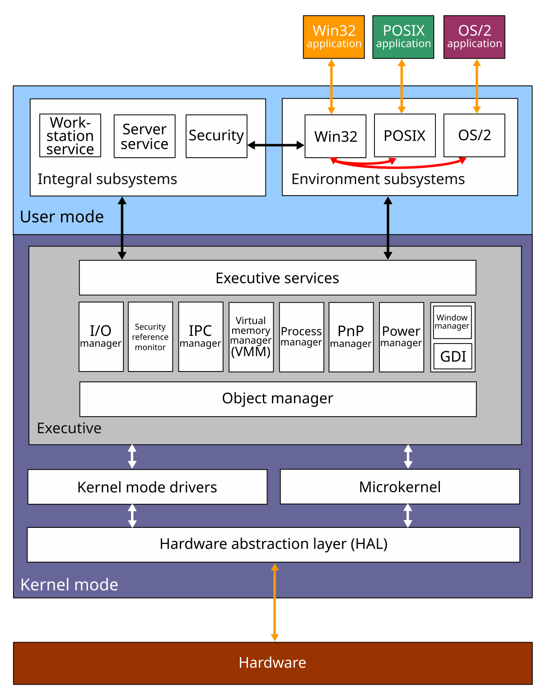

# Windows GDI 编程导论

## 前言

​	这一部分是Windows GDI编程的一个小导论，本质上更多的还是想初步接触一下Windows GDI编程才做的，这一个部分隶属于Windows 原生绘图（GDI/Win32 GDI），所以也就会有一些大杂烩

## 什么是GDI？

​	如果您看过我的OLED绘制的博客您就可以知道，我们在一个原生的OLED中，曾经就专门的抽象过PaintDevice设备来保证一个绘制流程的上下文，从而屏蔽了底层的绘图设备差异

> [OLED驱动开发记录_charlie114514191的博客-CSDN博客](https://blog.csdn.net/charlie114514191/category_12885464.html)

​	Windows也有一个更加复杂的东西叫做GDI，GDI（Graphics Device Interface）是 Windows 的传统绘图子系统，应用通过获取一个设备上下文（`HDC`），并把画笔/画刷/位图/字体等 GDI 对象选择到这个 DC 上，调用绘图函数（`Rectangle`、`Ellipse`、`BitBlt`、`TextOut` 等）来输出到显示器、打印机或内存位图。获取用于窗口客户区绘制的标准流程是处理 `WM_PAINT`，在 `WM_PAINT` 里调用 `BeginPaint` / `EndPaint` 并使用返回的 HDC 绘制。

​	 GDI 提供设备无关性，即应用程序可以面向不同输出设备统一绘制，保证屏幕与打印结果的一致性，这也是许多 “所见即所得”（WYSIWYG） 应用赖以实现的关键能力。应用程序不直接操作硬件，而是通过 GDI API 将绘图请求反馈给系统，再由 GDI 转发给相应的设备驱动。



​	这个里面呢，GDI 位于 **用户模式** 中，位于应用层（Win32 API）与设备驱动（Kernel 模式）之间。其结构为，咱们的Application调用 Win32 GDI APIs，如 `LineTo`, `TextOut`, `BitBlt`等等，GDI作为中间的桥接，接收这些调用，通过 **HDC（设备上下文）** 管理图形环境，至于写道哪里，这就是HDC进行管理的了。

| 特性         | GDI 优势                               | GDI 局限                        |
| ------------ | -------------------------------------- | ------------------------------- |
| 设备兼容     | 抽象设备差异，实现跨设备统一绘制       | 像素级控制能力有限              |
| 简单业务达成 | 绘制线条、文本、位图、基本图形非常方便 | 缺乏硬件加速，API 设计较底层    |
| 打印支持     | 能有效输出到打印机                     | 无精细控制，性能较差            |
| 时代适配     | 与 Windows 系统兼容性极佳              | 不适合现代动画、3D 或高性能场景 |

现代技术如 **GDI+** 对 GDI 进行了封装并增加渐变、Alpha 混合等特性；而 **Direct2D/DirectWrite** 则提供硬件加速与更灵活栅格渲染能力。

## 一些核心概念与常用类型

#### HDC（Device Context，设备上下文）

​	刚刚我们已经聊过了，`HDC` 是一组绘图属性与绘图目标的句柄，代表“你要在什么设备（屏幕、打印机、内存位图）上画”。先拿到 HDC，再在其上绘制。BeginPaint/GetDC/CreateCompatibleDC 等函数会返回或创建 HDC。

#### GDI 对象（笔/刷/位图/字体等）

​	下面我们更多的是了解一下GDI对象。一般有四个，如下所见。

- `HPEN`：画线/轮廓使用（风格、宽度、颜色）。
- `HBRUSH`：填充形状内部（纯色、图案、斜线等）。
- `HBITMAP`：位图数据，可选入内存 DC 或用于绘制。
- `HFONT`：文字字体句柄。

所有这些都是内核/用户资源，创建后必须适时释放（`DeleteObject`），否则会造成 GDI 对象泄露。Create/使用/释放的常见函数有 `CreatePen`、`CreateSolidBrush`、`CreateCompatibleBitmap`、`SelectObject`、`DeleteObject` 等。举例：`CreateSolidBrush` 创建后需要在不再需要时 `DeleteObject`。

### SelectObject 的重要语义

​	`SelectObject(hdc, hObj)` 会把某个 GDI 对象（笔/刷/位图/字体）选入 DC，并返回此前在该 DC 上的原对象。**务必保存并在结束绘制时把原对象恢复回去**（然后删除你新创建的对象）。否则会导致位图不能被释放或 DC 状态紊乱。微软文档明确指出应当这样做。（所以您可以看到，为什么GDI在后续被迭代不再推介使用了，不够智能）

------

## 什么消息需要我们绘制，以及绘制的规范流程（WM_PAINT / BeginPaint / EndPaint）

​	系统要求窗口把客户区的绘制放到 `WM_PAINT` 中处理：在 `WM_PAINT` 中调用 `BeginPaint(hwnd, &ps)` 获取 HDC，绘制完成后调用 `EndPaint(hwnd, &ps)`；这样系统可以正确管理无效矩形、擦除背景、避免闪烁等。非 `WM_PAINT` 绘制可以用 `GetDC`/`ReleaseDC`（但注意与 `BeginPaint` 的语义区别）。

​	当然，回避闪烁，如果您写过专门的OLED驱动便可以知道，我们可以使用双缓冲（Memory DC）机制防止频繁绘制导致的闪烁，常用做法是在内存 DC（兼容 DC）上完成全部绘制，然后用 `BitBlt` 一次性拷贝到屏幕 DC。微软文档说明内存 DC 在创建时只有 1×1 占位位图，必须先 `CreateCompatibleBitmap` 并 `SelectObject` 到内存 DC。

```
PAINTSTRUCT ps;
HDC hdc = BeginPaint(hwnd, &ps);
int w = ps.rcPaint.right - ps.rcPaint.left;
int h = ps.rcPaint.bottom - ps.rcPaint.top;

// 1. 创建兼容内存 DC
HDC memDC = CreateCompatibleDC(hdc);
HBITMAP hbm = CreateCompatibleBitmap(hdc, w, h);
HGDIOBJ oldBmp = SelectObject(memDC, hbm);

// 在 memDC 上绘制（示例：填背景，画矩形）
FillRect(memDC, &(RECT){0,0,w,h}, (HBRUSH)(COLOR_WINDOW+1));
HPEN hPen = CreatePen(PS_SOLID, 2, RGB(0,128,0));
HBRUSH hBrush = CreateSolidBrush(RGB(230,255,230));
HGDIOBJ oldPen = SelectObject(memDC, hPen);
HGDIOBJ oldBrush = SelectObject(memDC, hBrush);
Rectangle(memDC, 10,10, w-10, h-10);

// 2. 将内存位图一次性 blit 到屏幕 HDC
BitBlt(hdc, ps.rcPaint.left, ps.rcPaint.top, w, h, memDC, 0, 0, SRCCOPY);

// 恢复并释放
SelectObject(memDC, oldPen);
SelectObject(memDC, oldBrush);
DeleteObject(hPen); DeleteObject(hBrush);
SelectObject(memDC, oldBmp);
DeleteObject(hbm);
DeleteDC(memDC);
EndPaint(hwnd, &ps);
```

## 基本的绘图操作

```c
// simple_gdi.c  —— 编译：cl /EHsc simple_gdi.c user32.lib gdi32.lib
#include <windows.h>

LRESULT CALLBACK WndProc(HWND, UINT, WPARAM, LPARAM);

int WINAPI WinMain(HINSTANCE hInst, HINSTANCE hPrev, LPSTR lpCmd, int nCmdShow) {
    WNDCLASS wc = {0};
    wc.lpfnWndProc = WndProc;
    wc.hInstance = hInst;
    wc.lpszClassName = "MyGDIClass";
    wc.hbrBackground = (HBRUSH)(COLOR_WINDOW + 1);
    RegisterClass(&wc);

    HWND hwnd = CreateWindowEx(0, wc.lpszClassName, "Simple GDI Demo",
        WS_OVERLAPPEDWINDOW, CW_USEDEFAULT, CW_USEDEFAULT, 600, 400,
        NULL, NULL, hInst, NULL);

    ShowWindow(hwnd, nCmdShow);
    MSG msg;
    while (GetMessage(&msg, NULL, 0, 0)) {
        TranslateMessage(&msg);
        DispatchMessage(&msg);
    }
    return (int)msg.wParam;
}

LRESULT CALLBACK WndProc(HWND hwnd, UINT msg, WPARAM wParam, LPARAM lParam) {
    switch (msg) {
    case WM_PAINT: {
        PAINTSTRUCT ps;
        HDC hdc = BeginPaint(hwnd, &ps); // 获取绘制 HDC
        // 创建笔刷
        HPEN hPen = CreatePen(PS_SOLID, 3, RGB(220, 20, 60)); // 红色实线
        HBRUSH hBrush = CreateSolidBrush(RGB(200, 230, 255));
        // 选入 DC，并保存旧对象
        HGDIOBJ oldPen = SelectObject(hdc, hPen);
        HGDIOBJ oldBrush = SelectObject(hdc, hBrush);

        Rectangle(hdc, 40, 40, 320, 180);
        SetBkMode(hdc, TRANSPARENT);
        SetTextColor(hdc, RGB(0, 0, 120));
        TextOut(hdc, 50, 50, "Hello GDI", 9);

        // 恢复旧对象并释放新对象
        SelectObject(hdc, oldPen);
        SelectObject(hdc, oldBrush);
        DeleteObject(hPen);
        DeleteObject(hBrush);

        EndPaint(hwnd, &ps);
    } break;

    case WM_DESTROY:
        PostQuitMessage(0);
        return 0;
    }
    return DefWindowProc(hwnd, msg, wParam, lParam);
}
```

## 常见坑、性能与资源管理

### 1) GDI 对象泄露与上限

- 每个进程对 GDI 对象（pens/brushes/bitmaps 等）有配额限制（默认会话/系统上限等；常见情形为每进程默认 10,000）。长期泄露会导致绘制失败或进程异常。使用任务管理器（或 Process Explorer）可以查看每进程的 GDI 对象数，用来定位泄露。微软对 GDI 对象配额与监控有说明。

### 2) 不要 Delete 掉 stock 对象

- 通过 `GetStockObject` 获得的“stock”对象不应该 `DeleteObject`（它们由系统管理）。只有 `Create*` 创建的对象才需 `DeleteObject`。

### 3) 不要把同一 HBITMAP 同时选入两个 DC

- 文档明确：一个位图不能被同时选入多个 DC，否则会失败或行为未定义。

### 4) 线程注意事项

- DC 与窗口关联，与线程关系复杂：通常在窗口所属的线程内进行绘制（消息循环所在线程）。跨线程直接绘制可能带来竞态。

#### 5) 矢量/文本/Alpha 与 GDI 的局限

- 原生 GDI 对高质量反锯齿、Alpha 混合、硬件加速支持有限；现代应用推荐使用 GDI+、Direct2D 或 DirectWrite（用于高质量文本与硬件加速图形）。若你需要复杂图形/抗锯齿/硬件加速，考虑迁移。

## 聊一聊HPEN和HBRUSH两个重要组件

### **HPEN（画笔）**

- `HPEN` 是 GDI 用来绘制线条及图形边框的工具，有样式（实线、虚线、点线等）、宽度和颜色等属性。
- GDI 支持两类画笔：
  - **Cosmetic Pen**：宽度 ≤ 1 像素；
  - **Geometric Pen**：可定宽且端点样式灵活。
- 使用步骤：

1. `CreatePen(...)` 创建；
2. `SelectObject(hdc, hPen)` 选入；
3. 用 `LineTo`、`Rectangle` 等绘制；
4. 恢复旧笔并 `DeleteObject(hPen)`。

### **HBRUSH（画刷）**

- `HBRUSH` 用于填充图形内部，可为纯色刷、图案刷、或者使用系统 stock brushes
- 创建方式如 `CreateSolidBrush(RGB(...))`，选入 `HDC` 后用于 `Rectangle`、`Ellipse` 等
- 注意系统颜色常量如 `COLOR_WINDOW`，须加 1 后强制转为 `HBRUSH`，或使用 `GetSysColorBrush()` 获取更安全。

------

### 运作机制与原理深探

#### **句柄（Handle）机制**

- `HPEN`、`HBRUSH`、`HDC` 均为 Windows 封装的句柄，并非指针，其背后是由 GDI 管理的资源 ID 或索引。
- 句柄是进程内的私有资源，不可跨进程直接使用。系统管理 GDI 对象的生命周期，每个进程有上限。

- `SelectObject` 会将 GDI 对象（笔、刷、位图、字体等）安装到 `HDC`，并返回先前的对象。正确做法是保存旧对象并绘制后恢复，以防资源被锁定无法释放。
- 位图 (`HBITMAP`) 需注意：**一个位图不能被多个 DC 同时选入**，否则行为异常。

- `HDC` 内保存当前状态（Pen, Brush, 字体, mix mode 等），每次调用绘图 API 时都会使用这些设定。
- 绘图函数如 `Rectangle`, `Ellipse`, `LineTo`, `BitBlt` 等直接作用于当前对象；`GetCurrentObject` 可获取当前正在使用的 pen/brush。

------

### 各种画笔风格（虚线、点线、几何笔）

#### 1. 简单画笔（`CreatePen`）

`CreatePen(iStyle, width, color)` 支持多种风格：

- `PS_SOLID`：实线
- `PS_DASH`、`PS_DOT`、`PS_DASHDOT`、`PS_DASHDOTDOT`：虚线、点线、点划线，前提是笔宽 ≤1，否则会退化为实线

代码示例：

```c
HPEN pens[] = {
    CreatePen(PS_SOLID, 1, RGB(255, 0, 0)),
    CreatePen(PS_DASH, 1, RGB(0, 255, 0)),
    CreatePen(PS_DOT, 1, RGB(0, 0, 255)),
    CreatePen(PS_DASHDOT, 1, RGB(128, 0, 128)),
    CreatePen(PS_DASHDOTDOT, 1, RGB(255, 165, 0))
};
```

记得设置背景模式为透明，否则间隔会被填充背景色

```c
SetBkMode(hdc, TRANSPARENT);
```

#### 2. 几何画笔（`ExtCreatePen`）

支持更复杂样式——几何画笔，包括线帽（端点形状）、连接方式、用户自定义样式：

```c
DWORD style[] = { 5, 3, 2, 3 };  // dash, space, dot, space
LOGBRUSH lb = { BS_SOLID, RGB(0,0,0), 0 };
HPEN hPen = ExtCreatePen(PS_GEOMETRIC | PS_USERSTYLE | PS_ENDCAP_ROUND | PS_JOIN_ROUND,
                         5, &lb, 4, style);
```

它允许打造自定义用户样式（`PS_USERSTYLE`）并指定线宽、端点形状、连接方式 

------

## 绘制位图（HBITMAP）与文本（HFONT/HDC/ExtTextOut 等）：API + 底层原理

------

#### 位图（HBITMAP / DDB / DIB / DIBSECTION）——类型与内存布局（原理）

##### DDB vs DIB vs DIBSECTION

- **DDB（device-dependent bitmap）**：由 `CreateCompatibleBitmap`/`LoadBitmap` 等创建，会被映射为和显示设备相匹配的内部格式（不易直接访问像素）。
- **DIB（device-independent bitmap）**：以 `BITMAPINFO` 描述像素格式，便于跨设备移植；通常与文件 BMP 的内部格式一致（有 top-down / bottom-up 的存储约定）并要求每行按 DWORD（4 字节）对齐。
- **DIBSECTION（由 CreateDIBSection 创建）**：既是一个 HBITMAP，又把像素缓冲区映射到进程地址空间，返回一个指针 `ppvBits` 可以直接读写像素（这是它的最大价值）。详见 `CreateDIBSection` / `DIBSECTION` 文档。([微软学习](https://learn.microsoft.com/en-us/windows/win32/api/wingdi/nf-wingdi-createdibsection?utm_source=chatgpt.com))

备注：BMP / DIB 的每行必须按 4 字节对齐（scanline / stride），若行长度不是 4 的倍数需填充（padding）。这点在处理像素指针时必须注意（计算 stride/pitch）。([微软学习](https://learn.microsoft.com/en-us/windows/win32/gdi/bitmap-header-types?utm_source=chatgpt.com))

##### top-down / bottom-up 表示

在 `BITMAPINFOHEADER` 中，`biHeight` 为正代表 bottom-up（像 BMP 文件常见），为负代表 top-down（首行为图像顶部）。CreateDIBSection 可根据 header 创建所需方向（便于像素顺序控制）。([微软学习](https://learn.microsoft.com/en-us/windows/win32/api/wingdi/ns-wingdi-bitmapinfo?utm_source=chatgpt.com))

------

### 常见工作流程与示例代码

#### 简单：从文件/资源加载并用 BitBlt 绘制（最常见）

要点：使用 `LoadImage(..., IMAGE_BITMAP, ..., LR_LOADFROMFILE | LR_CREATEDIBSECTION)` 可以直接得到一个 DIBSection（如果你想要可直接访问像素，使用 `LR_CREATEDIBSECTION`）。加载后把位图选入内存 DC，再 `BitBlt` 到目标 DC。

```c
// Load + BitBlt（简洁示例）
HBITMAP hBmp = (HBITMAP)LoadImageW(NULL, L"myimage.bmp",
    IMAGE_BITMAP, 0, 0, LR_LOADFROMFILE | LR_CREATEDIBSECTION);
if (hBmp) {
    HDC hdcWnd = GetDC(hwnd);
    HDC memDC = CreateCompatibleDC(hdcWnd);
    HBITMAP old = (HBITMAP)SelectObject(memDC, hBmp);
    BitBlt(hdcWnd, 0,0, width, height, memDC, 0,0, SRCCOPY);
    SelectObject(memDC, old);
    DeleteDC(memDC);
    ReleaseDC(hwnd, hdcWnd);
    // DeleteObject(hBmp) when you no longer need it
}
```

注意：`LR_CREATEDIBSECTION` 让 `LoadImage` 返回 DIB section（而非 device-dependent bitmap），便于在需要时直接访问像素内存。

------

#### 进阶：CreateDIBSection —— 直接写像素（画动态图或做软件渲染）

典型用途：要生成像素（渐变、缓存、后期处理）或创建带 alpha 的图，先 `CreateDIBSection`（指定 `BITMAPINFO`），取得 `void *pvBits` 指针，直接填充像素，然后 `SelectObject` 到内存 DC，再 `BitBlt`/`AlphaBlend`。`pvBits` 的格式由 `BITMAPINFOHEADER` 的 `biBitCount` 和 `biCompression` 决定。([微软学习](https://learn.microsoft.com/en-us/windows/win32/api/wingdi/nf-wingdi-createdibsection?utm_source=chatgpt.com))

```c
// CreateDIBSection (32bpp top-down) 简洁示意
BITMAPINFO bmi = {0};
bmi.bmiHeader.biSize = sizeof(BITMAPINFOHEADER);
bmi.bmiHeader.biWidth = width;
bmi.bmiHeader.biHeight = -height;  // top-down: negative
bmi.bmiHeader.biPlanes = 1;
bmi.bmiHeader.biBitCount = 32;
bmi.bmiHeader.biCompression = BI_RGB; // or BI_BITFIELDS with masks if needed

void *pvBits = NULL;
HBITMAP hDib = CreateDIBSection(hdc, &bmi, DIB_RGB_COLORS, &pvBits, NULL, 0);
if (hDib && pvBits) {
    // 填写像素（示例假设 DWORD pixels, little-endian: 0xAARRGGBB 或 BGRA 取决于 masks）
    uint32_t *pixels = (uint32_t*)pvBits;
    for (int i=0;i<width*height;i++) pixels[i] = 0xFF00FF00; // ARGB green (需留意掩码/通道)
    HDC memDC = CreateCompatibleDC(hdc);
    HBITMAP old = (HBITMAP)SelectObject(memDC, hDib);
    BitBlt(hdc, x,y, width, height, memDC, 0,0, SRCCOPY);
    SelectObject(memDC, old);
    DeleteDC(memDC);
}
```

**重要**：当你使用 32bpp 并想要按像素 alpha 混合时，需要确保像素是**预乘（premultiplied）alpha** 或者使用正确的 BITMAPV5HEADER / 掩码来指定 alpha：`AlphaBlend` 期望源（某些实现）是 premultiplied BGRA 格式（见后 alpha 小节）。

------

### 透明/混合拷贝：TransparentBlt / AlphaBlend / BitBlt

- `BitBlt`：最基础的位块拷贝 + ROP（Raster Operation），可以做直接拷贝或按 ROP 混合。
- `TransparentBlt`：以某一颜色作为“透明键”进行拷贝（色键透明）；方便做简单的 chroma-key。注意 `TransparentBlt` 在内部可能调用拉伸逻辑，如果尺寸不同会做伸缩。
- `AlphaBlend`：支持每像素（或常量）alpha 混合，显示半透明像素（要求 msimg32 的实现，且需要正确的位图格式与 alpha 通道）。`AlphaBlend`/Alpha blending 的示例与说明见官方文档。

**链接/库**：`AlphaBlend` / `TransparentBlt` 等函数位于 `msimg32.dll`（开发时通常需要链接 `Msimg32.lib`）。

示例（AlphaBlend）：

```c
// 要求源 HBITMAP 为 32bpp 并含透明通道（通常预乘 alpha）
BLENDFUNCTION bf = { AC_SRC_OVER, 0, 255, AC_SRC_ALPHA };
AlphaBlend(hdcDest, x,y,w,h, hdcSrc, sx,sy,w,h, bf);
```

#### 文本绘制（HFONT / ExtTextOut / DrawText / 测量）与底层原理

- 绘制：`TextOut`（简单）、`ExtTextOut`（功能更全，支持 clipping/opaque/placement），`DrawText` / `DrawTextEx`（适合段落布局、换行、对齐）。一般建议使用 `ExtTextOut` 或 `DrawText` 以便把布局和设备驱动的绘制路径最直接传递给驱动。
- 测量：`GetTextExtentPoint32`（计算字符串像素宽高），`GetTextMetrics` / `GetOutlineTextMetrics`（获取字体度量）。用这些函数在绘制前做对齐（居中/换行）计算。

示例：居中绘制（DrawText）

```c
HFONT hFont = CreateFont(...);
HFONT old = (HFONT)SelectObject(hdc, hFont);
SetBkMode(hdc, TRANSPARENT);
SetTextColor(hdc, RGB(10,10,80));
RECT r = {0,0, w, h};
DrawTextW(hdc, L"Hello GDI", -1, &r, DT_CENTER | DT_VCENTER | DT_SINGLELINE);
SelectObject(hdc, old);
DeleteObject(hFont);
```

