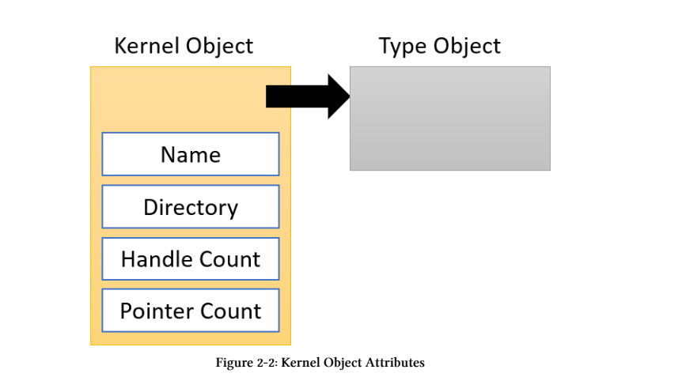
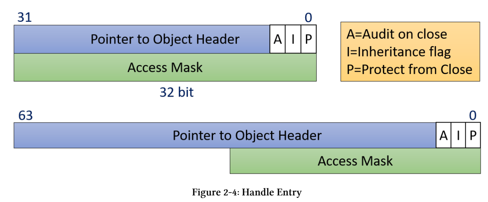

# 系统学习Windows编程：对象和句柄

## 前言

​	我们都知道Windows操作系统是一个面对对象的操作系统。其中它面向客户程序员（就是我们）暴露了多种不同的对象与句柄。

​	一般而言我们会称这些对象为内核对象，因为它们实际上代表了Windows操作系统内核的不同功能。比如说常见的内核对象有：进程、线程和文件等。这些被抽象成对象的模块。

​	 还有一种概念叫做句柄，句柄可以认为是与这些模块交流的一个把柄，捏住这些把柄我们实际上就可以同这些模块儿进行交流甚至是操控。

​	我们下面讨论这些内容！ 

## 内核对象

​	我们的内核对象给予我们一个可以在用户态操作内核的一个安全的桥梁。这些对象都是一种叫做“对象管理器”`(Object Manager)`来进行创建和管控的。这些内核对象实际上是使用引用计数来进行内存管理的。也就是说当引用计数达到零的时候（或者说最后一个句柄被释放时），这些内核对象将会自动的被清理干净（执行一些退出逻辑和内存释放）



​	这些内核对象自身运作在内核空间，是不可以直接被用户态程序直接操作，也就是说，我们的确提供了功能和程序之间的接口，但是没法直接操控，怎么办？那就是我们说的Handle来操作，我们使用API接口来返回操作这个内核对象的Handle句柄，这是为何呢？为什么要设计的如此复杂，理由如下：

- 任何发生在个对象内部的改变：比如说数据结构，比如说实现方法，都不影响我们的客户端的程序功能！因为接口总保持一致！
- 任何客户端想要访问这些内核对象必须要通过安全检查
- 这些句柄对于进程而言是私有的，所以拥有这一些句柄实际上只对当前进程有效而对其他进程是无效的！保证了访问的线程安全 

​	由于内核对象它是引用计数的，所以对象管理器实际上维护了一个句柄计数器和一个指针计数器（有时候返回指针，有时候返回的是对象句柄）。他们的和就是这个对象的总计数。我们用户态程序要是想要表达句柄应当要被关闭了，则是调用系统API函数CloseHandle函数，在那之后，这个句柄就会被无效化（实际上就是被释放了），我们在之后对这个句柄进行操作则会返回错误，使用函数GetLastError就会惊喜的（惊吓的）得到`ERROR_INVALID_HANDLE`函数。

​	值得一提的是HANDLE的大小总是是4，0从来都是一个无效的HANDLE！  HANDLE自己是一个句柄表中的index（我想你可以猜到为什么总是4的倍数了——我们直接拿之在句柄表寻址），创建句柄的函数，按照Windows的规范，总是是Create*或者是Open\*系列的函数。

​	对于是否创建成功，这里我想吐槽一句：Windows对这类句柄是否被创建成功，即这些句柄是否有效这件事情上的反馈是纷繁多样的！有一些函数则会返回零表示无效，另一些可能还会返回非法的句柄值即-1！（使用INVALID_HANDLE_VALUE） 所以一个办法那就是老老实实查文档说话，经验不一定总是对的！

### 关于单例的对象

​	我们有的时候希望我们的程序构建系统只是有且仅有一个对象，也就是说这个对象是单例的，不应当存在这个对象的副本！

​	这个时候我们就可以使用Windows操作系统的一个特性：那就是每一个对象都是有他对象的名称的，我们想要返回这个对象只需要提供这个对象名字就可以！这个名字是由我们自己提供的。

​	这个时候如果每一个程序线程流想要打开一个对象，我们只需要提供这个对象的名称，它就会在这个句柄表中依照对象名称查找对象！这个时候返回的对象就总是我们期望的那一个了！

```c++
HANDLE mutex = ::CreateMutex(nullptr, FALSE, L"SingleInstanceMutex");
if(!mutex){
	CString text;
    text.Format(L"Failed to create mutex: Error Code: %d", ::GetLastError());
    ::MessageBox(nullptr, text, L"Single Instance", MB_OK);
    return 0;
}
```

​	上面这个程序段几乎不可能失败!如果发生了失败那最有可能的场景是：这个对象使用的名称已经存在了！换一个名称是明智的选择！

​	我们下一步就是检查是不是单例：

```
if (::GetLastError() == ERROR_ALREADY_EXISTS) {
NotifyOtherInstance();
return 0;
}
```

## HANDLE

​	如上一节所述，句柄间接指向内核空间中的一个小数据结构，该结构包含该句柄的一些信息。



​	对于32位系统句柄的大小是8字节大小，对于64位操作系统是16字节一般而言12字节就够了但是它被扩展到了16字节！这是为了对齐！
