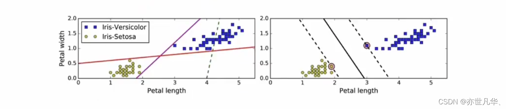

## 数据预处理

数据可以通过许多技术进行预处理，下面介绍常见打几种处理方式：

### 均值移除（Mean removal）

​	通常我们会把每个特征的平均值移除，以保证特征均值为0（即标准化处理）。这样做可以消除特征彼此间的偏差（bias）。

### 范围缩放（Scaling）

​	数据点中每个特征的数值范围可能变化很大，因此，有时将特征的数值范围缩放到合理的大小是非常重要的

### 归一化（Normalization）

​	数据归一化用于需要对特征向量的值进行调整时，以保证每个特征向量的值都缩放到相同的数值范围。机器学习中最常用的归一化形式就是将**特征向量调整为L1范数，使特征向量的数值之和为**1。这个方法经常用于确保数据点没有因为特征的基本性质而产生较大差异，即确保数据处于同一数量级，提高不同特征数据的可比性。

### 二值化（Binarization）

二值化用于将数值特征向量转换为布尔类型向量。

## 分类任务技巧

### 独热编码

​	通常，需要处理的数值都是稀疏地、散乱地分布在空间中，然而，我们并不需要存储这些大数值，这时就需要使用独热编码（One-Hot Encoding）。可以把独热编码看作是一种收紧（tighten）特征向量的工具。它把特征向量的每个特征与特征的非重复总数相对应，通过one-of-k 的形式对每个值进行编码。特征向量的每个特征值都按照这种方式编码，这样可以更加有效地表示空间。例如，我们需要处理4维向量空间，当给一个特性向量的第n 个特征进行编码时，编码器会遍历每个特征向量的第n 个特征，然后进行非重复计数。如果非重复计数的值是K，那么就把这个特征转换为只有一个值是1其他值都是0的K 维向量。

## 回归

​	回归是估计输入数据与连续值输出数据之间关系的过程。数据通常是实数形式的，我们的目标是估计满足输入到输出映射关系的基本函数。让我们从一个简单的示例开始。考虑下面的输入与输出映射关系
线性回归的目标是提取输入变量与输出变量的关联线性模型，这就要求实际输出与线性方程预测的输出的残差平方和（sum of squares of differences）最小化。这种方法被称为普通最小二乘法（Ordinary Least Squares，OLS）。

​	你可能觉得用一条曲线对这些点进行拟合效果会更好，但是线性回归不允许这样做。线性回归的主要优点就是方程简单。如果你想用非线性回归，可能会得到更准确的模型，但是拟合速度会慢很多。线性回归模型就像前面那张图里显示的，用一条直线近似数据点的趋势。接下来看看如何用Python建立线性回归模型。

## 验证

​	建立机器学习模型时，需要用一种方法来验证模型，检查模型是否达到一定的满意度（satisfactory level）。为了实现这个方法，把数据分成两组：训练数据集（training dataset）与测试数据集（testing dataset）。训练数据集用来建立模型，测试数据集用来验证模型对未知数据的学习效果
​	下面快速了解几个衡量回归器拟合效果的重要指标（metric）。回归器可以用许多不同的指标进行衡量，部分指标如下所示。

- 平均绝对误差（mean absolute error）：这是给定数据集的所有数据点的绝对误差平均值。
- 均方误差（mean squared error）：这是给定数据集的所有数据点的误差的平方的平均值。这是最流行的指标之一
- 中位数绝对误差（median absolute error）：这是给定数据集的所有数据点的误差的中位数。这个指标的主要优点是可以消除异常值（outlier）的干扰。测试数据集中的单个坏点不会影响整个误差指标，均值误差指标会受到异常点的影响。
- 解释方差分（explained variance score）：这个分数用于衡量我们的模型对数据集波动的解释能力。如果得分1.0分，那么表明我们的模型是完美的。
- R方得分（R2 score）：这个指标读作“R方”，是指确定性相关系数，用于衡量模型对未知样本预测的效果。最好的得分是1.0，值也可以是负数。

## 分类器

​	分类器可以是实现分类功能的任意算法，最简单的分类器就是简单的数学函数。在真实世界中，分类器可以是非常复杂的形式。在学习过程中，可以看到二元（binary）分类器，将数据分成两类，也可以看到多元（multiclass）分类器，将数据分成两个以上的类型。解决分类问题的数据手段都倾向于解决二元分类问题，可以通过不同的形式对其进行扩展，进而解决多元分类问题

## 交叉验证

交叉验证是机器学习的重要概念。在上一节中，我们把数据分成了训练数据集和测试数据集。然而，为了能够让模型更加稳定，还需要用数据集的不同子集进行反复的验证。如果只是对特定的子集进行微调，最终可能会过度拟合（overfitting）模型。过度拟合是指模型在已知数据集上拟合得超级好，但是一遇到未知数据就挂了。

当处理机器学习模型时，通常关心3个指标：精度（precision）、召回率（recall）和F1得分（F1 score）。可以用参数评分标准（parameter scoring）获得各项指标的得分。精度是指被分类器正确分类的样本数量占分类器总分类样本数量的百分比（分类器分类结果中，有一些样本分错了）。召回率是指被应正确分类的样本数量占某分类总样本数量的百分比（有一些样本属于某分类，但分类器却没有分出来）
一个给力的机器学习模型需要同时具备良好的精度和召回率。这两个指标是二律背反的，一个指标达到100%，那么另一个指标就会非常差！我们需要保持两个指标能够同时处于合理高度。为了量化两个指标的均衡性，引入了F1得分指标，是精度和召回率的合成指标，实际上是精度和召回率的调和均值（harmonic mean）：
$$
F1 得分＝2×精度×召回率 / (精度+召回率)
$$

## 预测模型

​	预测建模（Predictive modeling）可能是数据分析中最吸引人的领域之一。近几年，由于大数据在各个垂直领域的蓬勃发展，预测建模备受关注。在数据挖掘领域，预测建模常用来预测未来趋势。预测建模是一种用来预测系统未来行为的分析技术，它由一群能够识别独立输入变量与反馈目标关联关系的算法构成。我们根据观测值创建一个数学模型，然后用这个模型去预测未来发生的事情。
​	在预测建模中，需要收集已知的响应数据来训练模型。一旦模型建成，就可以用一些指标来检验它，然后用它预测未来值。可以通过许多种不同的算法来创建预测模型。本章将利用SVM来建立线性模型与非线性模型。
预测模型是用若干可能对系统行为产生影响的特征构建的。例如，如果要预测天气情况，就需要用气温、大气压、降雨量和其他的气象数据。类似地，当处理其他系统问题时，也需要先判断哪些因素可能会影响系统的行为，然后在训练模型之前把这些因素加入特征中。

## SVM

​	支持向量机（Support Vector Machine，SVM）是一种经典的监督学习算法，用于解决二分类和多分类问题。其核心思想是通过在特征空间中找到一个最优的超平面来进行分类，并且间隔最大。

​	SVM能够执行线性或非线性分类、回归，甚至是异常值检测任务。它是机器学习领域最受欢迎的模型之一。SVM特别适用于中小型复杂数据集的分类。

SVM算法的优点：

1. SVM方法既可以用于分类（二/多分类），也可用于回归和异常值检测。

2. SVM具有良好的鲁棒性，对未知数据拥有很强的泛化能力，特别是在数据量较少的情况下，相较其他传统机器学习算法具有更优的性能。

使用SVM作为模型时，通常采用如下流程：

1. 对样本数据进行归一化
2. 应用核函数对样本进行映射（最常采用和核函数是RBF和Linear，在样本线性可分时，Linear效果要比RBF好)

3. 用cross-validation和grid-search对超参数进行优选

4. 用最优参数调练得到模型

5. 测试

## 无监督学习

​	无监督学习是一种对不含标记的数据建立模型的机器学习范式。到目前为止，我们处理的数据都带有某种形式的标记，也就是说，学习算法可以根据标记看到这些数据，并对数据进行分类。但是，在无监督学习的世界中，我们没有这样的条件了。当需要用一些相似性指标对数据集进行分组时，就会用到这些算法了。

​	最常见的无监督学习方法就是聚类，你一定对这个词耳熟能详。当需要把无标记的数据分成几种集群时，就要用它来分析。这些集群通常是根据某种相似度指标进行划分的，例如欧氏距离（Euclidean distance）。无监督学习广泛应用于各种领域，如数据挖掘、医学影像、股票市场分析、计算机视觉、市场细分等。

​	k-means算法是最流行的聚类算法之一。这个算法常常利用数据的不同属性将输入数据划分为k组。分组是使用最优化的技术实现的，即让各组内的数据点与该组中心点的距离平方和最小化。

​	k-means聚类的主要应用之一就是矢量量化。简单来说，矢量量化就是“四舍五入”（rounding off）的N维版本。在处理数字等一维数据时，会用四舍五入技术减少存储空间。例如，如果只需要精确到两位小数，那么不会直接存储23.73473572，而是用23.73来代替。如果不关心小数部分，甚至可以直接存储24，这取决于我们的真实需求。
同理，当把四舍五入这个概念推广到N维数据时，就变成了矢量量化。当然，矢量量化的细节很多，你可以在http://www.data-compression.com/vq.shtml里学习更多的内容。矢量量化被广泛应用于图片压缩，我们用比原始图像更少的比特数来存储每个像素，从而实现图像图片。均值漂移是一种非常强大的无监督学习算法，用于集群数据点。该算法把数据点的分布看成是概率密度函数（probability-density function），希望在特征空间中根据函数分布特征找出数据点的“模式”（mode）。这些“模式”就对应于一群群局部最密集（local maxima）分布的点。均值漂移算法的优点是它不需要事先确定集群的数量。
层次聚类是一组聚类算法，通过不断地分解或合并集群来构建树状集群（tree-like clusters）。层次聚类的结构可以用一颗树表示。

## 层次聚类

​	层次聚类算法可以是自下而上的，也可以是自上而下的。具体是什么含义呢？在自下而上的算法中，每个数据点都被看作是一个单独的集群。这些集群不断地合并，直到所有的集群都合并成一个巨型集群。这被称为凝聚层次聚类。与之相反的是，自上而下层次的算法是从一个巨大的集群开始，不断地分解，直到所有的集群变成一个单独的数据点。你可以在http://nlp.stanford.edu/IR-book/html/htmledition/hierarchical-agglomerative-clustering-1.html学习更多的内容。