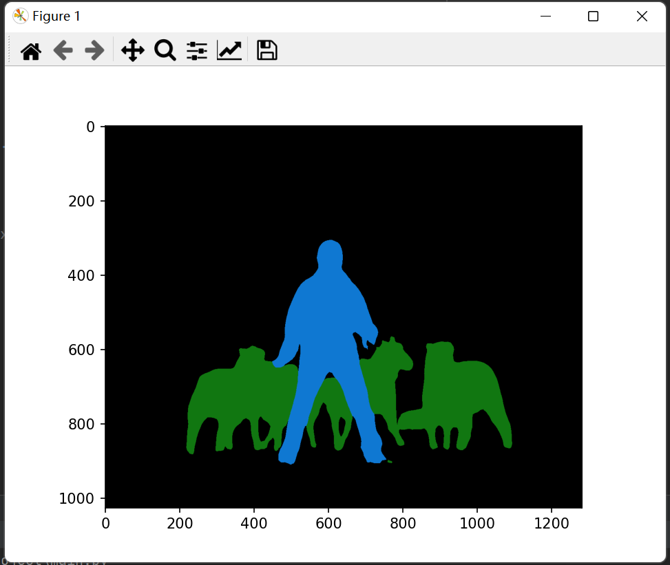
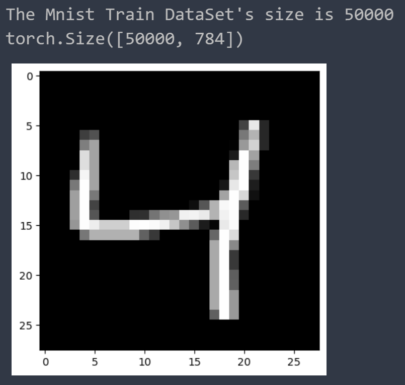
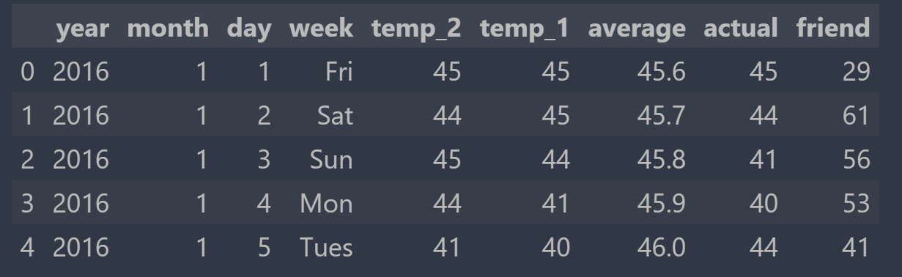
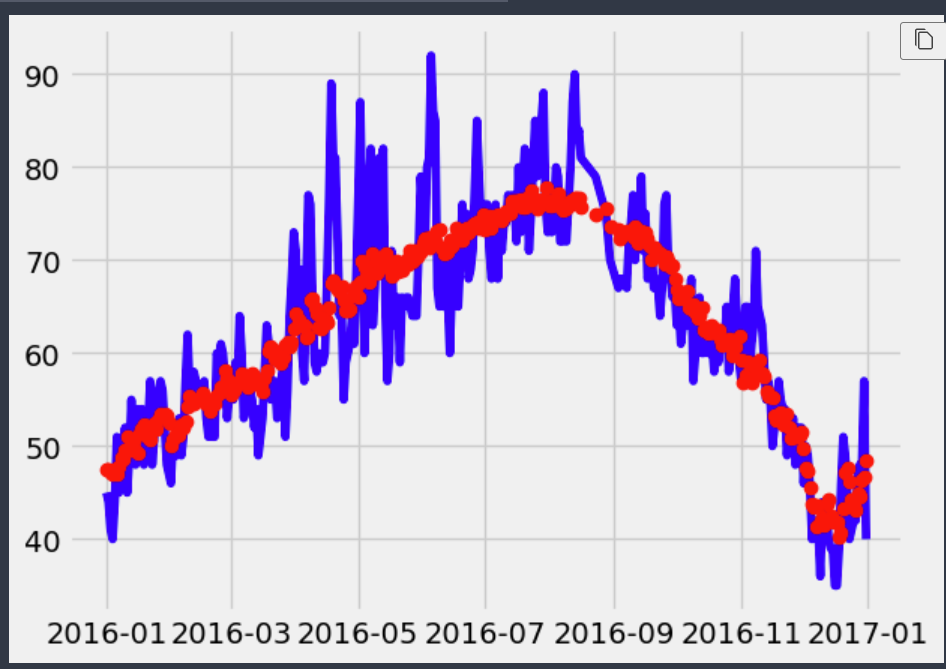
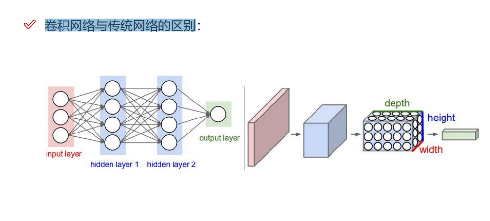
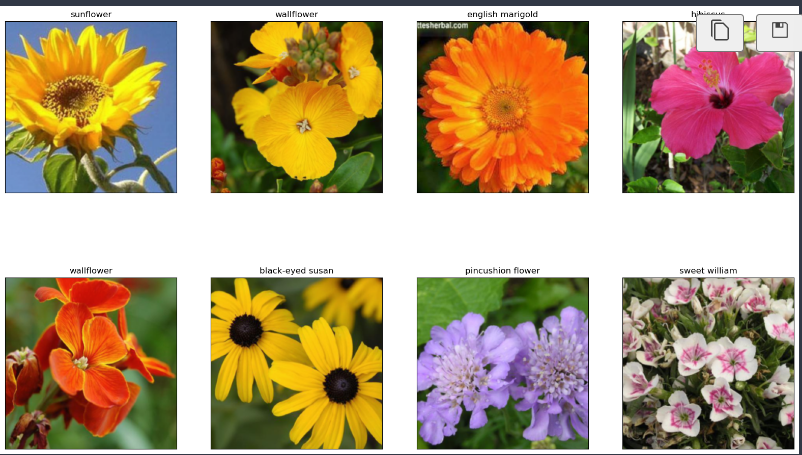
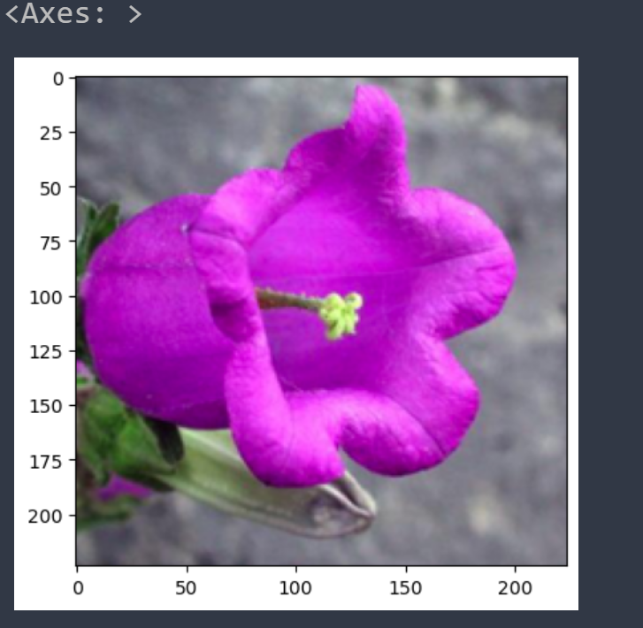

# Pytorch 学习路程

​	Pytorch是重要的人工智能深度学习框架。既然已经点进来，我们就详细的介绍一下啥是Pytorch

>[PyTorch](https://pytorch.org/)

- 希望将其代替 Numpy 来利用 GPUs 的威力；
- 一个可以提供更加灵活和快速的深度学习研究平台。

## 下载Pytorch

​	不必着急担心我们下啥版本，Pytorch官网已经给出了一个良好的解决方案：


​	请根据自己的网站给出的方案进行选择！不要抄我的！

​	可以复制到Pycharm中，确定好自己的虚拟环境之后，就可以愉快的在终端执行网站推介的配置.

> 可以在Package包中选择自己的包管理：如果你的环境是conda环境，我个人推介使用conda来下（方便管理）

​	等待半个小时，我们下好了之后，，就可以使用这个代码跑一下：

> 在Pycharm的Python控制台上

```python
import torch
torch.__version__
```

> 之后我们将会在控制台上尝试我们的代码，这里就不赘述了

### 入门尝试

​	我们随意的试一试一些API：

​	我们可以很轻松的创建一个矩阵：

> [torch.empty — PyTorch 2.2 documentation](https://pytorch.org/docs/stable/generated/torch.empty.html#torch-empty)

```
x = torch.empty(5, 3)
x
```

```
tensor([[1.4767e+20, 1.6816e-42, 0.0000e+00],
        [0.0000e+00, 0.0000e+00, 0.0000e+00],
        [0.0000e+00, 0.0000e+00, 0.0000e+00],
        [0.0000e+00, 0.0000e+00, 0.0000e+00],
        [0.0000e+00, 0.0000e+00, 0.0000e+00]])
```

​	我们就会创建一个给定大小的torch:他的值是未初始化的（你可以反复执行查看结果，你会发现结果可能每一次都会发生变化）

​	我们可以很轻松的创建一个随机矩阵：

> [torch.rand — PyTorch 2.2 documentation](https://pytorch.org/docs/stable/generated/torch.rand.html#torch-rand)

```
x = torch.rand(5, 3)
x
```

```
tensor([[0.7140, 0.1131, 0.6945],
        [0.8082, 0.6078, 0.5954],
        [0.9646, 0.6500, 0.8988],
        [0.4161, 0.1819, 0.3053],
        [0.1953, 0.3988, 0.9033]])
```

​	由此可见，他会随机的生成一些介于0和1之间的随机值

>[torch.zeros — PyTorch 2.2 documentation](https://pytorch.org/docs/stable/generated/torch.zeros.html)

```
x = torch.zeros(5, 3, dtype=torch.long)
x
```

​	将返回给我们一个全0的矩阵

​	我们还可以升级已有的数组结构：

>[torch.tensor — PyTorch 2.2 documentation](https://pytorch.org/docs/stable/generated/torch.tensor.html)

```
x = torch.tensor([5.5, 3])
x
```

```
tensor([5.5000, 3.0000])
```

​	当然可以使用size查看torch的大小

```
x.size()
```

​	还可以对之进行简单的操作：

```
y = torch.rand(5, 3)
x + y
# 等价操作：torch.add(x, y)
```

```
tensor([[1.1685, 1.4813, 1.1385],
        [1.4541, 1.4664, 1.4721],
        [1.5987, 1.1817, 1.3344],
        [1.2923, 1.8951, 1.8134],
        [1.8740, 1.7830, 1.7349]], dtype=torch.float64)
```

​	还可以同一般的Python那样进行索引

```
print(x)
x[:, 1]
```

```
tensor([[1., 1., 1.],
        [1., 1., 1.],
        [1., 1., 1.],
        [1., 1., 1.],
        [1., 1., 1.]], dtype=torch.float64)
tensor([1., 1., 1., 1., 1.], dtype=torch.float64)
```

​	还可以变换维度

>[torch.Tensor.view — PyTorch 2.2 documentation](https://pytorch.org/docs/stable/generated/torch.Tensor.view.html#torch-tensor-view)

PyTorch中的view( )函数相当于numpy中的resize( )函数，都是用来重构(或者调整)张量维度的，用法稍有不同。

```
x = torch.randn(4, 4)
y = x.view(16)
z = x.view(-1, 8) 
print(x.size(), y.size(), z.size())
```

​	还支持同其他库的协同操作：

```
a = torch.ones(5)
b = a.numpy()
b
```

```
array([1., 1., 1., 1., 1.], dtype=float32)
```

```
import numpy as np
a = np.ones(5)
b = torch.from_numpy(a)
b
```

```
tensor([1., 1., 1., 1., 1.], dtype=torch.float64)
```

## 几种常见的Tensor

> [torch.Tensor — PyTorch 2.2 documentation](https://pytorch.org/docs/stable/tensors.html)

​	我们的Tensor叫张量，回忆线性代数，我们的张量有维度，我们的维度可以从0上升到：

```
0: scalar		# 标量
1: vector		# 向量
2: matrix
3: n-dim tensor
```

### Scalar

​	通常就是一个数值：

```
x = tensor(42.)
x
```

​	你就会发现结果实际上就是封装起来的一个数字：

```
tensor(42.)
```

​	使用dim方法可以查看这个张量的维度：

```
x.dim()
```

```
0
```

​	可以简单使用标量乘法，跟线性代数定义的乘法完全一致：

```
2 * x
```

```
tensor(84.)
```

​	对于标量，我们可以使用item方法提取里面的值

```
x.item()
```

​	但是建议判断item的维度选用这个方法，因为对于向量，这个方法会抛error

```
y = torch.tensor([3, 4])
y.item()
---------------------------------------------------------------------------
RuntimeError                              Traceback (most recent call last)
Cell In[9], line 2
      1 y = torch.tensor([3, 4])
----> 2 y.item()

RuntimeError: a Tensor with 2 elements cannot be converted to Scalar
```

### Vector

​	例如： `[-5., 2., 0.]`，在深度学习中通常指特征，例如词向量特征，某一维度特征等

### Matrix

​	我们深度学习的计算多涉及矩阵：

```
M = tensor([[1., 2.], [3., 4.]])
M
```

```
tensor([[1., 2.],
        [3., 4.]])
```

​	矩阵可以进行矩阵乘法，但是要求满足线性代数下矩阵的乘法规则：

```
N = tensor([1, 2, 3])
M.matmul(N)
```

```
---------------------------------------------------------------------------
RuntimeError                              Traceback (most recent call last)
Cell In[12], line 2
      1 N = tensor([1, 2, 3])
----> 2 M.matmul(N)

RuntimeError: size mismatch, got input (2), mat (2x2), vec (3)
```


## AutoGrad机制

> [深度解析 PyTorch Autograd：从原理到实践 - 知乎 (zhihu.com)](https://zhuanlan.zhihu.com/p/676009630)
>
> [Pytorch autograd,backward详解 - 知乎 (zhihu.com)](https://zhuanlan.zhihu.com/p/83172023)

​	参考这两个博客，我来写写我的理解。我们构建的是基于张量的函数算子：
$$
f = f(X, Y, Z, ...)
$$
​	现在，我们需要求导，首先就要思考，对于多张量的函数，跟多变量函数一样，一些变量是我们这次运算中需要被求导的，一些不是，这样，我们就需要使用Tensor的required_grad参数机制：

```
x = torch.randn(3,4,requires_grad=True)
x
```

​	这样我们的x在后续参与函数运算的时候，在我们反向传播的时候就会参与求导运算。

> 一些参数的解释

- `data`: 即存储的数据信息
- `requires_grad`: 设置为`True`则表示该Tensor需要求导
- `grad`: 该Tensor的梯度值，每次在计算backward时都需要将前一时刻的梯度归零，否则梯度值会一直累加，这个会在后面讲到。
- `grad_fn`: 叶子节点通常为None，只有结果节点的grad_fn才有效，用于指示梯度函数是哪种类型。例如上面示例代码中的`y.grad_fn=<PowBackward0 at 0x213550af048>, z.grad_fn=<AddBackward0 at 0x2135df11be0>`
- `is_leaf`: 用来指示该Tensor是否是叶子节点。

​	现在我们引入函数算子：

```
b = torch.randn(3,4,requires_grad=True)
# print(b)
t = x + b
t
```

​	我们实际上完成的是两个张量的相加，现在我们就知道，t作为一个结果，发生了两个张量的相加：

```
tensor([[ 1.2804, -1.8381,  0.0068, -0.3126],
        [-0.4901,  1.5733, -1.1383,  1.4996],
        [ 1.9931, -0.7548, -1.1527, -1.1703]], grad_fn=<AddBackward0>)# 看后面这个，这个说明稍后我们反向传播的时候使用AddBackward算子
```

​	使用`y.backward()`进行反向传播，这个时候，我们如何查看参与运算的张量的梯度呢，答案是：

```
print(x.grad)
print(b.grad)
```

​	可以注意到：我们求一次`y.backward()`，这个结果就会累加一次。

​	注意到，一些张量不是我们定义出来的而是算出来的，代表性的就是t,反之剩下的是参与基础运算的x和b

```
print(x.is_leaf, b.is_leaf, t.is_leaf)
True True False
```

​	这样我们就不会对叶子向量求导了！他们就是基础的变量。

### 线性回归尝试

​	啥是线性回归呢，我的理解是：使用线性的函数（如果不理解，那就是`y = kx + b`）拟合数据。我们从简单的线性拟合来。

​	生成一组`(x, y)`对

```
import numpy as np
x_values = [i for i in range(11)]
x_train = np.array(x_values, dtype=np.float32)
x_train = x_train.reshape(-1, 1)
x_train.shape
x_train
```

```
array([[ 0.],
       [ 1.],
       [ 2.],
       [ 3.],
       [ 4.],
       [ 5.],
       [ 6.],
       [ 7.],
       [ 8.],
       [ 9.],
       [10.]], dtype=float32)
```

```
y_values = [2*i + 1 for i in x_values]
y_train = np.array(y_values, dtype=np.float32)
y_train = y_train.reshape(-1, 1)
y_train.shape
y_train
```

```
array([[ 1.],
       [ 3.],
       [ 5.],
       [ 7.],
       [ 9.],
       [11.],
       [13.],
       [15.],
       [17.],
       [19.],
       [21.]], dtype=float32)
```

​	现在我们使用torch框架下的线性回归：

```
import torch
import torch.nn as nn
```

```
class LinearRegressionModel(nn.Module):
    def __init__(self, input_dim, output_dim):
        super(LinearRegressionModel, self).__init__()
        self.linear = nn.Linear(input_dim, output_dim)  

    def forward(self, x):
        out = self.linear(x) # 向前传播
        return out
```

​	这样我们就完成了一个最简单的模型

```
input_dim = 1
output_dim = 1

model = LinearRegressionModel(input_dim, output_dim)
model
```

```
LinearRegressionModel(
  (linear): Linear(in_features=1, out_features=1, bias=True)
)
```

```
epochs = 1000			# 训练论数
learning_rate = 0.01	# 学习速率
optimizer = torch.optim.SGD(model.parameters(), lr=learning_rate)	# 随机梯度下降
criterion = nn.MSELoss()	# 正则化惩罚系数
```

​	在这里我们进行训练

```
for epoch in range(epochs):
    epoch += 1
    # 注意转行成tensor
    inputs = torch.from_numpy(x_train)
    labels = torch.from_numpy(y_train)

    # 梯度要清零每一次迭代
    optimizer.zero_grad() 

    # 前向传播
    outputs = model(inputs)

    # 计算损失
    loss = criterion(outputs, labels)

    # 返向传播
    loss.backward()

    # 更新权重参数
    optimizer.step()
    if epoch % 50 == 0:
        print('epoch {}, loss {}'.format(epoch, loss.item()))
```

​	我们可以这样得到预测的值：

```
predicted = model(torch.from_numpy(x_train).requires_grad_()).data.numpy()
predicted
```

​	如何存取模型呢：

```
torch.save(model.state_dict(), 'model.pkl')
model.load_state_dict(torch.load('model.pkl'))
```

​	也可以使用GPU训练

```
import torch
import torch.nn as nn
import numpy as np


class LinearRegressionModel(nn.Module):
    def __init__(self, input_dim, output_dim):
        super(LinearRegressionModel, self).__init__()
        self.linear = nn.Linear(input_dim, output_dim)  

    def forward(self, x):
        out = self.linear(x)
        return out

input_dim = 1
output_dim = 1

model = LinearRegressionModel(input_dim, output_dim)

# 在这里，直接扔到GPU就行
device = torch.device("cuda:0" if torch.cuda.is_available() else "cpu")
model.to(device)


criterion = nn.MSELoss()


learning_rate = 0.01

optimizer = torch.optim.SGD(model.parameters(), lr=learning_rate)

epochs = 1000
for epoch in range(epochs):
    epoch += 1
    inputs = torch.from_numpy(x_train).to(device)
    labels = torch.from_numpy(y_train).to(device)

    optimizer.zero_grad() 

    outputs = model(inputs)

    loss = criterion(outputs, labels)

    loss.backward()

    optimizer.step()

    if epoch % 50 == 0:
        print('epoch {}, loss {}'.format(epoch, loss.item()))
```

## 使用hub模块

> [torch.hub — PyTorch 2.2 documentation](https://pytorch.org/docs/stable/hub.html)

​	**Pytorch Hub是一个帮助研究者实现模型再现、快速推理验证的预训练模型库与一套相关的API框架**。支持远程从github上下载指定模型、上传与分享训练好的模型、支持从本地加载预训练模型、自定义模型。支持模型远程加载与本地推理、当前Pytorch Hub已经对接到Torchvision、YOLOv5、YOLOv8、pytorchvideo等视觉框架

​	人话：我们可以直接在操作这些API直接嫖设置好的模型直接用。

​	我们可以前往[Pytorch Hub](https://pytorch.org/hub)尝试，搜索你感兴趣的模型：来个例子，我们对deeplabv3_resnet101，就可以搜索到Tutorial:

[Deeplabv3 | PyTorch](https://pytorch.org/hub/pytorch_vision_deeplabv3_resnet101/)

```
import torch
model = torch.hub.load('pytorch/vision:v0.10.0', 'deeplabv3_resnet50', pretrained=True)
# or any of these variants
# model = torch.hub.load('pytorch/vision:v0.10.0', 'deeplabv3_resnet101', pretrained=True)
# model = torch.hub.load('pytorch/vision:v0.10.0', 'deeplabv3_mobilenet_v3_large', pretrained=True)
model.eval()
```

​	这个时候他会下载模型（默认保存在用户文件夹下的`C:/User/.cache/torch/`下）

​	之后下载数据集：

```
# Download an example image from the pytorch website
import urllib
url, filename = ("https://github.com/pytorch/hub/raw/master/images/deeplab1.png", "deeplab1.png")
try: urllib.URLopener().retrieve(url, filename)
except: urllib.request.urlretrieve(url, filename)
```

> 如果网络不好，请手动到地址下载！放到指定位置

​	然后处理它：

```
# sample execution (requires torchvision)
from PIL import Image
from torchvision import transforms
# 定义transform算子
input_image = Image.open(filename)
input_image = input_image.convert("RGB")
preprocess = transforms.Compose([
    transforms.ToTensor(),
    transforms.Normalize(mean=[0.485, 0.456, 0.406], std=[0.229, 0.224, 0.225]),
])
# 预处理
input_tensor = preprocess(input_image)
input_batch = input_tensor.unsqueeze(0) # create a mini-batch as expected by the model

# move the input and model to GPU for speed if available
if torch.cuda.is_available():
    input_batch = input_batch.to('cuda')
    model.to('cuda')

with torch.no_grad():
    output = model(input_batch)['out'][0]
output_predictions = output.argmax(0)
```

​	查看效果如何

```
# create a color pallette, selecting a color for each class
palette = torch.tensor([2 ** 25 - 1, 2 ** 15 - 1, 2 ** 21 - 1])
colors = torch.as_tensor([i for i in range(21)])[:, None] * palette
colors = (colors % 255).numpy().astype("uint8")

# plot the semantic segmentation predictions of 21 classes in each color
r = Image.fromarray(output_predictions.byte().cpu().numpy()).resize(input_image.size)
r.putpalette(colors)

import matplotlib.pyplot as plt
plt.imshow(r)
plt.show()
```



分类成功。

# Pytorch学习路程 2：神经网络分类与实战

## 神经网络分类

​	我们以最为经典的MNIST数据集为例子，识别手写的数字（这个太经典了）

### 下载数据集

​	我们的第一步就是下载数据集完成这项任务：

```python
%matplotlib inline 

from pathlib import Path
import requests

DATA_PATH = Path("data")
PATH = DATA_PATH / "mnist"

PATH.mkdir(parents=True, exist_ok=True)	# 创建一个这样的文件夹以

URL = "http://deeplearning.net/data/mnist/"
FILENAME = "mnist.pkl.gz"

if not (PATH / FILENAME).exists():
        content = requests.get(URL + FILENAME).content
        (PATH / FILENAME).open("wb").write(content)
        
```

> 1.[Python绘图问题：Matplotlib中%matplotlib inline是什么、如何使用？_%matplotlib inline mial-CSDN博客](https://blog.csdn.net/liangzuojiayi/article/details/78183783)，这个博客可以回答为什么整一个`%matplotlib inline`
>
> 我们实际上在这里做的就是将数据集写入到我们指定的包。使用的是网络包请求

​	下一步就是将下载的数据写入对应的地方：怎么写呢？使用Pickel模块完成这个任务：

> 啥是Pickle:可以简单的理解为对文件直接写入读出二进制流，省去我们操心
>
> 或者说，Pickle让数据持久化保存。pickle模块是Python专用的持久化模块，可以持久化包括自定义类在内的各种数据，比较适合Python本身复杂数据的存贮。但是持久化后的字串是不可认读的，并且只能用于Python环境，不能用作与其它语言进行数据交换。
>
> 把 Python 对象直接保存到文件里，而不需要先把它们转化为字符串再保存，也不需要用底层的文件访问操作，直接把它们写入到一个二进制文件里。pickle 模块会创建一个 Python 语言专用的二进制格式，不需要使用者考虑任何文件细节，它会帮你完成读写对象操作。用pickle比你打开文件、转换数据格式并写入这样的操作要节省不少代码行。

​	我们下载的是压缩的文件包（嗯，没人喜欢把数据撒拉出来一大堆），也就是说我们需要使用一个压缩包库来读取里头的数据：

```
import pickle
import gzip

with gzip.open((PATH / FILENAME).as_posix(), "rb") as f:
        ((x_train, y_train), (x_valid, y_valid), _) = pickle.load(f, encoding="latin-1")
```

>关于gzip的使用：[python中gzip模块的使用 - eliwang - 博客园 (cnblogs.com)](https://www.cnblogs.com/eliwang/p/14591861.html)

### 加载数据集

```
from matplotlib import pyplot
import numpy as np

print("The Mnist Train DataSet's size is {0}".format(len(x_train)))
pyplot.imshow(x_train[2].reshape((28, 28)), cmap="gray")
print(x_train.shape)
```

​	我们上面的两行代码将x, y两个训练集的数据集加载到了程序里头。



​	现在，我们终于可以把目光放到使用神经网络来处理这些数据了：

​	实际上流程图是这样的：这个神经网络学习这些像素的排布以认识这些数字对应的像素排布是如何的，反过来做，我们就可以根据一个图像得到这个数字是什么。


​	可以看到，我们的输出是一个概率图谱（也就是说：他是何种数字的概率是多少）

​	所以，为了转化成模型可以接受的数据格式，需要将之转化为Tensor:

```python
import torch

x_train, y_train, x_valid, y_valid = map(
    torch.tensor, (x_train, y_train, x_valid, y_valid)
)

# 下面是打印检查，可以不需要
n, c = x_train.shape
print("n= {0}, c={1}".format(n, c))
x_train, x_train.shape, y_train.min(), y_train.max()
print(x_train, y_train)
print(x_train.shape)
print(y_train.min(), y_train.max())
```

```
n= 50000, c=784
tensor([[0., 0., 0.,  ..., 0., 0., 0.],
        [0., 0., 0.,  ..., 0., 0., 0.],
        [0., 0., 0.,  ..., 0., 0., 0.],
        ...,
        [0., 0., 0.,  ..., 0., 0., 0.],
        [0., 0., 0.,  ..., 0., 0., 0.],
        [0., 0., 0.,  ..., 0., 0., 0.]]) tensor([5, 0, 4,  ..., 8, 4, 8])
torch.Size([50000, 784])
tensor(0) tensor(9)
```

​	这就是打印出来的结果。

### 定义损失函数

​	**损失函数，又叫目标函数，用于计算真实值和预测值之间差异的函数，和优化器是编译一个神经网络模型的重要要素**。 损失Loss必须是标量，因为向量无法比较大小（向量本身需要通过范数等标量来比较）。 损失函数一般分为4种，HingeLoss 0-1 损失函数，绝对值损失函数，平方损失函数，对数损失函数。

​	任何一个有**负对数似然组成的损失**都是定义在训练集上的经验分布和定义在模型上的概率分布之间的交叉熵。例如，均方误差是经验分布和高斯模型之间的交叉熵

​	这里我们两种实践方案：就是使用`torch.nn.functional`或者是`torch.nn.Module`。一般情况下，如果模型有可学习的参数，最好用nn.Module，其他情况nn.functional相对更简单一些。

​	所以这里，我们只是完成交叉熵损失计算，没必要上大炮：

```
import torch.nn.functional
loss_func = torch.nn.functional.cross_entropy
def model(xb):
    return xb.mm(weights) + bias
```

```python
bs = 64
xb = x_train[0:bs]  # a mini-batch from x
yb = y_train[0:bs]
# 生成一组随机的权重
weights = torch.randn([784, 10], dtype = torch.float,  requires_grad = True) 
bs = 64
bias = torch.zeros(10, requires_grad=True)

print(loss_func(model(xb), yb))
```

​	看看我们使用loss_func的行为如何

```python
tensor(10.8561, grad_fn=<NllLossBackward0>)
```

### 创建模型

​	我们现在可以创建一个模型了：

​	值得注意的是：

>必须继承nn.Module且在其构造函数中需调用nn.Module的构造函数
>
>无需写反向传播函数，nn.Module能够利用autograd自动实现反向传播
>
>Module中的可学习参数可以通过named_parameters()或者parameters()返回迭代器

```
from torch import nn

class Mnist_NN(nn.Module):
    def __init__(self):
    	# 排布好层
        super().__init__()
        self.hidden1 = nn.Linear(784, 128) # 这里的参数说的就是输入如何，输出如何 748 -> 128 图像大小748
        self.hidden2 = nn.Linear(128, 256) # 128 -> 256
        self.out  = nn.Linear(256, 10)	# 256 -> 10 结果是10个

    def forward(self, x):
    	# 向前推理的函数
        x = F.relu(self.hidden1(x))
        x = F.relu(self.hidden2(x))
        x = self.out(x)
        return x
```

```
net = Mnist_NN() # 实例化一个网络出来
print(net)
```

​	可以看看结果：

```
hidden1.weight Parameter containing:
tensor([[ 0.0352,  0.0222,  0.0229,  ..., -0.0060, -0.0189, -0.0097],
        [-0.0067,  0.0222, -0.0206,  ..., -0.0217,  0.0225,  0.0059],
        [ 0.0255, -0.0330,  0.0099,  ...,  0.0030, -0.0336, -0.0115],
        ...,
        [ 0.0060,  0.0357,  0.0064,  ..., -0.0156,  0.0180,  0.0014],
        [-0.0235,  0.0185,  0.0324,  ...,  0.0238,  0.0045, -0.0037],
        [ 0.0342,  0.0153,  0.0076,  ..., -0.0325, -0.0033, -0.0302]],
       requires_grad=True) torch.Size([128, 784])
hidden1.bias Parameter containing:
tensor([ 0.0089, -0.0122, -0.0346,  0.0320, -0.0041, -0.0223, -0.0190,  0.0334,
        -0.0238,  0.0318, -0.0080, -0.0203,  0.0054,  0.0291, -0.0009, -0.0321,
         0.0285,  0.0037,  0.0058, -0.0081, -0.0128,  0.0249,  0.0216, -0.0272,
         0.0097,  0.0126, -0.0058, -0.0149,  0.0192,  0.0115, -0.0009, -0.0009,
         0.0065, -0.0151,  0.0241,  0.0203,  0.0239, -0.0265, -0.0227,  0.0166,
         0.0351, -0.0198, -0.0105, -0.0181,  0.0059, -0.0214,  0.0196,  0.0210,
        -0.0053, -0.0342, -0.0183, -0.0230, -0.0006, -0.0349,  0.0306,  0.0018,
        -0.0130,  0.0113,  0.0059, -0.0110,  0.0043,  0.0049,  0.0171,  0.0256,
        -0.0287, -0.0170, -0.0231,  0.0072, -0.0046, -0.0164,  0.0252, -0.0138,
        -0.0206, -0.0213, -0.0110, -0.0056, -0.0336,  0.0229, -0.0170, -0.0048,
         0.0185, -0.0346,  0.0248,  0.0061, -0.0257,  0.0040, -0.0019, -0.0145,
        -0.0328,  0.0062,  0.0053, -0.0172, -0.0061, -0.0245, -0.0230,  0.0222,
         0.0216,  0.0206,  0.0062, -0.0151, -0.0266,  0.0320, -0.0082,  0.0160,
         0.0224,  0.0243,  0.0039,  0.0010,  0.0316,  0.0178,  0.0290,  0.0259,
         0.0215, -0.0204, -0.0100,  0.0303,  0.0062,  0.0035,  0.0245, -0.0189,
...
       requires_grad=True) torch.Size([10, 256])
out.bias Parameter containing:
tensor([-0.0375,  0.0110, -0.0267, -0.0310,  0.0062,  0.0310,  0.0617, -0.0109,
         0.0520,  0.0088], requires_grad=True) torch.Size([10])
```

### 使用DataSet和DataLoader化简我们的数据封装

```
from torch.utils.data import TensorDataset
from torch.utils.data import DataLoader

train_ds = TensorDataset(x_train, y_train)
train_dl = DataLoader(train_ds, batch_size=bs, shuffle=True)

valid_ds = TensorDataset(x_valid, y_valid)
valid_dl = DataLoader(valid_ds, batch_size=bs * 2)
def get_data(train_ds, valid_ds, bs):
    return (
        DataLoader(train_ds, batch_size=bs, shuffle=True),
        DataLoader(valid_ds, batch_size=bs * 2),
    )
```

​	我们将数据封装成稍后函数将会用到的格式，如上👆

```
import numpy as np
# 下面定义拟合函数，这里实际上就是我们的训练应用层！
# Steps: 训练的论数
# loss_func: 我们之前定义的损失函数
# opt: 这里我们指代的是优化算子方法，比如说，我们这里使用SGD
# train_dl: 训练的数据集
# valid_dl: 验证的数据集
def fit(steps, model, loss_func, opt, train_dl, valid_dl):
    for step in range(steps):
        model.train()
        for xb, yb in train_dl:
            loss_batch(model, loss_func, xb, yb, opt)

        model.eval()
        with torch.no_grad():
            losses, nums = zip(
                *[loss_batch(model, loss_func, xb, yb) for xb, yb in valid_dl]
            )
        val_loss = np.sum(np.multiply(losses, nums)) / np.sum(nums)
        print('当前step:'+str(step), '验证集损失：'+str(val_loss))
```


>一般在训练模型时加上model.train()，这样会正常使用Batch Normalization和 Dropout
>
>测试的时候一般选择model.eval()，这样就不会使用Batch Normalization和 Dropout

​	下面，我们终于可以开始进行数据集训练了：

```
train_dl, valid_dl = get_data(train_ds, valid_ds, bs)
model, opt = get_model()
fit(30, model, loss_func, opt, train_dl, valid_dl)
```

​	看看结果！

```
当前step:0 验证集损失：2.273305953979492
当前step:1 验证集损失：2.237687868499756
当前step:2 验证集损失：2.1822078701019287
当前step:3 验证集损失：2.0902939651489256
当前step:4 验证集损失：1.9395794193267821
当前step:5 验证集损失：1.7149433799743652
当前step:6 验证集损失：1.4407895727157594
当前step:7 验证集损失：1.1795400686264037
当前step:8 验证集损失：0.9769629907608032
当前step:9 验证集损失：0.8321391986846924
当前step:10 验证集损失：0.7286654480934143
当前step:11 验证集损失：0.6524578206062317
当前step:12 验证集损失：0.5956221778869629
当前step:13 验证集损失：0.5517672945976257
当前step:14 验证集损失：0.5173421884059906
当前step:15 验证集损失：0.48939590430259705
当前step:16 验证集损失：0.4668446585178375
当前step:17 验证集损失：0.4478798774242401
当前step:18 验证集损失：0.43193086733818054
当前step:19 验证集损失：0.4181952142238617
当前step:20 验证集损失：0.40629616613388064
当前step:21 验证集损失：0.396016849565506
当前step:22 验证集损失：0.38692939014434813
当前step:23 验证集损失：0.3788792317867279
当前step:24 验证集损失：0.3714227032661438
当前step:25 验证集损失：0.36518091886043547
当前step:26 验证集损失：0.3593594216585159
当前step:27 验证集损失：0.3533795116186142
当前step:28 验证集损失：0.34808647682666777
当前step:29 验证集损失：0.3436836592435837
```

## 使用Pytorch神经网络进行气温预测

### 使用到的包：

```
import numpy as np
import pandas as pd 
import matplotlib.pyplot as plt
import torch
import torch.optim as optim
import warnings
warnings.filterwarnings("ignore")
%matplotlib inline
```

```
features = pd.read_csv('temps.csv')

#看看数据长什么样子
features.head()
# 如果想要调整，可以输入一个数组指定查看若干行
```



```
数据表中
* year,moth,day,week分别表示的具体的时间
* temp_2：前天的最高温度值
* temp_1：昨天的最高温度值
* average：在历史中，每年这一天的平均最高温度值
* actual：这就是我们的标签值了，当天的真实最高温度
* friend：这一列可能是凑热闹的，你的朋友猜测的可能值，咱们不管它就好了
```

> 我想说的是：这跟我们实际收集到的数据一样，可能会存在一些垃圾值需要我们的处理！

```
# 处理时间数据
import datetime

# 分别得到年，月，日
years = features['year']
months = features['month']
days = features['day']

# datetime格式
dates = [str(int(year)) + '-' + str(int(month)) + '-' + str(int(day)) for year, month, day in zip(years, months, days)]
dates = [datetime.datetime.strptime(date, '%Y-%m-%d') for date in dates]
dates[:5]
```

```
[datetime.datetime(2016, 1, 1, 0, 0),
 datetime.datetime(2016, 1, 2, 0, 0),
 datetime.datetime(2016, 1, 3, 0, 0),
 datetime.datetime(2016, 1, 4, 0, 0),
 datetime.datetime(2016, 1, 5, 0, 0)]
```

​	我们来画图看看：

```
# 准备画图
# 指定默认风格
plt.style.use('fivethirtyeight')

# 设置布局
fig, ((ax1, ax2), (ax3, ax4)) = plt.subplots(nrows=2, ncols=2, figsize = (10,10))
fig.autofmt_xdate(rotation = 45)

# 标签值
ax1.plot(dates, features['actual'])
ax1.set_xlabel(''); ax1.set_ylabel('Temperature'); ax1.set_title('Max Temp')

# 昨天
ax2.plot(dates, features['temp_1'])
ax2.set_xlabel(''); ax2.set_ylabel('Temperature'); ax2.set_title('Previous Max Temp')

# 前天
ax3.plot(dates, features['temp_2'])
ax3.set_xlabel('Date'); ax3.set_ylabel('Temperature'); ax3.set_title('Two Days Prior Max Temp')

# 我的逗逼朋友
ax4.plot(dates, features['friend'])
ax4.set_xlabel('Date'); ax4.set_ylabel('Temperature'); ax4.set_title('Friend Estimate')

plt.tight_layout(pad=2)
```

​	下面，我们进一步处理数据的标签问题：可以看到我们的属性还是字符串，我们如何将之映射为网络可以理解的结构呢：使用独热编码：

>在很多机器学习任务中，特征并不总是连续值，而有可能是分类值。

离散特征的编码分为两种情况：

1. 离散特征的取值之间没有大小的意义，比如color：[red,blue],那么就使用one-hot编码
2. 离散特征的取值有大小的意义，比如size:[X,XL,XXL],那么就使用数值的映射{X:1,XL:2,XXL:3}

```
# 标签
labels = np.array(features['actual'])

# 在特征中去掉标签
features= features.drop('actual', axis = 1)

# 名字单独保存一下，以备后患
feature_list = list(features.columns)

# 转换成合适的格式
features = np.array(features)
```

​	这个时候我们会发现，这些特征的量级大小不一，会很容易造成偏置，一个办法就是对之进行正则化：

```
from sklearn import preprocessing
# 使用标准化来处理数据
# fit后变化
input_features = preprocessing.StandardScaler().fit_transform(features)
```

```
# 看看结果：
input_features[0]
array([ 0.        , -1.5678393 , -1.65682171, -1.48452388, -1.49443549,
       -1.3470703 , -1.98891668,  2.44131112, -0.40482045, -0.40961596,
       -0.40482045, -0.40482045, -0.41913682, -0.40482045])
```

### 构建网络模型

​	两种方式：一种我们手动来：

```
x = torch.tensor(input_features, dtype = float)
y = torch.tensor(labels, dtype = float)

# 权重参数初始化
weights = torch.randn((14, 128), dtype = float, requires_grad = True) 
biases = torch.randn(128, dtype = float, requires_grad = True) 
weights2 = torch.randn((128, 1), dtype = float, requires_grad = True) 
biases2 = torch.randn(1, dtype = float, requires_grad = True) 

learning_rate = 0.001 
losses = []

for i in range(1000):
    # 计算隐层
    hidden = x.mm(weights) + biases
    # 加入激活函数
    hidden = torch.relu(hidden)
    # 预测结果
    predictions = hidden.mm(weights2) + biases2
    # 通计算损失
    loss = torch.mean((predictions - y) ** 2) 
    losses.append(loss.data.numpy())
    
    # 打印损失值
    if i % 100 == 0:
        print('loss:', loss)
    #返向传播计算
    loss.backward()
    
    #更新参数
    weights.data.add_(- learning_rate * weights.grad.data)  
    biases.data.add_(- learning_rate * biases.grad.data)
    weights2.data.add_(- learning_rate * weights2.grad.data)
    biases2.data.add_(- learning_rate * biases2.grad.data)
    
    # 每次迭代都得记得清空
    weights.grad.data.zero_()
    biases.grad.data.zero_()
    weights2.grad.data.zero_()
    biases2.grad.data.zero_()
```

```
loss: tensor(4447.1342, dtype=torch.float64, grad_fn=<MeanBackward0>)
loss: tensor(157.0553, dtype=torch.float64, grad_fn=<MeanBackward0>)
loss: tensor(148.6876, dtype=torch.float64, grad_fn=<MeanBackward0>)
loss: tensor(145.6146, dtype=torch.float64, grad_fn=<MeanBackward0>)
loss: tensor(143.9219, dtype=torch.float64, grad_fn=<MeanBackward0>)
loss: tensor(142.8372, dtype=torch.float64, grad_fn=<MeanBackward0>)
loss: tensor(142.0914, dtype=torch.float64, grad_fn=<MeanBackward0>)
loss: tensor(141.5533, dtype=torch.float64, grad_fn=<MeanBackward0>)
loss: tensor(141.1492, dtype=torch.float64, grad_fn=<MeanBackward0>)
loss: tensor(140.8404, dtype=torch.float64, grad_fn=<MeanBackward0>)
```

​	另一种用库：

```
input_size = input_features.shape[1]
hidden_size = 128
output_size = 1
batch_size = 16
my_nn = torch.nn.Sequential(
    torch.nn.Linear(input_size, hidden_size),
    torch.nn.Sigmoid(),
    torch.nn.Linear(hidden_size, output_size),
)
cost = torch.nn.MSELoss(reduction='mean')
optimizer = torch.optim.Adam(my_nn.parameters(), lr = 0.001)
# 训练网络
losses = []
for i in range(1000):
    batch_loss = []
    # MINI-Batch方法来进行训练
    for start in range(0, len(input_features), batch_size):
        end = start + batch_size if start + batch_size < len(input_features) else len(input_features)
        xx = torch.tensor(input_features[start:end], dtype = torch.float, requires_grad = True)
        yy = torch.tensor(labels[start:end], dtype = torch.float, requires_grad = True)
        prediction = my_nn(xx)
        loss = cost(prediction, yy)
        optimizer.zero_grad()
        loss.backward(retain_graph=True)
        optimizer.step()
        batch_loss.append(loss.data.numpy())
    
    # 打印损失
    if i % 100==0:
        losses.append(np.mean(batch_loss))
        print(i, np.mean(batch_loss))
```

​	我们取出结果：

```
x = torch.tensor(input_features, dtype = torch.float)
predict = my_nn(x).data.numpy()
```

​	值得注意的是：我们的验证集也需要按照相同的方式进行预处理后才可以放到模型里预测：

```
# 转换日期格式
dates = [str(int(year)) + '-' + str(int(month)) + '-' + str(int(day)) for year, month, day in zip(years, months, days)]
dates = [datetime.datetime.strptime(date, '%Y-%m-%d') for date in dates]

# 创建一个表格来存日期和其对应的标签数值
true_data = pd.DataFrame(data = {'date': dates, 'actual': labels})

# 同理，再创建一个来存日期和其对应的模型预测值
months = features[:, feature_list.index('month')]
days = features[:, feature_list.index('day')]
years = features[:, feature_list.index('year')]

test_dates = [str(int(year)) + '-' + str(int(month)) + '-' + str(int(day)) for year, month, day in zip(years, months, days)]

test_dates = [datetime.datetime.strptime(date, '%Y-%m-%d') for date in test_dates]

predictions_data = pd.DataFrame(data = {'date': test_dates, 'prediction': predict.reshape(-1)}) 

# 真实值
plt.plot(true_data['date'], true_data['actual'], 'b-', label = 'actual')

# 预测值
plt.plot(predictions_data['date'], predictions_data['prediction'], 'ro', label = 'prediction')
plt.xticks(rotation = '60'); 
plt.legend()

# 图名
plt.xlabel('Date'); plt.ylabel('Maximum Temperature (F)'); plt.title('Actual and Predicted Values');
```



## Reference

[Python绘图问题：Matplotlib中%matplotlib inline是什么、如何使用？_%matplotlib inline mial-CSDN博客](https://blog.csdn.net/liangzuojiayi/article/details/78183783)

[一文带你搞懂Python中pickle模块 - 知乎 (zhihu.com)](https://zhuanlan.zhihu.com/p/419362785)

[python中gzip模块的使用 - eliwang - 博客园 (cnblogs.com)](https://www.cnblogs.com/eliwang/p/14591861.html)

[独热编码（One-Hot Encoding） - 知乎 (zhihu.com)](https://zhuanlan.zhihu.com/p/134495345)

# CNN

## 理论预热

​	计算机视觉发展到今天，离不开卷积神经网络（大伙熟知的CNN）。卷积神经网络自身的应用就十分的广泛：诸如检测任务，分类，检索，超分辨率重构，医学任务，无人驾驶，人脸识别等。

​	对于传统网络，他的一个重要区别就是多了卷积层和池化层。

	所以，我们的CNN的架构就是：输入层，卷积层，池化层和全连接层。重点看多出来的两个层：

​	卷积层通过卷积核对输入的图像数据进行卷积操作，以提取图像的特征。卷积核是一种小的、可学习的矩阵，它可以通过滑动和权重来学习图像的特征。

>1. 对输入图像进行通道分离，将其转换为多个通道。
>2. 对每个通道进行卷积操作，使用卷积核对输入图像数据进行卷积。
>3. 对卷积后的结果进行激活函数处理，如ReLU等。
>4. 滑动卷积核以覆盖整个输入图像，并将各个卷积结果拼接在一起形成新的图像。
>5. 对新的图像重复步骤2-4，直到所有卷积层的操作完成。

​	上面的概念中，我们发现卷积层一定涉及到这些参数：

> 滑动窗口步长（一次平移多少卷积？）
>
> 卷积核尺寸（这个卷积核多大，操作多大的矩阵进行卷积？）
>
> 边缘填充
>
> 卷积核的个数

​	池化层通过采样操作对卷积层的输出进行下采样，以减少参数数量和计算复杂度，同时保留重要的特征信息。池化层通常使用最大池化或平均池化作为采样方法。

>1. 对输入图像进行分割，将其划分为多个小块。
>2. 对每个小块进行采样，如选择最大值或平均值等。
>3. 对采样后的结果进行下采样，以减少图像的大小。
>4. 滑动池化窗口以覆盖整个输入图像，并将各个池化结果拼接在一起形成新的图像。
>5. 对新的图像重复步骤2-4，直到所有池化层的操作完成。

## 实践

### 构建卷积神经网络

- 卷积网络中的输入和层与传统神经网络有些区别，需重新设计，训练模块基本一致

```
import torch
import torch.nn as nn
import torch.optim as optim
import torch.nn.functional as F
from torchvision import datasets,transforms 
import matplotlib.pyplot as plt
import numpy as np
%matplotlib inline
```

​	老规矩读数据：

```python
# 定义超参数 
input_size = 28  #图像的总尺寸28*28
num_classes = 10  #标签的种类数
num_epochs = 3  #训练的总循环周期
batch_size = 64  #一个撮（批次）的大小，64张图片

# 训练集
train_dataset = datasets.MNIST(root='./data',  
                            train=True,   
                            transform=transforms.ToTensor(),  
                            download=True) 

# 测试集
test_dataset = datasets.MNIST(root='./data', 
                           train=False, 
                           transform=transforms.ToTensor())

# 构建batch数据
train_loader = torch.utils.data.DataLoader(dataset=train_dataset, 
                                           batch_size=batch_size, 
                                           shuffle=True)
test_loader = torch.utils.data.DataLoader(dataset=test_dataset, 
                                           batch_size=batch_size, 
                                           shuffle=True)
```

### 卷积网络模块构建

- 一般卷积层，relu层，池化层可以写成一个套餐
- 注意卷积最后结果还是一个特征图，需要把图转换成向量才能做分类或者回归任务

```python
class CNN(nn.Module):
    def __init__(self):
        super(CNN, self).__init__()
        self.conv1 = nn.Sequential(         # 输入大小 (1, 28, 28)
            nn.Conv2d(
                in_channels=1,              # 灰度图
                out_channels=16,            # 要得到几多少个特征图
                kernel_size=5,              # 卷积核大小
                stride=1,                   # 步长
                padding=2,                  # 如果希望卷积后大小跟原来一样，需要设置padding=(kernel_size-1)/2 if stride=1
            ),                              # 输出的特征图为 (16, 28, 28)
            nn.ReLU(),                      # relu层
            nn.MaxPool2d(kernel_size=2),    # 进行池化操作（2x2 区域）, 输出结果为： (16, 14, 14)
        )
        self.conv2 = nn.Sequential(         # 下一个套餐的输入 (16, 14, 14)
            nn.Conv2d(16, 32, 5, 1, 2),     # 输出 (32, 14, 14)
            nn.ReLU(),                      # relu层
            nn.MaxPool2d(2),                # 输出 (32, 7, 7)
        )
        self.out = nn.Linear(32 * 7 * 7, 10)   # 全连接层得到的结果

    def forward(self, x):
        x = self.conv1(x)
        x = self.conv2(x)
        x = x.view(x.size(0), -1)           # flatten操作，结果为：(batch_size, 32 * 7 * 7)
        output = self.out(x)
        return output
```

​	我们的评估以准确率为准

```python
def accuracy(predictions, labels):
    pred = torch.max(predictions.data, 1)[1] 
    rights = pred.eq(labels.data.view_as(pred)).sum() 
    return rights, len(labels) 
```

​	训练：

```python
# 实例化
net = CNN() 
#损失函数
criterion = nn.CrossEntropyLoss() 
#优化器
optimizer = optim.Adam(net.parameters(), lr=0.001) #定义优化器，普通的随机梯度下降算法

#开始训练循环
for epoch in range(num_epochs):
    #当前epoch的结果保存下来
    train_rights = [] 
    
    for batch_idx, (data, target) in enumerate(train_loader):  #针对容器中的每一个批进行循环
        net.train()                             
        output = net(data) 
        loss = criterion(output, target) 
        optimizer.zero_grad() 
        loss.backward() 
        optimizer.step() 
        right = accuracy(output, target) 
        train_rights.append(right) 

    
        if batch_idx % 100 == 0: 
            
            net.eval() 
            val_rights = [] 
            
            for (data, target) in test_loader:
                output = net(data) 
                right = accuracy(output, target) 
                val_rights.append(right)
                
            #准确率计算
            train_r = (sum([tup[0] for tup in train_rights]), sum([tup[1] for tup in train_rights]))
            val_r = (sum([tup[0] for tup in val_rights]), sum([tup[1] for tup in val_rights]))

            print('当前epoch: {} [{}/{} ({:.0f}%)]\t损失: {:.6f}\t训练集准确率: {:.2f}%\t测试集正确率: {:.2f}%'.format(
                epoch, batch_idx * batch_size, len(train_loader.dataset),
                100. * batch_idx / len(train_loader), 
                loss.data, 
                100. * train_r[0].numpy() / train_r[1], 
                100. * val_r[0].numpy() / val_r[1]))
```

```
当前epoch: 0 [0/60000 (0%)]	损失: 2.313235	训练集准确率: 7.81%	测试集正确率: 16.60%
当前epoch: 0 [6400/60000 (11%)]	损失: 0.286634	训练集准确率: 75.54%	测试集正确率: 91.12%
当前epoch: 0 [12800/60000 (21%)]	损失: 0.171127	训练集准确率: 84.37%	测试集正确率: 94.98%
当前epoch: 0 [19200/60000 (32%)]	损失: 0.140562	训练集准确率: 88.05%	测试集正确率: 95.41%
当前epoch: 0 [25600/60000 (43%)]	损失: 0.116371	训练集准确率: 90.04%	测试集正确率: 96.92%
当前epoch: 0 [32000/60000 (53%)]	损失: 0.079103	训练集准确率: 91.50%	测试集正确率: 97.56%
当前epoch: 0 [38400/60000 (64%)]	损失: 0.139781	训练集准确率: 92.45%	测试集正确率: 97.73%
当前epoch: 0 [44800/60000 (75%)]	损失: 0.029213	训练集准确率: 93.12%	测试集正确率: 97.96%
当前epoch: 0 [51200/60000 (85%)]	损失: 0.023761	训练集准确率: 93.71%	测试集正确率: 98.13%
当前epoch: 0 [57600/60000 (96%)]	损失: 0.073131	训练集准确率: 94.17%	测试集正确率: 98.01%
当前epoch: 1 [0/60000 (0%)]	损失: 0.024543	训练集准确率: 100.00%	测试集正确率: 98.26%
当前epoch: 1 [6400/60000 (11%)]	损失: 0.012003	训练集准确率: 97.83%	测试集正确率: 98.23%
当前epoch: 1 [12800/60000 (21%)]	损失: 0.037428	训练集准确率: 98.22%	测试集正确率: 97.90%
当前epoch: 1 [19200/60000 (32%)]	损失: 0.039895	训练集准确率: 98.25%	测试集正确率: 98.01%
当前epoch: 1 [25600/60000 (43%)]	损失: 0.080754	训练集准确率: 98.20%	测试集正确率: 98.10%
当前epoch: 1 [32000/60000 (53%)]	损失: 0.190979	训练集准确率: 98.26%	测试集正确率: 98.47%
当前epoch: 1 [38400/60000 (64%)]	损失: 0.060385	训练集准确率: 98.28%	测试集正确率: 98.62%
当前epoch: 1 [44800/60000 (75%)]	损失: 0.024711	训练集准确率: 98.32%	测试集正确率: 98.46%
当前epoch: 1 [51200/60000 (85%)]	损失: 0.092447	训练集准确率: 98.37%	测试集正确率: 98.57%
当前epoch: 1 [57600/60000 (96%)]	损失: 0.089807	训练集准确率: 98.37%	测试集正确率: 98.63%
当前epoch: 2 [0/60000 (0%)]	损失: 0.040822	训练集准确率: 98.44%	测试集正确率: 98.57%
当前epoch: 2 [6400/60000 (11%)]	损失: 0.005734	训练集准确率: 98.76%	测试集正确率: 98.46%
当前epoch: 2 [12800/60000 (21%)]	损失: 0.104445	训练集准确率: 98.85%	测试集正确率: 98.68%
当前epoch: 2 [19200/60000 (32%)]	损失: 0.015682	训练集准确率: 98.79%	测试集正确率: 98.88%
当前epoch: 2 [25600/60000 (43%)]	损失: 0.012045	训练集准确率: 98.78%	测试集正确率: 98.77%
当前epoch: 2 [32000/60000 (53%)]	损失: 0.015652	训练集准确率: 98.85%	测试集正确率: 98.45%
当前epoch: 2 [38400/60000 (64%)]	损失: 0.040139	训练集准确率: 98.82%	测试集正确率: 98.70%
当前epoch: 2 [44800/60000 (75%)]	损失: 0.088626	训练集准确率: 98.80%	测试集正确率: 98.81%
当前epoch: 2 [51200/60000 (85%)]	损失: 0.007847	训练集准确率: 98.80%	测试集正确率: 99.01%
当前epoch: 2 [57600/60000 (96%)]	损失: 0.015996	训练集准确率: 98.79%	测试集正确率: 98.85%

```


## 实战：基于经典网络架构训练图像分类模型

### 数据预处理部分：

- 数据增强：torchvision中transforms模块自带功能，比较实用
- 数据预处理：torchvision中transforms也帮我们实现好了，直接调用即可
- DataLoader模块直接读取batch数据

### 网络模块设置：

- **加载预训练模型，torchvision中有很多经典网络架构，调用起来十分方便，并且可以用人家训练好的权重参数来继续训练**，也就是所谓的迁移学习
- 需要注意的是别人训练好的任务跟咱们的可不是完全一样，需要把最后的head层改一改，一般也就是最后的全连接层，改成咱们自己的任务
- 训练时可以全部重头训练，也可以只训练最后咱们任务的层，因为前几层都是做特征提取的，本质任务目标是一致的

### 网络模型保存与测试

- 模型保存的时候可以带有选择性，例如在验证集中如果当前效果好则保存
- 读取模型进行实际测试


## 实践

​	第一步就是导入库：

```python
import os
import matplotlib.pyplot as plt
%matplotlib inline
import numpy as np
import torch
from torch import nn
import torch.optim as optim
import torchvision
# pip install torchvision
from torchvision import transforms, models, datasets
# https://pytorch.org/docs/stable/torchvision/index.html
import imageio
import time
import warnings
import random
import sys
import copy
import json
from PIL import Image
```

​	下面就是加载数据集：假设我们的数据集地址在

```python
data_dir = './flower_data/'
train_dir = data_dir + '/train' # 训练集数据集
valid_dir = data_dir + '/valid' # 验证集数据集
```

​	以这个为例，自行更改地址：

### 制作好数据源：

#### 图片

​	data_transforms中指定了所有图像预处理操作，ImageFolder假设所有的文件按文件夹保存好，每个文件夹下面存贮同一类别的图片，文件夹的名字为分类的名字。

​	预处理操作如下：

```python
data_transforms = {
    'train': transforms.Compose([transforms.RandomRotation(45),#随机旋转，-45到45度之间随机选
        transforms.CenterCrop(224),#从中心开始裁剪
        transforms.RandomHorizontalFlip(p=0.5),#随机水平翻转 选择一个概率概率
        transforms.RandomVerticalFlip(p=0.5),#随机垂直翻转
        transforms.ColorJitter(brightness=0.2, contrast=0.1, saturation=0.1, hue=0.1),#参数1为亮度，参数2为对比度，参数3为饱和度，参数4为色相
        transforms.RandomGrayscale(p=0.025),#概率转换成灰度率，3通道就是R=G=B
        transforms.ToTensor(),
        transforms.Normalize([0.485, 0.456, 0.406], [0.229, 0.224, 0.225])#均值，标准差
    ]),
    'valid': transforms.Compose([transforms.Resize(256),
        transforms.CenterCrop(224),
        transforms.ToTensor(),
        transforms.Normalize([0.485, 0.456, 0.406], [0.229, 0.224, 0.225])
    ]),
}
```

​	下面就是使用ImageFolder批量加载导入

```python
batch_size = 8

image_datasets = {
    x: datasets.ImageFolder(
        os.path.join(data_dir, x), data_transforms[x]
    ) for x in ['train', 'valid']
}

dataloaders = {
    x: torch.utils.data.DataLoader(
    image_datasets[x], 
    batch_size=batch_size, shuffle=True
    ) for x in ['train', 'valid']
}

dataset_sizes = {
    x: len(image_datasets[x]) for x in ['train', 'valid']
}

class_names = image_datasets['train'].classes
```

​	来看看结果：

>image_datasets

```
{'train': Dataset ImageFolder
     Number of datapoints: 6552
     Root location: ./flower_data/train
     StandardTransform
 Transform: Compose(
                RandomRotation(degrees=[-45.0, 45.0], interpolation=nearest, expand=False, fill=0)
                CenterCrop(size=(224, 224))
                RandomHorizontalFlip(p=0.5)
                RandomVerticalFlip(p=0.5)
                ColorJitter(brightness=(0.8, 1.2), contrast=(0.9, 1.1), saturation=(0.9, 1.1), hue=(-0.1, 0.1))
                RandomGrayscale(p=0.025)
                ToTensor()
                Normalize(mean=[0.485, 0.456, 0.406], std=[0.229, 0.224, 0.225])
            ),
 'valid': Dataset ImageFolder
     Number of datapoints: 818
     Root location: ./flower_data/valid
     StandardTransform
 Transform: Compose(
                Resize(size=256, interpolation=bilinear, max_size=None, antialias=True)
                CenterCrop(size=(224, 224))
                ToTensor()
                Normalize(mean=[0.485, 0.456, 0.406], std=[0.229, 0.224, 0.225])
            )}
```

>dataloaders

```
{'train': <torch.utils.data.dataloader.DataLoader at 0x21f544caa30>,
 'valid': <torch.utils.data.dataloader.DataLoader at 0x21f544cb9d0>}
```

>dataset_sizes

```
{'train': 6552, 'valid': 818}
```

#### 标签

​	导入我们的标签文件

```python
with open('cat_to_name.json', 'r') as f:
    cat_to_name = json.load(f)
```

```
{'21': 'fire lily',
 '3': 'canterbury bells',
 '45': 'bolero deep blue',
 '1': 'pink primrose',
 '34': 'mexican aster',
 '27': 'prince of wales feathers',
 '7': 'moon orchid',
 '16': 'globe-flower',
 '25': 'grape hyacinth',
 '26': 'corn poppy',
 '79': 'toad lily',
 '39': 'siam tulip',
 '24': 'red ginger',
 '67': 'spring crocus',
 '35': 'alpine sea holly',
 '32': 'garden phlox',
 '10': 'globe thistle',
 '6': 'tiger lily',
 '93': 'ball moss',
 '33': 'love in the mist',
 '9': 'monkshood',
 '102': 'blackberry lily',
 '14': 'spear thistle',
 '19': 'balloon flower',
 '100': 'blanket flower',
...
 '89': 'watercress',
 '73': 'water lily',
 '46': 'wallflower',
 '77': 'passion flower',
 '51': 'petunia'}
```

​	可以在控制台上打印一下这个变量

### 展示下数据

​	注意tensor的数据需要转换成numpy的格式，而且还需要还原回标准化的结果

```python
def im_convert(tensor):
    """ 展示数据"""
    
    image = tensor.to("cpu").clone().detach()
    image = image.numpy().squeeze()
    image = image.transpose(1,2,0)
    image = image * np.array((0.229, 0.224, 0.225)) + np.array((0.485, 0.456, 0.406))
    image = image.clip(0, 1)

    return image
```

```python
fig=plt.figure(figsize=(20, 12))
columns = 4
rows = 2

dataiter = iter(dataloaders['valid'])
inputs, classes = dataiter.__next__()

for idx in range (columns*rows):
    ax = fig.add_subplot(rows, columns, idx+1, xticks=[], yticks=[])
    ax.set_title(cat_to_name[str(int(class_names[classes[idx]]))])
    plt.imshow(im_convert(inputs[idx]))
plt.show()
```



### 加载models中提供的模型，并且直接用训练的好权重当做初始化参数

```python
model_name = 'resnet'  
#可选的比较多 ['resnet', 'alexnet', 'vgg', 'squeezenet', 'densenet', 'inception']
#是否用人家训练好的特征来做
feature_extract = True 
# 是否用GPU训练
train_on_gpu = torch.cuda.is_available()

if not train_on_gpu:
    print('CUDA is not available.  Training on CPU ...')
else:
    print('CUDA is available!  Training on GPU ...')
    
device = torch.device("cuda:0" if torch.cuda.is_available() else "cpu")
```

​	这里检查一下自己的电脑支不支持GPU训练。（打印一下`torch.cuda.is_available()`）

```python
def set_parameter_requires_grad(model, feature_extracting):
    if feature_extracting:
        for param in model.parameters():
            param.requires_grad = False
model_ft = models.resnet152() # models是torchvision里的合集，标识已经调好系数的模型

```

​	>model_ft

```python
ResNet(
  (conv1): Conv2d(3, 64, kernel_size=(7, 7), stride=(2, 2), padding=(3, 3), bias=False)
  (bn1): BatchNorm2d(64, eps=1e-05, momentum=0.1, affine=True, track_running_stats=True)
  (relu): ReLU(inplace=True)
  (maxpool): MaxPool2d(kernel_size=3, stride=2, padding=1, dilation=1, ceil_mode=False)
  (layer1): Sequential(
    (0): Bottleneck(
      (conv1): Conv2d(64, 64, kernel_size=(1, 1), stride=(1, 1), bias=False)
      (bn1): BatchNorm2d(64, eps=1e-05, momentum=0.1, affine=True, track_running_stats=True)
      (conv2): Conv2d(64, 64, kernel_size=(3, 3), stride=(1, 1), padding=(1, 1), bias=False)
      (bn2): BatchNorm2d(64, eps=1e-05, momentum=0.1, affine=True, track_running_stats=True)
      (conv3): Conv2d(64, 256, kernel_size=(1, 1), stride=(1, 1), bias=False)
      (bn3): BatchNorm2d(256, eps=1e-05, momentum=0.1, affine=True, track_running_stats=True)
      (relu): ReLU(inplace=True)
      (downsample): Sequential(
        (0): Conv2d(64, 256, kernel_size=(1, 1), stride=(1, 1), bias=False)
        (1): BatchNorm2d(256, eps=1e-05, momentum=0.1, affine=True, track_running_stats=True)
      )
    )
    (1): Bottleneck(
      (conv1): Conv2d(256, 64, kernel_size=(1, 1), stride=(1, 1), bias=False)
      (bn1): BatchNorm2d(64, eps=1e-05, momentum=0.1, affine=True, track_running_stats=True)
      (conv2): Conv2d(64, 64, kernel_size=(3, 3), stride=(1, 1), padding=(1, 1), bias=False)
      (bn2): BatchNorm2d(64, eps=1e-05, momentum=0.1, affine=True, track_running_stats=True)
      (conv3): Conv2d(64, 256, kernel_size=(1, 1), stride=(1, 1), bias=False)
...
    )
  )
  (avgpool): AdaptiveAvgPool2d(output_size=(1, 1))
  (fc): Linear(in_features=2048, out_features=1000, bias=True)
)
```

​	我们嫖一下Pytorch给的Demo:

```python
def initialize_model(model_name, num_classes, feature_extract, use_pretrained=True):
    # 选择合适的模型，不同模型的初始化方法稍微有点区别
    model_ft = None
    input_size = 0

    if model_name == "resnet":
        """ Resnet152
        """
        model_ft = models.resnet152(pretrained=use_pretrained)
        set_parameter_requires_grad(model_ft, feature_extract)
        num_ftrs = model_ft.fc.in_features
        model_ft.fc = nn.Sequential(nn.Linear(num_ftrs, 102),
                                   nn.LogSoftmax(dim=1))
        input_size = 224

    elif model_name == "alexnet":
        """ Alexnet
        """
        model_ft = models.alexnet(pretrained=use_pretrained)
        set_parameter_requires_grad(model_ft, feature_extract)
        num_ftrs = model_ft.classifier[6].in_features
        model_ft.classifier[6] = nn.Linear(num_ftrs,num_classes)
        input_size = 224

    elif model_name == "vgg":
        """ VGG11_bn
        """
        model_ft = models.vgg16(pretrained=use_pretrained)
        set_parameter_requires_grad(model_ft, feature_extract)
        num_ftrs = model_ft.classifier[6].in_features
        model_ft.classifier[6] = nn.Linear(num_ftrs,num_classes)
        input_size = 224

    elif model_name == "squeezenet":
        """ Squeezenet
        """
        model_ft = models.squeezenet1_0(pretrained=use_pretrained)
        set_parameter_requires_grad(model_ft, feature_extract)
        model_ft.classifier[1] = nn.Conv2d(512, num_classes, kernel_size=(1,1), stride=(1,1))
        model_ft.num_classes = num_classes
        input_size = 224

    elif model_name == "densenet":
        """ Densenet
        """
        model_ft = models.densenet121(pretrained=use_pretrained)
        set_parameter_requires_grad(model_ft, feature_extract)
        num_ftrs = model_ft.classifier.in_features
        model_ft.classifier = nn.Linear(num_ftrs, num_classes)
        input_size = 224

    elif model_name == "inception":
        """ Inception v3
        Be careful, expects (299,299) sized images and has auxiliary output
        """
        model_ft = models.inception_v3(pretrained=use_pretrained)
        set_parameter_requires_grad(model_ft, feature_extract)
        # Handle the auxilary net
        num_ftrs = model_ft.AuxLogits.fc.in_features
        model_ft.AuxLogits.fc = nn.Linear(num_ftrs, num_classes)
        # Handle the primary net
        num_ftrs = model_ft.fc.in_features
        model_ft.fc = nn.Linear(num_ftrs,num_classes)
        input_size = 299

    else:
        print("Invalid model name, exiting...")
        exit()

    return model_ft, input_size
```

​	设置一下哪些层需要训练：

```python
model_ft, input_size = initialize_model(model_name, 102, feature_extract, use_pretrained=True)

#GPU计算
model_ft = model_ft.to(device)

# 模型保存
filename='checkpoint.pth'

# 是否训练所有层
params_to_update = model_ft.parameters()
print("Params to learn:")
if feature_extract:
    params_to_update = []
    for name,param in model_ft.named_parameters():
        if param.requires_grad == True:
            params_to_update.append(param)
            print("\t",name)
else:
    for name,param in model_ft.named_parameters():
        if param.requires_grad == True:
            print("\t",name)
```

​	设置一下优化器：

```python
# 优化器设置
optimizer_ft = optim.Adam(params_to_update, lr=1e-2)
scheduler = optim.lr_scheduler.StepLR(optimizer_ft, step_size=7, gamma=0.1)#学习率每7个epoch衰减成原来的1/10
#最后一层已经LogSoftmax()了，所以不能nn.CrossEntropyLoss()来计算了，nn.CrossEntropyLoss()相当于logSoftmax()和nn.NLLLoss()整合
criterion = nn.NLLLoss()
```

​	这个函数是训练模块，直接拿去用

```
def train_model(model, dataloaders, criterion, optimizer, num_epochs=25, is_inception=False,filename=filename):
    since = time.time()
    best_acc = 0
    """
    checkpoint = torch.load(filename)
    best_acc = checkpoint['best_acc']
    model.load_state_dict(checkpoint['state_dict'])
    optimizer.load_state_dict(checkpoint['optimizer'])
    model.class_to_idx = checkpoint['mapping']
    """
    model.to(device)

    val_acc_history = []
    train_acc_history = []
    train_losses = []
    valid_losses = []
    LRs = [optimizer.param_groups[0]['lr']]

    best_model_wts = copy.deepcopy(model.state_dict())

    for epoch in range(num_epochs):
        print('Epoch {}/{}'.format(epoch, num_epochs - 1))
        print('-' * 10)

        # 训练和验证
        for phase in ['train', 'valid']:
            if phase == 'train':
                model.train()  # 训练
            else:
                model.eval()   # 验证

            running_loss = 0.0
            running_corrects = 0

            # 把数据都取个遍
            for inputs, labels in dataloaders[phase]:
                inputs = inputs.to(device)
                labels = labels.to(device)

                # 清零
                optimizer.zero_grad()
                # 只有训练的时候计算和更新梯度
                with torch.set_grad_enabled(phase == 'train'):
                    if is_inception and phase == 'train':
                        outputs, aux_outputs = model(inputs)
                        loss1 = criterion(outputs, labels)
                        loss2 = criterion(aux_outputs, labels)
                        loss = loss1 + 0.4*loss2
                    else:#resnet执行的是这里
                        outputs = model(inputs)
                        loss = criterion(outputs, labels)

                    _, preds = torch.max(outputs, 1)

                    # 训练阶段更新权重
                    if phase == 'train':
                        loss.backward()
                        optimizer.step()

                # 计算损失
                running_loss += loss.item() * inputs.size(0)
                running_corrects += torch.sum(preds == labels.data)

            epoch_loss = running_loss / len(dataloaders[phase].dataset)
            epoch_acc = running_corrects.double() / len(dataloaders[phase].dataset)
            
            
            time_elapsed = time.time() - since
            print('Time elapsed {:.0f}m {:.0f}s'.format(time_elapsed // 60, time_elapsed % 60))
            print('{} Loss: {:.4f} Acc: {:.4f}'.format(phase, epoch_loss, epoch_acc))
            

            # 得到最好那次的模型
            if phase == 'valid' and epoch_acc > best_acc:
                best_acc = epoch_acc
                best_model_wts = copy.deepcopy(model.state_dict())
                state = {
                  'state_dict': model.state_dict(),
                  'best_acc': best_acc,
                  'optimizer' : optimizer.state_dict(),
                }
                torch.save(state, filename)
            if phase == 'valid':
                val_acc_history.append(epoch_acc)
                valid_losses.append(epoch_loss)
                scheduler.step(epoch_loss)
            if phase == 'train':
                train_acc_history.append(epoch_acc)
                train_losses.append(epoch_loss)
        
        print('Optimizer learning rate : {:.7f}'.format(optimizer.param_groups[0]['lr']))
        LRs.append(optimizer.param_groups[0]['lr'])
        print()

    time_elapsed = time.time() - since
    print('Training complete in {:.0f}m {:.0f}s'.format(time_elapsed // 60, time_elapsed % 60))
    print('Best val Acc: {:4f}'.format(best_acc))

    # 训练完后用最好的一次当做模型最终的结果
    model.load_state_dict(best_model_wts)
    return model, val_acc_history, train_acc_history, valid_losses, train_losses, LRs 
```

​	现在调用一下：

```
model_ft, val_acc_history, train_acc_history, valid_losses, train_losses, LRs  = train_model(model_ft, dataloaders, criterion, optimizer_ft, num_epochs=20, is_inception=(model_name=="inception"))
```

```
Epoch 0/19
----------
Time elapsed 1m 47s
train Loss: 10.4009 Acc: 0.3141
Time elapsed 1m 56s
valid Loss: 8.2376 Acc: 0.4939
d:\Miniconda\envs\PyEnvTorch\lib\site-packages\torch\optim\lr_scheduler.py:156: UserWarning: The epoch parameter in `scheduler.step()` was not necessary and is being deprecated where possible. Please use `scheduler.step()` to step the scheduler. During the deprecation, if epoch is different from None, the closed form is used instead of the new chainable form, where available. Please open an issue if you are unable to replicate your use case: https://github.com/pytorch/pytorch/issues/new/choose.
  warnings.warn(EPOCH_DEPRECATION_WARNING, UserWarning)
Optimizer learning rate : 0.0010000

Epoch 1/19
----------
Time elapsed 3m 42s
train Loss: 2.1648 Acc: 0.7053
Time elapsed 3m 51s
valid Loss: 3.8922 Acc: 0.5733
Optimizer learning rate : 0.0100000

Epoch 2/19
----------
Time elapsed 5m 41s
train Loss: 9.7510 Acc: 0.4733
Time elapsed 5m 50s
valid Loss: 11.1601 Acc: 0.5110
Optimizer learning rate : 0.0010000

Epoch 3/19
----------
Time elapsed 7m 39s
train Loss: 2.7650 Acc: 0.7486
Time elapsed 7m 49s
valid Loss: 4.8973 Acc: 0.6443
Optimizer learning rate : 0.0100000
...
Optimizer learning rate : 0.0010000

Training complete in 39m 6s
Best val Acc: 0.718826
```

​	再训练一下：

```
for param in model_ft.parameters():
    param.requires_grad = True

# 再继续训练所有的参数，学习率调小一点
optimizer = optim.Adam(params_to_update, lr=1e-4)
scheduler = optim.lr_scheduler.StepLR(optimizer_ft, step_size=7, gamma=0.1)

# 损失函数
criterion = nn.NLLLoss()
```

​	将上一轮的结果取出来：

```
# Load the checkpoint

checkpoint = torch.load(filename)
best_acc = checkpoint['best_acc']
model_ft.load_state_dict(checkpoint['state_dict'])
optimizer.load_state_dict(checkpoint['optimizer'])
#model_ft.class_to_idx = checkpoint['mapping']
```

```
model_ft, val_acc_history, train_acc_history, valid_losses, train_losses, LRs  = train_model(model_ft, dataloaders, criterion, optimizer, num_epochs=10, is_inception=(model_name=="inception"))
```

```
Epoch 0/9
----------
Time elapsed 3m 16s
train Loss: 3.0328 Acc: 0.8211
Time elapsed 3m 25s
valid Loss: 7.1805 Acc: 0.7298
d:\Miniconda\envs\PyEnvTorch\lib\site-packages\torch\optim\lr_scheduler.py:143: UserWarning: Detected call of `lr_scheduler.step()` before `optimizer.step()`. In PyTorch 1.1.0 and later, you should call them in the opposite order: `optimizer.step()` before `lr_scheduler.step()`.  Failure to do this will result in PyTorch skipping the first value of the learning rate schedule. See more details at https://pytorch.org/docs/stable/optim.html#how-to-adjust-learning-rate
  warnings.warn("Detected call of `lr_scheduler.step()` before `optimizer.step()`. "
Optimizer learning rate : 0.0010000

Epoch 1/9
----------
Time elapsed 6m 45s
train Loss: 2.7197 Acc: 0.8295
Time elapsed 6m 56s
valid Loss: 5.8508 Acc: 0.7665
Optimizer learning rate : 0.0010000

Epoch 2/9
----------
Time elapsed 10m 16s
train Loss: 2.8115 Acc: 0.8239
Time elapsed 10m 26s
valid Loss: 8.6120 Acc: 0.6724
Optimizer learning rate : 0.0010000

Epoch 3/9
----------
Time elapsed 13m 44s
train Loss: 2.6436 Acc: 0.8321
Time elapsed 13m 55s
valid Loss: 8.3770 Acc: 0.6797
Optimizer learning rate : 0.0010000
...
Optimizer learning rate : 0.0010000

Training complete in 34m 39s
Best val Acc: 0.766504
```

### 测试

```
model_ft, input_size = initialize_model(model_name, 102, feature_extract, use_pretrained=True)

# GPU模式
model_ft = model_ft.to(device)

# 保存文件的名字
filename='./checkpoint.pth'

# 加载模型
checkpoint = torch.load(filename)
best_acc = checkpoint['best_acc']
model_ft.load_state_dict(checkpoint['state_dict'])
```

### 测试数据预处理

- 测试数据处理方法需要跟训练时一直才可以 
- crop操作的目的是保证输入的大小是一致的
- 标准化操作也是必须的，用跟训练数据相同的mean和std,但是需要注意一点训练数据是在0-1上进行标准化，所以测试数据也需要先归一化
- 最后一点，PyTorch中颜色通道是第一个维度，跟很多工具包都不一样，需要转换

```
def process_image(image_path):
    # 读取测试数据
    img = Image.open(image_path)
    # Resize,thumbnail方法只能进行缩小，所以进行了判断
    if img.size[0] > img.size[1]:
        img.thumbnail((10000, 256))
    else:
        img.thumbnail((256, 10000))
    # Crop操作
    left_margin = (img.width-224)/2
    bottom_margin = (img.height-224)/2
    right_margin = left_margin + 224
    top_margin = bottom_margin + 224
    img = img.crop((left_margin, bottom_margin, right_margin,   
                      top_margin))
    # 相同的预处理方法
    img = np.array(img)/255
    mean = np.array([0.485, 0.456, 0.406]) #provided mean
    std = np.array([0.229, 0.224, 0.225]) #provided std
    img = (img - mean)/std
    
    # 注意颜色通道应该放在第一个位置
    img = img.transpose((2, 0, 1))
    
    return img
```

```python
def imshow(image, ax=None, title=None):
    """展示数据"""
    if ax is None:
        fig, ax = plt.subplots()
    
    # 颜色通道还原
    image = np.array(image).transpose((1, 2, 0))
    
    # 预处理还原
    mean = np.array([0.485, 0.456, 0.406])
    std = np.array([0.229, 0.224, 0.225])
    image = std * image + mean
    image = np.clip(image, 0, 1)
    
    ax.imshow(image)
    ax.set_title(title)
    
    return ax
```

```python
image_path = 'image_06621.jpg' # 抓一张看看效果
img = process_image(image_path)
imshow(img)
```



```python
# 得到一个batch的测试数据
dataiter = iter(dataloaders['valid'])
images, labels = dataiter.__next__()

model_ft.eval()

if train_on_gpu:
    output = model_ft(images.cuda())
else:
    output = model_ft(images)
```

​	output表示对一个batch中每一个数据得到其属于各个类别的可能性, 下一步看看结果如何

```python
_, preds_tensor = torch.max(output, 1)

preds = np.squeeze(preds_tensor.numpy()) if not train_on_gpu else np.squeeze(preds_tensor.cpu().numpy())
```

### 看看预测的结果

```python
fig=plt.figure(figsize=(20, 20))
columns =4
rows = 2

for idx in range (columns*rows):
    ax = fig.add_subplot(rows, columns, idx+1, xticks=[], yticks=[])
    plt.imshow(im_convert(images[idx]))
    ax.set_title("{} ({})".format(cat_to_name[str(preds[idx])], cat_to_name[str(labels[idx].item())]),
                 color=("green" if cat_to_name[str(preds[idx])]==cat_to_name[str(labels[idx].item())] else "red"))
plt.show()
```

