# Pytorch学习

## 学习加载数据集

​		我们首先需要学会导入数据集。在Pytorch里，负责导入数据集的有两个大类：DataSet 和DataLoader.

​		DataSet 可以认为是提供一种方式来获取数据和对应的标签

​		DataLoader为后面的网络提供不同的数据形式（需要dataSet来作为源数据集）

```python
class Dataset(Generic[T_co]):
    r"""An abstract class representing a :class:`Dataset`.

    All datasets that represent a map from keys to data samples should subclass
    it. All subclasses should overwrite :meth:`__getitem__`, supporting fetching a
    data sample for a given key. Subclasses could also optionally overwrite
    :meth:`__len__`, which is expected to return the size of the dataset by many
    :class:`~torch.utils.data.Sampler` implementations and the default options
    of :class:`~torch.utils.data.DataLoader`.

    .. note::
      :class:`~torch.utils.data.DataLoader` by default constructs a index
      sampler that yields integral indices.  To make it work with a map-style
      dataset with non-integral indices/keys, a custom sampler must be provided.
    """

    def __getitem__(self, index) -> T_co:
        raise NotImplementedError

    def __add__(self, other: 'Dataset[T_co]') -> 'ConcatDataset[T_co]':
        return ConcatDataset([self, other])

    # No `def __len__(self)` default?
    # See NOTE [ Lack of Default `__len__` in Python Abstract Base Classes ]
    # in pytorch/torch/utils/data/sampler.py

```

​		可以看到这是抽象类，需要我们重写DataSet 来运行：

```python
from torch.utils.data import Dataset
from PIL import Image
import os
class Mydata(Dataset):
	# 准备一下路径
    def __init__(self,rootDir,label_dir):
        """
        :param rootDir: the root image source
        :param label_dir: whether it is ants or bees
        """
        self.rootDir = rootDir
        self.label_dir =label_dir
        self.path = os.path.join(self.rootDir,self.label_dir)
        self.imagePath = os.listdir(self.path)
	#获取东西
    def __getitem__(self, idx):
        img_name = self.imagePath[idx]
        img_item_path = os.path.join(self.path,img_name)
        img = Image.open(img_item_path)
        label = self.label_dir
        return img,label

    def __len__(self):
        return len(self.imagePath)


rootDir = "hymenoptera_data/train"
labelDir = "ants"
ants_dataset = Mydata(rootDir,labelDir)

img,label = ants_dataset[0]
img.show()
```

## TensorBoard的基本使用

​		我们为了使用 tensorBoard可视化，需要在我们自己的源代码文件中引入 SummaryWriter类。

```python
from torch.utils.tensorboard import SummaryWriter
```

​		我们就是在这里实现可视化的！

​		来看看简介怎么说

```python
"""Writes entries directly to event files in the log_dir to be
   consumed by TensorBoard.

   The `SummaryWriter` class provides a high-level API to create an event file
   in a given directory and add summaries and events to it. The class updates the
   file contents asynchronously. This allows a training program to call methods
   to add data to the file directly from the training loop, without slowing down
   training.
   """
```

​		简单来讲。就是通过生成event file(事件文件)来预备可视化，在cmd或者是已经被激活的 pytorch环境下来整指令：

```cmd
tensorboard --logdir=<logFileName>
```

​		SummaryWriter的构造函数（__ init __()）是这样说的：

```python
    def __init__(
        self, # this 指针一样的东西
        log_dir=None,
        comment="",
        purge_step=None,
        max_queue=10,
        flush_secs=120,
        filename_suffix="",
    ):
        """Creates a `SummaryWriter` that will write out events and summaries
        to the event file.

        Args:
            log_dir (str): Save directory location. Default is
              runs/**CURRENT_DATETIME_HOSTNAME**, which changes after each run.
              Use hierarchical folder structure to compare
              between runs easily. e.g. pass in 'runs/exp1', 'runs/exp2', etc.
              for each new experiment to compare across them.
            comment (str): Comment log_dir suffix appended to the default
              ``log_dir``. If ``log_dir`` is assigned, this argument has no effect.
            purge_step (int):
              When logging crashes at step :math:`T+X` and restarts at step :math:`T`,
              any events whose global_step larger or equal to :math:`T` will be
              purged and hidden from TensorBoard.
              Note that crashed and resumed experiments should have the same ``log_dir``.
            max_queue (int): Size of the queue for pending events and
              summaries before one of the 'add' calls forces a flush to disk.
              Default is ten items.
            flush_secs (int): How often, in seconds, to flush the
              pending events and summaries to disk. Default is every two minutes.
            filename_suffix (str): Suffix added to all event filenames in
              the log_dir directory. More details on filename construction in
              tensorboard.summary.writer.event_file_writer.EventFileWriter.

        Examples::

            from torch.utils.tensorboard import SummaryWriter

            # create a summary writer with automatically generated folder name.
            writer = SummaryWriter()
            # folder location: runs/May04_22-14-54_s-MacBook-Pro.local/

            # create a summary writer using the specified folder name.
            writer = SummaryWriter("my_experiment")
            # folder location: my_experiment

            # create a summary writer with comment appended.
            writer = SummaryWriter(comment="LR_0.1_BATCH_16")
            # folder location: runs/May04_22-14-54_s-MacBook-Pro.localLR_0.1_BATCH_16/

        """
```

​		于是，我们实例化一个SummaryWriter,只需要告诉构造函数一个文件夹的名字即可

```python
writer = SummaryWriter("logs")
# 产生一个logs文件夹，其事件文件就在里面！
```

​		向里头输入样本点，比如说函数"y = x"，就需要加入：

```python
for i in range(100):
     writer.add_scalar("y = x",i,i)
```

​		不要忘记关闭文件流

```python
writer.close()
```

### 经验来了

​		首先，如果你打开终端，发现是PS控制台，那就麻烦你手动改成cmd控制台，他在Files - settings - tools - terminal里，选择CMD控制台

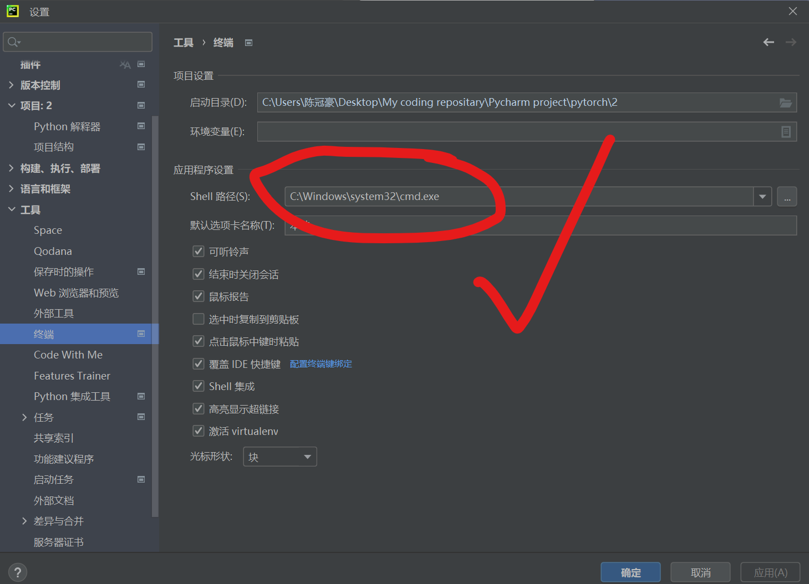

​		回到终端，他就是这样的了。

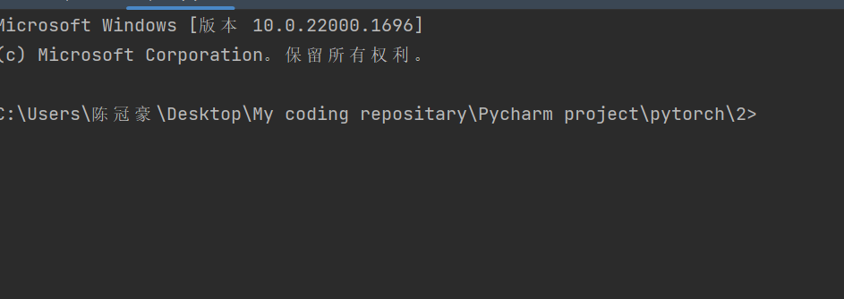

​		但是，这个时候输入 tensorboard --logdir=logs(你自己看看你指定的文件夹的名字是什么，比如说我的是这个，以及如果你发现你甚至没有log文件夹那就检查代码，去文件的上级找找，但大概率是你代码出错了！)

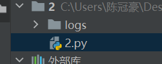

​		


​	出现了上图的 bug，说明cmd没认识，不知道tensorboard.那就这样，输入

```cmd
pip install tensorboard -i --trusted-host  http://pypi.tuna.tsinghua.edu.cn/simple
```

​		这是使用pip 来下载tensorboard, 其中，后面信任域名是为了防止下图种类的报错

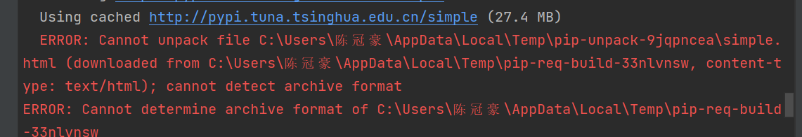

​		但是，即使这样，我还是遇到了另一个奇怪的错误：

!

​		这个时候马上换源即可，是源的问题

```cmd
pip install tensorboard -i https://pypi.douban.com/simple --trusted-host https://pypi.douban.com/simple 
```

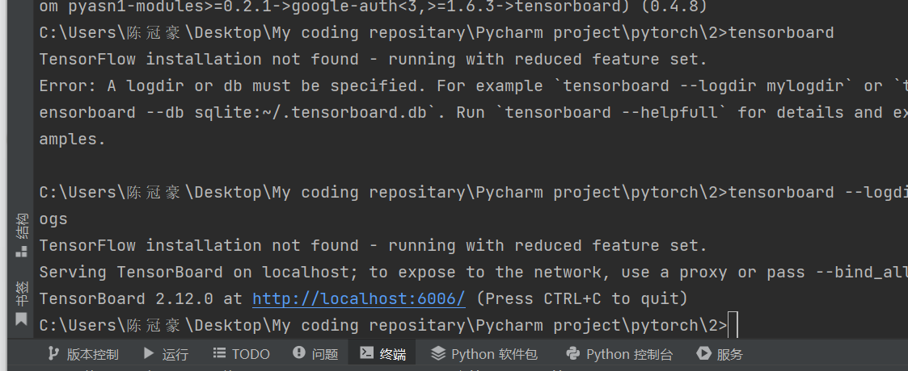

​		我们再试一次，成功了！

​		对了。如果发现端口冲突了，可以手动指定端口，就是在指令的后面在塞上一个--port=

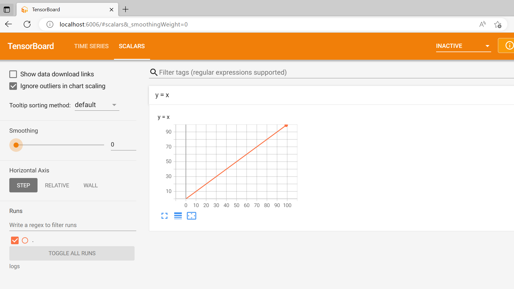

​		下面来看图片的添加！在Pytorch下，我们使用add_image来添加图片

```python
    def add_image(
        self, tag, img_tensor, global_step=None, walltime=None, dataformats="CHW"
    ):
        """Add image data to summary.

        Note that this requires the ``pillow`` package.

        Args:
            tag (str): Data identifier
            img_tensor (torch.Tensor, numpy.ndarray, or string/blobname): Image data
            global_step (int): Global step value to record
            walltime (float): Optional override default walltime (time.time())
              seconds after epoch of event
            dataformats (str): Image data format specification of the form
              CHW, HWC, HW, WH, etc.
        Shape:
            img_tensor: Default is :math:`(3, H, W)`. You can use ``torchvision.utils.make_grid()`` to
            convert a batch of tensor into 3xHxW format or call ``add_images`` and let us do the job.
            Tensor with :math:`(1, H, W)`, :math:`(H, W)`, :math:`(H, W, 3)` is also suitable as long as
            corresponding ``dataformats`` argument is passed, e.g. ``CHW``, ``HWC``, ``HW``.

        Examples::

            from torch.utils.tensorboard import SummaryWriter
            import numpy as np
            img = np.zeros((3, 100, 100))
            img[0] = np.arange(0, 10000).reshape(100, 100) / 10000
            img[1] = 1 - np.arange(0, 10000).reshape(100, 100) / 10000

            img_HWC = np.zeros((100, 100, 3))
            img_HWC[:, :, 0] = np.arange(0, 10000).reshape(100, 100) / 10000
            img_HWC[:, :, 1] = 1 - np.arange(0, 10000).reshape(100, 100) / 10000

            writer = SummaryWriter()
            writer.add_image('my_image', img, 0)

            # If you have non-default dimension setting, set the dataformats argument.
            writer.add_image('my_image_HWC', img_HWC, 0, dataformats='HWC')
            writer.close()

        Expected result:

        .. image:: _static/img/tensorboard/add_image.png
           :scale: 50 %

        """
        torch._C._log_api_usage_once("tensorboard.logging.add_image")
        if self._check_caffe2_blob(img_tensor):
            from caffe2.python import workspace

            img_tensor = workspace.FetchBlob(img_tensor)
        self._get_file_writer().add_summary(
            image(tag, img_tensor, dataformats=dataformats), global_step, walltime
        )
```

​		是的，当我们加载图片的时候，函数的参数接受Tensor类型的图片和ndarray类型，这就需要我们调用API来进行转化

```Python
from torch.utils.tensorboard import SummaryWriter
from PIL import Image
import numpy as np
writer = SummaryWriter("logs")

imgPath = "hymenoptera_data/train/ants/0013035.jpg"


imgPIL = Image.open(imgPath)
imgArray = np.array(imgPIL) # 转化
writer.add_image("test",imgArray,1,dataformats="HWC") #指明通道是如何的！


writer.close()
```

# Pytorch学习2

## 常见的transformer

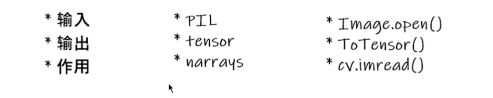

​		下面我们通过Run Demo的方式来实现记忆常见的transformer！

​		这是我们要处理的图片：


### PIL-Image库读入图片

​		下面通过PIL的Image库来读取图片文件：

```C++
from PIL import Image
img = Image.open("1.png");
print(img);
```

```
<PIL.PngImagePlugin.PngImageFile image mode=RGBA size=1717x1227 at 0x21AEC1CB880>
```

​		这是我们得到的！导入成功！


#### 小插曲： \__call__的用法

​		在Python类里存在内置函数\__call__，我们这样的使用它：我们选择新建一个Python文件，

```python
class Person:
    def __call__(self, name):
        print("__call__ calls for:"+ "hello"+"name")


    def hello(self,name):
        print("hello"+"name");

person = Person()
person.hello("李四")
person("张三")

```

​		书写上面的代码

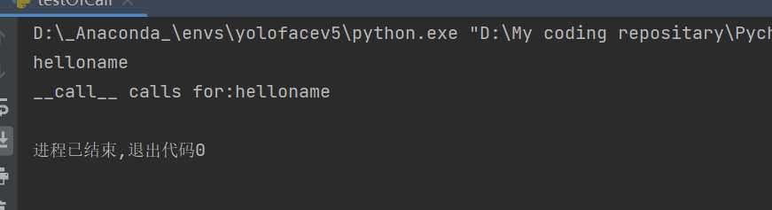

​		有点像C++的内置构建函数的感觉，只需要类对象（）后传对应参数就好了。


#### 继续：

​		看看这个Compose类：

```python
class Compose:
    """Composes several transforms together. This transform does not support torchscript.
    Please, see the note below.

    Args:
        transforms (list of ``Transform`` objects): list of transforms to compose.

    Example:
        >>> transforms.Compose([
        >>>     transforms.CenterCrop(10),
        >>>     transforms.PILToTensor(),
        >>>     transforms.ConvertImageDtype(torch.float),
        >>> ])

    .. note::
        In order to script the transformations, please use ``torch.nn.Sequential`` as below.

        >>> transforms = torch.nn.Sequential(
        >>>     transforms.CenterCrop(10),
        >>>     transforms.Normalize((0.485, 0.456, 0.406), (0.229, 0.224, 0.225)),
        >>> )
        >>> scripted_transforms = torch.jit.script(transforms)

        Make sure to use only scriptable transformations, i.e. that work with ``torch.Tensor``, does not require
        `lambda` functions or ``PIL.Image``.

    """

    def __init__(self, transforms):
        if not torch.jit.is_scripting() and not torch.jit.is_tracing():
            _log_api_usage_once(self)
        self.transforms = transforms

    def __call__(self, img):
        for t in self.transforms:
            img = t(img)
        return img

    def __repr__(self) -> str:
        format_string = self.__class__.__name__ + "("
        for t in self.transforms:
            format_string += "\n"
            format_string += f"    {t}"
        format_string += "\n)"
        return format_string


class ToTensor:
    """Convert a PIL Image or ndarray to tensor and scale the values accordingly.

    This transform does not support torchscript.

    Converts a PIL Image or numpy.ndarray (H x W x C) in the range
    [0, 255] to a torch.FloatTensor of shape (C x H x W) in the range [0.0, 1.0]
    if the PIL Image belongs to one of the modes (L, LA, P, I, F, RGB, YCbCr, RGBA, CMYK, 1)
    or if the numpy.ndarray has dtype = np.uint8

    In the other cases, tensors are returned without scaling.

    .. note::
        Because the input image is scaled to [0.0, 1.0], this transformation should not be used when
        transforming target image masks. See the `references`_ for implementing the transforms for image masks.

    .. _references: https://github.com/pytorch/vision/tree/main/references/segmentation
    """

    def __init__(self) -> None:
        _log_api_usage_once(self)

    def __call__(self, pic):
        """
        Args:
            pic (PIL Image or numpy.ndarray): Image to be converted to tensor.

        Returns:
            Tensor: Converted image.
        """
        return F.to_tensor(pic)

    def __repr__(self) -> str:
        return f"{self.__class__.__name__}()"

```

​			先看后面的ToTensor这个类，其负责把一些PIL Image数据转换为Tensor数据类型，举个例子，就处理我刚刚说的那张图片！

```python
from PIL import Image
from torchvision import transforms
from torch.utils.tensorboard import SummaryWriter
writer = SummaryWriter("logs")
img = Image.open("1.png")

trans = transforms.ToTensor()
img_tensor = trans(img)
writer.add_image("ToTensor",img_tensor)
writer.close()
```

### To PILImage

```C++
class ToPILImage:
    """Convert a tensor or an ndarray to PIL Image - this does not scale values.

    This transform does not support torchscript.

    Converts a torch.*Tensor of shape C x H x W or a numpy ndarray of shape
    H x W x C to a PIL Image while preserving the value range.

    Args:
        mode (`PIL.Image mode`_): color space and pixel depth of input data (optional).
            If ``mode`` is ``None`` (default) there are some assumptions made about the input data:
            - If the input has 4 channels, the ``mode`` is assumed to be ``RGBA``.
            - If the input has 3 channels, the ``mode`` is assumed to be ``RGB``.
            - If the input has 2 channels, the ``mode`` is assumed to be ``LA``.
            - If the input has 1 channel, the ``mode`` is determined by the data type (i.e ``int``, ``float``,
            ``short``).

    .. _PIL.Image mode: https://pillow.readthedocs.io/en/latest/handbook/concepts.html#concept-modes
    """

    def __init__(self, mode=None):
        _log_api_usage_once(self)
        self.mode = mode

    def __call__(self, pic):
        """
        Args:
            pic (Tensor or numpy.ndarray): Image to be converted to PIL Image.

        Returns:
            PIL Image: Image converted to PIL Image.

        """
        return F.to_pil_image(pic, self.mode)

    def __repr__(self) -> str:
        format_string = self.__class__.__name__ + "("
        if self.mode is not None:
            format_string += f"mode={self.mode}"
        format_string += ")"
        return format_string
```

​		把其他数据转换成PIL数据类型，不多讲，当成接口就好！

### Normalize方法类

​		

```Python
class Normalize(torch.nn.Module):
    """Normalize a tensor image with mean and standard deviation.
    This transform does not support PIL Image.
    Given mean: ``(mean[1],...,mean[n])`` and std: ``(std[1],..,std[n])`` for ``n``
    channels, this transform will normalize each channel of the input
    ``torch.*Tensor`` i.e.,
    ``output[channel] = (input[channel] - mean[channel]) / std[channel]``

    .. note::
        This transform acts out of place, i.e., it does not mutate the input tensor.

    Args:
        mean (sequence): Sequence of means for each channel.
        std (sequence): Sequence of standard deviations for each channel.
        inplace(bool,optional): Bool to make this operation in-place.

    """

    def __init__(self, mean, std, inplace=False):
        super().__init__()
        _log_api_usage_once(self)
        self.mean = mean
        self.std = std
        self.inplace = inplace

    def forward(self, tensor: Tensor) -> Tensor:
        """
        Args:
            tensor (Tensor): Tensor image to be normalized.

        Returns:
            Tensor: Normalized Tensor image.
        """
        return F.normalize(tensor, self.mean, self.std, self.inplace)

    def __repr__(self) -> str:
        return f"{self.__class__.__name__}(mean={self.mean}, std={self.std})"

```

​		说白了这个就是标准化过程！重要的是这个公式

```
output[channel] = (input[channel] - mean[channel]) / std[channel]
```

### Resize

```C++
class Resize(torch.nn.Module):
    """Resize the input image to the given size.
    If the image is torch Tensor, it is expected
    to have [..., H, W] shape, where ... means an arbitrary number of leading dimensions

    .. warning::
        The output image might be different depending on its type: when downsampling, the interpolation of PIL images
        and tensors is slightly different, because PIL applies antialiasing. This may lead to significant differences
        in the performance of a network. Therefore, it is preferable to train and serve a model with the same input
        types. See also below the ``antialias`` parameter, which can help making the output of PIL images and tensors
        closer.

    Args:
        size (sequence or int): Desired output size. If size is a sequence like
            (h, w), output size will be matched to this. If size is an int,
            smaller edge of the image will be matched to this number.
            i.e, if height > width, then image will be rescaled to
            (size * height / width, size).

            .. note::
                In torchscript mode size as single int is not supported, use a sequence of length 1: ``[size, ]``.
        interpolation (InterpolationMode): Desired interpolation enum defined by
            :class:`torchvision.transforms.InterpolationMode`. Default is ``InterpolationMode.BILINEAR``.
            If input is Tensor, only ``InterpolationMode.NEAREST``, ``InterpolationMode.NEAREST_EXACT``,
            ``InterpolationMode.BILINEAR`` and ``InterpolationMode.BICUBIC`` are supported.
            The corresponding Pillow integer constants, e.g. ``PIL.Image.BILINEAR`` are accepted as well.
        max_size (int, optional): The maximum allowed for the longer edge of
            the resized image: if the longer edge of the image is greater
            than ``max_size`` after being resized according to ``size``, then
            the image is resized again so that the longer edge is equal to
            ``max_size``. As a result, ``size`` might be overruled, i.e. the
            smaller edge may be shorter than ``size``. This is only supported
            if ``size`` is an int (or a sequence of length 1 in torchscript
            mode).
        antialias (bool, optional): Whether to apply antialiasing.
            It only affects **tensors** with bilinear or bicubic modes and it is
            ignored otherwise: on PIL images, antialiasing is always applied on
            bilinear or bicubic modes; on other modes (for PIL images and
            tensors), antialiasing makes no sense and this parameter is ignored.
            Possible values are:

            - ``True``: will apply antialiasing for bilinear or bicubic modes.
              Other mode aren't affected. This is probably what you want to use.
            - ``False``: will not apply antialiasing for tensors on any mode. PIL
              images are still antialiased on bilinear or bicubic modes, because
              PIL doesn't support no antialias.
            - ``None``: equivalent to ``False`` for tensors and ``True`` for
              PIL images. This value exists for legacy reasons and you probably
              don't want to use it unless you really know what you are doing.

            The current default is ``None`` **but will change to** ``True`` **in
            v0.17** for the PIL and Tensor backends to be consistent.
    """

    def __init__(self, size, interpolation=InterpolationMode.BILINEAR, max_size=None, antialias="warn"):
        super().__init__()
        _log_api_usage_once(self)
        if not isinstance(size, (int, Sequence)):
            raise TypeError(f"Size should be int or sequence. Got {type(size)}")
        if isinstance(size, Sequence) and len(size) not in (1, 2):
            raise ValueError("If size is a sequence, it should have 1 or 2 values")
        self.size = size
        self.max_size = max_size

        if isinstance(interpolation, int):
            interpolation = _interpolation_modes_from_int(interpolation)

        self.interpolation = interpolation
        self.antialias = antialias

    def forward(self, img):
        """
        Args:
            img (PIL Image or Tensor): Image to be scaled.

        Returns:
            PIL Image or Tensor: Rescaled image.
        """
        return F.resize(img, self.size, self.interpolation, self.max_size, self.antialias)

    def __repr__(self) -> str:
        detail = f"(size={self.size}, interpolation={self.interpolation.value}, max_size={self.max_size}, antialias={self.antialias})"
        return f"{self.__class__.__name__}{detail}"
```

```python
print(img.size)
trans_size = transforms.Resize((520,520))
imgResize = trans_size(img)
print(imgResize)
```

​		这样就好了！

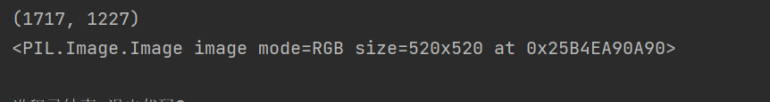

## Compose 组合变换

```
trans_resize_2 = transforms.Resize(512)
trans_compose = transforms.Compose([trans_resize_2, trans])
img_resize_2 = trans_compose(img)
writer.add_image("Composer111", img_resize_2,2)
writer.close()
```

​		我们这样把若干变换组合在一起一并完成！

# Pytorch学习3

## torchvision 学习

​		pytorch的很多API可以去pytorch.org 

​		下面来看一个加载：

```C++
import torchvision

train_set = torchvision.datasets.CIFAR10(root="./dataset",train=True,download=True)
test_set = torchvision.datasets.CIFAR10(root="./dataset",train=False,download=True)
```

​		稍等片刻，就会下载好数据！

​		来测试一下：

```python
print(test_set[0])
```

​		开debug发现还是很多属性的！

​		这里有相关的read_me:

The CIFAR-10 and CIFAR-100 are labeled subsets of the [80 million tiny images](http://people.csail.mit.edu/torralba/tinyimages/) dataset. They were collected by Alex Krizhevsky, Vinod Nair, and Geoffrey Hinton.

## The CIFAR-10 dataset

​		CIFAR-10数据集由10个类别的60000张32x32彩色图像组成，每个类别有6000张图像。有50000个训练图像和10000个测试图像。

​		数据集分为五个训练批次和一个测试批次，每个批次有10000张图像。测试批次包含从每个类别中随机选择的1000幅图像。训练批包含按随机顺序排列的剩余图像，但一些训练批可能包含来自一个类的图像多于来自另一类的图像。在它们之间，训练批次正好包含每个类的5000个图像。

​		以下是数据集中的类，以及每个类的10张随机图像：

| airplane   |  |  |  |  |  |  |  |  |  |  |
| ---------- | ------------------------------------------------------------ | ------------------------------------------------------------ | ------------------------------------------------------------ | ------------------------------------------------------------ | ------------------------------------------------------------ | ------------------------------------------------------------ | ------------------------------------------------------------ | ------------------------------------------------------------ | ------------------------------------------------------------ | ------------------------------------------------------------ |
| automobile |  |  |  |  |  |  |  |  |  |  |
| bird       |  |  |  |  |  |  |  |  |  |  |
| cat        |  |  |  |  |  |  |  |  |  |  |
| deer       |  |  |  |  |  |  |  |  |  |  |
| dog        |  |  |  |  |  |  |  |  |  |  |
| frog       |  |  |  |  |  |  |  |  |  |  |
| horse      |  |  |  |  |  |  |  |  |  |  |
| ship       |  |  |  |  |  |  |  |  |  |  |
| truck      |  |  |  |  |  |  |  |  |  |  |

​		这些类是完全互斥的。汽车和卡车之间没有重叠。“汽车”包括轿车、SUV之类的东西。“卡车”只包括大卡车。两者都不包括皮卡。


## 下载


如果您要使用此数据集，请引用本页底部的技术报告。


|版本|大小|md5sum|

| ------------------------------------------------------------ | ------ | -------------------------------- |

|[CIFAR-10 python版本](http://www.cs.toronto.edu/~kriz/cifar-10-python.tar.gz）|163 MB | c58f30108f718f92721af3b95e74349a|

|[CIFAR-10 Matlab版本](http://www.cs.toronto.edu/~kriz/cifar-10-matlab.tar.gz）|175 MB |70270af85842c9e89bb428ec9976c926|

|[CIFAR-10二进制版本（适用于C程序）](http://www.cs.toronto.edu/~kriz/cifar-10-binary.tar.gz）|162 MB | c32a1d4ab5d03f1284b67883e8d87530|


## 基线结果


你可以在这个数据集上找到一些基线可复制的结果[在cuda convnet的项目页面上](http://code.google.com/p/cuda-convnet/). 这些结果是用卷积神经网络获得的。简单地说，在没有数据扩充的情况下，它们的测试误差为18%，在有数据扩充的条件下为11%。此外，[Jasper Snoek](http://www.cs.toronto.edu/~jasper/）有一篇[新论文](http://hips.seas.harvard.edu/content/practical-bayesian-optimization-machine-learning-algorithms)其中，他使用贝叶斯超参数优化来找到权重衰减和其他超参数的良好设置，这使他能够使用获得18%的网络架构获得15%的测试错误率（没有数据扩充）。


## 其他结果


​		[罗德里戈·贝南森](http://rodrigob.github.com/)好心地在他的网站上收集了CIFAR-10/100和其他数据集的结果；[点击此处](http://rodrigob.github.com/are_we_there_yet/build/classification_datasets_results.html)查看。


​		数据集布局


​		Python/Matlab版本


​		我（这里指作者）将描述数据集的Python版本的布局。Matlab版本的布局是相同的。


​		档案包含文件data_batch_1，data_batch_2。。。，data_batch_5以及test_batch。这些文件中的每一个都是用[cPickle]生成的Python“pickle”对象(http://www.python.org/doc/2.5/lib/module-cPickle.html). 下面是一个python2例程，它将打开这样一个文件并返回一个字典：


```
def unpickle（文件）：

导入cPickle

打开（文件，'rb'）为fo：

dict=cPickle.load（fo）

返回dict

```


还有一个蟒蛇3版本：


```
def unpickle（文件）：

进口泡菜

打开（文件，'rb'）为fo：

dict=pickle.load（fo，编码=“字节”）

返回dict

```


​		以这种方式加载的每个批处理文件都包含一个字典，其中包含以下元素：

​		-**数据**--一个10000x3072[数字](http://numpy.scipy.org/)uint8s的数组。阵列的每一行存储一个32x32颜色的图像。前1024个条目包含红色通道值，接下来的1024个条目为绿色，最后的1024个为蓝色。图像按行主顺序存储，因此阵列的前32个条目是图像第一行的红色通道值。

​		-**标签**--包含0-9范围内的10000个数字的列表。索引*i*处的数字表示数组**数据**中第*i*个图像的标签。


​		数据集包含另一个名为batches.meta的文件。它也包含一个Python字典对象。它包含以下条目：


​		-**label_names**——一个10元素列表，为上述**标签**数组中的数字标签提供有意义的名称。例如，label_names[0]=“飞机”、label_names[1]=“汽车”等。


## 二进制版本


二进制版本包含文件data_batch_1.bin、data_batch_2.bin、…、data_back_5.bin以及test_batch.bin。这些文件的格式如下：


```
<1 x标签><3072 x像素>

...

<1 x标签><3072 x像素>

```


换句话说，第一个字节是第一个图像的标签，它是0-9范围内的数字。接下来的3072个字节是图像的像素值。第一个1024字节是红色通道值，接下来的1024字节是绿色，最后的1024字节为蓝色。这些值按行主顺序存储，因此前32个字节是图像第一行的红色通道值。


每个文件包含10000个这样的3073字节的图像“行”，尽管没有**任何行的分隔符**。因此，每个文件的长度应该恰好为30730000字节。


还有另一个文件，名为batches.meta.txt。这是一个ASCII文件，它将0-9范围内的数字标签映射到有意义的类名。它只是10个类名的列表，每行一个。第*i*行的类名对应于数字标签*i*。


这个数据集和CIFAR-10一样，只是它有100个类，每个类包含600个图像。每节课有500个训练图像和100个测试图像。CIFAR-100中的100个类被分组为20个超类。每个图像都带有一个“精细”标签（它所属的类）和一个“粗略”标签（其所属的超类）。

以下是CIFAR-100中的类列表：


|超类|类|

| ------------------------------ | ----------------------------------------------------- |

|水生哺乳动物|海狸、海豚、水獭、海豹、鲸鱼|

|鱼类|水族馆鱼类、比目鱼、鳐鱼、鲨鱼、鳟鱼|

|花|兰花、罂粟、玫瑰、向日葵、郁金香|

|食品容器|瓶子、碗、罐头、杯子、盘子|

|水果和蔬菜|苹果、蘑菇、橙子、梨、甜椒|

|家用电器|时钟、电脑键盘、灯、电话、电视|

|家用家具|床、椅子、沙发、桌子、衣柜|

|昆虫|蜜蜂、甲虫、蝴蝶、毛毛虫、蟑螂|

|大型食肉动物|熊、豹、狮子、老虎、狼|

|大型人造户外物品|桥梁、城堡、房屋、道路、摩天大楼|

|大型自然户外场景|云、森林、山脉、平原、海洋|

|大型杂食动物和草食动物|骆驼、牛、黑猩猩、大象、袋鼠|

|中型哺乳动物|狐狸、豪猪、负鼠、浣熊、臭鼬|

|非昆虫无脊椎动物|螃蟹、龙虾、蜗牛、蜘蛛、蠕虫|

|人|婴儿，男孩，女孩，男人，女人|

|爬行动物|鳄鱼、恐龙、蜥蜴、蛇、乌龟|

|小型哺乳动物|仓鼠、老鼠、兔子、鼩鼩、松鼠|

|树木|枫树、橡树、棕榈树、松树、柳树|

|车辆1|自行车、公共汽车、摩托车、皮卡、火车|

|车辆2|割草机、火箭、有轨电车、坦克、拖拉机|


是的，我知道蘑菇不是真正的水果或蔬菜，熊也不是真正的食肉动物。


## 下载


|版本|大小|md5sum|

| ------------------------------------------------------------ | ------ | -------------------------------- |

|[CIFAR-100 python版本](http://www.cs.toronto.edu/~kriz/cifar-100-python.tar.gz）|161 MB | eb9058c3a382ffc7106e4002c42a8d85|

|[CIFAR-100 Matlab版本](http://www.cs.toronto.edu/~kriz/cifar-100-matlab.tar.gz）|175 MB |6a4bfa1dcd5c9453dda6bb54194911f4|

|[CIFAR-100二进制版本（适用于C程序）](http://www.cs.toronto.edu/~kriz/cifar-100-二进制.tar.gz）|161 MB |03b5dce0913d631647c71ecec9e9cb8|

数据集布局

python/Matlab版本

python和Matlab版本在布局上与CIFAR-10相同，所以我不会在这里浪费空间来描述它们。

二进制版本

CIFAR-100的二进制版本与CIFAR-10的二进制版本一样，只是每个图像都有两个标签字节（粗略和精细）和3072个像素字节，所以二进制文件看起来是这样的：

```
<1 x粗略标签><1 x精细标签><3072 x像素>

...

<1 x粗略标签><1 x精细标签><3072 x像素>

```

​		Sivan Sabato好心地提供了[这份文件](http://www.cs.toronto.edu/~kriz/cifar_indexes），它将cifar-100图像映射到8000万微小图像数据集中的图像。Sivan写道：


```
该文件有60000行，每行都包含一个指向微小数据库的索引，

其中微小数据库中的第一个图像被索引为“1”。“0”表示不是来自微小数据库的图像。

前50000行对应于训练集，后10000行对应

到测试集。

```


## 参考


​		本技术报告（第3章）更详细地描述了数据集以及收集数据时所遵循的方法。如果您打算使用此数据集，请引用它。

# DataLoader

​		dataLoader意如其名，就是（从dataset）加载数据集

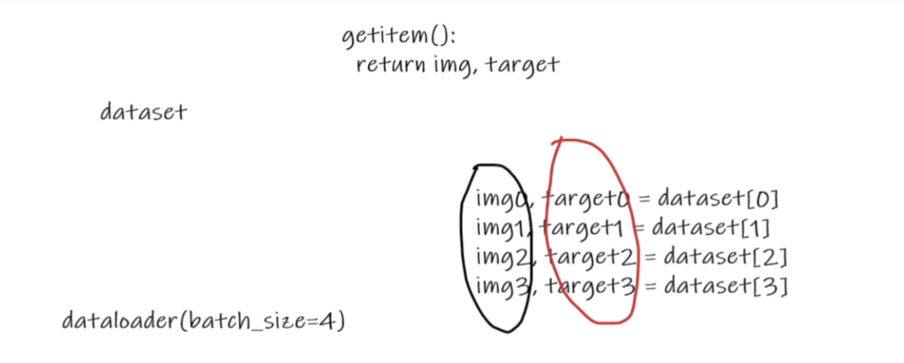

```python
import torchvision
from torch.utils.data import DataLoader
# 测试集
test_data = torchvision.datasets.CIFAR10("./dataset",train=False,transform=torchvision.transforms.ToTensor(),download=True)
test_loader = DataLoader(dataset=test_data,batch_size=4,shuffle=True,num_workers=0,drop_last=False)

# 第一张样本
img,target = test_data[0]
print(img.shape)
print(target)
# 可以看看样本
for data in test_loader:
    imgs,targets =data
    print(imgs.shape)
    print(targets)
```

​		可以使用SummaryWriter 来展示之：

```python
import torchvision
from torch.utils.data import DataLoader
from torch.utils.tensorboard import SummaryWriter
# 测试集
test_data = torchvision.datasets.CIFAR10("./dataset",train=False,transform=torchvision.transforms.ToTensor(),download=True)
test_loader = DataLoader(dataset=test_data,batch_size=4,shuffle=True,num_workers=0,drop_last=False)

# 第一张样本
img,target = test_data[0]
print(img.shape)
print(target)

step = 0

writer = SummaryWriter("dataLoader")
for data in test_loader:
    imgs,targets =data
    # print(imgs.shape)
    # print(targets)
    writer.add_images("test_data",imgs,step)
    step = step + 1

writer.close()
```

​		

```shell
tensorboard logdir="dataLoader"
```


## 神经网络

### 卷积层

​		先扔一个`pytorch`的官网！https://pytorch.org/docs		

​		继续：

​		这是参数：作为图像处理常用的是Conv2d

| [`nn.Conv1d`](https://pytorch.org/docs/stable/generated/torch.nn.Conv1d.html#torch.nn.Conv1d) | Applies a 1D convolution over an input signal composed of several input planes. |
| ------------------------------------------------------------ | ------------------------------------------------------------ |
| [`nn.Conv2d`](https://pytorch.org/docs/stable/generated/torch.nn.Conv2d.html#torch.nn.Conv2d) | Applies a 2D convolution over an input signal composed of several input planes. |
| [`nn.Conv3d`](https://pytorch.org/docs/stable/generated/torch.nn.Conv3d.html#torch.nn.Conv3d) | Applies a 3D convolution over an input signal composed of several input planes. |
| [`nn.ConvTranspose1d`](https://pytorch.org/docs/stable/generated/torch.nn.ConvTranspose1d.html#torch.nn.ConvTranspose1d) | Applies a 1D transposed convolution operator over an input image composed of several input planes. |
| [`nn.ConvTranspose2d`](https://pytorch.org/docs/stable/generated/torch.nn.ConvTranspose2d.html#torch.nn.ConvTranspose2d) | Applies a 2D transposed convolution operator over an input image composed of several input planes. |
| [`nn.ConvTranspose3d`](https://pytorch.org/docs/stable/generated/torch.nn.ConvTranspose3d.html#torch.nn.ConvTranspose3d) | Applies a 3D transposed convolution operator over an input image composed of several input planes. |
| [`nn.LazyConv1d`](https://pytorch.org/docs/stable/generated/torch.nn.LazyConv1d.html#torch.nn.LazyConv1d) | A [`torch.nn.Conv1d`](https://pytorch.org/docs/stable/generated/torch.nn.Conv1d.html#torch.nn.Conv1d) module with lazy initialization of the `in_channels` argument of the `Conv1d` that is inferred from the `input.size(1)`. |
| [`nn.LazyConv2d`](https://pytorch.org/docs/stable/generated/torch.nn.LazyConv2d.html#torch.nn.LazyConv2d) | A [`torch.nn.Conv2d`](https://pytorch.org/docs/stable/generated/torch.nn.Conv2d.html#torch.nn.Conv2d) module with lazy initialization of the `in_channels` argument of the `Conv2d` that is inferred from the `input.size(1)`. |
| [`nn.LazyConv3d`](https://pytorch.org/docs/stable/generated/torch.nn.LazyConv3d.html#torch.nn.LazyConv3d) | A [`torch.nn.Conv3d`](https://pytorch.org/docs/stable/generated/torch.nn.Conv3d.html#torch.nn.Conv3d) module with lazy initialization of the `in_channels` argument of the `Conv3d` that is inferred from the `input.size(1)`. |
| [`nn.LazyConvTranspose1d`](https://pytorch.org/docs/stable/generated/torch.nn.LazyConvTranspose1d.html#torch.nn.LazyConvTranspose1d) | A [`torch.nn.ConvTranspose1d`](https://pytorch.org/docs/stable/generated/torch.nn.ConvTranspose1d.html#torch.nn.ConvTranspose1d) module with lazy initialization of the `in_channels` argument of the `ConvTranspose1d` that is inferred from the `input.size(1)`. |
| [`nn.LazyConvTranspose2d`](https://pytorch.org/docs/stable/generated/torch.nn.LazyConvTranspose2d.html#torch.nn.LazyConvTranspose2d) | A [`torch.nn.ConvTranspose2d`](https://pytorch.org/docs/stable/generated/torch.nn.ConvTranspose2d.html#torch.nn.ConvTranspose2d) module with lazy initialization of the `in_channels` argument of the `ConvTranspose2d` that is inferred from the `input.size(1)`. |
| [`nn.LazyConvTranspose3d`](https://pytorch.org/docs/stable/generated/torch.nn.LazyConvTranspose3d.html#torch.nn.LazyConvTranspose3d) | A [`torch.nn.ConvTranspose3d`](https://pytorch.org/docs/stable/generated/torch.nn.ConvTranspose3d.html#torch.nn.ConvTranspose3d) module with lazy initialization of the `in_channels` argument of the `ConvTranspose3d` that is inferred from the `input.size(1)`. |
| [`nn.Unfold`](https://pytorch.org/docs/stable/generated/torch.nn.Unfold.html#torch.nn.Unfold) | Extracts sliding local blocks from a batched input tensor.   |
| [`nn.Fold`](https://pytorch.org/docs/stable/generated/torch.nn.Fold.html#torch.nn.Fold) | Combines an array of sliding local blocks into a large containing tensor. |

​		点进去看看：

```python
CLASS 
torch.nn.Conv2d(in_channels, out_channels, kernel_size, stride=1, padding=0, dilation=1, groups=1, bias=True, padding_mode='zeros', device=None, dtype=None)
```

​		Applies a 2D convolution over an input signal composed of several input planes.

In the simplest case, the output value of the layer with input size 
$$
(N,C_{in},H,W)
$$
​		and output
$$
(N,C_{out},H_{out},W_{out})
$$
​		 can be precisely described as:
$$
out(N_i,C_{outj}) = bias(C_{outj})+\sum_{k=0}^{C_{in}-1}weight(C_{out},k)*input(N_i,k)
$$
​		where ⋆ is the valid 2D [cross-correlation](https://en.wikipedia.org/wiki/Cross-correlation) operator, *N* is a batch size, C* denotes a number of channels, *H* is a height of input planes in pixels, and *W* is width in pixels.

​		This module supports [TensorFloat32](https://pytorch.org/docs/stable/notes/cuda.html#tf32-on-ampere).

​		On certain ROCm devices, when using float16 inputs this module will use [different precision](https://pytorch.org/docs/stable/notes/numerical_accuracy.html#fp16-on-mi200) for backward.

- `stride` controls the stride for the cross-correlation, a single number or a tuple.

- `padding` controls the amount of padding applied to the input. It can be either a string {‘valid’, ‘same’} or an int / a tuple of ints giving the amount of implicit padding applied on both sides.

- `dilation` controls the spacing between the kernel points; also known as the à trous algorithm. It is harder to describe, but this [link](https://github.com/vdumoulin/conv_arithmetic/blob/master/README.md) has a nice visualization of what `dilation` does.

- `groups` controls the connections between inputs and outputs. `in_channels` and `out_channels` must both be divisible by `groups`. For example,

  > - At groups=1, all inputs are convolved to all outputs.
  > - At groups=2, the operation becomes equivalent to having two conv layers side by side, each seeing half the input channels and producing half the output channels, and both subsequently concatenated.
  > - At groups= `in_channels`, each input channel is convolved with its own set of filters (of size $\frac{in\_channels}{out\_channels}$)

​		The parameters `kernel_size`, `stride`, `padding`, `dilation` can either be:

> - a single `int` – in which case the same value is used for the height and width dimension
> - a `tuple` of two ints – in which case, the first int is used for the height dimension, and the second int for the width dimension

​		When groups == in_channels and out_channels == K * in_channels, where K is a positive integer, this operation is also known as a “depthwise convolution”.

​		In other words, for an input of size $(N,C_{in},L_{in})$, a depthwise convolution with a depthwise multiplier*K* can be performed with the arguments ($C_{in}=C_{in},C_{out}=C_{in}×K,...,groups=C_{in}$.)

​		In some circumstances when given tensors on a CUDA device and using CuDNN, this operator may select a nondeterministic algorithm to increase performance. If this is undesirable, you can try to make the operation deterministic (potentially at a performance cost) by setting 

```
torch.backends.cudnn.deterministic = True. 
```

​		See [Reproducibility](https://pytorch.org/docs/stable/notes/randomness.html) for more information.

​		`padding='valid'` is the same as no padding. `padding='same'` pads the input so the output has the shape as the input. However, this mode doesn’t support any stride values other than 1.

​		This module supports complex data types i.e. `complex32, complex64, complex128`.

Parameters:

- **in_channels** ([*int*](https://docs.python.org/3/library/functions.html#int)) – Number of channels in the input image
- **out_channels** ([*int*](https://docs.python.org/3/library/functions.html#int)) – Number of channels produced by the convolution
- **kernel_size** ([*int*](https://docs.python.org/3/library/functions.html#int) *or* [*tuple*](https://docs.python.org/3/library/stdtypes.html#tuple)) – Size of the convolving kernel
- **stride** ([*int*](https://docs.python.org/3/library/functions.html#int) *or* [*tuple*](https://docs.python.org/3/library/stdtypes.html#tuple)*,* *optional*) – Stride of the convolution. Default: 1
- **padding** ([*int*](https://docs.python.org/3/library/functions.html#int)*,* [*tuple*](https://docs.python.org/3/library/stdtypes.html#tuple) *or* [*str*](https://docs.python.org/3/library/stdtypes.html#str)*,* *optional*) – Padding added to all four sides of the input. Default: 0
- **padding_mode** ([*str*](https://docs.python.org/3/library/stdtypes.html#str)*,* *optional*) – `'zeros'`, `'reflect'`, `'replicate'` or `'circular'`. Default: `'zeros'`
- **dilation** ([*int*](https://docs.python.org/3/library/functions.html#int) *or* [*tuple*](https://docs.python.org/3/library/stdtypes.html#tuple)*,* *optional*) – Spacing between kernel elements. Default: 1
- **groups** ([*int*](https://docs.python.org/3/library/functions.html#int)*,* *optional*) – Number of blocked connections from input channels to output channels. Default: 1
- **bias** ([*bool*](https://docs.python.org/3/library/functions.html#bool)*,* *optional*) – If `True`, adds a learnable bias to the output. Default: `True`

## what is Convolution arithmetic(from read ME)

​		A technical report on convolution arithmetic in the context of deep learning.

​		The code and the images of this tutorial are free to use as regulated by the 
licence and subject to proper attribution:

* \[1\] Vincent Dumoulin, Francesco Visin - [A guide to convolution arithmetic
  for deep learning](https://arxiv.org/abs/1603.07285)
  ([BibTeX](https://gist.github.com/fvisin/165ca9935392fa9600a6c94664a01214))

## Convolution animations

_N.B.: Blue maps are inputs, and cyan maps are outputs._

<table style="width:100%; table-layout:fixed;">
  <tr>
    <td></td>
    <td></td>
    <td></td>
    <td></td>
  </tr>
  <tr>
    <td>No padding, no strides</td>
    <td>Arbitrary padding, no strides</td>
    <td>Half padding, no strides</td>
    <td>Full padding, no strides</td>
  </tr>
  <tr>
    <td></td>
    <td></td>
    <td></td>
    <td></td>
  </tr>
  <tr>
    <td>No padding, strides</td>
    <td>Padding, strides</td>
    <td>Padding, strides (odd)</td>
    <td></td>
  </tr>
</table>


## Transposed convolution animations

_N.B.: Blue maps are inputs, and cyan maps are outputs._

<table style="width:100%; table-layout:fixed;">
  <tr>
    <td></td>
    <td></td>
    <td></td>
    <td></td>
  </tr>
  <tr>
    <td>No padding, no strides, transposed</td>
    <td>Arbitrary padding, no strides, transposed</td>
    <td>Half padding, no strides, transposed</td>
    <td>Full padding, no strides, transposed</td>
  </tr>
  <tr>
    <td></td>
    <td></td>
    <td></td>
    <td></td>
  </tr>
  <tr>
    <td>No padding, strides, transposed</td>
    <td>Padding, strides, transposed</td>
    <td>Padding, strides, transposed (odd)</td>
    <td></td>
  </tr>
</table>


## Dilated convolution animations

_N.B.: Blue maps are inputs, and cyan maps are outputs._

<table style="width:25%"; table-layout:fixed;>
  <tr>
    <td></td>
  </tr>
  <tr>
    <td>No padding, no stride, dilation</td>
  </tr>
</table>


## Generating the Makefile

From the repository's root directory:

``` bash
$ ./bin/generate_makefile
```

## Generating the animations

From the repository's root directory:

``` bash
$ make all_animations
```

The animations will be output to the `gif` directory. Individual animation steps
will be output in PDF format to the `pdf` directory and in PNG format to the
`png` directory.

## Compiling the document

From the repository's root directory:

``` bash
$ make
```

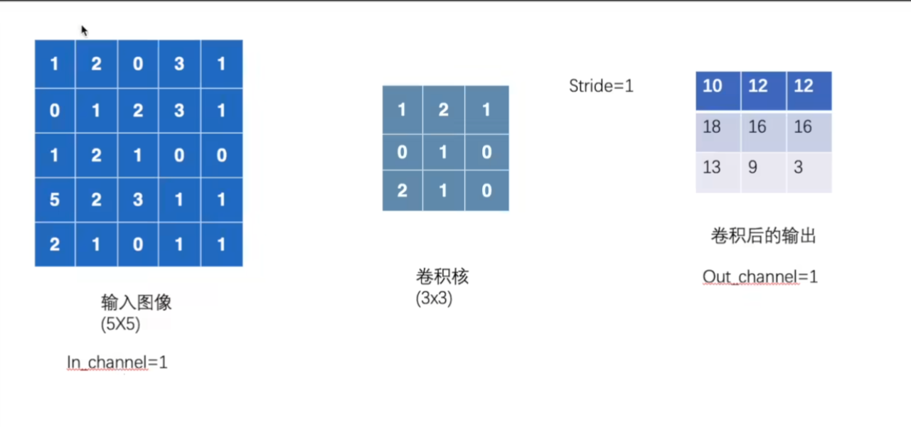

​		其实就是这样，我们3 x 3的扫过图像，并且对之求和输出到新单元，我们发现他会做九次。，故得到了一个 3 x 3的表。

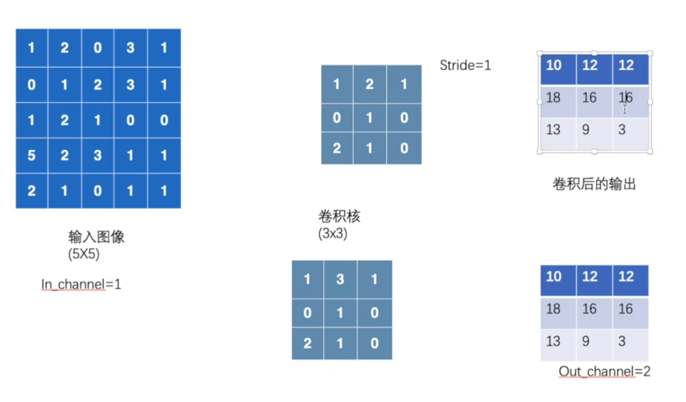

​		这样就可以升维了，从而提取信息特征。

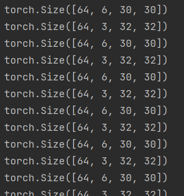

```python
import torch
import torchvision
from torch import nn
from torch.nn import Conv2d
from torch.utils.data import DataLoader

dataset = torchvision.datasets.CIFAR10("../data",train = False,
                                       transform=torchvision.transforms.ToTensor(),
                                        download=True
                                       )
dataloader = DataLoader(dataset,batch_size=64)

class cc(nn.Module):
    def __init__(self):
        super(cc,self).__init__()
        self.conv1 = Conv2d(in_channels=3,out_channels=6,kernel_size=3,stride=1,padding=0)
    def forward(self,x):
        x = self.conv1(x)
        return x

c = cc()

for data in dataloader:
    imgs, targets =data
    output = c(imgs)
    print(imgs.shape)
    print(output.shape)
```

​		我们把它输出到tensorboard里去：

```python
import torch
import torchvision
from torch import nn
from torch.nn import Conv2d
from torch.utils.data import DataLoader
from torch.utils.tensorboard import SummaryWriter

dataset = torchvision.datasets.CIFAR10("../data",train = False,
                                       transform=torchvision.transforms.ToTensor(),
                                        download=True
                                       )
dataloader = DataLoader(dataset,batch_size=64)

class cc(nn.Module):
    def __init__(self):
        super(cc,self).__init__()
        self.conv1 = Conv2d(in_channels=3,out_channels=6,kernel_size=3,stride=1,padding=0)
    def forward(self,x):
        x = self.conv1(x)
        return x

c = cc()

writer = SummaryWriter("../logs")
step = 0
for data in dataloader:
    imgs, targets =data
    output = c(imgs)
    print(imgs.shape)
    print(output.shape)
    output = torch.reshape(output, (-1, 3, 30, 30))
    writer.add_images("input",imgs,step)
    writer.add_images("output", output, step)
    step = step + 1
```

```shell 
(yolofacev5) pythonProject1> cd ..
(yolofacev5) pythonProject1> tensorboard --logdir=logs      
```

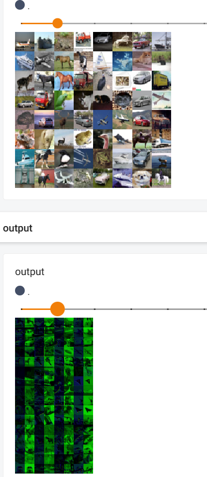