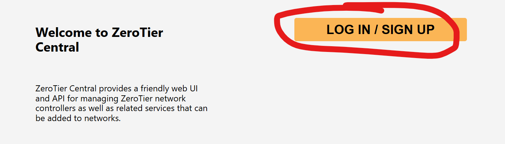
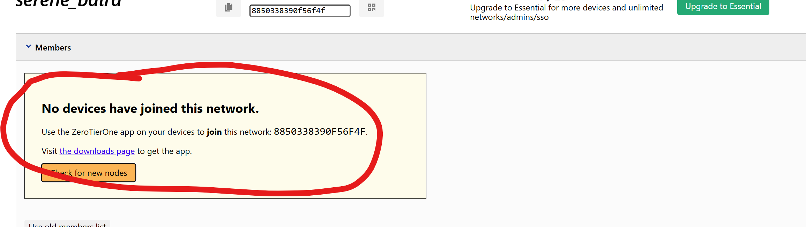

# 1小时极限速通MC局域网联机：PCL2 + Zerotier局域网联机方案

## 前言

​	笔者喜欢玩MC，最近一些同志们询问我，想要联机玩整合包。笔者经过研究，决定使用PCL2 + Zerotier方案。

## 你需要在开始之前做什么？

### 你需要什么

1. 你，和你的好哥们
2. 每个人人手一台的笔记本电脑，注意配置要说得过去（
3. 没了

### 你需要下载什么

1. PCL2 MC启动器（最快下载到协同的整合包）
2. Zerotier内网穿透软件

### 谁，需要做什么？

​	从你和你的哥们中选择一个人当子网维护者，另一些人需要加入到这个人所维护的子网当中！注意，只需要你们当中的一个人做就好！不需要每个人都创建子网，但是每个人需要加入到子网！

​	因此很快就确定下来了——三五个人当中需要选出一个人维护子网，其他人需要加入到子网当中，我们的成果以Ping通对方的IP作为结果。

​	

## STEP I：创建/加入一个子网

​	我们需要创建一个内部子网，让所有参与联机的人可以认识到相互的机器才行！现在，让那个创建子网的人出列！

### 创建一个子网（子网的维护者做）

​	你现在需要做的，是在[ZeroTier Central](https://my.zerotier.com/)这个网站中注册一个账号：



​	注册完成登录后，你会来到这个界面：


​	选择这个Create A Network来


​	这个时候就会出现一个子网——注意，子网就这样创建完成了，名字可能不叫这个！下面一次阐述每个条目的含义：

- 8850338390f56f4f：这个是你的子网编号，非常的重要！是需要你给你的联机兄弟的！他们通过输入这个唯一的子网编号加入到你的子网

- serene_bird:你的子网名称！当然，没啥用，你可以去自己一个好听的名称

  > 
  >
  > BTW: 你可以点进去这个条目，下滑到Settings模块并且展开：你可以在这里设置子网名称！

- 172.27.0.0/16：你的子网IP网关。非常关键，后续某一位玩家开启局域网广播的时候，IP的前16位就会是172.27。

- 后面的0表达目前接入子网设备的个数

- 创建日期

​	点进这个条目！



​	留意到我画红圈的模块了吗，在这个地方，子网的维护者需要将所有人的设备接入这个子网，包括子网维护者自己的电脑！为此，作为演示，我将自己的电脑接入这个子网。

​	请子网的维护者先下载Zerotier客户端：[Download - ZeroTier](https://www.zerotier.com/download/)，如果您的操作系统是Windows操作系统，那么就需要下载这个：	


​	下载结束之后单击下载的文件安装Zerotier。随后，安装结束，你可以搜索到Zerotier：


​	启动这个软件，什么现象也不会有，这个时候来到这里：


​	对最后这个图标**右键**打开菜单，选择Join New Network。


​	就会弹出来这个框，输入自己创建的子网编号，笔者创建的编号是8850338390f56f4f，这个时候回去看看自己的Devices


​	单击Check for new nodes，这个时候就会刷新请求接入子网的设备了。可以看到我的设备显示在上面，这个时候，子网的维护者需要勾选接入的设备且验证这个设备：


​	现在，设备被允许接入子网了，稍等片刻，或者等不及的直接刷新网页，我们的设备就被分配到了内网IP：172.27.163.101. 这个IP就会是这台接入设备的IP地址，我们后面构建服务器就会直接使用到这个IP地址！


​	我们还可以继续接入更多的设备。这个时候就需要你的好兄弟们干活了！


### 加入一个子网（其他人做）

​	如果你不是子网的维护者，事情就会变得十分的容易：

​	每个人都需要下载Zerotier客户端：[Download - ZeroTier](https://www.zerotier.com/download/)，如果您的操作系统是Windows操作系统，那么就需要下载这个：


​	下载结束之后单击下载的文件安装Zerotier。随后，安装结束，你可以搜索到Zerotier：


​	启动这个软件，什么现象也不会有，这个时候来到这里：


​	对最后这个图标**右键**打开菜单，选择Join New Network。


​	就会弹出来这个框，询问子网维护者它创建的子网的编号是多少（他不知道？罚他抄这篇博客10遍！），输入编号发出接入子网的请求后，等待维护者同意接入设备即可

### 现在...

​	所有人依次向子网的维护者索要自己被分配到的内网IP。得知自己的IP之后，记住！之后自己开局域网私服的时候这个IP就会显得十分甚至是九分的重要了！

## STEP 2: 下载PCL2启动器

​	这个启动器相当的好用，我推介大伙使用！[Tools/PCL2 | 小莫的云网盘 (aoe.top)](https://pan.aoe.top/Tools/PCL2)


​	下载这个就行，选择一个文件夹存放它！**后面这个文件夹将会装载自己所有游戏的存档！所以请再三决定后存放！**下载解压结束，点击Plain Craft Launcher.exe文件，经过初始化后就会显示这个界面了


​	这里我们以整合包为例子（这样才能体现出PCL2的好用（（（。

​	请退出去，给系统挂上代理（科学上网），再启动PCL2，不知道怎么挂梯子找机场的自行解决（或者寻求其他懂的人的帮助）。转到下载——整合包——下载。笔者的兄弟们想要玩的是Better MC


​	所以是这个：


​	所有的人都必须选择一摸一样的整个包下载，千万不能A下一个版本B下一个版本，这会导致联机的时候模组版本不匹配导致联机失败。现在，所有人都下载整合包，休息一下罢！

​	在休息之余，各位可以商讨一下谁来当腐竹，当腐竹的把他自己的内网IP告诉所有人，这样的话才能加入。

### 腐竹需要做什么？

​	众所周知，MC是默认开启正版验证的，腐竹需要做的是比别人多下载一个MOD：


​	这里面是辅助进行自定义配置的，可以关闭正版验证进行无障碍联机。

## STEP 3 创建MC局域网联机服务器

### 腐竹需要做什么

​	请腐竹先启动并且进入MC的世界，然后嗯ESC键退至保存菜单，选择


​	安装结束这个界面之后，会弹出这个东西

​	腐竹需要做的是：

1. 设置是否需要正版验证：如果其中任何一个人没有正版，请设置为：**在线模式：关闭**
2. 设置是否可以作弊：这个将会开启其他人有没有权限使用指令，如果您需要，请设置： **允许作弊：开**
3. 设置是否允许PVP：关闭这个，几个人之间无法互相伤害，即关闭友伤，如果您需要，请设置： **允许PVP：关**
4. 设置服务器开放端口：这个很重要，笔者建议如果设置结束后，本世界的联机就不要再更改了！随意设置一个，或者随我整一个11111
5. 最大玩家数：设置允许接入世界的最大玩家数。这里采取默认！


​	结束设置，单击Share World开启局域网广播即可！


​	现在，请腐竹按照`IP:端口`的格式告知其他所有人你的服务器地址和端口。举个例子，腐竹被告知自己的内网IP是：114.191.176.23，自己设置的端口是11111，那么请所有联机到此世界的玩家填写：

```
114.191.176.23:11111
```

​	确保中间的分号是英文分号！好了！分发你的IP和端口吧！

### 成员需要做什么？

​	成员所需要做的就是安静的等待腐竹开启服务器，然后告诉你们服务器的IP地址和端口，一般的格式是：`IP:端口`，比如说：

```
114.191.176.23:11111
```

​	现在转战到多人游戏 `-> `添加服务器 


​	在这里填写您的IP地址和端口，然后直接梭哈进入即可。

### STEP 4

​	没了，玩去吧！