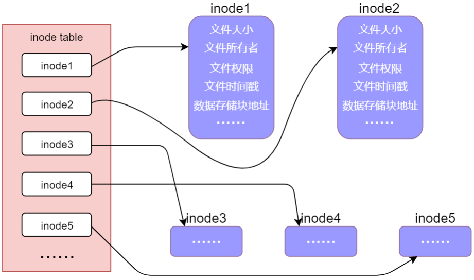
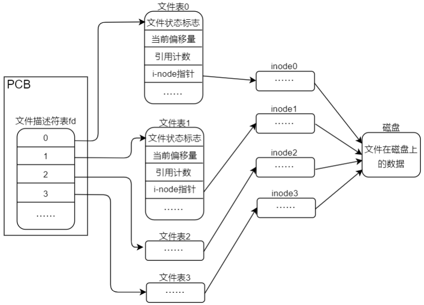
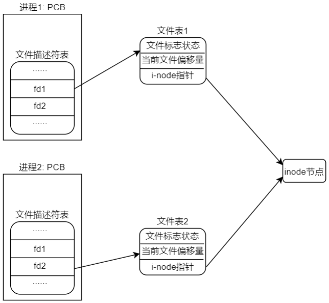

# Linux基础再过

​	一切皆文件。

​	这个重要的Linux概念是笔者反复提到的，在这里，我们想要理解的系统层次的文件IO。贯彻这个概念是非常重要的。下面，我们来看看基本的文件IO操作

## 先来看看Linux是如何操作文件IO的

​	首先，Linux的API都非常的简短简单，复用性强。下面来一个例子，来看看Linux的函数都多短：

```
#include <fcntl.h>   // open()的头文件
#include <unistd.h>  // read(), write(), close()的头文件
#include <stdio.h>   // printf()的头文件
#include <stdlib.h>  // exit()的头文件

#define BUFFER_SIZE 1024

int main() {
    int src_fd, dest_fd;    // 文件描述符
    ssize_t bytes_read, bytes_written;  // 读取和写入的字节数
    char buffer[BUFFER_SIZE];  // 缓冲区用于读取数据

    // 打开源文件，O_RDONLY表示只读模式
    src_fd = open("source.txt", O_RDONLY);
    if (src_fd == -1) {
        perror("Failed to open source file");
        exit(1);
    }

    // 打开目标文件，O_WRONLY表示只写模式，O_CREAT表示文件不存在时创建，O_TRUNC表示文件内容清空
    dest_fd = open("destination.txt", O_WRONLY | O_CREAT | O_TRUNC, 0644);
    if (dest_fd == -1) {
        perror("Failed to open destination file");
        close(src_fd);
        exit(1);
    }

    // 从源文件读取数据并写入目标文件
    while ((bytes_read = read(src_fd, buffer, BUFFER_SIZE)) > 0) {
        bytes_written = write(dest_fd, buffer, bytes_read);
        if (bytes_written != bytes_read) {
            perror("Failed to write data to destination file");
            close(src_fd);
            close(dest_fd);
            exit(1);
        }
    }

    if (bytes_read == -1) {
        perror("Failed to read from source file");
    }

    // 关闭文件
    close(src_fd);
    close(dest_fd);

    printf("File copied successfully!\n");
    return 0;
}
```

​	这一段代码很简单，实际上并不复杂。我们会在之后一一介绍这里出现的每一个函数。但是在那之前，我们的确需要有一些概念引出。。。

## 文件描述符

​	文件描述符！是一个抽象了文件的东西，你要是深究，就会发现他是一个整数。就像一个标签一样，在我们这里，这个整数就是锁定了一个文件。

​	实际上，文件描述符（File Descriptor，简称FD）是操作系统用于管理和访问文件的一个重要概念。在大多数操作系统中，文件描述符是一个整型数值，用来唯一标识一个进程打开的文件或者设备。文件描述符不仅限于指向磁盘上的文件，还包括其他资源，如网络套接字、管道、终端等。文件描述符是操作系统底层文件管理机制的一部分，它为程序提供了一个简单的接口，使得进程能够统一、有效地进行文件和资源的操作。

​	操作系统通过文件描述符来跟踪一个进程打开的文件，管理文件的读写权限、位置等。文件描述符表中存储的信息包括文件的偏移量、访问权限、文件类型、文件状态等。通过文件描述符，进程可以不关心具体的文件路径、设备类型等细节，而直接进行文件或设备的操作。

​	每次给打开的文件分配文件描述符都是从最小的没有被使用的文件描述符（0~1023）开始，当之前打开的文件被关闭之后，那么它对应的文件描述符会被释放，释放之后也就成为了一个没有被使用的文件描述符了。 
​	当我们在程序中，调用 open 函数打开文件的时候，分配的文件描述符一般都是从 3 开始（0，1，2给了标准输入，标准输出和标准错误了）

> Tips：Linux 系统下，一切皆文件，也包括各种硬件设备，使用 open 函数打开任何文件成功情况下便会返回对应的文件描述符 fd。每一个硬件设备都会对应于 Linux 系统下的某一个文件，把这类文件称为设备文件。所以设备文件对应的其实是某一硬件设备，应用程序通过对设备文件进行读写等操作、来使用、操控硬件设备，譬如 LCD 显示器、串口、音频、键盘等。 
> 	标准输入一般对应的是键盘，可以理解为 0 便是打开键盘对应的设备文件时所得到的文件描述符；标准输出一般指的是 LCD 显示器，可以理解为 1 便是打开 LCD 设备对应的设备文件时所得到的文件描述符；而标准错误一般指的也是 LCD 显示器

## 打开文件open

```
#include <sys/types.h> 
#include <sys/stat.h> 
#include <fcntl.h> 
int open(const char *pathname, int flags); 
int open(const char *pathname, int flags, mode_t mode);
```

​	open这个函数，实际上有两种版本。这件事情可以查看man手册直接杀出：

```
man 2 open
```

​	当然这里我们不贴，感兴趣的朋友自己看。

#### `pathname`

`pathname` 是要打开的文件的路径，可以是绝对路径或者相对路径。它指向一个以空字符 `'\0'` 结尾的字符串，指定要打开的文件位置。

#### `flags`

`flags` 是一个或多个标志，控制文件的打开方式。它通常是通过按位“或”运算组合的。`flags` 参数控制文件的打开方式、访问模式以及是否创建文件。

| Flag         | 描述                                                         |
| ------------ | ------------------------------------------------------------ |
| `O_RDONLY`   | 只读模式，文件只允许读取。                                   |
| `O_WRONLY`   | 只写模式，文件只允许写入。                                   |
| `O_RDWR`     | 读写模式，文件既可以读又可以写。                             |
| `O_CREAT`    | 如果文件不存在，则创建文件。需要与 `mode` 一起使用。         |
| `O_EXCL`     | 如果指定文件已存在，则 `open()` 调用失败，常与 `O_CREAT` 一起使用。 |
| `O_TRUNC`    | 如果文件已存在且以写模式打开，则截断文件的大小为0。          |
| `O_APPEND`   | 以追加模式打开文件，所有写操作都发生在文件的末尾。           |
| `O_NONBLOCK` | 非阻塞模式。即使文件处于阻塞状态，也不会阻塞调用进程。       |
| `O_SYNC`     | 同步I/O模式，要求文件操作立即写入磁盘，类似于 `fsync()` 的效果。 |
| `O_NOFOLLOW` | 如果路径指向符号链接，则 `open()` 调用会失败。               |
| `O_DSYNC`    | 与 `O_SYNC` 类似，但只影响文件数据，不影响文件元数据。       |

| **标志**      | **用途**                                          | **说明**                                                     |
| ------------- | ------------------------------------------------- | ------------------------------------------------------------ |
| `O_RDONLY`    | 以只读方式打开文件                                | 只能进行读取操作，不能进行写操作。                           |
| `O_WRONLY`    | 以只写方式打开文件                                | 只能进行写操作，不能进行读取操作。                           |
| `O_RDWR`      | 以可读可写方式打开文件                            | 允许同时进行读取和写入操作。                                 |
| `O_CREAT`     | 如果文件不存在则创建此文件                        | 使用此标志时需要传入第3个参数 `mode`，用来指定新建文件的权限。 |
| `O_DIRECTORY` | 如果文件不是目录则打开失败                        | 文件必须是目录类型，如果 `pathname` 不是目录，`open()` 返回错误。 |
| `O_EXCL`      | 与 `O_CREAT` 一起使用，确保文件不存在时才创建文件 | 如果文件已存在，`open()` 调用失败。结合 `O_CREAT` 使用用于原子操作。 |
| `O_NOFOLLOW`  | 不跟随符号链接，直接返回错误                      | 如果 `pathname` 是符号链接，`open()` 调用失败；否则会解引用符号链接。 |

#### `mode`

`mode` 参数仅在创建文件时使用（即当 `O_CREAT` 被指定时）。它是文件的权限掩码，表示文件创建时的访问权限。`mode` 参数的类型为 `mode_t`，通常是一个由以下权限位按位组合而成的整数值：


| 权限位    | 八进制表示 | 描述                                 |
| --------- | ---------- | ------------------------------------ |
| `S_IRUSR` | 0o400      | 用户可读权限（Owner read）           |
| `S_IWUSR` | 0o200      | 用户可写权限（Owner write）          |
| `S_IXUSR` | 0o100      | 用户可执行权限（Owner execute）      |
| `S_IRGRP` | 0o040      | 组可读权限（Group read）             |
| `S_IWGRP` | 0o020      | 组可写权限（Group write）            |
| `S_IXGRP` | 0o010      | 组可执行权限（Group execute）        |
| `S_IROTH` | 0o004      | 其他用户可读权限（Others read）      |
| `S_IWOTH` | 0o002      | 其他用户可写权限（Others write）     |
| `S_IXOTH` | 0o001      | 其他用户可执行权限（Others execute） |
| `S_ISUID` | 0o4000     | 设置用户ID位（Set user ID）          |
| `S_ISGID` | 0o2000     | 设置组ID位（Set group ID）           |
| `S_ISVTX` | 0o1000     | 粘滞位（Sticky bit）                 |

`mode` 参数是一个按位组合值，可以设置不同的权限位来控制文件的访问权限。例如，`0644` 表示用户有读写权限，组和其他用户只有读权限。

#### 返回值

成功将返回文件描述符，文件描述符是一个非负整数；失败将返回-1。

## write

`write()` 是一个系统调用，用于将数据从内存写入到文件或其他I/O设备（如终端、网络套接字等）。它是Unix/Linux系统中进行文件写操作的基本方法之一，常用于向文件、设备、管道等写入数据。

```
ssize_t write(int fd, const void *buf, size_t count);
```

#### 参数详解

| **参数** | **描述**                                                     |
| -------- | ------------------------------------------------------------ |
| `fd`     | 文件描述符，表示目标文件或设备的标识符。该描述符是通过 `open()` 或其他方式获得的。 |
| `buf`    | 指向要写入数据的缓冲区的指针。该缓冲区包含要写入的数据内容。 |
| `count`  | 要写入的数据字节数。此参数指定从 `buf` 缓冲区中写入的字节数。 |

#### 返回值

- **成功时**，返回实际写入的字节数。返回值类型为 `ssize_t`，通常会小于或等于 `count`，因为某些原因（例如磁盘空间不足、管道已满等）可能导致写入的字节数少于请求的字节数。
- **失败时**，返回 `-1`，并设置 `errno` 来表示错误原因。

| **错误码** | **描述**                                                |
| ---------- | ------------------------------------------------------- |
| `EAGAIN`   | 非阻塞I/O模式下，写操作会阻塞，此时返回 `EAGAIN`。      |
| `EBADF`    | `fd` 不是有效的文件描述符，或者该文件描述符没有写权限。 |
| `EFAULT`   | `buf` 指针无效，指向的内存不可访问。                    |
| `EINTR`    | 系统调用被信号中断。                                    |
| `ENOSPC`   | 磁盘空间不足，无法继续写入数据。                        |
| `EIO`      | 输入/输出错误，通常与硬件故障相关。                     |

#### 在哪里你能使用write

- **文件写操作**：将数据写入到文件中。
- **设备写操作**：向硬件设备（如磁盘、终端、串口等）写入数据。
- **管道写操作**：通过管道将数据写入到另一个进程。

```
#include <fcntl.h>
#include <unistd.h>
#include <stdio.h>
#include <string.h>

int main() {
    const char *data = "Hello, world!";
    int fd = open("output.txt", O_WRONLY | O_CREAT | O_TRUNC, 0644);  // 打开文件
    if (fd == -1) {
        perror("open");
        return 1;
    }

    ssize_t bytes_written = write(fd, data, strlen(data));  // 写入数据
    if (bytes_written == -1) {
        perror("write");
        close(fd);
        return 1;
    }

    printf("Successfully wrote %ld bytes to the file.\n", bytes_written);
    close(fd);  // 关闭文件
    return 0;
}
```

#### flags

虽然 `write()` 本身没有与 `open()` 函数一样直接与标志位结合使用，但它也可以在文件打开时影响文件的写入行为，常见的标志如下：

| **标志**   | **描述**                                                     |
| ---------- | ------------------------------------------------------------ |
| `O_WRONLY` | 以只写方式打开文件，适用于调用 `write()` 进行写操作。        |
| `O_RDWR`   | 以读写方式打开文件，允许在文件中进行读和写操作。             |
| `O_APPEND` | 以追加模式打开文件，每次写入的数据都会附加到文件末尾。       |
| `O_CREAT`  | 如果文件不存在，则创建文件（与 `write()` 结合使用时，确保目标文件存在）。 |

- **写入大小**：`write()` 操作可能会写入少于请求的字节数。实际写入的字节数由操作系统和目标文件的状态（例如，设备缓存、管道缓冲区等）决定。如果写入的字节数小于请求的字节数，可以重新调用 `write()` 以完成剩余的写入。
- **错误处理**：`write()` 调用可能由于多种原因失败，因此需要检查返回值。如果返回 `-1`，需要使用 `errno` 来诊断问题。
- **同步操作**：在某些情况下，如果你希望操作系统立即将数据写入磁盘，而不等到文件关闭时，可以使用 `fsync()` 或 `O_SYNC` 标志

## read

​	`read()` 是 Unix/Linux 系统中用于从文件或其他 I/O 设备（如终端、网络套接字等）读取数据的系统调用。它是文件操作的基本方法之一，允许程序从文件或设备中获取指定数量的数据。

```
ssize_t read(int fd, void *buf, size_t count);
```

| **参数** | **描述**                                                     |
| -------- | ------------------------------------------------------------ |
| `fd`     | 文件描述符，表示要读取数据的文件或设备的标识符。该描述符通常由 `open()` 返回，表示已打开的文件。 |
| `buf`    | 指向存储读取数据的缓冲区的指针。`read()` 会将读取到的数据存入该缓冲区。 |
| `count`  | 要读取的最大字节数。`read()` 会从文件中读取最多 `count` 字节的数据到 `buf` 缓冲区中。 |

#### 返回值

- **成功时**：返回实际读取的字节数（类型为 `ssize_t`）。返回值通常小于或等于 `count`，因为文件中的数据可能少于请求的字节数，或者文件可能在读取过程中到达末尾。

- **失败时**：返回 `-1`，并设置 `errno` 来表示错误原因。

- **读取到文件末尾时**：`errno` 错误值

  | **错误码** | **描述**                                                |
  | ---------- | ------------------------------------------------------- |
  | `EBADF`    | `fd` 不是有效的文件描述符，或者该文件描述符没有读权限。 |
  | `EFAULT`   | `buf` 指针无效，指向的内存不可访问。                    |
  | `EINTR`    | 系统调用被信号中断。                                    |
  | `EINVAL`   | `fd` 不是一个有效的文件描述符，或者 `count` 的值无效。  |
  | `EISDIR`   | `fd` 指向的是目录而不是文件，无法读取目录。             |
  | `ENOTTY`   | 文件描述符不支持读取操作（例如终端设备）。              |
  | `EIO`      | 输入/输出错误，通常与硬件故障相关。                     |

  - **文件读取**：读取文件的内容。
  - **设备读取**：从设备（如硬件设备、终端等）读取数据。
  - **管道读取**：通过管道从一个进程读取数据。
  - **网络读取**：从网络套接字读取数据（通常通过 `socket` 文件描述符）。

  ```
  #include <fcntl.h>
  #include <unistd.h>
  #include <stdio.h>
  #include <string.h>
  
  int main() {
      char buffer[128];  // 用于存储读取的数据
      int fd = open("example.txt", O_RDONLY);  // 打开文件（只读模式）
      if (fd == -1) {
          perror("open");
          return 1;
      }
  
      ssize_t bytes_read = read(fd, buffer, sizeof(buffer));  // 从文件读取数据
      if (bytes_read == -1) {
          perror("read");
          close(fd);
          return 1;
      }
  
      printf("Read %ld bytes: %.*s\n", bytes_read, (int)bytes_read, buffer);  // 打印读取的数据
      close(fd);  // 关闭文件
      return 0;
  }
  ```

  - **读取数据大小**：`read()` 调用的返回值可能小于请求的字节数（即 `count`），特别是在文件数据不足时（例如读取文件到文件末尾时）。程序需要处理这种情况，通常通过循环不断调用 `read()` 直到读取到所有数据。
  - **文件末尾**：当文件到达末尾时，`read()` 会返回 `0`，这表示没有更多数据可读取。
  - **阻塞和非阻塞模式**：`read()` 在默认情况下是阻塞的，即它会一直等待数据准备好才返回。如果设置了非阻塞模式（例如使用 `O_NONBLOCK` 标志打开文件或设备），`read()` 在没有数据时会立即返回 `-1`，并设置 `errno` 为 `EAGAIN`。
  - **错误处理**：`read()` 返回值为 `-1` 时，调用者应通过 `errno` 来判断具体的错误原因，例如文件描述符无效、没有读取权限、读取被中断等。

  #### `flags`

  `read()` 本身没有像 `open()` 那样直接与标志结合使用，但打开文件时使用的标志会影响 `read()` 的行为。常见的与 `read()` 相关的 `open()` 标志有：

  | **标志**     | **描述**                                                     |
  | ------------ | ------------------------------------------------------------ |
  | `O_RDONLY`   | 以只读方式打开文件，适用于调用 `read()` 进行读取操作。       |
  | `O_RDWR`     | 以读写方式打开文件，允许同时进行读取和写入操作。             |
  | `O_NONBLOCK` | 以非阻塞模式打开文件或设备，`read()` 在没有数据时不会阻塞。  |
  | `O_APPEND`   | 以追加模式打开文件，但对 `read()` 操作没有直接影响。         |
  | `O_CREAT`    | 如果文件不存在，则创建文件，但对 `read()` 操作没有直接影响。 |

- 返回 `0`，表示已到达文件的末尾，不再有数据可以读取。

## close

​	干完活，就要把文件关了，尽管进程可以在进程结束的时候帮助你把文件进行关闭，但是自己手动用完手动进行清理仍然是一个好习惯。特别是对于那些长期清理的程序！

​	`close()` 是 Unix/Linux 系统中用于关闭文件描述符的系统调用。它的主要作用是释放与文件描述符相关的资源，并使文件描述符不再有效。关闭文件描述符后，无法再对其进行任何操作。该函数通常在完成文件的读写操作后调用。

```
int close(int fd);
```

| **参数** | **描述**                                                     |
| -------- | ------------------------------------------------------------ |
| `fd`     | 要关闭的文件描述符，通常是通过 `open()`、`socket()`、`pipe()` 等系统调用获得的文件描述符。 |

- **成功时**：返回 `0`。

- **失败时**：返回 `-1`，`errno` 错误值

  | **错误码** | **描述**                                                |
  | ---------- | ------------------------------------------------------- |
  | `EBADF`    | `fd` 不是有效的文件描述符，或者该文件描述符已经关闭。   |
  | `EINVAL`   | `fd` 指向一个非法的文件描述符，可能已被关闭或没有打开。 |
  | `EIO`      | 输入输出错误，通常与硬件故障或文件系统问题相关。        |

  - **资源释放**：当文件描述符被关闭时，操作系统会释放与该文件描述符相关的所有资源。这意味着，文件描述符不再指向有效的文件或设备，后续的任何对该文件描述符的操作（如 `read()`、`write()` 等）都会导致错误。
  - **文件指针更新**：对于普通文件，关闭文件描述符后，文件指针会自动更新。如果文件是以写模式打开的，所有已缓存的数据会在 `close()` 时被刷新到磁盘（如果操作系统尚未将数据写入磁盘）。
  - **错误处理**：`close()` 返回 `-1` 时，通常需要通过 `errno` 来检查具体的错误原因。最常见的错误是试图关闭一个已经关闭的文件描述符（`EBADF`）。
  - **多次调用 `close()`**：对同一个文件描述符多次调用 `close()` 会导致未定义行为，通常会返回 `EBADF` 错误。因此，程序中应确保每个文件描述符仅关闭一次。

- 并设置 `errno` 来表示错误原因

## lseek

​	`lseek()` 是 Unix/Linux 系统中用于设置或获取文件偏移量的系统调用，它允许程序在文件中定位当前位置，从而控制文件读写的起始位置。`lseek()` 常用于大文件的随机访问、定位文件指针以及调整读取或写入的位置。

```
off_t lseek(int fd, off_t offset, int whence);
```

| **参数** | **描述**                                                     |
| -------- | ------------------------------------------------------------ |
| `fd`     | 要操作的文件描述符，通常由 `open()` 函数返回，表示已经打开的文件或设备。 |
| `offset` | 文件指针的新偏移量。该值是相对于由 `whence` 指定的位置的字节数。 |
| `whence` | 文件偏移量的起始位置，指定如何解释 `offset` 参数。可以是以下常量之一： |

#### `whence` 参数常量

| **常量**   | **描述**                                                     |
| ---------- | ------------------------------------------------------------ |
| `SEEK_SET` | 文件指针从文件开头开始移动，`offset` 表示从文件开始位置的偏移量（即 `offset` 直接作为新位置）。 |
| `SEEK_CUR` | 文件指针从当前位置开始移动，`offset` 表示相对于当前文件指针位置的偏移量。 |
| `SEEK_END` | 文件指针从文件末尾开始移动，`offset` 表示相对于文件末尾的偏移量。 |

#### 返回值

- **成功时**：返回文件描述符的当前偏移量，即文件指针的新位置。
- **失败时**：返回 `-1`，并设置 `errno` 来表示错误原因。

| **错误码**  | **描述**                                                     |
| ----------- | ------------------------------------------------------------ |
| `EBADF`     | `fd` 不是一个有效的文件描述符，或者该文件描述符没有读写权限。 |
| `EINVAL`    | 无效的 `whence` 参数值，或者文件描述符不支持此操作。         |
| `ESPIPE`    | 文件描述符不支持 `lseek()`，例如，对于管道、套接字等设备操作不支持该操作。 |
| `EOVERFLOW` | `offset` 值太大，导致偏移超出了文件的最大允许位置。          |

1. **文件的随机访问**：`lseek()` 使得程序可以从文件的任意位置开始读取或写入，适用于大文件的随机访问。通过调整文件指针，可以高效地读取文件的不同部分。
2. **调整文件读写位置**：在进行文件读写时，有时需要跳过特定的字节或回到文件开头，`lseek()` 就能实现这一功能。
3. **获取文件的当前指针位置**：通过 `lseek()` 获取当前文件偏移量，有时用于记录文件的当前位置，以便后续操作。

#### 示例 1

```
#include <fcntl.h>
#include <unistd.h>
#include <stdio.h>

int main() {
    int fd = open("example.txt", O_RDONLY);  // 打开文件（只读模式）
    if (fd == -1) {
        perror("open");
        return 1;
    }

    // 将文件指针移动到文件的第 10 个字节
    if (lseek(fd, 10, SEEK_SET) == -1) {
        perror("lseek");
        close(fd);
        return 1;
    }

    // 读取从位置 10 开始的 5 个字节
    char buffer[6] = {0};  // 用于存储读取的数据
    ssize_t bytes_read = read(fd, buffer, 5);
    if (bytes_read == -1) {
        perror("read");
        close(fd);
        return 1;
    }

    printf("Read: %s\n", buffer);  // 输出读取到的数据

    close(fd);  // 关闭文件
    return 0;
}
```

#### 示例 2：文件指针反向移动并进行写操作

```
#include <fcntl.h>
#include <unistd.h>
#include <stdio.h>

int main() {
    int fd = open("example.txt", O_RDWR);  // 打开文件（读写模式）
    if (fd == -1) {
        perror("open");
        return 1;
    }

    // 将文件指针移动到文件末尾
    if (lseek(fd, 0, SEEK_END) == -1) {
        perror("lseek");
        close(fd);
        return 1;
    }

    // 写入数据到文件末尾
    const char *data = "Appended data.\n";
    ssize_t bytes_written = write(fd, data, strlen(data));
    if (bytes_written == -1) {
        perror("write");
        close(fd);
        return 1;
    }

    printf("Data appended successfully.\n");

    close(fd);  // 关闭文件
    return 0;
}
```

#### demo3

```
#include <fcntl.h>
#include <unistd.h>
#include <stdio.h>

int main() {
    int fd = open("example.txt", O_RDONLY);  // 打开文件（只读模式）
    if (fd == -1) {
        perror("open");
        return 1;
    }

    // 获取当前文件偏移量
    off_t current_pos = lseek(fd, 0, SEEK_CUR);
    if (current_pos == -1) {
        perror("lseek");
        close(fd);
        return 1;
    }

    printf("Current file offset: %ld\n", current_pos);

    close(fd);  // 关闭文件
    return 0;
}
```

- **文件指针的限制**：`lseek()` 只能操作文件偏移量，不适用于某些特殊文件（如管道、套接字等）。在这些文件类型上调用 `lseek()` 会返回 `ESPIPE` 错误。
- **文件大小限制**：`lseek()` 允许设置非常大的偏移量，但操作系统和文件系统可能对文件的最大偏移量有限制。大多数现代文件系统支持 64 位的文件大小，但仍需注意特定系统的限制。
- **性能注意**：虽然 `lseek()` 是快速的，但在大量随机访问的场景中，频繁的偏移可能会降低性能。对于大文件，尤其是大型数据库或日志文件，合理设计访问策略是非常重要的。

# 深入探究文件IO

## Linux 系统如何管理文件的呢？

### 静态文件与 inode 

​	文件在没有被打开的情况下一般都是存放在磁盘中的，譬如电脑硬盘、移动硬盘、U 盘等外部存储设备，**文件存放在磁盘文件系统中，并且以一种固定的形式进行存放，我们把他们称为静态文件。** 

- **不变性**：静态文件在存储和传输过程中内容不会改变。只要文件没有被用户或管理员修改，它的内容是固定的。
- **高效性**：由于文件内容固定，读取和传输的效率较高。尤其是在 Web 开发中，静态文件可以被浏览器缓存，减少服务器的负担。
- **简单性**：静态文件通常不需要复杂的服务器端处理，可以直接通过 HTTP 协议传输。

​	上面就是静态文件的特点

​	文件储存在硬盘上，硬盘的最小存储单位叫做“扇区”（Sector），每个扇区储存512 字节（相当于0.5KB），操作系统读取硬盘的时候，不会一个个扇区地读取，这样效率太低，而是一次性连续读取多个扇区，即一次性读取一个“块”（block）。这种由多个扇区组成的“块”，是文件存取的最小单位。“块”的大小，最常见的是 4KB，即连续八个sector 组成一个block。

​	文件系统是操作系统用来管理存储设备上文件的结构和方式。文件系统提供了对文件的创建、读取、写入、删除、权限管理等操作。它使得操作系统能够有效地组织和存储数据。不同的操作系统使用不同的文件系统，如 Linux 中常见的 ext4、XFS、Btrfs，Windows 中的 NTFS、FAT32 等。在 Unix/Linux 系统中，文件系统的设计非常特殊，采用了许多高效的设计方法，其中最为核心的就是 **inode**。我们的磁盘在进行分区、格式化的时候会将其分为两个区域，一个是数据区，用于存储文件中的数据；另一个是 inode 区，用于存放 inode table（inode 表），inode table 中存放的是一个一个的 inode（也成为inode节点），不同的 inode 就可以表示不同的文件，每一个文件都必须对应一个 inode，inode 实质上是一个结构体，这个结构体中有很多的元素，不同的元素记录了文件了不同信息，譬如文件字节大小、文件所有者、文件对应的读/写/执行权限、文件时间戳（创建时间、更新时间等）、文件类型、文件数据存储的 block（块）位置等等信息，

​	在理解 inode 的工作方式时，我们必须要同时理解“静态文件”这一概念。静态文件通常指的是内容在访问时不发生变化的文件，如网页中的 HTML、CSS 文件和图片等。 

#### 进一步理解inode 

​	**Inode**（Index Node）是类 Unix 系统（如 Linux 和 macOS）文件系统中的一个数据结构，用于存储文件的元数据（metadata）。在这些操作系统中，文件被视为一组关联的数据块和元数据，而这些元数据就是通过 inode 来存储的。



inode 本身不包含文件的实际数据（即文件内容），而是包含了与文件相关的所有其他信息，例如：

- 文件的大小
- 文件的创建、修改、访问时间
- 文件的权限（如可读、可写、可执行）
- 文件的所有者和所属组
- 文件的硬链接数
- 文件的数据块地址（指向文件内容所在的数据块）

每个文件在文件系统中都有一个唯一的 inode。不同于文件名，inode 只表示文件的结构和属性，而文件名则是在目录项中与 inode 进行关联的。文件系统通过 inode 来管理文件和目录，使得文件操作更加高效。

一个典型的 inode 结构体包含以下几个部分：

- **文件类型**：文件是普通文件、目录、符号链接、设备文件等。
- **文件权限**：文件的访问控制权限（如可读、可写、可执行等）。
- **用户 ID（UID）**：文件的所有者（通常是文件的创建者）的用户标识符。
- **组 ID（GID）**：文件所属组的组标识符。
- **文件大小**：文件的大小，以字节为单位。
- **时间戳**：文件的三个时间戳——创建时间（ctime）、修改时间（mtime）和最后访问时间（atime）。
- **硬链接计数**：指向该 inode 的硬链接数量。
- **数据块指针**：指向文件数据块的指针（一个 inode 包含指向数据块的地址，存储文件实际内容的位置）。

当一个文件被创建时，操作系统为文件分配一个 inode，并记录该文件的元数据。文件内容存储在磁盘上的数据块中，而 inode 中存储的是这些数据块的位置。通过 inode，操作系统能够高效地访问和管理文件。

例如，在访问一个文件时，操作系统会通过文件名查找文件所在的 inode，然后根据 inode 中存储的指针来读取文件的实际内容。

​	需要注意的是，**文件的 inode 与文件名是分开的**。在 Linux 中，文件名存在于目录项中，而目录项中的文件名指向一个 inode。一个 inode 可以有多个文件名，这种情况通常表现为硬链接。硬链接是指不同的文件名指向同一个 inode，因此它们共享相同的 inode 和相同的文件内容。

- **inode 数量限制**：文件系统在创建时会预设 inode 的数量，一旦用尽，无法再创建新的文件。即使磁盘有空间，但如果 inode 用完了，仍然不能创建新文件。
- **inode 大小**：每个 inode 的大小在不同的文件系统中可能不同，通常是 128 字节、256 字节或更大。这个大小影响文件的管理和访问效率。

​	文件的inode可以在使用ls的时候传递-i参数进行查看。

### 文件打开时的状态 

​	当我们调用open函数去打开文件时，内核会申请一段内存（一段缓冲区），并将静态文件的数据内容从磁盘等存储设备中读取到内存中进行管理和缓存（也称为动态文件或内核缓冲区）。打开文件后，之后对文件的读写操作是针对内存中的动态文件，而不是磁盘中存放的静态文件。当我们对动态文件进行读写操作后，内存中的动态文件和磁盘设备中的静态文件就不同步了，数据的同步工作由内核完成，内核会在之后将内存中的动态文件更新（同步）到磁盘设备中。由此可以解释一些实际问题，例如：打开一个大文件时比较慢；文档写了一半，没记得保存，电脑突然停电导致掉电关机，重启后打开文档发现内容丢失。

​	通过上述介绍，我们可以理解为什么会发生这些问题。接下来，为什么要这样设计呢？因为磁盘、硬盘、U盘等存储设备大多是Flash块设备，块设备本身具有读写限制等特征，块设备是按块进行读写的（一个块包含多个扇区，一个扇区包含多个字节），即使是一个字节的改动，也需要将该字节所在的块全部读取出来修改，然后再写入块设备中，因此导致对块设备的读写操作非常不灵活。而内存可以按字节为单位操作，且可以随机操作任意地址的数据，操作非常灵活。所以操作系统会先将磁盘中的静态文件读取到内存进行缓存，所有读写操作都针对内存中的动态文件，而不是直接操作磁盘中的静态文件。这样可以避免直接操作磁盘导致效率低下，因为内存的读写速度远快于磁盘。 在Linux系统中，内核为每个进程设置了一个专门的数据结构用于管理进程，例如用于记录进程的状态信息和运行特征，我们称之为进程控制块（Process Control Block，简称PCB）。

​	PCB数据结构中有一个指针指向文件描述符表（File Descriptors），文件描述符表中的每个元素都指向对应的文件表（File Table）。文件表也是一个数据结构，记录了文件的相关信息，如文件状态标志、引用计数、当前文件的读写偏移量以及i-node指针（指向该文件对应的inode）等。进程打开的所有文件都记录在文件描述符表中，每个文件描述符都会指向对应的文件表。

在 Unix/Linux 系统中，`exit`、`_exit` 和 `_Exit` 都是用于终止进程的系统调用或库函数。尽管它们的名字相似，但它们之间有一些细微的区别，特别是在进程退出时如何处理缓冲区数据和文件描述符等方面。下面将详细介绍这三个函数的功能、区别和使用场景。

### Exit函数蔟

#### 1. `exit` 函数

`exit` 是标准 C 库提供的一个函数，用于终止当前进程的执行。它会执行一系列操作来清理进程资源，包括刷新缓冲区、关闭文件描述符等。

#### 原型

```
void exit(int status);
```

#### 参数

- `status`：进程的退出状态码。通常情况下，`status` 为 0 表示进程成功退出，非零值表示进程异常退出。

#### 功能

- **清理标准 I/O 缓冲区**：`exit` 会通过调用 `fflush` 刷新所有标准 I/O 缓冲区，确保任何未写入的数据都被写入到对应的文件或终端。
- **调用 `atexit` 注册的函数**：如果程序在启动时通过 `atexit` 注册了退出处理函数，那么这些函数会按相反的顺序被依次调用。
- **关闭文件描述符**：`exit` 会关闭所有打开的文件描述符。
- **释放内存**：系统会释放与该进程相关的所有内存（例如，堆内存）。
- **终止进程并返回退出状态**：最终，`exit` 会使进程终止，并将 `status` 返回给操作系统。

#### 使用示例

```
c复制代码#include <stdio.h>
#include <stdlib.h>

int main() {
    printf("This is a normal exit.\n");
    exit(0);  // 退出进程，返回状态为 0，表示正常退出
}
```

#### 注意事项

- 由于 `exit` 会进行一些清理工作，如刷新缓冲区、调用注册的退出函数等，因此它的执行相对较慢。
- `exit` 是 C 标准库的一部分，用户可以在程序中调用它来终止进程。

#### 2. `_exit` 函数

`_exit` 是一个系统调用（而不是标准 C 函数），用于强制终止进程并返回退出状态。与 `exit` 不同，`_exit` 不执行缓冲区刷新或调用 `atexit` 注册的函数。因此，它比 `exit` 更为直接和快速，通常用于需要快速终止进程的情况。

#### 原型

```
void _exit(int status);
```

#### 参数

- `status`：进程的退出状态码，含义同 `exit`。

#### 功能

- **不刷新缓冲区**：与 `exit` 不同，`_exit` 不会刷新标准 I/O 缓冲区。因此，未写入的数据可能不会被保存到目标文件中。
- **不调用 `atexit` 注册的函数**：`_exit` 不会执行通过 `atexit` 注册的退出处理函数。
- **快速终止进程**：`_exit` 会直接结束进程，释放操作系统为进程分配的资源（如内存、文件描述符等），并将退出状态返回给操作系统。

#### 使用场景

`_exit` 常常在以下情况下使用：

- 在 **子进程** 中，如果子进程需要立即退出且不需要进行任何清理工作，使用 `_exit` 是一种有效的方法。`fork` 系统调用创建子进程后，子进程通常会使用 `_exit` 来退出，而不会影响父进程的资源清理。
- 在 **多进程编程** 中，`_exit` 能保证子进程退出时不会干扰父进程的缓冲区和其他清理操作。

#### 使用示例

```
c复制代码#include <unistd.h>

int main() {
    // 子进程退出时不做任何缓冲区清理操作
    _exit(0);
}
```

#### `_Exit` 函数

`_Exit` 是 C11 标准引入的一个函数，类似于 `_exit`，但它是一个标准 C 库函数，并且与 `_exit` 的行为非常相似。`_Exit` 也不会刷新缓冲区或调用 `atexit` 注册的函数。

#### 原型

```
void _Exit(int status);
```

#### 参数

- `status`：进程的退出状态码，含义同 `exit`。

#### 功能

- **不刷新缓冲区**：`_Exit` 不会刷新标准 I/O 缓冲区。未写入的数据不会被保存。
- **不调用 `atexit` 注册的函数**：`_Exit` 不会执行通过 `atexit` 注册的退出处理函数。
- **快速终止进程**：与 `_exit` 相似，`_Exit` 直接终止进程，不会进行其他清理操作。

#### 与 `_exit` 的区别

- `_Exit` 是 C 标准库函数，而 `_exit` 是系统调用。
- `_Exit` 是 C11 标准引入的，旨在提供一个明确的终止进程的方法，避免与其他库函数（如 `exit`）的冲突。

#### 使用示例

```
#include <stdlib.h>
int main() {
    // 使用 _Exit 终止进程
    _Exit(0);
}
```

| 特性                | `exit`                                     | `_exit`                              | `_Exit`                               |
| ------------------- | ------------------------------------------ | ------------------------------------ | ------------------------------------- |
| **函数类型**        | C 标准库函数                               | 系统调用                             | C 标准库函数                          |
| **缓冲区刷新**      | 会刷新标准 I/O 缓冲区，确保数据写入        | 不会刷新缓冲区，可能丢失未写入的数据 | 不会刷新缓冲区，可能丢失未写入的数据  |
| **atexit 注册函数** | 会调用通过 `atexit` 注册的退出函数         | 不会调用通过 `atexit` 注册的退出函数 | 不会调用通过 `atexit` 注册的退出函数  |
| **性能**            | 较慢，因为需要进行清理工作（缓冲区刷新等） | 快速，直接终止进程                   | 快速，直接终止进程                    |
| **使用场景**        | 一般在程序的正常退出时使用                 | 用于子进程快速退出，不需要缓冲区刷新 | 用于在 C11 标准下明确且快速地终止进程 |

#### 选择使用哪个函数

- **`exit`**：适用于正常退出程序的场景，特别是当你需要确保文件缓冲区中的数据被写入、释放资源、调用退出处理函数时。
- **`_exit`**：适用于需要快速终止进程的场景，尤其是在子进程中，通常与 `fork()` 搭配使用，避免父进程的缓冲区和清理操作受到影响。
- **`_Exit`**：如果你使用 C11 标准，`_Exit` 提供了与 `_exit` 相同的功能，但它是标准 C 库的一部分，可以用来在不依赖系统调用的情况下终止进程。

### 空洞文件

在文件系统中，**空洞文件**（Sparse File）是一种特殊的文件类型，其中包含大量的“空洞”或“未分配空间”，这些部分的内容未被实际写入磁盘。空洞文件的特点是：文件在逻辑上是连续的，但它在物理存储上并不占用实际空间，只有包含数据的部分才会占用磁盘空间。

空洞文件主要用于存储稀疏的数据，比如数据库、虚拟机磁盘映像、日志文件等。这些文件往往包含大量的“空白”区域，这些区域在文件系统中并不实际存储数据，只是被逻辑上标记为存在。空洞文件的实现使得磁盘空间得到优化，避免了在磁盘上存储大量不必要的零字节。

#### 空洞文件的工作原理

#### 1. 空洞文件的创建

空洞文件的创建通常是在写入数据时，由于文件系统的特性，当写入操作不覆盖整个文件时，未写入的数据部分会被标记为空洞。系统在逻辑上认为这些区域是存在的，但并不分配物理空间。

在很多操作系统（如 Linux）中，创建空洞文件的常见方式是在文件中间写入数据，而在文件的其他部分（尤其是文件开头或结尾）没有显式写入任何数据。操作系统会自动将未写入部分处理为空洞。

#### 2. 空洞文件的存储

空洞文件本质上在文件系统上是连续的，但其部分区域没有实际的物理存储。在 Linux 中，空洞文件的空洞部分通常不占用磁盘空间，只是通过文件系统的元数据来标记这些区域。

空洞部分在磁盘上并不占用空间，只有实际写入的数据块才会被分配到磁盘上。例如，如果一个文件的大小为 1GB，但只有 100MB 的数据被写入，那么文件系统只会为这 100MB 分配磁盘空间，剩余的部分则没有实际存储空间。

#### 3. 空洞文件的访问

当访问一个空洞文件时，操作系统会在访问空洞部分时返回零字节。这是因为这些区域在磁盘上没有实际存储数据。即使文件在逻辑上是连续的，未写入的数据部分会被认为是“零”值。

例如，如果你打开一个包含 1GB 数据的文件，其中只有 100MB 被实际写入，剩余部分为零，当你读取文件时，读取的内容将是实际存储的数据和零字节，尽管文件的大小显示为 1GB。

#### 4. 文件系统支持空洞文件

并非所有的文件系统都支持空洞文件。现代的文件系统如 **ext4**、**XFS** 和 **NTFS** 等都支持空洞文件。在支持空洞文件的文件系统中，文件的空间分配和存储是根据实际写入的数据进行的，而空洞部分则不占用磁盘空间。

#### 空洞文件非常适用于以下几种场景：

#### 1. 虚拟机磁盘映像

虚拟机的磁盘映像通常是一个空洞文件，因为虚拟机磁盘映像的大小是固定的，但文件系统中的实际数据是随着虚拟机的使用而不断增加的。通过使用空洞文件，可以避免在虚拟机磁盘映像中占用大量的磁盘空间。随着虚拟机的运行，只有实际写入的数据才会占用物理存储。

#### 2. 数据库存储

许多数据库系统（如 MySQL、PostgreSQL）在处理大规模数据时，会使用空洞文件来优化存储。例如，当数据库中某些表格的内容很稀疏，或者表格的某些部分被删除时，空洞文件可以有效地节省磁盘空间。

#### 3. 日志文件

某些日志系统可能会生成很大的日志文件，而这些文件的内容并非完全被填充。例如，日志文件中间的很多区域可能只包含“零”字节。通过使用空洞文件，日志文件的物理空间利用效率大大提高。

#### 4. 压缩和备份文件

压缩软件和备份工具在生成大文件时，也可以利用空洞文件来减少物理空间的使用。尤其是当备份包含大量空白区域时，空洞文件能有效地节省存储空间。

### 三、如何创建和操作空洞文件

#### 1. 创建空洞文件

在 Linux 中，空洞文件的创建可以通过普通的文件操作来实现。最简单的方式是通过 `dd` 命令来创建一个具有空洞的文件，或者直接使用编程语言中的文件 I/O 操作。

##### 使用 `dd` 命令创建空洞文件

```
dd if=/dev/zero of=example.txt bs=1M count=10 seek=50
```

这条命令会创建一个名为 `example.txt` 的文件，其中包含 10MB 的零字节数据，并且从文件的第 50MB 开始写入这些零字节。文件的大小将为 60MB，但实际上只有 10MB 的数据会占用磁盘空间。

- `if=/dev/zero`：从 `/dev/zero` 设备读取数据（零字节）。
- `of=example.txt`：输出文件名为 `example.txt`。
- `bs=1M`：每次写入的块大小为 1MB。
- `count=10`：写入 10 块，即 10MB 的零字节。
- `seek=50`：跳过前 50MB，不写入数据。

这样，`example.txt` 文件的大小是 60MB，但它实际上只占用 10MB 的磁盘空间，其余部分为空洞。

#### 2. 查看空洞文件

可以使用 `ls` 命令查看文件的实际大小和逻辑大小：

```
ls -lh example.txt
```

该命令将显示文件的逻辑大小（即文件大小）和实际占用的磁盘空间（即磁盘使用空间）。

#### 3. 检查文件的空洞区域

要检查一个文件是否包含空洞区域，可以使用 `filefrag` 工具来查看文件的块分布情况：

```
filefrag example.txt
```

`filefrag` 会显示文件在磁盘上的存储分布。如果文件包含空洞区域，你将看到文件的存储区段中有“未分配”或“空洞”块。

#### 优点

1. **节省磁盘空间**：空洞文件最大限度地减少了对磁盘空间的浪费，只为实际写入的数据分配空间。
2. **提高存储效率**：对于包含大量零字节数据的文件，空洞文件的使用使得磁盘存储更高效，特别是在处理虚拟机映像、数据库等大规模稀疏数据时。
3. **提升性能**：空洞文件减少了磁盘上的实际写入操作，因为操作系统不会为空洞部分分配实际空间，进而提高了读写性能。

#### 缺点

1. **兼容性问题**：并非所有文件系统都支持空洞文件。一些较旧或不常见的文件系统可能无法正确处理空洞文件，导致访问异常或存储错误。
2. **可能导致空间碎片化**：虽然空洞文件节省了磁盘空间，但长时间的文件修改可能导致文件系统出现碎片化问题，影响读取效率。

## dup和dup2复制文件描述符

​	我们下面来谈谈如何复制文件描述符，实际上，我们有的时候希望多线程的操作文件，这个时候就会变得很有意义。



在 Unix/Linux 系统中，`dup` 和 `dup2` 是用于复制文件描述符的系统调用。它们提供了一种机制，可以将一个文件描述符的值复制到另一个文件描述符上，从而允许多个文件描述符指向同一个文件或设备。虽然它们有相似的功能，但在使用上有一些区别。下面是对 `dup` 和 `dup2` 的详细介绍。

#### 1. `dup` 函数

#### 原型

```
int dup(int oldfd);
```

#### 参数

- `oldfd`：这是要复制的现有文件描述符，必须是一个有效的打开文件描述符。

#### 返回值

- 成功时，返回一个新的文件描述符，这个文件描述符指向与 `oldfd` 相同的文件或设备。
- 失败时，返回 `-1`，并将 `errno` 设置为相应的错误码。

#### 功能

`dup` 函数创建一个新的文件描述符，并将其指向与 `oldfd` 相同的文件或设备。新文件描述符与 `oldfd` 共享文件状态，如文件偏移量和文件访问模式。两个文件描述符都指向同一个文件或设备，因此对其中一个文件描述符进行的读写操作会影响另一个文件描述符。

`dup` 会自动选择一个当前未使用的最小文件描述符值，并将其分配给新的文件描述符。

#### 使用示例

```
#include <unistd.h>
#include <fcntl.h>
#include <stdio.h>

int main() {
    // 打开一个文件
    int fd = open("example.txt", O_RDWR | O_CREAT, S_IRUSR | S_IWUSR);
    if (fd == -1) {
        perror("open failed");
        return 1;
    }

    // 使用 dup 复制文件描述符
    int new_fd = dup(fd);
    if (new_fd == -1) {
        perror("dup failed");
        return 1;
    }

    // 使用新的文件描述符读写文件
    write(new_fd, "Hello, world!", 13);

    close(fd);
    close(new_fd);
    return 0;
}
```

在这个例子中，`dup` 函数复制了文件描述符 `fd` 到一个新的文件描述符 `new_fd`，并通过 `new_fd` 写入数据。请注意，`new_fd` 和 `fd` 都指向相同的文件，因此它们共享文件的偏移量。

#### `dup2` 函数

#### 原型

```
int dup2(int oldfd, int newfd);
```

#### 参数

- `oldfd`：这是要复制的现有文件描述符，必须是一个有效的打开文件描述符。
- `newfd`：这是目标文件描述符，表示将 `oldfd` 复制到的文件描述符。

#### 返回值

- 成功时，返回 `newfd`，即新的文件描述符。
- 失败时，返回 `-1`，并将 `errno` 设置为相应的错误码。

#### 功能

`dup2` 函数与 `dup` 很相似，但有一个重要的区别：`dup2` 允许用户指定要复制到的目标文件描述符 `newfd`。如果 `newfd` 已经打开，则首先会关闭它，然后将 `oldfd` 复制到 `newfd`。如果 `newfd` 没有打开，`dup2` 会像 `dup` 一样选择一个未使用的文件描述符。

因此，`dup2` 允许更精确地控制文件描述符的分配，特别是在需要将某个文件描述符重定向到特定的文件描述符时（例如，重定向标准输入/输出）。

#### 使用示例

```
#include <unistd.h>
#include <fcntl.h>
#include <stdio.h>

int main() {
    // 打开一个文件
    int fd = open("example.txt", O_RDWR | O_CREAT, S_IRUSR | S_IWUSR);
    if (fd == -1) {
        perror("open failed");
        return 1;
    }

    // 使用 dup2 复制文件描述符
    int new_fd = 5;  // 假设我们希望使用文件描述符 5
    if (dup2(fd, new_fd) == -1) {
        perror("dup2 failed");
        return 1;
    }

    // 使用新的文件描述符（文件描述符 5）读写文件
    write(new_fd, "Hello, dup2!", 12);

    close(fd);
    close(new_fd);
    return 0;
}
```

在这个例子中，`dup2` 将文件描述符 `fd` 复制到文件描述符 5。接下来，使用文件描述符 5 写入文件数据。此时，文件描述符 5 和 `fd` 都指向相同的文件。

#### `dup` 和 `dup2` 的主要区别

| 特性                   | `dup`                                                    | `dup2`                                                       |
| ---------------------- | -------------------------------------------------------- | ------------------------------------------------------------ |
| **复制方式**           | 复制到最小的未使用文件描述符。                           | 复制到指定的文件描述符 `newfd`。                             |
| **目标文件描述符**     | 系统自动选择一个未使用的文件描述符。                     | 允许用户指定目标文件描述符 `newfd`。                         |
| **文件描述符已存在时** | 如果目标文件描述符已存在，它会被保留，`dup` 不会改变它。 | 如果 `newfd` 已经打开，则会首先关闭它， 然后复制 `oldfd` 到 `newfd`。 |
| **常见用途**           | 创建新文件描述符，通常用于标准输入输出重定向等操作。     | 允许显式控制文件描述符，常用于重定向输出和输入等。           |

#### `dup` 和 `dup2` 的常见用途

- **文件描述符重定向**：`dup` 和 `dup2` 经常用于将标准输入、标准输出或标准错误重定向到文件。例如，将标准输出重定向到文件：

  ```
  int fd = open("output.txt", O_WRONLY | O_CREAT, 0644);
  if (fd == -1) {
      perror("Failed to open output file");
      exit(1);
  }
  dup2(fd, STDOUT_FILENO);  // 将标准输出重定向到文件
  close(fd);
  printf("This will be written to output.txt\n");
  ```

- **进程间通信**：在一些应用中，需要通过管道或文件描述符将数据从一个进程传递到另一个进程。`dup2` 可以用来确保输出重定向到正确的目标文件描述符。

- **多路复用**：`dup` 和 `dup2` 可以用于文件描述符的多路复用，多个文件描述符可以指向同一个文件或设备，以便不同的部分同时读写相同的数据源。

## 使用pread和pwrite回避竞争风险

​	啥是竞争操作呢？竞争（Race Condition）是指在并发程序中，多个进程或线程并发地访问共享资源（如共享变量、文件、内存等），且至少有一个进程或线程在访问资源时对其进行了修改，导致程序的行为依赖于线程执行的顺序或调度时机，从而产生不确定的结果。简单来说，竞争是一种由并发访问引发的不正确的程序行为，通常表现为数据不一致、死锁、异常行为等。

​	竞争条件的存在通常是由于程序没有正确地同步线程之间对共享资源的访问。具体来说，竞争的发生往往需要满足以下几个条件：

- 多个进程或线程访问共享资源。
- 至少有一个进程或线程对资源进行了写操作。
- 这些操作没有适当的同步，导致不同的执行顺序影响了最终结果。

考虑一个简单的例子，其中两个线程都试图修改一个共享变量：

```
#include <stdio.h>
#include <pthread.h>

int shared_counter = 0;

void* increment(void* arg) {
    for (int i = 0; i < 1000000; ++i) {
        shared_counter++;  // 竞争条件发生的地方
    }
    return NULL;
}

int main() {
    pthread_t t1, t2;
    pthread_create(&t1, NULL, increment, NULL);
    pthread_create(&t2, NULL, increment, NULL);

    pthread_join(t1, NULL);
    pthread_join(t2, NULL);

    printf("Final value: %d\n", shared_counter);
    return 0;
}
```

​	在这个例子中，两个线程同时访问并修改了 `shared_counter`。由于 `shared_counter++` 这个操作不是原子的，它实际上包含读取共享变量、增加其值和写回共享变量三个步骤。如果两个线程在执行时“竞速”，即其中一个线程在另一个线程的操作中间进行读写，就可能导致最终的结果不符合预期，`shared_counter` 的值将会小于预期的 2000000。

​	在这个例子中，程序的最终输出值是非确定的，因为不同的执行顺序可能会导致不同的结果。

​	竞争很麻烦！他会

- **数据不一致**：多个线程同时修改共享数据时，可能会导致数据的不一致。例如，多个线程同时操作数据库记录或文件时，没有适当的同步会导致数据丢失或损坏。
- **不可预测的行为**：程序的行为依赖于线程的调度顺序，在不同的运行中可能会得到不同的结果，增加了程序的复杂性和不可预测性。
- **死锁和活锁**：竞争条件可能导致死锁（两个线程相互等待对方释放资源）或活锁（两个线程不断尝试获取资源但无法前进），这会导致程序无法继续执行。

​	解决这个问题，我们需要原子操作：**原子操作**是指一种在执行过程中不可被中断的操作。换句话说，原子操作是一个不可分割的操作，要么完全执行，要么完全不执行，没有中间状态。原子操作的特性确保了在并发执行的环境中，它不会被其他线程或进程打断，因此是线程安全的。

原子操作的关键特点是：

- **不可分割性**：原子操作在执行过程中不会被其他线程或进程中断。
- **一致性**：无论线程调度如何，原子操作要么完成，要么没有执行，不能停留在中间状态。

在多线程环境中，原子操作常用于避免竞争条件的发生，特别是在对共享资源的修改上。原子操作通常由硬件或操作系统提供支持，以确保其执行的不可中断性。

- **加法操作**：对一个变量进行加法操作时，普通的加法操作会拆解为读取值、修改值、写回的三个步骤。如果两个线程同时执行这个操作，可能会发生竞争条件。而使用原子加法操作，则可以确保在同一时刻只有一个线程能够修改该值，从而避免竞争。
- **比较并交换（CAS）**：比较并交换是常见的原子操作。它的作用是：首先比较一个值是否等于预期值，如果相等，则将其更新为新值。整个操作是不可中断的，因此可以用来实现无锁的数据结构。

在 C 语言中，一些原子操作通过库函数提供，例如在 POSIX 标准中，`<stdatomic.h>` 头文件提供了基本的原子操作，如 `atomic_add`、`atomic_sub`、`atomic_compare_exchange` 等。

原子操作的实现通常依赖于硬件层面的支持。例如，现代的处理器（如 x86、ARM）都提供了原子指令，这些指令可以确保在多核处理器上执行时不被中断。操作系统在这些硬件原子指令的基础上，提供了更加高层的原子操作接口，供用户程序使用。

例如，x86 处理器提供了类似 `LOCK` 前缀的指令，这些指令可以保证在执行时，操作是原子的，不会被其他 CPU 核心打断。

- **无锁编程**：原子操作是无锁编程的基础，它使得在并发程序中可以避免使用传统的锁机制（如互斥锁、信号量等）来同步线程。通过使用原子操作，程序可以在不加锁的情况下实现线程安全，提高性能。
- **并发数据结构**：例如，队列、栈等数据结构的并发实现，可以通过原子操作来确保多个线程同时访问时不会导致数据不一致。
- **计数器**：当需要对某个共享计数器进行增减时，可以使用原子操作来保证线程安全，避免竞争条件。

​	原子操作为解决竞争条件提供了有效的工具。在多线程或多进程环境中，当多个线程或进程需要同时修改共享资源时，使用原子操作可以确保操作的原子性，避免竞争条件的发生。例如，在修改共享计数器时，使用原子加法可以确保每次增加的操作不会被其他线程打断，从而保证计数器的正确性。

在 Unix/Linux 系统中，`pread` 和 `pwrite` 是两个用于文件操作的系统调用，它们提供了在文件中进行特定位置的读取和写入的能力，通常用于处理并发程序中的多线程文件操作。这两个函数可以避免常见的竞争条件，尤其是在多个线程或进程需要同时读取或写入同一个文件时，因为它们允许直接指定偏移量进行操作，而不需要修改文件描述符的当前位置。

#### `pread` 函数

#### 1. 原型

```
ssize_t pread(int fd, void *buf, size_t count, off_t offset);
```

#### 2. 参数

- **`fd`**：这是一个文件描述符，指向一个已打开的文件或设备。`fd` 是通过调用 `open` 或其他相关函数获得的。
- **`buf`**：这是一个指向缓冲区的指针，数据将从文件中读取到这个缓冲区。缓冲区的大小应该足够容纳从文件中读取的数据。
- **`count`**：要读取的字节数。`pread` 会从文件中读取 `count` 字节的数据到 `buf` 缓冲区中。
- **`offset`**：文件中的偏移量，从哪里开始读取数据。偏移量是相对于文件开始位置的字节数，`pread` 会直接从这个位置开始读取数据，而不会改变文件描述符的当前偏移量。

#### 3. 返回值

- 成功时，返回实际读取的字节数。如果返回的字节数少于请求的字节数，说明可能是遇到了文件的结尾。
- 失败时，返回 `-1`，并将 `errno` 设置为相应的错误码。

#### 4. 特性

- **不改变文件描述符的偏移量**：`pread` 会在指定的 `offset` 处开始读取数据，而不改变文件描述符的偏移量。与 `read` 函数不同，`read` 会修改文件描述符的偏移量，影响后续的读取操作。
- **支持并发读取**：由于 `pread` 可以直接指定偏移量，它非常适合于多线程或多进程并发操作同一文件时避免文件偏移冲突。每个线程可以在不同的偏移位置同时读取文件。

#### 5. 使用示例

```
#include <unistd.h>
#include <fcntl.h>
#include <stdio.h>

int main() {
    int fd = open("example.txt", O_RDONLY);
    if (fd == -1) {
        perror("Failed to open file");
        return 1;
    }

    char buffer[128];
    ssize_t bytesRead = pread(fd, buffer, sizeof(buffer), 10);  // 从偏移量 10 开始读取
    if (bytesRead == -1) {
        perror("pread failed");
        close(fd);
        return 1;
    }

    buffer[bytesRead] = '\0';  // 添加字符串终止符
    printf("Read data: %s\n", buffer);

    close(fd);
    return 0;
}
```

在这个示例中，`pread` 从文件 `example.txt` 的偏移量 `10` 处开始读取数据，并将读取到的数据存储到 `buffer` 中。

#### `pwrite` 函数

#### 1. 原型

```
ssize_t pwrite(int fd, const void *buf, size_t count, off_t offset);
```

#### 2. 参数

- **`fd`**：文件描述符，指向一个已打开的文件或设备。
- **`buf`**：指向缓冲区的指针，缓冲区包含将要写入文件的数据。
- **`count`**：要写入的字节数。`pwrite` 会将 `count` 字节的数据从 `buf` 写入文件。
- **`offset`**：文件中的偏移量，指定从文件的哪个位置开始写入数据。

#### 3. 返回值

- 成功时，返回实际写入的字节数。如果返回的字节数少于请求的字节数，说明可能是遇到了文件的结尾，或者写入操作中出现了某种错误。
- 失败时，返回 `-1`，并将 `errno` 设置为相应的错误码。

#### 4. 特性

- **不改变文件描述符的偏移量**：`pwrite` 会在指定的 `offset` 处开始写入数据，而不会改变文件描述符的偏移量。与 `write` 函数不同，`write` 会修改文件描述符的当前偏移量，影响后续的写入操作。
- **支持并发写入**：由于 `pwrite` 可以直接指定偏移量，它非常适合于多线程或多进程并发写入文件时避免文件偏移冲突。每个线程可以在不同的偏移位置同时写入文件。

#### 5. 使用示例

```
#include <unistd.h>
#include <fcntl.h>
#include <stdio.h>

int main() {
    int fd = open("example.txt", O_WRONLY | O_CREAT, 0644);
    if (fd == -1) {
        perror("Failed to open file");
        return 1;
    }

    const char *data = "Hello, pwrite!";
    ssize_t bytesWritten = pwrite(fd, data, strlen(data), 10);  // 从偏移量 10 开始写入
    if (bytesWritten == -1) {
        perror("pwrite failed");
        close(fd);
        return 1;
    }

    printf("Written %zd bytes to file\n", bytesWritten);

    close(fd);
    return 0;
}
```

在这个示例中，`pwrite` 从文件 `example.txt` 的偏移量 `10` 处开始写入数据。数据 `"Hello, pwrite!"` 被写入文件，从偏移量 `10` 开始，不会影响文件描述符的当前偏移量。

#### 优缺点

#### 1. 优点

- **不改变文件描述符的偏移量**：`pread` 和 `pwrite` 允许在文件的任意位置进行读取或写入，而不会改变文件描述符的当前偏移量。这使得多个线程或进程可以同时操作文件，而不必担心文件偏移量的冲突。
- **支持并发操作**：由于可以直接指定偏移量，`pread` 和 `pwrite` 是处理并发读取和写入文件的理想选择，尤其是在多线程或多进程环境中。
- **提高效率**：对于一些需要高效访问文件中不同位置的数据的场景，`pread` 和 `pwrite` 提供了一个快速、方便的接口，避免了多次调用 `lseek` 来移动文件偏移量。

#### 2. 缺点

- **无法适应小文件操作**：对于小文件的操作，`pread` 和 `pwrite` 相比 `read` 和 `write` 可能会稍显复杂，因为它们涉及到偏移量的指定，增加了调用的复杂性。
- **不支持非文件设备**：`pread` 和 `pwrite` 主要用于文件操作，且它们通常用于支持偏移量操作的文件系统。对于不支持偏移量的设备（如一些字符设备或管道），这些函数可能无法正常工作。

## fcntl 和 ioctl 更改文件的控制权限

在 Unix/Linux 系统中，`fcntl` 和 `ioctl` 是两个用于文件描述符操作的系统调用，它们提供了对文件或设备进行更细粒度控制的能力。虽然这两个函数有一些相似之处，但它们的用途和操作对象有所不同，通常用于不同的情境下。

### `fcntl` 函数

#### 1. 原型

```
int fcntl(int fd, int cmd, ... /* arg */ );
```

#### 2. 参数

- **`fd`**：文件描述符，指向一个已打开的文件或设备。`fd` 是通过 `open` 函数获得的。
- **`cmd`**：命令，用来指定执行的操作。`cmd` 可以是以下常见的命令之一：
  - `F_GETFL`：获取文件描述符的状态标志。
  - `F_SETFL`：设置文件描述符的状态标志。
  - `F_GETFD`：获取文件描述符的文件描述符标志（如 `FD_CLOEXEC`）。
  - `F_SETFD`：设置文件描述符的文件描述符标志（如 `FD_CLOEXEC`）。
  - `F_SETLK`，`F_SETLKW`，`F_GETLK`：用于文件锁操作（如共享锁或排它锁）。
- **`arg`**：这个参数的意义取决于 `cmd` 命令。对于某些命令，它可能是一个指针，指向需要设置的值；对于其他命令，它可以是一个简单的整数值。

#### 3. 返回值

- 成功时，返回值通常是命令的结果。具体结果依赖于 `cmd` 的值。例如，`F_GETFL` 返回当前的文件状态标志，而 `F_SETFL` 返回 0 表示成功。
- 失败时，返回 `-1`，并将 `errno` 设置为适当的错误码。

#### 4. 特性

- **文件状态标志的控制**：`fcntl` 常用于修改文件的打开模式或设置文件锁。例如，使用 `F_SETFL` 命令可以将文件设置为非阻塞模式（`O_NONBLOCK`）。
- **文件描述符的控制**：`fcntl` 还可以用于获取或设置文件描述符的行为，例如 `FD_CLOEXEC` 标志，它可以确保在执行 `exec` 调用时，文件描述符不会被继承。

#### 5. 常见用法

- **获取文件状态标志**：

```
#include <fcntl.h>
#include <unistd.h>
#include <stdio.h>

int main() {
    int fd = open("example.txt", O_RDWR);
    if (fd == -1) {
        perror("Failed to open file");
        return 1;
    }

    int flags = fcntl(fd, F_GETFL);  // 获取文件描述符的状态标志
    if (flags == -1) {
        perror("fcntl failed");
        close(fd);
        return 1;
    }

    printf("Current flags: %d\n", flags);
    close(fd);
    return 0;
}
```

- **设置文件为非阻塞模式**：

```
#include <fcntl.h>
#include <unistd.h>
#include <stdio.h>

int main() {
    int fd = open("example.txt", O_RDWR);
    if (fd == -1) {
        perror("Failed to open file");
        return 1;
    }

    int flags = fcntl(fd, F_GETFL);  // 获取当前的文件状态标志
    if (flags == -1) {
        perror("fcntl failed");
        close(fd);
        return 1;
    }

    // 设置文件为非阻塞模式
    if (fcntl(fd, F_SETFL, flags | O_NONBLOCK) == -1) {
        perror("fcntl failed to set non-blocking");
        close(fd);
        return 1;
    }

    printf("File set to non-blocking mode\n");
    close(fd);
    return 0;
}
```

### 二、`ioctl` 函数

#### 1. 原型

```
c


复制代码
int ioctl(int fd, unsigned long request, ...);
```

#### 2. 参数

- **`fd`**：文件描述符，指向一个已打开的设备文件、套接字或其他支持 `ioctl` 操作的对象。`fd` 是通过 `open` 函数获得的。
- **`request`**：`ioctl` 请求代码，用于指定要执行的具体操作。请求代码通常由设备驱动程序定义，它们与特定的设备或类型相关。
- **`arg`**：这个参数的意义依赖于 `request` 请求代码。它通常是指向一个缓冲区的指针，或者是需要传递给设备驱动程序的其他信息。对于某些请求，`arg` 可能是一个整型值。

#### 3. 返回值

- 成功时，返回 `0` 或一个正值（具体取决于请求代码和操作）。如果 `arg` 是输出缓冲区，`ioctl` 将填充该缓冲区。
- 失败时，返回 `-1`，并设置 `errno` 为适当的错误码。

#### 4. 特性

- **设备控制**：`ioctl` 函数常用于与设备进行低级交互，控制设备的行为，获取设备状态或传递配置参数。`ioctl` 是与特定设备相关的操作，因此不同的设备或驱动程序有不同的 `ioctl` 请求代码。
- **不局限于文件**：虽然 `ioctl` 通常用于文件操作，但它不仅限于文件，也可以用于控制其他设备，如终端、套接字、网络接口等。

#### 5. 常见用法

- **控制终端行为**：

`ioctl` 可用于设置终端的控制模式，比如设置终端的输入模式（例如，禁用回显）：

```
#include <unistd.h>
#include <fcntl.h>
#include <stdio.h>
#include <termios.h>
#include <sys/ioctl.h>

int main() {
    int fd = open("/dev/tty", O_RDONLY);
    if (fd == -1) {
        perror("Failed to open terminal");
        return 1;
    }

    struct termios term;
    if (ioctl(fd, TCGETS, &term) == -1) {
        perror("Failed to get terminal settings");
        close(fd);
        return 1;
    }

    term.c_lflag &= ~ECHO;  // 禁用回显
    if (ioctl(fd, TCSETS, &term) == -1) {
        perror("Failed to set terminal settings");
        close(fd);
        return 1;
    }

    printf("Terminal echo disabled\n");

    close(fd);
    return 0;
}
```

- **获取设备信息**：

`ioctl` 也可以用来获取设备的状态信息，比如查询磁盘的总容量或获取网络接口的配置：

```
#include <sys/ioctl.h>
#include <unistd.h>
#include <stdio.h>
#include <net/if.h>
#include <sys/socket.h>

int main() {
    int sockfd = socket(AF_INET, SOCK_DGRAM, 0);
    if (sockfd == -1) {
        perror("Failed to create socket");
        return 1;
    }

    struct ifreq ifr;
    strncpy(ifr.ifr_name, "eth0", IFNAMSIZ);  // 设置网络接口名
    if (ioctl(sockfd, SIOCGIFADDR, &ifr) == -1) {
        perror("ioctl failed");
        close(sockfd);
        return 1;
    }

    struct sockaddr_in *addr = (struct sockaddr_in *)&ifr.ifr_addr;
    printf("IP address: %s\n", inet_ntoa(addr->sin_addr));

    close(sockfd);
    return 0;
}
```

| 特性         | `fcntl`                                                 | `ioctl`                                          |
| ------------ | ------------------------------------------------------- | ------------------------------------------------ |
| **功能定位** | 文件描述符的管理与控制                                  | 设备控制与操作                                   |
| **作用对象** | 主要用于文件或文件描述符的状态操作（如锁、标志等）      | 主要用于控制设备或获取设备的状态信息             |
| **控制内容** | 文件描述符的打开标志、文件锁、文件关闭时的行为等        | 设备的控制、状态获取、设备特定操作               |
| **常见操作** | 设置文件标志（如 `O_NONBLOCK`）、文件锁（如 `F_SETLK`） | 控制终端模式、获取网络接口信息、控制设备操作     |
| **使用场景** | 多用于文件描述符的状态管理，如非阻塞模式、文件锁等      | 主要用于设备驱动级的控制，如终端、网络设备控制等 |