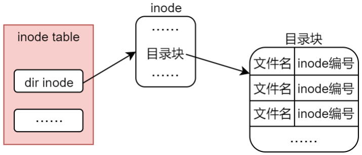

# 嵌入式Linux开发4——文件类型2

## 使用stat查明文件类型

​	`stat` 是一个在 Unix 和 Linux 系统中非常重要的命令和系统调用，它用于获取文件或文件系统的详细信息。通过 `stat` 命令或 `stat()` 系统调用，用户可以查看文件的元数据，如大小、权限、修改时间、访问时间、文件类型等。

​	先不着急，我们先来看看我们的stat命令的用法，他就是封装了我们的stat函数的用法

#### `stat` 命令

在命令行中，`stat` 命令用于显示文件或文件系统的状态信息。它可以提供关于指定文件或目录的详细信息，通常包括文件的大小、权限、最后访问和修改时间、inode 号等。

```
stat [选项] 文件
```

- `-c` 或 `--format=格式`：指定输出格式。例如，可以通过指定格式字符串来选择想要显示的字段。
- `-f` 或 `--file-system`：显示文件系统的状态信息，而不是文件本身的信息。
- `--help`：显示帮助信息。

​	出来的一些参数的说明：

- **Size**：文件大小，单位字节。
- **Blocks**：文件占用的磁盘块数。
- **IO Block**：每个磁盘块的大小。
- **Device**：文件所在的设备。
- **Inode**：文件的 inode 号，用于唯一标识文件。
- **Links**：指向文件的硬链接数量。
- **Access**、**Modify**、**Change**：分别表示文件的访问时间、修改时间和状态更改时间。
- **Birth**：文件的创建时间（若支持）。

#### `stat()` 系统调用

`stat()` 是一个系统调用，通常用于程序内部获取文件或目录的元数据。在 C 语言中，`stat()` 用来获取文件的状态信息，返回值为一个 `struct stat` 结构体。

```
#include <sys/stat.h>
int stat(const char *pathname, struct stat *statbuf);
```

- **pathname**：要获取信息的文件路径。
- **statbuf**：指向 `struct stat` 结构体的指针，存储文件的信息。

#### `struct stat` 结构体

```
struct stat {
    dev_t     st_dev;     /* 文件所在设备 */
    ino_t     st_ino;     /* inode 号 */
    mode_t    st_mode;    /* 文件类型和权限 */
    nlink_t   st_nlink;   /* 链接数 */
    uid_t     st_uid;     /* 所有者的用户 ID */
    gid_t     st_gid;     /* 所有者的组 ID */
    dev_t     st_rdev;    /* 设备文件的设备 ID */
    off_t     st_size;    /* 文件大小（字节数） */
    time_t    st_atime;   /* 上次访问时间 */
    time_t    st_mtime;   /* 上次修改时间 */
    time_t    st_ctime;   /* 状态变化时间 */
    long      st_blksize; /* 文件系统块大小 */
    long      st_blocks;  /* 文件占用的块数 */
};
```

​	关于st_mode这个东西：


​	比如说这个用法：

```
#include <stdio.h>
#include <stdlib.h>
#include <sys/stat.h>
#include <time.h>

int main() {
    struct stat file_stat;
    if (stat("myfile.txt", &file_stat) == -1) {
        perror("stat");
        exit(1);
    }

    printf("File size: %ld bytes\n", file_stat.st_size);
    printf("Last access time: %s", ctime(&file_stat.st_atime));
    printf("Last modification time: %s", ctime(&file_stat.st_mtime));
    printf("Inode number: %ld\n", file_stat.st_ino);
    
    return 0;
}
```

​	在这个例子中，`stat()` 系统调用返回文件 `myfile.txt` 的详细信息，并通过 `struct stat` 结构体获取文件的大小、访问时间、修改时间等。

#### 常见字段和它们的含义

在 `stat` 输出或 `stat()` 系统调用的返回结构体中，常见的字段包括：

- **文件大小 (`st_size`)**：表示文件的实际字节大小，通常用于文件内容的读写操作。
- **权限 (`st_mode`)**：存储文件的权限信息，通过位操作可以解析出文件的读写执行权限。例如，`S_IRUSR`、`S_IWUSR` 等。
- **最后访问时间 (`st_atime`)**：文件最后一次被访问的时间。
- **最后修改时间 (`st_mtime`)**：文件内容最后一次被修改的时间。
- **状态改变时间 (`st_ctime`)**：文件的状态（如权限）发生变化的时间。

​	stat经常被用来：

- **检查文件状态**：使用 `stat` 命令或 `stat()` 系统调用可以获得文件或目录的详细状态信息。
- **文件操作**：程序可以通过文件的状态信息（如大小、修改时间、权限等）来决定是否进行读取、写入或修改等操作。
- **获取文件类型**：通过 `stat()` 获取文件类型信息（如常规文件、目录、符号链接等），并执行相应的操作。

## `fstat` 函数

​	`fstat` 用于获取由文件描述符指向的文件的状态信息。与 `stat` 函数不同，`fstat` 不是通过路径名来获取文件信息，而是通过已打开文件的文件描述符来访问。

```
#include <sys/stat.h>
int fstat(int fd, struct stat *statbuf);
```

- **fd**：文件描述符，它是通过调用 `open()`、`dup()`、`pipe()` 等函数获得的。
- **statbuf**：指向 `struct stat` 结构体的指针，系统会将文件的状态信息填充到这个结构体中。

​	值得注意的是：

- `fstat` 不需要文件路径，只需要文件描述符，因此可以在文件已经打开的情况下获取文件信息。（换而言之，能拿到fd）
- 它返回的文件信息与 `stat` 函数类似，涵盖了文件的大小、权限、所有者、时间戳等信息。
- `fstat` 特别适用于需要通过文件描述符操作的情境，如在进程中打开的文件，或者通过文件描述符进行的 I/O 操作。

#### 示例：

```
#include <stdio.h>
#include <sys/stat.h>
#include <fcntl.h>

int main() {
    int fd;
    struct stat file_stat;

    // 打开文件
    fd = open("myfile.txt", O_RDONLY);
    if (fd == -1) {
        perror("open");
        return 1;
    }

    // 获取文件状态
    if (fstat(fd, &file_stat) == -1) {
        perror("fstat");
        return 1;
    }

    // 输出文件大小和修改时间
    printf("File size: %ld bytes\n", file_stat.st_size);
    printf("Last modified: %s", ctime(&file_stat.st_mtime));

    // 关闭文件
    close(fd);

    return 0;
}
```

在这个例子中，`fstat` 通过文件描述符 `fd` 获取文件 `myfile.txt` 的信息，而不需要通过路径。

## `lstat` 函数

`lstat` 和 `stat` 函数非常相似，但它有一个重要的区别：**`lstat` 用于获取符号链接本身的状态信息，而 `stat` 获取符号链接所指向目标文件的状态信息**。这意味着，如果指定的文件是一个符号链接，`lstat` 会返回符号链接本身的信息，而 `stat` 会返回符号链接所指向的文件的状态信息。

```
#include <sys/stat.h>
int lstat(const char *pathname, struct stat *statbuf);
```

- **pathname**：符号链接的路径名。
- **statbuf**：指向 `struct stat` 结构体的指针，系统会将符号链接或其目标文件的状态信息填充到该结构体中。

- **符号链接的处理**：`lstat` 允许我们获取符号链接本身的状态信息，而 `stat` 总是获取符号链接所指向的目标文件的状态信息。
- 如果文件路径是一个符号链接，`lstat` 会返回该符号链接的元数据（如权限、链接数等），而 `stat` 会返回符号链接目标文件的元数据。
- 在符号链接的情况下，`lstat` 提供了一种获取链接本身的方式，而不跟随链接到目标文件。

```
#include <stdio.h>
#include <sys/stat.h>
#include <unistd.h>

int main() {
    struct stat file_stat;

    // 获取符号链接的状态
    if (lstat("mylink", &file_stat) == -1) {
        perror("lstat");
        return 1;
    }

    // 输出符号链接的 inode 号、权限等
    printf("Inode: %ld\n", file_stat.st_ino);
    printf("File type: %o\n", file_stat.st_mode);

    return 0;
}
```

在这个例子中，`lstat` 获取的是符号链接 `mylink` 的元数据，而不是它所指向的目标文件的信息。

#### 区别总结

- **`fstat`**：通过文件描述符获取文件的状态信息，而不是文件路径。适用于文件已经被打开的情况。
- **`lstat`**：与 `stat` 类似，但对于符号链接，`lstat` 获取的是符号链接本身的信息，而不是它指向的目标文件的信息。`stat` 则获取符号链接所指向的目标文件的信息。

####  使用场景

- `fstat`

  ：

  - 当你已经通过文件描述符打开了文件时，使用 `fstat` 获取文件的元数据。
  - 适用于文件已经在程序中被打开并且需要对文件进行操作的场景。

- `lstat`

  ：

  - 当你处理符号链接时，如果你想要获取符号链接本身的信息（例如链接的权限和类型），使用 `lstat`。
  - 在处理符号链接时，如果你不希望跟随符号链接指向的文件，而是查看符号链接本身的状态时，应使用 `lstat`。

#### `stat`、`fstat` 和 `lstat` 比较

| 函数      | 作用                               | 是否跟随符号链接 | 输入参数   |
| --------- | ---------------------------------- | ---------------- | ---------- |
| `stat()`  | 获取指定路径文件的信息             | 是               | 文件路径   |
| `fstat()` | 获取通过文件描述符引用的文件的信息 | 是               | 文件描述符 |
| `lstat()` | 获取符号链接本身的信息             | 否               | 文件路径   |

## 链接

​	在 Linux 和 Unix 操作系统中，文件是通过文件系统进行管理的，每个文件都通过其独特的 **inode** 号来标识，而 **链接**（Link）则是指向文件的引用或指针。硬链接和符号链接（软链接）是两种实现文件引用的机制。尽管它们都能让文件在文件系统中有多个名字，但它们的工作原理、用途以及适用场景有着本质的不同。

#### 硬链接

硬链接是操作系统文件系统中的一种机制，它使得一个文件可以有多个名称，这些名称可以位于同一目录下，也可以跨目录。硬链接与原始文件共享相同的 inode 号，这意味着它们是完全等价的，指向同一个数据块。当我们对其中一个硬链接进行操作时，实际上是在操作存储在硬盘上的同一个数据。

硬链接背后的核心概念是 inode。当文件被创建时，文件系统为文件分配一个 inode，这个 inode 包含了文件的元数据，如文件大小、权限、时间戳等，但它不包含文件的名字。文件名和 inode 号是通过目录项来关联的。硬链接实际上是指向同一个 inode 的多个文件名，多个硬链接共享同一个数据块，因此它们之间没有主次之分。

#### 硬链接的特性

硬链接有几个非常关键的特性，使得它与符号链接有着显著的区别：

1. **共享 inode**：硬链接和原始文件共享同一个 inode 号，因此它们的数据块是相同的。当硬链接和原始文件之间的数据发生变化时，这些更改对所有硬链接都是可见的。
2. **独立性**：硬链接与原始文件完全独立。删除任何一个硬链接并不会影响其他硬链接或原始文件，因为文件内容的数据块仍然被其他硬链接引用，直到所有链接都被删除。
3. **不能跨文件系统**：硬链接只能在同一文件系统中创建。因为硬链接与 inode 直接相关，而 inode 是文件系统内部的数据结构，不同文件系统的 inode 是不相同的。
4. **不可对目录使用**：在大多数文件系统中，硬链接不能创建目录的硬链接。为了避免产生循环链接和复杂的目录结构，只有文件可以被硬链接。

#### 创建硬链接

在 Linux 中，使用 `ln` 命令来创建硬链接。`ln` 命令默认创建硬链接，使用方法如下：

```
ln source_file link_name
```

这个命令会将 `source_file` 创建一个新的硬链接，名称为 `link_name`。这两个文件将共享相同的 inode，因此它们指向相同的存储空间。

```
$ echo "Hello, World!" > file1.txt
$ ln file1.txt link1.txt
$ ls -i file1.txt link1.txt
123456 file1.txt
123456 link1.txt
```

如上所示，`file1.txt` 和 `link1.txt` 都有相同的 inode 号 `123456`，因此它们是硬链接，指向同一数据块。

#### 硬链接的优缺点

硬链接的优点在于它提供了一种文件的多重引用方式，而不需要占用额外的存储空间。通过硬链接，文件可以有多个名字，这对于文件管理非常有用。例如，在备份、复制文件时，使用硬链接可以节省空间，因为只有当所有硬链接都被删除时，数据块才会被真正清除。

然而，硬链接也有一些限制。首先，它不能跨文件系统，这在跨磁盘或网络文件系统时可能成为一个问题。其次，它不允许对目录进行硬链接，这也限制了其在目录结构中的应用。最后，硬链接和符号链接的主要区别之一在于，硬链接和原始文件没有区分，删除一个链接不会提供任何明显的线索，可能会给管理带来一定的复杂性。

#### 符号链接（软链接）

符号链接（又称为软链接）是一种特殊类型的文件，它包含一个指向另一个文件的路径。符号链接和原始文件完全不同，它们在文件系统中是独立的文件。符号链接存储的是目标文件的路径，而不是目标文件的内容或 inode 号。因此，符号链接可以跨文件系统，而且可以链接到目录。与硬链接不同，符号链接是一个指向目标文件路径的快捷方式。

符号链接的工作方式类似于快捷方式或 Windows 中的“别名”功能。当我们访问符号链接时，操作系统会自动转到符号链接所指向的目标文件。

#### 符号链接的特性

符号链接的特性与硬链接有很大的不同：

1. **独立性**：符号链接与原始文件不同。符号链接有自己的 inode 和文件数据块，它只是包含一个指向目标文件路径的字符串。当符号链接被删除时，它不会影响目标文件的内容。
2. **可以跨文件系统**：符号链接可以指向任何文件或目录，不受文件系统的限制。这意味着符号链接可以跨越不同的文件系统、磁盘甚至计算机。
3. **支持目录链接**：符号链接不仅可以链接文件，也可以链接目录。
4. **可以断开连接**：如果符号链接的目标文件被删除或移动，符号链接会变得“悬空”，即成为一个“死链接”，此时访问符号链接将导致错误。硬链接则不会受到这种影响，因为它们和目标文件共享相同的 inode，数据不会丢失。

#### 创建符号链接

在 Linux 中，使用 `ln -s` 命令来创建符号链接。命令的语法如下：

```
ln -s target_file link_name
```

`ln -s` 命令会创建一个名为 `link_name` 的符号链接，指向目标文件 `target_file`。

```
$ echo "Hello, World!" > file1.txt
$ ln -s file1.txt symlink.txt
$ ls -l symlink.txt
lrwxrwxrwx 1 user user 10 Nov 24 15:12 symlink.txt -> file1.txt
```

如上所示，符号链接 `symlink.txt` 显示为一个快捷方式，指向文件 `file1.txt`。

#### 符号链接的优缺点

符号链接具有许多优点，特别是在需要跨文件系统、链接目录或提供文件路径快捷方式的场景下。由于符号链接只存储路径，因此它们占用的存储空间比硬链接小，这使得它们在某些应用中非常有用。符号链接还能指向目录，且支持跨文件系统的链接。

然而，符号链接也有其缺点。最显著的缺点是，它们可能会“断链”，即当符号链接指向的目标文件被删除或移动时，符号链接会失效。此时，访问符号链接会导致错误或“悬挂”的链接。此外，符号链接是一个独立的文件，因此，它不能像硬链接那样直接共享文件的 inode 号，这使得符号链接在某些操作上不如硬链接高效。

#### 硬链接与符号链接的比较

硬链接和符号链接在本质上是两种完全不同的文件引用方式。硬链接是文件的另一种名称，通过 inode 号指向文件数据块，而符号链接则是指向目标文件路径的一个独立文件。两者的主要区别体现在以下几个方面：

1. **共享 inode**：硬链接共享原始文件的 inode，符号链接则有自己的 inode。
2. **跨文件系统**：硬链接只能在同一文件系统内创建，而符号链接可以跨文件系统。
3. **指向目标类型**：硬链接指向文件的数据块，符号链接则指向文件路径或目录路径。
4. **删除行为**：删除硬链接不会影响文件内容，只有所有硬链接都删除时，文件数据才会被删除；删除符号链接则只会删除链接本身，不影响目标文件。
5. **目录链接**：硬链接不能用于目录，而符号链接可以指向目录。

## `link()`

`link()` 是 Unix 和 Linux 操作系统中的一个系统调用，用于创建硬链接。硬链接是指向文件数据块的额外引用，它使得一个文件可以有多个名称，并且多个文件名指向相同的 inode。当一个硬链接被创建时，操作系统会将目标文件的 inode 号和新的文件名关联起来，从而允许通过新名称访问原文件的数据。

#### `link()` 函数的原型

`link()` 函数的原型定义在 `<unistd.h>` 头文件中：

```
#include <unistd.h>
int link(const char *oldpath, const char *newpath);
```

#### 参数说明：

- **oldpath**：指向要创建硬链接的原始文件的路径。
- **newpath**：指向新创建的硬链接的路径。

#### 返回值：

- 如果成功，`link()` 返回 `0`，表示硬链接已创建。
- 如果失败，返回 `-1`，并设置 `errno` 以指示错误原因。

#### `link()` 函数的行为

`link()` 系统调用通过在文件系统中为一个文件创建另一个文件名来实现硬链接。这个新文件名指向原文件的 inode，因此，硬链接和原始文件在底层是等价的。它们共享相同的 inode 号，并且引用相同的数据块。

- **硬链接的性质**：硬链接和原始文件是完全等价的，它们都指向同一数据块。当你对硬链接进行读写时，实际上是对原文件的数据进行操作，反之亦然。
- **硬链接和文件内容的关系**：创建硬链接不会复制文件内容，只是为文件分配一个新的文件名。文件内容会继续存储在原始的 inode 指向的地方，直到所有指向该 inode 的硬链接被删除为止。

硬链接和原文件共享相同的 inode 号和文件内容，因此它们是完全等价的，删除其中一个硬链接不会影响其他链接或原文件。文件的内容会在所有硬链接被删除后才会真正从磁盘中删除。

#### 创建硬链接的限制

- **只能在同一文件系统中创建**：`link()` 只能用于同一文件系统中的文件，因为 inode 是文件系统特有的结构，跨文件系统的硬链接是不可行的。
- **不能用于目录**：在大多数 Unix 和 Linux 文件系统中，`link()` 不允许对目录创建硬链接。这样做会破坏文件系统的层次结构，可能导致循环引用和其他结构上的问题。只有超级用户（root）才可以对目录进行硬链接操作，但在常规的使用场景中，这种操作是被禁用的。

以下是一个简单的示例，演示如何使用 `link()` 创建硬链接：

```
#include <stdio.h>
#include <unistd.h>
#include <errno.h>

int main() {
    const char *source = "file1.txt";
    const char *linkname = "link1.txt";

    // 创建硬链接
    if (link(source, linkname) == -1) {
        perror("link");
        return 1;
    }

    printf("Hard link created: %s -> %s\n", linkname, source);
    return 0;
}
```

- 这个程序首先创建一个名为 `file1.txt` 的文件，并为它创建一个名为 `link1.txt` 的硬链接。
- 如果硬链接创建成功，程序会打印出一条成功信息。如果创建失败（例如，如果原始文件不存在），则会打印错误信息。

当 `link()` 调用失败时，通常会设置 `errno` 来指示错误原因。常见的错误原因包括：

- **`EEXIST`**：目标文件已经存在。`link()` 无法覆盖一个已经存在的文件。
- **`EXDEV`**：源文件和目标文件位于不同的文件系统，`link()` 无法在不同文件系统之间创建硬链接。
- **`EPERM`**：没有足够的权限来创建硬链接，可能是因为当前用户没有访问源文件的权限。
- **`ENOENT`**：源文件不存在。
- **`EINVAL`**：源文件是一个目录，且文件系统不允许对目录进行硬链接。

## syslink

`symlink()` 是 Unix 和 Linux 操作系统中的一个系统调用，用于创建符号链接（也叫软链接）。符号链接是指向目标文件路径的文件，类似于 Windows 中的快捷方式。它与硬链接不同，符号链接具有自己的 inode 和文件数据，存储的是指向目标文件的路径，而不是文件的实际数据块。当访问符号链接时，操作系统会自动将请求重定向到目标文件。

#### `symlink()` 函数的原型

`symlink()` 函数的原型定义在 `<unistd.h>` 头文件中，函数的声明如下：

```
#include <unistd.h>
int symlink(const char *target, const char *linkpath);
```

#### 参数说明：

- **target**：一个指向目标文件路径的字符串，表示符号链接应该指向的文件或目录。该路径可以是相对路径或绝对路径。
- **linkpath**：一个指向符号链接的路径的字符串，表示将要创建的符号链接的名字。这个路径会成为指向目标文件的符号链接。

#### 返回值：

- 如果创建符号链接成功，`symlink()` 返回 `0`。
- 如果失败，返回 `-1`，并设置 `errno` 来表示错误的原因。

#### `symlink()` 函数的行为

`symlink()` 函数用于创建符号链接，该符号链接指向目标文件或目录。与硬链接不同，符号链接并不共享 inode，它们有自己的 inode 号，并且存储的是目标文件的路径信息。因此，符号链接只是一个快捷方式，它会在访问时重定向到目标文件或目录。

符号链接的最大优势在于它们的灵活性。符号链接可以跨文件系统创建，并且可以指向目录或其他类型的文件，而硬链接不能。符号链接的缺点是它们可能变成“死链接”，即当目标文件被删除或移动时，符号链接会指向一个不存在的目标。

#### 创建符号链接的基本过程

当执行 `symlink()` 时，系统会创建一个指向目标路径的符号链接。符号链接本身存储的是目标文件路径，而不是文件内容。当你通过符号链接访问文件时，操作系统会按照符号链接中的路径指向目标文件。

#### 创建符号链接的过程：

1. 操作系统通过 `symlink()` 创建符号链接，符号链接本身存储的是目标文件的路径。
2. 符号链接作为一个独立的文件存在，具有自己的 inode 和文件数据，文件内容是目标文件的路径。
3. 当用户访问符号链接时，操作系统会解析符号链接并将请求重定向到目标文件。

#### `symlink()` 示例

下面是一个简单的示例，展示如何使用 `symlink()` 创建符号链接。

```
#include <stdio.h>
#include <unistd.h>
#include <errno.h>

int main() {
    const char *target = "file1.txt";
    const char *linkname = "symlink_to_file1.txt";

    // 创建符号链接
    if (symlink(target, linkname) == -1) {
        perror("symlink");
        return 1;
    }

    printf("Symbolic link created: %s -> %s\n", linkname, target);
    return 0;
}
```

- `symlink("file1.txt", "symlink_to_file1.txt")` 创建一个名为 `symlink_to_file1.txt` 的符号链接，指向 `file1.txt`。
- 如果创建成功，程序会打印出成功信息；如果失败（例如文件无法创建符号链接），程序会打印错误信息。

#### 符号链接的特性

符号链接与硬链接在很多方面有所不同，下面是符号链接的几个关键特性：

1. **存储路径**：符号链接存储的是目标文件的路径，而硬链接直接指向相同的 inode。符号链接的文件内容是一个文本字符串，表示目标文件的路径。
2. **独立性**：符号链接具有自己的 inode 和文件数据，与目标文件是独立的。删除符号链接不会影响目标文件。
3. **跨文件系统**：符号链接可以跨文件系统创建。由于符号链接存储的是目标文件的路径，而不是直接引用目标文件的数据，因此它们可以指向不同文件系统中的文件。
4. **支持目录**：符号链接不仅可以指向文件，也可以指向目录。这是符号链接的重要特性之一，使得符号链接比硬链接更灵活。
5. **可以成为“死链接”**：如果符号链接指向的目标文件被删除或移动，符号链接会变成“死链接”，即指向一个不存在的文件。在这种情况下，访问符号链接会导致错误。

#### 符号链接的优缺点

##### 优点：

1. **灵活性**：符号链接可以指向任何类型的文件，包括目录，甚至可以指向不同文件系统中的文件。
2. **节省空间**：符号链接只是存储目标文件的路径信息，因此它们占用的存储空间非常小。
3. **易于管理**：符号链接的创建和删除都非常简单，且可以用来提供文件或目录的快捷访问方式。
4. **跨文件系统支持**：符号链接能够跨文件系统、分区甚至网络文件系统（如 NFS）工作。

##### 缺点：

1. **可能成为“死链接”**：如果目标文件被删除或移动，符号链接会失效，变成“死链接”。
2. **性能开销**：每次访问符号链接时，操作系统需要额外解析符号链接的路径，增加了一定的性能开销。
3. **安全性问题**：符号链接可能被恶意用户滥用，导致访问非预期文件（如权限被错误地设置）。

#### 处理死链接

当符号链接指向的目标文件被删除或移动时，符号链接会变成“死链接”。死链接指向一个不存在的文件，访问死链接会导致错误（通常是 `ENOENT` 错误）。为了避免死链接，建议定期检查符号链接是否有效，或者使用适当的错误处理机制。

在 Linux 中，可以使用 `ls -l` 命令查看符号链接的目标。例如：

```
$ ls -l symlink_to_file1.txt
lrwxrwxrwx 1 user user 10 Nov 24 15:12 symlink_to_file1.txt -> file1.txt
```

如果目标文件不存在，`ls -l` 会显示一个类似于 `No such file or directory` 的错误信息。

## 目录

​	就是文件夹，我们可以理解为对于一个文件系统的B树下作为一个非叶子节点，它自身指向了一连串更多的文件节点。



`mkdir` 和 `rmdir` 是 Unix 和 Linux 操作系统中用于创建和删除目录的命令和系统调用。它们在文件系统管理中扮演着重要的角色。下面将分别介绍这两个命令和系统调用的用法、特点以及它们的行为。

### `mkdir` 命令与系统调用

####  `mkdir` 命令的原型

在 Unix 和 Linux 系统中，`mkdir` 是一个常用的命令行工具，用于创建新目录。其基本命令格式如下：

```
mkdir [OPTION] DIRECTORY_NAME
```

#### 参数说明

- **`DIRECTORY_NAME`**：指定要创建的目录名称。如果目录路径包含多个子目录，可以指定完整路径，`mkdir` 会按顺序创建所有必要的父目录。
- `OPTION`可以指定一些选项来改变mkdir命令的行为。常见的选项有：
  - `-p`：如果父目录不存在，则递归创建父目录。
  - `-v`：在创建目录时显示详细信息。
  - `-m`：指定目录的权限模式，类似于 `chmod` 命令。

#### 返回值

- **成功**：`mkdir` 创建目录成功时，返回 0。
- **失败**：如果出现错误（如目录已存在，权限不足等），`mkdir` 返回非零值，并输出错误信息。

#### 示例

1. **创建一个目录**：

```
mkdir new_directory
```

1. **创建嵌套的目录**：

如果父目录不存在，使用 `-p` 选项可以递归创建：

```
mkdir -p /home/user/documents/new_project
```

1. **指定权限创建目录**：

```
mkdir -m 755 new_directory
```

该命令创建 `new_directory` 并将其权限设置为 `755`，即所有者可读、写、执行，组和其他用户可读、执行。

####  `mkdir` 系统调用

在 C 语言中，`mkdir` 是一个系统调用，允许程序创建目录。它的原型如下：

```
#include <sys/stat.h>

int mkdir(const char *pathname, mode_t mode);
```

- **`pathname`**：要创建的目录的路径。
- **`mode`**：指定新目录的权限模式，通常使用八进制表示，如 `0755`。

返回值：

- 如果创建目录成功，返回 0。
- 如果失败，返回 -1，并设置 `errno`。

示例代码：

```
#include <stdio.h>
#include <sys/stat.h>
#include <errno.h>

int main() {
    const char *dir_name = "example_directory";
    if (mkdir(dir_name, 0755) == -1) {
        perror("mkdir");
        return 1;
    }
    printf("Directory created successfully\n");
    return 0;
}
```

####  `mkdir` 的常见错误

1. **`EEXIST`**：目标目录已经存在。
2. **`EACCES`**：没有足够的权限来创建目录。
3. **`ENAMETOOLONG`**：目录名过长。
4. **`EROFS`**：文件系统是只读的，无法创建目录。

###  `rmdir` 命令与系统调用

####  `rmdir` 命令的原型

`rmdir` 是一个用于删除空目录的命令。其基本语法如下：

```
rmdir [OPTION] DIRECTORY_NAME
```

#### 参数说明

- **`DIRECTORY_NAME`**：指定要删除的目录。删除的目录必须为空，否则删除操作将失败。

- `OPTION`

  ：常见的选项包括：

  - `-p`：删除指定目录及其父目录（如果父目录变为空）。

#### 返回值

- **成功**：`rmdir` 删除目录成功时，返回 0。
- **失败**：如果目录不为空或其他错误，`rmdir` 返回非零值，并输出错误信息。

#### 示例

**删除空目录**：

```
rmdir empty_directory
```

**删除多个空目录**：

```
rmdir dir1 dir2 dir3
```

**删除目录及其父目录（如果父目录为空）**：

```
rmdir -p /home/user/documents/project
```

如果 `project` 目录为空且它的父目录也为空，`rmdir` 会删除 `project` 和其父目录。

#### `rmdir` 系统调用

在 C 语言中，`rmdir` 也是一个系统调用，允许程序删除目录。它的原型如下：

```
#include <unistd.h>
int rmdir(const char *pathname);
```

- **`pathname`**：要删除的目录路径。

返回值：

- 如果删除成功，返回 0。
- 如果失败，返回 -1，并设置 `errno`。

示例代码：

```
#include <stdio.h>
#include <unistd.h>
#include <errno.h>

int main() {
    const char *dir_name = "example_directory";
    if (rmdir(dir_name) == -1) {
        perror("rmdir");
        return 1;
    }
    printf("Directory removed successfully\n");
    return 0;
}
```

####  `rmdir` 的常见错误

1. **`ENOTDIR`**：指定的路径不是一个目录。
2. **`ENOTEMPTY`**：目录不为空。`rmdir` 只允许删除空目录。
3. **`EACCES`**：没有足够的权限删除目录。
4. **`EPERM`**：即使目录为空，仍然没有足够的权限进行删除。
5. **`EROFS`**：文件系统是只读的，无法删除目录。

#### `mkdir` 和 `rmdir` 的一览小表

| 特性         | `mkdir`                                                  | `rmdir`                        |
| ------------ | -------------------------------------------------------- | ------------------------------ |
| **功能**     | 创建目录                                                 | 删除空目录                     |
| **参数**     | 目录路径，权限模式                                       | 目录路径                       |
| **常见选项** | `-p`（递归创建），`-m`（指定权限），`-v`（显示详细信息） | `-p`（删除父目录，如果它为空） |
| **返回值**   | 成功返回 0，失败返回 -1                                  | 成功返回 0，失败返回 -1        |
| **错误情况** | 目录已存在、权限不足、路径过长等                         | 目录非空、权限不足等           |
| **适用场景** | 用于创建新目录，设置目录的权限和属性                     | 用于删除不再需要的空目录       |

在 Unix 和 Linux 系统中，目录被视为一种特殊类型的文件，因此可以像操作其他文件一样打开、读取和关闭目录。为了实现这一点，操作系统提供了一些标准的系统调用和库函数，帮助程序员在程序中操作目录。

### 打开目录：`opendir()`

要操作一个目录，首先需要使用 `opendir()` 系统调用打开目录。`opendir()` 会返回一个指向该目录的目录流（`DIR*` 类型）。如果目录成功打开，返回的目录流可以用于后续读取操作。如果打开失败，返回 `NULL`，并可以通过 `errno` 获取错误信息。

```
#include <dirent.h>
DIR *opendir(const char *name);
```

#### 参数说明：

- **`name`**：要打开的目录的路径。可以是相对路径或绝对路径。

#### 返回值：

- 成功时，返回一个 `DIR*` 类型的指针，指向打开的目录流。
- 失败时，返回 `NULL`，并设置 `errno`。

#### 示例代码：

```
#include <stdio.h>
#include <dirent.h>

int main() {
    const char *dir_name = "/home/user/documents";

    // 打开目录
    DIR *dir = opendir(dir_name);
    if (dir == NULL) {
        perror("opendir");
        return 1;
    }

    printf("Directory opened successfully\n");

    // 关闭目录
    closedir(dir);
    return 0;
}
```

#### 错误处理：

- **`ENOENT`**：目录不存在。
- **`EACCES`**：没有足够的权限打开目录。
- **`ENOTDIR`**：指定的路径不是目录，而是文件。

### 读取目录：`readdir()`

读取目录内容是通过 `readdir()` 函数完成的。该函数返回一个指向 `struct dirent` 的指针，该结构包含了目录中下一个文件或目录项的信息。如果目录已读取完毕，`readdir()` 返回 `NULL`。

#### `readdir()` 函数原型

```
#include <dirent.h>
struct dirent *readdir(DIR *dirp);
```

#### 参数说明：

- **`dirp`**：指向打开的目录流（由 `opendir()` 返回）。

#### 返回值：

- 返回一个指向 `struct dirent` 的指针，表示目录中下一个条目的信息。
- 如果目录没有更多条目，返回 `NULL`，并且可以通过 `errno` 或直接检查返回值来判断。

#### `struct dirent` 结构体

`readdir()` 返回的 `struct dirent` 结构体包含有关目录项的描述信息，定义如下：

```
struct dirent {
    ino_t d_ino;              // 文件的 inode
    off_t d_off;              // 不常用，通常为 0
    unsigned short d_reclen;  // 结构体的大小
    unsigned char d_type;     // 文件类型，通常为 DT_DIR（目录），DT_REG（常规文件）等
    char d_name[256];         // 目录项的名称（文件或目录名）
};
```

#### 示例代码：

```
#include <stdio.h>
#include <dirent.h>

int main() {
    const char *dir_name = "/home/user/documents";
    DIR *dir = opendir(dir_name);
    if (dir == NULL) {
        perror("opendir");
        return 1;
    }

    struct dirent *entry;
    while ((entry = readdir(dir)) != NULL) {
        printf("Name: %s, Inode: %lu\n", entry->d_name, entry->d_ino);
    }

    // 关闭目录
    closedir(dir);
    return 0;
}
```

#### 读取目录时的一些注意事项：

- `readdir()` 会依次返回目录中的每个条目。在大多数文件系统中，目录项包含文件和子目录的名称。
- `.` 和 `..`：`readdir()` 会读取当前目录（`.`）和父目录（`..`）的条目，这两个特殊的目录项始终存在，通常需要忽略它们，除非有特殊的需求。
- 在读取完所有目录项后，`readdir()` 返回 `NULL`。

### 关闭目录：`closedir()`

在完成目录的操作后，必须使用 `closedir()` 来关闭已打开的目录流。这是为了释放操作系统内部为目录流分配的资源。

#### `closedir()` 函数原型

```
#include <dirent.h>
int closedir(DIR *dirp);
```

#### 参数说明：

- **`dirp`**：指向要关闭的目录流（由 `opendir()` 返回）。

#### 返回值：

- 如果成功关闭目录流，返回 0。
- 如果失败，返回 -1，并设置 `errno`。

#### 示例代码：

```
#include <stdio.h>
#include <dirent.h>

int main() {
    const char *dir_name = "/home/user/documents";
    DIR *dir = opendir(dir_name);
    if (dir == NULL) {
        perror("opendir");
        return 1;
    }

    // 读取目录内容
    struct dirent *entry;
    while ((entry = readdir(dir)) != NULL) {
        printf("Name: %s\n", entry->d_name);
    }

    // 关闭目录
    if (closedir(dir) == -1) {
        perror("closedir");
        return 1;
    }

    printf("Directory closed successfully\n");
    return 0;
}
```

## unlink && remove

`unlink()` 是 Unix 和 Linux 系统中的一个系统调用，用于删除文件。它会删除文件的目录项，并减少文件的链接计数。如果文件的链接计数降为零且没有进程再使用该文件，那么操作系统会释放该文件占用的磁盘空间。需要注意的是，`unlink()` 仅删除文件的目录项，而不是文件的实际数据，直到文件的所有句柄都被关闭，操作系统才会释放文件的数据块。

### `unlink()` 函数的原型

```
#include <unistd.h>
int unlink(const char *pathname);
```

#### 参数说明：

- **`pathname`**：要删除的文件的路径。可以是相对路径或绝对路径。

#### 返回值：

- **成功**：返回 0，表示删除文件成功。
- **失败**：返回 -1，并将 `errno` 设置为错误代码，指示失败的原因。

### `unlink()` 删除文件的工作原理

`unlink()` 的行为是基于文件的链接计数的。在 Unix 和 Linux 文件系统中，每个文件都有一个链接计数，表示该文件有多少目录项指向它。每个文件的目录项都指向一个 inode，而 inode 中包含文件的元数据（如文件大小、权限、数据块指针等）。通过 `unlink()` 删除文件，实际上是删除文件的目录项，并减少文件的链接计数。

1. **减少链接计数**：当调用 `unlink()` 删除文件时，系统会将该文件的链接计数减 1。
2. **文件未被删除直到链接计数为零**：如果文件还有其他目录项指向它，或者当前文件正被进程使用，那么文件数据不会立即被删除。只有当文件的链接计数降为零，且没有进程持有文件的打开文件描述符时，操作系统才会释放文件占用的磁盘空间。
3. **删除符号链接**：`unlink()` 也可以用于删除符号链接（软链接）。删除符号链接时，它会删除链接本身，而不影响目标文件。

```
#include <stdio.h>
#include <unistd.h>

int main() {
    const char *file_name = "testfile.txt";

    // 删除文件
    if (unlink(file_name) == -1) {
        perror("unlink");
        return 1;
    }

    printf("File '%s' deleted successfully.\n", file_name);
    return 0;
}
```

在这个示例中，程序尝试删除名为 `testfile.txt` 的文件。如果删除成功，输出“文件删除成功”。如果删除失败（例如文件不存在，权限不足等），程序会显示错误信息。

#### `unlink()` 的常见错误

在调用 `unlink()` 删除文件时，可能会遇到以下几种常见的错误情况：

1. **`ENOENT`**：指定的文件不存在。
   - 如果尝试删除一个不存在的文件，`unlink()` 会返回 `-1`，并设置 `errno` 为 `ENOENT`（No such file or directory）。
2. **`EACCES`**：没有足够的权限删除文件。
   - 如果用户没有权限删除文件（如没有写权限），则会返回 `-1`，并设置 `errno` 为 `EACCES`（Permission denied）。
3. **`EPERM`**：操作不允许（通常发生在特殊文件，如只读文件系统）。
   - 如果文件系统是只读的，或者操作受限，`unlink()` 会返回 `-1`，并设置 `errno` 为 `EPERM`（Operation not permitted）。
4. **`EBUSY`**：文件正在使用中，无法删除。
   - 如果文件正在被进程使用（如文件被打开或正在被其他进程使用），`unlink()` 可能会失败，并返回 `-1`，并设置 `errno` 为 `EBUSY`（Device or resource busy）。
5. **`EISDIR`**：试图删除的是一个目录。
   - `unlink()` 只适用于文件，如果你尝试删除一个目录而不是文件，`unlink()` 会返回 `-1`，并设置 `errno` 为 `EISDIR`（Is a directory）。要删除目录，应使用 `rmdir()` 或 `rm -r` 命令。

#### 删除符号链接

符号链接（软链接）是指向另一个文件或目录的文件。`unlink()` 也可以用来删除符号链接。需要注意的是，删除符号链接并不会影响目标文件或目录，只是删除了链接本身。

```
#include <stdio.h>
#include <unistd.h>

int main() {
    const char *symlink_name = "symlink_to_file";

    // 删除符号链接
    if (unlink(symlink_name) == -1) {
        perror("unlink");
        return 1;
    }

    printf("Symbolic link '%s' deleted successfully.\n", symlink_name);
    return 0;
}
```

在这个例子中，`unlink()` 删除的是名为 `symlink_to_file` 的符号链接，而不会影响符号链接指向的目标文件。

#### 与 `remove()` 函数的区别

`remove()` 函数是 C 标准库提供的一个函数，功能上与 `unlink()` 相似。它用于删除文件，并根据平台的不同，可能会调用 `unlink()` 或其他底层系统调用。`remove()` 同时也可以删除文件和空目录，而 `unlink()` 仅删除文件。

#### `remove()` 原型：

```
#include <stdio.h>

int remove(const char *pathname);
```

#### 返回值：

- 成功时返回 `0`。
- 失败时返回 `-1`，并设置 `errno`。