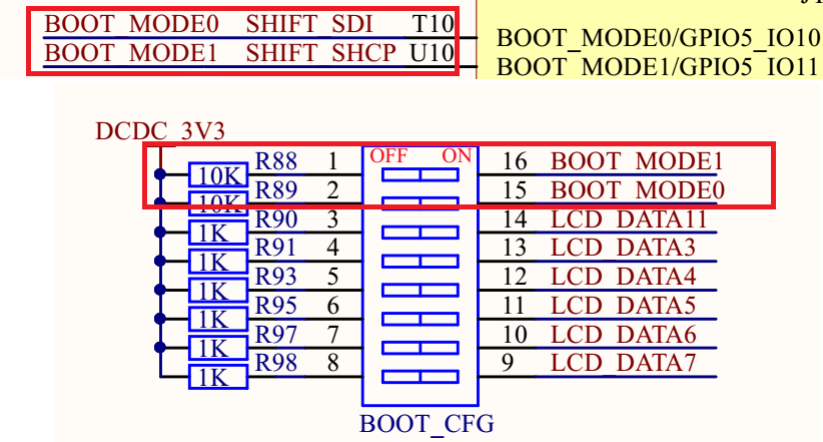
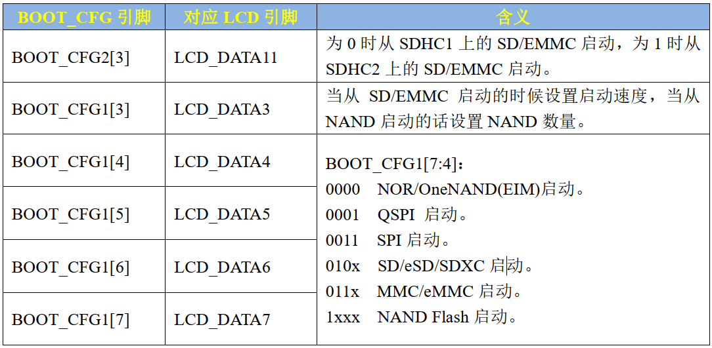
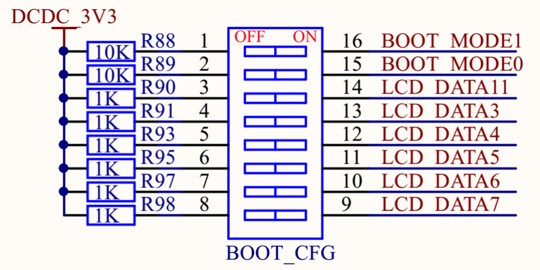
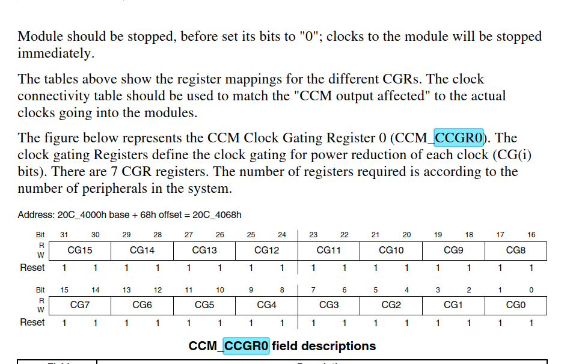

# 嵌入式Linux驱动开发日记

## 让我们从环境配置开始

​	当你看到这篇文章的时候，说明你已经准备好开始嵌入式Linux开发之旅了。这篇博客也是笔者自己学习嵌入式Linux开发的日记。希望自己可以坚持到写完这个博客笔记，通关一次简单的嵌入式Linux开发。

### 目标平台

​	笔者使用的是正点原子Alpha开发板，上面是Cortex-A7的IMX6ULL的芯片，主频啥的谈不上高，但是学习足够了

​	笔者使用的是Ubuntu24.04（其实别的也行）

### 从Ubuntu开始

​	起始从哪里开始都行，笔者这里为了少折腾，选择从Ubuntu开始。笔者安装的在了Arch主机上的双系统上，具体如何操作这里不是重点。你可以跟正点原子一样欢乐虚拟机，但是我寻思着太麻烦了。

​	把Ubuntu配成自己喜欢的样子（包括但不限于输入法，基本的vscode，shell自定义，桌面自定义，代理等），基本上就可以欢欢乐乐的开始嵌入式Linux开发了。

​	关于如何配置Ubuntu，可以自己上网找博客看，在这里的一般都不会对后面的开发造成实质的影响。

### 从交叉编译器继续

​	实际上笔者之前玩过交叉编译器，简单的讲讲啥是交叉编译器，这个东西对于我们嵌入式开发者而言会天天见到。笔者建议好好熟悉了解相关的概念。

​	首先，你现在电脑上（哦！也有可能是虚拟机！）默认的自带的gcc是在x64上跑的，编写的程序是给x64架构的程序使用的编译器。诚然，我们开发肯定还是在x64架构的机器上搞开发。但是我们现在要面向的平台毫无疑问的是ARM架构的机器。那怎么办呢？

​	这个时候就需要请出我们的交叉编译器了。

#### arm-linux-gnueabihf-gcc

​	是的！这是我们要使用的gcc编译器。它隶属于arm-linux交叉编译器的大家族

​	首先，交叉编译器的命名规则是arch [-vendor] [-os] [-(gnu)eabi] [-language]

- arch - 体系架构， 如arm（ARM-32bit）、aarch64（ARM-64bit）、x86等；

- vendor -工具链提供商，经常省略，或用 none 替代；
- os - 目标操作系统， 如linux，没针对具体 os 则 用 none 替代。同时没有 vendor 和os 使用一个 none 替代。
- eabi - 嵌入式应用二进制接口（Embedded Application binary Interface）
- language - 编译语言，如gcc，g++

​	那事情就很简单的了：这个是面向arm架构的，给嵌入式二进制armhf接口生成跨平台程序的gcc（当然，还有其他的比如说arm-none-eabi-gcc，gcc-arm-linux-gnueabi等等，他们的区别不算大，但是值得你去根据你使用的机器查到底用哪个版本的gcc），如果你跟我一样，使用的是面向CortexA7的IMX6ULL进行开发，你所干的事情很简单。

```
sudo apt install gcc-arm-linux-gnueabihf
```

​	啥？你说正点原子告诉你Linaro那里去下？拜托，早就不维护了那个地址。当然如果你担心你没法排查问题，用老壁灯gcc4没问题，但是你确定你这是在学习吗？之后的开发出问题了你又该咋办？

​	现在，你啥也不用做，直接

```
arm-linux-gnueabihf-gcc -v
```

​	在笔者这个时间，你会高兴的得到13.2的超级高版本的gcc！现在开始你也是现代的1嵌入式Linux开发人员了！

### vscode

​	嗯，直接安装vscode就行了，啥？你说你跟着的是Ubuntu16.04？非常坏老铁，这年头没几个人用咯，就跟着正点原子走吧。在24.04，安装vscode就是sudo apt install code一句话搞定的事情。

### 没学过ARM汇编

## 正文开始——速度体验一把

​	速速开始正文。

​	我们将会把代码烧到SD卡上，然后操控板子使用SD卡启动启动到内存里去。裸机程序，没有操作系统，你可能就会想起STM32的开发了。是的，我们需要起手写startup，放在DCD初始化结束后的位置上，IMX6ULL芯片执行结束后会跳转到地址0x87800000的地方，所以，我们需要在那个地方安排上我们的启动程序。

​	一个startup其实可能比你想象的要简单。

```
// start up files for led

.global _start
_start:
/*  GCC always find symbols in _start for 
    the entry 
*/
    mrs r0, cpsr
    /*
    	该操作清除了 r0 中最低的 5 位，即将处理器模式和相关标志清除
    */
    bic r0, r0, #0x1f
    /*
    下面这条指令执行按位或操作。它将 r0 中的内容与 0x13（即二进制的 10011）进行按位或操作，并将结果存回 r0。0x13 代表了设置 CPSR 中的模式位为 0x13（对应用户模式）。
    */
    orr r0, r0,  #0x13
    msr cpsr, r0
    // load to the main and init the sp 
    // in this way :)
    ldr sp, =0x80200000
    b main
```

​	啊哈！你说奇怪，系统时钟，中断向量表嘞？放心，早初始化完了，你需要做的事情很简单。就是：

- 修改我们的处理器SVC模式，办法是取出CPSR寄存器的值，对之进行修改，然后放回去！简单吧！
- 然后设置我们的栈指针指向更高的2MB地址出（说明我们给程序2MB的地址空间大小，足够！）
- 跳转道我们后面写的main函数里去。

​	后面我们的main函数也不难：

```
#ifndef __MAIN_H
#define __MAIN_H

/* 
 * CCM相关寄存器地址 
 */
#define CCM_CCGR0 			*((volatile unsigned int *)0X020C4068)
#define CCM_CCGR1 			*((volatile unsigned int *)0X020C406C)

#define CCM_CCGR2 			*((volatile unsigned int *)0X020C4070)
#define CCM_CCGR3 			*((volatile unsigned int *)0X020C4074)
#define CCM_CCGR4 			*((volatile unsigned int *)0X020C4078)
#define CCM_CCGR5 			*((volatile unsigned int *)0X020C407C)
#define CCM_CCGR6 			*((volatile unsigned int *)0X020C4080)

/* 
 * IOMUX相关寄存器地址 
 */
#define SW_MUX_GPIO1_IO03 	*((volatile unsigned int *)0X020E0068)
#define SW_PAD_GPIO1_IO03 	*((volatile unsigned int *)0X020E02F4)

/* 
 * GPIO1相关寄存器地址 
 */
#define GPIO1_DR 			*((volatile unsigned int *)0X0209C000)
#define GPIO1_GDIR 			*((volatile unsigned int *)0X0209C004)
#define GPIO1_PSR 			*((volatile unsigned int *)0X0209C008)
#define GPIO1_ICR1 			*((volatile unsigned int *)0X0209C00C)
#define GPIO1_ICR2 			*((volatile unsigned int *)0X0209C010)
#define GPIO1_IMR 			*((volatile unsigned int *)0X0209C014)
#define GPIO1_ISR 			*((volatile unsigned int *)0X0209C018)
#define GPIO1_EDGE_SEL 		*((volatile unsigned int *)0X0209C01C)

#endif
```

​	这里是函数的主体，如果您想尝试，直接复制就好。

```
#include "main.h"

void enable_clk()
{
    CCM_CCGR0 = 0xffffffff;
    CCM_CCGR1 = 0xffffffff;
    CCM_CCGR2 = 0xffffffff;
    CCM_CCGR3 = 0xffffffff;
    CCM_CCGR4 = 0xffffffff;
    CCM_CCGR5 = 0xffffffff;
    CCM_CCGR6 = 0xffffffff;   
}

void led_init()
{
    SW_MUX_GPIO1_IO03 = 0x5;
    SW_PAD_GPIO1_IO03 = 0x10B0;
    GPIO1_GDIR = 0x00000008;
    GPIO1_DR = 0x0;
}

void led_on()
{
    // set the forth bit as 0
    GPIO1_DR &= ~(1 << 3);
}


void led_off()
{
    GPIO1_DR |= (1 << 3);
}

void delay_in_n_nops(volatile unsigned int n){
    while(n--){}
}

void delay_ms(volatile unsigned int n){
    while(n--){
        delay_in_n_nops(0x7ff);
    }
}

int main()
{
    enable_clk();
    led_init();
    while(1){
        led_on();
        delay_ms(500);

        led_off();
        delay_ms(500);
    }

    return 0; // cheats anyway :)
}
```

​	后面我会一个个结束，到这里就OK。

### 写一个链接脚本

​	链接脚本是啥，也先不着急：

```
SECTIONS{
    . = 0x87800000;
    .text : {
        start.o
        led.o
        *(.text)
    }
    .rodata ALIGN(4) : {*(.rodata*)}
    .data ALIGN(4) : {*(.data*)}
    __bss_start = . ;
    .bss ALIGN(4) : {*(.bss) *(COMMON)}
    __bss_end = . ;
}
```

### 写一个简单的Makefile脚本

```
objs := start.o led.o
ARCH_PREFIX := arm-linux-gnueabihf
CC := gcc
LD := ld
OBJDUMP := objdump
OBJCOPY := objcopy

RESULT_NAME := led

ENTRY_SCRIPT := link.lds

${RESULT_NAME}.bin:$(objs)
	${ARCH_PREFIX}-${LD}	-T$(ENTRY_SCRIPT) -o ${RESULT_NAME}.elf $^
	${ARCH_PREFIX}-${OBJCOPY} -O binary -S ${RESULT_NAME}.elf $@
	${ARCH_PREFIX}-${OBJDUMP} -D -m arm ${RESULT_NAME}.elf > ${RESULT_NAME}.dis

%.o: %.s 
	${ARCH_PREFIX}-${CC} -Wall -nostdlib -c -o $@ $<

%.o: %.S
	${ARCH_PREFIX}-${CC} -Wall -nostdlib -c -o $@ $<

%.o: %.c
	${ARCH_PREFIX}-${CC} -Wall -nostdlib -c -o $@ $<

clean:
	rm -rf *.o ${RESULT_NAME}.bin ${RESULT_NAME}.elf ${RESULT_NAME}.dis
```

​	这是一种Makefile脚本的写法，当然不止这一种！你可以按照这个层级把文件排放：


​	现在直接make得到我们的bin文件。

## 使用正点原子的imxdownload下载到自己的SD卡上

​	下一步是使用imxdownload将我们的bin文件下载到我们的SD卡上，这个imxdownload文件是正点原子提供的，实际上就是组合我们的头部信息进一步生成可以被板子执行的文件。

​	现在我们需要做的就是插上SD卡。查看自己的SD卡被分配的分区。一般的/dev/sda是自己的电脑的磁盘，嗯，一种最好的方式是查看自己的dmesg输出信息。

>```
>sudo dmesg | tail -n 20
>```
>
>​	这个指令将会打印出内核日志文件的倒数二十行它一般会记载着我们新USB设备挂载的信息 

```
[ 3843.237182] usb 3-1: New USB device strings: Mfr=1, Product=3, SerialNumber=2
[ 3843.237188] usb 3-1: Product: Mass Storage Device
[ 3843.237192] usb 3-1: Manufacturer: Generic
[ 3843.237195] usb 3-1: SerialNumber: 121220160204
[ 3843.241247] usb-storage 3-1:1.0: USB Mass Storage device detected
[ 3843.241710] scsi host6: usb-storage 3-1:1.0
[ 3844.243574] scsi 6:0:0:0: Direct-Access     Mass     Storage Device   1.00 PQ: 0 ANSI: 0 CCS
[ 3844.244224] sd 6:0:0:0: Attached scsi generic sg2 type 0
[ 3844.477530] sd 6:0:0:0: [sdb] 122138624 512-byte logical blocks: (62.5 GB/58.2 GiB)
[ 3844.477668] sd 6:0:0:0: [sdb] Write Protect is off
[ 3844.477672] sd 6:0:0:0: [sdb] Mode Sense: 03 00 00 00
[ 3844.477826] sd 6:0:0:0: [sdb] No Caching mode page found
[ 3844.477829] sd 6:0:0:0: [sdb] Assuming drive cache: write through
[ 3844.479862]  sdb: sdb1
[ 3844.480015] sd 6:0:0:0: [sdb] Attached SCSI removable disk
```

​	所以，笔者得到的目标文件是向/dev/sdb写东西！

> 注意，使用imxdownload将会完全覆盖里面原本的东西，请做好备份再写！
>
> 请注意！确保自己的SD卡挂载的位置！不要写错地方了，操作时不可逆的。正点原子之前提供的办法是插拔反复对比，这个办法不好但是总归管用。

> 发现你的终端不自动补全imxdownload，请修改文件权限为744，即对自己完全可用，其他人只有读权限的文件！

```
./imxdownload led.bin /dev/sdb
```

​	输入密码后，观察写入速率，一般而言是一百多到几百KB每秒，大于这个速度上MB的一概认为是读写失败，重新拔下来看看自己的sd卡有没有接好。

​	现在调整板子的启动模式是SD卡启动，如下所示：


​	现在，你的板子上电，应该可以看到现象是：


​	是的，DS0标记上的灯会闪烁。这就是现象！

# 更进一步的笔记和说明

​	如果你并不打算进一步仔细学习，到这里就可以走了，后面的内容比较的硬核。

## 从IMX6ULL启动方式说起

​	首先，我们不在乎外面的构建问题，从代码编写入手。

### IMX6ULL的启动方式

​	BOOT 的处理过程是发生在I.MX6U 芯片上电以后，芯片会根据 BOOT_MODE[1:0]的设置来选择 BOOT 方式。换而言之，你的板子的BOOT开关如何，深刻的决定了你的板子是如何启动的。

​	笔者的板子默认是从EMMC启动的，那里存放着默认的Linux操作系统。当然这是后面笔者需要学习的



​	所以你可以看到，我们是把 BOOT_MODE1 为 1，BOOT_MODE0 为 0 的时候此模式使能，在此模式下，芯片会执行内部的 boot ROM 代码，这段 boot ROM 代码会进行硬件初始化(一部分外设)，然后从 boot 设备(就是存放代码的设备、比如 SD/EMMC、NAND)中将代码拷贝出来复制到指定的 RAM 中，一般是 DDR。 





​	我们就是想要设置SD卡启动，一次来看，那就是对我们的1号和7号拨码开关拉高到ON就OK了，这就是我们上面给出的截图。具体的内容可以查手册的Boot内容

### 定制合法的可烧写识别的合法执行文件

- Image vector table，简称 IVT，IVT 里面包含了一系列的地址信息，这些地址信息在ROM 中按照固定的地址存放着。 
- Boot data，启动数据，包含了镜像要拷贝到哪个地址，拷贝的大小是多少等等。 
- Device configuration data，简称DCD，设备配置信息，重点是 DDR3 的初始化配置。 
- 用户代码可执行文件，比如 led.bin。 

​	实际上就是四个部分组成！可以看出最终烧写到 I.MX6U 中的程序其组成为：IVT+Boot data+DCD+.bin。所以所生成的 load.imx 就是在 led.bin 前面加上 IVT+Boot data+DCD。内部 Boot ROM 会将 load.imx 拷贝到 DDR 中，用户代码是要一定要从 0X87800000 这个地方开始的，因为链接地址为 0X87800000，load.imx 在用户代码前面又有 3KByte 的 IVT+Boot Data+DCD 数据，因此 load.imx 在 DDR 中的起始地址就是 0X87800000-3072=0X877FF400。  


​	load.imx 最前面的就是 IVT 和 Boot Data，IVT 包含了镜像程序的入口点、指向 DCD 的指针和一些用作其它用途的指针。内部 Boot ROM 要求IVT 应该放到指定的位置，不同的启动设备位置不同，而 IVT 在整个 load.imx 的最前面，其实就相当于要求 load.imx 在烧写的时候该烧写到存储设备的指定位置去。整个位置都是相对于存储设备的起始地址的偏移


​	IVT部分存者的就是这些


​	首先是头部信息：格式如上！


​	复位以后，I.MX6U 片内的所有寄存器都会复位为默认值，但是这些默认值往往不是我们想要的值，而且有些外设我们必须在使用之前初始化它。为此 I.MX6U 提出了一个 DCD(Device Config Data)的概念，和 IVT、Boot Data 一样，DCD 也是添加到 load.imx 里面的，紧跟在 IVT和 Boot Data 后面，IVT 里面也指定了DCD 的位置。DCD 其实就是 I.MX6U 寄存器地址和对应的配置信息集合，Boot ROM 会使用这些寄存器地址和配置集合来初始化相应的寄存器，比如开启某些外设的时钟、初始化 DDR 等等。DCD 区域不能超过 1768Byte，


​	其中Tag 是单字节，固定为0XD2，Length 为两个字节，表示DCD 区域的大小，包含header，同样是大端模式，Version 是单字节，固定为 0X40 或者 0X41。 

​	header的结构还是类似的。CMD的格式如下：


​	这里的Tag 为一个字节，固定为 0XCC。Length 是两个字节，包含写入的命令数据长度，包含 header，同样是大端模式。Parameter 为一个字节


 ①、设置CCGR0~CCGR6 这 7 个外设时钟使能寄存器，默认打开所有的外设时钟。 
 ②、配置DDR3 所用的所有IO。 
 ③、配置MMDC 控制器，初始化DDR3。 
	就是干这些事情。正点原子的imxdownload也是实际上完成这个工作。

​	这些地址需要在手册中查出来。一一填写。这个是搬运工的活，具体可以看



​	比如说这里，我们可以查到这个CCGR0寄存器映射地址是0x020C4068等等。看官可以查看我们的imxdownload.h看看具体的数值对应着查，体会一下查手册的快乐（不是）

### 关于点灯本身

​	实际上就是在操作寄存器！我们需要关心的寄存器，其实需要去手册上查。比如说根据原理图，我们发现想要驱动我们的LED0，就需要我们找寄存器：SW_MUX_GPIO1_IO03和SW_PAD_GPIO1_IO03。在手册中，我们需要寻找的就是SW_MUX_CTL_PAD_GPIO1_IO03 SW MUX ControlRegister (IOMUXC_SW_MUX_CTL_PAD_GPIO1_IO03)和IOMUXC_SW_PAD_CTL_PAD_GPIO1_IO03寄存器（Man!找了很久的手册！）

​	现在只需要查询手册依照配置就好了！