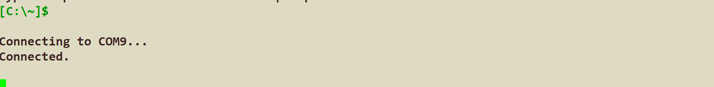
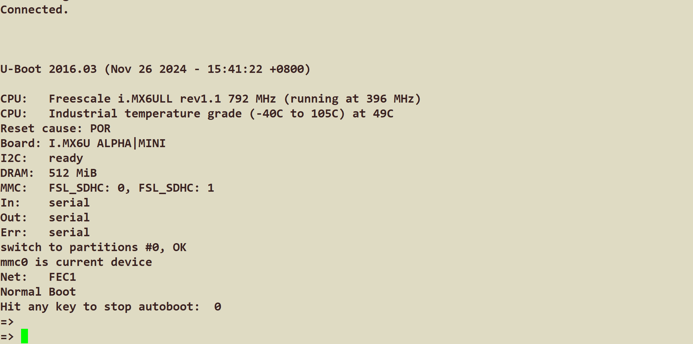
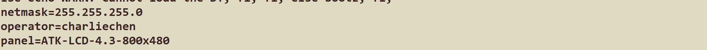
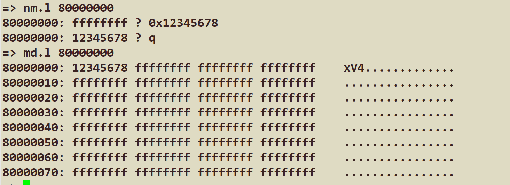
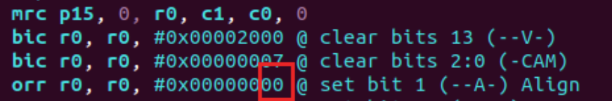
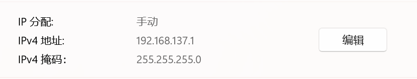

# 嵌入式Linux学习——uboot篇（1）

​	这里算是笔者的尝鲜与尝试。笔者现在正在uboot和裸机开发双开。这里记录一下笔记和我的开发过程

## 需要准备的东西

​	前置的环境请看裸机环境的配置。笔者使用的是GCC13.2版本的ARM-Linux-gnueabihf-gcc和16年正点原子提供的源码。（当然，你可以尝试使用2025rc1（最新版本）的版本，但是需要自己迁移设备树的以太网驱动节点，笔者这里更多的是尝试，所以作罢）

​	你需要下载的是bison, flex（如果你是需要编译最新版本的uboot源码，还需要的是libgnutls28-dev这个库来提供gnutls.h放面给出的依赖）

​	你需要一根网线链接你的电脑和开发板（额外）

## 来说说UBoot

​	笔者查阅了一点资料，给出的看发是：UBoot是一个跳板。他让我们从裸机初始化中提供一次衔接，飞跃到操作系统引导的一个跳板。

​	U-Boot的主要功能包括硬件初始化、操作系统引导、引导命令支持和网络支持。它的核心任务是启动操作系统，并提供一系列命令来操作系统级别和硬件级别的配置。

#### 硬件部分的初始化

​	负责对嵌入式系统中的硬件进行初始化，包括CPU、内存、串口、网络接口等。它在系统上电时被执行，初始化硬件并为操作系统的引导做好准备。具体来说，U-Boot会识别可用的内存、启动设备（如闪存、SD卡等）、网络设备等，并确保它们在引导过程中能够正常工作。

#### 命令行接口

​	U-Boot提供了一个命令行接口，用户可以通过该接口与系统交互。命令行支持多种功能，如设置环境变量、修改引导参数、测试硬件等。常见的命令包括读取内存、写入存储、加载内核、启动操作系统等。

#### 一定的网络支持

​	这个比较精彩，笔者稍后会给出笔者在这次配置中遇到的经历。U-Boot具备强大的网络支持功能，能够通过网络加载操作系统或传输文件。它支持PXE（Preboot Execution Environment）启动，可以通过TFTP协议下载操作系统内核或其他文件。此外，U-Boot还支持NFS挂载文件系统，使得系统可以通过网络启动，并将根文件系统挂载到远程NFS服务器上。这也就意味着

#### UBoot自身的架构

​	关于U-Boot，你看源代码就会发现它的架构设计高度模块化，具有较强的可扩展性。它的源码分为多个模块，每个模块承担特定的功能。以下是U-Boot的主要模块及其功能：

1. **引导程序（Bootloader）**
   U-Boot的引导程序主要负责硬件初始化和加载操作系统。它通常由两部分组成：早期引导（Early Boot）和后期引导（Late Boot）。早期引导用于完成基本的硬件初始化，如CPU设置、内存配置等。后期引导则负责加载操作系统内核和配置操作系统所需的其他资源。
2. **命令处理（Command Processing）**
   U-Boot的命令处理模块负责解析用户输入的命令并执行相应操作。它支持多种内建命令，如`boot`（启动操作系统）、`mw`（内存写操作）、`md`（内存读操作）等。此外，U-Boot还支持自定义命令，用户可以根据需要编写自己的命令。
3. **设备驱动（Device Drivers）**
   U-Boot包括大量的设备驱动程序，用于控制嵌入式平台上的各种硬件设备。这些设备包括串口、网络接口、闪存、SD卡、LCD显示屏等。设备驱动模块与硬件平台紧密结合，确保设备能够被正确初始化并在引导过程中正常工作。
4. **文件系统支持（Filesystem Support）**
   U-Boot支持多种文件系统，如FAT、EXT4、UBI、JFFS2等。这使得U-Boot能够访问存储在各种文件系统中的数据，例如从FAT格式的SD卡中读取文件或加载内核映像。
5. **网络堆栈（Networking Stack）**
   U-Boot内置了网络堆栈，支持多种网络协议，包括TCP/IP、TFTP、DHCP等。通过网络堆栈，U-Boot能够从网络加载操作系统内核，或者通过NFS挂载远程根文件系统。

​	这些是我们后面要接触的。这里只是做概论

#### UBoot的工作方式与原理：

U-Boot的工作原理可以分为多个阶段，每个阶段负责不同的任务，从而确保系统能够顺利引导操作系统。

1. **引导加载**
   当嵌入式设备上电时，处理器会首先执行预定义的硬件初始化代码。通常，这段代码存储在处理器的ROM中。初始化完成后，U-Boot的引导加载程序开始运行。它首先进行硬件初始化，设置必要的硬件资源，如内存、串口、网卡等。
2. **引导环境配置**
   U-Boot有一个环境变量机制，用于存储引导过程中的配置信息。环境变量可以设置设备树文件路径、内核路径、根文件系统路径等。通过这些配置，U-Boot能够知道从何处加载操作系统内核、设备树和根文件系统。环境变量可以通过命令行进行修改，也可以通过配置文件进行预设。
3. **操作系统加载**
   在硬件初始化和环境配置完成后，U-Boot会加载操作系统。它可以从不同的存储设备中读取内核映像，例如从闪存、SD卡、网络等。U-Boot支持多种文件系统，能够识别并加载操作系统镜像文件。内核镜像加载完成后，U-Boot会将控制权交给内核，启动操作系统。
4. **网络启动**
   如果设备配置为通过网络启动，U-Boot会通过DHCP获取IP地址，并使用TFTP协议从网络服务器下载操作系统内核。网络启动通常用于需要远程管理或没有本地存储的设备。在某些情况下，U-Boot还支持通过NFS挂载根文件系统，实现完全的网络引导。

## 来说说对接板子的UBoot

​	UBoot很好，但是它是直接面向硬件平台的。这个事情就很麻烦了，也就是说，很多Settings需要我们自己手动改（虽然现在厂子都很卷，都给你送configs开箱即用），正点原子就根据自己的板子调整了UBoot的mx6ull的def_config和一部分的源码。我们为了方便入门，就先看看16年正点原子魔改的版本。

## 先试试编译

​	笔者使用的是GCC13.2，值得一提的是，在GCC13.2中，原本至少在GCC4.9.4支持的-march架构的参数armv5已经被Abolished了，也就是说，想要让我们的uboot源码通过编译，就需要我们对Makefile一定的魔改

> 如果您甚至不知道啥是Makefile，我建议先去熟悉啥是Makefile，再来看是不迟的

​	我们来到这个arch/arm这个地方，实际上这里是uboot对架构层的构建脚本，我们很快留意到一点不太和谐的地方，提示你：IMUX6ULL使用的架构是Armv7架构，你应该看哪里？

```
#
# SPDX-License-Identifier:	GPL-2.0+
#

ifeq ($(CONFIG_SPL_BUILD)$(CONFIG_TEGRA),yy)
CONFIG_CPU_V7=
CONFIG_CPU_ARM720T=y
endif

# This selects which instruction set is used.
arch-$(CONFIG_CPU_ARM720T)	=-march=armv4
arch-$(CONFIG_CPU_ARM920T)	=-march=armv4t
arch-$(CONFIG_CPU_ARM926EJS)	=-march=armv5te
arch-$(CONFIG_CPU_ARM946ES)	=-march=armv4
arch-$(CONFIG_CPU_SA1100)	=-march=armv4
arch-$(CONFIG_CPU_PXA)		=
arch-$(CONFIG_CPU_ARM1136)	=-march=armv5
arch-$(CONFIG_CPU_ARM1176)	=-march=armv5t
arch-$(CONFIG_CPU_V7)		=$(call cc-option, -march=armv7-a, -march=armv5)
arch-$(CONFIG_ARM64)		=-march=armv8-a
...
```

​	揭晓答案的是我们的

```
arch-$(CONFIG_CPU_V7)		=$(call cc-option, -march=armv7-a, -march=armv5)
```

​	使用到了废弃的参数。因此，办法是：魔改一下Makefile中的这个参数

```
arch-$(CONFIG_CPU_V7)		=$(call cc-option, -march=armv7-a, -march=armv7-a)
```

​	现在可以了。试试如下的构建顺序：

```
make ARCH=arm CROSS_COMPILE=arm-linux-gnueabihf- distclean 
make ARCH=arm CROSS_COMPILE=arm-linux-gnueabihf- 
mx6ull_14x14_ddr512_emmc_defconfig 
make V=1 ARCH=arm CROSS_COMPILE=arm-linux-gnueabihf- -j12 
```

​	第一步是清理残余的构建文件，如果您是下载干净的正点原子的uboot源码，啊，这个可做可不做

​	第二部是构建对应的config文件写入板子的配置，我们使用的是正点原子魔改的版本。这里：

```
CONFIG_SYS_EXTRA_OPTIONS="IMX_CONFIG=board/freescale/mx6ullevk/imximage-ddr512.cfg,MX6ULL_EVK_EMMC_REWORK"
CONFIG_ARM=y
CONFIG_ARCH_MX6=y
CONFIG_TARGET_MX6ULL_14X14_EVK=y
CONFIG_CMD_GPIO=y
```

#### 1.`CONFIG_SYS_EXTRA_OPTIONS="IMX_CONFIG=board/freescale/mx6ullevk/imximage-ddr512.cfg,MX6ULL_EVK_EMMC_REWORK"`

这项配置定义了额外的选项，用于进一步定制U-Boot的构建过程。

- `IMX_CONFIG=board/freescale/mx6ullevk/imximage-ddr512.cfg`
  这部分指定了一个特定的配置文件 `imximage-ddr512.cfg`，该配置文件包含了特定硬件平台（i.MX6UL开发板）在启动时对DDR内存的初始化参数。i.MX6ULL是NXP的一款ARM Cortex-A7处理器，配置文件通常包含对内存、时钟等硬件的设置。
- `MX6ULL_EVK_EMMC_REWORK`
  这是一个自定义的选项，表明在开发板上进行了eMMC的硬件修改，可能涉及到eMMC存储器的特定配置或修复。这项选项可以使得U-Boot在启动时应用这些特定的修复或调整，以确保eMMC能够正常工作。

#### 2. `CONFIG_ARM=y`

- 该选项启用ARM架构的支持。由于i.MX6ULL基于ARM Cortex-A7内核，这一选项确保U-Boot在构建时为ARM架构提供必要的支持。此选项是启动U-Boot时设置正确架构的基础。

#### 3. `CONFIG_ARCH_MX6=y`

- 这一项配置启用对i.MX6系列芯片的支持，确保U-Boot在构建过程中包含针对i.MX6系列硬件的初始化代码、驱动程序和配置。这对于基于i.MX6处理器的硬件平台非常重要，U-Boot需要知道如何处理与i.MX6相关的特定硬件（如CPU、外设等）。

#### 4. `CONFIG_TARGET_MX6ULL_14X14_EVK=y`

- 这一项配置指定了U-Boot的目标平台是i.MX6ULL 14x14开发板（EVK，Evaluation Kit）。它确保U-Boot会根据该开发板的硬件特性进行定制，包括存储设备、引导过程、外设配置等。这个选项影响最终生成的U-Boot映像，使得它适配于特定的开发板。

#### 5. `CONFIG_CMD_GPIO=y`

- 这一项启用U-Boot中的GPIO命令支持。GPIO（通用输入输出）通常用于控制硬件外设或与其他设备进行交互。通过启用这个命令，U-Boot就能够在启动过程中执行GPIO相关的操作（例如，读取或设置GPIO引脚的状态）。这对于硬件调试、外设控制等任务非常有用。

​	第三步那就是实际的进行构建，如果你更改了Makefile之后，就不会爆错误。

> 如果你使用的是新版本的uboot，注意，你首先需要修改一份mx6ull_14x14_evk_defconfig文件，修改以太网驱动以及一些设置，但是笔者没改，直接烧入板子也能用，但是网卡用不了，意味着没法做网络的实验。所以有能力的读者可以自行查阅资料进一步完成配置。
>
> 在编译的时候，还需要多下载libssl-dev的依赖，这点请注意！

​	当我们看到最后出现

```
  ./tools/mkimage -n board/freescale/mx6ullevk/imximage-ddr512.cfg.cfgtmp -T imximage -e 0x87800000 -d u-boot.bin u-boot.imx 
Image Type:   Freescale IMX Boot Image
Image Ver:    2 (i.MX53/6/7 compatible)
Mode:         DCD
Data Size:    360448 Bytes = 352.00 kB = 0.34 MB
Load Address: 877ff420
Entry Point:  87800000
```

​	的时候就是成功了。

## 烧写

​	笔者直接使用了正点原子提供的烧写程序梭哈到了sd卡上。现在给板子的网线插好，电源接号，调整板子的启动方式是从SD卡启动后，打开串口软件（笔者使用的是XShell选中Serial协议打开目标串口后即可，如下所示）



​	笔者的是COM9，自己看自己的端口号。

​	现在板子上电，当出现：



​	Hit any key to stop autoboot 的时候快速嗯下Enter或者是其他正常的键。这个时候就会停下来进入到我们的交互窗口（啥？手速慢了？没事，后面会向你抱怨找不到rootfs和Linux的zImage，都不是事情，因为我们就没写入镜像文件，自然也就不会找到根文件系统和系统压缩镜像启动咯！）

​	现在我们就来到了交互界面。

## 让我们一行行看启动输出的含义

#### `CPU: Freescale i.MX6ULL rev1.1 792 MHz (running at 396 MHz)`

- **CPU**：表示当前使用的CPU是 **Freescale i.MX6ULL**，即NXP公司的i.MX6ULL系列处理器，这是一款基于ARM Cortex-A7内核的处理器，广泛应用于低功耗嵌入式设备。
- **rev1.1**：表示CPU的版本是1.1，通常指芯片的硬件版本号，可能意味着硬件方面的轻微变化或更新。
- **792 MHz (running at 396 MHz)**：虽然该处理器的最大工作频率为792 MHz，但它当前的运行频率是396 MHz。这通常是因为U-Boot启动时，为了节省功耗或者由于硬件的节能模式，处理器频率可能被动态调低。

#### 2. `CPU: Industrial temperature grade (-40C to 105C) at 49C`

- **Industrial temperature grade (-40C to 105C)**：这表明该处理器设计用于工业级温度范围，能够在 -40°C 到 105°C 的温度条件下正常工作，适用于高温或低温环境。
- **at 49C**：当前CPU温度是49°C，表示芯片正在处于正常工作温度范围内。

#### 3. `Reset cause: POR`

- **Reset cause**：这表示系统重启的原因。
- **POR (Power-On Reset)**：POR指的是 **上电复位**，即设备因上电而被重置。上电复位是系统启动时常见的复位类型，通常发生在设备通电时，确保系统从一个已知的状态开始运行。

#### 4. `Board: I.MX6U ALPHA|MINI`

- **Board**：表示当前运行的硬件平台。
- **I.MX6U ALPHA|MINI**：这表明当前的开发板或硬件平台是 **i.MX6U ALPHA|MINI**。这可能是一个基于i.MX6ULL处理器的开发板，或者某个嵌入式平台的名称。具体的硬件平台名称通常在U-Boot的源代码配置文件中定义。

#### 5. `I2C: ready`

- **I2C**：表示I2C总线已准备就绪。I2C（Inter-Integrated Circuit）是一种常见的串行总线标准，用于连接低速外围设备（如传感器、EEPROM、LCD显示屏等）到主控处理器。
- **ready**：表示I2C总线已经初始化并且可以正常使用。

#### 6. `DRAM: 512 MiB`

- **DRAM**：指系统的动态随机存取内存（DRAM）。
- **512 MiB**：表示系统配置的DRAM大小为512 MiB（兆字节）。这说明该设备具有512MB的内存，通常用于存储操作系统和应用程序的运行数据。

#### 7. `MMC: FSL_SDHC: 0, FSL_SDHC: 1`

- **MMC**：表示系统的MMC（多媒体卡）接口已初始化。MMC是一种存储设备接口，常用于SD卡和eMMC存储设备。
- **FSL_SDHC**：表示使用的是 **Freescale（现在是NXP）SDHC控制器**，这是一种用于管理SD卡或eMMC存储的控制器。
- **0, 1**：这表示系统中有两个SDHC控制器（编号为0和1），并且U-Boot正在检测并初始化这些控制器。它们对应于不同的存储设备，通常为SD卡或eMMC存储。

#### 8. `In: serial`

- **In**：表示U-Boot的输入设备。
- **serial**：指示系统使用串口作为输入设备。串口通常用于嵌入式设备的调试、控制台输入等。

#### 9. `Out: serial`

- **Out**：表示U-Boot的输出设备。
- **serial**：指示系统使用串口作为输出设备。系统的启动信息将通过串口传输到终端或调试控制台。

#### 10. `Err: serial`

- **Err**：表示系统的错误输出设备。
- **serial**：指示系统使用串口作为错误信息的输出设备。即系统在发生错误时，会通过串口输出错误日志或信息，帮助开发者进行故障排查。

#### 11. `switch to partitions #0, OK`

- **switch to partitions #0**：表示系统已经切换到第0个存储分区。U-Boot支持多个存储分区（如SD卡的多个分区），该日志表示当前切换到的分区是第0个分区。
- **OK**：表示操作成功，系统已顺利切换到指定的分区。

#### 12. `mmc0 is current device`

- **mmc0**：指的是第一个MMC设备，即SD卡或eMMC存储设备的第一个接口。
- **is current device**：表示当前使用的存储设备是`mmc0`，即U-Boot正在从该设备加载启动数据或操作系统映像。

#### 13. `Net: FEC1`

- **Net**：表示网络接口的初始化状态。
- **FEC1**：表示系统的第一个FEC（Fast Ethernet Controller）网络接口已经被初始化并可用。FEC是i.MX6处理器中常见的以太网控制器，表明设备支持网络通信，可能用于通过网络加载操作系统或进行网络调试。

#### 14. `Normal Boot`

- **Normal Boot**：表示系统正在进行正常引导过程，U-Boot将启动操作系统或继续执行后续的启动任务。这通常意味着U-Boot已经完成了硬件初始化，准备进入操作系统的启动阶段。

## 开始使用uboot

​	uboot自己手搓了一个小小的shell，让我们来看看：

​	键入help或者是?可以查看现在这个版本支持的指令是如何的：

```
=> ?
?       - alias for 'help'
base    - print or set address offset
bdinfo  - print Board Info structure
bmode   - sd1|sd2|qspi1|normal|usb|sata|ecspi1:0|ecspi1:1|ecspi1:2|ecspi1:3|esdhc1|esdhc2|esdhc3|esdhc4 [noreset]
boot    - boot default, i.e., run 'bootcmd'
bootd   - boot default, i.e., run 'bootcmd'
bootelf - Boot from an ELF image in memory
bootm   - boot application image from memory
bootp   - boot image via network using BOOTP/TFTP protocol
bootvx  - Boot vxWorks from an ELF image
bootz   - boot Linux zImage image from memory
clocks  - display clocks
cmp     - memory compare
coninfo - print console devices and information
cp      - memory copy
crc32   - checksum calculation
dcache  - enable or disable data cache
dhcp    - boot image via network using DHCP/TFTP protocol
dm      - Driver model low level access
echo    - echo args to console
editenv - edit environment variable
env     - environment handling commands
erase   - erase FLASH memory
exit    - exit script
ext2load- load binary file from a Ext2 filesystem
ext2ls  - list files in a directory (default /)
ext4load- load binary file from a Ext4 filesystem
ext4ls  - list files in a directory (default /)
ext4size- determine a file's size
ext4write- create a file in the root directory
false   - do nothing, unsuccessfully
fatinfo - print information about filesystem
fatload - load binary file from a dos filesystem
fatls   - list files in a directory (default /)
fatsize - determine a file's size
fatwrite- write file into a dos filesystem
fdt     - flattened device tree utility commands
flinfo  - print FLASH memory information
fstype  - Look up a filesystem type
fuse    - Fuse sub-system
go      - start application at address 'addr'
gpio    - query and control gpio pins
help    - print command description/usage
i2c     - I2C sub-system
icache  - enable or disable instruction cache
iminfo  - print header information for application image
imxtract- extract a part of a multi-image
itest   - return true/false on integer compare
load    - load binary file from a filesystem
loadb   - load binary file over serial line (kermit mode)
loads   - load S-Record file over serial line
loadx   - load binary file over serial line (xmodem mode)
loady   - load binary file over serial line (ymodem mode)
loop    - infinite loop on address range
ls      - list files in a directory (default /)
md      - memory display
mdio    - MDIO utility commands
mii     - MII utility commands
mm      - memory modify (auto-incrementing address)
mmc     - MMC sub system
mmcinfo - display MMC info
mtest   - simple RAM read/write test
mw      - memory write (fill)
nfs     - boot image via network using NFS protocol
nm      - memory modify (constant address)
ping    - send ICMP ECHO_REQUEST to network host
pmic    - PMIC
printenv- print environment variables
protect - enable or disable FLASH write protection
reset   - Perform RESET of the CPU
run     - run commands in an environment variable
save    - save file to a filesystem
saveenv - save environment variables to persistent storage
setenv  - set environment variables
setexpr - set environment variable as the result of eval expression
sf      - SPI flash sub-system
showvar - print local hushshell variables
size    - determine a file's size
sleep   - delay execution for some time
source  - run script from memory
test    - minimal test like /bin/sh
tftpboot- boot image via network using TFTP protocol
true    - do nothing, successfully
usb     - USB sub-system
usbboot - boot from USB device
version - print monitor, compiler and linker version
```

​	非常的多。我们慢慢的看：

## 查询板子信息

​	常用的和信息查询有关的命令有 3 个：bdinfo、printenv 和 version。先来看一下 bdinfo 命令，此命令用于查看板子信息，直接输入“bdinfo”即可

### bdinfo 

```
=> bdinfo
arch_number = 0x00000000
boot_params = 0x80000100
DRAM bank   = 0x00000000
-> start    = 0x80000000
-> size     = 0x20000000
eth0name    = FEC1
ethaddr     = b8:ae:1d:01:00:00
current eth = FEC1
ip_addr     = 192.168.137.50	# 注意新人这里可能没有，我是后面设置的
baudrate    = 115200 bps
TLB addr    = 0x9FFF0000
relocaddr   = 0x9FF57000
reloc off   = 0x18757000
irq_sp      = 0x9EF54EA0
sp start    = 0x9EF54E90
```

#### `arch_number = 0x00000000`

- **arch_number**：这是系统的架构编号。它是一个唯一标识符，用来表示系统的架构类型。通常，`arch_number` 是用来标识不同平台或硬件的，0x00000000 表示尚未设置或没有指定该值。在某些情况下，它可以用来标识特定的硬件平台或处理器。

#### 2. `boot_params = 0x80000100`

- **boot_params**：这是指向引导参数（boot parameters）的地址。它通常用于传递内核引导时所需的信息（如内存布局、设备树信息等）。在此配置中，`boot_params` 设置为 `0x80000100`，意味着引导参数位于内存地址 `0x80000100`。

#### 3. `DRAM bank = 0x00000000`

- **DRAM bank**：这是系统中DRAM（动态随机存取内存）银行的起始地址。`0x00000000` 表示系统的DRAM起始地址在物理内存的0x00000000处（通常是默认地址，实际配置可能会更高）。

#### 4. `-> start = 0x80000000`

- **start**：表示系统中DRAM的起始地址。在此情况下，DRAM的起始地址是 `0x80000000`，这意味着系统的主内存区域从 `0x80000000` 开始。这个地址也通常用于内核启动时的内存分配。

#### 5. `-> size = 0x20000000`

- **size**：表示DRAM的总大小，单位是字节。在这个例子中，`0x20000000`（十六进制）等于 `512 MB`，因此该系统的DRAM大小为512MB。

#### 6. `eth0name = FEC1`

- **eth0name**：表示系统中第一个以太网接口（`eth0`）的名称。在这里，`FEC1` 是以太网接口的标识符，通常表示i.MX6平台上的Fast Ethernet Controller 1。

#### 7. `ethaddr = b8:ae:1d:01:00:00`

- **ethaddr**：这是系统以太网接口的MAC地址。在这里，`b8:ae:1d:01:00:00` 是该设备的物理网卡地址（MAC地址）。每个网络接口都有一个唯一的MAC地址，用于在局域网内识别设备。

#### 8. `current eth = FEC1`

- **current eth**：表示当前正在使用的以太网接口。这里显示的是 `FEC1`，也就是系统当前的以太网接口为 `FEC1`。

#### 9. `ip_addr = 192.168.137.50`

- **ip_addr**：这是当前网络接口的IP地址。在此输出中，设备的IP地址被设置为 `192.168.137.50`，这通常用于设备与其他主机进行网络通信时的地址。这里是笔者之前玩的时候就手动设置了，后面会讲如何操作

#### 10. `baudrate = 115200 bps`

- **baudrate**：表示串口的波特率，即通信速率。这里的波特率设置为 `115200`，表示串口数据传输的速率为115200比特每秒。这是一个常见的串口通信速度，通常用于U-Boot的串口输出。

#### 11. `TLB addr = 0x9FFF0000`

- **TLB addr**：表示TLB（Translation Lookaside Buffer，快表）的位置。TLB 是一种用于加速虚拟地址到物理地址转换的硬件机制。这里设置为 `0x9FFF0000`，表示TLB的物理地址在 `0x9FFF0000`。

#### 12. `relocaddr = 0x9FF57000`

- **relocaddr**：表示U-Boot的重定位地址。U-Boot在启动过程中通常会将自己从原始加载地址重定位到另一个更高的内存地址，以便为后续的操作腾出空间。这里 `0x9FF57000` 表示重定位后的U-Boot映像的内存地址。

#### 13. `reloc off = 0x18757000`

- **reloc off**：这是指从U-Boot的原始加载地址到重定位地址的偏移量。这里的值 `0x18757000` 表示偏移量为 `0x18757000`，即原始加载地址与重定位地址之间的差值。

#### 14. `irq_sp = 0x9EF54EA0`

- **irq_sp**：表示中断处理的堆栈指针（IRQ Stack Pointer）。中断发生时，系统会切换到一个特定的堆栈来处理中断。`0x9EF54EA0` 是堆栈指针的地址，用于中断服务例程时的栈操作。

#### 15. `sp start = 0x9EF54E90`

- **sp start**：表示U-Boot的起始堆栈指针地址，通常是系统启动时分配的堆栈的起始位置。这里的 `0x9EF54E90` 是堆栈指针的初始值，表示U-Boot在初始化时使用的栈空间的地址。

​	上面就把主要的参数含义说清楚了。

### printenv或者是print

​	这个就是查看目前uboot中存储的环境变量信息。可以看到你一打就会出来一大堆。

### version

​	无需多言，当然这个是跟我们正点原子教程不太一样的小地方~

```
U-Boot 2016.03 (Nov 26 2024 - 15:41:22 +0800)
arm-linux-gnueabihf-gcc (Ubuntu 13.2.0-23ubuntu4) 13.2.0
GNU ld (GNU Binutils for Ubuntu) 2.4
```

## 环境变量操作

### 修改环境变量 

​	环境变量的操作涉及到两个命令：setenv 和 saveenv，命令setenv 用于设置或者修改环境变量的值。命令 saveenv 用于保存修改后的环境变量，一般环境变量是存放在外部 flash 中的，uboot 启动的时候会将环境变量从flash 读取到DRAM 中。所以使用命令setenv 修改的是DRAM中的环境变量值，修改以后要使用 saveenv 命令将修改后的环境变量保存到 flash 中，否则的话uboot 下一次重启会继续使用以前的环境变量值。 

```
setenv bootdelay 5 
saveenv 
```

​	可以试试看，这次重启你可以不用慌慌张张的嗯下键盘了。（笑）

### 添加环境变量

​	setenv可以直接添加环境变量，比如说：

> 格式：setenv 环境名称 环境值

```
setenv operator charliechen
```



### 删除环境变量

​	还是很简单：

```
setenv operator 
```

​	现在你print一下就会发现消失了。

## 玩内存

​	常用的内存操作命令有 md、nm、mm、mw、cp 和cmp。

### md指令

​	md 命令用于显示内存值，格式如下： 

```
md[.b, .w, .l] address [# of objects] 
```

​	命令中的[.b .w .l]对应 byte、word 和 long，也就是分别以 1 个字节、2 个字节、4 个字节来显示内存值。address 就是要查看的内存起始地址，[# of objects]表示要查看的数据长度个数据长度单位不是字节，而是跟你所选择的显示格式有关。

​	比如你设置要查看的内存长度为20(十六进制为 0x14)，如果显示格式为.b 的话那就表示 20 个字节；如果显示格式为.w 的话就表示 20 个word，也就是20*2=40 个字节；如果显示格式为.l 的话就表示 20 个long，也就是20\*4=80 个字节。另外要注意：uboot 命令中的数字都是十六进制的！不是十进制的！

```
=> md.b 80000000 14
80000000: ff ff ff ff ff ff ff ff ff ff ff ff ff ff ff ff    ................
80000010: ff ff ff ff                                        ....
=> md.b 80000000 20
80000000: ff ff ff ff ff ff ff ff ff ff ff ff ff ff ff ff    ................
80000010: ff ff ff ff ff ff ff ff ff ff ff ff ff ff ff ff    ................
```

​	数一下的事情！

### nm 命令

​	nm 命令用于修改指定地址的内存值，命令格式如下： 

```
nm [.b, .w, .l] address 
```

​	nm 命令同样可以以.b、.w 和.l 来指定操作格式，比如现在以.l 格式修改 0x80000000 地址的数据为 0x12345678。输入命令： 

```
nm.l 80000000 
```

​	

​	在？后面输入你想要修改的样子就OK。当然你输入多了，他就只取最后的8位，这点需要注意。以及输入的时候要万分小心。不要访问非法地址：

```
=> md.l 8000000
08000000:data abort
pc : [<9ff8bc28>]	   lr : [<9ff8bb8c>]
reloc pc : [<87834c28>]	   lr : [<87834b8c>]
sp : 9ef54cc0  ip : 9ef5493c	 fp : 08000000
r10: 00000004  r9 : 9ef54eb8	 r8 : 08000000
r7 : 00000000  r6 : 00000004	 r5 : 00000020  r4 : 00000004
r3 : 9ef54cd4  r2 : 00000060	 r1 : 9ef54a28  r0 : 00000009
Flags: nZCv  IRQs off  FIQs off  Mode SVC_32
Resetting CPU ...

resetting ...
```

​	笔者上面访问了低保护地址触发了访问异常，导致我们的CPU直接hard reset了！

### mw 命令

​	命令 mw 用于使用一个指定的数据填充一段内存

```
mw [.b, .w, .l] address value [count] 
```

​	mw 命令同样可以以.b、.w 和.l 来指定操作格式，address 表示要填充的内存起始地址，value为要填充的数据，count 是填充的长度。

​	比如使用.l 格式将以 0X80000000 为起始地址的 0x10 个内存块(0x10 * 4=64 字节)填充为 0X0A0A0A0A

```
=> mw.l 80000000 0A0A0A0A 10 
=> md.l 80000000
80000000: 0a0a0a0a 0a0a0a0a 0a0a0a0a 0a0a0a0a    ................
80000010: 0a0a0a0a 0a0a0a0a 0a0a0a0a 0a0a0a0a    ................
80000020: 0a0a0a0a 0a0a0a0a 0a0a0a0a 0a0a0a0a    ................
80000030: 0a0a0a0a 0a0a0a0a 0a0a0a0a 0a0a0a0a    ................
```

### cp 命令 

cp 是数据拷贝命令，用于将 DRAM 中的数据从一段内存拷贝到另一段内存中，或者把Nor Flash 中的数据拷贝到DRAM 中。

### cmp 命令

​	cmp 是比较命令，用于比较两段内存的数据是否相等，命令格式如下： 

```
cmp [.b, .w, .l] addr1 addr2 count 
```

​	cmp 命令同样可以以.b、.w 和.l 来指定操作格式，addr1 为第一段内存首地址，addr2 为第二段内存首地址，count 为要比较的长度。

## 网络操作前导

​	注意，这里如果您使用的是GCC13.2等高版本的编译器进行编译的话，ping会触发地址异常。解决办法是：

​	找到我们的启动start.S文件，对于16年的老uboot，你需要做的是：

```
cd /arch/arm/cpu/armv7
vi start.S
```

​	然后修改第130行的汇编代码为全0，关闭我们的地址对齐检查



> 有朋友会好奇这样会不会不安全，实际上ARMv7架构放松了对地址对齐的检查，就是可以这样干，但是不推介。这里我们使用了下下策的办法，当然笔者建议有能力的朋友去修改一下以太网的驱动程序，查询一下到底是怎么回事导致的这个问题！

​	我们重新烧录板子。继续我们的实验。

​	现在我们需要设置一下本地的IP，网关等。连接好我们的网线，然后首先查看我们有没有识别到mac地址：

```
=> bdinfo
arch_number = 0x00000000
boot_params = 0x80000100
DRAM bank   = 0x00000000
-> start    = 0x80000000
-> size     = 0x20000000
eth0name    = FEC1
ethaddr     = b8:ae:1d:01:00:00
current eth = FEC1
...
```

​	看ethaddr那一栏，很显然有，我们就可以继续。（没有的话可以设置）。

​	下面的指令不要摁抄

```
setenv ipaddr 192.168.137.50 		 # 这个看自己的以太网的前24位
setenv ethaddr b8:ae:1d:01:00:00  # 没找到mac地址的设置，以及，优先查询自己的板子的mac地址是啥，不要照着抄！
setenv gatewayip 192.168.137.1 		# 门关地址
setenv netmask 255.255.255.0 		# 子网掩码
setenv serverip 192.168.137.1 		# 你的主机IP，笔者这里是网线直接连，直接设置成192.168.137.1
saveenv 
```

​	在哪里看呢？笔者是直接接在了Windows上，因此查看自己分配的IP是：



​	和使用的掩码就分配给serverip，下面的掩码给netmask。不熟悉的朋友我简单解释一下。大概意思就是：这个验码255.255.255.0表达了后八位准备分配给我们的子网（是的，我们的以太网子网的设备做本地往的IP），所以，我们只需要设置板子的IP是192.168.137.随意一个介于2~255的数就行了，你担心就跟我设置成一样的。

​	现在我们试试看：

```
ping 192.168.137.1
```

```
=> ping 192.168.137.1           
Using FEC1 device
host 192.168.137.1 is alive
```

​	完事，后面的之后做。