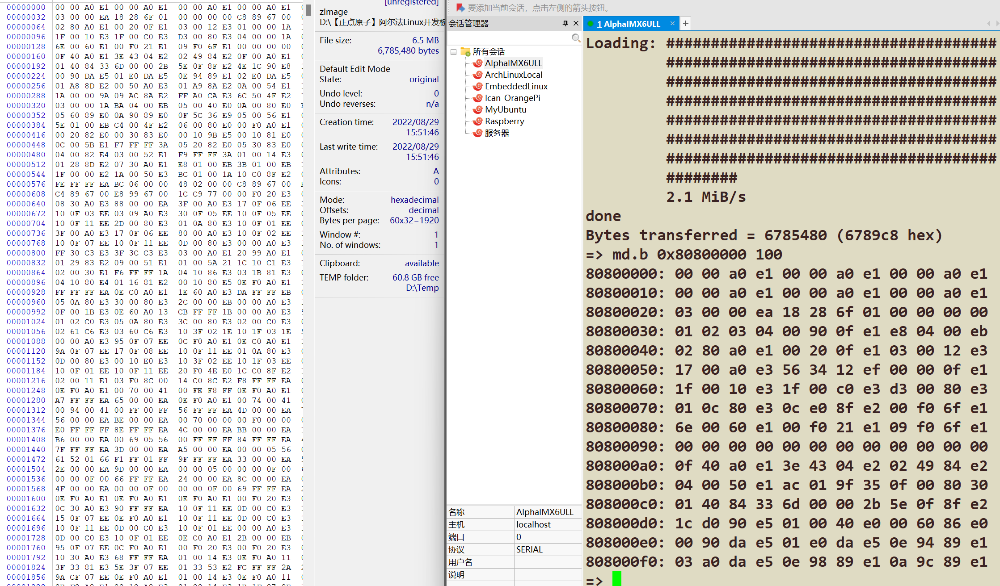

# 嵌入式Linux - UBoot学习篇

## 使用tftp上传我们的zImage

​	实际上，正点原子还提供了nfs的发送方式。但是笔者这里经过尝试。得出一个结论：

> 如果您的内核版本高于6.2，使用的Ubuntu大于18.04，那就别想使用nfs下载了。首先因为NFS V2协议在现代内核已经被遗弃，协议不对版，答案就是直接拒绝通信给你刷Loading。大部分教程都是过时的（除非你用老毕等配置那当我没说，迟早要翻车），所以笔者经过1个多小时的奋战，最后决定放弃尝试nfs了
>
> 非得体验？安装正点原子家的虚拟机从头配置一次也许OK。但是那会累死个人。不如TFTP一气呵成

## 在Ubuntu上安装TFTP

​	TFTP（Trivial File Transfer Protocol）是一种简单的文件传输协议，通常用于在网络上进行文件的上传和下载。与更为复杂的 FTP（File Transfer Protocol）不同，TFTP 协议设计非常简洁，主要用于设备之间的文件传输，特别是在资源受限的环境下，如嵌入式设备、网络设备的启动过程等。

​	`xinetd`（Extended Internet Services Daemon）是一个在类 Unix 系统上提供更强大、更安全的服务管理的守护进程。它是传统的 `inetd` 服务管理器的增强版本。`xinetd` 用于控制网络服务的启动和管理，允许用户通过网络提供特定的服务（如 FTP、Telnet、HTTP 等），并且可以针对每个服务进行精细的访问控制和日志记录。说白就是安装一个网络的守护进程管理以及安装我们的TFTP协议驱动，我们好传递我们的zImage

```
sudo apt-get install tftp-hpa tftpd-hpa 
sudo apt-get install xinetd 
```

​	下完了之后，首先是设置一个文件夹作为我们的tftp共享的文件夹：

```
mkdir ~/tftp/
sudo chmod 777 ~/tftp/ # Bro认为这个有点低能，不是这个权限是不允许发起通信的() 

# 你可以看到不设置的后果是: 
=> tftp 80800000 zImage     
Using FEC1 device
TFTP from server 10.42.0.1; our IP address is 10.42.0.50
Filename 'zImage'.
Load address: 0x80800000
Loading: *
TFTP error: 'Permission denied' (0)
Starting again
```

​	下面就是编写一份tftp的守护进程配置文件。需要做一点更改：在/etc/xinetd.d/下新建一个文件叫tftp

```
server tftp
{
	socket_type	= dgram
	protocol	= udp
	wait		= yes
	user		= root
	server		= /usr/sbin/in.tftpd
	server_args	= -s /home/charliechen/tftp/ # 别照抄这个，这个指向的是你希望暴露的tftp文件夹
	disable		= no
	per_source	=l1
	cps		= 100 2
	flags		= IPv4
}
```

​	这里我们慢慢聊每一个参数的含义。

**server tftp**：

- 定义一个名为 `tftp` 的服务块，`tftp` 是服务的名称，`xinetd` 会用这个名字来识别和管理这个服务。

**socket_type = dgram**：

- `dgram` 表示使用数据报套接字，我们都知道TFTP 使用 UDP 协议，**而 UDP 是无连接的基于数据报的协议**，这里的 `dgram`，也就是data gram 配置与 UDP 协议相匹配。

**protocol = udp**：

- 指定协议为 UDP（User Datagram Protocol）。TFTP 使用的是 UDP 协议，因此这里配置的是 `udp`。

**wait = yes**：

- 表示 `xinetd` 会等待服务完成（在 TFTP 服务中，通常是一个短时间的请求响应过程）。在某些服务中，`wait` 的值为 `no`，这表示服务会并发处理多个连接，而 `yes` 则意味着服务将按顺序处理每个请求。

**user = root**：

- 指定服务运行的用户。这里将 TFTP 服务以 `root` 用户身份启动，意味着它拥有超级用户权限。**注意：** 运行 TFTP 服务时，以 `root` 用户启动可能会存在安全隐患，建议根据实际需求调整权限，或考虑使用较低权限的用户。

**server = /usr/sbin/in.tftpd**：

- 指定执行的 TFTP 服务器程序。`/usr/sbin/in.tftpd` 是 TFTP 服务器的可执行文件路径，在一些 Linux 系统中，TFTP 服务器程序通常是 `in.tftpd`。当然，笔者劝你最好确定是在这个位置。

**server_args = -s /home/charliechen/tftp/**：

- `server_args` 指定传递给 TFTP 服务器的参数，`-s` 表示设置根目录，后面的 `/home/charliechen/tftp/` 是该 TFTP 服务器服务的根目录路径。所有的 TFTP 文件传输都会从该目录进行。如果文件夹路径不正确，TFTP 服务可能无法正常工作。

**disable = no**：

- `disable` 设置为 `no`，表示启用此服务。如果设置为 `yes`，则禁用该服务。

**per_source = 1**：

- `per_source` 设置限制每个客户端源 IP 地址的连接数，这里设置为 `1`，意味着每个源 IP 地址最多只能同时有一个连接请求。如果该值设置为较大的数字，多个请求可以同时处理。

**cps = 100 2**：

- `cps` 表示每秒的连接限制，`100 2` 的意思是：每秒最多可以接受 100 个连接请求，并且如果超过 2 个连接请求时，会在 2 秒内处理这 100 个请求。这个配置有助于防止拒绝服务攻击（DoS）或资源过度消耗。

**flags = IPv4**：

- `flags = IPv4` 表示服务仅支持 IPv4 地址连接，忽略 IPv6 请求。如果你的网络环境仅使用 IPv4，可以这样配置。

​	然后修改/etc/default/tftpd-hpa（省事）

```
TFTP_USERNAME="tftp"
TFTP_DIRECTORY="/home/charliechen/tftp/"	# 别照抄这个，这个指向的是你希望暴露的tftp文件夹
TFTP_ADDRESS=":69"
TFTP_OPTIONS="-l -c -s"
```

​	完成到这里，你需要重启一下我们的tftp守护进程。我发现一些同志不太喜欢启动服务后查看正不正常工作。这个习惯并不好，笔者建议查看一下状态和日志是我们希望的那样的输出。

```
sudo service  tftpd-hpa restart 	# 重启
sudo service  tftpd-hpa status		# 看看状态
● tftpd-hpa.service - LSB: HPA's tftp server
     Loaded: loaded (/etc/init.d/tftpd-hpa; g>
     Active: active (running) since Sat 2024->
       Docs: man:systemd-sysv-generator(8)
    Process: 22983 ExecStart=/etc/init.d/tftp>
      Tasks: 1 (limit: 9292)
     Memory: 252.0K (peak: 1.4M)
        CPU: 14ms
     CGroup: /system.slice/tftpd-hpa.service
             └─22992 /usr/sbin/in.tftpd --lis>

Nov 30 19:16:33 charliechen systemd[1]: Start>
Nov 30 19:16:33 charliechen tftpd-hpa[22983]:>
Nov 30 19:16:33 charliechen tftpd-hpa[22983]:>
Nov 30 19:16:33 charliechen systemd[1]: Start>
lines 1-15/15 (END)

● tftpd-hpa.service - LSB: HPA's tftp server
     Loaded: loaded (/etc/init.d/tftpd-hpa; generated)
     Active: active (running) since Sat 2024-11-30 19:16:33 CST; 5s ago
       Docs: man:systemd-sysv-generator(8)
    Process: 22983 ExecStart=/etc/init.d/tftpd-hpa start (code=exited, status=0/SUCCESS)
      Tasks: 1 (limit: 9292)
     Memory: 252.0K (peak: 1.4M)
        CPU: 14ms
     CGroup: /system.slice/tftpd-hpa.service
             └─22992 /usr/sbin/in.tftpd --listen --user tftp --address :69 -l -c -s /home/charliechen/tftp/

Nov 30 19:16:33 charliechen systemd[1]: Starting tftpd-hpa.service - LSB: HPA's tftp server...
Nov 30 19:16:33 charliechen tftpd-hpa[22983]:  * Starting HPA's tftpd in.tftpd
Nov 30 19:16:33 charliechen tftpd-hpa[22983]:    ...done.
Nov 30 19:16:33 charliechen systemd[1]: Started tftpd-hpa.service - LSB: HPA's tftp server.
```

## 把我们的网线连接到Ubuntu上

​		使用网线连接好你的板子和你的电脑，现在打开你的Ubuntu的有线网设置一下，笔者的以太网被分到了10.42.0.1上去，笔者偷懒设置了：

```
IPv4方式：手动
地址是10.42.0.1
掩码是255.255.255.0
网关是10.42.0.1	# 即主机就是网关，省的麻烦
```

​	我的板子上重新调整如下内容：

```
=> setenv ipaddr 		10.42.0.50
=> setenv serverip  	10.42.0.1
=> setenv gatewayip	10.42.0.1
=> saveenv
=> ping 10.42.0.1                                      
Using FEC1 device
host 10.42.0.1 is alive
```

​	现在我们就可以激情的尝试了，一击命中！

```
=> tftp 80800000 zImage
Using FEC1 device
TFTP from server 10.42.0.1; our IP address is 10.42.0.50
Filename 'zImage'.
Load address: 0x80800000
Loading: #################################################################
	 #################################################################
	 #################################################################
	 #################################################################
	 #################################################################
	 #################################################################
	 #################################################################
	 ########
	 2.1 MiB/s
done
Bytes transferred = 6785480 (6789c8 hex)
```

​	对比一下：

```
=> md.b 0x80800000 100
80800000: 00 00 a0 e1 00 00 a0 e1 00 00 a0 e1 00 00 a0 e1    ................
80800010: 00 00 a0 e1 00 00 a0 e1 00 00 a0 e1 00 00 a0 e1    ................
80800020: 03 00 00 ea 18 28 6f 01 00 00 00 00 c8 89 67 00    .....(o.......g.
80800030: 01 02 03 04 00 90 0f e1 e8 04 00 eb 01 70 a0 e1    .............p..
80800040: 02 80 a0 e1 00 20 0f e1 03 00 12 e3 01 00 00 1a    ..... ..........
80800050: 17 00 a0 e3 56 34 12 ef 00 00 0f e1 1a 00 20 e2    ....V4........ .
80800060: 1f 00 10 e3 1f 00 c0 e3 d3 00 80 e3 04 00 00 1a    ................
80800070: 01 0c 80 e3 0c e0 8f e2 00 f0 6f e1 0e f3 2e e1    ..........o.....
80800080: 6e 00 60 e1 00 f0 21 e1 09 f0 6f e1 00 00 00 00    n.`...!...o.....
80800090: 00 00 00 00 00 00 00 00 00 00 00 00 00 00 00 00    ................
808000a0: 0f 40 a0 e1 3e 43 04 e2 02 49 84 e2 0f 00 a0 e1    .@..>C...I......
808000b0: 04 00 50 e1 ac 01 9f 35 0f 00 80 30 00 00 54 31    ..P....5...0..T1
808000c0: 01 40 84 33 6d 00 00 2b 5e 0f 8f e2 4e 1c 90 e8    .@.3m..+^...N...
808000d0: 1c d0 90 e5 01 00 40 e0 00 60 86 e0 00 a0 8a e0    ......@..`......
808000e0: 00 90 da e5 01 e0 da e5 0e 94 89 e1 02 e0 da e5    ................
808000f0: 03 a0 da e5 0e 98 89 e1 0a 9c 89 e1 00 d0 8d e0    ................
```



​	现在终于可以喘一口气了，我们可以上传我们的板子到我们的板子上。

## mmc指令

```
=> mmc
mmc - MMC sub system

Usage:
mmc info - display info of the current MMC device
mmc read addr blk# cnt
mmc write addr blk# cnt
mmc erase blk# cnt
mmc rescan
mmc part - lists available partition on current mmc device
mmc dev [dev] [part] - show or set current mmc device [partition]
mmc list - lists available devices
mmc hwpartition [args...] - does hardware partitioning
  arguments (sizes in 512-byte blocks):
    [user [enh start cnt] [wrrel {on|off}]] - sets user data area attributes
    [gp1|gp2|gp3|gp4 cnt [enh] [wrrel {on|off}]] - general purpose partition
    [check|set|complete] - mode, complete set partitioning completed
  WARNING: Partitioning is a write-once setting once it is set to complete.
  Power cycling is required to initialize partitions after set to complete.
mmc bootbus dev boot_bus_width reset_boot_bus_width boot_mode
 - Set the BOOT_BUS_WIDTH field of the specified device
mmc bootpart-resize <dev> <boot part size MB> <RPMB part size MB>
 - Change sizes of boot and RPMB partitions of specified device
mmc partconf dev boot_ack boot_partition partition_access
 - Change the bits of the PARTITION_CONFIG field of the specified device
mmc rst-function dev value
 - Change the RST_n_FUNCTION field of the specified device
   WARNING: This is a write-once field and 0 / 1 / 2 are the only valid values.
mmc setdsr <value> - set DSR register value
```

#### **基本命令**

- **`mmc info`**：显示当前 MMC 设备的信息，比如型号、容量等。

- `mmc read addr blk# cnt`

  ：从 MMC 设备读取数据到内存中，参数包括：

  - `addr`：读取数据的内存地址。
  - `blk#`：起始块号。
  - `cnt`：要读取的块数。

- `mmc write addr blk# cnt`

  ：将数据从内存写入 MMC 设备，参数包括：

  - `addr`：要写入的内存地址。
  - `blk#`：起始块号。
  - `cnt`：要写入的块数。

- `mmc erase blk# cnt`

  ：擦除 MMC 设备上的块，参数包括：

  - `blk#`：起始块号。
  - `cnt`：要擦除的块数。

#### 2. **重新扫描和分区管理**

- **`mmc rescan`**：重新扫描 MMC 设备，通常用于重新初始化设备或检测新连接的设备。
- **`mmc part`**：列出当前 MMC 设备上的所有分区。
- **`mmc dev [dev] [part]`**：设置或显示当前 MMC 设备和分区，`dev` 是设备号，`part` 是分区号。
- **`mmc list`**：列出所有可用的 MMC 设备。

#### 3. **硬件分区**

- `mmc hwpartition [args...]`

  ：执行 MMC 设备的硬件分区操作，支持多个参数：

  - `[user [enh start cnt] [wrrel {on|off}]]`：设置用户数据区的相关属性。
  - `[gp1|gp2|gp3|gp4 cnt [enh] [wrrel {on|off}]]`：配置通用目的分区（GP 分区）。
  - `[check|set|complete]`：管理分区的完成状态。一旦设置为 `complete`，分区就会被锁定，无法再修改，设置完成后需要重启设备以应用分区设置。

#### 4. **启动配置**

- **`mmc bootbus dev boot_bus_width reset_boot_bus_width boot_mode`**：设置指定设备的启动总线宽度、重置启动总线宽度以及启动模式。
- **`mmc bootpart-resize <dev> <boot part size MB> <RPMB part size MB>`**：调整指定设备的启动分区和 RPMB（重放保护内存块）分区的大小。
- **`mmc partconf dev boot_ack boot_partition partition_access`**：更改设备的分区配置，涉及启动确认、启动分区选择和分区访问权限。

#### 5. **复位功能和 DSR 配置**

- **`mmc rst-function dev value`**：更改设备的 `RST_n_FUNCTION` 字段，这是一个一次性设置字段，只有 `0`、`1`、`2` 三个有效值。设置后无法修改。
- **`mmc setdsr <value>`**：设置设备的 DSR（驱动器强度寄存器）值，通常用于配置设备的信号强度或驱动能力。

#### 关键警告与注意事项：

- **分区的写一次设置**：一旦分区操作完成并设置为 `complete`，该配置将被锁定，之后无法更改，且在设置完成后需要重启设备才能生效。
- **`RST_n_FUNCTION`**：这个字段只能设置为 `0`、`1` 或 `2`，并且是一次性设置，设置后不能修改。

#### 常见用途：

- **设备初始化**：使用 `mmc rescan` 和 `mmc list` 来检测和初始化新的 MMC 设备。
- **分区管理**：通过 `mmc hwpartition` 和相关命令来配置 MMC 设备的分区，特别是在嵌入式系统中，需要在硬件级别进行分区操作。
- **读写数据**：`mmc read` 和 `mmc write` 命令是直接操作 MMC 存储设备内容的基本命令，常用于固件烧录、数据恢复或备份。
- **启动配置**：调整启动分区和总线宽度通常是需要自定义引导程序的场景，特别是在带有自定义启动加载程序的 SD 卡或 eMMC 设备中。

​	我们甚至翻译一下就知道要干啥了。下面一一尝试。

### mmc info

​	笔者的mmc info 输出如下：

```
=> mmc info 
Device: FSL_SDHC
Manufacturer ID: 6f
OEM: 303
Name: SDABC 
Tran Speed: 50000000
Rd Block Len: 512
SD version 3.0
High Capacity: Yes
Capacity: 58.2 GiB
Bus Width: 4-bit
Erase Group Size: 512 Bytes
```

**Device: FSL_SDHC**

- 这是设备的名称，表示当前使用的 MMC 设备是 `FSL_SDHC`，通常这代表一个基于 Freescale（现在的 NXP）SDHC 控制器的 SD 卡。

**Manufacturer ID: 6f**

- `Manufacturer ID` 是设备生产厂商的标识符。在这个例子中，`6f` 是制造商的 ID。每个厂商都会有一个唯一的 ID，这有助于识别设备的生产商。

**OEM: 303**

- `OEM` 是原始设备制造商（OEM）代码。`303` 是特定厂商或设备的标识符。

**Name: SDABC**

- `Name` 表示设备的名称，通常是 SD 卡或 eMMC 设备的型号名，这里显示为 `SDABC`。

**Tran Speed: 50000000**

- `Tran Speed`（传输速度）表示设备支持的最大数据传输速度。在此例中，设备的最大传输速度为 50,000,000 bps（50 Mbps）。

**Rd Block Len: 512**

- `Rd Block Len`（读取块长度）表示每个数据块的大小，通常是 512 字节。这意味着每次读写操作的最小单位是 512 字节。

**SD version 3.0**

- 表示设备符合 SD 3.0 规范。SD 3.0 是较新的 SD 卡规格，支持更高的容量和更快的速度。

**High Capacity: Yes**

- 这表明该设备是高容量（High Capacity）设备。SD 卡的高容量通常指 SDHC 或更高版本（如 SDXC）。这表示该设备的容量大于 2GB，且可以支持高达 32GB（SDHC）或更大容量（SDXC）。

**Capacity: 58.2 GiB**

- 设备的总容量是 58.2 GiB（吉比字节），即约 62.5 GB。这个容量大致对应于一张大容量 SDHC 或 SDXC 卡。

**Bus Width: 4-bit**

- `Bus Width`（总线宽度）是数据传输的并行通道宽度。此设备的总线宽度为 4 位，这意味着它通过 4 根数据线进行传输，这通常意味着比 1 位（如传统 SD 卡）更高的传输速度。

**Erase Group Size: 512 Bytes**

- `Erase Group Size`（擦除组大小）表示该设备擦除操作的最小单位。每次擦除操作的最小单元为 512 字节。这通常与块擦除操作的粒度有关。

### mmc rescan

​	重新扫描我们的emmc，比如说你有插进来SD卡了记得刷新一下。

### mmc list

```
=> mmc list
FSL_SDHC: 0 (SD)
FSL_SDHC: 1
```

​	这里就说明有两个设备。

### mmc dev

​	切换设备用的，比如说：

```
=> mmc dev 0
switch to partitions #0, OK
mmc0 is current device
=> mmc dev 1
switch to partitions #0, OK
mmc1(part 0) is current device
```

### mmc part

​	这个是查看我们的分区：

```
=> mmc part

Partition Map for MMC device 1  --   Partition Type: DOS

Part	Start Sector	Num Sectors	UUID Type
  1	2048      	65536     	e9830ec1-01	0c Boot
  2	67584     	15202304  	e9830ec1-02	83
```

## FAT文件系统操作

​	这个为我们下一步的启动Linux做准备。

### **`fatinfo`**

- **功能**：显示 FAT 文件系统的相关信息。

- **常见用途**：用于检查当前 FAT 文件系统的状态、容量、剩余空间等信息。

  ```
  fatinfo <dev>:<part>
  ```

  该命令会显示指定设备和分区上 FAT 文件系统的详细信息，例如总空间、可用空间、文件系统类型等。

###  **`fatls`**

- **功能**：列出 FAT 文件系统中的文件和目录。

- **常见用途**：类似于 `ls` 命令，在 FAT 文件系统上列出所有文件和目录。

  ```
  fatls <dev>:<part> <directory>
  ```

  该命令列出指定设备和分区下指定目录中的文件。如果没有指定目录，它会列出根目录下的文件。

###  **`fstype`**

- **功能**：显示指定设备或分区的文件系统类型。

- **常见用途**：用于检测一个存储设备或分区使用的文件系统类型。例如，FAT、ext4、NTFS等。

  ```
  fstype <dev>:<part>
  ```

  该命令会显示指定设备和分区的文件系统类型。如果设备上没有有效的文件系统，它可能会返回错误或“unknown”。

###  **`fatload`**

- **功能**：从 FAT 文件系统中加载文件到内存。

- **常见用途**：用于从 FAT 文件系统加载文件到内存中，通常用于加载引导程序、固件文件或其他二进制文件。

  ```
  fatload <dev>:<part> <addr> <filename>
  ```

  该命令从指定设备和分区中的文件加载数据到内存中的指定地址。\<addr>是目标内存地址，\<filename>是要加载的文件名。

###  **`fatwrite`**

- **功能**：将文件从内存写入到 FAT 文件系统。

- **常见用途**：用于将内存中的数据写入到 FAT 文件系统的指定文件中。通常用于更新文件或写入新的数据。

  ```
  fatwrite <dev>:<part> <addr> <filename> <size>
  ```

  该命令会将内存中指定地址（\<addr>）开始的 \<size> 字节数据写入到 FAT 文件系统中的指定文件 \<filename>。如果文件已存在，则会覆盖该文件。

## Linux启动

​	如果你的板子先前关闭过一次或者是重启过一次，请先检查你的以太网IP有没有发生改变，发生改变了记得重新调整IP。现在你需要做的是继续下载设备树好驱动板子的外设，这个事情跟你买了啥板子有关系，笔者的是 EMMC 核心板，800×480 分辨率的屏幕，那没啥说的，下这个：

```
imx6ull-14x14-emmc-7-800x480-c.dtb
```

​	送到Ubuntu的系统上记得修改我们的权限还是777（逆天777），然后在板子上做如下的操作：

```
=> tftp 80800000 zImage      
Using FEC1 device
TFTP from server 10.41.0.1; our IP address is 10.41.0.50
Filename 'zImage'.
Load address: 0x80800000
Loading: #################################################################
	 #################################################################
	 #################################################################
	 #################################################################
	 #################################################################
	 #################################################################
	 #################################################################
	 ########
	 2.2 MiB/s
done
Bytes transferred = 6785480 (6789c8 hex)
```

​	和上传我们的设备树

```
=> tftp 83000000 dv.dtb
Using FEC1 device
TFTP from server 10.41.0.1; our IP address is 10.41.0.50
Filename 'dv.dtb'.
Load address: 0x83000000
Loading: ###
	 1.7 MiB/s
done
Bytes transferred = 39459 (9a23 hex)
```

​	现在我知道你很着急的想启动，那就启动。

```
=> bootz 80800000 - 83000000
Kernel image @ 0x80800000 [ 0x000000 - 0x6789c8 ]
## Flattened Device Tree blob at 83000000
   Booting using the fdt blob at 0x83000000
   Using Device Tree in place at 83000000, end 8300ca22

Starting kernel ...

[    0.000000] Booting Linux on physical CPU 0x0
[    0.000000] Linux version 4.1.15-g3dc0a4b (alientek@ubuntu) (gcc version 5.3.0 (GCC) ) #1 SMP PREEMPT Thu Aug 18 09:27:40 CST 2022
[    0.000000] CPU: ARMv7 Processor [410fc075] revision 5 (ARMv7), cr=10c53c7d
[    0.000000] CPU: PIPT / VIPT nonaliasing data cache, VIPT aliasing instruction cache
[    0.000000] Machine model: Freescale i.MX6 ULL 14x14 EVK Board
```

​	然后就会开始刷日志了。恭喜你！你启动了Linux!下面我开始深入的理解我们的UBoot!

