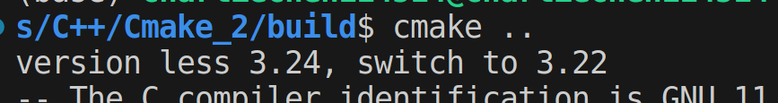

# CMake使用小记1

```
.
├── AbsrtactProduct.h
├── AbstractFactory.h
├── build
├── FactoriesAndProducts.h
├── ProductA_Factory.h
├── ProductA.h
├── ProductB_Factory.h
├── ProductB.h
└── src
    ├── main.cpp
    ├── ProductA.cpp
    ├── ProductA_Factory.cpp
    ├── ProductB.cpp
    └── ProductB_Factory.cpp

2 directories, 14 files
```

​		如诸位所见，本次构建是针对这个我先前写的抽象工厂示例的工程，现在准备开始构建它.

## CMake使用习惯1：预先准备好build文件夹来装载生成的文件

​		我们习惯这样做，这样有助于我们对CMake生成的文件的清理和调整。

```
mkdir build
cd build
cmake ..
```

​		是我们常见的三个基本步骤。不过，现在没有CMakeLists.txt，需要我们自己写。

## cmake_minimum_required

​		一般而言，我们的CMakeLists的开头总是这个（喜），他标志着要求的CMake的最低版本，为此我打算演示一下：

```cmake
cmake_minimum_required(VERSION 3.22)
```

​		这个指令就会要求我们的CMake最低版本是3.22，如果没有达到，默认的路径是退出

```
CMake Error at CMakeLists.txt:1 (cmake_minimum_required):
  CMake 3.24 or higher is required.  You are running version 3.22.1
```

​		一个良好的处理办法是：通知并尝试切换：

```cmake
if(${CMAKE_VERSION} VERSION_LESS 3.24)
    cmake_minimum_required(VERSION ${CMAKE_MAJOR_VERSION}.${CMAKE_MINOR_VERSION})
    message(STATUS "version less 3.24, switch to ${CMAKE_MAJOR_VERSION}.${CMAKE_MINOR_VERSION}")
else()
    cmake_minimum_required(VERSION 3.24)
    message(STATUS "version is good, no need to switch")
endif()
```



## project

​		这个指令指代的是当前的工程名如何。比如说，我的CMakeLists下是：

```cmake
project(Hello 
        VERSION 1.0
        DESCRIPTION "A demo for Abs factory")

message(
    STATUS 
    "Ready to config the project:> ${PROJECT_NAME}\n
     The Project Version is ${PROJECT_VERSION}\n
     Project descriptions are follows:> ${PROJECT_DESCRIPTION}\n
     Build start\n\n\n"
)
```

```
-- Ready to config the project Hello

     The Project Version is 1.0

     Project descriptions are follows:> A demo for Abs factory

     Build start
```

​		这里设置了一些描述性质的内容。

## 包含目录

​		有点时候，我们会发现需要把外部工程的头文件打包进来，这就需要我们：

```
include_directories()
```

​		虽然这样些CMake的习惯不好

```
message("the building will set the project source dir in:> ${PROJECT_SOURCE_DIR}\n")
include_directories(${PROJECT_SOURCE_DIR})
```

​		但是想偷懒（），这里就把自己的头文件文件夹扔进include directories就可以了。

## 检索所有的目标文件

```
file
```

​		下面这个指令可以在目标文件夹下递归的查找所有符合正则表达式的文件，比如说这里就会在我的src文件夹下找出所有的.cpp文件，存放到mySource这个变量下。

```
file(
    GLOB_RECURSE mySource    
    ${PROJECT_SOURCE_DIR}/src/*.cpp
)
```

​		这个时候我们可以尝试打印一下：


​		嗯，一大堆。

## 生成可执行文件

```
add_executable(exe ...)
# ...换成自己的源文件即可
```

​		就可以了。

## 构建

```
cmake CMAKELISTS_PATH # 我这里CMakeLists在上层，直接cmake ..
make
```

​		就可以了，实际上的编译问题在make会告诉你。

# CMake使用小记2 

## 生成库

​		现在还是回到我们的构建的工程上来，我们仔细类比一下，会很简单，生成可执行文件是`add_executable`，那么生成库就是:`add_library`

```
add_library(libName _WHAT_TYPE_ src...)
```

> `_WHAT_TYPE_`上有三种，分别是SHARED（动态库，或者说是共享库）, STATIC（静态库）, MODULE
>
> 生成的library名会根据STATIC或SHARED成为name.a或name.lib,
>
> 这里的STATIC和SHARED可不设置，通过全局的BUILD_SHARED_LIBS的FALSE或TRUE来指定
>
> windows下，如果dll没有export任何信息，则不能使用SHARED，要标识为MODULE

​		当然，我们填一个坑，就是把所有的头文件都放到一起，这是为了后续生成给他人使用的库时需要的头文件的使用：

```
mkdir include
mv ./*.h ./include/
# 把main移出来防止后续的教程演示出现重定义main符号的问题
mv ./src/main.cpp ./
```

​		 修改一下CMakeLists.txt

```cmake
if(${CMAKE_VERSION} VERSION_LESS 3.24)
    cmake_minimum_required(VERSION ${CMAKE_MAJOR_VERSION}.${CMAKE_MINOR_VERSION})
    message(STATUS "version less 3.24, switch to ${CMAKE_MAJOR_VERSION}.${CMAKE_MINOR_VERSION}")
else()
    cmake_minimum_required(VERSION 3.24)
    message(STATUS "version is good, no need to switch")
endif()

project(Hello 
        VERSION 1.0
        DESCRIPTION "A demo for Abs factory")

SET(CMAKE_BUILD_TYPE "Debug")

message(
    STATUS 
    "Ready to config the project:> ${PROJECT_NAME}\n
     The Project Version is ${PROJECT_VERSION}\n
     Project descriptions are follows:> ${PROJECT_DESCRIPTION}\n
     Build start\n\n\n"
)


message("will set the project source dir in:> ${PROJECT_SOURCE_DIR}\n")
# 改一下include目录
include_directories(${PROJECT_SOURCE_DIR}/include)

file(
    GLOB_RECURSE mySource    
    ${PROJECT_SOURCE_DIR}/src/*.cpp
)

message("Find Sources:> ${mySource}")
# main移出来了，加上
add_executable(exe ${mySource} main.cpp)

message("About ready to config the static lib")
add_library(MyProduct_AndFactory_staticLib STATIC ${mySource})
message("About ready to config the dynamic lib")
add_library(MyProduct_AndFactory_sharedLib SHARED ${mySource})
message("About ready to config modules")
add_library(MyProduct_AndFactory_moduleLib MODULE ${mySource})
```

---


​		这就是整个build过程。

## include_directories 和 target_include_directories

​		区别在哪里呢？我们知道这都是包含头文件，如果不添加，那么make的时候就会爆出不认识头文件在何处的错误。这两个的共性都是包含目录，但是前者是全局包含的，就是说所有的目标文件都会包含，target_include_directories则是针对性的去针对每一个target进行设置。语法如下：

```cmake
target_include_directories(<target> [SYSTEM] [AFTER|BEFORE]
  <INTERFACE|PUBLIC|PRIVATE> [items1...]
  [<INTERFACE|PUBLIC|PRIVATE> [items2...] ...])
```

> PUBLIC 在public后面的库会被Link到你的target中，并且里面的符号也会被导出，提供给第三方使用。
>
> PRIVATE 在private后面的库仅被link到你的target中，并且终结掉，第三方不能感知你调了啥库
> INTERFACE 在interface后面引入的库不会被链接到你的target中，只会导出符号。
>
> ```
> Hopefully the explanation that follows helps clarify what PRIVATE, PUBLIC
> and INTERFACE mean and do. From my understanding of things, I think there
> may have been some subtle inaccuracies in some of the discussions so far,
> so hopefully the following is helpful and if I've got something wrong, then
> by all means please point out the inaccuracies.
> 
> 
>    - When A links in B as *PRIVATE*, it is saying that A uses B in its
>    implementation, but B is not used in any part of A's public API. Any code
>    that makes calls into A would not need to refer directly to anything from
>    B. An example of this could be a networking library A which can be built to
>    use one of a number of different SSL libraries internally (which B
>    represents). A presents a unified interface for client code which does not
>    reference any of the internal SSL data structures or functions. Client code
>    would have no idea what SSL implementation (B) is being used by A, nor does
>    that client code need to care.
>    - When A links in B as *INTERFACE*, it is saying that A does not use B
>    in its implementation, but B is used in A's public API. Code that calls
>    into A may need to refer to things from B in order to make such calls. One
>    example of this is an interface library which simply forwards calls along
>    to another library but doesn't actually reference the objects on the way
>    through other than by a pointer or reference. Another example is where A is
>    defined in CMake as an interface library, meaning it has no actual
>    implementation itself, it is effectively just a collection of other
>    libraries (I'm probably over-simplifying here, but you get the picture).
>    - When A links in B as *PUBLIC*, it is essentially a combination of
>    PRIVATE and INTERFACE. It says that A uses B in its implementation and B is
>    also used in A's public API.
> 
> 
> Consider first what this means for include search paths. If something links
> against A, it will also need any include search paths from B if B is in A's
> public API. Thus, if A links in B either as PUBLIC or INTERFACE, then any
> header search paths defined for target B will also apply to anything that
> links to A. Any PRIVATE header search path for B will NOT be carried
> through to anything that links only to A. The target_include_directories()
> command handles this. The situation with compile flags is analogously
> handled with target_compile_definitions() and target_compile_options().
> 
> Now consider the situation for the actual libraries involved. If A is a
> shared library, then A will have encoded into it a dependency on B. This
> information can be inspected with tools like ldd on Linux, otool on Mac and
> something like Dependency Walker (a.k.a. depends.exe) on Windows. If other
> code links directly to A, then it also will have encoded into it a
> dependency on A. It will not, however, have a dependency on B unless A
> links in B as PUBLIC or INTERFACE. So far, so good. If, however, A is a
> static library, the situation changes. Static libraries do not carry
> information about other libraries they depend on. For this reason, when A
> links in B as PRIVATE and another target C links in A, CMake will still add
> B to the list of libraries to be linked for C because parts of B are needed
> by A, but A itself doesn't have that dependency encoded into it. So even
> though B is an internal implementation detail of A, C still needs B added
> to the linker command, which CMake conveniently handles for you.
> 
> If you were paying careful attention, you would have noticed that when A
> links in B as PRIVATE, the include directories of B never propagate to
> something linking to A, but if A is a static library, then the *linking* of
> B behaves as though the relationship was PUBLIC. This
> PRIVATE-becomes-PUBLIC behaviour for static libraries only applies to the
> *linking*, not to the other dependencies (compiler options/flags and
> include search paths). The upshot of all this is that if you select
> PRIVATE, PUBLIC or INTERFACE based on the explanations in the dot points
> above, then CMake will ensure dependencies propagate through to where they
> are required, regardless of whether libraries are static or shared. This
> does, of course, rely on you the developer not missing any dependencies or
> specifying the wrong PRIVATE/PUBLIC/INTERFACE relationship.
> 
> As a final note, if you call target_link_libraries() and do not specify any
> of PRIVATE, PUBLIC or INTERFACE, you may be tempted to believe that it will
> be treated as PUBLIC. The situation is actually more complicated than that
> though. It may be treated as PUBLIC or PRIVATE, depending on what other
> target_link_library() calls and/or target property manipulations have been
> performed. The documentation for target_link_libraries() talks a bit about
> this, but you have to go digging into the documentation for the target
> properties it mentions to get an understanding of what circumstances lead
> to PRIVATE or PUBLIC behaviour.
> ```

## target_link_libraries

​		指定链接给定目标和/或其依赖项时要使用的库或标志。将传播链接库目标的使用要求。目标依赖项的使用要求会影响其自身源的编译。

```
target_link_libraries(<target> ... <item>... ...)
target_link_libraries(<target>
                      <PRIVATE|PUBLIC|INTERFACE> <item>...
                     [<PRIVATE|PUBLIC|INTERFACE> <item>...]...)
```


​		其实就是链接库的意思。

## install命令

​		我们编译完库了，想要让用户可以make install实现自动化的安装，可以使用install来配置路径：

```cmake
install(TARGETS MyLib
        EXPORT MyLibTargets 
        LIBRARY DESTINATION lib  # 动态库安装路径
        ARCHIVE DESTINATION lib  # 静态库安装路径
        RUNTIME DESTINATION bin  # 可执行文件安装路径
        PUBLIC_HEADER DESTINATION include  # 头文件安装路径
        )
```

> LIBRARY, ARCHIVE, RUNTIME, PUBLIC_HEADER是可选的，可以根据需要进行选择。 DESTINATION后面的路径可以自行制定，根目录默认为`CMAKE_INSTALL_PREFIX`,可以试用`set`方法进行指定，如果使用默认值的话，Unix系统的默认值为 `/usr/local`, Windows的默认值为 `c:/Program Files/${PROJECT_NAME}`。比如字linux系统下若LIBRARY的安装路径指定为`lib`,即为`/usr/local/lib`。

```
set(CMAKE_INSTALL_PREFIX path)
```

​		的方式指定如何安装，举个例子，我们希望把内容安装在跟源码同级的位置上：

```cmake
# 注意，这里的../install是因为相对于我们的build目录而言的，如果是希望在build目录下安装install,需要改成./intstall
set(CMAKE_INSTALL_PREFIX "../install")
```

​		现在我们这样编写CMakeLists.txt

```cmake
if(${CMAKE_VERSION} VERSION_LESS 3.24)
    cmake_minimum_required(VERSION ${CMAKE_MAJOR_VERSION}.${CMAKE_MINOR_VERSION})
    message(STATUS "version less 3.24, switch to ${CMAKE_MAJOR_VERSION}.${CMAKE_MINOR_VERSION}")
else()
    cmake_minimum_required(VERSION 3.24)
    message(STATUS "version is good, no need to switch")
endif()

project(Hello 
        VERSION 1.0
        DESCRIPTION "A demo for Abs factory")

SET(CMAKE_BUILD_TYPE "Debug")
set(CMAKE_INSTALL_PREFIX "../install")
message(
    STATUS 
    "Ready to config the project:> ${PROJECT_NAME}\n
     The Project Version is ${PROJECT_VERSION}\n
     Project descriptions are follows:> ${PROJECT_DESCRIPTION}\n
     Build start\n\n\n"
)


message("will set the project source dir in:> ${PROJECT_SOURCE_DIR}\n")
include_directories(${PROJECT_SOURCE_DIR}/include)

file(
    GLOB_RECURSE mySource    
    ${PROJECT_SOURCE_DIR}/src/*.cpp
)

message("Find Sources:> ${mySource}")

file(
    GLOB_RECURSE myHeader  
    ${PROJECT_SOURCE_DIR}/include/*.h
)
message("Find headers:> ${myHeader}")

add_executable(exe ${mySource} main.cpp)


message("About ready to config the static lib")
add_library(MyProduct_AndFactory_staticLib STATIC ${mySource})
message("About ready to config the dynamic lib")
add_library(MyProduct_AndFactory_sharedLib SHARED ${mySource})
message("About ready to config modules")
add_library(MyProduct_AndFactory_moduleLib MODULE ${mySource})

# 注意现在变成相对跟目录在build下讨论
# 安装在../install/lib下
install(TARGETS MyProduct_AndFactory_staticLib DESTINATION lib)
# 安装在../install/bin下
install(TARGETS MyProduct_AndFactory_sharedLib DESTINATION bin)
install(TARGETS MyProduct_AndFactory_moduleLib DESTINATION bin)
# 安装在../install/include下
install(FILES ${myHeader} DESTINATION include)
```


​		注意，这个时候还没装好库，需要我们`cmake --install`，或者是`make install`


​		现在我们看看文件结构，多出来了：

```
..
├── build(这个文件我们略去)
│
├── CMakeLists.txt
├── file_tree.txt
├── include
│   ├── AbsrtactProduct.h
│   ├── AbstractFactory.h
│   ├── FactoriesAndProducts.h
│   ├── ProductA_Factory.h
│   ├── ProductA.h
│   ├── ProductB_Factory.h
│   └── ProductB.h
├── install (*KEY*)
│   ├── bin
│   │   ├── libMyProduct_AndFactory_moduleLib.so
│   │   └── libMyProduct_AndFactory_sharedLib.so
│   ├── include
│   │   ├── AbsrtactProduct.h
│   │   ├── AbstractFactory.h
│   │   ├── FactoriesAndProducts.h
│   │   ├── ProductA_Factory.h
│   │   ├── ProductA.h
│   │   ├── ProductB_Factory.h
│   │   └── ProductB.h
│   └── lib
│       └── libMyProduct_AndFactory_staticLib.a
├── main.cpp
└── src
    ├── ProductA.cpp
    ├── ProductA_Factory.cpp
    ├── ProductB.cpp
    └── ProductB_Factory.cpp
```

​		大功告成。

# CMake小记3: find_package

## 以opencv为例

​		我们下面就要开始讲授难一些的内容了：也就是当我们的程序需要外部库才能消除未定义符号从而正确的完成构建之后，我们应该如何使用CMake来帮助构建程序。

​		本文的测试程序如下：

```C++
#include <opencv2/highgui.hpp>
#include <opencv2/opencv.hpp>
using namespace cv;
std::string path = "/home/charliechen114514/LocalGitProject/CodesExperiments/C++/Cmake_5/desktop2.png"; 
// 注意path换成自己图片的路径，需要注意的是不要含中文名，否则解析可能存在问题

int main()
{
    Mat pic = imread(path);
    if(pic.empty())
    {
        std::cerr   << "Can not find the target pic path:> " \
                    << path << "\n";
        return -1;
    }
    std::cout << "Try to show the image:> " << path; 
    imshow("Pic", pic);
    waitKey(0);
    return 0;
}
```


## `find_package`简单介绍

​		这个函数表示的是CMake查找包的意思。我们这一次打算拿著名的计算机视觉开源库`Opencv`来完成这样的事情。

​		我们首先应用起来之前学习CMakeLists知识，来整点：

```cmake
# Blocks are used to ensure the cmake version
if(${CMAKE_VERSION} VERSION_LESS 3.24)
    cmake_minimum_required(VERSION ${CMAKE_MAJOR_VERSION}.${CMAKE_MINOR_VERSION})
    message(STATUS "version less 3.24, switch to ${CMAKE_MAJOR_VERSION}.${CMAKE_MINOR_VERSION}")
else()
    cmake_minimum_required(VERSION 3.24)
    message(STATUS "version is good, no need to switch")
endif()
# Block End

project(First_CMake_Project
	VERSION 1.0
        DESCRIPTION "A demo for using imported libraries")
# SET THIS AS DEBUG MODE, for I need DEBUG lol        
SET(CMAKE_BUILD_TYPE "Debug")
```

​		鲁莽的直接找包可能会出现：


​		我们下面来看看find_package到底是如何找包的：

​		

### find_package工作模式

​		find_package命令有两种工作模式，这两种工作模式的不同决定了其搜包路径的不同：

> Module模式
> find_package命令基础工作模式(Basic Signature)，也是默认工作模式。

> Config模式
> find_package命令高级工作模式(Full Signature)。 只有在find_package()中指定CONFIG、NO_MODULE等关键字，或者Module模式查找失败后才会进入到Config模式。

```cmake
find_package(<package> [version] [EXACT] [QUIET] [MODULE]
             [REQUIRED] [[COMPONENTS] [components...]]
             [OPTIONAL_COMPONENTS components...]
             [NO_POLICY_SCOPE])
```

**参数解释：**

> **package**：必填参数。需要查找的包名，注意大小写。
>
> **version和EXACT**：可选参数，version指定的是版本，如果指定就必须检查找到的包的版本是否和**version**兼容。如果指定**EXACT**则表示必须完全匹配的版本而不是兼容版本就可以。
>
> **QUIET**：可选参数，表示如果查找失败，不会在屏幕进行输出（但是如果指定了**REQUIRED**字段，则**QUIET**无效，仍然会输出查找失败提示语）。
>
> **MODULE**：可选字段。前面提到说“如果**Module**模式查找失败则回退到**Config**模式进行查找”，但是假如加入了**MODULE**选项，那么就只在**Module**模式查找，如果**Module**模式下查找失败并不切换到**Config**模式查找。
>
> **REQUIRED**：可选字段。表示一定要找到包，找不到的话就立即停掉整个CMake。**而如果不指定REQUIRED则CMake会继续执行。**
>
> **COMPONENTS，components**：可选字段，表示查找的包中必须要找到的组件(components），如果有任何一个找不到就算失败，类似于**REQUIRED**，导致CMake停止执行。

### Module模式查找顺序

**Module**模式下是要查找到名为`Find<PackageName>.cmake`的配置文件。

​		Module模式只有两个查找路径：**CMAKE_MODULE_PATH**和**CMake**安装路径下的**Modules**目录，
**搜包路径依次为：**

```shell
CMAKE_MODULE_PATH
CMAKE_ROOT
```

​		先在**CMAKE_MODULE_PATH**变量对应的路径中查找。如果路径为空，或者路径中查找失败，则在CMake安装目录（即**CMAKE_ROOT**变量）下的**Modules**目录下（通常为`/usr/share/cmake-3.10/Modules`，3.10是我的CMake版本）查找。这两个变量可以在`CMakeLists.txt`文件中打印查看具体内容：

```cmake
message(STATUS "CMAKE_MODULE_PATH = ${CMAKE_MODULE_PATH}")
message(STATUS "CMAKE_ROOT = ${CMAKE_ROOT}")
```

其中**CMAKE_MODULE_PATH**默认为空，可以利用`set`命令赋值。

在安装CMake时，CMake为我们提供了很多开发库的`FindXXX.cmake`模块文件，可以通过命令查询：

```shell
cmake --help-module-list | grep -E ^Find
```

### Config模式用法

**Config**模式的完整命令参数为：

```shell
find_package(<package> [version] [EXACT] [QUIET]
             [REQUIRED] [[COMPONENTS] [components...]]
             [CONFIG|NO_MODULE]
             [NO_POLICY_SCOPE]
             [NAMES name1 [name2 ...]]
             [CONFIGS config1 [config2 ...]]
             [HINTS path1 [path2 ... ]]
             [PATHS path1 [path2 ... ]]
             [PATH_SUFFIXES suffix1 [suffix2 ...]]
             [NO_DEFAULT_PATH]
             [NO_CMAKE_ENVIRONMENT_PATH]
             [NO_CMAKE_PATH]
             [NO_SYSTEM_ENVIRONMENT_PATH]
             [NO_CMAKE_PACKAGE_REGISTRY]
             [NO_CMAKE_BUILDS_PATH] # Deprecated; does nothing.
             [NO_CMAKE_SYSTEM_PATH]
             [NO_CMAKE_SYSTEM_PACKAGE_REGISTRY]
             [CMAKE_FIND_ROOT_PATH_BOTH |
              ONLY_CMAKE_FIND_ROOT_PATH |
              NO_CMAKE_FIND_ROOT_PATH])
```

​		相比于**Module**模式，**Config**模式的参数更多，也更复杂，但实际在使用过程中我们并不会用到所有参数，大部分参数都是可选的，我们只需要掌握基本的参数用法即可。其中具体查找库并给`XXX_INCLUDE_DIRS`和`XXX_LIBRARIES`两个变量赋值的操作由XXXConfig.cmake模块完成。

​		两种模式看起来似乎差不多，不过CMake默认采取Module模式，如果Module模式未找到库，才会采取Config模式。如果XXX_DIR路径下找不到XXXConfig.cmake文件，则会找/usr/local/lib/cmake/XXX/中的XXXConfig.cmake文件。总之，Config模式是一个备选策略。通常，库安装时会拷贝一份XXXConfig.cmake到系统目录中，因此在没有显式指定搜索路径时也可以顺利找到。

### Config模式查找顺序

​		**Config**模式下是要查找名为`<PackageName>Config.cmake`或`<lower-case-package-name>-config.cmake`的模块文件。

**搜包路径依次为：**
		与**Module**模式不同，**Config**模式需要查找的路径非常多，也要匹配很多的可能性，因此有些路径是首先作为**根目录**，然后进行子目录的匹配， 具体查找顺序为：

> 1、名为`<PackageName>_DIR`的CMake变量或环境变量路径， 默认为空。
> **这个路径是非根目录路径，需要指定到`<PackageName>Config.cmake`或`<lower-case-package-name>-config.cmake`文件所在目录才能找到。**
> 2、名为`CMAKE_PREFIX_PATH`、`CMAKE_FRAMEWORK_PATH`、`CMAKE_APPBUNDLE_PATH`的CMake变量或**环境变量**路径
> **根目录**，默认都为空。
> 3、`PATH`环境变量路径
> **根目录**，默认为系统环境`PATH`环境变量值。其实这个路径才是**Config**模式大部分情况下能够查找到安装到系统中各种库的原因。
> 这个路径的查找规则为：
>
> > 遍历`PATH`环境变量中的各路径，如果该路径如果以bin或sbin结尾，则**自动回退到上一级目录**得到根目录。例如我的`PATH`路径包括：

```
echo $PATH
/home/charliechen114514/miniconda3/bin:/home/charliechen114514/miniconda3/condabin:/home/charliechen114514/.cargo/bin:/usr/local/sbin:/usr/local/bin:/usr/sbin:/usr/bin:/sbin:/bin:/usr/games:/usr/local/games:/snap/bin:/snap/bin:/opt/Typora-linux-x64
```

在上述指明的是**根目录**路径时，CMake会首先检查这些**根目录**路径下是否有名为`<PackageName>Config.cmake`或`<lower-case-package-name>-config.cmake`的模块文件，如果没有，CMake会继续**检查或匹配**这些根目录下的以下路径（`<PackageName>_DIR`路径不是根目录路径）：

```shell
<prefix>/(lib/<arch>|lib|share)/cmake/<name>*/
<prefix>/(lib/<arch>|lib|share)/<name>*/ 
<prefix>/(lib/<arch>|lib|share)/<name>*/(cmake|CMake)/
```

​		其中为系统架构名，如Ubuntu下一般为：`/usr/lib/x86_64-linux-gnu`，整个`(lib/<arch>|lib|share)`为可选路径，例如OpenCV库而言会**检查或匹配**`<prefix>/OpenCV/`、`<prefix>/lib/x86_64-linux-gnu/OpenCV/`、`<prefix>/lib/share/OpenCV/`、`<prefix>/share/OpenCV/`等路径；name为包名，不区分大小写`<name>*`意思是包名后接一些版本后等字符也是合法的，如`pcl-1.9`也会被找到。

#### 3.4 查找指定包建议

​		上面的查找规则整体看起来好像很复杂，但其实我们在安装库的时候都会自动配置安装到对的位置，一般都不会出现问题。如果我们需要指定特定的库，我们也只需要设置**优先级最高**的几个变量名即可。包括下面两种情况：

1、如果你明确知道想要查找的库`<PackageName>Config.cmake`或`<lower-case-package-name>-config.cmake`文件所在路径，为了能够准确定位到这个包，可以直接设置变量`<PackageName>_DIR`为具体路径，如：

```shell
set(OpenCV_DIR "/usr/local/cmake/opencv4/")
```

​		就可以明确需要查找的OpenCV包的路径了。

2、如果你有多个包的配置文件需要查找，可以将这些配置文件都统一放在一个命名为`cmake`的文件夹下，然后设置变量`CMAKE_PREFIX_PATH`变量指向这个`cmake`文件夹路径，**需要注意根据上述的匹配规则，此时每个包的配置文件需要单独放置在命名为包名的文件夹下（文件夹名不区分大小写）**，否则会提示找不到。

### 总结

​		我们实际上就是要求CMake通过`find_package`来查找包的配置，我们首先需要保证`find<PackName>.cmake`或者是`{PackName}Config.cmake`，一般的配置无需太过在意参数，想要使用特殊版本的包可以指定版本或者是手动设置DIR路径。

### 继续设置CMake

​		CMake支持pkg-config找包，可以使用如下的模板

```cmake
# 先设置PkgConfig的路径，一般都可以找到
# if using apt, then use in this way, apt-installed Opencv usually provide the .pc files
find_package(PkgConfig)
pkg_check_modules(OPENCV IMPORTED_TARGET opencv)
if(NOT OPENCV_FOUND)
message(STATUS "Package-config can not find opencv*.pc, if you wanna find by pkg-config, move opencv*.pc to the findable path! /usr/share/pkgConfig")
find_package(OpenCV REQUIRED)
endif()

# Blocks are used in shown the Opencv Config message
message("Opencv targeted!")
message(STATUS "Opencv Related Message is on the below\n\n\n")
message(STATUS "OpenCV_DIR = ${OpenCV_DIR}")
message(STATUS "OpenCV_INCLUDE_DIRS = ${OpenCV_INCLUDE_DIRS}")
message(STATUS "OpenCV_LIBS = ${OpenCV_LIBS}")
# Blocks End
```

​		基本上就结束了：我们补完构建的部分

```cmake
set(Executable_Name "first_run_opencv")
# link the libs
include_directories(${OpenCV_INCLUDE_DIRS})
add_executable(${Executable_Name} TryOpencv.cpp)
target_link_libraries(${Executable_Name} ${OpenCV_LIBS})
```

​		现在我们cmake ..试试


​		可以了。

```
make
```


​		嗯，就这样。