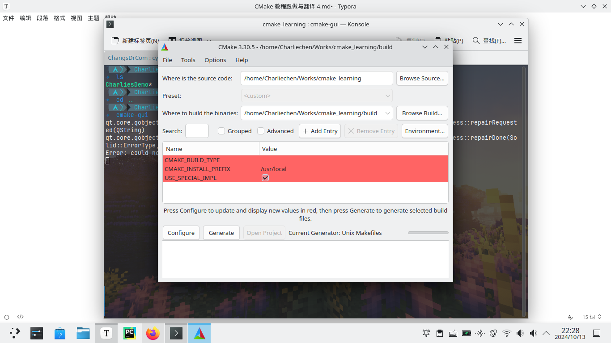

# CMake 教程跟做与翻译 4

## 添加一个option!

​	option，正如其意，就是选项的意思。我们这里需要演示一下option的做法。

​	option对于大型的工程必然是非常常见的：一些模块会被要求编译，另一些客户不准备需要这些模块。option就是将这种需求组织起来，让脚本构建者有了清晰的逻辑组成的抓手。

​	举个最最简单的例子。我们打算写一个模块，这个模块其实就是根据用户静态的选择打印不同的话：

> impl.c

```
void implA();
void implB();


void impl()
{
#ifdef USE_SPECIAL_IMPL
    implB();
#else
    implA();
#endif
}
```

> impl(A/B).c

```
// implA.c
#include <stdio.h>

void implA()
{
    printf("The Implement function is using Implements A");
}

// implB.c
#include <stdio.h>

void implB()
{
    printf("The Implement function is using Implements B");
    printf("\n which is surprised :)");
}
```

​	他们都在optional_implements文件夹中：

```
➜  tree -L 2
.
├── build
|   ├─ ... # Ommited
├── CMakeLists.txt
├── Config.h.in
├── main.c
├── MathLibs
│   ├── CMakeLists.txt
│   ├── mathLibs.c
│   └── mathLibs.h
└── optional_implements
    ├── implA.c
    ├── implB.c
    └── impl.c
```

​	下面就是在cmake中体现出来了,我们使用的就是option这个命令：

```
option(USE_SPECIAL_IMPL "the special implements of impl function" ON)
```

​	option这个命令的格式非常简单：就是目标控制变量 + 描述 + 默认定义。这里的ON表达是开启的意思。OFF就是关闭:

```
cmake .. -DUSE_SPECIAL_IMPL=OFF
```

​	cmake当中就是就是采用D + 控制变量名称=ON/OFF来决定的。

​	更好的办法是使用cmake-gui来进行可视化的构建：



​	我们继续实现这个根据option来决定编译行为不一致的实现。很简单，我们只需要控制：

```
if (USE_SPECIAL_IMPL)
    set(CharliesDemoSrc ${CharliesDemoSrc} optional_implements/implB.c)
else()
    set(CharliesDemoSrc ${CharliesDemoSrc} optional_implements/implA.c)
endif()


add_executable(CharliesDemo ${CharliesDemoSrc})

if (USE_SPECIAL_IMPL)
    target_compile_definitions(CharliesDemo PRIVATE "USE_SPECIAL_IMPL")
endif()
```


​	下面给出现在CMakeLists.txt脚本的全貌：

```
cmake_minimum_required(VERSION 3.30)

project(CharliesDemo
        VERSION 1.0)

set(CharlieConstVar 1)
set(CharlieConstDouble 1.1)

configure_file(Config.h.in Config.h)
add_subdirectory(MathLibs)
set(CharliesDemoSrc main.c optional_implements/impl.c)

option(USE_SPECIAL_IMPL "the special implements of impl function" ON)

if (USE_SPECIAL_IMPL)
    set(CharliesDemoSrc ${CharliesDemoSrc} optional_implements/implB.c)
else()
    set(CharliesDemoSrc ${CharliesDemoSrc} optional_implements/implA.c)
endif()


add_executable(CharliesDemo ${CharliesDemoSrc})

if (USE_SPECIAL_IMPL)
    target_compile_definitions(CharliesDemo PRIVATE "USE_SPECIAL_IMPL")
endif()

target_include_directories( CharliesDemo PUBLIC 
                            "${PROJECT_BINARY_DIR}"
                            "${PROJECT_SOURCE_DIR}/MathLibs")
target_link_libraries(CharliesDemo PUBLIC MathLib)
```

​	看官自行尝试cmake的使用

```
➜  cd build && cmake .. -DUSE_SPECIAL_IMPL=OFF && make
-- Configuring done (0.0s)
-- Generating done (0.0s)
-- Build files have been written to: /home/Charliechen/Works/cmake_learning/build
[ 16%] Building C object MathLibs/CMakeFiles/MathLib.dir/mathLibs.c.o
[ 33%] Linking C static library libMathLib.a
[ 33%] Built target MathLib
[ 50%] Building C object CMakeFiles/CharliesDemo.dir/main.c.o
[ 66%] Building C object CMakeFiles/CharliesDemo.dir/optional_implements/impl.c.o
[ 83%] Building C object CMakeFiles/CharliesDemo.dir/optional_implements/implA.c.o
[100%] Linking C executable CharliesDemo
[100%] Built target CharliesDemo
```

```
➜  ./CharliesDemo
VERISON_MAJOR: 11 + 2 = 3The Implement function is using Implements A⏎     
```


```
➜  cd build &&  cmake .. -DUSE_SPECIAL_IMPL=ON && make
-- Configuring done (0.0s)
-- Generating done (0.0s)
-- Build files have been written to: /home/Charliechen/Works/cmake_learning/build
[ 33%] Built target MathLib
[ 50%] Building C object CMakeFiles/CharliesDemo.dir/main.c.o
[ 66%] Building C object CMakeFiles/CharliesDemo.dir/optional_implements/impl.c.o
[ 83%] Building C object CMakeFiles/CharliesDemo.dir/optional_implements/implB.c.o
[100%] Linking C executable CharliesDemo
[100%] Built target CharliesDemo
```

```
VERISON_MAJOR: 11 + 2 = 3The Implement function is using Implements B
 which is surprised :)⏎  
```

