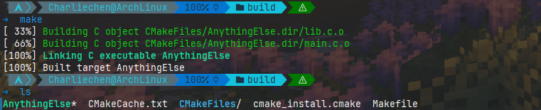

# CMake 教程跟做与翻译

## STEP 1: 入门与理解

​	我们起手的，最基本的 CMake 项目是从**单个源代码文件构建的可执行文件**。对于像这样的简单项目，只需要一个包含三个命令的 CMakeLists.txt 文件即可。

```cmake
cmake_minimum_required(VERSION 3.30)

project(CharliesDemo)

add_executable(CharliesDemo lib.c main.c)
```

​	如你所见，就是这样的简单，对应的文件树如下：

```
├── CMakeLists.txt
├── lib.c
├── lib.h
└── main.c
```


> 注意：尽管 CMake 支持大写、小写和混合大小写命令，但首选小写命令，并将在整个教程中使用小写命令。

​	任何项目的最顶层 CMakeLists.txt 都必须通过使用 `cmake_minimum_required()` 命令指定最低 CMake 版本来开始。这将建立策略设置并确保以下 CMake 函数使用兼容版本的 CMake 运行。

​	要启动项目，我们使用 project() 命令来设置项目名称。每个项目都需要此调用，并且应在cmake_minimum_required() 之后立即调用。正如我们稍后将看到的，此命令还可用于指定其他项目级信息，例如语言或版本号。

​	最后，add_executable() 命令告诉 CMake 使用指定的源代码文件创建可执行文件。

### cmake_minimum_required设置CMake版本的最小值

​	格式很简单，我们需要在一份CMake构建文本的最开头使用这个命令

```
cmake_minimum_required(VERSION 3.30)
```

​	这是因为不同版本的CMake对指令的支持程度不一致，有的时候必须要使用指定的版本进行构建。这里指定的是当前最新的3.30进行构建，对于自己的机器上，可以找到自己使用的cmake然后输入

```
cmake --version
```

​	返回自己使用cmake的版本进行参考。

### project声明工程属性

​	cmake当然需要知道我们构建的目标工程的名称，以及使用的语言等其他的信息。一个完整版的project指令比较复杂。笔者目前的工程比较小，因此常常使用到的无非就是名称，当然这是其更加完善的形式：

```
project(<PROJECT-NAME>
        [VERSION <major>[.<minor>[.<patch>[.<tweak>]]]]
        [DESCRIPTION <project-description-string>]
        [HOMEPAGE_URL <url-string>]
        [LANGUAGES <language-name>...])
```

### add_executable添加可执行文件

​	在我们只有零星几个文件的时候，这个指令只需要在目标后面光光添加文件就行，这如同我们的demo那样：

```
add_executable(CharliesDemo lib.c main.c)
```

​	就是将我们的project名称作为一个目标CharliesDemo，他由lib.c main.c构成。

​	值得注意的是，这个目标名是随意的！我们不一定非的是CharliesDemo这个ProjectName,他可以是任何你要的可执行文件名称：比如说我们修改脚本：

```
cmake_minimum_required(VERSION 3.30)
project(CharliesDemo)
add_executable(AnythingElse lib.c main.c)
```



## 使用CMake构建工程

​	写完CMakeLists了，我们就需要构建。这里先不讨论更加复杂的构建方式，就简单谈谈如何构建上述简单的小工程！

​	笔者建议在任何其他地方设置一个构建的目录build。作为演示，我们直接在源码路径下新建一个build文件夹存放任何编译Middlewares，这样，不会打乱源代码文件夹下的文件，方便我们查看索引！

​	我们首先创建一个build文件夹：

```shell
mkdir build
```

​	随后进入这个文件夹。一般的我们cmake不带任何参数说明的参数默认是源代码路径：

```
tree .

├── build
├── CMakeLists.txt
├── lib.c
├── lib.h
└── main.c
```

```
pwd
path/to/demo/build
cmake ..
```

​	cmake随后会输出一些构建信息，笔者的输出如下

```
➜  cmake ..
# 告知使用的编译器版本
-- The C compiler identification is GNU 14.2.1
-- The CXX compiler identification is GNU 14.2.1
# 检查C ABI
-- Detecting C compiler ABI info
-- Detecting C compiler ABI info - done
-- Check for working C compiler: /usr/bin/cc - skipped
# 检查特性是否符合构建要求
-- Detecting C compile features
-- Detecting C compile features - done
-- Detecting CXX compiler ABI info
-- Detecting CXX compiler ABI info - done
-- Check for working CXX compiler: /usr/bin/c++ - skipped
-- Detecting CXX compile features
-- Detecting CXX compile features - done
-- Configuring done (0.8s)
# 看到这里基本上没问题了——我们在Linux下默认生成的是Makefile,Windows则是会生成VS build Sln文件
# 当然你可以自己调整
-- Generating done (0.0s)
# 这里告诉你文件写到何处
-- Build files have been written to: /home/Charliechen/Works/cmake_learning/build
```

### 根据自己的构建工具自行构建

​	如果您设置了其他的构建工具——请自行查阅构建方式。笔者使用的Makefile很简单：make就行。

```
make
[ 33%] Building C object CMakeFiles/AnythingElse.dir/lib.c.o
[ 66%] Building C object CMakeFiles/AnythingElse.dir/main.c.o
[100%] Linking C executable AnythingElse
[100%] Built target AnythingElse
```

​	这样我们就拿到了可用的可执行文件。

## Reference

https://cmake.org/cmake/help/latest/command/cmake_minimum_required.html

https://cmake.org/cmake/help/latest/command/project.html