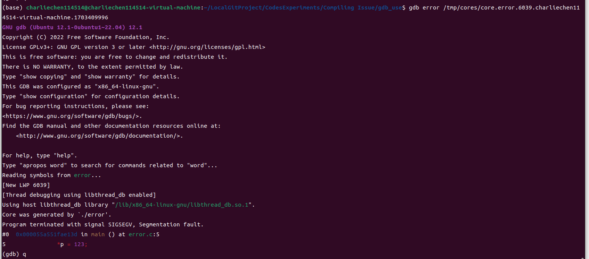

# GDB快捷使用小记

​		最近打算入门服务器开发和尝试无图形化界面的操作系统使用尝试，所以，为了使得自己习惯在没有图形化操作系统下进行撸代码的工作，这里写一篇博客记录一下自己的学习GDB的一些笔记。

> GDB的学习中文手册：[介绍 · 100个gdb小技巧 · 看云 (kancloud.cn)](https://www.kancloud.cn/wizardforcel/gdb-tips-100/146708)
>
> GDB手册：[Top (Debugging with GDB) (sourceware.org)](https://sourceware.org/gdb/current/onlinedocs/gdb.html/)

## 查看自己有没有GDB:

```shell
gdb -v

GNU gdb (Ubuntu 12.1-0ubuntu1~22.04) 12.1
Copyright (C) 2022 Free Software Foundation, Inc.
License GPLv3+: GNU GPL version 3 or later <http://gnu.org/licenses/gpl.html>
This is free software: you are free to change and redistribute it.
There is NO WARRANTY, to the extent permitted by law
```

​		如你所见，在命令行里最简单查看GDB的方式就是去使用gdb -v来检查一下环境有没有搞对。

## 打开core dump以确保程序发生崩溃的时候可以快速定位

​		首先，我们查看一下系统的ulimit设置

```
ulimit -a
```

```
core file size          (blocks, -c) 0
data seg size           (kbytes, -d) unlimited
scheduling priority             (-e) 0
file size               (blocks, -f) unlimited
pending signals                 (-i) 6942
max locked memory       (kbytes, -l) 64
max memory size         (kbytes, -m) unlimited
open files                      (-n) 65535
pipe size            (512 bytes, -p) 8
POSIX message queues     (bytes, -q) 819200
real-time priority              (-r) 0
stack size              (kbytes, -s) 8192
cpu time               (seconds, -t) unlimited
max user processes              (-u) 6942
virtual memory          (kbytes, -v) unlimited
```

​		关注core file size的那一行:发现这一行值是0，那就说明尚未启用。

> 只是临时开启：

```
ulimit -c unlimited
```

​		注意这个方法只会在当前的控制台下管用，其他进程的ulimit设置仍然不会改变。所以，可以考虑写入.bashrc，或者是有些办法是：

```
修改/etc/security/limits.conf

soft core unlimited
hard core unlimited
```

```
修改/etc/profile
ulimit -c unlimited
```

​		Ubuntu下这两种方法都是无效的。

​		然后，需要我们设置一下core dump文件位置，比如说可以：

```
cat /proc/sys/kernel/core_pattern
/tmp/cores/core.%e.%p.%h.%t
```

​		你也可以在这设置成想要保存core的路径。

​		为什么要开启这个呢?答案是方便我们快速的找到问题在哪里：

​		举个例子，在一个巨大无比的项目中你的程序突然崩溃了，所幸的是：你打开了core dump文件处理，现在,我们只需要拿到我们的core文件和诱发崩溃的可执行文件：（这个命名方式有一个好处就是可以直接看到诱发崩溃的可执行文件是哪个）

> 我的core文件在下面：

```
core.error.6039.charliechen114514-virtual-machine.1703409996
```

```
gdb error /tmp/cores/core.error.6039.charliechen114514-virtual-machine.1703409996
```



​		快捷的定位到位置。

## 常见的gdb使用小技巧

> 开始调试

```
r
```

> 单步执行

```
n
```

​		这是运行的意思

> 设置断点

1. 根据行号设置断点

```
第一种  (gdb) b 5 
```

```
第二种  (gdb) b test.c:5
```

2. 根据函数设置断点

```
(gdb) b main
```

3. 根据条件设置断点

```
(gdb) b test.c:10 if a == 1
```

4. 根据偏移量设置断点

```
(gdb) b +12
```

5. 根据地址设置断点

```
(gdb) b *0x40059b
```

6. 设置临时断点: 临时断点只生效一次

```
(gdb) tbreak test.c:12
```

注意，gdb调试要求先设置断点

预览源码：

```
layout src
```

​		可以实现分离控制台和源码窗口的效果。

```
disasmmble function
```

​		对特定的函数进行反汇编显示。
