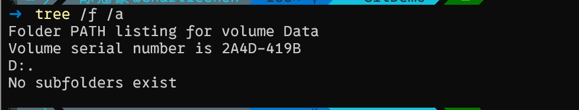

# Git学习小记`(I)`

​	最近闲来无事，打算重新简单的复盘一下Git的使用，我们下面来简单使用Git完成一次版本历史管理。

## 啥是 GIT ?

​	Git是软件工程发展的必然产物，它用于版本历史管理。面对日益膨胀的代码工程，我们很有必要有一个工具：来存储我们的代码历史记录，维护我们的代码安全，记录代码工作人员的提交记录（嗯，可以看看这段史山谁写的（大嘘））

​	你可以理解为玩游戏一般，到那一关了存个档，打废了可以回档，或者是跟兄弟一起合作通关处理存档，这个工具的作用跟我上面阐述的目标完全一致。所以，我们下面来试试看如何使用。

## 咋下Git

> [https://git-scm.com/downloads](https://link.zhihu.com/?target=https%3A//git-scm.com/downloads%EF%BC%8C%E5%A6%82%E4%B8%8B%E5%9B%BE%EF%BC%9A)

​	就在上面的这个网址，下载后，一个非常贴心的安装教程会给予你GUI操作关于更加详细的教程可以参看[Windows系统Git安装教程（详解Git安装过程） - 知乎 (zhihu.com)](https://zhuanlan.zhihu.com/p/242540359)

​	对于Linux内核的Unix操作系统用户，嗯，使用包管理器下载Git

​	在Ubuntu:

```
sudo apt-get install git
```

​	在Arch:

> 喜欢yay的

```
yay -S git
```

> 喜欢pacman的：

```
sudo pacman -S git
```

​	之后的配置邮箱和用户名，以及ssh操作，可以参考

> [手把手教你入门Git --- Git使用指南（Linux）_linux 用git-CSDN博客](https://blog.csdn.net/weixin_44966641/article/details/119791118)

## 如何开始我们的Git

​	对于个人开发的，或者是大部分场景下的git使用无非就是这几点：

```
git init
git add .
git commit -m "Commit Message"
git remote add RepositoryName RepoRemoteAddr
git push
git pull
...
```

​	等等，太多了，这些都是在干啥呢？我们一个个来：

## 工作区的创建

​	嘿！收拾收拾桌面，我们要开始建立一个工作区了！

​	好吧，其实也没那个必要，事实上你要做的是，新建一个文件夹。我瞧瞧：我在`D:\Demo`下新建了一个文件夹

> `PowerShell (Windows)`

```shell
mkdir GitDemo
cd GitDemo
```

> `Bash (Linux)`

```
mkdir GitDemo
cd GitDemo
```

​	这里就是我们的工作区了：

## git init

​	

​	还好，现在还挺清静的，我们的下一步就是在这个地方初始化git环境：

```
➜  git init
Initialized empty Git repository in D:/Demo/GitDemo/.git/
```

​	注意到了吗：我们的文件夹底下多了一个.git文件夹


​	默认的，**他是一个隐藏的文件夹，想要找到他，在`Windows`下打开显示隐藏文件夹的开关，在`Linux`下使用ls -a来在中断展示所有的文件，你就会看到.git了！**

​	我们下一步就是向里面写文件咯！

```
➜  echo "" > SomeThingNew.txt
➜  ls

    Directory: D:\Demo\GitDemo

Mode                 LastWriteTime         Length Name
----                 -------------         ------ ----
-a---            2024/4/8    19:21              2 SomeThingNew.txt
```

​	这是PowerShell的操作，Linux如法炮制。我们下一步才是关键的：

## git add .

​	这是干什么呢？添加文件吸纳进入Git管理系统。也就是说当我们打下这条指令的时候，这个文件夹下的所有文件都将会被打包上传到Git版本管理系统。简单的讲：就是经过一定的编码映射，压缩加密后存进`.git`文件夹下（嗯，这就是为什么有的时候项目管理文件夹大小会超级加倍，不过肯定会有压缩的）

​	对于添加单独的文件：

```
git add 文件名称
git add 文件夹名称 # 添加所有的当前文件夹下的文件
```

> 哦对了，说一个跟git无关的事情，那就是如果我们的文件名称含有空格，使用单引号或者是双引号括起来它！这是shell操作的事情，不再赘述了。否则我们会把单个单词当作token进行解析，会报一大堆文件没找到的错误`(A_A)`

​	我是懒狗，这一次我们直接全部添加

```
git add .
```

​	啥也没跳出来，没啥意思

## git status

​	查看文件状态！status是状态的意思，这里我们看看当前这个仓库的状态如何：

```
➜  git status
On branch master

No commits yet

Changes to be committed:
  (use "git rm --cached <file>..." to unstage)
        new file:   SomeThingNew.txt
```

​	嘿！看看他说了什么！

​	第一行话：

```
On branch master
```

​	什么意思呢？啊，大概就是我们在一个叫做master的分支，关于分支的操作我们将会在之后介绍，或者可以自行参考其他博客。如果没有什么直观的印象。。。嗯，看看这个（Github相信你用过 XD ）？


​	是的，可以认为这里的branch跟上面的很类似

```
No commits yet
```

​	这里说的是我们还没有提交。提交

## git commit -m "Messages"

​	我们下一步就是将我们的更改提交到本地仓库（也就是我们初始化的东西里去！）

```
git commit -m "Our First Demo Commit"
```

```
➜  git commit -m "Our First Demo Commit"
[master (root-commit) b520fef] Our First Demo Commit
 1 file changed, 1 insertion(+)
 create mode 100644 SomeThingNew.txt
```

​	看到了把，这里我们再复习一下

```
➜  git status
On branch master
nothing to commit, working tree clean
```

​	现在，我们的文件状态从Tracked（被跟踪的）走向了UnModified（未更改的），我稍后会介绍更多的状态。实际上在这里，如果我们的更改已经没啥好说的了话，直接下一步走远程提交就OK

​	但是我们不，我们想要修改一下文件

```
➜  echo "Our First Commit" > SomeThingNew.txt
➜  cat SomeThingNew.txt
Our First Commit
```

```
➜  git status
On branch master
Changes not staged for commit:
  (use "git add <file>..." to update what will be committed)
  (use "git restore <file>..." to discard changes in working directory)
        modified:   SomeThingNew.txt

no changes added to commit (use "git add" and/or "git commit -a")
```

​	提示了！我们的文件状态发生了改变，从unmodified变成了modified，这个时候，我们要是想要再次记录我们的修改，只需要

```
➜  git add .
➜  git status
On branch master
Changes to be committed:
  (use "git restore --staged <file>..." to unstage)
        modified:   SomeThingNew.txt
```

​	OK，我们的git status很清楚的指明了我们是修改了文件，于是版本控制系统只会随之修改那些被修改的部分。下一步就是

```
➜  git commit -m "Something changes!"
[master 45f87c1] Something changes!
 1 file changed, 1 insertion(+), 1 deletion(-)
```

​	提交成功。

## 提交与切换分支

> 处于政治原因，git本地段上的默认分支名称是master,而git上的默认分支名称是main，所以按照以往教程鲁莽的提交只会爆出很多错误，我们遵循这个流程：

```
git branch -M main
```

​	这个是做什么呢？实际上就是重命名我们的master分支为main分支

```
    -M                    move/rename a branch, even if target exists
```

​	使用这个指令看看效果：

```
git branch
* main
```

​	OK，现在我们的branch名称改正确了。下一步就是添加远程仓库：

```
 git remote add RemoteRepoName RemoteRepoAddress
```

​	RemoteRepoName其实就是你为远端仓库所起的名字，而我们的RemoteRepoAddress就是地址。举个例子，我有一个封装EasyX的项目，我想要绑定它到自己的本地仓库上：

```
git remote add origin https://github.com/Charliechen114514/MyEasyX.git
```

> 嘿！这个远程地址用自己新建的github仓库玩！

​	OK，现在绑定结束，我们把我们的push上去

```
git push
```

​	现在去你自己的github仓库上看看！成功了