# Qt6 编译著名Widgets组件 Qt Material Widgets MSVC / Mingw

## 前言

​	又到了笔者最喜欢的编译时间。笔者留意到全网没有人教授如何使用Qt6编译项目：https://github.com/laserpants/qt-material-widgets.git。特别是发现一部分人都是刻意回避Qt6编译该项目的。

​	现在笔者给出一份可行的方案来解决这个问题。

## 项目地址

```
git clone https://github.com/laserpants/qt-material-widgets.git
```

​	现在下来，然后我们开始。

## GCC / Mingw-GCC

​	不管如何，由于这个项目是Linux底下跑的，Windows上的Mingw-GCC编译器也是能用的。而且只需要改这些地方：

1. 由于Qt6开始StateMachine被独立出去成为一个单独的库。所以，请你在pro文件上，整点小小的修改

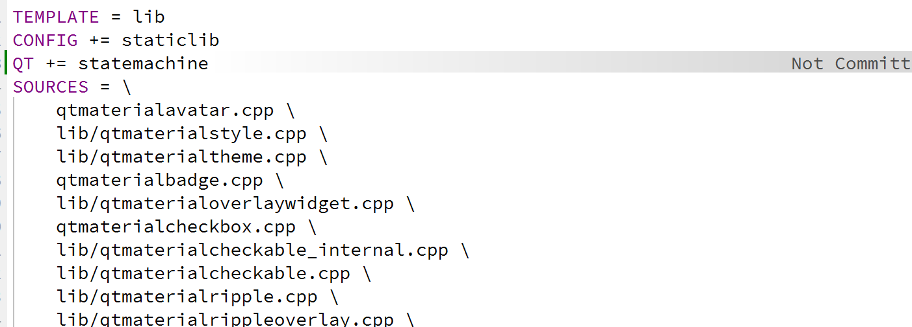

​	写上一行Qt += statemachine。否则会炸这个：

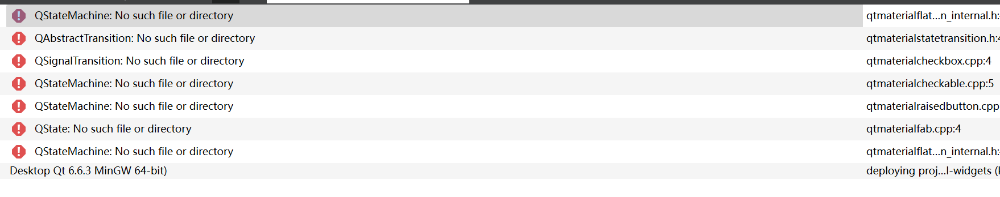

2. 确保自己选择的套件是GCC家的。

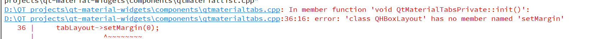

很快我们就遇到了麻烦。结合Qt家的文档，指出：API变更为setContentMargins(0, 0, 0, 0)

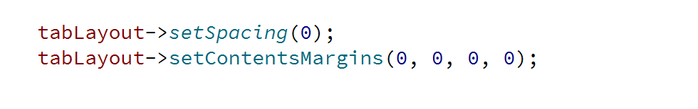

​	当然后面还会再炸一个这个错误！然后是这个：

```
label->setForegroundRole(QPalette::ForeGround);
```

​	改成QPalette::Base

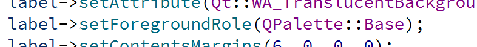

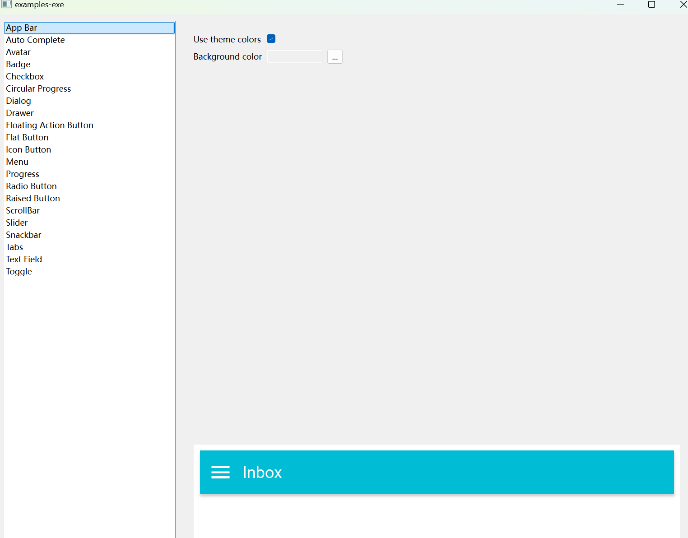

​	编译通过！成功运行

## But How Do MSVC?

​	但是笔者打算集成进入的项目是MSVC，这很有麻烦。你看，起手：

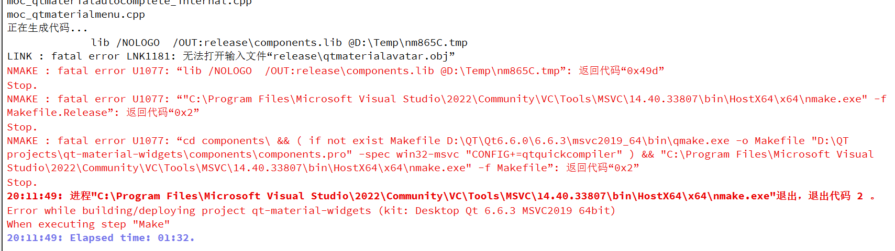

​	这个问题我看蒙了，因为这说明我们的QMake到Makefile没有正确映射。笔者后来查阅发现是顶层的.qmake.conf在作怪（隐藏文件的可以自己打开显示文件隐藏，但是源码目录文件已经读取配置，一个办法是删除build文件夹重新生成）笔者决定采用最次但是最管用的办法，那就是自己构建一个项目添加编译。

​	仿照我们的qt-material-widget来进行构建项目树：

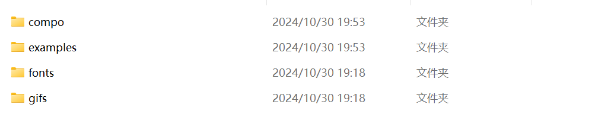

​	其中compo装着我们的components源码，examples, fonts, gifs是直接从源码中复制过来的，compo下面是我们自己新建的生成静态库的文件夹，其中这里把QMake文件复制在这里

```
QT += widgets statemachine

TEMPLATE = lib
CONFIG += staticlib

CONFIG += c++17

# You can make your code fail to compile if it uses deprecated APIs.
# In order to do so, uncomment the following line.
#DEFINES += QT_DISABLE_DEPRECATED_BEFORE=0x060000    # disables all the APIs deprecated before Qt 6.0.0

# 下面这两个直接复制components.pro文件夹的内容
SOURCES += \
	...

HEADERS += \
	...


RESOURCES += \
    resources.qrc

# Default rules for deployment.
unix {
    target.path = $$[QT_INSTALL_PLUGINS]/generic
}
!isEmpty(target.path): INSTALLS += target
```

​	现在，我们就可以开始了（当然记得把源码拷贝过来添加）现在我们发现，原先缺失编译的文件现在得到了正确的编译。

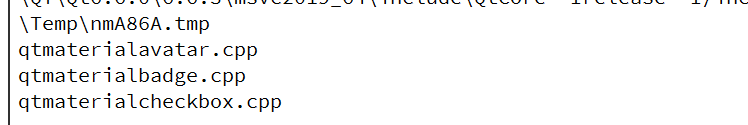

​	这些文件需要被纳入编译生成.o文件。

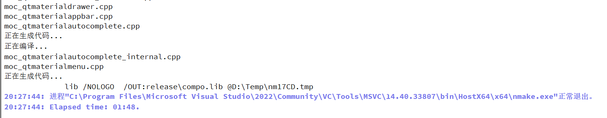

​	正常编译结束！

​	下面就是更改example.pro文件：

```
QT += core gui widgets statemachine
TEMPLATE = app
CONFIG += c++17
SOURCES = mainwindow.cpp \
	...
# 生成的lib放到build文件夹正下方
LIBS += compo.lib
# 保证我们可以索引到components头文件
INCLUDEPATH += ../../../compo/
TARGET = examples-exe
# 这里也是一样，保证我们可以被索引到这个静态库
PRE_TARGETDEPS += compo.lib

RESOURCES += \
    examples.qrc

FORMS += \
	...
```

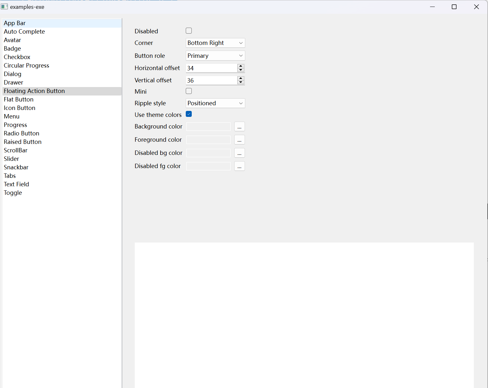

​	编译成功，大功造成！