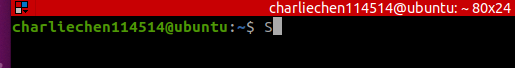
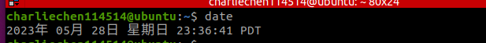
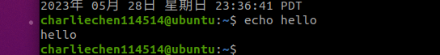
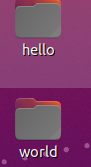
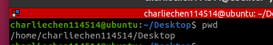
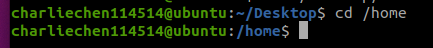
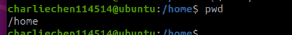
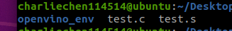

# The Missing Semester of Your CS Education By MIT

​	在计算机课堂上，我们的课堂内容可能会缺失一些内容。现在我们予以补充。从而帮助我们的开发。

## Lecture 1: Course Overview and The shell

### To make a start

​		This lecture is to overview the basic knowledge about the shell or the terminator in our personal computer. This is a essential step for us to move on the advanced Computer Science Education.

​	The shell, which can be considered as a simple wrap of operating system, is a place that we communicate with our computers. We may use them to start some appilications or programming. The shell can be also viewed as the command-line applications or text-operated applications!

​	In Windows, it is PowerShell, while in linux, it can be terminals. Others including bash or borning-again Shell.

​	You can open up a teminal in Linux like... For example, In Ubuntu, press Ctrl + Alt + P——you can get a window like this



​		In the top of the window, you could see your user-name and the operationg system you are used currently now. The blinking cursor could acctually catch up your attention to remind you input something here to start your work.

​		What we should input is a or multiple commands! For example, we could input :

```shell
date
```

​		and we undoubtedly get:>>>



​		and another simple and easy-doing command is `echo`! `echo` with no arguments except the text means to print something back what you have given on the command.



​		Remember, what is the top thing you should pay attention to is that the command and arguments use `SPACE` as a separator!which means that disobey the rule can sometime lead to  a result you unwanted. Take command `mkdir` as an example. When you input

```
mkdir hello world
```

​		It will sadly make two directories. One is hello, the other one is world (Kind of ridiculars!But that's true in Computer World, computers can not tell whether you want a dir called "Hello World" or you really want two directories called one is hello and the other is world)



​		Oh, to clean up, try:

```shell
rm -d hello
rm -d world
```

​		Fine.

​		Right, one thing you might get curious about is that —— How do computers KNOW "echo" is a command, or how do they know "rm" is a command comes from the abbrivation of "remove"? Actually, the computer itself has installed some programs when we installing the operating system. And `shell` itself has a way to find out the location of the command source file(Actually by PATH in the path file). To be brief, it does successfully by the UNVARIANT ENVIORNMENTAL VARIABLE. Well, anyone who has a basic experience of programming may has feeling that `shell` can be treated as a programming language. The truth is, YES!

​	So, what is a unvariant enviornmental variable? When we start some threads which containing multiple programs, these programs need to run in a target enviornment that requires some settings, the UNVARIANT ENVIORNMENTAL VARIABLE helps to set automatically when we open a shell, making us no need to set plenty of variables every time we open a terminal. For example: who we are, and what is the operating system we are using currently, and the most importantly——The PATH!

​	View the path by

```shell
echo $PATH
```

​		And my result is 

```
/opt/ros/noetic/bin:/home/charliechen114514/.local/bin:/usr/local/sbin:/usr/local/bin:/usr/sbin:/usr/bin:/sbin:/bin:/usr/games:/usr/local/games:/snap/bin
```

​		Right, it varies from different computers.

​		When we input a command, the shell pass through the whole $PATH and find  out a programmer that suits the name. 

​		To know the location of the target program, we can use

```
which echo
```


### What is a Path?

​		To be brief, path is a string variable that indicates the place where the file is. To make it seperate.

```
/ usr/bin/echo
/ : on the root
usr/ : on the usr
bin/ : on the bin
echo: the file is here, and the file'name is just the echo locates in
root > usr > bin.c In bin dir, you could find a file named as echo.
```

​		But there is an exception for windows. You see that Windows has different drivers including: C disk and D disk. Well, this means that the file data structure can actually be multi-tree structure, while Linux or MacOS one might be singled.

​		Abosolute Path, which is a sub-concept of Path, means that a path that can tell exactly where the file is. So it should start with the toppest locations—— In Linux, it should be root /. while in Windows, it start with the driver ID.(C:/ or D:/). and recurssionly find the file.

​		Another sub-concept called relative Path. which means the locations you get is the location that relative to where you run the shell. For example, We run a shell in the Desktop to find a directory called CharlieChen114514_A_EXPIRED_Dir in the user dir.(Well, above our current dir), we could get

```
../CharlieChen114514_A_EXPIRED_Dir
```

 		as a relative location.

​		Well, we can also get our current working directory by inputing:

```shell
pwd
```



​		 Working directory means that we could run the user-defined or user-created programs directly without the need to offer the path.and we can switch the working directory by `cd toWhere`.

```
cd /home
```

​		change the directory from the Desktop to our user directory.



​		The prompt has show the change.

​		if you are still concious about the locations, try pwd! as I've mentioned before.

```shell
>>>pwd
/home
```



​		Well. dot(.) and dot(..)	 owns the special meanings.

​		dot for the current file, while the .. means the upper class direactory/

​		Show the files or directories can use this:

```shell
ls
```



​		and we see the file actually.

​		The final important signal is ~

```
cd ~
```

​		and we back to the home dir.

```
cd - 
```

​		make us back to the previous directory.

```shell
ls --help
```

​		and we get tons of information about the 

```
Usage: ls [OPTION]... [FILE]...
List information about the FILEs (the current directory by default).
Sort entries alphabetically if none of -cftuvSUX nor --sort is specified.

Mandatory arguments to long options are mandatory for short options too.
  -a, --all                  do not ignore entries starting with .
  -A, --almost-all           do not list implied . and ..
      --author               with -l, print the author of each file
  -b, --escape               print C-style escapes for nongraphic characters
      --block-size=SIZE      with -l, scale sizes by SIZE when printing them;
                               e.g., '--block-size=M'; see SIZE format below
  -B, --ignore-backups       do not list implied entries ending with ~
  -c                         with -lt: sort by, and show, ctime (time of last
                               modification of file status information);
                               with -l: show ctime and sort by name;
                               otherwise: sort by ctime, newest first
  -C                         list entries by columns
      --color[=WHEN]         colorize the output; WHEN can be 'always' (default
                               if omitted), 'auto', or 'never'; more info below
  -d, --directory            list directories themselves, not their contents
  -D, --dired                generate output designed for Emacs' dired mode
  -f                         do not sort, enable -aU, disable -ls --color
  -F, --classify             append indicator (one of */=>@|) to entries
      --file-type            likewise, except do not append '*'
      --format=WORD          across -x, commas -m, horizontal -x, long -l,
                               single-column -1, verbose -l, vertical -C
      --full-time            like -l --time-style=full-iso
  -g                         like -l, but do not list owner
      --group-directories-first
                             group directories before files;
                               can be augmented with a --sort option, but any
                               use of --sort=none (-U) disables grouping
  -G, --no-group             in a long listing, don't print group names
  -h, --human-readable       with -l and -s, print sizes like 1K 234M 2G etc.
      --si                   likewise, but use powers of 1000 not 1024
  -H, --dereference-command-line
                             follow symbolic links listed on the command line
      --dereference-command-line-symlink-to-dir
                             follow each command line symbolic link
                               that points to a directory
      --hide=PATTERN         do not list implied entries matching shell PATTERN
                               (overridden by -a or -A)
      --hyperlink[=WHEN]     hyperlink file names; WHEN can be 'always'
                               (default if omitted), 'auto', or 'never'
      --indicator-style=WORD  append indicator with style WORD to entry names:
                               none (default), slash (-p),
                               file-type (--file-type), classify (-F)
  -i, --inode                print the index number of each file
  -I, --ignore=PATTERN       do not list implied entries matching shell PATTERN
  -k, --kibibytes            default to 1024-byte blocks for disk usage;
                               used only with -s and per directory totals
  -l                         use a long listing format
  -L, --dereference          when showing file information for a symbolic
                               link, show information for the file the link
                               references rather than for the link itself
  -m                         fill width with a comma separated list of entries
  -n, --numeric-uid-gid      like -l, but list numeric user and group IDs
  -N, --literal              print entry names without quoting
  -o                         like -l, but do not list group information
  -p, --indicator-style=slash
                             append / indicator to directories
  -q, --hide-control-chars   print ? instead of nongraphic characters
      --show-control-chars   show nongraphic characters as-is (the default,
                               unless program is 'ls' and output is a terminal)
  -Q, --quote-name           enclose entry names in double quotes
      --quoting-style=WORD   use quoting style WORD for entry names:
                               literal, locale, shell, shell-always,
                               shell-escape, shell-escape-always, c, escape
                               (overrides QUOTING_STYLE environment variable)
  -r, --reverse              reverse order while sorting
  -R, --recursive            list subdirectories recursively
  -s, --size                 print the allocated size of each file, in blocks
  -S                         sort by file size, largest first
      --sort=WORD            sort by WORD instead of name: none (-U), size (-S),
                               time (-t), version (-v), extension (-X)
      --time=WORD            with -l, show time as WORD instead of default
                               modification time: atime or access or use (-u);
                               ctime or status (-c); also use specified time
                               as sort key if --sort=time (newest first)
      --time-style=TIME_STYLE  time/date format with -l; see TIME_STYLE below
  -t                         sort by modification time, newest first
  -T, --tabsize=COLS         assume tab stops at each COLS instead of 8
  -u                         with -lt: sort by, and show, access time;
                               with -l: show access time and sort by name;
                               otherwise: sort by access time, newest first
  -U                         do not sort; list entries in directory order
  -v                         natural sort of (version) numbers within text
  -w, --width=COLS           set output width to COLS.  0 means no limit
  -x                         list entries by lines instead of by columns
  -X                         sort alphabetically by entry extension
  -Z, --context              print any security context of each file
  -1                         list one file per line.  Avoid '\n' with -q or -b
      --help     display this help and exit
      --version  output version information and exit

The SIZE argument is an integer and optional unit (example: 10K is 10*1024).
Units are K,M,G,T,P,E,Z,Y (powers of 1024) or KB,MB,... (powers of 1000).

The TIME_STYLE argument can be full-iso, long-iso, iso, locale, or +FORMAT.
FORMAT is interpreted like in date(1).  If FORMAT is FORMAT1<newline>FORMAT2,
then FORMAT1 applies to non-recent files and FORMAT2 to recent files.
TIME_STYLE prefixed with 'posix-' takes effect only outside the POSIX locale.
Also the TIME_STYLE environment variable sets the default style to use.

Using color to distinguish file types is disabled both by default and
with --color=never.  With --color=auto, ls emits color codes only when
standard output is connected to a terminal.  The LS_COLORS environment
variable can change the settings.  Use the dircolors command to set it.

Exit status:
 0  if OK,
 1  if minor problems (e.g., cannot access subdirectory),
 2  if serious trouble (e.g., cannot access command-line argument).

GNU coreutils online help: <https://www.gnu.org/software/coreutils/>
Full documentation at: <https://www.gnu.org/software/coreutils/ls>
or available locally via: info '(coreutils) ls invocation'
```

