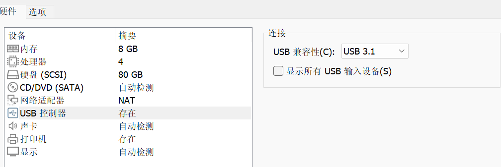
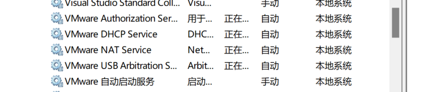

# 关于解决使用VMWare内的虚拟机无法识别USB问题小结

## 前言

​	笔者今天帮助一位同志解决了VMWare内的虚拟机不识别挂载设备的办法。这里对笔者使用的排查手段做一个总结。

## 0. 查看是不是没有开启USB3.0的支持

​	我们的第一件事情就是查看自己的USB的选择协议正不正确

​	大部分现代的USB设备都是3.0+设备，所以请您调整USB兼容性，然后重启虚拟机试试看。

## 1. 检查一下是否禁用了VMWare USB服务

​	正常来讲，这里的是VMWare USB是自动启动的，不是的话需要修改

## 2. 无奈之举

​	如果还不可以，注意

> 如果您的VMWare识别到了目标的挂载设备，但是是灰色的，完全无法进行配置项展开，以及VMWare版本偏老，那就看下面这个方法，笔者就是这样解决的

​	如果你的VMWare版本比较低（我指代的是15的版本，笔者现在用的是17.6就没有这个问题），你需要编辑一下.vmx文件，启用默认的USB允许挂在，办法就是定位到第28行的defaultAllow，将"FALSE"修改为"TRUE"，注意编码必须是GBK！（当然随自己电脑的主编码），不然VMWare会读取不到配置项目拒绝加载虚拟机。

​	现在重启虚拟机，试试看能否挂载识别设备。