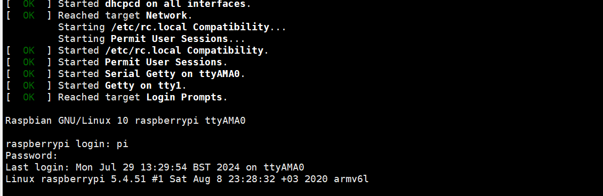
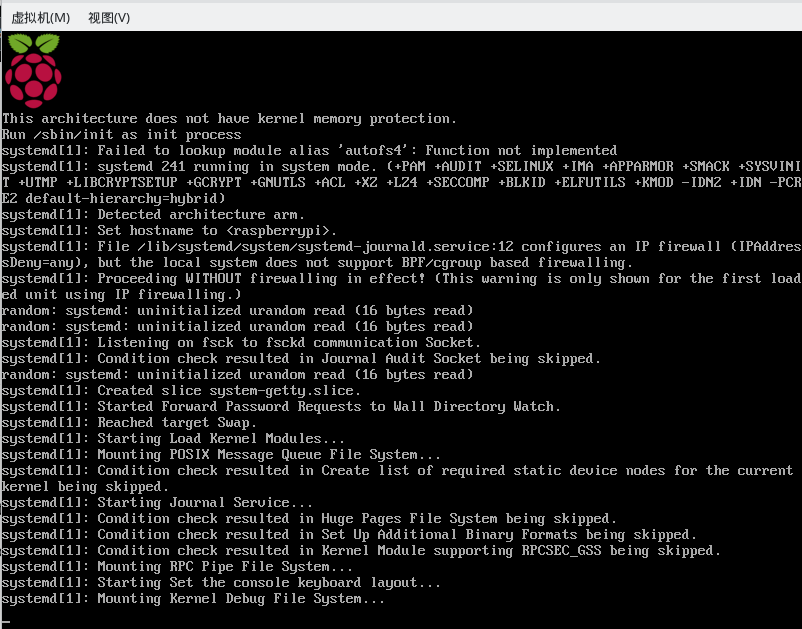
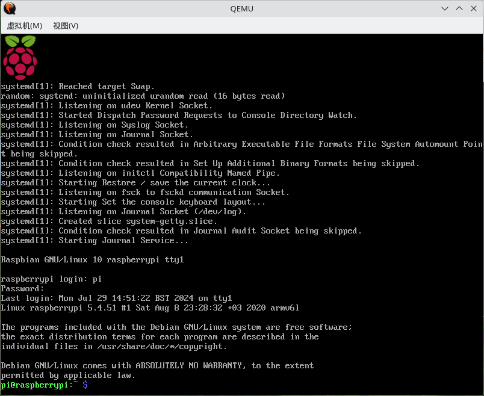

# 如何在Linux上构建Raspberry Pi虚拟环境

​	下面我们来讲讲如何使用QEMU来仿照树莓派环境。这里首先先分成两大类。第一类是跑比较老的，安全性较低的老树莓派，主要指代的是22年4月份发布之前的版本，这个版本当中，树莓派镜像自己内部就配置了一份默认的账户密码。对于之后的版本则不配备这种默认的账号密码。因此，我们需要区分出两种装载模式。

​	为了省力，我们使用人家已经配置好了的

> github仓库：[qemu-rpi-kernel](https:*//github.com/dhruvvyas90/qemu-rpi-kernel.git*)

## 前置环境需求

```
yay -S qemu-system-arm
```


## Older Version

​	考虑旧的树莓派镜像，安装的方式如下

1. 克隆仓库[qemu-rpi-kernel](https:*//github.com/dhruvvyas90/qemu-rpi-kernel.git*)到一个位置，取出里头的：

   ```
   kernel-qemu-5.4.51-buster
   versatile-pb-buster-5.4.51.dtb
   ```

   这两个文件到一个自己创建的目录文件夹下。我的是oldone

2. 下载旧树莓派镜像

   ```
   https://downloads.raspberrypi.org/raspios_lite_armhf/images/raspios_lite_armhf-2020-05-28/2020-05-27-raspios-buster-lite-armhf.zip
   ```

   wget还是扔浏览器自己点击，看自己兴趣。下载结束解压到上面创建的oldone文件夹下

3. 写一个简单的脚本

   ```
   qemu-system-arm \
     -M versatilepb \
     -cpu arm1176 \
     -m 256 \
     -drive "file=2020-05-27-raspios-buster-lite-armhf.img,
      if=none,index=0,media=disk,format=raw,id=disk0" 
     -device "virtio-blk-pci,drive=disk0,disable-modern=on,disable-legacy=off" \
     -net "user,hostfwd=tcp::5022-:22" \
     -dtb versatile-pb-buster-5.4.51.dtb \
     -kernel kernel-qemu-5.4.51-buster \
     -nographic \ # 提示，这个跟下面的console=ttyAMA0搭配使用，想要图形化输出请自行删掉提到的两行
     -append 'root=/dev/vda2 panic=1 console=ttyAMA0' \
     -no-reboot
   ```

   我先说说这些参数都是什么意思。

   > -M versatilepb:QEMU支持的板子里有这个，这个是我们树莓派的体系平台，选这个运行我们的树莓派仿真环境
   >
   > -cpu arm1176: CPU型号选择arm1176
   >
   > -m 256 内存大小是256MB，我看有Issue说最大就这个，不能再大了，有bug会，笔者这里尚未考证，不予评价
   >
   > 下面这一个长一些：实际上就是指定我们的镜像文件和索引格式：
   >
   > > `file=2020-05-27-raspios-buster-lite-armhf.img`：指定要使用的镜像文件。
   > >
   > > `if=none`：指定该驱动器不自动分配到任何接口。
   > >
   > > `index=0`：设置驱动器的索引为0。
   > >
   > > `media=disk`：指定媒体类型为磁盘。
   > >
   > > `format=raw`：指定镜像文件的格式为raw（原始格式）。
   > >
   > > `id=disk0`：为该驱动器指定一个唯一的ID（disk0）。
   >
   > 下面的这个是指定输入输出：
   >
   > > `virtio-blk-pci`：指定设备模型为VirtIO块设备（通过PCI总线连接的VirtIO块设备）。VirtIO设备通常用于提高虚拟化性能。
   > >
   > > `drive=disk0`：将这个设备与之前定义的ID为`disk0`的驱动器关联起来。
   > >
   > > `disable-modern=on`：禁用现代（modern）VirtIO设备特性。这些特性通常提供更高的性能，但可能与某些旧的系统不兼容。
   > >
   > > `disable-legacy=off`：启用传统（legacy）VirtIO设备特性。这些特性通常用于兼容旧的系统。
   >
   > -net配置网络：`user`：使用用户模式网络栈。这是QEMU的一种网络配置方式，适合不需要复杂网络配置的场景。`hostfwd=tcp::5022-:22`：设置端口转发规则，将主机的TCP端口5022转发到虚拟机的TCP端口22。
   >
   > -dtb：指定设备树，这里用配好的
   >
   > -kernel是使用到的内核：kernel-qemu-5.4.51-buster
   >
   > -no-reboot：虚拟机关机或崩溃时，阻止它自动重启（关了我们怎么看日志呢hhh）
   >
   > -nographic:不启用图形化，这个看心情指定，注意的是这个跟console=ttyAMA0一起用
   >
   > 下面的--append说的是追加内核启动参数：
   >
   > > `root=/dev/vda2`：指定根文件系统所在的设备。这里假设根文件系统位于虚拟磁盘的第二个分区。
   > >
   > > `panic=1`：在内核遇到致命错误时，指定在1秒后自动重启。
   > >
   > > `console=ttyAMA0`：指定内核控制台输出到`ttyAMA0`，通常用于ARM架构的串口控制台。

​	下面就可以启动了，我想要提到的是，由于这玩意内存就给256M，可以说启动相当的缓慢，因此，有点耐心，好几次笔者以为是配置挂了反复检查，直到吃饭回来才发现跑通的本来

​	总结一下，如果看官希望采用的是非图形化的输出，需要写入的脚本是：

```
qemu-system-arm \
  -M versatilepb \
  -cpu arm1176 \
  -m 256 \
  -drive "file=2020-05-27-raspios-buster-lite-armhf.img,
   if=none,index=0,media=disk,format=raw,id=disk0" 
  -device "virtio-blk-pci,drive=disk0,disable-modern=on,disable-legacy=off" \
  -net "user,hostfwd=tcp::5022-:22" \
  -dtb versatile-pb-buster-5.4.51.dtb \
  -kernel kernel-qemu-5.4.51-buster \
  -nographic \
  -append 'root=/dev/vda2 panic=1 console=ttyAMA0' \
  -no-reboot
```

​	下面只需要

```
chmod 777 <脚本名称>.sh
./<脚本名称>.sh
```

​	很快就会刷屏

> 笔者建议使用非图形化的方式启动，日志更加丰富，而且可以实时看看进度。图形化的方式则会缺斤少两，导致一些长时间的加载被误认为是kernel挂了（我自己）



​	这是结束时候的画面，默认的，旧版本下的账号密码是：登录用户名为pi，该账户默认密码是raspberry，之后想要改passwd更改就好。

​	如果想要以图形化的方式启动：

```
qemu-system-arm \
  -M versatilepb \
  -cpu arm1176 \
  -m 256 \
  -drive "file=2020-05-27-raspios-buster-lite-armhf.img,
   if=none,index=0,media=disk,format=raw,id=disk0" 
  -device "virtio-blk-pci,drive=disk0,disable-modern=on,disable-legacy=off" \
  -net "user,hostfwd=tcp::5022-:22" \
  -dtb versatile-pb-buster-5.4.51.dtb \
  -kernel kernel-qemu-5.4.51-buster \
  -append 'root=/dev/vda2 panic=1' \
  -no-reboot
```





## 新版本启动

​	我们这一次玩一个新的，这一次我们尝试跑最新版本的树莓派镜像，有了旧版本的经验，事情垂手可得，但是这次我们要注意的是，我们必须先用非图形化的方式跑一次（可以不用吗，可以，但是我懒得改文件）

​	这是因为我们需要被引导设置账号密码，新版本的树莓派OS不再提供默认的账号密码了！剩下的都一样！这里不再赘述

