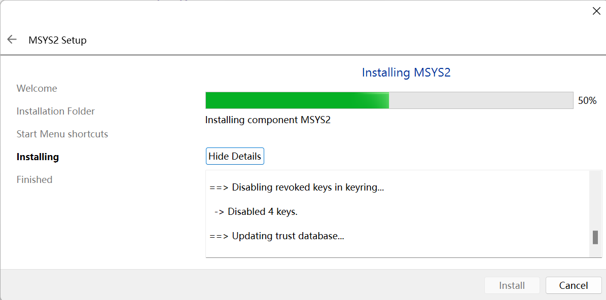
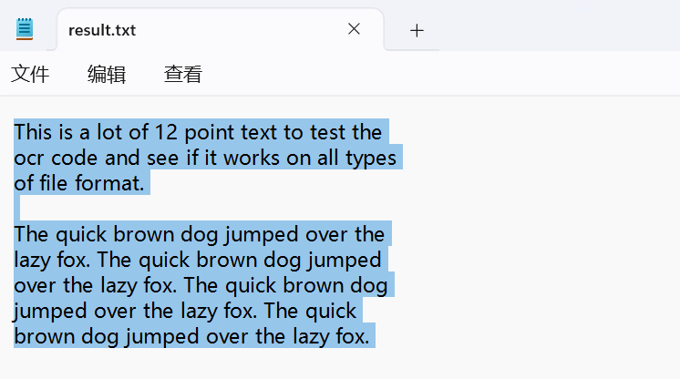

# 如何在Windows上编译可用的Tesseract OCR in C++ 并部署在Visual Studio与Qt6上

## 前言

​	本教程是一个截止至2024年7月11日最新的，旨在编译可以运行在x86_64结构上的，其操作系统是Windows11的机器上的，谷歌著名的光学识别库Tessereact OCR。本篇教程将会编译产生：

- 使用msys环境下的，使用mingw64编译器编译的Tessereact OCR动态库
- 使用基于vcpkg的，于msvc19编译器编译的Tessereact OCR动态库

​	文章的最后将会放上Github仓库与自己写的极简的包装器（问就是手动释放折磨人，智能指针万岁！）

### 阅前提示

​	出于一些大家都知道的原因，使用一台没有VPN代理软件的机器编译来自国外的优秀软件是一件相当折磨人的事情，所以如果您想要按照本篇教程进行编译，请先：

> 1. 机器上有足够的内存，硬存条件
> 2. 有一个可用的代理软件，或者，您的网络可以流畅的使用git下载软件，或者是在vcpkg运行时补齐相关的依赖

## 导言

> Tesseract 项目地址：[tesseract-ocr/tesseract: Tesseract Open Source OCR Engine (main repository) (github.com)](https://github.com/tesseract-ocr/tesseract)，我们的项目地址，等会从这里开始折磨
>
> Tesseract用户侧与开发侧手册：[Tesseract User Manual | tessdoc (tesseract-ocr.github.io)](https://tesseract-ocr.github.io/tessdoc/Home.html)，我们的开发手册，开发的时候别听某些瞎写的博客乱逼逼，有的时候以这个为准

​	下文是对简介的翻译：

​	Tesseract 是一个开源文本识别 (OCR) 引擎，遵循 Apache 2.0 许可。（人话：记得你自己用完了发布项目的时候带上这个许可） 主要版本 5 是当前稳定版本，于 2021 年 11 月 30 日发布 5.0.0 版。 GitHub 提供较新的次要版本和错误修复版本。 GitHub 上的主分支提供最新源代码。未解决的问题可以在问题跟踪器和计划文档中找到。 Tesseract 可以直接通过命令行使用，或者（对于程序员）通过使用 API 从图像中提取打印文本。它支持多种语言。Tesseract 没有内置 GUI，但第三方页面提供了几种。Tesseract 的外部工具、包装器和培训项目列在 AddOns 下。 

​	**Tesseract 可以在您自己的项目中使用，但需遵守 Apache 许可 2.0 的条款。它具有功能齐全的 API，可以针对包括 Android 和 iPhone 在内的各种目标进行编译。**请参阅 3rdParty 和 AddOns 页面，了解已完成的操作示例。

​	下面进入正题：开始编译！

## 使用基于vcpkg的，于msvc19编译器编译的Tessereact OCR动态库

### 使用vcpkg辅助我们的编译

​	我看很多博客并没有使用包管理器辅助我们构建软件的意识，这里我们将会使用vcpkg包管理器来辅助我们的编译，帮助我们在编译时补全相关的依赖。

> 什么是vcpkg，就看看巨硬的文档吧！ [vcpkg 概述 | Microsoft Learn](https://learn.microsoft.com/zh-cn/vcpkg/get_started/overview)
>
> 安装时可以参考的流程：[在 Visual Studio 中使用 CMake 安装和管理包 | Microsoft Learn](https://learn.microsoft.com/zh-cn/vcpkg/get_started/get-started-vs?pivots=shell-cmd)

### 正文

​	下面，我们开始使用git安排vcpkg：

​	找一个硬存空间较大的地方，比如说我的D盘：

```powershell
➜  dir		# 我在D盘下
	目录: D:\
➜  $Env:http_proxy="http://127.0.0.1:7890";$Env:https_proxy="http://127.0.0.1:7890" # 设置自己的代理
➜  git clone https://github.com/microsoft/vcpkg.git
Cloning into 'vcpkg'...
remote: Enumerating objects: 240417, done.
remote: Counting objects: 100% (23483/23483), done.
remote: Compressing objects: 100% (944/944), done.
remote: Total 240417 (delta 23000), reused 22547 (delta 22539), pack-reused 216934
Receiving objects: 100% (240417/240417), 71.03 MiB | 2.00 MiB/s, done.
Resolving deltas: 100% (160646/160646), done.
Updating files: 100% (11502/11502), done.
```

>如果自己不会设代理。。。哈？去网上查查，懒得查来我这篇看：
>
>[OpenCV4.9.0 + 扩展 + WITH_QT（Qt6）模块编译教程（Windows）_opencv4.9 qt-CSDN博客](https://blog.csdn.net/charlie114514191/article/details/135922310)

​	下一步，进入目录初始化他：

```
➜  cd vcpkg
➜  bootstrap-vcpkg.bat
Downloading https://github.com/microsoft/vcpkg-tool/releases/download/2024-06-10/vcpkg.exe -> D:\vcpkg\vcpkg.exe (using proxy: http://127.0.0.1:7890)... done.
Validating signature... done.

vcpkg package management program version 2024-06-10-02590c430e4ed9215d27870138c2e579cc338772

See LICENSE.txt for license information.
Telemetry
---------
vcpkg collects usage data in order to help us improve your experience.
The data collected by Microsoft is anonymous.
You can opt-out of telemetry by re-running the bootstrap-vcpkg script with -disableMetrics,
passing --disable-metrics to vcpkg on the command line,
or by setting the VCPKG_DISABLE_METRICS environment variable.

Read more about vcpkg telemetry at docs/about/privacy.md
```

​	现在可以用vcpkg来下载包了，注意使用他下载的时候挂代理，不然的话就会很慢。

> I. 只是想用一用，不想持久化的使用它管理（我）

```
cd vcpkg
vcpkg install tesseract
```

> II. 想要到处使用：
>
> 很简单！自己把自己的vcpkg目录添加进入环境变量就行了
>
> btw:现在的Windows不需要重启就可以读取环境变量，因为所有的主程序都会在载入内存的时候发起请求载入环境变量的动作，所以正确的做法是重启软件而不是重启操作系统！
>
> ```
> vcpkg install tesseract
> ```

​	嗯，第一次下载需要进行漫长的编译，我是经历了几个小时的折磨。

​	我们的所需品在：

```powershell
# vcpkg/installed/x64-windows/*
➜  tree .
Folder PATH listing for volume Data
Volume serial number is 2A4D-419B
D:\VCPKG\INSTALLED\X64-WINDOWS
├───bin
├───debug
│   ├───bin
│   └───lib
│       └───pkgconfig
├───include
│   ├───curl
│   ├───leptonica
│   ├───libpng16
│   ├───libxml
│   ├───libxml2
│   │   └───libxml
│   ├───lzma
│   ├───openjpeg-2.5
│   ├───openssl
│   ├───tesseract
│   │   ├───api
│   │   ├───arch
│   │   ├───ccmain
│   │   ├───ccstruct
│   │   ├───ccutil
│   │   ├───classify
│   │   ├───cutil
│   │   ├───dict
│   │   ├───lstm
│   │   ├───textord
│   │   ├───viewer
│   │   └───wordrec
│   └───webp
│       └───sharpyuv
├───lib
│   └───pkgconfig
├───share
│   ├───bzip2
│   ├───curl
│   ├───doc
│   │   └───xz
│   │       └───examples
│   ├───gif
│   ├───giflib
│   ├───iconv
│   ├───jpeg
│   ├───leptonica
│   ├───libarchive
│   ├───libiconv
│   ├───libjpeg-turbo
│   ├───liblzma
│   ├───libpng
│   ├───libwebp
│   ├───libxml2
│   ├───lz4
│   ├───openjpeg
│   ├───openssl
│   ├───png
│   ├───tessdata
│   │   ├───configs
│   │   └───tessconfigs
│   ├───tesseract
│   ├───tiff
│   ├───vcpkg-cmake
│   ├───vcpkg-cmake-config
│   ├───vcpkg-cmake-get-vars
│   │   └───cmake_get_vars
│   ├───WebP
│   ├───zlib
│   └───zstd
└───tools
    ├───bzip2
    ├───curl
    │   ├───bin
    │   └───debug
    │       └───bin
    ├───libiconv
    │   ├───bin
    │   └───debug
    │       └───bin
    └───tesseract
```

> 有朋友可能会出现vcpkg下包的Error: [2024最新版Vcpkg安装第三方库报错error: building XXXX failed with: BUILD_FAILED_vcpkg 卡在-- building x64-linux-dbg-CSDN博客](https://blog.csdn.net/weixin_74027669/article/details/139796202)\
>
> 这个CSDN博客解决了我的问题：记得保持vcpkg本地和上游的同步！`(git pull; vcpkg update)`

​	至此完成了编译。

## 使用msys2环境下的，使用mingw64编译器编译的Tessereact OCR动态库

​	这个可就折磨人了，无论是官方还是民间给的可参考文献寥寥无几，只好自己摸索。但是没关系，既然这篇文章出现在这里，说明基本上的共同问题已经解决了，文章的大幅度也是描述这个的。

### 什么是msys2

> msys的官方简介：[MSYS2](https://www.msys2.org/)

​	MSYS2 是一组工具和库，为您提供了一个易于使用的环境，用于构建、安装和运行原生 Windows 软件。 它由一个名为 mintty 的命令行终端、bash、git 和 subversion 等版本控制系统、tar 和 awk 等工具甚至 autotools 等构建系统组成，所有这些都基于 Cygwin 的修改版本。尽管其中一些核心部分基于 Cygwin，但 MSYS2 的主要重点是为原生 Windows 软件提供构建环境，并将 Cygwin 使用部分保持在最低限度。MSYS2 为 GCC、mingw-w64、CPython、CMake、Meson、OpenSSL、FFmpeg、Rust、Ruby 等提供最新的原生版本。 

​	为了提供软件包的轻松安装和保持更新的方法，**它提供了一个名为 Pacman 的软件包管理系统，Arch Linux 用户应该很熟悉它**（还真是，来自Arch Linux 用户的肯定）。它带来了许多强大的功能，例如依赖性解析和简单的完整系统升级，以及直接且可复制的软件包构建。我们的软件包存储库包含 3200 多个可立即安装的预构建软件包。

​	**说了这么多，其实就是提供一个 Mingw 编译器都认的环境，不会出现跨编译器的包的链接导致大串的未定义符号问题，其次，提供一个补全依赖的包管理器辅助我们进行包管理**，我们下面开始安装

>5月7日的release：https://github.com/msys2/msys2-installer/releases/download/2024-05-07/msys2-x86_64-20240507.exe
>
>最新的release去[MSYS2](https://www.msys2.org/)上下载

​	值得注意的是，安装中会卡在50%好一会儿，安装包此时正在注册可用的数据库，因此需要花费一些时间，不是安装出现的错误，只是安装所必需要的时间罢了。




### 安装前，我们也许。。。

#### [Option]更改用户名

​	至少，我的电脑的用户名是中文的，Msys会继承这一名称，他所惯用的字符集是utf8的，意味着会出现很不友好的字符乱码的行为，所以，改个用户名

​	在Windows搜索菜单找到Msys2,运行他


​	在控制台下：

```
$ /usr/bin/mkpasswd.exe > /etc/passwd
```

​	然后去自己的安装位置下，找到etc目录，用记事本编辑`/etc/passwd`，如果发现自己的最后一行出现了中文（那是你的用户名），改成英文，比如说我：

```
Charliechen:*:197609:197121:U-Charliechen\Charliechen,S-1-5-21-611203946-4106071162-1991142053-1001:/home/Charliechen:/usr/bin/bash
```

​	再次运行，同时看看自己的home目录下有没有多出自己刚编辑的用户名文件夹。

#### [Option]添加一下Path（更改了用户名的需要做）

> 我们的msys随的是bash的规范，也就是说，我们的msys软件首先是读取的是用户的配置，在下面这个地方，我们可以预先写上我们想要在msys2加载的时候运行的shell指令
>
> 
>
> 这里标上Option是因为我自己后续安装包的时候发现它并没有识别到在mingw64文件夹下的包，我必须自己手动加入，如果后续下载包发现不添加这里的PATH也能正确的识别到自己下载的依赖软件的话，这一步可以不做！

> 在.bashrc文件下：添加

```shell
export PATH=$PATH:/d/msys64/mingw64/bin:/d/msys64/mingw64/etc:/d/msys64/mingw64/include:/d/msys64/mingw64/lib:/d/msys64/mingw64/share # 添加目标编译器的路径,如果使用clang 64位编译器的话就添加clang64的，其他雷同
```

#### [Option]配置默认的代理（对自己网速没有任何信心的，请）

​	还是一样，不过我们添加代理需要遵循的是bash的语法：

> 在.bashrc文件下：添加

```
export http_proxy=127.0.0.1:7890
export https_proxy=127.0.0.1:7890
```

### 正文1 ： 使用全新的编译器编译Tesseract OCR C++

#### 配齐基本工具链和依赖

​	下面需要做的是根据自己的编译器来选择自己的依赖开发组件。在使用基于vcpkg的，于msvc19编译器编译的Tessereact OCR动态库的过程中，我们已经预见了可能使用到的依赖，这里，我们列出可能需要的依赖：

> 我们假定我们在x86_64平台上的mingw编译器为代表列出可能需要下载的依赖。

>base-devel msys2-devel mingw-w64-x86_64-toolchain: 基本的编译套装，值得注意的是：这里编译出的库最好是给由编译同一编译器编译出的软件使用！（为正文2埋下伏笔）
>
>git: 你猜猜我们怎么下代码（不是）
>
>mingw-w64-x86_64-asciidoc mingw-w64-x86_64-cairo mingw-w64-x86_64-curl mingw-w64-x86_64-icu mingw-w64-x86_64-leptonica mingw-w64-x86_64-libarchive mingw-w64-x86_64-pango mingw-w64-x86_64-zlib ：Tessereact 编译+运行时依赖
>
>mingw-w64-x86_64-autotools ，mingw-w64-x86_64-cmake

```
pacman -S base-devel msys2-devel mingw-w64-x86_64-toolchain git mingw-w64-x86_64-asciidoc mingw-w64-x86_64-cairo mingw-w64-x86_64-curl mingw-w64-x86_64-icu mingw-w64-x86_64-leptonica mingw-w64-x86_64-libarchive mingw-w64-x86_64-pango mingw-w64-x86_64-zlib mingw-w64-x86_64-autotools mingw-w64-x86_64-cmake
```

> 有人可能需要使用clang来编译，或者是urct等，可以自行pacman -Ss 查找包名，例子：
>
> ```
> $ pacman -Ss cmake
> clangarm64/mingw-w64-clang-aarch64-ccmake 3.29.2-2
>  A cross-platform open-source make system (mingw-w64) (curses GUI)
> clangarm64/mingw-w64-clang-aarch64-cmake 3.29.2-2
>  A cross-platform open-source make system (mingw-w64)
> clangarm64/mingw-w64-clang-aarch64-cmake-cmcldeps 3.29.2-2
>  CMake wrapper for cl to extract dependencies (mingw-w64)
> ...
> ```
>
> 根据自己的目标编译器下包！mingw编译器的就需要选择前缀是mingw-w64-x86_64-， clang编译器的：mingw-w64-clang-x86_64-... 看看自己的pacman -Ss输出就好！（**注意编译套装和依赖要一平齐**）

​	上面的这些依赖大约1.5G，泡杯茶休息一下吧！

​	下载完毕后，测试一下：

```
$ cmake -version
cmake version 3.29.2
CMake suite maintained and supported by Kitware (kitware.com/cmake).
```

​	如果这里告诉你Unknown Command，就回到《安装前，我们也许。。。》的章节部分的《添加Path》部分，把这个事情做完重启msys就好了。

#### 下载源码

​	跟随我的步伐~

```
Charliechen@Charliechen MINGW64 ~
$ echo $https_proxy	# 查看自己的代理（我网菜）
127.0.0.1:7890

Charliechen@Charliechen MINGW64 ~
$ git clone https://github.com/tesseract-ocr/tesseract tesseract
Cloning into 'tesseract'...
remote: Enumerating objects: 47934, done.
remote: Counting objects: 100% (412/412), done.
remote: Compressing objects: 100% (252/252), done.
remote: Total 47934 (delta 199), reused 253 (delta 153), pack-reused 47522
Receiving objects: 100% (47934/47934), 52.30 MiB | 4.29 MiB/s, done.
Resolving deltas: 100% (37371/37371), done.
Updating files: 100% (729/729), done.

Charliechen@Charliechen MINGW64 ~
$ cd tesseract/

Charliechen@Charliechen MINGW64 ~/tesseract
$ ls
AUTHORS          INSTALL.GIT.md  autogen.sh          java      tesseract.pc.cmake
CITATIONS.bib    LICENSE         cmake               m4        tesseract.pc.in
CMakeLists.txt   Makefile.am     configure.ac        snap      test
CONTRIBUTING.md  README.md       doc                 src       unittest
ChangeLog        VERSION         docker-compose.yml  sw.cpp
INSTALL          appveyor.yml    include     
```

​	我们下面开始构建源码。

#### 构建源码

​	使用CMake的经典步骤！

```shell
Charliechen@Charliechen MINGW64 ~/tesseract
$ pwd
/home/Charliechen/tesseract

Charliechen@Charliechen MINGW64 ~/tesseract
$ mkdir build && cd build

Charliechen@Charliechen MINGW64 ~/tesseract/build
$ pwd
/home/Charliechen/tesseract/build
```

​	我们使用的是默认的默认的编译器，而且，默认的CMakeLists是指定使用SW包管理管理依赖，事实证明，这个玩意我开代理都救不了的狗屎东西，所以，我们需要设置cmake的参数为：

> -DSW_BUILD=0 表示不用sw构建程序，Sw即Software Network也是一个开源安装器
>
> -DCMAKE_INSTALL_PREFIX=/usr/local 表示将程序安装到/usr/local
>
> 其他的参数按照自己的需求加

```
Charliechen@Charliechen MINGW64 ~/tesseract/build
$ pwd
/home/Charliechen/tesseract/build

Charliechen@Charliechen MINGW64 ~/tesseract/build
$ cmake .. -G"MinGW Makefiles" -DSW_BUILD=0 -DCMAKE_INSTALL_PREFIX=/usr/local
-- Setting policy CMP0091 to NEW
-- The C compiler identification is GNU 13.2.0
-- The CXX compiler identification is GNU 13.2.0
-- Detecting C compiler ABI info
-- Detecting C compiler ABI info - done
-- Check for working C compiler: D:/msys64/mingw64/bin/cc.exe - skipped
-- Detecting C compile features
...
-- Configuring done (23.6s)
-- Generating done (0.7s)
-- Build files have been written to: D:/msys64/home/Charliechen/tesseract/build
```

​	仔细看看控制台，有没有fatal error，如果我们上面的事情都做好了，一般不会出现问题，出现问题自行Github Issue之。少依赖了自行配置之！

​	完成后，马力全开

>`--build .`: 在当前目录下展开构建
>
>`-j$(nproc)`：以最大可支持的线程数进行编译。
>
>`--config Release`：配置为发布版本（无调试信息）。
>
>`--target install`:对生成的目标进行install操作（等价于make install在这里）

```
$ cmake --build . -j$(nproc)  --config Release --target install
```

​	好消息是：不用泡茶，构建相当迅速。整个流程甚至连一个Warning都没有。当然，仅限全新的默认工具链！（写完这句话编译完了）

```
...
-- Installing: D:/msys64/usr/local/bin/unicharset_extractor.exe
-- Installing: D:/msys64/usr/local/bin/text2image.exe
```

​	现在我们看看

```powershell
➜  tree .
Folder PATH listing for volume Data
Volume serial number is 2A4D-419B
D:\MSYS64\USR\LOCAL	# /usr/local/ 在Window上的等价映射
├───bin
├───etc
├───include
│   └───tesseract
├───lib
│   ├───cmake
│   │   └───tesseract
│   └───pkgconfig		# 有pkgconfig，可以CMake下用PKG_CONGIG来找包引入了
└───share
    └───tessdata
        ├───configs
        └───tessconfigs
```

​	我们可以玩玩这个库了！按照一般的测试流程就行！这里不加以演示了。

### 正文2：以Qt为例，部署到目标项目里集成使用

​	到这里，我们实际上可以使用Tesseract了，但是我自己在移植到其他平台上进行开发的时候发现了由于编译器的微妙差别和库依赖的问题，实际上仍然困难重重。。。代表性的有：

```
undefined reference to `std::__cxx11::basic_string<char, std::char_traits<char>, std::allocator<char> >::_M_replace_cold(char*, unsigned long long, char const*, unsigned long long, unsigned long long)'
```

​	这是因为我目标开发平台上使用的主编译器和构建的库使用的编译器不一致导致的...所以，我们就需要回过头来，重新部署配置。

​	现在为了方便演示，我们使用cmake-gui来完成操作。

> 我自己清空了build文件夹下的东西！
>
> ```
> Charliechen@Charliechen MINGW64 ~/tesseract/build
> $ pwd
> /home/Charliechen/tesseract/build
> 
> Charliechen@Charliechen MINGW64 ~/tesseract/build
> $ ls
> ```
>
> 直接阅过正文1的朋友，在开始之前仍然是在做经典的CMake构建步骤
>
> ```
> Charliechen@Charliechen MINGW64 ~/tesseract
> $ pwd
> /home/Charliechen/tesseract
> 
> Charliechen@Charliechen MINGW64 ~/tesseract
> $ mkdir build && cd build
> 
> Charliechen@Charliechen MINGW64 ~/tesseract/build
> $ pwd
> /home/Charliechen/tesseract/build
> ```

​	我们为了方便指定编译器和设置参数，还是使用cmake-gui干活方便

```
Charliechen@Charliechen MINGW64 ~/tesseract/build
$ pacman -Ss cmake-gui
...
mingw64/mingw-w64-x86_64-cmake-gui 3.29.2-2
    A cross-platform open-source make system (mingw-w64) (Qt GUI)
...

Charliechen@Charliechen MINGW64 ~/tesseract/build
$ pacman -S mingw-w64-x86_64-cmake-gui
...

Charliechen@Charliechen MINGW64 ~/tesseract/build
$ cmake-gui

```

> 如果这里告诉你cmake-gui是Unknown Command，就回到《安装前，我们也许。。。》的章节部分的《添加Path》部分，把这个事情做完重启msys就好了。

​	这是弹出的界面：


​	在这里我们指定自己使用的本地编译器：


​	记得勾选好后，准备执行第一次配置。

​	第一次配置会报错：

```
  Could not find a package configuration file provided by "SW" with any of
  the following names:

    SWConfig.cmake
    sw-config.cmake

  Add the installation prefix of "SW" to CMAKE_PREFIX_PATH or set "SW_DIR" to
  a directory containing one of the above files.  If "SW" provides a separate
  development package or SDK, be sure it has been installed.
```

​	很正常，我们都没有SW包管理器，有的话自行按照上面说的自己指定就好，不然，就跟着我把这个选项去掉：

​	这里的`SW_BUILD`给点掉，让它不参与构建！


​	再配置一次，现在不会报错了。

​	我们下面配置一下下载的位置，不然的话会下载到默认的位置


​	改到自己的目标位置上


> 点击右侧的小...来选定位置！

​	如果您有其他需求，继续进行配置就好。记得再配置一次。比如说我这里的项目要求C++17，那就再CXX_FLAGS那里添加`-std=c++17`，依次类推


​	现在我们确信上方没有发红的项，控制台上也没有报错的信息，表明所有的依赖都被正确定位且组合！

​	点击Generate生成Mingw Makefile就好。

​	下一步就是关掉界面，执行构建：

```
Charliechen@Charliechen MINGW64 ~/tesseract/build
$ cmake --build . -j$(nproc) --target install
...
```

​	由于这里不再使用默认的配置，故爆警告甚至是错误（我没有遇到，可能情况并不算特殊）随自己的平台的编译器而定！

​	下载完了看看：

```
➜  tree .
Folder PATH listing for volume Data
Volume serial number is 2A4D-419B
D:\MINGW_TESSERACT_INSTALL	# 按照自己的配置，如期出现在了 D:/mingw_tesseract_install 上了
├───bin
├───include
│   └───tesseract
├───lib
│   ├───cmake
│   │   └───tesseract
│   └───pkgconfig
└───share
    └───tessdata
        ├───configs
        └───tessconfigs
```

## 测试

#### 添加识别依赖

​	开一个Console过程就直接干！

> 回顾：我们的vcpkg - MSVC Tesseract下载到了 `vcpkg/installed/x64-windows/*` 下面，对此，我自己的路径是：
>
> ``` 
> # 下载路径前缀 Prefix: D:\vcpkg\installed\x64-windows\
> # 头文件包含路径 Include Path: D:\vcpkg\installed\x64-windows\include
> # 用于动态库运行加载信息的静态信息库 Static Library Path: D:\vcpkg\installed\x64-windows\lib
> # 动态运行依赖库 Dynamic Runtime Required Bins: 
> # debug模式
> D:\vcpkg\installed\x64-windows\debug\bin
> # release模式
> D:\vcpkg\installed\x64-windows\bin
> ```

以我的路径为例子，我们要做的就是在

> 属性 - VC++ - 包含路径中加入D:\vcpkg\installed\x64-windows\include
>
> 属性 - VC++ - 库路径加入D:\vcpkg\installed\x64-windows\lib
>
> 属性 - 链接器 - 附加依赖项添加leptonica-1.84.1d.lib和tesseract54d.lib
>
> D:\vcpkg\installed\x64-windows\debug\lib\leptonica-1.84.1d.lib
> D:\vcpkg\installed\x64-windows\debug\lib\tesseract54d.lib
>
> 在调试 - 工作目录下设置为：
>
> Debug模式下：D:\vcpkg\installed\x64-windows\debug\bin，
>
> Release模式下：D:\vcpkg\installed\x64-windows\bin
>
> 看官自行对照路径加入

#### 下载数据集与设置TESSDATA_PREFIX

​	我们要先下载数据集，不然我们的Tesseract没法运行起来！

> TessData数据集在：[tesseract-ocr/tessdata: Trained models with fast variant of the "best" LSTM models + legacy models (github.com)](https://github.com/tesseract-ocr/tessdata)，使用vcpkg下包的朋友，把他放到`vcpkg\installed\x64-windows\share\tessdata`下，这个文件夹放置的是Tesseract用到的数据和配置。
>
> 一些常见语言的数据集：

> 中文数据集：[tessdata/chi_sim.traineddata at main · tesseract-ocr/tessdata (github.com)](https://github.com/tesseract-ocr/tessdata/blob/main/chi_sim.traineddata)
>
> 英文数据集：[tessdata/eng.traineddata at main · tesseract-ocr/tessdata (github.com)](https://github.com/tesseract-ocr/tessdata/blob/main/eng.traineddata)

​	还没有完事，我们还需要设置TESSDATA_PREFIX环境变量的值，否则我们的程序不知道如何去哪里寻找配置！

​	有两个方法：

​	方法I：在环境变量中加入的TESSDATA_PREFIX值，指向的是tessdata文件夹，使用vcpkg下载的朋友可以在`vcpkg\installed\x64-windows\share\tessdata`下找到，将这个文件夹的路径先添加到环境变量当中，确认后可以尝试控制台输出一下，比如说我自己的是

```
➜  $Env:TESSDATA_PREFIX
D:\vcpkg\installed\x64-windows\share\tessdata
```

​	方法II：如果您是库开发者，可能并不希望用户感知道自己使用的OCR库的存在，需要在程序运行时动态的设定这个值。所以你可以使用非标准库的`_put_env_s`或者是根据所使用到的操作系统调用对应的API，这里不加以演示了！

### 测试1： 在Visual Studio上测试vcpkg产出的Tesseract OCR

​	我们测试官方自己家的小例子：

```c
#include <tesseract/baseapi.h>
#include <leptonica/allheaders.h>
#include <fstream>

// 看官自行在github仓库上下好phototest.tif
static constexpr const char* PATH = "D:\\My coding repositary\\windows\\libTesseract\\phototest.tif";
// 输出到的文件位置：
static constexpr const char* writeTo = "D:\\My coding repositary\\windows\\libTesseract\\result.txt";


int main()
{
    char* outText;

    tesseract::TessBaseAPI* api = new tesseract::TessBaseAPI();
    // Initialize tesseract-ocr with English, without specifying tessdata path
    if (api->Init(NULL, "eng")) {
        fprintf(stderr, "Could not initialize tesseract.\n");
        exit(1);
    }

    // Open input image with leptonica library
    Pix* image = pixRead(PATH);
    api->SetImage(image);
    // Get OCR result
    outText = api->GetUTF8Text();
    std::fstream to(writeTo, std::ios_base::out);
    if(to.is_open())
    {
        to << outText;
        to.close(
    }
    else {
        printf("Error in writing files:> %s", writeTo);
    }
    // Destroy used object and release memory
    api->End();
    delete api;
    delete[] outText;
    pixDestroy(&image);

    return 0;
}
```

​	程序的执行结果令人满意：

```
D:\My coding repositary\windows\libTesseract\x64\Debug\libTesseract.exe (进程 31484)已退出，代码为 0。
按任意键关闭此窗口. . .
```



可能出现的错误：

1. ```
   Error opening data file ./chi_sim.traineddata
   Please make sure the TESSDATA_PREFIX environment variable is set to your "tessdata" directory.
   Failed loading language 'eng'
   Tesseract couldn't load any languages!
   Could not initialize tesseract.
   ```

   这个错误的原因非常简单，并没有设定相关的环境变量的值导致库并不知道去哪里读取训练数据。所以解决方案是：前往上一个小节的《设置TESSDATA》部分仔细阅读，根据自己的开发身份确定！

2. ```
   Error opening data file D:\vcpkg\installed\x64-windows\share\tessdata/chi_sim.traineddata
   Please make sure the TESSDATA_PREFIX environment variable is set to your "tessdata" directory.
   Failed loading language 'chi_sim'
   Tesseract couldn't load any languages!
   Could not initialize tesseract.
   ```

   这个错误的原因也很简单，说明缺失相关的训练数据，需要我们去Github上下载对应的训练数据，并放到自己设定的TESSDATA_PREFIX文件夹下方！

> TessData数据集在：[tesseract-ocr/tessdata: Trained models with fast variant of the "best" LSTM models + legacy models (github.com)](https://github.com/tesseract-ocr/tessdata)，使用vcpkg下包的朋友，把他放到`vcpkg\installed\x64-windows\share\tessdata`下，这个文件夹放置的是Tesseract用到的数据和配置。
>
> 一些常见语言的数据集：

> 中文数据集：[tessdata/chi_sim.traineddata at main · tesseract-ocr/tessdata (github.com)](https://github.com/tesseract-ocr/tessdata/blob/main/chi_sim.traineddata)
>
> 英文数据集：[tessdata/eng.traineddata at main · tesseract-ocr/tessdata (github.com)](https://github.com/tesseract-ocr/tessdata/blob/main/eng.traineddata)

### 测试2：在 Qt 上使用Tesseract OCR C++

#### 测试程序：

```
#include <tesseract/baseapi.h>
#include <leptonica/allheaders.h>
#include <fstream>

// 看官自行在github仓库上下好phototest.tif
static constexpr const char* PATH = "D:\\My coding repositary\\windows\\libTesseract\\phototest.tif";
// 输出到的文件位置：
static constexpr const char* writeTo = "D:\\My coding repositary\\windows\\libTesseract\\result.txt";


int main()
{
    char* outText;

    tesseract::TessBaseAPI* api = new tesseract::TessBaseAPI();
    // Initialize tesseract-ocr with English, without specifying tessdata path
    if (api->Init(NULL, "eng")) {
        fprintf(stderr, "Could not initialize tesseract.\n");
        exit(1);
    }

    // Open input image with leptonica library
    Pix* image = pixRead(PATH);
    api->SetImage(image);
    // Get OCR result
    outText = api->GetUTF8Text();
    std::fstream to(writeTo, std::ios_base::out);
    if(to.is_open())
    {
        to << outText;
        to.close(
    }
    else {
        printf("Error in writing files:> %s", writeTo);
    }
    // Destroy used object and release memory
    api->End();
    delete api;
    delete[] outText;
    pixDestroy(&image);

    return 0;
}
```

#### MSVC Special

​	我们创建一个Demo实例，非Qt程序可以去掉QApplication依赖和QT += core的配置（QMake）。下面，我们将所需要的依赖拷贝到目标目录下：将vcpkg下的lib, bin, include目录拷贝到自己的项目文件夹下。


​	对于Qt，类似的添加头文件，静态库：

```
CONFIG += c++17 cmdline

# You can make your code fail to compile if it uses deprecated APIs.
# In order to do so, uncomment the following line.
#DEFINES += QT_DISABLE_DEPRECATED_BEFORE=0x060000    # disables all the APIs deprecated before Qt 6.0.0

SOURCES += \
        main.cpp

# Default rules for deployment.
qnx: target.path = /tmp/$${TARGET}/bin
else: unix:!android: target.path = /opt/$${TARGET}/bin
!isEmpty(target.path): INSTALLS += target

win32:CONFIG(release, debug|release): LIBS += -L$$PWD/lib/ -ltesseract54 -lleptonica-1.84.1
else:win32:CONFIG(debug, debug|release): LIBS += -L$$PWD/lib/ -ltesseract54d -lleptonica-1.84.1d
else:unix: LIBS += -L$$PWD/lib/ -ltesseract54

INCLUDEPATH += $$PWD/include
DEPENDPATH += $$PWD/include
```

​	将bin文件下的dll文件全部拷贝到exe同级目录下方


```C++
#include <tesseract/baseapi.h>
#include <leptonica/allheaders.h>
#include <fstream>
static constexpr const char* PATH = "D:\\My coding repositary\\windows\\libTesseract\\phototest.tif.";
static constexpr const char* writeTo = "./result.txt";


int main()
{
    char* outText;

    tesseract::TessBaseAPI* api = new tesseract::TessBaseAPI();
    // Initialize tesseract-ocr with English, without specifying tessdata path
    if (api->Init(NULL, "eng")) {
        fprintf(stderr, "Could not initialize tesseract.\n");
        exit(1);
    }

    // Open input image with leptonica library
    Pix* image = pixRead(PATH);
    api->SetImage(image);
    // Get OCR result
    outText = api->GetUTF8Text();
    std::fstream to(writeTo, std::ios_base::out);
    if(to.is_open())
    {
        to << outText;
        to.close();
    }
    else {
        printf("Error in writing files:> %s", writeTo);
    }
    // Destroy used object and release memory
    api->End();
    delete api;
    delete[] outText;
    pixDestroy(&image);

    return 0;
}
```

​	现在运行即可得到结果，这里不再赘述。

> 可能出现的错误：
>
> 1. ```
>    Error opening data file ./chi_sim.traineddata
>    Please make sure the TESSDATA_PREFIX environment variable is set to your "tessdata" directory.
>    Failed loading language 'eng'
>    Tesseract couldn't load any languages!
>    Could not initialize tesseract.
>    ```
>
>    这个错误的原因非常简单，并没有设定相关的环境变量的值导致库并不知道去哪里读取训练数据。所以解决方案是：前往上一个小节的《设置TESSDATA》部分仔细阅读，根据自己的开发身份确定！
>
> 2. ```
>    Error opening data file D:\vcpkg\installed\x64-windows\share\tessdata/chi_sim.traineddata
>    Please make sure the TESSDATA_PREFIX environment variable is set to your "tessdata" directory.
>    Failed loading language 'chi_sim'
>    Tesseract couldn't load any languages!
>    Could not initialize tesseract.
>    ```
>
>    这个错误的原因也很简单，说明缺失相关的训练数据，需要我们去Github上下载对应的训练数据，并放到自己设定的TESSDATA_PREFIX文件夹下方！
>
> > TessData数据集在：[tesseract-ocr/tessdata: Trained models with fast variant of the "best" LSTM models + legacy models (github.com)](https://github.com/tesseract-ocr/tessdata)，使用vcpkg下包的朋友，把他放到`vcpkg\installed\x64-windows\share\tessdata`下，这个文件夹放置的是Tesseract用到的数据和配置。
> >
> > 一些常见语言的数据集：
>
> > 中文数据集：[tessdata/chi_sim.traineddata at main · tesseract-ocr/tessdata (github.com)](https://github.com/tesseract-ocr/tessdata/blob/main/chi_sim.traineddata)
> >
> > 英文数据集：[tessdata/eng.traineddata at main · tesseract-ocr/tessdata (github.com)](https://github.com/tesseract-ocr/tessdata/blob/main/eng.traineddata)
>
> 3. QProcess::Crashed，也就是说控制台输出
>
>    ```
>    qtc.process_stub: Inferior error:  QProcess::Crashed "Process crashed"
>    
>    Process exited with code: -1073741515
>    ```
>
>    这是缺乏了动态库，按照笔者所述的，要么指定动态库路径，要么自己放到跟exe文件同级目录下方。


#### Mingw 版本

​	这个最难办，我们使用的Msys编译的库都是只打包到msys环境下才可用，导出到外部需要我们自己手动完成依赖配置。笔者搞了一个下午，查阅无数的.pc依赖文件和解决符号问题才将依赖配好，这里给出需要的东西：

> 回顾我们的构建：我们把东西装在了`D:\mingw_tesseract_install`下，找到也是你自己的位置！
>
> Include文件夹：`D:\mingw_tesseract_install`，我们发现只有tesseract的，我们需要另找Leptonica的：他在`msys64/mingw/include/leptonica`，把这个文件夹拷贝到include目录下，构成以下的视图：
>
> ```
> ➜  tree .
> Folder PATH listing for volume Data
> Volume serial number is 2A4D-419B
> D:\QT PROJECTS\TESS_MINGW\INCLUDE
> ├───leptonica # Leptonica
> └───tesseract # Tesseract
> ```
>
> Lib文件夹：这个也需要自己组装，笔者组装的结果如下：
>
> .a文件：libtesseract54.a（自行在`D:\mingw_tesseract_install\lib\`）下找到并放到这里
>
> .dll文件：在`msys64/mingw/include/bin`下依次搜索然后拷贝扔到lib文件夹下。
>
> ```
> -a---           2024/4/29    13:52         769154 libarchive-13.dll
> -a---           2022/2/18    23:03          34372 libb2-1.dll
> -a---            2023/9/6    15:40         143397 libbrotlicommon.dll
> -a---            2023/9/6    15:40          60412 libbrotlidec.dll
> -a---           2023/9/27    14:57         100964 libbz2-1.dll
> -a---           2024/4/30     1:58        5094016 libcrypto-3-x64.dll
> -a---           2024/3/28     2:39         861289 libcurl-4.dll
> -a---           2024/3/27    23:05          91035 libdeflate.dll
> -a---           2024/3/14     5:04         188909 libexpat-1.dll
> -a---           2024/2/21    17:04          41367 libgif-7.dll
> -a---            2024/2/2    20:48        1118202 libiconv-2.dll
> -a---            2024/2/2    16:48         242965 libidn2-0.dll
> -a---           2024/2/23    15:41         188681 libintl-8.dll
> -a---           2023/8/18    17:47          62083 libjbig-0.dll
> -a---           2024/1/26    19:30         928587 libjpeg-8.dll
> -a---            2024/1/5     5:05        2721006 libleptonica-6.dll
> -a---           2022/7/29    16:34         761261 libLerc.dll
> -a---           2022/8/16    14:20         147105 liblz4.dll
> -a---           2024/3/30     4:01         184667 liblzma-5.dll
> -a---            2024/4/5     5:52         216502 libnghttp2-14.dll
> -a---           2024/2/29    14:07         462194 libopenjp2-7.dll
> -a---           2024/2/24     4:20         247380 libpng16-16.dll
> -a---            2024/2/2    21:09         103768 libpsl-5.dll
> -a---           2024/4/16    23:04          57852 libsharpyuv-0.dll
> -a---           2023/9/10    23:04         295582 libssh2-1.dll
> -a---           2024/4/30     1:58        1009819 libssl-3-x64.dll
> -a---           2023/9/13    20:24         576887 libtiff-6.dll
> -a---           2024/3/29    23:03        1999287 libunistring-5.dll
> -a---           2024/4/16    23:04         743580 libwebp-7.dll
> -a---           2024/4/16    23:04          78730 libwebpmux-3.dll
> -a---            2024/4/3     3:59        1179848 libzstd.dll
> -a---           2024/1/23    15:49         120814 zlib1.dll
> ```
>
> 

​	这要求我们的.pro文件不太好看：

```
TEMPLATE = app
CONFIG += console c++17
CONFIG -= app_bundle
CONFIG -= qt

SOURCES += \
        main.cpp

win32:CONFIG(release, debug|release): LIBS += -L$$PWD/lib/ *.dll -L$$PWD/lib/ -ltesseract54 -lws2_32
else:win32:CONFIG(debug, debug|release): LIBS += $$PWD/lib/*.dll -L$$PWD/lib/ -ltesseract54 -lws2_32
else:unix: LIBS += -L$$PWD/lib/ -ltesseract54 -lleptonica

INCLUDEPATH += $$PWD/include
DEPENDPATH += $$PWD/include
```

​	编译通过，由于我们的程序是直接连接构建的，故可用直接运行：

```
Process exited with code: 0
```


​	这里可能出现的错误跟上面阐述的一致，故这里不再重述

## 最后...

​	到这里，放Github地址：

>[Charliechen114514/TesseractBuild: A build in Windows11 x86_64 arch for Tesseract54 (github.com)](https://github.com/Charliechen114514/TesseractBuild): 可直接使用的release版本
>
>[Charliechen114514/TesseractWrapper (github.com) ](https://github.com/Charliechen114514/TesseractWrapper)一个简单的包装器
>
>考虑给个star?（划

