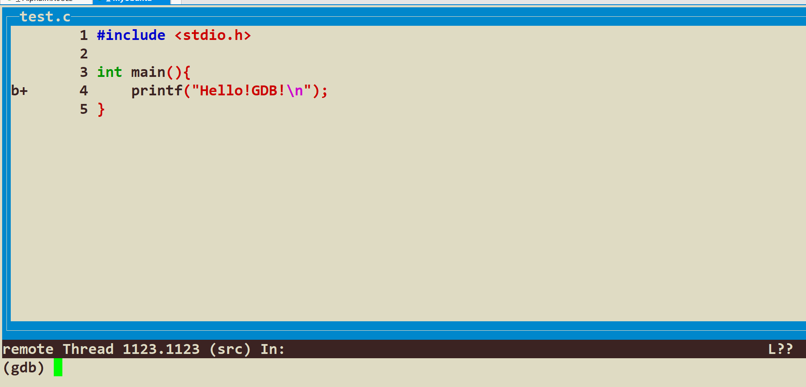
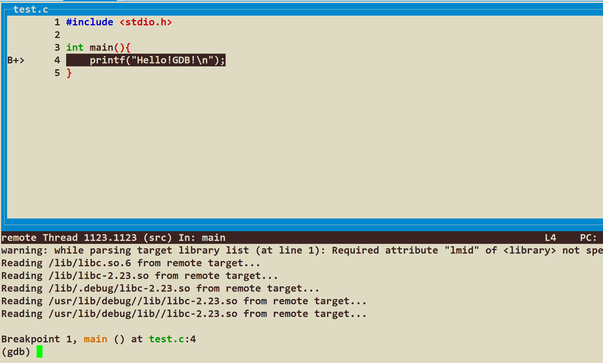
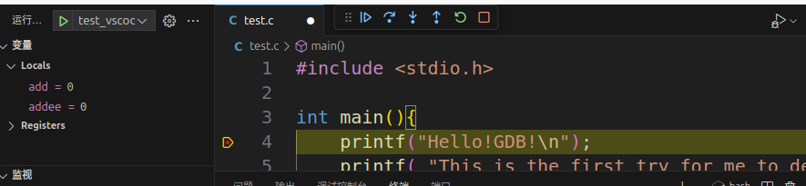

# 嵌入式Linux应用层开发——调试专篇（关于使用GDB调试远程下位机开发板的应用层程序办法 + VSCode更好的界面调试体验提升）

## 环境预备——调试

​	虽说有正点原子的代码带着，但是，如果我们只是打着printf这种方式进行手动的检查代码错误，还是不太方便的，笔者这里整理了两个上位机调试路线。

1. 路线1：使用GCC7.5，这个路线比较保守，适合对GCC, GDB等比较陌生的萌新使用，关于这个的安装，请参考笔者之前的博客进行学习安装。
2. 路线2：使用GCC13.2，这个路线比较激进，目前笔者使用的板子上是不支持跑GCC13.2编译器编译的，笔者目前的解决方案是直接将板子上的libc.so.6拷贝下来放到我们的工程目录下，后面编译的时候使用。
3. 路线3：直接把板子大刷新刷一个新系统用新的glibc，但是笔者认为那属于大炮打蚊子。

## 环境预备

​	笔者注意到很多博客都在用arm-linux-noneabihf-gdb来进行调试，笔者认为其实没有必要。现代的跨平台gdb调试方案是gdb-multiarch

```
sudo apt install gdb-multiarch
```

​	现在我们使用gdb-multiarch

```
➜  gdb-multiarch
GNU gdb (Ubuntu 15.0.50.20240403-0ubuntu1) 15.0.50.20240403-git
Copyright (C) 2024 Free Software Foundation, Inc.
License GPLv3+: GNU GPL version 3 or later <http://gnu.org/licenses/gpl.html>
This is free software: you are free to change and redistribute it.
There is NO WARRANTY, to the extent permitted by law.
Type "show copying" and "show warranty" for details.
This GDB was configured as "x86_64-linux-gnu".
Type "show configuration" for configuration details.
For bug reporting instructions, please see:
<https://www.gnu.org/software/gdb/bugs/>.
Find the GDB manual and other documentation resources online at:
    <http://www.gnu.org/software/gdb/documentation/>.

For help, type "help".
Type "apropos word" to search for commands related to "word".
(gdb) 
```

### 如果坚持使用arm-linux-noneabihf-gdb

​	以笔者的Ubuntu24.04为例子，我需要不幸的告诉你，Ubuntu24.04的apt源已经不提供python2.7了（太老了），但是如果你的gdb版本非常的低（比如说笔者的GCC7.5以下的版本），那么不幸的是，他必须依赖python2.7。

​	办法是自己动手丰衣足食，好在并不麻烦：

```
wget https://www.python.org/ftp/python/2.7.18/Python-2.7.18.tgz # 下载Python-2.7
tar -xvf Python-2.7.18.tgz
cd Python-2.7.18			# 我不认为看到这篇博客的朋友需要我解释上面的两句话
# 我们的gdb需要依赖的是libpython2.7，所以采用的是共享库构建, 后面那个错误是为了补充解决UnicodeUCS4依赖缺失的问题
# 默认下载到/usr/local下面去，如果想换地方，--prefix指定前置的目录 :)
./configure --enabled-shared --enable-unicode=ucs4
make -j16
sudo make install # 下载到/usr/local，或者是自己--prefix指定的地方
```

​	gdb还会依赖，我可以告诉你不行，Ubuntu24.04已经不使用ncurse5了，改成了6了，所以一个办法就是

```
find / -name libncurses*
find / -name libtinfo*
```

​	然后软链接到/lib/x86_64-linux-gnu/下面去，新的链接名称依次为：

```
libncurses.so.5
libtinfo.so.5
```

​	ldd查看你的gdb有没有出现依赖丢失的问题，没有的话，你的gdb就能用了，如果你的环境缺失依赖，那可以自己把报错喂给搜索引擎。

> 一个不太负责任的ref:
>
> ```
> sudo apt install -y build-essential checkinstall libssl-dev libsqlite3-dev tk-dev libgdbm-dev libc6-dev libbz2-dev libffi-dev
> ```
>
> 这个依赖笔者没有测试过，不确定是否为**最小且的有效依赖！**（原文还有libncursesw5-dev，为啥不行我说了）

```
➜  ./arm-linux-gnueabihf-gdb
GNU gdb (Linaro_GDB-2019.12) 8.3.1.20191204-git
Copyright (C) 2019 Free Software Foundation, Inc.
License GPLv3+: GNU GPL version 3 or later <http://gnu.org/licenses/gpl.html>
This is free software: you are free to change and redistribute it.
There is NO WARRANTY, to the extent permitted by law.
Type "show copying" and "show warranty" for details.
This GDB was configured as "--host=x86_64-unknown-linux-gnu --target=arm-linux-gnueabihf".
Type "show configuration" for configuration details.
For bug reporting instructions, please see:
<http://www.gnu.org/software/gdb/bugs/>.
Find the GDB manual and other documentation resources online at:
    <http://www.gnu.org/software/gdb/documentation/>.

For help, type "help".
Type "apropos word" to search for commands related to "word".
(gdb) 
```

## 番外：使用update-alternatives来管理多版本的工具链

​	笔者现在算下来，python有两个版本：3.12和2.7，arm-gcc有两个版本：gcc7.5和gcc13.2，这样的话我们就需要请出来我们的update-alternatives来帮助我们管理我们的多版本的工具链了。

[Linux命令之update-alternatives - 知乎 (zhihu.com)](https://zhuanlan.zhihu.com/p/20797436)

上面是一篇update-alternatives的使用和原理说明，这里不再赘述。

## 使用Filezilla来传递我们的文件

​	当然你可以使用scp传递，笔者这里偷懒方便，你可以

```
sudo apt install filezilla
```

​	来下载我们的Filezilla

​	正点原子的板子上是有ssh服务的，所以，你需要做的是继续把网线一插，配置一下对应网卡的ipv4地址（ifconfig扫一眼，没有ipv4地址，也别学一些抽象的哥们跑去爆改/etc文件，没那个必要，直接做这个事情就好了

```
ifconfig 网卡 自己的可以被上位机Ping通的IP地址
```

然后重启一下网卡即可）

​	现在看看ipconfig，应该就有ipv4地址了。笔者的是：

```
ifconfig eth0 10.41.0.50 # 不要照着抄！看你自己的以太网网线分配的gateway，依照netmask来设置ip
ifconfig eth0 down
ifconfig eth0 up
```

​	使用ifconfig确认好IP确实出现在这里了，下一步就是在上位机上测试有没有Ping通我们的板子

```
➜  ping 10.41.0.50
PING 10.41.0.50 (10.41.0.50) 56(84) bytes of data.
64 bytes from 10.41.0.50: icmp_seq=1 ttl=64 time=0.533 ms
64 bytes from 10.41.0.50: icmp_seq=2 ttl=64 time=0.412 ms
64 bytes from 10.41.0.50: icmp_seq=3 ttl=64 time=0.344 ms
...
```

​	OK完事。现在就可以使用filezilla来传递我们的文件，同时，我们也保证了后面的gdb调试是可以运行的！

## 准备调试

```
➜  cat test.c
#include <stdio.h>

int main(){
    printf("Hello!GDB!\n");
}
```

​	现在我们首先使用比较保守的版本较低的arm-gcc进行编译。注意，我们调试是需要保留一部分调试符号的。所以需要添加-g参数

```
arm-linux-gnueabihf-gcc test.c -o test -g
```

​	file一下：

```
➜  file test
test: ELF 32-bit LSB executable, ARM, EABI5 version 1 (SYSV), dynamically linked, interpreter /lib/ld-linux-armhf.so.3, for GNU/Linux 3.2.0, BuildID[sha1]=296f78e701a368fa147dedac2d781b8886aea9fa, with debug_info, not stripped
```

​	如果是我们新的gcc，那么就需要使用Filezilla来下载开发板上的glibc动态库(`libc.so.6`，在哪里自己在开发板上find一下就完事了)然后在编译时：

```
arm-linux-gnueabihf-gcc test.c -o test -g (libc的动态库的位置)
```

​	以笔者的为例子，我的构建目录比较简单：

```
➜  ls
libc.so.6  test  test.c
```

```
arm-linux-gnueabihf-gcc test.c -o test -g ./libc.so.6 
```

​	嗯，不太好看。当然后续可以使用-L参数指定编译器链接库，这个就脱离了我们讨论的范畴了。可以将文件移动到开发板上试一下，不出意外是可以运行的！

​	确保你的可执行文件可以运行，以及板子是可以ping通的情况下


## 使用gdbserver, gdb-multiarch来调试我们的板子

​	把我们编译的test文件传递到板子上

```
root@ATK-IMX6U:~/debug_demo# ls
test
```

​	注意到，gdb调试是需要第三方运行权限的，所以，需要我们chmod一下：

```
chmod 755 test # 第三方运行要可读可运行，故755
```

​	gdb调试是版本无关的。所以无论您是采用高版本还是低版本编译器编译的代码，都可以采用下面的流程进行调试：

​	正点原子的板子上已经有了可以直接运行的gdbserver，我们启动这个服务器

```
root@ATK-IMX6U:~/debug_demo# gdbserver 10.41.0.50:2001 test
Process test created; pid = 1123
Listening on port 2001
```

​	现在服务器端就已经准备就绪了，下一步就是我们的客户端要连接上来。

```
(gdb) target remote 10.41.0.50:2001
Remote debugging using 10.41.0.50:2001
Reading /lib/ld-linux-armhf.so.3 from remote target...
warning: File transfers from remote targets can be slow. Use "set sysroot" to access files locally instead.
Reading /lib/ld-linux-armhf.so.3 from remote target...
Reading symbols from target:/lib/ld-linux-armhf.so.3...
Reading /lib/ld-2.23.so from remote target...
Reading /lib/.debug/ld-2.23.so from remote target...
Reading /usr/lib/debug//lib/ld-2.23.so from remote target...
Reading /usr/lib/debug/lib//ld-2.23.so from remote target...
(No debugging symbols found in target:/lib/ld-linux-armhf.so.3)
Reading /usr/lib/debug/.build-id/bc/36f44173aa35217e54ad98751d4537bb36daa9.debug from remote target...

This GDB supports auto-downloading debuginfo from the following URLs:
  <https://debuginfod.ubuntu.com>
# 这里询问你是否要进一步下载更多的调试符号，我们选择y
Enable debuginfod for this session? (y or [n]) y
Debuginfod has been enabled.
To make this setting permanent, add 'set debuginfod enabled on' to .gdbinit.
Downloading separate debug info for system-supplied DSO at 0x76ffd000
0x76fcfac0 in ?? () from target:/lib/ld-linux-armhf.so.3                                                 
```

​	这个时候我们看看开发板的终端，就会发现已经连上了：

```
Remote debugging from host 10.41.0.1
```

​	为了调试方便，我们在上位机的gdb终端输入

```
layout src
```



​	可以看到笔者在这里打了断点

```
(gdb) b 1
```

​	现在我们c一下（c是continue的意思），这里就是运行起来我们的程序，让它停在我们的第一行上：



​	调试已经成功，我们继续运行


​	这里看到我们的程序运行结束了


​	我们的板子的终端也成功运行程序结束！调试的Demo完成了！

## 更好的体验：在VSCode上调试我们的代码

​	一些朋友可能更喜欢在vscode上做调试，笔者整理了一份同构建无关的办法。那就是写launch.json文件。这里，我们需要在.vscode文件夹下（在你的工程目录下面，没有就自己创建一个，或者在调试的界面上创建launch.json。笔者这里提供了自己写的launch.json

```
{
    // 使用 IntelliSense 了解相关属性。 
    // 悬停以查看现有属性的描述。
    // 欲了解更多信息，请访问: https://go.microsoft.com/fwlink/?linkid=830387
    "version": "0.2.0",
    "configurations": [
        {
            "name": "test_vscode_gdb",
            "type": "cppdbg",
            "request": "launch",
            // 下面的这个program就是你的可执行文件的名称
            "program": "./test",
            // 如果你的可执行文件需要输入，在args下面依次添加参数即可
            "args": [],
            // 这个是询问要不要停在开头，如果想从头到尾的理解程序而不想自己手动打一个最初的断点，设置成true
            "stopAtEntry": false,
            // 这个是路径调整，笔者决定放在
            "cwd": "${workspaceFolder}",
            "environment": [],
            "externalConsole": false,
            "MIMode": "gdb",
            "setupCommands": [
                {
                    "description": "为 gdb 启用整齐打印",
                    "text": "-enable-pretty-printing",
                    "ignoreFailures": true
                }
            ],
            // 这个是指定我们的gdb调试路径，笔者的位置在这里，你需要自己指定一个路径
            "miDebuggerPath": "/usr/bin/gdb-multiarch",
            // 这个就是我们的调试的IP和地址，跟你设置target remote的IP端口一致
            "miDebuggerServerAddress": "10.41.0.50:2001"
        }
    ]
}
```



​	现在我们运行，就发现成功的停在断点上了！Cheers!

## Reference

1. 解决undefined symbol: PyUnicodeUCS4_FromEncodedObject: [python - PyUnicodeUCS4_FromEncodedObject Error - Stack Overflow](https://stackoverflow.com/questions/8010384/pyunicodeucs4-fromencodedobject-error)
2. [Linux命令之update-alternatives - 知乎 (zhihu.com)](https://zhuanlan.zhihu.com/p/20797436)