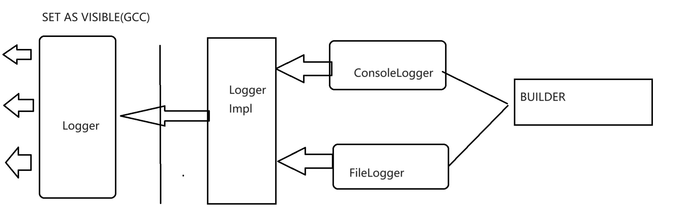
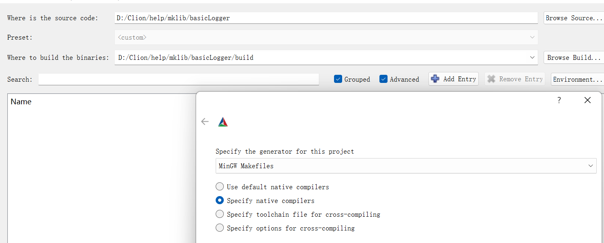
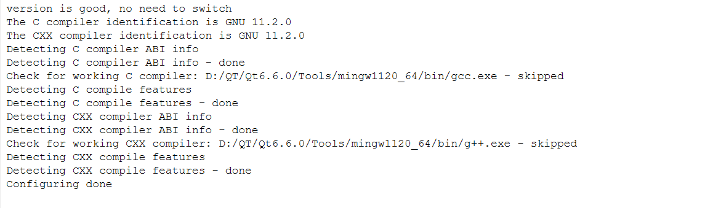
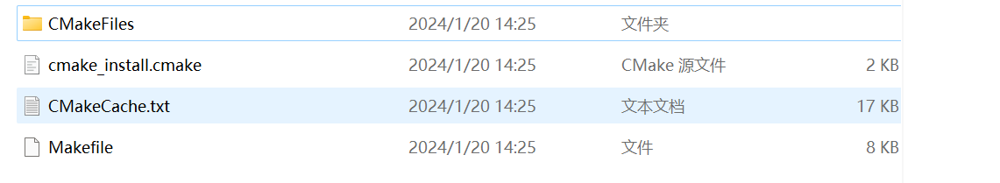
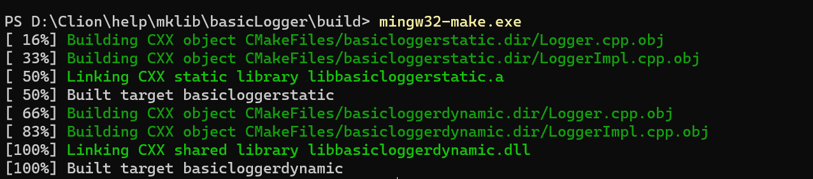
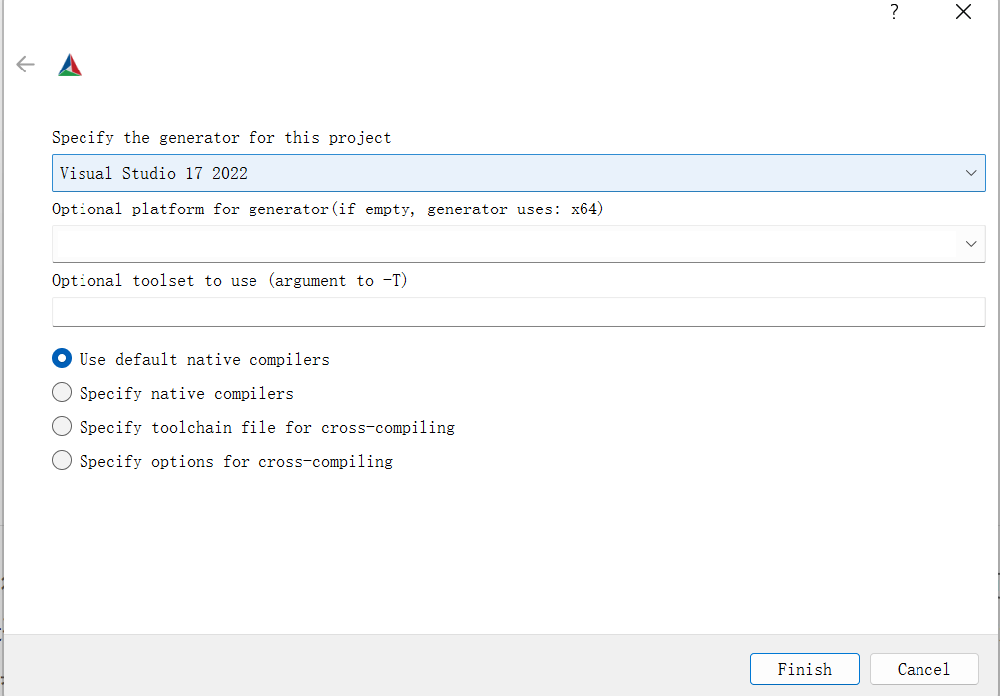
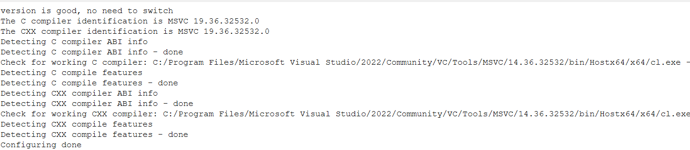
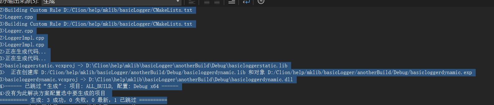
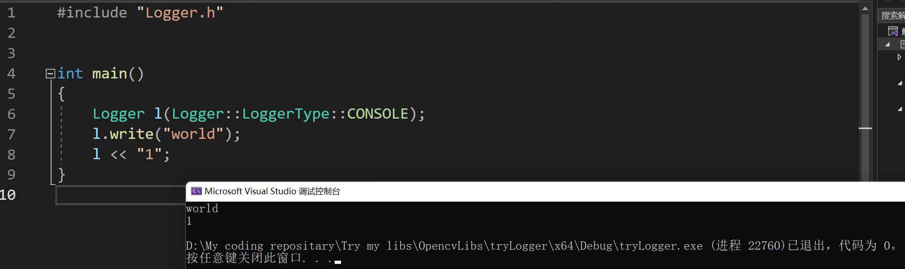

# 库设计：一个简单的Logger库

## 架构想法

​		我们想要写一个简单的Logger库。最简单的想法实际上就是封装`fstream`下的`ofstream`的输出方法。然而，我们的Logger有的时候是希望向控制台输出，有的时候是希望向文件输出，有的时候可能是希望向其他地方输出。那么，我们应该如何设计并且导出呢？

​		我们这次使用的是作为动态库导出的最常见的方法：也就是Impl方法。简单的讲，他就是使用一个简洁的接口向外提供接口符号，内部的实现可能是复杂而又错乱的。我们来看一个图：


​		我设计的架构如下：



​		如你所见，我们只需要只是看到了Logger库的不同的行为但是实际上可能是对应的不同的子类来完成这件事情。

​		下面就是写代码：

### 接口

> logger.h

```c++
#ifndef BASICLOGGER_LOGGER_H
#define BASICLOGGER_LOGGER_H
class LoggerImpl;

#ifndef CCSTD_Export
#define CCSTD_Export __declspec(dllexport)
#endif

class CCSTD_Export Logger
{
public:
    enum class LoggerType{
        CONSOLE,
        FILE
    };
	// 这个enum class是构成我们控制生成何种子类的基本
    enum class WriteImmMethod{
        ONLY_PLACE_THIS,
        FLUSH_PREVIOUS
    };
	// 删除所有的默认接口
    Logger() = delete;
    const Logger& operator=(const Logger&) = delete;
    Logger(const Logger&) = delete;

	// 转向采用我们的专门定制的接口，另外，不建议type上默认参数，会产生上面删除函数冲突的情况，对于不同的编译器的编译默认的行为不一致，在GCC/Mingw下则是可以通过编译但是可能产生错误，在MSVC下则是连编译都无法通过。
	// 上explicit则是为了说明不允许隐式转换
    explicit Logger(LoggerType type,const char* path = "", int maxLength = 1);
    ~Logger();

	// 提供接口：这个logger现在是否可用
    bool isLoggerAccessible();

	// 写入Logger
    bool write(const char* string);

	// 马上写入，是一种高优先级的写入，其中提供两种策略：一种是高优先级的单独输出，一种是调用flushAll接口提前输出
    bool writeImm(const char* string, WriteImmMethod m = WriteImmMethod::FLUSH_PREVIOUS);

	// 马上刷新缓冲区
    void flushAll();

	// 重置缓冲队列
    void resetMaxQueueLength(int length);

	// 清空缓冲队列，实质上是底层的clear接口的外置
    void clearQueue();
private:
	// 私有接口
    LoggerImpl* impl = nullptr;
    LoggerType type = LoggerType::CONSOLE;
};

// 提供特殊的运算符重载，为什么不加const呢？因为我们内置了 缓冲队列，会更改我们对象的内部属性，所以没法加const
extern "C" CCSTD_Export Logger& operator<<(Logger & l, const char* str);

#endif //BASICLOGGER_LOGGER_H
```

​		我们下一步就可以下潜到私有实现了，作为导出接口的Logger类实际上就是将所有的外部信息转发到私有的实现里，由不同的实例化的子类分担任务。

> loggerImpl.h

```c++
#ifndef BASICLOGGER_LOGGERIMPL_H
#define BASICLOGGER_LOGGERIMPL_H
#include <vector>
#include <fstream>
// Types 这里就是我们目前支持的Logger 种类了，他总是派生于LoggerImpl
// ConsoleLogger
class ConsoleLogger;
// FileLogger
class FileLogger;

class LoggerImpl
{
public:
    enum class ImmWriteWay{
        Priority_High,
        Flush_Previous
    };
    // 没有任何的需要我们自定义处理的对象，直接采用默认的编译器释放的行为省力
    virtual ~LoggerImpl()= default;
    // Abolished the possibility of copying
    LoggerImpl(const LoggerImpl&) = delete;
    const LoggerImpl& operator=(const LoggerImpl&) = delete;
    // 我们为上层的抽象接口写成必须实现的接口，也就是纯虚函数，子类有义务必须实现他们
    virtual void write(const char* string) = 0;
    virtual void flushLogger() = 0;
    virtual void writeImm(const char* string, ImmWriteWay immWriteWay) = 0;
    virtual void setMaxAllowQueue(int max) = 0;
    virtual bool isAccessible() = 0;
    virtual void resetMaxQueueLength(int max) = 0;
    // END
protected:
    // 工厂函数，我们不允许直接的创建，而是由工厂返回，毕竟我们没法知道客户的需求究竟如何
    friend class LoggerConstructor;
    LoggerImpl() = default;
};

class ConsoleLogger : public LoggerImpl
{
public:
    // 传递 LoggerImpl 的复制行为，我们仍然不允许任何的拷贝行为
    ConsoleLogger(const ConsoleLogger&) = delete;
    const ConsoleLogger& operator=(const ConsoleLogger&) = delete;
    // 删除之前，我们要先清空缓存队列里的所有的内容，否则会造成丢失。
    ~ConsoleLogger() override{
        ConsoleLogger::flushLogger();
    }

    // 重载 << ，我们可以像std::cout 那样传递信息，默认的行为是调用write函数
    friend ConsoleLogger& operator<<(ConsoleLogger& consoleLogger, const char* string){
        consoleLogger.write(string);
        return consoleLogger;
    }
    
    // ConsoleLogger的write行为在这里实现
    void write(const char* string) override;
    // 将上层的flushLogger接口传递到这里来实现
    void flushLogger() override;
    // 洽谈类似
    void writeImm(const char* string, ImmWriteWay immWriteWay) override;
    void setMaxAllowQueue(int max) override{
        // 比较粗暴，事实上一个合理的做法是try catch并且为之定义一个专门的错误接受，这里偷懒
        maxAllowedQueue = (max >= 1 ? max : 1);
    }
    inline bool isAccessible() override{
        // 我们认为std::cout 作为标准输出流总是可以输出，即使他们将可能被重定向到/dev/null !
        return true;
    }
    // 重置队列长度的时候，注意如果存在缩小，那就应该把多余的东西在这里立马释放掉
    void resetMaxQueueLength(int max) override{
        setMaxAllowQueue(max);
        if(isQueueFull())
            flushLogger();
    }

    // 清空
    void clearQueue(){
        this->queues.clear();
    }
protected:
    friend class LoggerConstructor;

    // 队列实现（deque也行，当时我选用的是vector）
    std::vector<const char*> queues;
    int maxAllowedQueue = 1;

    // 仍然放到 protected
    ConsoleLogger();
    // 转发成员初始化任务
    void makeInit();
    bool isQueueFull(){
        return queues.size() >= maxAllowedQueue;
    }

};

class FileLogger : public LoggerImpl
{
public:
    // FileLogger实现就要复杂一些，我们需要判断这个类是否可用
    enum class State{
        USABLE,
        UNUSABLE
    } state = State::UNUSABLE;

    FileLogger() = delete;
    FileLogger(const FileLogger&) = delete;
    const FileLogger& operator=(const FileLogger&) = delete;

    ~FileLogger() override{
        FileLogger::flushLogger();
        releaseOFS();
    }
    friend const FileLogger& operator<<(FileLogger& fileLogger, const char* string){
        fileLogger.write(string);
        return fileLogger;
    }
    bool isAccessible() override;
    bool redirect(const char* where);
    void write(const char* string) override;
    void flushLogger() override;
    void writeImm(const char* string, ImmWriteWay immWriteWay) override;
    void setMaxAllowQueue(int max) override{
        maxAllowedQueue = (max >= 1 ? max : 1);
    }
    void resetMaxQueueLength(int max) override{
        setMaxAllowQueue(max);
        if(isQueueFull())
            flushLogger();
    }

    void clearQueue(){
        this->queues.clear();
    }

protected:
    friend class LoggerConstructor;
    explicit FileLogger(const char* where);
    void makeInit(const char* path);
    const char* where; // write to where
    std::ofstream*           ofs = nullptr;
    std::vector<const char*> queues;
    int maxAllowedQueue = 1;
    // 先关后删
    void releaseOFS(){
        ofs->close();
        delete ofs;
    }

    bool isQueueFull(){
        return queues.size() >= maxAllowedQueue;
    }

};

/// 工厂函数， 提供创建的接口。
class LoggerConstructor
{
public:
    static ConsoleLogger* buildConsoleType(){
        return new ConsoleLogger();
    }
    static FileLogger* buildFileLogger(const char* toWhere){
        return new FileLogger(toWhere);
    }
};

#endif //BASICLOGGER_LOGGERIMPL_H
```

### 实现

> loggerImpl.cpp

```c++
#include "LoggerImpl.h"
#include <iostream>
#include <fstream>
ConsoleLogger::ConsoleLogger()
{
    makeInit();
}

void ConsoleLogger::makeInit() {
    // do nothing actually
}

void ConsoleLogger::write(const char* string)
{
    if(!string)
        return;
    this->queues.push_back(string);
    if(isQueueFull())
    {
        flushLogger();
    }
}

void ConsoleLogger::flushLogger()
{
    for(const auto& eachLogger : queues)
        std::cout << eachLogger << std::endl;
    queues.clear();
}

void ConsoleLogger::writeImm(const char* string, ImmWriteWay immWriteWay)
{
    switch (immWriteWay) {
        case LoggerImpl::ImmWriteWay::Priority_High:
            std::cout << string << std::endl;
            break;
        case LoggerImpl::ImmWriteWay::Flush_Previous:
            this->queues.push_back(string);
            flushLogger();
            break;
    }
}

FileLogger::FileLogger(const char* where) {
    FileLogger::makeInit(where);
}

bool FileLogger::isAccessible(){
    return ofs && ofs->is_open(); // tips: 判断是否可用的良好的办法
}

bool FileLogger::redirect(const char* _where){
    if(isAccessible())
        releaseOFS();
    state = State::UNUSABLE;
    ofs = new std::ofstream(_where);
    if(ofs->is_open()) {
        state = State::USABLE;
        this->where = _where;
        return true;
    }
    else
    {
        this->where = _where;
        return false;
    }

}

void FileLogger::makeInit(const char* _where){
    redirect(_where);
}

void FileLogger::flushLogger() {
    if(!isAccessible())
        return;
    for(const auto& eachLogger : queues)
        *ofs << eachLogger << std::endl;
    queues.clear();
}

void FileLogger::write(const char* string){
    if(!string)
        return;
    this->queues.push_back(string);
    if(isQueueFull())
    {
        flushLogger();
    }
}

void FileLogger::writeImm(const char *string, ImmWriteWay immWriteWay) {
    switch (immWriteWay) {
        case LoggerImpl::ImmWriteWay::Priority_High:
            if(!isAccessible())
        		return;
            *ofs << string << std::endl;
            break;
        case LoggerImpl::ImmWriteWay::Flush_Previous:
            this->queues.push_back(string);
            flushLogger();
            break;
    }
}
```

> TIPS：更好的代码是实现一个叫做CachedLogger类，其下派生FileLogger和ConsoleLogger，作为只是导出接口的不一致，这里不是重点，就不做更改了有兴趣的可以自行尝试修改。

> logger.c

```c++
#include "LoggerImpl.h"
#include "Logger.h"

// 转发器，实际上是接口转化。
class AdapterOfWriteImm{
public:
    static LoggerImpl::ImmWriteWay transform(Logger::WriteImmMethod t)
    {
        switch (t) {
            case Logger::WriteImmMethod::FLUSH_PREVIOUS :
                return LoggerImpl::ImmWriteWay::Flush_Previous;
            case Logger::WriteImmMethod::ONLY_PLACE_THIS :
                return LoggerImpl::ImmWriteWay::Priority_High;
        }
        return LoggerImpl::ImmWriteWay::Flush_Previous;
    }
};

Logger::Logger(Logger::LoggerType type, const char *path, int maxQueueLength) {
    switch (type) {
        case LoggerType::CONSOLE:
            this->impl = LoggerConstructor::buildConsoleType();
            break;
        case LoggerType::FILE:
            this->impl = LoggerConstructor::buildFileLogger(path);
            break;
    }
    this->impl->setMaxAllowQueue(maxQueueLength);
    this->type = type;
}


bool Logger::write(const char* string) {
    if(!isLoggerAccessible())
        return false;
    this->impl->write(string);
    return true;
}

bool Logger::isLoggerAccessible() {
    return this->impl && this->impl->isAccessible();
}

bool Logger::writeImm(const char *string, Logger::WriteImmMethod m) {
    if(!isLoggerAccessible())
        return false;
    this->impl->writeImm(string, AdapterOfWriteImm::transform(m));
    return true;
}

void Logger::flushAll() {
    if(!isLoggerAccessible())
        return;
    this->impl->flushLogger();
}

void Logger::resetMaxQueueLength(int length) {
    if(!isLoggerAccessible())
        return;
    this->impl->resetMaxQueueLength(length);
}

void Logger::clearQueue() {
    if(!isLoggerAccessible())
        return;
    if(type == LoggerType::CONSOLE) {
        auto* cur = dynamic_cast<ConsoleLogger*>(impl);
        if(cur)
        {
        	cur->clearQueue();            
        }
    }
    else if(type == LoggerType::FILE){
        auto* cur = dynamic_cast<FileLogger*>(impl);
        if(cur)
        {
        	cur->clearQueue();            
        }
    }
}

Logger::~Logger() {
    delete impl;
}

CCSTD_Export Logger& operator<<(Logger &l, const char *str) {
    l.write(str);
    return l;
}
```

## 导出库

​		下面就是导出库了，我们分别导出GCC系列的库和MSVC的库。

​		先写CMakeLists

```
if(${CMAKE_VERSION} VERSION_LESS 3.24)
    cmake_minimum_required(VERSION ${CMAKE_MAJOR_VERSION}.${CMAKE_MINOR_VERSION})
    message(STATUS "version less 3.24, switch to ${CMAKE_MAJOR_VERSION}.${CMAKE_MINOR_VERSION}")
else()
    cmake_minimum_required(VERSION 3.24)
    message(STATUS "version is good, no need to switch")
endif()

project(pro_basicLogger
        VERSION 1.0
        DESCRIPTION "basicLogger")

set(LIB_SRC logger.cpp loggerImpl.cpp)

include_directories("./")
add_library(basicloggerstatic STATIC ${LIB_SRC})
add_library(basicloggerdynamic SHARED ${LIB_SRC})
```

> 吐槽：超！离谱的记事本采用的UTF8是无法被CMake识别的（带有BOM的UTF8），可能是我自己的设置问题（我自己寻思着我没动过记事本的配置），如果出现类似的问题，省事情的办法就是换一个编辑器（比如VSCode）

​		下面我开`cmake-gui`操作。

### Mingw库



​		这样配置，当然如果系统变量环境下已经被CMake识别的是Mingw的就不用选`Specify native compilers`了，第一个就行。如果不是，就选好gcc和g++。



​		去build文件夹下看看，已经有了：



```
mingw32-make.exe 
```

​		就可以。等一会就有了：



​		可以检查一下编译链接的行为是否符合我们的预期。

```
dumpbin.exe -exports .\libbasicloggerdynamic.dll
Microsoft (R) COFF/PE Dumper Version 14.36.32532.0
Copyright (C) Microsoft Corporation.  All rights reserved.
Dump of file .\libbasicloggerdynamic.dll

File Type: DLL

  Section contains the following exports for libbasicloggerdynamic.dll

    00000000 characteristics
    65AB67EF time date stamp Sat Jan 20 14:27:59 2024
        0.00 version
           1 ordinal base
          11 number of functions
          11 number of names
    ordinal hint RVA      name

          1    0 000015AC _ZN6Logger10clearQueueEv
          2    1 00001464 _ZN6Logger18isLoggerAccessibleEv
          3    2 00001562 _ZN6Logger19resetMaxQueueLengthEi
          4    3 00001410 _ZN6Logger5writeEPKc
          5    4 00001520 _ZN6Logger8flushAllEv
          6    5 000014B0 _ZN6Logger8writeImmEPKcNS_14WriteImmMethodE
          7    6 00001380 _ZN6LoggerC1ENS_10LoggerTypeEPKci
          8    7 00001380 _ZN6LoggerC2ENS_10LoggerTypeEPKci
          9    8 0000166C _ZN6LoggerD1Ev
         10    9 0000166C _ZN6LoggerD2Ev
         11    A 0000169A _Zls
... 
```

​		很满意，里面只是导出了我们希望出现的符号。原则上，我们不需要担心库的问题了。这个库可以使用了。使用的办法就是在新的工程里的CMakeLists：target_link_library里头把这个库加上就可以。或者是手写gcc编译的时候-L库目录，-l库名称。具体如何操作这里不赘述了。

### MSVC库

​		还是CMake-gui



​		注意对应着选自己的Visual Studio版本（）



​		这里看清楚是不是对应的MSVC版本。

​		下一步就是generatedone出现.pro工程。进去直接点击：生成解决方案，就可以了。



​		看清楚是不是都成功了。是的

​		我们检查一下库的生成是不是符合我们的预期：

```
dumpbin.exe -exports .\basicloggerdynamic.dll
Microsoft (R) COFF/PE Dumper Version 14.36.32532.0
Copyright (C) Microsoft Corporation.  All rights reserved.
Dump of file .\basicloggerdynamic.dll

File Type: DLL

  Section contains the following exports for basicloggerdynamic.dll

    00000000 characteristics
    FFFFFFFF time date stamp
        0.00 version
           1 ordinal base
           9 number of functions
           9 number of names

    ordinal hint RVA      name

          1    0 000016B3 << = @ILT+1710(<<)
          2    1 000012BC ??0Logger@@QEAA@W4LoggerType@0@PEBDH@Z = @ILT+695(??0Logger@@QEAA@W4LoggerType@0@PEBDH@Z)
          3    2 00001113 ??1Logger@@QEAA@XZ = @ILT+270(??1Logger@@QEAA@XZ)
          4    3 000010A0 ?clearQueue@Logger@@QEAAXXZ = @ILT+155(?clearQueue@Logger@@QEAAXXZ)
          5    4 0000173F ?flushAll@Logger@@QEAAXXZ = @ILT+1850(?flushAll@Logger@@QEAAXXZ)
          6    5 000014A1 ?isLoggerAccessible@Logger@@QEAA_NXZ = @ILT+1180(?isLoggerAccessible@Logger@@QEAA_NXZ)
          7    6 000013A7 ?resetMaxQueueLength@Logger@@QEAAXH@Z = @ILT+930(?resetMaxQueueLength@Logger@@QEAAXH@Z)
          8    7 0000157D ?write@Logger@@QEAA_NPEBD@Z = @ILT+1400(?write@Logger@@QEAA_NPEBD@Z)
          9    8 0000151E ?writeImm@Logger@@QEAA_NPEBDW4WriteImmMethod@1@@Z = @ILT+1305(?writeImm@Logger@@QEAA_NPEBDW4WriteImmMethod@1@@Z)
```

​		没问题，那我们试试：

​		配置好基本的链接环境之后



​		可以。