# Opencv with Visual Studio

## C++ Version

## 1.环境配置问题

​		我们首先下好 Opencv 4.5.1 的包，安装好 Cmake 之后开始使用！

​		下面为了配置好 Opencv 的开发环境：我们必须书写一个 CmakeLists来链接库：

```Cmake
cmake_minimum_required(VERSION 2.8)
project(def) # 工程名称
 
set(SOURCES
    default.cpp # 源文件
)
 
set(HEADERS
    #main.hpp # 头文件
)
 
add_executable(Main #产生可执行区域
    ${SOURCES}
    ${HEADERS}
)
 
set(OpenCV_DIR "D:/Opencv4.5.1/opencv/build/x64/vc15/lib") # 找到二进制的坤文件
find_package(OpenCV REQUIRED)
if(OpenCV_FOUND)
    target_include_directories(Main PUBLIC ${OpenCV_INCLUDE_DIRS})
    target_link_libraries(Main ${OpenCV_LIBS})
    # 上面两行代码把 Opencv 库所需要的文件和程序链接
 
endif()
```

​		随后，点击Cmake 把工作区和二进制生成文件的地址传进去

​		平台选择 64 位，点击 Configure 随后点击 Generate :留意有没有报错！

​		如果一切没有问题，那么，回到你的工作文件夹，选择BUILD文件夹，打开，随后找到：def.sIn文件，单击启动项目，当然我们需要更改启动项

​		选择Main启动项即可！

​		当然可以使用以下代码测试你的环境！

```C++
#include<opencv2/opencv.hpp>
#include<iostream>
#include<string>
using namespace std;
using namespace cv;

int main()
{
	string path = "C:\\Users\\陈冠豪\\Pictures\\Camera Roll\\2022-06-20_16.14.20.png";
	Mat img = imread(path);
	if (img.empty()) {
		return -1;
	}
	imshow("1", img);
	waitKey(0);
	return 0;
}
```

## 项目入门1：

​		我们首先来了解什么是图像：这很简单！我们在计算机中用一个矩阵，向里面填入色块实现图像的显示，我们的图像越高清，就说明我们的矩阵划分的越密集，这样，表现出来的就越是清晰！

​		在黑白图中，我们使用 8 位图来刻画我们的黑白图！0代表黑色，255 则是白色。

​		对于彩色图像，我们使用 BGR 三色图，以不同的比例的亮度来叠加在一起。

### 显示一个图像

​		下面我们来使用一个函数 imread 和 imshow!

​		先来引入头文件

```C++
#include<opencv2/opencv.hpp>
#include<iostream>
#include<string>
using namespace std;
using namespace cv;
```

​		 现在看一下，有没有报错，一般而言成功了的环境是不会报错的！正是如此！

​		如果你有幸浏览到了 opencv  的文档，你会注意到 imread 表示的是从程序外面读取一个图像，并且将对象返回给一个叫做 Mat 的类型！函数需要一个string，表示的是图像的地址

```C++
# 这里找到一个图像的地址：
string path = "path_DIR";

# 然后传进去：
Mat img = imread(path);
```

​		这个 Mat 就是一个矩阵，存储着图像的信息。显示图像也是简单的：

```C++
imshow("NameWindows",img);
waitKey(0);// 防止图像一闪而过
```

Examples:

```C++
#include<opencv2/opencv.hpp>
#include<iostream>
#include<string>
using namespace std;
using namespace cv;

int main()
{
	string path = "C:\\Users\\陈冠豪\\Pictures\\Camera Roll\\2022-06-20_16.14.20.png";
	Mat img = imread(path);
	if (img.empty()) {
		return -1;
	}
	imshow("1", img);
	waitKey(0);
	return 0;
}
```


### 显示一个视频

​		视频的本质是一帧一帧图像的播放，基于此，我们可以导入，以及导出一个视频：

```C++
string path = "C:\\Users\\陈冠豪\\Videos\\2023-03-05 14-24-15.mp4";
VideoCapture videocap(path);
```

​		我们的 Opencv 里有一个专门搞视频的类型：

```
VideoCapture 
```

​		类型，支持这样的构造：

```C++
VideoCapture videocap(path)
```

​		随后声明一个矩阵，他将会存储我们的视频中一帧的图片：

```C++
Mat img;
```

​		我们视频的读取是这样的：读取每一帧，然后显示，直到视频结束或者我们人为的退出：

```C++
while(1)
{
	videocap.read(img);
    imshow("Video",img);
    waitKey(1); // 我们在这里决定了延迟是如何的，这里实现倍速或者是慢速播放
}
```

```C++
#include<opencv2/opencv.hpp>
#include<iostream>
#include<string>
using namespace std;
using namespace cv;

int main()
{
	string path = "C:\\Users\\陈冠豪\\Videos\\2023-03-05 14-31-23.mp4";
	VideoCapture videocap(path);
	Mat img;
	while (1)
	{
		videocap.read(img);
		imshow("1", img);
		waitKey(20);
	}
}
```

​		你当然可以选择你的摄像头！电脑的默认头是0，这意味着：

```C++
#include<opencv2/opencv.hpp>
#include<iostream>
#include<string>
using namespace std;
using namespace cv;

int main()
{
	VideoCapture videocap(0);
	Mat img;
	while (1)
	{
		videocap.read(img);
		imshow("1", img);
		waitKey(20);
	}
}
```

​		就可以看到你自己了！


​		很好。

## 项目入门2：图像处理

​		下面，我们来一 一介绍函数的图像处理：

​		1）转化为灰度图：

来看这个函数：

```C++
cvtColor(imgSrc,imgDst,code);
```

​		这个函数把源图像转化为目标图像，以及转化方式：

```C++
#include<opencv2/opencv.hpp>
#include<iostream>
#include<string>
using namespace std;
using namespace cv;

int main()
{
	Mat imgSrc, imgDst;
	string path = "C:\\Users\\陈冠豪\\Pictures\\Camera Roll\\2022-06-20_16.14.20.png";
	imgSrc = imread(path);
	cvtColor(imgSrc, imgDst, COLOR_BGR2GRAY);
	imshow("gray", imgDst);
	waitKey(0);
}
```


## 图像模糊（高斯模糊）

​		使用函数 GaussainBlur 来实现！

​		小技巧，如果你不知道这个函数是干什么的，传什么样的参数：可以Ctrl+单击

```C++
CV_EXPORTS_W void GaussianBlur( InputArray src, OutputArray dst, Size ksize,
                                double sigmaX, double sigmaY = 0,
                                int borderType = BORDER_DEFAULT );

/** @brief Applies the bilateral filter to an image.

The function applies bilateral filtering to the input image, as described in
http://www.dai.ed.ac.uk/CVonline/LOCAL_COPIES/MANDUCHI1/Bilateral_Filtering.html
bilateralFilter can reduce unwanted noise very well while keeping edges fairly sharp. However, it is
very slow compared to most filters.

_Sigma values_: For simplicity, you can set the 2 sigma values to be the same. If they are small (\<
10), the filter will not have much effect, whereas if they are large (\> 150), they will have a very
strong effect, making the image look "cartoonish".

_Filter size_: Large filters (d \> 5) are very slow, so it is recommended to use d=5 for real-time
applications, and perhaps d=9 for offline applications that need heavy noise filtering.

This filter does not work inplace.
@param src Source 8-bit or floating-point, 1-channel or 3-channel image.
@param dst Destination image of the same size and type as src .
@param d Diameter of each pixel neighborhood that is used during filtering. If it is non-positive,
it is computed from sigmaSpace.
@param sigmaColor Filter sigma in the color space. A larger value of the parameter means that
farther colors within the pixel neighborhood (see sigmaSpace) will be mixed together, resulting
in larger areas of semi-equal color.
@param sigmaSpace Filter sigma in the coordinate space. A larger value of the parameter means that
farther pixels will influence each other as long as their colors are close enough (see sigmaColor
). When d\>0, it specifies the neighborhood size regardless of sigmaSpace. Otherwise, d is
proportional to sigmaSpace.
@param borderType border mode used to extrapolate pixels outside of the image, see #BorderTypes
 */
```

​		可以看到，这个函数需要源图像，目标图像和高斯核的大小，以及两个方差（其中有一个是必须的）

```C++
#include<opencv2/opencv.hpp>
#include<iostream>
#include<string>
using namespace std;
using namespace cv;

int main()
{
	Mat imgSrc,imgBlur;
	string path = "C:\\Users\\陈冠豪\\Pictures\\Camera Roll\\2022-06-20_16.14.20.png";
	imgSrc = imread(path);
	GaussianBlur(imgSrc, imgBlur, Size(7, 7), 5, 0);
	imshow("1", imgBlur);
	imshow("org", imgSrc);
	waitKey(0);
}
```

### 图像边缘检测

​		下面我们要使用函数Canny 来给我们的图像进行检测！

​		**我们在使用 Canny 检测的时候，往往还会在之前使用模糊来更好的检测！！！**

​		通读一下函数需求：

```C++
CV_EXPORTS_W void Canny( InputArray image, OutputArray edges,
                         double threshold1, double threshold2,
                         int apertureSize = 3, bool L2gradient = false );

/** \overload

Finds edges in an image using the Canny algorithm with custom image gradient.

@param dx 16-bit x derivative of input image (CV_16SC1 or CV_16SC3).
@param dy 16-bit y derivative of input image (same type as dx).
@param edges output edge map; single channels 8-bit image, which has the same size as image .
@param threshold1 first threshold for the hysteresis procedure.
@param threshold2 second threshold for the hysteresis procedure.
@param L2gradient a flag, indicating whether a more accurate \f$L_2\f$ norm
\f$=\sqrt{(dI/dx)^2 + (dI/dy)^2}\f$ should be used to calculate the image gradient magnitude (
L2gradient=true ), or whether the default \f$L_1\f$ norm \f$=|dI/dx|+|dI/dy|\f$ is enough (
L2gradient=false ).
 */
```

​		可以看到，我们需要源图像，目标图像，两个阈值


```C++
#include<opencv2/opencv.hpp>
#include<iostream>
#include<string>
using namespace std;
using namespace cv;

int main()
{
	Mat imgSrc,imgBlur,imgCanny;
	string path = "C:\\Users\\陈冠豪\\Pictures\\Camera Roll\\2022-06-20_16.14.20.png";
	imgSrc = imread(path);
	GaussianBlur(imgSrc, imgBlur, Size(7, 7), 5, 0);
	Canny(imgBlur,imgCanny,50,150);
	imshow("org", imgSrc);
	imshow("canny", imgCanny);
	waitKey(0);
}
```

​		我们用这个来检测阈值，当然，阈值越低，对边界越敏感：

​		下调阈值为 25,75后的结果！

### 图像膨胀

​		当我们的图像特征不明显的时候，我们可以放大特征来便于我们的检测：

​		使用的是函数 dilate:

```c++
CV_EXPORTS_W void dilate( InputArray src, 
                         OutputArray dst, 
                         InputArray kernel,
                          Point anchor = Point(-1,-1), 
                         int iterations = 1,
                          int borderType = BORDER_CONSTANT,
                          const Scalar& borderValue = 											morphologyDefaultBorderValue() 
                        );

/** @brief Performs advanced morphological transformations.

The function cv::morphologyEx can perform advanced morphological transformations using an erosion and dilation as
basic operations.

Any of the operations can be done in-place. In case of multi-channel images, each channel is
processed independently.

@param src Source image. The number of channels can be arbitrary. The depth should be one of
CV_8U, CV_16U, CV_16S, CV_32F or CV_64F.
@param dst Destination image of the same size and type as source image.
@param op Type of a morphological operation, see #MorphTypes
@param kernel Structuring element. It can be created using #getStructuringElement.
@param anchor Anchor position with the kernel. Negative values mean that the anchor is at the
kernel center.
@param iterations Number of times erosion and dilation are applied.
@param borderType Pixel extrapolation method, see #BorderTypes. #BORDER_WRAP is not supported.
@param borderValue Border value in case of a constant border. The default value has a special
meaning.
@sa  dilate, erode, getStructuringElement
@note The number of iterations is the number of times erosion or dilatation operation will be applied.
For instance, an opening operation (#MORPH_OPEN) with two iterations is equivalent to apply
successively: erode -> erode -> dilate -> dilate (and not erode -> dilate -> erode -> dilate).
 */
```

​		在我们使用完Canny之后：

​		我们的核怎么来呢？专门使用函数 getStructuringElement来完成我们的工作

```C++
Mat kernel = getStructuringElement(MORPH_RECT,Size(5,5));
# 这个核越大膨胀越厉害
```


​		特征被明显的放大了！

### 图像侵蚀

​		我们使用的函数是 Erode:

```C++
CV_EXPORTS_W void erode( InputArray src, OutputArray dst, InputArray kernel,
                         Point anchor = Point(-1,-1), int iterations = 1,
                         int borderType = BORDER_CONSTANT,
                         const Scalar& borderValue = morphologyDefaultBorderValue() );

/** @example samples/cpp/tutorial_code/ImgProc/Morphology_1.cpp
Erosion and Dilation sample code

Check @ref tutorial_erosion_dilatation "the corresponding tutorial" for more details
*/

/** @brief Dilates an image by using a specific structuring element.

The function dilates the source image using the specified structuring element that determines the
shape of a pixel neighborhood over which the maximum is taken:
\f[\texttt{dst} (x,y) =  \max _{(x',y'):  \, \texttt{element} (x',y') \ne0 } \texttt{src} (x+x',y+y')\f]

The function supports the in-place mode. Dilation can be applied several ( iterations ) times. In
case of multi-channel images, each channel is processed independently.

@param src input image; the number of channels can be arbitrary, but the depth should be one of
CV_8U, CV_16U, CV_16S, CV_32F or CV_64F.
@param dst output image of the same size and type as src.
@param kernel structuring element used for dilation; if elemenat=Mat(), a 3 x 3 rectangular
structuring element is used. Kernel can be created using #getStructuringElement
@param anchor position of the anchor within the element; default value (-1, -1) means that the
anchor is at the element center.
@param iterations number of times dilation is applied.
@param borderType pixel extrapolation method, see #BorderTypes. #BORDER_WRAP is not suported.
@param borderValue border value in case of a constant border
@sa  erode, morphologyEx, getStructuringElement
 */
```


代码一览：

```C++
#include<opencv2/opencv.hpp>
#include<iostream>
#include<string>
using namespace std;
using namespace cv;

int main()
{
	Mat imgSrc,imgBlur,imgCanny,imgDial,imgErode;
	string path = "C:\\Users\\陈冠豪\\Pictures\\Camera Roll\\2022-06-20_16.14.20.png";
	imgSrc = imread(path);
	GaussianBlur(imgSrc, imgBlur, Size(7, 7), 5, 0);
	Canny(imgBlur,imgCanny,50,150);
	Mat kernel = getStructuringElement(MORPH_RECT, Size(5, 5));
	dilate(imgCanny, imgDial, kernel);
	erode(imgDial, imgErode, kernel);
	imshow("org", imgSrc);
	imshow("dilate", imgDial);
	imshow("erode", imgErode);
	waitKey(0);
}
```

### 图像大小调整与变换

​		很容易猜到重新设定大小的函数就是Resize:

​		我们首先学习一下怎样查看图像的大小：

```C++
cout << img.size()<<endl;
```


​		现在我们可以调整大小了：

```C++
resize(img,imgResize,Size(640,480));
```


​		如果希望是等比例的放缩，可以采用这样的方式：

```C++
resize(img,imgResize,Size(),xRatio,yRatio);
```

​		 我们也可以裁剪图像：

```C++
Rect roi(100,100,200,300); // 这里产生一个区域矩形
imgCrop = img(roi);//从图像中生成子图像
```

# Opencv with Visual Studio

## 纯图像应用

​		Opencv当然可以创建纯色的图片。只需要我们指定图像的种类和每一位的BGR值

```
Mat img(height,width,imgType,bkColorScalar);
```

​		今为了创建一个彩色图像，选择 CV_8UC3，表明是CV下的8bit unsigned char（就是0~255）下的3通道图.

​		太单调了，画个圆：

```C++
#include<opencv2/opencv.hpp>
#include<iostream>
#include<string>
using namespace std;
using namespace cv;

int main()
{
	// create a blank img

	// CV_8bits(2~255) Unsigned Char 3dims 
	Mat img(512, 512, CV_8UC3, Scalar(255,0,0));

	//create a circle

	circle(img, Point(256, 256), 155,Scalar(0,255,0),10);

	imshow("blue one", img);

	waitKey(0);
}
```

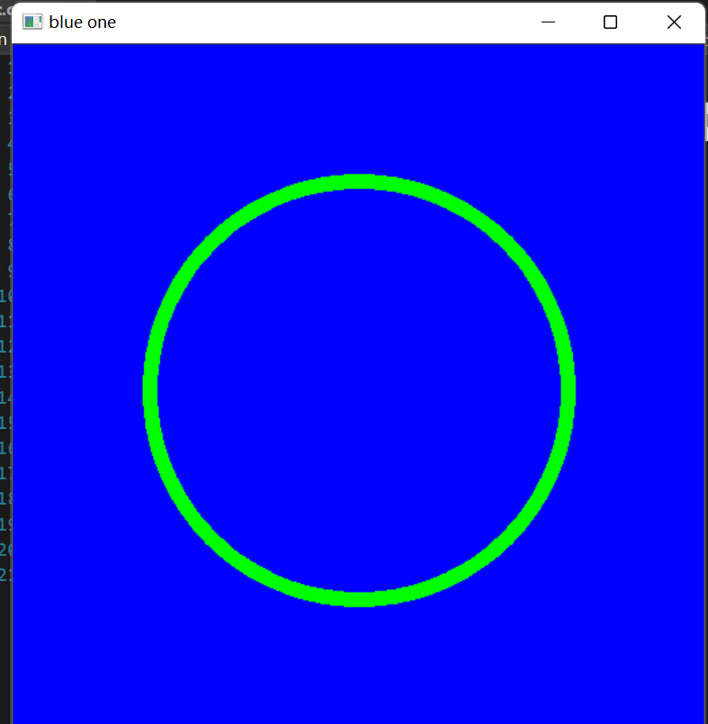

​		当然可以玩其他东西：不过，也就是可以查看API自己搞定：

```C++
#include<opencv2/opencv.hpp>
#include<iostream>
#include<string>
using namespace std;
using namespace cv;

int main()
{
	// create a blank img

	// CV_8bits(2~255) Unsigned Char 3dims 
	Mat img(512, 512, CV_8UC3, Scalar(255,0,0));

	//create a circle

	circle(img, Point(256, 256), 155,Scalar(0,255,0),10);


	// rectangle create
	rectangle(img, Point(150, 150), Point(300, 300), Scalar(255, 255, 255), FILLED);

	// line

	line(img, Point(200, 400), Point(400, 400), Scalar(100, 100, 100), 20);
	// putText

	putText(img, "hello,world", Point(100, 100), FONT_HERSHEY_DUPLEX, 2, Scalar(0, 0, 0));
	
	imshow("blue one", img);

	waitKey(0);
}
```

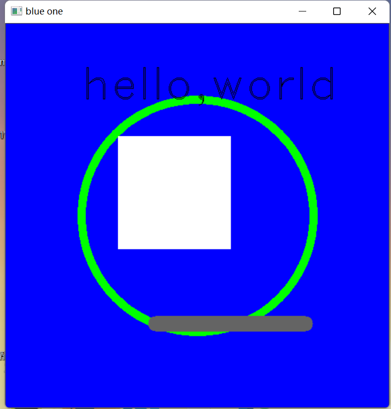

## Warp我们的图像：图像变换1

​		下面我们继续！

​		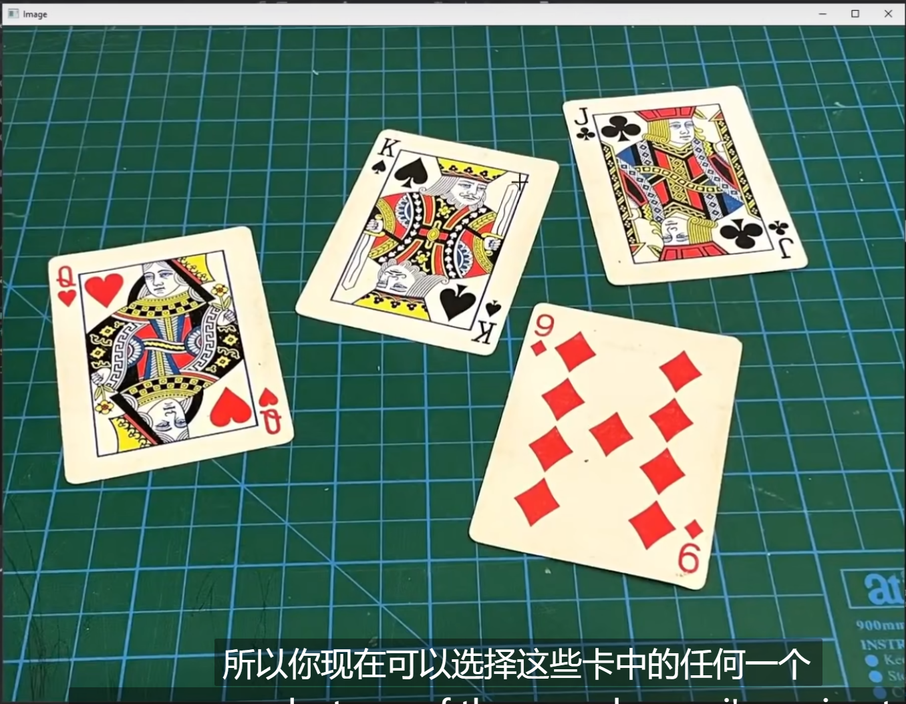

​		现在，我们想要变换这中间的一个扑克牌使之正立！我们转向：先把目标放到一个Demo 上，就是King这张牌。现在，我们找出它的四个点！不必打开画图，我们使用 `setMouseCallBack`这个函数！

```C++
void setMouseCallback(const String& winname, MouseCallback onMouse, void* userdata = 0);
```

​		winname就是目标窗口名称，那这个 MouseCallback是啥呢？进一步去看

```C++
typedef void (*MouseCallback)(int event, int x, int y, int flags, void* userdata);
```

​		再明显不过了，我们重写一个函数，其原型是如上的，我们编写一个！

```C++
void onMouse(int event, int x, int y, int flags, void*) {
	
	if(event == EVENT_LBUTTONDOWN)
	cout << x << " " << y<<endl;

}
```

```C++
int main()
{
	string path = "C:\\Users\\usr\\Desktop\\My coding repositary\\learnopencv\\2\\source_file\\1.png";
	Mat warp = imread(path);
	if (warp.empty()) {
		return -1;
	}

	imshow("1", warp);
	setMouseCallback("1", onMouse);


	waitKey(0);
}
```

​		啊哈！

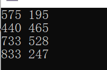

​		这几个点收下了！

​		然后，我们想要立正之后，图片的宽和高也应当要给出来！

```c++
float w = 250, h = 350;

Point2f points[4] = { {575 ,195},{440 ,465},{733 ,528},{833 ,247} };
Point2f after[4] = { {0,0},{w ,0},{0 ,h},{w ,h} };
```

​		然后转向API的调用！

```C++
mat = getPerspectiveTransform(points, after);
warpPerspective(warp,imgWarp, mat, Point(w, h));
imshow("Warp", imgWarp);
```

​		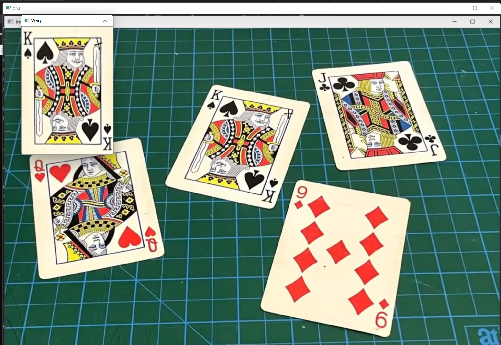

# Opencv with Visual Studio3

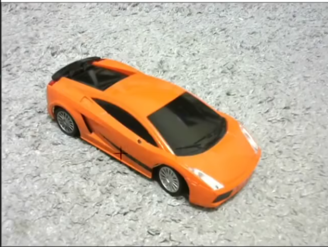

​		看到这个图片了嘛，这个就是我们今天的任务！通过颜色来检测于识别小车！

## 颜色检测

​		我们首先来转化一下这个图片，我们的图片都是采用BGR绘制的。但是还有另一套颜色系统，是用HSV来描述的：

```
每一种颜色都是由色相（Hue，简H），饱和度（Saturation，简S）和色明度（Value，简V）所表示的。这个模型中颜色的参数分别是：色调（H），饱和度（S），亮度（V）。


色调H参数表示色彩信息，即所处的光谱颜色的位置。该参数用一角度量来表示，取值范围为0°～360°。若从红色开始按逆时针方向计算，红色为0°，绿色为120°，蓝色为240°。它们的补色是：黄色为60°，青色为180°，紫色为300°；
饱和度S：取值范围为0.0～1.0；
亮度V：取值范围为0.0(黑色)～1.0(白色)。
```

​		在Opencv中，转化的方式同将图片二值化是一致的，都是cvtColor(),其调用的参数我想很容易猜：COLOR_BGR2HSV.

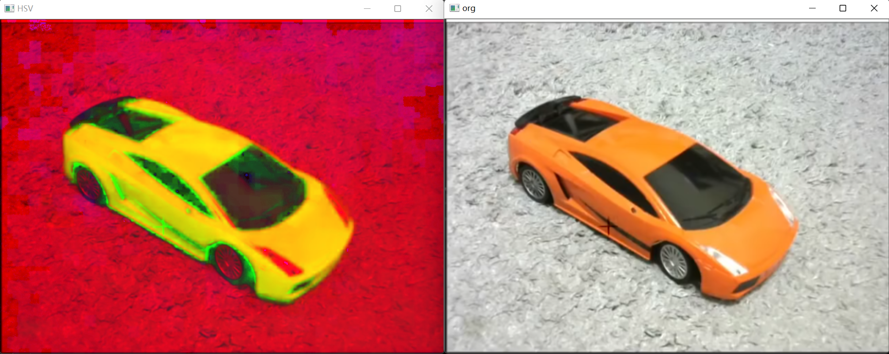

​		但是，我们若是想要筛选，就必须要采用滑条的方式来搞！

​		怎么搞呢？


​		首先，我们创建滑动条，就必须要使用Scalar来搞，我们的HSV有上下限制，这就意味着。两个vector是被需要的：

```cpp
vector<int> lower;
vector<int> upper;
```

```C++
int arr[6] = { 0,0,0,255,255,255 };
	for (int i = 0; i < 3; i++) {

		lower.push_back(arr[i]);
		upper.push_back(arr[i + 3]);

	}
```

​		随后，使用由inRange函数

```C++
CV_EXPORTS_W void inRange(InputArray src, InputArray lowerb,
                          InputArray upperb, OutputArray dst);

/** @brief Performs the per-element comparison of two arrays or an array and scalar value.

The function compares:
*   Elements of two arrays when src1 and src2 have the same size:
    \f[\texttt{dst} (I) =  \texttt{src1} (I)  \,\texttt{cmpop}\, \texttt{src2} (I)\f]
*   Elements of src1 with a scalar src2 when src2 is constructed from
    Scalar or has a single element:
    \f[\texttt{dst} (I) =  \texttt{src1}(I) \,\texttt{cmpop}\,  \texttt{src2}\f]
*   src1 with elements of src2 when src1 is constructed from Scalar or
    has a single element:
    \f[\texttt{dst} (I) =  \texttt{src1}  \,\texttt{cmpop}\, \texttt{src2} (I)\f]
When the comparison result is true, the corresponding element of output
array is set to 255. The comparison operations can be replaced with the
equivalent matrix expressions:
@code{.cpp}
    Mat dst1 = src1 >= src2;
    Mat dst2 = src1 < 8;
    ...
```

​		产生掩码：但是这里要求的时Scalar，我们先搞一下

```C++
Scalar down(lower[0], lower[1], lower[2]);

Scalar up(upper[0], upper[1], upper[2]);
```

​		现在可以了

```
inRange(HSV, down, up, mask);
```

​		但是，反复的调值太麻烦，我们使用滑动条调值！

​		先建立一个窗口，在基于这个窗口创立滑动条！

```C++
namedWindow("TrackBars", (640, 480));
createTrackbar("Hue Min", "TrackBars", &lower[0], 255);
createTrackbar("Hue Max", "TrackBars", &upper[0], 255);
createTrackbar("Sat Min", "TrackBars", &lower[1], 255);	createTrackbar("Sat Max", "TrackBars", &upper[1], 255);
createTrackbar("Val Min", "TrackBars", &lower[2], 255);
createTrackbar("Val Max", "TrackBars", &upper[2], 255);
```

```C++
CV_EXPORTS_W void namedWindow(const String& winname, int flags = WINDOW_AUTOSIZE);

/** @brief Destroys the specified window.

The function destroyWindow destroys the window with the given name.

@param winname Name of the window to be destroyed.
 */
```

```C++
CV_EXPORTS int createTrackbar(const String& trackbarname, const String& winname,
                              int* value, int count,
                              TrackbarCallback onChange = 0,
                              void* userdata = 0);

/** @brief Returns the trackbar position.

The function returns the current position of the specified trackbar.

@note

[__Qt Backend Only__] winname can be empty if the trackbar is attached to the control
panel.

@param trackbarname Name of the trackbar.
@param winname Name of the window that is the parent of the trackbar.
 */
```

​		现在，使用一个死循环来完成我们的工作：

```C++
while(1)
{
	Scalar down(lower[0], lower[1], lower[2]);

	Scalar up(upper[0], upper[1], upper[2]);

	inRange(HSV, down, up, mask);

	imshow("work", mask);
	waitKey(1);
}

```

​		这样就好了。

```C++
#include<opencv2/opencv.hpp>
#include<iostream>
#include<string>
#include<cmath>
#include<vector>
using namespace std;
using namespace cv;

string path = "D:\\My coding repositary\\learnopencv\\5\\source_file\\1.png";

vector<int> lower;
vector<int> upper;

void showVec(vector<int> pVec) {

	

	for (auto i = pVec.begin(); i != pVec.end(); i++) {

		cout << *i << " ";

	}

	cout << '\n';

}

Mat HSV , mask;

int main()
{
	int arr[6] = { 0,0,0,255,255,255 };
	for (int i = 0; i < 3; i++) {

		lower.push_back(arr[i]);
		upper.push_back(arr[i + 3]);

	}
	
	showVec(lower);
	showVec(upper);
	Mat workPng = imread(path);
	if (workPng.empty()) {
		return -1;
	}

	cvtColor(workPng, HSV, COLOR_BGR2HSV);

	namedWindow("TrackBars", (640, 480));
	createTrackbar("Hue Min", "TrackBars", &lower[0], 255);
	createTrackbar("Hue Max", "TrackBars", &upper[0], 255);
	createTrackbar("Sat Min", "TrackBars", &lower[1], 255);
	createTrackbar("Sat Max", "TrackBars", &upper[1], 255);
	createTrackbar("Val Min", "TrackBars", &lower[2], 255);
	createTrackbar("Val Max", "TrackBars", &upper[2], 255);
	while(1)
	{
		Scalar down(lower[0], lower[1], lower[2]);

		Scalar up(upper[0], upper[1], upper[2]);

		inRange(HSV, down, up, mask);

		imshow("work", mask);
		waitKey(1);
	}


	waitKey();
}
```

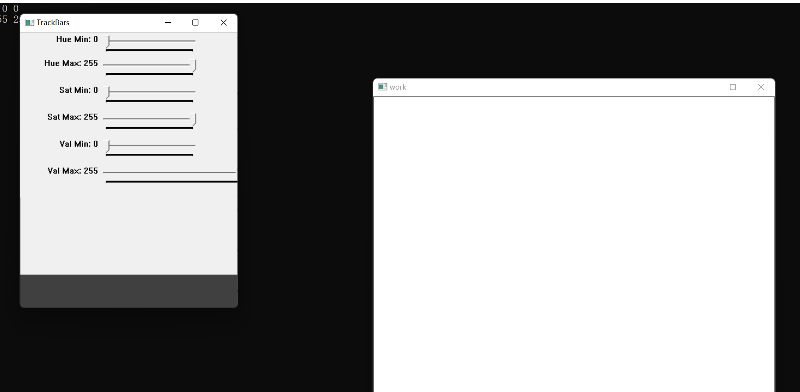

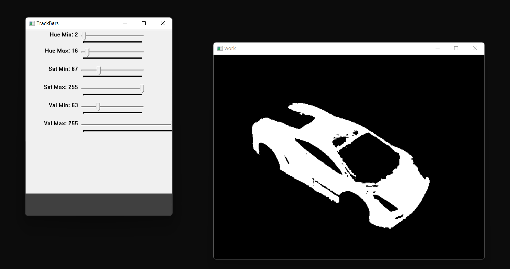

# Opencv with Visual Studio4

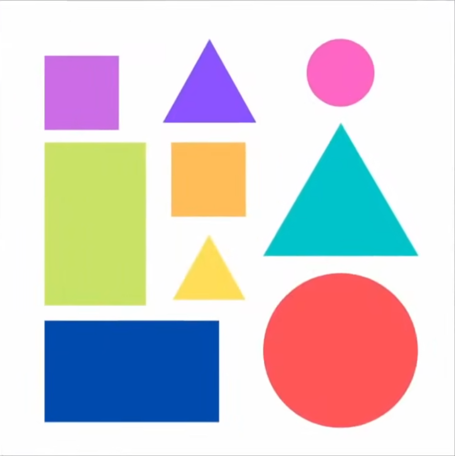

​		这是一个简单的图像，我们尝试来用之检测形状！

## 轮廓检测

​		现在我们想要检测形状的轮廓，是需要对图片做出若干预处理的！我们必须保证我们的图片经过开闭运算：

```c++
Mat& preWork(Mat& pic)
{
	Mat grey, blur, canny, dil, erode;
	cvtColor(pic, grey, COLOR_BGR2GRAY);
	GaussianBlur(grey, blur, Size(3, 3), 3, 0);
	Canny(blur, canny, 25, 75);
	Mat kernel = getStructuringElement(MORPH_RECT, Size(3, 3));
	dilate(canny, dil, kernel);

	imshow("grey", grey);
	imshow("blur", blur);
	imshow("canny", canny);
	imshow("dil", dil);
	//imshow("erode", erode);
	waitKey(0);

	Mat* work = new Mat(dil);

	return *work;

}
```

​		我们返回的就是经过预处理的图片了！下面开始重点讲轮廓！

​		我们的轮廓是用点来描述的，轮廓有若干层数，这就需要我们使用 vector<vector< int >>

​		还有层级，这里我们使用 vector< Vec4i >来定义类型！它表明当前的每一个类型有四个整数构成，就不需要我们自己手动指定原生的C++类型了

​		这里是找到轮廓的函数

```C++
findContours(afterPreWork, countours, hierarchy, RETR_EXTERNAL, CHAIN_APPROX_SIMPLE);
```

```C++
/** @brief Finds contours in a binary image.

The function retrieves contours from the binary image using the algorithm @cite Suzuki85 . The contours
are a useful tool for shape analysis and object detection and recognition. See squares.cpp in the
OpenCV sample directory.
@note Since opencv 3.2 source image is not modified by this function.

@param image Source, an 8-bit single-channel image. Non-zero pixels are treated as 1's. Zero
pixels remain 0's, so the image is treated as binary . You can use #compare, #inRange, #threshold ,
#adaptiveThreshold, #Canny, and others to create a binary image out of a grayscale or color one.
If mode equals to #RETR_CCOMP or #RETR_FLOODFILL, the input can also be a 32-bit integer image of labels (CV_32SC1).
@param contours Detected contours. Each contour is stored as a vector of points (e.g.
std::vector<std::vector<cv::Point> >).
@param hierarchy Optional output vector (e.g. std::vector<cv::Vec4i>), containing information about the image topology. It has
as many elements as the number of contours. For each i-th contour contours[i], the elements
hierarchy[i][0] , hierarchy[i][1] , hierarchy[i][2] , and hierarchy[i][3] are set to 0-based indices
in contours of the next and previous contours at the same hierarchical level, the first child
contour and the parent contour, respectively. If for the contour i there are no next, previous,
parent, or nested contours, the corresponding elements of hierarchy[i] will be negative.
@param mode Contour retrieval mode, see #RetrievalModes
@param method Contour approximation method, see #ContourApproximationModes
@param offset Optional offset by which every contour point is shifted. This is useful if the
contours are extracted from the image ROI and then they should be analyzed in the whole image
context.
 */
CV_EXPORTS_W void findContours( InputArray image, OutputArrayOfArrays contours,
                              OutputArray hierarchy, int mode,
                              int method, Point offset = Point());

/** @overload */
CV_EXPORTS void findContours( InputArray image, OutputArrayOfArrays contours,
                              int mode, int method, Point offset = Point());

/** @example samples/cpp/squares.cpp
A program using pyramid scaling, Canny, contours and contour simplification to find
squares in a list of images (pic1-6.png). Returns sequence of squares detected on the image.
*/

/** @example samples/tapi/squares.cpp
A program using pyramid scaling, Canny, contours and contour simplification to find
squares in the input image.
*/
```

​		这里是一些参数的文档

```C++
enum RetrievalModes {
    /** retrieves only the extreme outer contours. It sets `hierarchy[i][2]=hierarchy[i][3]=-1` for
    all the contours. */
    RETR_EXTERNAL  = 0,
    /** retrieves all of the contours without establishing any hierarchical relationships. */
    RETR_LIST      = 1,
    /** retrieves all of the contours and organizes them into a two-level hierarchy. At the top
    level, there are external boundaries of the components. At the second level, there are
    boundaries of the holes. If there is another contour inside a hole of a connected component, it
    is still put at the top level. */
    RETR_CCOMP     = 2,
    /** retrieves all of the contours and reconstructs a full hierarchy of nested contours.*/
    RETR_TREE      = 3,
    RETR_FLOODFILL = 4 //!<
};
```

```C++
enum ContourApproximationModes {
    /** stores absolutely all the contour points. That is, any 2 subsequent points (x1,y1) and
    (x2,y2) of the contour will be either horizontal, vertical or diagonal neighbors, that is,
    max(abs(x1-x2),abs(y2-y1))==1. */
    CHAIN_APPROX_NONE      = 1,
    /** compresses horizontal, vertical, and diagonal segments and leaves only their end points.
    For example, an up-right rectangular contour is encoded with 4 points. */
    CHAIN_APPROX_SIMPLE    = 2,
    /** applies one of the flavors of the Teh-Chin chain approximation algorithm @cite TehChin89 */
    CHAIN_APPROX_TC89_L1   = 3,
    /** applies one of the flavors of the Teh-Chin chain approximation algorithm @cite TehChin89 */
    CHAIN_APPROX_TC89_KCOS = 4
};

```

​		上面是一些具体的参数说明！

​		我们的findCountours 取到轮廓之后呢，就向我们传入空的轮廓和层级输入数据。随后，我们在 原图像（很重要，不要画在二值化后的图里去了！！！）绘制轮廓，这样就好了！

```C++
Mat& receiveCountours(Mat& afterPreWork,Mat& org)
{
	vector<vector<Point>> countours;
	vector<Vec4i> hierarchy;

	findContours(afterPreWork, countours, hierarchy, RETR_EXTERNAL, CHAIN_APPROX_SIMPLE);

	Mat* workMat = new Mat(org);

	drawContours(*workMat, countours, -1, Scalar(255, 0, 0), 3);

	return *workMat;
}

```

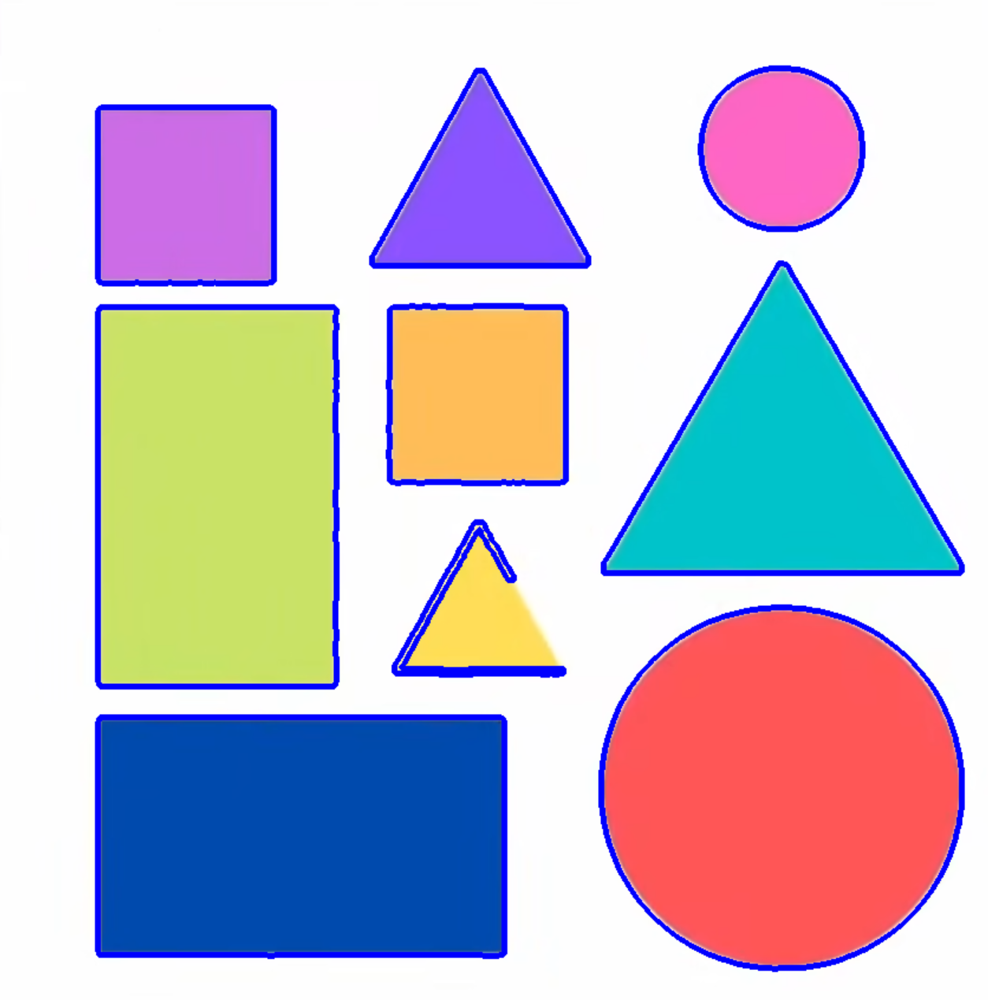

​		但是一些原因我们的图片可能是有多个绘制的，他们是由图片的噪点 造成的，我们现在使用面积筛选法筛选！

```c++
Mat& receiveCountours(Mat& afterPreWork,Mat& org)
{
	vector<vector<Point>> countours;
	vector<Vec4i> hierarchy;

	findContours(afterPreWork, countours, hierarchy, RETR_EXTERNAL, CHAIN_APPROX_SIMPLE);

	Mat* workMat = new Mat(org);

	

	for (int i = 0; i < countours.size(); i++) {

		auto area = contourArea(countours[i]);
		cout << area << endl;

		if (area > 1000) {


			drawContours(*workMat, countours, i, Scalar(255, 0, 0), 3);
		}// 第I个轮廓满足！

	}
}

```

​		下面呢，我们使用矩形将找到的形状括起来！这就需要我们：

```C++
/** @brief Calculates a contour perimeter or a curve length.

The function computes a curve length or a closed contour perimeter.

@param curve Input vector of 2D points, stored in std::vector or Mat.
@param closed Flag indicating whether the curve is closed or not.
 */
CV_EXPORTS_W double arcLength( InputArray curve, bool closed );
```

```C++
double peri = arcLength(countours[i], true);
```

​		以及我们之后可能需要通过多少个角点来判定他们是什么，就需要我们：

```C++
/** @brief Approximates a polygonal curve(s) with the specified precision.

The function cv::approxPolyDP approximates a curve or a polygon with another curve/polygon with less
vertices so that the distance between them is less or equal to the specified precision. It uses the
Douglas-Peucker algorithm <http://en.wikipedia.org/wiki/Ramer-Douglas-Peucker_algorithm>

@param curve Input vector of a 2D point stored in std::vector or Mat
@param approxCurve Result of the approximation. The type should match the type of the input curve.
@param epsilon Parameter specifying the approximation accuracy. This is the maximum distance
between the original curve and its approximation.
@param closed If true, the approximated curve is closed (its first and last vertices are
connected). Otherwise, it is not closed.
 */
CV_EXPORTS_W void approxPolyDP( InputArray curve,
                                OutputArray approxCurve,
                                double epsilon, bool closed );
```

​		为此，我们需要一个跟轮廓一个数据结构的大小来接受结果，随后用之来绘制轮廓，那就是：

```C++
Mat& receiveCountours(Mat& afterPreWork,Mat& org)
{
	vector<vector<Point>> countours;
	vector<Vec4i> hierarchy;

	findContours(afterPreWork, countours, hierarchy, RETR_EXTERNAL, CHAIN_APPROX_SIMPLE);

	Mat* workMat = new Mat(org);

	vector<vector<Point>> conPoly(countours.size());

	for (int i = 0; i < countours.size(); i++) {

		auto area = contourArea(countours[i]);
		cout << area << endl;

		if (area > 1000) {

			double peri = arcLength(countours[i], true);
			
			approxPolyDP(countours[i], conPoly[i], 0.02 * peri, true);

			drawContours(*workMat, conPoly, i, Scalar(255, 0, 0), 3);
		
		}

	}
	return *workMat;
}
```


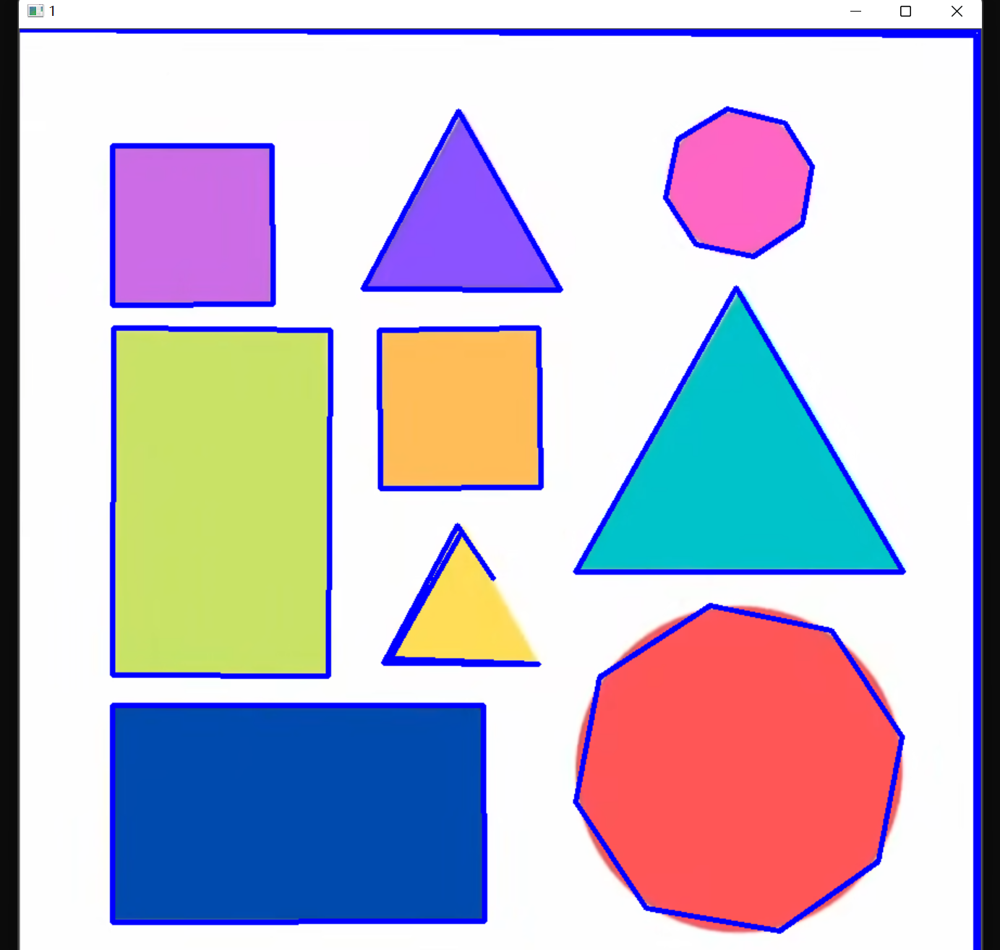

​		而框住矩形是由给出：

```C++
/** @brief Calculates the up-right bounding rectangle of a point set or non-zero pixels of gray-scale image.

The function calculates and returns the minimal up-right bounding rectangle for the specified point set or
non-zero pixels of gray-scale image.

@param array Input gray-scale image or 2D point set, stored in std::vector or Mat.
 */
CV_EXPORTS_W Rect boundingRect( InputArray array );
```

​		函数每一次扫描ConPoly后返回最小矩形，我们用一个vector< Rect >接受就好了

```C++
Mat& receiveCountours(Mat& afterPreWork,Mat& org)
{
	vector<vector<Point>> countours;
	vector<Vec4i> hierarchy;

	findContours(afterPreWork, countours, hierarchy, RETR_EXTERNAL, CHAIN_APPROX_SIMPLE);

	Mat* workMat = new Mat(org);

	vector<vector<Point>> conPoly(countours.size());
	vector<Rect> boundRect(countours.size());
	for (int i = 0; i < countours.size(); i++) {

		auto area = contourArea(countours[i]);
		cout << area << endl;

		if (area > 1000) {

			double peri = arcLength(countours[i], true);
			
			approxPolyDP(countours[i], conPoly[i], 0.02 * peri, true);


			boundRect[i]  = boundingRect(conPoly[i]);

			drawContours(*workMat, conPoly, i, Scalar(255, 0, 0), 3);
			
			rectangle(*workMat, boundRect[i].tl(), boundRect[i].br(), Scalar(255, 0, 100),5);
		}

	}


```

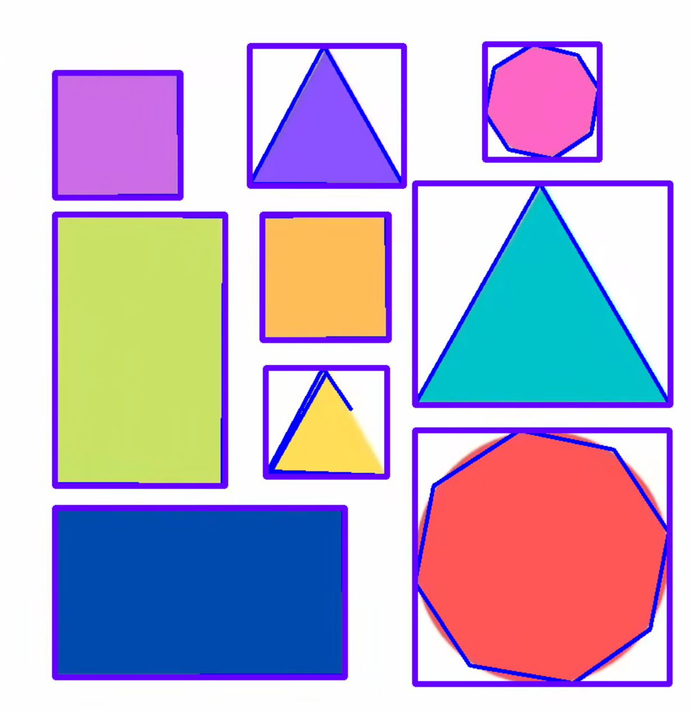

# Opencv in Visual Studio 5

## 人脸识别

​		什么？自己写？有点蠢！我们来用以及训练好的数据就好了！

​		他在你的Opencv 的\opencv\build\etc下面，看到这个了嘛：

```
haarcascade_frontalface_default.xml
```

​		对，就是这个文件，拿过来用就好了！

​		下面开始使用它！，我们创建一个

```C++
/** @example samples/cpp/facedetect.cpp
This program demonstrates usage of the Cascade classifier class
\image html Cascade_Classifier_Tutorial_Result_Haar.jpg "Sample screenshot" width=321 height=254
*/
/** @brief Cascade classifier class for object detection.
 */
class CV_EXPORTS_W CascadeClassifier
{
public:
    CV_WRAP CascadeClassifier();
    /** @brief Loads a classifier from a file.

    @param filename Name of the file from which the classifier is loaded.
     */
    CV_WRAP CascadeClassifier(const String& filename); // 使用这个API
    ~CascadeClassifier();
    /** @brief Checks whether the classifier has been loaded.
    */
    CV_WRAP bool empty() const;
    /** @brief Loads a classifier from a file.

    @param filename Name of the file from which the classifier is loaded. The file may contain an old
    HAAR classifier trained by the haartraining application or a new cascade classifier trained by the
    traincascade application.
     */
    CV_WRAP bool load( const String& filename ); // 使用这个API
    /** @brief Reads a classifier from a FileStorage node.

    @note The file may contain a new cascade classifier (trained traincascade application) only.
     */
    CV_WRAP bool read( const FileNode& node );

    /** @brief Detects objects of different sizes in the input image. The detected objects are returned as a list
    of rectangles.

    @param image Matrix of the type CV_8U containing an image where objects are detected.
    @param objects Vector of rectangles where each rectangle contains the detected object, the
    rectangles may be partially outside the original image.
    @param scaleFactor Parameter specifying how much the image size is reduced at each image scale.
    @param minNeighbors Parameter specifying how many neighbors each candidate rectangle should have
    to retain it.
    @param flags Parameter with the same meaning for an old cascade as in the function
    cvHaarDetectObjects. It is not used for a new cascade.
    @param minSize Minimum possible object size. Objects smaller than that are ignored.
    @param maxSize Maximum possible object size. Objects larger than that are ignored. If `maxSize == minSize` model is evaluated on single scale.

    The function is parallelized with the TBB library.

    @note
       -   (Python) A face detection example using cascade classifiers can be found at
            opencv_source_code/samples/python/facedetect.py
    */
    CV_WRAP void detectMultiScale( InputArray image,
                          CV_OUT std::vector<Rect>& objects,
                          double scaleFactor = 1.1,
                          int minNeighbors = 3, int flags = 0,
                          Size minSize = Size(),
                          Size maxSize = Size() );

    /** @overload
    @param image Matrix of the type CV_8U containing an image where objects are detected.
    @param objects Vector of rectangles where each rectangle contains the detected object, the
    rectangles may be partially outside the original image.
    @param numDetections Vector of detection numbers for the corresponding objects. An object's number
    of detections is the number of neighboring positively classified rectangles that were joined
    together to form the object.
    @param scaleFactor Parameter specifying how much the image size is reduced at each image scale.
    @param minNeighbors Parameter specifying how many neighbors each candidate rectangle should have
    to retain it.
    @param flags Parameter with the same meaning for an old cascade as in the function
    cvHaarDetectObjects. It is not used for a new cascade.
    @param minSize Minimum possible object size. Objects smaller than that are ignored.
    @param maxSize Maximum possible object size. Objects larger than that are ignored. If `maxSize == minSize` model is evaluated on single scale.
    */
    CV_WRAP_AS(detectMultiScale2) void detectMultiScale( InputArray image,
                          CV_OUT std::vector<Rect>& objects,
                          CV_OUT std::vector<int>& numDetections,
                          double scaleFactor=1.1,
                          int minNeighbors=3, int flags=0,
                          Size minSize=Size(),
                          Size maxSize=Size() ); // 使用这个API

    /** @overload
    This function allows you to retrieve the final stage decision certainty of classification.
    For this, one needs to set `outputRejectLevels` on true and provide the `rejectLevels` and `levelWeights` parameter.
    For each resulting detection, `levelWeights` will then contain the certainty of classification at the final stage.
    This value can then be used to separate strong from weaker classifications.

    A code sample on how to use it efficiently can be found below:
    @code
    Mat img;
    vector<double> weights;
    vector<int> levels;
    vector<Rect> detections;
    CascadeClassifier model("/path/to/your/model.xml");
    model.detectMultiScale(img, detections, levels, weights, 1.1, 3, 0, Size(), Size(), true);
    cerr << "Detection " << detections[0] << " with weight " << weights[0] << endl;
    @endcode
    */
    CV_WRAP_AS(detectMultiScale3) void detectMultiScale( InputArray image,
                                  CV_OUT std::vector<Rect>& objects,
                                  CV_OUT std::vector<int>& rejectLevels,
                                  CV_OUT std::vector<double>& levelWeights,
                                  double scaleFactor = 1.1,
                                  int minNeighbors = 3, int flags = 0,
                                  Size minSize = Size(),
                                  Size maxSize = Size(),
                                  bool outputRejectLevels = false );

    CV_WRAP bool isOldFormatCascade() const;
    CV_WRAP Size getOriginalWindowSize() const;
    CV_WRAP int getFeatureType() const;
    void* getOldCascade();

    CV_WRAP static bool convert(const String& oldcascade, const String& newcascade);

    void setMaskGenerator(const Ptr<BaseCascadeClassifier::MaskGenerator>& maskGenerator);
    Ptr<BaseCascadeClassifier::MaskGenerator> getMaskGenerator();

    Ptr<BaseCascadeClassifier> cc;
};

```

​		看到我标注的地方，他们是这次我们要使用的API了！

​		老规矩：创建对象：加载模型，检查是否合法！

```C++
CascadeClassifier faceCascade;

faceCascade.load(path);

if (faceCascade.empty()) {
	return -1;
}
```

​		下面，尝试预测！我们这次调用摄像头来干活！

```C++
	Mat img;
	VideoCapture cap(0);
	while (1) {
		cap >> img;
		vector<Rect> face;
		faceCascade.detectMultiScale(img, face, 1.1, 10);
		for (int i = 0; i < face.size(); i++) {

			rectangle(img, face[i].tl(), face[i].br(), Scalar(rand() % 		255, rand() % 255, rand() % 255), 3); // 框出检测到的点

		}


		imshow("hello", img);

		waitKey(1);
		}
```

​		

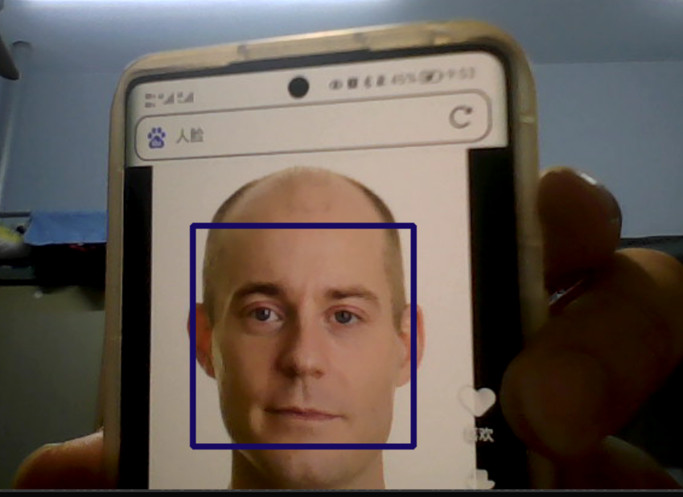


```C++ 
#include<opencv2/opencv.hpp>
#include<iostream>
#include<string>
#include<cmath>
#include<vector>
using namespace std;
using namespace cv;

string path = "D:\\My coding repositary\\learnopencv\\7\\source_file\\haarcascade_frontalface_default.xml";

int main()
{
	srand((unsigned int)time(NULL));

	CascadeClassifier faceCascade;

	faceCascade.load(path);

	if (faceCascade.empty()) {
		return -1;
	}

	Mat img;
	VideoCapture cap(0);
	while (1) {
		cap >> img;
		vector<Rect> face;
		faceCascade.detectMultiScale(img, face, 1.1, 10);
		for (int i = 0; i < face.size(); i++) {

			rectangle(img, face[i].tl(), face[i].br(), Scalar(rand() % 255, rand() % 244, rand() % 255), 3);

		}


		imshow("hello", img);

		waitKey(1);
	}
	
	
}
```


## Pro 1: 画笔画在屏幕上！

```C++
#include<opencv2/opencv.hpp>
#include<iostream>
#include<string>
#include<cmath>
#include<vector>
using namespace std;
using namespace cv;

string path = "D:\\My coding repositary\\learnopencv\\7\\source_file\\haarcascade_frontalface_default.xml";
vector<vector<int>>myColors{ {0,9,46,255,63,255},{46,127,43,255,25,255} };// red blue 这里自己调一下罢，哥们开摆了
vector<Scalar> colorBGR{ {255,0,0} ,{0,0,255} };

vector<vector<int>> newPoints;
Point& receiveCountours(Mat& afterPreWork, Mat& org)
{
	vector<vector<Point>> countours;
	vector<Vec4i> hierarchy;
	
	findContours(afterPreWork, countours, hierarchy, RETR_EXTERNAL, CHAIN_APPROX_SIMPLE);

	Mat* workMat = new Mat(org);

	vector<vector<Point>> conPoly(countours.size());
	vector<Rect> boundRect(countours.size());

	Point* mypoint = new Point(0, 0);

	for (int i = 0; i < countours.size(); i++) {

		auto area = contourArea(countours[i]);
		//cout << area << endl;

		if (area > 6000) {

			double peri = arcLength(countours[i], true);

			approxPolyDP(countours[i], conPoly[i], 0.02 * peri, true);

			boundRect[i] = boundingRect(conPoly[i]);

			//drawContours(*workMat, conPoly, i, Scalar(255, 0, 0), 3);

			mypoint->x = boundRect[i].x + boundRect[i].width / 2;
			mypoint->y = boundRect[i].y + boundRect[i].height / 2;
			rectangle(*workMat, boundRect[i].tl(), boundRect[i].br(), Scalar(255, 0, 100), 5);

			
		}

	}
	
	return *mypoint;
}


void drawThings(vector<vector<int>> points,Mat& pic)
{
	int v = 1;


	for (int i = 0; i < points.size(); i++) {

		if (points[i][2] == 0) {

			v = 1;

		}
		else
		{
			v = 0;
		}

		circle(pic, Point(points[i][0], points[i][1]), 10, colorBGR[v], FILLED);

	}
	


}


void getColor(Mat& pic)
{
	Mat* org = new Mat(pic);

	cvtColor(*org, *org, COLOR_BGR2HSV);
	GaussianBlur(*org, *org, Size(11,11), 5, 0);
	

	for (int i = 0; i < myColors.size(); i++) {

		Scalar lower(myColors[i][0], myColors[i][2], myColors[i][4]);
		Scalar upper(myColors[i][1], myColors[i][3], myColors[i][5]);
		Mat mask;
		inRange(pic, lower, upper, mask);
		//imshow(to_string(i), mask);
		Point p= receiveCountours(mask, pic);
		if (p.x != 0 && p.y != 0) {
			vector<int> ve;
			ve.push_back(p.x);
			ve.push_back(p.y);
			ve.push_back(i);
			newPoints.push_back(ve);
		}
	}
	
}

int main()
{
	VideoCapture cap(0);
	Mat pic;
	while (1) {

		cap.read(pic);
		getColor(pic);

		drawThings(newPoints, pic);

		imshow("p", pic);

		waitKey(1);

	}
	
}
```

​		他们是前面的排列组合！这里不做太多的说明！