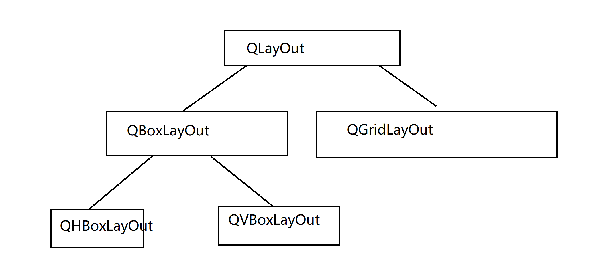

# `Deep Qt`

# 写在前面

​		这个文档是为了正儿八经的学习Qt开开设的，本次Qt文档将会严肃的基于Qt5开发实例这本书，展开对Qt的学习。值得注意到是，当你阅读此文档时，我们将默认您有一定的Qt基础

# `Start all`

​		让我们先从写一个对话框——其可以返回圆的大小开始！我们首先构建一个基于QDialog的项目，在Ui编辑窗口处拖一个LineEdit，拖一个QTextBrowser，拖一个QPushButton出来，嗯，对了，为了让他美观一些，我们整一个QGridLayout上去。以及，限制一下FixedSize，至少，我们并不需要他托的太离谱

​		我想这不能再简单了。现在，我们的目光就聚集在这三个控件上，围绕他们完成我们的功能，在下面

## 计算圆的大小

​		我们老规矩，程序经过预处理和符号加载后，从main处开始运行代码：

```C++
// main.cpp

#include "dialog.h"
#include <QApplication>

int main(int argc, char *argv[])
{
    QApplication a(argc, argv);
    Dialog w;
    w.show();

    return a.exec();
}
```

​		我们逐行分析

```
#include "dialog.h"
#include <QApplication>
```

​		这个dialog.h，可能你的不是，是什么别的名字，但是你摁住Ctrl + 鼠标进去一看，果然，正是你自己的头文件。在这里，我们对我们的窗口完成的功能实现预定义

​		第二行的QApplication则是引入了QApllication类，我们的各式各样的GUI广泛资源，基本设置和事件处理都由他负责

```
int main(int argc, char *argv[])
{
	 QApplication a(argc, argv);
```

​		命令行程序，我们的程序接受了一个命令行，同时值得注意是，创建了一个QApplication，处理我们的命令行。

```
    Dialog w;
    w.show();
```

​		创建了一个Dialog，并且显示它——我们的工作结束！

```
	return a.exec();
}
```

​		程序进入消息循环，等待可能的输入响应

​		好了，扯完了，我们下面来写代码：

​		这是我们的头文件

```C++
#ifndef DIALOG_H
#define DIALOG_H

#include <QDialog>
#include <QKeyEvent>

namespace Ui {
class Dialog;
}

class Dialog : public QDialog
{
    Q_OBJECT

public:
    explicit Dialog(QWidget *parent = nullptr);
    void caculateArea();			// 核心处理函数
    ~Dialog();

private slots:
    void on_pushButton_clicked();     // 摁下摁扭的响应
    void on_lineEdit_returnPressed(); // 摁Enter键的响应

private:
    Ui::Dialog *ui;

};
#endif // DIALOG_H
```

​		按照逻辑顺序，我们先写核心代码：

```
void caculateArea();
```

​		我们先拿出两个宏，第一个是衡量PI的精度

```C++
const double PI = 3.1415926; // #define PI 3.1415926
```

​		第二个是衡量面积大小

```C++
#define Area(X) ( X*X*PI )
```

​		好，现在，我们写核心：很简单，我们触发了这个函数表示开始算，拿到LineEdit的结果，然后投射到TextBrowser上

```C++
// dialog.cpp
void Dialog::caculateArea()
{
    bool isAbleTransform;
    double radius = static_cast<double>(ui->lineEdit->text().toFloat(&isAbleTransform));
    if(!isAbleTransform){
        QMessageBox::critical(this,"错误！", "输入不是数字！");
        return;
    }

    ui->textBrowser->setText("面积大小：" + QString::number(Area(radius)));
}

```

​		我们使用的是GUI的revelant API，啥呢，

```C++
void Dialog::on_pushButton_clicked()
{
    caculateArea();
}


void Dialog::on_lineEdit_returnPressed()
{
    caculateArea();
}
```

​		出乎意料的简单——这是因为本质上我们的响应的目的就只有一个——调用函数，显示在桌面上！

# 信号与槽

​		这个，可是Qt的一大特色，我们使用了这个东西，来化简了窗口的通信！在比较早期的Qt中，我们总是这样书写信号与曹的代码：

```C++
connect(Object1, SIGNAL(signal1), Object2, SLOT(slot1));
```

​		现在，我们则是抛弃掉了SIGNAL和SLOT宏，转向了传递函数的地址（或者说函数指针），我们现在这样写代码：

```
connect(ui->pushbutton, &QPushButton::pressed, this, &MainWindow::doSomething);
```

​		这句话的意思是：绑定摁扭点击和主窗口某个方法。只要点击他，就会调用doSomething.

## 优点缺点

### 一、桌面程序的结构

[Qt 信号和槽的机制（逻辑清晰的来说清楚信号和槽，呕心沥血之作）_qt的信号与槽机制原理_冯一川的博客-CSDN博客](https://blog.csdn.net/ifeng12358/article/details/120880153)

​		Qt的使用场景，主要是应用于桌面程序来使用，不管你使用的操作系统平台是什么。对于桌面程序来说，最重要的就是交互了。既然有交互，就需要一个窗口系统了。

​		窗口系统实现了桌面程序的主要逻辑，并提供了一套基于事件驱动的编程框架。Qt同样也提供了这样的一套逻辑。

​		我们常见的桌面程序的结构，如下图所示：


 所以，我们可以看到，在桌面程序中我们需要对窗口系统的一些操作作出相应，也就是事件。

### 二、事件

实现事件的机制通常有两种。

一种是事件处理类，是用回调函数来实现。

另一种叫委托，就是事件的处理不是收到事件的人自己来做，而是把它委托给了别人来做。Qt就提供了这样的一种机制：信号和槽。

### 三、信号和槽

信号与槽是Qt特有的的消息传输机制，在Qt中信号与槽用得十分广泛。在编程的过程中，我们都会遇到消息传递的事情，本质上就是发出命令（信号、消息），执行命令（相应的执行）。

比如单击窗口上一个按钮然后弹出一个对话框，那么就可以将这个按钮的单击信号和自定义的槽关联起来，信号是按钮的单击信号，槽实现了创建一个对话框并显示的功能。

信号与槽就是实现对象之间通信的一种机制，在其他编程语言中也有通过回调机制来实现对象之间的通信。

- 信号：当对象改变其状态时，信号就由该对象发射 (emit) 出去，而且对象只负责发送信号，它不知道另一端是谁在接收这个信号。
- 槽：用于接收信号，而且槽只是普通的对象成员函数。一个槽并不知道是否有任何信号与自己相连接。

信号槽是设计模式[观察者模式](https://so.csdn.net/so/search?q=观察者模式&spm=1001.2101.3001.7020)的一种实现：

A、一个信号就是一个能够被观察的事件，或者至少是事件已经发生的一种通知；
B、一个槽就是一个观察者，通常就是在被观察的对象发生改变的时候——也可以说是信号发出的时候——被调用的函数；
C、信号与槽的连接，形成一种观察者-被观察者的关系；
D、当事件或者状态发生改变的时候，信号就会被发出；同时，信号发出者有义务调用所有注册的对这个事件（信号）感兴趣的函数（槽）。


信号和槽是多对多的关系。一个信号可以连接多个槽，而一个槽也可以监听多个信号。

然后，实现信号和槽，就要说一下Qt的元对象系统。

### 四、Qt元对象系统

Qt 的元对象系统叫 Mate-Object-System，提供了对象之间通信的信号与槽机制、运行时类型信息和动态属性系统。

但是，元对象是基于三个条件的：

 1、该类必须继承自Qobject类

 2、必须在类的私有声明区声明[Q_OBJECT](https://so.csdn.net/so/search?q=Q_OBJECT&spm=1001.2101.3001.7020)宏（在类定义的时候，如果没有指定public，
则默认为private，用来启用元对象功能，比如动态属性、信号和槽）。 

 3、 元对象编译器Meta-Object Compiler（moc）为 QObject的子类实现元对象 
特性提供必要的代码。

有了元对象系统后，我们就可以使用Qt的信号和槽了。

### 五、信号和槽的格式

信号与槽关联是用 QObject::connect() 函数实现的，其基本格式是：

```css
QObject::connect(sender, SIGNAL(signal()), receiver, SLOT(slot()));
```

在Qt 5中提供了一种新的格式：

```lisp
connect(sender, &Sender::valueChanged,receiver, &Receiver::updateValue);
```

具体的使用哪种格式，就看个人的喜好了。

注：在日常的项目编程中，如果第一种的connect方式出现报错，你可以尝试使用第二种connect方式。

### 六、connect的第五个参数

在connect函数中除了上面介绍的四个参数外，还有第五个参数，是缺省的参数。我们打开qobject.h文件可以看到它的定义，如下所示：

```C++
    static QMetaObject::Connection connect(const QObject *sender, const char *signal,
                const QObject *receiver, const char *member, Qt::ConnectionType = Qt::AutoConnection);
 
    static QMetaObject::Connection connect(const QObject *sender, const QMetaMethod &signal,
                const QObject *receiver, const QMetaMethod &method,
                Qt::ConnectionType type = Qt::AutoConnection);
 
    inline QMetaObject::Connection connect(const QObject *sender, const char *signal,
                const char *member, Qt::ConnectionType type = Qt::AutoConnection) const;
```

最后一个参数所表示的意思：

Qt::AutoConnection：信号的发送者与信号的接收者在同一线程，则默认使用Qt::DirectConnection：如果不在同一线程，则默认  使用Qt::QueuedConnection。
Qt::DirectConnection：信号的发送者与信号的接收者在同一线程中执行，当发出信号后，会马上进入槽函数，看上去就像在信号  发送位置调用了槽函数，在多线程下会比较危险，容易造成崩溃。
Qt::QueuedConnection：信号的发送者与信号的接收者不在同一线程中执行，槽函数运行于信号的接收者线程，当发送信号后，  槽函数不会马上被调用，等待信号的接收者把当前函数执行完，进入事件循环之后，槽函数才会被调用。多线程环境下一般用这个。
Qt::BlockingQueuedConnection：槽函数的调用时机与Qt::QueuedConnection一致，不过发送完信号后发送者所在线程会阻塞，直到槽函数运行完。接收者和发送者绝对不能在一个线程，否则程序会死锁。在多线程间需要同步的场合可能需要这个。
Qt::UniqueConnection：可以通过按位或（|）与以上四个结合在一起使用。当设置此参数时，当某个信号和槽已经连接时，再进行重复的连接就会失败。也就是避免了重复连接。

介绍到这里，信号和槽的基本内容就写完了。但是，还是得说下Qt事件（你可以结合着上面第2节一起看）。

### 七、Qt事件

无论是什么桌面操作系统，每个进程都有一个全局的事件队列（Event Queue）。当我们在键盘上按了一个键、移动或者点击鼠标、触摸屏幕等等，都会产生一个事件（Event），并由操作系统负责将它扔到进程的事件队列。

扔到事件队列后，它会等待以后的某一个时刻发送。分配器（dispatcher ）会遍历事件队列，并且将入栈的事件发送到它们的目标对象当中，因此它们被称为**事件循环（Event loop**）。

Qt中是通过运行QCoreApplication::exec()来进入Qt的主体事件循环的；这会引发阻塞，直至QCoreApplication::exit() 或者 QCoreApplication::quit() 被调用，进而结束循环。

# Qt5模板库，工具类和基本控件

## 字符串类

### 基本操作

​		我们很难逃过字符串这个东西，为什么？无论是做什么，我们都要使用字符串来传递信息。无论是网络编程还是GUI显示，很多地方都需要字符串可以灵活的正确的按照我们的想法表达。

​		QString提供了一个非常完善的方法来供我们使用字符串。我们先来看一个简单的操作：

```C++
#include <QCoreApplication>
#include <QString>
#include <QDebug>
int main(int argc, char *argv[])
{
    QCoreApplication a(argc, argv);

    QString str1 = "Welcome ";
    QString str2 = "Qt!";

    qDebug() << str1 + str2;

    return a.exec();
}
```

​		我们很自然的想到+号使得字符串自然的拼接。我们毫不意外的看到输出是：


​		我们为什么可以直接这样写：

```
QString str1 = "Welcome ";
```

​		而不是

```
QString str1("Welcome ");
```

​		呢，答案是，我们调用了这个构造函数

```
inline QT_ASCII_CAST_WARN QString(const char *ch)
   : d(fromAscii_helper(ch, ch ? int(strlen(ch)) : -1))
```

​		实际上，我们还可以到—他不是QString直接跟const char*对接，而是用一个fromAscii对象处理：这是为了方便程序员更加高级的处理字符串的（翻译成Unicode字符串还是其他？）

​		如果不喜欢用 + （我没见过），可以使用等价的接口`append`，

```
    QString str;
    str.append(str1);
    str.append(str2);

    qDebug() << str;
```


​		我们甚至可以使用一个sprintf来生成我们的字符串，这跟我们的C++字符串库一样

```C++
	QString Str;
    Str.sprintf("%s","str1");

    qDebug() << Str;

    Str.sprintf("%s","str2");

    qDebug() << Str;

    Str.sprintf("%s %s","str1", "str2");

    qDebug() << Str;

```


​		熟悉格式化输出的话，还可以使用arg函数。相较于sprintf，她更有类型安全，且支持处理的类型更多

```
    QString argtest;
    argtest = QString("%1 was in %2").arg("Charlie").arg("cc");
```


​		还有其他的接口，如insert等，可以看后面翻译的文档：

​		更加值得一提的是：QString还有一些方法如：trimmed（移除两端的空白字符）和simplified方法（用空格代表空白字符）

### 查询

​		startsWith方法判定的是某一个字符串是不是以另一个指定的字符串开头

```
    if(argtest.startsWith("charlie",Qt::CaseInsensitive))
        qDebug() << " yep ";

    if(argtest.startsWith("Charlie",Qt::CaseInsensitive))
        qDebug() << " yep ";

    qDebug() << "We see that in Qt::CaseInsensitive mode, both judgement can be true";

    if(!argtest.startsWith("charlie",Qt::CaseSensitive))
        qDebug() << " nope ";

    if(argtest.startsWith("Charlie",Qt::CaseSensitive))
        qDebug() << " yep ";

    qDebug() << "but CaseSensitive don't";
```


​		可以一瞥，对了，CaseSensitive是QT下的一个Enumeration，一个枚举值，可以看到当我们指定大小写敏感的时候，charlie就找不到了，默认的讲，我们不指定的话，自然是CaseSensitive，这一点可以在默认参数看到：

```
#if QT_STRINGVIEW_LEVEL < 2
    bool startsWith(const QString &s, Qt::CaseSensitivity cs = Qt::CaseSensitive) const;
    bool startsWith(const QStringRef &s, Qt::CaseSensitivity cs = Qt::CaseSensitive) const;
#endif
    Q_REQUIRED_RESULT bool startsWith(QStringView s, Qt::CaseSensitivity cs = Qt::CaseSensitive) const Q_DECL_NOTHROW
    { return QtPrivate::startsWith(*this, s, cs); }
    bool startsWith(QLatin1String s, Qt::CaseSensitivity cs = Qt::CaseSensitive) const;
    bool startsWith(QChar c, Qt::CaseSensitivity cs = Qt::CaseSensitive) const;
```

​		还有个类似的是endsWith，这里不在讲述了！

​		contains方法则是上述两个的通用算法，查询的是子字符串在不在我们的字符串内，返回的是boolean类型

### 字符串比较

​		比较函数用于比较两个 QString，并返回整数值 0、小于 0 或大于 0，具体取决于两个 QString 分别相等、小于或大于彼此。

示例 1：比较两个 QStrings

```
QString str1 = “Hello”;
QString str2 = “World”;
int result = str1.compare（str2）// 结果将小于 0
```

​		在这个例子中，我们比较两个QStrings“Hello”和“World”。由于“Hello”按字母顺序排在“World”之前，因此结果将小于 0。

示例 2：使用区分大小写

```
QString str1 = “Hello”;
QString str2 = “HELLO”;
int result = str1.compare（str2， Qt：：CaseInsensitive ）// 结果将为 0
```

​		在这里，我们使用比较函数的可选第二个参数来指定比较应该不区分大小写。

​		由于“Hello”和“HELLO”仅在大小写上有所不同，因此结果将为0，表示两个QString相等。

​		我们最建议使用的是Compare函数，他速度很快。

### 字符串向其他类型转化

​		我们可以把字符串在可以的情况下转化为其他类型：

```C++
QString str = "125";
bool ok;
int dec = str.toInt(&ok);
if(!ok)
	qDebug() << "Failed to translate";
else
    qDebug() << dec;
```


​		也可以转化为其他格式的字符串：

1. toAscii转化为一个八位字符串
2. toLatin1转化为一个Latin-1(ISO8859-1)编码的8位字符串
3. toUtf8转化为utf8字符串
4. toLocal8Bit字符串

# Related Docs

[所有类 | Qt 5.15 - 中文文档编制,帮助,手册,教程 (digitser.top)](http://qt5.digitser.top/5.15/zh-CN/classes.html)

​		也可以查看我的github仓库：[MyTranslatedQtDocument-CN/Basic C++ Class/S at master · Charliechen114514/MyTranslatedQtDocument-CN (github.com)](https://github.com/Charliechen114514/MyTranslatedQtDocument-CN/tree/master/Basic C%2B%2B Class/S)

# 容器类

​		我们下面要谈到的是容器类！容器！我想大伙第一反应就是STL的容器。正确的！Qt的容器类是类似的。

​		他可以存储我们**绝大部分**的容器（意味深长），基本的数据类型，Qt的简单的数据类型，都可以存放在容器里，但是，**类似于QWidget和QDialog**一类的玩意不可以存储，更详细的讲：一切**QObject和他的派生子类**都不可以存在容器里：他们甚至没法通过编译：

```
QList<QToolBar> list; // compiling Fails!
```

​		但是，这不是意味着存不了，而是转向存储他们的指针

```
QList<QToolBar*> list; // Accessible!
```

# `QList, QLinkedList, QVector`

## `QList`

​		这是真的很常用，本人开发的一些小工具的首选容器！他们之间的对比如下：

| 容器类        | 查找   | 插入   | 头插         | 尾插         |
| ------------- | ------ | ------ | ------------ | ------------ |
| `QList`       | `O(1)` | `O(n)` | `Amort O(1)` | `Amort O(1)` |
| `QLinkedList` | `O(1)` | `O(1)` | `O(1)`       | `O(1)`       |
| `QVector`     | `O(1)` | `O(n)` | `O(n)`       | `Amort O(1)` |

​		我们来看一个demo:

```C++
#include <QCoreApplication>
#include <QList>
#include <QDebug>
int main(int argc, char *argv[])
{
    QCoreApplication a(argc, argv);

    QList<QString> myList;
    for(int i = 0; i < 10; i++)
    {
        QString tmp = "this is number: " + QString::number(i);
        myList << tmp;
    }

    for (int i = 0; i < myList.size();i++) {
        qDebug () << myList[i];
    }

    return a.exec();
}
```

​		我们使用了list 的 << 方法， 他等价于`push_back`方法！

## `QLinkedList`

​		如名称一致——链表，正儿八经的链表！我建议——当你的元素需要频繁的插取的时候，直接使用这个容器会好得多！

## `QVector`

​		STL 的vector，这里是一样的，我们还有QPolygon, QPolygonF, QStack等容器来自这个容器！

## 一些迭代器

​		这里不打算讲，但是可以注意的是，迭代器分为Java风格的和STL风格的，Java风格的迭代器可以参看Qt官网

# 控件

​		下面我们开始讲点新东西——也就是控件！

## 摁扭类

​		我们常见的基础类摁扭有：

- PushButton 普通按钮
- ToolButton 工具按钮
- RadioButton 单选按钮
- CheckBox 复选框
- Command Link Button 命令链接摁扭
- 对话框按钮盒

​		拖出来给大伙看一眼


​		我们下面来设计一下，构建一个自定义的按钮，这一次我们构建的项目是QWidget(控件)， 我们构建一个叫做MyWidget的类，头文件记得添加这些头文件

```
#include<QPushButton>
#include<QFont>
```

​		头文件就可以不用动了

​		然后就是书写代码：

```C++
#include "myidget.h"

Myidget::Myidget(QWidget *parent)
    : QWidget(parent)
{
    setMinimumSize(200,120);
    setMaximumSize(200,120);

    QPushButton* quit = new QPushButton("Quit", this);

    quit->setGeometry(60,40,75,30);

    quit->setFont(QFont("Times", 18, QFont::Bold));

    connect(quit, &QPushButton::clicked, this, &QWidget::close);
}

Myidget::~Myidget()
{}
```

​		以及为了显示窗口不让他失踪，我们在main.cpp中有必要指定一下：

```C++
#include "myidget.h"
#include <QApplication>

int main(int argc, char *argv[])
{
    QApplication a(argc, argv);
    Myidget w;
    w.setGeometry(100,100,200,120); // 设置一下大小
    w.show();

    return a.exec();
}
```


​		点击它，程序就结束了。

## 输入部件

​		常见的输入部件在这里：

1. Combo Box 组合框
2. Font Combo Box 字体编辑框 （可以获得用户选择的字体！）
3. Line Edit 行编辑框
4. Text Edit 文本编辑框
5. Plain Text Edit 纯文本编辑框
6. Spin Box 数字显示框
7. Double Spin Box 双自旋盒
8. Time Edit 时间编辑
9. Date Edit 日期编辑
10. Date/Time Edit 时间日期编辑
11. Dial 拨号
12. Horizontal Scroll Bar 横向滚动条
13. Vertical Scroll Bar 纵向滚动条
14. Horizontal Slider 横向滑块
15. Vertical Slider 纵向滑块
16. Key Sequence Edit 按键序编辑框


​		还是一样，相关的设计已经集成在我的Qt CN Document仓库了

## 显示控件

​		下面的这些控件主要是用来展示内容的（Display）

- Label: 标签
- TextBrowser 文本浏览器
- Graphic View 图形视图
- Calendar Widget 日历
- LCD Number 液晶数字
- Process Bar 进度条
- Horizontal Line水平线
- Vertical Line 铅垂线
- OpenGL Widget OpenGL控件
- QQuick Widget QML模块

## 容器组

- GroupBox
- Scroll Area
- Tool Box
- Tab Widget
- Stacked Widget
- Frame
- Widget
- MDI Area
- Dock Widget
- QAxWidget

# Qt5 布局

我们下面来看看布局问题：

## 分割类QSpitter


​		我们可以这样应用QSplitter类帮助我们做这样的事情：

```C++
#include "mainwindow.h"
#include <QApplication>
#include <QSplitter>
#include <QTextEdit>
int main(int argc, char *argv[])
{
    QApplication a(argc, argv);
    QFont font("ZYSong18030", 12);
    a.setFont(font);
    QSplitter *splitMainWindow = new QSplitter(Qt::Horizontal, 0);

    // 主分割
    QTextEdit* textLeft = new QTextEdit(QObject::tr("Left Widget"), splitMainWindow);
    textLeft->setAlignment(Qt::AlignCenter);

    // right 分割
    QSplitter* rightSplit = new QSplitter(Qt::Vertical, splitMainWindow);
    rightSplit->setOpaqueResize(false);
    QTextEdit* textUp =new QTextEdit(QObject::tr("Top Widget"), rightSplit);
    textUp->setAlignment(Qt::AlignCenter);

    QTextEdit* textDown =new QTextEdit(QObject::tr("bottom Widget"), rightSplit);
    textDown->setAlignment(Qt::AlignCenter);
    splitMainWindow->setStretchFactor(1,1);
    splitMainWindow->setWindowTitle(QObject::tr("Splitter"));
    splitMainWindow->show();

//    MainWindow w;
//    w.show();

    return a.exec();
}
```

​		现在，我们仔细瞧瞧代码：

```
QSplitter *splitMainWindow = new QSplitter(Qt::Horizontal, 0);
```

​		主分割窗口，我们并且还对窗口呈现主水平分割：人话如下：


​		然后，在主窗口左侧插入一个TextEdit类，至于文本的对齐方式是：

| 符号              | 说明     |
| ----------------- | -------- |
| `Qt::AlignLeft`   | 左对齐   |
| `Qt::AlignRight`  | 右对齐   |
| `Qt::AlignCenter` | 居中对齐 |
| `Qt::AlignUp`     | 顶对齐   |
| `Qt::AlignBottom` | 底对齐   |

​		而`rightSplit->setOpaqueResize(false);`这句话的意思是：拖拽时不会实时更新显示，直接一条灰线。

## QDockWidget类

​		我们下面来看一个QDockWidget类的例子：

```C++ 
#include "mainwindow.h"

MainWindow::MainWindow(QWidget *parent)
    : QMainWindow(parent)
{
    setWindowTitle(tr("DockWindows"));
    QTextEdit* text = new QTextEdit(this);
    text->setText(tr("Main Windows"));
    text->setAlignment(Qt::AlignCenter);
    setCentralWidget(text);
    // Dock1
    QDockWidget* dock = new QDockWidget(tr("Dock1"), this);

    dock->setFeatures(QDockWidget::DockWidgetMovable);
    dock->setAllowedAreas(Qt::LeftDockWidgetArea| Qt::RightDockWidgetArea);

    QTextEdit* text1 = new QTextEdit();
    text1->setText(tr("Window1, the dock widget can be moved between docks by the user"));
    dock->setWidget(text1);
    addDockWidget(Qt::RightDockWidgetArea, dock);

    QDockWidget* dock1 = new QDockWidget(tr("DockWindow2"),this);\
    dock1->setFeatures(QDockWidget::DockWidgetFloatable | QDockWidget::DockWidgetClosable);
    QTextEdit* text2 = new QTextEdit();
    text2->setText(tr("Windows2, the dock widget can be detached from the mainWindow, and floated as an independent window"));
    dock1->setWidget(text2);
    addDockWidget(Qt::RightDockWidgetArea, dock1);

    QDockWidget* dock2 = new QDockWidget(tr("DockWindow2"),this);
    dock2->setFeatures(QDockWidget::AllDockWidgetFeatures);
    QTextEdit* text3 = new QTextEdit();
    text2->setText(tr("Windows2, the dock widget can be detached from the mainWindow, and floated as an independent window"));
    dock1->setWidget(text3);
    addDockWidget(Qt::RightDockWidgetArea, dock2);

}

MainWindow::~MainWindow()
{

}
```


​		看起来不错！

## QStackedWidget类


```
// mainWindow.h
#ifndef MAINWINDOW_H
#define MAINWINDOW_H

#include <QMainWindow>
#include <QListWidget>
#include <QLabel>
#include <QStackedWidget>
#include <QHBoxLayout>
class MainWindow : public QMainWindow
{
    Q_OBJECT

public:
    MainWindow(QWidget *parent = 0);
    ~MainWindow();
private:
    QListWidget* list;
    QStackedWidget* stack;
    QList<QLabel*> labelList;
};

#endif // MAINWINDOW_H


#include "mainwindow.h"

MainWindow::MainWindow(QWidget *parent)
    : QMainWindow(parent)
{
    QWidget* widget = new QWidget(this);
    setCentralWidget(widget);
    this->setWindowTitle("Stacked Test");
    list = new QListWidget(widget);

    list->insertItem(0, tr("window1"));
    list->insertItem(1, tr("window2"));
    list->insertItem(2, tr("window3"));

    labelList.push_back(new QLabel(tr("WindowTest1")));
    labelList.push_back(new QLabel(tr("WindowTest2")));
    labelList.push_back(new QLabel(tr("WindowTest3")));

    stack = new QStackedWidget(widget);

    for(int i = 0; i < 3; i++)
       stack->addWidget(labelList[i]);
    QHBoxLayout *mainLay = new QHBoxLayout(widget);

    mainLay->setMargin(5); // 设置边距
    mainLay->setSpacing(5);
    mainLay->addWidget(list);
    mainLay->addWidget(stack,0,Qt::AlignCenter);
    mainLay->setStretchFactor(list, 1);
    mainLay->setStretchFactor(stack, 3);
    connect(list, &QListWidget::currentRowChanged, stack, &QStackedWidget::setCurrentIndex);

}

MainWindow::~MainWindow()
{

}
```

## Qt基本布局

​		简单的讲，我们的QT布局如下：



​		好了，常见的基本控件和其他的定西都说完了

# Qt5 基本对话框

​		下面，我们来使用常见的Qt5对话框：

- QFileDialog 标准对话框
- QColorDialog 标准颜色对话框
- QFontDialog 标准字体选择对话框
- QInputDialog 标准输入框
- QMessageBox 标准消息框

​		我们可以调用其各自不同的静态函数来完成相应的基础性的功能：

---

| 静态函数              | 函数说明                       |
| --------------------- | ------------------------------ |
| `getOpenFileName`     | 获得用户选择的文件夹           |
| `getSaveFileName`     | 获得用户保存的文件名           |
| `getExistingFileName` | 获得用户线则已存在的目录名     |
| `getOpenFileNames`    | 据哦的用户选择的文件名称的列表 |

---

| 静态函数   | 函数说明           |
| ---------- | ------------------ |
| `getColor` | 获得用户选择的颜色 |

---

| 静态函数  | 函数说明           |
| --------- | ------------------ |
| `getFont` | 获得用户选择的字体 |

---

| 静态函数    | 函数说明           |
| ----------- | ------------------ |
| `getText`   | 获得用户输入的文本 |
| `getItem`   | 获得用户选择的样品 |
| `getInt`    | 获得用户的Int值    |
| `getDouble` | 获得用户的double值 |

---

| 静态函数                   | 函数说明          |
| -------------------------- | ----------------- |
| `QMessageBox::question`    | Question消息框    |
| `QMessageBox::information` | Information消息框 |
| `QMessageBox::warning`     | Warning消息框     |
| `QMessageBox::critical`    | Critical消息框    |
| `QMessageBox::about`       | About消息框       |
| `QMessageBox::aboutQt`     | About Qt消息框    |

## QFileDialog

​		简单，就是你看到的那样：选择文件的对话框：我们简单的给一个带有ui设计窗口演示一下

```
void MainWindow::on_pushButton_clicked()
{
    QString filesName = QFileDialog::getOpenFileName(this, tr("Select Files"), \
                                                     tr("C++ Files(*.cpp)::C Files(*.c)"));
    ui->showFilePlace->setText(filesName);
}
```

​		很简单，就是显示那些被Filter筛选的文件导入进来文件地址，交给后续的处理

## QColorDialog

​		getColor是这个类常用的一个静态函数

```
    static QColor getColor(const QColor &initial = Qt::white,
                           QWidget *parent = nullptr,
                           const QString &title = QString(),
                           ColorDialogOptions options = ColorDialogOptions());
```

​		这是这个函数的定义。

​		我们来尝试一个实例，在ui界面放置好一个按钮之后，可以尝试

```
void MainWindow::on_pushButton_clicked()
{
    QColor c = QColorDialog::getColor(Qt::blue, this);
    if(c.isValid())
    {
        ui->frame->setPalette(QPalette(c));
    }
}
```

​		这样，我们选择什么颜色，这个框架就会显示什么颜色了。

## QInputDialog

​		输入对话框，这个对话框封装了用户通过对话框输入的流程。常见的静态函数是：

```
double getDouble(QWidget *parent, const QString &title, const QString &label, double value = 0, double min = -2147483647, double max = 2147483647, int decimals = 1, bool *ok = Q_NULLPTR, Qt::WindowFlags flags = Qt::WindowFlags())

//int类型的接口
int getInt(QWidget *parent, const QString &title, const QString &label, int value = 0, int min = -2147483647, int max = 2147483647, int step = 1, bool *ok = Q_NULLPTR, Qt::WindowFlags flags = Qt::WindowFlags())

//单选框获取选中的某一列
QString getItem(QWidget *parent, const QString &title, const QString &label, const QStringList &items, int current = 0, bool editable = true, bool *ok = Q_NULLPTR, Qt::WindowFlags flags = Qt::WindowFlags(), Qt::InputMethodHints inputMethodHints = Qt::ImhNone)

//多文本输入框
QString getMultiLineText(QWidget *parent, const QString &title, const QString &label, const QString &text = QString(), bool *ok = Q_NULLPTR, Qt::WindowFlags flags = Qt::WindowFlags(), Qt::InputMethodHints inputMethodHints = Qt::ImhNone)

//单文本输入框
QString getText(QWidget *parent, const QString &title, const QString &label, QLineEdit::EchoMode mode = QLineEdit::Normal, const QString &text = QString(), bool *ok = Q_NULLPTR, Qt::WindowFlags flags = Qt::WindowFlags(), Qt::InputMethodHints inputMethodHints = Qt::ImhNone)
```

​		这些函数可以返回用户的输入。值得注意的是，多返回输入需要用户自己实现。

Qt 提供了 6 种通用的 QMessageBox 消息对话框，通过调用 QMessageBox 类中的 6 个静态成员方法，可以直接在项目中使用它们。

## QMessageBox

#### 1) information消息对话框

information 对话框常用于给用户提示一些关键的信息，它的外观如下图所示：


图 2 information 消息对话框


在项目中使用 information 消息对话框，直接调用 QMessageBox 类中的 information() 静态成员方法即可，该方法的语法格式如下：

```
StandardButton QMessageBox::information(QWidget *parent,
                                        const QString &title,
                                        const QString &text,
                                        StandardButtons buttons = Ok,
                                        StandardButton defaultButton = NoButton)
```

各个参数的含义是：

- parent：指定消息对话框的父窗口，消息提示框会作为一个独立的窗口显示在父窗口的前面。消息提示框从弹出到关闭的整个过程中，用户无法操作父窗口，更不能删除父窗口；
- title：指定消息对话框的标题，即图 2 中的 Titile；
- text：指定消息对话框的具体内容，即图 2 中的 text；
- buttons：指定消息对话框中包含的按钮。默认情况下，消息对话框只包含一个按钮，即图 2 中显示的 "OK" 按钮。根据需要，我们可以用`|`按位或运算符在消息对话框中设置多个按钮，例如 `QMessageBox::Ok|QMessageBox::Cancel`；
- defaultButton：指定 Enter 回车键对应的按钮，用户按下回车键时就等同于按下此按钮。注意，defaultButton 参数的值必须是 buttons 中包含的按钮，当然也可以不手动指定，QMessageBox 会自动从 buttons 中选择合适的按钮作为 defaultButton 的值。


information() 函数会返回用户按下的按钮。StandardButton 是 QMessageBox 类中定义的枚举类型，每个枚举值代表一种按钮。StandardButton 类型中的值有很多，下表给大家罗列了几个常用的：


| 枚举值               | 含 义                                                        |
| -------------------- | ------------------------------------------------------------ |
| QMessageBox::Ok      | 标有 "OK" 字样的按钮，通常用来表示用户接受或同意提示框中显示的信息。 |
| QMessageBox::Open    | 标有 "Open" 字样的按钮。                                     |
| QMessageBox::Save    | 标有 "Save" 字样的按钮。                                     |
| QMessageBox::Cancel  | 标有 "Cancel" 字样的按钮。点击此按钮，通常表示用户拒绝接受提示框中显示的信息。 |
| QMessageBox::Close   | 标有 "Close" 字样的按钮。                                    |
| QMessageBox::Discard | 标有 "Discard" 或者 "Don't Save" 字样的按钮，取决于运行平台。 |
| QMessageBox::Apply   | 标有 "Apply" 字样的按钮。                                    |
| QMessageBox::Reset   | 标有 "Reset" 字样的按钮。                                    |
| QMessageBox::Yes     | 标有 "Yes" 字样的按钮。                                      |
| QMessageBox::No      | 标有 "No" 字样的按钮。                                       |


例如，使用 information() 函数实现图 2 所示的对话框，实现代码为：

```
QMessageBox::StandardButton result = QMessageBox::information(&widget, "Title","text");
```

其中，widget 是我们创建好的 QWidget 窗口，创建好的 information 对话框会显示在 widget 窗口的前面。通过用 result 接收 information() 函数的返回值，我们可以得知用户选择的是哪个按钮。

#### 2) critical消息对话框

critical 消息对话框常用于给用户提示“操作错误”或“运行失败”的信息，它的外观如下图所示：


图 3 critical 消息对话框


项目中使用 critical 消息对话框，直接调用 QMessageBox 类提供的 critical() 静态成员方法即可，该方法的语法格式为：

```
StandardButton QMessageBox::critical(QWidget *parent,
                                     const QString &title,
                                     const QString &text,
                                     StandardButtons buttons = Ok,
                                     StandardButton defaultButton = NoButton)
```

各个参数的含义以及返回值的含义，都与 information() 函数相同，这里不再重复赘述。

例如，使用 critical() 函数实现图 3 所示的对话框，实现代码为：

```
QMessageBox::StandardButton result=QMessageBox::critical(&widget, "Title","text");
```

其中，widget 是我们创建好的 QWidget 窗口，创建好的 critical 对话框会显示在 widget 窗口的前面。

#### 3) question消息对话框

question 对话框常用于向用户提出问题并接收用户的答案，它的外观如下图所示：


图 4 question消息对话框


项目中使用 question 对话框，可以直接调用 QMessageBox 类的 question() 静态成员方法，该方法的语法格式为：

```
StandardButton QMessageBox::question(QWidget *parent,
                                     const QString &title,
                                     const QString &text,
                                     StandardButtons buttons = StandardButtons( Yes | No ),
                                     StandardButton defaultButton = NoButton)
```

各个参数的含义以及返回值的含义，都与 information() 函数相同。

例如，使用 question() 函数实现图 4 所示的对话框，实现代码为：

```
QMessageBox::StandardButton result=QMessageBox::question(&widget, "Title","text");
```

其中，widget 是我们创建好的 QWidget 窗口，创建好的 question 对话框会显示在 widget 窗口的前面。

#### 4) warning消息对话框

warining 对话框常用于向用户显示一些警告信息，它的外观如下图所示：


图 5 warning消息对话框


项目中使用 warning 对话框，可以直接调用 QMessageBox 类的 warning() 静态成员方法，该方法的语法格式为：

```
StandardButton QMessageBox::warning(QWidget *parent,
                                    const QString &title,
                                    const QString &text,
                                    StandardButtons buttons = Ok,
                                    StandardButton defaultButton = NoButton)
```

各个参数的含义以及返回值的含义，都与 information() 函数相同。

例如，使用 warning() 函数实现图 5 所示的对话框，实现代码为：

```
QMessageBox::StandardButton result=QMessageBox::warning(&widget, "Title","text");
```

其中，widget 是我们创建好的 QWidget 窗口，创建好的 warning 对话框会显示在 widget 窗口的前面。

#### 5) about和aboutQt对话框

about 对话框常常作为介绍某个产品或某项功能的临时窗口，它的外观如下图所示：


图 6 about消息对话框


注意，about 对话框没有固定的图标，它显示的图标可能来自父窗口、包含父窗口的顶层窗口等，也可能使用和 information 对话框相同的图标。

项目中使用 about 对话框，直接调用 QMessageBox 类提供的 about() 静态成员方法即可，该方法的语法格式如下：

void QMessageBox::about(QWidget *parent, const QString &title, const QString &text)

各个参数的含义和与 information() 函数相同。和前面的几种对话框不同，about对话框中只包含一个默认的 Ok 按钮，且 about() 函数没有返回值。

aboutQt 可以看做是 about 对话框的一个具体实例，它只能显示 Qt 的介绍信息，如下图所示：


图 7 aboutQt对话框


项目中使用 aboutQt 对话框，直接调用 QMessageBox 类提供的 aboutQt() 静态成员方法即可，该函数的语法格式如下：

void QMessageBox::aboutQt(QWidget *parent, const QString &title = QString())

我们只能设置 aboutQt 对话框的 parent 父窗口和 title 标题，不能自定义它的内容。所以在实际场景中，aboutQt() 对话框很少使用。

### 自定义QMessageBox对话框

以上 6 种通用的 QMessageBox 对话框，界面上的图片无法修改，按钮上的文字也无法修改（例如无法将 OK、No 改成中文）。如果想修改它们，就需要自定义一个 QMessageBox 对话框。

#### QMessageBox对话框的创建

程序中创建 QMessageBox 对象，必须先引入`<QMessageBox>`头文件。QMessageBox 类提供了两个构造函数，分别是：

```
QMessageBox::QMessageBox(QWidget *parent = Q_NULLPTR)
QMessageBox::QMessageBox(Icon icon,
                         const QString &title,
                         const QString &text,
                         StandardButtons buttons = NoButton,
                         QWidget *parent = Q_NULLPTR,
                         Qt::WindowFlags f = Qt::Dialog | Qt::MSWindowsFixedSizeDialogHint)
```

第一个构造函数可以创建一个“空白”对话框，即对话框中不包含任何文本和按钮。当然，通过调用 QMessageBox 类提供的成员方法，可以向“空白”对话框中添加各种元素（图标、文本、按钮等）。

第二个构造函数中，各个参数的含义是：

- icon：指定对话框中的图片。Icon 是 QMessageBox 类中定义的枚举类型，内部包含 QMessageBox::NoIcon、QMessageBox::Question、QMessageBox::Information、QMessageBox::Warning、QMessageBox::Critical 几个值，分别表示：不指定图片、question对话框的图片（图 4）、information对话框的图片（图 2）、warning对话框的图片（图 5）、critical对话框的图片（图 3）。
- title：指定对话框的标题；
- text：指定对话框中显示的文本信息；
- buttons：指定对话框中包含的的按钮，可选值如表 1 所示。
- parent：指定对话框的父窗口；
- f：指定对话框的属性。WindowFlags 是 Qt 提供的枚举类型，内部包含的值有很多，有的用来指定对话框的用途（比如 Qt::Dialog 表示对话框窗口），有的用来指定对话框的外观（比如 MSWindowsFixedSizeDialogHint 表示给对话框添加一个细的边框）


举个简单的例子：

```C
#include <QApplication>
#include <QMessageBox>
int main(int argc, char *argv[]){    
	QApplication a(argc, argv);    //创建 QMessageBox 类对象    
    QMessageBox MyBox(QMessageBox::Question,"Title","text",QMessageBox::Yes|QMessageBox::No);    //使 MyBox 对话框显示    
    MyBox.exec();    
    return a.exec();
}
```

程序中创建了一个 MyBox 对话框，通过调用 QMessageBox 提供的 exec() 方法，可以使 MyBox 对话框弹出。运行程序可以发现，MyBox 对话框的外观和图 4 的 question 对话框完全一样。

#### QMessageBox对话框的使用

QMessageBox 类提供了很多功能实用的成员方法，方便我们快速地制作出实际场景需要的对话框。

下表给大家罗列了常用的一些 QMessageBox 类成员方法：


| 成员方法                                                     | 功 能                                                        |
| ------------------------------------------------------------ | ------------------------------------------------------------ |
| void QMessageBox::setWindowTitle(const QString &title)       | 设置对话框的标题。                                           |
| void setText(const QString &text)                            | 设置对话框中要显示的文本。                                   |
| void setIconPixmap(const QPixmap &pixmap)                    | 设置对话框中使用的图片。                                     |
| QAbstractButton *QMessageBox::clickedButton() const          | 返回用户点击的按钮。                                         |
| QPushButton *QMessageBox::addButton(const QString &text, ButtonRole role) | 向对话框中添加按钮，text 为按钮的文本，role 是 QMessageBox::ButtonRole 枚举类型的变量，用于描述按钮扮演的角色，它的可选值有 QMessageBox::AcceptRole（同 OK 按钮）、QMessageBox::RejectRole（同 Cancel 按钮）等。 |
| int QMessageBox::exec()                                      | 使当前对话框弹出，除非用户关闭对话框，否则对话框将一直存在。此外，当对话框中使用的都是 Qt 提供的按钮时，该方法可以监听用户点击的是哪个按钮，并将该按钮对应的枚举值返回；如果对话框中包含自定义按钮，需要借助 clickedButton() 方法确定用户点击的按钮。 |


举个简单的例子：

```
#include <QApplication>
#include <QMessageBox>
#include <QPushButton>
#include <QDebug>
int main(int argc, char *argv[])
{
    QApplication a(argc, argv);

    QMessageBox MBox;
    MBox.setWindowTitle("QMessageBox自定义对话框");
    MBox.setText("这是一个自定义的对话框");
    MBox.setIconPixmap(QPixmap("C:\\Users\\xiexuewu\\Desktop\\icon_c.png"));
    QPushButton *agreeBut = MBox.addButton("同意", QMessageBox::AcceptRole);
    MBox.exec();
    if (MBox.clickedButton() == (QAbstractButton*)agreeBut) {
        //在 Qt Creator 的输出窗口中输出指定字符串
        qDebug() << "用户点击了同意按钮";
    }
    return a.exec();
}
```

程序运行结果如图 8 所示，点击“同意”按钮后，我们会在 Qt Creator 的输出窗口中看到“用户点击了同意按钮”。


图 8 自定义的 QMessageBox 对话框

#### QMessageBox的信号和槽

操作 QMessageBox 对话框，最常用的信号函数是 buttonClicked() 函数，最常用的槽函数是 exec() 函数，它们的语法格式和功能如下表所示。 


| 信号函数                                                 | 功 能                                                        |
| -------------------------------------------------------- | ------------------------------------------------------------ |
| void QMessageBox::buttonClicked(QAbstractButton *button) | 当用户点击对话框中的某个按钮时，会触发此信号函数，该函数会将用户点击的按钮作为参数传递给槽函数。 |
| 槽函数                                                   | 功 能                                                        |
| int QMessageBox::exec()                                  | 弹出对话框，直到用户手动关闭对话框，此对话框将一直存在。     |


举个简单的例子：

```C++
//main.cpp
#include <QApplication>
#include <QWidget>
#include <QMessageBox>
#include <QPushButton>
#include <QAbstractButton>
QPushButton* agreeBut;
QPushButton* disagreeBut;
class MyWidget:public QWidget{
    Q_OBJECT
public slots:
    void buttonClicked(QAbstractButton * butClicked);
};

void MyWidget::buttonClicked(QAbstractButton * butClicked){
    if(butClicked == (QAbstractButton*)disagreeBut){
        this->close();
    }
}

int main(int argc, char *argv[])
{
    QApplication a(argc, argv);
    //创建主窗口
    MyWidget myWidget;
    myWidget.setWindowTitle("主窗口");
    myWidget.resize(400,300);

    //创建消息框
    QMessageBox MyBox(QMessageBox::Question,"","");
    MyBox.setParent(&myWidget);
    //设置消息框的属性为对话框，它会是一个独立的窗口
    MyBox.setWindowFlags(Qt::Dialog);
    MyBox.setWindowTitle("协议");
    MyBox.setText("使用本产品，请您严格遵守xxx规定！");
    //自定义两个按钮
    agreeBut = MyBox.addButton("同意", QMessageBox::AcceptRole);
    disagreeBut = MyBox.addButton("拒绝", QMessageBox::RejectRole);

    myWidget.show();
    //添加信号和槽，监听用户点击的按钮，如果用户拒绝，则主窗口随之关闭。
    QObject::connect(&MyBox,&QMessageBox::buttonClicked,&myWidget,&MyWidget::buttonClicked);
    MyBox.exec();

    return a.exec();
}
//MyWidget类的定义应该放到 .h 文件中，本例中将其写到 main.cpp 中，程序最后需要添加 #include "当前源文件名.moc" 语句，否则无法通过编译。
#include "main.moc"
```

程序执行结果为：


## QProgressBar

控件提供水平或垂直[进度条](https://so.csdn.net/so/search?q=进度条&spm=1001.2101.3001.7020)。进度条用于向用户指示操作的进度，并向他们保证应用程序仍在运行。

### 使用

#### 效果


```cpp
    QProgressBar *progressBar = new QProgressBar;
    progressBar->setOrientation(Qt::Horizontal);
    progressBar->setTextVisible(true);
    progressBar->setFormat("%p%");
    progressBar->setRange(0, 99);

    QSlider *slider = new QSlider(Qt::Horizontal);
    slider->setRange(0, 99);

    QGridLayout *gridLayout = new QGridLayout;
    gridLayout->addWidget(progressBar, 0, 0, 1, 1);
    gridLayout->addWidget(slider, 1, 0, 1, 1);

    this->setLayout(gridLayout);

    connect(slider, &QSlider::valueChanged, progressBar, &QProgressBar::setValue);
```

### 常用设置

#### 控件方向、取值范围以及当前值设置

```cpp
    progressBar = new QProgressBar;
    progressBar->setOrientation(Qt::Horizontal);//设置进度条为水平
    progressBar->setRange(0, 99);//取值范围设置
    progressBar->setValue(20);//当前值设置
1234
```

#### 文本对齐设置

通过setAlignment，我们可以控制提示文本在进度条上的位置。

```cpp
progressBar_1->setAlignment(Qt::AlignRight | Qt::AlignVCenter);
1
```

#### 文本读取方向设置

setTextDirection用于设置文本读取方向，只对垂直进度条有效

| 常量                      | 值   | 描述                             |
| ------------------------- | ---- | -------------------------------- |
| QProgressBar::TopToBottom | 0    | 文本顺时针旋转90度（相对于水平） |
| QProgressBar::BottomToTop | 1    | 文本逆时针旋转90度（相对于水平） |

#### 设置进度条读取方向

进度条默认从左往右读，通过setInvertedAppearance可以实现从右往左读。

#### 效果


```cpp
    QProgressBar *progressBar_0 = new QProgressBar;
    progressBar_0->setOrientation(Qt::Horizontal);
    progressBar_0->setTextVisible(true);
    progressBar_0->setRange(0, 99);
    progressBar_0->setValue(0);
    progressBar_0->setAlignment(Qt::AlignRight | Qt::AlignVCenter);

    QProgressBar *progressBar_1 = new QProgressBar;
    progressBar_1->setOrientation(Qt::Horizontal);
    progressBar_1->setTextVisible(true);
    progressBar_1->setRange(0, 99);
    progressBar_1->setValue(0);
    progressBar_1->setAlignment(Qt::AlignRight | Qt::AlignVCenter);//设置文本垂直居中对齐
    progressBar_1->setInvertedAppearance(true);

    QSlider *slider = new QSlider(Qt::Horizontal);
    slider->setRange(0, 99);

    QGridLayout *gridLayout = new QGridLayout;
    gridLayout->addWidget(progressBar_0, 0, 0, 1, 1);
    gridLayout->addWidget(progressBar_1, 1, 0, 1, 1);
    gridLayout->addWidget(slider, 2, 0, 1, 1);
    this->setLayout(gridLayout);

    connect(slider, &QSlider::valueChanged, progressBar_0, &QProgressBar::setValue);
    connect(slider, &QSlider::valueChanged, progressBar_1, &QProgressBar::setValue);
```

### 设置文本可见性

有时候我们不想看到文本，可以通过setTextVisible来关闭文本显示。

#### 效果


#### 源码

```cpp
    progressBar_1->setTextVisible(false);
```

### 自定义提示文本

QProgressBar为我们提供了几种文本显示格式：

- ％p-用完成的百分比代替。
- ％v-由当前值替换。
- ％m-由总步数代替。setFormat用于文本显示格式设置。

我们也可以自定义文本显示格式，如下所示。

#### 效果


#### 源码

```cpp
    progressBar = new QProgressBar;
    progressBar->setOrientation(Qt::Horizontal);
    progressBar->setTextVisible(true);
    progressBar->setRange(0, 99);
    progressBar->setValue(progressBar->minimum());
    double dProgress = (progressBar->value() - progressBar->minimum()) * 100.0
                    / (progressBar->maximum() - progressBar->minimum());
    progressBar->setFormat(QString("当前进度为：%1%").arg(dProgress));
    progressBar->setAlignment(Qt::AlignRight | Qt::AlignVCenter);

    QSlider *slider = new QSlider(Qt::Horizontal);
    slider->setRange(0, 99);

    QGridLayout *gridLayout = new QGridLayout;
    gridLayout->addWidget(progressBar, 0, 0, 1, 1);
    gridLayout->addWidget(slider, 1, 0, 1, 1);

    this->setLayout(gridLayout);

    connect(slider, &QSlider::valueChanged, progressBar, &QProgressBar::setValue);

    connect(progressBar, &QProgressBar::valueChanged, this, &Widget::changeProcess);

void Widget::changeProcess()
{
        double dProgress = (progressBar->value() - progressBar->minimum()) * 100.0
                        / (progressBar->maximum() - progressBar->minimum());
        progressBar->setFormat(QString("当前进度为：%1%").arg(QString::number(dProgress, 'f', 1)));
}
```

### 繁忙提示

当最大值与最小值都为0时，进度条会呈现一种特殊状态：忙碌状态。如下所示


# Qt主窗口

​		我们来温习一下Qt5的窗口构成：它包含一个菜单栏，多个工具栏，多个铆接部件（dock widgets）和一个状态栏，以及一个中心部件。

​		菜单栏就是一系列命令的列表，是为了实现菜单，工具栏摁扭，键盘快捷方式命令等一系列方式的一致性。Qt使用动作这个概念来表示一些列的指令

​		状态栏则是表示的是GUI应用程序的状态信息，位于窗口的底部

​		工具栏：一些经常使用的命令

​		铆接部件：可以自由的在窗口处浮动的部件。

# QT文本编辑

在编写包含格式设置的文本编辑程序时，Qt用到的类一般为：QTextEdit,QTextDocument,QTextBlock,QTextFrame等等。任何一个文本编辑器都要用到QTextEdit作为文本的容器，在它里面输入的文本可由QTextDocument作为载体，而用来表示QTextDocument的元素的QTextBlock、QTextList、QTextFrame等是QTextDocument的不同表示方式，可以用来表示字符串、段落、列表、表格和图片等。
每种元素都有自己的格式，这些格式用QTextCharFormat、QTextBlockFormat、QTextListFormat、QTextFrameFormat等类来描述和变现。例如：QTextBlock类用于表示一块文本，通常用于理解为一个段落，QTextBlockFormat类则表示这一块文本的格式，如缩进的值、与四边的边距等。
光标类QTextCursor类是一个经常会用到的、非常重要的类。它提供了对QTextDocument文档的修改接口，所有对文档格式的修改都和光标有关。改变的都是光标所在位置、行、段落的格式。