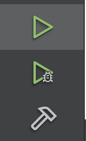
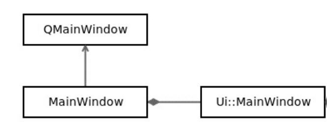
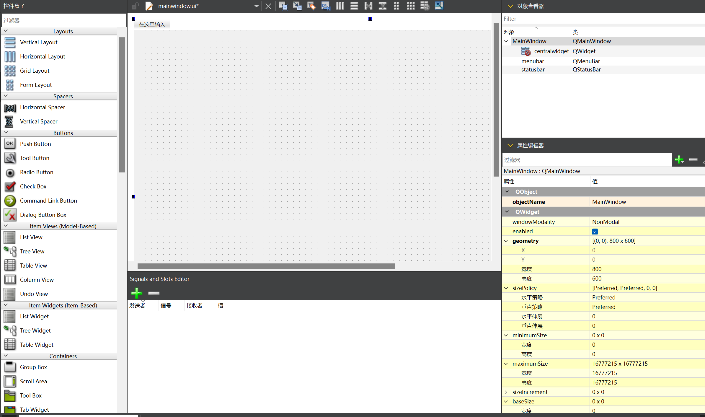

# 开始Qt之旅

​	在这个Section中，我们将讨论：

- Qt项目基本结构
- 主窗口结构
- Qt设计器界面
- 信号和插槽
- 自定义QWidget 
- C++14 lambda、auto和for each
- 源代码、头文件和表单（Forms）

## 初览项目

MainWindow.h和MainWindow.cpp文件是MainWindow类的头文件/源文件。这些文件包含向导生成的默认GUI。MainWindow.ui文件是以XML格式编写的ui设计文件。使用Qt Designer可以更容易地编辑它。此工具是一个所见即所得（WYSIWYG）编辑器，可帮助您添加和调整图形组件，即小部件。

​	按照惯例，我们拿到项目首先先看看他如何启动的，很简单：

​	这是main.cpp文件，：

```
#include <QApplication> // QApplication 头文件
#include "mainwindow.h"

int main(int argc, char *argv[]) {
    QApplication a(argc, argv);
    MainWindow   w;
    w.show();
    return a.exec();
}

```

通常，main.cpp文件包含程序入口点。默认情况下，它将执行三个操作：

- 实例化QApplication实例化（这个是管理你的应用程序的）
- 显示您的主窗口
- 执行阻塞主事件循环（别执行完就退出被操作系统回收了）

这是Qt Creator的左下角工具栏：



1. 你看看检查项目是否处于调试生成模式
2. 使用锤子按钮构建您的项目（只是构建不运行）
3. 使用带有小bug的绿色“播放”按钮开始调试。

​	在解释了主窗口的构造方式后，我们将纠正这一点：按Ctrl+B（适用于Windows/Linux）或Command+B（适用于Mac）构建项目按F5（适用于Windows/Linux的）或Command+R（适用于Mac的）以调试模式运行应用程序

### MainWindow

​	下面我们来瞧瞧这个MainWindow, 他是自动生成的类，也是Qt框架使用的一个完美而简单的例子；我们将一起剖析它。如前所述，MainWindow.ui文件描述了您的ui设计，MainWindow.h/MainWindow.cpp文件定义了C++对象，您可以在其中用代码操纵ui。查看MainWindow.h头文件很重要。我们的MainWindow对象继承自Qt的QMainWindow类：

```
#ifndef MAINWINDOW_H
#define MAINWINDOW_H // Prevent Multi-Includes which will lead to multi-defined

#include <QMainWindow>

// QT_BEGIN_NAMESPACE and QT_END_NAMESPACE are markings usually!
// During Compilings, the includes will be put into QtWidgets Namespaces
QT_BEGIN_NAMESPACE
namespace Ui {
class MainWindow;
}
QT_END_NAMESPACE

class MainWindow : public QMainWindow {
    Q_OBJECT

public:
    MainWindow(QWidget *parent = nullptr);
    ~MainWindow();

private:
    Ui::MainWindow *ui;
};
#endif  // MAINWINDOW_H

```

​	由于我们的类继承自QMainWindow类，因此我们必须在头文件顶部添加相应的#include。第二部分是Ui:：MainWindow的正向声明，因为我们只声明一个指针。

​	**Q_OBJECT对于非Qt开发人员来说可能看起来有点奇怪。此宏允许类通过Qt的元对象系统定义自己的信号/槽。本章稍后将在信号和插槽一节中介绍这些功能**。此类定义了一个公共构造函数和析构函数。后者很常见，但构造函数接受父参数。此参数是默认为null的QWidget指针。QWidget是一个UI组件。它可以是标签、文本框、按钮等。如果在窗口、布局和其他UI小部件之间定义父子关系，应用程序的内存管理将更容易。事实上，在这种情况下，删除父级就足够了，因为它的析构函数也会递归删除它的子级。我们的MainWindow类从Qt框架扩展了QMainWindow。我们在私有字段中有一个ui成员变量。它的类型是Ui:：MainWindow的指针，该指针在Qt生成的Ui_MainWindow.h文件中定义。这是MainWindow.ui ui设计文件的C++转录。ui成员变量将允许您与C++ui组件（QLabel、QPushButton等）进行交互，如下图所示：



​	如果我们在QDesigner里拖拽设计了一些控件，则他们都会被集成在Ui::MainWindow下面。

​	如果你的类只使用类类型的指针或引用，你可以通过使用前置声明（forward declarations）来避免包含标头。

```
// do not do: #include <Demo.h>
// do:
class Demo;
// ...
// When use Demo, rather than
// Demo demo_instances;
// use ptr
Demo* p_Demo;
```

这将大大减少编译时间，避免循环依赖。现在头部分已经完成，我们可以谈谈MainWindow.cpp源文件了。在下面的代码片段中，第一个include是我们的类头。第二个是生成的Ui:：MainWindow类所必需的。此包含是必需的（我们需要访问到类内部获取方法）

```
#include "mainwindow.h"
#include "ui_mainwindow.h"

MainWindow::MainWindow(QWidget *parent)
    : QMainWindow(parent), ui(new Ui::MainWindow) {
    ui->setupUi(this); // Our Designers will be initialize at here;
}
```

​	在许多情况下，Qt使用初始化器列表生成良好的代码。父参数用于调用QMainWindow超类构造函数。我们的ui私有成员变量也被初始化。现在ui已初始化，我们必须调用setupUi函数来初始化MainWindow.ui设计文件使用的所有小部件：当指针在构造函数，必须在析构函数中清除它：

```
MainWindow::~MainWindow() {
    delete ui;
}
```

### Qt Designer界面

​	实际上它是把XML文件进行了一定的可视化和可拖拽操作，定一个意思就是说我们在这个界面上进行的所有的操作最后都会被转化成一个XML文件，供qt的C++文件生成器使用（你可以看看编译过程和生成的cpp/h文件对进行研究！） 



​	一个干净的QtDesigner默认界面如这里所示！它包含了：

- 表单编辑器：表单的可视化表示（目前为空）

- 小部件框：包含可与使用的所有主要小部件

- 表单对象检查器：将表单显示为层次树

- 属性编辑器：枚举所选小部件的属性

- 动作编辑器/信号和插槽编辑器：处理工具栏动作和对象之间的连接

### 信号和插槽

​	Qt框架提供了一种灵活的消息交换机制，由三个概念组成：信号是对象发送的消息。

​	插槽是一个在触发此信号时调用的函数。connect函数指定哪个信号链接到哪个插槽。Qt已经为其类提供了信号和插槽，您可以在应用程序中使用。例如，QPushButton具有信号clicked（），当用户点击按钮时，该信号将被触发。另一个例子：QApplication类有一个槽quit（）函数，当你想终止应用程序时可以调用它。这就是为什么你会喜欢Qt信号和插槽：插槽仍然是一个普通的函数，所以你可以自己调用它。单个信号可以链接到不同的插槽。单个插槽可以由不同的链接信号调用。可以在来自不同对象的信号和插槽之间，甚至在生活在不同线程内的对象之间建立连接。请记住，要将信号连接到插槽，它们的方法签名必须匹配。参数的计数、顺序和类型必须相同。

​	请注意，**信号和插槽永远不会返回值**。这是Qt连接的语法：

```
connect(sender，&sender:：signalName，receiver，&Receiver:：slotName);
```

我们可以使用这种奇妙机制的第一个测试是将现有信号与现有插槽连接起来。我们将把此连接调用添加到MainWindow构造函数中：

```
MainWindow::MainWindow(QWidget *parent) :
QMainWindow(parent),
ui(new Ui::MainWindow)
{
	ui->setupUi(this);
	connect(ui->addTaskButton, &QPushButton::clicked, QApplication::instance(), &QApplication::quit);
}
```

​	在我们的例子中，它是在main.cpp中创建的QApplication对象&接收器：：slotName：指向接收器成员插槽函数之一的指针。在这个例子中，我们使用QApplication内置的quit（）槽，它将退出应用程序。

​	现在如果单击addTaskButton，您将终止应用程序。

​	您可以将一个信号连接到另一个信号。当第一个信号被触发时，将发出第二个信号。

### 使用qDebug输出调试信息

Qt提供了一种使用qDebug类显示调试信息的有效方法。获取QDebug对象的一个简单方法是调用qDebug（）函数。然后，您可以使用<<流运算符发送调试信息。

```
void MainWindow::addTask()
{
	qDebug() << "User clicked on the button!";
}
```

### 使用lambdas发出自定义信号

```
Task::Task(const QString& name, QWidget *parent) :
QWidget(parent),
ui(new Ui::Task)
{
	ui->setupUi(this);
	...
	connect(ui->removeButton, &QPushButton::clicked, [this] {
		emit removed(this);
	});
}
```

​	这段代码摘录显示了C++11的一个非常有趣的特性：lambdas。在我们的例子中，lambda是以下部分：[this]{emit removed（this）；}）；在这里，我们将点击信号连接到一个匿名内联函数，一个lambda。Qt允许通过将信号连接到另一个信号（如果它们的签名匹配）来进行信号中继。这里的情况并非如此：点击的信号没有参数，删除的信号需要一个Task\*。lambda避免了在Task中声明冗长的槽。Qt 5接受lambda而不是connect中的插槽，这两种语法都可以使用。我们的lambda执行一行代码：emission-demove（this）。Emit是一个Qt宏，它将使用我们传递的参数触发连接的插槽。正如我们之前所说，removed（Task*this）没有函数体，它的目的是通知已注册的事件槽。

​	Lambdas是C++的一个很好的补充。它们提供了一种在代码中定义短函数的非常实用的方法。从技术上讲，lambda是能够在其作用域内捕获变量的闭包的构造。完整的语法如下：

```
[capture-list](params)->ret{body}
```

​	让我们研究一下这句话的每一部分：capture-list:定义在lambda作用域内可见的变量。params：这是可以传递给lambda作用域的函数参数的类型列表。在我们的案例中没有参数。我们可能已经写了[this]（）{…}，但C++11让我们完全跳过了括号。ret：这是lambda函数的返回类型。与params一样，如果返回类型为void，则可以省略此参数。body：这显然是您的代码体，您可以在其中访问捕获列表和参数，并且必须返回一个ret类型的变量。在我们的示例中，我们捕获了this指针，以便能够：对removed（）函数进行引用，该函数是Task类的一部分。如果我们没有捕获到这一点，编译器就会大喊错误：对于这个lambda函数emit-removed（this）；，没有捕获到“this”；。将此传递给removed信号：调用者需要知道哪个任务触发了removed。捕获列表依赖于标准的C++语义：通过复制或引用捕获变量。假设我们想打印name构造函数参数的日志，并在我们的lambda中通过引用捕获它：

```
connect(ui->removeButton, &QPushButton::clicked, [this, &name] {
	qDebug() << "Trying to remove" << name;
	this->emit removed(this);
});
```

​	这段代码可以很好地编译。不幸的是，当我们试图删除一个任务时，运行时会因令人眼花缭乱的分段错误而崩溃。怎么搞的？正如我们所说，我们的lambda是一个匿名函数，将在clicked（）信号发出时执行。我们捕获了名称引用，但一旦我们离开Task构造函数（更确切地说，从调用者作用域），此引用可能就无效。qDebug（）函数将尝试显示无法访问的代码并崩溃。你真的需要小心你捕获的内容和执行lambda的上下文。

​	在这个例子中，可以通过复制捕获名称来修改分段错误：

```
connect(ui->removeButton, &QPushButton::clicked, [this, name] {
	qDebug() << "Trying to remove" << name;
	this->emit removed(this);
});
```

​	您可以通过复制或引用来捕获在您使用=和&语法定义lambda的函数中可访问的所有变量。this变量是捕获列表的一个特例。您无法通过[&this]引用捕获它，如果您处于这种情况，编译器将警告您：[=，this]。