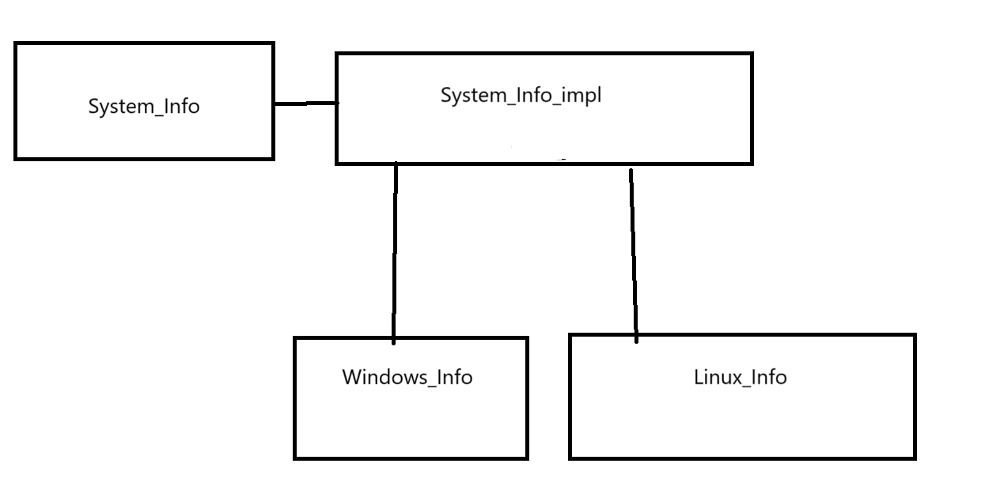

# Mastering II

## 构建一个跨平台的应用`(Create A Cross-Platform Application)`

​	Qt是跨平台的C++框架，这里，我们将会构建一个简单的C++跨平台项目来熟悉QT是如何实现简单的跨平台的。

​	我们将要构建的是一个动态查看，不同操作系统下操作系统运行时的一些状态，这就是一个跨平台的需求。

### 设计模式

​	要从 OS（操作系统）检索 CPU 和内存使用情况，我们将使用一些特定于平台的代码。 为了成功完成此任务，我们将使用两种设计模式： 

1. 策略模式：这是一个描述功能的接口（例如，检索 CPU 使用情况），特定行为（在 Windows/macOS/Linux 上检索 CPU 使用情况）将在实现此接口的子类中执行。 
2. pIMPL法：pointer to implements方法
3. 单例模式：此模式保证给定类只有一个实例。此实例将通过唯一访问点轻松访问。
4. 工厂模式：返回对应子类的实例



​	我们将会使用一个单例：System_Info，这是可以理解的因为我们的应用软件只会跑在一个操作系统上，因此没有必要创建多个实例，这种方式广泛的应用在那些维护全局状态的对象当中，也是一个常见的设计模式了。

### 开始构建

​	我们刚刚大致的想法就是如此，现在我们开始构建代码。我们仔细思考，作为用户，他只会关心接口的功能而不在乎里面的实现。为此，我们需要做的是使用pIMPL法，把设计到具体的项目平台的代码给他封装起来，这样可以减轻我们的管理负担。

​	因此，我们先带有尝试性质的——设计这些必要的接口：

```
#ifndef SYSTEM_INFOIMPL_H
#define SYSTEM_INFOIMPL_H

#include <QtClassHelperMacros>

/*
    The Actual Action class
    All Bases For Every Possible Operating
    System
*/
class System_InfoImpl {
public:
    System_InfoImpl() = default;
    Q_DISABLE_COPY(System_InfoImpl);
    virtual ~System_InfoImpl() = default;
    // Impl Interfaces
    virtual void   _initWork()       = 0;
    virtual double _cpuLoadAverage() = 0;
    virtual double _memoryUsed()     = 0;
};

#endif  // SYSTEM_INFOIMPL_H
```

​	可以看到，我们的IMPL接口自身也被抽象为接口类，这是合理的——每一个操作系统获取内存和CPU的状态都不一样，需要我们更加具体的类实现。

​	这样，我们的System_Info这个前端接口，就只是单纯的转发请求到System_InfoImpl类中，这个类在不同的平台被初始化为不同的类中去了。

>IMPL方法具备这些优点，对于那些强调不必关心内部实现的方法中：
>
>- 降低耦合
>- 信息隐藏
>- 降低编译依赖，提高编译速度
>- 接口与实现分离

​	下面，我们就来看看Windows平台下的如何实现

```
#ifndef SYSTEM_INFOWINDOWSIMPL_H
#define SYSTEM_INFOWINDOWSIMPL_H
#include <QList>
#include <array>
#include "System_InfoImpl.h"

using FILETIME = struct _FILETIME;	// Windows平台下的FILETIME接口

class System_InfoWindowsImpl : public System_InfoImpl {
public:
    System_InfoWindowsImpl();
    Q_DISABLE_COPY(System_InfoWindowsImpl);
    ~System_InfoWindowsImpl() = default;

    // Impls
    void   _initWork() override;
    double _cpuLoadAverage() override;
    double _memoryUsed() override;

    struct WindowsTools {
    	// 辅助函数
        static qulonglong fromWindowsFileTime(const FILETIME& fileTime);
    };

private:
    struct Labels {
        enum class Label { IDLE = 0, KERN = 1, USER = 2, SIZE };
        static constexpr short to_index(Label l) {
            return static_cast<short>(l);
        }
    };
    void _refreshCPURawData();
    std::array<qulonglong, static_cast<short>(Labels::Label::SIZE)>
        currentCPULoad;
};

#endif  // SYSTEM_INFOWINDOWSIMPL_H

```

​	具体的实现，可以参考任何一本Windows编程类的书进行学习，这里只是给出实现供各位参考

```
#include "System_InfoWindowsImpl.h"
#include <Windows.h>
System_InfoWindowsImpl::System_InfoWindowsImpl() : System_InfoImpl() {
}

qulonglong System_InfoWindowsImpl::WindowsTools::fromWindowsFileTime(
    const FILETIME& fileTime) {
    ULARGE_INTEGER integer;
    integer.LowPart  = fileTime.dwLowDateTime;
    integer.HighPart = fileTime.dwHighDateTime;
    return integer.QuadPart;
}

void System_InfoWindowsImpl::_initWork() {
    _refreshCPURawData();
}

void System_InfoWindowsImpl::_refreshCPURawData() {
    FILETIME idle, kernel, user;
    ::GetSystemTimes(&idle, &kernel, &user);
    currentCPULoad[Labels::to_index(Labels::Label::IDLE)] =
        WindowsTools::fromWindowsFileTime(idle);

    currentCPULoad[Labels::to_index(Labels::Label::KERN)] =
        WindowsTools::fromWindowsFileTime(kernel);

    currentCPULoad[Labels::to_index(Labels::Label::USER)] =
        WindowsTools::fromWindowsFileTime(user);
}

double System_InfoWindowsImpl::_cpuLoadAverage() {
    std::array<qulonglong, static_cast<short>(Labels::Label::SIZE)> previous =
        currentCPULoad;
    _refreshCPURawData();
#define FAST_CALC(var_name, LABEL_NAME)                               \
    qulonglong var_name =                                             \
        currentCPULoad[Labels::to_index(Labels::Label::LABEL_NAME)] - \
        previous[Labels::to_index(Labels::Label::LABEL_NAME)]
    FAST_CALC(cur_idle, IDLE);
    FAST_CALC(cur_kern, KERN);
    FAST_CALC(cur_user, USER);
#undef FAST_CALC
    qulonglong systems = cur_kern + cur_user;

    double percentage = (systems - cur_idle) * 100.0 / (double)systems;
    return qBound(0.0, percentage, 100.0);
}

double System_InfoWindowsImpl::_memoryUsed() {
    MEMORYSTATUSEX mem;
    mem.dwLength = sizeof(MEMORYSTATUSEX);
    GlobalMemoryStatusEx(&mem);
    return (mem.ullTotalPhys - mem.ullAvailPhys) * 100.0 / mem.ullTotalPhys;
}
```

​	但是这并并有结束，我们还差了IMPL与INTERFACE的部分的鸿沟，为此，我们需要做的是，将类的实现类移动到一个工厂类来负责实现，工厂来裁决生成如何的实现类去！

```
#ifndef SYSTEM_INFOIMPL_FACTORY_H
#define SYSTEM_INFOIMPL_FACTORY_H
#include "System_InfoImpl.h"
class System_InfoImpl_Factory {
public:
    static System_InfoImpl* createImplementInstance();
};

#endif  // SYSTEM_INFOIMPL_FACTORY_H
```

```
#include "System_InfoImpl_Factory.h"
#include <QtGlobal>
#ifdef Q_OS_WIN
#include "System_InfoWindowsImpl.h"

static System_InfoWindowsImpl* instances() {
    return new System_InfoWindowsImpl;
}

#elif defined(Q_OS_LINUX)
// Waiting Implements
#endif

System_InfoImpl* System_InfoImpl_Factory::createImplementInstance() {
    return instances();
}
```

​	现在，我们就可以使用工厂和抽象的实现类，完成我们对系统信息前端类的实现了：

```
#ifndef SYSTEM_INFO_H
#define SYSTEM_INFO_H
#include <QtClassHelperMacros>  // Q_DISABLE_COPY

class System_InfoImpl;

class System_Info {
public:
    System_Info();
    Q_DISABLE_COPY(System_Info);
    ~System_Info();
    // Functions
    double cpuLoadAverage();
    double memoryUsed();

private:
    void             createAccordingPlatform();
    System_InfoImpl* impl;
};

#endif  // SYSTEM_INFO_H

```

```
#include "System_Info.h"
#include "System_InfoImpl.h"
#include "System_InfoImpl_Factory.h"

System_Info::System_Info() {
    impl = System_InfoImpl_Factory::createImplementInstance();
}

double System_Info::cpuLoadAverage() {
    return impl->_cpuLoadAverage();
}

double System_Info::memoryUsed() {
    return impl->_memoryUsed();
}

System_Info::~System_Info() {
    delete impl;
}
```

​	看起来相当的简洁！

​	我们下面就可以使用这个接口了：

```
08:50:24: Starting D:\QT projects\SystemInfoChecker\build\Desktop_Qt_6_6_1_MSVC2019_64bit-Debug\debug\SystemInfoChecker.exe...
50   36.7122
```

​	当然Linux的实现如法炮制的，这里放一下源码：

1. 首先在pro文件修改成如下的代码：

```
QT       += core gui

greaterThan(QT_MAJOR_VERSION, 4): QT += widgets

CONFIG += c++17

# You can make your code fail to compile if it uses deprecated APIs.
# In order to do so, uncomment the following line.
#DEFINES += QT_DISABLE_DEPRECATED_BEFORE=0x060000    # disables all the APIs deprecated before Qt 6.0.0

SOURCES += \
    System_Info.cpp \
    System_InfoImpl.cpp \
    System_InfoImpl_Factory.cpp \
    main.cpp \
    systeminfowindow.cpp

HEADERS += \
    System_Info.h \
    System_InfoImpl.h \
    System_InfoImpl_Factory.h \
    systeminfowindow.h

FORMS += \
    systeminfowindow.ui

# 这里体现了跨平台的地方
# 对于Windows，向工具链提供这些文件
windows {
    HEADERS += System_InfoWindowsImpl.h \

    SOURCES += System_InfoWindowsImpl.cpp \
}

# 对Linux是另一些
linux {
    HEADERS += system_infolinuximpl.h \

    SOURCES += system_infolinuximpl.cpp \
}


# Default rules for deployment.
qnx: target.path = /tmp/$${TARGET}/bin
else: unix:!android: target.path = /opt/$${TARGET}/bin
!isEmpty(target.path): INSTALLS += target
```


2. 写一个实现文件对

> h文件

```
#ifndef SYSTEM_INFOLINUXIMPL_H
#define SYSTEM_INFOLINUXIMPL_H
#include "System_InfoImpl.h"
#include <QByteArray>

class System_InfoLinuxImpl : public System_InfoImpl
{
public:
    System_InfoLinuxImpl();
    Q_DISABLE_COPY(System_InfoLinuxImpl)
    virtual ~System_InfoLinuxImpl() = default;
    // Impls
    void   _initWork() override;
    double _cpuLoadAverage() override;
    double _memoryUsed() override;


private:
    struct LinuxTools{
        static QByteArray fromLinuxStatFile();
    };


    struct Labels {
        enum class Label { IDLE = 0, KERN = 1, USER = 2, USER_NICE = 3, SIZE };
        static constexpr short to_index(Label l) {
            return static_cast<short>(l);
        }
    };
    void _refreshCPURawData();
    std::array<qulonglong, static_cast<short>(Labels::Label::SIZE)>
        currentCPULoad;


};

#endif // SYSTEM_INFOLINUXIMPL_H

```

> CPP文件

```
#include "system_infolinuximpl.h"
#include <QFile>
#include <sys/types.h>
#include <sys/sysinfo.h>

QByteArray System_InfoLinuxImpl::LinuxTools::fromLinuxStatFile(){
    QFile file("/proc/stat");
    file.open(QIODevice::ReadOnly);
    QByteArray dataLine = file.readLine();
    file.close();
    return dataLine;
}

System_InfoLinuxImpl::System_InfoLinuxImpl() : System_InfoImpl(){

}

void System_InfoLinuxImpl::_initWork(){
    _refreshCPURawData();
}

void System_InfoLinuxImpl::_refreshCPURawData(){
    QByteArray fromFile = LinuxTools::fromLinuxStatFile();
    qulonglong tol_user = 0, userNice = 0, sys = 0, idle = 0;
    std::sscanf(fromFile.data(), "cpu %llu %llu %llu %llu", &tol_user, &userNice, &sys, &idle);

#define FAST_REG(LABEL_NAME, var) \
    currentCPULoad[Labels::to_index(Labels::Label::LABEL_NAME)] = var

    FAST_REG(IDLE, idle);
    FAST_REG(USER, tol_user);
    FAST_REG(USER_NICE, userNice);
    FAST_REG(KERN, sys);

#undef FAST_REG
}

double System_InfoLinuxImpl::_cpuLoadAverage()
{
    std::array<qulonglong, static_cast<short>(Labels::Label::SIZE)> previous =
        currentCPULoad;
    _refreshCPURawData();

#define GET_TIME(LABEL_NAME) \
    currentCPULoad[Labels::to_index(Labels::Label::LABEL_NAME)] - \
        previous[Labels::to_index(Labels::Label::LABEL_NAME)]

    double overall = GET_TIME(USER) + GET_TIME(KERN) + GET_TIME(USER_NICE);
    double tol = overall + GET_TIME(IDLE);

    double per = overall * 100.0 / tol;
    return qBound(0.0, per, 100.0);
}

double System_InfoLinuxImpl::_memoryUsed()
{
    struct sysinfo meminfo;
    sysinfo(&meminfo);

    qulonglong tolMem = meminfo.totalram;
    tolMem += meminfo.totalswap;
    tolMem *= meminfo.mem_unit;

    qulonglong used = meminfo.totalram - meminfo.freeram;
    used += meminfo.totalswap - meminfo.freeswap;
    used *= meminfo.mem_unit;

    double per = used * 100.0 / tolMem;
    return qBound(0.0, per, 100.0);
}
```

3. 向工厂提供初始化一个IMPL类的实例方法：

```
#elif defined(Q_OS_LINUX)
#include "system_infolinuximpl.h"
static System_InfoLinuxImpl* instances() {
    return new System_InfoLinuxImpl;
}
```

​	现在我们的代码可以无缝的游离在两个平台之间而无需改动代码，就可以编译运行了。
