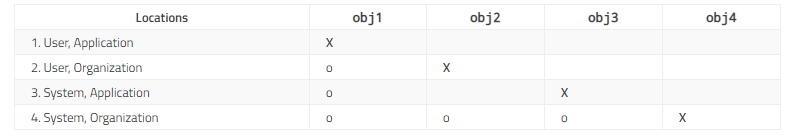
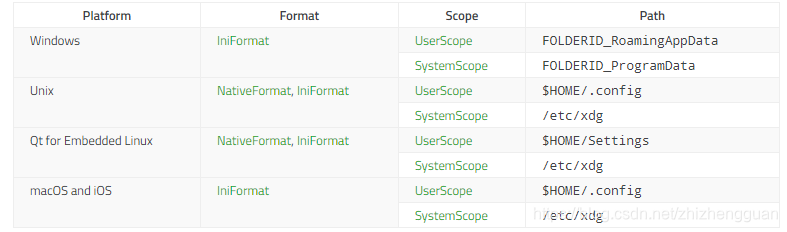

# Mastering Qt Private

## 一些类的简单介绍

​	笔者最近收集了一些感兴趣的Qt类进行简单的介绍，这里给出一些参考的笔记

## QApplication

​	如果只关心代码：QApplication父类是QGuiApplication，QGuiApplication父类是QCoreApplication。

​	**开发的应用无图像界面，就使用QCoreApplication**；有图形界面，只使用QML实现，使用QGuiApplication，使用QWidget，或者QML与QWidget使用，则用QApplication。所以这就是为什么对于广大的QtWidget使用者而言，QApplication是最常见的。为什么分的这样的细呢？很简单：QApplication包含的功能最多，也就最笨重，QGuiApplication到QCoreApplication越来越轻量。现在，为了追求较高的的性能，我们实现用到什么模块，加载什么模块，尽量减小编译后的app体积。

​	QApplication 将 QGuiApplication 专门用于基于 QWidget 的应用程序所需的一些功能。它处理特定于 widget 的构造与析构。对于任何使用 Qt 的 GUI 应用程序，无论应用程序在任何给定时间是否有窗口，都只有**一个 QApplication 对象（啊哈，你猜到Qt写QApplication用到了单例了！）**。对于非基于 **QWidget 的 Qt 应用程序，请改用 QGuiApplication，因为它不依赖于 QtWidgets 库（好处：更轻）。**

​	一些 GUI 应用程序提供了一种特殊的批处理模式，即：提供命令行参数，无需人工干预即可执行任务。**在这种非 GUI 模式下，通常只需实例化一个普通的 QCoreApplication 就可以避免不必要地初始化图形用户界面所需的资源。**

​	QApplication 对象可通过 instance() 函数访问，该函数返回一个与全局 qApp 指针等效的指针。

```
    auto         ptr  = qApp;
    auto         ptr2 = a.instance();
    if (ptr == ptr2) {
        qDebug() << "Same";
    }
```

​	QApplication 的干这些事情包括：

- 它使用用户的桌面设置（如 palette()、font() 和 doubleClickInterval()）初始化应用程序。它会跟踪这些属性，以防用户全局更改桌面（例如通过某种控制面板）。
- 它执行事件处理，这意味着它从底层窗口系统接收事件并将它们分派到相关小部件。通过使用 sendEvent() 和 postEvent()，您可以将自己的事件发送到小部件。
- 它解析常见的命令行参数并相应地设置其内部状态。

- 它定义应用程序的外观，封装在 QStyle 对象中。这可以在运行时使用 setStyle() 进行更改。

- 它提供字符串的本地化，这些字符串可通过 Translation() 供用户查看。

- 它提供了一些神奇的对象，如 clipboard()。

- 它了解应用程序的窗口。您可以使用 widgetAt() 询问哪个小部件位于某个位置，获取 topLevelWidgets() 和 closeAllWindows() 的列表等。 它管理应用程序的鼠标光标处理，
- 由于 QApplication 对象执行了大量初始化，因此必须在创建与用户界面相关的任何其他对象之前创建它。QApplication 还处理常见的命令行参数。因此，在应用程序本身中对 argv 进行任何解释或修改之前创建它通常是一个好主意。

​	总而言之，我们的QApplication就是我们的应用程序的大handle，所有跟程序本身沾边的事情都可以找它处理。

[QApplication Class | Qt Widgets 6.7.2](https://doc.qt.io/qt-6/qapplication.html)

## QNetworkAccessManager

​	QNetworkAccessManager类是网络大管家，是因为所有和网络相关的接口都是围绕QNetworkAccessManager创造出来的对象转悠，并且**一个应用程序只要有一个QNetworkAccessManager对象即可**。**该类控制着应用程序发送请求和接受回复**。该类也承载着一切公共的配置以及所发请求的设置，还包含了代理配置、缓存配置、以及相对应的各种信号，reply（应答）信号可以用来监视网络活动。


QSettings类提供了与平台无关的持久性应用程序设置

> 头文件：
>
> ```cpp
> #include <QSettings>
> 1
> ```
>
> cmake:
>
> ```cpp
> find_package(Qt6 COMPONENTS Core REQUIRED)
> target_link_libraries(mytarget PRIVATE Qt6::Core)
> 12
> ```
>
> qmake:
>
> ```cpp
> QT += core
> 1
> ```
>
> cmake:
>
> ```cpp
> QObject
> 1
> ```

注意：此类中的所有函数都是reentent。

注意：这些函数也是[线程安全](https://so.csdn.net/so/search?q=线程安全&spm=1001.2101.3001.7020)的

## 详细说明

用户通常希望应用程序跨会话记住它的设置(窗口大小和位置，选项等)。这些信息通常存储在Windows上的系统注册表中，以及macOS和iOS上的属性列表文件中。在Unix系统上，在没有标准的情况下，许多应用程序(包括KDE应用程序)使用INI文本文件。

QSettings是围绕这些技术的抽象，使您能够以一种可移植的方式保存和恢复应用程序设置。它还支持自定义存储格式。

QSettings的API基于QVariant，允许您以最小的代价保存大多数基于值的类型，如QString、QRect和QImage。

如果您所需要的是一个非持久的基于内存的结构，那么考虑使用`QMap < QString，QVariant >`代替。

### 基本用法

创建QSettings对象时，必须传递公司或组织的名称以及应用程序的名称。例如，如果您的产品称为Star Runner，而您的公司称为MySoft，则可以按以下方式构造QSettings对象：

```cpp
 QSettings settings("MySoft", "Star Runner");
1
```

QSettings对象可以在堆栈上创建，也可以在堆上创建(即使用new)。构造和销毁QSettings对象非常快。

如果你在应用程序的很多地方使用QSettings，你可能想要使用QCoreApplication::setOrganizationName()和QCoreApplication::setApplicationName()来指定组织名称和应用程序名称，然后使用默认的QSettings构造函数:

```cpp
    QCoreApplication::setOrganizationName("MySoft");
    QCoreApplication::setOrganizationDomain("mysoft.com");
    QCoreApplication::setApplicationName("Star Runner");
    ...
    QSettings settings;
12345
```

（此处，我们还指定了组织的Internet域。设置了Internet域后，它会在macOS和iOS上使用，而不是在组织名称上使用，因为macOS和iOS应用程序通常会使用Internet域来标识自己。如果未设置任何域，假域名来自组织名称。有关详细信息，请参见下面的**特定于平台的说明**。）

QSettings存储设置。每个设置都由一个QString和一个QVariant组成，QString指定设置的名称（键），QVariant存储与键相关的数据。要写入设置，请使用setValue（）。例如：

```cpp
settings.setValue("editor/wrapMargin", 68);
1
```

如果已经存在具有相同键的设置，则现有值将被新值覆盖。为了提高效率，更改可能不会立即保存到永久存储中。（始终可以调用sync（）提交更改。）

可以使用value（）获取设置的值：

```cpp
  int margin = settings.value("editor/wrapMargin").toInt();
1
```

如果没有指定名称的设置，QSettings将返回null QVariant（可以转换为整数0）。通过将第二个参数传递给value（），可以指定另一个默认值：

```cpp
int margin = settings.value("editor/wrapMargin", 80).toInt();
1
```

要测试给定的键是否存在，请调用contains（）。要删除与键关联的设置，请调用remove（）。要获取所有键的列表，请调用allKeys（）。要删除所有键，请调用clear（）。

### QVariant和GUI类型

由于QVariant是Qt核心模块的一部分，它不能提供对Qt GUI中的QColor、QImage、QPixmap等数据类型的转换功能。换句话说，在QVariant中没有toColor()、toImage()或toPixmap()函数。

相反，您可以使用QVariant::value()模板函数。例如:

```cpp
QSettings settings("MySoft", "Star Runner");
QColor color = settings.value("DataPump/bgcolor").value<QColor>();
12
```

逆转换(例如，从QColor到QVariant)对所有QVariant支持的数据类型都是自动的，包括gui相关的类型:

```cpp
QSettings settings("MySoft", "Star Runner");
QColor color = palette().background().color();
settings.setValue("DataPump/bgcolor", color);
123
```

使用`qRegisterMetaType()`注册的自定义类型具有用于流到和从QDataStream的操作符，可以使用QSettings存储。

### Section & Key语法

设置键可以包含任何Unicode字符。Windows注册表和INI文件使用不区分大小写的键，而macOS和iOS上的CFPreferences API使用区分大小写的键。为了避免可移植性问题，请遵循以下简单的规则:

- 始终使用相同的大小写引用相同的键。例如，如果在代码中的某个位置将键称为“文本字体”，则不要在其他地方将其称为“文本字体”。
- 除了大小写之外，避免使用相同的键名。例如，如果你有一个名为“MainWindow”的键，不要尝试将另一个键保存为“MainWindow”。
- 不要在Section 或Key名中使用斜杠（“ /”和“ \”）；反斜杠字符用于分隔子键（请参见下文）。在Windows上，QSettings将’‘转换为’/’，从而使它们相同。

您可以使用’/'字符作为分隔符来形成分层键，类似于Unix文件路径。例如：

```cpp
    settings.setValue("mainwindow/size", win->size());
    settings.setValue("mainwindow/fullScreen", win->isFullScreen());
    settings.setValue("outputpanel/visible", panel->isVisible());
123
```

如果您希望使用相同的前缀保存或恢复许多设置，您可以使用beginGroup()指定前缀，并在末尾调用endGroup()。下面是同样的例子，但这次使用的是群组机制:

```cpp
    settings.beginGroup("mainwindow");
    settings.setValue("size", win->size());
    settings.setValue("fullScreen", win->isFullScreen());
    settings.endGroup();

    settings.beginGroup("outputpanel");
    settings.setValue("visible", panel->isVisible());
    settings.endGroup();
12345678
```

如果使用beginGroup()设置一个组，那么大多数函数的行为将随之改变。组可以递归地设置。

除了组，QSettings还支持“数组”概念。详见beginReadArray()和beginWriteArray()。

## 回退机制

让我们假设您已经创建了一个QSettings对象，其组织名称为MySoft，应用程序名称为Star Runner。当你查找一个值时，最多有四个位置是按照这个顺序搜索的:

- Star Runner应用程序的用户特定位置
- MySoft所有应用程序的用户特定位置
- Star Runner应用程序的系统范围位置
- MySoft提供的所有应用程序的系统范围位置

(关于Qt支持的不同平台上这些位置的信息，请参阅下面**特定平台的说明**。)

如果一个键不能在第一个位置找到，搜索将在第二个位置继续，以此类推。这使您能够存储系统范围或组织范围的设置，并根据每个用户或每个应用程序覆盖它们。要关闭此机制，请调用setFallbacksEnabled(false)。

虽然所有四个位置的键都可以读取，但只有第一个文件(当前应用程序的特定于用户的位置)可以写入。要写入任何其他文件，忽略应用程序名称和/或指定QSettings::SystemScope(与默认的QSettings::UserScope相反)。

让我们看一个例子:

```cpp
    QSettings obj1("MySoft", "Star Runner");
    QSettings obj2("MySoft");
    QSettings obj3(QSettings::SystemScope, "MySoft", "Star Runner");
    QSettings obj4(QSettings::SystemScope, "MySoft");
1234
```

下表总结了哪个QSettings对象访问了哪个位置。“X”表示位置是与QSettings对象相关联的主要位置，用于读写;“o”表示该位置在读取时用作回退。

这种机制的美妙之处在于它可以在Qt支持的所有平台上工作，而且它仍然提供了很大的灵活性，不需要指定任何文件名或注册表路径。

如果你想在所有平台上使用INI文件，而不是本机API，你可以将QSettings::IniFormat作为QSettings构造函数的第一个参数，然后是作用域、组织名称和应用程序名称:

```cpp
   QSettings settings(QSettings::IniFormat, QSettings::UserScope,
                       "MySoft", "Star Runner");
12
```

请注意，当从INI文件读取设置时，类型信息不被保留;所有的值都将作为QString返回。

通过设置编辑器示例，您可以尝试使用不同的设置位置以及打开或关闭回退机制。

### 恢复GUI应用程序的状态

QSettings通常用于存储GUI应用程序的状态。下面的示例演示如何使用QSettings保存和恢复应用程序主窗口的几何图形。

```cpp
void MainWindow::writeSettings()
{
    QSettings settings("Moose Soft", "Clipper");

    settings.beginGroup("MainWindow");
    settings.setValue("size", size());
    settings.setValue("pos", pos());
    settings.endGroup();
}

void MainWindow::readSettings()
{
    QSettings settings("Moose Soft", "Clipper");

    settings.beginGroup("MainWindow");
    resize(settings.value("size", QSize(400, 400)).toSize());
    move(settings.value("pos", QPoint(200, 200)).toPoint());
    settings.endGroup();
}
12345678910111213141516171819
```

关于为什么调用QWidget::resize()和QWidget::move()而不是QWidget::setGeometry()来恢复窗口的几何图形，请参阅[Window Geometry](https://doc.qt.io/qt-6/application-windows.html#window-geometry)的讨论。

readSettings()和writessettings()函数必须从主窗口的构造函数和关闭事件处理程序中调用，如下所示:

```cpp
MainWindow::MainWindow()
{
    ...
    readSettings();
}

void MainWindow::closeEvent(QCloseEvent *event)
{
    if (userReallyWantsToQuit()) {
        writeSettings();
        event->accept();
    } else {
        event->ignore();
    }
}
123456789101112131415
```

有关使用QSettings的自包含示例，请参阅[应用程序示例](https://doc.qt.io/qt-6/qtwidgets-mainwindows-application-example.html)。

### 同时从多个线程或进程访问设置

QSettings是可重入的。这意味着您可以在不同的线程中同时使用不同的QSettings对象。即使QSettings对象引用磁盘上的相同文件(或系统注册表中的相同条目)，这种保证仍然有效。如果通过一个QSettings对象修改了一个设置，那么该更改将立即在操作在同一位置并且位于同一进程中的任何其他QSettings对象中可见。

在满足某些条件的情况下，可以从不同的进程(可以是同时运行的应用程序的不同实例，也可以是同时运行的不同应用程序)安全地使用QSettings对相同的系统位置进行读写操作。对于QSettings::IniFormat，它使用咨询文件锁定和智能合并算法来确保数据完整性。这样做的条件是，可写的配置文件必须是一个常规文件，并且必须驻留在当前用户可以在其中创建新的临时文件的目录中。如果不是这样，那么必须使用setatomicsyncrerequired()关闭安全装置。

注意，sync()导入其他进程所做的更改(除了从这个QSettings写入更改之外)。

### 特定于平台的说明

#### 应用程序设置的存储位置

如**回退机制**所述，QSettings会将应用程序的设置最多存储在四个位置，具体取决于设置是用户特定的还是系统范围的，以及设置是特定于应用程序的还是组织范围的。为简单起见，我们假设该组织称为MySoft，而该应用程序称为Star Runner。

在Unix系统上，如果文件格式为NativeFormat，则默认使用以下文件：

- `$HOME/.config/MySoft/Star Runner.conf`（Qt嵌入式Linux的：`$HOME/Settings/MySoft/Star Runner.conf`）
- `$HOME/.config/MySoft.conf`（Qt嵌入式Linux的：`$HOME/Settings/MySoft.conf`）
- 对于`$ XDG_CONFIG_DIRS`中的每个目录`<dir>`： `<dir>/MySoft/Star Runner.conf`
- 对于`$ XDG_CONFIG_DIRS`中的每个目录`<dir>`： `<dir>/MySoft.conf`

注意：如果未设置XDG_CONFIG_DIRS，则使用默认值/etc/xdg。

在macOS和iOS上，如果文件格式为NativeFormat，则默认使用以下文件：

-`$HOME/Library/Preferences/com.MySoft.Star Runner.plist`

- `$HOME/Library/Preferences/com.MySoft.plist`
- `/Library/Preferences/com.MySoft.Star Runner.plist`
- `/Library/Preferences/com.MySoft.plist`

在Windows上，NativeFormat设置存储在以下注册表路径中：

- `HKEY_CURRENT_USER\Software\MySoft\Star Runner`
- `HKEY_CURRENT_USER\Software\MySoft\OrganizationDefaults`
- `HKEY_LOCAL_MACHINE\Software\MySoft\Star Runner`
- `HKEY_LOCAL_MACHINE\Software\MySoft\OrganizationDefaults`

注意：在Windows上，对于以WOW64模式运行的32位程序，设置存储在以下注册表路径中：HKEY_LOCAL_MACHINE\Software\WOW6432node。

如果文件格式为NativeFormat，则在应用程序的主目录中为`Settings / MySoft / Star Runner.conf`。

如果文件格式为IniFormat，则在Unix，macOS和iOS上使用以下文件：

- `$HOME/.config/MySoft/Star Runner.ini`（Qt嵌入式Linux的：`$HOME/Settings/MySoft/Star Runner.ini`）
- `$HOME/.config/MySoft.ini`（Qt嵌入式Linux的：`$HOME/Settings/MySoft.ini`）
- 对于`$ XDG_CONFIG_DIRS`中的每个目录`<dir>`： `<dir>/MySoft/Star Runner.ini`
- 对于`$ XDG_CONFIG_DIRS`中的每个目录： `<dir>/MySoft.ini`

注意：如果未设置XDG_CONFIG_DIRS，则使用默认值/etc/xdg。

在Windows上，使用以下文件：

- `FOLDERID_RoamingAppData\MySoft\Star Runner.ini`
- `FOLDERID_RoamingAppData\MySoft.ini`
- `FOLDERID_ProgramData\MySoft\Star Runner.ini`
- `FOLDERID_ProgramData\MySoft.ini`

带前缀的标识符FOLDERID_是特殊项目ID列表，将传递给Win32 API函数SHGetKnownFolderPath()以获得相应的路径。

FOLDERID_RoamingAppData通常指向，也由环境变量显示。`C:\Users\User Name\AppData\Roaming%APPDATA%`

FOLDERID_ProgramData通常指向`C:\ProgramData`。

如果文件格式为IniFormat，则在应用程序的主目录中为`Settings / MySoft / Star Runner.ini`。

.ini和.conf文件的路径可以使用setPath（）进行更改。在Unix，macOS和iOS上，用户可以通过设置XDG_CONFIG_HOME环境变量来覆盖它们。有关详细信息，请参见[setPath](https://doc.qt.io/qt-6/qsettings.html#setPath)（）。

#### 直接访问INI和.plist文件

有时您确实想访问存储在特定文件或注册表路径中的设置。在所有平台上，如果要直接读取INI文件，则可以使用QSettings构造函数，该构造函数以文件名作为第一个参数，并传递QSettings :: IniFormat作为第二个参数。例如：

```cpp
QSettings settings("/home/petra/misc/myapp.ini",
                   QSettings::IniFormat);
12
```

然后可以使用QSettings对象读取和写入文件中的设置。

在macOS和iOS上，你可以通过传入QSettings::NativeFormat作为第二个参数来访问属性列表。plist文件。例如:

```cpp
QSettings settings("/Users/petra/misc/myapp.plist",
                   QSettings::NativeFormat);
12
```

#### 直接访问Windows注册表

在Windows上，QSettings让你访问已经在系统注册表中使用QSettings编写的设置(或支持格式的设置，例如字符串数据)。这是通过在注册表和QSettings::NativeFormat中构造一个带有路径的QSettings对象来完成的。

例如:

```cpp
QSettings settings("HKEY_CURRENT_USER\\Software\\Microsoft\\Office",
                   QSettings::NativeFormat);
12
```

所有出现在指定路径下的注册表项都可以像往常一样通过QSettings对象读取或写入(使用正斜杠而不是反斜杠)。例如:

```cpp
settings.setValue("11.0/Outlook/Security/DontTrustInstalledFiles", 0);
1
```

请注意，如上所述，QSettings使用反斜杠字符来分隔子项。如此一来，您将无法读取或写入包含斜杠或反斜杠的Windows注册表项。如果需要，您应该使用本机Windows API。

#### 在Windows上访问通用注册表设置

在Windows上，一个键可能同时具有值和子键。它的默认值可以用" default “或”."来代替子键:

```cpp
settings.setValue("HKEY_CURRENT_USER\\MySoft\\Star Runner\\Galaxy", "Milkyway");
settings.setValue("HKEY_CURRENT_USER\\MySoft\\Star Runner\\Galaxy\\Sun", "OurStar");
settings.value("HKEY_CURRENT_USER\\MySoft\\Star Runner\\Galaxy\\Default"); // returns "Milkyway"
123
```

在Windows以外的其他平台上，" default “或”."将被视为常规子项。

#### 平台限制

虽然QSettings试图理顺不同支持平台之间的差异，但在移植应用程序时仍应注意一些差异：

- Windows系统注册表具有以下限制：子项不能超过255个字符，条目的值不能超过16,383个字符，并且键的所有值都不能超过65,535个字符。要解决这些限制的一种方法是使用存储的设置IniFormat而不是NativeFormat。
- 在Windows上，当使用Windows系统注册表时，QSettings不会保留该值的原始类型。因此，设置新值时，值的类型可能会更改。例如，类型为的值REG_EXPAND_SZ将变为REG_SZ。
- 在macOS和iOS上，allKeys（）将为适用于所有应用程序的全局设置返回一些额外的键。可以使用value（）读取这些键，但不能更改它们，只能对其进行阴影处理。调用setFallbacksEnabled（false）将隐藏这些全局设置。
- 在macOS和iOS上，QSettings使用的CFPreferences API需要Internet域名而不是组织名称。为了提供统一的API，QSettings会从组织名称中得出伪造的域名（除非组织名称已经是域名，例如OpenOffice.org）。该算法在公司名称后附加“ .com”，并用连字符替换空格和其他非法字符。如果要指定其他域名，请在函数中调用QCoreApplication :: setOrganizationDomain（），QCoreApplication :: setOrganizationName（）和QCoreApplication :: setApplicationName（）main()，然后使用默认的QSettings构造函数。另一种解决方案是使用预处理器指令，例如：

```cpp
#ifdef Q_OS_MAC
    QSettings settings("grenoullelogique.fr", "Squash");
#else
    QSettings settings("Grenoulle Logique", "Squash");
#endif
12345
```

- 在macOS上，访问不属于当前用户的设置（即SystemScope）的权限已随10.7（Lion）更改。在该版本之前，具有管理员权限的用户可以访问这些权限。对于10.7和10.8（Mountain Lion），只有root可以。但是，10.9（Mavericks）再次更改了该规则，但仅适用于本机格式（plist文件）。

另请参见QVariant，QSessionManager，[设置编辑器示例](https://doc.qt.io/qt-6/qtwidgets-tools-settingseditor-example.html)和[Qt窗口小部件-应用程序示例](https://doc.qt.io/qt-6/qtwidgets-mainwindows-application-example.html)。

## 成员类型

### enum QSettings::Format

此枚举类型指定QSettings使用的存储格式。

| 常量                        | 值   | 说明                                                         |
| --------------------------- | ---- | ------------------------------------------------------------ |
| QSettings::NativeFormat     | 0    | 使用最适合平台的存储格式存储设置。在Windows上，这意味着系统注册表。在macOS和iOS上，这意味着CFPreferences API；在Unix上，这意味着INI格式的文本配置文件。 |
| QSettings::Registry32Format | 2    | 仅限Windows：从在64位Windows上运行的64位应用程序显式访问32位系统注册表。在32位Windows上或从64位Windows上的32位应用程序中，其工作原理与指定NativeFormat相同。这个枚举值是在Qt 5.7中添加的。 |
| QSettings::Registry64Format | 3    | 仅限Windows：从在64位Windows上运行的32位应用程序显式访问64位系统注册表。在32位Windows上或在64位Windows上的64位应用程序中，此操作与指定NativeFormat相同。这个枚举值是在Qt 5.7中添加的。 |
| QSettings::IniFormat        | 1    | 将设置存储在INI文件中。请注意，从INI文件读取设置时不会保留类型信息。所有值将作为QString返回。 |
| QSettings::InvalidFormat    | 16   | registerFormat（）返回的特殊值。                             |

在Unix上，NativeFormat和IniFormat含义相同，只是文件扩展名不同（.conf对于NativeFormat，.ini对于IniFormat）。

INI文件格式是Qt在所有平台上都支持的Windows文件格式。在没有INI标准的情况下，我们尝试遵循Microsoft的操作，但以下情况除外：

- 如果您存储了QVariant不能转换为QString的类型(例如，QPoint、QRect和QSize)， Qt使用基于@的语法对类型进行编码。例如:

```cpp
pos = @Point(100 100)
1
```

为了最小化兼容性问题，任何不在值的第一个位置出现的@或者后面没有Qt类型(Point、Rect、Size等)的@都被视为正常字符。

- 尽管反斜杠在INI文件中是一个特殊字符，但大多数Windows应用程序不会在文件路径中转义反斜杠():

```cpp
windir = C:\Windows
1
```

QSettings总是将反斜杠作为一个特殊字符，并且没有为读取或写入这样的条目提供API。

- NI文件格式对键的语法有严格的限制。Qt通过在键中使用%作为转义字符来解决这个问题。此外，如果你保存一个顶级设置(一个没有斜杠的键，例如，“someKey”)，它将出现在INI文件的"General"部分。为了避免覆盖其他键，如果你使用"General/someKey"键保存一些东西，该键将位于"%General"节，而不是"General"节。
- 与目前大多数实现一样，QSettings将假定INI文件是utf-8编码的。这意味着键和值将被解码为utf-8编码的条目，并被写回utf-8。

兼容旧的Qt版本

- 请注意，这种行为与Qt 6之前版本的QSettings的行为不同。
- 然而，用Qt 5或更早版本编写的INI文件可以被基于Qt 6的应用程序完全读取(除非设置了不同于utf8的INI编解码器)。
- 但是，如果你将“iniCodec”设置为utf-8文本编解码器，那么用Qt 6编写的INI文件只能被旧的Qt版本读取。

另请参阅registerFormat()和setPath()。

### QSettings::ReadFunc

指向函数的指针的Typedef类型签名如下:

```cpp
bool myReadFunc(QIODevice &device, QSettings::SettingsMap &map);
1
```

ReadFunc用作registerFormat()指向读取一组键/值对的函数的指针。ReadFunc应该一次性读取所有选项，然后返回SettingsMap容器中的所有设置，该容器最初是空的。

另请参见WriteFunc和registerFormat（）。

### enum QSettings::Scope

该参数指定设置是特定于用户的还是同一个系统的所有用户共享的。

| 常量                   | 值   | 说明                                                         |
| ---------------------- | ---- | ------------------------------------------------------------ |
| QSettings::UserScope   | 0    | 将设置存储在特定于当前用户的位置（例如，在用户的主目录中）   |
| QSettings::SystemScope | 1    | 将设置存储在全局位置，以便同一台计算机上的所有用户都可以访问同一组设置。 |

另请参见setPath().

### QSettings :: SettingsMap

`QMap<QString, QVariant>.` 的Typedef

另请参见registerFormat().

### enum QSettings::Status

状态值包括:

| 常量                   | 值   | 说明                                          |
| ---------------------- | ---- | --------------------------------------------- |
| QSettings::NoError     | 0    | 没有发生错误。                                |
| QSettings::AccessError | 1    | 发生访问错误（例如，尝试写入只读文件）。      |
| QSettings::FormatError | 2    | 发生格式错误（例如，加载格式错误的INI文件）。 |

另请参见status().

### QSettings::WriteFunc

指向函数的指针的Typedef类型签名如下:

```cpp
bool myWriteFunc(QIODevice &device, const QSettings::SettingsMap &map);
1
```

WriteFunc在registerFormat()中用作一个函数的指针，该函数写入一组键/值对。WriteFunc只被调用一次，因此您需要一次性输出设置。

参见ReadFunc和registerFormat()。

## 成员函数

> **[since 5.13]
> QSettings::QSettings(QSettings::Scope scope, QObject `\*`parent = nullptr)**

构造QSettings对象的方式与QSettings（QObject*parent）相同，但具有给定的作用域。

Qt5.13中引入了此函数。

另请参见QSettings（QObject*parent）。

> **QSettings::QSettings(QObject `\*`parent = nullptr)**

构造一个QSettings对象，用于通过调用QCoreApplication:：setOrganizationName（）、QCoreApplication:：setOrganizationDomain（）和QCoreApplication:：setApplicationName（）访问先前设置的应用程序和组织的设置。

作用域为QSettings:：UserScope，格式为defaultFormat（）（默认为QSettings:：NativeFormat）。在调用此构造函数之前，请使用setDefaultFormat（）更改此构造函数使用的默认格式。

代码

```cpp
QSettings settings("Moose Soft", "Facturo-Pro");
1
```

等效于

```cpp
QCoreApplication::setOrganizationName("Moose Soft");
QCoreApplication::setApplicationName("Facturo-Pro");
QSettings settings;
123
```

如果以前没有调用过QCoreApplication:：setOrganizationName（）和QCoreApplication:：setApplicationName（），QSettings对象将无法读取或写入任何设置，status（）将返回AccessError。

您应该同时提供域（在macOS和iOS上默认使用）和名称（在其他地方默认使用），尽管如果您只提供一个，代码将可以处理，然后将被使用（在所有平台上），这与文件在不是默认名称的平台上的通常命名不一致。

另请参见QCoreApplication:：setOrganizationName（）、QCoreApplication:：setOrganizationDomain（）、QCoreApplication:：setApplicationName（）和setDefaultFormat（）。

> **QSettings::QSettings(const QString &fileName, QSettings::Format format, QObject `\*`parent = nullptr)**

构造一个QSettings对象，用于访问名为fileName的文件中存储的设置。如果文件尚不存在，则会创建该文件。

如果格式为QSettings:：NativeFormat，则文件名的含义取决于平台。在Unix上，fileName是INI文件的名称。在macOS和iOS上，fileName是.plist文件的名称。在Windows上，文件名是系统注册表中的路径。

如果format是QSettings:：IniFormat，则fileName是INI文件的名称。

警告：提供此功能是为了方便。它可以很好地访问Qt生成的INI或.plist文件，但在其他程序生成的此类文件中发现的某些语法上可能会失败。尤其要注意以下限制：

QSettings不提供读取INI“path”条目的方法，即带有未转义斜杠字符的条目。（这是因为这些条目不明确，无法自动解析。）

在INI文件中，QSettings在某些上下文中将@character用作元字符来编码Qt特定的数据类型（例如@Rect），因此当它出现在纯INI文件中时，可能会误解它。

另请参见fileName（）。

> **QSettings::QSettings(QSettings::Format format, QSettings::Scope scope, const QString &organization, const QString &application = QString(), QObject `\*`parent = nullptr)**

构造一个QSettings对象，用于从名为organization的组织访问名为application的应用程序的设置，并使用父级。

如果scope是QSettings:：UserScope，则QSettings对象首先搜索用户特定的设置，然后再搜索系统范围的设置作为回退。如果scope是QSettings:：SystemScope，则QSettings对象将忽略用户特定的设置，并提供对系统范围设置的访问。

如果format是QSettings:：NativeFormat，则本机API用于存储设置。如果格式为QSettings:：IniFormat，则使用INI格式。

如果没有给出应用程序名称，QSettings对象将只访问组织范围内的位置。

> **QSettings::QSettings(QSettings::Scope scope, const QString &organization, const QString &application = QString(), QObject `\*`parent = nullptr)**

构造一个QSettings对象，用于从名为organization的组织访问名为application的应用程序的设置，并使用父级。

如果scope是QSettings:：UserScope，则QSettings对象首先搜索用户特定的设置，然后再搜索系统范围的设置作为回退。如果scope是QSettings:：SystemScope，则QSettings对象将忽略用户特定的设置，并提供对系统范围设置的访问。

存储格式设置为QSettings:：NativeFormat（即在调用此构造函数之前调用setDefaultFormat（）无效）。

如果没有给出应用程序名称，QSettings对象将只访问组织范围内的位置。

另请参见setDefaultFormat（）。

> **QSettings::QSettings(const QString &organization, const QString &application = QString(), QObject `\*`parent = nullptr)**

构造一个QSettings对象，用于从名为organization的组织访问名为application的应用程序的设置，并使用父级。

例子：

```cpp
QSettings settings("Moose Tech", "Facturo-Pro");
1
```

作用域设置为QSettings:：UserScope，格式设置为QSettings:：NativeFormat（即在调用此构造函数之前调用setDefaultFormat（）无效）。

另请参见setDefaultFormat（）和回退机制。

### ~QSettings()

> **[virtual]
> QSettings::~QSettings()**

销毁QSettings对象。

任何未保存的更改最终都将写入永久存储器。

另请参见sync（）

### allKeys

> **QStringList QSettings::allKeys() const**

返回可以使用QSettings对象读取的所有键（包括子键）的列表。

例子：

```cpp
QSettings settings;
settings.setValue("fridge/color", QColor(Qt::white));
settings.setValue("fridge/size", QSize(32, 96));
settings.setValue("sofa", true);
settings.setValue("tv", false);

QStringList keys = settings.allKeys();
// keys: ["fridge/color", "fridge/size", "sofa", "tv"]
12345678
```

如果使用beginGroup（）设置组，则只返回组中的键，而不返回组前缀：

```cpp
settings.beginGroup("fridge");
keys = settings.allKeys();
// keys: ["color", "size"]
123
```

另请参见childGroups（）和childkey（）。

### applicationName

> **QString QSettings::applicationName() const**

返回用于存储设置的应用程序名称。

另请参见QCoreApplication:：applicationName（）、format（）、scope（）和organizationName（）。

### beginGroup

> **void QSettings::beginGroup(const QString &prefix)**

将前缀附加到当前组。

当前组将自动前置到指定给QSettings的所有键。此外，诸如childGroups（）、childKeys（）和allKeys（）等查询函数都基于组。默认情况下，未设置任何组。

分组有助于避免反复键入相同的设置路径。例如：

```cpp
settings.beginGroup("mainwindow");
settings.setValue("size", win->size());
settings.setValue("fullScreen", win->isFullScreen());
settings.endGroup();

settings.beginGroup("outputpanel");
settings.setValue("visible", panel->isVisible());
settings.endGroup();
12345678
```

这将设置三个设置的值：

- mainwindow/size
- mainwindow/fullScreen
- outputpanel/visible

调用endGroup（）将当前组重置为相应beginGroup（）调用之前的状态。组可以嵌套。

另请参见endGroup（）和group（）。

### beginReadArray

> **int QSettings::beginReadArray(const QString &prefix)**

向当前组添加前缀并开始从数组中读取。返回数组的大小。

例子：

```cpp
struct Login {
    QString userName;
    QString password;
};
QList<Login> logins;
...

QSettings settings;
int size = settings.beginReadArray("logins");
for (int i = 0; i < size; ++i) {
    settings.setArrayIndex(i);
    Login login;
    login.userName = settings.value("userName").toString();
    login.password = settings.value("password").toString();
    logins.append(login);
}
settings.endArray();
1234567891011121314151617
```

首先使用beginWriteArray（）写入数组。

另请参见beginWriteArray（）、endArray（）和setArrayIndex（）。

> **void QSettings::beginWriteArray(const QString &prefix, int size = -1)**

生成的键将具有

- logins/size
- logins/1/userName
- logins/1/password
- logins/2/userName
- logins/2/password
- logins/3/userName
- logins/3/password
- …

要读回数组，请使用beginReadArray（）。

另请参见beginReadArray（）、endArray（）和setArrayIndex（）。

### childGroups

> **QStringList QSettings::childGroups() const**

返回包含可使用QSettings对象读取的键的所有键顶级组的列表。

例子：

```cpp
QSettings settings;
settings.setValue("fridge/color", QColor(Qt::white));
settings.setValue("fridge/size", QSize(32, 96));
settings.setValue("sofa", true);
settings.setValue("tv", false);

QStringList groups = settings.childGroups();
// groups: ["fridge"]
12345678
```

如果使用beginGroup（）设置组，则返回该组中的第一级键，而不带组前缀。

```cpp
settings.beginGroup("fridge");
groups = settings.childGroups();
// groups: []
123
```

您可以使用childKeys（）和childGroups（）递归地浏览整个设置层次结构。

另请参见childKeys（）和allKeys（）。

### childKeys

> **QStringList QSettings::childKeys() const**

返回可使用QSettings对象读取的所有顶级键的列表。

例子：

```cpp
QSettings settings;
settings.setValue("fridge/color", QColor(Qt::white));
settings.setValue("fridge/size", QSize(32, 96));
settings.setValue("sofa", true);
settings.setValue("tv", false);

QStringList keys = settings.childKeys();
// keys: ["sofa", "tv"]
12345678
```

如果使用beginGroup（）设置组，则返回该组中的顶级键，但不带组前缀：

```cpp
settings.beginGroup("fridge");
keys = settings.childKeys();
// keys: ["color", "size"]
123
```

您可以使用childKeys（）和childGroups（）递归地浏览整个设置层次结构。

另请参见childGroups（）和allKeys（）。

### clear

> **void QSettings::clear()**

删除主位置中与此QSettings对象关联的所有条目。

不会删除回退位置中的条目。

如果只想删除当前组（）中的条目，请改用remove（“”）。

另请参见remove（）和setFallbackEnabled（）。

### contains

> **bool QSettings::contains(const QString &key) const**

如果存在名为key的设置，则返回true；否则返回false。

如果使用beginGroup（）设置了一个组，则键被视为相对于该组。

请注意，Windows注册表和INI文件使用不区分大小写的键，而macOS和iOS上的CFPreferences API使用区分大小写的键。要避免可移植性问题，请参阅部分和关键语法规则。

另请参见value（）和setValue（）。

### defaultFormat

> **[static]
> QSettings::Format QSettings::defaultFormat()**

返回用于存储QSettings(QObject *)构造函数设置的默认文件格式。如果没有设置默认格式，则使用QSettings::NativeFormat。

请参阅setDefaultFormat()和format()。

### endArray

> **void QSettings::endArray()**

关闭使用beginReadArray()或beginWriteArray()启动的数组。

参见beginReadArray()和beginWriteArray()。

### endGroup

> **void QSettings::endGroup()**

将组重置为相应的beginGroup()调用之前的状态。

例子:

```cpp
settings.beginGroup("alpha");
// settings.group() == "alpha"

settings.beginGroup("beta");
// settings.group() == "alpha/beta"

settings.endGroup();
// settings.group() == "alpha"

settings.endGroup();
// settings.group() == ""
1234567891011
```

请参见beginGroup()和group()。

### event

> **[override virtual protected]
> bool QSettings::event(QEvent`\*`、`event)**

重新实现：QObject::event(QEvent *e).

### fallbacksEnabled

> **bool QSettings::fallbacksEnabled() const**

如果启用了回退，则返回true;否则返回false。

默认情况下，启用了回退功能。

参见setFallbacksEnabled()。

### fileName

> **QString QSettings::fileName() const**

返回存储使用这个QSettings对象编写的设置的路径。

在Windows上，如果格式为QSettings::NativeFormat，则返回值为系统注册表路径，而不是文件路径。

参见isWritable()和format()。

### format

> **QSettings::Format QSettings::format() const**

返回用于存储设置的格式。

另请参阅defaultFormat()， fileName()， scope()， organizationName()和applicationName()。

### group

> **QString QSettings::group() const**

返回当前组。

请参阅beginGroup()和endGroup()。

### isAtomicSyncRequired

> **[since 5.10]
> bool QSettings::isAtomicSyncRequired() const**

如果QSettings只允许执行原子保存和重新加载(同步)设置，则返回true。如果允许将设置内容直接保存到配置文件，则返回false。

默认为true。

这个函数是在Qt 5.10中引入的。

参见setatomicsyncrerequired()和QSaveFile。

### isWritable

> **bool QSettings::isWritable() const**

如果可以使用QSettings对象写入设置，则返回true;否则返回false。

isWritable()可能返回false的一个原因是如果QSettings操作一个只读文件。

警告:这个函数不是完全可靠的，因为文件权限在任何时候都可以改变。

另请参阅fileName()， status()和sync()。

### organizationName

> **QString QSettings::organizationName() const**

返回用于存储设置的组织名称。

另请参阅QCoreApplication::organizationName()、format()、scope()和applicationName()。

### registerFormat

> **[static]QSettings::Format QSettings::registerFormat(const QString &extension, QSettings::ReadFunc readFunc, QSettings::WriteFunc writeFunc, Qt::CaseSensitivity caseSensitivity = Qt::CaseSensitive)**

注册自定义存储格式。成功后，返回一个特殊格式的值，然后可以将其传递给QSettings构造函数。失败时，返回InvalidFormat。

扩展名是与格式相关的文件扩展名(没有’.’)。

readFunc和writeFunc形参是指向读写一组键值对的函数的指针。读写函数的QIODevice参数总是以二进制模式打开(即不带QIODevice::Text标志)。

casessensitivity参数指定键是否区分大小写。这将在使用QSettings查找值时产生不同的效果。默认值区分大小写。

默认情况下，如果使用根据组织名称和应用程序名称工作的构造函数之一，则所使用的文件系统位置与IniFormat相同。使用setPath()指定其他位置。

例子:

```cpp
bool readXmlFile(QIODevice &device, QSettings::SettingsMap &map);
bool writeXmlFile(QIODevice &device, const QSettings::SettingsMap &map);

int main(int argc, char *argv[])
{
    const QSettings::Format XmlFormat =
            QSettings::registerFormat("xml", readXmlFile, writeXmlFile);

    QSettings settings(XmlFormat, QSettings::UserScope, "MySoft",
                       "Star Runner");

    ...
}
12345678910111213
```

注意:这个函数是线程安全的。

参见setPath()。

### remove

> **void QSettings::remove(const QString &key)**

删除设置键和键的任何子设置。

例子:

```cpp
QSettings settings;
settings.setValue("ape");
settings.setValue("monkey", 1);
settings.setValue("monkey/sea", 2);
settings.setValue("monkey/doe", 4);

settings.remove("monkey");
QStringList keys = settings.allKeys();
// keys: ["ape"]
123456789
```

请注意，如果其中一个后备位置包含具有相同键的设置，那么该设置将在调用remove()后可见。

如果key为空字符串，则删除当前group()中的所有键。例如:

```cpp
QSettings settings;
settings.setValue("ape");
settings.setValue("monkey", 1);
settings.setValue("monkey/sea", 2);
settings.setValue("monkey/doe", 4);

settings.beginGroup("monkey");
settings.remove("");
settings.endGroup();

QStringList keys = settings.allKeys();
// keys: ["ape"]
123456789101112
```

请注意，Windows注册表和INI文件使用不区分大小写的键，而macOS和iOS上的CFPreferences API使用区分大小写的键。要避免可移植性问题，请参见**Section和key语法规则**。

请参阅setValue()、value()和contains()。

### scope

> **QSettings::Scope QSettings::scope() const**

返回用于存储设置的范围。

另请参阅format()、organizationName()和applicationName()。

### setArrayIndex

> **void QSettings::setArrayIndex(int i)**

将当前数组的索引设为i。调用setValue()、value()、remove()和contains()等函数将对该索引处的数组项进行操作。

在调用这个函数之前，必须调用beginReadArray()或beginWriteArray()。

### setAtomicSyncRequired

> **[since 5.10]
> void QSettings::setAtomicSyncRequired(bool enable)**

配置是否需要QSettings来执行设置的原子保存和重新加载(同步)。如果enable参数为true(默认值)，sync()将只执行原子性的同步操作。如果这是不可能的，sync()将失败，status()将是一个错误条件。

将该属性设置为false将允许QSettings直接写入配置文件，并忽略试图将其锁定到其他进程同时试图写入的任何错误。由于潜在的破坏，这个选项应该小心使用，但在某些条件下是必需的，比如QSettings::IniFormat配置文件存在于一个非可写目录或NTFS替代数据流中。

有关该特性的更多信息，请参阅QSaveFile。

这个函数是在Qt 5.10中引入的。

参见isatomicsyncrerequired()和QSaveFile。

### setDefaultFormat

> **[static]
> void QSettings::setDefaultFormat(QSettings::Format format)**

将默认文件格式设置为给定格式，用于存储QSettings(QObject *)构造函数的设置。

如果没有设置默认格式，则使用QSettings::NativeFormat。请参阅正在使用的QSettings构造函数的文档，以查看该构造函数是否会忽略这个函数。

另请参阅defaultFormat()和format()。

### setFallbacksEnabled

> **void QSettings::setFallbacksEnabled(bool b)**

设置b是否启用回退。

默认情况下，启用了回退功能。

参见fallbacksEnabled()。

### setPath

> **[static]
> void QSettings::setPath(QSettings::Format format, QSettings::Scope scope, const QString &path)**

将用于存储给定格式和范围设置的路径设置为path。该格式可以是自定义格式。

下表总结了默认值:

默认的UserScope路径在Unix、macOS和iOS上(`$HOME/`。可以通过设置XDG_CONFIG_HOME环境变量来覆盖config或`$HOME/Settings`)。默认的SystemScope路径在Unix, macOS和iOS (/etc/xdg)上可以被覆盖，当使用configure脚本的-sysconfdir标志来构建Qt库(参见QLibraryInfo了解详细信息)。

在Windows、macOS和iOS上设置NativeFormat路径无效。

警告:这个函数不影响现有的QSettings对象。

参见registerFormat()。

### setValue

> **void QSettings::setValue(const QString &key, const QVariant &value)**

将设置key的值设置为value。如果key已经存在，则先前的值将被覆盖。

请注意，Windows注册表和INI文件使用不区分大小写的键，而macOS和iOS上的CFPreferences API使用不区分大小写的键。为避免可移植性问题，请参见**Section和key语法规则**

```cpp
QSettings settings;
settings.setValue("interval", 30);
settings.value("interval").toInt();     // returns 30

settings.setValue("interval", 6.55);
settings.value("interval").toDouble();  // returns 6.55
123456
```

另请参阅value()、remove()和contains()。

### status

> **QSettings::Status QSettings::status() const**

返回一个状态码，指示QSettings遇到的第一个错误，如果没有发生错误，则返回QSettings::NoError。

注意，QSettings延迟执行一些操作。出于这个原因，您可能想要调用sync()来确保存储在QSettings中的数据在调用status()之前被写入磁盘。

参见sync()。

### sync

> **void QSettings::sync()**

将任何未保存的更改写入永久存储，并重新加载在此期间由另一个应用程序更改的任何设置。

这个函数从QSettings的析构函数中自动调用，并由事件循环定期调用，所以通常不需要自己调用它。

参见status()。

### value

> **QVariant QSettings::value(const QString &key, const QVariant &defaultValue = QVariant()) const**

返回设置键的值。如果设置不存在，返回defaultValue。

如果没有指定默认值，则返回一个默认的QVariant。

请注意，Windows注册表和INI文件使用不区分大小写的键，而macOS和iOS上的CFPreferences API使用区分大小写的键。要避免可移植性问题，请参见小节和关键语法规则。

例子:

QSettings

```cpp
QSettings settings;
settings.setValue("animal/snake", 58);
settings.value("animal/snake", 1024).toInt();   // returns 58
settings.value("animal/zebra", 1024).toInt();   // returns 1024
settings.value("animal/zebra").toInt();         // returns 0
12345
```

参见setValue(), contains(), remove().

## 例子

```cpp
    QString localSettingsPath = "F:/source/test";
    QDir dir(localSettingsPath);
    if (!dir.exists()) {
        dir.mkpath(localSettingsPath);  // mkdir如果上层路径不存在就会创建失败, 因此用mkpath
    }

    QString localSettingsFile = localSettingsPath + QDir::separator()  + "test.ini";
    QFile file(localSettingsFile);
    if (!file.exists() && !file.open(QIODevice::WriteOnly|QIODevice::Text)) {  // 如果文件的上层路径不存在就会创建失败
        qDebug()<<"打开失败";
        return 0;
     }
    file.close();


    QSettings s(localSettingsFile, QSettings::IniFormat);  // 不会自动创建文件
    s.setIniCodec("UTF-8");
    s.beginGroup("Login");
    {
            s.setValue("autoLogin", false);   // 写入test.ini（如果test.ini不存在就不会写入）
    }
    s.endGroup();
```