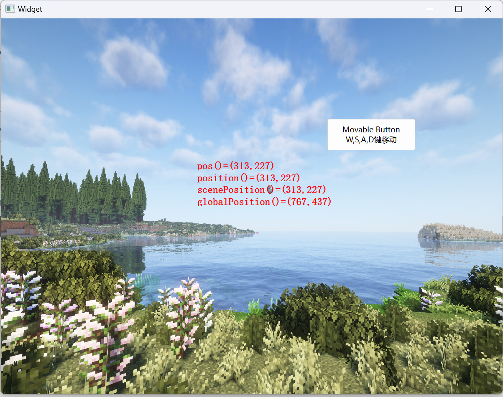
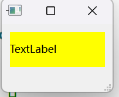
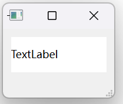

# Qt Event事件系统小探1

## Qt Event System From qt.doc

​	在 Qt 中，事件是从抽象 QEvent 类派生的对象，表示应用程序内部发生的事情或应用程序需要了解的外部活动的结果。事件可以由 QObject 子类的任何实例接收和处理，但它们与小部件特别相关。

### 如何传递事件

​	当发生事件时，Qt 通过构造适当的 QEvent 子类的实例来创建一个事件对象来表示它，并通过调用其 event() 函数将其传递给 QObject 的特定实例（或其子类之一）。此函数不处理事件本身；根据传递的事件类型，**它调用该特定类型事件的事件处理程序，并根据事件是被接受还是被忽略发送响应。**一些事件（如 QMouseEvent 和 QKeyEvent）来自窗口系统；一些事件（如 QTimerEvent）来自其他来源；一些来自应用程序本身。

### 事件类型

​	大多数事件类型都有特殊类，特别是 QResizeEvent、QPaintEvent、QMouseEvent、QKeyEvent 和 QCloseEvent。**每个类都是 QEvent 的子类，并添加了事件特定的函数。**例如，QResizeEvent 添加了 size() 和 oldSize()，以使小部件能够发现其尺寸是如何改变的。

​	某些类支持多种实际事件类型。QMouseEvent 支持鼠标按钮按下、双击、移动和其他相关操作。

​	每个事件都有一个关联类型，在 QEvent::Type 中定义，这可以用作运行时类型信息的便捷来源，以快速确定给定事件对象是从哪个子类构建的。

​	由于程序需要以多种复杂的方式做出反应，因此 Qt 的事件传递机制非常灵活。QCoreApplication::notify() 的文档简明扼要地讲述了整个事情的发展流程；

### 事件处理程序

​	传递事件的正常方式是调用虚拟函数。例如，QPaintEvent 通过调用 QWidget::paintEvent() 传递。此虚拟函数负责做出适当的反应，通常是重新绘制小部件。如果我们没有在虚拟函数的实现中执行所有必要的工作，则可能需要调用基类的实现。例如，以下代码处理自定义复选框小部件上的鼠标左键单击，同时将所有其他按钮单击传递给基类 QCheckBox：

```
void MyCheckBox::mousePressEvent(QMouseEvent *event)
{
	if (event->button() == Qt::LeftButton) {
		// 在此处处理鼠标左键
	} else {// 将其他按钮传递给基类
		QCheckBox::mousePressEvent(event);
	}
}
```

​	上面的代码按照一种更加省事的方式来处理，实际上就是说：啊哈，我希望我的Checkbox在接受到我的左键按下去的时候做出特定的行为，但是其他的我仍然希望沿用Qt设定的默认处理。

​	如果我们想替换基类的函数，**则必须自己实现所有内容。但是，如果我们只想扩展基类的功能，那么我们可以实现所需的功能并调用基类来获取我们不想处理的任何情况的默认行为**。

​	有时，没有这样的事件特定函数，或者事件特定函数不够用。最常见的示例涉及 Tab 键按下。通常，QWidget 会拦截这些以移动键盘焦点，但一些小部件本身需要 Tab 键。这些对象可以重新实现 QObject::event()（通用事件处理程序），并在通常的处理之前或之后执行其事件处理，或者它们可以完全替换该函数。一个非常不寻常的小部件既解释 Tab 又具有特定于应用程序的自定义事件，可能包含以下 event() 函数：

```
bool MyWidget::event(QEvent *event)
{
	if (event->type() == QEvent::KeyPress) {
		QKeyEvent *ke = static_cast<QKeyEvent *>(event);
		if (ke->key() == Qt::Key_Tab) {
			// 此处处理特殊制表符
			return true;
		}
	} else if (event->type() == MyCustomEventType) {
		MyCustomEvent *myEvent = static_cast<MyCustomEvent *>(event);
		// 此处处理自定义事件
		return true;
	}
	return QWidget::event(event);
}
```

请注意，对于所有未处理的情况，仍会调用 QWidget::event()，并**且返回值指示是否已处理事件；如果为真，则不会将事件发送给其他对象。**

### 事件过滤器

​	有时，对象需要查看并可能拦截传递给另一个对象的事件。例如，对话框通常需要过滤某些小部件的按键；例如，修改 Return 键处理。QObject::installEventFilter() 函数通过设置事件过滤器来实现这一点，从而导致指定的过滤器对象在其 QObject::eventFilter() 函数中接收目标对象的事件。事件过滤器可以在目标对象之前处理事件对象会这样做，允许它根据需要检查和丢弃事件。可以使用 QObject::removeEventFilter() 函数删除现有的事件过滤器。

​	当调用过滤器对象的 eventFilter() 实现时，它可以接受或拒绝事件，并允许或拒绝进一步处理事件。如果所有事件过滤器都允许进一步处理事件（通过每个返回 false），则事件将发送到目标对象本身。如果其中一个停止处理（通过返回 true），则**目标和任何后续事件过滤器都根本看不到该事件。**

```
bool FilterObject::eventFilter(QObject *object, QEvent *event)
{
	if (object == target && event->type() == QEvent::KeyPress) {
		QKeyEvent *keyEvent = static_cast<QKeyEvent *>(event);
		if (keyEvent->key() == Qt::Key_Tab) {
			// 特殊选项卡处理
			return true;	// 我说我处理完了，其他人不要多管闲事
		} else	return false;
	}
	return false;	// 没处理完，继续寻找可以处理的Handler处理
}
```

​	上面的代码展示了另一种拦截发送到特定目标窗口小部件的 Tab 键按下事件的方法。在这种情况下，过滤器处理相关事件并返回 true 以阻止进一步处理它们。所有其他事件都将被忽略，过滤器返回 false 以允许它们通过安装在其上的任何其他事件过滤器发送到目标窗口小部件。通过在 QApplication 或 QCoreApplication 对象上安装事件过滤器，还可以过滤整个应用程序的所有事件。此类全局事件过滤器在对象特定过滤器之前调用。这非常强大，但它也会减慢整个应用程序中每个事件的事件传递速度；通常应使用讨论的其他技术。

### 发送事件

​	许多应用程序希望创建和发送自己的事件。我们可以通过构造合适的事件对象并使用 QCoreApplication::sendEvent() 和 QCoreApplication::postEvent() 发送它们，以与 Qt 自己的事件循环完全相同的方式发送事件。

- sendEvent() 立即处理事件。当它返回时，事件过滤器和/或对象本身已经处理了该事件。对于许多事件类，有一个名为 isAccepted() 的函数，它会告诉我们事件是否被最后调用的处理程序接受或拒绝。

- postEvent() 将事件发布到队列中以供稍后调度。下次 Qt 的主事件循环运行时，它会调度所有已发布的事件，并进行一些优化。例如，如果有多个调整大小事件，则将它们压缩为一个。这同样适用于绘制事件：QWidget::update() 调用 postEvent()，这消除了闪烁并通过避免多次重新绘制来提高速度。


​	postEvent() 也在对象初始化期间使用，因为已发布的事件通常会在对象初始化完成后很快调度。在实现小部件时，重要的是要意识到事件可以在其生命周期的早期传递，因此在其构造函数中，一定要尽早初始化成员变量，以免它有机会接收事件。要创建自定义类型的事件，我们需要定义一个事件编号，该编号必须大于 QEvent::User，并且我们可能需要子类化 QEvent 以传递有关自定义事件的特定信息。

​	上面是Qt官网所给出的指示。下一步，我来重新阐述一下。

## 事件的产生和派发

​	刚刚你肯定有映像：我们的事件系统的核心人物是QEvent类，它用来表达一个抽象的发生的事件。比如说摁键摁下，鼠标移动等等。我们为了进一步表达是什么事件，选择了派生QEvent/

​	事件的来源有三个：

1. 自生的事件：窗口系统会产生三个事件：QKeyEvent表达摁键的事件，QMouseEvent表达鼠标的事件
2. 发布的事件：这些事件是Qt或者是应用程序的事件。比如QTimer定时器的溢出
3. 发送事件：由QCoreApplication::sendEvent函数发送，对象的event()函数进行接受

​	值得一提的是，sendEvent函数是同步的，他会阻塞等待对象处理结束。异步的话使用postEvent函数，这个就像邮递员邮递事件一样，扔完就走，他不会负责等待结果产生0。

​	Qt的事件是使用一个队列进行维护。在默认的情况下，事件循环处理实际上是在这里体现的：

```
QApplication a(argc, argv);
...
return a.exec();
```

​	我们的内部产生的所有事件的处理就是在a.exec()的等待中处理的

| 事件类                      | 详细用途                                       |
| --------------------------- | ---------------------------------------------- |
| QAbstractEventDispatcher    | 管理 Qt 的事件队列。                           |
| QActionEvent                | 当 QAction 被添加、移除或更改时生成的事件。    |
| QBasicTimer                 | 处理基本的定时器事件。                         |
| QChildEvent                 | 包含与子对象事件相关的参数。                   |
| QChildWindowEvent           | 包含与子窗口变化相关的参数。                   |
| QChronoTimer                | 处理重复和单次定时器。                         |
| QCloseEvent                 | 描述关闭事件的参数。                           |
| QContextMenuEvent           | 描述上下文菜单事件的参数。                     |
| QDragEnterEvent             | 当拖放操作进入小部件时发送的事件。             |
| QDragLeaveEvent             | 当拖放操作离开小部件时发送的事件。             |
| QDragMoveEvent              | 拖放操作进行时发送的事件。                     |
| QDropEvent                  | 拖放操作完成时发送的事件。                     |
| QDynamicPropertyChangeEvent | 包含动态属性变化事件的参数。                   |
| QEnterEvent                 | 描述进入事件的参数。                           |
| QEvent                      | 所有事件类的基类，包含事件参数。               |
| QExposeEvent                | 描述曝光事件的参数。                           |
| QFileOpenEvent              | 请求打开文件或 URL 时发送的事件。              |
| QFocusEvent                 | 小部件焦点事件的参数。                         |
| QGestureEvent               | 描述触发的手势。                               |
| QHelpEvent                  | 请求有关小部件特定点的帮助信息的事件。         |
| QHideEvent                  | 小部件被隐藏后发送的事件。                     |
| QHoverEvent                 | 描述鼠标悬停事件的参数。                       |
| QIconDragEvent              | 表示主图标拖动开始的事件。                     |
| QInputEvent                 | 描述用户输入的事件基类。                       |
| QInputMethodEvent           | 输入法事件的参数。                             |
| QKeyEvent                   | 描述键盘事件。                                 |
| QMouseEvent                 | 描述鼠标事件的参数。                           |
| QMoveEvent                  | 描述移动事件的参数。                           |
| QNativeGestureEvent         | 描述手势事件的参数。                           |
| QPaintEvent                 | 描述绘制事件的参数。                           |
| QPlatformSurfaceEvent       | 通知原生平台表面事件的事件。                   |
| QPointingDevice             | 描述鼠标、触摸或平板设备的事件来源。           |
| QPointingDeviceUniqueId     | 唯一标识符，用于识别与指点设备相关的唯一对象。 |
| QResizeEvent                | 描述调整大小事件的参数。                       |
| QScrollEvent                | 当滚动发生时发送的事件。                       |
| QScrollPrepareEvent         | 在滚动准备时发送的事件。                       |
| QShortcut                   | 用于创建键盘快捷方式。                         |
| QShortcutEvent              | 当用户按下键组合时生成的事件。                 |
| QShowEvent                  | 小部件显示时发送的事件。                       |
| QStatusTipEvent             | 用于在状态栏显示消息的事件。                   |
| QTabletEvent                | 描述平板设备事件的参数。                       |
| QTimer                      | 处理重复和单次定时器。                         |
| QTimerEvent                 | 描述定时器事件的参数。                         |
| QTouchEvent                 | 描述触摸事件的参数。                           |
| QWhatsThisClickedEvent      | 用于处理“是什么？”文本中的超链接的事件。       |
| QWheelEvent                 | 描述滚轮事件的参数。                           |
| QWindowStateChangeEvent     | 描述窗口状态变化前的窗口状态。                 |

​	当然，我们的事件内部还有继续的派生，这个我后面对一些常见的进行解析的时候再深入探讨。

## 处理我们的事件

​	事件是一个signal，我们需要对signal来进行处理。当我们需要进行事件处理的时候，就是首先走到Event函数中处理。以QMainWindow的Event处理为例子，由于他是QWidget的子类，比QWidget的处理要更加丰富。故而先处理QMainWindow的特殊的事件。

​	从6.7.2的源码可以看到，我们处理的是QMainWindow多出来的（相较于平凡的QWidget）有dockwidget， toolbar, statusbar控件，提示我们需要对这些控件的事件做转发处理，以及拖动等操作是QMainWindow有的吗，故而需要处理。然后余下的事情交给QWidget来处理。

```
bool QMainWindow::event(QEvent *event)
{
    Q_D(QMainWindow);

#if QT_CONFIG(dockwidget)
    if (d->layout && d->layout->windowEvent(event))
        return true;
#endif

    switch (event->type()) {

#if QT_CONFIG(toolbar)
        case QEvent::ToolBarChange: {
            Q_ASSERT(d->layout);
            d->layout->toggleToolBarsVisible();
            return true;
        }
#endif

#if QT_CONFIG(statustip)
        case QEvent::StatusTip:
#if QT_CONFIG(statusbar)
            Q_ASSERT(d->layout);
            if (QStatusBar *sb = d->layout->statusBar())
                sb->showMessage(static_cast<QStatusTipEvent*>(event)->tip());
            else
#endif
                static_cast<QStatusTipEvent*>(event)->ignore();
            return true;
#endif // QT_CONFIG(statustip)

        case QEvent::StyleChange:
#if QT_CONFIG(dockwidget)
            Q_ASSERT(d->layout);
            d->layout->layoutState.dockAreaLayout.styleChangedEvent();
#endif
            if (!d->explicitIconSize)
                setIconSize(QSize());
            break;
#if QT_CONFIG(draganddrop)
        case QEvent::DragEnter:
        case QEvent::Drop:
            if (!d->layout->draggingWidget)
                break;
            event->accept();
            return true;
        case QEvent::DragMove: {
            if (!d->layout->draggingWidget)
                break;
            auto dragMoveEvent = static_cast<QDragMoveEvent *>(event);
            d->layout->hover(d->layout->draggingWidget,
                             mapToGlobal(dragMoveEvent->position()).toPoint());
            event->accept();
            return true;
        }
        case QEvent::DragLeave:
            if (!d->layout->draggingWidget)
                break;
            d->layout->hover(d->layout->draggingWidget, pos() - QPoint(-1, -1));
            return true;
#endif
        default:
            break;
    }

    return QWidget::event(event);
}
```

​	QWidget的事件我们在扩展中提到而且加以分析。请看官有兴趣的翻到博客的最后。

## 来一段好玩的代码

​	我们现在就来一探究竟，这是一段笔者写的代码

> Widget.cpp

```
#include "Widget.h"
#include <QCloseEvent>
#include <QMessageBox>
#include <QPainter>
#include "ui_Widget.h"

Widget::Widget(QWidget *parent) : QWidget(parent), ui(new Ui::Widget) {
    ui->setupUi(this);
}

bool Widget::event(QEvent *event) {
    qDebug() << "Enter the Widget Event";
    return QWidget::event(event);
}

void Widget::showEvent(QShowEvent *event) {
    QWidget::showEvent(event);
    qDebug() << "Show Event";
}

void Widget::paintEvent(QPaintEvent *event [[maybe_unused]]) {
    qDebug() << "Call paint Event";
    QPainter painter(this);
    painter.drawPixmap(0, 0, this->width(), this->height(),
                       QPixmap(":/pic/hello.png"));
    return QWidget::paintEvent(event);
}

void Widget::closeEvent(QCloseEvent *event) {
    QString dlgTitle = "消息框";
    QString strInfo  = "确定要退出吗？";

    QMessageBox::StandardButton result = QMessageBox::question(
        this, dlgTitle, strInfo, QMessageBox::Yes | QMessageBox::No);
    if (result == QMessageBox::Yes)
        event->accept();  // 窗口可关闭
    else
        event->ignore();  // 窗口不能被关闭
}

void Widget::keyPressEvent(QKeyEvent *event) {
    QPoint pt = ui->btnMove->pos();

    if ((event->key() == Qt::Key_A) || (event->key() == Qt::Key_Left))
        ui->btnMove->move(pt.x() - 20, pt.y());
    else if ((event->key() == Qt::Key_D) || (event->key() == Qt::Key_Right))
        ui->btnMove->move(pt.x() + 20, pt.y());
    else if ((event->key() == Qt::Key_W) || (event->key() == Qt::Key_Up))
        ui->btnMove->move(pt.x(), pt.y() - 20);
    else if ((event->key() == Qt::Key_S) || (event->key() == Qt::Key_Down))
        ui->btnMove->move(pt.x(), pt.y() + 20);

    event->accept();  // 被处理,不会再传播到父窗体
    //    QWidget::keyPressEvent(event);
}

void Widget::keyReleaseEvent(QKeyEvent *event) {
    qDebug() << "You call the Key Release Event";
    return QWidget::keyReleaseEvent(event);
}

void Widget::hideEvent(QHideEvent *event) {
    Q_UNUSED(event);
    qDebug("hideEvent()函数被触发");
}

void Widget::mousePressEvent(QMouseEvent *event) {
    if (event->button() == Qt::LeftButton)  // 鼠标左键
    {
        QPoint  pt     = event->pos();  // 点击点在窗口上的相对坐标
        QPointF relaPt = event->position();        // 相对坐标
        QPointF winPt  = event->scenePosition();   // 相对坐标
        QPointF globPt = event->globalPosition();  // 屏幕上的绝对坐标

        QString str = QString::asprintf("pos()=(%d,%d)", pt.x(), pt.y());
        str = str + QString::asprintf("\nposition()=(%.0f,%.0f)", relaPt.x(),
                                      relaPt.y());
        str = str + QString::asprintf("\nscenePosition()=(%.0f,%.0f)",
                                      winPt.x(), winPt.y());
        str = str + QString::asprintf("\nglobalPosition()=(%.0f,%.0f)",
                                      globPt.x(), globPt.y());

        ui->labMove->setText(str);
        ui->labMove->adjustSize();        // 自动调整组件大小
        ui->labMove->move(event->pos());  // 标签移动到鼠标光标处
    }

    QWidget::mousePressEvent(event);
}

Widget::~Widget() {
    delete ui;
}
```

> Widget.h

```
#ifndef WIDGET_H
#define WIDGET_H

#include <QWidget>

QT_BEGIN_NAMESPACE
namespace Ui {
class Widget;
}
QT_END_NAMESPACE

class Widget : public QWidget {
    Q_OBJECT

public:
    Widget(QWidget *parent = nullptr);
    // Main Handle of the event processors
    bool event(QEvent *event) override;
    void paintEvent(QPaintEvent *event) override;
    void closeEvent(QCloseEvent *event) override;
    void keyReleaseEvent(QKeyEvent *event) override;
    void keyPressEvent(QKeyEvent *event) override;
    void showEvent(QShowEvent *event) override;
    void hideEvent(QHideEvent *event) override;
    void mousePressEvent(QMouseEvent *event) override;
    ~Widget();

private:
    Ui::Widget *ui;
};
#endif  // WIDGET_H
```



​	实际上，我们的具体的这些重载类是Event函数进行调用的，您可以查看下面的博客更加细致的了解。

## 扩展：QWidget如何处理我们的事件？

​	下面的代码是笔者自己在Qt6.7.2中调试的时候进入的源文件得到的，笔者写上了注释

```
bool QWidget::event(QEvent *event)
{
    Q_D(QWidget);  // 获取QWidget的私有数据（d指针）

    // 如果该窗口被禁用，忽略一些鼠标和键盘事件
    if (!isEnabled()) {
        switch(event->type()) {
        case QEvent::TabletPress:
        case QEvent::TabletRelease:
        case QEvent::TabletMove:
        case QEvent::MouseButtonPress:
        case QEvent::MouseButtonRelease:
        case QEvent::MouseButtonDblClick:
        case QEvent::MouseMove:
        case QEvent::TouchBegin:
        case QEvent::TouchUpdate:
        case QEvent::TouchEnd:
        case QEvent::TouchCancel:
        case QEvent::ContextMenu:
        case QEvent::KeyPress:
        case QEvent::KeyRelease:
#if QT_CONFIG(wheelevent)
        case QEvent::Wheel:
#endif
            return false;  // 禁用时直接忽略这些事件, 返回false表达事件没有完成处理，需要上层进一步throw到其他控件
        default:
            break;
        }
    }

    switch (event->type()) {
    case QEvent::PlatformSurface: {
        // 处理平台相关的事件，确保窗口创建和销毁的正确性
        switch (static_cast<QPlatformSurfaceEvent*>(event)->surfaceEventType()) {
        case QPlatformSurfaceEvent::SurfaceCreated:
            if (!testAttribute(Qt::WA_WState_Created))
                create();  // 创建窗口
            break;
        case QPlatformSurfaceEvent::SurfaceAboutToBeDestroyed:
            if (testAttribute(Qt::WA_WState_Created)) {
                destroy(false, false);  // 销毁窗口
            }
            break;
        }
        break;
    }
    case QEvent::MouseMove:
        mouseMoveEvent((QMouseEvent*)event);  // 处理鼠标移动事件
        break;

    case QEvent::MouseButtonPress:
        mousePressEvent((QMouseEvent*)event);  // 处理鼠标按下事件
        break;

    case QEvent::MouseButtonRelease:
        mouseReleaseEvent((QMouseEvent*)event);  // 处理鼠标释放事件
        break;

    case QEvent::MouseButtonDblClick:
        mouseDoubleClickEvent((QMouseEvent*)event);  // 处理鼠标双击事件
        break;
#if QT_CONFIG(wheelevent)
    case QEvent::Wheel:
        wheelEvent((QWheelEvent*)event);  // 处理鼠标滚轮事件
        break;
#endif
#if QT_CONFIG(tabletevent)
    case QEvent::TabletMove:
        if (static_cast<QTabletEvent *>(event)->buttons() == Qt::NoButton && !testAttribute(Qt::WA_TabletTracking))
            break;
        Q_FALLTHROUGH();  // 没有处理，继续执行下一个case
    case QEvent::TabletPress:
    case QEvent::TabletRelease:
        tabletEvent((QTabletEvent*)event);  // 处理平板触摸事件
        break;
#endif
    case QEvent::KeyPress: {
        QKeyEvent *k = static_cast<QKeyEvent *>(event);
        bool res = false;
        // 处理按键事件，特定条件下进行焦点切换
        if (!(k->modifiers() & (Qt::ControlModifier | Qt::AltModifier))) {
            if (k->key() == Qt::Key_Backtab
                || (k->key() == Qt::Key_Tab && (k->modifiers() & Qt::ShiftModifier)))
                res = focusNextPrevChild(false);  // 反向切换焦点
            else if (k->key() == Qt::Key_Tab)
                res = focusNextPrevChild(true);  // 正向切换焦点
            if (res)
                break;
        }
        keyPressEvent(k);  // 处理普通的按键事件
        // 其他键盘导航和帮助信息处理
    }
        break;

    case QEvent::KeyRelease:
        keyReleaseEvent((QKeyEvent*)event);  // 处理按键释放事件
        Q_FALLTHROUGH();  // 继续执行下一个事件处理
    case QEvent::ShortcutOverride:
        break;

    case QEvent::InputMethod:
        inputMethodEvent((QInputMethodEvent *) event);  // 处理输入法事件
        break;

    case QEvent::InputMethodQuery: {
        QInputMethodQueryEvent *query = static_cast<QInputMethodQueryEvent *>(event);
        Qt::InputMethodQueries queries = query->queries();
        // 遍历查询输入法的状态，并响应不同的查询
        for (uint i = 0; i < 32; ++i) {
            Qt::InputMethodQuery q = (Qt::InputMethodQuery)(int)(queries & (1<<i));
            if (q) {
                QVariant v = inputMethodQuery(q);
                query->setValue(q, v);
            }
        }
        query->accept();  // 接受查询
        break;
    }
    case QEvent::PolishRequest:
        ensurePolished();  // 保证窗口经过正确的样式处理
        break;

    case QEvent::Polish: {
        // 对窗口应用样式，更新界面外观
        style()->polish(this);
        setAttribute(Qt::WA_WState_Polished);
        if (!QApplication::font(this).isCopyOf(QApplication::font()))
            d->resolveFont();
        if (!QApplication::palette(this).isCopyOf(QGuiApplication::palette()))
            d->resolvePalette();
    }
        break;

    case QEvent::ApplicationWindowIconChange:
        // 处理窗口图标变化
        if (isWindow() && !testAttribute(Qt::WA_SetWindowIcon)) {
            d->setWindowIcon_sys();
            d->setWindowIcon_helper();
        }
        break;
    case QEvent::FocusIn:
        focusInEvent((QFocusEvent*)event);  // 处理焦点进入事件
        break;

    case QEvent::FocusOut:
        focusOutEvent((QFocusEvent*)event);  // 处理焦点离开事件
        break;

    case QEvent::Enter:
        enterEvent(static_cast<QEnterEvent*>(event));  // 处理鼠标进入事件
        break;

    case QEvent::Leave:
        leaveEvent(event);  // 处理鼠标离开事件
        break;

    case QEvent::Paint:
        // 确保界面绘制事件已经被处理
        paintEvent((QPaintEvent*)event);
        break;

    case QEvent::Move:
        moveEvent((QMoveEvent*)event);  // 处理窗口移动事件
        break;

    case QEvent::Resize:
        resizeEvent((QResizeEvent*)event);  // 处理窗口调整大小事件
        break;

    case QEvent::Close:
        closeEvent((QCloseEvent *)event);  // 处理窗口关闭事件
        break;

    case QEvent::ContextMenu:
        // 根据不同的上下文菜单策略来处理
        switch (data->context_menu_policy) {
        case Qt::PreventContextMenu:
            break;
        case Qt::DefaultContextMenu:
            contextMenuEvent(static_cast<QContextMenuEvent *>(event));  // 默认上下文菜单事件
            break;
        case Qt::CustomContextMenu:
            emit customContextMenuRequested(static_cast<QContextMenuEvent *>(event)->pos());  // 自定义上下文菜单事件
            break;
        default:
            event->ignore();
            break;
        }
        break;

    case QEvent::WindowStateChange: {
        // 处理窗口状态变化
        const bool wasMinimized = static_cast<const QWindowStateChangeEvent *>(event)->oldState() & Qt::WindowMinimized;
        if (wasMinimized != isMinimized()) {
            QWidget *widget = const_cast<QWidget *>(this);
            if (wasMinimized) {
                // 恢复时显示隐藏的窗口内容
                d->showChildren(true);
            } else {
                d->hideChildren(true);
            }
        }
        changeEvent(event);  // 处理状态变化
    }
        break;

    case QEvent::LanguageChange:
        changeEvent(event);  // 处理语言变化
        update();  // 更新界面
        break;

    default:
        break;
    }

    return true;
}
```

​	QWidget是复杂的！他处理了我们常常使用的事件的几乎所有的handle。对于我们一般的开发者，**除非自己知道正在干什么，否则不要轻易的随意的重写QWidget的event函数（很容易丢失处理逻辑导致程序出现问题），即使需要，也可以按照尾调用基类的event函数补全操作**，正确的做法是重载一个特定的行为（鼠标移入移出Event等）

| 函数名                                                       | 详细用途                                                     |
| ------------------------------------------------------------ | ------------------------------------------------------------ |
| `actionEvent(QActionEvent *event)`                           | 处理 `QAction` 的事件，如添加、移除或修改 `QAction` 时触发的事件。 |
| `changeEvent(QEvent *event)`                                 | 用于处理与小部件状态改变相关的事件，如启用/禁用状态的改变。  |
| `closeEvent(QCloseEvent *event)`                             | 处理关闭事件，例如窗口关闭时，确认是否退出等操作。           |
| `contextMenuEvent(QContextMenuEvent *event)`                 | 处理上下文菜单事件，通常是在右键点击时显示的菜单。           |
| `create(WId window = 0, bool initializeWindow = true, bool destroyOldWindow = true)` | 创建或初始化一个窗口，通常在小部件或窗口初始化时调用。       |
| `destroy(bool destroyWindow = true, bool destroySubWindows = true)` | 销毁窗口，销毁当前窗口及其子窗口的资源。                     |
| `dragEnterEvent(QDragEnterEvent *event)`                     | 处理拖拽进入事件，当有拖拽操作进入小部件时触发。             |
| `dragLeaveEvent(QDragLeaveEvent *event)`                     | 处理拖拽离开事件，当拖拽操作离开小部件时触发。               |
| `dragMoveEvent(QDragMoveEvent *event)`                       | 处理拖拽移动事件，拖拽操作在小部件内移动时触发。             |
| `dropEvent(QDropEvent *event)`                               | 处理拖拽放下事件，当拖拽操作完成且释放时触发。               |
| `enterEvent(QEnterEvent *event)`                             | 处理鼠标进入事件，当鼠标指针进入小部件时触发。               |
| `focusInEvent(QFocusEvent *event)`                           | 处理小部件获得焦点事件，通常在小部件获得键盘输入焦点时触发。 |
| `focusNextChild()`                                           | 使小部件将焦点转移到下一个子小部件，常用于焦点切换逻辑。     |
| `focusNextPrevChild(bool next)`                              | 切换焦点到下一个或上一个子小部件，返回 `true` 或 `false`，用于焦点导航。 |
| `focusOutEvent(QFocusEvent *event)`                          | 处理小部件失去焦点事件，通常在小部件失去键盘输入焦点时触发。 |
| `focusPreviousChild()`                                       | 使小部件将焦点转移到上一个子小部件。                         |
| `hideEvent(QHideEvent *event)`                               | 处理小部件隐藏事件，当小部件调用 `hide()` 时触发。           |
| `inputMethodEvent(QInputMethodEvent *event)`                 | 处理输入法事件，通常与文本输入相关，支持多语言输入。         |
| `keyPressEvent(QKeyEvent *event)`                            | 处理键盘按键按下事件，检测到键盘按下时触发。                 |
| `keyReleaseEvent(QKeyEvent *event)`                          | 处理键盘按键释放事件，检测到键盘释放时触发。                 |
| `leaveEvent(QEvent *event)`                                  | 处理鼠标离开事件，当鼠标指针离开小部件时触发。               |
| `mouseDoubleClickEvent(QMouseEvent *event)`                  | 处理鼠标双击事件，当鼠标双击小部件时触发。                   |
| `mouseMoveEvent(QMouseEvent *event)`                         | 处理鼠标移动事件，当鼠标指针在小部件内移动时触发。           |
| `mousePressEvent(QMouseEvent *event)`                        | 处理鼠标按下事件，当鼠标按下小部件时触发。                   |
| `mouseReleaseEvent(QMouseEvent *event)`                      | 处理鼠标释放事件，当鼠标释放按钮时触发。                     |
| `moveEvent(QMoveEvent *event)`                               | 处理小部件移动事件，当小部件位置发生变化时触发。             |
| `nativeEvent(const QByteArray &eventType, void *message, qintptr *result)` | 处理原生事件，允许处理平台特定的事件。                       |
| `paintEvent(QPaintEvent *event)`                             | 处理绘制事件，当小部件需要重绘时触发。                       |
| `resizeEvent(QResizeEvent *event)`                           | 处理调整大小事件，当小部件尺寸改变时触发。                   |
| `showEvent(QShowEvent *event)`                               | 处理显示事件，当小部件显示时触发。                           |
| `tabletEvent(QTabletEvent *event)`                           | 处理平板设备事件，通常用于处理触控板或手写板事件。           |
| `wheelEvent(QWheelEvent *event)`                             | 处理滚轮事件，当鼠标滚轮操作时触发。                         |

## 扩展2：实现一个变色的Label

​	我们的QLabel有些单调，我们自己来附加一些更加好看的功能！

```
#include "MyLabel.h"
#include <QHoverEvent>
MyLabel::MyLabel(QWidget* parent) : QLabel(parent) {
    this->setAttribute(Qt::WA_Hover, true);
    // Set hover attribute
    // Only in this case shell hover events be provided
}

bool MyLabel::event(QEvent* event) {
    if (event->type() == QEvent::HoverEnter) {
        hoverEnter();  // Call hover enter function
    } else if (event->type() == QEvent::HoverLeave) {
        hoverLeave();  // Call hover leave function
    }
    return QLabel::event(event);
}
void MyLabel::hoverEnter() {
    this->setStyleSheet("background-color: yellow");
}

void MyLabel::hoverLeave() {
    this->setStyleSheet("background-color: white");
}

void MyLabel::mouseDoubleClickEvent(QMouseEvent* event) {
    qDebug() << "Double Clicked Me :)";
    emit doubleClicked();
    return QLabel::mouseDoubleClickEvent(event);
}
```

```
#ifndef MYLABEL_H
#define MYLABEL_H

#include <QLabel>

class MyLabel : public QLabel {
    Q_OBJECT
public:
    MyLabel(QWidget* parent = nullptr);
    bool event(QEvent* event) override;

protected:
    void hoverEnter();
    void hoverLeave();
    void mouseDoubleClickEvent(QMouseEvent* event) override;
signals:
    void doubleClicked();
};

#endif  // MYLABEL_H
```

​	就是这样的，现在我们就可以开始将我们的控件搬到MainWindow上看看效果：

> 鼠标悬浮到TextLabel上：



> 鼠标离开后：


