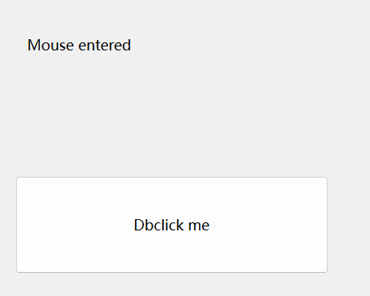

# Qt Event事件系统小探2

## 事件过滤器

​	我们知道，有的时候想要重新定义一个控件的事件行为，就需要对这个类进行重载，然而当我们的类达到了成百上千，如果我们只是想要传递事件做出响应，好像啥都重载未免太过抽象了。所以，这里就有一个办法，那就是eventFilter函数来做这个事情

​	这种技术适合于一个对象需要查看并可能拦截传递给另一个对象的事件这个场景。例如，对话框通常需要过滤某些小部件的按键；例如，修改回车键处理。

​	QObject::installEventFilter() 函数通过设置事件过滤器来实现这一点，**从而使指定的过滤器对象在其 QObject::eventFilter() 函数中接收目标对象的事件。事件过滤器可以在目标对象之前处理事件，从而允许其根据需要检查和丢弃事件。**可以使用 QObject::removeEventFilter() 函数删除现有的事件过滤器。

​	当调用过滤器对象的 eventFilter() 实现时，它可以接受或拒绝事件，并允许或拒绝进一步处理事件。如果所有事件过滤器都允许进一步处理事件（通过每个都返回 false），则事件将发送到目标对象本身。如果其中一个停止处理（通过返回 true），则目标和任何后续事件过滤器根本看不到该事件。

```
bool FilterObject::eventFilter(QObject *object, QEvent *event)
{
	if (object == target && event->type() == QEvent::KeyPress) {
		QKeyEvent *keyEvent = static_cast<QKeyEvent *>(event);
		if (keyEvent->key() == Qt::Key_Tab) {
			// 特殊 Tab 处理
			return true;
		} else
		return false;
	}
	return false;
}
```

​	上面的代码显示了另一种拦截发送到特定目标窗口小部件的 Tab 键按下事件的方法。在这种情况下，过滤器处理相关事件并返回 true 以阻止进一步处理它们。所有其他事件都将被忽略，过滤器返回 false 以允许它们通过安装在其上的任何其他事件过滤器发送到目标窗口小部件。

​	还可以通过在 QApplication 或 QCoreApplication 对象上安装事件过滤器来过滤整个应用程序的所有事件。此类全局事件过滤器在对象特定过滤器之前调用。这非常强大，**但它也会减慢整个应用程序中每个事件的传递速度**

## 来看一个例子



​	我们来试试使用EventFilter来表达事件改变了控件的行为，事情很简单。在UI界面上部署好一个按钮控件和一个Label控件之后，直接写入：

```
#include "MainWindow.h"
#include "ui_MainWindow.h"

MainWindow::MainWindow(QWidget *parent)
    : QMainWindow(parent), ui(new Ui::MainWindow) {
    ui->setupUi(this);
    ui->pushButton->installEventFilter(this);
    ui->label->installEventFilter(this);
}

bool MainWindow::eventFilter(QObject *watched, QEvent *event) {
    if (watched == ui->pushButton) {
        if (event->type() == QEvent::Enter) {
            ui->pushButton->setText("Mouse entered");
        } else if (event->type() == QEvent::Leave) {
            ui->pushButton->setText("Mouse leaved");
        } else if (event->type() == QEvent::MouseButtonPress) {
            ui->pushButton->setText("Mouse pressed");
        } else if (event->type() == QEvent::MouseButtonDblClick) {
            ui->pushButton->setText("Mouse double clicked");
        }
    } else if (watched == ui->label) {
        if (event->type() == QEvent::Enter) {
            ui->label->setText("Mouse entered");
        } else if (event->type() == QEvent::Leave) {
            ui->label->setText("Mouse left");
        }
    }

    return QMainWindow::eventFilter(watched, event);
}

MainWindow::~MainWindow() {
    delete ui;
}
```

​	这个代码并不难懂，实际上就是对我们感兴趣的事件进行重载即可。值得注意的是：最后不能直接写返回true的是简单的——我们没有处理完所有控件的事件！必须调用默认的函数处理余下的行为！

## 拖放事件和拖放操作

### Qt官方文档给出的说明

#### 拖放

​	**拖放提供了一种简单的可视化机制，用户可使用它在应用程序之间和内部传输信息。**拖放的功能类似于剪贴板的剪切和粘贴机制。Qt 的许多控件也支持拖放操作，例如项目视图和图形视图框架，以及 Qt Widgets 和 Qt Quick 的编辑控件。

#### 拖放类

| 类/事件               | 描述                                                |
| --------------------- | --------------------------------------------------- |
| **QDrag**             | 支持基于 MIME 的拖放数据传输                        |
| **QDragEnterEvent**   | 当拖放操作进入窗口小部件时，向窗口小部件发送事件    |
| **QDragLeaveEvent**   | 当拖放操作离开窗口小部件时，向窗口小部件发送事件    |
| **QDragMoveEvent**    | 当拖放操作正在进行时发送事件                        |
| **QDropEvent**        | 当拖放操作完成时发送事件                            |
| **QUtiMimeConverter** | 在 MIME 类型和统一类型标识符 (UTI) 格式之间进行转换 |

#### 配置

QStyleHints 对象提供了一些与拖放操作相关的属性：

- QStyleHints::startDragTime() 描述用户在开始拖动之前必须在对象上按住鼠标按钮的时间（以毫秒为单位）。

- QStyleHints::startDragDistance() 表示用户在按住鼠标按钮的情况下必须将鼠标移动多远，才会将移动解释为拖动。
- QStyleHints::startDragVelocity() 表示用户必须以多快的速度（以像素/秒为单位）移动鼠标才能开始拖动。值为 0 表示没有这样的限制。

​	这些数量提供了合理的默认值，这些默认值符合底层窗口系统，如果您在控件中提供拖放支持，则可以使用这些默认值。


#### 拖动

​	要开始拖动，请创建一个 QDrag 对象并调用其 exec() 函数。在大多数应用程序中，最好仅在按下鼠标按钮并将光标移动一定距离后才开始拖放操作。但是，启用小部件拖动的最简单方法是重新实现小部件的 mousePressEvent() 并开始拖放操作：

```
void MainWindow::mousePressEvent(QMouseEvent *event)
{
	if (event->button() == Qt::LeftButton && iconLabel->geometry().contains(event->pos())) {
		QDrag *drag = new QDrag(this);
		QMimeData *mimeData = new QMimeData;

		mimeData->setText(commentEdit->toPlainText());
		drag->setMimeData(mimeData);
		drag->setPixmap(iconPixmap);

		Qt::DropAction dropAction = drag->exec();
		...
	}
}
```

​	虽然用户可能需要一些时间才能完成拖动操作，但就应用程序而言，exec() 函数是一个阻塞函数，它返回几个值之一。这些值表示操作如何结束，下面将更详细地描述。

请注意，exec() 函数不会阻塞主事件循环。

对于需要区分鼠标单击和拖动的小部件，重新实现小部件的 mousePressEvent() 函数以记录拖动的起始位置很有用：

```
void DragWidget::mousePressEvent(QMouseEvent *event)
{
	if (event->button() == Qt::LeftButton)
		dragStartPosition = event->pos();
}
```

稍后，在 mouseMoveEvent() 中，我们可以确定是否应该开始拖动，并构造一个拖动对象来处理该操作：

```
void DragWidget::mouseMoveEvent(QMouseEvent *event)
{
	if (!(event->buttons() & Qt::LeftButton)) return;
	if ((event->pos() - dragStartPosition).manhattanLength() < QApplication::startDragDistance())
		return;

	QDrag *drag = new QDrag(this);
	QMimeData *mimeData = new QMimeData;

	mimeData->setData(mimeType, data);
	drag->setMimeData(mimeData);

	Qt::DropAction dropAction = drag->exec(Qt::CopyAction | Qt::MoveAction);
	...
}
```

​	此特定方法使用 QPoint::manhattanLength() 函数粗略估计鼠标单击发生的位置与当前光标位置之间的距离。此函数以速度换取准确性，通常适用于此目的。

#### 放置

​	为了能够接收放置在小部件上的媒体，请为小部件调用 setAcceptDrops(true)，并重新实现 dragEnterEvent() 和 dropEvent() 事件处理程序函数。例如，以下代码在 QWidget 子类的构造函数中启用放置事件，从而可以有效地实现结束拖放

```
Window::Window(QWidget *parent)
: QWidget(parent)
{
	...
	setAcceptDrops(true);
}
```

​	dragEnterEvent() 函数通常用于通知 Qt 小部件接受的数据类型。如果您想在重新实现 dragMoveEvent() 和 dropEvent() 时接收 QDragMoveEvent 或 QDropEvent，则必须重新实现此函数。

以下代码显示了如何重新实现 dragEnterEvent() 以告知拖放系统我们只能处理纯文本：

```
void Window::dragEnterEvent(QDragEnterEvent *event)
{
	if (event->mimeData()->hasFormat("text/plain"))
		event->acceptProposedAction();
}
```

dropEvent() 用于解压放置的数据并以适合您的应用程序的方式处理它。在以下代码中，事件中提供的文本被传递给 QTextBrowser，QComboBox 中填充了用于描述数据的 MIME 类型列表：

```
void Window::dropEvent(QDropEvent *event)
{
	textBrowser->setPlainText(event->mimeData()->text());
	mimeTypeCombo->clear();
	mimeTypeCombo->addItems(event->mimeData()->formats());

	event->acceptProposedAction();
}
```

​	在这种情况下，我们接受建议的操作而不检查它是什么。在实际应用程序中，如果操作不相关，则可能需要从 dropEvent() 函数返回而不接受建议的操作或处理数据。**例如，如果我们的应用程序不支持指向外部源的链接，我们可以选择忽略 Qt::LinkAction 操作。**

#### 覆盖建议的操作

​	我们也可以忽略建议的操作，并对数据执行其他操作。为此，我们将在调用 accept() 之前使用 Qt::DropAction 中的首选操作调用事件对象的 setDropAction()。这可确保使用替代放置操作而不是建议的操作。

​	对于更复杂的应用程序，重新实现 dragMoveEvent() 和 dragLeaveEvent() 将允许您使窗口小部件的某些部分对放置事件敏感，并让您更好地控制应用程序中的拖放。

#### 子类化复杂窗口小部件

​	某些标准 Qt 窗口小部件提供自己的拖放支持。在子类化这些窗口小部件时，除了 dragEnterEvent() 和 dropEvent() 之外，可能还需要重新实现 dragMoveEvent()，以防止基类提供默认的拖放处理，并处理您感兴趣的任何特殊情况。

#### 拖放操作

​	在最简单的情况下，拖放操作的目标会收到正在拖动的数据的副本，而源则决定是否删除原始数据。这由 CopyAction 操作描述。目标还可以选择处理其他操作，特别是 MoveAction 和 LinkAction 操作。如果源调用 QDrag::exec()，并且它返回 MoveAction，则源负责删除任何原始数据（如果它选择这样做）。源窗口小部件创建的 QMimeData 和 QDrag 对象不应被删除 - 它们将被 Qt 销毁。目标负责获取拖放操作中发送的数据的所有权；这通常是通过保留对数据的引用来完成的。

​	如果目标理解 LinkAction 操作，它应该存储自己对原始信息的引用；源不需要对数据执行任何进一步处理。拖放操作最常见的用途是在同一窗口小部件内执行移动；有关此功能的更多信息，请参阅“放置操作”部分。

​	拖动操作的另一个主要用途是使用引用类型（如 text/uri-list），其中拖动的数据实际上是对文件或对象的引用。

#### 添加新的拖放类型

​	拖放不仅限于文本和图像。任何类型的信息都可以通过拖放操作进行传输。要在应用程序之间拖动信息，应用程序必须能够相互指示它们可以接受哪些数据格式以及它们可以生成哪些数据格式。这是使用 MIME 类型实现的。源构造的 QDrag 对象包含用于表示数据的 MIME 类型列表（按从最合适到最不合适的顺序排列），而放置目标使用其中一种类型来访问数据。对于常见数据类型，便利函数可以透明地处理所使用的 MIME 类型，但对于自定义数据类型，必须明确说明它们。

​	要为 QDrag 便利函数未涵盖的信息类型实现拖放操作，第一个也是最重要的步骤是查找现有的合适格式：互联网号码分配机构 (IANA) 在信息科学研究所 (ISI) 提供了 MIME 媒体类型的分层列表。使用标准 MIME 类型可最大限度地提高您的应用程序现在和将来与其他软件的互操作性。要支持其他媒体类型，只需在 QMimeData 中设置数据即可

以下代码从标签中获取像素图并将其作为便携式网络图形 (PNG) 文件存储在 QMimeData 对象中：

```
QByteArray output;
QBuffer outputBuffer(&output);
outputBuffer.open(QIODevice::WriteOnly);
imageLabel->pixmap().toImage().save(&outputBuffer, "PNG");
mimeData->setData("image/png", output);
```

当然，对于这种情况，我们可以简单地使用 setImageData() 来提供各种格式的图像数据：

```
mimeData->setImageData(QVariant(*imageLabel->pixmap()));
```

QByteArray 方法在这种情况下仍然有用，因为它可以更好地控制 QMimeData 对象中存储的数据量。

请注意，项目视图中使用的自定义数据类型必须声明为元对象，并且必须为它们实现流运算符。

#### 放置操作

​	在剪贴板模型中，用户可以剪切或复制源信息，然后粘贴。同样，在拖放模型中，用户可以拖动信息的副本，也可以将信息本身拖动到新位置（移动它）。拖放模型给程序员带来了额外的麻烦：程序不知道用户是想剪切还是复制信息，直到操作完成。在应用程序之间拖动信息时，这通常没有区别，但在应用程序内，检查使用了哪种放置操作很重要。

​	我们可以为小部件重新实现 mouseMoveEvent()，并使用可能的放置操作组合启动拖放操作。例如，我们可能希望确保拖动始终移动小部件中的对象：

```
void DragWidget::mouseMoveEvent(QMouseEvent *event)
{
	if (!(event->buttons() & Qt::LeftButton))
		return;
	if ((event->pos() - dragStartPosition).manhattanLength() < QApplication::startDragDistance())
		return;

	QDrag *drag = new QDrag(this);
	QMimeData *mimeData = new QMimeData;

	mimeData->setData(mimeType, data);
	drag->setMimeData(mimeData);

	Qt::DropAction dropAction = drag->exec(Qt::CopyAction | Qt::MoveAction);
	...
}
```

​	如果信息被放入另一个应用程序中，则 exec() 函数返回的操作可能默认为 CopyAction，但如果信息被放入同一应用程序中的另一个小部件中，我们可能会获得不同的放置操作。

​	可以在小部件的 dragMoveEvent() 函数中过滤建议的放置操作。但是，可以接受 dragEnterEvent() 中提出的所有操作，然后让用户决定稍后要接受哪些操作：

```
void DragWidget::dragEnterEvent(QDragEnterEvent *event)
{
	event->acceptProposedAction();
}
```

​	当小部件中发生放置时，将调用 dropEvent() 处理函数，我们可以依次处理每个可能的操作。首先，我们处理同一个小部件内的拖放操作：

```
void DragWidget::dropEvent(QDropEvent *event)
{
if (event->source() == this && event->possibleActions() & Qt::MoveAction)
	return;
```

​	在这种情况下，我们拒绝处理移动操作。我们接受的每种类型的放置操作都会经过检查并进行相应处理：

```
if (event->proposedAction() == Qt::MoveAction) {
	event->acceptProposedAction();
// 处理来自事件的数据。
} else if (event->proposedAction() == Qt::CopyAction) {
	event->acceptProposedAction();
// 处理来自事件的数据。
} else {
	// 忽略放置。
	return;
}
...
}
```

​	请注意，我们在上面的代码中检查了单个放置操作。如上文“覆盖建议的操作”部分所述，有时需要覆盖建议的放置操作并从可能的放置操作中选择不同的操作。为此，您需要检查事件的 possibleActions() 提供的值中是否存在每个操作，使用 setDropAction() 设置放置操作，然后调用 accept()。

#### 放置矩形

​	小部件的 dragMoveEvent() 可用于将放置限制到小部件的某些部分，方法是仅在光标位于这些区域内时才接受建议的放置操作。例如，当光标位于子窗口小部件 (dropFrame) 上时，以下代码将接受任何建议的放置操作：

```
void Window::dragMoveEvent(QDragMoveEvent *event)
{
	if (event->mimeData()->hasFormat("text/plain") && event->answerRect().intersects(dropFrame->geometry()))
	event->acceptProposedAction();
}
```

​	如果您需要在拖放操作期间提供视觉反馈、滚动窗口或执行任何适当的操作，也可以使用 dragMoveEvent()。

#### 剪贴板

​	应用程序还可以通过将数据放在剪贴板上来相互通信。要访问此功能，您需要从 QApplication 对象获取 QClipboard 对象。QMimeData 类用于表示传输到剪贴板和从剪贴板传输的数据，要将数据放在剪贴板上，您可以使用 setText()、setImage() 和 setPixmap() 便利函数来处理常见数据类型。这些函数与 QMimeData 类中的函数类似，不同之处在于它们还接受一个额外的参数来控制数据的存储位置：如果指定了 Clipboard，则数据将放在剪贴板上；如果指定了 Selection，则数据将放在鼠标选择中（仅在 X11 上）。默认情况下，数据放在剪贴板上。

例如，我们可以使用以下代码将 QLineEdit 的内容复制到剪贴板：

```
QGuiApplication::clipboard()->setText(lineEdit->text(), QClipboard::Clipboard);
```

​	具有不同 MIME 类型的数据也可以放在剪贴板上。构造一个 QMimeData 对象并使用 setData() 函数设置数据，方法如上所述；然后可以使用 setMimeData() 函数将此对象放在剪贴板上。

​	QClipboard 类可以通过其 dataChanged() 信号通知应用程序其所含数据的更改。例如，我们可以通过将此信号连接到小部件中的插槽来监视剪贴板：

```
connect(clipboard, &QClipboard::dataChanged,
this, &ClipWindow::updateClipboard);
```

​	连接到此信号的插槽可以使用可用于表示它的 MIME 类型之一读取剪贴板上的数据：

```
void ClipWindow::updateClipboard()
{
	mimeTypeCombo->clear();

	QStringList forms = clipboard->mimeData()->formats();
	if (formats.isEmpty())
		return;

	for (const auto &format : forms) {
		QByteArray data = clipboard->mimeData()->data(format);
		// ...
}
```

​	selectionChanged() 信号可用于 X11 上以监视鼠标选择。

## 其他函数的介绍

​	关于拖拽和放置，这里有几个方便的函数值得一提：

1. **`setAcceptDrops(true)`**
   这个函数启用拖放操作，允许窗口小部件接受拖放事件。默认情况下，Qt小部件并不接受拖放数据，因此你需要调用这个函数来启用拖放支持。

   ```
   ui->tableWidget->setAcceptDrops(true);
   ```

   这样设置之后，`QTableWidget` 就会响应拖放事件。

2. **`setDragDropMode(QAbstractItemView::DragDrop)`**
   这个函数设置了拖放模式，`QAbstractItemView::DragDrop` 表示启用拖放操作，并允许项目被拖拽和放置。Qt 提供了不同的拖放模式选项：

   - `QAbstractItemView::NoDragDrop`：不允许拖放操作。
   - `QAbstractItemView::DragOnly`：只允许拖拽操作，不能放置。
   - `QAbstractItemView::DropOnly`：只允许放置操作，不能拖拽。
   - `QAbstractItemView::DragDrop`：同时允许拖拽和放置操作。

   你在这里设置的是允许拖拽和放置。

   ```
   ui->tableWidget->setDragDropMode(QAbstractItemView::DragDrop);
   ```

3. **`setDragEnabled(true)`**
   这个函数启用或禁用拖拽操作。`true` 表示启用拖拽，`false` 则禁用拖拽。调用该函数后，用户可以从 `QTableWidget` 中拖拽项目。

   ```
   ui->tableWidget->setDragEnabled(true);
   ```

4. **`setDefaultDropAction(Qt::MoveAction)`**
   这个函数设置了默认的拖放操作。`Qt::MoveAction` 表示在拖拽操作完成后，项目会被移动到目标位置。你也可以选择其他操作：

   - `Qt::CopyAction`：表示拖拽后复制数据，而不是移动。
   - `Qt::MoveAction`：表示拖拽后移动数据。
   - `Qt::LinkAction`：表示拖拽后创建链接（通常用于文件和目录）。
   - `Qt::ActionMask`：表示一个组合的动作，可以在多个动作之间进行选择。

   `Qt::MoveAction` 是最常见的动作类型，表示项目从原位置移动到新位置。

   ```
   ui->tableWidget->setDefaultDropAction(Qt::MoveAction);
   ```

​	这个操作是方便与对默认的行为进行控制。