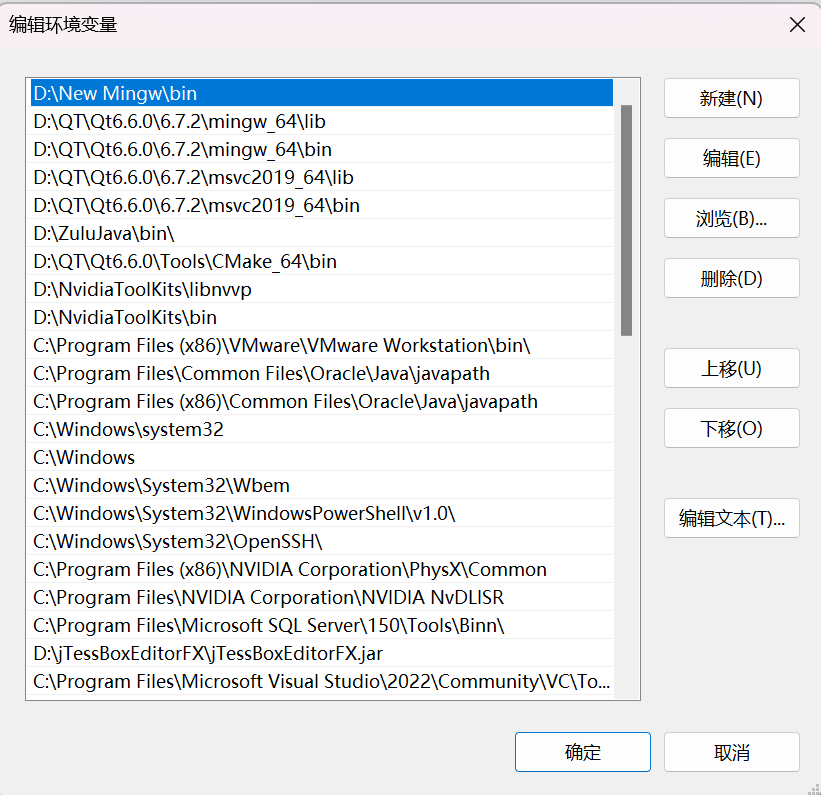
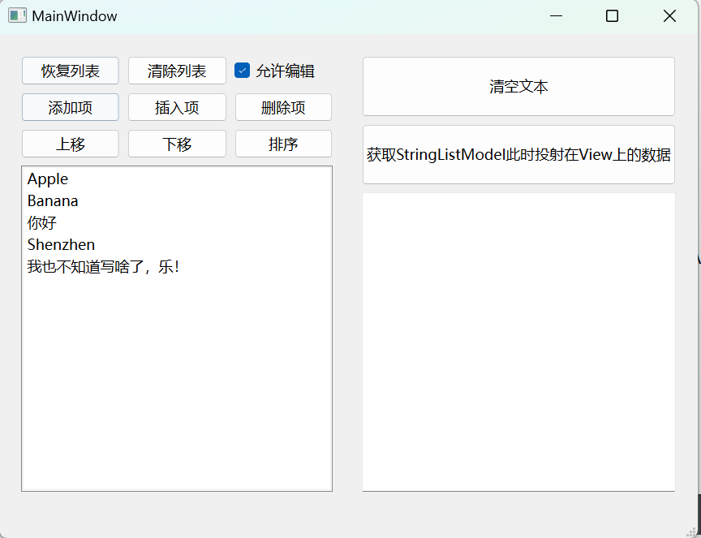
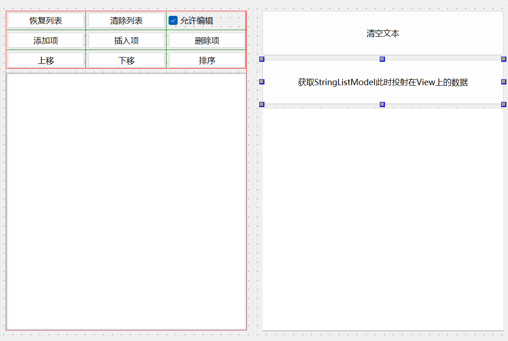

# Qt中的Model与View 3：从样例出发理解QStringListModel和QListView

​	这里，就是一个经典的例子



​	你可以看到，我们的环境变量是一个经典的List列表，其中承载的就是我们的字符串。我们现在来仿照着搞一个：



### Ui文件设计如下：



我们下面来逐一演示用法。

### 初始化窗口

​	首先我们说，Qt的Model View编程必须有Model和对应的显示的View。这里，我们的View已经在Ui设计文件的左下角的ListView出现了，Model呢？则需要我们自己存储住：

```
#ifndef MAINWINDOW_H
#define MAINWINDOW_H
#include <QMainWindow>
#include <QStringListModel>

QT_BEGIN_NAMESPACE
namespace Ui {
class MainWindow;
}
QT_END_NAMESPACE

class MainWindow : public QMainWindow {
    Q_OBJECT

public:
    MainWindow(QWidget *parent = nullptr);
    ~MainWindow();
private:
    static constexpr const char *LISTS_DATA_ORG[] = {
        "Apple", "Banana", "你好", "Shenzhen", "我也不知道写啥了，乐！"};

    QStringList                       original_stringlist;
    std::unique_ptr<QStringListModel> model;
    Ui::MainWindow                   *ui;
};
#endif  // MAINWINDOW_H

```

​	可以看到我们使用了QStringListModel作为存储，当然unique_ptr是一个智能指针，笔者这里习惯使用了，您可以直接使用new分配内存，也行！

```
MainWindow::MainWindow(QWidget* parent)
    : QMainWindow(parent), ui(new Ui::MainWindow) {
    ui->setupUi(this);

    // 初始化StringList列表
    for (const auto& each : MainWindow::LISTS_DATA_ORG)
        original_stringlist << each;

    // 初始化一下我们的model
    model = std::make_unique<QStringListModel>(this);

    model->setStringList(original_stringlist);

    ui->listView->setModel(model.get());
    ::setIfEnableEdit(ui->listView, true);
}
```

​	我们的Model的来源就是使用setStringList这接口来设置数据的。之后我们使用其他的例子也是一样，寻找这个Model的设置接口的函数。

​	**不要忘记，我们的Model初始化完成数据之后要交给View显示里面的数据，这里，所有的View都存在接口setModel，请不要忘记调用！**

​	最后的setIfEnableEdit是笔者自己封装的函数，结合上一篇博客所学，我们轻而易举的能写出：

```
static void setIfEnableEdit(QListView* view, bool is_editable) {
    is_editable ? view->setEditTriggers(
                      QAbstractItemView::DoubleClicked |
                      QAbstractItemView::SelectedClicked) /* is editable */
                : view->setEditTriggers(
                      QAbstractItemView::NoEditTriggers); /* is not  editable*/
}
```

​	当然，static表达的是文件内部调用不暴露使用，当我们想要使用编辑功能的时候，需要设置view是：QAbstractItemView::DoubleClicked |QAbstractItemView::SelectedClicked（表达的是双击 或者是 点中项再点击选择的意思）。禁用编辑就是不分配触发点击的flag！

```
void MainWindow::on_btnResumeList_clicked() {
    model->setStringList(original_stringlist);
}

void MainWindow::on_btnListClear_clicked() {
    model->setStringList({});
    // model->removeRows(0,m_model->rowCount())
}

void MainWindow::on_chkEditable_clicked(bool checked) {
    ::setIfEnableEdit(ui->listView, checked);
}
```

​	这三个接口：回复列表，清空列表和允许编辑很好理解，这里不展开

```
void MainWindow::on_btnListAppend_clicked() {
    model->insertRow(model->rowCount());
    auto modelIndex = model->index(model->rowCount() - 1);
    model->setData(modelIndex, "键入新值");
    ui->listView->setCurrentIndex(modelIndex);
}

void MainWindow::on_btnListInsert_clicked() {
    auto indexRow = ui->listView->currentIndex().row();
    if (indexRow == -1) {
        // 用户没选中， 可以做尾插，也可以提示（这个最好！）
        return on_btnListAppend_clicked();
    }
    model->insertRow(indexRow);
    auto modelIndex = model->index(indexRow);
    model->setData(modelIndex, "键入插入的新值！");
    ui->listView->setCurrentIndex(modelIndex);
}

void MainWindow::on_btnListDelete_clicked() {
    auto indexRow = ui->listView->currentIndex().row();
    // 当然最合适的还是做用户处理！
    if (indexRow == -1) return;

    model->removeRow(indexRow);
}
```

​	上面插入的和删除的我说一嘴：我们拿到modelIndex是一个索引不是数据本身，数据还是在背后存储的model里。所以我们需要绕个弯取model项！

```
void MainWindow::on_btnListMoveUp_clicked() {
    auto indexRow = ui->listView->currentIndex().row();
    auto index    = QModelIndex();  // ListModel没有父节点
    if (indexRow == -1) return;

    model->moveRow(index, indexRow, index, indexRow - 1);
}

void MainWindow::on_btnListMoveDown_clicked() {
    auto indexRow = ui->listView->currentIndex().row();
    auto index    = QModelIndex();  // ListModel没有父节点
    if (indexRow == -1) return;

    model->moveRow(index, indexRow, index, indexRow + 2);
}
```

​	上下移动使用moveRow函数，注意参数名称就告诉你第一个和第三个参数是modelIndex父节点，所以，对于ListView没有父节点的view是传ModelIndex()的默认构造。

```
void MainWindow::on_btnListSort_clicked() {
    model->sort(0);
}
```

​	sort是对内容的排序，默认是升序，你可以设置第二个参数！

```
void MainWindow::on_listView_clicked(const QModelIndex& index) {
    const QString gain_printed_string = QString::asprintf(
        "row: %d, column: %d, data:", index.row(), index.column());
    const QString gain_data = ui->listView->currentIndex().data().toString();
    statusBar()->showMessage(gain_printed_string + gain_data);
}


```

​	上面是点击了ListView的项做出的反应，可以一览！

​	最后是两个显示：

```
void MainWindow::on_btn_clear_data_clicked() {
    ui->textEdit->clear();
}

void MainWindow::on_btn_fetch_data_clicked() {
    const QStringList display = model->stringList();
    for (const auto& each : display) {
        ui->textEdit->append(each);
    }
}
```

