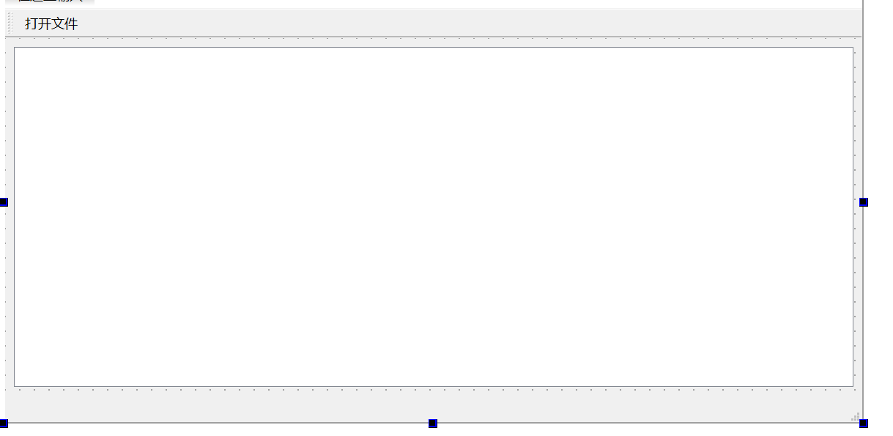

# Qt中的Model与View 4：QStandardItemModel与QTableView


## QStandardItemModel

​	QStandardItemModel 可用作标准 Qt 数据类型的存储库。它是模型/视图类之一，是 Qt 模型/视图框架的一部分。它提供了一种基于项目的经典方法来处理模型。QStandardItemModel 中的项目由 QStandardItem 提供。

​	QStandardItemModel 实现了 QAbstractItemModel 接口，这意味着该模型可用于在任何支持该接口的视图（例如 QListView、QTableView 和 QTreeView 以及您自己的自定义视图）中提供数据。为了提高性能和灵活性，您可能希望将 QAbstractItemModel 子类化以提供对不同类型数据存储库的支持。例如，QFileSystemModel 为底层文件系统提供了模型接口。

​	当您想要列表或树时，通常创建一个空的 QStandardItemModel 并使用 appendRow() 将项目添加到模型，并使用 item() 访问项目。如果您的模型代表一个表，您通常会将表的尺寸传递给 QStandardItemModel 构造函数并使用 setItem() 将项目放入表中。您还可以使用 setRowCount() 和 setColumnCount() 来更改模型的尺寸。要插入项目，请使用 insertRow() 或 insertColumn()，要删除项目，请使用 removeRow() 或 removeColumn()。您可以使用 setHorizontalHeaderLabels() 和 setVerticalHeaderLabels() 设置模型的标题标签，可以使用 findItems() 在模型中搜索项目，并通过调用 sort() 对模型进行排序。调用 clear() 从模型中删除所有项目。


```
QStandardItemModel model(4, 4);
for (int row = 0; row < model.rowCount(); ++row) {
	for (int column = 0; column < model.columnCount(); ++column) {
		QStandardItem *item = new QStandardItem(QString("row %0, column %1").arg(row).arg(column));
	model.setItem(row, column, item);
	}
}
```

```
QStandardItemModel model;
QStandardItem *parentItem = model.invisibleRootItem();
for (int i = 0; i < 4; ++i) {
	QStandardItem *item = new QStandardItem(QString("item %0").arg(i));
	parentItem->appendRow(item);
	parentItem = item;
}
```

​	在视图上设置模型后，您通常希望对用户操作做出反应，例如单击某个项目。由于 QAbstractItemView 提供基于 QModelIndex 的信号和函数，因此您需要一种方法来获取与给定 QModelIndex 相对应的 QStandardItem，反之亦然。itemFromIndex() 和 indexFromItem() 提供此映射。itemFromIndex() 的典型用法包括获取视图中当前索引处的项目，以及获取与 QAbstractItemView 信号（例如 QAbstractItemView::clicked()）携带的索引相对应的项目。首先，将视图的信号连接到类中的插槽：

```
QTreeView *treeView = new QTreeView(this);
treeView->setModel(myStandardItemModel);
connect(treeView, &QTreeView::clicked,this, &MyWidget::clicked);
```

收到信号后，您可以对给定的模型索引调用 itemFromIndex() 以获取指向该项目的指针：

```
void MyWidget::clicked(const QModelIndex &index)
{
	QStandardItem *item = myStandardItemModel->itemFromIndex(index);
// 对项目进行操作 ...
}
```

​	相反，当您想要调用以索引为参数的模型/视图函数时，必须获取项目的 QModelIndex。您可以使用模型的 indexFromItem() 函数获取索引，或者通过调用 QStandardItem::index() 来获取索引：

```
treeView->scrollTo(item->index());
```

​	当然，您不需要使用基于项目的方法；您可以在使用模型时完全依赖 QAbstractItemModel 接口，或者根据需要使用两者的组合。

### API

| 函数签名                                                     | 详细用途                                              |
| ------------------------------------------------------------ | ----------------------------------------------------- |
| `QStandardItemModel(QObject *parent = nullptr)`              | 创建一个空的标准项模型，父对象可选。                  |
| `QStandardItemModel(int rows, int columns, QObject *parent = nullptr)` | 创建一个指定行数和列数的标准项模型，父对象可选。      |
| `virtual ~QStandardItemModel()`                              | 析构函数，用于清理模型。                              |
| `void appendColumn(const QList<QStandardItem *> &items)`     | 在模型末尾添加一列，填充指定的 `QStandardItem` 列表。 |
| `void appendRow(const QList<QStandardItem *> &items)`        | 在模型末尾添加一行，填充指定的 `QStandardItem` 列表。 |
| `void appendRow(QStandardItem *item)`                        | 在模型末尾添加一行，包含一个指定的 `QStandardItem`。  |
| `QBindable<int> bindableSortRole()`                          | 返回可绑定的排序角色。                                |
| `void clear()`                                               | 清空模型中的所有数据。                                |
| `QList<QStandardItem *> findItems(const QString &text, Qt::MatchFlags flags = Qt::MatchExactly, int column = 0) const` | 根据文本查找项，返回匹配的 `QStandardItem` 列表。     |
| `QStandardItem * horizontalHeaderItem(int column) const`     | 获取指定列的水平表头项。                              |
| `QModelIndex indexFromItem(const QStandardItem *item) const` | 从指定的 `QStandardItem` 获取其模型索引。             |
| `void insertColumn(int column, const QList<QStandardItem *> &items)` | 在指定列插入新列，并填充指定的项列表。                |
| `bool insertColumn(int column, const QModelIndex &parent = QModelIndex())` | 在指定列插入新列，父索引可选。                        |
| `void insertRow(int row, const QList<QStandardItem *> &items)` | 在指定行插入新行，填充指定的项列表。                  |
| `bool insertRow(int row, const QModelIndex &parent = QModelIndex())` | 在指定行插入新行，父索引可选。                        |
| `void insertRow(int row, QStandardItem *item)`               | 在指定行插入新行，包含一个指定的项。                  |
| `QStandardItem * invisibleRootItem() const`                  | 获取不可见的根项，用于访问整个模型树。                |
| `QStandardItem * item(int row, int column = 0) const`        | 获取指定行列位置的项。                                |
| `QStandardItem * itemFromIndex(const QModelIndex &index) const` | 从指定索引获取 `QStandardItem`。                      |
| `const QStandardItem * itemPrototype() const`                | 获取项的原型，用于创建新项。                          |
| `void setColumnCount(int columns)`                           | 设置列数。                                            |
| `void setHorizontalHeaderItem(int column, QStandardItem *item)` | 设置指定列的水平表头项。                              |
| `void setHorizontalHeaderLabels(const QStringList &labels)`  | 设置水平表头的标签列表。                              |
| `void setItem(int row, int column, QStandardItem *item)`     | 在指定位置设置项。                                    |
| `void setItem(int row, QStandardItem *item)`                 | 在指定行设置项，列默认为0。                           |
| `void setItemPrototype(const QStandardItem *item)`           | 设置项的原型。                                        |
| `void setItemRoleNames(const QHash<int, QByteArray> &roleNames)` | 设置项角色的名称映射。                                |
| `void setRowCount(int rows)`                                 | 设置行数。                                            |
| `void setSortRole(int role)`                                 | 设置排序角色。                                        |
| `void setVerticalHeaderItem(int row, QStandardItem *item)`   | 设置指定行的垂直表头项。                              |
| `void setVerticalHeaderLabels(const QStringList &labels)`    | 设置垂直表头的标签列表。                              |
| `int sortRole() const`                                       | 获取当前的排序角色。                                  |
| `QList<QStandardItem *> takeColumn(int column)`              | 移除并返回指定列的项列表。                            |
| `QStandardItem * takeHorizontalHeaderItem(int column)`       | 移除并返回指定列的水平表头项。                        |
| `QStandardItem * takeItem(int row, int column = 0)`          | 移除并返回指定位置的项。                              |
| `QList<QStandardItem *> takeRow(int row)`                    | 移除并返回指定行的项列表。                            |
| `QStandardItem * takeVerticalHeaderItem(int row)`            | 移除并返回指定行的垂直表头项。                        |
| `QStandardItem * verticalHeaderItem(int row) const`          | 获取指定行的垂直表头项。                              |

| 函数签名                                                     | 详细用途                         |
| ------------------------------------------------------------ | -------------------------------- |
| `virtual bool clearItemData(const QModelIndex &index) override` | 清空指定索引的项数据。           |
| `virtual int columnCount(const QModelIndex &parent = QModelIndex()) const override` | 获取指定父索引的列数。           |
| `virtual QVariant data(const QModelIndex &index, int role = Qt::DisplayRole) const override` | 获取指定索引的数据。             |
| `virtual bool dropMimeData(const QMimeData *data, Qt::DropAction action, int row, int column, const QModelIndex &parent) override` | 处理粘贴操作。                   |
| `virtual Qt::ItemFlags flags(const QModelIndex &index) const override` | 获取指定索引的项目标志。         |
| `virtual bool hasChildren(const QModelIndex &parent = QModelIndex()) const override` | 判断指定父索引是否有子项。       |
| `virtual QVariant headerData(int section, Qt::Orientation orientation, int role = Qt::DisplayRole) const override` | 获取表头数据。                   |
| `virtual QModelIndex index(int row, int column, const QModelIndex &parent = QModelIndex()) const override` | 获取指定行列的索引。             |
| `virtual bool insertColumns(int column, int count, const QModelIndex &parent = QModelIndex()) override` | 在指定位置插入多列。             |
| `virtual bool insertRows(int row, int count, const QModelIndex &parent = QModelIndex()) override` | 在指定位置插入多行。             |
| `virtual QMap<int, QVariant> itemData(const QModelIndex &index) const override` | 获取指定索引的项数据。           |
| `virtual QMimeData * mimeData(const QModelIndexList &indexes) const override` | 获取指定索引列表的数据。         |
| `virtual QStringList mimeTypes() const override`             | 获取支持的 MIME 类型列表。       |
| `virtual void multiData(const QModelIndex &index, QModelRoleDataSpan roleDataSpan) const override` | 获取指定索引的多项数据。         |
| `virtual QModelIndex parent(const QModelIndex &child) const override` | 获取指定子索引的父索引。         |
| `virtual bool removeColumns(int column, int count, const QModelIndex &parent = QModelIndex()) override` | 移除多列。                       |
| `virtual bool removeRows(int row, int count, const QModelIndex &parent = QModelIndex()) override` | 移除多行。                       |
| `virtual QHash<int, QByteArray> roleNames() const override`  | 获取项角色名称的映射。           |
| `virtual int rowCount(const QModelIndex &parent = QModelIndex()) const override` | 获取指定父索引的行数。           |
| `virtual bool setData(const QModelIndex &index, const QVariant &value, int role = Qt::EditRole) override` | 设置指定索引的数据。             |
| `virtual bool setHeaderData(int section, Qt::Orientation orientation, const QVariant &value, int role = Qt::EditRole) override` | 设置表头数据。                   |
| `virtual bool setItemData(const QModelIndex &index, const QMap<int, QVariant> &roles) override` | 设置指定索引的项数据。           |
| `virtual void sort(int column, Qt::SortOrder order = Qt::AscendingOrder) override` | 根据指定列和顺序对模型进行排序。 |
| `virtual Qt::DropActions supportedDropActions() const override` | 获取支持的拖放操作。             |

| 函数签名                                | 详细用途                     |
| --------------------------------------- | ---------------------------- |
| `void itemChanged(QStandardItem *item)` | 当项数据发生变化时发出信号。 |


## QTableView

​	QTableView 实现了显示模型中项目的表格视图。此类用于提供以前由 QTable 类提供的标准表格，但使用 Qt 的模型/视图架构提供的更灵活的方法。

​	QTableView 实现了 QAbstractItemView 类定义的接口，使其能够显示由从 QAbstractItemModel 类派生的模型提供的数据。

### 导航

​	您可以通过用鼠标单击单元格或使用箭头键来导航表格中的单元格。由于 QTableView 默认启用 tabKeyNavigation，因此您也可以按 Tab 和 Backtab 从一个单元格移动到另一个单元格。

### 视觉外观

​	表格有一个垂直标题，可以使用 verticalHeader() 函数获得，还有一个水平标题，可以通过 HorizontalHeader() 函数获得。可以使用 rowHeight() 找到表格中每行的高度；类似地，可以使用 columnWidth() 找到列的宽度。由于这两个都是普通的小部件，因此您可以使用它们的 hide() 函数隐藏它们。每个标题都配置为将其 highlightSections 和 sectionClickable 属性设置为 true。

​	可以使用 hideRow()、hideColumn()、showRow() 和 showColumn() 隐藏和显示行和列。可以使用 selectRow() 和 selectColumn() 选择它们。表格将根据 showGrid 属性显示网格。

​	表格视图中显示的项目（与其他项目视图中的项目一样）使用标准委托进行渲染和编辑。但是，对于某些任务，有时能够在表格中插入小部件会很有用。使用 setIndexWidget() 函数为特定索引设置小部件，然后使用 indexWidget() 检索。

​	默认情况下，表格中的单元格不会扩展以填充可用空间。您可以通过拉伸最后一个标题部分使单元格填充可用空间。使用 HorizontalHeader() 或 VerticalHeader() 访问相关标题并设置标题的 stretchLastSection 属性。要根据每列或每行的空间要求分配可用空间，请调用视图的 resizeColumnsToContents() 或 resizeRowsToContents() 函数。

### 坐标系统

​	对于某些特殊形式的表，能够在行和列索引与小部件坐标之间进行转换非常有用。 rowAt() 函数提供指定行视图内的 y 坐标；可以使用行索引通过 rowViewportPosition() 获取相应的 y 坐标。 columnAt() 和 columnViewportPosition() 函数提供 x 坐标和列索引之间的等效转换操作。

### API

| 函数签名                                                     | 详细用途                         |
| ------------------------------------------------------------ | -------------------------------- |
| `QTableView(QWidget *parent = nullptr)`                      | 创建一个表格视图，父对象可选。   |
| `virtual ~QTableView()`                                      | 析构函数，用于清理视图。         |
| `void clearSpans()`                                          | 清除所有单元格的合并状态。       |
| `int columnAt(int x) const`                                  | 根据给定的 x 坐标获取列索引。    |
| `int columnSpan(int row, int column) const`                  | 获取指定单元格的列合并跨度。     |
| `int columnViewportPosition(int column) const`               | 获取指定列在视口中的位置。       |
| `int columnWidth(int column) const`                          | 获取指定列的宽度。               |
| `Qt::PenStyle gridStyle() const`                             | 获取网格线样式。                 |
| `QHeaderView * horizontalHeader() const`                     | 获取水平表头的视图。             |
| `bool isColumnHidden(int column) const`                      | 检查指定列是否被隐藏。           |
| `bool isCornerButtonEnabled() const`                         | 检查角按钮是否启用。             |
| `bool isRowHidden(int row) const`                            | 检查指定行是否被隐藏。           |
| `bool isSortingEnabled() const`                              | 检查排序功能是否启用。           |
| `int rowAt(int y) const`                                     | 根据给定的 y 坐标获取行索引。    |
| `int rowHeight(int row) const`                               | 获取指定行的高度。               |
| `int rowSpan(int row, int column) const`                     | 获取指定单元格的行合并跨度。     |
| `int rowViewportPosition(int row) const`                     | 获取指定行在视口中的位置。       |
| `void setColumnHidden(int column, bool hide)`                | 设置指定列的可见性。             |
| `void setColumnWidth(int column, int width)`                 | 设置指定列的宽度。               |
| `void setCornerButtonEnabled(bool enable)`                   | 启用或禁用角按钮。               |
| `void setGridStyle(Qt::PenStyle style)`                      | 设置网格线的样式。               |
| `void setHorizontalHeader(QHeaderView *header)`              | 设置水平表头视图。               |
| `void setRowHeight(int row, int height)`                     | 设置指定行的高度。               |
| `void setRowHidden(int row, bool hide)`                      | 设置指定行的可见性。             |
| `void setSortingEnabled(bool enable)`                        | 启用或禁用排序功能。             |
| `void setSpan(int row, int column, int rowSpanCount, int columnSpanCount)` | 设置单元格的合并跨度。           |
| `void setVerticalHeader(QHeaderView *header)`                | 设置垂直表头视图。               |
| `void setWordWrap(bool on)`                                  | 启用或禁用单元格内容的自动换行。 |
| `bool showGrid() const`                                      | 检查网格线是否可见。             |
| `QHeaderView * verticalHeader() const`                       | 获取垂直表头的视图。             |
| `bool wordWrap() const`                                      | 检查单元格内容的换行状态。       |

| 函数签名                                                     | 详细用途                     |
| ------------------------------------------------------------ | ---------------------------- |
| `virtual QModelIndex indexAt(const QPoint &pos) const override` | 根据给定位置获取模型索引。   |
| `virtual void scrollTo(const QModelIndex &index, QAbstractItemView::ScrollHint hint = EnsureVisible) override` | 滚动视图以显示指定索引。     |
| `virtual void setModel(QAbstractItemModel *model) override`  | 设置视图的数据模型。         |
| `virtual void setRootIndex(const QModelIndex &index) override` | 设置根索引。                 |
| `virtual void setSelectionModel(QItemSelectionModel *selectionModel) override` | 设置选择模型。               |
| `virtual QRect visualRect(const QModelIndex &index) const override` | 获取指定索引的可视矩形区域。 |

| 函数签名                                             | 详细用途                     |
| ---------------------------------------------------- | ---------------------------- |
| `void hideColumn(int column)`                        | 隐藏指定列。                 |
| `void hideRow(int row)`                              | 隐藏指定行。                 |
| `void resizeColumnToContents(int column)`            | 调整指定列的宽度以适应内容。 |
| `void resizeColumnsToContents()`                     | 调整所有列的宽度以适应内容。 |
| `void resizeRowToContents(int row)`                  | 调整指定行的高度以适应内容。 |
| `void resizeRowsToContents()`                        | 调整所有行的高度以适应内容。 |
| `void selectColumn(int column)`                      | 选择指定列。                 |
| `void selectRow(int row)`                            | 选择指定行。                 |
| `void setShowGrid(bool show)`                        | 设置网格线的可见性。         |
| `void showColumn(int column)`                        | 显示指定列。                 |
| `void showRow(int row)`                              | 显示指定行。                 |
| `void sortByColumn(int column, Qt::SortOrder order)` | 根据指定列和顺序进行排序。   |

| 函数签名                                                     | 详细用途                   |
| ------------------------------------------------------------ | -------------------------- |
| `virtual void currentChanged(const QModelIndex &current, const QModelIndex &previous) override` | 当前索引改变时的处理。     |
| `virtual void dropEvent(QDropEvent *event) override`         | 处理拖放事件。             |
| `virtual int horizontalOffset() const override`              | 获取水平偏移量。           |
| `virtual void initViewItemOption(QStyleOptionViewItem *option) const override` | 初始化视图项选项。         |
| `virtual bool isIndexHidden(const QModelIndex &index) const override` | 检查指定索引是否隐藏。     |
| `virtual QModelIndex moveCursor(QAbstractItemView::CursorAction cursorAction, Qt::KeyboardModifiers modifiers) override` | 移动光标。                 |
| `virtual void paintEvent(QPaintEvent *event) override`       | 处理绘制事件。             |
| `virtual void scrollContentsBy(int dx, int dy) override`     | 根据指定的偏移量滚动内容。 |
| `virtual QModelIndexList selectedIndexes() const override`   | 获取当前选择的索引列表。   |
| `virtual void selectionChanged(const QItemSelection &selected, const QItemSelection &deselected) override` | 选择改变时的处理。         |
| `virtual void setSelection(const QRect &rect, QItemSelectionModel::SelectionFlags flags) override` | 设置选择区域。             |
| `virtual int sizeHintForColumn(int column) const override`   | 获取指定列的建议大小。     |
| `virtual int sizeHintForRow(int row) const override`         | 获取指定行的建议大小。     |
| `virtual void timerEvent(QTimerEvent *event) override`       | 处理定时器事件。           |
| `virtual void updateGeometries() override`                   | 更新几何形状。             |
| `virtual int verticalOffset() const override`                | 获取垂直偏移量。           |
| `virtual QSize viewportSizeHint() const override`            | 获取视口的建议大小。       |
| `virtual QRegion visualRegionForSelection(const QItemSelection &selection) const override` | 获取选择区域的可视区域。   |

| 函数签名                                                     | 详细用途             |
| ------------------------------------------------------------ | -------------------- |
| `void columnCountChanged(int oldCount, int newCount)`        | 列数变化时的处理。   |
| `void columnMoved(int column, int oldIndex, int newIndex)`   | 列移动时的处理。     |
| `void columnResized(int column, int oldWidth, int newWidth)` | 列大小变化时的处理。 |
| `void rowCountChanged(int oldCount, int newCount)`           | 行数变化时的处理。   |
| `void rowMoved(int row, int oldIndex, int newIndex)`         | 行移动时的处理。     |
| `void rowResized(int row, int oldHeight, int newHeight)`     | 行大小变化时的处理。 |

## 样例：解析一个表格txt文件

```
测深(m)	垂深(m)	方位(°)	总位移(m)	固井质量	测井取样	
252	252	241.27	0.51	优	1
275	275	241.27	0.72	优	1
300	300	235.82	0.9	良	1
325	325	239.23	1.09	良	1
350	350	243.02	1.27	一般	1
375	375	245.25	1.48	一般	1
400	399.99	243.12	1.72	优	1
425	424.99	238.72	1.93	优	1
450	449.99	242.6	2.22	良	1
475	474.99	239.52	2.51	良	1
500	499.99	228.03	2.83	一般	0
525	524.99	237.27	3.21	一般	0
550	549.98	249.85	3.76	优	0
575	574.95	254.77	4.88	优	0
600	599.87	258.18	6.84	良	1
625	624.83	274.63	8.13	良	1
650	649.79	302.42	9.08	一般	1
675	674.79	344.37	9.14	一般	1
700	699.78	89.22	8.55	优	0
725	724.77	116.77	8.07	优	0
750	749.77	92.9	7.46	良	0
775	774.76	95.93	6.98	良	0
800	799.76	206.45	7.07	一般	0
825	824.76	206.45	7.17	一般	0
850	849.76	211.82	7.25	优	0

```

​	我们现在来解析这个文件，怎么做呢？



​	设计一个简单的Ui文件。

​	初始化：

```
MainWindow::MainWindow(QWidget* parent)
    : QMainWindow(parent), ui(new Ui::MainWindow) {
    ui->setupUi(this);
    model = new QStandardItemModel(2, FixedColumnCount, this);  // 创建数据模型
    selection = new QItemSelectionModel(model, this);  // 创建选择模型

    // 为tableView设置数据模型
    ui->tableView->setModel(model);               // 设置数据模型
    ui->tableView->setSelectionModel(selection);  // 设置选择模型
    ui->tableView->setSelectionMode(QAbstractItemView::ExtendedSelection);
    ui->tableView->setSelectionBehavior(QAbstractItemView::SelectItems);
}
```

​	读取：

```
void MainWindow::openFileFromDialog() {
    QString fromFilePath = QFileDialog::getOpenFileName(
        this, "打开一个文件", ".", "井数据文件(*.txt);;所有文件(*.*)");
    loadFile(fromFilePath);
}

void MainWindow::loadFile(const QString& filePath) {
    if (filePath.isEmpty()) return;

    QFile f(filePath);
    if (!f.open(QIODevice::ReadOnly | QIODevice::Text)) return;

    QTextStream streamReader(&f);
    QStringList list;
    while (!streamReader.atEnd()) {
        const QString res = streamReader.readLine();
        list << res;
    }

    analysisPlainToTable(list);
}

void MainWindow::analysisPlainToTable(const QStringList& plainList) {
    int row_ready_display = plainList.size();
    if (row_ready_display < 1) return;  // invalid lists in size
    // for the frist we shell init headers
    model->setRowCount(row_ready_display - 1);
    static QRegularExpression reg("\\s+");
    // init headers
    const QString     header  = plainList[0];
    const QStringList headers = header.split(reg, Qt::SkipEmptyParts);
    model->setHorizontalHeaderLabels(headers);

    // init body
    for (int each_row = 1; each_row < row_ready_display; each_row++) {
        const QString     each_row_str = plainList[each_row];
        const QStringList word_list =
            each_row_str.split(reg, Qt::SkipEmptyParts);
        if (word_list.size() != FixedColumnCount) continue;  // avoid invalid!
        for (int each_column = 0; each_column < FixedColumnCount - 1;
             each_column++) {
            auto item = new QStandardItem(word_list[each_column]);
            model->setItem(each_row - 1, each_column, item);
        }

        // at finial
        auto final_checkable = new QStandardItem(headers[FixedColumnCount - 1]);
        final_checkable->setCheckable(true);
        if (word_list[FixedColumnCount - 1] == "0") {
            final_checkable->setCheckState(Qt::Unchecked);
        } else {
            final_checkable->setCheckState(Qt::Checked);
        }
        model->setItem(each_row - 1, FixedColumnCount - 1, final_checkable);
    }
}
```

​	可以看到，我们的写入数据就会放到类里面了。