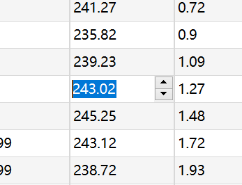

# QStyledItemDelegate 

​	当在 Qt 项目视图中显示模型数据时，例如 `QTableView`，每个项目由代理绘制。此外，当项目被编辑时，提供一个编辑器小部件，该小部件在编辑时显示在项目视图上。`QStyledItemDelegate` 是所有 Qt 项目视图的默认代理，并在创建时自动安装。

​	`QStyledItemDelegate` 类是模型/视图框架的一部分，允许独立于模型和视图开发项目的显示和编辑。项目数据被分配给 `ItemDataRole`；每个项目可以为每个角色存储一个 `QVariant`。`QStyledItemDelegate` 实现了对用户期望的最常见数据类型的显示和编辑，包括布尔值、整数和字符串。

​	数据将根据其在模型中的角色以不同的方式绘制。下表描述了角色及其可处理的数据类型。

| 角色                    | 可接受类型                               |
| ----------------------- | ---------------------------------------- |
| `Qt::BackgroundRole`    | `QBrush`                                 |
| `Qt::CheckStateRole`    | `Qt::CheckState`                         |
| `Qt::DecorationRole`    | `QIcon`, `QPixmap`, `QImage` 和 `QColor` |
| `Qt::DisplayRole`       | `QString` 和具有字符串表示的类型         |
| `Qt::EditRole`          | 参见 `QItemEditorFactory` 的详细信息     |
| `Qt::FontRole`          | `QFont`                                  |
| `Qt::SizeHintRole`      | `QSize`                                  |
| `Qt::TextAlignmentRole` | `Qt::Alignment`                          |
| `Qt::ForegroundRole`    | `QBrush`                                 |

​	编辑器通过 `QItemEditorFactory` 创建；`QItemEditorFactory` 提供一个默认的静态实例，安装在所有项目代理上。你可以使用 `setItemEditorFactory()` 设置自定义工厂，或者通过 `QItemEditorFactory::setDefaultFactory()` 设置新的默认工厂。

​	如果代理不支持你所需的数据类型的绘制，或者你想自定义项目的绘制，需要继承 `QStyledItemDelegate`，并重新实现 `paint()` 和可能的 `sizeHint()`。`paint()` 函数对每个项目单独调用，使用 `sizeHint()` 可以为每个项目指定提示。绘制复选框指示符的工作由当前样式执行。样式还指定了绘制不同数据角色的数据的大小和边界矩形。当绘制已支持的数据类型时，向样式请求这些边界矩形通常是个好主意。

​	如果你希望更改样式计算的边界矩形或复选框指示符的绘制，可以继承 `QStyle`。

### QStyledItemDelegate API

| API 签名                                                     | 说明                                                         |
| ------------------------------------------------------------ | ------------------------------------------------------------ |
| `QStyledItemDelegate(QObject *parent = nullptr)`             | 构造函数，创建一个 `QStyledItemDelegate` 对象，父对象为可选。 |
| `virtual ~QStyledItemDelegate()`                             | 虚析构函数，释放 `QStyledItemDelegate` 对象。                |
| `virtual QString displayText(const QVariant &value, const QLocale &locale) const` | 返回根据提供的值和区域设置格式化的文本，用于显示在视图中。   |
| `QItemEditorFactory *itemEditorFactory() const`              | 返回当前使用的编辑器工厂。                                   |
| `void setItemEditorFactory(QItemEditorFactory *factory)`     | 设置自定义的编辑器工厂。                                     |

#### 重载公共函数

| API 签名                                                     | 说明                                 |
| ------------------------------------------------------------ | ------------------------------------ |
| `virtual QWidget *createEditor(QWidget *parent, const QStyleOptionViewItem &option, const QModelIndex &index) const override` | 创建用于编辑数据的自定义编辑器。     |
| `virtual void paint(QPainter *painter, const QStyleOptionViewItem &option, const QModelIndex &index) const override` | 绘制视图中每个项目的外观。           |
| `virtual void setEditorData(QWidget *editor, const QModelIndex &index) const override` | 为编辑器设置数据。                   |
| `virtual void setModelData(QWidget *editor, QAbstractItemModel *model, const QModelIndex &index) const override` | 从编辑器获取数据并更新模型。         |
| `virtual QSize sizeHint(const QStyleOptionViewItem &option, const QModelIndex &index) const override` | 返回项目的建议大小。                 |
| `virtual void updateEditorGeometry(QWidget *editor, const QStyleOptionViewItem &option, const QModelIndex &index) const override` | 更新编辑器的几何形状，使其正确显示。 |

#### 保护函数

| API 签名                                                     | 说明                           |
| ------------------------------------------------------------ | ------------------------------ |
| `virtual void initStyleOption(QStyleOptionViewItem *option, const QModelIndex &index) const` | 初始化样式选项，用于绘制项目。 |

#### 重载保护函数

| API 签名                                                     | 说明               |
| ------------------------------------------------------------ | ------------------ |
| `virtual bool editorEvent(QEvent *event, QAbstractItemModel *model, const QStyleOptionViewItem &option, const QModelIndex &index) override` | 处理编辑器事件。   |
| `virtual bool eventFilter(QObject *editor, QEvent *event) override` | 过滤编辑器的事件。 |

举个例子：

```
class TSpinBoxDelegate : public QStyledItemDelegate
{
    Q_OBJECT

public:
    explicit TSpinBoxDelegate(QObject *parent = nullptr);


    //自定义代理必须重新实现以下4个函数

    //创建编辑组件
    QWidget *createEditor(QWidget *parent, const QStyleOptionViewItem &option,
                          const QModelIndex &index)const;

    //从数据模型获取数据，显示到代理组件中
    void setEditorData(QWidget *editor, const QModelIndex &index)const;

    //将代理组件的数据，保存到数据模型中
    void setModelData(QWidget *editor, QAbstractItemModel *model,
                      const QModelIndex &index)const;

    //更新代理编辑组件的大小
    void updateEditorGeometry(QWidget *editor, const QStyleOptionViewItem &option,
                              const QModelIndex &index)const;

};
```

```
#include "tspinboxdelegate.h"

#include    <QSpinBox>

TSpinBoxDelegate::TSpinBoxDelegate(QObject *parent): QStyledItemDelegate(parent)
{

}

QWidget *TSpinBoxDelegate::createEditor(QWidget *parent, const QStyleOptionViewItem &option,
                                        const QModelIndex &index) const
{ //创建代理编辑组件
    Q_UNUSED(option);
    Q_UNUSED(index);

    QSpinBox *editor = new QSpinBox(parent); //创建一个QSpinBox
    editor->setFrame(false); //设置为无边框
    editor->setMinimum(0);
    editor->setMaximum(50000);

    return editor;  //返回此编辑器
}

//从数据模型获取数据，显示到代理组件中
void TSpinBoxDelegate::setEditorData(QWidget *editor, const QModelIndex &index) const
{
    int value = index.model()->data(index, Qt::EditRole).toInt();   //获取数据

    QSpinBox *spinBox = static_cast<QSpinBox*>(editor);  //强制类型转换
    spinBox->setValue(value);   //设置编辑器的数值
}

//将代理组件的数据，保存到数据模型中
void TSpinBoxDelegate::setModelData(QWidget *editor, QAbstractItemModel *model,
                                    const QModelIndex &index) const
{
    QSpinBox *spinBox = static_cast<QSpinBox*>(editor);     //强制类型转换
//    spinBox->interpretText();       //解释数据，如果数据被修改后，就触发信号
    int value = spinBox->value();   //获取spinBox的值
    model->setData(index, value, Qt::EditRole);     //更新到数据模型
}


//设置组件大小
void TSpinBoxDelegate::updateEditorGeometry(QWidget *editor, const QStyleOptionViewItem &option,
                                            const QModelIndex &index) const
{
    Q_UNUSED(index);
    editor->setGeometry(option.rect);
}
```

​	在主窗口中

```
    intSpinDelegate= new TSpinBoxDelegate(this);
    ui->tableView->setItemDelegateForColumn(0, intSpinDelegate);    //测深

    floatSpinDelegate = new TFloatSpinDelegate(this);
    ui->tableView->setItemDelegateForColumn(1, floatSpinDelegate);  //垂深
    ui->tableView->setItemDelegateForColumn(2, floatSpinDelegate);  //方位
    ui->tableView->setItemDelegateForColumn(3, floatSpinDelegate);  //总位移
```

​	然后在外面编辑的时候：



​	就会弹出来这个了！