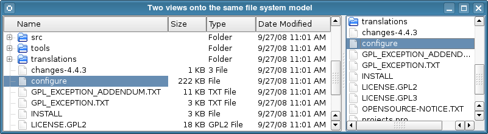
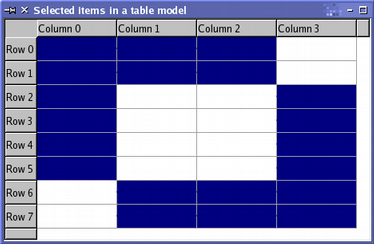
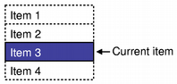

# Qt中的Model与View（Qt官网翻译版）

## MVC

​	笔者相信写Qt的大家都知道，Qt的一个子集就是GUI框架。GUI程序是一种按照图形化界面来指示操作的程序。我们在界面上操作 + 修改数据。

​	在GUI程序的长远发展以来，我们形成了一种解耦合原始数据和GUI的方法。那就是使用MVC模式进行操作！

- **Model（模型）** - 模型代表一个存取数据的对象或 JAVA POJO。它也可以带有逻辑，在数据变化时更新控制器。
- **View（视图）** - 视图代表模型包含的数据的可视化。
- **Controller（控制器）** - 控制器作用于模型和视图上。它控制数据流向模型对象，并在数据变化时更新视图。它使视图与模型分离开。


​	这张图就很清晰明了的表达了我们的意图。但是对于Qt，这个还进一步的有所特化：


​	Qt 包含一组项目视图类，它们使用模型/视图架构来管理数据与向用户呈现数据的方式之间的关系。此架构引入的功能分离使开发人员能够更灵活地自定义项目的呈现方式，并提供标准模型接口，以允许将各种数据源与现有项目视图一起使用。在本文档中，我们简要介绍了模型/视图范例，概述了所涉及的概念，并描述了项目视图系统的架构。解释了架构中的每个组件，并给出了示例来说明如何使用所提供的类。

## Qt中的模型/视图架构

​	模型-视图-控制器 (MVC) 是一种源自 Smalltalk 的设计模式，经常用于构建用户界面。在《设计模式》中，Gamma 等人写道：

> MVC 由三种对象组成。模型是应用程序对象，视图是其屏幕呈现，控制器定义用户界面对用户输入的反应方式。在 MVC 之前，用户界面设计倾向于将这些对象集中在一起。 MVC 将它们解耦，以提高灵活性和重用性。

​	如果将视图和控制器对象组合在一起，结果就是模型/视图架构。这仍然将数据存储方式与呈现给用户的方式分开，但基于相同的原则提供了一个更简单的框架。这种分离使得可以在几个不同的视图中显示相同的数据，并实现新类型的视图，而无需更改底层数据结构。为了灵活处理用户输入，我们引入了委托的概念。在此框架中拥有委托的优势在于，它允许自定义数据项的呈现和编辑方式。

​	**模型与数据源通信**，为架构中的其他组件提供接口。通信的性质取决于数据源的类型以及模型的实现方式。

​	**视图从模型获取模型索引**；这些是对数据项的引用。通过向模型提供模型索引，视图可以从数据源检索数据项。

​	**在标准视图中，委托呈现数据项。编辑项目时，委托直接使用模型索引与模型通信。**也就是说，当我们想要编辑数据的时候是直接跟它挂钩

​	通常，模型/视图类可以分为上述三组：模型、视图和委托。每个组件都由抽象类定义，这些抽象类提供通用接口，在某些情况下还提供功能的默认实现。抽象类旨在被子类化，以提供其他组件所需的全套功能；这也允许编写专门的组件。

模型、视图和委托使用信号和槽相互通信：

- 来自模型的信号将数据源所保存的数据的更改通知视图。

- 来自视图的信号提供有关用户与所显示项目的交互的信息。
- 来自委托的信号在编辑期间用于告知模型和视图编辑器的状态。

### 模型

​	所有项目模型都基于 QAbstractItemModel 类。此类定义了视图和委托用来访问数据的接口。数据本身不必存储在模型中；它可以保存在由单独的类、文件、数据库或其他应用程序组件提供的数据结构或存储库中。

​	QAbstractItemModel 提供了一个数据接口，**该接口足够灵活，可以处理以表、列表和树形式表示数据的视图**。 但是，在为列表和类似表的数据结构实现新模型时，QAbstractListModel 和 QAbstractTableModel 类是更好的起点，因为它们提供了常用函数的适当默认实现。 这些类中的每一个都可以进行子类化，以提供支持特殊类型的列表和表的模型。

​	Qt 提供了一些可用于处理数据项的现成模型：

- QStringListModel 用于存储简单的 QString 项列表。

- QStandardItemModel 管理更复杂的项树结构，每个项都可以包含任意数据。
- QFileSystemModel 提供有关本地文件系统中文件和目录的信息。
- QSqlQueryModel、QSqlTableModel 和 QSqlRelationalTableModel 用于使用模型/视图约定访问数据库。

​	如果这些标准模型不能满足的要求，可以子类化 QAbstractItemModel、QAbstractListModel 或 QAbstractTableModel 来创建自己的自定义模型。

### 视图

​	为不同类型的视图提供了完整的实现：QListView 显示项目列表，QTableView 在表中显示模型中的数据，QTreeView 在分层列表中显示模型数据项目。这些类中的每一个都基于 QAbstractItemView 抽象基类。虽然这些类是现成的实现，但它们也可以被子类化以提供自定义视图。在视图类部分中检查了可用的视图。

### 委托

​	QAbstractItemDelegate 是模型/视图框架中委托的抽象基类。默认委托实现由 QStyledItemDelegate 提供，Qt 的标准视图将其用作默认委托。但是，QStyledItemDelegate 和 QItemDelegate 是绘制和为视图中的项目提供编辑器的独立替代方案。它们之间的区别在于 QStyledItemDelegate 使用当前样式来绘制其项目。因此，我们建议在实现自定义委托或使用 Qt 样式表时使用 QStyledItemDelegate 作为基类。

### 排序

​	在模型/视图架构中有两种排序方法；选择哪种方法取决于的底层模型。如果的模型是可排序的，即如果它重新实现了 QAbstractItemModel::sort() 函数，QTableView 和 QTreeView 都提供了一个 API，允许以编程方式对模型数据进行排序。此外，可以通过将 QHeaderView::sortIndicatorChanged() 信号分别连接到 QTableView::sortByColumn() 插槽或 QTreeView::sortByColumn() 插槽来启用交互式排序（即允许用户通过单击视图的标题对数据进行排序）。

​	如果模型没有所需的接口，或者想使用列表视图来呈现数据，那么另一种方法是使用代理模型来转换模型的结构，然后再在视图中呈现数据。

### 便利类

​	许多便利类都是从标准视图类派生出来的，以方便依赖于 Qt 基于项目的项目视图和表类的应用程序。它们不打算被子类化。此类类的示例包括 QListWidget、QTreeWidget 和 QTableWidget。这些类的灵活性不如视图类，不能与任意模型一起使用。我们建议使用模型/视图方法来处理项目视图中的数据，除非非常需要一组基于项目的类。如果希望利用模型/视图方法提供的功能，同时仍使用基于项目的接口，请考虑使用视图类，例如 QListView、QTableView 和 QTreeView 以及 QStandardItemModel。


## 使用模型和视图

​	我们下面看看Qt是如何使用模型和视图：

### Qt 中包含的两个模型

​	Qt 提供的两个标准模型是 **QStandardItemModel 和 QFileSystemModel**。QStandardItemModel 是一个多用途模型，可用于表示列表、表格和树视图所需的各种不同数据结构。此模型还包含数据项。QFileSystemModel 是一个维护目录内容信息的模型。因此，它本身不包含任何数据项，而只是表示本地文件系统上的文件和目录。

​	QFileSystemModel 提供了一个现成的模型供您试验，并且可以轻松配置为使用现有数据。使用此模型，我们可以展示如何设置一个用于现成视图的模型，并探索如何使用模型索引来操作数据。

### 将视图与现有模型结合使用

​	QListView 和 QTreeView 类是最适合与 QFileSystemModel 结合使用的视图。下面给出的示例在树形视图中显示目录的内容，并在列表视图中显示相同的信息。这些视图共享用户的选择，因此所选项目在两个视图中均突出显示。



​	我们设置了一个 QFileSystemModel 以便随时可用，并创建了一些视图来显示目录的内容。这显示了使用模型的最简单方法。模型的构建和使用在单个 main() 函数中执行：

```
int main(int argc, char *argv[])
{
	QApplication app(argc, argv);
	QSplitter *splitter = new QSplitter;

	QFileSystemModel *model = new QFileSystemModel;
	model->setRootPath(QDir::currentPath());
	...
```

​	该模型设置为使用来自特定文件系统的数据。对 setRootPath() 的调用告诉模型文件系统上的哪个驱动器向视图公开。我们创建两个视图，以便我们可以通过两种不同的方式检查模型中保存的项目：

```
QTreeView *tree = new QTreeView(splitter);
tree->setModel(model);
tree->setRootIndex(model->index(QDir::currentPath()));

QListView *list = new QListView(splitter);
list->setModel(model);
list->setRootIndex(model->index(QDir::currentPath()));
```

​	视图的构造方式与其他小部件相同。设置视图以显示模型中的项目只需调用其 setModel() 函数并以目录模型作为参数即可。我们通过在每个视图上调用 setRootIndex() 函数来过滤模型提供的数据，并从文件系统模型中为当前目录传递合适的模型索引。

​	在这种情况下使用的 index() 函数是 QFileSystemModel 独有的；我们为其提供一个目录，它返回一个模型索引。模型索引在模型类中讨论。函数的其余部分只是在分割器小部件中显示视图，并运行应用程序的事件循环：

```
	splitter->setWindowTitle("Two views onto the same file system model");
	splitter->show();
	return app.exec();
}
```

### 模型类

​	在研究如何处理选择之前，您可能会发现检查模型/视图框架中使用的概念很有用。

#### 基本概念

​	在模型/视图架构中，模型提供了一个标准接口，视图和委托用它来访问数据。在 Qt 中，标准接口由 QAbstractItemModel 类定义。无论数据项如何存储在任何底层数据结构中，QAbstractItemModel 的所有子类都将数据表示为包含项目表的层次结构。视图使用此约定来访问模型中的数据项，但它们向用户呈现此信息的方式不受限制。**模型还通过信号和槽机制通知任何附加视图有关数据更改的信息。**


#### 模型索引

​	为了确保数据的表示与访问方式分开，引入了模型索引的概念。可以通过模型获取的每条信息都由模型索引表示。视图和委托使用这些索引来请求要显示的数据项。因此，只有模型需要知道如何获取数据，并且可以相当普遍地定义模型管理的数据类型。模型索引包含指向创建它们的模型的指针，这可以避免在使用多个模型时产生混淆。

```
QAbstractItemModel *model = index.model();
```

​	模型索引提供对信息的临时引用，可用于检索或通过模型修改数据。由于模型可能会不时重新组织其内部结构，模型索引可能会变得无效，因此不应存储。如果需要对某条信息的长期引用，则必须创建持久模型索引。这提供了对模型保持最新的信息的引用。临时模型索引由 QModelIndex 类提供，持久模型索引由 QPersistentModelIndex 类提供。

​	要获取与数据项相对应的模型索引，必须为模型指定三个属性：行号、列号和父项的模型索引。

#### 行和列

​	在最基本的形式中，模型可以作为一个简单的表来访问，其中的项目按其行号和列号定位。这并不意味着底层数据存储在数组结构中；**使用行号和列号只是一种允许组件相互通信的惯例。**我们可以通过向模型指定行号和列号来检索任何给定项的信息，并收到表示该项的索引：

```
QModelIndex index = model->index(row, column, ...);
```

​	提供简单、单级数据结构（如列表和表格）接口的模型不需要提供任何其他信息，但如上代码所示，我们需要在获取模型索引时提供更多信息。


​	该图显示了基本表格模型的表示，其中每个项都由一对行号和列号定位。我们通过将相关的行号和列号传递给模型来获取引用数据项的模型索引。

```
QModelIndex indexA = model->index(0, 0, QModelIndex());
QModelIndex indexB = model->index(1, 1, QModelIndex());
QModelIndex indexC = model->index(2, 1, QModelIndex());
```

始终通过将 QModelIndex() 指定为其父项来引用模型中的顶级项。

#### 项目的父级

​	当在表格或列表视图中使用数据时，模型提供的表格式项目数据接口非常理想；行号和列号系统与视图显示项目的方式完全匹配。但是，树形视图等结构要求模型向其中的项目公开更灵活的接口。因此，每个项目也可以是另一个项目表的父级，就像树形视图中的顶级项目可以包含另一个项目列表一样。

​	请求模型项目的索引时，我们必须提供有关该项目父级的一些信息。在模型之外，引用项目的唯一方法是通过模型索引，因此还必须提供父模型索引：

```
QModelIndex index = model->index(row, column, parent);
```


​	该图显示了树形模型的表示，其中每个项目都由父级、行号和列号引用。项目“A”和“C”在模型中表示为顶级同级：

```
QModelIndex indexA = model->index(0, 0, QModelIndex());
QModelIndex indexC = model->index(2, 1, QModelIndex());
```

​	项目“A”有多个子项。使用以下代码获取项目“B”的模型索引：

```
QModelIndex indexB = model->index(1, 0, indexA);
```

#### 项目角色

​	模型中的项目可以为其他组件执行各种角色，允许为不同情况提供不同类型的数据。**例如，Qt::DisplayRole 用于访问可以在视图中显示为文本的字符串。通常，项目包含许多不同角色的数据，标准角色由 Qt::ItemDataRole 定义。**我们可以通过向模型传递与项目对应的模型索引，并指定角色来获取我们想要的数据类型，从而向模型请求项目的数据：

```
QVariant value = model->data(index, role);
```


​	角色向模型指示所引用的数据类型。视图可以以不同的方式显示角色，因此为每个角色提供适当的信息非常重要。项目数据的最常见用途由 Qt::ItemDataRole 中定义的标准角色介绍。通过为每个角色提供适当的项目数据，模型可以向视图和委托提供有关应如何向用户呈现项目的提示。不同类型的视图可以根据需要自由解释或忽略此信息。还可以为特定于应用程序的目的定义其他角色。

### 来点总结

- 模型索引以独立于任何底层数据结构的方式向视图和委托提供有关模型提供的项目位置的信息。
- 项目通过其行号和列号以及其父项目的模型索引来引用。
- 模型索引由模型根据其他组件（例如视图和委托）的请求构建tes。
- 如果在使用 index() 请求索引时为父项指定了有效的模型索引，则返回的索引指向模型中该父项下方的项。获取的索引指向该项的子项。
- 如果在使用 index() 请求索引时为父项指定了无效的模型索引，则返回的索引指向模型中的顶级项。
- 角色区分与项相关联的不同类型的数据。

### 使用模型索引

为了演示如何使用模型索引从模型中检索数据，我们设置了一个没有视图的 QFileSystemModel，并在小部件中显示文件和目录的名称。虽然这并没有展示使用模型的正常方式，但它展示了模型在处理模型索引时使用的约定。

**QFileSystemModel 加载是异步的，以最大限度地减少系统资源使用**。在处理这个模型时，我们必须考虑到这一点。

我们以以下方式构建文件系统模型：

```
auto *model = new QFileSystemModel;

auto onDirectoryLoaded = [model, layout, &window](const QString &directory) {
	QModelIndex parentIndex = model->index(directory);
	const int numRows = model->rowCount(parentIndex);
	for (int row = 0; row < numRows; ++row) {
		QModelIndex index = model->index(row, 0, parentIndex);
		QString text = model->data(index, Qt::DisplayRole).toString();
		auto *label = new QLabel(text, &window);
		layout->addWidget(label);
	}
};

QObject::connect(model, &QFileSystemModel::directoryLoaded, onDirectoryLoaded);
model->setRootPath(QDir::currentPath());
```

​	在本例中，我们首先设置一个默认的 QFileSystemModel。我们将其信号 directoryLoaded(QString) 连接到 lambda，在该 lambda 中，我们将使用该模型提供的 index() 的特定实现获取目录的父索引。在 lambda 中，我们使用 rowCount() 函数确定模型中的行数。

​	为简单起见，我们只对模型第一列中的项目感兴趣。我们依次检查每一行，获取每行中第一个项目的模型索引，并读取模型中为该项目存储的数据。

```
for (int row = 0; row < numRows; ++row) {
	QModelIndex index = model->index(row, 0, parentIndex);
```

​	要获取模型索引，我们指定行号、列号（第一列为零）以及我们想要的所有项目的父级的适当模型索引。使用模型的 data() 函数检索每个项目中存储的文本。我们指定模型索引和 DisplayRole 以字符串形式获取项目的数据。

```
QString text = model->data(index, Qt::DisplayRole).toString();
}
```

最后，我们设置 QFileSystemModel 的根路径，以便它开始加载数据并触发 lambda。

可以使用 rowCount() 和 columnCount() 找到模型的尺寸。这些函数通常需要指定父模型索引。

- 模型索引用于访问模型中的项目。需要行、列和父模型索引来指定项目。
- 要访问模型中的顶级项目，请使用 QModelIndex() 指定空模型索引作为父索引。
- 项目包含不同角色的数据。要获取特定角色的数据，必须向模型提供模型索引和角色。

## 视图类

### 概念

​	在模型/视图架构中，**视图从模型获取数据项并将其呈现给用户。数据呈现的方式不必与模型提供的数据表示相似，并且可能与用于存储数据项的底层数据结构完全不同**。

​	内容和表示的分离是通过使用 QAbstractItemModel 提供的标准模型接口、QAbstractItemView 提供的标准视图接口以及使用以一般方式表示数据项的模型索引来实现的。视图通常管理从模型获得的数据的整体布局。它们可以自己渲染单个数据项，或者使用委托来处理渲染和编辑功能。

​	除了呈现数据之外，**视图还处理项目之间的导航以及项目选择的某些方面。视图还实现基本的用户界面功能，例如上下文菜单和拖放。视图可以为项目提供默认的编辑功能，也可以与委托一起工作以提供自定义编辑器。**

可以在没有模型的情况下构建视图，但必须先提供模型，然后才能显示有用的信息。视图通过使用选择来跟踪用户选择的项目，这些选择可以为每个视图单独维护，也可以在多个视图之间共享。

​	某些视图（例如 QTableView 和 QTreeView）显示标题和项目。这些视图也由视图类 QHeaderView 实现。标题通常与包含它们的视图访问相同的模型。它们使用 QAbstractItemModel::headerData() 函数从模型中检索数据，并且通常以标签的形式显示标题信息。可以从 QHeaderView 类中子类化新的标题，以提供更专业的视图标签。

### 使用现有视图

​	Qt 提供了三个现成的视图类，它们以大多数用户熟悉的方式呈现来自模型的数据。QListView 可以将来自模型的项目显示为简单列表，也可以以经典图标视图的形式显示。QTreeView 将来自模型的项目显示为列表的层次结构，从而允许以紧凑的方式表示深度嵌套的结构。 QTableView 以表格形式显示模型中的项目，与电子表格应用程序的布局非常相似。

​	上面显示的标准视图的默认行为对于大多数应用程序来说应该足够了。它们提供基本的编辑功能，并且可以自定义以满足更专业的用户界面的需求。

#### 使用模型

​	我们将创建的字符串列表模型作为示例模型，用一些数据进行设置，并构建一个视图来显示模型的内容。所有这些都可以在一个函数中执行：

```
int main(int argc, char *argv[])
{
	QApplication app(argc, argv);
	QStringList numbers;
	numbers << "One" << "Two" << "Three" << "Four" << "Five";
	QAbstractItemModel *model = new StringListModel(numbers);
```

​	请注意，StringListModel 被声明为 QAbstractItemModel。这样我们就可以使用模型的抽象接口，并确保即使我们用不同的模型替换字符串列表模型，代码仍然有效。QListView 提供的列表视图足以显示字符串列表模型中的项目。我们构造视图，并使用以下代码行设置模型：

```
	QListView *view = new QListView;
	view->setModel(model);
	view->show();
	return app.exec();
}
```

​	视图呈现模型的内容，通过模型的接口访问数据。当用户尝试编辑项目时，视图使用默认委托来提供编辑器小部件。上图显示了 QListView 如何表示字符串列表模型中的数据。由于模型是可编辑的，因此视图会自动允许使用默认委托编辑列表中的每个项目。

#### 使用模型的多个视图

​	为同一模型提供多个视图只需为每个视图设置相同的模型即可。在下面的代码中，我们创建了两个表视图，每个视图都使用我们为本示例创建的相同简单表模型：

```
QTableView *firstTableView = new QTableView;
QTableView *secondTableView = new QTableView;
firstTableView->setModel(model);
secondTableView->setModel(model);
```

​	在模型/视图架构中使用信号和槽意味着对模型的更改可以传播到所有附加视图，从而确保无论使用哪个视图，我们始终可以访问相同的数据。上图显示了同一模型上的两个不同视图，每个视图都包含多个选定项目。尽管模型中的数据在视图中一致显示，但每个视图都维护自己的内部选择模型。这在某些情况下很有用，但对于许多应用程序来说，共享选择模型是可取的。

#### 处理项目选择

​	处理视图中项目选择的机制由 QItemSelectionModel 类提供。所有标准视图默认构建自己的选择模型，并以正常方式与它们交互。视图使用的选择模型可以通过 choiceModel() 函数获取，可以使用 setSelectionModel() 指定替换选择模型。当我们想要为同一模型数据提供多个一致的视图时，控制视图使用的选择模型的能力非常有用。通常，除非您正在对模型或视图进行子类化，否则您不需要直接操作选择的内容。

#### 在视图之间共享选择

​	虽然视图类默认提供自己的选择模型很方便，但当我们在同一模型上使用多个视图时，通常希望模型的数据和用户的选择在所有视图中一致显示。由于视图类允许替换其内部选择模型，因此我们可以使用以下代码行实现视图之间的统一选择：

```
secondTableView->setSelectionModel(firstTableView->selectionModel());
```

​	第二个视图被赋予第一个视图的选择模型。两个视图现在都使用相同的选择模型，使数据和选定项保持同步。

​	如果使用了两种不同类型的视图，则选定项在每个视图中的表示方式可能会大不相同！

## 委托类

### 概念

​	与模型-视图-控制器模式不同，模型/视图设计不包括用于管理与用户交互的完全独立的组件。通常，视图负责向用户呈现模型数据，并负责处理用户输入。为了在获取此输入的方式上提供一定的灵活性，交互由委托执行。这些组件提供输入功能，还负责在某些视图中呈现单个项目。**控制委托的标准接口在 QAbstractItemDelegate 类中定义。**

​	委托应该能够通过实现 paint() 和 sizeHint() 函数自己呈现其内容。但是，基于简单小部件的委托可以继承 QStyledItemDelegate 而不是 QAbstractItemDelegate，并利用这些函数的默认实现。

### 使用现有委托

​	Qt 提供的标准视图使用 QStyledItemDelegate 的实例来提供编辑功能。委托接口的默认实现以通常的样式呈现每个标准视图的项目：QListView、QTableView 和 QTreeView。

​	所有标准角色都由标准视图使用的默认委托处理。这些解释方式在 QStyledItemDelegate 文档中描述。视图使用的委托由 itemDelegate() 函数返回。setItemDelegate() 函数允许您为标准视图安装自定义委托，在为自定义视图设置委托时必须使用此函数。

### 一个简单的委托

​	此处实现的委托使用 QSpinBox 提供编辑功能，主要用于显示整数的模型。虽然我们为此设置了一个自定义的基于整数的表格模型，但我们可以轻松地使用 QStandardItemModel，因为自定义委托控制数据输入。我们构造一个表格视图来显示模型的内容，这将使用自定义委托进行编辑。我们从 QStyledItemDelegate 中子类化委托，因为我们不想编写自定义显示函数。但是，我们仍然必须提供管理编辑器小部件的函数：

```
class SpinBoxDelegate : public QStyledItemDelegate
{
Q_OBJECT

public:
	SpinBoxDelegate(QObject *parent = nullptr);

	QWidget *createEditor(QWidget *parent，const QStyleOptionViewItem &option，
const QModelIndex &index) const override;

	void setEditorData(QWidget *editor，const QModelIndex &index) const override;
	void setModelData(QWidget *editor，QAbstractItemModel *model，
	const QModelIndex &index) const override;

	void updateEditorGeometry(QWidget *editor，const QStyleOptionViewItem &option，const QModelIndex &index) const override;
};

SpinBoxDelegate::SpinBoxDelegate(QObject *parent): QStyledItemDelegate(parent){}
```

​	请注意，在构造委托时不会设置任何编辑器小部件。我们只在需要时构造一个编辑器小部件。

### 提供编辑器

​	在此示例中，当表视图需要提供编辑器时，它会要求委托提供适合正在修改的项目的编辑器小部件。 createEditor() 函数提供了委托设置合适小部件所需的一切：

```
QWidget *SpinBoxDelegate::createEditor(QWidget *parent, const QStyleOptionViewItem &/* option */,const QModelIndex &/* index */) const
{
	QSpinBox *editor = new QSpinBox(parent);
	editor->setFrame(false);
	editor->setMinimum(0);
	editor->setMaximum(100);
	return editor;
}
```

​	请注意，我们不需要保留指向编辑器小部件的指针，因为视图负责在不再需要时销毁它。

​	我们在编辑器上安装了委托的默认事件过滤器，以确保它提供用户期望的标准编辑快捷方式。可以向编辑器添加其他快捷方式以允许更复杂的行为；这些将在“编辑提示”部分中讨论。视图通过调用我们稍后为此目的定义的函数来确保正确设置编辑器的数据和几何图形。我们可以根据视图提供的模型索引创建不同的编辑器。例如，如果我们有一列整数和一列字符串，我们可以返回 QSpinBox 或 QLineEdit，具体取决于正在编辑哪一列。委托必须提供一个函数来将模型数据复制到编辑器中。在此示例中，我们读取存储在显示角色中的数据，并相应地设置旋转框中的值。

```
void SpinBoxDelegate::setEditorData(QWidget *editor, const QModelIndex &index) const
{
	int value = index.data(Qt::EditRole).toInt();
	QSpinBox *spinBox = static_cast<QSpinBox*>(editor);
	spinBox->setValue(value);
}
```

​	在此示例中，我们知道编辑器小部件是一个旋转框，但我们可以为模型中的不同类型的数据提供不同的编辑器，在这种情况下，我们需要在访问其成员函数之前将小部件转换为适当的类型。

### 将数据提交给模型

​	当用户完成编辑旋转框中的值时，视图会通过调用 setModelData() 函数要求委托将编辑的值存储在模型中。

```
void SpinBoxDelegate::setModelData(QWidget *editor, QAbstractItemModel *model,const QModelIndex &index) const{
	QSpinBox *spinBox = static_cast<QSpinBox*>(editor);
	spinBox->interpretText();
	int value = spinBox->value();
	model->setData(index, value, Qt::EditRole);
}
```

由于视图管理委托的编辑器小部件，我们只需要使用提供的编辑器的内容更新模型。在本例中，我们确保旋转框是最新的，并使用指定的索引用其包含的值更新模型。

标准 QStyledItemDelegate 类通过发出 closeEditor() 信号通知视图何时完成编辑。视图确保编辑器小部件已关闭并销毁。在此示例中，我们仅提供简单的编辑功能，因此我们永远不需要发出此信号。

所有数据操作均通过 QAbstractItemModel 提供的接口执行。这使得委托几乎独立于其操作的数据类型，但必须做出一些假设才能使用某些类型的编辑器小部件。在此示例中，我们假设模型始终包含整数值，但我们仍然可以将此委托与不同类型的模型一起使用，因为 QVariant 为意外数据提供了合理的默认值。

更新编辑器的几何形状
代理负责管理编辑器的几何形状。创建编辑器时以及项目在视图中的大小或位置发生更改时，必须设置几何形状。幸运的是，视图在视图选项对象内提供了所有必要的几何形状信息。

```
void SpinBoxDelegate::updateEditorGeometry(QWidget *editor,const QStyleOptionViewItem &option, const QModelIndex &/* index */) const
{
	editor->setGeometry(option.rect);
}
```

​	在这种情况下，我们只使用项目矩形中视图选项提供的几何形状信息。渲染具有多个元素的项目的代理不会直接使用项目矩形。它会根据项目中的其他元素来定位编辑器。

### 编辑提示

​	编辑后，代理应向其他组件提供有关编辑过程结果的提示，并提供有助于任何后续编辑操作的提示。这是通过发出带有适当提示的 closeEditor() 信号来实现的。这是由我们在构造旋转框时安装的默认 QStyledItemDelegate 事件过滤器处理。

​	**可以调整旋转框的行为以使其更加用户友好。在 QStyledItemDelegate 提供的默认事件过滤器中，如果用户点击 Return 确认旋转框中的选择，委托将值提交给模型并关闭旋转框。我们可以通过在旋转框上安装我们自己的事件过滤器来更改此行为，并提供适合我们需求的编辑提示；**例如，我们可能会发出 closeEditor() 和 EditNextItem 提示以自动开始编辑视图中的下一个项目。

​	另一种不需要使用事件过滤器的方法是提供我们自己的编辑器小部件，也许为了方便而子类化 QSpinBox。这种替代方法将使我们能够更好地控制编辑器小部件的行为，但需要编写额外的代码。如果您需要自定义标准 Qt 编辑器小部件的行为，通常更容易在委托中安装事件过滤器。

​	委托人不必发出这些提示，但是不发出这些提示的委托人与应用程序的集成度会较低，并且可用性会低于发出提示来支持常见编辑操作的委托人。

## 处理项目视图中的选择

### 概念

​	项目视图类中使用的选择模型根据模型/视图架构的功能提供了选择的一般描述。虽然用于操作选择的标准类足以满足所提供的项目视图，但选择模型允许您创建专门的选择模型，以满足您自己的项目模型和视图的要求。有关视图中选定项目的信息存储在 QItemSelectionModel 类的实例中。这会维护单个模型中项目的模型索引，并且独立于任何视图。由于模型上可以有多个视图，因此可以在视图之间共享选择，从而允许应用程序以一致的方式显示多个视图。

​	选择由选择范围组成。通过仅记录每个选定项目范围的起始和结束模型索引，这些选择可以有效地维护有关大量项目选择的信息。通过使用多个选择范围来描述选择，可以构建不连续的项目选择。选择应用于选择模型持有的模型索引集合。最新应用的项目选择称为当前选择。即使在应用此选择后，也可以通过使用某些类型的选择命令来修改此选择的效果。本节后面将讨论这些内容。

### 当前项目和选定项目

​	在视图中，始终存在当前项目和选定项目 - 两个独立状态。一个项目可以同时是当前项目和选定项目。视图负责确保始终存在当前项目，例如键盘导航需要当前项目。

下表突出显示了当前项目和选定项目之间的差异。

| 当前项目                                                     | 选定项目                                                     |
| ------------------------------------------------------------ | ------------------------------------------------------------ |
| 只能有一个当前项目。                                         | 可以有多个选定项目。                                         |
| 当前项目将通过键盘导航或鼠标按钮单击进行更改。               | 项目的选定状态是设置还是取消设置，取决于用户与项目交互时的几种预定义模式 - 例如单选、多选等。 |
| 如果按下编辑键 F2 或双击项目（前提是启用了编辑），则将编辑当前项目。 | 当前项目可以与锚点一起使用，以指定应选择或取消选择的范围（或两者的组合）。 |
| 当前项目由焦点矩形表示。                                     | 所选项目用选择矩形表示。                                     |

​	在操作选择时**，将 QItemSelectionModel 视为项目模型中所有项目的选择状态记录通常很有帮助。一旦设置了选择模型，就可以选择、取消选择项目集合，或者可以切换它们的选择状态，而无需知道哪些项目已被选中。**可以随时检索所有选定项目的索引，并且可以通过信号和槽机制将选择模型的更改通知给其他组件。

### 使用选择模型

​	标准视图类提供了可在大多数应用程序中使用的默认选择模型。可以使用视图的 choiceModel() 函数获取属于一个视图的选择模型，并使用 setSelectionModel() 在多个视图之间共享，因此通常不需要构建新的选择模型。

​	通过指定一个模型和一对 QItemSelection 模型索引来创建选择。这将使用索引来引用给定模型中的项目，并将它们解释为选定项目块中的左上角和右下角项目。要将选择应用于模型中的项目，需要将选择提交给选择模型；这可以通过多种方式实现，每种方式对选择模型中已经存在的选择有不同的影响。

### 选择项目

​	为了演示选择的一些主要功能，我们构建了一个总共有 32 个项目的自定义表格模型实例，并打开一个表格视图查看其数据：

```
TableModel *model = new TableModel(8, 4, &app);
QTableView *table = new QTableView(0);
table->setModel(model);
QItemSelectionModel *selectionModel = table->selectionModel();
```

​	检索表格视图的默认选择模型以供以后使用。我们不修改模型中的任何项目，而是选择视图将在表的左上角显示的几个项目。为此，我们需要检索要选择的区域中左上角和右下角项目对应的模型索引：

```
QModelIndex topLeft;
QModelIndex bottomRight;
topLeft = model->index(0, 0, QModelIndex());
bottomRight = model->index(5, 2, QModelIndex());
```

​	要在模型中选择这些项目，并在表视图中查看相应的更改，我们需要构造一个选择对象，然后将其应用于选择模型：

```
QItemSelection choice(topLeft, bottomRight);
selectionModel->select(selection, QItemSelectionModel::Select);
```

​	使用由选择标志组合定义的命令将选择应用于选择模型。在这种情况下，使用的标志会导致选择对象中记录的项目包含在选择模型中，而不管它们之前的状态如何。


​	视图显示结果选择。可以使用由选择标志定义的各种操作来修改项目的选择。这些操作产生的选择可能具有复杂的结构，但它由选择模型有效地表示。当我们检查如何更新选择时，将描述使用不同的选择标志来操作选定的项目。

### 读取选择状态

​	可以使用 selectedIndexes() 函数读取存储在选择模型中的模型索引。这将返回一个未排序的模型索引列表，只要我们知道它们适用于哪个模型，我们就可以对其进行迭代：

```
const QModelIndexList indexes = choiceModel->selectedIndexes();
for (const QModelIndex &index : indexes) {
	QString text = QString("(%1,%2)").arg(index.row()).arg(index.column());
	model->setData(index, text);
}
```

​	上面的代码使用基于范围的 for 循环来迭代和修改选择模型返回的索引对应的项目。

​	选择模型发出信号来指示选择的变化。这些信号会通知其他组件有关整个选择以及项目模型中当前焦点项目的更改。我们可以将 choiceChanged() 信号连接到一个插槽，并检查选择更改时模型中被选中或取消选中的项目。该插槽使用两个 QItemSelection 对象调用：一个包含与新选择的项目相对应的索引列表；另一个包含与新取消选择的项目相对应的索引。

​	在下面的代码中，我们提供了一个接收selectionChanged()信号的插槽，用字符串填充选中的项目，并清除取消选中的项目的内容。

```
void MainWindow::updateSelection(const QItemSelection &selected,
const QItemSelection &deselected)
{
	QModelIndexList items = selected.indexes();

	for (const QModelIndex &index : std::as_const(items)) {
		QString text = QString("(%1,%2)").arg(index.row()).arg(index.column());
		model->setData(index, text);
	}

	items = deselected.indexes();

	for (const QModelIndex &index : std::as_const(items)) {
		model->setData(index, QString());
	}
```

​	我们可以通过将 currentChanged() 信号连接到使用两个模型索引调用的插槽来跟踪当前聚焦的项目。它们对应于先前聚焦的项目和当前聚焦的项目。在下面的代码中，我们提供了一个接收 currentChanged() 信号的插槽，并使用提供的信息来更新 QMainWindow 的状态栏：

```
void MainWindow::changeCurrent(const QModelIndex &current,
const QModelIndex &previous)
{
	statusBar()->showMessage(
	tr("Moved from (%1,%2) to (%3,%4)")
	.arg(previous.row()).arg(previous.column())
	.arg(current.row()).arg(current.column()));
}
```

使用这些信号监控用户的选择很简单，但我们也可以直接更新选择模型。

### 更新选择

选择命令由 QItemSelectionModel::SelectionFlag 定义的选择标志组合提供。每个选择标志都会告诉选择模型如何在调用 select() 函数之一时更新其所选项目的内部记录。最常用的标志是 Select 标志，它指示选择模型将指定的项目记录为已选择。Toggle 标志使选择模型反转指定项目的状态，选择任何给定的未选择项目，并取消选择任何当前选定的项目。Deselect 标志取消选择所有指定的项目。



通过创建项目选择并将其应用于选择模型来更新选择模型中的单个项目。在下面的代码中，我们将第二个项目选择应用于上面显示的表格模型，使用 Toggle 命令反转给定项目的选择状态。

```
QItemSelection toggleSelection;
topLeft = model->index(2, 1, QModelIndex());
bottomRight = model->index(7, 3, QModelIndex());
toggleSelection.select(topLeft, bottomRight);
selectionModel->select(toggleSelection, QItemSelectionModel::Toggle);
```

​	默认情况下，选择命令仅对模型索引指定的单个项目进行操作。但是，用于描述选择命令的标志可以与其他标志组合以更改整行和整列。例如，如果您使用以下代码调用 select()。只有一个索引，但使用 Select 和 Rows 组合的命令，则选择包含所引用项目的整行。以下代码演示了 Rows 和 Columns 标志的使用：

```
QItemSelection columnSelection;

topLeft = model->index(0, 1, QModelIndex());
bottomRight = model->index(0, 2, QModelIndex());

columnSelection.select(topLeft, bottomRight);

choiceModel->select(columnSelection,
QItemSelectionModel::Select | QItemSelectionModel::Columns);

QItemSelection rowSelection;

topLeft = model->index(0, 0, QModelIndex());
bottomRight = model->index(1, 0, QModelIndex());

rowSelection.select(topLeft, bottomRight);

choiceModel->select(rowSelection,
QItemSelectionModel::Select | QItemSelectionModel::Rows);
```

​	尽管只向选择模型提供了四个索引，但使用 Columns 和 Rows 选择标志意味着选择了两列和两行。下图显示了这两个选择的结果：


​	在示例模型上执行的命令都涉及累积模型中的项目选择。也可以清除选择，或用新选择替换当前选择。

​	要用新选择替换当前选择，请将其他选择标志与 Current 标志组合使用。使用此标志的命令指示选择模型将其当前的模型索引集合替换为对 select() 的调用中指定的索引集合。要在开始添加新选择之前清除所有选择，请将其他选择标志与 Clear 标志组合使用。这具有重置选择模型的模型索引集合的效果。

#### 选择模型中的所有项目

​	要选择模型中的所有项目，必须为模型的每个级别创建一个选择，以涵盖该级别中的所有项目。我们通过检索给定父索引的左上角和右下角项目对应的索引来实现这一点：

```
QModelIndex topLeft = model->index(0, 0, parent);
QModelIndex bottomRight = model->index(model->rowCount(parent)-1,
model->columnCount(parent)-1, parent);
```

​	使用这些索引和模型构建选择。然后在选择模型中选择相应的项目：

```
QItemSelection choice(topLeft, bottomRight);
choiceModel->select(selection, QItemSelectionModel::Select);
```

​	这需要对模型中的所有级别执行。对于顶级项目，我们将以通常的方式定义父索引：

```
QModelIndex parent = QModelIndex();
```

​	对于分层模型，hasChildren() 函数用于确定任何给定项目是否是另一级项目的父级。

### 创建新模型

​	模型/视图组件之间的功能分离允许创建能够利用现有视图的模型。这种方法让我们能够使用标准图形用户界面组件（例如 QListView、QTableView 和 QTreeView）呈现来自各种来源的数据。QAbstractItemModel 类提供了一个足够灵活的接口，可以支持以分层结构排列信息的数据源，从而允许以某种方式插入、删除、修改或排序数据。它还支持拖放操作。QAbstractListModel 和 QAbstractTableModel 类支持更简单的非分层数据结构的接口，并且更易于用作简单列表和表格模型的起点。

​	QAbstractItemModel 子类的要求在模型子类化参考文档中有更详细的描述。

#### 设计模型

​	在为现有数据结构创建新模型时，重要的是要考虑应使用哪种类型的模型来提供数据接口。如果数据结构可以表示为项目列表或表，则可以子类化 QAbstractListModel 或 QAbstractTableModel，因为这些类为许多函数提供了合适的默认实现。

​	但是，如果底层数据结构只能由分层树结构表示，则需要子类化 QAbstractItemModel。简单树模型示例中采用了这种方法。

​	无论底层数据结构采用何种形式，通常最好在专用模型中补充标准 QAbstractItemModel API，以便更自然地访问底层数据结构。这使得用数据填充模型变得更容易，同时仍支持其他常规模型/视图组件使用标准 API 与其交互。下面描述的模型为此目的提供了一个自定义构造函数。

#### 只读示例模型

​	此处实现的模型是基于标准 QStringListModel 类的简单、非分层、只读数据模型。它有一个 QStringList 作为其内部数据源，并且只实现构建功能模型所需的功能。为了使实现更容易，我们将 QAbstractListModel 子类化，因为它为列表模型定义了合理的默认行为，并且它公开了一个比 QAbstractItemModel 类更简单的接口。

​	在实现模型时，重要的是要记住 QAbstractItemModel 本身不存储任何数据，它只是提供了一个视图用来访问数据的接口。对于最小的只读模型，只需要实现一些函数，因为大多数接口都有默认实现。类声明如下：

```
class StringListModel : public QAbstractListModel
{
Q_OBJECT

public:
StringListModel(const QStringList &strings, QObject *parent = nullptr)
: QAbstractListModel(parent), stringList(strings) {}

int rowCount(const QModelIndex &parent = QModelIndex()) const override;
QVariant data(const QModelIndex &index, int role) const override;
QVariant headerData(int section, Qt::Orientation orientation,
int role = Qt::DisplayRole) const override;

private:
QStringList stringList;
};
```

​	除了模型的构造函数外，我们只需要实现两个函数：rowCount() 返回模型中的行数，data() 返回与指定模型索引相对应的数据项。

​	行为良好的模型还实现 headerData() 以让树和表视图在其标题中显示一些内容。

​	请注意，这是一个非分层模型，因此我们不必担心父子关系。如果我们的模型是分层的，我们还必须实现 index() 和 parent() 函数。字符串列表内部存储在 stringList 私有成员变量中。

#### 模型的维度

​	我们希望模型中的行数与字符串列表中的字符串数相同。我们在实现 rowCount() 函数时考虑到了这一点：

```
int StringListModel::rowCount(const QModelIndex &parent) const
{
	return stringList.count();
}
```

​	由于模型是非分层的，我们可以安全地忽略与父项相对应的模型索引。默认情况下，从 QAbstractListModel 派生的模型仅包含一列，因此我们不需要重新实现 columnCount() 函数。

#### 模型标题和数据

​	对于视图中的项目，我们希望返回字符串列表中的字符串。 data() 函数负责返回与索引参数相对应的数据项：

```
QVariant StringListModel::data(const QModelIndex &index, int role) const
{
	if (!index.isValid()) return QVariant();
	if (index.row() >= stringList.size())return QVariant();
	if (role == Qt::DisplayRole)
		return stringList.at(index.row());
	else
		return QVariant();
}
```

​	仅当提供的模型索引有效、行号在字符串列表中的项目范围内并且请求的角色是我们支持的角色时，我们才会返回有效的 QVariant。

​	某些视图（例如 QTreeView 和 QTableView）能够与项目数据一起显示标题。如果我们的模型显示在带有标题的视图中，我们希望标题显示行号和列号。我们可以通过子类化 headerData() 函数来提供有关标题的信息：

```
QVariant StringListModel::headerData(int section, Qt::Orientation orientation,
int role) const
{
	if (role != Qt::DisplayRole)return QVariant();
	if (orientation == Qt::Horizontal)
		return QStringLiteral("Column %1").arg(section);
	else
		return QStringLiteral("Row %1").arg(section);
}
```

​	同样，只有当角色是我们支持的角色时，我们才会返回有效的 QVariant。在决定要返回的确切数据时，也会考虑标题的方向。并非所有视图都显示带有项目数据的标题，而那些显示标题的视图可以配置为隐藏它们。尽管如此，建议您实现 headerData() 函数以提供有关模型提供的数据的相关信息。

​	一个项目可以有多个角色，根据指定的角色给出不同的数据。我们模型中的项目只有一个角色，DisplayRole，因此我们返回项目的数据，而不管指定的角色是什么。但是，我们可以在其他角色中重用我们为 DisplayRole 提供的数据，例如视图可用于在工具提示中显示项目信息的 ToolTipRole。

#### 可编辑模型

​	只读模型显示了如何向用户呈现简单的选择，但对于许多应用程序来说，可编辑列表模型更有用。我们可以修改只读y 模型使项目可编辑，方法是更改我们为只读实现的 data() 函数，并实现两个额外的函数：flags() 和 setData()。以下函数声明已添加到类定义中：

```
Qt::ItemFlags flags(const QModelIndex &index) const override;
bool setData(const QModelIndex &index, const QVariant &value,
int role = Qt::EditRole) override;
```

#### 使模型可编辑

​	委托在创建编辑器之前检查项目是否可编辑。模型必须让委托知道其项目是可编辑的。我们通过为模型中的每个项目返回正确的标志来实现这一点；在本例中，我们启用所有项目并使它们既可选择又可编辑：

```
Qt::ItemFlags StringListModel::flags(const QModelIndex &index) const
{
	if (!index.isValid())
		return Qt::ItemIsEnabled;
	return QAbstractItemModel::flags(index) | Qt::ItemIsEditable;
}
```

​	请注意，我们不必知道委托如何执行实际的编辑过程。我们只需为委托提供一种在模型中设置数据的方法。这是通过 setData() 函数实现的：

```
bool StringListModel::setData(const QModelIndex &index,
const QVariant &value, int role)
{
	if (index.isValid() && role == Qt::EditRole) {
		stringList.replace(index.row(), value.toString());
		emit dataChanged(index, index, {role});
		return true;
	}
	return false;
}
```

​	在此模型中，与模型索引相对应的字符串列表中的项目被提供的值替换。但是，在修改字符串列表之前，我们必须确保索引有效、项目类型正确并且支持该角色。按照惯例，我们坚持认为角色是 EditRole，因为这是标准项目委托使用的角色。但是，对于布尔值，您可以使用 Qt::CheckStateRole 并设置 Qt::ItemIsUserCheckable 标志；然后使用复选框来编辑值。此模型中的基础数据对于所有角色都是相同的，因此此细节只是使模型与标准组件的集成变得更加容易。设置数据后，模型必须让视图知道某些数据已更改。这是通过发出 dataChanged() 信号来完成的。由于只有一项数据发生了变化，因此信号中指定的项目范围仅限于一个模型索引。还需要更改 data() 函数以添加 Qt::EditRole 测试：

```
QVariant StringListModel::data(const QModelIndex &index, int role) const
{
	if (!index.isValid()) return QVariant();
	if (index.row() >= stringList.size()) return QVariant();
	if (role == Qt::DisplayRole || role == Qt::EditRole)
		return stringList.at(index.row());
	else
		return QVariant();
}
```

### 插入和删除行

​	可以更改模型中的行数和列数。在字符串列表模型中，只有更改行数才有意义，因此我们仅重新实现插入和删除行的函数。这些在类定义中声明：

```
bool insertRows(int position, int rows, const QModelIndex &index = QModelIndex()) override;
bool removeRows(int position, int rows, const QModelIndex &index = QModelIndex()) override;
```

​	由于此模型中的行对应于列表中的字符串，因此 insertRows() 函数会在指定位置之前将多个空字符串插入到字符串列表中。插入的字符串数等于指定的行数。父索引通常用于确定应在模型中添加行的位置。在这种情况下，我们只有一个顶级字符串列表，因此我们只需将空字符串插入该列表即可。

```
bool StringListModel::insertRows(int position, int rows, const QModelIndex &parent)
{
	beginInsertRows(QModelIndex(), position, position+rows-1);
	for (int row = 0; row < rows; ++row) {
		stringList.insert(position, "");
	}
	endInsertRows();
	return true;
}
```

​	模型首先调用 beginInsertRows() 函数来通知其他组件行数即将更改。该函数指定要插入的第一行和最后一行新行的行号，以及其父项的模型索引。在更改字符串列表后，它调用 endInsertRows() 来完成操作并通知其他组件模型的尺寸已更改，返回 true 表示成功。从模型中删除行的函数也很容易编写。要从模型中删除的行由给定的位置和行数指定。我们忽略父索引以简化我们的实现，只需从字符串列表中删除相应的项目即可。

```
bool StringListModel::removeRows(int position, int rows, const QModelIndex &parent)
{
	beginRemoveRows(QModelIndex(), position, position+rows-1);
	for (int row = 0; row < rows; ++row) {
		stringList.removeAt(position);
	}
	endRemoveRows();
	return true;
}
```

​	beginRemoveRows() 函数总是在删除任何底层数据之前调用，并指定要删除的第一行和最后一行。这允许其他组件在数据不可用之前访问数据。删除行后，模型发出 endRemoveRows() 以完成操作并让其他组件知道模型的尺寸已更改。

#### 后续步骤

​	我们可以使用 QListView 类以垂直列表的形式显示模型的项目，以显示此模型或任何其他模型提供的数据。对于字符串列表模型，此视图还提供默认编辑器，以便可以操作项目。我们在视图类中研究了标准视图类提供的可能性。模型子类化参考文档更详细地讨论了 QAbstractItemModel 子类的要求，并提供了必须实现的虚拟函数指南，以启用不同类型的模型中的各种功能。

## 项目视图便利类

​	基于项目的小部件的名称反映了它们的用途：QListWidget 提供项目列表，QTreeWidget 显示多级树结构，QTableWidget 提供单元格项目表。每个类都继承了 QAbstractItemView 类的行为，该类实现了项目选择和标题管理的常见行为。

### 列表小部件

​	单级项目列表通常使用 QListWidget 和多个 QListWidgetItems 显示。列表小部件的构造方式与任何其他小部件相同：

```
QListWidget *listWidget = new QListWidget(this);
```

​	列表项可以在构造时直接添加到列表小部件中：

```
new QListWidgetItem(tr("Sycamore"), listWidget);
new QListWidgetItem(tr("Chestnut"), listWidget);
new QListWidgetItem(tr("Mahogany"), listWidget);
```

​	它们也可以在没有父列表小部件的情况下构建，并在稍后添加到列表中：

```
QListWidgetItem *newItem = new QListWidgetItem;
newItem->setText(itemText);
listWidget->insertItem(row, newItem);
```

​	列表中的每个项目都可以显示文本标签和图标。可以更改用于呈现文本的颜色和字体，以提供项目的自定义外观。工具提示、状态提示和“这是什么？”帮助都可以轻松配置，以确保列表正确集成到应用程序中。

```
newItem->setToolTip(toolTipText);
newItem->setStatusTip(toolTipText);
newItem->setWhatsThis(whatsThisText);
```

​	默认情况下，列表中的项目按其创建顺序显示。可以根据 Qt::SortOrder 中给出的标准对项目列表进行排序，以生成按正向或反向字母顺序排序的项目列表：

```
listWidget->sortItems(Qt::AscendingOrder);
listWidget->sortItems(Qt::DescendingOrder);
```

### 树形小部件

​	QTreeWidget 和 QTreeWidgetItem 类提供项目的树或分层列表。树形小部件中的每个项目都可以有自己的子项目，并且可以显示多个信息列。树形小部件的创建方式与任何其他小部件一样：

```
QTreeWidget *treeWidget = new QTreeWidget(this);
```

​	在将项目添加到树形小部件之前，必须设置列数。例如，我们可以定义两列，并创建一个标题以在每列的顶部提供标签：

```
treeWidget->setColumnCount(2);
QStringList headers;
headers << tr("Subject") << tr("Default");
treeWidget->setHeaderLabels(headers);
```

​	为每个部分设置标签的最简单方法是提供一个字符串列表。对于更复杂的标题，您可以构造一个树项目，根据需要对其进行装饰，并将其用作树小部件的标题。

​	树小部件中的顶级项目以树小部件作为其父小部件构建。它们可以按任意顺序插入，或者您可以通过在构造每个项目时指定前一个项目来确保它们按特定顺序列出：

```
QTreeWidgetItem *cities = new QTreeWidgetItem(treeWidget);
cities->setText(0, tr("Cities"));
QTreeWidgetItem *osloItem = new QTreeWidgetItem(cities);
osloItem->setText(0, tr("Oslo"));
osloItem->setText(1, tr("Yes"));
QTreeWidgetItem *planets = new QTreeWidgetItem(treeWidget, cities);
```

​	树形小部件处理顶层项目的方式与处理树形深处的其他项目的方式略有不同。可以通过调用树形小部件的 takeTopLevelItem() 函数从树形顶层移除项目，但可以通过调用其父项目的 takeChild() 函数从较低层移除项目。使用 insertTopLevelItem() 函数将项目插入树形顶层。在树形的较低层，使用父项目的 insertChild() 函数。在树形顶层和较低层之间移动项目很容易。我们只需检查项目是否是顶层项目，这些信息由 每一个 item 的 parent() 函数。例如，我们可以删除树形小部件中的当前项目，而不管其位置如何：

```
QTreeWidgetItem *parent = currentItem->parent();
int index;

if (parent) {
		index = parent->indexOfChild(treeWidget->currentItem());
		delete parent->takeChild(index);
} else {
		index = treeWidget->indexOfTopLevelItem(treeWidget->currentItem());
		delete treeWidget->takeTopLevelItem(index);
}
```

将项目插入树形小部件中的其他位置遵循相同的模式：

```
QTreeWidgetItem *parent = currentItem->parent();
QTreeWidgetItem *newItem;
if (parent)
	newItem = new QTreeWidgetItem(parent, treeWidget->currentItem());
else
	newItem = new QTreeWidgetItem(treeWidget, treeWidget->currentItem());
```

### 表格小部件

​	与电子表格应用程序中的项目表类似，这些项目表由 QTableWidget 和 QTableWidgetItem 构建。它们提供了一个滚动表格小部件，其中包含标题和要在表格中使用的项目。可以创建具有一定数量的行和列的表格，也可以根据需要将它们添加到未调整大小的表格中。

```
QTableWidget *tableWidget;
tableWidget = new QTableWidget(12, 3, this);
```

​	项目在表格外部构建，然后添加到表格中的所需位置：

```
QTableWidgetItem *newItem = new QTableWidgetItem(tr("%1").arg(
pow(row, column+1)));
tableWidget->setItem(row, column, newItem);
```

​	通过在表格外部构建项目并将其用作标题，可以将水平和垂直标题添加到表格中：

```
QTableWidgetItem *valuesHeaderItem = new QTableWidgetItem(tr("Values"));
tableWidget->setHorizontalHeaderItem(0, valuesHeaderItem);
```

请注意，表格中的行和列从零开始。

#### 共同特征

每个便利类都具有许多基于项目的特征，这些特征可通过每个类中的相同接口获得。我们将在以下部分中通过一些不同小部件的示例介绍这些特征。查看每个小部件的模型/视图类列表，了解有关每个函数用法的更多详细信息。

#### 隐藏项目

有时，能够隐藏项目视图小部件中的项目而不是删除它们很有用。所有上述小部件的项目都可以隐藏，稍后再显示。您可以通过调用 isItemHidden() 函数来确定项目是否隐藏，并且可以使用 setItemHidden() 隐藏项目。

由于此操作是基于项目的，因此所有三个便利类都可使用相同的函数。

#### 选择

项目的选择方式由窗口小部件的选择模式 (QAbstractItemView::SelectionMode) 控制。此属性控制用户是否可以选择一个或多个项目，以及在多项选择中，选择是否必须是连续的项目范围。选择模式对于上述所有窗口小部件的工作方式相同。


- 

  单项选择：当用户需要从窗口小部件中选择单个项目时，默认的 SingleSelection 模式最合适。在此模式下，当前项目和选定项目相同。

- 

  多项选择：在此模式下，用户可以切换窗口小部件中任何项目的选择状态，而无需更改现有选择，就像非独占复选框可以独立切换的方式一样。

- 

  扩展选择：通常需要选择许多相邻项目的窗口小部件（例如电子表格中的窗口小部件）需要 ExtendedSelection 模式。在此模式下，可以使用鼠标和键盘选择窗口小部件中的连续项目范围。如果使用修饰键，还可以创建复杂的选择，涉及许多与窗口小部件中其他选定项目不相邻的项目。如果用户不使用修饰键选择某个项目，则现有选择将被清除。

​	使用 selectedItems() 函数读取窗口小部件中的选定项目，提供可迭代的相关项目列表。例如，我们可以使用以下代码找到选定项目列表中所有数值的总和：

```
const QList<QTableWidgetItem *> selected = tableWidget->selectedItems();
	int number = 0;
	double total = 0;

	for (QTableWidgetItem *item : selected) {
		bool ok;
		double value = item->text().toDouble(&ok);

		if (ok && !item->text().isEmpty()) {
			total += value;
			number++;
		}
}
```

请注意，对于单选模式，当前项目将在选择中。在多选和扩展选择模式下，当前项目可能不在选择范围内，具体取决于用户形成选择的方式。

### 搜索

​	无论是作为开发人员还是作为向用户呈现的服务，能够在项目视图小部件中查找项目通常都很有用。所有三个项目视图便利类都提供了一个通用的 findItems() 函数，以使其尽可能一致和简单。

​	根据 Qt::MatchFlags 中值的选择指定的标准搜索项目。它们包含的文本。我们可以使用 findItems() 函数获取匹配项的列表：

```
const QList<QTreeWidgetItem *> found = treeWidget->findItems(
itemText, Qt::MatchWildcard);

for (QTreeWidgetItem *item : found) {
item->setSelected(true);
// 显示每个项目的 item->text(0)。
}
```

​	如果树形小部件中的项目包含搜索字符串中给出的文本，则上述代码会选择它们。此模式也可以用于列表和表小部件。

## 使用拖放功能和项目视图

​	Qt 的拖放基础结构完全受模型/视图框架支持。列表、表格和树中的项目可以在视图内拖动，数据可以作为 MIME 编码数据导入和导出。标准视图自动支持内部拖放功能，其中项目可以移动以更改其显示顺序。默认情况下，这些视图未启用拖放功能，因为它们配置为最简单、最常见的用途。要允许拖动项目，需要启用视图的某些属性，并且项目本身也必须允许拖动。对于仅允许从视图导出项目且不允许将数据放入其中的模型的要求比完全启用拖放模型的要求要少。

### 使用便捷视图

​	QListWidget、QTableWidget 和 QTreeWidget 使用的每种类型的项目都默认配置为使用不同的标志集。例如，每个 QListWidgetItem 或 QTreeWidgetItem 最初都是启用的、可检查的、可选择的，并且可以用作拖放操作的源；每个 QTableWidgetItem 也可以编辑并用作拖放操作的目标。

​	虽然所有标准项目都为拖放设置了一个或两个标志，但您通常需要在视图本身中设置各种属性以利用内置的拖放支持：

- 要启用项目拖动，请将视图的 dragEnabled 属性设置为 true。
- 要允许用户在视图中放置内部或外部项目，请将视图的 viewport() 的 acceptDrops 属性设置为 true。
- 要向用户显示当前拖动的项目在放置后将被放置在何处，请设置视图的 showDropIndicator 属性。这为用户提供了关于视图内项目位置的持续更新信息。

例如，我们可以使用以下代码行在列表小部件中启用拖放功能：

```
QListWidget *listWidget = new QListWidget(this);
listWidget->setSelectionMode(QAbstractItemView::SingleSelection);
listWidget->setDragEnabled(true);
listWidget->viewport()->setAcceptDrops(true);
listWidget->setDropIndicatorShown(true);
```

​	结果是一个列表小部件，它允许在视图内复制项目，甚至允许用户在包含相同类型数据的视图之间拖动项目。在这两种情况下，项目都是复制而不是移动。为了使用户能够在视图内移动项目，我们必须设置列表小部件的 dragDropMode：

```
listWidget->setDragDropMode(QAbstractItemView::InternalMove);
```

### 使用模型/视图类

设置用于拖放的视图遵循与便利视图相同的模式。例如，QListView 的设置方式与 QListWidget 相同：

```
QListView *listView = new QListView(this);
listView->setSelectionMode(QAbstractItemView::ExtendedSelection);
listView->setDragEnabled(true);
listView->setAcceptDrops(true);
listView->setDropIndicatorShown(true);
```

​	由于对视图显示的数据的访问由模型控制，因此所使用的模型还必须提供对拖放操作的支持。可以通过重新实现 QAbstractItemModel::supportedDropActions() 函数来指定模型支持的操作。例如，使用以下代码启用复制和移动操作：

```
Qt::DropActions DragDropListModel::supportedDropActions() const
{
	return Qt::CopyAction | Qt::MoveAction;
}
```

​	尽管可以给出 Qt::DropActions 中的任意值组合，但需要编写模型以支持它们。例如，为了允许 Qt::MoveAction 与列表模型正确使用，模型必须提供 QAbstractItemModel::removeRows() 的实现，可以直接提供，也可以从其基类继承实现。

### 启用项目的拖放

​	通过重新实现 QAbstractItemModel::flags() 函数以提供合适的标志，模型向视图指示哪些项目可以拖动，哪些项目将接受放置。

​	例如，基于 QAbstractListModel 提供简单列表的模型可以通过确保返回的标志包含 Qt::ItemIsDragEnabled 和 Qt::ItemIsDropEnabled 值来为每个项目启用拖放功能：

```
Qt::ItemFlags DragDropListModel::flags(const QModelIndex &index) const
{
	Qt::ItemFlags defaultFlags = QStringListModel::flags(index);

	if (index.isValid())
		return Qt::ItemIsDragEnabled | Qt::ItemIsDropEnabled | defaultFlags;
	else
		return Qt::ItemIsDropEnabled | defaultFlags;
}
```

​	请注意，项目可以放入模型的顶层，但只有有效项目才可以启用拖动。在上面的代码中，由于模型是从 QStringListModel 派生的，我们通过调用其 flags() 函数的实现来获取一组默认的标志。

### 对导出的数据进行编码

​	当通过拖放操作从模型导出数据项时，它们会被编码为与一个或多个 MIME 类型相对应的适当格式。模型通过重新实现 QAbstractItemModel::mimeTypes() 函数并返回标准 MIME 类型列表来声明它们可用于提供项目的 MIME 类型。

例如，仅提供纯文本的模型将提供以下实现：

```
QStringList DragDropListModel::mimeTypes() const
{
	QStringList types;
	types << "application/vnd.text.list";
	return types;
}
```

​	模型还必须提供代码以将数据编码为宣传格式。这可以通过重新实现 QAbstractItemModel::mimeData() 函数来提供 QMimeData 对象来实现，就像在任何其他拖放操作中一样。

以下代码显示了如何将与给定索引列表相对应的每个数据项编码为纯文本并存储在 QMimeData 对象中。

```
QMimeData *DragDropListModel::mimeData(const QModelIndexList &indexes) const
{
	QMimeData *mimeData = new QMimeData;
	QByteArray codedData;

	QDataStream stream(&encodedData, QIODevice::WriteOnly);

	for (const QModelIndex &index : indexes) {
		if (index.isValid()) {
			QString text = data(index, Qt::DisplayRole).toString();
			stream << text;
		}
	}

	mimeData->setData("application/vnd.text.list",codedData);
	return mimeData;
}
```

由于向函数提供了模型索引列表，因此这种方法足够通用，可用于分层和非分层模型。请注意，必须将自定义数据类型声明为元对象，并且必须为它们实现流运算符。

### 将放置的数据插入模型

​	任何给定模型处理放置数据的方式取决于其类型（列表、表格或树）及其内容可能呈现给用户的方式。通常，容纳放置数据的方法应该是最适合模型底层数据存储的方法。

​	不同类型的模型倾向于以不同的方式处理放置的数据。列表和表格模型仅提供用于存储数据项的平面结构。因此，当数据被放置在视图中的现有项目上时，它们可能会插入新行（和列），或者它们可能会使用提供的一些数据覆盖模型中项目的内容。树模型通常能够将包含新数据的子项目添加到其底层数据存储中，因此就用户而言，其行为将更加可预测。

​	放置的数据由模型对 QAbstractItemModel::dropMimeData() 的重新实现处理。例如，处理简单字符串列表的模型可以提供一种实现，将拖放到现有项目上的数据与拖放到模型顶层（即，拖放到无效项目上）的数据分开处理。

​	通过重新实现 QAbstractItemModel::canDropMimeData()，模型可以禁止拖放到某些项目上，或者根据拖放的数据来禁止拖放。

​	模型首先必须确保应该执行该操作，提供的数据采用可以使用的格式，并且其在模型中的目的地有效：

```
bool DragDropListModel::canDropMimeData(const QMimeData *data,
Qt::DropAction action, int row, int column, const QModelIndex &parent) const
{
	Q_UNUSED(action);
	Q_UNUSED(row);
	Q_UNUSED(parent);

	if (!data->hasFormat("application/vnd.text.list"))
		return false;

	if (column > 0)
		return false;

	return true;
}

bool DragDropListModel::dropMimeData(const QMimeData *data,
Qt::DropAction action, int row, int column, const QModelIndex &parent)
{
	if (!canDropMimeData(data, action, row, column, parent))
		return false;

	if (action == Qt::IgnoreAction)
		return true;
```

​	如果提供的数据不是纯文本，或者给出的放置列号无效，则简单的一列字符串列表模型可以指示失败。

​	根据是否将数据放到现有项目上，将对要插入模型的数据进行不同的处理。 在这个简单的示例中，我们希望允许在现有项目之间、列表中的第一个项目之前和最后一个项目之后放置数据。

​	当发生放置时，与父项对应的模型索引要么有效，表示放置发生在某个项上，要么无效，表示放置发生在与模型顶层对应的视图中的某个位置。

```
int beginRow;
if (row != -1)
	beginRow = row;
```

​	我们首先检查提供的行号，看看是否可以使用它来将项插入模型，而不管父索引是否有效。

```
else if (parent.isValid())
	beginRow = parent.row();
```

​	如果父模型索引有效，则放置发生在某个项上。在这个简单的列表模型中，我们找出项的行号并使用该值插入放置的项e 模型的顶层。

```
else
beginRow = rowCount(QModelIndex());
```

​	当视图中的其他地方发生放置，并且行号不可用时，我们将项目附加到模型的顶层。

​	在分层模型中，当在某个项目上发生放置时，最好将新项目作为该项目的子项插入到模型中。 在这里显示的简单示例中，模型只有一个级别，因此这种方法不合适。

### 解码导入的数据

dropMimeData() 的每个实现还必须解码数据并将其插入到模型的底层数据结构中。

对于简单的字符串列表模型，可以解码编码的项目并将其流式传输到 QStringList 中：

```
QByteArraycodedData = data->data("application/vnd.text.list");
QDataStream stream(&encodedData, QIODevice::ReadOnly);
QStringList newItems;
int rows = 0;

while (!stream.atEnd()) {
	QString text;
	stream >> text;
	newItems << text;
	++rows;
}
```

然后可以将字符串插入到底层数据存储中。为了保持一致性，可以通过模型自己的接口完成此操作：

```
	insertRows(beginRow, rows, QModelIndex());
	for (const QString &text : std::as_const(newItems)) {
		QModelIndex idx = index(beginRow, 0, QModelIndex());
		setData(idx, text);
		beginRow++;
	}

	return true;
}
```

请注意，模型通常需要提供 QAbstractItemModel::insertRows() 和 QAbstractItemModel::setData() 函数的实现。

### 代理模型

​	在模型/视图框架中，单个模型提供的数据项可以由任意数量的视图共享，并且每个视图都可能以完全不同的方式表示相同的信息。自定义视图和委托是提供相同数据完全不同表示的有效方法。但是，应用程序通常需要提供相同数据的已处理版本的常规视图，例如项目列表上的不同排序视图。

​	虽然将排序和过滤操作作为视图的内部功能似乎很合适，但这种方法不允许多个视图共享此类潜在成本高昂的操作的结果。另一种方法涉及在模型本身内进行排序，这会导致类似的问题，即每个视图都必须显示根据最新处理操作组织的数据项。

​	为了解决这个问题，模型/视图框架使用代理模型来管理各个模型和视图之间提供的信息。代理模型是从视图的角度来看行为类似于普通模型的组件，并代表该视图从源模型访问数据。模型/视图框架使用的信号和槽确保每个视图都得到适当更新，无论其自身和源模型之间放置了多少个代理模型。

#### 使用代理模型

可以在现有模型和任意数量的视图之间插入代理模型。 Qt 提供了一个标准代理模型 QSortFilterProxyModel，该模型通常被实例化并直接使用，但也可以将其子类化以提供自定义过滤和排序行为。QSortFilterProxyModel 类可以按以下方式使用：

```
QSortFilterProxyModel *filterModel = new QSortFilterProxyModel(parent);
filterModel->setSourceModel(stringListModel);
QListView *filteredView = new QListView;
filteredView->setModel(filterModel);
```

​	由于代理模型继承自 QAbstractItemModel，因此它们可以连接到任何类型的视图，并且可以在视图之间共享。它们还可用于处理从管道安排中的其他代理模型获得的信息。QSortFilterProxyModel 类旨在被实例化并直接在应用程序中使用。可以通过子类化此类并实现所需的比较操作来创建更专业的代理模型。

#### 自定义代理模型

通常，代理模型中使用的处理类型涉及将每个数据项从源模型中的原始位置映射到代理模型中的不同位置。在某些模型中，某些项目可能在代理模型中没有对应的位置；这些模型是过滤代理模型。视图使用代理模型提供的模型索引访问项目，这些索引不包含有关源模型或该模型中原始项目位置的信息。

QSortFilterProxyModel 允许在将源模型中的数据提供给视图之前对其进行过滤，还允许将源模型的内容作为预排序数据提供给视图。

#### 自定义过滤模型

QSortFilterProxyModel 类提供了一种相当通用的过滤模型，可用于各种常见情况。对于高级用户，QSortFilterProxyModel 可以进行子类化，从而提供一种允许实现自定义过滤器的机制。

QSortFilterProxyModel 的子类可以重新实现两个虚拟 每当请求或使用代理模型的模型索引时都会调用以下函数：

- filterAcceptsColumn() 用于过滤源模型部分中的特定列。

- filterAcceptsRow() 用于过滤源模型部分中的特定行。

QSortFilterProxyModel 中上述函数的默认实现返回 true，以确保所有项目都传递到视图；这些函数的重新实现应返回 false，以过滤掉单独的行和列。

#### 自定义排序模型

QSortFilterProxyModel 实例使用 std::stable_sort() 函数在源模型中的项目和代理模型中的项目之间建立映射，允许将已排序的项目层次结构暴露给视图，而无需修改源模型的结构。要提供自定义排序行为，请重新实现 lessThan() 函数以执行自定义比较。

#### 模型子类化参考

模型子类需要提供 QAbstractItemModel 基类中定义的许多虚拟函数的实现。需要实现的这些函数的数量取决于模型的类型 - 它是否为视图提供简单列表、表格或复杂的项目层次结构。从 QAbstractListModel 和 QAbstractTableModel 继承的模型可以利用这些类提供的函数的默认实现。以树状结构公开数据项的模型必须为 QAbstractItemModel 中的许多虚拟函数提供实现。

需要在模型子类中实现的函数可以分为三组：

项目数据处理：所有模型都需要实现函数，以使视图和委托能够查询模型的维度、检查项目和检索数据。
导航和索引创建：分层模型需要提供视图可以调用的函数，以导航它们公开的树状结构并获取项目的模型索引。
拖放支持和 MIME 类型处理：模型继承控制执行内部和外部拖放操作的方式的函数。这些函数允许以其他组件和应用程序可以理解的 MIME 类型来描述数据项。
项目数据处理
模型可以提供对其提供的数据的不同级别的访问权限：它们可以是简单的只读组件，某些模型可能支持调整大小操作，而其他模型可能允许编辑项目。

#### 只读访问

要提供对模型提供的数据的只读访问，必须在模型的子类中实现以下函数：

| 函数         | 说明                                                         |
| ------------ | ------------------------------------------------------------ |
| flags()      | 由其他组件使用，以获取有关模型提供的每个项目的信息。在许多模型中，标志的组合应包括 Qt::ItemIsEnabled 和 Qt::ItemIsSelectable。 |
| data()       | 用于向视图和委托提供项目数据。通常，模型只需要为 Qt::DisplayRole 和任何特定于应用程序的用户角色提供数据，但为 Qt::ToolTipRole、Qt::AccessibleTextRole 和 Qt::AccessibleDescriptionRole 提供数据也是很好的做法。 |
| headerData() | 为视图提供在其标题中显示的信息。只有能够显示标题信息的视图才能检索该信息。 |
| rowCount()   | 提供模型公开的数据行数。                                     |


​	这四个函数必须在所有类型的模型中实现，包括列表模型（QAbstractListModel 子类）和表格模型（QAbstractTableModel 子类）。此外，必须在 QAbstractTableModel 和 QAbstractItemModel 的直接子类中实现以下函数：

columnCount()：提供模型公开的数据列数。列表模型不提供此功能，因为它已在 QAbstractListModel 中实现。

#### 可编辑项

​	可编辑模型允许修改数据项，并且还可以提供允许插入和删除行和列的功能。要启用编辑，必须正确实现以下函数：

| 函数            | 说明                                                         |
| --------------- | ------------------------------------------------------------ |
| flags()         | 必须为每个项目返回适当的标志组合。特别是，除了应用于只读模型中的项目的值之外，此函数返回的值还必须包括 Qt::ItemIsEditable。 |
| setData()       | 用于修改与指定模型索引关联的数据项。为了能够接受用户界面元素提供的用户输入，此函数必须处理与 Qt::EditRole 关联的数据。实现还可以接受与 Qt::ItemDataRole 指定的许多不同类型的角色关联的数据。更改数据项后，模型必须发出 dataChanged() 信号以通知其他组件更改 |
| setHeaderData() | 用于修改水平和垂直标题信息。更改数据项后，模型必须发出 headerDataChanged() 信号以通知其他组件更改。 |

#### 可调整大小的模型

​	所有类型的模型可以支持行的插入和删除。表模型和层次模型也可以支持列的插入和删除。在模型尺寸发生变化之前和之后通知其他组件非常重要。因此，可以实现以下函数以允许调整模型的大小，但实现必须确保调用适当的函数来通知附加的视图和委托：

| 函数            | 说明                                                         |
| --------------- | ------------------------------------------------------------ |
| insertRows()    | 用于向所有类型的模型添加新行和数据项。实现必须在将新行插入任何底层数据结构之前调用 beginInsertRows()，然后立即调用 endInsertRows()。 |
| removeRows()    | 用于从所有类型的模型中删除行及其包含的数据项。实现必须在从任何底层数据结构中删除行之前调用 beginRemoveRows()，然后立即调用 endRemoveRows()。 |
| insertColumns() | 用于向表模型和层次模型添加新列和数据项。实现必须在将新列插入任何底层数据结构之前调用 beginInsertColumns()，之后立即调用 endInsertColumns()。 |
| removeColumns() | 用于从表模型和层次模型中删除列及其包含的数据项。实现必须在从任何底层数据结构中删除列之前调用 beginRemoveColumns()，之后立即调用 endRemoveColumns() |

​	通常，如果操作成功，这些函数应返回 true。但是，在某些情况下，操作可能仅部分成功；例如，如果插入的行数少于指定数。在这种情况下，模型应返回 false 以指示无法使任何附加组件处理这种情况。

​	在调整大小 API 的实现中调用的函数发出的信号使附加组件有机会在任何数据变得不可用之前采取行动。使用 begin 和 end 函数封装插入和删除操作还使模型能够正确管理持久模型索引。

​	通常，begin 和 end 函数能够通知其他组件有关模型底层结构的更改。对于模型结构的更复杂更改，可能涉及内部重组、数据排序或任何其他结构更改，必须执行以下序列：

- 发出 layoutAboutToBeChanged() 信号

- 更新表示模型结构的内部数据。
- 使用 changePersistentIndexList() 更新持久索引
- 发出 layoutChanged() 信号。

​	此序列可用于任何结构更新，代替更高级和更方便的受保护方法。例如，如果一个包含 200 万行的模型需要删除所有奇数行，即 100 万个奇数范围，每个范围包含 1 个元素。可以使用 beginRemoveRows 和 endRemoveRows 100 万次，但这显然效率低下。相反，可以将其作为单个布局更改发出信号，该更改一次更新所有必要的持久索引。

#### 模型数据的惰性填充

​	模型数据的惰性填充有效地允许将有关模型的信息请求推迟到视图实际需要它为止。

​	某些模型需要从远程源获取数据，或者必须执行耗时的操作才能获取有关数据组织方式的信息。由于视图通常会请求尽可能多的信息以准确显示模型数据，因此限制返回给它们的信息量以减少不必要的后续数据请求会很有用。

​	在分层模型中，查找给定项目的子项数量是一项昂贵的操作，因此确保仅在必要时调用模型的 rowCount() 实现很有用。在这种情况下，可以重新实现 hasChildren() 函数，以便为视图提供一种廉价的方式来检查子项是否存在，并且在 QTreeView 的情况下，为其父项绘制适当的装饰。

​	无论 hasChildren() 的重新实现返回 true 还是 false，视图可能都不需要调用 rowCount() 来找出有多少个子项。例如，如果父项尚未展开以显示它们，QTreeView 就不需要知道有多少个子项。

​	如果已知许多项目将有子项，则重新实现 hasChildren() 以无条件返回 true 有时是一种有用的方法。这确保以后可以检查每个项目的子项，同时尽快完成模型数据的初始填充。唯一的缺点是，没有子项的项目可能会在某些视图中显示不正确，直到用户尝试查看不存在的子项。

#### 导航和模型索引创建

分层模型需要提供以下功能：

视图可以调用来浏览它们公开的树状结构，并获取项目的模型索引。

父项和子项
由于向视图公开的结构由底层数据结构决定，因此每个模型子类都应通过提供以下函数的实现来创建自己的模型索引：

| 函数     | 说明                                                         |
| -------- | ------------------------------------------------------------ |
| index()  | 给定父项的模型索引，此函数允许视图和委托访问该项目的子项。如果找不到与指定行、列和父模型索引相对应的有效子项，则该函数必须返回 QModelIndex()，这是一个无效的模型索引。 |
| parent() | 提供与任何给定子项的父项相对应的模型索引。如果指定的模型索引对应于模型中的顶级项目，或者模型中没有有效的父项，则该函数必须返回使用空的 QModelIndex() 构造函数创建的无效模型索引 |

​	上述两个函数都使用 createIndex() 工厂函数来生成其他组件要使用的索引。模型通常会向此功能提供一些唯一标识符，以确保稍后可以将模型索引与其对应的项目重新关联。

### 拖放支持和 MIME 类型处理

​	模型/视图类支持拖放操作，提供足以满足许多应用程序需求的默认行为。但是，也可以自定义拖放操作期间项目的编码方式，默认情况下是复制还是移动项目，以及如何将它们插入现有模型。此外，便利视图类实现了专门的行为，这些行为应与现有开发人员的预期行为紧密相关。便利视图部分概述了此行为。

#### MIME 数据

​	默认情况下，内置模型和视图使用内部 MIME 类型 (application/x-qabstractitemmodeldatalist) 传递有关模型索引的信息。这指定了项目列表的数据，其中包含每个项目的行号和列号，以及有关每个项目支持的角色的信息。

​	通过使用包含要序列化项目的 QModelIndexList 调用 QAbstractItemModel::mimeData() 可获取使用此 MIME 类型编码的数据。在自定义模型中实现拖放支持时，可以通过重新实现以下函数以特殊格式导出数据项目：

mimeData()：可以重新实现此函数以返回除默认 application/x-qabstractitemmodeldatalist 内部 MIME 类型以外的格式的数据。

​	子类可以从基类获取默认的 QMimeData 对象并以其他格式向其添加数据。对于许多模型，以 MIME 类型（例如 text/plain 和 image/png）表示的通用格式提供项目内容非常有用。请注意，可以使用 QMimeData::setImageData()、QMimeData::setColorData() 和 QMimeData::setHtml() 函数轻松地将图像、颜色和 HTML 文档添加到 QMimeData 对象。

#### 接受拖放数据

​	在视图上执行拖放操作时，将查询底层模型以确定其支持哪些类型的操作以及可以接受的 MIME 类型。此信息由 QAbstractItemModel::supportedDropActions() 和 QAbstractItemModel::mimeTypes() 函数提供。未覆盖 QAbstractItemModel 提供的实现的模型支持复制操作和项目的默认内部 MIME 类型。

​	将序列化项目数据拖放到视图上时，将使用其 QAbstractItemModel::dropMimeData() 实现将数据插入当前模型。此函数的默认实现永远不会覆盖模型中的任何数据；相反，它会尝试将数据项目作为项目的兄弟项或该项目的子项插入。

要利用 QAbstractItemModel 对内置 MIME 类型的默认实现，新模型必须提供以下函数的重新实现：

| 函数            | 说明                                                         |
| --------------- | ------------------------------------------------------------ |
| insertRows()    | 这些函数使模型能够使用 QAbstractItemModel::dropMimeData() 提供的现有实现自动插入新数据。 |
| insertColumns() | 这些函数使模型能够使用 QAbstractItemModel::dropMimeData() 提供的现有实现自动插入新数据。 |
| setData()       | 允许用项目填充新行和新列                                     |
| setItemData()   | 此函数为填充新项目提供更有效的支持。                         |

​	要接受其他形式的数据，必须重新实现以下函数：

| 函数                   | 说明                                                         |
| ---------------------- | ------------------------------------------------------------ |
| supportedDropActions() | 用于返回放置操作的组合，指示模型接受的拖放操作类型。         |
| mimeTypes()            | 用于返回模型可以解码和处理的 MIME 类型列表。通常，支持输入到模型中的 MIME 类型与它在编码数据以供外部组件使用时可以使用的 MIME 类型相同。 |
| dropMimeData()         | 对拖放操作传输的数据进行实际解码，确定在模型中设置数据的位置，并在需要时插入新的行和列 |

​	此函数在子类中的实现方式取决于每个模型所公开的数据的要求。
​	如果 dropMimeData() 函数的实现通过插入或删除行或列更改了模型的尺寸，或者修改了数据项，则必须注意确保发出所有相关信号。简单地调用子类中其他函数的重新实现（例如 setData()、insertRows() 和 insertColumns()）可能很有用，以确保模型的行为一致。

为了确保拖动操作正常工作，重新实现以下从模型中删除数据的函数非常重要：

- removeRows()

- removeRow()
- removeColumns()

### 便利视图

​	便利视图（QListWidget、QTableWidget 和 QTreeWidget）覆盖默认的拖放功能，以提供不太灵活但更自然的行为，适用于许多应用程序。例如，由于将数据放入 QTableWidget 中的单元格中更为常见，用正在传输的数据替换现有内容，因此底层模型将设置目标项目的数据，而不是将新行和新列插入模型中。

#### 大量数据的性能优化

​	canFetchMore() 函数检查父级是否有更多可用数据，并相应地返回 true 或 false。fetchMore() 函数根据指定的父级获取数据。这两个函数可以组合使用，例如，在涉及增量数据的数据库查询中填充 QAbstractItemModel。我们重新实现 canFetchMore() 以指示是否有更多数据需要获取，并重新实现 fetchMore() 以根据需要填充模型。另一个示例是动态填充的树模型，当树模型中的分支扩展时，我们会重新实现 fetchMore()。

​	如果您重新实现的 fetchMore() 会向模型添加行，则需要调用 beginInsertRows() 和 endInsertRows()。此外，必须重新实现 canFetchMore() 和 fetchMore()，因为它们的默认实现返回 false 并且不执行任何操作。

## End: 一些类

| 类名                         | 描述                                                         |
| ---------------------------- | ------------------------------------------------------------ |
| QAbstractItemDelegate        | 用于显示和编辑来自模型的数据项                               |
| QAbstractItemModel           | 项目模型类的抽象接口                                         |
| QAbstractItemView            | 项目视图类的基本功能                                         |
| QAbstractListModel           | 抽象模型，可以被子类化以创建一维列表模型                     |
| QAbstractProxyModel          | 代理项模型的基类，可以进行排序、过滤或其他数据处理任务       |
| QAbstractTableModel          | 抽象模型，可以被子类化以创建表格模型                         |
| QColumnView                  | 列视图的模型/视图实现                                        |
| QConcatenateTablesProxyModel | 代理多个源模型，连接它们的行                                 |
| QDataWidgetMapper            | 数据模型的一个部分与小部件之间的映射                         |
| QFileSystemModel             | 本地文件系统的数据模型                                       |
| QHeaderView                  | 项目视图的头行或头列                                         |
| QIdentityProxyModel          | 不修改其源模型的代理模型                                     |
| QItemDelegate                | 数据项的显示和编辑功能                                       |
| QItemEditorCreator           | 允许在不子类化 QItemEditorCreatorBase 的情况下创建项编辑器基类 |
| QItemEditorCreatorBase       | 必须在实现新的项编辑器创建器时子类化的抽象基类               |
| QItemEditorFactory           | 用于在视图和代理中编辑项数据的小部件                         |
| QItemSelection               | 管理有关模型中选定项的信息                                   |
| QItemSelectionModel          | 跟踪视图中选定的项                                           |
| QItemSelectionRange          | 管理有关模型中选定项范围的信息                               |
| QListView                    | 列表或图标视图                                               |
| QListWidget                  | 基于项的列表小部件                                           |
| QListWidgetItem              | 用于 QListWidget 项目视图类的项                              |
| QModelIndex                  | 用于定位数据在数据模型中的位置                               |
| QModelRoleData               | 持有角色及其相关数据                                         |
| QModelRoleDataSpan           | 管理 QModelRoleData 对象的跨度                               |
| QPersistentModelIndex        | 用于定位数据在数据模型中的位置                               |
| QSortFilterProxyModel        | 支持在另一个模型和视图之间进行排序和过滤的数据               |
| QStandardItem                | 用于 QStandardItemModel 类的项                               |
| QStandardItemEditorCreator   | 允许注册小部件而无需子类化 QItemEditorCreatorBase            |
| QStandardItemModel           | 用于存储自定义数据的通用模型                                 |
| QStringListModel             | 为视图提供字符串的模型                                       |
| QStyledItemDelegate          | 数据项的显示和编辑功能                                       |
| QTableView                   | 表格视图的默认模型/视图实现                                  |
| QTableWidget                 | 带有默认模型的基于项的表格视图                               |
| QTableWidgetItem             | 用于 QTableWidget 类的项                                     |
| QTableWidgetSelectionRange   | 在不使用模型索引和选择模型的情况下与模型中的选择交互的方式   |
| QTreeView                    | 树视图的默认模型/视图实现                                    |
| QTreeWidget                  | 使用预定义树模型的树视图                                     |
| QTreeWidgetItem              | 用于 QTreeWidget 便捷类的项                                  |
| QTreeWidgetItemIterator      | 遍历 QTreeWidget 实例中的项的方法                            |