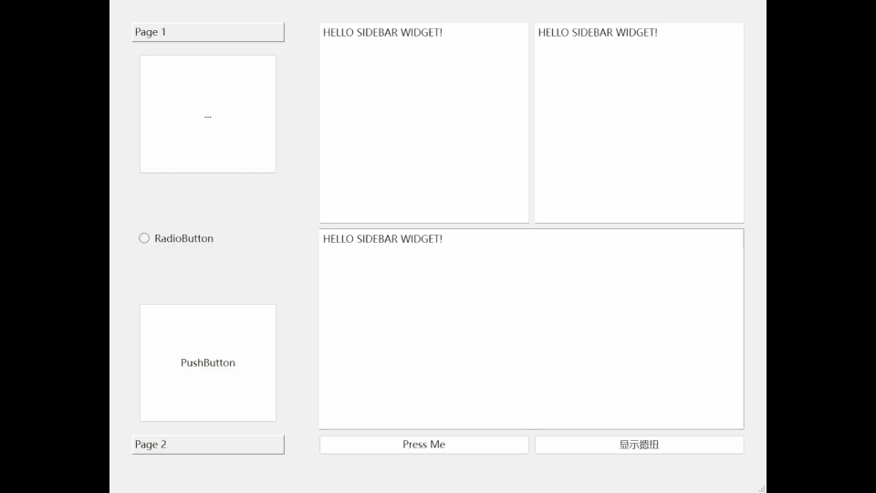

# Qt实践：一个简单的丝滑侧滑栏实现

​	笔者前段时间突然看到了侧滑栏，觉得这个抽屉式的侧滑栏非常的有趣，打算这里首先尝试实现一个简单的丝滑侧滑栏。

​	首先是上效果图



​	（C，GIF帧率砍到毛都不剩了）

## QPropertyAnimation

​	官方的[QPropertyAnimation Class | Qt Core 6.8.1](https://doc.qt.io/qt-6/qpropertyanimation.html)

​	也就是说，这个类封装了我们的Qt动画播放的类，我们针对Widgets的属性对其变化进行动画播放。Qt的抽象非常的好，只需要设置我们的起点和终点状态，以及设置一下时间间隔和播放的变化方式，就完事了。

- `setDuration(int msec)`： 设置动画的持续时间，单位是毫秒。
- `setStartValue(const QVariant &startValue)`： 设置动画的起始值。
- `setEndValue(const QVariant &endValue)`： 设置动画的结束值。
- `setEasingCurve(const QEasingCurve &curve)`： 设置动画的插值曲线，控制动画的速度变化（如加速、减速、匀速等）。常用的曲线类型有 `QEasingCurve::Linear`、`QEasingCurve::InQuad`、`QEasingCurve::OutBounce` 等。

​	笔者实现的效果的API就是用到了上面四个。

​	首先我们思考一下，SideBar看似是一个侧滑栏，但是跟随变动的，考虑上夹在中间的按钮，是三个部分。我们按照上面的思考思路。

> #### 1. **隐藏侧边栏（`do_hide_animations`）**
>
> 使侧边栏从可见状态过渡到隐藏状态。具体变化如下：
>
> - **侧边栏动画 (`animation_side`)**：
>   - **起始状态**：侧边栏的当前几何位置（`ui->widgetSiderBar->geometry()`）。
>   - **结束状态**：侧边栏移动到视图外部，即其横坐标变为负值，具体位置为 `( - ui->widgetSiderBar->width(), ui->widgetSiderBar->y() )`。这样侧边栏就被“隐藏”到屏幕外。
> - **按钮动画 (`animation_button`)**：
>   - **起始状态**：操作按钮当前的几何位置（`ui->btn_operate->geometry()`）。
>   - **结束状态**：按钮的位置将移动到屏幕左侧，具体位置为 `( 0, ui->btn_operate->y() )`。这样按钮会被移到左侧，表示侧边栏已隐藏。
> - **主界面动画 (`animation_main`)**：
>   - **起始状态**：主界面的当前几何位置（`ui->widget_mainside->geometry()`）。
>   - **结束状态**：主界面位置根据按钮的位置进行调整，具体为 `( ui->btn_operate->width(), ui->widget_mainside->y() )`，这意味着主界面会向左移动，避开被隐藏的侧边栏。
> - **操作按钮文本**：
>   - 操作按钮的文本更改为 `">"`，表示点击后侧边栏会“展开”。
> - **执行动画**：调用 `group->start()` 启动所有动画，产生隐藏效果。
>
> #### 2. **显示侧边栏（`do_show_animations`）**
>
> 当用户点击按钮以显示侧边栏时，执行 `do_show_animations`，将侧边栏从隐藏状态恢复到可见状态。具体变化如下：
>
> - **侧边栏动画 (`animation_side`)**：
>   - **起始状态**：侧边栏当前的几何位置（`ui->widgetSiderBar->geometry()`）。
>   - **结束状态**：侧边栏移动到其原始位置，即横坐标变为 0，具体位置为 `( 0, ui->widgetSiderBar->y() )`，使其重新显示在屏幕上。
> - **按钮动画 (`animation_button`)**：
>   - **起始状态**：操作按钮当前的几何位置（`ui->btn_operate->geometry()`）。
>   - **结束状态**：按钮的位置将移动到侧边栏的右侧，具体为 `( ui->widgetSiderBar->width(), ui->btn_operate->y() )`，表示按钮回到右侧，侧边栏已重新显示。
> - **主界面动画 (`animation_main`)**：
>   - **起始状态**：主界面的当前几何位置（`ui->widget_mainside->geometry()`）。
>   - **结束状态**：主界面的位置调整为 `( ui->widgetSiderBar->width() + ui->btn_operate->width(), ui->widget_mainside->y() )`，并且宽度变为 `width() - ui->btn_operate->width() - ui->widgetSiderBar->width()`，使得主界面重新适应显示的侧边栏。
> - **操作按钮文本**：
>   - 操作按钮的文本更改为 `"<"`，表示点击后侧边栏会“隐藏”。
> - **执行动画**：调用 `group->start()` 启动所有动画，产生显示效果。

​	代码上的体现就是

```
void SideBarWidget::do_hide_animations() {
    animation_side->setStartValue(ui->widgetSiderBar->geometry());
    /* move to the hidden place */
    animation_side->setEndValue(
        QRect(-ui->widgetSiderBar->width(), ui->widgetSiderBar->y(),
              ui->widgetSiderBar->width(), ui->widgetSiderBar->height()));

    animation_button->setStartValue(ui->btn_operate->geometry());
    animation_button->setEndValue(QRect(0, ui->btn_operate->y(),
                                        ui->btn_operate->width(),
                                        ui->btn_operate->height()));

    animation_main->setStartValue(ui->widget_mainside->geometry());
    animation_main->setEndValue(QRect(
        ui->btn_operate->width(), ui->widget_mainside->y(),
        width() - ui->btn_operate->width(), ui->widget_mainside->height()));

    ui->btn_operate->setText(">");
    group->start();
}
void SideBarWidget::do_show_animations() {
    animation_side->setStartValue(ui->widgetSiderBar->geometry());
    /* move to the hidden place */
    animation_side->setEndValue(QRect(0, ui->widgetSiderBar->y(),
                                      ui->widgetSiderBar->width(),
                                      ui->widgetSiderBar->height()));

    animation_button->setStartValue(ui->btn_operate->geometry());
    animation_button->setEndValue(
        QRect(ui->widgetSiderBar->width(), ui->btn_operate->y(),
              ui->btn_operate->width(), ui->btn_operate->height()));

    animation_main->setStartValue(ui->widget_mainside->geometry());
    animation_main->setEndValue(
        QRect(ui->widgetSiderBar->width() + ui->btn_operate->width(),
              ui->widget_mainside->y(),
              width() - ui->btn_operate->width() - ui->widgetSiderBar->width(),
              ui->widget_mainside->height()));
    ui->btn_operate->setText("<");
    ui->widgetSiderBar->setVisible(true);
    group->start();
}
```

​	上面体现了一个优化，那就是使用动画组Group来同步的进行操作。防止出现动画抢跑。

## 源码

完整的测试源码在：[CCQt_Libs/Widget/SideBarWidget at main · Charliechen114514/CCQt_Libs (github.com)](https://github.com/Charliechen114514/CCQt_Libs/tree/main/Widget/SideBarWidget)

> C++源码

```c++
#include "SideBarWidget.h"
#include "ui_SideBarWidget.h"
#include <QParallelAnimationGroup>
#include <QPropertyAnimation>

namespace SideBarUtilsTools {
void clearLayout(QLayout* layout) {
    if (!layout) return;

    QLayoutItem* item;
    while ((item = layout->takeAt(0)) != nullptr) {
        if (item->widget()) {
            item->widget()->hide();  // 隐藏控件，但不删除
        } else {
            clearLayout(item->layout());  // 递归清理子布局
        }
    }
}
}  // namespace SideBarUtilsTools

SideBarWidget::SideBarWidget(QWidget* parent)
    : QWidget(parent), ui(new Ui::SideBarWidget) {
    ui->setupUi(this);
    __initMemory();
    __initConnection();
}

void SideBarWidget::switch_state() {
    setState(!hidden_state);
}

void SideBarWidget::switch_button_visible() {
    setButtonVisible(!ui->btn_operate->isVisible());
}

void SideBarWidget::removeLayout(Role r) {
    switch (r) {
        case Role::SideBar:
            SideBarUtilsTools::clearLayout(ui->widgetSiderBar->layout());
            break;
        case Role::MainSide:
            SideBarUtilsTools::clearLayout(ui->widget_mainside->layout());
            break;
    }
}

void SideBarWidget::setButtonVisible(bool visible) {
    ui->btn_operate->setVisible(visible);
    ui->btn_operate->setText(hidden_state ? ">" : "<");
}

void SideBarWidget::addLayout(QLayout* layout, const QWidgetList& widgetList,
                              Role r) {
    switch (r) {
        case Role::SideBar:
            ui->widgetSiderBar->setLayout(layout);
            for (auto& w : widgetList) {
                ui->widgetSiderBar->layout()->addWidget(w);
            }
            break;
        case Role::MainSide:
            ui->widget_mainside->setLayout(layout);
            for (auto& w : widgetList) {
                ui->widget_mainside->layout()->addWidget(w);
            }
            break;
    }
}

/* setTypes */
void SideBarWidget::setAnimationDuration(int duration) {
    animation_button->setDuration(duration);
    animation_main->setDuration(duration);
    animation_side->setDuration(duration);
}
void SideBarWidget::setAnimationCurve(QEasingCurve::Type curve) {
    animation_button->setEasingCurve(curve);
    animation_main->setEasingCurve(curve);
    animation_side->setEasingCurve(curve);
}

void SideBarWidget::__initMemory() {
    animation_main = new QPropertyAnimation(ui->widget_mainside, "geometry");
    animation_main->setDuration(SideBarWidgetStaticConfig::ANIMATION_DURATION);
    animation_main->setEasingCurve(SideBarWidgetStaticConfig::ANIMATION_CURVE);
    animation_side = new QPropertyAnimation(ui->widgetSiderBar, "geometry");
    animation_side->setDuration(SideBarWidgetStaticConfig::ANIMATION_DURATION);
    animation_side->setEasingCurve(SideBarWidgetStaticConfig::ANIMATION_CURVE);
    animation_button = new QPropertyAnimation(ui->btn_operate, "geometry");
    animation_button->setDuration(
        SideBarWidgetStaticConfig::ANIMATION_DURATION);
    animation_main->setDuration(SideBarWidgetStaticConfig::ANIMATION_DURATION);
    group = new QParallelAnimationGroup(this);
    group->addAnimation(animation_main);
    group->addAnimation(animation_side);
    group->addAnimation(animation_button);
}

void SideBarWidget::__initConnection() {
    connect(ui->btn_operate, &QPushButton::clicked, this,
            [this]() { setState(!hidden_state); });
    connect(group, &QParallelAnimationGroup::finished, this, [this] {
        ui->widgetSiderBar->setVisible(!hidden_state);
        // have no better idea :(, to update the layout
        resize(size().width() + 1, size().height() + 1);
        resize(size().width() - 1, size().height() - 1);
    });
}

void SideBarWidget::do_hide_animations() {
    animation_side->setStartValue(ui->widgetSiderBar->geometry());
    /* move to the hidden place */
    animation_side->setEndValue(
        QRect(-ui->widgetSiderBar->width(), ui->widgetSiderBar->y(),
              ui->widgetSiderBar->width(), ui->widgetSiderBar->height()));

    animation_button->setStartValue(ui->btn_operate->geometry());
    animation_button->setEndValue(QRect(0, ui->btn_operate->y(),
                                        ui->btn_operate->width(),
                                        ui->btn_operate->height()));

    animation_main->setStartValue(ui->widget_mainside->geometry());
    animation_main->setEndValue(QRect(
        ui->btn_operate->width(), ui->widget_mainside->y(),
        width() - ui->btn_operate->width(), ui->widget_mainside->height()));

    ui->btn_operate->setText(">");
    group->start();
}
void SideBarWidget::do_show_animations() {
    animation_side->setStartValue(ui->widgetSiderBar->geometry());
    /* move to the hidden place */
    animation_side->setEndValue(QRect(0, ui->widgetSiderBar->y(),
                                      ui->widgetSiderBar->width(),
                                      ui->widgetSiderBar->height()));

    animation_button->setStartValue(ui->btn_operate->geometry());
    animation_button->setEndValue(
        QRect(ui->widgetSiderBar->width(), ui->btn_operate->y(),
              ui->btn_operate->width(), ui->btn_operate->height()));

    animation_main->setStartValue(ui->widget_mainside->geometry());
    animation_main->setEndValue(
        QRect(ui->widgetSiderBar->width() + ui->btn_operate->width(),
              ui->widget_mainside->y(),
              width() - ui->btn_operate->width() - ui->widgetSiderBar->width(),
              ui->widget_mainside->height()));
    ui->btn_operate->setText("<");
    ui->widgetSiderBar->setVisible(true);
    group->start();
}

SideBarWidget::~SideBarWidget() {
    delete ui;
}
```

> 接口

```c++
#ifndef SIDEBARWIDGET_H
#define SIDEBARWIDGET_H

#include <QEasingCurve>
#include <QWidget>
class QPropertyAnimation;
class QParallelAnimationGroup;
namespace SideBarWidgetStaticConfig {
static constexpr const bool               INIT_STATE         = false;
static constexpr const int                ANIMATION_DURATION = 500;
static constexpr const QEasingCurve::Type ANIMATION_CURVE =
    QEasingCurve::InOutQuad;
};  // namespace SideBarWidgetStaticConfig

namespace Ui {
class SideBarWidget;
}

class SideBarWidget : public QWidget {
    Q_OBJECT

public:
    explicit SideBarWidget(QWidget* parent = nullptr);
    void inline showSideBar() {
        setState(false);
    }
    void inline hideSideBar() {
        setState(true);
    }
    enum class Role { SideBar, MainSide };
    /* addWidgets to the two sides */
    void addLayout(QLayout* layout, const QWidgetList& widgetList, Role r);
    /* remove the display widgets */
    void removeLayout(Role r);
    /* enable or disable the button visibilities */
    void setButtonVisible(bool visible);
    /* setTypes and durations */
    void setAnimationDuration(int duration);
    void setAnimationCurve(QEasingCurve::Type curve);

    ~SideBarWidget();
public slots:
    void switch_state();
    void switch_button_visible();

private:
    QPropertyAnimation*      animation_main;
    QPropertyAnimation*      animation_side;
    QPropertyAnimation*      animation_button;
    QParallelAnimationGroup* group;
    void inline setState(bool st) {
        hidden_state = st;
        hidden_state ? do_hide_animations() : do_show_animations();
    }
    void               __initMemory();
    void               __initConnection();
    void               do_hide_animations();
    void               do_show_animations();
    bool               hidden_state{SideBarWidgetStaticConfig::INIT_STATE};
    Ui::SideBarWidget* ui;
};

#endif  // SIDEBARWIDGET_H
```

## Reference

​	感谢https://zhuanlan.zhihu.com/p/614475116?utm_id=0，我的设计几乎从这里派生出来！