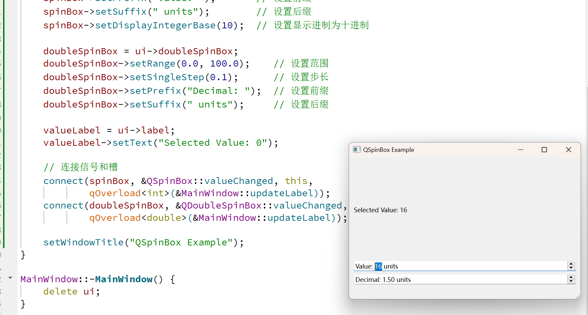

# Qt常用控件的熟悉

## QSpinBox QDoubleSpinBox

​	QSpinBox和QDoubleSpinBox都是Qt中用于输入数值的控件，主要用于允许用户选择一个整数或浮点数值。

​	笔者建议，当使用到需要输入数字的控件的时候，可以考虑一下！

- QSpinBox专注于整数输入，用户可以通过点击增减按钮或直接输入数字来调整值。它支持设置最小值、最大值以及步长，以便控制输入范围和变化的精度。
- QDoubleSpinBox则用于浮点数输入，功能类似于QSpinBox，但它允许输入小数。用户可以同样通过按钮或直接输入来调整值，并且可以设置小数位数，以控制输入的精度和范围。

​	这两个控件都支持信号和槽机制，能够在值改变时发出信号，方便与其他控件或逻辑进行交互。

### QSpinBox

​	QSpinBox 旨在处理整数和离散值集（例如，月份名称）；使用 QDoubleSpinBox 处理浮点值。QSpinBox 允许用户通过单击向上/向下按钮或按键盘上的向上/向下键来选择值，以增加/减少当前显示的值。用户也可以手动输入值。**SpinBox支持整数值，但可以扩展为使用带有validate()、textFromValue() 和valueFromText() 的不同字符串。**

​	每次值更改时，QSpinBox 都会发出valueChanged() 和textChanged() 信号，前者提供int，后者提供QString。textChanged() 信号通过prefix() 和suffix() 提供值。可以使用value() 获取当前值并使用setValue() 设置当前值。

​	单击向上/向下按钮或使用键盘加速器的向上和向下箭头将以singleStep() 大小的步长增加或减少当前值。如果您想更改此行为，可以重新实现虚拟函数stepBy()。可以使用构造函数之一设置最小值和最大值以及步长，稍后可以使用 setMinimum()、setMaximum() 和 setSingleStep() 进行更改。

​	大多数SpinBox都是有方向的，但 QSpinBox 也可以用作循环SpinBox，即，如果范围是 0-99 且当前值为 99，则如果将 wrapping() 设置为 true，则单击“向上”将得到 0。如果您想要循环行为，请使用 setWrapping()。

​	显示的值可以添加和附加任意字符串，例如，表示货币或计量单位。请参阅 setPrefix() 和 setSuffix()。SpinBox中的文本是使用 text()（包括任何 prefix() 和 suffix()）或 cleanText()（没有 prefix()、没有 suffix() 并且没有前导或尾随空格）检索的。

​	除了数值范围之外，通常还希望为用户提供特殊（通常是默认）选项。请参阅 setSpecialValueText() 以了解如何使用 QSpinBox 执行此操作。

#### 子类化 QSpinBox

​	如果使用 prefix()、suffix() 和 specialValueText() 无法提供足够的控制，则可以子类化 QSpinBox 并重新实现 valueFromText() 和 textFromValue()。例如，以下是允许用户输入图标大小（例如“32 x 32”）的自定义SpinBox的代码：

```
int IconSizeSpinBox::valueFromText(const QString &text) const
{
    static const QRegularExpression regExp(tr("(\\d+)(\\s*[xx]\\s*\\d+)?"));
    Q_ASSERT(regExp.isValid()); // 保证我们的表达式合法

    const QRegularExpressionMatch match = regExp.match(text);
    if (match.isValid())
        return match.captured(1).toInt();
    return 0;
}

QString IconSizeSpinBox::textFromValue(int value) const
{
    return tr("%1 x %1").arg(value);
}
```

### QDoubleSpinBox

​	QDoubleSpinBox 允许用户通过单击向上和向下按钮或按键盘上的向上或向下键来选择值，以增加或减少当前显示的值。用户也可以手动输入值。SpinBox支持双精度值，但可以扩展为使用validate()、textFromValue() 和valueFromText() 的不同字符串。

​	每次值更改时，QDoubleSpinBox 都会发出**valueChanged() 和textChanged()** 信号，前者提供双精度值，后者提供QString。textChanged() 信号通过prefix() 和suffix() 提供值。当前值可以用value() 获取，并用setValue() 设置。

​	注意：QDoubleSpinBox 将对数字进行四舍五入，以便可以以当前精度显示它们。在将小数设置为2 的QDoubleSpinBox 中，调用setValue(2.555) 将导致value() 返回2.56。

​	单击向上和向下按钮或使用键盘加速器的向上和向下箭头将以 singleStep() 大小的步长增加或减少当前值。如果要更改此行为，可以重新实现虚拟函数 stepBy()。可以使用其中一个构造函数设置最小值和最大值以及步长，稍后可以使用 setMinimum()、setMaximum() 和 setSingleStep() 进行更改。SpinBox的默认精度为 2 位小数，但可以使用 setDecimals() 进行更改。

​	大多数SpinBox都是定向的，但 QDoubleSpinBox 也可以用作循环SpinBox，即如果范围是 0.0-99.9 并且当前值为 99.9，则如果将 wrapping() 设置为 true，单击“向上”将得到 0。如果想要循环行为，请使用 setWrapping()。

​	显示的值可以添加和附加任意字符串，例如指示货币或计量单位。请参阅 setPrefix() 和 setSuffix()。使用 text()（包括任何 prefix() 和 suffix()）或 cleanText()（没有 prefix()、suffix() 且没有前导或尾随空格）检索SpinBox中的文本。

​	除了数值范围之外，通常还希望为用户提供特殊（通常是默认）选项。请参阅 setSpecialValueText() 了解如何使用 QDoubleSpinBox 执行此操作。

​	注意：除了最终的前缀和后缀内容外，QDoubleSpinBox 的显示值限制为 18 个字符。此限制用于使双SpinBox即使在值非常大的情况下也能使用。

### 例子

```c++
#include "MainWindow.h"
#include "ui_MainWindow.h"

MainWindow::MainWindow(QWidget *parent)
    : QMainWindow(parent), ui(new Ui::MainWindow) {
    ui->setupUi(this);
    spinBox = ui->spinBox;
    spinBox->setRange(0, 100);           // 设置范围
    spinBox->setSingleStep(1);           // 设置步长
    spinBox->setPrefix("Value: ");       // 设置前缀
    spinBox->setSuffix(" units");        // 设置后缀
    spinBox->setDisplayIntegerBase(10);  // 设置显示进制为十进制

    doubleSpinBox = ui->doubleSpinBox;
    doubleSpinBox->setRange(0.0, 100.0);    // 设置范围
    doubleSpinBox->setSingleStep(0.1);      // 设置步长
    doubleSpinBox->setPrefix("Decimal: ");  // 设置前缀
    doubleSpinBox->setSuffix(" units");     // 设置后缀

    valueLabel = ui->label;
    valueLabel->setText("Selected Value: 0");

    // 连接信号和槽
    connect(spinBox, &QSpinBox::valueChanged, this,
            qOverload<int>(&MainWindow::updateLabel));
    connect(doubleSpinBox, &QDoubleSpinBox::valueChanged, this,
            qOverload<double>(&MainWindow::updateLabel));

    setWindowTitle("QSpinBox Example");
}

MainWindow::~MainWindow() {
    delete ui;
}
```

```c++
#ifndef MAINWINDOW_H
#define MAINWINDOW_H

#include <QDoubleSpinBox>
#include <QLabel>
#include <QMainWindow>
#include <QSpinBox>
#include <QVBoxLayout>

QT_BEGIN_NAMESPACE
namespace Ui {
class MainWindow;
}
QT_END_NAMESPACE

class MainWindow : public QMainWindow {
    Q_OBJECT

public:
    MainWindow(QWidget *parent = nullptr);
    ~MainWindow();
    void updateLabel(int value) {
        valueLabel->setText(QString("Selected Value: %1").arg(value));
    }

    void updateLabel(double value) {
        valueLabel->setText(QString("Selected Value: %1").arg(value));
    }

private:
    Ui::MainWindow *ui;
    QSpinBox       *spinBox;
    QDoubleSpinBox *doubleSpinBox;
    QLabel         *valueLabel;
};

#endif  // MAINWINDOW_H
```




## API 参考说明

> QSpinBox（QDoubleSpinBox是类似的，笔者建议您对照着自己去官方网站查看）

| 函数                                                         | 功能                             |
| ------------------------------------------------------------ | -------------------------------- |
| QSpinBox(QWidget *parent = nullptr)                          | 构造函数，创建一个QSpinBox控件。 |
| virtual ~QSpinBox()                                          | 析构函数，释放资源。             |
| QString cleanText() const                                    | 返回用户输入的清理后文本。       |
| int displayIntegerBase() const                               | 返回当前显示的进制。             |
| int maximum() const                                          | 获取最大值。                     |
| int minimum() const                                          | 获取最小值。                     |
| QString prefix() const                                       | 获取前缀字符串。                 |
| void setDisplayIntegerBase(int base)                         | 设置显示的进制。                 |
| void setMaximum(int max)                                     | 设置最大值。                     |
| void setMinimum(int min)                                     | 设置最小值。                     |
| void setPrefix(const QString &prefix)                        | 设置前缀字符串。                 |
| void setRange(int minimum, int maximum)                      | 同时设置最小值和最大值。         |
| void setSingleStep(int val)                                  | 设置增减的步长。                 |
| void setStepType(QAbstractSpinBox::StepType stepType)        | 设置步进类型。                   |
| void setSuffix(const QString &suffix)                        | 设置后缀字符串。                 |
| int singleStep() const                                       | 获取当前的步长。                 |
| QAbstractSpinBox::StepType stepType() const                  | 获取步进类型。                   |
| QString suffix() const                                       | 获取后缀字符串。                 |
| int value() const                                            | 获取当前值。                     |
| void setValue(int val)                                       | 设置当前值。                     |
| void textChanged(const QString &text)                        | 文本变化时发出的信号。           |
| void valueChanged(int i)                                     | 值变化时发出的信号。             |
| virtual QString textFromValue(int value) const               | 自定义数值到文本的转换。         |
| virtual int valueFromText(const QString &text) const         | 自定义文本到数值的转换。         |
| virtual bool event(QEvent *event) override                   | 处理事件。                       |
| virtual void fixup(QString &input) const override            | 修正输入文本。                   |
| virtual QValidator::State validate(QString &text, int &pos) const override | 验证输入的合法性。               |