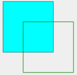

# Qt模块学习——绘图(I)

​	我们下面来了解一下Qt的绘图功能。也就是QPainter与相关的类。

​	在这里我们实际上会用到QPainter，QPen，QBrush，QPainterPath四个主要的类（其实还有很多一大堆，这里不详细的进行介绍了）

## QPainter

​	QPainter就是我们的绘图的类，我们想要画什么东西，就需要和这个类打交道。QPaintDevice是QPainter准备投射绘画内容的地方。我们的QWidget, QImage, QPixmap等等类都是QPaintDevice的子类。也就是说，他们是可以绘画的！我们最开始了解QPainter这个类的时候就需要从QWidget::paintEvent开始了解，一般的这个函数就是负责控件的绘画任务。

### Qt Paint的坐标系统

​	坐标系统由 QPainter 类控制。QPainter 与 QPaintDevice 和 QPaintEngine 类一起构成了 Qt 绘画系统 Arthur 的基础。QPainter 用于执行绘制操作，QPaintDevice 是二维空间的抽象，可以使用 QPainter 进行绘制，QPaintEngine 提供绘图器用于在不同类型的设备上进行绘制的接口。

​	QPaintDevice 类是可绘制对象的基类：其绘制功能由 QWidget、QImage、QPixmap、QPicture 和 QOpenGLPaintDevice 类继承。绘图设备的默认坐标系统的原点位于左上角。x 值向右增加，y 值向下增加。在基于像素的设备上，默认单位为一个像素，在打印机上为一个点（1/72 英寸）。

​	逻辑 QPainter 坐标到物理 QPaintDevice 坐标的映射由 QPainter 的变换矩阵、视口和“窗口”处理。逻辑和物理坐标系默认一致。QPainter 还支持坐标变换（例如旋转和缩放）。

#### 渲染

##### 逻辑表示

​	图形基元的大小（宽度和高度）始终与其数学模型相对应，忽略渲染笔的宽度：


##### 别名绘制

​	绘制时，像素渲染由 QPainter::Antialiasing 渲染提示控制。RenderHint 枚举用于指定 QPainter 的标志，任何给定引擎都可能遵守这些标志，也可能不遵守。QPainter::Antialiasing 值表示引擎应尽可能对图元的边缘进行抗锯齿处理，即通过使用不同的颜色强度来平滑边缘。

​	但默认情况下，绘图器是带锯齿的，并且适用其他规则：当使用一个像素宽的笔进行渲染时，像素将渲染到数学定义的点的右侧和下方。例如：


```
QPainter painter(this);

painter.setPen(Qt::darkGreen);
// 使用 (x y w h) 重载
painter.drawRect(1, 2, 6, 4);
```


```
QPainter painter(this);

painter.setPen(Qt::darkGreen);
painter.drawLine(2, 7, 6, 1);
```

​	当使用具有偶数个像素的笔进行渲染时，像素将围绕数学定义的点对称渲染，而使用具有奇数个像素的笔进行渲染时，多余的像素将像一个像素的情况一样渲染在数学点的右下方。请参阅下面的 QRectF 图以获取具体示例。


​	请注意，由于历史原因，QRect::right() 和 QRect::bottom() 函数的返回值偏离矩形的真实右下角。

​	QRect 的 right() 函数返回 left() + width() - 1，bottom() 函数返回 top() + height() - 1。图中右下角的绿点显示这些函数的返回坐标。我们建议您直接使用 QRectF：QRectF 类使用浮点坐标在平面中定义一个矩形，以确保准确性（QRect 使用整数坐标），QRectF::right() 和 QRectF::bottom() 函数会返回真正的右下角。或者，使用 QRect，应用 x() + width() 和 y() + height() 来查找右下角，并避免使用 right() 和 bottom() 函数。

##### 抗锯齿绘画

如果您设置了 QPainter 的抗锯齿渲染提示，像素将在数学定义的点的两侧对称渲染：


```
QPainter painter(this);
painter.setRenderHint(
QPainter::Antialiasing);
painter.setPen(Qt::darkGreen);
// 使用 (x y w h) 重载
painter.drawRect(1, 2, 6, 4);
```


```
QPainter painter(this);
painter.setRenderHint(
QPainter::Antialiasing);
painter.setPen(Qt::darkGreen);
painter.drawLine(2, 7, 6, 1);
```

#### 变换

​	默认情况下，QPainter 在相关设备自己的坐标系上运行，但它也完全支持仿射坐标变换。您可以使用 QPainter::scale() 函数按给定偏移量缩放坐标系，可以使用 QPainter::rotate() 函数顺时针旋转它，可以使用 QPainter::translate() 函数平移它（即向点添加给定偏移量）。


	您还可以使用 QPainter::shear() 函数围绕原点扭转坐标系。所有变换操作都在 QPainter 的变换矩阵上运行，您可以使用 QPainter::worldTransform() 函数检索该矩阵。矩阵将平面上的一个点变换到另一个点。

​	如果需要反复进行相同的变换，也可以使用 QTransform 对象以及 QPainter::worldTransform() 和 QPainter::setWorldTransform() 函数。您可以随时通过调用 QPainter::save() 函数保存 QPainter 的变换矩阵，该函数将矩阵保存在内部堆栈中。QPainter::restore() 函数将其弹出。

​	变换矩阵的一个常见需求是在各种绘图设备上重复使用相同的绘图代码。如果没有变换，结果将与绘图设备的分辨率紧密相关。打印机具有高分辨率，例如每英寸 600 点，而屏幕通常每英寸 72 到 100 点。

### 窗口-视口转换

​	使用 QPainter 进行绘制时，我们使用逻辑坐标指定点，然后将其转换为绘制设备的物理坐标。逻辑坐标到物理坐标的映射由 QPainter 的世界变换 worldTransform()（在“变换”部分中描述）以及 QPainter 的 viewport() 和 window() 处理。视口表示指定任意矩形的物理坐标。“窗口”以逻辑坐标描述相同的矩形。默认情况下，逻辑和物理坐标系重合，并且相当于绘制设备的矩形。

​	使用窗口-视口转换，您可以使逻辑坐标和物理坐标系重合，并且相当于绘制设备的矩形。该机制还可用于使绘制代码独立于绘制设备。例如，您可以通过调用 QPainter::setWindow() 函数使逻辑坐标从 (-50, -50) 延伸到 (50, 50)，中心为 (0, 0)：

```
QPainter painter(this);
painter.setWindow(QRect(-50, -50, 100, 100));
```

现在，逻辑坐标 (-50,-50) 对应于绘制设备的物理坐标 (0, 0)。独立于绘制设备，您的绘制代码将始终在指定的逻辑坐标上进行操作。

通过设置“窗口”或视口矩形，您可以对坐标执行线性变换。请注意，“窗口”的每个角都映射到视口的相应角，反之亦然。因此，通常最好让视口和“窗口”保持相同的纵横比以防止变形：

```
int side = qMin(width(), height());
int x = (width() - side / 2);
int y = (height() - side / 2);

painter.setViewport(x, y, side, side);
```

如果我们使逻辑坐标系成为正方形，我们也应该使用 QPainter::setViewport() 函数使视口成为正方形。在上面的示例中，我们使其等同于适合绘画设备矩形的最大正方形。通过在设置窗口或视口时考虑绘画设备的大小，可以使绘制代码独立于绘画设备。

请注意，窗口视口转换只是线性变换，即它不执行裁剪。这意味着如果您在当前设置的“窗口”之外进行绘画，您的绘画仍将使用相同的线性代数方法转换为视口。


视口、“窗口”和变换矩阵决定了逻辑 QPainter 坐标如何映射到绘制设备的物理坐标。默认情况下，世界变换矩阵是单位矩阵，“窗口”和视口设置相当于绘制设备的设置，即世界、“窗口”和设备坐标系是等效的，但正如我们所见，可以使用变换操作和窗口视口转换来操纵这些系统。上图描述了这个过程。

## QPainter这个类本身的介绍

​	QPainter 提供高度优化的函数来完成 GUI 程序所需的大部分绘图操作。它可以绘制从简单线条到复杂形状（如饼图和和弦）的所有内容。它还可以绘制对齐的文本和像素图。通常，它会在“自然”坐标系中绘制，但也可以进行视图和世界变换。QPainter 可以对继承 QPaintDevice 类的任何对象进行操作。

​	QPainter 的常见用途是在小部件的绘制事件中：构造和自定义（例如设置笔或画笔）绘制器。然后绘制。请记住在绘制后销毁 QPainter 对象。例如：

```
void SimpleExampleWidget::paintEvent(QPaintEvent *)
{
	QPainter painter(this);
	painter.setPen(Qt::blue);
	painter.setFont(QFont("Arial", 30));
	painter.drawText(rect(), Qt::AlignCenter, "Qt");
}
```

​	QPainter 的核心功能是绘图，但该类还提供几个函数，允许您自定义 QPainter 的设置及其渲染质量，以及其他启用裁剪的函数。此外，您可以通过指定绘图器的合成模式来控制不同形状的合并方式。

​	isActive() 函数指示绘图器是否处于活动状态。绘图器由 begin() 函数和采用 QPaintDevice 参数的构造函数激活。end() 函数和析构函数将其停用。

​	QPainter 与 QPaintDevice 和 QPaintEngine 类一起构成了 Qt 绘图系统的基础。QPainter 是用于执行绘图操作的类。QPaintDevice 表示可以使用 QPainter 进行绘图的设备。QPaintEngine 提供绘图器用来在不同类型的设备上绘图的接口。如果绘图器处于活动状态，device() 将返回绘图器在其上进行绘图的绘图设备，paintEngine() 将返回绘图器当前正在操作的绘图引擎。

​	有时，希望让其他人在不寻常的 QPaintDevice 上绘画。QPainter 支持一个静态函数 setRedirected() 来执行此操作。

> 警告：当 paintdevice 是小部件时，QPainter 只能在 paintEvent() 函数内或 paintEvent() 调用的函数中使用。

### 设置

​	您可以自定义几个设置，以使 QPainter 根据您的偏好进行绘制：

- font() 是用于绘制文本的字体。如果 painter isActive()，您可以分别使用 fontInfo() 和 fontMetrics() 函数检索有关当前设置的字体及其度量的信息。
- brush() 定义用于填充形状的颜色或图案。
- pen() 定义用于绘制线条或边界的颜色或点画。
- backgroundMode() 定义是否有 background()，即它是 Qt::OpaqueMode 还是 Qt::TransparentMode。
- background() 仅在 backgroundMode() 为 Qt::OpaqueMode 且 pen() 为点画时适用。在这种情况下，它描述点画中背景像素的颜色。
- brushOrigin() 定义平铺画笔的原点，通常是小部件背景的原点。
- viewport()、window()、worldTransform() 组成了绘图器的坐标变换系统。有关更多信息，请参阅坐标变换部分和坐标系统文档。
- hasClipping() 告知绘图器是否完全剪辑。（绘图设备也会剪辑。）如果绘图器剪辑，它会剪辑到 clipRegion()。
- layoutDirection() 定义绘图器在绘制文本时使用的布局方向。
- worldMatrixEnabled() 告知是否启用了世界变换。
- viewTransformEnabled() 告知是否启用了视图变换。

> 请注意，其中一些设置反映了某些绘图设备中的设置，例如 QWidget::font()。 QPainter::begin() 函数（或等效的 QPainter 构造函数）从绘图设备复制这些属性。

​	您可以随时通过调用 save() 函数保存 QPainter 的状态，该函数将所有可用设置保存在内部堆栈中。restore() 函数将它们弹出。

### 绘图

​	QPainter 提供绘制大多数图元的函数：drawPoint()、drawPoints()、drawLine()、drawRect()、drawRoundedRect()、drawEllipse()、drawArc()、drawPie()、drawChord()、drawPolyline()、drawPolygon()、drawConvexPolygon() 和 drawCubicBezier()。两个便利函数 drawRects() 和 drawLines() 使用当前笔和画笔在给定的 QRects 或 QLines 数组中绘制给定数量的矩形或线条。

​	QPainter 类还提供了 fillRect() 函数，该函数使用给定的 QBrush 填充给定的 QRect，以及 erasRect() 函数，该函数擦除给定矩形内的区域。

​	所有这些函数都有整数和浮点版本。

### 绘制像素图和图像

有绘制像素图/图像的函数，即 drawPixmap()、drawImage() 和 drawTiledPixmap()。 drawPixmap() 和 drawImage() 产生相同的结果，不同之处在于 drawPixmap() 在屏幕上更快，而 drawImage() 在 QPrinter 或其他设备上可能更快。

有一个 drawPicture() 函数可以绘制整个 QPicture 的内容。 drawPicture() 函数是唯一一个忽略所有绘图器设置的函数，因为 QPicture 有自己的设置。

#### 绘制高分辨率版本的像素图和图像

高分辨率版本的像素图具有大于 1 的设备像素比值（参见 QImageReader、QPixmap::devicePixelRatio()）。如果它与底层 QPaintDevice 的值匹配，则直接绘制到设备上，无需应用其他转换。

例如，在设备像素比为 2 的高 DPI 屏幕上绘制 64x64 像素大小的 QPixmap 时就是这种情况，该屏幕的设备像素比也为 2。请注意，像素图在用户空间中实际上是 32x32 像素。Qt 中根据像素图大小计算布局几何的代码路径将使用此大小。这样做的最终结果是像素图显示为高 DPI 像素图，而不是大像素图。

#### 渲染质量

要使用 QPainter 获得最佳渲染结果，您应该使用独立于平台的 QImage 作为绘制设备；即使用 QImage 将确保结果在任何平台上都具有相同的像素表示。

QPainter 类还提供了一种通过其 RenderHint 枚举和对浮点精度的支持来控制渲染质量的方法：所有用于绘制图元的函数都有浮点版本。

```
painter.drawEllipse(QRectF(-diameter / 2.0, -diameter / 2.0,diameter,diameter));
```

这些通常与 QPainter::Antialiasing 渲染提示结合使用。

```
QPainter painter(this);
painter.setRenderHint(QPainter::Antialiasing, true);
```

​	将同心圆与 int 和 float 进行比较，并带有或不带有抗锯齿渲染。使用浮点精度版本可产生均匀分布的环。抗锯齿渲染可产生平滑的圆圈。

​	RenderHint 枚举指定 QPainter 的标志，任何给定引擎可能会或可能不会遵守这些标志。 

- QPainter::Antialiasing 表示引擎应尽可能对图元的边缘进行抗锯齿处理，
- QPainter::TextAntialiasing 表示引擎应尽可能对文本进行抗锯齿处理，
- QPainter::SmoothPixmapTransform 表示引擎应使用平滑的像素图变换算法。

renderHints() 函数返回一个标志，该标志指定为此 Painter 设置的渲染提示。使用 setRenderHint() 函数设置或清除当前设置的 RenderHints。

### 坐标变换

​	这个在我们上面有介绍过。通常，QPainter 在设备自己的坐标系（通常是像素）上运行，但 QPainter 对坐标变换有很好的支持。最常用的变换是缩放、旋转、平移和剪切。使用 scale() 函数按给定的偏移量缩放坐标系，使用 rotate() 函数将其顺时针旋转，使用 Translation() 将其平移（即向点添加给定的偏移量）。您还可以使用shear()函数围绕原点扭转坐标系。

### 剪辑

​	QPainter 可以将任何绘图操作剪辑为矩形、区域或矢量路径。当前剪辑可使用 clipRegion() 和 clipPath() 函数获得。路径或区域是首选（更快）取决于底层 paintEngine()。例如，QImage 绘图引擎首选路径，而 X11 绘图引擎首选区域。剪辑设置是在绘图器的逻辑坐标中完成的。

​	在 QPainter 剪辑之后，绘图设备也可以剪辑。例如，大多数小部件会剪辑掉子小部件使用的像素，大多数打印机会剪辑掉纸张边缘附近的区域。此额外剪辑不会反映在 clipRegion() 或 hasClipping() 的返回值中。

### 合成模式

​	QPainter 提供了 CompositionMode 枚举，它定义了用于数字图像合成的 Porter-Duff 规则；它描述了一种将一个图像（源）中的像素与另一个图像（目标）中的像素组合在一起的模型。

​	两种最常见的合成形式是 Source 和 SourceOver。源用于将不透明对象绘制到绘图设备上。在此模式下，源中的每个像素都会替换目标中的相应像素。在 SourceOver 组合模式下，源对象是透明的，并绘制在目标之上。

​	请注意，组合变换按像素进行。因此，使用图形基元本身和其边界矩形之间存在差异：边界矩形包含 alpha == 0 的像素（即围绕基元的像素）。这些像素将覆盖其他图像的像素，从而有效地清除这些像素，而基元仅覆盖其自己的区域。

### 限制

​	如果您在 Qt 的基于光栅的绘图引擎中使用坐标，请务必注意，虽然可以使用大于 +/- 215 的坐标，但不能保证使用此范围之外的坐标执行的任何绘图都能显示；绘图可能会被剪裁。这是由于在实现中使用了短整型。

​	Qt 的 stroker 生成的轮廓在处理曲线形状时只是近似值。在大多数情况下，不可能使用另一个贝塞尔曲线段来表示贝塞尔曲线段的轮廓，因此 Qt 通过使用几条较小的曲线来近似曲线轮廓。出于性能原因，Qt 对这些轮廓使用的曲线数量存在限制，因此当使用较大的笔宽或比例时，轮廓误差会增加。要生成误差较小的轮廓，可以使用 QPainterPathStroker 类，该类具有 setCurveThreshold 成员函数，可让用户指定误差容限。另一种解决方法是先将路径转换为多边形，然后再绘制多边形。

### 性能

QPainter 是一个丰富的框架，允许开发人员执行各种图形操作，例如渐变、合成模式和矢量图形。QPainter 可以在各种不同的硬件和软件堆栈上执行此操作。当然，硬件和软件的底层组合对性能有一定的影响，并且由于排列数量众多，确保每个操作与各种合成模式、画笔、剪辑、变换等的组合相结合都快速完成几乎是一项不可能完成的任务。作为折衷方案，我们选择了 QPainter API 和后端的一个子集，保证性能尽可能好，以适应给定的硬件和软件组合。

我们作为高性能引擎关注的后端是：

- Raster - 此后端以纯软件实现所有渲染，并始终用于渲染到 QImages 中。为了获得最佳性能，请仅使用格式类型 QImage::Format_ARGB32_Premultiplied、QImage::Format_RGB32 或 QImage::Format_RGB16。任何其他格式（包括 QImage::Format_ARGB32）的性能都会明显变差。默认情况下，此引擎用于 QWidget 和 QPixmap。

- OpenGL 2.0 (ES) - 此后端是硬件加速图形的主要后端。它可以在支持 OpenGL 2.0 或 OpenGL/ES 2.0 规范的台式机和嵌入式设备上运行。这包括过去几年生产的大多数图形芯片。可以通过在 QOpenGLWidget 上使用 QPainter 来启用该引擎。

这些操作是：

- 简单变换，即平移和缩放，加上 0、90、180、270 度旋转。
- drawPixmap() 与简单变换和非平滑变换模式的不透明度相结合（QPainter::SmoothPixmapTransform 未启用作为渲染提示）。
- 矩形填充纯色、双色线性渐变和简单变换。
- 矩形剪辑使用简单变换和相交剪辑。
- 合成模式 QPainter::CompositionMode_Source 和 QPainter::CompositionMode_SourceOver。
- 圆角矩形填充使用纯色和双色线性渐变填充。
- 3x3 修补像素图，通过 qDrawBorderPixmap。

​	此列表指示在性能至关重要的应用程序中可以安全使用哪些功能。对于某些设置，其他操作可能也很快，但在广泛使用它们之前，建议在软件最终运行的系统上对它们进行基准测试和验证。也有一些情况下可以使用昂贵的操作，例如当结果缓存在 QPixmap 中时。

### API

| **领域**         | **函数签名**                                                 | **用途**                                      |
| ---------------- | ------------------------------------------------------------ | --------------------------------------------- |
| 构造和析构       | `QPainter()`                                                 | 构造一个新的 `QPainter` 对象。                |
|                  | `QPainter(QPaintDevice *device)`                             | 用指定的 `QPaintDevice` 对象构造 `QPainter`。 |
|                  | `~QPainter()`                                                | 析构 `QPainter` 对象，清理资源。              |
| 背景设置         | `const QBrush & background() const`                          | 获取当前的背景画刷。                          |
|                  | `Qt::BGMode backgroundMode() const`                          | 获取当前的背景模式。                          |
|                  | `void setBackground(const QBrush &brush)`                    | 设置背景画刷。                                |
|                  | `void setBackgroundMode(Qt::BGMode mode)`                    | 设置背景模式。                                |
| 画刷设置         | `const QBrush & brush() const`                               | 获取当前的画刷。                              |
|                  | `void setBrush(const QBrush &brush)`                         | 设置画刷。                                    |
|                  | `void setBrush(Qt::BrushStyle style)`                        | 设置画刷样式。                                |
|                  | `void setBrushOrigin(const QPointF &position)`               | 设置画刷的起始位置。                          |
|                  | `void setBrushOrigin(int x, int y)`                          | 设置画刷的起始位置（使用整数坐标）。          |
| 画布操作         | `bool begin(QPaintDevice *device)`                           | 开始绘制操作，指定绘制设备。                  |
|                  | `void beginNativePainting()`                                 | 开始原生绘制操作。                            |
|                  | `void end()`                                                 | 结束绘制操作。                                |
|                  | `void endNativePainting()`                                   | 结束原生绘制操作。                            |
| 剪裁操作         | `void setClipPath(const QPainterPath &path, Qt::ClipOperation operation = Qt::ReplaceClip)` | 设置剪裁路径，指定剪裁操作。                  |
|                  | `void setClipRect(const QRectF &rectangle, Qt::ClipOperation operation = Qt::ReplaceClip)` | 设置剪裁矩形区域，指定剪裁操作。              |
|                  | `void setClipRegion(const QRegion &region, Qt::ClipOperation operation = Qt::ReplaceClip)` | 设置剪裁区域，指定剪裁操作。                  |
|                  | `void setClipping(bool enable)`                              | 启用或禁用剪裁功能。                          |
| 绘制图形         | `void drawArc(const QRectF &rectangle, int startAngle, int spanAngle)` | 在指定矩形区域绘制圆弧。                      |
|                  | `void drawArc(int x, int y, int width, int height, int startAngle, int spanAngle)` | 在指定位置绘制圆弧。                          |
|                  | `void drawConvexPolygon(const QPointF *points, int pointCount)` | 绘制凸多边形，使用指定的点集。                |
|                  | `void drawEllipse(const QRectF &rectangle)`                  | 绘制椭圆，指定矩形区域。                      |
|                  | `void drawEllipse(const QPoint &center, int rx, int ry)`     | 在指定的中心绘制椭圆，给定 X 和 Y 半径。      |
|                  | `void drawLine(const QLineF &line)`                          | 绘制一条线段，给定线段对象。                  |
|                  | `void drawLine(int x1, int y1, int x2, int y2)`              | 绘制一条线段，给定线段的四个端点坐标。        |
|                  | `void drawPath(const QPainterPath &path)`                    | 绘制路径。                                    |
|                  | `void drawPolygon(const QPointF *points, int pointCount, Qt::FillRule fillRule = Qt::OddEvenFill)` | 绘制多边形，指定点集并使用填充规则。          |
|                  | `void drawPolyline(const QPointF *points, int pointCount)`   | 绘制折线，指定点集。                          |
|                  | `void drawRect(const QRectF &rectangle)`                     | 绘制矩形，指定矩形区域。                      |
|                  | `void drawRoundedRect(const QRectF &rect, qreal xRadius, qreal yRadius, Qt::SizeMode mode = Qt::AbsoluteSize)` | 绘制圆角矩形，指定矩形区域及半径。            |
|                  | `void drawStaticText(const QPointF &topLeftPosition, const QStaticText &staticText)` | 绘制静态文本，给定位置和文本对象。            |
| 填充图形         | `void fillPath(const QPainterPath &path, const QBrush &brush)` | 用画刷填充路径。                              |
|                  | `void fillRect(const QRectF &rectangle, const QBrush &brush)` | 用画刷填充矩形区域。                          |
|                  | `void fillRect(int x, int y, int width, int height, const QBrush &brush)` | 用画刷填充指定位置的矩形区域。                |
| 绘制文本         | `void drawText(const QPointF &position, const QString &text)` | 绘制文本，指定位置和文本内容。                |
|                  | `void drawText(int x, int y, int width, int height, int flags, const QString &text)` | 绘制文本，指定矩形区域、标志和文本内容。      |
| 符号、图像等绘制 | `void drawGlyphRun(const QPointF &position, const QGlyphRun &glyphs)` | 绘制字形运行，给定位置和字形集合。            |
|                  | `void drawImage(const QRectF &target, const QImage &image, const QRectF &source, Qt::ImageConversionFlags flags = Qt::AutoColor)` | 绘制图像，指定目标矩形和源矩形。              |
|                  | `void drawPixmap(const QRectF &target, const QPixmap &pixmap, const QRectF &source)` | 绘制位图，指定目标和源矩形。                  |
|                  | `void drawPixmap(int x, int y, int width, int height, const QPixmap &pixmap)` | 绘制位图，指定目标矩形区域。                  |
| 渲染设置         | `void setRenderHint(QPainter::RenderHint hint, bool on = true)` | 启用或禁用渲染提示。                          |
|                  | `void setRenderHints(QPainter::RenderHints hints, bool on = true)` | 启用或禁用一组渲染提示。                      |
|                  | `bool testRenderHint(QPainter::RenderHint hint) const`       | 测试是否启用了指定的渲染提示。                |
| 变换操作         | `void resetTransform()`                                      | 重置当前变换矩阵。                            |
|                  | `void rotate(qreal angle)`                                   | 旋转变换，按指定角度旋转。                    |
|                  | `void scale(qreal sx, qreal sy)`                             | 缩放变换，按指定的缩放因子缩放。              |
|                  | `void shear(qreal sh, qreal sv)`                             | 锯齿变换，按指定的水平和垂直比例进行变换。    |
|                  | `void translate(const QPointF &offset)`                      | 平移变换，按指定偏移量进行平移。              |
|                  | `void translate(qreal dx, qreal dy)`                         | 平移变换，按指定的水平和垂直偏移量进行平移。  |
|                  | `void setTransform(const QTransform &transform, bool combine = false)` | 设置变换矩阵。                                |
|                  | `void setWorldTransform(const QTransform &matrix, bool combine = false)` | 设置世界变换矩阵。                            |
|                  | `void setWorldMatrixEnabled(bool enable)`                    | 启用或禁用世界变换矩阵。                      |
|                  | `const QTransform & worldTransform() const`                  | 获取世界变换矩阵。                            |
| 状态保存与恢复   | `void save()`                                                | 保存当前的绘制状态。                          |
|                  | `void restore()`                                             | 恢复之前保存的绘制状态。                      |
| 其他             | `bool isActive() const`                                      | 检查绘制是否处于激活状态。                    |
|                  | `const QPen & pen() const`                                   | 获取当前的画笔。                              |
|                  | `void setPen(const QPen &pen)`                               | 设置画笔。                                    |
|                  | `void setPen(const QColor &color)`                           | 设置画笔颜色。                                |
|                  | `void setPen(Qt::PenStyle style)`                            | 设置画                                        |

## QPen

​	QPen 具有 style()、width()、brush()、capStyle() 和 joinStyle()。样式定义线条类型。画笔用于填充用笔生成的笔画。使用 QBrush 类指定填充样式。cap 样式确定可以使用 QPainter 绘制的线条端点，而连接样式描述如何绘制两条线之间的连接。笔宽度可以以整数 (width()) 和浮点 (widthF()) 精度指定。线宽为零表示修饰笔。这意味着笔宽度始终绘制为一个像素宽，与画家上设置的变换无关。

​	可以使用相应的 setStyle()、setWidth()、setBrush()、setCapStyle() 和 setJoinStyle() 函数轻松修改各种设置（请注意，在更改笔的属性时必须重置画家的笔）。

例如：

```
QPainter painter(this);
QPen pen(Qt::green, 3, Qt::DashDotLine, Qt::RoundCap, Qt::RoundJoin);
painter.setPen(pen);
```

相当于

```
QPainter painter(this);
QPen pen; // 创建默认笔

pen.setStyle(Qt::DashDotLine);
pen.setWidth(3);
pen.setBrush(Qt::green);
pen.setCapStyle(Qt::RoundCap);
pen.setJoinStyle(Qt::RoundJoin);

painter.setPen(pen);
```

​	默认笔是纯黑色画笔，宽度为 1，方形笔帽样式 (Qt::SquareCap)，斜角连接样式 (Qt::BevelJoin)。此外，QPen 还提供了 color() 和 setColor() 便利函数，分别用于提取和设置笔刷的颜色。还可以比较和流式传输画笔。

### 画笔样式

Qt 提供了几种内置样式，由 Qt::PenStyle 枚举表示：


​	只需使用 setStyle() 函数将画笔样式转换为任一内置样式，除了 Qt::CustomDashLine 样式，我们将很快回到这个样式。将样式设置为 Qt::NoPen 会告诉画家不要绘制线条或轮廓。默认画笔样式为 Qt::SolidLine。

​	自 Qt 4.1 起，还可以使用 setDashPattern() 函数指定自定义虚线图案，该函数会隐式将画笔样式转换为 Qt::CustomDashLine。模式参数 QList 必须指定为偶数个 qreal 条目，其中条目 1、3、5... 为虚线，2、4、6... 为空格。例如，上面显示的自定义模式是使用以下代码创建的：

```
QPen pen;
QList<qreal> dashes;
qreal space = 4;

dashes << 1 << space << 3 << space << 9 << space
<< 27 << space << 9 << space;

pen.setDashPattern(dashes);
```

​	请注意，虚线模式以笔宽为单位指定，例如，长度为 5、宽度为 10 的虚线长度为 50 像素。可以使用 dashPattern() 函数检索当前设置的虚线模式。使用 isSolid() 函数确定笔是否有实心填充。

### 笔帽样式

笔帽样式定义了如何使用 QPainter 绘制线条的端点。笔帽样式仅适用于宽线，即宽度为 1 或更大时。Qt::PenCapStyle 枚举提供以下样式：


	Qt::SquareCap 样式是方形线端，覆盖端点并延伸至线宽的一半。Qt::FlatCap 样式是方形线端，不覆盖线条的端点。Qt::RoundCap 样式是圆形线端，覆盖端点。默认为 Qt::SquareCap。

​	当笔宽为 0 或 1 时是否绘制端点取决于笔帽样式。使用 Qt::SquareCap 或 Qt::RoundCap 时绘制端点，使用 Qt::FlatCap 时不绘制端点。

### 连接样式

​	连接样式定义了如何使用 QPainter 绘制两条连接线之间的连接。连接样式仅适用于宽线，即宽度为 1 或更大时。Qt::PenJoinStyle 枚举提供以下样式：


	Qt::BevelJoin 样式填充两条线之间的三角形凹口。Qt::MiterJoin 样式将线条延伸以成一定角度相交。而 Qt::RoundJoin 样式填充两条线之间的圆弧。默认为 Qt::BevelJoin。


​	当应用 Qt::MiterJoin 样式时，可以使用 setMiterLimit() 函数指定斜接可以从连接点延伸多远。miterLimit() 用于减少线条接近平行的线连接之间的伪影。

​	miterLimit() 必须以笔宽为单位指定，例如，宽度为 10 的斜接限制为 5，长度为 50 像素。默认斜接限制为 2，即以像素为单位的笔宽的两倍。


### API

| **领域**   | **函数签名**                                                 | **用途**                                                     |
| ---------- | ------------------------------------------------------------ | ------------------------------------------------------------ |
| 构造和析构 | `QPen()`                                                     | 构造一个默认的 `QPen` 对象。                                 |
|            | `QPen(Qt::PenStyle style)`                                   | 使用指定的笔样式构造 `QPen` 对象。                           |
|            | `QPen(const QColor &color)`                                  | 使用指定颜色构造 `QPen` 对象。                               |
|            | `QPen(const QBrush &brush, qreal width, Qt::PenStyle style = Qt::SolidLine, Qt::PenCapStyle cap = Qt::SquareCap, Qt::PenJoinStyle join = Qt::BevelJoin)` | 使用指定画刷、宽度、笔样式、笔帽样式和笔接合样式构造 `QPen` 对象。 |
|            | `QPen(const QPen &pen)`                                      | 复制构造函数，使用另一个 `QPen` 对象构造新的 `QPen`。        |
|            | `QPen(QPen &&pen)`                                           | 移动构造函数，移动一个 `QPen` 对象的资源到新创建的 `QPen`。  |
|            | `~QPen()`                                                    | 析构函数，释放 `QPen` 对象所占用的资源。                     |
| 属性访问   | `QBrush brush() const`                                       | 获取当前的画刷。                                             |
|            | `Qt::PenCapStyle capStyle() const`                           | 获取当前笔帽样式。                                           |
|            | `QColor color() const`                                       | 获取当前颜色。                                               |
|            | `qreal dashOffset() const`                                   | 获取当前虚线的偏移量。                                       |
|            | `QList<qreal> dashPattern() const`                           | 获取当前虚线的样式。                                         |
|            | `bool isCosmetic() const`                                    | 判断是否是装饰性笔。                                         |
|            | `bool isSolid() const`                                       | 判断是否是实线笔。                                           |
|            | `Qt::PenJoinStyle joinStyle() const`                         | 获取当前笔接合样式。                                         |
|            | `qreal miterLimit() const`                                   | 获取当前斜接限制。                                           |
| 设置属性   | `void setBrush(const QBrush &brush)`                         | 设置画刷。                                                   |
|            | `void setCapStyle(Qt::PenCapStyle style)`                    | 设置笔帽样式。                                               |
|            | `void setColor(const QColor &color)`                         | 设置颜色。                                                   |
|            | `void setCosmetic(bool cosmetic)`                            | 设置是否为装饰性笔。                                         |
|            | `void setDashOffset(qreal offset)`                           | 设置虚线的偏移量。                                           |
|            | `void setDashPattern(const QList<qreal> &pattern)`           | 设置虚线样式。                                               |
|            | `void setJoinStyle(Qt::PenJoinStyle style)`                  | 设置笔接合样式。                                             |
|            | `void setMiterLimit(qreal limit)`                            | 设置斜接限制。                                               |
|            | `void setStyle(Qt::PenStyle style)`                          | 设置笔样式。                                                 |
|            | `void setWidth(int width)`                                   | 设置笔宽度。                                                 |
|            | `void setWidthF(qreal width)`                                | 设置笔宽度（浮动类型）。                                     |
| 获取属性   | `Qt::PenStyle style() const`                                 | 获取当前笔样式。                                             |
|            | `int width() const`                                          | 获取当前笔宽度（整数）。                                     |
|            | `qreal widthF() const`                                       | 获取当前笔宽度（浮动类型）。                                 |
| 操作符重载 | `QVariant operator QVariant() const`                         | 将 `QPen` 转换为 `QVariant` 对象。                           |
|            | `bool operator!=(const QPen &pen) const`                     | 判断两个 `QPen` 对象是否不相等。                             |
|            | `QPen & operator=(QPen &&other)`                             | 移动赋值操作符，移动一个 `QPen` 对象的资源。                 |
|            | `QPen & operator=(const QPen &pen)`                          | 复制赋值操作符，将一个 `QPen` 对象赋值给当前对象。           |
|            | `bool operator==(const QPen &pen) const`                     | 判断两个 `QPen` 对象是否相等。                               |
| 其他       | `void swap(QPen &other)`                                     | 交换当前对象与另一个 `QPen` 对象的内容。                     |
| 数据流     | `QDataStream & operator<<(QDataStream &stream, const QPen &pen)` | 将 `QPen` 对象写入数据流。                                   |
|            | `QDataStream & operator>>(QDataStream &stream, QPen &pen)`   | 从数据流中读取 `QPen` 对象                                   |

## QBrush

画笔具有样式、颜色、渐变和纹理。style() 使用 Qt::BrushStyle 枚举定义填充图案。默认画笔样式为 Qt::NoBrush（取决于您如何构造画笔）。此样式告诉绘图器不要填充形状。填充的标准样式是 Qt::SolidPattern。可以在使用适当的构造函数创建画笔时设置样式，此外，setStyle() 函数还提供了在构造画笔后更改样式的方法。


​	画笔 color() 定义填充图案的颜色。颜色可以是 Qt 的预定义颜色之一、Qt::GlobalColor 或任何其他自定义 QColor。可以分别使用 color() 和 setColor() 函数检索和更改当前设置的颜色。

​	gradient() 定义当前样式为 Qt::LinearGradientPattern、Qt::RadialGradientPattern 或 Qt::ConicalGradientPattern 时使用的渐变填充。创建 QBrush 时，通过将 QGradient 作为构造函数参数来创建渐变画笔。Qt 提供三种不同的渐变：QLinearGradient、QConicalGradient 和 QRadialGradient - 所有这些都继承自 QGradient。

```
QRadialGradient gradient(50, 50, 50, 50, 50);
gradient.setColorAt(0, QColor::fromRgbF(0, 1, 0, 1));
gradient.setColorAt(1, QColor::fromRgbF(0, 0, 0, 0));

QBrush brush(gradient);
```

Texture() 定义当前样式为 Qt::TexturePattern 时使用的像素图。您可以通过在创建画笔时提供像素图或使用 setTexture() 来创建带有纹理的画笔。

请注意，无论以前的样式设置如何，应用 setTexture() 都会使 style() == Qt::TexturePattern。此外，如果样式是渐变，则调用 setColor() 不会产生任何影响。如果样式是 Qt::TexturePattern 样式，情况也是如此，除非当前纹理是 QBitmap。

​	如果画笔完全不透明，则 isOpaque() 函数返回 true，否则返回 false。如果满足以下条件，则画笔被视为不透明：

- color() 的 alpha 分量为 255。

- 其 Texture() 没有 alpha 通道，也不是 QBitmap。
- gradient() 中的颜色都具有 255 的 alpha 分量。

​	默认情况下，QPainter 在绘制形状时会渲染轮廓（使用当前设置的笔）。使用 painter.setPen(Qt::NoPen) 可禁用此行为。要指定线条和轮廓的样式和颜色，请使用 QPainter 的笔结合 Qt::PenStyle 和 Qt::GlobalColor:

```
QPainter painter(this);

painter.setBrush(Qt::cyan);
painter.setPen(Qt::darkCyan);
painter.drawRect(0, 0, 100,100);

painter.setBrush(Qt::NoBrush);
painter.setPen(Qt::darkGreen);
painter.drawRect(40, 40, 100, 100);
```



### API

| **领域**   | **函数签名**                                                 | **用途**                                                  |
| ---------- | ------------------------------------------------------------ | --------------------------------------------------------- |
| 构造和析构 | `QBrush()`                                                   | 构造一个默认的 `QBrush` 对象。                            |
|            | `QBrush(Qt::BrushStyle style)`                               | 使用指定的画刷样式构造 `QBrush` 对象。                    |
|            | `QBrush(const QGradient &gradient)`                          | 使用指定的渐变构造 `QBrush` 对象。                        |
|            | `QBrush(const QImage &image)`                                | 使用指定的图像构造 `QBrush` 对象。                        |
|            | `QBrush(const QPixmap &pixmap)`                              | 使用指定的图像构造 `QBrush` 对象。                        |
|            | `QBrush(Qt::GlobalColor color, Qt::BrushStyle style = Qt::SolidPattern)` | 使用指定颜色和画刷样式构造 `QBrush` 对象。                |
|            | `QBrush(Qt::GlobalColor color, const QPixmap &pixmap)`       | 使用指定颜色和图像构造 `QBrush` 对象。                    |
|            | `QBrush(const QColor &color, Qt::BrushStyle style = Qt::SolidPattern)` | 使用指定颜色和画刷样式构造 `QBrush` 对象。                |
|            | `QBrush(const QColor &color, const QPixmap &pixmap)`         | 使用指定颜色和图像构造 `QBrush` 对象。                    |
|            | `QBrush(const QBrush &other)`                                | 复制构造函数，使用另一个 `QBrush` 对象构造新的 `QBrush`。 |
|            | `~QBrush()`                                                  | 析构函数，释放 `QBrush` 对象所占用的资源。                |
| 属性访问   | `const QColor & color() const`                               | 获取当前画刷的颜色。                                      |
|            | `const QGradient * gradient() const`                         | 获取当前画刷的渐变。                                      |
|            | `bool isOpaque() const`                                      | 判断当前画刷是否为不透明。                                |
| 设置属性   | `void setColor(const QColor &color)`                         | 设置画刷的颜色。                                          |
|            | `void setColor(Qt::GlobalColor color)`                       | 设置画刷的颜色（使用全局颜色）。                          |
|            | `void setStyle(Qt::BrushStyle style)`                        | 设置画刷的样式。                                          |
|            | `void setTexture(const QPixmap &pixmap)`                     | 设置画刷的纹理为指定的图像。                              |
|            | `void setTextureImage(const QImage &image)`                  | 设置画刷的纹理为指定的图像。                              |
|            | `void setTransform(const QTransform &matrix)`                | 设置画刷的变换矩阵。                                      |
| 获取属性   | `Qt::BrushStyle style() const`                               | 获取当前画刷的样式。                                      |
|            | `QPixmap texture() const`                                    | 获取当前画刷的纹理（`QPixmap`）。                         |
|            | `QImage textureImage() const`                                | 获取当前画刷的纹理图像（`QImage`）。                      |
|            | `QTransform transform() const`                               | 获取当前画刷的变换矩阵。                                  |
| 操作符重载 | `QVariant operator QVariant() const`                         | 将 `QBrush` 转换为 `QVariant` 对象。                      |
|            | `bool operator!=(const QBrush &brush) const`                 | 判断当前 `QBrush` 与另一个 `QBrush` 对象是否不相等。      |
|            | `QBrush & operator=(QBrush &&other)`                         | 移动赋值操作符，移动一个 `QBrush` 对象的资源。            |
|            | `QBrush & operator=(const QBrush &brush)`                    | 复制赋值操作符，将一个 `QBrush` 对象赋值给当前对象。      |
|            | `bool operator==(const QBrush &brush) const`                 | 判断当前 `QBrush` 与另一个 `QBrush` 对象是否相等。        |
| 其他       | `void swap(QBrush &other)`                                   | 交换当前对象与另一个 `QBrush` 对象的内容。                |
| 数据流     | `QDataStream & operator<<(QDataStream &stream, const QBrush &brush)` | 将 `QBrush` 对象写入数据流。                              |
|            | `QDataStream & operator>>(QDataStream &stream, QBrush &brush)` | 从数据流中读取 `QBrush` 对象。                            |

## QPainterPath

​	画家路径是由多个图形构建块（例如矩形、椭圆、直线和曲线）组成的对象。构建块可以连接成封闭的子路径，例如矩形或椭圆。封闭路径的起点和终点重合。或者它们可以作为未封闭的子路径独立存在，例如直线和曲线。

​	QPainterPath 对象可用于填充、描边和剪切。要为给定的画家路径生成可填充的轮廓，请使用 QPainterPathStroker 类。画家路径相对于普通绘制操作的主要优势在于，复杂形状只需创建一次；然后只需调用 QPainter::drawPath() 函数即可多次绘制它们。

​	QPainterPath 提供了一组函数，可用于获取有关路径及其元素的信息。此外，还可以使用 toReversed() 函数反转元素的顺序。还有几个函数可以将此画家路径对象转换为多边形表示。

### 组成 QPainterPath

​	QPainterPath 对象可以构造为具有给定起点的空路径，也可以构造为另一个 QPainterPath 对象的副本。创建后，可以使用 lineTo()、arcTo()、cubicTo() 和 quadTo() 函数将直线和曲线添加到路径中。直线和曲线从 currentPosition() 延伸到作为参数传递的位置。

​	QPainterPath 对象的 currentPosition() 始终是添加的最后一个子路径的结束位置（或初始起点）。使用 moveTo() 函数移动 currentPosition() 而不添加组件。moveTo() 函数隐式启动新子路径并关闭前一个子路径。启动新子路径的另一种方法是调用 closeSubpath() 函数，该函数通过从 currentPosition() 向路径的起始位置添加一条线来关闭当前路径。请注意，新路径的初始 currentPosition() 将为 (0, 0)。

​	QPainterPath 类还提供了几个方便的函数来向绘图路径添加封闭的子路径：addEllipse()、addPath()、addRect()、addRegion() 和 addText()。addPolygon() 函数添加未封闭的子路径。实际上，这些函数都是 moveTo()、lineTo() 和 cubicTo() 操作的集合。

​	此外，可以使用 connectPath() 函数将路径添加到当前路径。但请注意，此函数将通过添加一条线将当前路径的最后一个元素连接到给定路径的第一个元素。

下面是一个代码片段，展示了如何使用 QPainterPath 对象：

```
QPainterPath path;
path.addRect(20, 20, 60, 60);

path.moveTo(0, 0);
path.cubicTo(99, 0, 50, 50, 99, 99);
path.cubicTo(0, 99, 50, 50, 0, 0);

QPainter painter(this);
painter.fillRect(0, 0, 100, 100, Qt::white);
painter.setPen(QPen(QColor(79, 106, 25), 1, Qt::SolidLine,
Qt::FlatCap, Qt::MiterJoin));
painter.setBrush(QColor(122, 163, 39));

painter.drawPath(path);
```

​	绘制路径在构建时最初为空。我们首先添加一个矩形，它是一个封闭的子路径。然后我们添加两条贝塞尔曲线，它们一起形成一个封闭的子路径，即使它们单独不是封闭的。最后我们绘制整个路径。使用默认填充规则 Qt::OddEvenFill 填充路径。 Qt 提供了两种填充路径的方法：


​	可以使用 fillRule() 函数检索绘图路径当前设置的填充规则，并使用 setFillRule() 函数进行更改。

### QPainterPath 信息

​	QPainterPath 类提供了一组函数，这些函数返回有关路径及其元素的信息。currentPosition() 函数返回添加的最后一个子路径的终点（或初始起点）。elementAt() 函数可用于检索各种子路径元素，可以使用 elementCount() 函数检索元素数量，isEmpty() 函数可告知此 QPainterPath 对象是否包含任何元素。

​	controlPointRect() 函数返回包含此路径中所有点和控制点的矩形。此函数的计算速度明显快于精确的 boundingRect()，后者以浮点精度返回此绘图路径的边界矩形。

​	最后，QPainterPath 提供了 contains() 函数，可用于确定给定点或矩形是否在路径内，以及 intersects() 函数，用于确定给定矩形内的任何点是否也在此路径内。

### QPainterPath 转换

​	出于兼容性原因，可能需要简化绘图路径的表示：QPainterPath 提供了 toFillPolygon()、toFillPolygons() 和 toSubpathPolygons() 函数，可将绘图路径转换为多边形。toFillPolygon() 将绘图路径作为一个多边形返回，而后两个函数返回 n 多边形列表。

​	之所以提供 toFillPolygons() 和 toSubpathPolygons() 函数，是因为绘制几个小多边形通常比绘制一个大多边形更快，即使绘制的点总数相同。两者之间的区别在于它们返回的多边形数量：toSubpathPolygons() 为每个子路径创建一个多边形，而不管相交的子路径（即重叠的边界矩形），而 toFillPolygons() 函数仅为重叠的子路径创建一个多边形。

​	toFillPolygon() 和 toFillPolygons() 函数首先将所有子路径转换为多边形，然后使用倒带技术确保可以使用正确的填充规则填充重叠的子路径。请注意，倒带会在多边形中插入额外的线，因此填充多边形的轮廓与路径的轮廓不匹配。

### API

| **领域**   | **函数签名**                                                 | **用途**                                                     |
| ---------- | ------------------------------------------------------------ | ------------------------------------------------------------ |
| 构造和析构 | `QPainterPath()`                                             | 构造一个默认的 `QPainterPath` 对象。                         |
|            | `QPainterPath(const QPointF &startPoint)`                    | 使用指定的起始点构造 `QPainterPath` 对象。                   |
|            | `QPainterPath(const QPainterPath &path)`                     | 复制构造函数，使用另一个 `QPainterPath` 对象构造新的路径。   |
|            | `~QPainterPath()`                                            | 析构函数，释放 `QPainterPath` 对象所占用的资源。             |
| 添加元素   | `void addEllipse(const QRectF &boundingRectangle)`           | 在路径中添加一个椭圆，指定矩形边界框。                       |
|            | `void addEllipse(const QPointF &center, qreal rx, qreal ry)` | 在路径中添加一个椭圆，指定中心点和半径。                     |
|            | `void addEllipse(qreal x, qreal y, qreal width, qreal height)` | 在路径中添加一个椭圆，指定矩形的左上角和宽高。               |
|            | `void addPath(const QPainterPath &path)`                     | 将另一个路径添加到当前路径中。                               |
|            | `void addPolygon(const QPolygonF &polygon)`                  | 在路径中添加一个多边形。                                     |
|            | `void addRect(const QRectF &rectangle)`                      | 在路径中添加一个矩形。                                       |
|            | `void addRect(qreal x, qreal y, qreal width, qreal height)`  | 在路径中添加一个矩形，指定矩形的左上角和宽高。               |
|            | `void addRegion(const QRegion &region)`                      | 将区域添加到路径中。                                         |
|            | `void addRoundedRect(const QRectF &rect, qreal xRadius, qreal yRadius, Qt::SizeMode mode = Qt::AbsoluteSize)` | 添加圆角矩形，指定矩形、半径和模式。                         |
|            | `void addRoundedRect(qreal x, qreal y, qreal w, qreal h, qreal xRadius, qreal yRadius, Qt::SizeMode mode = Qt::AbsoluteSize)` | 添加圆角矩形，指定位置、尺寸和半径。                         |
|            | `void addText(const QPointF &point, const QFont &font, const QString &text)` | 在路径中添加文本，指定文本的位置、字体和文本内容。           |
|            | `void addText(qreal x, qreal y, const QFont &font, const QString &text)` | 在路径中添加文本，指定位置、字体和文本内容。                 |
| 曲线与角度 | `qreal angleAtPercent(qreal t) const`                        | 获取路径上指定百分比位置的角度。                             |
|            | `void arcMoveTo(const QRectF &rectangle, qreal angle)`       | 添加一个起始角度的弧线，指定矩形边界框。                     |
|            | `void arcMoveTo(qreal x, qreal y, qreal width, qreal height, qreal angle)` | 添加一个起始角度的弧线，指定矩形的位置、宽度、高度和角度。   |
|            | `void arcTo(const QRectF &rectangle, qreal startAngle, qreal sweepLength)` | 添加一个弧线段，指定起始角度和扫过角度。                     |
|            | `void arcTo(qreal x, qreal y, qreal width, qreal height, qreal startAngle, qreal sweepLength)` | 添加一个弧线段，指定矩形的位置、宽度、高度、起始角度和扫过角度。 |
|            | `qreal slopeAtPercent(qreal t) const`                        | 获取路径上指定百分比位置的斜率。                             |
| 获取与查询 | `QRectF boundingRect() const`                                | 获取路径的边界矩形。                                         |
|            | `int capacity() const`                                       | 获取路径当前的容量。                                         |
|            | `void clear()`                                               | 清除路径中的所有元素。                                       |
|            | `bool contains(const QPainterPath &p) const`                 | 判断当前路径是否包含另一个路径。                             |
|            | `bool contains(const QPointF &point) const`                  | 判断路径是否包含指定的点。                                   |
|            | `bool contains(const QRectF &rectangle) const`               | 判断路径是否包含指定的矩形。                                 |
|            | `QRectF controlPointRect() const`                            | 获取路径的控制点矩形。                                       |
|            | `QPointF currentPosition() const`                            | 获取当前路径的当前位置。                                     |
|            | `QPainterPath::Element elementAt(int index) const`           | 获取路径中指定索引位置的元素。                               |
|            | `int elementCount() const`                                   | 获取路径中元素的数量。                                       |
|            | `Qt::FillRule fillRule() const`                              | 获取路径的填充规则。                                         |
| 修改路径   | `void closeSubpath()`                                        | 关闭当前子路径。                                             |
|            | `void connectPath(const QPainterPath &path)`                 | 连接当前路径与另一个路径。                                   |
|            | `void cubicTo(const QPointF &c1, const QPointF &c2, const QPointF &endPoint)` | 添加三次贝塞尔曲线段，指定控制点和终点。                     |
|            | `void cubicTo(qreal c1X, qreal c1Y, qreal c2X, qreal c2Y, qreal endPointX, qreal endPointY)` | 添加三次贝塞尔曲线段，指定控制点和终点。                     |
|            | `void lineTo(const QPointF &endPoint)`                       | 添加一条直线到指定的终点。                                   |
|            | `void lineTo(qreal x, qreal y)`                              | 添加一条直线到指定的坐标。                                   |
|            | `void moveTo(const QPointF &point)`                          | 移动到路径的指定起始点。                                     |
|            | `void moveTo(qreal x, qreal y)`                              | 移动到路径的指定起始点。                                     |
|            | `qreal percentAtLength(qreal len) const`                     | 获取路径上指定长度位置的百分比。                             |
|            | `QPointF pointAtPercent(qreal t) const`                      | 获取路径上指定百分比位置的点。                               |
|            | `void quadTo(const QPointF &c, const QPointF &endPoint)`     | 添加二次贝塞尔曲线段，指定控制点和终点。                     |
|            | `void quadTo(qreal cx, qreal cy, qreal endPointX, qreal endPointY)` | 添加二次贝塞尔曲线段，指定控制点和终点。                     |
|            | `void reserve(int size)`                                     | 为路径预留指定大小的空间。                                   |
|            | `void setElementPositionAt(int index, qreal x, qreal y)`     | 设置路径中指定元素的位置。                                   |
|            | `void setFillRule(Qt::FillRule fillRule)`                    | 设置路径的填充规则。                                         |
|            | `QPainterPath simplified() const`                            | 获取简化后的路径。                                           |
|            | `QPainterPath subtracted(const QPainterPath &p) const`       | 获取当前路径与另一个路径的差集。                             |
|            | `void swap(QPainterPath &other)`                             | 交换当前路径与另一个路径的内容。                             |
|            | `QPolygonF toFillPolygon(const QTransform &matrix = QTransform()) const` | 获取路径的填充多边形。                                       |
|            | `QList<QPolygonF> toFillPolygons(const QTransform &matrix = QTransform()) const` | 获取路径的多个填充多边形。                                   |
|            | `QPainterPath toReversed() const`                            | 获取路径的反向路径。                                         |
|            | `QList<QPolygonF> toSubpathPolygons(const QTransform &matrix = QTransform()) const` | 获取路径的多个子路径多边形。                                 |
|            | `void translate(qreal dx, qreal dy)`                         | 将路径平移指定的偏移量。                                     |
|            | `void translate(const QPointF &offset)`                      | 将路径平移指定的偏移量。                                     |
|            | `QPainterPath translated(qreal dx, qreal dy) const`          | 获取平移后的路径。                                           |
|            | `QPainterPath translated(const QPointF &offset) const`       | 获取平移后的路径。                                           |
|            | `QPainterPath united(const QPainterPath &p) const`           | 获取当前路径与另一个路径的并集。                             |
| 操作符重载 | `bool operator!=(const QPainterPath &path) const`            | 判断当前路径与另一个路径是否不相等。                         |
|            | `QPainterPath operator&(const QPainterPath &other) const`    | 获取当前路径与另一个路径的交集。                             |
|            | `QPainterPath & operator&=(const QPainterPath &other)`       | 计算当前路径与另一个路径的交集，并将结果赋值给当前路径。     |
|            | `QPainterPath operator+(const QPainterPath &other) const`    | 获取当前路径与另一个路径的并集。                             |
|            | `QPainterPath & operator+=(const QPainterPath &other)`       | 将另一个路径添加到当前路径。                                 |
|            | `QPainterPath operator-(const QPainterPath &other) const`    | 获取当前路径与另一个路径的差集。                             |
|            | `QPainterPath & operator-=(const QPainterPath &other)`       | 从当前路径中减去另一个路径。                                 |
|            | `QPainterPath & operator=(QPainterPath &&other)`             | 移动赋值操作符，移动一个 `QPainterPath` 对象的资源。         |
|            | `QPainterPath & operator=(const QPainterPath &path)`         | 复制赋值操作符，将一个 `QPainterPath` 对象赋值给当前路径。   |
|            | `bool operator==(const QPainterPath &path) const`            | 判断当前路径与另一个路径是否相等。                           |
|            | `QPainterPath operator                                       | (const QPainterPath &other) const`                           |
|            | `QPainterPath & operator                                     | =(const QPainterPath &other)`                                |
| 数据流     | `QDataStream & operator<<(QDataStream &stream, const QPainterPath &path)` | 将 `QPainterPath` 对象写入数据流。                           |
|            | `QDataStream & operator>>(QDataStream &stream, QPainterPath &path)` | 从数据流中读取 `QPainterPath` 对象。                         |