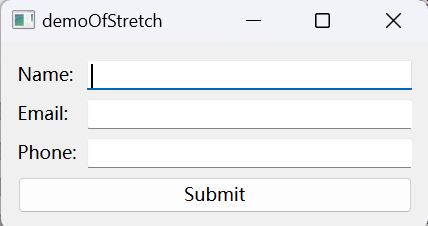

# Qt的简单布局管理说明

​	这里不是具体的好看的界面设计教程，但是打算说一下：优先使用布局管理，可以事半功倍的拜托对size的管理。

## Qt的几个Layout

​	Qt主要有这些Layout类：

- QVBoxLayout：表达的是按照垂直方向分配控件，一眼看过去控件按照垂直排列
- QHBoxLayout：表达的是按照水平方向分配控件，一眼看过去控件按照水平排列
- QGridLayout：网格布局，对于那些想要按照整整齐齐的网状布局，这个玩意最好
- QFormLayout：设计表单的时候使用，可以更加美观！
- QStackedLayout：堆叠布局，也就是对于那些希望在同一个Widget中一次只显示一个internal component的情况下，使用这个是最合适的

### QBoxLayout

​	当然下分了QHBoxLayout和QVBoxLayout的，但是这不要紧，只是水平还是垂直的区分。笔者最近常用的是QHBoxLayout，就选择这个作为样板吧。

​	我上面说了，这个就是水平排布。**默认的时候是居中对齐，当然可以修改Alignment设置更多的对齐方式（笔者建议一开始的所有的状态都在Designer中设置比较好）**

​	我们在Designer中设置完一个Widget的Layout之后，就可以直接拖控件到这个Widget帮助我们自动布局了。那代码端呢？答案是使用addWidget这个函数，

```
addWidget(QWidget *widget, int stretch = 0, Qt::Alignment alignment = 0)
```

​	当然还可以添加spacing，注意会在末尾添加，所以想要在控件之间添加spacing需要：

```
addWidget(...)
addSpacing(...)
addWidget(...)
```

​	或者有的时候想要从布局中找Widget，那可以使用itemAt来索引。

#### 一个例子：


```
#include "Widget.h"
#include <QLabel>
#include <QPushButton>
#include "ui_Widget.h"
Widget::Widget(QWidget *parent) : QWidget(parent), ui(new Ui::Widget) {
    // ui->setupUi(this);
    QVBoxLayout *vLayout = new QVBoxLayout(this);
    QHBoxLayout *hLayout = new QHBoxLayout(this);

    hLayout->addWidget(new QPushButton("Button A"));
    hLayout->addWidget(new QPushButton("Button B"));

    vLayout->addLayout(hLayout);  // 嵌套水平布局
    vLayout->addWidget(new QLabel("Label Below Buttons"));

    setLayout(vLayout);
}

Widget::~Widget() {
    delete ui;
}
```

#### 一些常见的API

| 方法名称                                                     | 参数                                                     | 描述                                             |
| ------------------------------------------------------------ | -------------------------------------------------------- | ------------------------------------------------ |
| `addWidget(QWidget *widget, int stretch = 0, Qt::Alignment alignment = 0)` | 组件指针，伸缩因子（默认为0），对齐方式（默认为0）       | 将一个子组件添加到布局中，支持伸缩和对齐设置。   |
| `addLayout(QLayout *layout, int stretch = 0)`                | 布局指针，伸缩因子（默认为0）                            | 将另一个布局添加到当前布局中，支持伸缩设置。     |
| `addSpacing(int size)`                                       | 空间大小                                                 | 在布局中添加一个固定大小的空白区域。             |
| `addStretch(int stretch = 0)`                                | 伸缩因子（默认为0）                                      | 在布局中添加一个可伸缩的空白区域。               |
| `setSpacing(int spacing)`                                    | 间距大小                                                 | 设置布局中子组件之间的间距。                     |
| `setContentsMargins(int left, int top, int right, int bottom)` | 四个边缘的外边距                                         | 设置布局的外边距，控制布局与窗口边界之间的距离。 |
| `setAlignment(QWidget *widget, Qt::Alignment alignment)`     | 组件指针，对齐方式                                       | 设置指定组件的对齐方式。                         |
| `insertWidget(int index, QWidget *widget, int stretch = 0, Qt::Alignment alignment = 0)` | 索引，组件指针，伸缩因子（默认为0），对齐方式（默认为0） | 在指定索引位置插入一个组件，并设置伸缩和对齐。   |
| `insertLayout(int index, QLayout *layout, int stretch = 0)`  | 索引，布局指针，伸缩因子（默认为0）                      | 在指定索引位置插入一个布局。                     |
| `removeWidget(QWidget *widget)`                              | 组件指针                                                 | 从布局中移除指定的组件。                         |
| `takeAt(int index)`                                          | 索引                                                     | 移除并返回指定索引处的布局项。                   |
| `count()`                                                    | 无                                                       | 返回布局中子组件的数量。                         |
| `itemAt(int index)`                                          | 索引                                                     | 返回指定索引处的布局项。                         |
| `geometry()`                                                 | 无                                                       | 返回布局的几何矩形，表示布局的边界。             |
| `invalidate()`                                               | 无                                                       | 使布局无效，强制重新计算子组件的位置和大小。     |
| `sizeHint()`                                                 | 无                                                       | 返回布局的推荐大小。                             |
| `minimumSize()`                                              | 无                                                       | 返回布局的最小大小。                             |
| `maximumSize()`                                              | 无                                                       | 返回布局的最大大小。                             |
| `setEnabled(bool)`                                           | 是否启用                                                 | 设置布局的启用状态。                             |
| `setParent(QWidget *parent)`                                 | 父组件指针                                               | 设置布局的父组件。                               |

### QGridLayout

​	网格分布！现在我们的控件可以看起来更加好看了一些，


​	这样的分布就是一个典型的表格分布。我们完全可以搓一个出来的（笔者建议你试试）

​	GPT说：他的特点是：

- **网格排列**：子组件可以在一个由行和列构成的网格中自由放置。
- **灵活性**：支持跨行和跨列放置组件，允许组件占据多个单元格。
- **自动调整**：布局会自动调整组件的大小，确保它们在窗口大小变化时仍然保持合理的显示。

​	你可以自己动手试试。

#### 一个例子：

```
#include "Widget.h"
#include <QLabel>
#include <QLineEdit>
#include <QPushButton>
#include "ui_Widget.h"
Widget::Widget(QWidget *parent) : QWidget(parent), ui(new Ui::Widget) {
    // ui->setupUi(this);
    // 创建布局
    QGridLayout *layout = new QGridLayout(this);

    // 创建显示屏
    QLineEdit *display = new QLineEdit();
    display->setReadOnly(true);
    layout->addWidget(display, 0, 0, 1, 4);  // 占据第0行的4列

    // 创建按钮
    QStringList buttonLabels = {"7", "8", "9", "/", "4", "5", "6", "*",
                                "1", "2", "3", "-", "0", "C", "=", "+"};

    int row = 1;
    int col = 0;

    for (const QString &label : buttonLabels) {
        QPushButton *button = new QPushButton(label);
        button->setMinimumSize(QSize(50, 35));
        layout->addWidget(button, row, col);
        col++;
        if (col > 3) {  // 每4个按钮换行
            col = 0;
            row++;
        }
    }

    // 设置布局
    setLayout(layout);
}

Widget::~Widget() {
    delete ui;
}
```


#### API

| 方法名称                                                     | 参数                                                         | 描述                                                     |
| ------------------------------------------------------------ | ------------------------------------------------------------ | -------------------------------------------------------- |
| `addWidget(QWidget *widget, int row, int column, int rowSpan = 1, int columnSpan = 1, Qt::Alignment alignment = 0)` | 组件指针，行号，列号，行跨度（默认为1），列跨度（默认为1），对齐方式（默认为0） | 将一个子组件添加到指定的网格位置，支持跨行和跨列的设置。 |
| `setSpacing(int spacing)`                                    | 间距大小                                                     | 设置网格中子组件之间的间距。                             |
| `setContentsMargins(int left, int top, int right, int bottom)` | 四个边缘的外边距                                             | 设置布局的外边距，控制布局与窗口边界之间的距离。         |
| `setRowStretch(int row, int stretch)`                        | 行号，伸缩因子                                               | 设置指定行的伸缩因子。                                   |
| `setColumnStretch(int column, int stretch)`                  | 列号，伸缩因子                                               | 设置指定列的伸缩因子。                                   |
| `removeWidget(QWidget *widget)`                              | 组件指针                                                     | 从布局中移除指定的组件。                                 |
| `itemAt(int index)`                                          | 索引                                                         | 返回指定索引处的布局项。                                 |
| `count()`                                                    | 无                                                           | 返回布局中子组件的数量。                                 |
| `takeAt(int index)`                                          | 索引                                                         | 移除并返回指定索引处的布局项。                           |
| `geometry()`                                                 | 无                                                           | 返回布局的几何矩形，表示布局的边界。                     |
| `invalidate()`                                               | 无                                                           | 使布局无效，强制重新计算子组件的位置和大小。             |
| `sizeHint()`                                                 | 无                                                           | 返回布局的推荐大小。                                     |
| `minimumSize()`                                              | 无                                                           | 返回布局的最小大小。                                     |
| `maximumSize()`                                              | 无                                                           | 返回布局的最大大小。                                     |
| `setEnabled(bool)`                                           | 是否启用                                                     | 设置布局的启用状态。                                     |
| `addItem(QLayoutItem *item, int row, int column, int rowSpan = 1, int columnSpan = 1)` | 布局项，行号，列号，行跨度（默认为1），列跨度（默认为1）     | 将一个布局项添加到网格中。                               |
| `addLayout(QLayout *layout, int row, int column, int rowSpan = 1, int columnSpan = 1)` | 布局指针，行号，列号，行跨度（默认为1），列跨度（默认为1）   | 将另一个布局添加到指定位置。                             |

### QFormLayout

​	比起来，他比更加通用的QGridLayout更加的特化了：

- **标签和控件对齐**：标签和控件以行的形式排列，标签通常位于控件的左侧或上方，方便用户阅读和输入。
- **自适应**：控件和标签的大小会自动调整，以适应布局和窗口大小的变化。
- **易于使用**：提供简单的方法添加标签和控件，快速构建表单界面。

#### 例子

```
#include "Widget.h"
#include <QFormLayout>
#include <QLabel>
#include <QLineEdit>
#include <QPushButton>
#include "ui_Widget.h"
Widget::Widget(QWidget *parent) : QWidget(parent), ui(new Ui::Widget) {
    QFormLayout *formLayout = new QFormLayout(this);

    // 创建控件
    QLineEdit *nameEdit  = new QLineEdit();
    QLineEdit *emailEdit = new QLineEdit();
    QLineEdit *phoneEdit = new QLineEdit();

    // 添加标签和控件到布局
    formLayout->addRow("Name:", nameEdit);
    formLayout->addRow("Email:", emailEdit);
    formLayout->addRow("Phone:", phoneEdit);

    // 添加提交按钮
    QPushButton *submitButton = new QPushButton("Submit");
    formLayout->addRow(submitButton);

    setLayout(formLayout);
}

Widget::~Widget() {
    delete ui;
}

```



#### API

| 方法名称                                                     | 参数                       | 描述                                               |
| ------------------------------------------------------------ | -------------------------- | -------------------------------------------------- |
| `addRow(const QString &labelText, QWidget *field)`           | 标签文本，控件指针         | 添加一行，包含标签和对应的控件。                   |
| `addRow(QWidget *label, QWidget *field)`                     | 标签控件，控件指针         | 添加一行，使用指定的标签控件和对应的控件。         |
| `addRow(QWidget *label, QWidget *field, int rowSpan)`        | 标签控件，控件指针，行跨度 | 添加一行，允许标签和控件占用多个行。               |
| `setLabelAlignment(Qt::Alignment alignment)`                 | 对齐方式                   | 设置所有标签的对齐方式。                           |
| `setFormAlignment(Qt::Alignment alignment)`                  | 对齐方式                   | 设置所有控件的对齐方式。                           |
| `insertRow(int row, const QString &labelText, QWidget *field)` | 行号，标签文本，控件指针   | 在指定行插入一行，包含标签和控件。                 |
| `insertRow(int row, QWidget *label, QWidget *field)`         | 行号，标签控件，控件指针   | 在指定行插入一行，使用指定的标签控件和对应的控件。 |
| `removeRow(int row)`                                         | 行号                       | 移除指定行。                                       |
| `itemAt(int index)`                                          | 索引                       | 返回指定索引处的布局项。                           |
| `count()`                                                    | 无                         | 返回布局中子组件的数量。                           |
| `takeAt(int index)`                                          | 索引                       | 移除并返回指定索引处的布局项。                     |
| `setContentsMargins(int left, int top, int right, int bottom)` | 四个边缘的外边距           | 设置布局的外边距，控制布局与窗口边界之间的距离。   |
| `setSpacing(int spacing)`                                    | 间距大小                   | 设置标签和控件之间的间距。                         |
| `setLabelFont(const QFont &font)`                            | 字体                       | 设置所有标签的字体。                               |
| `setFormAlignment(Qt::Alignment alignment)`                  | 对齐方式                   | 设置所有控件的对齐方式。                           |
| `setWidget(int row, int column, QWidget *widget)`            | 行号，列号，控件指针       | 设置指定行列位置的控件。                           |
| `getLabelAlignment()`                                        | 无                         | 获取标签的对齐方式。                               |
| `getFormAlignment()`                                         | 无                         | 获取控件的对齐方式。                               |
| `isEmpty()`                                                  | 无                         | 检查布局是否为空。                                 |

### QStackedLayout

​	这个玩意就是一个Stack，保证可以在一叠Widget中选出一个进行显示。

**动态切换**：可以通过 `setCurrentIndex()` 或 `setCurrentWidget()` 方法动态切换当前显示的控件。

**灵活性**：可以在运行时添加或移除控件，支持高度动态的用户界面设计。

**用户友好**：适合实现复杂的用户交互和视图切换。

#### 一些例子

```
#include "Widget.h"
#include <QFormLayout>
#include <QLabel>
#include <QLineEdit>
#include <QPushButton>
#include <QStackedLayout>
#include "ui_Widget.h"
Widget::Widget(QWidget *parent) : QWidget(parent), ui(new Ui::Widget) {
    QStackedLayout *stackedLayout = new QStackedLayout(this);

    // 创建个人信息页面
    QWidget     *personalInfoPage = new QWidget();
    QVBoxLayout *personalLayout   = new QVBoxLayout(personalInfoPage);
    personalLayout->addWidget(new QLabel("Personal Information"));
    personalLayout->addWidget(new QLabel("Name:"));
    QLineEdit *nameEdit = new QLineEdit();
    personalLayout->addWidget(nameEdit);
    personalLayout->addWidget(new QLabel("Email:"));
    QLineEdit *emailEdit = new QLineEdit();
    personalLayout->addWidget(emailEdit);

    QPushButton *nextToAddressButton = new QPushButton("Next");
    personalLayout->addWidget(nextToAddressButton);
    stackedLayout->addWidget(personalInfoPage);

    // 创建地址信息页面
    QWidget     *addressInfoPage = new QWidget();
    QVBoxLayout *addressLayout   = new QVBoxLayout(addressInfoPage);
    addressLayout->addWidget(new QLabel("Address Information"));
    addressLayout->addWidget(new QLabel("Street:"));
    QLineEdit *streetEdit = new QLineEdit();
    addressLayout->addWidget(streetEdit);
    addressLayout->addWidget(new QLabel("City:"));
    QLineEdit *cityEdit = new QLineEdit();
    addressLayout->addWidget(cityEdit);

    QPushButton *backToPersonalButton = new QPushButton("Back");
    QPushButton *nextToConfirmButton  = new QPushButton("Next");
    addressLayout->addWidget(backToPersonalButton);
    addressLayout->addWidget(nextToConfirmButton);
    stackedLayout->addWidget(addressInfoPage);

    // 创建确认信息页面
    QWidget     *confirmationPage   = new QWidget();
    QVBoxLayout *confirmationLayout = new QVBoxLayout(confirmationPage);
    confirmationLayout->addWidget(new QLabel("Confirmation Information"));
    confirmationLayout->addWidget(
        new QLabel("Please review your information."));

    QPushButton *backToAddressButton = new QPushButton("Back");
    QPushButton *submitButton        = new QPushButton("Submit");
    confirmationLayout->addWidget(backToAddressButton);
    confirmationLayout->addWidget(submitButton);
    stackedLayout->addWidget(confirmationPage);

    // 设置信号与槽
    connect(nextToAddressButton, &QPushButton::clicked, [=]() {
        stackedLayout->setCurrentIndex(1);  // 切换到地址信息页面
    });
    connect(backToPersonalButton, &QPushButton::clicked, [=]() {
        stackedLayout->setCurrentIndex(0);  // 切换回个人信息页面
    });
    connect(nextToConfirmButton, &QPushButton::clicked, [=]() {
        stackedLayout->setCurrentIndex(2);  // 切换到确认信息页面
    });
    connect(backToAddressButton, &QPushButton::clicked, [=]() {
        stackedLayout->setCurrentIndex(1);  // 切换回地址信息页面
    });
    connect(submitButton, &QPushButton::clicked, this,
            &Widget::submitForm);  // 提交表单，这个API可以自己定义！

    setLayout(stackedLayout);
    resize(400, 300);
}
Widget::~Widget() {
    delete ui;
}
```


#### API

| 方法名称                                                     | 参数             | 描述                           |
| ------------------------------------------------------------ | ---------------- | ------------------------------ |
| `addWidget(QWidget *widget)`                                 | 组件指针         | 将一个组件添加到堆叠布局中。   |
| `insertWidget(int index, QWidget *widget)`                   | 索引，组件指针   | 在指定位置插入一个组件。       |
| `setCurrentIndex(int index)`                                 | 索引             | 设置当前显示的组件索引。       |
| `setCurrentWidget(QWidget *widget)`                          | 组件指针         | 设置当前显示的组件。           |
| `currentIndex()`                                             | 无               | 返回当前显示组件的索引。       |
| `currentWidget()`                                            | 无               | 返回当前显示的组件。           |
| `removeWidget(QWidget *widget)`                              | 组件指针         | 从布局中移除指定的组件。       |
| `count()`                                                    | 无               | 返回布局中子组件的数量。       |
| `itemAt(int index)`                                          | 索引             | 返回指定索引处的布局项。       |
| `takeAt(int index)`                                          | 索引             | 移除并返回指定索引处的布局项。 |
| `setContentsMargins(int left, int top, int right, int bottom)` | 四个边缘的外边距 | 设置布局的外边距。             |
| `setSpacing(int spacing)`                                    | 间距大小         | 设置组件之间的间距。           |
| `clear()`                                                    | 无               | 清空布局，移除所有组件。       |
| `setEnabled(bool)`                                           | 是否启用         | 设置布局的启用状态。           |
| `widget(int index)`                                          | 索引             | 返回指定索引处的组件指针。     |
| `addLayout(QLayout *layout)`                                 | 布局指针         | 添加一个子布局。               |
| `isEmpty()`                                                  | 无               | 检查布局是否为空。             |
| `minimumSize()`                                              | 无               | 返回布局的最小大小。           |
| `maximumSize()`                                              | 无               | 返回布局的最大大小。           |

## 其他

### QSplitter

​	这个很酷：实现的就是用户拖拽一个竖线条实现对各个控件的重新分配。

#### 一些例子

```
#include "Widget.h"
#include <QFormLayout>
#include <QLabel>
#include <QLineEdit>
#include <QPushButton>
#include <QSplitter>
#include <QTextEdit>
#include "ui_Widget.h"
Widget::Widget(QWidget *parent) : QWidget(parent), ui(new Ui::Widget) {
    QSplitter *splitter = new QSplitter(Qt::Horizontal, this);

    // 创建文本框1
    QTextEdit *textEdit1 = new QTextEdit();
    textEdit1->setPlaceholderText("Text Editor 1");
    splitter->addWidget(textEdit1);

    // 创建文本框2
    QTextEdit *textEdit2 = new QTextEdit();
    textEdit2->setPlaceholderText("Text Editor 2");
    splitter->addWidget(textEdit2);

    // 创建按钮
    QPushButton *button = new QPushButton("Submit");
    button->setFixedWidth(100);
    splitter->addWidget(button);

    // 设置布局
    QVBoxLayout *layout = new QVBoxLayout(this);
    layout->addWidget(splitter);
    setLayout(layout);
}
Widget::~Widget() {
    delete ui;
}

```


#### API

| 方法名称                                      | 参数               | 描述                                                 |
| --------------------------------------------- | ------------------ | ---------------------------------------------------- |
| `addWidget(QWidget *widget)`                  | 组件指针           | 向分隔器添加一个子组件。                             |
| `insertWidget(int index, QWidget *widget)`    | 索引，组件指针     | 在指定位置插入一个子组件。                           |
| `setOrientation(Qt::Orientation orientation)` | 方向（水平或垂直） | 设置分隔器的方向。                                   |
| `setStretchFactor(int index, int stretch)`    | 索引，拉伸因子     | 设置指定索引的子组件的拉伸因子，用于调整其相对大小。 |
| `setSizes(const QList<int> &sizes)`           | 大小列表           | 设置所有子组件的大小。                               |
| `sizes()`                                     | 无                 | 返回所有子组件的当前大小列表。                       |
| `handle(int index)`                           | 索引               | 返回指定索引的分隔条控件。                           |
| `setCollapsible(int index, bool collapse)`    | 索引，是否可折叠   | 设置指定索引的子组件是否可折叠。                     |
| `isCollapsible(int index)`                    | 索引               | 检查指定索引的子组件是否可折叠。                     |
| `setOpaqueResize(bool opaque)`                | 是否透明调整       | 设置在调整大小时是否透明。                           |
| `setChildrenCollapsible(bool collapse)`       | 是否可折叠         | 设置所有子组件是否可折叠。                           |
| `childrenCollapsible()`                       | 无                 | 检查所有子组件是否可折叠。                           |
| `setHandleWidth(int width)`                   | 宽度               | 设置分隔条的宽度。                                   |
| `handleWidth()`                               | 无                 | 返回分隔条的宽度。                                   |
| `setFrameShape(QFrame::Shape shape)`          | 形状               | 设置分隔器的框架形状。                               |
| `frameShape()`                                | 无                 | 返回分隔器的框架形状。                               |

## 附注

> 附注：一些Layout可以修改伸缩因数来达到调整空间大小比例的特性，下面就是一个例子：
>
> 我们的Widget内部使用了QHLayout后，设置伸缩因数依次为0，0，0；0，0，1；1，1，2！他们依次表达为：
>
> - 全等表达平均分配，伸缩的时候几个按钮会按照均匀分配的方式均匀变化
> - 存在0的：表达该index指示下的控件不会发生伸缩，恒定大小
> - 比例变化：比如说1：1：2表达的是变化是按照1：1：2分配的，其中初始状态的大小也是按照1：1：2分配的。


