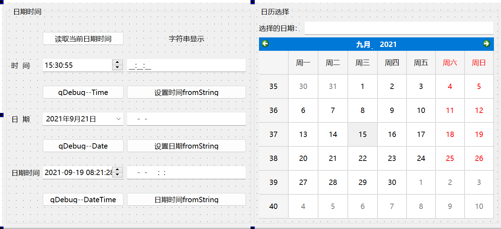

# 日期类数据和控件管理

## QTime

`		QTime` 对象表示时钟时间，可以用自午夜以来的小时、分钟、秒和毫秒数来表达。它提供了一系列功能，用于比较时间和通过添加指定毫秒数来操作时间。由于 `QTime` 仅仅封装了整数，因此建议按值传递，而不是通过 `const` 引用。`QTime` 使用 24 小时制，不包含 AM/PM 的概念。与 `QDateTime` 不同，`QTime` 不涉及时区或夏令时（DST）。

​	创建 `QTime` 对象的常见方法包括显式给出小时、分钟、秒和毫秒，或者使用静态函数 `currentTime()`，后者生成一个表示系统本地时间的 `QTime` 对象。通过调用 `hour()`、`minute()`、`second()` 和 `msec()` 函数，可以获取 `QTime` 对象的小时、分钟、秒和毫秒数。这些信息也可以通过 `toString()` 函数以文本格式提供。`addSecs()` 和 `addMSecs()` 函数允许计算在给定时间之后增加一定秒数或毫秒数的时间。相应地，`secsTo()` 和 `msecsTo()` 函数可用于计算两个时间之间的秒数或毫秒数差。`QTime` 提供了一整套运算符，用于比较两个 `QTime` 对象。较早的时间被视为较小的时间。如果 `A.msecsTo(B)` 的结果为正，那么可以得出 `A < B` 的结论。此外，`QTime` 对象还可以通过 `fromString()` 方法从文本表示中创建，并使用 `toString()` 方法转换为字符串表示。所有字符串格式的转换都使用 C 语言环境进行。如果需要本地化的转换，可以使用 `QLocale`。这种设计使得 `QTime` 能够方便地处理和显示时间，适应不同的应用场景。


### API

| 类型               | 成员函数/操作                                                | 用途说明                                                    |
| ------------------ | ------------------------------------------------------------ | ----------------------------------------------------------- |
| **构造函数**       | `QTime()`                                                    | 默认构造函数，创建一个无效的时间对象。                      |
|                    | `QTime(int h, int m, int s = 0, int ms = 0)`                 | 根据小时、分钟、秒和毫秒创建一个时间对象。                  |
| **成员函数**       | `QTime addMSecs(int ms) const`                               | 返回当前时间加上指定毫秒后的新时间。                        |
|                    | `QTime addSecs(int s) const`                                 | 返回当前时间加上指定秒数后的新时间。                        |
|                    | `int hour() const`                                           | 返回小时部分（0-23）。                                      |
|                    | `bool isNull() const`                                        | 检查时间对象是否为空（无效）。                              |
|                    | `bool isValid() const`                                       | 检查时间对象是否有效（合理的时间值）。                      |
|                    | `int minute() const`                                         | 返回分钟部分（0-59）。                                      |
|                    | `int msec() const`                                           | 返回毫秒部分（0-999）。                                     |
|                    | `int msecsSinceStartOfDay() const`                           | 返回自当天开始至当前时间的毫秒数。                          |
|                    | `int msecsTo(QTime t) const`                                 | 返回当前时间到指定时间的毫秒差。                            |
|                    | `int second() const`                                         | 返回秒部分（0-59）。                                        |
|                    | `int secsTo(QTime t) const`                                  | 返回当前时间到指定时间的秒差。                              |
|                    | `bool setHMS(int h, int m, int s, int ms = 0)`               | 设置时间的小时、分钟、秒和毫秒部分。                        |
|                    | `QString toString(QStringView format) const`                 | 根据指定格式返回时间的字符串表示。                          |
|                    | `QString toString(const QString &format) const`              | 根据指定格式返回时间的字符串表示（另一种重载）。            |
|                    | `QString toString(Qt::DateFormat format = Qt::TextDate) const` | 返回时间的字符串表示，格式取决于 `Qt::DateFormat`。         |
| **静态公共成员**   | `QTime currentTime()`                                        | 获取当前系统时间。                                          |
|                    | `QTime fromMSecsSinceStartOfDay(int msecs)`                  | 根据从午夜开始的毫秒数创建时间对象。                        |
|                    | `QTime fromString(const QString &string, Qt::DateFormat format = Qt::TextDate)` | 从字符串创建时间对象，格式根据指定的 `DateFormat`。         |
|                    | `QTime fromString(const QString &string, const QString &format)` | 从字符串创建时间对象，格式根据自定义格式。                  |
|                    | `QTime fromString(QStringView string, QStringView format)` (since 6.0) | 从字符串创建时间对象，使用 `QStringView` 类型。             |
|                    | `QTime fromString(QStringView string, Qt::DateFormat format = Qt::TextDate)` (since 6.0) | 从字符串创建时间对象，格式根据指定的 `DateFormat`。         |
|                    | `QTime fromString(const QString &string, QStringView format)` (since 6.0) | 从字符串创建时间对象，使用 `QStringView` 类型和自定义格式。 |
|                    | `bool isValid(int h, int m, int s, int ms = 0)`              | 检查给定的小时、分钟、秒和毫秒是否是有效的时间值。          |
| **相关非成员操作** | `bool operator!=(const QTime &lhs, const QTime &rhs)`        | 判断两个时间对象是否不相等。                                |
|                    | `bool operator<(const QTime &lhs, const QTime &rhs)`         | 判断第一个时间是否小于第二个时间。                          |
|                    | `QDataStream & operator<<(QDataStream &out, QTime time)`     | 将时间对象写入数据流。                                      |
|                    | `bool operator<=(const QTime &lhs, const QTime &rhs)`        | 判断第一个时间是否小于或等于第二个时间。                    |
|                    | `bool operator==(const QTime &lhs, const QTime &rhs)`        | 判断两个时间对象是否相等。                                  |
|                    | `bool operator>(const QTime &lhs, const QTime &rhs)`         | 判断第一个时间是否大于第二个时间。                          |
|                    | `bool operator>=(const QTime &lhs, const QTime &rhs)`        | 判断第一个时间是否大于或等于第二个时间。                    |
|                    | `QDataStream & operator>>(QDataStream &in, QTime &time)`     | 从数                                                        |

## QDate

​	`QDate` 对象表示特定的一天，不受创建时所用的日历、区域设置或系统设置的影响。它可以报告与公历（proleptic Gregorian calendar）或任何提供的 `QCalendar` 对象相关的年份、月份和日期。`QDate` 对象应通过值传递而非通过常量引用传递，因为它们封装了 `qint64`。

​	通常，通过显式提供年、月和日期来创建 `QDate` 对象。需要注意的是，`QDate` 将年份小于100的数字视为实际年份，即1到99年，而不添加任何偏移量。静态函数 `currentDate()` 会创建一个包含从系统时钟读取的日期的 `QDate` 对象。也可以使用 `setDate()` 方法设置明确的日期。`fromString()` 函数根据字符串和日期格式返回一个 `QDate` 对象，这个格式用于解释字符串中的日期。

​	`year()`、`month()` 和 `day()` 函数提供对年份、月份和日期的访问。当需要多个值时，调用 `QCalendar::partsFromDate()` 会更高效，以避免重复计算可能昂贵的日历信息。

​	此外，还提供了 `dayOfWeek()` 和 `dayOfYear()` 函数。通过 `toString()` 函数可以以文本格式提供相同的信息，`QLocale` 可以将日期数字映射到名称，`QCalendar` 可以将月份数字映射到名称。

​	`QDate` 提供了一整套运算符来比较两个 `QDate` 对象，其中较小的表示较早，较大的表示较晚。通过 `addDays()` 方法递增（或递减）日期，同样可以使用 `addMonths()` 和 `addYears()`。`daysTo()` 函数返回两个日期之间的天数。`daysInMonth()` 和 `daysInYear()` 函数分别返回该日期所在的月份和年份中的天数。`isLeapYear()` 函数指示给定日期是否在闰年中，`QCalendar` 也可以提供此信息，通常更加方便。

`QDate` 对象的转换操作均使用 C 语言的区域设置进行，因此在处理本地化转换时，请参阅 `QLocale`。

在公历中，没有“0年”。该年份的日期被视为无效。“-1年”是指“公元前1年”。公元1年1月1日的前一天（`QDate(1, 1, 1)`）是公元前1年12月31日（`QDate(-1, 12, 31)`）。其他一些日历系统的行为也类似，详细信息可见 `QCalendar::hasYearZero()`。

​	`QDate` 在内部将日期存储为一个儒略日数（Julian Day number），这是一个对每一天的连续计数，其中公历的4714 BCE年11月24日对应的儒略日数为0（而公历的4713 BCE年1月1日则对应于儒略历）。这种存储方式不仅高效且准确，适合将日期转换为其他日历系统，如希伯来历、伊斯兰历或中国历法。可以通过 `QDate::toJulianDay()` 获取儒略日数，通过 `QDate::fromJulianDay()` 设置。

​	由于技术原因，`QDate` 能表示的儒略日数范围限于 -784350574879 到 784354017364，这意味着它可以表示从公元前20亿年到公元后20亿年之间的日期。这个范围是 `QDateTime` 可表示日期范围的七倍多。

### API

| 函数/操作                                                    | 描述                                    |
| ------------------------------------------------------------ | --------------------------------------- |
| **构造函数**                                                 |                                         |
| `QDate()`                                                    | 创建一个无效的日期对象。                |
| `QDate(int y, int m, int d)`                                 | 根据年、月、日创建一个 `QDate` 对象。   |
| **日期操作**                                                 |                                         |
| `QDate addDays(qint64 ndays) const`                          | 返回当前日期加上指定天数后的新日期。    |
| `QDate addMonths(int nmonths) const`                         | 返回当前日期加上指定月数后的新日期。    |
| `QDate addYears(int nyears) const`                           | 返回当前日期加上指定年数后的新日期。    |
| `int day() const`                                            | 返回当前日期中的日部分。                |
| `int month() const`                                          | 返回当前日期中的月部分。                |
| `int year() const`                                           | 返回当前日期中的年部分。                |
| `int dayOfWeek() const`                                      | 返回当前日期是星期几（1-7）。           |
| `bool isNull() const`                                        | 检查日期对象是否为空（无效）。          |
| `bool isValid() const`                                       | 检查日期对象是否有效。                  |
| `QString toString(QStringView format) const`                 | 根据指定格式返回日期的字符串表示。      |
| `qint64 toJulianDay() const`                                 | 返回对应的儒略日。                      |
| `void getDate(int *year, int *month, int *day) const`        | 获取年、月、日的值。                    |
| `bool setDate(int year, int month, int day)`                 | 设置日期为指定的年、月、日。            |
| `int daysTo(QDate d) const`                                  | 返回当前日期到指定日期之间的天数。      |
| `QDateTime endOfDay(const QTimeZone &zone) const`            | 返回指定时区的当天结束时间。            |
| `QDateTime startOfDay(const QTimeZone &zone) const`          | 返回指定时区的当天开始时间。            |
| **静态公共成员**                                             |                                         |
| `QDate currentDate()`                                        | 获取当前系统日期。                      |
| `QDate fromJulianDay(qint64 jd)`                             | 根据儒略日创建 `QDate` 对象。           |
| `bool isLeapYear(int year)`                                  | 检查给定年份是否为闰年。                |
| `bool isValid(int year, int month, int day)`                 | 检查给定的年、月、日是否构成有效日期。  |
| `QDate fromString(const QString &string, Qt::DateFormat format)` | 从字符串创建 `QDate` 对象，格式可指定。 |
| **相关非成员操作**                                           |                                         |
| `bool operator==(const QDate &lhs, const QDate &rhs)`        | 判断两个日期是否相等。                  |
| `bool operator<(const QDate &lhs, const QDate &rhs)`         | 判断左侧日期是否早于右侧日期。          |
| `QDataStream & operator<<(QDataStream &out, QDate date)`     | 将日期写入数据流。                      |
| `QDataStream & operator>>(QDataStream &in, QDate &date)`     | 从数据流读取日期。                      |

## QDateTime

​	是上面两者的复合：

​	QDateTime 是 Qt 框架中用于表示日期和时间的类，结合了 QDate 和 QTime 的特性。QDateTime 可以表示多种时间格式，包括本地时间、UTC、指定的 UTC 偏移量和指定的时区。这些时间表示可以通过 QTimeZone 类进行封装。例如，当你指定一个时区（如“Europe/Berlin”）时，QDateTime 会自动考虑该时区的夏令时规则。创建和修改 QDateTime 对象可以通过多种方式实现。你可以在构造函数中直接提供日期和时间，或者使用静态函数如 `currentDateTime()` 获取当前的日期和时间，或者通过 `fromMSecsSinceEpoch()` 方法将自 1970 年 1 月 1 日以来的毫秒数转换为 QDateTime。此外，你可以使用 `setDate()` 和 `setTime()` 方法来修改现有的 QDateTime 对象。比较和算术运算方面，QDateTime 提供了一整套运算符，允许你比较两个 QDateTime 对象。你还可以使用如 `addMSecs()`、`addSecs()`、`addDays()`、`addMonths()` 和 `addYears()` 方法对日期和时间进行增减操作，这些操作会考虑夏令时的变化。在时区处理上，QDateTime 会自动考虑时区的转换和夏令时（DST）的变化。通过调用 `toTimeZone()` 方法，你可以将 QDateTime 对象转换为另一种时间表示。在转换和格式化方面，QDateTime 提供了 `toString()` 方法，将其转换为字符串格式。你也可以使用 `fromString()` 方法从字符串创建 QDateTime 对象。需要注意的是，字符串的转换使用 C 语言环境，若需本地化转换，可以使用 QLocale 类。关于有效日期范围，QDateTime 的日期范围约为 ±2.92 亿年，这与其内部实现有关。因此，在创建极端日期时间时，需要小心以避免溢出。最后，值得注意的是，QDateTime 不处理闰秒，并且在使用本地时间或指定时区时，可能会引入性能开销，尤其是在时间转换和创建时。此外，在夏令时的过渡期间，某些时间可能会变得无效或模糊，例如在“春季前进”时钟从 2 点跳到 3 点的情况下

| **类别**          | **函数/成员**                                                | **描述**                                                     |
| ----------------- | ------------------------------------------------------------ | ------------------------------------------------------------ |
| **构造函数**      | `QDateTime()`                                                | 默认构造函数。                                               |
|                   | `QDateTime(QDate date, QTime time, Qt::TimeSpec spec, int offsetSeconds = 0)` | 带有日期、时间、时间规格和偏移的构造函数（自 6.9 起不推荐使用）。 |
|                   | `QDateTime(QDate date, QTime time, const QTimeZone &timeZone, QDateTime::TransitionResolution resolve)` | 带有日期、时间和时区的构造函数。                             |
|                   | `QDateTime(const QDateTime &other)`                          | 拷贝构造函数。                                               |
|                   | `QDateTime(QDateTime &&other)`                               | 移动构造函数。                                               |
|                   | `~QDateTime()`                                               | 析构函数。                                                   |
| **日期/时间操作** | `QDateTime addDays(qint64 ndays) const`                      | 向日期/时间添加天数。                                        |
|                   | `QDateTime addDuration(std::chrono::milliseconds msecs) const` | 向日期/时间添加持续时间（毫秒）。                            |
|                   | `QDateTime addMSecs(qint64 msecs) const`                     | 向日期/时间添加毫秒。                                        |
|                   | `QDateTime addMonths(int nmonths) const`                     | 向日期/时间添加月份。                                        |
|                   | `QDateTime addSecs(qint64 s) const`                          | 向日期/时间添加秒数。                                        |
|                   | `QDateTime addYears(int nyears) const`                       | 向日期/时间添加年数。                                        |
| **访问器**        | `QDate date() const`                                         | 返回日期部分。                                               |
|                   | `QTime time() const`                                         | 返回时间部分。                                               |
|                   | `bool isDaylightTime() const`                                | 检查日期/时间是否在夏令时。                                  |
|                   | `bool isNull() const`                                        | 检查日期/时间是否为空。                                      |
|                   | `bool isValid() const`                                       | 检查日期/时间是否有效。                                      |
|                   | `int offsetFromUtc() const`                                  | 返回与 UTC 的偏移量。                                        |
|                   | `QTimeZone timeZone() const`                                 | 返回时区。                                                   |
| **设置器**        | `void setDate(QDate date)`                                   | 设置日期部分。                                               |
|                   | `void setTime(QTime time)`                                   | 设置时间部分。                                               |
|                   | `void setMSecsSinceEpoch(qint64 msecs)`                      | 设置自纪元以来的毫秒数。                                     |
|                   | `void setSecsSinceEpoch(qint64 secs)`                        | 设置自纪元以来的秒数。                                       |


## QDateTimeEdit

​	`QDateTimeEdit` 允许用户通过键盘或箭头键编辑日期，增加或减少日期和时间值。箭头键可以在 `QDateTimeEdit` 框内的各个部分之间移动。日期和时间的显示格式由 `setDisplayFormat()` 方法控制。

```
QDateTimeEdit *dateEdit = new QDateTimeEdit(QDate::currentDate());
dateEdit->setMinimumDate(QDate::currentDate().addDays(-365));
dateEdit->setMaximumDate(QDate::currentDate().addDays(365));
dateEdit->setDisplayFormat("yyyy.MM.dd");
```

​	在上述代码中，我们创建了一个新的 `QDateTimeEdit` 对象，初始化为今天的日期，并将有效日期范围限制为今天前后各365天。显示格式设置为“年.月.日”。`QDateTimeEdit` 的有效值范围由 `minimumDateTime`、`maximumDateTime` 及其相应的日期和时间组件控制。默认情况下，任何从公元100年到公元9999年的日期时间都是有效的。`QDateTimeEdit` 可以配置为允许使用 `QCalendarWidget` 选择日期。通过设置 `calendarPopup` 属性可以启用该功能。此外，可以通过调用 `setCalendarWidget()` 函数提供自定义的日历小部件。可以使用 `calendarWidget()` 获取当前的日历小部件。

​	当启用键盘跟踪（默认情况下），每次编辑字段的按键输入都会触发值变化的信号。如果允许的范围比某个时间区间狭窄，并且该区间的结束日期被该范围包含，则键盘跟踪会阻止用户编辑日期或时间以访问该区间的后半部分。例如，在2020年4月29日到2020年5月2日的范围内，初始日期为2020年4月30日，用户无法更改月份（5月30日超出范围）或日期（4月2日超出范围）。当禁用键盘跟踪时，只有在焦点离开文本字段后，编辑内容发生更改时才会发出信号。这允许用户通过无效的日期时间进行编辑，以达到有效的日期时间。

### API

| 函数签名                                                     | 详细用途                                                     |
| ------------------------------------------------------------ | ------------------------------------------------------------ |
| `QDateTimeEdit(QWidget *parent = nullptr)`                   | 构造函数，创建一个空的日期时间编辑框。                       |
| `QDateTimeEdit(QDate date, QWidget *parent = nullptr)`       | 构造函数，创建一个日期时间编辑框，并初始化为指定的日期。     |
| `QDateTimeEdit(QTime time, QWidget *parent = nullptr)`       | 构造函数，创建一个日期时间编辑框，并初始化为指定的时间。     |
| `QDateTimeEdit(const QDateTime &datetime, QWidget *parent = nullptr)` | 构造函数，创建一个日期时间编辑框，并初始化为指定的日期时间。 |
| `virtual ~QDateTimeEdit()`                                   | 析构函数，释放日期时间编辑框的资源。                         |
| `QCalendar calendar() const`                                 | 获取当前使用的日历。                                         |
| `bool calendarPopup() const`                                 | 检查日历弹出窗口是否启用。                                   |
| `QCalendarWidget * calendarWidget() const`                   | 获取当前使用的日历小部件。                                   |
| `void clearMaximumDate()`                                    | 清除最大日期限制。                                           |
| `void clearMaximumDateTime()`                                | 清除最大日期时间限制。                                       |
| `void clearMaximumTime()`                                    | 清除最大时间限制。                                           |
| `void clearMinimumDate()`                                    | 清除最小日期限制。                                           |
| `void clearMinimumDateTime()`                                | 清除最小日期时间限制。                                       |
| `void clearMinimumTime()`                                    | 清除最小时间限制。                                           |
| `QDateTimeEdit::Section currentSection() const`              | 获取当前选中的日期时间部分（如年、月、日等）。               |
| `int currentSectionIndex() const`                            | 获取当前选中的部分的索引。                                   |
| `QDate date() const`                                         | 获取当前日期。                                               |
| `QDateTime dateTime() const`                                 | 获取当前日期时间。                                           |
| `QString displayFormat() const`                              | 获取当前显示格式。                                           |
| `QDateTimeEdit::Sections displayedSections() const`          | 获取当前显示的日期时间部分。                                 |
| `QDate maximumDate() const`                                  | 获取最大日期限制。                                           |
| `QDateTime maximumDateTime() const`                          | 获取最大日期时间限制。                                       |
| `QTime maximumTime() const`                                  | 获取最大时间限制。                                           |
| `QDate minimumDate() const`                                  | 获取最小日期限制。                                           |
| `QDateTime minimumDateTime() const`                          | 获取最小日期时间限制。                                       |
| `QTime minimumTime() const`                                  | 获取最小时间限制。                                           |
| `QDateTimeEdit::Section sectionAt(int index) const`          | 获取指定索引位置的日期时间部分。                             |
| `int sectionCount() const`                                   | 获取日期时间编辑框中部分的数量。                             |
| `QString sectionText(QDateTimeEdit::Section section) const`  | 获取指定部分的文本表示。                                     |
| `void setCalendar(QCalendar calendar)`                       | 设置使用的日历类型。                                         |
| `void setCalendarPopup(bool enable)`                         | 设置是否启用日历弹出窗口。                                   |
| `void setCalendarWidget(QCalendarWidget *calendarWidget)`    | 设置使用的日历小部件。                                       |
| `void setCurrentSection(QDateTimeEdit::Section section)`     | 设置当前选中的日期时间部分。                                 |
| `void setCurrentSectionIndex(int index)`                     | 设置当前选中的部分的索引。                                   |
| `void setDateRange(QDate min, QDate max)`                    | 设置日期范围限制。                                           |
| `void setDateTimeRange(const QDateTime &min, const QDateTime &max)` | 设置日期时间范围限制。                                       |
| `void setDisplayFormat(const QString &format)`               | 设置日期时间的显示格式。                                     |
| `void setMaximumDate(QDate max)`                             | 设置最大日期限制。                                           |
| `void setMaximumDateTime(const QDateTime &dt)`               | 设置最大日期时间限制。                                       |
| `void setMaximumTime(QTime max)`                             | 设置最大时间限制。                                           |
| `void setMinimumDate(QDate min)`                             | 设置最小日期限制。                                           |
| `void setMinimumDateTime(const QDateTime &dt)`               | 设置最小日期时间限制。                                       |
| `void setMinimumTime(QTime min)`                             | 设置最小时间限制。                                           |
| `void setSelectedSection(QDateTimeEdit::Section section)`    | 设置选中的日期时间部分。                                     |
| `void setTimeRange(QTime min, QTime max)`                    | 设置时间范围限制。                                           |
| `void setTimeSpec(Qt::TimeSpec spec)`                        | 设置时间规格（如UTC或本地时间）。                            |
| `void setTimeZone(const QTimeZone &zone)`                    | 设置时区。                                                   |
| `QTime time() const`                                         | 获取当前时间。                                               |
| `Qt::TimeSpec timeSpec() const`                              | 获取当前时间规格。                                           |
| `QTimeZone timeZone() const`                                 | 获取当前时区。                                               |
| `virtual void clear() override`                              | 清空当前输入的日期时间。                                     |
| `virtual bool event(QEvent *event) override`                 | 处理事件，重写父类事件处理函数。                             |
| `virtual QSize sizeHint() const override`                    | 返回建议的大小。                                             |
| `virtual void stepBy(int steps) override`                    | 步进改变日期时间的值。                                       |
| `void setDate(QDate date)`                                   | 设置当前日期。                                               |
| `void setDateTime(const QDateTime &dateTime)`                | 设置当前日期时间。                                           |
| `void setTime(QTime time)`                                   | 设置当前时间。                                               |
| `void dateChanged(QDate date)`                               | 日期改变信号。                                               |
| `void dateTimeChanged(const QDateTime &datetime)`            | 日期时间改变信号。                                           |
| `void timeChanged(QTime time)`                               | 时间改变信号。                                               |
| `virtual QDateTime dateTimeFromText(const QString &text) const` | 从文本获取日期时间。                                         |
| `virtual QString textFromDateTime(const QDateTime &dateTime) const` | 将日期时间转换为文本。                                       |
| `virtual void fixup(QString &input) const override`          | 修正输入文本格式。                                           |
| `virtual void focusInEvent(QFocusEvent *event) override`     | 处理焦点进入事件。                                           |
| `virtual bool focusNextPrevChild(bool next) override`        | 处理焦点转移事件。                                           |
| `virtual void initStyleOption(QStyleOptionSpinBox *option) const override` | 初始化样式选项。                                             |
| `virtual void keyPressEvent(QKeyEvent *event) override`      | 处理键盘按下事件。                                           |
| `virtual void mousePressEvent(QMouseEvent *event) override`  | 处理鼠标按下事件。                                           |
| `virtual void paintEvent(QPaintEvent *event) override`       | 处理绘制事件。                                               |
| `virtual QAbstractSpinBox::StepEnabled stepEnabled() const override` | 获取步进可用性状态。                                         |
| `virtual QValidator::State validate(QString &text, int &pos) const override` | 验证输入文本的有效性。                                       |
| `virtual void wheelEvent(QWheelEvent *event) override`       | 处理滚轮事件。                                               |


## QCalendarWidget

`QCalendarWidget` 初始化时显示当前月份和年份。它提供多个公共槽函数来更改显示的年份和月份。

- 默认情况下，今天的日期被选中，用户可以通过鼠标和键盘选择日期。
- 使用 `selectedDate()` 函数可以获取当前选中的日期。
- 可以通过设置 `minimumDate` 和 `maximumDate` 属性来限制用户的选择范围。也可以使用 `setDateRange()` 一次性设置这两个属性。
- 如果将 `selectionMode` 属性设置为 `NoSelection`，则禁止用户选择日期。
- 还可以使用 `setSelectedDate()` 函数程序matically 选择日期。

- 使用 `monthShown()` 和 `yearShown()` 函数可以获取当前显示的月份和年份。

- 新创建的日历小部件使用缩写的星期几名称，并将周六和周日标记为红色。

- 日历网格默认不可见，显示周数，第一列的天是该日历区域的第一天。

- 可以通过设置 

  ```
  horizontalHeaderFormat
  ```

   属性来更改星期几名称的表示方式：

  - 设置为 `QCalendarWidget::SingleLetterDayNames` 使用单字母缩写（如 "M" 表示 "Monday"）。
  - 设置为 `QCalendarWidget::LongDayNames` 显示完整的星期几名称。

- 可以通过将 `verticalHeaderFormat` 属性设置为 `QCalendarWidget::NoVerticalHeader` 来移除周数。

- 可以通过 

  ```
  setGridVisible(true)
  ```

   打开日历网格：

  ```
  QCalendarWidget *calendar;
  calendar->setGridVisible(true);
  ```

- 使用 `setFirstDayOfWeek()` 函数可以改变第一列的天。

`QCalendarWidget` 提供三个信号：

- `selectionChanged()`
- `activated()`
- `currentPageChanged()` 这些信号可以响应用户的交互。

可以通过设置 `QTextCharFormat` 来大幅自定义标题、星期几或单日的渲染。当前，`QTextCharFormat` 的前景、背景和字体属性用于确定小部件中单元格的渲染。

### API

| 函数签名                                                     | 详细用途                           |
| ------------------------------------------------------------ | ---------------------------------- |
| `QCalendarWidget(QWidget *parent = nullptr)`                 | 构造函数，创建一个日历小部件。     |
| `virtual ~QCalendarWidget()`                                 | 析构函数，释放日历小部件的资源。   |
| `QCalendar calendar() const`                                 | 获取当前使用的日历。               |
| `void clearMaximumDate()`                                    | 清除最大日期限制。                 |
| `void clearMinimumDate()`                                    | 清除最小日期限制。                 |
| `int dateEditAcceptDelay() const`                            | 获取日期编辑接受延迟。             |
| `QMap<QDate, QTextCharFormat> dateTextFormat() const`        | 获取所有日期的文本格式映射。       |
| `QTextCharFormat dateTextFormat(QDate date) const`           | 获取指定日期的文本格式。           |
| `Qt::DayOfWeek firstDayOfWeek() const`                       | 获取一周的第一天。                 |
| `QTextCharFormat headerTextFormat() const`                   | 获取表头文本格式。                 |
| `QCalendarWidget::HorizontalHeaderFormat horizontalHeaderFormat() const` | 获取水平表头格式。                 |
| `bool isDateEditEnabled() const`                             | 检查日期编辑是否启用。             |
| `bool isGridVisible() const`                                 | 检查网格是否可见。                 |
| `bool isNavigationBarVisible() const`                        | 检查导航栏是否可见。               |
| `QDate maximumDate() const`                                  | 获取最大日期限制。                 |
| `QDate minimumDate() const`                                  | 获取最小日期限制。                 |
| `int monthShown() const`                                     | 获取当前显示的月份。               |
| `QDate selectedDate() const`                                 | 获取当前选中的日期。               |
| `QCalendarWidget::SelectionMode selectionMode() const`       | 获取当前的选择模式。               |
| `void setCalendar(QCalendar c)`                              | 设置使用的日历类型。               |
| `void setDateEditAcceptDelay(int delay)`                     | 设置日期编辑接受延迟。             |
| `void setDateEditEnabled(bool enable)`                       | 启用或禁用日期编辑。               |
| `void setDateTextFormat(QDate date, const QTextCharFormat &format)` | 设置指定日期的文本格式。           |
| `void setFirstDayOfWeek(Qt::DayOfWeek dayOfWeek)`            | 设置一周的第一天。                 |
| `void setHeaderTextFormat(const QTextCharFormat &format)`    | 设置表头文本格式。                 |
| `void setHorizontalHeaderFormat(QCalendarWidget::HorizontalHeaderFormat format)` | 设置水平表头格式。                 |
| `void setMaximumDate(QDate date)`                            | 设置最大日期限制。                 |
| `void setMinimumDate(QDate date)`                            | 设置最小日期限制。                 |
| `void setSelectionMode(QCalendarWidget::SelectionMode mode)` | 设置选择模式。                     |
| `void setVerticalHeaderFormat(QCalendarWidget::VerticalHeaderFormat format)` | 设置垂直表头格式。                 |
| `void setWeekdayTextFormat(Qt::DayOfWeek dayOfWeek, const QTextCharFormat &format)` | 设置指定星期几的文本格式。         |
| `QCalendarWidget::VerticalHeaderFormat verticalHeaderFormat() const` | 获取垂直表头格式。                 |
| `QTextCharFormat weekdayTextFormat(Qt::DayOfWeek dayOfWeek) const` | 获取指定星期几的文本格式。         |
| `int yearShown() const`                                      | 获取当前显示的年份。               |
| `virtual QSize minimumSizeHint() const override`             | 返回最小大小提示。                 |
| `virtual QSize sizeHint() const override`                    | 返回建议的大小。                   |
| `void setCurrentPage(int year, int month)`                   | 设置当前显示的页面（年份和月份）。 |
| `void setDateRange(QDate min, QDate max)`                    | 设置日期范围限制。                 |
| `void setGridVisible(bool show)`                             | 设置网格是否可见。                 |
| `void setNavigationBarVisible(bool visible)`                 | 设置导航栏是否可见。               |
| `void setSelectedDate(QDate date)`                           | 设置当前选中的日期。               |
| `void showNextMonth()`                                       | 显示下一个月份。                   |
| `void showNextYear()`                                        | 显示下一年。                       |
| `void showPreviousMonth()`                                   | 显示上一个月份。                   |
| `void showPreviousYear()`                                    | 显示上一年。                       |
| `void showSelectedDate()`                                    | 显示当前选中的日期。               |
| `void showToday()`                                           | 显示今天的日期。                   |
| `void activated(QDate date)`                                 | 日期激活信号。                     |
| `void clicked(QDate date)`                                   | 日期点击信号。                     |
| `void currentPageChanged(int year, int month)`               | 当前页面改变信号。                 |
| `void selectionChanged()`                                    | 选择改变信号。                     |
| `virtual void paintCell(QPainter *painter, const QRect &rect, QDate date) const` | 绘制单元格，重写父类函数。         |
| `void updateCell(QDate date)`                                | 更新指定日期的单元格。             |
| `void updateCells()`                                         | 更新所有单元格。                   |
| `virtual bool event(QEvent *event) override`                 | 处理事件，重写父类事件处理函数。   |
| `virtual bool eventFilter(QObject *watched, QEvent *event) override` | 事件过滤器，重写父类函数。         |
| `virtual void keyPressEvent(QKeyEvent *event) override`      | 处理键盘按下事件。                 |
| `virtual void mousePressEvent(QMouseEvent *event) override`  | 处理鼠标按下事件。                 |
| `virtual void resizeEvent(QResizeEvent *event) override`     | 处理调整大小事件。                 |


## 测试样例（参考了《Qt6开发指南》）

> 测试样例：

```
#include "widget.h"
#include "ui_widget.h"

Widget::Widget(QWidget *parent) :
    QWidget(parent),
    ui(new Ui::Widget)
{
    ui->setupUi(this);
}

Widget::~Widget()
{
    delete ui;
}

//"读取当前日期时间"按钮
void Widget::on_btnGetTime_clicked()
{
    QDateTime curDateTime=QDateTime::currentDateTime(); //读取当前日期时间

    ui->timeEdit->setTime(curDateTime.time()); //设置时间
    ui->editTime->setText(curDateTime.toString("hh:mm:ss"));//转换为字符串显示

    ui->dateEdit->setDate(curDateTime.date());//设置日期
    ui->editDate->setText(curDateTime.toString("yyyy-MM-dd"));//转换为字符串显示

    ui->dateTimeEdit->setDateTime(curDateTime);//设置日期时间
    ui->editDateTime->setText(curDateTime.toString("yyyy-MM-dd hh:mm:ss"));//转换为字符串显示
}

//"设置时间fromString"按钮
void Widget::on_btnSetTime_clicked()
{
    QString str=ui->editTime->text(); //读取字符串表示的时间
    str=str.trimmed();      //去掉可能的多余空格
    if (!str.isEmpty())
    {
        QTime tm=QTime::fromString(str,"hh:mm:ss"); //从字符串转换为QTime
        ui->timeEdit->setTime(tm); //设置时间
    }
}

//"设置日期fromString"按钮
void Widget::on_btnSetDate_clicked()
{
    QString str=ui->editDate->text(); //读取字符串表示的日期
    str=str.trimmed();      //去掉可能的多余空格
    if (!str.isEmpty())
    {
        QDate dt=QDate::fromString(str,"yyyy-MM-dd");//从字符串转换为 QDate
        ui->dateEdit->setDate(dt);//设置日期
    }
}

//"日期时间fromString"按钮
void Widget::on_btnSetDateTime_clicked()
{
    QString str=ui->editDateTime->text();//读取字符串表示的日期
    str=str.trimmed();       //去掉可能的多余空格
    if (!str.isEmpty())
    {
        QDateTime datetime=QDateTime::fromString(str,"yyyy-MM-dd hh:mm:ss"); //从字符串转换为 QDateTime
        ui->dateTimeEdit->setDateTime(datetime);//设置日期时间
    }
}

//日历组件的selectionChanged()信号
void Widget::on_calendarWidget_selectionChanged()
{
    QDate dt=ui->calendarWidget->selectedDate();     //读取选择的日期时间
    QString str=dt.toString("yyyy年M月d日");
    ui->editCalendar->setText(str);
}

void Widget::on_btnDebugTime_clicked()
{
    QTime TM1(13,24,5);         //定义变量，初始化设置时间
    QString str= TM1.toString("HH:mm:ss");
    qDebug("Original time= %s",str.toLocal8Bit().data());

    QTime TM2= TM1.addSecs(150); //延后150秒
    str= TM2.toString("HH:mm:ss");
    qDebug("150s later, time= %s",str.toLocal8Bit().data());


    TM2= QTime::currentTime();   //获取当前时间
    str= TM2.toString("HH:mm:ss zzz");
    qDebug("Current time= %s",str.toLocal8Bit().data());
    qDebug("Hour= %d",TM2.hour());
    qDebug("Minute= %d",TM2.minute());
    qDebug("Second= %d",TM2.second());
    qDebug("MSecond= %d",TM2.msec());
}


void Widget::on_btnDebugDate_clicked()
{
    QDate DT1(2021,7,6);    //初始化日期
    QString str= DT1.toString("yyyy-MM-dd");
    qDebug("DT1= %s",str.toLocal8Bit().data());


    QDate DT2;
    DT2.setDate(2021,8,25);    //设置日期
    str= DT2.toString("yyyy-MM-dd");
    qDebug("DT2= %s",str.toLocal8Bit().data());
    qDebug("Days between DT2 and DT1= %lld",DT2.daysTo(DT1)); //DT2与DT1之间相差的天数

    DT2= QDate::currentDate();   //获取当前日期
    str= DT2.toString("yyyy-MM-dd");
    qDebug("Current date= %s",str.toLocal8Bit().data());
    qDebug("Year= %d",  DT2.year());
    qDebug("Month= %d", DT2.month());
    qDebug("Day= %d",   DT2.day());
    qDebug("Day of week= %d", DT2.dayOfWeek());  //1表示星期一，7表示星期天
}


void Widget::on_btnDebugDateTime_clicked()
{
    QDateTime  DT1= QDateTime::currentDateTime();    //系统当前日期时间
    QString str= DT1.toString("yyyy-MM-dd hh:mm:ss");
    qDebug("DT1= %s",str.toLocal8Bit().data());

    QDate dt= DT1.date();    //日期部分
    str= dt.toString("yyyy-MM-dd");
    qDebug("DT1.date()= %s",str.toLocal8Bit().data());

    QTime tm= DT1.time();    //时间部分
    str=tm.toString("hh:mm:ss zzz");
    qDebug("DT1.time()= %s",str.toLocal8Bit().data());

    qint64 MS= DT1.toSecsSinceEpoch();   //转换为秒数
    qDebug("DT1.toSecsSinceEpoch()= %lld",MS);
}
```

```
#ifndef WIDGET_H
#define WIDGET_H

#include <QWidget>


QT_BEGIN_NAMESPACE
namespace Ui { class Widget; }
QT_END_NAMESPACE


class Widget : public QWidget
{
    Q_OBJECT

public:
    Widget(QWidget *parent = nullptr);
    ~Widget();

private slots:

    void on_btnGetTime_clicked();

    void on_btnSetTime_clicked();

    void on_btnSetDate_clicked();

    void on_btnSetDateTime_clicked();

    void on_calendarWidget_selectionChanged();

    void on_btnDebugTime_clicked();

    void on_btnDebugDate_clicked();

    void on_btnDebugDateTime_clicked();

private:
    Ui::Widget *ui;
};

#endif // WIDGET_H

```


