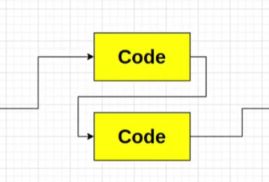
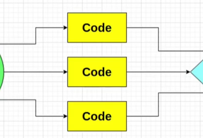

# 系统讨论Qt的并发编程——逻辑上下文的分类

## 前言

​	笔者最近看了一个具备一定启发性质的Qt教程，在这里，笔者打算整理一下自己的笔记。分享在这里.

## 首先，讨论Qt里常见的三种上下文

​	Qt在逻辑层上，笔者认为可分成三种上下文：同线程的同步，同线程的异步和多线程。

​	一个典型的同线程之间的同步，说的是我们的处理在执行流上，是串行的。

```
main ---> A -----> B ------> C
```

​	比如说，A函数，B函数和C函数在上下文中，串行的执行。这样的上下文，非常的可靠，每一个指令流都串行的访问数据，不会出现数据竞争的问题，但是代价就是——非常的慢。笔者三年的编程经验告诉自己——这样的编程上下文，适用于流程在时序上非常严密的场景。

​	一个典型的同线程异步，事情就看起来很有趣了。实际上看起来像这样。



​	这样的技术，任何一个学习过OS的都知道，实际上是在应用层上对这个线程实现了分片，换而言之，我们在这个线程上实现了逻辑并行，物理串行的效果——看起来我们的代码在并发的执行，但是实际上是一个线程快无影的完成一大堆工作。所以，这样的编程范式属于高响应要求的场景，或者说，我们对性能谈不上太高的要求，只需要他们看起来在同时执行。



​	这个场景，就是真并发的场景了，不管怎么说，我们真的有多个线程执行多个代码流，我们的代码上下文被托付给了操作系统层级的线程完成我们的工作。我们老生长谈的数据竞争并发安全，就是在讨论这里的事情。

## 同一线程的串行执行

```c++
#include <QCoreApplication>
#include <QThread>

void workA() {
    qInfo() << "I am handling Work A" << "Thread:" << QThread::currentThread();
    QThread::currentThread()->sleep(1);
    qInfo() << "Work A Finished";
}

void workB() {
    qInfo() << "I am handling Work B" << "Thread:" << QThread::currentThread();
    QThread::currentThread()->sleep(1);
    qInfo() << "Work B Finished";
}

void workC() {
    qInfo() << "I am handling Work C" << "Thread:" << QThread::currentThread();
    QThread::currentThread()->sleep(1);
    qInfo() << "Work C Finished";
}

int main(int argc, char *argv[]) {
    QCoreApplication a(argc, argv);
    QThread::currentThread()->setObjectName("Thread Main");
    workA();
    workB();
    workC();
    return a.exec();
}
```

​	这个就是一个例子，我们的任务ABC按照串行依次执行代码。看我们的输出，就是这个主线程在依次的做任务ABC。

```
I am handling Work A Thread: QThread(0x1f0730e2860, name = "Thread Main")
Work A Finished
I am handling Work B Thread: QThread(0x1f0730e2860, name = "Thread Main")
Work B Finished
I am handling Work C Thread: QThread(0x1f0730e2860, name = "Thread Main")
Work C Finished
```

## 同一线程的异步执行

​	事实上，对于一些使用了QT类的场景，同一线程的异步执行仍然非常常见。一个经典的例子就是我们使用QTimer的singleshot办法触发一个函数的执行。你可以看到，我们实际上根本没有直接的调用，但是async_workA由于timer事件的通知作为槽执行了

```c++
#include <QCoreApplication>
#include <QThread>
#include <QTimer>

void async_workA() {
  qInfo() << "Lets's see the current thread: "
          << QThread::currentThread()->objectName();
  QThread::currentThread()->sleep(1);
  qInfo() << "And A work done:)";
}

int main(int argc, char *argv[]) {
  QCoreApplication a(argc, argv);
  QThread::currentThread()->setObjectName("Main Thread");
  QTimer m;
  m.singleShot(1000, &async_workA);

  qInfo() << "Main Thread: " << QThread::currentThread()->objectName();
  qInfo() << "has reached its end!";
  return a.exec();
}

```

## 多线程的执行

​	现在我们开始上难度，那就是多线程的执行。

> TestObject.cpp

```
#include "TestObject.h"

#include <QDebug>
#include <QThread>
#include <QTimer>
TestObject::TestObject(QObject *parent) : QObject{parent} {}

void TestObject::runMe() {
  qInfo() << QThread::currentThread()->objectName() << " Running";
  QTimer::singleShot(1000, this, &TestObject::internel_shot);
  qInfo() << QThread::currentThread()->objectName() << " Finish";
}

void TestObject::internel_shot() { qInfo() << "Shot"; }
```

> Main.cpp

```c++
#include <QCoreApplication>
#include <QThread>

#include "TestObject.h"
int main(int argc, char *argv[]) {
  QCoreApplication a(argc, argv);

  QThread::currentThread()->setObjectName("Main Thread");

  qInfo() << "Ready to shot a thread";

  QThread thread;
  thread.setObjectName("Thread Worker");

  TestObject test;

  test.moveToThread(&thread);

  QObject::connect(&thread, &QThread::started, &test, &TestObject::runMe);

  thread.start();

  qInfo() << "Finish " << QThread::currentThread()->objectName();

  return a.exec();
}
```

​	这里有一个新的方法，简单说一下：

#### moveToThread办法

​	`moveToThread` 是 Qt 中用于将对象移到指定线程的函数。必须说明的是——我们的QT信号与槽机制是不跨线程的，也就是说，我们没办法使用信号与槽机制链接在A线程的a对象的信号与在B线程的b对象的槽。对于非 GUI 类的对象，可以通过调用 `moveToThread` 将它们从主线程或其他线程转移到目标线程。这样，目标线程就会负责该对象的事件处理和信号槽连接。

​	这样，我们就会将我们的TestObject放置到我们的新线程中，换而言之，任何一个将会在B线程工作但是创建于A线程的物体，请使用这个方法。