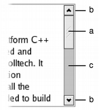

# 聊一聊Qt中的Slider和ProgressBar

​	Slider和ProgressBar从某种程度上都是反应了自己对目标控件的进度状态。在Qt中，自然也就提供了两种常见的表达进度的控件：QSlider和QProgressBar。前者可以用来连续平滑的调节值，后者则是被动的反应当前操作的进度。

## QAbstractSilder

​	QAbstractSilder是一般的派生物QSlider的基类，他规范了QSilder的一系列行为。这点跟上一篇文章我们谈到的QPushButton是一样的！

​	`QAbstractSlider` 是一个设计为通用基类的类，主要用于实现诸如 `QScrollBar`、`QSlider` 和 `QDial` 等滑块控件。以下是该类的主要属性和功能：

### 主要属性

- **value**: `QAbstractSlider` 维护的有界整数值。
- **minimum**: 允许的最小值。
- **maximum**: 允许的最大值。
- **singleStep**: 滑块提供的较小的自然步长，通常对应于用户按下箭头键。
- **pageStep**: 滑块提供的较大的自然步长，通常对应于用户按下 PageUp 或 PageDown 键。
- **tracking**: 是否启用了滑块追踪功能。
- **sliderPosition**: 滑块的当前位置信息。如果启用了追踪（默认情况下），则此值与 `value` 相同。

### 设置值

`setValue()` 方法允许您将当前值设置为任何在允许范围内的整数，而不仅仅是 `minimum() + n * singleStep()`（其中 n 为整数值）。某些控件可能允许用户设置任何值，而其他控件可能仅提供 `singleStep()` 或 `pageStep()` 的倍数。

### 信号

`QAbstractSlider` 发出以下信号：

- **valueChanged()**: 当值改变时发出。追踪功能决定在用户交互期间是否发出此信号。
- **sliderPressed()**: 用户开始拖动滑块时发出。
- **sliderMoved()**: 用户拖动滑块时发出。
- **sliderReleased()**: 用户释放滑块时发出。
- **actionTriggered()**: 滑块动作被触发时发出。
- **rangeChanged()**: 滑块的范围发生变化时发出。

### 其他功能

- **sliderChange()**: 提供一个虚函数，适合用于更新滑块的屏幕表现。
- **triggerAction()**: 子类可以调用此函数来触发滑块动作。
- **QStyle::sliderPositionFromValue()** 和 **QStyle::sliderValueFromPosition()**: 这两个辅助函数帮助子类和样式将屏幕坐标映射到逻辑范围值。

### API

| 公共函数 | `QAbstractSlider(QWidget *parent = nullptr)`               | 构造函数，创建一个滑块控件，指定父对象。 |
| -------- | ---------------------------------------------------------- | ---------------------------------------- |
| 公共函数 | `virtual ~QAbstractSlider()`                               | 虚析构函数，用于释放资源。               |
| 公共函数 | `bool hasTracking() const`                                 | 返回滑块是否在移动时更新值。             |
| 公共函数 | `bool invertedAppearance() const`                          | 返回滑块是否反转显示。                   |
| 公共函数 | `bool invertedControls() const`                            | 返回滑块是否反转控制。                   |
| 公共函数 | `bool isSliderDown() const`                                | 返回滑块是否被按下。                     |
| 公共函数 | `int maximum() const`                                      | 返回滑块的最大值。                       |
| 公共函数 | `int minimum() const`                                      | 返回滑块的最小值。                       |
| 公共函数 | `Qt::Orientation orientation() const`                      | 返回滑块的方向（水平或垂直）。           |
| 公共函数 | `int pageStep() const`                                     | 返回滑块的页面步长。                     |
| 公共函数 | `void setInvertedAppearance(bool)`                         | 设置滑块是否反转显示。                   |
| 公共函数 | `void setInvertedControls(bool)`                           | 设置滑块是否反转控制。                   |
| 公共函数 | `void setMaximum(int)`                                     | 设置滑块的最大值。                       |
| 公共函数 | `void setMinimum(int)`                                     | 设置滑块的最小值。                       |
| 公共函数 | `void setPageStep(int)`                                    | 设置滑块的页面步长。                     |
| 公共函数 | `void setSingleStep(int)`                                  | 设置滑块的单步值。                       |
| 公共函数 | `void setSliderDown(bool)`                                 | 设置滑块是否处于按下状态。               |
| 公共函数 | `void setSliderPosition(int)`                              | 设置滑块的位置。                         |
| 公共函数 | `void setTracking(bool enable)`                            | 启用或禁用在移动滑块时更新值。           |
| 公共函数 | `int singleStep() const`                                   | 返回滑块的单步值。                       |
| 公共函数 | `int sliderPosition() const`                               | 返回滑块当前的位置。                     |
| 公共函数 | `void triggerAction(QAbstractSlider::SliderAction action)` | 触发特定的滑块操作。                     |
| 公共函数 | `int value() const`                                        | 返回滑块的当前值。                       |
| 公共槽   | `void setOrientation(Qt::Orientation)`                     | 设置滑块的方向（水平或垂直）。           |
| 公共槽   | `void setRange(int min, int max)`                          | 设置滑块的范围（最小值和最大值）。       |
| 公共槽   | `void setValue(int)`                                       | 设置滑块的当前值。                       |
| 信号     | `void actionTriggered(int action)`                         | 当滑块执行某个动作时发出信号。           |
| 信号     | `void rangeChanged(int min, int max)`                      | 当滑块的范围改变时发出信号。             |
| 信号     | `void sliderMoved(int value)`                              | 当滑块移动时发出信号。                   |
| 信号     | `void sliderPressed()`                                     | 当滑块被按下时发出信号。                 |
| 信号     | `void sliderReleased()`                                    | 当滑块被释放时发出信号。                 |
| 信号     | `void valueChanged(int value)`                             | 当滑块的值改变时发出信号。               |

## QSlider

​	QSlider 类是用于控制有界整数值的滑块控件，允许用户在水平或垂直轨道上移动滑块手柄，从而将手柄的位置转换为合法范围内的整数值。它大部分功能继承自 QAbstractSlider，使得使用和实现都非常简便。

### 主要功能

- **设置值**: 通过 `setValue()` 方法，可以将滑块直接设置为某个特定值。
- **触发动作**: `triggerAction()` 方法用于模拟单击效果，适用于实现快捷键功能。
- **设置步长**: 使用 `setSingleStep()` 和 `setPageStep()` 方法来定义滑块的步长。
- **定义范围**: 通过 `setMinimum()` 和 `setMaximum()` 方法来设置滑块的合法取值范围。

### 控制刻度

QSlider 提供了控制刻度线的功能：

- **设置刻度位置**: 使用 `setTickPosition()` 方法来指定刻度线的显示位置。
- **设置刻度间隔**: 使用 `setTickInterval()` 方法来定义刻度之间的间隔数量。
- **查询刻度状态**: 可以通过 `tickPosition()` 和 `tickInterval()` 方法获取当前的刻度位置和间隔。

### 信号

QSlider 继承了一系列信号：

- **valueChanged()**: 当滑块的值发生变化时发出此信号，`tracking()` 控制是否在用户交互期间发出。
- **sliderPressed()**: 当用户开始拖动滑块时发出此信号。
- **sliderMoved()**: 当用户拖动滑块时发出此信号。
- **sliderReleased()**: 当用户释放滑块时发出此信号。

### 用户交互

QSlider 仅支持整数范围，尽管可以处理较大的数字，但在非常大的范围内，用户可能会面临使用滑块时精确度降低的问题。

#### 键盘操作

- **左/右箭头**: 水平滑块移动一个步长。
- **上/下箭头**: 垂直滑块移动一个步长。
- **Page Up**: 向上移动一页。
- **Page Down**: 向下移动一页。
- **Home**: 移动到最小值。
- **End**: 移动到最大值。

### API

| **API**                                                      | **用途**                                           |
| ------------------------------------------------------------ | -------------------------------------------------- |
| `QSlider(QWidget *parent = nullptr)`                         | 创建一个水平滑块，父对象可选。                     |
| `QSlider(Qt::Orientation orientation, QWidget *parent = nullptr)` | 创建一个指定方向的滑块（水平或垂直），父对象可选。 |
| `virtual ~QSlider()`                                         | 析构函数。                                         |
| `void setTickInterval(int ti)`                               | 设置刻度之间的间隔。                               |
| `void setTickPosition(QSlider::TickPosition position)`       | 设置刻度线的位置（上方、下方、左侧或右侧）。       |
| `int tickInterval() const`                                   | 获取当前的刻度间隔。                               |
| `QSlider::TickPosition tickPosition() const`                 | 获取当前刻度位置。                                 |
| `virtual bool event(QEvent *event) override`                 | 处理事件，添加自定义行为。                         |
| `virtual QSize minimumSizeHint() const override`             | 提供滑块的最小尺寸提示。                           |
| `virtual QSize sizeHint() const override`                    | 提供滑块的推荐尺寸提示。                           |
| `virtual void initStyleOption(QStyleOptionSlider *option) const` | 初始化样式选项，以便绘制滑块。                     |
| `virtual void mouseMoveEvent(QMouseEvent *ev) override`      | 处理鼠标移动事件。                                 |
| `virtual void mousePressEvent(QMouseEvent *ev) override`     | 处理鼠标按下事件。                                 |
| `virtual void mouseReleaseEvent(QMouseEvent *ev) override`   | 处理鼠标释放事件。                                 |
| `virtual void paintEvent(QPaintEvent *ev) override`          | 处理绘制事件，以定制滑块的外观。                   |

## QProgressBar

​	QProgressBar 是一种用于向用户指示操作进度的控件，能够确保用户知道应用程序仍在运行。进度条的工作原理基于步骤的概念。用户可以通过设置最小值和最大值，进度条将根据当前步骤值显示已完成的百分比。这个百分比是通过计算 `(value() - minimum()) / (maximum() - minimum())` 得出的。

​	用户可以使用 `setMinimum()` 和 `setMaximum()` 方法来指定步骤的范围，并通过 `setValue()` 方法来更新当前步骤数。如果需要重置进度条，可以调用 `reset()` 方法，将其恢复到初始状态。

​	当最小值和最大值都设置为 0 时，进度条将显示一个忙碌指示器。这在下载内容时特别有用，尤其是无法确定下载项大小的情况下，例如使用 `QNetworkAccessManager` 进行下载。

### API

| **函数/属性**                                             | **说明**                                                     |
| --------------------------------------------------------- | ------------------------------------------------------------ |
| `QProgressBar(QWidget *parent = nullptr)`                 | 创建一个进度条，可以指定其父窗口小部件。                     |
| `virtual ~QProgressBar()`                                 | 析构函数，用于清理 QProgressBar 实例。                       |
| `alignment() const`                                       | 获取进度条文本的对齐方式。                                   |
| `format() const`                                          | 获取当前显示格式，通常用于自定义进度条的文本格式。           |
| `invertedAppearance() const`                              | 判断进度条是否显示为反转样式。                               |
| `isTextVisible() const`                                   | 检查进度条的文本是否可见。                                   |
| `maximum() const`                                         | 获取进度条的最大值。                                         |
| `minimum() const`                                         | 获取进度条的最小值。                                         |
| `setMaximum(int maximum)`                                 | 设置进度条的最大值。                                         |
| `setMinimum(int minimum)`                                 | 设置进度条的最小值。                                         |
| `setRange(int minimum, int maximum)`                      | 一次性设置进度条的最小值和最大值。                           |
| `value() const`                                           | 获取当前进度条的值。                                         |
| `setValue(int value)`                                     | 设置进度条的当前值。                                         |
| `resetFormat()`                                           | 重置进度条的格式到默认状态。                                 |
| `setAlignment(Qt::Alignment alignment)`                   | 设置进度条文本的对齐方式。                                   |
| `setFormat(const QString &format)`                        | 设置进度条的文本格式。                                       |
| `setInvertedAppearance(bool invert)`                      | 设置进度条是否显示为反转样式。                               |
| `setTextDirection(QProgressBar::Direction textDirection)` | 设置文本显示方向。                                           |
| `setTextVisible(bool visible)`                            | 设置进度条的文本是否可见。                                   |
| `text() const`                                            | 获取当前显示的文本内容。                                     |
| `textDirection() const`                                   | 获取文本显示方向。                                           |
| `virtual QSize minimumSizeHint() const override`          | 获取进度条的最小推荐大小。                                   |
| `virtual QSize sizeHint() const override`                 | 获取进度条的推荐大小。                                       |
| `public slots`                                            | 包含公共槽函数，如 `reset()`、`setOrientation(Qt::Orientation)` 等。 |
| `signals`                                                 | 包含信号，如 `valueChanged(int value)`，用于在值改变时发出通知。 |
| `initStyleOption(QStyleOptionProgressBar *option) const`  | 初始化样式选项，供样式使用。                                 |
| `virtual bool event(QEvent *e) override`                  | 处理事件，重载事件处理函数。                                 |
| `virtual void paintEvent(QPaintEvent *) override`         | 处理绘制事件，重载绘制函数。                                 |

## QScrollBar

### 详细描述

​	滚动条是一种控件，它使用户能够访问大于用于显示它的小部件的文档部分。它提供了用户在文档中的当前位置以及可见文档量的视觉指示。滚动条通常配备其他控件，以实现更准确的导航。Qt 以适合每个平台的方式显示滚动条。

​	如果您需要在另一个窗口小部件上提供滚动视图，使用 QScrollArea 类可能会更方便，因为它提供了视口窗口小部件和滚动条。如果您需要使用 QAbstractScrollArea 为专用窗口小部件实现类似的功能，QScrollBar 很有用；例如，如果您决定子类化 QAbstractItemView。对于大多数其他使用滑块控件获取给定范围内的值的情况，QSlider 类可能更适合您的需求。

​	滚动条通常包括四个单独的控件：滑块、滚动箭头和页面控件。




- a. 滑块提供了一种快速转到文档任何部分的方法，但不支持在大型文档中进行精确导航。
- b. 滚动箭头是按钮，可用于准确导航到文档中的特定位置。对于连接到文本编辑器的垂直滚动条，这些通常将当前位置向上或向下移动一“行”，并稍微调整滑块的位置。在编辑器和列表框中，“行”可能表示一行文本；在图像查看器中，它可能意味着 20 像素。
- c. 页面控件是滑块被拖动的区域（滚动条的背景）。单击此处可将滚动条向单击处移动一“页”。此值通常与滑块的长度相同。

​	每个滚动条都有一个值，该值指示滑块与滚动条起点之间的距离；该值通过 value() 获取，并通过 setValue() 设置。此值始终位于为滚动条定义的值范围内，从 minimum() 到 maximum() （含）。可以使用 setMinimum() 和 setMaximum() 设置可接受值的范围。在最小值处，滑块的顶部边缘（对于垂直滚动条）或左侧边缘（对于水平滚动条）将位于滚动条的顶部（或左侧）。在最大值处，滑块的底部（或右侧）边缘将位于滚动条的底部（或右侧）。

​	滑块的长度通常与页面步长的值有关，通常表示滚动视图中显示的文档区域的比例。页面步长是用户按下 Page Up 和 Page Down 键时值改变的量，使用 setPageStep() 设置。使用光标键对行步长定义的值进行较小的更改，此数量使用 setSingleStep() 设置。

​	请注意，使用的值的范围与滚动条小部件的实际大小无关。在选择范围和页面步长的值时，无需考虑这一点。

​	为滚动条指定的值的范围通常与 QSlider 的值的范围不同，因为需要考虑滑块的长度。如果我们有一个包含 100 行的文档，而我们只能在小部件中显示 20 行，我们可能希望构建一个页面步长为 20、最小值为 0、最大值为 80 的滚动条。这将为我们提供一个包含五个“页面”的滚动条。

​	在许多常见情况下，**文档长度、滚动条中使用的值范围和页面步长之间的关系很简单。滚动条的值范围是通过从表示文档长度的某个值中减去所选的页面步长来确定的。在这种情况下**，以下等式很有用：

```
document_length = maximum() - minimum() + pageStep().
```

​	QScrollBar 仅提供整数范围。请注意，尽管 QScrollBar 可以处理非常大的数字，但当前屏幕上的滚动条无法有效地表示超过约 100,000 像素的范围。超过这个范围，用户将很难使用键盘或鼠标控制滑块，并且滚动箭头的用途将受到限制。

ScrollBar 从 QAbstractSlider 继承了一组全面的信号：

- 当滚动条的值发生变化时，会发出 valueChanged()。 tracking() 确定是否在用户交互期间发出此信号。
- 当滚动条的值范围发生变化时，会发出 rangeChanged()。
- 当用户开始拖动滑块时，会发出 sliderPressed()。
- 当用户拖动滑块时，会发出 sliderMoved()。
- 当用户释放滑块时，会发出 sliderReleased()。
- 当滚动条通过用户交互或通过 triggerAction() 函数更改时，会发出 actionTriggered()。

滚动条可以由键盘控制，但它的默认 focusPolicy() 为 Qt::NoFocus。使用 setFocusPolicy() 启用键盘与滚动条的交互：

- 向左/向右移动水平滚动条一步。
- 向上/向下移动垂直滚动条一步。
- PageUp 向上移动一页。
- PageDown 向下移动一页。
- Home 移动到开始（最小值）。
- End 移动到末尾（最大值）。

滑块本身可以通过使用 triggerAction() 函数来控制，以模拟用户与滚动条控件的交互。如果您有许多使用通用值范围的不同小部件，这将非常有用。大多数 GUI 样式都使用 pageStep() 值来计算滑块的大小。

## QDial

​	当用户需要控制程序可定义范围内的值时，使用 QDial，并且范围要么是环绕的（例如，角度从 0 到 359 度），要么对话框布局需要方形小部件。

​	由于 QDial 继承自 QAbstractSlider，因此表盘的行为方式与滑块类似。当 wrapping() 为 false（默认设置）时，滑块和表盘之间没有实际区别。它们共享相同的信号、插槽和成员函数。使用哪一个取决于用户的期望和应用程序的类型。

​	滑块移动时，表盘最初会连续发出 valueChanged() 信号；您可以通过禁用跟踪属性来减少其发出信号的频率。即使禁用跟踪，sliderMoved() 信号也会连续发出。

​	当按下和释放鼠标按钮时，表盘还会发出 sliderPressed() 和 sliderReleased() 信号。请注意，由于键盘和滚轮也可用于更改值，因此即使不发出这些信号，刻度盘的值也可以更改。

​	与滑块不同，QDial 尝试绘制“合适”数量的刻度，而不是每行步骤绘制一个刻度。如果可能，绘制的刻度数为每行步骤一个，但如果没有足够的像素来绘制每个刻度，QDial 将跳过刻度，尝试绘制统一的集合（例如，每隔一个或第三个刻度绘制一个刻度）。

​	与滑块一样，刻度盘使 QAbstractSlider 函数 setValue() 可用作插槽。

​	刻度盘的键盘界面相当简单：左/上和右/下箭头键通过定义的 singleStep 调整刻度盘的值，Page Up 和 Page Down 通过定义的 pageStep 调整刻度盘的值，Home 和 End 键将值设置为定义的最小值和最大值。

​	如果您使用鼠标滚轮调整刻度盘，则增量值由 wheelScrollLines 乘以 singleStep 和 pageStep 中的较小值决定。

### API

| 方法                                                         | 描述                                                   |
| ------------------------------------------------------------ | ------------------------------------------------------ |
| `QDial(QWidget *parent = nullptr)`                           | 创建一个新的 QDial 对象。                              |
| `virtual ~QDial()`                                           | 析构函数，释放资源。                                   |
| `int notchSize() const`                                      | 返回刻度的大小（以像素为单位）。                       |
| `qreal notchTarget() const`                                  | 返回刻度目标值，用于设置刻度。                         |
| `bool notchesVisible() const`                                | 检查刻度是否可见。                                     |
| `void setNotchTarget(double target)`                         | 设置刻度目标值。                                       |
| `bool wrapping() const`                                      | 检查是否启用环绕功能（滑块在最小值和最大值之间循环）。 |
| `virtual QSize minimumSizeHint() const override`             | 返回最小尺寸提示。                                     |
| `virtual QSize sizeHint() const override`                    | 返回建议的尺寸提示。                                   |
| `void setNotchesVisible(bool visible)`                       | 设置刻度是否可见。                                     |
| `void setWrapping(bool on)`                                  | 启用或禁用环绕功能。                                   |
| `virtual void initStyleOption(QStyleOptionSlider *option) const` | 初始化样式选项。                                       |
| `virtual bool event(QEvent *e) override`                     | 处理事件。                                             |
| `virtual void mouseMoveEvent(QMouseEvent *e) override`       | 处理鼠标移动事件。                                     |
| `virtual void mousePressEvent(QMouseEvent *e) override`      | 处理鼠标按下事件。                                     |
| `virtual void mouseReleaseEvent(QMouseEvent *e) override`    | 处理鼠标释放事件。                                     |
| `virtual void paintEvent(QPaintEvent *pe) override`          | 处理绘制事件。                                         |
| `virtual void resizeEvent(QResizeEvent *e) override`         | 处理窗口调整大小事件。                                 |
| `virtual void sliderChange(QAbstractSlider::SliderChange change) override` |                                                        |

## 一个示例

​	笔者书写了一个简单的示例程序来将QDial, QScrollBar, QSlider三者的值映射到QProgressBar上，请看VCR：

```
#include "MainWindow.h"
#include "ui_MainWindow.h"

MainWindow::MainWindow(QWidget *parent)
    : QMainWindow(parent), ui(new Ui::MainWindow) {
    ui->setupUi(this);
}

MainWindow::~MainWindow() {
    delete ui;
}

void MainWindow::on_dial_valueChanged(int value) {
    ui->progressBar->setValue(value);
}

void MainWindow::on_horizontalSlider_valueChanged(int value) {
    ui->progressBar->setValue(value);
}

void MainWindow::on_horizontalScrollBar_valueChanged(int value) {
    ui->progressBar->setValue(value);
}
```

```
#ifndef MAINWINDOW_H
#define MAINWINDOW_H

#include <QMainWindow>

QT_BEGIN_NAMESPACE
namespace Ui {
class MainWindow;
}
QT_END_NAMESPACE

class MainWindow : public QMainWindow {
    Q_OBJECT

public:
    MainWindow(QWidget *parent = nullptr);
    ~MainWindow();

private slots:
    void on_dial_valueChanged(int value);

    void on_horizontalSlider_valueChanged(int value);

    void on_horizontalScrollBar_valueChanged(int value);

private:
    Ui::MainWindow *ui;
};
#endif  // MAINWINDOW_H
```

