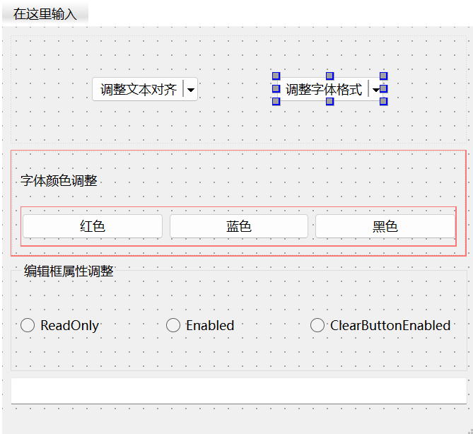

# 聊一聊Qt中的按钮

​	我们来聊一聊最常见的一个控件：按钮。Qt当中实际上有六种按钮，但是常用的是四个：分别是QPushButton, QToolButton, QRadioButton和QCheckBox。还有余下的QCommandLinkButton：命令链接按钮，和QDialogButtonBox：对话框按钮，笔者使用的并不多。他们的特点是都是来源于QAbstractButton这个基类。为此，我们有有必要从基类出发认识Qt的按钮。

## QAbstractButton

​	在后面我们需要认识到：我们需要从软件工程的设计思路去理解一个框架。基类往往定义了一个族类的基调。所以让我们看看QAbstractButton到底干了什么。该类的子类处理用户操作，并定义按钮的绘制方式。

#### 功能概述

​	`QAbstractButton` 支持两种类型的按钮：**普通按钮和可勾选（切换）按钮**。可勾选按钮由 `QRadioButton` 和 `QCheckBox` 类实现，而普通按钮则由 `QPushButton` 和 `QToolButton` 类实现，后者在需要时也支持切换行为。

​	任何按钮都可以显示一个包含文本和图标的标签。可以使用 `setText()` 方法设置文本，使用 `setIcon()` 方法设置图标。当按钮被禁用时，其标签会更改为一种“禁用”外观。

#### 快捷键

如果按钮是一个文本按钮，且文本中包含一个字符 `&`，`QAbstractButton` 会自动创建一个快捷键。例如：

```
QPushButton *button = new QPushButton(tr("Ro&ck && Roll"), this);
```

​	在这个例子中，Alt+C 快捷键被分配给按钮。当用户按下 Alt+C 时，按钮将调用 `animateClick()`。要显示实际的字符 `&`，请使用 `&&`。此外，您还可以使用 `setShortcut()` 方法设置自定义快捷键。这对于没有文本的按钮特别有用，因为它们无法自动生成快捷键：

```
button->setIcon(QIcon(":/images/print.png"));
button->setShortcut(tr("Alt+F7"));
```

​	Qt 提供的所有按钮（如 `QPushButton`、`QToolButton`、`QCheckBox` 和 `QRadioButton`）都可以同时显示文本和图标。

#### 默认按钮

​	在对话框中，可以通过 `QPushButton::setDefault()` 和 `QPushButton::setAutoDefault()` 方法将按钮设置为默认按钮。

#### 按钮状态

`QAbstractButton` 提供了大多数按钮使用的状态：

- `isDown()`：指示按钮是否被按下。
- `isChecked()`：指示按钮是否被选中。仅可勾选按钮可以被选中和取消选中。
- `isEnabled()`：指示按钮是否可以被用户按下。

需要注意的是，与其他小部件不同，派生自 `QAbstractButton` 的按钮在禁用时仍会接受鼠标和上下文菜单事件。

#### 自动重复功能

`setAutoRepeat()` 设置按钮在按下时是否会自动重复。`autoRepeatDelay` 和 `autoRepeatInterval` 定义了自动重复的方式。

#### 切换按钮

`setCheckable()` 设置按钮是否为切换按钮。`isDown()` 和 `isChecked()` 的区别在于：当用户单击一个切换按钮以选中它时，按钮会先变为按下状态，然后释放到选中状态。当用户再次单击以取消选中时，按钮首先会变为按下状态，然后变为未选中状态（此时 `isChecked()` 和 `isDown()` 都为 false）。

#### 信号

`QAbstractButton` 提供了四个信号：

- `pressed()`：当左键在按钮内部被按下时发出。
- `released()`：当左键被释放时发出。
- `clicked()`：当按钮被首次按下并释放时、快捷键被输入时，或调用 `click()` 或 `animateClick()` 时发出。
- `toggled()`：当切换按钮的状态发生变化时发出。

#### 子类化

要子类化 `QAbstractButton`，必须至少重新实现 `paintEvent()` 方法，以绘制按钮的轮廓及其文本或图标。通常建议同时重写 `sizeHint()`，有时还要重写 `hitButton()`（用于确定按钮按下是否在按钮范围内）。对于具有多个状态的按钮（如三态按钮），还需要重新实现 `checkStateSet()` 和 `nextCheckState()`。

### API列表

| API                                                       | 用途                                         |
| --------------------------------------------------------- | -------------------------------------------- |
| `QAbstractButton(QWidget *parent = nullptr)`              | 构造函数，创建一个按钮对象，可以指定父窗口。 |
| `virtual ~QAbstractButton()`                              | 虚析构函数，确保正确清理资源。               |
| `bool autoExclusive() const`                              | 返回按钮是否为自动独占模式。                 |
| `bool autoRepeat() const`                                 | 返回按钮是否启用自动重复功能。               |
| `int autoRepeatDelay() const`                             | 返回自动重复开始前的延迟时间（毫秒）。       |
| `int autoRepeatInterval() const`                          | 返回自动重复时的间隔时间（毫秒）。           |
| `QButtonGroup * group() const`                            | 返回按钮所属的按钮组（如果有的话）。         |
| `QIcon icon() const`                                      | 返回按钮的图标。                             |
| `QSize iconSize() const`                                  | 返回按钮图标的大小。                         |
| `bool isCheckable() const`                                | 返回按钮是否可以被选中（可勾选按钮）。       |
| `bool isChecked() const`                                  | 返回按钮当前是否被选中。                     |
| `bool isDown() const`                                     | 返回按钮当前是否处于按下状态。               |
| `void setAutoExclusive(bool)`                             | 设置按钮是否为自动独占模式。                 |
| `void setAutoRepeat(bool)`                                | 启用或禁用自动重复功能。                     |
| `void setAutoRepeatDelay(int)`                            | 设置自动重复开始前的延迟时间。               |
| `void setAutoRepeatInterval(int)`                         | 设置自动重复时的间隔时间。                   |
| `void setCheckable(bool)`                                 | 设置按钮是否可勾选。                         |
| `void setDown(bool)`                                      | 设置按钮为按下状态或释放状态。               |
| `void setIcon(const QIcon &icon)`                         | 设置按钮的图标。                             |
| `void setShortcut(const QKeySequence &key)`               | 设置按钮的快捷键。                           |
| `void setText(const QString &text)`                       | 设置按钮的文本。                             |
| `QKeySequence shortcut() const`                           | 返回按钮的快捷键。                           |
| `QString text() const`                                    | 返回按钮的文本。                             |
| `void animateClick()`                                     | 触发按钮的点击事件并添加动画效果。           |
| `void click()`                                            | 触发按钮的点击事件。                         |
| `void setChecked(bool)`                                   | 设置按钮的选中状态。                         |
| `void setIconSize(const QSize &size)`                     | 设置按钮图标的大小。                         |
| `void toggle()`                                           | 切换按钮的选中状态。                         |
| `void clicked(bool checked = false)`                      | 按钮被点击时发出的信号。                     |
| `void pressed()`                                          | 按钮被按下时发出的信号。                     |
| `void released()`                                         | 按钮被释放时发出的信号。                     |
| `void toggled(bool checked)`                              | 按钮的选中状态发生变化时发出的信号。         |
| `virtual void checkStateSet()`                            | 用于设置按钮的状态，通常在子类中重写。       |
| `virtual bool hitButton(const QPoint &pos) const`         | 判断指定点是否在按钮上，通常在子类中重写。   |
| `virtual void nextCheckState()`                           | 切换到下一个检查状态，通常在子类中重写。     |
| `virtual void changeEvent(QEvent *e) override`            | 处理状态变化事件，通常在子类中重写。         |
| `virtual bool event(QEvent *e) override`                  | 处理事件，通常在子类中重写。                 |
| `virtual void focusInEvent(QFocusEvent *e) override`      | 处理获得焦点事件，通常在子类中重写。         |
| `virtual void focusOutEvent(QFocusEvent *e) override`     | 处理失去焦点事件，通常在子类中重写。         |
| `virtual void keyPressEvent(QKeyEvent *e) override`       | 处理按键按下事件，通常在子类中重写。         |
| `virtual void keyReleaseEvent(QKeyEvent *e) override`     | 处理按键释放事件，通常在子类中重写。         |
| `virtual void mouseMoveEvent(QMouseEvent *e) override`    | 处理鼠标移动事件，通常在子类中重写。         |
| `virtual void mousePressEvent(QMouseEvent *e) override`   | 处理鼠标按下事件，通常在子类中重写。         |
| `virtual void mouseReleaseEvent(QMouseEvent *e) override` | 处理鼠标释放事件，通常在子类中重写。         |
| `virtual void paintEvent(QPaintEvent *e) override = 0`    | 处理绘制事件，必须在子类中实现。             |
| `virtual void timerEvent(QTimerEvent *e) override`        | 处理定时器事件，通常在子类中重写。           |

​	当然，具体想了解那些API，请左转到官方参考网站。

## QPushButton

QPushButton（或称命令按钮）可能是任何图形用户界面中最常用的部件。用户点击按钮来命令计算机执行某个操作或回答问题。常见的按钮包括“OK”、“应用”、“取消”、“关闭”、“是”、“否”和“帮助”。

#### 按钮外观与功能

命令按钮通常为矩形，显示描述其动作的文本标签。通过在文本前加上字符 `&` 可以指定快捷键。例如：

```
QPushButton *button = new QPushButton("&Download", this);
```

​	它就会被分配快捷键为 Alt+D。**要显示实际的字符 `&`，请使用 `&&`。**

​	QPushButton可以显示文本标签，并可选地显示一个小图标。这些可以通过构造函数设置，并可以通过 `setText()` 和 `setIcon()` 方法进行更改。如果按钮被禁用，其文本和图标的外观将根据 GUI 样式进行调整，以呈现“禁用”状态。

​	当通过鼠标、空格键或键盘快捷键激活按钮时，QPushButton会发出 `clicked()` 信号。可以连接此信号以执行按钮的动作。QPushButton还提供不太常用的信号，例如 `pressed()` 和 `released()`。

#### 默认按钮

​	对话框中的命令按钮默认是自动默认按钮，即当它们接收键盘输入焦点时，会自动成为默认QPushButton。默认按钮是在对话框中按下 Enter 或 Return 键时激活的按钮。可以通过 `setAutoDefault()` 方法更改此设置。请注意，自动默认按钮会保留一些额外空间，以便绘制默认按钮指示器。如果不想在按钮周围保留这些空间，可以调用 `setAutoDefault(false)`。

#### 按钮的状态与模式

​	按钮部件已经发展出许多变化，尤其是在过去十年中。微软的样式指南现在展示了大约十种不同状态的 Windows QPushButton，并且文本暗示在考虑所有特性组合时，实际上还有数十种状态。

主要的模式或状态包括：

- 可用或不可用（灰显，禁用）
- 标准QPushButton、切换QPushButton或菜单按钮
- 开或关（仅针对切换QPushButton）
- 默认或普通（对话框中的默认按钮通常可以通过 Enter 或 Return 键“点击”）
- 自动重复或非自动重复
- 按下状态或未按下状态

#### 使用建议

​	通常，在应用程序或对话框窗口中，用户点击按钮以执行某个动作时（例如“应用”、“取消”、“关闭”和“帮助”），应该使用QPushButton。QPushButton应该具有宽大、矩形的形状并带有文本标签。小型、通常是方形的按钮用于改变窗口状态，而不是执行操作（例如 QFileDialog 右上角的按钮），则不是命令按钮，而是工具按钮。Qt 提供了一个特殊的类 `QToolButton` 用于这些按钮。

​	如果需要切换行为（参见 `setCheckable()`）或在按下时自动重复激活信号的按钮（如滚动条中的箭头按钮，参见 `setAutoRepeat()`），则命令按钮可能不是合适的选择。在不确定的情况下，使用工具按钮。

> 注意：在 macOS 上，当QPushButton的宽度小于 50 像素或高度小于 30 像素时，按钮的角从圆角变为方角。可以使用 `setMinimumSize()` 函数来防止这种情况。

#### 菜单按钮

​	命令按钮的一个变体是菜单按钮。这些按钮不仅提供一个命令，而是多个命令，因为当它们被点击时，会弹出一个选项菜单。可以使用 `setMenu()` 方法将弹出菜单与QPushButton关联。

​	除了QPushButton，Qt 还有其他按钮类型，如单选按钮（`QRadioButton`）和复选框（`QCheckBox`）。在 Qt 中，`QAbstractButton` 基类提供了大多数模式和其他 API，而 `QPushButton` 则提供了 GUI 逻辑。有关 API 的更多信息，请参见 `QAbstractButton`。

### API

| API                                                          | 用途                                           |
| ------------------------------------------------------------ | ---------------------------------------------- |
| `QPushButton(QWidget *parent = nullptr)`                     | 构造函数，创建一个按钮对象，可以指定父窗口。   |
| `QPushButton(const QString &text, QWidget *parent = nullptr)` | 构造函数，创建一个按钮并设置其文本标签。       |
| `QPushButton(const QIcon &icon, const QString &text, QWidget *parent = nullptr)` | 构造函数，创建一个按钮并设置其图标和文本标签。 |
| `virtual ~QPushButton()`                                     | 虚析构函数，确保正确清理资源。                 |
| `bool autoDefault() const`                                   | 返回按钮是否为自动默认按钮。                   |
| `bool isDefault() const`                                     | 返回按钮是否为默认按钮。                       |
| `bool isFlat() const`                                        | 返回按钮是否为扁平化样式（无边框）。           |
| `QMenu * menu() const`                                       | 返回与按钮关联的菜单（如果有）。               |
| `void setAutoDefault(bool)`                                  | 设置按钮是否为自动默认按钮。                   |
| `void setDefault(bool)`                                      | 设置按钮为默认按钮。                           |
| `void setFlat(bool)`                                         | 设置按钮为扁平化样式或恢复为正常样式。         |
| `void setMenu(QMenu *menu)`                                  | 将菜单与按钮关联。                             |
| `virtual QSize minimumSizeHint() const override`             | 返回按钮的最小尺寸提示。                       |
| `virtual QSize sizeHint() const override`                    | 返回按钮的推荐尺寸。                           |
| `void showMenu()`                                            | 显示与按钮关联的菜单。                         |
| `virtual void initStyleOption(QStyleOptionButton *option) const` | 初始化样式选项，用于绘制按钮的外观。           |
| `virtual bool event(QEvent *e) override`                     | 处理事件，通常在子类中重写。                   |
| `virtual void focusInEvent(QFocusEvent *e) override`         | 处理获得焦点事件，通常在子类中重写。           |
| `virtual void focusOutEvent(QFocusEvent *e) override`        | 处理失去焦点事件，通常在子类中重写。           |
| `virtual bool hitButton(const QPoint &pos) const override`   | 判断指定点是否在按钮上，通常在子类中重写。     |
| `virtual void keyPressEvent(QKeyEvent *e) override`          | 处理按键按下事件，通常在子类中重写。           |
| `virtual void mouseMoveEvent(QMouseEvent *e) override`       | 处理鼠标移动事件，通常在子类中重写。           |
| `virtual void paintEvent(QPaintEvent *) override`            | 处理绘制事件，必须在子类中实现。               |

## QToolButton

工具按钮是一种特殊的按钮，用于快速访问特定命令或选项。与普通命令按钮不同，工具按钮通常不显示文本标签，而是显示图标。

#### 创建工具按钮

工具按钮通常通过在 `QToolBar` 中使用 `addAction()` 方法创建新 `QAction` 实例，或者将现有操作添加到工具栏中。也可以像其他部件一样构造工具按钮，并将它们与其他部件排列在布局中。

#### 用途示例

工具按钮的经典用法之一是选择工具，例如绘图程序中的“笔”工具。这可以通过将 `QToolButton` 设置为切换按钮（参见 `setCheckable()`）来实现。

#### 自动抬起功能

`QToolButton` 支持自动抬起功能。在自动抬起模式下，当鼠标指向按钮时，按钮会绘制一个 3D 框。此功能在按钮用作 `QToolBar` 中时自动开启，可以使用 `setAutoRaise()` 进行更改。

#### 图标设置

工具按钮的图标使用 `QIcon` 设置。这使得可以为禁用状态和活动状态指定不同的图标。当按钮的功能不可用时，使用禁用图标；当鼠标指针悬停在按钮上时，显示活动图标。

#### 外观与尺寸调整

按钮的外观和尺寸可以通过 `setToolButtonStyle()` 和 `setIconSize()` 调整。当在 `QMainWindow` 的 `QToolBar` 中使用时，按钮会自动调整以适应 `QMainWindow` 的设置（请参见 `QMainWindow::setToolButtonStyle()` 和 `QMainWindow::setIconSize()`）。此外，工具按钮也可以显示箭头符号，这可以通过 `arrowType` 指定。

#### 弹出菜单

工具按钮可以提供附加选择，通过弹出菜单实现。可以使用 `setMenu()` 设置弹出菜单。使用 `setPopupMode()` 配置工具按钮的不同模式。默认模式是 `DelayedPopupMode`，这种模式有时用于网页浏览器中的“返回”按钮。按下并保持按钮一段时间后，会弹出一个菜单，显示可以跳转到的页面列表。超时设置依赖于样式，参见 `QStyle::SH_ToolButton_PopupDelay`。

### API


| API                                                          | 用途                                             |
| ------------------------------------------------------------ | ------------------------------------------------ |
| `QToolButton(QWidget *parent = nullptr)`                     | 构造函数，创建一个工具按钮对象，可以指定父窗口。 |
| `virtual ~QToolButton()`                                     | 虚析构函数，确保正确清理资源。                   |
| `Qt::ArrowType arrowType() const`                            | 返回按钮的箭头类型（如向上、向下等）。           |
| `bool autoRaise() const`                                     | 返回按钮是否在悬停时自动抬起。                   |
| `QAction *defaultAction() const`                             | 返回按钮的默认操作（如果有）。                   |
| `QMenu *menu() const`                                        | 返回与按钮关联的菜单（如果有）。                 |
| `QToolButton::ToolButtonPopupMode popupMode() const`         | 返回按钮的弹出模式（如是否在按钮上弹出菜单）。   |
| `void setArrowType(Qt::ArrowType type)`                      | 设置按钮的箭头类型。                             |
| `void setAutoRaise(bool enable)`                             | 设置按钮是否在悬停时自动抬起。                   |
| `void setMenu(QMenu *menu)`                                  | 将菜单与工具按钮关联。                           |
| `void setPopupMode(QToolButton::ToolButtonPopupMode mode)`   | 设置工具按钮的弹出模式。                         |
| `Qt::ToolButtonStyle toolButtonStyle() const`                | 返回工具按钮的样式。                             |
| `virtual QSize minimumSizeHint() const override`             | 返回工具按钮的最小尺寸提示。                     |
| `virtual QSize sizeHint() const override`                    | 返回工具按钮的推荐尺寸。                         |
| `void setDefaultAction(QAction *action)`                     | 设置按钮的默认操作。                             |
| `void setToolButtonStyle(Qt::ToolButtonStyle style)`         | 设置工具按钮的样式（如图标上是否有文本等）。     |
| `void showMenu()`                                            | 显示与按钮关联的菜单。                           |
| `void triggered(QAction *action)`                            | 当某个操作被触发时发出信号。                     |
| `virtual void initStyleOption(QStyleOptionToolButton *option) const` | 初始化样式选项，用于绘制工具按钮的外观。         |
| `virtual void actionEvent(QActionEvent *event) override`     | 处理操作事件，通常在子类中重写。                 |
| `virtual void changeEvent(QEvent *e) override`               | 处理状态变化事件，通常在子类中重写。             |
| `virtual void checkStateSet() override`                      | 处理状态设置事件，通常在子类中重写。             |
| `virtual void enterEvent(QEnterEvent *e) override`           | 处理鼠标进入事件，通常在子类中重写。             |
| `virtual bool event(QEvent *event) override`                 | 处理一般事件，通常在子类中重写。                 |
| `virtual bool hitButton(const QPoint &pos) const override`   | 判断指定点是否在按钮上，通常在子类中重写。       |
| `virtual void leaveEvent(QEvent *e) override`                | 处理鼠标离开事件，通常在子类中重写。             |
| `virtual void mousePressEvent(QMouseEvent *e) override`      | 处理鼠标按下事件，通常在子类中重写。             |
| `virtual void mouseReleaseEvent(QMouseEvent *e) override`    | 处理鼠标释放事件，通常在子类中重写。             |
| `virtual void nextCheckState() override`                     | 处理下一状态设置事件，通常在子类中重写。         |
| `virtual void paintEvent(QPaintEvent *event) override`       | 处理绘制事件，必须在子类中实现。                 |
| `virtual void timerEvent(QTimerEvent *e) override`           | 处理定时器事件，通常在子类中重写。               |

## QRadioButton

​	`QRadioButton` 是一种选项按钮，可以处于开启（选中）或关闭（未选中）状态。实际上就是一个PushButton中可以查看当前是否选中的长期维持状态的按钮. 单选按钮通常用于提供“多个选项中选择一个”的选择方式。在一组单选按钮中，任何时候只能选中一个按钮；如果用户选择另一个按钮，之前选中的按钮将自动关闭。

#### 自动排他性

单选按钮默认是自动排他（autoExclusive）的。如果启用自动排他，属于同一父窗口的单选按钮会表现得像是同一个排他按钮组。如果需要在同一父窗口中有多个排他按钮组，可以将它们放入 `QButtonGroup` 中。

#### 状态变化信号

每当按钮的状态切换时，会发出 `toggled()` 信号。如果希望在每次按钮状态改变时触发某个操作，可以连接这个信号。使用 `isChecked()` 方法可以查看特定按钮是否被选中。

#### 文本和图标设置

与 `QPushButton` 类似，单选按钮可以显示文本，并可选地显示一个小图标。可以通过 `setIcon()` 设置图标。文本可以在构造函数中设置，也可以通过 `setText()` 修改。可以通过在文本中用 ampersand（&） 前缀来指定快捷键，例如：

```
QRadioButton *button = new QRadioButton("Search from the &cursor", this);
```

## QCheckBox

​	`QCheckBox` 是一种选项按钮，可以切换为开启（选中）或关闭（未选中）状态。复选框通常用于表示应用程序中的某些功能，这些功能可以独立启用或禁用。可以实现不同的行为类型。例如，可以使用 `QButtonGroup` 逻辑上分组复选框，以允许互斥的复选框，但 `QButtonGroup` 不提供任何视觉表示。

#### 状态变化信号

​	每当复选框被选中或清除时，会发出 `checkStateChanged()` 信号。如果希望在每次复选框状态变化时触发某个操作，可以连接此信号。可以使用 `isChecked()` 查询复选框是否被选中。

#### 三态复选框

​	除了通常的选中和未选中状态外，`QCheckBox` 可选地提供第三种状态，以指示“无变化”。这在需要给用户提供既不选中也不取消选中复选框的选项时非常有用。如果需要这种第三状态，可以通过 `setTristate()` 启用，并使用 `checkState()` 查询当前的切换状态。

#### 文本和图标设置

​	与 `QPushButton` 类似，复选框可以显示文本，并可选地显示一个小图标。可以通过 `setIcon()` 设置图标。文本可以在构造函数中设置，也可以通过 `setText()` 修改。可以通过在文本中用 ampersand（&） 前缀来指定快捷键，例如：

```
QCheckBox *checkbox = new QCheckBox("C&ase sensitive", this);
```

### API

| API                                                          | 用途                                                    |
| ------------------------------------------------------------ | ------------------------------------------------------- |
| `QCheckBox(QWidget *parent = nullptr)`                       | 构造函数，创建一个复选框对象，可以指定父窗口。          |
| `QCheckBox(const QString &text, QWidget *parent = nullptr)`  | 构造函数，创建一个带文本标签的复选框对象。              |
| `virtual ~QCheckBox()`                                       | 虚析构函数，确保正确清理资源。                          |
| `Qt::CheckState checkState() const`                          | 返回复选框的当前检查状态（选中、未选中或不确定）。      |
| `bool isTristate() const`                                    | 返回复选框是否支持三态（即有不确定状态）。              |
| `void setCheckState(Qt::CheckState state)`                   | 设置复选框的检查状态。                                  |
| `void setTristate(bool y = true)`                            | 设置复选框是否支持三态功能。                            |
| `virtual QSize minimumSizeHint() const override`             | 返回复选框的最小尺寸提示。                              |
| `virtual QSize sizeHint() const override`                    | 返回复选框的推荐尺寸。                                  |
| `void checkStateChanged(Qt::CheckState state)` (since 6.7)   | 当检查状态改变时发出信号。                              |
| `void stateChanged(int state)` (until 6.9)                   | 当状态改变时发出信号（已被 `checkStateChanged` 替代）。 |
| `virtual void initStyleOption(QStyleOptionButton *option) const` | 初始化样式选项，用于绘制复选框的外观。                  |
| `virtual void checkStateSet() override`                      | 处理状态设置事件，通常在子类中重写。                    |
| `virtual bool event(QEvent *e) override`                     | 处理一般事件，通常在子类中重写。                        |
| `virtual bool hitButton(const QPoint &pos) const override`   | 判断指定点是否在复选框上，通常在子类中重写。            |
| `virtual void mouseMoveEvent(QMouseEvent *e) override`       | 处理鼠标移动事件，通常在子类中重写。                    |
| `virtual void nextCheckState() override`                     | 处理下一状态设置事件，通常在子类中重写。                |
| `virtual void paintEvent(QPaintEvent *) override`            | 处理绘制事件，必须在子类中实现。                        |

## 样例代码

​	完全的样例代码笔者已经在下面:

> MainWindow.cpp

```
#include "MainWindow.h"
#include <QActionGroup>
#include "ui_MainWindow.h"
void inline setPalette(QLineEdit* edit, QColor color) {
    auto lineEdit_palatte = edit->palette();
    lineEdit_palatte.setColor(QPalette::Text, color);
    edit->setPalette(lineEdit_palatte);
}

void MainWindow::init_toolButton() {
    // init alignment one
    QMenu*   alignment_menu = new QMenu(this);
    QAction* left           = new QAction(alignment_menu);
    left->setText("左对齐");
    QAction* middle = new QAction(alignment_menu);
    middle->setText("居中对齐");
    QAction* right = new QAction(alignment_menu);
    right->setText("右对齐");
    QList<QAction*> list{left, middle, right};
    QActionGroup*   alignment_group = new QActionGroup(this);

    for (auto& each : list) {
        alignment_group->addAction(each);
        each->setCheckable(true);
    }
    left->setChecked(true);
    alignment_menu->addActions(list);
    connect(alignment_group, &QActionGroup::triggered, this,
            [=](QAction* action) {
                if (action == left) {
                    ui->lineEditsrc->setAlignment(Qt::AlignLeft);
                } else if (action == middle) {
                    ui->lineEditsrc->setAlignment(Qt::AlignCenter);
                } else {
                    ui->lineEditsrc->setAlignment(Qt::AlignRight);
                }
            });

    ui->toolButton_setAligned->setMenu(alignment_menu);

    QMenu*   font_menu = new QMenu(this);
    QAction* bold      = new QAction("粗体", this);
    connect(bold, &QAction::triggered, this, [=]() {
        auto font = ui->lineEditsrc->font();
        font.setBold(true);
        ui->lineEditsrc->setFont(font);
    });
    QAction* italic = new QAction("斜体", this);
    connect(italic, &QAction::triggered, this, [=]() {
        auto font = ui->lineEditsrc->font();
        font.setItalic(true);
        ui->lineEditsrc->setFont(font);
    });
    QAction* underline = new QAction("下划线", this);
    connect(underline, &QAction::triggered, this, [=]() {
        auto font = ui->lineEditsrc->font();
        font.setUnderline(true);
        ui->lineEditsrc->setFont(font);
    });
    list.clear();
    list << bold << italic << underline;
    QActionGroup* font_group = new QActionGroup(this);
    for (auto& each : list) {
        each->setCheckable(true);
        font_group->addAction(each);
    }
    font_menu->addActions(list);
    ui->toolButton_font->setMenu(font_menu);
}

MainWindow::MainWindow(QWidget* parent)
    : QMainWindow(parent), ui(new Ui::MainWindow) {
    ui->setupUi(this);
    init_toolButton();
}

MainWindow::~MainWindow() {
    delete ui;
}

void MainWindow::on_rdbtn_readonly_clicked(bool checked) {
    ui->lineEditsrc->setReadOnly(checked);
}

void MainWindow::on_rdbutton_edit_clicked(bool checked) {
    ui->lineEditsrc->setEnabled(checked);
}

void MainWindow::on_rdbtn_clearEnable_clicked(bool checked) {
    ui->lineEditsrc->setClearButtonEnabled(checked);
}

void MainWindow::on_btn_red_clicked() {
    ::setPalette(ui->lineEditsrc, Qt::red);
}

void MainWindow::on_btn_blue_clicked() {
    ::setPalette(ui->lineEditsrc, Qt::blue);
}

void MainWindow::on_btn_black_clicked() {
    ::setPalette(ui->lineEditsrc, Qt::black);
}

```

> MainWindow.h

```
#ifndef MAINWINDOW_H
#define MAINWINDOW_H

#include <QMainWindow>

QT_BEGIN_NAMESPACE
namespace Ui {
class MainWindow;
}
QT_END_NAMESPACE

class MainWindow : public QMainWindow {
    Q_OBJECT

public:
    MainWindow(QWidget *parent = nullptr);
    ~MainWindow();

private slots:

    void on_rdbtn_readonly_clicked(bool checked);

    void on_rdbutton_edit_clicked(bool checked);

    void on_rdbtn_clearEnable_clicked(bool checked);

    void on_btn_red_clicked();

    void on_btn_blue_clicked();

    void on_btn_black_clicked();

private:
    void            init_toolButton();
    Ui::MainWindow *ui;
};
#endif  // MAINWINDOW_H

```

