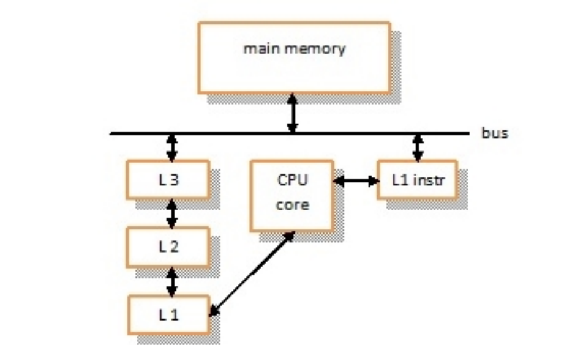
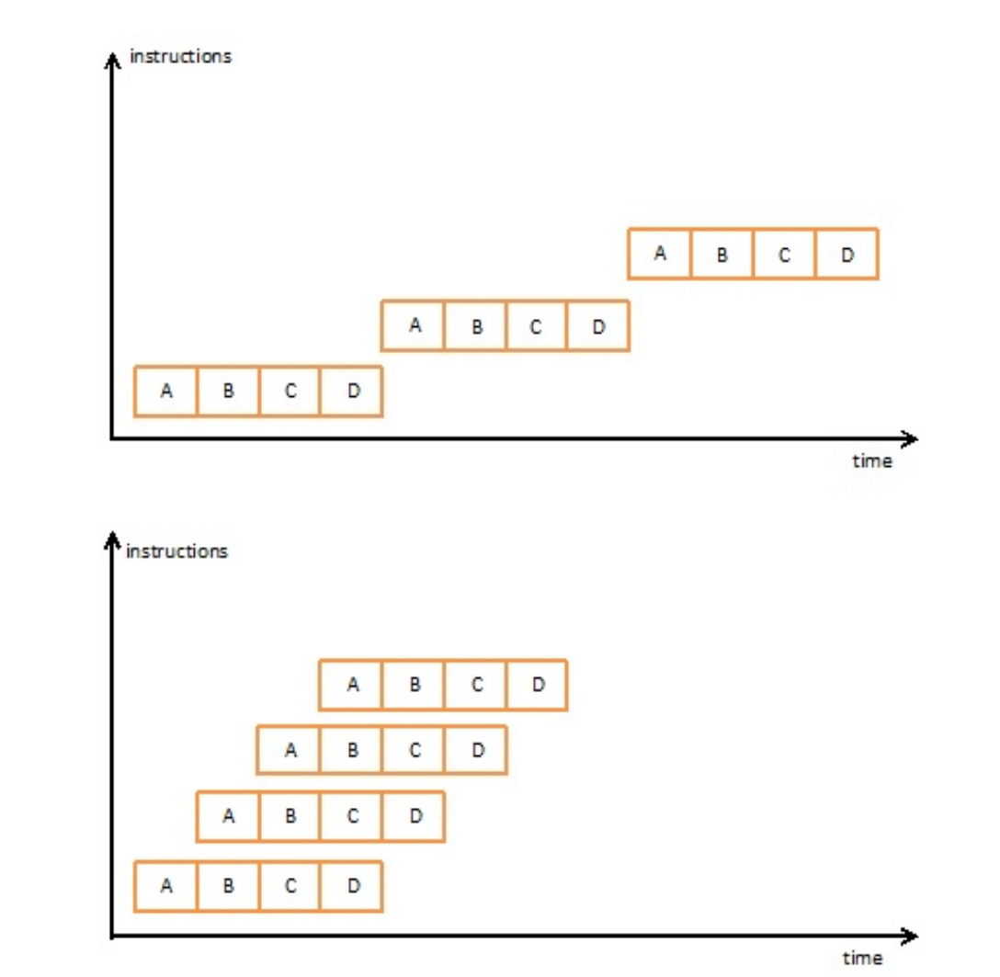
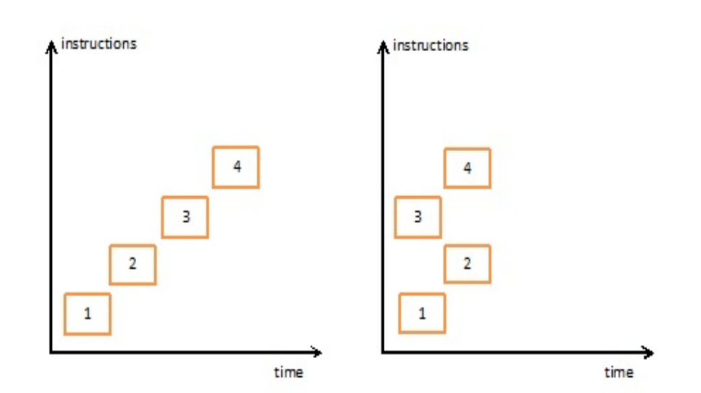

# 高性能Qt开发1

### 

关于性能优化的传统建议是： 

- 不要（现在）做 
- 过早优化是万恶之源 
- 首先跑起来，然后对起来，最后快起来！

​	第一条建议只针对专家； 第二条建议（现在仍然）通常被误引，省略了“在 97% 的情况下”部分，第三条建议给你的印象是，仅仅编写一个程序就已经非常困难，担心性能是一种奢侈。难怪通常的性能优化方法是稍后修复它！ 但所有这些格言都强调了一个重要的见解 — 性能并不是均匀分布在代码中的。 80-20 甚至 90-10 规则适用于此，因为有些热点需要格外小心，但我们不应该尝试优化代码中的每个角落。因此，我们的第一条指导原则是避免过早优化——在 95% 的情况下，我们应该忘记它。但是，我们不应该忘记的 20%、10% 或 5% 的代码到底是什么？另一个古老的编程智慧是这样的——程序员在猜测性能瓶颈方面出了名的糟糕。

​	因此，我们不应该试图预测紧要关头，而是测量现成程序的性能。这听起来很像牛仔程序员的“稍后修复”方法。好吧，这本书的立场是，虽然应该避免过早优化，但不要过早悲观应该不惜一切代价避免，因为它更糟糕！然而，避免过早悲观需要非常详细地了解哪些语言构造、哪些框架用例以及哪些架构决策会带来什么样的性能代价。

​	首先，让我们讨论一下解决应该避免什么问题的相当普遍的原则，以免性能下降。在我看来，我们可以从传统的性能智慧中提炼出以下基本的常识性建议：不要做两次同样的事情。不要经常做慢事。不要不必要地复制数据。你会同意所有这些都不利于性能吗？所以，让我们更详细地讨论一下这三个简单但基本的见解。

### 避免重复计算 

​	第一点涉及的技术与不必要的重复工作有关。这里的基本对策是缓存，即保存计算结果以供以后使用。避免重复工作的更极端的例子是在第一次使用之前预先计算结果。这通常是通过手工编码（或由脚本生成）预计算表来实现的，或者，如果您的编程语言允许，则通过编译时计算来实现。在后一种情况下，我们牺牲编译时间来获得更好的运行时性能。我们将在第 3 章“深入研究 C++ 和性能”中介绍 C++ 编译时技术。 选择最佳算法和数据结构也属于这一领域，因为不同的算法和数据结构针对不同的用例进行了优化，您必须明智地做出选择。我们将在第 4 章“有效使用数据结构和算法”中介绍一些与 Qt 自己的数据结构有关的陷阱。 诸如将代码从循环中拉出之类的最基本的技术（例如重复计算或局部变量的初始化）也属于这一类，但我相信您已经了解这一点。

### 避免付出高昂代价

如果有些事情我们无法避免，但成本相当高，那么第二点中的技术就会发挥作用。

例如

- 与操作系统或硬件的交互
- 将数据写入文件或通过网络发送数据包。在这种情况下，我们采用批处理，在 I/O 上下文中也称为缓冲 -我们不是立即写入或发送几个小块数据，而是先收集它们，然后一起写入或发送，以避免每次都付出高昂代价。

​	另一方面，我们也可以应用这种类型的技术。在 I/O 或内存上下文中，这将是数据的预取，也称为预读。当从文件读取数据时，我们读取的数据比用户实际请求的要多，希望下一部分数据很快就会需要。

​	在网络环境中，当用户将鼠标悬停在浏览器中的链接上，甚至预先连接到此类地址时，存在推测性地预先解析域名系统 (DNS) 地址的例子。但是，当预测失败时，此类措施可能会变成其对应措施，并且此类技术需要非常仔细的调整！
​	在此上下文中要提到的相关技术还包括避免系统调用和避免锁定以节省系统调用和切换到内核上下文的成本。
​	我们将在本书的最后几章讨论 I/O、图形和网络时看到此类技术的一些应用。可以使用此规则的另一个示例是内存管理。

​	通用内存分配器往往会在单次分配上产生相当高的成本，因此补救措施是首先预分配一个大缓冲区，然后通过使用自定义分配策略自行管理它来将其用于程序的所有需求。如果我们还知道我们的对象将有多大，我们可以为不同的对象分配几个缓冲池大小，使得自定义分配策略相当简单。在开始时预分配内存曾经是提高内存密集型程序性能的经典措施。

### 避免复制数据 

​	第三点中的技术往往具有较低级别的性质。第一个例子是在将参数传递给函数调用时避免复制数据。选择合适的数据结构也可以避免复制数据——只需考虑一个自动增长的向量。 在许多情况下，我们可以使用预分配技术来防止这种情况（例如 std::vector 的 reserve() 方法）或选择更符合预期用例的其他数据结构。 

​	复制数据可能成为问题的另一个常见情况是字符串处理。在简单的实现中，只需将两个字符串加在一起，就会分配一个新的字符串并复制要连接的两个字符串的内容。由于许多编程都包含一些字符串操作，这确实可能是一个大问题！解决该问题的方法是使用静态字符串文字或选择更好的字符串库实现。 

​	此优化规则的另一个示例是网络编程的ring buffer——零拷贝发送和接收数据。这个想法是，在发送数据之前，不会在用户缓冲区和网络堆栈之间复制数据。大多数现代网络硬件都支持分散-聚集（也称为矢量 I/O），其中要发送的数据不必在单个连续的缓冲区中提供，而是可以作为一系列单独的缓冲区提供。这样，用户的数据不必在发送之前进行合并，从而节省了数据复制。

### 通用性能优化方法

到目前为止，我们列出了以下经典的优化技术：

- 最佳算法
- 最佳数据结构
- 缓存
- 预计算表
- 预分配和自定义分配器
- 缓冲和批处理
- 预读
- 避免复制
- 寻找更好的库

凭借我们目前的知识水平，我们可以制定以下通用性能优化程序：

1. 编写代码，避免不必要的悲观估计，因为这样做成本不高，如以下示例所示：

  通过引用传递参数。使用相当好的、广为人知的算法和数据结构。避免复制数据和不必要的分配。仅此一点就应该能为您提供相当不错的基准性能。

2. 测量性能，找到紧要关头，并使用列出的一些标准技术。然后，再次测量并迭代。如果我们的程序性能不令人满意，尽管我们有良好的编程实践，但必须执行此步骤。不幸的是，我们无法知道或预测硬件和软件复杂相互作用中会发生的所有事情——总会有惊喜等着我们。

3. 如果仍然无法获得良好的性能，则您的硬件可能太慢了。即使使用性能优化技术，我们仍然无法创造奇迹，对不起！ 上述建议看起来很合理，您可能会问：我们完成了吗？那并不那么可怕！不幸的是，这不是全部。进入现代处理器架构的漏洞抽象。

### 现代处理器架构

所有经典的性能建议和算法都源自简单 CPU 设置时代，其中处理器和内存速度大致相等。但随后处理器速度呈爆炸式增长，每年以 60% 的速度增长，完全符合摩尔定律，而内存访问时间仅增加了 10%，无法跟上它们的步伐。问题在于，主存储器（动态随机存取存储器 (DRAM)）包含微小的电容器，这些电容器保持电荷以指示 1 位，保持无电荷以指示 0 位。这导致了一种廉价的电路，它不必保持在电压下，但基本上在模拟领域工作，无法从数字组件的进步中获得太多收益。

​	此后发生的第二个变化是简单形式的摩尔定律的消亡。直到 21 世纪初，CPU 制造商稳步提高处理器频率，使 CPU 运行速度越来越快。这是通过增加芯片上封装的晶体管数量来实现的，摩尔定律预测，芯片上可以封装的晶体管数量将每 18 个月翻一番。简单来说，它被理解为每两年将处理器速度翻一番。这种趋势一直持续到处理器制造商遇到物理障碍，即所谓的功率墙——在某个时候，密集封装的晶体管产生了如此多的热量无法在消费类机器上得到有效冷却（高端、昂贵的水冷系统对于笔记本电脑或移动设备来说太贵了），因此必须找到一种不同的方法来提高 CPU 的性能。

### 缓存 

​	为了克服这些问题，人们尝试了很多架构创新。

​	首先，使用我们已经知道的经典优化技术，即芯片级缓存，来克服 CPU 和内存速度之间的阻抗。片上静态 RAM (SRAM) 内存每位需要六个晶体管（形成触发器），并且所有晶体管都必须保持电压。这意味着它很昂贵，而且会增加功耗（注意不要碰到电源墙！）。作为交换，内存访问时间以闪电般的速度进行，因为所需的只是将电流施加到输入并读取输出。因此，我们的想法是在大而慢但便宜的主内存前面添加一个昂贵但快速的片上内存的小型缓存阶段。同时， 现代 CPU 可以控制最多三级缓存，通常用 L1 、 L2 和 L3 缩写表示，随着缓存级别的提高，缓存密度和速度会降低，但大小会增加。下图向我们展示了现代 CPU 中常见的内存层次结构的概览：



​	目前为止：L1 缓存的访问时间约为 3 个周期，L2 为 12 个周期，L3 为 38 个周期，主存储器约为 100-300 个周期。主存储器访问时间之所以如此之高，是因为 DRAM 的模拟特性需要定期刷新电荷、读取前对读取线进行预充电、模拟数字转换、通过内存控制器单元 (MCU) 进行通信等。 缓存按缓存线组织，在当前的 Intel 架构中缓存线长度为 64 字节。因此，每次缓存更新都会从主存储器中提取整个缓存线，在该级别执行某种预取。 说到预取，Intel 处理器有一个特殊的预取指令，我们可以在汇编代码中调用该指令进行非常低级的优化。 除了数据缓存之外，还有一个指令缓存，因为在冯·诺依曼架构中，两者都保存在公共内存中。指令缓存被添加到英特尔奔腾 Pro (P6) 中作为实验，但从那时起它们就从未被移除过。

### 流水线 

​	提高处理器速度的另一种可能性是指令级并行 (ILP)，也称为超标量计算。 CPU 指令的处理可以在内部分为几个阶段，例如指令获取、解码、执行和写回。在 Intel 486 处理器之前，每条指令都必须完成，然后才能开始下一条指令。使用流水线，当一条指令的第一阶段准备就绪时，该指令可以转发到下一阶段，下一条指令的处理可以从其第一阶段开始。通过这种方式，几条指令可以并行运行，从而保持处理器资源的最佳利用。下一个屏幕截图使用假设的四阶段流水线以图形方式说明了这一原理：



### 推测执行和分支预测

​	只要流水线在运行，一切都没问题。但是，如果我们遇到条件分支怎么办？流水线必须等到测试结果出来，因此只有当前指令完成后才能启动下一条指令。欢迎来到 80,486 之前的世界！这被称为流水线停顿，违背了流水线的整个目的。而且，由于每个程序实际上都充斥着 if-then-else 子句，因此必须在这里做点什么。

​	制造商提出的解决方案是推测执行：我们不是闲置，而是开始推测性地执行其中一个分支。

​	如果我们幸运的话，我们刚刚做了正确的事情，但如果不，我们就会放弃我们的推测工作，这样我们就与流水线停顿的情况平起平坐了。由于我们随机决定，我们有 50% 的时间是正确的，而且我们真的大大增加了流水线的吞吐量！

​	唯一的问题是 if 子句的分支出现概率并不相等！在大多数情况下，它们甚至分布极不均匀：其中一个是错误分支；另一个是正常情况分支。但处理器不知道测试的含义，所以我们能做什么？解决方案是分支预测——处理器正在学习代码中的分支，并且可以很好地预测在给定条件下将采用哪个分支。这很快就变得复杂了，不是吗？如果你这么想，你并不孤单。不久前，Spectre 和 Meltdown 漏洞的披露震惊了编程世界，这些漏洞允许攻击者查看他们没有访问权限的内存区域的内容。漏洞利用的第一部分是欺骗分支预测器采取错误的分支进行推测执行。在处理器看到不允许的访问后，该指令将被淘汰，但受保护的数据将存在于缓存，可以使用一些复杂的技术来猜测它们，我们不会在这里讨论。这些错误基本上质疑了过去十年的处理器优化，因为修复它们将导致显着的性能损失。考虑到这一点，我们都非常好奇下次 CPU 架构将如何发展，不是吗？

### 乱序执行

​	流水线概念还有另一个改进，可以实现更高的 CPU 资源利用率。也就是说，随着处理器制造商开始添加冗余处理单元（Intel P6 已经拥有两个整数和两个浮点执行单元），并行执行两个指令成为可能。直到 Pentium Pro (P6)，指令都是按照出现的顺序送入流水线的。但如果两个连续指令之间存在数据依赖关系，则无法并行处理它们，从而使额外的执行单元处于空闲状态：

```
a = b + 1; // 1
c = a + 5; // 2
d = e + 10; // 3
f = d + 15; // 4
```

​	此问题的解决方案是获取下一个独立指令并在依赖指令之前执行它。请参阅下图以获得直观的解释：



​	在这里，在左侧，我们看到传统的执行保留了指令顺序，而在右侧，我们看到的是重新排序的并行执行，其中指令 3 将在指令 2 之前执行。

### 多核

​	最终，功耗墙问题通过冻结甚至降低 CPU 频率，但引入并行工作的处理器核心、添加更多通用寄存器、矢量处理单指令多数据 (SIMD) 寄存器和指令得以解决。总之，它们要么复制活动处理单元，要么添加更多不必始终处于电压下的元素。这样，晶体管的密度就不必增加。

​	当所有 CPU 核心都放在一个芯片上时，我们就有了一个对称多处理 (SMP) CPU，因为所有核心都可以在本地芯片内访问各自的数据。与之相对应的是非统一内存访问 (NUMA) 系统，其中我们有几个物理上独立的 CPU，它们有自己的内部缓存。内部 CPU 的内存访问将比外部 CPU 的内存访问便宜得多。另一个问题是 CPU 之间的缓存一致性，这需要复杂的缓存一致性协议，并且会降低性能。在 Qt 的应用领域中，我们通常会遇到 SMP 机器，因此本书中我们将忽略 NUMA。
​	在多核芯片中，处理资源可分为核心和非核心资源——每个核心都重复的资源，以及不重复且必须共享的资源。例如，顶级缓存（L3 或 L2，取决于处理器）是处理器核心之间共享的非核心资源。
​	一个经常遇到的概念是超线程。这是增加 CPU 并行性并因此提高资源利用率的另一种方法。具有超线程的处理器由每个核心两个逻辑处理器组成，每个逻辑处理器都保持自己的内部状态。处理器保存其架构状态（例如，运行、中断和停止）的部分将为每个核心重复，但计算资源将在逻辑核心之间共享。这样做的目的是提高利用率

​	通过从停滞的逻辑核心借用资源，可以充分利用处理器的资源并防止流水线停滞。然后，操作系统将这两个逻辑核心用作物理核心，并且必须具备 HTT 感知能力才能最佳地使用这样的系统。严格来说，图形处理单元 (GPU) 不是多核的一种形式，但我们会在这种情况下提到它们，因为处理器可以配备集成的 GPU。GPU 包含许多非常简单的处理单元，这些处理单元可以大规模并行运行简单的计算。通常，它们用于加速图形处理，但它们也可以用于加速一般计算，例如深度学习应用中的神经网络训练。然而，在 Qt 环境中，我们仅将 GPU 用于其图形功能。

### 附加指令集

如前所述，为了提高处理器性能芯片，制造商开始添加更复杂的指令，这些指令可以矢量化计算或执行迄今为止必须在应用程序代码中实现的算法。 SIMD 或矢量指令可用于通过并行执行多个标量值的计算来并行化标量计算。 为此，我们必须在两组 SIMD 寄存器中加载几个浮点值，然后一次对它们全部应用操作。 Intel 处理器在一系列扩展中引入了 SIMD，具体如下：
流式 SIMD 扩展 (SSE)：使用 128 位寄存器，有多个版本，从 SSE、SSE2 到 SSE4
高级矢量扩展 (AVX)：使用 265 位寄存器，有 AVX2 和 AVX-512（用于 512 位）版本
至于更专业的指令，我们提到了以下 Intel 扩展：

- 高级加密标准新指令 (AES-NI)：这实现了加密 AES 编码标准。
- 32 位循环冗余校验 (CRC32)：这实现了 CRC32 校正码的计算。
- SSE4.2：此 SSE 扩展还使用 SIMD 寄存器实现了基本的字符串操作。

### 对性能的影响

​	如您所见，现代 CPU 看起来一点也不像您父亲的老式冯·诺依曼 CPU。它本身就是一个非常复杂的计算机系统，被禁止安装在非常小的芯片上，拼命尝试所有可能的技巧来从您的程序中榨取更多的性能。
​	另一方面，现代 CPU 试图向程序员展示简单，不幸的是，在此过程中一直泄露实现细节。那么，自从我们在前面几节中总结的经典性能建议以来，发生了什么变化？
幸运的是，变化不大。基本技术和指导方针仍然适用，但必须注意一些额外的建议。让我们讨论这些新观点。

保持缓存热度
首先，不要因为主内存非常慢而破坏缓存。
这意味着在整个内存中读取数据（也称为指针追逐）并不是最好的主意。现代处理器，例如以可预测的方式读取连续内存块的程序，允许它们利用硬件级预取。这里的词是数据局部性。
一个反面的例子，唉，是我们古老而可靠的链表！
遍历它是一场真正的指针追逐盛宴，因为所有节点都是动态分配的，可以放置在内存中的任何位置。但是，我们可以通过使用前面提到的预分配和自定义内存分配器技术来解决这个问题。在这种情况下，列表的所有节点都将位于预分配缓冲区的相邻元素中，这再次使其更加缓存友好。当然，我们可以从一开始就使用数组，但这是一个如何在类似情况下改善数据局部性的示例。

第二个经典错误是将两个常用的整数 x 和 y 放在一个数据结构中，彼此相距甚远，这样当我们想要同时使用它们时，我们就需要不必要地加载两个缓存行而不是一个。一起使用的东西应该保持在一起；不要在缓存行边界上破坏你的数据结构！

众所周知的进一步优化是用数组结构替换结构数组。这对于为 SIMD 指令加载数据和其他并行读取数据的技术非常有用。

另一个经常被引用的优化技巧是通过改变数据访问模式来提高矩阵乘法的性能。我们不再使用简单的三重 i、j、k 循环，而是将其改为 k、j、i 循环：

```
for (size_t k = 0; k < P; ++k)
	for (size_t j = 0; j <M; ++j)
		for (size_t i = 0; i < N; ++i)
			res[i][[j] += m1[i][[k] * m2[k][[j];
```


​	在这里，只需切换遍历顺序以更有利于缓存，并以连续的方式读取两个矩阵的行元素，即可显着提高性能（在某些测量中，高达 94%）！我们在这里了解到，数据的概要和结构，以及其访问模式，都会对我们的程序在现代处理器上的性能产生重大影响！

​	第二种类型的缓存，即指令缓存，也需要一些关注。在代码中来回跳转同样糟糕，就像在您的数据的情况下一样。此代码局部性是下一个重要概念。影响这一点的一种可能性是将正常情况代码放在处理错误之前，如下所示：

```
if (ok) {
	do_work();
} else {
	printf(“ERROR!”);
	return;
}
```

​	这避免了正常情况下的跳转，从而提高了代码局部性。

### 不要混淆您的分支

预测器为了避免流水线停顿，最好不要有任何分支。不幸的是，这在编程中无法实现，但我们能做的第二件最好的事情就是尽量减少分支。避免分支的一个典型例子是用位操作替换简单的条件表达式，如下所示：

```
const int maxValue = 16;
if (x >= maxValue) x = 0;
// 相当于：
x = (x + 1) & (maxValue - 1);
```

​	我认为我们可以同意，这些都是丑陋的低级技巧，最好留给微优化阶段或编译器。这种类型的另一种技术是循环展开。

​	一种更有用的技术可以帮助编译器生成更适合分支预测器的代码，例如 Linux 内核的宏实践：likely() 和 unlikely()，它们在内部使用 GNU 编译器集合 (GCC) 编译器的 __builtin_expect() 指令。这应该支持分支预测器，但实际上，它允许编译器对代码进行重新排序，从而实现不同的优化。具有静态分支预测器的旧架构使用特殊指令前缀，指示是否可能采用分支。由于较新的架构正在使用动态预测器，因此这些前缀将被忽略并且不会产生任何影响。因此，公认的观点是，分支预测器已经变得相当好，我们应该只在极少数情况下尝试弄乱它们。除了一件事：由于分支预测器的表具有有限的（小的）大小，因此您不应该破坏它！我们再次强调：不要使用太多分支；保持良好的代码局部性！

### 并行化您的应用程序 

​	这是著名的“没有免费午餐”难题：如果我们想让我们的程序运行得更快，仅仅购买更快的处理器是不够的——我们必须将其重构为并行的并使用更多的处理器核心！我

​	至于矢量处理，我们必须注意到，为了使 SIMD 指令具有高性能，加载的数据通常必须对齐。除此之外，截至今天，任何像样的现代编译器都会尝试对代码进行矢量化，因此通常我们不必费心。但是，编译器将为特定体系结构生成代码，但也许您想在多个处理器上运行您的程序并寻找可用的更高级的扩展指令集？这是可能的，并且用于执行此操作的技术称为 CPU 调度。 这里要提到的与并行相关的第二个主题是无序执行。首先，有时，我们会遇到建议，要求打破过长的依赖链，以便允许重新排序，如上图所示。可以说，这是一种低级技术，但有时每纳秒都很重要。 

​	另一个主题是，有时我们可能希望禁用指令重新排序。会是什么呢？对的——在线程之间同步时，我们必须确切知道读取或写入哪些变量的顺序。在处理器级别，可以使用内存屏障来强制执行此操作，但这将阻止可能的重新排序优化。这就是多线程程序中的同步在处理器级别上已经很昂贵的原因。