# ROS入门

​		ROS：Robot operating System

​		他是一个开源元操作系统，类似于我们经典意义的操作系统，有大量的工具，库与协议，还可以在多台计算机上获取，构建编写和运行代码的工具和库。

​		至于ROS 的安装，这就不在阐述！

​		还是决定提供一个简单的方式测试一下你的ROS有没有安装成功。启动Linux虚拟机，随后开三个终端！

​		第一个终端启动ros环境，输入

```
roscore
```

​		第二个输入

```
rosrun turtlesim turtlesim_node
```

​		第三个输入

```
rosrun turtlesim turtle_teleop_key
```

​		看看小乌龟可不可以跑！注意第三个终端要在最上面！（焦点必须在第三个终端）

## 体验经典：hello world

​		ROS工作的程序有C++ 和 Python。

​		首先，我们需要让Linux认识一下ROS的库！这需要我们来初始化工作环境！其基本步骤如下：

1. 先创建一个工作空间

2. 创建一个工作包

3. 编辑源文件

4. 编辑配置文件

5. 编译并执行

   

​		当然，真正的差异就在第四步，那我们先来看前几步！

第一步：

​		简而言之，找个地方！安装当下的文件，今天我们先创建一个RosLearn 文件夹吧，以及我们的第一个实验：Learn1,注意，还要整一个 src 文件夹，并且必须是这个名字！！！

```shell
mkdir -p Roslearn/learn1/src
cd Roslearn/learn1
catkin_make #this instructions aims to init the workspace!
```

​		这些正是Cmake的日志，下面开始第二部，创建一些简单的package!

​		我们把我们一切的源文件放到src文件夹下，随后，在命令行下输入

```shell
cd src
```

​		如是，创建功能节点即可

```shell
catkin_create_pkg 'packName' 'dependency' #when writing , you are no need to add ''!
# examples
catkin_create_pkg helloWorld roscpp rospy std_msgs
```

​		会发现：

​		多了很多文件，我们不予理会，还没到时候！

​		roscpp是C++的实现库，rospy是 python库的，这点需要注意！

​		好了，开始第三步！！！cd到包里的src文件

​		如果熟悉 vim, 可以直接 vim helloworld_cpp.cpp来一个！

```shell
 vim helloworld_cpp.cpp
```

​		书写这些代码！

```C++
#include"ros/ros.h"

int main(int argc,char* argv[]){
    ros::init(argc,argv,"hello");
    
    ROS_INFO("hello world!!!");
    
    return 0;
}
```

​		摁esc退出insert模式，随后:wq退出vim。

​		随后，更改CmakeLists 配置文件，注意到是这里的

​		找到第136行的 add_executable,和第149行的target_link_library做出这样的更改

​		这个haha是Cmake下的临时变量，注意到149行的name必须和136行的name一致

​		最后一步就是编译！！！

​		退回到最顶层工作文件夹，再次编译，若有错，按照报错改！

​		没有错的话，是这样的 

​		开一个新端

​		先让ros环境启动一下！

```shell
roscore
```

​		回到原来的终端，注意是原来的！！！

```shell
source ./devel/setup.bash
```

​		不知道啥情况的找到这个文件然后source一下。

​		下面，就可以有

```shell
rosrun helloworld haha
#helloworld包下的haha
```

​		至于集成的开发环境，可以考虑VScode+插件，具体的配置方法在我的博客已经讲述过了！不再讲述！

## ROS节点说明

​		我们大多数时候需要启动多个ROS节点，这就需要我们写Launch文件来完成这个工作！

​		其实现如下：(以经典乌龟为例)

​		1)选定功能包右击-->添加launch文件夹

​		2)选定launch文件邮寄-->添加launch文件(xml文件)

​		3)书写

```xml
<launch>
	<node ... />
</launch>
```

​		node : 节点

​		pkg 功能包

​		type: 被运行的节点文件

​		name 为节点命名

​		output 设置日志的输出目标

```
roslaunch 包名 launch文件名称
```

## 撸代码

​		下面,在一个节点下新建一个launch文件夹,随后在这个文件夹下面新建xml文件		

```xml
<launch>
    <!-- add nodes here-->
</launch>
```

​		不要急着就写下面,先保存,后跑一下可不可以跑!

​		摁 ctrl + ~打开bash ,先搞一下环境变量 source ./devel/setup.bash

​		然后跑一下

​		这个Launch标签就是启动环境的,下面开始书写

```xml
<launch>
    <!-- add nodes here-->
    <node pkg="turtlesim" type="turtlesim_node" name="GUI">
    <node pkg="turtlesim" type="turtle_teleop_key" name="Key">
    <node pkg="hello_cpp" type="hello_cpp_c" name="try" output="screen">
    <!-- pkg是包名 type就是运行文件!切记-->
	<!-- output 表示的是输出的日志输出在哪里-->
</launch>
```

# ROS架构

​		现在我们开始讲解ROS的架构

## 设计者

​		ROS的设计者将ROS表述为“ROS = Plumbing + Tools + Capabilities + Ecosystem”

​		Plumbing 是通讯机制（实现ROS不同节点）

​		Tools 是工具软件包（ROS开发和调试工具）

​		Capabilities 机器人高层技能（导航）

​		EcoSystem 机器人生态

## 维护角度

​		main:核心部分

​		universe: 一些扩展的代码

## 系统架构

​		ROS可以有三层

​		（1）OS层 ，也就是经典操作系统 ，ROS是一个元操作系统

​		（2）中间层：封装了一些机器人开发的中间件

​				如：基于TCP/UDP 继续封装的TCPROS/UDPROS系统

​		（3）应用层


## 自身结构

​		文件系统：ROS文件系统指的是硬盘上面查看ROS源代码的组织形式。

​		计算图： 不同进程需要的进行数据交互。计算图可以良好的表现他们的作用关系

​		开源社区：略


## ROS文件系统

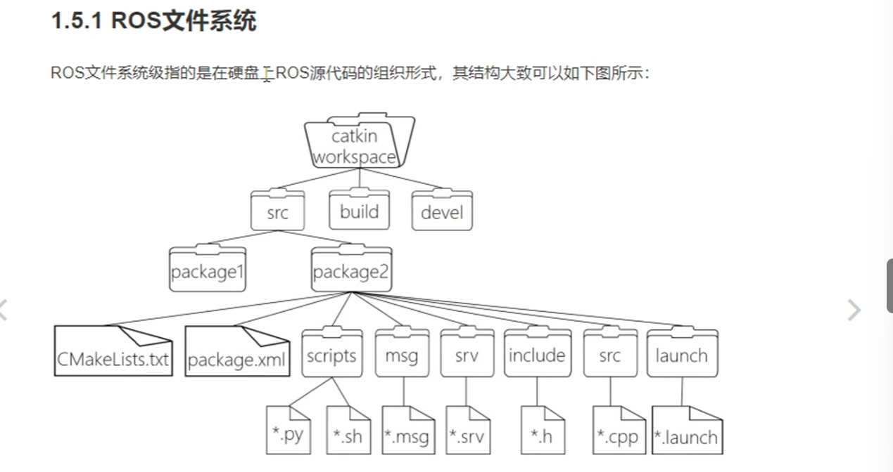

​		如上图，这就是一个ROS的文件结构。

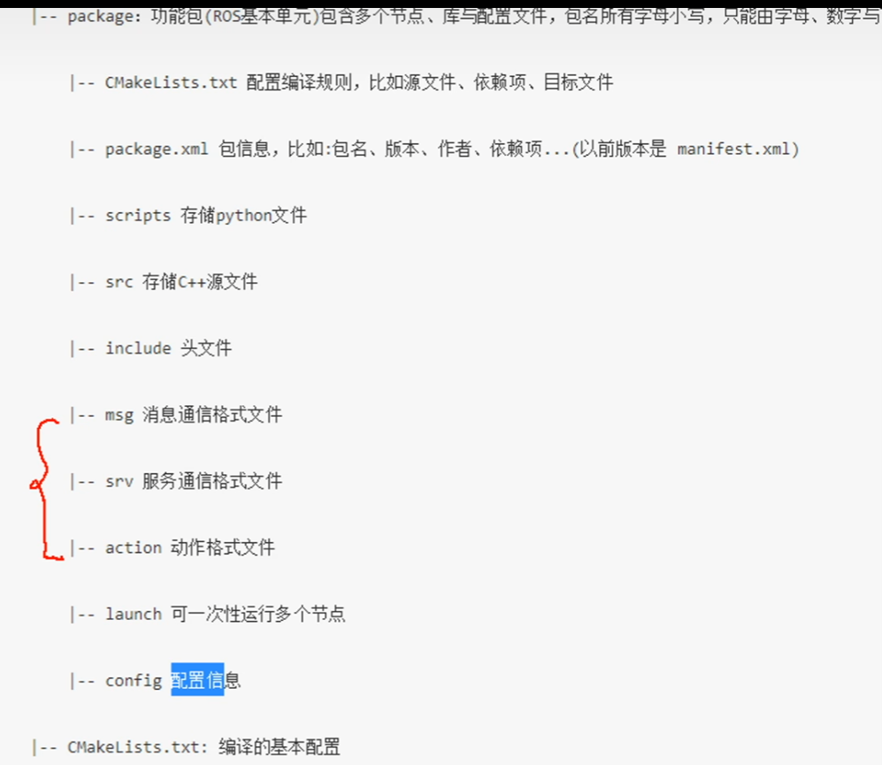

​		下面详细重点的介绍如下的文件

### package.xml

​		这个文件是自动生成的，他在这里：

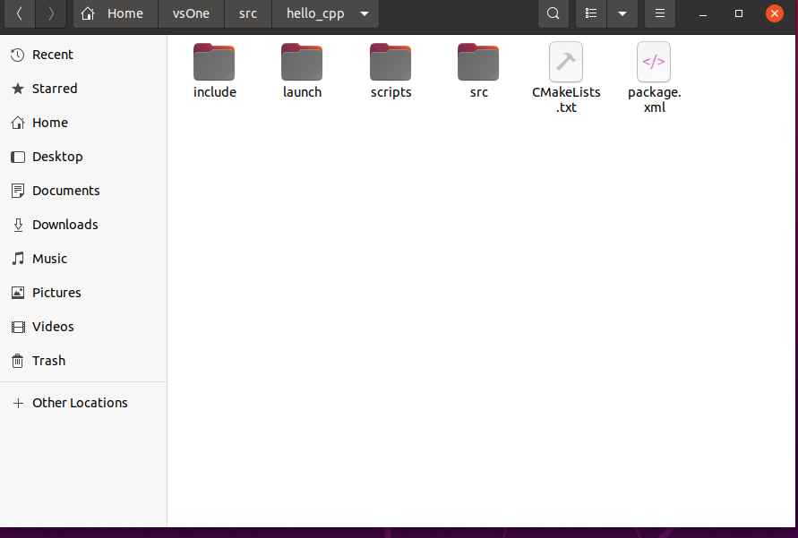

​		是的，就在SRC文件夹下面

​		打开看看，就会发现这里有软件包名称，版本号，作者，维护者以及其他信息。

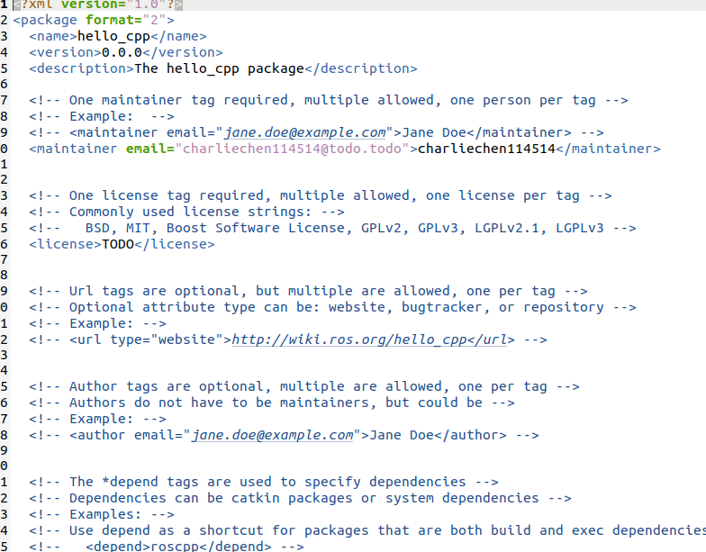

​		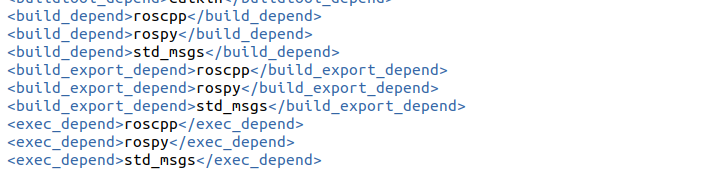

​		这里可以查看依赖。

### CmakeLists.txt

​		隔壁就是CmakeLists.txt。大量的对象我们用到再说，先不说过多！

## ROS文件系统的相关命令

​		下面我们来看一些常见的指令：

### 增

​		catkin_create_pkg 自定义的包名 依赖的包 == 创建新的ROS功能包

​		sudo apt install xxx ==安装ROS功能包 （后期经常用）

### 删

​		sudo apt purge xxx == 删除功能包

### 查

​		rospack list == 列出所有的功能包

​		rospack find 包名 == 查询寻包名是否存在，存在返回安装路径

​		roscd 包名 == 进入摸一个包

​		rosis 包名 == 列出包下的文件

​		apt search xxx == 搜索包

### 改

​		rosed 包名 文件名 === 修改功能包文件

### 执行

​		roscore === 是ROS系统先决条件和程序的集合，必须先启动ROScore

```shell
roscore
//
roscore -p xxxx # 指定端口
```

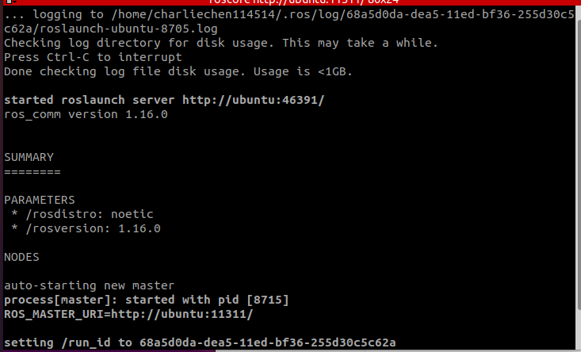

​		启动发现产生了大量的信息，这是熟知英文就可以读懂了，以及这个

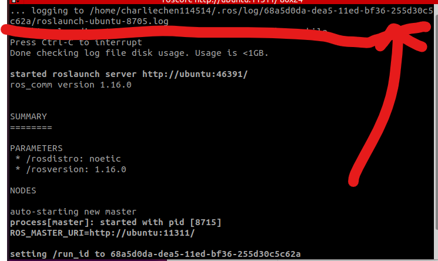

​		这个是输出日志的Linux地址，可以查看这里。

​		

```
rosrun 包名 可执行文件名 === 运行指定的ROS节点
```


​		尝试一下：（rospack list）

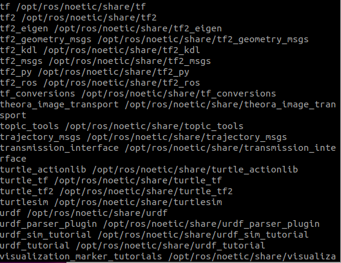

​		cd 一下

​		

​		在全网搜寻一下：

```shell
apt search ros-noetic-*
```

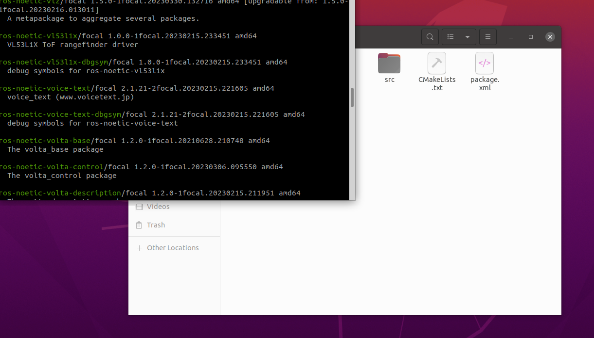

​		当然，这不好，我们grep检索一下、

```shell
apt search ros-noetic-* | grep -i gmapping
```

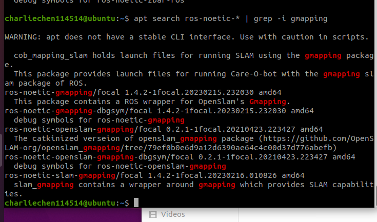

## 计算图

​		下面要说的是显示个节点关系的一个有效的动态展示图，他就是rqt_graph，用来展示错综复杂的节点关系！

### 安装

​		直接先跑一下这个玩意

```shell
rosrun rqt_graph rqt_graph 
```

​		如果告诉你没安装，装一下就好了：

```shell
sudo apt install ros-<distro>-rqt
sudo apt install ros-<distro>-rqt-common-plugins

-<distro>-用ROS你自己安装的版本替代！
```

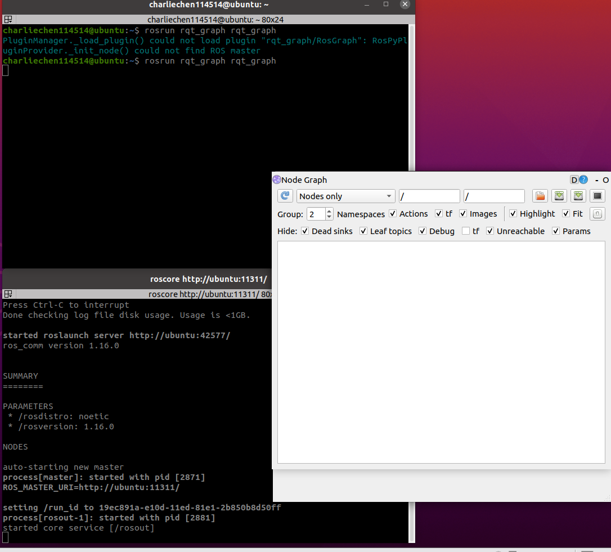

​		注意开的时候先把环境给开了！

​		然后，启动一下我们之前写的Launch脚本，这样，再次运行rosrun rqt_graph rqt_graph ：

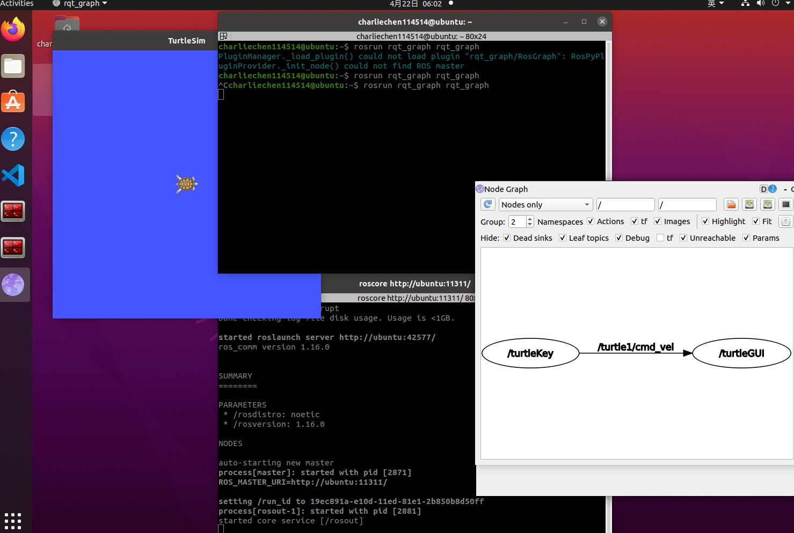

​		好了，基础的ROS认识就到这里，之后我们开始讲授核心！ROS的通讯机制！

# ROS通信机制

​		机器人是一种高度复杂的系统性实现。在机器人上可能集成了各种传感器（雷达）等，为了解耦合，ROS的每一个功能点都是一个单独的进程，并且他们是可以独立运行的。ROS是进程的分布式框架。


ROS 实现通信机制的三种实现策略

1）话题发布 （发布订阅模式）

2）服务通信 （请求响应模式）

3）参数服务器 （参数共享模式）

## 话题通信

​		话题通信时ROS使用频率最高的一种通信模式，也是基于发布订阅模式的，也即：一个节点发布消息，另一个节点订阅信息：

​		如：机器人执行导航功能的时候使用的传感器时激光雷达，机器人会采集相关的信息并且完成计算，随后控制运动生成信息

​		这样通信的作用时用在不断更新的，少逻辑处理的数据传输场景。下面尝试实现一下！

​		在这个模型里头，有三条个主角：ROS MASTER（管理者），Talker（话题发出者），Listener（订阅者）

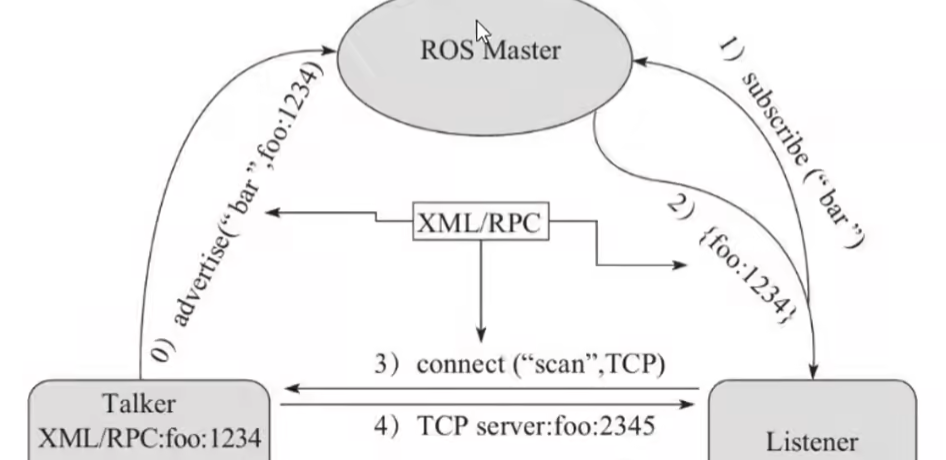

​		master 根据话题建立发布者和订阅者之间的联系。

​		使用的协议时RPC和TCP， 并且Listener和Talker可以存在多个。talker和Listener建立连接以后，master就可以关闭了。当然这些流程已经被封装，我们没有必要去了解。

## 实践1 - ROS in C++

​			例子：我们要以每秒10次的频率实现信息的发送！

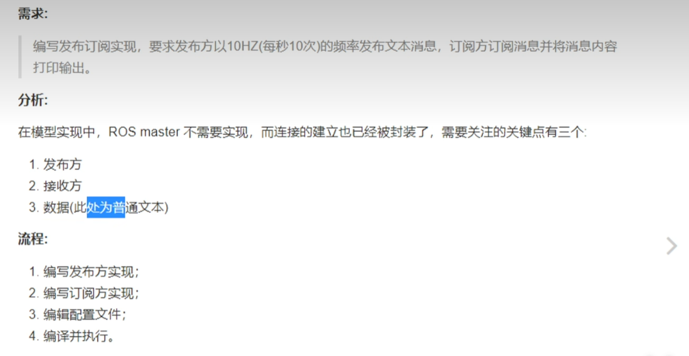

​		我们按照先前早就讲过的流程创建一遍工程，在已经完事了的CPP文件下书写如下的代码

```C++
#include"ros/ros.h"
#include"std_msgs/String.h"
/*
    publisher release:
    
    1. incldue Files: ROS RO
    2. init ROS node
    3. create Handle of the node
    4. create publisher
    5,create publisher logic and the data
*/


int main(int argc, char* argv[])
{
    // init a node
    ros::init(argc,argv,"such_a_node"); // 别带空格！这是涉及到命令行的

    // create a handle
    ros::NodeHandle nodeHandle;

    // create Publisher
    ros::Publisher pub = nodeHandle.advertise<std_msgs::String>("this_is_a_topic",10);// 别带空格！这是涉及到命令行的
    
    std_msgs::String msg;
    // create the msg
    while(ros::ok) // this node is still available
    {   
        msg.data = "hello this is a msg"; // 设置字符串

        pub.publish(msg); // 向外广播
    }
    return 0;

}
```

​	

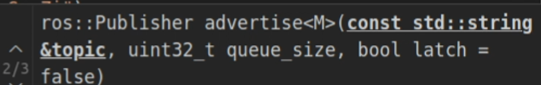

​		看到这个节点句柄的 advertise API了嘛，这就是一个广播函数第一个很好理解，就是话题名称，第二个是什么呢：我们的网络通信可能会有阻塞，于是ROS会将这些被阻塞的数据存储到队列里，等到网络稍微流畅的时候再发送出去！

​		当我们编完Ctrl + Shift + B结束编译之后，在一个命令行窗口处输入

```
roscore
```

​		启动大环境

```
rosrun publish demo_cpp
```

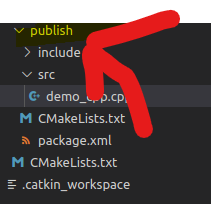

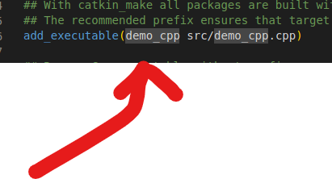

​		啥也没有！那就对了！

```
// 再开一个
rostopic echo + 'topic_name'
```

​		比如说我的就是

```C++
rostopic echo this_is_a_topic
```

​		消息就这样打印出来了！


​		下面设置一下频率！和计数器的使用

```C++ 
#include"ros/ros.h"
#include"std_msgs/String.h"
#include<sstream>
/*
    publisher release:
    
    1. incldue Files: ROS RO
    2. init ROS node
    3. create Handle of the node
    4. create publisher
    5,create publisher logic and the data
*/


int main(int argc, char* argv[])
{
    // init a node
    ros::init(argc,argv,"such_a_node");

    // create a handle
    ros::NodeHandle nodeHandle;

    // create Publisher
    ros::Publisher pub = nodeHandle.advertise<std_msgs::String>("this_is_a_topic",10);
    
    std_msgs::String msg;
    // create the msg

    // create a ratio obj
    ros::Rate rate(10);

    int count = 1;

    while(ros::ok) // this node is still available
    {   
        //msg.data = "hello this is a msg";

        std::stringstream ss;
        ss << "hello from ------->"<<count;

        msg.data = ss.str();

        pub.publish(msg);
        // add log
		// transform into C Style String
        ROS_INFO("broadcast the msg : %s",ss.str().c_str());

        rate.sleep();

        count++;

    }

    
    return 0;

}
```

​		这个字符串的拼接使用扩展的ROS里的函数

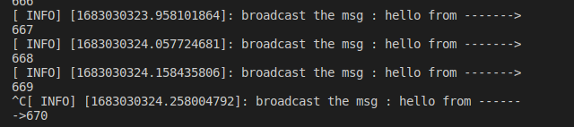

## 订阅方的实现

​		我们这样实现一个如此的Demo!

```C++ 
#include"ros/ros.h"
#include"std_msgs/String.h"
#include<sstream>

void doMsg(const std_msgs::String::ConstPtr &msg){

    // by this const ptr to subscribe the msg


    ROS_INFO("Have received the %s",msg->data.c_str());


}


int main(int argc, char *argv[])
{
    /* same as before... */

    ros::init(argc,argv,"sub");

    ros::NodeHandle nodeHandle;
    // the last var is the callBackFuncPointer
    ros::Subscriber sub = nodeHandle.subscribe("this_is_a_topic",10,doMsg);
    // nake sub receive the msg consistently
    ros::spin();
    return 0;
}

```

​		为了处理得到的信息，就是在这里的回调函数实现对信息的处理的！

​		当然，带上Cmakelists 的配置，不然系统不认识！

## python

​		ros 的python就简单很多，逻辑类似于C++，不做更多的解释：

```python
#! /usr/bin/env python

import rospy
from std_msgs.msg import String 
"""message type"""
"""
    load package

    init ros node

    create publisher

    write the logic and broadcast

"""

if __name__ == "__main__":
    rospy.init_node("pub")

    pub = rospy.Publisher("topic",String,queue_size=10)
    mag = String()
    rate = rospy.Rate(1)

    count = 0
    
    rospy.sleep(3) // 让之可以在后被启动的时候让sub完全接收到所有数据
    while not rospy.is_shutdown():
        
        count += 1

        mag.data = "hello" + str(count)

        pub.publish(mag)

        rate.sleep()

```

```
#! /usr/bin/env python


"""
sub basic steps
    1. import rospy std_msgs
    2. init node
    3. create a subscriber
    4. using call back functions to deal with data
    5. make spin() in python
"""
import rospy
from std_msgs.msg import String

def doMsg(msg):
    rospy.loginfo("The subscried data is:%s",msg.data)


if __name__ == "__main__":

    rospy.init_node("subscribe")

    sub = rospy.Subscriber("topic",String,doMsg,queue_size=10) 
    """need the name the same as publisher"""


    rospy.spin()

    pass

```

