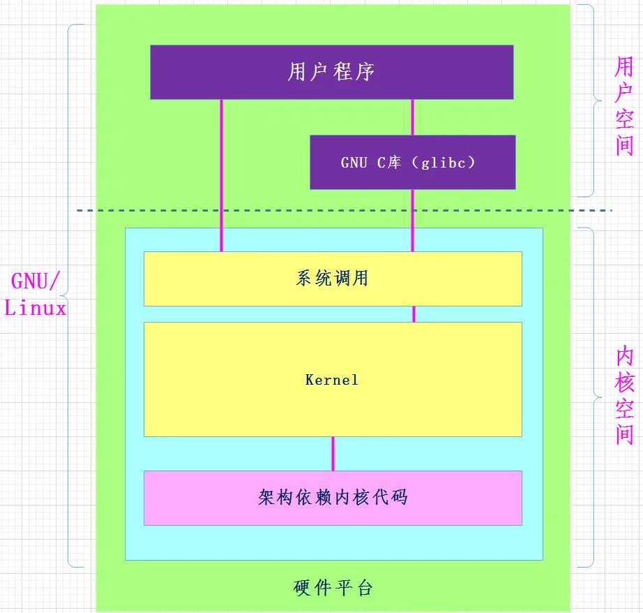
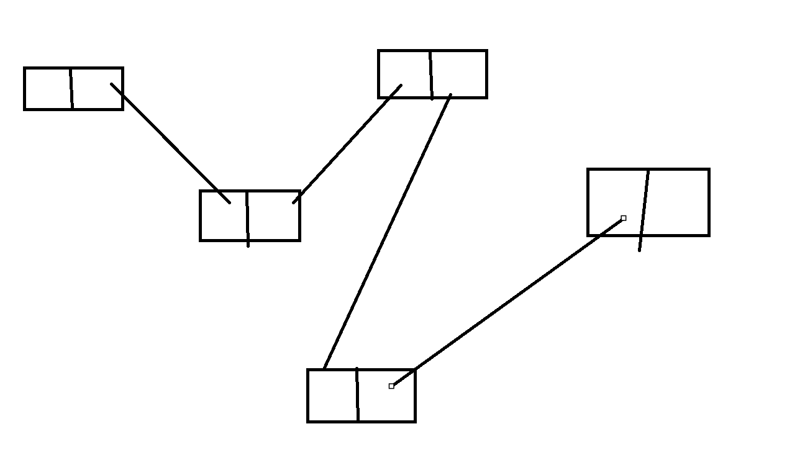
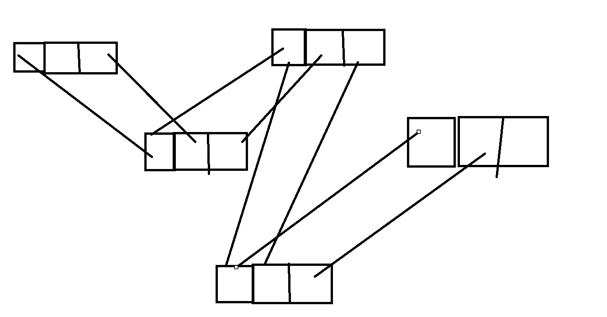
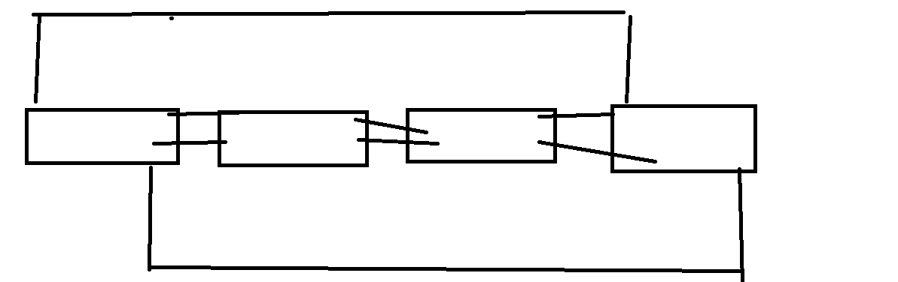
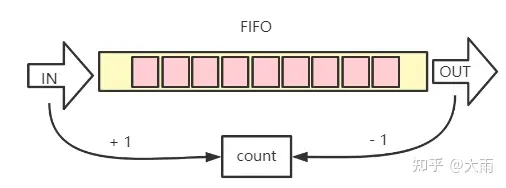
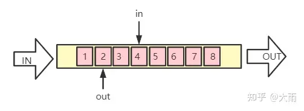
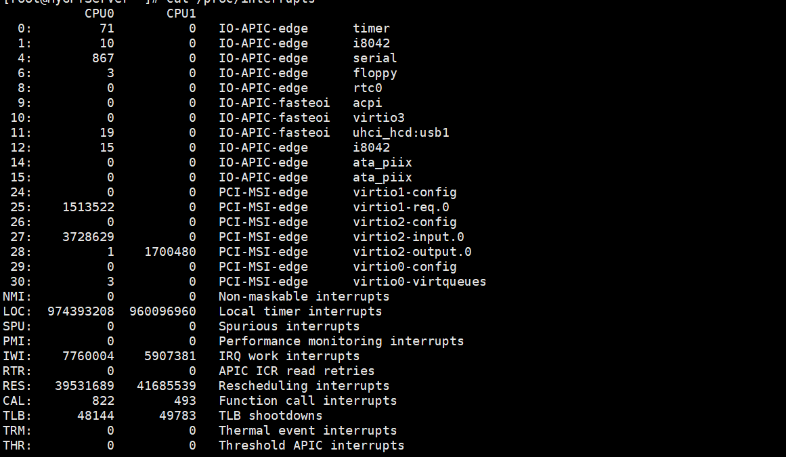
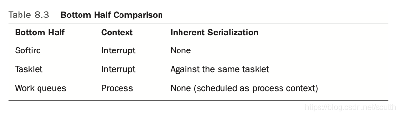

# Linux内核导览与简史

## UNIX简史

​	我们必须先提一嘴Unix操作系统的简史：

​	1964年贝尔实验室（Bell Labs）、通用电气（General Electric）和麻省理工学院（MIT）联合启动研发第二代分时操作系统**MULTICS**（Multiplexed Information and Computing Service）(注：MULTICS正式研制始于1965年)

​	1969年，贝尔实验室研究人员Ken Thompson（对，C语言的发明者之一）在退出MULTICS项目时，准备将原本在MULTICS系统上开发的“star travel”游戏转移到DEC PDP-7上运行。在转移游戏程序运行环境的过程中，Thompson和Dennis M.　Ritchie共同动手设计了一套包含文件系统、命令解释器以及一些实用程序的支持多任务的操作系统。与Multics相对应，这个新操作系统被同事Brian Kernighan戏称为UNICS（UNiplexed　Information and Computing System，非复用信息和计算机服务），之后大家取谐音便叫成了UNIX。

​	1970年Thompson尝试用Fortran重写UNIX失败后整合BCPL成B语言，1971年他用B语言在PDP-11/24上重写UNIX，当年的11月3日，UNIX第1版（UNIX V1）正式诞生。

​	1972年，UNIX发布了第2版，最大的改进是添加了后来成为UNIX标志特征之一的管道功能。在开发UNIX V2的时候，Ritchie给B语言加上了数据类型和结构的支持，推出了C语言。

​	1973年，Thompson和Ritchie使用C语言重写了UNIX，形成第3版UNIX。在当时，为了实现最高效率，系统程序都是由汇编语言编写，所以Thompson和Ritchie此举是极具大胆创新和革命意义的。用C语言编写的Unix代码简洁紧凑、易移植、易读、易修改，为此后UNIX的发展奠定了坚实基础。

​	1974年，Thompson和Ritchie合作在ACM通信上发表了一篇关于UNIX的文章，这是UNIX第一次出现在贝尔实验室以外。此后UNIX被政府机关，研究机构，企业和大学注意到，并逐渐流行开来。

​	1975年，UNIX发布了4、5、6三个版本。1978年，已经有大约600台计算机在运行UNIX。Thompson应邀回母校——加州大学伯克利分校任客座教授，讲授的科目就是UNIX。同年，Bill Joy大学毕业来到伯克利分校。当UNIX V6安装在学校的PDP-11/70机器上后，Joy和他的同事便开始完善Pascal的性能，编写ex编辑器以及csh命令解释器等。1977年初，Joy制作了一卷包含新的Pascal编译器、ex等程序的磁带。这就是1BSD（1st Berkeley Software Distribution）。1983年，4.2BSD发布。它是UNIX历史上第一个包含TCP/IP协议栈以及rcp、rsh、rlogin和rwho等网络工具的系统。

​	1979年，UNIX V7发布。这是历史上第一个完整意义上的UNIX版本，也是最后一个广泛发布的研究型UNIX版本。20世纪80年代相继发布的8、9、10版本只授权给了少数大学。此后这个方向上的研究导致了九号计划的出现，这是一个新的分布式操作系统。

​	1980年，美国电话电报公司发布了UNIX的可分发二进制版（Distribution Binary）许可证，启动了将UNIX商业化的计划。

​	1981年，美国电话电报公司基于UNIX V7开发了UNIX System III 的第一个版本（1982年发布）。这是一个商业版本，仅供出售。

​	1983年，美国电话电报公司成立了UNIX系统实验室（UNIX System Laboratories，USL），并综合其他大学和公司开发的各种UNIX，开发出UNIX System V Release 1（简称SVR1）。这个新的UNIX商业发布版本不再包含源代码。美国电话电报公司开始积极地保护UNIX的源代码。从发布System III开始，该公司的所有UNIX版本转由一个强调稳定的商业发行版本小组进行维护。

​	此后，其他一些公司也开始为其自己的小型机或工作站提供商业版本的UNIX系统，有些选择System V作为基础版本，有些则选择了BSD。BSD的一名主要开发者，Bill Joy，在BSD基础上开发了SunOS，并最终创办了SUN公司。

​	1991年，一群BSD开发者（Donn Seeley、Mike Karels、Bill Jolitz和Trent Hein）离开了加州大学，创办了Berkeley Software Design, Inc (BSDI)。BSDI是第一家在Intel平台上提供全功能商业BSD UNIX的厂商。后来Bill Jolitz离开了BSDI，开始了386BSD的工作。386BSD被认为是FreeBSD、OpenBSD和NetBSD、DragonFlyBSD的先辈。。。

​	当然，现在流行的操作系统都可以认为是Unix或大或小的变体，我们目前会说——Unix是一个**现代的支持进程抢占的多进程**的操作系统，它支持**虚拟内存**，与**懒式的按需加载页面**和动态加载动态库以及TCP/IP系列的网络通信等现代操作系统所拥有的一系列功能

## Linux简史

​	我们的下一位,也就是Linux的诞生,跟Unix的发展息息相关:有趣的是Linus（是的，这位就是Linux的第一位作者，他那个时候还是一位芬兰大学生）当时并不知道BSD可以被移植到80386微处理器上，买不起工作站的他选择自己手搓一个符合Unix系统标准的操作系统。也就是今天大名鼎鼎的Linux内核，深刻的改变了计算机世界。

​	关于内核的发展，我放在了最后面的部分作为一个附录的参考。但是可以确定的是，我们熟知的书上的关于阐述经典操作系统的内容他基本上都有

​	我们当然主要是把目光放在学习Linux0.11（作为入门的理解）和Linux2.6上，他们更加的简单与便于理解。

## 快速导览

​	在这里，我将会默认诸位已经学习过操作系统了。或者，如果对一些概念不熟悉，那也没关系。我们将会很快的速通一次基本的内容。

​	我们来看看《Linux Kernel Development》是如何给操作系统下定义的

> `The Operating system is considered the parts of the system responsible for base use and administration. This includes the kernel and device drivers, boot loader, command shell and other user interface, and basic file and system utilities. It is the staff you need - not a web browser or music player. The term system, in turn, refers to the OS and all the applications running on top of it. `

​	人话就是：我们将要展开讨论的内核实际上就是给我们在操作系统上做的一切的事情：**不管是开命令行裸奔指令还是访问文件修改文件，还是使用构成了今天纷乱复杂的各种各样的私人的公共的计算机服务的根基**。没有内核提供的服务，上述事情都是白日梦。他是一切我们看到的浮于表面的应用服务的根基。

​	**内核，也就是我们操作系统的核心**，也被叫做监管者（`Supervisor`）或者是`Core`，还是其他什么非常凸显他重要性的东西。一个经典的内核组成有：

> 中断处理句柄（嗯，说白了就是有人得管硬件发出的中断）
>
> 调度器（进程调度器，这对多进程的操作系统就是命根子）
>
> 内存管理子系统（负责管理虚拟内存分配和处理来自MMU的分配表）
>
> 其他基础的系统服务：网络数据处理（其实在上面的中断处理中已经有所包含，但是他的复杂程度值得我们单独谈谈）与跨进程交流（在进程之间交换数据）（`IPC, InterProcess Communication`）
>
> （当然关于虚拟文件系统`(VFS)`算不算，嗯，我懒得参与意识形态的竞争，这里我姑且按照不算处理，但是仍然会在后续提到）

​	当然，内核作为真正管理计算机上层建筑访问计算机底层资源的掌管人，具有全权的访问计算机硬件的特权。我的另一层意思很明显了：其他的用户程序（也就是不涉及到可能会使计算机直接崩溃的危险操作）是没有权力直接访问硬件的，他们的`Request`（服务请求）必须汇报给内核，内核来完成基础的检查后再“代替”上层的软件执行。（PS: 不是空穴来风的说法，爱来自`On Behalf Of`的`<Linux Kernel Development>`）

​	举个例子：我们打算往Shell上打印依一些字符：任何入门C语言的人，都知道单纯的走一个`printf(const char* format, ...)`就可以很好的完成这个任务。但事实上，他的调用很复杂，抛开那些更加底层的晦涩的细节，我们只看中间的那一步：`write`函数调用的那一步，他将会调用一个叫做open的系统调用来打开对一个文件的操作。这里，我们就是向内核请求了服务：歪！帮我打开一个文件！我写东西！我们的内核受到请求之后检查了操作是安全的（不会往邻居家写东西，不会发生未定义的内存访问）后，带着我们的需求完成了我们的操作让程序陷入了内核态（也就是此时此刻是一个更加高级的进程来让我们完成这个操作），完成之后，我们的程序流返回到普通的用户进程，带着已经完成操作的结果继续我们的程序。

​	内核当然也管理我们的硬件，也就是我们说的处理这些硬件发出来的中断。此时此刻，当我在写这篇博客的时候，我的键盘就在反复的发出中断信号让操作系统处理我的输入，这个就是由实际上的内核代之驱动程序完成。当然，这又不同于单纯的内核态：

> 用户层次上我们跑的是最低权限的用户代码
>
> 在内核非中断态：我们的内核进程就在忙碌的处理各种各样的需求和维护系统的运转
>
> 在内核中断态：我们的内核就在处理我们的中断，将外界收集到的数据分发给内核需要的部分进行处理

​	以上就是简单的内核简介了。

## 内核版本号说明：

```
3.10.0-1160.108.1.el7.x86_64
```

第一个组数字：3, 主版本号
第二个组数字：10, 次版本号，当前为稳定版本
第三个组数字：0, 修订版本号
第四个组数字：1160.108.1，表示发型版本的补丁版本
el7：则表示我正在使用的内核是 RedHat / CentOS 系列发行版专用内核
x86_64：采用的是64位的CPU

> 也想查看自己的版本号？你可以尝试
>
> ```
> uname -r
> ```

## 附录1：内核各个版本的简单论述

内核版本号：0.00，时间：1991.2-4，内核发展情况：两个进程分别显示AAABBB

内核版本号：0.01，时间：1991.9，内核发展情况：第一个正式向外公布的Linux内核版本

内核版本号：0.02，时间：1991.10.5，内核发展情况：LinusTorvalds将当时最初的0.02内核版本发布到了Minix新闻组，很快就得到了反应。LinusTorvalds在这种简单的任务切换机制上进行扩展，并在很多热心支持者的帮助下开发和推出了Linux的第一个稳定的工作版本。

内核版本号：0.03，时间：1991.2-4

内核版本号：0.10，时间：1991.10，内核发展情况：Linux0.10版本内核发布，0.11版本随后在1991年12月推出，当时它被发布在Internet上，供人们免费使用。

内核版本号：0.11，时间：1991.12.8，内核发展情况：基本可以正常运行的内核版本

内核版本号：0.12，时间：1992.1.15，内核发展情况：主要加入对数学协处理器的软件模拟程序

内核版本号：0.95（0.13），时间：1992.3.8，内核发展情况：开始加入虚拟文件系统思想的内核版本

内核版本号：0.96，时间：1992.5.12，内核发展情况：开始加入网络支持和虚拟文件系统

内核版本号：0.97，时间：1992.8.1

内核版本号：0.98，时间：1992.9.29

内核版本号：0.99，时间：1992.12.13

内核版本号：1.0，时间：1994.3.14，内核发展情况：Linux1.0版本内核发布，使用它的用户越来越多，而且Linux系统的核心开发队伍也建起来了。

内核版本号：1.2，时间：1995.3.7

内核版本号：2.0，时间：1996.2.9

内核版本号：2.2，时间：1999.1.26

内核版本号：2.4，时间：2001.1.4，内核发展情况：Linux 2.4.0版本内核发布。

内核版本号：2.6，时间：2003.12.17，内核发展情况：Linux 2.6版本内核发布，与2.4内核版本相比，它在很多方面进行了改进，如支持多处理器配置和64位计算，它还支持实现高效率线和处理的本机POSIX线程库(NPTL)。实际上，性能、安全性和驱动程序的改进是整个2.6.x内核的关键。

内核版本号：2.6.15，时间：2006，内核发展情况：Linux 2.6.15版本内核发布。它对IPv6的支持在这个内核中有了很大的改进。

内核版本号：2.6.30，时间：2009.6，内核发展情况：改善了文件系统、加入了完整性检验补丁、TOMOYOLinux安全模块、可靠的数据报套接字（datagramsocket）协议支持、对象存储设备支持、FS-Cache文件系统缓存层、nilfs文件系统、线程中断处理支持等等。

内核版本号：2.6.32，时间：2009.12，内核发展情况：增添了虚拟化内存de-duplication、重写了writeback代码、 改进了Btrfs文件系统、添加了ATIR600/R7003D和KMS支持、CFQ低传输延迟时间模式、perftimechart工具、内存控制器支持softlimits、支持S+Core架构、支持IntelMoorestown及其新的固件接口、支持运行时电源管理、以及新的驱动。

内核版本号：2.6.34，时间：2010.5，内核发展情况：添加了Ceph和LogFS两个新的文件系统，其中前者为分布式的文件系统，后者是适用于Flash设备的文件系统。Linux Kernel 2.6.34的其他特性包括新的Vhostnet、改进了Btrfs文件系统、对Kprobesjump进行了优化、新的perf功能、RCUlockdep、GeneralizedTTLSecurityMechanism(RFC5082)及privateVLANproxyarp(RFC3069)支持、asynchronous挂起恢复等等。

内核版本号：2.6.36，时间：2010.10，内核发展情况：Tilera处理器架构支持、新的文件通知接口fanotify、Intel显卡上实现KMS和KDB的整合、并行管理工作队列、Inteli3/5平台上内置显卡和CPU的智能电源管理、CIFS文件系统本地缓存、改善虚拟内存的层级结构，提升桌面操作响应速度、改善虚拟内存溢出终结器的算法、整合了AppArmor安全模型（注：与SELinux基于文件的标注不同，AppArmor是基于路径的）。

内核版本号：2.6.37，时间：2011.1.4，内核发展情况：Linux2.6.37包含了对Ext4和XFS的几个SMP可伸缩性改进，一个在禁用大内核锁的情况下编译内核的选项，对每个cgroup IO限制的支持，一个基于Ceph集群文件系统的网络设备，几个Btrfs改进，更有效的静态探测，对探测模块的性能支持和可访问列表本地和全局变量、使用LZO压缩的图像休眠、IPv4支持的PPP、一些网络微优化和许多其他小的更改、改进和新的驱动程序。

内核版本号：2.6.38，时间：2011.3.14，内核发展情况：此版本增加了对自动进程分组（在新闻中称为“wonder patch”）的支持、VFS的显著可扩展性改进、Btrfs LZO压缩和只读快照、对B.a.T.M.a.N.mesh协议（有助于在发生自然灾害、军事冲突或互联网审查时提供网络连接，）、透明的大页面支持（不使用hugetblfs）、在多个cpu上自动传播即将到来的网络流量、支持AMD Fusion apu、许多驱动程序和其他更改。

内核版本号：2.6.39，时间：2011.5.18，内核发展情况：EXT4 SMP的可伸缩性改进，初始TCP拥塞窗口的增加，一种称为Unicore-32的新架构，一种允许创建称为IPset的网络资源组的功能，Btrfs更新，一种允许将崩溃信息存储在固件中的功能，以便在重新引导后恢复它，通过handle syscalls打开，perf更新，以及许多其他的小变化和新的驱动。

内核版本号：3.0，时间：2011.7.21，内核发展情况：除了一个新的版本编号方案，Linux3.0还有几个新的特性：Btrfs数据清理和自动碎片整理，XenDOM0支持，ECHO中没有特权的ICMP，WakeonWLAN，Berkeley包过滤器JIT过滤，一个类似memcached的页面缓存系统，一个对sendmsg（）调用和setns（）进行批处理的sendmsg（）系统调用，一个系统调用允许更好地处理轻量级虚拟化系统，如容器。增加了新的硬件支持：例如，Microsoft Kinect、AMD Llano Fusion APU、Intel iwlwifi 105和135、Intel C600串行连接scsi控制器、Ralink RT5370 USB、多个Realtek RTL81xx设备或Apple iSight网络摄像头。增加了许多其他驱动和小的改进。

内核版本号：3.1，时间：2011.10.24，内核发展情况：支持OpenRISC 开源 CPU，对写回限制的性能改进，slab分配器中的一些加速，新的iSCSI实现，支持用于移动支付的近场通信芯片，通用软件RAID层中的坏块管理，一个新的用于电源管理的“cpupowerutils”用户空间实用程序、默认情况下在ext3中启用的文件系统屏障、Wii遥控器支持和新的驱动程序以及许多小的改进。

内核版本号：3.2，时间：2012.1.4，内核发展情况：此版本包括对大于4KB和小于1MB的ext4块的支持，这将提高大文件的性能；btrfs已更新为更快的清理、关键文件系统元数据的自动备份和用于手动检查文件系统的工具；进程调度器添加了对设置CPU时间上限的支持；在大量写操作的情况下，桌面的响应能力得到了改进，TCP被更新为包括一个算法，该算法可以在丢失数据包后加快连接的恢复；分析工具“perf-top”增加了对任务和库的实时检查的支持，并可以看到带注释的程序集代码；设备映射器增加了对任务和库的支持对于存储的“精简配置”，我们增加了一个新的架构：高通公司的Hexagon DSP处理器。在这个版本中还提供了其他驱动程序以及一些小的改进和修复。

内核版本号：3.3，时间：2012.3.18，内核发展情况：这个版本最重要的特点是合并了Android项目的内核代码。但是，它还包括对新体系结构（TI C6X）的支持、大大改进的平衡和Btrfs中不同RAID配置文件之间的重排能力，以及一些网络改进：为虚拟化场景设计的虚拟交换机实现（Open vSwitch），一种比“绑定”驱动程序更快、更可扩展的替代方案，对网络设备的传输队列进行可配置的限制，以抵抗缓冲区膨胀，网络优先级控制组和每个cgroup的TCP缓冲区限制。也有许多小功能和新的驱动程序和修复程序也可用。

内核版本号：3.4，时间：2012.5.20，内核发展情况：此版本包括几个Btrfs更新：支持大于4KB的元数据块，大大提高了元数据性能，更好的错误处理和更好的恢复工具；还有一个新的X32 ABI，它允许在64位模式下运行带有32位指针的程序；对GPU驱动程序的几项更新：Nvidia GeForce 600“开普勒”的早期模式设置，AMD Radeon 7xxx和AMD Trinity APU系列的支持，以及Intel Medfield graphics的支持；还支持x86 CPU驱动程序自动robing，一个设备映射器目标，它存储块的加密散列以检查入侵，另一个目标是使用外部只读设备作为精简配置的LVM卷的源，一些性能改进，如GTK2报表GUI和新的“Yama”安全模块。也有许多小功能和新的驱动程序和修复程序也可用。

内核版本号：3.5，时间：2012.7.21，内核发展情况：此版本包括对Ext4中的元数据校验和的支持，使用诸如StaseTAP或PERP之类的工具进行性能分析的用户空间探针，沙盘机制允许过滤SysCurts，设计了一种新的网络队列管理算法，用于打击Buffer-BuLAT，支持检查点和恢复TCP连接，支持TCP早期重传（RFC 5827）、支持Android风格的机会挂起、btrfs I/O故障统计以及通过Firewire和USB的SCSI。许多小功能和新的驱动程序和修复程序也可用。

内核版本号：3.6，时间：2012.9.30，内核发展情况：这个Linux版本在Btrfs中包含了一些新特性：子卷配额、配额组和快照差异（也称为“发送/接收”）。它还包括支持同时挂起到磁盘和内存、TCP“快速打开”模式、“TCP小队列”功能以防止缓冲区膨胀；支持通过NFS/NBD进行安全交换、更好的Ext4配额支持、支持PCIe D3cold电源状态；以及VFIO，允许从客户机驱动程序安全访问裸机主机设备。许多小功能和新的驱动程序和修复程序也可用。

内核版本号：3.7，时间：2012.12.10，内核发展情况：此Linux版本包括对ARM 64位体系结构的支持，ARM支持使用同一内核引导到不同系统，签名的内核模块，Btrfs支持使用chattr和faster fsync（）在每个文件的基础上禁用写时拷贝，这是一个模仿strace的新“perf trace”工具，支持服务器端的TCP快速打开功能、实验性的SMBv2协议支持、稳定的NFS4.1和并行的NFS支持、允许通过UDP传输第2层以太网数据包的新隧道协议，以及支持Intel“管理器模式访问保护”（SMAP）安全功能。许多小功能和新的驱动程序和修复程序也可用。

内核版本号：3.8，时间：2013.2.18，内核发展情况：这个Linux版本在Ext4中支持在inode中嵌入非常小的文件，这大大提高了这些文件的性能并节省了一些磁盘空间。还有一个新的Btrfs特性，允许快速替换磁盘，一个为ssd优化的新文件系统F2FS，支持文件系统挂载，UTS，IPC，PIDs，以及为没有特权的用户提供的网络堆栈名称空间，内存资源控制器中的内核内存，XFS中的日志校验和，改进的NUMA策略重新设计和取消了对386处理器的支持。许多小功能和新的驱动程序和修复程序也可用。

内核版本号：3.9，时间：2013.4.28，内核发展情况：这个Linux版本包括对实验性RAID5/6模式的支持，以及对Btrfs中快照共享的文件进行更好的碎片整理；对Android SDK使用的“金鱼”模拟器的支持，能够将固态硬盘存储作为缓存设备；两个新的架构端口：Synopsys ARC 700和Meta Imagination处理器；ARM中的KVM虚拟化支持体系结构，一个Intel驱动程序，它“注入”空闲状态以提高每瓦特的性能，支持Chrome OS笔记本电脑，一个新的挂起电源状态，并删除过时的配置实验配置选项。许多小功能和新的驱动程序和修复程序也可用。

内核版本号：3.10，时间：2013.6.30，内核发展情况：此版本增加了对bcache的支持，它允许使用SSD设备缓存来自其他块设备的数据；Btrfs格式的改进，使专用于存储数据块信息的树小30-35%；支持XFS元数据校验和自描述元数据、无时钟多任务、SysV IPC，rwlock和mutex可伸缩性改进，减少短事务尾部延迟的TCP尾部丢失探测算法，MIPS体系结构中的KVM虚拟化支持，混合不同类型cpu的ARM big.LITTLE体系结构，跟踪快照，新驱动程序和许多小改进。

内核版本号：3.11，时间：2013.9.2，内核发展情况：此版本增加了对一个新的O_TMPFILE open（2）标志的支持，该标志允许轻松创建安全的临时文件，自r600以来所有Radeon GPU的实验性动态电源管理，对NFS4.2和标记为NFS的SELinux的初步支持，对Lustre分布式文件系统的实验性支持，对程序写入的页的详细跟踪，ARM对ARM64的巨大页面支持和KVM/Xen支持，SYSV IPC消息队列可伸缩性改进，低延迟网络轮询机制，压缩交换缓存，新驱动程序和许多小改进。

内核版本号：3.12，时间：2013.11.2，内核发展情况：此版本增加了对Btrfs中离线重复数据消除的支持，双GPU笔记本电脑中的自动GPU切换，对AMD Radeon图形的性能提升，更好的RAID-5多核性能，改进了对内存不足情况的处理，改进了VFS路径名分辨率的可扩展性，改进了无时间多任务模式，在图形DRM层中独立的模式设置和渲染设备节点，改进了虚拟化客户机的锁定性能，XFS目录递归可伸缩性改进，IPC可伸缩性改进，tty层锁定改进，新驱动程序和许多小的改进。

内核版本号：3.13，时间：2013.4.28，内核发展情况：此版本包括nftables，iptables的后续产品，为高性能固态硬盘设计的块层的改进，英特尔RAPL设备功耗上限框架，改进的squashfs性能，默认启用的AMD Radeon电源管理和自动Radeon GPU交换，改进的NUMA性能，改进的性能与庞大的网页工作负载，TCP快速开放默认启用，支持NFC支付，支持高可用性无缝冗余协议，新的驱动程序和许多其他小的改进。

内核版本号：3.14，时间：2014.5.30，内核发展情况：此版本包括实时任务的截止时间任务调度策略、内存压缩机制现在被认为是稳定的、锁定验证器到用户空间的端口、存储属性（如Btrfs中每个inode的压缩）的能力、对跟踪事件的触发器支持、对用户空间探测的改进，内核地址空间随机化，TCP自动合并某些类型的连接，一个新的网络包调度程序来对抗缓冲区膨胀，新的驱动程序和许多其他小的改进。

内核版本号：3.15，时间：2014.6.8，内核发展情况：这个版本在有硬盘的系统中恢复得更快，它增加了对原子交叉重命名两个文件的支持，它增加了新的fallocate（2）模式，允许删除一个文件的范围或将其设置为零，它增加了一个新的文件锁定API，内存管理更好地适应工作集大小的变化，它提高了FUSE写性能，它还增加了支持zram中的LZ4算法，允许从32位EFI固件加载64位内核，增加了对即将加入英特尔CPU的AVX-512矢量指令的支持，增加了新的驱动程序和许多其他小改进。

内核版本号：3.16，时间：2014.8.3，内核发展情况：此版本通过支持动态切换Nvidia卡上的时钟频率来提高性能，它还支持将用户空间内存映射到Intel设备上的GPU，XFS有一个免费的inode btree用于更快的inode分配，ARM64内核可以用作EFI存根，IPv6支持TCP Fast Open，一些radeon设备有更好的性能得益于改进的电源管理支持，支持Intel Cherryview图形，控制组获得了可选的统一层次结构模式，还添加了新的驱动程序和许多其他小的改进。

内核版本号：3.17，时间：2014.10.5，内核发展情况：此版本增加了对IP上USB设备共享的支持，对Xbox One控制器的支持，对Apple的thunderbolt的支持，一个新的sealing API，它限制了对共享内存文件描述符的操作，使开发人员可以更容易地进行共享内存编程，支持perf trace中的页面故障跟踪，在kexec中只支持使用有符号的内核、getrandom（）系统调用以生成更安全的随机数以及图形“渲染节点”不再是实验性的。也有新的驱动和许多其他小的改进。

内核版本号：3.18，时间：2014.12.7，内核发展情况：此版本增加了对overlayfs的支持，它允许在单个装载点组合两个文件系统；支持将用户空间内存映射到Radeon设备上的GPU，一个bpf（）系统调用，它允许上载可附加到事件的类似bpf的程序；一个为数据中心优化的TCP拥塞算法；Geneve虚拟化封装，支持在UDP上嵌入IP协议，通过批处理套接字缓冲区提高网络性能，以及可选的多队列SCSI支持。也有新的驱动和许多其他小的改进。

内核版本号：3.19，时间：2015.2.8，内核发展情况：此版本增加了对Btrfs清理和用RAID 5和6快速替换设备的支持，对帮助阻止缓冲区溢出的Intel内存保护扩展的支持，对AMD HSA体系结构的支持，对调试ARM Coresight子系统的支持，对Altera Nios II CPU体系结构的支持，用于路由和交换卸载的网络基础设施、有助于支持Beaglebone或Raspberry Pi等消费者开发板上的扩展总线的设备树覆盖、NFSv4.2中对穿孔和预分配的支持，以及Android活页夹已从暂存区移到稳定区。也有新的驱动和许多其他小的改进。

内核版本号：4.0，时间：2015.4.12，内核发展情况：此版本增加了对内核代码进行实况补丁的支持，主要目的是在不重启的情况下修复安全更新；DAX，当文件系统在具有持久内存存储的系统上运行时，避免使用内核缓存的方法；KASAN，一种动态内存错误检测器，允许在空闲和越界bug之后找到使用；lazytime，relatime的一种替代方法，它只会在缓存中进行访问、修改和更改时间更新，并有机会写入磁盘；允许overlayfs具有多个较低层，支持并行NFS服务器体系结构；以及dm-crypt CPU可伸缩性的改进。也有新的驱动和许多其他小的改进。

内核版本号：4.1，时间：2015.6.21，内核发展情况：此版本增加了对Ext4加密的支持，对管理群集raid阵列的实验性支持，一个记录所有对设备的写入并允许重放它们的新设备映射器目标，一个在块设备中打开持久性内存系统中的内存的驱动程序，对禁用多用户支持的支持，支持基于路径标签而不是长网络地址路由数据包的多协议标签交换，允许将BPF程序附加到kprobes以进行更好的探测，ACPI支持ARM64体系结构，以及允许改进软件rasterizer的虚拟GEM驱动程序。也有新的驱动和许多其他小的改进。

内核版本号：4.2，时间：2015.8.30，内核发展情况：此版本为现代AMD Radeon硬件添加了一个新的amdgpu驱动程序，一个使用客户机内部主机GPU功能的virtio GPU驱动程序，新的原子模式设置图形API已声明稳定，支持堆叠安全模块，更快和更可扩展的自旋锁实现，cgroup写回支持，以及重新引入H8/300架构。也有新的驱动程序和许多其他小的改进。

内核版本号：4.3，时间：2015.11.1，内核发展情况：此版本删除ext3文件系统，并保留Ext4作为主Ext文件系统，Ext4还可以挂载ext3文件系统；它还添加了userfaultfd（），一个用于处理用户空间中的页面错误的系统调用；membarrier（），一个用于在一组线程上发出内存屏障的系统调用；一个用于限制cgroup中的PID数量的PID控制器，更易于使用的“环境”功能；空闲页跟踪，更精确地跟踪应用程序使用的内存；支持IPv6标识符定位器寻址；网络轻量级通道、虚拟路由和转发精简版支持，以及许多其他改进和新驱动程序。

内核版本号：4.4，时间：2016.1.10，内核发展情况：此版本增加了对虚拟GPU驱动程序中3D支持的支持，该驱动程序允许虚拟化客户机中的3D硬件加速图形；对直接I/O和异步I/O的循环设备支持，该支持节省内存并提高性能；对开放通道ssd的支持，该设备共享Flash转换层的职责在操作系统中，TCP侦听器处理是完全无锁的，允许更快和更可扩展的TCP服务器；MD层中的日志RAID5修复了RAID写入漏洞；eBPF程序现在可以由没有特权的用户运行，它们可以被持久化，perf还增加了对eBPF程序的支持；一个新的mlock2（）系统调用，允许用户请求在页面错误时锁定内存；并阻止轮询支持，以提高高端存储设备的性能。也有新的驱动和许多其他小的改进。

内核版本号：4.5，时间：2016.3.13，内核发展情况：此版本添加了一个新的copy*file*range（2）系统调用，允许在不通过用户空间传输数据的情况下复制文件；现代Radeon GPU的实验性Powerplay电源管理；Btrfs可用空间处理的可扩展性改进；支持GCC的未定义行为Sanitizer（-fsanitize=Undefined）；设备映射器的verity目标中的转发错误更正支持；在madvise（）中支持MADVFREE标志；新的cgroup统一层次结构被认为是稳定的；*SO*REUSEPORT UDP套接字的可伸缩性改进；epoll的可伸缩性改进，以及内存控制器中套接字的更好的内存计算。也有新的驱动和许多其他小的改进。

内核版本号：4.6，时间：2016.5.15，内核发展情况：此版本增加了对USB 3.1 SuperSpeedPlus（10 Gbps）的支持、新的分布式文件系统OrangeFS、更可靠的内存不足处理、对Intel内存保护密钥的支持、使应用层协议实现更简单和更快的功能、对802.1AE MAC级加密（MACsec）的支持、对V版的支持BATMAN协议的一个OCFS2在线inode检查器，支持cgroup名称空间，支持pNFS SCSI布局，以及许多其他改进和新的驱动程序。

内核版本号：4.7，时间：2016.7.24，内核发展情况：此版本增加了对最近RADON RX 480 GPU的支持，支持同一目录中的并行路径名查找，一个新的实验“SeeDuuls'频率调速器，它应该比现有的管理者更快和更精确，支持EFI 'Capsule'升级固件的机制，支持USB/IP中的虚拟USB设备，使模拟的手机像真正的USB设备一样工作；新的安全模块“LoadPin”，确保所有内核模块都从同一个文件系统加载；在ftrace接口中创建事件直方图的接口；支持将BPF程序附加到内核跟踪点；支持调用链perf trace实用程序中的事件，对Android的sync_文件围栏机制的稳定支持，以及许多其他改进和新的驱动程序。

内核版本号：4.8，时间：2016.10.2，内核发展情况：此版本增加了对在页面缓存中使用透明的大页面的支持，对eXpress Data Path的支持，这是一个高性能、可编程的网络数据路径；对XFS反向映射的支持，它是几个即将推出的功能的构建块；使用强化的usercopy对内存副本进行更严格的检查；支持IPv6安全标签（CALIPSO，RFC 5570）；GCC插件支持；virtio vsocks，以方便客户/主机通信；新的Vegas TCP拥塞控制算法；文档已移动到reStructuredText格式，以及许多其他改进和新驱动程序。

内核版本号：4.9，时间：2016.12.11，内核发展情况：这个版本增加了对共享扩展数据块（cp——reflink支持）和XFS上的写时拷贝支持；虚拟映射的内核栈使内核更加可靠和安全；一个更高效的BPF分析器，使Linux部分地支持Dtrace；基于带宽测量而非数据包丢失的新的可选BBR-TCP拥塞控制算法；使用保护密钥硬件功能的系统调用；对Ara项目中的Greybus总线的支持；用于检测固件引起的延迟的硬件延迟跟踪程序，以及许多其他改进和新的驱动程序。

内核版本号：4.10，时间：2017.2.19，内核发展情况：此版本增加了对虚拟化GPU的支持，一个用于NUMA系统中缓存行冲突分析的新“perf c2c”工具，一个用于任务调度详细历史记录的新“perf sched timehist”命令，改进的写回管理应该使系统在重写负载下更具响应性，一个新的混合块轮询方法使用更少CPU比纯轮询，支持ARM设备，如Nexus5&6或Allwinner A64，允许将eBPF程序附加到cGroup的功能，一个实验性的MD RAID5写回缓存，支持Intel缓存分配技术，以及许多其他改进和新驱动程序。

内核版本号：4.11，时间：2017.4.30，内核发展情况：此版本增加了对多队列块层中可插入IO调度程序框架的支持，在关闭write hole的MD RAID5实现中的日志支持，对在SSD中放置的交换进行更可扩展的交换实现，一个新的STATx（）系统调用，解决了stat（）的缺陷，作为ftrace接口前端的新perf ftrace工具，对实现OPAL存储规范的驱动器的支持，对RFC7609中定义的共享内存通信RDMA协议的支持，所有VGA控制台的持久滚动缓冲区，以及许多新的驱动程序和其他改进。

内核版本号：4.12，时间：2017.7.2，内核发展情况：此版本包括一个新的BFQ I/O调度程序，它提供了更好的交互体验；它还包括对Radeon RX Vega图形卡的初步支持和对USB Type-C连接器的支持；对实时内核修补功能的改进，对允许关闭RAID5 write hole的Intel IMSM部分奇偶校验日志的支持；支持将OpenChannel ssd公开为设备块，并支持另一个I/O调度程序Kybe，它允许为读写配置延迟目标。

内核版本号：4.13，时间：2017.9.3，内核发展情况：这个版本增加了Ext4对大量目录项的支持，Ext4对64k以下扩展属性的支持，异步I/O的改进，后台写入的错误处理的改进，块层的错误处理的改进，内核TLS加速，以及许多其他改进。

内核版本号：4.14，时间：2017.11.12，内核发展情况：此版本包括支持x86硬件中更大的内存限制（128PiB虚拟地址空间，4PiB物理地址空间）；支持AMD安全内存加密；提供更好内核跟踪和更小内核大小的新放卷机；一种cgroup“线程模式”，允许在一组进程的线程之间分配资源；对zstd压缩算法的支持已添加到Btrfs和Squashfs中；支持从用户内存到套接字的数据零拷贝；更好的异步缓冲I/O支持；支持未来GPU所需的异构内存管理；在某些情况下更好的cpufreq行为；使用PCID CPU特性的更长生命周期的TLB条目；异步非阻塞缓冲读取；以及许多新的驱动程序和其他改进。

内核版本号：4.15，时间：2018.1.28，内核发展情况：除了处理Meltdown/Spectre的最新代码外，此版本还包括amdgpu驱动程序的模式设置和高级显示功能；改进了对具有SATA积极链路电源管理的系统的电源管理支持；开放RISC-V cpu的端口；对AMD cpu中虚拟内存加密的初始支持；对Intel的支持用户模式指令预防功能；cgroups v2中对CPU控制器的支持；允许直接写入由文件系统管理的持久内存的新mmap（2）标志；以及许多新的驱动程序和其他改进。

内核版本号：4.16，时间：2018.4.1，内核发展情况：除了处理CPU安全漏洞的最新代码外，此版本还宣布反向映射和reflink功能稳定，membarrier（2）添加了快速支持，SMB3 Direct（RDMA）支持，添加了x86 jailhouse hypervisor，它能够静态地将多核系统划分为多个所谓的单元，支持PowerPC内存保护密钥、AMD安全加密虚拟化的管理程序部分，以及许多新的驱动程序和其他改进。

内核版本号：4.17，时间：2018.6.3，内核发展情况：此版本增加了对AMD Radeon Vega 12的支持，并在支持的AMD Radeon GPU中默认启用“显示代码”；还添加了内核TLS接收路径；更有效的空闲循环，防止CPU在shallow idle states下花费太多时间；删除了八个未维护的体系结构，另一个，添加了Andes NDS32体系结构；XFS获得了lazytime支持；修改了CPU负载估计；支持Intel Cannonlake gpu并添加了内核内存一致性模型；以及许多新的驱动程序和其他改进。

内核版本号：4.18，时间：2018.8.12，内核发展情况：此版本包括新的“可重新启动序列”系统调用，它使编写可扩展的用户空间代码变得更容易；对未授权的装载的支持；旨在使用BPF提供netfilter功能的bpfilter项目的开始；零拷贝TCP接收API；对高性能网络的新AF-XDP地址系列的支持；对高通Snapdragon 845 SoC的支持；以及许多新驱动程序和其他改进的支持。

内核版本号：4.19，时间：2018.10.22，内核发展情况：此版本还增加了：CAKE network queue management用于对抗bufferbloat，其设计初衷是为了从最慢的ISP链路和路由器中挤出最大的带宽和延迟；支持保证cGroup的最小I/O延迟目标；对未来Wi-Fi 6（802.11ax-drafts）的实验性支持；overlayfs用户的内存使用得到了改进；一个实验性的、为只读使用而优化的EROFS文件系统；一个新的异步I/O轮询接口；支持避免对攻击者控制的FIFO或世界上可写的粘性目录中的常规文件的无意写入；支持一个Intel特性，它将部分CPU缓存锁定为一个应用程序；以及许多新的驱动程序和其他改进。

内核版本号：4.20，时间：2018.12.23，内核发展情况：此版本包括对测量系统负载的新方法的支持；它增加了对未来AMD Radeon Picasso和Raven2的支持，并启用了对Radeon Vega20的非实验性支持；它增加了对C-SKY CPU体系结构和x86 Hygon Dhyana CPU的支持；TLB微优化在某些工作负载中带来了小的性能优势；TCP已经切换到“提前离开时间”模式；一种将memfd区域转换为dma buf的机制允许qemu改进虚拟化图形性能；它还包括针对CPU安全漏洞的最新一轮修复；它还添加了许多新的驱动程序和其他改进。

内核版本号：5.0，时间：2019.3.3，内核发展情况：此版本包括对energy-aware调度的支持，该调度将任务唤醒到phone中更节能的CPU；它还包括对低功耗设备的adiantum文件系统加密；它增加了对amdgpu驱动程序中AMD Freesync（可变刷新率）的支持；它增加了对UDP中接收卸载和MSG_ZEROCOPY支持的支持；它增加了对ARM指针认证的支持；它增加了对cgroupv2中的cpuset资源控制器（它可以约束任务的CPU和内存节点位置）的支持；它增加了对binderfs的命名空间支持，它允许运行多个android实例；它增加了对btrfs中交换文件的支持；它还增加了许多新的驱动因素和其他改进。

内核版本号：5.1，时间：2019.5.5，内核发展情况：此版本包括用于异步I/O的高性能接口io_uring；它还增加了fanotify的改进，以提供在大型文件系统上监视更改的可伸缩方式；它增加了一种方法，允许在PID重用的情况下安全地传递信号；持久内存现在可以用作热插拔RAM；Zstd压缩级别可以在Btrfs中配置；它还添加了一个新的cpuidle调控器，比菜单调控器做出更好的电源管理决策；所有32位体系结构都添加了处理y2038问题所需的系统调用；现在可以在没有initramfs的情况下引导到设备映射器设备；而实时补丁增加了对创建累积补丁的支持。一如既往，还有许多其他新的驱动因素和改进。

内核版本号：5.2，时间：2019.7.7，内核发展情况：此版本包括Sound Open Firmware，这是一个将开源固件引入到DSP音频设备的项目；还包括许多英特尔产品的开放固件。此版本还改进了Pressure Stall Information资源监控，使其可供Android使用；通过新的系统调用重新设计了mount API；BFQ I/O调度程序获得了一些性能改进；新的CLONE*PI*DFD标志允许CLONE（2）返回*PIDFD*send_signal（2）可用的pidfs；Ext4已经获得了对不区分大小写的名称查找的支持；还有一个新的设备映射器目标，它模拟有失败扇区和/或读取失败的设备；已经添加了ARM Mali t4xx和更新的6xx/7xx的开源驱动程序。一如既往，有最新的CPU错误（MDS）和许多其他新的驱动程序和改进。

内核版本号：5.3，时间：2019.9.15，内核发展情况：此版本包括对AMD Navi gpu的支持；对umwait x86指令的支持，该指令允许进程在短时间内等待而无需spinning loops；一种“利用率限制”机制，用于增强手机中使用的功率不对称cpu的交互性；一个新的PIDFDXOPEN（2）系统调用，完成了让用户处理PID重用问题的工作；在0.0.0.0/8范围内提供了16百万个新的IPv4地址；支持Zaxin x86 CPU；支持英特尔速度选择，以便在Xeon服务器中更容易地进行电源选择；以及支持轻量级管理程序ACRN，这是为嵌入式物联网设备构建的。一如既往，还有许多其他新的驱动和改进。

内核版本号：5.4，时间：2019.11.24，内核发展情况：此版本包括kernel lockdown mode，旨在加强UID 0和内核之间的边界；virtio fs，一个高性能virtio驱动程序，它允许一个虚拟化的客户机去装载已导出到主机上的目录；fs-verity，用于检测文件篡改，如dm-verity，但是可以在文件上工作，而不是在块设备上工作；dm-clone允许对dm目标进行实时克隆；两个新的madvise（）标志用于改进Android上的应用程序内存管理，支持新的Intel/AMD gpu，支持exfat文件系统，并删除EROFS文件系统的实验状态；一个新的haltpoll cpuidle驱动程序和调控器，大大提高了虚拟化客户机在空闲循环中进行客户机端轮询的性能；blk-iocost，一个I/O cgroup控制器，试图更准确地计算I/O的成本。一如既往，还有许多其他新的驱动和改进。

由此可见，Linux内核不断支持新的功能，不断变得更加的复杂。

## Reference

[UNIX操作系统发展史简介 (qq.com)](https://mp.weixin.qq.com/s/GgXAGj0Kbo1gKPT4D4WYSA)

[第二期-Linux内核发展史（1） - 知乎 (zhihu.com)](https://zhuanlan.zhihu.com/p/123987816)

# 进程管理

​	我们的开头就是阐述Linux的进程管理。进程是Unix下的一个极其重要的（事实上，也是学习操作系统不可能绕开的话题）的一个抽象。

​	这段话我相信任何上过操作系统课程的人都会很熟悉

> `A Process is s a program (object code stored on some media) in the midst of execution.` 

​	进程是那些正在活动的二进制程序。对于多线程应用程序随处可见的时代，进程如今也被认为是系统分配任务资源的最小单位，而真正执行的程序流则是线程（`Threads`），也就是那些真正在干活的程序流（所以对于只存在一个线程的进程被称为单线程的应用程序，反之是多线程的应用程序，其从事编写这样的多线程的程序活动也就被称为并发编程）。**值得注意的是：在现代操作系统中，真正被调度的是线程而不是进程`(Threads rather than processes)`**

> 进程是如何被调度的我们放在下一个篇章阐述

​	现在操作系统抽象进程：就是为了给运转的程序流提供虚拟的处理器和虚拟地址，悄悄的欺骗他们正在霸占着这台计算机的一切。而将这些程序流的运转之间相互独立或者是有规划保障的交互而是我们OS内核的任务。

> 值得一提的是: `Process != Program`.区别在于有没有被处理器选中执行.那些编写好的,安安静静躺在磁盘上睡觉的二进制文件就是`Program`,当你双击它,他开始被推入调度器队列准备执行的时候,它就会变成一个进程.这个时候,我们的程序就会变成活的进程,直到它运行安全的结束或者是被中断.对于那些被要求wait的进程自然是等待那些他们wait的进程结束了才会完成自己的使命

## 进程描述符与任务结构体

​	我们的进程是一个抽象的概念, 但是实际上为了让他落地就需要实现它,我们把目光落到源码上:

> 题外话:这里给出源码的目录说明`(参考<Linux Kernel Development>)`
>
> | Directory     | Description                                   |
> | ------------- | --------------------------------------------- |
> | arch          | Architecture-specific source                  |
> | block         | Block I/O layer                               |
> | crypto        | Crypto API                                    |
> | Documentation | Kernel source documentation                   |
> | drivers       | Device drivers                                |
> | firmware      | Device firmware needed to use certain drivers |
> | fs            | The VFS and the individual filesystems        |
> | include       | Kernel headers                                |
> | init          | Kernel boot and initialization                |
> | ipc           | Interprocess communication code               |
> | kernel        | Core subsystems, such as the scheduler        |
> | lib           | Helper routines                               |
> | mm            | Memory management subsystem and the VMmm      |
> | net           | Networking subsystemNetworking subsystemnet   |
> | samples       | Sample, demonstrative code                    |
> | scripts       | Scripts used to build the kernel              |
> | security      | Linux Security Module                         |
> | sound         | Sound subsystem                               |
> | usr           | Early user-space code (called initramfs)      |
> | tools         | Tools helpful for developing Linux            |
> | virt          | Virtualization infrastructure                 |

​	下面我们要放源码:这也是我们首次放源码:

> 推介一个线上阅读linux代码的网站:[identifier - Linux source code (v2.6.38.8) - Bootlin (free-electrons.com)](https://elixir.free-electrons.com/linux/v2.6.38.8/A/ident)

是的他很长

> Files in `<include/linux/sched>`

```c
struct task_struct {
#ifdef CONFIG_THREAD_INFO_IN_TASK
	/*
	 * For reasons of header soup (see current_thread_info()), this
	 * must be the first element of task_struct.
	 */
	struct thread_info		thread_info; // 这是当前的thread信息，总是要求放在栈顶
#endif
	unsigned int			__state;	// 啥状态

	/* saved state for "spinlock sleepers" */
	unsigned int			saved_state;

	/*
	 * This begins the randomizable portion of task_struct. Only
	 * scheduling-critical items should be added above here.
	 */
	randomized_struct_fields_start

	void				*stack;	// 栈位置
	refcount_t			usage;
	/* Per task flags (PF_*), defined further below: */
	unsigned int			flags;
	unsigned int			ptrace;

#ifdef CONFIG_SMP
	int				on_cpu;
	struct __call_single_node	wake_entry;
	unsigned int			wakee_flips;
	unsigned long			wakee_flip_decay_ts;
	struct task_struct		*last_wakee;

	/*
	 * recent_used_cpu is initially set as the last CPU used by a task
	 * that wakes affine another task. Waker/wakee relationships can
	 * push tasks around a CPU where each wakeup moves to the next one.
	 * Tracking a recently used CPU allows a quick search for a recently
	 * used CPU that may be idle.
	 */
	int				recent_used_cpu;
	int				wake_cpu;
#endif
	int				on_rq;

	int				prio;
	int				static_prio;
	int				normal_prio;
	unsigned int			rt_priority;

	struct sched_entity		se;
	struct sched_rt_entity		rt;
	struct sched_dl_entity		dl;
	struct sched_dl_entity		*dl_server;
	const struct sched_class	*sched_class;

#ifdef CONFIG_SCHED_CORE
	struct rb_node			core_node;
	unsigned long			core_cookie;
	unsigned int			core_occupation;
#endif

#ifdef CONFIG_CGROUP_SCHED
	struct task_group		*sched_task_group;
#endif

#ifdef CONFIG_UCLAMP_TASK
	/*
	 * Clamp values requested for a scheduling entity.
	 * Must be updated with task_rq_lock() held.
	 */
	struct uclamp_se		uclamp_req[UCLAMP_CNT];
	/*
	 * Effective clamp values used for a scheduling entity.
	 * Must be updated with task_rq_lock() held.
	 */
	struct uclamp_se		uclamp[UCLAMP_CNT];
#endif

	struct sched_statistics         stats;

#ifdef CONFIG_PREEMPT_NOTIFIERS
	/* List of struct preempt_notifier: */
	struct hlist_head		preempt_notifiers;
#endif

#ifdef CONFIG_BLK_DEV_IO_TRACE
	unsigned int			btrace_seq;
#endif

	unsigned int			policy;
	int				nr_cpus_allowed;
	const cpumask_t			*cpus_ptr;
	cpumask_t			*user_cpus_ptr;
	cpumask_t			cpus_mask;
	void				*migration_pending;
#ifdef CONFIG_SMP
	unsigned short			migration_disabled;
#endif
	unsigned short			migration_flags;

#ifdef CONFIG_PREEMPT_RCU
	int				rcu_read_lock_nesting;
	union rcu_special		rcu_read_unlock_special;
	struct list_head		rcu_node_entry;
	struct rcu_node			*rcu_blocked_node;
#endif /* #ifdef CONFIG_PREEMPT_RCU */

#ifdef CONFIG_TASKS_RCU
	unsigned long			rcu_tasks_nvcsw;
	u8				rcu_tasks_holdout;
	u8				rcu_tasks_idx;
	int				rcu_tasks_idle_cpu;
	struct list_head		rcu_tasks_holdout_list;
	int				rcu_tasks_exit_cpu;
	struct list_head		rcu_tasks_exit_list;
#endif /* #ifdef CONFIG_TASKS_RCU */

#ifdef CONFIG_TASKS_TRACE_RCU
	int				trc_reader_nesting;
	int				trc_ipi_to_cpu;
	union rcu_special		trc_reader_special;
	struct list_head		trc_holdout_list;
	struct list_head		trc_blkd_node;
	int				trc_blkd_cpu;
#endif /* #ifdef CONFIG_TASKS_TRACE_RCU */

	struct sched_info		sched_info;

	struct list_head		tasks;
#ifdef CONFIG_SMP
	struct plist_node		pushable_tasks;
	struct rb_node			pushable_dl_tasks;
#endif

	struct mm_struct		*mm;
	struct mm_struct		*active_mm;
	struct address_space		*faults_disabled_mapping;

	int				exit_state;
	int				exit_code;
	int				exit_signal;
	/* The signal sent when the parent dies: */
	int				pdeath_signal;
	/* JOBCTL_*, siglock protected: */
	unsigned long			jobctl;

	/* Used for emulating ABI behavior of previous Linux versions: */
	unsigned int			personality;

	/* Scheduler bits, serialized by scheduler locks: */
	unsigned			sched_reset_on_fork:1;
	unsigned			sched_contributes_to_load:1;
	unsigned			sched_migrated:1;

	/* Force alignment to the next boundary: */
	unsigned			:0;

	/* Unserialized, strictly 'current' */

	/*
	 * This field must not be in the scheduler word above due to wakelist
	 * queueing no longer being serialized by p->on_cpu. However:
	 *
	 * p->XXX = X;			ttwu()
	 * schedule()			  if (p->on_rq && ..) // false
	 *   smp_mb__after_spinlock();	  if (smp_load_acquire(&p->on_cpu) && //true
	 *   deactivate_task()		      ttwu_queue_wakelist())
	 *     p->on_rq = 0;			p->sched_remote_wakeup = Y;
	 *
	 * guarantees all stores of 'current' are visible before
	 * ->sched_remote_wakeup gets used, so it can be in this word.
	 */
	unsigned			sched_remote_wakeup:1;
#ifdef CONFIG_RT_MUTEXES
	unsigned			sched_rt_mutex:1;
#endif

	/* Bit to tell TOMOYO we're in execve(): */
	unsigned			in_execve:1;
	unsigned			in_iowait:1;
#ifndef TIF_RESTORE_SIGMASK
	unsigned			restore_sigmask:1;
#endif
#ifdef CONFIG_MEMCG
	unsigned			in_user_fault:1;
#endif
#ifdef CONFIG_LRU_GEN
	/* whether the LRU algorithm may apply to this access */
	unsigned			in_lru_fault:1;
#endif
#ifdef CONFIG_COMPAT_BRK
	unsigned			brk_randomized:1;
#endif
#ifdef CONFIG_CGROUPS
	/* disallow userland-initiated cgroup migration */
	unsigned			no_cgroup_migration:1;
	/* task is frozen/stopped (used by the cgroup freezer) */
	unsigned			frozen:1;
#endif
#ifdef CONFIG_BLK_CGROUP
	unsigned			use_memdelay:1;
#endif
#ifdef CONFIG_PSI
	/* Stalled due to lack of memory */
	unsigned			in_memstall:1;
#endif
#ifdef CONFIG_PAGE_OWNER
	/* Used by page_owner=on to detect recursion in page tracking. */
	unsigned			in_page_owner:1;
#endif
#ifdef CONFIG_EVENTFD
	/* Recursion prevention for eventfd_signal() */
	unsigned			in_eventfd:1;
#endif
#ifdef CONFIG_ARCH_HAS_CPU_PASID
	unsigned			pasid_activated:1;
#endif
#ifdef	CONFIG_CPU_SUP_INTEL
	unsigned			reported_split_lock:1;
#endif
#ifdef CONFIG_TASK_DELAY_ACCT
	/* delay due to memory thrashing */
	unsigned                        in_thrashing:1;
#endif

	unsigned long			atomic_flags; /* Flags requiring atomic access. */

	struct restart_block		restart_block;

	pid_t				pid;
	pid_t				tgid;

#ifdef CONFIG_STACKPROTECTOR
	/* Canary value for the -fstack-protector GCC feature: */
	unsigned long			stack_canary;
#endif
	/*
	 * Pointers to the (original) parent process, youngest child, younger sibling,
	 * older sibling, respectively.  (p->father can be replaced with
	 * p->real_parent->pid)
	 */

	/* Real parent process: */
	struct task_struct __rcu	*real_parent;

	/* Recipient of SIGCHLD, wait4() reports: */
	struct task_struct __rcu	*parent;

	/*
	 * Children/sibling form the list of natural children:
	 */
	struct list_head		children;
	struct list_head		sibling;
	struct task_struct		*group_leader;

	/*
	 * 'ptraced' is the list of tasks this task is using ptrace() on.
	 *
	 * This includes both natural children and PTRACE_ATTACH targets.
	 * 'ptrace_entry' is this task's link on the p->parent->ptraced list.
	 */
	struct list_head		ptraced;
	struct list_head		ptrace_entry;

	/* PID/PID hash table linkage. */
	struct pid			*thread_pid;
	struct hlist_node		pid_links[PIDTYPE_MAX];
	struct list_head		thread_node;

	struct completion		*vfork_done;

	/* CLONE_CHILD_SETTID: */
	int __user			*set_child_tid;

	/* CLONE_CHILD_CLEARTID: */
	int __user			*clear_child_tid;

	/* PF_KTHREAD | PF_IO_WORKER */
	void				*worker_private;

	u64				utime;
	u64				stime;
#ifdef CONFIG_ARCH_HAS_SCALED_CPUTIME
	u64				utimescaled;
	u64				stimescaled;
#endif
	u64				gtime;
	struct prev_cputime		prev_cputime;
#ifdef CONFIG_VIRT_CPU_ACCOUNTING_GEN
	struct vtime			vtime;
#endif

#ifdef CONFIG_NO_HZ_FULL
	atomic_t			tick_dep_mask;
#endif
	/* Context switch counts: */
	unsigned long			nvcsw;
	unsigned long			nivcsw;

	/* Monotonic time in nsecs: */
	u64				start_time;

	/* Boot based time in nsecs: */
	u64				start_boottime;

	/* MM fault and swap info: this can arguably be seen as either mm-specific or thread-specific: */
	unsigned long			min_flt;
	unsigned long			maj_flt;

	/* Empty if CONFIG_POSIX_CPUTIMERS=n */
	struct posix_cputimers		posix_cputimers;

#ifdef CONFIG_POSIX_CPU_TIMERS_TASK_WORK
	struct posix_cputimers_work	posix_cputimers_work;
#endif

	/* Process credentials: */

	/* Tracer's credentials at attach: */
	const struct cred __rcu		*ptracer_cred;

	/* Objective and real subjective task credentials (COW): */
	const struct cred __rcu		*real_cred;

	/* Effective (overridable) subjective task credentials (COW): */
	const struct cred __rcu		*cred;

#ifdef CONFIG_KEYS
	/* Cached requested key. */
	struct key			*cached_requested_key;
#endif

	/*
	 * executable name, excluding path.
	 *
	 * - normally initialized setup_new_exec()
	 * - access it with [gs]et_task_comm()
	 * - lock it with task_lock()
	 */
	char				comm[TASK_COMM_LEN];

	struct nameidata		*nameidata;

#ifdef CONFIG_SYSVIPC
	struct sysv_sem			sysvsem;
	struct sysv_shm			sysvshm;
#endif
#ifdef CONFIG_DETECT_HUNG_TASK
	unsigned long			last_switch_count;
	unsigned long			last_switch_time;
#endif
	/* Filesystem information: */
	struct fs_struct		*fs;

	/* Open file information: */
	struct files_struct		*files;

#ifdef CONFIG_IO_URING
	struct io_uring_task		*io_uring;
#endif

	/* Namespaces: */
	struct nsproxy			*nsproxy;

	/* Signal handlers: */
	struct signal_struct		*signal;
	struct sighand_struct __rcu		*sighand;
	sigset_t			blocked;
	sigset_t			real_blocked;
	/* Restored if set_restore_sigmask() was used: */
	sigset_t			saved_sigmask;
	struct sigpending		pending;
	unsigned long			sas_ss_sp;
	size_t				sas_ss_size;
	unsigned int			sas_ss_flags;

	struct callback_head		*task_works;

#ifdef CONFIG_AUDIT
#ifdef CONFIG_AUDITSYSCALL
	struct audit_context		*audit_context;
#endif
	kuid_t				loginuid;
	unsigned int			sessionid;
#endif
	struct seccomp			seccomp;
	struct syscall_user_dispatch	syscall_dispatch;

	/* Thread group tracking: */
	u64				parent_exec_id;
	u64				self_exec_id;

	/* Protection against (de-)allocation: mm, files, fs, tty, keyrings, mems_allowed, mempolicy: */
	spinlock_t			alloc_lock;

	/* Protection of the PI data structures: */
	raw_spinlock_t			pi_lock;

	struct wake_q_node		wake_q;

#ifdef CONFIG_RT_MUTEXES
	/* PI waiters blocked on a rt_mutex held by this task: */
	struct rb_root_cached		pi_waiters;
	/* Updated under owner's pi_lock and rq lock */
	struct task_struct		*pi_top_task;
	/* Deadlock detection and priority inheritance handling: */
	struct rt_mutex_waiter		*pi_blocked_on;
#endif

#ifdef CONFIG_DEBUG_MUTEXES
	/* Mutex deadlock detection: */
	struct mutex_waiter		*blocked_on;
#endif

#ifdef CONFIG_DEBUG_ATOMIC_SLEEP
	int				non_block_count;
#endif

#ifdef CONFIG_TRACE_IRQFLAGS
	struct irqtrace_events		irqtrace;
	unsigned int			hardirq_threaded;
	u64				hardirq_chain_key;
	int				softirqs_enabled;
	int				softirq_context;
	int				irq_config;
#endif
#ifdef CONFIG_PREEMPT_RT
	int				softirq_disable_cnt;
#endif

#ifdef CONFIG_LOCKDEP
# define MAX_LOCK_DEPTH			48UL
	u64				curr_chain_key;
	int				lockdep_depth;
	unsigned int			lockdep_recursion;
	struct held_lock		held_locks[MAX_LOCK_DEPTH];
#endif

#if defined(CONFIG_UBSAN) && !defined(CONFIG_UBSAN_TRAP)
	unsigned int			in_ubsan;
#endif

	/* Journalling filesystem info: */
	void				*journal_info;

	/* Stacked block device info: */
	struct bio_list			*bio_list;

	/* Stack plugging: */
	struct blk_plug			*plug;

	/* VM state: */
	struct reclaim_state		*reclaim_state;

	struct io_context		*io_context;

#ifdef CONFIG_COMPACTION
	struct capture_control		*capture_control;
#endif
	/* Ptrace state: */
	unsigned long			ptrace_message;
	kernel_siginfo_t		*last_siginfo;

	struct task_io_accounting	ioac;
#ifdef CONFIG_PSI
	/* Pressure stall state */
	unsigned int			psi_flags;
#endif
#ifdef CONFIG_TASK_XACCT
	/* Accumulated RSS usage: */
	u64				acct_rss_mem1;
	/* Accumulated virtual memory usage: */
	u64				acct_vm_mem1;
	/* stime + utime since last update: */
	u64				acct_timexpd;
#endif
#ifdef CONFIG_CPUSETS
	/* Protected by ->alloc_lock: */
	nodemask_t			mems_allowed;
	/* Sequence number to catch updates: */
	seqcount_spinlock_t		mems_allowed_seq;
	int				cpuset_mem_spread_rotor;
	int				cpuset_slab_spread_rotor;
#endif
#ifdef CONFIG_CGROUPS
	/* Control Group info protected by css_set_lock: */
	struct css_set __rcu		*cgroups;
	/* cg_list protected by css_set_lock and tsk->alloc_lock: */
	struct list_head		cg_list;
#endif
#ifdef CONFIG_X86_CPU_RESCTRL
	u32				closid;
	u32				rmid;
#endif
#ifdef CONFIG_FUTEX
	struct robust_list_head __user	*robust_list;
#ifdef CONFIG_COMPAT
	struct compat_robust_list_head __user *compat_robust_list;
#endif
	struct list_head		pi_state_list;
	struct futex_pi_state		*pi_state_cache;
	struct mutex			futex_exit_mutex;
	unsigned int			futex_state;
#endif
#ifdef CONFIG_PERF_EVENTS
	struct perf_event_context	*perf_event_ctxp;
	struct mutex			perf_event_mutex;
	struct list_head		perf_event_list;
#endif
#ifdef CONFIG_DEBUG_PREEMPT
	unsigned long			preempt_disable_ip;
#endif
#ifdef CONFIG_NUMA
	/* Protected by alloc_lock: */
	struct mempolicy		*mempolicy;
	short				il_prev;
	u8				il_weight;
	short				pref_node_fork;
#endif
#ifdef CONFIG_NUMA_BALANCING
	int				numa_scan_seq;
	unsigned int			numa_scan_period;
	unsigned int			numa_scan_period_max;
	int				numa_preferred_nid;
	unsigned long			numa_migrate_retry;
	/* Migration stamp: */
	u64				node_stamp;
	u64				last_task_numa_placement;
	u64				last_sum_exec_runtime;
	struct callback_head		numa_work;

	/*
	 * This pointer is only modified for current in syscall and
	 * pagefault context (and for tasks being destroyed), so it can be read
	 * from any of the following contexts:
	 *  - RCU read-side critical section
	 *  - current->numa_group from everywhere
	 *  - task's runqueue locked, task not running
	 */
	struct numa_group __rcu		*numa_group;

	/*
	 * numa_faults is an array split into four regions:
	 * faults_memory, faults_cpu, faults_memory_buffer, faults_cpu_buffer
	 * in this precise order.
	 *
	 * faults_memory: Exponential decaying average of faults on a per-node
	 * basis. Scheduling placement decisions are made based on these
	 * counts. The values remain static for the duration of a PTE scan.
	 * faults_cpu: Track the nodes the process was running on when a NUMA
	 * hinting fault was incurred.
	 * faults_memory_buffer and faults_cpu_buffer: Record faults per node
	 * during the current scan window. When the scan completes, the counts
	 * in faults_memory and faults_cpu decay and these values are copied.
	 */
	unsigned long			*numa_faults;
	unsigned long			total_numa_faults;

	/*
	 * numa_faults_locality tracks if faults recorded during the last
	 * scan window were remote/local or failed to migrate. The task scan
	 * period is adapted based on the locality of the faults with different
	 * weights depending on whether they were shared or private faults
	 */
	unsigned long			numa_faults_locality[3];

	unsigned long			numa_pages_migrated;
#endif /* CONFIG_NUMA_BALANCING */

#ifdef CONFIG_RSEQ
	struct rseq __user *rseq;
	u32 rseq_len;
	u32 rseq_sig;
	/*
	 * RmW on rseq_event_mask must be performed atomically
	 * with respect to preemption.
	 */
	unsigned long rseq_event_mask;
#endif

#ifdef CONFIG_SCHED_MM_CID
	int				mm_cid;		/* Current cid in mm */
	int				last_mm_cid;	/* Most recent cid in mm */
	int				migrate_from_cpu;
	int				mm_cid_active;	/* Whether cid bitmap is active */
	struct callback_head		cid_work;
#endif

	struct tlbflush_unmap_batch	tlb_ubc;

	/* Cache last used pipe for splice(): */
	struct pipe_inode_info		*splice_pipe;

	struct page_frag		task_frag;

#ifdef CONFIG_TASK_DELAY_ACCT
	struct task_delay_info		*delays;
#endif

#ifdef CONFIG_FAULT_INJECTION
	int				make_it_fail;
	unsigned int			fail_nth;
#endif
	/*
	 * When (nr_dirtied >= nr_dirtied_pause), it's time to call
	 * balance_dirty_pages() for a dirty throttling pause:
	 */
	int				nr_dirtied;
	int				nr_dirtied_pause;
	/* Start of a write-and-pause period: */
	unsigned long			dirty_paused_when;

#ifdef CONFIG_LATENCYTOP
	int				latency_record_count;
	struct latency_record		latency_record[LT_SAVECOUNT];
#endif
	/*
	 * Time slack values; these are used to round up poll() and
	 * select() etc timeout values. These are in nanoseconds.
	 */
	u64				timer_slack_ns;
	u64				default_timer_slack_ns;

#if defined(CONFIG_KASAN_GENERIC) || defined(CONFIG_KASAN_SW_TAGS)
	unsigned int			kasan_depth;
#endif

#ifdef CONFIG_KCSAN
	struct kcsan_ctx		kcsan_ctx;
#ifdef CONFIG_TRACE_IRQFLAGS
	struct irqtrace_events		kcsan_save_irqtrace;
#endif
#ifdef CONFIG_KCSAN_WEAK_MEMORY
	int				kcsan_stack_depth;
#endif
#endif

#ifdef CONFIG_KMSAN
	struct kmsan_ctx		kmsan_ctx;
#endif

#if IS_ENABLED(CONFIG_KUNIT)
	struct kunit			*kunit_test;
#endif

#ifdef CONFIG_FUNCTION_GRAPH_TRACER
	/* Index of current stored address in ret_stack: */
	int				curr_ret_stack;
	int				curr_ret_depth;

	/* Stack of return addresses for return function tracing: */
	struct ftrace_ret_stack		*ret_stack;

	/* Timestamp for last schedule: */
	unsigned long long		ftrace_timestamp;

	/*
	 * Number of functions that haven't been traced
	 * because of depth overrun:
	 */
	atomic_t			trace_overrun;

	/* Pause tracing: */
	atomic_t			tracing_graph_pause;
#endif

#ifdef CONFIG_TRACING
	/* Bitmask and counter of trace recursion: */
	unsigned long			trace_recursion;
#endif /* CONFIG_TRACING */

#ifdef CONFIG_KCOV
	/* See kernel/kcov.c for more details. */

	/* Coverage collection mode enabled for this task (0 if disabled): */
	unsigned int			kcov_mode;

	/* Size of the kcov_area: */
	unsigned int			kcov_size;

	/* Buffer for coverage collection: */
	void				*kcov_area;

	/* KCOV descriptor wired with this task or NULL: */
	struct kcov			*kcov;

	/* KCOV common handle for remote coverage collection: */
	u64				kcov_handle;

	/* KCOV sequence number: */
	int				kcov_sequence;

	/* Collect coverage from softirq context: */
	unsigned int			kcov_softirq;
#endif

#ifdef CONFIG_MEMCG
	struct mem_cgroup		*memcg_in_oom;
	gfp_t				memcg_oom_gfp_mask;
	int				memcg_oom_order;

	/* Number of pages to reclaim on returning to userland: */
	unsigned int			memcg_nr_pages_over_high;

	/* Used by memcontrol for targeted memcg charge: */
	struct mem_cgroup		*active_memcg;
#endif

#ifdef CONFIG_MEMCG_KMEM
	struct obj_cgroup		*objcg;
#endif

#ifdef CONFIG_BLK_CGROUP
	struct gendisk			*throttle_disk;
#endif

#ifdef CONFIG_UPROBES
	struct uprobe_task		*utask;
#endif
#if defined(CONFIG_BCACHE) || defined(CONFIG_BCACHE_MODULE)
	unsigned int			sequential_io;
	unsigned int			sequential_io_avg;
#endif
	struct kmap_ctrl		kmap_ctrl;
#ifdef CONFIG_DEBUG_ATOMIC_SLEEP
	unsigned long			task_state_change;
# ifdef CONFIG_PREEMPT_RT
	unsigned long			saved_state_change;
# endif
#endif
	struct rcu_head			rcu;
	refcount_t			rcu_users;
	int				pagefault_disabled;
#ifdef CONFIG_MMU
	struct task_struct		*oom_reaper_list;
	struct timer_list		oom_reaper_timer;
#endif
#ifdef CONFIG_VMAP_STACK
	struct vm_struct		*stack_vm_area;
#endif
#ifdef CONFIG_THREAD_INFO_IN_TASK
	/* A live task holds one reference: */
	refcount_t			stack_refcount;
#endif
#ifdef CONFIG_LIVEPATCH
	int patch_state;
#endif
#ifdef CONFIG_SECURITY
	/* Used by LSM modules for access restriction: */
	void				*security;
#endif
#ifdef CONFIG_BPF_SYSCALL
	/* Used by BPF task local storage */
	struct bpf_local_storage __rcu	*bpf_storage;
	/* Used for BPF run context */
	struct bpf_run_ctx		*bpf_ctx;
#endif

#ifdef CONFIG_GCC_PLUGIN_STACKLEAK
	unsigned long			lowest_stack;
	unsigned long			prev_lowest_stack;
#endif

#ifdef CONFIG_X86_MCE
	void __user			*mce_vaddr;
	__u64				mce_kflags;
	u64				mce_addr;
	__u64				mce_ripv : 1,
					mce_whole_page : 1,
					__mce_reserved : 62;
	struct callback_head		mce_kill_me;
	int				mce_count;
#endif

#ifdef CONFIG_KRETPROBES
	struct llist_head               kretprobe_instances;
#endif
#ifdef CONFIG_RETHOOK
	struct llist_head               rethooks;
#endif

#ifdef CONFIG_ARCH_HAS_PARANOID_L1D_FLUSH
	/*
	 * If L1D flush is supported on mm context switch
	 * then we use this callback head to queue kill work
	 * to kill tasks that are not running on SMT disabled
	 * cores
	 */
	struct callback_head		l1d_flush_kill;
#endif

#ifdef CONFIG_RV
	/*
	 * Per-task RV monitor. Nowadays fixed in RV_PER_TASK_MONITORS.
	 * If we find justification for more monitors, we can think
	 * about adding more or developing a dynamic method. So far,
	 * none of these are justified.
	 */
	union rv_task_monitor		rv[RV_PER_TASK_MONITORS];
#endif

#ifdef CONFIG_USER_EVENTS
	struct user_event_mm		*user_event_mm;
#endif

	/*
	 * New fields for task_struct should be added above here, so that
	 * they are included in the randomized portion of task_struct.
	 */
	randomized_struct_fields_end

	/* CPU-specific state of this task: */
	struct thread_struct		thread;

	/*
	 * WARNING: on x86, 'thread_struct' contains a variable-sized
	 * structure.  It *MUST* be at the end of 'task_struct'.
	 *
	 * Do not put anything below here!
	 */
};
```

​	是的,他确实很长,这个大家伙实际上一个就会占据1.7K的内存(32位机器上). 我们先抛开纷繁的细节.先来看比较重要的

### thread_info

```c
#ifdef CONFIG_THREAD_INFO_IN_TASK
	/*
	 * For reasons of header soup (see current_thread_info()), this
	 * must be the first element of task_struct.
	 */
	struct thread_info		thread_info; // 这是当前的thread信息，总是要求放在栈顶
#endif
```

​	所以这个thread_info是何方神圣呢?我们解析一下他的定义:

```c
#include <linux/thread_info.h>

struct thread_info {
	struct task_struct	*task;		/* main task structure */
	struct exec_domain	*exec_domain;	/* execution domain */
	__u32			flags;		/* low level flags */
	__u32			status;		/* thread synchronous flags */
	__u32			cpu;		/* current CPU */
	int			preempt_count;	/* 0 => preemptable,
						   <0 => BUG */
	mm_segment_t		addr_limit;
	struct restart_block    restart_block;
	void __user		*sysenter_return;
#ifdef CONFIG_X86_32
	unsigned long           previous_esp;   /* ESP of the previous stack in
						   case of nested (IRQ) stacks
						*/
	__u8			supervisor_stack[0];
#endif
	int			uaccess_err;
};
```

> 值得注意的是,在之后的版本中,thread_info的变化巨大,被大幅度的缩小了,上面的源码是我:[thread_info.h - arch/x86/include/asm/thread_info.h - Linux source code (v2.6.38.8) - Bootlin (free-electrons.com)](https://elixir.free-electrons.com/linux/v2.6.38.8/source/arch/x86/include/asm/thread_info.h#L26)找到的, 实际上如果看2.6再后面一些的源码,他已经变成了:
>
> ```c
> struct thread_info {
> 	unsigned long		flags;		/* low level flags */
> 	unsigned long		syscall_work;	/* SYSCALL_WORK_ flags */
> 	u32			status;		/* thread synchronous flags */
> #ifdef CONFIG_SMP
> 	u32			cpu;		/* current CPU */
> #endif
> };
> ```
>
> 直到6.4.7这个地方再也没有改动了.只需要留意他现在只是一个表示进程的头部就好.

## Process Descriptor

​	进程描述符,如果经常观察pstree的人就会知道: 标识进程使用的是一个叫做pid_t的类型进行标识的,在早期的时候,pid_t是short int类型的别名

​	现在,已经可以不需要那么小的:

```c
typedef int		__kernel_pid_t;
typedef __kernel_pid_t   pid_t;
```

​	值得一提的是:进程pid_t分配的大小最大是可以控制的:

```c
/*
 * This controls the default maximum pid allocated to a process
 */
#define PID_MAX_DEFAULT (CONFIG_BASE_SMALL ? 0x1000 : 0x8000)

/*
 * A maximum of 4 million PIDs should be enough for a while.
 * [NOTE: PID/TIDs are limited to 2^30 ~= 1 billion, see FUTEX_TID_MASK.]
 */
#define PID_MAX_LIMIT (CONFIG_BASE_SMALL ? PAGE_SIZE * 8 : \
	(sizeof(long) > 4 ? 4 * 1024 * 1024 : PID_MAX_DEFAULT))
```

​	如果你查看其他架构关于thread_info的定义会精彩的发现之间差别巨大,这是因为在一些架构中存在硬件的支持告知进程结构体的指针,但是像另一些常见的架构x86必须要一个thread_info来存储这个进程的信息,

​	无论如何,我们最后还是会抽象一个共同的

```
current_thread_info()
```

​	这个函数来访问当前他正在执行的任务:task

```
current_thread_info()->task
```

## 进程的状态

​	我们下面将会谈到的是: 进程的状态

```c
/*
 * Task state bitmask. NOTE! These bits are also
 * encoded in fs/proc/array.c: get_task_state().
 *
 * We have two separate sets of flags: task->state
 * is about runnability, while task->exit_state are
 * about the task exiting. Confusing, but this way
 * modifying one set can't modify the other one by
 * mistake.
 */
#define TASK_RUNNING		0
#define TASK_INTERRUPTIBLE	1
#define TASK_UNINTERRUPTIBLE	2
#define __TASK_STOPPED		4
#define __TASK_TRACED		8
/* in tsk->exit_state */
#define EXIT_ZOMBIE		16
#define EXIT_DEAD		32
/* in tsk->state again */
#define TASK_DEAD		64
#define TASK_WAKEKILL		128
#define TASK_WAKING		256
#define TASK_STATE_MAX		512

#define TASK_STATE_TO_CHAR_STR "RSDTtZXxKW"

extern char ___assert_task_state[1 - 2*!!(
		sizeof(TASK_STATE_TO_CHAR_STR)-1 != ilog2(TASK_STATE_MAX)+1)];

/* Convenience macros for the sake of set_task_state */
#define TASK_KILLABLE		(TASK_WAKEKILL | TASK_UNINTERRUPTIBLE)
#define TASK_STOPPED		(TASK_WAKEKILL | __TASK_STOPPED)
#define TASK_TRACED		(TASK_WAKEKILL | __TASK_TRACED)

/* Convenience macros for the sake of wake_up */
#define TASK_NORMAL		(TASK_INTERRUPTIBLE | TASK_UNINTERRUPTIBLE)
#define TASK_ALL		(TASK_NORMAL | __TASK_STOPPED | __TASK_TRACED)

/* get_task_state() */
#define TASK_REPORT		(TASK_RUNNING | TASK_INTERRUPTIBLE | \
				 TASK_UNINTERRUPTIBLE | __TASK_STOPPED | \
				 __TASK_TRACED)
```

​	事实上的进程的状态主要是有以下这几种,其他的则是处理比较特殊的

- TASK_RUNNING:进程正在执行,标识的是正在被处理器选中执行或者是在等待队列里
- **TASK_INTERRUPTIBLE** : 这是针对等待某事件或其他资源而睡眠的进程设置的。**在内核发送信号给该进程时表明等待的事件已经发生或资源已经可用，进程状态变为 TASK_RUNNING，此时只要被调度器选中就立即可恢复运行。**
- **TASK_UNINTERRUPTIBLE** : 处于此状态，不能由外部信号唤醒，只能由内核亲自唤醒。
- **__TASK_STOPPED** : 表示进程特意停止运行。比如在调试程序时，进程被调试器暂停下来。
- **__TASK_TRACED** : 本来不属于进程状态，用于从停止的进程中，将当前被调试的那些进程与常规进程区分开来。

​	设置进程的状态很简单:使用这个API

```
set_task_state(task, state);
```

​	为什么要给这个API呢?为什么不直接访问结构体设置呢?

​	原因很简单:思考一个真正可以并发的多核机器,这个时候极易引发数据冒险,我们必须强迫提供内存屏障强制刷新state值.**直接访问会造成state结果不一致导致一些奇怪的bug产生**.

## 进程树

​	对于多线程程序,我们的内核会把他们组织成树的形式,也就是进程树(process tree),我们将会在后面使用linux实现的双向循环链表对之进行操作(值得注意的是对于linux而言:遍历一次进程树还是开销比较大的,并不建议这样做!)

## 写时复制

​	**写时拷贝**（copy-on-write， COW）就是等到**修改数据时**才真正分配内存空间，这是对程序性能的优化，可以延迟甚至是避免内存拷贝，当然目的就是避免不必要的内存拷贝(举个例子,fork玩马上就exec其他程序就没必要拷贝父进程的进程)。

## forking

```
#include <unistd.h>
pid_t fork(void);
```

​	我们都知道想创建子线程就需要调用这个API来实现子线程的产生,

```
#ifdef __ARCH_WANT_SYS_FORK
SYSCALL_DEFINE0(fork)
{
#ifdef CONFIG_MMU
    return _do_fork(SIGCHLD, 0, 0, NULL, NULL, 0);
#else
    /* can not support in nommu mode */
    return -EINVAL;
#endif
}
#endif
```

​	事实上,这个fork会触发系统调用,走do_fork路线:

```c
long do_fork(unsigned long clone_flags,
	      unsigned long stack_start,
	      struct pt_regs *regs,
	      unsigned long stack_size,
	      int __user *parent_tidptr,
	      int __user *child_tidptr)
{
	struct task_struct *p;
	int trace = 0;
	long nr;

	/*
	 * Do some preliminary argument and permissions checking before we
	 * actually start allocating stuff
	 */
	if (clone_flags & CLONE_NEWUSER) {
		if (clone_flags & CLONE_THREAD)
			return -EINVAL;
		/* hopefully this check will go away when userns support is
		 * complete
		 */
		if (!capable(CAP_SYS_ADMIN) || !capable(CAP_SETUID) ||
				!capable(CAP_SETGID))
			return -EPERM;
	}

	/*
	 * When called from kernel_thread, don't do user tracing stuff.
	 */
	if (likely(user_mode(regs)))
		trace = tracehook_prepare_clone(clone_flags);

    // 检查标志位结束，开始拷贝进程
	p = copy_process(clone_flags, stack_start, regs, stack_size,
			 child_tidptr, NULL, trace);
```

​	在拷贝的进程当中:他有做了其他会很复杂的事情:

首先标志合法性检查。对clone_flags所传递的标志组合进行合法性检查。当出现以下三种情况时，返回出错代号：

- CLONE_NEWNS和CLONE_FS同时被设置。前者标志表示子进程需要自己的命名空间，而后者标志则代表子进程共享父进程的根目录和当前工作目录，两者不可兼容。在传统的Unix系统中，整个系统只有一个已经安装的文件系统树。每个进程从系统的根文件系统开始，通过合法的路径可以访问任何文件。在2.6版本中的内核中，每个进程都可以拥有属于自己的已安装文件系统树，也被称为命名空间。通常大多数进程都共享init进程所使用的已安装文件系统树，只有在clone_flags中设置了CLONE_NEWNS标志时，才会为此新进程开辟一个新的命名空间。
- CLONE_THREAD被设置，但CLONE_SIGHAND未被设置。如果子进程和父进程属于同一个线程组（CLONE_THREAD被设置），那么子进程必须共享父进程的信号（CLONE_SIGHAND被设置）。
- CLONE_SIGHAND被设置，但CLONE_VM未被设置。如果子进程共享父进程的信号，那么必须同时共享父进程的内存描述符和所有的页表（CLONE_VM被设置）。

```
static struct task_struct *copy_process(unsigned long clone_flags,
					unsigned long stack_start,
					struct pt_regs *regs,
					unsigned long stack_size,
					int __user *child_tidptr,
					struct pid *pid,
					int trace)
{
// 检查标志
	int retval;
	struct task_struct *p;
	int cgroup_callbacks_done = 0;

	if ((clone_flags & (CLONE_NEWNS|CLONE_FS)) == (CLONE_NEWNS|CLONE_FS))
		return ERR_PTR(-EINVAL);

	/*
	 * Thread groups must share signals as well, and detached threads
	 * can only be started up within the thread group.
	 */
	if ((clone_flags & CLONE_THREAD) && !(clone_flags & CLONE_SIGHAND))
		return ERR_PTR(-EINVAL);

	/*
	 * Shared signal handlers imply shared VM. By way of the above,
	 * thread groups also imply shared VM. Blocking this case allows
	 * for various simplifications in other code.
	 */
	if ((clone_flags & CLONE_SIGHAND) && !(clone_flags & CLONE_VM))
		return ERR_PTR(-EINVAL);

	/*
	 * Siblings of global init remain as zombies on exit since they are
	 * not reaped by their parent (swapper). To solve this and to avoid
	 * multi-rooted process trees, prevent global and container-inits
	 * from creating siblings.
	 */
	if ((clone_flags & CLONE_PARENT) &&
				current->signal->flags & SIGNAL_UNKILLABLE)
		return ERR_PTR(-EINVAL);

//	安全性检查。通过调用security_task_create()和后面的security_task_alloc()执行所有附加的安全性检查。询问 Linux Security Module (LSM) 看当前任务是否可以创建一个新任务。LSM是SELinux的核心。
	retval = security_task_create(clone_flags);
	if (retval)
		goto fork_out;

	retval = -ENOMEM;
	
```

​	接下来是复制进程描述符。通过dup_task_struct()为子进程分配一个内核栈、thread_info结构和task_struct结构。注意，这里将当前进程描述符指针作为参数传递到此函数中。

```
	// 拷贝任务结构体：
	p = dup_task_struct(current);
	if (!p)
		goto fork_out;
```

函数代码如下：

```c
int __attribute__((weak)) arch_dup_task_struct(struct task_struct *dst,
					       struct task_struct *src)
{
	*dst = *src;
	return 0;
}
 
static struct task_struct *dup_task_struct(struct task_struct *orig)
{
	struct task_struct *tsk;
	struct thread_info *ti;
	unsigned long *stackend;
 
	int err;
 // prepare_to_copy为正式的分配进程描述符做一些准备工作。主要是将一些必要的寄存器的值保存到父进程的thread_info结构中。这些值会在稍后被复制到子进程的thread_info结构中。
	prepare_to_copy(orig);
 
 // 执行alloc_task_struct宏，该宏负责为子进程的进程描述符分配空间，将该片内存的首地址赋值给tsk，随后检查这片内存是否分配正确。
	tsk = alloc_task_struct();
	if (!tsk)
		return NULL;
 // 执行alloc_thread_info宏，为子进程获取一块空闲的内存区，用来存放子进程的内核栈和thread_info结构，并将此会内存区的首地址赋值给ti变量，随后检查是否分配正确。
	ti = alloc_thread_info(tsk);
	if (!ti) {
		free_task_struct(tsk);
		return NULL;
	}
// 上面已经说明过orig是传进来的current宏，指向当前进程描述符的指针。arch_dup_task_struct直接将orig指向的当前进程描述符内容复制到当前里程描述符tsk。 
 	err = arch_dup_task_struct(tsk, orig);
	if (err)
		goto out;
 
	tsk->stack = ti;
 
	err = prop_local_init_single(&tsk->dirties);
	if (err)
		goto out;
 
	setup_thread_stack(tsk, orig);
	stackend = end_of_stack(tsk);
	*stackend = STACK_END_MAGIC;	/* 用于溢出检测 */
 
#ifdef CONFIG_CC_STACKPROTECTOR
	tsk->stack_canary = get_random_int();
#endif
 
	/* One for us, one for whoever does the "release_task()" (usually parent) */
    // 接着，用atomic_set将子进程描述符的使用计数器设置为2，表示该进程描述符正在被使用并且处于活动状态。最后返回指向刚刚创建的子进程描述符内存区的指针。
	atomic_set(&tsk->usage,2);
	atomic_set(&tsk->fs_excl, 0);
#ifdef CONFIG_BLK_DEV_IO_TRACE
	tsk->btrace_seq = 0;
#endif
	tsk->splice_pipe = NULL;
 
	account_kernel_stack(ti, 1);
 
	return tsk;
 
out:
	free_thread_info(ti);
	free_task_struct(tsk);
	return NULL;
}
// 通过dup_task_struct可以看到，当这个函数成功操作之后，子进程和父进程的描述符中的内容是完全相同的。在稍后的copy_process代码中，我们将会看到子进程逐步与父进程区分开来。
```

​	接下来就是做一些初始化。通过诸如ftrace_graph_init_task，rt_mutex_init_task完成某些数据结构的初始化。调用copy_creds()复制权限及身份信息等。

```c
// 做一些简单的初始化
	ftrace_graph_init_task(p);

	rt_mutex_init_task(p);

#ifdef CONFIG_PROVE_LOCKING
	DEBUG_LOCKS_WARN_ON(!p->hardirqs_enabled);
	DEBUG_LOCKS_WARN_ON(!p->softirqs_enabled);
#endif
	retval = -EAGAIN;
```

   	检测系统中进程的总数量是否超过了max_threads所规定的进程最大数。

```c
	if (atomic_read(&p->real_cred->user->processes) >=
			task_rlimit(p, RLIMIT_NPROC)) {
		if (!capable(CAP_SYS_ADMIN) && !capable(CAP_SYS_RESOURCE) &&
		    p->real_cred->user != INIT_USER)
			goto bad_fork_free;
	}
		retval = copy_creds(p, clone_flags);
	if (retval < 0)
		goto bad_fork_free;

	/*
	 * If multiple threads are within copy_process(), then this check
	 * triggers too late. This doesn't hurt, the check is only there
	 * to stop root fork bombs.
	 */
	retval = -EAGAIN;
	if (nr_threads >= max_threads)
		goto bad_fork_cleanup_count;

	if (!try_module_get(task_thread_info(p)->exec_domain->module))
		goto bad_fork_cleanup_count;
```

​	复制标志。通过copy_flags，将从do_fork()传递来的的clone_flags和pid分别赋值给子进程描述符中的对应字段。

```c
	p->did_exec = 0;
	delayacct_tsk_init(p);	/* Must remain after dup_task_struct() */
	copy_flags(clone_flags, p);
```

​	随后, 初始化子进程描述符。**初始化其中的各个字段，使得子进程和父进程逐渐区别出来。这部分工作包含初始化子进程中的children和sibling等队列头、初始化自旋锁和信号处理、初始化进程统计信息、初始化POSIX时钟、初始化调度相关的统计信息、初始化审计信息。**

​	很长对吧,是的,你看看task_struct多抽象就知道了是不是(XD)

```c
	INIT_LIST_HEAD(&p->children);
	INIT_LIST_HEAD(&p->sibling);
	rcu_copy_process(p);
	p->vfork_done = NULL;
	spin_lock_init(&p->alloc_lock);

	init_sigpending(&p->pending);

	p->utime = cputime_zero;
	p->stime = cputime_zero;
	p->gtime = cputime_zero;
	p->utimescaled = cputime_zero;
	p->stimescaled = cputime_zero;
#ifndef CONFIG_VIRT_CPU_ACCOUNTING
	p->prev_utime = cputime_zero;
	p->prev_stime = cputime_zero;
#endif
#if defined(SPLIT_RSS_COUNTING)
	memset(&p->rss_stat, 0, sizeof(p->rss_stat));
#endif

	p->default_timer_slack_ns = current->timer_slack_ns;

	task_io_accounting_init(&p->ioac);
	acct_clear_integrals(p);

	posix_cpu_timers_init(p);

	p->lock_depth = -1;		/* -1 = no lock */
	do_posix_clock_monotonic_gettime(&p->start_time);
	p->real_start_time = p->start_time;
	monotonic_to_bootbased(&p->real_start_time);
	p->io_context = NULL;
	p->audit_context = NULL;
	cgroup_fork(p);
#ifdef CONFIG_NUMA
	p->mempolicy = mpol_dup(p->mempolicy);
 	if (IS_ERR(p->mempolicy)) {
 		retval = PTR_ERR(p->mempolicy);
 		p->mempolicy = NULL;
 		goto bad_fork_cleanup_cgroup;
 	}
	mpol_fix_fork_child_flag(p);
#endif
#ifdef CONFIG_TRACE_IRQFLAGS
	p->irq_events = 0;
#ifdef __ARCH_WANT_INTERRUPTS_ON_CTXSW
	p->hardirqs_enabled = 1;
#else
	p->hardirqs_enabled = 0;
#endif
	p->hardirq_enable_ip = 0;
	p->hardirq_enable_event = 0;
	p->hardirq_disable_ip = _THIS_IP_;
	p->hardirq_disable_event = 0;
	p->softirqs_enabled = 1;
	p->softirq_enable_ip = _THIS_IP_;
	p->softirq_enable_event = 0;
	p->softirq_disable_ip = 0;
	p->softirq_disable_event = 0;
	p->hardirq_context = 0;
	p->softirq_context = 0;
#endif
#ifdef CONFIG_LOCKDEP
	p->lockdep_depth = 0; /* no locks held yet */
	p->curr_chain_key = 0;
	p->lockdep_recursion = 0;
#endif

#ifdef CONFIG_DEBUG_MUTEXES
	p->blocked_on = NULL; /* not blocked yet */
#endif
#ifdef CONFIG_CGROUP_MEM_RES_CTLR
	p->memcg_batch.do_batch = 0;
	p->memcg_batch.memcg = NULL;
#endif
```

​	调度器设置。调用sched_fork函数执行调度器相关的设置，为这个新进程分配CPU，使得子进程的进程状态为TASK_RUNNING。并禁止内核抢占。并且，为了不对其他进程的调度产生影响，此时子进程共享父进程的时间片。

```
	/* Perform scheduler related setup. Assign this task to a CPU. */
	sched_fork(p, clone_flags);
```

​	复制进程的所有信息。根据clone_flags的具体取值来为子进程拷贝或共享父进程的某些数据结构。比如copy_semundo()、复制开放文件描述符（copy_files）、复制符号信息（copy_sighand 和 copy_signal）、复制进程内存（copy_mm）以及最终复制线程（copy_thread）。

```
	retval = perf_event_init_task(p);
	if (retval)
		goto bad_fork_cleanup_policy;

	if ((retval = audit_alloc(p)))
		goto bad_fork_cleanup_policy;
	/* copy all the process information */
	if ((retval = copy_semundo(clone_flags, p)))
		goto bad_fork_cleanup_audit;
	if ((retval = copy_files(clone_flags, p)))
		goto bad_fork_cleanup_semundo;
	if ((retval = copy_fs(clone_flags, p)))
		goto bad_fork_cleanup_files;
	if ((retval = copy_sighand(clone_flags, p)))
		goto bad_fork_cleanup_fs;
	if ((retval = copy_signal(clone_flags, p)))
		goto bad_fork_cleanup_sighand;
	if ((retval = copy_mm(clone_flags, p)))
		goto bad_fork_cleanup_signal;
	if ((retval = copy_namespaces(clone_flags, p)))
		goto bad_fork_cleanup_mm;
	if ((retval = copy_io(clone_flags, p)))
		goto bad_fork_cleanup_namespaces;
```

​	复制线程。通过copy_threads()函数更新子进程的内核栈和寄存器中的值。在之前的dup_task_struct()中只是为子进程创建一个内核栈，至此才是真正的赋予它有意义的值。当父进程发出clone系统调用时，内核会将那个时候CPU中寄存器的值保存在父进程的内核栈中。这里就是使用父进程内核栈中的值来更新子进程寄存器中的值。**特别的，内核将子进程eax寄存器中的值强制赋值为0，这也就是为什么使用fork()时子进程返回值是0。**而在do_fork函数中则返回的是子进程的pid，这一点在上述内容中我们已经有所分析。另外，子进程的对应的thread_info结构中的esp字段会被初始化为子进程内核栈的基址。

```
retval = copy_thread(clone_flags, stack_start, stack_size, p, regs);
if (retval)
	goto bad_fork_cleanup_io;
```

​	分配pid。用alloc_pid函数为这个新进程分配一个pid，Linux系统内的pid是循环使用的，采用位图方式来管理。简单的说，就是用每一位（bit）来标示该位所对应的pid是否被使用。分配完毕后，判断pid是否分配成功。成功则赋给p->pid。

```c
	if (pid != &init_struct_pid) {
		retval = -ENOMEM;
		pid = alloc_pid(p->nsproxy->pid_ns);
		if (!pid)
			goto bad_fork_cleanup_io;

		if (clone_flags & CLONE_NEWPID) {
			retval = pid_ns_prepare_proc(p->nsproxy->pid_ns);
			if (retval < 0)
				goto bad_fork_free_pid;
		}
	}
```

  	更新属性和进程数量。根据clone_flags的值继续更新子进程的某些属性。将 nr_threads加一，表明新进程已经被加入到进程集合中。将total_forks加一，以记录被创建进程数量。(下面的一大长就是在做做这些事情)

```
	p->pid = pid_nr(pid);
	p->tgid = p->pid;
	if (clone_flags & CLONE_THREAD)
		p->tgid = current->tgid;

	if (current->nsproxy != p->nsproxy) {
		retval = ns_cgroup_clone(p, pid);
		if (retval)
			goto bad_fork_free_pid;
	}

	p->set_child_tid = (clone_flags & CLONE_CHILD_SETTID) ? child_tidptr : NULL;
	/*
	 * Clear TID on mm_release()?
	 */
	p->clear_child_tid = (clone_flags & CLONE_CHILD_CLEARTID) ? child_tidptr: NULL;
#ifdef CONFIG_FUTEX
	p->robust_list = NULL;
#ifdef CONFIG_COMPAT
	p->compat_robust_list = NULL;
#endif
	INIT_LIST_HEAD(&p->pi_state_list);
	p->pi_state_cache = NULL;
#endif
	/*
	 * sigaltstack should be cleared when sharing the same VM
	 */
	if ((clone_flags & (CLONE_VM|CLONE_VFORK)) == CLONE_VM)
		p->sas_ss_sp = p->sas_ss_size = 0;

	/*
	 * Syscall tracing and stepping should be turned off in the
	 * child regardless of CLONE_PTRACE.
	 */
	user_disable_single_step(p);
	clear_tsk_thread_flag(p, TIF_SYSCALL_TRACE);
#ifdef TIF_SYSCALL_EMU
	clear_tsk_thread_flag(p, TIF_SYSCALL_EMU);
#endif
	clear_all_latency_tracing(p);

	/* ok, now we should be set up.. */
	p->exit_signal = (clone_flags & CLONE_THREAD) ? -1 : (clone_flags & CSIGNAL);
	p->pdeath_signal = 0;
	p->exit_state = 0;

	/*
	 * Ok, make it visible to the rest of the system.
	 * We dont wake it up yet.
	 */
	p->group_leader = p;
	INIT_LIST_HEAD(&p->thread_group);

	/* Now that the task is set up, run cgroup callbacks if
	 * necessary. We need to run them before the task is visible
	 * on the tasklist. */
	cgroup_fork_callbacks(p);
	cgroup_callbacks_done = 1;

	/* Need tasklist lock for parent etc handling! */
	write_lock_irq(&tasklist_lock);

	/* CLONE_PARENT re-uses the old parent */
	if (clone_flags & (CLONE_PARENT|CLONE_THREAD)) {
		p->real_parent = current->real_parent;
		p->parent_exec_id = current->parent_exec_id;
	} else {
		p->real_parent = current;
		p->parent_exec_id = current->self_exec_id;
	}

	spin_lock(&current->sighand->siglock);

	/*
	 * Process group and session signals need to be delivered to just the
	 * parent before the fork or both the parent and the child after the
	 * fork. Restart if a signal comes in before we add the new process to
	 * it's process group.
	 * A fatal signal pending means that current will exit, so the new
	 * thread can't slip out of an OOM kill (or normal SIGKILL).
 	 */
	recalc_sigpending();
	if (signal_pending(current)) {
		spin_unlock(&current->sighand->siglock);
		write_unlock_irq(&tasklist_lock);
		retval = -ERESTARTNOINTR;
		goto bad_fork_free_pid;
	}

	if (clone_flags & CLONE_THREAD) {
		current->signal->nr_threads++;
		atomic_inc(&current->signal->live);
		atomic_inc(&current->signal->sigcnt);
		p->group_leader = current->group_leader;
		list_add_tail_rcu(&p->thread_group, &p->group_leader->thread_group);
	}

	if (likely(p->pid)) {
		tracehook_finish_clone(p, clone_flags, trace);

		if (thread_group_leader(p)) {
			if (clone_flags & CLONE_NEWPID)
				p->nsproxy->pid_ns->child_reaper = p;

			p->signal->leader_pid = pid;
			p->signal->tty = tty_kref_get(current->signal->tty);
			attach_pid(p, PIDTYPE_PGID, task_pgrp(current));
			attach_pid(p, PIDTYPE_SID, task_session(current));
			list_add_tail(&p->sibling, &p->real_parent->children);
			list_add_tail_rcu(&p->tasks, &init_task.tasks);
			__this_cpu_inc(process_counts);
		}
		attach_pid(p, PIDTYPE_PID, pid);
		nr_threads++;
	}

	total_forks++;
	spin_unlock(&current->sighand->siglock);
	write_unlock_irq(&tasklist_lock);
	proc_fork_connector(p);
	cgroup_post_fork(p);
	perf_event_fork(p);
	return p;
```

 	如果上述过程中某一步出现了错误，则通过goto语句跳到相应的错误代码处；如果成功执行完毕，则返回子进程的描述符p。

```c
bad_fork_free_pid:
	if (pid != &init_struct_pid)
		free_pid(pid);
bad_fork_cleanup_io:
	if (p->io_context)
		exit_io_context(p);
bad_fork_cleanup_namespaces:
	exit_task_namespaces(p);
bad_fork_cleanup_mm:
	if (p->mm) {
		task_lock(p);
		if (p->signal->oom_score_adj == OOM_SCORE_ADJ_MIN)
			atomic_dec(&p->mm->oom_disable_count);
		task_unlock(p);
		mmput(p->mm);
	}
bad_fork_cleanup_signal:
	if (!(clone_flags & CLONE_THREAD))
		free_signal_struct(p->signal);
bad_fork_cleanup_sighand:
	__cleanup_sighand(p->sighand);
bad_fork_cleanup_fs:
	exit_fs(p); /* blocking */
bad_fork_cleanup_files:
	exit_files(p); /* blocking */
bad_fork_cleanup_semundo:
	exit_sem(p);
bad_fork_cleanup_audit:
	audit_free(p);
bad_fork_cleanup_policy:
	perf_event_free_task(p);
#ifdef CONFIG_NUMA
	mpol_put(p->mempolicy);
bad_fork_cleanup_cgroup:
#endif
	cgroup_exit(p, cgroup_callbacks_done);
	delayacct_tsk_free(p);
	module_put(task_thread_info(p)->exec_domain->module);
bad_fork_cleanup_count:
	atomic_dec(&p->cred->user->processes);
	exit_creds(p);
bad_fork_free:
	free_task(p);
fork_out:
	return ERR_PTR(retval);
}
```

   至此，copy_process()的大致执行过程分析完毕。
   **copy_process()执行完后返回do_fork()，do_fork()执行完毕后，虽然子进程处于可运行状态，但是它并没有立刻运行。至于子进程何时执行这完全取决于调度程序，也就是schedule()的事了。**

​	太长了,我们回到do_fork上来:现子检查我们的fork如何:

```c
	/*
	 * Do this prior waking up the new thread - the thread pointer
	 * might get invalid after that point, if the thread exits quickly.
	 */
	if (!IS_ERR(p)) {
		struct completion vfork;

		trace_sched_process_fork(current, p);

		nr = task_pid_vnr(p);

		if (clone_flags & CLONE_PARENT_SETTID)
			put_user(nr, parent_tidptr);

		if (clone_flags & CLONE_VFORK) {
			p->vfork_done = &vfork;
			init_completion(&vfork);
		}

		audit_finish_fork(p);
		tracehook_report_clone(regs, clone_flags, nr, p);

		/*
		 * We set PF_STARTING at creation in case tracing wants to
		 * use this to distinguish a fully live task from one that
		 * hasn't gotten to tracehook_report_clone() yet.  Now we
		 * clear it and set the child going.
		 */
		p->flags &= ~PF_STARTING;

		wake_up_new_task(p, clone_flags);

		tracehook_report_clone_complete(trace, regs,
						clone_flags, nr, p);

		if (clone_flags & CLONE_VFORK) {
			freezer_do_not_count();
			wait_for_completion(&vfork);
			freezer_count();
			tracehook_report_vfork_done(p, nr);
		}
	} else {
		nr = PTR_ERR(p);
	}
	return nr;
}
```

​	最后就会从这里返回pid_t.

​	值得注意的是:vfork这里我们不打算提及:他已经过时了.这个调用本质上是通过设置flag让父线程等待子线程完成之后才会执行.

​	下一篇我们将会提及linux的线程实现和进程的回收(乐)

# 3.Linux线程实现，操作与进程停止

## 进程的实现与操作

​		一个Linux流行的线程的抽象手段就是复用创建进程的流程，他们被设置上共享一些数据结构，打开的文件等操作，对于那些拥有多核的机器，并发程序确实让我们有了真正意义上的并发执行。

​	仔细思考。我们复用创建进程的流程是合理的——它们本质上都是做一些工作，只是线程之间更加注重一些数据结构的共享和进程之间的协作。所以在Unix下，不妨认为线程就是轻量级的进程。

### 创建进程

​	很简单，内部实际上调用clone调用就可以创建一个线程：

```
clone(CLONE_VM | CLONE_FS | CLONE_FILES | CLONE_SIGHAND, 0);
```

​	对于fork，可以认为是：

```
clone(SIGCHILD, 0);
```

​	关于CLONE宏的表如下：

| 标志          |                                                              |
| ------------- | ------------------------------------------------------------ |
| CLONE_PARENT  | 创建的子进程的父进程是调用者的父进程，新进程与创建它的进程成了“兄弟”而不是“父子” |
| CLONE_FS      | 子进程与父进程共享相同的文件系统，包括root、当前目录、umask  |
| CLONE_FILES   | 子进程与父进程共享相同的文件描述符（file descriptor）表      |
| CLONE_NEWNS   | 在新的namespace启动子进程，namespace描述了进程的文件hierarchy |
| CLONE_SIGHAND | 子进程与父进程共享相同的信号处理（signal handler）表         |
| CLONE_PTRACE  | 若父进程被trace，子进程也被trace                             |
| CLONE_VFORK   | 父进程被挂起，直至子进程释放虚拟内存资源                     |
| CLONE_VM      | 子进程与父进程运行于相同的内存空间                           |
| CLONE_PID     | 子进程在创建时PID与父进程一致                                |

​	当然，我们还有内核级别的线程，他们和普通的线程之间的区别就是他们没有地址控件这一说（mm指向空）他们一般而言只会在内核空间下工作而不会切换到用户层次。

> 为什么没有mm指针的进程称为惰性TLB进程?
>
> 假如内核线程之后运行的进程与之前是同一个, 在这种情况下, 内核并不需要修改用户空间地址表。地址转换后备缓冲器(即TLB)中的信息仍然有效。只有在内核线程之后, 执行的进程是与此前不同的用户层进程时, 才需要切换(并对应清除TLB数据)。
> [Linux内核线程kernel thread详解--Linux进程的管理与调度（十）_kernel thread 状态-CSDN博客](https://blog.csdn.net/gatieme/article/details/51589205)

​	我们现在使用kthead_create和kthread_run来创建和触发内核线程：创建内核更常用的方法是辅助函数kthread_create，该函数创建一个新的内核线程。最初线程是停止的，需要使用wake_up_process启动它。使用kthread_run，与kthread_create不同的是，其创建新线程后立即唤醒它，其本质就是先用kthread_create创建一个内核线程，然后通过wake_up_process唤醒它

## 进程终止

​	注意：我们的进程在用户层次的事情还是自己处理的，需要调用exit函数来帮助我们体面的处理退出的线程

​	调用exit函数将会走do_exit函数，他会首先设置task_struct的进程状态（PF_Exiting）清除定时器 . 释放进程占用的资源**释放线性区描述符和页表**

```c
    /*  释放存储空间
    放弃进程占用的mm,如果没有其他进程使用该mm，则释放它。
     */
    exit_mm(tsk);1234
```

**输出进程会计信息**

```c
    if (group_dead)
        acct_process();
    trace_sched_process_exit(tsk);123
```

**释放用户空间的“信号量”**

```c
exit_sem(tsk);   /*  释放用户空间的“信号量”  */1
```

遍历current->sysvsem.undo_list链表，并清除进程所涉及的每个IPC信号量的操作痕迹

**释放锁**

```c
exit_shm(tsk);  /* 释放锁  */1
```

**释放文件对象相关资源**

```c
exit_files(tsk); /*  释放已经打开的文件   */
exit_fs(tsk);   /*  释放用于表示工作目录等结构  */12345678910111213
```

**脱离控制终端**

```c
    if (group_dead)
        disassociate_ctty(1);12
```

**释放命名空间**

```c
exit_task_namespaces(tsk);  /*  释放命名空间  */
exit_task_work(tsk);12
```

**释放task_struct中的thread_struct结构**

```c
    exit_thread();
```

触发thread_notify_head链表中所有通知链实例的处理函数，用于处理struct thread_info结构体

**Performance Event功能相关资源的释放**

```c
perf_event_exit_task(tsk);1
```

**Performance Event功能相关资源的释放**

```c
cgroup_exit(tsk);1
```

**注销断点**

```c
    /*
     * FIXME: do that only when needed, using sched_exit tracepoint
     */
    flush_ptrace_hw_breakpoint(tsk);1234
```

**更新所有子进程的父进程**

```c
    exit_notify(tsk, group_dead);1
```

**进程事件连接器（通过它来报告进程fork、exec、exit以及进程用户ID与组ID的变化）**

```c
    proc_exit_connector(tsk);1
```

**用于NUMA，当引用计数为0时，释放struct mempolicy结构体所占用的内存**

```c
#ifdef CONFIG_NUMA
    task_lock(tsk);
    mpol_put(tsk->mempolicy);
    tsk->mempolicy = NULL;
    task_unlock(tsk);
#endif123456
```

**释放struct futex_pi_state结构体所占用的内存**

```c
#ifdef CONFIG_FUTEX
    if (unlikely(current->pi_state_cache))
        kfree(current->pi_state_cache);
#endif1234
```

**释放struct io_context结构体所占用的内存**

```c
    if (tsk->io_context)
        exit_io_context(tsk);12
```

**释放与进程描述符splice_pipe字段相关的资源**

最后：检查有多少未使用的进程内核栈，然后调度其它进程

​	在设置了进程状态为TASK_DEAD后, 进程进入**僵死状态**, 进程已经无法被再次调度, 因为对应用程序或者用户空间来说此进程已经死了, 但是尽管进程已经不能再被调度，但系统还是保留了它的进程描述符，这样做是为了让系统有办法在进程终止后仍能获得它的信息。

​	在父进程获得已终止子进程的信息后，子进程的task_struct结构体才被释放（包括此进程的内核栈）。

​	在外面使用好do_exit之后，我们的进程（特别是对于僵尸进程）还需要被清理进程的内核栈、thread_info和task_struct结构体没有释放，此时进程处在僵尸态，存在的唯一目的就是向父进程提供信息。一般而言，父进程应该要使用wait函数系列等待这些子线程，通知内核对他们进行清理，如果没有，他们将会被init进程接管然后清理之。

​	在父进程获得已终结的子进程的信息后，或者通知内核它并不关注那些信息后，子进程的task_struct结构才被释放。

​	wait()这一族函数都是通过唯一的一个系统调用wait4()来实现的。它的标准动作是挂起调用它的进程，直到其中的一个子进程退出，此时函数会返回该子进程的PID。此外，调用该函数时提供的指针会包含子函数退出时的退出代码。 当最终需要释放进程描述符时，**release_task()**会被调用，用以完成以下工作:

1. 它调用*exit_signal),该函数调用*unhash_process(),后者又调用detach_pid() 从pidhash上删除该进程，同时也要从任务列表中删除该进程。
2. _exit_signal()释放目前僵死进程所使用的所有剩余资源，并进行最终统计和记录。
3. 如果这个进程是线程组最后一个进程，并且领头进程已经死掉，那么release_task()就要通知僵死的领头进程的父进程。
4. **release_task()调用put_task_struct()释放进程内核栈和 thread_info结构所占的页，并释放tast_struct所占的slab高速缓存。**

​	看可以看出**进程终结时所需的清理工作和进程描述符的删除被分开执行。**

## Reference

[Linux内核-进程管理 - 知乎 (zhihu.com)](https://zhuanlan.zhihu.com/p/561084401#:~:text=1 将tast_struct中的标志成员设置为PF_EXITING。 2 调用del_timer_sync ()删除任一内核定时器。 ... 3 如果BSD的进程记账功能是开启的，do_exit,()和exit_fs ()，以分别递减文件描述符、文件系统数据的引用计数。 ... 7 接着把存放在.task_struct的exit_code成员中的任务退出代码置为由exit ()提供的退出代码，或者去完成任何其他由内核机制规定的退出动作。 ... 更多项目)

[Linux进程退出详解(do_exit)--Linux进程的管理与调度(十四)）_进程退出do_exit-CSDN博客](https://blog.csdn.net/gatieme/article/details/51638706)

# Linux进程调度

​	啥是进程调度呢？简单的讲就是决定进程之间，如何和谐高效的在一起工作——对于进程自己而言，也就是自己何时被选中执行，何时被暂时停止让出CPU等行为。进程调度是一个并发操作系统的概念，我们这里首先需要引入并发操作系统（`MultiTasking Operating System`）

## 多任务操作系统

​	定义很简单：就是那些可以并发的（同时的）执行多个任务的操作系统。他给用户制造了一个幻象：也就是说好像有很多个任务在并发执行，但是对于那一些线程数大于CPU核数的电脑而言（事实上就是大部分的电脑）只有CPU核数的进程数实际上是真正在运行的！其余的都只是在等待被执行。只是这些进程的切换速度非常快，以至于你根本无法察觉到！

​	一个特例就是那些比较古老的单核CPU电脑。只有一个进程实际上在真正的运行，但是进程调度的切换速度很快以至于你无法察觉到 。

​	多任务操作系统有两类：一类为协同的（`cooperate`）并发任务操作系统。另一种则是抢占式（`preemptive`）并发任务操作系统 。我们重点关心后者，绝大多数的操作系统都是抢占式的。

​	对于协作式的操作系统：一个任务得到了 CPU 时间，除非它自己放弃使用 CPU ，否则将完全霸占 CPU ，所以任务之间需要协作使用一段时间的 CPU ，放弃使用，其它的任务也如此，才能保证系统的正常运行。如果有一个任务死锁，则系统也同样死锁。

​	对于抢占式的操作系统，操作系统将会协调各个进程之间的运行操作系统会轮流询问每一个任务是否需要使用 CPU ，需要使用的话就让它用，不过在一定时间后，操作系统会剥夺当前任务的 CPU 使用权，把它排在询问队列的最后，再去询问下一个任务。如果有一个任务死锁，系统仍能正常运行。抢占式多任务处理是将同时进行的各项任务，依照重要程度来排定优先顺序。具有最高优先级的线程就是当前正在运行的那个线程。驻留在CPU内正在运行的线程会在什么时候中止呢?

1. **属于它的时间片已经到期**
2. **是加入了另一个优先级更高的线程。**

​	通过不断从一个线程到另一个线程的切换和线程的迅速执行给人的感觉是线程的执行是同时进行的。线程并非随时需要运行，经常发生的情况是某个线程需要等待用户的输入，另一个线程的信息或等待I/O请求，否则便无法执行下去。有些线程也许本来就处于挂起状态。

## Linux调度器

​	我们的调度器就是来实际的完成进程调度这个工作。在古老的Linux里：我们使用的是`O(1)`调度器，但是我们不讲，他尽管可以很好的在具备极多的非交互性的进程中工作，但是对于同等桌面操作系统上它工作的并不理想。因此，我们现在更加关心的是一个更加好的调度器：CFS调度器（完全公平调度器）

### IO密集型与CPU密集型

​	我们把进程分为两种类型：IO密集型和CPU密集型。我们“望词生意”很容易理解到：

> IO密集型的进程：也就是那一些实际上在CPU上并没有跑多久的进程。它们的生命周期大部分时间都在等待IO，或者说是被IO所阻塞
>
> 另一方面对于CPU密集型程序：他们大部分的生命周期则是跑在CPU上执行，主要是在执行一些计算等任务。

​	但是这并不绝对，一些任务可能是两者的复合（XWindowsServer）

### 进程优先级

​	一个实现抢占式操作系统的重要抽象就是进程优先级。

​	对于一个高优先级的进程更容易被CPU选中执行，同样的。在其他的操作系统里面一些高优先级的进程还会有被分配到更长的时间片（即被CPU执行的时间比其他的进程更长才会被放弃选选择去执行其他的进程）

​	Linux内核实现的两种独立的优先级分配子系统：：

​	一种是nice值，其值大小为负二十到正19（默认值是零）。**一个大的nice值则表明它有一个较低的优先级**，也就是说这个进程很友好愿意主动让出CPU

​	另一个则是实时的进程优先级。这个体系则是跟上面所阐述的nice值体系相反。一个高实时优先级值则表明它有更高的优先级。

### 时间片

​	时间片可以被认为是CPU选择执行当前进程时间的一种量化。值得注意的是：**太过长的一个时间片将会导致系统有很低的交互性能，而太过短的时间片则将会导致大量的CPU执行时间被浪费在进程切换上**。（仔细思考一下，你在点击桌面的时候一直没有反应，因为他在处理Word进程；同样的，分配过短的时间片导致真正的任务压根难以被执行！执行一小会就被切换，然后又被切换，导致CPU实际上在切换进程而不是执行进程）

​	对于那些IO密集型的进程并不需要很长的时间片，而相反：CPU密集型的进程则需要较长的时间片。

​	Linux的完全公平调度器并不直接赋予这些进程时间片，相反它则是在规划这些进程占有单位时间CPU时间的份额。这个调度器更加倾向于很快被执行完毕的进程。对于那些对比与当前进程的所占据CPU份额较小的进程：它会抢占当前进程并且快速的执行完毕程序。如果不是，那么它将会被安排在稍后才执行

## Linux调度算法

​	每种调度类都有自己的调度策略，他们将会决定进程如何被调度。CFS是其中的一个，代号是SCHED_NORMAL

### 传统unix调度缺陷

​	为了引出CFS，我们需阐述传统的Unix调度类缺陷：

> 1. 过于静态，无法根据当前调度器的现状进行动态的调整
> 2. 过于依赖初始情况
> 3. 过于依赖系统时钟，时间片的大小必须是整数倍
> 4. 很容易被用户所愚弄（伪造IO调度骗取时间片）

### CFS

​	CFS调度器没有时间片的概念了，而是根据实际的运行时间和虚拟运行时间来对任务进行排序，从而选择调度。 CFS要求在一个调度周期内每一个进程都能被执行至少一次。

 `time_slice[i] = （time_latency × 进程的权重 / 运行队列中所有进程的权重总和）`

 	这样计算的话，$优先级高 \rightarrow 权重大 \rightarrow 获得的cpu时间多$。
 	
 	上面的 `time_slice[i]` 仍然是真实的时间，是实实在在分配给进程的时间，但是我们后面要引出一个虚拟运行时间，以动态的衡量相对进程时间：

​	vruntime衡量了进程在CPU上运行的相对时间，与进程的实际运行时间和权重有关，如果把cpu运行时间也看作一种资源，为了保证资源得到公平分配，运行时间少的进程将得到更多的资源以弥补它们在过去获得的资源的不足。所以CFS定义了一个 “虚拟运行时间” 来定义一个进程获得资源的多与少，每一次调度都选择 vruntime 最小的进程，把CPU资源分配给他。

 计算公式为：$vruntime = real\_runtime * \frac{优先级为0的进程的权重}{进程权重}$ ， 其中权重由优先级决定，可看代码中的`sched_nice_to_weight` 数组，优先级为`0`的进程权重为`1024`，每个优先级之间权重比值大概为 `1.25`。

 根据计算公式，每一次执行完成，都需要更新：

 `vruntime[i] += time_slice[i] * (优先级为0的进程的权重 / 进程权重)`、

## Linux调度实现

### 调度实体

​	CFS中用于记录进程运行时间的数据结构为“调度实体”，源代码在这里：

```c
struct sched_entity {
	/* 用于进行调度均衡的相关变量，主要跟红黑树有关 */
	struct load_weight		load; // 权重，跟优先级有关
	unsigned long			runnable_weight; // 在所有可运行进程中所占的权重
	struct rb_node			run_node; // 红黑树的节点
	struct list_head		group_node; // 所在进程组
	unsigned int			on_rq; // 标记是否处于红黑树运行队列中

	u64				exec_start; // 进程开始执行的时间
	u64				sum_exec_runtime; // 进程总运行时间
	u64				vruntime; // 虚拟运行时间，下面会给出详细解释
	u64				prev_sum_exec_runtime; // 进程在切换CPU时的sum_exec_runtime，简单说就是上个调度周期中运行的总时间

	u64				nr_migrations;

	struct sched_statistics		statistics;
	
	// 以下省略了一些在特定宏条件下才会启用的变量
}
```

​	这是CFS的调度实体，从而追踪我们的进程

### vruntime

​	刚刚提到的vruntime在这里：

>我们称它为“虚拟运行时间”，该运行时间的计算是经过了所有可运行进程总数的标准化（简单说就是加权的）。它以ns为单位，与定时器节拍不再相关。
>
>可以认为这是CFS为了能够实现理想多任务处理而不得不虚拟的一个新的时钟，具体地讲，一个进程的vruntime会随着运行时间的增加而增加，但这个增加的速度由它所占的权重`load`来决定。
>
>结果就是权重越高，增长越慢：所得到的调度时间也就越小 —— CFS用它来记录一个程序到底运行了多长时间以及还应该运行多久。
>
>Ref: [Linux进程调度逻辑与源码分析 - 掘金 (juejin.cn)](https://juejin.cn/post/7310118146051457043)

```c
/*
 * Update the current task's runtime statistics.
 */
static void update_curr(struct cfs_rq *cfs_rq)
{
	struct sched_entity *curr = cfs_rq->curr;
	u64 now = rq_clock_task(rq_of(cfs_rq));
	u64 delta_exec;

	if (unlikely(!curr))
		return;
	
	// 获得从最后一次修改负载后当前任务所占用的运行总时间
	delta_exec = now - curr->exec_start;
	if (unlikely((s64)delta_exec <= 0))
		return;
		
	// 更新执行开始时间
	curr->exec_start = now;

	schedstat_set(curr->statistics.exec_max,
		      max(delta_exec, curr->statistics.exec_max));

	curr->sum_exec_runtime += delta_exec;
	schedstat_add(cfs_rq->exec_clock, delta_exec);

	// 计算虚拟时间，具体的转换算法写在clac_delta_fair函数中
	curr->vruntime += calc_delta_fair(delta_exec, curr);
	update_min_vruntime(cfs_rq);

	if (entity_is_task(curr)) {
		struct task_struct *curtask = task_of(curr);

		trace_sched_stat_runtime(curtask, delta_exec, curr->vruntime);
		cgroup_account_cputime(curtask, delta_exec);
		account_group_exec_runtime(curtask, delta_exec);
	}

	account_cfs_rq_runtime(cfs_rq, delta_exec);
}
```

### 进程选择

​	我们需要根据vruntime选择进程执行，为了快，我们选择红黑树来构建数据结构、 可以看快速的查找进程执行。

​	CFS要找到下一个需要调度的进程，那么就是要找到这棵红黑树上键值最小的那个节点：就是最左叶子节点

```c
static struct sched_entity *
pick_next_entity(struct cfs_rq *cfs_rq, struct sched_entity *curr)
{
	struct sched_entity *left = __pick_first_entity(cfs_rq);
	struct sched_entity *se;

	/*
	 * If curr is set we have to see if its left of the leftmost entity
	 * still in the tree, provided there was anything in the tree at all.
	 */
	if (!left || (curr && entity_before(curr, left)))
		left = curr;

	se = left; /* ideally we run the leftmost entity */

	/*
	 * 下面的过程主要针对一些特殊情况，我们在此不做讨论
	 */
	if (cfs_rq->skip == se) {
		struct sched_entity *second;

		if (se == curr) {
			second = __pick_first_entity(cfs_rq);
		} else {
			second = __pick_next_entity(se);
			if (!second || (curr && entity_before(curr, second)))
				second = curr;
		}

		if (second && wakeup_preempt_entity(second, left) < 1)
			se = second;
	}

	if (cfs_rq->last && wakeup_preempt_entity(cfs_rq->last, left) < 1)
		se = cfs_rq->last;

	if (cfs_rq->next && wakeup_preempt_entity(cfs_rq->next, left) < 1)
		se = cfs_rq->next;

	clear_buddies(cfs_rq, se);

	return se;
}
```

### 向进程树添加进程

​	

```c
static void
enqueue_entity(struct cfs_rq *cfs_rq, struct sched_entity *se, int flags)
{
	bool renorm = !(flags & ENQUEUE_WAKEUP) || (flags & ENQUEUE_MIGRATED);
	bool curr = cfs_rq->curr == se;

	/*
	 * 如果要加入的进程就是当前正在运行的进程，重新规范化vruntime
	 * 然后更新当前任务的运行时统计数据
	 */
	if (renorm && curr)
		se->vruntime += cfs_rq->min_vruntime;

	update_curr(cfs_rq);

	/*
	 * Otherwise, renormalise after, such that we're placed at the current
	 * moment in time, instead of some random moment in the past. Being
	 * placed in the past could significantly boost this task to the
	 * fairness detriment of existing tasks.
	 */
	if (renorm && !curr)
		se->vruntime += cfs_rq->min_vruntime;

	/*
	 * 更新对应调度器实体的各种记录值
	 */
	 
	update_load_avg(cfs_rq, se, UPDATE_TG | DO_ATTACH);
	update_cfs_group(se);
	enqueue_runnable_load_avg(cfs_rq, se);
	account_entity_enqueue(cfs_rq, se);

	if (flags & ENQUEUE_WAKEUP)
		place_entity(cfs_rq, se, 0);

	check_schedstat_required();
	update_stats_enqueue(cfs_rq, se, flags);
	check_spread(cfs_rq, se);
	if (!curr)
		__enqueue_entity(cfs_rq, se); // 真正的插入过程
	se->on_rq = 1;

	if (cfs_rq->nr_running == 1) {
		list_add_leaf_cfs_rq(cfs_rq);
		check_enqueue_throttle(cfs_rq);
	}
}
```

```
static void __enqueue_entity(struct cfs_rq *cfs_rq, struct sched_entity *se)
{
	struct rb_node **link = &cfs_rq->tasks_timeline.rb_root.rb_node;
	struct rb_node *parent = NULL;
	struct sched_entity *entry;
	bool leftmost = true;

	/*
	 * 在红黑树中搜索合适的位置
	 */
	while (*link) {
		parent = *link;
		entry = rb_entry(parent, struct sched_entity, run_node);
		/*
		 * 具有相同键值的节点会被放在一起
		 */
		if (entity_before(se, entry)) {
			link = &parent->rb_left;
		} else {
			link = &parent->rb_right;
			leftmost = false;
		}
	}

	rb_link_node(&se->run_node, parent, link);
	rb_insert_color_cached(&se->run_node,
			       &cfs_rq->tasks_timeline, leftmost);
}
```

### 删除一个进程

```c
static void
dequeue_entity(struct cfs_rq *cfs_rq, struct sched_entity *se, int flags)
{
	/*
	 * 更新“当前进程”的运行统计数据
	 */
	update_curr(cfs_rq);

	/*
	 * When dequeuing a sched_entity, we must:
	 *   - Update loads to have both entity and cfs_rq synced with now.
	 *   - Substract its load from the cfs_rq->runnable_avg.
	 *   - Substract its previous weight from cfs_rq->load.weight.
	 *   - For group entity, update its weight to reflect the new share
	 *     of its group cfs_rq.
	 */
	update_load_avg(cfs_rq, se, UPDATE_TG);
	dequeue_runnable_load_avg(cfs_rq, se);

	update_stats_dequeue(cfs_rq, se, flags);

	clear_buddies(cfs_rq, se);

	if (se != cfs_rq->curr)
		__dequeue_entity(cfs_rq, se);
	se->on_rq = 0;
	account_entity_dequeue(cfs_rq, se);

	/*
	 * 重新规范化vruntime
	 */
	if (!(flags & DEQUEUE_SLEEP))
		se->vruntime -= cfs_rq->min_vruntime;

	/* return excess runtime on last dequeue */
	return_cfs_rq_runtime(cfs_rq);

	update_cfs_group(se);

	/*
	 * Now advance min_vruntime if @se was the entity holding it back,
	 * except when: DEQUEUE_SAVE && !DEQUEUE_MOVE, in this case we'll be
	 * put back on, and if we advance min_vruntime, we'll be placed back
	 * further than we started -- ie. we'll be penalized.
	 */
	if ((flags & (DEQUEUE_SAVE | DEQUEUE_MOVE)) == DEQUEUE_SAVE)
		update_min_vruntime(cfs_rq);
}
```

​	和插入一样，实际对树节点操作的工作由`__dequeue_entity()`实现：

```c
rust复制代码static void __dequeue_entity(struct cfs_rq *cfs_rq, struct sched_entity *se)
{
	rb_erase_cached(&se->run_node, &cfs_rq->tasks_timeline);
}
```

## 进程的休眠与唤醒

​	那些被打入冷宫的进程，就需要好好休息（不是。

​	在OS里，我们认为这个就是进程的休眠与唤醒。他们需要被标记状态，穿梭于数据结构当中。

​	在Linux下：

- 睡眠：进程将自己标记成休眠状态，然后从可执行红黑树中移除，放入等待队列，然后调用`schedule()`选择和执行一个其他进程。
- 唤醒：进程被设置为可执行状态，然后从等待队列移到可执行红黑树中去。

#### 等待队列

​	先来说说等待队列：和可运行队列的复杂结构不同，**等待队列在linux中的实现只是一个简单的链表**。所有有关等待队列的数据结构被定义在`include/linux/wait.h`中，具体的实现代码则被定义在`kernel/sched/wait.c`中。内核使用`wait_queue_head_t`结构来表示一个等待队列，它其实就是一个链表的头节点，但是加入了一个自旋锁来保持一致性（等待队列在中断时可以被随时修改）

```c
struct wait_queue_head {
	spinlock_t		lock;
	struct list_head	head;
};
typedef struct wait_queue_head wait_queue_head_t;
```

​	而休眠的过程需要进程自己把自己加入到一个等待队列中，这是一个可能的流程：

>1. 调用宏`DEFINE_WAIT()`创建一个等待队列的项（链表的节点）
>2. 调用`add_wait_queue()`把自己加到队列中去。该队列会在进程等待的条件满足时唤醒它，当然唤醒的具体操作需要进程自己定义好（你可以理解为一个回调）
>3. 调用`prepare_to_wait()`方法把自己的状态变更为上面说到的两种休眠状态中的其中一种。

下面是上述提到的方法的源码：

```c
void add_wait_queue(struct wait_queue_head *wq_head, struct wait_queue_entry *wq_entry)
{
	unsigned long flags;

	wq_entry->flags &= ~WQ_FLAG_EXCLUSIVE;
	spin_lock_irqsave(&wq_head->lock, flags);
	__add_wait_queue(wq_head, wq_entry);
	spin_unlock_irqrestore(&wq_head->lock, flags);
}

static inline void __add_wait_queue(struct wait_queue_head *wq_head, struct wait_queue_entry *wq_entry)
{
	list_add(&wq_entry->entry, &wq_head->head);
}

prepare_to_wait(struct wait_queue_head *wq_head, struct wait_queue_entry *wq_entry, int state)
{
	unsigned long flags;

	wq_entry->flags &= ~WQ_FLAG_EXCLUSIVE;
	spin_lock_irqsave(&wq_head->lock, flags);
	if (list_empty(&wq_entry->entry))
		__add_wait_queue(wq_head, wq_entry);
	// 标记自己的进程状态
	set_current_state(state);
	spin_unlock_irqrestore(&wq_head->lock, flags);
}
```

#### 唤醒

​	唤醒操作主要通过`wake_up()`实现，它会唤醒指定等待队列上的所有进程。内部由`try_to_wake_up()`函数将对应的进程标记为`TASK_RUNNING`状态，接着调用`enqueue_task()`将进程加入红黑树中。

`	wake_up()`系函数由宏定义，一般具体内部由下面这个函数实现：

```c
/*
 * The core wakeup function. Non-exclusive wakeups (nr_exclusive == 0) just
 * wake everything up. If it's an exclusive wakeup (nr_exclusive == small +ve
 * number) then we wake all the non-exclusive tasks and one exclusive task.
 *
 * There are circumstances in which we can try to wake a task which has already
 * started to run but is not in state TASK_RUNNING. try_to_wake_up() returns
 * zero in this (rare) case, and we handle it by continuing to scan the queue.
 */
static int __wake_up_common(struct wait_queue_head *wq_head, unsigned int mode,
			int nr_exclusive, int wake_flags, void *key,
			wait_queue_entry_t *bookmark)
{
	wait_queue_entry_t *curr, *next;
	int cnt = 0;

	if (bookmark && (bookmark->flags & WQ_FLAG_BOOKMARK)) {
		curr = list_next_entry(bookmark, entry);

		list_del(&bookmark->entry);
		bookmark->flags = 0;
	} else
		curr = list_first_entry(&wq_head->head, wait_queue_entry_t, entry);

	if (&curr->entry == &wq_head->head)
		return nr_exclusive;

	list_for_each_entry_safe_from(curr, next, &wq_head->head, entry) {
		unsigned flags = curr->flags;
		int ret;

		if (flags & WQ_FLAG_BOOKMARK)
			continue;

		ret = curr->func(curr, mode, wake_flags, key);
		if (ret < 0)
			break;
		if (ret && (flags & WQ_FLAG_EXCLUSIVE) && !--nr_exclusive)
			break;

		if (bookmark && (++cnt > WAITQUEUE_WALK_BREAK_CNT) &&
				(&next->entry != &wq_head->head)) {
			bookmark->flags = WQ_FLAG_BOOKMARK;
			list_add_tail(&bookmark->entry, &next->entry);
			break;
		}
	}
	return nr_exclusive;
}
```

## 抢占与上下文切换

### 上下文切换

​	上下文切换是指从一个可执行进程切换到另一个可执行进程。

​	当发生进程切换的时候，它实际上做两个基础的工作：

> 第一个工作是调用函数`switch_mm()`它用来切换虚拟地址映射
>
> 随后调用函数`switch_to()`，它用来切换进程的状态，以及保存先前进程的堆栈上下文和处理器寄存器状态和其他的跟处理架构有关系的一切信息。这是为了进程切换回来时可以正确的加载先前的正确的上下文 

```c
static __always_inline struct rq *
context_switch(struct rq *rq, struct task_struct *prev,
	       struct task_struct *next, struct rq_flags *rf)
{
	struct mm_struct *mm, *oldmm;

	prepare_task_switch(rq, prev, next);

	mm = next->mm;
	oldmm = prev->active_mm;
	/*
	 * For paravirt, this is coupled with an exit in switch_to to
	 * combine the page table reload and the switch backend into
	 * one hypercall.
	 */
	arch_start_context_switch(prev);
	
	// 把虚拟内存从上一个内存映射切换到新进程中
	if (!mm) {
		next->active_mm = oldmm;
		mmgrab(oldmm);
		enter_lazy_tlb(oldmm, next);
	} else
		switch_mm_irqs_off(oldmm, mm, next);

	if (!prev->mm) {
		prev->active_mm = NULL;
		rq->prev_mm = oldmm;
	}

	rq->clock_update_flags &= ~(RQCF_ACT_SKIP|RQCF_REQ_SKIP);

	/*
	 * Since the runqueue lock will be released by the next
	 * task (which is an invalid locking op but in the case
	 * of the scheduler it's an obvious special-case), so we
	 * do an early lockdep release here:
	 */
	rq_unpin_lock(rq, rf);
	spin_release(&rq->lock.dep_map, 1, _THIS_IP_);

	/* Here we just switch the register state and the stack. */
	// 切换处理器状态到新进程，这包括保存、恢复寄存器和栈的相关信息 
	switch_to(prev, next, prev);
	barrier();

	return finish_task_switch(prev);
}
```

​	上下文切换由`schedule()`函数在切换进程时调用。但是内核必须知道什么时候调用`schedule()`，如果只靠用户代码显式地调用，代码可能会永远地执行下去。

​	为此，内核为每个进程设置了一个`need_resched`标志来表明是否需要重新执行一次调度，当某个进程应该被抢占时，`scheduler_tick()`会设置这个标志，当一个优先级高的进程进入可执行状态的时候，`try_to_wake_up()`也会设置这个标志位，内核检查到此标志位就会调用`schedule()`重新进行调度。

### 用户抢占

​	内核即将返回用户空间的时候，如果`need_reshced`标志位被设置，会导致`schedule()`被调用，此时就发生了用户抢占。意思是说，既然要重新进行调度，那么可以继续执行进入内核态之前的那个进程，也完全可以重新选择另一个进程来运行，所以如果设置了`need_resched`，内核就会选择一个更合适的进程投入运行。

简单来说有以下两种情况会发生用户抢占：

- 从系统调用返回用户空间
- 从中断处理程序返回用户空间

### 内核抢占

​	Linux和其他大部分的Unix变体操作系统不同的是，它支持完整的内核抢占。不支持内核抢占的系统意味着：内核代码可以一直执行直到它完成为止，内核级的任务执行时无法重新调度，各个任务是以协作方式工作的，并不存在抢占的可能性。

​	**在Linux中，只要重新调度是安全的，内核就可以在任何时间抢占正在执行的任务，这个安全是指，只要没有持有锁，就可以进行抢占。**

为了支持内核抢占，Linux做出了如下的变动：

- 为每个进程的`thread_info`引入了`preempt_count`计数器，用于记录持有锁的数量，当它为0的时候就意味着这个进程是可以被抢占的。
- 从中断返回内核空间的时候，会检查`need_resched`和`preempt_count`的值，如果`need_resched`被标记，并且`preempt_count`为0，就意味着有一个更需要调度的进程需要被调度，而且当前情况是安全的，可以进行抢占，那么此时调度程序就会被调用。

​	除了响应中断后返回，还有一种情况会发生内核抢占，那就是内核中的进程由于阻塞等原因显式地调用`schedule()`来进行显式地内核抢占：当然，这个进程显式地调用调度进程，就意味着它明白自己是可以安全地被抢占的，因此我们不用任何额外的逻辑去检查安全性问题。

下面罗列可能的内核抢占情况：

>- 中断处理正在执行，且返回内核空间之前
>- 内核代码再一次具有可抢占性时
>- 内核中的任务显式地调用`schedule()`
>- 内核中的任务被阻塞

## Reference

> [Linux进程调度逻辑与源码分析 - 掘金 (juejin.cn)](https://juejin.cn/post/7310118146051457043)
>
> [完全公平调度算法 | 操作系统实验 (dragonos-community.github.io)](https://dragonos-community.github.io/OS_lab_tutorial/Linux/Lab/Lab3/CFS.html#调度策略与算法原理)
>
> [完全公平调度器 — The Linux Kernel documentation](https://www.kernel.org/doc/html//v5.18/translations/zh_CN/scheduler/sched-design-CFS.html)
>
> [操作系统调度算法3——CFS，完全公平调度器 - 知乎 (zhihu.com)](https://zhuanlan.zhihu.com/p/372441187)
>
> [万字长文丨深入理解Linux进程调度 - 知乎 (zhihu.com)](https://zhuanlan.zhihu.com/p/550569525)

# 系统调用

​	我们知道，操作系统为底层的硬件架构与上层的应用层进程之间提供了一个抽象。那么这个抽象是如何体现的呢？之前我们谈到过操作系统实际上就是代之应用软件向底层的硬件提出需求。这种代理方式就是向用户层提供一个系统调用。（`System Call`）这样搞，我们可以有效的防止一个进程随意的使用硬件，侵占其他进程的找资源和破坏系统整体的运行。

## API, Posix和C库

​	我们一般在用户层次使用API接口完成一次操作。我们列举一个例子：

```
int printf(const char* format, ...);
```

​	这个大家都很熟悉了：就是向标准输出输出格式化的字符串。那么，作为C库的一个标准函数，我们实际上在Linux系统下将需求转发到操作系统提供的write接口，这个write接口将会发起一个系统调用表明自己想要请求的服务。

​	问题来了，write是可移植的吗？显然！如果我们的上层接口不统一，我们就不得不为了移植我们的代码而做出大量的代码更改以求适应接口。所以，我们就有了Posix标准，所有的操作系统都应该实现这些标准，这样的话代码就会是可移植的（至少在软件层次可以移植！）

​	

​	你可以看到系统调用的层次是如何的。

## System Call

​	上面说到我们的printf走到write这个地方，经过一定的处理我们准备好了字符和向何处设备写入，我们就需要发起一次系统调用。系统调用就是应用层需要更加底层的服务，软件要向操作系统打招呼。凡是涉及到跟底层硬件的交互都需要系统调用完成：写文件啊（与磁盘交互），还是写内存（跟内存条交互），还是其他的跟操作系统自身的交互（访问操作系统的数据结构）

​	他可以完成所有明确的操作。比如说返回当前的pid等等。

​	系统调用因为在汇编文件中按照序号排布，所以从这个含意上，我们使用一个系统调用号的东西来标识一个系统调用（本质上是向寄存器扔进去一个offset，之后发起调用的时候按照排布的表找是何种系统调用）

​	你可以在`arch/对应的架构/kernel/syscall_64.c`下看到系统调用号码！

​	我们发起系统调用之后，系统正确的找到了系统调用后需要执行的处理函数，举个例子，发起的system_call查看到我们的需求是write，他找到了处理这个系统调用的需求是sys_write函数，随后就会执行sys_write代之完成我们的操作后返回结果给用户上层，

## 如何自己搓一个系统调用

​	第一步呢，就是明确我们的系统调用要干什么吗？？他需要什么参数？他需要返回什么？需要错误码吗？你如何保证你的实现是可以被移植的！事实上他们都需要考虑！

​	你如何检测这些参数是有效的，纵读Linux源码会发现一些参数的设置组合可能无效，你应该做何种处理？

​	你可以自行的查看诸如reboot syscall等是如何处理的。这里作为通用性的阐述不加以分析

​	实现结束之后，需要注册系统调用：在entry.S文件下，你需要排布一个系统调用，如法炮制！

```
.long	sys_my_call		/* ID__CNT */
```

​	然后在unistd文件下做出更改：

```
#define ___NR_my_call	YOUR_ID_CNT 
```

## Syscall的优缺点

系统调用有它自己的优缺点，它的优点有：

- 系统调用很容易实现，而且很容易使用。
- 另一方面系统调用的性能很好 

缺点也很明显：

1. 你需要一个系统调用号，而且需要你来进行注册
2. 在系统调用的背后需要一个稳定的内核，它需要被写入而且它不应当是不稳定的（换而言之一旦写入就不可以变），因为这将会破坏用户层的代码稳定性
3. 每一个架构都需要独立的注册这个系统调用号，并且做出实现以支持这个系统调用
4. 不容易直接被文件系统所访问，也不好再系统主干树之外的代码片段使用。

## Reference

>[posix是什么都不知道，还好意思说你懂Linux？ - 知乎 (zhihu.com)](https://zhuanlan.zhihu.com/p/392588996)

# 6.系统内核数据结构

​	我们下面聊聊数据结构的事情。在内核中，常见的数据结构如下：

> 链表（双向循环链表）
>
> 队列
>
> 图
>
> 二叉树

## 链表

​	在Linux内核中这玩意最常见了。比起来要求是连续分配的数组，它则可以更加零散的分散在内存和磁盘当中。那么，我们如何指代它的下一个呢？答案是使用一个标识来指代下一个：

```c
struct list_elements /*Simple list's elements*/
{
    void* data;
    struct list_elements* next;
};
```

​	不知道你想象到了吗：



​	当然，我们可以扩展，构成一个更加完备的节点：：也就是标识之既有前驱又有后驱的节点：

```c
struct list_elements /*Simple list's elements*/
{
    void* data;
    struct list_elements* next;
    struct list_elements* prev;
};
```



​	可以理解为这个节点存储着前一个节点的地址和后一个节点的地址。在特殊些：对于第一个节点，我们看可以引导它的前驱指向最后一个节点，引导最后一个节点的后驱指向第一个节点，这样的话，我们就可以发现，这个链表循环起来：



​	好了这大概就是一个双循环链表

### Linux实现

​	我们重点关心的是Linux如何实现这个骚操作的。它的实现很抽象：他将链表嵌入了结构体内：

```c
struct list_head {
	struct list_head* prev;
    struct list_head* next;
}

struct MyData{
    void* welp;
    int someDatas;
    struct list_head lists;
}
```

​	如何访问的呢：答案是使用Linux自己的宏实现：比如说这里给出了一个叫做`container_of`的宏：即通过成员反向定位这个结构体（顺藤摸瓜摸出来地址）：

>container_of需要传入三个参数，第一个参数是一个指针，第二个参数是结构体类型，第三个是对应第二个参数里面的结构体里面的成员。
>
>**`container_of(ptr, type, member)`**
>
>```c
>#define container_of(ptr, type, member) ({
>	const typeof(  ((type*)0)->member  )* _mptr = (ptr);
>	(type*)( (char*)_mptr - offsetof(type, member) );
>})
>```
>
>- ptr:表示结构体中member的地址 
>- type:表示结构体类型
>- member:表示结构体中的成员
>- 返回结构体的首地址

​	所以，这个链表的入口就是在封装一下`container_of`：

```
#define list_entry(ptr, type, member)  container_of(ptr, type, member)
```

​	想要初始化一个链表，你需要使用的宏是：`INIT_LIST_HEAD`表示初始化


### 操作！

​	添加一个节点：`list_add(struct list_head* new. struct list_head* head)`

```
MyData a;
MyData head;
...
list_add(&a->list, &head);
```

​	删除一个节点：`list_del(struct list_head* entry)`

​	这个API将会删除我们上一次加入的节点。实际上就是通过调整前驱和后驱的指针

​	移动到给定节点的后头：`list_move(struct list_head* list. struct list_head* head)`这个将会将lists移除添加到head的后端。

​	可以查看是否为空:`list_empty(struct list_head* entry)`

### 遍历

​	我们创建一个链表的核心目的就是管理了这些数据，以便我们进行访问

```
#define list_for_each(pos, head) \
	for (pos = (head)->next; pos != (head); pos = pos->next)
```

​	你会发现我们拿到的就是list_head没啥意义，所以有一个更加好的版本：

```
#define list_for_each_entry(pos, head, member)                \
	for (pos = list_entry((head)->next, typeof(*pos), member);&pos->member != (head);   \
```

​	它可以直接被拿来用：

```c
static struct inotify_watch* inode_find_handle(struct inode* inode, struct inotify_handle* ih){
	struct inotify_watch* watch;
    list_for_each_entry(watch, &inode->inootify_watches, i_list){
        if(watch->ih == ih)
            return ih;
    }
    return NULL;
}
```

​	还有一个安全一点的版本：list_for_each_entry_safe这段代码是一个宏定义，用于遍历一个链表中所有的元素，并且在遍历过程中可以安全地删除元素。具体来说，这个宏定义的功能是：遍历链表中所有的元素，从头节点开始，直到尾节点结束。对于每个元素，使用给定的结构体成员变量名找到它所属的结构体对象，并且将该对象的指针赋值给给定的变量名。在遍历过程中，可以安全地删除当前元素，因为它在删除前会先保存下一个元素的指针，保证不会影响遍历的正确性。


## 队列

​	队列(Queue)是只允许在一端进行插入操作，而在另一端进行删除操作的线性表。允许插入的端是队尾，允许删除的端是队头。所以说队列是一个先进先出的线性表，相应的也有顺序存储和链式存储两种方式。

​	(1)顺序存储就是用数组实现，比如有一个ｎ个元素的队列，数组下标0的一端是队头，入队操作就是通过数组下标一个个顺序追加，不需要移动元素，但是如果删除队头元素，后面的元素就要往前移动，对应的时间复杂度就是O(n)，性能自然不高。

​	(2)为了提高出队的性能，就有了循环队列，什么是循环队列呢？就是有两个指针，front指向队头，rear指向对尾元素的下一个位置，元素出队时front往后移动，如果到了对尾则转到头部，同理入队时rear后移，如果到了对尾则转到头部，这样通过下标front出队时，就不需要移动元素了。

​	这里常见的应用就是生产者和消费者了

​	kfifo是linux内核的对队列功能的实现。在内核中，它被称为无锁环形队列。所谓无锁，就是当只有一个生产者和只有一个消费者时，操作fifo不需要加锁。这是因为kfifo出队和入队时，不会改动到相同的变量。



kfifo使用了in和out两个变量分别作为入队和出队的索引：



in&amp;out索引

- 入队n个数据时，in变量就+n
- 出队k个数据时，out变量就+k
- out不允许大于in（out等于in时表示fifo为空）
- in不允许比out大超过fifo空间（比如上图，in最多比out多8，此时表示fifo已满）

如果in和out大于fifo空间了，比如上图中的8，会减去8后重新开始吗？

不，这两个索引会一直往前加，不轻易回头，为出入队操作省下了几个指令周期。

那入队和出队的数据从哪里开始存储/读取呢，我们第一时间会想到，把 in/out 用“%”对fifo大小取余就行了，是吧？

不，取余这种耗费资源的运算，内核开发者怎会轻易采用呢，kfifo的办法是，把 in/out 与上fifo->mask。这个mask等于fifo的空间大小减一（其要求fifo的空间必须是2的次方大小）。这个“与”操作可比取余操作快得多了。由此，kfifo就实现了“无锁”“环形”队列。

​	了解了上述原理，我们就能意识到，这个无锁只是针对“单生产者-单消费者”而言的。“多生产者”时，则需要对入队操作进行加锁；同样的，“多消费者”时需要对出队操作进行加锁。

### API

使用 `kfifo_alloc` 申请内存空间；分别使用` kfifo_in、kfifo_out `执行入队、出队的操作；不再使用`kfifo`时，使用 `kfifo_free `释放申请的内存。想要查看fifo大小就是使用`kfifo_size`

## 图

​	我们的图在系统架构中的一个代表性应用就是用来映射和分配UID。这里先给出使用办法：

```
struct idr id_huh; // 图
// 使用API：idr_init来初始化一个图
idr_init(&id_huh);	
```

​	之后就是一些API：

>[idr.h - include/linux/idr.h - Linux source code (v6.8.7) - Bootlin](https://elixir.bootlin.com/linux/latest/source/include/linux/idr.h)

```
void *idr_find_slowpath(struct idr *idp, int id);
void idr_preload(gfp_t gfp_mask);
int idr_alloc(struct idr *idp, void *ptr, int start, int end, gfp_t gfp_mask);
int idr_alloc_cyclic(struct idr *idr, void *ptr, int start, int end, gfp_t gfp_mask);
// 遍历
int idr_for_each(struct idr *idp,
		 int (*fn)(int id, void *p, void *data), void *data);
void *idr_get_next(struct idr *idp, int *nextid);
void *idr_replace(struct idr *idp, void *ptr, int id);
void idr_remove(struct idr *idp, int id);
void idr_destroy(struct idr *idp);
bool idr_is_empty(struct idr *idp);
```

## 二叉树

​	在内核中更多使用的是红黑树和二叉搜索树。二叉搜索树（Binary Search Tree, BST）保证了节点按照中序遍历是有序的，其中，为了保证二叉搜索树的平衡我们引入了红黑树，也就是现在Linux使用的二叉树。

一棵合法的红黑树必须遵循以下四条性质：

1. 节点为红色或黑色
2. NIL 节点（空叶子节点）为黑色
3. 红色节点的子节点为黑色
4. 从根节点到 NIL 节点的每条路径上的黑色节点数量相同

> 关于红黑树的一个漫画：[漫画：什么是红黑树？ - 知乎 (zhihu.com)](https://zhuanlan.zhihu.com/p/31805309)

### 创建一颗红黑树

红黑树中的数据结点是包含rb_node结构体成员的结构体:

```
struct mytype {
      struct rb_node node;
      char *keystring;
};
```

当处理一个指向内嵌rb_node结构体的指针时，包住`rb_node`的结构体可用标准的`container_of()` 宏访问。此外，个体成员可直接用`rb_entry(node, type, member)`访问。

每颗红黑树的根是一个rb_root数据结构，它由以下方式初始化为空:

> `struct rb_root mytree = RB_ROOT;`

### 在一颗红黑树中搜索值

​	撸一个搜索函数：从树根开始，比较每个值，然后根据需要继续前往左边或 右边的分支。

示例:

```c
struct mytype *my_search(struct rb_root *root, char *string)
{
      struct rb_node *node = root->rb_node;

      while (node) {
              struct mytype *data = container_of(node, struct mytype, node);
              int result;

              result = strcmp(string, data->keystring);

			// 有序的，搜索的时候决定向哪个根寻找			
              if (result < 0)
                      node = node->rb_left;
              else if (result > 0)
                      node = node->rb_right;
              else
                      return data;
      }
      return NULL;
}
```

### 在一颗红黑树中插入数据

在树中插入数据的步骤包括：首先搜索插入新结点的位置，然后插入结点并对树再平衡 （”recoloring”）。

插入的搜索和上文的搜索不同，它要找到嫁接新结点的位置。新结点也需要一个指向它的父节点 的链接，以达到再平衡的目的。

示例:

```
int my_insert(struct rb_root *root, struct mytype *data)
{
      struct rb_node **new = &(root->rb_node), *parent = NULL;

      /* Figure out where to put new node */
      while (*new) {
              struct mytype *this = container_of(*new, struct mytype, node);
              int result = strcmp(data->keystring, this->keystring);

              parent = *new;
              if (result < 0)
                      new = &((*new)->rb_left);
              else if (result > 0)
                      new = &((*new)->rb_right);
              else
                      return FALSE;
      }

      /* Add new node and rebalance tree. */
      rb_link_node(&data->node, parent, new);
      rb_insert_color(&data->node, root);

      return TRUE;
}
```

### 在一颗红黑树中删除或替换已经存在的数据

若要从树中删除一个已经存在的结点，调用:

```
void rb_erase(struct rb_node *victim, struct rb_root *tree);
```

示例:

```
struct mytype *data = mysearch(&mytree, "walrus");

if (data) {
      rb_erase(&data->node, &mytree);
      myfree(data);
}
```

若要用一个新结点替换树中一个已经存在的键值相同的结点，调用:

```
void rb_replace_node(struct rb_node *old, struct rb_node *new,
                      struct rb_root *tree);
```

通过这种方式替换结点不会对树做重排序：如果新结点的键值和旧结点不同，红黑树可能被 破坏。

### （按排序的顺序）遍历存储在红黑树中的元素

我们提供了四个函数，用于以排序的方式遍历一颗红黑树的内容。这些函数可以在任意红黑树 上工作，并且不需要被修改或包装（除非加锁的目的）:

```
struct rb_node *rb_first(struct rb_root *tree);
struct rb_node *rb_last(struct rb_root *tree);
struct rb_node *rb_next(struct rb_node *node);
struct rb_node *rb_prev(struct rb_node *node);
```

要开始迭代，需要使用一个指向树根的指针调用rb_first()或rb_last()，它将返回一个指向 树中第一个或最后一个元素所包含的节点结构的指针。要继续的话，可以在当前结点上调用 rb_next()或rb_prev()来获取下一个或上一个结点。当没有剩余的结点时，将返回NULL。

迭代器函数返回一个指向被嵌入的rb_node结构体的指针，由此，包住rb_node的结构体可用 标准的container_of()宏访问。此外，个体成员可直接用rb_entry(node, type, member) 访问。

示例:

```
struct rb_node *node;
for (node = rb_first(&mytree); node; node = rb_next(node))
      printk("key=%s\n", rb_entry(node, struct mytype, node)->keystring);
```

### 带缓存的红黑树

计算最左边（最小的）结点是二叉搜索树的一个相当常见的任务，例如用于遍历，或用户根据 他们自己的逻辑依赖一个特定的顺序。为此，用户可以使用’struct rb_root_cached’来优化 时间复杂度为O(logN)的rb_first()的调用，以简单地获取指针，避免了潜在的昂贵的树迭代。 维护操作的额外运行时间开销可忽略，不过内存占用较大。

和rb_root结构体类似，带缓存的红黑树由以下方式初始化为空:

```
struct rb_root_cached mytree = RB_ROOT_CACHED;
```

带缓存的红黑树只是一个常规的rb_root，加上一个额外的指针来缓存最左边的节点。这使得 rb_root_cached可以存在于rb_root存在的任何地方，并且只需增加几个接口来支持带缓存的 树:

```
struct rb_node *rb_first_cached(struct rb_root_cached *tree);
void rb_insert_color_cached(struct rb_node *, struct rb_root_cached *, bool);
void rb_erase_cached(struct rb_node *node, struct rb_root_cached *);
```

操作和删除也有对应的带缓存的树的调用:

```
void rb_insert_augmented_cached(struct rb_node *node, struct rb_root_cached *,
                                bool, struct rb_augment_callbacks *);
void rb_erase_augmented_cached(struct rb_node *, struct rb_root_cached *,
                               struct rb_augment_callbacks *);
```

## Reference

> [kfifo（linux kernel 无锁队列） - 知乎 (zhihu.com)](https://zhuanlan.zhihu.com/p/500070147#:~:text=kfifo（linux kernel 无锁队列） 1 1. 初次见面 队列是常见的一种数据结构，简单看来就是一段数据缓存区，可以存储一定量的数据，先存进来的数据会被先取出，First In,4 4. 读读源码 workqueue模块在源码中的相对路径是： lib%2F kfifo.c include%2Flinux%2Fkfifo.h )
>
> [Linux内核-数据结构系列(队列的基本操作) - 知乎 (zhihu.com)](https://zhuanlan.zhihu.com/p/266030054)
>
> [Linux中的红黑树（rbtree） — The Linux Kernel documentation](https://www.kernel.org/doc/html/latest/translations/zh_CN/core-api/rbtree.html)

# 7 中断与中断处理句柄

​	操作系统的一个重要的内容就是进行硬件的管理：比如说我现在写这边文章，cv其他博主的文章片段（划）。我就用到了至少明显的鼠标和键盘,我们的操作需要就需要处理这些设备发出来的中断。（可以直到的是这些操作都是异步的，换而言之，我的操作系统没法确切的知道，他只会突然被硬件或者是什么拍醒：嘿！处理我！）

## 中断

​	上面这一拍：即是中断。中断这一机制允许硬件向处理器报告自身有任务需要处理。比如说你现在正在使用键盘敲击东西或者是使用鼠标点击什么，都会引发一个外中断像超像处理器提示需要处理该事件。

​	同时还需要强调一点的是硬件引发了一个中断报告给处理器的时刻是随机的，处理器接收到了这个中断信号就需要交给上层的操作系统进行调度与处理。处理器自身只是知道有中断了，中断做什么的无从可知。

​	中断也是具有类型的！不同的中断应当被不同的标识出来。所以操作系统采用的是一种编号的方式来对中断进行标识，这样的一些中断的值经常被称为IRQ线。在经典的PC机器上，IRQ0被标记为时钟中断，IRQ1时键盘引发的中断。

## 中断句柄（处理机制）

​	为了响应中断，我们有一些独特的函数：Interrupt Handler来处理他们。 不是啥其他的函数，就是C的函数来处理这些中断。我们需要注意的是在接受一个中断的时候，我们的当前进程流将会陷入一种不同于内核态和用户态的“中断上下文”时期，在这一时期，中断是不可以被阻塞的（处于一种原子态）

​	为此，为了处理好中断，我们的中断处理分成了两大半：接受中断带来的数据通知上半段和基于这些通知做出相应处理的下半段。上半段的处理必须要快！举个例子：网卡接收数据时，内核必须尽快的将网卡中的数据拷贝到内核内存当中去。否则，下一个数据包来临时，将会把上一次接收的网卡的数据进行覆盖，从而导致了网络数据的丢失。

## 注册一个中断玩

​	设备可以注册一个中断处理器：

```c
int request_irq(
    unsigned int irq, 
    irq_handle_t handler, 
    unsigned long flags, 
    const char* name, void* dev);
typedef irqreturn_t (*irq_handler_t)(int, void*); // handler函数的原型，接受两个参数，并有一个类型为irqreturn_t的返回值。
```

​	第一个参数irq表示要分配的中断号。对某些设备，如传统PC设备上的系统时钟或键盘，这个值通常是预先确定的。而对于大多数其他设备来说，这个值要么是可以通过探测获取，要么可以通过编程动态确定。

​	第二个参数handler是一个指针，指向处理这个中断的实际中断处理程序。只要操作系统接收到中断，该函数就被调用。

​	第三个参数flags可以为0，也可能是下列一个或多个标志的位掩码。其定义在<linux/interrupt.h>中。在这些标志中最重要的是：

> IRQF_DISABLED:**该标志被设置后，意味着内核在处理中断处理程序本身期间，要禁止所有的其它中断。如果不设置，中断处理程序可以与除本身外的其它任何中断同时运行。**
>
> IRQF_SAMPLE_RANDOM:此标志表明这个设备产生的中断对内核熵池有贡献。内核熵池负责提供从各种随机事件导出的真正地随机数。如果指定了该标志，那么来自该设备的中断间隔时间就会作为熵填充到熵池。如果你的设备以预知的速率产生中断（如系统定时器），或者可能受到外部攻击者（如联网设备）的影响，那么就不需要设置这个标志。
>
> -IRQF_TIMER:该标志是特别为系统定时器的中断处理而准备的。
>
> -IRQF_SHARED:此标志表明可以在多个中断处理程序之间共享中断线。在同一个给定线上注册的每个处理程序必须指定这个标志；否则，在每条线上只能有一个处理程序。

​	第四个参数name是与**中断相关的设备的ASCII文本**表示。**如PC机上键盘中断对应的这个值为"keyboard"。**

​	第五个参数dev用于共享中断线。**当一个中断处理程序需要释放时，dev将提供唯一的标志信息，以便从共享中断线的诸多中断处理程序中删除指定的哪一个。**如果没有这个参数，那么内核不可能知道在给定的中断线上到底要删除哪一个处理程序。**如果无须共享中断线，那么将该参数赋为空值NULL就可以了，但是，如果中断线是被共享的，那就必须传递唯一的信息（除非设备又旧又破且位于ISA总线上，那么就必须支持共享中断）。**另外，内核每次调用中断处理程序时，都会把这个指针传递给它。实践中往往会通过它传递驱动程序的设备结构：这个指针是唯一的，而且有可能在中断处理程序内被用到。

​	request_irq()函数成功执行会返回0.如果返回非0值，就表示有错误发生，在这种情况下，指定的中断处理程序不会被注册。最常见的错误是-EBUSY，它表示给定的中断线已经在使用（或者当前用户或者你没有指定IRQF_SHARED）。

​	request_irq()函数可能会睡眠，**因此不能在中断上下文或其它不允许阻塞的代码中调用该函数**。在注册的过程中，内核需要在/proc/irq文件中创建一个与中断对应的项。函数proc_mkdir()就是用来创建这个新的procfs项的。proc_mkdir()通过调用函数proc_create()对这个新的profs项进行设置，而proc_create()会调用函数kmalloc()来请求分配内存。

## 中断上下文

​	在接受一个中断的时候，我们的当执行一个中断处理程序时，内核处于中断上下文中（interrupt context）。而中断上下文和进程没有什么关系。与current宏也是不相干的（尽管它会指向被中断的进程）。因为没有后备进程，**所以中断上下文不可以睡眠，否则又怎能再对它重新调度呢**？因此，不能从中断上下文中调用某些函数。如果一个函数睡眠，就不能在你的中断处理程序中使用它---这是对什么样的函数可以在中断处理程序中使用的限制。

​	中断上下文具有严格的时间限制，因为它打断了其它代码。中断处理程序打断了其它代码（甚至可能是打断了在其它中断线上的另一个中断处理程序）。正是因为这种异步执行的特性，**所以所有的中断处理程序必须尽可能地迅速、简洁。尽量把工作从中断处理程序中分离出来，放在下半部来执行，因为下半部可以在更合适的时间运行。**

​	中断处理程序栈的设置是一个配置选项。曾经，中断处理程序并不具有自己的栈，而是共享所中断的进程的内核栈。内核栈大小两页，32位系统8KB，64位系统16KB，对空间的使用很节约。在2.6的早期版本中，增加了一个选项，把栈的大小从两页减少到一页，减轻了内存的压力（因为系统原来需要两页连续的且不可换出的内核内存）。为了应对栈大小的减小，中断处理程序拥有了自己的栈，每个处理器一个，大小为一页，这个栈就称为中断栈，尽管中断栈的大小是原先共享栈的一半，但平均可用栈空间大得多。

## 中断处理机制的实现

​	简而言之：*设备产生中断，通过总线把电信号发送给中断控制器，如果中断线是激活的（它们是允许被屏蔽的），那么中断控制器就会把中断发往处理器。除非处理器上禁止该中断，否则处理器会立即停止它正在做的事，关闭中断系统，然后跳到内存中预定义的位置开始执行那里的代码。这个预定义的位置是由内核设置的，是中断处理程序的入口点。*

​	在内核中，中断的旅程开始于预定义入口点，这类似于系统调用通过预定义的异常句柄进入内核。对于每条中断线，处理器都会跳到对应的一个唯一的位置。这样内核就可知道所接收中断的IRQ号了。初始入口点只是在栈中保存这个号，并存放当前寄存器的值（这些值属于被中断的任务）

​	然后，内核调用函数do_IRQ()，从这开始，检查该中断线上是否有中断处理程序：1-是则调用handle_IRQ_event()，接着在该线上运行所有中断处理程序（不符合设备的立即返回，符合设备dev的执行），接着调用ret_from_intr()，接着返回内核运行中断的代码；2-否则直接调用ret_from_intr()，再返回内核运行中断的代码。

​	我们可以在/proc/interrupts文件上看看我们的中断号分配。



​	输出了一大堆。该文件存放的是系统中与中断相关的统计信息。

## 中断控制

​	Linux内核提供了一组接口用于操作机器上的中断状态。这些接口为我们提供了能够禁止当前处理器的中断系统，或屏蔽掉整个机器的一条中断线的能力，这些例程都是与体系结构相关的，可以在<asm/system.h>和<asm/irq.h>中找到。

​	**一般来说，控制中断系统的原因归根结底是需要提供同步。通过禁止中断，可以确保某个中断处理程序不会抢占当前的代码。** **此外，禁止中断还可以禁止内核抢占（禁止内核定时器的中断信号，定时器的执行程序就不会执行，所以不会更新进程的时间片）**。然而，不管是禁止中断还是禁止内核抢占，都没有提供任何保护机制来防止来自其他处理器的并发访问。Linux支持多处理器，因此，内核代码一般都需要获取某种锁，防止来自其它处理器对共享数据的并发访问。获取这些锁的同时也伴随着禁止本地中断。锁提供保护机制防止来自其它处理器的并发访问；禁止中断提供保护机制防止来自其它中断处理程序的并发访问。

```c
// 禁止和激活中断：
local_irq_disable();
// 禁止中断
local_irq_enable();
```

​	如果调用local_irq_disable()例程之前已经禁止了中断，那么该例程往往会带来潜在的风险；同样相应的local_irq_enable()例程也存在潜在的危险，因为它将无条c件地激活中断。

​	所以需要一种将中断恢复到以前的状态而不是简单地禁止或激活。

```
unsigned long flags;
local_irq_save(flags);
//禁止中断
local_irq_restore(flags);;　　//恢复到之前的状态
```

### 禁止指定中断线

​	在某些情况下，只禁止整个系统中一条特定的中断线就够了，这就是屏蔽掉（masking out）一条中断线。

```
void disable_irq( unsigned int irq);
void disable_irq_nosync( unsigned int irq);
void enable_irq( unsigned int irq);
void synchronize_irq( unsigned int irq);
```

​	前两个函数禁止中断控制器上指定的中断线，即禁止给定中断向系统中所有处理器的传递。另外，函数只有在当前正在执行的所有处理程序完成后，disable_irq()才能返回，确保指定线上不再传递新的中断，同时还要确保所有已经开始执行的处理程序已经全部退出。函数disable_irq_nosync()不会等待当前中断处理程序执行完毕。

​	函数synchronize_irq()等待一个特定的中断处理程序的退出。如果该处理程序正在执行，那么该函数必须退出后才能返回。

​	对这些函数的调用可以嵌套。但在一条指定的中断线上，对disable_irq()或disable_irq_nosync()的每次调用，都需要相应地调用一次enable_irq()。只有在对enable_irq()完成最后一次调用后，才真正激活了中断线。

​	所有这三个函数可以从中断或进程上下文中调用，而且不会睡眠。

​	禁止多个中断处理程序共享的中断线是不合适的，这会禁止这条线上所有设备的中断传递。

# 8.  中断下半页 与 延迟处理

​	我们现在开始考虑中断的部分了。我们直到处理设备（不管是CPU自己的还是外部设备的）的中断是操作系统的一个重要任务。                                                                                                                      

​	我们说中断是异步的——我们不知道何时会来中断：一旦来了，就会打断当前的执行上下文督促操作系统进行处理，同样的，还不可以滞留过久，否则将会影响用户的体验

​	注意到：我们更青睐于那些可以被中断的中断（Interrruptable Interrupt），也就是那些一旦发生了其他中断我们仍能接受并处理而不是丢失，比起来，那些屏蔽了中断的中断则很有可能会导致中断的丢失

​	以及我先说的是：中断运行在中断上下文！

## 中断下半页

​	我们提升用户体验的办法就是拆分中断处理的流程：接受中断（Interrupt Handlers）和处理中断（Bottom Halves），上半部分要求经可能的防止阻塞，将耗时的操作放到下半部分。一个可以遵循的准则是：

> 1. 如果某些工作对时间非常敏感，必须马上处理，那么就放在上半部做；
> 2. 如果某些工作和hardware直接相关，那么就放在上半部做；
> 3. 如果某些工作要求不能同样的中断抢占，那么放在上半部做（因为上半部是关掉这个中断的）；
> 4. 其他的工作，考虑放到下半部来做。

​	在kernel比较早的的版本中，下半部是用的BH interface，这些interface在现在已经不用了。当时的实现，是有一个global的静态创建的32个下半部的list，上半部通过设置32bit中的一个，来决定哪个下半部执行，并且在系统中，同一个时间只能有一个下半部执行。这个我们现在不关心。我们关心的是比较新的Task Queue和Softirqs（软中断）和Taskle。

### 软中断

​	嗯，具备原子性：也就是说，排除真正的硬中断处理器句柄以外，软处理句柄是优先级最高的，他也只能被硬中断处理器句柄中断（遇到真货了）

​	通过NR_SOFTIRQS的定义，我们可以看到系统中会存在很多的softirq类型，每个softirq类型是否会被调用，取决于它是否被marked。通常来说，在interrupt handler返回之前，会把需要调用的softirq mark，这个过程称为raising softirq。这样在将来的某个时刻，kernel检查到某个softirq被mark，就会调用它。检查并调用的过程发生在：

1. 在hardware interrupt code返回时。（也就是interrupt handler执行结束，要返回时）
2. 在ksoftirqd线程中。
3. 其他显示指明要检查并调用相应softirq的code中，比如network子系统。

### Tasklet

```cc
/* Tasklets --- multithreaded analogue of BHs.

   Main feature differing them of generic softirqs: tasklet
   is running only on one CPU simultaneously.

   Main feature differing them of BHs: different tasklets
   may be run simultaneously on different CPUs.

   Properties:
   * If tasklet_schedule() is called, then tasklet is guaranteed
     to be executed on some cpu at least once after this.
   * If the tasklet is already scheduled, but its execution is still not
     started, it will be executed only once.
   * If this tasklet is already running on another CPU (or schedule is called
     from tasklet itself), it is rescheduled for later.
   * Tasklet is strictly serialized wrt itself, but not
     wrt another tasklets. If client needs some intertask synchronization,
     he makes it with spinlocks.
 */

struct tasklet_struct
{
	struct tasklet_struct *next;
	unsigned long state;
    /*
    state是tasklet的状态，有以下几种值：
    TASKLET_STATE_SCHED表示tasklet已经被调度，准备运行
    TASKLET_STATE_RUN表示tasklet正在运行。
    */
	atomic_t count; // count是tasklet的reference counter，如果不是0，说明tasklet被disable，不能被运行；如果是0，表示可以运行。
	void (*func)(unsigned long);
	unsigned long data;
};
```

​	tasklet是在softirqs的基础上实现的，但是应用起来更简单。比起softirqs，大多数时候都是使用tasklet。非常简单，只要调用相应的函数即可。

​	两个tasklet不能同时concurrently；和softirqs一样，tasklet不能sleep。在其他中断运行的时候（因为是下页，其他中断当然可以运行）如果当前的下页和中断有share data，需要考虑同步的问题。

​	值得注意的是，softirqs是可以自我启动的，为了解决陷入自我循环中，浪费大量的系统资源。一种方式是不去处理这个softirqs的reactivated，直到它的interrupt handler再次出现才执行。另一种方式是，使用一个叫ksoftirqs的kernel thread去处理这些自启动，但是设定其优先级较低，使其在资源不紧张时调用。

​	被调度的tasklet存储在两个per CPU的数据结构中，这两个数据结构分别是：tasklet_vec和tasklet_hi_vec。这两个数据结构都是list，里面是等待被执行的tasklet，tasklet_vec中对应的是TASKLET_SOFTIRQ，tasklet_hi_vec对应的是HI_SOFTIRQ。前者通过tasklet_schedule来调度，后者通过tasklet_hi_schedule来调度，这两个函数的参数都是tasklet_struct的指针，并且功能类似

​	我们来看看Tasklets是如何被调度的：

> 1. 首先检查tasklet的状态是不是TASKLET_STATE_SCHED，如果是那么实际上就是准备运行了直接返回
> 2. 发起__tasklets_scheduled()
> 3. 保存中断系统的状态然后禁用本地中断。这将会保证调度不会发生混乱
> 4. 然后添加到调度的头区
> 5. 然后发出一个Tasklet_softirq这样的话我们的do_softirq继续完成真正的处理工作
> 6. 然后恢复状态返回

### Work Queues

​	work queue和我们之前看到的所有bottom half都不一样，因为它是运行在process context中，也就是说它可以sleep，可以等I/O，可以分配memory，可以等待semaphore等等，使用work queue对下半部的实现几乎没有要求，kernel的绝大部分函数都能调用。

​	work queue也需要kernel来调度，并且调度的时间是不确定的。从这些方便看，使用work queue完全可以使用自己创建的kthread来代替，是的，kernel的实现也是通过per CPU的work thread来实现的，不过从device driver的角度看，直接使用work queue可以免去创建kthread和维护它的麻烦，稍微方便一些

## 回顾一下

​	实现中断下半部的方式我们讲了三种：softirq，tasklet，work struct。其中tasklet是基于softirq的，因此极其相似；work struct是完全不同的实现，所以下半部严格来说只有两种。

​	选择哪一种下半部，取决于driver的需求，根据driver功能的不同，或者不同的特点，选择合适的下半部。

​	softirq，从它本身的性质看，比较适合高度并行化的工作，因为相同type的softirq可以同时运行在多个CPU上，高度并行化的工作可以充分利用softirq的这种性质；如果涉及到共享的数据，那就需要加锁保护，破坏了softirq并行化的机制。

​	t**asklet，基于softirq，但是和softirq又有不同，最大的不同点在于相同的tasklet不支持同时运行在多个CPU上，这样对于device driver而言更加适合，因为tasklet handler往往需要处理数据，串行执行，可以保证driver在handler中不用加锁**。

​	如果**下半部只能运行在process context中，那么work queue就是唯一的选择了。work queue相较于softirq和tasklet来说，因为使用了kthread，所以涉及到context switch，导致性能不如softirq和tasklet。**



总结来说，driver绝大部分情况只需要在tasklet和work queue之间做出选择：如果下半部需要在将来的某个时刻调用，或者其中会导致sleep，就使用work queue，否则使用tasklet。

## Reference

> [Bottom Halves and Deferring Work [LKD 08\] - gapofsky - 博客园 (cnblogs.com)](https://www.cnblogs.com/henzhi/p/13493353.html)

# 内核同步机制I

## 导论

​	在内核开发中，我们经常会使用到并发进程或者是并发线程，辅助我们加速完成内核相关的任务。然而，在确实提升了效率的同时，这样的举措也埋下了一些对数据访问同步的隐患：即我们应该如何保证多个线程访问到的数据都是最新而且有效的呢？这就是我们这一章的主题！

### 临界区与竞争条件

​	引入两个重要的概念：临界区与竞争条件。我们下面来谈谈这两个概念说的是什么？从何处谈起。

​	我们知道如果多个线程都访问他们的局部变量时，并不需要保证变量一致性！（想象一下你不要告诉别人自己对自己私自的东西做了什么一个道理，别人也是！）因为它们的更改互不干扰问题

​	只有在当我们访问共享数据（比如说去全局变量等），多个进程或者线程确实在访问同一个内存处的时候的需要我们才需要考虑它的一致性问题（一个进程更改了，其他的进程也要刷新对之的读取！不然都在处理旧值）。

​	那么涉及到对这个内存共享内存进行写更改的代码区域，我们称为临界区。因为在这里我们的代码会对共享内存提出一些更改！

​	我们说如果我们对临界区并没有做出任何保障的时候，这个代码区域将会发生竞争条件！也就是多个程序流都在访问正在更改的数据。导致出现了内存视图不一致的问题。作为尝试，你可以尝试这个代码：

```c++
#include <thread>
static int g_val = 0;
void no_sync_add(){
	g_val++;
}

int main(){
    std::thread pools[10];
    for(int i = 0; i < 10; i++)
        pools[i] = std::thread(no_sync_add);
    for(int i = 0; i < 10; i++)
        pools[i].join();
}
```

​	你尝试把这个全局变量的值打印出来,你会发现这个值它是介于零到十之间的随机的一个值!这跟函数内部的操作非原子性密切相关（也就是说++这个操作不是一气呵成的！）

### 上锁

​	一种解决保护临界区的方法，就是对临界区进行上锁！换而言之，就是只有一个进程或者线程可以在一个时间段内访问这个临界区，其他人想要访问，只能等候持有锁的线程释放了锁才行！

​	如果感到不能理解，可以想象一下公共厕所！当你进入坑位之后，你会把门进行上锁！其他人看到这个门的时候，尝试把门打开，随后会发现门上锁了！表明有人正在使用这个厕所，他必须等待里头的人用厕结束后才可以使用这个厕所资源。

​	判断一个区域有没有必要上锁很简单：

> 这个数据可以被全局访问吗?这个数据是不是被一些进程或者线程的上下文所共享,或者是被中断上下文所共享?
>
> 如果一个进程被抢占了，那么这个数据可以保证它的不变性吗，或者说稍后访问时还是原来的那个数据吗？
>
> 在使用的这个程序由是否可重入呢？会不会再次进入函数的时候条件发生改变从而导致不一样的程序流？   

### 死锁

​	死锁往往可能出现在同一个代码段里出现了请求多个不同的锁的片段。一个简单的例子就是如果一个上下文需要两个锁，锁A和锁B。假设一个进程A持有锁A后等待锁B，而另一个进程A却持有锁B而又在等待锁A。那么这个时候这两个进程就会相互等待！详细地讲就是进程A需要拿到B的锁才能够释放锁B，但是另一个进程B想要释放锁B就必须拿到A进程现在持有的锁A。两边都在等，两边都不肯松手！哈哈！

​	一个简单的解决方法就是：设定获取锁的顺序性！任何进程都必须遵循这个顺序获取多个锁，这样的话想要获取后面的锁，必须先拿到前面的锁！

​	这样的话就保证了死锁不会发生！

​	我们会在下一篇博客中提到内核的锁机制是如何实现的！

# 10.内核同步机制正文

​	我们上一篇博客谈到了内核同步机制，我们下面来看看内核是如何提供多种多样的同步方法的：

## 原子操作（`Atomic Operations`）

​	我们知道，消除竞争的一种方式就是让操作原子的执行。对于保证变量的原子变动，我们使用的类型是`atomic_t`，这是内核所提供的对整型进行原子操作的类型。

```c
typedef struct {
	volatile int counter;
}atomic_t;
```

​	使用它需要调用相关的API（这就是为什么仍然使用了一个struct包装它，防止客户程序员直接对之进行操作！）

### 初始化

```c
atomic_t v; /*define this*/
atomic_t inited = ATOMIC_INIT(0);
```

​	然后所有的操作都很简单

### 常见的操作一览

```c
/*设置原子变量的值*/
atomic_t v = ATOMIC_INIT(0);            /* 定义原子变量v并初始化为0 */
void atomic_set(atomic_t *v, int i);    /* 设置原子变量的值为i */

/*获取原子变量的值*/
atomic_read(atomic_t *v);          /* 返回原子变量的值*/

/*原子变量的加减*/
void atomic_add(int i, atomic_t *v);      /* 原子变量增加i */
void atomic_sub(int i, atomic_t *v);      /* 原子变量减少i */

/*原子变量的自增，自减*/
void atomic_inc(atomic_t *v);    /* 原子变量增加1 */
void atomic_dec(atomic_t *v);        /* 原子变量减少1 */

/*原子变量的操作并测试*/
int atomic_inc_and_test(atomic_t *v);  /*进行对应操作后，测试原子变量值是否为0*/
int atomic_dec_and_test(atomic_t *v);
int atomic_sub_and_test(int i, atomic_t *v);

/*原子变量的操作并返回*/
int atomic_add_return(int i, atomic_t *v); /*进行对应操作后，返回新的值*/
int atomic_sub_return(int i, atomic_t *v);
int atomic_inc_return(atomic_t *v);
int atomic_dec_return(atomic_t *v);
```

​	一些读操作很简单，他并不会修改内存导致产生竞争条件，所以一般读取操作会直接返回结果！而写操作则是会在内存设立内存屏障或者告知原子操作 

## 自旋锁`SpinLock`

​	还有一种防止竞争条件的方式就是：让正在处于临界区的进程继续实行他的代码，而其他想要进入临界区的线程陷入一个什么也不做的循环内部！直到代码出了临界区之后，更新锁的状态，提示其中一个进程可以进入临界区后！这样实现一个原子化操作 

​	也就是说：自旋锁是通过一种“原地等待”的方式解决资源冲突的，即，一个线程获取了一个自旋锁后，另外一个线程期望获取该自旋锁，获取不到，只能够原地“打转”（忙等待）。从这里我们可以看到自旋锁的一个缺点：那就等待自旋锁的线程会一直处于自旋状态，这样会浪费处理器时间，降低系统性能，所以自旋锁的持有时间不能太长。**所以自旋锁适用于短时期的轻量级加锁，如果遇到需要长时间持有锁的场景那就需要换其他的方法了**

### 初始化

位于栈上的初始化方法：

```c
spinlock_t lock;
spin_lock_init (&lock);
```

位于全局静态的初始化方法：

```c
DEFINE_SPINLOCK(lock);
```

### API

```c
spin_lock_init(&ql_spidev->dev_lock);                   //初始化自旋锁lock
spin_lock_irqsave(&ql_spidev->dev_lock, flags);         //保存本地中断状态、关闭本地中断、获取自旋锁
spin_unlock_irqrestore(&ql_spidev->dev_lock, flags);    //释放锁、恢复本地中断到之前的状态等工作
```

```c
spinlock_t lock; //定义自旋锁

DEFINE_SPINLOCK(spinlock_t lock) 定义并初始化一个自选变量。
int spin_lock_init(spinlock_t *lock) 初始化自旋锁。
void spin_lock(spinlock_t *lock) 获取指定的自旋锁，也叫做加锁。
void spin_unlock(spinlock_t *lock) 释放指定的自旋锁。
int spin_trylock(spinlock_t *lock) 尝试获取指定的自旋锁，如果没有获取到就返回 0
int spin_is_locked(spinlock_t *lock)
检查指定的自旋锁是否被获取，如果没有被获取就返回非 0，否则返回 0

void spin_lock_irq(spinlock_t *lock) 禁止本地中断，并获取自旋锁。
void spin_unlock_irq(spinlock_t *lock) 激活本地中断，并释放自旋锁。
void spin_lock_irqsave(spinlock_t *lock, unsigned long flags)
保存中断状态，禁止本地中断，并获取自旋锁。
void spin_unlock_irqrestore(spinlock_t *lock, unsigned long flags)
将中断状态恢复到以前的状态，并且激活本地中断，释放自旋锁
```

## 

读写锁其实还是一种锁，是给一段临界区代码加锁，但是此加锁是在进行写操作的时候才会互斥，而在进行读的时候是可以共享的进行访问临界区的
ps：读写锁本质上是一种自旋锁

## 读写锁


# Reference

>[【深入理解Linux内核锁】| 原子操作-腾讯云开发者社区-腾讯云 (tencent.com)](https://cloud.tencent.com/developer/article/2319063)
>
>[linux驱动并发与竞争 原子操作（atomic_t）自旋锁（spinlock_t）信号量（semaphore）互斥体（mutex）-CSDN博客](https://blog.csdn.net/qq_36741413/article/details/121630657)